## 문서번호: 1

### 제목: [2027년까지 목돈 6000만원 모으기가 꿈이었던 청년 노동자의 죽음](https://q4all.kr/redirect/detail/917db736-d95d-4605-af8e-71a83ac1402f)

**작성자:** 오피큐알OPQR - 정현이 이모 김현주
**작성일:** 2025-02-07 00:14:52 (금요일)

---

정현이라는 청년 노동자의 죽음을 통해, 우리는 노동환경의 위험성과 이에 대한 사회적 책임의 중요성을 다시 한번 고민하게 됩니다. 정현 씨는 2027년까지 6,000만 원을 모으겠다는 꿈을 가지고 있었으나, 입사 6개월 만에 비극적인 사고로 세상을 떠났습니다. 이 사건은 노동자들이 직면한 현실적인 위험에 대한 경각심을 일깨우며, 각종 안전 규정과 기업의 책임이 필수적이라는 메시지를 전달합니다. 또한, 정현 씨의 희망과 계획이 무참히 무너지는 과정과 남겨진 가족의 깊은 슬픔을 통해, 우리 사회의 연대에 대한 질문을 던집니다. 과연 우리는 그의 희생을 통해 무엇을 배울 수 있을까요?

정현 씨는 자신의 일을 성실하게 수행하며, 친구들과도 잘 지내는 긍정적인 사람이었습니다. 그를 좋은 기억으로 간직하고 있는 사람들이 많습니다.

어린 시절, 어머니가 일하는 모습을 보며 성장했으며, 이후에는 기회가 없어 자주 만나지 못했지만, 작년 상반기에 순천공업고등학교에서 다시 만나게 되었습니다.

복도에서 마주친 정현 씨는 예전보다 살이 오른 모습으로, 밝게 친구들과 함께 있는 모습이 인상적이었습니다.

그것이 정현 씨와의 마지막 만남이 될 것이라고는 예상하지 못했습니다.

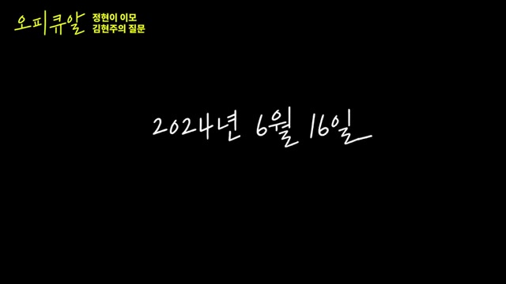

6월 16일 일요일, 청년 노동자의 어머니로부터 아들이 사망했다는 전화를 받았습니다.

그는 평소 병원에 갈 만큼 아픈 적이 없었지만, 일터에서 갑자기 쓰러져 세상을 떠났습니다.

그날 아침 8시에 출근하여 업무를 수행하던 중 점검을 하러 갔으며, 이후 쓰러진 상태로 발견되었습니다.

병원에 도착했을 때는 이미 심정지 상태였으며, 결국 사망이 확인되었습니다.

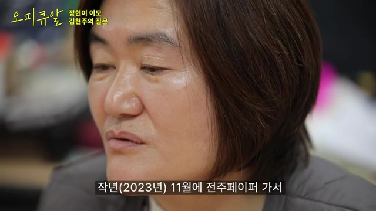

정현 씨는 작년 11월 전주페이퍼에 입사한 후, 12월 15일 정직원이 되었지만, 불과 6개월 만에 생을 마감하게 되었습니다.

그는 인생 계획으로 여행, 외국어 공부, 체계적인 재정 관리를 세웠지만, 갑작스러운 사고로 인해 모든 계획이 무산되었습니다.

월급을 다양한 통장으로 나누어 관리하며 철저한 재정 계획을 세워왔으며,

공군에서 1년 9개월간 복무한 후 월 64만 원에서 80만 원씩 저축해 2027년 2월 제대 시까지 6,000만 원을 모으는 목표를 가지고 있었습니다.

이러한 계획을 기숙사에서 어머니와 함께 나누었지만, 그의 꿈은 끝내 이루어지지 못했습니다.

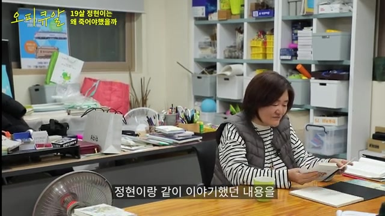

정현 씨는 6월 16일, 전주페이퍼 현장에서 작업 도중 혼자 점검을 수행하던 중 쓰러졌습니다.

회사는 이번 사고가 안전사고가 아니라는 입장을 내놓으며, 책임이 없다고 주장했습니다.

그러나 황화수소가 발생할 수밖에 없는 환경에서, 신입이라는 이유로 정현 씨를 혼자 작업에 투입한 것이 문제로 지적되고 있습니다.

그는 마스크를 착용하지 않은 상태에서 황화수소에 노출되었으며, 이로 인해 쓰러졌다고 전해졌습니다.

황화수소 누출이 확인되었으며, 측정기에서 최고 수치가 기록되었다는 보도가 있었습니다.

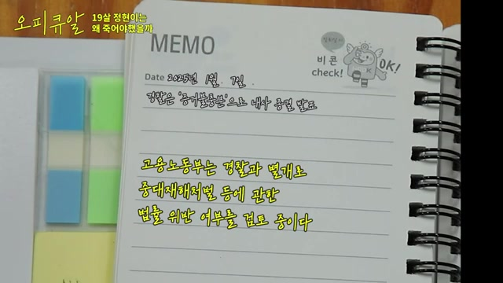

그러나 산재 승인은 이루어지지 않았으며, 중대재해처벌법도 적용되지 않아 피해자의 권리가 제대로 보장되지 않고 있습니다.

정현 씨와 같은 안타까운 죽음이 다시는 발생하지 않도록 하기 위해, 우리 사회는 무엇을 할 수 있을까요?

이를 해결하기 위한 실질적인 방법을 적극적으로 모색해야 할 때입니다.

---

## 문서번호: 5

### 제목: [우리는 어쩌면 누군가 조장한 혐오 속에서 살고있는 것은 아닐까? ](https://q4all.kr/redirect/detail/356bfdb9-1140-479d-a3d6-361f6c09604a)

**작성자:** 오피큐알OPQR - 키즈버스 지우맘
**작성일:** 2025-02-07 00:15:57 (금요일)

---

이 영상에서는 우리가 살아가는 사회에서의 혐오와 그 근본 원인에 대해 진지한 질문을 던지고 있습니다. 특히, 어린아이를 키우는 부모로서 느끼는 어려움과 사회적 편견을 극복하기 위한 실천적인 방법을 공유합니다. 이 과정에서 촉발된 다양한 사회적 편견과 이를 해결하기 위한 협력을 통해, 더 나은 공동체를 만들어 나가는 방향에 대해 고민합니다. 또한, 영상은 혐오가 어떤 방식으로 확산되는지에 대한 통찰력을 제공합니다. 결국, 서로에 대한 이해와 소통이 얼마나 중요한지를 일깨워주는 메시지를 전달하고 있습니다.

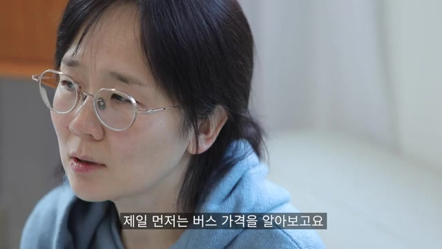

버스 비용은 66만 원이며, 큰 결정을 내리고 혼자 사용하기에는 부담스럽게 느껴집니다.

부모는 아이가 어린이집에 있는 동안 자유 시간을 가지게 됩니다.

17개월 된 딸아이를 키우는 부모로서, 외출에는 많은 고민이 따릅니다.

아이가 유모차를 잘 타지 않기 때문에, 외출을 신중히 계획해야 하며, 이로 인해 외출이 쉽지 않은 상황입니다.

갑작스러운 비상 상황에 대비해야 한다는 고민이 있으며, 이를 해결하기 위한 결단의 필요성을 느끼고 있습니다.

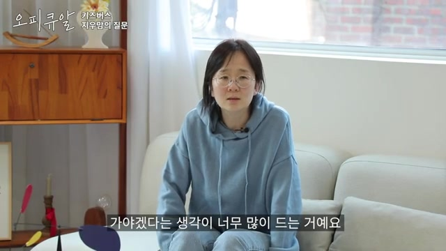

집회에 참가하기 위해 보온 장비, 간식, 기저귀 등을 준비하다 보니 짐이 상당히 무거워졌습니다.

택시를 잡지 못해 버스를 타고 지하철역까지 이동한 후, 사람들을 따라갔으나 정확한 도착지를 알지 못하는 상황이었습니다.

많은 사람들 속에서 아기를 데리고 이동하는 것이 위험하다고 느껴, 빨리 빠져나가야겠다고 생각했습니다.

같은 날 집회에 참여한 다른 사람들 역시 비슷한 상황에 처해 있었던 것으로 추정됩니다.

집회 후 귀가하면서 힘들었던 경험 때문에 다시는 집회에 나가고 싶지 않다는 생각이 들었습니다.

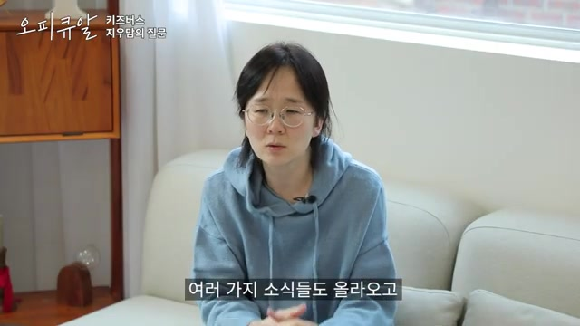

의안의 투표가 재적 의원 3분의 2의 의결 정족수에 미치지 못해 성립되지 않았으며, 이에 대한 우려가 제기되고 있습니다.

저자는 아이들과 장애인, 고령자들이 포함된 많은 사람이 있는 상황에서 편의성을 요구하는 것이 적절하지 않다고 판단했습니다.

이에 따라, 버스를 빌려 보호자들이 필요한 서비스를 제공하자는 아이디어가 떠올랐으며, 버스 비용은 66만 원으로 확인되었습니다.

이를 위해 부모들이 정보를 공유할 수 있도록 카카오톡 방을 개설하여, 버스 위치 등을 안내하는 등의 준비 작업을 진행하고 있습니다.

또한, 행사를 위해 필요한 현수막과 깃발을 직접 제작할 의사를 밝혔습니다.

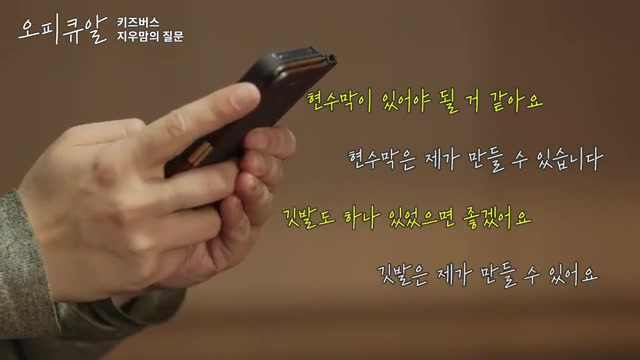

아이를 양육하면서 사회적 시선에 대한 지나친 걱정이 커지고 있습니다. 이는 다른 사람들이 자신을 어떻게 생각할지에 대한 불안에서 비롯됩니다.

'맘충'이라는 단어와 관련하여 혐오의 영역이 형성되었으며, 이는 아이에 대한 혐오로까지 이어지고 있습니다.

사회에서 느껴지는 불편함이 즉각적인 반응으로 나타나며, 공공장소에서의 압박감이 더욱 커지고 있습니다.

자주 사람들의 반응에 신경을 쓰게 되며, 불편함을 최소화하기 위해 사과하는 모습을 보이는 경향이 있습니다.

많은 경우, 사회적 편견과 표현되지 않는 불만이 합쳐져 사람들 간의 관계를 더욱 복잡하게 만들고 있습니다.

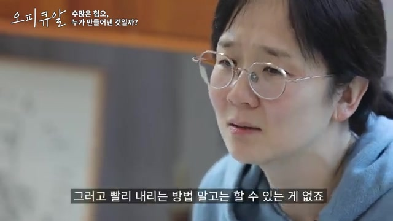

16개월 된 아동이 공공장소에서 울지 않도록 교육하는 것은 불가능하다고 판단됩니다.

'예스 키즈 존'과 같이 아이들이 눈치를 보지 않고 자유롭게 활동할 수 있는 공간이 필요하다고 느껴졌습니다.

공동체가 제대로 형성된다면, 아이를 키우는 과정이 보다 수월해질 것이라고 생각됩니다.

공공장소에서 사람들과 함께하며 질서를 지키는 경험은 우리가 어떤 존재가 되어야 하는지에 대한 자각을 갖게 해줍니다.

혐오표현과 사회적 약자에 대한 편견이 만연한 사회에서, 아동을 어떻게 안전하게 키울 수 있을지에 대한 고민이 지속되고 있습니다.

---

## 문서번호: 6

### 제목: [한국이 OECD 국가들 중 의료 후진국이라는 거 알고 계셨나요?](https://q4all.kr/redirect/detail/4d76feb6-c16d-488c-88bc-03ce15dfb400)

**작성자:** 오피큐알OPQR - 의사 전진한
**작성일:** 2025-02-07 00:16:03 (금요일)

---

이 콘텐츠는 한국의 의료 시스템이 OECD 국가들 중에서 가장 낙후된 수준이라는 사실을 이해하는 데 도움을 줍니다. 자료에 따르면, 한국은 공공 의료가 부족하고 과잉 의료가 발생하며, 인구당 간호사 수가 OECD 평균의 절반에 불과하다는 점이 강조됩니다. 또한, 의료 보장성이 낮고 중환자 치료 비용이 부담스럽다는 사실을 보여줍니다. 이러한 문제를 통해 의료 서비스가 단순한 돈벌이 수단이 아니라 사회적 공공 서비스로 인식되어야 함을 강조합니다. 나아가, 한국에서 공공 의료가 제대로 운영되기 위해서는 대규모 사회운동이 필요하다는 메시지를 전달합니다.

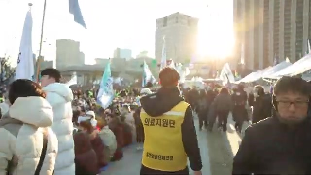

토요일과 평일 집회에 자주 참석하면서, 비상 상황에서도 많은 시민들이 광장에 모이는 모습을 목격했습니다.

군인들과 몸싸움을 벌여야 하는 위급한 상황 속에서도, 택시 기사들이 도와주며 희생정신을 발휘하는 모습을 보았습니다.

집회에 참여한 많은 분들이 저체온증과 기저질환으로 어려움을 겪었지만, 치료 대신 끝까지 자리를 지키기를 선택하셨습니다.

수많은 시민들의 헌신 덕분에 결국 승리를 이룰 수 있었을지도 모른다고 생각하며, 그분들께 큰 빚을 지고 있다고 느낍니다.

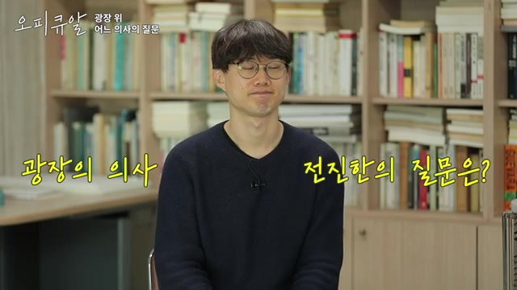

한국이 의료 선진국이라는 인식이 존재하지만, 실제로는 그렇지 않습니다.

OECD 통계에 따르면, 한국의 건강보험 보장성은 최하위 수준이며, 이는 한국 의료의 실질적인 문제를 반영합니다.

외국인들이 한국의 의료보험을 긍정적으로 평가할 때가 있지만, 이는 왜곡된 인식일 가능성이 있으며, OECD 헬스 데이터에서도 한국은 보장성이 가장 낮고 공공 의료 시스템이 취약한 것으로 나타났습니다.

한국은 CT나 MRI 같은 의료 기기의 수는 많지만, 의료 인력이 부족하여 간호 인력은 OECD 평균의 절반에 불과합니다.

이로 인해 간호사들은 과중한 업무에 시달리며, 제대로 식사를 하지 못하거나 화장실도 자주 가지 못하는 상황에 처해 있습니다.

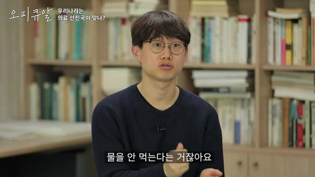

한국에서는 코로나19 당시 중환자실에 입원한 환자들에게 수천만 원에서 억대의 치료비가 청구되는 상황이 발생했습니다.

또한, 가처분 소득의 40% 이상을 의료비로 지출해야 하는 가구의 비율이 미국보다 높아, 재난적 의료비 지출이 심각한 수준입니다.

미국은 전국민 건강보험 제도가 없는 OECD 유일한 국가이며, 한국은 주요 선진국 중에서 아플 때 경제적 부담을 가장 많이 느껴야 하는 나라입니다.

한국과 미국은 시장 중심의 의료 시스템을 운영하고 있으며, 다수의 OECD 국가는 공적 의료 시스템을 도입하거나 중간 형태의 의료 시스템을 유지하고 있습니다.

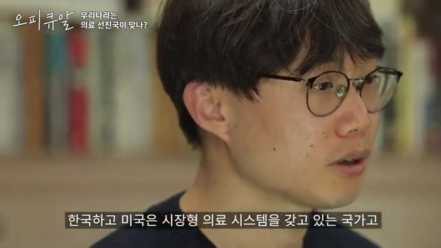

한국에서는 공공병원의 수가 매우 제한적이며, 주요 병원들은 대부분 민간병원인 상황입니다.

실제로 민간병원이 전체의 약 95%를 차지하고 있으며, 공공병원의 부족이 현실로 나타나고 있습니다.

코로나19 기간 동안 오히려 5%에 불과한 공공병원이 전체 환자의 70%를 치료했으며, 이는 공공의료 자원의 부족으로 인해 발생한 문제였습니다.

경제적으로 어려운 환자들은 치료 도중 병원을 떠나야 하는 상황을 겪었으며, 이는 코로나19 환자를 치료하기 위해 의료 자원이 재배치된 결과로 보입니다.

보수 언론의 주장과는 달리, 한국의 건강보험 시스템이 충분히 잘 운영되고 있다는 의견은 현실을 왜곡한 것이라고 볼 수 있습니다.

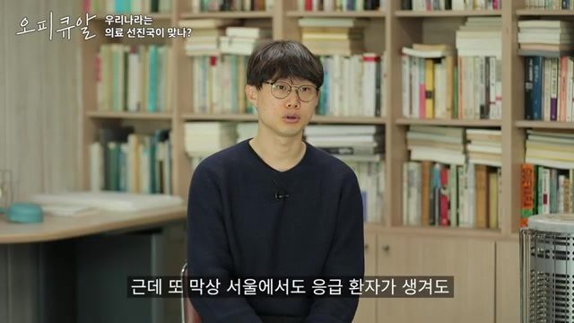

2025년까지 의과대학 정원이 2명 증원될 예정이지만, 현재 8.73%의 학생이 휴학 중이며 실습 수업도 중단된 상태입니다.

한국은 OECD 평균에 비해 인구당 의사 수가 적고, 의사 배출 속도가 느려 의사를 늘려야 한다는 주장이 제기되지만, 이는 의료 시스템 문제의 본질적인 요인은 아닙니다.

많은 의사들이 피부 미용과 성형 분야에서 활동하고 있으며, 환자를 치료하는 것보다 높은 수익을 올릴 수 있는 기회를 선호하는 구조적인 문제가 존재합니다.

지역 공공병원의 예산이 삭감되고 있으며, 각 지역에 병원이 부족한 상황이 지속되고 있어 개선이 쉽지 않은 실정입니다.

한국의 의료가 공공 서비스로서 기능하려면 대규모 사회운동이 필요하며, 이는 현실적으로 어려운 과제입니다.

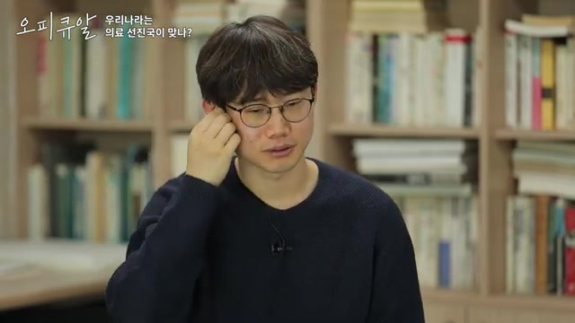

많은 시민들이 거리로 나와 다양한 물품을 제공하며, 의료 부스에는 의약품이 계속해서 지원되었습니다.

의료진이 부족한 상황에서 간호사들은 밤새 지원하겠다는 의사를 SNS에 올리는 등 적극적인 연대가 이루어졌습니다.

이러한 집회는 사회적 연대감을 강화하는 계기가 되었으며, 참여자들은 서로 연결된 사회의 일원임을 실감했습니다.

의료 부족 문제로 인해 먼 곳에서 온 사람들도 치료를 받을 수 있었으며, 이를 통해 사회가 긍정적으로 변화할 가능성을 확인할 수 있었습니다.

이러한 경험을 통해 더 많은 변화를 이끌어낼 수 있다는 희망을 발견한 의미 있는 시간이었습니다.

---

## 문서번호: 7

### 제목: [배달라이더들, 왜 이렇게 빨리 달리는지 궁금하셨죠?](https://q4all.kr/redirect/detail/0754d6b7-3d88-4407-850c-15b0dc384855)

**작성자:** 오피큐알OPQR - 플랫폼노동자 구교현
**작성일:** 2025-02-07 00:16:07 (금요일)

---

이 영상은 배달 라이더들이 왜 이렇게 빠르게 달릴 수밖에 없는지에 대한 깊은 통찰을 제공합니다.

라이더들은 생계를 유지하기 위해 주문량 증가와 이에 따른 운임 변동 속에서 위험한 선택을 강요받고 있습니다.

특히 플랫폼의 알고리즘이 배차 시스템을 공개하지 않으면서, 라이더들은 서로 경쟁하며 속도를 높일 수밖에 없는 구조적인 문제에 직면해 있습니다.

영상은 노동조합의 시각에서 이러한 현실을 조명하며, 라이더들이 안전보다 수익을 우선시할 수밖에 없는 이유를 설명합니다.

이를 통해 노동자들의 목소리를 직접 들으며, 플랫폼 노동이 가진 불합리한 구조를 이해할 기회를 제공합니다.

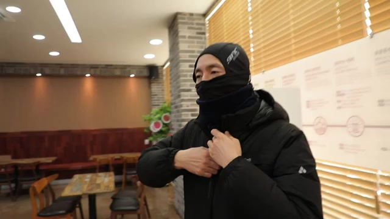

배달 라이더들은 긴급 상황 발생 시 즉각적으로 대응해야 하며, 생계를 위한 업무와 위험 대응을 동시에 고려해야 합니다.

정기적인 집회나 파업에 참여하는 것은 쉽지 않지만, 중요한 사안에 대해 목소리를 내는 것이 필요하다는 인식이 강합니다.

집회에 참여하려는 다양한 사람들이 서로 협력하며, 교통수단에 대한 논의도 이루어지는 등 공동체적인 연대감이 형성되고 있습니다.

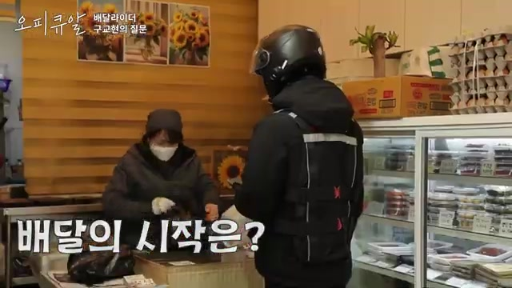

유튜브를 비롯한 다양한 플랫폼에서 배달 아르바이트를 홍보하는 광고가 많습니다.

이 광고들은 시간당 높은 수익을 올릴 수 있다고 강조하며, 자영업자나 직장인들이 부수입을 얻고자 배달 일을 고려하도록 만듭니다.

특히 생계를 위해 추가적인 수입이 필요한 사람들에게 배달 서비스는 가장 먼저 떠오르는 선택지가 됩니다.

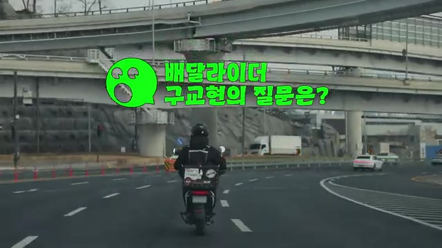

배달 라이더들은 플랫폼을 통해 주문을 배정받지만, 그 과정에서 많은 답답함을 느낍니다.

소비자는 가게에 직접 주문을 넣지만, 라이더들은 배차 방식이 어떻게 이루어지는지 명확하게 알 수 없습니다.

배달 주문이 라이더에게 할당되는 방식은 일종의 블랙박스처럼 숨겨져 있어, 라이더들 간 공정한 비교가 어렵습니다.

이에 따라 라이더들은 서로 다른 배달 콜 수의 차이를 이해하기 어려워하며, 이는 배달의 효율성과 수익성에도 영향을 미칩니다.

또한, 시간대에 따라 배달료가 변동하며, 특정 시간대에 주문량이 몰릴 경우 운임이 상승합니다.

경쟁이 치열할 때는 더 많은 수입을 얻기 위해 한 건이라도 더 배달해야 한다는 압박이 커집니다.

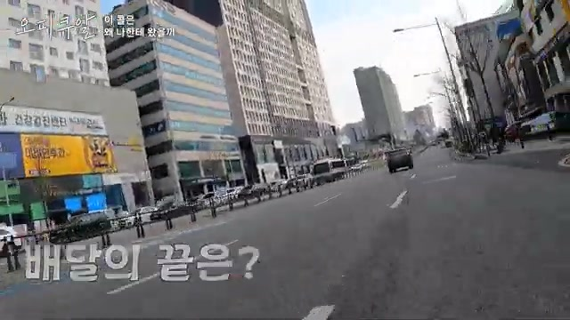

위험한 상황에서 신호를 무시하고 주행하는 것은 사고 위험을 높이는 주요 요인입니다.

라이더들 역시 스스로를 위험에 빠뜨리고 싶지 않지만, 현실적으로 그러한 행동을 강요받고 있는 것으로 보입니다.

노동조합에서는 빠른 배달 속도를 유지하는 라이더들에게 우선적으로 배차가 이루어지는 알고리즘이 존재할 가능성을 제기하고 있습니다.

또한, 다른 라이더들이 빠르게 달리는 모습을 보면서 자연스럽게 속도를 내야 한다는 심리적 압박을 받게 된다고 지적합니다.

플랫폼 회사들은 배차 방식이 무작위라고 주장하지만, 라이더들은 실제로는 특정 기준에 따라 배차가 이루어지고 있다고 확신하고 있습니다.

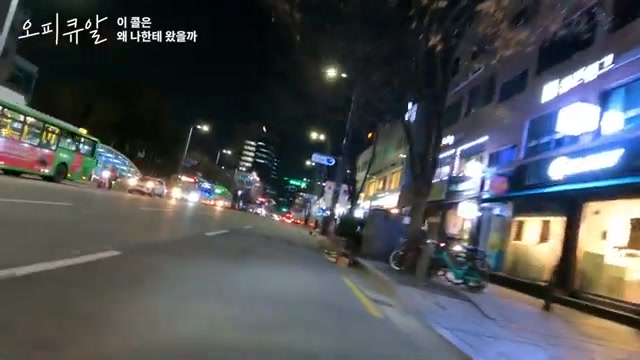

플랫폼 기업들은 배달과 관련된 모든 결정을 내리지만, 그에 대한 책임은 지지 않습니다.

라이더가 사고로 인해 배달을 완료하지 못할 가능성이 있으며, 이는 고객이 원하지 않는 상황입니다.

이러한 사고는 빈번하게 발생하고 있으며, 심지어 라이더가 사망하는 경우도 있습니다.

라이더들은 자신이 제공하는 서비스에 대해 정당한 보상을 받아야 한다고 생각하지만, 플랫폼이 책정하는 금액은 이를 반영하지 않습니다.

특히 배달 호출이 왜 특정 라이더에게 배정되는지에 대한 의문은 AI 알고리즘의 영향을 받는 것으로 보입니다.

---

## 문서번호: 8

### 제목: [뉴진스 하니는 왜 국감장에 나가야 했을까?](https://q4all.kr/redirect/detail/6bef0171-de69-4419-a8e3-28aa263bf9c4)

**작성자:** 오피큐알OPQR - 버니즈 이교현
**작성일:** 2025-02-07 00:16:12 (금요일)

---

뉴진스 하니의 국감장 참석을 통해 정치적 행동에 대한 젊은 세대의 목소리를 조명한 영상입니다. 하니는 자신의 의견을 솔직하게 표현하며, 단순히 지켜보는 것이 아니라 직접 참여함으로써 힘을 보태겠다는 결의를 나타냈습니다. 특히, 국회에서 발언한 노동법 관련 내용은 사회 정의를 위한 노력의 일환으로서 큰 의미를 지닙니다. 팬으로서의 지지를 넘어, 응원봉을 들고 직접 거리로 나선 그의 모습은 중요한 정치적 상황에서도 개인의 행동이 사회에 긍정적인 변화를 가져올 수 있음을 보여줍니다. 이 영상은 젊은 세대가 진정한 변화를 위해 어떻게 행동할 수 있는지를 탐구하는 중요한 메시지를 전달합니다.

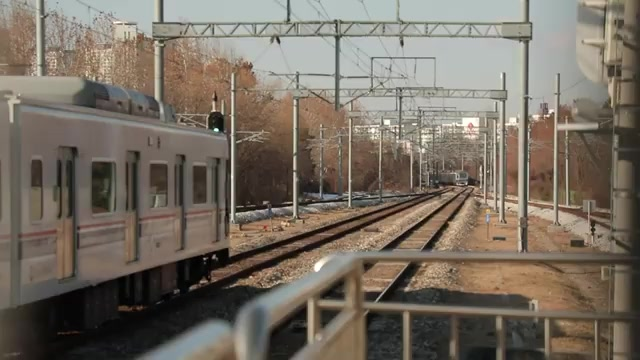

기말고사 시즌이었지만 공부에 집중하지 못해 결국 스트레스를 풀기 위해 외출하게 되었습니다.

시험은 치렀지만, 점수는 기대에 미치지 못했습니다.

작업 공간에는 음악과 영상 관련 장비들이 많으며, 최근에는 뉴진스 관련 굿즈로 가득 차 있습니다.

뉴진스 팬아트를 그리고, SNS에서 영상을 공유하며 일상을 즐기고 있습니다.

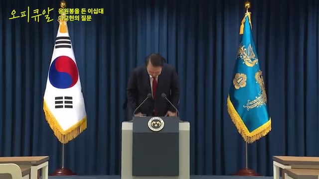

비상 개념 선포와 관련해 윤석열 대통령의 개헌 발표가 SNS를 통해 전해지며 큰 충격을 주었습니다.

윤석열 대통령이 대한민국 대통령이 아니라는 주장이 제기되었으며, 이는 정치적 활동을 금지하는 조항과 관련이 있습니다.

이러한 소식에 대해 뉴진스의 이교현은 두려움을 느꼈다고 밝히며, 실제 상황이 주는 충격에 대해 언급했습니다.

국회의원들이 국회를 넘어서는 모습을 보며 용기를 얻었고, 시민들의 저항을 보면서 스스로 행동할 결심을 하게 되었습니다.

이교현은 과거 여러 차례 집회에 참여한 경험이 있으며, 사회적으로 소수자들의 목소리가 반영되는 세상을 바라왔다고 전했습니다.

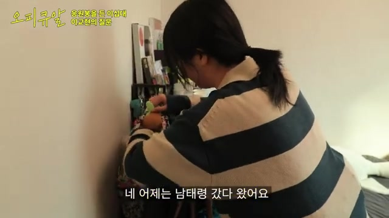

아이돌 팬들이 응원봉을 들고 국회 집회에 나선다는 소식을 듣고, 하니도 참여하기로 결심했습니다. 이는 ‘당신을 위해 새롭고 좋은 세상을 만들어 줄게’라는 의미를 담고 있습니다.

하니는 꺼지지 않는 응원봉을 들고 나가며, 국민의 힘을 보여주고자 하는 마음을 표현했습니다.

뉴진스의 굿즈를 챙겨 가며, 함께하는 팬들과 나누고 싶다는 마음으로 행사에 참여했습니다.

하니는 국회에서 노동법과 노동자의 권리에 대해 발언했으며, 당연한 요구를 하더라도 많은 에너지가 소모되는 현실에 대한 불합리함을 느꼈습니다.

집회에서 팬들과 함께하는 사교적 분위기를 강조하며, 응원의 의미를 되새기고 국회 앞에서 직접 시위에 참여한 경험을 공유했습니다.

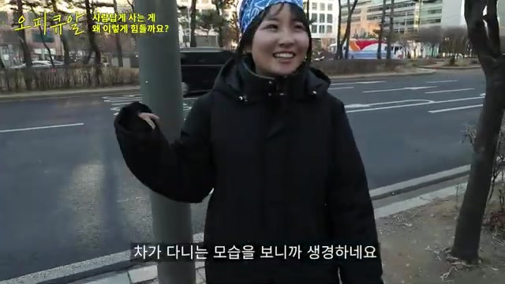

많은 사람들이 응원봉을 들고 ‘다시 만난 세계’를 부를 때, 깊은 감동을 느꼈습니다.

어두운 밤, 각자 다른 응원봉을 들고 불빛을 밝히며 박자에 맞춰 흔드는 모습은 강한 연대감을 만들어냈습니다.

이런 경험을 함께하면서 든든함을 느낄 수 있었습니다.

이 음악이 있는 싸움은 결코 외롭지 않을 것이라는 생각이 들었습니다.

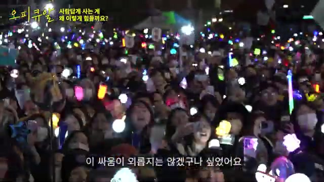

탄핵 이후 세상이 극적으로 좋아지지는 않았지만, 싸우는 사람들의 외로움은 줄어들 것으로 보입니다.

이에 따라, 사회적으로 조금 더 긍정적인 희망이 생겼다고 느껴집니다.

---

## 문서번호: 9

### 제목: [민주당이 낫다는 신뢰를 줄 수 있습니까?](https://q4all.kr/redirect/detail/40f96084-15be-4b96-910f-54ddad12a9bd)

**작성자:** 전문가Q - 정한울
**작성일:** 2025-02-07 00:23:43 (금요일)

---

### **정한울 박사(리서치디자이너 원장)의 질문Q**

### 

**1. 질문의 맥락**

 

**❍ 대한민국의 국가적 도전과제에 응답하고 있습니까?**

**① 정국 안정**

❏ 지금은 정국이 빨리 안정적으로 마무리 되도록 만드는 것이 가장 중요함

● 비상계엄 이후 경제적 타격, 일반 시민들의 체감 커짐

● 단기적으로 신속히 탄핵 결정이 되어 다음 단계로 신속히 넘어가는 것이 필요함

 

**② 누구나 공유하는 대한민국 공동체의 의제 설정**

❏ 현재까지 막대한 재정 투입과 노력을 했음에도 실마리를 잡지 못하고 있는 국가적 도전과제, 진보와 보수 정부 모두의 책임

● 인구가 줄면서 대한민국 자체의 소멸 우려 높아짐

● 수도권으로 인구 집중 가속화, 반면 지방은 공동화 되어 지방 소멸 문제는 매우 심각함

 

**③ 민주당의 신뢰 위기**

❏ 국가적 도전 과제에 대해서 민주당이라고 딱히 나아질까에 대한 믿음 없음

● 국민들에게는 국민의힘이나 민주당이나 동일하게 무능하게 느껴짐

● 민주당은 국민의힘과 대비해 탄핵 등, 큰 사고를 치지 않는다는 믿음은 있지만 국가적 도전과제를 해결할 의지와 능력이 없다는 인상

❏ 과연 지금까지 해왔던 것처럼 그렇게 성장할 수 있을지 의문, 국가 리더십이 부재한 상황임

● 국가적 도전 과제는 실력 있는 정부가 안정적으로 집권해 나가면서 일관되게 뭔가 해나가야 될 때 해결이 될 수 있음

 

### **2. 해결방안**

 

**❍ 민주당이 대한민국 국가 리더십의 자격을 갖춰야 합니다.**

 

**➀ 민주당의 통렬한 자기반성 필요**

❏ 자기반성과 문제점 진단을 하지 않은 민주당이 국가적 도전 과제들을 안정적으로 해나갈 준비가 되어 있는지 반문할 수밖에 없음

● 민주당의 경우 지난 촛불 탄핵 이후 5년 만에 정권을 빼앗김

● 당시 20년 집권론도 언급되는 상황이었으나 5년 만에 정권을 빼앗기면서도 민주당 스스로 아주 처절하고 통렬한 자기반성과 그 문제의 지점을 확인하는 과정은 없었음

 

**➁ 국민 소통·설명 강화해야**

❏ 국가적 도전 과제들에 대해 그 문제와 해법을 국민들에게 지속적으로 알려야 함

● 국민들은 각 개인이 힘겹게 일상을 살아가고 있기 때문에 국가적 도전 과제에 대해 생각할 여유가 없으므로 정치권에서 진단하고 어떻게 해결해야 할지 국민들에게 제안하고 끊임없이 설명해야 함

 

**➂ 리더의 생각을 바꿔야**

❏ 가장 중요한 것은 리더의 생각을 바꾸는 것이며, 올바른 리더십을 통해 조직이 변할 수 있는 것임

● 김대중 대통령의 경우 정보화 사업, 한일 관계 등 국가적 도전 과제를 정리하고 추진 방향을 제시하며 중단 없이 과제를 완수하는 리더십을 보임

● 노무현 대통령의 경우 국가적 도전 과제에 대해 끊임없이 국민들에게 제안하고 설득하는 리더십을 보임

 

**➃ 과거가 아닌 미래 준비가 중요**

❏ 해결해야 될 과제가 과거 청산 보다 미래에 대한 국가적 도전 과제가 되어야

● 국가적 도전 과제에 대한 준비 방안과 추진할 세부 정책과제 안을 만들어 국민들에게 제안하고, 사회적 합의를 통해 지속적으로 추진한다면 20년 집권도 가능할 것임

● 과거 청산에 집중하면 미래로 가는 것이 아니라 상대 정당의 잘못과 반사이익에 기대는 구조가 되기 때문에 안정적인 장기 집권 보다는 집권 주기가 오히려 짧아지게 됨

❏ 현재의 탄핵 국면도 각 정당이 국가적 도전과제를 논하기 어려운 상황에서 결국 집권 세력이 바뀌게 되는 것임

● 이번 탄핵 이후 다음 집권세력이 또 적폐 청산에 골몰하여 과거에 머무른다면 지난 촛불 탄핵 이후의 상황이 다시 재연될 수 있음을 기억해야 할 것임

 

**➄ 국민이 피부로 느끼는 문제부터 해결하는 것이 중요**

❏ 현재 탄핵 국면에서 국민들이 민주당에 지지를 보내는 것은 정당 능력에 대한 지지가 아닌 반사이익일 뿐임을 잊지 말아야 하며, 국민들이 피부로 느끼는 삶의 문제에 대해 민주당이 어떤 질문과 답을 가지고 있는지 설명해야 할 것임

● 국민의 삶과 직접적으로 관계가 없는 공수처 설치, 검수완박 등 정치권의 이슈는 국민들이 철저하게 외면하며, 촛불 혁명 이후 5년 만에 정권이 교체된 것이 그 증거임

 

### **3. 2025년 신년 이후 여론변동에 대한 의견**

 

**① 탄핵여론의 반전?**

❏ 2024년 12월3일부터 2025년 신년조사로 진행된 12월말까지 조사에서는 국회탄핵가결에 대한 찬성여론이 73~78%로 압도적

❏ 신년 들어 여론의 반전

● 윤석열 지지율 40%의 충격(ARS조사 보수 과표집과 측정 워딩의 문항

● 탄핵 인용 여론도 약화

❏ 탄핵과 윤석열 대통령 체포 수사를 지지하는 여론이 우위인 구조사 변한 것은 아님

● 2024년 연말까지의 탄핵 우위여론의 약화의 핵심은 탄핵에 이탈했던 보수층의 재결집

**② 보수 엘리트/대중 : 2016년, 2017년 박근혜 탄핵의 학습효과**

● 최대한 결집해서 대응해야 한다는 교훈

● 탄핵을 둘러싼 보수진영의 단합된 대응이 중요, 분열하면 필망

**➂ 더불어민주당 포비아 요인들**

● 탄핵 스텝 꼬인 “내란죄=탄핵 프레임” 적용

◦ 계엄초기 탄핵에 찬성했던 이탈보수을 포용할 수 있는 탄핵프레임 개발이 중요.

◦ 윤석열 대통령의 비상계엄이 비상대권의 비헌법적인 사용(국문란)이라는 인식에 보수층내에서도 상당한 동의 있었음

◦ 처벌의 강도가 사형까지 가능한 극형 범죄이고 이에 윤 대통령과 친윤의 반발 (1) 재판 끝나지 않았다 (2) 경고이자 해프닝일 뿐 내란의 의도와 실질적인 행위 없었다며 저항

◦ 다툼의 여지가 있고 시간이 걸리는 공방 예고: 이에 민주당에서 탄핵소추 근거에서 내란죄 제외→친윤과 보수의 결집의 논거로 작동 (내란죄를 근거로 탄핵을 주장하는 것은 무리했다는 것을 민주당 스스로가 인정한 것이다. 내란죄를 빼면 탄핵은 무효다)

◦ 그 결과 민주당이 제기한 “내란죄=탄핵” 프레임까지 인정하기는 쉽지 않고 보수층 결집의 명분과 동기 제공.

● 탄핵 남발: 헌법재판소에 계류된 탄핵심판 대통령 포함 10건

◦ 한덕수 총리 탄핵에 이어 윤 대통령 체포, 헌법재판관 임명, 특검법안 수용을 압박하며 최상목 대행에 대한 탄핵 군불

◦ 대통령 포함 감사원장, 법무부장관, 중앙지검장 외 검사 2인, 방통위원장 등 총 헌법재판소에 계류된 탄핵만 10건

● 더불어민주당의 초헌법적인 대선 강행 분위기

◦ 대통령 탄핵으로 분산되었지만, 계엄전까지는 사법부의 재판결과와 무관하게 더불어민주당은 차기 대선주자로 이재명 대표를 상수화

◦ 유죄 시에 대한 대비나 예비후보들의 경쟁이 없어 재판에서 유죄가 나와도 출마를 강행하겠다는 의사로 읽힘

◦ 대한민국 헌법의 삼권분립의 원리를 정면으로 부정해서라도 이재명 대표의 대선 출마를 강행할 것 같다는 의도 우려

◦ 만약 그렇다면 이는 비상계엄 못지 않은 비헌법적인 행위이며 시민저항의 대상

❏ 정당지지율 더불어민주당 우위에서 국힘=민주당 균형국면으로

● 이를 보수과표집 만으로 환원해서는 안됨

◦ 연말부터 더불어민주당 지지율이 하락하고 국민의힘 지지율이 상승한 폭이 각 조사에서 보수의 증가폭(과표집) 보다 훨씬 큰 상황

◦ 그 동안 계엄과 탄핵국면에서 후순위로 밀렸던 더불어민주당 포비아 요인들에 대한 불만표출이 대통령의 체포 이후(탄핵절차의 본격화)에 본격화되는 것으로 볼 수 있음

● 대통령의 체포와 탄핵절차가 본격화되면서 이제 국정안정과 정상화의 책임을 더불어민주당에 묻는 경향이 강해질 것임

---

## 문서번호: 10

### 제목: [혁신 성장을 위한 리더십과 거버넌스 운영 가능합니까?](https://q4all.kr/redirect/detail/5f03176c-48eb-4d16-a30a-809c3d28ce5b)

**작성자:** 전문가Q - 하준경
**작성일:** 2025-02-07 00:27:06 (금요일)

---

**하준경 교수(한양대학교 경제학부)의 질문Q**

 

**1. 질문의 맥락**

 

**❍ 대한민국 경제는 혁신 성장을 하고 있습니까?**

 

**① 지속적인 경제 성장 중요**

❏ 성장하지 못하면 새로운 기회가 없고, 기회가 없으면 약한 사람들과 젊은이들에게 고스란히 피해가 가는 구조임

● 경제적으로 성장이라는 것 자체가 중요함

● 과거에는 투자를 해야 할 곳이 자명했으나, 선진국에 진입한 후에는 어디에 투자해야 할지 알기 어려움

● 새로운 돌파구를 찾아야 하며, 그 해결책이 바로 혁신 성장임

 

**② 혁신 성장은 새로운 지식과 기술이 핵심**

❏ 기술 혁신을 하는 사람에게 적절하게 보상함과 동시에 기존 기득권과 충돌을 적절하게 조정하는 시스템이 필요함

● 새로운 지식과 기술에 대한 보상이 미흡한 것 자체가 혁신 성장의 장애가 되는 것임

● 기존 기득권 기업이 작은 기업의 혁신 기술을 탈취하거나, 이해관계에 있는 기득권의 저항이 공공연하게 발생하는 실정임

 

**③ AI 및 디지털 대전환, 에너지 문제는 우리가 직면한 큰 과제**

❏ 4차 산업혁명은 혁신 성장의 기회를 제공하지만 개발시대 스타일의 국가 주도 혁신은 불가능함

● 현대는 복잡한 사회이고 서로의 이해관계가 매우 첨예하게 얽혀 있기 때문에 어느 한 주체(국가)만의 주도로 혁신을 이루기 어려움

● 결국 국가, 기업, 시민사회(전문가, 시민단체, 이해집단 등)가 함께하는 거버넌스를 구성·운영하는 것이 중요함

❏ 에너지 문제는 국익 관점에서 봐야 하며, 방법을 다양화하는 지혜가 필요함

● 현재 우리 사회에서 에너지 문제는 너무 과도하게 정치화 되어 있어 정권에 따라 정책의 편향성이 크게 나타남

 

**2. 해결방안**

 

**❍ 민주당이 혁신 성장을 위한 리더십과 건버넌스 운영에 힘써야 합니다.**

 

**➀ 리더십을 바로 세우는 것이 급선무**

❏ 이해관계에 있는 주체들 간의 충돌을 조정하고 서로 Win-Win 할 수 있도록 하는 리더십이 필요함

● 기득권 강자의 힘에 논리에 의종할 때 피해를 볼 수밖에 없는 중소기업과 자영업자들의 상황을 방치해서는 안 됨

● 각자 도생이 아닌 상생할 수 있고 서로 보완할 수 있는 시스템을 만들어야 함

 

**➁ 혁신적 거버넌스 운영 필요**

❏ 새로운 길을 열고, 길을 만들고, 함께 그 길을 달릴 수 있도록 국가, 기업, 시민사회가 함께 해야 함

● 불필요한 규제를 개선하고 필요한 인프라를 구축해야 하고, 공정 경쟁을 보장하고 약자를 배려하는 환경을 조성해야 하며, 부족한 역량에 대해서는 강화할 수 있도록 지원하는 체계를 마련해야 함

 

**➂ 혁신 기업 투자 강화**

❏ 공공 부문의 개혁과 금융 부문의 개혁을 통해 혁신 기업을 만들 수 있는 투자를 강화해야 함

● 배달의 민족, 쿠팡, 토스 모두 외국 자본 투자에 의해 성장한 혁신 기업이라고 볼 때, 앞으로 우리의 금융이 부동산 투기로 이익을 보는 구조가 아니라 혁신 기업을 통해 이익을 볼 수 있는 시스템으로 전환할 수 있도록 시급히 개혁해야 할 것임

---

## 문서번호: 11

### 제목: [1987년 민주화 이후 한국 공무원들의 정책 역량과 정치적 중립성은 왜 점점 악화되고 있는가?](https://q4all.kr/redirect/detail/15246111-be96-498f-a603-c31647f95b3c)

**작성자:** 전문가Q - 신현기
**작성일:** 2025-02-07 00:33:15 (금요일)

---

**신현기 교수(가톨릭대학교 행정학과)의 질문Q**

 

**1. 질문의 맥락**

 

**❍ 공무원들은 왜 정치적으로 중립을 지키지 못하고 있습니까?**

 

**① 공무원의 정치적 중립**

❏ 헌법 제7조 제1항에 따라 공무원은 국민 전체에 대한 봉사자이며 국민에 대한 책임을 져야 함

● 위 조항이 이른바 공무원의 정치적 중립성 조항임에도 이번 탄핵 사태에서도 드러났지만 공무원의 정치적 중립성이 굉장히 위태롭고 혼란스러우며 국가기관 간의 갈등도 발생하고 있는 실정임

● 우리가 1987년 민주화 이후로 이 조항을 어떻게 실현하는지에 대해서 아직 관행이라든지 개념 같은 것들이 확립되지 않은 상황임

 

**② 정치권력의 주기적 교체와 공무원에 대한 정치보복**

❏ 정치권력의 주기적 교체와 공무원에 대한 정치보복이 이루어지면서 공무원의 정치적 중립에 영향을 줌

● 특히 지난 정부의 핵심 추진 과제의 경우 다음 정부에서 단죄의 대상이 되고 있어 중장기적인 국정 과제 추진이 어려운 상황임

● 1987년 민주화 이후 민주주의 체제가 자리잡으면서 정치권력이 주기적으로 교체될 때마다 정치보복의 악순환이 되풀이되자 그간 공무원이 주도했던 국가 정책이 5년 단위로 크게 바뀌면서 공무원들이 큰 혼란에 빠짐

● 권위주의 체제에서 권위적 정치 리더십 아래서 행정부 주도의 정책 과정에서 민주화 이후 의회와 정치 주도의 정책 과정으로 바뀌면서 공직사회는 권력 교체기마다 이른바 권력에 줄 서기, 정책의 정치화 등으로 국가 역량이 떨어지는 결과를 초래함

 

**③ 검찰의 정치적 중립 상실**

❏ 1987년 민주화 이후 군이 사라진 자리에 사실상 통제받지 않는 권력으로 변신한 검찰은 이러한 공직사회의 변신을 잘 보여줌

● 정권 초에는 날카로운 사정의 칼이 되었다가 정권 후반기가 되면 오히려 정권을 공격하는 사례가 반복되고 있는 실정

 

**2. 해결방안**

 

**❍ 정치의 합의 수준을 높이고, 행정 공무원들의 전문직업주의(professionalism)를 강화해야 합니다.**

 

**➀ 양극화된 정치의 합의 수준을 높이는 노력 필요**

❏ 정치의 합의와 우리 사회의 합의 수준을 높여야 행정의 혼란을 막을 수 있음

● 정치 자체의 합의 수준이 좁아지면 정책을 추진하는 행정 관료들 내부에 기회주의가 발생하고, 한 몫 잡아 출세하겠다는 행정 관료가 많아져 고착화 되면 정책의 정치화가 가속화 됨

 

**➁ 공무원 집단 자체의 전문직업주의 강화 필요**

❏ 좋은 정부를 만들기 위해서는 정치뿐만 아니라 전문성과 책임성이 확보된 행정이 결합해야 함

● 한국 공무원들의 가장 대표적 행태는 복지부동이며, 복지부동은 현 정부에서 괜히 나서면 다음 정부에서 단죄된다는 인식으로 ‘한 것도 아니고 하지 않은 것도 아닌 어정쩡한 태도’를 취하는 것임

● 공무원 집단이 중심을 잡고 전문적인 행정을 통해 국가 중장기 과제를 책임성 있게 완수해야 할 것임

 

**➂ 제도적 장치 마련 후 선례를 만들고 관행화시키는 작업 중요**

❏ 정교한 제도적 장치만으로 모든 것을 해결할 수 없으므로 제도의 취지에 맞게 제도적 절제의 선례를 만들고 관행화시키는 것이 중요함

● 미국의 경우 우리나라 보다 탄핵의 조건이 포괄적임에도 탄핵 경험이 없고, 우리는 벌써 세 번째 진행 중임

● 탄핵과 같은 제도를 당파적으로 활용하는 선례를 만들면 이후 다시 하는 것이 쉬워지고, 당파적으로 남용될 가능성이 높기 때문임

● 민주주의 체제를 운영하는 데 있어서 제도적인 정합성도 중요하지만, 어떤 선례와 관행을 남기느냐 하는 것도 매우 중요함

 

**➃ 의회를 통한 시민의 통제와 권력기관 간 견제와 균형이 중요**

❏ 시민적 통제는 결국 의회라는 제도를 통해 이뤄질 것이며, 시민적 통제 아래서 권력 기관 간 견제와 균형이 이뤄져야 함

● 시민적 통제라는 것이 자칫 여론 정치와 포퓰리즘으로 귀결될 수 있는 만큼 시민의 요구는 결국 의회라는 제도로 수렴되는 것이 바람직함

● 예컨대 국가 예산의 경우 공무원의 전문성을 인정하여 예산 편성권은 행정부가 갖지만, 이에 대해 의회가 심의권과 의결권을 갖는 것처럼 시민의 통제를 전제로 한 상태에서 권력기관 간의 수평적 책임성이 확립돼야 함

 

**❍ ‘정치 보복을 하지 않겠다’가 대선 후보의 첫 번째 공약이 되야 합니다.**

**➀ 탄핵 이후 민주당이 집권한다면 첫 번째 공약으로 “정치 보복을 하지 않겠다.”가 되어야 정치가 복원되고, 공무원의 정치적 중립 확보 관행 확립**

❏ 정치는 법과 관행 혹은 제도로서 안 풀리는 문제를 상호 양보와 협상을 통해서 풀라는 능동적인 행위임

● 우리는 오랫동안 민주화 투쟁의 경험을 통해 민주화를 이루어 왔기 때문에 정치에서의 협상을 굉장히 타락한 행위로 보는 시각이 존재

● “거대 악과 맞서는 순결한 우리”라는 순결주의 정치관이 있는 것인데, 이에 바탕한 선악의 대결정치가 협상과 타협을 터부시함으로써 결국 정치의 문제를 법정으로 끌고 가는 것임. 정치는 순결한 것이 아니라 서로 주고받는 것이라는 점을 이해할 필요가 있음

● 정치의 협상 과정을 법정으로 가지고 가는 순간 정치는 사라지게 되는 것이며 정당의 존재 이유도 없어짐

❏ 이미 김대중 대통령의 정치 보복을 하지 않겠다는 약속과 이를 이행했던 선례가 존재함

● 정치권에 이른바 대화와 타협, 양보와 협상이 생기고 그 결과로서 정치의 안정이 온다면 국가의 정책 생산성이 높아져 결국 국민들이 인정하는 상황으로 귀결될 것임

 

**➁ 정치인은 지지하는 국민의 의사를 대변하되 국가의 장기적 이익을 위해 지지자와 맞설 각오도 필요**

❏ 정치인의 자율성을 확보한 상태에서 반대 진영과 협상할 수 있어야 정치가 복원

● 정치는 시민들의 의견을 대변하는 것이기도 하지만 시민의 의견이 항상 옳다고 말할 수는 없음

● 국가의 장기적인 미래를 위해서 무엇이 옳은지에 대한 균형이 중요하며, 정치인들이 무조건 강성 지지층의 뜻만 따르게 한다면 그건 정치라고 말할 수 없음

● 정치인이 대부분은 시민의 의사를 따르지만, 국가의 중장기 이익의 관점에서 여론과 상충될 때에는 과감하게 다른 선택을 할 수 있어야 하며, 왜 그런 선택을 했는지 끊임없이 시민들을 설득해야 함

---

## 문서번호: 12

### 제목: [지난 62년의 변화와 비교해 볼 때, 앞으로 5년 후의 변화가 더 클 거라고 생각하지 않나요?](https://q4all.kr/redirect/detail/327eb5d7-baff-4703-9e79-c9073e246bc6)

**작성자:** 전문가Q - 홍성국
**작성일:** 2025-02-07 01:05:03 (금요일)

---

**홍성국 전 국회의원(더불어민주당 국가경제자문회의 의장)의 질문Q**

**1. 질문의 맥락**

 

**❍ 우리 사회가 혁신 성장을 하지 못하고 있는데, 누구의 탓인가요?**

 

**① 외부 충격 없이 경제 성장률 2% 아래로 곤두박질**

❏ 선진국을 넘어 선망국가, 선도국가가 되기 위해 가장 중요한 것은 잠재성장률을 높이는 것임

● 우리 사회에 많은 갈등이 나타나고 있는 것도 성장이 정체되고 있어서 이며, 어떻게 성장할 것인가에 대한 견해가 서로 다른 상황

● 잠재 성장률을 어떻게 하면 높일 수 있을지 모든 국민들이 함께 뜻을 모으고, 정책으로 만들어 과감하게 실행해야 하는 시점

 

**② 혁신 성장은 현재 당면한 시대적 과제**

❏ 혁신 성장을 해야 분배가 가능하고, 분배를 한다는 것은 포용 성장을 한다는 것이므로 이런 선순환 고리를 만들어 가는 게 현재 당면한 시대적 과제

● 사회의 많은 갈등을 해결하기 위해 진보 진영에서는 복지를 늘리자고 하는 포용 성장을 주장하나, 이를 위해서는 재원이 필요함

● 혁신 성장과 포용 성장의 선순환을 통해 잠재성장률을 높이고 질적인 성장을 동시에 추구해야

● ‘왜 성장을 하느냐? 분배하기 위해서’, ‘왜 분배를 하느냐? 분배를 하면 많은 사람들이 돈을 써서 다시 성장이 커지므로’ 모두 알고 있으나 우리 사회는 이런 기초적인 대화마저 하지 않고 있는 실정

 

**③ 거시적으로 대한민국을 냉정하게 점검해야 하는 시점**

❏ 한국의 성장률이 정체되는 상황 속에서 우리의 시스템을 전환시켜야 함에도 불구하고 진영 간 ‘네 탓 공방’으로 실기하고 있는 실정

● 2025년의 한국은 진영 간 갈등이 심화되고 있는 상황에서도 갈등의 이유를 찾기 보다는 서로 더 많은 갈등을 유발하기 위해 몰입하고 있는 모습

● 경제 개발을 통해 지난 62년간 성장하여 세계가 인정한 대한민국이 현재는 내부의 갈등에 골몰해 방향성을 잃은 상태가 된 것이므로, 작은 것에 집중하지 말고 뒤로 물러나서 큰 그림을 봐야 하는 시점

● 정치, 관료 집단, 언론, 민간까지 사회의 모든 주체가 현재 우리 모습을 냉정하게 점검하고, 현재의 어려움을 극복할 뿐만 아니라 우리 후손까지 잘 살 수 있는 거시적 관점의 정책에 대해 논의해야 할 것임

 

**2. 해결방안**

 

**❍ 혁신 성장을 위한 사회 전체의 대전환이 필요. 특히 AI를 비롯한 미래성장 동력, 제조업의 혁신, 한류의 활성화가 중요**

 

**➀ AI를 비롯한 미래성장 동력에 대한 과감한 투자 필요**

❏ AI를 비롯한 반도체, 2차전지, 미래차, 로봇 등 미래성장 동력은 혁신 성장의 가늠자

● 한가지만으로 성장은 불가능. 하나의 만능 처방은 없음. 거국적인 차원의 맞춤형 지원 정책 필요

● 재정의 적극적 역할만이 아니라 산업 구조조정과 교육 시스쳄 개선 등이 필요

❏ IMF 외환위기를 슬기롭게 극복한 김대중 대통령의 인터넷, 벤처 투자의 선례를 참고해야 함

● 대한민국이 미래로 가는 교두보로써 국가적으로 AI를 비롯한 미래 성장동력에 대한 투자를 과감하게 하고, 기업은 생산 공정, 마케팅 공정 등 모든 분야에 AI 등 혁신기술을 적극적으로 활용할 뿐만 아니라 민·관이 함께 집중적으로 투자하는 환경을 조성해야 할 것임

 

**➁ 제조업의 혁신 필요**

❏ AI와 결합한 제조업을 통해 한국 제조업이 재도약해야 함

● 한국이 제조업 강국임에도 해당 분야에서 다른 나라와의 경쟁, 특히 중국과의 경쟁에서 크게 밀리고 있는 상황임

● 일본에서 소재 부품을 들여와 한국에서 중간재를 생산하고 그 중간재로 중국에서 완제품을 만들어 세계 시장에 수출하는 구조가 깨진지 오래 된 상황에서 지난 8~9년간 제조업 분야의 혁신은 없었음

● 우리는 현재 변화(change)가 아닌 전환(transition)의 상황을 맞이하고 있으며, AI의 발전 속도가 거의 무한대로 빠르기 때문에 제조업에 AI를 장착하여 제조업 혁신을 이루어 내야 할 것임

 

**➂ 한류의 활성화 필요**

❏ 계획적이고 체계적인 한류의 활성화가 필요

● 무엇이든 앞에 K를 붙이면 세계적으로 우월한 상황이지만, 한류의 미래에 대한 큰 설계가 없는 주먹구구식 한류 사업은 지속가능성을 담보하기 어려움

● K-팝, K-드라마, K-푸드, K-뷰티, K-패션 등 다양한 분야에서 한류가 세계적으로 유행하고 있지만, 국내에서 이를 체계적으로 뒷받침할 수 있는 대학, 학과 및 맞춤형 교육제도가 부재하여 우수한 인재 양성을 체계적으로 하지 못하고 있는 실정임

● 무역진흥공사와 같은 형태로 한류를 대외적으로 홍보하는 기관을 설치하여 운영할 필요가 있음

❏ 한류의 활성화를 통해 K-AI과 K-제조업이 동반 성장하는 국가 전략적인 혁신 성장의 생태계를 구축해야 함

● 한류는 고용 유발 효과가 크고 해외로 확산되는 경우, 제조업 수출도 증가하는 부수적인 효과가 발생함

---

## 문서번호: 13

### 제목: [얼어붙은 대한민국, 어떻게 하면 혁신적인 대한민국으로 만들 수 있을까요?](https://q4all.kr/redirect/detail/4043390a-8a5e-45d4-b686-3d3a57ad8fd0)

**작성자:** 전문가Q - 윤태범
**작성일:** 2025-02-07 01:07:04 (금요일)

---

**윤태범 교수(한국방송통신대학교 행정학과)의 질문Q**

 

**1. 질문의 맥락**

 

**❍ 공직사회는 왜 혁신하지 않고 복지부동 하나요?**

 

**① 정부, 기업, 시민사회 전 영역에서 혁신성 실종**

❏ 우리는 현재 실패를 회피하고 안정을 지향하는 사회에 살고 있습니다. 혁신은 미래의 관점이며, 미래에 대한 희망의 표현이라는 점에서, 혁신성의 실종은 미래에 대한 희망의 실종입니다.

● 혁신성은 미래 지향적인 것으로, 미래에 대한 기대와 희망이 있을 때 지금 문제를 인식하고, 이를 해결하기 위한 혁신을 하고자 하는 것입니다.

● 그러나 도전으로서의 혁신이 늘 성공하는 것은 아니며, 실패의 확률도 매우 높습니다. 때문에 혁신은 지금에 안주하지 않고 도전하는 것으로, 실패의 가능성도 수용하는 것을 전제로 합니다.

● 혁신성의 실종은 대한민국 전 영역에서 나타납니다. 혁신성이 실종된 공무원의 복지부동이 초래한 정부와 정책의 위기, 기술혁신이 실종된 대기업들의 위기 등. 우리를 둘러싼 수많은 위기들은 국가 외부의 영향도 있지만, 우리 국가 내부의 혁신성의 실종으로 초래된 것들이 다수일 것입니다.

 

**② 그간 대한민국을 선진국 반열에 올렸던 가장 중요한 동력은 ‘사람’, 즉 ‘혁신’**

❏ 혁신적인 국민이 대한민국의 성장을 가능하게 하였고, 대한민국이 전세계적으로 혁신국가의 상징이 될 수 있었던 핵심 기반입니다. 혁신에 기반한 국가 성장을 만든 인적 자본이 핵심입니다. 그러나 최근 혁신적인 사람들이 존중받기 어려운 환경이 조성되고 있습니다. 안정이 혁신 혹은 혁신적 도전보다 우선시하는 혁신 회피의 사회가 되고 있습니다.

● 정치적인 측면에서는 정권 교체에 따른 반복된 정치적 사정(예를 들어서 감사를 명분으로 하는 정치적 사정)이 정부와 공직사회 전반에서 혁신의 가능성을 제거합니다. 이로 인하여 공직사회 전반에 걸쳐서 혁신에 대한 무감각 혹은 복지부동과 무사안일 등이 만연한 실정입니다. 정권 교체 후 반복되는 前정부의 정책에 대한 감사가 혁신성을 제거하는 대표적인 요인으로 작용합니다.

● 게다가 사회 전반에 걸쳐서 공동체 지향적인 의식 보다는 자기 자신의 이익을 우선시 하는 자기중심적 사고와 이익의 추구가 급속하게 확장되고 있습니다. 함께 사는 공동체의 유지와 성장을 가능케하는 혁신적 사고와 노력이 급속도로 감소하고 있습니다.

● 혁신에 본질적으로 내재되어 있는 실패의 가능성은 사회에서 긍정적인 노력이 아니라 부정적인 평가의 대상이 되었으며, 실패한 혁신은 비난의 대상이 되고 있습니다. 가장 혁신적이어어야 할 청년들이 혁신보다는 안정 지향적인 선택을 하도록 사회적으로 강요되고 있습니다.

 

**③ 감사원의 독점적 감사권이 공직사회의 혁신을 저해하는 핵심 요인**

❏ 대한민국에서 감사원은 ‘감사권’이라는 권력을 수단으로 통제받지 않는 독점권 권한을 과도하게 행사하고 있습니다. 그리고 이 권한은 대통령의 권력과 결합되어 정치적 권력으로 오남용되고 있습니다.

● 감사원은 공직사회의 부정부패를 줄여 정부가 제대로 작동하도록 하기 위한 선한 감사권을 부여받은 정부조직입니다. 그러나 권력으로서의 감사권이 오남용되고, 정치적으로 활용되는 등 잘못될 경우, 감사원의 감사권의 당초의 목적은 사라지고 오히려 공직사회 내에 적극적 행정을 가로막고, 정부가 국민을 위해 제대로 일하지 못하게 하는 심각한 부작용을 초래합니다.

● 정권 교체 시, 감사원이 공직사회에 대한 대대적인 사정을 통해 前 정권의 정책을 정치적으로 왜곡하는 행위가 반복됨으로서, 공직사회 내에서도 도전적이고 혁신적인 일을 주저하는 등, 정부의 혁신성이 극도로 위축되어 있는 실정입니다. 그리고 그 폐해는 고스란히 국민에게 돌아갑니다.

❏ 감사원의 독점적 감사권에 대한 분권화 등 제도개선을 하지 않는다면 국민과 국가를 위한 공직사회의 혁신성 확보는 사실상 불가능한 상황입니다.

● 중앙행정기관, 공공기관, 지방자치단체에도 모두 단위조직별로 자체 감사부서가 설치되어 있으나, 감사원이 과도하게 행사하는 감사권으로 인하여 이들이 정상적으로 작동하지 못하고 있습니다.

● 기관 내 자체 감사 기능이 활성화되지 못하고, 감사원이 공공부문 모든 영역에 과도하게 개입하고 정치적으로 권한을 행사하는 상황이 지속된다면 공직사회에서 복지부동이 사라지는 것은 요원한 일이 될 것입니다.

● 공공부문 전방에 걸쳐서 과잉으로 작용하는 감사원의 견제받지 않는 권한을 적정화함으로서 공직사회의 혁신성을 확보할 수 있을 것입니다.

 

**2. 해결방안**

 

**❍ 국민으로부터 분리된 정부를 국민의 정부로 만드는 것이 혁신입니다.**

 

**➀ 정부 혁신의 가장 중요한 선결 조건은 국가 정보의 투명한 공개**

❏ 정보를 국민과 공유하고, 국민의 생각과 의견을 제대로 들을 때 비로소 국민의 관점에서 정부가 제대로 된 의사 결정을 할 수 있는 열린 정부가 될 것입니다.

● 현행 정보공개법은 정보 공개를 청구하면 정부가 해당 정보를 정구할 것인지 여부를 검토해서 처리하는 절차법에 불과함. 정보공개법이라는 명칭과 실제의 내용이 아직도 거리가 먼 것이 사실입니다.

● 소송을 통해 정보공개에 대한 법원의 판결이 나는 상황에서도, 정부는 정보를 공개하지 않고 버티는 상황이 빈번하게 발생함. 법원의 판결마저 부정되는 경우가 비일비재합니다.

● 정보공개법의 개정을 통해서, 국민의 정보에 대한 주권을 명확하게 하고, 국민의 정보 접근권, 투명한 정부를 위해서 정보공개가 적극적으로, 선제적으로 이루어져야 할 것입니다.

 

**➁ 얼어붙은 공직사회의 해동 분위기 조성 필요**

❏ 공직사회가 자신 있게 일을 혁신적으로 할 수 있는 제도 개선이 선행되어야 합니다.

● 국민의 관점에서 정상적인 방법으로 정책을 추진하다가 문제가 발생하더라도 공직자 개인의 문제로 과도하게 책임을 부과하지 않는 제도의 개선이 필요합니다.

● 국민의 관점에서 도전적이고 혁신적인 정책을 추진하다 실패하더라도, 책임의 부과 이전에 오히려 혁신적 노력에 대한 긍정적 인정과 나아가서 보상이 이루어지도록 할 필요가 있습니다.

● 실패에 대해 낙인찍거나 처벌이라는 부메랑으로 돌아오지 않도록 제도를 개선하고, 열심히 일하는 공무원, 혁신적인 공무원에 대해서는 얼마든지 승진 등 보상이 이루어지도록 인사제도 전반의 혁신이 필요합니다.

● 현행 법령상 적극 행정을 유도하는 제도가 있으나, 복잡한 절차를 거쳐서 승인을 받아야 하기에 차라리 ‘안 하고 말지’라는 분위기가 형성되어 있습니다. 적극행정 면책제도가 현장에서 제대로 활용되지 못하고 있음. 사문화된 제도라고 해도 과언이 아닐 정도입니다.

● 적극 행정, 혁신 행정을 위해서는 해당 행정행위에 대해 감사원만이 적극행정 여부를 판단하도록 하지 말고, 해당 행정기관 내에 설치된 자체 감사부서가 그 역할을 수행할 수 있어야 할 것입니다. 물론 이를 위하여 기관별 자체감사기구의 자율성, 독립성, 전문성을 획기적으로 강화할 필요가 있습니다.

❏ 혁신에서 성과 이상으로 중요한 것은 혁신의 과정 그 자체입니다.

● 결과적으로 목표했던 성과가 나타나지 않았더라도 추진과정에서 어떤 혁신적인 노력들이 있었는지 평가하고, 다양한 혁신적 수단을 선택할 수 있도록 기관과 공무원들의 재량권을 폭넓게 부여하여야 할 것입니다.

● 다양한 성과 지표를 통해 결과뿐만 아니라 과정에서의 혁신적 노력과 의미에 대해서도 제대로 된 평가를 받을 수 있도록 제도 개선을 통해 혁신할 수 있는 환경 조성이 필요합니다.

 

**➂ 감사원 권한을 축소하고 각 기관별 자체 감사 기능 확대 필요**

❏ 공공기관별 자체 감사를 담당하는 조직의 자율성 및 독립성 강화와 전문성 확보가 시급합니다.

● 감사원법 개정을 통해 감사원이 개입할 수 있는 광범위한 영역을 축소하는 대신 그 권한이 중앙행정기관, 공공기관, 지방자치단체 등의 자체 감사부서에서 제대로 행사되도록 해야 할 것입니다. 감사권의 총량은 유지하되, 감사권의 분권화가 필요합니다.

● 공공감사에 관한 법률에 따라 공공 부문에 대한 감사 기능을 활성화할 수 있는 제도적 근거가 있음에도 불구하고 감사원에 집중된 권한 때문에 자체 감사를 담당하는 조직의 자율성과 독립성이 현격하게 취약해진 상황입니다. 공공감사에 관한 법률을 개정하여 자체 감사기구의 활성화를 적극 촉진하도록 할 필요가 있습니다.

● 자체감사기구의 활성화를 통해서 공직사회내의 혁신성이 되살아 날 수 있도록 할 필요가 있습니다.

 

**➃ 국민권익위원회도 새롭게 재편이 필요한 시점**

❏ 과거에 옴부즈만 기능을 수행하는 국민고충처리위원회가 있었습니다. 그러나 이명박 정부 하에서 이 위원회가 신설된 국민권익위원회로 통합되면서 옴부즈만 기능이 크게 위축되었습니다.

● 옴부즈만은 기존의 공적인 권력인 행정기관으로부터 독립된 상태에서 행정권의 오남용, 행정의 적법성 등 행정의 문제로부터 침해된 국민의 권리를 적극적으로 구제하기 위한 것으로서, 무엇보다도 옴부즈만의 ‘독립성, 자율성, 전문성’이 중요합니다. 이 관점에서 보면 현행 국민권익위원회의 고충 처리 기능은 굉장히 큰 흠결을 가지고 있음. 명칭에 걸맞는 위상과 역할이 확보되어 있지 않은 실정입니다.

∙ 국민권익위원회를 재설계하여 국민 중심의 옴부즈만 기능이 제대로 확보되도록 할 필요가 있습니다.

● 국민권익위원회의 이와 같은 기능상의 흠결이 각급 행정기관이나 자치단체, 공공기관에서도 유사하게 나타나고 있습니다. 즉 명칭상으로는 옴부즈만이라고 하지만, 실제로는 자문기구의 수준을 벗어나지 못하는 경우가 대부분이라는 점에서, 전반적인 혁신이 필요합니다. 옴부즈만 설치 및 운영과 관련한 별도의 법률의 마련이 필요합니다.

---

## 문서번호: 14

### 제목: [조선소는 왜 최저임금만 주나요?](https://q4all.kr/redirect/detail/6d2e82f3-572c-4c4d-9b62-d6e0c7b6246c)

**작성자:** 전문가Q - 천현우
**작성일:** 2025-02-07 01:08:10 (금요일)

---

**천현우 조선소 노동자(쇳밥일지 저자)의 질문Q**

 

**1. 질문의 맥락락**

**❍ 문제는 하청 노동자입니다. 핵심은 임금격차입니다.**

**① 조선소 내국인 노동자의 유입을 위해 임금 구조를 바꾸어야 합니다.**

❏ 저는 현재 조선소에서 하청 노동자로 일하고 있습니다. 한국 조선업은 최근 반등했지만, 내국인 신규 노동자가 유입되지 않고 있습니다. ‘젊은 사람들이 힘든 일 기피해서’ 때문이 아닙니다. 원청이 채용공고를 내면 여전히 경쟁률이 높습니다.

● 문제는 하청 노동자입니다. 조선소에서 기술 교육원을 통해 계속해서 하청 노동자를 유치하려 하지만, 대부분 얼마 못 가 그만두고 맙니다. 원청 노동자라고 하여 더 위험하고 어려운 일을 하지도 않습니다.

● 핵심은 임금 격차입니다. 하청 노동자는 최저임금으로 시작하고, 이 임금이 몇 년 동안 유지될지 알 수 없습니다.

● 조선소에서 극한 파업을 벌였던 유최안 부지회장의 경우 22년 경력의 용접사임에도 최저임금을 받았습니다. 유 지회장의 경우가 보편은 아닙니다만, 조선소의 하청 노동자들이 처한 문제를 상징적으로 보여주는 사례이기도 합니다.

 

**② 조선소엔 더 많은 인재가 들어와야 합니다.**

❏ 크게는 국가의 미래를 위해, 작게는 일자리 문제를 해결하기 위해서, 조선소엔 더 많은 인재가 들어와야 하는데, 시대에 맞지 않는 임금 구조가 이를 막고 있습니다.

● 2022년 기준 대한민국 수출 83.5%가 제조업에서 나옵니다. 이윤이 많이 남는 고부가가치 사업입니다. 특히 조선업은 전 세계에서 대한민국이 가장 뛰어난 경쟁력과 역량을 보유하고 있습니다.

∙ 또한 조선업이 아직 건재했던 2014년 기준, 20만이 넘는 막대한 고용을 창출하는 산업이기도 합니다.

 

**③ 당장을 모면하기 위한 대처가 미래 인재가 들어갈 공간을 깎아먹고 있는 상황입니다.**

❏ 조선소의 고용은 ‘내국인 원청 노동자’, ‘내국인 하청 노동자’의 두 형태로만 딱 떨어지지 않습니다.

● 첫째, 외국인 노동자가 있습니다. 내국인 노동자가 고용되지 않아 외국인 노동자를 사용하고 있으며, 이는 내국인 노동자의 임금 억제요소로 작용합니다.

● 둘째, ‘물량팀’이라 불리는 기업 소속이 아닌 비정규직 노동자가 존재합니다. 조선소의 숙련 노동자들은 물량팀으로 빠집니다. 고용이 훨씬 간단한 물량팀이 존재하므로 기업은 숙련 노동자를 양성하길 꺼립니다.

● 수주 물량을 해결하기 위해선 외국인 노동자과 물량팀이 필요하지만, 당장을 모면하기 위한 대처가 미래 인재가 들어갈 공간을 깎아먹고 있는 상황입니다.

 

**2. 해결방안**

**❍ 임금구조를 개선해야 합니다.**

**➀ 조선소에 오는 노동자들이 적당한 임금을 보장받을 수 있어야 하고, 동시에 숙련을 임금에 반영할 수 있는 체제를 만들어야 합니다.**

❏ 원청 노동자는 시작점부터 높은 임금으로 시작해, 미래 임금이 어떻게 될지 대강 예상할 수 있습니다. 반면 하청 노동자들의 임금은 최저임금에서 시작하지만, 10년 뒤 자신의 임금이 어떻게 될지 전혀 예상할 수 없습니다.

● 하청 노동자들의 임금 구조를 한 단어로 설명하면, “숙련 노동자가 되면 임금을 올려주겠다”입니다. 즉 처음엔 임금이 낮아도 기술력에 따라 고임금을 받아낼 수 있다고 보는 셈입니다.

● 하지만 현실은 내 숙련이 임금에 반영될지 아닐지 알 수가 없습니다. 즉 미래를 담보 받을 수 없는 반면, 일을 최저임금부터 시작하게 됩니다. 조선소에 사람이 오지 않고, 와도 얼마 못 가 그만두는 이유입니다

 

**➁ 정책 전문가가 아니라 우선순위를 어떻게 설정해야 할지 모르겠습니다만. 우선 한화오션이 하청 노조와 협상 타결부터 이루는 게 맞습니다.**

❏ 한화오션이 노동조합과의 협상타결이 이루어지면 다른 조선소 또한 따라갈 수밖에 없습니다.

● 현재 한화오션에선 조선소 하청 노동자들이 매일 출근 시위를 합니다. 노조가 원하는 요구조건은 상용직 고용 확대 및 상여금 300% 지급입니다.

● 조선소는 다른 사업장과 달리 대부분 9시간을 일합니다. 상여금 300%를 적용해도, 최저임금 기준 3400만 원 수준입니다. 애초에 조선소 하청 노동자들은 상여금 300%를 받았습니다만, 이걸 2015년에 없앤 겁니다.

● 이를 복원하면 비로소 하청 노동자들의 임금 논의가 본격적으로 이루어질 수 있을 겁니다.

---

## 문서번호: 15

### 제목: [민주적 사회통합을 어떻게 추진할 것인가?](https://q4all.kr/redirect/detail/668f06e2-d05a-4a6c-8fbb-4129d6f551ef)

**작성자:** 전문가Q - 김호기
**작성일:** 2025-02-07 01:08:59 (금요일)

---

**김호기 교수(연세대학교 사회학과)의 질문Q**

 

**1. 질문의 맥락**

**❍ 서로를 죽이겠다고 달려드는 이념갈등, 정치·정서적 양극화를 언제까지 방치할 건가요?**

**① 사회학적으로 보면 현재 우리 사회는 ‘두 국민 국가’**

❏ 보수의 대한민국과 진보의 대한민국, 달리 표현하면 ‘국민의힘’의 대한민국과 ‘더불어민주당’의 대한민국으로 분열되었습니다.

● 현대 사회에서 이익과 가치가 다원화되어 있는 것은 자연스러운 현상이며, 오히려 갈등이 없는 사회가 더 문제인 사회입니다.

● 핵심은 갈등의 유무에 있다기보다 그 갈등이 과도할 경우 사회발전에 부정적인 영향을 미칠 가능성이 높다는 점에 있습니다.

● 우리나라에서 사회갈등 중 특히 이념갈등이 가장 심각하며, OECD 국가 중 갈등 비용이 매우 높은 국가로 조사되고 있습니다. 따라서 이러한 갈등을 완화하고 통합을 추구하는 것은 중대한 국가적 과제입니다.

 

**② <위기의 한국 민주주의>에서 주목한 민주주의 위기의 다섯 신호**

❶ 상대 정치세력의 부정과 악마화

❷ ‘이중 잣대(내로남불)’에 따른 민주주의 게임규칙의 훼손

❸ 정치의 사법화와 사법의 정치화

❹ 시민사회의 지나친 이념 대결 구도

❺ 인기영합적 국수주의

● 상대 정치세력의 부정과 악마화는 결국 정치 양극화를 초래하고, 이중 잣대에 따른 민주주의 게임규칙의 훼손은 사회를 지탱하는 공정과 정의의 가치를 약화시킵니다.

 

**③ 정서적 양극화의 심화**

❏ 정치 양극화가 정서적 양극화로 악화되어 이념이 다른 사람하고는 소통이 단절되는 현상을 초래합니다.

● 지난해 한국보건사회연구원이 발표한 ‘사회통합 실태조사 및 대응방안(X)’에 따르면, 응답자의 58.2%는 정치 성향이 다른 이와 연애·결혼할 의향이 없다고 답변했습니다.

● 또한, 응답자의 33.0%는 정치 성향이 다른 친구·지인과의 술자리에 참여할 의향이 없다고, 71.4%는 시민·사회단체 활동을 함께 할 의향이 없다고 답변했습니다.

 

**2. 해결방안**

**❍ 민주주의는 제도와 문화가 함께 가는 시스템입니다. 민주적 사회통합을 제고하기 위해서는 단·중기적으로 제도적 해법을, 중·장기적으로 문화적 처방을 모색하고 추진해야 합니다.**

**➀ 승자독식의 제왕적 대통령제에 대한 제도적 해법으로서의 개헌 필요**

❏ ‘87년 체제’를 지탱해온 1987년 헌법 개정을 추진해야 합니다.

● 1987년 헌법의 빛이 절차적 민주주의의 제도화라면, 그 그늘은 제왕적 대통령제의 폐해라 할 것입니다.

● 헌법 개정의 핵심은 권력구조 개편에 있습니다. 승자독식의 5년 단임 대통령제를 어떻게 극복할 것인가가 중요합니다.

∙ 4년 중임 대통령제 개헌의 경우 제왕적 대통령제의 폐해를 과연 극복할 수 있는가, 내각제 개헌의 경우 내각제를 국민들이 과연 수용할 것인가가 의문입니다.

● 아울러 기본권 및 기후·환경 등 새로운 21세기적 가치를 헌법에 반영해야 합니다.

● 결국 국민적 토론과 합의가 요구되며, 시간상 이번 대선 과정에서 헌법 개정이 이뤄지긴 쉽지 않고, 차기 정부가 출범하자마자 준비하여 2026년 지방선거에 개헌을 위한 국민투표를 실시하는 것이 현실적인 대안일 것입니다.

 

**➁ 공존, 대화, 타협의 문화적 처방 필요**

❏ 문화적 처방의 경우, 공론장과 시민교육이 중요합니다.

● 공론장의 다른 이름은 언론이며, 언론이 특정 정파를 지지할 수는 있으나 적어도 사회통합과 관련해서는 사회갈등의 ‘조정자’가 되어야지 ‘조장자’가 되어서는 안 됩니다.

● 민주시민교육이 요구되며, 교육을 통해 어린 시절부터 나와 생각이 다른 사람과 공존하는 관용을 내면화시킬 때, 대화와 타협의 문화를 제대로 뿌리내리게 할 수 있습니다.

---

## 문서번호: 16

### 제목: [퍼주는 정부 보다 알뜰하게 쓰는 정부가 필요하지 않을까요?](https://q4all.kr/redirect/detail/e54a4c42-ba27-4ef1-9256-af320d7429c7)

**작성자:** 전문가Q - 정창률
**작성일:** 2025-02-07 01:10:10 (금요일)

---

**정창률 교수(단국대학교 사회복지학과)의 질문Q**

 

**1. 질문의 맥락**

**❍ 공적 재원이 부족한 것이 아니라 공적 재원이 어딘가에서 줄줄 새고 있는 게 아닐까요?**

**① 공적 목적을 수행하는 민간 기관들의 거대한 이익 집단화**

❏ 정부가 공공성을 강화하려고 하면 해당 기관들의 엄청난 저항에 직면하게 됩니다.

● 의대 정원 확대에 대한 의료 집단의 저항, 장기 요양기관들의 수익률 보장 요구 등이 대표적인 사례라 할 수 있습니다.

● 근원적 문제는 정부가 공적 목적에 민간 기관들을 끌어들일 때 이윤 제어 장치를 하지 않고 무조건 수익을 보장했기 때문에 이후 정부가 어떤 공적인 책임을 부여하려 하면 해당 기관들은 당연하게 하지 않으려고 하는 데 있습니다.

● 2008년 노인장기요양보험 제도를 도입할 때, 제도 도입은 약속한 상황에서 시설 공급이 부족할 것으로 예상되자, 전국에서 6차례 설명회를 열고 요양시설을 열면 15%의 수익을 보장하겠다고 홍보하였습니다.

● 이외에도 상황은 다르지만, 의료기관이나 어린이집 등에 있어서도 정부는(정권을 막론하고) 국민들을 위한 정책보다는 공급자들의 이탈을 막기 위해 그들의 요구에 순응하는 정책을 지속하였습니다.

● 당초 보장된 수익을 전제로 참여했던 민간 기관들이기 때문에 공적 책임 요구에 대해 격렬하게 저항하는 것입니다.

 

**② 공적 재원의 통제 미흡**

❏ 2000년대 초반만 해도 건강보험 예산이 1년에 9조원 수준이었으나, 20여 년이 지난 현재는 80~90조원까지 급증한 상황입니다.

● 어제 병원 진료를 받고 약을 처방 받아 약이 많이 남아있어도 오늘 다른 병원에 가서 동일한 진료를 받으면 다시 약을 처방 받을 수 있는 중복·과잉 진료가 발생하고 있는 것, 이와 같은 상황을 제어하는 시스템이 있지만 사실상 작동하고 있는 것 모두 우리의 현실입니다.

● 의료수가의 경우 의료 행위를 많이 하면 할수록 의료기관에 유리하게 되어 있어 공적 재원이 많이 소요되는데, 정부가 제어하려고 해도 의료계의 저항이 강하고, 의료계의 저항이 환자들의 불편으로 이어질 수 있어 제어하기 어렵습니다.

● 의료 총액의 설정도 없고 의료수가의 조정도 어려운 그야말로 공적 재원의 통제가 안 되는 구조에서 저출생에 따라 근로 인구가 줄 수밖에 없는 현실을 고려하면 이익 집단화 되어 있는 공적 성격의 민간 기관에 대한 새로운 정책 방향과 대책이 필요한 시점입니다.

 

**2. 해결방안**

**❍ 국가 재정이 눈 먼 돈이 되지 않도록 공적 성격의 민간 기관이 회계의 투명성과 책임성을 강화하는 체계를 구축해야 합니다.**

 

**➀ 공적 재정에 대한 회계의 투명성 강화 필요**

❏ 공적 재정이 투입되는 민간 기관의 사업들에 대해 회계를 투명하게 공개하도록 함으로써 재정 투입의 적정성, 실효성 등을 확인하는 표준화된 체계를 구축해 나가야 합니다.

● 회계 투명성을 담보하는 것은 매우 상식적인 것이지만 실제로는 공적 재정을 받고 있는 민간 영역의 이해 당사자들이 꺼리고 있어 제대로 된 관리·감독이 어려운 실정이므로 서로 간 양해할 수 있는 새로운 표준이 마련되어야 합니다.

**➁ 국가 재정을 함부로 쓰지 않는 알뜰한 정부**

❏ 정부는 제한된 국가 예산을 효율적일뿐만 아니라 책임감 있게 집행해야 합니다.

● 사실 기반의 데이터 분석을 강화하고 그 결과를 근거로 정책과 사업을 추진함으로써 기존과 같이 국민들이 납득하기 어려운 재정 투자 사업이 발생하지 않도록 해야 합니다.

● 재정을 집행하는 단계에서 뿐만 아니라 어디에 재정을 투입할 것인지 검토하는 단계부터 정부의 책임성을 강화해야 합니다.

● 다만, 정부에서 모든 것을 하려고 하는 것 보다 공적 영역에 있는 민간기관과 공공성 확보를 위한 협력을 강화하고 재정 집행에 따른 합리적 평가를 통해 투명성을 담보하는 체계를 구축해야 합니다.

---

## 문서번호: 17

### 제목: [서울만으로 대한민국 경제, 미래는 있을까요?](https://q4all.kr/redirect/detail/ae17a78e-2558-4bf3-a0d1-25334557c3e6)

**작성자:** 전문가Q - 김판건
**작성일:** 2025-02-07 01:10:56 (금요일)

---

**김판건(미래과학기술지주 대표)의 질문Q**

 

**1. 핵심과제**

**❍ 저성장과 저출생의 악순환을 극복하고, 혁신적 성장 동력을 확보해야 합니다.**

❏ 이는 단순히 경제적 차원을 넘어 국가의 지속 가능성(sustainability)을 위협하는 구조적 문제로, 장기적인 관점에서 새로운 성장 동력을 창출하고 이를 통해 사회·경제적 안정을 도모하는 것이 핵심입니다.

❏ 특히, 기술 혁신, 산업 구조의 고도화, 그리고 인재 양성이 이 과제를 해결하기 위한 주요 축으로 작용합니다.

 

**① 성장 동력 약화**

❏ 한국은 과거 추격형 성장 모델(catch-up growth model)을 통해 고속 성장을 이루며 선진국 대열에 진입했으나, 현재는 저출산·고령화, 글로벌 경쟁 격화, 내수 시장의 정체 등 복합적인 요인으로 인해 성장 동력이 약화되고 있습니다.

❏ 이러한 구조적 문제가 지속될 경우, 경제적 침체와 사회적 불안정이 심화될 위험이 큽니다. 따라서, 이 과제는 한국의 미래를 결정짓는 가장 중요한 문제로 부각되고 있습니다.

● 국가 지속가능성 위협: 저성장과 저출생이 지속되면 경제 활동 인구 감소, 경제 성장률 하락으로 이어져 국가의 존립 자체가 위협받을 수 있습니다.

● 국민 불만 및 불안 심화: 경제적 어려움, 사회적 안전망 미비, 미래에 대한 불확실성 등으로 인해 국민들의 불만과 불안이 고조되고 있습니다. 이는 사회 통합을 저해하고, 제도 및 시스템에 대한 불신을 심화시킬 수 있습니다.

● 삶의 질 저하: 성장 동력 상실은 소득 및 자산 증가의 정체를 초래할 뿐만 아니라, 양질의 일자리 창출, 지역 간 균형 발전, 사회 서비스 및 안전망 강화에 대한 투자 여력을 약화시켜 국민의 삶의 질을 전반적으로 저하시킬 수 있습니다

 

**② 딜레마**

❏ 딜레마를 극복하기 위해서는 정부, 기업, 학계, 시민사회 간의 협력적 거버넌스와 장기적 전략 수립이 필수적입니다. 이를 통해 한국 사회는 지속 가능한 성장과 사회적 안정을 동시에 달성할 수 있을 것입니다.

● 기존 산업 구조의 경직성과 혁신 간의 갈등: 한국은 대기업 중심의 경제 구조로 인해 중소기업 및 스타트업의 성장이 제한되고 있습니다. 또한, 교육 시스템이 창의적 인재를 양성하는 데 한계가 있어 혁신을 주도할 인재 풀이 부족한 실정입니다. 이러한 구조적 문제를 해결하지 않으면 진정한 혁신적 성장 동력을 확보하기 어렵습니다.

● 생산성 향상과 일자리 보존 간의 균형: 기술 혁신과 디지털 전환을 통해 생산성을 높이는 것은 필수적이지만, 이는 단기적으로 일자리 감소로 이어질 수 있습니다. 따라서, 생산성 향상과 고용 안정 간의 균형을 모색하는 정책적 접근이 필요합니다.

● 정치·사회적 이념 대립: 진보와 보수 간의 이념적 대립으로 인해 장기적인 성장 전략에 대한 사회적 합의를 도출하기 어렵습니다. 또한, 포퓰리즘적 정책이 경제 성장을 저해할 가능성이 있어, 정책의 일관성과 장기적 관점이 요구됩니다.

 

**2. 핵심방안**

 

**❍ 저성장과 저출생의 악순환을 극복하고 혁신적 성장 동력을 확보하기 위한 핵심 방안은 "딥테크(Deep Tech) 스타트업 육성을 통한 산업 성장 구조 혁신"입니다.**

❏ 이를 위해 딥테크 산업 육성과 초광역 슈퍼 클러스터(Super Cluster) 조성을 국가 차원의 전략적 과제로 추진해야 합니다.

● 이는 대한민국 시가 총액 상위 10대 기업이 기존의 레거시(legacy) 기업 중심에서 향후 10년 내 미국과 같은 스타트업 중심의 생태계로 전환되어, 시가 총액 상위 10대 기업 중 상당수가 스타트업으로 재편될 수 있도록 지원하는 것을 목표로 합니다. 이를 통해 한국 경제의 지속 가능한 성장과 글로벌 경쟁력 강화를 도모할 수 있습니다.

 

**➀ 핵심방안은 딥테크 스타트업의 육성과 성장 전략에 초점을 맞춥니다.**

❏ 한국에 적합한 딥테크(Deep Tech) 분야로는 인공지능/로보틱스, 에너지/환경, 바이오테크, 우주항공/국방 등이 있습니다. 이들 분야의 성장은 한국 경제에 새로운 성장 동력을 제공할 것입니다.

❏ 각 딥테크 분야에서 글로벌 초거대 기업(예: 피겨스케이팅의 김연아, 골프의 박세리와 같은 독보적인 존재)의 탄생은 미국과 같은 역동적인 산업 구조로의 전환을 보여주는 중요한 지표가 될 것입니다.

❏ 또한, 수도권 중심의 창업 투자 생태계만으로는 한계가 있습니다. 대한민국에는 수도권 이외의 지역이 있습니다. 지역의 산업과 창업 투자 생태계가 수도권만큼 커져야 지속 가능한 국가 발전이 가능합니다.

❏ 구체적인 방안은 다음과 같습니다.

● 대통령 직속 성장실 설치: 강력한 추진력을 확보하기 위해 대통령 직속 성장실을 설치하고, 성장 전략 추진에 필요한 권한과 책임을 부여합니다. 이를 통해 정책의 일관성과 실행력을 확보합니다.

● R&D 투자 확대: 딥테크 스타트업의 기술 개발을 지원하기 위해 정부와 민간의 R&D 투자를 확대합니다. 특히, 초기 단계의 연구 자금 지원과 장기적인 투자 환경을 조성합니다. 연간 30조 원 규모의 R&D 투자를 5년 내 60조 원으로 2배 확대하며, 인공지능 분야는 미국의 NAIRR(National Artificial Intelligence Research Resource)나 영국의 AI Opportunity Action Plan을 참고해 정부 투자를 극대화합니다.

● 선택과 집중 그리고 산학협력 강화: 한국의 강점과 글로벌 수요를 고려해 전략적 분야를 선정하고 집중 육성합니다. 또한, 4대 과기원(KAIST, POSTECH, GIST, DGIST)과 생명연, 기초연 등의 통합을 통해 연구 역량을 극대화하고, 대학, 연구소, 스타트업 간 협력을 강화해 기술 사업화를 촉진합니다.

● 투자 생태계 활성화: 벤처 캐피탈, 엔젤 투자자, 크라우드 펀딩 등 다양한 투자 채널을 확대해 딥테크 스타트업의 자금 조달을 지원합니다. 현재 연간 10조 원 규모의 투자 생태계를 50조 원 규모로 확대해 유니콘(Unicorn), 데카콘(Decacorn), 헥토콘(Hectocorn) 기업으로 성장할 수 있는 환경을 조성합니다.

● 규제 혁신: 혁신을 저해하는 규제를 완화하고, 실험적 사업을 지원하기 위해 규제 샌드박스 제도를 확대합니다. 또한, 네가티브 규제 방식을 도입하고, 미국 델라웨어 주와 같은 기업 친화적 설립 및 세금 제도를 도입하는 특구를 지정합니다.

● 초광역 슈퍼 클러스터 조성: 지역 중심의 산업 단지를 넘어 R&D, 첨단 설계, 소부장(소재·부품·장비), 인재, 창업을 집적하고 연계하는 초광역 슈퍼 클러스터를 조성합니다. 이를 통해 지역 균형 발전을 도모하고 글로벌 경쟁력을 갖춘 혁신 생태계를 구축합니다. (예; 대전/세종/충청권역)

● 글로벌 네트워크 구축: 딥테크 스타트업이 글로벌 시장에 진출할 수 있도록 해외 네트워크와 파트너십을 지원합니다.

● 글로벌 인재 유치: 해외 우수 인재를 유치하고 국내 인재를 육성해 글로벌 경쟁력을 강화합니다.

 

**➁ 산업 구조 우선순위를 설정하고, 정부 예산 확대를 통해 적절한 투자를 분배해야 합니다.**

❏ 특히, 적은 투자로 글로벌 경쟁 우위를 점할 수 있는 산업과 장기적인 딥테크 산업구조 개편에 필요한 부분을 적절히 나누어 투자해야 합니다. 초광역 슈퍼 클러스터가 육성하는 산업이 중복되지 않도록 하여 중복 투자를 방지하고, 각 지역별 선택과 집중이 필요합니다.

● 산업 구조 우선 순위 설정: 적은 투자로 글로벌 경쟁 우위를 점할 수 있는 산업(예: 국방/조선/반도체/배터리 그리고 KSMC)에 관한 투자와 장기적인 딥테크 산업구조로의 개편(AI/로보틱스, 에너지/환경, 바이오, 국방/우주항공)에 필요한 부분을 적절히 나누어 투자할 필요가 있습니다.

● 지역별 선택과 집중: 초광역 슈퍼 클러스터가 육성하는 산업이 중복되지 않도록 하여, 중복투자로 인한 낭비를 줄여야 합니다. 각 지역별 선택과 집중이 필요합니다.

∙ 정부 예산 확대: 정부 예산을 확대해 전략적 분야에 집중 투자합니다.

---

## 문서번호: 18

### 제목: [남·북한 갈등이 대한민국에 유익합니까?](https://q4all.kr/redirect/detail/51854fd9-ffef-4b89-a50e-a093a034c696)

**작성자:** 전문가Q - 김형덕
**작성일:** 2025-02-07 01:11:57 (금요일)

---

**김형덕 소장(한반도평화번영연구소/탈북민)의 질문Q**

 

**1. 질문의 맥락**

**❍ 우리에게 유익하지 않은 남·북한 갈등을 우리가 나서서 조장할 필요가 있을까요?**

**① 모든 갈등은 일방적이 아닌 양자적 책임**

❏ 갈등을 완화하는 방향으로 선택하는 것이 바람직하며, 그 선택은 북한보다 상대적으로 힘이 강한 남한에서 할 수 있고 결과적으로 남한에 유익이 큽니다.

● 일부 국가를 제외하고는 교류 자체를 하지 않는 북한은 전 세계 국가에 문호를 개방하고 교류하는 남한보다 갈등시 발생비용이 적으므로, 남한이 갈등으로 가지 않도록 상황을 관리할 필요가 있습니다.

● 휴전선 인근에서 대북 전단을 허용하고 북한을 향해 공세적인 확성기 방송을 지속한다면 돌아오는 건 북한의 오물 풍선으로 인한 남북한 정세 긴장화와, 남한의 물적 피해, 남남 갈등의 증폭뿐입니다.

 

**② 남북한 갈등을 관리해야**

❏ 우리는 남·북한 갈등이 남한은 물론 주변 관련국들인 중국과 러시아, 일본 등에 어떤 영향을 주는지 잘 살펴야 합니다.

● 원칙적으로 한반도의 비핵화를 원하더라도, 이미 소수의 핵무기 보유가 예상되고 체제 안정을 이유로 핵무기를 포기하지 않는 북한에 대해 앞장에 서서 핵 포기 목소리를 앞장서서 높이는 것은 현실성이나 유익이 없어 보입니다.

● 북핵 폐기에 관한한 국제사회의 견해를 살피는게 먼저고 관련하여서도 가장 이해가 큰 나라들이 앞장에 서도록 만들되 남한 스스로는 남·북한 사이에 불필요한 갈등이 발생하지 않도록 정세를 관리하는 것이 매우 중요합니다.

 

**③ 남·북한 간 교류, 평화, 공존 노력이 지속되어야 그 과정에서 통일 가능**

❏ 남·북한 통일은 우리가 원해서 되지도 않지만, 우리가 원치 않는다고 해서 통일이 되지 않는 것도 아닙니다.

● 북한 정권은 북한 내부에서 남한에 대한 정보를 차단하고 남한과의 직·간접적인 교류를 차단하고 있으나, 북한 주민들은 이미 남한에 대한 동경을 가지고 있습니다.

● 남·북한 사이의 교류가 활발히 이루어지면 결국 상호간 이해가 깊어져 갈등이 줄어들고, 평화와 공존이 일상화되어 남·북한 국민에 의해 통일이 되는 것입니다.

 

**2. 해결방안**

**❍ 남·북한 관계 회복과 한반도 평화는 단번에 결정될 수 없으므로 서두르지 말고 긴 안목으로 일관성 있게 대응해 나가야 합니다.**

**➀ 남·북한 갈등의 원인 최소화 필요**

❏ 북한을 향한 적대적인 메시지와 적대적인 행위를 자제하는 것만으로도 상당 부분 남·북한 간의 긴장을 관리할 수 있습니다.

● 대북 전단과 확성기는 북한을 변화시키는 수단이 아닌 갈등을 부추기는 원인입니다.

● 북한 주민의 의식 변화는 대북 전단과 확성기 보다는 경제적·문화적 교류를 통해야 점진적이고 광범위하게 진행될 수 있습니다.

● 남·북한 확성기 방송은 휴전선 인접 남한 국민들에게 극심한 소음 피해와 스트레스를 발생시키는, 반인권적일 뿐만 아니라 DMZ 동·식물에도 악영향을 미치는 반자연적인 행위입니다.

 

**➁ 미국 트럼프 정부와 우리의 이익이 부합하도록 대응 필요**

❏ 미국이 우리와 동맹 관계에 있으나, 언제든 자국이익에 부합하는 방향으로 대북정책을 바꿀 수 있다는 현실을 감안하여 대응 방안을 마련해야 합니다.

● 미국 트럼프 정부의 가장 큰 특성은 ‘미국 우선주의’이기 때문에 자국 이익에 부합한다고 판단되면 남한을 제쳐두고 북한과 직접적으로 교류·협력할 수 있는 상황입니다.

● 트럼프가 북한의 핵무기 보유를 공식적으로 인정하지는 않았으나, 일부 인터뷰를 통해 북한의 핵 능력을 언급한 것은 한반도 비핵화와 관련된 상황이 크게 변화했음을 의미하는 것입니다.

● 이와 같은 상황에서 미국 등 국제사회의 움직임 고려하지 않고, 우리만 북한에 대해 비핵화를 요구하는 전략은 현실성 없는 대응입니다.

 

**➂ 일관성 있는 대북 우호적 메시지 필요**

❏ 국제 정세의 변화 속에서도 일관성 있게 우호적인 대북 메시지를 보낸다면 한반도의 긴장과 갈등을 관리할 수 있습니다.

● 우리는 지난 역사를 통해 정치적 목적의 적대적인 메시지가 남·북한 관계뿐만 아니라 한반도 평화에도 도움이 되지 않는다는 것을 충분히 알고 있습니다.

● 아울러 국민의 기대 수준을 높이는 방향으로 너무 급하게 대북 유화정책을 추진하는 것 역시 도움이 되지 않는다는 사실도 잊지 말아야 합니다.

● 국가와 국민에게 객관적인 이익이 돌아올 수 있도록 면밀한 분석을 통한 대북 정책을 마련하되 서두르지 말고 일관성 있게 추진해 나가야 할 것입니다.

 

**➃ 남·북한 간 교류 회복 필요**

❏ 남·북한 간 교류가 단절된 상태에서는 관계 개선도 한반도 평화도 종국적으로는 통일도 이룰 수 없으므로 시급히 경제적 교류를 회복하고 점진적으로 인적 교류로 이어질 수 있도록 노력해야 합니다.

● 내전 등으로 일시적으로 분단되어있는 사이프러스나 예멘의 경우 서로 사람이 왕래하며 인적교류를 하고 있고, 중국과 대만 정치적 갈등에도 불구하고 역시 인적/경제적 교류를 합니다.

● 남·북한 간 교류는 남한이 선제적이고 독자적으로 진행하여 국제사회의 대응에 영향을 주기도 하고 때로는 남한이 독자적으로 할 수도 있는 일일지라도 시기를 늦춰 국제사회와 연대하는 형식을 취하기도 해야 합니다.

---

## 문서번호: 19

### 제목: [우리의 민주주의 발전과 경제 성장의 자신감으로 북한의 안보 딜레마까지 고려해 주는 남·북한 상호 경제·안보 협력을 한다면 어느 순간 통일도 가능하지 않을까요?](https://q4all.kr/redirect/detail/8b00998c-8a36-458d-b915-ac55317c58ff)

**작성자:** 전문가Q - 홍현익
**작성일:** 2025-02-07 01:21:59 (금요일)

---

**홍현익 수석연구위원(세종연구소)의 질문Q**

 

**1. 질문의 맥락**

**❍ 미국의 핵우산이 북한의 핵 위협으로부터 우리를 지킬 수 있는 정말 확실한 방법일까요?**

**① 북한의 핵 개발과 고도화**

❏ 과거와 달리 현재 북한은 체제 안보를 위해 전쟁 초기에도 핵무기를 사용하겠다고 선언하며 우리와 국제사회를 위협하고 있습니다.

● 북한은 러시아와 ‘포괄적 전략 동반자 협정’을 체결하고 러시아-우크라이나 전쟁에 북한군을 파병하면서까지 북한의 핵을 고도화하였습니다.

● 아울러 북한은 재래식 군사력 세계 5위 대한민국과 전쟁을 하게 된다면 전쟁 초기에 북한 병사들의 대규모 살상이 발생할 것으로 판단하여 전쟁 초기부터 군사력을 유지하기 위해 남한을 핵무기로 공격하겠다고 공언하고 있습니다.

● 한반도 비핵화가 아닌 미국의 핵우산만으로 남한에 대한 북한의 핵 공격 위협을 제거하는 것은 사실상 불가능합니다.

 

**② 휴전 협정 체결 후 70년이 지났음에도 평화 협정조차 체결하지 못한 상황**

❏ 우리와 북한은 잠시 전쟁을 쉬고 있을 뿐 지금도 전쟁은 끝나지 않은 상태입니다.

● 북한이 핵무기를 가지고 있는 상황에서는 평화 협정 체결이 어려울 뿐만 아니라 주변 열강들이 남·북한의 통일을 용납하지 않을 것입니다.

● 북핵 문제는 우리 생존의 문제이자 한반도 평화 구축의 문제이므로 반드시 해결해야 하지만 현재는 풀리지 않는 난관에 봉착한 상황입니다.

 

**2. 해결방안**

**❍ 남·북한 간 신뢰를 회복하고 평화 공존을 위한 실질적인 상호 간 노력을 지속해 나간다면 통일 독일의 사례처럼 통일의 순간을 맞이할 수 있습니다.**

**➀ 남·북한 간 평화 공존의 신뢰 회복이 북핵 문제 해결의 시작**

❏ 북핵 문제 해결은 핵 폐기에 대한 기술적 합의와 실행 의지도 중요하지만, 무엇보다 중요한 것은 상호 간의 신뢰 관계입니다.

● 남한과 미국이 북한과 활발한 경제 협력을 하며 대북 공격 의사가 전혀 없음을 보여주면서 한편으로는 북한의 핵 보유가 평화 공존에 있어 걸림돌이 된다는 것을 북한이 자각하게 해야 북핵 문제를 해결할 수 있습니다.

● 독일이 과거 동독과 서독으로 분단되어 있으면서 국회의 인준까지 받아 사실상 서로를 국가로 인정하고 신뢰하며 평화 공존하다가 동독이 내부 문제로 체제가 붕괴하여 결국 통일 독일을 이루었던 사례는 우리에게 시사하는 바가 큽니다.

● 따라서 남·북한의 신뢰와 평화 공존이 두 국가 체제를 인정하게 되는 것이 통일을 방해하는 것 아니냐는 일부의 우려는 통일 독일의 사례를 보더라도 너무 지나친 걱정이라 할 것입니다.

● 평화통일 목표를 유지하면서 상호존중에 입각한 우호적인 두 국가로 가는 것은 현실적이고 지혜로운 정책입니다.

 

**➁ 미국 트럼프 정부의 대북정책에 대한 우리의 적절한 대응 필요**

❏ 트럼프 정부는 북한과의 대화를 적극적으로 추진하여 정상회담까지 서두를 것으로 예상할 수 있는바, 이와 같은 상황에서 우리 정부는 북·미 간 정상회담을 흔쾌히 동의하는 대신 주한미군에 대한 사전 협의와 북미간 합의 내용에 궁극적인 목표로 한반도 비핵화는 반드시 유지하겠다는 약속을 받아내야 할 것입니다.

● 1기 트럼프 정부 당시 하노이에서 북·미 정상회담 실패의 부담으로 2기 트럼프 정부에서는 북한이 협상의 우위를 점하고 있는 상황이며, 남·북한 간 대화가 전혀 없는 현실에서는 새로운 북·미 정상회담에 남한이 끼어들 수 있는 여지가 없는 실정입니다.

● 아울러 북한은 핵 능력을 더 고도화했음에도 러시아와 ‘포괄적 전략 동반자 협정’을 체결한 상태이므로 UN 안보리에서 제재를 강화하는 것 역시 어려워졌습니다.

● 미국 트럼프 정부 입장에서는 북한의 핵을 묵인해 줄 용의가 있다는 식의 인센티브 전략을 취할 수도 있습니다.

 

**➂ 남·북한 평화 공존을 위한 실질적인 노력 필요**

❏ 남·북한 간 경제력 차이가 50배 이상 나는 상황에서 통일을 얘기하면 북한은 흡수 통일로 인식하여 반감이 크기 때문에 남·북한 간 호혜적인 경협을 통해 서로 평화 공존을 지속한다면 우리도 통일의 순간을 맞이할 수 있기에 통일을 포기하지 않는다는 전제로 호의적인 두 국가론은 통일로 가는 지름길이라 볼 수도 있습니다.

● 우선 대북 전단 살포와 대북 확성기 방송을 중단해야 합니다.

● 아울러 북한의 수락 의사와 상관없이 인도주의적 지원을 중단없이 추진하며 지속적인 평화 공존의 의사 표명을 해야 합니다.

● 더 나아가 남·북한 당국 간 대화 채널을 복구하여 대화를 재개하고, 정부 간 대화와 교류를 시작으로 민간의 대화와 교류까지 확대해 나가야 합니다.

● 재래식 군사력 세계 35위 북한은 세계 5위 남한과 주한미군 2만 8,500명이 북한의 체제를 위협한다는 이유로 핵무기 개발로 군사적 균형을 맞출 수밖에 없다고 주장하므로 북한을 안심시킬 수 있는 새로운 남·북·미 군사합의 방안도 검토해야 합니다.

---

## 문서번호: 20

### 제목: [“생각하지 않는” 훈련을 시키는 현행 입시제도에 우리 아이들을 방치하면 AI와 극단주의의 노예가 되지 않을까요?](https://q4all.kr/redirect/detail/51c1039a-5f73-4045-8f9a-1ecb4f1cb690)

**작성자:** 전문가Q - 권정민
**작성일:** 2025-02-07 01:23:18 (금요일)

---

**권정민 교수(서울교육대학교)의 질문Q**

 

**1. 질문의 맥락**

**❍ 폭발적으로 이루어진 AI 기술의 발전과 기술의 보편화에 대한 공교육 및 정책의 대응 부재가 우리 청소년들을 민주주의에서 멀어지게 하는 건 아닐까요?**

**① 청소년의 극단주의화 심각**

❏ 청소년들이 미디어를 통해 극단주의 사상에 쉽게 노출되고, 유튜브 알고리즘과 인터넷 환경이 확증 편향을 강화시키고 있습니다.

● 놀이와 대화의 부재로 인해 혐오·배제의 문화가 청소년들 사이에서 유행처럼 번지고 있고, 아울러 또래 집단의 압력(peer pressure)이 극단적 사고방식을 고착화하는 요인으로 작용하고 있는 상황입니다.

● 혐오와 배제가 쿨(cool)한 것으로 인식될 뿐만 아니라 학교 내 권력 관계로 작용하며, 특정 집단(성별, 정치적 입장, 경제적 계층 등)에 대한 적대감 조성이 심화되어 민주주의적 가치가 훼손되고 사회적 불안정성을 초래할 위험이 증가하고 있습니다.

 

**② 폭발적으로 이루어진 기술의 민주화와 사회의 부적응**

❏ 정보가 누구에게나 쉽게 전달되면서 모든 개인이 기술을 통해 영향력을 가질 수 있으나, 기술을 악용하는 집단이 등장하면서 민주주의의 후퇴를 초래하고 있습니다.

● 특히 유튜브와 같은 플랫폼이 공신력 있는 언론보다 더 신뢰받는 현상이 발생하고 있고, 사회가 급격한 변화에 적응하지 못하면서 정보의 왜곡과 혼란이 심화되고 있는 상황입니다.

● 문제는 공교육 및 공적 시스템이 이러한 혼란을 해결할 준비가 되어 있지 않다는 데 있습니다.

 

**③ 공교육과 정책의 한계**

❏ 공교육의 범위에서는 여전히 인터넷 중독 예방 수준의 정책(인터넷 중독 검사 등)만 시행 중이고, 정작 중요한 알고리즘 이해 교육과 비판적 사고 교육은 부족한 실정입니다.

● 지나치게 경쟁적인 입시 때문에 민주시민성 교육이 부실하게 이루어질 수 밖에 없고, 기존 교육 정책이 단기적·표면적 문제 해결에 집중하며 근본적 변화에 대응하기 어려워 청소년 시기 극단주의 확산이 점차로 사회문제로 부각되고 있습니다.

 

**2. 해결방안**

**❍ 기술의 민주화가 긍정적인 방향으로 활용되도록 하기 위해서는 공교육 개혁, AI·미디어 환경 개선, 가족·사회적 차원의 대응이 유기적으로 결합된 해결책이 필요합니다.**

**➀ 공교육 지원을 통한 청소년 극단주의 대응**

❏ 비판적 사고 및 알고리즘 이해 교육을 강화해야 합니다.

● 유튜브·SNS 알고리즘이 어떻게 작동하는지 이해하는 미디어 리터러시 교육을 확대하고, 확증 편향 경계와 다양한 관점을 접할 수 있도록 하는 교육을 도입해야 합니다.

● 기존의 형식적인 인터넷 중독 검사를 폐지하고, 현재 기술 발전 수준에 맞추어 AI 및 정보 검증 역량 강화 교육을 도입해야 합니다.

❏ 또래 문화 개선을 위한 놀이 및 사회적 활동을 지원해야 합니다.

● 청소년들이 건강한 또래 문화를 형성할 수 있도록 다양한 대화와 놀이 기회 제공하고, 협력과 공존을 배우는 프로그램을 도입해야 합니다.

● 아울러 스포츠·예술·커뮤니티 활동을 장려하여 비극단적 관계 형성을 지원해야 합니다.

 

**➁ AI 및 미디어 환경에 대한 제도적 대응**

❏ 알고리즘 투명성 자율 공시제를 도입합니다.

● 정부와 민간(플랫폼 회사, 전문가 단체 등)이 공동으로 알고리즘 운용에 대한 표준화된 공시 지침을 마련하고, 이를 준수하는 플랫폼에 대해 ‘투명성 인증(마크)’ 등을 부여하는 정책입니다.

● 강제적 의무화를 지양하되, 투명성 공시를 성실히 수행하는 기업을 인센티브(홍보 지원, 우수사례 표창 등)로 장려함으로써 스스로 알고리즘 개선 및 설명 책임을 강화하도록 유도합니다.

❏ 민관 협력 알고리즘 모니터링 기구를 설립합니다.

● 플랫폼 회사, 청소년 단체, 전문가(기술·언론·사회학 등)로 구성된 ‘자율 모니터링 기구’를 두어, 정기적으로 플랫폼 측에 알고리즘 개선 경과·데이터 등을 요청하고 자문하는 체계를 만듭니다.

● 이 기구는 정부 산하보다는 ‘민관협력’ 형식을 취해 규제기관의 직접적 개입을 최소화하되, 투명한 공개와 객관적 지표 분석을 통해 극단주의 콘텐츠 추천 여부를 꾸준히 점검하고 개선 방향을 제시할 수 있습니다.

 

**➂ 가족·사회적 차원의 대응**

❏ 부모와 교사를 위한 교육 및 가이드를 제공해야 합니다.

● 부모가 자녀의 극단적 사고 변화를 감지하고 대응할 수 있도록 교육을 제공하고, 교사가 학교에서 혐오·배제 문화를 예방할 수 있도록 지원해야 합니다.

● 부모·교사와 청소년들 간 열린 대화를 통해 극단주의의 문제점을 자연스럽게 인식하도록 유도하고, 논리적 토론을 통해 극단적 사고에 반론을 제시할 수 있도록 대응해 나가야 합니다.

---

## 문서번호: 21

### 제목: [대한민국 산업 전환을 위해 우리는 무엇을 해야 하나요?](https://q4all.kr/redirect/detail/aec0ec75-0478-4a9a-bcf3-ccb07b9f8a7a)

**작성자:** 모두의질문
**작성일:** 2025-02-07 01:26:23 (금요일)

---

대한민국은 세계 최고의 후발추격국으로 이 자리까지 왔습니다. 개도국에서 선진국이 된 유일한 케이스이기도 합니다.

그러나 대한민국은 양산기술의 강국일 뿐, 원천기술은 턱없이 모자랍니다. 한편으로 제조업 현장에선 노동인력의 노령화가 일어나고 있습니다. 젊은 사람은 외국인 노동자가 대부분입니다. 이들은 기한이 차면 자국으로 돌아갑니다.

양산기술은 중국이 맹렬히 치고 올라오고 있습니다. 많은 분야에서 이미 역전이 이뤄지고 있습니다. 양산기술은 중국이, 원천기술은 선진국이 우위를 점할 때 대한민국의 제조업은 설 자리가 없습니다.

대한민국 산업의 전환을 위해 우리는 무엇을 해야 하나요?

노동인구의 노령화로 사라져가는 암묵지를 어떻게 보전할 수 있습니까?

원천기술을 확보하기 위해 우리는 무엇을 해야 하나요?

중국의 양산기술 추격을 어떻게 이겨낼 수 있습니까?

제조업의 노령화는 무엇으로 극복해야 하나요?

---

## 문서번호: 22

### 제목: [재생에너지산업에서 앞서기 위해 우리는 무엇을 해야 하나요?](https://q4all.kr/redirect/detail/76e724ab-06be-4b14-8741-a09b351794ef)

**작성자:** 모두의질문
**작성일:** 2025-02-07 01:27:19 (금요일)

---

전세계적으로 재생에너지에 대한 대대적인 투자가 이뤄지고 있습니다.

한국은 조선업, 배터리, 전기전자산업, 태양광 등 재생에너지산업에서 앞설 충분한 기반을 갖고 있음에도 불구하고 매우 뒤쳐진 모습을 보여주고 있습니다.

태양광 단가는 이미 석탄발전 단가를 앞설 정도가 됐지만 한국은 일본과 더불어 거의 유이하게 태양광발전단가가 석탄발전보다 비싼 나라입니다.

우리는 왜 재생에너지에서 이렇게 뒤쳐지게 됐나요?

왜 우리나라에선 유독 재생에너지 발전 비용이 비쌀까요?

재생에너지는 침체일로의 대한민국 경제를 되살릴 출구가 될 수는 없을까요?

우리의 강력한 제조업 기반을 바탕으로 재생에너지산업의 주도권을 잡기 위해 우리는 무엇을 해야할까요?

---

## 문서번호: 23

### 제목: [한국사회의 넘쳐나는 신뢰자본에도 불구하고 ‘엘리트카르텔형부패’가 넘쳐나는 현실을 해소하기 위해 우리는 무엇을 해야 하나요?](https://q4all.kr/redirect/detail/b5856ec6-0ee1-4d8a-9765-ccfa358891a0)

**작성자:** 모두의질문
**작성일:** 2025-02-07 01:28:28 (금요일)

---

한국에선 카페 탁자에 노트북을 놔두고 화장실을 다녀와도 아무 일이 없습니다.

택배상자가 아파트 복도에 널부러져 있어도 아무도 남의 것을 가져가지 않습니다.

젊은 여성이 늦은 밤길을 마음놓고 다닐 수도 있습니다.

백만명이 넘는 시민이 시위를 나와도 쓰레기가 남지 않고, 마음 편히 유모차를 끌고 나올 수가 있습니다.

그러나 대한민국은 동시에 ‘엘리트카르텔형’ 부패국가이기도 합니다.

부패인식지수가 32위에 불과합니다.

왜 시민들간에 이렇게 넘쳐나는 신뢰자본이 막상 위로는 이어지지 못하는 것일까요?

‘엘리트카르텔형부패’를 없애기 위해 우리는 어떤 제도를 도입해야 합니까?

‘엘리트카르텔형부패’에 대해 한시적으로 ‘징벌적배상제’를 도입할 순 없을까요?

---

## 문서번호: 24

### 제목: [세계 최고의 노인 자살률을 낮추기 위해 우리는 무엇을 해야 하나요? ](https://q4all.kr/redirect/detail/b6c4653b-4a52-46f2-b1dc-1671bbf649b6)

**작성자:** 모두의질문
**작성일:** 2025-02-07 01:29:30 (금요일)

---

대한민국의 자살률은 세계 최고입니다.

그중에서도 80대 이상 노인들의 자살률은 비교할 곳이 없을 정도입니다.

노인의 빈곤탈출률, 즉 정부의 조세재정정책의 결과로 빈곤에서 탈출하는 비율도 OECD에서 가장 낮습니다.

한국의 노인들이 왜 이처럼 나이가 들면 빈곤층으로 몰락하게 됩니까?

왜 대한민국 조세재정정책은 노인들의 빈곤탈출률을 높이지 못하는걸까요?

한국의 노인들이 폐지를 줍지 않고도 살아갈 수 있게 하려면 우리는 무엇을 해야 합니까?

---

## 문서번호: 25

### 제목: [입시지옥을 없애려면 어떻게 해야 하나요? ](https://q4all.kr/redirect/detail/745195cd-8d3a-4c06-983a-900c556f059e)

**작성자:** 모두의질문
**작성일:** 2025-02-07 01:30:29 (금요일)

---

대한민국의 입시지옥은 세계 최고 수준입니다.

아이들이 있는 모든 가구들이 매달 50만~수백만원의 사교육비를 지출하고 있습니다.

우리보다 잘 사는 나라중에도 입시지옥이 없는 나라들이 있습니다.

다시 말해 입시지옥이 없어도 아이들을 잘 가르칠 수 있는 방법들이 존재한다는 것입니다.

노인빈곤의 한 원인도 가구소득의 상당부분을 사교육에 쓰기 때문인지도 모릅니다.

더구나 주입식 암기교육은 더 이상 시대에 맞지도 않습니다.

과학과 기술을 개발해야 할 인재들이 모조리 의대로만 쏠리고 있는 것도 대한민국의 미래를 어둡게 만드는 요소가 됩니다.

왜 우리는 청소년들을 지옥에 빠트려서 이런 고생을 하게 만들고 있을까요?

우리가 입시지옥을 없애려면 무엇을 해야 합니까?

아이들과 학부모들이 모두 행복한 사회를 만들기 위해 우리는 무엇을 해야 합니까?

---

## 문서번호: 26

### 제목: [네이버라는 사기업에 종속된 대한민국의 기형적인 유통구조를 해소하고, 언론의 독립성을 보장하기 위해 우리는 무엇을 해야 하나요?](https://q4all.kr/redirect/detail/1704d015-dc6f-44eb-8c2c-7c22a7c11879)

**작성자:** 모두의질문
**작성일:** 2025-02-07 01:31:02 (금요일)

---

대한민국의 언론은 단 하나의 유통경로를 가집니다.

국민의 90% 이상이 인터넷에서 뉴스를 보는데, 인터넷에서 뉴스를 보는 사람의 90%가 네이버에서 봅니다.

단 하나의 사기업에 그 나라 모든 언론의 유통이 독점된 경우는 대한민국이 전세계에서 유일합니다.

이런 왜곡된 구조덕분에 기자들이 네이버로부터 광고수익을 배분받기 위해 하루에 수십개의 기사를 생산하고, 자극적인 제목을 붙입니다.

네이버의 선택을 받지 못하거나, 검색결과에도 노출되지 못하는 언론은 당장 생존을 위협받게 됩니다.

이때문에 언론의 품질이 낮아지고, 독립성이 심각하게 훼손당하고 있습니다.

한편으로 독자들 역시 이런 낮은 품질과 과도한 경쟁의 피해를 입고 있습니다.

댓글부대의 창궐 역시 한국 사회의 분열을 부추기는 나쁜 현상입니다.

언론의 독립성을 높이고, 유통종속을 해소하기 위해 우리는 무엇을 해야 합니까?

민간 회사 하나가 한 나라의 언론 유통을 독점하는 이 기이한 구조를 어떻게 하면 건강한 생태계로 되돌릴 수 있을까요?

---

## 문서번호: 27

### 제목: [견제받지 않는 권력이 없도록 하기 위해 우리는 무엇을 해야 하나요?](https://q4all.kr/redirect/detail/81a5cf1a-7d7a-464d-9c6d-2f474366496e)

**작성자:** 모두의질문
**작성일:** 2025-02-07 01:33:23 (금요일)

---

견제받지 않는 권력은 반드시 타락한다고 했습니다.

한국에서 검사와 판사는 견제를 받지 않습니다.

검사는 기소권을 독점하고, 판사를 징계하고 파면하기는 하늘의 별따기처럼 어렵습니다.

다른 나라들은 배심원제가 있고, 선출제가 있고, 해임이 쉽습니다.

미국, 영국과 같은 나라는 판결문도 전부 공개합니다.

심지어 중국에서도 검찰이 확보한 증거는 즉시 피고에게 공유하고 있습니다.

검찰에서 조사과정 전체를 녹취하고 녹화하는 경우도 많습니다.

왜 우리나라에선 검사와 판사를 견제할수가 없는 것인가요?

영국과 같은 나라는 시민판사제가 있어서 일반 형사재판의 90% 이상을 시민판사들이 참가한다고 합니다. 왜 한국에서는 이게 안될까요?

왜 판결문을 공개하지 않는 것인가요?

---

## 문서번호: 28

### 제목: [갈수있을까요?!](https://q4all.kr/redirect/detail/35c36672-c390-4e41-899a-97ec0168a010)

**작성자:** [김경원](https://q4all.kr/user/profile/15)
**작성일:** 2025-02-07 11:06:07 (금요일)

---

올해고3을졸업한딸이있습니다.윤석열이비상내란을.....올해대학교를행복한마음으로다닐수있을지걱정이되서 잠을 못자고있습니다.매일유

트브에윤석열이내려왔나보는나를한숨쉬며보고있습니다.얼마남지않은같이할시간이아까운데...하면나를쳐다봅니다.언제잠을잘수있을까요?!대학을가기전여행은할수있을까요??!60대에엄마에마음입니다.

---

## 문서번호: 29

### 제목: [대한민국의 민족과 역사를 배신한 친일파 청산은 왜 이뤄지지 않나요?](https://q4all.kr/redirect/detail/261db488-ebfb-45a3-bdb4-549bd3635956)

**작성자:** [홍대호](https://q4all.kr/user/profile/12)
**작성일:** 2025-02-07 11:08:04 (금요일)

---

독일은 나치 전범들을 집요하게 추적하여서 합당한 벌을 주고있습니다.

한국은 해방이후 친일파 들이 권력을 이어받아 그들의 뿌리들이 대한민국을 집어삼키려고 하고 있습니다.

왜, 언제까지 우리는 친일파 반민족, 반국가 세력들과 함께 살아가야 합니까?

해결할 수 없는 문제입니까?

---

## 문서번호: 30

### 제목: [왜 우리는 목숨을 건 단식 투쟁보다 끊임없이 확대 재생산되는 인터넷 상의 혐오에 더 귀기울일까요?](https://q4all.kr/redirect/detail/0e1bca7d-caad-410d-af15-59f43e3eaa80)

**작성자:** [황건구](https://q4all.kr/user/profile/11)
**작성일:** 2025-02-07 11:19:03 (금요일)

---

우리 사회는 도를 넘으면 안 되는 선에 대해 오랜 합의를 이루어 왔습니다.

그러나 인터넷에서는 이러한 사회적 합의 없이, 표현의 자유라는 이름 아래 무분별한 비방과 조롱, 심지어 죽음을 조장하는 행위가 무한히 반복되고 있습니다.

오늘날 대한민국을 혼란으로 뒤덮은 광기는 결국 표현의 자유의 "한계"에 대한 사회적 합의가 부재했고, 플랫폼이 그 책임을 다하지 않았기에 벌어진 것이 아닐까요?

대체 우리는 왜 목숨을 건 단식 투쟁과 같은 절박한 외침보다, 끊임없이 재생산되는 인터넷 혐오에 더 많은 관심을 쏟는 걸까요?

---

## 문서번호: 31

### 제목: [국회의원은 왜 평생 합니까 ?  정치인들도 정년을 만듭시다](https://q4all.kr/redirect/detail/10eb0e7c-5c49-42d8-bf2b-651b4491cd49)

**작성자:** [김지현](https://q4all.kr/user/profile/40)
**작성일:** 2025-02-07 11:24:18 (금요일)

---

모든 회사원들은 정년이 정해져 있습니다.

단 정치인은 죽을때까지 가능합니다.

정치인 특히 국회의원의 다선 금지와

정년에 대한 금지 규정을 만들어야 합니다.

정치가 세습되고 계파를 없애기 위해

다양한 직업군과 연령이 정치에 참여하도록 개선해야합니다.

지금처럼 다선 국회의원들과 고령의 정치인들은 금지해야 합니다.

---

## 문서번호: 32

### 제목: [왜 이 나라는 가해자의 나라인가요?](https://q4all.kr/redirect/detail/c633f82b-840b-4f63-acd5-39519db15990)

**작성자:** [이상미](https://q4all.kr/user/profile/19)
**작성일:** 2025-02-07 11:24:42 (금요일)

---

영화 더 글로리를 보셨을 겁니다. 일진들이 한 아이를 놓고 괴롭힘을 날마다 가해서 인생을 걸고 복수를 하는 그런 드라마 이지요. 저는 이것을 그냥 보지 않았습니다. 정말 우리나라가 더 좋은 나라가 될려면 이 범죄 카르텔 지금 1층과 같은 행동을 하는 이 범죄 카르텔을 꼭 해결해야 된다고 생각합니다. 시민들에게는 가혹한 그런 규정과 제약. 법규가 있는데 판결을 하시는 분들이나 기소를 하는 사람 이런 사람들은 너무나 기소도 맘대로 판결도 맘대로 누구의 규제도 없이 자기네. 맘대로 짬짬히 해도 누가 뭐라고 할 수 없는 그냥 그거에 수긍하라고 하는 이게 일본으로부터 내려왔다는데 사법 체계가 너무나 엉망진창입니다. 뽑기로 판사를 뽑는다는데 이것도 사실 믿을 수 없습니다.복불복이고, 누구 말대로 아파트 게임 하듯이 잘 걸리면 살아남는 거고 못 걸리면 죽는 거고 돈을 많이 써서 판사를 매수면 살아남는 거고 돈이 없으면 죽는 거고 또 배심원이 없다 보니까 무 그냥 당하는 거고 또 여러 가지 정말 너무 많은 사법 문제들이 넘쳐납니다. 그래서 이것에 대한 가해자가 아니라 가해자의 인권은 중요하지 않습니다 근데 피해자의 인권은 정말 더 짓밟히고 2차 3차 가해를 당하는 반면 가해자에 얼굴은 가려주고 신상을 보호해줍니다. 가해자야말로 얼굴이 드러나야 되고 교화돼야 되고 반성해야 되고 고쳐야 되고 갱생해야 되는데 집단에 의한 폭력으로 인해서 가려지고 무마됩니다. 이러한 수많은 암묵적 반복은 사람들로 하여금 무력감을 심어줍니다. 그래서 정의가 바로 살아있는 나라였으면 좋겠습니다. 저는 법에 대해서 정말 모르고 무지합니다. 그리고 법을 어려워합니다. 법 자체도 너무 어려워서 사람들이 접근하기 어렵습니다. 그리고 사법고시가 부활 해서 어려운자도 지원할수 있게.

그리고 판사는 세상 경험 10년 이상 한 사람을 뽑고 검사도 5년 이상 한 사람을 뽑아야 돼요. 인성은 전혀 되지 않고 인성 테스트도 없는데 오직 성적으로만 기억력으로만 그리고 사악한 계획으로만 사람을 뽑는다는 것으로 이게 너무 문제가 심 집에 하는 나라로 최대한 바꿔야각합니다. 관련해야 된다. 정의감을 테스트 하는 있는 공의의 마인드가 있는지 테스트 해야 합니다. 그리고 나쁜 짓을 하면 무조건 걸려서 처벌받고 다시는 변호사 못하게 하고 판사 못하게 하고 서로 크로스 직업 하는 거 변호사 했다가 판사하고 판사했다. 변호사하고 검사했다가 뭐 변호사하고 변호사 했다 검사하는 이런 제도를 없애주세요. 한 번 잘못하면은 두 번의 기회로 해서 여유 주고 그냥 날려버려야 됩니다. 그런 사람은 사회악이에요.

그리고 지금 이거 핸드폰으로 하고 있는데 글쓰기가 매우 어렵고 한 노트에 다 안 들어오고 옆으로 넘어가가지고 엄청나게 옆으로 길고 밑으로는 안 내려갑니다. 보통 핸드폰은 세로형인데 얘는 가로형 이어가지구 게다가 터치해보면 알겠지만 이게 쉽지가 않아요. 고치는 것도 수정하는 것도 전체적으로 보는 것도 내 글씨가 맞는지. 저 지금 음성으로 넣고 있거든요. 다른 음성도 섞여서 좀 이상할 거예요. 하지만 제가 말하는 것이 무엇인지 아실 겁니다.

---

## 문서번호: 33

### 제목: [정말좋습니다. 질문을 드리게되어 좋습니다.(어린이집 보육교사 복지)](https://q4all.kr/redirect/detail/3ff6fa1b-5263-4844-8fe1-2714e41ea436)

**작성자:** [김종택](https://q4all.kr/user/profile/24)
**작성일:** 2025-02-07 11:28:14 (금요일)

---

안녕하세요?

오늘 모두의 질문Q, 'OPQR'출범식을 지켜보았습니다.

10년차 어린이집 교사를 아내를 둔 평범한 50대 남편이자, 더불어민주당 권리당원입니다.

최근 대한민국의 아젠더중 하나가 저출산문제가 아닌가 합니다.

이를 해결하기 위한 여러가지대책이 꾸준히 논의되고 있습니다.

단기적으로는,

1.출산 및 보육에 대한 재정지원강화

2.일과 삶의 균형정책

3.주택및 생활비 지원

4.육아에 대한 사회적 태도 변화

중기적으로는,

1.교육 및 경력시스템 개혁

2.기업 및 노동시장 개혁

3.지역사회 지원시스템 확장

또한 장기적으로,

1.문화적,사회적 규범의 변화

2.경제 및 인구통계학적 전략

3.장기교육 및 사회시스템 개혁 등등등

대동소이한 대책들이 논의되고 또 시도되는 일이 반복됩니다

거두절미하고 이제 저의 질문을 드립니다.

1.이 나라의 미래를 이야기하기 위하여 -저출산을 극복하기위해

해야 할 이야기중에, 여러 종류의 어린이집, 그 중에서도 약자 중 약자인 '보육교사의 처우'에 대한 관심이 왜 전혀 없을까요?

2.보육교사가 영유아를 학대하여 처벌받았다는 뉴스는 들었어도, 영유아의 보육을 사실상 책임지고 있는 보육교사의 복지,처우를

개선하여 파급효과를 기대한다는 소식이 왜 들리지 않을까요?

3.이제 10년차 보육교사인 아내를 지켜보면서 남편이 왜 질문을 남기게 되었는지? 구체적인 이유나 사례가 궁금하시지는 않는지요?

이 질문이 채택되지 않더라도 전국의 유치원,어린이집에서 대한민국의 미래를 키우고 있는 보육교사의 이야기에 더 귀를 기울일 수 있는 기회가 되기를 간절히 기도하고 기대합니다.

개별사례에 대한 문의를 주셔도 답변올리도록 하겠습니다. 감사합니다.

---

## 문서번호: 35

### 제목: [고등교육이 필수처럼 되어버렸는데 개선방안은 없을까요](https://q4all.kr/redirect/detail/0f2d74e6-0b9c-414a-b3f3-33a725dba20a)

**작성자:** [장미](https://q4all.kr/user/profile/34)
**작성일:** 2025-02-07 11:36:19 (금요일)

---

안녕하세요.

현재 우리 사회는 마치 모든 고등학생은 대학교를 가야한다는 인식이 뿌리깊게 박혀있습니다.

이는 대학을 졸업한 사람과 전문대 혹은 고등학교가 최종학력인 사람 간의 차별이 존재하기 때문이라고 생각합니다.

하지만 대학교를 졸업하신 분들 대다수는 전공으로 택했던 학문과 관련없는 일을 하고 있습니다.

고등교육 전부가 삶에 중요하지 않고 쓸모 없다는 소리는 아니지만 대학진학률이 70% 이상인 통계처럼 대부분의 학생들에게 필수적으로 인식되고 있는 것이 현실입니다.

이런 부분이 학생들에게 공부만을 강조하게 됐고 학벌을 중시하게 된 결과를 낳게 됐다고 생각합니다.

획일적인 교육 방식을 넘어서고 학생들의 역량을 키워주고 미래 일꾼으로 만들 수 있는 교육이 필요하다고 생각합니다.

그런 의미에서 저는 고등교육이 지금처럼 소위 말하는 성공을 위해 반드시 거쳐야하는 과정이 되어버린 것이 굉장히 유감스럽니다.

기존 중등교육에 대한 변화를 통해 필수처럼 되어버린 고등교육의 인식을 바꿔나갈 수 있는 방법이 있는지 궁금합니다.

사람은 먼저 제도를 개선하고 이에 따르다보면 인식 또한 변화한다고 생각하기 때문에 민주당에서는 어떤 생각을 지니고 계신지 궁금합니다.

---

## 문서번호: 36

### 제목: [왜 우리는 일제청산를 못핡까](https://q4all.kr/redirect/detail/e4c8cbf5-0ab2-4f72-b9eb-e6e5318d9bf3)

**작성자:** [박문혁](https://q4all.kr/user/profile/33)
**작성일:** 2025-02-07 11:37:42 (금요일)

---

우리나라가 정말정의로운 나라가 될여면 토착왜구들을 청산해야 한다고생각합니다

기득권의 대부분이 토착왜구들이라생각합니다

이런자들을 진정으로 청산해야만히 정의롭고 당당한 대한민국 국민으로서

자부심을 가질수있고 또 우리나라와

일본과의 관계도 올바른 방향으로 나아갈수있다고생각합니다

---

## 문서번호: 37

### 제목: [최근 불법 계엄과 탄핵 이후 탄핵 찬성과 반대를 주장하는 시위가 연일 이어지고 있습니다. 탄핵 반대 집회에 중학교 학생들이.... ](https://q4all.kr/redirect/detail/39613861-3870-4eb2-8ef9-65d8df0b0623)

**작성자:** [김태기](https://q4all.kr/user/profile/36)
**작성일:** 2025-02-07 11:39:59 (금요일)

---

최근 불법 계엄과 탄핵 이후 탄핵 찬성과 반대를 주장하는 시위가 연일 이어지고 있습니다. 최근 TV에서 탄핵 반대 집회에 중학교 학생들이 단상에 올라 극우 정치 인사인 것 마냥 정치적 발언을 막힘없이 외치는 걸 보았습니다. 너무 끔찍하고 무서웠습니다. 뉴스에서 잠깐 보았던 순간의 영상이 머릿속에서 지워 지지가 않습니다. 아이들에게 어떤 일이 있었기에 한참 순수하고 꿈 많을 나이의 청소년들이 그런 끔찍한 발언을 아무런 거리낌 없이 할 수 있게 되었을까요? 뉴스의 내용을 보니 파주의 어느 교회에서 기숙 학교를 불법으로 만들어 아이들에게 사상 교육을 하고 있었습니다. 사이비 종교가 문제가 많다는 건 알고 있었지만 요즘처럼 사이비 종교에 대해 걱정된 적은 처음인 것 같습니다. 누가 봐도 문제가 많다는 걸 인식할 만한 일이라 생각되는데 어찌 된 일인지 항상 큰 죄를 지었다는 뉴스가 나와도 몇 일 지나면 조용하게 넘어가곤 했습니다. 이런 일이 하루 이틀 일도 아니고 사이비 종교는 잊을만하면 큰 사건이 터트리고 있습니다. 최근에는 전광훈을 비롯한 사이비 종교들이 여럿 개입되어 있다는 얘기를 들었습니다. 걱정스러운 마음에 이것 저것 찾아 보다 그들이 오랜 세월 얼마나 큰 권력을 갖게 되었는지 여러 경로를 통해 확인하게 되었습니다. 어찌하여 이 나라에 그런 불법적인 단체와 조직들이 큰 처벌 없이 그렇게 오랜 세월 권력을 키워갈 수 있었을까요? 이 나라에 종교라 포장된 불법 단체들을 처벌할 방법이 없는 걸까요? 종교의 개혁이 꼭 필요하다 생각합니다. 민주당은 사이비 종교 및 이 나라에 있는 종교 단체들을 관리 개혁에 대한 방법이 있으실까요?

---

## 문서번호: 39

### 제목: [종교의 자유에 대한 고찰](https://q4all.kr/redirect/detail/5d98019d-007a-4e1d-aa82-668d42d5832a)

**작성자:** [김서유](https://q4all.kr/user/profile/39)
**작성일:** 2025-02-07 11:45:39 (금요일)

---

대한민국은 종교의 자유를 보장합니다.

자유란 '타인에게 피해를 주지 않는 범위에 한해서'와 같은 의무를 필수로 합니다.

그러나 현재 대한민국에서 암세포처럼 퍼지고 있는 극우 개신교의

횡포가 그 도를 넘어섰고,

**다수의 국민들에게 정신적 폭력을 가하는 상태**입니다.

특히 최근 뉴스에 보도된 파주 운정\*\*교회와 같이 미성년자를 세뇌시키는 행위는

그 아이들이 자기 판단이 될 때 트라우마가 될 우려도 있다고 합니다.

종교 단체가 정치에 개입하지 못하도록 하는

법적 규제가 필요합니다.

그리고 더 이상 불로소득을 취할 수 없게 세금을 내게 해야 합니다(소득수준이 높은

종교인, 무속인, 유흥업 종사인에 대한 세금 부과는 정말 필요함!!!).

천주교처럼 기본적인 생활을 유지하는데 지장이 없을 정도의 월급을 받도록 하고

과하게 신도를 삥뜯지 못하도록 법으로 제한해야 합니다.

세무조사를 해야 하며,

특히 대형 교회들은 세습하지 못하도록 해야 합니다.

과학이 날로 발전하는 이 시대에

신에 대한 맹목적인 믿음이 줄어들면서 교회들은 장사가 되지 않습니다.

이에 부도덕한 자들은 전광훈이나 세계로교회와 같은 방법을 통해 부를 축적하는 것을 유지하려 할 것입니다.

그래서 이제는 법적인 규제를 통해 국가차원에서 국민을 보호해야 합니다.

결론은,

1. 종교단체의 정치활동 금지에 대한 법
2. 세금부과 및 세습 금지에 대한 법

을 실행할 수 없을까요?

---

## 문서번호: 40

### 제목: [종교 가 믿을 을 주는게 아니라 사람을 선동 하고 있어요.](https://q4all.kr/redirect/detail/052e7dfe-6376-4c77-8ca4-c1ea6da477d2)

**작성자:** [노덕신](https://q4all.kr/user/profile/51)
**작성일:** 2025-02-07 11:49:18 (금요일)

---

종교 가 믿을 을 주는게 아니라 사람을 선동 하고 있어요.

사람들이 힘들고 지치고 기댈곳이 없을때 찼는게 종교(신앙) 이라고 생각 합니다.

근데 그걸 자기들의 이익을 챙길려고 하는 나쁜 종교? 가 있어요 사회의 절대적인 악/ 이라고 생각 합니다.

너무너무 심각한 수준인것 같습니다 말도 안되는 이야기를 해도 그말에 따라 하는 사람들을 보면 너무너무나 심각한 수준 인것... 선동질에 당하지 않은사람들은 누구나 느낄것 같습니다.

논란이 심하겠지만 강력한 법 으로 막아야 한다고 생각 합니다.

---

## 문서번호: 41

### 제목: [내란의 온상 육군사관학교의 교육과 일반 군인들의 정신교육 문제 어떻게 해결할까요?](https://q4all.kr/redirect/detail/5da453cf-7959-45d6-95c0-afc7f38fd64e)

**작성자:** [조성표](https://q4all.kr/user/profile/53)
**작성일:** 2025-02-07 11:49:55 (금요일)

---

지금까지 모든 내란의 중심은 육군 사관학교 였습니다.

정권이 바뀌면 국방부에서 육군사관학교의 교육 과정을 마음대로 바꿔서 내란, 쿠데타에 대한 것을 가르치지 않습니다.

육군사관학교 교육을 국방부 마음대로 바꾸지 못하게 해야 합니다.

그리고 군대에서 돈주고 강의를 하는 강사들을 아무나 하지 못하게 해야 합니다.

극우강사들이 판을치고 있습니다. 일정 자격을 가진 사람이 할 수 있도록 해야하고

강의 내용을 스크린 할 수 있어야 합니다.

---

## 문서번호: 42

### 제목: [계신교 의 자정능력과 유사종교를 퇴출시킬수 있는 방법이 있을까요?](https://q4all.kr/redirect/detail/b7d0269f-f870-43d4-8a8b-5f9d604754da)

**작성자:** [노덕신](https://q4all.kr/user/profile/51)
**작성일:** 2025-02-07 11:53:31 (금요일)

---

계신교 의 자정능력과 유사종교를 퇴출시킬수 있는 방법이 있을까요?

계신교가 전광훈에 대해서 눈을감고 있는것은 교리적으로 비판하지 않는것과 유사종교들이 미치는 사회적인 영향,피해 에 대해 조치가 필요할것 같습니다.

---

## 문서번호: 43

### 제목: [AI시대에 대한 단상](https://q4all.kr/redirect/detail/dd36d965-c466-475e-a359-1df1007b2878)

**작성자:** [조규복](https://q4all.kr/user/profile/47)
**작성일:** 2025-02-07 11:55:48 (금요일)

---

AI, 빅데이터 등 최첨단 기술이 인간 중심적으로 활용될 수 있는 방안이 있나요?

---

## 문서번호: 44

### 제목: [노동자의 안전과 보수가 늘어나면 산업과 경제가 상승한다는 공식은 적용을 못 하나요?](https://q4all.kr/redirect/detail/b92036ff-68c4-483b-977d-375870d81b20)

**작성자:** [김민준](https://q4all.kr/user/profile/43)
**작성일:** 2025-02-07 11:58:48 (금요일)

---

한국은 산업재해가 매우 빈번하게 나타나고 있고 이는 타 국가와 비교해도 매우 높으며, 세월호, 이태원, 제주항공기 등등을 계속 겪었지만 고쳐지지 않고 유사하게 대형참사가 모든 곳에서 생기는 이유 중 하나일 것입니다.

한강의 기적이라며 무리하게 노동하는 문화가 전반적으로 퍼져 있지만 이는 오히려 한국 존립 자체를 위태롭게 하고 있습니다. 저출생과 높은 자살율, 산재와 참사, 그리고 여기에 더해서 주 40시간을 지켜야 하는데도 주 52시간을 넘겨서 일을 시킬 수 있어야 한다는 사용자들이 있습니다. 이는 위협의 대상이 노동자 뿐만이 아니라 해당 산업들의 발전 가능성과 한국 존립을 위협하는 어리석은 요구입니다. 설탕의 달콤한 유혹은 사람 신체의 건강이상을 불러일으킵니다.

산업과 경제의 성장은 생산량의 증가에 달려 있는데, 거기에는 기술발전이나 능률과 효율이 올라가야지 진정한 발전이 될 수 있는 것이지, 노동자의 권리를 위협한다면 더 삼성과 같이 기술발전연구에 돈을 쓰지 않아 후퇴해 버릴 퇴로의 길을 열어주는 판이 됩니다.

2024노벨 경제학상을 받은 경제학자들이 쓴 책 중 하나인 좁은 회랑에서 강력한 권력을 가진 자를 견제하고 통제되어야만 민주주의가 작동하고 이를 통해 가장 경제성장이 클 수 있는 가능성을 가진다고 얘기합니다. 정부도 삼권분립을 통해 견제로 나라를 이끌듯이 산업에도 서로의 견제가 필요하지만 정부가 나서서 어떠한 견제도 없도록 만들고 있는 판이라면, 올곧은 성장 보다는 괴이하게 자라나 부패가 만연하여 결국 필연적으로 한국 산업이 한국 경제의 성장을 막는 주체가 될 수 있습니다.

화이트칼라 기술연구직 사람이라도 결국 사람이기에 밤샘과 같은 무리한 노동은 스스로의 독일 뿐만 아니라 한국 기업들을 기피할 이유가 되고 탈출해야 할 헬조선이 되는 것 입니다. 진정한 혁신은 주 40시간을 지키면서 많이 고용된 인재를 통해서 나오는 것 입니다.

결국 고용을 통해서 수요가 생기고 그래야만 의사가 되기 위해서 대입시험만 주구장창 준비하는 인재가 줄 것 입니다. 한국은 반도체 산업 기술 발전을 위해서 기업에는 과학기술시장의 보상 가능성을 열어줘야 하고 노동자에게는 과학기술직에게 보상 가능성을 열어줘야지, 한 쪽은 역으로 무리한 노동 위험한 노동 하고싶지 않은 노동의 환경을 만들고자 한다면 모순이 생겨 이 자체로 뒤쳐지게끔 만들 수 밖에 없습니다.

동아시아에서 한국만이 가진 발전된 민주주의 가능성이 있습니다. 이를 산업에도 견제와 협력을 하도록 적용한다면 이 또한 발전할 수 밖에 없는 동력이 될 것 입니다. 그치만 그렇기 위해서는 모두가 동등한 한 표를 가지고 있음을 인식하고 있어야 합니다.

그렇기에 제안합니다. 한국의 노동자의 주 40시간을 보장하고, 이를 강제하여 또한 비정규직이 아닌 정규직 고용을 늘리고, 임금체불이 없도록 하고, 고용노동부를 분리하고 노동부를 설립해서 훨씬 많은 공무원 인력을 통해 모든 업종을 감시할 수 있도록 해주시길 청원합니다.

---

## 문서번호: 45

### 제목: [우리는 인공지능으로 무엇을 할 것인가요?](https://q4all.kr/redirect/detail/e3f45ad3-a1e4-4aa0-852c-dc60a4b697e2)

**작성자:** [안재홍](https://q4all.kr/user/profile/61)
**작성일:** 2025-02-07 12:10:06 (금요일)

---

2020년대 인공지능의 등장에 대해 많은 전문가들은 전기의 발명이나 스마트폰의 탄생 이상의 파급력을 예상합니다.

이런 견해에 반론을 펼치는 이들도 있지만, 대체로 인공지능이 이미 상당한 수준에 도달했음을 제대로 파악하지 못했거나, 그 잠재력이 가져올 미래를 충분히 상상하지 못하는 경우가 많습니다.

세계 곳곳에서 경제 성장률이 낮아지면서 기업들은 점차 인건비 부담을 줄이는 데 집중하고 있습니다. 그러다 보니 사람을 더 뽑기보다, 저렴하면서 효율적인 인공지능 기술에 주목하게 되었죠. 결국 우리가 살고 있는 시대는, 우리의 호불호를 떠나, 인공지능을 적극 받아들여서 새로운 기회를 열 것이냐, 아니면 옛 방식을 고수하다 20세기 초 구한말처럼 시대의 물결을 놓칠 것이냐 하는 갈림길에 서 있습니다.

한국은 이미 충분한 역량을 갖추고도, 필요한 시기에 과감한 투자와 결정이 이루어지지 못했다는 평가를 받습니다. 공직자들의 지능과 학벌은 높을지 몰라도, 정작 필요한 질문을 던지고 결단을 내려야 할 때 용기가 부족했기 때문이라는 지적도 하고 싶습니다. 그 결과, 지금 단계에서 인공지능 개발 자체를 세계적으로 선도하는 일은 사실상 어려워졌습니다. 특정 국내 기업이 아직 가능성이 있다고 주장은 하지만, 그들이 주장하는 장점은, OpenAI의 업데이트 한번에 무너지기 일쑤입니다.

그렇다고 완전히 기회가 없다는 뜻은 아닙니다. 전기나 내연기관을 누가 발명했느냐보다, 그 기술로 자동차를 만들고 다양한 파생 기술을 발전시킨 주체가 따로 있었다는 사실을 떠올려보면 좋겠습니다. 마찬가지로, 인공지능의 원천 기술을 직접 선도하지 못하더라도, 이미 개발된 기술을 활용해 새로운 산업과 가치를 창출하는 길은 여전히 열려 있습니다. 그리고 이제는 누구나 이 기술을 활용할 수 있기 때문에 모든 개개인들에게 그 잠재성이 열려있습니다.

결국 중요한 질문은 “우리는 인공지능으로 무엇을 할 것인가?”입니다. 이제 한국 사회와 차기 정부가 고민해야 할 과제는, 단순히 “인공지능을 뒤쫓아 개발하자”가 아니라, 어떻게 이를 활용해 혁신적인 제품과 서비스를 만들고, 우리 삶을 더 나은 방향으로 이끌어갈지를 고민하는 일일 것입니다. 이 문제에 대해 사회 각계각층이 함께 답을 찾아가야 합니다. 그래야만 뒤늦게라도 도약할 수 있는 기회를 붙잡을 수 있을 테니까요.

우리는 현재의 상태를 전제로 질문을 해서는 안됩니다.

당연한 것을 당연하지 않다고 생각하고, 당연하지 않던 것이 당연하다는 것을 전제로 질문을 던져야 합니다.

우리는 인공지능으로 무엇을 해야 할까요?

---

## 문서번호: 46

### 제목: [대한민국에 통일과 평화는 올까요? ](https://q4all.kr/redirect/detail/12f9b2d7-6bfb-46a9-bdf1-07e54111e74e)

**작성자:** [최혜지](https://q4all.kr/user/profile/67)
**작성일:** 2025-02-07 12:12:02 (금요일)

---

윤석열 정부 들어서면서 적대적인 대북정책으로 인한 북한의 반응이 심상치 않습니다.

도로 폭파, 러시아와의 군사 동맹, 남북 2국가론까지 등장하며 아에 단절을 하겠다는 메세지를 내고 있습니다.

이걸 다시 돌려놓을려면 대화를 시작해야 한다지만 그 대화의 시작점이 될만한 것이 보이지 않다는거에 대한 걱정이 앞섭니다.

지금까지의 대한민국 민주 정부에서는 평화, 북한과의 대화에 대해 노력을 하고 있습니다만 지금처럼 꽉 막힌 상황은 없었다고 보는데,

이 꽉막힌 상황에서 북한과의 대화를 위한 과거와는 다른 방법이 있을까요?

---

## 문서번호: 47

### 제목: [동서양의 원전이 한국어로 번역이 잘 이루어지지 않는 이유와 원전의 번역이 학자들에게 주요관심사가 되지 않는 이유는 무엇인가요?](https://q4all.kr/redirect/detail/aaa7177e-2022-4fb2-9527-2fcbdd8fb1d4)

**작성자:** [김태형](https://q4all.kr/user/profile/63)
**작성일:** 2025-02-07 12:16:46 (금요일)

---

저는 제가 대학을 졸업한지 20여년이 지나고 있는 지금 왜 우리나라의 학생들은 여전히 원서의 제대로 된 번역본 한권이 없는 이 현실에서 한발자국도 나아가지 못하는지 궁금합니다.

번역된 고전의 원전이 있는 것과 없는 것의 차이는 배우는 학생 뿐 아니라 연구하는 학자들에게도 많은 차이가 있을 수 밖에 없습니다.

번역을 하는데에는 많은 재원이 필요로 합니다. 교육의 현실을 토로하면서 입시제도를 말하지만 더 근원적으로는 왜 우리는 한글이라는 우수한 문자를 가지고 있음에도 동서양의 고전의 번역에는 노력하지 않는지 모르겠습니다.

이것이 단순히 재원의 문제일까요? 번역을 하고자 하는 풍토가 마련되지 않은 것일까요? 학자들은 번역의 중요성을 모르는 것일까요? 아니면 알지만 현실적인 어떤 문제들이 있을까요?

고전을 번역하는 것은 그 저자의 생각과 그 저작물의 배경이 되는 시대와 공간의 이해를 함께요구하는 폭넓은 사고를 요하는 작업이라 들었습니다.

반대로 생각하면 이러한 사고와 고민이 없기 때문에 우리사회는 그저 유럽과 미국, 중국과 일본등 선진국가의 저작물에 대한 해석을 그대로 받아들이고 후대에 전하고 있다는 생각이 듭니다.

지금의 우리가 1000년전 유럽사회의 고뇌를 이해하고 그 누군가의 삶을 들여다보 그가 살았던 사회를 이해하고 그의 글을 살피어 우리글로 번역한다는 것은

영어, 불어, 독일어, 중국어, 일본어, 한문으로 쓰여진 번역본을 그 언어의 배움 없이도 이해할 수 있다는 의미이고 더 많은 사람이 쉽게 그 글을 접할 수 있다는 것 입니다.

그렇게 된다면 학자들도 더 심도있게 해당 저작물의 연구가 가능해지며,

사회적으로 교육의 깊이가 더해질 것이라 생각하여 이질문을 드립니다.

더많은 동서양의 원서를 한국어로 번역할 수 있는 토대를 만들 방법 없을까요?

---

## 문서번호: 48

### 제목: [엔비디아는 국가입니까? 우리나라도 할수있지 않을까요?](https://q4all.kr/redirect/detail/1aa77c91-9f97-48f3-8c8a-c1bb5c61dded)

**작성자:** [정재광](https://q4all.kr/user/profile/32)
**작성일:** 2025-02-07 12:22:46 (금요일)

---

Ai를 쫓아가는것도..틀린말이아니지만

Made in korea 그래픽카드를 볼수있는날이 올수있게 국가와 기업이

개발부서를만들면 리스크가 어느정도이며 가능한건지..알려주세요

---

## 문서번호: 49

### 제목: [학교에서 우리는 다른 친구들과 경쟁을 언제까지 계속 해야할까요? ](https://q4all.kr/redirect/detail/5e7f5073-7e16-49b0-8b4d-18183ffc5a32)

**작성자:** [이민석](https://q4all.kr/user/profile/71)
**작성일:** 2025-02-07 12:33:07 (금요일)

---

"성적 줄 세우기에 매몰된 교육이 민주시민으로서의 가치관과 윤리의식 형성을 어떻게 방해하고 있을까요?"

"입시 경쟁으로 인해 체육, 음악, 미술 등 예체능 교육이 완전히 사라진 현실이 청소년의 전인적 성장과 국가의 미래에 어떤 악영향을 미치고 있을까요?"

"학생들이 점수 따기에만 매몰되어 토론과 협력 학습이 실종된 교실에서, 미래 사회가 요구하는 창의성과 문제해결력을 어떻게 기를 수 있을까요?"

"입시 경쟁이 심화될수록 가정의 경제력에 따른 교육 격차가 커지는데, 이런 불평등의 대물림을 어떻게 막을 수 있을까요?"

"사교육비 부담으로 인한 저출산, 가계부채 증가가 우리 사회의 지속가능성을 어떻게 위협하고 있다고 보시나요?"

"학생들이 수업 시간에 자고, 학원에서 선행학습을 하는 현실에서 공교육의 의미는 무엇일까요?"

우리나라의 초중고 교육이 대학입시라는 단 하나의 목표를 향해 상대평가 중심으로 진행되어 한창 창의적인 발달을 추구해야할 시기에 모든 것을 그쪽으로 소진하게 만듭니다.

입시 경쟁은 어린 학생들의 삶의 리듬을 파괴하고, 건강한 성장을 저해하며, 창의성과 자기주도성을 말살시키고 있습니다. 더구나 이 과정에서 가정의 경제력에 따른 교육 격차가 심화되어 사회 불평등을 재생산하는 주된 경로가 되고 있습니다.

특히 주목할 점은 이러한 입시 중심 교육이 개인의 성장을 저해할 뿐 아니라, 사회 전체의 지속가능성을 위협한다는 것입니다. 저출산, 가계부채 증가, 청년들의 획일화된 사고방식, 공동체 의식의 약화 등은 모두 과도한 입시 경쟁이 만들어낸 부작용이라 할 수 있습니다.

이 질문들은 결국 우리가 추구해야 할 교육의 본질이 무엇인지, 그리고 현재의 입시 중심 교육이 그 본질과 얼마나 멀어져 있는지를 성찰하게 합니다.

---

## 문서번호: 50

### 제목: [국짐당은 국민의 짐. 내란옹호 정당인데, 언제 해산합니까. ](https://q4all.kr/redirect/detail/02d23369-ef14-4e93-ae99-b27f833d745b)

**작성자:** [최형진](https://q4all.kr/user/profile/75)
**작성일:** 2025-02-07 12:34:14 (금요일)

---

당장 해산 절차 해야 합니다.

내란 옹호 정당. 해산~!

---

## 문서번호: 51

### 제목: [공무원 시험제도와 경직된 관료조직 채용방식이 공공부문의 혁신과 전문성에 도움이 되는가?](https://q4all.kr/redirect/detail/ef36b27f-5a81-4c5b-9b32-f5089781bc94)

**작성자:** [이민석](https://q4all.kr/user/profile/71)
**작성일:** 2025-02-07 12:45:40 (금요일)

---

"수십만 명의 청년들이 공시생이 되어 수년간 시험공부에만 매달리는 현상이 개인과 사회에 어떤 기회비용을 발생시키고 있는가?"

"암기 위주의 공무원 시험이 문제해결능력과 창의성을 갖춘 인재를 선발하는데 적합하다고 보는가?"

"민간의 전문가들이 공직에 진출하려 할 때 겪는 보이지 않는 장벽(연공서열, 조직문화 등)을 어떻게 해소할 수 있을까?"

"부처별로 필요한 전문성이 다른데, 왜 여전히 일괄적인 시험과목으로 공무원을 선발하고 있을까?"

"현재 개방형 직위 제도가 형식적으로 운영되는 이유가 무엇이며, 이를 실질화하기 위해 어떤 제도적 개선이 필요할까?"

"순환보직 관행과 경직된 승진체계가 공무원들의 전문성 축적을 어떻게 방해하고 있나?"

"공무원 시험 준비생들이 늘어나는 현상이 청년 실업과 어떤 관계가 있으며, 이것이 노동시장에 어떤 왜곡을 가져오나?"

"민간 전문가 채용 시 제공되는 처우와 권한이 책임에 비해 너무 적은 것이 개방형 채용을 가로막는 원인 아닐까?"

"공직 사회의 폐쇄성과 경직성이 인공지능으로 대표되는 4차 산업혁명 시대에 필요한 행정혁신을 어떻게 저해하고 있나?"

"공무원 시험이 지역인재 유출의 주된 경로가 되고 있는데, 이것이 지역 발전에 어떤 부정적 영향을 미치고 있을까?"

현재 대한민국에서 공무원 시험 준비는 청년들의 '생존 전략' 가운데 중요한 하나가 되어버렸습니다. 하지만 이는 개인의 전문성과 창의성을 말살시키는 동시에, 사회 전체의 혁신 동력을 약화시키는 심각한 문제를 야기하고 있습니다.

더구나 지역의 우수 인재들이 공무원 시험을 준비하며 수도권으로 유출되는 현상은 지역 불균형을 심화시키는 원인이 되고 있습니다.

공공부문의 폐쇄적 채용구조는 민간의 전문성과 다양한 경험이 행정에 유입되는 것을 막고 있습니다. 4차 산업혁명 시대에 정부가 선제적으로 대응하고 혁신을 주도해야 하는 상황에서, 이러한 경직성은 국가 경쟁력을 심각하게 저해하는 요인이 되고 있습니다. 개방형 채용이 있지만, 팀이 아닌 한사람이라면 거의 의미가 없습니다.

어떤 때는 공무원이 되기 위해 어떤 자격이 필요할 수도 있지만, 사법부에서 볼 수 있듯 시험만 보고 임용된 공무원의 한계는 명확합니다. 선량한 일반 국민으로서의 경험을 검증할 수 있는 방법이 필요합니다.

---

## 문서번호: 52

### 제목: [대학입시를 추첨제로 해도 되지 않을까?](https://q4all.kr/redirect/detail/f76aca99-05c2-4fc2-ae67-6edb7091029e)

**작성자:** [이민석](https://q4all.kr/user/profile/71)
**작성일:** 2025-02-07 13:02:14 (금요일)

---

"학생들의 잠재력과 발전가능성은 성적만으로 평가할 수 없는데, 성적 순 선발이 아닌 '최소 기준을 충족한 학생들 중 추첨'으로 선발하면 안될까?"

대학입시에서 추첨제 도입을 검토해야 하는 이유는 현재의 성적순 선발이 가진 근본적 한계와 관련됩니다.

성적 순 선발은 소수점 이하의 근소한 차이로 당락이 결정되는데, 이런 미세한 점수 차이가 실제 학업역량이나 발전가능성의 차이를 의미한다고 보기 어렵습니다.

오히려 이런 시스템은 과도한 경쟁과 사교육을 유발하고, 학생들의 창의성과 자기주도성을 저해합니다.

특히 일정 수준 이상의 학업역량을 갖춘 학생들 사이에서는, 추첨을 통한 선발이 오히려 더 공정할 수 있습니다.

이는 학생들에게 과도한 경쟁에서 벗어나 자신의 적성과 흥미를 탐색할 여유를 제공하고, 대학은 진정한 교육적 가치에 집중할 수 있게 할 것입니다.

---

## 문서번호: 53

### 제목: [태어남은 나의 선택이 아닌데, 죽음도 선택할 수 없는건가요?](https://q4all.kr/redirect/detail/ed5d94d3-eecf-4947-861b-48a273db2be6)

**작성자:** [김종우](https://q4all.kr/user/profile/78)
**작성일:** 2025-02-07 13:10:04 (금요일)

---

지금은 건강에 큰 문제가 없지만, 언젠가 노화를 겪으며 무기력해지고 병마와 싸우며 힘겹게 무의미하게 살아가는걸 상상해 보면 끔찍합니다.

**저의 선택으로 존중받는 편안한 죽음을 맞이하고 싶습니다.**

이미 점점 많은 사람들이 이런 생각을 갖고 있고, 앞으로 중요한 사회문제가 될 것이기 때문에

다양한 사람들의 활발한 논의가 이루어져야 합니다.

---

## 문서번호: 54

### 제목: [이미 양극화되어있는 사회에서 베타적인 집단지성은 에코챔버를 극복할수있는가?](https://q4all.kr/redirect/detail/16f576ef-41b5-4bd3-b291-1502f6893473)

**작성자:** [오세원](https://q4all.kr/user/profile/83)
**작성일:** 2025-02-07 13:15:08 (금요일)

---

서로의 이해가 불일치 해서 뿐 아닌 감정적으로도 극단화 되어있는 현 사회상황 에서

오늘 출범한 모두의질문q 와 같은 플랫폼 또한 단절되어있는 이러한 현세태 속에서 나왔다는 태생적 한계를 품고 있다고 생각하는데,

자아성찰적인 면으로서의 해결안 이외에 각자의 공동체들은 어떻게 탈출해야 하는가?

---

## 문서번호: 55

### 제목: [키오스크 어떻게 안될까?](https://q4all.kr/redirect/detail/fc47a595-52f4-4c2c-9244-8fd6cf3b5111)

**작성자:** [이민석](https://q4all.kr/user/profile/71)
**작성일:** 2025-02-07 13:15:13 (금요일)

---

디지털 기기에 익숙하지 않은 노년층을 포함한 많은 분들을 위해 화면 구성을 어떻게 단순화할 수 있을까?

구조적으로 키오스크 사용이 어려운 장애인들을 위한 쉬운 대책이 있을까?

외국인 관광객과 이주민들을 위한 다국어 서비스를 어떻게 효과적으로 구현할 수 있을까?

개인정보 보호와 결제 보안을 강화하면서도 사용 편의성을 해치지 않으려면 어떻게 해야 할까?

매장별로 제각각인 키오스크 인터페이스를 어느 정도까지 표준화해야 할까?

그 표준을 소프트웨어로 만들어 오픈소스화 하면 좋지 않을까?

키오스크 문제는 단순한 기술적 문제가 아닌 사회적 포용과 접근성의 문제라고 생각합니다.

이 질문들에 대한 답은 단순히 기술적 해결책을 찾는 것을 넘어, 우리 사회가 더 포용적이고 접근성 높은 디지털 환경을 만들어가는 데 도움이 될 것입니다.

---

## 문서번호: 56

### 제목: [청년/노인 정책은 넘쳐나는데 왜 4050을 위한 정책은 찾아보기 힘들까?](https://q4all.kr/redirect/detail/d8c144bc-200a-44e8-910f-edc3c91fe675)

**작성자:** [신일섭](https://q4all.kr/user/profile/87)
**작성일:** 2025-02-07 13:16:27 (금요일)

---

안녕하세요

저는 46세의 가장입니다.

저는 직원 5명의 작은 회사에 15년째 근무하다가 2021년 말 코로나로 인한 경기침체로 인하여

사업체가 폐업하면서 실직하게 되었습니다.

재취업을 위해 아직도 부단히 노력하고 있지만, 코로나의 여파가 끝나니 내란이 이어지고요...

취업활동은 지속하고 있지만 제가 수입활동을 하지 않으면 가정을 지키기 힘드니,

아직까지 대리운전으로 어떻게든 살아내고 있습니다.

제가 궁금한 것은요,

"왜 청년층 또는 노년층을 위한 정책은 계속 새롭게 나오고 지원하면서, 가장 현세를 짊어지고

경제활동이 더욱더 꼭 필요로 하는 40,50 중년층에 대한 정책은 외면하는가...?"

입니다.

제 짧은 생각으론, 이성적인 정책은 민주당을 믿고 있지만 민주당 지지층 중 40,50은 굳건하게

잡아놓은 물고기라 생각하는것인지..(국민의힘은 전혀 믿고있지 않습니다)

지지층의 확장을 위하여 청년층과 노년층 정책쪽으로만 너무 기우는 것은 아닌지...

머릿속이 너무 어지럽습니다.

제 주변 중년층만 보아도 실직자가 넘쳐나고, 경제적으로 사회적으로 너무나도 힘들어 하는데...

저와 제 주위만 그런것인지...

저희 중년층... 부모님 부양해야 하고 아이들과 가정을 부양해야 하는 우리 중년층...

너무나 너무나 힘들어요 매일을 울고 울어서 이제 눈물이 말라가는 것 같아요.

힘들어하는 중년층을 잘 들여다 보고, 손 잡아 일으켜 줄 날이 언제쯤 올까요...?

---

## 문서번호: 59

### 제목: [공공기관 홈페이지 UX 어떻게 안될까?](https://q4all.kr/redirect/detail/bc030fc7-d289-40d2-a052-f58063e4fa09)

**작성자:** [이민석](https://q4all.kr/user/profile/71)
**작성일:** 2025-02-07 13:24:03 (금요일)

---

어떻게 하면 공공기관 홈페이지의 검색 기능을 더 정확하고 효율적으로 만들 수 있을까요?

공공기관 홈페이지의 메뉴 구조를 어떻게 단순화하고 직관적으로 만들 수 있을까요?

모바일 기기에서 공공기관 홈페이지의 사용성을 어떻게 개선할 수 있을까요?

장애인과 고령자를 위한 웹 접근성을 어떻게 더 효과적으로 보장할 수 있을까요?

공공기관 홈페이지의 로그인 및 인증 절차를 어떻게 간소화할 수 있을까요?

어떻게 하면 공공기관 홈페이지의 콘텐츠를 더 쉽게 이해할 수 있도록 만들 수 있을까요?

공공기관 홈페이지의 디자인을 어떻게 현대화하고 일관성 있게 만들 수 있을까요?

어떻게 하면 공공기관 홈페이지의 로딩 속도와 성능을 개선할 수 있을까요?

공공기관 홈페이지의 민원 처리 과정을 어떻게 더 투명하고 효율적으로 만들 수 있을까요?

어떻게 하면 공공기관 홈페이지의 보안을 강화하면서도 사용자 경험을 해치지 않을 수 있을까요?

공공기관 홈페이지 UX 개선은 우리 사회의 디지털 포용성과 행정 효율성 향상을 위해 매우 중요합니다. 현재 많은 공공기관 홈페이지가 복잡하고 사용하기 어려워 시민들, 특히 디지털 취약계층의 불편을 초래하고 있습니다. 이는 결과적으로 공공 서비스 접근성 저하와 다시 전화를 하거나 방문하는 행정 비효율로 이어집니다. 또한, 빠르게 변화하는 기술 환경에 대응하지 못하는 공공기관 홈페이지는 시민들의 기대에 부응하지 못하고 있습니다. 이러한 문제들을 해결함으로써 시민들의 삶의 질 향상과 정부에 대한 신뢰도 제고, 그리고 행정 비용 절감 등 다양한 긍정적 효과를 기대할 수 있습니다.

빠른 해결을 위해 다음과 같은 질문을 더할 수 있습니다.

'해당 공공기관의 장이 반드시 그 홈페이지의 여러 기능을 반드시 써보게 할 수는 없을까?'

'홈페이지에서 어떤 업무를 처리하는데 평균 얼마의 시간이 걸렸는지 반드시 게시하도록 하면 어떨까?'

'세금이 들어간 공공기관 홈페이지의 사용성에 관한 순위를 메겨 게시하고 기관장 평가에 반영하면 어떨까?

---

## 문서번호: 63

### 제목: [특정 운영체제에서만 작동하는 금융, 공공 사이트들 언제쯤 바뀔까요?](https://q4all.kr/redirect/detail/dd92dfd9-113f-4671-b4b1-931acded6c09)

**작성자:** [신대철](https://q4all.kr/user/profile/95)
**작성일:** 2025-02-07 13:38:21 (금요일)

---

윈도우 컴퓨터를 사용하지 않는 분들은 모두 공감하고 계신 부분이라고 생각합니다.

아직도 금융 사이트나 공공기관/정부 사이트에서 모든 업무를 원활하게 보기 위해서는 반드시

윈도우 컴퓨터가 필요합니다. 대부분 일부 기능만 사용할 수 있거나, 특정 단계에서 특정 부분을 입력하기 위해서는

키보드 보안(?)을 설치해야 합니다.(이 프로그램도들 대부분 윈도우만을 지원합니다.)

그래서 맥과 같은 비윈도우 컴퓨터를 사용하는 이들은 저렴한 금융,공공, 정부 사이트용 윈도우를 중고 거래로

집에서 구비해두기도 하고, 지인의 윈도우 노트북에서 이를 처리하기도 합니다.

그동안 공인인증서 때부터 시작해서 계속해서 논란이 되는 이 문제, 도대체 언제쯤 바뀔까요?

---

## 문서번호: 65

### 제목: [동의를 구하고 성관계하는 게 가능한가요?](https://q4all.kr/redirect/detail/2d19ba82-8239-4598-a18a-fa6a51baf108)

**작성자:** [김정수](https://q4all.kr/user/profile/96)
**작성일:** 2025-02-07 13:40:17 (금요일)

---

언어적으로 동의를 구하고 증거를 남기고 여성의 성적흥분을 유지하는 게 생물학적으로 가능한가요?

비동의강간죄를 입법시도하는 정치인들은 성관계를 해보긴 한 건가요?

언어적으로 동의를 구하면서 혹은 응하면서 잘 유지되나요?

잘 된다면 100프로 먹히는 노하우 좀 알려주세요.

농담으로 답변하진 말구요.

그게 아니라면 비동의강간죄는 그냥 여성에게 강간고소권이라는 계엄권에 준하는 고도의 연애통치권력 하나 던져주는 건가요? 여성 특혜가 아니라면 어차피 증거없는 거 먼저 고소한 쪽이 위너인가요? 고소당하지 않는 확실한 방법은 고소를 하는 것인데 채영이가 좋아하는 대국민커플눈치게임 들어가나요? 게임 스타트?

이러고도 결혼적령기 남성이 민주당 찍어야 하나요? 극우커뮤니티 선동에 놀아난 바보들인가요? 출산율 높아지길 바라나요?

---

## 문서번호: 68

### 제목: [노동 계약의 완전한 패러다임 변화는 불가할까요? 최소 시간을 합의하고 추가 근무를 노동자가 선택하는 방식은 안되나요?](https://q4all.kr/redirect/detail/8d7a93e5-fd54-4510-a596-55c5f48da1b6)

**작성자:** [김양현](https://q4all.kr/user/profile/73)
**작성일:** 2025-02-07 13:44:34 (금요일)

---

산업혁명 이후 2차산업이 자리잡을 때는 컨베이어 벨트식 노동 분업화형 제조업이 자리를 잡았지만 현재는 3차산업을 넘어 4차산업의 문이 열렸습니다.

그에 따라 자율근무제, 재택근무 등 다양한 형태의 근무 형태도 등장했습니다. 그렇다면 완전히 새로운 형태의 표준 근로계약서를 만들고 선택할 수는 없을까요?

주워 듣기로는 코로나 전후로 미국만 생산성이 높아졌다고 들었습니다. 유연하고 탄력적인 노동시장의 특성 때문에 위기 진행중엔 회사가 사정에 따라 노동자를 빠르게 해고하고 회사에 남은 사람들은 해고된 사람 몫까지 일을 하게되기 때문에 생산성이 높아집니다. 이후에는 죽어가는 산업 대신 미래 산업으로 인력 구조가 옮겨가기 때문에 산업 구조의 변화가 빠르고 다시 성장할 동력을 얻는다고 알고 있습니다. 불안정한 동시에 빠른 안정을 회복할 수 있는 구조라고 생각합니다.

다른 한편으로 독일은 기업에서 주주, 임원진 뿐만 아니라 노동자의 의견도 일정비율 반영이 된다고 들었습니다. 그래서 회사의 위기 시에 오히려 노동자들이 임금 동결 협상을 하는 등을 통해 위기를 타개하는 사례도 있었다고 들었습니다. 대신에 유럽은 경직된 구조 속에서 점차 산업 경쟁력에서 밀려가고 있는 면이 있다고 들었습니다. 둘다 장단점이 있을 것이라고 생각합니다. 최근 반도체 특별법에서 주52시간 규제에 대한 토론을 보면서 댓글에서 노동을 최소시간을 정하는 방식으로 가야한다는 주장을 보고 생각해보다가 두 사례가 떠올랐고 궁금해졌습니다

예를 들어 사업자와 노동자가 근로 계약을 체결할 때, 주 최소 20시간 필수 근무, 기본급 얼마에 주 42시간까지는 노동자 본인의 선택에 따라 자유롭게 추가 근무가 가능하고, 52시간까지는 회사의 허가에 따라 추가 근무가 가능하다고 합의합니다.

대신 나라에서는 최저급여를 40시간까지는 기본 최저의 1.2배 이상 적용, 48시간까지는 1.5배 이상, 52시간까지는 2배 이상 이런식으로 규제하는 방식으로는 안 되는 걸까요? 어떤 계산식이나 산출식이 합리적이고 효율적인지는 모르겠으나 이런 방식이 기업의 비인간적인 노동 강요를 억제하면서도 기업의 자율성을 보장하고, 노동자의 선택권을 보장하는 방도로서 실현 가능성이 아예 없을까요? 이렇게 하면 또 어떤 문제가 있을까요?

노동의 선택권을 노동자에게 줘도 일반적으로 기업이 갑이기 때문에 기업에게 선택권이 있어 노동자를 억압할 확률보다 노동자가 선택권을 가졌다고 근무 태만할 가능성은 적다고 생갑합니다.

어차피 개인에게 주어지는 업무의 할당량이 있기 때문에 최소시간만 합의한다고 해서 노동자가 최소시간만 일하기는 쉽지 않을 것입니다. 오히려 기업 입장에서 추가 노동 시간과 성과를 비교해 고과를 더 확실히 반영할 수 있지 않을까요?

오래 일하는 것이 더 무능하다는 인식이 생기고 기업 입장에서는 노동자의 생산성을 높일 수 있지 않나라는 생각이 듭니다.

위기 시에도 경기 침체 때문에 일시적으로 회사 사정이 어렵다고 판단되면 해고를 많이 하는 대신에 추가노동시간 상한선을 조정하는 등의 방법도 회사가 고려할 수도 있지 않을까요?

일반적으로 직원이 월급만큼 소위 제값한다라고 말할 정도가 되려면 3년이 걸린다고 들었습니다. 앞서 제시한 방법으로 회사에게도 새로운 옵션이 생길 수 있고 노동자에게도 자기 결정권이 보장되지는 않을까요?

이게 원래 취지대로 작동한다면 좀 더 유연하면서도 노동자의 권리는 보장할 수 있지 않을까하는 생각이 들었는데 실현 가능성과 효율성이 있는지 궁금합니다.

이런 방식이 아니더라도 완전히 새로운 방식의 노동 계약 형태는 고민해 볼 수 없을까 궁금합니다.

항상 늘 어느 선진국보다도 대한민국은 변화와 성장이 목마르고 절박하다고 생각합니다. 대한민국의 위치와 우리를 둘러싼 복잡한 관계 때문에요. 그 속에서 대한민국이 시대의 빠른 흐름에 어떻게 유연하게 대처하면서도 국민들의 삶의 질은 보장할 수 있을지에 대해 노동 시장이 지대한 영향을 끼치는 것 같습니다. 계속 고민하여 좋은 방법을 찾게 되면 좋겠습니다.

---

## 문서번호: 71

### 제목: [갈곳 없는 초등학생 자녀를 어찌 해야 할까요..... ](https://q4all.kr/redirect/detail/2aa06c7c-288e-40e6-aa4c-54ff3593d994)

**작성자:** [정덕현](https://q4all.kr/user/profile/77)
**작성일:** 2025-02-07 14:01:37 (금요일)

---

저희 가정은 한부모 수급자인 가정으로 자활근로 임금으로 생활합니다.

아이가 어린이집에 다닐 때는 오전 8시부터 저녁 8~9시까지 아이를 한번만 맡기면 종일 돌봐 주었습니다.

초등학교에 들어가니 수업이 1시에 끝나서 돌봄교실로 보냈으나

4시가 되면 모두 하교하고 아무도 없는 학교에 우리 아이만 혼자 덩그러니 남겨져 있습니다.

확인 해보니 원래 그 시간이 되면 아무도 안 남아있어서 4시 이후로는 아이들을 다 데려간다고

돌봄교실 선생님이 호소합니다.

다른 학교 사정도 마찬 가집니다. 늘봄학교도 있지만 돌봄교실과 사정이 비슷하고 어차피

돌봄교실과 중복신청도 안되어 4시까진 돌봄교실로 만족해야 합니다.

다른 학부모들은 어떻게 하나 찾아 봅니다. 하교 후 부모가 퇴근 할때까지 학원 뺑뺑이를 도는 군요

전 그럴 돈이 없습니다. 자활급여와 수급비 만으론 학원을 몇개씩 보낼 수 없습니다. 아이도 원하지 않구요

그래서 4시 이후에 아이돌봄서비스를 이용하였습니다. 8세에는 1800원이던 자부담이 9세부터 3000원으로

늘자 빠듯한 살림이 더 빠듯하여 유지를 할 수가 없었습니다. 또한 아이의 학습보단 안전이나 보호에

치중한 아이돌봄서비스는 유아들에게 더 걸맞는 서비스 였습니다.

2학년이 되면 이대로 학습을 방치 할 수 없습니다. 학습부진으로 이어지게 되기 때문에 습관을 들이려 학부모는 노력하죠

그런데 제가 전업맘이면 학습도 케어 하겠지만 그럴 사정이 안됩니다.

퇴근 후에 아이를 먹이고, 치우고, 씻고, 씻기고 하다 보면 재워야 하거든요...

또 다른 방법을 찾아 봅니다. 가정에 부담을 주지 않으면서 돌봐 줄 수 있는 곳이 없을까....

키움센터와 지역아동센터가 있습니다. 키움센터는 학교에서 700m거리에 있네요

아이혼자 걸어 가면 대략 30분거리 입니다. 차량운행은 당연히 안되구요 패스합니다.

이 동네 지리를 아이는 아직 잘 모르거든요

다음은 지역아동센터네요 역시 차량운행은 안되네요 다행히 15분거리에 있습니다.

이 정도 거리는 연습을 시키면 가능 할 것 같습니다. 환경이 다소 열악해 보이지만

방법이 남아있지 않아 일단 신청해 봅니다.

화,수는 태권도학원을 보내니 학원 차가 아이를 센터에 내려줄 것입니다.

그런데 아이가 차를 놓쳐 돌봄교실에 있다고 학교에서 전화가 옵니다.

다음 차시로 늦어 졌습니다. 센터에 연락을 해야 하는데 업무전화가 밀려 오네요

3시30분까지 센터에 왔어야 하는 아이가 4시30분이 되도록 안 오는데도

센터에서 연락이 없습니다. 5시가 될때 까지 센터에 세번을 전화하니

이제 도착했다 합니다. 철렁 내려앉은 가슴이 이제 진정이 됩니다.

센터에선 화를 냅니다. "5시 애들 밥 먹는시간이라 바쁘니 전화는 이번만 받겠다

다음엔 전화하지 마세요 " 이상합니다. '따로 출석을 체크 안하나?' 퇴근 후 센터장님과

면담을 합니다. 센터장님은 제 말은 듣지도 않고 아이 흉을 봅니다. "중학생 형들 공부하는데

방에서 자꾸 나와 복도를 돌아다녀요" "형한테 욕을 했어요" 흉보기가 끝나고

질문을 합니다. "아이가 출석을 안 해도 따로 체크하거나 부모한테 연락은 안주시나요?"

"아이 소재가 파악이 안 되더라도 밥 시간을 피해서 연락 드려야 하는 건가요? 저는 직장을

박차고 나와서 아이를 찾아 다녀야 할 수도 있는데요...?"

센터장님의 대답은 "연락은 안됩니다. 아이들이 많아 다 신경 쓸 수 없어요 안 와도 따로 연락 드리진 않아요."

"핸드폰없나요?"

이쯤 되면 화가 납니다. 초등학교 저 학년을 안심하고 맡길 곳이 없다는 것이.....

좌절감에 악이 차오릅니다.

초등교육 시스템에 진절머리가 납니다. 돈이 있으면 돈으로 커버 하겠지만 그 뭣 같은 돈이 없어

내 아이는 길바닥에서 여기저기 굴러 차이는 돌 덩어리 취급을 받습니다. 나한텐 금덩이 같은 아이가...

학교에서 종일 못 봐줄거면 학교앞에 초린이집이라도 만들어 주세요 엄마들 편히 애들 키울수 있게...

제발......

---

## 문서번호: 72

### 제목: [불명예스러운 대통령 발행 훈포장 갱신 ](https://q4all.kr/redirect/detail/8a02d111-ca9c-42d6-b0e4-7753a2bf465e)

**작성자:** [강동호](https://q4all.kr/user/profile/99)
**작성일:** 2025-02-07 14:06:40 (금요일)

---

30년 공직을 마치면 대통령 명의로 발행되는

훈장 또는 포장 증서를 일반적으로

개인에게 수여합니다

수여대상자가 불명예스러운 대통령(구속 또는

탄핵 인용 등 이유로)의 훈장 또는 포장 증서를

거부하였을때 차기 대통령의 발행 증서를 받을수

있을까요?

---

## 문서번호: 73

### 제목: [진짜 국민을 위하고, 나라를 위하는 정치는 어떤 모습이 되어야 할까?](https://q4all.kr/redirect/detail/13027416-e5fc-42d0-a4d2-5b31a45a3738)

**작성자:** [김재식](https://q4all.kr/user/profile/107)
**작성일:** 2025-02-07 14:07:37 (금요일)

---

너무 좋은 장을 마련해 주셔서 고맙습니다.

---

## 문서번호: 74

### 제목: [[안보, 국방] 북미 스몰딜 가능성이 거의 100%가 되어가고 있는데 정치권에서 핵 능력 관련해서 국가 안보를 위한 노력이 있는지 알고 싶습니다.](https://q4all.kr/redirect/detail/277f2258-59b2-4c15-ab1f-051293f7eafa)

**작성자:** [박재오](https://q4all.kr/user/profile/105)
**작성일:** 2025-02-07 14:09:17 (금요일)

---

먼저, 정치권에서 국가 안보를 위해 힘쓰고 계시는 여러 분들에게 감사드립니다.

현재 북한 CVID의 가능성이 거의 없어지고 ( 완전하고 검증가능하며 돌이킬 수 없는 핵 폐기 )

한국 - 북한의 대북 라인이 완전히 끊긴 상태에서

트럼프와 김정은의 스몰딜 가능성은 거의 100%에 가까워지고 있는 상황이고

그 스몰딜의 내용은

북한의 한국을 향한 핵 공격 능력은 정당한 것으로

북한의 미국을 향한 핵 공격 능력은 협상을 통해 제한하는 선에서 이루어질 가능성이 높아지고 있습니다.

이러한 북미 스몰딜이 성사되었을 경우 국가 안보를 위한

적절한 조치는 자체 핵무장이라 생각하지만, 민주당에 핵무장까지는 바라지 않고

최소한의 보수적인 조치가 핵 잠수함 확보라 생각하는데

이에 대한 민주당의, 또는 범 정치권의 초당적인 노력이 이루어지고 있는지 궁금합니다.

그냥 "핵 싫어", "전쟁 싫어"같은 단순한 이념적 생각으로 국가 안보와 핵 능력에 대한 민감한 문제를 등안시하고 있는지

아니면 구체적인 정책이나 제도나 의견을 준비하고 있는데 단순히 그러한 조치가 없는 것으로 오해하고 있었는지 알고 싶습니다.

(추가로 유사시 북한으로 진입하는 중국군과 러시아군을 차단 / 상대해야 하는데, 북한군만을 잠재적 적군으로 생각하고 있는게 아닌지...

유사시에, 함경북도 등을 중국, 러시아가 영구히 차지하는걸 바라는건 아니겠죠?)

---

## 문서번호: 76

### 제목: [비오는 날 사라지는 차선, 국민들의 안전을 위해 민주당 정권하에서 대대적인 공사가 필요하다고 생각합니다.  ](https://q4all.kr/redirect/detail/8b5fef8e-3224-436d-9d0e-9d625fa58bf5)

**작성자:** [황유민](https://q4all.kr/user/profile/117)
**작성일:** 2025-02-07 14:36:03 (금요일)

---

비오는 날 운전을 하다보면 옆 차선에 아슬아슬하게 걸쳐서 운전하던 적이 한두번이 아닙니다.

대부분의 운전자들은 한번쯤은 경험해본 적이 있다고 생각하는데요.

심지어 야간 빗길은 웅덩이에 조명이 반사되어 더더욱 차선 분간이 힘들어지죠.

만약 민주당이 대선에서 승리한다면 국민들의 안전을 위해 밤에도 발광하는 차선으로 교체하는 것은 어떤가요?

---

## 문서번호: 77

### 제목: [징병제 철폐와 모병제 실현이 시급하지 않겠습니까?](https://q4all.kr/redirect/detail/ab484f5c-1680-4706-a845-4029070dae6a)

**작성자:** [김민준](https://q4all.kr/user/profile/76)
**작성일:** 2025-02-07 14:36:33 (금요일)

---

모두의질문Q라는 이름으로 오늘 더불어민주당 의견수렴 웹사이트가 개설되는 것을 지켜본 시민단체 모병제추진시민연대 대표입니다.

징병제 폐지 및 모병제 실현을 위해 더불어민주당, 더 나아가서는 차기 정부와 국가적 차원에서 본격적으로 행동을 해야하는 시점이라고 판단합니다.

징병제로 인하여 개인과 국가 모두에게 가해지는 폐해가 실로 어마어마합니다.

첫 번째로, 이미 대군 유지를 위한 전체 현역 군인 수 50만명이라는 숫자가 무너졌습니다.

이를 통해 징병제의 경우 모병제와는 다르게 매년 출생아수가 적게 태어나면 하고 싶어도 못하는 제도라는 것이 여실히 드러납니다.

일각에서는 현재 남성만 징병하는 징병제의 해결책이랍시고 양성을 다 징병하는 여성징병제를 꺼내지만 이 또한 한계가 있습니다.

현재 출생아수가 남성만 줄어드는 것이 아니라 여성도 그 못지않은 속도로 빠르게 줄고 있습니다.

이를 통해 설사 양성 모두를 징병하더라도 근본적인 문제점이 해결되지 않고, 여성징병제는 오히려 국가를 존폐를 논하게 되는 부정적 방향으로의 움직임을 가속화시킨다는 점이 너무나도 명백합니다.

또한 청년들이 결혼과 출산에 부정적인 이유 중 하나로서 징병제라는 본질적인 강제성이 존재하는 제도 또한 그 기저에 있다고 말씀드립니다.

상식적으로 결혼 후 자녀를 낳고자 하여도 낳은 자녀가 징병제로 인해 징병당하는 것이 뻔하다면 누가 후손에게 이러한 나라를 물려주고 싶을까요?

두 번째로, 위의 첫 번째에 언급한 사항에서 비롯되는 것으로서, 매년 출생아수가 적게 태어나는데도 불구하고 여전히 대군 유지를 목표로 하는 징병제를 고집함으로 인해 병사로 입대하는 인적 자원의 질적 수준(신체적, 정신적 요소 포함) 또한 많이 낮아지고 있습니다.

이러한 질적으로 부족한 인원을 관리해야 하는 부사관, 준위/준사관, 장교와 같은 군 간부들의 업무 부담 또한 가중되고 이것이야말로 질적으로 부족한 요소가 있는 인원을 관리해야 하는 간부들이 군대에서 쉽게 이탈하게 만드는 간부 충원 문제, 특히 현장에서 군대에 부적격한 인원을 관리해야만 하는 초급 간부 충원 문제로 직결되는 중대한 원인이 됩니다.

세 번째로, 징병제 그 자체가 바뀐 현대전 방향성을 반영하지 못합니다.

단적으로 말씀드릴 수 있는 사항 중에 하나로서 드론이나 전투형 로봇 조종에는 1명이 필요하지만 그 1대로 수백 명 이상의 양적 머릿수를 압도하는 것이 가능하다는 데에서 답이 나옵니다.

네 번째로, 징병제 그 자체로 인해 국가와 개인을 경제적으로도 갉아먹습니다.

징병제로 인해서 단순히 현역, 보충역 등으로 2년 동안 청년들이 수익을 창출 못하는 데에서 그치지 않습니다.

현역이나 보충역 등의 복무 마치고 있는 강압적인 예비군 복무로 인해 특히 자영업자들의 경우 매년 예비군 복무 기간 동안 수익을 못 내고 경제적으로 타격을 입는 경우가 다반사입니다.

다섯 번째, 그동안 군대 내에서 발생한 사망 및 후유증이 남는 부상 등을 포함한 각종 사건사고와 보충역 등을 판정받고 복무하는 사람들이 겪었던 각종 사건사고를 포함한 수많은 징병제 하에서의 사건사고가 발생하였음에도 불구하고 근본적 문제가 해결되지 않는 이유의 기저에 징병제 그 자체가 있습니다.

이것이야말로 징병제 그 자체로 인해 굳이 군수뇌부 등이 노력하지 않아도 강제적으로 복무해야 하는 사람들이 알아서 공급되니 강제적인 복무자 개개인에 대한 하찮게 여기는 경시 현상이 발생하였고 이러한 인명 경시 현상이 뿌리 깊게 박힌 것입니다.

이걸 간단히 설명할 수 있는 수단으로서 경제시장에 독점기업 혹은 독점적인 물품만 있어서 울며 겨자먹기로 가격이 마구 올라도 사람들이 해당 물품을 억지로 구매해야만 하는 경우와 경쟁기업 내지는 경쟁물품이 있어서 기업들이 물품의 품질과 가격 개선을 위해 노력하는 상황을 들면 이해가 빠를 것입니다.

여섯 번째, 징병제 그 자체로 인하여 일본과의 과거사 문제 해결, 그 중에서도 특히 과거 일제 강제징용 문제 해결에 있어서 결정적 방해요소가 되고 있습니다.

이는 징병제의 본질적 강제성이 존재한다는 특성 상 국가가 개인을 강제로 끌고간다는 것이 동반되는 상황으로 인하여 과거 일제 강제징용 문제에 있어 대한민국 국가 자체가 명분적, 도덕적 우위에 놓이지 못한다는 것으로서 요약이 가능합니다.

실제로 대한민국 국가 차원에서 과거 국가 수립 이후 (비록 한국전쟁 발발 이후 징병제이나) 첫 병역제도를 모병제로 시작하였던 배경 중 하나로서 일제 강제징용 및 강제징병 문제에 대한 국민적 반발이 그 이면에 있습니다.

국제정치 상에서 역사문제 해결에 있어 항상 중요한 것이 명분적, 도덕적 우위를 점하는 것이라는 점을 감안할 시 강제성이 강한 현 징병제가 걸림돌이 되는 현 상황을 절대 가벼이 여겨서는 안된다는 것이 명백합니다.

이걸 해결할 수 있는 수단이 바로 징병제 철폐 및 모병제 실현입니다.

위에 언급한 것과 같이 징병제가 갖는 근본적 한계를 해소하고 군대와 사회 모두의 질적 상승을 이루기 위한 수단으로서 모병제를 도입해야 하는데 그러면 어떻게 도입해야 하는지에 대해서도 본격적으로 논의하고 이를 더불어민주당, 더 나아가서는 정부와 국가적 차원에서 실제로 실행해야 한다고 봅니다.

그렇지 않습니까?

징병제를 폐지하고 모병제를 실현하기 위해서는 다음과 같은 절차대로 진행하는 것이 타당하다고 판단합니다.

첫 번째, 모병제 중에서도 전면모병제의 경우 병 계급 전체까지도 모두 직업군인 신분의 공무원이 되는 제도인 만큼 우선적으로 직업군인 신분의 장기복무 병 제도를 도입(직업군인 병사의 경우 최소복무기간 4~5년 이상 설정하는 것을 제안)

두 번째, 바로 위에서 언급한 직업군인 신분의 병 제도를 도입하면서 징병인원의 복무기간의 단축, 기존에 존재하던 보충역 및 전시근로역 제도 폐지, 현역징병률을 매년 평균 25%씩 하향조정함과 동시에 직업군인 신분 병 충원의 확대를 진행

세 번째, 21대 대통령 임기 내, 즉 21대 대통령 퇴임시점 전까지 징병제의 폐지 및 전면모병제 시행합니다.

대통령 임기가 5년인 만큼 이는 더불어민주당이 결단 내려서 추진력 있게 시행하면 충분히 하고도 남는 기간입니다.

이제는 모병제로의 병역제도 개편이 강제되는 상황으로서 이는 군사적인 부분뿐만 아니라 사회적으로도 나아가야 할 방향임이 자명합니다.

너무나도 명명백백하지 않습니까?

---

## 문서번호: 78

### 제목: [ai 시대 ai활용의 그늘에 대해서도 토론해봤으면 합니다.](https://q4all.kr/redirect/detail/f9bad168-b423-4ade-95ab-0ca2ad638657)

**작성자:** [이효은](https://q4all.kr/user/profile/109)
**작성일:** 2025-02-07 14:36:48 (금요일)

---

웹툰과 웹소를 보는 입장에서 최근 몇년사이에 대두되던 주제가 ai 일러에 대한 것이었습니다.

실존하는 그림작가 것을 학습해서 짧은 시간안에 흡사한 결과물을 도출해내던 그림들...

네이버측에선 웹소 웹툰 표지로 쓰려다가 독자들의 항의를 받은적 있고

지금도 독자들은 항의하는 요소죠.

이게 문제가 되는 이유는 ai 그림들은 없는데서 만들어내는 것이 아니라 결국 누군가의 작품을 학습해서 뽑아냅니다.

해당작가가 그리지 않았지만 그작가의 화풍으로 뽑아내는 이런 그림들은 과연 문제가 없을까요?

그림에만 사실 통용되는 사안은 아닙니다.

유튜브를 보면 실제 가수나 연예인이 부르지 않은 노래를 목소리 소스만으로 뽑아냅니다. 그저 드립처럼 소비하는 이런 것들은 진짜 문제가 없을까요?

이제는 목소리, 그림, 글 모두 ai에게 재료만 주면 뽑아내는 시대로 접어들고 있습니다.

그리고 이건 일자리 문제와 저작권에 대한 고민을 넘어서서 범죄영역에도 손을 대고 있습니다.

앞으로 세상의 보이스피싱은 이또한 이용해서 사람을 속여댈거니까요. 이미 연예인, 유명인사 합성영상으로 사기치려는 인간들은 넘쳐나니까요.

인터넷여론은 또 어떨까요. 머지않아 인터넷에 쓰인 댓글중 이게 ai 인지 사람인지 구분부터 모호한 시대가 되지 않을까요?

그래서 한번쯤 이분야에 대한 고민도 해봤으면 좋겠다 싶어서 질문을 던집니다.

---

## 문서번호: 79

### 제목: [단일 장애3급도 언제쯤 장애인 연금 받을수 있나요?](https://q4all.kr/redirect/detail/67b99642-d77e-43b8-a2ff-422892e6e5fd)

**작성자:** [김준희](https://q4all.kr/user/profile/121)
**작성일:** 2025-02-07 14:39:18 (금요일)

---

매번 더불어 민주당에서 장애3급도 장애인연금 준다고 매번 홍보 하시는데

언제 쯤 가능할까요?

대선이나 총선 때 주신다고 홍보만 하고 별다른 움직임이 없습니다

정확히 알려주세요

---

## 문서번호: 80

### 제목: [진보정부의 부동산정책 제안](https://q4all.kr/redirect/detail/ee827908-8ba9-4294-9aee-4add3f05a63f)

**작성자:** [원완희](https://q4all.kr/user/profile/127)
**작성일:** 2025-02-07 14:47:00 (금요일)

---

진보정부의 부동산정책 제안서 핵심 정리

이 보고서는 한국의 부동산정책에 대한 깊은 분석과 함께 진보정부가 추진해야 할 주택정책의 방향을 제안하고 있습니다. 문서는 과거 정책의 문제점과 시장원리에 대한 통찰을 바탕으로, 보다 현실적인 부동산정책 수립을 촉구하는 내용으로 구성되어 있습니다.

1. 진보정부 부동산정책의 주요 문제점

        •          주택가격 급등과 정책 실패: 노무현·문재인 정부에서는 주택가격이 40% 이상 급등, 반면 보수정부(이명박·박근혜)에서는 소폭 상승. 현재 정부에서는 약 10%의 하락세를 보임.

       • 잘못된 정책 개입: 정부의 과도한 규제와 시장개입이 부동산 양극화를 가속화하고 주택시장을 왜곡.

•          재개발·재건축 억제: 도심 내 신규 주택 공급이 줄어들면서 주택시장 불안정 초래.

       • 과도한 다주택자 규제: 시장의 주요 공급자인 다주택자를 적폐로 간주하고 각종 세금·규제를 가한 결과, ‘똘똘한 한 채’ 집중 현상 발생.

       • 전세사기와 역전세난: 임대시장에 대한 무리한 개입으로 전세시장 붕괴 및 사기 사건 증가.

2. 부동산 정책의 핵심 방향

1) 주택정책의 목적과 원칙

          •         수요-공급의 균형 유지: 안정적인 공급 없이 부동산 가격 조정은 불가능.

          •         주거환경 개선: 낡은 주택 개조 및 도심 재개발·재건축 활성화.

          •         임대주택 시장 안정화: 공공임대주택을 확대하되, 민간 임대주택 공급을 활성화하는 방향으로 조정.

2) 주택 공급 확대 및 정책 개선

          •         도심 내 고밀도 개발(컴팩트 시티): 기존 인프라를 활용하여 재건축·재개발을 통해 수요를 충족.

          •         용적률 상향 조정(200~250% → 400%): 기존 도심의 재개발을 원활하게 추진할 수 있도록 제도적 완화.

          •         재건축 초과이익환수제 폐지: 서울 등 주요 지역의 재건축을 활성화하여 신규 주택 공급을 늘림.

          •         신규 신도시 정책 재검토: 인구감소 시대를 대비해 신도시 확대보다 기존 도심 개발을 우선.

3) 임대시장 안정화

          •         공공임대주택 확대(7% → 15%): 사회적 약자를 위한 공공임대주택 비율을 OECD 평균 수준으로 확대.

          •         민간 임대사업 활성화: 다주택자를 임대주택 공급자로 인정하고 세제 혜택 부여.

          •         전세제도 유지 및 보호 장치 마련: 전세제도를 폐지하는 것은 비현실적이며, 대신 정보 제공 및 보증 강화로 사기 예방.

4) 주택금융 및 세제 개혁

          •         장기 저금리 모기지론(고정금리 2%) 제공: 청년·신혼부부 대상의 저리 대출을 확대하여 자가보유율 향상.

          •         부동산 세제 개혁: 보유세(재산세)는 증가하되, 거래세(양도소득세, 종부세 등)는 완화하여 시장 유동성 증가.

          •         공정한 부동산 평가 및 공시가격 현실화: 실거래가와 공시가격의 괴리를 줄여 시장 혼란 방지.

3. 정부 개입의 한계와 경제 원리

          •         부동산 가격은 통화량(M2)에 수렴: 통화량 증가로 인한 자산 인플레이션이 근본적인 원인이며, 단기적인 규제로 시장을 통제하는 것은 불가능.

          •         금리 정책의 위험성: 부동산 시장을 억제하기 위한 금리 정책 남용은 경제 전체에 부정적 영향을 미칠 수 있음.

          •         시장 원리를 반영한 정책 필요: 정부가 시장을 인위적으로 조정하는 것이 아니라, 자연스러운 수요·공급 조절을 유도하는 정책이 필요.

4. 정책 제안 요약

          1.        도심 내 주택 공급 확대: 용적률 상향 및 재건축·재개발 규제 완화.

          2.        공공 및 민간 임대시장 활성화: 공공임대주택 확대 및 다주택자를 임대공급자로 인정.

          3.        주택금융 개혁: 저리 모기지론 확대 및 보유세 증가, 거래세 완화.

          4.        부동산 시장 안정화: 정부의 과도한 시장 개입을 줄이고 장기적인 정책을 추진.

결론

이 보고서는 정부가 시장을 지나치게 통제하려는 오만을 버리고, 공급 확대와 시장 원리에 기반한 정책을 추진할 것을 강조하고 있습니다. 주택시장은 단기적 조치로 통제할 수 없으며, 근본적으로는 공급 확대, 금융 안정, 세제 개혁이 조화를 이루어야 합니다.

이러한 정책을 통해 서민과 중산층이 안정적으로 주거를 확보할 수 있도록 하고, 부동산 시장이 건강하게 발전할 수 있도록 해야 합니다.

---

## 문서번호: 81

### 제목: [우리나라에서는 왜 노벨상, 필드상이 나오지 않을까요?](https://q4all.kr/redirect/detail/1f60fdfc-c40b-4853-a8fe-041d022fb54b)

**작성자:** [홍재성](https://q4all.kr/user/profile/124)
**작성일:** 2025-02-07 14:53:14 (금요일)

---

우리나라에서 기초학문 연구하기는 참 힘든 것 같습니다. 특히 기초 중에 기초라고 할 수 있는 순수 학문들(순수 철학, 순수 수학, 순수 이론물리)은 연구자의 길을 가기 쉽지 않습니다. 이런 분야는 제대로 된 학문적 성과를 내는데 시간이 많이 걸립니다. 하지만 우리나라 연구환경에서는 그 시간을 많이 확보하기 어렵습니다. 사실 순수 학문은 많은 연구비가 필요하지도 않습니다. 적은 돈이라도 안정적으로 연구할 수 있기만 하면 됩니다. 다 같이 방도를 찾아봅시다.

---

## 문서번호: 82

### 제목: [경제정책과사회정책에서 우경화를 멈춰주십시오](https://q4all.kr/redirect/detail/e9f9d027-6f78-4857-95f4-34a3956b4084)

**작성자:** [이진아](https://q4all.kr/user/profile/134)
**작성일:** 2025-02-07 15:08:44 (금요일)

---

노무현 참여정부는 민주노동당을 비롯한 정치권 진보정당과 재야시민단체의 요구에 힘입어 종합부동산세를 신설했습니다

도입 취지는 더이상 주거가 시장경제의 영역이 아니라 인간의 한 권리로서 소수 1프로가 주택 수십여채를 갖는 불공정한 시장경제를 바로잡기 위함이였습니다.

문재인의 민주당

이재명의 민주당은 어땠나요? 문재인 정부는 임기 초 부동산 시장의 공공성을 확립하겠다는 약속과 달리 민간임대주택 사업을 활성화 시키고

공공임대주택에 상대적으로 소홀했습니다. 이재명의 민주당은 심지어 종부세를 폐지시키겠다고 합니다 과연 이게 ‘먹사니즘’ 민생을 위한 길인가요?

사회정책 또한 마찬가지입니다 김대중 정부와 노무현 정부는 차별금지법 입법을 여러차례 시도 했고

국가인권위원회와 UN은 게이 레즈 논바이너리 트랜스젠더 지정성별에 순응하지 않고 저항하는 사람들을 위한 차별금지법을 입법하라고 지속적으로 권고한바 있습니다

이재명의 민주당은 거기에 제대로 된 응답 한 적 있습니까? 학생인권조례가 지방의회에서 서울시의회에서 폐지 될 위기에 처 했을 때 제대로 된 대응 한 적 있습니까?

아니요 개혁 대신 기독교 보수세력 표심에 더 민감하게 반응하고 묵묵부답으로 일관 했습니다

기억하십시오 광장에서 계엄군을 막고 탄핵찬성집회로 민주당에 힘을 실어준건 수많은 성소수자 여성 노동자 이주민들이었음을요

여성들은 비동의강간죄 입법을 바라고 있습니다 성소수자들은 차별금지법 입법을 바라고 있습니다

대학생들은 더 이상 높은 등록금을 내고 대학에 다니고 싶지 않습니다

학생인권조례가 있는 초등학교 중학교 고등학교를 다니고 싶습니다

이재명의 민주당은 문재인의 민주당과 달라야합니다 제발 2017년 개혁의 포부를 밝혔던 그때 이재명으로 돌아오십시오

---

## 문서번호: 83

### 제목: [이번 대선국면 시작전, 차금법에 대해 민주당의 스텐스를 정확히 하여, 개신교(뒷배국힘보수극우정치세력)가 민주당을 악마화하는 것을 미리 방지하면 안될까요?](https://q4all.kr/redirect/detail/b3c81121-95d7-4f61-9e56-ade3f825d615)

**작성자:** [김세련](https://q4all.kr/user/profile/137)
**작성일:** 2025-02-07 15:19:08 (금요일)

---

현재, 개신교가 왜 이렇게 안티민주당이 되었을까요?

그 시작?아니면 빌미는

only 차별금지법이라고 생각합니다...

개신교는 차별금지법=동성애법찬성=문란=악마의 소굴=하나님의 저주=천벌=이를 지지하는 당=민주당=악마당=거대야당=죽여야함

이런방식으로 선거때마다, 아니 이제는 수시로

민주당을 악마화하는 재료로 사용하고있습니다...

이에 이득보는 것은 어디일까요? 국힘이죠.

그래서 이런식으로 발언을 하거나, 집회를 하면 늘, 차금법 반대로 시작해서 민주당 개xx 들로 끝납니다 ㅠㅠ

이번 총선때를 기점으로 또 그런 시도가 있었고

동성애법은 분명히 민주당이 현재 발의하지 않은 법안이라고 말했지만

보다 정확한 스텐스를 취한것은 아니라고 봅니다.

개인적으로 언제까지 이를 토대로 공격을 당해야되는건지 답답합니다.

그리고 지금 거대 민주당으로서 이 주제는 계속 끌고 가면서 공격받을 주제가 아니라고 봅니다...

이부분을 저는 이번 대선국면에서는

애매모호하게 하지마시고, 딱잘라서, 민주당은 동성애를 찬성하거나 반대하는것이 아니라

보다 더 사회적으로 논의되어야된다고 생각한다

그래서 차금법은 추진하지 않을것이라고

다만, 이 주제는

진보적인 진보정당이 이를 사회적으로 논하고 사회적 동의를 얻는 과정을 통해

사회적으로 논의해야되는 주제라고 판단된다고

딱잘라 말해주시면 안될까요ㅠㅠ

그래서

이번 대선판에서 민주당을 공격할 거대 주제를 하나 싹둑 잘라주시길 부탁드립니다.

이들은

국힘=차금법 반대=국힘을 지지해야 나라가 악마의 소굴이되지 않는다라고 생각하는

단순한 분들을 향해

보다 정확한 스텐스를 보여주시면 안될까요 ㅠㅠ

제 말은 어떤 법안이 옳다 아니다를 떠나서..

보다 전략적인 선택을.. 해주시면 안되는지 에 대해 질문을 합니다 ㅠㅠ

정권을 가지고 와야.. 뭐라도 할수 있지 않겠습니까 ㅠㅠ

---

## 문서번호: 85

### 제목: [여러 가지 질문들 ](https://q4all.kr/redirect/detail/da1a1fc9-8aba-40b5-8335-5c2a17347483)

**작성자:** [백정이](https://q4all.kr/user/profile/118)
**작성일:** 2025-02-07 15:21:09 (금요일)

---

마약 확산을 방지하려면 어떻게 해야 할까요?

요즘 사회기반시설 노후화와, 산업재해, 비행기 사고, 화재, 압사 사고 등 안전사고 발생이 많아지고 있는 것 같은데 안전한 사회를 만드려면 어떻게 해야 할까요?

노년인구가 많은 우리나라에서 고연령분들이 국가성장의 동력이 될 방법이 있을까요? 이와 더불어서 노년층의 생활을 개선하려면 어떻게 해야 할까요?

지역 균형 발전을 이루려면 어떻게 해야 할까요?

직종의 쏠림을 완화하고 균형을 이루려면 어떻게 해야 할까요?

산업 및 노동 환경을 개선하려면 어떻게 해야 할까요?

ai같은 기술 발전과 일자리 안정의 균형을 이루려면 어떻게 해야 할까요? 어떻게 기술발전에 대처하는 자세와 환경을 갖출 수 있을까요?

기술발전에 박차를 가하고 순수학문 발전을 위해 무엇을 할 수 있을까요? 개인적으로 순수학문의 이해와 발전은 세상을 이해하는 기본적인 자세를 제공하고 수정해준다고 생각합니다.

어떻게 탄소중립국을 이루고 효율적인 대한민국을 만들 수 잇을까요?

미성년자, 초중고학생분들이 18년이라는 시간동안 의미 있는 수학 및 활동을 하거나 좀 더 일찍 희망 분야를 찾고 진출하려면 어떻게 해야할까요?

---

## 문서번호: 86

### 제목: [금융거래 정보 등의 제공사실 통보서를 은행으로부터 받았어요.](https://q4all.kr/redirect/detail/1e7d7b9b-f562-4daf-a158-efb6addf8694)

**작성자:** [김경일](https://q4all.kr/user/profile/129)
**작성일:** 2025-02-07 15:38:44 (금요일)

---

난생 처음 은행 금융 거래 내용을 사건 수사 사용 목적으로 서울 경창청이 내 정보를 들여다 보았다네요,

민주 진영 당원과 후원자들을 감시 목적이 아닌가 의심되네요.

저는 민주 권리 당원이며, 촛불 및 민주 진영 후원 조금하고 있어요.

오늘(2025년 2월 7일) 날짜로 은행으로부터 소포로 왔네요.

제공 일자: 금융 거래 정보 유예 기간 종료일:20250123일

자료(jpeg) 첨부가 안되네요.

---

## 문서번호: 87

### 제목: [최대 다수의 최대 행복을 위한 자발적 집단지성체 ](https://q4all.kr/redirect/detail/42c6763c-d82f-45c6-9ba7-72591595dcb7)

**작성자:** [하준서](https://q4all.kr/user/profile/110)
**작성일:** 2025-02-07 15:39:25 (금요일)

---

정당은 같은 정치적 목표를 달성하기 위한 사람들의 자발적 결사체 라 정의하고 있습니다.

정정당당하게 뜻을 펼치는 것이 또한 정치 의 기능이라 생각합니다.

떳떳하게 소신있는 목표를 달성하기 위한 실천적 노력의 과정에 정당의 존재 가치가 있을 것 입니다.

보편 타당한 가치 속에서 최대 다수의 최대 행복을 위해 노력하는 집단 지성체의 대표적인 모습이

현재 민주당의 인적 구성으로 이뤄져 있는 상황 입니다.

수백만 의 당원으로 구성된 만큼, 다양한 세대와 계층으로 이뤄져 있습니다.

그런데도 민주당을 응원하고 지지하는 사람이 아닌, 전혀 외래를 수용하려 합니다.

다수결의 원칙 상 과반수를 확보하고, 그 토대에서 보다 많은 사람들의 행복을 추구하기 위한

방법론의 소수의 배려가 아닌... 말로만 소수를 외치는 기득권 계층의 일방적인 입장을 수긍하는 경우가

태반입니다.

정치적 유종의 미를 거두는 1단계인 '선거'에 있어서 특히 그랬습니다.

공정한 경쟁의 기본을 바탕으로 하는 민주주의 선거 질서에서 '불복행위'는 치명적인 해악행위라 할 것 입니다.

이는 비슷한 정치적 목표를 지향하는 정당의 분열을 획책하고, 최대 다수의 최대 행복을 누려야 할 국민복리를

야만적으로 훼손하는 일 이라 할 것 입니다.

티끌모아 태산 규모의 경제 측면에서도, 보다 많은 국민에게 폭넓게 공유되어야 할 세금 재원이 특정 계층에

독과점되는 순간 자원왜곡과 약탈적 착취경제를 야기시킵니다.

민주당은 그동안 집권하는 동안, 선출한 국민의 기대 효용감을 충족하지 못했습니다. 굳이 해명할 필요없는

동시다발 파상적인 왜곡날조엔 친절하게 설명을 가하며, 성동격서의 기만술에 끌려다녔습니다.

최근의 내란 정국에서의 난맥 또한 그랬습니다.

상식의 국민 상당수는 이 공사 구분 없는, 정당으로서는 존재해서는 안될 암약 집단에 대해서 졸속 이전 에서부터

상당한 우려를 했으며, 제작년 국정파탄의 파렴치한 형국을 보며, 탄핵을 외쳤습니다.

하지만 민주당은 온갖 명분을 내세우며, 이 사태를 획책하는데 기여한 "불복세력" 들을 단죄하지 못했으며

번번히 동지를 내세워 그들의 과오를 감싸는 데 급급했습니다.

가슴은 뜨겁게, 머리는 냉철하게... 다양한 이해관계 에서 당연히 해야 할 것을 미루고 후회하는 것 만큼

정치에서 어리석은 것은 없다 생각합니다. 작년 12.3 민주당의 다수는 민주주의를 수호하기 위해 목숨걸고

불철주야 애썼습니다. 하지만, 지난 12.3 그리고 약 2달간 국민을 위해 어떤 노력을 했냐? 묻는다면

떳떳하고 소신있게 아무 말 할 자격도 없는 자들이 허구헌날 나와 분열의 씨앗을 흐트려놓습니다.

그들은 자신에게 항상 관대했으며, '친분'을 매개체로 무책임으로 일관했던 사람 들 입니다.

그러니 항상 민주당 다수의 노력을 폄훼하며, 자신의 체면 살리기를 내세우기만 합니다.

민주당에 필요한 건 기본 입니다. 민주당을 응원하는 다수는 어떤 물질적 약속을 원하지도 않고, 각자 열악한 여건에서도

더 많은 사람들이 행복을 추구할 수 있는 삶을 지향합니다. 그런데 번번히 어떤 솔선수범의 진정성있는 과정을 보이지 않는

사람들은 '도덕'을 내세우며, 동지를 가혹하게 하며, 정당을 교란상태에 이르게 하는데 앞장 섭니다.

최근 지지부진한 과정에서 단연코 효능감이 높은 곳은 "민주파출소" 적극적인 제보 통로 입니다.

그동안 민주당엔 마땅한 통로가 없었습니다. 개인적으로 전 지난 3년간 댓글 검열을 숱하게 겪어 봤습니다.

적극적인 신고는 민주주의 최후의 보루라고 생각합니다.

국정혼란을 극복하는 데 있어서도 국정 파멸 세력을 신속하게 탄핵해, 일선의 행정 회복을 국민이 체감할 수 있도록 하는

노력이 전제되어야 하는 것 입니다. 문제해결은 빠르면 빠를수록 좋습니다. 당장에 막대한 손실을 우려한 나머지, 원인을

해소하지도 않고, 그 자리에 그대로 현상유지 하는 순간 그 균열은 급속도로 유입되어, 정상적으로 작동되던 기능까지

마비시킵니다. 최근 3년간의 고위공직자 임명을 보면, 마치 가족끼리 직책 나눠먹는 식으로 '친분'을 매개체로 한 네트워크

인사의 전형을 보여줍니다.

민주당의 고착점은 기존의 절대 다수의 견고한 당원과 지지자를 배척하는 전략을 모색한다는 것 입니다.

확고부동한 대세를 확대하는 것 만큼, 명확한 전략은 없는데도, 번번히 두리번 두리번 '소수'의 강성한 입장으로 선회하는

것을 봅니다. 정당이 해결해야 할 사회적 과제는 무한대에 이를 것 인데... 강성한 조직력으로 이해관계를 관철하는 흐름에

동조합니다. 그러니 당장에 먹고 살기 급급한 상당수의 기존 지지자들과 당원들이 이탈할 수 밖에 없습니다.

정치가 내 삶을 대신 나서서 해결해주기는 커녕, 번번히 나와는 상관없는 것과 공정 정의와 무관한 것에 전폭적인 신경을

쓰니, 당사자들의 삶 자체에 신경쓰기 급급한 악순환이 반복되죠.

다양한 세대와 계층으로 구성된 거대한 정당이 소극적으로 나서는데, 그 어떤 영세한 단체가 협상력을 가질 수 있을까요?

분명 탄핵은 헌법에 근거한 판단을 하는 과정 입니다. 헌법 제53에 명시된 사항을 보면, 본래의 대통령 이외에 누구도

국회에서 의결된 것에 대한 부의권을 가질 수 없습니다. 그런데도 국회는 번번히 아무 권한도 없는 결재대행에 온정적으로

기대하는 상황을 보면, 무기력증이 유발됩니다.

그런 상황에서 가뜩이나 왜곡되기 쉬운 각종 여론조사의 수치가 나빠지는 건 당연합니다.

그런데 민주당에서는 그 당연한 수치조차도 의식을 한 체 역풍의 핑계로 삼는 경향이 보입니다. 그런 식이면

온갖 흉악범죄를 저지른, 돈 잘버는 가장 처벌해서는 안되는 것 입니까?

각종 민생지원금, 추경 추진의 경우에도 마찬가지 입니다. 역대 국회를 통틀어서도, 국민의, 국민에 의한, 국민을 위한

예산 심의 논의 악천고투를 거듭하며 넘치도록 하셨다 생각합니다. 그런데도 아직도 협상에 끌려 다닙니다.

3년전 그렇게 어렵게 추경 통과를 하고 나니, " 야당인 우리가 왜 그것에 찬성해야 합니까?" 게슴츠레 비난하던

집단은 일제히 자신들의 성과 인양, 자영업자들을 향한 파격적인 지원책으로 둔갑시켜, 당초 추경액의 3배 수준인

60조 펑펑 편성하지 않았습니까? 제대로 집행되었는 지도 의문 입니다.

그렇게도 재정 부족을 내세우던 당국자들 무슨 할 말 있습니까? 어떤 도의적 책임 진 적 있었습니까?

허구헌날 두들겨 패는 넘은 이미 구제불능 사람들은 포기합니다. 그런데 이 상황을 중재하겠다고 어설프게 나서서

희망고문 하면, 사람들의 누적된 화는 중재자로 나선 쪽에 전가합니다.

현재의 민주당 포지션이 그렇습니다.

어떤 일 이든 열심히 일할 동기부여가 필요한 것이고, 170분이 넘는 국회의원 중 정말로 발로 뛰어다니는 분들은

그 중 몇 퍼센트 될까요? 일일히 당원들이나 지지자들이 헤아리기도 힘듭니다. 하지만 번번히 그런 국회의원이 있었나?

도대체 어디서 무엇을 하나? 싶은 분들은 번번히 민주당을 헐뜯는 타이밍에선 '통합'코드로 등장합니다.

현행 선거제도는 민주주의 원리와 괴리감이 큰 제도 입니다.

정당의 규모와 상관없이 당직자의 총 인원을 제한하는 정당법... 그리고 각종 선거운동의 경우에도 각종 인원 제한에

묶이는 상황이 큽니다. 이 한계를 차후로 하더라도, 민주주의가 숙성되려면 민주주의 정당에 속한 구성원들의 역량강화가

필수적인 과제라 여깁니다.

지금의 전국적 규모로 확장되는 데엔 상당부분 대의원의 기여도가 컸음을 부정할 수 없습니다.

하지만 여전히 대의원 1명이 행사하는 표의 가치를 놓고 논쟁만 이어집니다.

실질적으로 중요한 건, 대의제 기구의 그 대의원의 역량을 어떻게 강화하고, 응집력있는 민주당의 리더로서 키워내는가에

있을 것 입니다. 유튜브만 놓고서도 생각해보면, 그 대의원들이 직접적으로 현장을 돌아보며 소통을 강화해간다면 이는

상시적인 정당활동의 활성화로 이어질 것 이고, 다양한 협업의 모색을 통해 환난상휼 상부상조하는 경제성도 발휘할 것 입니다.

정당의 역할은 이런 활동을 지원하는 플랫폼을 구축하는 것에 있을 것이고, 정당의 가치는 생활 정치 곳곳에서 자연스럽게

발현될 것 입니다.

기수 별 퍼실리테이터의 육성을 통해, 그들은 생활 곳곳에서 논리적이고 서글한 오피니언 객체로 자기계발도 하고,

정당문화는 다양한 독서토론 등을 통해 활발하게 구축될 것 입니다. 국회 도서관 앞마당은 열심히 민주주의의 현안에 대한

실질적인 해결책을 담론하는 장으로 승화될 것 입니다.

이번에 2030을 주죽으로 한 거리로 나선 민주 시민 지성체를 통해 일깨운 빛의 가치는, 그들의 빠르고 정확한 딕션에 있습니다.

지루할 틈이 없는 명쾌하고 다양한 발언들이 이어질 때마다, 참여 동기는 고양될 수 밖에 없고 우리가 함께 이겨내고 해냈다는

합심의 동질감이 생성됩니다. 그런데 그토록 전광석화같이 국회를 지켜낸 민주당의 의원님들, 2달 뒤를 돌아보면 어떻습니까?

중요한건 유종의 미 마무리 입니다.

현재의 답보상황은 국민의 빛의 물결에 답하는 신속정확한 민주당의 과정의 미흡에 있을 것 입니다.

**수십년간 고착화된 사람들이 상식적으로 변화하길 기대하는 것 보다, 그동안 투철하게 이타적인 삶으로 헌신해온 국민의 생각에**

**호응하는 자세가 정당의 본질 일 것 입니다.**

**최대 다수의 최대 행복을 위해 노력해주세요.**

1차적으로 과반수를 확보하고, 과반수를 확보한 뒤에야 소수의 다양한 방법 모색으로 보완을 해나가는 것 이겠죠.

---

## 문서번호: 88

### 제목: [데이터를 수집 할 때 개인정보보호는 어디까지 지켜져야 할까요?](https://q4all.kr/redirect/detail/05ee4eda-ca01-411d-b06a-ed8f56bae787)

**작성자:** [이건석](https://q4all.kr/user/profile/139)
**작성일:** 2025-02-07 15:53:54 (금요일)

---

**AI에 핵심은 데이터 입니다.**

위 명제는 누구도 부정할 수 없을 것입니다. 데이터가 없으면 그 어떤 인프라,실력을 갖춰도 발전은 불가능 할 것입니다.

대량의 데이터와 양질의 데이터는 국가 AI 발전에 알파이자 오메가입니다.

싸고 충분한 전기와 정확하고 엄청난 양의 데이터는 AI 발전의 양대 축인 것입니다.

그러나 데이터를 대한민국 국민 한 사람 한 사람에게 수집한다는 것은 상당히 민감한 문제이기도 합니다.

특히 우리나라 사람들은 개인정보를 다른 주체가 수집하고 활용하는 것에 대해 많은 반감을 갖고 있는 것으로 보입니다.

**즉, '개인정보를 보호할 권리'와 '데이터를 대량으로 수집할 필요' 두 가지 문제가 충돌 하게 됩니다.**

이는 어떤 한 가치가 절대적으로 중요해서 나머지를 포기 할 수 없는 문제입니다.

충분한 토론과 설득을 통해서 사회적 합의를 이끌어 내고 신뢰를 구축 할 수 있는 지에 따라 우리나라 AI의 성패가 달렸다고 생각합니다.

데이터 센터 인프라 구축과 인재 양성 등 시급한 문제가 많겠습니다만 결국 데이터 수집 자체에 모든 것이 달렸습니다.

우리나라가 S급 AI인재에 대해 연봉을 수십억씩 주면서 데리고 올 수 있습니까?

세계 최고의 인구 수를 바탕으로 엄청난 데이터 숫자를 보유 할 수 있습니까?

돈이 많아서 인프라를 세계 최고급으로 빵빵하게 지원 할 수 있습니까?

**'우리나라에 오면 사회적 합의가 끝난 양질의 데이터를 마음껏 활용 할 수 있다.'**

우리가 적절한 신뢰를 확보하고 개인정보도 어느 정도 보장하면서 막대한 양의 데이터를 수집하고 있다면 그 자체로 글로벌 인재들에게 큰 소구점이 될 것입니다.

이것이 가능하다면 AI 인재 유치, 양질의 데이터 확보, 그를 바탕으로 한 AI 사업 성공으로 AI 글로벌 허브의 역할을 담당 할 수 있을 것이라고 믿습니다.

국가의 존폐를 결정하는 AI 강국 실현을 위해 반드시 이 문제가 논의 되었으면 좋겠습니다.

---

## 문서번호: 89

### 제목: [왜 국가는 코로나19로 인해 강제적으로 영업 정지 및 각종 제한을 하여 영업 손실을 주었으며, 그 손실에 대한 보상 명분하에 저금리라는 은행 빚으로 보상하였나요?](https://q4all.kr/redirect/detail/effb4383-8245-4a74-8abe-756c9831f46d)

**작성자:** [박세민](https://q4all.kr/user/profile/130)
**작성일:** 2025-02-07 15:54:53 (금요일)

---

온 국민이 겪었던 코로나19에 대한 피해에 대한 상처가 아직도 아물지 않았습니다.

저는 PC방을 운영하는 자영업자입니다.

2019년 2월에 오픈하여 지금까지 운영중입니다.

중간에 코로나19를 버티고, 지금도 간신히 버티고 있습니다. 하지만, 내일 망한다고 하여도 이상할게 없을 정도로 심각한 수준입니다.

저처럼 자영업자들 중에는 어려움을 겪고 있거나, 폐업 수준에 허덕이고 있다고 봅니다.

코로나19 시점에 운영했던 자영업자들은 국가가 지원한 은행 빚을 지고 있으며, 초기에 이자만 내던 것을 현재는 원금+이자를 내고 있을 겁니다.

경기가 좋아 매출이 증대되어서 빚을 갚을 여력이 된다면 무슨 문제가 있겠습니까만은 현재 이 어려운 시국에서는 버텨내기 매우 어렵습니다.

국가에게 묻고 싶습니다. 피해보상이라는 명목으로 저금리 은행 빚이 과연 보상이 맞나요? 은행 배불리기 정책 아닌가요? 누구를 위한 보상인가요?

현재 저는 결국 신용회복위원회를 통해 버티고 있으며, 버티기 위해 불어난 빚을 20년간 갚아야 합니다.

빚의 감옥에서 탈출할 수 있도록 도와주십시요. 이 질문에 대한 답을 원합니다.

---

## 문서번호: 90

### 제목: [정치목사들(극단적 성향을 띠고, 폭력과 혐오를 조장하며 뉴라이트를 지지하고, 역사를 왜곡(이승만우상화,5.18폄훼) 및 사회를 분열시키고, 정치쪽에도 영향력을 펼치고 있는) 에 대해 해결책이 있을까요?](https://q4all.kr/redirect/detail/4f8e2fd0-0d6f-4b7f-83c4-e07252b79949)

**작성자:** [김세련](https://q4all.kr/user/profile/137)
**작성일:** 2025-02-07 16:11:21 (금요일)

---

이번 서부지법 폭동들 중에 청년들이

극우성향의 교회에서 세뇌당하고 집회에 참가한게 아니냐라는 지적이 나왔습니다.

현재 전oo교회 및 세계로 손oo 목사외 더 나아가 신천지 등등의 여러 잘못된 목사들이

종교라는 가면을 쓰고

폭력과 혐오를 조장하며

뉴라이트를 지지하고,

역사를 왜곡(이승만우상화,5.18폄훼)할뿐아니라

사회를 분열시키고,

민주주의 공동체를 위협하며,

정치쪽에도 영향력을 펼치며

자신들이 가지고 있는 성도를 투표 표의 수로 영향력을 펼치며, 국힘을 쥐락펴락하고

민주당을 막무가내로 악마화하고있는 상황입니다.

사실 이런작자들은 개신교협회라든지 그런곳에서 여러 필터링을 했어야됬는데

왜 그런지 필터링이 되지 않아

사회적으로 큰 물의를 일으키는 집단이 되었습니다.

게다가 이런 곳은 청소년들을 기숙대안학교같은곳에서 양성하여

완전히 세뇌된 다음 세대아이들을 키우려고 하는 계획까지 있다고합니다.

이는 이 나라의 민주주의의 위협이며

종교+극단적 정치적 성향이 만나, 한국형 탈레반 테러리스트를 양성할수도 있습니다..

이에대한 사회적인 결단과 해결책이 있을까요?

이제는

대한민국 공동체와 사법시스템을 위협할 지경에 이르렀으니 두고볼수만은 없다고생각합니다.

---

## 문서번호: 91

### 제목: [녹조라떼](https://q4all.kr/redirect/detail/bb528d9c-fd49-4f13-b07a-57b607d8de5f)

**작성자:** [채명숙](https://q4all.kr/user/profile/143)
**작성일:** 2025-02-07 16:14:28 (금요일)

---

없는 세상에서 살고 싶습니다. 여긴 낙동강 최하단 부산입니다. 매일 수도꼭지 물 틀때마다 스트레스입니다.

물 물 말고 깨끗한 물을 마시고 싶다구요

---

## 문서번호: 92

### 제목: [2021년 제정되어 2025년 1월 시행된 연금저축, IRP, ISA등 절세계좌에 대한 세제혜택 축소에 관한 질문](https://q4all.kr/redirect/detail/cd980487-769d-4b1e-b7dc-01050b22c243)

**작성자:** [전우형](https://q4all.kr/user/profile/148)
**작성일:** 2025-02-07 16:35:53 (금요일)

---

현재 대부분의 국민들은 국민연금으로 대표되는 공적연금이 매우 취약한 상태임을 알고 있으며, 20~30년 후에도 이 제도가 정상적으로 운영될 수 있을지에 대해 많은 의구심을 가지고 있습니다. 또한 정부도 점점 약해져가는 공적연금에 대한 사실을 인정이라도 하는 것처럼 연금저축으로 대표되는 사적연금 조성에 많은 혜택을 주고 국민들이 자신의 노후에 스스로 대비할 수 있도록 장려해왔습니다. 그에 따라 사적연금 규모가 날로 커지고 있는 가운데, 며칠 전 세제혜택 축소에 관한 신문기사가 뜨면서 많은 투자자들을 혼란에 빠뜨리고 있습니다. 일단 21년에 제정된 법인데 정부도, 자산운용사도, 증권사도 한결같이 입을 다물고 있다가 일이 터지고 나서야 부랴부랴 움직인다는 것 자체가 말도 안 되는 행태이거니와, 이제껏 사적연금을 장려하던 기조와 완전히 반하던 정책이라 투자자들이 혼란스러워하고 있습니다. 기재부에서는 "이제까지 준 혜택이 너무 과도했다. 지금 남아있는 혜택도 지나친 감이 있다" 이런 식으로 주장하던데, 그러면 이제 사적연금 조성 정책은 폐기 수순으로 가는겁니까? 몇십년을 두고 운영해야 하는 정책을 이렇게 쉽게 바꾸면 국민들이 정부의 정책을 어떻게 신뢰하겠습니까?

---

## 문서번호: 93

### 제목: [왜 대한민국은 과거청산을. 못하나요](https://q4all.kr/redirect/detail/9fa00174-8474-412c-9d7e-9c93950cd2e1)

**작성자:** [이은규](https://q4all.kr/user/profile/150)
**작성일:** 2025-02-07 16:40:42 (금요일)

---

이승만 시절 반민특위

박정희시절 군사유신독재. 해외 비자금. 문제

이명박시절. 4대강 녹조 라떼 해외 자원개발 비리

박근혜 시절. 적폐법원 사법거래

이게. 다 모여 윤석렬이라는 괴물을 만들어 냈다고 생각합니다

민주당 정권 들어서면 특별위원회를 만들어 전수 조사하여 바로 잡았으면 좋겠습니다

---

## 문서번호: 94

### 제목: [이제 징병제 없애고 모병제를 도입해야 하지 않을까요?](https://q4all.kr/redirect/detail/4471fefd-4c16-4ef9-83fa-4345d079ec8f)

**작성자:** [손주찬](https://q4all.kr/user/profile/94)
**작성일:** 2025-02-07 16:44:34 (금요일)

---

**이미 과거 김대중 정부, 노무현 정부, 문재인 정부 때도 모병제를 시도하려 했었습니다.**
====================================================

**그러니 이 논의가 새삼 새롭게 등장한 것이 아니라 이미 오래 전부터 그 필요성이 의논되었다는 것을 알려드립니다.**
==================================================================

**목차**
======

**-징병제, 이대로 괜찮은가요?**
====================

**-징병제하에서는 간부들도 힘들다고 난리인데 어떻게 생각하시나요?**
=======================================

**-계엄이 다시 일어나지 않게 하기 위해서라도 징병제는 슬슬 없애야 하지 않을까요?**
=================================================

**-저희도 이제 모병제 도입해야 하지 않을까요?**
=============================

**-여성 징병제가 과연 해답이 될 수 있을까요?**
=============================

**-여성 징병제는 다수의 여론이 아니라고 의심해보신 적 없나요?**
======================================

**-이제는 군필자들을 포함한 병역제도의 피해자들에게 보상해줘야 하지 않을까요?**
==============================================

**-모병제 해도 사람이 안 온다? 복지를 향상해주면 해결되지 않을까요?**
==========================================

**징병제, 이대로 괜찮은가요?**
===================

한국군, 그리고 그와 관련된 대체복무 업종은 과거부터 부정부패와 부조리의 온상으로 악명 높았습니다.

노년 세대, 중년 세대, 청년 세대 너나 할 거 없이 한국 남자라면 대다수가 그 실체를 목격했고, 그래서 그에 대해 치를 떱니다.

징병제로 인한 폐해는 수도 없이 공론화되었지만 정작 그 주 원인인 징병제는 아직까지 남아 있습니다.

그로 인한 가장 큰 폐해는 바로 군의 사기저하입니다.

강제로 군대, 대체복무지에 끌려가는 것도 억울한데 심지어 복지조차 열악하니 의무복무자들은 자연히 사기가 떨어질 수밖에 없습니다.

이에 대해서 나이가 많이 든 분들은 이렇게 얘기할 수도 있습니다.

"그래도 북한의 위협도 있고, 국방을 위해서는 어쩔 수 없지 않냐?"

"군대 가면 사회생활에 좋은 것도 많이 배울 수 있는데 가면 좋다."

그러나 이런 말들은 다 옛말입니다.

옛 세대는 억울하고 부당한 일을 당했어도 꾹 참고, 상관이 까라면 깠습니다.

그리고 과거에는 부조리한 군생활을 견디고 사회로 나오면 그에 따른 이득이 존재하기라도 했습니다.

하지만 지금은 과거와 다릅니다.

요즘 젊은이들은 인권의식이 높아서 불합리한 것을 못 참고, 합당한 보상 없이 열정페이만으로 움직여주지 않습니다.

게다가 과거와 달리 지금은 특수부대를 나와도 사회에서 별로 알아주지 않는 분위기라 부당한 군복무를 참고 견뎌도 득될 것이 아무것도 없습니다.

그래서 저와 같은 20대 청년들은 내가 군대 가서, 대체복무해서 시간만 낭비하고, 정신적 피해만 봤다는 인식을 지니고 있습니다.

그래서 젊은이들 사이에서는 이런 여론이 퍼져 있습니다.

(이 이야기는 생각보다 많이 공론화되어 있지 않아 모르는 분들도 많을 것이므로 지금 이 기회에 이야기해봅니다.)

"전쟁 나면 간부부터 장병들 손에 죽을 것이다."

"난 전쟁이 난다면 나라를 위해 열심히 싸워주지 않을 것이다."

젊은이들 사이에서 이런 여론이 퍼져 있는 상태에서 만약 전쟁이 난다면 어떻게 될까요?

과연 한국을 지키기 위해 젊은이들이 열심히 싸워줄까요?

한국을 지키기 위해 온 힘을 다해 싸워줄 젊은이들도 있기는 있을 겁니다.

하지만 지금 같은 상황에서 젊은이들 사이에서 또 하나 유력하게 떠도는 주장이 있습니다.

"한국에서 전쟁이 일어난다면 미국군이 월남전에서 겪은 참상이 재현될 것이다."

미군은 월남전에서 아군간의 반목이 심해서 같은 편끼리 팀킬을 하는 일이 잦았습니다.

만약 나라를 지키기 위해 싸워줄 젊은이들이 있다 해도 지금 같은 상황에서 전쟁이 일어나면 어떻게 될까요?

미군의 예시처럼 아군간의 팀킬로 인해 한국군은 아수라장이 될 것입니다.

어쩌면 북한을 이기더라도 그에 뒤이어 같은 한국군끼리 내전이 발생할지도 모릅니다.

**징병제하에서는 간부들도 힘들다고 난리인데 어떻게 생각하시나요?**
======================================

이미 과거 문재인 정부 시절에도 간부들은 징병제로 인한 고충을 토로하고 있었습니다.

한국이 저출산으로 인해 인구가 감소하면서 자연히 군복무에 적합한 건장한 남성 인구도 감소했습니다.

이를 해결해보겠다고 군 수뇌부에서 내놓은 해법은 신체기준 완화였습니다.

그 때문에 과거라면 군복무에 부적합하다 판정됐을 사람들도 상당수가 현역으로 징집됐습니다.

하지만 그 폐해는 장병들을 넘어서 간부들에게도 미쳤습니다.

심신이 좋지 않아서 훈련도 일과도 제대로 소화하지 못하는 인원들이 군 내부에 많아지자 간부들은 그들을 지휘하는 지휘관이 아니라 돌보고 관리하는 보육사로 전락했습니다.

요즘 같은 시대에 장병 하나가 다치거나 죽기라도 하면 언론에 대서특필되는데 그 뿐 아니라 제대로 일을 시키기도 어려운 인원까지 대거 수용됐으니 간부의 보육사화는 필연적인 것이었습니다.

안 그래도 이렇게 자신이 군인인지 보육사인지 헷갈릴 정도의 환경에서 사기가 떨어지던 간부들에게 결정타를 날린 것이 병장의 월급'만' 인상한 윤석열 정부의 조치였습니다.

이 조치는 장병의 복지는 날이 갈수록 조금씩이라도 개선되는 반면 간부들은 복지 향상에서 소외되었다는 박탈감을 심어주었습니다.

그로 인해 수많은 간부들이 대거 전역했고, 그로 인해 군의 허리라 불리는 부사관과 장교 인원에 큰 공백이 생겼습니다.

군의 허리, 다시 말해 상부와 하부를 이어주는 중간직의 역할을 하는 간부들이 사라지고 있는 현상은 결코 만만하게 볼 것이 아닙니다.

장병들을 훈련시키고 관리할 중간직이 없는데 그런 상황에서 과연 군대가 제대로 돌아갈까요?

그런 상황에서 어떻게든 장병들을 긁어모아서 50만을 유지해봤자 무슨 의미가 있을까요?

그리고 이렇게 간부들은 장병들에 비해 복지 향상 대상에서 상당히 소외된 원인이 징병제에 있지 않을까요?

징병제는 너무나 많은 인원을 징집하다 보니 군인 개개인에게 신경을 다 쓰기가 힘듭니다.

그리고 자진해서 지원한 사람들보다는 억지로 끌려온 사람들의 불만에 더 초점이 맞춰질 수밖에 없습니다.

그렇게 계속 간부들이 소외되는 현상이 발생하면 장기적으로 한국의 안보에 얼마나 이득이 될까요?

만약 전쟁이 난다면 장병들뿐만 아니라 간부들도 열심히 안 싸워주지 않을까요?

**계엄이 다시 일어나지 않게 하기 위해서라도 징병제는 슬슬 없애야 하지 않을까요?**
================================================

윤석열 정부에서는 국방을 위해 징병제와 그에 따른 상비군 50만 유지를 고집하기로 했었습니다.

그런데 그들이 그런 주장을 펼쳤던 진정한 이유가 과연 무엇이었을까요?

그들이 말하는 대로 정말 국방을 위해서였을까요?

그 실체가 밝혀진 계기가 바로 최근의 12·3 내란사태였습니다.

육사 출신의 장성들과 육사 출신의 장성이었던 자들이 윤석열 대통령과 작당모의해서 쿠데타를 시도했습니다.

이것은 한국군 수뇌부의 부정부패가 전두환 독재정권 시절 이후로 나아진 것이 전혀 없다는 사실을 입증하는 것입니다.

이와 더불어 내란사태를 수사하면서 쿠데타 세력이 징집된 청년들을 불법계엄에 동원하려 했다는 것이 밝혀졌습니다.

심지어 최전방에 있는 징집병들에게는 유사시를 대비해 유서까지 쓰라며 어처구니없는 지시를 한 것도 밝혀졌습니다.

이뿐만이 아닙니다.

윤석열이 국회에서 탄핵안이 가결된 후 체포를 거부하는 과정에서도 자신의 신변보호를 위해 징집병을 동원한 것이 드러났습니다.

이 일련의 사태를 통해 윤석열 정부가 여태 징병제를 옹호한 진정한 이유가 드러났습니다.

그들은 자신들의 안위를 위해 언제든 자기 마음대로 부릴 수 있는 잡부가 필요했던 것뿐입니다.

그런 맥락에서 보면 징병제 자체가 군사 쿠데타가 일어나기 쉬운 조건을 만들어주는 요소입니다.

징집병들은 복무기간을 채우기 위해서는 상관의 명령을 거부할 수 없기 때문에 부당한 지시를 쉽게 따를 수밖에 없습니다.

그 점에서 보아 지금 같은 징병제도를 계속 유지하면 언젠가 또 다시 군사 쿠데타가 일어날 가능성이 있습니다.

**저희도 이제 모병제 도입해야 하지 않을까요?**
============================

징병제의 폐해로 인해 장병도 간부도 너나 할 것 없이 사기가 떨어지고 있습니다.

그로 인해서 전쟁이 벌어졌을 때 과연 나라를 위해 싸워줄 젊은이들이 얼마나 될지, 있다고 해도 아군끼리 팀킬하며 내전으로 치닫지는 않을지 걱정해야 할 수준까지 도달했습니다.

게다가 저출산으로 인한 인구감소와 더불어 군 간부들의 대거 이탈 등으로 징병제는 한계점에 도달했습니다.

이런 상황에서 한국도 모병제를 하루라도 빨리 도입해야 하지 않을까요?

이제는 한국도 모병제가 절실히 필요하다는 것을 많은 국민들도, 심지어 일부 간부들도 피부로 느끼고 있습니다.

모병제를 통해서 단기복무만 하고 바로 군대를 떠나는 징집병이 아니라 수십 년을 직업으로서 군에 복무하는 전문인력을 확충해야 할 때가 왔습니다.

더는 내 아들, 내 손자, 내 친구가 징병제로 인해 고통받는 모습을 보고 싶지 않은 건 모두 마찬가지잖아요?

그렇다면 이제 군대는 가고 싶은 사람만 가는 일종의 직장처럼 바꿔야 하지 않을까요?

**여성 징병제가 과연 해답이 될 수 있을까요?**
============================

일부 사람들은 인원이 부족하면 여성을 징집하면 되지 않느냐고 주장합니다.

하지만 그런다고 과연 실용성이 있고, 남녀평등이 실현될까요?

전혀 그렇지 않습니다.

여성을 징집한다 해도 신체적 허약함 때문에 여성들은 자연스레 남성들보다 덜 힘든 보직에 배정될 겁니다.

흔히들 말하는 땡보와 빡보 배정을 두고 또 마찰이 발생하는 것이죠.

이미 공장 일용직, 물류 일용직에서 이런 업무 강도상의 차이로 인한 마찰은 현재진행형입니다.

여성들은 신체적으로 허약해서 비교적 덜 힘든 일에 배정받고도 같은 일당을 받는다는 것에 남자들이 불만을 토로하기도 하죠.

그리고 여성징병제를 옹호하기보다는 모병제 도입을 통해서 의무복무에 부적합한 남성들이 징집당해서 고통을 당하지 않게 도와주는 게 더 맞지 않을까요?

남자는 몸 아파도 군대 가는데 여성도 가라는 주장은 난 몸 아픈 남성이 군대, 공익 끌려가도 토를 안 달겠다는 말과도 같습니다.

신체적으로 허약한 여성들이, 심신이 안 좋아서 군복무에 부적합한 남성들이 대거 징집된다고 군대가 더 나아질까요?

그렇게 징집된 부적합 인원들이 전쟁 시에 과연 제대로 전투를 수행할 수 있을까요?

오히려 군의 질적 저하만 일어나지 않을까요?

그렇게 하기보다는 남자든 여자든 군복무에 적합한 사람만 따로 선별해서 군인을 평생직업으로 삼게 하는 게 낫지 않을까요?

**여성 징병제는 다수의 여론이 아니라고 의심해보신 적 없나요?**
=====================================

사실 여성 징병제 논쟁은 인터넷에서나 많이 나오지 현실에서는 그런 이야기를 별로 찾아볼 수가 없습니다.

인터넷의 여론도 포함해서 보도하는 tv 뉴스에서나 그런 이야기를 볼 수 있죠.

하지만 인터넷에서 게시글이나 댓글을 쓰는 사람의 수는 전체 방문자의 1%도 안 됩니다.

그리고 그 1%는 현실에서는 차마 주변의 눈치 때문에 할 수 없는 나쁜 말들을 인터넷에서는 익명을 무기로 마음대로 배설하죠.

심지어 그 1%의 안에는 굉장히 적은 수의 소수 몇 사람(심하면 한두 사람)이 여러 개의 계정을 이용해서 규모를 부풀리고 조작한 부분도 많습니다.

문제는 주류 언론에서 이런 1% 극단주의자들의 의견을 마치 다수의 여론인 것처럼 보도하는 것에 있습니다.

그 예시로 인터넷과 뉴스에서는 젊은 남녀가 서로 죽일 듯이 치고받고 싸우지만 현실에서는 예쁜 사랑을 하고 있는 젊은 남녀 커플이 넘쳐납니다.

결국 군 문제를 둘러싼 남녀갈등 문제도 언론의 저널리즘 부재, 인터넷 커뮤니티의 극단주의화 등과 깊은 관련이 있습니다.

이 문제에 관해서는 다른 많은 분들도 공감하시리라 봅니다.

인터넷의 극소수의 여론에 휘둘리기보다는 그들에게 가려져 있는 진정한 다수의 여론을 살펴봐야 하지 않을까요?

정말 대다수 20대 남성들이 여성도 징집당하기를 원할까요?

자신의 누나나 여동생, 여자친구, 미래에 낳을지도 모를 딸이 징집당할 수도 있는데도요?

**이제는 군필자들을 포함한 병역제도의 피해자들에게 보상해줘야 하지 않을까요?**
=============================================

한국 남성들의 상당수, 그리고 일부 여성들은 한국의 부조리한 병역제도로 인해 피해를 보았습니다.

상당수의 남성들은 군대, 대체복무지에서 온갖 부조리를 겪었고, 심신에 씻을 수 없는 상처를 안고 평생을 살고 있습니다.

아들을 군대에서 잃은 어머니들, 자원입대했다가 부조리로 피해를 본 일부 여군들도 마찬가지입니다.

하지만 오랫동안 이들에게 합당한 보상은 주어지지 않고, 그에 관한 논의도 모두가 쉬쉬했습니다.

이제는 그 모두에게 피해보상을 해줄 수 있도록 논의가 이루어져야 합니다.

그래야 한국이 더 살기 좋은 세상이 될 수 있지 않을까요?

**모병제 해도 사람이 안 올 것 같으면 복지를 향상해주면 되지 않을까요?**
===========================================

모병제를 하면 지원자도 적고 가난한 사람만 올 거라는 편견이 많습니다.

하지만 이것은 한국군이 영원히 바뀌지 않을 것이라는 비관론에 입각한 의견입니다.

모병제를 도입하면서 군인의 복지를 대폭 향상하면 지원자도 많을 것입니다.

지원자를 늘리려면 그렇게 되는 것이 자연스러운 현상입니다.

그렇게 되면 꼭 가난한 사람이 아니라도 직업군에 많이 지원할 것입니다.

그럴 돈이 어디 있냐는 의견도 있지만 이미 그럴 돈은 충분히 있습니다.

그게 아니라면 어떻게 지금 병장 월급을 200만원이나 줄 수 있을까요?

그럴 돈이 없다면 어떻게 부패한 권력자들이 그렇게 많은 돈을 뒤로 빼돌릴 수 있을까요?

그리고 모병제를 하면 자연스레 소수 정예 양성으로 이행하고, 그에 더해 무인화와 기계화까지 이루어지면서 많은 병력이 필요하지 않게 됩니다.

그러면 지금 같이 50만이나 되는 많은 인원에게 봉급을 줄 일이 없습니다.

10년이면 강산도 변한다는 말이 있듯이 2025년은 과거 20세기나 2000년대, 2010년대와도 많이 달라졌습니다.

과거와는 다르게 한국은 이제 모병제를 해도 문제가 되지 않을 국력을 갖췄습니다.

그리고 무엇보다도 이제는 더 이상 징병제는 유지될 수 없는 현실이 닥쳤습니다.

그 사실은 이미 많은 남성들이 말을 하지 않아서 그렇지 속으로는 실감하고 있을 것입니다.

한국이 살아남으려면 모병제로 이행해야 합니다.

---

## 문서번호: 95

### 제목: [왜 거미줄 처럼 비정규직을 이대로 방치 하는가?](https://q4all.kr/redirect/detail/2b80d047-35ef-4969-8e6f-604afd6898fb)

**작성자:** [남현철](https://q4all.kr/user/profile/152)
**작성일:** 2025-02-07 16:44:57 (금요일)

---

저는 비정규직 문제를 질문하고 싶습니다.

비정규직에 또 그 아래 비정규직을 만드는 구조가 되어 가는지 질문 하고 싶습니다.

문제는 대기업들이 비정규직을 소모품으로 생각하게 되었습니다.

이 문제를 해결할 방법은 없을까요?

---

## 문서번호: 96

### 제목: [고작 중학교, 고등학교때 성적으로 일생을 결정한다는게 맞는 것인가? 현재의 공교육과 사교육은 왜 이렇게 아이들을 괴롭히는가?](https://q4all.kr/redirect/detail/f7ea67fa-b7df-4232-9d04-12dee31a09bf)

**작성자:** [김영훈](https://q4all.kr/user/profile/149)
**작성일:** 2025-02-07 16:49:10 (금요일)

---

이것이 대한민국의 긍정적인 변화를 막는 일이라고 생각합니다.

마치 신분제 사회처럼 더 어린 나이의 아이들이 학원속에 갇혀서 커 나가면서 예전엔 고등학교 성적이 평생을 좌우했지만,

지금은 중학교때 벌써 갈라지고 있고, 더 심하게는 초등학교때부터 어떤 학교, 어떤 학원에 소속되어 어떤 고등학교로 진학하는가에 따라

나머지 인생이 크게 갈라지고, 한참 뛰놀고 꿈을 키워야 할 아이들의 삶이 학원과 학교 이외엔 꿈꿀 수 없는 환경 속에 빠져서

보이지 않는 계급신분을 만들어가는 과정에 몰입 되고 있습니다.

또 인생이 흘러가는 시간에서 대학이 큰 공부를 하는 곳이 아니라 직업취득의 과정으로 전락해버리는 현실을 바꾸지 않는 한 더 나은 대한민국은 만들기 어렵다고 생각합니다.

---

## 문서번호: 97

### 제목: [박원순 성폭행 피해자에게 호소인으로 2차 가해 했던 정당이 이제는 직장내 괴롭힘으로 죽은 고 오요안나 관련 청문회도 거부하고 있습니다. 이런 내로남불 어떻게 해야될까요?](https://q4all.kr/redirect/detail/d227254e-9346-45ce-8c50-bf31bb65148f)

**작성자:** [이돈희](https://q4all.kr/user/profile/154)
**작성일:** 2025-02-07 16:49:30 (금요일)

---

여성을 보호하는 것처럼 나섰다가, 박원순 성폭행 피해자에게 2차가해를 하는가 하면,

뉴진스 하니의 직장내 괴롭힘으로 청문회까지 열어서 도와주는 척하면서, 여당을 비판하는 MBC를 보호하기 위해 같은 직장내 괴롭힘으로 죽은 고 오요안나 관련 청문회는 거절하고 있습니다.

이런 내로남불 정당 어떻게 해야될까요?

혹시 당 대표의 사법 리스크는 검찰 탄압이고 대통령은 탄핵하는 내로남불과 같은 것일까요?

---

## 문서번호: 98

### 제목: [모두의 질문 Q는 대한민국이 AI시장 후발주자로 인프라 모델링 서비스의 단계를 건너뛰고 거꾸로 문제를 풀어가보려는 시도 인가요?](https://q4all.kr/redirect/detail/26f6e01c-0564-4f5c-9465-8ebf94df5853)

**작성자:** [유세복](https://q4all.kr/user/profile/153)
**작성일:** 2025-02-07 16:50:37 (금요일)

---

1.서비스부터 시작해 집단지성이 결합하면 AI알고리즘의 학습 비용과 과정을 단축 할 수 있나요?

2.프로토콜은 휴먼네트웍과 결합할 경우 하드파워와 비교할때 경쟁력이 있을거라 보시는지요?

3.고유의 데이터센터가 필요 할 것으로 보이는데 추후 이에대한 계획은 있습니까?

---

## 문서번호: 99

### 제목: [대통령 및 고위직 평가시스템(정기, 수시) 개발 요청](https://q4all.kr/redirect/detail/cb0017c8-25a5-47af-b9d3-ef66a5470ac8)

**작성자:** [이경종](https://q4all.kr/user/profile/155)
**작성일:** 2025-02-07 17:02:06 (금요일)

---

직장인들은 대부분 매년 정기적 혹은 비 정기적으로 어떠한 평가 방법이든 고용자와 피고용자가 합의 한 방법에 의해 피고용자의 성과를 평가하고 그에 따른 성과 및 과오에 대하여 피고용자의 고용 지속 여부 및 처우를 재 정립합니다.

그런데, 근래 이 땅에서 맞이한 불행한 현실을 보며, 이 사회 공동체에게 커다란 상처를 준 대통령을 비롯한 고위 공직자에 대한 우리 사회의 평가 시스템이 부족하다는 생각이 절실합니다.

국정 전 분야 별로 각 개 각층의 석학들의 충분한 고민을 빌어 이 사회 공동체가 동의 가능한 평가 시스템을 개발했으면 합니다.

물론, 탄핵이라는 절차를 통하는 법적 절차가 있지만 보다 수치 화 되고 산출 가능한 평가 시스템 도입을 강력히 희망합니다.

---

## 문서번호: 100

### 제목: [이제 우리나라도 전반적인 의료시스템을 고칠때가 왔습니다.](https://q4all.kr/redirect/detail/7f26114b-07f7-4210-89f1-69140e2154bc)

**작성자:** [손진우](https://q4all.kr/user/profile/108)
**작성일:** 2025-02-07 17:09:15 (금요일)

---

안녕하세요.

저는 물리치료사입니다.

우리나라 의료법의 문제점이 무엇이라고 생각하시나요?

대개 의료법의 문제라고 하면 의사, 간호사, 치과의사, 한의사등 의료인을 기준으로 생각하실겁니다.

하지만 보건 의료계에는 의료인뿐만 아니라 의료기사들도 있습니다.

물리치료사를 기준으로 말씀드리자면

OECD 가입 국가 중 의사의 지도, 감독을 받는 물리치료사는 대한민국 뿐입니다.

우리나라는 의료 수준은 세계적인데 물리치료는 점차 퇴화하고 있습니다.

학과 교육을 들을때는 분명 전기치료는 다양한 전기치료 기기가 있었고 주파수, 맥동등을 이용하여 환자에게 맞는 치료법을 배웠는데

사회에 나온 물리치료사들은 누구나 10분, 5분이면 배우는 기술만 쓰고 있는 실정입니다.

그외에 우수한 기술들을 자비를 들여 배워도 결국 의사들 돈벌이 수단으로 전락할 현실이 암담합니다.

게다가 저희는 대학원 학부가 없습니다. 의료기사직 모두 대학원 학부가 없는 것으로 압니다.

저희는 의사의 지도, 감독하에 업무를 하고 있습니다. 의사들은 물리치료에 대해서 얼마나 알까요?

방사선 관련에 대해서는 얼마나 알까요?

왜 어떤 업무를 하는지 원리가 무엇인지, 어떻게 적용해야하는지 모르는 사람의 지도를 받고 감독을 받아야 하는지 모르겠습니다.

의사들은 존경 받는 직업이 되고 돈 잘버는 직업이 되어가는데 왜 환자들은 질낮은 의료서비스를 받아야 하는거죠?

생명을 구하는 일이 아니라서?

공부를 하지 않아서?

저는 물리치료사로서 환자의 삶의 질을 높이는데 노력하고 있고 여러 기술들을 배워 왔습니다.

비수술적 치료에 있어서 누가 더 치료를 잘할까요?

이제 우리 국민들도 더 나은 의료서비스를 받을 때라고 생각합니다. 기술이 모자란 것도 아니고 인력이 모자란 것도 아닙니다.

물리치료사라는 직업을 가지고 있지만 사회 다양한 곳에서 일 할 수 있다고 생각합니다.

해외에서는 스포츠 관련 물리치료도 있고 소아물리치료, 재활치료와 같은 1분 진료가 끝이 아닌 본인의 몸에 맞는 치료들을 받을 수 있습니다.

기능적으로 충분히 치료 할 수 있는 사람들에게 언제까지 주사놓고 약처방만 받는 서비스를 제공해야하나요.

의사로부터 독립하게 되면 여러가지 문제점도 해결이 가능합니다.

우리나라 사회의 노령화는 가속화 되고 있고 지방은 더욱 심화 되고 있습니다. 독거노인의 비율 또한 증가하고 있습니다.

의사들의 지방 기피도 심화 되고 있는데 간호사, 물리치료사가 독립하면 해결 할 수 있습니다.

독거노인에 대한 방문 물리치료, 방문 간호가 제도화 되면 고독사도 줄어 들 수 있습니다.

우리나라 보건소, 보건지소에는 물리치료사가 없습니다. 물리치료사가 취업은 가능하지만 직군 분류가 되지 않습니다.

기기는 있으나 전문적으로 쓰지를 못하는 겁니다. 이런 비효율을 감소 시킬 수 있습니다.

물리치료사가 독립하게 되면 서비스 질이 향상 됩니다. 지금 물리치료실에서 받는 치료들이 제대로 치료가 될까요?

같은 기기를 쓰더라도 치료 효과가 다르고 같은 질환이라도 기기에 따라 효과가 다릅니다. 이미 논문은 넘쳐납니다.

그런데 왜 다 똑같은 치료만 반복을 할까요?

물리치료사는 진단을 할 권한이 없고 의사가 시키는 대로 해야합니다. 알고 있어도 정해진 시간을 맞춰야 합니다. 그래야 고효율로 돈을 벌 수 있기 때문입니다.

분명 다른 치료법으로 치료하면 나을건데 아무말도 못합니다. 건방지게 얘기 했다가 잘립니다.

의료법이 개정되어 물리치료사도 독립을 하고 그에 맞는 학부도 개설하고 다양한 기술들이 정식으로 도입되기를 바랍니다.

해외에서는 여러가지 테크닉이 개발되고 우리나라로 수입되어 오는데 우리나라에서는 자체 기술이 없습니다.

연구가 되지 않기 때문이죠.

해외에서는 점차 물리치료 영역이 세분화 되고 전문화 되는데 우리나라는 퇴화되는 현실이 답답합니다.

열정적인 치료사들 중에는 해외에 세미나도 자비로 다녀오고 여러가지 교육을 듣습니다.

주말도 반납하고 본인의 연차를 써가면서 배우는 사람이 많은데 언제까지 의사 눈치를 보면서 일을 해야하는 막막합니다.

물리치료사 협회에서 노력을 한다고는 하지만 의사만큼 힘이 없습니다.

제가 이렇게 말하면 지들 밥그릇 챙기려고 한다고 아니꼽게 보는 사람이 많은걸 압니다.

그래도 이렇게하도 하지 않으면 아무도 관심을 갖지 않습니다.

의사, 간호사 이야기는 들어주는데 물리치료사, 의료기사직은 아무도 관심을 가져주지 않습니다.

병원에서 환자와 가장 오랜 시간을 보내는 직종 중 하나인데 유대감을 가장 많이 가지는 직종인데 관심을 받지 못해 글을 남깁니다.

할말은 많지만 결국 넋두리로 끝맺게되어 죄송하고 끝까지 읽어주셔서 감사드리고

더 나은 사회를 위해 노력해주시는 모든 분들께 감사드립니다.

---

