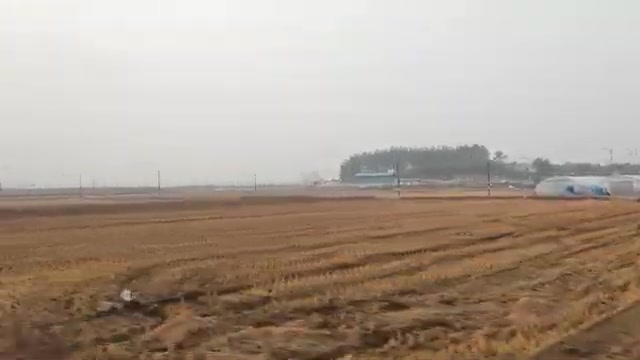
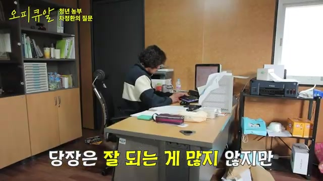
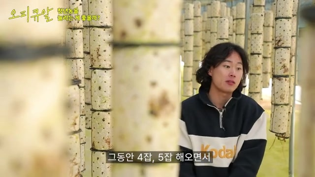
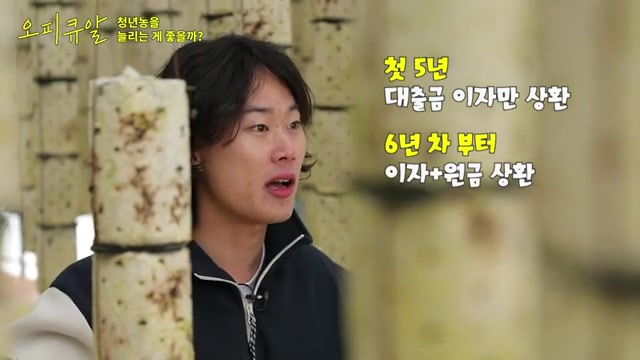

## 문서번호: 3001

### 제목: [신문, 공중파 방송 등에 대한 편향 논란이 많은데요,, 문제가 될때마다,, 스스로는 편향되어있지않다는, 말꼬리잡으며 의미도 없는 변명과 공방, 책임도 못지는 말싸움을 하는것보다는, 아예, 우리 미디어는 ㅇㅇ편에 서겠다.라는 공표와 일관성을 유지하며 떳떳할수있게 제도화하는것이, 뉴스 소비자인 시민들의 참여와 이해에 더욱 도움이 될것 같다는 저의 생각에, 정말 문제가 큰 것일끼요?](https://q4all.kr/redirect/detail/c688b699-72ce-4e09-950e-ea822fb02944)

**작성자:** [박용규](https://q4all.kr/user/profile/4128)
**작성일:** 2025-02-12 14:47:39 (수요일)

---

신문, 공중파 방송 등에 대한 편향 논란이 많은데요,,

문제가 될때마다,, 스스로는 편향되어있지않다는,

말꼬리잡으며 의미도 없는 변명과 공방, 책임도 못지는 말싸움을 하는것보다는,

아예, 우리 미디어는 ㅇㅇ편에 서겠다.라는 공표와 일관성을 유지하며

떳떳할수있게 제도화하는것이,

뉴스 소비자인 시민들의 참여와 이해에 더욱 도움이 될것 같다는 저의 생각에 정말 문제가 큰 것일끼요?

---


## 문서번호: 3002

### 제목: [무명 배우들은 언제까지 가난하고 부당하고 참으며 울어야 하나요? ](https://q4all.kr/redirect/detail/0f84ec3f-5821-4888-b4ea-7e2c92f60c94)

**작성자:** [김원](https://q4all.kr/user/profile/4238)
**작성일:** 2025-02-12 14:53:06 (수요일)

---

안녕하세요.

저는 활동 10년차 무명 배우입니다.

20대 중반에 데뷔하여 30대 중반이 되었습니다.

데뷔 초에는 가난을 견뎌내고 10년만 버티면 삶의 질이 좋아질거라 꿈을 꾸었습니다.

아르바이트로 생계를 유지하며 오디션을 보고, 운이 좋게 작품에 들어가면 촬영 기간동안 결국 아르바이트는 그만 두어야 하는 삶의 반복 이었습니다.

스케줄을 조율해주는 좋은 업장을 만나도 눈치가 보이고 미안해서, 혹은 이만한 업장을 만나기도 쉽지가 않아서 눈물을 삼키며 오디션이나 촬영을 포기했던 적도 있습니다.

월세는 내야 하니까요.

지금 부터 제가 할 이야기는 총 세가지 입니다. 당장 생계와 관련된 문제 들입니다.

**1.단역 배우의 최저임금과 노동시간, 안전등에 관한 처우 개선**

필모그라피 하나 하나가 소중해서 대사 한마디 있는 역할을 하러 새벽에 대중교통을 겨우겨우 이용해가며 현장에 다녔습니다.

콜 시간이 새벽이면 전날 내려가서 숙박을 하는데 최저 임금이란게 존재 하지 않아서 하루 10만원 받는 촬영에서 교통비와 숙박비로 오히려 내 돈을 써가며 촬영을 해야 했던 적도 있습니다.

제가 일을 시작할때만 해도 상업 현장에 처음 나가는 단역 배우들이 적어도 30만원을 받아야 한다는 선배님들의 말씀을 많이 들었고, 실제 그렇게 받기도 했습니다.

그때는 kbs,sbs 등의 공채 탤런트 시스템이 살아있던 때라 드라마가 아니라 영화 촬영을 가도 그래도 최소한의 금액은 지켜주는 분위기가 있었습니다.

그런데 2년 3년 지나면서 ott 시장이 커지고, 공채는 없어지면서 사정이 많이 바뀌었습니다.

제가 겪었던 한 예를 들어보겠습니다.

유명배우들이 나오는 상업영화 현장이었습니다.

몇십년만에 가장 추운 겨울이라며 영하 18도가 기록되던 겨울이었습니다.

시나리오 배경상 밤시간, 얇은 가을옷을 입고 밤을 지새워 새벽에 동틀때 끝나는 촬영이었습니다.

촬영에 특수 피분장까지 한채로 피를 묻힌 몸에서 하얀 김이 피어오를정도로 추워 덜덜떨며 수십명의 배우가 촬영을 했습니다.

당시 누구 한명 저체온증으로 죽어도 이상하지 않다고 생각했는데 다행히 아무도 죽지는 않았습니다만 너무나 고통스러웠습니다.

추위를 녹여줄 대기 공간은 마땅치 않았고, 그나마 현장 근처에 있는 비닐하우스에서 석유로 돌려 바람이 나오는 온풍기? 3대가 전부 였습니다.

잠시 쉴때 그 온풍기 앞에서 수십명의 배우가 가장 따뜻한 곳을 점하려 소리없는 눈치싸움을 해가며 버텼습니다.

밀폐된 비닐하우스에서 그 온풍기 앞에서 있다가 코를 풀면 쌔까만 코가 나왔습니다.

오후 4시에 현장에 도착해 분장을 하고 밤을 새워 다음날 동이 틀때까지 촬영하고 받은 돈은 15만원 이었습니다.

같이 갔던 제 친구는 그나마도 10만원을 받았습니다.

촬영전 오디션을 보고 계약을 할 당시에도 그 금액은 부당하다 생각했지만

필모그라피 한줄이 아쉬운 배우들은 모두 계약서에 서명을 할 수 밖에 없었습니다.

물론 안하는 선택지도 있었겠죠. 그치만 울며 겨자를 먹을 수 밖에 없는 사정이 있으니깐요.

무튼 그때를 기점으로 단역 최저 30이라는 암묵적 약속은 사라진듯 했습니다.

다른 작품에 다녀온 많은 친구들의 이야기를 듣고 분노했던 적이 한두번이 아니었으니까요.

또 몇년전 주 52시간 근무제가 도입되면서 현장에서도 52시간 근무가 점점 지켜지고 요새는 상업현장은 거의 지켜지는 추세입니다.

또 현장 스텝들은 노조가 생기면서 처우가 많이 개선되었습니다. 최저 임금도 잘 지켜지고 있고요.

액스트라의 경우에는 액스트라 전문 업체에서 출연자들을 관리하면서 야간 1.5배 시급도 잘 지켜지고 있습니다. 다행입니다.

여기서 발생하는 문제는 이제 만만히 깎을수 있는 돈은 단역배우들의 출연료라는 점입니다.

실제 위에 예시로 들었던 현장에서 엑스트라 분들은 야간 시급1.5배도 모두 지켜 받았습니다.

같은 현장에서 단역배우들은 여기에 해당하지 않기때문에 현장으로 이동하는 몇시간을 제외한 12시간의 밤샘 촬영을 하고 10만원, 15만원을 받았지만요.

**2.프리랜서 건강보험료 책정은 정말 합리적인가?**

최저 시급도 안지켜지는것만이 문제는 아닙니다. 건강보험료 책정에도 문제가 있다 생각합니다.

직장에 소속되어 있지 않은 프리랜서 배우들은 3.3프로를 떼고 출연료를 지급 받고 그에 대한 종합소득이 매겨집니다.

그걸 기준으로 내후년의 보험료가 책정됩니다.

정확한 시스템은 모르겠지만 여태 제가 겪어온 예를 들어보겠습니다.

만약 22년도에 1년간 총 1000만원을 벌었다 합시다.

1월에 일해서 600만원, 4월에 200만원, 6월,7월에 100만원을 촬영 일을 해서 벌었다고 칩시다.

24년도에 책정된 보험료는 총소득 1000만원에 대하여 매겨집니다.

그럼 소득이 발생한 일에 대해 직접 '해촉증명서' 라는 것을 떼어서 연말 연초에 건강보험공단에 보내야 합니다.

계약서를 작성했던 회사가 아직 존재한다면 해촉증명서를 받을 수 있겠지만

회사가 사라진 경우도 종종 있어 600만원에 대한 해촉을 받지 못하면

계속 회사에 소속되어 매달 600만원을 번것처럼 되어 보험료가 오르게 됩니다.

게다가 프리랜서의 특성상 수입이 일정하지 않습니다. 수입이 괜찮은 해도 있고 절망적으로 못 버는 해도 있습니다.

예를 들어 2년전 수입이 괜찮았다가 1년전부터 수입이 없는 상황이 되어도

2년전 수입으로 보험료가 책정되기 때문에 높아진 보험금을 돈이 없는 2년후인 현재에 감당해야 합니다.

돈을 벌었을때 내는것은 큰 문제가 되지 않지만, 안그래도 힘든 상황에서 고정비용 10만원이 더해지는 것은 큰 일 아니겠습니까.

만약 4대보험이 되는 고정 아르바이트를 들어가면 직장가입자로써 제가 부담하는 보험료는 낮아지겠죠.

그렇지만 언제 잡힐지 모르는 촬영때문에 고정 아르바이트를 하기가 쉽지 않아 일용직 아르바이트를 할 수 밖에 없습니다.

무명이라도 제 직업은 배우니까요.

못버는것이 자랑은 아니지만 나름 고군분투 최선을 다해서 살아가고 있습니다.

두어번 예술인 복지재단에서 지원금도 받은적이 있기에

언젠가 유명 배우가 되어 돈을 잘버는 사람이 된다면 세금 내는것 얼마든지 아까워 하지 않고 내겠다는 다짐을 하며 살고 있습니다.

그렇지만 프리랜서들에게 적용되는 보험료 책정 기준이 달라져야 하지 않을까 생각합니다.

그 방법이 뭔지 저도 잘 모르겠지만 지금보다는 훨씬 나은 방법이 있을거라고 생각합니다.

**3. 광고 에이전시에 대한 법적 규제가 필요하다는 읍소입니다.**

광고 모델이 되려면 광고 에이전시에 배우 등록을 해야합니다.

에이전시에 가서 사진을 찍고 영상을 남기고 연기를 하고 오면 광고주와 감독들이 픽한 배우에게 연락이 갑니다.

유명한 셀럽들이야 몇천만원씩 받는다지만 무명 배우들은 아닙니다.

광고 페이도 전에 지켜지던 암묵적 최저 룰이 깨진이 오래입니다.

3달에서 1,2년 동안 수천번 송출되는 광고에 출연하는 비용으로 30만원 50만원을 받는 경우가 있습니다.

그런데 여기서 제가 말하고 싶은 것은 에이전시 수수료 입니다.

에이전시 수수료는 30%로 대부분 고정되어 있습니다.

만약 6개월동안 송출되는 광고에 출연하는 댓가로 100만원을 받는다 하면 에이전시에서 30만원을 가져갑니다.

500만원을 받는 경우에도 30프로인 150만원을 떼어갑니다. 1000만원을 받으면 300만원을 가져갑니다.

단지 소개비로요.

가끔 20프로로 하향해주는 경우도 있다지만 제가 겪은 바 거의 없는 일이고 그것은 에이전시 직원의 재량입니다.

30프로의 수수료는 현장에 가는 모델,배우들에게 교통이나 뭔가를 제공하는 비용인가? 아닙니다. 그저 소개비인 경우가 9할입니다.

게다가 더 큰 문제는 용역비를 지급하는 시기도 매우 늦습니다.

저는 지금 24년 9월에 성우로 녹음한 광고 녹음비를 25년 2월인 아직도 받지 못했습니다.

광고 용역은 일을 하고 바로 돈을 받는게 아니라 송출 후 3개월이 일반적 입니다.

송출이 안되는 경우에는 돈을 못받는 경우도 있고 50프로만 받는 경우도 있습니다.

제 경우엔 6개월 7개월 걸려 지급받은 일들도 있습니다.

광고 에이전시에 대한 법적인 규제가 마련되어야 출연 노동자에 대한 권리가 지켜질것입니다.

제가 10년간 겪은 현장에서의 삶은 행복한 순간도 물론 있었지만 부당함에 화를 참아야 하는 일이 훨씬 더 많았습니다.

선택받아야 하는 직업의 특성상 누군가에게 싫은소리 하기 쉽지 않습니다.

다음 일을 못하게 될 수도 있으니까요.

소문이 나면 안되니까요.

노조에 가입하면 되지 않느냐? 할 수 있습니다.

제 주변 보통의 경우 노조 가입비를 내는것이 처음에 부담을 많이 느낍니다.

대체로 가난하기 때문이죠.

그리고 노조에 가입했다는 것 만으로 부당함을 당하지 않을까 하는 걱정을 매우 많이 갖고 있습니다.

배우 노조가 일을 잘 해주는 것으로 알고 있고 도움을 받은 예도 실제로 많이 보았지만

현장에서 만난 배우들의 인식은 대체로 그렇습니다.

긴 이야기의 마지막으로 제가 몇년전 어떤 제작사의 횡포에 부당함을 얘기했다 잘리면서 어떤 선배에게 들은 이야기로 마무리 하려 합니다.

"유명해 지기 전에 고발하고 싸우기 시작하면 너만 도태된다. 싸움은 유명해지고 힘이 생겼을때 해야 한다. 그때까지는 참고 견뎌라."

그렇지만 우리 위의 누군가가 우리를 위해 싸워주지 않으면 언제까지나 바닥에 있는 배우들은 가난하고 부당하고 참으며 울어아 하나요?

---


## 문서번호: 3003

### 제목: [학교는 왜 안전한 공간이 되지 못할까요?](https://q4all.kr/redirect/detail/e584dbdc-184f-427e-a034-085687bd87df)

**작성자:** [임정은](https://q4all.kr/user/profile/3927)
**작성일:** 2025-02-12 14:58:16 (수요일)

---

엊그제 대전에서 끔찍한 사건이 벌어졌습니다. 교사가 학생을 살해하였습니다.

학교에서 벌어진 처참한 일은 이뿐이 아닙니다. 학교폭력으로 학생 상호 간에 물리적, 언어적 폭력을 행사하는 일은 너무나 잦고

교사가 학생들에게, 학부모들의 민원에 시달려 자살하는 일이 계속 벌어지고 있습니다.

우리의 미래인 미래세대, 어린이, 청소년들이 있는 공간, 그것도 교육과 성장이 이루어져야 할 학교 공간이

폭력과 차별, 죽음의 공간이 되어 가고 있습니다.

학교는 우리 사회의 축소판입니다.

이 공간에서 우리는 왜 안전하지 못하고 불안에 떨고 있나요?

학생, 학부모, 교사, 그리고 학교에서 일하는 숱한 비정규, 계약직 노동자들...

어느 한 주체도 행복하지 못하고 고통스럽고, 불안하게 학교에 갑니다.

학교가 안전하고, 평등하고, 평화로운 공간이 되기 위해서는 무엇부터 달라져야 할까요?

각각의 주체는 무엇으로 고통 받고 있으며 각 주체는 어떻게 소통할 수 있을까요?

학교 내부 생태계와 학교 밖 생태계, 시민들은 무엇을 할 수 있을까요?

---


## 문서번호: 3004

### 제목: [모든 지명직 공무원 및 산하단체 임직원 정년제한](https://q4all.kr/redirect/detail/fa9074e5-e9e0-458e-a83d-48b76f57f96d)

**작성자:** [이동회](https://q4all.kr/user/profile/3856)
**작성일:** 2025-02-12 14:58:30 (수요일)

---

장차관등 지명직 공무원들은 물론 모든 공공 산하단체 임직원들의
----------------------------------

정년을 일반 민간기업과 동일하게 "60세"로 제한합시다.
-------------------------------

---


## 문서번호: 3005

### 제목: [계엄은 꼭 필요한 시스템인가?](https://q4all.kr/redirect/detail/2d714b31-5fba-44f1-abd7-f4e33b30b5f1)

**작성자:** [유성오](https://q4all.kr/user/profile/3950)
**작성일:** 2025-02-12 14:58:59 (수요일)

---

헌법에는 전시, 사변 또는 국가 비상사태가 발생하면 선포할 수 있다 하는데,

예를 들어 북한 공비가 기습적으로 도심에 들어와서 테러를 하고 있다고 칩시다.

그럼 필요시 군대가 투입되어 진압하면 되는 것이지, 왜 굳이 계엄을 선포해야 하는 겁니까?

굳이 계엄을 선포해서, 기존에 잘 돌아가는 시스템 까지 전부 군에 넘겨버리는 상황을 만들어야 합니까?

홍수 등 재난 상황이 발생하면 군인들이 지원 나가는데, 계엄령 내리고 나가는 것은 아니지 않습니까?

그러니 그걸 악용해서 12.3. 계엄 사태가 생긴 것 아닙니까?

계엄령 발동시 군의 권한 중에 정부 기능이 마비될 경우, 군이 주요 행정기관을 통제할 수 있다고 하는데.

아니! 정부 기능이 마비된 상황인데, 군대는 정상이라고 보장할 수 있나요?

저 말은 군대가 가장 정의로운 심판자로 보고 있는 것 같은데, 이게 말이 되나요?

정의로운 사람만 군인이 되는 것은 아니지 않습니까.

저는 후진 국에서 정권 잡을 때 주로 사용하는 계엄 따위는 없어져야 한다고 생각합니다.

누가 계엄이 필요한 이유를 구체적으로 설명해주실 분 계신가요?

"국가 비상사태가 발생하면 군이 필요합니다." 라는 식의 막연한 뜬 구름 잡는 소리는 하지 마시구요.

---


## 문서번호: 3006

### 제목: [전 세계에서 가장 우수한 우리나라 의료체계를 더욱 발전시키고, 악화시키지 않으려면 어떻게 해야할까요?](https://q4all.kr/redirect/detail/66831211-5c16-456b-a485-979ef612db11)

**작성자:** [허재혁](https://q4all.kr/user/profile/4237)
**작성일:** 2025-02-12 14:59:36 (수요일)

---

무작정 의사수를 늘려야한다는 황당한 해법과

의사들은 모두 도둑놈이라는 선입견으로 출발한다면 아무것도 해결할수 없을 것입니다.

아래 몇가지 예를 들지만, 이보다 훨씬 다양하고 많은 문제점들이 얽혀있을 것이고,

의사들이 왜 이렇게 밖에 할수 없는지 직접 의견을 듣고 면밀하게 관찰하여야

기존 의료체계가 망가지지 않는 상태에서 전국민들이 효율적인 의료혜택을 받을수 있도록 발전할수 있지 않을까요?

1) 소아과, 산부인과, 외과 등 필수진료과에 왜 전공의들이 지원을 하지 않는지,

해당 전문의 자격증을 갖고 있어도 왜 그 과로 개원하면 먹고 살수 없어 다른 비급여 진료들을 해야만 하는지 따져보고,

숫가를 올려주거나, 형사처벌 조항에 대한 점검 등등 해당 분야 의사들에게 직접 의견을 수렴하여,

전공의 뿐 아니라 개업가에서도 문제가 없게끔 만들어야 하지 않을까요?

2) 전국에서 KTX를 타고 서울로 올라오고, 고혈압 당뇨 처방도 3차 병원에서 받는 현상에 대해서는..

1989년 전국민 의료보험제도와 함께 시작되었고, 98년 폐지되었던 진료권역제도를 다시 실행하는건 어떨가요?

지역 시민들의 표를 구걸하기 위한 국회의원들의 속마음을 숨기려 하지 말고,

공론화와 전국민을 살리기 위한 조치로 설득하면 지역구 국회의원들도 앞장서서 설파하지 않을까요?

3) 보건복지부가 현재와 같이 본인들의 파워를 높이고, 대기업 보험사의 장기적인 이해관계를 실현시키기 위한 조직이 아니라,

국민들의 의료혜택을 높이기 위한 행정조직으로 거듭나기 위해서는

진료를 받는 환자와 진료를 시행하는 의사간의 협의를 통해 도출된 좋은 방안들을 실현해 내는 조직으로 만들어야 할것입니다.

(의견을 조율한다는 명목하에 복지부 공무원들이 답을 정해놓고, 형식적인 절차를 진행하는 현재의 의결기구들은 배제되어야 합니다)

4) 자본주의 사회인 우리나라에서

급여진료에 대한 수가를 국가가 일방적으로 정해서 시행하고,

포괄수가제를 통해 의료의 질을 낮추어,

궁여지책으로 늘어가는 검사들과 비급여진료에 대한 찍어누르기식 정책은

결과적으로 과비용을 지불하고도 양질의 진료혜택을 받지 못하는 국민들에게 피해만 가중시키는 결과를 초래할 것입니다.

이런 문제들은 복지부 공무원들이 스스로 해결할수 없으며,

직접 진료하는 의료인들이 자발적인 토론을 통해 스스로 좋은 방안을 도출하도록 하는 것은 어떨까요?

다른 분들도 좋은 의견을 많이 올려줄테니, 부디 가감없이 취합하여 현재의 의료사태가 하루빨리 해결되기를 간절히 기원합니다.

수고하세요.

---


## 문서번호: 3007

### 제목: [40, 50대 조기 퇴직 후 재취업은 왜 어려운가요?](https://q4all.kr/redirect/detail/6ce7643e-7167-48c1-ab20-a40b361600bf)

**작성자:** [민성웅](https://q4all.kr/user/profile/4301)
**작성일:** 2025-02-12 15:01:07 (수요일)

---

40, 50대 전문성이 확보된 전문 인력이라고 해도 국가 경제의 저성장, 회사의 사정등으로 한번 퇴직하면 그 분야에서 어느정도 능력이 있음에도 불구하고 재취업이 힘들어 단순노동직이나 자영업으로 밀려나거나 구직자 신세를 못 면하고 사회에 절망하는 경우가 많습니다.

어느 사회나 이 정도 인력을 키워내기도 힘든게 사실인데 이렇게 도태된다는것은 개인의 문제뿐 아니라 인구 구조상 축소사회로 진입하는 우리나라의 경쟁력에도 결코 긍정적이라 할 수 없습니다.

개인의 커리어를 디지털화하고 수치화하여 필요한 인력을 연결해 주는 보다 획기적인 네트워크가 절실하다고 생각합니다.

---


## 문서번호: 3008

### 제목: [일과 가정이 양립할 수 있는 사회는 언제 올까요?](https://q4all.kr/redirect/detail/1aba6967-f684-4cd9-90fd-2b4607858cd9)

**작성자:** [임수홍](https://q4all.kr/user/profile/4305)
**작성일:** 2025-02-12 15:10:02 (수요일)

---

이제 곧 복직을 앞두고 있는 육아휴직 중인 엄마입니다.

근로기 육아시간을 쓸 수 있는 직종에 근무하지만, 아이는 9시부터 5시까지 어린이집에 있어야 합니다.

저희 아이는 16개월입니다.

그래도 우리는 나은 편입니다.

우리 아이와 똑같이 0세반에 있는 아이들 중에 8시에 등원을 해서 6시에 하원하는 아이도 있습니다.

방금 EBS에서 만든 <2030이 아이를 낳지 않는 진짜 이유>를 보면서 눈물을 흘리며 이 질문을 꼭 해야겠다고 생각했습니다.

도대체 언제쯤 일과 가정이 양립할 수 있을까요?

---


## 문서번호: 3009

### 제목: [전관예우는 정말 필요한 것인가요?](https://q4all.kr/redirect/detail/3bd916ff-1fad-4c98-a13d-1131eb0b6be0)

**작성자:** [홍세민](https://q4all.kr/user/profile/4306)
**작성일:** 2025-02-12 15:10:06 (수요일)

---

특히 법조계 있던 분들의 전관예우는 항상 있는 자들을 위한 기회의 선택지로 전락한 듯한 느낌입니다.

예우의 방법은 여러가지가 있을텐데 꼭 이런 방법으로 쓰여야 하는지 모르겠습니다.

---


## 문서번호: 3010

### 제목: [일회용품 보는 것만으로도 죄책감이 듭니다. 일회용품 사용 금지를 더 강력하게 법제화할 수 없나요?](https://q4all.kr/redirect/detail/9dc960a2-5238-449f-ac6d-b879ae7b653f)

**작성자:** [임정은](https://q4all.kr/user/profile/3927)
**작성일:** 2025-02-12 15:10:38 (수요일)

---

사라지지 않는 플라스틱 쓰레기,

미세플라스틱이 되어 전세계 모든 것에 흩어지고 최종적으로는 인간의 몸속까지 들어오는 유해물질.

인류세의 환경재앙 중 하나입니다.

제안하고 싶은 것 중 하나는

공중파에서 흡연, 음주 장면을 모자이크 처리하듯이

일회용품 사용 장면을 모자이크 처리하면 좋겠습니다.

출연자들이 아무렇지 않게 일회용 음료수, 커피 마시거나

일회용 도시락, 숟가락 등 사용하는 모습은 안 보이게 처리해 주세요.

그러면 점차적으로 사용 자체도 줄어들겠지요.

---


## 문서번호: 3011

### 제목: [공무원 연금수령 개시 시기 차별에 따른 대책 마련 시급](https://q4all.kr/redirect/detail/25adc6da-4e09-496a-b9e0-5b059337f040)

**작성자:** [최종섭](https://q4all.kr/user/profile/4300)
**작성일:** 2025-02-12 15:11:15 (수요일)

---

**저는 지방자치단체 공무원입니다. 1997년 30살의 늦은 나이에 9급으로 입사해서 결혼도 늦게하여 60세 정년에 제대하면 아이는 고등학생입니다.**

**그런데 더욱 큰 문제는 63살이 되어서야 연금 수령이 개시되어 3년동안 생계가 막막합니다. 2016년 변경된 연금법이 적용되어 입사연도 기준**

**저보다 1년 먼저 들어온 사람은 60살부터 연금을 바로 수령하고 저는 3년 동안 못 받는게 도저히 납득이 가지 않습니다. 나라의 녹을 먹는 사람으로**

**정부의 시책에 순응하는 것은 필연이겠지만 생계와 관련된 부분이라 수긍이 안됩니다. 정년 후 연금개시년도 까지 취직을 해서 생계를 유지하려 해도**

**장애가 있어서 몸을 쓰는 일은 찾기도 어려운 실정입니다. 저 같은 공무원이 많지는 않겠지만 정부 차원에서 대책을 세워 주시면 감사하겠습니다.**

* **1996년 이후 임용자의 연금개시 연령은 퇴직 연도에 따라 다음과 같습니다.**
* **2024년-2026년 되직 : 62세**
* **2027년-2029년 퇴직 : 63세**
* **2030년-2032년 퇴직 : 64세**
* **2033년 이후 퇴직 : 65세**

---


## 문서번호: 3012

### 제목: [특목고와 자사고 가점제 폐지 및 정상화](https://q4all.kr/redirect/detail/e403819c-172e-44fb-8f0a-9e5ca83be04e)

**작성자:** [이동회](https://q4all.kr/user/profile/3856)
**작성일:** 2025-02-12 15:13:25 (수요일)

---

특목고와 자사고의 대학 가산점 반영을 엄격히 규제하고,
------------------------------

외고는 외고답게, 과학고는 과학고답게, 자사고는 자사고답게
--------------------------------

교육체계를 일대 전환해야 합니다.
------------------

---


## 문서번호: 3013

### 제목: [회사내 승진제도의 투명성](https://q4all.kr/redirect/detail/3a841082-3982-4984-88e0-809ccf6e9483)

**작성자:** [최준용](https://q4all.kr/user/profile/4308)
**작성일:** 2025-02-12 15:15:51 (수요일)

---

왜 회사내에서 개인능력과 전문성이외의 것들이 승진에 좌우될까요? 공공기관에서 조차 개인적 인맥, 지연 등으로 승진이 진짜 되는 걸까요? 왜 우리는 유럽사히처럼 독일사회처럼 정해진 규정과 원칙에 의해서 근무평가가 되지 않는 걸까요? 회사의 문제만이 아니라 국가전체의 공정성, 투명성의 문제일까요? 무엇이 문제일까요? 사람의 문제일까요? 시스템의 문제 일까요? 규정과 규칙이 현실과 괴리가 너무 커요.. 성싱히 묵묵히 일해도 승진하는 회사의 나라에 살고 싶어요. 열심히 일하고 성실하면 한단계 승진하는 나라에 살고 싶어요.

---


## 문서번호: 3014

### 제목: [검찰개혁](https://q4all.kr/redirect/detail/778768c8-54a2-41b9-9ee2-707f4d13f7ea)

**작성자:** [강대삼](https://q4all.kr/user/profile/3027)
**작성일:** 2025-02-12 15:16:31 (수요일)

---

어떻한 방법으로 검찰법및 형사법 개정을 하여야 한다고 생각 하시나요?

---


## 문서번호: 3015

### 제목: [상대적으로 대중에 폐쇄된 학문들에 AI와 빅데이터와 빅데이터간의 데이터 통합이 있으면 안될까요?](https://q4all.kr/redirect/detail/9dd4da57-04f8-4376-b474-87193c756867)

**작성자:** [도완영](https://q4all.kr/user/profile/892)
**작성일:** 2025-02-12 15:18:42 (수요일)

---

예를 들어 사학도 그런면이 있습니다.

여기에 언어학이나 문화학,무속연구,종교학,중세 문학,철학 등과 거란이나 그 후예라는 다우르족이나 에벤키족 들의 신화,문화,언어 등을 모두 빅데이터화 시킨걸 AI를 이용해 다학제적 분석을 할수 있지 않을까 하는데

상대적으로 대중에 폐쇄적인 분야들은 자신들만의 성이 높습니다.우리 사학은 세계사나 다른 학문들에 비춰보면 갈라파고스화 되는 측면이 있습니다.

다른 세계사의 빅데이터와 데이터 통합이 된다면 앞에서 말한 다학제적 분석분야와 더불어 AI는 좋은 도구가 될것 같습니다.

예로든 사학뿐 아니라 저런 폐쇄적 혹은 지원을 받기 어려운 학문들에 공공형 빅데이터들이 다분야들이 있고 데이터 통합이 가능하고 그걸 도와주는 공적인 AI가 있어 다양항 학문분야에서 다학제덕이고 통섭적인 분석을 할수 있다면 이전과 전혀 다른 시각을 학문들이 나올수 있지 않을까 기대합니다.

이런 식의 빅데이터와 AI 활용은 안되는 걸까요?

---


## 문서번호: 3016

### 제목: [남북 통일 이전에도  제가 원하는 시기에 백두산과 금강산을 가고 싶습니다. 북한 지역에 산재하고 있는 유적지도 가고 싶습니다.  가능할까요?](https://q4all.kr/redirect/detail/c01ea770-9045-4ff3-b7c3-d039f9144f98)

**작성자:** [윤승현](https://q4all.kr/user/profile/2811)
**작성일:** 2025-02-12 15:21:10 (수요일)

---

남북의 평화적 통일은 아주 머나먼 일 일수도 있고, 어느 시점에서는 갑자기 이루어 질수도 있을 것 입니다.

그러나 대체로 먼 후의 일로 예상됩니다.

지금의 남북한의 교류는 세계 어떤 나라와 비교도 안되게 단절되어 있습니다. 불행하게도 "금강산 관광" "개성공단" 폐쇄로 인해 그동안 있어왔던 교류조차도

사라졌습니다.

그렇다면 현재 이 시점에서 "남북의 평화로운 공존" 을 확보한 상태에서 일정 정도의 자유로운 왕래를 가능케 하는 방법이 있을까요?

먼 미래의 통일비용을 감소 시키고, 얼마 남지 않은 생존 남북 이산 가족들의 자유로운 상봉을 가능케 할 것입니다.

또한 외국노동자 대신에 북한의 노동력을 사용하고 대한민국의 고급인력의 파견을통해 남북상호간의 경제 성장에도 도움이 될 것입니다.

이로 인해 결국은 통일 이전에도 현재의 남북한 주민들의 평온과 행복을 증대 시킬 수있을 것입니다.

방법을 찾아주십시요.

---


## 문서번호: 3017

### 제목: [언론 개혁](https://q4all.kr/redirect/detail/e4112370-a6e7-4033-bcb7-4504ce35b9f3)

**작성자:** [강대삼](https://q4all.kr/user/profile/3027)
**작성일:** 2025-02-12 15:26:41 (수요일)

---

올바른 언론 개혁은 어떻게 하는 게 바람직한 방향 인가요?

---


## 문서번호: 3018

### 제목: [사법 개혁](https://q4all.kr/redirect/detail/074aec19-e7f7-47af-933d-b4a383f850d5)

**작성자:** [강대삼](https://q4all.kr/user/profile/3027)
**작성일:** 2025-02-12 15:29:59 (수요일)

---

올바른 사법 개혁은 어떻한 방향으로 해야 되는지요?

---


## 문서번호: 3019

### 제목: [세대별 기본소득제의 과감한 실시](https://q4all.kr/redirect/detail/8f037c7e-9733-4bbb-b9f6-3a92f5133cbe)

**작성자:** [이동회](https://q4all.kr/user/profile/3856)
**작성일:** 2025-02-12 15:30:25 (수요일)

---

### o 청년세대의 일자리 마련과 60세 정년연장은 새로운 형태의 일자리가 창출되지 않는한 서로 모순되는 방향입니다.

### 

### o 정년연장은 커녕 AI와 빅데이터, 로봇기술의 급속한 발전으로 일자리가 급속히 사라져져 가고 있습니다.

### 

### o 40대에 접어들면 조기퇴직의 압박이 점점 거세지고 있습니다. (취업해서 10여년만 지나면 희망퇴직 대상이 됩니다.)

### 

### o 노동시장이 유연해 지지 못하면, 일자리를 두고 세대간 갈등, 노사간 갈등이 점점 심해질 것은 명확합니다.

### 

### o 세대별 차등기본소득제를 도입하여 세대간, 노사간 사회적 갈등을 해소하여야 합니다.

---


## 문서번호: 3020

### 제목: [헌법재판소와 대법원 법관들은 국민투표로 선출하면 안돼나요?](https://q4all.kr/redirect/detail/3f037aa4-64f8-43c0-b818-c20ffc0ee15a)

**작성자:** [김수진](https://q4all.kr/user/profile/1211)
**작성일:** 2025-02-12 15:40:24 (수요일)

---

현재의 지명 시스템으로는 특정집단의 이익을 지나치게 반영하여 정치적인 판결이 많이 도출되는 듯 보입니다.

국민과 국가를 위한 판결을 해 줄 법관들을 국민이 투표로 선출할 수 있기를 바랍니다.

---


## 문서번호: 3021

### 제목: [부동산 관련 세금체계를 바꿀 수 없을까요?](https://q4all.kr/redirect/detail/48c69ec5-4027-4bd8-88c6-4c695d4ff702)

**작성자:** [한재훈](https://q4all.kr/user/profile/4307)
**작성일:** 2025-02-12 15:47:09 (수요일)

---

현재의 부동산 관련 세금체계를 바꿨으면 합니다.

부동산을 구입할 때 내는 취/등록세를 없애고, 양도소득세는 보유기간 및 실거주기간을 고려하여 보유연차별로 세율을 조정하여 부과하는게 어떨까 싶습니다.

(예를들어 양도세는 보유기간이 짧으면 많이 내고, 보유기간이 길수록(실거주기간 포함) 낮은 세율로 일정기간이 지나면 양도세 면제 - 단, 지금과 다른점은 다주택자 역시 동일하게 적용)

대신에 세금은 주택 보유 갯수와 상관없이 전체 부동산에 재산세와 보유세를 합쳐서 매년 부과하는게 어떤지???

물론 세율이 얼마가 되어야 하는지는 잘 모르겠지만, 전문가들이 연구해서 세율을 잘 정하면 되지 않을까 싶네요.

내용을 잘 설명한거지 모르겠는데, 많은 연구 부탁드립니다.

---


## 문서번호: 3022

### 제목: [임대 소득 세금과세도 노령연금 수령도 균등하게 해 줄 수는 없는지요?](https://q4all.kr/redirect/detail/e8017242-3a20-46f9-9525-b5aed65a602f)

**작성자:** [원용봉](https://q4all.kr/user/profile/4320)
**작성일:** 2025-02-12 15:47:45 (수요일)

---

저는 월 임대료 200여만원 정도 받을 수 있는 건물 소유자이며

나이 들어 아프면 병원비로 준비한 돈이 1억원 정도 있는 사람입니다.

그래서 노령연금은 못 받고 있는데...

임대 소득의 근거인 임대차 계약서로 주민센타에 신고하라는 소식을 들었습니다.

그게 25년 5월까지 유예 되어 있긴 합니다만,

덜 먹고 아껴 쓰고 산 덕에 이만큼 의 재력으로 70세 나이가 되어 살고 있습니다.

저는 제 소득에 대한 적합한 세금도 내고 싶고,

노령연금도 받고 싶습니다.

균등한 원칙이 적용되게 해 주실 순 없나요?

---


## 문서번호: 3023

### 제목: [채상병 관련 노은결 소령](https://q4all.kr/redirect/detail/67a1f94b-b6e2-4424-8480-3cd1ff7b3725)

**작성자:** [윤송희](https://q4all.kr/user/profile/3181)
**작성일:** 2025-02-12 15:55:49 (수요일)

---

어떻게 되고 있는지 모든 언론에서 이슈가 사라졌네요.

박정훈 대령은 무죄 판결 이후 복권에 대해 이야기 되던데...

정부여당은 아니지만, 민주당이 앞장서서 억울한 사람이 없게 해주세요!!!

---


## 문서번호: 3024

### 제목: [싱가포르 정부에게 1조2800억 티메프 사기 사태 주범들 처벌 협조를 얻을 수 없는지 궁금합니다](https://q4all.kr/redirect/detail/c2577e9d-3041-4359-9506-01f3b91e5478)

**작성자:** [이지한](https://q4all.kr/user/profile/4296)
**작성일:** 2025-02-12 15:56:26 (수요일)

---

티몬, 위메프의 구영배 대표는 Q10 이라는 싱가포르계 회사 대표라고 합니다.

적어도 제겐 티메프 사태 터지기 전엔 한 번도 들어본 적 없는 개듣보잡 기업이었습니다.

더 황당하기 짝이 없는 건 티메프 개발 조직을 미리 통째로 Q10 으로 이동시켰다고 얼핏 들은 바 있습니다.

(24.0824) 아직도 회생 꿈? 구영배, 티메프 개발자까지 빼갔다 - 헤럴드경제

https://biz.heraldcorp.com/view.php?ud=20240823050629

우선 폰지사기인 것도 황당합니다만 ***하필 피해자들이 우리나라의 핵심 기둥이 되는 제조, 유통 중소 업체들*** 에게 크게 타격시켰다는 그 모양새는

혹시 한국 무너뜨리기 같은 심히 의심스러운 의도가 있는지 생각하게 됩니다.

지나친 의도라 생각하고 일축을 해봅시다.

그런데 문제가 또 있는데 구영배 대표가 하필 싱가포르계와 어떻게 연을 맺고 있는가입니다.

혈연이라면 여지없는 화교인 것이고 이는 "같은 국민을 등처먹는다" 수준이 아닌 "반국가적 획책이었다" 는 해석의 여지 또한 있습니다.

특히나 화교 2세들은 한국인 국적을 가지기에 통계상 "한국인"으로 집계되거든요.

모든 화교들이 나쁜 건 아니라고 생각하고 싶지만 옥시 사태를 일으킨 존 리도 구글코리아 사장을 거쳐 지금은 하필 "싱가포르"에 있습니다 🫠

지금 정부 행정 기관에서 황당하게도 여행사들을 비롯해 카드, 신용사보고 부담하라고 하는데,

솔직히 이게 뭔 귀신 씨나락 까먹는 소리인지 모르겠습니다.

아무리 봐도 화교인 구영배 대표와 그 자본들이 싱가포르로 흘러가는 걸 용인하는 정부의 태도는 유착된 것이 아닌가 의심할 수 밖에 없습니다.

다행히 싱가포르의 위상이란 적어도 한국에서는 "아시아 금융 중심지이자 더러운 범죄자들 따위는 발도 못 들이미는 그런 쾌적한 선진국가"로 인식되고 있습니다.

또 그들과 우리는 리콴유와 박정희 대통령 시절 서로 라이벌로서 "누가 더 훌륭한 국가를 세우는가"로 선의의 경쟁한 바 있습니다.

그리고 저는 이 반대의 상황 또한 벌어질 수 있다고 생각합니다.

만일 그들이 "화교"가 아닌 "싱가포르인"이라면 그들의 아름다운 체벌 문화, 즉 곤장 문화 또한 잘 남아있을 것이고,

이에 대한 집행과 협조를 요구할 수 있는지 심히 궁금합니다.

만약 그게 불가능하다면 첩보기관을 활용해 무슨 수를 써서든 환수가 가능한지 궁금합니다.

첩보기관이란, 지금 이런 사태 때문에 자살해나가는 국민들을 살리기 위해 존재하는 것 아닙니까?

저는 시급한 일이라 생각합니다.

누가 또 어떻게 자살할지 상처받는 이들은 국민들이며, 저들은 화교 범죄자인데

그들을 처단할 수 있는 방법이 있는지 또한 궁금합니다.

---


## 문서번호: 3025

### 제목: [1인 가구(비혼)에 대한 지원은 있는가?](https://q4all.kr/redirect/detail/236c569d-4844-435e-85f7-615b4712916c)

**작성자:** [여경희](https://q4all.kr/user/profile/1705)
**작성일:** 2025-02-12 15:58:21 (수요일)

---

저출생고령화 사회로 정부에서 출산을 정책적으로 장려하는 것을 이해한다. 결혼하여 아이를 낳아 키우는 사람들의 선택도 존중한다.

하지만 어디까지나 결혼하거나 출산하는 것은 개인의 선택의 문제이고 결혼하지 않은 선택도 존중받아야 하기에 결혼하지 않은 1인 가구에 대한 지원방안도 마련되었으면 한다.

근로소득이 있으면 소득세를, 재산이 있으면 재산세를 따박따박 내고 있음에도 결혼하지 않은 1인 가구는 세제 혜택은 거의 받지 못해 사실상 비혼세를 내고 있는 실정이다. 예를 들어 해외주식 양도세의 경우 비혼인 경우 양도세를 피할 방법이 없지만 기혼인 경우 배우자에게 증여해 세금을 절감하는 방법이 있다.

세금이야 그러려니 수긍한다해도 정부에서 1인 가구를 지원하는 정책은 거의 없는 것 같다. 최근 발표한 공무원의 출산 장려 정책 중 일부내용\*은 비혼 가구의 입장에서 매우 차별적이며 공무원 조직구성의 다양성을 해치는 결과를 가져오지 않을지, 행정서비스의 질이 하락되지 않을지 우려스럽다. 현재 임신, 출산 혹은 육아를 이유로 휴직이 많아 비혼 가구가 상대적으로 일을 더 많이 하게 되는 상황인데 앞으로 출산 등을 이유로 휴직을 해도 일을 한 기간으로 쳐준다고 하면 비혼 가구는 공무원 조직에 유입되지 않을 것이다.

\*임신, 출산 등으로 인한 휴직기간을 승진 시 근무기간으로 계산

비혼 1인가구에 대한 이야기이긴 하지만 결혼을 하여 자녀와 배우자가 있는 사람도 언젠가는 1인 가구가 될 수 있으며 초고령화 사회에 접어든 상황에서 앞으로 1인 가구는 더 증가할 것이므로 개개인의 다양성을 존중하면서 1인 가구에 대한 지원을 검토하거나 확대하기를 바란다.

---


## 문서번호: 3026

### 제목: [정치를 얘기하고 토론 하는 것을 왜 두려워 할까요?](https://q4all.kr/redirect/detail/0a3e4bde-768d-477a-a6ed-fe0896388209)

**작성자:** [강태곤](https://q4all.kr/user/profile/4332)
**작성일:** 2025-02-12 15:59:14 (수요일)

---

우리는 어렷을때부터 정치를 얘기하는 것을 두려워한다.

모임이나 대화방에서 정치를 얘기하면 꼭 한 두명은 정치이야지 하지 말자고 한다.

학교에서 선생님이 정치를 얘기하면 문제가 된다.

회사에서도 정치 얘기를 하면 문제가 된다.

이렇게 정치에 관심을 가지면 따돌림을 당하는 문화를 개선할 방법은 없나.

플라톤은 정치에 무관심한 사람은 어리석은 사람들에게 지배받는다고 했다.

우리가 정치에 무관심하다보니 윤석열같은 이들을 구별하지도 못하는 국민들이 되었다.

방법을 찾아 주세요.

---


## 문서번호: 3027

### 제목: [혐오와 폭력이 난무하는 사회에서 언제쯤이면 모두가 다름을 인정할수 있는 자연스러운 사회가 될수 있을까요?](https://q4all.kr/redirect/detail/99de4c7f-df69-46fe-933e-364965a0e54c)

**작성자:** [한수진](https://q4all.kr/user/profile/4333)
**작성일:** 2025-02-12 15:59:36 (수요일)

---

안녕하세요 3살 아기를 키우고 있는 평범한 가정에 가장입니다.

요즘들어 사회가 혐오와 폭력이 많다고 느껴집니다.

이런 사회에서 아이를 키우는게 다소 무섭게 느껴집니다.

강풀 작가의 "무빙" 드라마에서 나오는 "다치지 않는 초능력"이 우리 아이한테 있었으면 참 좋겠다라고 생각이들 만큼

안전등이 많이 걱정이 됩니다.

---


## 문서번호: 3028

### 제목: [병원 영양상담의 수가화](https://q4all.kr/redirect/detail/a0e0a3dc-3c01-4c83-90ed-0795be808469)

**작성자:** [손희령](https://q4all.kr/user/profile/4330)
**작성일:** 2025-02-12 16:00:31 (수요일)

---

병원에서 의사나 간호사는 행위에 대한 수가를 받는데 영양사가 영양상담을 진행할 경우 왜 무료로 진행할까요?

---


## 문서번호: 3029

### 제목: [닉네임을 사용하면 안 되나요?](https://q4all.kr/redirect/detail/5536cb75-346d-423e-b499-8abdb04d776d)

**작성자:** [소재성](https://q4all.kr/user/profile/4327)
**작성일:** 2025-02-12 16:00:35 (수요일)

---

모두의 질문 Q에 글을 작성하면 실명으로 올라갑니다.

더 많은 사람들의 의견을 모으기 위해서 닉네임을 사용할 수 있도록 해주세요.

이미 네이버와 카카오톡으로 접속하기 떄문에

전화번호와 개인 정보가 있습니다.

법적 문제가 있을 때 확보한 개인 정보로 책임을 물을 수 있습니다.

화면에 보이는 글 까지 본인의 실명을 드러내지 않아도 충분하다고 생각합니다.

---


## 문서번호: 3030

### 제목: [수능제도 개혁 및 폐지는 불가능 한가요?](https://q4all.kr/redirect/detail/f1c7866f-1eb4-498c-a0f0-2363abb5a48a)

**작성자:** [정진균](https://q4all.kr/user/profile/4334)
**작성일:** 2025-02-12 16:00:56 (수요일)

---

안녕하세요?

저는 중학교, 고등학교에서 10년 차 역사 과목을 가르치고 있는 교사 입니다.

학교 현장에서 오래 근무를 하다보니 어느덧 우리나라 교육을 진단할 수 있는 눈이 생겼고, 어떤 것보다 교육 현장의 가장 큰 문제점은 현행 대학입시와 연관된 수능제도 라고 생각합니다.

수능에 출제가 되는 주요 과목 위주로 교과가 서열화 되고 학생들의 인문학적 소양을 길러줄 수 있는 사회, 미술, 역사, 음악 등의 과목은 소홀이 됩니다.

또 학생들이 가지는 지식을 대하는 태도도 수능과 연관이 되는 현실입니다. 시험에 잘 나오냐 안나오냐로 공부를 임하는 태도가 달라지게 됩니다.

교수자의 입장에서는 아무리 창의적인 교수 방법과 참신한 수행 평가를 가져와도 모든 꼭지점은 수능으로 귀결이 되다보니 우리나라의 교육 개혁은 수능이 어떻게 개혁되지 않고는 불가능 하구나 싶습니다.

---


## 문서번호: 3031

### 제목: [홈페이지 개선 글을 적을 수 있을까요?](https://q4all.kr/redirect/detail/93f67d45-0d91-46df-b3d2-b7f192840785)

**작성자:** [소재성](https://q4all.kr/user/profile/4339)
**작성일:** 2025-02-12 16:04:27 (수요일)

---

홈페이지 사용시

개선해야 할 점을 알릴 수 있는 방법이 있으면 좋겠습니다 .

이메일로 하면 될까요?

---


## 문서번호: 3032

### 제목: [아직도 리틀포레스트 꿈꾸며 시골에 오신다고요? 청년농부가 말하는 농촌 현실 ](https://q4all.kr/redirect/detail/f606a174-a8db-4776-b69e-12ddcd7633e7)

**작성자:** 오피큐알OPQR - 차정환
**작성일:** 2025-02-12 16:05:37 (수요일)

---

이번 영상은 **청년 농부**가 전하는 농촌의 현실을 생생하게 보여줍니다. 농업에 대한 **환상**과는 달리 실제로는 힘들고 많은 희생을 요구하는 노동입니다.

사회가 그들의 **삶의 질**을 책임지지 못하는 상황에서, 이들은 여전히 흙과 씨앗을 통해 자신만의 꿈을 움켜잡으려 합니다.

**정신적 압박** 속에서도 그들은 포기하지 않고, 더 나은 미래를 위해 도전하고 있습니다.

이 영상은 농촌에 대한 독자들의 이해를 높여주며, 오늘날 **청년 농부**들이 겪는 어려움을 일깨워 줍니다.



여름철 폭염 속에서 농작물을 보호하는 것이 중요하며, 삶의 질을 개선하는 것이 절실한 상황입니다.

농한기 동안 농부들이 비교적 여유롭게 지내는 것이 사실이지만, 현재는 사업 계획을 수립하고 여러 프로젝트를 추진해야 하는 시기입니다.

목이버섯을 활용한 다양한 사업 아이디어가 있으며, 베타글루칸과 같은 성분을 이용한 제품 개발의 가능성도 존재합니다.

지속적인 도전과 사업 계획의 수정이 필요하며, 예상한 결과가 나오지 않더라도 포기하지 않는 자세가 중요합니다.



농부는 4월부터 12월까지 농사에 바쁘시며, 농부의 역할을 잘 보여주기 위해 노력해야 합니다.

현재 운영 중인 시설은 톱밥을 압축하여 재배하는 목이버섯 재배사이며, 내년 봄에는 추가 수확을 계획하고 있습니다.

농업 재배 방식에 변화가 필요하며, 새로운 방식으로 재배하기 위해 추가 자본이 소요될 예정입니다.

농사를 시작하는 데에는 상당한 비용이 필요하며, 기존 시설 대부분은 할부로 구매한 것입니다.

이에 따라 농업을 운영하기 위해 많은 대출을 받아야 하는 현실입니다.

청년 농부 차정환님은 2025년까지 전북 김제로 귀농하여 5년째 농사짓고 있는 상황입니다.

농업에 대한 긍정적인 이미지를 가지고 시작하셨지만, 실제로 농사를 짓는 경험이 힘들다는 점을 강조하십니다.

초기 자본 200만 원으로 귀농을 시작하신 그는 대부분 대출을 통해 자금을 마련하셨으며, 빚은 작년까지 6억 원에 달했다고 합니다.

농사에 드는 경영비와 지급해야 하는 대출이 많아 남는 돈이 없다고 주장하시며, 농사 준비와 상환을 계속해야 하는 어려움을 토로했습니다.

초기 순수익이 낮았음에도 불구하고 농촌에서의 삶을 지속하려는 이유가 있으며, 다양한 일거리를 통해 버티고 있다고 언급했습니다.



농사 소득은 단기간에 발생하지 않기 때문에, 시골에서 생계를 유지하며 버텨야 하는 현실입니다.

청년 농부는 다양한 일을 하며 월급을 벌어야 하며, 부모님에게 금전적인 지원을 기대하는 것이 현실적이지 않다고 합니다.

농업의 실상은 일만 해야 하고 여유가 없으며, 꿈꾸셨던 '리틀 포레스트'와는 거리가 멀다고 합니다.

실제로는 하루에 두세 시간씩 자고, 대부분의 시간을 일에 쏟아야 하며, 삶의 질이 매우 낮다고 합니다.

청년 농부들은 이렇게 힘든 상황 속에서도 100명 중 1명만 살아남을 수 있는 어려운 농촌 환경을 겪고 있습니다.



청년 농부는 하우스 수리에 대한 부담과 원금 상환 시기가 다가오면서 심리적인 걱정을 느끼고 있습니다.

농사를 지속하기 위해서는 순환을 유지해야 하며, 경영비가 충분하지 않으면 농사를 포기해야 할 상황에 처하게 된다고 합니다.

농업에 대한 전문적인 컨설팅을 받더라도, 전문가들도 뚜렷한 해답을 제시하지 못하는 상황이라고 합니다.

농업은 정부의 지원이 충분한 산업으로, 결코 망하지 않을 것이라는 희망을 가지고 있는 청년 농부의 생각이 있습니다.

청년 농부는 자신의 삶의 질에 대해 고민하며, 농사 대신 다른 일을 해서 더 나은 삶을 살 수 있었을 것이라는 회의감을 느끼고 있습니다.

---


## 문서번호: 3033

### 제목: [위임받은 국가권력을 사유화하는 검사(검찰)들의 정신을 어떻게하면 제정신으로 돌려놓을수 있나요? 그리고 그 행위에 대해서는 왜 처벌을 못하나요? ](https://q4all.kr/redirect/detail/ffd9851b-d028-4953-afba-84f9218912c6)

**작성자:** [이진성](https://q4all.kr/user/profile/4338)
**작성일:** 2025-02-12 16:07:00 (수요일)

---

검사(검찰)들은 국민 위에서 군림하는 조직이 아닙니다.

하지만 대부분의 검사(검찰)들은 국민위에 군림하려 하고 부여받은 모든 국가권력을 사유화 하여

국민 개개인에게 피해를 주고 있습니다.

왜 이런 검사(검찰)들에게 처벌을 못하나요?

국민위에 군림하려고 하는 제정신이 아닌 검사(검찰)에게 앞으로는 꿈도 못꾸게 해줘야 합니다.

---


## 문서번호: 3034

### 제목: [AI가 활발하게 발전되고 있는 상황에서 예체능 분야들은 어떻게 대응해야할까요?](https://q4all.kr/redirect/detail/2d87598e-1341-44b8-a7e0-d8da65578253)

**작성자:** [신은우](https://q4all.kr/user/profile/751)
**작성일:** 2025-02-12 16:07:16 (수요일)

---

ai산업이 활발하게 발전되고 있습니다.

최근 AI로 만든 일러스트의 저작권이나 ai가 학습하는 사람이 만든 작품들에 대한 논란이 많아지는데 우리는 어떻게 대응해야하나요?

저는 작곡가인데 최근에는 비용적으로 저렴하기 때문에 영상음악을 ai를 사용하는 일이 많습니다.

같은 종사자들은 어차피 인간은 스토리에 매력을 느끼기때문에 사람이 만들지 않은 작품은 감동을 하지 않는다, 어차피 그 ai를 만드는 사람은 결국 전공자가 될 것 이라는 의견이 있습니다만

어쨌든 젊고 재능있는 예술가가 성장하기 힘든 환경이 될 거 라는 제 생각은 변하지 않습니다.

한국은 문화예술적으로 세계가 주목하는 성과를 이뤘습니다. 이런 상승세를 유지하기 위해선 나라에서 이 문제에 대해서 최소한의 대안을 만들어야한다고 생각합니다.

---


## 문서번호: 3035

### 제목: ["책임지는 나라!" 민주당에 필요한 슬로건](https://q4all.kr/redirect/detail/1ed45eda-bfc9-4994-aa4a-52f1e549526d)

**작성자:** [원남연](https://q4all.kr/user/profile/4336)
**작성일:** 2025-02-12 16:16:31 (수요일)

---

다가올 선거때 극우들의 좌파공세에

맞서 문재인 정부도 부족했던 진정한 정치적,경제적 민주화로 성숙한 민주국가로 도약시켜야 한다고 생각합니다.

그러기 위해서는 과감한 재정투자로 선순환 경제 구축,불평등 해소,복지지출 증대 등을 이루어야겠지요.

극우당처럼 이태원,채상병,불평등,저출산,노인빈곤,가계부채 등 사회적 과제에 책임지는 나라가 되어야 하지않을까요?

무책임한 극우세력에 대응하여 집권할 정부의 성공을 위해

[책임지는 나라!] 슬로건과 정책 필수라고 생각합니다.

---


## 문서번호: 3036

### 제목: [우리나라 도심의 자전거도로를 더 스마트하게 만들 수 있는 방법은?](https://q4all.kr/redirect/detail/6191b280-121e-4fbe-9b7c-c1190485118d)

**작성자:** [허정수](https://q4all.kr/user/profile/4335)
**작성일:** 2025-02-12 16:18:40 (수요일)

---

자전거도로 관련 질문이 없어 올려봅니다.

한국 도심 자전거도로의 현실은 다음과 같아 보입니다.

인도변의 자전거도로는 보행자가 점령하고 차도변의 자전거도로는 자동차가 점령하고 있습니다.

건강, 환경등의 이유로 자전거를 끌고 나오면 혈세로 만들어진 자전거도로가 왜 저 모양일까 매우 한심한 경우가 많습니다.

갓지어지고 있는 신도시들도 마찬가지입니다.

도심 디자인과 설계 단계에서의 관성적, 주먹구구식 과정을 탈피해서 인간공학과 도심공학을 섬세하게 적용해서 자전거도로를 건설하면 좋겠습니다.

한가지 의견을 덧붙인다면 사람들은 대부분 타일식 벽돌보행로보다 아스팔트길을 더 선호한다는 것입니다.

보행로를 배수기능이 좋은 아스팔트길로 만들면 자전거길을 보행자가 점령하는 일은 줄어들 것 같아요. 이건 일본에서 이렇게 하고 있더군요.

이처럼 우리나라 도심의 자전거도로를 더 스마트하게 만들 수 있는 방법에 대해 질문합니다.

---


## 문서번호: 3037

### 제목: [농촌에 청년임대주택을 꼭 아파트로지어야할까요?](https://q4all.kr/redirect/detail/5098564c-5c86-4c02-8745-6a19e4f98f1a)

**작성자:** [송진웅](https://q4all.kr/user/profile/4340)
**작성일:** 2025-02-12 16:20:54 (수요일)

---

도시에 살고싶은 청년과 농촌에 살고싶은 청년은 삶에대한 가치관과 취향이 다릅니다.

도시적 삶의 대안으로 농촌형 라이프스타일을 구축하여

도시 밖 삶에대한 대안을 갖추어나갈 때입니다.

지가가 낮고 자연경관과 조화가 중요한 농촌지역에서

아파트형 임대주택이 정말 최선의 방법일까요?

모듈형 주택을 적극적으로 개발하여 설계비와 단가를 낮추고

유형별 모듈주택 보급을 통해 청년 및 신혼부부들의 주거비용을 낮추고

개인/공동 텃밭과 적정규모/적정기술 자급형 식량 생산을 도모하며

자연환경이 좋은곳에서 창의적으로 아이들을 자라게할수있다면.

산업형 노동자가 아닌 작가형 노동자가 필요한 시대와 맞는

미래형 교육구조로 연결될수있지않을까요?

농촌형 라이프스타일 확산. 주거문화부터 시작입니다.

주거형태 개혁을통해 지방소멸의 대안을 마련해보는것은 어떨까요 :)

---


## 문서번호: 3038

### 제목: [시민들의 삶의 질을 높이기 위한 투자를 불법, 탈법, 불평부당하게 유실되는 사회적 비용으로 충당하려면 어떻게 해야 하나요?](https://q4all.kr/redirect/detail/0b4a31cd-dace-4674-8177-9d1135adaca1)

**작성자:** [김준수](https://q4all.kr/user/profile/4315)
**작성일:** 2025-02-12 16:30:31 (수요일)

---

자본주의 시장경제체계의 국가들에서 볼 수 있는 빈부양극화, 고령화, 지역사회소멸, 자살율상승 등의 부작용 범 지국적 현상인것 같습니다. 하지만 그 가속화 정도는 시민사회, 기업문화, 정부국정기조의 성숙도에 따라 국가별로 다른 것으로 보입니다. 2025년 현재의 우리나라는 그중에서도 선두그룹에 속한것 같아 암울합니다.

2023년 윤석열 정부 출범 이후, 정책 결정권, 예산편성권, 인허가권, 기소권, 임명권, 제청권, 거부권, 권권권 등을 오남용하는 극소수의 이해관계자들에 얽혀 막대한 사회적 자원이 엉뚱한 곳으로 유실되고 있다고 생각합니다.

대통령실이전, 창원첨단산업단지지정, 양평고속도로, 부산엑스포유치, 새만금잼버리, 원전수주, 대왕고래, 대중무역적자, 편향된 수사권/기소권남발, 언론장악시도, 급기야 불법계엄까지...

다 기억조차 하기 힘들 만큼의 많은 사안들이었고, 각 사안마다 엄청난 사회적 비용을 치뤘거나 앞으로 치루게 될것으로 생각합니다.

이 어마어마하게 유실되는 사회적 자원을 줄이고 그 자원을 시민의 삶의 질을 증진하는데 투자할 수 있는 제안과 사람에게 지지를 보내고 싶습니다.

---


## 문서번호: 3039

### 제목: [노령화 시대!! 존엄한 죽음? 내가 생을 마감하고 싶을 때 합법적으로 죽는 순간을 선택할 수 있는 제도의 도입이 필요하지 않을까요?](https://q4all.kr/redirect/detail/309c2a45-927e-4318-b424-ba2f78af0084)

**작성자:** [이성임](https://q4all.kr/user/profile/4183)
**작성일:** 2025-02-12 16:33:50 (수요일)

---

저는 노인요양시설에서 물리치료사로 일하는 40대 여성입니다.

치료하는 환자 대부분이 고령의 어르신이다 보니 그분들의 이야기를 많이 듣습니다.

-늙으면 죽어야 하는데 안 죽는다.

-옛날 같으면 땅 속에 있을 나이다.

-이렇게 살아서 뭐하나

-잠들면서 가고 싶다.

치료 오실때마다 입버릇처럼 하시는 말씀들입니다.

처음에는 그냥하시는 얘기라 생각했는데 한 해 한 해 아니, 한 달 두 달 사이에 기력이 쇠하고

정신이 흐려지는걸 지켜보면서

그냥 하는 말씀이 아닐 수도 있겠구나라는 생각이 들었습니다.

또 당신들의 배우자나 친구의 죽음을 목도하면서 느끼시는 상실감으로 힘들어 하시는 모습은

나도 어서 편해지고 싶다라는 마음을 넘어 먼저 가신분들을 부러워하신다는 생각까지 들었습니다.

저는 아직 죽음을 생각하고 준비하기에는 이른 나이이긴 하지만 이런 환경에서 일을 하다보니

자연스럽게 노년, 죽음에 대해 많은 생각을 하곤 합니다.

경제적으로 심각하게 어려워지거나 거동이 힘들정도로 아프고 또 치매같은 질병에 걸려서

사랑하는 가족들과 주위사람들을 힘들게 하는 상황이 왔을 때 비참해지지 않고 자신의 존엄을

지키며 내 삶의 마지막 순간을 내가 결정하고 끝낼 수 있으면 좋지 않을까? 라는 생각을 하게 됩니다.

당연히 윤리적인 문제로 공론화 과정을 거쳐 사회적 합의를 이뤄야 할 문제라고 생각합니다.

초고령화 시대!! 지금부터 이와 관련된 많은 질문과 토론의 과정이 필요하지 않을까요?

---


## 문서번호: 3040

### 제목: [지방 자치단체들에 대한 당 차원의 컨설팅은 불가능한가요?](https://q4all.kr/redirect/detail/9c1ac2af-02b4-4bb3-bbb4-36fc83520a78)

**작성자:** [김재호](https://q4all.kr/user/profile/4349)
**작성일:** 2025-02-12 16:34:23 (수요일)

---

제 고향 구미에서는 이전 민주당의 시장 후보가 당선되었던 바 있습니다.

다만, 임기 중 뚜렷한 성과가 보이지 않는다는 세평과 함께 다음 지선에서 패배하였던 바 있습니다.

일부의 평가일 수는 있겠으나, 단단한 보수의 텃밭이라 불리우는 구미에서 얻어낸 소중한 기회였음에

이 참에 민주당의 시장의 행정력으로, "민주당에서 시장 하니까 거 뭔가 다르네."하는 모습을 보여주어

그 후로도 민주당의 행정력을 바탕으로 한 지역 발전의 모습을 기대하고 있었습니다만,

한 번의 임기만으로 끝나게 되어 매우 아쉽게 생각했습니다.

이런 지역들은 워낙 오랫동안 당선되어 온 현 국민의힘이 지역의 곳곳의 커뮤니티에도 뿌리깊게 들어와있어

웬만큼 인상적인 행정력이 아니라면, 민주당에 대한 인식을 달리하기 쉽지 않은 험지 중의 험지입니다.

이런 곳들에 대해서, 기회가 온다면, 당차원에서 시정 운영에 대한 컨설팅 및 행정 집행 등을 적극 서포트 하여

민주당이 지자체장이 되면 이렇게 바뀌는 구나 하는 것을 확실히 보여줄 수 있었으면 좋겠다고 생각합니다.

이에 민주당 소속 지자체장이 있는 지역들에 대한 순회 점검 및 컨설팅을 할 수 있는 조직이 민주당 내에 있었으면 하는 바람이 있습니다.

다양한 경험을 가진 전문가들이 현재 행정을 점검하고, 컨설팅하여 조언하는 방식으로 서포트 할 수 있다면

지역별, 지자체장의 능력 및 경험의 편차를 다소간 매울 수 있고, 그를 통해 민주당 지자체장이 있는 지역들의 행정력을 상향 평준화 할 수 있지 않을까 생각합니다.

---


## 문서번호: 3041

### 제목: [교육부는 감염병 업무를 언제쯤 의료인이 담당할 수 있을까요?](https://q4all.kr/redirect/detail/1f250ed6-1e92-4c5a-988d-3f9ddc96f691)

**작성자:** [박미정](https://q4all.kr/user/profile/4341)
**작성일:** 2025-02-12 16:36:16 (수요일)

---

현재 교육부에서 감염병업무 담당자는 비의료인인 보건행정직이 담당하고 있습니다.

또한 시도교육청 중 강원도 교육청을 제외한 16개 시도교육청에서

감염병 업무 담당자는 보건교사가 아닌 보건행정직이 담당하고 있습니다.

그렇기 때문에 코로나 19가 발생했을 때 감염병 업무 담당자 연수 시

보건교사가 연수를 받지 못하고 학교에 업무 전달이 제대로 되지 않아

업무의 혼란이 발생하고 코로나 19 업무를 할 때 많은 어려움이 있었습니다.

학교와 연계하여 업무를 진행해야 할 감염병 업무를

학교의 경험이 없는 비의료인이 보건행정직이 담당 하다보니

학교와의 연속성이 떨어지고, 전문성이 필요한 업무를 행정적인 업무에 치우치게 되어

감염병 업무에 가장 중요한 보건교육은 질이 떨어지고

시설관리 업무인 방역, 저수조 청소, 물품관리 등의 행정적이 업무에 치중하게 되어

학교 교직원간의 업무 갈등의 소지가 되고 있습니다.

언제쯤 교육부에서 유일하게 의료인인 보건교사 출신의 연구사나 장학사가

교육부 및 시도교육청에서 감염병 업무를 담당할 수 있을까요?

하루빨리 보건교사가 감염병과 보건교육업무를 담당하는 날이 빨리 오길 기대합니다.

---


## 문서번호: 3042

### 제목: [현실에 맞지 않는 과세기준 환원해주세요.](https://q4all.kr/redirect/detail/bb33bc9f-8572-4d0e-a0e6-8e18976f38b8)

**작성자:** [한상용](https://q4all.kr/user/profile/4317)
**작성일:** 2025-02-12 16:36:49 (수요일)

---

대부분 평생 민주당만 지지했던 직장 586들이 정년을 맞이하고 있습니다.이들이 연금이나 예금소득으로만 여생을 즐길수 있게 과세 및 자격기준을 환원 시켜 달라는 의미로 질문 드립니다.(상속세율 현실화와 같은 의미)

물론,우리나라의 과세 체계가 부자가 더내는것이라 분리과세 보다는 종합과세로 부자들에게 더걷는 체계지만,평생 월급쟁이로 산 586 직장인들을 부자라고 하는것은 가혹하다고 생각 합니다.

1.먼저 국민연금 입니다.

이분들은 88년 국민연금 시작부터 30여년 동안 1억이상 납부하여 국민연금을 연2천만원 이상 받게 됩니다.

최근들어 연2천만원 이상 수급자가 늘어 나고 있지만,이경우 피부양자탈락이 됩니다.이는 연 2천만원 이상수급자가 없었던 22년에 34백만원에서 2천만원으로 내린것으로 2천만원 이상 수급자가 늘어난 현실에서 환원이 필요합니다.

국민연금 받아도 건강보험료 내게되면 기초수급자정도의 소득뿐이 안되므로,국민연금만 받는 사람들은 피부양자로 들어가고 연금으로만 생활할수 있게 해줘야 합니다.

2.금융소득 종합과세 기준 2013년 기준이었던 4000만원으로 환원이나 분리과세

금융소득을 연 2천만원을 넘게되면,ISA가입탈락,비과세 3년간 혜택탈락,직장가입자의 경우 2천만원 넘는 금액의 건보료 추가 납부,2천만원 넘는금액의 기존소득과 합산해서 종합소득신고…

우리나라 쳬계가 듬융소득을 불로소득으로 간주하기에 이러한 소득에 대해 가혹하리만치 추가과세를 하고 있습니다.

금융소득이 2천만원은 이미 15.4%의 세금을 낸것이고,2천만원 넘는 사람들은 불로 소득으로 얻은 돈이기에 종합과세까지 하는것 이라 생각 합니다.

개선점을 제안 하자면,13년도 기준으로 환원을 시켜주던지,분리과세로 끝나게 해주십시오.그리고 IS가입 탈락등 연좌제를 연상시키는 제도는 없애야 합니다.비과세 탈락은 3년동안이지만 이역시 해당 연도만 해당되게 해야 합니다.

3.건강보험

최근 많이 개선되었지만,금융소득의 경우 현재 지역의보자는 1천만원 넘는 경우 전체금액이 반영되는것을 직장 가입자처럼

(현재 기준으로 말씀 드리면,2천만원 넘는 금액만 반영되고 있슴)2천만원 넘는것만 반영되도록 해야 합니다.이역시 상기 2항에서 말씀드린바와 같이 기준을 13년도 4천만원으로 환원 시켜야 합니다.

4.이번에 민주당에서 이런 질문의 장을 마련한다해서 평생 민주당만 지지했던 평범한 월급쟁이가 이렇게 개선안을 보내드립니다.이런 내용은 소위 보수지들인 조선,매경에서 다뤘던 기사입니다.

물론 민주당에선 부자감세라고 쳐다보지도 않었었고,국힘에 호소해야하나를 망설이던차에 이런토론의 장이 생겨서 건의 드립니다.이번에 민주당도 거론 했었던 상속세율 개편도 현실반영을 못하기에 개선필요성이 나왔던 거고,

제가 건의 드린 사항들 역시 대부분이 현실(물가상승,이자상승,인플레..)반영이 필요한 사항들 입니다.앞으로는 이런것들이 물가 같은데 연동되어 자동 반영되었으면 좋겠습니다.

민주당 입장에선 이런 주장하는 분들을 대변하는 정당이 아닙니다.저역시 30년전엔 진짜 어려운 영세민 이었지만,30여년간 열심히 직장생활해서 나름 중산층까지는 됐다고 생각합니다.

부동산투자도 할줄모르고,그냥 번돈을 예금으로만 굴리는 바보같은 사람으로 중산층에서 더 부자가 되기는 어렵다고 생각 합니다.

상속세도 그렇고,제가 주장하는 것들도 그 대상이 부자들이 아닌 중산층에게 향하는게 문제인것 같습니다.말이 좀 비약하지만,대기업 민노총 출신 노동자들도 30년 이상 직장생활을 하면 비슷안 환경이 될겁니다.이분들이 부자는 아니지 않습니까?

최근 세수가 30조가량 결손이 난것은 23,4년도 경기가 워낙 좋지 않아서 법인세가 덜걷혔고,법인세 감액효과도 있었을 겁니다.아마도 이런걸 저같은 중산층에게서 매꾸는건 아닌지 의심해 봅니다.

제가 왜 6,70대들은 민주당지지가 약할까가 궁금했었는데,아마도 제가 이번에 주장하는건 대부분이 국힘에서 먼저 거론할만한거라 민주당이 이에 동의하지 않는것도 영향이 있다고 생각 합니다.

작년 상속세율 개편때 민주당에서 보류시키는걸 보고 실망했었는데,이번 이런 기회에 국힘보다 더빠르게 준비해서 앞으로 있을 대선공약으로(법개정이 필요없는건 규칙개정으로 빨리 시행)해서 은퇴자들에게 선물을 주셨으면 좋겠습니다.

0.73%을 패배를 반복하지 않으려면,기존의 지지자들을 상대편으로 넘어가게 해선 필패합니다.

부디 이러한 대상자도 얼마 안되고(0.73%에 영향을 줄수 있는 숫자는충분히됨),부자감세라고 무시마시고,평생 직장인으로 세금 다내며 살은 사람들이,은퇴후에 합리적인 세금을 내면서 생활할수 있는 환경을 만들어 주십시오.

586은퇴자들이 정년을 맞이하는 이시기에 민주당의 중도포용 정책에 저의 제안이 채택되어 계속 지지할수 있도록 부탁 드립니다.

```
하소연 들어 주셔서 감사합니다.

```

---


## 문서번호: 3043

### 제목: [본적 제도는 왜 존재 하는 건가요?](https://q4all.kr/redirect/detail/70daf2ff-e217-4bf5-ad27-4e3cae4b2c2f)

**작성자:** [김재호](https://q4all.kr/user/profile/4349)
**작성일:** 2025-02-12 16:37:25 (수요일)

---

본적 제도의 존재 이유에 대한 근본적인 의문이 있습니다.

현재 우리나라는 행정 정보에 대한 전산화가 매우 고도로 이루어져 있어,

굳이 본적이라고 하는 정보가 불필요할 것 같은데

여전히 서류상에는 저 자신과는 아무런 관련도 없는

부모의 예전 고향 주소로 되어 있는 본적 주소를 외우고 있어야 하는 실정입니다.

이게 왜 필요한 걸까요?

본적 제도는 폐지 하면 안되는 걸까요?

---


## 문서번호: 3044

### 제목: [휴대폰 인증을 다른 방식으로 전환할 수는 없는 것인가?](https://q4all.kr/redirect/detail/1dc06612-1863-4fe4-8585-ceb9ad91e164)

**작성자:** [김재호](https://q4all.kr/user/profile/4349)
**작성일:** 2025-02-12 16:42:33 (수요일)

---

해외에서 생활하고 있습니다.

국내 사이트 등을 이용하고 싶을 때도 있는데, 그럴 때 마다 가장 걸림돌이 되는 것이 휴대폰 인증입니다.

국내 휴대폰을 가지고 있지 않으니 인증이 가능할리 없고,

딱히 휴대폰 인증이 꼭 필요할 것 같지 않은 사이트에서 조차도, 휴대폰 인증이 걸림돌이 되어 정상적인 사용이 불가능한 경우가 매우 자주 발생합니다.

해외 사이트들을 보면 휴대폰 인증이 아니더라도, 이메일 인증 등 다른 수단으로 얼마든지 유저 인증을 하고 사용할 수 있는데

유독 우리나라만 이러한 부분의 장벽이 너무 높다는 생각을 합니다.

휴대폰 인증 이외의 수단을 보급할 수 있는 방법은 없을지요.

---


## 문서번호: 3046

### 제목: [폭력적인 시대에 성장한 우리세대](https://q4all.kr/redirect/detail/40515f7f-2347-40ca-8e56-9c94b3d31293)

**작성자:** [백동오](https://q4all.kr/user/profile/369)
**작성일:** 2025-02-12 16:56:52 (수요일)

---

양문석의원 기자회견 보면서 항상 마음속으로 기도 합니다.

( 진정하고 진정해 진정해 진정하고 억누르고 진정 ) 이렇게

부승찬의원 한번 터지면 ㅎㅎ

( MZ세대 보면 다들 피하고 도망가고 없어, 얘기도 안함 , 진짜 )

4년 무사히 마치면 의원생활 정말 잘한거라고 하던데,

검정교복 입고 다닌 우리 세대야 이해 하지만,

70년, 80년대 시절 폭력적인 시대를 안 살아본 사람은 이해 못함.

우리는 어떻게 살아가야 합니까 ? 심각합니다

바로 해결책 좀 알려 주세요

---


## 문서번호: 3048

### 제목: [장애인 활동 지원 서비스를 가족이 하면 서비스 시간이 50%만 인정되는 것은 타당한가 ? ](https://q4all.kr/redirect/detail/7527c59e-e50f-484f-90cf-7741b96fcac4)

**작성자:** [이정연](https://q4all.kr/user/profile/4319)
**작성일:** 2025-02-12 17:06:20 (수요일)

---

1.중증 지적 장애 1급 장애인을 보호할 수 있는 사회적 서비스의 부재.

중증 지적 장애인을 보호 할 수 있는 주요 사회 복지 서비스는 생활 시설과 이용 시설로 나뉜다.

생활시설의 경우 사회복지사 1명이 4명을 케어 해야 하는데 대략 4명이 16명을 보호하는 시스템이다. 하지만 야간의 경우 3명이 퇴근 하고 혼자서 16명을 보호 해야 하기 때문에 통제가 가능한 수준의 장애인만 이용 가능 하다.

이용서비스의 경우 기관에서 제공하는 주간보호, 장애인 복지관의 프로그램, 직업훈련등 이용대상자의 장애 정도에 따라 다양한 서비스가 있지만 이 경우도 프로그램을 진행 하는 동안 지시 이행의 기능이 가능한 자에 한한다.

자폐성향이 강한 중증 지적 장애인은 통제가 거의 불가능 하므로 기관을 이용할수 없다.

이런 이유로 현재 중증 지적 장애인은 장애인 활동 지원 서비스를 통한 1:1 서비스가 거의 유일한 복지 서비스인 셈이다.

2.가족에 의한 장애인 활동지원 서비스

장애인 활동 지원 서비스 대상자 중에서도 활동 지원사가 통제가 안되는 공격성 장애인등 극히 일부만 엄격한 심사를 거친후 가족에 의한 장애인 활동 서비스를 받을수 있도록 되어 있다. (실제로 손에 꼽을 정도다)

하지만 가족이 보호 하게 되면 서비스 시간이 50%로 줄어든다. 취지는 가족도 보호에 일정 정도 기여를 하라는 취지 같다. 바로 이 문제를 사회복지 서비스 원칙과 현실적인 문제를 들어 50%만 제공 하는게 타당한지 질문 하고 싶다.

첫째, 누가 서비스 수혜자 인가 ?

서비스 수혜자는 장애인 본인이고 복지 정책상 이러한 정신적, 신체적 기능이 부족한 사람에게는 이 정도의 장애인 활동 지원이 필요하다고 정한 시간인데 사회복지 시설이 제공할때는 100% 이고 가족이 돌보면 50%만 있어도 되는게 타당한가 ? 이 문제는 비용의 문제 즉, 장애인이 교통이나 공공시설을 이용할때 절반정도의 비용을 부담하라는 비용 부담의 원칙을 서비스를 받아야할 시간에 적용해버린 어리석은 정책이다. 제공 받은 서비스는 장애인 본인이므로 서비스 제공자가 기관이든 가족이든 똑같은 서비스 시간이 필요한 것이므로 장애인의 관점에서 볼때 그 스비스를 가족이 제공 한다고 해서 절반으로 줄어들어야 하는건 불합리하다.

둘째, 실제적인 서비스 제공 시간

한달동안 지적 장애인이 이용할수 있는 장애인 활동 서비스 기간은 월 200시간이 거의 최대치다. 아마 신체 활동이 가능 하기 때문에 정한 기준인듯 하다. 식사 준비해서 먹이고 씻기고 산책하고 대소변 후 뒷처리하고 옷 입히고 산책하고 등등의 활동 서비스는 그정도면 맞다 할수 있다. 하지만 실질 서비스 시간 말고도 집에서 뛰어서 아랫층에 피해는 주지 않을까 산책중 행인에게 해를 끼지진 않을까 가스불, 냉장고를 열어 두지 않는지..... 그런 모든 시간을 따지면 한달 720시간동안 돌보고 있는 것이다. 그럼에도 지정받은 200시간의 절반인 100시간만 서비스 제공 시간으로 보는게 맞는가 ?

셋째, 중증 지적장애(중증발달장애, 중증 자폐) 가족의 경제적, 심리적 지원 서비스는 ?

우리 아이는 30세이고 정신 연령은 3세 정도며, 자폐성향으로 인한 모방의지 결여로 지시에 따르려 하지 않으며, 강요하여 뭔가를 지시 하면 자해와 폭력성을 드러낸다. 신체적으로는 간질을 앓고 있으며 언어를 못하며,

힘이 부족한 엄마는 아이를 통제 하지 못하고 수시로 폭력행위를 당해 아버지가 케어를 전담하고 있다 보니 경제적으로 불안정한 상태이며 24시간 누군가는 곁에 있어야 하는 이유로 심한 스트레스 상황이다.

국가에서 제공하는 사회복지 서비스 부재의 한계를 가족이 맡게 되었는데 그 역할을 가족이 한다고 해서 급여를 줄이는게 맞는지요 ? 사회복지 서비스 기관에서 서비스를 제공 할때 200만원이 든다면 가족으로 전달체계가 바뀌어도 똑 같은 비용을 지불해야 한다고 생각합니다.

선생님은 100여만원 (사실은 80만원.. 20만원은 이용자 자부담료 내야 함)받고 한달 720시간 내내 신체적 정신적 제약을 받으며 일을 하라고 하면 하시겠습니까 ?

---


## 문서번호: 3050

### 제목: [안락사가 허용되어 죽음에 대한 개인의 결정권을 보장받을 수 있는 사회가 언제 올까요? ](https://q4all.kr/redirect/detail/0aa3416f-45b9-4449-afdd-7df39b550e09)

**작성자:** [김정미](https://q4all.kr/user/profile/4366)
**작성일:** 2025-02-12 17:13:55 (수요일)

---

삶의 최절정이 죽음이라고 생각합니다.

100세 시대라고 하지만 유병장수는 의미가 없습니다.

고통스럽게 죽음을 기다리는 시간이 점점 길어지고 있습니다.

충분히 살았다고 생각되는 일정한 나이가 되면 본인이 자율적으로 죽음을 선택할 수 있도록 법적인 제도가 마련되기를 바랍니다.

개인의 존업성도 지키고 덤으로 초고령화 사회가 지불해야하는 많은 비용도 줄어들 수 있을 것이라고 생각합니다.

---


## 문서번호: 3051

### 제목: [기술의 발전으로 기계가 사람을 대체하여 노동의 가치가 사라진다면 자본주의는 기능할 수 있을까요?](https://q4all.kr/redirect/detail/170a758b-f8ba-48bb-9917-40f51dfc9703)

**작성자:** [송병문](https://q4all.kr/user/profile/4372)
**작성일:** 2025-02-12 17:18:09 (수요일)

---

자본주의는 부의 분배를 노동에 의존하고 있는데 기술의 발전으로 노동의 가치가 떨어지면 자본주의가 기능할 수 있을까요?

지금 발생하는 많은 문제들이 기술로 인한 노동의 가치 하락에서 출발한 것은 아닌지 궁금합니다.

앞으로도 기술을 발전은 빨라지고 노동의 가치는 더 떨어질텐데 우리 사회는 어떠한 형태로 부를 분배해야 할까요?

---


## 문서번호: 3052

### 제목: [정치여론조사는 한가지만 질문하지 못하는가?](https://q4all.kr/redirect/detail/e0207d2c-070a-4852-8193-aa30a00b0548)

**작성자:** [안상학](https://q4all.kr/user/profile/2859)
**작성일:** 2025-02-12 17:21:00 (수요일)

---

정치여론조사에서는 여러가지 질문 썩어하고, 5~10가지를 하고,

마지막으로 정당, 대통령, 정당지도자를 합니다.

이런가운데 전화를 끝는 경우가 많아여론조사업체, 의뢰자에 의도에 맞게 여론조사가

많습니다. 정치여론조사만이라도 최대 1~3가지 정치적 사건 조사할수 있도록 합시다

---


## 문서번호: 3053

### 제목: [동해안 지역 교통망이 안된 이유는?](https://q4all.kr/redirect/detail/6df556b6-1bfd-4902-a36a-1067fd06c78c)

**작성자:** [강부권](https://q4all.kr/user/profile/4361)
**작성일:** 2025-02-12 17:21:56 (수요일)

---

우리나라 지도를 보고 있으면 불공평하구나 생각이 듭니다.

고속도로가 앖어요.

따라서 해당지역의 발전 기회가 없습니다.

고속도로가

농촌청년들에게도 시골이 노잼이 아닌 꿀잼의 기회가 될것이라고 사료됩니다.

---


## 문서번호: 3054

### 제목: [건설노동자의 임금체불을 왜 막지 못하나요? 의지는 있으신가요?](https://q4all.kr/redirect/detail/328e1b50-eeaf-45c8-852c-fd1941b4a762)

**작성자:** [송희정](https://q4all.kr/user/profile/4321)
**작성일:** 2025-02-12 17:22:14 (수요일)

---

매년 양대 명절이 다가오면 언론에선 앞다투어 임금체불 기사를 쏟아냅니다. 그 중 당연 1등 사연은 건설노동자들에 대한 임금체불입니다. 제 기억에서만 10년이 넘게 지속된 것입니다. 그런데, 아직도 계속되고 있습니다.

건설노동자에 대한 임금체불을 막지 못하는 것입니까? 아님 막을 의지가 없는 것입니까?

제 경험 상에는 국가도, 정당들 어디도 막을 의지가 없었습니다. 잘못을 근절하기 위해선 원인을 찾아야 합니다. 그런데, 정부는 원인을 찾을 생각 없이 처벌만 하려고 합니다. 희생자 찾습니다. 그게 이 나라의 해결 방법입니다.

노동청은 근로기준법을 근거로 임금체불 조사를 합니다. 근로기준법 제44조에는 귀책사유와 인과관계가 있는 경우, 직상 수급인 및 상위 수급인에게 연대 책임지도록 명시되어 있습니다. 그런데, 노동청에서 이 법조항을 내밀어도 상위 수급자에 대한 조사를 제대로 하지 않습니다. 건물주(발주자)와 원청사가 공사비를 제대로 지급하지 않아도 하청사가 처벌을 받습니다.

이런 노동청의 조사가 원인이라고 생각하지 않습니까?

제가 일하던 회사는 거의 국가공사만 하던 전문건설업체였습니다. XX시청에서 발주한 공사를 했는데, XX시청이 법을 위반하여 설계예산서의 공사금액을 14억원(실제 공사 예산금액 37억원, 39% 감액)을 감액해놓았습니다. 하청사는 발주자에게 요청할 권한이 없기에 원청사에게 설계변경을 할 것을 요청하였고, 설계변경 요청을 해 놓았다는 답변을 듣고 공사를 계속하였습니다. 하지만, 설계변경에 따른 증액은 이루어지지 않았습니다.

임금체불이 발생하게 되었을 때 저희를 노동청에 고발한 것은 "XX시청 담당공무원"이었습니다.

저는 노동청에 XX시청 공무원과 원청사에 대해 연대책임을 요구했지만, 노동청은 저희 회사만 기소하는 의견을 검찰에 넘겼습니다. 회사가 파산을 하자, XX시청은 저희가 한 추가공사 중 일부에 대한 추가공사비를 원청사에게 지급했습니다. 그때 지급한 추가공사비만으로 체불임금을 모두 지급할 수 있는 액수였습니다.

이 사건만이 아닙니다. 2016년, 국립 XX대학교에서도 똑같은 짓을 했었는데, 노동청은 체불을 발생시킨 XX대학교 공무원의 진술을 근거로 저희 회사만 기소 의견하였고, 대표는 형사처벌까지 받았습니다.

정부도 국가기관들이 이 같이 예산에 맞춰 공사금액을 조작하는 것을 알고 있습니다. 국민권익위는 제 2021-84호 의결서로 이 같이 위법하게 공사금액을 감액하는 행위와 추가공사비 지급을 거부하는 행위를 하지말라는 권고를 했었습니다. 그런데, 아직도 국가기관들이 위법행위를 계속 하고 있고, 도리어 위법행위를 한 공무원이 피해자인 하청사를 고발하여 처벌 받게 만들고 있습니다.

건설업종의 임금체불을 막고자 하신다면, 먼저 국가기관의 위법행위를 처벌하시기 바랍니다. 그리고, 그 위법행위를 덮는 국가기관의 행위를 막으시길 바랍니다.

---


## 문서번호: 3055

### 제목: [종교지도자는 왜 정치를 한는가?](https://q4all.kr/redirect/detail/46f7a122-1e9c-498f-a7d5-fe0677d97d53)

**작성자:** [안상학](https://q4all.kr/user/profile/2859)
**작성일:** 2025-02-12 17:36:23 (수요일)

---

최근에 특정목사가 설교중 특정정치인을 실명을 외치면서 비난하며,

대규모로 동원하며 민주당, 이재명을 비난하고, 윤석렬 탄핵 반대합니다

특정 국회의원은 특정종교인에 90도 목사에 의지하그 있습니다.

종교와정치를 때어 낼수 없을까요? 사이비종교와함께

---


## 문서번호: 3056

### 제목: [우리나라도 모병제를 검토해야 하지 않나요?](https://q4all.kr/redirect/detail/1995c187-fad7-4c69-93dc-3896d841cf31)

**작성자:** [홍대식](https://q4all.kr/user/profile/838)
**작성일:** 2025-02-12 17:38:04 (수요일)

---

젊은이는 점점 줄어듭니다.

의무군대를 다녀오는 젊은 남자들의 시간을 사회에서 제도적으로 보상 받기도 힘듭니다.

이제 모병제로 직업군인으로의 전환을 해야 하지않을까요?

그래야 질좋은 군대를 만들고 책임감있는 군인들이 생기지 않을까요?

아니면 모병제와 징병제의 중간적 제도라도 만들어야 하지않을런지...

---


## 문서번호: 3057

### 제목: [소멸도시 부산의 해법은 무엇인가?](https://q4all.kr/redirect/detail/644d9e6f-896c-44aa-80f6-e2805d1835df)

**작성자:** [조희정](https://q4all.kr/user/profile/4379)
**작성일:** 2025-02-12 17:40:46 (수요일)

---

“소멸도시 부산의 해법은 무엇인가?”

안타까운 현실입니다.

민주당도 점점 더 지방분권과 공공기관 이전에 대한 논의와 의지가 흐려지고 있는게 현실입니다.

대통령선거 마저도 수도권 집중 현상에 매몰되게 해서는 안됩니다.

---


## 문서번호: 3058

### 제목: [도로공사만 하면 패이는 [웅덩이]들 어찌 안되나요? 시민이 검수하는 공사이길 바래요](https://q4all.kr/redirect/detail/9c08ae07-a9b8-4811-9622-501d463e15c6)

**작성자:** [김희성](https://q4all.kr/user/profile/4375)
**작성일:** 2025-02-12 17:42:01 (수요일)

---

안녕하세요. 저는 김희성입니다.

저는 가끔 종로에서, 강남에서 의정부 (망월사역) 집으로 귀가 하고 있는데 대중교통보다는 조그만 오토바이를 타고 다닙니다.

지금으로부터 5년 동안 '도봉로'라고 하는 도로의 봄▪︎여름▪︎가을▪︎겨울 사계절 상황을 줄곧 지켜보다가 어디에다가 신고 및 민원을 제기할지, 그리고 접수 후에 정상적인 답변은 어떻게 돌아올지 항상 궁금하였습니다.

도봉로는 항상 봄 되면 도로를 까뒤집고, 여름, 가을동안 공사를 하고 공사 후에는 익숙한 도로상황이 아니라 늘 음푹 음푹 웅덩이를 만납니다. 안 그래도 많이 안 좋은 허리 및 척추 장애환자인데다가 웅동이만 닿으면(바퀴가 지나가면) 끄응 하고 큰 충격을 받습니다. 몇 해 전에는 이같은 충격으로 병원 및 가료로써 생계가 끊어진 적도 있습니다.

이건 누구 책임인가요? 살살 달려라 하는 자전거, 오토바이, 이륜차 운전자 몫인가요? 왜 항상 이렇게 공사만 하면 울퉁불퉁 곳곳이 패이게 되나요 차라리 공사를 하지 말지..

마침 독일 및 스위스 출장이 있어 그 나라들 운전을 할라치면 어찌나 비교되는지, 승차감이 아주 좋구요, 맨홀을 지나가도 어떠한 충격 없이 부드러운 도로환경에 참 생각이 많아 집니다.

도로공사 = 어공, 늘공 들의 자른 지갑이라는 소문도 무성한데 적어도 공사 후 도로의 상태만큼은 책임 있게 마무리 해야 하지 않을까요?

먹고사니즘 잘사니즘 보다 안아프즘, 다치지말고사니즘.의 도로개선에 관해 누가 책임있게 개선하고 각 도로공사 후 경과, 결과 시 해당 도로에 사는 시민, 민중, 구민, 국민이 함께 공사마감에 참여하는 마당이 바로 설 수 있었으면 좋겠습니다.

허리끊어져 봐야 알 수 있는 질문인지라 여러 정상인들은 공감이 어려울 수도 있겠네요.

3줄 요약 하면

1. 도로공사만 하면 웅덩이가 생기는 공사

2. 그 길로 지나가는 이륜차 들의 충격

3. 민원 청구 및 향후 대책 마련에 관한 제안

입니다.

언제든 연락 주세요

김희성 (53세) 010-2350-9023

---


## 문서번호: 3059

### 제목: [우리나라의 역사교육이 너무 등한시되거나 왜곡된 역사를 주장하는 이들이 많아 걱정입니다. 역사교육을 어떻게 바로 세울수 있을까요?](https://q4all.kr/redirect/detail/1d9ef632-57f6-493c-ad76-e1a8b7080c96)

**작성자:** [홍대식](https://q4all.kr/user/profile/838)
**작성일:** 2025-02-12 17:46:59 (수요일)

---

우리나라의 미래를 이끌 주역들을 키워나가는 첫번째 일이 교육입니다.

하지만 입시문제로 인해 우리나라의 역사교육이 너무 등한시되거나 왜곡된 역사를 주장하는 이들이 많아 흔들리고 있다고 봅니다.

아직도 광주민주화운동을 북한군의 소행이라고 우기는 일이 반복되고 있고

박정희, 전두환을 우상화하려는 움직임도 곳곳에서 들립니다.

역사를 어떻게 바로 세워야 할까요?

제 아들도 고등학생이지만 역사를 너무 모르고 되려 일본을 찬양하는 유튜브채널에 현혹되고 있습니다.

가정교육도 버거워지는 현실에서 어떻게 우리나라의 미래를 장담할 수 있겠습니까?

최근 법원폭동을 일으켰던 이들중 대다수가 젊은이들이였습니다.

그럴듯한 말과 잘못된 정보로 젊은이들이 한꺼번에 범죄자를 만들고 아무일 없다는 듯 돌아다니는 정치인들을 보면

확가 치밀어오릅니다.

모든게 다 교육의 문제라고 봅니다.

어떤해법이 있을까요?

---


## 문서번호: 3060

### 제목: [트럼프정부가 북한을 핵무기 보유국가로 승인 할 가능성이 아주 농후합니다. 만약 이럴 경우 우리의 대비책은 ?](https://q4all.kr/redirect/detail/cfcc6f6d-b8ff-4a0b-b280-22923abf51d3)

**작성자:** [전학규](https://q4all.kr/user/profile/4369)
**작성일:** 2025-02-12 17:49:15 (수요일)

---

제목에서 나타냈다시피 트럼프정부가 북한을 핵보유국으로 승인 할 가능성이 농후한게 작금의 현실입니다.

우리나라의 어수선한 시기에 걸맞게 우리나라를 배제한 그들만의 북미접촉이 이루어질 가능성도 높구요

지금 우리는 그동안 윤석열정부가 망쳐놓은 외교분야를 조속히 복원 해야 할 필요가 시급하며 또 이를 위하여 외교전략부분의 고도의 전문성 집단을 꾸려서 대미를 포함한 국제 외교전략팀을 구성해야만 한다고 생각합니다.

북한이 결국에는 어쩔 수 없이 트럼프로 인하여 핵보유국으로 승인 될거라고 가정하고 이에 대응하는 완벽한 우리의 외교 방안이 강구되어야 합니다.

예전과 다르게 우리나라의 방산업이 호재를 이루고는 있지만 우리의 종국의 목표는 자주국방입니다.

북한이 자멸하는 상황이 오면 우리 헌법에서 명시한 한반도를 포함한 부속도서, 우리 영토의 수복작전 방안과 대 중국, 또는 대 일본의 대응 전략도 반드시 필요합니다.

결코 원하지않는 시나리오지만 북이 핵을 보유한 국가로 국제사회에서 승인 받는 날이 오면 우리도 핵은 반드시 보유하여야만 합니다.

아무 생각없이 멍하게 자리만 보전했던 윤석열 정권의 각각의 부처에서 소비한 아까운 시간들을 새 정권은 미리미리 대비해서 선거가 끝나면 자연스럽게 모든 부처의 업무를 이양 받아 물 흐르듯 업무에 스며들어 원활하게 움직일 수 있도록 만반의 준비를 갖추어 주십시요.

한국형 항공모함 사업과 핵잠수함 사업이라거나 KF21의 블록2,3,4,5,6...가 아무런 제약없이 쭈욱 이어져 성공되어지길 바라고 드론잡는 레이져빔 및 신종 무기도 적극적으로 개발하고 기존 무가를 업그레이드함에 있어서도 만전을 기해주시갈 당부 드립니다.

너무도 자랑스럽고 훌륭한 우리나라의 예전 모습을 어서 어서 복원 해 주십시요

---


## 문서번호: 3061

### 제목: [우리 사회에서 실패, 도전의 기회는 왜 없는지?](https://q4all.kr/redirect/detail/6f45134f-513b-41a4-963e-35439f565beb)

**작성자:** [이태화](https://q4all.kr/user/profile/4383)
**작성일:** 2025-02-12 17:51:39 (수요일)

---

한번 실패하면 벼랑 끝으로 떨어지는 사회, 문화 시스템에서 창의적 생각과 도전 의식은 좀처럼 나타낼수 없는데, 희망은 없는지 궁금합니다.

---


## 문서번호: 3062

### 제목: [TV 언론을 하루 종일 보고 있으면 사람들이 머리가 아픕니다.](https://q4all.kr/redirect/detail/d2024f0a-289f-4685-9a1d-684dfe261413)

**작성자:** [신지웅](https://q4all.kr/user/profile/2597)
**작성일:** 2025-02-12 17:52:56 (수요일)

---

### 1. **정치적 편향성과 이념적 대립**

* 언론사별로 정치적 성향이 뚜렷하여 공정한 보도가 어려움.
* 특정 정당이나 이익집단의 입장을 대변하는 경향이 강함.
* 이념적 대립이 심해 균형 잡힌 보도가 부족함.

### 2. **속보 경쟁으로 인한 부정확한 보도**

* 클릭 수와 조회 수를 늘리기 위해 검증되지 않은 정보를 빠르게 보도.
* 오보(誤報)가 발생해도 제대로 정정되지 않거나 작게 다룸.
* 자극적인 제목(‘어그로성’ 제목)으로 독자의 관심을 끌려는 경향.

### 3. **재벌 및 광고주의 영향력**

* 대기업, 광고주로부터의 압박으로 인해 비판적 보도가 어려움.
* 기업과 이해관계가 얽힌 기사를 작성하는 경우가 많음.
* 재벌·대기업 관련 부정적인 뉴스가 축소되거나 사라지는 경우도 있음.

### 4. **기사형 광고 및 상업화**

* ‘기사’처럼 보이지만 실제로는 기업 광고인 ‘기사형 광고(Advertorial)’가 많음.
* 언론이 공익보다 수익 창출에 집중하면서 상업적 기사 비중 증가.
* 연예·가십성 기사에 집중하는 경향.

### 5. **기레기(기자+쓰레기) 문제 및 저널리즘 약화**

* 출처 불명확한 기사, 출입처 받아쓰기 기사(보도자료 베끼기)가 많음.
* 심층 취재나 탐사보도 부족, 기자들의 취재 역량 부족.
* 팩트체크 없이 소셜미디어 글이나 루머를 기사화하는 문제.

### 6. **댓글·여론 조작 및 포털 종속 문제**

* 포털사이트(네이버, 다음)에 종속되어 검색 알고리즘에 의존.
* 특정 세력의 댓글 조작(예: 드루킹 사건)으로 여론이 왜곡될 가능성.
* 포털 중심 뉴스 소비로 인해 언론사 자체 영향력 약화.

### 7. **지역·소수자 문제 소외**

* 서울 중심 보도 경향이 강하며, 지방·소수자 이슈는 축소됨.
* 장애인, 이주민, 노동자 등 사회적 약자에 대한 보도 부족.
* 여성·청년 문제를 소비적인 방식으로 다루는 경우 많음.

### 8. **언론 신뢰도 하락**

* 한국 언론의 신뢰도는 국제적으로도 낮은 수준(Reuters Institute 조사에서 하위권).
* 가짜 뉴스, 선정적 보도로 인해 독자들의 불신 증가.
* 독립적 언론(뉴스타파, 미디어오늘 등)에 대한 기대가 높아지는 상황.

---


## 문서번호: 3063

### 제목: [대한민국 미래를 위협하는 인구감소(출산율저하 등)의 해결을 위한 다양하고 새로운 방식의 도입 필요성](https://q4all.kr/redirect/detail/6d70692b-9c2b-499c-b45c-2a7999a7a708)

**작성자:** [손정훈](https://q4all.kr/user/profile/4384)
**작성일:** 2025-02-12 18:02:51 (수요일)

---

출산율을 제고 및 인구증가를 위해 여러 정부에서 다양한 정책과 예산이 사용되었으나, 현재까지 문제해결은 요원한 상황이다.

이를 해결하기 위한 새로운 시각과 접근이 필요한 상황이다.

* 이민정책을 통한 해결이 도입되야 할 필요성이 있음.

선진국의 성공과 실패를 반면교사 삼아, K- 이민정책을 통한 인구감소방지 실천 방안에 대한 국민들의 다양한 의견

* 실질적인 예산 지원 정책.

현재의 미봉책이 아닌 주거, 교육에 대한 획기적인 지원 또는 현금성 지원 방안. 젊은 세대가 실제로 필요한 것에 대한 다양한 의견

* 보육 및 교육개선 방안

아이들의 보육 및 교육에 대한 비용 및 지원

---


## 문서번호: 3064

### 제목: [저출산 시대 출산을 감당하는 엄마를 위한 수당은 왜 없나요?](https://q4all.kr/redirect/detail/e163ecbe-b863-48d2-9817-fb0ca573a9d2)

**작성자:** [박은진](https://q4all.kr/user/profile/1371)
**작성일:** 2025-02-12 18:03:30 (수요일)

---

저출산의 근본적인 해결책 중 하나는 가임 여성이 출산 하고 싶은 환경이라고 생각합니다

우리나라 현재 정책들은 일하는 엄마들에게 집중되어 있습니다

하지만 건강한 가정을 위해서는 가족을 돌 볼 엄마(아빠도 가능)가 필요합니다

엄마 수당을 만들어 주세요

보육기관 지원금도 엄마가 직접 받아서 맡기는 보육을 할 건지 스스로 키울 건지 엄마가 선택 할 수 있게 해주세요

아이를 돌보는 엄마도 사회 일원으로 인정하고 그 수당을 나라에서 준다면 엄마들의 선택권은 더 넓어지고 아이들은 더 양질의 돌봄을 받을 수 있습니다

양질의 돌봄과 동시에 직접 키우겠다는 엄마를 지원해야 이 사회에 건강한 가정이 더 많아질 수 있다고 생각하는데 여러분들의 생각은 어떠신가요?

---


## 문서번호: 3065

### 제목: [정치학을 정식 교과로 채택하자.](https://q4all.kr/redirect/detail/eca7411c-e2a6-4733-bf11-e9870437cb96)

**작성자:** [김지용](https://q4all.kr/user/profile/2746)
**작성일:** 2025-02-12 18:10:28 (수요일)

---

최근의 계엄 사태를 통해 정치의 중요성을 절감하였습니다. 그러나 학교 교육에서는 민주주의의 의미조차 제대로 배우지 못했습니다. 대중이 정치에 대해 알면 통치자가 힘들고 기득권층은 이를 바라지 않습니다. 우리 사회는 질문하는 법을 배우지 못하고, 교육 또한 시대에 맞지 않는 주입식과 문제 풀이로만 진행됩니다. 초·중·고등학교 그리고 수능에도 정치학, 민주주의 권리와 의무 등을 법에 의거한 정식 교육이 필요하며, 이것이 다시는 계엄을 일으키지 못하는 사회의 보호막이 될 것이며 나라를 건강하게 만들 수 있을 거라 믿습니다. 정치학을 정식 교과로 채택하자.

---


## 문서번호: 3066

### 제목: [왜 당장 국회의원의 정당활동겸직금지법을 안 만드나요? 정당활동은 민간인당원들이 해야 옳은 것 아닌가요?](https://q4all.kr/redirect/detail/ec4ee605-bd3d-4727-8ac3-8bd286bf28d6)

**작성자:** [김영호](https://q4all.kr/user/profile/363)
**작성일:** 2025-02-12 18:11:46 (수요일)

---

왜죠?

---


## 문서번호: 3067

### 제목: [수도권에 인구, 경제 집중화 현상을 효율적으로 분산시켜  지방과의 상생발전 및 도시/농촌 간의 균형발전을 위해 어떤 지속적인 국토정책과 시스템을 만들어 가야 하는가?](https://q4all.kr/redirect/detail/ed957ae1-65e1-46ff-ae35-9c0856005579)

**작성자:** [방성정](https://q4all.kr/user/profile/4385)
**작성일:** 2025-02-12 18:11:56 (수요일)

---

OECD 국가들에 비해 좁은 국토을 가진 대한민국이 수도권에 인구, 경제력이 2/3이상 집중, 편중현상이 여러 문제를 낳고 있다.

먼저 서울의 지가가 높고 그로 인한 사회적 비용 과다, 공해, 주택가격등 사회 문제 발생

반면 지방은 점차 인구소멸로 사라질 위기에 있으며 남아 도는 토지는 황폐화 되고 인구 노령화도 더 심화되고 있다.

좋은 국토를 인구, 산업, 대학, 병원등 골고루 분산시켜 여러 문제들을 해결할 수 있을 것이다. 특히 남북, 중국이 대립되어 있는 현실도 국가 비상시 일시에 초토화될 위험도도 낮출 수 있을 것이다.

---


## 문서번호: 3068

### 제목: [이력서 작성시 나이 표기란이 왜 있어야 하나요?](https://q4all.kr/redirect/detail/8aca3246-916f-4712-affd-1ce99f772810)

**작성자:** [홍희경](https://q4all.kr/user/profile/4380)
**작성일:** 2025-02-12 18:13:34 (수요일)

---

예전 이력서 기재시 본적 기입난이 있었다가 지금은 삭제되었듯이 마찬가지로 나이를 기재하는것도 이제는 없앨때가 아닌가 합니다.

서류심사에서 이력에 맞는 경력자일지라도 나이로 인한 사유로 면접 기회조차 볼수 없다는건 또다른 차원의 차별이라 봅니다.

이제 우리 사회도 경력만으로 인재를 선별할 정도의 사회 수준으로 나아가야하지 않을까요?

---


## 문서번호: 3069

### 제목: [왜 당장 대통령포함 고위공직자의 독재시도에 대한 항명사표구제법을 안만드나요? 이법 안만들면 대한민국이 우스워지는거 아시죠?](https://q4all.kr/redirect/detail/0ee5f437-34ab-4d34-9ba4-aa2c123a6784)

**작성자:** [김영호](https://q4all.kr/user/profile/363)
**작성일:** 2025-02-12 18:13:43 (수요일)

---

왜죠?

---


## 문서번호: 3070

### 제목: [왜 당장 국회의원,대통령 일괄 월급300만원으로 삭감하는 법안을 안 만드나요?](https://q4all.kr/redirect/detail/0cf588ff-0fc3-477f-b71c-d20b0fd0c819)

**작성자:** [김영호](https://q4all.kr/user/profile/363)
**작성일:** 2025-02-12 18:16:30 (수요일)

---

왜죠?

---


## 문서번호: 3071

### 제목: [왜 독재시도 내란반란범을 지지하는 유투버에게 국가세금으로 후원하는 국회의원을 탄핵하지 안나요?](https://q4all.kr/redirect/detail/9df68d50-cce8-427a-9da2-b0c460f63bf6)

**작성자:** [김영호](https://q4all.kr/user/profile/363)
**작성일:** 2025-02-12 18:21:03 (수요일)

---

왜죠?

---


## 문서번호: 3072

### 제목: [내일 국가반역 외환유치 내란수괴 윤석렬의 유료알바들이 헌재폭동을 일으키면 전원 국민저항권으로  제압해도 되나요?](https://q4all.kr/redirect/detail/0106e792-f914-489e-b69b-7664d9137dd4)

**작성자:** [김영호](https://q4all.kr/user/profile/363)
**작성일:** 2025-02-12 18:24:12 (수요일)

---

국민저항권은 이런곳에 쓰는 것 아닌가요?

---


## 문서번호: 3073

### 제목: [가짜뉴스, 음모론은 근절될 수 없나요?](https://q4all.kr/redirect/detail/bc28634a-26d3-4e00-93bc-e86d4d036afa)

**작성자:** [나세진](https://q4all.kr/user/profile/4391)
**작성일:** 2025-02-12 18:25:57 (수요일)

---

유투브나 기타 일반 대중이 쉽게 접근할 수 있는 커뮤니티, SNS를 통해 퍼 날라지고 있는 가짜뉴스와 음모론이 수십년 간 정화되지 않고 방치한 결과, 부정선거 음모론 같은 근거없는 주장이 국가체제마저 위협하고 있습니다.

개인의 표현의 자유나 기타 다른 법적 권리를 제한하지 않으면서 국가기반을 무너뜨릴 수 있는 유투브 등에서 퍼지고 있는 가짜뉴스, 음모론을 정화할 방법은 없나요?

---


## 문서번호: 3074

### 제목: [이재명 선출직공무원님은 대통령이 되시면 사형선고받은 전두환처럼 윤석렬을 사면하실 건가요?](https://q4all.kr/redirect/detail/d6a03f4a-66fb-49fc-92c9-571118d5eeb1)

**작성자:** [김영호](https://q4all.kr/user/profile/363)
**작성일:** 2025-02-12 18:26:25 (수요일)

---

그러실 건가요?

---


## 문서번호: 3075

### 제목: [왜 출산 장려 정책을 제대로 하지 않나요?](https://q4all.kr/redirect/detail/dde7b209-efbf-4116-9e2c-ab7bf457127a)

**작성자:** [김진우](https://q4all.kr/user/profile/4390)
**작성일:** 2025-02-12 18:28:31 (수요일)

---

출산 적령기에 있는 부부들이 아이 낳기 힘든 가장 중요한 이유는 믿고 맡길데가 없다는 것입니다.

요즘은 아이 키우는데 있어서 소위 3-40년 전처럼 동네에 풀어놓고 키울수가 없기 때문에

부모가 봐줄수 없는 상황이면 반드시 믿을 수 있는 곳에 의지할 수 밖에 없는게 사회적 현실입니다.

맞벌이는 사회생활하는 동안 보육기관이나 조부모에게 의존해야 합니다.

믿고 맡길 수 있는 시설은 어린이집, 유치원 뿐인데 충분하지 않죠.

조부모는 눈치 보이죠.

이 상황에서 어떻게 둘째, 셋째를 낳습니까?

출산지원금, 아동수당 같이 몇십만원 쥐어주면 된다는 식의 정책은 이해되지 않습니다.

제대로 된 고민을 하고 정책을 만들었으면 합니다.

---


## 문서번호: 3076

### 제목: [일본과 미래지향적으로 친하게 지내자고 하면서 공산당(빨갱이)와 미래지향적으로 친하게 지낼 수는 없나요?](https://q4all.kr/redirect/detail/ff11f275-f849-41ad-8342-11d11e02de9d)

**작성자:** [신성진](https://q4all.kr/user/profile/4395)
**작성일:** 2025-02-12 18:37:44 (수요일)

---

일본과 미래지향적으로 친하게 지내자고 하면서 공산당(빨갱이)와 미래지향적으로 친하게 지낼 수는 없나요?

---


## 문서번호: 3077

### 제목: [독재시도범 윤석렬의 부역자 민간인 노상원의 몽둥이위협에 무섭다는 나약함으로 대한민국의 독재잔재부역자를 뿌리뽑을 수 있겠습니까?](https://q4all.kr/redirect/detail/354014f8-a4ad-4245-8d52-40780a48a787)

**작성자:** [김영호](https://q4all.kr/user/profile/363)
**작성일:** 2025-02-12 18:38:19 (수요일)

---

그럴 수 있겠습니까?

---


## 문서번호: 3078

### 제목: [직접민주주의의 실현](https://q4all.kr/redirect/detail/8a4d6ea3-5146-4529-a60d-1359789bf11a)

**작성자:** [정철](https://q4all.kr/user/profile/4394)
**작성일:** 2025-02-12 18:41:05 (수요일)

---

이번 123 내란을 겪으면서

대통령제의 폐해를 알게 되었습니다.

상식이 없는 사람이 대통령이 되었을때

국민이 할 수 있는 것이 아무것도 없고, 대통령 탄핵도 대통령이 임명한 사람이 한다는 아이러니한 상황을 겪게 되었고

이 사람들이 공정할까 하는 불안한 마음을 가지게 된다는 것도 알게 되었습니다.

저는 헌법재판관, 공수처장, 선관위장등 대통령의 업무와 관련이 없는 기관장은 국민이 직접 뽑을 수 있도록 하는 제도를 만들어 주었으면 합니다.

출마는 아무나 하지 못하도록

1. 헌법재판관, 공수처장, 선관위원장은 각 당(국회의원이 있는 모든 당-소수당도 포함) 동수로 인물을 추천하여 국민이 선출하는 방법
2. 국회의원처럼 선거하는 방법 등

국민이 직접 선출하는 방법을 제도로 만들어 주었으면 합니다.

---


## 문서번호: 3080

### 제목: [학대, 품종개량, 파양, 유기, 재개발지역 길고양이 등 다양한 동물권 문제 ](https://q4all.kr/redirect/detail/375c462c-41c9-47a9-98be-9384a8ecb09e)

**작성자:** [안지향](https://q4all.kr/user/profile/113)
**작성일:** 2025-02-12 18:45:31 (수요일)

---

한달 전쯤 부산에서 길 가던 남성이 이유 없이 새끼고양이를 발로 걷어 차 고양이가 죽은 일이 있었습니다.

며칠 전에는 창고에 똥을 쌌다는 이유로 노인이 고양이 머리를 삽으로 수차례 내려쳐 동물단체에서 구조하는 일이 있었습니다.

이런 학대 고발 글을 하루에도 수차례 봅니다.

무분별한 분양과 파양, 유기 문제도 마찬가지입니다.

연예인이 특정 종의 강아지 또는 고양이를 방송에 데리고 나오면 펫샵과 분양카페에 그 종에 대한 입양 문의가 넘쳐납니다.

유튜브에는 똑같은 종의 동물을 키우는 영상이 갑자기 늘어나기도 합니다. 그리고 유행이 지나면 조용히 사라집니다.

이런 현상은 일부일 뿐이고 동물을 구매하든 보호단체에서 입양하든 귀찮아서, 시끄러워서, 생각보다 애교가 없어서, 배변훈련이 안 돼서, 질병이 생겨서(품종동물들은 유전병을 가지는 경우가 많습니다) 등 파양 이유는 정말 다양하고 변명은 간단합니다.

입양을 보내며 생활환경을 파악하고 인터뷰를 하고 서약서를 받아도 짧게는 하루 혹은 몇년만에 파양하겠다고 연락받는 일이 파다하다고 합니다.

그나마 파양하겠다고 연락을 주면 다행이고 말없이 유기하고 나중에 그걸 밝히는 경우도 적지 않습니다.

이렇게 법적으로 제도적으로 전혀 제지되지 않는 학대 피해, 유기 동물들을 개인이 나눠 떠안고 있는 경우도 문제입니다.

몇십마리의 유기동물, 구조동물들을 후원금만으로 돌보고 있는 개인들이 많습니다. 이런 분들을 알고 찾아가 동물을 버리고 가는 사람들도 있고요.

공공기관, 동물단체 그 어디에서도 도와주지 않아 결국 본인의 생활을 포기하고 한마리, 두마리, 직접 돌보게 되신 분들도 많이 보았습니다.

재개발 지역에서는 매번 지역 캣맘과 봉사자분들께서 수많은 길고양이, 유기동물들을 어떻게든 살리려 입양 홍보를 하고 밥자리를 옮기며 뛰어다니는 일이 반복됩니다.

본인이 불쌍해서 하는 거 아니냐 힘들면 안 하면 될 일 아니냐 라고 할 수 있습니다.

동물권 문제를 이야기하면 언제나 사람 살기도 바쁜데 동물 문제까지 신경써야 하냐는 말을 듣습니다.

하지만 이렇듯 동물권에서 일어나는 일들 대부분은 사람이 야기한 것입니다.

사람들의 입맛대로 교배되고 편의대로 입양과 파양, 유기를 수없이 당하는 동물들은 어디로 가야 할까요. 재개발로 인해 갑작스레 살자리를 잃거나 영역을 지키다가 죽는 동물들은 스스로 어떤 대처를 할 수 있을까요.

사람이 벌인 문제를 차마 외면하지 못해 개인의 삶을 포기하고 계신 분들의 일은 그분들만의 몫일까요.

대표님께서 모란 개고기 시장을 없애고 화성시에 고양이 전문 입양센터를 만들며 동물복지에 힘쓰신 것 알고 있습니다.

앞으로도 일부지역을 넘어서 전국에 유기, 구조동물을 위한 공공 센터가 설립되고 근본적으로 동물학대에 대한 엄중한 처벌과 펫샵, 전문 브리더라고 하는 교배/분양 업체들에 대한 제재가 이뤄지는 등 나라에서 동물복지를 위한 근간을 마련해주셨으면 합니다.

---


## 문서번호: 3081

### 제목: [인공지능 AI 가짜 영상을 규제할 순 없을까?](https://q4all.kr/redirect/detail/87a737ed-d53a-430a-8ce2-cc622956aad5)

**작성자:** [홍창효](https://q4all.kr/user/profile/612)
**작성일:** 2025-02-12 18:47:17 (수요일)

---

인공지능 AI 가짜 영상을 규제할 순 없을까?

지금도 짜집기 영상에 AI 성우를 이용한 음성을 입혀 가짜 뉴스를 배포하는 움직임이 보입니다.

AI 를 이용한 영상의 경우, 배포시 워터마크 표시가 없으면 불법으로 규정할 수 없을까요?

음성만 이용되는 경우는 물론, 가짜 영상자료도 큰 사회문제가 될 것 같습니다.

조금 더 기술이 진보하면, 아예 구분이 어려울테니까요.

---


## 문서번호: 3082

### 제목: [정치를 보고 판단해야 하는 복잡한 사안들에 대하여 내가 선택하고자 하는 가치 판단의 기준을 어디서 찾아야 할까요?](https://q4all.kr/redirect/detail/90d59523-7294-4907-b67b-570a07a0a554)

**작성자:** [석태원](https://q4all.kr/user/profile/4396)
**작성일:** 2025-02-12 18:52:18 (수요일)

---

정치 분야에서 행정부와 입법부, 사법부에서 벌어지는 여러가지 일들이

국민으로 살아가면서 대다수의 가장 많은 서민과 중산층을 위해서

올바른 민의와 여론에 동참하기 위해서는 확실한 가치 판단의 기준이 있어야 합니다.

내가 속한 지역, 삶의 수준, 가정 내의 전통적 지지 방향, 직업에 따른 정책성, 나의 경험과 학습 등

여러가지 다양한 판단 기준이 있지만 가장 중요한 것은 국가와 국민 대다수에게 얼마나

긍정적이고 발전적인 국정운영과 정책성과 입법 및 행정 등이 이루어지느냐 하는 문제라고 봅니다.

행정부 권력과 거대 정당이 지배하는 국회의 정당 정치에서 우리가 무엇을 보고 정치에 대한

올바른 목소리로 민의와 여론을 형성할 수 있는지 여러분들은 어떤 검증과 근거와 확신으로

판단을 내리고 지지하며 투표 하시나요?

도대체 왜? 대다수를 위한 정치와 정책성에 대하여 분석하려는 노력을 하지 않을까요?

그러면서 특정 정치인이나 세력을 지지하여 얻는 것이 무엇일까요?

당신은 대한민국의 정치 상황에 대하여 과연 심도 있게 대다수 국민과 국가를 위한 지지와 선택과 투표를

올바르게 하고 계시나요?

무지와 무식이 오히려 더 큰 경쟁력이 되는 정치판에서 지지도와 극단적인 선택을 없앨 수 있는

공동의 집단지성을, 의도적인 집단사고로 막고 있는 기득권과 기성 정치 세력들의 행태를 우리 위대한

국민이 어떻게 타파해 나갈 수 있을까요?

---


## 문서번호: 3083

### 제목: [많은 국민들이 관심있는 재판에서 말도 안되는 비상식적인 판결 나와서 온국민이 분노하게 되는 경우가 종종 있는데, 온국민이 관심 있는 재판에 대해서는 "재판 신문고 제도"를 만들어 해당 재판에 대해서는 배심원제를 자동적용하도록 해서 비상식적인 판결에 제동을 걸 수 있도록 할 수는 없는가?](https://q4all.kr/redirect/detail/391222b1-946e-4540-925d-d7ac6da897c3)

**작성자:** [최기호](https://q4all.kr/user/profile/760)
**작성일:** 2025-02-12 18:52:57 (수요일)

---

정경심 교수에게 직역 4년이라는 말도 안되는 최종 판결이 나왔었다. (그 깐 사건으로 실형 4년이라니, 관습 헌법 판결 못지 않은 미친 판결이었다)

3심 제도가 무의미하다는 생각이 들었다.

어떻게 저렇게 형평성, 공정성이 무시되고 비상식적인 판결이 3번이나 나올 수 있는 것일까?

어쩌다 한 번 미친 판사가 미친 판결을 내리는 수준이 아니라 3번 연속 미친 판결이 나올 수 있는 지금의 사법 제도는 분명 공정성에 문제가 있다.

3번의 재판 기회를 갖도록 하는 3심 제도가 무의미해지는 상황이 발생하는 것이다.

한명숙 총리에 대한 의자 뇌물 사건의 경우에도 마찬가지이다.

너무 말도 안되는 판결이 3번 연속 나온다는 것은 우리나라 사법 시스템에 문제가 있다는 것을 의미한다. 그래서 사법 신뢰도가 최저 수준인 것이다.

이것은 수준 이하의 판사가 국민 상식에 훨씬 못미치는 지멋대로의 판결을 내리는 것에 대해서 아무런 제동장치가 없다는 것을 의미한다.

판사들의 이러한 말도 안되는 판결에 대해서, 주권자인 국민들이 제동을 걸 수 있는 사법 제도가 필요하다고 생각한다.

공식 사법부 홈페이지에, "재판 신문고"를 만들어서 어떤 재판에 대해서 일반적인 재판 시스템에 맡겨서는 안되겠다는 생각을 하는 국민들이 너무 많아서,

사법부 홈페이지의 "재판 신문고 "를 울려서 특정 재판에 대해 "특별 배심원제"로 진행해야 한다는 안건을 한 국민이 올리고, 이 안건에 대해서 예컨대 50만 명 이상의 국민 추천(지지)가 있다면,

해당 사건에 대해서는 무조건 "특별 배심원제"로 재판을 진행하도록 의무화 하는 프로세스를 만들면 좋겠다.

즉, 사법 재판에 대해서도, 주권자인 국민 다수의 의견이 반영되어, 엉터리 재판을 3번 연속 기존 방식대로 할 수 없도록 만들어야 한다고 생각한다.

특정 재판에 대해서, 기존의 재판 시스템의 진행을 더 이상 믿을 수 없다고 판단하는 국민들이 다수가 있다면,

즉 사법부 공식 홈페이지에서 "재판 신문고"울리고 그것에 동의하는 국민들이 50만명이든 100만명이든 있다면, 해당 재판에 대해서는 이후 "특별 배심원제"로 재판이 진행되도록 강제하는 시스템이 필요하다고 생각한다.

이러한 "재판 신문고"제도 및 "특별 배심원제"를 강제하는 사범 시스템에 새롭게 만들 수 없을까?

이러한 것은 우리나라 사법 신뢰도를 높이는 좋은 방안이 될 것이다.

---


## 문서번호: 3085

### 제목: [[헌법 1조 2항 대한민국의 주권은 국민에게 있고, 모든 권력은 국민으로부터 나온다.] 국회위원도 , 대통령도 국민이 선출하는데, 판사는 왜 국민이 뽑지 않나요?](https://q4all.kr/redirect/detail/f8305a7f-0cbb-4b6a-8303-97841d87c25d)

**작성자:** [박상현](https://q4all.kr/user/profile/4397)
**작성일:** 2025-02-12 19:09:20 (수요일)

---

대한민국의 모든 권력은 국민으로 부터 나온다고 헌법은 명시하고 있습니다.
----------------------------------------

우리나라의 대표적 권력기관 입법부, 행정부, 사법부 중에서 입법부와 행정부는 국민이 투표를 통해서
------------------------------------------------------

국회의원과 대통령을 선출합니다.
-----------------

그런데 판사는 국민이 선출하지 않습니다.
----------------------

위헌적인 상황이 아닌가요?
--------------

한 사람의 잘 잘못을 판별하는 최후의 1인은 판사입니다.
-------------------------------

그러한 판사의 권한은 막강합니다.
------------------

따라서 판사도 국민이 투표를 통해서 뽑아야 한다고 생각합니다.
----------------------------------

3,000여 명이 넘는 판사를 국민이 모두 선출할 수는 없을 것입니다.
---------------------------------------

적어도 헌법재판관, 대법원장과 대법관, 그리고 지방법원의 장은 국민이 뽑아야 한다고 생각합니다.
-----------------------------------------------------

또한 다른 한편으로는 배심원제의 도입도 공론화 해야 한다고 생각합니다.
---------------------------------------

국민 한사람의 인생을 좌우할 수 있는 형사재판의 유무죄의 판단의 경우 한사람의 판사가 판단하는 것이 아닌
----------------------------------------------------------

상식을 가진 다수의 시민이 판단하는 것이 더 좋은 판단이 될 수 있다고 생각합니다.
----------------------------------------------

---


## 문서번호: 3086

### 제목: [보수정치인들은 왜 우익에 목을 멜까요?](https://q4all.kr/redirect/detail/bd7374d6-ac4a-4b35-84ff-71726a0afd62)

**작성자:** [이준민](https://q4all.kr/user/profile/4401)
**작성일:** 2025-02-12 19:18:01 (수요일)

---

지극히 평범한 대한민국의 한 개인으로서 너무나 상식적으로 이해가 가지않는 일들이 지난 2개월 동안, 아니 윤석열정권이 집권하는 기간내내 벌어져왔습니다.

현 시점에서 국민의 힘의원, 보수우익 세력들이 왜들 저리 급진 우익세력들을 추종하고 윤을 옹호하는 발언들을 내 뱉는것인지 상식적 사고를 가진 지극히 평범한 저로서는 납득이 가질 않습니다.

대한민국 최고학부를 나온 분들이 어찌 저런 상식에 벗어난 행동들과 언행을 할 수있는 것인지, 이 나라의 대다수 국민들은 6 : 4로 나뉘어져 이런 생각들을 갖고있는 것인지. . .

다가오는 대선이나 정치적 의도가 깔린 행동이라 하더라도 도저히 납득이 가지 않아 이렇게 질문던져봅니다

---


## 문서번호: 3087

### 제목: [정신질환에 대한 사람들의 부정적 인식은 어디에서 기인하고 어떤 방향으로 해결해야 할까요?](https://q4all.kr/redirect/detail/0c1df0d1-d23a-4a13-a8c7-a95e827e1672)

**작성자:** [이충영](https://q4all.kr/user/profile/4407)
**작성일:** 2025-02-12 19:30:14 (수요일)

---

정신질환 또는 환자에 대한 우리 사회의 부정적 인식을 형성한 원인들은 무엇이 있을까요?

정신질환과 관련된 단어 내지 비속어의 왜곡된 사용 행태가 가장 큰 원인으로 작용하고 있지는 않을까요?

정신질환에 대한 사람들의 부정적 인식은 어떤 방향으로 어떻게 바꾸어 나갈 수 있을까요?

---


## 문서번호: 3088

### 제목: [내집마련](https://q4all.kr/redirect/detail/554f5245-d36b-46dd-b017-0472be25cb46)

**작성자:** [황정은](https://q4all.kr/user/profile/4411)
**작성일:** 2025-02-12 19:50:13 (수요일)

---

언제쯤 서민들도 내집을 가질수 있을까요?

---


## 문서번호: 3089

### 제목: [남북교류는 언제 가능할까요?](https://q4all.kr/redirect/detail/15307496-9c83-45c8-8535-c67c72e20fdc)

**작성자:** [유상봉](https://q4all.kr/user/profile/4410)
**작성일:** 2025-02-12 19:59:38 (수요일)

---

통일이 먼일이라면

경제협력 이나 민간인 방문 등을 허용하여

남북의 협력 또는 교류가

높은 우선순위를 가지고 추진되길 바랍니다

---


## 문서번호: 3090

### 제목: [왜 대한민국에서는 뇌물많이 먹은 정치인은 자살 안하고 무병장수해요?](https://q4all.kr/redirect/detail/0df5d3c3-0676-43e5-9c6a-7fdcbc9c852b)

**작성자:** [홍지영](https://q4all.kr/user/profile/4416)
**작성일:** 2025-02-12 20:04:28 (수요일)

---

저 혼자만의 생각일지 모르겠지만 mb.전두환.노태우.윤처럼 뇌물많이 먹은 정치인들은 어딜가도 무병장수한다는 느낌이 들어서 대한민국 정치사회가 불공평하다는생각이들어서요

---


## 문서번호: 3091

### 제목: [배심원제 도입](https://q4all.kr/redirect/detail/2e8396b2-49cc-43a1-8300-03d73ac34f71)

**작성자:** [홍승인](https://q4all.kr/user/profile/4421)
**작성일:** 2025-02-12 20:22:25 (수요일)

---

법원판결시스템을 미국처럼 배심원제도로 개혁합시다.

사법의 거의 모든 비리를 해결할 마치

지막 해법아닙니까? 검찰개혁후 사법시스템 완전히 선진화합시다!

---


## 문서번호: 3092

### 제목: [대한민국의 각종 위원회의 폐해](https://q4all.kr/redirect/detail/d69c8af8-ab32-4984-953e-029dc12403ad)

**작성자:** [이진호](https://q4all.kr/user/profile/3688)
**작성일:** 2025-02-12 20:24:32 (수요일)

---

대한민국에는 수많은 위원회가 있습니다. 방송통신위원회, 인권위원회,권익위원회 등등 정말 많은 위원회가

있습니다. 만들어진 취지와는 다르게 현정권에서 입맛에 맞게 위원장들을 마음대로 뽑아서 자기들 입맛에

맞게 마음대로 조정합니다. 제가 보기에는 그렇습니다. 그리고 제가 알기로는 현정권을 만드는데 공을

세운 사람들한테 보답하기 위하여 자리를 제공하다 보니 이렇게 위원회니 공기업이니 만들어서 정권창출에

도움을 준 사람들에게 보답한다고 들었습니다. 이문제는 진보나 보수나 매한가지로 알고 있습니다.

이로인해 점점 많아진 위원회니 공기업이니 지금에 와서는 얼마나 문제가 많습니까?

어떻해야 이 문제를 해결할수 있을까요?

---


## 문서번호: 3093

### 제목: [민주당은 결벽증 환자인가요?](https://q4all.kr/redirect/detail/88c535e5-a2df-41de-834b-3c105740b08e)

**작성자:** [김정민](https://q4all.kr/user/profile/2436)
**작성일:** 2025-02-12 20:28:13 (수요일)

---

김남국 의원? 코인 좀 만져서 어쩌고 저쩌고,

박구용 교수님, 모시기도 힘들 것 같은 훌륭한 민주주의 전문가,

강성범 민주주의를 위해 밥그릇도 내놓은 훌륭한 개그맨,

한두분이 아니신데, 민주당에서 일하거나, 관련된 인사들은 결벽증이 의심되거나,

사회생활을 안할 정도로 아~무 것도 없는(안나오는) 사람만 되나요?

조국 교수님, 멀쩡하게 서울대에서 교수 잘하고 계신 분,

검찰개혁(이게 개혁입니까? 정상화 아닙니까?) 좀 하려니,

조국펀드 어쩌고, 누가봐도 말도 안되는 소리하고 수사하고 언플하고

그래도 당하던지 말던지, 대통령부터, 그 당 사람들

전부 난 쟤랑 상관없다고 선긋고, 모른척하고.

추미애 장관님께는 또 어떻게 했나요?

민주당, 세상에 있는 사람 중에 정치도 하고, 경제도 하고, 그런거 아닙니까?

내란당은 레고랜드 일으키고, 고래고기에 KTX휘고, 이채양명주 등등등

온갖 범죄혐의, 비위행위 있어도 다 괜찮고...

명태 아저씨는 또 어떻구요?

민주당은 예수님 정도되야 국회의원도 되고, 그런겁니까?

이게 뭡니까?

잣대는 동일해야 하는거 아닙니까?

똥 묻은 개가, 겨 묻은 개한테 뭐라고 하면, 닥치라고 할 수 있어야 하는거 아닙니까?

민주당 결벽증, 이것도 병이고, 저놈들 프레임에 걸려든거 아닙니까?

힘드네요. 민주당 지지자로 사는거

---


## 문서번호: 3094

### 제목: [대한민국 기득권(재벌,법조,언론 등) 개혁은 어떻게 해야 할까](https://q4all.kr/redirect/detail/e96b7d16-fb42-4b70-8203-21567bdb57ec)

**작성자:** [정욱](https://q4all.kr/user/profile/4422)
**작성일:** 2025-02-12 20:37:13 (수요일)

---

대한민국 기득권층(재벌,법조,언론) 개혁의 필요성을 대부분 공감하지만 실현은 되지 않고 있습니다.

실제 개혁을 하려하면 온 사회가 개혁의 주체를 공적으로 몰아 개혁을 무산시켰습니다.

제 질문은 첫째, 어떻게 해야 국민들이 공감할 수 있는 개혁이 가능할까?

둘째, 개혁이 막는 우리 사회의 문제는 과연 무엇일까요?

---


## 문서번호: 3097

### 제목: [무주택자의 서러움..언제까지일까요](https://q4all.kr/redirect/detail/c6e8bcf9-1bcf-4bfa-81e3-f06e858f429d)

**작성자:** [진슬기](https://q4all.kr/user/profile/4433)
**작성일:** 2025-02-12 20:58:17 (수요일)

---

무주택자생애최초 대출 / 디딤돌대출 등 주택구입에 있어 애로점이 많아 글남깁니다.

3남매를 키우고있는 올해 마흔이된 가장입니다.

급여 400만원을 받으며 차상위계층으로 등록되어있고 , 5년전 사업실패로인한 신용회복도 진행중에있습니다.

차상위계층 혜택으로 많은 도움을 받고있습니다. 추가로 신용회복제도의 도움으로 인하여 빚탕감이되어 큰 어려움을 이겨내 가고있습니다.

현재 3000만원의 보증금과 95만원의 월세 계약으로 살고있는데 집주인이 나가 달라합니다.

이만한 집을 다시 계약하려하니 주변시세가 보증금 6천만원에 월세120만원이 넘어가더군요..

무주택자 생애최초대출등을 알아보다보니 신용회복중에는 당연히 LTV+신용대출(나오지않다보니) 생애최초 주택구입의 꿈을 실현할수가없더군요..

매매가는 5억원에 80프로 LTV가 나오더라도 1억원은 들고있어야 가능하니.. 답이 나오질않습니다.

타지역으로 이사를 가자니 아이들 학교 전학이 걸리고 결론은 지금 평수보다 줄여서 알아보고 계약하는 방법밖에는 없는거같습니다.

언제쯤 집걱정없이 살수있을지 막막하기만합니다. LH등 임대아파트도 저희에겐 너무작은평수이고 제가 너무 모르고있는것인지 묻고싶습니다.

---


## 문서번호: 3098

### 제목: [우리나라 대부분의 성씨가 일본인에 의해 왜곡  된체 살고 있습니다....?](https://q4all.kr/redirect/detail/2d4f97ea-fa52-4ca7-9f0c-b9e261da8fa9)

**작성자:** [최재인](https://q4all.kr/user/profile/4426)
**작성일:** 2025-02-12 20:59:04 (수요일)

---

우리나라 성씨중 밀양 박씨와 김해 김씨는 일본인들에 의한 역사 왜곡의 합리화를 위해 신라와 건국의 설화에 맞추어 72세 정도 입니다...

하지만 그 나머지 모든 성씨의 족보에는 시조로 부터 35~8 세손으로..... 사람이 태어나 자라서 자식을 낳는 1세대를 30년을 적용 한다면....

38세손 기준으로 계산을 해서 .....38X30=1180년 정도로 나옵니다....

이런 결과는 우리나라 모든 성씨가 통일 신라 시대 때 부터 시작 되었다 란 뜻으로 ,,,,

김해 김씨와 밀양 박씨를 제외한 모든 성씨는 삼국시대 ...

즉 고구려 ,신라,백제의 삼국 시대 때는 성씨도 못 가진체 살아온 미개한 사람들이 되는 것입니다.....

이런 모순된 점은 이씨 조선을 건국한 전주 이씨 에게도 해당되며.....

역사를 왜곡하며 일본에 아부하는 대부분의 현실주의 위정자 들 에게도 해당되는 사항 입니다

그리고......

36년간 우리나라를 지배 했든 일본인들은 패한 장수는 활복을 원칙으로 하는 일본의 사무라이 풍습 때문에 일본에 돌아가 푸대접을 받았다란 것은

지성인이라면 누구나 다 아는 사실 입니다.....

그리고 일본이 우리나라를 36년간 지배 하면서 우리나라 고유의 유물과 역사전서 등등 수많은 약탈물들을 개인 서고에 개인 소장으로 가지고 있는 것으로 압니다

강한자에게는 약하고 약한자에게는 강한 일본인들의 특성상....

발전한 우리나라의 힘과 금전을 이용해서 국가 차원으로 얼마 만큼의 대금을 지불 하고서라도....

개인의 서고를 털어 잃어버린 우리나라 역사서를 되찾는다면....

현재 서로가 옳다고 주장하는 제야 사학과 강단사학간의 주장서 옳고 틀림을 밝혀 내는데 큰 역활을 할것이며.....

특히 일본에 아부한 자들 때문에 생긴 전 국민의 왜곡된 성씨 뿌리를 바로 찾는데 큰 기초가 될것임에는 틀림이 없다고 생각합니다....

우리나라는 세계 어느 민족 보다도 뿌리와 조상을 귀중히 여기는 훌륭한 민족이라 생각합니다....

우리나라 역사를 바로 찾아 주시는 분은 대통령 보다 더 뛰어난 국민적 영웅이 되어 자자손손 길이길이 후손 만대에 까지 존경 받을 일이라는 점

분명 확언 하실수가 있을 것입니다.......

---


## 문서번호: 3099

### 제목: [내수시장을  활성화 하려면 어떤 정책이 필요할까요?](https://q4all.kr/redirect/detail/1b592697-e238-4ebf-a245-f9cf5c3e2133)

**작성자:** [이주협](https://q4all.kr/user/profile/4409)
**작성일:** 2025-02-12 21:08:42 (수요일)

---

대한민국은 중산층이 몰락한 기득권층만 잘살고 그외는 모두가 어렵게 살고 있는 것이 현실입니다.

젊은 세대들은 결혼을 해서 자식을 낳고 잘살고 싶어도 대한민국 사회 자체가 막고 있습니다. 혼자 벌어 먹고 살기도 힘든 세상

결혼은 생각도 못합니다. 다들 부모 등골빼먹고 아니면 원룸생활하는 젊은 세대들이 부지기수입니다. 그러니 저출산문제는 뻔하지요.

정부는 알면서도 뻘짓만 하고 있고 사탕발림만 하고 있습니다.

해결책을 제시하고자 합니다.

1년에 외국인 노동자들이 자기나라로 가져가는 돈이 얼마나 될까요? 전부다 자기나라로 송금합니다. 대한민국 내수시장에 하나도

도움이 안됩니다. 대한민국 국민들 근로자 노동자들에게 돈을 적게주기위해서 외국인근로자들에게 쥐어 주고있습니다. 이것이 결국

발등을 찍고 있는 것입니다. 대한민국 국민들, 뿌리를 두고 살고 있고 미래의 대한민국을 짊어지고 가는 젊은 세대들에게 희망을 주고

살게 하려면 어떻게 해야할까요? 국민 세금걷어서 무얼하는 겁니까? 외국인 근로자 들이지 말고 그자리에 한국국민들이 일할수 있게하고

국민세금을 지원해서 외국인 근로자들보다 두배를 주어도 이득입니다. 내수시장 활성화되고 또다시 세금걷어 확충되니 일거양득이고

경제가 회복되어 탄력을 받고 자국민이 배불리 먹고 잘사는 사회가 되니 저출산 문제도 해결 될 것으로 봅니다.

이로 인한 물가 상승 억제등 문제점들은 정부가 할 일입니다.

---


## 문서번호: 3100

### 제목: [취약계층 보호를 위한 기본일자리 정책 제안, 기본소득이 있으면 기본일자리도 있어야 합니다.](https://q4all.kr/redirect/detail/a99d151f-076d-4d29-bc64-9a5155501eb4)

**작성자:** [김학귀](https://q4all.kr/user/profile/141)
**작성일:** 2025-02-12 21:09:33 (수요일)

---

1. 제안 배경

대한민국의 사회안전망은 복지 중심으로 구성되어 있으나, 일자리 지원과 연계되지 않아 취약계층이 안정적인 경제적 자립을 이루기 어렵습니다. 기존 실업급여 및 공공부조 정책은 단기적 지원에 초점을 맞추고 있어 장기적인 자립 기반을 제공하지 못하는 한계가 있습니다. 또한, 정보 접근성과 맞춤형 지원 부족으로 인해 많은 취약계층이 고용시장에 원활히 진입하지 못하고 있습니다. 기본소득이 논의되는 만큼, 이를 뒷받침할 수 있는 기본일자리 개념이 필요합니다. 공공부문과 지역사회에서 필요한 일자리를 창출하고, 취약계층이 자존감을 잃지 않도록 안정적인 일자리를 제공하는 정책이 필수적입니다.

2. 정책 목표

- 취약계층의 실업 문제 해결

- 취약계층의 자존감 향상

- 사회적 가치 창출을 통한 공동체 강화

- 고독사 및 자살률 방지

- 지속 가능한 지역사회 일자리 창출

3. 정책 전략

1) 기본소득과 기본일자리 병행

- 단순한 현금 지원이 아니라, 취약계층이 지속 가능한 소득을 가질 수 있도록 기본일자리 시스템을 구축합니다.

- 공공부문과 지역사회가 요구하는 필수 노동력을 취약계층과 연계하여 경제적 자립 기반을 마련합니다.

 예시: 지역 환경 정비, 공공시설 유지보수, 사회복지시설 보조, 노인 및 장애인 돌봄 서비스, 공공 데이터 정리 등 공익적 업무 지원.

2) 취약계층 맞춤형 고용 지원 시스템 구축

- 기존 고용지원센터는 능력 있는 구직자가 온라인 및 오프라인을 통해 쉽게 적합한 일자리를 찾을 수 있지만, 취약계층은 정보 접근이 어렵습니다.

- 전국 행정복지센터에 ‘일자리전문가’ 인원을 배치하여, 취약계층이 생활하는 지역에서 직접 일자리 알선을 지원합니다.

 역할:

 - 취약계층의 개인별 역량과 필요를 고려한 맞춤형 취업 상담 제공

 - 지역 내 일자리 정보 신속 제공

 - 기업 및 공공기관과 협력하여 취약계층이 참여할 수 있는 직무 발굴

 - 안정적인 취업을 위한 사후 관리 및 직무 교육 지원

 - 실시간 취약계층 지수 확인 및 데이터 공유 시스템 구축 (행정복지센터-관할 구청-관할 시도지-청와대 일자리 본부)

3) 사회적 일자리 모델 구축

- 공공부문 및 지역사회에서 필요로 하는 일자리를 발굴하여 취약계층과 연계합니다.

 사례 예시:

 - 신중년 일자리 사업 (경력 활용 및 사회공헌형)

 - 지역 환경 정비 사업 (공원 관리, 재활용 분류 등)

 - 노인 및 장애인 돌봄 서비스 보조

 - 지역 커뮤니티 활동 지원 (공공시설 관리, 문화행사 운영 등)

 - 공공 데이터 정리 및 문서 작업 지원

4) 비교 데이터 활용

- 기존 복지 시스템과 기본일자리 시스템의 경제적 효율성을 비교하기 위해, 복지 비용 대비 취업 지속율, 복지 의존도 감소율, 지역 경제 활성화 지표 등의 주요 데이터를 분석합니다.

 예시:

 - 기존 복지 시스템에서는 실업급여 수급자 중 1년 내 재취업률이 40%에 불과하지만, 기본일자리 제공 프로그램을 운영한 지역에서는 70% 이상의 지속적 경제활동 참여율을 보임.

 - 기본일자리 제공으로 인해 복지비 절감 효과와 취약계층의 자립율 증가를 입증할 수 있음.

5) 참여 유도형 프로그램 운영

- 국민이 기본일자리를 직접 체험할 수 있도록 공공기관 및 기업과 연계하여 시범사업 추진.

- 기본일자리의 필요성과 효과를 체감할 수 있도록 홍보 및 공감대 형성.

4. 기대 효과

- 취약계층의 자립 기회 제공 및 자존감 회복

- 지역사회 내 필수 노동력 확보 및 공공서비스 질 향상

- 복지 비용 절감 및 지속 가능한 경제 성장 기여

- 국민의 기본일자리 체험을 통한 공감대 형성 및 정책 실행 기반 강화

5. 결론 및 제안사항

기본일자리는 단순한 복지정책이 아니라, 지역사회와 국가의 지속 가능한 발전을 위한 필수적인 사회적 투자입니다. 이를 통해 경제적 불평등을 완화하고, 노동시장 참여율을 높이며, 장기적으로 국가의 생산성을 증대시킬 수 있습니다. 또한, 기본일자리는 지역경제 활성화에 기여하고, 사회적 비용을 절감하는 효과를 가져와 지속 가능한 복지 체계를 구축하는 데 중요한 역할을 합니다.

취약계층을 단순히 지원하는 것이 아니라, 그들의 자존감을 높이고 사회의 일원으로 당당히 기여할 수 있도록 실질적인 일자리 정책을 수립해야 합니다. 본 제안을 바탕으로 관련 부처 및 지방자치단체와 협력하여, 취약계층을 위한 맞춤형 기본일자리 정책을 추진할 것을 제안드립니다.

---


