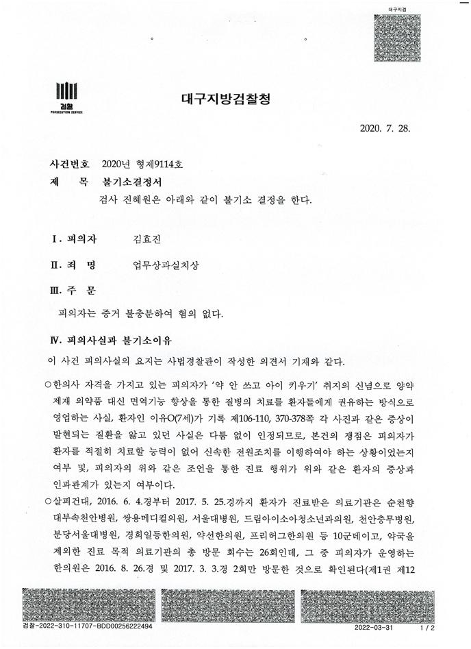
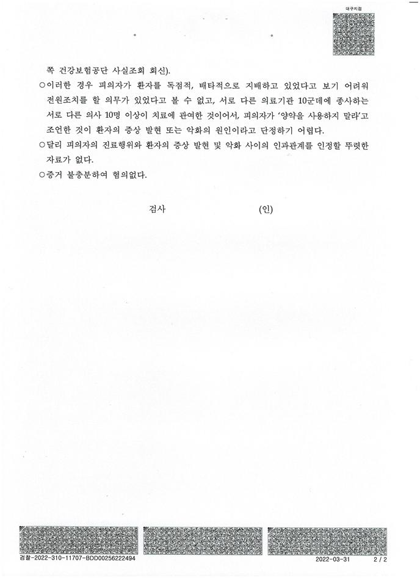
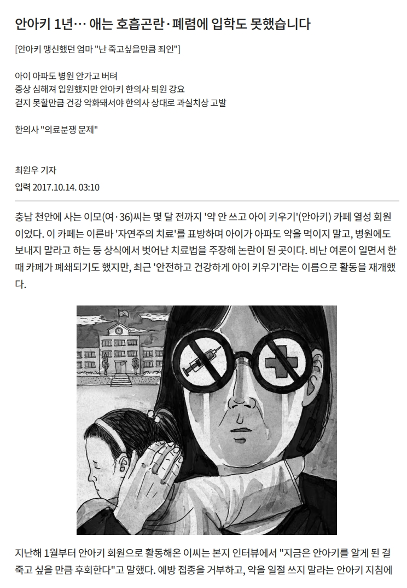
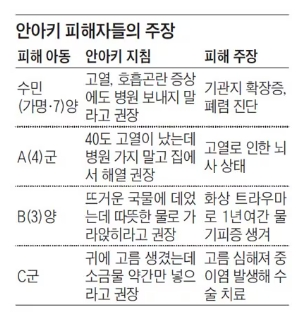

## 문서번호: 3601

### 제목: [왜 애플 맥 OS를 사용하는 사람은 우리나라 공공기관 웹사이트를 원활하게 사용할 수 없는 건가요?](https://q4all.kr/redirect/detail/2e892ce2-dee8-4947-8eca-310d94793839)

**작성자:** [조성용](https://q4all.kr/user/profile/4979)
**작성일:** 2025-02-15 13:37:07 (토요일)

---

요즘 예전보다 많이 좋아지기는 했지만, 여전히 공공기관 웹사이트에서는 윈도우즈 OS 를 사용하는 사람만 이용할 수 있고, 애플 맥 OS를 사용하는 사람은 이용할 수 없도록 되어 있습니다.

같은 애플 제품인 아이폰에서는 대부분의 서비스가 가능한데 왜 PC에서는 애플 맥 OS를 사용하는 사람은 공공기관 웹사이트를 원활하게 이용할 수 없는 걸까요?

---

## 문서번호: 3602

### 제목: [질문은 홍수처럼 흐른다. 그렇다면 우리는 어떤 명제를 가지고 있는가?](https://q4all.kr/redirect/detail/c1d7c5dc-88a9-4939-8f69-8c74a5c5a987)

**작성자:** [신동준](https://q4all.kr/user/profile/2281)
**작성일:** 2025-02-15 13:48:33 (토요일)

---

질문의 홍수

명제의 홍수

모두 버겁다

균형을 잡고 있는가

질문의 홍수 가운데

나는 묻는다

질문을 올바르게 관조할 수 있는

어떤 명제를 가지고 있는가?

우리는 어떤 명제를 가지고 있는가?

이것은 당신밖에 대답할 수 없다

누구에게도 의지하지 않는 질문

자신의 심연으로 들어가는 질문

당신은 무슨 명제를 갖고 있는가?

명제는 신념에서 흐른다

질문은 의지에서 흐른다

---

## 문서번호: 3603

### 제목: [맞벌이 부부 가  늘어나는게 과연  이시대에  잘 하는건가요?](https://q4all.kr/redirect/detail/2e940954-c510-496f-9ac1-d52b98fc53bd)

**작성자:** [이현정](https://q4all.kr/user/profile/3344)
**작성일:** 2025-02-15 13:52:26 (토요일)

---

제목 그대로 왜 꼭 맞벌이를 해야 이나라에서 살수 있나 요?

사교육, 부동산, 무조건 경쟁 시키기, 등등 도대체

인간애 가 없어지는 요즘 생각해볼 문제인것 같아서 글 올립니다

---

## 문서번호: 3604

### 제목: [아르바이트도 노동자인데 왜? 야간 근무수당이 법적으로 보호 받지 못하나요?](https://q4all.kr/redirect/detail/cefb9b29-0ed8-4089-bc2b-4dc31b4dfb96)

**작성자:** [조봉국](https://q4all.kr/user/profile/1180)
**작성일:** 2025-02-15 14:01:12 (토요일)

---

편의점 아르바이트를 하고 있는 국민입니다.

저녁 11시부터 아침 8시까지 일하는데 주간과 똑같은 최저 시급을 받고 있습니다.

저희 동네는 모두 주, 야 동일 최저임금을 지급하고 있습니다.

야간 근무는 밤샘 근무 자체가 힘들고 물품 정리, 쓰레기 비움, 음식물 청소, 매장 청소 등 업무 강도도 적지 않은 편입니다.

아르바이트도 엄연히 노동자인데 법적으로 보호받아야 하지 않을까요?

여러분의 생각은 어떻신가요?

---

## 문서번호: 3605

### 제목: [문재인의 민주당은 적폐청산을 했는가?](https://q4all.kr/redirect/detail/2bddf2d0-5d4b-49d4-ac06-d5666dc7f297)

**작성자:** [안상학](https://q4all.kr/user/profile/2859)
**작성일:** 2025-02-15 14:09:33 (토요일)

---

촛불시민의 지지으로 당선된 문재인민주당은 지방자치선거 압승, 국회의원 180석으로 주었지만,

촛불시민의 요구한 적폐청산,세월호사건을 해결않고, 계혁세력을 등용하지않고, 부폐기득권 세력을

장관으로 입명하지않나 결국 윤석렬 대통령으로 만들었습니다. 그리고, 사과도 제대로 안합니다

앞으로 더불어민주당으로 정권수탈하려면 최우선으로 계혁세력을 앞세으고, 일제시대부테 쌓여온

적폐세력을 청산해결해야합니다. 또, 트럼프의당선을 힘입어 북과 평화와 협력을 최우선으로 해야만,

지금 한국사회의 인구소멸,경졔폭망등 이를 새롭게 해결 할수있는 유일한 해결책이 될겁니다.

---

## 문서번호: 3606

### 제목: [再造山河](https://q4all.kr/redirect/detail/7e3f100f-f289-4829-847a-c3fc4f146978)

**작성자:** [박경](https://q4all.kr/user/profile/1874)
**작성일:** 2025-02-15 14:17:00 (토요일)

---

정규직 비정규직 월급 차이 없게 하는 방법 없나요? 현재 대학 교육이 사회생활, 기업에 도움이 되나요? 정말 필요한 인재를 만들고 있는건가요?

---

## 문서번호: 3607

### 제목: [민주당에게 가장 중요한 것은 유능함 아닐까요?](https://q4all.kr/redirect/detail/cf677da5-6e5a-4dd7-af86-0065442fade1)

**작성자:** [구희성](https://q4all.kr/user/profile/4978)
**작성일:** 2025-02-15 14:25:55 (토요일)

---

1. 대한민국이 선진국으로 가기 위해서는 민주당이 유능해져야합니다.

1. 유능해지는 방법은 무엇일까요? //댓글 남겨주세요.

1. 제가 생각하는 방법은 크게 2가지입니다.

무능한 자들이 당내에 못들어오게 한다.(이미 들어와 있다면 쫒아낸다)

유능한 자들을 당에 영입한다.

이 2가지만 잘 지키면 민주당은 성공할 수 있고. 국민들에게 인정 받을 수 있습니다.

김경수, 임종석 같은 정무감각 없는 무능한 자들이. 권력 욕심만 있는 사람들이. 민주당에 들어오면. 민주당은 제 2의 윤석열 정부 되는 겁니다.

지금 소위 수박들이 "통합"이라는 대의 명분은 내세우면서 민주당 내로 들어오려고 하는데. 확실하게 차단해야합니다.

+ 무능한 자들이 당내 들어오면 무능한 정당이 되는데. 그게 어떻게 정권 교체를 이루는 수단이 됩니까??

+기회 주의자가 민주당에 들어오면 민주당은 기회주의자 정당이 되는 겁니다. //우리는 이를 경계해야합니다.

통합이 중요한게 아니라. 민주당이 유능해지는게 제 1순위입니다.

그게 정권교체를 이루는 정도입니다.

=======================

요즘 잘하고 있긴 하지만

유능한 인재들을 더 많이 당내로 영입해야합니다.

시스템 공천에도 유능함을 평가지표로 삼아야 하구요.

============

민주당에 무능한 자들은 발도 못 붙이게 하고.

기존에 있다면 쫒아 내야합니다.

================

---

## 문서번호: 3608

### 제목: [국민의 힘은 왜 남탓만 하나요?](https://q4all.kr/redirect/detail/a07172c0-aa58-41a3-a2ca-b0c9e278c5cf)

**작성자:** [김대용](https://q4all.kr/user/profile/4983)
**작성일:** 2025-02-15 14:28:52 (토요일)

---

왜 자기 정당의 잘못을 인정하지않고

그저 남탓만하나요!?

---

## 문서번호: 3609

### 제목: [민주당 당예산 규모로 비트코인비롯한 크립토 구매후 운영이 가능한지 궁금합니다. ](https://q4all.kr/redirect/detail/a1615728-5b3c-4f7a-bad1-bf27a5c2cd0b)

**작성자:** [이상현](https://q4all.kr/user/profile/2734)
**작성일:** 2025-02-15 14:38:03 (토요일)

---

당에서 당예산으로 비트코인, 리플, 이더리움 등 크립토 구매해서 운영해갖고 민주당원 국민들에게 당원한정 당비납부추가공제한 크립토 획득, 일부금액산정한 전당원균등분배실험이 가능한지 질문합니다.

---

## 문서번호: 3610

### 제목: [건강보험 지역가입자에게는 자동차가 왜 재산일까?](https://q4all.kr/redirect/detail/b2011501-edc6-4212-bf30-af3bd9e79b18)

**작성자:** [허재훈](https://q4all.kr/user/profile/4999)
**작성일:** 2025-02-15 15:52:19 (토요일)

---

직장가입자는 급여에 따라 보험료가 산정되는데 왜 지역가입자는 상업용 개인용 구분하지않고 모든 차량을 재산으로 산정할까? 누구나 수긍할 수 있는 건강보험료 부과 기준이 있었으면 좋겠다

---

## 문서번호: 3611

### 제목: [우리의 아이들이 즐겁고 행복한 미래를 살기위해서 기존세대인 우리가 본질적이고 최우선적으로 해결해야할것들은 무엇일까요?](https://q4all.kr/redirect/detail/eebb73a9-b577-4bdb-bdbe-5b9ed6aec31e)

**작성자:** [조영재](https://q4all.kr/user/profile/4998)
**작성일:** 2025-02-15 16:10:19 (토요일)

---

1. 꿈과 희망을 갖게하는것.

2. 다앙한경험을 통해 내가 무앗을 잘하루있는지 알아내는것.

이외 다양한 factor들이 있겠지만

이를 뒷받침해주는 사회적 인프라가 중요할듯합니다.

예를들면 사회의공정성, 안정성, 질서,경제적 안정 등.

---

## 문서번호: 3612

### 제목: [대학 서열주의 문화는 어떻게 해야 바뀔 수 있을까?](https://q4all.kr/redirect/detail/57c41f99-3835-4047-9d30-5f8402ab5be0)

**작성자:** [이지용](https://q4all.kr/user/profile/5003)
**작성일:** 2025-02-15 16:23:00 (토요일)

---

한국 사회에서 대학 꼬리표는 평생을 따라다니며 그 사람을 평가하는 주요 척도로 작용합니다.

이제는 대학 간판이 필요 없는 사회가 될 거라는 이야기가 아주 오래 전부터 있었지만, 과연 그러했었는지 의문이 듭니다.

여전히 소위 명문 대학, 심지어 요즘은 인서울이라는 대학에 들어가야 하는 것이 비교적 안정된 인생을 위한 출발점으로 인식되고 있습니다.

학벌 중심주의가 사라질 것이라 하였지만, 실상은 나노 단위로 나누어지는 대학 순위에다 덧붙여, 이제는 문과와 이과의 차이, 학과의 차이 등으로까지 구분되고 우열을 가리는 상황입니다.

그렇다고 해서 실상 이것이 절대 반지처럼 사회에서의 성공을 보장하지도 않습니다. 과연 누구를 위한 것일까요? 승자는 누구입니까?

이를 위한 사교육 편차는 물론, 여기에 연동된 집값이나 지방 소외 현상 등의 사회적 문제도 결코 가볍지 않은 상황입니다.

어떻게 해야, 소모적이고 편중되어 있는 대학 서열주의가 근간이 되는 교육의 문제를 실효성 있게 바꿔나갈 수 있을까요?

---

## 문서번호: 3613

### 제목: [이제라도 교육제도의 변화는 가능할까요?](https://q4all.kr/redirect/detail/7f8640c8-d706-4833-ba19-c443fc3f35a8)

**작성자:** [이대옥](https://q4all.kr/user/profile/5005)
**작성일:** 2025-02-15 16:26:04 (토요일)

---

2024년 12월 3일 이후 대한민국이 놓여있는 사회상황을 보면서 더욱 절감하게 되는 일입니다. 우리의 교육제도와 교육 과정 등 교육과 관련해서 보다 근본적인 것을 놓치고 있다 생각합니다. 스스로 생각할 수 있고 문제의식을 가지고 답을 찾아가는 사람이 되기 위한 시작은 어릴적부터 가정이나 학교에서 지속적으로 책읽기와 가까워질 수 있도록 어른들이 힘을 모아야 한다는 점입니다. 적어도 초등학교 시절까지는 교육과정에서 진행되고 있기는 하지만 결국 입시라는 제도로 인해 다시 멀어지게 만드는 독서와 글쓰기, 토의와 토론으로 이어지는 과정이 AI시대에는 더욱 필요한 역량이라 생각합니다. 지금도 그렇지만 미래에는 책을 읽을 수 있는 사람과 책을 읽지 못하는 사람으로 확연하게 구별될 것 같아서 모두의 질문에 글을 올립니다.

---

## 문서번호: 3614

### 제목: [당새깔이 바뀌면 사회색깔도 바뀌나요?](https://q4all.kr/redirect/detail/a2263dc4-f96b-4fe5-ac41-2b70ff15226c)

**작성자:** [김동혁](https://q4all.kr/user/profile/4893)
**작성일:** 2025-02-15 16:34:00 (토요일)

---

대통령이 이재명이 된다고 믿어의심치 않긴하지만

언제나 별것도 아닌걸로 처벌받고 떠들석하는건 민주당인데

좋은당이든 아니든 어쨌거나 힘이 없으니까 끌려다니는거고

중요한일이 있을때마다 끝은 분열이고 그로인한 고통은 우리같은 서민들이고

삶이 변한거 같지도 않고 오히려 점점 썩어가고있는데

그렇다고 해서 이 썩어빠진사회가 바껴봤자 얼마나바뀔것이며

하루 12시간씩 일하면서 짤릴까 눈치보여서 잔업빼기도 힘든 사람들이

당 색깔이 바뀐다고 뭐가 달라지죠?

---

## 문서번호: 3615

### 제목: [우리나라 교육은 정말 괜찮은가?](https://q4all.kr/redirect/detail/c8b6c2a0-edd5-487e-b479-051010413d6f)

**작성자:** [최소정](https://q4all.kr/user/profile/1281)
**작성일:** 2025-02-15 16:36:26 (토요일)

---

우리나라는 아주 오래전 부터 주입식 교육이 시행되어왔습니다.

그러면서 생각하는 힘과 이해, 질문에 대해보다는 암기에 대해 더 중요시 되어 있고,

그러면서 언제부터인가 국사, 체육, 실과, 기술가정 등 등한시되면서 "국어, 영어, 수학" 과목에만 매달리게 되어

오히려 더 아이들에게 경쟁을 부추기는 사회 만들어져 폭력적인 문화에 조금씩 물들이는 것은 아닐까 생각이 됩니다.

- 어떻게 하면 아이들과 청소년들에게 스스로 생각 할 수 있는 힘을 기를 수 있을까?

- 어떻게 하면 "독서의 힘" 주입식으로 할 것이 아니라 편안하게 대화를 하며 얘기하는 문화로 배워 나아갈 수 있을까?

- 어떻게하면 아이들과 청소년들이 사람과 사람 사이 잘 어울리는 법을 배울 수 있게 할까?

- 아이들과 청소년들에게 잘 노는 방법을 알려줄 수 있을까? (아이들은 책도 책이지만, 놀이를 통해 배우는 것들도 많기에, 꼭 놀이가 나쁜것이라고 생각하지 않습니다.)

- 아이들과 청소년들에 잘 노는 환경과 잘 공부할 수 있는 환경을 조성하여 잘 실행해 나아갈 수 있을까?

---

## 문서번호: 3616

### 제목: [시도 할 수  있을까요?](https://q4all.kr/redirect/detail/df5e0768-5974-4399-8f6a-0621eaca0348)

**작성자:** [슈노기](https://q4all.kr/user/profile/4498)
**작성일:** 2025-02-15 16:40:38 (토요일)

---

제가 대학전공을 선택할때, 제가 해보고 싶은 일이나 하고 싶어 선택한 전공이 아니라, 빨리 직장 구하고 돈 벌기 편한 전공을 선택 했었습니다.

홀어머니에 집안 상황이, 경제적인 어려움이 있었어 선택 한 곳이지만,

감사 하게도 그 선택으로 직장 생활 잘하고 있습니다.

그러나, 50대가 된 중년의 나이에도,

ㅅ기초 의식주 만이라도 보장이 되었다면

ㅠ하고 싶었던 일이나 꿈을

시도 해 봤을 수도

있었을겁니다.

지금도 많은 젊은이들이

시도도 해 보지 않은

많은 꿈들이 현실의 장벽에

부딪쳐 사라진다고

생각하니....

슬픈현실 입니다.

우리 나라가 세계에서

더욱 발전하려면

꿈을 시도 해 보는 젊은이들이

나올 수 있는 환경이 되어야 한다고

생각 합니다.

과연 대한민국 젊은이들이,

자기가 하고 싶은 일과 꿈을

시도 할 수 있는 날이

일까요?

---

## 문서번호: 3617

### 제목: [선행학습 금지를 전폭적으로 시행하지 않는 이유가 무엇인가요?](https://q4all.kr/redirect/detail/791d2851-19e2-4d08-a47a-58ee40cfe021)

**작성자:** [우수경](https://q4all.kr/user/profile/5009)
**작성일:** 2025-02-15 16:41:39 (토요일)

---

학교에서는 선행학습이 금지되어 있습니다.

하지만 사교육 시장에서는 선행학습 금지를 하지 않는 이유가 무엇입니까?

기형적으로 7세 고시 등 영어유치원뿐만 아니라 과학 학원 등 아이들에게 지나치게 학습을 명목으로 강압시키는 것에 대해서 방조하는 것이 아닙니까?

학교에서 선행학습을 금지해서 학습 과정에서 교과서에 설명이 없는 부분을 설명을 할 수밖에 없을 때 아이들이 교육과정을 들이밀고 저항하면서, 학원에서는 상급학교의 교육과정을 공부합니다.

다른 나라처럼 선행학습을 가정에서 실시하는 것에 대해서 강력한 규제를 할 수는 없나요?

아이들에게 지나치게 인지학습만 자극했을 때 부작용에 대해서 연구된 부분도 많지 않습니까.

---

## 문서번호: 3618

### 제목: [저는 장애인 엄마입니다. 제 아이도 장애인입니다. 내가 죽으면 제 아이는 어떻게 될까요? ](https://q4all.kr/redirect/detail/f0ea5187-30a0-46b5-80ef-b4b9927a35eb)

**작성자:** [양 덕방](https://q4all.kr/user/profile/5010)
**작성일:** 2025-02-15 16:54:04 (토요일)

---

장애인아이를 갖은 엄마의 소원은 아이가 죽고난 다음날 자신이 죽었으면 좋겠다 라고 종종 들리고 합니다. 그런데 이것은 현실에서 불가능한 일이라 생각합니다. 저는 장애인이고 싱글엄마입니다. 우리 아이도 장애를 갖고 있습니다. 나는 점점 늙어가는데 내 아이가 내가 죽고 나면 어떻게 될까? 늘, 매 시간 머릿속에 크게 자리 잡고 있는 근심입니다. 우리 아이는 어떻게 될까요?

---

## 문서번호: 3619

### 제목: [실손보험 개정 관련 하여 ](https://q4all.kr/redirect/detail/f1aeaf1b-54cb-4d52-9143-735d71d0da36)

**작성자:** [오기수](https://q4all.kr/user/profile/5012)
**작성일:** 2025-02-15 16:55:26 (토요일)

---

실손보험 개정 관련 하여 정부가 진행하는 걸로 알고 있습니다.

하지만 소비자는 보험사만 이익을 보는 걸로 진행되는 걸로 아는데

실손 보혐 개정 관련 하여 개정을 막아 주셨면 합니다.

지금도 보험사 막대한 이익을 보고있는거로 아는데 개정을 막을수 는 없는가요?

---

## 문서번호: 3620

### 제목: [학교 성적을 숫자로 나타낼 수 있다는 허상을 버릴 수 없나요?](https://q4all.kr/redirect/detail/9a6a36dd-ebf0-4df3-939f-a832c1aa0b2c)

**작성자:** [우수경](https://q4all.kr/user/profile/5009)
**작성일:** 2025-02-15 16:59:06 (토요일)

---

학부모들에게 설득력이 가장 높은 것이 숫자로 점수를 표시하는 것이라고 합니다.

그래서 학구열이 높은 곳은 10여년 전부터 중학교 고등학교에서 지필고사 시험이 끝나고 점수에 민원을 제기하였습니다.

지금은 수업 시간과 교과서에서 배운 내용이라도 논문에서까지 찾아서 정답화시키려고 해서, 정기고사 이후 1달이 지나야 점수 확인이 끝난다고 합니다.

객관식 시험은 자동화기기로 매기는데, 이런 기기를 이용하는 나라는 우리나라가 거의 유일한 것으로 알고 있습니다.

어떤 아이는 공부를 안 했는데, 아침에 기도했더니 수학 3문제를 맞았다며 좋아했고, 어떤 아이는 열심히 공부했는데 실수해서 4문제를 틀렸다고 했습니다.

북한 아이는 한국의 시험이 가짜라고 했다고 합니다.. 찍어서도 맞출 수 있다고요.

중학생들도 자사고, 특목고 등으로 경쟁이 과열되어 있어서, 점수가 낮아지면 이성을 잃습니다. 눈물을 뚝뚝 흘리는 것은 물론이고, 교사에게 욕을 해댑니다.

실질적으로 아이들이 배운 것을 평가하도록 할 수 없나요?

숫자로 평가하다보니, 다양한 이유로 결석한 아이들에게 점수 주는 방식에 대해서는 알고 있나요? 결석의 종류에 따라 인정 점수 비율이라는 것이 있습니다.

참 어이없는 방법이지요.

아이들이 배움의 기쁨을 느끼도록 공교육 체계를 설계할 수 없습니까?

아이들이 배운 내용을 객관식 시험으로 평가할 수 있지만, 그 시험으로 아이들이 그 단원에 대해 잘 알고 있다고 할 수 있나요?

그래서 수행평가를 실시하는데, 수행평가도 결국 수치로 나타내야 합니다.

평가방법과 결과 활용법이 아이들의 성장에 맞추어지길 바랍니다.

---

## 문서번호: 3621

### 제목: [우리나라 농수산물 유통은 최적화되지 못할까요?](https://q4all.kr/redirect/detail/72dc9d30-5888-45f2-b21f-d088efb948c6)

**작성자:** [허철](https://q4all.kr/user/profile/5013)
**작성일:** 2025-02-15 17:01:04 (토요일)

---

농민들은 제값을 받지 못하고 팔고 최종소비자들은 비싸게 사먹어야하는 농수산물 유통과정에 항상 의문이 듭니다.

넓은 땅에서 재배하는 미국이나 프랑스 같은 나라들만큼의 규모에서 나올 수 있는 농산물 가격은 아니더라도 너무 비싸게 사먹어야 하는 것 같습니다.

개선이 안될까요?

---

## 문서번호: 3622

### 제목: [공정한 여론조사를 위한 제안](https://q4all.kr/redirect/detail/3edfa7e3-e761-4d90-b8c2-0c47f536e6c0)

**작성자:** [이주협](https://q4all.kr/user/profile/4409)
**작성일:** 2025-02-15 17:03:42 (토요일)

---

여론조사 전화오면 귀찮으니까 끊어버립니다. 대다수가 그럴거라고 봅니다. 그런데 언론에 나오는 여론조사 보면은 뻥찔때가 한두번이 아닙니다.

완전 조작으로 하는 여론조사, 국민들 상대로 농간을 부리고 있다는 것을 모두가 다 아는 사실입니다.전혀 신뢰가 안갑니다.

그래서 제안을 해 봅니다.

나부터도 여론조사 전화오면 그냥 끊어버립니다. 그런데 어짜피 여론조사 의뢰하려면 많은 돈이 들어 갈겁니다.진정으로 국민들의 여론을 조사하려면

여론조사 플랫폼을 만들어 국민 스스로가 자발적으로 휴대폰으로 접근하게 만들면 됩니다. 여론조사 업체에 줄 돈을 국민들에게 주는것입니다.

국민들 각자가 여론조사 플랫폼 여론조사에 성실히 응답하면 상응하는 돈이나 쿠폰,상품추첨권 등을 지급하는 것입니다.

이렇게 하면 모두가 적극적으로 참여하게 될 것입니다.

앞으로는 국민투표도 휴대폰으로 하게 될 겁니다. 투표 한 번 하느데 투표용지, 인건비등 지출되는 비용에 비하면 경제적으로도 큰 이득 일겁니다.

---

## 문서번호: 3623

### 제목: [의약분업 이대로 좋은가?](https://q4all.kr/redirect/detail/8a45a1ea-c877-4abb-bb46-74223a23e156)

**작성자:** [이주협](https://q4all.kr/user/profile/4409)
**작성일:** 2025-02-15 17:37:31 (토요일)

---

지금의 의약분업이 진정으로 국민을 위하는 것인가?

병원,약국 모두가 한 통속입니다. 국민을 위한다는 말도 거짖입니다. 공휴일 주말이면 병원,약국모두가 문을 닫고 쉽니다.

과거에는 동네 병원,약국들이 밤늦게 까지 영업을 했습니다. 약국에서도 약을 조제해서 약국을 찾는 고객에게 공급을 해줬습니다.

그런데 의약분업 한답시고 국민들은 안중에도 없고 공휴일,주말이면 모두가 문을 닫아 버립니다. 몸이 불편하거나 환자들은 전전긍긍

하게 됩니다. 과거 처럼 돌렸으면 합니다. 여러분들은 어떻게 생각하십니까?

---

## 문서번호: 3624

### 제목: [전라도 투자와 발전계획이 구체적으로 있는건가요?](https://q4all.kr/redirect/detail/83db2200-0df0-4bd4-95f8-7f9c0724f814)

**작성자:** [이나영](https://q4all.kr/user/profile/5020)
**작성일:** 2025-02-15 17:52:33 (토요일)

---

저는 타지역 사람입니다.

평소 전라도는 민주당 텃밭이라 할 수 있는 지역입니다.

그렇지만 그 텃밭이 너무 당연시되고있는게 아닌가 하는 생각을 종종 합니다.

타지역 사는 사람이 이런 생각을 할 정도면 전라도에 사시는 분들은 오죽하겠습니까?

전라도가 점점 더 소외되고 고립되어간다는 생각이 드는데

국힘 텃밭인 경상도를 공략하는 것도 좋지만 일단 자기네 울타리안에 있는 사람들부터 챙겨야 되는거 아닙니까?

경상도에 투자를 많이 한다는데.. 솔직히 아직까진 시기상조에 많은 투자가 필요할까라는 생각이 듭니다.

전 경상도 살지만 여기 사람들은 아직은 힘듭니다.

(투자는 해야겠지만) 경상도에 많은 투자보다 전라도를 더 투자하고 발전시켜주세요.

뉴스에서 뭐만하면 전라도 욕하고 뭐만하면 전라도 콕찝어서 그러는게 너무 안타까워요.

이번에도 극우집회에서 아득바득 광주를 콕찝어 시위를 진행했는데 이런부분도 앞으로의 민주당에 좋지않아보입니다.

민주당에서 더 신경쓰고 지켜야되는 지역1순위는 전라도입니다.

전라도를 외면하지말아주세요.

그런의미에서 민주당은 혹은 이재명대표님은 앞으로의 전라도를 위해 투자와 발전계획이 구체적으로 무엇이 있는지 궁금합니다.

---

## 문서번호: 3625

### 제목: [우리 공동체 모두가 2025년을 살아 가고 있는가?](https://q4all.kr/redirect/detail/a15cf81d-1436-4a17-838f-9fa1ce858e4f)

**작성자:** [이유](https://q4all.kr/user/profile/2297)
**작성일:** 2025-02-15 17:57:37 (토요일)

---

주변을 둘러 보면 문자 보내기도 힘들어 하는 분들이 있는데요, 과연 우리 공동체 모두가 2025년을 살아 가고 있는가? 하는 생각을 해 본 적이 있습니다.

헌법 재판소에서 자신을 변론중인 윤석열 씨와 그를 둘러싼 사람들이 이야기 하는 내용들이 과연 2025년의 상식으로 통용될 수 있는 것들인가? 하는 의문이 들었고 예전에 했던 이 생각을 다시금 소환하였습니다.

단순한 기기에 대한 적응력 부족은 당사자가 조금 불편 할 뿐, 타인에게 피해를 주는 경우가 극히 드물지만,

시대를 따르지 못하는 개인의 가치관은 공동체에 부정적 영향을 끼치는 경우가 많은데 이것은 어떻게 해결 할 수 있을까 하는 의문이 들었습니다.

정답이 특정 되어 있는 질문은 아닌 만큼 많은 분들이 이 부분에 대해 한번 쯤 고민 하는 시간을 가져 본다면, 타인을 이해 하는데 조금 이나마 도움이 되지 않을까 하는 생각입니다.

---

## 문서번호: 3626

### 제목: [모병제는 아직인가요](https://q4all.kr/redirect/detail/09a9e080-f105-4186-a637-c44c881eecea)

**작성자:** [김수영](https://q4all.kr/user/profile/5026)
**작성일:** 2025-02-15 18:11:56 (토요일)

---

전쟁의 판도가 바껴가고 있고 우리 인구도 줄어들고 있는데 모병제로 전문적인 군인 양성이 대세라고 봅니다.

젊은이들에게 안정적인 직장위 길도 열어주고 관심사병들의 문제를 해결하는 방향으로 모병제 시급하다고 생각합니다

---

## 문서번호: 3627

### 제목: [직접과 대의민주주의](https://q4all.kr/redirect/detail/40939e98-cea3-4c98-910b-169c1b46b05e)

**작성자:** [유우종](https://q4all.kr/user/profile/5025)
**작성일:** 2025-02-15 18:13:36 (토요일)

---

공공재와 사적재

가. 공과 사에 경계선을 어디에

둘것인가 ?

(정의를 내려보자)

나. 하나의 개인이 공적인 일을

할때의 공적역할에 객관성을

어떻게 확보할 것인가

(공적결정에 대한 담보방법)

---

## 문서번호: 3628

### 제목: [크립토 패권의 시대에 대비가 되고 있나요?](https://q4all.kr/redirect/detail/27d56a63-c2d6-4a18-8f61-3188446aece7)

**작성자:** [최혜경](https://q4all.kr/user/profile/2208)
**작성일:** 2025-02-15 18:22:54 (토요일)

---

미국이 비트코인을 선점하려 대부분의 주가 법을 바꾸고 있습니다.

그리고 달러 스테이블 코인을 이용하여 국가부채 해결을 모색하고 있고,

이런 흐름으로 가면 각국의 화폐가치는 상당히 하락할 수 있다고 합니다.

모바일폰으로 달러 스테이블 코인이 오가게 될 것이고,

이 달러 스테이블 코인, 엔드 포인트를 장악하는 것은

\*[무역 금융 정보망]을 장악하는 것이므로 절대 놓치면 안 되는 것으로,

모바일폰을 가진 나라. 한국, 중국, 미국 중에서 미국과 중국은 달려가는데

우리만 보물을 가지고도 눈뜬 장님 신세가 되고 있다고 합니다.

무역 금융 정보망을 우리가 선점해야 할텐데 논의가 되고 있는지요?

살펴주십시요~ 감사합니다~!!!

제가 관련 지식이 높지 못하여 참고영상을 첨부합니다.

https://youtu.be/9agLqf4CDao?si=QwC6vYIa2hOxlZ2P

---

## 문서번호: 3629

### 제목: [법과 공권력이 힘이 있고 바로서는 사회를 만듭시다.](https://q4all.kr/redirect/detail/54fb92ef-5f24-4292-b05f-424d3b971d65)

**작성자:** [이성규](https://q4all.kr/user/profile/3747)
**작성일:** 2025-02-15 18:23:03 (토요일)

---

온갖 거짓말들은 진실처럼 포장되어 난무하고,

타인을 음해 하고 선동하는 거짓 세력이 대우 받는 참으로 어지러운 세상이 되었습니다.

그것은 법은 있으되 있으나 마나한 힘없는 법들 때문이라 생각합니다.

타인에게 해를 끼치는 행위들에 대하여는

최소한 1000만원 이상의 벌금과 또는

2년 이상의 형벌, 또는 손해액의 20배 이상 가중 처벌법

이렇게 강력한 법을 만들고 실행해서

법과 공권력이 힘이 있고 진실들이 소중한 가치가 되고

바로서는 성숙한 사회를 만들어 갑시다.

---

## 문서번호: 3630

### 제목: [생리대 지원을 무상 급식 처럼  모든 아이들에게 무상으로 지원할 수는 없을까요. ](https://q4all.kr/redirect/detail/643cf6c1-584f-4daa-bdfa-05487836d4ab)

**작성자:** [정영순](https://q4all.kr/user/profile/2423)
**작성일:** 2025-02-15 18:25:45 (토요일)

---

아이들이 생리 할 때 언제든지 부담 없이 언제든지 생리대를 이용할 수 있는 방법은 있으면 좋겠습니다. 이 아이들이 우리의 미래입니다.

---

## 문서번호: 3631

### 제목: [再造山河](https://q4all.kr/redirect/detail/e7c28021-84e4-488a-a3ac-ac95a5fdd27b)

**작성자:** [박경](https://q4all.kr/user/profile/1874)
**작성일:** 2025-02-15 18:34:19 (토요일)

---

정치 검사가 되는 이유가 뭔가요? 언론, 신문등이 거짓을 유포하는 경우, 처벌 방법은 없나요? 검사들에게 왜 이리도 많은 권한을 부여한건가요? 제2의 구미호쥴리, 윤가놈, 그 애미 죄은순이 나오지 않게 하는 방법이 있나요? 역사 왜곡罪는 없나요? 친일 반민족 세력들을 罰 주는 방법은 없나요?

---

## 문서번호: 3632

### 제목: [스포츠의 탈정치화는 가능할까요? (지자체와 자치구 등 정부보조금에 의지하고 있는 대한민국 프로스포츠산업의 현실에서 깊은 고민에서 질문드립니다.)](https://q4all.kr/redirect/detail/d7d7c12e-a770-4682-a144-0c67f4d9d4f3)

**작성자:** [임효준](https://q4all.kr/user/profile/5021)
**작성일:** 2025-02-15 18:41:46 (토요일)

---

**최근 대한체육회장 선거에서 유승민 당선으로 스포츠계에 새로운 전환기를 맞고 있습니다.**

**돈과 권력을 가진 정치인 출신의 전 회장 후보에 맞서 젊은 패기와 용기 있는 도전으로 극복해낸 결과입니다.**

**저는 피와 땀을 흘리며 성실히 해야만 도달되는 문화예술, 스포츠 분야의 진정성이 그동안 방향성을 잃은 대한민국 정치와 사회에 새 활력이 될 것임을 확신합니다.**

**정치는 분명히 ‘진정성’ 영역은 못되는 것 같습니다. ‘선과 악’을 배제해 실질적인 결과를 내야하는 인간사에서 때론 마키야 밸리의 ‘군주론’의 내용처럼 악마 같은 행위도 부추길 때도 있습니다.**

**그렇지만 다양성과 그것을 기반으로 다수가 아닌 소수자의 배려를 생각하는 민주주의 사회에서는 이웃과 동료를 경쟁에서 이기기 위해 존재마저 없애면서까지 ‘진실과 정의’가 있다고 주장한다면 더 이상 설득력을 잃게 될 것입니다.**

**끊임없는 논란 속에 2월 26일 대한축구협회장 선거가 치뤄집니다. 여기에 후보 3명의 3인 토론회가 21일 계획되었다가 정몽규회장의 거부로 열리지 않는다고 합니다.**

**스포츠산업이 지자체의 보조금에 의해 좌지우지 되는 지금의 현실에서 어느 정당후보가 당선되느냐에 따라 팀 운영과 소속 감독과 선수들까지 영향을 직접적으로 받는 게 축구계를 비롯한 대한민국 스포츠계의 현실입니다.**

**서울 한 지역의 구청장은 자기지역 팀 감독을 자기가 나온 고등학교 후배를 받아라고 지시해 그 감독의 이력서 하나만 정식으로 받아 뽑고 2년 정도 활동하게 한 사실을 체육계 기자들이 알아도 ‘다 그렇다’고 문제제기도 못하는 게 대한민국의 언론과 축구관계자들입니다.**

**특히 훈육을 핑계로 반복되는 아동폭행이 사라지지 않는 축구계의 그 실체를 직면해 보니 부패카르텔의 근원은 정치였습니다.**

**경기지역의 한 정당의 시의원과 친한 중학교 클럽감독이 서로의 이해관계 속에서 이 감독이 자행한 아동폭행이 시의원을 믿고 단순 교육으로 빠질 거라는 오만으로 폭행사실을 시인하면서 결국 6개월 징역, 2년 집행유예의 결과까지 받게 됩니다.**

**여기가 끝이 아닙니다. 자격정지 내 활동한 증거자료까지 스포츠윤리센터와 언론사에 민원제기와 제보가 되었어도 대한축구협회가 자체조사만으로 ‘오해의 소지가 있다’고 증거자료를 지우는 과정을 거치고 자격정지 1년 6개월 기간이 끝나자마자 바로 무혐의 복귀시켜 덮어버리는 것이 대한민국의 현 주소입니다.**

**스포츠윤리센터 담당자는 흔적을 감추고 사라지고 언론사는 제보만 받고 그 자료를 대한축구협회에 제공하고 언론방송을 하지 않았습니다..**

**경기도 역시 민원제기에 대한 실제 증거자료를 확인조사까지 하고도 ‘지도자 활동을 못하게 하겠다’는 처음 말을 바꿔 ‘대한축구협회의 자체조사에 협조하겠다’는 답변으로 바꿔버렸습니다.**

**그리곤 민주당 대선 후보로 나갔던 분이 바로 이재명 경지지사였습니다.**

**이 모든 진실을 가지고 민주당 이재명 대표님께 공개적으로 질문드립니다. 왜 그때 바뀌셨나요? 특히 스포츠윤리센터와 대한축구협회의 부패카르텔에 대해 왜 묵인해 주셨습니까?**

**FIFA나 AFC(아시아축구연맹)에서는 축구의 정치적 활동을 철저히 배제시키고 있습니다.**

**그런데 한 정당의 구청장과 시의원의 영향력에 놓인 축구계의 현실과 대한축구협회의 아동폭행감독의 자격정지 내 활동에 대해 축구협회가 자체조사를 통해 증거인멸한 것에 대한 민원제기를 경기도체육과가 조사를 하고도 처음에는 지도자생활에 대해 엄정한 조치를 하겠다고 하시고는 바꿔서 <자체조사 협조>로 결국 무혐의가 되도록 도와준 꼴이 되었습니다.**

**원래 민원증거자료만으로도 <지도자 자격상실>의 징계를 받았어야하는데도 스포츠윤리센터와 대한축구협회가 짜고 자체조사에서 증거인멸도 무혐의 처분을 남긴 것이었습니다.**

**복귀한 폭행감독은 수석코치로 지난해 활동했던 K4팀은 감독이 프로선수 부모들로부터 수 억원의 돈을 받았고 수석코치인 폭행감독과의 다툼으로 고소고발이 난무해 팀이 사라졌습니다.**

**대한축구협회는** **지난 잘못을 반성하지 않고 정치세력의 지배력에서 자유롭지 못한 어두운 부분을 밝혀내지 못하는 데 진정한 혁신이 일어날 수 있을까 의문입니다.**

**대한체육회 후보 중 캠프에 정치세력을 끌어들인 후보는 심판을 받고 떨어졌습니다. 그런데 대한축구협회 선거에서는 그것을 기대하기 어렵습니다.**

**후보 당사자들과 체육계 언론기자, 축구 관계자들이 지난 과오에 대해 인정하거나 살피는 게 아니라 모두 덮어버리는 부패카르텔로 똘똘 뭉쳐있기 때문입니다.**

**심지어 강력한 시민단체 하나는 한 정당 편에서 움직이고 2000억 원이 넘는 예산을 사용하는 대한축구협회 조직을 호시탐탐 노리고 있습니다.**

**믿기 어렵겠지만 사실입니다. 정식 토론회가 되고 전문가분이 모이신다면 증거자료를 들고 나가서 토론을 펼치겠습니다. 이재명 대표님도 함께 자리해 주시기를 부탁드립니다.**

**긴 글 감사히 읽어주셔서 감사드립니다.**

**스포츠혁신 4년② 피해자는 떠나고 가해자는 남는다 https://search.app/ezwgS69hL6NLw69AA**

**https://naver.me/5xjkX6Vi**

---

## 문서번호: 3633

### 제목: [이제는 아파트 후분양제를 전면적으로 시행해야 하지 않을까요?](https://q4all.kr/redirect/detail/5ac862b3-8281-4340-aba7-e0ccb7e0c8c8)

**작성자:** [구태원](https://q4all.kr/user/profile/3099)
**작성일:** 2025-02-15 18:50:09 (토요일)

---

뉴스를 보면 아파트 선분양제로 인해 고통받고 있는 서민들의 이야기가 많습니다.

입주 사전 점검에 갔더니 하자가 너무 많은데 준공 승인이 나서 답답해하는 사람들의 사연들.

공사비가 올라 시행사와 시공사 간의 분쟁으로 입주 날짜를 넘기도록 공사가 지연되어 중도금 이자 및 월세를 전전하고 있는 사람들의 사연들.

HUG(주택도시보증공사)로 가야할 보증금을 시행사가 공사비로 몰래 사용하고, 갑자기 시공사가 부도가 나서 뒤늦게 이 사실을 안 사람들의 사연들.

이들은 대부분 자신의 살 집 마련을 위해 한 푼 두 푼 아끼고 모아온 서민들입니다. 그리고 그 돈은 그동안 자신이 모아온 전부이구요.

이런 사람들의 사연들을 언제까지 두고 보아야만 할까요?

언제까지 이런 식으로 선분양제에 따른 피해를 서민들이 고스란히 감당해야 할까요?

지방에는 미분양이 속출할 정도로 이제는 집이 부족한 상황은 아닙니다.

이제는 후분양제로의 전환을 전면적으로 검토하고 시행해야 하지 않을까요?

---

## 문서번호: 3634

### 제목: [사회복지사, 요양보호사의 처우는 개선될 수 있을까요?](https://q4all.kr/redirect/detail/b33322d3-e653-41ac-863f-cc2137a74a2c)

**작성자:** [이혜진](https://q4all.kr/user/profile/5035)
**작성일:** 2025-02-15 19:30:08 (토요일)

---

"사회복지사와 요양보호사의 처우 개선 가능성이 있을까요?"

현재 사회복지사와 요양보호사는 돌봄 서비스의 핵심 인력임에도 불구하고 열악한 근무 환경과 낮은 임금 문제로 어려움을 겪고 있습니다. 특히 요양보호사의 경우, 장기요양보험 제도의 구조적 한계로 인해 근속 연수가 길어도 임금이 크게 오르지 않고, 감정 노동과 육체적 부담이 심함에도 적절한 보상이 이루어지지 않는 실정입니다.

사회복지사의 경우에도 공공기관과 민간시설 간 처우 격차가 크고, 업무 강도에 비해 급여 수준이 낮아 이직률이 높은 편입니다. 이러한 현실 속에서 정부 차원의 처우 개선 정책이 실효성을 가지려면 어떤 방향으로 나아가야 할까요? 임금 인상 외에도 근무 환경 개선, 감정 노동 보호 대책, 복지 서비스의 질을 높이기 위한 정책적 지원이 필요하다고 생각하는데, 이에 대한 구체적인 방안이 마련될 수 있을까요?

---

## 문서번호: 3635

### 제목: [교과서 대신 단행본으로 학습할 수 없나요?](https://q4all.kr/redirect/detail/b47e452f-efac-4d47-81b9-b3ebe6fc6f33)

**작성자:** [우수경](https://q4all.kr/user/profile/5009)
**작성일:** 2025-02-15 19:40:23 (토요일)

---

학교에서 국정교과서를 사용하지 않고 검인정 교과서를 사용하고 있습니다.

검인정 교과서에서 본문에서 학생들의 비판적 사고력을 제고할 수 있는 특정 부분을 삭제하고 원문을 싣는 경우도 있습니다.

교과서를 교체할 때마다 출판사별로 많은 노력을 하고, 학교에서도 준비를 합니다.

하지만 아이들에게 제공되는 내용은 많은 차이가 나지 않는 경우도 많고

일부분을 모아서 제공하기 때문에 학습량이 너무 많기도 합니다.

단행본으로 학습하고, 워크북을 교사가 교육과정에 따라 활용할 수는 없나요?

학령에 맞는 단행본을 만들고 보급하면 출판사, 지역서점도 상생 가능하지 않을까요?

교과서 형태가 필요한 과목도 있겠지만, 학생들의 학습량이 너무 많은 것도 문제입니다.

단편적인 문제풀이식 학습은 독서습관 형성에 도움이 안 됩니다.

독서량에 문제가 많다는 것은 알고 있지 않습니까?

길거리에 서점 찾기가 어렵습니다. 독서문화 진작을 위해서도 지금과 같은 교과서로 학습하는 방법에 대해서 문제제게 하고 싶습니다.

---

## 문서번호: 3636

### 제목: [젊은이들이 살아가는 나라를 만들려면 어떻게 해야 할까요](https://q4all.kr/redirect/detail/41bb120b-e300-47d6-a0d9-66984b64a5d0)

**작성자:** [김원규](https://q4all.kr/user/profile/5036)
**작성일:** 2025-02-15 19:44:40 (토요일)

---

1. 출산율은 한없이 추락합니다.

1. 있던 아이들마저 졸업과 동시에 대한민국을 떠납니다.

1. 요새 베트남에 있는 한베 가정에서 출산한 아이들도 한국 국적을 포기하고 베트남 국적을 대부분 얻는다 합니다.

한국으로 들어가도 치열한 경쟁과 함께 한 한국 아이들에게 이길 방법이 없으니 발전하고 있는 베트남에서 그냥 살기를 원한다 합니다.

---

## 문서번호: 3637

### 제목: [민주당을 지지하는 여성들은 안보무임승차를 주장하십니까?](https://q4all.kr/redirect/detail/b18b7f29-5100-48eb-b285-6d95f34defbd)

**작성자:** [김민석](https://q4all.kr/user/profile/3991)
**작성일:** 2025-02-15 20:01:30 (토요일)

---

비전투병과에 입대를 하던,

국방세를 내던,

군가산점을 인정하던,

아이를 두명 이상 낳던..

해야 민주시민 아닐까요?

---

## 문서번호: 3639

### 제목: [이번에 국가개조를 못이룩하면 한국은 미얀마처럼 될겁니다.](https://q4all.kr/redirect/detail/52441ad9-dd29-4a98-966b-f82f07e224cc)

**작성자:** [김민석](https://q4all.kr/user/profile/3991)
**작성일:** 2025-02-15 20:14:50 (토요일)

---

문정부 시절처럼 미지근한 개혁은

박근혜정부와 큰 차이 없는겁니다.

정부와 당내 인사 중 혁명적 국가개조에 반대하며,

사회안정. 협치. 국민통합.. 주장하는 놈은

북,중,일,미 중 어느나라 스파이라 보면 됩니다. ^^

---

## 문서번호: 3640

### 제목: [지속가능한 의료시스템을 만드려면 어떻게 해야할까요? ](https://q4all.kr/redirect/detail/9b86cb61-0ca2-4bd3-9e4a-20aa6f07b815)

**작성자:** [이동욱](https://q4all.kr/user/profile/5041)
**작성일:** 2025-02-15 20:21:24 (토요일)

---

필수의료에 종사하는 의사분 중에는 고소고발로 인해 경제적으로 나락의 구렁텅이에 빠질 위험과 본인의 인생을 갈아넣어야 하는 힘든 근무환경을 사명감으로 버티는 경우도 있습니다. 그러다가 정말 그 일을 좋아하지만 현실적인 이유로 그만두시는 경우도 많이 알고 있습니다.

우리에게 의료는 꼭 필요합니다. 하지만 지금의 시스템은 지속가능하지 않습니다. 정부, 의사, 학계, 시민단체, 환자단체, 국민들을 제대로 대변할 사람들을 모아 의료시스템 개편을 위한 논의를 시작해야 합니다.

이미 소 잃고 외양간을 고치는 상황이지만 늦어지면 더 큰 피해를 국민이 감당하게 될 것입니다. 지금이라도 많은 관심이 필요합니다.

---

## 문서번호: 3641

### 제목: [우리나라 교육의 목표는 무엇인가요?](https://q4all.kr/redirect/detail/9a97b3d5-ca81-4728-8560-dc85635e0bb7)

**작성자:** [안재훈](https://q4all.kr/user/profile/5044)
**작성일:** 2025-02-15 20:25:43 (토요일)

---

우리 아이들이 학교에 가서 무엇을 배우기 위해 학요에 가나요?

부모들은 학교에서 모든것을 다 배울수 없다고 생각 하면서도 그렇게 되기를

기대하는 것 같습니다.

우리는 우리나라의 교육철학이 무엇인지 모릅니다.

학교는 무엇을 하는곳인지? 산업화에 필요한 말 잘듣는 노동자를 키우는 곳인지?

부모 없는 동안 아이를 돌봐주는 보육기관인지? 다들 다른 생각을 하는것 같습니다.

그래서 모두가 공감하는 학교는 무엇을 위해 존재하는지?

우리의 교육 철학과 교육 목표는 무엇인지를 결정해야 할 것 같습니다.

---

## 문서번호: 3642

### 제목: [우리나라는 왜 선출되지 않은 판사들이 최종 판결을 하나요?](https://q4all.kr/redirect/detail/dd1f4707-af28-4196-bfab-57fae994245d)

**작성자:** [안재훈](https://q4all.kr/user/profile/5044)
**작성일:** 2025-02-15 20:33:27 (토요일)

---

우리는 왜 단지 시험을 잘 본 법조인인 판사가

우리의 최종 결정을 하나요?

우리는 왜 단지 시험을 잘 본 검사에게 수사와 기소의 결정을 하도록 위임하고

판사에게 모든 상황에 대한 결정을 하도록 위임하고 있나요?

이 부분은 국민들이 참여하고 선출된 사람들이 해야하지 않을 까요?

---

## 문서번호: 3643

### 제목: [영화제작을 위한 세트장을 관광산업으로 활용할 수는 없을까요?](https://q4all.kr/redirect/detail/4ebf230f-8e4a-4314-aee1-c7ca7192ef9a)

**작성자:** [강지행](https://q4all.kr/user/profile/5046)
**작성일:** 2025-02-15 20:36:09 (토요일)

---

K 컨텐츠는 우리나라의 엄청난

자산입니다.

막대한 비용을 들여서 세트장을 짓고 영화촬영

이후에는 철거하는데 이 세트장의 일부를 옮겨서

모아 관광산업에 활용하는 것은 어떨까요??

흔히 부산을 영화의 도시라고 하지만

실제로는 영화와 관련된 관광지라고 할 수 있는 것은

남포동 영화거리가 다입니다.

실제로는 부족하죠

K 유니버셜 스튜디오를 부산에 유치하면 어떨까요?

장소는 부산외대 (구)캠퍼스 우암동 부지를 사용하면 어떨까

싶습니다.

각 영화사의 이해관계

세트장의 현실

지자체의 지원

어느 하나 쉬운 것은 없지만

미래를 위한 행정력을 모으면

못할 것도 없어 보입니다.

안되는 이유는 1000가지이겠지만

해야하는 이유는 한가지 입니다.

더 나은 대한민국을 위해서!

---

## 문서번호: 3644

### 제목: [학교에서 한 반의 적정 학생수와 교사 수급에 대해 진지하게 고민하고 있는지 궁금해요.](https://q4all.kr/redirect/detail/97d0fe93-b0c0-415c-b042-05fe2163254b)

**작성자:** [우수경](https://q4all.kr/user/profile/5009)
**작성일:** 2025-02-15 20:42:30 (토요일)

---

초등하교 교사들은 일주일에 수업을 23시간 가량 하고

중학교 교사들은 일주일에 20시간 정보의 수업을 합니다.

고등학교는 16시간 정도입니다.

이 수업 시간은 특별활동이나 재량활동 수업을 제외한 시간입니다.

아이들과 개별상담을 하거나 교육활동을 하기에 매우 부족한 시간입니다.

아이들에게 문헤해결 능력을 키울 기회가 점점 박탈되어 가고 있습니다.

봉고로 등하교하고, 아이들 스스로 결정하고 처리할 기회가 많이 사라졌습니다.

실제 삶과 괴리된 문제풀이에 능숙하게 자라고 있는 측면이 있습니다.

이이들이 예전에 비해 정신적으로 어린 측면이 분명이 있다고 느끼니다.

아이들은 어릴 때부터 많은 선택권을 가지고, 부모님들과 개별적인 상호교류를 하며 지내온 상황이라

각자의 개별적인 요구 표출과 충족을 매우 중요하게 생각하고 있습니다.

이런 상황에서 중학교 1학년 초등학생과 큰 차이가 없는데 한반에 30명 가량 수업을 하기에는 너무 많은 한계가 있습니다.

한 반에 최대 20명, 15~20명 정도로 수업을 해야 한다고 생각합니다.

몇 년 후면 아이들 수가 엄청 줄어든다고 예상하고 지금 교사TO를 줄이는 것으로 압니다.

교사수급에서 중요한 사항들을 확인해주셨으면 합니다.

학교마다 기간제 교사가 없으면 학교 운영이 실제로 힘들 거라고 생각합니다.

기간제교사들은 아이들을 만날 때 경쟁을 피할 수 없습니다.

어느 정도 경력직은 호봉을 인정하겠지만, 그 외 모든 경쟁을 거쳐야만 합니다.

공교육에서 적정 학생수와 교사 수급에 대해서 고민해주세요.

몇 년 후의 아이들을 위해서 지금의 아이들이 희생해야 할 것이 많습니다.

---

## 문서번호: 3645

### 제목: [갈수록 지능화돼는 청소년범죄와 학교폭력 줄일수는 없을까요?](https://q4all.kr/redirect/detail/7653dc41-27d9-42dd-acb3-f63f3ef4f005)

**작성자:** [최정길](https://q4all.kr/user/profile/5047)
**작성일:** 2025-02-15 20:48:04 (토요일)

---

시대가 변하면서 청소년범죄가 심각 합니다.얼마전 법원 폭동때에도 미성년자가 있썼다고 들었습니다

그래서 초등학교때 부터 헌법에 대해서 교육을 했으면 합니다.

초등학생눈높이에 맞춰서 법율과목을 신설하면 범죄에 대한 무서움도 알고 범죄도 줄어들거라 생각 합니다

선생님에 대한존경심이 땅바닥에 떨어 진지금 시대에는 법에 중요함과 형벌에 대한 무서움도 가르칠

필요가 있다고 생각 합니다.

어려서에 교육이 평생을 갈수도 있습니다.

---

## 문서번호: 3646

### 제목: [하청 노동자는 도급 계약의 몇%를 월급으로 받으면 적당할까요?](https://q4all.kr/redirect/detail/f17ab11d-7b86-474e-8bd9-965e4dbcf1e8)

**작성자:** [이정우](https://q4all.kr/user/profile/3953)
**작성일:** 2025-02-15 21:09:58 (토요일)

---

실수로 질문이 삭제되어 다시 등록합니다

간단하게 말해서 원청(대기업)에서 도급 계약으로 하청업체에 월 천만원 주기로 계약하였을 때

하청업체에 속한 노동자는 월 얼마를 받으면 적당할까요? 절반인 500만원? 아니면 600만원?

대기업의 계약 단가는 그래도 꾸준히 올랐습니다 , 그런데 중소기업, 하청업체에서 일하는 우리의 월급은 얼마나 올랐을까요?

전 대충 10년동안 대기업의 단가는 거의 두배가 올랐지만

월급은 오른 금액의 절반 정도가 올랐을 뿐이네요

박주민 의원이 추진하겠다고 한 포괄임금제 폐지 , 금지도 중요하지만

도급업체와 하청업체 간의 계약된 단가에서 노동자에게 지급되어야 할 급여는 상한선을 두던가 뭔가 기준이 필요하다고 생각합니다

질문 삭제 버튼에 삭제할 것인지 물어보는 팝업창 부탁드립니다 ㅠ

---

## 문서번호: 3647

### 제목: [대한민국의 물류 유통은 개혁이 필요하다. ](https://q4all.kr/redirect/detail/5f053976-afc3-4f2d-acde-99d1bdf80beb)

**작성자:** [고정진](https://q4all.kr/user/profile/2276)
**작성일:** 2025-02-15 21:17:18 (토요일)

---

1. 컴퓨터 부품이 무슨 활어회 싯가 처럼 시세가 존재함 일명 YSRP라고 MSRP(제조사의 권장소비자가)의 용산 시셋가를 지칭하는 말임
2. 농수산물 같은 경우 생산자는 헐값에 도시의 소비자는 비싼일이 허다함 항상 문제가 되는 예시로 나오는데 고쳐지지가 않음
3. 법적으로 보호조치가 되는 문제도 많다. 얼마전에 없어지기로 한 단통법, 우유의 원유 가격 연동제나 도서 정가제 등이 문제다. 소비자가 왜 비싸게 댓가를 지불해야 하는지 문제다.
4. 웃기는건 석유 즉 기름에서도 나타나는 현상인데 가격 인상할때는 즉각이고 인하할때는 오히려 안내리는 경우도 있다.
5. 이러한 문제의 결론은 중간 유통단계가 상도를 넘어선 독점과 카르텔 그리고 법의 취약성과 악용으로 인하여 생산자도 소비자도 둘다 피해가 입는 상황이 오는 것이 문제라 본다.

---

## 문서번호: 3648

### 제목: [왜 굶주리는 아이가 게속 있나요?](https://q4all.kr/redirect/detail/fbcb3e7c-da1c-4806-9002-58b807e83753)

**작성자:** [이경원](https://q4all.kr/user/profile/5052)
**작성일:** 2025-02-15 21:32:48 (토요일)

---

유튜브를 보다 보면 굶주린 아이들이 끼니를 때우지 못하는 광고가 나오더군요.

배고파서 떠도는 아이들을 보면 마음이 아프네요.

한국일보 기사에서는 2017년 결식아동은 33만명이라고 하네요.

정부에서 발간한 결식아동 급식 매뉴얼을 보면 결식아동이 줄어들고 있다고 하지만,

결식아동 시민단체는 여기저기 많네요.

굶주리는 아이가 없었으면 좋겠네요.

---

## 문서번호: 3649

### 제목: [악의적인 허위사실 유포에 대한 적극적인 대처방안은?](https://q4all.kr/redirect/detail/215e3a33-969d-42aa-b994-ad6cfd425c60)

**작성자:** [조선우](https://q4all.kr/user/profile/734)
**작성일:** 2025-02-15 21:57:36 (토요일)

---

허위사실 유포에 대해 민주파출소에 댓글과 sns상 게시물들을 열심히 신고는 하고 있는데, 너무 한정적인 내용들에 대해서만 법적 조치를 하는것 같다는 생각이 듭니다.

좀 더 적극적이고 구체적인 법적 조치가 필요하다고 생각합니다.

기왕 만드신거 제대로 활용해서 당원들이 효능감을 느끼게 해주세요.

---

## 문서번호: 3650

### 제목: [이제 민주시민을 키우기 위한 교육을  고민해야 하지 않을까요?](https://q4all.kr/redirect/detail/38e03dfb-d138-4ff4-a928-2525462c3704)

**작성자:** [송홍주](https://q4all.kr/user/profile/285)
**작성일:** 2025-02-15 21:58:24 (토요일)

---

계엄과 탄핵의 광장에서 드러난 2030 세대의 극적인 분열은 앞으로 우리 사회에 너무나 큰 숙제를 던져주었다고 생각합니다.

오래전부터 인터넷 상에서 자라온 차별과 혐오를 무비판적으로 흡수하고 사용하며 물들어가는 아이들을 교육의 현장에서 보아왔습니다.

그렇게 싹을 틔운 세대들이 이제 광장에 나와 혐오를 행동으로 옮기고 폭동으로 발현되는 모습은 공포스러웠습니다.

지역에서 인권과 시민교육을 기반으로 프로그램을 제공하고 운영해온 교육활동가로서

우리의 교육의 목적이 이제는 개인의 성공을 목적으로 하는 것이 아닌

사회의 시민으로서 제대로 기능할 수 있는 역량을 키우는데 더 많은 실질적이 노력을 기울여야 할 때가 아닌가 합니다.

현행 교육법과 교육과정에도 시민육성에 관한 조항과 내용은 있습니다만

이제는 아이들 뿐만 아니라 전 세대를 대상으로 하는 적극적인 민주시민 교육법과 기관설립과 교육과정 편성 및 교과목 개설, 교육지원 등을 통해

전국민이 시민으로 자리매김할 수 있는 지원을 해야하지 않을까요?

90년대부터 시민교육법은 발의되어왔으나

제대로 된 논의도 불가능 했으며 언제나 여론에 밀려 폐기되어 왔습니다.

국회 여러 의원실에서 주최하는 공청회등에도 다녀보기도 했지만 관심도 열의도 덜하고 그저 공청회, 발의, 폐기로 끝나는 것을 지켜봐야 했습니다.

독일처럼 장기적인 논의와 합의가 이루어진다면 좋겠지만

적어도 인성교육법처럼 시민교육법이라는 최소한의 법조항이라도 있다면

불씨라도 살릴 수 있지 않을까 생각합니다.

우리나라는 시민교육에 대한 과목이 없어 (대부분 사회/도덕과에 포함) 대학에서 전공과목도 없으며, 당연히 연구자도 별로 없으며 연구결과도 미미합니다.

교과과정이나 교육과 관련한 곳곳에 시민이라는 용어를 쓰지만

우리나라에는 아직 '시민' 또는 '민주시민'에 대한 개념 합의도 되어 있지 않습니다.

기성세대들은 정치란, 시민이란, 그냥 삷의 장이나 광장에서 배울 수 있는 거 아니냐고 생각할 지도 모릅니다.

아이들이 살아가는 공간은 기성세대가 살아 온 삶의 공간과 전혀 다릅니다.

그러나 지금의 영유아 초등 아이들은 친구와 노는 것도 양육자들의 약속에 의해 놀 수 있습니다.

아이들의 생활 공간은 학교, 학원 등 아이들이 갈 수 있는 공간으로 한정되어 있습니다.

세월호 이후 안전이라는 이름으로 모든 외부활동은 학교 안으로 들어갔으며

다양한 외부 활동은 대입 부정의 요인으로 축소되어 갔습니다.

이제 아이들은 동네에서 다양한 아이들과 어른들을 만나지 못합니다.

그 역할은 온라인에서 이루어집니다.

그런데 온라인에서 공기처럼 가득차 있는 차별과 혐오를 아무런 비판의식 없이 자연스럽게 습득하고 내면화 하게 됩니다.

의미를 정확히 알지도 못하면서 키득대며 혐오와 차별의 밈들을 거리낌 없이 사용하는 아이들을 수업 속에서 만나면

어디서 부터 바로 잡아야 할지 아득할 때가 많아 집니다.

이제 제발 좀 관심을 가지고 장기적인 투자를 해야하지 않을까요? ㅠ.ㅠ

---

## 문서번호: 3651

### 제목: [최근 성행하는 부업사기, 왜 피해자가 계속 늘고 근절이 안되나요?](https://q4all.kr/redirect/detail/54359a1f-a2ad-4cde-86fc-35733d3f58d7)

**작성자:** [박정은](https://q4all.kr/user/profile/5055)
**작성일:** 2025-02-15 22:04:41 (토요일)

---

사는게 팍팍해 부업을 알아보다 부업사기를 당했습니다.

몰랐는데 경기일보에서 3부작 기사가 나오기도 했는데(<https://kyeonggi.com/article/20250115580338>)

같은 수법과 동일한 인물들로 보이는 일당이 아직도 온라인에 살아있습니다.

작년 피해액이 몇십억..계속 늘고 있다는데 보이스피싱이 아니라며 피해자들은 보상받을 길도 없다 합니다.

누군가에게는 몇백만원에 작은 금액일지 모르나 너무 간절한 생활비입니다. 제대로된 수사와 더이상의 피해자가 없도록 크게 보도되어야 하지 않을까요. 부탁드립니다

---

## 문서번호: 3652

### 제목: [사법피해자를 구제할. 방법이 없나요?](https://q4all.kr/redirect/detail/11a7a908-f558-455f-ae87-05545dfbd88a)

**작성자:** [박숙정](https://q4all.kr/user/profile/5054)
**작성일:** 2025-02-15 22:18:48 (토요일)

---

법관의 법왜곡으로 억울한 판결로 재산. 모두. 잃었어요.

공산주의 국가면. 체념해겠는데요 사유재산 보호받는 민주국기라서 13년째 저항하고 있어요.

힘없는 사회적 약자,즉. 개인의. 소리는 피해망상증. 환자취급만 받았어요.

판결이. 최후의 보루라면 돈업고 권력없는 사람은. 어떻게하죠

악소리. 한번 지르지 못하고. 당했어요

모든. 국가 기관에서의 답은. 억울하면 재심하라. 합니다.

돈없는 사람이,한 개인이 무슨 재주로. 재심을 하죠? ?

실제로 사법부의 횡포에 저항할 개인은 큰바위에 달걀한개 던지듯 자신만 깨집니다.

국정조사라도. 받고싶어 정치인도움을 받고싶은데 정치인도,언론도,해결해줄 단체는 아니라는거죠

사법 폭력은. 가장 잔인한. 국가폭력인데 누가 책임지죠? ??

---

## 문서번호: 3654

### 제목: [국힘당이  보수당  이라   말하기도  챙피하네요 ](https://q4all.kr/redirect/detail/712c8746-3b8a-44ff-9715-3494e3a617b7)

**작성자:** [이현정](https://q4all.kr/user/profile/3344)
**작성일:** 2025-02-15 22:39:54 (토요일)

---

티브만 보던 시대완 다르게 변해가는데 ~~

국힘당의 하는짓을 보면 한숨만 나와

원칙과 청년의 미래를 생각한다고 말은 하는데

도대체 몇년동안 뭘 청년들의 미래를 생각했는지 도대체

이해가 안되네요

티브프로 '강적들' 보다 느끼는게 많네요

도대체 상식은 어디 온데 간데 없고 ㅜ

그나마 민주당에서 모두의 질문 Q를 만들어 주셔서

소통이 되고 감사합니다 ~~

---

## 문서번호: 3655

### 제목: [소액이 급하게 필요한 사람에게 쉽게 다가갈수 있는 은행이 필요해요.  ](https://q4all.kr/redirect/detail/224281e5-fe1f-4198-bedd-f540eb05869a)

**작성자:** [이경원](https://q4all.kr/user/profile/5052)
**작성일:** 2025-02-15 23:33:08 (토요일)

---

예전에 이재명 대표께서 담보없이 소액을 대출해주는 제도에 대해 언급하는 영상을 본적이 있습니다.

경기도에서 큰돈 들이지 않고 했던 사업으로 들었습니다.

나의 아저씨의 지안이 처했던 힘든 상황이 없는 세상이 되었으면 좋겠어요.

---

## 문서번호: 3656

### 제목: [위증을 줄일 수 없나요?](https://q4all.kr/redirect/detail/8718f54c-d31f-4d36-a01a-aea6fa076a02)

**작성자:** [최광호](https://q4all.kr/user/profile/5062)
**작성일:** 2025-02-15 23:57:14 (토요일)

---

국회청문회, 재판등에서 위증,위증교사을 줄이는 방법이 없을까요?

위증때문에 발생하는 사회비용이 너무 많은 듯 합니다.

위증 시 감형,사면없는 50년이상 징역이면, 줄어들까요?

---

## 문서번호: 3657

### 제목: [검찰캐비넷 이란 말이 나오지 않게 만들수 있을까요?](https://q4all.kr/redirect/detail/22370d37-9eb0-4f49-9cc9-2889d1c62a09)

**작성자:** [최광호](https://q4all.kr/user/profile/5062)
**작성일:** 2025-02-16 00:04:16 (일요일)

---

전수 조사해 처리하던지

처리하지 않을 것은 완전 폐기하던지

---

## 문서번호: 3658

### 제목: [80%의 인간들을 만족시키고 통합 할 수 있는 새로운 시대 이념을 어떻게 설정해야 할까요?](https://q4all.kr/redirect/detail/72d7306e-8ee8-4abc-80dd-233d5597a912)

**작성자:** [김백민](https://q4all.kr/user/profile/2400)
**작성일:** 2025-02-16 00:04:41 (일요일)

---

국짐 경제기득권 뉴롸이트반민족 적폐세력들은 권력과 경제권을 사고 팝니다. 살기 위해 10만원에 동원되는 노인, 희망보다 욕망을 채우기 위해 공정을 버린 청년들. 

범 자유 홍익 행복 공정 소망 진보를 모아 80%의 인간들을 만족시키고 통합 할 수 있는 새로운 이념을 어떻게 만들 수 있을까요?

뉴옳음? 신옳음? 의 기준을 어디부터 어디까지 설정해야 할까요?

---

## 문서번호: 3659

### 제목: [기술의 발전으로 직접 민주주의 집단지성 체재가 가능할까요](https://q4all.kr/redirect/detail/80777584-7f24-4d40-a260-489f051a99dd)

**작성자:** [최주천](https://q4all.kr/user/profile/5058)
**작성일:** 2025-02-16 00:14:11 (일요일)

---

다수결 승자독식의 시스템

나아가 대의 민주주의 한계를 느낍니다

모든 권력은 국민으로부터 나오고

선출 임명직은 권한을 사용하는 것인데

민의는 따르지 않고

선민의식 엘리트주의로 서로 학연,지연,혈연으로

밀어주고 땡겨주고 서로 봐주고

언제까지 이렇게 가야 하나요?

법치에 의해 운영되고

소유와 경영의 분리

선후배 문화 군대 기수 문화

비정규직 동일노동 동일인금

연금개혁

네 잘났네 하지 않는 문화

억울하면 출세해라 없는 사회

올바른 토론문화

가야할 길이 멀고

과제가 산더미같네요

예를 들면 재판 1심은 판사 판결 + AI 판결 프로그램a,b

총 3개의 판결 중 여론에 투명 공개

판결문 무료열람 공개

g10에서 g5 안에 드는

gdp 3만불을 넘어 5만 7만불로 가려면

기존 이 시스템을 갈아엎는 많은 분야의 개혁이 필요하다고 봅니다

---

## 문서번호: 3660

### 제목: [블록체인을 통해 사회 신뢰비용의 감소가 가능할까요?](https://q4all.kr/redirect/detail/40a293aa-6855-4892-8dfa-32cc8c4838b5)

**작성자:** [국윤성](https://q4all.kr/user/profile/5063)
**작성일:** 2025-02-16 00:17:52 (일요일)

---

https://www.blockmedia.co.kr/archives/853946

최근 미국 DOGE부서의 수장인 일론 머스크는 미 재무부의 거래내역에 블록체인을 도입하여 투명화 하는 방안에 대해 찬성한다고 밝힌바 있습니다.

블록체인의 거래를 통해 투명성을 확보하면, 이것이 공공영역에서 발생하는 신뢰비용을 절약 하는데 도움이 되지 않을까 생각해 보게 됩니다.

이제, 우리 사회가 이 새로운 기술을 투기와 재테크의 수단으로서만 생각 할 것이 아니라 블록체인이라는 기술의 근본 매커니즘인 '신뢰 비용'에 효율성을 가져오는 것에 주목할 필요가 있지 않을까요?

나아가 범죄 예방의 측면에서도 사용 가능할 것 같습니다.

최근 RWA, 과거의 NFT등으로 논의되었던 토크나이제이션 기술의 일상화를 통해 딥페이크 같은 범죄를 사전에 차단할 수 있지 않을까요? 실제로 제가 알기로는 생성형 음악을 만드는 ai사이트에서, 블록체인 기술을 적용하여 불법 복제를 막는 사례가 있는 것으로 압니다. 딥페이크등을 통해 생성되는 컨텐츠를 토크나이제션 할 수 있다면, 손쉬운 추적이 가능하며 동시에 해당 컨텐츠의 진위여부를 판별하는 것도 가능할 것입니다.

인공지능은 칼입니다.

블록체인은 방패입니다.

인공지능을 통해 무한히 생성되는 컨텐츠들은, 기존의 디지털 시스템 상에서는 진위여부를 손쉽게 파악하기 어렵습니다. 수사기관이라면 가능할수도 있지만, 딥페이크 범죄는 범죄가 저질러진 후에 처리하는 것은 매우 늦습니다.

국가기관에서 사용하는 체인에는 반드시 코인이 발행되어야 하는 것도 아닙니다.

---

## 문서번호: 3661

### 제목: [굳건한 대한민국 안보를 위한 미래 국방은 어떻게 대비해야 할까요?](https://q4all.kr/redirect/detail/5a4b2d53-0c1e-47dd-8fd5-1dd3b4c15e35)

**작성자:** [김종철](https://q4all.kr/user/profile/5069)
**작성일:** 2025-02-16 00:21:01 (일요일)

---

AI의 발달과 드론이 등장하는 현대전에서 대한민국의 군은 얼마나 잘 대비 하고 있을까요.

대한민국은 한 때 IT강국이자 게임 강국 였습니다. 특히 게임을 잘하는 나라로 알려져 있습니다.

청년 인구가 급감하는 근미래에서 국방을 책임질 새로운 방향이 필요합니다.

예를 들어 게임을 잘하는 대한민국 청년들이 비디오 게임과 접목된 형식의 현대 드론전을 배울수 있게된다면 어떨까요?

인구 절벽이 다가오는 시점에 군의 시스템이 소규모 전력으로도 강력한 국방력을 유지할 수 있도록 개선되어야 합니다.

굳건한 국방력으로 대한민국의 안보가 유지되고 주변의 강대국 사이에서도 강력한 안보를 바탕으로 평화가 유지되었으면 합니다.

---

## 문서번호: 3662

### 제목: [공공 플랫폼은 왜 이용자들이 많지 않을까요?](https://q4all.kr/redirect/detail/ce1f9473-7225-4e3d-88f6-322e85dfdf7f)

**작성자:** [이영희](https://q4all.kr/user/profile/5066)
**작성일:** 2025-02-16 00:23:55 (일요일)

---

배달의민족이나 카카오택시 같은 플랫폼 기업들이 새로운 유통구조를 만들어 내었습니다.

자영업자들과 배달기사님들, 택시운전기사님들 또 다양한 방법으로 프랫폼을 통해 공급자와 수요자가 만나고 있고, 이를 통해 플랫폼기업들은 이윤을 내고, 광고수익을 극대화합니다.

그러는 과정에서 플랫폼기업들의 독점, 과점의 문제들도 커지고 있는 것 같습니다.

이를 견제하기 위해 공공 플랫폼을 이용하여 그 부작용들을 완화할 수 있을 것 같는데, 공공 플랫폼을 이용하는 노력들은 잘 보이지 않는 것 같습니다.

독과점을 막는 법안들도 준비되는 것 같고,

여러가지 노력들을 하시는 분들이 많은 것도 같은데,

이미 만들어진 공공 플랫폼이 있거나 새롭게 준비하고 있는 공공 플랫폼들이 있다면, 보다 많이 홍보되고 이용자들이 많아지면 좋겠습니다.

---

## 문서번호: 3663

### 제목: [[질문-5] 우리들 삶의 최종 목표가 대학입시  아닌 꿈일 순 없나요? 📣](https://q4all.kr/redirect/detail/bbf42aad-cf48-4a19-998f-39cb8a290203)

**작성자:** [윤연정](https://q4all.kr/user/profile/2570)
**작성일:** 2025-02-16 00:26:14 (일요일)

---

#### 그대를 만나는 곳 100미터 전

##### -가수 이상우 노랫말을 개사하여 '바람+질문'을 담아보았습니다-

🎤

#### 저~기 보~이는 파란~ 찻~집

#### 오늘은~ 그~댈 첫 번~째~ 만나는~ 날

#### 마음은~ 그곳을~ 달려가~고 있~지만

#### 가슴~이~ 떨~려~오네

#### 

#### 우~리들 삶의 최종 목~표~가

#### 대학입~시 아닌 꿈~일 순 없을~까

#### 12년~ 교육하~고 단 하루~만에 평가

#### 그런 나~라 우리나~라 하나 뿐~야

#### 

#### 누~구~나 행~복~한 삶을 이루~고

#### 누~구~나 하~루~하~루 여유~롭~게

#### 친~구~가 경~쟁~ 상~대가 아~닌 세상

#### 일터가~ 전쟁터~가 아닌~ 그~런 세상~

#### 

#### 사~교~육 없~는 세~상 최~상~이 아닐~까

#### 공교~육~ 바로 서는 그~날~

#### 등~록~금 무~상 입시제~도 폐~지하~라

#### 특성화~고 폐~지~하~라~

#### 

#### /

#### 

#### 저~기 보~이는 파란~ 찻~집

#### 오늘은~ 그~댈 첫 번~째 만나는~ 날

#### 마음은~ 그곳을~ 달려가~고 있~지만

#### 가슴~이~ 떨~려~오네

#### 

#### 우~리들 삶~의 최종 목~표~가

#### 나를 위~한 나의 삶~일 순 없을~까

#### 자식 학비~ 노후 자~금~ 부족한 내 주머~니~

#### 언제까~지나 다람~쥐~ 쳇바퀸~가

#### 

#### 언~제~나 나~만~의 철학을 갖~고

#### 언~제~나 인~문 소양을 기~르~고

#### 모~두~가 이~기~ 아~니고 다름 세상

#### 모두가~ 소통하~고 공~감~하~는 세상

#### 

#### 다~양~한 직~업이 인~정~받~는~ 그~런 사회

#### 다양~한~ 지역이 바~로~ 선~ 사~회~

#### 국~공~립~ 전~환해 대학서~열화 없애~자

#### 서울 쏠~림~ 해~소~하~자

#### 

#### 나나나 나~나 나나나난 나~나~~~~~~~~

#### 나나나 나~나 나나나난 나~나~~~~~~~~

#### 

#### 머~릿속~에~ 가~득~한 그~런~ 세상이

#### 조금씩~ 내게 다~가~오~는~ 것~ 같~아

#### 상식과 정~의가 법치~가 통하~는~ 세상

#### 알찬 복~지~가 탄탄한 그런 세~상

#### 

#### 정~치~는~ 우~리 과~업 우~리들 삶이~다

#### 우~리~가 주~인~이~다

#### 

#### 나나나 나~나 나나나난 나~나~~~~~~~~

#### 나나나 나~나 나나나난 나~나~~~~~~~~

#### 

#### 머~릿속~에~ 가~득~한 그~런 세상이

#### 조금씩~ 내게 다~가~오~는~ 것~ 같~아

#### 사유 사색 성~찰~로 성숙한~ 우~리~들~ 세~상

#### 민주주~의~ 만민대~동~ 세~상~으~로

#### 

#### 깨어있는 시~민들의 조~직된 힘으~로

#### 우리~가 이~루~자

#### 우리~가 해~내~자

#### 🎤

#### 

---

## 문서번호: 3664

### 제목: [왜 법재정은 늘 느린가요? 예외가 발생할 시에 조치가능한 활로가 없습니다.](https://q4all.kr/redirect/detail/6fe9a712-8cc1-4698-9b15-ec29c31e0b51)

**작성자:** [이정인](https://q4all.kr/user/profile/5071)
**작성일:** 2025-02-16 00:30:25 (일요일)

---

고생 많으십니다.

저는 제조업 종사자입니다.

새로운 기술과 가치가 빠르게 발생하고 성장하고 있습니다.

그에따라 관련 제도와 법이 재정되기까지 어느정도 시간을 갖고 인내해야겠지요.

제조업은 관련인증기관과 협업이 매우 중요합니다.

하지만 관련법이 없다고하여, 아이에 인증을 받지 못하는 경우들이 발생하고 있습니다.

이런 일들을 대비하여 유연하게 조치가 가능한 법안 마련이 필요하지 않을까요?

저는 기술력 확보를 할테니, 인증기관들은 기술력 향상에 도움이 되는 길을 늘 찾아주셨으면 좋겠습니다.

---

## 문서번호: 3666

### 제목: [고민하지 않고 달리는 교육, 왜 가치있는 철학을 요구할까요?](https://q4all.kr/redirect/detail/ca26be31-19af-463d-9b9b-76a5177256ee)

**작성자:** [김재만](https://q4all.kr/user/profile/5034)
**작성일:** 2025-02-16 00:41:52 (일요일)

---

1. 한국 교육은 커리큘러으로 재단하여 교육 하고, 한국 사회는 창의적인 생각을 하는 인재를 기대하는 걸까요?

커리큘럼으로 정형화 되어 있는 교육과정은 우리에게 유연한 사고를 가지게 하는 걸까요?

1. 왜. 중학생 또는 고등학생 교육과정에 철학교육은 왜 없을까요?

자라나는 아이들에게 철학은 어려운 학문이여야 하나요?

* 질문을 하기 위하여 고민하는 시간이 언재나 소중하다는 생각으로 작은 글을 적어 봅니다.
* 말이라도, 글이라도 적어 봅니다

---

## 문서번호: 3667

### 제목: [사기꾼 경제 사범 노역형으로 돈 값고 나오게 하면 안되나요?? 정신적 피해 보상도 하게 합시다!!!](https://q4all.kr/redirect/detail/3da346ee-2444-4db0-a5aa-dd9cb658ba8e)

**작성자:** [김백민](https://q4all.kr/user/profile/2400)
**작성일:** 2025-02-16 00:51:27 (일요일)

---

현재 예방에 집중된 형량으로는 사행심만 부추깁니다. 3년만 살고 나오면 되지뭐!!! 바지사장 돈받고 감방 갔다 오지뭐!!!

자본주의 체재를 버리지 않을 거면 범죄 금액으로 형량을 변경 합시다!!!!!! 예외없이 모두 노역형으로 합시다!!! 정부는 노역형 보증으로 피해자에게 선 보전 합시다!!!

정신적 피해는 제한을 두지 맙시다!!! 정신적 피해 보상 평균이 300만원 이게 인권국가 맞나요???!!!!

물적 피해 100억 사기꾼 A씨 노역형 160년 판결(최저일급적용) = 피해액 460억 = 물적 피해 100억 + 정신적 패해 360억(시간당 평균 1.5만원 \* 100일\*100명)

---

## 문서번호: 3668

### 제목: [대한민국 교육제도를 혁신할 수 있을까요?](https://q4all.kr/redirect/detail/c77b8d07-e635-4971-9175-c2f69971e68d)

**작성자:** [진인호](https://q4all.kr/user/profile/5073)
**작성일:** 2025-02-16 00:55:40 (일요일)

---

대한민국의 여러 문제들...부동산, 가정경제, 노후, 청소년 우울증, 학력차별, 카르텔 등 많은 문제들이 일류 대학, 의대를 나오기 위한 온갖 경쟁과 비용으로 인해 발생한다고 생각합니다.

과연 이 문제를 근원적으로 해결할 수 있는 방법이 있을까요?

---

## 문서번호: 3669

### 제목: [AI 시대의 취업률과 복지에 대한 고민은 준비 중인가요?](https://q4all.kr/redirect/detail/8f0b9cab-1e79-496a-ac44-03f06dcc7ec6)

**작성자:** [박상은](https://q4all.kr/user/profile/5072)
**작성일:** 2025-02-16 01:22:33 (일요일)

---

대학원에서 AI를 전공하고, 15년 정도 AI와 무관한 코딩을 했습니다.

대학원에서 배운 것을 활용할 일자리가 없었던 것은 아니지만, 당시의 기술 수준과 컴퓨팅 파워로는 하고 싶은 일을 할 수 없었기에 했던 선택입니다. 그리고 2018년부터 AI 언저리에서 업을 이어가고 있습니다.

현업에서 경험을 하고 있기에 AI와 로봇의 발전을 직접 목격하고 있고, 이로 인해서 만들어질 세상은 유토피아가 될 수도, 디스토피아가 될 수도 있다고 생각합니다. 기술 발전의 화려한 이면의 문제입니다.

그 중에 하나, 아이를 키우는 부모 입장에서 AI와 로봇이 결합되어 자동화가 산업의 대세가 된 이후 취업자보다 실업자가 더 많은 세상, 나아가 극소수의 사람들만 취업이 가능한 세상이 올 것이라 확신하고 있습니다. 물론, 극단적으로 보일 수도 있겠지만, 가능한 미래 중 하나로 대비해야 할 문제라고 생각합니다.

이런 상황에서 시민들이 지속적으로 삶의 질을 보장받으며 동시에 소비 경제의 주체로 버틸 수 있는 준비는 누가, 어떻게 하고 있을까요?

나아가 이런 상황에서 시민들이 거대 자본에 종속되지 않고 독립적 경제 주체로 존재하기 위해서는 어떤 정책이 필요할까요?

---

## 문서번호: 3670

### 제목: [더 많은 사람들이 민주당을 각별히 여기고 마음을 쏟게 만들려면, 사랑하게 만들려면 어떻게 해야 할까요?](https://q4all.kr/redirect/detail/461c7122-1cea-4b3e-acd2-9c925b0f89e6)

**작성자:** [김혜미](https://q4all.kr/user/profile/5076)
**작성일:** 2025-02-16 01:22:41 (일요일)

---

로널드 잉글하트와 연구자들이 보고한 바에 따르면, 나만의 독특한 개성을 살릴 수 있는 능력과 선택의 자유, 설득적인 표현력이야말로 세상 어느 곳과 무관하게 행복과 가장 관련이 높은 요소들이다. 인종, 지리적 환경에 관계없이 사람들은 스스로 중요하게 여기는 것을 선택할 수 있으면 매우 기뻐한다.

함께 생산적이고 유용한 일, 동지를 발견하고 단결 시키는 일, 그들의 신임을 얻는 일, 그들이 원하고 필요로 하는 곳으로 안내하는 일 말이다.

세스 고딘- 이상한 놈들이 온다 중에서.

질문과 답, 북치고 장구치고 해보았습니다.

이 대표님 개성있고 매력적인 그 모습 그대로 용기있게 나아가 주시길!

---

## 문서번호: 3671

### 제목: [청년취업문제를 왜 국내에서만 해결하려 하나요?](https://q4all.kr/redirect/detail/7ba661b4-e281-4ed0-9504-72aaebbea43c)

**작성자:** [심은영](https://q4all.kr/user/profile/446)
**작성일:** 2025-02-16 01:22:54 (일요일)

---

한국인들이 만든 지금까지의 시스템들은 특정한 지역 학교 기업을 단계로 이어집니다 그 틀을 벗어나면 도태되고 실패한 인생이 되어버린다고 믿게 만드는 이 시스템을 언제까지 고수해야 하나요?

안전한 틀과 사회를 벗어나 스스로 질문하고 의문을 가진 이들이 자력으로 해외로 나가 유학을 해보고 취업을 해보며 다양한 경험들을 합니다 그들은 자신이 국내에서는 비록 인정받지 못하고 되고자하는것이 있어도 그 자격을 얻기까지 어렵지만 해외에서는 그 자격이 무의미 함을 알게됩니다

스스로 질문하고 의문을 가지는 힘을 지닌 이들과 최소한의 변화를 가능하게 하는 물질적 여유를 가진 이들은 겨우겨우 자력으로 국내를 벗어난 경험들을 하고 돌아옵니다

한국은 시야가 좁고 다양성도 부족합니다 이것은 그 틀을 벗어나 경험해보지 못한다면 알지못합니다

무한경쟁과 돈을 위주로 살아가는 시스템에는 미래가 없습니다

청소년들과 청년들부터 여러가지 교육 체험 참가 유학 취업 여행등 정부와 기관들을 주체로한 여러나라의 해외 교류사업과 연계시스템을 구축하여 다양한 경험을 기반으로한 인재교류 양성을 시작해야합니다

이제 한국과 한국인들은 국내에서 경쟁하는 낡은 모델대신 여러 방면에서 나라에서 지원하는 안정적인 시스템망을 활용한 전세계적 교육과 경험을 바탕으로 경험하고 이것을 국내로 가져오는 선순환, 다양성과 새로운 흐름으로 더욱더 역동적으로 변해야합니다

이미 한국인들이 전세계에 빗대어도 뒤쳐지지 않는 의식수준에 이르렀고 이것을 제때에 올바른 방식으로 안내해주지 않았기에 현재와 같은 비성장의 흐름이 이어졌습니다

이제라도 더욱더 많은 청년들이 다양한 분야에서 세계로 나아갈수 있도록 정부와 정치가 힘쓰고 모든 국민이 능동적으로 자신이 재미있고 흥미있는 분야로 나아가 세계적인 무대에서 즐기고 겪으며 그과정에서의 경험과 깨달음을 가지고 선한영향력을 국내에 전달할수 있는 기회가 더욱 많아지길 바랍니다

---

## 문서번호: 3672

### 제목: [어린이집교사는왜 고강도 저임금으로 일을 해야 하나요??](https://q4all.kr/redirect/detail/848507ca-3af7-48a7-a878-880dda6fa074)

**작성자:** [진화영](https://q4all.kr/user/profile/5074)
**작성일:** 2025-02-16 01:24:32 (일요일)

---

어린이집 교사들은 왜 저출산으로 인한 생계걱장과 저임금으로 고강도 일해야 하나요?? 왜 민간 어린이집 교사는 국공립 어란이집 교사와 유치원 교사와의 임금차별을 감수 해야하나요?? 그리고 교사대 아동비율은 왜 탄력적으로 운영하게 하나요?? 왜 더 후퇴 하죠?? 원장님들만 생계만 챙겨 주는지 문재인 정부에서 보욱료를 인상해 주며 어린이집 교사들 최저시급 으로 주지 말라며 권고사항이라 하면 어떤 원장이 월급을 더주나요?? 왜 교사는 연차 휴게시간을 당당하게 못쓰는지 구청감사 원장 편들어 주는 감사 다 미리 알려 주는 감사는 왜 하는지 감사 하면교사들은 원장이 저지른 잘못 같이 감춰야 해서 더 힘들어요 감사 해도 온갖편법을 생각 하고 운영 하는 어린이집 원장들입니다 형식적인 감사 말뿐인 감사 이리 다 알려 주는 감사 하지 마세요 교사 인권 말로만 하지 마세요 그리고 왜 교사는 경력확인서를 구청에사 발급 해야 하나요?? 법으로 보호 안 해주면서 왜 지우고 싶은 경력을 못 빼나요?? 범죄를 저질러서 퇴사 한게 아닌데 어린이집 웜장들이 일방적으로 자르고 자주 옮겼다 왜 중간에 나왔냐?? 그런말을 들어야 하나요 대부분 부모 원장 갑질을 당하다 중도퇴사 합니다 부당함을 견디고 갑질을 당하며 참고 경력을 위해 1년을 참아야 하나요?? 교사를 보호도 못하면서 왜 경력관리를 나라에서 하나요?? 인권은 아이 부모 원장 한테만 있나요?? 여기에 질문 한다 해도 바뀌지 않을 꺼라 생각 합니다 교사들은 오랜시간 기다리다 기다리다 지쳤어요

---

## 문서번호: 3673

### 제목: [딥페이크, 가짜 뉴스에 대해서 카카오톡, 네이버 등 플랫폼 회사에 게시물에 대한 사회적 책임을 물으면 안되나요?](https://q4all.kr/redirect/detail/dd8b727f-f44c-442a-abf4-78a856e3de45)

**작성자:** [곽재욱](https://q4all.kr/user/profile/5079)
**작성일:** 2025-02-16 01:43:43 (일요일)

---

딥페이크, 가짜 뉴스는 자극적이고 진실과 거짓이 혼합되어 있어서 좋은 소식, 공식적인 입장에 비해서

퍼지는 속도가 굉장한 편입니다. 하지만, 일단 퍼진 소문에 대해서는 자정작용이 일어나지 않거나,

시간이 흘러도 그대로 남아 있는 경우가 있습니다.

이에 대해 각종 정보 교환이 이루어지는 플랫폼을 통해서 돈을 벌고 있는 운영사에 대해

무분별한 게시물에 대한 사회적 책임을 물릴 수는 없는지 궁금합니다.

---

## 문서번호: 3674

### 제목: [미국 주도 세계화의 종말은 기회가 될 수 있을까?](https://q4all.kr/redirect/detail/40d13cf7-1fe5-41ff-9ec1-ed2981c71ef5)

**작성자:** [임호균](https://q4all.kr/user/profile/4931)
**작성일:** 2025-02-16 01:44:55 (일요일)

---

1. 소련의 붕괴를 시작으로 미국의 필두로 하여 세계화가 진행되어 왔음

2. 전세계 사람들이 자유롭게 국경을 넘나들 수 있게됨

3. 인터넷의 발달로 전세계의 정보를 실시간으로 얻을 수 있게됨

4. 미국의 문화(영화,드라마,책등..)가 전세계로 퍼질 수 있게됨

5. 2,3,4를 통해 아메리칸 드림을 꿈꾸며 전세계의 인재들이 미국으로 모임

6. 미국은 해외에서 온 인재들이 커질 수 있도록 적절한 제도들과 인프라들을 갖추고 있었음

7. 위의 결과들로 세계화의 가장 큰 혜택을 미국이 가질 수 있었음

8. 그러나 최근의 흐름들은 바뀌고 있는 것으로 보임

-----------------------------------------------------------------------------------------------

9. 이러한 흐름 변화는 우리나라에게 기회가 될 수도 있음

10. 우리나라의 인프라는 세계에서 좋으며 더 나아질 수 있는 기반이 있음

11. 인프라를 발전시킬 수 있는 기반 산업 회사들(건설, 도로, 전기, 철도, 반도체등)이 존재함

12. 우리나라는 전세계의 자국 우선 또는 보호 주의 흐름과 결이 다르기도 하고 할 수도 없음

13. 우리나라의 문화 산업은 전세계의 문화 주도 그룹 내에 있다고 생각됨

14. 다른 국가들에 비해 일처리가 빠른 공무원 집단을 가지고 있음

15. 우리나라의 제도들을 잘 정비하고 홍보한다면 전세계의 인재들을 모을 수 있음

16. 우리나라 주도의 세계화를 통해 성장을 할 수 있을 것이라 생각됨

---

## 문서번호: 3677

### 제목: [아이들은 꼭 부모가 키워야 하나요](https://q4all.kr/redirect/detail/28fd8f19-22d8-41bb-8183-0c8fe76b28d8)

**작성자:** [김동곤](https://q4all.kr/user/profile/4116)
**작성일:** 2025-02-16 02:11:25 (일요일)

---

아이를 잘 키우는 부모도 있고

잘못 키우는 부모도 있다.

잘키우는 사람이 키울수있도록하자

---

## 문서번호: 3678

### 제목: [육아 관련 신규 정책, 꼭 00년 1월 1일 이후 적용으로 날짜 적용해야 할까요?](https://q4all.kr/redirect/detail/6a6604ca-150d-4b51-93c3-f7cfd2f65ced)

**작성자:** [이태웅](https://q4all.kr/user/profile/5053)
**작성일:** 2025-02-16 02:24:55 (일요일)

---

매년 육아 관련 신규 정책이 나옵니다.

그런데 거의 모든 경우에 24년 12월 31일 23시 59분 태생 아기는 받지 못하고,

25년 1월 1일 00시 00분 아기부터 수혜자가 됩니다.

계속 이렇게 고정된 날짜로 신규 정책 수혜자를 나누면,

어떻게든 출산을 다음년도 미루기 위해 출산 지연/ 부자연스러운 결정들이 늘어나고,

자연스러운 출산 기회가 부자연스러운 지연 결정으로 사라지고 오히려 출산율 저해로 이어집니다.

육아와 관련된 정책은 그 대상인 아기의 월령수가 기준이 되면 안될까요?

이번 바우처 정책은 ‘만 1세 이하 아기까지 신청 가능‘ 으로 적용하는 것입니다.

계속 현재처럼 ’O+1년 1월 1일생부터 적용‘ 으로 정책을 적용시키면

다수 부모가 “1월, 2월, 3월, 4월“ 무려 4달, **1년 중 1/3 기간을** 임신 기피 기간으로 설정합니다.

(4월까지 임신한 부모는 새해가 아니라 연말에 출산할 수 있어 기회가 있음에도 기피함)

당장 공표된 신규 정책이 없더라도, 많은 것이 날짜 기준으로 ‘1월 1일생부터 적용’ 한다는 행위가 학습된 부모들은,

앞으로도 계속해서 1년 중 1/3, 무려 상반기 4개월을 임신 기피 기간으로 설정할 것입니다.

“1월 1일생부터 신규 적용” 한다는 낙후된 정책 결정을 ‘만 1세 이하 아기까지 신청 가능’ 으로 적용해주세요.

자연스럽지 못하게, 원래 더 늘었어야 하는데 부자연스럽게 줄어든 1월, 2월, 3월, 4월 임신 기회가 더 늘어나고 전체 출산율도 유의미하게 증가될 것입니다.

---

## 문서번호: 3679

### 제목: [싱가포르처럼 국민연금을 내가 낸 만큼만 받아가는건 안될까?](https://q4all.kr/redirect/detail/e65e3c75-5da7-46bd-b156-b5d93147dfc5)

**작성자:** [임유현](https://q4all.kr/user/profile/5075)
**작성일:** 2025-02-16 02:28:11 (일요일)

---

국민연금은 내가 낸 돈보다 더 많은 돈을 받는 구조로 되어있습니다. 수명이 길면 그만큼 줘야하는 돈도 늘어나고 청년층의 부담도 늘어나고요. 만약 내가 낸 액수를 국민연금에서 S&P500에 넣어서 30년 후에 불어난 만큼만 내가 수취해갈 수 있다면 모두가 국민연금을 기쁘게 낼거같은데 이러한 구조는 안되는걸까요

---

## 문서번호: 3681

### 제목: [언론 소비자를 위한 언론의 자유여야 하지 않나요?? 누구를 위한 언론의 자유인가요? 언론인 언론사를 위한 자유인가요? 퍼나르기 기사를 쓸 수 없도록 하는 법안 안되나요??](https://q4all.kr/redirect/detail/11a296d3-b1d4-4a5b-a0f9-5c168aad74c3)

**작성자:** [김백민](https://q4all.kr/user/profile/2400)
**작성일:** 2025-02-16 03:27:01 (일요일)

---

언론 자유는 기자의 비판 기사에 있죠. 언론사 사장과 최대주주 광고주가 언론의 자유를 억압하고 있는데 언론 자유 가능 한가요??

과거처럼 지면이 부족해서 기사를 가려 올리는 것도 아니고 내부 검열의 이유가 없죠.

탐사보도와 논평 기사 외에는 기사를 쓸 수 없도록 하는 법안 안되나요??

퍼나르기 기사가 우리에게 필요 한가요?? 이런건 쓰레기 노이즈 아닌가요?? 온라인 기사 시대에 원조 기사 한개만 있으면 되는거 아닌가요??

원조 기사에 대한 논평 기사는 원조 기사 링크에 논평만 쓸 수 있도록 하면 되지 않나요??

누구를 위한 언론의 자유인가요??

사실과 추측을 혼재 해서 소비자를 기만 하는 것을 방지 하기 위해서 항상 서두에 "추측 하자면, ...." "논평 하자면, ..." "제보자의 확증은 없지만, ..."이라고 쓰게 만들면 안되나요?

이러면 사실인지 아닌지 증거가 있는지 없는지 내부 검열도 필요 없으니 아주 작은 내부 검열이라도 처벌 할 수 있지 않나요?

영상 뉴스에서도 논평이면 논평하는 동안 논평이라고 자막을 의무화.

제목에도 제목의 의도가 추측이면 추측이라고 서두에 의무화.

이러면 광고성 기사도 불가능 하겠죠

---

## 문서번호: 3682

### 제목: [왜 대부분의 문화 산업에는 권위적인 예술상이 있는데 게임은 권위적인 예술성을 평가하는 상이 없는가?](https://q4all.kr/redirect/detail/ac03d013-193b-4922-bfb5-bd77c5407de0)

**작성자:** [김태주](https://q4all.kr/user/profile/5082)
**작성일:** 2025-02-16 03:43:12 (일요일)

---

### 게임에도 권위 있는 예술상이 필요한 이유

대부분의 문화 산업에는 예술적 가치를 평가하고 권위를 인정받는 상이 존재한다. 영화에는 아카데미상, 음악에는 그래미상, 문학에는 노벨 문학상 같은 대표적인 상들이 있다. 이 상들은 단순히 상업적 성공을 넘어 예술성과 사회적 의미를 평가하고 새로운 기준을 제시해왔다. 그러나 게임 산업은 여전히 이러한 권위 있는 예술적 평가에서 배제되고 있다. 이는 게임의 복합적인 성격과 사회적 인식 부족이 주요 원인으로 작용한다. 게임은 문학, 그림, 음악, 기술이 결합된 복합예술이다. 문학이 독자에게 이야기를 상상하게 만들고, 영화는 이야기를 시각적으로 체험하게 하며, 게임은 이야기 속 주인공이 되어 직접 체험하게 만든다. 이러한 특성 때문에 게임은 기존 예술 형식과는 다른 차원의 몰입과 감정을 선사하는 예술적 잠재력을 지닌다.

**예술적 게임상은 국내 게임산업 성장의 기회**

게임의 예술적 가치를 공인할 권위 있는 예술상이 국내에 만들어진다면, 이는 단순히 게임의 사회적 인식을 개선하는 데 그치지 않고 국내 게임 산업의 성장으로도 이어질 수 있다. 권위 있는 예술적 평가 기준은 개발자들이 상업적 성공뿐 아니라 창의성과 예술성을 추구하도록 장려할 것이다. 이는 게임 산업 전반에 질적 도약을 가져오고, 국제 무대에서 한국 게임의 위상을 더욱 높이는 중요한 전환점이 될 수 있다.

**정치적·문화적 접근의 필요성**

특히 민주당 정부가 철학자, 문학가, 화가, 음악가, 그리고 게임 업계 종사자들과 함께 예술적 권위를 부여할 상을 설립한다면, 이는 게임의 예술적 가치를 공론화할 기회가 될 것이다. 이러한 시도는 젊은 층에게 게임에 대한 긍정적 인식을 확산할 뿐만 아니라, 일부 게임 탄압에 대한 가짜 뉴스에도 효과적으로 대응할 전략적 수단이 될 수 있다. 결론적으로, 게임의 예술성을 평가하는 권위 있는 상의 도입은 게임 산업 발전의 동력이자 예술과 기술의 융합을 인정받는 새로운 문화적 흐름을 만들 수 있는 중요한 첫걸음이 될 것이다.

---

## 문서번호: 3683

### 제목: [남북 경협 왜서  미국의 승인을 받아야 하는지요?](https://q4all.kr/redirect/detail/d4efe381-f96b-4092-b494-4cee70a691ed)

**작성자:** [김철](https://q4all.kr/user/profile/414)
**작성일:** 2025-02-16 03:57:52 (일요일)

---

우리 헌법에서 남북은 하나의 나라라고 하고 남북은 같은 민족이며 조만간 통일을 이룰 겄십니다.

우리 나라가 남북경협하는 것은 자주권리 인겄 같고 군사력이나 경재력이나 남들의 눈치보고 남들의 허락받을 일이라 보지 않습니다.더욱이 북이 핵까지 보유했는데 남북이 경협한다 해도 두려울겄없을겄 같습니다.남북경협은 대한민국이 재도약할겄이며 더 빠리 통일 됄겄입니다.

---

## 문서번호: 3684

### 제목: [왜 한국을 방문한 외국인 관광객의 재방문율이 다른 관광 강국에 비해 현저히 낮을까?](https://q4all.kr/redirect/detail/b526438f-855c-429d-b247-1df2f975f38f)

**작성자:** [김태주](https://q4all.kr/user/profile/5082)
**작성일:** 2025-02-16 04:11:50 (일요일)

---

**한국, 전화번호 없이는 불가능한 나라**

한국은 첨단 디지털 기술을 선도하는 나라로 알려져 있으나, 외국인 관광객과 해외 거주자들에게는 오히려 디지털 시스템이 큰 장벽으로 작용하고 있습니다. 특히, 한국 휴대폰 번호를 필수로 요구하는 본인 인증 시스템은 일상생활과 공공 행정 모두에서 심각한 제약을 불러옵니다.

**주요 문제점**

* **공공행정의 접근성 제약**:
* 한국 휴대폰 번호 없이는 정부 사이트에서 서류 발급 등 중요한 행정 업무를 처리할 수 없어, 해외 거주자들이 기본 권리 행사를 하는 데 큰 어려움을 겪고 있습니다.
* **일상 생활 서비스 제한**:
* 카카오택시, 배달 앱, 모바일 결제 시스템 등 국내 주요 디지털 서비스는 한국 번호 인증에 의존하고 있습니다. 이로 인해 외국인 관광객은 필수 서비스 이용에 제약을 받아 불편함을 경험합니다.
* **관광 재방문률 저하**:
* 디지털 인증 시스템의 불편함은 관광객들의 전반적인 경험을 악화시키며, 실제로 2023년 중국인 관광객 재방문률 급감과 같은 결과로 이어져 한국 관광 산업의 경쟁력에 부정적인 영향을 미치고 있습니다.

**개선 방안**

**외국인 맞춤형 본인 인증 시스템 도입**:

* 외국 번호를 활용할 수 있는 본인 인증 방식을 개발하고, 다국어 지원을 강화하여 해외 사용자들도 손쉽게 접근할 수 있도록 개선합니다.

**디지털 서비스 환경 개선**:

* 카카오택시, 배달 앱, 모바일 결제 등 주요 서비스에서 외국인 이용자를 위한 별도 인증 및 결제 시스템을 마련하여 사용자 경험을 향상시킵니다.

소프트웨어적 개선과 사용자 중심의 접근 방식은 외국인 관광객과 해외 거주자들의 불편함을 해소하고, 한국의 관광 경쟁력을 한층 강화하는 데 기여할 것입니다.

---

## 문서번호: 3685

### 제목: [자신이 행복한 직업을 행복한 만큼만 하고 살 수 있게 국가가 도와 줄 수는 없나요??](https://q4all.kr/redirect/detail/a565b4fe-18d8-47b5-8992-2b4f2bfeef3e)

**작성자:** [김백민](https://q4all.kr/user/profile/2400)
**작성일:** 2025-02-16 04:23:38 (일요일)

---

저는 스킨스쿠버 강사를 하며 전 세계를 탐험하고 싶습니다

저에게 매달 50만원만 지원해 주면 가능합니다

* 같은 걸 원하는 사람이 모일 수 있게 해주세요.
* 30명이 모이면 매달 생활비가 1500만원 생겼습니다. 공동 숙식 하니까 생활비가 절약 될거에요.
* 원하는 지역에 5평 원룸아파트를 만들어서 월세 5만원에 제공해 주세요. 눈 맞아서 가족이 될 수도 있으니 터서 살 수 있게 가변형으로 설계 해주세요
* 영업장과 장비구입을 해야 하니 공동체 조합으로 10년 거치 30년 무이자 대출 해주세요
* 원하는 걸 하면서 사니까 급여가 적어도 관계 없어요. 그래서 빨리 상환 할 수 있을 거에요.
* 원하는 걸 하는 사람이 30명이나 있는데 얼마나 좋은 아이디어가 많겠어요. 해보지 않아도 좋은지 나쁜지 알 수 있어요. 그리고 협의 합의 할거에요 그래서 사업이 실패 할 수가 없어요.
* 30명 각자의 지인들이 와서 소비 할건데 사업 번창은 당연하죠. 지역 소비? 당연 도움 되겠죠??
* 만약 아이를 낳게 되면 저처럼 하고 싶은 거 하고 싶은 만큼 하고 살거니까 아이 미래 걱정하지 않아요. 교육은 아이가 원하는 만큼 국가에서 해주세요. 뭐 똑똑하면 유학도 보내 주세요.
* 전 세계 탐험이 목표니까 이제 사업이 알아서 돌아 가니까 교대로 세계 탐험 떠날게요. 대신 장기 부재일 경우 빈자리는 신규 회원과 바톤터치 할게요. 뭐 대기 지원자가 많으니 걱정 없어요
* 20년 만에 대출 상환 하고 30명 인원들이 각자 원하는 국가에 프렌차이즈 지점을 냈어요. 와우 외화 벌이가 되고 있어요.

4인 가족에게도 월세 20만원 주택 보급 하고 있다고 들었습니다. 5평 원룸은 5만원에 공급해주면 안되나요?

저는 원하는 것을 능동적으로 할 때 아주 좋은 성과를 올렸던 적이 있습니다.

모든 사람들이 이렇게 할 수 있다면 Ai 직업 상실 시대에 인간이 행복하게 살 수 있는 최후의 수단이 되지 않을까요?

---

## 문서번호: 3686

### 제목: [국회 보건복지상임위원장 박주민의원님께 드리는 글입니다.](https://q4all.kr/redirect/detail/91591543-faf2-4d65-b2bb-da1338144df4)

**작성자:** [김효진](https://q4all.kr/user/profile/1894)
**작성일:** 2025-02-16 05:11:06 (일요일)

---

안녕하세요, 의원님.

저는 대구에 사는 김효진이라는 62세된 사람입니다.

저는 개인적으로 호소하고 싶은 것이 있어 글을 드리기도 하지만 제 개인의 문제가 단지 제게만 해당되는 것이 아니고 전체 의료인에게도 공히 문제가 되는 것이기 때문에 제보 겸해서 글을 올립니다.

저는 2018년에 두 가지 위법사실이 확인되었다며 재판에서 유죄선고를 받았고 그로 인해서 기속조치로 한의사면허 까지 박탈이 된 사연을 가지고 있습니다.

그런데 제가 했다는 두 가지 위법사항은 모두 다 제 개인의 문제가 아니었습니다. 하나는 전체 의료인에게 해당되는 문제고 또 하나는 전체 한의사들에게 해당되는 문제였습니다. 이 두 가지 문제가 해결되지 않는다면 언제든 저와 같은 억울한 의료인들이 나올 수 있기 때문에 보건복지위에서 이 문제를 해결해주십사 하고 글을 올립니다.

첫번째 문제는 전체 의료인에게 해당되는 문제로 제가 받은 죄명은 ‘식품위생법 위반’이었습니다.

구체적인 사실은 해독용 의약품으로 쓰이는 숯가루의 명칭 때문에 발생되었습니다. 대학에서는 예전에도 지금도 똑같이 해독용 숯가루의 명칭을 활성탄이라고 배웁니다. 약리학 대학교재에 그렇게 나와있고 양의사 국가고시에도 활성탄 문제가 출제된 적이 있습니다.  활성탄은 독극물 섭취 시 응급실에서 위세척을 할 때 들이붓는 약이고 많은 약품설명서에 ‘과량 투여시 처치법’에 안내되어 있는 해독제의 대표격인 숯가루의 약품명입니다. (숯가루가 먹는 약품이라는 사실을 모르는 사람들은 고기 구울 때 쓰는 그 숯으로 착각해서 무식하다는 둥 말하기도 하지만 가장 보편적으로 쓰이고 있고 가장 오래 된 해독제입니다.)

그런데 저는 해독용 숯가루로 활성탄이라는 제품을 구입해서 환자들에게 사용했다는 이유로 식품위생법위반의 죄를 지은 것이 확인되어 유죄선고를 받았습니다.

이 이상한 문제는 식약처 때문에 생긴 것이었습니다. 식약처는 지금도 활성탄이라는 명칭을 식품의 조리과정에 활용할 수는 있지만 최종적으로 직접 섭취해서는 안 되는 식품첨가물로 분류하고 있습니다. 해독용 의약품으로 사용 가능하고 직접 섭취 가능한 숯가루는 약용탄이라는 별도의 명칭을 지정하고 있습니다. 그러니까 대학에서 배우는 내용과 실제 법적인 명칭이 서로 상이한 것입니다. 

게다가 2019년 8월 20일 의약품정책과-925호 고시를 통해 용어개정을 명령하기 전 까지는 식약처 스스로도 시중 약품 설명서에 쓰인 해독용 숯가루의 명칭을 활성탄으로 쓰고 있었습니다. 보건복지부가 관리하는 국가의학정보 포탈에 소개된 중독치료에 관한 글에서는 “활성탄은 해독용 숯가루입니다.”라고 분명히 정의까지 하고 있었습니다.

국민신문고를 통해 제가 18번이나 개정을 요구하고 각종 자료를 제공하는 등의 노력을 기울인 결과 2019년에 용어개정을 명령하는 고시가 나오게 된 것이며 질병관리청도 국가의학정보포탈에 올려진 게시글에서 활성탄이라는 단어를 약용탄이라는 단어로 고친 후 제게 정정사항을 통보해주었습니다.

의료인이 대학에서 배운대로 했다는 이유로, 식약처와 보건복지부도 의약품으로 인정하는 것으로 이해되는 현실에서, 저의 활성탄 사용으로 인한 피해자는 한 사람도 없는 상황에서(피해자는 특정된 바 없다고 제 1심 판결문에 분명히 감경사유로 적혀있습니다.) 제가 범죄자가 된 것이니 참으로 황당하고 억울한 일이 아닐 수 없습니다.

그나마 식약처와 보건복지부는 저의 끈질긴 이의제기에 용어개정을 했지만 대학 교재에는 지금도 활성탄으로 적혀 있습니다. 약리학 교재에 따라서 몇 개는 인덱스에서 조차 활성탄은 있어도 약용탄은 아예 없는 것도 있습니다. 그래서 제가 보건복지부와 국가고시원에 대학교재에서도 용어 수정을 하도록 고시를 통해 명령하기를 여러 차례 요청했지만 서적은 개별 저자의 권리사항에 속하는 것이라 정부가 일방적으로 내용 수정을 요구할 수 없느니 원한다면 저더러 대학교재 발행 출판사 마다 직접 연락해서 개정을 요청하라고 하였습니다. 하지만 그렇게 한다고 해도 저의 요청을 저자가 받아들일 것이냐 무시할 것이냐는 정부가 개입할 수 없는 문제라는 답변을 들었습니다. 이런 것은 개인이 할 수 있는 범위의 일이 아니라는 생각에 그 때 이후에는 더 이상 개정을 위한 노력은 하지 않았습니다.

시중 약품설명서의 용어개정에 관한 식약처 고시는 2019년 8월 20일에 나갔지만 그로부터 6년이 된 지금도 개정되지 않았거나 두 용어를 혼용하고 있는 약품설명서는 흔하고 흔한 상황입니다. 그러니까 식약처는 개정명령만 했을 뿐 개정 여부를 확인하는 등의 관리감독은 제대로 하지 않았음이 확인되고 있습니다.

제가 재판과정에서 확인한 자료에 의하면 활성탄 판매처의 거래장부에는 다수의 양방병원과 한의원이 있었으니 그들도 모두 다 저 처럼 잘 모르고 활성탄을 사용하고 있었을 것입니다. 제 재판 당시 판사님께서 검사에게 다수의 의료기관이 거래한 것으로 보이는데 왜 저만 기소하냐고, 추가로 기소할 의사가 있냐고 물으셨을 때 공판검사는 “사안을 그렇게 까지 확대할 생각은 없습니다.”라고 답했고 판사님은“이 법 위반이 그렇게 위험하다면서 왜 모두 다 기소하지 않냐?”고 꼬집기도 하셨습니다.

현실이 이렇다보니 의학적 용어와 법률적 용어의 불일치는 해결되지 않은 상황에서, 오로지 법률이 인정하지 않는 활성탄을 해독약품으로 사용했다는 이유로 유죄선고를 받은 의료인은 제가 유일합니다. 하지만 제가 판례가 되었으니 이제부터는 누구라도 활성탄을 사용하는 의료인에게 앙심을 품고 위해를 가하고자 한다면 고소할 수 있고, 고소하면 판례에 따라 유죄선고를 받을 것입니다. 이 문제를 해결하지 못 한다면 현직 의료인 모두는 잠재적범죄자가 되거나 될 가능성이 있는 것입니다.

이 문제를 해결하는 방법은 두 가지가 있습니다.

하나는 보건복지부의 법적 판단을 통해서 대학교재에서 활성탄이라는 용어를 일괄적으로 약용탄으로 개정하도록 하는 것입니다. 하지만 이 방법은 새로운 한 가지 문제를 남깁니다. 국제적으로 통용되지 못 하고 국내에서만 통용되는 일관된 용어통일에 그친다는 점입니다. 왜냐하면 활성탄이라는 용어는 국제적으로 통용되는 해독용 숯가루의 명칭이기 때문입니다. 다른 나라에서는 활성탄은 의약품의 명칭으로도 쓰이고 직접 경구복용 가능한 건강기능식품의 명칭으로도 쓰이고 있습니다. 국제적 관행이 이러한 상황에서 국내법에서만 활성탄이라는 용어를 비식용 식품첨가물의 명칭으로 정함으로써 복잡한 문제를 만든 것이 가장 사실적인 설명입니다.

또 하나는 국내 식약처에서 관리하는 식품첨가물원료집에서 활성탄이라는 명칭을 비식용으로 이해 가능한 다른 명칭으로 바꾸는 것입니다. 비식용숯가루라든지 기타 단어를 사용하도록 논의해서 결정하고 그 용어로 바꾸면 제일 간단하면서도 충돌없이 해결됩니다. 이 경우 대학교재를 개정할 필요도 없고 국제적 공용어로써도 아무 마찰이나 분쟁이 없으므로 가장 적절한 방법입니다만 무슨 이유에서인지 식약처는 저의 이러한 제안을 결코 받아들이지 않았습니다.

두번째로 한의사들 전체에 해당되는 문제는 조제와 포제라는 용어의 문제입니다. 양의학에는 조제라는 용어는 있지만 포제라는 용어는 없습니다. 현재의 의료관련 법은 모두 다 양의학 시스템을 기준으로 만들어진 것이다 보니 한의학에서만 사용하는 포제라는 개념이 아예 배제되어있습니다.

저는 나쁜 성분을 사용하거나 취급 자격이 없는 성분을 넣어 약을 만들지도 않았지만 단지 포제 행위를 조제실이 아닌 곳에서 했다는 이유만으로 부정의약품 제조를 한 것이 되었고 유죄선고를 받았습니다. 그런데 조제는 조제실에서만 해야한다고 되어있지만 포제는 포제실이 따로 없기 때문에 법률에 규정된 바 없는데 법정에서는 변호사 부터 검사 판사 까지 모두 다 포제를 조제로 이해하고 판단하였기에 저는 위법행위를 한 것으로 판결받은 것입니다.

포제란 약의 원료인 약재를 채취, 세척, 건조, 절단하는 간단한 작업 부터 시작해서 술에 담그고 훈증하고 발효하는 등등의 복잡한 여러 작업을 모두 포함하는 것으로 정해진 작업장이 있을 수 없는 일입니다. 이런 이유로 포제에 해당되는 약재 절단 즉 작두로 약재썰기 대회 같은 것이 한방문화축제에 단골행사로 모두가 보는 공개된 외부에서 한의사가 아닌, 심마니나 약업사 종사자 같은 약재를 다루는 비의료인에 의해서 행해지기도 하는 것입니다. 

유죄선고를 받은 후 저는 대한한의학회를 통해 조제와 포제의 차이에 대한 학회의 판단을 공문으로 요청했고 학회는 포제는 조제와는 별개의 행위라 조제실에서만 해야할 이유가 없다는 의견서를 내주었습니다.

이 문제를 해결하기 위해서는 일단 포제라는 용어가 법률적인 용어로써 분명히 그 내용이 규정될 필요가 있고 기타 의료법이나 약사법에서 한의학에서만 다루는 개념이나 작업에 대한 부분을 검토해서 별도로 추가해야할 것입니다. 이런 문제는 한의약진흥법이 목적하는 바에도 합치한다고 보여집니다.

이 경우 역시 제가 처음으로 판례를 만든 경우가 되어버렸기 때문에 이제 부터는 누구든지 마음먹고 조제실이 아닌 곳에서 포제하는 한의사를 고소만 하면 범죄자가 될 것입니다. 포제를 포함한 한의학 고유의 부분에 관해서는 걸면 걸리고 안 걸면 안 걸리는 일이 되어버렸습니다. 현재도 자기가 직접 포제를 한다며 자랑스럽게 게시글을 올리는 많은 한의사들이 있음을 개별 한의원 홈페이지를 통해서 확인할 수 있습니다. 원장실 테이블 위에서 공진단을 빚는 한의사도, 경옥고를 전통 방식으로 만든다며 우물에 단지 째 넣는 한의사도, 분말로 된 소화제를 한의원 대기실에 앉아서 통에 담는 한의사도 모두 다 조제실 외의 장소에서 조제를 하고있는 것입니까? 약재를 직접 다루는 성의있는 한의사는 모두 법의 심판을 받고 범죄자가 되어야 합니까?

제가 설명드린 이 두 가지 문제는 모두 제가 개인적으로 노력해서 해결될 수 없는 범위의 문제이며 입법부인 국회가 법률개정을 통해 해결해야할 사안이라 생각되어 글 올립니다. 부디 성의있고 진지하게 검토해주시기를 바랍니다. 

<의약품허가사항 변경지시>

https://www.khidi.or.kr/board/view?linkId=48792394&menuId=MENU01872#divisional\_area

<독극물 섭취>

https://health.kdca.go.kr/healthinfo/biz/health/gnrlzHealthInfo/gnrlzHealthInfo/gnrlzHealthInfoView.do?cntnts\_sn=6316

<급성간부전>

https://health.kdca.go.kr/healthinfo/biz/health/gnrlzHealthInfo/gnrlzHealthInfo/gnrlzHealthInfoView.do?cntnts\_sn=5782

본 링크된 게시글은 개정된 이후 현재의 글입니다. 이전 글에는 현재 약용탄이라는 용어 자리에 모두 다 일관되게 활성탄이라고 되어있었습니다.

제가 국민신문고를 통해 수 차례 요청한 결과 게시글의 단어가 바뀌게 된 것입니다.

이 글 내용 개정 전 질병관리청으로 부터 제가 받은 답신의 니용을 첨부화일로 올릴 수 없어 텍스트만 복사해서 올립니다.

통지일 2022-10-13 16:34:17

* 처리결과

(답변내용)

1. 안녕하십니까? 귀하께서 국민신문고를 통해 신청하신 민원(1AA-2209-09213

21)에 대해 「국가건강정보포털 민원 검토 절차」에 따라 검토한 결과를 아래와

같이 안내합니다.

○ 변경내용: '활성탄' 용어를 '약용탄'으로 변경

○ 변경근거: 식품의약품안전처 의약품 허가사항 변경지시('19.9.4)

○ 해당 콘텐츠: 독극물 섭취, 급성 간부전

2. 귀하의 민원 중 우리 청 소관 사항을 처리하였으며, 답변 내용에 대해 추가

설명이 필요한 경우 질병관리청 만성질환예방과 장주현 선임공무직(jjttn21@ko

rea.kr)에게 연락주시면 안내해 드리도록 하겠습니다. 감사합니다.

붙임. 민원 처리 결과 2부. 끝.

첨부 파일 민원 처리 결과.zip

<여전히 약용탄으로 개정하지 않고 활성탄이라는 용어를 그대로 사용하고 있는 약품설명서 사례>

보령오스틴서방캡슐 설명서-메디네이비 등재

http://medinavi.co.kr/pill/p/199001000.html

보령오스틴서방캡슐 설명서-의약품안전나라 등재

https://nedrug.mfds.go.kr/pbp/CCBBB01/getItemDetailCache?cacheSeq=199001000aupdateTs2022-07-06%2008:13:14.518b

실제로는 이런 사례가 엄청나게 많지만 비교해서 검토하시라고 한 가지 사례만 든 것입니다.

식약처에서는 자체 관리하는 모든 게시글에서 활성탄이라는 용어를 약용탄으로 개정했지만 제약회사들이나 의학정보싸이트들은 여전히 예전 그대로입니다.

* 관련자료는 첨부화일로 올리고 싶지만 화일 첨부가 안 되어 몇 개의 링크가 가능한 것만 올립니다.
* 포제에 관한 추가자료(대한한의학회 의견서)를 필요로 하시면 언제든 요청하시면 안내하는 방식에 맞추어 보내드리겠습니다.
* 활성탄이나 포제 문제 관련해서 한의사협회에 문의하시는 일은 전혀 의미가 없을 것입니다.
* 왜냐하면 한의사협회는 이 문제를 협회가 나서서 해결하지 않고 도리어 약용탄을 쓰지 않았다는 이유로 저를 윤리위에서 징계한 바 있습니다.
* 포제에 대한 대한한의학회 의견서도 협회는 공문으로 요청했다고 제게 말했지만 시간이 오래 되도록 의견서가 나오지 않아 학회에 확인한 결과 협회로 부터 공문으로 정식요청을 받은 바 없다고 하였고 그 때문에 제가 다시 개인회원 자격으로 요청해서 받았습니다.
* 탄핵된 김필건회장 시절 협회는 단 한 번의 사실확인 절차도 없이 저를 언론에 매도하는 보도자료를 내었습니다.
* 대한한의학회 이름으로 저를 비난하는 성명서를 내도록 한 것도, 협회장이 초안까지 작성해서 보내면서 12시간 안으로 싸인해서 회신하라며 학회에서는 회의 한 번 없이 지시를 따르도록 강요한 결과였다고, 사실을 말하는 당시 학회이사와의 통화 녹취록을 제가 가지고 있습니다.
* 2017년 김필건 한의사협회장을 직권남용 및 회원보호 의무 위반으로 고소를 했지만 탄핵된 후 몇 개월 지나지 않아 심장마비로 사망해서 공소권없음이 되어버렸고 이후 협회장이 바뀌었지만 여전히 한의사협회는 대표성과 신뢰성에 금이 갈 것을 우려하여 도리어 제 입을 막으려 하고있기 때문에 사실확인에는 협조하지 않을 것이고 자문을 구한다 해도 부정적인 답변만 할 것입니다.
* 대한한의학회로 직접 자문을 구하신다면 학회가 정식으로 논의를 거쳐 제게 발부한 의견서가 있으니 제대로 답변할 수도 있을 것입니다.

---

## 문서번호: 3687

### 제목: [헌법재판소 기능마비](https://q4all.kr/redirect/detail/62005bfa-826d-4767-9d1f-e03c7c7ffd48)

**작성자:** [김종술](https://q4all.kr/user/profile/5085)
**작성일:** 2025-02-16 05:53:01 (일요일)

---

계엄령 후 국회의원 종족수를못채우게 하려했는데 실패했다

헌법재판관 정족수 미달되면 어떻게 됩니까 두달만버티면

대통령 은 자동으로 돌아오게되는데 재판관에문제가 생길때는

국회 차원에서 대통령파면 할수있나요?헌재가 위험해서요

---

## 문서번호: 3688

### 제목: [젠트리피케이션 소상공인의 설움....국가 주도로 왜?? 해결 못하나요??](https://q4all.kr/redirect/detail/4acd57c7-bef7-4911-a388-f36de0f623fb)

**작성자:** [김백민](https://q4all.kr/user/profile/2400)
**작성일:** 2025-02-16 06:03:48 (일요일)

---

소상공인 지역 조합으로 상가를 매입 할 수 있게 30년 거치 기준금리로 중앙은행이 특별 대출 해주세요.

* 동 단위로 소상공인 지역 조합을 만들 수 있게 지원해 주세요. 시간이 흐르면 조합 내에서 상권 분석을 통해 과투자를 조절하게 될거에요. 수익성이 개선 될거에요.
* 매도하는 건물주에게는 세금 혜택을 주세요
* 건물주들이 매도하고 싶지 않을 거에요. 시세보다 높은 가격에 매입하고 매입금은 정부에서 조합 지분 매입해 주세요. 월세 국가 보증 보험을 통해 매도를 해도 건물주가 100년 동안 월세를 받을 수 있게 해주세요. 보증보험 가입은 조합이 할거에요. 건물주는 공실 걱정 없이 월세를 받을 수 있어요. 양도소득세, 상속세. 월세 소득세를 현재보다 높여 주세요. 건물주는 세금과 매도 단가 사이에서 거부 할 수 없는 제안을 받게 될거에요. 상가 매입 지원단을 만들어 주세요.
* 소상공인은 월세와 원금이자 상환 부담이 생겼어요. 하지만 건물주에 의해 쫏겨날 걱정은 없어요. 월세 오르는 것을 생각하면 얼마 차이 나지 않아요. 상가의 소유권은 조합에 있고 매매권리는 없어요. 능력이 부족한 조합원은 조합에게 권리금 받고 조합원 권리를 양도하면 되요. 권리금 산정은 조합이 할거에요. 조합은 소상공인 자신들의 입장과 대출금 상환 사이에서 적당한 합의를 할거에요.
* 조합에게 소상공인 교육 지원금과 상권분석 외부 감사를 지원해 주세요. 외부 감사로는 백종원 같은 사람을 감사원장으로 해주세요. 현재 조합원과 신규 조합원 교육과 영입에 투명성과 전문성을 높여 주세요.
* 팬데믹이 올 수도 있어요. 조합에 공실 지원금을 무상지원해 주세요.
* 상권 분석을 통해 과투자된 상가들이 조합에서 퇴출 되는 시기가 올거에요. 정부에서 상가를 매입해서 다른 업종 조합에 활용해 주세요.
* 지역 재개발 시점이 왔어요. 조합은 상가 매입금 지원을 받았기 때문에 매매 차익 권리가 없어요. 대신 영업 유지권이 있어요. 권리금과 년 평균 수입을 건축 기간과 재개발 이후 상권 안정 기간동안 정부가 보전해 주세요. 어차피 재개발 상가 시세 차익 수익은 정부가 가져 가니까요.
* 재개발 건축이 끝났으니 조합원들에게 상가 배분을 해야해요. 갈등이 장난 아니겠죠. 1차로 상권 분석을 통해 업종별로 상가를 배분해요. 그리고 추첨을 통해 2차 배분해요.
* 이제 30년이 흘러 대출금 상환이 끝났어요. 소상공인 과투자도 일정량 해소 됐어요. 장사가 잘 돼서 상환을 일찍 끝낸 조합도 있어요.
* 100년 흘러 이제 정부가 조합 지분 만큼 배당금을 얻게 됐어요.
* 현재처럼 부동산 경기가 바닥 일 때 시행하면 좋겠네요. 제 친구도 상가 팔고 싶어도 매수자가 없데요.

---

## 문서번호: 3689

### 제목: [국회법 표결 무기명 투표가 왜 필요한가요?](https://q4all.kr/redirect/detail/99f83647-aed6-428f-9cd6-dd2aefd91006)

**작성자:** [박지수](https://q4all.kr/user/profile/5084)
**작성일:** 2025-02-16 06:15:18 (일요일)

---

일반적으로 투표라 하면 무기명이 기본일 겁니다

하지만 국회의원들이 하는 투표는 무기명이면 안 됩니다

국회의원은 자신들 마음대로 일하는 사람들이 아닙니다

지지자들의 대변인으로 지지자들의 의사를 대신하는 사람입니다

하지만 대부분의 의원들은 그렇게 생각하고 있지 않은듯 합니다

자신의 득실을 따져 투표를 하는 것으로 보이기 때문입니다

애초에 국민을 대신해 봉사하는 마음이 아닌 자신의 명예나 권력 그리고 사리사욕을 위해 나오는 사람들이 많아 그런 게 아닌가 생각을 합니다

우린 그들이 국회의원 배지를 달고 으스대며 자신들의 이속이나 챙기라고 뽑아준 게 아닙니다

지지자들은 이런 사람들을 걸러낼 방법이 있어야 합니다

국회에서 이뤄지는 투표 중 중요하지 않은 것이 어디 있겠습니까

어느 것은 기명으로 하고 어느 것은 무기명으로 하고....

하지만 대부분 심각하고 중요한 사안들이 무기명인 경우가 많습니다

이런경우 지지자들은 내가 뽑은 사람이 내 의사에 맞는 표결을 했는지 알수 있어야 합니다

선거 공약은 그럴싸하게 하고 뽑아주면 딴짓을 하는 사람들이 있기 때문입니다

근로자를 위해 많은 일을 해달라고 뽑아놨더니 근로자는 안중에도 없고 반대되는 투표만 하고 있다면

다음 선거에 그 사람은 근로자들에게 표를 얻지 못해야 마땅합니다

반대로 지지자들의 뜻에 맞는 표결을 많이 했다면 계속 지지를 받을 것입니다

내가 뽑은 사람이 일을 잘 하고 있는지 알 수 있어야 다음에도 이 사람을 뽑아야 하는지 가늠할 수 있을 것이고

국회의원들도 연임을 원한다면 자신을 지지해준 사람들의 뜻을 외면할 수 없을겁니다

간단합니다

그 자리는 지지자들의 뜻을 대신하는 자리지 사리사욕을 위한 자리가 아닙니다

자신을 위해 지지자들의 의사에 반하는 표를 던지는 사람이 아니라면 무기명을 고집할 이유가 없습니다

진보니 보수니 당만 보고 무조건 표를 주는 이런 관행은 이제 없어져야 합니다

자신의 의사와 다르게 이른바 당론을 따라 표를 던지는 경우가 많은 이유가 당을 보고 표를 주기 때문 아닙니까

공천을 받기 위해 눈치를 보기 것이고..

지지자들의 의사와는 상관없이 연임만을 생각하는 사람들을 걸러낼 수 있어야 합니다

사람을 보고 표를 준다면 당론과 상관없이 소신 있게 표를 던질 수 있게 될 겁니다

내가 지지하는 당이 아니더라도 내 뜻과 같은 일 잘하는 사람이 있다면 표를 줄수 있어야 하고 그러기 위해서는

무엇보다 먼저 국회에서 이뤄지는 모든 표결은 기명으로 이뤄져야 합니다

지지자를 대표해 던지는 표의 행방을 지지자가 알아야 하는 권리는 당연하다 생각합니다

---

## 문서번호: 3691

### 제목: [저는 검찰의 사건 뭉개기와 검언유착의 피해자입니다.](https://q4all.kr/redirect/detail/c242bb58-2d3c-421d-bc40-704c508e5c6f)

**작성자:** [김효진](https://q4all.kr/user/profile/1894)
**작성일:** 2025-02-16 06:51:29 (일요일)

---

저는 2017년 자기 아이가 저 때문에 의료적 피해를 입어 학교에 입학할 나이지만 입학도 못 할 지경이 되었노라고 업무상 과실치상으로 고소를 당했습니다.

당시 조선일보에 게재되었던 해당 기사를 링크합니다.

https://www.chosun.com/site/data/html\_dir/2017/10/14/2017101400057.html

당시 고소장은 2017년 7월에 제출되었지만 검찰이 제게 불기소결정문을 보내준 것은 무려 3년이 지난 뒤인 2020년 7월 28일이었습니다.

제가 받은 불기소결정문을 올리겠습니다.

=======================================================================================

지금 생각하면 의료인에게 주어진 비밀유지의 의무가 무겁다고는 하지만, 진료기록부 까지는 못 보여준다 하더라도 딱 한 번 진료했을 뿐이라는 말 정도는 해도 되지 않았을까 생각되지만 그 때는 그 어떤 것도 발설하면 안 된다고 생각했었습니다. 또한 실제로는 업무상과실치상의 행위가 없었기 때문에 그 사람의 고소에 대한 검찰의 무혐의불기소결정문이 곧 나올 것이라 믿었고 그래서 아무 대응없이 기다렸습니다.

진료기록부에 두 번으로 기재된 것은 두 번째 방문 시에는 엄마 혼자 대리로 왔다갔을 뿐이고 방문 목적도 나중에 보니 녹취록을 확보하기 위한 것이었는데 저는 몰랐습니다. 그러니 실제 진료는 딱 1번만 했습니다. 겨우 1회 진료로 그 엄마가 주장하는 것 처럼 환자를 망칠 악마적 능력은 누구에게도 없을 것입니다.

제가 그런 내용만 말했어도 언론에서 제보자의 사연을 기사화했을까 하는 후회가 되기는 합니다.

그 엄마는 고소장 제출 후 대형맘까페를 비롯해서 온갖 언론에 제보라며 연락을 하고 게시글을 올리는 난리를 피웠습니다.

결국 그것이 알고싶다 제작팀에게 까지 연결되어 저는 아주 이상한 정신을 가진 사익을 추구하는 사이비교주 같은 한의사로 비춰지게 되었습니다.

저는 당시 조선일보 기자를 고소했지만, 검언유칙의 결과 그 기자는 경찰조사과정에서 팩트체크 없이 제보자의 말만 듣고 기사를 작성했음을 자백했지만 기소되지 않았습니다.

해당 기사를 보시면 아시겠지만 작은 박스권 속에는 저로 인한 뇌사자가 있다는 엄청난 사례 까지 들고있습니다.

이 역시 아동학대방지협회 공혜정이라는 대표의 제보만 듣고 확인없이 작성했음을 기자가 자백했습니다만 기소는 되지않았습니다.

박스권 속의 첫번째 사연은 앞에서 설명드린 그 아이 케이스입니다. 단 1번 진료하고 아이가 환자가 됐다고 주장한 케이스입니다.

두번째 사연은 아예 소식도 들은 적 없습니다.

정말로 무슨 문제가 있어서 뇌사까지 갔다면 당연히 제게 연락이 오고 피해보상 요청을 받았을 겁니다.

하지만 그런 일은 없었습니다.

세번째 사연은 화상트라우마로 물기피증이 생겼다고 한 엄마는 트라우마 얘기만 했지 흉도 하나 없이 빠르게 잘 나았다는 말은 하지 않았습니다.

뜨거운 물에 화상을 입은 아이라면 누구나 일정 기간 물을 기피하는 것은 있을 수 있는 일 아니겠습니까?

뜨거운 물에 화상을 입어서 생긴 트라우마지 온수찜질 때문에 생긴 트라우마라고 하기는 어렵다고 봅니다.

이 엄마는 그것이 알고싶다 프로에도 나와서 아이가 1년 동안 화상트라우마를 겼었다고 주장했습니다.

네번째 사연은 이해할 수 없는 케이스입니다.

왜냐하면 저는 중이염에 소금물을 뒤에 흘려넣으라고 한 적이 없습니다.

저는 귀에 무언가를 넣어서 치료한다는 것이 부적절하다고 생각하는 사람입니다.

그것이 알고싶다 방송은 처음 부터 끝까지 악마의 편집에 의해 만들어진 방송이었습니다.

당시 저는 파급효과가 걱정되어 당장 해결하기 쉬운 언론조정중재원을 먼저 찾았고 그 곳에서 SBS의 대리인인 변호사와 만났지만 방송국측은 조정에 응하지 않았습니다.

언론중재위원으로 자리했던 전문위원 모두와 위원장 자리에 있던 현직판사님 까지 모두가 방송내용을 질타했고 분명한 허위사실의 나열에 분노했습니다.

판사님은 조정에 응하지 않고 법정에 까지 가게 된다면 반드시 SBS가 패소할 것이고 엄청난 피해배상금을 지불하게 될 것이라고 경고하셨지만

이상하게도 SBS측은 응하지 않았습니다.

당시 언중위 진행사항 전체를 녹취한 것을 제가 가지고있기 때문에 저의 말이 허위가 아님을 증명할 수 있습니다.

https://cafe.naver.com/safeandhealthykid/85912

(링크된 것을 따라 가시면 언론조정중재원에서의 전문위원들의 발언을 확인하실 수 있습니다.)

그래서 조정불발 후 저는 실제로 고소장을 냈고 경찰조사도 받았습니다만 여기서도 역시 크로스체크 없이 제보자의 말만 믿고 방향성을 만들어 방송이 제작되었음이 확인되었지만 기소는 되지않았습니다.

그 때는 몰랐지만 나중에 보니 그 모든 것이 검언유착의 현장이었습니다.

저는 그 때 이후 이전에는 즐겨보던 '그것이 알고싶다' 방송을 전혀 신뢰하지 않게 되었고 다시는 보지 않고 있습니다.

제 일은 제가 가장 잘 알고있기 때문에 방송이라는 것이 어떤 방식으로 얼마나 루머나 거짓을 사실화하는 기술을 가졌는지 확인하는 계기가 되었기 때문입니다.

저는 그 엄마의 고소에 대한 검찰의 결정을 기다리다가 하도 답이 나오지 않아 의료분쟁조정중재원을 찾았습니다.

저의 요구사항은 딱 한 가지 공개사과였습니다.

의료분쟁조정중재원에서도 제게 아무 잘못이 없음을 감정서를 통해 확인시켜주었을 뿐 아니라 직접 당사자를 불러 조정을 중재하기도 하였습니다.

조정을 위해 직접 대면했을 때 그 엄마는 제게 잘못이 없다는 조정관들의 말을 들으면서도 도리어 제게 200만원을 보상금으로 달라고 요구했습니다.

제가 요구한 공개사과는 절대로 할 수 없다고 하였습니다.

그래서 조정은 불발되고 저는 더 이상 무엇을 할 수 없었습니다.

이 모든 문제를 일으킨 것은 자기 아이를 제게 데려와 진료하게 한 그 엄마 한 사람의 난동과 흥미꺼리를 찾는 언론의 합작품이었지만

억울한 문제를 똑바로 고칠 수 없었던 것은 모두 검찰에 그 책임이 있다고 보여집니다.

검찰이 해당 사안 하나 하나를 모두 근거를 따져 기소를 해주었더라면 재판에서 진실이 드러나고 저는 배상을 받았을 것입니다.

검찰이 저를 고소한 그 엄마의 고소장에 제 때 불기소결정문을 발부해주기만 했어도 저는 그 결정문을 공개하는 것으로 이런 언론사고의 주인공이 애초에 되지 않았을 것입니다.

그 엄마의 고소에 대한 결정을 얻으려고 수시로 검찰에 연락을 취하고 추가자료도 내었지만 검찰에서는 담당검사도 지정되지 않은 채 오랫 동안 뭉개기를 하고있었습니다.

온갖 루머로 시끄러운 가운데 그 여론을 진실로 바로 잡으려는 생각 보다는 골치 아픈 여론을 피해가려는 의도가 아니었나 생각됩니다.

저는 법률가가 아니어서 이런 일들이 정해진 업무기한이 있는지 없는지 모르지만

업무처리의 사유가 무엇이든 간에 처리 지연으로 인한 피해자인 것만은 틀림없습니다.

검찰이 일을 이렇게 기분대로 골라서 처리하고 뭉개고 해도 되는 것입니까?

제게 배상책임을 따지라 한다면 저는 검찰에게 하겠다고 말하고 싶습니다.

검찰의 묵시 덕분에 언론에 공개된 모든 것들은 객관적 사실로 굳어지고 저는 아동학대범인 양 취급받게 되었으며

이후 다른 이유로 재판을 받고 선고를 받게 되자 언론들은 제가 마치 아동학대죄로 처벌을 받는 것 처럼 또 보도했습니다.

심지어는 그 루머로 가득한 언론기사와 방송내용들은 현재는 각종 교육기관에서 교육자료로 쓰이고 있다고 합니다.

공무원 아동학대방지 및 복지 관련 교육에서도 방임에 의한 아동학대 사례라며 저와 안아키가 소개되었고

전문경찰로 근무 중인 제 변호사 조카가 업무교육을 받을 때에도 이런 내용이 소개되었다고 합니다.

수시로 여기 저기에서 아동학대 사례로 소개된 자료들을 제보받은 바도 많습니다.

검찰의 뭉개기가 소극적 행위로 여겨질 수 있겠지만 제 경우에는 가장 적극적인 가해자 역할을 한 셈입니다.

검찰의 뭉개기야 말로 어디까지 확산될지 알 수 없는 폭력행위를 방임하는 가장 적극적 공범행위라고 생각됩니다.

이런 문제가 앞으로는 발생되지 않도록 법 개정 또는 세부사항 구체화가 필요하지 않을까 생각됩니다.

특히 기소라는 점에서도 증거나 근거가 분명한 경우 대상이 누구든지 반드시 기소할 것을 정할 수는 없을까요?

검언유착으로 인한 불기소 때문에 저는 또 다시 2차 3차 피해를 당해야했습니다.

안아키 이야기가 나오면 사람들이 확신을 가지고 말하기 시작했으니 말입니다.

"진짜 그런 일이 있었으니까 가만히 있는 거잖아. 허위사실이었다면 벌써 고소하고 난리가 났을 거 아냐?" 라고 말입니다.

기소가 안 된다는 것 때문에 후속기사나 저의 활동이 알려지는 것이 없으니 사람들은 제가 사실을 인정하고 처벌을 받았다고 생각하게된 것입니다.

그 이후 언론중재위를 여러 번 찾았고 반론보도나 정정보도도 많았지만 그런 것은 아무 효과가 없다는 것은 모두 알고있는 사실입니다.

지금은 안아키에 대한 관심과 비난 모두 시들해진 상태지만 안아키라는 말 자체가 아동학대나 무지성의 대명사로 완전히 굳어진 것은 자주 확인이 됩니다.

어느날 우리 아들이 게임 중에 채팅을 하다가 아이들이 머리를 잘못 쓴 경우 안아키냐 하는 말을 하는 것을 본 적도 있고

전혀 관계없는 사건들에서도 댓글에는 자주 안아키라는 단어가 등장하는 것을 볼 수 있었습니다.

언론은 가짜루머를 팩트체크도 없이 내보내고 나중에 그것을 근거자료라며 서로 인용하는 식으로 퍼뜨리니 지금은 해결의 실마리 조차 없습니다.

나무위키니 뭐니 하는 것들에도 너무나 많은 허위사실과 루머가 올라와있지만 수정할 엄두도 못 내고 있습니다.

서로가 서로의 근거와 증거자료가 되어주고 있는 가짜뉴스가 너무 많기 때문입니다.

그러니 언론의 문제는 어쩌면 검찰의 이런 묵시적 협조가 만들어낸 더 큰 문제일 수도 있다고 생각됩니다.

많은 사람들이 언론이 문제라고 하고 검찰이 문제라고 하지만

제가 볼 때 검찰이 언론을 유리하게 봐주기만 하지 않아도 언론문제는 좀 해결될 수 있지 않을까 생각됩니다.

검언유착과 업무의 선택적 지연을 방지하기 위한 정책이나 법안이 반드시 필요하다고 생각됩니다.

기타 관련자료나 증거가 필요하시다면 언제든 안내주시는 방법으로 제출하겠습니다.

수고하심에 감사드립니다.

궁극적으로 모든 정책이나 법안이 모두의 질문 같은 이런 방식으로 되어야 마땅하지않았나 생각되어 환영합니다.

---

## 문서번호: 3693

### 제목: [표현의 자유와 책임](https://q4all.kr/redirect/detail/c8ddc8b6-8a1f-4008-a021-11e6d9f9bb0f)

**작성자:** [김도영](https://q4all.kr/user/profile/3682)
**작성일:** 2025-02-16 07:22:21 (일요일)

---

개인의 생각이나 의견을 자유롭게 표현하는 것은

사회나 국가가 보장을 하고 격려를 해야 하지만

사실에 기반하지 않은, 사실을 왜곡하고 진실을 가릴려고 하는

표현의 자유에 있어서는 그 표현과 의견의 출처를 따져물어야 하고

혹 그 출처가 왜곡되었거나 거짓에 기반한 것이라면

그 책임을 반드시 물어야 하지 않을까요?

한 개인의 올바르지 못한 생각과 표현으로

공동체의 많은 사람들의 안전에 위해가 되는 것이라면

그 왜곡되고 잘못된 정보의 영향력을 받는 자들의 판단과 결정으로

돌릴 것이 아니라 어떤 식으로든 영향력을 끼치려는 자의 책임을

따져 물어야 하는 것이 먼저 아닌가요?

자유를 누릴려고 하는 것도 자유이고 보장해야 할 일이지만

책임을 따져 물어야 하는 일이 반드시 먼저 전제되어야 할

일이 아닌가요?

자유를 마음껃 누리세요. 그 말과 행동에 반드시 책임을 지세요

---

## 문서번호: 3694

### 제목: [백신에 관한 복지부 관계자의 말과 현직 의사의 말을 소개합니다.](https://q4all.kr/redirect/detail/84d21635-b48f-4f78-b139-7fb52f10d52e)

**작성자:** [김효진](https://q4all.kr/user/profile/1894)
**작성일:** 2025-02-16 07:39:25 (일요일)

---

제가 아는 보건복지부 현직 행정관이 있습니다.

이 사람은 정년퇴임 후 반드시 백신사업에 대한 고발내용을 책으로 써낼 거라고 합니다.

내부에서 보는 문제는 외부에서 항의성으로 발언하는 내용들 보다 훨씬 심각하다고 합니다.

개인적으로 톡을 주고받은 내용이 있어 증거자료로 보여드리고 싶지만

제가 휴대폰을 바꿀 때 이전 자료가 삭제되어 안타깝게도 보여드릴 수가 없습니다.

이익 카르텔의 존재는 물론이고 너무 많은 비리가 덮히고 있다고 합니다.

백신의 효과없음은 담당자들은 모두가 알고있지만 모두가 모른체하는 일이기도 하다고 합니다.

다음은 현직 의사이신 분과 주고받은 메일의 내용입니다.

제가 작성한 내용은 완전 공개로 보여드리고

답신으로 받은 것은 발신자의 정보는 숨긴 채 보여드리겠습니다.

개인정보가 비밀로 지켜진다는 전제가 가능하다면 언제든 의원실로 공개해드리겠습니다.

이미 자신의 뜻을 몇 군데 공개하신 분이시기도 해서 제가 실명을 의원실에 알려드리는 것이 문제가 되지는 않을 것입니다.

제게 답신을 주신 분은 서울대의대를 졸업하고 동대학에서 박사학위를 득하신 분이시며 흉부외과전문의이신 분입니다.

현재 70을 바라보는 나이니 의료경험이 적은 분도 아닙니다.

==========================================================================================

<발신>

**Sent:** Tuesday, August 15, 2017 8:03:47 AM

제목 : 정원장님, 제가 생각하는 백신사업의 문제점입니다.

이런 문제들을 의사들은 알고 있는지,

관심을 가져보신 적이 있으신지,

어떻게 해결해야할 것인가를 혹 고민해보신 적이 있으신지...

안아키는 2013년 10월경에 처음 만들어졌고

2014년 4월경 부터 본격적으로 활동을 시작한 까페입니다.

2014년 4월 회원수 40여명이었습니다.

2014년 연말에 회원수 1500명이었고 2015년 연말에 15000명이었고 2016년 연말에 55000명이었습니다.

이 것은 약물오남용에 대한 경계심과 더불어

약물로 인한 부작용이 심각하다는 것을 뜻합니다.

또한 지난 해 부터 실시된 자궁경부암백신에 관한 문제도 의심스러운 부분이 많습니다.

제 진료실에서도 가다실 부작용 환자들을 만납니다.

개인적인 관심사가 있는 학술적인 부분도 연구대상이지만

의료인으로써의 사회 기여의 의무적 측면에서 볼 때

잘못 시행되고있는, 국세를 낭비하면서 건강을 해치는 일들에 대해서도

관여하고 목소리를 내야할 것으로 생각합니다.

이런 정책적인 부분에 대해서는 정원장님은 어떤 접근이 필요하고 효과적이라고 보시는지

혹 견해가 있으시다면 들어보고싶습니다.^^

<답신>

2017년 8월 15일 (화) 오후 11:22

김효진 원장님 !

저도 백신 문제에 대해서는 이것이 의사를 위한 사업이지 환자를 위한 사업은 아니라고 생각합니다.

그렇지만 이 문제를 해결하기 위해서는 상대가 너무 큰 골리앗입니다. 제약회사와 많은 의사들을 대상으로 싸워야 합니다.

그런데 우리가 현재 가지고 있는 자료는 소비자를 설득하여 올바른 판단을 하기에 아직 부족합니다.

왜냐하면 상대는 연약한 소비자들을 상대로 불안 마케팅을 하고 있기 때문에 이들을 안심시킬 대책이 너무나도 부족하여 저도 당분간 우선 순위에서 미뤄두고 있는 과제 입니다.

김 원장님께서도 지금 이 문제를 건드리지 마시고 자료만 비축해 두고 있다가 김원장님과 뜻을 같이 하는 사람들을 모아서 좀 더 세력을 키운 다음에 이를 공론화하는 것이 옳을 것 같습니다. 그렇지 않으면 우리는 별 이익도 안되는 것에 발목이 잡혀서 앞으로 해야 할 일들을 아무 것도 하지 못하는 상황에 처하기 때문입니다.

아무튼 국내 자료를 좀 더 모아 가지고 준비해 가지고 계시다가 나중에 이를 공론화하시는 것이 옳을 것 같습니다.

(추신) 저도 김원장님의 의견에 전적으로 동의합니다. 그렇지만 부모들의 불안 심리를 파고드는 저들의 작전을 아직은 우리가 감당할 힘이 없습니다. 그러므로 현명한 선택을 하는 것이 좋을 것 같습니다.

=============================================================================

엄청난 혈세를 지출하고있으면서도 정작 그 성과를 내세울만한 것이 없는 백신사업에 대해서

반드시 전면적인 재고가 있기를 바랍니다.

코로나 때도 백신반대 주장을 하는 의사들의 목소리가 있었지만 크게 보도되지는 않았습니다.

현장의 목소리를 확정편향성 없이 두루 들어주시면 좋겠습니다.

---

## 문서번호: 3695

### 제목: [대한민국 국민이 누려야할 금융서비스의 한계를 규제를 완화할수 없나요?](https://q4all.kr/redirect/detail/f1f763ae-b00d-4801-b953-ea5957709e1b)

**작성자:** [우용철](https://q4all.kr/user/profile/5090)
**작성일:** 2025-02-16 07:40:20 (일요일)

---

저는 소위 말하는 저신용자 중에 한명입니다. 고리의 이자를 갚으며 살고 있는데 저리의 이자로 갚으며 살고 싶은데

소위 말하는 1금융권은 문턱이 너무 높아서 대환대출을 받지 못하고 있습니다. 기존에 햇살론, 대환대출 제도도

문턱이 너무 높습니다. 금융기관은 그냥 단편적인 서류만 보고 판단하고 있어서 문제라고 생각합니다. 구체적인

기준으로 저신용자들의 구제 방안을 찾아주세요. 저리로 이자와 원금을 갚으면서 살고 싶은데 고리로 인해 삶이

불행하다고 느끼고 있는게 현실입니다.

---

## 문서번호: 3696

### 제목: [왜 한국 언론에서는 멕시코의사법개혁을보도하지않나요?](https://q4all.kr/redirect/detail/c8a4ed0f-98fe-4945-83d0-3461c046c99e)

**작성자:** [안태환](https://q4all.kr/user/profile/5093)
**작성일:** 2025-02-16 07:50:36 (일요일)

---

굉장히 중요한 이슈로 보입니다만,

---

## 문서번호: 3697

### 제목: [왜 한국의 최근 여론조사에서 40%의 탄핵 반대가 나올까요?](https://q4all.kr/redirect/detail/58f14e6f-aa92-4947-9658-db07186ea674)

**작성자:** [안태환](https://q4all.kr/user/profile/5093)
**작성일:** 2025-02-16 07:56:52 (일요일)

---

이재명의 우클릭이 과연 민주당에 유리하지 않다고 봅니다. 왜냐하면 샤이 중도층이 대거 합류했기 때문입니다.

---

## 문서번호: 3698

### 제목: [트럼프의 외교노선에 대한 라틴아메리카의 대응은](https://q4all.kr/redirect/detail/2197ba12-96b2-47bc-928c-bd1e95b88f6a)

**작성자:** [안태환](https://q4all.kr/user/profile/5093)
**작성일:** 2025-02-16 07:59:08 (일요일)

---

자세한 것을 대중에게 알리지 않고 있습니다.

---

## 문서번호: 3699

### 제목: [딥 시크의 오픈소스에 대한 라틴아메리카의 반응은?](https://q4all.kr/redirect/detail/e783d894-0dcb-4378-b056-65b75ac648b2)

**작성자:** [안태환](https://q4all.kr/user/profile/5093)
**작성일:** 2025-02-16 08:01:36 (일요일)

---

궁금합니다.

---

## 문서번호: 3700

### 제목: [민주당의 향후 주택에 대한 세금 정책은 무엇입니까?  종합부동산세의 똘똘한 한채 양성 제도인 1주택자 12억 공제, 다주택자 9억원 공제는 금액으로 일원화하는 제도로  다시 검토해 주세요.  ](https://q4all.kr/redirect/detail/9857041d-8b5f-40e1-b174-1c11afa518d3)

**작성자:** [임도영](https://q4all.kr/user/profile/856)
**작성일:** 2025-02-16 08:07:31 (일요일)

---

종합부동산세의 똘똘한 한채 양성으로 강남, 서초 등의 집값은 천정 부지로 올라설수 밖에 없는 제도입니다.

현재 1세대 1주택자는 12억원을 공제해 주고, 다주택자는 9억원을 공제해 주는 것을 일원화된 금액 12억을 공제해 주는 것으로 변경해야 합니다.

다주택자를 양성하지 않는 것이 목적이면 취득세를 올리면 될것입니다.

2017년 이미 신규 빌라에 대해서 취득세를 감면해 주고, 임대사업자 정책 사용해서 다주택자를 양성해 놓고 덫을 놓듯이 종부세로 차별해서 금액을 산정하는 것은 국민에게 덫을 놓고, 덫에서 빠져 나오지 못하게 하는 것입니다.

이처럼 덫을 놓고 빠져 나가지 못하는 국민을 만들지 말아 주십시요.

30억 반포 아파트 사는 사람과 빌라 여러채 가지고 있는 사람의 자산 수준은 차이가 큽니다.

---

