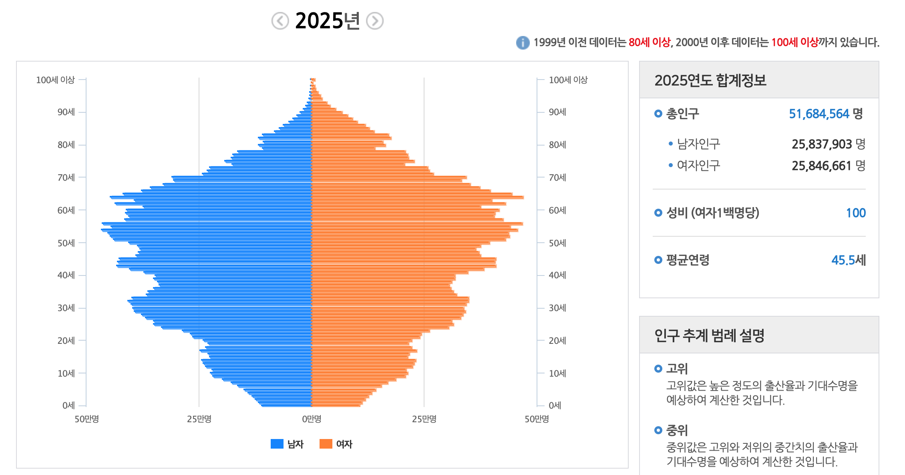
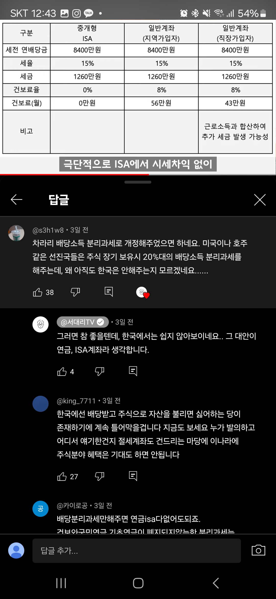
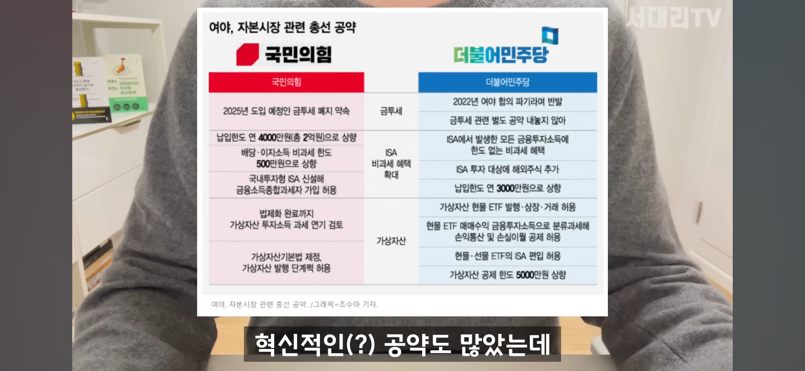
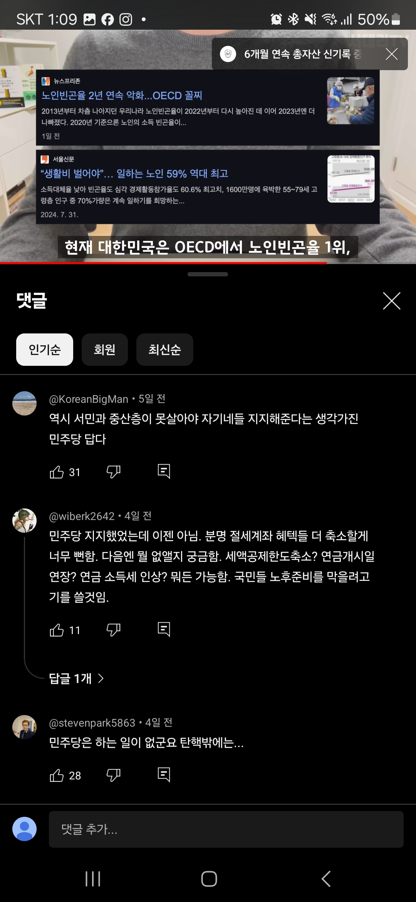

## 문서번호: 3801

### 제목: [어르신들 생필품 택배서비스 쿠폰](https://q4all.kr/redirect/detail/e97b247a-43d2-4c45-9bb2-13bf54120a58)

**작성자:** [전혜정](https://q4all.kr/user/profile/4611)
**작성일:** 2025-02-17 09:20:52 (월요일)

---

차를 몰 수 없고

이동도 불편한 어르신들을 위해

택배서비스쿠폰이 필요합니다.

사실 마트장보기나 그런 서비스들이 있지만

어르신들이 전통시장에서도 장을 보고

택배 서비스를 신청할 수 있으면 좋겠습니다.

그 외에도 동네 슈퍼에서도 택배서비스 쿠폰으로

어르신들 한정으로 배달쿠폰이 제공되었으면 좋겠습니다.

덧붙여 이동이 불편한 분들에게도 적용되면 좋겠습니다.

---

## 문서번호: 3802

### 제목: [부동산시장 질서교란행위를 단속할 부동산 감독기구는 언제 만들어질까?](https://q4all.kr/redirect/detail/89c8a52f-0c57-4269-b1e3-8ed36407285a)

**작성자:** [박성남](https://q4all.kr/user/profile/2124)
**작성일:** 2025-02-17 09:21:08 (월요일)

---

증권시장은 시장교란행위를 상시 감시하고 단속하는 기구가 있다. 그러나 부동산은 대다수 국민들의 전 재산이 담보가 되어 있는 곳인데도 질서를 감시하고 단속하는 기구가 없어 문제이다. 부동산시장규모 확대 등에 따라 집값담합,허위매물,거짓정보 유포 등 시장질서를 교란하는 불공정행위가 증가·지능화하고 있어 현행 불법행위 대응체계를 보완할 필요성이 커지고 있다.

20년 정부는 부동산시장 질서교란행위 대응 강화를 위해 여당이 부동산 감독기구를 설치하는 방안을 잇달아 내놓았다. 부동산시장의 투기적 과열양상이 지속되고 시장교란행위가 여전히 발생하고 있어 시장거래질서 확립 및 투명성 제고를 위한 실효성 있는 대책이 시급하다는 판단이었으나 지금은 관심이 없는 듯 하다

국토부는 현재 불법행위에 대한 구체적 혐의가 있는 경우에만 관계기관에 이를 통보할 수 있도록 하는 등 필요 최소한의 경우에만 사인간 거래 내역을 조사 단속하고 있다고 말하면서도 지속적으로 부동산 시장질서를 교란하는 불공정행위가 증가 및 지능화 되고 있어 현 대응체계를 보완할 필요성을 언급 했다고 한다.

예) 현행 공인중개사법은 시세에 영향을 미치는 행위나 특정 중개업소에 중개 의뢰를 유도하는 행위 등을 단속하고 위반 시 3년 이하의 징역, 3000만원 이하의 벌금을 부과합니다. 하지만, 개인간의 직거래나 온라인 플랫폼에서 집값을 담합하거나, 시세 조종이 의심되는 행위가 있어도 해당 교란 행위에 대해 규제할 방법이 현 제도상에서는 없어 이러한 불공정 행위에 대한 단속 및 처벌 규정을 마련할 필요가 있다

---

## 문서번호: 3803

### 제목: [우리나라 언론은 왜 항상 사실과 논리, 상식으로 풀어내기 힘든 국힘당쪽 편만 들까요. 영원히 안 바뀌나요. ](https://q4all.kr/redirect/detail/619b0b2e-5789-4f37-8f46-f566eb4e1c15)

**작성자:** [조윤정](https://q4all.kr/user/profile/5268)
**작성일:** 2025-02-17 09:55:59 (월요일)

---

친구는 가까이 적은 더 가까이.

언론에 대한 다양한 대응책이 필요한 것 같습니다만…

언론은 항상 사실에 근거하여 논리있게 상식적인 방법으로 행동해야 한다고 생각합니다.

그러나 어느 순간 우리나라 언론은 이익집단화 되어 있습니다.

처음에는 정부의 보조금을 받는 구조상 정원을 가진 국힘당 쪽 편을 드나부다 했는데

민주당이 정권를 잡았을 때도 바뀌지 않고 어이없게 지조를 지키며 계속 국힘당 편을 들었습니다.

이미 그들은 한몸이 된 것도 같지만. / 그리되면 다른 방법이 달리 있겠지요.

그리고 또 하나 가능성.

혹시 그들을 다루는 법을 민주당이 모르고 있는 건 아닌지.

그래서 생각해본 어이없는 생각 중 하나.

얼마전에 들은 단어에서 유추된…

원점타격

조선일보에 돈을 주고 민주당 광고를 내는 게 어떨까요 ^^

어차피 그들은 철저하게 자기들의 이익을 위해 행동하는 자들…

---

## 문서번호: 3804

### 제목: [사회복지사 처우개선이 필요합니다.](https://q4all.kr/redirect/detail/b48a1ed4-bf6b-40c3-bef3-88bef9f8babf)

**작성자:** [정덕현](https://q4all.kr/user/profile/77)
**작성일:** 2025-02-17 10:07:20 (월요일)

---

최악의 박봉과 업무량 복지제로....소외된 이웃의 복지를 담당한다는 이유로

처우가 너무나 열악합니다. 사회복지사의 처우 개선에도 관심부탁드립니다~

---

## 문서번호: 3805

### 제목: [한국을 아이들이 살기 좋은 나라로 만들 수 없나요?](https://q4all.kr/redirect/detail/11b4751e-4318-4acb-a842-4066a72ae4d1)

**작성자:** [정소영](https://q4all.kr/user/profile/5273)
**작성일:** 2025-02-17 10:07:45 (월요일)

---

한국에서 아이를 키우는 것이 쉽지 않습니다.

부모의 경력에 대한 고민, 생계 고민, 아이의 교육에 대한 고민 등등

아이가 커 갈수록 고민의 많은 부분을 차지하는 것은 아이의 교육에 대한 고민입니다.

아이들 모두가 다양한데 유치원, 학교에 들어가면서 아이들의 삶의 지향점이 획일화되는 것 같습니다.

아이들이 어렸을 때부터 삶에 대한 고민 진로에 대한 고민, 나 스스로에 대한 고민들을 충분히 할 수 있는 사회가 될 수 없을까요?

---

## 문서번호: 3806

### 제목: [무상 교육 에 대한 질문입니다. ](https://q4all.kr/redirect/detail/9050b9b6-89d7-4adb-b701-dad1fbf0611f)

**작성자:** [이미영](https://q4all.kr/user/profile/5274)
**작성일:** 2025-02-17 10:11:39 (월요일)

---

정권이 바뀔 때 마다 유동 청소년 관련된 정책에 흔들림으로 아이들도 부모들도 항상 불안합니다.

왜 이래야 하는 건가요?

무상 교육 외 청소년 관련 법 은 변경이 안되도록 할 수 는 없는 건가요?

이번에 고교 무상 교육을 시행하지 않는 다는 뉴스 보도 후 아이 친구들이

자퇴를 고민한다는 말을 들었습니다.

이 학교는 사립 고등학교이기 때문에 형편이 좀 어려운 아이들은 그냥 자퇴를 진진 하게

고민한다는 말을 하더군요 이건 아니지 않습니까?

왜 아이들이 이런 걱정까지 하면서 학교들 다녀야 하는 걸까요?

"공부에 성적에 대학에 진로 문제까지 고민해야 하고 자신들은 너무 치열하고 너무

힘든데 왜 도대체 왜 어른들 자기들 싸움에 우리 고등학생이 왜 이런 고민까지 해야 하는지

너무 이해 할 수 없어 이래서 정치인들이 다 싫어 그냥 이해를 할 수 없어" 라며 화를 내더군요

그래서 지금에 청소년들 너무 안쓰럽습니다.

제 개인적인 생각엔 학교에서 민주주의란 ? 이런 수업이 있었으면 합니다

고등학생들이 전두환 .박정희 찬양을 해서 야 되겠습니까?

역사도 근대사는 거의 몇 장 되지도 않고 이건 아닌 거 같습니다.

청소년 학교생활에 대한 전반적인 문제점을 체크해봐야 하지 않을까 해서

그리고 너무 답답해서 아이들이 너무 걱정되어 올려봅니다.

---

## 문서번호: 3807

### 제목: [경제적 격차 완화를 위한 대한 법적, 제도적 장치 마련은 불가능한가?](https://q4all.kr/redirect/detail/1ffda29e-511e-4876-9b2a-a074e816e174)

**작성자:** [한상원](https://q4all.kr/user/profile/4122)
**작성일:** 2025-02-17 10:15:28 (월요일)

---

"상위 k%가 전체 부의 대부분을 갖고 있다."

"상위 x%의 부가 하위 y% 부의 몇 배에 달한다."

"수 년간 상위 a%의 부는 계속 증가하고 하위 b%의 부는 그대로 이다.(또는 오히려 줄었다)"

부자들의 부가 늘어날 때 경제적 약자의 부도 늘었으면 좋겠다.

경제적 재능을 발휘하는 방향성을 바꿀 수는 없을까.

층위별 자산 비율 상한, 하한치를 정해놓는다면 사회 전체의 부를 키우는 방향으로 경제적 능력이 발휘되지 않을까.

 - 예시

자산 상위 0.1%의 max%

자산 상위 1%의 max%

자산 상위 5%의 max%

자산 하위 10%의 min%

자산 하위 20%의 min%

 - 문제

합리적인 통계 마련이 선행되어야 한다.

현재의 비율을 무시하고 기준을 마련할 수 있을까.

 - 반성

작성 도중 질문 글이 아닌 것 같다는 생각이 들었다.

문제에 대한 해결 방안이 떠오르지 않는다.

---

## 문서번호: 3808

### 제목: [■양자화폐, AI 그 너머](https://q4all.kr/redirect/detail/c3997b65-0892-4a5c-bbf7-ea5728bba290)

**작성자:** [이해진](https://q4all.kr/user/profile/4850)
**작성일:** 2025-02-17 10:35:41 (월요일)

---

“이하 글은 국회의원, 신문 방송기자, 로펌 변호사, 회계법인 회계사, 경제학부 교수, KDI연구원 각 300과 한국은행 150개 전 부서, 서울 소재 28개 대학 총학생회에 이메일로 발송하였으며 국회 국민제안 게시판에도 등재하였습니다.”

**현기증나는 세상**

현재 우리가 살아가야 하는 세상은 유사 이래 그 어느 때보다 변화무쌍하고 복잡다단하다. 수많은 영역에서 수많은 개념이 매 순간 생성되고 유통되어 시장에 쏟아져 나오는 신개념들에 심봉사처럼 귀동냥하기에도 바쁘다. 정말 그러하다. 힘들게 겨우 익숙해 놓으면 어느새 구식이 되어버리고 만다. 정말 피곤한 세상이다. 체력과 정신력이 약하면 도저히 따라가기도 벅찬 그러한 세상이 되어버렸다. AIAI 하더니 어느새 생성형, 추론형, Agent, Physical AI라는 신개념들이 쏟아져 나오고 시장이 형성된다. AI 입문도 못 해보았는데 세상은 저만치 멀리 가버렸다. 정말 힘든 세상이다. 이쯤 되면 이건 편한 게 아니라 피곤하다. 이게 좋은 세상인지, 살만한 세상인지 생각할 틈도 여유도 없다. 한마디로 현기증나는 어지러운 세상이다. 천재들이 경쟁하며 生 Show 하는 Tech의 공연장에 입장권 구하느라 발을 동동 굴러야 하는 처량한 신세에 제발 그만 쇼를 안 했으면 하지만 자고 나면 새로운 쇼가 펼쳐지니 이젠 이 새로움이 신비가 아니라 불편과 귀찮음으로 변한다. 급기야 짜증이 난다.

한편, 언론과 기득권은 기존 개념을 교묘히 왜곡하는 전략을 사용한다. 이를테면 완전히 상이한 뜻을 가진 두 개념을 이어서 대중의 생각을 뒤섞어 버림으로써 자신에게 불리한 상황을 교묘히 완화 또는 중화해 버리는 것이다. 해고를 인력 재배치, 경기후퇴를 마이너스 성장, 실업을 미고용, 폭격을 공중 지원 등으로 언어의 혼선으로 불리한 상황을 모면하고자 하는 행태이다. 이러다 전쟁은 평화, 자유는 예속, 무지는 힘이라는 표현까지 등장할지도 모른다. 曲學阿世하여 惑世誣民하는 꼴이다. 정말 짜증 나는 세상이다.

**WHY or HOW**

도대체 왜 이렇게 사건이 전개되고 역사는 흘러가야 하는지에 대한 근본적 질문에 봉착한다. 마치 인생에 대한 두 의문인 왜 살아야 하는가? or 어떻게 살아야 하는가? 두 질문 중에서 전자(Why)가 후자(How)보다 구조적 상위에 있음에도 별 조명과 관심을 받지 못하는 것 또는 시공간이 열리게 된 빅뱅이 왜(Why) 생겼는지를 탐구하는 것이 선순위임에도 이보다는 어떻게 어떤 방식으로(How) 일어났는가에 과학적 관심과 연구가 집중되는 것과 같은 상황이다.

How에 관한 지침과 규율은 저 하늘의 별만큼 수없이 많다. 어찌 보면 각 개인의 두뇌가 How의 제조 공장이라 할 수 있다. 아니 어쩌면 How에의 지향은 대기와 중력의 족쇄에서 벗어나지 못하는 생명체의 개인적 그리고 집단적 본능이라 할 수 있을 것인 바, 여하간 답을 낼 수는 있다. 그것이 정답이든 오답이든. 반면, Why에 대한 질문, 왜 살아야 하는가에 정면으로 마주 설 때 우리는 앞이 깜깜하다. 도대체 답이 없다. 물론 각 개인이 처한 삶의 현장에서의 주관적 이유야 얼마든지 있을 수 있지만, 정말로 논리적으로 증명할 수 있는 객관적 삶의 이유를 찾는 것은 불가함을 알베르 카뮈(Albert Camus)는 “살아갈 이유 같은 건 없다.”로 표현하며 이러한 수렁에 놓인 인간의 상태를 부조리라 하였다. 이는 삶의 반대편에 놓인 상태인 죽음 또한 마찬가지다. 개인의 주관적 입장을 넘어 죽음을 정당화하는 그 어떤 논리적 이유도 우리는 발견할 수 없다.

이렇게 우리는 生과 死, 우리의 모든 것인 삶과 죽음을, 궁금한 것은 못 참는 제4의 본능이라 하는 호기심마저 억누른 채, 이유도 모른 채 그저 각자의 시공간에 내팽개쳐 있다. 그저 살고 있다. 그냥 살다가 죽는다. 말할 수 없는 부조리다.

한편, 이는 우리가 날마다 쳐다보는 저 높은 곳, 우주가 도대체 왜 있는지에 대한 근원적 질문에 마주 설 때에도 동일하다. 암흑물질과 암흑에너지로 가득한 저 검푸른 창공이 어떻게가 아닌 왜 탄생하게 되었는지는 아무리 이성의 과학이 발달해도, 인간의 지능을 뛰어넘는 AGI가 개발되어도 절대 못 풀 숙제다. 영원한 호기심의 장에 남겨 놓아야 하는 미스터리다. 이유를 알 수 없다는 그 자체가 부조리다.

이즈음 시대 이슈의 진공청소기 AIAI를 대하며 소환하게 되는 근원적 질문이다. 왜 AIAI 하기보다는 어떻게 AIAI 하는가에 모든 관심과 초점이 맞춰 있기에 이들의 일거수일투족에 일일이 반응해야 하는 마치 인간이 로봇이고 기계가 되어가는 것이 아닌가 하는 착각에 심한 부조리를 느끼게 된다. 기분이 너무 거시기하다.

**예나 지금이나**

그런데 이런 현상은 꼭 지금, 이 시대만의 문제는 아니었을 것이다. 우리가 과거라고 얘기하는 먼 시대, 구석기 신석기의 원시시대로부터 청동기 철기의 역사시대를 거치는 과정에서도 그 시대를 살아갔던 인류 개체는 지금 우리가 느끼고 경험하는 것과 유사한 일종의 정신적 소외감 내지는 불안감을 느끼며 살았을 터이다. 이는 아마도 본격 대항해를 거치며 신대륙이 발견되고 그동안 익숙했던 신본주의가 인본주의로 바뀌고 종교개혁이라는 사회적 혼란 상황에 부닥친 인류가 기존 규범과 가치관이 붕괴되면서 나타나는 불안정의 아노미 현상이 삶의 무력감을 가중시켰을 터이다. 더욱이 산업혁명을 맞이하는 근대의 격변기에는 더욱 심했을 터이다.

그동안 人力과 馬力이라는 生命力에 의지한 채 함께 숨 쉬고 함께 지치고 함께 자고 일어나며 이목구비 팔다리 모양과 생김새는 달랐지만, 생명체의 동질감을 공유하며 인간적이고 자연적 삶의 패턴에 익숙했던 인류는 어느 날 고철 덩어리가 연기를 내뿜으며 일으키는 비유기체의 무지막지한 역동성과 파워에 아마 현기증을 느꼈을 터이다. 그 상황을 리드했던 소수를 제외한 다수인 소위 주변인들의 심리 상태는 어떠했을지는 작금의 시대 상황으로 충분히 가늠해진다. 과학기술과 산업의 발전 발달이 인간 개체의 평온한 심리 상태, 곧 행복과 직결된다고 감히 말할 수는 없을 것이다. 일부 소수를 제외하고는. 아노미와 부조리가 공존하는 작금의 시대 상황이 무척이나 피곤하다.

거기에다 대한민국이 처한 정치적 특수상황이 한껏 이를 부추긴다. 헌법도 질서도 자유도 집회도 언론도 논쟁도 모든 것이 다 피곤하다. 정말 그러하다. 이 모두가 How에만 집착한 결과가 아닐까 하는 회의론으로 돌아가며 도대체 왜 사는가? 답도 없는 질문에 멍때리는 요즘의 나날이다. 답은 없지만 Why에 시간을 투자하고 생각을 집중할 때 How로부터 생성되는 과열의 부작용이 조금은 냉각되고 적어도 일시 멈춤의 생각하는 시간, 관조하는 시간, 성찰하는 시간을 갖게 하지는 않을까 한다. 그것으로 충분하다. 변화는 이로써 시작된다.

**지혜의 탐색**

먼 옛날부터 인류는 최고의 지혜를 탐색하면서 최우선으로 만물의 구성에 주목하였다. 그리스 자연철학에서 익히 본 물, 불, 원소 등이 그것이다. 이것으로 설명이 부족하여 인도철학에서는 만물을 지수화풍의 사대(四大)라는 개념으로 해석하였지만 역시 미흡하다. 중국에서는 목/화/토/금/수 오행(五行)으로 진일보하여 물리적 연원뿐만 아니라 우리의 정신세계까지 들여다보았다. 한의학은 오롯이 오행의 논리로 이루어진 학문이다. 오랜 기간 우리 동양 문명을 지탱해 준 지혜였다.

하지만 西勢東漸이 시작되면서 거세진 서구의 자연과학은 세상을 전혀 새로운 시각으로 바라보았다. 동양의 사대와 오행이라는 다소 추상적이고 형이상학적 개념이 아닌 중력, 전자기력, 강력, 약력이라는 4가지 힘 (四力)을 발견하고 여기에 척력을 추가하여 우주를, 자연을, 만물을, 생명을 구체적으로, 실체적으로, 입체적으로 바라보며 설명한다. 이것으로 빅뱅으로부터 우주라는 極大의 생성과 소멸 그리고 팽창뿐만 아니라 원자 이하 초미립자라는 極小의 영역까지도 그럴듯하게 설명한다.

전후좌우 중앙으로 사물을 구성하는 오행에는 상하가 빠져 있다. 말하자면 입체가 아닌 평면적 사고방식이다. 그 옛날 하늘은 둥글고 땅은 모나다는 천원지방(天圓地方)의 사고방식이 지배하던 때나, 유클리드 평면 기하학적 관점으로 세상을 바라볼 때는 아마도 정확한 도구였고 기제였을 것이다. 그러나 상하가 들어가야 입체의 공간이 생성되고 비로소 근대과학과 접속한다. 우주정거장이 건설되고, 수만 기의 인공위성이 지구궤도를 돌고 있고, 저 광대무변의 우주로 우주선을 날려 보내고 있는 이 마당에 오행이라는 평면적 분석 기제는 당연히 부족하고 미흡하다. 이처럼 세상의 운행 원리를 이해하려는 인류의 노력은 쉼 없이 진행된다. 그 시대 당대의 모든 인문 현상 또는 자연현상을 하나의 틀에 넣어 소위 범주를 구성하여 단순하게 설명하는 방식으로 우리는 존재의 체계를 이해할 수 있다. 세상을 망라하는 틀, 그것이 물질이든, 사상이든, 그 원리는 단순해야 한다. 틀이 복잡하다는 것은 원리가 없거나 아직 원리를 발견하지 못했다는 방증이다.

**오류의 역사**

인류의 역사는 한편으로 보면 오류의 역사였다. 천동설의 오류, 신본주의의 오류, 계급투쟁론의 오류, 우생학의 오류, 민족주의의 오류, 인종론의 오류 등 역사의 고비마다 이 지독하고 막강했던 기득권적 오류와의 투쟁은 너무나 힘들었고 수많은 희생과 대가를 치렀다. 돌이켜 생각해 보면 억장이 무너진다. 왜 바르고 정당한 측에서 희생과 대가를 치러야만 역사는 앞으로 나아가나? 도대체 인류 역사는 왜 이럴 수밖에 없는가?

그런데 또 하나 중요한 것이 이러한 오류가 수정되고 정정되었다고 해도 과연 그로부터 인류의 삶이 획기적으로 개선되고 인류의 행복지수가 격하게 고공행진 하였는지는 정확한 통계가 없어 모르겠지만, 막연한 상식으로 봐도 그야말로 부분적 점진적 개선은 있었을 터였고 극적 전환은 아마도 글쎄요? 가 답일 것이다. 천동설이 지동설로 바뀌고 신본주의가 인본주의로 바뀐 들 글쎄요. 프롤레타리아 계급투쟁론이 현장에서 사라지고 우생학이 금지된 들 글쎄요. 배타적 민족주의와 인종론을 배척해 본들 글쎄요? 이로 인해 80억 인류가 삶의 현장에서 느끼는 삶의 질의 획기적 개선과 행복지수의 고공행진은 글쎄요? 가 아닐까 싶다. 고대 신분사회나 작금의 최첨단 AI 사회나 99 대중의 삶은 글쎄요? 라는 냉소적 한마디의 단어로 귀착해 버리는 것이 참으로 부조리까지 하다. 인류가 역사에서 취한 모든 올바름을 향한 노력과 시간과 비용이, 그 수고와 헌신이, 수단과 방법이 결코 작지 않을 것인데 그 누적 효과의 결과는 아직도 미지수다. 아니 지금 시점에서 보면 확실하다. 그 수천 년의 노력이 99 대중에겐 아무런 효과가 없었다고 말할 수 있을 것 같다.

**최후의 기제**

하지만 마지막 수단과 방법이 하나 남아 있다. 여태 한 번도 시도해 보지 못한 방법론이다. 화폐제도를 바꾸는 것이다. 지금까지 역사시대 수천 년, 인류의 올바름을 향한 지난한 도전이 있었고 그 도전의 최종 지향점은 민생으로 대변되는 인류의 행복 복원력 회복일 테다.

民生이라는 단어에는 1이 아닌 99 다수의 개념이 들어 있고, 경제적 민생만 아니라 철학적, 문화적, 사회적, 정치적 민생도 생각해 봐야 한다. 이를 위해 그동안 인류는 수많은 철학적, 사회적, 정치적 기제를 동원하여 보았지만 무용지물이었고 그 누적된 최종 결과가 바로 오늘의 현실이다. 저 무거운 민생이라는 단어에 과연 어떤 긍정적 변화의 조짐이라도 보이는가? 과연 어떤 수단으로 어떤 기제가 도대체 나아질 기미조차 보이지 않는 민생이라는 난제에 상전이를 야기할 수 있을까? 눈을 씻고 봐도 보이지 않는다.

역사에 해답이 있지는 않을까 탐독해 보았지만, 전쟁의 역사는 다대했지만 평화의 역사는 소소하였다. 실패의 역사는 다수였지만 성공의 역사는 소수였다. 1의 화려한 치적은 주류를 이루었지만 99의 고통은 역사에서 외면하였다. 아쉽게도 역사는 우리에게 민생의 회복을 넘어 개선에 대한 비책을 내놓지 않았다.

작금 리더십이 주장하는 금리 조몰락거리기로? 25만 원 복지수당으로? 지역화폐로? 무엇인지 모를 민생입법으로? 단골메뉴 구조조정으로? 리더십의 교체로? 그 누구도 고개를 상하로 끄떡이지 않을 것이다. 좌우로만 세차게 흔들 뿐이다. 글쎄요.

유일한 해법이 진짜 돈으로 진짜 경제를 만드는 것이다. 그리하면 민생은 진짜로 나아진다. 삶의 질의 획기적 개선과 행복지수의 고공행진이 현실로 다가온다. 이것이 대한민국 사람 명경선생 김점수가 만든 K-money, 양자화폐의 위력이다.

인류는 여태 단 한 번도 진짜 돈으로 진짜 경제를 구현한 적이 없다. 인류 대다수 99의 민생의 어려움은 바로 여기에서 비롯되었다. 가짜 돈이 만든 가짜 경제로 인류는 민생에 관한 한 虛送歲月하였다. 애민의 성군도, 깨달음의 현자도, 위대한 학자도 여태 그 누구도 이를 직시하지 못했기에 민중은 그들의 삶 곧 민생에 그저 팔자타령이나 하며 운명처럼 받아들이고 고작 不在의 신에 빌며, 인연에 의지하며, 끝내 이루지 못한 원한을 문학으로, 예술로 승화하며 이를 당연지사로 여겨왔고 이제는 한낱 고철 덩어리를 사지구규(四肢九竅)의 모습으로 만들며 마음과 물질 사이에, 인간과 비인간 존재 사이에 아무런 근본적 구별과 차이가 없음을 규명한 현대과학은 이들에 법적으로 전자인간의 지위를 보장하는 이 희한한 별천지의 세상을 탄생시켰지만, 그 別天地에도 민생의 모습은 보이지 않는다.

그런데 역사상 그 누구도 이루지 못한 이 어렵고도 간단한 일이 바로 화폐하나 바꾸는 일이라니. 가짜 돈, 종이화폐를 진짜 돈, 양자화폐로 전환하는 일, 바로 이 간단한 일이 세상을 바꾼다. 그리고 실제로 양자화폐가 2025년 1월 1일부터 발행되기 시작하였다.

**양자뱅크**

세계경제는 Magnificent 7로 대표되는 미국의 Big Tech가 주도하는 AI 관련 기사로 연일 도배가 되는 시점에 뜬금없이 Deep Seek이라는 듣보잡 중국계 기업의 신선한 도전에 언론은 제2의 Sputnik Shock라 명명하며 왁자지껄하다. 그리고 요즈음은 이런 Unicorn은 별로 신선하지도 않다. Decacorn을 넘어 Hectocorn(기업가치 100조를 넘는 비상장 start-up)을 넘나드는 業이 적지 않기 때문이다. 자본주의 정언명령인 성장 본능은 이처럼 그칠 줄을 모른다. 끊임없이 새로운 영역으로 지평을 넓히고 있다. AI 분야에서 또 언제 어디로 튈지 후보군은 언제나 예비되어 있고 놀랄 준비는 항상 되어 있지만 이런 일련의 경쟁적 Red ocean 상황을 느긋하게 즐기며 바라보는 아주 여유로운 숨겨진 진짜 기업이 있는 줄 사람들은 아직 잘 모르고 있다. 바로 양자화폐를 발행하는 양자뱅크다. 진짜 돈을 발행하는 진짜 은행이다.

전혀 다른 성격으로 상호 비교 불가의 영역들을 비교 평가해 주는 유일한 마법의 언어 즉, 수많은 기업이 생산하는 萬物과 인간의 사고작용으로부터 연유하는 萬事에 대한 만국 공통어인 가격과 그 Tool인 화폐 비즈니스를 독점하는 기업이 양자뱅크이다. 이는 사실상 모든 것을 장악한다는 의미다. 상품과 서비스 가격뿐만 아니라 믿음 소망 사랑의 신앙의 가격과 좌우 사상과 권력의 가격까지, 말하자면 인간의 육체와 두뇌활동 영역에서 나오는 萬物과 萬事 즉, 물질문명과 정신문화라는 인류 양대 산물 가치척도의 통번역기를 독점한다는 뜻이다.

글로벌 우량기업들이 최고의 두뇌들을 동원하여 언론을 장식하며 뭇 대중의 환호를 받아가며 거둬들인 富의 최종 목적지는 결국 양자화폐의 양자뱅크로 Rush 할 수밖에 없다. 그들이 바보가 아닌 한 그들이 힘들게 R&D 하고 Marketing 하여 득한 땀의 대가를 가짜 돈으로 치환하여 시간과 함께 가치 손실할 이유가 없기 때문이다. 당연히 시간과 함께 가치 보전을 넘어 가치 상승을 만들어 주는 진짜 돈, 양자화폐로 바꾸게 되어 있다. 양자전환 한다는 말이다. 그들의 주식을, 그들의 부동산을 양자화폐로 전환한다는 말이다. 그들 소유의 주식과 부동산을 연 복리 10%+α로 Value up 해주고 그로부터 발생하는 어마어마한 유동성으로 새로운 가치창조를 할 수 있는데 이를 놓칠 수 없기 때문이다. 단지 그들이 아직 진짜 돈, 양자화폐의 존재를 인지하지 못했기 때문이다. 양자화폐의 양자뱅크를 인지하는 날, 그날은 스푸트니크 쇼크가 아니라 콜럼버스의 신대륙 발견을 넘어 코페르니쿠스적 大轉回 같은 용어를 접하게 될 것이다. 양자화폐의 발명은 그만큼 대단한 역사적 사건이다.

**자연의 평등**

자연을 관찰하면 자연의 법칙 제1호가 평등임을 알 수 있다. 말하자면 평등은 자연의 뿌리이다. 그리고 이것은 인위적으로 만든 것이 아니라 저절로 그러함. 곧 자연스러움이다. 높음이 있으면 낮음으로, 밝음이 있으면 어둠으로, 뜨거움이 있으면 차가움으로, 큰 것이 있으면 작은 것으로, 남이 있으면 여로, 어른이 있으면 아이로, 부자가 있으면 빈자로, 삶이 있으면 죽음으로, 이렇게 사물이나 사안에 대해 상대성으로 대비하기에 평등이 조성되는 것이다. 어느 한쪽만의 일방적 존재로는 평등이 생성되지 않는다. 이것이 음양이고 세상을 형이상학적으로 바라보는 동양적 방식이기도 하다.

그런데 아무리 자연적 평등의 개념에서 부자가 있으면 빈자도 있어야 하지만, 1과 99로 대비되는 것은 평등이 아니다. 불평등이다. 말하자면 자연법칙의 위반이다. 자연스럽지 못한 不自然스러운 것이다. 그러기에 세상이 힘들고 어지러운 混世인 것이다. 이 부자연을 자연 상태로 바꿔줘야 세상이 안정되고 평화로우며 민생이 개선된다. 이 일은 인간 리더십도 할 수 없고, 전자인간 AI도 할 수 없다. 더욱이 가짜 경제학, 가짜화폐의 기득권을 쥔 함량 부족의, 은둔의 7인의 현자가 거주하는 한은寺의 유일한 비기인 금리 조몰락거리기로는 턱도 없는 일이다. 오로지 양자화폐를 발행하는 양자뱅크의 권능으로만 자연스러운 평등으로 되돌릴 수 있다.

**萬人 萬社 萬國**

부동산과 글로벌 초우량 기업의 주식으로 100% 가치 연동된 진짜 돈, 양자화폐가 존재하는데도 이미 부작용이 넘쳐 대다수 인류에게 고통을 안겨주는 아무런 가치도 없는 종이 쪼가리에 무늬와 숫자를 그려 넣은 종이화폐와 허상의 가상 세계관에서 나온 BTC 암호화폐나 근본이 종이 쪼가리인 달러에 1: 1 가치 연동하는 달러 Stable coin 등에 여하한 방식의 지적 가치를 투입한다고 해서 진정으로 그것들이 화폐로의 자연스런 역할을 하고 가치를 지닌다고 자신할 수 있나? 진짜 돈, 양자화폐가 존재하는데도? 양자화폐는 경제의 모든 원리가 집적된, 인류가 만든 가장 단순하지만 완벽한 틀이다. 이로써 경제문제는 해결된다. 이로써 자연 경제외적 문제도 쉬이 해결된다. 萬人 萬社 萬國을 위한 진짜 돈, 양자화폐의 존재가 세상에 알려지는 날, BTC, USDT, USDC의 운명이 궁금하다.

**Contact point**

양자화폐와 양자딜러에 관한 상세한 내용을 위한 세미나 또는 취재를 요청하려면 아래로 연락하면 된다.

▶양자화폐 기획자 명경선생 김점수

▶전화 070-8228-8000(김은희 이사, [cqer2u@naver.com](mailto:cqer2u@naver.com))

▶주소 서울특별시 강남구 학동로88길 12, 3층 306호(삼성동, 청진빌딩)

2025년 2월 4일

평산심해(平山深海) //

---

## 문서번호: 3809

### 제목: [설문조사를 적극 활용하기 위한 신박한 방법을 강구하면 어떨까요?](https://q4all.kr/redirect/detail/da88e89b-cbe4-44aa-b701-bf16f1f85189)

**작성자:** [윤진득](https://q4all.kr/user/profile/2174)
**작성일:** 2025-02-17 10:42:52 (월요일)

---

민주사회에서는 다수의 선택이 최선의 방법이라고 생각합니다.

지금 민주당이 국힘당을 압도할 수 있는 힘의 원천은 국민이 민주당을 압도적으로 선택을 해주어서 가능한 것입니다.

지금의 상황에서 국힘의 지지도가 민주당을 앞선다는 둥...

내란이 정당하다는 둥.....

아주 믿기 힘든 여론조사가 발표되어 많은 분들이 혼란스러워 하고 있습니다.

오히려 잘못된 여론 조사에 의해서 보편적 정의보다는 정의롭지 못한 나쁜 행동에 동조하게 만드는 기이한 현상이 벌어지고 있습니다.

또한 국가의 정책을 시행함에 있어서 이해관계자의 편협한 선택들로 인하여 잘못된 정책을 기안하고 시행하는 일들이 벌어지고 있습니다.

이러한 일들로 인하여 공정한 여론 조사와 모 집단을 획기적으로 증대한 여론조사가 필요하다고 봅니다.

제가 제안드리고 싶은 여론조사는 국민적 사용도가 아주 높은 카카톡 메신저를 이용한 설문 조사를 활용하면 어떨까요?

특정한 시기에 로그인되어 있는 상태에서 무조건 간단한 설문조사를 응해야 카톡 이용을 할 수 있는 장치로 걸어 놓으면 아주 효과적으로 설문 조사를 할 수 있으리라고 봅니다.

너무 자주하는 설문 조사는 사용자를 귀찮게하여 사용자와 제공자 모두가 불만으로 이어질 수 있다고 봅니다.

그러나 무분별 하게 실시하지 않으면서, 합리적 설문조사에 응하는 것이 우리 나라의 올바른 민주사회의 원천이 된다는 생각을 갖게 하는 것이 좋은 방향이라고 봅니다.

카카오톡을 거의 전 국민이 사용하고 있는바, 카카오톡을 이용한 설문조사는 각종 투표보다도 더욱 효율적이고 전 세계적으로 모범적인 여론조사 사례로 기록 될 것입니다.

지역별, 연령별, 성향별, 성별 등등으로 분류화된 4~5천만명의 설문 조사는 아주 강력한 정책의 발판이 될 것입니다.

카카오톡 제공 회사와 잘 협의하여 한국 민주주의의 강력한 뿌리를 내릴 수 있는 수단이 될 수 있도록 제안드립니다.

감사합니다.

---

## 문서번호: 3810

### 제목: [[질문-6] 도대체 누구의 짓! 입니까? 📣](https://q4all.kr/redirect/detail/82085ee6-befb-4b1c-99c9-3ebebe81986b)

**작성자:** [윤연정](https://q4all.kr/user/profile/2570)
**작성일:** 2025-02-17 11:21:11 (월요일)

---

정치를 혐오하도록 조장한

정치를 신물나도록 조작한

정치를 관심밖으로 조장한

정치를 왜곡하도록 조작한

---

## 문서번호: 3811

### 제목: [PC와 스마트 기기 동시 호환 되는 OS는 불가능 한가?](https://q4all.kr/redirect/detail/1af027f7-f6e5-4d76-ad65-7c5ccf07c529)

**작성자:** [황대용](https://q4all.kr/user/profile/2083)
**작성일:** 2025-02-17 11:22:50 (월요일)

---

PC

스마트 기기

AI 구동을 위한 운영 체제를

애초에 하나로 만들면 안되나?

진짜로 궁금해서 질문합니다

---

## 문서번호: 3812

### 제목: [사법개혁이 필요한데요.. 시민들이 참여할 수 있게 고쳐주세요..](https://q4all.kr/redirect/detail/0b1c4c02-d6d0-4d86-9db4-ae91dcb43db9)

**작성자:** [신인철](https://q4all.kr/user/profile/5298)
**작성일:** 2025-02-17 11:27:44 (월요일)

---

검찰과 사법부의 개혁이 절실합니다. 그 이유는 상대당이 야당대표만 노려서 기소하고 거짓증인세워서 재판하면..

또 맞춤 판사가 등장해서.. 증거무시, 증언 무시, 증언 증거 조작 등을 눈감아주고 몇년 때려서 선거에 못나오게 합니다.

이처럼 쉬운 정치기술이 어디있습니까?

지금의 윤석열, 국힘이 지난세월동안 이런 방식으로 정권을 잡아왔습니다. 이거 반드시 개혁해야 합니다.

그래야.. 국민이 주인인 나라를 만들 수 있습니다.

그러려면.. 삼권분립의 세 기둥중에서 전혀 국민주권이 실현되지 않고 사각지대로 남아있는 사법부를 개혁하되,

반드시 시민들이 참여할 수 있도록 고쳐주시기 바랍니다.

이재명대표께서 국회의원 국민소환제를 말씀하셨고요.. 그 외에 검찰의 기소배심제도와 사법부의 국민참여재판을

일부영역(정치 등)에서는 의무화시켜주세요.. 그리고 검사장이나 대법원장, 헌재소장 등도 국민이 투표로 뽑을 수

있게 고쳐주세요.. 이상입니다.

---

## 문서번호: 3813

### 제목: [발달장애인은 꼭 거주시설에 살아야 할까요??](https://q4all.kr/redirect/detail/2863c774-37b4-4b8f-a07b-aff7738d0c73)

**작성자:** [임윤정](https://q4all.kr/user/profile/5301)
**작성일:** 2025-02-17 11:40:12 (월요일)

---

탈시설화 사업이 진행 되어 온 지 어언 20년 가까이 되어갑니다.

신체장애인은 대부분 탈시설화 하셨지만, 발달장애인 중 일부는 여전히 거주시설에서 살고 있습니다.

발달장애인은 꼭 거주시설에만 살아야 할까요?

정해진 시간에 정해진 식단만 먹어야 하고, 정해진 시간에 잠들어야 하며, 지원자가 적어 손길이 닿지 않을 때 그냥 견디고 있어야 합니다.

장애가 있다는 이유로 집단시설에 살아햐 한다는 논리는 어디서부터 유래된 것일까요??

전 세계적으로도 추세에 맞지 않는 거주시설의 집단생활...

발달장애가 있는 사람들끼리 모아두면 없던 질환과 정신병도 생깁니다.

예산의 힘에 밀려 늘 뒷전으로 밀려 있던 발달장애인의 삶을 우리사회가 되돌아 보았으면 합니다.

---

## 문서번호: 3814

### 제목: [평생 성실히 일한자 기본삶 보장.](https://q4all.kr/redirect/detail/620322f6-a71a-4511-a67f-5a788e59b8ef)

**작성자:** [김소희](https://q4all.kr/user/profile/5302)
**작성일:** 2025-02-17 11:42:29 (월요일)

---

직업에 귀천이 없다고 하지만 우리 사회에 보이지 않는

계급문화와 오로지. 대기업사무직과 소위말하는 '사'자 전문직만 대접받는 사회입니다.

부를 독점하고 지배하는 사회가 되어버렸습니다.

한평생 자기 분야에서 성실히 바쳐온 시간들을 인정받을 수 있는 사회가 되었으면 좋겠습니다.

평생 돈 벌어도 30년 최저임금으로 일하는 조직이면 이건 잘못되었다고 봅니다.

30년 이상 한 분야에서 피땀 흘렸다면 그 사람은 장인이라고 했습니다.

반드시 의사. 변호사. 등 특정분야만 그 시간을 보장받는 사회구조 말고

다양한 직업군이 오랜 시간 투자하면 보상받는 사회구조를 만들어주십시오.

---

## 문서번호: 3815

### 제목: [일하지 않아도 되는 필요없는 공공기관의 직책들을 없애거나 줄일 수는 없나요](https://q4all.kr/redirect/detail/f70ee760-5cb9-47a2-b81a-b39a9344f781)

**작성자:** [최철호](https://q4all.kr/user/profile/5307)
**작성일:** 2025-02-17 11:51:52 (월요일)

---

윤정부 대통령실 행정관이 국회의원 지역구에서 밀려나면서 서울보증보험 감사로 채용 됐는데 이는 그 자리가 없어도 서울보증보험운영에 아무런 지장이 없다고 생각 됩니다.

전국에 얼마나 많은 그러한 유사한 직책들이 있을 지 상상도 안 됩니다.

전수조사 하여 단계적으로 차근차근 없애는 것이 필요하다고 봅니다.

---

## 문서번호: 3816

### 제목: [의료개혁에 의료단체가 주체가 되어야 하는가?](https://q4all.kr/redirect/detail/76bfe7b6-da56-49ac-994f-d69bc2dff875)

**작성자:** [김희은](https://q4all.kr/user/profile/4278)
**작성일:** 2025-02-17 11:52:56 (월요일)

---

정부정책은 전국민을 대상으로 한다

전문가 집단이 자기 분야의 정책을 스스로 만들고

결정 할 때는 피해는 고스란히 국민의 몫이다

따라서 전문가 집단의 의견의 청취는 필요하지만

그 이상의 선을 허용 하는것은 정부가 그들의 이익을

대변한다는 오해를 일으킬수 있다.

따라서 지금 추진되는 의료개혁은 사법개혁과 함께

우리나라에서 이뤄야할 개혁 과제중에 하나 일것이다

새 정부가 들어서면 이에 따른 청사진을 제시 해주기를 바라면서

철저한 환자 중심의 의료시스템이 마련에 최우선 과제가

되어야 할것으로 봅니다

---

## 문서번호: 3817

### 제목: [암보험과 실손보험의 문제](https://q4all.kr/redirect/detail/a7a4b888-ab1e-4d06-8527-ca5f25217dcf)

**작성자:** [김윤복](https://q4all.kr/user/profile/5306)
**작성일:** 2025-02-17 12:15:35 (월요일)

---

현대해상에 암보험을 실제로 10년이상을 부었고 보험에 대해서 이해도와 손실을 계산해보지 못함 암보험이 한달 불입액이 94.203원을 10년간 부어주었고 전화콜로 든 상태라 제대로 이해하기 어려웠고 또 아무리 보험이라도 소비자가 이토록 불이익하게 설계했으리라 생각 못했음 또 국가기관인 금융위원회를 믿는 맘도 컸고 .... 이건 보험회사에 폭력이고 과대광고라 생각함 10년 이상 붙고 이미 만기가 지나고 또 다시 갱신되어서 3~ 4개월 정도를 부어주고 난 후에사 보니 94.203원씩 10년 부은금액이 11백만원이 넘는 금액인데 만기 환급금이 겨우 만천원을 주겠다 함 애초에 보험에 대해서 잘 모랐던거가 잘 못이라해도 글치 넘 도둑이고 폭력이라 생각함 또 맨 뒷면에 보험에 대해서 재펀해서 소비자가 이긴 경우가 없다 로 써 논건 아예재판자체를 못하게 꿈도 꾸지 말라고. 하는 협박이라고 생각함 이토록 불합리하고 억울한 보험을 왜 운영하도록 국가는 냅두고있으며 언제나 국민은 협벅을 받는 상대로만 냅두는지 억울함10년간 부어준 만기 환급금이 겨우 11.000원이라니 칼든 총든 강도임 억울해도 호소할대도 없고 보험들고 10년간 부어준 사람만 병신인거림 대체 국가는 왜 대기업 편에만 있는건지 억울함 지금 금융위원회에 재소를 한 상태긴하지만 보험회사의 뒷면에 써있는 말로 볼때 제소를해도 해결이 없을까봐서 더 억울함.

또 실손보험도 맨 마찬가지임 과대광고 라는 생각은 변함없음 보장금액은 광고하지만 거기에 따른 불이익은 말도 안함 보험금액은 해마다 오르고 한달 두달만 못내도 ( ) 생각이 안남 또 보험금액은 해마다 오르는데 보장금액은 안오르고 그깐 보장금액을 받으려면 끝없이 죽을 때까지 쉬지고 못하고 유지해야하지만 보장금액은 안오르니 물가 상승분 비례해서 보장금액은 쓸모가 없음 보험에 개선은 확실히 필요하고 과대광고도 저지해야 됨 국민건강보험은 더욱 광고가 필요하다 여겨짐

---

## 문서번호: 3818

### 제목: [진정으로 공인인증서에서 해방될 수 있는 방법은 없는 건가요?](https://q4all.kr/redirect/detail/65b49cb1-0078-454b-a178-bca608d1cedd)

**작성자:** [조성용](https://q4all.kr/user/profile/4979)
**작성일:** 2025-02-17 12:18:40 (월요일)

---

다양한 인증 방법들이 생겨서 예전보다는 많이 좋아진 것이 사실입니다.

그러나 홈텍스에서 개인사업자가 전자세금계산서를 발행할 경우 여전히 전용의 그리고 유료 공인인증서를 사용해야 합니다.

공인인증서도 1개면 다 쓸 수 있어야 하는데, 용도별로 다르고, 유료는 또 다르고, 인증기관도 다르고, 공인인증서 갱신시 맥 OS는 지원하지도 않고,

여전히 너무 불편합니다.

진정으로 공인인증서에서 해방될 수 있는 방법은 없는 건가요?

---

## 문서번호: 3819

### 제목: [셀프 조사](https://q4all.kr/redirect/detail/106cc024-ffff-4cb9-97a2-036b53e2bda2)

**작성자:** [최경호](https://q4all.kr/user/profile/5310)
**작성일:** 2025-02-17 12:30:41 (월요일)

---

관리 감독기관의 책임과 관련된 사고를 관리감독 기관이 셀프 조사를 하면 그 책임 소재가 명확히 밝혀질 수 있을까요?

무안 공항 참사의 경우 국토교통부의 자체 조사로 사고의 원인과, 책임 소재 및 재발방지책이 도출 되는 것은 부가능하다고 생각됩니다.

행정부로 부터 자유로운 [교통사고 조사위원회]같은 독립된 기구와, 시설과 운항의 안전 기준의 법율화기 필요하지 않을까요?

무안 공항의 시설 안전 점검은 어느기관에 책임이 있는지? 무지는 무죄인지?

---

## 문서번호: 3820

### 제목: [환경을 위해 우리가 할 수 있는 일들은 무엇일까요?](https://q4all.kr/redirect/detail/8b896729-7b64-40a3-922f-d7795e8de896)

**작성자:** [김신호](https://q4all.kr/user/profile/5313)
**작성일:** 2025-02-17 12:34:41 (월요일)

---

현 과학기술의 발달이 인류의 환경문제를 해결할 수 있을까요?

복잡한 지구촌 세계는 과학기술보다는 전 지구적 합의에 의한 일원화된 의사결정과 행동양식이 필요한 것 같습니다.

80억 인구의 10%도 되지않는 우리의 분리수거 습관이, 환경을 위한 플라스틱 사용 감소운동이, 생활 쓰레기줄이기와 음식쓰레기의 재활용 운동이

지구의 환경을 살리는데 얼마나 도움이 될까요?

전 세계는 자국의 이익을 우선으로 하는 국가중심주의로 팽배해 있고, 또한 우리의 소비습관과 생활환경은 이미 환경보호와는 너무 먼 거리에 있는 것 같습니다.

과연 환경을 위해 지금 우리가 할 수 있는 일들은 무엇일까요

---

## 문서번호: 3821

### 제목: [가짜뉴스를 근절할 수 있는 방법은 없는걸까요?](https://q4all.kr/redirect/detail/b8542fe9-0145-4293-9ff5-d254b906e660)

**작성자:** [김신호](https://q4all.kr/user/profile/5313)
**작성일:** 2025-02-17 12:47:18 (월요일)

---

최근 많은 사회적 이슈들과 관련 뉴스들이 인터넷 상에서 넘쳐나고 있습니다.

개인미디어의 발달로 수많은 정보들이 인터넷상에서 파도를 이루고 있습니다.

개인의 편향된 정보생산은 이미 도를 넘었고, 의도된 거짓정보들은 아무런 도덕적인 정화없이 생산되고, 소비되고 있습니다.

IT기술의 발달은 고도의 문해력을 가진 소비자만이 가려낼 수 있을 정도로 정밀해지고 고도화 되고 있는 실정입니다.

걸러내고 버릴 수 없는 것이라면, 가짜뉴스와 거짓정보들도 올바르게 재활용하고 소비할 수 있는 방법은 없는 것일까요?

기술적인 정화력 이외에 사회적인 합의체가 그 모든 정보들을 스스로 판단하고 합의하여 자정능력을 키우는 방법은 없을까요?

현재의 사회적 이념갈등과 환경, 과학기술발달의 총량은 이미 인류의 통제를 벗어나고 있는 중인 것 같습니다.

지극히 개인적이고 추상적인 방법이지만 그 열쇠는 교육이 쥐고 있는 것은 아닐까 생각해봅니다.

학교라는 작은 사회에서가 아니라, IT기술을 총 망라하여 모두가 함께하는 범사회적 교육방법을 생각해보는 것은 어떨까요?

함께하는 사회적 체인 안에서 모두가 일상적으로 협의하고 고민하고 해결하는 그런 사회망을 생각해봅니다.

---

## 문서번호: 3822

### 제목: [공공 기관 용어는 왜 어려운가요?](https://q4all.kr/redirect/detail/7a091745-d795-4464-9e14-6437f8a0ed92)

**작성자:** [최소현](https://q4all.kr/user/profile/872)
**작성일:** 2025-02-17 12:59:03 (월요일)

---

시민들은 단순한 민원 업무부터 복잡한 행정 업무까지 공공 기관에서 처리해야 합니다. 그런데 공공 기관에서 사용하는 말들이 생소하여 시민이 처리하고자 하는 일을 전달하기도 전에 이해의 장벽 앞에 서게 됩니다. 머뭇거리다가 담당 공무원에게 질문을 하면 문서의 언어를 그대로 사용하기 때문에 불친절하게 느끼기도 합니다. 쉽게 이해하고 싶은 시민과 짜여진 틀에서 일해야 하는 공무원 사이의 거리감이 존재하게 됩니다. 누군 가는 공공 기관의 용어들이 일제의 잔재라고 하는데 2025년 광복 80주년을 맞이하면서 가장 시민의 곁에서 시민의 불편함을 해소해주고 시민의 권리를 찾아줘야 하는 공공 기관의 용어들을 아이들을 포함한 시민 모두가 이해할 수 있는 쉬운 말들로 바꿔야 한다고 생각합니다. 어려운 용어는 소통에 걸림돌인 것이 분명합니다. 시민들의 교육 수준과 지적 수준은 각각 다릅니다. 반면에 공공 기관의 언어는 해당 업무에 관련되어 종사하는 사람이 아닌 이상 쉽게 와 닿지 않는 단어들로 가득합니다. 차이를 인정할 때 차별이 없다고 했습니다. 그러나 공공 기관에서만 사용하는 용어들은 꼭 암호와 같아서 전문가를 통하지 않고 서는 해독이 힘든 경우가 많습니다. 쉬운 문장으로 소통하는 것은 그만큼 이해할 수 있는 시민의 수가 많아진다는 것이고 그만큼 일 처리도 신속하게 진행될 수 있을 것으로 생각합니다. 이재명 대표님이 성남 시장이셨을 때 민원처리를 가장 우선순위로 두셨다고 알고 있습니다. 저는 경기도민으로서 이재명 대표님이 도지사셨을 때 여러 정책들을 체험하였고 호응하였습니다. 호응할 수 있었던 이유 중에 가장 큰 것은 이해할 수 있는 말들로 정책을 내주셨기 때문에 그 정책들에 관심이 생겨서 참여하게 되었던 것입니다. 국가가 시민의 지식 수준과 교육 수준의 차이에 따라서 차별하는 것이 아니라면 더 많은 시민이 아니 더 나아가 어린 아이들을 포함한 모든 시민이 이해할 수 있는 쉬운 단어.문장으로 공공 기관의 용어들이 개선되기를 바라는 바입니다.

---

## 문서번호: 3823

### 제목: [통일에 대한 염원은 시대착오적인 생각일까요?](https://q4all.kr/redirect/detail/2dcd87f0-2307-448c-9631-3c58e83ed0b5)

**작성자:** [김신호](https://q4all.kr/user/profile/5313)
**작성일:** 2025-02-17 12:59:13 (월요일)

---

통일은 단순한 민족적 영토적 통합이라는 고루한 과거의 유산이 되었습니다.

통일에 대한 가치는 경제적, 범국가적 이익에 부합되어야만 발생되는 계산식으로 치부되어버린지 오래입니다.

역사를 잊어버린지도 오래이며, 정치적 이념 정쟁으로인해 민족은 서로 왜곡되었고 차단되었습니다.

타국에의해 짓밟혀졌었던 과거의 유산을 극복하고 현실성있는 통일정책이 지속되어졌으면 하는 바램입니다.

아직도 세계 권력에 의해 좌지우지 되고 있는, 잘려나간 절반의 민족과 영토를 역사 속에서 잊지 말아야 합니다.

우리의 자식세대들이 역사와 미래를 잊지 않을 수 있도록 사회와 교육계가 정책을 이어나갔으면 좋겠습니다.

---

## 문서번호: 3824

### 제목: [기본 소득 보다 기본 소비로 접근 해야 하지 않을까요?](https://q4all.kr/redirect/detail/f251a324-a7b8-403a-b09d-88f7d48187e4)

**작성자:** [황대용](https://q4all.kr/user/profile/2083)
**작성일:** 2025-02-17 13:17:55 (월요일)

---

저는 자본주의의 근간은 돈의 흐름이라고 생각합니다.

소득이 아무리 늘어나도 쓰지 않으면 경제는 정체 됩니다.

위에서 물이 떨어지는 낙수 효과가 아닌

땅에서 물이 나오는 용출 경제란 단어를 만들어 정책을 펼쳐야 합니다.

인간으로서 생존을 위해 자금을 정부에서 주는 개념은

기본 소득이나 기본 소비는 사실상 같습니다.

기본 소득은 돈이 나에게 들어온다는 개념이 크고

기본 소비는 돈이 나에게서 나간다는 개념이 더 크다고 볼 수 있습니다.

들어온 소득이니 저금 하고 싶고

꽁돈이니 쉽게 쓰는 각각 단점이 있습니다.

기본 소득이나 기본 소비나 돈 쓰라고 생긴 정책이니 쓰는 게 맞다고 봅니다.

그러나 기본 소비의 개념은

과소비와 인플레이션, 과도한 쓰레기 발생을 염두 해야 합니다.

지금 당장은 경제가 어려우니 과소비는 일어나지 않을 것입니다.

경제가 좋아져도 품목을 제한 하여 소비 방향을 관리 해야 합니다.

물가를 낮추기 위해

AI 가격 비교를 생활화 하는 법과 시스템을 만들어야 합니다.

쓰레기를 줄이기 위해 유통 과정을 줄이고 포장을 줄이는 법도 동반 되어야 합니다.

---

## 문서번호: 3825

### 제목: [장애인 채용과관련하여](https://q4all.kr/redirect/detail/a2861f73-3fc2-4bd6-939b-c0d57c7c52ea)

**작성자:** [민윤](https://q4all.kr/user/profile/4830)
**작성일:** 2025-02-17 13:23:17 (월요일)

---

공기업과 일정 규모 이상의 기업에서는 장애인 고용을 의무화하고 있지만, 정작 채용 이후의 승진 기회는 제대로 보장되지 않는 경우가 많습니다. 이는 장애인 직원들에게 지속적인 박탈감을 안겨주고, 형식적인 고용 장려 정책에 그치게 만드는 문제를 초래합니다. 단순한 채용 확대를 넘어 공정한 승진 기회를 보장하는 제도 개선이 반드시 이루어져야 하지 않겠습니까?

---

## 문서번호: 3826

### 제목: [청년들에게 기본소득을](https://q4all.kr/redirect/detail/e8f30cdf-1164-4a29-8c76-1aba414e613a)

**작성자:** [민윤](https://q4all.kr/user/profile/4830)
**작성일:** 2025-02-17 13:24:53 (월요일)

---

청년들은 학업과 취업난 속에서 생계까지 걱정해야 하는 현실에 놓여 있습니다. 최소한의 경제적 안전망으로 청년 기본소득제를 도입한다면, 미래를 준비할 기회를 보장할 수 있습니다. 청년들이 희망을 갖고 사회에 나설 수 있도록, 기본소득제 도입을 적극 검토해 주시길 바랍니다.

---

## 문서번호: 3827

### 제목: [대한민국 전세계 자살율 1위인데, 그마저도 역대 최대를 계속해서 경신하고 있습니다. 근데 왜 정치인들은 이런 문제에는 관심이 없을까요?](https://q4all.kr/redirect/detail/2b4378e8-4634-4d4f-8c17-20c121c050a0)

**작성자:** [이돈희](https://q4all.kr/user/profile/154)
**작성일:** 2025-02-17 13:46:07 (월요일)

---

2023년 전년 대비 자살율이 8.5% 증가하였습니다. 2013년 이후 최고치를 기록했습니다.

자살율은 10만명 당 27.3명입니다. 이전 31.7명을 찍고 하락하는 듯 싶다가 2014년 이후 다시 반등 중입니다.

OCED 평균의 2.5배에 달하는 자살율을 보여주며 압도적인 1위를 하고 있는 국가입니다.

옆 나라 일본은 자살이 큰 사회 문제로 대두되어 정치권에서 관심을 가지고 해결하고자하는 노력을 합니다.

자살율은 한국에 반 밖에 안되는 국가도 나라가 나서서 노력을 하는데 한국 정치인들은 도대체 뭘하고 있는 것입니까?

65세 이상 자살율은 노인 빈곤 해결을 위한 정치권의 노력으로 많이 해소가 되었습니다.

하지만, 학교 폭력으로 자살하는 10대들과 직장 내 괴롭힘으로 자살하는 2040세대들의 자살율은 오히려 늘고 있습니다.

지난 1월 LG에너지솔루션 연구직 1명이 직장 내 괴롭힘으로 자살하였습니다. 그리고 오늘 같은 회사 2명이 직장 내 괴롭힘으로 자살하였습니다.

이러한 대기업에서도 직장 내 괴롭힘으로 자살을 하고 있고, 해당 내용은 기사화도 안되고 있습니다.

그렇다면 소위 중소기업들은 더 심하지 않을까요?

전 세계에서 가장 미세먼지 문제가 심각한 인도의 경우 매년 공기질 문제로 160만 명이 사망하지만 대기오염과 관련해서 정작 인도인들은 덤덤합니다.

대한민국이 자살을 바라보는 것과 무엇이 다른지 모르겠습니다.

OCED 평균 출산율 1.58 / 대한민국 0.72

OECD 평균 자살율 10.7 / 대한민국 27.3

애는 제일 안낳고 자살은 제일 많이 하는 지옥의 대한민국에 대한 정치인들의 생각이 궁금합니다.

자살예방 보도준칙 4.0이 발표되었습니다. 자살 사건을 보도하지 않는 것이 자살예방에 도움이 된다고 합니다.

하지만, 보도가 되지 않으면 가해자들은 당당하게 계속해서 괴롭힘을 일삼을 것이며 피해자는 음지에서 계속된 고통을 받을 것입니다.

학교 폭력과 직장 내 괴롭힘으로 자살의 원인이 명확한데 이를 해결하지 않고 덮어놓고 쉬쉬하는 문화부터 없애야한다는 생각이 듭니다.

---

## 문서번호: 3828

### 제목: [언제부터, 그리고 왜 우리에겐 '아파트' 말고는 선택할 주거 공간이 없게 된걸까요?](https://q4all.kr/redirect/detail/a0fef4f7-f1cd-4027-9e71-d3e53d3f64db)

**작성자:** [이두희](https://q4all.kr/user/profile/5323)
**작성일:** 2025-02-17 13:59:30 (월요일)

---

결론부터 말씀 드리면 아래 두 가지입니다.

1. 왜 서울, 그리고 서울과 가까운 위성도시에 살려면, 돈이 있으면 있는대로, 없으면 없는대로 '아파트'에서 살면서 층간소음과 담배냄새, 그리고 생활소음에 때로는 가해자이면서 피해자가 되어야만 하는걸까요?

* 빌라나 다세대 주택을 제외하면, 아파트 외에는 선택지가 없는데... 그 품질이 엉망입니다.

1. 왜 재개발, 뉴타운 등을 만들 때, 아파트 때려 부순 자리에 고대로 높이만 2 배~3배 올린 아파트만 다시 지을 뿐,

단독주택(전원주택 같이 관리가 어려운 집을 말하는 게 아닙니다) 또는 낮은 층수의 아파트와 같이 다양한 형태의 주택은 짓지 않는것인가요?

어릴 때부터 넉넉하지 않은 가정형편으로 인해, 늘 아파트에 사는 친구들을 부러워하고 또 동경하며 살았습니다.

40살이 넘어, 그동안 열심히 일하고 돈을 모아, 주공아파트 국민평형에 전세로 들어갔던 날을 기억합니다.

전세였는데도 불구하고 계약 후 이사하기 전까지 기간동안 너무 행복 했었어요.

그런데 그 행복도 잠시,

이사후 바로 그 다음날부터 층간소음과 생활소음으로 인해 아파트에 대한 환상이 다 깨졌습니다.

그래서 4년 동안(계약 갱신권 사용) 돈을 더 모아서 이번에는 브랜드 아파트로 이사를 했습니다.

대기업 건설사에서 짓는 브랜드 아파트니까 품질이 비교가 안 될 정도로 좋을 것이라 생각 했습니다.

하지만, 이미 대부분 짐작하시듯이..,

씽크대 대리석으로 되어 있는 것, 화장실 타일 조금 좋은 거 쓴 것 등과 같이 부가적인것(본질적이지 않은 것)들을 제외하면 품질에는 별 차이가 없었습니다.

특히, 새벽에 윗집 아저씨 소변 보는 소리(또르르~~~)가 들리는 건 조금 놀라웠습니다(나쁜 의미로).

어찌보면 저 같은 서민들은 평생을 모아서 겨우 겨우 구입하는 아파트인데...

집 값 떨어질까봐 쉬쉬~하고, 서로 윗집을 원망하며 살아야 하는 건지 의문입니다.

두 번째로,

재개발이나 뉴타운 등을 만들 때(도시 계획을 할 때), 일정 구역은 단독주택이나 맨션(다세대 주택 말고) 같은 형태의 집들도 지어서 분양을 한다면 수요가 있을 것으로 생각합니다.

서민들이 구매할 수 없는 수십 억짜리 고급 주택을 말하는 게 아니고,

30~40평 정도의 부지에 건축물은 20평 대 정도의 주택 단지들을 조성한다면,

어린 시절 느꼈던 동네 같은 정취도 있고,

죽으나 사나 출퇴근이나 아이들 학교 때문에 수도권에 거주해야만 하지만 층간소음에서 벗어나고 싶은 사람들이 선택할 수 있는 폭도 넓어지는 효과가 있을 것이라 생각합니다.

언젠가부터,

뉴타운이나 재개발이 들어가면 용적율을 높여 30층 40층으로 올라가는데 동 사이 간격도 좁고 햇빛도 아주 잠깐씩만 들어오는데,

사람들이 이걸 선호해서 이렇게 짓는건 지, 아니면 건설사에서 이렇게 지으니까 우리에겐 선택권이 없는건 지 조차 헷갈립니다.

읽어주셔서 감사합니다.

---

## 문서번호: 3829

### 제목: [대한민국은 언제까지 획일적인 교육을 해야 합니까?](https://q4all.kr/redirect/detail/7d271d51-a536-494a-871d-ec96fe351a5f)

**작성자:** 전문가Q - 김현수
**작성일:** 2025-02-17 14:00:32 (월요일)

---

**김현수 임상교수(명지병원)의 질문Q**

1. 질문의 맥락

❍ 학교 안팎 어디서도 존중받지 못하는 청소년들, 대한민국의 획일적인 교육은 누구를 위한 교육인가요?

① 대한민국의 가장 심각한 문제 중 하나는 학교에서의 교육 문제

∙ 획일적인 경쟁을 계속하는 것이 아이들에게 큰 정신적인 상처와 질병을 초래합니다.

- 혁신학교 등장 이후 예전보다 많은 변화가 있지만 여전한 입시 제도와 경쟁에 기초한 교육제도가 교육 자체에 국한되지 않고 청소년들의 마음과 정신 건강에 큰 상처를 주고 있는 상황입니다.

- 성적이라는 하나의 기준에 따라 줄을 서야 하는 획일성에 기초한 서열 현상이 자라나는 청소년들의 마음에 깊은 상처가 주고 있을 뿐만 아니라 대한민국 전체를 병들게 합니다.

② 존중받지 못하는 청소년들

∙ 모든 청소년은 존중받고 싶어 하고, 스스로 사회의 구성원으로서 사회에 기여하고 싶어 합니다.

- 그러기 위해서는 청소년들에게 다양한 재능을 발휘할 기회를 제공해야 하는데, 현재와 같은 국·영·수(국어·영어·수학) 중심의 교육은 이와 같은 다양성을 인정하지 않습니다.

- 1등만 영광을 누릴 수 있는 교육 체제에서 청소년들은 패배했다는 느낌, 서열에 들지 못해 소외되었다는 느낌, 집단에 소속되지 못했다는 느낌을 넘어 점차 사회에서 쓸모없는 존재라는 느낌을 느끼게 되는 등 안타까운 청소년기를 보내게 됩니다. 그리고 더 나아가 경쟁에서 소외, 배제된 것에 대한 패배자 의식에 기초한 깊은 분노를 갖게 됩니다.

③ 보호받지 못하고 있는 학교 밖 청소년들

∙ 국가가 제공하는 청소년기의 교육적 지원과 돌봄 프로그램이 모두 학교를 중심으로 되어 있는 상황이기 때문에 학교 밖 청소년들은 사회로부터 배제되어 방치되고 있습니다.

- 학교 밖 청소년들이 해마다 7~10만 명씩 발생하고 있지만, 이들에게 관심조차 없어 코로나 팬데믹 시기에 학교 밖 청소년들이 코로나에 얼마나 감염되었는지에 대한 통계도 없는 실정입니다.

- 저출생으로 국가 소멸을 걱정하고 있는 상황에서 단 한 명의 청소년도 귀한 존재이므로 청소년이 학교 밖에 있다고 해서 사회에 없는 존재처럼 취급하지 말아야 하며, 학교 이외의 현장에서도 다양한 방식으로 청소년들의 성장하고 발달하도록 책임 있는 사회적 방안을 마련해야 합니다.

2. 해결방안

❍ 청소년들이 자유와 자주성을 가지고 다양한 실험을 통해 여러 시행착오를 경험하면서 스스로 주체가 되어 성장하도록 하는 새로운 교육 체계가 필요합니다.

➀ 현행 입시 제도의 완전한 해체 필요

∙ 국·영·수 중심 학력 인증을 위한 입시 제도가 아닌 다양한 입시 제도의 인정과 다양한 방식으로 대학진학을 할 수 있는 열린 제도가 필요합니다.

- 현행 입시 제도는 국·영·수 중심의 획일적인 관문일 뿐이며, 꿈을 찾기 위해 새로운 대안을 모색하는 청소년들에게는 가장 큰 사회적 장벽입니다.

- 청소년들을 경쟁하게 하여 우월과 열등의 양극화를 만들고 있는 시스템에서 모든 청소년에게 기회를 주어 다양성을 확보하는 시스템으로 전환해야 합니다.

➁ 청소년들이 정책의 주체가 되는 혁신적인 제도 필요

∙ 청소년의 다양한 삶과 다양한 사회적 진출을 위해 제도적으로 필요한 것은 교육 당국에 의해 중앙집권화된 학교 현장이 아닌 개별 학교 공동체 스스로에 대한 자유의 확보입니다.

- 유럽의 경우 교육 정책이나 학교 정책이 학생의 정신 건강 정책과 함께 하며, 지역 현장에 맞는 교육, 다양성을 받아들이는 교육, 작은 학교 내에서 서로 연결과 연대하는 교육을 시행하고 있습니다.

- 학교의 자치와 자율 그리고 소형화를 통해 실질적인 돌봄의 손길이 학생 각자에게 돌아갈 수 있는 개별화 정책들이 추진된다면 학생, 학교, 지역사회가 원활하게 연결되어 청소년들의 실패는 없어질 것입니다.

- 학교 운영에서의 자치적 요소를 최대화하면서 학생회에게 실질적인 공약을 주고, 교육 과정 편성에서의 개별화와 집단화를 균형있게 잘 하기 위해 교육 과정에서의 자치 권한도 제공되기를 바랍니다. 그리고 실험형 공립 대안학교를 적극 확대하여 새로운 활기를 불어넣기를 기대합니다. 외국의 일부 실험형 대안학교 등에서 실시한 학교 운영에 대한 선생님들의 ‘담임 공약제’나, 교육과정을 주체별 제안에 따라 편성하는 ‘자유 교과제’ 그리고 모두가 똑같은 시간표가 아닌 각각의 개성이 담긴 수업을 하는 ‘효율적 개별화 과제’ 등등 학생 및 교사, 학부모와 지역사회가 함께 참여하는 참여 중심의 과정을 통하여 자연스럽게 무기력한 학생이 줄어들고 실질적인 배움이 가능한 혁신적인 교육제도로 바꾸어 나가야 합니다.

---

## 문서번호: 3830

### 제목: [과연 현재의 자산은 평등하며, 기회와 경쟁은 공정한가요?](https://q4all.kr/redirect/detail/f5925560-3caa-483f-bbf7-f8d9fa56b686)

**작성자:** [홍진우](https://q4all.kr/user/profile/3457)
**작성일:** 2025-02-17 14:05:46 (월요일)

---

일반 당원들, 시민들은 오늘 먹고사는 것에 걱정합니다.

연차나 육아휴직이 자유롭지 않고, 부당함에 대응하기도, 일상을 이어나가기도 쉽지 않은게 현실입니다.

연예인, 부동산 얘기에 공감하지 못하는 이들에 대부분입니다.

고리대금, 보이스피싱, 자살문제에서도 더욱 취약합니다.

결국엔 먹고사는 문제, 공정과 평등의 문제에 대해 민주당 정치인들은 정의롭다고 자부할 수 있나요.

최근에 이대표님께서도 기존에 있는것들은 건들수없다고 하셨는데, 정말 그런가요?

정말 지금 사회의 급여, 자산, 경쟁, 기회, 교육 등이 공정한가요?

매일 자살하는 이들이 넘쳐납니다.

특별한 사회적 참사가 아니더라도, 매일, 매시간 참사가 일어나고 있습니다.

정치인 여러분, 왜 삶의 공정성과 평등성에 대해서는 말하지 않나요.

---

## 문서번호: 3831

### 제목: [고환률로 물가가 높아져서 민생이 어렵습니다. 높은 환율이 특정한 집단에게만 유리한 것 아닌가요?  우리나라 전체의 이익에 도움이 되는 적정한 환율은 누가 어떻게 판단하고 선택해서 정책으로 시행하고 관리해야 하나요?](https://q4all.kr/redirect/detail/bbb0d8b7-43e9-4f3b-8a44-e3e03eb6f2b9)

**작성자:** [배상원](https://q4all.kr/user/profile/5324)
**작성일:** 2025-02-17 14:08:56 (월요일)

---

우리나라의 주요 의사결정권자 또는 의사결정 집단에서는 대체로 높은 환율을 유지하는 것이 바람직하다는 입장으로 보입니다. 경제학의 탈을 쓴 수식도 있고 여러 주장도 있는 것으로 압니다. 하지만 이러저러한 수식과 주장에 공감하지 못하는 것은 우리나라가 직접 겪은 사실 때문입니다. 1달러에 900원대 환율로 내려가는 과정에서 문제를 일으키지 않았던 경험 말입니다. 오히려 체감적으로는 더 좋았던 그 경험 말입니다.

화폐의 가치를 대내 관점으로 설명하는 지표인 금리에 대해서는 모두가 관심을 가지고 설명하는 노력도 있는데, 왜 대외 관점으로 설명하는 핵심 지표인 환율에 대해서는 왜 정치권을 비롯하여 정부 등의 주요의사결정권자들은 관심을 가지고 있지 않나요? 심지어 환율의 방어를 위해 외환보유고가 사용되기도 합니다. 어떠한 근거로 외환보유고가 사용되나요? 그러한 타당성에 대해서 과학적 관점에서 조사하고 연구해서 국민들에게 설명하는 노력을 하지 않나요?

우리나라 전체의 이익에 도움이 되는 적정한 환율은 어떠한지 치열하게 고민하고 공론화해야 합니다. 우리나라가 몇 차례 경험한 저환율 시기를 설명하지 못하는 이론은 배제해야 합니다. 현상을 설명하고 예측하지 못하는 이론이나 현실에서 명백하게 반증된 이론의 탈 뒤에 숨으면 안됩니다. 너무 거칠었나요? 제법 알려진 사실입니다만 경제위기를 예측하지 못한 경제계에 대한 영국 여왕의 비판과 그에 대해 사과했던 영국의 경제학자 사례가 있었다는 것 정도만 언급해 두고자 합니다.

우리나라 전체의 이익에 도움이 되는 적정한 환율에 대한 결정과 정책 시행을 위해 역사적 경험과 사례를 철저하게 조사하고 연구하며 숙의하는 과정이 있기를 기대합니다.

---

## 문서번호: 3832

### 제목: [가족을 지킬 수 있나요?](https://q4all.kr/redirect/detail/52bb7637-e167-4797-8066-83f4e4c910b2)

**작성자:** [홍찬선](https://q4all.kr/user/profile/5331)
**작성일:** 2025-02-17 14:15:09 (월요일)

---

저는 불편하신 어머니를 평생 모시고, 네 아이를 두었고, 결혼 31년차이며 자영업을 하는 50대 가장입니다. 그리고, 네 아이 중 세 아이와 함께 살고 있습니다.

코로나를 거치면서 지금까지 어찌어찌 살고 있습니다만 모든 것이 한계에 와 있고 앞으로 어떻게 살아가야 할지 막막합니다. 그리고, 노후 준비가 전혀 되어있지 못한 상황에서 나이가 들어갈수록 점점 여러모로 힘들고, 막막해지고, 두렵습니다. 저는 제 가족을 잘 지킬 수 있을까요?

이런 저에게도

---

## 문서번호: 3833

### 제목: [벌금형을 노역으로 대체하는 제도에 대한 질문](https://q4all.kr/redirect/detail/fe1443c9-b5e1-42a1-9b88-d6ffb62ae79a)

**작성자:** [홍기상](https://q4all.kr/user/profile/5335)
**작성일:** 2025-02-17 14:19:15 (월요일)

---

[**"벌금형 집행 절반 이상 노역으로 대체…최서원 벌금 200억 미납"**](https://www.lawtimes.co.kr/news/201976)

법률신문에 나온 기사입니다.

벌금형을 노역으로 대체는 할 수는 있는데, 모든 사람은 평등하기에 노역에 있어서도 차별이 없어야 하는 것이 상식이라고 생각합니다.

사람에 따라 누구는 10만 원짜리, 누구는 1억 원짜리... 이럴 수는 없습니다.

죄를 지어 수용되면 하루 구금의 가치는 누구나 같아야 합니다.

사회에서 신분 차별도 억울한데 노역에서도 신분 차별을 받는 것이 바른 사회가 맞나요?

---

## 문서번호: 3834

### 제목: [돌봄 문제 해결 없이 우리 사회가 지속가능할까요?](https://q4all.kr/redirect/detail/6946e4e5-638e-4de4-a34a-ec535d2953ed)

**작성자:** 전문가Q - 송다영
**작성일:** 2025-02-17 14:27:59 (월요일)

---

**송다영 교수(인천대학교 사회복지학과)의 질문Q**

1. 질문의 맥락

❍ 육아휴직 급여 상한액 250만 원까지 높였는데, 하한액도 현행 70만 원을 150만 원까지 높여서 저소득층도 육아휴직을 낼 수 있게 해야 하지 않을까요?

① 일·가정 양립 문제와 국가의 미흡한 대처

· 우리 사회에 맞벌이 부부가 등장하면서 “누가 아이를 키울 것인가?”, “누가 돌봄을 책임질 것인가?”라는 문제가 대두 되었지만, 국가가 제대로 답변을 하지 못하면서 결국 여성들이 아이를 낳지 못하는 상황이 되었습니다.

- 1997년 IMF 사태 이후 신자유주의 사회로 넘어오면서 남성이든 여성이든 밖에 나가 일을 해야 하는 상황이 되었고, 결국 남성은 ‘일’, 여성은 ‘가정’이라는 사회 구조가 ‘맞벌이 부부’의 사회 구조로 변하면서 일·가정 양립 문제가 더 중요한 화두가 되었습니다.

② 남성과 여성의 가사·돌봄 노동 불균형

· 우리나라에 여전히 남아있는 ‘가부장제’ 사회 문화 때문에 결혼한 여성의 경우 밖에 나가서 일을 하고도, 집에 와서는 아이 돌봄과 가사를 해야 하는 상황입니다.

- 2019년 생활시간조사에 따르면 하루 평균 가사노동 시간의 경우 여성은 3시간 10분, 남성은 48분으로, 여성이 남성에 비해 4배가 넘는 가사노동 시간을 보내는 것으로 나타났습니다.

- 밖에서 하는 유급 노동과 돌봄이라는 무급 노동을 합치면 하루 평균 여성은 500분, 남성은 466분 정도 노동을 하는 것으로 나타나 여성의 경우 굉장히 벅차게 하루를 살아가고 있는 실정입니다.

- 남성의 유급 노동 시간이 너무 긴 것도 문제인데, 이는 긴 노동 시간이 회사에 헌신하는 것이라는 잘못된 직장문화 및 인식이 여전히 변하지 않고 있는 데에서 기인한 것으로, 이로 인해 돌봄이 유급 노동 보다 중요하지 않다는 경향이 심화되어 왔습니다.

- 결과적으로 여성들이 밖에 나가 일을 하면서도 독박 육아까지 하는 상황에 내몰리다 보니 할 수 있는 선택은 아이를 낳지 않는 ‘출산파업’이었고, 이러한 현상은 2002년부터 점점 심각해졌습니다.

③ 육아휴직 제도에서 배제된 비정규직 노동자

· 현행 일·가정 양립 관련 육아휴직 제도의 문제는 정규직 노동자들만을 보호하는 시스템으로 구축되고 있다는 데 있습니다.

- 아이를 낳은 부모 각각 1년 6개월의 육아휴직을 낼 수 있음에도 남성들은 조직 문화 때문에 육아휴직을 못 내거나, 남성에 비해 비정규직 기간제 노동자가 많은 여성의 경우 고용보험 수급 조건(지난 18개월 중 180일 이상 고용보험 납부)이 되지 않아 육아휴직을 내지 못하는 실정입니다.

- 특히 비정규직, 자영업자, 플랫폼 노동자 등 제도의 사각지대가 너무 광범위할 뿐만 아니라 점차 확대되고 있고, 이들에게 육아휴직은 유명무실한 제도로 전락하고 있습니다.

④ 육아휴직을 신청하지 않는 본질적인 이유는 결국 돈(가계수입) 문제

· 2024년 6월 19일, 육아휴직 급여 상한액이 당초 150만 원에서 250만 원으로 올라 육아휴직 신청 유인 효과가 커졌으나, 하한액 기준은 70만 원으로 변함없어 저소득자의 참여는 여전히 쉽지 않습니다.

- 1988년 초기 육아휴직제는 무급이었고, 2007년 개선이 되었음에도 50만 원의 육아휴직 급여가 지급되는 상황이어서 생계에 별 도움이 되지 못하는 급여 수준이었습니다. 2017년 9월에 최고 150만원까지 인상 후 8년째 정체되다가, 2015년부터 250만원까지 상향되었습니다.

- 20·30대가 받는 월 급여를 400만 원 수준이라고 했을 때, 당초 150만 원의 육아휴직 급여 상한액에 비해 현행 250만 원은 육아휴직 유인 효과가 크다 할 것입니다.

- 예를 들어 육아휴직 급여 상한액을 받는 부부가 동시에 육아휴직을 한다면 월 500만 원의 육아휴직 급여에, 아이를 낳으면 정부에서 지급하는 부모 급여 월 100만 원을 합하여 최대 월 600만 원의 급여가 지급되는 것입니다.

- 그러나 저소득자의 경우 70만 원의 육아휴직 급여로는 생계를 유지하기 어렵다는 현실적인 문제에 직면해 있습니다.

2. 해결방안

❍ 중단되지 않는 사회, 지속 가능한 사회를 위해 우리가 놓치지 말아야 할 가장 중요한 것은 ‘돌봄’이고 ‘일·가정 양립’입니다.

➀ 육아휴직 급여 하한액을 현행 70만 원에서 150만 원으로 증액

· 고소득층이나 저소득층이나 누구든 일·가정 양립을 누릴 수 있는 육아휴직 제도로 전환해야 합니다.

- 육아휴직 급여 상한액 기준을 250만 원으로 획기적으로 높인 만큼 하한액 기준 역시 150만 원으로 증액함으로써 저소득층 국민들도 육아휴직을 선택할 수 있도록 해야 합니다.

- 아울러 부모 급여와 육아휴직 급여 체계를 연계·정비함으로써 출산 가정에 실질적인 혜택이 확대되도록 해야 합니다.

- 태어난 모든 아이가 태어난 시점부터 일정 기간 동안 부모와 함께 하고 출산을 한 여성은 충분히 건강을 회복할 수 있도록 소득계층에 상관없이 육아휴직을 할 수 있는 여력을 만들어 주어야 합니다.

➁ 정책 추진을 위한 사회적 합의 필요

· 육아휴직 하한액 증액을 위해서는 추가 재원이 필요하므로 이를 위해서는 반드시 국민의 동의가 필요합니다.

- 고용보험을 통해 당장 해결이 어려운 경우 일정 기간 동안 특별회계 등을 활용한 지원을 고려할 수 있습니다.

- 국민 숙의 과정을 통해 국민연금 개혁 논의를 했던 것처럼 충분한 사회적 논의를 거쳐야 할 것입니다.

- 아울러 육아휴직의 실효성을 높이기 위해서는 ‘육아휴직 의무 사용제’ 도입에 대해서도 공론화할 필요가 있습니다.

➂ 차기 정부의 역할과 정책 방향

· 현 정부의 정책은 중산층·정규직 중심으로 육아휴직 확대를 이루었으나, 저소득층에 대한 고려가 부족했습니다.

- 차기 정부는 저소득층과 비정규직을 위한 육아휴직 하한액 증액 및 특별 지원 방안을 적극 추진해야 합니다.

- 이를 통해 “모든 부모가 차별 없이 육아휴직을 사용할 수 있는 사회”를 만들어야 할 것입니다.

---

## 문서번호: 3835

### 제목: [이번 비상계엄과 탄핵 시국에 대한 보수기독교계의 반응과 방어 대책은 무엇입니까?](https://q4all.kr/redirect/detail/043a164c-d7e3-4e05-ad47-ac541d34c2e6)

**작성자:** [동원영](https://q4all.kr/user/profile/5337)
**작성일:** 2025-02-17 14:29:46 (월요일)

---

내란선동세력은 민주당이 공산당이고 중국식 사회주의나 북한식 공신주의를 할거라고 호도하고 있습니다...

그리고 결국은 북한 김정은이한테 갖다 바칠거라고 합니다...

이런 콘텐츠가 보수기독교인들 위주로 조금씩이나마 먹혀들고 있습니다...

결코 가벼이 볼 일이 아니라고 생각합니다...

사랑제일교회 전광훈 목사나 부산 세계로교회 손현보 목사 뿐만 아니라...

일부 대형교회 목사들도 심적으로 동의하고 있으며 묵인하고 있습니다...

김진홍목사 뿐만 아니라 베이직교회라고 기독교인들 사이에서는 제법 유명한 조정민 목사까지도 처음에는 비상계엄이 잘못된거라 생각했는데

이제 보니 계몽령이고 중국과 야당 때문에 어쩌고 저쩌고 하고 있습니다...

담임목사들이 이렇다 하더라도 교회안에는 양심적인 교인들도 많이 있습니다...

보수개신교회 내에서 이러한 사고와 태도가 더 이상 확산되는걸 막아야 한다고 봅니다...

민주당 내 보수기독교인들 중심으로 조직화 해서 적극적인 설득 작업을 할 필요가 있다고 생각합니다...

민주당 정권이 신앙의 자유를 박해한 적이 없음에도 훅색선전과 비방을 하는데 좀 더 적극적인 방어가 필요하지 않을까요?

---

## 문서번호: 3836

### 제목: [현장에서 일하는 사람들이 안전하게 일 할 수 있는 방법은 무엇인가요? ](https://q4all.kr/redirect/detail/fe961807-ba3b-4043-a100-620f53e8cf39)

**작성자:** [김화성](https://q4all.kr/user/profile/5336)
**작성일:** 2025-02-17 14:38:36 (월요일)

---

2월 14일 해운대 반얀트리 화재로 사망하신 분의 지인입니다.

장례를 치르면서 놀람과 분노, 슬픔 등의 감정이 지나갑니다.

그러면서 가장 의문이 드는건 왜 이런 어처구니 없는 사건으로 한 가정이 가장을 잃고, 무너져야 하는지입니다.

화재 현장 1층에서 6명이 함께 사망한 채로 발견된 이 사건에 발인을 하는 오늘까지 누구도 사건에 대한 정보도, 처리도 없는 깜깜이 상황이 지속되는지도 모르는 답답한 상황입니다.

말로는 번지르르하게 해결해 주겠다 밝혀 주겠다하면서 화환을 보내고, 담당자들이 우두커니 빈소에 나와 앉아 있다고해서 해결되는 건 아니라고 생각합니다.

사건이 있고 나흘이 지난 지금까지도 유가족이 앞장서서 규명하고 협의해야하는 상황은 뭔가..

이들에게는 사람의 생명이 그닥 중요하지 않구나.. 이런 허망한 생각도 듭니다.

대처보다 더 중요한건 이런류의 희생을 미연에 방지 하는거 아닐까요?

작은 규칙들을 지키고, 규칙이 지켜지지 않을때 단속하고 그에 맞는 규제를 하는것 그런 것이 우선되어야 할 것입니다.

무엇보다 일이 일어났을 때 정부나 지자체의 진솔하고 적극적인 대처 또한 필요한 일이라고 생각됩니다.

---

## 문서번호: 3837

### 제목: [지금의 정치 제도가 최선일까요?](https://q4all.kr/redirect/detail/57641e55-2621-4e37-86a6-033bda42ffa8)

**작성자:** [박성호](https://q4all.kr/user/profile/5343)
**작성일:** 2025-02-17 14:57:06 (월요일)

---

직접 민주주의 부터 지금의 방식까지 민주주의는 많은 방법론을 거쳐 발전해 왔습니다.

그러나 요즘에 와서는 지금의 민주주의를 위한 제도들이 과연 민심을 제대로 반영하고 있나 의심이 듭니다.

* 다수의 목소리를 반영하는 것이 아닌, 소수의 목소리 큰 사람들의 의견만 반영하고 있지는 않는가?
* 정치인들이 말하는 '국민의 뜻'이라는 것이 자기 주변에 있는 사람들만의 뜻은 아닌가?
* 지금의 행정 제도와 선거제도는 올바른가? - 0.7% 차이의 선거 결과로 모든 권력이 독점되는 것이 맞는가?

등등 과거에 만들어진 제도가 지금에 와서도 과연 바르게 작동하고 효율적인가 싶습니다.

물론 각 분야별로 바뀌어야 할 일이 많지만,

가장 먼저 입법과 행정을 바로 잡기 위한 선거 제도부터 바뀌어야 한다고 생각됩니다.

지금의 대한민국을, 또 앞으로의 대한민국을 잘 발전시키고 국민들이 그 안에서 자신들의 최선을 다 할 수 있는 발전적 제도는 무엇일까요?

---

## 문서번호: 3838

### 제목: [비정규직은 언제쯤 없어질까요?](https://q4all.kr/redirect/detail/d018305c-4118-4ee7-9646-7a023c5dd20b)

**작성자:** [정재욱](https://q4all.kr/user/profile/5344)
**작성일:** 2025-02-17 15:03:49 (월요일)

---

정규직과 비정규직으로 세상을 양분해서 세상을 통제하고 이 통제가 더 강화되고 있습니다

우리나라에서는 언제쯤 비정규직이란 이름의 차별이 없어질까요

정치는 차별을 없앨 생각이나 하고 있는걸까요

---

## 문서번호: 3839

### 제목: [대한민국의 미래를 위해 이제는 사교육을 금지시켜야 하지 않을까요?](https://q4all.kr/redirect/detail/aea5fa54-a42b-410c-9fda-159285f5f06d)

**작성자:** [최강록](https://q4all.kr/user/profile/5340)
**작성일:** 2025-02-17 15:04:46 (월요일)

---

중학생, 초등학생 세 아이의 아빠입니다.

대한민국이 갖고 있는 리스크 중에 가장 심각한 것은 저출생과 환경문제라고 생각합니다.

이 두가지는 시간은 조금 걸리겠지만, 우리에게 닥칠 것이 확실한 리스크입니다.

이미 늦었지만 지금이라도 대안을 마련해 조금이라도 완화하고 늦출 필요가 있습니다.

저는 그 중에서 저출생에 대해 질문을 드리고자 합니다.

설문조사에 따르면 아이를 낳지 않는 이유는 1. 자녀를 위한 책임과 희생, 2. 양육비용 순서라고 합니다.

모두 경제적 부담과 관련 있습니다.

경제적 부담을 완화하는 정책이 지금까지는 보조금을 주는 게 대부분이었습니다.

보조금을 늘리는 게 아니라 비용을 줄이는 방향으로 접근하면 어떨까요?

양육비의 큰 부분을 차지하는 게 사교육비인 바, 출생률 상승을 위해 사교육 금지 법안을 제안합니다.

헌법재판소는 2000년 과외금지를 규정한 '학원 설립 및 운영에 관한 법률'에 대해 위헌 결정을 내렸습니다.

2000년의 헌재는 이 법률로 인해 침해되는 '자녀교육권, 인격발현권, 직업선택의 자유' 등이 법률의 효익인 '균등한 교육을 받을 권리'보다 컸다고 판단한 겁니다.

2000년 합계출산율은 1.48이었고, 2023년 합계출산율은 그 절반에 못미치는 0.72이어서 국가의 존립이 위태로운 상황입니다.

따라서 지금의 헌재는 사교육 금지를 통한 효익이 침해되는 권리보다 크다고 판단할 수도 있을 것 같습니다.

사교육 금지가 과격하게 들릴 수도 있지만,

지금의 저출생 위기는 과격하고 충격적이며, 비상식적인 대책을 통해서만 해결할 수 있습니다.

국회 예정처에 따르면 저출생 대책 예산으로 06~23년 간 377.7조원을 투입했다고 합니다. (24년 정부예산 656.6조원)

그래도 매년 악화만 될 뿐이지 않습니까? 보조금 늘리는 정책으로는 답이 없습니다.

사교육 금지만 한다고 되는 게 아니라 이를 위해 사교육 시장의 업스트림, 다운스트림에 다양한 정책이 수반돼야 합니다.

대학 서열화 문제, 공교육 정상화 문제 등 교육 관련 다양한 문제들을 같이 해결할 기회가 됐으면 합니다.

---

## 문서번호: 3840

### 제목: [상식이 통하는 나라를 위해 과학고, 외고 등 특목고를 없애 주세요](https://q4all.kr/redirect/detail/fa78981c-4bc6-41c7-a2cf-496a198b0253)

**작성자:** [이동회](https://q4all.kr/user/profile/3856)
**작성일:** 2025-02-17 15:21:34 (월요일)

---

### 상식이 통하는 나라를 위해 과학고, 외고 등 특목고를 없애든지, 목적에 맞게 교육과정을

### 만들든지 해주시고, 무엇보다 입학사정시 가점 적용을 엄격히 규제하여야 합니다.

---

## 문서번호: 3841

### 제목: [우리나라 청소년들은 언제까지 하루 12시간 이상을 공부해야 할까요?](https://q4all.kr/redirect/detail/291336a1-bc85-4926-a5cb-1e40d12022e1)

**작성자:** [김기정](https://q4all.kr/user/profile/5346)
**작성일:** 2025-02-17 15:47:30 (월요일)

---

빠른 친구들은 초등학교 고학년 때 부터 선행학습을 시작합니다.

그렇게 중학생이 되면, 이제는 모두가 다 뛰어들어 선행학습에 매진하게 되지요.

이제 고등학생이 되면, 조금의 쉼도 없이 거의 모든 학생이 소위 말하는 SKY를 목표로 뛰게 됩니다.

당연히, 입학정원이 훨씬 적으니, 거의 대부분이 낙오자가 됩니다.

아직 만 18세인데, 사회의 낙오자가 되고, 재수생이 됩니다.

제가 고등학생교 입학을 하던 33년 전에도 있던 이 문제가, 이제는 대를 이어, 제 아들에게도 벌어집니다.

모두가 이건 아니다 싶고, 이건 제대로 된 교육이 아니라는 것을 다 아는데, 어째서 이 문제가 해결되지 않을까요?

이미, 해외의 다른 선진국들을 보면, 나름 이 문제를 극복한 사례들도 있는데, 유독 우리나라에서는 이 문제가 점점 심해지기만 할뿐, 다른 대안 조차 만들어지지 않습니다.

정말, 이 문제는 풀 수 없는 것일까요?

우리 아이들이 가장 빛나는 시기에 행복할 수는 없을까요?

청소년 자살율이 현저히 낮아지는 마법을 보고 싶습니다.

---

## 문서번호: 3842

### 제목: [내 삶의 마지막을 존엄하게 마무리 할수 없을까요? 존엄사 공론화 해주세요..](https://q4all.kr/redirect/detail/9dc0ce35-80fa-4227-b202-1fb17c47b807)

**작성자:** [주선영](https://q4all.kr/user/profile/5348)
**작성일:** 2025-02-17 16:00:07 (월요일)

---

제 삶을 존엄하게 마무리 하고 싶습니다..

조력자살..제도 도입해주세요..

우울증이 아니더라도 그냥 내가 원하는 마무리를 하고 싶은게 소원입니다..

대한민국은 자살율 최고죠..

그만큼. 많은사람들이 죽음을 앞두고 괴로워 하다가 위험한 선택을 합니다..

그들의 끔찍한 고통을 사회는 철저히 외면하고 있어요..

그냥. 사는게 힘든 사람들. 죽는 순간 만이라도 존엄하고 편안하게 보내주세요..

---

## 문서번호: 3843

### 제목: [공정이란 무엇인가? 공정을 판단하는 기준은 무엇인가?](https://q4all.kr/redirect/detail/4955c4fa-860d-4d10-84dc-49450b63044e)

**작성자:** [서경태](https://q4all.kr/user/profile/4849)
**작성일:** 2025-02-17 16:12:24 (월요일)

---

이번 내란 사태를 수습하는 과정에서 우리나라 공무원 중 엘리트라 자처하는 사람들의 민낯이 많이 들어났습니다. 예를 들면, 마지막 경호처장을 지낸 사람의 이력을 보면 경찰대학을 졸업한 후 경찰 근무를 하면서 고시를 준비하여 고시에합격한 후 몇 단계를 뛰어 넘는 승진을 하였고, 또한 외국 대학에 유학하여 학위를 취득하여 화려한 경력을 쌓아 더 높은 곳으로 승진하였다는 것이 알려졌습니다. 이 뿐만이 아닙니다. 지난 총선에 모 정당에서 영입하려고 했던 어떤 육군 중령은 육군사관학교를 졸업한 후 중령으로 진급할 때까지 군인으로서 근무한 기간은 (정확히 기억이 나지 않지만) 몇 년되지 않고 모든 기간을 파견, 대학에서 다른 분야 전공, 유학하여 학위 취득 등등을 하여 경력을 화려하게 만들었습니다. 최근에도 모 정치인은 경찰대학 졸업 후 경찰 근무하면서 사법고시를 통과하여 변호사 자격을 취득하였고 조만간 국회의원이 되려고 합니다. 그런데 이들 모두가 국민의 세금으로 경찰대학, 사관학교를 졸업하였으며 이후 세금으로 월급을 받아가면서 고시 공부, 대학교육, 외국 유학 등등을 마치면서 자신들의 경력을 회려하게 만들었습니다. 이들은 나름 자신들의 인생을 노력하면서 열심히 살았습니다. 그런데 이들이 자기 조직에서 특권을 누리는 동안 다른 사람들은 묵묵히 이들의 업무까지 분담을 했습니다. 이들이 열심히 살았다고 해서 공정한 행위를 했다고 인정해 주어야 할까요? 우리사회에는 곳곳에 이런 불공정한 일들이 현재에도 무수히 일어나고 있습니다. 이들의 행위가 공정하다고 인정되어 다른 모든 공무원들이 이들의 행위를 따라 한다면 우리 사회는 어떻게 되겠습니까? 또한 공무원 조직에는 일반인들이 모르는 엄청난 특혜가 있습니다. 이 모두가 국민의 세금으로 이루어 집니다. 하지만 이 행위에 따른 세금 환급같은 정책은 없습니다. 그렇다면 최소한의 아주 최소한의 적용으로 국립대학의 등록금도 면제를 해주는 것이 공정한 것이 아닐까요?
----------------------------------------------------------------------------------------------------------------------------------------------------------------------------------------------------------------------------------------------------------------------------------------------------------------------------------------------------------------------------------------------------------------------------------------------------------------------------------------------------------------------------------------------------------------------------------------------------------------------------------------------------------------------------------------------------------------------------------------------------------------------------------------------------------------------------------------------------------------------------------------------------------------------------------------------------------------------------------------------

---

## 문서번호: 3844

### 제목: [어쩌다 대한민국은 불평등 공화국이 되었나요?](https://q4all.kr/redirect/detail/2038a9d2-0985-49ff-bfa9-bf76881ed081)

**작성자:** 전문가Q - 김윤태
**작성일:** 2025-02-17 16:18:48 (월요일)

---

**김윤태 교수(고려대학교 공공정책대학 정치사회학)의 질문Q**

1. 질문의 맥락

❍ 불평등이 지금 대한민국에서 발생하는 다양한 사회문제들의 궁극적이자 근본적인 원인이라는 것을 알고 있나요?

① 1987년 한국의 민주화 이후 1990년대 초반부터 불평등이 점점 커졌는데, 2025년 현재 선진국 가운데 가장 높은 수준에 도달했습니다.

· 정치 민주화로 인해 불평등이 커진 것은 아니지만, 정치 민주화에 성공했음에도 불구하고 불평등은 커지고 있습니다.

- 자본주의는 효율적인 경제 제도이지만, 자동적으로 불평등을 줄이는 제도는 아닙니다. 자본주의에서 어느 정도의 불평등이 존재하는 것은 불가피합니다.

· 불평등은 노력을 위한 동기를 자극하는 점은 있으나, 불평등이 너무 지나치면 다양한 사회문제들이 발생합니다.

- 이는 국가가 불평등을 줄이는 노력을 제대로 하지 못한 것과 깊은 관련이 있습니다.

② 불평등으로 다양한 사회 문제 발생

· 현재 한국의 출산율은 세계에서 가장 낮고 자살율은 가장 높습니다. 가히 출산 불평등, 죽음 불평등이라고 볼 수 있습니다.

- 선진국 가운데 사회적 신뢰가 가장 낮고 입시 경쟁과 취업 경쟁이 지나치게 높아 엄청난 스트레스를 받고 있습니다. 결과적으로 한국인의 행복감은 선진국 가운데 가장 낮은 수준에 그치고 있습니다.

· 1980년대 이전 대기업과 중소기업 임금 격차는 100:80 수준인데 비해, 2025년 대기업과 중소기업의 소득 격차가 100:60 수준에 그치고 있습니다. 정규직과 비정규직, 그리고 남성과 여성의 소득 격차도 거의 100: 60 수준입니다.

- 파리경제대학의 ‘세계 불평등 데이터베이스’를 보면, 한국의 상위 1% 소득은 전체 소득의 25% 수준, 상위 10%는 전체 소득의 45% 수준을 차지합니다.

- 한국에서 상위 10% 소득을 받는 대기업, 공기업 정규직을 두고 경쟁하는 구조에서 학생들은 상위 10%의 대학 진학을 위해 치열하게 경쟁합니다. 결과적으로 세계 최고의 사교육비 지출 국가가 되었습니다. 입시 제도를 아무리 바꾸고, 서울대를 수십 개 만들어도 불평등을 줄이지 않으면 과잉 경쟁은 줄어들지 않을 것입니다. 서울 강남의 높은 부동산 가격도 지나친 사교육과 입시 경쟁의 영향을 받고 있습니다.

· 상대적 박탈감에 빠진 노인층과 청년층이 극우 포퓰리즘에 휩쓸릴 가능성이 커졌습니다.

- 한국에서 가장 빈곤층은 은퇴 노인층입니다. 세계에서 가장 높은 노인 빈곤율(45% 수준)은 지난 30년 동안 세계에서 가장 높은 노인 자살률을 유발했습니다.

- 청년 취업난과 비정규직의 급증으로 청년층의 빈곤화가 심화되며, 저소득 청년층 가운데 연애, 결혼, 출산을 포기하는 ‘N포 세대’가 급증하고 있습니다.

- 정치 유튜브와 종교 단체에서 소외된 노인층과 청년층에게 심리적 만족감, 정치적 효능감 등 영향을 미쳤을 때 극단적이고 위험한 상황이 발생할 수 있습니다.

· 불평등은 저소득층의 교육 투자를 약화시키고, 장기적으로 구매력을 약화시켜 경제 성장에도 악영향을 줄 수 있습니다.

· 불평등은 사회적 차원에서 사회적 분열과 미래에 대한 비관주의를 촉발할 수 있습니다. 특히 주관적 계층 의식에도 큰 영향을 주고 있습니다.

- 1987년 우리나라의 1인당 GDP는 7천 달러 수준이었고 당시 국민의 80%는 중산층이라 생각했던 반면, 2025년 1인당 GDP가 4만 달러 수준에 도달했지만 스스로 중산층이라 생각하는 국민은 50% 수준에 그치고 있습니다.

- 한국의 고용보험과 국민연금 등 사회안전망이 매우 취약하여 중산층도 ‘추락의 공포’를 갖고 있습니다.

- 동시에 자신의 자녀가 자신보다 낮은 사회적 지위를 가질 것으로 보는 비관주의가 커지고 있습니다. 한국의 중산층은 불안합니다.

- 인간의 삶의 만족은 절대 소득이 아닌 ‘상대 소득’의 영향으로부터 더 크게 받기 때문입니다. 이는 자유시장을 옹호하고 경제학의 아버지라고 불린 아담 스미스가 <국부론>에서 한 말입니다.

· 2010년부터 인터넷에서 ‘헬조선’이라는 말이 유행어가 되었습니다. 사람들은 균등한 기회가 제공되지 않는다고 느낍니다. 결과의 불평등도 지나치게 커지면 공정하지 않다고 생각합니다.

- 특히 부모의 소득과 자산이 자녀에게 세습되는 사회를 가장 불공정하다고 생각합니다. 청년층은 누군가 부모의 사회적 인맥으로 자녀의 입시와 취업에 부당한 특혜를 주는 것을 극히 혐오하고 절망합니다.

· 한국인의 행복감은 선진국 중 가장 낮습니다. 선진국과 반대로 청년과 노인의 행복감이 낮습니다. 가히 ‘행복 불평등’이라고 볼 수 있습니다.

- 산업화와 민주화의 성공에도 불구하고 왜 한국인들은 행복하지 않을까요? 왜 물질적 성공과 정신적 실패의 역설이 발생했을까요?

- 자본주의가 만든 지나친 불평등을 줄이는 노력을 국가가 제대로 하지 않았기 때문입니다. 정치권의 책임이 가장 큽니다.

③ 국가가 불평등을 줄이는 노력은 정치적 딜레마에 빠질 수 있습니다.

· 첫째, OECD 여론조사 결과에서 한국이 가운데 불평등이 심각하다는 답변이 80%를 넘어 선진국 중 가장 높습니다. 그러나 정부가 불평등 해소를 위해 노력해야 한다는 답변은 20% 수준으로 가장 낮습니다.

- 이 점이 불평등을 줄이려는 국가의 딜레마입니다. 한국 국민은 불평등을 심각하게 생각하지만, 국가가 뭔가 해결해주기를 기대하지도 않습니다. 정부와 정치인에 대한 신뢰가 낮기 때문입니다.

- 둘째, 한국인의 70~80%가 한국이 북유럽 복지국가가 되었으면 좋겠다고 응답하지만, 세금 인상에 거부감이 강합니다. ‘증세 없는 복지’를 원하는 모순적 요구로 정치권은 딜레마에 부딪힙니다.

- 한국 국민은 불평등이 크다고 생각하면서도 여전히 국내총생산, 성장율, 대기업이 주도하는 양적 성장에 관심이 큽니다. 지난 70년 동안 개발독재 시대에 이런 생각만 강요당했기 때문입니다. 이런 문제 설정과 해결 방안의 딜레마는 정부와 정치권에 어려운 숙제라 하겠습니다.

· 그럼에도 불구하고 정치권은 불평등을 줄이려고 노력해야 합니다. 기업은 경제 성장에 기여하지만, 스스로 불평등을 줄이기는 어렵습니다. 우수한 능력이 있는 사람에게 더 많은 보상을 해야 기업의 경쟁력이 높아지기 때문입니다. 그래서 불평등을 줄이는 노력에서는 정치권의 책임이 큽니다.

③ 한국인이 선택한 두 가지 원리인 ‘민주주의’와 ‘자본주의’의 충돌

· ‘1인 1표’의 민주주의와 ‘1주 1표’의 자본주의는 충돌할 수밖에 없지만 서로 타협, 균형, 공존해야 하는 과제를 가지고 있습니다.

- 민주주의는 모든 사람의 평등을 원칙으로 추구하나, 자본주의는 자유로운 경쟁을 통해 필연적으로 불평등을 만들 수밖에 없습니다. 선거는 민주주의의 최소 정의이지만, 불평등으로 사회의 질이 나빠지면 결국 민주주의는 위기에 빠질 것입니다. 전 세계적으로 ‘불평등 민주주의’가 정치를 위협하고 있습니다. 2020년 미국의 의회 폭동과 2025년 한국의 법원 폭동도 민주주의의 위기를 보여주는 징후입니다.

- 정치의 근본적 목표는 그 사회의 경제적 성과가 모든 계층에게 골고루 혜택이 돌아가도록 만드는 분배의 정의, 즉 사회정의를 추구하는 것입니다(미국 브루킹스 연구소의 ‘해밀턴 프로젝트’). 특히 젊은 세대 또는 사회적 약자들에게 공정하고 균등한 기회를 제공하는 복지 국가 시스템을 만드는 일이 중요합니다.

- 불평등을 줄이는 일은 기업이 제대로 할 수 없습니다. 따라서 정치 지도자는 불평등 문제를 해결해야 한다는 역사적 소명 의식을 가져야 합니다. 특히 서민과 중산층을 대변하는 민주당이 경제 민주화와 사회정의를 포기한다면 민주주의의 질은 나빠질 것입니다.

2. 해결 방안

· 정치 지도자는 ‘게임의 법칙’을 바꾸는 사람입니다. 국회와 정부는 불평등을 줄이는 경제 제도(혁신성장)와 사회 제도(포용국가)의 개혁을 추구해야 합니다.

➀ 경제 제도의 개혁 (혁신 성장)

· 선진국 가운데 어떤 나라도 성장율 5%, 1인당 국민소득 5만 달러, 글로벌 대기업 30개 등 이런 식의 선거 공약을 제시하지 않습니다. 선진국은 청년 일자리 몇 개, 빈곤율 절반 감소, 아동 빈곤율 2/3 감소, 과학기술 2배 투자 등 공약을 제시합니다(물론 최근 유럽과 미국에서는 이민과 관세가 쟁점이 되었습니다. 이 역시 노동자의 빈곤화와 불평등 증가의 원인을 외국인과 자유무역 탓으로 돌리는 극우 포퓰리즘의 잘못된 성공의 결과입니다). 현재 전 세계적으로 선진국의 진보 정당들은 교육, 직업 훈련, 보건, 임금, 연구개발(R&D) 투자와 기후 정의, 재생 에너지 비율 등 복지, 일자리, 기후 공약에 관심이 큽니다.

· 한국의 불평등은 복지를 통한 2차 분배뿐 아니라 노동시장의 (1차) 소득 분배도 중요합니다. 대기업과 중소기업의 임금 격차를 줄이기 위해서는 공정거래법 보완 등 경제 민주화가 필요합니다. 정규직과 비정규직 임금 격차를 줄이는 동일 노동, 동일 임금의 원칙(세계 인권선언)이 실행되어야 합니다. 이를 위해서는 재벌 대기업 기업지배구조의 개혁이 필수적입니다. 다양한 이해관계자들이 참여하는 기업에서 임금 격차가 줄어들 수 있습니다.

- 한국 경제에서 재벌 대기업의 영향력이 매우 크고 정치적으로 개혁이 어려운 구조이기 때문에 정치권이 주도하여 노사정 대타협을 통한 사회적 합의를 만들어야 합니다.

- 물론 경제개혁은 기업의 창의성을 키우는 ‘혁신 성장’을 주도해야 합니다. 그래서 정부는 기업을 지원하는 역할에 그치는 대신 ‘기업가형 국가’(영국 경제학자 마리아노 마추카도 교수의 아이디어)를 강화해 적극적인 산업정책과 선제적 과학기술 투자도 중시해야 합니다. 미국의 인터넷 산업의 성공 이면에는 실리콘 밸리의 벤처 투자자도 있었지만 사실은 연방정부의 막대한 투자가 중요한 역할을 했습니다. 특히 현재 재생 에너지, 인공지능, 양자컴퓨터 등 당장 수익을 내지 못해 기업 투자가 소극적인 분야에서 국가의 전략적, 창의적, 실험적 역할이 중요합니다.

➁ 사회 제도의 개혁 (포용 국가)

· 현재 한국의 조세 부담률과 사회지출 예산 비율은 선진국 가운데 가장 낮습니다. 경제 10위 국가의 위상에 맞게 조세와 복지 수준을 조정해야 합니다. 특히 교육과 보건 예산은 정부 지출이 아니라 사회투자라고 정치권이 역설해야 합니다.

- 복지는 단지 빈곤층을 위한 현금 지원이 아닙니다. 공공부조와 실업급여에 대한 중산층의 지지는 상대적으로 낮습니다. 복지는 모든 국민을 위한 보편적 교육과 보건을 위해 우선적으로 투자한다고 강조해야합니다. 공교육 강화와 대학, 연구개발 투자를 중시해야 합니다. 이를 ‘미래를 위한 투자’라고 주장해야 합니다. 이런 점에서 선거 공약에서 ‘성장, 복지, 교육의 삼각형’과 균형을 적극적으로 강조해야 합니다.

· 선진국의 역사를 보면, 가난한 사람을 돕는 공공 부조와 현금 지원이 아니라 공교육과 보편적 사회보험의 발전이 불평등 감소 효과가 큽니다.

∙ 한국의 사회보험의 사각지대를 줄여야 합니다. 비정규직 노동자와 플랫폼 노동자(개인 사업자)의 국민연금, 고용보험 등 가입율이 절반 수준에 그치는 데, 이를 시급하게 줄여야 합니다. 네덜란드는 비정규직이 많지만, 보편적 사회보험 혜택을 받기에 소득 격차가 적고 삶의 만족도가 높은 편입니다.

· 물론 사회 제도 개혁을 위한 조세 인상은 정치권의 큰 부담이 됩니다. 유럽 정치에서도 증세는 정치인의 유언장과 같다는 말도 있습니다. 그래서 증세의 단계적 전략이 필요합니다. 특히 복지는 지지하지만 단계적 증세를 기대하는 중산층의 지지가 필요합니다. 첫째, 조세 회피 및 탈세 방지 강화가 필요합니다. 둘째, 조세 정의를 강조하고 부유층부터 단계적으로 누진 소득세를 인상해야 합니다. 셋째, 교육, 보건 등 보편적 복지 혜택을 통해 중산층 지지가 커짐에 따라 장기적으로 보편 증세를 설득해야 합니다.

- 성공한 복지국가를 보면 정부에 대한 신뢰가 높습니다. 이를 위해서 정부가 부패를 척결하고 투명한 예산 집행, 주민 참여 예산 제도, 감사원의 역할 강화 등을 위한 ‘반부패 개혁’ 방안을 제시해야 합니다.

➂ 경제 제도와 사회 제도 개혁을 위한 정치 제도의 개혁 추진 (합의 민주주의).

· 현행 대통령제와 단순다수대표제(소선거구제)에서 ‘승자 독식 정치’가 등장하고 적대 정치로 격화되어 불평등을 줄이는 경제 제도와 사회 제도의 개혁을 추진하기는 매우 어렵습니다.

- 장기적으로 권력 구조(대통령 결선투표제와 분권형 대통령제 또는 의회제)와 선거제도 개혁(비례대표제 확대)을 통한 합의 민주주의를 제도를 발전시켜야 합니다. 100년 전 유럽이 미국보다 불평등이 컸지만 2차 세계대전 이후 정치 제도를 개혁하고 불평등 수준이 역전되었습니다. 한국에서도 정치 제도 개혁이 없다면 장기적으로 불평등을 줄이기 어렵습니다.

· 현재 민주주의에는 많은 도전이 있지만, 2016년 촛불 혁명과 2024년 빛의 혁명에서 볼 수 있듯이, 한국의 미래에는 희망이 있습니다. 한국의 민주주의는 사회정의와 통합을 위한 가장 중요한 수단입니다.

- 정치 지도자는 국민의 현재 욕구를 파악하고 대변하는 동시에 미래를 내다보는 통찰력과 지혜로 국민을 설득해야 합니다. 만약 정치 지도자가 없었다면 노예제 폐지, 소년 노동 금지, 8시간 노동제, 단체교섭권, 공교육 등 어떤 제도 개혁도 없었을 것입니다. 이런 일은 기업이나 개인이 이룬 결과가 아닙니다.

- 정상배는 선거만 생각하지만, 정치가는 다음 세대를 생각합니다. 소확행 공약도 필요하지만 미래를 내다보는 정치인의 비전과 전략도 필요합니다. 한국의 미래를 위해 정치 지도자들이 ‘포용성장, 복지국가, 기후정의’를 실현하는 역사적 책임을 다하길 기대합니다.

---

## 문서번호: 3845

### 제목: [행복 에 대한 정의를 사전에서 바로 잡을 수 없는가?](https://q4all.kr/redirect/detail/c1b24c56-1bfa-4e09-9256-fa2a7de05985)

**작성자:** [유창재](https://q4all.kr/user/profile/5356)
**작성일:** 2025-02-17 16:50:35 (월요일)

---

인생의 목적이 "행복"이라고 말하는 사람들이 많다.
"행복"이란 목적지로 향해 가는데
"행복"이란 목적지가 불 명확하다면
우리는 과연 "행복"이란 목적지에 도착할 수 있을까?
진정으로 행복 하려면,
또한 그 행복이 일시적이 아닌
지속 가능한 행복에 이르려면
먼저 행복에 대한 정의를 내려야 한다.
사람은 누구나 행복해지기 위해 살아간다.
하지만 그 행복에 대한 정의가 명확하지 않은 채 무작정 추종하다 보면
안개를 손으로 잡으려는 것처럼 평생을 쫓기만 하다 생을 마감할 수 있다.
그럼, 이제부터 행복에 대한 정의를 내려보자!
국어사전에서처럼
행복을 복된 운수 또는 만족과 기쁨을 느끼는 상태라고 정의한다면
행복은 결코 지속하지 못하며
행복의 느낌이 사라지면 행복하지 않은 상태, 불행이 온다.
여기 예를 들어 보자.
사랑하는 손자와 가족을 오랜만에 만나 행복(만족, 기쁨, 즐거움)을 느낀 노부부가 있다.
약속된 만남이 끝나고 손자와 가족이 자신의 삶으로 돌아가고 나면
노부부는 (불만족, 슬픔, 괴로움, 허전함, 공허함) 불행한 상태가 된다.
목숨과 바꿀 수 있을 정도의 사랑하는 사람이 있다 - 행복
그 사람과 헤어지거나 그 사람이 사망할 경우 불행해진다.
그 대상은 부모, 가족, 연인, 부부, 자식, 친구 등 다양한 사람들과 관계되어 살아가는 우리는 언제나 불행을 잠재하고 있다.
위와 같이 모든 일에는 동전의 양면처럼 만족/불만족이 함께 붙어있다.
사람을 사귀고, 결혼, 출산, 육아, 새집, 새 차, 새 직장, 승진 등등 세상살이가 모두 같은 원리로 돌아간다.
이는 우리가 선진국이 되어도 왜 행복하지 않은가?
과거보다 물질적으로 풍요로워졌는데 왜 행복하지 않은가?
젊음이 좋다고 하는데 왜 젊은이는 행복하지 않은가?
돈과 명예를 모두 이루었는데 왜 행복하지 않은가?
20년간 고대하던 내 집을 장만했는데 왜 행복은 지속되지 않는가?
사람을 사귈 때는 좋았지만 사귀어서 불화가 생기고
결혼해서 좋았지만 결혼해서 불화가 생기고
자식이 생겨서 좋았지만, 자식 때문에 불만족이 생기는 것처럼
위와 같은 삶의 이벤트마다 즐거움과 괴로움이 함께 붙어있다.
행복은 위 삶의 여정 속에서 어떤 마음을 가져야 하는가? 에 대한 깨달음이다.
부처는 행복을 만족, 기쁨, 즐거움의 감정이 아니라고 했다.
부처가 말하는 행복이란 "괴롭지 않은 상태"를 말한다.
특정 종교에서 주장하는 행복에 대한 생각이지만
이것을 토대로 우리에게 "행복"이란 무엇인지 진지하게 고민해 볼 필요가 있다.
그리고 "행복"에 대한 충분한 논의와 사회적 합의가 되었다면
국어사전에서 "행복"에 대한 정의를 바꿈으로써 많은 변화가 생길 것으로 기대한다.

---

## 문서번호: 3846

### 제목: [장기 거주 제외 국민 자녀의 출산 장려금 지급 정지에 관하여](https://q4all.kr/redirect/detail/1e99ce73-a144-41e0-af78-ed6d633881c0)

**작성자:** [신승하](https://q4all.kr/user/profile/5270)
**작성일:** 2025-02-17 16:56:50 (월요일)

---

대한민국의 미래와 민주주의 수호, 제외 국민을 포함한 전 국민의 권익을 위해 항상 애써 주셔서 감사합니다.

저는 중국에서 20년 넘게 살고 있습니다.

늦은 나이에 중국인 아내와 결혼하고 2년 반 전에 아이를 갖게 되었습니다.

코로나 기간이어서 중국에서 출산을 하여, 먼저 중국에 호구를 등록하고, 영사관을 통해 출생 신고를 하였습니다.

한국 입국이 가능해진 후 아이와 함께 귀국하여 주민 등록 후 감사하게도 출산 지원금 및 부모 급여, 양육 수당, 부모 급여 등을 지원 받았습니다.

생업을 위해 중국에서 계속 생활해야 하는 처지인데, 중국 출국 후 3개월 뒤부터는 매월 지급되는 출산 장려금 지원이 정지 되는 것을 알게 되었습니다.

부모 급여, 아동 수당, 양육 수당 지급 규정이 출국 후 3개월까지만 지원되는 규정이 있습니다. 해외 장기 거주자에게는 지원하지 않는 다는 것입니다.

해외에 거주하다가 입국하게 되면 다시 지원이 되는데, 다시 출국하고 3개월이 지나면 정지됩니다.

중앙 정부의 지원 수당 및 지방 정부에서 지원되는 수당 모두 동일한 조건으로 알고 있습니다.

한국에 살고 있는 외국인에게도 지원되는 수당인데, 비록 외국에 장기 거주하고 있지만 엄연한 대한민국 국적의 아이에게는 지원이 되지 않는 것은 정책의 취지나 형평성에도 맞지 않다고 생각합니다.

외국에 살지만, 자랑스러운 대한민국 국민으로 건강히 자랄 수 있도록 꼭 제외 국민 자녀와 부모에게도 해당 지원 정책이 차별 없이 집행될 수 있도록 부탁 드립니다.

윤석열의 망국적인 대중국 외교 태도와 정책으로 특히 중국에 살고 있는 저희는 대단히 어려운 시기를 지내고 있습니다.

어려운 여건에서도 민간 외교관으로서, 한.중 경제 교량으로서 고군분투하고 있는 중국의 수많은 제외 국민은 물론, 전세계에서 대한민국 국민을 생산하려는 젊은 제외 동포들에게 희망과 실질적인 도움을 부탁합니다.

감사합니다.

---

## 문서번호: 3847

### 제목: [일하는 모든 사람들에게 안식년이 주어질 수는 없는 걸까요? 왜 특정 직업에서만 안식년이 있는 걸까요?](https://q4all.kr/redirect/detail/a80278db-6435-4bdb-afa9-b174b1483497)

**작성자:** [박정영](https://q4all.kr/user/profile/3573)
**작성일:** 2025-02-17 17:02:47 (월요일)

---

대학시절 교수님들에게 안식년 휴가가 있다는 것을 처음 알았습니다.

선생님들은 방학에 출근도 하지 않는데 대학교수는 거기에다 안식년이라는 것 까지 있다는 걸 알고

부럽기도 하고 교수라는 직업이 참 좋은 직업이구나 하고 생각했습니다.

저는 지금까지 40년 동안 일하면서 살았지만 안식년이라는 것을 누려본 적이 없습니다.

안식년이란게 꼭 한 직장에 오랫동안 근무하고 교직에 종사하는 사람에게만 필요한 제도 일까요?

제가 알기론 공무원도 무급이긴 하지만 안식년을 쓰기도 한다던데.....

특정 직종에 일하는 사람들만 누리는 혜택이 아니라

일하는 모든 사람들이 제도적으로 이런 혜택을 누릴 수 있는 사회가 될 수는 없는 걸까요?

직업에 귀천이 정말 없다면 우리 사회 전반적으로 이런 제도가 보편적으로 적용되어야 하지 않을까요?

---

## 문서번호: 3848

### 제목: [우리는 내가 소중하다고 생각하는 사람에게 잘하고 있는가?](https://q4all.kr/redirect/detail/9b5c0d00-3272-49c4-8ece-50ae806904e2)

**작성자:** [유현석](https://q4all.kr/user/profile/3403)
**작성일:** 2025-02-17 17:26:23 (월요일)

---

이 생각은 장항준 감독이 어떤 곳에서 했던 말이 짧은 영상으로 돌아다니는 것을 보고 생각한 것이다.

장항준 감독이 문득 이런 생각이 들었다고 한다.

왜 밖에서 생전 처음보는 사람한테는 잘하고,

집에있는 매일 보고, 나에게 소중한 사람들이라고 생각하는 가족들에게는

막대할까?

그러다가 집에있는 가족들에게 잘하자는 생각이 들어서

아내가 이야기하면 다 기꺼어이 들어주고 했더니

아내가 술먹고 나서도 그 잘해줬던 것을 기억했다가 고맙다고 이야기를 해줬다고..

우리는 항상 가장 소중한 것이라고 생각하는 걸 잊고 사는게 아닌가 싶다.

이제 지금쯤은 우리에게 나에게 소중한 것에 대해 생각할 때가 된게 아닌가 싶다.

나에게 정말 소중한 것이 무엇이든 그것에 잘해보자.

그게 "내"가 될 수도 있고, 가족이 될 수도 있고, 친구가, 연인이 될 수도 있고

그 무엇이 될 수도 있다.

내가 소중하게 생각하는 그것에 잘해주고 있는지 한번 생각해보자.

내가 그것에 대해 하는 행동들이 실제로 그것을 바라보는 나의 시선일 수도 있다.

소중한 것을 잃고 후회하지 말고, 소중한 것에 잘해보자.^^

같이 생각을 해봤으면 합니다.

---

## 문서번호: 3849

### 제목: [나는 대한민국의 주권자이자 주인으로서 무엇을 하고 있는가?](https://q4all.kr/redirect/detail/97be4035-afd6-4e53-8e22-4af5a38edcb1)

**작성자:** [유현석](https://q4all.kr/user/profile/3403)
**작성일:** 2025-02-17 17:35:13 (월요일)

---

이 질문은 대한민국의 권력은 국민으로부터 나온다는 것을 생각하다보니 나온 질문이다.

과연 그럼, 우리는 주인으로서 어떤 행동을 하고 있는가?

투표는 매번 꼬박 꼬박 잘 하고 있는가?

이런 내란 사태에 시간이 되면 집회에 참석하고 있는가?

남태령고개 같은 그 시간에 갈 수는 없어도, 난방차나, 먹을거나 등등 내가할 수 있는 것으로 동참하고 있는가?

내가 주인으로서 행동하지 않으면서 주인의 혜택만 받으려고 하지 않는가?

등등 이런 생각들을 해보게 된다.

결국 인생은 '나'에 대한 답을 찾아가는 것이기에

누구에게 바라기보다, 내가 그것에 대한 문제점을 발견했다면

그것이 내가 보기에 싫다면, 그것을 바꾸기 위해 내가 일단 할 수 있는 최소한의 노력을 해야한다.

적어도 그 공약을 실천할 수 있는 사람을 정치인으로 만들기위한 투표라도 해야한다.

주인이 주인의 역할을 하지 않으면 하인들도 주인이 그걸 중요하게 생각하지 않는걸로 안다.

그래서 그것을 하지 않는다.

민주주의는 시끌벅적하고, 어려운 것이다.

그래서 계속 사회가 발전되는 방향으로 나아가도록 연대하고 협력해 나가야 한다.

그러기 위해서 나는 '이 나라의 주인'으로서 무엇을 하고 있는가?

그리고 나는 이 나라가 어떤 나라가 되기를 바라는가?

내가 살고 싶은 나라, 시대는 어떤 시대인가?

내가 바라는 다음세대에게 물려주고 싶은 나라는 어디인가?

이런 질문들을 통해, 지금 내가할 수 있는 것으로 주인의 역할을 다해봤으면 합니다.

정치인에게 바라고 이야기해야 하는 것도 있을 수 있겠으나,

기본은 주인인 자신이 할 수 있는 걸 일단 그냥 해야하는게 아닌가 싶어서 이야기해봅니다.

나라의 주인인 국민으로서 주권자로서 나는 무엇을 할 것인가?

이런 것을 생각해봤으면 합니다.

---

## 문서번호: 3850

### 제목: [학생인권만큼 교사인권도 소중한 것 아닐까요?](https://q4all.kr/redirect/detail/3f7803e2-08d4-419d-9a0a-6fa11473e6da)

**작성자:** [이지훈](https://q4all.kr/user/profile/5368)
**작성일:** 2025-02-17 17:39:07 (월요일)

---

---

## 문서번호: 3851

### 제목: [미래에도 현재 기준의 노동력이 필요한가?](https://q4all.kr/redirect/detail/2b91849d-ce9f-4ecc-b870-9f6256dfca13)

**작성자:** [유창재](https://q4all.kr/user/profile/5356)
**작성일:** 2025-02-17 17:43:03 (월요일)

---

이는 저출산 이슈와 사회 경제적 불균형과 밀접한 관련이 있다.
초저출생 현상은 글로벌 현상인데 이를 문제 삼는 것은 비단 한국만이 아니다.
미래에도 현재 기준의 노동력이 필요한가? 라는 이슈는
"저출산이 과연 한국, 더 나아가 지구 환경 관점에서 보았을 때 문제로 봐야 하나? 와 맞물려 있다.
노동력은 전체 인구 대비 비중
생산가능인구와 경제활동인구로 구분하여 볼 필요가 있는데
통계정 장래인구추계 2021에 따르면
생산가능인구 (15세~64세) 기준으로 보면 다음과 같다.
2020년 기준 100%로 잡을 경우
2045년 70.2% (1/3 감소)
2070년 46.5% (50% 이상 감소) 하는 것으로 나타났다.
경제활동인구 (15세 이상 인구 중 수입이 있는 일에 종사하고 있거나 구직 활동 중인 사람) 기준으로 보면 다음과 같다.
2020년 기준 100%로 잡을 경우
2045년 70.2% --> 83.5%
2070년 46.5% --> 56.8%로 늘어나는 것을 볼 수 있다.
노동력은 단순히 인구 변화에 따른 생산, 경제적 관점으로만 접근할 문제는 아니라고 생각한다.
AI 발전과 공장 자동화, 자율주행, 무인점포, 무인계산대, 키오스크 확대 등 기술 발전에 따른 과거 기준 노동력은 점점 사라지고 있다.
저출산이 문제인 건 노동력 기반의 생산성 약화와 시장 경제 축소에 따른 경제적 축소가 문제인데
생산성은 기술 개발로 확대하고
줄어든 인구로 인한 시장 경제는 수출 및 고부가가치산업으로 전환하면 어느 정도 해결 가능하다.
문제는 첫 질문으로 다시 돌아가서
"미래에도 현재 기준의 노동력이 필요한가?"에 대한 진지한 논의를 할 필요가 있다.
미래에도 현재 수준의 노동력이 필요하지 않다면
미래의 사람들은 주당 며칠, 몇 시간을 일해야 하는가? (주 72시간이 재논의 되어야 한다)
소득 자원을 어떻게 분배할 것인가? (데이터세금, 기본소득, 노령연금, 기초연금, 국민연금 등을 재분배)
기존 노동력을 어떻게 재교육 및 사회에서 활용할 것인가?
인간이 인간답게 살기 위해 어떤 일을 해야 하는가?
이러한 이슈에 대해 질문하고 논의하는 장이 되길 바랍니다.

---

## 문서번호: 3852

### 제목: [부산에서 찍은 엑스레이를 서울병원에서 공유할 수는 없나요? ](https://q4all.kr/redirect/detail/488bf0c4-f390-43cb-9339-206c7d58ffac)

**작성자:** [이지훈](https://q4all.kr/user/profile/5368)
**작성일:** 2025-02-17 17:43:08 (월요일)

---

학생생활기록부처럼 환자 기록을 정리해주는 시스템이 있으면 좋겠습니다.

---

## 문서번호: 3853

### 제목: [좋은 사람, 멋진 사람을 만나고 싶은데 그러기 위해 나는 어떤 사람인가?](https://q4all.kr/redirect/detail/e4cfd8ad-70f4-4640-b3d8-a877cf61b377)

**작성자:** [유현석](https://q4all.kr/user/profile/3403)
**작성일:** 2025-02-17 17:44:36 (월요일)

---

보통은 많은 사람들이 좋은 사람, 멋진 사람을 만나기를 좋아한다.

그런데 내가 살다보니, 그런 사람을 만나려면 먼저 내가 좋은 사람, 멋있는 사람이 되어야 하는 것 같다.

이게, 책을 읽으면 읽을 수록, 어떤 발전된 것으로 나아가면 나아갈 수록 비슷한 결론을 얻는 것 같다.

내가 멋진 사람, 좋은 사람이 되면 그런 사람을 만날 수밖에 없다.

근묵자흑이라고 하지 않던가?

실제로 대화가 잘 통하려면 어느정도는 비슷한 관점에서 조금은 다른 것들로 이야기를 할 수 있어야 한다고 보는데

대화의 주제나 대화가 잘 안 통하는 사람들과 있다보면 일단, 재미가 없고, 이야기를 계속 해나기가 힘들어진다.

그렇기 때문에 좋은 사람, 멋있는 사람을 찾는게 먼저가 아니고,

내가 좋은 사람, 멋있는 사람이 되면, 내 주변에 좋은 사람, 멋있는 사람이 많아질 가능성이 높다.

사람은 아주 다양해서 내가 멋있는 사람이 되도 좋은 사람, 멋있는 사람이 많아지긴 하겠으나

그렇다고 이상한 사람이 꼭 없는 것은 아니기에...

어찌됐든 인생을 살다가 이런 생각을 한번쯤은 다들 해볼텐데요.

나는 멋있는 사람인가?, 나는 좋은 사람인가?, 나는 어떤 사람인가?

이 것에 대한 생각을 해보면 좋지 않을까 싶습니다.

---

## 문서번호: 3854

### 제목: [앞으로 올 수밖에 없는 대한민국의 시대에 대비해 나는 무엇을 하고 있는가?](https://q4all.kr/redirect/detail/98643519-1b9b-411d-b8ad-cc298d70ac8f)

**작성자:** [유현석](https://q4all.kr/user/profile/3403)
**작성일:** 2025-02-17 17:56:06 (월요일)

---

사람들이 세상을 예측하고 그것을 내다보는 것을 보통 좋아하는 것 같습니다.

그런데 큰 흐름에서는 여러가지 정보를 모으다보면 보인다고 생각합니다.

예를들어, 인구가 계속 적어지는 시대는 통계 데이터로 나와있고, 그러면 외로워질 시대가 될거라고 봅니다.

감염병이 정기적으로 늘어나면 거리두기가 취해질 거고, 그또한 외로워질 거라고 봅니다..

지금도 책을 안읽고, 생각을 안하는 시대이기에, 앞으로는 생각을 하겠는가?

그러지 않을 가능성이 높습니다.

그렇다면 생각을 하는 사람들에게 생각을 하지 않는 사람들은 지배당할 수 밖에 없다고 생각합니다.

그러면 생각하는 능력이 갈 수록 더 중요해질 것입니다.

등등...

큰 틀에서 흘러가는 흐름들에서는 어떻게 흘러갈지 보인다고 보구요.

생각을 하는 능력이 필요한 시점이 온다고 해서 그 때 바로 생각하는 능력이 늘어나지는 않습니다.

그렇기에 그런 것들은 필요하다고 판단되면 지금, 생각하는 능력을 향상시키는 방법을 실천을 해야하는 거라 생각합니다.

이처럼 외로워져가는 시대, 생각해야 하는 시대, 그리고 앞으로는 한국어를 하고자 하는 사람이 늘지 않을까 싶은데 한국어를 알려주기위한 영어공부등

이미 벌어져있는 상황들에서 기회를 찾을 수도 있고, 그 시대를 준비해야하지 않을까 싶습니다.

큰 흐름에서 흘러가는 것을 보고, 그 흐름안에서 내가 준비해야하는 것은 무엇일지를 생각하고 실천하면

그 시대가 왔을때 그 시대를 자신의 시대로 만들 수 있다고 생각합니다.

같이 한번 생각해보면 좋을것 같습니다.

---

## 문서번호: 3855

### 제목: [법 앞에 평등한 세상은 올 수 있을까?](https://q4all.kr/redirect/detail/0376566b-b9c1-437a-a167-5ecfe0083875)

**작성자:** [해양현](https://q4all.kr/user/profile/5362)
**작성일:** 2025-02-17 17:56:49 (월요일)

---

"헌법11조 1항 : 모든 국민은 법 앞에 평등하다."는 과연 지켜 질 수 있을까, 죽기 전에 누려 볼 수 있을까...

"공정과 상식이 일상이 되는 세상도 살아보면 좋겠다.

대부분의 국민들은 지키며 살고 있다고 생각합니다.

지키지 않은 사림들은 언제나 기득권 세력, 권력 카르텔, 고위 공직자(선출직 포함) 그리고 재벌들.

공정과 상식이 일상이 되려면 청산 해야 할 것들이 많다.

일제 잔재도 청산해야 하고, 박정희•전두환•노태우 군사쿠테타 청산. 이명박•박근혜 정권도 청산해야 하다.

이승만, 박정희 대통령 국립현충원 파묘. (학살과 쿠테타를 일으킨 사람이 있을 곳이 아니다)

검찰개혁은 물론, 법을 왜곡시키는 판사들도 개혁(정리).

입법, 사법, 행정과 사회 전반적인 면에서 청산과 개혁, 정리 등이 필요하겠다.

광범위 하지만 하나하나 하다 보면, 현재의 민주당은 반드시 국민의 뜻을 헤아려 줄 것이라 믿는다.

---

## 문서번호: 3856

### 제목: [세상을 살아가는 나는 누구이며 무엇을 이루며 살아가야 할까?](https://q4all.kr/redirect/detail/72f3ecb6-8479-4304-b897-e7859cd4c866)

**작성자:** [유호상](https://q4all.kr/user/profile/5363)
**작성일:** 2025-02-17 18:02:26 (월요일)

---

세상은 무엇이고

살아간다는 것은 무엇일까?

그리고 나.

그리고 너

마침내 우리.

이 속에서 나는 무엇을 이룰까?

이 과정 속에서 숙명적인 일을 찾게 될 수 있을 것이다. 그러나 우리는 이런 생각을 해 본 적도 없거니와 이 과정이 결코 쉬운 일이 아니라는 것을 알게 된다.

삶의 수단으로서의 일에 매몰되다 보면 내가 해야 하는 일로 부터 점점 멀어진다.

나를 위해 준비된 단 하나의 그 일.

투잡은 생활수단으로서의 투잡이 아니라 적어도 내가 하고 싶은 일을 해 볼 수 있는 기회가 주어졌을 때 가능하지 않을까?

---

## 문서번호: 3857

### 제목: [태어나면 죽을 때까지 사람 답게 사는 게 보장되는 나라를 만들 수 있을까요?](https://q4all.kr/redirect/detail/10fb6367-ec8f-44bc-835b-ff6e493c9989)

**작성자:** [서원호](https://q4all.kr/user/profile/5112)
**작성일:** 2025-02-17 18:08:02 (월요일)

---

우리나라는 세계 10대 경제 대국이 되었습니다.

모두가 생활하기에 충분한 재화를 가지고 있습니다.

기술도 발전해서 사람이 일하지 않아도 기계와 로봇이 생산을 합니다.

인공지능의 발전은 사람이 할 일을 상당 부분 기계가 대신할 수 있게 될 것입니다.

사람이 직접 일하지 않아도 되는 미래가 다가오고 있습니다.

생산의 공정하고 합리적인 분배에 대한 고민이 필요합니다.

우리가 갖고 있는 재화는 개인 소유가 아니라, 우리 사회 전체의 소유라는 새로운 사상,

즉, 부의 공개념을 고민할 시기가 된 것 같습니다.

---

## 문서번호: 3858

### 제목: [우리는 세계시민이 되기위한 준비가 되어있는가?](https://q4all.kr/redirect/detail/115f7ef1-8a50-4e16-a016-aacc4e362200)

**작성자:** [유현석](https://q4all.kr/user/profile/3403)
**작성일:** 2025-02-17 18:12:33 (월요일)

---

항상 시야는 나와 다른 관점의 사람들의 이야기를 듣는데서 확장된다고 생각합니다.

그래서 항상, 우주, 전세계 이런 관점으로 세상을 보려하면, 또 다른 생각을 해볼 수 있다고 봅니다.

이미 선진국이 되었다고 UN에서도 이야기가 나왔고,

여러가지를 보더라도, 선진국에 겉모양으로는 진입한 것처럼도 보입니다.

그러나 "눈떠보니 선진국"처럼, 선진국 시민이, 세계안에서 시민으로서의 역할을 우리는 생각해본 적이 있는가?

그런 생각을 해보게 됩니다.

중동, 이스라엘도 서방권의 뉴스만 접하다보면, 왜곡되게 바라보게 될 수도 있고,

항상 영어권, 서구권의 시선으로 외국뉴스를 바라보기 때문에 객관적으로 보기도 힘들다고 생각합니다.

세계 시민으로서 생각하고 행동하려면, 무엇보다 세계적으로 일어나는 사건이나 사고를

입체적으로 볼 수 있는 눈이 필요하다고 생각합니다.

그러기 위해 신뢰할 만한 기사들을 여러개 보면서 사실을 파악하고, 그 사건이 일어난 이유와 의도를 파악해야

그에 맞는 나의 대응 방법도 나온다고 생각합니다.

세계 시민으로서는 팔레스타인/이스라엘 전쟁이나, 환경위기, 우크라이나 전쟁등 세계적인 사건들에 대해서도

자신의 생각을 가지고 있어야 하지 않나 생각합니다.

대한민국 국민이면, 대한민국에서 일어나는 중요한 사안들에 대해서 의견이나 자신의 생각을 가지고 있어야

다른 거짓말이나 왜곡된 보도에 흔들리지 않고 결정하고 행동할 수 있는 것처럼,

세계의 시민으로서 갖춰야 할 기본적인 덕목은, 세계에서 벌어지고 있는 뉴스를 입체적으로 이해해서

자신의 생각을 가지고 있어야 하는게 출발점이 아닌가 생각합니다.

그러면서 도움을 줘야할 국가들에게는 도움을 주고, 우리가 선도해 나아가야할 것에 대해서는 문제를 제시하고

정의하고, 토론하고, 합의하면서 세계에게 길을 제시해 주어야 한다고 생각합니다.

이제 우리 나라는 세계안의 시민으로서 리더로서 역할을 할 나라가 되어간다고 생각합니다.

그러기위해 우리나라 시민들이 대한민국만으로서의 시민이 아니라, 전세계 속의 시민으로서의 역할을 생각해봐야하지 않을까 싶습니다.

함께 생각해보시죠.

---

## 문서번호: 3859

### 제목: [졸음쉼터에는 왜 전기차 충전기가 없나요??](https://q4all.kr/redirect/detail/d807dfa5-7e20-4868-bafb-dc8e09c94088)

**작성자:** [김철규](https://q4all.kr/user/profile/5382)
**작성일:** 2025-02-17 19:06:37 (월요일)

---

전기차 사용자로서 고속도로 휴게소마다 전기차 충전소가 많이 없는것도 힘든데요. 사실 충전에는 시간이 많이 걸리게 마련인데. 일부러 휴게소 들어가서 시간 보내기도 어렵고. 차라리 졸음쉼터는 쉬러가는 곳이니까요. 그 사이에 충전을 할 수 있다면 일석 이조일텐데요. 물론 충전중인 차량에서 잔다는게 문제가 될 수도 있겠지만. 사실 휴게소에서 충전해도 밥먹을때 말고는 있을곳도 없어요. 충전은 최소 30분이 걸립니다.

졸음쉼터에 충전소. 어려울까요??

---

## 문서번호: 3860

### 제목: [역사왜곡 발언시 징역이상의 실형이 선고되어야 합니다.](https://q4all.kr/redirect/detail/fbcfd230-aa22-4ec7-9721-d296793fd1bd)

**작성자:** [송세나](https://q4all.kr/user/profile/3168)
**작성일:** 2025-02-17 19:12:31 (월요일)

---

공론의 장이 서는 것과 범죄가 횡행하는 것을 지켜봐야하는 것은

차원이 다른 문제입니다.

---

## 문서번호: 3861

### 제목: [500Mhz-600Mhz 무선마이크 대역의 사용자를 확대해 주세요. ](https://q4all.kr/redirect/detail/98007a51-179b-4145-ab4f-29aef064512e)

**작성자:** [김철규](https://q4all.kr/user/profile/5382)
**작성일:** 2025-02-17 19:12:57 (월요일)

---

기존에 700Mhz 대역의 주파수는 우리나라에서 누구나 사용할 수 있는 주파수대역이었습니다.

그런데 2012년쯤 정부의 주파수 재배치로 인해 900Mhz 대역만 자유롭게 사용할 수 있게 되었답니다.

문제는 기존의 700 대역보다 폭이 좁아서 동시에 쓸수 있는 무선마이크가 제한을 받습니다.

정부에서는 방송국과 공연장에는 500-600 대역의 주파수를 사용할 수 있게 허가를 해주었는데요.

왜 일반인들에게는 허가를 해주지 않는 것인가요??

게다가 렌탈팀 마저 행사를 하려면 어쩔 수 없이 많은 채널을 사용해야해서.

불법으로 500-600 대역을 쓸수 밖에 없는데요.

국민을 왜 불법을 하게 만드는지. 왜 제한을 거는건지 모르겠네요.

---

## 문서번호: 3862

### 제목: [피부과/성형외과 의사들에게 세금을 더 부과하여 흉부외과/소아과에 지원할 순 없나요?](https://q4all.kr/redirect/detail/e01f80cb-18e7-4997-95e9-2dfb4cf60d36)

**작성자:** [김주연](https://q4all.kr/user/profile/5386)
**작성일:** 2025-02-17 19:22:30 (월요일)

---

피부과/성형외과 같은 인기과 의사들은 반드시 치료가 필요한 의료적 목적이 아닌 사치적인 시술이나 수술을 하는 경우가 많지 않습니까? 사치적인 것은 소비세를 더 내는 것처럼 사치/미용적인 시술이나 수술에서의 수입은 세금을 많이 부과해야 마땅치 않겠습니까? 비보험처리 되어 환자가 많은 본인부담금을 내는 것과 별개로 **의사의 수입에서도 세금을 지금보다 더 많이 부과해야 한다**고 생각합니다. 이렇게 걷은 세금으로 재정난에 빠지는 **소아과나 흉부외과 같은 비인기과에 지원한다면 인기과 과열 현상을 완화**할 방법이 될 수 있다고 생각합니다.

인기과 의사들에게 세금을 더 부과하여 비인기과에 지원해주세요

---

## 문서번호: 3863

### 제목: [대한민국은 왜 담배에관해 이렇게 후진국일수밖에 없는가??](https://q4all.kr/redirect/detail/745c88f8-2f52-421f-a7a5-19f263bf6719)

**작성자:** [이대영](https://q4all.kr/user/profile/2283)
**작성일:** 2025-02-17 19:42:52 (월요일)

---

담배!!

대부분이 나쁘다는걸 알고있는 중독성에 있어서만큼은 치명적이며, 간접흡연으로 인해 고통받는 사람들이 넘쳐나고 그에따른 민원및 이웃간의 갈등이 갈수록 많아지는 현상임에도 불구하고

선진국이라 자부하며 살고있는 대한민국에서는 아직도 걷어 들이는 세금이 얼마인데라는 구시대적인 생각속에 갇혀서 담배를 현 시대속에서 제대로 걷어내지 못하고있다는 생각이든다.

정말 "세금" 때문인가?? 담배를 판매하고 걷어들이는 세금때문에 담배 생산 및 수입을 멈추지 못하는것인가?? 길거리에 침을 밷는 행위는 경범죄로 처벌을하면서 범칙금을 물리는 법적 제재도 가할수있지만,

정작 많은이들에게 피해를 입히는 담배는 그에따른 법적 구속을 하지 않거나 못하는 법적 형평성이 이렇게 낮은거보면 선진국이 아닌 법적 후진국이 아닌가하는 생각이 든다.

길거리에 침을 밷는 행위보다, 타인에게 더 심각한 건강상 문제점을 일으킬수있는 흡연에대해 이렇게나 관대한 나라가 어떻게 선진국일수 있는가? 그에따른 법적대책마련도 하지않는 나라가 대한민국이라는게

대한민국이 정말 선진국인가하는 생각이 든다. 담배판매로 걷어들이는 세금및, 담배인삼공사의 이권이 법적대응책도 마련하지 못하게하는 잠재적 방해요소로 작용하는게 아닌지 의문이든다.

길거리 흡연이 정말 당연시되는것과, 다세대 주택이 밀집해있는곳에서의 흡연이주는 비흡연자의 고통과, 아파트 층간 담배로인해 고통받는 타인들의 고통이 날이갈수록 늘어가는 이 시점에 우리는 담배를 피지않는,

혹은 지정구역에서만 담배를 필수있는 법적조항을 만들필요가 있지 않을까 생각해본다.

---

## 문서번호: 3864

### 제목: [10년 뒤 학생 수가 절반으로 줄어드는데, 공교육 시스템 이대로 괜찮을까요?](https://q4all.kr/redirect/detail/cc2018d0-64d7-4257-b8e6-520c03ae3ef0)

**작성자:** 전문가Q - 홍인기
**작성일:** 2025-02-17 19:44:27 (월요일)

---

**홍인기 교사(좋은교사운동 초등정책팀장)의 질문Q**

1. 질문의 맥락

❍ 학생 수가 급감하고 학습에 장애가 있는 학생들이 교실에 방치되어 있는데, 정부 당국은 왜 아무 대책 없이 어려운 일을 하지 않으려 할까요?

① 학령 인구 감소 문제 심각

∙ 앞으로 5년 이내에 초등학생 수가 31% 정도 감소 됩니다.

- 2025년 올해도 초등학생 수가 14만 3천 명 감소했고, 경기도만 3만 5천 명이 감소했습니다.

- 2027년에서 2028년에 17만 명이 감소하는데 이는 부산과 대전의 초등학생 수의 합과 같은 규모이며, 아울러 향후 10년 이내에 50%의 초등학생이 사라지는 됩니다.

② 학생 수 감소와 지역 불균형 심화

∙ 통계청(2024. 5. 28.)이 발표한 시도별 학령인구 자료에 의하면 2024년 수도권의 초등학생 인구가 비수도권의 초등학생 인구보다 많습니다. 초등학생수 역전이 일어났습니다. 2022년 발표자료에서는 2025년에 발생 할 것으로 예상했던 일이 한해 앞당겨 졌습니다.

- 지방의 경우 학생 수가 감소하면서 군청 소재지 학교로 학생들이 집중하는 반면 군청 소재지 이외 지역은 폐교가 빠르게 진행되고 있습니다.

- 서울과 수도권에서도 폐교가 발생하고 있으며, 수도권 내에서는 집값 상승 등의 영향으로 서울이나 1기 신도시(일산, 분당)의 젊은 층이 결혼해 아기를 가지면 김포, 파주 등으로 이주하여 1기 신도시는 학생 수 감소 및 폐교와 고령화가 빠르게 진행되고 있습니다.

- 향후 10년 이내에 초등학생 수가 50% 이상 감소하는 지역에 서울시가 포함되며, 부·울·경(부산·울산·경남)은 더욱 심각한데 특히 울산이 가장 심각할 것으로 예측됩니다.

③ 학생 수 급감에 대한 정부의 미흡한 대처

∙ 초등학생 수의 급감이 예상되는 상황에서 교육 행정 시스템은 대비책 없이 예전 방식 그대로 유지되고 있는 상황입니다.

- 인구 감소 속도가 너무 빠르게 현실로 다가와 현행 시스템으로는 감당하지 못하기 때문에 멀지 않아 심각한 사회적 문제가 될 것입니다.

∙ 2019년 통계청 자료를 통해 10년 후 학생 수가 40%이상 감소할 것을 알았지만 정부는 대책을 내지 않았습니다.

- 관료 조직의 특징은 ‘당장 비를 맞지 않고 피하자.’라는 식으로 대응하는 것이어서, 통상 첫 대응은 관련 데이터를 숨기는 것입니다.

- 정부는 학생 수 급감을 고려한 교대 입학 정원 조정, 기존 교사에 대한 활용 방안 등을 포함한 10년을 내다보는 장기 계획이 아니라 2027년까지 초등학급당 평균학생 수를 15.9명으로 낮추겠다는 대책만 발표하며, 아무 노력 없이 어려운 일은 하지 않겠다고 합니다.

- 더 큰 문제는 우리 사회가 단 한 번도 한 학급에 몇 명의 학생이 공부하는 게 좋은지에 대해 논의한 바 없이 정부가 미래의 자원을 손쉽게 당겨서 써버렸다는 데 있습니다.

④ 학습장애 학생들에 대한 지원이 없는 학교

∙ 우리나라는 난독증 등 학습장애를 포함한 특수교육 대상 아이들에 대한 발견도 진단도 매우 미흡한 실정입니다.

- 우리나라 특수교육 대상자는 지난해 2.1%인데 OECD에서 가장 많은 나라는 호주로 18.8%이며, 특수교육 중 학습장애 난독증 학생의 경우 미국 공립학교 통계는 인구의 4.8%인데 반해 우리나라는 0.02%로 조사되었습니다.

- 우리나라 기초학습 부진의 원인은 대부분이 난독증 등 학습장애 문제인데 단순히 기초학습 부진으로 간주하고 아무 지원도 하지 않지만, 미국 애리조나주의 경우 20명이 한 반인 3반짜리 한 학년에 언어 치료사가 1명씩 배치되어 학습장애가 있는 학생들을 지원합니다.

- 우리나라의 경우 실제로 학습장애가 있는 학생이 약 5% 정도 있고, 이른바 느린 학습자라 불리는 경계선 지능 학생이 12~13% 정도 있어 20명이 있는 한 반에 3~4명은 초등학교 교사가 교대에서 배운 지식으로는 실질적인 학습을 시킬 수 없는 상황입니다.

2. 해결방안

❍ 학생 수가 절반으로 감소하는 시대를 대비하는 공교육 시스템을 만들어야 합니다.

➀ 교사 인력의 전문적 역할 확대

∙ 교사 인력을 그대로 유지하면서 돌봄 확대, 특수교육 수행 등을 통해 사회 변화와 요구에 맞도록 학교와 교육의 질을 높여야 합니다.

- 과거 정부에서 논의되었던 ‘오후 3시 하교제’와 같이 초등저학년에 놀이전문교사들의 수업을 확대해서 학교에서 돌봄의 기능을 확대할 수 있습니다.

- 난독증 등 학습장애가 있는 학생들에 대해 낙인효과가 발생하지 않도록 언어 치료사 훈련을 받은 교사가 세심하게 언어치료 등을 수행할 수 있습니다.

- 금쪽이로 불리우는 ADHD나 품행장애의 어려움을 겪고 있는 학생들을 학교생활을 돕고 생활교육을 위해 행동중재를 해줄수 있는 정서행동지원 전문교사를 배치할 수 있습니다.

➁ 교사들의 자발적 역할 확대와 국민 설득

∙ 교사들이 자발적으로 역할을 확대하도록 교사들과 국민 사이에, 교사와 교사 사이에 공론과 합의가 필요합니다.

- 교사들은 “교사의 수를 유지하는 대신 교사들의 역할을 확대하여 학교와 교육의 질을 높이겠다.”는 것을 국민에게 설명하고 아울러 설득해야 합니다.

- 교사들 사이에는 기존 정규직 교사의 규모를 유지하려면 “우리가 좀 더 역할을 해야한다.”는 공감과 합의가 있어야 합니다.

∙ 과거 소방서가 불을 끄는 역할에서 119 구급대로 다양한 역할을 확대 수행하면서 국민으로부터 사랑받고 오히려 인원을 증원했던 사례는 시사하는 바가 크다 할 것입니다.

➂ 데이터의 투명한 공개와 데이터 기반 정책 결정

∙ 정부가 가지고 있는 모든 데이터를 투명하게 공개하고, 정확한 데이터를 기반으로 교육계, 학부모, 교사, 정부가 함께 논의해야 합니다.

- 정부는 모든 데이터를 숨김없이 투명하게 공개하고, 미국의 사례와 같이 기계가 읽을 수 있는 공개 방식(CSV 파일 등)을 표준화하여 제공함으로써 연구 및 정책 결정을 위한 자료로 활용할 수 있도록 해야 합니다.

- 데이터 기반의 논리적 해결책 및 정책을 마련함으로써 학생 수가 절반으로 줄어드는 상황에 대응하는 변화된 공교육 시스템에 대한 사회적 합의를 이끌어 내야 할 것입니다.

---

## 문서번호: 3865

### 제목: [무분별한 개발은 언제까. 어디까지 진행되야할까요?](https://q4all.kr/redirect/detail/637bb2b5-dc19-4c6c-8496-b384df6b500b)

**작성자:** [박선희](https://q4all.kr/user/profile/5391)
**작성일:** 2025-02-17 20:00:08 (월요일)

---

과거의 부흥하던 도시가 슬럼화가 되고, 현재의 도시가 슬럼화가 될게 뻔한대

현재의 도시는 고층건물로 이루어져서 슬럼화진행시 어떤일이 생길지

미래에 대해 대비가 되고 있는지 궁금합니다

---

## 문서번호: 3866

### 제목: [대한민국 법은 만인에게 평등한가요?](https://q4all.kr/redirect/detail/98c9eb23-2ad3-459e-8be6-c5711f753ca9)

**작성자:** [박선희](https://q4all.kr/user/profile/5391)
**작성일:** 2025-02-17 20:09:01 (월요일)

---

무전유죄 유전무죄가 나온지가 이십여년이 지난거 같은데

현재의 대한민국은 여전히 똑같은거 같습니다

부 를 축적하거나 권력을 가진 사람과 평범하다 불리는 사람들과 법이 평등하지 않다고 느끼게 되는건 무엇때문일까요?

피해자는 숨어지내야하고 가해자는 웃으면 대중앞에 계속 나오는 현상이 사라지는 할까요?

왜 여러가지 죄를 지어도 하나의 죄를 물으면 더 묻지 않는걸까요?

피해자가 용서하지 않아도 판사가 용서해주면 감형되는 이유가 뭘까요?

---

## 문서번호: 3867

### 제목: [AI 등 최신기술을 활용하여 시스템적으로 모두가 신뢰하고 투명한 아젠다 설정 및 정책합의 구조화는 과연 불가능한가요?](https://q4all.kr/redirect/detail/42e1c422-7870-4921-a40d-519842f62fda)

**작성자:** [김범](https://q4all.kr/user/profile/5393)
**작성일:** 2025-02-17 20:33:20 (월요일)

---

대한민국은 뛰어난 국민들이 있음에도, 정치적 불안정, 경제성장둔화, 글로벌무역환경변화, 인구구조문제, 기후변화와 환경문제에 기민하게 대응할 국민이 하나될 통합수렴된 국가적 아젠다 설정과 전략이 없이 이념과 세대간 다툼으로만 힘을 낭비하고 있는 듯합니다. AI 등 최신기술을 활용하여 시스템적으로 모두가 신뢰하고 투명한 아젠다 설정 및 정책합의 구조화는 불가능한가요? 현위기에 국가적 아젠다 부재, 토론 부재, 협의 부재, 오직 이념과 고집, 아집에 대한 국가적 시스템 구조화, 계몽, 교육, 수용력, 공감력, 포용, 이해, 열린토론, 정치 프로세스 개선으로 국민 교육과 계몽을 통한 적극적 행정으로 국가적 전략 세팅이 필요하지 않나요? 왜 못하나요? 왜? 도대체 왜?

---

## 문서번호: 3868

### 제목: [왜 생산직은 시간이 지나도 임금이 작을까요?](https://q4all.kr/redirect/detail/9eae6ece-1210-4791-9ae6-ac33239d72bc)

**작성자:** [최은경](https://q4all.kr/user/profile/5392)
**작성일:** 2025-02-17 20:37:08 (월요일)

---

현재 방산업체 근무중입니다. 전업체에서 7년 일하고 현재 업체에서 !년 3개월 일하는 중입니다.

우리나라는 방산업이 나라에 큰 이익을 내는 사업이란걸 알고 있습니다. 모든것을 손으로 하는 일이라 항상 거북목에 손이 뒤틀린정도지만 일할땐 나라를 지킨다는 맘에 뿌듯함에 일하가도 했습니다

하지만 현재 저에게 남은건 두 손목염좌와 엘보우 어깨이상만 남았네요. 그런데도 더 많은 일을하길 회사는 원합니다.

현재 연봉 3300인데 월급에 월 40시간 잔업이 포함 되어 있습니다. 그나마 제가 연차수가 있어서 좀 더 받는 편입니다.

제가 알기론 방산업이 제조업중에서도 고급입력에 속하는 줄 아는데 여기 구미는 인력을 가성비로 따집니다. 적은 인건비에 많은 일을 하길 바라니까요.

모든 일이 수작업으로 해야하는 방산일인데 신입을 모집할때면 최저시급으로 구하는게 현실입니다.

팔자매듭이라 하는것인데 제품을 만들기 위해 하루에 적게는100번 많게는 6.700번씩 손으로 묶어서 만듭니다.

선이 다치지 않기 위해 사람 손으로 해야한답니다. 일이 힘들어서 못하겠다하니 그만두게는 못하면서 협상도 안되네요.

전 왜 제조업에서 노동자가 제일 적은 임금을 받아야하는지 이해가 가지않습니다.

일하는 만큼만 받으면 되는데 그게 안되니 참 씁슬합니다.

---

## 문서번호: 3869

### 제목: [연결되기도 전에 스트레스부터 받는 고객센터 전화](https://q4all.kr/redirect/detail/a2e30a10-ac50-4adc-9cf2-4e486fc8ac38)

**작성자:** [김석철](https://q4all.kr/user/profile/5387)
**작성일:** 2025-02-17 20:37:34 (월요일)

---

단순한 질문사항과 궁금증은 간단하게 전화로 해결되어야 하는데 우리 사회에서는 이게 무척이나 어렵습니다.

공기업 사기업 할 거 없이 모든 고객센터에 전화는 비싼 요금 번호이며 요금 수익을 올리려는 꼼수인지 몰라도 전화 걸면

어디서나 똑같은 불필요한 안내 멘트를 한참동안 (감정노동자 어쩌고 하면서 폭언을 삼가 해 달라는 둥... ) 들어야 하고

심지어는 그 해당 업체 광고까지 들어야 합니다.

그렇게 자기들 하고 싶은 말 실컷 떠들며 기다리게 해 놓고 연결이 되면 다행인데, 응대자가 많아서 지금은 연결할 수 없다며

나중에 다시 하라고 그냥 일방적으로 뚝 끊어버립니다. 그럼 나중에 다시하면 연결 될까요? 천만에.. 같은 코스 무한반복.. 안 됩니다.

이 쯤 되면 고객들은 이미 스트레스를 엄청 받아 있는 상태에서 어쩌다가 ARS가 미쳐서 덜컥 연결 될 때가 있어요.

그러면 흥분상태에서 말도 잘 안 나오고 설명이 잘 안 되어서인지 소통이 원할 하지 못하죠. 그러면 이제 폭발합니다.

이렇듯 고객들이 하나같이 개망나니들이라 감정노동자를 만만히 보고 막말을 퍼 붓는 게 아니라 사측에서 먼저 그런 구조를

만들어 놓은 것이 문제입니다. 고객응대 인원을 좀 늘리거나 회선을 좀 늘리거나 투자를 조금 더 많이 하거나 전화 걸려오는 시간대를

잘 조절하거나 하면 될 일을 이런 노력은 전혀 안 하는 거 같습니다. 수 십 년째 변화가 없으니 안 하는 걸로...

우리 사회는 말 몇 마디만 주고 받으면 쉽게 풀릴 일도 해결하기가 너무너무 어려운 구조가 바로 이런 것들 입니다.

이런 구조는 기업프랜들리인 이명박정권때부터 시작 된 걸로 알고 있습니다.

그래서 스트레스 받기 싫어 저는 시간 걸리고 교통이 복잡하더라도 전화로 하지 않고 그냥 찾아가서 해결하는 경우가 많습니다.

그래서 물건 구입 할 때는 판매처가 어디쯤 인지 어느정도 인근인지 문제 생기면 찾아가서 해결할 수 있는 거리인지를 확인합니다.

물론 모든 경우 다 그렇다는 것은 아니고 가능하면 그렇게 한다는 뜻입니다.

그래서 요즘은 고객전화 따위는 할 필요도 할 수도 없는 알리에서 구매를 자주 하는 편인데, 교환/환불도 쇼핑몰에 사진한장 글자 몇 개 올리면 해결..

---

## 문서번호: 3870

### 제목: [조직화 대형화 의식화되어 가는 사이비종교가 사회의 암적존재로 성장하고 있는 문제](https://q4all.kr/redirect/detail/679838ea-7ded-4e31-965f-c00d8112f338)

**작성자:** [조기식](https://q4all.kr/user/profile/5395)
**작성일:** 2025-02-17 20:38:33 (월요일)

---

1. 시골의 교회를 무대로 고령층을 포섭
2. 개척교회 수련회 등의 명목으로 금전적 지원
3. 인구감소로 마을이장만 설득하면 특정종교화
4. 특정 정당의 여론공략에 동화되는 폐해

---

## 문서번호: 3871

### 제목: [독일식 교육제도 모델의 교육과 학제도입](https://q4all.kr/redirect/detail/08bf84a0-38af-41a4-afbe-4977abd30cd2)

**작성자:** [조기식](https://q4all.kr/user/profile/5395)
**작성일:** 2025-02-17 20:48:56 (월요일)

---

독일식 교육과 학제를 연구 검토하여

초ㆍ중ㆍ고 교육제도 도입

대학도 입학연령폐지와

므상교육을 위한 제원마련등

장공론화장 마련!

---

## 문서번호: 3872

### 제목: [기업/기관들의 취약한 보안으로 개인정보가 해킹되었을 때 더 강한 처벌이 필요하지 않나요?](https://q4all.kr/redirect/detail/d0277bdd-6ac0-49a6-90c6-e88669e3c133)

**작성자:** [김용구](https://q4all.kr/user/profile/1923)
**작성일:** 2025-02-17 20:51:07 (월요일)

---

IT 선진국답게 오래 전부터 인터넷을 사용해 온 우리 국민들의 개인 정보는 수도없이 털려서 이미 해커에게는 거의 공공재나 다름 없는 수준으로 노출되어 있습니다.

우리나라 기업들이 대부분 내수 시장이고 IT 보안에 투자를 크게 하기 어렵다는 것을 압니다.

그러나, 그러한 사정을 고려하더라도 개인정보 노출 사고의 처벌이 너무나도 미약합니다.

**최악의 개인정보 노출 사고인 인터파크에서 1000만건이 넘는 개인정보를 노출했음에도 겨우 40억원 대 과징금을 냈고, 200만건이 넘는 개인정보를 털린 골프존 (75억), 엘지유플러스도 68억 대 과징금만 부과했습니다.**

**특히, 인터파크 건은 개인정보 피해자 1명 당 겨우 430원 정도의 과징금만 부과했습니다.**

대한민국 국민의 개인정보가 겨우 400원의 가치만 갖고 있을까요?

**과징금 수준이 낮아 적당히 보안인력 갈아넣으며 버티다가 재수 없어서 개인정보가 털리더라도 적은 과징금만 납부하면 그만입니다.**

글로벌 대기업들은 이러한 Risk를 감당하기 위하여 보험까지 들고 있고, 대한민국 기업들도 이러한 보험을 가입은 하고 있지만 실효성은 미약하다고 합니다.

> ※ 화재보험협회는 지난 2022년 기준 국내 보험사가 거둬들인 사이버종합보험 보험료가 185억원으로, 전세계 사이버보험료(13조6000억원)중 0.1%에 불과하다고 진단했다. 우리나라 보험 시장 규모가 세계 7위 수준으로 평가되는 것과 비교하면 괴리가 크고, 의무보험인 개인정보보호 및 전자금융거래 배상책임보험을 포함해도 세계 0.5%가 되지 않는 수준

**IT강국으로서 기업들에게 부과하는 보안 책임을 충분하게 가해줘야 보안인력과 장비에 대한 투자도 이뤄지지 않을까요?**

https://m.boannews.com/html/detail.html?idx=133483

https://www.catchsecu.com/archives/22388

https://www.etnews.com/20250207000164?utm\_source=chatgpt.com

---

## 문서번호: 3874

### 제목: [계좌를 20일에 1개만 생성하도록 제한하는 것은 너무 행정편의적인 방법 아닌가요?](https://q4all.kr/redirect/detail/be093ca5-3142-4d41-af54-68e9acf40bb0)

**작성자:** [김용구](https://q4all.kr/user/profile/1923)
**작성일:** 2025-02-17 21:04:04 (월요일)

---

현재 신규 계좌를 만들려고 하면 20일에 1개만 생성이 가능합니다.

범죄나 자금세탁 등에 계좌 생성이 악용될 수 있죠.

그런데, 그런 Fraud를 탐지하기 위한 기술적인 노력이 더 필요한 것은 아닐까요?

이러한 노력을 덜한 채로 상시적인 불편을 강요하는 것은 아닐지 의구심이 듭니다.

투자나 좋은 예금 가입을 위해서 이런저런 금융사 가입을 할 수 있고, 계좌를 만들 수 있죠.

그런데 이러한 장벽 때문에 20일을 기다려야 합니다.

너무 불편합니다. 금융사들도 피해를 볼겁니다. 유연성이 매우 저하되죠.

계좌를 생성하는 사용자에 대해 확인 절차나 검증 로직을 보완해서 피해를 예방하는 노력을 어느 정도로 했는지는 모르지만, 단순히 막는 방법만 취해서 비지니스 자체를 방해하고 있지는 않는지 의구심이 듭니다.

p.s. 본인 계좌 간 이체인데 100만원 넘게 이체를 했다고 ATM 출금도 막는 우매한 정책도 그렇구요. 너무 불편합니다. 부모님 용돈을 뽑다가 지하철 대합실에서 1시간 기다린 적도 있습니다.

---

## 문서번호: 3875

### 제목: [우리 대한민국의 우주로 나아가기 위한 준비는 어디까지 와 있는가?](https://q4all.kr/redirect/detail/3d8d0c28-650c-410b-b10f-32e2adab5661)

**작성자:** [유현석](https://q4all.kr/user/profile/3403)
**작성일:** 2025-02-17 21:10:29 (월요일)

---

우리나라의 과학기술 예산이 삭감되면서 가장 많이 문제가 되는 부분이 우주과학기술분야인 것 같습니다.

우리나라의 우주과학기술은 세계적 수준에서 어느정도에 올라와 있고,

어떻게 나아가기로 청사진이 그려져 있는지 이야기해보면 좋을 것 같습니다.

그러기 위해 지금 우리는 무엇을 준비해야하는지 그런것을 이야기하고 공유하면 좋을것 같습니다.

인력이 필요하면 인력에 대한 방안, 기술 발전 지원을 해야한다면 정부에서의 어떤 부분의 예산 이런 것들을 구체적으로 이야기해보면 좋지 않을까 싶습니다.

다른 나라에서 가르쳐주지 않았는데도 독자적으로 습득한 우리나라 우주과학 기술은 발전속도도 빠르다고 들었습니다.

적절한 예산지원과 체제만 갖춰진다면 나사같은 항공우주국 수준으로 올라갈 수 있다고 생각합니다.

이 부분이 미래 먹거리 부분하고도 연관이 되어 있다고 봅니다.

이재명 당대표께서 이야기하신 것처럼, 새로운 산업을 발굴해서 그곳에서 공정한 분배를 나누려면,

이런 미래 먹거리를 꾸준히 개발해야 한다고 생각합니다.

우주기술이 발전하면 그것을 뒷받쳐줄 중소기업 및 고급 인력들을 육성하면서 일자리도 생겨나고

국가도 발전하는 일거양득의 효과를 누릴 수 있다고 생각합니다.

우리나라 우주기술의 현주소와 지금 필요한 것, 앞으로의 청사진

이런 것들에 대해 큰 그림부터 조금은 구체적인것까지 이야기를 해보면 좋지 않을까 싶습니다.

---

## 문서번호: 3876

### 제목: [근로기준법은 노동자를 보호하는 법이죠?](https://q4all.kr/redirect/detail/45063bc9-0bc3-46a5-9174-e3c46b41a5c9)

**작성자:** [남상욱](https://q4all.kr/user/profile/5399)
**작성일:** 2025-02-17 21:11:56 (월요일)

---

근로기준법은 노동자를 보호하는 것이 그 주요 취지라고 알고 있습니다.

그래서 근로기준법에는 근로조건을 사업주가 마음대로 바꾸지 못하게 하거나, 해고를 제한 하거나,

유급휴가를 제한할 수 없도록 되어 있습니다.

그럼에도 불구하고, 실제 기업에는 법에서 기업주에게 하지 못하도록 하는 취지에 반한 조항들이

군데군데 들어가 있으며, 그러한 부분을 악용하는 기업들이 존재 합니다.

예를 들어 기업의 종업원에 대한 해고를 못하도록 하니, 대형 로펌에서 컨설팅 받은 경계점에 맞추어

온갖 불합리와의 경계선의 업무를 강요하여, 스스로 사직하게 하거나,

퇴직후 실업급여를 조건으로 기업의 부당행위를 눈감게 한다던가,

근로기준법 60조에는 유급휴가를 부여하며, 그 휴가에 대해서는 사업주가 함부러 제한할 수 없도록 하는 조항임에도 불구하고,

60조 5항에 유급휴가를 제한 할 수 있는 빌미를 제공한다던가,

61조에서 사용 촉진을 빌미로 사용하지 못하거나 혹은 급여로 받고자 하여도 그럴수 없는,

즉 노동자의 자율성을 침해하는 경우가 발생합니다.

결국 이 법은 표면상으로는 노동자를 보호하거나 하지만,

이면에는 기업주가 빠져나갈 빌미를 제공하고 있는 아이러니 한 법임에 틀림 없다는 생각인데,

개선 할 수 있는 방법은 없는 것일까요?

---

## 문서번호: 3877

### 제목: [계엄령은 왜 필요한가?](https://q4all.kr/redirect/detail/5f514969-8856-4fea-ad9e-806c1682cc20)

**작성자:** [김성수](https://q4all.kr/user/profile/5401)
**작성일:** 2025-02-17 21:19:20 (월요일)

---

전시에 군대가 행정권과 사법권을 행사하는 것이 계엄령이고, 그러한 제도의 취지는 전쟁을 효율적으로 수행하기 위해서라고 생각한다.

그러나, 전쟁도 전쟁법을 준수해야 하는 것인데, 그 법을 어길 가능성이 큰 집단에 그 법을 준수하였는지를 판단할 권한까지 주는 것이 타당한가?

영화에서 자주 나오는 '전쟁터에서 항명은 즉결처분할 수 있다'며 부하에게 총을 겨누는 장면이 실제로는 군법을 위반한 것이고 비무장 포로를 사살하는 것도 전쟁법을 위반하는 것인데, 그것의 유무죄를 판단할 권한을 그러한 범죄를 저지를 가능성이 있는 군대에 주는 것이 타당한가? 전쟁상황이라고 해서 그것이 정당화될 수 있는가?

계엄령은 점령지에서 시행하며 점령지의 사람들을 '포로'로 취급하는 것이라는 해석도 있다. 전쟁이 벌어졌다고 해서 자국민을 포로로 취급하는 계엄령은 타당한가?

계엄을 선포하면 일시적으로 왕정으로 회귀하는 것인데, 왕정이 일사분란하게 보인다고 해서 그것이 다양한 의견을 가진 민주주의 군대보다 우월하다고 할 수 있는가?

많은 선진국에서는 전시에도 입법부, 행정부, 사법부는 그대로 기능흘 수행하는데, 우리나라는 왜 전시에 행정부와 사법부가 모두 계엄사령관의 통제를 받아야 하는가?

---

## 문서번호: 3878

### 제목: [자율주행에 좀 더 규제 완화와 투자가 되어야 합니다.](https://q4all.kr/redirect/detail/7da10e7c-60aa-468e-8e63-2989ae0e2416)

**작성자:** [김용구](https://q4all.kr/user/profile/1923)
**작성일:** 2025-02-17 21:23:55 (월요일)

---

자율주행은 단순히 자동차에만 적용되는 기술이 아니라, 사회 전반에 걸쳐 활용 가능한 기술로 발전할 것입니다.

그런데, 이러한 기술을 미국과 중국이 선점을 하고 있으며, 아마도 AI 기술력을 바탕으로 머지 않아 L5도 달성 가능하지 않을까 싶습니다.

* 자동차 분야: 공유 자동차와 화물차에 적용한 물류 자동화, 운전자 부주의로 인한 사고 감소, 화석연료 사용 절감 등 다양한 효과가 기대
* 군사 분야: 비행 드론뿐만 아니라, 육상에서 작동하는 다양한 군사 및 첩보 장비에 활용 가능
* 치안, 화재, 수색 분야 : 치안 유지, 화재 감시나 진압, 수색 활동 등에도 활용 가능
* 편의 분야: 실내 도우미 로봇, 배송 서비스, 음식 배달 등 다양한 응용 분야에 활용

대한민국에는 머리가 좋은 많은 인적 자원들이 있습니다.

여러가지 면에서 걱정되는 부분도 있겠지만, 좀 더 적극적으로 법적 규제를 풀어서 활용되도록 권장을 하는 것이 필요해보입니다.

이런저런 이유를 들어서 기술 발전을 막다가 나중에 기술선점한 해외 기업들에게 국내 시장을 먹히지 않을까 우려됩니다.

p.s. 기술을 잘 모르지만 글이 없길래 올려봅니다.

---

## 문서번호: 3879

### 제목: [한국 언론, 기사의 수정 및 삭제가 지금처럼 자유로워도 괜찮은 건가?](https://q4all.kr/redirect/detail/c8829bf2-6227-4fc2-bcc9-77887c56e9b4)

**작성자:** [이관우](https://q4all.kr/user/profile/5405)
**작성일:** 2025-02-17 22:06:53 (월요일)

---

예전에 어느 외국 기자가 한국 언론에 대해 놀라운 점을 발견했다면서 이야기한 걸 본 적이 있습니다.

온라인에 업로드된 기사를 읽었는데, 얼마 후에 아무런 공지도 없이 그 내용이 수정되었고, 심지어는 아예 그 기사가 삭제되어버렸다는 이야기였습니다.

이렇듯 한국 언론에서는 기사 작성 후에도 내용을 수정하거나 삭제하는 것이 가능하여,

기자들이 정확한 사실 확인보다 신속한 속보를 우선하여 검증 없이 자극적인 기사를 쏟아낼 우려가 있습니다.

이는 언론의 신뢰도를 떨어뜨리는 주요 요인 중 하나입니다.

반면, 해외 언론의 경우 기사 수정이나 삭제가 발생할 수 있지만,

대부분 "정정 공지(Correction Notice)나 철회 공지(Retraction Notice)"를 남기는 것이 원칙입니다.

예를 들어, 뉴욕타임스(NYT), BBC, 워싱턴포스트(Washington Post) 등은 기사를 수정하면

해당 부분을 명확히 표시하고, 삭제가 불가피할 경우 이유를 투명하게 공개합니다.

이를 통해 언론 보도의 신뢰성을 유지하고, 기자들이 보다 철저한 사실 확인을 거쳐 기사를 작성하도록 유도합니다.

언론에서 가장 중요한 것은 신속성보다 정확성입니다.

따라서 한국에서도 기사마다 **기자 책임제**를 도입하고,

한 번 업로드된 기사는 **수정 및 삭제가 불가능하도록 영구 보존**하는 방안을 검토할 필요가 있습니다.

또한, 해외 언론처럼 기사 수정이 불가피할 경우 반드시 **수정 내역을 명시하는 시스템**을 도입해야 합니다.

이를 통해 기자들이 보다 신중하게 기사를 작성하고, 독자들은 신뢰할 수 있는 정보를 제공받을 수 있을 것입니다.

---

## 문서번호: 3880

### 제목: [민간인 김건희는 대한민국의 초법적인 신입니까? 왜 수사를 하지 않습니까?](https://q4all.kr/redirect/detail/ed131676-4141-489f-b52c-5f81cd8b1764)

**작성자:** [김지현](https://q4all.kr/user/profile/5404)
**작성일:** 2025-02-17 22:07:09 (월요일)

---

김건희가 내란의 주범이라는둥, 일본으로 망명을 한다는 둥, 이미 조단위가 아닌 경단위의 엄청난 돈을 해외에 빼돌렸다는 둥, 김건희 친정이 마약과 관련되었다는 둥 어마어마한 설이 나돌면서 나라를 혼탁하게 하고 있습니다.

워낙에 주가조작, 명품백, 양평 땅문제 등등 불법 의혹이 난무하고, 명태균씨과 불법적인 공천이야기도 떠도는 판국에 김건희는 검찰로부터 제대로 압수수색 한번 받아본 적 없고, 현재 대통령 경호원들의 비호아래 편히 있습니다.

김건희는 초법적인 존재입니까???

김건희는 신입니까?????

김건희는 뭡니까????

민간인 김건희가 찐 권력자입니까???

대한민국이 법치국가이고 평등한 나라라면 민간인 김건희를 당장 압수수색하고 제대로 수사를 받아야합니다. 망명설이 떠도는 마당에 출국금지되야 마땅합니다.

왜 김건희는 아무도 수사를 하지 않습니까???

---

## 문서번호: 3881

### 제목: [건강보험 지역가입자  (정년퇴직자)가 납부하는  고액의 건강보험료 개선 방법은 없을까요](https://q4all.kr/redirect/detail/4d0e1abc-9273-4bce-9242-ea325fa14d11)

**작성자:** [안은영](https://q4all.kr/user/profile/5406)
**작성일:** 2025-02-17 22:45:16 (월요일)

---

안녕하세요~

젊어서 직장에 근무할때는

소득을 기준으로 건강보험료를 산정하며

건강보험료의 절반을 회사에서 부담해 줍니다

그런데

공무원인 정년퇴직자의 경우 연금소득 월 3백만원정도 받게 되는데

지역가입자가 되어

소득(3천6백만원)+ 재산(10억인 경우 6억정도)+ 자동차를 기준으로 건강보험료를 산정하여

월30만원정도의 건강보험료를 납부해야 합니다

연금소득 연 3천6백만원에 건강보험료 3백6십만원 납부는 너무 부담이 되는 금액입니다

열심히 일해서 겨우 집한채 재산을 마련해 살고 있는데

죽을 때까지 살아야 하는 집에서 당장 어떤 소득이 나오는 것도 아니고

건강보험료 고액 납부로 노후가 정말 불안합니다

연금 월 3백만원으로 부부가 죽을때까지 살아야 하는데

안정적으로 살수있도록 건강보험료의 적정한 산정방법을 기대해 봅니다

감사합니다

---

## 문서번호: 3883

### 제목: [어쩌다가 부자 젊은이나 가난한 젊은이들이 거의 다 애 낳는 것을 무서워하는 "저 출산"의 나라 한국이 되었나요? ](https://q4all.kr/redirect/detail/4748e30c-411a-46b7-a3a9-446d7d7c5409)

**작성자:** [박상덕](https://q4all.kr/user/profile/1846)
**작성일:** 2025-02-17 22:50:29 (월요일)

---

아래부터는 시간상 존댓말을 쓰지 않음을 양해 바랍니다!

무한 자율 경쟁 체제와 무한 자율 시장 경제 체제 나라에서 무한 경쟁에 노출되어 조금만 처지면 삶이 팍팍해 질 것같고

거기에 더해서 부동산 가격 상승으로 내 집 장만은 점점 더 아득해지고 해서 그래서!

이땅의 부자나 가난한 모든 젊은이들이 삶을 경제적, 정서적으로 팍팍하게 살아왔고 앞으로의 삶이 팍팍해 질 것이 예상 되는데!

거기에 더해서 애를 하나라도 낳게 되면 삶이 더 팍팍해 질 것 같고!

거기에 어떤 젊은이들은 이성을 만나는 것도 경제적으로 부담이 되고, 교제하는 것도 결혼하는 것도 다 경제적으로 부담되서 시도 조차도 두려워하게 되고!

한국 사회가 거의 모든 젊은이들에게 그렇게 보이게 되니까!

출생율이 0.72%로 세계 최저로 떨어진 것이다!

만약에 젊은이들에게 애를 낳으면 낳을수록 그 태어난 애기에 평생과 그리고 애를 낳은 그 젊은 부모들이 더 행복해 질 것 같이 예상이 된다면!

그렇다면 모든 젊은이들이 애 낳는 것을 무서워하고 망설이지 않을 것이다!

애를 낳아 키우기 힘든 세상을 누가 만들었냐?

단순히 빨갱이 박멸을 구실로!

기본 복지라든지 보편 복지라든지 복지라면 다 빨갱이 취급하며!

자율 무한 경쟁 체제만을 신봉하고!

자본 주의의 우윌성에만 도취되고!

자율경쟁 적자생존 각자도생만을 권장한 국힘당세력들과 그 지지자들이 아닌가?

그러한 국힘당세력들과 그지지자들 때문에!

나라에 복지에 관심 있었던 모든 사람들이!

빨갱이로 몰리기 싫어서!

복지에 복자도 입밖에 꺼내지도 못한 것이 아닌가?

애를 낳기만 하면! 나라에서!

애가 태어나는 순간부터 대학 졸업 할 때 까지!

완전히 무료로, 완전하게 육아 시키고, 양육 시키고, 공부 시키고, 사교육도 시키고, 먹고 사는 것도 완전히 책임진다고 하고!

거기에 더해서! 그 부모에게도 부모 수당, 양육 수당등등으로 생활비도 넉넉히 지원 해 준다고 하면서!

애 낳으면! 애를 낳지 않는 것보다 더 훨씬 많이 행복하게 해 주겠다고! 나라가 굳건히 약속하고, 맹세하고, 지켰어야 했던 것이 아닌가?

그렇게 해도! 부모가 애를2명 겨우 날까 말까 한것이 아닌가?

그런데 거기에 대고!

빨갱이 박멸한다는 이유로! 나라로 하여, 복지에 복자도 말하지 못하게 하여서!

젊은이들에게! 알아서! 애 낳고, 알아서! 애를 키우라고 하면서!

나라는! 자율 무한 경쟁 자본주의 체제로 만들어 놓고

약육강식 적자생존에 최적화 된 나라를 만들어 놓았으니!

어느누가 자신감이 백배 충만해서 감히 애를 낳을 엄두를 내겠는가?

(재벌2세3세라도 애 낳아 키울 자신감이 충만할수 없는 상태이다!)

보육, 양육! 교육, 국가 완전 책임제가 아니고서는 이 무한 자율 경쟁, 각자 도생 경쟁 체제에서는!

젊은이들이! 경제적으로 부족한게 없어도! 그래도 자신들과 태어날 애의 미래가 도저히 너무 불안해서 애를 낳을 엄두 조차 낼수도 없었던 것이다!

그런데 거기에대고 국힘당세력들과 그 지지자들이 빨갱이 몰이와 포퓰리즘 몰이를 해서!

복지에 복자도 못 꺼내게 만들었다면!

국힘당세력들과 그 지지자들은! 천인공로하고 경천동지 할 크나큰 죄악을 지은 것이다!

국힘당세력들과 그 지지자들은! 특히 대한민국 모든 국민들과 대한민국의 모든 젊은이들에게 (스스로 천번 만번 혀깨물고 반성해도 모자른) 죄악을 저지른 것이다!

빨갱이 몰이와 포퓰리즘 몰이로 복지에 복자도 못꺼내게 만들어서!

해서 젊은이들로 하여! 애도 못낳는 나라를 만들어서!

해서 출생율을 0.72로 세계 최저로 만들어서!

해서 조만간 나라에 생산과 소비할 인구가 없어 질것을 누구나 예상하게 만들어서!

해서 모든 투자자들이 5~10년안에 투자를 완전히 꺼리는 나라를 만들어서!

해서 5~10년 안에 투자 해서는 안되는 나라를 만들어서!

해서! 나라를 아비귀환의 생지옥으로 만들! 아니 이미 만든!

국힘당세력들과 그 지지자들은 반성하고 한국 정치판과 정치 선동에서 발을 빼야한다!

정치 문제와 먹고 사는 경제 문제에 있어서는!

원인과 과정은 아무짝에도 소용도없고 쓸모도없다!

오직 결과만이 남고, 결과로만 심판 받을 뿐이다! 그러니까 빨갱이 몰이가 이렇게 심각한 국가 소멸을 가져 올지 몰랐다는 말과 변명은 아무 짝에도 소용없고 쓸모도 없는 말이다!

그러니까 그런 아무 말도 할 필요가, 전혀 조금도 없이! 그냥 국힘당세력들과 그 지지자들은! 반성하고 한국 정치판과 정치 선동에서 발을 완전히 빼면 된다!

.

.

.

.

정상적인 국회의원 급 이상, 국가 지도자 급들이!

젊은이들이 그 좋은 애 낳는 것을 포기할 정도로 애를 낳는 것을 무서워하는 세상을 만들었다면,

그렇다면, 그들은 나라와 국민들과 젊은이들에게 용서 받지 못 할 아주 사악하고 포악하고 비열한 큰 죄악을 저지르는 것이지!~

국회의원급 리더라면!

최소한 젊은이들이 그좋은 애 낳는 것을 무서워하지 않는 세상을 만들어 놨어야지!

그게 기본이지! 그 기본도 하지 못한 한국의 정치인들은, 의도와 상관없이 아주 사악한 자들이 되는 것이지,

특히! 옛날부터 지금까지 국힘당세력들과 그 지지자들의 빨갱이 몰이와 포퓰리즘 몰이로,

일반 국민들과 깨어있는 리더들로 하여금,

기본 복지 보편 복지에 대해서,

말도 못 꺼내게 만들어서,

나라가 기본 보편 복지에 신경 쓰지 못하게 만들어서,

대한민국이라는 나라를 자살률 세계1위의 빛나는 생지옥 같은 나라로 만들어 버리고!

그리고 노인 빈곤율 세계1위(oecd)에 빛나는 생지옥 같은 나라로 만들어 버리고!

거기에 더해서 나라에 젊은 이들이 그 좋은 애 낳는 것도 한없이 싫어하게 만들고, 그 좋은 애 낳는 것도 한없이 겁내게 만들고야 말았다!

국힘당 세력들과 그 지지자들의 빨갱이 몰이와 포퓰리즘 몰이로,

국힘당 세력들과 그 지지자들은,

나라와 국민들과 젊은이들에게,

측량 할 수 없이 지독하고 큰 죄악을, 악랄하고 포악하고 사악하고 비열하게 저지른 것이다!

자살율 세계 독보적 1위에 거기에 더해서 노인 빈곤율 세계(oecb)1위에 거기에 더해서 출생율 0.7%로 세계 최저1위, 이 세가지 중에 단 하나라도 1위하면 생지옥인 나라 일텐데! 그런데 위의 세가지 모두 독보적 세계 1위라는 것은!

위의 세가지 중 한가지만 1위를 해서 생지옥인 나라는, 위의 세가지 다 1위를 차지한 대한민국과 비교해서 오히려 천국같이 좋게 느껴지게 만들 정도로,

말로 표현 할 수 없는 참혹한 지옥 같은 나라 대한민국이 되었다는 말이다!

그런 참혹한 지옥 같은 대한민국을 국힘당 세력들과 그 지지자들의 빨갱이 몰이와 포퓰리즘 몰이로 만들어 내고야 말았다는 말이다!

.

.

이재명 대장동에 사건에서 이재명이 5천억 개발이익 회수한 것을 가지고,

윤가와 그 똘마니 검찰들이 2년간 압수수색400번 한것을 보면,

전국에 1960년대 부터 지금까지 모든 아파트 부동산 개발에 있어,

막대한 개발이익을 환수 할수 있었다는 말이고, 반증인데,

(시청이나 개발업자에게 미리 해당 부지를 구매 하게 해놓고 나서 그 후에,

도로 개설이나 확장 계획하고, 전철역 만들 계획 세우고, 다리 놓을 계획 세우고, 용도 변경 해주고, 용적률 올려주고, 주변에 병원 학교 마트등 편의 시설 허가 내 주고 해서,

땅값 잔뜩 올려 놓고서, 막대한 개발이익을 잔뜩 회수 하면 된다!)

그러면 대장동 개발 면적에서 개발이익 환수를 현재 시세로 5천억원에서 1조원 정도 환수 할수 있다!

그 환수 금액과 대장동 면적을 전국에 아파트 지은 땅에 면적에 대입해서 환산하면,

60~70년대 부터 현재까지 동안에 전국에 아파트 부동산 개발 사업에서 환수 할수 있었던 금액이 수백 경원에서 수십 경원이 나오는데!

그 돈이면! 전국민에게 1인당 아파트 한채씩 무상으로 줘도 되고 동시에 모든 보육 도우미 비용 포함 모든 보육 비와 모든 육아 도우미 포함 모든 육아 비와

동시에 모든 교육비와 대학 등록금과 생활비까지 동시에 사교육비까지 그리고 동시에 모든 최상의 의료 서비스도 완전 무상으로까지

그리고 동시에 모든 청장년 일자리 문제 그리고 동시에 노후 입원 요양 간병비까지 싹다 동시에 한방에 완전 무료로 해 주고도, 그러고도 해마다 수백 조원씩 남길 수 있었던 액수에 금액이었다!

그런데! 그 모든 완전 무상 복지를 할수 있는 재원을, 국힘당 세력과 그지지자들이, 빨갱이 몰이와 포퓰리즘 몰이를 너무 열심히 해서! (작은 복지재원 마련을 아무도 시도조차 할 수 없었다! 누군가가 복지에 복자만 꺼내도, 국힘당 세력들과 그 지지자들은, 복지 얘기 꺼낸 사람들을, 어김없이 빨갱이 포퓰리즘으로 몰아서, 그들을 아주 큰 곤경에 처하게 했을 것이 아주 뻔 했으니까!)

그래서 국힘당 세력들과 그지지자들의 빨갱이 몰이와 포퓰리즘 몰이로 인해서, 그 많은 복지 재원을 싹다 허공에 날리게 되었고,

또 투기꾼들과 개발업자들과 건설 업자들이 독식하게 해서 그 많은 복지 재원을 싹다 날리게 했고,

또 그들과 결탁한 고위직과 입법 조력자인 의원들과 사법 조력자들인 판검사 변호사들이 독식하게 했고,

대신 그 댓가로 국민들에게는 뼈 빠지게 일하며 고생해도 힘든 인생에서 벗어날수 없는 삶을 안겨주었다!

그래서 젊은이들로 하여 그 좋은 애 낳는 것도 싫어하게 만드는 나라로 만들고야 말았다!

그래서 젊은이들로 하여 그 좋은 애 낳는 것도 무서워하게 만든 나라로 만들고야 말았다!

거기에 더해서 자살율 14년 연속 세계1위와, 거기에 더해서 노인 빈곤율 세계1위(oecd)에 빛나는 참혹한 지옥같은 대한민국을 만들어 내고야 말았다!

이 모든 일의 책임은, 분명히! 옛날부터 현재까지 빨갱이 몰이와 포퓰리즘 몰이로,

일반 국민들과 깨어있는 리더들로 하여금,

기본 복지와 보편 복지를 말도 못 꺼내게 만든,

국힘당 세력과 그 지지자들에게 있다!

그러니까 국힘당 세력과 그 지지자들은

그 무거운 책임을 통감하고

정치 선동에서 발을 완전히 빼야한다!

국힘당 세력과 그 지지자들은!

빨갱이 몰이와 포퓰리즘 몰이로,

젊은 이들로 하여 그 좋은 애 낳는 것도 무서워하게 만든 그런 나라를 만든, 책임을 져야 한다!

.

.

.

.

윤가와 국힘당 세력들이 나라를 완전 매국, 완전 망국으로 나라를 이끄는 이유는!

다른데 있지 않고!

오직!

한국의 초저출산과 초고령화로 인해서 전체 국민들에, 고령 인구가 과반이 넘어가고, 전체 인구의 그 절반이 넘는, 고령 인구 중에, 절반 이상이, 완전 심각한 정지 치매에 걸려서!

그 파급 효과, 정치적인 파급효과와 정치적 착시 현상으로 인해서, 전체 국민이 심각한 치매 걸린 것 같은 현상이 나타나게 된다!

그렇게 국민들이 싹다! 준 치매 상태에 이르러 다 정신이 나건 것 같은 상태에 이른 것을!

그것을 윤가와 그 와이프와 국힘당세력들이 사악하게 이용하는 것 뿐이다!

그래서 지금의 남한이! 완전 친일 매국과, 완전 망국에 지경에 이르렀다!

그 책임은 우선 첫번째로 사악한 윤가와 그와이프와 국힘당 세력들이 다 짊어 져야한다!

그리고 두번째로 나라를 초저출산으로 만들고, 또 초고령화와 정치 무관심층에게 한없는 격려와 박수를 보낸 자들! 그들에게 있다!

그런데 위의 그 두번째 원인을 만든 자들도!

다름이 아니라! 싹다 국힘당 세력들과 그지지자들에게 있다!

지극히 국가에 작은 복지 정책 논의 조차도 빨갱이로 몰아서 초저출생을 초래했고!

국민들에게 복지를 못 늘리게 하는데! 철저히 앞장서서 막고 해서! 국민들에게 먹고 살기 힘들게 만들고!

먹고 살기힘드니까!

국민들은 정치에 관심을 갖지 못하게 분위기를 만들어서!

국민들로 하여 정치에 관심을 못갖게 해서!

그래서 모든 국민들을 정치 치매로 만들었다!

그러니까 위의 글의 결론은!

나라 망국의 가장 큰 첫번째 책임과 두번째 책임을 져야하는!

윤가와 그와이프와 국힘당 세력들이 나라를 완전 친일 매국과 완전 망국으로 만들었다는 말이다!

나아가 윤가와 국힘당 세력들이 하루 빨리 없어 져야 나라가 조금이라도 회복이 가능하다는 것이다!

.

.

.

.

국힘당과 그지지자들은 도데체 무슨 배짱들이지?

복지 얘기를 쫌이라도 할 것같으면 빨갱이 포퓰리즘으로 몰아가서!

그래서 대한민국을 젊은이들이 결혼도 못하고 애도 못낳는 생지옥으로 만들이 놓고도!

그래서! 10~15년내에 나라 쫄딱 망하기 시작하게 만들어 놓고도 도데체 개선할 생각을 도데체 안하네!

이 얼빠진 양반들아 지금에 현실에서는 말로 젊은이들에게 애 낳아야 한다고 백날 협박해야 아무짝에도 쓸모없다!

오직! 애를 낳으면! 본인과 그 태어난 애의 삶이, 늙어 죽을 때까지, 충분히 아주 많이 행복 할 수 있을 것이라는 확실한 믿음이 있어야!

비로소 겨우 결혼도, 하고 피임도 덜하고, 애 났기 위한 아주 많은 노력을 하고 해서!

아무리 많이 낳아야 봐야! 겨우 출산율 2에 겨우 겨우 가까이 가는 거야 !

그런데 니들의 그 빨갱이 몰이 때문에 나라가 점점 각자도생 적자생존 약육 강식으로 흘러가니까!

어느 누가 본인과 태어날 애의 인생이 충분히 행복 할수 있을 것이라고 예상을 할 수가 있겠냐?

각자도생 적자생존의 세상에서는 점점 지옥이 되어갈 거라고 예상 할 수 밖에 없는 것이 당연한 것이 아니냐?

그래서 젊은이들이 결혼도 안하고 피임도 열심히 해서 애도 안 낳는 것이 아니냐?

이렇게 뻔히 결과가 보이고 미래가 보이는 빨갱이 몰이를 자처한 것은 분명히!

다 죽자는 생각이 아니고 무엇이냐?

0.7의 출산율에서도 점점 떨어지고 있고

0.7의 출산율로만 계산 해도 한국이 멀지 않아 소멸 위기에 처할 것이 뻔히 보이고! 그 뻔히 보이는 소멸위기가 10년 이상 계속 가면 어느 누가 한국에 큰 돈이건 작은 돈이건 간에 투자라는 것을 하고 싶겠냐?

내,외국인들이 투자 안 하기 시작하면!

그때 부터 나라가 서서히 기울 것은 아주 뻔한 것이 아니냐?

그렇게 그대로라면 멀지 않은 미래 10년 후면 감당 못할 경제적 위기가 닥치기 시작할 것이라는 것은!

동네 바보들도 뻔히 아는 것인데!

그런데도 국힘당 정치인들과 그지지 국민들이 곧 닥칠 위기를 애써 왜면해 버리고 모른척하고 있네!

그리고는 아직까지도 작은 최소한의 복지 마저 빨갱이로 몰고 있네!

도데체 무슨 깡다구냐?

작은 복지 정책 시도마저 빨갱이로 몰아서 복지 정책을 나라로 하여 제대로 못펴게 해서!

10~15년후부터 나라를 쫄딱 망하게 하기 시작하게 할 책임을! 그 엄중한 책임을 어떻게 모면 할수 있을 것이라고 생각하는 것이냐?

작은 복지 마저 빨갱이로 몰아가는 얼빠진 국힘당 정치인과 그지지 국민들아!

역사와 후손들이 작은 복지 시도 마저 빨갱이로 몰아서 10~15년후에 나라를 쫄딱 망하기 시작하게한! 그 책임을! 너희들에게만 묻고 욕 할 것을 왜? 모르는 것이냐?

---

## 문서번호: 3884

### 제목: [규칙을 지키며 사는 것에는 왜 보상이 없다고 느껴질까요?](https://q4all.kr/redirect/detail/c000e731-abb2-4e1e-8371-4f72ca923333)

**작성자:** [김진민](https://q4all.kr/user/profile/5412)
**작성일:** 2025-02-17 22:59:35 (월요일)

---

규칙을 안지키는 한사람이 벌인 행동을 수습하려면 많은 사회적 비용이 드는데 규칙을 지키며 살아가는 사람들이 그 비용을 감당하고 있으며 지키며산다는 것에는 합당한 보상을 느낄수가 없습니다. 선이 당연한것 이라고 하기에는 악을 행하는 것보다 많은걸 지키고 희생하며 살아야 하는걸로 느껴지는데 선하게 산다는 것도 충분히 보상받을 만하다라고 느껴질 만큼의 노력은 하고 있는지 혹은 생각을 하고 있는지 이런것이 궁금 합니다. 우리는 규칙을 지키고자 수많은 비용이 발생하지만 규칙을 어기든 이용 하든 하는 자들에게 너무많이 뺏기며 어느때는 그들을 위해 지속적으로 그들에게만 이로운 비용이 나가고 있다그 봅니다. 선함을 당연히 보지 않는 사회로 갔으면 합니다. 규칙을 지키며 산다라는 것도 그에 따른 충분한 배넷핏을 제공 해주셨으면 합니다.

---

## 문서번호: 3885

### 제목: [부정축재 환수 여론을 모으는 방법이 무엇이 있을까요?](https://q4all.kr/redirect/detail/9fc81cd8-e6dc-4589-9c2c-30227ee138e8)

**작성자:** [최주천](https://q4all.kr/user/profile/5058)
**작성일:** 2025-02-17 23:16:29 (월요일)

---

이번에 또 전임 대통령 비자금 환수에 실패했다는 소식을 들었습니다

여러 보도를 통해 한번씩 다뤄지지만 국민적 관심이나 여론을 모으기 쉽지 않은 것 같습니다

그 이유는

1. 사안이 복잡하고 이해하기 힘들다
2. 나와 관련이 없어서 관심이 떨어진다
3. 정치투쟁 권력투쟁 처럼 느껴진다

대부분 생업에 에너지를 쓰느라 복잡한 사안에 관심도가 떨어집니다 또 환수한다고 해서 나에게 좋아지는 것은 하나도 없으니까요

어차피 받기 힘든 일이고

사법부의 시스템으로 너무나도 멀게 느껴집니다

이를 개선할 여러가지 방안이 있겠지만

가장 효과적인 방법은 자신과도 이해관계가 닿으며 몰입할 수 있는 것입니다

저 멀리 나라에서 지진이 나서 몇 십만명이 죽어도 자신의 손가락 베인 것에 관심이 더 가는 것이 인간 본성이지요

이런 이치를 거스르는 것은 마치 이상주의 사회를 꿈꾸는 것처럼 인간의 본성이나 탐욕을 무시하고

이론을 쌓아 결국은 망해버리 이상주의 체재같아 보입니다

이에 입각해 여러 사람에게 혜택이 갈 수 있도록 한다면

여론을 모으기도 관심도를 가지기도 더 수월할 것입니다

어떤 방법보다 더 효과적일 것입니다

부정축재로 모은 돈을 국고에 환수하는 것이 이렇게 힘든다면

여론을 모읍시다

부정축재에 해당하는 친일관련 재산, 군사독재에 따른 비자금, 횡령, 배임, 부동산 개발로 인한 소수의 혜택

이런 것들을 환수합시다

여론을 모아서 개혁합시다

그리고 그 환수한 금액을 국고에 귀속하는 것보다

노르웨이 국부펀드처럼 운용하여

그 이익을 전국민에게 나눠주는 것입니다

원금은 보존하면서

수익률을 나눠줍시다

최고의 전문가를 투입하여 국민연금처럼 기금으로 운용하는 것입니다

그냥 아이디어가 떠올라서

정리하지 않고 두서없이 올려 보았습니다

---

## 문서번호: 3886

### 제목: [80세 이상의 노인들을 위한 놀이공간은 어디에 있나요?](https://q4all.kr/redirect/detail/5e2b6779-de0a-4a64-995e-4587b80810ba)

**작성자:** [김정은](https://q4all.kr/user/profile/5411)
**작성일:** 2025-02-17 23:36:49 (월요일)

---

올해로 87세인 엄마가 주위의 친구분들도 돌아가시고

일상생활은 혼자서 가능하지만 그렇다고 일을 할 수 있는 상태는 아닌데

어디 갈만한 곳이 없다고 하십니다.

경로당은 예전부터 잘 가지 않더라구요, 저희 시어머니도 그러셨구요.

물론 불교신자라 때때로 절에도 다니시고 자녀들도 방문하기도 하지만

주로 하는 일이 노인들 많은 소도시에 오는 약장수나 물건판매 상들이 여는 행사장에 다니십니다.

그곳에 가면 물건을 판매하면서 이야기도 재밌게 들려주고 천원 이천원 내고 화장지나 샐활필수품등을 타서 올 수 있기 떼문이지요.

그러다 나중에 비싼 물건을 팔아서 그들의 목적을 채우지만

치매가 아니고 인지 능력이 있고 자녀들이 그들의 수법에 대해 이야기를 반복적으로 하고 세월이 흐르다 보니

본인도 알고 있지만 다른 뾰족한 대안이 없습니다.

자녀들 모두 일을 하고 있는 입장이라 모시고 온다고 해도 하루종일 아파트에 덩그러니 혼자 지내야 해서 지방 대도시에 살고 있는 제가 저희집 주변을 둘러보며 시간을 보낼 수 있는 곳이 있을까 찾아보았지만

마땅한 곳을 찾지 못했어요.

주간보호센터 같은 곳은 치매나 장기요양등급을 받아야 갈 수 있는 곳이고 또한 하루 8시간을 요구함으로

그곳보다는 자유롭고 하루에 3-5시간을 이용하거나 등급을 받지 않고 약간의 비용을 들여서라도 간단한 점심도 해결할 수 있는 그런 곳이나,

연세가 많으신 분들을 위한 운동지도실, 맛사지실, 물놀이실등이 있는 그런 센터가 있었으면 합니다.

노인복지관이 있기는 한데 밥은 저렴하게 먹을 수 있어서 좋기는 하지만 프로그램이 좀 더 젊은 할머니들이 이용할 만한 것들이어서...

갈수록 노인들이 많아지고 저도 곧 노인이 될텐테

멍하니 TV나 핸드폰을 보거나 그것도 지겨우면 노인들 상대하는 행사장에서 알고도 속고 모르고도 속으며 노년을 보내야 하나 걱정이 됩니다.

---

## 문서번호: 3888

### 제목: [인구가 줄어도 교사수는 유지하는 방법은 없을까?](https://q4all.kr/redirect/detail/1d7f40ac-b44e-47a5-a81c-904d73450e64)

**작성자:** [유현석](https://q4all.kr/user/profile/3403)
**작성일:** 2025-02-17 23:54:22 (월요일)

---

이건 그냥 제가 개인적으로 한번 해본 생각인데요.

교대나온 분들이 발령이 잘 안되서 다른 길을 찾거나 하는 경우가 많다는 이야기를 들었습니다.

아무래도 인구수가 줄어서 그렇겠지요. 아래 통계청 자료를 봐도 아이들이 줄어드는 걸 알 수 있습니다.

<https://sgis.kostat.go.kr/jsp/pyramid/pyramid1.jsp>

그럼 그렇다고 교사수를 줄여야 되느냐?

그렇지 않을 방법은 없느냐?

이런 생각을 해봐야한다고 생각합니다.

문제를 해결하는 방법은 된다고 생각하고 자꾸 방법을 찾다보면 그 방법이 보인다고 생각합니다.

그래서 이건, 그냥 상황을 잘 모르는 입장에서 단순하게 생각해본 건데요.

뽑는 인원수를 그대로 계속 배치를 하는 겁니다.

예를들어 인원이 줄어들면 한 학생당 교사수를 늘리는 방식으로 가는겁니다.

그러면 지방으로 갈수록 교육의 질이 좋아질 가능성이 높습니다.

교사대 학생이 1:1에 가까워지는 교육이 될 수도 있습니다.

그리고 교사 여러명이 몇명을 커버하게되면 훨씬 더 질좋은 교육이 된다고 개인적으로 생각합니다.

특히나 코로나 이후에 학습격차는 더 커져, 잘하는 사람과 못하는 사람의 간격은 더 크다고 알고 있습니다.

이런 학습격차를 줄이는데도 많은 도움이되고, 이렇게 되면 도시보다 시골쪽 학교 학생들이 더 큰 혜택을 보게됩니다.

도시쪽은 아무래도 학생이 많기에 교사대 학생이 1대 15, 이렇게 된다면

시골쪽은 정말 인원이 없는 학교는 학생 1명에 교사 2,3명이 될 수도 있지않을까 싶습니다.

교수 1명 대 학생 15명으로 교육한다고 알고있는 포항공대의 경우가 그래서 교육의 질적으로도 좋다고 생각합니다.

물론 교육을 받는 학생의 수준과 교수의 수준등등 여러가지 변수가 있지만 단순하게 질적으로 높이는 방법으로도 좋은 방안이지 않나 싶습니다.

또한 이렇게 한 반에 교사가 여러명이 배치되면, 모르면 질문할 수 있는 학생들도 쉽게 답을 해결해갈 수 있습니다.

이것이 나중에 인구가 늘었을때도 도움이 됩니다.

유시민 작가님이 이야기하신 것 중에

인구는 늘어날 때 되면 늘어나고 줄어들 때 되면 줄어든다고

그런 이야기에 비추어 봤을때 언젠가 인구는 또 늘어나게 됩니다.

그럴때를 대비해서도 이렇게 교사수를 줄이지 않고 계속 유지를 시켜주면

아이들이 늘어났을때도 그 교사들을 담임교사로 배치해서 뺄 수 있기 때문에 교육에 공백이 사라지는 걸 막을 수 있습니다.

지금 당장 아이들이 줄어든다고 교사를 줄이기보다

아이들이 늘어났을때까지 대응할 수 있는 교사의 배치가 더 효과적이라고 생각이되고

교사는 단기간에 육성이 되지 않기 때문에 능력있는 교사의 육성은 지속적으로 해야한다고 생각합니다.

그 교사는 지속적으로 육성해서 일자리를 계속 유지시켜주고, 아이들이 많이 태어나면 그 때도 유연하게 대응하면서

더 많은 교사를 뽑을 수 있는 방법을 고민하면 되지 않을까 싶습니다.

정치는 이런 미래적인, 그냥 시뮬레이션하면 보이는 그런 분야들을 선제적으로 제도를 만들어가야 한다고 생각합니다.

더 좋은 방법, 의견들이 있다면 같이 공유해서, 교사도 살고, 아이들 교육도 살리고, 나라 경제도 살리는 방법으로 나아갔으면 합니다.

---

## 문서번호: 3889

### 제목: ["파오차이"의 진실, 우리는 언제까지 언론에 속아야 할까요?](https://q4all.kr/redirect/detail/d7946e01-1740-4a7c-a34f-80dbc0da36b6)

**작성자:** [양기표](https://q4all.kr/user/profile/5408)
**작성일:** 2025-02-18 00:16:21 (화요일)

---

최근 중국의 김치공정 논란에 대한 기사가 자주 언론에 오르내립니다.

중국 크리에이터들이 김치를 파오차이, 즉 중국 전통 음식이라고 표현하고 관영매체도 이 주장에 힘을 싣고 있다는 내용입니다.

확실히 이러한 중국의 문화공정은 견제해야 할 만한 것이고 우리의 전통문화를 지키는 것은 매우 중요합니다.

그러나 이러한 김치공정에 대한 비판은 최근 중국매체나 중국인 뿐만 아니라 한국 연예인들에게로 확장되고 있습니다.

유튜브 등 영상에 중국어 자막으로 김치를 파오차이라고 표기한 연예인들은 어김없이 언론의 뭇매를 맞았습니다.

그렇다면 이 연예인들은 한국인이고 김치가 한국 음식임을 누구보다 잘 아는데 왜 파오차이라고 표기했을까요?

답은 간단합니다.

김치를 중국어로 번역하면 바로 "파오차이"이기 때문입니다.

구글 번역기로 김치를 치면 파오차이라고 나옵니다. 아마 유튜브에 영상을 올린 연예인들도 자동번역 기능을 활용했겠죠.

이상하지 않습니까? 왜 김치를 중국어로 번역하면 파오차이인데, 파오차이란 단어를 쓰면 안된다는 걸까요?

주요 언론에서는 파오차이를 쓰면 김치를 중국 음식이라고 인정하는 것이기 때문에 "신치"라고 표기해야 한다고 주장합니다.

역시 네이버 사전, 파파고 등 한국 번역 서비스에서 김치를 검색하면 파오차이가 아닌 "신치"라는 단어가 뜹니다.

그렇다면 이 신치라는 단어는 대체 어디서 나온 걸까요?

신치는 2013년 우리나라 농림축산식품부에서 새롭게 "만든" 중국어 단어입니다.

중국어 단어를 우리나라 정부가 만드는 것이 조금 이상하지만 수출을 위해서라고 생각하면 뭐.. 이해할 수 있다고 봅니다.

하지만 문제는 이미 한류의 영향으로 중국에 김치의 존재가 널리 알려졌고, 파오차이라는 명칭이 굳어졌다는 겁니다.

중국 사람들은 다 김치를 파오차이라고 부르고 있었는데 한국 정부가 갑자기 신치라는 새로운 단어를 만들고 한국 언론에서 중국인들더러 신치라고 부르라고 강요하는 상황입니다.

얼토당토않지 않습니까? 음식을 어떻게 부르든 자기 마음이지 다른 나라 정부가 정할 수 있는 게 아니지요.

쉽게 이해가 안 된다면 예를 들어보겠습니다.

우리나라에 피자가 들어왔는데 생전 처음보는 이 음식을 우리말로 부르긴 해야겠고, 그래서 최대한 비슷한 음식의 이름을 빌려 "(이탈리아) 빈대떡"이라고 불렀다고 합시다.

그리고 빈대떡이라는 음식이 대중화되고 그 이름이 사회적 동의를 얻어 보편화되었는데 갑자기 20년 후에 이탈리아 사람들이 와서 피자라고 부르라고 요구하면 당황스럽지 않겠습니까?

물건의 명칭은 한번 굳어지면 인위적으로 바꾸기 매우 어렵습니다. 김치를 파오차이라고 부르는 것은 지극히 당연한 일입니다.

이제 더 이상 마녀사냥을 멈추고, 파오차이라는 이름에 태클을 그만 걸고, 중국이 김치를 자국 음식이라고 주장하는 것만 비판하면 양국 사이 건설적이고 합리적인 소통이 가능해질 겁니다.

---

## 문서번호: 3890

### 제목: [뉴스기사에 평점주기 항목을 생성하여 기사의 정확도나 신빙성에 대한 평가를 국민이 직접 준 집단지성의 평점이 뉴스의 가치가 되는 세상은 어떨까요?](https://q4all.kr/redirect/detail/32b18bcb-75f1-43a5-a80b-de35232f962c)

**작성자:** [이요원](https://q4all.kr/user/profile/5171)
**작성일:** 2025-02-18 00:57:55 (화요일)

---

영화에 평점주기가 보편화 되다보니 9점이상 작품을 찾아보면 역시나 9점 이상을 준 감동이 있더군요. 아무리 제작비를 많이 준 영화라도 평점이 5점 이하일 경우 보고나면 시간이 아깝다는 생각이 들더군요.

영화에 대한 평점은 영화가 나온뒤 며칠간은 작업치는 이들이 있어 점수가 요동치는 경우도 있지만 일주일 이상 시간이 흐르고 평점을 준 사람이 많으면 많을수록 점수가 의미를 갖게 됩니다.

뉴스도 간단히 동그라미 5개, 5점 평점주기를 하면 보다 정확하고 질 좋은 뉴스를 만들기 위해 모든 일간지나 기자들도 보다 값진 뉴스를 만들지 않을까요?

뉴스평점이 집단지성에 의해 올바른 방향으로 정착되면 평점이 노출 우선순위에 많은 비중을 차지하게 되고 전체 언론지형도 가짜뉴스가 사라지는 효과를 얻을 수 있을거라 생각합니다.

평점제도를 시행부터 해 보고, 보완해 나가면 오래지 않아 정의로운 뉴스가 가장 선두에 표시되고, 정의로운 기자가 대접받는 시대가 될 수 있을거라 생각합니다.

---

## 문서번호: 3891

### 제목: [이제는 로봇세에 대해 본격적인 논의를 해야할 시점이 아닌가?](https://q4all.kr/redirect/detail/40531fc6-63de-4a14-8c1f-d2bb3fc8aa33)

**작성자:** [유현석](https://q4all.kr/user/profile/3403)
**작성일:** 2025-02-18 01:23:39 (화요일)

---

이 이야기는 예전에 박태웅님께서 이야기하신 적이 있습니다.

로봇이 사람의 일자리를 뺏어가게되고, 경제 성장률로 저성장으로 갈 수밖에 없는 상황이 되면

기본적인 먹고사는 것에 대한 것을 해결해줘야 경제도 돌아갈 수 있다고.

그걸 그냥 정리를 해보는 것인데요.

사람이 할 수 있는 일자리를 기계가 로봇이 대체를 하게되면

로봇세를 매겨서 그 세금으로 기본소득으로 주고,

그걸 바탕으로 자신이 하고싶은 것들을 하면서 살거나

아니면 발전된 기술을 익히거나 공부를 더 하는 상황을 만들 수 있으면

일자리가 사라지더라도 두려워하거나 삶의 극단적인 상황으로 내몰리는 것을 방지할 수 있지 않나 싶습니다.

'상도'라는 드라마에 보면

장사는 이문을 남기는게 아니고 사람을 남기는거다.

라는 말이 있습니다.

실제로 경제는 사람이라고 생각합니다.

코로나로 어려워졌을때를 돌아보면 딱 맞다고 생각합니다.

코로나로 사람들이 밖에 안나가고, 사람이 사라지니, 경제는 전 세계적으로 폭망했었습니다.

경제가 돌아가게 하려면 사람이 살 수 있는 세상을 만들어야 한다고 생각합니다.

그렇게 경제가 돌아가게 하려면 최소한의 안전장치정도는 만들어줘야

사회가 건강해지고, 범죄도 많이 발생하지 않는 안전한 사회가 되고

그렇게 자신이 하고싶은 걸 할 수 있는 시간을 벌 수 있는 수단이 있으면

구글이나 그런 회사가 하나 나오면 대한민국의 많은 사람들이 먹고살 수 있는 걸 만들어낼 수도 있다고 봅니다.

로봇세에 대한 정확한 방법이나 이런건 제가 들어본적은 없기에

여기에서 질문을 하면서 정책을 만들어가면 좋지 않을까 싶습니다.

---

## 문서번호: 3892

### 제목: [중산층이 못살길 바란다는 민주당, 이런 평가 어떻게 반박해야 할까요?](https://q4all.kr/redirect/detail/4da2dac2-9f89-45ce-a91e-a31cd4f733d7)

**작성자:** [하나](https://q4all.kr/user/profile/5420)
**작성일:** 2025-02-18 01:28:20 (화요일)

---

요즘 20대 이상부터는 저축이 주이던 과거와 달리

폭넓게 많은 연령층이 노후자금 준비를 위해

적립식 장기투자를 하고있는 사람들이 많습니다.

투자,재테크에도 유행이 있듯

절세계좌를 활용한 국내상장 미국 ETF 장기투자가

그중 하나일것 입니다.

우리나라는 노인빈곤율이 매우 높고

금융교육이 부족하여 자산형성에 대한 공부를

유튜브를 통해 조금이라도 불려보고자하는 의지로

늦게 시작한 사람들이 많습니다.

아직 시작도 못한 사람들도 많겠지만

저는 민주당 당원으로 이재명 대표님을 지지하며

앞으로의 새로운 대한민국을 기대하고 있습니다.

부자감세는 안되지만

대한민국에서 저축을 대신하여 장기투자 주식은,

이제 국민자산형성수단 이 되었고

그만큼 소액을 굴리더라도 금투세와 같이

예민하게 받아들여질 수 있는 부분들은

좀더 폭넓게 고려되어야 할것입니다.

사실, 지난 대선에서도 민주당 지지하지만

금투세 얘기를 하는 사람들이 많아,

폐지 입장이 빨리 나왔다면

중도층 확보가 더 되지않았을까, 아쉬웠습니다.

더이상

민주당은 국민들의 투자, 자산형성에 관심이 없다

인식을 주는 일은 없었으면 합니다!

국장이 잘되면 좋지만 개선까지는 오래 걸릴 것이고

그렇게 홍보하던 ISA 절세계좌 에서의 국내상장미국배당etf들

현 이중과세문제로

더욱이 말들이 많아서 다음 대선에 영향이 없었으면하는

마음입니다.

그리고, 상법개정 지지합니다!

---

## 문서번호: 3893

### 제목: [보호대상아동(보육원 아동)과 자립준비청년이 상처받지 않은 세상이 되면 좋겠습니다.](https://q4all.kr/redirect/detail/a3a7b045-3134-40b1-8fbe-9b633d6b422a)

**작성자:** [김성민](https://q4all.kr/user/profile/5423)
**작성일:** 2025-02-18 01:32:06 (화요일)

---

모든 사람이 죽음을 경험하듯이 모든 사람은 언젠가는 고아가 됩니다. 보호대상아동과 자립준비청년은 나쁜 경험, 다른 경험을 한 것이 아니라 모두가 언젠가는 경험할 시간을 먼저 경험했을 뿐입니다.

그러나 여전히 보호대상과 자립준비청년을 구성하고 있는 사회 안에서 다양한 편견과 놀림을 경험하고 있습니다. 이런 경험이 상처로 남아 올바른 사회 구성원으로 살아가는 것에 큰 어려움을 겪고 있습니다.

이런 편견과 놀림을 받지않을 수 있는 환경을 어떻게 만들어 줄 수 있을까요?

---

## 문서번호: 3894

### 제목: [앞으로 철학, 생각하는 것을 연습할 수 있게 교육제도에 반영할 수 있는 방법이 있을까요?](https://q4all.kr/redirect/detail/f91e286b-1d19-4d41-b60a-14dffc892b86)

**작성자:** [유현석](https://q4all.kr/user/profile/3403)
**작성일:** 2025-02-18 01:33:26 (화요일)

---

결국은 앞으로는 생각하는 힘이 중요해질텐데,

계속 스마트폰을 보고, 사람들이 생각을 하지 않는 상황에서

생각을 할 수 있게 만들 수 있는 방법이 있을까를 생각해봤습니다.

예를들어 인공지능 로봇이 기사를 대체를 한다고 가정을 해보죠.

그럼 그 휴머노이드 로봇이 운전을 하다가 사고가 나면

그것은 로봇의 책임일까요? 아니면 로봇을 산 로봇주인의 책임일까요?

이런 질문들에 대한 답을 끊임없이 찾아야 할거라 생각합니다.

즉, 답이 없는 것들에 대한 답을 스스로가 생각해서 정리하고 찾아야 합니다.

그런 생각을 안하게 되면, 이런 것에 대해 스스로 해결해가는 법을 잊어버리고

그냥 되는데로 살게될 수 있다고 생각합니다.

아니면 생각해서 정의를 내리는 사람들에 의해 끌려다니는 삶을 살게 되겠죠.

저 개인적으로는 매우 매우 앞으로의 세상을 위해 중요하다 생각합니다.

꼭 철학적으로 학문적인 사고가 아니더라도 자신이 처한 문제를 제대로 정의하고 인식해서

자신만의 문제해결방법을 찾는 그런 생각을 할 수 있는 교육 그런게 중요하다고 생각해서

어떤 방법이 있는지 이야기를 해보면 좋을것 같습니다.

그냥 생각해본 바로는 독일에서 대학시험을 볼 때 철학주제 하나가 나오면 그걸 온 국민이

그 문제에 대해서 생각해보는 시간을 갖는다고 하는데, 그런 것도 하나의 아이디어가 될 수 있지 않을까 싶습니다.

생각, 앞으로는 문제를 잘 정의하고 해결방법을 찾고, 그것을 해결하는 능력이 중요해지는데

그에 맞는 교육정책이 나오면 좋겠다고 생각해서 의견을 드려봅니다.

---

## 문서번호: 3896

### 제목: [간통법은 정말 필요 없나요?](https://q4all.kr/redirect/detail/661128e8-8ae2-4f8d-bda1-64808c8caa32)

**작성자:** [CHOI HOUN JIN](https://q4all.kr/user/profile/5424)
**작성일:** 2025-02-18 01:59:47 (화요일)

---

가정은 작은 사회입니다. 비정상적인 사고로 가정과 사회를 위협하는 인물은 처벌 받아야 마땅하다 생각합니다.

---

## 문서번호: 3897

### 제목: [살인죄도 공소시효가 있는데 26년이 넘은 소멸시효가 완성된 수급자같은 저소득층의 채무문제를 이제는 국회가 나서서 해결해주실때가 되지 않았나요?](https://q4all.kr/redirect/detail/2ae478c8-007d-4e30-b293-165351163268)

**작성자:** [송인범](https://q4all.kr/user/profile/5421)
**작성일:** 2025-02-18 02:03:00 (화요일)

---

이재명 대표님이 성남시장때 주빌리 은행을 통해 채무탕감을 많이 힘쓰셨던 기억이 나네요. 문재인 전 대통령 대선공약이었던 채무탕감이 지금 보면 포퓰리즘 공약이 되었습니다. 저 같은 경우는 최근에 진 빚이 아니라 26년전 imf 때 소액 카드빚 때문에 채무의 구렁텅이에 빠져 밑바닥인생을 살고 있는 저소득층 입니다. 25년전 몇 백만 원이 복리 때문에 지금은 1억이 넘는 상황이 되어갑니다. 빚은 은행에 졌는데 그빚이 10번 넘게 팔리고 팔려고 채권회사도 열 번 넘게 바뀌었습니다. Imf 당시에 은행들은 정부로부터 많은 보상을 받고 적자만회를 위해 atm 수수료도 정부가 올려주었습니다. 하지만 은행들은 채권을 제2금융권에 헐값에 팔았잖아요. 이게 잘못의 시작점 이지요. 문재인 정부에서만큼은 문대통령 대선공약 이였던 채무탕감이 공론화 되고 해결될 줄 알았는데 문대통령도 민주당도 그냥 모른 채 넘어갔습니다. 민주당 을지로 위원회도 말로만 해결해준다 떠들더니 180석이 되어도 그냥 허송세월 보내었읍니다. 혹시 이재명 대표님이 대통령이 되면 이 문제 좀 국회에서 적극적으로 명확한 결론을 좀 내주십시오. 죽지 못해 살고 있는 사람들 너무 많습니다. 이 나라는 온통 대부업자들 편입니까? 살인죄도 공소시효가 있는데 죽은채권은 계속 부활하여 저같은 사람들의 족쇄가 되네요.

재윤경 전의원님이 임기4년동안 그토록 주장하셨던 죽은 채권부활 방지법 이제는 실천해주십시오. 재윤경 전의원님의 임기 동안엔 법사위에서 한나라당의 반대를 넘지 못하고 번번히 좌절되었다고 답답해 하셨습니다. 민주당에서도 예전부터 부채탕감을 선거 때마다 단골 메뉴로 등장시켰지만 무슨 이유에서인지 180석 이상의 다수당이 되고도 선거가 끝나면 모른체 했읍니다. 심지어는 박병석 전 국회의장도 국회의원 시절 본인의 홈페이지에 대표공약사항으로 부채탕감을 주장하셨고 우상호 전 국회의원님도 2016-17년 총무시절에 이법안을 지지한게 기사로 남아있읍니다. 문재인전 대통령님의 공약사항이기도 하고. 몇해전 민주당 을(乙)지로위원회는 국회 소통관에서 기자회견을 갖고 "20대 국회를 이대로 마무리할 수 없다. 을들의 눈물을 닦아주기 위한 핵심 민생법안들이 여전히 잠들어있기 때문"이라며 채권추심법 개정안을 처리하자고 주장했었읍니다. 하지만 민주당이 다수당이 된 지금도 별다른 소식이 없네요.

2017년 ytn 기사에 따르면 “천만 원 이하 빚 10년간 못갚은 159만 명 탕감 채무 면재. 3년유예” 해줬다는데 이마저 나중에는 수급자로 자격을 좁혔읍니다. 하지만 신청자가 없어 몇달 더 연장한 걸로 기억됩니다. 왜 신청자가 없어 신청기간이 연장되었을까요? 서로 신청하느라 너무 바빠서 지연된 게 아니라 신청자가 너무 적어 기간을 연장한다 이상하지 않나요? 이는 어떤 절차적 불공정이 존재했기 때문이였읍니다. 채무탕감은 항상 금융위에서 진행하는데 금융위에서 맘을 제대로 먹는다면 수급자들 전산으로 파악하여 탕감해주면 되는데 일단 신청이라는 절차적 장벽을 만듭니다. 이러한 절차를 만들면 신청자수가 현저히 준다는 걸 알기때문이겠죠. 이러한 절차가 수급자들 입장에서는 심리적으로 너무 겁이 납니다. 채무독촉에대한 공포가 있거든요. 그이유는 금융위는 서민 채무자보다는 은행이나 사금융편에 있다는 생각이 많이들기 때문입니다. 주빌리은행의 당시 인터뷰에 따르면 금융위콜쎈터 여직원이 전회 탕감신청자에게 불리하게 답변을 해주거나 채무자 정보를 채권자에게 넘겼다는 어처구니 없는 민원인의 입장을 고발하는 인터뷰도 있었습니다. 이러니 수급자들 입장에서는 신청조차 겁이 나게 됩니다. 신청이 긁어 부스럼될까하는 공포감 때문이지요.

이들 수급 자들 중에는 imf때 빚을 지고 26년이 넘은 지금도 신용불량자로 살아가고 있는데 그당시 은행들은 정부로부터 손해 분을 어느 정도 보상받고 또 현금지급기 수수료도 올리는 등 손해보상을 적극적으로 받고서도 자신의 채권을 다른 기관에 팔아 넘겨도 모럴해저드를 자행했지만 누구 하나 재재한 사람도 없고 빚진 사람이 죄인이거니 살아왔읍니다. 살인죄도 공소시효가 있는데 빚진자들은 26년이 넘어도 부활되는 채권으로 빚진채 사회생활도 포기하고 살고있읍니다.

우리나라는 채권자의 권리는 너무 세고 채무자의 권리는 너무 무시되고 있읍니다. 26년전에 진 빚은 알지도 못하는 제2금융권에 끝없이 헐값에 팔려다니고 있읍니다. 20년 넘은 채권을 헐값에 매입한 대부업체들은 100건중에 한건만 해결해도 로또같이 보상받는답니다. 왜 우리 같은 채무자들은 우리의 26년이 지나 헐값이된 채무를 살수는 없는 건가요. 우리도 우리의 헐값이된 채무를 확인하고 그걸 살수있는 권리를 가져야한다고 생각합니다. 채권탕감을 금융위에만 맡겨두지 마시고 이젠 국회에서 적극적으로 서민의 편에서 고민해주시고 법안을 만들어주세요. 금융위는 그동안 사회적 분위기에 많은 대책을 내놓았지만 항상 용두사미로 끝나고 수급자 같은 곤란한 위치에 있는 채무자에게는 그림의 떡으로 접근성이 떨어진는 대책만을 내놓았습니다.

다음은 재윤경의원님의 예전에 어느 웹사이트에 올린글을 발췌한 내용입니다. 이 내용만 보더라도 민주당도 여러 번 공약으로 제시한 죽은채권에 관한 내용입니다. 예전에는 민주당이 과반을 넘지못해 법사위 문턱을 넘지 못했지만 지금은 정청례의원이 법사위원장이시고 180석 이상을 가진 힘으로 의지만 있다면 예전에 했던 약속 꼭지켜주세요.

https://freedebt553.tistory.com/581(지금은 사이트가 없어졌네요)

죽은채권을 헐값에 매입한 대부업체들은 법원에 지급명령을 신청하거나, 채무자로부터 소액변제를 받아내는 등의 방법으로 시효를 부활시켜 10년치 이자를 받아내는 등 악의적인 채권추심이 반복되어 왔다. 이로 인해 애꿎은 서민들만 수십 년 간 빚 고통에 시달리고 있는 것이다.

 2015년 말 기준, 금융회사가 보유하고 있는 집계 가능한 죽은채권 규모는 12조6천여억 원에 달한다. 죽은채권을 매입한 대부업체들은 법원에 지급명령을 신청하거나, 채무자로부터 소액변제를 받아내는 등의 방법으로 시효를 부활시켜 10년치 이자를 받아내는 등 악의적인 채권추심이 반복되어 왔다. 이로 인해 애꿎은 서민들만 수십 년 간 빚 고통에 시달리고 있는 것이다.

 이에 당국은 죽은채권이 저신용저소득 서민을 괴롭히는 요인 중의 하나임에 주목하고, 죽은채권의 거래를 금지하는 방안을 강구해 왔다. 특히 금융감독원은 2015년 4월「민생침해 5대 금융악 척결대책」의 일환으로「불법채권추심 척결 특별대책」을 마련하고, 2015년 12월 행정지도를 통해 금융회사 및 대부업체들이 소멸시효 완성채권을 매각, 추심하지 못하도록 지도하기도 했다.

 그러나 전문가들은 소멸시효 완성채권의 매각 금지는 채권의 완전한 소멸을 의미하지는 않는 것으로, 언제든지 시효 부활 및 채무자들에 대한 추심으로 이어질 수 있는 한계가 있음을 지적해 왔다. 따라서, 채무자 보호를 위한 가장 확실한 방법은 이번과 같이 금융회사의 자발적인 ‘채권의 소각’인 것이다.

 이에 더불어민주당은 지난 3월 14일 총선공약의 일환으로 “저소득․저신용 서민을 위한 3단계 가계부채 해소 공약(주요내용: △ 1단계, 현존하는 소액 장기연체 채권 소각하여 저소득․저신용 서민의 부채 면제, △ 2단계, 금융기관이 보유한 소멸시효가 완성되거나 임박한 ‘죽은 채권’에 대한 매각과 추심을 금지 등 관리 강화, △제3단계, 개인채무조정 합리화와 금융소비자 보호를 위한 법 제도 정비)”을 발표하면서 죽은채권의 소각 등을 약속하였다.

이번 1조 규모 채권 소각은 수십년간 악성부채에 시달려 온 약 12만명을 구제하는 동시에, ‘약속을 지키는’ 더불어민주당의 총선 공약 이행이기도 하다

우상호 원내대표는 “이번 ‘산타주빌리’ 행사는 2016년 더불어민주당 마지막 정책의총 사전행사로 기획했다며”, “국회가 박근혜 게이트에만 매몰되기보다 민생 문제도 함께 해결해 나가야 한다.”고 밝혔다.

또한 “더불어민주당의 공약 이행이 가계부채에 시달리는 서민들에게 작은 희망이 될 것으로 믿는다”며. “ ‘죽은채권부활금지법’등 당론으로 추진 중인 법안의 조속한 통과를 통해 관련 제도가 시행되어야 할 것이다.”고 강조했다.

출처: https://freedebt553.tistory.com/581 [국회의원 제윤경]

---

## 문서번호: 3898

### 제목: [변호사 자격증에 학벌이 필요한 이유가 뭔가요  공평한 경쟁과 평등을 해치고 차별을 당연시하는 우리사회의 특권층 과 계급사회 만들기의 초석이었다고 생각됩니다.](https://q4all.kr/redirect/detail/9610b3a1-21e5-499c-90a1-1b980b620a99)

**작성자:** [이대송](https://q4all.kr/user/profile/4448)
**작성일:** 2025-02-18 06:27:56 (화요일)

---

없애야 합니다 대학을 나와야되고 대학원을 나와야 시험을 볼 수 있는 자격증이다 이들이 과연 절대 다수의 국민들을 진심으로 대변할 수 있을 까 자격증이면 뜻이 있는자는 누구든 공평하게 도전할 수 있는 기회를 제공하는 것이 마땅하다.

---

## 문서번호: 3899

### 제목: [더 늦기 전에 공공대출권 도입이 필요하지 않을까요?](https://q4all.kr/redirect/detail/a20c2998-f78b-4130-91fc-7768b28e452f)

**작성자:** [박광일](https://q4all.kr/user/profile/236)
**작성일:** 2025-02-18 06:45:45 (화요일)

---

막대한 예산을 들여 국중도 소장자료를디지털화했는데 저작권법에 막혀 무용지물이 된 것으로 알고 있습니다.

방문해야만 열람 가능하다면 디지털화가 다 무슨 소용인지 모르겠습니다.

공공도서관에서 제공하는 논문, 저널 등의 DB 열람 서비스도 마찬가지입니다.

이용자가 직접 해당 도서관에 방문해 로그인해야만 외부에서 이용할 권한을 한시적으로 부여받을 수 있습니다.

또 공공도서관에서는 보유한 전자책의 총량이 이용자의 수요를 충족시키기에는 턱없이 부족하여, 선착순으로 민간 플랫폼의 구독권을 배포하는 웃지 못할 상황까지 벌어지고 있습니다.

저작권법에 포위된 전자도서관이 제대로 기능하기 위해서는 무엇보다도 공공대출권 도입이 필수적이라고 생각합니다.

만약 적시에 전자책에 대해 공공대출권이 도입되었다면, 지금처럼 유료로 전자책 구독 서비스를 제공하는 민간 플랫폼 기업이 전자도서관을 대체하는 일은 벌어지지 않았을 것입니다.

중국의 전자책 플랫폼 중 하나인 징둥웨두(京东阅读)는 월 2천 원 남짓한 금액으로 이용이 가능하고, 보유 서적은 70만 권에 달한다고 알고 있습니다.

반면, 국내 최대 독서 플랫폼이라고 하는 밀리의 서재의 경우, 구독료는 월 9,900원, 보유 서적은 20만 권에 불과합니다. (2025년 기준)

독서 플랫폼과 제휴하지 않는 출판사의 책은 따로 구매할 수밖에 없는데,

한국은 종이책 가격도높지만, 전자책 역시 가격이 지나치게 높게 책정되어 있습니다.

대체로 종이책과 전자책 가격이 20% 차이밖에 나지 않습니다.

이대로 정부가 손 놓고 방치하면 책을 읽을 경제적 여유가 되는 계층과 그렇지 못한 계층 사이에 지식 격차는 커지고, 국민의 전반적인 지식 수준이 처참하게 하락할 것입니다.

저는 AI, 4차산업혁명 투자를 얘기하기 전에, 이 문제를 반드시 풀어야 한다고 생각합니다.

저작권법과 별개로 공공대출권법을 제정해 전자도서관을 활성화하고,

작가, 저널리스트, 삽화가, 그래픽아티스트, 사진작가, 번역가 등의 저작자들에게 합당한 보상금이 배분되도록 하여, 고사 직전의 출판계에 생기를 불어넣어야 할 것입니다.

「현재 우리들의 중국은 국민의 지혜가 아직 개화하지 않고 교육이 진흥하지 않았다.

우리들은 책과 신문이 너무 적은 까닭이라고 감히 말할 수 있다. 우리들이 국민의 지혜를 개화시키고 교육을 진흥시키려고 하는데 이를 이루는 유일한 길은 책과 신문을 많이 출판하는 일이다.」

* ―우롄더(伍聯德), 잡지 『양우(良友)』 기고글, 1928년 4월30일 ―박자영, 《상하이의 낮과 밤》 발췌

중국이 출판 강국이라고 하지만 그 역사가 생각보다 오래지 않은 것에 놀랐던 기억이 있습니다.

너무 늦었다고 포기하지 말고 지금부터라도 부지런히 제도를 정비해 실력을 키웠으면 합니다.

---

## 문서번호: 3900

### 제목: ["정답"만 찾도록 교육하는 입시제도. 이대로 괜찮을까요?](https://q4all.kr/redirect/detail/ede0acaf-38c4-4212-a552-b18b6b014aae)

**작성자:** [신승한](https://q4all.kr/user/profile/5430)
**작성일:** 2025-02-18 07:24:38 (화요일)

---

우리는 인공지능 시대에 "어떤 질문을 하는가?" 가 중요한 문제라는 점에 공감하여 이 사이트에서 질문을 작성하고 있습니다.

이에 현재의 교육과 입시제도가 학생들을 좋은 질문을 하는 사람으로 만들어내고 있는가 의문이 있어서 이 질문을 남깁니다.

1.

우리 입시제도는 "출제자의 의도"를 파악하고, 다섯 개의 보기 가운데 "정답" 을 찾아내는 방식으로 교육하고 있습니다.

이렇게 교육받은 학생이 어떻게 출제자의 의도 자체를 의심하는 질문을 던질 수 있을까요? 이에 대한 의심없이 좋은 질문이 가능할까요?

2.

현실에서 마주하는 문제들은 대부분 하나의 "정답"이 존재하는 문제가 아닙니다.

하나의 "정답"이 있는 문제는 오히려 풀기 쉽습니다. 여러 개의 "그럴듯한 답"이 존재하는 문제가 더 풀기 어렵고, 우리가 해결해야 할 실존적인 문제들 또한 그렇습니다.

우리 교육이 이러한 문제들에 대한 적절한 해결능력을 길러주고 있을까요?

3.

물론 하나의 정답이 존재하는 문제가 있고, 이는 자연과학의 영역에서 특히 그렇습니다.

하지만 교육의 단계를 지나 궁극적인 목표인 연구의 단계에서는

정답과 모법답안이 없는 질문을 던지고 가능성을 찾아나가야 합니다.

이때에는 해결책을 찾아가는 과정은 물론, 원하는 결과를 얻지 못했을때 배우는 교훈이 중요합니다.

이러한 관점에서 더 많은 정답을 맞출 것을 요구하는 우리 교육제도에서 무엇을 배울 수 있을까요?

4.

어쩌면 이런 모든 문제에 대한 꽤 괜찮은 해결책이 이미 있을지도 모릅니다.

그러나 모든 학생이 "서울대" 혹은 "의대" 에 입학할 수 없다는, 즉 "입시"라는 현실적 문제가 존재합니다.

이상적 교육일지라도 이런 현실적 한계를 극복할 수 없다면 실현이 어렵습니다.

교육의 이상과 입시라는 현실 사이에 괴리를 어떻게 좁혀나갈 수 있을까요?"

---

