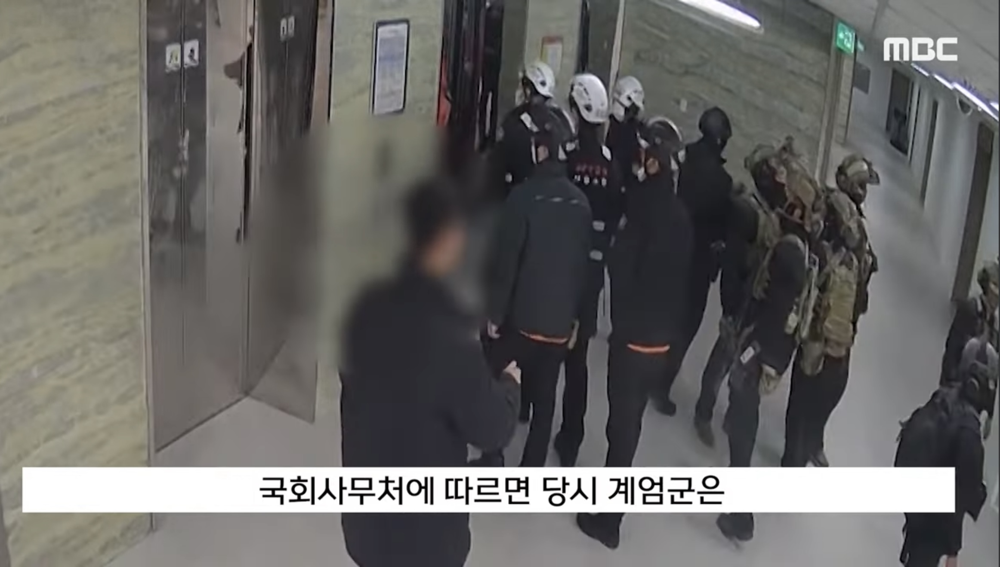
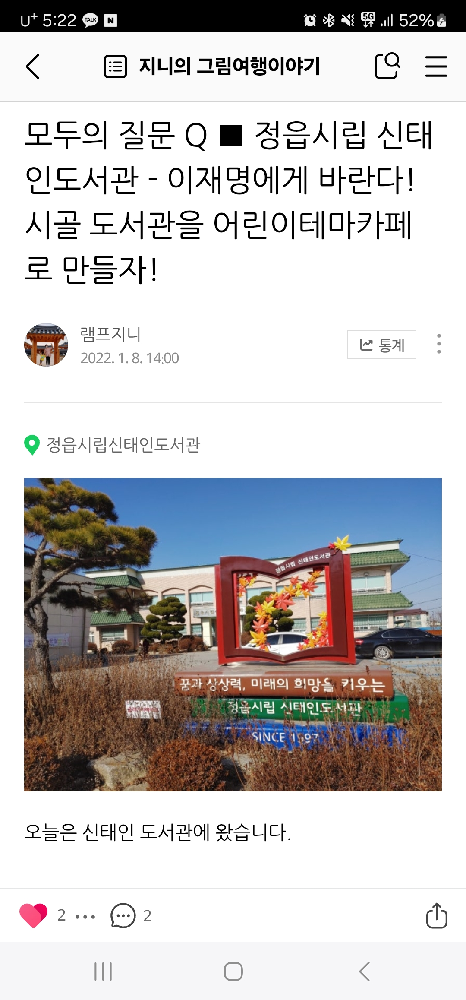
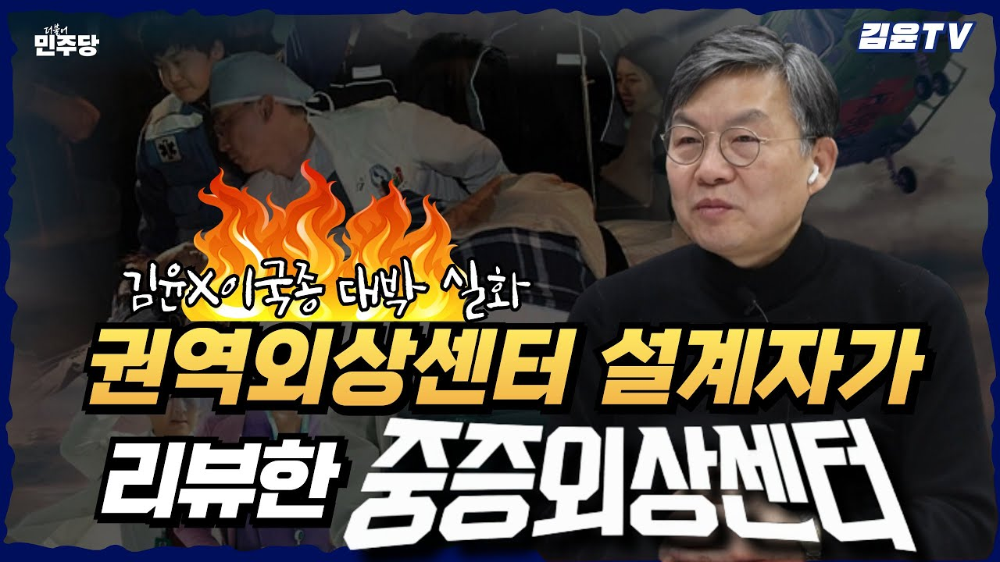

## 문서번호: 3901

### 제목: [부자들이 자발적으로 세금을 내게 할 방법은 정녕 없는가?](https://q4all.kr/redirect/detail/440d6f0a-db24-41bf-bb5d-f970cd94f400)

**작성자:** [김형근](https://q4all.kr/user/profile/3275)
**작성일:** 2025-02-18 07:40:19 (화요일)

---

조세저항을 없앨 방법

---

## 문서번호: 3902

### 제목: [대한민국 임상시험 실태 및 개선 방향](https://q4all.kr/redirect/detail/2b892f63-87cd-4997-85b8-045a39aeacd8)

**작성자:** [주철기](https://q4all.kr/user/profile/5435)
**작성일:** 2025-02-18 07:41:05 (화요일)

---

대한민국 임상시험 실태 및 개선 방향

최근 3년간 대한민국에서 임상시험 과정에서 중대한 부작용을 겪은 사례가 약 1,800건에 이르고, 사망 사례도 180건에 달하는 것으로 나타났다. 이러한 문제는 단순한 의료 사고의 범위를 넘어, 임상시험의 투명성과 윤리적 운영에 대한 근본적인 의문을 제기한다. 특히, 특정 임상시험에서 동의서 위조, 의무기록 조작, 프로토콜 위반, 부작용 방치 등의 불법적인 행위가 발생했다는 주장은 매우 심각한 사안이다.

1. 임상시험 과정의 구조적 문제

대한민국의 임상시험 환경에서는 다음과 같은 문제점이 지속적으로 제기되고 있다.

임상동의서의 변조 및 위조: 피험자의 자발적 동의를 기반으로 해야 하는 임상시험에서 동의서가 변조되거나 조작되는 사례가 보고되었다. 이는 명백한 생명윤리법 위반이다.

의무기록의 조작 및 임상 프로토콜 위반: 실험 설계에서 정해진 일정과 절차를 무시한 채 투여 간격을 임의로 조정하거나 대조군을 비공개해야 함에도 불구하고 이를 공개하는 등 연구 윤리를 위배하는 행위가 발생했다.

부작용에 대한 무책임한 대응: 피험자가 이상 반응을 호소함에도 불구하고 적절한 조치 없이 방치하는 경우가 존재한다. 이는 피험자의 안전을 최우선으로 고려해야 하는 임상시험의 기본 원칙을 심각하게 훼손하는 행위다.

2. 행정기관과 의약품 카르텔 문제

식품의약품안전처(식약처) 및 보건복지부의 감독 부실과 행정 편의주의 또한 이러한 문제를 악화시키는 요인으로 지목된다.

정보 비공개 및 직무유기: 임상시험 관련 정보가 국민에게 충분히 공개되지 않고 있으며, 연구대상자의 권리를 보호하기 위한 법적 절차가 제대로 작동하지 않고 있다.

기관 간 유착 및 회전문 인사: 특정 의료기관이 제도적 절차를 무시한 채 임상시험 실시기관으로 지정되는 과정에서 공정성이 의심되는 사례가 존재한다.

행정 카르텔 및 왜곡: 국가기관이 제 역할을 하지 못하고 특정 기업과 의료기관의 이익을 대변하는 행태가 이어질 경우, 대한민국의 임상시험 환경은 발전하기 어려울 뿐만 아니라 국제적인 신뢰도 또한 떨어질 수밖에 없다.

3. 임상시험 개선을 위한 제언

대한민국의 임상시험 제도를 개선하기 위해서는 다음과 같은 조치가 필요하다.

임상시험 윤리 강화: 연구대상자의 권리를 보호하기 위해 생명윤리법을 더욱 엄격히 적용하고, 동의서 작성 및 연구기록의 투명성을 확보할 필요가 있다.

독립적인 감독 기구 신설: 임상시험 과정에서 발생하는 불법 행위를 감시할 독립적인 기관을 설립하고, IRB(기관생명윤리위원회)의 역할을 보다 강화해야 한다.

정보공개 및 책임 강화: 식약처 및 보건복지부는 임상시험 과정과 그 결과를 투명하게 공개하고, 부작용 사례에 대한 철저한 조사와 책임 규명을 해야 한다.

공정한 경쟁 환경 조성: 국내 제약·바이오 기업들이 스위스 로슈와 같은 글로벌 경쟁력을 갖출 수 있도록 공정하고 신뢰할 수 있는 연구 환경을 마련해야 한다.

만약 이러한 개혁이 이루어지지 않는다면, 대한민국의 임상시험 환경은 불신 속에서 침체될 것이며, 결국 국제적인 경쟁력을 잃고 의료기술 발전에서도 뒤처질 수밖에 없다. 임기응변식 대응이 아니라, 근본적인 개선이 필요한 시점이다.

셀트리온 CT-P42 3.1 임상시험 관련 주요 문제 요약

1. 임상시험실시기관(김안과병원)에서 발생한 문제점

임상동의서 위조·변조: 피험자의 동의 없이 임상동의서가 조작되었거나, 원본과 다르게 수정된 정황이 있음.

의무기록 조작: 실험 결과와 관련된 의무기록이 허위로 작성되거나 조작된 사례가 확인됨.

임상시험 프로토콜 위반:

대조군이 비공개로 유지되어야 함에도 불구하고 공개됨.

정해진 투여 주기(간격)를 어기고, 18일 일찍 조기 투여하는 방식으로 부작용을 유발함.

부작용 호소 방치: 실험 중 발생한 부작용에 대해 적절한 조치를 취하지 않고 방관.

2. 식품의약품안전처(식약처) 관련 문제

임상정책과 및 운영지원과의 직무유기:

약사법 34조, 34조의2에 따라 중요한 변경 사항에 대해 승인해야 하지만, 이를 소홀히 함.

임상시험 연구대상자의 정보공개 요청을 거부하거나 "정보부존재" 처분을 내림.

행정형해화 및 회전문 인사 문제:

특정 기관(김안과병원)을 임상시험실시기관으로 지정하는 과정에서 공정성 논란.

식약처 내부에서 기존 관행을 유지하기 위한 조직적 방관 가능성.

3. 보건복지부 생명윤리정책과 문제

생명윤리법 위반(제4조, 제10조, 제14조) 묵과:

연구대상자의 권리를 보호해야 함에도 불구하고, 생명윤리법과 약사법의 상호보완적 적용을 소홀히 함.

공인 IRB(기관생명윤리위원회) 인증제도 무력화:

국가생명윤리정책원(IRB 인증 기관)에서 관리하는 윤리적 검토 절차가 제대로 작동하지 않음.

결론 및 핵심 문제

임상시험 과정에서 위조·조작·절차 위반이 발생했으며, 이에 대한 감독기관(식약처, 보건복지부)의 방관이 문제를 악화시킴.

대한민국의 임상시험 환경이 행정 카르텔 및 편의주의적 운영으로 인해 불공정하게 작동하고 있으며, 연구대상자의 권리가 침해되고 있음.

체계적인 개선이 이루어지지 않으면, 임상시험 신뢰도 하락과 더불어 국내 의약산업의 글로벌 경쟁력이 약화될 우려가 있음.

기타 상세는 별도의 대면미팅을 통하여 상술(祥述)하겠습니다.

---

## 문서번호: 3903

### 제목: [국회 단전시 왜  동영상 검증 안했나요!! 119 있었음](https://q4all.kr/redirect/detail/dc9884b9-e96a-4621-b1bb-9f94d024ebf4)

**작성자:** [박민우](https://q4all.kr/user/profile/5443)
**작성일:** 2025-02-18 07:54:21 (화요일)

---

이 중요한 정보를 면밀히 살피지 않고 발표 하셨나요!!

매불쇼하고 뉴스 보다 국회 단전 영상에서 119소방대원이 같이 707과 같이 작전을 도도왔어요.이상민이 지시 했다는 증거 입니다

---

## 문서번호: 3904

### 제목: [요가강사 프리랜서는 언제쯤 근로계약을 할 수 있을까? 왜 임금은 10년 동안 그대로일까?](https://q4all.kr/redirect/detail/832a2d18-9006-4581-8b3b-b4449e6fb18a)

**작성자:** [구지영](https://q4all.kr/user/profile/5451)
**작성일:** 2025-02-18 08:54:24 (화요일)

---

요가 강사로 12년도 부터 일했습니다

쉬어봤자 무급 휴가라서 스무살 무렵부터 단 하루도 쉬지 않고 10년 이상 경력을 쌓았습니다.

요가원 운영도 했었습니다. 민주당의 자영업자 지원 덕분에 코로나 시기를 잘 이겨냈지만 코로나를 지나 온 지금이 가장 어렵네요. 요가원을 접고 다시 프리랜서로 돌아왔지만 울며 겨자 먹기로 근근이 먹고 삽니다.

물가는 치솟고 임금은 예의 코묻은 그 돈에서 더 낮아지면 낮아졌지 그대로네요. 경력이 없는 선생님들은 더 못한 취급을 받습니다...저 또한 언제 그렇게 될지 모르는 상황에 마음 한 켠이 불안합니다.

근로계약서를 쓰자고 하면 까다로운 강사로 손가락질 받을 것 같고 다른 대체 인력으로 갈아치우고 말 것 입니다. 대형 프랜차이즈 헬스장 여러 체인점에서 근무하기 때문에 다른 체인점에서도 그 사실을 공유하면서 모든 일자리에서의 근간이 흔들리게 될 것 같습니다...

사업자로, 프리랜서로도 설 자리가 없어서 걱정입니다.

대형 프랜차이즈 헬스장이 아닌 경우는 문을 닫고 잠적하여 임금체불도 당했었던 경험에 다른 곳은 선뜻 발을 담그기가 현실적으로 불가하고요.

저의 작은 물음표가 저와 같은 사람들의 억울함에 조금이나마 힘이 되려면 제가 무엇을 하는게 좋을까요?

---

## 문서번호: 3905

### 제목: [상권 부흥에 대한 보상은 누가 가져가야 하는가?](https://q4all.kr/redirect/detail/bdcf945c-9954-4a5d-808f-37b17119dfe1)

**작성자:** [윤남현](https://q4all.kr/user/profile/5457)
**작성일:** 2025-02-18 09:36:27 (화요일)

---

'권리금'이라는 이상한 관행에 관심을 가지게 되면서, 이 관행의 합리성을 이해하게 됐습니다.

권리금은 보통 바닥권리금과 영업권리금 두가지로 생각할 수 있는데,

일반적으로 바닥권리금은 건물의 위치로 인한 가치로 인정이 되어서 건물주에게 돌아가는 것이고,

영업권리금은 기존에 영업을 하던 상공인에게 돌아가는 것으로 되어 있습니다.

먼저 영업권리금은 상공인이 장사를 잘해서 입소문을 만들고 단골을 만들었기 때문에 이에 대한 보상으로 주어진다고 하면 나름 합리성이 있습니다.

그들 상공인이 만들어놓은 가치를 누군가가 욕심을 낼 수 있고, 적절한 수준에서의 금전보상도 기꺼이 가능하다고 생각하고 있습니다.

하지만 바닥권리금은 너무나 엉뚱하다는 생각이 듭니다.

건물주는 임대를 통해서 가치를 제공하고 이에 대한 보상으로 임대료를 받고 있습니다.

이러한 상황에서 이상한 바닥권리금을 또 받는다는 것은 말이 안됩니다.

더구나 건물주는 상권의 발전에 대해서 기여한 바가 거의 없으며, 있다고 해도 임대료를 통해서 수익을 실현하면 되는 일입니다.

이러한 합리/불합리한 권리금에 대해서 양성화가 필요한 시점이 아닌가 합니다.

영업권리금은 법적인정을 해주되, 바닥권리금은 불법화 시키는게 맞다고 생각합니다.

추가로,

소위 젠트리피케이션으로 불리는 상권의 몰락은 과도한 임대료가 문제가 된다는 것은 누구나 알고 있습니다.

하지만, 건물주의 근시안적인 욕심으로 이러한 현상을 막지 못하고 있는 상황입니다.

이러한 문제점의 해결방법으로 권리금을 적극 이용할 수 있지 않나 생각합니다.

영업권리금의 증가는 임대료의 증가를 어느 정도 누르는 효과가 있을 것이고,

이런 경향은 초기부터 영업을 해 온 상공인에게 우선권을 줌으로써 젠트리피케이션을 약화시키는 효과가 기대 됩니다.

문제는 영업권리금의 산정방법이 될텐데,

이 부분은 많은 분들의 경험과 지혜가 필요합니다.

감사합니다.

---

## 문서번호: 3906

### 제목: [체제에 대한 여론조사는 왜 없을까요? 매우 중요하지 않나요,,](https://q4all.kr/redirect/detail/ef0123a0-e9c8-4050-a3cb-b0933dfbe35c)

**작성자:** [황인용](https://q4all.kr/user/profile/5464)
**작성일:** 2025-02-18 09:53:25 (화요일)

---

대통령이 친위쿠데타로 독재를 하려고 했는데, 이것을 동조하고 지지하는 사람들이 많다고 여론조사결과를 발표하는데, 절말일까요?

개인 또는 정당에 대한 지지율도 필요하겠지만,

일본군부독재나 김일성독재와 같은 장기 독재 체제를 지지하는지, 아니면 민주정치를 지지하는지, 정말 중요한 것은 체제에 대한 여론조사가 필요하지 않을까요??

---

## 문서번호: 3907

### 제목: [우리나라의 자살율은 왜 이렇게 높을까요?](https://q4all.kr/redirect/detail/d26fd0c9-3257-4127-801d-44e901146eba)

**작성자:** [송수윤](https://q4all.kr/user/profile/5467)
**작성일:** 2025-02-18 09:58:46 (화요일)

---

전 연령층에서 압도적 1위를 기록하는 한국

우리나라는 왜 이렇게 스스로를 버리는 선택을 하는 사람들이 많아졌을까요?

특히 꽃다운 10대들의 사망원인 1위가 자살이라는 사실은 당혹을 넘어 애통스럽습니다.

무엇이 우리를 이렇게 삶을 포기할 정도로 불행하게 만들었나요?

분명 성실하고 똑똑한 한민족인데 왜 스스로를 더 궁지로 몰아가고 있을까요?

경쟁심리 때문일까요? 비교의식? 물질 만능주의 때문일까요?

무언가 크게 잘못 되어 가고 있습니다.

---

## 문서번호: 3908

### 제목: [신도시에 왜 종교부지를 줘야하는가?](https://q4all.kr/redirect/detail/a2ea14cb-74e8-4251-bb18-8049803934d8)

**작성자:** [정민영](https://q4all.kr/user/profile/5458)
**작성일:** 2025-02-18 10:01:30 (화요일)

---

신도시가 생기면 아주 좋은 위치에 종교 부지가 결정되고 그것도 아주 싼 값에 종교 시설이 들어 오는 것으로 알고 있습니다. 그러면 그 자리는 교회가 들어 옵니다. 말이 종교 시설이지 교회 자리를 마련해 주는 겁니다. 물론 다른 종교가 들어 온다고 해도 부당한 것은 마찬가지 입니다. 왜 종교만 혜택을 받아야합니까? 세금도 안 내면서. 종교인들도 직업이고 자영업 입니다. 왜 그들만 그런 혜택을 받아야 합니까?

---

## 문서번호: 3909

### 제목: [518 광주혁명에 이어 123비상계엄까지 공권력을 동원한 반민주 반헌법적 무력행위가 역사에서 반복되고 있습니다. 민주당은 이에 어떠한 재발방지책을 수립할 계획인가요?](https://q4all.kr/redirect/detail/c7701084-eadc-43e3-a602-dac173730e79)

**작성자:** [권재형](https://q4all.kr/user/profile/5272)
**작성일:** 2025-02-18 10:09:12 (화요일)

---

내란 수괴는 형법 상 사형 밖에 없다고 하는 중죄인데, 이렇게 아직도 버젓이 내란을 옹호하고 선동하는 세력이 많다는 사실에 자괴감이 듭니다.

헌법을 수호하고 민주주의를 추구하는 대한민국에서 내란과 같은 중범죄를 저지르거나 옹호하는 집단을 엄격히 처벌하는 입법이 필요한 것 아닐까요?

민주당의 생각과 계획은 무엇인지 궁금합니다.

---

## 문서번호: 3910

### 제목: [아이들에 대한 교육 이대로 괜찮을까요?](https://q4all.kr/redirect/detail/9ff991bb-f9e9-4c4a-b204-d8181cea7ad4)

**작성자:** [이지은](https://q4all.kr/user/profile/5474)
**작성일:** 2025-02-18 10:28:37 (화요일)

---

아이들에게 가르쳐야할 여러 항목들이 있는데

학문적인 소양 뿐만 아니라 시민으로서 함께 살아갈 덕목에 대한 교육은 너무 약한것 같아요.

그러다보니 질서를 지키고 법을 지키는 사람들이 점점 바보인것 처럼 느껴지고 나만 손해본다는 생각마저 듭니다.

아이들과 대면해서 교육하는 주체들에 대한 시민의식. 역사. 발달심리등에 대한 필요한 교육항목에 대해 다 같이 고민해서 아이를 키우는 부모. 선생님에 대한 체계적인 교육이 필요하지 않을까요?

---

## 문서번호: 3911

### 제목: [질문만 중요한게 아니다 (의사진행발언??)](https://q4all.kr/redirect/detail/2c0bf7de-ee5d-43c5-8cb2-249e64061615)

**작성자:** [신승한](https://q4all.kr/user/profile/5430)
**작성일:** 2025-02-18 10:29:27 (화요일)

---

많은 분들이 그렇겠지만 박태웅 의장님의 생각에 공감하여 이 사이트에 가입하고 첫 질문을 작성했습니다.

질문을 올린 후 다른 사람들의 의견을 읽으면서 들었던 생각은, 질문 그 자체보다는 질문을 읽는 사람들의 참여에 대한 의문이 들었는데요/

좋은 질문은 많은데 읽는 사람의 참여가 현저히 적다는 것입니다. 대게 사람들은 듣기보다 말하기를 좋아하기 때문에 자연스러운 일이라고 생각은 합니다.

하지만 읽는 사람의 참여없이 이 많은 질문 중에서 어떻게 의미있는 질문을 선택할 수 있을까요?

녹서에 올라갈 질문 선택에 인공지능이 활용하겠다고 들었는데 여기에 어떤 데이터가 사용되나요

텍스트? 조회수? 공감수? 관심수? 사용하는 인공지능 모델은 무엇인가요? 인공지능에게 우리의 미래를 맡겨도 괜찮을까요.

질문 선택에 앞서 객관적 지표 확보를 위해 읽는 사람들의 더 많은 참여는 필요없는 것인가요? 이것이 아니라면, 책임이 있는 사람들이 모든 글을 읽고 선택에 참여해야 하는 것은 아닌지 모르겠습니다

---

## 문서번호: 3912

### 제목: [차별금지법은 차별과 혐오를 해결할 수 있을까?](https://q4all.kr/redirect/detail/7a60b35e-de73-4da5-af2f-a75e1313af26)

**작성자:** [권경훈](https://q4all.kr/user/profile/3206)
**작성일:** 2025-02-18 11:12:25 (화요일)

---

차별금지법 제정과 관련해 동성애나 PC에 대한 혐오정서가 확산되고 결집되는 것을 보면서

단순히 가짜뉴스다라고 하고 입법으로 해결하려 하기 이전에,

반대의 질문에 차별 당사자가 답을 하고, 차별 당사자의 질문에 반대진영이 답을 하는 과정이 필요하다 생각해서 질문을 올려봅니다.

---

## 문서번호: 3913

### 제목: [지방자치 발전을 위해 더불어 민주당 지역위원회내 가칭 의정 모니터링단(또는 감시단) 조직을 운영하면 좋겠습니다. ](https://q4all.kr/redirect/detail/2fa96a43-5a74-437b-9fa6-ae7c7622a42b)

**작성자:** [이응덕](https://q4all.kr/user/profile/5471)
**작성일:** 2025-02-18 11:13:37 (화요일)

---

1991년 지방 자치제가 부활한 지 30년이 넘었습니다. 그동안 많은 발전이 있었고, 또 한편 부족한 면도 있습니다.

향후에도 중앙 집권이 아닌 지방 분권이 바람직한 시대 흐름이라면 더 나은 지방 자치를 위한 민주당의 더 큰 노력이 필요합니다.

한 방안으로 민주당내 지역위원회별 가칭 자치단체/ 의회 모니터링단(감시단)을 상설 운영하면 좋겠습니다.

모니터링단은 당원 본인이 거주하는 자치단체/ 의회(군의회, 구의회, 시의회 등) 대상 활동이므로 더욱 자발적, 적극적으로

참여할 수 있다 생각합니다. 또한 이 과정에서 관련 시민단체 협업을 통한 당 외연 확장 효과도 기대할 수 있습니다.

다만 이와 관련 아래 내용을 참고하면 좋겠습니다.

1) 기존 당헌/당규상 지역위원회 상설 조직 지방분권위원회가 있습니다만 저는 실질적인 활동 여부를 알지 못하겠습니다.

짐작컨대 잘 운영되는 지역위원회도 있겠지만, 반대로 위원회 조직만 형식상 있거나 실질 활동이 거의 없는 곳도 있을 것입니다.

2) 덧붙여 민주당내 수많은 조직이 있지만 1)과 같이 실질 운영이 부족한 위원회도 많을 거라 추정합니다.

실질 활동을 담보하기 위해 지역위원회 조직 평가 및 지역위원장 평가시 지방자치(지방분권) 관련 항목을 두는 것도 방법이라 생각합니다.

---

## 문서번호: 3914

### 제목: [국민연금 담보 대출 ](https://q4all.kr/redirect/detail/8f98722b-1af2-43ed-a455-3995ee9e1bf2)

**작성자:** [김봉철](https://q4all.kr/user/profile/5481)
**작성일:** 2025-02-18 11:26:14 (화요일)

---

납부된 국민연금 일정 금액을 담보로

일정비율로 확대 대출이 가능하도록 개정바랍니다.

개인적으로 대출도 어렵고 금융사정이 너무도 좋지않아

나름 가진 자산이라고는 상당금액(30년납부)의 국민연금

납부금액을 담보로 대출을 받아 기본 생활을 유지하고 싶은데

현행제도에서는 아주 긴급소액만 그것도 제한적 조건이라

신용불량자로 전락할 위기에 몰려있습니다.

희망의 불씨를 살려주세요!

---

## 문서번호: 3915

### 제목: [정신질환 환자들은 왜 위험인물로 낙인 찍혀야 할까요?](https://q4all.kr/redirect/detail/8e2b819b-804a-4599-acef-3064a00a01ff)

**작성자:** [민보규](https://q4all.kr/user/profile/4791)
**작성일:** 2025-02-18 11:27:07 (화요일)

---

최근들어 끊임없이 우울증, 조현병 환자들에 의한 범죄들이 뉴스에서 관심을 끌고 있습니다.

그러다보니, 더 누구나 가깝게 가볍게 치료받을 수 있어야 할 정신질환이 숨기기에 급급한 질환이 되어가고,

정신질환 환자들과 그 가족들은 잠재적 범죄자, 혹은 위험한 인물 이라는 낙인을 겪게됩니다.

심지어 정신질환 환자들은 모두 병원에 가두라거나,

내 눈 앞에 안보이게 해달라는 식의 극단적 해결책이나 혐오까지 이어지고 있습니다

하지만 실제로 조현병 등 정신질환자의 범죄비율은 오히려 일반인보다 낮은 게 사실입니다.

특히 제대로 약을 먹고, 관리되는 환자들이라면 더욱 그렇죠.

그렇다면, 우리 사회는 정신질환 환자들에 대한 관리가 제대로 되고 있나요?

현재 상황에서는 내원하던 환자들이 병원을 오지 않아도

위험한 환자들이 치료를 중단해도

모두 환자의 선택에만 의존하게 됩니다

혹은 가족들의 관리에만 의존하게 되죠

아마 대부분의 정시질환 환자들에 의한 범죄도

제대로 된 치료를 못받거나, 치료가 중단된 상태에서 벌어지는 현상일 것입니다

이 관리의 책임을 단순히 의사에게만 맡기거나,

보호자에게만 맡기거나

일반적인 환자와 병원의 관계로 설정해버리면

이 같은 일은 더 반복될 것입니다

치료받아야 할 환자들이 적절히 치료가 되고 있는지 확인되는

국가와 병의원 간의 데이터베이스화,

이를 통해 적절한 치료를 지속할 수 있는 시스템화가 필요한 이유입니다.

그 데이터베이스와 시스템이 잘 관리된다면,

오히려 정신질환 환자들을 보호하고

사회적인 전체의 낙인을 줄일 수 있지 않을까요?

또한 정신질환 환자의 경우, 물론 환자 본인이 가장 힘들겠지만

그 가족들 또한 힘겨운 싸움을 하며, 환자의 보호 관리에 어려움을 겪습니다

환자들의 보호와 치료, 사회화를 위한 체계적인 시스템 적립과

이를 제공하는 장소도 턱없이 부족합니다

이런 문제를 근본적으로 해결하는 것이

정신질환자들에 대한 인식은 물론,

정신질환을 대하는 인식 자체를 바꾸게 되지 않을까요?

---

## 문서번호: 3916

### 제목: [헌법상 교육을 받을 권리는 보장받고 있는가?](https://q4all.kr/redirect/detail/9d123a10-027e-4ef9-ab04-5b024a65b01a)

**작성자:** [권경훈](https://q4all.kr/user/profile/3206)
**작성일:** 2025-02-18 11:49:01 (화요일)

---

헌법 31조  ①모든 국민은 능력에 따라 균등하게 교육을 받을 권리를 가진다.

 ②모든 국민은 그 보호하는 자녀에게 적어도 초등교육과 법률이 정하는 교육을 받게 할 의무를 진다.

1항에선 능력에 따라 균등하게 교육을 받을 권리를 보장하고 있지만, 2항의 교육을 받게할 의무에 따라 강제로 연령에 따라 일괄적으로 학교시스템에 편입되는 구조로 인해 권리의 자율성이 침해되고 있다고 생각합니다.

저는 학교폭력 교권추락 등 모든 학교 문제의 근원이 이것이라 생각합니다. 능력과 관심사가 다른 사람들을 한 공간에 몰아넣음으로 인해 발생하는 문제가 아닐까요?

나이와 상관없이 자율적으로 원하는 선생님을 찾아가 배우고 싶은걸 배울 수 있게하는 시스템은 불가능한 걸까요? 이때 학생선발권은 전적으로 선생님에게 일임해야 선생님의 권위가 서지 않을까요?

그리고 정부는 수능처럼 대입을 위한 일괄적 평가시스템이 아니라, 토익, 한국사능력시험, 한국어능력시험 등처럼 분야별 평가시스템 마련해 능력 각자의 능력을 검증해 볼 수 있게 하는게 어떨까요?

이걸 선생님, 교수님들의 학생선발권에 활용하면 객관성을 담보할 수 있지 않겠습니까?

권리자의 입장에선 배워야할 필요가 없는 분야에까지 시간을 낭비하지 않고 자신의 역량을 최대로 끌어내 세계를 선도하는 인재로 발전할 수 있지 않겠습니까?

기업의 입장에서도 인재채용에 활용할 수 있는 데이터가 될 수 있지 않을까요?

---

## 문서번호: 3917

### 제목: [언론이 왜 친중이 되었을까요???](https://q4all.kr/redirect/detail/55d7311b-84ed-4316-bd49-aa1aecf25e82)

**작성자:** [박에스더](https://q4all.kr/user/profile/5491)
**작성일:** 2025-02-18 12:28:48 (화요일)

---

언론이 더이상 신문으로 돈 벌수 없어

외국 기업으로부터 돈을 받게 됬는데...

jtbc 와 mbc 가 텐센트라는 기업으로부터

1000억 받았다는데

요즘에 친중 관련한 뉴스 많이이나오던데

자유대한민국 이대로 괜찮을까요??

(인민)민주주의 만들려고 하는 친중 세력...

이대로 괜찮을까요?

---

## 문서번호: 3918

### 제목: [중고등학교 시간강사는 왜 일주일에 14시간까지만 강의해야하나요?](https://q4all.kr/redirect/detail/3a9bdd5c-308f-47f5-943e-1c164017e6fb)

**작성자:** [남정화](https://q4all.kr/user/profile/5492)
**작성일:** 2025-02-18 12:40:19 (화요일)

---

저는 개인 사정상 정식교사나 기간제 교사는 할 수 없고 시간강사로 강의를 나가고 있고 올해 3년째 하는데요…

모든 학교를 다 합쳐서 총 일주일에 15시간 미만이라는 규정이 있어 학교에서도 시간 강사 쓰기도 힘들지만 제 입장에서도 너무 애매한 시간이라 한 학교에 8시수 정도 채우고 나면 다른 학교는 6시간밖에 못나가요… 그런데 6시간만 구하는 학교를 찾기도 힘들고 결국 한학기에 7-8시수밖에 못하게 됩니다…. 좀더 일하고 급여를 챙겨서 경제 생활을 하고 싶지만 규정상 못하게 되니 많이 아쉽습니다.. 그건 강사를 구하는 학교 입장에서도 그렇다고 들었어요… 시수 짜기가 여간 힘든게 아니라고…

한번 들여다봐주세요

---

## 문서번호: 3919

### 제목: [범죄자가 응당 합당한 벌을 받는 세상을 꿈꿉니다](https://q4all.kr/redirect/detail/1775e6cd-45c1-47c1-bf3c-f898aacd342b)

**작성자:** [정덕현](https://q4all.kr/user/profile/77)
**작성일:** 2025-02-18 12:40:25 (화요일)

---

교도소인지 호텔인지 국민들 세금으로 범죄자 잘먹이고 재우지 말고

엘살바도르 교도소처럼 중범죄인에게 강력한 처벌과 교정을 할 수있는 시스템이

갖춰 졌음 합니다~

---

## 문서번호: 3921

### 제목: [종교계 납세의 의무을 하고 있는가?](https://q4all.kr/redirect/detail/61372e34-9a84-49d8-9dbd-1a6c694ceb4a)

**작성자:** [박상규](https://q4all.kr/user/profile/1289)
**작성일:** 2025-02-18 12:52:07 (화요일)

---

종교단체는 세법상 비영리법인으로 분류되어, 종교인 소득과 종교단체의 고유 목적사업에서 발생한 수익에 대해서는 비과세 혜택을 받습니다.

그러나 기부금을 수령한 경우에는 기부금 영수증을 발행하고, 기부금 수입을 신고하여 세금을 납부해야 합니다.

국세청은 불성실 기부금 수령단체를 공개하고 있으니, 관련 정보는 국세청 누리집에서 확인하실 수 있습니다.

종교계는 대부분 헌금,봉헌금,기부금등 등또한 애매한 조항이고 신고하여 세금을 납부 해야한다 또한 애매한 문구다.

이번 내란으로 내란옹호 단체에서 현금성 살포하여 집회 인원들을 모집하는 등 지하자금이 쓰인다고 볼수 있다.

종교계도 종교활동(노동)을 통해 수입이 발생된다.

종교단체,활동이라고 해서 특수계층이라고 하며 헌법에 위배된다.

대한민국 태어나 개인이든,법인이든 형평성에 맞게 납세의 의무을 똑같이 해야 한다.

---

## 문서번호: 3922

### 제목: [강아지 고양이 공장은 왜 존재해야하나요?](https://q4all.kr/redirect/detail/8d2a5923-5819-4c99-a747-18595078cb0c)

**작성자:** [남정화](https://q4all.kr/user/profile/5492)
**작성일:** 2025-02-18 13:11:51 (화요일)

---

반려인구가 천만을 넘는다는 한국에서 유기동물 문제가 끊이지 않고 동물 학대 문제도 매일매일 보도가 되고 있습니다.

우리가 살고 있는 이 지구가 인간의 것만은 아닐것인데… 동물들도 살아갈 권리가 있고 그래서 동물 복지라는 개념도 생기고 점점 확대되고 있다고 생각합니다..

작년쯤이었나… 끔찍하고 처참했던 경기도 화성의 강아지 공장(??) 이 크게 보도되고 경기도지사까지 나서서 구조했던 걸로 기억합니다.. 하지만 여전히 그런 곳은 너무나 많고 동물보호 관련 단체들이 끊임없이 구조를 하지만 한계는 분명 존재합니다…

막상 구조를 해도 그 이후도 막막해 여전히 지원이 부족한 상황입니다..

저는 이런 문제를 절대 개인이나 어떤 단체가 해결할 수 없다고 생각합니다.. 국가에서 지속적으로 법적으로 강력하게 해결을 해야 한다고 생각합니다.. 김건희가 뭐 강아지 좋아한다고 그런 쪽으로 신경을 많이 썼다고들 하는데 뭘 어찌했는지는 알 길이 없습니다만.. 반려동물 관련 단체나 개인들이 거기에 혹해서 투표를 한 것도 사실일 겁니다…

제가 이렇게 구구절절 글을 쓰는 이유는 각종 보도나 sns에서 유기나 학대된 아이들을 볼때마다 내가 저지르지 않았지만 개고양이를 키운다는

이유로 이상한 죄책감에 시달리기 때문입니다..

내가 쟤들을 거두지 못하는게 나쁜게 아닐까.. 도움을 주지 못하는게 너무나 슬프거 안타깝고… 그게 저뿐만 아니라.. 댓글들을 살펴보시면 금방 알 수 있을거예요…

이번 대통령 선거에서는 꼭 이 부분이 반영이 되면 좋겠습니다..이 부분이 반영이 된다면 제 주변의 반려인들은 대부분 아마 표로써 보여줄겁니다

---

## 문서번호: 3923

### 제목: [안덩적인 사회적 의사결정 체계 구축](https://q4all.kr/redirect/detail/f129b2f5-b236-43b1-9c85-308151268951)

**작성자:** [신호순](https://q4all.kr/user/profile/5499)
**작성일:** 2025-02-18 13:15:39 (화요일)

---

사회적 의사결정이 진영에 상관없이 공동의 선으로 수렴되는 의사결정 체계를 갖추는 방법은 없을까요. 완벽하지는 않더라도 무한반복 게임에서 협력이 도출되는 자연스러운 인센티브구조를 갖출 수 있도록

---

## 문서번호: 3924

### 제목: [우리는 왜 제대된 정치인을 육성하는 시스템을 가질 수 없는가?](https://q4all.kr/redirect/detail/7ec658d6-8c40-4458-8fb6-d92086d39a2b)

**작성자:** [노민호](https://q4all.kr/user/profile/5504)
**작성일:** 2025-02-18 14:10:13 (화요일)

---

우리 사회는 정치인을 꿈꾸는 사람들을 키우고 검증을 할 수 있는 시스템을 가질 수는 없는 것일까요?

선출직 공무원의 사회적 영향력은 매우 크기 때문에 정치인이 가지는 생각과 능력을 미리 판단을 하고 선별을 할 수 있는 장치가 필요하다고 생각합니다.

법으로 각 정당 및 교육 체계에서 어떤 시스템을 마련해 두고 정치인의 꿈을 가지는 사람들이 활동할 수 있는 장을 만들고

이를 통해 국민들의 검증을 받을 수 있도록 하는 방법은 어려운 것일까요?

매 선거-- (특히 지방선거, 국회의원 선거) 등에서 갑자기 우리가 알 수도 없는 사람들이 나와서 정당의 대표로 나서는 것이 좀 비합리적인 것 같다는 생각이 듭니다.

좋은 정치 지형을 만드는 것은 좋은 정당을 많이 만드는 것도 필요하겠지만 각 정당이 내세우는 인물들이 공익을 위해 일 할 능력과 생각을 가지고 있어야 한다고

생각하기에 이런 시스템이 꼭 필요하다고 봅니다.

---

## 문서번호: 3925

### 제목: [언제까지 학교에서 철학 없는 입시교육을 계속해야 할까요? ](https://q4all.kr/redirect/detail/a6c7f3f7-cc86-4948-b4bb-27fd62c0bfab)

**작성자:** [조용미](https://q4all.kr/user/profile/5509)
**작성일:** 2025-02-18 14:10:21 (화요일)

---

혁신교육을 하면서 초등학교는 조금이나마 교육다운 교육을 하고 있지만 중고등학교는 대부분 입시 위주로 수업이 진행됩니다.

학부모들도 초등학교 과정은 인성과 자유로운 분위기 등을 이유로 토론 같은 새로운 수업을 환영하지만,

중고등학교에서는 다시 입시로 돌아갑니다.

언제까지 입시라는 커다란 목표점, 결론을 미리 정해놓고

교육개혁을 얘기해야 할까요?

심지어 학교는 성적표를 받기 위해 가는 거고, 진짜 입시교육은 학원에서 하는 현실을 우리는 언제까지 눈감아야 할까요?

왜 한번의 시험으로 평생 기득권이 있다고 믿는 걸까요?

왜 10대에 배운 걸로 평생 자기 능력을 주장하는 걸까요?

왜 21세기에 아직도 사지선다형 시험으로 능력을 채점할까요?

입시 외에 다른 선택지를 주지 않으면서 학부모들이 원한다는 식으로 논의를 원점으로 돌리지 말고

진짜 미래를 위한 교육대개혁을 논의했으면 합니다.

더 늦기전에 철학이 있는 교육, 미래를 위한 교육, 민주적 사고를 할 줄 아는 교육, 질문이 있는 교육, 모두가 주인이 되는 교육, 하나의 정답이 아니라 다양성이 존중되는 교육으로

방향을 전환했으면 좋겠습니다.

---

## 문서번호: 3926

### 제목: [왜 사법부의 신뢰도가 세계 꼴찌 수준인가요](https://q4all.kr/redirect/detail/102f64d8-24a2-41d2-a1f3-d974fbe0288b)

**작성자:** [김종갑](https://q4all.kr/user/profile/1110)
**작성일:** 2025-02-18 14:10:46 (화요일)

---

우리나라 법원에 대한 시민적 신뢰도가 OECD 36개국에서 콜럼비아보다 하나 아래인 34위 일까요. 신뢰수준이 22%라니 참으로 한심합니다. 이는 판사 판결이 엉망징창이라고 생각되유. 또한 주권국가 답게 사법부에 대한 주권자의 통제가 이루어지지 않고, 소위 말하는 엘리트 중심으로 인적구성이 이루어져, 국민의 상식수준을 무시하는 풍조가 한 목한다고 생각돼유. 우리도 독일과 같이 참심제나 미국같이 배심원단이 유무죄를 판단하는 제도 도입이 시급혀유. 현재와 같이 배심원의 판단이 참고만으로 이루어져서는 주권자의 참여 의지를 꺾어 버려요. 헌법개정 없이도 현재의 배심원제를 법률로 개정하여 주권자인 배심원이 유무죄를 판단할 수 있도록 혀야 돼유.

---

## 문서번호: 3927

### 제목: [ 태극기 대체물은 없을까요?](https://q4all.kr/redirect/detail/c4c29c56-42ee-4921-9095-c5e9c012c94d)

**작성자:** [임금희](https://q4all.kr/user/profile/5516)
**작성일:** 2025-02-18 14:11:49 (화요일)

---

3.1.절에 소모임이 있어서 태극기를 들고 나가려다가 태극기부대로 오해받을까봐 안가져가기로 결정했습니다.

너무 속상합니다.

다른 대체물 없을까요?

---

## 문서번호: 3928

### 제목: [사교육, 교육](https://q4all.kr/redirect/detail/bbde2fec-ef67-4562-9315-569647428cf7)

**작성자:** [전춘영](https://q4all.kr/user/profile/5520)
**작성일:** 2025-02-18 14:15:31 (화요일)

---

저는 현재 사교육에서 독서 교육을 하고 있는 교사입니다.

원래 공교육에 있었습니다만, 지금은 사교육으로 자리를 옮겼습니다.

좋은 교사이고 싶고, 교육에 진심을 다하고 싶습니다.

공교육에 있든 사교육에 있든 저는 같은 교육을 할 수 있다고 생각했습니다.

그래서, 노력하고 있습니다.

그런데, 사교육에서 교육 활동을 하면서 마음이 찝찝합니다.

우리의 사교육, 어떻게 해야 할까요? 더 나아가 우리의 교육, 어떻게 해야 할까요?

진짜 교육을 하고 싶은 교사는 어디로 가야 할까요?

---

## 문서번호: 3929

### 제목: [왜 국회의원선거의 룰을 제 3자가 정하지 않고 국회의원이 정할까요](https://q4all.kr/redirect/detail/5c4e3c93-4624-4f7b-8080-a33c1d5fa46e)

**작성자:** [조용미](https://q4all.kr/user/profile/5509)
**작성일:** 2025-02-18 14:29:32 (화요일)

---

그동안 국회의원 선거제 개편안을 정하기 위해

국회의원들이 치열하게 토론하는 모습을 보아왔습니다.

연동제니 준연동제니 소선거구니 대선거구니 갑론을박합니다.

그런데 왜 국회의원 본인들의 룰을 왜 본인들이 정하는 걸까요?

심지어 연봉도 스스로 정하고,

국회의원 소환제도 스스로 정할 수 있기에 지금까지 소환제도가 없습니다.

모든 경기의 룰은 심판이 정하거나 제3의 기구가 정합니다.

그런데 국회의원만 스스로 정할 수 있게 하는 것 자체가 문제 아닐까요?

정치적 득실로 아귀다툼을 하지 않을 수 없는 구조 아닐까요?

3권분립이 되어있지만 그럼에도 국가권력을 남용하지 못하도록 헌법재판소를 만들어

사회적 갈등을 해소하고 국민의 권리를 보장하도록 하는 것처럼

국회의원 선거제도나 국회의 혜택에 대한 것도 제3의 기관에서 만들어야 하지 않을까요?

---

## 문서번호: 3930

### 제목: [의사가 진단서에 일상생활 가능하다는데 학교 출근을 막을 수 있나요?](https://q4all.kr/redirect/detail/6cf3e754-6346-4e73-a132-885719977660)

**작성자:** [최진아](https://q4all.kr/user/profile/5523)
**작성일:** 2025-02-18 14:32:32 (화요일)

---

의사의 진단서에 일상생활이 가능하다고 되어서 복직한 교사의 출근을 누가 막을 수 있나요? 고 하늘양의 억울한 죽음은 엉터리 진단서 무책임한 의사의 진단서에 대해 질문을 합니다. 오진으로 인한 의사 퇴출은 없습니까? 진단서를 쓴 그 의사가 또 다른 오진을 하면 어떻게 하나요? 엉터리 의사를 퇴출할 방법은 없나요?

---

## 문서번호: 3931

### 제목: [전세 계약 문제가 있는 경우 개인이 책임져야 하는 것이 옳은가? 전세 계약을 정부가 보증하는 제도를 만들면 어떨까?](https://q4all.kr/redirect/detail/c2f1204a-8c08-4a20-983f-058f5e66f0e9)

**작성자:** [이중윤](https://q4all.kr/user/profile/5518)
**작성일:** 2025-02-18 14:38:30 (화요일)

---

### **전세금 반환 문제 해결을 위해 정부가 직접 보증하고 관련 업무를 부동산 중개사가 대리할 수 있도록 하면 어떨까?**

### 

#### **1. 문제의식**

전세 계약을 체결했음에도 불구하고 **집주인의 경제적 문제나 전세 사기**로 인해 세입자가 전세금을 돌려받지 못하는 사례가 지속적으로 발생하고 있다. 기존 전세보증보험 제도는 **가입률이 낮고, 일부 조건으로 인해 보호받지 못하는 경우가 많아 실효성이 떨어진다**.

이에 따라, **정부가 직접 전세금 반환을 보증하고, 부동산 중개사가 위험 계약을 사전에 차단하며, 세입자가 안심하고 전세 계약을 체결할 수 있도록 지원하는 체계를 구축할 필요가 있다고 생각한다**.

### **2. 핵심 개선 방향**

#### **① 정부의 전세금 반환 보증제도 도입**

* 기존 전세보증보험을 폐지하고, **정부가 전세 계약에 대해 직접 보증을 제공**한다.
* 세입자는 집주인의 경제 상황과 무관하게 **전세 만기 시 정부로부터 전세금을 우선 변제받을 수 있도록 보장**한다.
* 이후 정부는 **임대인에게 구상권을 행사하거나, 해당 부동산에 대한 법적 조치를 통해 전세금 반환을 강제하는 구조**로 운영한다.

#### **② 부동산 중개사의 역할 강화 및 사전 리스크 차단**

* **부동산 중개사는 전세 계약 체결 전에 임대인의 재정 상태(부채 여부, 근저당 설정 여부 등)를 반드시 확인해야 한다**.
* **정부는 공공 데이터베이스를 제공하여 부동산 중개사가 임대인의 채무 상태 및 근저당 설정 여부를 실시간으로 확인할 수 있도록 한다**.
* **중개사는 위험성이 높은 계약(임대인의 부채 과다, 근저당 설정된 주택 등)에 대해 정부 기관에 신고하고, 정부는 이에 대한 사전 조치를 취할 수 있도록 한다**.
* 이를 통해 **세입자가 고위험 계약에 노출되지 않도록 예방하는 시스템을 구축**한다.

#### **③ 세입자의 피해 신고 및 행정 지원 시스템 구축**

* 세입자가 전세금 반환 문제를 겪을 경우 **부동산 중개사에게 신고만 하면 된다**.
* **부동산 중개사는 정부 기관(국토교통부, 지자체 등)에 사건을 자동 접수하고, 행정 절차를 지원하는 역할을 수행한다**.
* 이를 통해 **세입자가 직접 복잡한 법적 절차를 진행할 필요 없이 문제를 신속히 해결할 수 있도록 지원**한다.

#### **④ 정부의 전세 사기 예방 및 대응 강화**

* **전세 계약 전 임대인의 재정 상태를 정부가 직접 확인하고, 필요할 경우 세입자 보호를 위한 조치를 취한다**.
* **위험성이 높은 임대인의 경우 전세 보증이 제한되거나, 추가 담보 제공이 필요하도록 조정한다**.
* **정부가 직접 전세 사기 예방을 위한 법적·행정적 조치를 마련하고, 부동산 중개사와 협력하여 지속적인 모니터링을 실시한다**.

#### **⑤ 부동산 중개사에 대한 업무 수수료 지급 (정부가 해당 업무를 중계사에게 외주하는 형태)**

* 부동산 중개사는 **위험 계약 사전 차단 및 피해 접수 지원 업무를 수행한 대가로 정부로부터 일정 수수료를 지급받는다**.
* 이를 통해 **중개사의 책임감을 강화하고, 단순 계약 중개가 아닌 전세 계약 안전성을 보장하는 역할을 수행하도록 유도**한다.
* **세입자는 추가 비용 없이 안전한 전세 계약을 체결할 수 있는 시스템을 구축**한다.

### **3. 기대 효과**

**세입자의 불안 해소** – 정부가 전세금을 직접 보증하고, 중개사가 위험 계약을 차단하므로 세입자는 걱정 없이 전세 계약을 체결할 수 있음.

**신속한 전세금 반환 보장** – 정부가 직접 보증하여 집주인의 재정 문제와 무관하게 세입자는 안정적으로 전세금을 돌려받을 수 있음.

정부 업무 부담을 대리할 수 있도록 **부동산 중개사의 역할 확대 및 공정한 수익 구조 마련** – 중개사가 단순 계약 체결이 아닌, 전세금 보호 및 사전 리스크 차단을 담당하도록 유도함.

**전세 사기 예방 및 시장 신뢰 회복** – 계약 전 단계에서 임대인의 재정 상태를 확인하고, 정부가 사전 개입하는 구조로 전세 사기를 원천 차단함.

### **4. 결론**

전세금 반환 문제를 근본적으로 해결하기 위해 **정부가 직접 전세금을 보증하는 시스템을 도입하고, 부동산 중개사가 사전 리스크 차단 및 피해 신고 역할을 수행하는 체계가 필요하다**.

이를 통해 **세입자는 안전하게 전세 계약을 체결할 수 있으며, 부동산 중개사는 단순 중개를 넘어 실질적인 보호 역할을 수행하게 된다**. 정부가 주도적으로 전세 사기 예방 및 대응 조치를 마련함으로써 **안정적인 전세 시장을 형성할 수 있을 것이다**.

---

## 문서번호: 3932

### 제목: [AI와 로봇, 드론을 이용한 독재가 가능하지 않을까요? 그렇다면 그것을 어떻게 방지해야 할까요?](https://q4all.kr/redirect/detail/21d92b77-d065-4482-ba3f-61ddda6adfbf)

**작성자:** [김광범](https://q4all.kr/user/profile/5506)
**작성일:** 2025-02-18 14:45:21 (화요일)

---

이번 계엄령 사태를 보며 민주주의가 얼마나 부서지기 쉬운지 새삼 느끼게 되었습니다.

그들의 계획이 어그러져 저에게 이렇게 질문할 수 있는 기회가 생겨 다행입니다.

그런데 만약 이번 계엄에서 군인들이 개인의 양심을 버리고 오로지 명령에 충실했다면,

군 통수권자인 대통령이 모든 시스템을 장악하게 되었을 것이고 대한민국 국민들은 응당 국민에게

있어야 할 주권을 되찾기 위해 피를 흘릴 수 밖에 없었을 것입니다.

하지만 현재 활발히 개발중인 로봇과 드론으로 미래에 이런 계엄 작전이 가능하게 된다면 어떻게 될까요?

로봇과 드론은 태업하지 않을 것이며 누구보다 명령에 충실할 것입니다.

소수 독재 세력의 뜻에 따라 아주 효율적이고 확실하게 각계 각층에 정치적으로 대척점에 있는 자들과 시위대를 "수거"했을 것입니다.

우리는 AI가 자의식을 가지고 인간에게 반란을 일으킬 것을 우려합니다.

그러나 AI가 인간의 통제하에 있다면 과연 그것은 괜찮은 것일까요?

인간이 AI를 통제한다면 "어떻게" 통제해야 할까요?

군대는 국민을 위해 존재하지만 통수권은 소수에게 집중될 수 밖에 없는 속성을 가지고 있는데

AI를 통제할 때 외세에 대한 보안과 국민에 의한 감시가 동시에 성립될 수 있나요?

---

## 문서번호: 3933

### 제목: [삼권분립  안정망을 좀더 촘촘히 해야 하지 않을까요?](https://q4all.kr/redirect/detail/8c76425a-c66d-473f-921a-6bb705b8bc18)

**작성자:** [조윤정](https://q4all.kr/user/profile/5268)
**작성일:** 2025-02-18 15:00:16 (화요일)

---

첫번째로, 상법에서는 이사의 임기가 만료되었음에도 차기 이사가 선임되지 않았을 경우 회사의 안정적인 운영을 위해서 기존 임기 만료 이사의 임기를 연장하도록 하고 있습니다.

하물며 일반 회사의 경우에도 이럴진데, 한나라의 사법부의 경우 헌법재판관이나 대법원장등이 행정부 수반의 문제로 인해서 궐원이 채워지지 않아 국가의 중요한 일들에 큰 위험으로 다가 오는 일이 비일비재하고 있습니다.

이에 사법부의 헌법재판관 또는 대법원장의 경우 새로운 선임이 이루어지지 않을 시 기존 재판관이나 대법관의 임기가 연장되도록 하는 법 개정이 필요합니다.

두번째로, 삼권분립에 의거 대통령, 국회, 대법원장 등으로 선출권 또는 지명권이 나누어져 있을 경우, 임명을 대통령에게 주로 맡기고 있는 규정도, 이번처럼 법을 악의적으로 이용하는 세력에 의해 방해되는 것을 막기 위해,

1. 일정기간(예: 일주일)이 지나도 임명을 하지 않는 경우 당연히 임명되는 것으로 하거나,
2. 선출권이나 지명권을 가진 국회나 대법워장으로 하여금 임명을 대신할 수 있도록 하는

법을 추가하는 방안이 필요합니다.

세번째로, 행정 기본법 등의 개정을 통해, "지체없이" 라는 문구가 있는 경우, 그럼에도 불구하고 7일이 지나도 임명을 하지 않는 경우, 당연히 임명되는 것으로 하는 내용을 추가하는 것이 필요합니다.

네번째로, 대통령이 국회에서 제정한 의안(법률안 또는 특검안 등등)에 대한 재가를 하는 경우 재의요구권이 있습니다. 이러한 거부권행사시 국회의 2/3 동의로 그 거부권을 무력화할 수 있는데요.

이 경우 해당 의안에 대한 대통령의 이해상충 내용이 명시적으로 있는 경우에 한해서 거부권 행사를 못하게 하거나, 국회의 동의 요건을 과반으로 낮추는 법개정이 필요합니다.

이해상충이 되느냐 안되느냐에 대한 이견이 있을 수 있으므로 이해상충의 가능성은 명시적인 경우에 한해서 이해상충을 인정하는 방안으로 하면 이견을 없앨 수 있을 것입니다.

즉 명시적으로 대통령이나 대통령의 가족 및 특수 이해관계인에 대한 조사나 혜택, 이익 또는 불이익 등을 포함하는 경우에 한하는 식으로 말입니다.

Democracy는 모든 국민들이 최선을 다해서 지키고자 노력하지 않으면 언제라도 잘못된 위정자와 삐뚤어진 정당에 의해 쉽게 무너져내일수 있음을 요즘 모든 국민들은 뼈저리게 느끼고 있습니다.

이러한 개정안들이 그런 위험을 애초에 막지는 못하겠지만 적어도 수습국면에서 보다 법치주의가 안정적으로 운영되는데 도움이 될 수 있으리라 생각합니다.

상법

제386조(결원의 경우) ①법률 또는 정관에 정한 이사의 원수를 결한 경우에는 임기의 만료 또는 사임으로 인하여 퇴임한 이사는 새로 선임된 이사가 취임할 때까지 이사의 권리의무가 있다.

②제1항의 경우에 필요하다고 인정할 때에는 법원은 이사, 감사 기타의 이해관계인의 청구에 의하여 일시 이사의 직무를 행할 자를 선임할 수 있다. 이 경우에는 본점의 소재지에서 그 등기를 하여야 한다. <개정 1995. 12. 29.>

---

## 문서번호: 3934

### 제목: [국민을 위한 교육은 나라에서 책임집시다. ](https://q4all.kr/redirect/detail/f0c3cd9b-2427-47f1-ad7c-9da30b1d7ab6)

**작성자:** [이해윤](https://q4all.kr/user/profile/5533)
**작성일:** 2025-02-18 15:02:01 (화요일)

---

언제까지 나라의 미래를 위한 교육을 종교등을 빙자한 재벌 사학에게 맡길건가요?

어차피 대부분을 세금으로 지원하던데

그냥 교육부(이름은 바뀌어야하지만)에 귀속시켜 나라가 무상으로 교육시키는 걸 검토할때가 되지 않았나요?

기본적인 4년제 대학까지요

---

## 문서번호: 3935

### 제목: [기본소득을 스스로 만들어보는 실험을 하는건 어떨까요?](https://q4all.kr/redirect/detail/2e7ccda0-1c53-4b9a-94a3-a60122a09b92)

**작성자:** [유현석](https://q4all.kr/user/profile/3403)
**작성일:** 2025-02-18 15:25:14 (화요일)

---

이건 기본소득의 개념을 자신의 삶을 자신이 살고싶은대로 사는 방법에 적용해보면 어떨까?

하는 생각에서 해 본 아이디어입니다.

우리는 자신이 각자에 맞는 일이나 하고싶은 것을 하기를 원합니다.

그런데 실상 자신이 원하는 일을 선택하고 돈을 번다고 해도

또는 자신이 좋아해서 시작한 무언가라고 해도 꼭 그걸 한다고 행복하지도 않습니다.

원래 생각했던바와 다르거나 그 일이 문제라기보다 그 일을 둘러싼 사람들과의 관계

직장내 정치같은 사람들이 모이면 생기는 문제들로 인해 그 일이 싫어지기도 하죠.

그런 상황에서 인생을 자신답게 살려면 기본소득이라는 걸 만들면서

나머지 시간은 자신이 하고싶은 걸 할 수 있다면 설령 하고싶은 걸 선택했다가 내가 선택한 이길이 아닌가벼라고 생각을 해도,

또 다른 걸 선택할 수 있기 때문에, 기본소득, 다시말하면 삶아가는데 필요하는 최소한의 소득을 만들면서 하고싶은 거 맘껏하며

사는 그런 방법을 찾는 건 어떨까 생각해 봅니다.

예를 들어 작가나 유튜버가 되고 싶다고 생각을 했다고 칩시다.

그러면 작가나 유튜버는 그걸해서 내가 먹고살 수 있을때까지 어느정도 시간이 걸릴지 모르죠.

그런데 아무리 재미있고 그렇다고 하더라도 먹고사는 것에서는 자유로울 수 없기때문에

먹고사는 것에 대해 생각을 안할수밖에 없고, 그러면 하고싶은걸 접고 회사를 다니거나 먹고살수 있는 것을 위해

다른 일을 하게되죠.

그런데 이걸 생각을 바꿔서 내가 먹고살기위해서 필요한 것이 일주일에 5일이라고 치면

그 시간동안에는 알바를 하던, 회사를 다니던 해서 그 일을 하는겁니다.

그리고 그 일이 끝난 이후에는 내가 하고싶고, 되고싶은 것을 계속하는겁니다.

작가가 되고 싶으면 평일에 일을 하고나서 끝난후에 시간에 계속 글을 쓰고

쉬는날에도 계속 글을쓰면서 자신이 하고싶은걸 하고, 회사나 일하는 곳에서는 그 회사 일만 생각하며 하는거죠.

돈을 버는 일과 자기가 하고싶은 일을 분리해서 집중하는거죠.

유시민 작가가 한 이야기 중에

사람은 어느 누구도 대신 행복하게 해줄 수 없다.

자기 스스로 자신이 행복할 방법을 찾아야 한다.

이런 이야기를 했던 것 같습니다.

워딩은 완벽하게 정확하진 않으나, 뉘앙스는 이랬던 것으로 기억합니다.

사람은 자신이 선택하고 감당하면서 자신이 행복할 방법을 찾아야 한다고 저도 생각합니다.

그 어느 누구도 그걸 대신해줄 수는 없다고 생각합니다.

국가적으로 보면, 그런 기본 소득을 나라에서 제도화시켜서 해주는 게 좋은데

지금 당장 그걸 국가에서 해주지 않더라도

그 아이디어가 내 삶에 적용되면 좋을것 같다고 판단되면

내 삶에 적용해보는 것도 좋을것 같다는 생각입니다.

최저임금으로 5일/1주 근무를 해서 200만원 넘게 벌든

야간작업을 해서 5일/1주 근무를 해사 300만원 정도를 벌든

자신의 상황에서 필요한 금액을 정해서 그것을 벌 수 있는 그 생계활동을 하고

그 일이 끝난 이후, 혹은 그 일을 쉬는 2일동안은 그 일을 생각하지 않고

자신이 하고자 하는 것에 올인을 하는 것입니다.

그것이 또 하나의 자신을 찾아가고, 하고싶은 걸 해갈 수 있는 방법이 아닐까 생각해봅니다.

손흥민 아버지 손웅정씨가 쓴 책에도 비슷한 말이 나옵니다.

손흥민 선수에게 축구로 잘 안되더라도 최소한의 돈을 버는 직업을 택하고

나머지 시간에 자신이 하고자 하는 축구를 하며 살라고.

이 말에 많이 공감합니다.

생존에는 문제가 되지 않으면서 자신이 하고싶은 걸 하면서 사는방법을 고민해보는 것도 좋지 않나해서 의견을 내봅니다.

---

## 문서번호: 3936

### 제목: [천원짜리 권리당원](https://q4all.kr/redirect/detail/d4a2a979-4864-4674-ac85-fd6bc39971f4)

**작성자:** [윤혜숙](https://q4all.kr/user/profile/5538)
**작성일:** 2025-02-18 15:38:23 (화요일)

---

유투브 보다가 천원짜리 권리당원들이라는 누군지 기억이 안나는데 민주당 탈당한 사람들 표현인것 같은데 너무 기분이 나빠서요 민주당 지지하는데 형편이 좋은 사람은 십만원 할수있고 사정이 넉넉지 않으면 천원 이체할수 있는데 예전 이재명대표께서 어려우면 천원 해도 괜찮다고 하셔는데 민주당 밖에서 헌때 민주당이였던 사람들이 천원 권리당원들이 행세한다고 하는말에 너무 화가납니다 혹시나 당원분들이 상처 안받으셔으면 합니다 민주당 권리당원들이 늘어나는것에 불만있는 자들이 말하는것 무시하시길 바래요 저도 처음에 5천원 권리당원으로 가입했다 몇달 천원으로 변경했어요 그 말에 제가 큰 잘못한것같아서 부끄러워써요 천원 권리당원은 당원아닌가요...

---

## 문서번호: 3938

### 제목: [여기저기 돌아 다니며...](https://q4all.kr/redirect/detail/3713f9ac-23a2-429b-962b-605cc6687519)

**작성자:** [이진구](https://q4all.kr/user/profile/404)
**작성일:** 2025-02-18 15:45:15 (화요일)

---

여기저기 여러 지역을 돌아 다니며 내란옹호,선동,찬동 하는 집회 주최하는 수괴들 왜 잡아들이지 않지요?

---

## 문서번호: 3939

### 제목: [경남은 왜 저 정신건강복지영역에서 예산이 꼴찌인가요?](https://q4all.kr/redirect/detail/b2254955-a7b6-4d18-8630-0b01bd5cfdc7)

**작성자:** [방민서](https://q4all.kr/user/profile/5540)
**작성일:** 2025-02-18 15:48:37 (화요일)

---

안녕하세요. 정신건강복지영역에 취업을 희망하는 20대입니다. 경남은 현재 정신건강복지예산이 전국대비 꼴찌를 기록하고 있습니다.

최근 정신건강에 대한 이슈가 높아지는 상황에서 타 지역은 정책과 예산을 증액하는 반면 경남은 최하위를 기록하고 있습니다.

인프라 또한 전국에서 정신병원수가 2위로 많은반면 재활시설수는 꼴찌입니다. 인프라가 부족한 상황에서 정신건강전문요원은 양성되지않고 타지역으로 20대들은 이탈합니다.

저 역시도 정신건강전문요원이 되기 위해 타지역으로 취업하려합니다. 20대를 붙잡아야하는 경남은 예산을 증액하고 관련 센터 밎 기관을 경남 내에 추가 배치해야한다고 생각합니다.

또한 지역 내 정신건강전문요원 양성을 장려해야합니다. 기관만 늘리는 것이 아닌 전문가과정을 이수하기 위한 지자체의 노력이 필요합니다.

---

## 문서번호: 3940

### 제목: [미래를 위한 준비](https://q4all.kr/redirect/detail/6f056908-6940-4ddd-91e5-510c4d633810)

**작성자:** [김윤택](https://q4all.kr/user/profile/5547)
**작성일:** 2025-02-18 15:57:26 (화요일)

---

정치는 실종되고 미래를 준비해야 할 것은 같고 최근 일상 생활에서도 근거 없이 "내 생각"인데하고 일방적인 주장만 난무하여 대화가 어렵다.

많은 경우 스스로를 돌이켜 보지만 잘못된 점을 찾을 수 없어 나도 확증편향인가하는 두려움이 생긴다.

점점 나이는 들어가고 어떻게 살아가고 준비해야 하는지? 스스로 확증편향을 감지하기는 어려울텐데...

---

## 문서번호: 3941

### 제목: [건설기계 과적 운행허가 노선](https://q4all.kr/redirect/detail/66d18ee5-b259-41e0-a3e0-330c71759697)

**작성자:** [이승민](https://q4all.kr/user/profile/5550)
**작성일:** 2025-02-18 16:03:14 (화요일)

---

크레인과 같은 장비는 작업 특성상 이동 시

과적으로 간주되며, 이에 따라 단속을 피하기 위해 새벽

시간대에 이동할 수밖에 없는 실정입니다. 이러한

상황은 운전자의 피로 누적과 안전 문제를 초래할 수

있습니다. 특수 장비에 대한 오래된 과적 단속 기준을 현실에

맞게 조정하거나 예외 규정을 마련해주셨으면 좋겠습니다

---

## 문서번호: 3942

### 제목: [사회 대전환! 100세 사회를 위한 플랫폼 전환이 필요하지 않을까요?](https://q4all.kr/redirect/detail/296965a6-128c-44d3-a703-1af81b461425)

**작성자:** 전문가Q - 민병두
**작성일:** 2025-02-18 16:20:10 (화요일)

---

민병두 회장(뉴스투데이)의 질문

1. 질문의 맥락

❍ 초고령화 사회에 진입한 한국 사회, 정부는 100세 사회를 위한 플랫폼을 준비하고 있나요?

① 100세 사회를 위한 플랫폼 부재가 가장 핵심적인 문제

• 수백만 베이비부머가 은퇴 후 사회에 쏟아져 나와 있는데, 이들이 집에 있으면 할 일이 없고 밖에는 갈 곳이 없습니다.

- 이렇게 인생을 마무리하게 된다면 개인에게는 불행한 삶이고, 국가적으로는 큰 부담이 되는 것입니다.

• 우리나라 노인 빈곤율은 세계에서 가장 높습니다.

- 65세 이상 노인 인구 중 중위 소득의 절반 이하인 사람이 50%를 넘는다는 의미이고, 대략 연간 소득이 1,500만 원 이하인 사람이 절반을 넘는다는 것입니다.

- 노인 빈곤율이 높으니 결과적으로 노인 자살률 역시 높을 수밖에 없는 현실입니다.

• 은퇴 후 65세부터 남은 삶까지의 기간에 대한 패러다임을 바꾸고 플랫폼을 바꿔야 합니다.

- 은퇴하고 무료하게 하루하루를 보내며 죽는 날만 기다리는 것이 아니라, 평생 현역으로 활동하며 행복한 사회와 삶을 만드는 것이 중요합니다.

② OECD 국가 중 ‘건강·행복·경제 수명(65세)’과 ‘평균 수명(84세)’의 간격이 가장 긴 대한민국의 불행한 삶

• 현재 우리나라의 ‘건강·행복·경제 수명’은 65세이고 ‘평균 수명’은 84세인데 이 간격을 줄이는 것이 중요하며, ‘건강·행복·경제 수명’을 늘려주는 것이 바로 국가의 목표가 되어야 합니다.

- ‘건강·행복·경제 수명’과 ‘평균 수명’ 사이 기간에는 대부분 불행하게 살다가 죽음을 맞이하게 되는데, 이 두 수명 간의 간격을 최소화하는 것이 관건입니다.

- 그러나 어느 정부도 어느 정당도 이 목표를 분명하게 제시하지 못하고 있는 상황이며, 이 목표를 제시하고 적정한 정책을 수립하여 신속하게 추진하는 것이 100세 사회를 대비하는 가장 큰 과제입니다.

- ‘9988234’의 구호처럼 99세까지 팔팔하게 살고 2·3일 고생하다 죽는 100세 시대를 준비해야 한다는 것입니다.

2. 해결방안

❍ ‘은퇴 이후의 삶이 가장 건강하고 행복한 시기가 되는 나라’를 만드는 패러다임의 변화가 바로 국가 경쟁력이며, 이를 위해 평생 학습·활동·행복을 보장하는 국가적 플랫폼을 구축하는 것은 필수입니다.

➀ 경로당에서 평생 대학으로 전환

• 경쟁에서 이기는 교육, 먹고 살기 위한 교육이 아닌 평생 활동과 인생의 즐거움을 찾기 위한 평생 학습을 제공해야 합니다.

- 기존 경로당은 협소한 공간이 제공될 뿐만 아니라 서비스와 기능도 매우 제한적이고, 시니어 대학과 평생 대학원 역시 대학교의 부속물처럼 여겨지는 것이 현실입니다.

- 저출산에 따른 학생 수 급감으로 10년 이내에 수많은 학교가 폐교될 위기에 처하게 되므로 해당 학교를 노인들의 배움 및 활동 공동체가 활용할 수 있게 함으로써 노인들의 자유로운 교육·활동이 가능케 해야 합니다.

- 폐교되는 초·중·고 학교 중 일부를 평생 대학으로 전환함으로써 지역마다 평생 대학을 두어 해당 지역 노인 누구나 자연스럽게 애교심을 가지고 아침이 되면 등교할 수 있는 평생 교육 환경을 조성해야 합니다.

➁ 밀폐형 양로원에서 마을형 에이지 커뮤니티로 전환

• 기존 양로원 등 요양시설의 활동 제한 문제 해결을 위해 북유럽형 마을 기반 요양시설을 도입해야 합니다.

- 이 역시 폐교되는 학교를 활용할 뿐만 아니라 평생 대학과 연계할 수 있어야 합니다.

- 고령화 초기·중기·말기별 적합한 프로그램과 지역 연계형 활동을 공급한다면 고령자 개인은 건강과 삶의 행복을 찾는 한편 국가와 미래 세대는 부모에 대한 부담을 줄일 수 있습니다.

➂ 기초노령연금의 시대에서 평생 활동의 시대로 전환

• 노인들에게 시장형 미니잡(mini jobs) 제공과 평생 활동 지원을 통해 국가의 더 큰 재정 부담을 줄여 나가야 합니다.

- 현재도 기초노령연금에 너무 많은 국가 재정이 소요되는 상황인데, 저출산과 초고령화 사회를 고려하면 시간이 갈수록 국가는 기초노령연금 지급에 더 큰 부담과 위험성을 가질 수밖에 없습니다.

- 따라서 노인이 기초노령연금에만 의지하게 할 것이 아니라 한 달에 30~40만 원을 추가로 벌 수 있도록 일주일에 몇 시간만 일하는 시장형(정부나 지자체에서 시혜적으로 제공하는 용역형 일자리가 아닌) 일자리를 제공해야 합니다.

- 아울러 자원봉사 등 커뮤니티 활동을 할 수 있도록 지원함으로써 “늙은 나는 이 사회에서 쓸모가 없어졌다. 가정에서도 외톨이가 되었다.”가 아닌 “나는 사회적으로 여전히 의미가 있는 사람이다.”라고 생각하게 해주는 것이 매우 중요합니다.

- 예를 들어 ‘K멘토앱’을 통해 은퇴한 인력이 청소년, 외국인, 다문화 가정을 대상으로 멘토링을 하는 ‘K-멘토 프로젝트’, 은퇴 금융 전문가나 기업인 등이 교육을 제공하는 ‘청소년 경제 학교’, 시니어 합창단과 오케스트라, 시니어 패션쇼 등 노인들이 보람을 갖고 활동할 수 있도록 다양한 활동을 지원해야 합니다.

---

## 문서번호: 3943

### 제목: [지금 과적 단속기준 현실](https://q4all.kr/redirect/detail/90279cb9-7989-4b11-b615-e03fd9f1877e)

**작성자:** [조은미](https://q4all.kr/user/profile/5556)
**작성일:** 2025-02-18 16:23:48 (화요일)

---

지금 과적 기준이 맞지 않아서 크레인같은 특수 중장비들은 항상 새벽시간을 통해 이동을 하고 있습니다다 그러면 중장비 기사들은 장시간 이동과 장시간 작업으로 인해 피로가 누적되어 사고에 취약 할수 밖에 없습니다 유럽이나 미국 일본 같은 나라는 기사가 차량 무게 바퀴 개수만 얘기 해주면 안전한 길을 안내 해준다고 합니다 지금 현실은 크레인들은 노선도 많이 없고 100톤이 넘는 크레인은 아예 노선 자체가 없습니다 그러고

일하고 오다가 과적에 걸리면 벌금 150만원 또는 운행 제한 과태료를 납부 합니다 과적 단속 기준을 개선 해야 할때 입니다.

---

## 문서번호: 3944

### 제목: [코레일네트웍스 상시지속업무 현장노동자 원청인 코레일 직접고용 전환 될수 있나요?](https://q4all.kr/redirect/detail/44fd4bfb-acfa-4b09-834c-a280902806c6)

**작성자:** [박민규](https://q4all.kr/user/profile/5554)
**작성일:** 2025-02-18 16:29:14 (화요일)

---

코레일네트웍스(주)는 한국철도공사(코레일)의 용역형 자회사로 한국철도공사로부터 광역역무 140개역, 철도고객센터

전체, 광역철도기동팀 전체, 주차관리 155개영업소, 여객승차권 발매업무(서울역, 용산역, 청량리역, 대전역등 11개 주요역),

5개 여객업무분담역에 대한 업무를 위탁받아서 수행하고 있습니다.

원청과 하청의 관계에 더해서, 모회사와 자회사라는 이중수직구조에 놓여 있는 상황에서 2019년 까지 최저임금에도 못미

치는 적자계약을 맺는 일이 반복되었고, 때문에 2018년 8월24일 노사전문가 협의체 결정서에 있는 '불합리한 차별이

없게한다.' 말은 실현되지 않았고, 노동조합은 2019년 2차례 파업을 통해서 '불공정계약을 개선'해서 위탁비를 대폭

올렸습니다.(2019.11.25 노사전문가 협의체 합의서)

하지만, 코레일네트웍스는 '기재부지침'을 핑계로 '처우개선을 위해서 받아온 인건비는 맞지만' 인건비로 지급할 수 없다.'

는 말도 안되는 변명으로 일관하면서 임금을 올리지 않고 있습니다. 그러면서 매년 기재부 "총인건비 인상률에 맞춰야 하는

데 총인건비 인상률 재원을 다 소진했다."고 말함으로 인해서 사실상 최저임금에 저촉되는 노동자들의 기본급만 최저임금에

맞춰서 인상해 온 것입니다.

위에서 말해듯이 임금격차, 코레일네트웍스 현장노동자 관공서휴일 휴무미보장, 4조2교대 전환, 복리후생 등 코레일정규직과

똑같은 노동을 하지만 여전히 차별는 받고 있습니다. 차별에서 벗어나기 위한 방법은 오로지 원청인 코레일에서 직접고용 하는

것입니다. 코레일네트웍스 광역, 여객, 광역철도기동팀, 주차 등 상시지속업무 노동자 관련했어 코레일직접고용으로 전환 관련했어

답변 해주시길 부탁드립니다.

---

## 문서번호: 3945

### 제목: [나들목에 설치된 색깔 유도선, 색맹을 위해서 동그라미, 세모 등의 모양이 함께 들어가면 더 좋을 거 같습니다.](https://q4all.kr/redirect/detail/9967e76c-b114-4b27-a6f0-03cc2510a961)

**작성자:** [진재호](https://q4all.kr/user/profile/4797)
**작성일:** 2025-02-18 16:32:05 (화요일)

---

나들목에 설치된 색깔 유도선이 사고율을 현저히 떨어뜨렸다는 얘기를 들었습니다.

그런데 색맹인 분들은 색깔 유도선으로도 여전히 진입로 구분이 어렵단 얘기를 들었습니다.

그래서 색깔과 함께 동그라미, 세모 등의 모양을 함께 그려넣으면 색맹인 분들도 진입로 구분이 훨씬 쉬어지지 않을까 하는 생각을 해봤습니다.

민주당 화이팅!

---

## 문서번호: 3947

### 제목: [왜 육군 3스타, 4스타는 보병, 포병, 기갑 병과에서만 하나요?](https://q4all.kr/redirect/detail/46f82578-1f2e-47e6-8ae1-90436108dd27)

**작성자:** [박영준](https://q4all.kr/user/profile/5546)
**작성일:** 2025-02-18 16:36:52 (화요일)

---

우리나라 군 구조가 육군 위주로 편중되어 있다는 문제의식은 그래도 많은 분들이 공감하고 있고 점점 해군과 공군의 비중도 늘려가는 방향으로 가고 있다고 생각됩니다.

하지만 육군 내에서 병과별 발전은 주목받지 못하고 있는 것 같습니다.

특히 지나치게 보병 병과위주에 편중된 군 인사체계는 육군 전체 병과의 고른 발전과 빠르게 변화하는 현대전에 대응하기에 많이 부족해보입니다.

흔히 별을 달면 병과가 없어진다고 합니다. 모든 병과의 전략전술을 마스터하고, 다양한 병과를 가진 부하 및 예하 부대를 지휘하기 위해서라고 하는데

유독 이는 '보병'에게만 적용 되고 있는 것이 현실입니다.

보병이 인원이 많아서 비율적으로 4스타에 보병이 좀더 많은 수준이 아니라 아예 4스타는 보병, 포병, 기갑에서만 배출되고 있습니다. 포병, 기갑도 잘 없고 거의 대부분 보병으로 알고 있습니다.

그나마도 다른 병과에 몇 개 없는 별자리를 보병이 차지하는 일까지 생겼습니다.

<https://www.sedaily.com/NewsView/2DHZ71608H>

왜 보병에서만 3스타, 4스타가 나와야 합니까? 그 유명한 맥아더 장군도 공병 입니다.

전투부대인 보병, 기갑 뿐만 아니라 전투지원부대인 포병, 공병, 통신, 화학, 헌병, 정보 등 병과에서도 4스타가 나오고 전투근무지원부대에서도 4스타가 나오고 해야

육군이 다양하게 발전할 수 있지 않을까 생각합니다.

---

## 문서번호: 3948

### 제목: [제 가족은 중증 정신질환자입니다. 가끔 너무 힘들어 ‘그냥 죽어버려!’라고 생각한 적도 있습니다. 정신질환자는 사라져야 할 존재인가요? 아니면 함께 살아갈 방법을 찾아야 하나요?](https://q4all.kr/redirect/detail/2e115bcb-e8e2-43ea-9831-4c045d28f22f)

**작성자:** [강인규](https://q4all.kr/user/profile/5539)
**작성일:** 2025-02-18 16:39:35 (화요일)

---

가끔은 너무 지치고 힘들어서… '그냥 다 끝나버렸으면 좋겠다’는 생각이 들기도 합니다. 하지만 이 말을 어디에서도 할 수 없습니다.

사람들은 말합니다. "정신질환자는 위험하니까 격리해야 해.", "가족이 왜 관리를 못 해?", "그냥 강제 입원시키면 되는 거 아냐?"

그런데 당신은 알고 있나요?

* 가족이 아무리 원해도, 환자가 거부하면 강제 입원은 불가능합니다.
* 경찰도, 구급대도 "우리가 할 수 있는 게 없다"며 돌아갑니다.
* 그러다 환자나 주변 사람들이 위험해졌을 때야 비로소 병원 문이 열립니다.

그때는 이미 너무 늦었습니다. 그들은 범죄자가 아니라, 치료받지 못한 피해자라는 것을..... 그의 가족이 얼마나 외롭게 버티고 있었는지 모릅니다.

**정신질환자는 사라져야 할 존재인가요?**

**아니면 함께 살아갈 방법을 찾아야 하나요?**

---

## 문서번호: 3949

### 제목: [대한민국이 시급히 해야할 한가지](https://q4all.kr/redirect/detail/1c116bb9-c1d9-41f4-93ca-77a1b15e9049)

**작성자:** [WANGDAESIK](https://q4all.kr/user/profile/3365)
**작성일:** 2025-02-18 16:40:29 (화요일)

---

안녕하세요

청년시절 독일에 와서 37년째 살고있는 66세 해외동포 입니다.

 독일에서 삼십여년간 살면서 세 자녀를 교육하고 독일에서의 여러 제도와 이들이 누리는 풍요를 경험하며 한국의 그것들과 비교하며 그 근본적인 차이점을  상고해보고 혹시 한국에도 적용할 수 있는 점들은 없는지 많이 생각해 보았습니다.

다들 아는 문제들 이지만 한국의 몇가지 문제를  지적해 보면

- 대도시로 인구가 집중되는점

- 주택문제

- 극심한 양극화

이밖에도 여러 문제가 있겠지만 크게 이정도로 생각해볼 수 있겠습니다.

그런데 이런 문제들이 서로

긴밀히 유기적으로

관련되어 있고 이들 문제의 핵심에 교육문제가 자리하고 있음이 또렷해 보입니다.

한국은 비정상적으로 교육열이 높습니다.  80% 를 넘는 대학진학율은 비정상 입니다.

참고로 독일은 초드학교부터 대학원 까지의 학비가 무료에도 불구하고 대학진학율이 40% 내외입니다.

60% 의 학생들이 초등학교 4학년을 마치고 5학년때

---

## 문서번호: 3950

### 제목: [언론이 국민 눈치를 보게 하려면 어떻게 해야할까](https://q4all.kr/redirect/detail/0169a8ba-e7fd-456f-871f-8dcb9c287281)

**작성자:** [한창석](https://q4all.kr/user/profile/5563)
**작성일:** 2025-02-18 17:00:02 (화요일)

---

국민들에게 포인트 같은걸주고 원하는 언론에 기부하는 방식은 어떤가요

---

## 문서번호: 3951

### 제목: [이런 검사들은, 이런 검사들에 의해서 보호받은 사람들은 아무런 처벌을 받지 않는건가요??](https://q4all.kr/redirect/detail/6aaa6b26-f785-44a5-a386-7fccd8a5d25b)

**작성자:** [박재민](https://q4all.kr/user/profile/2810)
**작성일:** 2025-02-18 17:04:33 (화요일)

---

예전에 뉴스타파의 죄수와 검사라는 시리즈를 본 적이 있습니다.

검사들과 검사들의 비호를 받은 재계 인물들이 어떻게 불법을 저지르고도 무사히 살고있는지를 보도하였습니다.

그런데 그때가 벌써 5년전,

지금도 그 검사들은, 그 검사들의 비호를 받았던 재계 인물들은 아무런 처벌도 받지 않고 잘 지내고 있습니다.

우리나라가 해방되고 친일파들에 대한 아무런 단죄가 이루어지지 않아서 지금 사회가 병들었다고 합니다.

새로운 세상이 올 때, 꼭 같이 수사받고 처벌받아야 하는 사람중에 이런 사람들도 있지 않을까 합니다.

https://youtu.be/5jd3VPmzK\_c?si=OwFBOZMjkfzopjJI

---

## 문서번호: 3952

### 제목: [국제운전면허증 발급 시 증명사진 규정 개선 건의](https://q4all.kr/redirect/detail/915e782e-a259-4d81-8df9-2ad97409a2f4)

**작성자:** [이강주](https://q4all.kr/user/profile/4786)
**작성일:** 2025-02-18 17:07:24 (화요일)

---

**국제운전면허증 발급 시 증명사진 규정 개선 건의**
------------------------------

****

### 1. 현황 및 문제점

* 국제운전면허증 발급 시 6개월 이내 증명사진 제출이 필수 요건임.
* 여권 사진과 동일할 경우, 여권 발급일이 6개월이 경과하였다면 사진도 6개월이 경과되었으므로 사진 촬영을 다시 요구하는 사례 발생.
* 외국인 한국인의 얼굴을 구별하기 어려운 경우가 많으며, 국제운전면허증과 여권의 사진이 상이하면 위조 여부를 의심받을 가능성이 있음.
* 일반적으로 20대 이상의 성인은 10년이 지나도 얼굴 변화가 크지 않음.
* 따라서 6개월 이내 사진 제출 규정이 실효성이 부족하며, 오히려 외국에서 불필요한 오해를 초래할 수 있음.

### 2. 개선방안

* 국제운전면허증 발급 시 증명사진의 유효기간을 6개월로 제한하는 것을 탄력적으로 하여 불필요한 재촬영 요구를 줄일 필요가 있음.
* 여권과 국제운전면허증의 사진이 동일한 경우, 여권 발급일이 6개월 이상이 되어도 여권사진과 동일한 사진 사용을 허용할 필요가 있음.
* 국제운전면허증 발급 시 여권과의 사진 일치 여부를 확인한 후, 여권사진이 외국인 입장에서 신원 확인에 문제가 없는지를 판단하는 것이 중요.
* 여권사진과 현재 얼굴이 외국인 입장에서 구분이 힘든 경우, 국제운전면허증과 여권을 함께 갱신하도록 하고, 아닌 경우에는 6개월 이상된 사진도 사용이 가능하도록 제도적 보완 검토.

### 3. 기대효과

* 형식적인 사진 촬영 요구로 인한 비용 및 행정 절차 감소.
* 국제운전면허증 사용자의 편의성 향상 및 해외에서의 신원 확인시 도움.
* 외국에서 신원 확인 시 불필요한 마찰 방지 및 원활한 신원 확인
* 보다 합리적이고 현실적인 규정 적용으로 국민 불편 해소.

---

## 문서번호: 3953

### 제목: [서울 집중을 막기 위한 세금 정책을 무엇입니까?](https://q4all.kr/redirect/detail/ef5de705-7fc4-4c64-aad7-2bb3eaa35819)

**작성자:** [김형일](https://q4all.kr/user/profile/5562)
**작성일:** 2025-02-18 17:09:04 (화요일)

---

수도권 집중화를 막기 위한 방법으로 세금 정책을 차별화두는 것이 필요합니다. 국세를 지방으로 이전하는 기준에 근로소득세 차별화를 두어 대도시에서 멀리 떨어진 만큼 세금을 덜 내게 하는 정책등이 필요합니다.

지방의 근로소득을 높이기 위해서 세금 감면 또는 고요율 기준을 상향 조정한다면 많은 근로자들이 지방을 선호할 수 있을 것입니다.

지방 소멸을 방지하기 위해서는 양질의 일자리도 좋지만 같은 일은 하더라도 실질 소득이 높아지는 결과를 제공하는 것도 충분히 의미있는 방안이라고 생각합니다.

예를 들어 공제된 근로소득만큼 국세나 교부금이 늘어난다면 지방이 앞다투어 도입할 것이고 해당 금액은 과거 순유출이 많은 지방을 우선적으로 지원한다면 적극적으로 지방 근로자의 유입을 도모할 수 있을 것입니다.

특히 근로소득세 과세 구간의 개편이 기본사회를 만드는 중요한 재원이 될텐데 여기에 지역소멸이 걱정되는 지방부터 근로자와 지방자치단체가 도움을 받을 수 있으면 좋겠습니다.

---

## 문서번호: 3954

### 제목: [공무원 채용 시스템 변경해야 하지 않나요?](https://q4all.kr/redirect/detail/1ce60667-da8d-4c0a-8ba4-b0385aa9c9a1)

**작성자:** [최원철](https://q4all.kr/user/profile/5535)
**작성일:** 2025-02-18 17:13:15 (화요일)

---

지난 문재인 정부 출범 전 대선 공약으로 현재 특히 고시라고 불리는 5급 공채 시험 제도에 대한 개선을 약속하였던 것으로 기억하는데 그냥 넘어 갔던 것 같습니다.

최근 윤석렬의 내란에서도 직업공무원들 특히 고위 공무원으로 있는 자들 중 누구도 문제점을 얘기하는 사람이 없습니다.

우리 헌법에서 직업 공무원제도를 선택하고 있는 이유는 공무원의 지위를 함부로 박탈할 수 없도록 보장해 줌으로써 선출된 권력으로부터 부당한 지시가 있으면 저항할 수 있도록 하기 위한 것으로 저는 이해하고 있는데, 승진 등에 대한 욕심이 있는 많은 직업공무원들이 저항하지 않고 아니 오히려 알아서 기는 모습을 보이는 것을 너무도 많이 보게 됩니다. 그 이유 중에 하나가 고시라는 시험을 통하여 출세하고자 하는 욕망이 큰 사람들을 채용하기 때문일 거라는 생각이 들고 어려운 시험을 통과하게 되니 학벌좋은 사람들이 많이 모이게 되고 서로 학연, 시험연(동기, 선후배 등) 으로 서로 연결되어 자연스럽게 카르텔을 형성하게 되기 때문 아닐까요? 가장 대표적인 조직의 예가 검찰이고 공무원의 예가 검찰 구성원 중 검사들로 보입니다.

더욱이 5급, 7급, 9급 이라는 계급별로 채용하는 제도에서 서로 간의 갈등과 반목도 심하고 5급으로 채용된 자들은 우월감을 가지고 다른 계급 출신에 대한 차별을 일반화 해온 것을 보았습니다. 같은 조직 내에서 같은 직원인데도 차별하는 공무원이 일반 국민들을 어떻게 볼까요? 그리고 그들이 모든 정책 형성의 중심에 있다고 생각하면 우리 사회에서 차별을 없애는데 장애가 되지 않을까요?

공공의 영역에서 일하는 사람들은 가능하면 출세욕이나 권력욕이 적고 비뚤어진 엘리트 의식 소유자가 아니어야 한다고 생각합니다. 어려움을 호소하는 사람들에게 공감할 수 있는 사람을 공공영역에 많이 모여들도록 하는 방법을 찾아야 할 것입니다. 시험공부 잘 하는 사람 중에서도 권력욕이 강한 사람을 뽑는 시스템에서 현재의 정치 검사들이 나오고 그들의 잘못을 보고도 침묵하는 다수의 공무원들이 만들어진다고 생각합니다.

시험과목에 헌법이 있고 한국사가 있지만 시험공부용으로만 생각하고 업무에서는 헌법 정신이나 우리 역사에 대한 고민은 전혀 하지 않고 필요할 때 명목으로만 내세우는 공무원들이 너무 많습니다. 특히 고위직 중에.

오랜 기간 형성된 그 카르텔을 깰 수 있는 방법을 찾아봅시다.

---

## 문서번호: 3955

### 제목: [3자녀는 어디에서 숙박을 해야하나요?](https://q4all.kr/redirect/detail/69aee941-a329-4e9a-b592-06c1a8d72a2d)

**작성자:** [정형남](https://q4all.kr/user/profile/5566)
**작성일:** 2025-02-18 17:13:34 (화요일)

---

대한민국의 출산률은 1%가 되지 않습니다.

그래서 아이를 많이 낳는 것이 애국이라는 농담도 합니다.

그러나 아이를 낳아 키우는 것에 대한 국가적 지원은 크지 않습니다.

가족여행을 계획하는 경우 5인 가족의 경우 숙박 시설이용이 매우 어렵습니다.

보통 3인이나 4인이 기준이기 때문입니다.

전기요금이나 가스요금등의 다자녀 감면 혜택이 숙박시설 에도 있었으면 좋겠습니다.

아이 셋과 여행을 가려면 호텔이용은 생각할 수 없습니다.

4인 숙박시설에 추가비용을 내는 곳을 찾게 되면 행운인거죠?

보통은 방 2개를 예약하거나 6~8인 정도 되는 곳을 예약해야 한답니다.

다자녀에 대한 혜택이 숙박시설에도 적용되었으면 좋겠습니다.

혹은 호텔이나 콘도 등의 숙박시설이용이 좀더 쉬었으면 좋겠습니다.

---

## 문서번호: 3956

### 제목: [의료사고처리특례법 입법을 제안합니다](https://q4all.kr/redirect/detail/6e05719b-5234-4c67-be02-07a02dc06e78)

**작성자:** [김선홍](https://q4all.kr/user/profile/1264)
**작성일:** 2025-02-18 17:16:04 (화요일)

---

최근 진행되는 `의료사태` 또는 `의료대란`의 직접적인 이유는 의대생 2,000명 증원과 전공의 사퇴, 의대생 휴학이지만 그 이면에는 이대목동병원 소아과 응급실 사건, 응급의학과 산부인과 소아과 의료사고 관련 거액 손해배상 판결 등 민형사 소송의 부담이 커서 의료인들의 소위 필수의료에 종사하기를 피하는 경향과 이에 대한 보건당국의 `낙수의사 만들기` 대응의 충돌 측면이 있다고 보입니다.

지금 진행되는 `의료대란` 문제는 정부와 정당, 의료계가 해결해야 할 여러 과제가 있지만 입법으로해결해야할 과제로 의료사고처리특례법이 있습니다.

`의료`와 '자동차운전`은 현대 사회에 반드시 필요한 것이고, “허용된 위험”의 영역에 있는 것으로 `의료사고`와 `교통사고`는 유사한 측면이 많으므로 비슷한 방법으로 해결해야 한다고 생각합니다.

교통사고처리특례법과 비슷한 '의료사고처리특례법'을 만들어 보험회사 또는 의사협회가 중심이 되는 공제조합을 만들어 민사 보상을 하는 것을 전제로 고의, 중과실 사건, 그리고 특별히 법률로 정하는 의료사건에 대해서만 형사사건 처벌이 가능하도록 입법하는 것입니다.

(개인의견으로 보험, 공제조합 재원은 건강보험공단 70%, 실수한 의료인 개인 30% 의 부담으로 하는 것이 어떨까 합니다. 이유는 건강보험 수가가 원가의 80%미난으로 지급하는 현실에서 이를 의료기관이 더 부딤하리는 것은 올바르지 않다고 생각하기 때문입니다. )

대부분의 의료사고(고의, 중과실 사고 제외)는 사회적으로 꼭 필요한 영역에서 발생되는 `허용된 위험`이라고 생각합니다.

의사 개인이 의료사고의 민형사 책임을 전부 부담하도록 하는 것은 타당하지 않습니다.

2024. 9. 4. 방송된 KBS 사사건건에 출연한 용산 장상윤 사회수석은 정부도 2024. 2. 1. 필수의료 사법리스크 관련 의료사고처리특례법을 법안 성안하고 한 번 공청회를 하는 등 입법절차 추진중이며, 의료개혁특위에서도 관련 문제를 다루고 있고, 이번 의료사태와 관련없이 연말까지는 의료사고처리특례법을 입법하고 싶다고 하였습니다.(정부의 입법은 전체 의료사고가 아닌 필수의료 중심의 의료사고처리특례법 입법을 하는 것으로 추정됩니다)

필수의료 나아가 의료행위 전반과 관련한 의료사고처리특례법 입법은 필요하다고 생각합니다.

---

## 문서번호: 3957

### 제목: [아동복지 - 시골 도서관을 어린이테마카페로 만들자! ](https://q4all.kr/redirect/detail/2fa9237e-1d7a-4bd3-8711-8927b0e4f4fd)

**작성자:** [김진희](https://q4all.kr/user/profile/5564)
**작성일:** 2025-02-18 17:23:11 (화요일)

---

https://m.blog.naver.com/lpjini01/222616222767

22년 1월.. 블로그에 남긴 글이다.

### **신태인 도서관을 보며 이런 질문을 해보았다**

도서관이란 무엇일까?

책이 있는 곳, 조용히 공부하는 공간, 아니면 그저 공공시설 중 하나?

도서관의 역할이 단순한 지식 보관소라면, 사람들의 발길이 뜸해진 지금, 신태인 도서관은 존재 이유를 잃어가고 있는 걸까?

나는 복지사로서, 그리고 신태인에서 나고 자란 사람으로서 이 질문을 가만히 두고 볼 수 없었다.

아버지는 유기농 포도를 키웠고, 오빠는 스마트팜으로 토마토를 재배하며 변해가는 농업을 몸소 실천하고 있다.

그렇다면 나는?

농업이 아니라 복지를 배우고 실천해 온 내가, 신태인에서 할 수 있는 일은 무엇일까?

나는 신태인 도서관이 마을을 다시 살릴 수 있다고 생각한다.

그렇다면 다시 질문해야 한다. **“어떤 도서관이 되어야 하는가?”**

### **도서관이 ‘살아 있는 공간’이 되려면**

도서관은 원래 책을 빌리고, 읽고, 공부하는 공간이었다.

그러나 이제 도서관이 살아남으려면 **그 이상의 무언가**가 필요하다.

신태인 도서관을 보며 나는 이렇게 생각했다.

1. **농업을 배우는 곳이 될 수 있을까?**

* 아버지가 했던 유기농 농업과 오빠가 하는 스마트팜 농업이 한 공간에서 만나면 어떨까?
* 농민들이 최신 농업 정보를 얻고, 청년들이 새로운 농업을 배울 수 있는 공간이라면?
* 신태인 도서관이 농업의 미래를 고민하는 곳이 된다면?

1. **역사를 기억하는 공간이 될 수 있을까?**

* 신태인은 일제강점기 쌀 수탈의 아픔을 겪은 곳이다.
* 동학농민운동의 역사적 흐름 속에서도 중요한 위치를 차지한다.
* 지금도 미곡창고가 남아 있다.
* 도서관이 단순한 책의 공간이 아니라, **역사를 배울 수 있는 곳**이 된다면?

1. **사람들이 머무는 곳이 될 수 있을까?**

* 도서관은 원래 조용해야 한다고들 말한다.
* 하지만 신태인 도서관은 더 이상 조용히 있는 것만으로는 살아남을 수 없다.
* 아이들이 뛰어놀고, 어르신들이 이야기를 나누고, 농민들이 배우러 오는 곳이라면?
* 단순한 지식의 저장소가 아니라, **사람들이 머무는 곳**이 된다면?

나는 이렇게 도서관을 바라보았다.

그리고 점점 확신이 들었다.

신태인 도서관은 변해야 한다.

### **농업과 역사를 품은 도서관**

신태인 도서관을 **농업·역사·복지가 결합된 공간**으로 바꾸는 것은 단순한 변화가 아니다.

이것은 신태인이 살아남기 위한 방법이자, 더 나아가 새로운 가능성을 여는 길이다.

**농업 도서관:**

* 스마트팜과 유기농을 함께 배우는 공간.
* 지역 농민과 청년 창업 농업인을 연결하는 허브.

**역사 도서관:**

* 미곡창고와 연계한 역사 전시 공간.
* 동학농민운동을 배우는 체험형 교육 공간.

**커뮤니티 도서관:**

* 아이들을 위한 키즈카페형 독서 공간.
* 노인과 청년이 함께하는 세대 간 교류 공간.

이 모든 것이 신태인 도서관에서 이루어진다면, 이곳은 단순한 공공 도서관이 아니라 **신태인의 중심이 될 수 있다.**

도서관이 ‘책이 있는 곳’에서 ‘사람들이 살아가는 곳’으로 변하는 것이다.

### **도서관이 바뀌면 마을도 바뀐다**

나는 복지사로서 마을이 사라지는 과정을 보아왔다.

사람이 떠나고, 가게가 문을 닫고, 결국 도서관조차도 이용자가 줄어든다.

하지만 도서관이 살아나면, 마을도 함께 살아날 수 있다.

농업을 배우러 오는 청년이 있고, 역사를 배우러 오는 학생이 있고, 사람들과 교류하러 오는 어르신들이 있다면?

그렇게 도서관이 **배움과 만남이 있는 공간**이 된다면?

나는 확신한다.

신태인 도서관이 **새로운 마을 재생 모델이 될 수 있다.**

신태인이 더 이상 사라지는 마을이 아니라, **사람들이 모여드는 마을이 될 수 있다.**

그리고 그 시작은, **도서관을 바꾸는 것**에서부터 시작된다.

나는 신태인 도서관을 보며 이런 질문을 했다.

“이곳은 무엇이 될 수 있을까?”

이제 나는 그 답을 찾아가려 한다.

---

## 문서번호: 3958

### 제목: [청소년이 행복한 나라, 입시지옥에서 해방되는 나라.. 만들 수 있을까요?](https://q4all.kr/redirect/detail/61144f8b-ef88-403b-930f-b0c013ca3123)

**작성자:** [변수정](https://q4all.kr/user/profile/2716)
**작성일:** 2025-02-18 17:25:53 (화요일)

---

직업이 소득을 결정하는 나라,

적은 월급(시급)을 받으면 생존권까지 위헙받는 나라,

그래서 다들 좀 더 소득이 높은 직업을 갖기 위해,

아이들은 학원으로 내몰리고, 부모는 노후대책도 하지 못한채 월급을 학원에 갖다 바치는 나라

학원비로 아이당 최소한 한달에 1백만원은 기본으로 들어갑니다.

재수, 삼수, 사수를 해서라도 의대진학을 포기못하는 나라,

인생의 호기심이 가장 많은 나이인 청소년기 아이들이 하루 종일 감옥같은 학원에 갇혀있고,

고등학교로 진학하기 싫다고 하는 나라

이 악순환의 고리를 끊을 수 있을까요?

대학이 직업양성소라고 하지만, 인서울/경기 지역 대학을 졸업해야 지만 취직이 그나마 보장되기 때문에,

지역대학은 소멸하고 있고,

지방에 있는 부모들은 서울/경기 월세를 얻기 위해 허리가 휘어집니다.

그나마 임대업자들때문에 대학에서는 기숙사를 자의든 타의든 제공하지도 못하는 실정입니다.

입시라는 것이, 대학과 산업체의 관계가 있다보니 쉽지 않을거라 생각되지만,

장기적 계획을 세우고 매년 수정하더라도 후퇴하지 말고 나아갔으면 합니다.

추가로, 고교학점제는 현 수능시스템에 부합하지 않습니다.

수능전 고등학교 내신이 5번 기회로 끝나는, 우리나라 같은 극도의 경쟁국가에서

전공을 자유롭게 탐방하는 고교학점제는 현실과 너무 떨어져 있습니다.

정책을 만드실때, 이상을 쫓지말고, 제발 현실에 발을 디디고 만들어 주셨으면 합니다.

입시제도를 생각하면 하나도 행복하지 않습니다.

제 아이들 뿐 아니라, 옆집 아이, 앞집 아이..

대한민국 모든 청소년들이 너무 불쌍합니다.

청소년이 행복한 나라, 입시지옥에서 해방되는 나라 만들 수 있을까요?

---

## 문서번호: 3960

### 제목: [검찰개혁](https://q4all.kr/redirect/detail/94787c76-272e-4c95-b923-2a3bbdb927f6)

**작성자:** [황신예](https://q4all.kr/user/profile/1075)
**작성일:** 2025-02-18 17:31:31 (화요일)

---

---

## 문서번호: 3961

### 제목: [청년들의 역량 성장을 어떻게 지원할 것인가?](https://q4all.kr/redirect/detail/8f31069b-c645-417e-b6ae-02667530d776)

**작성자:** [김종현](https://q4all.kr/user/profile/5571)
**작성일:** 2025-02-18 17:33:00 (화요일)

---

시대가 변해서, 청년들이 원하는 일자리가 많이 달라지고 있습니다.

전통적인 안정적인 일자리만으로는 한계가 있고,

일의 형태가 자유롭고, 창의적인 일에 대한 요구가 강합니다.

이러한 미래지향적인 일자리에 대응하려면,

청년들의 역량을 성장시켜야 합니다.

국가는 청년들이 배우고 싶어하고, 시도하고 싶어하는 것을 충분히 지원하여,

그들이 원하는 삶을 살아갈 수 있는 역량을 갖추도록 해야 합니다.

어떻게 청년들의 혁신적인 역량을 강화할 수 있을까요?

---

## 문서번호: 3963

### 제목: [매국 좀비 세 확장](https://q4all.kr/redirect/detail/ad3ec496-0187-4ec5-a24e-8c70f97b53eb)

**작성자:** [황신예](https://q4all.kr/user/profile/1075)
**작성일:** 2025-02-18 17:33:54 (화요일)

---

매국 좀비 세력들이 세 확장을 하며 국가를 흔들 만큼 위협을 가하는데 보고 만 있어야 하나요?

---

## 문서번호: 3964

### 제목: [[김윤 의원] 넷플릭스 드라마 '중증외상센터'를 긴급 리뷰해봤습니다!](https://q4all.kr/redirect/detail/3a6ec110-1457-4c03-aab4-c3eed4e7f842)

**작성자:** [김윤](https://q4all.kr/user/profile/4858)
**작성일:** 2025-02-18 17:34:26 (화요일)

---

보건복지위에서 일하는 김윤 의원입니다.

최근 큰 인기를 끌고 있는 넷플릭스 드라마 ‘중증외상센터’, 다들 재밌게 보셨나요?

권역외상센터 설계자로서 그리고 오랜 기간 중증외상과 응급의료체계를 연구해 온 저로서는, 이 드라마가 담고 있는 웃픈 현실이 참 남다르게 다가왔습니다.

이 드라마를 계기로 우리 국민들께서 외상 진료 체계와 중증외상센터의 중요성을 더 깊이 공감하시고 응원하신 것 같아 기쁩니다.

앞으로도, 대한민국 중증외상체계가 한단계 발전할 수 있도록 법제도 정책으로 뒷받침하겠습니다.

현장에서 애쓰시는 대한민국의 모든 중증외상센터의 '백강혁' , '항문', '조폭' 선생님을 응원합니다.

더욱 자세한 이야기는 영상에서 확인해주세요!

[김윤X이국종 대박 실화] 권역외상센터 설계자 김윤이 리뷰하는 넷플릭스 '중증외상센터'

👉 [https://youtu.be/Jwa2A7OxIMY?si=fokejJJazcXgNZqM]( https://youtu.be/Jwa2A7OxIMY?si=fokejJJazcXgNZqM)

---

## 문서번호: 3965

### 제목: [아동복지 - 직업으로서의 엄마, 가능할까?](https://q4all.kr/redirect/detail/d4fa8769-1290-40df-a5fd-c4d653840547)

**작성자:** [김진희](https://q4all.kr/user/profile/5564)
**작성일:** 2025-02-18 17:41:19 (화요일)

---

직업으로서의 엄마, 가능할까?

엄마라는 역할이 직업으로 인정받기 위해서는 구체적인 정책 개발이 필요하다. 이를 위해 우선적으로 고려해야 할 핵심 질문들을 정리해보았다.

---

1. 직업으로서의 엄마를 정의하려면?

‘직업으로서의 엄마’는 어떤 기준과 역할을 포함해야 하는가?

엄마의 역할을 직업으로 인정하기 위한 핵심 업무 범위는 무엇인가? (예: 양육, 교육, 가정 경영, 정서적 지원 등)

돌봄 노동과 관련된 기존 직업(보육교사, 사회복지사, 가사도우미)과의 차별점은 무엇인가?

---

2. 경제적 보상 체계를 어떻게 마련할 것인가?

가정 내 돌봄 노동을 경제적 노동으로 인정할 경우, 어떤 방식으로 보상할 수 있을까?

육아 급여 지급 vs. 세금 감면 vs. 국민연금 가입 인정

돌봄 노동을 직업으로 인정할 경우, 최저임금 기준을 적용할 것인가?

엄마의 육아 노동을 경제적 가치로 환산할 경우, 현실적인 임금 수준은 어느 정도가 적절한가?

기존의 양육수당과 차별화된 새로운 보상 모델을 만들 수 있을까?

---

3. 공식적인 직업으로 인정받으려면 어떤 자격과 교육이 필요할까?

‘직업으로서의 엄마’가 되기 위해 필요한 최소한의 역량은 무엇인가?

부모 교육 프로그램을 정식 자격 과정으로 운영할 수 있을까?

‘전문 부모 코칭’ 시스템을 도입하여 부모들이 인증을 받을 수 있도록 할 수 있을까?

양육 전문가(Parenting Specialist)라는 새로운 직업군을 만들고, 이를 공적 노동으로 인정할 수 있을까?

---

4. 사회적 인식과 법적 시스템을 어떻게 바꿀 것인가?

돌봄 노동을 공식적인 직업으로 인정하는 법적 근거를 마련할 수 있을까?

사회적으로 ‘엄마는 직업이 아니다’라는 편견을 어떻게 바꿀 수 있을까?

기업 및 공공기관에서 ‘엄마의 경력’을 인정하는 문화 조성이 가능할까?

육아 후 사회 복귀를 지원하는 정책(예: 경력 단절 여성의 재취업 프로그램)을 어떻게 보완할 수 있을까?

---

5. 공동 육아 및 사회적 지원을 어떻게 강화할 것인가?

‘직업으로서의 엄마’를 사회적 시스템과 연결하기 위해 공동 육아 모델을 도입할 수 있을까?

지역사회에서 부모들이 공동으로 아이를 돌볼 수 있도록 ‘부모 협동조합 육아 센터’를 운영할 수 있을까?

국가 또는 지방자치단체에서 ‘공동 육아 프로그램’을 확대 지원할 수 있을까?

맞벌이 가정과 전업주부 가정의 육아 지원을 어떻게 차별화할 것인가?

---

6. 해외 사례를 어떻게 적용할 것인가?

스웨덴, 프랑스, 독일 등에서 시행 중인 부모 지원 정책을 한국에 적용할 수 있을까?

‘가정 돌봄 근로자’ 개념을 활용한 정책(예: 프랑스의 ‘자녀 돌봄 수당’)을 한국에서도 시행할 수 있을까?

글로벌 트렌드를 반영하여 한국형 ‘전문 육아 시스템’을 구축할 수 있을까?

---

맺음말: 직업으로서의 엄마, 가능성을 위한 질문들

이 질문들은 단순히 ‘엄마’라는 역할을 직업으로 만들기 위한 것이 아니라, 돌봄 노동의 가치를 재조명하고 사회적 시스템으로 연결하기 위한 기초 자료가 될 수 있다.

‘직업으로서의 엄마’가 현실화되려면, 경제적 보상, 법적 인정, 사회적 인식 변화, 공동 육아 시스템, 교육 및 자격 제도, 해외 사례 적용 등 다양한 측면에서 정책적 논의가 필요하다.

이제, 우리는 어떤 답을 찾을 것인가?

---

## 문서번호: 3966

### 제목: [틱톡](https://q4all.kr/redirect/detail/1a1e8b29-81f1-4a7d-b59d-427142bd31fa)

**작성자:** [이정숙](https://q4all.kr/user/profile/5574)
**작성일:** 2025-02-18 17:49:31 (화요일)

---

유튜브보다 틱톡을 보았는데 숏츠보면 항상 댓글에 극우댓글은 상단에

있더라구요 시간 날짜로 따져봐도 한참전의댓글이 상단 위에 있는것이 수상합니다

저들이 틱톡에 돈뿌린건가요 그거꼴보기 싫어 댓글다느라 정신없네요

---

## 문서번호: 3967

### 제목: [낙동강 수질개선을 위한 방법을 연구해주세요](https://q4all.kr/redirect/detail/3e81f29f-a26d-4f34-8ef7-738127d47ff3)

**작성자:** [김혜진](https://q4all.kr/user/profile/5483)
**작성일:** 2025-02-18 17:51:30 (화요일)

---

매스컴을 통해서 낙동강 녹조의 심각성을 자주 접하게 되는데, 낙동강 하류에 살고있는 주민으로서 가족과 시민들의 건강이 너무나 걱정됩니다

심지어 제 주위에는 낙동강 물을 마시는것은 극약을 마시는것과 같다고 정수기 대신 시중에 패트병에 넣어 판매하는 물을 배달시켜 먹는 경우도 많습니다.

심지어 녹조의 독소가 호흡기를 통해서도 건강에 치명적인 영향을 미친다고 하니 이래서야 살수가 있겠습니까?

봄이오고 가뭄과 여름이 오면 또 얼마나 녹조독성에 노출될지 끔찍한 마음이 드는데, 이 문제를 해결할 방법을 연구해주십시요 우리 아이들의 미래가 걱정이 되고 당장 우리들의 건강을 위협하는 수질개선이 이루어지길 바랍니다.

창녕함안보의 개방문제를 해결할 방안도 필요할듯합니다

---

## 문서번호: 3968

### 제목: [이자로만 배불리는 은행. 어떻게 변화해야 할까요 ?](https://q4all.kr/redirect/detail/0b3fae11-ca09-4c30-9c4b-24b2205b3929)

**작성자:** [임유성](https://q4all.kr/user/profile/5507)
**작성일:** 2025-02-18 17:56:26 (화요일)

---

은행, 증권사의 주 수입은 이자와 수수료입니다.

안전한 수입에만 의존하다보니 변화하지 않고, 정체된체 세계 기준으로 내세울 은행과 증권사가 없습니다.

인터넷 은행인 토스가 나오고, 토스에서 서비스 하는 '주식 모으기' 로 서학개미들의 미국 주식 접근성이 좋아졌습니다.

이에 위기감을 느낀 다른 증권사들도 따라서 같은 서비스를 내놓고 있습니다.

토스와 다른 기존 증권사의 UI만 보더라도 왜 새로운 경쟁자가 필요한지 알 수있습니다.

은행의 모습은 90대년나 지금이나 같습니다.

서비스부터 은행 수익구조까지 변한게 없습니다.

한국의 장잠은 변화입니다.

정체되지 않고, 선진 금융시장을 만들기 위해

은행과 증권사는 어떻게 변화해야 할까요 ?

---

## 문서번호: 3969

### 제목: [독립기념관장 / 인권위원회 / 방송통신위원회 / 방통심의위원회 의 조건](https://q4all.kr/redirect/detail/b7c9da3e-73ee-4c08-a922-c4dbce21cd2a)

**작성자:** [홍대식](https://q4all.kr/user/profile/838)
**작성일:** 2025-02-18 17:57:44 (화요일)

---

대체 인권위원회의 존재이유가 무엇인가?

아무나 앉힐수 있는 자리인가??

이럴꺼면 국민투표로 뽑아야 한다고 봅니다.

그게 아니라면 적어도 조건을 만족해야 선임이 될 수 있도록 해야 한다.

독립기념관장 / 인권위원회 / 방송통신위원회 / 방통심의위원회 선출시 기본조건을 만들어야 하지 않나요?

---

## 문서번호: 3970

### 제목: ["농산물만 왜 ! 농민에게 가격 결정권이 없나요?"](https://q4all.kr/redirect/detail/81580413-a076-4efd-88d1-d774cb034070)

**작성자:** [최철웅](https://q4all.kr/user/profile/5561)
**작성일:** 2025-02-18 18:09:48 (화요일)

---

공장에서 물건 만들때 원가, 물류비, 인건비, 마진등등 계산해서 정가를 사장 마음대로 결정하는데

농민들은 쎄빠지게 농사지어도 경매꾼들 작당에, 정부의 물가정책등에 의해 농민 마음대로 가격을 결정

할 수가 없습니다. 그래서 원가에도 못미치고 인건비도 안나올것 같으면 죽고싶은 마음으로

밭을 갈아엎습니다. (그 농산물이 시장에 나가면 가격은 더 떨어지므로..) 그러고는 내년 농사 씨값이라도

구하려고 농협대출창구를 기웃거리는 실정입니다.

왜 농산물은 농민들에게 가격 결정권이 없습니까? 그렇다고 나라에서 작물마다 최저생산비를

보장해주는 것도 아니면서.. 그나마 자조금 만들고 정부부처와 물량조절 약속 철저히 지키며

생산한 농산물에대해 출하시기가 되면 TRQ(할당관세)로 수입이나 해대고 ... 언제까지 이런 상황에

삽자루 호미자루 들 수 있겠습니까? 우리나라는 분명 자본주의고 자유시장경제 원칙을 따른다고

알고 있는데 농민들은 그런 주의나 원칙에서 배제되어 있는게 현실입니다.

정부에서 국가 책임 농정을 포기한다면 당연히 농산물의 가격결정권 또는 가격협상권을 농민에게

주어야 한다고 생각합니다.

헌법123조 4항 국가는 농수산물의 수급균형과 유통구조의 개선에 노력하여 가격안정을 도모함으로써

농.어민의 이익을 보호한다.

법좀 지키세요!!

---

## 문서번호: 3971

### 제목: [에너지고속도로와 태양광 설치에 따른 장애요인](https://q4all.kr/redirect/detail/79dc83f8-ed00-4fe9-bb69-357798bfb2c6)

**작성자:** [김민중](https://q4all.kr/user/profile/5578)
**작성일:** 2025-02-18 18:29:28 (화요일)

---

민주당은 에너지 고속도로를 건설하여 미래 산업에 필요한 신재생에너지를 확보하고 농어촌 소득 증가 또한 꾀할 것으로 보고 있습니다.

하지만 첫째, 중앙정부와 지자체의 법령과 조례를 보면, 태양광 설치 예정부지로부터 수백미터 이내에는 모두 해당 지역 거주자의 동의를 받도록 하고 있습니다. 이 같은 태양광 설치 예정부지와 마을 가구와의 이격거리 기준은 지자체마다 다르지만, 태양광 설치에 큰 장애요인으로 작용합니다. 이에 이미 태양광이 설치된 부지 인근 500미터 또는 1킬로 미터 이내에는 거주자 동의 없이 설치하도록 법령을 정비하면 어떨까요? 이미 마을 일부에 태양광이 설치되어 있는데도, 추가로 또는 신규로 태양광을 설치하려면 똑 같은 동의를 받아야 하는 문제가 발생하기 때문입니다. 마을 주민의 동의를 받는 과정에서 금품이 오가고 있어 무조건 반대하는 행태도 자주 보고되고 있습니다. 또한 외부인이라면 몰라도 그 마을에서 장기간 살았거나 주소를 두었거나 토지를 장기간 소유한 사람이라면 굳이 동의가 필요할까요?

둘째, 탱양광 설치 부지 인근 가구의 동의를 받더라도 한전선로 용량이 부족하여 허가가 나지 않고 있습니다. 이 문제가 조족히 해결되어야 에너지고속도로 건설이 가능하다고 봅니다.

읽어주셔서 감사합니다.

---

## 문서번호: 3972

### 제목: [육체노동자들은  대한민국에서 공부못해서 천대받는  죄인 대우 받아도 참아야 하는 사회가 당연한가요? ](https://q4all.kr/redirect/detail/b2fbaf33-78a8-4736-9121-9721b9d7473a)

**작성자:** [주선영](https://q4all.kr/user/profile/5348)
**작성일:** 2025-02-18 18:42:54 (화요일)

---

열악한 근무환경..

장시간 노동으로 부상 위험..

육체노동자는 직업적 자부심을 가질수가 없습니다.

그냥 공부 못한 죄인인것만 같습니다.

육체노동자들은 뼈를 갈아서 하는게 당연한 사회..

육체노동자들은 공부 못한 죄인이라서 몸이 아파도 그냥 참아야 하는건가요?

사무직과 똑같은 근무 시간이면,, 육체 노동자들은 몸을 다칠수 밖에 없습니다. 집에 오면 몸이 녹초가 되어 다른 사람처럼 취미나 다른 여유를 가질수가 없어요. .

근무시간 단축 시키고 급여 보장해줘야 한다고 생각합니다.

그래야 육체노동자들도 더이상 한국에서 죄인취급이 아니라 모두가 육체노동을 하고 싶어하는..부러워 할겁니다.

---

## 문서번호: 3973

### 제목: [■양자화폐, 상속 증여세법 개선에 관한 혁명적 아이디어](https://q4all.kr/redirect/detail/4c00da4d-0ffb-43a1-962c-1b0ba257399f)

**작성자:** [이해진](https://q4all.kr/user/profile/4850)
**작성일:** 2025-02-18 18:47:13 (화요일)

---

“이하 글은 국회의원, 신문 방송기자, 경제학부 교수, 로펌 변호사, 회계법인 회계사, KDI 연구원, 법무사 각 300명의 공개된 이메일과 130여 주한 외국공관, 한국은행 각 부서, 서울 소재 모든 대학 총학생회, 주요 시민단체 등의 공개된 이메일로 공유합니다. 아울러 국회 국민제안 게시판과 민주당에서 운영하는 모두의 질문 Q에도 게시하며 국회와 해당 정부 부처에 민원도 제기합니다.”

사우디아라비아는 국가 재정의 대부분을 석유 수입으로 충당하기에 세금이 없는 국가라고 흔히들 말한다. 하지만 석유의 수입을 국가가 독점한다는 그 자체가 어찌 보면 그 옛날 제국들의 소금 전매권과 다름없다. 역사적 기록으로는 로마제국 초기에 로마 시민들에게는 ‘직접 세금’을 거의 거둬들이지 않았지만, 관세는 징수하였다.

이처럼 어떤 형태의 국가이든, 왕정국가이든, 민주주의 국가이든, 사회주의 국가이든, 국가의 형태를 띤다는 것은 곧 세금을 징수함을 의미한다. 그리고 지난 역사에서 보듯, 국가의 융성은 세금과 불가분의 관계였다. 어찌 보면 세금은 국가 그 자체라 할 만큼 대표적이고 상징적인 국가 행위이며, 역사 속 제국의 흥망성쇠는 바로 이 세금 제도의 효율적 운용에 좌우되었다.

국가의 융성은 합리적인 조세제도가 뒷받침되었을 때 이루어졌고, 국가의 쇠락은 이것이 무너졌을 때 소위 제국의 말기적 증상으로 나타나 몰락하였음을 로마제국 말기, 중국 각 왕조의 말기, 대혁명 전의 프랑스는 물론 우리 역사에서도 실증할 수 있다. 이즈음은 조세제도의 조그만 변경이 바로 정권의 안위 및 교체와 직결되는 사항이기도 하여 기득권에 반하는 개혁은 그야말로 뜨거운 감자이고 고양이 목에 방울을 달아야 하는 모험에 쉬이 나서려 하지 않게 된다.

한편, 세금의 그늘에는 반드시 탈세도 존재하였다. 징세 방법이 조밀해지면 탈세의 수법 또한 대담하고 기발해졌다. Diaspora로 유명한 역사 속의 minority 유대인의 방랑은 기실 무거운 세금으로부터의 도피였다. 기실 제국들의 유대인 박해는 재산 몰수는 물론 주로 과중한 세금을 부과하는 방식을 취하여 이를 견디다 못해 diaspora를 할 수밖에 없었으며 이러한 과정에서 유대인들은 세금을 회피하기 위해 유가증권을 발명하게 된다. 이는 매우 유용한 수단이었다. 언제 추방당하고, 언제 재산을 몰수당할지 모르는 상황에서 현물 자산보다는 종이 한 장의 유가증권의 효과는 굉장하였다. 대부업자가 많았던 유대인들이 차용증을 발행해서 유통하고, 할인하고, 매매한 것이 오늘날 금융의 유가증권 거래의 시작이 되었다. 바로 유대인의 과중한 세 부담으로부터의 탈출을 위한 고육지책이 오늘날 금융자본주의의 모태가 된 것이다.

여하튼 국가 징세의 목적은 이를 활용하여 국가의 역할, 즉 공공선(公共善)을 펼치는 것이다. 바로 국방, 치안, 안보, 외교, 복지, 보건, 교육 등 한마디로 이 모두는 국민의 삶, 바로 민생(民生)에 도움이 되어야 하고 징세는 그러한 방향으로 이행되고 집행되어야 한다. 이 과정에서 위정자들이 명심해야 할 사항은 이념과 명분이 아니라 실용과 현실에 가중치를 두어야 한다. 민생은 바로 현실이고 실용을 우선 하기 때문이다.

이런 점에서 작금의 사문화(死文化)된 상속 증여세법의 개선에 관한 혁명적 아이디어를 개진하고자 한다. 이는 양자경제학, 양자화폐를 창시한 명경선생 김점수의 [26차 양자화폐 세미나 국민 특강]에 나온 내용이다.

<https://contents.premium.naver.com/jsnobel/meconomics/contents/250213205554808sw>

먼저 현행 상속 증여세율은 1억 이하 10%, 5억 이하 20%, 10억 이하 30%, 30억 이하 40%, 30억 초과 50%의 초과 누진 과세를 적용하고 있다. 그런데 여기서 최고세율을 낮추거나, 과세 표준을 조정하고자 하면 양당의 정치적 이해관계 때문에 쉬이 합의에 이르지도 못한다. 그런데 현행 세율이나 과세 표준의 변경 없이 감세를 통한 증세가 가능한 방법이 있다. 말하자면 동그란 네모의 형용모순이 가능하다는 말이다.

통상의 경제 상식은 감세를 통해 국민들의 실질 소득이 증가하고, 이는 곧바로 소비와 투자의 증가로 이어져 국민경제는 저성장을 탈피하여 중성장으로 나아갈 수 있는 가능성이 높아진다. 하지만 현대사회에서 국민복지라는 거대한 화두는 어느 정부에서나 증세의 유혹을 버리지 못하게 한다. 국민은 감세를 원하고 정부는 증세를 원하는 대칭적 구조는 물론 여기에는 계층 간 명분과 이념이 개입되어 모두의 합의에 이르기가 쉽지 않다. 그런데 현행 상속세와 증여세는 실용적인, 현실적 방향으로 분명 개혁되어야 한다.

▶먼저 문제점부터 알아보자.

상속세는 사실상 당사자의 사망 전에는 세수가 거의 걷히지 않는다. 말하자면 사실상 징세가 안 되는, 조문이 있으나 마나 한 사문(死文)조항이라 할 수 있다.

증여세는 생존 시에 증여해야 증여세가 발생하지만, 이 또한 상속세와 같은 세율 구조이므로 실제 증여를 하는 사람은 극소수에 불과하여 이 또한 사실상 징세가 안 되기에 역시 사문(死文) 조항이라 할 것이다. 결국 사후 상속세 납부로 귀속하게 된다.

한마디로 징세로 인한 국고 증대는 아니 되고 사문화된 법 조항으로 인해 실질적 국고 손실을 초래하고 있다. 결국 이러한 상속 증여세법은 세대 간 부의 이전을 차단하고, 가난한 청년 계층을 양산하며, 고질적 저성장을 야기하는 문제점을 가지고 있다.

▶이제 해결책을 제시하고자 한다.

상속세 부문은 생전 **선납 상속제**를 도입하는 것이다. 예를 들어 피상속인이 100억의 상속세를 예상하고 10년 생존 시에 미리 50억을 선납하면, 이 금액에 대하여 연 10%의 單利 할인 혜택을 10년 적용해 주는 것이다. 그리하면 10년 후 100억이 되어 죽음에 이를 때 상속인은 세금을 내지 않아도 되게 된다. 또한 정부 입장에서는 10년 동안 50억을 미리 사용할 수 있다는 얘기다. 이 50억은 10년이라는 기간 동안 시장에 유통되어 불특정 多數에 이전소득 효과를 발생시키고, 이는 결국 법인세, 소득세, 부가가치세로 환원되어 실질적 증세로 이어져 경기부양은 물론 복지재원으로도 사용될 것이다. 이렇게 현 사문화된 법조문을 부활시켜 실용적으로 현실에 적용할 수 있게 된다.

증여세 부문은 **소비재 증여 비과세**를 도입하는 것이다. 가령 자동차, 옷, 여행 경비, 음식점 등 각종 상품이나 소비재 사용을 부모님의 돈과 카드를 사용하여 증여하면 이 부분에 대해서는 증여세를 면제하게 해주자는 것이다. 이리하면 저절로 소비가 활성화되고 이로부터 불특정 다수의 이전소득 효과가 활발해지고 경기는 부양된다. 경기가 부양되면 실업률도 감소하고, 이는 정부의 실업급여 지출을 줄일 수 있고 고용이 확대되어 소득세 법인세 부가가치세의 증가로 이어질 것이다. 자녀 입장에서도 증여세 물지 않고 실질 증여를 받게 되는 것이다.

다시 한번 원점으로 돌아가서 왜 징세를 하나라는 본질적 문제에 천착해 보면, 결국 민생이다. 국가의 모든 공적, 강제적, 법률적 행위는 그것이 국방이든, 안보이든, 외교이든, 교육이든, 복지이든 결국 이 모두는 민생(民生)에 수렴한다. 달리 무슨 말이 필요하나? 그러려면 자본주의 사회에서 자본은 생성되어야 하고 유통되어야 하고 증식되어야 한다. 모든 제도와 규칙과 법률, 기술과 이념, 학문과 예술도 결코 예외가 안 된다.

오늘날 세계 모든 국가가 채택하고 있는 원천징수제도는 사실상 희대의 악마, 히틀러의 나치 정권에서 그 원형을 만든 것이다. 징세도 쉽고 증세도 쉽게 만든 국가를 위한 발명품이다. 이에 관한 찬반은 별론으로 하고, 말하자면 국가 또는 정부의 입장에서는 실질적 징세를 통한 증세가 중요한 것이지 사문화된 법률 조문의 50% 상속 증여세법으로부터 떨어질 과실을 기대하며 백날 하늘을 쳐다봐야 헛일이라는 걸 지적하고 싶은 것이다. 더욱이 이 두 가지 묘안(妙案)인 생전 선납 상속제와 소비재 증여 비과세는 명분과 이념의 문제를 넘어서는 실용과 현실의 문제다. 양당 모두 반대할 이유와 여지가 없다. 바로 민생(民生)을 위함이기 때문이다.

이는 작금의 종이화폐 시스템에서도 엄청난 효력을 발휘하겠지만, 만약 이 제도가 진짜 돈, 양자화폐 시스템에서 운용된다면 아마도 백만 배의 효력을 발휘할 것이다. 궁금하지 않은가?

보다 자세한 내용은 아래로 연락하면 된다.

◈양자화폐 기획자 명경선생 김점수

◈전화 070-8228-8000(김은희 이사, [cqer2u@naver.com](mailto:cqer2u@naver.com))

◈주소 서울특별시 강남구 학동로88길 12, 3층 306호(삼성동, 청진빌딩)

2025년 2월 17일

평산심해(平山深海) //

---

## 문서번호: 3974

### 제목: [헌재 탄핵 질의 중 왜 이것은 질의  안하는지 ?](https://q4all.kr/redirect/detail/f8bb51e6-a6e4-4533-b976-0e1f44528619)

**작성자:** [이명학](https://q4all.kr/user/profile/5582)
**작성일:** 2025-02-18 18:49:05 (화요일)

---

윤대통령이 주장하듯 야당에 경고 정도 하려는 계엄이었다면 국무의원 11명이 반대 함에도 불구하고 왜 경고성이라고 설듯하지 않았는

.가? 국회의원 체포가 목적이 아니라면 왜 사령관들에 절대 인사 사고는 허락하지 않는다는 명령을 하지않았는지 ,? 엄포라면 국회 담안으로 특수부대를 들이지 말고 담밖에서 시위 정도만 하라는 명령은 왜 안했는지 ? 윤가가 한것만 가지고 갑.을 공박만 할게 아니라 그 상황을 만들며 하지 않은 명령이나 통치 행위를 따지면 대답을 못 할듯 합니다. .12..

---

## 문서번호: 3975

### 제목: [물품에 붙여진 부착물 떼느라 힘든데 좋은 방법 없을까요?](https://q4all.kr/redirect/detail/69fd79fc-6f86-4d30-a548-02f33c033404)

**작성자:** [서효란](https://q4all.kr/user/profile/5184)
**작성일:** 2025-02-18 18:51:09 (화요일)

---

요즘 분리수거할 때마다 생각하게 되는데요,

식료품들을 먹고 남은 쓰레기 처리할때

특히 플라스틱 물품의 경우 스티커를 떼어내는게 힘든 일이예요.

그러다보면 걍 대충 하고 재활용쓰레기통에 스티커가 붙은 채로

배출이 되는 경우가 다반사이죠!

그런데 친절하게도 어떤 기업이나 단체의 경우에는

쉽게 뗄수 있는 스티커를 붙여놓는 경우가 있어요

그럴땐 넘넘 감사하고 좋아요

많은 기업들과 단체들이 아예 물건을 만들때

잘 떨어지는 재질의 스티커를 붙일수 있도록

장려하기 위해 예를 들자면 "분리스티커상"같은걸

산자부나 환경부에서 제정해서 주는건 어떨까요?

아니면 모든 공산품은 제작사에서 완제품을 배출시 어떻게 해야 하는지

사장이나 대표가 직접 떼어보는 시연을 하는 영상을 찍어서 게시하게 한다든지

그런 의무규정을 두면 어떨까요?

그럼 본인들이 직접 분리를 해보니 어떤게 불편한지 알게 되고

쉽게 제거한 제품을 만들기 위해 노력하지 않을까요?

아니 모든 물건 제작자에게 직접 분리배출방법을 시연해서

보여주도록 해서 잘 실천하는 기업이나 단체는 인센티브를 주는것도

좋을것 같아요

그리고 개별 기관이나 지자체 등의 곳에서 물품같은거 포장할때

포장하고 스티커를 붙이려면 문구점에서 인쇄가능한 스티커를

파는데요, 분리수거의 편의성을 위해 제거하기 쉬운 스티커를

생산해주었으면 좋겠어요.

제가 아는 한 아직 문구팬시점에서 파는 스티커중 쉽게 제거 가능한

라벨용 A4 복사용지가 없어요

그게 있으면 분리수거가 효율적으로 이뤄질것 같아요

이건 또 다른 문제이긴 한데요

기관이나 단체, 지자체에서 기념품을 나눠줄때 텀블러를 많이 나눠줘서

집집마다 텀블러가 넘쳐나는데,

집에 고이 모셔놓기만 하는 이런 것들좀 효율적으로 사용하게 하는 방법 없을까요?

그리고 분리수거를 잘 실천하는 사람들에게는 어떤 혜택이 돌아가게 하는 방법 없을까요?

기관/단체/지자체에서 분리수거를 잘 안해요

행사할때 분리수거함을 만들고 분리배출해야 하는데

걍 빨리 마칠려고 때려모아서 배출하는 경우가 너무 많아서 안타까워요

---

## 문서번호: 3976

### 제목: [국가 공인 번역사 (외국어번역행정사) Vs. 변호사 번역공증 ](https://q4all.kr/redirect/detail/843950c0-ad1e-44ca-8be7-7e63a4766e79)

**작성자:** [김경욱](https://q4all.kr/user/profile/1643)
**작성일:** 2025-02-18 18:55:54 (화요일)

---

현재 국내에는 외국어번역행정사라는 자격을 갖춘 공인번역사가 번역작업을 하고, 그 내용이 원본과 같음을 확인하는 번역확인증명서를 발급하여 번역물 앞 장에 첨부하고 있습니다. 이는 변호사 사무실에서 받는 공증과 같은 효력을 가지며 장수가 많은 번역물의 경우에는 변호사 번역공증보다 훨씬 더 저렴하고 빠르게 번역내용의 신뢰성을 보장 받을 수가 있는데요, 꽤 자주, 국내 관공서에서 외국어번역행정사가 발급하는 번역확인증명서를 거부하는 사례가 생기고 있습니다.

1) 호주에는 NAATI, 미국은 ATA 같은 국가공인번역사 자격증이 있는데요, 왜 우리나라는 그 자격을 굳이 행정사 범주에 넣어 혼선을 빚고, 또한 변호사번역공증과의 갈등을 빚도록 하는지 모르겠습니다.

2)국가 공인 번역사에 대한 인식향상 및 전문자격증 (외국어번역행정사의 명칭 변경 등의 방법) 인정하는 방안은 없을까요?

3) 외교부, 및 공기관 전반에 걸쳐서 외국어번역 행정사 발급 번역확인증명서를 변호사번역공증과 동일하게 받도록 하는 지침 마련이 가능한지요? (어떤 곳은 받아주고, 어떤 곳은 거부하기 떄문에... 서류를 준비하는 민원인도, 공무원도, 번역의뢰를 받는 외국어번역행정사도. 모두 혼란스럽습니다. )

변호사번역공증과 번역확인증명서의 차이는 아래와 같습니다.

1) 변호사번역공증: 번역 내용은 보지 않으며 번역물을 가져 온 번역자가 번역을 제대로 할 역량이 있는지만을 본다. (영어 점수, 해외 체류 기간 등) -->번역자의 "자격"만을 확인하는 공증이라서 번역된 "내용"에 대한 확인이 전혀 되지 않는 공증입니다.

2) 번역확인증명서: 외국어번역행정사가 자신이 번역한 내용이 원문의 내용과 동일하다는 확인 증서. 번역자는 이미 "외국어번역행정사"라는 자격을 갖추었고, 내용에 대한 증명을 하여 실체적인 면을 보았을 때 번역물의 신뢰성이 보장되는 확인증명입니다.

변호사 번역공증과 외국어번역행정사의 번역확인증명서가 평화롭게 공존하려면 적어도 관공서에서만이라도 양 쪽 모두를 당연히 받아 줄 수는 없을까요?

---

## 문서번호: 3977

### 제목: [현장 대응능력강화를 위한 현장중심 소방조직 개편(최영재)](https://q4all.kr/redirect/detail/a3b8f18d-2959-41da-947a-1c611fb55414)

**작성자:** [최영재](https://q4all.kr/user/profile/5583)
**작성일:** 2025-02-18 19:01:22 (화요일)

---

**제목 : 현장 대응능력강화를 위한 현장중심 소방 조직개편**

작성자 : 소방통합공무원노동조합 위원장 최영재

**들어가는 말.**

**여러분들께서도 알고 계시듯이 소방의 공식 슬로건은** **“119의 약속, Safe Korea”****입니다. 슬로건과 같이 소방공무원들은 안전한 대한민국을 위하여 두 눈을 부릅뜨고 있다.**

**또한 소방관 개개인은 재난과 재해의 현장에서** **“First in Last out”****을 신조로** **국민의 안전과 재산보호를 위해 불철주야 노고를 마다하지 않습니다. 이러다 보니 국민은 소방에 대해 무한한 신뢰를 보내고 있으며 ‘희생과 봉사의 공무원’ ‘안전 대명사 119’라고 칭하고 있다.**

**최근 여러 곳에서 소방관의 순직 사고가 일어났다.**

국민의 안전을 책임지는 소방공무원의 활동은 기본적으로 항상 위험에 노출되어 있으며, 자신의 희생을 전제로 활동할 수밖에 없는 직업이다. 그러기에 점점 대형화 및 다양화되는 수많은 어두컴컴한 화재 현장 속에서 소방관이 살아서 나갈 수 있는, 즉 믿고 의지할 수 있는 건, 자기 자신, 그리고 무전기 뒤로 들리는 현장지휘대의 지휘뿐이다.

안타깝게도 순직 사고의 대부분이 화재 현장 속에서의 국민을 지키기 위한 소방관들의 고귀한 희생보다는 현장 경험 없는 자들의 잘못된 판단과 지휘로 소방관들의 목숨을 좌지우지된다는 것이 오늘날 대한민국 현장 소방공무원이 처한 현실이다.

**소방의 순직자가 발생한 요인**

**▶ 온전한 국가직이 안 돼서**

**▶ 아니면 소방 지휘부의 직급이 낮아서**

**▶ 그것도 아니면 인력과 소방 장비에 문제가 있어서**

**▶ 그마저도 아니면 지방소방본부가 지방소방청이 아니라서**

**▶ 그것마저도 아니라면 독자적인 인사와 예산을 집행하지 못해서**

- 최근 경북 문경 화재와 관련한 소방 내부의 주장 -

『 출처 : 세이프타임즈(<https://www.safetimes.co.kr)클릭>

**☞** [**“소방령 이상 간부후보생 출신367명의 평균 총 근무경력은20년6개월이었다.그러나 이들이 실제로 화재진압이나 구조,구급 등 현장에서 근무한 경력은 평균10개월에 불과했다.”**](http://www.safetimes.co.kr/news/articleView.html?idxno=102078)』

평균 10개월..., 이렇게까지 현장 경험 없는 자들의 현장 지휘를 맡게 하고 순직 사고가 발생토록 방치한 소방청의 책임 또한 클 수밖에 없다.

현장 경험 없는 자들의 현장 지휘는 고양이에게 생선을 맡기는 것과 다르지 않다. 앞으로도 고작 평균 10개월 간부후보생들의 현장 지휘가 계속된다면 순직 및 공상자는 끊임없이 발생할 것입니다. 즉 계급에 의한 현장 지휘는 국민의 안전도, 소방관의 안전도 지킬 수 없다는 것입니다.

2021년 국정감사 당시 정의당 이은주 의원이 낸 자료를 보면 소방령 이상 간부후보생 출신 소방공무원들의 화재진압·구조·구급 등 현장 근무 경력이 평균 10개월밖에 되지 않는 것으로 나타났으며.

현장 지휘를 담당하는 소방서장(소방정)과 현장지휘단장(소방령)의 경력이 지휘대상자보다 최소 2배 이상 격차가 발생하고 있는 셈입니다. 하지만 1년도 채 되지 않은 짧은 현장 경험으로 재난 현장에서 지휘 능력이 미흡하다는 지적을 꾸준히 받고 있습니다.

**소방공무원 순직 및 공상, 자살 현황.**

**위험직무 순직사고는 최근 2011년부터 2023년까지 13년간 58명의 순직사고가 발생하였고 올해만 해도 2명이 순직하여 60명입니다.**

**공상사고는 최근 2011년부터 2023년까지 13년간 9,019 명의 공상자가 발생하였습니다.**

**이는 전체 67,000여 명의 소방관 중 13.46%가 부상을 당하고 있다는 것입니다.**

**극단적 선택현황으로는**

**최근 10년간(14~23년) 125명(신변비관 40, 가정 20, 경제 19, 직장 3, 정신 19, 미상 24명)으로 나타나고 있으며, 2022년 인구 10만명 당 자살률 비교해보면 소방공무원 31.5명, 경찰공무원 16명, 전체 국민 25.2명으로 나타나고 있어 소방공무원들의 건강상태가 심각한 수준에 있습니다.**

**소방간부후보생 현황 및 제도의 문제점.**

소방청 통계 연보에 나와 있는 2017년 대비 2022년까지 증원된 소방관은 총 **18,625**이다. 도대체 증원된 인력은 대체 어디로 갔을까?

위험한 재난·재해의 현장 활동의 핵심 요체는 경험이다. 그렇다면 소방 수뇌부와 소방 지휘부의 현장 경험은 얼마나 될까? 소방청장을 비롯하여 시도 소방본부장, 소방서장, 현장대응단장 또는 소방령 이상, 소방간부후보생 출신의 2019년 및 2021년 현장 근무 경력과 관련한 자료를 살펴보면 실소를 금할 수가 없다.

2021년 국정감사 당시 정의당 이은주 의원이 낸 자료를 보면 소방령 이상 간부후보생 출신 소방공무원들의 화재진압·구조·구급 등 현장 근무 경력이 평균 10개월밖에 되지 않는 것으로 나타났다.

현장 지휘를 담당하는 소방서장(소방정)과 현장지휘단장(소방령)의 경력이 지휘대상자보다 최소 2배 이상 격차가 발생하고 있는 셈이다. 하지만 1년도 채 되지 않은 짧은 현장경험으로 재난 현장에서 지휘 능력이 미흡하다는 지적을 꾸준히 받고 있다.

현장에서의 1년의 짧은 현장경험은 갓 임용된 소방관 신규와 같다.

이렇듯 간부후보생들은 임용 초반에 잠깐 현장에서 근무할 뿐, 그 이후에는 행정부서에서 근무하는 게 대다수이다. 행정부서에서 진급하고 센터장이나 팀장으로 배치되어 아주 잠깐 현장 근무를 하는 것이 대부분이다.

현장 소방관들은 6개월 정도 현장 근무를 안하게 되면, 현장 용어로 현장에서의 감을 잃는다고 이야기한다. 그만큼 현장에서 계속 몸을 담고 있어야 어떠한 현장이든 발 빠른 대처가 가능하다는 뜻이다.

소방 지휘관은 단순히 지휘뿐만 아니라, 화재, 구조, 구급에 많은 경험이 있어야 수많은 현장에서 재빠른 대처가 가능하다. 현장 경험 고작 1년은 화재, 구조, 구급을 모두 경험하기엔 매우 역부족이다.

또한 다양한 화재 현장에서 다양한 현장 경험은 엄청난 인명 및 화재 피해를 줄일 수 있다. 짧은 현장 경험은 다양화된 오늘날의 화재 현장에서 짧은 시각과 오판으로 인하여 오히려 현장 활동 소방관, 더 나아가 국민의 목숨을 좌지우지할 수 있는 아주 무서운 칼날과도 같다.‘

그러기에 오늘날 1년도 채 안 된 현장 경험을 가진 지휘관은 지휘를 해서도 안되고, 그 위치에 임명돼서는 절대로 안 된다. 그 임명되는 순간 실제로도 많은 인사 사고가 발생할 수밖에 없다.

**1. 소방공무원 채용방식 개편**

⇒ 소방공무원(교사와 같은 단일호봉제 도입)계급 폐지하여 교사와 같은 단일호봉제를 도입할 경우 경력은 필연적으로 따라오고 이를 바탕으로 현장 대응이 이루어지기 때문에 현장 안전관리는 자동으로 강화됨.

⇒ 소방 조직을 현장대응부서와 행정부서로 분리, 운영하여 현장 대응력 강화 시킴.

소방행정공무원: 소방행정직 직렬별 공채실시(2019. 경찰9급행정직 공채실시(매년 500여 명 채용하고 있음)

**2. 소방간부후보생 제도 폐지**

⇒ 현재 소방간부후보생 제도는 현장 경험을 할 수 없는 제도로 폐지해야 함.

⇒ 소방간부후보생을 준비하는 사람을 고려하여 5년간 한시적 유지하되 현장 경험을 쌓는 방법으로 소방위 임용이 아닌 소방장 임용하여 현장부서에서 최소 5년간 연속 근무하도록 함

순직 및 공상자의 발생을 최소화하고 현장 대응능력 강화를 위해서는 문제의 본질인 **‘현장 중심의 전면적인 조직개편과 인력관리 및 사기 진작’**이 우선 해결되어야 합니다. 또한 소방 조직의 전면 개편으로 소방공무원 채용 방식 개편(교사와 같은 단일호봉제 도입)과 소방간부후보생 제도 폐지를 통해 현장 대응능력이 강화된 국민소방으로 거듭나도록 해야 할 것입니다.

이상으로 마치겠습니다.

감사합니다.

---

## 문서번호: 3978

### 제목: [일부 시민들의 길냥이에 대한 혐오감 ~](https://q4all.kr/redirect/detail/6b33e8a4-377d-4ec1-84b6-ea51814243e1)

**작성자:** [김희수](https://q4all.kr/user/profile/5587)
**작성일:** 2025-02-18 19:11:28 (화요일)

---

일부 시민들의 길냥이에 대한 혐오감을 없애고 서로 융화할 수 있는 현실적이고, 빠른 효과가 나타날 수 있는 방법에는 어떤 것이 있을까요?

---

## 문서번호: 3979

### 제목: [유튜버들에 대한 정밀한 세금 조사가 필요합니다.](https://q4all.kr/redirect/detail/08b0f9d3-5f12-4835-bcd1-94144c6c2a21)

**작성자:** [정인규](https://q4all.kr/user/profile/1419)
**작성일:** 2025-02-18 19:29:36 (화요일)

---

조회수나 광고등의 수익은 겉으로 드러나지만, 최근에 대부분의 방송은 화면에 개인후원계좌를 공개해 계좌로 입금을 독려하는 방송들이 많습니다.

이들의 수익에 대한 공정한 세금부과를 위해 계좌조사등 좀 더 세밀한 조세 부여를 할수있도록 관련법을 개정했으면 합니다.

---

## 문서번호: 3980

### 제목: [12.3 내란 사태에 등에 관한 특별법을 제정해야 한다.](https://q4all.kr/redirect/detail/5b190060-f952-45d4-90af-e7b3f5ff9e90)

**작성자:** [박상종](https://q4all.kr/user/profile/4357)
**작성일:** 2025-02-18 19:54:30 (화요일)

---

1. 12.3 내란 사태로 인하여 전국민이 정신적.물적 등 피해가 눈덩이처럼 커지고 있다.

따라서, 이에 대한 보상 방안 및 내란을 주도한 자들에게 추징금을 물려야 한다.

1. 각종 토론회, 간담회, 기자회견, 집회, 가두연설, 등에서 발언 및 신문,잡지, 방송, 그 밖에

출판물 등을 통하여 내란을 옹호하는 등을 시효없이 2024년12월03일부터 증거를 수집하여 허의사실

유포죄를 법률로 제정하여 처벌해야 한다.

---

## 문서번호: 3981

### 제목: [나이가 다르면 친구가 될수없나요?](https://q4all.kr/redirect/detail/75f2bfac-476b-4ed5-93b2-2aba6c1c9d2d)

**작성자:** [이승혜](https://q4all.kr/user/profile/5455)
**작성일:** 2025-02-18 19:55:38 (화요일)

---

어린이들도 놀자는 말 전에 먼저 몇살이야 묻고 친구하던데..

저는 나와 비슷한 나이대 사람의 나이가 궁금하지 않아요

어린사람 앞에서는 나잇값해야되고

나이많은 사람은 나이 아는 순간 말놓고

언니 동생 수직적관계로 되는게 저는 불편하더라고요.

혹여 나이 관계없이 마음이 맞는다면

어리든 연장자든 편하게 소통하고 지내고 싶어요

서로가 용인한다면. 그런사람이 더 많은 세상이 되면 좋겠습니다

---

## 문서번호: 3983

### 제목: [정규직이지만 실직적인 비정규직인 공공 또는 공공기관 전산 외주 노동자들도 살펴주세요.](https://q4all.kr/redirect/detail/2aba3720-1edd-48d5-ae8f-72d9e3dd9e15)

**작성자:** [최강석](https://q4all.kr/user/profile/5596)
**작성일:** 2025-02-18 20:40:21 (화요일)

---

안녕하세요. 공공기관 전산실에서 네트워크 보안 엔지니어로 12년째 일하고 있고 해당 분야 엔지니어로 19년째 경력직으로 일하고 있는 사람입니다.

제가 일하면서 국정원 각급상급기관 감사도 수검하며

수없이 보안서약서를 쓰며 드는 의문이 몇가지 있었습니다.

1. 왜 이렇게도 중요한 보안을 다루는 직종임에도 자사(공공기관 등) 직원을 채용하거나 자회사를 운용하지 않는것인가?
2. 모든 중요 시스템에 직접적으로 접속해서 정책을 설정하고 데이터에 접근이 가능한 사람들인데 보안서약서 한두장으로 보안이 지켜질것이라 생각하는가?
3. 정규직으로 채용되어 근무하지만 업체가 바뀌거나 실질적인 갑질로 인원교체 압력을 받으면 그야말로 파리목숨에 불과한 직원들을 고용하는 업체와 계약하는 이유가 무엇인가?
4. 어째서 관련된 업무를 맡아 처리 하는 갑사(공공기관 등) 담당자는 관련 직종이 아닌 사람만 뽑는가? 왜 전문성이 전혀 없는가?
5. 보안서약서 보안확약서라는 서류 한두장으로 그들의 보안의식이나 국가에 대한 충성심을 어떻게 담보하는가? 그걸 과연 믿는가? 요식행위에 불가하지 않는가?
6. 왜 책임 문제가 생기면 언제나 업체 인원이 승진 등의 인사 불이익을 피하기 위해서 희생되는가? 이것이 위험의 외주화인가? 아닌가?
7. 고용보장이 실질적으로 되지 않음에도 불구하고 정직원 채용이란 이유로 고용보장이나 노동권보장이나 갑질피해해서 실질적으로 벗어나있는걸 왜 사회는 방기하는가?

등등 이었습니다.

생각해보시면 간단합니다.

대통령을 경호하는 경호처가 예산 또는 여타의 이유로 경호원을 외주를 줬다면

그 상직적 존재인 대통령에게 충성하겠습니까?

일정액 이상의 돈을 받으면 대통령 동선 및 기타 비밀사항에 대해서 충분히 누설할 수 있지 않을까요?

그 외주직원들이 보안서약서와 업체 대표의 보안확약서를 징구했다 해서 그 서비스와 상황을 충실히 이행할까요?

진짜 경호처 직원이었다면 수억원을 준다 해도 절대 안하겠지만 외주 직원이라면 겨우 일이백만원으로도 충분히 회유할수 있을겁니다.

관리자인 공무원은 문제가 발생하면 당연히 외주업체 책임이라 떠밀겠죠.

매번 국정원 및 상급기관 감사를 수검하면서

제가 제일 자괴감 느꼈냐면 언젠가 국정원 보안감사를 수행하며 태블릿으로 보안관련 문제를 수검합니다. 갑사의 직원과 업체 동일합니다.

업체는 출제되는 문제를 최대한 학습하여(사실상 관련자들에겐 도덕문제 수준) 100% 점수 미달이 없이 통과했는데

정보보안부네 정보기획팀이네 하는 사람들은 전원 점수 미달로 감점이더군요. 관련업무를 수행했다면 모를수가 없는 사항들인데도 불과하고 말입니다.

그들이 그렇게 태업할 수 있는것은 바로 그 업무를 대부분 수행하는 업체 직원들이 있기 때문입니다. 어떤 점검이든 감사든 자료는 대충 회의해서 넘기면 업체가 모두 처리 하고 증적 수집을 하고 자료를 만들어서 보고 합니다.

심지어 공문서도 작성을 요구하는 직원이 태반입니다. 공문서 작성등은 업무가 아니라 거부하면 업체를 교체한다고 협박하고 반발한 직원은 바로 교체되고 실직자가 됩니다.

그들은 모두 유연근무제에 기타 휴일(기관 휴일 등) 다 챙겨 쉬며 자기들 직원 몇이 출근하니 니들은 항상 9-18 근무를 해야 한다고 요구 하고 같은 사무실에서 근무함에도 인간적인 하등시민 취급을 합니다.

이런 환경에서 나날이 높아지는 국제적 보안위협에 대비하고 노동권 보장 권리 보장이 되겠습니까?

본인들은 귀족처럼 유연근무제네 40시간 근무제네 해가며 쉴거 다 쉬고 누릴거 다 누리며 같이 일하는 협력업체는 얼마든지 야간작업(본인들이 해당 금액 지불하지 않음) 휴일근무 야간근무 요구하며 연장근무를 요구당하는게 현실입니다.

그렇게 부당하게 계약에 없는 근무한다 해도 보상이나 노동시간이나 근로기준법을 신경쓰지도 않습니다. 왜냐면 그건 니들 업체 가서 요청해라 나는 그냥 일을 위해 지시했을뿐. 이란 태도를 견지합니다.

거부하면 업체 교체한다고 협박합니다. 휴가 간다고 하면 대체근무자 투입하라고 난리를 치는 기관도 있습니다. 이런 상황에서 연차 대체휴가 유연근무가 가능할까요? 우리는 하등시민입니까?

아마 이런 문화는 비단 우리 직종만이 아닐겁니다.

하지만 우리가 그들과 다른것은 우리가 다루는 보안 서버 네트워크는 개인정보 유출금지데이터 등을 다루는 특수직종이란 사실입니다.

그 데이터가 중요하기에 일년에 수회에 다르는 보안감사를 수검하는데 이런데도 외주를 주어 관리하나요? 저희가 건물관리직이나 미화일을 하는 분들(중요한분들이고 폄훼할 의도는 없습니다)과 동일한 계약을 할 직종으로 분류되는것이 과연 맞는가? 하는 의문이 듭니다. 저는 모든 보안장비 솔루션에 접근 및 사용할수 있는 사람이고 접근한 데이터 로그도 자의적으로 삭제할 기능을 알고 있을 정도로 막강한 권한을 다 가지고 있는 사람이입니다(이것이 가능한 이유는 담당자(갑사 기관)는 기술적인 부분을 전혀 모르니까요. 이런 상황인데도 이 일을 수행하는 사람을 외주직원으로 두는것이 적절하다 생각하시나요? 신분상승을 노리는게 아닙니다. 정당한 업무와 책임을 가지려면 그에 맞는 권리 권한을 가진 사람을 채용함이 맞다 생각하기 때문입니다. 최소한 고용이 보장되고 충성이 보장되는 직원들로 구성하는것이 옳지 않을까 생각합니다. 그런 사례(외주직원을 자회사로 전환)도 실제로 존재합니다만 대부분 99.9%는 그냥 외주업체 휘두르는걸로 만족합니다. 중앙부처 원단위 기관도 마찬가지입니다. 문제가 생기면 업체한테 뒤집어 씌우고 노예처럼 부리고 공문서 만들고 심지어 청소등의 업무외 활동도 지시할 수 있습니다, 안하면 업체 바꾸면 그만이고 바뀐 이유는 나 이런사람이라는 협박이 되기 때문입니다.

최소한의 근로와 노동복지가 보장되는 직종이 되고 싶습니다. 국가에 충성하는 직종임에도 불구하고 적어도 기술직 정도의 형태로 고용되어야 하는 업무임에도 불구하고 그렇지 못합니다.

저는 이런 일을 하는 실력있는 기술자인데 고용이 너무나 불안정합니다. 누군가의 취향 한마디 누군가의 책임대타로 소비되기 때문입니다.

이런 부분도 심도 깊이 고민해주셨으면 합니다.

실질적인 비정규직으로 일하는 이 쪽 사람들을 사업을 수행하는 비용대신 적어도 인건비 항목은 자회사(또는 직접고용)에게 일임하여 고용을 보장하는 형태로 고용하고 벤더사와 계약체결 권한 등을 주어 기관에ㅐ서 계약사항을 검토 심의 하게 하여 예산의 낭비를 막고 보안위협을 효과적으로 줄이며 책임감과 충성심을 획득하는 방향으로 진행되어야 하지 않을까 생각합니다. 아니면 공채등의 직접 고용형태로 직원을 고용하여 스스로 장비와 솔루션들을 관리 하시는것이 가장 좋은 방법이라 생각되지만(그런 실력을 가진 직원을 뽑는건 불가능합니다. 대부분 기술직은 누군가의 외압 등으로 채용되는것이 현실입니다. 내정자..위험합니다. 대부분 기술직이나 기타 직종에 내정자 제도 이거 지금 뒤지면 대부분 공무원 공기업 상당수 징계 또는 해임될겁니다. 이거 심각하게 받아들이셔야 됩니다. 풍문만 수집해도 수천 수만단위로 날아갈 일입니다. 한국은 그만큼 부폐해있습니다.) 지금의 제도는 누가 얼만큼의 돈을 줘서 누출하느냐 정도의 수준으로 보여집니다.

기술직종에 대한 오픈채용 등 기술직종에 대한 고용 방식에 대해 또는 계약 방식에 대한 고민이 필요합니다.

---

## 문서번호: 3986

### 제목: [공산품 중 유일한 면제품, 생리대. 왜 이렇게 비싼가요?](https://q4all.kr/redirect/detail/15aa8281-8f22-440c-b28e-919dc7963e4f)

**작성자:** [홍수정](https://q4all.kr/user/profile/5594)
**작성일:** 2025-02-18 20:47:50 (화요일)

---

의약외품 생리대, 일반적인 여성이라면 매달 소비를 하게 되어있습니다. 장기적으로 쓰는 생필품으로 지출이 굉장히 부담되어 다양한 뉴스 기사를 찾아보았습니다. 그러면서 알게 된 것으로는 한국이 OECD 국가 중 생리대 장당 가격이 가장 높다는 것이었습니다. 면세품인데도 왜 우리 나라만 특히 생리대의 가격이 높은 것인지 궁금합니다.

앞에서 '의약외품' 이라는 표현을 사용하였습니다. 여성의 건강에 직접적으로 영향을 주는 생리대, 안전 등급의 기준이 어떻게 되는지 궁금합니다. 제품마다 성분의 차이가 있고 그 차이에서 분명 신체에 영향이 갈 것인데, 안전 등급 기준이나 제재가 없어 안심할 수 없습니다. 또한 기준이 명확하지 않다면 기업이 지키지 않을 염려가 생깁니다. 성분의 명확한 표기와 안전 등급 기준이 필요하다 생각합니다.

생리대는 여성용 위생용품으로 세금을 면제해 주고 있습니다. 하지만 출산 중에 필요로 하는 산모 패드는 면세품에서 제외된다는 것을 알게 되었습니다. 산모 패드 뿐만 아니라 전체적인 여성용 위생용품의 가격이 높은 이유도 궁금합니다.

---

## 문서번호: 3987

### 제목: [급작스런 북한의 붕괴와 함께 갑작스런 통일의 가능성이 꽤 높다고 생각합니다. ](https://q4all.kr/redirect/detail/e41d68bc-cb2f-4bb6-985c-b3dd66d28b8c)

**작성자:** [박창용](https://q4all.kr/user/profile/5614)
**작성일:** 2025-02-18 21:01:35 (화요일)

---

군사적인 대응 작전 외에, 사회적인 합의가 미리 준비되어야 하는 경우를 상정해 볼 수 있습니다.

모든 사회 분야에 걸쳐서 '만약에.......' 라는 과제로 각 분야 마다 그 대책을 미리 준비해야 하는거 아닌가 생각됩니다.

무엇보다도 자금계획도 미리 준비해야 겠구여,

'완전한 통일 한국'을 이룩하기 까지 단계별 실행 계획도 준비해야겠고, 기타 등등등.....

---

## 문서번호: 3988

### 제목: [공산주의 사회주의하면 안되나?](https://q4all.kr/redirect/detail/f718b74a-e058-4410-9ecb-9bdaa58571d3)

**작성자:** [이종국](https://q4all.kr/user/profile/5612)
**작성일:** 2025-02-18 21:10:37 (화요일)

---

이건 무조건 안된다는 생각이 더 나은 미래를 위한 상상력을 가로막고 있습니다. 공산주의 사회주의 이슬람 동성애 중국 러시아 노동조합 안되! 입닥쳐. 너 빨갱이지? 이렇게 말을 끊는 순간 우리 미래는 딱 하나 밖에 안 남습니다. 무조건 미친듯이 성장을 위해 달려가는 우리가 그동안 살아왔던 그 미래 밖에 없습니다. 우리는 사회주의 하면 안됩니까? 사회주의는 틀렸다구요? 당신들이 아는 경제학이 혹시 미국 엘리트 들의 경제학은 아닌가요? 그 동안 믿어왔던 걸 의심하고 학교에서 안 가르쳐 주는 걸 공부하고 그걸 말하는 사람에게 빨간 칠 안하고 공영 방송에서 공산주의 좋다고 얘기해도 그러려니 관대하게 들어주는 그런 나라는 안됩니까? 참고로 저는 자본주의는 반드시 사라져야 한다고 믿는 강경한 공산주의자 입니다

---

## 문서번호: 3989

### 제목: [4차혁명 AI 시대에 대한민국은 준비되었는가요?](https://q4all.kr/redirect/detail/118b7949-ccd7-4f95-b111-f730a893b5ef)

**작성자:** [JIN YONGSHOU](https://q4all.kr/user/profile/5610)
**작성일:** 2025-02-18 21:21:17 (화요일)

---

DeepSeek R1 출시는 세계를 뒤흔들었고 동시에 미국 Ai시장 주가는 크게 하락하는 추세를 보였습니다.

헌데 지금까지 대한민국은 뭘하고 있었지요?

1.문재인 정부땐 번개 소리만 크고 비는 내리지 않았구요.

2.윤석열 정부는 오히려 R&D 예산을 13% 깎아먹었습니다.

이젠 정부도 믿지 못하게 생겼고, 대기업도 믿지못하게 생겼습니다. 심지어 일부 소극적인 사람들은 "미국에서 거액을 들여 만든 AI가 있는데 구태여 거금,시간,인력을 들여서 개발할 필요가 있나? 필요할 때 갖다 쓰면되지." 하고 말하는데요.

한 나라의 미래가 결정되는 가운데 수수방관하고 정파싸움에만 열을 올리는 지금, 대한민국은 어디로 가야 합니까?

---

## 문서번호: 3990

### 제목: [CCUS에 대한 체계적인 상업모델 구축이 필요해요](https://q4all.kr/redirect/detail/875d8537-5c69-44e9-93a5-5db4c45e9f1d)

**작성자:** [김석태](https://q4all.kr/user/profile/5616)
**작성일:** 2025-02-18 21:32:34 (화요일)

---

기존의 산업기반들이 새로운 아이템과 체계로 재편될 것으로

예상되며 환경과 관련된 성한 상업적 모델이 발굴하고

대체 산업 아이템을 개발해야 하는 귀중한 시간들이 허비

되었습니다

이에 관련해서 다양한 CCUS계념의 아이템을 개발해서

신성장동력을 만들어보면 어떨까요??

---

## 문서번호: 3991

### 제목: [12.3 뭐했습니까? ](https://q4all.kr/redirect/detail/f14b67b6-5db0-4688-ae5a-3f7362c7d821)

**작성자:** [하준서](https://q4all.kr/user/profile/110)
**작성일:** 2025-02-18 21:37:28 (화요일)

---

"함께 할 수 있는 사람의 가치 Since 2024.12.3"
==================================

### 과거는 성찰하고, 현재는 충실하며, 미래는 지향 해야 합니다.

### 통합은 산발적인 자원을 유기적으로 하나의 단위로 체계화를 이루는 과정입니다.

지난 2024년 12월 3일 밤 10시 23분 쯤의 황당무계한 상황은 대한민국의 국민이 이뤄낸 성과를

쑥대밭으로 만든 테러 자체 였습니다.

하지만 테러를 자행한 무리들은, 그동안 해온 습성대로 피폐해진 국민을 기만하고 혐오를 유발하여

폭동과 정쟁을 일삼고 있습니다.

헌법의 가치는 모든 국민은 법 앞에 평등하다는 가치를 실현하는 것 입니다.

그런데 그토록 다수당의 당대표를 숱하게 모욕하던 자들이 번번히 무죄 추정의 원칙을 우깁니다.

명백한 현행범에 무죄 추정의 원칙을 내세우는 자체가 궤변 아닙니까?

최소한의 상식도 없고, 염치도 없습니다. 어떤 흉악 범죄와 비교할 수 없을 정도의 국가 폭력 범죄이고,

헌법 파괴 행패 입니다.

이런 상황에서도 여전히 내란 범죄 진상규명을 위한 과정은 묵살되고 있습니다.

많은 시민들은 그 날 급박한 상황에 계엄해제 의결이 되는 순간에도 무장한 군인들이 철수하지 않는

상황을 봤으며, 현행범으로 체포되어야 할 자가 계엄해제 의결을 수락을 기다리는 희안한 상황을 봤습니다.

12.3 뭐했습니까? 그리고 이후 얼마나 국민과 함께 했습니까?
-----------------------------------

### 내란을 벌인 자들... 국민 기만 이때만 벗어나면 된다. 무리들은 언급의 가치도 없고,

뒷짐 지고 있다가 이때다 싶어 등장하는 무리들... 그동안 누린 것이 부족했습니까? 최소한 님들이 최소한의

양심과 염치가 있다면, 등장할 수가 없습니다. 몰염치 몰상식을 거두고, 반성과 성찰을 하십시오.

지난 날 님들이 벌인 해괴한 트집 불복을 또렷이 경험했습니다.

그런데도 부족했습니까? 사람이 과거지사에 갇힐수록, 빠르게 이미 변화한 지 오래인 현재를 파악하지도 못하고

획일적인 권위주의에 연연합니다. 님들은 과거에 고착화된 사고방식과 전혀 솔선수범 하지도 못한 언행불일치를

일관합니다. 그러니 기본적인 공감력이 없습니다. 낡아도 너무 낡았습니다. 서민의 삶을 살아본 바 거의 없거나,

살아본 지 너무나 오래되어, 이젠 신분탈피 수준으로 전락했습니다. **그러니 과거의 화려했던 시절을 떠올리며**

**본인들보다 열악한 환경에서 일취월장 자기능력으로 성취한 것을 폄훼하기 급급합니다.**

해야 할 것을 신속하게 해내가는 것이 정치 아닌가요?
-----------------------------

지금 우리에게 필요한 건 받들어 국민의 뜻 입니다. 사람 셋만 모여도, '합의'가 쉽지 않습니다. 힘의 원리가

작용될 수 밖에 없습니다. 그런데도 번번히 합의 늘어지기 하는 양상에 끌려 다닙니다. 합의는 법적 처벌을

면하기 위한 서로의 양보 화해 과정 이겠죠. 정황과 상황을 감안해 선처하는 과정이구요.

그런데 국회는 무슨 합의제 기구도 아닌데, 여야 합의 등장합니다. 허구헌날 정상적인 회의 방해하고 지연하는

협의 방해도 강제력있게 단속 못하는데... 합의가 가당키나 합니까?

3권 분립은 번번히 내세우면서도, 정작 국회법엔 어떤 강제력도 발효되지 않습니다. 심지어 헌법에도 명시된

제53조는 뻔뻔한 쪽에 늘어진 지, 벌써 2달째 이어집니다.

상식적으로 행정부 총체적으로 관여된 내란 범죄에, 관련 혐의자들이 그 자리 차지하고 있습니다.

3권 분립의 견지에서 보면, 입법부를 통해 임시 내각을 대체하는게 지극히 당연합니다.

아직도 뭣이 중헌지 분간 못하고 업무파악도 제대로 안된 장차관이 있어야 행정이 돌아가는

헛된 생각을 버려야 합니다.

그 사람들이 기본적인 공문서 작성 능력은 있습니까? 세계 국가에서 신뢰할 대외 협력 파트너 삼겠습니까?

언제 수사 구속되어도 이상할 게 없는 상황입니다.

행정은 유능한 공직자들에게 맡기십시오.

---

## 문서번호: 3993

### 제목: [대통령실의 내란세력에 대한 수사도 진행 중인가요?](https://q4all.kr/redirect/detail/3303751d-8387-4dc7-a150-0e8c3edf3c43)

**작성자:** [김희준](https://q4all.kr/user/profile/5622)
**작성일:** 2025-02-18 22:03:35 (화요일)

---

친일세력은 청산 못했지만

이번 내란세력만큼은 꼭 모두 밝혀내어 처벌해야합니다.

---

## 문서번호: 3995

### 제목: [바로세우자](https://q4all.kr/redirect/detail/57d54e84-48e1-4223-9343-39d4ea33760b)

**작성자:** [길성철](https://q4all.kr/user/profile/5626)
**작성일:** 2025-02-18 22:46:01 (화요일)

---

이제 역사를 바로세우고 과거 청산하지못한 친일 내란세력과 잔당들을 용서없는 확실한 처벌을 해야하지 않을까 생각합니다. 작금의 모든 일들은 처벌을 제대로 하지못한 우리 선배 세대들의 해서는 안될 용서에서 시작됐다 생각합니다.

역사만 바로세워주면 저 기득권세력은 자체 소멸할것 입니다. 경제.행정.국방.모든게 개선될것입니다!

---

## 문서번호: 3996

### 제목: [포털도 책임져야죠? ](https://q4all.kr/redirect/detail/82a2f05e-c812-4af2-bca6-bb79a04d4543)

**작성자:** [최선미](https://q4all.kr/user/profile/5575)
**작성일:** 2025-02-18 23:01:27 (화요일)

---

네이버 뉴스를 보면 가짜뉴스와 혐오댓글이 판을 칩니다.

왜 뉴스를 중계하면서 이런 상황에 제대로 대응하지 않는 걸까요?

책임지기 어렵다면 뉴스 서비스도 없어야 합니다.

구글의 경우도 애드센스 서비스로 수익을 창출하면서 혐오스런 광고를 지속적으로 노출시키고 있습니다.

예를 들어 유튜브 광고에서 노출되는 D중국 게임사의 광고는 잔인하고 고어gore했습니다.

또 다른 예로 블로그나 각종 사이트에서 노출 되는 M복지재단의 장애아 광고가 있습니다. 후원을 위해 수년간 어린아이의 불쌍하고 끔찍한 모습을 이용하고 있습니다.

위의 사례 말고도 다양합니다. 충격적이고 역겨운 광고는 많은 이들에게 정신적 충격을 유발합니다. 저도 악몽을 꾸었습니다.

과거에는 개별 광고 차단 버튼이라도 있었지만 이제는 그마저도 없어진 상황입니다. 구글에 광고 신고를 해도 별 소용이 없습니다.

한국산 포털이든, 외국산 포털이든 남녀노소에게 큰 영향을 줍니다.

그만큼 서비스에 따른 책임을 지게 해야 한다고 생각합니다.

---

## 문서번호: 3998

### 제목: [대한민국은 어떤 나라로 가야하는가?](https://q4all.kr/redirect/detail/02bd2df7-943b-4eaf-8033-37d6f29d863a)

**작성자:** [박문석](https://q4all.kr/user/profile/5634)
**작성일:** 2025-02-19 00:09:50 (수요일)

---

1. 부강한 친환경농업국가가 되어야한다.
2. 우리는 전국토가 아름답다. 외국에 문을 활짝 열고 전국토가 관광자원이 되도록 한다.
3. 지구의 모든 억울한 죽음을 위로하는 죽음의 축제를 전국토에서 2개월간 진행한다. 이 기간 전세계 청년들이 자유로이 이동할 수 있도록 한다.
4. 대학을 없애고 공등 교육을 6년. 2년씩 지방을 옮겨 다니며 교육한다. 1년은 외국 여행. 현 대학은 석사 과정만.
5. 전쟁금지 선언국가!
6. 하루빨리 육로를 열어 대륙으로 진출한다.
7. 국회의원등 고위 공직자 검증제 실시

---

## 문서번호: 4000

### 제목: [국가대표 축구에 있어서 아시안게임이 아닌 아시안컵에 병역 면제 혜택을 줘야 하지 않을까요?](https://q4all.kr/redirect/detail/74229939-dc71-4cec-97f8-ea94929782de)

**작성자:** [김민호](https://q4all.kr/user/profile/4479)
**작성일:** 2025-02-19 01:48:59 (수요일)

---

국가대표 축구에 있어서 아시안게임이 아닌 아시안컵에 병역 면제 혜택을 줘야 하지 않을까요?

1. 병역 면제 혜택을 주는 건 국가 위상을 세웠기 때문이라 하는데, 더 급이 낮은 대회에 혜택을 주는가
2. 다른 종목들은 아시안게임이 메이저대회고, 전연령 출전 가능한 대회이나, 축구에서는 23세 대표가 출전하는 B급대회고 아시안컵이 A대표팀이 출전하는 메이저대회임.
3. 만23세 이하의 선수만 출전해야해서 만23세 이상의 선수는 병역 면제 혜택의 기회조차 주어지지 않는 역차별 발생
4. 타 종목과의 형평성을 생각했을 때, 병역 혜택을 너무나 받기 쉬움.
5. 병역스테로이드를 엉뚱하게 레벨 낮은 대회에서 발휘해서 정작 메이저 대회인 아시안컵을 소흘히함.(컨페더컵 출전 못함)
6. 23세 대표에 들면 대부분 병역혜택을 받음으로서 군 입대를 미루는 현상. A대표에 들기 어려운 선수들이 자발적으로 이른 상무 입대를 유도함.

---

