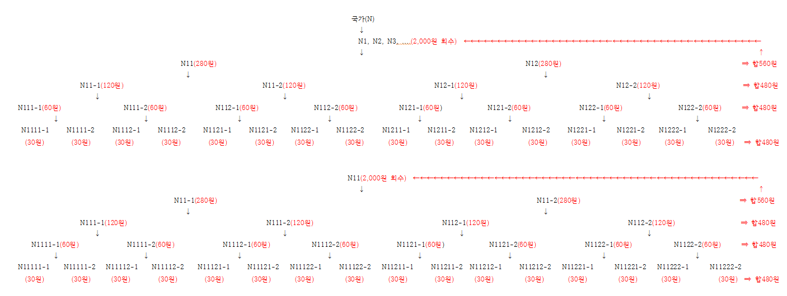

## 문서번호: 4101

### 제목: [기성품의 소품종 대량 시대에서 고객 맞춤형 다품종 소량 생산 시대로 ](https://q4all.kr/redirect/detail/51f6256a-94dd-4403-8293-c6f857d7e70e)

**작성자:** [임영규](https://q4all.kr/user/profile/1408)
**작성일:** 2025-02-19 22:13:44 (수요일)

---

대기업은 혼자서 살아갈 수 있으니 이제는 국가 차원에서의 지원을 줄이고,

중견기업 또는 유망 중소기업 등에 지원을 늘려서 경쟁력 있는 다양한 상품들이 나올 수 있도록 했으면 합니다.

대기업 중심의 국가 경영에서

다수의 대기업을 포함한 다수의 기업 제품을 세계로 내 보낼 수 있는 다양한 규모, 다양한 제품 수출 국가로 전환.

---

## 문서번호: 4102

### 제목: [상가건물,상가주택 주차장 사용에 대해](https://q4all.kr/redirect/detail/001d4461-39a9-4078-9488-c8b5f3003fdb)

**작성자:** [김순옥](https://q4all.kr/user/profile/5847)
**작성일:** 2025-02-19 22:18:12 (수요일)

---

상가주택이나,상가건물 주차장을

주차장이 아닌 상가주방이나, 창고. 재료들 보관 장소등으로 이용하는 건물들이 있는데

주차장이외로 이용할수없도록 법규정을 만들든지.과태료를 계속부과하는 방법등을 고려해야 할것같습니다.

---

## 문서번호: 4103

### 제목: [정책의 기준은 누가 정하나요?](https://q4all.kr/redirect/detail/9cab9417-a2d0-4117-9375-aa87b920e7ed)

**작성자:** [김세진](https://q4all.kr/user/profile/5854)
**작성일:** 2025-02-19 22:35:01 (수요일)

---

역대 정권마다 정부&국회에서는 어떠한 정책을 만들때 보면 대상범위가 저소득층,아동,신혼부부,청년,노인으로만

교과서처럼 규정되어 있는데 이 프레임 좀 깨줬으면 하는데 왜 그렇게 하는지 궁금하네요. 정책마다 나이를 제한 두는지

이런 기준은 누가 정하나요?

옛날과 다르게 현 시대는 계층관계 없이 각 개인마다 양극화 너무 심하고 각 개인마다 가정환경, 건강문제 등등 다른데

기계 찍듯한 정책으로 그 커트라인 아니면 그정책을 혜택을 받지 못하는것은 이 시대에 맞지 않은 것 같아요.

각 개인 사정마다 상담을 듣고 컨설팅을 해줘서 정부에서 도움을줘야

고루고루 국민들에게 세분화 할 필요가 있다고 봅니다.

세금을 내고 정작 필요할때 도움을 못받는 것은 국민으로써 외톨이 된 듯 하거든요. 국가가 그런거 해줘야 하는거잖아요.

---

## 문서번호: 4104

### 제목: [함께 더불어 사는 세상은 대한민국에 있나요?](https://q4all.kr/redirect/detail/d9307526-358c-486c-b4b9-7f83232d71a2)

**작성자:** [김세진](https://q4all.kr/user/profile/5854)
**작성일:** 2025-02-19 22:46:33 (수요일)

---

함께 더불어 사는세상이라는 말을 개인적으로 좋아합니다.

민주당에서도 함께 사는세상의 슬루건으로 있잖아요?

근데 점점 이런게 보이질않고 있고 너무 각자도생이라는 느낌 대한민국 되어가는것 같아서 너무 슬프고 힘듭니다.

함께 더불어사는 세상이란 제 생각으로는 세상에 다양하고 각자의 삶마다 환경들이 다르고 양극화도 심한 이 사회에서 정치권이고 공직사회에서 현장에 답이 있다고 찾아가고 듣고 하는데 결국 보면 그 직에 간부와 대표 선정되고 하니 쳇바퀴 돌듯 변화가 적다고 봅니다.

함께 더불어사는 세상을 만드려면 말 그대로 편견없이 다양한 사람들과 함께 시간을 갖고 끊임없이 대화하면서 소통공간으로 필요한데 그렇게 하려면 사람이 많이 필요하고 플랫폼에서만이 아닌 오프라인으로도 아이부터 장애인,이주노동자,여성,글을 모르는 어르신도 있고, 고령어르신들도 참여할수 있게 홍보도 필요하고 누구든지 차별없이 응대해줘야 합니다.

결국 함께 더불어 사는 세상은. 다 포용해야하니 따듯하고 좋은말이지만 그만큼 어렵고 힘든일이기도하지만 평생 숙제이기도 하지만 이또한 힘이 모아서 k문화로 만들었으면 하는바람을 가져봅니다.

결국 관심,신뢰,진정성,인내심.진실함. 절실함이 기본이 되어야 봅니다.

금전적으로 부담없이도 살수있는 도움을 국가에서 책임제로 시스템되어야 합니다 그게 더불어 사는 세상에 하나라고 봅니다

---

## 문서번호: 4105

### 제목: [서울처럼  교통카드 한장만 가지고  다닐수 없나요?](https://q4all.kr/redirect/detail/8818548a-7fc2-442c-87b0-5bf96c88738f)

**작성자:** [김세진](https://q4all.kr/user/profile/5854)
**작성일:** 2025-02-19 23:17:06 (수요일)

---

서울처럼 지방 곳곳을 교통카드 한장만 가지고 환승도 하면서 대중교통으로 여행가는건 불가능일인가요?

지방에도 지하철과 버스노선들이 생겨서 불편함없이 다닐순 없나요?

서울만 봐도 한지역으로 치우치고 제주도에서도 버스 타고 여행하고

TV를 보다보면 지방에 어르신들이 버스가 기다리는 시간도 너무 길어서 어르신들이 한두시간 기다리는건 일상인걸보면서 왜 이런걸 해결들이 안되는건지 안타까워요. 경기도만 봐도 버스 배차시간이 길고 정류장간에 간격도 멀고 교통문제가 지역마다 개선되어야 합니다.

경기도김포시만해도. 지하철문제고 버스도 불편해요..

각 지역구 마다 좀 주민들에게 교통문제 고충과 건의사항을 받아서

데이터를 내서 좀 했으면 좋겠어요. 사실 길거리에서교통문제로 기다리고 고생하면서 힘들게 다니는게 너무 싫고 고된 하루라고 생각되요.

교통망 구축만 잘해도 시간절약하고 활동도 효율성도 있고 환경적으로

도. 좋을듯 합니다. 버스노선을 좀 고루고루 지하철역 좀 개선방안해 주세요

---

## 문서번호: 4106

### 제목: [다수결의 원칙이 가장 명확한 민주주의 원칙 아닙니까? ](https://q4all.kr/redirect/detail/36d169bf-f4ef-4730-8d2a-15202e41d91e)

**작성자:** [하준서](https://q4all.kr/user/profile/5831)
**작성일:** 2025-02-20 00:05:02 (목요일)

---

사람 셋 만 모여도, 완전 무결한 '합의' 는 어렵습니다.

서로 주고 받을 give & take 가 대원칙이죠.

또한 법률적으로 가해자 피해자로 나뉘는 상황에서

가해자가 피해자에게 선처를 구하며, 금전적으로 보상하며

법적 처벌을 취소하길 간청하는 것 입니다.

그런데 유독 국민을 대신해 신속한 입법 촉진을 해도 부족할

국회에선 훼방의 핑계로 흔하게 등장하는게 "여야합의" 입니다.

평소 합리적인 소통의 대상 사이에서도 힘든게 합의 인데.

패악무도한 패거리와 통할 가능성 0.0000000001 퍼...

천지가 개벽하거나, 그저 우리가 참아야 한다. 양보하기 급급한

흐름에 밀려 흐지부지 되는 경우가 허다합니다.

명백히 우리는 국가의 집행부에 속하는 대통령을 행정부의 수장으로

선출한 것 이고, 국익을 수호하는 위치에 있는 만큼

그 자격을 박탈하는 데 엄격합니다.

우리가 지역구 단위로 선출하는 국회의원도 마찬가지 입니다.

국민을 대표하는 국회의원의 표결을 다수결의 원칙에 따라

우선순위에 있는 입법을 신속하게 집행하는 입법부의 구성원으로

각 지역 단위로 선출했습니다.

그런데 최근 3년 사이는 번번히 상대적으로 훨씬 적은 극렬스런

거부권에 국민이 보장받고 혜택받아야 할 것들이 제동 걸립니다.

아주 해괴한 상황입니다.

배울 만큼 배웠을 텐데, 기본적인 사칙연산도 안된 작자들이

국회에 들끓는 양상 입니다.

결과에 불복 하는 자체가 반민주이고, 반국가 행패 아닙니까?

오직 대통령에 관한 것만 2/3로 엄격하게 규정한 것을...

표결권 침해당했다고 우깁니다.

그 궤변대로면, 훨씬 많은 표결이 거부당한 야당은 궤변 늘여놓는 자들에게

따져 물어야 할 일 아닙니까? 여야를 떠나서 국회를 통해 통과된 의결에

번번히 거부권 제안한다는 행태가 추잡스럽습니다.

국회의 권한은 정말 취약합니다.

탄핵을 해도, 번번히 법사위원장 혼자서 고군분투 해야 하고,

자료 거부를 당해도, 뾰족한 수가 없습니다.

이러니 겉만 민주주의고, 실제는 흥청망청 수사기관과 합세하면 독재로

국민을 핍박하는 것 입니다.

제발 정권 회복하면, 다른 거 말고 국회법 부터 정비 하십시오.

그리고 이번 참에 대행의 대행의 대행 놀음에 갇힌 망상

헌법 제53조에 대한 명확한 해석으로 정리합시다.

그리고 국회에서 과반수 의결로 할 수 있는 것 망설임 없이 합시다.

총 조직이 동원된 내란 범죄에 일반 형법을 적용하려 하니,

혼돈의 연속이고, 내란범들이 기고만장 뻔뻔하게 파멸을 이어가는

양상입니다. 행정부 위주의 권한대행 순서 자체가 다분히 위헌요소 입니다.

**뭐만 하면 트집잡아 위헌 위헌 하는데...실제로 3권 분립에 어긋난 위헌요소는**

**권한대행 자체 아닙니까? 독립을 외치면서도 사법부 임명은 행정부가 하는**

**이상한 시스템... 최소한 법관 내부에서 단계적으로 선출하는 시스템 없습니까?**

최소한 사무 경험 있는 사람이면, 권한에도 없는 권한 행사 납득 불가 입니다.

고착적인 문제는 필요 이상의 눈치를 너무 많이 보고, 처음부터 완벽하게 하려다

지나치게 뜸들인다는 것 입니다. 지레 하기도 전에 머릿속 복잡하게 채우면

행동은 더디고, 실행력은 떨어집니다. 악랄한 무리들은 이것을 노리겠죠.

민주주의 핵심 가치는 다수결이고, 보다 많은 최대 다수의 행복 추구를 위해

다양한 소수의 방법을 더하는 거겠죠.

---

## 문서번호: 4107

### 제목: [총리제](https://q4all.kr/redirect/detail/33b36fa0-459f-4ac7-9264-e3f5907b9600)

**작성자:** [박준영](https://q4all.kr/user/profile/2967)
**작성일:** 2025-02-20 00:40:31 (목요일)

---

총리를 대통령 입명제로 하는거는 형평성에 좋지 않다고 생각 합니다.

대통령의 권력을 견제하는 의미로도 바꿔야 하지 않을까요?

국회의원들에 투표의 입명제로 법을 바꿔야 절대 권력을 견제할수도 있을꺼 같습니다.

---

## 문서번호: 4108

### 제목: [독일교민의  문제의식과 해결방안 ](https://q4all.kr/redirect/detail/83514d0d-8360-4845-bd3c-dd167f7be80e)

**작성자:** [WANGDAESIK](https://q4all.kr/user/profile/3365)
**작성일:** 2025-02-20 00:44:52 (목요일)

---

**안녕하세요**

청년시절 독일에 와서 37년째 살고있는 66세 해외동포 입니다.

 독일에서 삼십여년간 살면서 세 자녀를 교육하고 독일에서의 여러 제도와 이들이 누리는 풍요를 경험하며 한국의 그것들과 비교하며 그 근본적인 차이점을 상고해보고 혹시 한국에도 적용할 수 있는 점들은 없는지 많이 생각해 보았습니다.

다들 아는 문제들 이지만 한국의 몇가지 문제를 지적해 보면

- 대도시로 인구가 집중되는점

- 주택문제

- 극심한 양극화

이밖에도 여러 문제가 있겠지만 크게 이정도로 생각해볼 수 있겠습니다.

그런데 이런 문제들이 서로

긴밀히 유기적으로

관련되어 있고 이들 문제의 핵심에 교육문제가 자리하고 있음이 또렷해 보입니다.

한국은 비정상적으로 교육열이 높습니다. 80% 를 넘는 대학진학율은 비정상 입니다.

참고로 독일은 초드학교부터 대학원 까지의 학비가 무료에도 불구하고 대학진학율이 40% 내외입니다.

60% 의 학생들이 초등학교 4학년을 마치고 5학년때

---

## 문서번호: 4109

### 제목: [소방관](https://q4all.kr/redirect/detail/c29a634f-3589-41bf-a316-fd39b308f9b6)

**작성자:** [박준영](https://q4all.kr/user/profile/2967)
**작성일:** 2025-02-20 00:49:28 (목요일)

---

소방관님들을 공무원으로 지정해야 합니다.

군인.경찰은 공무원이고 왜 소방관님은 공무원 아닐까요…?

국민을 위해 목슴을 걸고 일하는건 같은데…왜 소방관만…?

형편성에 어긋난다고 생각합니다!!

---

## 문서번호: 4110

### 제목: [소득 분위는 합리적인 기준인가?](https://q4all.kr/redirect/detail/67b574de-22d2-44dd-b675-7f7458c3818b)

**작성자:** [윤정희](https://q4all.kr/user/profile/5880)
**작성일:** 2025-02-20 00:54:44 (목요일)

---

자산과 기본 지출 등을 고려하지 않고, 가구원 수와 소득만으로 혜택이나 지원정책 대상을 선별하는 것이 공정하고 공평한지 의문이 큽니다.

연봉이 중위 이상이어도 기본 생계, 이자 그리고 자녀가 있디면 교육비 등으로 삶은 여유롭지 않습니다.

이런 상황에서 노후 준비는 엄두도 내지 못합니다.

공평, 공정하고 합리적인 기준 마련이 필요합니다

---

## 문서번호: 4111

### 제목: [*기득권 .정부관계부처.카르델 *](https://q4all.kr/redirect/detail/bfccea54-126b-4962-a369-920630fb88d3)

**작성자:** [장호용](https://q4all.kr/user/profile/5863)
**작성일:** 2025-02-20 00:56:38 (목요일)

---

국외에서 국내 항만으로 들어오는 공컨테이너 속에 들어있는 쓰레기 어떻게 하나요? 오염됐을 가능성이 있으며(붉은개미)밀수.세균. 쓰레기처리비용 등 걱정됩니다.

세관 .선사.항만공사.식품의약청...등에 질의하여도 자기관할 아니라고 아무도 해결의 의지가 없는것 같읍니다.

예) 국내에서 일본으로 보내는 공컨은 세척후 보내고 있는것 같은데. 우리나라도 국외에서 들어오는 공컨에도 당사국의 세척 증명서 첨부된 공컨만 들어오도록 제도적 장치가 필요하지 인을까요?

---

## 문서번호: 4112

### 제목: [기간제  채용의 문제](https://q4all.kr/redirect/detail/f05fc74b-02a0-4b0c-9d7e-aa35df66052e)

**작성자:** [유동수](https://q4all.kr/user/profile/5874)
**작성일:** 2025-02-20 00:58:27 (목요일)

---

사기업은 물론 중앙정부와 지방정부를 포함한 공공기관조차 기간제를 많이 채용한다. 공무직이라는 허울좋은 일자리도 있는데, 공무원과 똑같이 공공업무를 행하면서도 신분은 공무원이 아니다. 비용절감 차원의 얌체짓으로 보인다. 사기업의 인력 아웃소싱도 이와 비슷하다. 노동계의 골품제다.

기간제가 필요할 때도 있다. 육아휴직자나 유학 등으로 자리를 비우는 인력이라면 일정 기간을 정해 대체인력을 뽑아야 할 것이다.

그렇지 않은 경우도 기본적으로 기간제를 뽑는 경향이 있는 것 같다. 상시 근무자가 필요해도 기간제로 사람을 뽑는다.

먼저 공공기관부터 공무직 없애야 한다. 공공기관(정부와 지자체)에서 일하면 다 공무원이어야 하지 않는가! 매번 기간제만 뽑으니 어떤 공무원!은 그 일만 해야 할 것 같다. 절차는 얼마나 번거로운가. 공고 내고 서류심사, 면접에 면접관 섭외 등등.

인력 수요를 100프로 예측해서 운용할 수는 없지만 공공기관은 어느 정도 수요를 예측해서 정규인력을 뽑아야 할 것이다. 저임금 기간제를 뺑뺑이돌리듯 뽑는 것은 청년 구직자에 대한 고문이다.

사기업에 대해서도 실제의 인력수요 기준을 정해 그 기준선까지 정규직을 뽑도록 권하되, 비정규직, 기간제를 주로 사용해 이 기준에 못 미치면 불이익이 아니라 정부가 제공하는 각종 (세제)혜택이나 지원을 끊어야 한다. 강력하게! 회사가 정규직 뽑으면 혜택도 받고 채용잡무도 줄고, 취업한 자는 안정된 삶을 영위하고 결혼해 자식도 낳을 것이다.

일자리가 앞으로 가장 중요한 청년문제이자 인구문제다. 안정적 일자리의 공급은 그 문제 해결의 열쇠다. 편법으로 저임기간제만 뽑는 기관은 없어져야 한다.

---

## 문서번호: 4113

### 제목: ["농민과 소비자"를 위한 농협의 공적 기능이 제대로 작동하고 있나요?](https://q4all.kr/redirect/detail/346156cf-954d-4af7-b43b-b4aecebce5d9)

**작성자:** [김효기](https://q4all.kr/user/profile/5881)
**작성일:** 2025-02-20 01:11:47 (목요일)

---

농민들이 농협에서 받는 실질적인 혜택이 너무 적은 것 같습니다.

그리고 농협에서 운영하는 하나로마트는 너무 비쌉니다.

농민들에게도 소비자들에게 도움을 많이 주지 않으면서,

농업과 관련 없는 농협의 근무자들은 (특히 금융파트) 엄청난 돈을 벌고 있습니다.

농협 본연의 기능은 잘 작동되고 있는 것일까요?

기후위기로 인한 식량전쟁 위협의 시대에, 농업을 살리고 지원하기 위한 일을 하기 위하여

농협이 중요한 역할을 해야하지 않을까요?

---

## 문서번호: 4114

### 제목: [대한민국은 40,50세라고 하면....??](https://q4all.kr/redirect/detail/3ce6cc0d-b46e-4c83-8e98-1717ab95b50c)

**작성자:** [김세진](https://q4all.kr/user/profile/5854)
**작성일:** 2025-02-20 01:22:09 (목요일)

---

대한민국은 40~50대 대상을 얘기하면 기혼자, 아이가 있을것이다? 고정관념이 정책적으로나 사회 인식이 왜 있는지...?

또한 40~50대에 대한 정책 늘 보면 기혼자에 관해서만 있는건지?

아이문제 인건지..??

물론 40 50대의 기혼자의 정책도 제한되어 있지만

정책을 만들때 나이의 기준은 누가 정하는지?

그 나이에 맞으면 이럴 것이다 라는 답을 정해두고 정책을 만드는건

아니라고 봅니다. 그런 인식을 갖는것도 프레임에서 벗어나야 합니다.

그 나이라도 다양한 사람있고 다양한 환경 속에서 살고 직업,소득,건강, 등등 능력들이 다른데 너무 늘 보면 미혼남녀에 대해서 빠져있어요.

더 나아가 30,40,50,60대별 주거환경이며 소득,삶의환경.건강,능력,을 데이터로 조사해보는것도 필요하다고 봅니다.

핀셋정책이 필요할때는 해야 하지만 현 대한민국 세밀하게 구석구석

재정비가 필요합니다.

---

## 문서번호: 4115

### 제목: [대한민국은 무엇을 하든 규제가...??](https://q4all.kr/redirect/detail/4a9d5130-3d1a-441f-8656-e5f6149c09ea)

**작성자:** [김세진](https://q4all.kr/user/profile/5854)
**작성일:** 2025-02-20 01:24:19 (목요일)

---

대한민국은 무엇을 하든 왜 성별,나이 ,스펙 학력,직업,결혼유무를 제한을 두는지??

조건을 걸고 국민들이 무엇을 할때 제약ㅔ을 두고 규제를 안하면 안되나요? 다양한것들을 원하면서 다양한것을 받아들이지 않고 있는것은 좀 아니라고 봅니다. 사람마다 각자의 재능이든 무언가 능력이 있다고 생각합니다. 그래서 핀셋으로 제한을 하기보다 불법적이거나 문제있는 사람이 아니라면 다양한 사람들에게 기회가 주어져애 합니다

규제가 많은것 같아요.

---

## 문서번호: 4116

### 제목: [상속세와 증여세 면제구간 함께 확대](https://q4all.kr/redirect/detail/b1924e13-f656-48f6-9faa-47e72d8728e3)

**작성자:** [김성수](https://q4all.kr/user/profile/2290)
**작성일:** 2025-02-20 02:45:57 (목요일)

---

상속세와 증여세 함께 개편해야합니다.

상속세만 손보면 남은 가족간의 상속에 관한 민사소송이 끝없이 이루어집니다.

사후정리보다 사전에 정리하여 가난의 대물림도 면하고 가족간의 소모적 소송전도 이제 그만할수있습니다.

현재 상속세는 일괄공제하여도 10년간 증여부부 포함하여 환산되는것으로 알고있습니다.그만큼 상속세와 증여세가 특수한 관계에 있다는것을 이미 관세청에서도 알고있음의 반증하는것입니다.

상속세는 분할공제 1인5억까지로 개편하려는 것으로 알고있는데

이와함께 증여세도 적어도 2,3억까지는 공제가 되어야 없는 가정이라도 피땀으로 가난을 벗어나려던 희망을 이어갈수있습니다.수십,수백억있는 사람들은 세금다내도 수십,수백억입니다.

1~3억 이수준의 증여 부분은 가난의 대물림을 벗어나고픈 희망입니다.현행법은 없는사람들이 간신히 마련한 목돈마져 가족간에 이자를 내게하고 그마져 세금으로 가져가는 가난한자는 끝까지 가난하라는 법입니다.

부디 상속법만 손보실것이 아닌.증여도 함께여야합니다.왜꼭 죽은뒤에 잘살아가길 바라고 죽어야합니까.죽기전에 그래도 이만큼이 도움이 되었구나 보고 행복하게 살아야하지 않켔습니까!!

---

## 문서번호: 4117

### 제목: [강남구청장 청탁비리](https://q4all.kr/redirect/detail/b0b3fa7c-cbd2-4a7e-af0b-428f70262295)

**작성자:** [송정한](https://q4all.kr/user/profile/5889)
**작성일:** 2025-02-20 05:05:47 (목요일)

---

너무 다양하고 누가누인지 모르는,

강남구청의 모든 부서를 전담마크할만 지위의

국외수사기관 또는 동등한 국제기구의 수사가 필요한 상황입니다. 마약관련입니다.

---

## 문서번호: 4118

### 제목: [정치인의 허위사실유포](https://q4all.kr/redirect/detail/a4a321dd-b6c7-4bf0-a197-b91e1842897e)

**작성자:** [박시현](https://q4all.kr/user/profile/5890)
**작성일:** 2025-02-20 05:32:41 (목요일)

---

헌재에서 대통령의 부정선거론이나 예산삭감에 대한 허위주장, 국힘의 대변인, 나경원 배현진 김기현의원등은 문형배재판관, 간첩설 중국인 침투설 등의 악의적인 허위사실유포로 극우선동을 거리낌없이 하고있습니다. 그들의 거리낌없는 허위사실유포행동에 음모론을 필터없이 받아들이는 극우지지자들에 의해 서부지법 폭동과 같은 제2 제3의 내란이 또 일어날까 걱정됩니다.국힘의원들의 허위사실유포에 대한 고발이 이루어졌다고 하는데 많이 안 알려져 있는 이유가 무얼까요? 정치인들의 무분별한 허위발언으로 극우들의 잘못된 믿음과 편향에 가속도가 붙고 폭력적인 허위사실도 남발되고 있습니다. 정치인들에 대한 허위사실유포에 의한 고발내용이나 처벌이, 많은 국민들에게 알려져야 극우들에게 경각심을 일으켜 삼가하게되고, 그들의 생각에도 변화가 생길 것입니다. 대통령도 파면되면 수많은 범죄와 더불어 부정선거음모론 여당보다 더 적었던 야당의 예산삭감에 대한 허위사실유포에 대한 고소고발이 이루어져야 한다고 생각되는데 가능한지요? 정치인들의 허위사실 유포는 일반인보다 영향력이나 파급력이 더 크고 무섭습니다. 허위사실을 유포하는 국회의원과 대통령의 처벌이 결코 가벼워서는 안될것입니다.

---

## 문서번호: 4119

### 제목: [외국인 사회통합을 어떻게 효과적으로 할까?](https://q4all.kr/redirect/detail/182ace51-611f-44ea-9369-9eb17fb74e12)

**작성자:** [김형근](https://q4all.kr/user/profile/3275)
**작성일:** 2025-02-20 05:45:56 (목요일)

---

외국인 혐오증 없애기

커뮤니티 참여

귀화 영주권 법률 완화

---

## 문서번호: 4120

### 제목: [양자화폐](https://q4all.kr/redirect/detail/076c9177-6632-4199-9837-bd1c894d9331)

**작성자:** [서동근](https://q4all.kr/user/profile/5608)
**작성일:** 2025-02-20 06:57:35 (목요일)

---

양자화폐
====

---

## 문서번호: 4121

### 제목: [아파트옆에 데이터 센터를 지어도 되나요?](https://q4all.kr/redirect/detail/47a0ed90-9db3-48fd-957a-e18e1f59b67b)

**작성자:** [김현철](https://q4all.kr/user/profile/5897)
**작성일:** 2025-02-20 07:49:18 (목요일)

---

영등포구 당산동에 데이터센터가 허가 났는디 전자파문제도 없다하지만 민원 들어오면 추가 장치를 달고 전력소모도 심하고 열 및 소음도 심하다던데요 이런 주민 비친화적인 시설이 아파트바로옆이 어떻게 허가가 나는건가요?

---

## 문서번호: 4122

### 제목: [왜 우리의 공공환경, 공공서비스는 가장 싼 가격으로 보잘것없이 만들어지고 있을까요?](https://q4all.kr/redirect/detail/6524141f-755e-40e9-9aeb-6febd643c03d)

**작성자:** [윤성원](https://q4all.kr/user/profile/4224)
**작성일:** 2025-02-20 08:09:19 (목요일)

---

예산절감만을 우선시하는 **최저가낙찰제(가격 중심의 경쟁 평가 방식)**에 관한 문제제기입니다.

**왜 우리의 공공환경은 가장 싼 가격으로 보잘것없이 만들어지고 있을까요?**

공공환경과 공공서비스는 국민 모두가 사용하는 기반 인프라입니다. 하지만 우리는 세계적 수준의 고품질 환경을 누리지 못하고, 조악한 디자인과 저품질의 공공서비스에 둘러싸여 있습니다.

이런 문제의 핵심 원인은 조달청의 최저가낙찰제입니다. 비용을 최소화하는 데 집중하다 보니, 디자인 품질과 기술적 완성도가 뒷전으로 밀려납니다.

예산 절감을 최우선으로 삼는 현재의 발주 방식으로는 공공환경과 공공디지털서비스 모두 발전할 수 없습니다.

**왜 공공환경과 공공서비스는 고품질로 구현해야 할까요?**

한 번 만들어지면 한 세대 동안 오래도록 사용되며 모든 사람들이 이용하게 됩니다. 그러니 그만큼 공을 들여 만들어야죠.

특히 디지털 공공서비스는 한 번 구현되면 재사용 될 때 비용이 0에 수렴할 만큼 효율적입니다.

이는 공공서비스를 처음부터 가장 고품질로 개발하는 것이 경제적으로도 가장 합리적이라는 뜻입니다.

고품질의 디지털 공공서비스를 제공하면 국민이 더 효율적으로 서비스를 이용할 수 있고, 사회 전체의 생산성 또한 높아지게 됩니다.

하지만 현재의 최저가낙찰제가 유지되는 한, 공공환경과 공공서비스는 가장 저품질이고 기술적으로 뒤처진 수준에 머물러 있을 수밖에 없습니다.

**무엇이 바뀌어야 할까요?**

최저가낙찰제 폐지 및 가치 기반 발주 시스템 도입

디자인의 질, 공공성, 지속가능성, 기술적 완성도를 평가하는 시스템이 필요합니다.

공공환경뿐만 아니라 공공디지털서비스 개발에서도 사용성과 편리성, 사용자 경험 디자인을 최우선으로 중시하는 평가 기준이 적용되어야 합니다.

공공서비스 개발의 조달 방식 전면 개편

공공디지털트랜스포메이션을 성공적으로 이끌기 위해서는 뛰어난 서비스 개발자가 참여할 수 있는 조달 규칙과 방식이 필요합니다.

단순히 비용 절감이 아니라, 기술 혁신과 사용자 중심의 서비스디자인을 반영하는 방식으로 바뀌어야 합니다.

해외 사례 벤치마킹 및 서비스디자인 적용

스웨덴, 덴마크, 네덜란드, 핀란드, 독일은 공공디자인과 디지털 공공서비스 개발에서 기술적 완성도와 사회적 가치를 중시하는 평가 방식을 적용하고 있습니다.

한국도 시민 참여 및 전문가 협력 모델을 도입하여 디자인과 기술 수준을 함께 높이는 방식을 채택해야 합니다.

**해외 사례**

스웨덴의 공공디자인 발주 시스템: 스웨덴은 최저가 낙찰제를 사용하지 않고, 디자인의 질, 공공성, 지속 가능성 등을 종합적으로 평가하는 시스템을 운영합니다. 이로 인해 공공디자인 프로젝트의 완성도가 높아지고, 사회적 가치를 실현하는 디자인이 많이 창출되고 있습니다.

덴마크 : 덴마크는 공공 디자인 발주에서 디자인의 질과 사회적 가치를 중시하는 평가 시스템을 운영합니다. 특히, 덴마크는 공공 공간이 시민의 삶의 질에 미치는 영향을 중요하게 고려하며, 프로젝트의 지속 가능성과 공공성을 평가하는 데 중점을 두고 있습니다. 덴마크의 도시 코펜하겐은 시민 참여를 적극적으로 유도하며, 이를 통해 디자인의 질을 높이고 있습니다.

네덜란드 : 공공 디자인 발주 시 최저가 낙찰제를 지양하고, 디자인의 혁신성과 기능성, 지속 가능성을 평가하는 시스템을 운영합니다. 네덜란드 정부는 특히 도시 재생 프로젝트에서 이러한 평가 시스템을 적용하며, 공공 디자인의 사회적 가치를 극대화하려고 합니다. 네덜란드의 암스테르담은 이러한 평가 시스템을 통해 공공 공간의 질을 크게 향상시킨 사례로 알려져 있습니다.

핀란드 : 공공 디자인 발주에서 사회적 가치와 지속 가능성을 우선시하는 평가 시스템을 운영하고 있습니다. 특히, 핀란드는 공공 프로젝트에서 시민 참여와 R&D를 강조하며, 이를 통해 공공 디자인의 질을 높이고 있습니다. 헬싱키의 오디 도서관 프로젝트가 이러한 평가 시스템의 성공적인 사례로 자주 언급되고 있습니다.

독일 : 공공 디자인 발주에서 최저가 낙찰제를 사용하지 않고, 디자인의 품질과 공공성, 기술적 완성도를 종합적으로 평가하는 시스템을 운영합니다. 독일은 특히 공공 건축물과 도시 계획 프로젝트에서 이러한 시스템을 적용하여, 공공 디자인의 혁신성과 지속 가능성을 확보하고 있습니다. 베를린의 공공 건축 프로젝트가 이러한 평가 시스템을 통해 높은 수준의 디자인을 구현한 사례입니다.

이들 국가들은 최저가 낙찰제를 지양하고, 디자인의 질과 공공성, 지속 가능성 등을 종합적으로 평가하는 발주 시스템을 운영하여, 공공 디자인의 수준을 높이고 사회적 가치를 실현하는 데 주력하고 있습니다. 한국도 이러한 나라들의 사례를 참고하여 공공 디자인 발주 시스템을 개선할 수 있습니다.

**해결 방안 제안**

1단계: 최저가 낙찰제를 폐지하고, 가치 기반의 평가 시스템을 도입합니다. 디자인의 질, 공공성, 지속 가능성 등을 종합적으로 평가하는 기준을 마련해야 합니다.

2단계: 발주 시스템에서 사용자 중심 디자인 구현, 창의성, 수요자가 경험하는 가치, 사회적 가치를 평가할 수 있는 지표를 포함시키고, 이를 평가 항목에 반영해야 합니다.

3단계: 평가 기준을 투명하게 공개하고, 평가 과정에서 시민과 전문가의 의견을 반영할 수 있는 시스템을 도입합니다.

**결론**

공공서비스의 품질을 높이는 것은 국민의 삶의 질과 직결되는 문제입니다.

비용 절감만을 최우선으로 하는 조달 방식에서 벗어나, 이제는 기술과 디자인을 수요자의 관점에서 종합 평가하는 시스템을 도입해야 합니다.

이를 통해 누구나 자랑스럽게 느낄 수 있는 공공환경과 디지털 공공서비스를 만들어야 합니다.

가장 저렴한 것이 아니라, 가장 가치 있는 공공환경과 공공서비스를 만들어야 합니다.

---

## 문서번호: 4123

### 제목: [레거시미디어의 정부지원금을 취소하고 탐사취재 전문채널 후원금의 세액공제 반영](https://q4all.kr/redirect/detail/d7120cde-940e-4b5e-abbe-1422154c6a4c)

**작성자:** [이동회](https://q4all.kr/user/profile/3856)
**작성일:** 2025-02-20 08:25:18 (목요일)

---

### 대한민국의 대다수 레거시 미디어들의 방송형태가 매일의 뉴스거리 송출에 집중되어 있고,

### 장기간 취재에 의한 사회부조리 탐색 및 방송은 거의 사라진것 같습니다.

### 이에, 장기간 탐사취재를 전문으로하는 전문방송채널에 후원하는 후원금을

### 세액공제대상으로 해 주시면 보다 알차고 내실있는 탐사취재내용이 될 것이고

### 이는 국민 알권리 차원에서도 상당한 발전이 있으리라 기대할 수 있을것입니다.

---

## 문서번호: 4124

### 제목: [언론 삼진 아웃과 인터넷 실명제](https://q4all.kr/redirect/detail/72bf1a61-3db0-47fb-a85b-ed0851ce1d6b)

**작성자:** [김현정](https://q4all.kr/user/profile/1567)
**작성일:** 2025-02-20 08:50:29 (목요일)

---

가짜 뉴스를 이용한 선동은 전 세계 정치인의 공통점입니다. 후진국 수준의 우리나라 대다수 언론들은 그 정점에 있습니다. 이제는 정말 바꿔 봅시다.

허위 사실을 기사화 한것이 분명하면 - 타 언론사가 사실에 근거한 반박 기사화 할수 있게 하는 상호 감시, 크로스 체크 체제 등 - 삼진 아웃제를 적용해 일정 기간 영업 정지를 시키거나 징벌적 손해배상액(언론사와 해당 기자의 공동부담 등)을 논의해 볼 수도 있습니다.

특히 정치인들이나 검찰의 가짜뉴스 나팔수 노릇을 하는 기자나 언론사는 청문회를 거쳐 반영구 제재를 법제화 해야 할 것입니다 그래야만 오랜 정치유착 검찰유착의 고리를 끊어낼수 있습니다.

또한 가짜뉴스에 기생하는 댓글부대나 온라인 익명성 뒤에 숨은 악플러들을 원천 차단하도록 인터넷 상 댓글 작성시 실명제를 추진해야 합니다.

지금부터라도 하나씩 해 나갑시다.

---

## 문서번호: 4125

### 제목: [한국에 웰다잉이 있는지?](https://q4all.kr/redirect/detail/f356770b-85d8-4a4a-8cbb-138cf344ce57)

**작성자:** [이정연](https://q4all.kr/user/profile/5845)
**작성일:** 2025-02-20 09:08:03 (목요일)

---

초고령사회에 진입한 한국에서도 이제 일본의 종활 같이 노인의 웰다잉에 대해 진지하게 생각해야 할 시간이 온 것 같습니다.

배우자를 먼저 떠나보냈거나, 자식이 없거나, 혼자 살거나, 다양한 이유로 홀로 죽음을 준비해야하는 사람들의 숫자가 늘어날 것 같은데 한국은 모든 걸 개인의 인간관계 책임으로 떠넘기고 있진 않나요?

병원에 입원할 때도 가족의 보증이 있어야 하거나 죽음 이후의 재산을 정리할 수단이 마땅치 않다거나 미리 본인 장례를 할 방법이 없어 무연고 사망 처리가 된다거나.

요람도 아직 충분히 책임지지 못하고 있지만 국가가 무덤까지 국민 한 사람의 삶을 책임지는 국가 신탁 형태의 시스템이 필요하다고 보는데 어떻게 생각하시는지 궁금합니다.

---

## 문서번호: 4126

### 제목: [음주운전 경력으로 인한 연구원 출입제한 ](https://q4all.kr/redirect/detail/a6e2c38a-4bb5-4e00-af99-5222dc5f2885)

**작성자:** [박현웅](https://q4all.kr/user/profile/5909)
**작성일:** 2025-02-20 09:14:30 (목요일)

---

저는 **2017년에 음주운전으로 면허 취소 처벌을 받은 경력이 있는 사람**입니다.

당시의 잘못을 깊이 반성하며, 앞으로 같은 실수를 절대 반복하지 않겠다는 다짐을 하며 살아가고 있습니다.

현재 저는 **반도체 관련 기업**에서 근무하고 있으며, **연구원 내 입주 기업 소속 직원**으로 연구소 출입이 필요한 상황입니다.

그러나 과거의 음주운전 경력으로 인해 **출입증이 발급되지 않아 매일 신분증을 제출하며 임시 출입증을 발급받고 있는 실정**입니다.

저는 **운전과 무관한 연구 업무**를 수행하고 있으며, 같은 연구소 내에서도 **음주운전 경력이 있음에도 출입증을 정상적으로 발급받은 직원들이 있는 것으로 알고 있습니다.**

이러한 기준이 어떤 원칙에 의해 적용되는 것인지 궁금하며, 해당 사항이 공정하게 운영되고 있는지 확인하고 싶습니다.

저는 제 과거의 잘못을 인정하고, 이를 평생 반성하며 살아가고 있습니다.

다만, 현재의 업무 수행에 있어 출입증 발급 제한이 어떤 이유로 적용되고 있는지, 그리고 이에 대한 검토가 가능할지 간절히 여쭙고자 합니다.

혹시 추가적으로 필요한 정보가 있다면 말씀해 주시면 **자세한 회사명 및 연구소명**을 제공해드리겠습니다.

바쁘시겠지만 확인해 주시면 정말 감사하겠습니다.

감사합니다.

---

## 문서번호: 4127

### 제목: [비인기 교과목 정교사 채용을 하지 않는 이유는 뭘까요?](https://q4all.kr/redirect/detail/c7518dd5-a867-48f6-9dbc-b1b5e6be5a81)

**작성자:** [김혜인](https://q4all.kr/user/profile/5914)
**작성일:** 2025-02-20 09:42:00 (목요일)

---

안녕하세요.

저는 소위 말하는 비인기 과목 중 하나인 제2외국어 교과목 임용을 준비하고 있는 학생입니다.

저희 과목은 매년 정교사 채용 티오가 뜨나 뜨지 않나가 주요 관심사일 정도인데요.

티오가 없는 해에는 1년동안 공부하는게 무산이 되기도 하고 기간제 교사 자리를 찾아 헤매게 됩니다. 그러면 또 의외로 매년 교육청에서 뽑는 한자리수 인원의 몇배가 되는 자리가 나오기도 합니다.

기간제 교사가 매년 이렇게나 필요하다면 정교사 티오가 날 법도 한데 비인기 과목이라 경제성이 떨어진다는 이유로 비정규직으로만 굴리는 게 국가 산업인 교육 현장에서 벌어지고 있다는 게 이해가 되지 않습니다.

우스갯소리로 보수 교육감이 뽑혀야 그나마 정교사 티오를 내준다는 소리가 나오는데 이마저도 정치의 영향이 있는 것인지 그렇다면 왜 진보 교육감쪽이 되면 티오가 안난다는 건지 답답해요. 교사를 준비하는 사람 입장으로서도 그런데 학생들로서도 검증되지 않고 금방 바뀌어 버리는 교사에게 내용을 배우게 되면 중요하지 않은 과목으로 인식되어 소홀해지기 쉬우니까요.

세계화 시민으로 학생들을 교육하고 싶다는 마음으로 사범대에 진학했는데 자리가 없어 비정규직으로 전전해야 하는 현실이 불안하기 그지 없습니다.

비인기 과목의 정교사 채용 안정화 방안은 없을까요?

---

## 문서번호: 4128

### 제목: [우리 아이들 언제까지 어릴 때부터 전쟁 속에서 살아야 합니까? #교육제도#입시제도#7세고시](https://q4all.kr/redirect/detail/5af1f1d7-c2b9-40c5-bd1e-06528a3f93a8)

**작성자:** [김재원](https://q4all.kr/user/profile/3238)
**작성일:** 2025-02-20 09:42:56 (목요일)

---

오늘 kbs 다큐멘터리 한 편을 보고 충격에 빠졌습니다.

'7세고시'라는 것이 있더군요..

김누리 교수께서 이전부터 강조해왔던 교육개혁이 꼭 필요합니다.

독일식으로 개편하는 것이 가장 좋다고 생각합니다.

당연히 어렵겠죠 현실적으로. 그리고 항상 반대 급부에선 장단점 따지겠죠. 우리나라 입시제도의 장점이 어딨습니까. 독일만큼 인류역사상 가장 옵티멀한 제도를 봤습니까?

점진적개혁이 아니고, 급진적 개혁으로 바꿔야 합니다. 우리 사회가 거대해지고 기존의 사회 시스템 때문에 변하지 않을 거란 걸 잘 알고 있습니다.

하지만 리더의 결심으로, 참모진, 행정력 등을 십분 이용하면 충분히 급진적 개혁 이뤄낼 수 있다고 생각합니다.

---

## 문서번호: 4129

### 제목: [학교 현장체험학습 인솔 시 사고에 대해 교사 책임을 묻는게 맞나요?](https://q4all.kr/redirect/detail/9da02de9-f0b1-4d0e-9d87-d5c1adb6d675)

**작성자:** [이명진](https://q4all.kr/user/profile/5919)
**작성일:** 2025-02-20 09:59:47 (목요일)

---

초등학교 현장체험학습 도중 버스에 치여 학생이 사망하였습니다. 아이를 둔 부모로서 참으로 안타까운 일 입니다. 다만 20 명의 학생을 교사 1인이 인솔해야 하는 상황에서 교사가 학생들의 안전사고에 대한 형사책임을 져야하는 것이 맞을까요?

저도 현장 교사입니다. 벌써 25년 계획수립 과정에서 현장체험 축소 의견이 받아들여졌습니다. 이런 상황에 대한 대책 마련이 필요하다고봅니다.

---

## 문서번호: 4130

### 제목: [자연 환경을 파괴하고 국가 예산을 낭비하는 지방자치단체의 건설 예산 확보 경쟁을 막을 방법은 무엇일까요? ](https://q4all.kr/redirect/detail/d67df651-4f3c-4a12-8adb-8909e5220169)

**작성자:** [장용창](https://q4all.kr/user/profile/5913)
**작성일:** 2025-02-20 10:11:53 (목요일)

---

자연 환경을 파괴하고 국가 예산을 낭비하는 지방자치단체의 건설 예산 확보 경쟁을 막을 방법은 무엇일까요?

1. 예를 들어 새만금 갯벌 매립 사업을 봅시다. 국가 예산이 20조원 넘게 투입되었지만, 거기에서 나오는 수익은 거의 없습니다. 이 돈 20조원은 국민들이 국민의 행복을 위해 써달라면서 낸 세금입니다. 대한민국은 왜 이렇게 소중한 예산을 이렇게 아무런 수익이 나지 않는 곳에 쓰고 있을까요? 더욱이 새만금 갯벌 사업은 오히려 갯벌을 파괴함으로써 엄청난 수산 자원의 손실을 이미 불러왔습니다. 돈을 써서 오히려 우리의 재산을 파괴하고 있는 것입니다.
2. 이런 예산 낭비 환경 파괴 사업이 전국에서 지난 수십년간 벌어졌습니다. 공항이며 철도며, 도로를 짓는 계획이 수도 없이 많습니다. 우리의 소중한 세금이 이렇게 낭비되고 있는 것입니다. 도대체 왜 이런 일이 벌어질까요? 이런 일을 막을 방법은 무엇일까요?
3. 어떤 사람들은 이런 개발 사업이 지역의 경제 성장을 위해 필요하다고 주장하기도 합니다. 그러면서 이들은 1960년대에 도로와 항만 등을 건설한 덕분에 우리나라 경제 성장율이 높았다고 주장합니다. 이런 주장은 당시엔 맞고 지금은 틀립니다. 이것은 대학교 1학년 학생들이 배우는 경제학 원론에 아주 명확하게 설명되어 있습니다. 1960년대엔 우리나라에 이런 기반 시설이 거의 없었기 때문에, 이런 기반 시설을 생산에 투입할 경우 그것이 생산성 증가에 미치는 영향 (즉 한계생산성)이 매우 높았습니다. 그러나, 1960년대 이후 우리나라는 이런 기반 시설 투자를 계속해왔기 때문에, 2000년 이후 기반 시설이 너무 많아졌습니다. 경제학 원론에 나온 생산요소의 한계 생산 체감의 법칙에 따라 이제 2025년에는 이런 기반 시설의 한계 생산성이 매우 낮습니다. 새만금 사업, 가덕도신공항 건설 사업, 남부내륙철도 건설 사업 등 국가가 추진하는 건설 사업의 편익비용비율이 0.7정도밖에 안되는 것이 바로 그런 이유에서 나옵니다. 즉, 지금은 시설물이 너무 많아서, 시설물 투자를 해도 오히려 마이너스 30%의 수익률이 되는 것입니다. 즉, 이 사람들은 1960년대 초고속 성장 시대의 향수에 젖어 아직도 이런 시설물을 지으면 경제가 발전할 거라고 착각하고 있는 것입니다.
4. 하지만, 민주주의 국가에서 정부 부처나 지방자치단체들이 국가 예산을 더 따내려고 경쟁하는 것 자체를 막기는 어렵습니다. 그런 경쟁은 오히려 국가 예산의 투명한 사용을 보장하는 효과가 있기 때문입니다. 그렇다면, 우리는 이런 지자체의 예산 확보 경쟁이 실제로 경제 성장으로 이어지는 좋은 경쟁이 되도록 만들 방법을 찾아내면 되는 것입니다. 방법은 무엇일까요?
5. 우리나라에서 정부 보조금은 두 가지 의미를 가지고 있습니다. (1) 중앙 정부가 지방자치단체에게 주는 예산, (2) 정부와 지방자치단체가 국민에게 주는 예산이 그것입니다. 실제로는 (1) 중앙 정부가 지방자치단체에게 주는 보조금이 전체 보조금의 대부분을 차지합니다. 그런데도 일부 국민들은 보조금이 그냥 국민들에게 주는 것이라서 예산 낭비의 요소라고 오해하고 있습니다. 위에서 말한 시설물 예산 확보 경쟁도 대부분 이런 (1) 중앙 정부가 지방자치단체에게 주는 보조금 에산에서 나타납니다. 그런데, <보조금 관리에 관한 법률> 제2조와 <지방자치단체 보조금 관리에 관한 법률> 제6조 등에서 보조금으로는 시설물에만 사용하고 인건비로는 사용하지 말도록 하고 있습니다. 그래서, 지난 수십년간 모든 정부부처와 지방자치단체들이 예산 확보 경쟁을 하면서 오로지 거대한 시설물들을 짓는 계획만 세워온 것입니다. 그래야 에산을 쓸 수 있으니까요.그 결과는 새만금 사업 등에서 보는 것처럼 엄청난 환경 파괴와 예산 낭비로 나타난 것이고요.
6. 그러니, 해결 방안은 건단합니다. 보조금으로 인건비를 줄 수 있도록 보조금 관련 법률을 개정하는 것입니다. 이렇게 보조금으로 인건비 등을 허용한다면 무슨 일이 벌어지냐고요? 모든 정부 부처와 지방자치단체들이 정말로 국민을 행복하게 하고 경제 성장에 도움이 되도록 만드는 여러 가지 창의적인 사업을 하게 됩니다. 예를 들어 청년이나 여성, 노인 지원 사업이나 교육 지원 사업의 경우에도 지금은 인건비 지급 금지 규정 때문에 창의적인 사업을 거의 할 수가 없습니다. 보조금 인건비가 허용된다면 모든 지자체는 물론 지역에 사는 주민들이 하고 싶은 창의적인 사업들이 모두 가능해집니다. 그리고 지금은 시설 자본의 한계생산성보다 사회적 자본과 인적 자본의 한계 생산성이 훨씬 높은 시대입니다.
7. 예를 들어 우리나라 어떤 농촌에선 마을공동체에서 함께 밥을 해먹으면 식사비 등을 지자체가 제공해주는 사업을 일부 했습니다. 이건 정말 좋은 사업이었습니다. 마을 공동체가 덕분에 살아났기 때문입니다. 그런데, 이렇게 좋은 사업에도 우여곡절이 많았습니다. 인건비를 지급해야 하는데, 보조금법에서 인건비 지급을 막았기 때문입니다. 그래서 결국 지자체들은 농촌활성화법을 이용했습니다. 현재 보조금법에선 "다른 법률에서 인건비를 허용하는 경우에만 보조금으로 인건비를 줄 수 있다"라고 되어 있습니다. 그래서 그나마 농촌활성화법 덕분에 이런 좋은 사업이 가능했던 것입니다. 만일 보조금법을 고쳐서 보조금으로 인건비를 줄 수 있다고 하면 이처럼 국민들을 행복하게 하고, 경제 성장에 도움이 되는 여러 가지 창의적인 사업들을 할 수 있습니다.
8. 결론적으로 요약합니다. 지자체들이 예산 경쟁을 하면서 시설물만 짓고 환경을 파괴하는 이유는 보조금법에서 인건비를 원칙상 불허하고 있기 때문입니다. 이런 시설물은 1960년대 시설물이 부족하던 시설엔 경제 성장에 크게 기여했지만, 지금은 아닙니다. 지금은 사람에 투자할 때입니다. 그러니 보조금에서 인건비를 허용하도록 보조금법을 바꿔야 합니다. 그렇게 하면 지자체의 예산 확보 경쟁이 진정한 국민 행복과 경제 성장을 이끌어낼 수 있습니다.1960년대와는 달리 지금은 시설물 자본의 생산성보다 인적 자본과 사회적 자본의 생산성이 훨씬 높은 시대입니다. 우리의 소중한 세금이 제대로 쓰일 수 있도록 보조금 인건비 허용을 위한 보조금 법 개정이 꼭 필요합니다.

---

## 문서번호: 4131

### 제목: [지역불균형 해소를 위한 공공요금 차등적용](https://q4all.kr/redirect/detail/40dc4eaf-e7e1-490e-8f1a-13d661e73eaa)

**작성자:** [이동회](https://q4all.kr/user/profile/3856)
**작성일:** 2025-02-20 10:27:30 (목요일)

---

### 서울 수도권 및 광역시와 농어촌간 공공요금을 차등화하여

### 농어촌 서민경제에 도움이 되도록 해 주세요.

### 이를테면 전기료, 수도료, 대중교통비 등등입니다.

---

## 문서번호: 4132

### 제목: [사이비종교단체를 없애려면](https://q4all.kr/redirect/detail/f62f583d-1cae-4ad9-a4c7-d7502742512a)

**작성자:** [김건희](https://q4all.kr/user/profile/3059)
**작성일:** 2025-02-20 10:29:08 (목요일)

---

교묘하게 하나님을 믿으라고하지만 하나님이 스스로라 칭하거나,

하나님이 내린 유일신이라고 칭하던가,

하나님 말씀을 직접 전달한다며 이상한 사상을 주입시킨다던가,

이런 사이비들을 근절시키려면 어찌해야하나요

거기에 현혹된사람들의 주변가족,지인들의 고통

돈은 왕창벌어가며 종교집단이라고 면세되는 사회의 악

그런 돈들이 시장에 흘러야지 사이비전도자들에게만 부를 축적시키는데 그런것도 모르고 세뇌당한사람들은 늘어나고

고령화사회에서 더 그런거같고

후원금은 더 큰세금을 걷던지

법으로 제재하고 악습을 끊어버릴수가 없을까요

---

## 문서번호: 4133

### 제목: [소상공인은 육아휴직을 어떻게 사용하나요?](https://q4all.kr/redirect/detail/d2116c07-183b-4922-aca5-91cccd5de282)

**작성자:** [이원규](https://q4all.kr/user/profile/5918)
**작성일:** 2025-02-20 10:30:00 (목요일)

---

안녕하세요, 저는 마포구에서 가구공방을 운영하고 있는 청년입니다.

좋게 얘기하면 1인 기업이고 현실은 작은 자영업자입니다.

운영하면서 여러가지 에러사항이 많지만 그 중에 요즘 생각하는 것은

자영업자, 더 나아가 작은 소상공인의 육아휴직은 어떻게 하냐는 것입니다.

최근 들어 더 힘들지만 버티며 공방을 운영하다 마음이 맞는 사람을 만나 결혼을 했습니다.

결혼을 했기에 보다 열심히 사업을 이어가려고 노력하고 시간은 계속 흘러 2세에 대한 얘기도 나오기 시작했습니다.

2세를 갖고 싶은 마음은 커져 가지만 현실은 저의 마음을 억누르고 있습니다.

주변에 회사를 다니는 친구들은 안정적인 월급 뿐만 아니라 육아 휴직 같은 제도를 당연히 누리고 있기에 보다 쉽게 2세를 가지는 것 같습니다.

하지만 소상공인 저와 같은 1인 공방들은 육아 휴직을 낼 수도 없습니다.

사업장을 비울 수 없기 때문입니다.

만약 제도를 통해 자금을 지원해준다고 해도 그것은 허울 뿐인 제도라고 생각합니다.

소상공인들은 사업체를 비우는 순간 이뤄 놓은 모든 것들을 잃기 때문입니다.

그래서 소상공인 육아 휴직과 일자리 창출, 창업 기회를 묶어보면 어떨지 생각했습니다.

* 소상공인이 임신을 하게 되면 육아 휴직 구직공고 신청
* 10개월 간 육아 휴직 구직공고자를 인터뷰를 통해 인수인계
* 육아 휴직 기간 동안 인수인계 받은 구직자가 실무 경험
* 육아 휴직 후 실무 경험이 쌓은 구직자를 채용 또는 창업 기회 제공

육아 휴직과 일자리, 창업 연계

1. 소상공인은 육아 휴직을 누릴 수 있다.
2. 창업을 생각하는 사람에게 안정적인 창업의 기회, 실무를 제공
3. 이 프로그램 이후에 창업 대출의 기회까지 연계 된다면 자신의 가게 처럼 일을 할 수 있다.

---

## 문서번호: 4136

### 제목: [인쇄산업 보호와 활성화를 위한 정부정책이 뭔가요?](https://q4all.kr/redirect/detail/e5e3b2ff-d540-4694-bfc2-70cdfd9ebe76)

**작성자:** [박경태](https://q4all.kr/user/profile/5927)
**작성일:** 2025-02-20 10:53:04 (목요일)

---

과거 직지심경과 팔만대장경으로 대표되는 우리나라는 활자 기술력 선진국이었습니다.

현재는 독일산과 일본산 인쇄기에 밀려 자체 인쇄기 하나 없는 나라가 되었습니다.

인쇄 산업 사양화에 따른 업계의 줄도산은 현재 진행형이고 제작 단가는 터무니 없이 낮아

살아남아 있는 업체를 또한 오늘, 내일하는게 현실입니다.

2005년까지는 조달청의 인쇄비 가이드라인이 있어 그나마 업계가 적정선의 마진을 남겼으나

2005년 이후로는 그마저도 사라져 무한 출혈 경쟁에 들어가면서 서로 제살 깎아먹기식으로 영업중입니다.

2025년 현재의 인쇄 제작 단가는 2005년의 단가보다 못한게 현실입니다.

이러다가는 인쇄를 외국에 외주를 맡겨야하는 현실이 올지 모릅니다.

인쇄산업 보호를 위한 정부 차원의 정책이 뭘까요?

---

## 문서번호: 4137

### 제목: [역대 공약중에 소득세 낮춰주겠다는 공약은 왜 한번도 없었나요?](https://q4all.kr/redirect/detail/f19762e0-b929-4b40-b2a9-b9992fd01e66)

**작성자:** [이동회](https://q4all.kr/user/profile/3856)
**작성일:** 2025-02-20 10:54:24 (목요일)

---

### 상속, 증여세나 보유세를 높이는 방향으로 하고, 반대로 소득세를 낮추는 방향으로 해야

### 

### 대댜수 국민들이 그나마 쓸 돈이 조금이라도 생기지 않겠습니까?

### 

### 왜 자꾸 직장인 유리지갑만 호시탐탐 노리시나요?

---

## 문서번호: 4138

### 제목: [만성 질환자인데...언제쯤 의료보험으로 처리 받을 수 있을지...](https://q4all.kr/redirect/detail/c4da086d-214c-4a89-bcd2-c74838c1a69b)

**작성자:** [이규진](https://q4all.kr/user/profile/5929)
**작성일:** 2025-02-20 10:57:13 (목요일)

---

43년 인생 전체를 아토피로 살아가는 사람 입니다.

아토피 신약이 출시되고 있지만 조건이 너무 까다롭고 일상 생활이 불가능한 사람에게만 급여가 지원되니 참 답답할 노릇입니다.

물론 나보다 심한 사람에게 먼저 지원해주는게 맞겠지...재원은 한정되어 있으니까 라는 생각도 합니다.

하지만 나이를 먹어가면서 그것이 언제 돌아올지... 답답함과 조급함은 더 커져 갑니다.

실손보험도 문제 입니다. 민간의 실비 보험 대신 국가 건강보험을 더 내고 더 큰 혜택을 받고 싶습니다.

민간실손 보험을 여러개 가입하고 있지만 늘 혜택은 줄어 들며, 조금이라도 아픈 사람은 배제 됩니다.

저는 민간 실손 보험 대신 국가가 주도하는 건강보험료를 민간보험 대신 지불하고 안전한 국가보험체계가 품어줬으면 좋겠습니다.

이것이 빨리 진행되지 않고 후퇴 하는 이유가 혹시 의료계의 로비 때문인지,

정치권은 무능 때문인지,

시민들의 조세 저항 때문인지.

왜 모두가 이로운 정책이 진행되지 않는지 궁금합니다.

---

## 문서번호: 4139

### 제목: [청년같은 60세 정년퇴직자 활용방안이 시급한것 같은데요!!](https://q4all.kr/redirect/detail/abf19619-c633-489b-8a73-f8d1a15b1c16)

**작성자:** [이영재](https://q4all.kr/user/profile/5931)
**작성일:** 2025-02-20 11:01:11 (목요일)

---

만 60세에 정년퇴직을한 직장인입니다.

아직은 늙었다고 생각하지 않고 그간 업무에서 많은 노하우가 있다고 자부합니다.

국민연금도 63세에 수급개시가 되는데 최소한 국민연금 받을 때까지는 본인의사에 반하지 않는이상 일할 기회를 주어야 한다고 생각합니다. 퇴직후 수입이 없는 상태에서 보험료

의료비 등 생활 필수시설 이용 및 구입에 점점 힘들어 지네요

현명한 사회적 합의가 실천되었므면 합니다

---

## 문서번호: 4140

### 제목: [■양자화폐, 국가보호 특별재산권 지정 및 입법 청원](https://q4all.kr/redirect/detail/18c10007-0037-4828-a74f-baaffc65cee7)

**작성자:** [이해진](https://q4all.kr/user/profile/4850)
**작성일:** 2025-02-20 11:18:30 (목요일)

---

부제(副題): 양자화폐, 대한민국을 살린다.

“이하 글은 국회의원 300명, 신문 방송기자 300명, 경제학부 교수 300명, 로펌 변호사 300명, 회계법인 회계사 300명, 한국은행 전 부서에 이메일 발송하였으며, 특히 국회의장과 대통령 권한대행, 4대 그룹 회장에게 내용증명 우편으로 발송하였습니다.”

**해석과 변화**

마르크스는 세계를 변화시키려고 하기보다는 세계를 해석하려고만 한다는 이유로 철학을 질책하였다. 하지만 그의 자본론은 19c 당대 자본주의 세계를 치열하게 해석한 책이다. 변화의 추구 이전에 해석이 선행되어야 함은 당연하고 그것은 마땅히 바른 해석이어야 한다. 그렇지 않으면 그에 기반한 변화인 해결은 나오지 못한다.

지금 우리는 정점에 이른 듯한 고도자본주의 체제에서 그야말로 하루하루를 자본주의가 처 놓은 거미줄에 걸리지 않으려 惡戰苦鬪하는 삶을, 정도의 차이는 있지만 대게는 그러한 범주 안에서 힘들게 살아가고 있다. 주위를 돌아보면 삶이 힘들고 빡빡하다 말 안 하는 이가 없다. 표정이 말한다.

산업혁명과 함께 급성장한 19c 자본주의의 민낯을 해부하며 쓴 막스의 저작이 20c 세계질서를 양분하고 자본주의 국가에서 노동자의 권리 인식과 노동환경의 개선에 영향 주고 자본주의 국가들로 하여금 복지정책을 강화하게 만든 계기가 된 것은 사실이다. 그렇지만 그의 예측이 모두 맞은 것은 아니며 무엇보다 그의 이론을 전폭 수용한 지구 半의 20c 사회주의 국가의 실험은 한계에 직면하여 시장에서 완전히 퇴출 당했다. 명백한 자본주의의 勝이었다. 그만큼 모순과 부조리로 가득한 자본주의의 생명력은 强했고 적응력은 靭하였다. 대단한 자본주의다.

우리는 IMF 외환위기와 2008년 금융위기라는 두 차례에 걸친 무섭고 잔인한 자본주의의 민낯을 잊어버릴 수 없다. 구조조정이라는 험상궂은 탈을 쓰고 덤벼드는 그 무지막지함에 맞서 볼 전의도 상실한 채 추풍낙엽 거리로 내몰린 수많은 동료를 기억한다.

5, 6세 꼬마애가 하루 15시간 노동의 고통을 견뎌내야 했던 19c 자본주의를 비판하고 이를 개선하고자 해석한 자본론 출간 이후 수많은 우여곡절을 겪었지만, 21c 오늘날 자본주의는 19c 그때와 달라진 것 없이 여전하다. 양극화는 유사 이래 최대치를 나날이 갱신하고 있고, 국가와 개인을 막론하고 과도한 부채에 절망하고 있다. 수백 년에 걸친 승리의 이데올로기, 대단한 자본주의 경제의 초라한 성적표이다. 물론 구조조정의 치외법권 지역에서 안전하게 여유로운 자본주의적 삶을 누리는 사람에게는 지상천국이 따로 없다.

막스의 이론에 영향을 받은 노동조합의 결성, 노동법 제정, 근로조건 개선, 그리고 시혜성 복지정책이 최소한의 생존적 해갈 그 이상이 될 수 없음이 명백히 증명된 것이다. 결국 해석을 잘못한 것이다. 이는 막스만의 誤解釋이고 誤答이 아니라  자본주의 체제를 유지하고 있는 현 인류문명의 誤謬이다.

먹고사니즘에 바빠 깊이 생각해 볼 겨를이 없어서 그렇지 우리 일상의 부조리와 고통이 어떤 메커니즘 하에 작동하는지는 아마 상식이 있는 사람이라면 어렴풋이 짐작할 수 있다. 다만, 그 타개책을 모를 뿐이다. 그리고 이는 지구상 아무도 여태 몰랐다. 자본주의 작동 이전 그 옛날부터 자본주의 작동 이후 오늘 현재까지 學者이든, 賢者이든, 英雄이든, 治者이든 그 누구도 어떤 정치 경제 체제에서도 민중의 먹고사니즘의 고통에 대한 올바른 해석으로 해결에 이르지 못했다. 그 모두는 결국 공허한 메아리였다.

**정답의 발견**

하지만 마침내 자본주의 수백 년을 넘어 인류 문명사의 치부인 바로 그 문제를 바로잡아 줄 해답과 정답을 찾아냈다. 대한민국 사람, 명경선생 김점수가 찾아낸 그것은 다름 아닌 화폐이다. 가짜 돈을 진짜 돈으로 교체하면 될 일이었다. 가짜 돈으로 굴러가는 가짜 경제로 인류는 정해진 숙명처럼 가혹한 노동에, 감당하지 못할 채무의 덫에 빠져 희망 없는 삶에 또 하루를 보내고 있다. 하지만 진짜 돈으로 굴러가는 진짜 경제로 우리의 삶은 뒤바뀌게 된다. 바로 진짜 돈, 양자화폐의 위력이다.

핵심 믿음 하나를 바꾸면 체제 전체를 아주 많이 바꿀 수 있다. 역사 속 종교개혁이나 사회주의 혁명 같은 사건은 핵심 믿음을 뒤바꾸는 사건으로 이후 체제 전체를 바꾸었다. 화폐 또한 상호 신뢰성을 전제로 한 믿음이라는 측면에서 양자화폐 또한 그러하다. 종교개혁이나 사회주의 혁명은 단순한 믿음이라는 인간의 정신작용 변화로 인함이었고 그로 인해 민중의 실질적 삶이 개선되지는 못했다. 역사 속 민중의 삶은 여전하였다. 苦였고 痛이었다. 하지만, 양자화폐라는 사건의 출현은 단순 정신작용을 넘어선다. 민중의 실체적 삶에 다가선다. 그리고 획기적 개선을 이룬다. 事件을 넘어 史建을 만든다.

**사건과 생각**

미학자 편린의 사건에 대한 아름다운 표현 “사건은 익숙한 일상의 문법을 초월하는 미지의 지평이고 그 이전과 이후를 불연속적으로 만드는 이탈의 변곡점이며 기존의 규범을 수면 위로 드러내고 그것을 의문에 부치는 정지의 물음표이다.”를 숙고해 보면 바로 양자화폐의 사건성을 대변해 주는 너무나 아름다운 문구임을 깨닫는다.

인간의 생각은 언어적인 개념들로 이루어져 있고, 이런 개념들은 그때그때 새롭게 생겨나는 것이 아니라 대부분 과거로부터, 전통으로부터, 공동체로부터 전해져 내려온 것이다. 그래서 우리는 생각할 때 의도하지 않더라도 구조적으로 자연스럽게 일정 부분 자신만의 생각이 아닌 다른 사람의 생각이 개입되는 것이다. 우리가 생각할 때 사용하는 언어적 개념은 내가 혼자 만들어낸 게 아니라 과거로부터 현재까지 여러 시공간의 다른 사람으로부터 영향을 받은 것이기 때문이다. 이렇게 우리의 현재는 과거와 얽혀 있고 또한 미래와 얽혀 있을 예정이다. 이번 불행한 역사적 사건의 발생과 그 진행 과정도 이러한 맥락에서 이해할 수 있다. 생각, 정보의 양자 얽힘(quantum entanglement)은 시공간을 초월한다. 한강 작가의 말 “죽은 자가 산 자를 살릴 수 있는가? 과거가 현재를 구할 수 있는가?”라는 물음은 이런 차원에서 이해하고 공감할 수 있는 양자역학의 문학적 사유이다. 이렇게 과학과 문학이 연결된다.

나무, 돌, 새, 바람, 인생, 행복, 정의, 사랑, 죽음, 국가, 지구, 우주, 신 등 수많은 언어적 개념에는 크게는 40억 년 지구의 천문학적 시공간이 개입되어 있고, 작게는 1만 년 역사시대로부터 연유된 수많은 사람들의 생각이 모여 있다. 그 모든 것, 이름하여 문명을 이루는 모든 것이 언어의 개념 속에 누적되고 응축되어 있고 그것은 시공을 초월하여 전수된다.

사랑이라는 단어에는 철학자의 고상한 사고와 성인의 고매한 인격이 들어 있음은 물론, 시인과 소설가의 상상과 은유가 스며 있고, 청춘남녀의 유별난 경험치도 한데 섞여 마침내 사랑이라는 단어의 개념이 만들어진 것이다. 그리고 우리가 그 단어를 사용할 때는 자연스레 이 모든 과정, 즉 다른 사람들로부터 배운 언어적 개념들을 통해 생각을 하고 있는 이상, 타인의 삶은 이미 우리의 사고 과정 안에 들어와 있다. 과학적 의미로 양자 얽힘이 이루어진 것이다. 他者가 내 안에, 내 삶에, 내 정신에 들어와 있는 것이다. 이처럼 언어적 분석으로만 보아도 언어를 사용하는 한, 인간의 나 홀로 삶이라는 것은 이치에 맞지 않다. 우리는 모두 구조적이고 자연적으로 타인의 삶에 양자적으로 빚지고 있는 것이다. 그리고 빚은 당연히 갚아야 한다.

**공익과 공정**

이러한 당위론이 틀리지 않기에 적어도 최고 최대의 대표적 공적 조직체인 국가는 그 행위를 함에 있어 공익을 전면에 내세우고 공정을 앞세우는 것이다. 이는 칸트가 말한 경험 이전의 선험적 관념으로 너무나 자연스러운 반응이다. 서로 간에 보이지 않는 양자 얽힘으로 엮여 있는 인간들의 사고 과정에 개입함에 있어 공익과 공정이 최선이기 때문이다. 그리고 그러한 시스템을 만들려 부단히 노력한 흔적이 헌법이고 법률이다. 말하자면 공익과 공정의 이행계약서 같은 것이다. 지속 가능한 유기적 공동체의 질서 유지를 위한 최후의 보루 같은 것이다.

그런데 자본주의 사회에서는 이마저 자본의 논리에 의해 왜곡된다. 로비가 그것이고 무전유죄 유전무죄가 그것이다. 급기야 누구보다도 이를 준수하고 방어해야 할 국가 리더십이, 공익과 공정을 지휘하라고 국민이 선택해 준 자가 이를 앞서 유린하는 희한한 일이 21c 고도자본주의의 첨단을 달리는 대한민국에서 벌어졌으니 그야말로 언어도단의 끊어진 길이 눈앞에 선명하다.

여기서 우리는 느껴야 한다. 아니 진작에 인지하고 있지만, 정치의 한계 구체적으로 정치인의 한계를 온몸으로 느낀다. 정치가 무엇이냐? 바로 법을 만들고 집행하는 것 아닌가? 그리고 그것은 공익을 내세우고 공정을 앞세우는 과정 아닌가? 그런데 정치의 영역에서, 정치인 집단에서 저 두 단어의 시공간을 헤치며 쌓아온 역사적 개념은 사라졌거나 변색되고 퇴색되어 더 이상 아무도 기대를 안 한다. 오로지 분파적 이익이 공익이고 공정인 것이다. 수많은 철학적 사고와 사색의 깊이에서 나온 공익과 공정이라는 단어의 무게는 정치라는 亂場에서는 한낱 개소리다. 시스템을 만들고 운용하여야 할 정치의 영역이 이러할진대 더 이상 무엇을 기대하리.

**마침내 양자화폐**

그래서 수많은 양자 얽힘의 과정을 거쳐 신이 건내 준 것이 바로 양자화폐다. 수많은 역사적 시공간의 생각들이 우연과 필연의 얽힘으로 탄생시킨 사건이다. 유기체 최고의 마술인 정치가 길을 끊었기에 차라리 양자화폐라는 事物에 역사의 시공간적 운용을 맡긴다. 이쯤에서 양자화폐에 관해 간략해 보고자 한다.

양자화폐는 부동산, 주식, 원자재 등 모든 실물자산의 내재 가치를 경제통일장 방정식에 의해 100% 화폐에 연결한(Asset-backed) 화폐 = 자산, 자산 = 화폐의 완전한 等價性으로 통화자산일원론을 완벽히 구현한 인류 최초의 진짜 돈, Real Money이다. 발행 화폐 하나 하나에 실물자산의 가치가 담보되어 연결되어 있다는 뜻이다.

그리고 이의 창제 원리는 물리학의 상대성이론과 양자역학의 제 개념을 차용 및 적용하여 이를 인문학인 법학과 사회과학인 경제학, 투자론 및 부동산학에 연계한 것으로, 한마디로 인간 사회 경제 환경 법률 부동산 금융 등 여러 분야에 얽힌 수많은 요소 및 현상을 종합적으로 연구하고 이해하여 만든 複雜系 과학의 산물이다. 이 하나로 모든 것이 바뀐다. 인류 문명이 바뀐다. 당연히 좋은 방향으로, 선한 방향으로, 공익과 공정이 원위치 되며, 대한민국 국민 50,000,000을 넘어 지구촌 인류 8,000,000,000 모두를 위함이다.

관념의 논리 무대에서만 놀던 사람은 실물의 활동운화(活動運化)적 개별성에 취약하고 현장의 직관에만 의존하는 사람은 치밀한 논리와 원리에 의한 확장적 일반화가 부족하다. 인간사 모두는 관념과 현장, 논리와 직관이 모두 필요하다. 즉, 인류 문명은 학과 술의 연작이다. 함께 어울려 완성을 이룬다. 상아탑이라는 관념의 무대만으로는, 기업의 현장 경험만으로는, 결코 명경선생 김점수의 경제통일장 이론(學)과 양자화폐(術)와 같은 역사적 저작이 완성될 수 없다. 관념과 현실의 불일치를 억지로 꿰맞추며 권위만 내세우는 것도 한계가 있는 것이다. 도대체 언제까지 맞지도 않는 억지 논리로 궤변을 늘어놓으며 자리보전할 것인가? 學界는 자신 있으면 나서 보라. 政界는 공익과 공정의 명분이 있으면 검증하라. 官界는 규정대로 검토하라. 業界는 기업의 명운을 바꾸려면 참여하라. 言論은 양심이 있으면 보도하라.

**만언봉사**

사건은 시간과 공간이 결합하여 생성된다. 그리고 그것은 기록돼야 역사로 남는다. 기록되지 않으면 역사에 남지 못한다. 기록되었기 때문에 역사가 된다. 명경선생 김점수의 超 歷代級 저작물인 양자화폐도 역사에 기록될 사건으로 남으려면 우선 4차원적 시공간의 좌표로 인정받아야 한다.

회의체 중 최고 최대는 國會다. 국회에 요청한다. 양자화폐 지식재산권을 국가보호 특별재산권으로 지정하고 STO 같은 허접스러운 사안에 대한 입법 대신에 국민을 구하고 인류를 구원할 진짜 화폐, 자랑스러운 K-Money, 양자화폐 입법화를 서둘러라. 이를 위해 학계, 정계, 관계, 업계, 언론계 모두 함께 모여 검증하고 전 국민이 보고 판단할 수 있도록 밀실이 아닌 광장에서 공개하라.

이는 지난 시절 율곡의 萬言封事와 같은 처절하고도 절박한 21c 상소문이다. 목숨을 건 직설의 미학이다. 율곡은 글의 마지막 부분에 자신의 건의를 받아들여 국정을 개혁하면 3년 이내에 새로운 나라가 될 것이라고 장담했다. 그렇게 되지 않을 경우 자신을 기망의 죄로 다스려줄 것을 요청했다. 이 상소를 거부한 조선의 조정은 19년 만에 임진왜란을 당했다. 율곡의 만언봉사와 십만양병설의 충언을 무시하고 당쟁과 사욕에 빠져 있던 조정은 처참한 전란을 겪었다. 고통은 오로지 민중의 몫이었다.

양자화폐를 수용하고 국가보호 특별재산권으로 지정하고 입법을 할 경우 대한민국의 재조산하는 완벽히 이루어질 것이다. 그리고 명심하라. 양자화폐는 기획 단계가 아니다. 이미 실행단계이다. 2025년 1월 1일 자로 양자화폐의 발행은 개시되었다. 정부와 업계가 하루라도 빨리 인지하고 참여를 서두를수록 국민의 고통은 줄어들고 국익은 배가된다. 그렇기에 이렇게 외침을 넘어 절규하는 것이다.

**국보를 넘어 지구보로**

명경선생 김점수가 양자화폐 관련하여 진행하는 작금의 일련의 행보와 행위 절차들은 國寶를 넘어 地球寶로 인류의 보편적 가치를 지닌 문화유산으로 보호, 보존하고 후손에게 물려주어야 할 세계유산을 관리하는 유네스코의 세계기록유산으로 올려야 할 인류의 소중한 지식재산권을 지키기 위한 처절한 몸부림이다. Memory of the World. 영상물이든 인쇄물이든 분명 공개적 기록과 배포의 과정이 있었고 조만간 생산할 양자화폐 발행백서에 이 모든 진행 과정은 기록된다. 시공간적 좌표 설정대로 사건이 진행되면 언젠가는 작금의 일련의 과정들은 세계기록유산으로 등재될 것이다.

고전주의 음악의 꽃이며 실내악의 정수인 현악 4중주를 일컬어 괴테는 4명의 지성인이 나누는 대화라고 표현하였다. 위대한 작곡가들은 다양한 영역에서 명작을 쏟아내지만 통상 그들의 음악적 깊이와 내공이 절정에 달한 시기에 위대한 현악 4중주를 완성했다. 음악 감상자의 입장에서도 내공이 깊을수록, 연륜이 쌓일수록 교향곡이나 협주곡 같은 뭔가 강렬하고 역동적 구성보다는 담백하고 정중동의 유연함을 표현하는 현악 4중주의 유려함의 매력에 빠지는 것 같다.

경제 법률 부동산 금융 이른바 자본주의를 굴러가게 하는 4 輪의 각기 다른 Sound의 4 絃에 존재하는 모든 힘과 파동을 하나의 논리체계로 연결하여 설명하는 경제의 만물이론, 자본주의 현악 4중주의 작곡이 완성되었다. 경제학의 萬神殿 최 중앙 최선봉에 자리할 양자경제학이 낳은 적통이다. 이제 이 유려하고 심오한 곡을 해석하고 연주해 줄 뛰어난 연주자 Virtuoso와 다수의 청중이 필요한 시점이다. 빨리 참여할수록 이익이다. The sooner the better. 누구도 예외 없다. 눈치 빠른 자, 行할 것이다.

**질문하라**

질문을 퍼부어라. 2차원 평면에서의 모든 질문은 3차원 입체의 입장에서는 아무것도 아니다. 상하좌우의 현실적 3차원 공간 입체에 가로막힌 입장에서의 의문은 공간의 제약 없이 자유롭게 드나드는 가상 현실적 고차원의 입장에서는 의문도 아니다. 이렇게 차원이 다르면 모든 것이 순조롭게 풀린다. 그러니 질문을 퍼부어라. 명경선생 김점수의 고차원에서 완성된 이론으로 시원하게 해갈해 줄 것이다. 자연의 법칙은 고차원에서 더욱 단순해지고 통일하기도 쉬워진다. 단지 그에 도달하기가 어려울 뿐, 온갖 역경을 뚫고 그 차원에 올라서 내려 보면 보이고 느끼고 들리고 이해가 되는 것이다.

명경선생 김점수의 경제통일장 이론의 作名에는 분명 그만한 근거가 있을 것이다. 그러니 질문을 퍼부어라. Point land, Line land, Flat land, Space Land를 넘어선 超 공간 Hyperspace Land에서 온 지적 혜안의 명쾌한 해답을 얻을 것이다. 하늘 위에 또 다른 하늘이 있음을 실감할 것이다. 天外天이라고 했다.

관념의 무대에서 지식의 아우라를 장광설 하는 자는 기실 그 자신도 그것이 무엇인지 모르는 경우가 태반이다. 그저 차입한 지식의 暗記的 동어반복의 나열에 지나지 않는 경우가 허다하다. 활동운화(活動運化)하는 현장의 개별적 다양성을 인식하지 못하고 섣부른 일반화의 오류를 범하기 때문이다. 인류의 事件은 관념의 학(學) 만으로 해결되지 않고 현장의 술(術)이 동반되어야 한다.

퇴계와 고봉의 8년 논쟁의 결론인 이기이원론의 主理論的 해법인 이발이기수지理發以氣隨之, 기발이이승지氣發以理乘之 한 문장이 이를 잘 설명해 준다. 즉, 리가 작용할 때 기가 순응하면 리가 왜곡되지 않고 순조롭게 드러난다. 하지만 리가 작용할 때 氣가 리를 거스르는 방향으로 개입하면 理는 아무 작용을 못 하고 숨겨진다. 다시 말해 術은 학의 원리와 논리에 따르고 순응해야 제대로 작용이 일어나고 만일 순응하지 못하면 學의 논리와 원리는 사라지고 술 또한 작동하지 않는다. 學은 술의 유효성을 담보하는 한편 術을 통해 원리와 논리가 실증되는 상보적 관계이다.

명경선생 김점수의 양자화폐는 학과 술, 관념과 현장, 논리와 직관, 상아탑과 기업이 상징하는 제반 모든 면면을 섭렵하고 논리 일관되게 융통 융합할 수 있는 자, 전문가적 깊이와 다양한 분야의 지적 넓이를 보유한 T字 형의 르네상스적 인물이 事案과의 물아일체적 양자 얽힘(Quantum entanglement)의 단계까지 내려간 高次元의 지적 산물이다. 그러니 용기 있는 자 도전하라. 관심 있는 자 구하라.

**비전방정식**

비전은 누구나 할 수 있고 세상에 널리고 널린 것이 비전이다. 정부이든 기업이든 비전으로 시작해 비전으로 끝나는 Paper work 상의 비전 놀이는 이제 아무런 감흥이 없다. 그런 공수표적 비전을 제시하는 리더들에게 실망을 넘어 분노를 느낀다. 비전 = 실망 = 분노라는 역학관계의 등식에 우리는 너무나 익숙하다. 도대체 구체성은 없고 도대체 의지의 합일이 되지 않고 도대체 각자 주장에 하세월이다. 도대체 누구 하나 물러설 기세가 아니다. 도대체 쓸데없는 똥고집이다. 그것이 민생에 얼마나 도움된다고. 합일이 되는 것은 명분도 필요 없는, 오로지 각 분파의 利와 益이 결합하는 순간이다.

비전이 시간이라는 산을 넘어 공간의 현실에서 실현되는 모습을 보고 싶다. 인류가 구축한 가장 아름다운 이론이라는 천체물리학의 일반상대성 이론에 기반을 둔 지상의 경제통일장 이론이 현실 경제에서 펼치는 고차원의 장엄한 우주 드라마를 손꼽아 기다린다. 양자화폐는 명분에서 밀리지 않고 실리에서 모자라지 않는다. 비전 = 현실이 되는 새로운 역학관계의 등식을 우리는 보게 될 것이다. 빛은 언제나 부서진 틈으로 들어온다.

**Source**

K-money, 양자화폐에 관한 보다 상세한 내용의 영상과 텍스트는 아래 route를 참조하면 된다.

<https://contents.premium.naver.com/jsnobel/meconomics> ▶핀셋재테크 부자경제학

<https://blog.naver.com/cqer2u> ▶양자화폐에 관한 단상(평산심해 블로그)

<https://www.youtube.com/@lbanetworks> ▶명품경제학 유튜브

​

▶Contact point

■양자화폐 기획자 명경선생 김점수

■전화 070-8228-8000(김은희 이사, [cqer2u@naver.com](mailto:cqer2u@naver.com))

■주소 서울특별시 강남구 학동로88길 12, 3층 306호(삼성동, 청진빌딩)

​

더불어 지금까지 이나라 각계각층의 리더십에 보낸 글도 온라인 첨부한다.

(On-line attached)

1. 신년사 批判

2. 함께하자 양자화폐 5(주한 외국공관 및 국제기구)

3. 함께하자 양자화폐 4(서울 소재 주요 대학 경제학부 교수)

4. 함께하자 양자화폐 3(4대 그룹 회장, 4대 그룹 경제연구소, KDI 등 국책연구소 10곳)

5. 함께하자 양자화폐 2(중소기업중앙회, 한국중견기업연합회, 소상공인연합회)

6. 함께하자 양자화폐(민변과 5대 시민단체)

7. 무너져 가는 K-경제를 살릴 신의 한 수

8. 3척의 배 그리고 양자화폐

9. 삼성의 선택, 3개월

10. HYBE와 함께 K-Money 양자화폐 국민 세미나 개최

11. 양자화폐 제국의 권력방정식

12. 화폐 세미나 – 한양대학교(서울 소재 28개 대학 총학생회)

13. 트럼프 화폐(가짜 돈) vs 양자화폐(진짜 돈)

14. 양자화폐 론칭을 위한 국민 대자보

15. 국회는 양자화폐 입법화에 나서라

16. 최소 1,400조 원 + α 수익의 양자화폐 사업 제안서(4대 그룹과 6대 시중은행)

17. 진실은 현실과 다르다

18. 최상급 형용사 4개의 Color로 표현하는 양자화폐 연작

19. 빨리 백기 투항하라

20. 양자화폐로 1기 신도시 무비용 1:1 재건축 가능하다

21. 연봉 35억(한국은행 금융융통화 위원)

22. 먼저 알고 앞서 대비하라(국가정보원)

23. 진단 말고 해법을

24. 양자화폐 FAQ(I) & 양자화폐 FAQ(II)

25. 파격의 노벨물리학상

26. 노벨상 3관왕

27. Salvator Mundi

28. T字 위에 동그란 지구를

29. 815에서 0101로

30. 동그란 네모의 형용모순을 해결하다.

31. 32. 33.......128. <끝>

#양자화폐 #양자경제학 #명경선생 #김점수 #명경선생김점수 #평산심해 #핀셋재테크부자경제학 #평화화폐 #특별재산권 #양자화폐입법

2025년 01월 10일

​

평산심해(平山深海) //

---

## 문서번호: 4141

### 제목: [지원금 빼먹지좀 못하게 해주세요](https://q4all.kr/redirect/detail/c5c8d680-d366-4a7d-895c-9305c99a0807)

**작성자:** [정덕현](https://q4all.kr/user/profile/77)
**작성일:** 2025-02-20 11:19:57 (목요일)

---

출산지원금이다 아동지원금같은거

출산지원금 시행 초기에는 진짜 검사 다받고 출산할때까지 돈 조금 남아서

출산비용으로 쓸 수 있었음 근데 이게 자리잡고부터 검사 몇번받으면 다 없어짐

병원에서 초반부터 검사비로 지원금 다 털어가고 나중엔 자비로 출산해야됨

난 남편잘못만나 병원비 생활비 한푼안줘서 출산비용 낼 엄두가 안나

검사 안받고 버티고 버텨서 출산할때 병원비로 썼음 그탓에 임신중독증 있는거 모르고

낳았다가 실명위기오고 응급상황왔으나 어쨌던 잘 넘어감.

아동수당도 마찬가지 얼집보내면 딱 수당만큼 특활비로 청구함

받아봐야 여기저기서 다 뜯어감

---

## 문서번호: 4142

### 제목: [보행자 신호등 체계 안전하게 보완해주세요](https://q4all.kr/redirect/detail/d713abc8-d7ea-4990-9990-0f1bb9fe0cf6)

**작성자:** [최만석](https://q4all.kr/user/profile/1878)
**작성일:** 2025-02-20 11:34:54 (목요일)

---

**현재 자동차 주행 신호는 녹색 -> 주황색 -> 적색이 됨과 동시에**

**보행자 신호도 동시에 바뀌고 있습니다.**

이 경우, 보행자도 보행신호 녹색과 동시에 선급하게 건너는 경우가 많은데,

**교통신호 체계에 있어서 선진국인 캐나다의 경우,**

### **자동차 주행신호가 적색으로 바뀐 후,**

### **보행자 신호등은 약 2초 후에 녹색으로 바뀝니다.**

이런 방식을 도입하는 경우, 보행자 특히 어린이, 노약자 등이

선급하게 건너려다 다치는 사고 및

운전자의 주행 신호 착각등에 의한 사고도 어느정도 줄어 들 수 있을 것 같습니다.

### **교통신호 체계도 안전을 최우선으로 검토가 되면 어떨까요?**

---

## 문서번호: 4143

### 제목: [국회의원 아들을 군대 안보내는 국회의원은 제명이나 사퇴시켜주세요](https://q4all.kr/redirect/detail/bcf19cc4-fb8f-402d-add3-a695688f2841)

**작성자:** [김병헌](https://q4all.kr/user/profile/5935)
**작성일:** 2025-02-20 11:41:17 (목요일)

---

현직 국회의원 아들 중에 현역으로 군대 안보내는 의원은 제명이나 사퇴시켜주세요

---

## 문서번호: 4144

### 제목: [다주택자 고위공직 임명을 금지시켜 주세요..](https://q4all.kr/redirect/detail/20bc96f6-645b-46e7-a858-dfca75a8e18d)

**작성자:** [이동회](https://q4all.kr/user/profile/3856)
**작성일:** 2025-02-20 11:45:27 (목요일)

---

### 이유여하를 막론하고 서울 및 수도권에 다주택 소유자는

### 

### 고위공직(2급 또는 3급 이상) 임명을 금지해 주세요.

---

## 문서번호: 4145

### 제목: [유급 육아휴직10 18개월로 확대되었으나 부모 무도 육아휴직을 3개월 사용한 경우에만 가능합니다. ](https://q4all.kr/redirect/detail/ccd17306-54ba-4284-8163-3a5ae6de397e)

**작성자:** [정희선](https://q4all.kr/user/profile/5942)
**작성일:** 2025-02-20 11:58:18 (목요일)

---

우리 사회의 중요한 문제인 저출산과 관련하여 출산 및 육아와 관련해서 다양한 지원이 확대되고 강화되는 것은 바람직한 일이라고 생각합니다.

그런데 이번에 유급 육아휴직인 12개월에서 18개월로 확대되었으나, 부모 모두 3개월 이상의 육아휴직을 사용한 경우에만 가능하다고 알고 있습니다.

물론 육아를 부모가 함께 하는 것이 가장 바람직한 것이겠으나, 부모 중 한 쪽이 육아휴직을 쓰기가 어려운 상태인 경우 유급 육아휴직 확대의 혜택을 보지 못하게 됩니다.

에를 들면 부모 중 한쪽이 자영업자이거나 계약직 근로자인 경우이겠지요. 이런 경우에도 유급 육아휴직의 확대 혜택을 볼 수 있어야 하지 않을까 해서 질문드립니다.

---

## 문서번호: 4146

### 제목: [연예인들이 언제까지 죽어야 할까요? ](https://q4all.kr/redirect/detail/4f1fda6e-58a1-4eec-9f07-dcc84eafeb88)

**작성자:** [김원](https://q4all.kr/user/profile/4238)
**작성일:** 2025-02-20 12:11:54 (목요일)

---

얼마 전 또 한명의 어린 여성 배우가 스스로 생을 마감했습니다.

그리고 저는 기시감을 느낍니다.

누군가 사회적으로 크거나 작은 잘못을 합니다.

그런데 그들이 법의 판단과 처벌을 받기 전에 이미 사회적 난도질이 시작됩니다.

법적 책임을 다할 기회 조차 주지 않는 것처럼 느껴집니다.

연예인이기전에 사람입니다.

그런데 왜 우리 사회는 같은 잘못을 한 정치인에게는 그리도 관대하면서

유독 연예인들에게만 가혹할까요?

우리가 누군가에게 가혹해야 한다면

그 대상은 연예인이 아니라 정치인이어야 할 것입니다.

그들에게 권리와 권력을 준것이 우리이기 때문에 그들에게 보다 높은 도덕성을 요구할 권리도 있을 것입니다.

그런데 정치인들은 자신의 권력을 이용하여 사회적으로 훨씬 규모가 큰 범죄를 저지르고도 자신들의 권력을 이용하여 덮습니다.

그 범죄가 세상에 밝혀져도 합당하게 처벌 받는 모습을 본 적이 있습니까?

정치인 중 누군가 징역형을 받았을 때, 합당한 만큼 살고 나오는 모습을 본 기억이 있습니까?

지금도 온갖 비리를 저지르고도 몇번 째 의원 뱃지를 달고 있는, 제대로 수사도 받지 않고 관저에 살고 있는 수많은 인물들이 떠오릅니다.

그들은 되고 연예인은 왜 안됩니까?

연예인은 안되는데 정치인은 왜 그래도 됩니까?

물론 연예인이 사회적으로 가지는 영향력이 있기에 좋은 방향으로 그 영향력을 써주기를 바랄 수 있을것입니다.

바랄수 있는것과 강요하는 것은 다른 문제입니다.

그러나 대한민국에서는 연예인들에게 완벽하기를 강요하는 둣 합니다.

사람이기에 실수도 하고 잘못도 할 것입니다.

잘못을 하면 반성을 하고 좀 더 나은 사람이 될 수 있도록 하면 되는 것 아닌가요?

우리는 모두 그렇게 살고 있지 않나요?

헐리우드의 대표 배우 안젤리나 졸리는 어린 시절부터 마약과 온갖 일탈로 악동이라는 별명을 갖고 있었습니다.

지금은 어떻습니까? 개과천선 하여 구호활동에 앞장서고 입양에 대한 시각을 열어줍니다.

그 자신의 삶으로써 누구든 더 나은 사람이 될 수 있다는 희망을 줍니다.

그녀 뿐인가요?

그러한 연예인들이 수도 없이 있습니다.

연예인은 광대입니다. 이러저러한 예술 활동과 컨텐츠로 우리를 웃게하고 울게하면 그들이 할 일은 다 한것입니다.

유명하면 청렴해야 합니까?

그들이 법을 만듭니까? 그들이 도덕적 결함이 있으면 안되는 존재입니까?

잘못을 하면 법적 책임을 다하면 되는것 아닙니까?

잘못을 했으니 사회적 난도질을 당하고 선택지가 자살밖에 없도록 그렇게까지 내몰려야 하는 것입니까?

우리는 도덕적으로 완벽합니까?

우리 사회에는 사적제재가 만연합니다.

양손에 돌을 가득 들고 그 돌을 맞을 대상을 찾아 떠도는 하이에나들만 사는 세상같습니다.

그리고 그 앞에 늘 언론이 있습니다.

사과 하지 않는 언론이요.

이 세상은 어떻게 바뀔 수 있을까요?

바뀔 수 있는 걸까요?

이 다음은 또 누가 죽게 될까요?

거기에 우리의 책임이 전혀 없을까요?

우리에게 돌을 던져 죽일 권리가 있나요?

---

## 문서번호: 4147

### 제목: [외국인이 서울 및 수도권에 주택 매입하는 것을 금지시켜 주세요](https://q4all.kr/redirect/detail/c8872172-bd86-4e4f-84b7-a0f916ae8498)

**작성자:** [이동회](https://q4all.kr/user/profile/3856)
**작성일:** 2025-02-20 12:26:19 (목요일)

---

### 호주처럼 외국인이 서울수도권 등 과밀지역 주택 구입을 못하게 해 주세요

---

## 문서번호: 4148

### 제목: [사람들은왜 미칠듯이 사랑하고 죽일듯이 헤어지는가!](https://q4all.kr/redirect/detail/9d5d0bff-2cd3-4e76-b66f-a8282a825cd0)

**작성자:** [김영수](https://q4all.kr/user/profile/2883)
**작성일:** 2025-02-20 12:49:05 (목요일)

---

우린 만나사랑할땐 목숨이 아깝지 않다는듯이 합니다 하지만 결혼하고 헤어질땐 마치 죽일듯 원수대하듯 합니다. 이걸해결할수 있을까요?

---

## 문서번호: 4150

### 제목: [판사들은 본인들이 내린 판결에 대해 왜 평가받고 책임지지 않나요?](https://q4all.kr/redirect/detail/6bd4e321-0699-4075-a81b-2f12b689071f)

**작성자:** [송창준](https://q4all.kr/user/profile/5951)
**작성일:** 2025-02-20 13:06:43 (목요일)

---

법과 양심에 따라 독립하여 판결한다는 원칙이 있다지만, 판사들도 사람인지라 본인의 정치적 & 종교적 신념으로 인한 영향에서 자유로울 수 없다는 생각은 합니다.

그러나, 과거 법원의 판결을 보면 상식적으로 이해가 되는 않는 결정이 너무나 많은 것이 현실입니다.

본인들이 내린 편향된 판결이 국민 개개인 및 우리 사회에 미치는 영향이 매우 중대하기 때문에 그들도 그들이 내린 결정에 대해 책임지고 평가 받아야 합니다.

3심제가 편향된 판결을 바로잡아 사법정의가 지켜질 것이라는 기대는 어렵습니다.

시험 잘 보는 능력으로 취득한 판사 자격이 어떠한 판결을 내리든 상관없이 신분이 보장되는 면죄부가 될 수는 없습니다.

제도적 장치를 마련해 주세요.

---

## 문서번호: 4151

### 제목: [질문을 하지 못하는 국민은 행복해질 의무가 없다. 질문을 받지 않는 나라는 계엄이 반복된다.](https://q4all.kr/redirect/detail/52965005-a238-4491-9238-96a007f8ba08)

**작성자:** [김학귀](https://q4all.kr/user/profile/141)
**작성일:** 2025-02-20 13:19:43 (목요일)

---

1. 질문은 성장의 시작이다

질문을 하지 못하는 국민은 행복해질 의무가 없다. 질문을 받지 않는 나라는 계엄이 반복된다. 이는 역사가 증명해왔다. 1960년대 이후 한국 사회에서도 국민의 목소리가 억압될 때마다 군사정권이 등장했고, 사회적 불안과 탄압이 이어졌다. 왜 우리는 반복된 계엄을 맞이해야 하는가? 우리는 과거의 실수를 되풀이할 것인가, 아니면 자유로운 질문과 토론을 통해 더 나은 사회로 나아갈 것인가?

우리는 누구나 살아가며 크고 작은 질문을 던진다. 어린아이는 "왜?"라는 질문을 통해 세상을 배운다. 초등학교에서는 아이들이 "저요, 저요!" 하며 손을 들고 선생님께 질문을 던진다. 하지만 중학교, 고등학교에 가면서 질문은 점점 사라진다. 교실은 조용해지고, 질문을 많이 하는 학생은 눈치를 보게 된다. 그리고 결국, 질문 없이 대학에 가고, 졸업을 하고, 사회로 나가면 "질문을 하면 바보가 되는 세상"이 되어버린다. 대한민국의 현실이 그렇다.

2. 질문이 없는 사회는 정체된다

질문이 사라진 사회는 결코 건강할 수 없다. 질문이 없는 곳에서는 변화도, 발전도 일어나지 않는다. 문제를 해결하기 위해서는 문제를 인식하는 것이 먼저다. 그리고 문제를 인식하기 위해서는 질문이 필요하다. 질문이 사라진 사회는 겉으로는 평온해 보일지 몰라도, 그 속은 정체와 침묵 속에 갇혀 있다.

질문이 없는 사회에서 국민은 점점 생각하는 힘을 잃어간다. 어린 시절부터 질문하는 습관을 잃게 되면, 비판적 사고력이 약해지고 새로운 문제를 해결하는 능력이 저하된다. 결국 사람들은 정해진 틀 안에서만 사고하게 되고, 스스로 답을 찾기보다는 타인의 결정을 그대로 따르는 태도를 갖게 된다. 질문 없이 대학을 졸업한 사람들은 직장에서 "왜?"라고 묻기보다 "시키는 대로" 하는 것이 익숙해진다. 새로운 아이디어를 내기보다는 기존의 방식에 순응하는 것이 안전하다고 느낀다. 결국, 질문을 하지 않는 것이 미덕이 되고, 생각하지 않는 것이 능력이 되어버린다. 사회 전체가 정체되고 창의성은 점점 사라진다. 더 이상 새로운 도전은 존재하지 않으며, 반복되는 과거의 방식을 답습하는 것에 익숙해진다.

3. 국민의 질문을 듣지 않는 국가의 위험성

반대로, 질문을 받지 않는 국가는 어떻게 될까? 국민의 목소리를 듣지 않는 국가는 점점 권력에 취해 국민을 도구처럼 대하기 시작한다. 국가의 존재 이유는 국민을 보호하고, 그들의 삶을 풍요롭게 하는 것이다. 그러나 국민의 의견을 듣지 않는 정부는 독선적으로 변하고, 자신들의 정책이 무조건 옳다고 믿게 된다. 결국 그런 국가는 국민의 신뢰를 잃고, 나아가 국민의 충성도 잃게 된다. 또한, 이러한 국가는 문제를 해결할 기회를 놓치게 되고, 국민과 점점 더 멀어지게 된다.

신뢰 없는 충성이란 존재할 수 없다. 우리가 가족을 사랑하고 친구를 아끼는 이유는 그들과의 신뢰가 있기 때문이다. 마찬가지로, 국민이 국가를 믿고 따르는 것은 국가가 국민을 존중하고, 그들의 목소리에 귀를 기울일 때 가능하다. 그러나 역사적으로 국가가 국민을 무시하고 억압했던 사례는 수없이 많다. 예를 들어, 군사정권 시절 국민의 의견이 철저히 무시되었고, 언론과 표현의 자유가 제한되면서 민주주의의 근본이 훼손되었다. 이러한 환경에서는 국민의 신뢰가 무너질 수밖에 없으며, 결국 국가와 국민 간의 관계는 단절될 위험이 크다.

4. 질문은 민주주의의 기둥이다

질문이 자유로운 사회만이 진정한 민주주의를 이룰 수 있다. 한 사회가 발전하기 위해서는 끊임없는 질문과 토론이 필요하다. 잘못된 길을 가고 있다면, "왜?"라고 묻고 방향을 수정해야 한다. 더 나은 방법이 있다면, "어떻게?"라고 질문하고 대안을 모색해야 한다. 질문은 단순한 호기심이 아니라, 변화의 씨앗이며, 민주주의를 지탱하는 가장 강력한 힘이다. 그리고 이러한 질문을 던지는 습관은 어릴 때부터 길러져야 한다.

우리는 질문할 수 있는 권리를 포기해서는 안 된다. 또한, 우리가 던지는 질문이 반드시 답을 얻어야 한다고도 생각하지 않는다. 하지만 중요한 것은 질문을 던지는 과정 자체다. 질문하는 순간, 우리는 더 나은 사회를 만들기 위한 첫걸음을 내딛는 것이다. 질문을 던지면 새로운 가능성이 열리고, 기존의 방식에 대한 비판적 사고가 형성된다. 이것이 곧 혁신의 시작이다.

5. 질문하는 문화를 회복하자

초등학교에서 "저요! 저요!" 하고 손을 들던 아이들이 중학교, 고등학교를 지나며 점점 침묵하게 되는 현실을 바꿔야 한다. 대학과 사회에서 질문하는 것이 부끄러운 일이 아니라, 당연한 일이 되어야 한다. 사회 전반적으로 질문하는 문화를 조성하고, 질문을 통해 발전할 수 있는 환경을 만들어야 한다. \*\*질문이 없는 사회에서 행복은 존재할 수 없고, 질문을 받지 않는 나라는 계엄이 반복된다.\*\* 질문하는 국민이 많을수록, 그 사회는 더 밝고 자유로워진다. 역사적으로도 국민이 적극적으로 질문하고 정부에 요구할 때 사회가 긍정적으로 변화해왔다. 예를 들어, 1987년 대한민국의 민주화 운동은 국민이 군부 정권에 대해 끊임없이 질문하고 비판하며 민주주의를 요구했기에 가능했다. 또한, 최근의 시민 주도형 정책 결정 과정들도 국민의 목소리가 반영될 때 더 나은 사회를 만드는 데 기여하고 있다. 가장 대표적인 사례로, 12.3 비상계엄 당시 시민들은 국회로 달려가 계엄군에게 맞서며 그들에게 질문하고 맨몸으로 대항했다. 이는 단순한 저항이 아니라, 국민이 국가의 권력 남용을 직접 견제하고 민주주의를 지키려 한 역사적인 순간이었다. 이러한 행동은 결국 국가의 방향을 변화시키고, 국민의 목소리가 정책 결정 과정에서 더욱 중요한 역할을 하게 만드는 계기가 되었다.

6. 우리는 지금 질문해야 한다

지금 이 순간, 우리는 질문해야 한다.

"왜 우리는 질문하지 않는가?"

"왜 우리는 질문하면 바보가 되는 사회를 만들었는가?"

그리고 더 나아가, "어떻게 이 문화를 바꿀 것인가?"

이 질문을 통해 우리는 더 나은 사회, 더 나은 국가를 만들어갈 수 있다.

---

## 문서번호: 4152

### 제목: [대한민국은 왜 공멸의 사회로 가고 있는 것인가?](https://q4all.kr/redirect/detail/06d88bcb-6792-4920-8fa1-c1115f31c73f)

**작성자:** [최영탁](https://q4all.kr/user/profile/5955)
**작성일:** 2025-02-20 13:21:38 (목요일)

---

흔히 수도권 과밀화라고 부르는 현상이 가속화되고 있습니다.

더 직설적으로 말하면 서울공화국이죠.

경기도는 말만 수도권이지 서울을 위한 위생도시에 불과합니다.

제 2의 도시라 불리는 부산광역시의 학생들은 수능이나 내신을 통해 인 서울을 하지 못하면 패배자라는 생각을 무의식적으로 하고 있습니다.

지방이 살아나지 않으면 경기도도 서울도 결국 공멸하게 될 것이 뻔한 사실입니다.

그럼에도 불구하고 정치계와 재계는 이 문제에 관심이 없습니다.

그저 내 눈 앞의 이익이 중요하기에 지금 당장 내 시대에 일어날 일이 아니기에 외면하고 이 문제를 더 가속화 페달을 밟아 버립니다.

이게 과연 옳은 일일까요? 무한경쟁체제속에서 사람들은 병들어가고 있고 사회도 죽어가고 있습니다.

정치인들은 이 문제를 해결해야 합니다.

---

## 문서번호: 4153

### 제목: [의원마다 매년 의정보고서 업로드 할 수 있는 공간이 있는 걸까요?](https://q4all.kr/redirect/detail/ccedd8b3-c618-46fb-b28a-5285ba9a03cc)

**작성자:** [장수경](https://q4all.kr/user/profile/360)
**작성일:** 2025-02-20 13:24:47 (목요일)

---

모든 국회의원의 연례 의정보고서를 보고 싶은데요, 그런 공간이 없는 것 같습니다.

제가 못 찾은 것일 수도 있는데요, 국회의원이 활동 및 정책이 어떻게 펼쳐지고 있는지 확인해서

다음 선거에 참고할 수 있었으면 좋겠습니다.

선거용 홍보책자로는 꾸준한 관심을 갖기는 어려운 것 같아요.

---

## 문서번호: 4154

### 제목: [[질문-7] 민주당은 보수입니다. 보수/진보 진영은 성숙할 수 있습니까?📣](https://q4all.kr/redirect/detail/88aa83a2-e27b-43d4-aba3-38b28d759424)

**작성자:** [윤연정](https://q4all.kr/user/profile/2570)
**작성일:** 2025-02-20 13:37:55 (목요일)

---

#### 작금의 참칭 보수는 수구이며

#### 작금의 참칭 진보는..... 없는 것과 다름 아닙니다.

#### 

#### 보수/진보를 막론하고 모두는

#### 서로 건강하게 협업하고 협력하여

#### 공동체를 우선으로 사람과 삶을

#### 모든 영역에 주체로서 중심에 두고

#### 진취적으로 나아가야 합니다.

#### 개개인 특성은 이기가 아닌 다름으로

#### 개인이 존중되는 속에 모두가 어우러지려는

#### 지혜로운 의지를 안은 성숙한

#### 세상이어야 합니다.

#### 

#### 성숙한 자들이 성숙한 사회가

#### 건강한 토론과 토의 문화를

#### 이뤄낼 수 있습니다.

#### 

#### 성숙한 자들이 성숙한 사회가

#### 공동체를 보존/보전하며

#### 개개인의 존엄을 최우선으로

#### 그에 따른 성장과 발전에

#### 진취적으로 발맞추어 호흡하며

#### 당당히 나아가야 합니다.

#### 

#### 성장과 발전은

#### 극단적으로 치우친 자본주의 체제는 지양하며

#### 그럼에도 현재

#### 극단적으로 기울어진 자본주의 지형을

#### 공평/평등한 분배로 바로 잡는 역할로써

#### 그 쓰임이 되도록 성찰하고 실천해야 합니다.

---

## 문서번호: 4155

### 제목: [일본의 난민을 받아들일 것인가? 받아들인다면 어느 지역을 관리 수용소로 할 것인가요?](https://q4all.kr/redirect/detail/ee80daa7-e916-4cc0-bde0-389241f24637)

**작성자:** [윤성진](https://q4all.kr/user/profile/123)
**작성일:** 2025-02-20 13:48:59 (목요일)

---

일본의 상태가 심각하다고 들었습니다.

난카이니, 후지산이니,,,언제고 발생할 일이라고 하는데요..

이런 일이 있게 되면 분명히

일본 난민이 발생하고 한국으로 입국을 요청할 것이라고

미리 생각해 봤습니다.

30년 이내에 난카이 지진 발생이 70-80퍼센트라고 하는데요...

그래서 생각해 봤습니다.

외국인 난민 문제에 대한 어떤 정책이 준비 되어 있는지 궁금합니다.

---

## 문서번호: 4157

### 제목: [언론 제목장사 그대로 놔둘겁니까. ](https://q4all.kr/redirect/detail/98ad377d-b3cd-4847-9fd3-cadbd6c22d48)

**작성자:** [최형진](https://q4all.kr/user/profile/75)
**작성일:** 2025-02-20 13:59:25 (목요일)

---

언론

가짜뉴스라고 판명되면

손해배상

징벌적으로 7000배에서 100000배 정도

완전 망하도록

절대로 재기하지 못하도록

...그렇게 해야죠

기자가 발로 뛰지도 않고

하루에 10개씩 손가락 까닥거리면서 기사 쓰는데

사실확인 다 못할거 같은데요

전화도 안돌리고, 기사쓰고.... 이게 정상입니까.

---

## 문서번호: 4158

### 제목: [ 왜 법무부는 동물학대강제소유권박탈을 반대할까요? ](https://q4all.kr/redirect/detail/953c920b-ab96-4fa1-8c25-ee2b0ccc9620)

**작성자:** [정아영](https://q4all.kr/user/profile/5956)
**작성일:** 2025-02-20 14:03:22 (목요일)

---

**대한민국 동물보호법에는 아무리 심각한 동물 학대 행위가 있더라도 강제로 소유권을 박탈할 수 있는 조항이 없습니다.**

**현행법상 학대 행위가 확인되더라도 최대로 할 수 있는 조치는** **동물보호법 제34조 피학대동물을 학대 행위자로부터 5일 이상 격리할 수 있도록 규정하고 있는** **일시적인 격리일뿐이고,**

**설령 격리가 이루어지더라도 해당 기간 발생한 보호 비용을 납부하면 학대 행위자는 해당 동물을 다시 돌려받을 수 있습니다.**

**동물학대소유권박탈에 관한 해외사례도 많고 국민의 찬성여론도 상당한데 왜 법무부는 제동을 걸까요?**

**동물학대에 관한 보수적인 법조계의 인식 부족일까요? 아님 다른 이유가 있을까요?**

---

## 문서번호: 4159

### 제목: [ 경제 공동체로 진정한 대동세상(大同世上)을 만드는 방법.](https://q4all.kr/redirect/detail/b9ee0fb4-7d0d-45c9-b822-f9cc14cb5010)

**작성자:** [강대삼](https://q4all.kr/user/profile/3027)
**작성일:** 2025-02-20 14:18:00 (목요일)

---

현대 사회는 로봇, AI의 발전으로 사람이 할 수 있는 일자리가 급속도로 줄어 들고 있습니다.

그렇다면, 앞으로 이 추세로 일자리의 감소가 진행이 된다면 20년 후엔 지금의 일자리 중 80%이상은 기계나 로봇, AI가 대체 할 것입니다.

소득 격차는 어떨까요?

당분간은 세금으로 기본 소득 지급 등 최저 생계비 등의 문제를 해결 할 수가 있겠지만, 일자리 감소로 인한 세수의 감소로 유지하기가 어려울 것 입니다. 그렇다고 기업에서 무한정 세금을 걷을 수 있을까요?

기업 또한, 수요의 감소로 악순환이 되 풀이 될 것 입니다. 이러한 일자리 감소와 소득 격차의 심화로 인한 사회 불균형 현상은 더욱더 심화 될 것입니다?

그러면, 이러한 현상을 현실적으로 극복할 방법이 있을까요?

기존의 경제 구조에서 발상의 전환을 하여야 해결 방법을 찾을 수 있다고 봅니다.

기존의 경제 구조는 소비를 위하여 반드시 소득이 있어야 합니다. 소득은 생산 활동을 통해서 얻을 수 있습니다. 그러나, 생산 활동은 로봇, AI가 대체 할 것인데, 그러면 어디서 소득을 얻을 수 있을까요?

미래 사회의 생산 활동은 로봇이나 AI가 담당 하게 하고, 인간은 소비 활동을 통해서 소득을 얻을 수 있는 구조로 경제 구조를 바꾸어야 합니다.

"생산=소득" ⇒  "소비=소득"

무슨 황당무계한 발상 이냐고요?

저는 혁신적 발상의 전환으로 우리나라만이 가지고 있는 공동체 의식에서 답을 찾을 수 있다고 봅니다.

우리나라만이 가지고 있는 MY가 아닌 OUR의 생각이 이 구조를 만들 수 있다고 확신 합니다.

전 세계에서 유일하게 왕권, 봉건사회 에서 민주주의 사회로, 식민지에서 독립국으로, 후진국에서 선진국으로, 원조국 에서 공여국으로 이모든 것을 1세기 만에 이루어낸 근본적 원동력이 많은 이유가 있겠지만 우리나라만이 가지고 있는 공동체 의식에 있다고 봅니다.

자본주의 사회의 기본적인 경제 구조는 생산자와 소비자의 관계 입니다. 수요와 공급의 원칙 이지요.

가장 이상적인 것은 생산자와 소비자의 직거래이겠지만 현실은 그러하지 않습니다.

거대 기득권 세력이 유통이라는 이름으로 생산과 소비 활동으로 발생되는 부의 대부분을 착취하고 있기 때문입니다.

두부 한 모를 예를 들겠습니다.

평균 2,500원 이라고 가정 할 때, 제조 원가는 얼마나 될까요?

250원 이면 충분 할 것입니다. 그러면 250원 에 구입 할 수 있는 두부를 2,500원에 구입하고 있는 게 현실 입니다.

그러면, 나머지 2,250원은 어디로 간 것 일 까요?

경제의 주체도 아닌 기득권 세력의 유통이라는 명목으로 대부분 가져가는 것 입니다.

모든 자본주의 사회에서 벌어지는 소득 불균형은 여기에서 비롯되는 것입니다.

이것을 해결하기 위하여 는 유통에서 가져가는 2,250원 중, 시스템을 관리 하는 비용 250원을 제외한 소득 2,000원을 다시 소비자에게 보상(REWARD)이라는 개념으로 되돌려 주는 것입니다.

이런 보상 방법을 우리만이 가지고 있는 사회 공동체 의식 구조에서 찾으면 될 것입니다.

이 방법을 저는 수평적 다단계 보상 방법인 경제 공동체 보상 방법 이라고 하겠습니다.

이 제도의 주체는 국가(N)가 되어야 할 것 입니다.

국가는 경제 공동체 청(이하 청)을 만들어 이 사업을 주도 하여야 합니다.

사람이 생활하는데 필요한 모든 생, 필품(주택,자동차등 포함)을 국가가 공동 구매하여 국민들에게 공급하는 방법입니다.

제도의 정착화 및 안정적 보상 구조를 위하여 수평 2단계, 수직 4단계인, 다단계 구조로 나뉘어 보상을 하면 됩니다.

국민은 모든 구매 품목을 온라인 상에서, 청에 결재하고, 청은 구매 품목 별 정보를 취합하여 해당 기업에서 일괄 구입, 배송합니다.

청은 품목 별로 입찰하여, 품질, 가격 등을 고려 결정 하면 됩니다.

보상방법을 설명 하면,

제일 먼저 국가(N)에 가입하는 사람을 N1, N2, N3, ........이라고 할 때, N1은 최대 2명 N11, N12을 국가에 가입 시킬 수 가 있고(N2는 N21,N22등) N11, N12 또한 각각 최대 2명 N11-1, N11-2, N12-1, N12-2를 국가에 가입을 시킬 수 있으며, N11-1, N11-2, N12-1, N12-2 또한 각각 최대2명 N111-1, N111-2, N112-1, N112-2, N121-1, N121-2, N122-1, N122-2를 국가에 가입을 시킬 수 있으며, N111-1, N111-2, N112-1, N112-2, N121-1, N121-2, N122-1, N122-2 또한 각각 최대2명 N1111-1, N1111-2, N1112-1, N1112-2, N1121-1, N1121-2, N1122-1, N1122-2, N1211-1, N1211-2, N1212-1, N1212-2, N1221-1, N1221-2, N1222-1, N1222-2을 국가에 가입 시킬 수 가 있습니다. 이렇게 N1을 기준으로 최대 수직적으로 4단계, 수평적으로는 최대 16단계, 합 30명의 산하 경제 공동체를 구성 합니다.

수직 1단계인 N11과 N12는 N1에게 280원을 보상하고, 수직 2단계인 N11-1, N11-2는 N11에게 각280원, N12-1, N12-2는 N12에게 각280원, N11-1, N11-2, N12-1, N12-2는 N1에게 각 120원을 보상하고, 수직 3단계인 N111-1, N111-2는 N11-1에게 각 280원씩, N112-1, N112-2는 N11-2에게 각 280원씩, N121-1, N121-2는 N12-1에게 각 280원씩, N122-1, N122-2는 N12-2에게 각각 280원씩을 보상하고, N111-1, N111-2, N112-1, N112-2는 N11에게 각각 120원씩, N121-1, N121-2, N122-1, N122-2는 N12에게 각각 120원씩 보상하고,N111-1, N111-2, N112-1, N112-2, N121-1, N121-2, N122-1, N122-2는 N1에게 각각 60원씩을 보상합니다. 마지막으로 수직 4단계인 N1111-1, N1111-2는 N111-1에게 각각 280원씩, N1112-1, N1112-2는 N111-2에게 각각 280원씩, N1121-1, N1121-2는 N112-1에게 각각 280원씩, N1122-1, N1122-2는 N112-2에게 각각 280원씩, N1211-1, N1211-2는 N121-1에게 각각 280원씩, N1212-1, N1212-2는 N121-2에게 각각 280원씩, N1221-1, N1221-2는 N122-1에게 각각 280원씩, N1222-1, N1222-2는 N122-2에게 각각 280원씩, N1111-1, N1111-2, N1112-1, N1112-2는 N11-1에게 각각 120원씩, N1121-1, N1121-2, N1122-1, N1122-2는 N11-2에게 각 120원씩, N1211-1, N1211-2, N1212-1, N1212-2는 N12-1에게 각 120원씩, N1221-1, N1221-2, N1222-1, N1222-2는 N12-2에게 각각 120원씩을 보상하고, N1111-1, N1111-2, N1112-1, N1112-2, N1121-1, N1121-2, N1122-1, N1122-2는 N11에게 각각 60원씩, N1211-1, N1211-2, N1212-1, N1212-2, N1221-1, N1221-2, N1222-1, N1222-2는 N12에게 각각 60원씩 보상하고, N1111-1, N1111-2, N1112-1, N1112-2, N1121-1, N1121-2, N1122-1, N1122-2, N1211-1, N1211-2, N1212-1, N1212-2, N1221-1, N1221-2, N1222-1, N1222-2는 N1에게 각각 30원씩을 보상 합니다.

그래서, 각각의 구성원이 두부 한 모를 2,500원에 구입할 경우 수익 금 2,000원을 최초 가입자 N1, N11을 기준으로 위에서 설명 한대로 보상 하는 것입니다.

수평적으로는 최대 2단계씩 16명이고, 수직적으로는 최대 4단계 단위로 끊어서 총 30명의 경제 공동체를 구성 하면 구성원 모두 동일한 방법으로 보상을 받을 수가 있을 것입니다. 중간에 구성원이 사망하는 경우 사망한 구성원의 밑 구성원을 연쇄적으로 올리면 됩니다. 이렇게 30명 단위의 경제 공동체로 "소비=소득" 이라는 혁신적 경제 구조를 만들 수가 있습니다. 국가 또한 적정한 일율적 세율(10%)을 적용 하여 투명하고, 안정적 세수 확보를 할 수가 있을 것 입니다.

이 구조가 정착이 되면 많은 기존의 사회적 복지 및 운영 제도가 개선이 될 것 입니다.

죽을 때 까지 소비에 의한 소득이 안정적으로 생김으로 국민연금등 연금의 필요성이 없어 지고, 소득세, 상속세등 징수 불균형등 모든 세금문제가 해소가 되고, 의료, 교육등도 100%무상 혜택을 누릴 수가 있을 것 입니다.

물류및 과대 광고비의 소모 또한 최소한의 비용으로 줄어 들 것 입니다.

이렇게 되면, 소비가 곧 수익이 됨으로 소비의 제한을 두어야 합니다. 과소비가 되지 않도록 최소한의 소비 만을 이 시스템에 두고 그 이외의 소비는 시스템 밖 기존의 경제 구조에서 이루어지도록 하는 것입니다. 이렇게 되면 자원 절약의 효과로 인한 지구 환경의 개선 효과도 있지 안을까요?

이 시스템에는 외국인도 가입이 가능 합니다. 외국인들은 무조건 N1라인이 될 수가 없으며, N11라인 이하에서 적용을 하면 됩니다. 결국 장기적으로는 세계 각국이 대한민국의 경제 공동체로 들어올 것이며, 최종 세계 경제 공동체가 될 것 입니다.

진정한 대동세상(大同世上)이 되는 것입니다.

설명도

---

## 문서번호: 4160

### 제목: [국민연금 ... 한번도 안빠지고  넣었는데... ](https://q4all.kr/redirect/detail/4d5e2f61-a0e0-4dd1-bcd1-bfb27e8b382c)

**작성자:** [최성호](https://q4all.kr/user/profile/5961)
**작성일:** 2025-02-20 14:26:57 (목요일)

---

1988년 직장생활한 이후로 한번도 안빠지고 현재까지 매달 넣었습니다

노령연금 수령이 늦어지는거도 마음에 안드는데... 금액도 마음에 안들어요...

더 내고 적게 받으라고요 ?

왜 그래야 됩니까 ?

강제로 시작했으면 .. 그때의 약속도 지켜야 하는거 아닌가요 ?

아님 각자 남은 수명을 예상해서 받고 싶은 금액을 지정 할 수 있도록 하던가...

부실 기업은 세금으로 연명하는데... 종교 단체는 손도 못대면서

왜 ... 국민연금은 .. 국민은... 그렇게도 만만한가요 ?

왜 노후를 불안하게 만들어서.. 사람들이 부동산에 주식에 가상화페에 .. 투기 세상으로 만드나요 ?

노후만 불안하지 않으면 .. 사람들 투기 안할겁니다...

믿을수 있는 세상이 되지 않으면 ... 출산율이 점점 내려가서 나라가 없어 질겁니다...

---

## 문서번호: 4161

### 제목: [주식시장 정책에 관한 질문입니다](https://q4all.kr/redirect/detail/67617198-a459-40dc-9d2f-73743177dc51)

**작성자:** [박용기](https://q4all.kr/user/profile/5964)
**작성일:** 2025-02-20 14:41:37 (목요일)

---

1. 주식시장에 상장된 회사의 자회사를 쪼개기하여 상장하는것을 막아주세요 예로 lg 화학에 자회사를 쪼개 lg에너지 솔루션으로 상장시키는짖 말입니다 대기업뿐만 아니라 중소기업도 수두룩합니다 hlb라는 그룹보세요 기가찹니다.
2. 주식시장의 파생시장인 선물시장의 크기를 줄여주세요 현물시장보다 파생상품인 선물시장이 너무 커 웩 더독 이란말이 생기지 않았습니까 제가알기론 imf때 외환을 유치하기위해서 이런시장이됐다는데요 선물시장이 크다보니 외국인이 선물을사거나 팔면 프로그램에 연계된 기계가 선 현물차익 물량을 사고 팔아 서 시장,종목에 왜곡이심합니다 즉 심하게 오르거나 심하게하락합니다
3. 시장에 상장하는종목만큼 퇴출이 있게 해주세요주식시장이 무한 돈이차있는 바다도 아니고 상장된회사는 불법등등...별짖을해도 거의퇴출은안되고 매달 수십개회사가 상장합니다 시장시총만커져서 탄력이 없어요 감사합니다

---

## 문서번호: 4162

### 제목: [건강한 학생들의 공동체의식을 위한 노력이 필요해요](https://q4all.kr/redirect/detail/c3428177-3fda-4eb1-9c9d-cb51a4002a74)

**작성자:** [문지숙](https://q4all.kr/user/profile/5967)
**작성일:** 2025-02-20 14:41:44 (목요일)

---

저는 우리나라 학생들의 역사인식과 애국심, 공동체의식은 초중고생때 유적지를 방문하는 수학여행이나 스카웃등 단체활동으로 많이 만들어졌다고 생각합니다. 세월호 이후 안전을 책임지지 않으려는 것 때문인지 단체활동이 사라진 것을 복구할 수 있을까요?

---

## 문서번호: 4163

### 제목: [모두의 질문 큐에서 모아진 질문들이 얼마나 받아들여 지고 성공할 수 있을까?](https://q4all.kr/redirect/detail/e35aa578-2c92-4ef6-bb21-0841605be672)

**작성자:** [서경태](https://q4all.kr/user/profile/4849)
**작성일:** 2025-02-20 14:54:14 (목요일)

---

정치 고관여층으로 불합리한 정책, 힘없는 사람들의 차별, 말 뿐인 공정 등등에 대해 질문을 만들다보니, 의문이 들고 있습니다. 쓸데없는 일에 괜히 말려들어 시간을 낭비하는 것은 아닌지? 질문할 것을 생각하다 보면 블합리, 불공정, 갑질 등등이 생각나 스트레스를 많이 받고, 마음의 상처도 받고... 그런데 아무 결과도 없는 이멘트, 나중에 큰 결과를 기대한 사람만이 다시 마음의 상처를 받는 이벤트. 이 질문들이 모아져 이 결과물들을 어떻게 활용해야 질문들의 가치가 빛날 수 있을까?
------------------------------------------------------------------------------------------------------------------------------------------------------------------------------------------------------------------------------------------------------------------------------

---

## 문서번호: 4164

### 제목: [정말 안심하고 편안하게 요양원, 요양병원을 이용할 수 있도록 국가에서 나서 주세요!](https://q4all.kr/redirect/detail/cc8569aa-6418-4fe8-a234-63f5fce28643)

**작성자:** [이상준](https://q4all.kr/user/profile/3666)
**작성일:** 2025-02-20 15:05:32 (목요일)

---

부모님께서 근래 들어 입버릇처럼 하시는 말씀이 있으십니다.

본인이 정신을 놓고 아프면 제발 요양원, 요양병원은 보내지 말아 달라고 너무 두렵고 무섭다고 하십니다.

요양원, 요양병원 가실바에는 차라리 죽겠다고 합니다. 이런 소리를 들으면 자식으로 참으로 마음 아픔니다.

부모님들이 친구분들이나 주변에 계신 노인분들하고 이야기 하면 주된 주제 중 하나가

누가누가 요양원, 요양병원을 갔는데 침대에 묶어 놓고 때리고 어쩌고 한다 카더라

보호자가 없으니 지들 마음대로 돈만 빼 먹고 산송장처럼 지낸다고 카더라 등등

연세가 점점 들어 가시고 여기저기 아프시니 요양원, 요양병원이 곧 본인들의 문제가

될거라고 생각이 드시는지 진정으로 많이 두려워 하십니다.

(제가 아주 돈이 많으면 좋은 곳에서 보살펴 드릴수 있을텐데 그러지 못한 여건이 좀 그렇습니다)

왜 우리나의의 요양원, 요양병원은 나라 세금이 들어가면서 운영이 되고 있는 걸로 알고 있는데

왜 노인분들의 두려움이 대상이 되었을까요?

이젠 요양원, 요양병원에 부모님을 보내는 것이 큰 불효가 되는거 같습니다..

좋은 의미로 만들어진 이 기관들이 이렇게 감옥보다 무서운 곳으로 된 것은 국가 책입이라고 생각합니다.

아주 아주 여유로운 분들을 빼면 우리같은 서민들은 모두 나이를 먹고 병들면 언제가는 요양원, 요양병원에 갈 수 있읍니다.

지금이라도 정부가 나서 더 친절하고 더 안심할수 있는 요양원, 요양병원이 될수 있도록 개선책을 만들어 주세요

우리모두 안심하고 노후를 편안하게 보낼 수 있도록!!! 부탁 드립니다.

---

## 문서번호: 4165

### 제목: [[귀한 아이들을 귀하게!!!]  초중고생이 줄어드는 만큼 단순 계산으로 교육비 지출을 줄이는 것이 합리적인가?](https://q4all.kr/redirect/detail/cd6d6c99-b324-4e75-8c99-ab4c0ad614b2)

**작성자:** [장한수](https://q4all.kr/user/profile/5969)
**작성일:** 2025-02-20 15:25:21 (목요일)

---

### **출생인구가 줄어드는 만큼 초중고에 대한 교육비 수요도 줄어드는 것은 당연할 것이나,**

### **예산이 선형적으로 줄어들기 때문에 다른 예산 수요로 전용해야 한다는 재정당국이나 일부 정치권의 입장에 반대한다.**

### 

### **갈수록 힘든 일은 기피하고 고등교육에 대한 요구가 포화 상태이고 지속될 상황이다. 또한 출생인구가 적어서 인구 자원 하나 하나가 모두 귀해지는 것은 필연이다.**

### 

### **그렇다면, 선형적으로 교육비 지출을 감소할 것이 아니라, 학생 개개인에 대한 교육비 투자를 확대하여 귀한 아이들이 고급한 인력이 되도록 투자해야 한다.**

### 

### **고급한 인력이란 것이 단순히 생산성의 증대만을 뜻하는 것이 아니라, 인격적, 문화적으로 성숙한 시민을 말한다.**

### 

### **선형적, 산술적 교육비 감소를 지양하고, 귀한 아이들이 귀하게 쓰이도록 교육비 투자에 대한 전향적인 정책을 펴기를 바란다.**

---

## 문서번호: 4166

### 제목: [무안공항 버드 스트라이크 방지기술](https://q4all.kr/redirect/detail/377f1559-6304-4206-a312-b826199d9aff)

**작성자:** [구강영](https://q4all.kr/user/profile/5798)
**작성일:** 2025-02-20 15:44:45 (목요일)

---

작년 12월말에 무안공항에서 발생한 제주항공 버드 스트라이크로 인한 참사는 참으로 불행한 일입니다.

재발방지를 위해, TF가 만들어져 각자의 영역에서 대책이 만들어지고 있습니다.

발명가로서 근본 대책을 만들었으니, 참고하길 바랍니다.

공개특허 10-2025-0019718\_버드 스트라이크 방지장치

공개일자 2025년02월10일

기존 항공기에도 약간만 손보면, 적용할 수 있는 기술입니다.

인천공항, 군산공항, 무안공항 등 새때의 이동이 많은 공항을 가지고 있는 우리나라에 반드시 필요한 기술입니다.

---

## 문서번호: 4167

### 제목: [한국은 인생에 있어서 왜 한번실패하면 다시 일어나기가 어려운 사회가 되었나요?](https://q4all.kr/redirect/detail/eaf38776-26f2-46f7-ae21-b1fa4f9f900d)

**작성자:** [임진성](https://q4all.kr/user/profile/5977)
**작성일:** 2025-02-20 15:49:28 (목요일)

---

한국은 인생에 있어서 왜 한번 실패하면 다시 일어나기 어려운 사회가 되었나요.

한번 실패하면 실패 이후에 금전적인 문제, 신용문데, 사회의 시선등 여러가지 문제가 뒤따릅니다.

젊은분들이 여러가지 꿈을 펼칠수 있는 사회가 되어야 하는데

한번 실패하기 어려운 사회가 되어서 선듯 도전하지 못하는 분들이 많이 있습니다.

그분들의 창의적인 꿈이 열매를 맺을때 이 사회도 더욱 건강해지지 않을까 싶습니다.

---

## 문서번호: 4168

### 제목: [아이들, 혹은 조중고 학생들의 정보의 접근 기회가 균등했으면 좋겠습니다.](https://q4all.kr/redirect/detail/83e356a9-6333-4e26-a78b-00eb7912e6e1)

**작성자:** [임진성](https://q4all.kr/user/profile/5977)
**작성일:** 2025-02-20 15:57:25 (목요일)

---

현재 정보의 접근 기회는 가정형편에 따라 많이 좌지우지 됩니다.

조부모, 부모의 경제력이 좋으면 아이들 혹은 초중고 학생들의 정보 접근 기회가 좋지만

그렇지 못한 경우에는 아이들 혹은 초중고 학생들 정보의 접근 기회가 현저히 줄어듭니다.

완전 동일한 정보의 접근기회가 주어질수는 없겠지만

어렸을적부터 최대한 동일한 정보의 접근 기회가 주어져야

그들이 같은 선상에서 출발할수 있다고 생각합니다.

조부모, 부모의 경제력에 따라 아이들, 혹은 학생들의 장래가 결정되는게 아닌

조부모, 부모의 경제력과 무관하게 아이들, 혹은 학생들의 장래가

노력의 정도에 따라 결정 되어져야 한다고 봅니다.

여러가지 불평등한것이 있지만 정보에 대한 접근성에 대해서는

동일한 기회가 주어져야 합니다.

그래야 아이들, 학생들이 본인들의 노력에 대한 결실을 믿고 행하는 사회가 될수 있습니다.

---

## 문서번호: 4169

### 제목: [환경-낙동강 인근 주민 절반이 코에서 악성녹조 검출?](https://q4all.kr/redirect/detail/b64060e9-b59c-4b62-87d0-10b1ae84bd62)

**작성자:** [백기덕](https://q4all.kr/user/profile/5975)
**작성일:** 2025-02-20 15:59:56 (목요일)

---

얼마전에 본 글의 심각성을 공유합니다

오래된 고민 낙동강 악성녹조를 해결하는 방법 중 수문을 개방하면 개선될 것 같는데 가능할까요

https://www.hani.co.kr/arti/ area/yeongnam/1180463.ht

---

## 문서번호: 4170

### 제목: [한국의 고위층 엘리트 집단은 왜 쉽게 부패하나요?](https://q4all.kr/redirect/detail/1e5fcdd0-35c9-42b8-b75b-2ef2a3522f35)

**작성자:** [김현숙](https://q4all.kr/user/profile/5259)
**작성일:** 2025-02-20 16:07:32 (목요일)

---

대한민국의 발전을 이끌어 가야 할 정재계 고위층 엘리트 집단은 왜 공공의 이익보다 사익을 우선시하고 부정부패에 쉽게 빠져들까요? 왜 그들의 도덕성은 사회적 지위나 재력이나 지식과 함께 가지 못할까요?

---

## 문서번호: 4171

### 제목: [노사협의회 제도는 꼭 필요한가요?](https://q4all.kr/redirect/detail/a6ffaa6f-a7f1-40be-977c-57109e7c47c9)

**작성자:** [박성규](https://q4all.kr/user/profile/5981)
**작성일:** 2025-02-20 16:21:55 (목요일)

---

회사에서 운영하는 명목적인 노사협의회가 근로자 대표로 되는게 이상합니다.

노조원이 근로자의 절반이 되야 근로자 대표로 인정하는 법을 고쳐야 합니다.

가입자가 제일 많은 1노조가 근로자 대표가 되는 구조 였으면 합니다.

---

## 문서번호: 4172

### 제목: [왜 법조인은 로스쿨을 나와야만 될수 있을까요? ](https://q4all.kr/redirect/detail/c16f0a1e-b0f7-466f-8bf0-2917769c9043)

**작성자:** [박헌규](https://q4all.kr/user/profile/5978)
**작성일:** 2025-02-20 16:23:16 (목요일)

---

지금은 사법시험이 폐지되고 반드시 로스쿨을 나와야 법조인이 될수있는 시대인데요

문제는 로스쿨에 입학하려면 한손에 꼽히는 명문대학을 나와야 하고 높은 학점을 유지해야하며 나이도 어려야하는게 기본 요건이 됐다는겁니다

엘리트주의를 타파하고 다양한 법조인재를 양성시킨다는 명목으로 도입한 로스쿨이 오히려 사시 시절보다 더 학벌,스펙이 중요해지고 기회의 창은 더 빨리 닫히게 되는 상황이 됐다는거죠

물론 사법시험 체제의 폐해 역시 공감하는 바이기 때문에 그렇다고 무슨 로스쿨을 폐지하고 다시 사법시험으로 돌아가자는건 아닙니다

하지만 로스쿨과 동시에 시험으로 법조인이 될수있는 기회도 같이 열어주는게 다양성과 공정한 기회 측면에서도 바람직하지 않을까 생각합니다

---

## 문서번호: 4173

### 제목: [왜 정치인들의 불법현수막은 법적으로 자유로운가요?](https://q4all.kr/redirect/detail/b1f39ba4-31b7-4f03-aa52-4c62fdbaeef3)

**작성자:** [박우진](https://q4all.kr/user/profile/5985)
**작성일:** 2025-02-20 16:32:30 (목요일)

---

길을가다보면 도시든 시골이든 어디든

산업폐기물로 분류되는 정치인들의 정치현수막이 난무합니다

불법현수막은 법적으로 옥외광고법 위반이 아닌가요

지정게시대도 아니고 횡단보도같은 위험지역에도 아무렇지않게 노출시켜놓은 불법 현수막을 왜 방치하는지 궁금합니다

이를 해결하결하는게 환경을 지키는 순서 아닌가요

---

## 문서번호: 4174

### 제목: [대출금을 잘 갚아도 왜 신용점수는 오르지 않죠?](https://q4all.kr/redirect/detail/def2d6a2-4f27-4064-9c02-2d68885fcbe7)

**작성자:** [박성규](https://q4all.kr/user/profile/5981)
**작성일:** 2025-02-20 16:32:58 (목요일)

---

대출을 받아 잘 갚고 있는데 대출금이 많다고 신용점수가 안 올라가요.

이자를 낮추고 싶어도 점수가 낮으니 1금융권 대환이 되지 않아요.

신용점수 부여 기준에서 성실상환자에 점수를 주는 부분이 있었으면 합니다.

---

## 문서번호: 4175

### 제목: [급증하는 사기 범죄, 피해자 보호와 강력한 대응책 마련이 시급합니다](https://q4all.kr/redirect/detail/b16a44e7-5db2-4b86-9ec8-58ae88d29716)

**작성자:** [황용하](https://q4all.kr/user/profile/5982)
**작성일:** 2025-02-20 16:34:08 (목요일)

---

**사기 범죄 만연 시대, 대한민국은 어떻게 나아가야 합니까?**
====================================

### 안녕하십니까

#### 현재 대한민국은 금융·투자·온라인 등 각종 분야에서 사기 범죄가 기승을 부리며 국민의 경제적·정신적 피해가 심각한 상황에 이르렀습니다. 이러한 현실 속에서 정부와 금융권, 사회 전반이 사기 범죄에 효과적으로 대응하지 못하는 문제는 우리 모두의 큰 우려 사항입니다.

**지금 대한민국이 꼭 풀어야 할 질문은 무엇인가요?**
-------------------------------

* 사기 범죄의 급증에 대응하여 피해자 보호 및 범죄 예방을 위해 정부와 관련 기관은 어떤 제도적, 정책적 개선을 추진해야 할까요?
* 또한, 우리 사회가 사기 범죄 근절과 피해자 구제를 위해 나아가야 할 방향은 무엇인지 다양한 전문가와 의원님의 의견을 듣고 싶습니다.

여러분의 소중한 생각과 대안을 공유해 주시면, 추천수가 많은 질문이 토론Q로 등록되어 다양한 분야의 전문가들과 심도 깊은 토론으로 이어질 수 있기를 기대합니다.

감사합니다.

---

## 문서번호: 4176

### 제목: [화물차가 안전하게 주차할수 있도록 해주세요](https://q4all.kr/redirect/detail/0096a032-1b00-4113-85be-e0da7c4a1a50)

**작성자:** [최병옥](https://q4all.kr/user/profile/5986)
**작성일:** 2025-02-20 16:52:06 (목요일)

---

얼마전까지 일반 회사원생활을 하다가 퇴사를 하고

여러가지 일을 알아보다가 화물일이 좋을거 같아서

지인 소개로 3.5톤 차량을 구매해서 일을 시작했습니다.

그런데 전혀 예상하지 못한 일에 애로사항을 겪고 있는

화물차 기사님들의 고초를 접하게 되었습니다

그것은 바로 주차에 대한 문제 였습니다.

저도 이일을 하기전에는 길가에 무단 주차되어있는

대형차들을 보며 주차장에 주차를 해야지 왜 저렇게

위험하게 방치를 하나 생각했는데 막상 제가 현장에

들어와보니 본인들도 주차때문에 속앓이를 하고 있다고

하십니다. 지방은 조금 나은 편이지만 서울에 거주하시는 분들은 차량을 끌고 외곽으로 가서 무단주차를 해야 한다고 합니다

공용주차장도 대부분 승용차 위주로 운용하고 있고

화물전용 주차장이 있어도 정말 하늘에서 별따기 수준으로

들어가기 힘든 상황입니다.

화물차 운전자는 차량이 곧 생계입니다.

저평가된 운송비에 주차위반 범칙금 떼는 달에는

정말 일하기 싫은 자괴감이 든다고들 합니다.

우리나라 유통을 책임지는 혈액과 같은 화물기사들이

편하고 안전하게 주차환경이 개선 될수 있도록 도와주세요

부탁드립니다

---

## 문서번호: 4178

### 제목: [왜 정신과 진료 시 보험에 불이익을 받나요?](https://q4all.kr/redirect/detail/882696c5-d401-4d38-a004-8d8db8d89a92)

**작성자:** [성하은](https://q4all.kr/user/profile/5991)
**작성일:** 2025-02-20 17:01:31 (목요일)

---

정신과 진료 기록이 있으면 보험 가입 시 고사당하거나 되더라도 보험료를 아주 많이 내야 합니다.

제 주변에는 일하다 힘들어서 정신과를 갈까 고민하다가도 보험료 오를까봐, 나중에 불이익을 있을까봐 참고 안 가는 사람들이 많아요.

정신과 기록 비공개 원칙? 그거 안 통합니다.

안 그래도 살기 힘든데 미래에 대한 불안(보험) 때문에 현재의 문제를 해결하지도 못하고, 그럼 현재를 더 버티기 힘들고... 악순환이라고 생각해요.

정신과 진료 관련한 보험사의 규제를 해결해주실 수 없나요?

---

## 문서번호: 4179

### 제목: [공공서비스는 소득만 따지고 부채는 왜 안 따지나요?_빚쟁이는 국민 아닌가요?](https://q4all.kr/redirect/detail/692585b5-4e20-451c-898e-b752f247859f)

**작성자:** [박성규](https://q4all.kr/user/profile/5981)
**작성일:** 2025-02-20 17:05:01 (목요일)

---

빚에 허덕이며 살아가서 내일 곧 죽을 꺼 같습니다.

소득이 기준이상이라 햇살론, 미소금융 등 대상에서 제외

소득이 기준이상이라 공공임대주택 지원 자격 제외.

이게 맞는 건가요?

---

## 문서번호: 4180

### 제목: [고등 판사, 고등 검사(검사장?) 이상 선출직으로 임명](https://q4all.kr/redirect/detail/22909ef3-a209-41d2-a068-f781f265603b)

**작성자:** [최환석](https://q4all.kr/user/profile/5992)
**작성일:** 2025-02-20 17:05:20 (목요일)

---

국민의 법감정과는 다른 모습의 판사, 검사의 모습을 많이 볼 수 있습니다.

고등법원이나 검사장 이상의 판사와 검사는 선출직으로 뽑는다면 그 괴리를 좀 더 줄일 수 있지 않을까요?

선한 방향으로 수렴해 가기 위해서는 국민과 법조계가 동기화를 맞출 필요가 있을것 같다는 생각에 질문을 올립니다.

---

## 문서번호: 4181

### 제목: [티몬 위메프 티메프 사태 - 미정산 피해 판매자 기준](https://q4all.kr/redirect/detail/f6558a0f-eb13-4110-809c-61d88e0bbdec)

**작성자:** [문지은](https://q4all.kr/user/profile/5993)
**작성일:** 2025-02-20 17:21:17 (목요일)

---

지난해 티메프 사태로 미정산된 금액으로 손해본 판매자(소상공인)들은 어디서 어떻게 구제 받을 수 있을까요?
-----------------------------------------------------------

일부 지자체에서 "대출"의 형태로 자금을 빌려주기도 하지만,
---------------------------------

이러한 방법은 단기간 유용한 자금으로 활용할 수 있겠지만
-------------------------------

결국 이자와 함께 갚아야 하는 "남의돈"입니다.
--------------------------

물건을 판매하고 그 대금으로 정산 받아야 할 "내돈"은 "어디서", "언제" 받을 수 있을까요?
-----------------------------------------------------

20240910 회생절차 개시결정 및 관계인집회 공고
-----------------------------

20241118 법인회생사건 기타 공고
---------------------

20241118 회생계획안 제출기간 연장결정 공고
---------------------------

20241212 회생계획안 제출기간 연장결정 공고
---------------------------

계속해서 회생계획안 제출만 연장되고 있는 상황입니다.
-----------------------------

티몬 / 위메프 가 회생이 되면 어떻게 되는걸까요? 회생했으니 "내돈"을 정산 받을 수 있는 걸까요?
--------------------------------------------------------

티몬 / 위메프 가 회생되지 못하고 파산되면 어떻게 되는 걸까요? 파산했으니 "내돈"은 모두 날리는 걸까요??
-------------------------------------------------------------

판매자들끼리 연대할 수 있는 소통창구가 있는지도 궁금합니다.
---------------------------------

판매자들끼리 집단소송을 해서라도 일부 "미정산" 금액을 회수 할 수 있을지 걱정입니다.
------------------------------------------------

현재 뉴스에서는 주로 "여행상품"위주의 기사로 결국 소비자의 손해 위주로 기사화 되고 있습니다.
-----------------------------------------------------

물건팔고 돈을 받지 못한 "미정산 판매자"가 너무 많다는 사실을 알리고 싶습니다.
---------------------------------------------

---

## 문서번호: 4182

### 제목: [저출산 문제의 원인은 신혼부부 지원 부족 아닌가요?](https://q4all.kr/redirect/detail/a3309ad3-11bb-4654-a8cb-3fa54e3f10ec)

**작성자:** [박성규](https://q4all.kr/user/profile/5981)
**작성일:** 2025-02-20 17:27:14 (목요일)

---

제가 생각하는 저출산 문제의 원인은 국가의 신혼부부 지원제도의 부실 입니다.

신혼부부를 위한 공공임대 세대수 부족문제가 있구요.

지원자격에서 소득조건 때문에 신혼부부 진입 장벽을 너무 높게 한듯합니다.

그리고 신혼부부 인정 기간은 최소 10년은 해줘야 할거 같아요.

일단은 결혼해서 같이 살 공간이 안정적으로 있어야 출산에 대한 생각도 할 것 같습니다.

---

## 문서번호: 4183

### 제목: [검찰 독재](https://q4all.kr/redirect/detail/0a5b8cf3-c9f3-4d54-9652-ced17519669a)

**작성자:** [이대성](https://q4all.kr/user/profile/5998)
**작성일:** 2025-02-20 17:29:13 (목요일)

---

**검찰의 무소 권력을 재분배 해야 합니다! 검찰의 기소권을 유지하고 수사권은 다른 곳으로 이전해야 합니다!검찰 권력의 집중을 분산 시켜주세요!**

---

## 문서번호: 4184

### 제목: [다시는 불법적인 비상 계엄을 막을 방법은 없는가?](https://q4all.kr/redirect/detail/c5a4b497-e5a9-4755-9ced-a227546a176b)

**작성자:** [오윤수](https://q4all.kr/user/profile/5790)
**작성일:** 2025-02-20 17:34:42 (목요일)

---

저는 군산 여행 중 숙소에서 피곤하여 누워서 드라마를 보고 있었습니다.

졸음이 몰려오는 찰나 드라마가 재미 있길래 감독이 누군지 보려고 네이버에 접속한 순간...

"속보) 비상계엄선포"라는 영화에서만 보던 그런 문구가 있어 그냥 어이가 없었습니다.

졸리기도 했고 가짜뉴스려니 하려는 순간

동호회 카톡방에 회원분이 비상계엄에도 주말에 축구 하나요? 라는 질문을 본 순간 온몸이 떨리더라구요.

그 순간이 아직도 트라우마 입니다.

과연 이런 심각한 불법적인 비상 계엄이 다시는 일어나지 않을 방법을 모색해 주세요.

감사합니다.

---

## 문서번호: 4186

### 제목: [2금융권이나 대부업 이용자는 1금융권에서 왜 안 받아 주나요?](https://q4all.kr/redirect/detail/2dc0d78d-cce6-4e41-b68f-e2fb9ae643d9)

**작성자:** [박성규](https://q4all.kr/user/profile/5981)
**작성일:** 2025-02-20 17:45:32 (목요일)

---

2금융이나 대부업에서 대출 받았지만 성실 상환하고 있고 소득도 증명이 되는데 왜 1금융권은 진입이 어려운가요?

---

## 문서번호: 4187

### 제목: [문제가 많은 공무원의 순환보직제는 왜 점검하지 않나요?](https://q4all.kr/redirect/detail/90dff551-fbe4-45b4-85db-a2dc63ecb308)

**작성자:** [김아미](https://q4all.kr/user/profile/5997)
**작성일:** 2025-02-20 17:52:49 (목요일)

---

순환보직은 우리나라 공무원 인사제도의 기본원칙이라고 합니다. 원래의 취지는 같은 직위에서의 장기근무로 인한 침체를 방지하고, 창의적이고 안정적인 직무수행을 지원하기 위한 제도라고 합니다.

그러나 여러 연구와 현장에서의 이야기를 들어보면, 순환보직은 우리나라 공무원의 전문성을 해치고 책임을 회피하게 만드는, 문제가 많은 제도입니다. 공무원들은 1,2년마다 부서를 옮겨다녀야 하기에 직업적 전문성을 쌓을 기회가 없으며, 업무를 기획하고 실행하는 과정에서 담당자가 자주 바뀌니 업무의 연속성과 책임성도 떨어지게 됩니다.

이 제도는 공무원의 공익에의 선한 의도, 직업적 즐거움도 빼앗을 뿐 아니라, 국민의 입장에서도 큰 손해입니다. 우리의 세금이 비전문적이고 책임감없는 방식으로 낭비되는 것입니다. 막대한 예산을 투자하고도 효과를 내지 못하는 많은 공공사업들을 우리는 뉴스를 통해 알고 있습니다.

이제는 이 오래된 제도를 좀 점검해봐야 하지 않을까요?

---

## 문서번호: 4188

### 제목: [판결문 전면 공개](https://q4all.kr/redirect/detail/0b8deb8b-27e5-4dd2-8f45-31c78b93a6bc)

**작성자:** [최환석](https://q4all.kr/user/profile/5992)
**작성일:** 2025-02-20 17:59:07 (목요일)

---

법원의 판결문은 국가가 국민의 세금을 들여 판사에 의해 작성된다고 봅니다.

그렇다고 한다면 공공자산에 해당되는것인데..

판결문의 내용이 공개가 되지 않는다는 것은 민주주의 국가에서 옳지않다고 할 수 있지 않을까요?

국가의 비밀이 지켜져야하는 내용이 아닌이상 모든 판결문의 내용이 공개되어야 한다고 봅니다.

마찬가지로 검사들의 기소, 불기소의 내용을 담는 결정문도 공개되어야 된다고 봅니다.

공개할 부분과 공개되면 안되는 부분을 양식으로 정해놓으면 좋겠습니다.

---

## 문서번호: 4189

### 제목: [소상공인의 근로계약](https://q4all.kr/redirect/detail/e573b986-6649-45dd-aa53-c4d2cc46edae)

**작성자:** [이대성](https://q4all.kr/user/profile/5998)
**작성일:** 2025-02-20 18:16:51 (목요일)

---

**영세 소상공인의 근로기준법을 예외 조항으로 하여 서로의 자율의사에 맡기면 소상공인들의 경제활성화에 큰 도움이 될것 같습니다!**

---

## 문서번호: 4190

### 제목: [우리는 왜 국립묘지 앞에서 고개를 숙이지 못하는가?](https://q4all.kr/redirect/detail/58fe0dbd-20d4-48f3-80da-55c5e60b9db3)

**작성자:** [권용재](https://q4all.kr/user/profile/5996)
**작성일:** 2025-02-20 18:18:09 (목요일)

---

우리는 왜 국립묘지 앞에서 순국선열, 애국지사, 전몰군경, 상이군인 등 국가 사회 발전을 위해 자기자신을 희생하고 헌신한 분들에게만 온전히 추모할 수 없는 것인가?

언제까지 이들 사이에 섞여있는 친일파와 독재자의 묘 앞에서 머리를 숙여야 하는가?

작금의 내란사태와 헌정질서 유린은 모두 친일과 독재의 역사에서 시작되었다고 본다.

3.1운동 정신과 임시정부의 법통을 이어받은 우리 대한민국의 민주주의 발전을 위해서 민주시민개혁 세력의 승리의 역사를 바로 세우는 것이 중요하다.

그 첫걸음으로서 국립묘지에 묻힌 친일독재자의 파묘법 제정을 적극 요청하는 바이다.

---

## 문서번호: 4191

### 제목: [드디어 토착친일매국세력을 뿌리까지 뽑아 낼 수 있는 중요한 시점에 와 있는 우리들](https://q4all.kr/redirect/detail/e68dfac5-d898-4c06-b0c8-a40c9a7f8027)

**작성자:** [김영임](https://q4all.kr/user/profile/6004)
**작성일:** 2025-02-20 18:56:22 (목요일)

---

개개인은 어떻게 해야 이 토착친일매국세력을 뽑아내는 중차대한 일에 보탬이 될 수 있을까요?

---

## 문서번호: 4192

### 제목: [왜 제로페이가 활성화 되지 않고 있나요?](https://q4all.kr/redirect/detail/c4aaf7e4-b0ed-4b88-8e4d-6b6ff25f29e8)

**작성자:** [정숙자](https://q4all.kr/user/profile/6009)
**작성일:** 2025-02-20 19:21:40 (목요일)

---

.서울시에서 제로페이를 만든지는 오래되었지만 활성화되고 있지 않아요 자영업자에겐 정말 좋은 제도인거 같은데 쓰는 사람이 없으니 활성화방안이 필요합니다

---

## 문서번호: 4193

### 제목: [국민주권으로 대통령 탄핵의결 부결시 국민주권발동으로 탄핵의결,  대통령이 사망, 사임, 탄핵 등으로 부재시 대통령직을 승계순서 및 권한대행 업무범위 법개정 및 명시](https://q4all.kr/redirect/detail/185e15e3-a547-47ea-b601-d8a19b7c86a7)

**작성자:** [정창규](https://q4all.kr/user/profile/5939)
**작성일:** 2025-02-20 19:21:41 (목요일)

---

1) 국민주권으로 대통령 탄핵의결 부결시 국민주권발동으로 탄핵의결

계엄해산에 200명 정족수로 의결을 즉시하고, 대통령 직무정지인 탄핵을 하지 못해 국민들은 그 추운겨울날에 눈을 맞으면 개고생을 하고 있었다. 계엄은 나라의 존립의 문제인데 나라가 망하는 문제를 자신들의 정치적계산으로 대통령탄핵 반대를 하는 것은 나의 이익만 챙기는 매국적인 행위인 것이다. 그래서 이런 문제점으로 예방하기 위해서는 헌법항목에 추가방안을 논의가 필요하다고 본다.

해결책 : 직접민주주의 : 내란죄,외환죄만 해당 → 탄핵1차 부결→ 국민발의→국민일정수 찬성으로 탄핵 가결로 직무정지→헌법재판소 재판 진행

출처: [긴급제안] 헌법학자 김해원 교수 "헌법재판소에 의존하는 탄핵심판은 민의를 '행운'에 맡기는 꼴이다. 국민투표로 윤석열을 끌어내릴 수 있다“

출처: <https://www.youtube.com/watch?v=9CdZL1Au0Tw>

2) 대통령이 사망, 사임, 탄핵 등으로 부재시 대통령직을 승계순서 및 권한대행 업무범위 법개정 및 명시

가. 이번경우는 대통령이 계엄을 선포한 상태에서 국무위원들 모두가 공범관계로 대통령이 탄핵되어 국회에서 합의한 것을 형식적으로 승인만 해주어야 하는데 자신들이 필요한 것만 해주고, 월권행위를 하고 있어 국정을 마비되는 상태이다.

미국은 부통령(상원의장), 하원 의장, 상원 임시의장, 국무부 장관

한국은 국무총리와 국무위원인데 만약 위와 같이 대통령과 함께 공범인 내란에 가담했으면

해결책 : 국회의장 → 대통령집권당 반대당인 당대표 등등 추가해야 한다고 본다.

나. 권한대행 업무범위 : 국회에서 의결된 것은 국민주권발의이기에 권한대행에게 통지로 끝내야 한다.

일체의 인사권 제한, 업무의 대리자가 있기에 문제 없음.

---

## 문서번호: 4194

### 제목: [ 대통령, 국회의원, 선출직공무원(구청장,시의원, 구의원) 인사조직시스템 도입](https://q4all.kr/redirect/detail/4b744f8c-8a46-4ffa-ae68-75aae78891e5)

**작성자:** [정창규](https://q4all.kr/user/profile/5939)
**작성일:** 2025-02-20 19:22:30 (목요일)

---

3) 대통령, 국회의원, 선출직공무원(구청장,시의원, 구의원) 인사조직시스템 통과

독일에서는 인간에 대한 연구를 100년 가량했는데 공익형인간과 사익형인간으로 나누고 있다고 한다. 그 사람의 과거를 보면 미래를 알수 있듯이 고위 공직자는 이시스템을 도입하여 어느정도 점수가 되지 않으며 탈락시켜 공직에 몸담을 수 없게 해야 한다.

출처 : 【250206】[숏탐사] 최동석 소장 고위공직자 적합성 진단결과 이재명 96점, 김경수, 김동연, 김부겸은 몇점

출처 : <https://www.youtube.com/watch?v=a1ELaiVTITc>

---

## 문서번호: 4195

### 제목: [부정선거의혹 차단을 위해서 사전투표, 전산투표는 없애고 대만방식의 수개표로 해야 한다.](https://q4all.kr/redirect/detail/275a3b4e-ce83-4112-925d-52cf8690c9e1)

**작성자:** [정창규](https://q4all.kr/user/profile/5939)
**작성일:** 2025-02-20 19:23:31 (목요일)

---

4) 부정선거의혹 차단을 위해서 사전투표, 전산투표는 없애고 대만방식의 수개표로 해야 한다.

또한 선거관리위원회는 법관을 임명해서도 안 되고 독립기구가 되어야 한다.

전 세계에서도 사전투표, 전산투표의 부정선거로 인해, IT강국인 대만에서도 수개표를 하고 있다. 최근 캐나다에서 중국이 자유당에 민간업자를 통해 정치 후원금을 하고 중국인이 약 10%정도 가 투표권을 행사와 여론 조작형성을 하여 전세계에 부정선거개입이 문제가 되었다.

최근 우리나라에서도 2020년경에 접히지 않은 투표용지가 무더기 나왔다고 하고 부정선거 의혹들이 사회적 혼란을 가중시키고 있다.

1970년경 미국대법원에 법관의 질문에 컴퓨터로 분류하는 방식 등등에 대해 IT전문가와 나와서 전산과 관련된다면 부정선거가 일어 날 수 있다고 하여, 이런 문제점을 차단하기 위해서 수개표를 진행하고 있다. 그리고 선관위가 법관이 임명되어 있기에 이런 문제점이 해소되지 않고 있다.

또한 선관위 공무원들의 가족특혜 부정특례 채용으로 인해 불신을 받고 있기에 이 번 대통령 선거에는 대만과 같은 수개표 방식을 꼭 도입해야 한다.

수개표 방식이 실현되지 않는다면 민주주의 지킬수 가 없다고 본다.

참고 : 여론방식 설문방식도 공정한 시스템이 도입될 수 있게 질문지 유도 방식 등등 국가기관에서 확인한 후 해야하는등 제도적 장치를 추가해야 한다고 본다.

해결책 : 사전투표폐지→당일 1일 투표제 도입→ 수개표 방식→ 투표소 확대하여 바로 오픈

출처 : 국정원 “중국 홍보업체, 국내에 위장 언론사 사이트 30여 개 개설” [9시 뉴스] / KBS 2023.11.13.

출처 ; <https://www.youtube.com/watch?v=HBT11Y6QCCY>

https://www.youtube.com/watch?v=j6Nieuvdt5Y

캐나다 "중국, 국제적 교란세력"…선거 개입 외교 갈등 / 연합뉴스TV (YonhapnewsTV)

중국의 정치 공세를 막는 대만의 투명한 선거관리

출처 : https://www.chosun.com/politics/2024/12/28/5WBUVHMA7BGDFFP3DZSF6F6XNI/

---

## 문서번호: 4196

### 제목: [상호주의 도입, 중국자본 부동산투기,  외국인 대출, 부동산정책 실패, 주택만큼은 국가가 일부 통제 방안](https://q4all.kr/redirect/detail/f9fa2167-2c2e-493e-81bc-aecf55ebfcc8)

**작성자:** [정창규](https://q4all.kr/user/profile/5939)
**작성일:** 2025-02-20 19:25:24 (목요일)

---

5) 상호주의 도입

헌법 : 제122조국가는 국민 모두의 생산 및 생활의 기반이 되는 국토의 효율적이고 균형있는 이용·개발과 보전을 위하여 법률이 정하는 바에 의하여 그에 관한 필요한 제한과 의무를 과할 수 있다.

가. 오래전에 제주도에 중국자본이 들어와 모든 부동산을 사들여 투기가 사회적 문제가 되었다.

우리나라의 경우는 산이 대부분 많고 평지가 작어서 지차체에 위임을 한 사항으로 알고 있기에 그 당시 시장이 무분별하게 중국자본을 방치하여 투기과열이 되었다. 우리나라가 중국인 줄 착각할 정도 있다. 중국, 베트남은 개인소유재산을 인정하지 않는 것으로 알고 있기에 법인 투자를 통해서 우리나라가 진출하는 것으로 알고 있다. 한정된 국토에 대해서만 국가가 전반적으로 통제를 하지 못하여 이런 일이 발생하기에 헌번 제122조에 따라 사유재산을 부정하는 국가는 상호주의와 대등하게

해야 된다고 본다.

해결책 : 한정된 국토이기에 국토는 국가에서 관리→지자체장등 국토관리에 대한 의견청취 및 통제

나. 외국인 대출관련 언론보도에 대해

갭투자(자본없이 대출로 집사는 것), 특히 중국인들이 무자본으로 중국은행 신용으로 우리나라에서 저금리 대출을 받아 수십채 집을 사고 시세차익을 남겨 부동산이 폭등하고 있는 실정이다.

상호주의와 대등하게 하고 특히 금융기관에서 자기 자본 담보비율을 정하여 이런 문제가 발생하지 않게 해야한다.

출처 : “시세차익 노려 수십억대 갭투자”…외국인 부동산 투기 잇따라 적발

<https://news.kbs.co.kr/news/pc/view/view.do?ncd=5205793>

다. 부동산 정책 실패에 대한 것에 대해

몇 년 전에 국가에서 1가구 2주택에 대해 보유세등등 세금폭탄을 한다고 하여 집을 가지고 있는 사람들이 집을 매매하고 있다가 세금을 조금 올려 집값이 폭등하였다. 국회의원 등등이 대부분 다가구 주택을 보유하고 있어 이런 문제점이 발생되어 집값 만큼은 2가구에 대해서는 부동산 안정을 위해서 투기하지 못하도록 다시 조치해야 한다.

라. 주택만큼은 국가가 일부 통제 방안

헌법 : 제122조국가는 국민 모두의 생산 및 생활의 기반이 되는 국토의 효율적이고 균형있는 이용·개발과 보전을 위하여 법률이 정하는 바에 의하여 그에 관한 필요한 제한과 의무를 과할 수 있다.

예전에 아파트의 가격을 일시 통제한적이 있었다. 한정된 국토에 국민들의 삶을 개선하기 위해서 했는데 어느 순간 검은고양이, 흰고양이들이 장난질 쳐서 부동산가격 통제를 풀어 아파트 가격이 폭등하였고 건설원가 공개를 하지 않아 아파트가 가격이 정하는대로 올라가는 등 투기가 과열 되었다. 또한 영끌투자로 젊은이들이 대출을 하여 집을 무리하게 사는 등으로 금리 조정으로 막대한 피해를 입고 있다.

민주주의라고 해도 시장을 국가가 방임(루즈벨트)해서도 안 된다. 국토는 70%가 산이고 평지는 30%이기에 일정한 지역은 국가가 지정해서 아파트를 가격을 통제해야 한다. 모든 곳을 통제하는 것이 아니라 돈이 있으면 100억짜리 아파트에 살고 싶으면 그렇게 짓는 것도 허용하고, 대다수의 국민들이 중산층이 없어진지 오래되어 국가가 지정지역에 아파트를 공급해서 안정된 삶을 살 수 있게 해야 한다. 그래야 집부담이 없어야 결혼도 하게 된다고 본다.

---

## 문서번호: 4197

### 제목: [6) 사기천국인 우리나라 법제도 개선](https://q4all.kr/redirect/detail/e0e0c51f-c396-4ebd-a4c4-d1c81478f0e5)

**작성자:** [정창규](https://q4all.kr/user/profile/5939)
**작성일:** 2025-02-20 19:26:08 (목요일)

---

6) 사기천국인 우리나라 법제도 개선

미국에 이민간 사람이 이혼하게 되어 남편의 채무를 자신이 갚고 있다고 한다. 즉 이혼을 하더라고 남편의 채무는 공동으로 책임을 지우고 있다. 우리나라 사업하는 사람들 대부분 자신의 재산은 없고 아내 또는 일가 친척에게 숨기고 있어 사업이 부도, 개인채무인 경우도 재산이 없는 상태에서는 민사적인 방법으로 구제받을 방법이 없다.

미국과 같이 채무불이행죄를 도입하여 신용사회를 회복하고, 사기죄의 기망(거짓말)등등 이런 것은 없애고 돈을 갚지 않으면 채무불이행죄로 형법조항 신설이 필요하다고 본다.

출처 : <https://www.dbpia.co.kr/journal/articleDetail?nodeId=NODE06358963>

---

## 문서번호: 4198

### 제목: [7) 독일형법 왜곡죄 도입](https://q4all.kr/redirect/detail/b9c55b12-fbfb-4c87-af30-25a6a03da51b)

**작성자:** [정창규](https://q4all.kr/user/profile/5939)
**작성일:** 2025-02-20 19:26:32 (목요일)

---

7) 독일형법 왜곡죄 도입

재판도 상식적인 아닌 판결이 많기에 독일형법이 도입되어야 한다고 봅니다.

독일 형법 제339조에는 법관이나 공무원이 재판에서 법을 왜곡해 당사자에게 유리하거나 불리한 결과를 초래할 경우 1년 이상 5년 이하의 징역형을 규정하고 있습니다

출처 : <https://www.lawtimes.co.kr/news/147222>

---

## 문서번호: 4199

### 제목: [ 8) 기소청, 법원 시민참여(배심원제도)](https://q4all.kr/redirect/detail/ad19a215-97fe-47f8-9378-f2099b65ed63)

**작성자:** [정창규](https://q4all.kr/user/profile/5939)
**작성일:** 2025-02-20 19:26:54 (목요일)

---

8) 기소청, 법원 시민참여(배심원제도)

조국혁신당에 추진하고 있는 검찰개혁 기소청법안이 통과되어 무소불위 권력을 통제하고 미국처럼 시민참여 배심원제도를 더 적극 활용하여 직접민주주의가 실현되도록 해야 됩니다.

출처 : https://lilys.ai/notes/699878

미국과 한국의 배심제(국민참여재판)는 어떻게 다를까? 두 나라의 차이부터 한국의 국민참여재판이 나아가야 할 방향에 대해 알려드립니다.

---

## 문서번호: 4200

### 제목: [9) 언론보도 징벌적 배상권](https://q4all.kr/redirect/detail/6d787715-dd49-4362-adad-48f004896ead)

**작성자:** [정창규](https://q4all.kr/user/profile/5939)
**작성일:** 2025-02-20 19:27:14 (목요일)

---

9) 언론보도 징벌적 배상권

가) 언론보도의 잘못으로 황토화장품 관련 연예인 파산한 경우가 있었다. 황토에서 불순물이 나왔는데 연예인 업체는 다른 업체 때문에 부도가 나고 성분검사가 이상이 없다고 나중에 밝혀져 진실을 밝혔지만 망하고 말았다. 방송에서도 문제가 있는 업체와 문제없는 업체를 구분해서 보도해야 이런 문제가 발생하지 않는다고 본다.

나) 언론의 역할은 권력을 감시, 견제하는 역할인데 이 역할 보다는 언론사 사주의 이익을 대변하고 전후사정은 파악하지 않고 한 부분만 편집해서 악의적으로 반복 편향되게 방송을 하고 평론가도 언론방향과 일치하는 언론인들만 평론을 하고 있어 왜곡적 악의적 방송으로 인해 국민들은 올바른 판단을 하지 못하고 있다. 사회적으로 거짓정보를 퍼트려 사회 혼란을 가중하는 언론은 징벌적 배상으로 인해 폐간해야되고 징벌적 독일과 같이 징벌적 배상권은 법안이 통과되어야 된다고 본다.

출처 : 미국에서는 사안에 따라 전보적 손해배상액의 15배~40배에 이르는 징벌적 손해배상액도 과도하지 않다고 판단한다.

출처 : 미디어오늘(<https://www.mediatoday.co.kr>)

<https://www.mediatoday.co.kr/news/articleView.html?idxno=207648>

---

