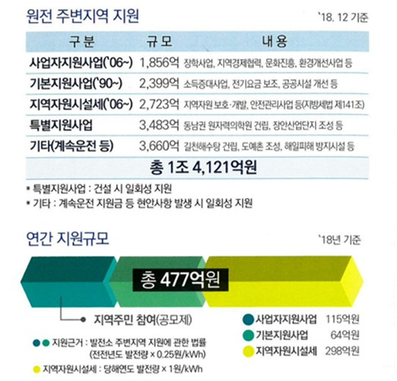
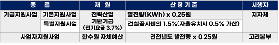
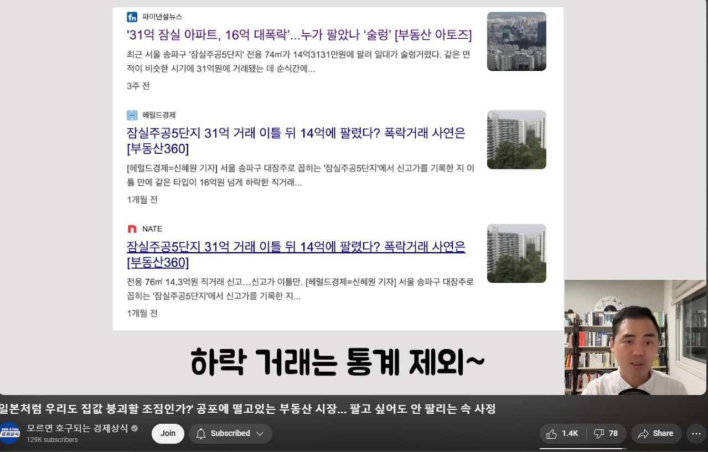

## 문서번호: 4201

### 제목: [10) 노인핸드폰 사기, 방통법 개정](https://q4all.kr/redirect/detail/9dc43cdd-2f67-4bae-bacc-784b32744017)

**작성자:** [정창규](https://q4all.kr/user/profile/5939)
**작성일:** 2025-02-20 19:27:43 (목요일)

---

10) 노인핸드폰 사기, 방통법 개정

노인들에게 공짜폰을 주겠다고 계약을 한 후 요금이 과다하게 많이 청구되어 사기피해가 속출하고 있다. 방송통신조정위원회 사례집을 보면

호주에서 흑인이 핸드폰을 사로 왔는데 영어가 어눌해서 잘못된 계약으로 피해를 입어 대리점은 벌금이 몇 천만원, 그위 통신사는 몇 백억원의 과징금을 추징했다.

즉 노인들의 기준은 65세로 되어 있는데 60세 이상이 되면 거의 눈이 침침하고 공짜로 준다고 하여 계약서에 싸인을 하고 녹음도 정상적으로 공짜로 준다고 하는 말에 혹하기에 정상적인 계약 형태의 진행되기에 그런 말에 신경을 써지 않기에 계약서와 녹음때문에 구제할 방법이 없습니다.

하지만 호주처럼 흑인이 영어가 어눌하여 법원은 이것을 사기 피해라 보고 피해회복을 하듯이 우리나라도 60세 이상 노령인구 또는 인지능력이 안 된 사람에게 대해 불합리 계약을 한다면 호주와 같이 피해회복을 해주고

특히 통신사가 각 대리점을 철저하게 관리할 수 있게 통신사에 몇 백억원 과징금이 필요하다고 보고 노령, 인지 능력이 안되는 사람은 가족과 같이 함께 오는 등 법안 마련이 필요하다고 봅니다.

출처 : 노인 상대 핸드폰 구매 피해 잇따라 <https://news.knn.co.kr/news/article/154283>

---

## 문서번호: 4202

### 제목: [11) 소득분위 없애기+기본소득에 대해 ](https://q4all.kr/redirect/detail/147c1e20-d3a3-4c16-98be-25f1cd1a9d16)

**작성자:** [정창규](https://q4all.kr/user/profile/5939)
**작성일:** 2025-02-20 19:28:10 (목요일)

---

11) 소득분위 없애기+기본소득에 대해

그리스에서 IMF가 와서 먹을 것이 없어 사람들이 쓰레기를 먹고 비참한 삶은 연명하지 않게 하기 위해 자살한 사건이 있었다. 우리나라에서도 3모녀가 사회에 방치한채 자살한 사건이 있었다. 옛말에 가난은 나랏님도 구제를 하지 못한다고 했다. 우리나라는 6.25.때 최빈국으로 모든 국민들의 피와 땀의 노력으로 선진국에 되어 복지에 대한 개념이 없다고 본다. 즉 왜 나라에서 사지가 멀쩡한 놈에게 돈을 줘 이렇게 말하고 있다.

지금은 선진국반열 들어서 일 자리가 거의 없어지고 대부분 사람들도 가난의 세대와 달리 힘든 일을 하지 않아 외국인 노동자가 대체하고 있는 실정이다.

기본소득은 사람의 존엄성을 지키기 위해서 주는 국가에서 생계 및 발판 목적으로 주는 최소의 돈이라 생각하면 된다. 즉 노인들에게 지급하는 노령연금이 정도 생각하면 된다.

근데 문제점이 있다. 노인중에서도 세금을 잘 내고, 자기보다 재산이 많은 사람이 법을 교묘하게 이용하여 재산이 없는 상태로 더 많은 노령연금을 받아 사회적으로 불평등이 생긴다.

또한 대학생들도 소득분위를 정해서 장학금을 받고 있는데, 외제차를 몰고 부자로 사는 사람이 장학금을 받고 있는 경우도 있다. 즉 법망을 피해서 법을 잘 이용해서 이런 문제점이 발생하고 있다.

독일의 경우 소득분위를 나누는데 몇 조원의 예산이 필요하다고 해서 소득분위를 나누는 자체가 의미가 없다고 보았다. 부자는 가난한자든 모두 세금을 내고 있다.

내가 재산이 100억이고, 가난하자는 돈이 없으면 부자에게 지급되는 돈이 나랏에서 공평하게 40만원이 지급된다면 대부분 사람들은 부자에게 왜 돈을 주지 이해를 하지 못한다.

부자도 부자가 되기위해서 노력을 해서 세금을 내는데 이런 생각은 하지 못하고 있다.

또한 소득분위를 나누는데 예산이 많이 들고, 법망을 피해 노령연금, 학자금을 받는 등 사회의 문제점이 발생하고 있기 때문에 예를 들어 노인들에게 공평하게 50만원을 준다든지,

아님 모든 대학생들에게 국가에서 반값 등록금 지원해준다든지 이렇게 해야 세금이 잘 내는 사람이 피해를 보지 않게 되는 것이다.

부자에게는 40만원이 돈이 아니지만 없는 사람에게 생존권을 보장해는 수단이고 민주주의 생존권 보장제도이고 재기 할 수 있는 방안이기도 하다.

---

## 문서번호: 4203

### 제목: [전세사기 등 금융범죄에 대한 강력한 처벌을 촉구합니다!!!!](https://q4all.kr/redirect/detail/62c09a76-97b6-4939-9c7d-c736081454fc)

**작성자:** [정현지](https://q4all.kr/user/profile/6008)
**작성일:** 2025-02-20 19:29:35 (목요일)

---

전세사기**피해자로서 강력한 법적 처벌을 촉구합니다**

저는 최근 전세사기를 당한 피해자입니다. 집주인은 전세금을 받고도 돌려주지 않고 있으며, 제가 거주하던 건물의 다른 세입자들도 대부분 같은 피해를 입었습니다. 그러나 경찰에 사기죄로 고소했음에도 불구하고, 계약 과정에서의 문서 위조나 허위 사실이 없다는 이유로 형사 처벌이 어렵다는 답변을 받았습니다. 결국, 민사소송을 통해 해결해야 하는 상황이지만, 소송에서 승소하더라도 집주인이 재산을 숨기거나 배째라는 태도로 나오면 실질적인 피해 회복이 어렵다는 현실을 알게 되었습니다.

이 사건을 겪으며 저는 우리 사회의 법과 제도에 깊은 실망을 느꼈습니다. 경제범죄를 저지른 가해자가 아무런 형사 처벌 없이 활개칠 수 있다는 사실이 믿기지 않습니다. 특히 보이스피싱, 은행 횡령 등 다양한 경제 범죄가 증가하는 가운데, 피해자들은 고통받는 반면 가해자들은 법망을 피해 숨어버리는 일이 반복되고 있습니다.

이러한 범죄를 근절하기 위해서는 보다 강력한 법적 조치가 필요합니다. 특히,

• **전세사기와 같은 경제 범죄의 처벌 수위를 대폭 강화해야 합니다.**

• **차명 계좌 제공, 대포폰 개설 등 범죄를 돕는 모든 행위자에 대해서도 엄중한 처벌이 이루어져야 합니다.**

• **가해자가 재산을 숨기고 버티는 경우에도 피해자들이 실질적으로 보상을 받을 수 있는 법적 장치가 마련되어야 합니다.**

성실하게 일하며 살아가는 선량한 시민들이 범죄자들로 인해 고통받아서는 안 됩니다. 경제범죄자들이 약한 처벌만 받고 다시 사회에 나와 숨겨놓은 재산으로 떵떵거리는 현실은 반드시 바뀌어야 합니다. 피해자들이 억울함을 겪지 않고 정의가 실현되는 사회를 만들기 위해, 정부와 국회가 보다 적극적인 법 개정을 추진해 주시길 강력히 촉구합니다.

---

## 문서번호: 4204

### 제목: [보험실비 처리  간소화](https://q4all.kr/redirect/detail/ea82d370-1346-4f13-aee4-712c6b749d4e)

**작성자:** [이승국](https://q4all.kr/user/profile/6012)
**작성일:** 2025-02-20 19:38:20 (목요일)

---

현재 4차산업 혁명?5차를 말하기도 하는 시점인데

왜 아직도 실비 청구를 할려면 당사자가 종이서류를

아직도 제출해야하는지 이해할수가 없네요

지구온난화 탄소배출을 염려하는시점에

병원 납부시 자동으로처리하면 두번갈필요도없고

아까운 종이낭비도 막고 일석3조가 될거같습니다

분명 까탈스럽게 하는게 이득을 보는쪽이 있겠지요

여러모로 새정부탄생시 실비간소화 정책을 생각해주셨으면

합니다

---

## 문서번호: 4205

### 제목: [트럼프가 노벨평화상을 받으면 평화가 오나요?](https://q4all.kr/redirect/detail/42c84871-8c20-482c-971f-190d76fde6b0)

**작성자:** [설민영](https://q4all.kr/user/profile/5958)
**작성일:** 2025-02-20 20:50:41 (목요일)

---

우크라이나 전쟁을 멈추겠다고 선언한 트럼프는 대뜸 우크라이나를 배제한 채 러시아와 종전 협상을 하고 우크라이나에게 일방적인 금전 요구를 했습니다.

우크라이나가 그 요구를 모두 들어준다면 우크라이나는 파산할 것이고, 들어주지 않는다면 미국의 지원을 잃어버린 우크라이나는 러시아에 멸망당할 것입니다.

게다가 가자 지구에 대하여도 일방적으로 미국이 소유하겠다는 비상식적인 주장을 했습니다.

비인도적인 불법체류자 추방은 어떻고요.

트럼프 정부는 자국의 이익을 이유로 비상식적이고 터무니없고 폭력적인 결정을 아무렇지 않게 합니다. 그런 트럼프 정부가 노벨 평화상을 받도록 하는 것이 정의로운 일일까요?

국익. 중요합니다. 하지만요. 나라가 나라로서 품위를 지키는 것도 중요한 일입니다.

이건 도저히 동의할 수가 없습니다.

---

## 문서번호: 4207

### 제목: [자격증, 졸업장, 학위증. 필요한가?](https://q4all.kr/redirect/detail/0a745aa9-5375-41cc-bd36-ae065f9dda47)

**작성자:** [김영환](https://q4all.kr/user/profile/6027)
**작성일:** 2025-02-20 21:31:58 (목요일)

---

자격증, 졸업장, 학위중. 그많은 것들이 필요한가? 자격증을 대여하고 돈받는 경우가 있다고 한다. 이건 경제 활력을 죽이는 규제 입니다.

꼭 필요한건 빼고 폐지 합시다.

---

## 문서번호: 4208

### 제목: [학교폭력 조사를 선생님들이 해야하나요? ](https://q4all.kr/redirect/detail/477c7e15-004f-4bc3-af1c-8c7485f34b63)

**작성자:** [배정현](https://q4all.kr/user/profile/6034)
**작성일:** 2025-02-20 21:57:32 (목요일)

---

학교 경찰이 배치되는것으로 알고 있는데, 꿀보직인지~ 그림자조차 확인항 수 없습니다. 존재가 있기는 한건지..

학교폭력사안이 발생되면 선생님들이 개입되서 조사를 하게되고, 그 과정에서 학부모들로부터 민원에다가 아동학대 신고까지 받게됩니다. 학교폭력, 성문제등은 촉법나이라고 하더라도 형법에서 다스려야하는바~ 학교경찰이 처리하도록 하는 방법은 없을까요?

---

## 문서번호: 4209

### 제목: [정부 기관을 만들어 인터넷 상에서 만들어지는 가짜뉴스에 관한  '팩트체크'와 '법적인 조치'를 할 수 있는 부처를 만들어야 할 때가 되었다고 생각합니다.](https://q4all.kr/redirect/detail/03de5e74-9964-47a9-a2ca-310325387d83)

**작성자:** [이주한](https://q4all.kr/user/profile/2466)
**작성일:** 2025-02-20 22:01:14 (목요일)

---

전문적으로

인터넷상에서 일어나는 가짜뉴스에 대한

'팩트체크'와 '법적인 조치'를 할 수 있는

부처를 만들어야 할 때가 왔다고 생각합니다.

우리가 달러환율을 매일 확인 할 수 있듯이

이제는 국가적인 전문 기관을 만들어서

어떤 뉴스가 가짜뉴스인지, 그리고, 법적인 조치를

할 수 있는 그런 정부기관을 만들어야 할 때라고

생각합니다.

앞으로 세상에서

가짜 뉴스가 많아지면 많아졌지

줄어들지는 않을 것입니다.

그걸 방지하기 위해

선도적으로

대한민국이 이런 국가단위에서

부처를 만들어서

인터넷 상의

가짜뉴스를

오프라인의 범죄 다루는

경찰, 검찰 같은

'가짜뉴스 팩트체크' 관리하는

부처를 만들어야

할 때라고 생각합니다.

---

## 문서번호: 4210

### 제목: [학습지 회사의 부당 영업 행위 강요는 막을 방법이 없나요?](https://q4all.kr/redirect/detail/1001808d-068a-482d-9d94-fae19ff5ae70)

**작성자:** [서윤경](https://q4all.kr/user/profile/6035)
**작성일:** 2025-02-20 22:05:49 (목요일)

---

많은 대졸 여성들이 정년의 나이를 넘겨 가며 일하는 학습지 시장의 허위 영업 행위는 정말 끝이 없습니다. 다수의 학습지 업계 여성들이 열심히 일하고도 빚을 지는 구조는 이 허위 영업 강요 때문입니다. 2000년대 초까지는 위탁계약직인 방문 교사에게 암묵적으로 강요되던 일이, 이제는 정사원 관리자들에게도 노골적으로 요구되고 있습니다. 본사는 실적 강요와 압박으로 중간 관리자들을 한계까지 몰아 이런 상황을 만들고도 문제가 발생되면 항상 조직 내 사람끼리의 갈등문제로 마무리하고 빠져 나갑니다. 2025년 내년이면 30년째 학습지 업계에서 일하는 저는 30년째 이런 구조가 하나도 개선되지 못하는 부분이 참으로 답답합니다. 말도 못하고 혼자 카드값의 굴레에 허덕이는 중년 학습지 노동자들을 도와주세요.

---

## 문서번호: 4211

### 제목: [고려인 이주 및 고려인 4세 비자 발급 제한의 건](https://q4all.kr/redirect/detail/03aa908e-b010-419d-ae54-33ba9e8f0d05)

**작성자:** [유재욱](https://q4all.kr/user/profile/863)
**작성일:** 2025-02-20 22:22:33 (목요일)

---

일제치하 독립운동 후손이나 연해주등으로 흩어져 살던 고려인들이 국내에 이주해서 들어오는 분들이 많아졌나봐요..

특히, 우크라이나등 전쟁으로 목사님들이나 민간지원으로 국내에 들어오신 분들이 많은데

4세부터는 비자 발급을 받아도 3개월이면 다시 연장 비자로 비행기를 타고 나갔다 들어와야 한다는데 일단 비용이라도 지급해야 하지 않을까요 ??

국가가 존재하는 이유가 뭘까요 ??

정치인들은 왜 존재할까요 ??

나라잃어 나라없이 강제로 떠돌며 살고있는 우리 민족인데 독립운동가들의 후손들도 많은데 그들이 조국으로 돌아오고 싶은데 고려인 몇세대가 뭔 상관일까요 ??

탈북민들은 제한이 없는데 힘없고 국적도 없는 고려인들은 왜 신경을 안쓸까요 ??

대한민국의 국력이 아직도 중국과 러시아와의 외교상의 문제를 눈치보며 방치해야 할까요?

울 민족이고 한핏줄인데 3세까지는 비자가 발급되고 4세는 왜 제한을 할까요 ??

친일파 후손들은 대를이어 누리며 잘먹고 잘사는데 ...

이게 정의와 공정을 말할 수 있는 대한민국 인가요 ???

이나라에 전쟁이 벌어진다면 누가 조국과 나라를 위해서 목숨 바쳐 싸울까요 ??

고려인들 조부모님들의 희생이 없었다면 지금의 대한민국은 존재하지 않았을 것입니다 ...

---

## 문서번호: 4212

### 제목: [왜 범죄는 반복되는가/범죄수익 환수는 어째서 저조한가?](https://q4all.kr/redirect/detail/1f27bb6e-95eb-4147-9370-fe83ac840434)

**작성자:** [이덕신](https://q4all.kr/user/profile/6036)
**작성일:** 2025-02-20 22:28:36 (목요일)

---

경제범죄와 정치인과 관료의 범죄가 계속 반복되고있다

또한 수사 기소 한들 그들이 받는 죄의 대가란

집행유예, 실형 몇년, 단지 벌금 약간 뿐이다...

그들의 입장에선 범죄를 안저지를 이유가 없다

범죄의 이익은 크고 처벌은 한없이 약하다..

또 안할 이유가 없다..다음번 계획은 더 치밀해질뿐이다

현대의 범죄는 돈을 목적으로 하는게 90프로 가까이 된다고 한다

돈을 다 뺕어버릴수는 없는가?

어떤자가 국민연금에 압력을가해 사적인 이익을 추구하려했다면

국민연금의 손해액보다 큰 처벌이 가해져야 당연한것 아닌가?

(당연히 금전적인 측면에서와 인신구속 둘다 말하는것이다)

이런것은 법제화 할수 없는가?

말도안되는 재판을 방지하기 위해 판사의 재량을 줄일수 없는가?

범죄수익 환수는 또 어떤가

범죄수익을 환수율은 언제가 언론에서 10%대라고 들은거같다

수사관과 검사들이 범죄수익을 찾아내서

추징해야 할 이유는 무었인가?

그들은 한명의 자연인으로서 그런 행위를 했을때

자기 자신에게 이익이 있는가?

오로지 그들의 애국심에만 기대야 하는것인가?

추징금의 일부분을 그들에게 성과급으로 지급해

자기일을 열심히 함으로써 고속득자가 되게 할순없을까?

---

## 문서번호: 4213

### 제목: [대부업체는 왜??](https://q4all.kr/redirect/detail/f63a3a91-e191-4afd-a379-642eee3f6c57)

**작성자:** [김세진](https://q4all.kr/user/profile/5854)
**작성일:** 2025-02-20 22:39:48 (목요일)

---

대부업체 는 왜 대한민국에서만 있는건지?

대부업체 존재 자체를 왜 없애지 않는건지??

대부업체에 대해 정부는 왜 강력하게 단속을 안하는지?

이 질문을 하는건 대부분이 이 곳을 이용하는건 정말 절박한 사람들이

소액으로 급해서 빌리게 되는데요. 젊은층부터 어르신들이 어쩔수 없어서 하게 되는데 이런건 너무 위험한일이잖아요.

목숨까지 위협하니깐요.

대한민국은 권력은 국민으로부터 나온다고 하지만 쭈욱~ 보면

헌법으로만 존재하고 현실은 그렇지 않습니다.

대부업체 는 누굴 위한건가요?

이곳 또한 권력자들이 쥐고 있고 부자들이 돈놀이하는거 아닌가요?

국민들에게 대부업체는 악의 덫입니다. 없어져야하는것입니다.

국민들 에게 해로운 것은 불필요해요.

---

## 문서번호: 4214

### 제목: [왜 나의 신용을 은행에서 결정하나요?? ](https://q4all.kr/redirect/detail/24982f8b-7ba1-4b3d-bd3c-d35a68f4ab63)

**작성자:** [김지애](https://q4all.kr/user/profile/6039)
**작성일:** 2025-02-20 22:49:01 (목요일)

---

우리나라 금융재벌들의 독점이 모든 국민들을 병들게 만드는 것 같습니다. 많은 사람들이 여러 이유로 은행, 증권, 보험 등 금융시스템을 활용하며 살아갑니다. 그런데.. 금융회사들은 부자가 되어가는데... 개인들은 점점 더 가난해져 가는 것 같습니다. 양극화가 더욱 커져가구요.

금융권들의 횡포를 알면서 그들의 시스템을 따를 수밖에 없다는 것이 답답할 따름입니다. 일 예로... 대출받은 대부분의 사람들은 성실이 갚아 나갑니다. 그러나 오히려 자산이 많은 부자라는 사람들은 쉽게 파산하며 죄책감도 없습니다. 제도를 모르는 성실한 사람들이 오히려 바보같게 만듭니다.

---

## 문서번호: 4215

### 제목: [친일파와 매국노들의 재산 환수는 언제되나요???](https://q4all.kr/redirect/detail/2c2689ab-90ce-4019-a2ed-9140917d9ab5)

**작성자:** [김지애](https://q4all.kr/user/profile/6039)
**작성일:** 2025-02-20 23:05:48 (목요일)

---

역사 안에서 악행을 저지른 자들의 단죄가 없다보니.. 누적된 고름이 12.3 내란으로 터진 것 같습니다. 단죄의 첫단추는 친일파와 매국노들의 재산 환수인것 같습니다. 그때 그들이 나라와 국민들을 팔아가며 빼앗고 축적한 재산들을 기반으로 그 후손들 또한 반성없이 호위호식하며 기득권을 쫌쫌히 만들어가고 있다는 것은 누구나 아는 사실입니다.

이제라도 현재와 미래의 세대들을 위해 반드시 청산해 나가야 된다고 생각합니다. 새로운 대한민국을 만들기 위해서.

---

## 문서번호: 4216

### 제목: [건강보험](https://q4all.kr/redirect/detail/b907e22c-e396-4c0f-9a24-bd3384874ab6)

**작성자:** [이윤진](https://q4all.kr/user/profile/6042)
**작성일:** 2025-02-20 23:28:26 (목요일)

---

4대보험 중 건강보험료가 너무 아깝습니다

왜냐하면 그걸 악이용해서 자주 병원에 가는사람이 있는

반면에 병원을 1년에 한 번 갈까말까하는 사람도 있는데요

근데 문제는 안 가도 건강보험료를 내야한다는것입니다

그냥 병원기록이 있을경우에만 소급적용해서 내는방식도 생각해봄직할 문제인듯하니다만?

전 지금 미용실 개업한지 얼마 안 되고

소득도 월세와 전기세 겨우 낼 정도이고

나머지 경비는 남편 용돈으로 매꾸는중인대도

소득이 적용되어 건강보험이 지역가입자로 바꿔져있어서

내야한다는말에 국민건강보험공단을 첮았는데

현 소득을 보여줘도 세무서에 가서

서류 2통을 떼 오라하더군요

조금 어이가 없었습니다 왜 서류까지 떼서 줘야 제외를 시켜준다는것인지요 충분히 이번 부가가치세 소득세를 보여줘도 충분하다생각하는데 자꾸 이런일로 시간내서 일을 봐야하는 게 좀 귀찮기도하고 번거롭네요 신경도 쓰이고요

그 전까지 분명 남편 밑으로 빠져나가고 있어서

그냥 그러고 있었는데 갑작스레 뜬금없이 건강보험료 미납문자가와서 황당했습니다 이런 문제는 어찌 풀어주시겠습니까?그리고 남편이 병원을 2년에 한번꼴로 갈까말까인데 월급받아도 세금을 너무 많이 떼가니까 속상하기도합니다 월급쟁이 이번에 세금 감면해주신다니 그건 다행입니다

---

## 문서번호: 4217

### 제목: [아직도 우리의 소원은 통일이라는 말이 유효한가요?](https://q4all.kr/redirect/detail/3bf876b6-3100-4597-b40a-a97ffec4667f)

**작성자:** [신범진](https://q4all.kr/user/profile/6044)
**작성일:** 2025-02-21 00:11:34 (금요일)

---

2000년 이전에는 여전히 통일을 어떻게 하면 할 수 있을까는 우리의 과제였다.

북한은 우리의 주적이며 동시에 북한정권과 협상력은 우리 정부의 능력을 나타내는 지표였다.

하지만 아래로부터 대다수 국민들로부터 통일이라는 과제가 더이상 소망 소원으로 느껴지지 않는 것 같다.

오히려 행복한 대한민국 국민으로서의 삶에 혹을 하나 달아놓은 피하고 싶은 이야기가 되었다.

대다수의 언론에서는 북한과의 통일을 위한 비용과 고통분담은 전혀 언급하지 않고,

북한과의 경제적 교류를 통한 이익에만 온통 촛점이 맞춰져 있어 북한정권이 이에 호응하면 긍정적으로 반응하고 호응하지 않고 적대적 발언을 하면 애써 무시하며 우리 대한민국만 잘 살아도 된다는 생각을 하고 있는 것 같다.

통일을 물어보면 과연 나의 경제적 불이익에도 불구하고 통일을 이루기위해 무엇이든 하겠다는 국민이 몇이나 될까?

과연 통일이라는 아젠다를 민족적 차원의 사라지지 않는 소원으로 유지할 수 있을까? 유지할 마음이라도 있는가?

대한민국의 경제발전을 위한 이웃국가와의 협력이라는 수준으로 축소시킬 수 밖에 없는가?

---

## 문서번호: 4218

### 제목: [경찰 조직의 대대적인 개편이 필요 하지 않을까요?](https://q4all.kr/redirect/detail/67640059-38aa-4596-a6c0-06d1c580cd7b)

**작성자:** [이유](https://q4all.kr/user/profile/2297)
**작성일:** 2025-02-21 00:25:57 (금요일)

---

수년전 여성 경찰이 취객 진압을 못하는 영상들이 화제가 되며 자격 논란으로 이어진 적이 있습니다. 이는 특정 성별 문제로 많이 다루어 졌는데요,

층간소음으로 인한 칼부림 사건에서는 경찰이 범행 전 도착했으나 범행이 끝날 때까지 제압을 시도하지 않고 입구에서 대기만 한 사례가 있었습니다.

못한 거나 안한거 모두 결과론적으로는 실패인 만큼, 개인의 능력이나 성별의 문제가 아니라, 전문성과 직업윤리의 문제로 볼 수 있습니다.

직업윤리 문제는 개인의 성향인 만큼 꾸준한 평가 제도로 보완 하여야 할 문제지만, 전문성에 관한 문제는 보다 효율적인 시스템 도입으로 해결 할 수 있지 않을까요?

예를 들면, 기초질서 유지와 강력범죄 대응 등 본질적으로 다른 업무가 동일한 조직에서 처리되는 것이 비효율을 초래하는 이유라 본다면,

이런 문제를 해결하기 위해 경찰 조직을 업무 연관성에 따라 분리하여 업무 범위를 좁혀서 전문화 하는 방법이 있습니다.

1) 지방자치 경찰: 기초질서 유지, 불법 주정차 단속, 민원 중심 업무를 전담하는 조직.

2) 강력범죄 및 광역수사 전문 경찰: 살인, 마약, 국제적·광역적 범죄 수사 및 용의자 추적에 집중.

3) 진압 및 현장 대응 경찰: 폭력 난동, 취객 사건, 대규모 폭동, 위험 상황의 즉각적인 물리적 진압 업무를 담당.

4) 사이버 및 첨단 범죄 대응 경찰: 사이버범죄 수사, 관제 CCTV 모니터링, 데이터 추적 및 분석을 전문적으로 다루는 조직.

이런 개편은 각각의 업무에 적합한 전문성을 강화하고, 조직의 비대화로 인한 내부 비리를 줄이며, 현장 대응 실패 원인으로 지적되는 조직적 문제를 완화할 수 있을 것입니다.

추가적으로, 경찰의 승진 체계 역시 개선할 필요가 있습니다. 계급 중심의 체계에서 벗어나, 경찰 개개인의 기여도와 성과를 평가해 수당 중심의 보상 체계를 도입하면, 책임감과 동기를 더욱 강화할 수 있지 않을까 생각 합니다.

---

## 문서번호: 4219

### 제목: [법인이 개인보다 세금혜택이 많아야 되는 이유가 있나요?](https://q4all.kr/redirect/detail/493e8ae4-c1ad-4939-85f5-d2f57e7b8b19)

**작성자:** [신범진](https://q4all.kr/user/profile/6044)
**작성일:** 2025-02-21 00:55:57 (금요일)

---

법인은 정책적 지원, 세금 및 세율 혜택이 개인보다 좋다.

전기, 수도 등 국가적 자원 이용에도 개인보다 나은 혜택이 포함되어 있다고 안다.

상식적 수준에서 보면 법인은 많은 개인이 그 속에서 경제적 이익을 얻을 수 있기 때문에 국가에서 지원을 개인보다 더 많이 한다고 믿는다.

하지만, 하지만 최근의 상황은 기업으로 대표되는 법인으로 인해 개인이 얻는 이익이 법인 그 자체가 얻는 이익에 비해 형편없이 적고,

법인의 이익은 주로 대주주의 이익으로 편입되는 경우가 많고 소액주주, 근로자의 이익은 매우 제한되는 경향이 많아 보인다.

더욱 염려되는 점은 이미 많이 진행된 자동화에 의해 그리고 앞으로 작동될 AI 등의 사용에 의해 법인은 더 이상 근로자의 이익을 보호할 필요가 없어질 것으로 예상된다는 것이다.

낙수효과라는 감언이설은 법인에게 주어지는 지원이 곧 개인에게 사회로 환원될 것이라는 믿음을 심어주었다.

하지만 법인 또는 기업에게 주어지는 각종 지원 및 세금 혜택은 기업 자체에서 재투자되어 자동화된 시설을 안겨주었고 더 이상 많은 노동력은 필요치 않게 되었다.

우리가 부동산으로 얻는 이익은 불노소득으로 치부하면서 높은 과세를 부과하는 대상으로 여기고 있다.

이 시대의 기업으로 대표되는 법인은 막대한 자본을 넣어 자동화된 생산성으로 비용이 많이 드는 노동자로 대표되는 개인에게 오히려 불리한 상황을 만들어 경쟁력을 만드는 중이다.

그렇다면 결국 이러한 법인은 수많은 자본가들에게 돈을 넣으면 돈을 벌 수 있는 부동산과 같은 불노소득의 자본 경쟁터가 될 것이다.

이러한 법인에게 우리가 공감을 주고 응원을 하며 국가적 차원에서 지원과 세금 혜택을 줄 이유가 있는지 묻고 싶다.

이에 개인적으로 제안하는 것은

모든 세금혜택의 기준은 오직 국민 개인에게 한정되어 법인조차도 법인에 속해있는 생물학적 인간으로서 개인이 몇 명인가를 따져서 이에 대해서만 세금혜택이 돌아가도록 하는 것이다.

사람을 많이 고용한 기업은 그에 비례해서 공제를 하고 사람을 적게 고용한 기업은 오히려 불노소득 여부를 확인해 추가 과세등을 고려해야 할 것이다.

이 제안은 이미 급여등 비용으로 적용되고 있다고 할 것이고, 고용이 적은 기업에 대한 불이익은 발전을 저해할 것이라고 반대할 수도 있지만

이미 다가온 과학기술로 인한 개인 노동력 이용에 대한 제한된 위기는 개인의 경제력 상실과 사회적 불안으로 많은 문제를 야기할 것이다.

이제는 자본에 잠식되어가는 법인은 더 이상 사람을 더 풍요롭게 돕지않고 오히려 착취 또는 배제할 수도 있다는 것을 주시해야 한다.

사람이 만들어가는 민주제도의 사회에서 제도로써 사람을 법인으로 부터 아니 자본으로 부터 보호하는 첫째 조치로 세금제도를 개혁해야 한다.

사람이 들어가지 않는 이익은 철저히 세금으로 일부 회수되어 사람으로 되돌려져야 한다.

여기에 최근 대두되는 기본소득이라는 개념이 세금제도로 들어간다면 매번 법을 발의하여 돈을 뿌리네 마네 할 필요가 없을 것이다.

이미 이해하신 분들이 많을 거라 믿고 여기서 마침니다.

---

## 문서번호: 4220

### 제목: [영사관 접근성이 나쁘다. 왜 영사관이 교민이 많이 거주하는 지역이 있지않고 비싼 동네에 있나?](https://q4all.kr/redirect/detail/b2d141a4-eeec-40eb-862d-76c8769481d3)

**작성자:** [이순희](https://q4all.kr/user/profile/3062)
**작성일:** 2025-02-21 01:00:22 (금요일)

---

미국 캘리포니아에 거주하는 50대 교민이다.

영사관은 대사관과 다르게 교민 지원이 주 목적으로 알고있다.

그런데 대부분의 영사괸 위치가 교민이 많이 거주하는 대 있지않다. 왜인가?

---

## 문서번호: 4221

### 제목: [대통령실을 대통령 마음대로 옮겨도 되나요?](https://q4all.kr/redirect/detail/262bff25-22c8-4bf7-b86c-24311710490f)

**작성자:** [장규홍](https://q4all.kr/user/profile/6048)
**작성일:** 2025-02-21 01:06:42 (금요일)

---

윤석열 대통령이 당선 직후 엄청난 나랏 돈을 탕진하며 대통령실을 청와대에서 용산으로 옮겼습니다. 이로 인해 수천억의 예산이 낭비 되었으며, 내란까지 획책하여 나라가 엉망진창이 되었습니다.

대통령실은 법으로 정해야 하고, 대통령실을 옮겨야 할 필요가 있다면 국회의 동의를 받도록 법이 만들어져야 한다고 생각합니다.

이에 대해 정치권에서 입장 발표가 없는 게 안타깝습니다.

---

## 문서번호: 4222

### 제목: [대통령이 내란으로 업무중지가 되었는데 왜 그 졸개들에게 대행을 맡겨야 되나요?](https://q4all.kr/redirect/detail/01191400-8fee-48e9-aaef-9cc82badc75a)

**작성자:** [신범진](https://q4all.kr/user/profile/6044)
**작성일:** 2025-02-21 01:36:19 (금요일)

---

이번 내란을 보면서 대한민국의 법이 참 고민없이 만들어진 부분이 많다고 생각이 들었습니다.

윤석열이 내란을 일으켜 행정부 전체가 오염이 되었는데 대한민국 의전서열 2위를 제치고 국무위원들에게 대한민국의 운영을 맡기고 있는지 개탄스럽습니다.

대통령이 유고시 총리가 대행을 맡는 것은 절차적으로도 매우 부적절하다고 봅니다.

그들은 대통령의 지휘에 따라 임무를 수행하는 임시직 공무원일 뿐입니다.

문서 결재란에 선임이 없으면 차선임이 전결로써 업무를 한다는 차원인 것은 알지만 그것은 회사내 그리고 행정부내에서 별 문제가 없을 때 업무가 중지되지 않아야 된다는 이유뿐입니다.

하지만 한 나라의 운영은 국민들의 뜻이 반영되어야만 하고 특히 행정부가 내란을 일으켜서 국가 시스템을 무너뜨리려고 했고 그러기 위해 2년이상을 인적 물적 교체로 준비를 해온 조직이 행정부입니다.

이에 헙법기관인 국회에서 이는 잘못 되었다고 중지시켰으면 내란을 일으킨 행정부를 소탕하든지 통제하여야 하는데 그러기 위해서 첫째로 해야하는 것이 국가 수장을 올바로 내새우는 것입니다.

이번 예에서도 보았듯이 의전서열 2위인 국회의장은 내란 행정부 국무위원보다 못한 통제력을 보이고 있습니다.

내란이 일어났든 안 일어났든 무슨일로 대통령이 그 임무를 수행하지 못하게 되었을 경우 의전서열 2위인 국회의장이 자동으로 대통령 대행이 되고, 국가가 정상화 될 때까지 국회의장이 국무위원이하 전체 행정부를 통제하여야 한다고 봅니다.

이에 약간이라도 불만이라면 계엄처럼 국회의장의 대통령 자동승계도 승계직후 국회에서 과반이상의 동의를 얻는 절차를 포함하면 될 것입니다.

그리고 국회의장도 없다면 국무위원, 군 장성, 대법원, 국회 상임위원장등 의 자격을 가진 자 중에서 국회에서 과반이상의 국회의원이 동의하는 자로 임시선출하는 방법이 있을 것입니다.

혹은 이를 대비해 비상시 의전서열을 미리 정의해 놓는 것도 방법일 것 같습니다.

미국식 승계절차도 참고하는 것이 좋을 것 같습니다.

내란당이 국회과반이상 이라면 이미 계엄중지도 못했을 것이고 그정도라면 국민들이 투표를 잘 못한 책임으로 고통받을 수 밖에 없을 것입니다.

---

## 문서번호: 4223

### 제목: [살인적인 실손보험금 인상 정치권은 왜 관심가지지않나요?](https://q4all.kr/redirect/detail/2112e201-7e3e-4a36-b674-c93d1ad51792)

**작성자:** [송인범](https://q4all.kr/user/profile/5421)
**작성일:** 2025-02-21 01:42:17 (금요일)

---

처음 실손 보험금액이 3만원 이였는데 지금은 9만원입니다. 수급자같은 저소득층에겐 생활비 60만원에 10만원 가까이 보험료가 빠져나갑니다. 보험을 바꿔타자니 지병이 있어 가입도 안되고 울며겨자먹기로 그냥 돈 내고 있는데 보험사들 너무 심한거 같읍니다. 금융위는 보험사 편인거 같고요. 민주당도 손 놓고 있고요.

---

## 문서번호: 4224

### 제목: [공무원에게 청렴을 강요하지만 그에 대한 금전적 지원이 이루어지고 있는가?](https://q4all.kr/redirect/detail/b7ad5726-f4f0-42a5-9535-6eef6d672f37)

**작성자:** [이주영](https://q4all.kr/user/profile/2997)
**작성일:** 2025-02-21 01:44:16 (금요일)

---

공무원은 청렴해야 합니다. 이에 따라 매년 교육을 하고 있고 항상 강조 하고 있습니다. 하지만 매년 공공기관 부패사고로 인해 대한 국가 예산이 낭비되고 있습니다.

공직부패의 근본적 요인은 공무원의 가치관, 봉사관의 결여와 같은 윤리적 타락에서 찾을수 있지만, 근본적인 원인은 '박봉'이라 할수 있습니다.

9급 공무원이 아직도 200만원 대로 현실과 괴리감이 있다. 이를 개선하기 위해 저연차 실무공무원에 대한 처우개선이 이루어지고 있지만 개인적으로 만족할수 있는 개선이라고 볼수 없습니다.

공직에 있으면서 본인의 성과에 비해 보수가 작고, 진급과 연차가 쌓일수록 중요한 직위에 있을 확률이 높다는것은 부패의 유혹이 더 많다고 할수 있습니다. 처벌을 강력하게 하고 있다고 하지만, 사례를 보았을 때 부패를 저지르는것이 더 이득일 때도 있습니다.

이에 대해 공무원에 대한 청렴수당을 신설해야 한다고 생각합니다.

청렴교육이수와 업무에 대한 청렴성이 인정될때 매월 금적인 지원을 하고 만약 부패사고가 발생시 청렴수당 수령액 모두 환수 하고 더불어 처벌도 받는 제도를 신설해야 하지 않을까 생각합니다.

공무원에 대한 처우를 개선하고 청렴을 강조하면 설득이 더 쉽고, 현실적 체감을 느끼며, 연차가 쌓일 수록 환수되는 금액이 많아 지니 중요직위에 있어도 심적,금전적 주의를 할수 있고, 청렴을 대한 보상심리도 만족할수 있지 않을까 생각했습니다 봅니다.

---

## 문서번호: 4225

### 제목: [군대 골프장이 필요한가?](https://q4all.kr/redirect/detail/b6de775e-e7d9-4e90-bb02-9c8b268f53ff)

**작성자:** [이주영](https://q4all.kr/user/profile/2997)
**작성일:** 2025-02-21 02:01:59 (금요일)

---

군대에 골프장이 왜 필요한지 궁금합니다.

개인의 취미활동과 체력단련 여건 보장이라고 하지만 누구를 위한 골프장인지 모르겠습니다.

군 계급분포도에서 병.하사.중사 등 계급이 낮은 군인이 비중이 높은데 이들 중 군 골프장을 이용하는 사례가 얼마나 될까요?

매년 어떠한 사건으로 인해 군인 골프금지를 강조할 때가 있습니다. 이를 지키지 않는 일로 인해 뉴스거리로 나오고 소수의 인원들로 인해 다수가 골프장이용금지에 대한 교육을 들어야 하는지 모르겠습니다.

이를 숨기기 위해군 골프장이 체력단련장으로 이름이 변경되고, 접대골프가 만연하고 사고가 계속된다면

애초에 싹을 잘라버리기 위해 군 골프장을 없애는것이 최선의 방법이라고 생각합니다.

저의 세금의 1원이라도 군 골프장유지와 군골프장을 이용하는 사람들의 봉급에 사용된다는게 정말 싫습니다.

군 골프장 부지로 군인아파트, 군인자녀 학교 등을 건설하는게 미래 대한민국 강군을 위해 투자가 아닐까 생각합니다.

---

## 문서번호: 4226

### 제목: [참된 사람을 기르는 교육은 우리나라에서는 불가능한가요?](https://q4all.kr/redirect/detail/d560b192-6f6c-468c-8b4c-c25dccf3f47c)

**작성자:** [김민진](https://q4all.kr/user/profile/6052)
**작성일:** 2025-02-21 03:18:40 (금요일)

---

우리나라의 학생들은 자아가 형성될 시기에 누가 더 어려운 문제를 풀고 높을 등수를 받는지에만 집중된 삶을 삽니다. 모든것은 시험에 집중되어있습니다. 세상은 급격하게 바뀌고있는데 교육의 시스템은 시험의 과목, 유형만 바뀔뿐 몇십년째 바뀌지 않습니다. 교육 과목들도 지식을 전달하는 목적에서 벗어나 그저 시험을 위한 다른 전략과 주제를 가진 챕터 정도로만 전락해버렸습니다.

교육의 본질인 사회 구성원으로서 잘 살아갈수있고 조화롭게 어울릴수 있는 인간을 길러내는것에는 전혀 맞지 않는 오히려 틀에 찍어내듯이 사회에 우겨들어갈수 있도록 창의성과 다양성을 삭제하는 것이 대한민국의 교육입니다.

가장 중요한것은 학생들이 고통받고 있는것입니다. 아무도 학생들의 고통에 대해서 심각하게 받아들이지 않는것 같습니다. 자아가 완전하게 형성되지 않아 무궁무진한 가능성을 가진 아이들에게 이런 삶을 살게 하는것은 범죄 수준의 행위라고 생각합니다. 그런 행위를 국가가 하고 있습니다. 학생들의 높은 자살율은 국가가 그렇게 하게끔 내몬 결과입니다. 인간을 길러내는 교육에 대한 부작용은 대한민국 전체의 문제가 되기 때문에 하루라도 빨리 바뀌어야한다고 생각합니다.

수업이외의 활동(동아리, 체육활동)이 보여주기식이 아닌 실질적으로 보장되어야하고 시험의 부담을 줄일수있는 시험 시스템 개편, 스스로 생각할 수 있는 능력, 창의력을 기르는것에 집중한 수업 방식개편 등등 구체적인 변화가 필요하다고 생각합니다.

---

## 문서번호: 4227

### 제목: [대학교육이 학벌에 의한 신분제 사회의 신분 결정 도구로 사용되는 것에서 탈피할 수는 없는가?](https://q4all.kr/redirect/detail/5619d757-6c63-41a6-9de8-8b001112f7a1)

**작성자:** [신홍섭](https://q4all.kr/user/profile/6053)
**작성일:** 2025-02-21 04:18:40 (금요일)

---

교육혁명, 대학교육 개혁으로부터 시작되어야 한다.

대학 개혁 없이는 한국 사회 미래가 없다.

정부는 대학에게 자율성을 제시하라.

정부 주도가 아닌 대학 스스로 변화할 수 있는 기회를 주어야 한다.

대학의 교육이 바뀌어야 국가의 전체 교육의 모습이 바뀔 수 있다. 미래 한국 사회를 위한 대학 개혁, 대학의 자율성 보장과 대학 주도의 교육개혁으로 미래의 대학을 열어야 한다. 대학 개혁 없이는 한국 사회 미래가 없다. 갈길 잃은 대학교육, 대학 주도의 다양성을 향한 교육개혁으로 미래의 대학을 열어야 한다.

정부는 대학에게 자율성을 제시하라. 정부 주도가 아닌 대학 스스로 변화할 수 있는 기회를 주어야 한다. 대학은 자율성을 가지게 되면 교육품질관리를 고민하게 된다. 대학 스스로 바뀔 수 있는 기회인 것이다. 교육품질관리를 하지 않는 국가의 미래는 없다. 대학의 교육이 바뀌어야 전체 교육의 모습이 바뀐다.

대학교육이 학벌에 의해서 신분제 사회의 신분 결정 도구로 사용되는 것에서 탈피하라. 대학 교육개혁을 위한 변화는 기대하는 것이 아니라 실천해야 하는 현실적 과정인 것이다. 미래 사회를 위한 현 교육 제도와 교육 구조의 개선책을 대학 스스로 찾아 나서야 한다. 대학이 바뀌지 않고는 한국 사회 미래를 기대할 수 없다. 끊임없이 변화하고 혁신하는 대학으로 바뀌어야 한다.

대학의 자율성 보장과 더불어 대학 스스로 자발적 복종에서 벗어나야 할 시기가 온 것이다. 정부와 대학은 침묵에서 벗어나 응답하여야 할 시기가 온 것이다. 형식적 공정성보다는 무형의 다양성을 지닌 미래형 인재를 선택할 대학의 입시 방안을 정부가 아닌 대학 스스로 제시하여야 한다. 미래사회가 요구하고 산업체 인재 수요에 따른 대학 인재 선발권 보장 차원에서 대학 학과 및 전공별 자율적 입시방안을 대학이 제시하여야 한다. 학과 및 전공별로 학생 스스로 선택하는 수요자 관점의 입시 정책을 대학이 자율적으로 제시하여야 한다. 입시 지옥을 벗어날 절호의 기회인 것이다.

젊은이들에게 삶의 무대를 제공하라. 포기하지 않고 불확실한 사회를 향해 자기만의 색깔을 지닌 미래 사회의 일꾼으로 성장할 수 있어야 한다. 남들이 걸어간 길을 따라 가는 것이 아니라, 모든 이가 어렵고 무모하다고 여기는 방향으로 새로운 길을 개척하여 나가는 사람으로 키워야 한다. 실패를 두려워하지 않는 행동하는 청년으로 키워내야 한다. 대학은 잠재력을 가진 인재들이 존재하고 있다. 특히 불확실한 미래 사회를 준비할 우리에게 남아있는 유일한 희망이 존재하는 곳이기도 하다. 이루지 못한 열정과 꿈이 있는 곳이 바로 대학이다. 엄청난 잠재력을 가진 대학에서 아직 우리가 완성하지 못한 교육개혁 대혁신의 과정을 우리는 함께 지켜보아야 한다.

대학의 교육이 바뀌면 학교교육이 바뀌게 될 것이다. 꼴찌가 있기에 일등이 있는 것이다. 학교는 미래를 준비하고 다양성을 키우는 곳이어야 한다. 모든 학생들의 재능이 인정받을 수 있는 교실 현장으로 바뀌어야 한다. 학교는 물고기가 더 이상 나무를 기어오르지 않아도 되는 곳이어야 한다는 신념으로 교육혁명을 시작하여야 한다.

---

## 문서번호: 4228

### 제목: [현행 정부 주도의 성적만의 변별력을 위주로 선발하는 대학입시제도를 방치할 것인가?](https://q4all.kr/redirect/detail/64d5b42f-3444-4ef0-999d-0eb76b40d3fe)

**작성자:** [신홍섭](https://q4all.kr/user/profile/6053)
**작성일:** 2025-02-21 04:28:11 (금요일)

---

대학은 부끄러워해야 한다.

대학의 고유 권한인 인재 선발권을 스스로 포기하여 입시지옥을 만들어 온 무책임을 스스로 부끄러워해야 한다. 현행 정부 주도의 성적만의 변별력을 위주로 선발하는 대학입시제도를 방치한 책임을 통감하여야 한다. 정부는 획일적인 현행의 입시제도에 한계가 있음을 인정하라. 형식적 공정성보다는 무형의 다양성을 지닌 미래형 인재를 선택할 대학 입시방안을 정부가 아닌 대학 스스로 제시하여야 한다.

교육부가 아닌 대학 주도의 자율적 입시정책이 절실하게 요구된다. 대학은 학과 단위의 다양성을 지닌 미래형 인재를 선발하여 사회 여러 분야의 인재로 키워내야 한다. 대학은 가짜 인재를 걸러내는 특별한 입시정책을 제시하고, 한국 대학의 서열과 학과 서열의 고질적 병폐를 해결하는 대학 주도의 입시안을 제시하여야 한다. 정부는 이제라도 획일적인 학업 결과와 학력고사 결과 만으로 인재 선발을 실시하는 획일적 입시제도에 한계가 있음을 인정하라.

정부는 대학에게 인재 선발권을 넘겨주어야 한다. 대학은 창의적이고 도전의식을 지닌 인재를 선발하는 시스템으로 학과 단위의 새로운 입시 방안을 학부모와 학생들에게 제시하여야 한다. 정부와 대학 공동체 및 산업체 협업으로 가짜 인재를 걸러내는 장치와 대학의 학과별 입시정책을 제시하여야 한다. 대학은 선발 인재를 어떻게 산업체 및 사회가 인정하는 자격과 역량을 획득하고 대학에서 사회가 요구하는 인재로 성장하는 지의 그 과정과 결과도 공지하여야 한다. 

대학 졸업과 동시에 어떤 직무능력을 가지고 어떤 역량을 가진 인재를 양성하는지도 구체적으로 제시하여야 한다. 대학의 학과 및 전공에 맞는 인재 선발 과정과 기준을 가지고 가짜 인재를 걸러내는 장치인 기업과 산업체 및 사회가 협업으로 선발하는 입시 제도를 대학이 자율적으로 제시하여야 한다.

이제는 정부가 대학의 인재 선발권을 대학에게 돌려주어야 할 시기인 것이다.

---

## 문서번호: 4229

### 제목: [학생 본인의 노력이 아닌 결과를 대학 입시 선발 과정에서 걸러내는 장치는 없는가?](https://q4all.kr/redirect/detail/772c3f2b-4d6c-47f3-ba08-766e0be99b9a)

**작성자:** [신홍섭](https://q4all.kr/user/profile/6053)
**작성일:** 2025-02-21 04:51:44 (금요일)

---

성적만의 변별력으로 인재를 선발하는 현행의 정부 주도의 대학 입시정책을 바꿀 시기가 도래한 것이다.

대학의 인재 선발권이 보장되고 학과별 자율적인 입시 정책을 실시해야 한다. 대학입시 정책 역시 정부가 아닌 대학 주도하에 실시해야 한다. 정부 주도 정책은 한계가 있다. 대학은 학과별로 특성에 맞게 자율성을 가지고 다양한 입시 정책을 제시하여야 한다. 학생들은 학과별 입시방안에 대한 공지 사항을 참고로 원하는 학과를 선택할 수 있도록 하여야 한다. 입학 선발과정 역시 다양한 과정으로 실시하도록 하되, 현행 학교 교육 정상화를 염두에 두고 공교육에 해를 끼치는 위해 요소를 배제하면서 전공 및 학과별로 자율적으로 학과 고유의 특성을 가지고 일반에게 공지하여야 한다.

학생 본인의 노력이 아닌 결과를 선발 과정에서 걸러내는 장치를 구상해야 한다. 학생들이 스스로 자기가 더 부풀리고 부모와 사교육의 도움을 받으면 손해를 본다는 인식이 있어야 할 것이다. 현행 입시의 성적만의 변별력 위주의 입시 정책을 과감하게 수정해야 한다. 학부모의 개입으로부터 자유로워야 할 것이다. 사교육으로 부풀려진 성적만의 변별력 결과에 교사가 사실과 다른 내용을 써주어서 오히려 대학의 입학에 더 불리한 조건이 된다고 인식해야 한다.

이젠 더 이상 성적만의 변별력으로 인재를 선발하는 정부 주도의 입시정책은 포기되어야 한다. 정부는 이제라도 대학에게 인재 선발권을 돌려주어야 한다. 미래사회를 살아갈 청년들을 위한 입시정책으로 개인의 역량을 높이는 다양성과 협업의 능력을 키우는 학과 및 전공 별로 역량 중심 인재 선발 프로젝트를 대학 스스로 제시하여야 한다. 개인의 역량과 개성 및 다양성 우선의 입시 정책이 제시되어야 대학 서열과 학과 서열의 고질적 병폐와 입시 지옥이 살아질 것이다.

---

## 문서번호: 4230

### 제목: [직업 정년제 폐지는 가능한가요?](https://q4all.kr/redirect/detail/71bd06ff-bb8f-4169-ae56-1cdcf6f6306d)

**작성자:** [이형동](https://q4all.kr/user/profile/6054)
**작성일:** 2025-02-21 05:05:38 (금요일)

---

한국에서는 국가 공무원법과 고령자 고용법에서 근로자의 정년을 법령으로 정하고 있습니다. 영국과 미국은 정년제를 폐지한 반면, 일본은 70세, 독일은 65세, 프랑스는 62세로 정년을 설정하고 있습니다. 독일과 프랑스는 발달된 사회 보장 제도를 바탕으로, 정해진 나이에 정년 퇴직을 하더라도 기존의 삶의 수준을 유지하며 노후를 지낼 수 있는 것으로 알려져 있습니다. 미국은 정년제를 폐지하여 고령자도 본인의 의사와 능력에 따라 계속해서 취업할 수 있습니다. 다만, 미국은 고용의 유연성에 따라 직업 안정성이 상대적으로 낮을 수 있지만, 정년으로 인한 퇴직 강제나 차별은 없습니다.

한국에서 25년간 직장 생활을 경험한 결과, 많은 사기업 직원들이 50세 전후로 직업 안정성에 불안을 느끼고, 퇴직 연령을 전후하여 직장을 떠나는 경우가 많습니다. 사회 보장 제도가 미비하여, 기존의 삶의 수준을 축소하거나 불안정한 생활을 이어가는 경우도 종종 발생합니다. 재취업은 어려운 상황인 경우가 대부분입니다.

따라서, 중장기적으로 정년 연장을 위한 노력들이 진행되고 있는 것으로 알고 있지만, 정년제 폐지에 대한 논의는 어떻게 진행되고 있는지 궁금합니다.

특히, 국회의원의 평균 연령이 만 58세로, 대부분의 국민들이 정년을 맞이하는 나이에 오히려 의정 활동을 시작하거나 지속하고 있는 상황입니다. 공무원 또는 고용법에서 정하는 정년 제도의 취지와 배경이 명확하지 않지만, 만약 업무 능력이나 효율에 대한 문제라면, 국회의원에게도 연령 제한이 적용되는 것이 타당한지에 대한 논의가 필요할 수 있습니다. 또한, 고위 공무원에 대한 연령 제한 여부도 같은 기준에서 검토될 필요가 있을 것입니다.

---

## 문서번호: 4231

### 제목: [대학은 가짜 인재를 걸러내는 특별한 입시정책을 제시할 수는 없는가?](https://q4all.kr/redirect/detail/226164c3-d6ca-4430-af98-66a3533124fa)

**작성자:** [신홍섭](https://q4all.kr/user/profile/6053)
**작성일:** 2025-02-21 05:19:42 (금요일)

---

달리기 하나만으로 평가하는 세상을 성적만의 변별력으로 위장하지 말라. 교실에서 창의적 생각을 허용하고 창의성을 기르는 교육을 위해서는 다양성을 존중하고 학습의 속도를 인정하는 새로운 평가 방법과 기준이 마련되어야 한다. 성적만의 변별력에 대한 인식의 발상의 전환이 공교육 정상화의 정도이다. 특정 방향으로만 달리는 무기력함이 아니라 정규 트랙에서 벗어나 자유로운 생각이나 창의적인 생각을 가지고 도전 의식을 지닌 인재를 선택하라.

대학은 가짜 인재를 걸러내는 특별한 입시정책을 제시하라. 창의적이고 비판적인 사고를 할 수 없는 부모에 의해서 키워진 가짜 인재들인 것이다. 학생들을 공포 상태의 좀비라고 표현한 이유는 어디로 가는 지도 모른 채 계속 앞으로만 가기 때문이다. 개별 학과 및 전공별로 모집하는 다양성과 자율성에 근거한 입시방안이 수립되어야 할 것이다. 대학의 인재 선발권을 정부에만 온전히 맡기고 대학의 입시정책을 자율적으로 내놓지 못하는 비겁함을 대학은 부끄러워해야 한다.

대학은 가짜 인재를 걸러내는 특별한 입시정책을 제시하고 한국 대학의 서열과 학과 서열의 고질적 병폐를 해결하는 대학 주도 입시안을 제시하라. 국민들을 고통속으로 몰아넣고 있는 입시지옥이라는 현 입시정책에 대하여 대학은 침묵하고 있다. 대학은 부끄러워해야 한다. 미래 인공지능 사회를 대비하는 교육으로 바뀌어야 할 것이다. 어떤 인재를 요구하는 지를 예측하고 어떻게 인재를 양성해야 하는 지를 국민들에게 공지하여야 한다.

대학은 스스로 입시정책부터 교육까지 새로운 미래 사회를 대비하는 신 입시정책으로 미래 지향적인 교육개혁 정책을 마련하여야 한다. 대학은 가짜 인재를 걸러내는 장치인 기업과 산업체 및 사회가 협업으로 선발하는 학과별 입시 제도를 통해서 해법을 찾아야 할 것이다. 대학입시, 대학이 자율적으로 제시하지 못하는 데 대하여 대학은 침묵하고 있다. 대학은 부끄러워해야 한다.

학령인구 절감 시대의 대학입시의 본질은 정부에서 제시하는 대학입시정책이 무색할 정도이다. 특히 지방대학들의 사정은 심각하다. 대부분의 지방대학에서는 정원 채우기에 급급한 현실인 상태로 인재 선발의 개념은 이미 없어진 지 오래다. 고교 졸업생이 지원하고 합격 통지를 하면 그저 다른 대학으로 옮겨 가지 않고 본 대학에 등록만 해주기를 바랄 뿐이다.

대학의 교수들은 수업이 없는 날에 전국의 고등학교를 다니면서 입시 홍보 활동을 하고 있다. 한 손에 음료수와 다른 한 손에 대학의 홍보책자를 들고 고교 입시담당 교사 선생님을 찾아 한명이라도 더 지원해 주길 부탁하면서 전국을 다니고 있다. 예측되고 있었던 일들이 벌어지고 있으나 희망보다는 절망의 시간을 보내고 있다는 것이 현실로 다가오고 있다. 현 시대에서 대학 운영의 치명적 저해 요소들을 사전에 차단하고 미래 네트워킹들이 연결된 대학 네트워킹 신개념의 시스템은 등장할 수 있는 지 고민해 보아야 할 시기가 온 것이다. 이미 늦은 감이 없지 않은 것이다.

대학교육의 자율적 운영을 보장하여야 한다. 대학은 학기제 타파와 학과의 벽을 허물어 대학의 울타리를 벗어나 세상 밖으로 나와야 한다. 사회 및 산업체 현장 속의 신 지식 생산 형태로 대학과 기업 협업의 교육과 고용연계(School to Work) 정책의 일원으로 회사 사내 캠퍼스 형태의 지역 중심의 신 지식 생산 시스템을 구상해야 한다. 평생학습과 교육복지 형태의 마이크로 칼리지(Micro College) 학위를 제공하는 도시 시민들과 모든 지역민들을 대상으로 할 수 있는 도심 캠퍼스의 허용을 시발점으로 개혁의 동력을 추구해 보면 해답은 보일 수도 있는 것이다. 정부가 거버넌스라는 울타리를 풀어주어 대학 스스로 책임과 창의적으로 다시 일어설 수 있는 기회를 주어야 하는 시기가 온 것이다. 대학의 자율적 입시안은 미래 사회를 위한 산업체 협업을 이끌어 반드시 전공 지향적인 입시정책과 학과별 특성화 정책으로 현재의 대학교육 현실의 문제를 풀어낼 수 있어야 한다.  

---

## 문서번호: 4232

### 제목: [통합 복지, 찾아가는 복지.](https://q4all.kr/redirect/detail/4f40b908-9c2d-40be-953e-7f8e91dfeb83)

**작성자:** [신은희](https://q4all.kr/user/profile/5878)
**작성일:** 2025-02-21 06:40:45 (금요일)

---

복지혜택을 받아야 할 사람이 일일히

찾아 다니지 않고

주민센터에서 알려주도록 시스템을

업그레이드 해 주세요.

세금 안 내면, 주소 변경해도 연락하는 것 처럼

복지혜택 안 받으면, 받아서

살라고 살아보라고

그렇게 좀 알려주시면 좋겠습니다.

몰라서 못받고 소외되어 삽니다.

---

## 문서번호: 4233

### 제목: [고려인후손 국내입국자 지원](https://q4all.kr/redirect/detail/fcdb9974-a89a-4b6c-b242-af857132fcff)

**작성자:** [박철희](https://q4all.kr/user/profile/6056)
**작성일:** 2025-02-21 07:25:55 (금요일)

---

-최근 러시아,우크라이나 전쟁을 피해 한국으로 입국,거주하고있는 고려인 후손이 이웃으로 살고 있습니다

-이웃인 고려인후손은 러시아인 아내와 2살된 아이가 있는데

-버거운 월세 거주비와 어린이집 교육비로 한국에서의 생활에 힘들어합니다

-한국국적 취득전에는 LH도 어린이집도 어떠한 지원이 않되는 현실이 안타깝습니다

-고육지책으로 떠나야만했던 선조의 후손에게 고국의 따스함을 느끼게 해 주시길 간절히 바랍니다

-인구절벽의 현실타개 방안중에 하나가 될 수있으니 꼭 지원책 혹은 특별법안이라도 입안하려 주시길 간청합니다

---

## 문서번호: 4234

### 제목: [네이버 모두사이트(modoo) 종료에 따른 방안 문의](https://q4all.kr/redirect/detail/82aba11a-b8fd-43d5-ad22-3be13a9ac35a)

**작성자:** [정우철](https://q4all.kr/user/profile/6060)
**작성일:** 2025-02-21 08:00:08 (금요일)

---

경기도에서 크지않은 사업을 하고 있습니다.

홍보/마케팅을 위해

네이버 모두(modoo)를 잘 사용하고 있었는데,

올해 25년 6월 26일에 서비스 종료한다고 합니다.

많은 소상공인분들과 지자체에서도 이 서비스를 잘 활용하고 있는 것으로 알고 있는데 곧 종료한다니 대책이 필요해보였습니다.

다른 민간 사이트를 통해 만드는 것도 방법일 테지만,

문득 국가차원에서 홈페이지 제작에 대한 지원이 있었으면 좋겠다해서 글을 올려봅니다.

이제는 과거처럼

홈페이지를 개설해서 운영하는 것이

선택이 아니라 필수인 시대이고,

소비자 간 커뮤니케이션을 위해는 전화번호, 전화기, 인터넷처럼 기본적으로 진행해야하는 부분이라고 생각합니다.

해서

기존의 서비스 운영비용 등을 잘 고려해서

관련 정책 등이 있었으면 좋겠습니다.

네이버 모두사이트를 잘 이용해 온 입장에서 많이 아쉬웠습니다.

---

## 문서번호: 4235

### 제목: [주민자치회의 올바른 발전 방향은?](https://q4all.kr/redirect/detail/870f9029-9bfc-469e-9d28-c4c8b7fe5a17)

**작성자:** [박준엽](https://q4all.kr/user/profile/6065)
**작성일:** 2025-02-21 09:40:08 (금요일)

---

김대중 정부 시절 주민자치센터를 설치하면서 읍·면·동장의 자문기구 성격의 주민자치위원회를 구성하였습니다.

주민자치센터에서는 문화·복지·여가 등을 위한 프로그램이 운영되었습니다.

2003년부터는 주민이 실질적인 주인으로 활동할 수 있는 주민자치회로 전환되기 시작합니다.

주민자치회는 “풀뿌리 자치의 활성화와 민주적 참여의식 고양을 위하여 읍·면·동에 해당 행정구역의 주민으로 구성되는 주민자치회를 둘 수 있다”는 특별법에 근거해 조직됩니다.

이에 자율적인 조직과 운영, 지역문제 해결에 대한 주민의 참여를 수행합니다.

그러나 최근에 행정안전부가 주민자치회 표준조례 개정안을 내놓으면서 주민자치의 후퇴가 우려되고 있습니다.

시민권, 참정권 등 주민의 자치 권력을 축소하고 단순한 지방자치 행정체계의 전달자로 위치시키고 있습니다.

일부 주민자치회는 이에 따라 주민자치위원 선정위원회를 만들어 행정의 입맛에 맞는 위원만 선정하는 행태를 보이고 있습니다.

소위 지역유지, 이해충돌 가능성이 있는 업자들이 대거 위원이 되기도 하고 있습니다.

주민주권, 주민권력, 주민참여라는 원래의 주민자치회 뜻을 되살려 주민들이 동네를 이끌어가는 실질적인 주민자치가 이루어 질 수 있는 방안이 무엇일까하는 질문을 해봅니다.

---

## 문서번호: 4236

### 제목: [왜 계속 힘들까요?](https://q4all.kr/redirect/detail/6a8eff31-c139-41c5-b2b7-0b800c41d3be)

**작성자:** [홍영란](https://q4all.kr/user/profile/6075)
**작성일:** 2025-02-21 09:59:27 (금요일)

---

취업을한 23살부터 지금까지 정말 하루도 쉬지 않고 열심히 직장을 다니고,

주식도 하지 않고, 적금도 하면서 살았는데..

지금은 애들 학원보내기도 어렵고, 나의 노후는 생각도 하지 못합니다.

왜 열심히 살고 있는데, 계속 계속 점점 나의 삶은 어려워질까요?

퇴직하면 나는 돈이 하나도 없는데 어떻게 살아야 할까요?

---

## 문서번호: 4237

### 제목: [천문학적인 원전지원사업! 이대로 좋은가?](https://q4all.kr/redirect/detail/21e05f82-125c-4f02-963a-f087f0a03147)

**작성자:** [김명웅](https://q4all.kr/user/profile/3031)
**작성일:** 2025-02-21 09:59:38 (금요일)

---

오탈자가 많아 수정하여 재업합니다.

부산광역시 기장군 장안읍 동해안 바닷가 작은 포구에 원자력 발전소가 들어선 지 어언 50년의 세월이 흘러가고 있습니다. 이곳에는 기장군 장안읍 고리지역에는 6기(2017년 6월 영구정지된 고리1호기 포함)의 원자력 발전소가 소재하고 있습니다.

대한민국 그 어디에도 들어서기를 원하지 않는 원자력 발전소 소재지역은 당연히 낙후되고 소외된 지역으로 전락할 수 밖에 없었지만, 작은 바닷가 마을 주민들의 희생과 고통을 담보로 생산된 안정된 전력은 대한민국 산업화의 밑거름이자, 원동력이 되었습니다.

발전소 주변지역 지원사업은 원자력발전소가 들어서고 난 한참 뒤인 2006년에 이르러서야 주민들의 목소리에 힘입어 개시되었습니다.

( 표-1 : 고리원전 주변지역 지원사업 현황-고리본부 홍보 리플렛 참조 )

(표-2 : 발전소주변지역 지원에 관한 법률에 근거한 원전지원금 산출 자료)

‘발전소주변지역 지원에 관한 법률’에 따라‘표-1' 의 원전지원금의 대부분은 '표-2'의 재원(전력산업기반기금)에 의해 기금지원사업과 사업자 지원사업으로 구분되어집니다.

지원사업의 주요 재원중 하나인‘전력산업기반기금’은 대한민국 전기사용자에게 부과하는 부담금으로서 2025년 현재 부담율은 3.7%(1,000분의 37)이며 사실상 '**준조세**' 성격을 가진 기금입니다

또한. 사업자지원사업은 한수원 자체예산으로서 전전년도 발전량에 비례하여 마련되어집니다.

지원사업중 기금지원사업은 발전소 주변지역에 관한 법률에 따라 **시행자가 지자체장(발전소 주변지역법 제 11조)**로서 사업계획의 수립 및 집행에 관한 권한을 가지고 있고, 특히, 지원액수가 가장 큰‘**특별지원사업’**의 경우도 사업의 종류와 세부내용을 **지자체장이 결정(발전소 주변지역법 시행령 제22조)**하도록 하고 있습니다.

이와 같은 막대한 사업비를 집행함에 있어 법률에는 지자체장이 지원사업계획(**발전소 주변지역법 제9조 ②항, 동법 시행령 제17조 및 제18조)** 및 장기 계획을 수립하여야 함에도 법률조항이 임의조항이라는 이유로 이를 제대로 이행하지 아니하고 있거나, 있더라도 이를 효율적으로 관리하고 있지 않거나, 원전소재 주민에게 제대로 공지하거나 알리지 않고 있다고 판단됩니다.

문제는 이러한 막대한 지원사업이 사업목적과는 달리 지자체장의 공약사업, 선심성, 일회성 사업, 치적과시용 사업 등에 별다른 제재나 제약없이, 그리고 계획성없이 집행되고 있다는 비판을 받고 있다는 것입니다.

지자체의 부족한 홍보와 소극적인 주민의견 수렴 과정으로 인해 정작 원전 주변지역 주민들은 이러한 막대한 사업비가 있는 지도 제대로 알고 있지 못할 뿐만아니라, 알더라도 어느 곳에 어떻게 사용되고 있는지 상세히 인지하지 못하고 있습니다. 이런 사유로 지원사업의 주요 목적중 하나인 주민들의 피해지원에 관한 현실적인 효과가 미미한 것이 사실입니다.

한편, 관련 법률에 의해 한수원의 지역본부가 자체 예산으로 편성하는 ‘사업자 지원사업’의 경우는 그 심각성이 더 큰 것이 사실입니다.

사업자 지원사업 사업자 선정과정을 보면, 문제의 실상을 알 수 있습니다. 한수원의 지역본부가 임명한‘지역심의위원’의 형식적이고 불합리한 심의과정은 물론, 지원사업을 통해 지역내에서의 발언권을 강화하고자 하는 관변단체장들과 지역 토호세력들의 한수원에 대한 불합리한 압력행사, 각종 지원사업을 통해 리베이트와 이권에 개입하려는 지역 유지들의 압박 등으로 지역 심의위원회는 사실상 한수원의‘거수기 또는 원전사업 반대에 대한 사실상의 입막용’에 불과하다는 비판을 받고 있습니다. 결국 지역의 현실을 전혀 이해하지 못하는‘한수원 본사 심의’에 의해 사실상 사업의 종류와 사업비가 결정되는 불합리한 구조가 지속되고 있는 것이 사실입니다.

또한, 한수원 지역본부는 사업지원 대상자 선정 과정에 있어서, 지역의 현실은 도외시 한 채, 한수원 사업에 동조하는 단체들 위주로 사업자를 선정함은 물론, 무분별한 일회성 지역축제의 난립, 특정인 및 특정지역만을 배려한 사업 선심성 과다, 중복사업으로 일관해 왔습니다. 특히, 아무런 법적 근거도 없는 ‘최인근 지역(발전소와 접해있는 마을) 지원사업’이라는 명목으로 상당수의 사업비의 대부분을 배정하여 마을, 지역간의 갈등과 반목을 교묘히 조장하고 있는 것으로 의심되고 있습니다.

### 【발전소 주변지역 사업의 투명성과 효율성 확보】

표-1과 같이 ＇06년부터 ＇18년까지 지원된 1조 4천억원이라는 막대한 지원사업에도 불구하고 원전소재 지역은 여전히 가장 낙후된 지역으로 전락해 있으며, 고령화와 인구감소라는 지역 소멸의 길을 걷고 있는 것이 현실입니다.

이에, 발전소 주변지역 지원사업의 효과적인 목표 달성을 위해 다음과 같이 제안합니다.

* 주민이 피부로 체감할 수 있는 지원사업의 투명한 계획수립과 실행

1. 사업계획 수립시 주민의견 반영을 위한 주민 참여의 보장
2. 사업의 추진 과정과 사업비 집행 실적의 공개

※ 박근혜정부와 문재인정부에서 각각 추진되었던 ‘사용후핵연료 재검토위원회’에서는 ‘지역주민들이 체감할 수 있는 지원방안 마련’을 권고한 바 있습니다.

이는 지금까지 원전관련 지원 사업에 대한 주민들의 불만을 인식하고 개선방안을 마련하고자 하는 의지가 담긴 것이라 판단됩니다.

* 소득사업 활성화를 통한 안정된 주민 일자리 창출

1. 선심성, 일회성 사업 최소화 및 지자체의 자체 예산 가능 사업 배제
2. 지역주민의 소득사업 적극 지원을 통한 일자리 창출과 지역경제 활성화

※‘최고의 복지는 안정된 일자리 창출’이라는 전제하에 지역 소멸의 위기에 처한 발전소 주변지역 지원을 위해 최우선 고려되어야 합니다.

* 지원사업 선정과정의 투명성 확보와 지역 심의기구 권한 강화

1. 공정한 사업 선정을 위한 지역 심의위원회 권한 강화
2. 지역심의위원의 투명하고 합리적인 선출
3. 심의위원 명단 공개 및 회의록과 심의 규정 및 배점표와 배점결과 공개

* 지원사업 관련 법률(발전소 주변지역 지원에 관한 법률) 및 규정 정비

1. 지자체장의 지원사업 계획수립 강제 규정 마련(관련 법 제9조)
2. 지원사업비의 특별회계에서 일반회계로의 전환 금지
3. 지자체장의 사업계획 수립시 해당지역 주민 및 주민대표자와의 협의체마련과 주민 의견 수렴 강제 규정 마련(관련 시행령 정비)
4. 지역주민에 의한 소득사업과 일자리 창출 지원 방안 마련 및 관련 규정
5. 한수원 사업자 지원사업의 사업비 및 집행 세부 내역 공개 규정 마련

원전주변지역 지원사업은 주민들이 피부로 체감할 수 있는 사업비로 사용되어져야 합니다. 지금과 같은 추진 체계로는 주민들간의 갈등과 반목은 물론 지역사회의 고령화와 지역소멸의 길을 막을 수 없습니다.

원전사업으로 인해 그동안 주민들의 재산상 불이익과 행정 및 예산배정의 차별을 더 이상 방관하여서는 안 될 것입니다.

---

## 문서번호: 4238

### 제목: [사이비 종교(종교라고 칭하는 것부터 잘못되었다고 생각됨)를 제재하지 못하는 이유는?](https://q4all.kr/redirect/detail/1aa189fd-f666-47d8-a9f3-783a31f2b130)

**작성자:** [이병철](https://q4all.kr/user/profile/6076)
**작성일:** 2025-02-21 10:07:25 (금요일)

---

안녕하세요?

저는 소위 말하는 사이비 종교 신자 아내를 둔 사람입니다.

종교라고 칭하는 것부터 잘못되었다고 생각합니다.

정말 말도 안되는 일들이 많이 일어나고 있습니다.

종교의 자유라는 말 때문에 얼마나 많은 악행들이 일어나는지 정부, 사회, 많은 국민들이 알고 있는데도 불구하고 왜 이를 제재하지 못하는지 이해를 할 수 없습니다.

판례가 이렇다 저렇다 라는 이유로 이를 처벌하지 못하는게 이해가 안됩니다.

한 가정이 파탄나고 그로 인해 작은 공동체, 더 큰 공동체등이 무너져 가고 있습니다.

종교의 자유도 가족, 사회 공동체에 선한 영향을 끼쳐야 누려야 하는게 아닐까요?

사이비 문제를 어떻게 풀어나가야 하는지에 대한 답이나 계획들도 세워야 하지 않을까 생각합니다.

이상입니다.

---

## 문서번호: 4239

### 제목: [ 민주당은 내란 완전 처단 및 일제 잔재를 청산할 수 있는 특단의 사회대개혁 집권 플랜을 갖고 있는지요? ](https://q4all.kr/redirect/detail/85bfcea8-b911-4125-bb3b-4ddec840bef3)

**작성자:** [임유한](https://q4all.kr/user/profile/6078)
**작성일:** 2025-02-21 10:18:57 (금요일)

---

**우리는 지금 국민이 위임한 권한을 함부로 남용한 윤석열을 끌어 내리려 몸부림 치고 있습니다.**

**정의란 악한 자를 벌하고 선한 자를 보호하는 것입니다. 정의가 바로 서고 나라를 바로 세울 수 있는**

**특단의 특별 기구 설치 및 적폐 청산 제도를 정착시켜야 합니다.**

**무엇보다 우리는 친일청산을 했어야 합니다. 이제, 사회대개혁은 시대정신이 되었습니다.**

**민족의 정기를 세우고 민족의 자부심을 찾아야 합니다. 더 이상 소통은 무의미하고 어리석은 일입니다.**

**반드시 친일정산을 하고 넘어가야 합니다. 그렇지 않는 한 똑같은 시행착오가 반복하게 될 것입니다.**

**이에 내란 완전 처단 및 윤패악질 전담 특단의 기구를 설치하여 일제 잔재 청산과 함께 그 부역자들을**

**단죄하고 나라를 바로 세워야 합니다. 특히, 한국 현대사의 치욕인 부역 언론‧검찰 개혁, 필요시 화폐개혁까지도**

**사회대전환을 위한 민주당 특단의 집권 플랜이 반드시 수립되어 한다고 생각합니다.**

**정의는 누구에게나 공정한 것입니다. 정의의 깃발로 국민을 통합해야 합니다.**

**대한민국 역사에 길이 남을 민주당 이재명 대통령만이 오직 할 수 있다고 생각합니다.**

**지난날 적폐 청산 실패 경험 토대위에서 특단의 기구 및 제도를 정착시켜야 합니다. 결단을 촉구합니다.**

**민주당이 공론의 장을 만들어주시고 당원주권.국민주권 확대 수권정당으로**

**거듭나고 있음에 다시 한번 감사와 큰 기대를 갖습니다.**

**민주당 화이팅입니다!**

**2025. 02. 21.**

**권리 당원 임유한**

---

## 문서번호: 4240

### 제목: [개헌! 개헌! 하는데 정치인이 아닌, 시민이 참여하는 헌법 개정을 할 수 없는지요? ](https://q4all.kr/redirect/detail/aaf1cdba-f0c5-484c-a610-6ccf100282e0)

**작성자:** [임유한](https://q4all.kr/user/profile/6078)
**작성일:** 2025-02-21 10:30:09 (금요일)

---

**12.3.내란 사태이후 무능한 정치원로들의 야욕과 노회가 시작되었습니다.**

**개헌은 국민이 주체가 되는 헌법으로 개정해야 합니다. 남아프리카공화국.아이슬란드처럼**

**국민이 주도하는 헌법을 개정해야 합니다. 민주적 정당성을 확보해야 하기 때문입니다.**

**지금은 오직 내란수괴 윤석열 파면과 형사처벌이 신속하게 이루어지는데 있습니다.**

**계엄정국을 빠르게 종식하고, 헌정 질서를 회복하는 것입니다. 지금 개헌을 꺼내는 건**

**윤석열 정권을 연장시키려는 내란 동조세력일 뿐입니다.**

**작금에 무능한 정치원로가 모여서 정치적 이해가 걸린 제도 개선 논의가 앞설 수는 없습니다.**

**탄핵을 지연시키려는 음모를 중단해야 합니다. 지금 민심은 개헌에 있지 않고 내란 종식에 있습니다.**

**위임한 권한을 함부로 남용한 내란수괴 윤석열을 하루속히 끌어내리는데 총력을 경주해야 합니다.**

**헌법은 사회 공동체들이 어떻게 살 것인지 계약하는 것입니다.**

**이제 국회,정치자들은 돕는 역할만 해야 합니다. 그것만이 주권자 의사가**

**국정에 반영되는 진정한 민주공화국의 가치를 지키고 바로 세우는 길이 될 것입니다.**

**감사합니다.**

**2025. 02. 21.**

**임유한**

---

## 문서번호: 4241

### 제목: [외국인의 국내 부동산 매입으로 인한 내국인과의 역차별과 부동산시장 왜곡에 가중요인을 보고만 있어야 하는가?](https://q4all.kr/redirect/detail/579a3170-2596-46c0-b052-85e5da89edae)

**작성자:** [박성남](https://q4all.kr/user/profile/2124)
**작성일:** 2025-02-21 10:33:07 (금요일)

---

외국인의 국내 부동산 매입이 23년 15,614에서 24년 17,489로 전년 대배 약12%나 증가하고 부동산 침체된 상황에서도 꾸준히 늘고 특히 국적별로는 중국인이 매수자의 약64%를 차지하고 있다고 한다.

외국인의 본국 은행을 이용하면 대출 규제를 받지 않으며 다주택 규제에서도 확인이 어려워 내국인 보다 유리한 위치를 차지하여 역차별 이라는 생각들이 많다고 한다.

내국인의 부동산시장 왜곡을 해결하지도 못하는 상황에서 외국인의 시장 왜곡은 더 혼란을 가중하는 요인이 되고 또한 내국인과의 역차별이 우려 되는데 대한 대책은 어떠한 것이 있는가?

---

## 문서번호: 4242

### 제목: [에너지부 장관직 신설, 직선제, 정권과 상관없이 일관성있게 2050 탄소중립 달성](https://q4all.kr/redirect/detail/a2a418f2-1aa4-4c45-a4bf-a1b0cc13fa3b)

**작성자:** [구강영](https://q4all.kr/user/profile/5798)
**작성일:** 2025-02-21 10:41:15 (금요일)

---

2050 탄소중립 달성을 위해, 에너지 전환의 시기에 살고 있습니다.

기존 산업통상자원부로는 충분치 않고, 일관성도 없습니다.

에너지부 장관직 신설, 직선제, 정권과 상관없이 일관성있게 2050 탄소중립 달성하는 것이 바람직해 보입니다.

임기는 5~10년이 적당해 보입니다.

---

## 문서번호: 4243

### 제목: [민주당 현수막 관리 이대로 좋은가?](https://q4all.kr/redirect/detail/c73e5ea0-af3c-4043-9820-3d65f0fdde7e)

**작성자:** [홍순업](https://q4all.kr/user/profile/6105)
**작성일:** 2025-02-21 11:01:03 (금요일)

---

지역:부산

다른 지역은 어떤지 궁금합니다.

길거리를 걷다보면 횡단보도나 알림판 주변엔 각 정당마다 필요한 현수막을 설치를 합니다.

같은 위치를 돌아다니다 보면 볼수밖에 없는게 현실이죠. 주로 민주/국힘 현수막이 많은데

민주당 현수막은 줄이 풀렸는지 아니면 일부러 그런건지 늘어지고 겹쳐서 알아볼수가 없는경우가 많고

며칠동안 방치되다가 내려가는 경우가 많은거 같습니다.

볼때마다 속상한데 당장 조치를 할수도 없고...

대책 좀 세워주시던지 각 구역별 관리를 자주 해주셔야 겠어요. 일부러 그런거라면 법저조치도 가능할듯 합니다.

---

## 문서번호: 4244

### 제목: [대통령 탄핵을 꼭 헌법재판소에 맡겨야 합니까? 계엄은 필요한것입니까?](https://q4all.kr/redirect/detail/4d101648-be43-4b1d-b065-04931ea53db4)

**작성자:** [이덕신](https://q4all.kr/user/profile/6036)
**작성일:** 2025-02-21 11:02:12 (금요일)

---

1. 대통령을 임명하는것은 국민입니다

그러나 탄핵은 헌법재판소가 최종판단합니다

상식적으로 임명권자가 해임권을 갖는것이 맞을거같은데

어째서 국민이 내란수괴가 탄핵이 되나마나 걱정을 해야합니까..

탄핵을 국회에서 의결하고 국민투표로 부쳐서

신속하게 탄핵을 진행하는게 맞지않나 싶습니다

단 탄핵 찬반 청문회같은걸 한달정도 겨쳐서 모든국민에게

생방송을해서 피탄핵자의 방어권도 보장해야겠지만요

그리고 50%면 너무 무분별할수 있으니

최소국민참여 70%(일주일 이상의 투표 진행)마감 초과되는것은

찬성 55%정도 되면 탄핵 55미만이면 기각

이런 방식은 어떨지

2. 전시상황에 계엄을 발동하는건 이해하겠지만

전시에 준하는 상황에 가능한것도 의아합니다

전시에 준하는 상황이라고 하면 이번처럼 북한을 자극해

국지전이 유발되어도 계엄을 할수 있는 명분을 주게 됩니다

일단 발동되면 이번처럼 머저리들 아닌이상 철저히 계획하고

실행할것이기때문에 막기 더더욱 어려울것입니다

예전에 강릉 공비 왔을때도 계엄없이 진도개 이런거 발령해서

해결되었던 기억이 있습니다

계엄을 대통령이 발동할수 있는 사유를 극단적으로 제한하고

전면전을 제외한 상황에서는 국회의 동의 먼저 구해야

계엄을 할수 있게 해야하지 않을까요

---

## 문서번호: 4245

### 제목: [왜 공공기관의 의사결정 과정을 공개하여 투명화하지 않는지요](https://q4all.kr/redirect/detail/7a7fa51e-69b3-40ca-bd73-f760ef969615)

**작성자:** [김종갑](https://q4all.kr/user/profile/1110)
**작성일:** 2025-02-21 11:07:13 (금요일)

---

공공기관을 주권자가 통제하고 감시할 수 있도록 하려면, 모든 정보나 중요사항에 대한 의사결정 과정을 공개해야 한다고 봅니다. 특히 공개할 때는 모든 내용을 누구나 쉽게 알 수 있도록 해야 합니다. 주권자 누구 든지 자기 사정에 따라, 요약만을 보거나 구체적인 내용까지 보기는 원하는 사람에 따라, 그에 맞게 데이터는 공개해야 합니다. 즉 AI가 읽고 분석하여 텍스트로 또는 영상이나 음성으로 접근할 수 있도록 해야 합니다. 예를 들면 Notebook LM으로 읽고 들을 수 있도록 하면 좋을 것 같습니다.

그리하여 공공기관의 의사결정과정이나 재판관 들의 의사결정 과정에서 어떤 발언이나 판단을 하였는지 주권자가 알 수 있을 것입니다. 요금 엘리트 집단들의 행태를 보면, 거짖과 아부의 글치를 보는 것 같습니다. 이는 그들의 행태 전과정을 주권자가 지켜본다는 사실을 알면, 절대로 거짖이나 아부하는 행태를 하지 못할 것으로 생각돼유.

---

## 문서번호: 4246

### 제목: [미국 눈치보지 말고 개성공단과 금강산관광 재개해 주세요](https://q4all.kr/redirect/detail/3b681c4f-d9be-4cab-9a6c-eb7233dd20a4)

**작성자:** [이동회](https://q4all.kr/user/profile/3856)
**작성일:** 2025-02-21 11:16:25 (금요일)

---

### 미국 눈치나 살살보는 형편없고 초라한 국민으로 그만 만들고

### 

### 자신감 있게 개성공단과 금강산 관광 재개해 주세요...

---

## 문서번호: 4247

### 제목: [■양자화폐, 상속세 선납으로 국가부채 비율 제로 된다](https://q4all.kr/redirect/detail/d64975e4-fd62-4408-a351-152c3876a20c)

**작성자:** [이해진](https://q4all.kr/user/profile/4850)
**작성일:** 2025-02-21 11:24:20 (금요일)

---

“이하 글은 국회의원, 신문 방송기자, 경제학부 교수, 로펌 변호사, 회계법인 회계사, KDI 연구원, 법무사 각 300명의 공개된 이메일과 130여 주한 외국공관장, 한국은행 각 부서, 서울 소재 모든 대학 총학생회, 주요 시민단체 등의 공개된 이메일로 공유합니다. 아울러 국회 국민제안 게시판과 민주당에서 운영하는 모두의 질문 Q에도 게시하며 국회와 해당 정부 부처에 정식 민원도 제기합니다.”

명경선생 김점수의 지난 26차 양자화폐 세미나 국민 특강에서 밝힌 바대로, 현행의 법정통화인 종이화폐 시스템에서도 생전 상속세 선납 제도와 소비재 증여 비과세 제도를 도입하면 어마어마한 감세(상속인에)를 통한 증세(국가에) 효과를 낼 수 있다고 밝힌 바 있다.

이번 [27차 양자화폐 세미나 국민 특강]에서는 이를 양자화폐 시스템에서 작동 시 어떠한 효과가 발생하는지 살펴보자. 이번 회차에서는 **양자화폐와 생전 상속세 선납 제도(이하 상속세 선납)의 결합 효과**에 관한 소고이다.

양자화폐로 상속세 선납을 하면 양자화폐 보유 자체로 년 10% 가치 상승이 이루어지므로 종이화폐와 달리 연 20% 單利 이자의 할인율을 적용할 수 있다. 그리하면 상속인은 현 법정통화인 종이화폐 제도 하의 10년이 아닌 5년마다 선납금의 2배씩 상속세 감면 혜택을 입게 된다. 즉 100억 원의 상속세 납부를 예상하는 피상속인이 생존 시 50억 상당의 양자화폐로 상속세를 선납하면 5년 후 100억 원(50억 + 50억 x 20% x 5)이 되어 상속인은 세금을 더 이상 내지 않아도 된다는 얘기다. 즉, 상속인에겐 엄청난 감세 효과가 생긴다.

한편, 국가는 양자화폐 선납 상속세 전액을 국채 원금과 이자에 대한 상환 준비금 비축자산으로 사용하여 10년이면 국채 이자를 제로로 만들 수 있고, 30년부터는 국채 원금도 제로로 만들 수 있다. 즉, 통상 국채 이자율이 1~4%인데 반해, 양자화폐는 년 10% 복리임을 감안하면 10년이면 259%, 20년이면 672%, 30년이면 1,745%가 된다. 1억이 2.59억, 6.72억, 17.45억이 각각 되기에 양자화폐로 선납한 상환 준비금 비축자산으로 10년이면 국채 이자를 상환하고 30년이면 국채 원금마저 상환할 수 있다는 얘기다. 즉, 2023년 기준 대한민국 국가부채 1,126조 원 / 17 = 66조 원으로 최소한 100조 원의 양자화폐 발행으로 30년 후 1,700조 원을 조성하여 국가부채를 완전히 소멸할 수 있다.

구체적으로 설명하면, 당초 양자화폐 상속세 선납으로 1억을 납부하였다면 원금 1억을 제외하면 실제 상속세 감면(상속인에) / 상환 준비금(국가에)은 각각 원금 대비 10년이면 200% / 159% , 20년이면 400% / 572%, 30년이면 600% / 1,645%의 효과를 얻게 된다. 다시 말해 10년이 지나면 상속인은 2억의 상속세 감면 효과가 발생하고, 국가는 1.59억 원의 상환 준비금 발생으로 이를 활용하여 국채 이자를 상환할 수 있다는 얘기이다. 이런 식으로 30년부터는 원금마저 상환이 가능하게 된다. 그리고 이는 양자화폐에 의한 상속세 선납 규모에 따라 상황에 맞게 적절하게 다양한 방식으로 원리금을 상환할 수 있다.

이처럼 현재는 국민 세금으로 꼬박꼬박 국채 이자 갚기도 바쁘고 부족하면 추가 국채를 발행해야 하는 상황에 비춰 보면, 양자화폐라는 새로운 자산화폐의 도입으로 국채 이자는 물론 국채 원금마저 상환이 되니 후손인 미래 세대는 국가부채 완전 소멸 상태에서 경제활동을 할 수가 있게 된다. 양자화폐와 상속세 선납을 결합하면 감세(상속인에) 증세(국가에) 효과가 종이화폐 대비 비교할 수 없는 큰 효과가 나타난다.

결론으로 부연하면 양자화폐와 상속세 선납의 결합으로 나타나는 경제적 효과는 다음과 같다.

첫째, ▶국가부채 영구 제로→ 미래 세금으로 현재의 국채 상환 자금 확보해서 Sovereign Crisis와 통화 붕괴를 방지한다. 즉, 미래 세수라 할 수 있는 상속세를 양자화폐로 선납 받아 현행 국민 세금으로 충당하고 있는 국채 원리금을 완전히 상환하여 그동안 포퓰리즘과 각종 경제 위기 및 코로나 상황 등과 맞물려 경기 진작을 위한 국채 발행의 남발 등으로 나날이 증가하고 있는 국가채무 비율의 급증가로 인한 국가 유동성 위기를 방지하고, 서울 강남이나 뉴욕 맨해튼, 홍콩, 런던 등에서 보듯 아파트 한 채의 가격이 수백억, 수천억 하는 현실에서 종이화폐 시스템이 마침내 이를 감당해 낼 수 없는 지경으로 몰리면 결국 역사 속의 바이마르 공화국과 같은 통화 붕괴 상황을 맞을 수밖에 없다. 이를 양자화폐와 상속세 선납을 통하여 완벽하게 해결할 수 있다.

둘째, ▶대한민국 자산가치 급등→ 소버린 위기가 없어지면 당연히 환율이 안정되고, 이는 물가안정으로 이어지고 경제 또한 안정을 되찾아 소비와 생산의 증가로 경제는 활력을 얻는다. 즉, 쉽게 말해 현재 달러 대비 1,400원 하는 환율이 5년 후 1,000원이 되고 10년 후 100원이 된다는 얘기다. 이는 바로 국민의 실질 소득이 그 배수만큼 증가한다는 의미로 간단히 말해 환율이 1,400원에서 100원이 되면 실질소득과 재산이 14배로 증가한다는 것이고 이로써 가치 상승한 원화로 마음껏 해외자산이나 글로벌 우량주식을 매입할 수 있다. 좀 더 현실적으로 말하면 대한민국 국민 개개인은 물론 국가가 지금보다 14배 많은 자산을 보유한다는 의미이고 이는 한마디로 세계 최고의 부국이 되고 부유한 국민이 될 수 있다는 것이다. 또한 물가 측면에서도 환율안정으로 인한 수입 물가 하락으로 국내 물가도 안정세를 유지하는 것은 너무나 당연하다. 한마디로 양자화폐는 인플레 hedge와 환율 hedge가 동시에 가능한 화폐이다. 작금의 한국은행이 가짜 돈, 종이화폐를 가지고 온갖 정책적 수단을 취하여도 해결 못 하는 국가적 난제를 양자화폐는 너무나 간단히 할 수 있다.

셋째, ▶부동산 복지 완성→ 부동산의 양자전환 수요가 급증하여 부동산 복지사회가 완성된다. 즉, 양자화폐로 상속세 선납할 시 20% 할인율 적용해 주면, 대한민국의 모든 부동산이 아마 1년 이내로 양자 전환될 것이다. 이는 다시 말해 양자 전환된 부동산은 일반 부동산 대비 5~6배 싼 가격으로 부동산의 영구 사용권을 누릴 수 있다는 말이다. 예를 들어 현재 10억 아파트의 년간 총 월세는 5~6%이지만, 양자전환 아파트는 1%이다. 즉 10억 아파트의 연간 총 월세가 일반 아파트는 5천~6천만 원이지만, 양자전환 아파트는 1천만 원이다. 이로써 모든 국민이 지금보다 5배에서 6배 싼 비용으로 부동산을 영구 사용할 수 있게 되어 저절로 시장에서 부동산 복지가 완성된다. 부동산의 시장적 공개념이 조성된다는 얘기다.

2023년 기준 대한민국 국가부채는 1,126조 원이다. 그러므로 전술한 내용대로 양자화폐 보유 30년으로 약 17배의 Value up이 되므로 1126/17 하면 66조 원이니 100조만 양자화폐 발행하면 30년 후 1,700조가 되어 국가부채를 완전히 소멸할 수 있다. 대한민국 정부가 양자화폐를 도입하기만 하면 상속세 선납과 국유 부동산의 양자전환으로 3년 이내 최소 100조에서 최대 1,000조 원의 양자화폐를 정부의 국가 재산으로 보유할 수 있다. 양자화폐 100조만 보유해도 30년 후에는 국가부채 제로로 만들 수 있는데 1000조면? 당연히 대한민국을 세계 최강의 부국으로 만들 수 있다. 작금의 대한민국 경제 규모의 수십 배에 국가부채 비율 제로로 만들 수 있는데 이를 도입하지 않는다고?

19세기 최고의 금융 재벌이었던 로스차일드 家는 지금도 금융업, 와인산업, 레저산업 등을 하며 세계 경제에 큰 영향력을 행사하고 있지만, 사실 로스차일드 家는 상속세로 인하여 조금 쇠퇴한 측면이 없지 않다. 18세기 말 영국에서 소득세가 도입되고 유럽으로 확대되었는데 20세기 들어서는 과거 자산의 2~3%를 징수하던 상속세 적용률이 1차 대전 이후 공산주의 혁명의 파도를 두려워한 유럽 제국들은 국민들의 반발을 막기 위해 고액의 상속세를 과세하기 시작하여 유산의 절반 전후를 징수하였다. 더욱이 로스차일드家는 자산의 대부분이 개인 명의로 되어 있었기에 상속세로 큰 타격을 입게 되어 가문이 소유했던 호화로운 성의 대부분을 상속세 지급을 위해 처분하기도 하였다.

대부호들은 Tax Heaven을 이용하는 등 온갖 방법을 동원하여 상속세를 회피하려 하지만, 국민과 언론의 주시 또한 만만치 않다. 국내만 보더라도 재벌家의 상속 문제는 항상 여론의 뜨거운 관심사로 떠오른다. 격론이 끊어지질 않는다. 종국에는 이념 논쟁으로 비화하기까지 한다. 감정의 손실이요, 쓸데없는 국력의 낭비다. 양자화폐와 상속세 선납이면 이 모두를 회피할 수 있다.

다음 28차 강의에서는 양자화폐와 소비재 증여 비과세 제도의 결합이 예정되어 있는데 이는 상속세 선납보다 더욱 효과가 크다. 궁금하지 않은가?

보다 자세한 내용과 취재를 원하시면 아래로 연락하면 된다.

◈양자화폐 기획자 명경선생 김점수

◈전화 070-8228-8000(김은희 이사, [cqer2u@naver.com](mailto:cqer2u@naver.com))

◈주소 서울특별시 강남구 학동로88길 12, 3층 306호(삼성동, 청진빌딩)

2025년 2월 21일

평산심해(平山深海) //

---

## 문서번호: 4248

### 제목: [왜 기업가형 혁신창업국가인가?](https://q4all.kr/redirect/detail/5d28ed57-7b55-4b4a-a682-2e5d521fa21f)

**작성자:** 전문가Q - 홍장표
**작성일:** 2025-02-21 11:27:58 (금요일)

---

홍장표 교수(부경대학교 경제학과)의 질문

1. 핵심과제

❍ 기술패권경쟁시대 기업가형 혁신창업국가를 향한 국가혁신체제와 신산업정책의 수립

① 보호무역주의와 글로벌 기술패권 경쟁시대에 대응하여 AI, IT, 에너지, 환경 등 미래 신산업의 R&D투자 기반 국가혁신체제를 구축하고 정부가 혁신의 불확실성과 위험을 떠맡고 그 이익을 공유하는 벤처캐피털(venture capital) 역할을 담당하는 기업가형 국가(entrepreneurial state)가 주요한 정책과제입니다.

• 산업전환기에 미래 신산업 창출과 전통 제조업의 고부가치화를 위해 연구개발 투자를 기반으로 하는 국가혁신체제(national innovation system) 구축과 기업가형 혁신창업국가(entrepreneurial innovation state)를 지향하는 신산업정책을 수립할 필요가 있습니다.

- 현 단계 우리의 주력 수출제조업은 세계적인 보호무역주의 흐름과 중국 제조업의 급성장 속에 전환기에 접어들었습니다. 철강, 석유화학, 디스플레이 등 전통 제조업은 수출둔화와 가동률 저하에 따른 과잉설비로 어려움을 겪고 있습니다.

- 그런가 하면 반도체, 배터리, 미래 자동차 분야는 보호무역주의의 확산과 관세 등 무역장벽이 높아지는 속에서 대기업의 주력 투자처는 국내를 떠나 미국 등 해외시장을 향할 수밖에 없는 상황입니다.

• 기술패권경쟁시대 세계 주요국에서는 기초연구를 지원하고 기술 사업화는 민간이 맡는다는 시장형 국가를 넘어 정부가 미래 신기술·신산업 창출에 적극적으로 개입하고 있습니다.

- 과거 개발시대 우리나라 정부는 전략산업을 직접 선별해 지정하고 보호 육성하는 전통적 산업정책을 추진하였습니다. 이후 자유무역주의가 풍미했던 신자유주의시대에는 민간기업이 기술개발투자를 주도하고 정부 개입은 시장기능이 작동하지 않는 기초연구와 인력양성 분야로 최소화하는 시장형 국가가 부상하면서 산업정책은 세계적으로 크게 후퇴하였습니다.

- 그런데 오늘날 국가간 첨단기술 경쟁이 격화되는 가운데 세계 각국은 미래 기술 우위 선점과 공급망 안정을 위해 산업정책을 앞다투어 부활시키고 있습니다.

② 코로나19 위기 이후 산업전환기를 맞아 미래 신산업 창출과 국내 주력 제조업의 고부가치화가 요구되는 상황에서 R&D투자 확충과 이를 기반으로 한 기술창업과 벤처기업의 창달이 어느 때보다 필요합니다.

• 세계시장에서 첨단 기술산업 주도권을 둘러싼 미중간 경쟁이 심화하면서 기술패권경쟁이 벌어지고 있습니다.

- 미국은 첨단기술과 공급망에서 중국을 배제하고 반도체·과학법과 인플레이션감축법(IRA)을 제정하고 미국내 제조공장 유치를 위해 보조금을 지급하였습니다.

- 미국의 첨단산업 기술·공급망 디커플링 전략에 대해 중국은 자립적인 기술혁신체체와 중국내 홍색 공급망 구축으로 대응하고 있습니다. ‘제조2025’, ‘반도체굴기’(2015), ‘14차 5개년 경제규획’(2021) 등을 통해 반도체, 신소재, 신에너지 등 첨단산업의 자립률을 높이고 핵심기술의 자립화를 추구하고 있습니다.

- EU는 배터리, 반도체와 같은 전략적 제품의 자립화를 도모하는 산업정책을 추진하고 있으며, 일본은 자국 기술 보호와 첨단기술 육성을 위해 경제안보법(2022)을 제정하고 첨단기술경쟁력을 높이기 위해 통합혁신정책을 추진하고 있습니다.

• 우리나라는 과거 개발시대 중화학공업화정책 등 적극적 산업정책으로 수출 대기업을 육성하였으며, 2000년대 이후에는 민관 합동의 공격적 R&D 투자로 기술역량을 높였습니다.

- 김대중 정부에서는 재벌 대기업의 파산으로 맞은 IMF 경제위기를 극복하기 위해 벤처창업 붐을 조성하였습니다. 노무현 정부는 모태펀드와 한국벤처투자 설립(2005)으로 정책펀드를 조성하고 벤처시장의 성장을 이끌었습니다.

- 문재인 정부는 국가 R&D 예산을 대폭 늘리고(17년 20조원→22년 30조원), 혁신모험펀드 조성(2018), 벤처투자촉진법 제정(2020) 등으로 제2의 벤처붐 조성에 나섰습니다. 그 결과 2021년 연구개발투자가 100조원을 돌파하여 GDP 대비 비중 4.9%로 이스라엘(5.8%)에 이어 세계 2위 자리를 굳혔으며, 절대 규모 또한 세계 5위로 성장하였습니다. 벤처캐피털(VC) 신규투자액도 2017년 2.4조원에서 2021년 7.7조원으로 3배 이상 증가하였습니다.

➂ 세계 각국에서는 위험부담이 매우 커 민간이 감당하기 어려운 R&D사업과 위험감수 투자에 대해서는 정부가 지원하고 있습니다.

• 영국, 독일, 프랑스 등 주요 선진국에서는 정부의 적극적인 R&D 예산 투입으로 기술투자를 촉진하였는데, 그중 우리나라가 공공 R&D 투자가 가장 활발했던 덕분에 제조강국에서 R&D강국으로 빠르게 이행할 수 있었습니다.

- 벤처시장도 이와 마찬가지입니다. ‘벤처 왕국’으로 알려진 이스라엘은 물론, 캐나다, 영국, 호주 등 글로벌 기술창업을 선도하는 국가들은 우리와 같이 정책펀드를 기반으로 성장해왔으며, 민간부문을 중심으로 VC시장이 발달한 미국이 오히려 예외적입니다.

• 윤석열 정부에서는 과거의 성공에 얽매여 수출 대기업 육성이라는 시대에 뒤떨어진 낡은 정책을 고집했습니다.

- ‘민간주도성장’을 내걸고 국가 R&D 예산을 삭감하였으며, 정책효과가 불확실한 대기업 감세에 주력했습니다. VC시장은 민간이 주도해야 한다고 정부의 마중물 역할을 경시했고, 그 결과 벤처 투자는 위축되고 벤처붐은 사그라들었습니다.

- 우리나라 VC 신규투자액은 2021년 7.7조원에서 2023년 5.4조원으로 줄었습니다. OECD 자료를 보면, 이 기간 우리의 GDP 대비 벤처투자 비중은 뒷걸음쳤으며(0.27%→0.15%), 이스라엘(2.86%), 미국(0.73%), 중국(0.42%), 캐나다(0.33%)와의 격차는 더욱 커졌습니다.

- 정부의 마중물 투자가 줄어들자 창업 3년 미만 스타트업 기업의 자금 공급 부족이 가중되었으며, 기술창업기업 수도 21년 23.9만개에서 23년 22.1만개로 감소했습니다. 고금리로 창업기업과 벤처기업의 자금조달이 가뜩이나 어려운 상황에서 VC 투자마저 위축된 것입니다. 코로나19 위기 이후 기술패권경쟁시대 기술투자가 절실한 시기에 골든타임을 놓쳤다는 우려까지 나왔습니다.

2. 핵심방안

❍ 기업가형 혁신창업국가를 향한 신산업정책 : R&D 기반 국가혁신체제 확립과 스타트업·벤처기업 육성

• 미래 신산업 창출과 주력 산업의 밸류업 과제에 부합하는 R&D 기반 국가혁신체제는 개방형 혁신(open innovation)과 인재양성을 바탕으로 합니다.

- 개방형 혁신은 기업내 자원에 의존하는 폐쇄형 혁신(closed innovation)과 달리 기업 외부 원천의 다양한 기술을 활용한 융복합형 혁신으로, 신생기업의 활발한 참여와 협력이 필수적입니다. 신생기업은 구 기술로 시장을 확보한 기존 기업보다 미래 신기술 창출과 창조적 파괴에 가장 적합합니다.

- 돌파형(break-through) 혁신은 기존 기업보다는 신생 창업기업에서 나온다고 알려져 있습니다. 미국의 오픈 AI, 중국의 딥 시크가 이를 말해주고 있습니다. 기술창업과 벤처기업, 유니콘 기업으로 성장할 수 있는 열린 혁신생태계 구축이 R&D 기반 국가혁신체제의 요체입니다.

❍ 조세제도(세액감면과 세액공제) 개편으로 국가 R&D 예산을 확충하여 연구인력 양성과 기술개발을 촉진하고, 정부의 벤처캐피털(VC) 기능 강화로 혁신기술을 사업화하는 민간투자를 촉진해야 합니다.

• R&D기반 국가혁신체제에 부합하도록 기업에 대한 조세감면제도를 연구개발투자와 고용창출을 두 축으로 전면 개편합니다.

- 먼저 세액공제제도는 연구개발투자세제와 고용세제를 중심으로 운영하고, 고용 창출에 부합하지 않는 통합투자세제는 고용친화적 투자세제로 개편합니다.

- 고용친화적 투자세제는 고용을 창출하는 설비투자에 대해 세액공졔 혜택을 제공했던 과거 고용창출투자세제(2011~2017)가 예입니다. 다음으로 세액감면제도는 중소기업특별세액감면제도 등 투자나 고용 활동과 무관하게 요건만 충족하면 감면혜택이 제공되는 제도들은 축소·폐지할 필요가 있습니다.

- 이와같이 조세제도 개편 등을 통해 확보된 재원으로 국가 R&D 예산을 확충하여 연구인력 양성과 기술사업화 지원 규모를 확대하는 한편, 창업·벤처기업 육성에 활용합니다.

• 정부가 조성한 모태펀드를 민간 VC에 출자하여 벤처기업에 자금을 간접 지원하는 방식이기 때문에 VC시장에 대한 정부 출자와 정책펀드는 민간투자를 촉진합니다.

- 민간 기업의 투자 활성화와 고용 촉진을 위한 정부의 재정지출 가운데 모태펀드 출자가 가장 효과적입니다. 재정투입 대비 GDP증가를 의미하는 재정승수는 감세(조세지출)는 물론이고 정부소비, 정부투자 등 다른 어떤 재정지출 분야보다도 VC 분야가 월등히 높습니다.

- VC투자는 모태펀드와 민간VC 출자금의 매칭을 통해 이루어집니다. 국내 모태펀드 출자금액은 2005년부터 2023년 3분기까지 총 16.5조원이며, 여기에 매칭된 민간의 출자금이 21.9조 원으로 약 1.7배의 민간자금이 투자되었습니다.

- 모태펀드가 출자한 자펀드의 수익률도 양호합니다. 2023년 말까지 청산 완료된 276개 모태자펀드의 수익률은 연평균 7.5%였습니다. 모태 자펀드에서 발생한 수익은 회수되어 다시 투자됩니다.

- 그동안 벤처기업은 기존 4대 재벌그룹보다 더 많은 일자리를 만들어 냈으며, 기술창업과 벤처기업이 미래 인재 육성의 산실입니다.

➀ 정부 연구개발 예산 확대와 정첵펀드 확충으로 연구개발투자와 VC시장에서 재정의 마중물 역할을 강화해야 합니다.

• 정책펀드는 우리의 기술창업과 벤처산업을 견인해 온 주요 원동력이었습니다. 모태펀드, 성장금융 등의 정책펀드를 확충하는 한편, AI, 빅데이터, 바이오, 로봇, 반도체, 소재, 항공우주, 에너지 환경 등 미래 신산업분야의 기술창업과 민간 VC투자를 유도해야 합니다.

• 모태펀드는 창업 초기 투자, 성장금융 등 기타 정책펀드는 스케일업 투자로 역할을 분담하고, 정부출연 연구기관, 대학 등에서 개발한 기술을 기반으로 한 창업과 VC투자를 활성화해야 할 것입니다.

➁ 중앙정부와 지방정부가 공동 출연하여 지역 모펀드를 조성하고 지역전략산업 의 창업과 VC 투자를 지원하고 지방경제의 활력을 회복하는데 나서야 합니다.

• 우리나라 벤처기업은 수도권 일부에 편중되어있습니다. 벤처투자회사의 91%, 창업기획자의 68%가 수도권에 위치하며, 벤처투자도 수도권에 집중되고 있습니다.

• 중앙정부는 수도권, 대전 등 일부 지역에 조성된 벤처생태계를 지방정부와 협력하여 전국으로 확산해야 합니다. 지방경제는 기존 전통 산업의 해외 이전과 구조조정으로 어려움을 겪고 있으며 수도권으로의 청년유출로 고령화와 지방소멸이 가중되고 있습니다. 지방 소재 수출 대기업의 분공장이 해외로 빠져나가는 마당에 민간투자만으로 지방경제가 회복될 것을 기대하기 어렵습니다.

➂ 창업·벤처기업을 유니콘 기업으로 성장시키기 위해서는 국내뿐 아니라 해외 글로벌 벤처투자 유치가 필요합니다.

• 이스라엘의 벤처산업이 활성화된 비결은 모태펀드인 요즈마펀드와 함께 글로벌 VC자금 유치에 있습니다. 요즈마펀드는 해외 VC 참여가 필수 요건이며, 투자자금의 90%를 해외에서 유치하고 있습니다.

• 우리나라 글로벌 VC 유치는 매우 저조합니다. 모태펀드는 창업 초기 투자, 성장펀드는 후속 스케일업 투자에 주력하도록 하는 한편, 국내외 대형 VC 투자 유치로 유니콘 기업으로의 성장을 뒷받침해야 할 것입니다.

---

## 문서번호: 4249

### 제목: [경제성장이 영원히 지속할 수 있다고 보시나요? ](https://q4all.kr/redirect/detail/3eb3470b-8ca2-409a-9345-fc67c9b8df04)

**작성자:** [정필상](https://q4all.kr/user/profile/6121)
**작성일:** 2025-02-21 11:29:35 (금요일)

---

경제성장이 영원히 지속할까요?

경제성장이란 것은 영원히 우상향 그래프로 올라갈 수 있을까요? 매년 연 2~5% 성장이란 그 그래프를 목표로 꾸려가는 것이 지구의 생태 자원, 환경, 기후에 가능하다고 생각하시나요?

경제는 성장하지 않아도 됩니다. 경제성장이라는 다수 경제학자들의 환상을 이제는 벗어야 할 때가 아닐까요?

그 대안은 지구의 자원을 제한된 범위에서 지속가능한 방법으로 사용하고 사람들의 공동선을 위한 정책을 펼쳐야 할 때가 아닐까요?

대한민국은 돈을 많이 벌었다고 합니다. 트럼프가 얘기하고 있습니다. 그래서 행복한가요? 우리 자녀들은 행복할까요? 그 자녀들이 우리 나이가 됐을 때 행복할까요?

기후변화에 적극적으로 대응하지 않으면 결코 그렇지 않을 것입니다. 제3세계에서 생긴 수천만 수억명의 기후난민이 그나마 살만한 선진국으로 몰려들 때 그들을 바다에서 수장시키는 정책을 지지하지 않을 자신이 있습니까? 우리나라에 몇천명의 난민도 용납하기 어려웠는데 수억명의 난민이 선진국으로 몰려들면 그들을 받아들이는 순간 세금이 그들을 위해 쓰여야 하고 그럼에도 그들은 사회의 온갖 불안 요인으로 작용합니다.

그러니 우리 자녀들은 투표할 때 극단적 파시스트를 뽑아서 그 난민을 해안선에서 몰아내라 할 것입니다. 투표하는 자녀들도 이 결과를 만들어 낸 최대 탄소배출 세대인 우리들도 마음이 편할까요?

한국도 이제 성장이 아니라 모두가 함께 행복한 나라를 목표로 바꿔야 합니다. 더 늦기 전에 기후위기 완화를 최고의 정책과제로 삼아주세요.

---

## 문서번호: 4250

### 제목: [토론중 실시간 팩트체크 할수있는 AI GPT 답변팀 만들어주세요 ](https://q4all.kr/redirect/detail/ff2ef318-4537-4125-916e-37cb05ee3b4a)

**작성자:** [유성귀](https://q4all.kr/user/profile/307)
**작성일:** 2025-02-21 11:30:43 (금요일)

---

토론을 보면 그 토론시간만 지나가면 그만이지 하면서 거짓말이나 잘모르는 언어로 모면하는걸 자주 보곤합니다

언젠가 부터 팩트체크가 유행이긴 했으나 그래도 너무 느리게 판단하거나 기차떠난뒤 방송으로 나오죠

하지만 지금은 AI GPT 같은것들이 많이 나와서 토론 쪽으로도 쓸수있는 그런 AI토론 정답 노트 GPT같은 게 나왓음 합니다

실시간으로 AI에게 답변을 물어보거나 질문을 물어보고 그 질,답 변들이 맞는지 아닌지를 바로 확인 하는겁니다

그럼 토론도 잼게 보거나 나오는사람들은 진짜 공부 많이 해야겟죠

2025년도에는 B급은 그만 A급들의 토론만 보고 싶어요 ~

---

## 문서번호: 4251

### 제목: [발치된 치아 재활용 가로막는 폐기물 관리법](https://q4all.kr/redirect/detail/e45fbdca-d204-477f-b1e7-ae8e1e62c3f5)

**작성자:** [김세호](https://q4all.kr/user/profile/1091)
**작성일:** 2025-02-21 12:40:53 (금요일)

---

저는 집에서 충치로 치아가 빠져서 버릴려고 했는데 임플란트할때 재활용 가능하다고 하여서 치아 보관 은행에 문의하니

치과에서 발치한것만 가능 하다고 합니다.

집에서 발치된 치아는 폐기물 관리법에 개인 자가발치는 안된다고 합니다...

자기치아를 인공치아 치료할때 사용할려면 치과에서 발치된것만 가능하다는 이상한 논리...

동물뼈는 사용가능 하면서 인간이 본인치아를 의료적보존후 재활용을 금지하는 재사용은 못하게 하는 보건복지부 공무원들 해고해야 합니다...

치아는 한번빠지면 재생불가하므로 재활용 측면에서는 꼭 본인동의만 있으면 사용 가능하게 폐기물관리법 개정을 촉구 합니다.

본인또는 가족이 사용할려는 치아를 재활용을 가로막는 폐기물관리법 개정 바랍니다...

---

## 문서번호: 4252

### 제목: [인구 감소 문제에 대한 생각](https://q4all.kr/redirect/detail/452b2db4-36ab-48e1-9e0a-29233a4f15bf)

**작성자:** [이주영](https://q4all.kr/user/profile/6152)
**작성일:** 2025-02-21 12:59:45 (금요일)

---

대한민국의 가장 시급히 해결해야할 문제는 급격한 인구 감소와 초저출산 문제라고 생각합니다.

이는 노동력 감소, 경제성장 둔화, 사회보장시스템 붕괴로 이어질 수 있어 국가의 지속 가능성을 위협할 수 있기 때문입니다.

출산/양육, 주거, 교육 등을 아우르는 통합된 전략을 수립하고 각 분야별로 실행해 나가야 한다고 생각합니다.

---

## 문서번호: 4253

### 제목: [친일파 재산 왜 환수 안하나요 ?](https://q4all.kr/redirect/detail/fd7cadd0-b360-4786-b4e8-05d787740747)

**작성자:** [임유성](https://q4all.kr/user/profile/5507)
**작성일:** 2025-02-21 13:02:58 (금요일)

---

우리역사를 보면서 한가지 안 사실은 국가를 위해 독립운동하면 망한다는거다.

앞으로 이 나라에 환란이 또 온다면 누가 나라를 위해 희생하겠습니까?

배우 이지아 친일파 조상의 재산 다툼 기사를 보면서... 왜 아직도 친일파 재산을 환수못하는지 이해하기 힘듭니다.

법률은 새로 만들면 됩니다.

절차와 법률을 말하면서 안되는 이유를 말하는 국회의원들이 있는데,

헌법과 법률도 국가가 있어야 작동하는 겁니다.

그 국가를 팔아먹은 사람에게 죄를 묻지 않는다면 나라가 존속 가능할까요 ?

제발 친일파 재산 환수에 관한 법률을 더 촘촘하게 만들어서

나라를 팔아먹으면 어떻게 되는지

역사에 교훈으로 남겨야 합니다.

---

## 문서번호: 4254

### 제목: [정년퇴직](https://q4all.kr/redirect/detail/818d2387-5e3b-4e15-8dd8-af6a5539b56a)

**작성자:** [김희옥](https://q4all.kr/user/profile/6166)
**작성일:** 2025-02-21 13:30:36 (금요일)

---

공공기관에 14년째 공무직으로 근무하면서 호봉없이 최저임금을 받고 있는 정년을 앞둔 근로자이다

65년생이라 정년이 올해이지만 국민연금이나 기초 노령연금은 만 64세와 65세까지 기다려야하는데 소득이 없어지는 연금금액도 몇십만원 불가하지만 연금을때까지 소득이 없어져 어떻게 살아가애하나?

제2의 직장을 어떻게 구해야하나? 체력을 쓰는 직업은 못할 것 같은데 나이가 많아 갈 곳도 없는데 어떻게 해애하나? 하루 하루 걱정과 고민에 나날을 보냅니다

자격증을 취득할려고 해도 아니 자격증니 있어도 나이가 많아 채용하는 곳이 없으니 걱정입니다 지금 현재 60년대생은 자식한테 기댈 수도 없는 세대라 더 힘들다

30대 자식들도 힘든게 보이니 말 할 곳도 없고 해결해 주는 곳도 없다 최저 임금이라도 좋으니 일 할 수 있는 직장을 구할 수 있으면 좋겠다 연금도 너무 적어 70대레도 일을 해야하는 세대가 너무 고달프다

국가가 책임 좀 져 줬으면한다

---

## 문서번호: 4255

### 제목: [우리나라 노동법엔 왜 유급병가에 관한 규정이 없나요?](https://q4all.kr/redirect/detail/ed82849c-2f50-4e29-a10a-73b2250ec774)

**작성자:** [정윤정](https://q4all.kr/user/profile/5037)
**작성일:** 2025-02-21 13:40:31 (금요일)

---

'유급병가' 규정이 없는 것에 대한 불만을 제기함과 동시에 그 이유를 물어보고자 합니다. '근로기준법'상 업무상 부상 또는 질병으로 인하여 휴업한 기간은 유급병가의 대상이 된다고 하지만, 실질적으로 현장에선 장기간 치료가 필요한 질병에 걸린 경우이든 혹은 짧은 기간의 휴식이 필요한 질병이든 모두 연차를 소진하여 치료해야만 합니다. 물론 현재 상병수당제도 시범운영 및 요양급여를 통한 치료비 지원 등이 이루어지고 있다고는 합니다만, 우리나라 노동법에는 '유급병가'라는 규정이 없는 걸로 알고있습니다. 독일의 경우 '임금계속지급법'에 의해 질병 근로자에게 6주 동안 병가급여가 지급되며, 질병보험 및 질병으로 인한 퇴직시 실업급여까지 받는 걸로 알고 있습니다. 그러나 우리나라에서는 노동자가 본인의 사정에 따라 심한 경우 연차를 통째로 치료하는데 사용해야하는 경우도 있습니다. 노동자로서 독일에서 보장하는 정도까지는 아니더라도, 최소한 노동현장에서 노동자에 대한 건강권을 지키는 법률이 명시되어야 한다고 생각합니다만, 이에 대해 최소한의 보장도 되어있지 않아 굉장히 아쉽고 때로는 괴로운 순간도 한 두번이 아닙니다. 왜 우리나라는 노동자에게 부여된 유급병가가 없을까요? 세금의 문제일까요? 혹은 도입 필요성의 인식의 문제일까요? 혹은 현장에 적용되기엔 기업의 반발이 있는걸까요? 현실적으로 어떤 어려움에 의해 유급병가 규정이 이제껏 노동법에 명시되지 않은걸까요?

---

## 문서번호: 4256

### 제목: [효성역 언제 생기나요?](https://q4all.kr/redirect/detail/463d035b-9eae-4ffc-841d-b25f311979c8)

**작성자:** [안수영](https://q4all.kr/user/profile/6174)
**작성일:** 2025-02-21 14:02:16 (금요일)

---

효성1동 주민입니다.

효성역 착공 및 완공 시점을 알려 주세요.

---

## 문서번호: 4257

### 제목: [카카오톡 기능 중 읽음숫자는 개인정보 아닌가요?](https://q4all.kr/redirect/detail/831685d1-dcbb-4cd3-acd4-2f746cd7218b)

**작성자:** [임용현](https://q4all.kr/user/profile/6176)
**작성일:** 2025-02-21 14:18:21 (금요일)

---

카톡의 읽음 정보(숫자 1로 표시)는 한 개인의 행위를 반영합니다. 나의 행위가 상대에게 보여지는 것은 나의 통제 하에 이루어져야 하는데 자동으로 세팅되어 있죠. 아이폰은 설정에서 가능한데 카톡은 안 됩니다. 이거 중요한 정보 아닌가요?

---

## 문서번호: 4258

### 제목: [자영업자를 위한 나라는 없다?](https://q4all.kr/redirect/detail/8b711aab-0f15-4e77-a518-42adc2667d15)

**작성자:** [김근우](https://q4all.kr/user/profile/6179)
**작성일:** 2025-02-21 14:43:39 (금요일)

---

자영업자는 개인의 선택으로 국가가 만든 제도내에서 경제 활동을 하는 주체입니다.

우리나라에 납부하는 세금도 적지 않으며 고용자로써의 역활도 큽니다.

이제 막 사회에 나오려는 10대,20대의 어린 시민들, 도약을 위해 공부를 하면서 틈틈히 경제 활동을 하는 20,30대들

아이들을 키우기 위해 식당에서 일하시는 4~60대 여사님들.

자영업장은 사회구성에 있어서 개인과 가정의 생계유지와 도약에 있어서 중요한 역활을 담당합니다.

코로나를 극복하는데에 있어서 자영업자의 희생은 분명 적지 않았습니다.

생계수단을 국가로부터 통제당하고 국가는 정당한 보상을 외면했습니다.

그나마 보조,지원 해준다는 금액도 터무니 없을 정도로 낮아 개개인들이 대출을 받아서 버텨야만 했습니다.

코로나로 인해서 커져버린 음식 배달시장에서 가장 큰 수혜를 입은건 역시 배달의 민족,쿠팡이츠 같은 플랫폼입니다.

코로나라는 특수한 상황에서 막대한 이윤을 얻었거니와 그 세를 확장하여 현재 대한민국은 배달의 민족과 쿠팡이츠없이는

살기 힘든 나라가 됐다고 해도 과언이 아닙니다.

그러나 이들은 반독점된 시장내에서 기존 자영업자들이 만들어 놓은 시장 질서를 망가트리고 있습니다.

막대한 수수료는 물론이거니와, 업주가 동의하지 않은 배달무료, 광고라는 명목으로 막대한 비용까지 갈취하고 있습니다.

반독점화된 이 시장에 대한 질타는 이미 공론화 되었지만 공정하고 정의로운 변화는 일어나지 않았습니다.

여러가치가 훼손된 나머지 국민의 삶을 살펴볼 여력이 없었던 시절을 보냈습니다.

그렇다면 이 다음에 구성될 대한민국의 정부는 어떤식으로 자영업자를 위해 힘써주는 나라를 만들어 줄까요?

---

## 문서번호: 4260

### 제목: [아동학대 행정절차 개선 필요](https://q4all.kr/redirect/detail/9bd2c4a2-7a30-477f-9e30-ca4eaa8270f0)

**작성자:** [허윤정](https://q4all.kr/user/profile/6180)
**작성일:** 2025-02-21 14:45:28 (금요일)

---

아동학대를 신고하면 절차가 복잡합니다.

피해자와 피의자 거주지가 다를 경우.

진술번복. 또한 피해자가 피의자(특히 부모)의 법적조치를 원하지 않으면 종결됩니다.

아동학대에 대한 진술을 할때 구청에서도 진술을 받는데, 매우 형식적입니다. 아동인권보흐를 위해서 시스템 정비와 지속적인 상담 및 보호조치가 필요하다고 보여집니다.

한 고등학생은 아동학대를 용기있게 진술했지만, 무서워서 진술을 번복하기도 했었습니다. 하지만 구청, 경찰서, 상담기관 등에서 초소 6차례 진술을 하기도 했습니다. 이는 어린 피해자에게 또다른 심리적 가해를 행하는 것일 수도 있습니다.

이동학대 신고가 이루어지면 원스톱으로 이뤄지는 행정절차가 필요할 거로 사료됩니다.

---

## 문서번호: 4261

### 제목: [일하지 않는 국민도 정부가 부양해야하는가?](https://q4all.kr/redirect/detail/af048ddc-fa5b-4bb7-b190-9ccf9d49940e)

**작성자:** [윤재호](https://q4all.kr/user/profile/6195)
**작성일:** 2025-02-21 15:18:02 (금요일)

---

AI 4차산업혁명 등 사회가 변화되고 산업구조도 바뀌고 있는 상황에서 국가의 복지는 어디까지 커버해야하는지 묻고 싶습니다.

---

## 문서번호: 4262

### 제목: [민간협회의 의무가입과 갑질, 그리고 세력화를 막아주세요, 특히 공공과 관련된 협회들의 횡포를 없앨 수 없을까요?](https://q4all.kr/redirect/detail/278f943d-0f48-409a-9a3e-9ca348f115cf)

**작성자:** [박인수](https://q4all.kr/user/profile/6198)
**작성일:** 2025-02-21 15:47:41 (금요일)

---

국내에는 다양한 이권에 따른 민간협회, 단체들이 있습니다. 이들의 역사는 깊은데 이들은 공익적인 역할보다는 이제 그들의 이익을 위해 활동하고 있습니다. 그러니 더 이상 이런 민간협회와 단체들의 존재 가능성이 없어지고 있습니다.

순수하게 민간인들의 단체로서 공공에 의견을 피력하는 단체들을 막을 필요는 없지만, 의무가입을 하거나, 관련 비용을 내거나, 이를 통해 그들만의 잇권을 차린 다면 더 이상 이런 협회를 운영해서는 안되겠습니다.

더 나아가 이들은 건전한 민간사회의 발전을 저해하고, 자신들의 이익을 옹호하며, 세력을 유지하기 위해 활동하는 경향을 보입니다.

따라서 불필요한 의무가입을 피하고, 그 단체나 협회에 뜻을 같이 한다면 가입하고, 그렇지 않다면 자유롭게 지낼 수 있도록 하여, 각 분야 민간단체들의 능력이 제고되도록 하여야 할 것입니다.

이미 김대중 정부에서 이를 추진하였으나, 변호사, 의사, 건축사, 변리사등이 의무가입으로 다시 돌아갔습니다. 하지만, 지금도 이 의무가입은 2025년 이후 미래에 무슨 의미가 있는지 알 수 없습니다. 특히 건축사는 등록원에 의무적으로 등록을 하도록 되어 있는데 중복하여 협회에 가입하는 것은 큰 문제라 판단합니다.

미래 사회의 보다 낳은 환경을 조성하기 위해 각 민간단체의 의무가입에 대해 제고해야 하지 않는지? 질문 드립니다.

---

## 문서번호: 4263

### 제목: [제7광구는 이대로 일본으로 넘어가야 하는가?](https://q4all.kr/redirect/detail/ff772637-7580-421e-806f-878f05652c8d)

**작성자:** [신범진](https://q4all.kr/user/profile/6044)
**작성일:** 2025-02-21 16:34:33 (금요일)

---

과거의 해양영유권 제도에 의해 소유권이 인정 되었으나 일본과 공동개발 조건으로 개발도 해보지 못하고 자연그대로 생긴 그대로 잘 보존하다가

다시 변경된 해양영유권 제도로 갱신되어 소유권 주장을 하지도 못하게 된 대륙붕을 어떻게 하나요?

혹시 과거 공동개발 조건에 한 자라도 그 대륙붕이 한국의 영토임을 확인할 수 있는 단어가 들어가 있다면 그것을 토대로 우리에게 유리한 주장을 해봐야 하지 않을까요?

---

## 문서번호: 4264

### 제목: [베리어프리 키오스크의  소상공인(100인미만 사업장, 특히 식당, 카페등)의 의무도입은 누구를 위한 정책인가?](https://q4all.kr/redirect/detail/61b22688-5a07-4380-9cb3-3e6e4af90edf)

**작성자:** [이진재](https://q4all.kr/user/profile/6220)
**작성일:** 2025-02-21 17:34:02 (금요일)

---

내년 1월 28일부터 배리어프리 키오스크 설치 의무가 100인 미만 사업장으로 확대된다. 이는 휠체어 사용자, 시각장애인, 고령자 등의 접근성을 높이기 위한 취지에서 도입된 제도이다. 그러나 현재 시장에서 배리어프리 키오스크의 가격은 1,000만 원 이상으로, 일반 키오스크(수십~수백만 원)보다 훨씬 높은 수준이다. 이에 따라 소규모 자영업자들의 부담이 크게 증가할 것으로 예상된다.

#### **2. 시행령의 문제점**

##### **① 경제적 부담 증가**

자영업자들은 인건비 절감과 주문 편의성을 이유로 키오스크를 도입했지만, 이번 시행령으로 인해 기존 키오스크를 고가의 배리어프리 키오스크로 교체해야 하는 부담이 발생한다. 특히, 키오스크를 2대 이상 운영하는 매장의 경우 모든 기기를 교체해야 하는 것은 과도한 규제라 할 수 있다.

##### **② 실효성에 대한 의문**

배리어프리 키오스크가 장애인 및 고령층의 접근성을 개선할 수 있다는 점은 긍정적이다. 그러나 실제로 휠체어 사용자나 시각장애인의 경우, 키오스크 사용보다 식당까지의 이동 과정이 더 큰 문제이며, 식당에 도착하면 직원이나 동반자의 도움을 받을 가능성이 높다. 따라서 키오스크를 의무화하는 것이 아니라, 자영업자가 직접 지원하는 방식이 더 효율적일 수 있다.

##### **③ 강제적 규제의 부작용**

현장에서는 장애인과 고령자의 키오스크 사용률이 상대적으로 낮다. 이에 반해, 자영업자는 의무적으로 모든 키오스크를 교체해야 하므로 상당한 경제적 부담을 떠안게 된다. 이는 결국 소규모 자영업자들이 키오스크를 철거하거나 매장 운영을 포기하는 결과로 이어질 수도 있다.

##### **④ 접근성 정책의 우선순위 문제**

장애인 접근성을 높이려면, 배리어프리 키오스크 도입 이전에 공공장소와 교통수단 등 이동 환경을 개선하는 것이 우선이다. 식당 내 키오스크를 교체하기보다 장애인이 보다 쉽게 이동하고 접근할 수 있도록 사회적 인프라를 구축하는 것이 먼저 해결되어야 한다.

#### **3. 개선 방향**

##### **① 단계적 도입 및 지원책 마련**

* 소규모 자영업자에게 강제적으로 키오스크 교체를 요구하는 대신, 자율적으로 기존 키오스크와 병행 운영할 수 있도록 강제 교체 법령을 개정해야 한다.
* 정부는 강제적인 교체를 해야 한다면 자영업자가 부담되지 않도록 보조금지급을 먼저 논의해야 한다.

##### **② 선택적 도입 허용**

* 모든 사업장에 동일한 의무를 부과하는 것이 아니라, 꼭 필요한 곳에 선별적으로 도입을 우선 추진해야 하고 민간부분에는 자율적인 선택에 맏겨야 한다.
* 장애인 고객이 많은 매장에 한해 배리어프리 키오스크를 도입하고, 일반 매장은 직원이 필요한 경우 장애인 및 취약계층을 직접 지원하는 방식으로 운영할 수 있도록 해야 한다.

##### **③ 대체 서비스 제공 허용**

* 베리어프리키오스크 외에도 모바일 주문, 직원 직접 지원 등의 다양한 방식으로 접근성을 보장할 수 있도록 규정을 완화해야 한다.
* 베리어프리키오스크 도입이 어려운 경우, 장애인이나 고령자가 요청 시 직원이 직접 도움을 주는 시스템을 인정하는 방안을 고려해야 한다.

##### **④ 공공시설에서 우선 적용**

* 민간 사업장보다 먼저 정부 기관, 공공시설, 대형 프랜차이즈 매장에서 배리어프리 키오스크를 의무적으로 도입해야 한다.
* 공공 교통수단과 건물 내 장애인 접근성을 개선하는 것이 보다 효과적인 배리어프리 정책이 될 수 있다.

#### **4. 결론**

배리어프리 키오스크 의무 교체 및 키오스크 도입시 고가의 베리어프리 키오스크 강제도입 취지는 긍정적이지만, 강제적 시행령은 실효성이 부족하고 자영업자들에게 과도한 부담을 초래할 가능성이 크다. 장애인과 노약자의 편의를 고려한 정책이라면, 먼저 공공시설에서 도입을 확대하고, 민간에서는 자발적인 참여를 유도하는 것이 바람직하다. 또한, 키오스크 의무화 이전에 장애인이 쉽게 접근할 수 있는 사회적 시스템을 구축하는 것이 더 시급한 문제다. 보다 현실적이고 균형 잡힌 접근 방식이 필요하다

---

## 문서번호: 4265

### 제목: [장애인복지 장애인생활비](https://q4all.kr/redirect/detail/b6761299-03c4-4be3-8e2e-0e45edc93573)

**작성자:** [정회수](https://q4all.kr/user/profile/6226)
**작성일:** 2025-02-21 17:35:54 (금요일)

---

모든장애인에게 소득상관없이 매달10만원씩 급여로 나왔으면 좋겠어요.

---

## 문서번호: 4266

### 제목: [공수처 업무 이관](https://q4all.kr/redirect/detail/2a420b56-0b8a-4a14-9241-d97460966d33)

**작성자:** [이대성](https://q4all.kr/user/profile/5998)
**작성일:** 2025-02-21 17:54:06 (금요일)

---

공수처의 사병화를 방지해야 합니다! 공수처를 없애고 다른 부서에 배속 되어 경호권을 개인적으로 사용 못 하도록 해야겠습니다!

---

## 문서번호: 4269

### 제목: [주택단지 골목길 불법주정차 문제](https://q4all.kr/redirect/detail/4bbc2071-c8f9-4039-9565-d131a3cb24d4)

**작성자:** [박지연](https://q4all.kr/user/profile/2296)
**작성일:** 2025-02-21 18:35:11 (금요일)

---

거주민 차량이 아닌데,

좁은 골목길 입구에 며칠씩 불법으로 주차하는 차량으로 인해

질문드리게 되었습니다.

저희 집은 서울 성북구 주택단지에 있습니다.

주택단지 골목은 차량이 한 대 정도만 지나다닐 수 있는 좁은 통로입니다.

이곳에 며칠 전부터 거주민도 아니면서 골목입구에 불법으로 주차하는 차량이 있어 서울시 카카오톡을 통해 불법차랑으로 현장민원 신청을 하였습니다.

골목입구, 거주자들의 이동이 많은 곳이라 불편함을 민원으로 접수하니 불법주정차 단속과에서는 도로선이 없는 이면도로로 차량소유주가 차를 이동하지 않으면 차량 불법주정차 문제를 해결해 줄수 없고, 차량이 한 달 동안 방치가 되야 민원 접수가 가능하고, 접수된다해도 처리시까지 시일이 소요된다는 답변을 받았습니다.

그럼 우리집 앞, 내가 사는 골목인데, 그 차량이 한 달동안 세워져 있어야 골목입구를 온전히 지나다닐 수 있다는 말입니까??

아파트 내집 현관 앞에 거주자도 아닌 사람이 물건으로 출입구를 막아놔도 내 물건 아니니 두게 놔두고 겨우겨우 피해서 한 달 아니 그 이상을 살아내야 한다는 말입니까??

잠깐 주차 아니 정차 할 수는 있습니다. 그것도 거주민이 불편하지 않은 선에서 해야 하는거 아닙니까?? 차량 소유주는 목적지까지 편하게 와서 거주민 불편하다는게 나몰라라 원하는 만큼 불편주차하게 방치하는게 서울시 행정은 아닐거라 생각합니다

주택단지 골목길은 거주자들의 이동통로이며, 생계를 위해 폐지를 나르는 리어카들이 온전하게 지나다닐 수 있는 생계유지를 위해 꼭 확보되야 하는 통로이고, 불시에 문제가 생겼을 때 소방차나, 구급차가 들어올 수 있어야하는 공간 확보가 필요한 곳입니다.

도로 표시가 없더라도 거주민들의 인상을 찌푸리게 만드는 불법주정차는 할 수 없도록 법 개정 요청드립니다.

몇 시간도 아니고, 한 달이 말이 됩니다. 거주자들은 한 시간에도 몇 명, 몇 번이나 이동해야 합니다

거주민들의 이동통로 확보 보장을 부탁드리겠습니다.

---

## 문서번호: 4270

### 제목: [보수냐 진보냐](https://q4all.kr/redirect/detail/3fbb21b7-a6b4-46a9-a956-5eff5c61e737)

**작성자:** [김덕훈](https://q4all.kr/user/profile/5108)
**작성일:** 2025-02-21 18:36:37 (금요일)

---

  (우선 오해를 피하기 위해 나는 장애인이 아니며, 내 가족이나 친구 중에도 혹 사소한 불편이 있는 사람은 있을지 모르나, 일상생활을 하는데 크게 지장이 있는 사람은 없다.)

장애인들을 위한 정책을 주장하는 것은 보수적인 사고방식인가, 아니면 진보적인 사고방식인가?

다시 물어보자.

장애인들의 이동의 자유를 보장하는 정책을 최우선적으로 추진하자고 주장하는 것은 과연 보수냐, 진보냐를 판단하는 기준이 될 수 있는가?

중증장애인들, 특히 태어날 때부터 중증장애인으로 태어난 사람들을 보는 우리들의 생각은 어떨까?

즉, 이들에 대해 안타까워하는 마음을 가지는 것이 이념적 사고를 결정하여 서로 다투어야만 하는 일일까?

---

## 문서번호: 4271

### 제목: [부동산 투기세력의 통계 조작: 하락 거래는 현재 통계에 포함이 안 되고 있습니다.](https://q4all.kr/redirect/detail/cd303d6d-354c-4319-996c-81d3cad97e24)

**작성자:** [이지한](https://q4all.kr/user/profile/4296)
**작성일:** 2025-02-21 18:37:36 (금요일)

---

부동산 투기 세력의 작전은 정부 통계에서 거래 신고는 하지만 취소된 건에 대해선 통계에 포함시키지 않는다는 점을 악용하고 있습니다.

실제 취소건을 예로 든다면,

2023년 4월 서울 서초구 반포 래미안 원베일리 입주권 100억에 거래되었는데,

3개월만에 취소가 떳습니다.

100억에 거래하자~ 라고 해서 100억이 있는 것도 아니고, 그런 식으로 조작하는 건 어렵지도 않지요.

아래는 제가 즐겨보는 부동산 관련 유튜브인데, 관심있으신 분들도 한 번 참고해보시면 어떨까 합니다.

영끌오적이 약발이 떨어지니 교수들 등판시켜 열심히 건설사들은 한국경제를 지탱한다는 논리를 펼치지만

순살 자이나 만들고도 모자라 적나라한 통계조작을 해가며 아직도 한 놈만 걸려라 하는 부동산에 미친 세력이

과연 국가의 기생충이 아니고 뭔지 비웃음만 날 뿐입니다.

https://www.youtube.com/watch?v=qZWgByx10\_k

---

## 문서번호: 4272

### 제목: [마약류 처방으로 41억 챙긴 의사 마약상 사건, 정부는 왜 방관하나요?](https://q4all.kr/redirect/detail/ae010303-6fa2-4ad3-9b89-fc1ef50dc275)

**작성자:** [이윤표](https://q4all.kr/user/profile/6237)
**작성일:** 2025-02-21 18:44:31 (금요일)

---

### 

### 

### 최근 서울 강남에서 운영된 한 의원급 병원이 불법 의료용 마약류 투약을 통해 41억 원이 넘는 부당 이득을 챙긴 사실이 적발되었습니다.

### 

### 구속된 60대 의사는 프로포폴과 전신마취제 등을 불법으로 주사하며, 고객들에게 ‘생일 서비스’나 ‘출소 기념 주사’까지 제공하는 등 충격적인 행태를 보였습니다.

### 

### 이 병원에서는 1만7000회 이상 불법 마약 주사가 투약되었으며, 투약자 100명 중 83%가 20~30대 청년층이었습니다.

### 

### 하루 최대 28회 주사를 맞은 사례까지 확인되었고, 일부 환자는 수차례 투약 끝에 사망하기도 했습니다.

### 

### 의사의 독점적인 의료행위로 발생하는 프로포폴·의료 마약 사건, 견제 시스템이 필요하지 않습니까?

---

## 문서번호: 4273

### 제목: [영어 제2 공용어 채택](https://q4all.kr/redirect/detail/f04e06b7-4774-42fd-8642-86fb22f7d5f6)

**작성자:** [김종](https://q4all.kr/user/profile/6232)
**작성일:** 2025-02-21 19:03:28 (금요일)

---

현재 우리 나라는 유치원생 부터 대학 졸업한 취준생까지 영어 공부에 막대한 돈은 쏟아 붓고 있다.일상 생활에서 영어의 중요성은 상당히 중요하다,국제회의,AI 시대, 코딩,금융 용어, 반도체 용어 등은 모두 영어이다.대학에 진학한 대학생들은 단기 해외 유학을 하고,초등학생 자녀의 일부 학부모는 자녀의 영어 조기 교육을 위하여 해외유학도 불사한다.일부는 그 과정에서 가정이 파탄 나는 경우도 있다.이렇게 영어 사교육에 막대한 돈을 쏟아 붓지만 효과는 미미한것 같다.한글도 중요하지만 이런 사회 비용을 줄이고 국제 경쟁력을 위해서 영어를 제2 공용어로 제택 하는 것도 하나의 대안이 아닐까 한다.

---

## 문서번호: 4274

### 제목: [채식주의자들도 편하게 여행하고, 살 수 있는 세상은 언제 올까요?](https://q4all.kr/redirect/detail/57f05459-028f-4402-875b-475cc802c690)

**작성자:** [김유진](https://q4all.kr/user/profile/6244)
**작성일:** 2025-02-21 19:11:36 (금요일)

---

환경 오염의 주요 원인 가운데 한 가지는 육식을 위한 축산업이 거론됩니다.

육식을 하지 않는 채식은 환경 오염을 줄일 수 있는 좋은 방법 가운데 하나라고 생각합니다.

점점 채식인이 늘어나고, 기업에서도 채식 먹거리에 대한 관심도 늘고 있고요.

기후 위기로 인하여 전기차 등에는 보조금 등의 여러 지원을 하고 있는데, 채식(비건) 식당에도 이러한 지원을 할 수는 없을까요?

예를 들어 사용자는 채식 식당에서 먹거리를 사서 먹을 때 다른 식당보다는 싸게 먹을 수 있게 보조금을 지원 한다든지.

또는 채식식당과 채식인이 더욱 늘 수 있도록 채식식당에 대하여 지원금이나 세제혜택을 준다든지.

축산업의 환경 문제는 '기후위기 채식'으로 검색을 해 보면 연구결과를 보실 수 있습니다.

기후위기에 채식이 그 중요한 열솨 가운데 하나이지 않을까 해요.

그래서, 채식 식당과 먹거리가 더욱 늘어나면 좋겠습니다.

소수자인 채식인들도 편하게 여행하고, 살아가는 그런 좋은 세상을 볼 수 있을까요?

덧) 채식(비건)에 대해 궁금하시다면, <아무튼, 비건>(김한민 씀)을 읽어 보길 권합니다. 쉽게 술술 읽혀집니다.

---

## 문서번호: 4275

### 제목: [보이스피싱사기의 온상에 대하여](https://q4all.kr/redirect/detail/c139d9f4-82a3-40d6-b478-dafd663ef5bb)

**작성자:** [이윤진](https://q4all.kr/user/profile/6042)
**작성일:** 2025-02-21 19:14:23 (금요일)

---

모바일로

쉽게 대출받는 제도가 사라져야한다고보는데요

특히 고이자율의 은행들말입니다

몇 백도 부담인데 천만원이상일때는 더 부담이 되죠

보통 부부가 명의변경으로 증여해주는데도

온갖 서류가 필요하고 또 며칠이 걸립니다

근데 대출은 너무 쉬워요

딱 보이스피싱사기하기에 좋은 제도인것이죠

그렇다고

이자가 저축은행이다보니

(사기꾼들은 어차피 피해자 생각안하니까)

저렴하지않고 두 배나 되니 피해는 더 심합니다

쓰지도못한 돈 만져보지도 못한 돈을

피해봐서 괴롭기까지한데 고이자율로

피해자를 두 번 죽입니다

이건 보통 평균사항으로 치부할일이 아니며

절대 묵과할 수 없음입니다

피해자는 스스로 목숨을 끊기도하고

그게 아니면 마음도 괴로운데

몸은 죽어라 일해서 갚아나가야한다는 게

말이 안 되잖아요?

사기꾼은 편히 벌어 살고 그 은행도 이자놀이하며

즐겁게 사는데 이게 정상은 아니잖아요?

이건 살인미수일수도 살인자의 행각으로 봐야죠,,,,,

그럼 그 피해자는 이자 감면이라도

신청할 수 있어야된다고 생각하는데요?

경찰에 신고해도 안 되고 은행에서도 안 되고

온갖 피해상담소도 안 되는데 어떡하죠?

물론 갚을 수 있는 능력이 있더라도 이자감면만이라도

해 주셨으면하는데요?가능할까요?

---

## 문서번호: 4276

### 제목: [형소법 110조 111조 군사상·공무상 비밀을 지킬 필요가 있는 장소에서 해당 책임자 마음대로 영장집행 거부하는 거 손 좀 보면 안되나요?](https://q4all.kr/redirect/detail/48c17c99-da52-44f6-9ac1-1a84e432880b)

**작성자:** [박철견](https://q4all.kr/user/profile/6247)
**작성일:** 2025-02-21 20:36:39 (금요일)

---

박근혜 때도 그렇고 이번에도 이 지경인데 굳이 형소법 110조 111조를 유지하는 이유가 있나요?

납세자 세금이 들어간 시설이라면 대한민국 법원의 영장이 있으면 당연히 집행할 수 있어야 하는데 언제까지 이 꼴을 봐야하나요?

정말로 국민 국가에 중대한 이익이 침해당할 우려가 있으면 법원에서 영장발부할 때 수색만 하고 압수는 못하는 정도로 하면 판사가 판단할 수 있게 하면 되잖아요.

무슨 공공시설 기관장이 대한민국 법원영장 집행 가능 여부를 자기 마음대로 결정하고 있는 걸 계속 봐야해요?

의원님들 바쁘시겠지만 조금만 시간을 쓰셔도 제가 생각해낼 수 있는 것보다 훨씬 더 현실에 맞는 좋은 방향으로 개선하실 수 있을 거 같아요

---

## 문서번호: 4277

### 제목: [[질문-8] 내년부터 모든 유형의 달력에 '발렌타인데이' 글자를 인쇄하지 않을 거죠? 📣](https://q4all.kr/redirect/detail/1ad166e2-1c39-497c-945c-64a5076189f0)

**작성자:** [윤연정](https://q4all.kr/user/profile/2570)
**작성일:** 2025-02-21 21:33:56 (금요일)

---

#### 물론 저도 처음엔 몰랐습니다.

#### 그 날이면 으레 초콜릿을 선물해야 하는 줄 알았고

#### 그 날이면 으레 남친이 없는 스스로가 초라했고

#### 그 날이면 으레 그 날이 오기 전에 백마 탄 왕자가 나타나기를 바랐고

#### 그 날이면 으레 이제는 점점 그 대상의 영역이 넓어지면서 지인들과 초콜릿을 나누며 함박웃음 지었습니다.

#### 그렇게 오랜 세월을 지낸 후, 바로 몇 해 전부터

#### 그 날의 이야기들을 조금씩 듣게 되었고

#### 그 날의 이야기들을 조금씩 인식하고 있는 몇몇 사람들을 만나게 되었고

#### 그 날의 이야기는 역사적 인물 안중근 의사를 부정하게 한다는 진실도 알게 되었고

#### 그 날의 이야기는 그 역사적 인물을 주인공으로 다룬 문화예술 매체를 통해 감상하며 후회와 부끄러움과 분노로 감정이 뒤범벅되었습니다.

#### 그럼에도 해마다 그 날이면 동네 마트부터 대형 마트까지 온통 초콜릿이 여러 소비자를 유혹했습니다.

#### 심지어 여러 매체에서도 그런 분위기를 조장하는 광고와 홍보는 지치지 않았습니다.

#### 동네 맘카페며 자유롭게 글을 올릴 수 있는 곳에 소견을 적어 보기도 했지만 큰 관심을 받지 못했습니다.

#### 나와 같은 사람들이 많을 것이라 생각한 것은 우물안 개구리였습니다.

#### 그러나 그들 잘못은 아니라고 생각합니다.

#### 역사 교육을 제대로 가르치지 않은 사회와 국가의 잘못이라고 생각합니다.

#### 교육의 부재요, 사회의 부재요, 국가의 부재입니다.

#### 제발 부디 발렌타인데이 2월 14일은 발렌타인데이가 아닌

#### 독립운동가 안중근 의사가 이토히로부미를 암살 후, 처형 선고를 받은 날임을 잊지 맙시다.

#### 제발 부디 내년에는 모든 종류의 달력에 발렌타인데이라는 글자를 인쇄하지 맙시다.

### 안중근 의사의 시신은 아직도 찾지 못하여 안중근 의사의 소원이었던 고국으로 돌아오지 못하고 있습니다.

### 안중근 의사의 시신을 찾는 데에도 우리가 관심을 갖고 응원하고 지지해야 하지 않을까요.

#### 

#### 우리는 지금도 독립 중입니다.

---

## 문서번호: 4278

### 제목: [우리 사회에서 "법"은 최후의 수단이어야 하지 않을까요?](https://q4all.kr/redirect/detail/1c28fefd-7b57-4073-8ba4-6e64ef7f2b62)

**작성자:** [이은솔](https://q4all.kr/user/profile/6262)
**작성일:** 2025-02-21 21:37:33 (금요일)

---

최근 정치권뿐 아니라 주변에서도 어떤 문제가 발생할 때마다 "법적 대응"을 우선시하는 모습을 많이 봅니다.

법은 사회 질서를 유지하는 필수 도구이지만, 법 준수만으로는 모든 사회적·윤리적 문제를 해결할 수 없다고 생각해요.

법적 수단이 남용되는 이유는 무엇일까요? 법은 우리 사회에 왜 필요할까요?

---

## 문서번호: 4279

### 제목: [인구 소멸 위기 지역과 노동 시장의 재 진입을 희망하는 베이비부머 세대 공존을 위한 공생 방안 ](https://q4all.kr/redirect/detail/f3d00265-4622-4443-9cdd-f63d353f6a3b)

**작성자:** [선은미](https://q4all.kr/user/profile/6260)
**작성일:** 2025-02-21 21:41:00 (금요일)

---

19~20세기 돈을 벌고자 지방의 많은 사람들이 도시로 몰려들었고 그들을 수용할 일자리가 있었다.

몰려든 사람들 때문에 생겨나는 새로운 일자리도 많이 생겼고 그로 인해 도시는 현재처럼 점점 거대해졌다.

그렇게 몰려서 산업이 발전하고 노동 생산성을 높이던 특정 연령대가 이제는 노동 시장에서 밀려나야 되는 세대가 되었다.

이는 개인에게는 실직이라는 문제고 정부에게는 특정 세대의 빈곤과 돌봄이라는 문제가 생긴다.

아직 노동 시장만 있다면 일할 수 있는 일할 의지가 있는 그들이 인구 소멸 지역에 안정적인 노동 시장이 있다면

그쪽으로 이주하고 경제 활동으로 개인의 노동 생산성도 높이고 지역 발전과 지역 소멸을 멈출(늦출)수 있는 방안을 찾고자 한다.

그들이 생활 시설이 편리한 도시를 떠나 지역에 정착하고 뿌리를 내리기 위해서는 기존에 거주하던 도시 이상의 주거에 대한

편리성 안락성 경제적 부담 완화가 따라야 한다.

이는 정부의 단순한 보조금 지원이 아닌 친환경적 이어야 하고 초기 지원 후 정부의 지원이 향후 절감 효과도 있어야 된다.

정착 과정에 초기 지원이 어떻게 되느냐 에 따라 유입된 인구의 이동을 늦추거나 외부로의 유출을 막고 더 많은 유입을 모색할 수 있다.

기존의 농어촌 주택 계량 방식이 아닌 지속적인 Re100 달성을 위한 계량 사업으로 주택을 계량 해주고 이는 주무부처의 지원 사업을 통해 이루어지도록 돕는다.

양질의 일자리 또한 인구 유입의 중요한 요인이다. 인구 소멸 지역은 대부분 농어촌 지역이다.

이 지역에 지속 가능 일자리가 있어야 한다.

베이비부머 세대에게 노인 일자리 정도의 일을 주어서는 그들이 도시를 떠날 이유를 만들지 못한다.

새로운 일자리로의 이동을 위한 교육을 관련 부처 (예: 농림수산부. 교육부.노동부)등이 숙련된 노동력을 위한 교육을 적극 지원해야 한다.

인구 소멸 지역은 청년 층 유입에만 정책을 낼 것이 아니라 40대 후반부터 50대 장년 층의 유입을 위한 정책을 만들고 그들을 위한 지원 사업을 해야 한다.

장년 층에게 안정적 일자리와 주거 대책은 그 지역의 발전을 위한 방안이다.

장년 층의 정착은 젊은 세대의 유입도 꾀할 수 있고 없어졌던 일자리도 다시 만들 수 있다.

인구 감소로 인한 지역 소멸 일자리는 한 지자체나 관련 부처만의 사안이 아니다. 국가 단위의 정부의 고민과 지원과 협력이 필요하다.

이를 막지 못하면 지역은 빠르게 쇠퇴하고 극빈 층 고령화도 급속히 확산된다. 그 중심에 40대 후반 50대가 있다.

노동 시장에서 밀려나고 있는 많은 베이비부머 세대의 절대 빈곤을 막지 않으면 대한민국의 미래는 없다.

일하고 싶은 자 일하게 하라.

양질의 일자리를 인구 소멸 지역에 만들자.

인구를 분산 시키고 인구 소멸 지역도 일정 수준은 유지하게 하자.

---

## 문서번호: 4280

### 제목: [저출산 정책은 왜 신생아 유아정책 위주인가요?](https://q4all.kr/redirect/detail/5a3fba15-553e-43f4-9b9a-2a50eb16f534)

**작성자:** [최선일](https://q4all.kr/user/profile/6269)
**작성일:** 2025-02-21 22:06:00 (금요일)

---

저출산 정책이 왜 아이를 낳는것에만 집중되어 있는 걸까요?

낳는것만 문제가 아니라 기르는것도 문제입니다.

사각지대 없이 적어도 고등학교 졸업때까지는 촘촘히 지원해주는 정책이 필요하다고 생각합니다.

실효성있는... 실용주의를 표방하는 민주당이 이를 개선해주기를 간절히 바립니다.

---

## 문서번호: 4281

### 제목: [[질문-9] 한국 아이들은 언제쯤 자신의 생각을 자유롭게 서술하고 논술할 수 있을까요? 📣](https://q4all.kr/redirect/detail/371e3021-71e5-4080-8b42-25b741d8c489)

**작성자:** [윤연정](https://q4all.kr/user/profile/2570)
**작성일:** 2025-02-21 22:09:51 (금요일)

---

#### 전 세계 주요 국가 중 대한민국처럼 대학시험을 기계로 채점하는 나라는 없다고 합니다.

#### 5지선다/단답형 식 시험을 보는 나라도 세계 유일하다고 합니다.

#### 5지선다의 경우 미국 국방부에서 신병을 테스트하기 위한 수단으로 썼다고 합니다.

#### 교육부도 아닌 국방부에서 썼던 방식을 우리나라 누군가/어딘가가 그대로 가져온 거겠죠.

#### 부끄럽습니다.

#### 

#### 지금도 아이들은 학교에서 두 달에 한 번 꼴로 보는 시험을 5지선다 유형으로 봅니다.

#### 고등학생이 되면 나름 서술형을 가장한 주관식도 있습디다.

#### 서술/논술을 제대로 가르치지도 않으면서 흉내 내기에 지나지 않다고 생각됩니다.

#### 서술/논술은 사유와 사색과 성찰이 없이는 쓸 수 없습니다.

#### 답답합니다.

#### 

#### 현 한국 교육이 아이들에게 사유/사색/성찰의 시간/여유를 줍니까?

#### 독서도 없고, 질문도 없고, 여유도 없는 정해진 답을 달달달 외우는 교실만 있을 뿐입니다.

#### 더구나 역사 교육은 상식적이게 정의롭게 하고 있습니까?

#### 오로지 대학입시를 위한 교실만 있을 뿐입니다.

#### 참담합니다.

#### 

#### 서술/논술은 우리 말과 글로 자신의 생각을 표현하는 것입니다.

#### 지나친 영어조기교육,

#### 특정 과목에 치중된 인식,

#### 모든 것은 대학입시를 위한 배움으로

#### 외골수교육 환경에서 우리 말과 글은 천덕꾸러기가 되었어요.

#### 우리 말과 글이니 그러려니 잘하려니 쉬우려니 하는 오만과 착각입니다.

#### 반성하세요.

#### 아이들이 무슨 죄가 있습니까.

#### 모든 건 어른들의 잘못입니다.

#### 어른들이 저지른 실수는 그대로 역사가 되고

#### 그 역사는 그대로 아이들이 답습합니다.

#### 위기가 기회인 지금, 모두는 정신차리십시오!

#### 실천하세요.

---

## 문서번호: 4282

### 제목: [신도시는 계속 만들어야 할까요?](https://q4all.kr/redirect/detail/0c96b433-7b62-4773-9356-2eef144cc285)

**작성자:** [조종례](https://q4all.kr/user/profile/6266)
**작성일:** 2025-02-21 22:11:23 (금요일)

---

저는 동탄신도시에 살고 있죠

근처에 오산이나 수원 구도심에 가면 도로가 좁아 운전하기가 불편합니다 신도시라 이 곳은 운전하기가 아주 수월하죠 이것은 좋은점이죠

그치만 동탄은 산을 깎아 만들었다고 하더군요 그래서인지 신도시가 생기기 전보다 평균 온도가 높아졌다고 하더라구요

근처에 구도심 주민들의 상대적 박탈감은 심해지구요 본의아니게 동탄주민들은 부러운대상이지만 미워하는 대상이 되기도 하지요

집값을 계속 부채질하고 산을 깎고 구도시를 낙후된 곳으로 만드는 신도시 계속 만들어야 합니까?

---

## 문서번호: 4283

### 제목: [왜 정부관료들은 유럽으로 유학을 많이 않가나요?](https://q4all.kr/redirect/detail/8d3ca939-4deb-434a-a7ae-1a7baf18c394)

**작성자:** [윤성희](https://q4all.kr/user/profile/6267)
**작성일:** 2025-02-21 22:12:25 (금요일)

---

성장 위주의 발전을 위해 미국으로정부 관료들이 유학을 많이 갔던거 같은데성장위주 관련 유학파들 지금도,충분할거라 생각이 들어요

앞으로는 사회적 형평성과 복지적 측면의 점진적 도입을 위해

정부관료들의 인재개발이 필요한거 아닌가요?

사람은 아는만큼 보이는데 유시민 전 복지부장관의 사례를 보아도 그분이 독일에서 공부를 했으니 좋은 복지정책을 만들었지 미국으로 유학 갔으면 그런 복지정책이 나올수 있었을까요?

---

## 문서번호: 4284

### 제목: [차명계좌에 관해서...](https://q4all.kr/redirect/detail/8e11928a-5cf7-4c69-a591-b7dfbdee0ecb)

**작성자:** [김세진](https://q4all.kr/user/profile/5854)
**작성일:** 2025-02-21 23:10:59 (금요일)

---

김영삼시절 금융실명제 하면서 차명계좌 못하게 정책적으로 실행했어야 했는데 안타까워요.

차명계좌를 못쓰게 할순 없나요?

재력 있는 자들이나 권력자들은 재산을 빼돌리는 수단으로 불법적으로

활용하는걸 정부나 정치인들도 알고 있을것이라 생각이 들고

그렇게 하기도 할지도 의구심도 드네요

그러니 재산 분산되어 세금탈취하는게 있는거죠.

이것에 대한 입법이 필요하고 정책적으로도 개선방안 강구하셨음합니다.

재산증식하려고 편법까지 쓰는 이런 수법은 이젠 좀 근절해야 합니다.

불법적인걸 제일 많이 하는건 국민들이 아니고 기득권층과 권력자들

대기업인들 법을 배웠던분들 아닌가요?

---

## 문서번호: 4285

### 제목: [왜 낮은 출생률을 걱정해야 하나요? ](https://q4all.kr/redirect/detail/60da1089-b056-490a-ab23-0a0ef03dcada)

**작성자:** [김주연](https://q4all.kr/user/profile/2133)
**작성일:** 2025-02-21 23:21:29 (금요일)

---

저는 현 시대 대한민국의 낮은 출생률은 매우 바람직한 현상이라고 생각합니다. 오히려 많은 문제들의 해결책이라고 생각합니다.

나라의 덩치가 줄어드는 것 같은 느낌이 들긴 해도 극단적으로 500만 명이 사는 나라로 갑자기 변하는 게 아니라면 뭐 그리 큰 문제가 있나요?

어떤 의미에서 국가 전체를 대상으로 하는 구조 조정 같은 느낌도 있지 않나요? 출생률이 일정하게 고정된다는 것도 그 나름대로 너무 인위적인 건 아닐까요?

---

## 문서번호: 4286

### 제목: [개헌해서 대통령 중임제로 가야합니다.](https://q4all.kr/redirect/detail/6831a42c-06f4-4bac-a4db-b9e6223c2afd)

**작성자:** [김광득](https://q4all.kr/user/profile/6286)
**작성일:** 2025-02-22 03:31:19 (토요일)

---

검찰도 없에 주시고요.

---

## 문서번호: 4288

### 제목: [모두가 행복한 삶을 살아야 합니다](https://q4all.kr/redirect/detail/54fcbdd4-80cd-4d9a-803e-60036868a4fd)

**작성자:** [정낙서](https://q4all.kr/user/profile/6287)
**작성일:** 2025-02-22 05:11:45 (토요일)

---

1 .내란과 외환죄는 감형이 없어야 합니다

2. 금융범죄와 중범죄는 감형이 없아야 하며 범죄로 이득을 취득한 금액보다 더크게 추징하고 공소시효가 없어야 합니다.

공소시효가 없이 끝까지 추적해야 합니다.

3. 헌법과 법률을 제정시 반드시 시민들이 참여하도록 한다.

4. 시민들이 공동체에 기여하여 행복한 삶이 되도록 예방하는 사회변혁을 실시해야 합니다

5. 공익제보자는 국가나 사회가 의인화 하도록 제도적인장치를 마련한다.

6. 주택은 국가가 관리하여 직접분양과 임대를 실시해야한다.

7. 외국인이 주택구입시 세금을 내국인보다 높게 받는다.

8. 다주탁자는 세금을 더많이 내도록 한다.

9. 국회의원 국민소환제를 실시한다.

국회의원은 재직중 다른직업을 가질수없다.

국회의원과 공무원은 공익을 위하여 핸드폰 내용은 서버에 자동저장되록 한다

10. 언론사중에서 국론을 분열시키는 선전과 선동 그리고 가짜뉴스를 생산및 전파하는 언론사는 등록을 취소하고 차명으로 재설립를 방지하도록 법제화 한다.

---

## 문서번호: 4289

### 제목: [사회적 계층의 이동이 가능한 사회는 오는 가? ](https://q4all.kr/redirect/detail/4a483152-49f7-4da4-ad42-f7e032dbdf7d)

**작성자:** [신홍섭](https://q4all.kr/user/profile/6053)
**작성일:** 2025-02-22 05:20:01 (토요일)

---

직업교육훈련을 통한 사회적 계층의 이동이 가능하여야 한다. 미래형 교육과 고용연계 프로그램을 도입하여야 할 것이다. 젊은이들에게 미래 사회의 변화에 적응하는 자세를 갖추고 유연하고 유동적으로 대처하는 창의적 인재로 성장할 수 있는 새로운 교육 시스템을 준비하여 사회적 계층 이동이 가능할 수 있도록 하여야 할 것이다. 아무도 겪어보지 못한 미래 사회의 새로운 직업들에 대한 관심과 흥미를 가지거나 또한 새로운 직업 창출의 기회를 가지도록 교육이 뒷받침해야 할 것이다.

복지와 고용의 측면에서 산업체 요구 인재 양성으로 학생들의 사회적 계층 이동의 사다리 역할을 전문 직업교육훈련을 통해서 이루어야 한다. 고용과 복지의 주체인 산업체가 필요로 하는 직무능력을 갖추고 개인이 원하는 능력을 향상케 하는 역할을 해야 한다. 고등 직업교육훈련기관의 정체성에 맞는 현실 참여형 창의적 산업체 협업과 다양성에 바탕을 두고 있는 미래사회의 직업교육훈련 프로젝트를 제공해야 한다. 정부 규제 완화와 대학의 자율권을 보장하고 산업체의 교육 급여 및 교육 기부금 확대로 대학의 재정확충 노력도 함께 하여야 한다. 학력철폐와 임금격차 해소를 위한 새로운 시급제 급여체계로 선 취업, 후 진학 제도인 산업체 현장 실무형 직업교육 프로그램을 활성화하여야 한다.

단기 산업체 연계형 기술학사(가칭) 취득 취업자나 대졸 취업자 간의 불평등을 해소하기 위한 노력으로 동일 직종 동일 급여 체계를 도입하여야 한다. 중소기업이나 대기업에서 학력으로 인한 차별적인 급여 체계를 없애기 위한 제도적인 노력과 법적인 지원체계를 제공해야 한다. 자격과 학위 체계에 따라 일정 급여체계를 정부가 제시하고 이에 맞추어 모든 근로현장에서 동일 급여체계를 확대해 나가야 한다. 또한 장기적으로 급여체계의 이원화 즉 시급제와 월 급여 제도의 병행으로 동일직종 동일급여의 시간당 최저임금 제도가 정착되어서, 비정규직이 없는 사회를 이루어야 할 것이다. 최우선적으로 공공기관과 공무원부터 학력간 차별적 요소를 해소하여 동일 직종 동일 급여 체계를 완성하여야 한다. 예를 들면, 기간제 교사 제도 역시 풀타임과 대비되는 파트타임 근무자로서 정규직 동일 근무자 보다 우선적인 혜택을 가지는 직책으로 발전시켜야 할 것이고, 대학의 비정규직인 시간 강사 제도 역시 대학교육의 한 축으로 인정하는 급여체계를 도입할 수 있어야 할 것이다. 또한 기업의 비정규직은 시급제 전환으로 정규직 동일 직종보다 우선적인 지원과 급여를 제공할 수 있어야 한다.

아무도 겪어보지 못한 미래 사회의 새로운 직업들에 대한 관심과 흥미를 가지거나 또한 새로운 직업 창출의 기회를 가지도록 교육이 뒷받침해야 할 것이다. 미래의 변화하는 세상에서 교육도 변해야 생존할 수 있다. 학령인구 감소로 인한 등록금 수익재원 감소와 정부 재정지원 취약성 및 인건비 상승 등의 지출 구조율이 상승하고 있는 문제점이 있다. 직업 고등교육훈련기관에 대한 재정 지원을 위하여 국가는 신설학과와 창의적 개설 학과 중심으로 교육비용 및 등록금 무료화를 위한 지원이 있어야 할 것이다. 또한 산업체 연계 교육과정과 고용과 교육연계 교육훈련 교육과정 개발 비용도 지원하여야 한다.

직업과 관련한 직무능력 단위 기반의 교육과 고용연계 시스템에서 직업교육기관의 역할을 위하여 산업체 현장 수업을 위한 적절한 장비와 지원이 있어야 한다. 직업교육 훈련생을 위하여 산업체 일선 현장의 기술발달 및 현장감을 위한 산업체 일선 참여와 경력을 필수적으로 교육 프로그램에 함께할 수 있는 기회제공이 있어야 한다. 산업체 고용주와 정부간의 의사전달 역할을 고등 직업교육 기관이 담당하여야 한다. 지역사회의 지방 정부 및 지역 산업체 마켓팅 프로그램과 새로운 학생의 산업체 현장 진입을 위하여, 작업현장 중심의 학습 제공과 관리를 위한 산업체 고용을 위한 신규채용을 정부와 기업이 지원하여야 한다. 지역사회와 학부모 및 기타 교육 참여자들에게 교육 효과의 경각심을 일깨워 줄 수 있어야 할 것이다. 교육과 고용연계형 교육훈련 프로그램과 교과과정 및 혁신적인 교수전략을 위한 정부 지원을 아끼지 않아야 할 것이다. 교육과 고용연계형 교수자들의 현장수업 시간 축소와 기타 임무를 면제하여 새로운 교육과 고용연계 시스템 운영을 적극적으로 지원하여야 한다.

성적과 학벌에 상관없이 젊은이들의 사회적 계층 이동의 기회를 확대하여 할 것이다. 전공 학과의 선택과 구성 역시 수요자인 학생의 선택이 우선 되어야 한다. 그렇게 하기 위해서는 학과간 이동이 자유로워야 하며, 학과의 구성을 소 단위 (가칭 기술학사, 단기형 교육프로그램)로 나누어서 그야말로 소비자가 원하는 상품을 고르듯이 학생의 선택이 자유로워야 한다. 또한 교육과정 편성과 교육운영 및 소수 참여형 교육훈련 학습 방식조차 수요자 선택이 우선하는 직업교육훈련을 실시해야 한다. 고교에서의 성적이 낮은 학생들이라도 고등직업교육훈련 기관인 대학 진학을 위한 동기부여 대책으로 지역 기반의 고교와 지역기반 산업체 및 직업교육훈련 대학의 교량 역할을 하여야 할 것이다. 고등직업전문교육 기관인 대학에 대한 재정 지원을 확대하기 위한 방안으로 대학별 특성화 및 미래 산업사회 맞춤형 인력 양성을 위한 대학 구조 개혁 유도 방안으로 정부의 정책적 재정지원을 실시하여야 한다. 대학의 자율적 발전계획에 따라 집행과 재정 투자 관리를 중앙 및 지방 정부 및 산업체와 협업적으로 실시하며 교육품질관리 평가를 통한 투자 관리를 실시해야 한다. 고등직업교육훈련 기관인 대학은 미래 경쟁력을 위한 재정 건전성 확보 차원에서 합리적인 활용 방안을 찾아야 할 것이다. 

---

## 문서번호: 4290

### 제목: [기초수급자 신청제일까요](https://q4all.kr/redirect/detail/2f2bf8ea-9041-44fa-8db8-000ae25e4bde)

**작성자:** [김현주](https://q4all.kr/user/profile/6289)
**작성일:** 2025-02-22 06:04:06 (토요일)

---

모두의 질문 담당자님 안녕하세요

저의 질문은 기초수급자는 모두 신청제일까요?

저도 아프고나서 이런 제도가 있다는것을 처음 알았어요

모르는 동안 인생재난이었습니다

지금부터라도 IT대강국에서 올케어 자돔톰합시스템서비스가 생겼으면 좋겠습니다

가난하고 아픈 사람은 몰라서 눈치보이고 무시당하기 싫고 동정받기 싫어서 신청안하는분 많습니다

또한

뭘 신청하면 오라가라 굽신굽신 한전 KBS 삼천리 수도공사 어디 어디 전화하라 온갖서류제출하고 병원가서 진단서에 근로무능력진단서에 주거심사 또 나오고

임대주택은 거래은행마다가서 내멱서제출해도 되지도 안고 삶이 힘듭니다

가난하고 힘들고 아픈 무지한 국민들에게 더 많은 관심을 가져주셨으면 합니다 통합자동시스템만들어서 시간절약하고 아픈 뚜벅이들과 행정담당자분들도 일 간소화시켜주세요

원스톱시스템으로 병원기록 소득기록 다 조회해서 통합시스템으로 가능하지 많을까요

* 한번에 알아봐주고 ㅇ살뜰히 도와주면 훨씬 좋을텐데 가난한 사람한텐 삶

---

## 문서번호: 4291

### 제목: [한국의 교육제도 변화가 필요하다.](https://q4all.kr/redirect/detail/d5ad0cd3-3260-4d5b-97d3-2c616afdcbd6)

**작성자:** [박창영](https://q4all.kr/user/profile/4780)
**작성일:** 2025-02-22 07:20:50 (토요일)

---

한국에서 수능이라는 양육강식의 교육제도를 탈피하고

미래 지향적 교육으로 탈바꿈 해보는 것이 왜 안될까요?

제 생각을 자세히 쓴 건

https://blog.naver.com/saving\_thingking

이고

해결책은 대학 권역 별 모집과 과 선택 후 자유롭게 권역별 이동(학점은행제식)

하면서 배우면 될 거 같습니다.

---

## 문서번호: 4293

### 제목: [음지에서 활동하는  국가가 양서한 블랙요원 이용 방지법(?)](https://q4all.kr/redirect/detail/7f24c832-87b3-41f6-b074-e6e0fba9ba12)

**작성자:** [주진택](https://q4all.kr/user/profile/6297)
**작성일:** 2025-02-22 07:42:01 (토요일)

---

1)국민의 세금으로 훈련하고 양성시킨. 일명 블랙요원을

정치적인 목적. 또는 사사로이 이용하는 국가공무원 혹은 선출직 권력자들을 엄벌하는 방지법이 없나요??? (형량이 아주 많은 방지법을 제안합니다

2) 선출직 고위직이나 국가공무원들(고위직으로 한정)과 그 가족들의 범죄에 대하여는 "공소시효"가 적용되지 않는다는 법은 있나요???

---

## 문서번호: 4294

### 제목: [개헌의 단골메뉴인 대통령 4년중임제가 가당키나 한것인가?](https://q4all.kr/redirect/detail/7c1b27d4-73df-438a-903c-862f1dfe2761)

**작성자:** [이동회](https://q4all.kr/user/profile/3856)
**작성일:** 2025-02-22 08:18:07 (토요일)

---

### 노태우, 김영삼, 김대중, 노무현, 이명박, 박근혜, 문재인, 윤석열 까지,

### 5년 임기를 제대로 마치기는 커녕 대부분 나라를 다 망친 대통령들인데

### 4년 중임제로 했다간 나라 완전 거들낼 것입니다.

---

## 문서번호: 4295

### 제목: [과연 합치의 정치가 이루어질 수 있을까요?](https://q4all.kr/redirect/detail/205b0bac-f308-4957-a739-d706bdef279e)

**작성자:** [김성호](https://q4all.kr/user/profile/6305)
**작성일:** 2025-02-22 08:47:25 (토요일)

---

국가의 권력은 국민에서 나오고, 그 주권은 국민에게 있습니다. 하지만, 국민 모두의 뜻이 다르고, 그렇기에 지지하는 사람과 정당이 다를텐데, 현재 상황으로 봐서는 그 합의점을 찾기 매우 어렵습니다.

이런 혼란과 분열의 정국에서 우리는 뜻을 모아 발전해야 하는 것인데, 과연 대한민국 정부와 정당 및 국회의원 여러분들은 이런 뜻을 받아들여 합치를 할 수 있겠습니까?

합치를 한다면 어떻게 얼마나 자신의 뜻을 내려놓고 상대를 받아들일 것인지 궁금합니다.

---

## 문서번호: 4296

### 제목: [모든 정책에 각국 상호주의를 해주세요.](https://q4all.kr/redirect/detail/9995ab9e-db75-4e18-9928-b65a79238a97)

**작성자:** [박향미](https://q4all.kr/user/profile/6309)
**작성일:** 2025-02-22 09:34:34 (토요일)

---

혹시 유튜브 호랭이티비에서 중국 화교들의 부동산 정책을 비판한 내용 보셨습니까?

그 영상을 참고해보세요.

뿌리부터 민주당이었던 제가 국민의힘에게 마음이 움직인 소스가 다 나옵니다.

우리 국민들 부동산 1세대 1주택을 기본으로 한 각종 세금에서 장 로운 중국 화교들을 보면 이건 잘못된 정책이라고 생극됩니다. 취득세 등록세 상속세로부터 자유로운 중국 화교들은 1가구 4세대로 부동산취득기회가 우리나라국민에 비해 너무나도 자유롭습니다. 게다가 우리나라 국민들 중국에수 토지 땅 한평 살수없는데도요.

건강보험은 상호주의원칙에 따라 국민건강보험에 차등을 주어야합니다. 우리나라 국방비왐 맞먹는 세금이 중ㄱ ㄱ인 의료비에 쓰이고있어요.

중국을 버려야 만주당이 삽니다. 정책을 보면 믽 당은 빨갱이 사회주의같아요. 이러니 젊은 사람들이 국민의힘을 따르죠.

민주당 바뀌지않으면 20년이 되기도전에 우리나라는 ㄱ ㄱ민의 힘 1당유지로 쭉 갈겁니다

---

## 문서번호: 4297

### 제목: [고위공직자에 대한 중간평가 기간을 설정해야 합니다.](https://q4all.kr/redirect/detail/94037096-3564-4e3b-b7d5-1479fd0c73c3)

**작성자:** [송세나](https://q4all.kr/user/profile/3168)
**작성일:** 2025-02-22 10:02:25 (토요일)

---

장관 이상의 연봉 높고 책임이 무거워지는 직을 맡는 자의 자격기준을

그 분야(조직)에서나 시도군 이상의 행정경험 있는 자로 못박아서

국민이 테스트하고 역량을 시험할 기간과 중간평가가 필요합니다.

중간평가에서 높은 점수를 받지 못한 자는 그 이상의 직을 수행하지 못하도록

제도적으로 막아야 한다고 생각합니다.

몇 명의 대통령들로 인해서 너도 나도 파도만 잘타면 나도 대통령할 수 있겠다고

생각하게 된 것 같습니다. 쉽지 않다는 인상을 제도가 주었으면 좋겠습니다.

---

## 문서번호: 4298

### 제목: [정치인 잘못에 대한 대국민 손해배상 청구방안을 마련해 주세요](https://q4all.kr/redirect/detail/bb7384c7-3cd2-489e-aafd-4904c79e8e6e)

**작성자:** [이동회](https://q4all.kr/user/profile/3856)
**작성일:** 2025-02-22 10:28:49 (토요일)

---

### 대통령, 국회의원, 공무원의 잘못된 정책으로 국민이 손해를 입었을때

### 집단 손해배상을 청구할 수 있는 방안을 마련해 주세요..

### 

### 윤석열의 잘못된 정책으로 대한민국이 발전하지 못한 것 역시

### 국민이 이에따른 손해배상을 청구할 수 있어야 합니다.

---

## 문서번호: 4299

### 제목: [본업의 집중](https://q4all.kr/redirect/detail/58204d18-8412-45ce-a7a3-114e80749f66)

**작성자:** [정일봉](https://q4all.kr/user/profile/6319)
**작성일:** 2025-02-22 11:05:06 (토요일)

---

초,중,고등학교를 졸업하고 일부는 대학을 졸업하여 사회에 나와 취업을 합니다.

대부분의 사람들은 취업을 하거나 빠르게 자기 사업을 하거나, 본인의 주된 일을 갖게 되겠지요.

일반 직장인들 (자영업까지 포함) 생각해 보면, 본인들의 본업에만 집중하면서 살 수는 없을까요?

하루 24시간 중 8시간 이상 (전체 1/3의 시간)을 회사에서 보내고 1/3은 수면 그리고 남은 1/3은 개인의 시간을 갖는다고 볼 수 있습니다.

이렇게 자신의 하루 중 1/3일 본업에 충실히 하면 자신의 미래와 현재 사용해야 할 최소한의 생계비를 충당할 수 있다면, 본업에만 충실한 삶을 살 수 있을텐데, 이게 이상적인 생각일까요?

본인의 본업에만 충실히 하는 삶, 그 외에는 본인의 욕심 또는 취향을 위해 추가적인 일을 더 하거나, 자기 개발을 하거나 개인 여가 생활을 자율적으로 하는 삶은 이상적이고 나태한 생각일까요?

현재의 직장 생활, 자영업 등 자신의 본업에만 집중하기에는 미래의 경제적 삶이 가능할지 의문이 듭니다. 은퇴이후의 삶은? 자녀 교육은? 나의 주거지가 전세나 아직 월세라면? 이러한 예상 가능한 미래 지출을 생각하면 본업 외에 부업을 하거나 인생에서 살아남기 위해 여러 생각을 하게 됩니다.

물론 이런 치열한 삶도 의미가 있으며, 꾸준한 자기 개발을 돕게되는 원동력이 될 수 도 있지만, 본업에 충실하지 못하거나 본업에 충실해도 남는 시간 (수면, 개인 시간)을 아끼고 줄여가며 체력적으로 정신적으로 부담되는 삶을 이어갈 수 도 있습니다. 그러나 이러한 선택은 어느정도의 자율적 선택으로 진행되어야하지 않을까요. 많은 사람들은 결국 이런 상황에 몰려 잠못자는 사회, 가족과 시간을 줄어드는 삶은 사는게 아닌가 합니다.

---

## 문서번호: 4300

### 제목: [사회극우화와 혐오정치를 뿌리뽑기위해 지혜를 모았으면 합니다](https://q4all.kr/redirect/detail/392b1835-a26e-437e-9d0c-4cde894a881a)

**작성자:** [김예진](https://q4all.kr/user/profile/6067)
**작성일:** 2025-02-22 12:31:29 (토요일)

---

12.3내란은 갑자기 일어난 일이 아니라고 생각합니다.

대통령 연설엔 언제나 정체도 모를 '반국가세력 척결'이 상습폭언처럼 등장했습니다.

지난 대선부터 이미 약자혐오라는 우리 사회 병리현상을 치유하려하기는 커녕 정치세력화해 표로 이용하려 했습니다.

윤리를 내팽게치는 것이나 그런 뻔뻔함이, 소위 '위선'이란 말로 왜곡해 프레이밍한 사회정의나 기준, 질서보다 우월하다는 식으로 부추겼습니다.

혐오라는 불씨에 끊임없이 허위사실을 장작으로 쏟아부으며 폭력과 내전을 유도했습니다. 그러니 교정을 거부하고 사회전복을 꿈꾼 중범죄자 노상원 같은 사람들이 동원된 것도 어쩌면 감지된 수순이었습니다.

예민한 사람들은 이미 진작부터 일상에서 위협을 느꼈습니다. 대다수 국민은 긴장하고 우울하고 불안한 감정이나 울분에 잠식당하지 않고 버텨보려 매일 발버둥치게 되었습니다.

2010년대 일베에서 비슷한 현상이 시작됐을때로 거슬러 올라가, 혐오의 시작부터 혐오를 정치세력화하고 키워서 가장 큰 권력을 잡고 내란이란 결말을 맺기까지, 왜 시작됐고 어떻게 성공했던 것일까 질문합니다.

잔존하는 혐오정치가 또다른 윤석열을 앞세워 제2의 내전 협박을 할 수 없도록, 지혜를 모았으면 합니다.

---

