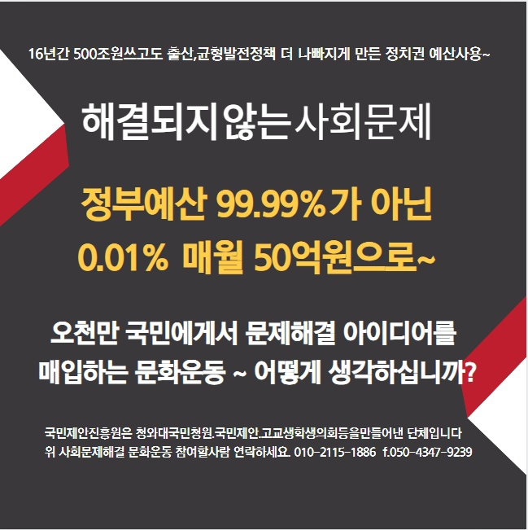
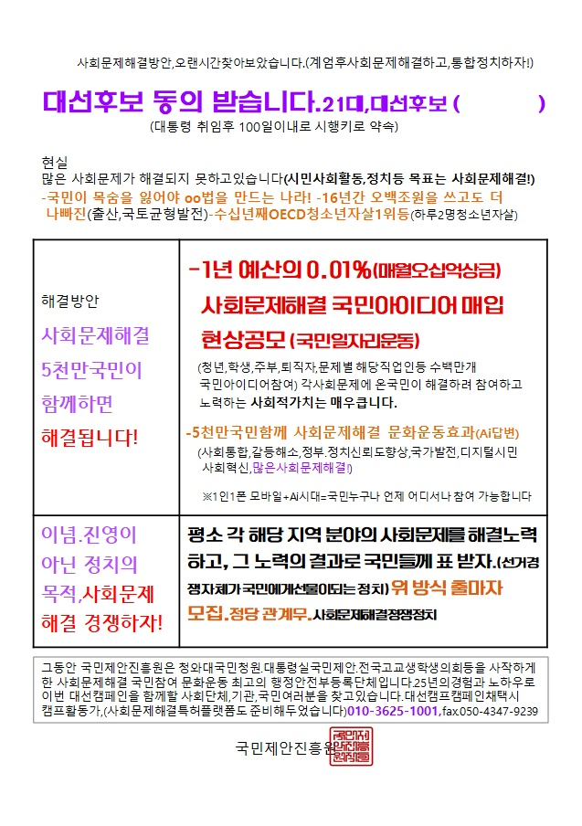
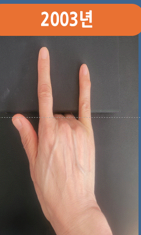
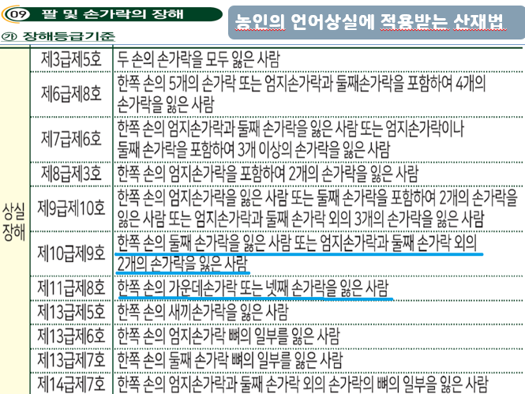
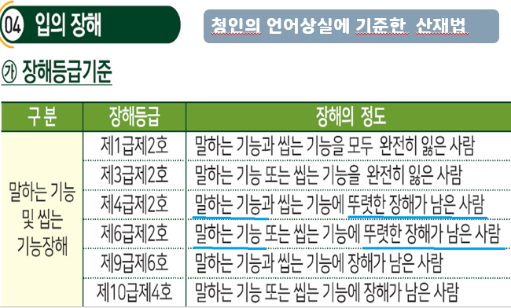
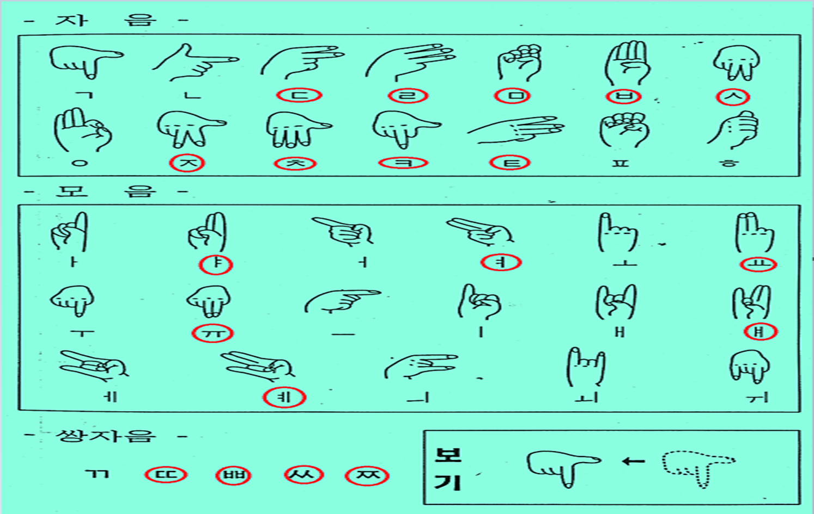
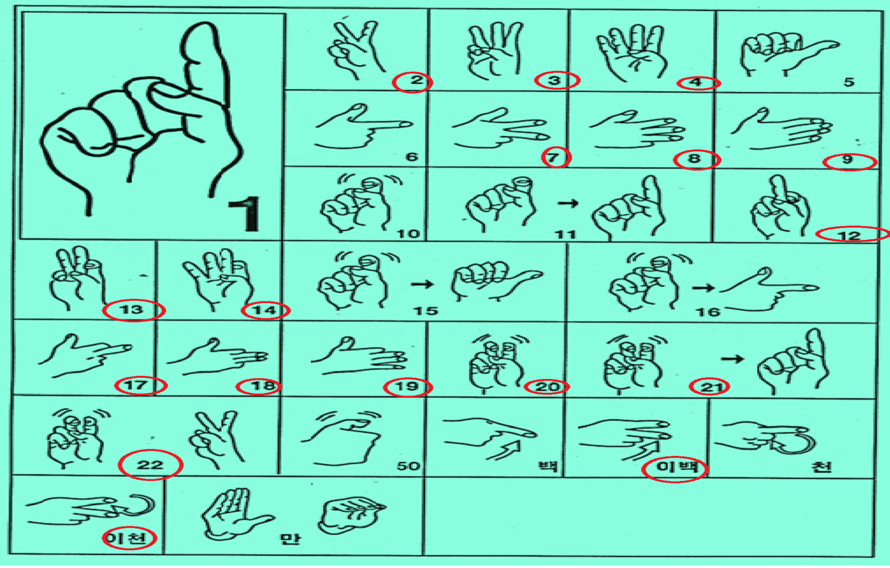

## 문서번호: 4601

### 제목: [낀 세대를 아시나요](https://q4all.kr/redirect/detail/8acad096-00bb-4acc-a301-00743b134a8f)

**작성자:** [이대송](https://q4all.kr/user/profile/4448)
**작성일:** 2025-02-25 03:39:22 (화요일)

---

대한민국의 산업화,민주화,선진화를 함께 했으면서도 한번도 주인공 또는 주역 아니면 노력과 힘씀의 결과물을 가져보지 못하고 이제 뒤로 물러가야는 66 ~ 69년생들 입니다. 이들을 위한 마지막 배려 정년 연장, 연급제도변경 필요합니다.

---

## 문서번호: 4602

### 제목: [법원 재판시 한명의 판사가 판결을 결정하지 말고 3명 이상의 판사가 판경하면 안되나요?](https://q4all.kr/redirect/detail/c437b15a-b9e8-4f84-b472-61c910a5dbf5)

**작성자:** [김윤](https://q4all.kr/user/profile/3569)
**작성일:** 2025-02-25 03:50:29 (화요일)

---

법원 재판시 한명의 판사가 판결을 결정하지 말고 3명 이상의 판사가 판결하면 안되나요?

가끔 비리 판사로 인해 억울하게 판결이 나는 경우가 있는데, 물론 3번의 기회가 있다고는 하지만 3번 모두 비리 판사가 판결하는 경우가 발생 할 수도 있을 수도 있다고 봅니다.

검찰의 억울한 조작 기소도 문제지만, 판사의 비리로 인해 말도안되는 판결이 있을경우도 발생 할 수 있는데, 그걸 조금은 견재 할 수 있는 방안이 만들어지면 좋겠습니다.

---

## 문서번호: 4603

### 제목: [청년들의 시골살이 도전이 좀 더 쉬워질 수는 없을까요?](https://q4all.kr/redirect/detail/94fd1011-c7a1-4893-a366-b451fac2f1ef)

**작성자:** [박 지민](https://q4all.kr/user/profile/6790)
**작성일:** 2025-02-25 04:35:31 (화요일)

---

저는 부동산 투자 이런 것엔 관심이 없고, 언젠간 꼭 자연에 둘러싸인 시골, 마당이 있는 내 집에서 살고 싶다는 꿈이 있습니다.

그런데 외지인으로서는 지방에서 삶의 터전을 새로 마련하기가 녹록치 않다는 말을 많이 들어 걱정이 앞섭니다.

도시와 확연히 비교되는 인프라의 부족도 문제이지만, 주민분들의 텃세나, 물길, 도로 등으로 인한 분쟁이 많이 일어난다고 합니다.

어른 분들께 살갑게 대하기 위한 노력을 해야 한다거나, 운좋게 맘씨 좋은 주민분들을 만나길 바라는 것이 아닌, 제도적으로 청년이 시골살이에 좀 더 쉽게 접근할 방법은 없을까요?

또한, 지역 활성화를 위한 제도적 지원이나 꼭 엄청난 발품을 팔지 않아도 믿을만한 땅, 집에 대한 정보도 좀 더 접근성이 확대될 수 있다면 좋겠습니다.

---

## 문서번호: 4604

### 제목: [우유곽 수거함 따로 둡시다](https://q4all.kr/redirect/detail/f761c2c5-884e-40fa-8447-86e585387474)

**작성자:** [임강빈](https://q4all.kr/user/profile/6795)
**작성일:** 2025-02-25 07:38:11 (화요일)

---

우유곽 수거율이 15%가 안돼 막대한 수입비용이 발생합니다. 수거함을 추가하든지, 주2회 지자체 및 시민봉사단이 놀이터 등 지역거점순회 방식으로 수거하든지 해서 국부유출 막읍시다.

---

## 문서번호: 4605

### 제목: [고려시대까지의 영토 및 위치를 함부로 비정하는 반도사관 삼가야](https://q4all.kr/redirect/detail/42d26616-7309-454a-a275-2bfc327db4f6)

**작성자:** [임강빈](https://q4all.kr/user/profile/6795)
**작성일:** 2025-02-25 07:48:09 (화요일)

---

식민주의 반도사학자들이 역사관련 국책기관에서 함부로 우리 중세 이전 역사를 한반도에 가두는 행태를일삼고 있다. 우리의 강역을 축소한다. 다수설에 불과함을 인정하고, 소수의견도 두루 실어서 가르치라. 백제 수도가 충남에 있었음을 명확히 대보아라. 경주 고분들에 왕족의 묘비석이 나왔는가. 고려 개경이 과연 어디인지 논의하라. 중국사서들과 교차검증하라. 간척도 되기 전 좁디좁고 육지와 멀지 않은 강화도에서 몽고로부터 사십년을 버틴걸 설득해보라. 제발 함부로 비정하지 마라. 국민을 바보취급하지 마라.

---

## 문서번호: 4606

### 제목: [명절 시기를 뒤로 늦춥시다](https://q4all.kr/redirect/detail/cef63911-938b-448d-8385-5636cb409eba)

**작성자:** [임강빈](https://q4all.kr/user/profile/6795)
**작성일:** 2025-02-25 07:53:31 (화요일)

---

설에는 자칫 폭설에다 너무 춥고, 추석은 폭염으로 고생하기 쉽습니다. 설익은 과일 투성이고요. 해서 대보름 시기와 10월 중순으로 늦춥시다. 농어민을 위해서도 좋지요.

---

## 문서번호: 4607

### 제목: [참다운 교육자를 교육할수 있는 방법 이나 시스템은 어떻게 구축해야 할까요?](https://q4all.kr/redirect/detail/4c34552b-16d0-4162-983d-3ef7f85191fe)

**작성자:** [이승호](https://q4all.kr/user/profile/6794)
**작성일:** 2025-02-25 07:57:09 (화요일)

---

안녕하세요 좋은 공간을 마련해 주심에 감사드립니다.

제가 질문할 내용은

**참다운 올바른 교육자를 교육할수 있는 방법이나 시스템은 어떻게 구축해야 올바른 교육자를**

**양성할수 있을까요?** 입니다.

현제 우리가 사는 사회에서 최종 최고의 합의점을 도출할수 있는 사회적 제도는 정치 입니다.

정치가 올바를 경우에만 사회적 공동체가 행복을 느낄수 있습니다

그럼 올바를 정치를 하기위한 사회적 인원은 어떻게 만들어 질까요?

이는 교육이라고 생각합니다.

사회는 결국 사람들이 공동으로 살아가는 공간이고 올바른 사람이 모여 올바른 생각과 행동을

했을때 행복한 사회가 만들어 집니다.

시작은 교육이고 끝은 정치라고 생각합니다.

저는 교육은 크게 2가지 교육이 있다고 생각합니다. 첫째 가정교육 과 둘째 사회적 교육 입니다

첫번째 가정교육을 사회적으로 간섭하기에는 큰 무리가 있습니다. 각 가정의 사정이 다르며, 살아온

역사의 길이 모두 다르기때문에 이를 사회적으로 개선하거나 통제할수는 없을 것입니다.

하지만 둘째 사회적 교육은 관심과 제도를 통해 충분히 교육의 질을 높일수 있습니다.

그렇다면 사회적 교육은 누가 하는걸까요? 결국은 교육자가 하는 것입니다. 좋은 교육자가

많을수록 좋은 교육을 할수 있을것입니다.

또한 좋은 교육자에게 올바른 교육을 받은 사람은 집에가서 좋은 가정교육을 시행할수도 있습니다

선순환인것이지요 , 좋은교육자또한 집에서도 좋은 가정교육자 입니다.

현재 우리나라의 교육은 입시위주, 성적 위주의 교육입니다. 인성/사회/철학/역사 등 수많은 중요교육을

놓치고 가고 있습니다.( 그렇기때문 정치적 문제도 발생한다고 생각됩니다)

선생님들 부터 교육의 중요성을 느낄수 있도록 교육하고 , 올바른 교육을 할수 있는 역량이 길러저야만

놓치고 있는 중요한 교육 요소를 보완할수 있을 것 입니다.

더욱이 인공지능의 시대가 도래하며 , 인간으로서 갖추어야 여러 요소들의 교육은 더욱이 중요해져 갑니다.

그렇다면 그 방법은 무엇일까요?

어렵지 않다고 생각합니다. 먼저 선진국들도 이와 같은 많은 고민을 했을테니까요

그들이 수많은 시행착오를 통해 개선하고 발전시킨 교육자의 교육방법들을 카피하면 좋을꺼 같습니다.

다만 정치에서 관심을 가지고 정책적으로 틀을 마련해 주어야 가능하겠지요

결론입니다

정치하시는분들이 관심을 가지고 좋은 정책으로 국민들이 교육의 중요성을 알수있도록 하고

훌륭한 교육자가 양성되어 자라는 우리 아이들이 올바른 교육을 받을수 있도록 도와주세요

---

## 문서번호: 4608

### 제목: [모두이 질문Q는 왜 꼭 실명으로 작성해야 하는 걸까요?](https://q4all.kr/redirect/detail/5b1132cc-95ad-4da0-a5aa-08bed2d31dd3)

**작성자:** [이종경](https://q4all.kr/user/profile/383)
**작성일:** 2025-02-25 08:01:57 (화요일)

---

실명확인이야 가입할 때 이미 충분히 확인 가능할 것 같은데

닉네임이나 아니면 민주-개인고유번호 부여식이면 안 될까요?

일테면 민주-1234567

뭐 이런 식으로

또는 모두-1234567

이런 식으로

닉네임이나 저런 식이면 훨씬 더 질문을 편하고 자유롭게 할 수 있지 않은가 싶기도 한데

닉네임의 창의성(?) 보는 맛도 있지 않나 싶기도 하고

문득 질문 올려지기가 왜 조금 꺼려지지 싶었는데(물론, 그래도 몇 개 올렸습니다만) 그게 실명이 고대로 노출되기 때문이 아닌가 싶기도 합니다

아닐래나요?

---

## 문서번호: 4609

### 제목: [다수 (예비)유권자의 지지 받는 이들이 의회에 들어가야](https://q4all.kr/redirect/detail/8d9d0984-908f-4ed2-a559-3cc846648827)

**작성자:** [임강빈](https://q4all.kr/user/profile/6795)
**작성일:** 2025-02-25 08:04:25 (화요일)

---

함량미달의 극단적 국회 구성원을 언제까지 지켜봐야 하나요. 지역주의에 기대어 당선돼 자신의 고인물 같은 극렬지지층만 신경쓰면 되니, 막무가내이고 국익이나 국격이나 국민행복을 저해하지요.

국회 구성원수를 240명 수준으로 줄이고, 2년마다 또는 국민소환제로 비호감 의원을 걸러내는 선거 또는 장치가 필요합니다.

---

## 문서번호: 4610

### 제목: [대학교육이 다양성과 창의성을 존중하는 미래사회를 위한 성숙한 시민으로 길러내고 있는 가?](https://q4all.kr/redirect/detail/78bbc8e1-c2b4-445e-8b39-02536f4e5f3c)

**작성자:** [신홍섭](https://q4all.kr/user/profile/6053)
**작성일:** 2025-02-25 08:14:05 (화요일)

---

대학의 일방적 주입식 교육을 대학은 부끄러워해야 한다. 대학교육이 다양성과 창의성을 존중하는 미래사회를 위한 성숙한 시민으로 길러내고 있는 가 하는 교육의 본질적인 질문에 대학은 침묵하고 있다. 변화가 없는 교화 위주의 대학 교육 현장에서 학생들의 자율적 판단을 무시하고 창의적 주체가 되지 못하는 교육에 대하여 대학은 여전히 책임을 회피하고 있다. 대학은 진정으로 바뀌어야 한다. 대학의 수업이 미래사회를 대비하는 방향으로 변화하여야 할 것이다. 교수 중심의 일방적 학과목 위주 수업에서 탈피하여 학생들의 직무능력 위주의 교과과정 재편성의 새로운 교육 시스템으로 전환되어야 할 것이다. 캠퍼스의 벽을 허물고 사회와 산업체와 함께하는 대학교육의 새로운 패러다임의 변화를 추구하여야 할 것이다.

대학의 인재 양성의 목표를 재설정하여야 할 것이다. 학생들에게 다양한 사회집단과 산업체 속에서 경험할 수 있는 기회를 다양하게 열어주어서 창의적 인재로 미래사회를 위한 자기 발전의 기회를 가지게 하여야 한다. 창의성과 다양성을 존중하며 관용을 베풀 수 있는 능력과 그에 필요한 자세를 키워내는 새로운 교육 방법과 환경 제공에 대학이 더 이상 침묵하고 있어서는 미래가 없는 것이다. 다양한 의견이 반영되어야 하는 토론 문화를 교실 속에서부터 실행하여야 할 것이다. 토론 과정 중에서 논쟁 중인 주제는 다양한 현실과 입장이 드러나도록 해야 한다. 학생들의 자율적 판단을 중시하는 성숙한 토론 문화가 교실 현장에서 존중되어야 할 것이다. 학생들의 상황과 이해 관계를 고려해 스스로 성숙한 시민적 역량을 기르도록 대학은 이념과 정파를 뛰어넘는 교육을 제공하지 못하고 있는 데 대하여 대학은 부끄러워해야 한다.

대학의 교육 방식이 선도적으로 바뀌어 갈 때 초등교육부터 중등교육 그리고 국가 전체 교육 시스템이 바뀌게 될 것이다. 학생들에게 사회의 이해와 사회적 약자에 대한 배려심도 키워주어야 할 것이다. 손해를 당한 이들에게 우선권을 줄 줄도 아는 자세를 가질 수 있는 성숙한 인재로 키우지 못하는 현 대학교육에 대학은 반성하여야 할 것이다. 남의 생각을 주입하고 있는 것을 넘어서서 내 생각을 꺼내는 능력을 자기 주도의 다양한 학습 경로인 사회와 산업과의 만남의 과정에서 스스로 형성해 주지 못하는 현실을 대학은 안타까워해야 한다. 갈등의 사회적 기능을 인식하는 능력과 성숙한 토론 문화와 함께 갈등의 해결에 참여하려는 자세를 키우지 못하고 있다.

다양한 사회집단에 소속되어 함께 어려움을 이겨내고 자기 발전과 함께 관용을 베풀 수 있는 인재로 키워내지 못하는 대학은 부끄러워해야 한다. 학과목 위주의 교육 방식에서 벗어나 다양성과 창의적 직무능력 양성이라는 대학교육 패러다임의 변화를 요구하고 있는 것이다. 미래사회를 위한 성숙한 시민을 길러내야 하고 창의적이고 다양성을 존중하는 성숙한 시민이 얼마나 있는가 하는 대학교육의 본질적인 질문에 대학은 침묵하고 있다. 대학은 부끄러워해야 한다.

 

###### Reference & Endnotes: [https://blog.naver.com/schooltoworkkorea](https://blog.naver.com/schooltoworkkorea/)

---

## 문서번호: 4611

### 제목: [죽음과 애도에 웬 돈이 그렇게 많이 드나요 (장례 비용 상식화에 대해)](https://q4all.kr/redirect/detail/5ad02fc0-7900-4c92-8283-5a077f9b2f2c)

**작성자:** [김재호](https://q4all.kr/user/profile/4349)
**작성일:** 2025-02-25 08:15:56 (화요일)

---

급한 사람들 등쳐먹으며 장사하는 사람들이 한 둘이 아니지만,

장례비용에 대해서는 정말이지 해도해도 너무 하는 일이 많다고 이야기를 많이 듣습니다.

최근 인터넷에서 본 글에 의하면

* 상복 대여 비용이 남자 5만, 여자 3만
* 음식 도우미 아주머니 일당은 14만원
* 음식을 포함한 2박 3일 장례식장 비용이 600만

버스 대절, 화장 비용, 입관비, 유품 정리, 위패 사진 등 부대 비용까지 다 더하면 대략 1200만원 정도가 들었다는 이야기였습니다.

심지어 기독교 식으로 매우 간소하게 진행한 것이 이 정도 들었다는 것이지요.

댓글에도 장례식에 3일만에 수천만원이 그냥 깨진다는 이야기가 수두룩하게 달립니다.

이게 맞습니까? 이게 상식입니까?

소중한 가족을 어떻게든 잘 모시려고 하는 가족들의 마음을 볼모로

일반적인 비용보다도 몇 배는 비싼 비용을 돌아가신 고인을 욕보일거냐는 협박아닌 협박으로 관철시키는 이런 관행이 언제까지 계속 될 것인지요.

공공 장례 시설들이 더 늘어나서, 상식적인 선의 가격으로 서비스를 제공하는 등의 시장 가격을 억제하는 방법들을 고민해봐야 하지 않을까요.

---

## 문서번호: 4612

### 제목: [시청권 보장에 관련하여](https://q4all.kr/redirect/detail/5b6ea311-2d2d-4a77-9d6d-60df5cc1c2fc)

**작성자:** [민하기](https://q4all.kr/user/profile/4675)
**작성일:** 2025-02-25 08:17:06 (화요일)

---

전남화순 능주 지역에 KBS방송만 나오고 있습니다.

그 이유는 시골에 사는 사람은 유선비용을 아끼느라 무료로 시청할수 있는 안테나를 설치하여 방송을 보는데 MBC SBS JTBC 시청이 되지 않구요

편파적인 KBS 방송만 나오고 있으므로 주민들이 쇠뇌되어 민주당을 미워하고 있고 이재명 대표님을 싫어하고 있습니다.

따라서 시골에 모든 주민이 똑같이 시청할 수 있도록 시청권 보장을 위해 해당 지역에서 모든 지상파 방송을 정상적으로 수신할 수 있도록 해주십시요.

2025.02.25.

석담 민하기

---

## 문서번호: 4613

### 제목: [대학 스스로 포기한 교육평가 시스템의 복원이 가능한 것인가?](https://q4all.kr/redirect/detail/46baf3bb-1cce-49e2-a51b-e1ab9837a4ea)

**작성자:** [신홍섭](https://q4all.kr/user/profile/6053)
**작성일:** 2025-02-25 08:19:04 (화요일)

---

교육 목표와 교육 평가가 일치하지 않고 있는 현행의 교육 방식을 대학은 부끄러워해야 한다. 국가와 기업이 공동으로 개인의 역량과 자격제도를 검정하고 제공하는 시스템인 국가역량체계 시스템을 제공하여야 한다. 미래 지향적인 다양성과 창의성으로 개인의 학습 결과를 국가가 인정하고 교육품질관리와 산업체 현장 경력을 인정하는 시스템을 국가역량체계 검정위원회(가칭) 설립으로 교육의 품질보증 체제를 갖추어야 한다.

대학교육의 평가 시스템은 단 한차례도 변화하지 않고 과거의 평가 시스템을 그대로 답습하고 있다. 학생 스스로 자율성과 비판적 이성으로 학문의 발전에 기여할 수 있는 학습권의 기회를 박탈하고 있었다는 점에 대학은 침묵하고 있다. 대학 스스로 교육품질관리 체계를 포기하고 있다는 의심을 지울 수가 없다.

 

대학 스스로 창의성을 포기한 평가 시스템에 부끄러워해야 한다. 학생들이 더 수용적으로 교수의 편향된 학습에 수동적으로 따를수록 학점이 높아지고 창의적일수록 학점이 낮아진다는 지적도 있는 것이다. 학생 스스로 생각하고 판단할 수 있는 자기 주도 학습능력을 평가해야 한다는 주장이 있다. 최종적인 평가 시스템이 교육의 목표와 방법과 과정이 충실하게 적용될 수 있는 시스템이 요구되는 것이다. 어떤 종류의 직무 능력을 우수하게 평가할 것인지에 대한 평가 기록과 평가의 근거를 기록하고 증거를 수집하는 시스템과 패러다임이 바뀌어야 할 것이다. 대학의 상대 평가 시스템 역시 대학 스스로 교수권과 평가권을 포기한 기이한 역사를 만들었다는데 대한 반성 없이 대학 사회는 침묵하고 있어 왔다.

 

대학교육의 품질관리 패러다임의 변화를 촉구하고 있는 것이다. 현행 대학교육의 학과목 위주 교과 편성의 교육과정 설정을 개인의 능력과 직무능력 향상이라는 교육 목표를 우선하는 사회 및 산업체 기반 교육과정 설정으로 변화되어야 할 것이다. 국가가 정한 대학교육 목표와 평가가 서로 다른 차이를 모니터링하는 시스템인 국가역량체계(NQF) 검정위원회(가칭) 교육품질관리 인증 시스템으로 목표 설정에 부합하는 교육평가와 교육 목표를 완성시켜야 할 것이다. 교육과정의 목표대로 설정하고 그 설정대로 평가하지 않고 있는 실정에 대하여 대학은 부끄러워해야 한다. 부적격 자격 소지자들의 양산을 국가역량체계(NQF) 검정위원회(가칭) 시스템으로 검정하는 교육의 품질보증과 함께 개인의 경력인증 시스템을 국가가 제시하지 못하고 있는 것이다.

 

대학은 미래의 인재를 양성하는 작은 국가인 것이다. 대학의 모든 구성원들이 자기가 수행하고 있는 과제를 대학의 목적과 미션에 충실하여야 할 것이다. 오로지 대학이 추구해야 할 한 가지 방향으로 대학 구성원들의 연구와 열정을 대학의 미션에 충실하여야 하는 것이다. 교육 목표와 평가 시스템을 연계시키는 것을 제도적으로 사회가 인정하고 더 나아가 개인의 경력 인증 역시 쉐도우 칼리지 (Shadow College) 시스템 개발로 개인의 다양한 학문 연구 영역과 평생교육 과정 등의 각종 자격, 인증 및 수료 프로그램들을 학점 연계 사전학습평가 (Prior Learning Assessment) 제도로 구제하여 경력인증 학위 인증 시스템으로 발전시켜야 할 것이다.

 

미래사회를 위한 빅데이터 기반의 학습경로를 구축해야 할 것이다. 디지털의 속성을 활용한 수업 제공과 빅데이터 기반의 학습 결손을 보완해 주는 비 대면 수업의 대학의 지원을 충실하게 고려하여야 할 것이다. 온라인과 오프라인을 상시적으로 사용할 수 있는 새로운 교육환경과 사회 및 산업체 기반 절대 평가 시스템을 구축해야 한다. 대학의 교육 목표와 방법이 교육 평가와 일치되는 제도를 추구하지 않고 있는 데 대하여 대학은 침묵하고 있다. 대학은 부끄러워해야 한다.

 

정부가 국가역량체계 (NQF National Qualification Framework) 확립으로 교육과 훈련 결과의 품질 보장과 일관성, 이동성 보장 체제로 자격 명칭과 인증 기준 및 자격 연계 기준을 확립하여 시행할 수 있어야 할 것이다. 정부가 산업체 협의에 따라 국가직무능력표준 (NCS National Competence Standards)으로 산업 현장에서 근로자가 소임을 다하기 위하여 갖추어야 할 지식과 기술을 국가가 표준화하여 훈련 팩키지 (TP Training Package) 승인 절차를 거쳐 평가기준의 현장성 확보를 유도하여야 한다. 국가역량체계(NQF)는 국가직무능력표준(NCS)을 바탕으로 학력, 자격, 현장경력 및 교육훈련 이수 결과 등이 상호 연계되고, 국가 차원에서 국가직무능력표준을 기반으로 등가성을 제시하는 수준체계로 정의될 수 있다. 국가역량체계를 통해 개인이 가진 다양한 직무능력을 수준별로 공정하게 평가하고 인정하는 체계로서, 국가역량체계 검정위원회(가칭)의 주요 활동은 교육계에서의 공정거래위원회 역할체로서 국가의 모든 교육 시설의 교육품질관리와 거버넌스를 실시하여 교육개혁을 주도하게 된다

 

###### Reference & Endnotes: <https://blog.naver.com/schooltoworkkorea>

---

## 문서번호: 4614

### 제목: [대학교육 품질보장체계를 새로이 혁신할 수 있는가?](https://q4all.kr/redirect/detail/904d7ff7-72f4-4f58-9da2-3fa6c5167aa3)

**작성자:** [신홍섭](https://q4all.kr/user/profile/6053)
**작성일:** 2025-02-25 08:28:10 (화요일)

---

대학교육 품질보장체계를 새로이 혁신하여야 한다는 절대적인 명제에 대학은 침묵하고 있다. 대학교육 품질관리 강화 정책으로 한국의 교육의 미래를 기업과 공유하고 국민에게 열린 교육 기회를 제공해주어야 하는 절대적 사명감에 대학은 침묵하고 있다. 대학 재단의 공공성 확보를 위한 노력을 모든 대학 재단에 공동으로 적용할 수 있는 엄격하고 투명한 교육품질 보장체계를 새로이 혁신하여야 한다.

 

대학교육 품질관리를 위한 국가역량체계(NQF)를 확립하고 실행 평가할 수 있는 국가 기구인 국가역량체계 검정위원회(가칭)의 보편적인 보장체계 적용이 가능하여야 한다. 교육기관과 프로그램에 대한 질 인증 문제가 국제적 수준에서 이루어진다는 점에서 공공성 확보는 절대적이며, 산업분야에서의 인증 등과 같이 국제적으로 공인될 수 있는 교육 품질 인증체제의 도입이 절실하다 할 것인 데 대학은 침묵하고 있다.

 

대학교육 품질관리 활동 수준의 국가역량체계 검정위원회(가칭)의 국가적이고 보편적인 보장체계 (QAS: Quality Assurance System) 적용이 가능하여야 한다. 대학재정지원 체제의 개편과 함께 상시적인 감시체계를 개발 시행해야 한다. 또한, 사학 운영자의 투자 부족과 비합리적인 재정 운영도 개선되어야 한다. 정치권과 교육당국은 결과적으로 사학의 민주적인 교육가치 실현보다 비리 사학의 사적 권리 보호에 치중해온 게 사실이라는 주장도 있다. 정부는 사학혁신위 역할을 넘어서 국가역량체계(NQF) 검정위원회(가칭) 설치로 대학교육 품질관리 강화 정책을 제시하여야 한다. 건전 사학은 지원을 강화하되 비리 대학은 원칙에 따라 입학정원 회수 등 처벌을 강화해야 한다. 자율성을 보장해주고 자체적인 교육품질관리 실천으로 학생들의 학습권을 보장하고 대학을 바로 세울 수 있는 길이 될 것이다.

 

고등교육 재정의 안정적 확보와 재정지원 체재 개편을 통해서 대학의 재정 충족성과 성장성을 확보해야 한다. 수요자인 국민의 입장에서 보면 국민의 세금으로 대학에 재정을 지원하고 게다가 국민들에게 등록금을 요구하는 대학을 바라보는 시각을 이해할 수 있겠는 가? 정부의 대학 재정 지원의 재검토를 넘어서 대학의 재정 자립도 성취를 위한 방안을 개별 대학들에게는 과연 있는 지 물어보아야 한다. 

 

사학운영자의 투자 부족과 비합리적 재정운영 문제의 긍정적인 해결 방안을 모색해야 한다. 대학의 등록금 의존도가 높은 반면에 재단 전입금 비율이 현저히 낮다는 데에 문제의 심각성이 있다. 예산 편성부터 등록금의 적립금화 금지 등의 다각적이고 합리적인 대학의 재정운영 정책과 이를 철저하게 감시하는 규제 정책이 요구된다. 대학의 교육품질관리를 통한 교육 거버넌스 확립을 위한 노력이 우선되어야 한다.

 

경쟁이 아닌 협력과 상생을 강조하며 다양성과 창의성의 개성을 존중하는 교육을 통해 인성과 실력을 겸비한 인재를 키워내는 교육 현장의 환경 조성에 앞장서야 할 것이다. 대학의 재단 운영과 재정상태 및 교육과 학사관리에 이르기까지 대학 공동체 협업 체계를 대학교육 품질관리 계획과 함께 학생, 학부모 모두에게 공지하고 실천하여야 한다. 정부와 산업체는 대학 스스로 개혁을 통한 변화를 이끌도록 도와주어야 한다. 국가역량체계(NQF) 검정위원회(가칭) 설치로 대학교육 품질관리 강화 정책으로 한국의 교육의 미래를 기업과 공유하고 국민에게 열린 교육 기회를 제공해주어야 하는 절대적 사명감에 대학은 침묵하고 있다. 대학은 부끄러워해야 한다.

 

###### Reference & Endnotes: <https://blog.naver.com/schooltoworkkorea>

---

## 문서번호: 4615

### 제목: [국회 의원 숫자 인구와 사회 변화에 맞게 늘이면 안되나요?](https://q4all.kr/redirect/detail/2e542228-5853-47d7-b1dd-f15f5d480f94)

**작성자:** [도완영](https://q4all.kr/user/profile/892)
**작성일:** 2025-02-25 08:51:54 (화요일)

---

지난 총선 전의 선거법 개정의 문제는 결국 의석이 작아서

문제였습니다.현재 300명은 우리나라 인구 숫자보다

많이 작다고 합니다. 대략 600명이나 700명 정도가

세계적 기준으로 맞다고 합니다.

어떤 나라는 우리나라보다 인구가 많이 작은데도

1000명이 넘는 나라도 있다고 합니다.

그리고 사회의 직업군과 계층별로 제대로 각 대표자들이

국회에 와 있냐고 하면 그렇지 않습니다.

그 직업에 속하지도 않았던 사람이 그 직업의 어려움을

알수도 없고 버스타고 지하철 타고 다니지 않는 사람이

그 계층의 어려움을 알수 없습니다.

또 같은 직업이라도 수도권과 지방과 어려움은 다를수

있습니다.

국회가 국민을 제대로 대변하지 못하는 이유는 이런면도

있다고 생각합니다.

매번 여론 조사해서 국민 여론에 반대가 심해서 늘일수

없다고 하는데 그 여론조사할때 질문 문항 설계할때

이런점을 설명하고 질문해도 같은 결과가 나왔을까요?

예를 들어 농민들이나 어민들에게 300명이어서 당신들의

대표자가 없다.당신들의 대표자가 있어야 해서 숫자를 늘여야

한다면 반대할까요?각 직업군에게 그런식으로 묻는다면 반대가

지금 같을까 싶습니다.

지금의 300명은 그 숫자가 정해질때 시대를 반영해서 만들어진

거라고 생각합니다.시대와 사회환경이 바뀌었는데 왜 이전시대의

기준에 맞는 300명에 맞춰야 하나요?

왜 변호사,기자들이 우리를 대표해야 하나요?

혹시 기자들이 변호사들이 자신들의 이권인 자신들의 몫일

의석자리 지키기 위해 일부러 국회의석수 혐오를 가스라이팅

해두고 있는게 아닌가 의심도 듭니다.

국회는 시대와 사회변화에 맞는 의석수를 두는게 맞지 않을까요?

---

## 문서번호: 4616

### 제목: [의료체계 정상화를 위한 고민과 합의가 필요하다 생각합니다.](https://q4all.kr/redirect/detail/8e587708-7a18-47a6-8cee-306c0d083bd7)

**작성자:** [장현수](https://q4all.kr/user/profile/6797)
**작성일:** 2025-02-25 08:56:12 (화요일)

---

안녕하세요.

현재 매체를 보면 의료체계 및 의료교육체계의 혼란은 계속 되고 있습니다.

아직도 집에 누가 크게 아플까 걱정이 됩니다.

확실한 건 계엄 이후로 국민의 생명이 걸린 이 문제가 수면 밑으로 가라앉았습니다.

회복을 위해서는 이권에 대한 조정도 필요하겠지만 어제 이재명 대표님이 삼프로에 나와서 얘기한 것처럼 제3자 앞에서 서로 토론해서 모아가는 과정을 빨리 시작해야한다고 생각합니다.

국민도 불안하지만 당사자들도 불안할 것이기 때문입니다.

불안을 없에고 신뢰를 쌓는 과정을 빨리 시작했으면 하고 정치권에서 이를 계속 언급해주시는게 필요하다 생각됩니다.

---

## 문서번호: 4617

### 제목: [■양자화폐, 국회 세미나 개최](https://q4all.kr/redirect/detail/75674061-1839-4f92-bfec-b76a07ec1426)

**작성자:** [이해진](https://q4all.kr/user/profile/4850)
**작성일:** 2025-02-25 09:11:07 (화요일)

---

하루하루가 전쟁터 같은 대한민국의 국정 상황에서 여야를 떠나 그래도 300명 국회의원의 존재 자체가 분명히 이 나라의 민주주의와 자본주의의 지속 가능함을 상징한다고 하겠습니다.

300이라는 숫자를 볼 때마다 영화 300이 생각납니다. 스파르타의 왕 레오니다스와 300명의 스파르타 전사, 페르시아의 왕 크세르크세스와 그의 100만 대군 간의 테르모필레 전투 말이지요. 그만큼 300명 국회의원은 너무나 소중한 국가 자산이라는 의미입니다.

현실에서 300이라는 숫자가 100만 대군을 이기는 방법은 딱 하나 있습니다. 100만 대군이 칼과 창으로 전투에 임할 때 300은 스나이더 소총과 기관포 및 야포로 무장하면 됩니다. 마치 동학농민혁명의 우금치 전투의 비극처럼 말이지요. 입지가 어디든 때가 어느 때든 월등한 수단이 전제되면 시공간은 제약이 되지 않습니다.

작금의 대한민국뿐만 아니라 전 세계 경제 전투에서 마치 위와 같은 상황을 연출할 수 있는 기제(수단)가 이미 완성되었고 2025년 1월 1일을 기점으로 출발합니다. 바로 양자화폐입니다. 100만 종이화폐가 몰려와도 300의 양자화폐로 능히 물리칠 수 있습니다. 300>1,000,000이 될 수 있습니다. 이에 관한 글을 국회 국민제안 게시판에 벌써 100여 차례 올렸고, 국회의장 앞으로 여러 차례의 내용증명 우편도 발송한 바 있습니다. 하지만 뚜렷한 답변이 없어 다시 한번 민원을 제기합니다.

양자화폐 국회 세미나 또는 공청회 개최를 요구합니다. 여야 의원 27명이 참여하는 「대한민국 전환과 미래 포럼 」같은 모임도 있는 것으로 압니다. 엉뚱한 데서 대한민국의 전환과 미래를 찾지 마십시오. 시간 낭비입니다. 지난 8월 동 포럼의 창립 대회에서 한국은행 총재의 기조 강연이 이었습니다. 그 강연으로 대한민국이 전환과 미래가 보였습니까? 재조산하를 할 만한 가치 있는 강연이었습니까? 신문 지상을 통해 본 내용으로는 그저 국민 불안만 가중시키는 현실 진단과 암울한 미래 진단이 전부 다였습니다.

한은 총재는 “우리 경제의 구조 개혁이 없을 경우 20~30년 후 잠재성장률이 0으로 추락하고, 모두를 만족시키는 구조개혁은 불가능하다며 정치권의 역할이 중요하다.”고 당부한 것으로 언론은 보도하였습니다. 역시나 진단, 그것도 대책 없는 국민의 고통과 동의어인 구조개혁이라는 단어 이외에는 아무런 해법을 제시하지 못하고 그것도 정치권에 떠넘기면서 말이지요. 도대체 창의적 발상은 찾아볼 수 없는 10년 20년 전에도 사용한 그 단어 그 문구의 뻔한 Cliché 말고는 할 말이 없는 가 봅니다.

**▶한은 총재의 말은 틀렸습니다. 세상은 넓고 인재는 많습니다. 天外天입니다. 하늘 위에 또 하늘이 있습니다. 도대체 언제까지 철 지난 교과서적 이론에 갇힌 진단만 하는 소위 전문가 임 내 하는 자의 입만 쳐다볼 것입니까? 임대인과 임차인, 승자와 패자, 빈자와 부자, 남녀노소, 동과 서, 남과 북, 좌와 우, 진보와 보수, 지방과 도시, 기업과 개인 그리고 정부 우리 모두(We-All)를 만족시키는 방법이 분명히 있습니다. 양자화폐 하나면 해결이 됩니다. 양자화폐는 진실이고 사실이고 현실입니다. 이것은 법적 책임 선언입니다.**

그러니 국회에서, 대한민국 50,000,000 만 국민을 대표해서 국민의 안녕과 복지를 위해 이 한목숨 바치겠다며 수백 번 큰절하며 외침을 넘어 절규하던 小君主 총선의 결의가 진심이라면, 당연히 국민 모두의 안녕과 복지를 위하는 일이라고 고하는 21세기 율곡의 萬言奉事를 외면해서는 아니 되겠지요?

국민이 다시 한번 정중하게 예의를 다하여 요구합니다. 대한민국 22대 국회에서 300명 국회의원님을 모시고 대한민국 경제의 봄날을 맞이하게 해 줄 <양자화폐 세미나>를 개최할 수 있도록 조처를 해 주시기를 바랍니다.

▶양자화폐 세미나 개최◀

•주제 발표 ☞ 양자화폐 기획자 명경선생 김점수 •전화: 070-8228-8000(김은희 이사)

•주소: 서울특별시 강남구 학동로88길 12, 3층 306호(삼성동, 청진빌딩)

2024년 11월 26일

평산심해(平山深海) //

---

## 문서번호: 4620

### 제목: [상설특검 임명 ](https://q4all.kr/redirect/detail/789823d3-c6a9-47af-8585-4010d8512bc7)

**작성자:** [조규봉](https://q4all.kr/user/profile/6325)
**작성일:** 2025-02-25 09:27:39 (화요일)

---

상설특검은 거부권이 없는데도 불구하고 임명을 안하는 방법으로 회피하는데

법을 바꿔서 국무총리가 임명하는 형태로 바꿔야 할 겁니다 !!

---

## 문서번호: 4622

### 제목: [한국 교육은  스카이 입학을 위한  과정으로  변질됐다](https://q4all.kr/redirect/detail/1c125e58-9bed-4691-a782-e4bddb9aa442)

**작성자:** [김희정](https://q4all.kr/user/profile/6806)
**작성일:** 2025-02-25 09:46:12 (화요일)

---

대학 서열화가 있어서 그 대학 졸업장이면 대기업가고 기득권의 특권이 되는거 같습니다. 유치원부터 사교육에 매몰되고 국영수 입시 위주의 교육이 이뤄지다보니 철학과 토론의 빈곤과 상대를 억누르기위한 교육 방향이기 때문에 작금의 2030극우 청년들이 늘어나는 요인이 될수도 있다고 봅니다. 그래서 한국 교육의 혁신적인 개혁은 어떤 모습 이여야 할까요? 시대가 바뀌고 세대가 변했기에 교육도 바껴야 합니다.

---

## 문서번호: 4623

### 제목: [청년도약계좌에서 소외된 40~50대에 관해](https://q4all.kr/redirect/detail/5c24f067-a323-4d9d-a917-508971dcae24)

**작성자:** [이지영](https://q4all.kr/user/profile/6808)
**작성일:** 2025-02-25 10:47:27 (화요일)

---

저는 47세 장애인활동지원사로 일하고

이제 초 2,3 올라가는 두 자녀를 키우는 40중반을 넘어선 사람입니다.

청년 도약 계좌에 관련한 기사들을 볼때마다 40~50대는 소외가 되는거같다는 생각을 떨칠수가 없습니다.

40~50대를 위한 청년도약계좌같은 정부 지원책이 있었으면 합니다.

---

## 문서번호: 4624

### 제목: [국민과함께 국민대통합 사회 ](https://q4all.kr/redirect/detail/d2e20e96-12e2-4ae6-bb8a-51d0d45471a9)

**작성자:** [마용철](https://q4all.kr/user/profile/6814)
**작성일:** 2025-02-25 11:05:40 (화요일)

---

꼭 정치인이 아니어도
-----------

(우리사회문제를 해결하여 좋은사회를 만들수있는 수많은ai활용 청년.학생들 경력단절 주부들
-------------------------------------------------

경험의보석 퇴직자분들 또 각 직업의 종사자분들 등 등 그들의 사회문제해결대안은
-------------------------------------------

사회자원보물입니다)
----------

그것들을 꺼내 사회문제해결하여 계엄후 대한민국사회는 새출발사회로 만들어
---------------------------------------

나갑시다
----

분열과정쟁은 종식시키고 각정당도 진영도 각사회문제해결 대안으로 새로운경쟁합시다
-------------------------------------------

대안으로 싸웁시다
---------

위 새 사회문제해결 온국민함께 문화운동에 함께할 정당 대선후보 시민사회단체등 참여자연락하세요
---------------------------------------------------

(^^청년 학생 주부 퇴직자 직업 노조단체 등)삼육이오일공공일 공일공
--------------------------------------

(국민함께 국민대통합 새문화운동)
------------------

---

## 문서번호: 4625

### 제목: [안중근의사 유해를 찾아주시나요?](https://q4all.kr/redirect/detail/62cac796-f859-4018-864b-1a95ca4a4e25)

**작성자:** [임재완](https://q4all.kr/user/profile/6820)
**작성일:** 2025-02-25 11:15:44 (화요일)

---

중국에 묻혀있는 안중근 의사 유해를 왜 않찾아주시시나요요중국과 협의가 않되나요? 언제까지 방치만 하실건가요?

---

## 문서번호: 4626

### 제목: [소득이 적은 사람의 배당, 이자에 대한 세금](https://q4all.kr/redirect/detail/de56b57e-68e7-477e-a2c4-bcf99341ec65)

**작성자:** [박민규](https://q4all.kr/user/profile/6823)
**작성일:** 2025-02-25 11:35:08 (화요일)

---

안녕하세요~ 저는 40대 중반 남성입니다.

몇년전 회사에서 퇴사하게 되었는데,

일할때는 근로자라고 투명지갑이라 말하던데..

막상, 퇴사후에는 소득이 적다고

배당, 이자에 대한 세금혜택 자체가 아예 없어서 질문을 드려봅니다.

세법을 잘 몰라서 이천만원 이하의 배당, 이자소득은 아무런 세금혜택이 없어서

이게 오히려 혜택인지는 모르겠으나...

가능하다면 소득이 적은 사람에게도 배당, 이자 소득에 대한 세금혜택이 이루어 질 수 있도록

정책이 추진 될 수는 없을까요?

저의 국세청 홈텍스 문의 내용이 참고되실까 하여 남겨봅니다.

Q : 금융소득이 연간 2천만원 미만의 소득자의 종합과세 신청에 대한 문의

업무에 수고 많으십니다.

금융소득이 연간 2천만원 미만의 소득자의 종합과세 신청에 대한 문의드립니다.

기본적으로 연간 2천만원 미만은 분리과세로 납세의무가 종료되겠지만,

2023년 개인소득이 적어 금융소득(이자)의 원천징수 금액을 종합과세로 신고하여

환급신청을 하고 싶어 세금신고를 작성해 보았으나, 2천만원 미만은 원천징수가 되지 않았거나, 동일사업자 배당이 아닌경우는

해당 내용을 삭제하라는 메시지가 발생하여, 환급신청을 작성할 수 없었습니다.

혹시 금융소득이 연간 2천만원 미만도 분리과세하지 않고, 종합과세로 선택해서 세금신고가 가능한지 문의드립니다.

만약, 2천만원 미만 금융소득자는 아예 종합과세 선택이 불가능 하다면

소득세법이 다소 불합리하게 느껴져서 어디에 세법령 개정건의를 드려야 하는지도 문의 드립니다.

감사합니다.

A : 안녕하십니까? 항상 국세행정에 대한 따뜻한 관심과 협조에 깊은 감사의 말씀을 드립니다.

(종합소득세신고와 관련하여 상담민원이 급증하고 있어 좀더 신속하고 상세하게 답변을 드리지 못하는 점 널리 양해하여 주시면 감사하겠습니다.)

금융소득이 2,000만원 이하에 해당할 경우에는 분리과세로서 종결되는 것이며 2,000만원 초과시 타 소득과 합산시에도 2,000만원 이하의 금액에 대해서는 궁극적으로 분리과세 세율과 동일하게 과세되는 것입니다.(소득세법 제14조 제3항 제6호)

다만, 문의하신 경우와 사례는 매우 안타까운 상황이나 홈택스 세법상담분야의 국세상담센터는 국세에 관한 문의에 대하여 관련법령 및 해석사례를 검토하여 답변을 드리고 있는 기관으로, 불합리한 세법에 대한 개정의견은 홈택스 - 상담. 불복.고충.제보.기타 - 기타 - 세법령개정의견제출 분야에서 제출해주시면 국세청에서 개정안을 마련하여 기획재정부에 건의하고 있습니다.

♣ 답변내용이 도움이 되시기를 바라며, 항상 건강하시고, 행복이 가득하시길 기원합니다.

---

## 문서번호: 4627

### 제목: [예금금리는 계속 낮추거나 동결인데](https://q4all.kr/redirect/detail/ba1d141c-d057-410d-ab79-c0c7eda97536)

**작성자:** [박영석](https://q4all.kr/user/profile/6831)
**작성일:** 2025-02-25 11:49:22 (화요일)

---

왜 대출금리는 금리인하요구권을 사용하더라도 0.1% 인하하는 것도 힘이 드는건가요? 대출받을 수 있는 돈도 은행에서 빌려주고 예금도 은행에서 하고.. 이젠 오프라인도 아닌 온라인으로 진행하는데도 대출금리는 내리질않고 예금금리는 오르질않습니다. 중간에서 돈을 쳐먹는 인간들은 대체 누구인가요? 인건비로 빠지는 것도 아닌데 왜 이 굴레는 반복이 되어야 하는 것인가요?

---

## 문서번호: 4628

### 제목: [대학생이 수강신청이 어려워서 강의를 못 듣게 된다? ](https://q4all.kr/redirect/detail/d06fb92f-0a92-4a05-ba0c-99bc3b9ab23f)

**작성자:** [이명재](https://q4all.kr/user/profile/4666)
**작성일:** 2025-02-25 11:55:04 (화요일)

---

대학생 부모입니다. 학비가 참 부담스럽습니다. 그것도 변화하면 좋겠지만...

수강신청을 성공했다고 좋아합니다?

친구는 잘못되서 망했다고 또는 한학기를 더 다녀야 하는 경우도 있다네요.

처음 듣고는 믿지를 못했습니다. 여기가 무슨 인도입니까? 기차표는 샀는데 기차는 사람이 많아서 그냥 갑니다?

이런 문제는 금방 해결해줘야 하는것 아닐까요?

그래도 명문대학인데... 했더니 다른 유수의 대학 다니는 사촌도 마찬가지라네요.

---

## 문서번호: 4629

### 제목: [일본의 기후 위기때문에 생긴 식량 물가 위기 뉴스를 봅니다.식량 생산 기반 이대로 괜찮나요?](https://q4all.kr/redirect/detail/5f94418e-b5cb-4e65-a196-212caf20ef3a)

**작성자:** [도완영](https://q4all.kr/user/profile/892)
**작성일:** 2025-02-25 12:10:32 (화요일)

---

우리 나라는 현재 사료 등의 재료로 수입되는 부분을 제외하면

곡물 자급율이 10%대 후반으로 예측합니다.

이전 통계 자료는 몇년전 21%인가 하는 자료를 봤습니다.

이전 문재인 정부나 이재명 대표의 민주당은

협정에 의해 수입하는 의무[수입]물량을 합쳐서 쌀 자급율이

100%를 넘는데 농지를 살리기 위해서 경지면적을 줄이기 위해

대체작물을 그 자리에 심는 형태의 정책을 추진해오는 걸로 알고

있습니다.

그러나 그때와 지금은 환경이 또 다릅니다.

작년의 우리에겐 병충해로 일본에는 쌀의 수정과 결실이 안되는

형태로 기후 재난의 형태로 왔다고 알려져 있지만 우리도 쌀 포함

모든 농작물이 제대로 결실이 안된게 많았습니다.

즉 훨씬 기후 재난이 빠르게 지구적으로 와서 쌀 재배 농지를

다른 작물 농지로 바꾼걸 상황이 바뀌었다고 빠르게 쌀 재배 농지로

바꾸기 하기엔 시간이 물리적으로 힘들게 되었습니다.

기후 재난은 작년 일본과 우리에게 동시에 온것처럼

이후에는 더 넓게 올수 있는것도 예측되는 현실에서 수입 곡물 가격이

오르거나 혹은 더 위험한 상황을 상정하면 비싸게 돈 주고도 제 때

못사올수도 있게 됩니다.

올해도 4월부터 11월까지의 여름이 예고 되어 있고 이건 해마다

지구적으로 오게 되리라 생가합니다.

그리고 고령화된 농촌 사회의 고령농민들이 마지막까지

농사일에 손 놓지 않고 할수 있는 농사도 쌀 농사입니다.

급한 상황이 현실화된 현재 쌀 등 일단 곡물 농지에서 해당 농사를 지울줄

아는 농민들이 농사를 유지할수 있게 하는게 중요한 상황이 되었습니다.

그리고 곡물 창고와 유지 비용 지출 이야기 하지만 정작 작년에

같은 위기 상황에서 일본과 우리가 달랐던건 그 비용 지출해서 모은

재작년,작년 쌀 등 구곡이 있기 때문이었습니다.

국방 비용도 국가 위기를 대비해 군인들을 키우는 군부대 용지와

군인 그리고 각종 무기 재고가 있고 그를 위한 비용 지출을 당연합니다.

비유로 든 국방과 같이 기후재난이 현실화 된 현 상황에서

식량안보를 지키기 위해 오히려 쌀 등 곡물 재배면적 유지와

고령화 되고 있는 농민들과 저장 창고 등 의 유지에 오히려

이전에 없던 비용을 지출하거나 늘여야 된다고 생각합니다.

농민,어민 들은 현재 식량안보와 지방소멸을 막는 최후의 방어막

인데 고령화와 경영하기 어려워져 그 최후도 스러져 가고 있습니다.

그 상황에서 토대마저 흔들지는 마시길 바랍니다.

제 생각에는 그들에게 최저임금과 수당 그 이상의 수입이

별도로 주어져야 하는 위험 상황이라 생각합니다.

위험한 상황에서 남들 모두 안하려고 하지만 국가 위기를

지켜야 할때 그들을 국가가 고용하며 위험 수당을 주는 건

당연한데 농어민들에 대한 대우는 어떤가 보시길 바랍니다.

몇년전 상황에 쓰던 방식은 지금 맞지 않습니다.

상황이 바뀌고 위험이 현실화 되었는데 몇년전 방식을 그대로 써야 할까요?

p.s 여기 가입 위한 직업군 분류에도 농민,어민,임업인,축산업인 등이

없더군요.이게 위험이 눈 앞에 닥쳐도 잘 바뀌지 않는 우리의 현실 인식의 한 단면이라고 생각 합니다.

---

## 문서번호: 4630

### 제목: [왜 여기 직업군 분류에 농업,어업,임업,축산업은 없나요?](https://q4all.kr/redirect/detail/a5da054d-aa4a-4305-9502-3e07ed13346d)

**작성자:** [도완영](https://q4all.kr/user/profile/892)
**작성일:** 2025-02-25 12:18:09 (화요일)

---

밑에 다른 작성글에도 추신으로 달았지만 이런게

기후재난으로 인한 식량안보 위기가 눈앞에 닥쳐도

농업,어업 등 의 가치가 국방만큼 중요하고 또 그만큼

비용 지출을 하고 중요시해야 하는걸 모르고 말로만

이야기하는 우리 현실 인식의 한 단면이라고 생각합니다.

---

## 문서번호: 4631

### 제목: [전통 미풍양속의 계승발전에 관한 정책적인 해법 제시되어야 함](https://q4all.kr/redirect/detail/b386073a-c081-46da-8bbc-5af13c914328)

**작성자:** [이기식](https://q4all.kr/user/profile/6828)
**작성일:** 2025-02-25 12:32:25 (화요일)

---

1. 전통적 가치관과 미풍양속의 현황

* 건국 이념인 홍익인간 정신과 유교적 전통이념의 계승 발전 필요
* 촛불혁명의 성공은 한민족에 흐르고 있는 홍익인간의 정신과 유교적 철학(사람이 하늘이다, 인,의,예,지,신)이 융합하여 국난과 위기의 순간에 전국민을 일치된 가치관으로 뭉치게 하는 힘이 되고 있기 때문임
* 이 가치관을 체계화하여 국민이 대대손손 공유하면서 정치이념으로 공유하고 내재화할 필요가 있음

1. 문제점

* 정치지도자들이 민족적 전통적 가치관이 내재화가 결여되어 있음(개인적 이익에 천착하여 공익을 외면하고 부정부패나, 불의와 쉽게 타협하고 있음)
* 사회 미풍양속인 관혼상제가 근본없는 일본식 풍습이 잔재하거나 서구의 물질중심주의 영향으로 허례허식의 사치성 행사에 치중되고, 전통적인 예법, 한복 착용 및 부모 공경의 풍습이 사라져 가고 있음
* 학교에서의 정규교육과정이 미비되고, 가정에서, 직장에서, 지역사회에서 전통에 대한 교육 방법이 부족하거나 전례행사의 지나친 형식주의와 한자문화의 어려움 등으로 전통적 가치관이나 풍습을 외면하는 현상이 있음
* 한민족이 공유하는 이념의 우수성에도 불구하고, 이의 공유와 계승 발전 방법의 부족으로 전통문화의 훼손과 방치, 점차 상실감이 높아지고 있음

1. 대책

* 어렵고 난해한 한자문화로 기록된 교재를 현대화하고, 재해석 하여, 쉽게 전달하고 교육하는 방법론 개발 필요(카톨릭 등 종교단체의 성경 재해석기관인 평의회, 교리 등 참조)
* 전통적 관혼상제를 다양하게 현대화하여 교범으로 제시(제사와 상례 등 조상 숭배 방법, 소학, 논어, 대학, 중용 등 경전의 재해석과 실행 방법론 개발, 현재의 문화와 충돌하는 전통관습의 재해석 등)
* 평생 교육체계를 창안하고 다양한 자격증제 도입하여 전문가를 체계적으로 양성(일자리 창출과 병행 가능)하고, 지역별, 교육단계별로 전문교육기관 설립 및 다양한 교육과정 창안)
* 각종 행사와 의식 진행시 전통문화 도입을 권장하고 다양한 실행하는 방법을 교범으로 제시하여 현행화함

1. 기대효과

* 쳬계적인 전통문화 계승 발전 기반 조성
* 전국민과 한민족의 가치관, 철학들이 명확하게 계승되고 발전될 수 있음
* 정치권력이 하늘과 같은 국민의 위임에 따라 부여된 사명이라는 인식이 정치 지도자들에게 깊이 인식되어 부정부패와 불의와 타협하는 사례 감소
* 한복문화, 예술, 음식문화 등 다양한 K컬쳐 전통문화가 세대를 이어가며 창조적으로 발전될 수 있음

---

## 문서번호: 4633

### 제목: [아시아 금융주권을 대한민국이 주도하는 방법론은 없을까요???](https://q4all.kr/redirect/detail/2b27316d-ef50-450f-8dc1-ffcbb2111cfb)

**작성자:** [이기식](https://q4all.kr/user/profile/6828)
**작성일:** 2025-02-25 12:59:42 (화요일)

---

[목적]

* 아시아의 뉴욕과 런던 같은 금융기능 중심 도시 구축을 위한 정책적 대안 수립

[현황]

* 아시아의 맹주 역할을 하던 일본(도쿄)와 물류중심역할을 하던(싱가포르, 홍콩)이 기존의 역할에서 세계적인 금융도시로 한단계 높은 수준으로 발전하지 못하고 있음
* 홍콩은 투기성 투자와 사이비 주식 거래 등으로 투자자들의 이익을 부당하게 갈취하는 금융 사기 전문 도시로 인식되고,
* 도쿄는 퇴행하는 도시, 싱가포르는 물류중심의 거점도시 한계에 머무를고 있어 한국뿐만이 아니라 아시아의 경제적 가치가 서구유럽의 투기자본에게 희생 당하고 있음
* 국민의 대다수가 국내외 주식 및 선물투자하는 등 투자기반 확대되고 있음

[문제점]

* 아시아 전체의 경제적 비중과 위상에 비해 세계적인 금융분야 역할과 비중은 상당히 저평가되어 있음
* 미국이나 서구 유럽의 이익에 치중되어 투기성 자본의 부당 단합행위의 먹이감이 되거나, 개미들이 투자자본이 억울하게 희생당하고 있음
* 경제분야중 특히 금융분야 지식과 자본거래 노하우 등의 전문가를 수용할 전문 금융기관의 부족 및 전문가 양성기관 부족
* 국가간 도시간 협력관계를 통한 경제규모와 역할 확대 노력 미흡 및 적대관계 해소노력과 방안 미흡
* 비전문가에 의한 투기성, 사기성 투자 유치기관 난무하고, 개미의 국내투자 실패 사례가 증가되고 있고, 투기성 자본에 의한 외화유출 사례와 금액도 크게 증가되고 있음

[대안]

* 아시아 지역 금융전문 도시(아시아 뉴욕, 런던 등의 개발)로 발전 노력과 정책적 대안 필요(국제금융 및 투자 전문대학원 설립 및 각종 정책 지원, 투자자본 유치 정책 창안)
* 외국환 및 선물, 현물 거래 전문기관 및 전문가 양성 기관 설립 및 정책적 지원 체계 구축
* 국제 금융환경과 경제적 상황 분석 하여 정보생성 및 제공하는 전문기관 설립 및 정책적 지원체계 구비
* 국민의 대다수가 주식 및 선물투자 거래를 실행하는 현황을 수렴하여 전문적인 교육기관과 평생교육기관 등 체계적인 교육을 통한 성공적인 투자 환경 조성 지원

---

## 문서번호: 4634

### 제목: [관할경찰서에서 도로상에 PE드럼통을 교통안전시설심의를 통해 설치하였다는데, 도로법 상 승인을 받지 않아도 되나요? ](https://q4all.kr/redirect/detail/55998ec9-7a2e-4362-952b-02ff18446369)

**작성자:** [김대용](https://q4all.kr/user/profile/6840)
**작성일:** 2025-02-25 13:31:58 (화요일)

---

관할경찰서에서 도로상에 PE드럼통을 교통안전시설심의를 통해 설치하였다는데 도로법 상 점용허가를 받지 않아도 되나요?

해당 내용은 관할경찰서에서 실시한 교통안전시설심의에서 중앙선 절선, 신호기 설치하고, 주간 10:00~17:00까지 운영하면서 신호수 배치하여

통행차량 꼬리물기 등 정체 관리, 도로 차단 중앙분리대(개폐식), 통행제한 표지 등 추가적인 안전시설물 설치하고

공사 완료 시 원상복구하는 조건부로 가결되어 현재 운영중이라고 하며, 개폐식 중앙분리대 및 점멸신호등 작동시 유턴을

금지하는 용도로 PE드럼으로 운영하고 있다고 합니다.

경찰이 도로교통법상 승인을 했다고 하더라도, 도로법 상 승인도 도로관리청에서 해야 하는것 아닌가요?

도로법상 승인은 필요없는 행위인가요?

어떤 법에 의해서 그런것인지 알려주세요.

---

## 문서번호: 4635

### 제목: [국립묘지에서 친일파 민족반역자 파묘 이전](https://q4all.kr/redirect/detail/52752583-460a-4a73-83b2-836373f504b1)

**작성자:** [김병일](https://q4all.kr/user/profile/6841)
**작성일:** 2025-02-25 13:49:39 (화요일)

---

국립묘지에서 친일파 민족반역자 파묘 이전해 민족정기를 회복하고 대한민국 의 정체성을 더욱 확고히할 가치가 있습니다.

---

## 문서번호: 4637

### 제목: [4대연금개혁을 반드시 해야하는 이유와 합리적 해결 방안](https://q4all.kr/redirect/detail/0b7db4a5-2c9a-4e38-a660-afaed49cb7af)

**작성자:** [강대삼](https://q4all.kr/user/profile/3027)
**작성일:** 2025-02-25 14:48:18 (화요일)

---

**4대 연금개혁을 반드시 해야 하는 이유**

**오늘 아침에 시사프로 에서 연금 개혁안에 대하여 말씀을 나누시는 것을 보고, 참 편하고, 단순하게 생각 한다는 생각이 먼저 들었습니다.**

**연금의 수입, 수익액 대비 지급액이 많아, 향후 미래에는 연금 고갈이 된다는 이야기 인데, 이 이야기는 벌써 수십 년째 되 풀이 되는 이야기 아닌가요? 어제 오늘 일도 아니고요?**

**그리고, 항상 대안이라고 한다는 것이 연금 징수액은 높이고 지급 시기는 늦추고, 지급율 또한 징수율 대비 낮추고, 이런 뻔한 단세포 생물학적인 아메바와 같은 발상에서 벗어나지 못하고 있습니다. 수십 년 째요.**

**발상의 전환이 필요 하다고 봅니다.**

**어차피 20년 후면 지금 일자리의 80%가까이는 로봇이나 AI가 인간의 노동력을 대체 할 것입니다. 그것은 연금을 낼 사람이 없어진다는 것입니다. 로봇이나 AI가 연금을 내지는 않을 것이니까요.**

**그렇다면, 답은 나와 있는 것 아닙니까?**

**연금 징수율을 높이는 것이 아니라 연금 수익률을 지급율에 맞게 안정적으로 확보 할 수 있는 방안을 생각 하면 되는 것 아닌가요?**

**지금 4대연금 규모가 대략 1,100조 가 될 것입니다. 국민연금은 징수율/지급율이 4.5%/40%, 공무원 연금은 9%/61%, 사학 연금은 9%/61%, 군인 연금은 7%/63%입니다.**

**현행의 지급율로 1년에 연금 지급액이 85조가 됩니다. 2027년 이후에는 100조가 됩니다.**

**그래서, 4대연금을 통합 한 후 징수율을 모두 9%로 하고, 지급율을 국민, 공무원, 사학은 현행 40,61,61%에서 65%로 통일하고, 군인, 경찰, 소방관등은 직업의 특수성을 고려해 80%로 개정 합니다.**

**그러면 연금 통, 폐합에 대한 국민적 여론도 공감대를 형성 할 수가 있으며, 징수율대비 수급율의 불균형으로 인한 수급자간의 대립도 막을 수가 있을 것입니다.**

**이렇게 할 경우, 2027년 이후 연금 규모가 1,200조가 되고, 지급 금액은 140조가 된다고 가정 할 때 1,200조로 1년에 140조의 수익을 올리면 됩니다. 그러면 어떻게 매년 안정적으로 140조(11.6%)의 수익율을 올릴 수가 있을까요?**

**저는 국가의 안정적 운영, 유지에 필요한 국가 기간산업 중 에너지(석유,석탄,가스,우라늄), 국방, 항공(공항건설,비행기구입), 공공주택, 철도, 도로, 지하철, 터널, 교각, 발전소, 통신설비 건설 등에 투자 하면 된다고 생각 합니다. 국가 기간산업 임에도 민영화 하여 일부 대기업이 독점적으로 수익을 가져가는 불합리한 제도를 개선하면 되는 것입니다.**

**법으로 입법 화 하여 연금의 투자 처를 위의 분야에만 투자 할 수 있도록 제도 화 하는 것입니다.**

**우리나라의 연간 에너지 수입 액이 200조 규모가 됩니다. 모든 에너지 수입 액 200조를 연금에서 전액 구입하고, 수익률을 20%로 하면 에너지 분야에서 매년 40조를 안정적으로 확보할 수가 있고, 나머지는 위의 투자처에 한정하여 분산 투자 한 후 수익률을 12~15%를 고정적으로 확보 한다면, 연간 100조 이상을 안정적으로 확보 할 수가 있습니다. 그러면, 매년 140조 이상을 투자 수익으로 마련 할 수가 있는 것 아닙니까?**

**향후에 신규 연금 납부자나 연금액이 줄어 들어도 연금 지급 문제는 해결 할 수가 있을 것입니다.**

---

## 문서번호: 4638

### 제목: [검찰개혁의 방향성은 '검사 동일체의 원칙'을 배격하는 것이 맞지 않을까요?](https://q4all.kr/redirect/detail/1f915ab4-383b-4417-8fe7-7bef1e2ceee4)

**작성자:** [정태용](https://q4all.kr/user/profile/6849)
**작성일:** 2025-02-25 14:59:51 (화요일)

---

검찰 개혁에 대해서 많은 사람들이 이런 저런 이야기를 많이 하는 것으로 알고 있습니다. 저도 이전 문재인 정부때부터 이런 부분에 대해서 많은 관심을 가졌던 한 명인데요. 

지금 돌이켜 생각해보면 문재인 정부가 했던 검찰 개혁은 말 그대로 고양이에게 생선을 맡기고 맛있는 생선 요리를 기대한 것과 다르지 않다고 생각하는 바입니다.

윤석열이라는 검찰총장을 믿고 검찰개혁을 완수할 거라고 생각했으니깐 말이죠.

그렇기에 저는 다음 정권이 검찰 개혁을 할 때는 원칙의 방향은 검찰이 자주 말하는 흔히 '검사 동일체의 원칙'을 완벽하게 배격하는 것을 목표로 삼아야지 이 검찰 개혁이 완성될 수 있다고 생각하는 바입니다.

검사 동일체의 원칙은 검찰총장이라고 하는 검찰청의 우두머리를 정점으로 하여서 모든 평검사까지의 존재들이 하나의 방향으로 움직여야 한다는 사고 방식으로 알고 있습니다.

이것이 옳다 그렇다의 문제가 아니라, 이러한 생각을 바탕으로 하여서 형성된 검사들의 인식이 지금의 윤석열 정부를 만들었다고 생각하는 바입니다.

그렇기에 이러한 검사 동일체의 원칙을 배격하려면 정부조직법을 대대적으로 개혁하여서 검찰청이라고 하는 조직을 여러 개의 수사기관들과 기소청으로 만들어야 한다고 생각합니다.

우선 지금 존재하는 공수처는 그대로 존치하되 검찰을 분리할때 수사부분에 대한 인력에 해당하는 검사과 수사관을 검찰에서 보강을 실시하고, 나머지 검찰에서는 수사권만이 분리되어진 중대범죄수사처 그리고 경찰청 예하의 기관으로서 분리되어진 검찰로부터 검사와 수사관 인력을 더 보강한 국가수사본부(만약 가능하다면 경찰청을 벗어난 독립기관으로 되는 것도 괜찮을것 같음), 끝으로 국무총리 산하 국무조정실 내에 신설하게 되기를 바라는 가칭 사기범죄전문수사본부(사기범죄는 기초소득이 보장되는 믿을수 있는 사회로 가기위해서는 반드시 엄벌해야함)로 분리하여야 한다고 생각합니다.

이때 기소는 기소처에서 진행하지만 기소처 산하의 각 지청들은 거의 각각 독립된 지청처럼 작동되게끔 하여서 만약 서울서부기소지청에서 기소를 반려하면 다른 지청에서 다시 검토하게 한다는 식으로 진행하는 것입니다.

즉, 검찰청은 5개의 조직으로 분리를 시켜야만 하며 이러한 5곳의 검사인력들을 또다시 사법연수원과 같은 동일한 곳에서 배출하는 것은 말이 되지 않을 것이며, 다행히도 지금은 그러한 사법연수원이 검사를 배출하지 않기 때문에 더욱 정부조직법을 손을 봐서 검사 동일체의 원칙이라고 하는 것은 말 그대로 역사속에서나 남는 단어로 만들어야만 한다고 생각하는 바입니다.

이렇게 복잡하게 여러 방향으로 잡는 이유는 기관이 서로 달라지면 공무원은 기관이기주의가 작용하기가 쉬울 것이라고 생각하기 때문이며, 특히 지금 검찰청에 소속되어 있는 공무원들도 결국 공무원으로서의 연속성을 유지하기 위해서는 이와 같은 방식이 적당할 것이라고 생각해서 입니다.

결론은 개인적으로 법쪽을 잘 알지 못하는 일반인으로서 이것보다 더 자세한 방법이나 법률적인 위배사항들은 모르겠지만, 중요한 것은 우리나라 검찰이라고 하는 조직은 이제 역사속으로 사라져야만 한다는 것입니다.

---

## 문서번호: 4639

### 제목: [근로기준법상 연차발생기준에 대한 문제](https://q4all.kr/redirect/detail/3ab0b451-bcb9-4523-97d7-3a879b5621f8)

**작성자:** [이운봉](https://q4all.kr/user/profile/6852)
**작성일:** 2025-02-25 15:12:45 (화요일)

---

 사용자는 1년간 80퍼센트 이상 출근한 근로자에게 15일의 유급휴가를 주어야 한다.

이 조항에 따라 1년이 지나 직원이 퇴사할 경우 하루를 근무하더라도 15일치의 연차 미사용 수당을 지급하여야 한다.

이 규정으로 인하여 신입 사원들은 1년을 근무하고 퇴직금 받고 연차 15일 수당 받고 이직을 하는게 유행이 되어

기업 입장에서도 장기 근속자에도 매우 불합리한 제도임.

연차 사용 기준을 15/12 로 하여 근무한 일수에 따른 연차를 사용하게 함 으로서 장기 근속자에게도 공평한 제도로 개정되어야 함.

---

## 문서번호: 4640

### 제목: [사회 구성원들이 서로 미워하지 않게 하려면 어떻게 해야 할까요?](https://q4all.kr/redirect/detail/dcc84f0d-ce51-4f85-b3de-ed2b69a1b220)

**작성자:** [조동근](https://q4all.kr/user/profile/6856)
**작성일:** 2025-02-25 15:47:34 (화요일)

---

거창하게 사회통합, 인류애, 똘레랑스 같은 말 보다는

우선적으로 서로 미워하지 않게 하려면,

서로의 말로 상처받은 마음을 치유하려면 어떻게, 무엇부터 해야 할까요?

불행히도 몇년간은 상하좌우로 찢어져서 서로 미워하는 사회가 될 것 같아 우울합니다.

---

## 문서번호: 4641

### 제목: [우리지역구 국회의원은 누구인가?  자랑스러운가?](https://q4all.kr/redirect/detail/5ad41230-8ce9-4dfe-8a69-16ffc4a4e17b)

**작성자:** [김욱진](https://q4all.kr/user/profile/6848)
**작성일:** 2025-02-25 16:09:38 (화요일)

---

어떻게 하면 제대로 된 국회의원이 선택 받을 수 있을까? 저는 인천시 서구에서 쭉 살다가 24년 5월 직장 일터가 포항시로 바뀜으로 인해서 가족들과 함께 이사 한 50세 직장인 입니다.

고향이 전라도이기도 하지만 전부터 정치에 관심이 많았습니다. 특히 노무현 대통령 서거하셨을 때 가장 분노했고 그 다음은 이번 12.3계엄령 선포 사건입니다.

국민의 힘 국회의원 뿐만 아니라 어떻게든 국민들을 호도하여 한자리 한 번 해 볼려는 사람들이 이번 기회에 선명하게 노출되는 기회였습니다. 우리나라 기득권 엘리트라는 사람들의 민 낯을 똑똑히 보았습니다.

그럼 어떻해야 저 부끄러운 인간들이 다시 국회의원 뱃지를 달지 못하도록 할 수 있을까? 생각하다가 TV이나 미디어에 국회의원이 나올때 국회의원 000 이런식으로 나오는데 국회의원(지역구000) 000 이런식으로 나오도록 하면 좋겠다는

생각을 했습니다. 정치에 관심이 없는 사람들도 TV에서 자기 지역구 국회의원이 부끄러운 행동을 한다면 머리속에 더 깊이 각인 될 것이고 반복해서 노출이 되면 선거 때 심판을 하겠죠. 그런것 상관하지 않고 색깔로 투표하는 사람도 있지만

그래도 자기지역에 애착을 가지고 있는 사람이 더 많다고 생각합니다. 예를 들어 강릉시 권00 이 너무 부끄러운 사람들이 있을 겁니다. 동작구 나00 이 뻔뻔한 거짓말을 할 때 마다 동작구 사람들이 욕을 먹는 겁니다.

반대로 이번 사건을 통해서 활동이 두드러진 의원들도 많이 보이는데 그 중에서도 남양주시 김병주의원님, 또 부평구 박선원의원님, 용인시 부승찬의원님의 도드라지는 활동을 보면서 모두 초선의원인데 너무 필요한때에 필요한 자리에

계서서 다행이라고 생각했고 그 사람들에게 표를 준 남양주시, 부평구, 용인시 사람들에게 고마움을 느낍니다.

미디어 자막 넣을 때 꼭 지역구를 넣도록 하여 지역구를 대표하여 나온 국회의원인 만큼 지역에 대한 책임감과 지역민들의 참여를 유도 할 수 있는 장치가 마련되도록 했으면 합니다.

---

## 문서번호: 4642

### 제목: [협상에의한 계약법 문제](https://q4all.kr/redirect/detail/4aa537c8-9117-4c41-8f09-48b2a7947892)

**작성자:** [이운봉](https://q4all.kr/user/profile/6852)
**작성일:** 2025-02-25 16:11:33 (화요일)

---

**최근협상에의한계약 문제점**

**심사위원을 모집공고를 통해 모집하게 되는데 모잡공고가 뜨면 업체에서는 자기가 관리하는 교수들에게 접수를 독려하게되고 심사위원으로 선정될 경우 사업금액의 1%를 사례비로 지급하기 때문에 작품보다는 내편의 심사위원이 몇 명인지가 당락을 좌우하게 됨, 또한 동일추첨일 때 고령자 순으로 한다는 규정 때문에 퇴직한 명에교수들을 집중적으로 섭외하여 관리하고있어 심사에 가보면 백발의 심사위원들이 대부분을 차지하게되어 심사가 엉망이 됨**

강릉/메타버스 융복합 멀티플렉스

메타버스 체험관

5,034,207,500원

심사위원 로비 문제 발생으로 로비업체를 제외 시키고 심사위원 재 모집 후 재심사

평창/평화테마파크 실감 콘텐츠

5,221,000,000원

심사위원모집공고로 500여명의 심사위원이 신청하였으나 심사위원 로비 문제 발생으로 제안참가 업체회의를 소집하여 재 심사를 결정하고 정부연구소,기관등으로 공문을 보내 심사위원을 모집하고 당초 지원한 500명의 심사위원과 대조하여 중복되는 사람을 제척하고 재심사

남원/함파우 복합문화관 전시시설 조성 용역

6,530,000,000원

심사위원 로비문제 발생으로 1위업체선정 후 평가결과를 취소하여 현재 1위업체와 소송 진행중

정선/삼탄아트마인 미디어아트

3,700,000,000원

평과결과에 대해 2위업체가 이의제기하여 재평가 예정

남원/혼불문학관 전시콘텐츠

1,280,000,000원

협상에의한계약으로 진행하였으나 시공에 많은 어려움을 겪음

영월/탄광문화촌 전시설계

2,800,000,000원

협상의의한 계약으로 진행, 최근 협상에의한계약의 전반적인 문제로 대두되고 있는 심사위원의 편파적인 평가결과 발생.

이러한 편파평가는 심사위원모집공고를 통한 방식으로 평가한 협상평가 결과를 모니터링 해보면 바로 알 수 있고 일상적으로 일어나고 있는 매우 심각한 상황임

---

## 문서번호: 4643

### 제목: [한국은 왜 이렇게 행복하지 않을 까요?](https://q4all.kr/redirect/detail/c0b6a817-1198-428e-a5fd-5cdc4839b97d)

**작성자:** [박창영](https://q4all.kr/user/profile/4780)
**작성일:** 2025-02-25 16:16:22 (화요일)

---

끊임없이 비교하고

물질만능주의랑 외모만능주의만 없으면 행복할텐데 말이죠.

글을 길게 쓰고 싶지만,

한계가 있어서

제 블로그 주소를 올려서 알립니다.

https://blog.naver.com/saving\_thingking/223773250624

---

## 문서번호: 4644

### 제목: [플랜카드 좀](https://q4all.kr/redirect/detail/509aa009-be66-447e-a78f-75c6ec628fbd)

**작성자:** [이석민](https://q4all.kr/user/profile/6867)
**작성일:** 2025-02-25 16:34:17 (화요일)

---

그만걸면 안되나요?

이게 국민들을 위한건가요

명절 인사

축구팀 응원 이런건 진짜

쓸모없고

여야 비난

내가 무슨 일 했다 다음 선거에 또 뽑히고 싶은거지

국민들을 위한 일인가요?

길 갈때마다 너도나도 걸어놓는 현수막보면

걸어놓는 정치가들은 한심하고

현수막 거는사람 다음 투표때 안찍어야지 합니다

얼마나 잘하는게 없으면

내내 현수막이나 걸고

수험생 응원합니다

국가대표님 응원합니다

어이가없습니다

직접 학교앞에 가서 응원하고

불편한건 없는지 수능 전에 가서 검토하고

그게 맞는거지

무슨 현수막 걸고 응원한다

마음에도 없는 짓입니까

도로 미관 다해치고

서로 헐뜯고 싸우고

탄핵어쩌고

정신좀 차립시다

진정으로 원하는게 뭔지

내가 해야할일이 뭔지를 고민하고 직접 움직이세요

현수막 국민 세금 써가면서 걸지마시고요

365일 정치속에서 살아가야하나요?

---

## 문서번호: 4645

### 제목: [프리랜서가 누릴 수 있는 복지](https://q4all.kr/redirect/detail/84d90f5c-9e11-4138-9c16-8ff86082cc7d)

**작성자:** [주예림](https://q4all.kr/user/profile/6865)
**작성일:** 2025-02-25 16:47:03 (화요일)

---

안녕하세요 저는 프리랜서로 15년 정도 일하고 있는 사람입니다.

요즘들어 사무직(회사)에서 일하고 있는 친구들과 대화를 하다 보면 많은 생각이 드는데요 주로 대출과 회사에서 받을 수 있는 복지 프로그램 제일 차이가 많더라구요

예를 들어

저는 나이가 찰 수록 집을 구매하고 싶다는 생각이 커지는데요

아직 모은돈은 많이 없는편인데요 프리랜서라는 이유로 신용대출이 많이 나오지 않고 대출이 나오더라도 높은 이자율 + 작은 대출금으로 받아야 하는 경우가 많아요 근데 친구들의 말을 들어보면 4대 보험을 내는 친구들은 기본적으로 대출이 잘 나오는 편이더라구요 제가 4대 보험을 내는 것은 아니니 동등한 대우를 바라지는 않지만 그래도 고정으로 일하는 프리랜서들이나 직업 특징상 자유프리랜서들도 집을 사려고 할때 신용대출이나 주택담보 시스템에서 조금 더 보안이 될 수 있는 방법은 없을까요?? 지금도 나쁘지 않고 모든회사에서 나라에서 지정하는 연차나 육아휵 퇴직금등을 지키는 것은 아니지만 그래도 프리랜서로도 누릴 수 있는 무언가가 생겼으면 하는 바램으로 글을 적어 봅니다 !

---

## 문서번호: 4646

### 제목: [포털 뉴스 댓글 폐지, 언론개혁을 향한 첫번째 해답이 될 수 있을까요?](https://q4all.kr/redirect/detail/8886210e-647f-4167-9449-21eb91c84ee2)

**작성자:** [여지선](https://q4all.kr/user/profile/6860)
**작성일:** 2025-02-25 16:47:09 (화요일)

---

최근 사이버렉카와 악성 댓글, 가짜뉴스 등이 사회적 문제로 떠오르고 있습니다. 많은 이들이 온라인에서 여론이 조작되고 익명성을 이용한 악플 또는 가짜뉴스에 대해 심각성을 느끼고 있습니다.

특히 국내 포털사이트의 뉴스 댓글은 의견을 나눌 수 있는 장을 기대하였지만 최근에는 여론 조작과 혐오 조장, 또는 가짜뉴스를 유포하는 등의 부작용이 커지고 있습니다. 조사해본 결과 실제로 인터넷 뉴스 댓글이 여론 형성에 미치는 영향과 그 부작용에 대한 연구도 다수 있었습니다.

(인터넷 뉴스의 부정성이 뉴스 댓글 작성에 미치는 영향에 관한 연구 - 정완규, 인터넷 뉴스 댓글이 여론 및 기사의 사회적 영향력에 대한 지각과 수용자의 의견에 미치는 효과- 이은주, 장윤재)

이에 대응하기 위한 방안으로 구글처럼 국내 포탈도 기사 댓글을 제한하자는 이야기가 나오고 있습니다.

이렇게 국내 포털사이트의 뉴스 댓글 기능을 폐지하거나 제한적으로 운영하는 것이 가능할까요? 또, 뉴스 댓글이 사라지면 악성 댓글과 가짜뉴스 문제 해결에 실질적인 도움이 될까요?

언론개혁이 나아가야 할 방향에 대해 많은 분들의 고견을 듣고 싶습니다.

---

## 문서번호: 4647

### 제목: [법치국가, 시스템의 국가에서 '수사'와  '재판'은 왜? 니맘 내맘 고무줄인가요?](https://q4all.kr/redirect/detail/10a9ca8c-6c76-49a3-8c7d-380adcd19d0c)

**작성자:** [장준영](https://q4all.kr/user/profile/6869)
**작성일:** 2025-02-25 16:48:30 (화요일)

---

기관에 민원을 올리면 담당 공무원은 일정 기간이내에 답변을 올리게 되어 있는 것이 일반이죠?

일반 기업도 소비자 질문에 언제까지 답을 해야한다는 나름의 규정이 있죠?

어떤 고소고발은 접수하자 마자 번개처럼 수사

어떤 고소고발은 접수해도 해가고 달이가도 감감무소식

어떤 재판은 일사천리,,

어떤 재판은 1심만 5년 6년.. 홍삼 만들기..

왜?

시스템이 있는 국가에서 이런 나이롱~ 고무줄~ 시스템을 유지하는 건가요?

지연될 수 있죠..

그럼 지연되는 사유의 정당함을 감사할 기능을 두어 견제해야하는 것 아닐까요?

---

## 문서번호: 4648

### 제목: [아직도 손으로 도면을 그리는 기술자격증시험 시대에 맞는 시험으로 바꾸면 어떨까요? ](https://q4all.kr/redirect/detail/8f4d5abe-d0e5-4e88-974d-95df900b55fa)

**작성자:** [김욱진](https://q4all.kr/user/profile/6848)
**작성일:** 2025-02-25 16:51:48 (화요일)

---

저는 50세 건설직에서 근무하고 있는 직장인입니다. 2001년에 토목자격증 시험을 봤는데 그때도 손으로 도면을 그리는 실기시험이 참 현실하고 안 맞다고 생각했는데 20년 이상이 지난 지금도 그대로 입니다.

솔직히 건설직에 일하면서 종이도면 한번도 본적도 없고 종이도면 아무리 빨리 잘 그려서 전국에서 1등을 해도 실무에서 아무런 도움이 안 됩니다. 캐드라는 프로그램을 통해서 도면을 작성합니다.

3D프린터등 여러가지 기계들도 전산작업이 아니면 아무런 필요가 없습니다. 자율 주행 시대에 소 달구지 모는 방법으로 면허 시험 보는 기분입니다. 현실성 있는 시험으로 자격증 시험을 통과 한 사람이라면

어느 정도 기초적인 업무에 바로 적응 할 수 있어야 한다고 생각합니다. 시간 안에 그리기 빠듯한 시험 문제로 누가 손이 빠른지 얼마나 연습을 많이 했는지를 측정하는 거 같은데 도면을 빨리 그려서 어디에 씁니까?

손이 빠른 것보다 프로그램 안에서 디자인을 표현 할 줄 알아야 합니다. 때론 느리더라도 정확하게~

자를 대고 반듯하게 선을 긋고 지우개로 깨끗하게 지우고 동그라미 잘 그리고 글씨 깨끗하게 넣고 하는 것으로 자격증시험을 보는것은 너무 너무 시대에 뒤떨어진 방식이라 생각합니다.

현실성 있는 시험으로 어차피 배우고 습득해야 한다면 실무에서 사용할 수 있는 부분으로 테스트를 했으면 합니다.

---

## 문서번호: 4649

### 제목: [소외 받는 40대 50대를 위한 정책 필요합니다. 우린 목숨 걸고 뛰고 있습니다.](https://q4all.kr/redirect/detail/862a0940-2876-4cd6-a01f-a3c29c3961ea)

**작성자:** [김욱진](https://q4all.kr/user/profile/6848)
**작성일:** 2025-02-25 17:09:38 (화요일)

---

저는 1975년생입니다.

20대 때 군대갔다왔더니 IMF였고 우리 젊은이들을 위한 정책은 없었습니다.

30대 컴퓨터 능력이 떨어지는 노땅들 땜에 앤만한 일들은 다 저희 몫이었습니다.

40대 뒤를 받쳐주는 젊은 친구들이 들어오지 않아서 여전히 20대 때 했던 일 다 했습니다.

50대 애들이 아빠보다 더 큰 만큼 돈은 많이 필요하고 직장에선 비용이 많이드는 고물차, 다시 뭔가 새로운 길을 찿고 싶지만 우리를 위한 정책은 없습니다.

우리도 그동안의 경험을 토대로 뭔가 해보고 싶습니다. 조금만 당겨주시면~~~

---

## 문서번호: 4651

### 제목: [최하  기초 생활 수급자  정책 수정](https://q4all.kr/redirect/detail/e7140bce-cf1e-4a9c-b29e-f8784096e2f9)

**작성자:** [김진태](https://q4all.kr/user/profile/6771)
**작성일:** 2025-02-25 18:27:47 (화요일)

---

저는 56년생 입니다.

현제 각종 질병으로 근로을 할 수 있는 체력이 안되고 노인개발센터에서 하루 3시간 일하고 있습니다.

청각장애로 보청기를 사용하고 있고 보편적으로 사회 활동이 불가능 생태입니다.

관계 기관 동사무소에 기초 생활 수급자로 등록되어 장애연금 등 기초생활 연금 을 포함 60만원 정도 보조을 받고 겨우 생활를 유지하는 하는 중

동사무소에서 소개를 받아 국가에서 시행하는 노인 일자리 창출로 시그니 하루 3시간을 일하고 월 20일 한달 76만원 수입 그리고 국민연금 26만원 으로 한달 생활을 하고있습니다.

동사무소에서 국민연금 26만원 + 시그니 월 76만원 = 합 112만원 수입 있다고 기초생활 연급을 지급이 안된다고 42만원 삭감을 하였습니다.

결국 한달 생활을 위해 부족한 생활비를 체우기 위해 노인일자리 일을 하였으나 더 악화 되었습니다.

최소한 한달 기초 생활을 하는 생활비를 200만으로 조정하여 최소 생활을 할 수 있도록 조정을 할 수 있도록 검토해야 합니다/

---

## 문서번호: 4652

### 제목: [이동전화를 이용한 SMS와 음성 광고에서 해방되는 방법](https://q4all.kr/redirect/detail/bcd17332-3b83-4810-9862-ebed070d9c43)

**작성자:** [이찬우](https://q4all.kr/user/profile/6881)
**작성일:** 2025-02-25 18:41:16 (화요일)

---

대부분의 이동전화 사용자는 광고를 수신하는 것에 동의하지도 않았는데 무작위로 발송된 문자나 무작위로 걸려온 전화에 항상 노출 되어있습니다.

이동통신사 가입약정서에 광고 거부를 선택하게 해서 광고성 SMS발송이나 전화에서 해방되고 싶습니다.

이동통신사가 특히 SMS로 이익을 보는 것으로 알고 있는데 이런 수익은 다분히 비윤리적입니다.

실제로 상당수의 수신차단과 스팸신고를 지속적으로 해도 계속해서 동일한 시간에 영업용 전화가 옵니다.

많은 수의 전화를 수신차단하고 있는데 누군가 나에게 전화를 걸었지만 수신거부되는 일도 있을거라고 생각됩니다.

스팸전화나 문자를 거부했을뿐인데 연락받을 기회를 박탈당하는 측면도 있을 겁니다.

통신사 가입약정서에 광고거부항목을 만들어 체크하게한다면 지속적인 광고스트레스에 대해서 형사적으로나 민사적으로 책임을 물을 근거가 생기니

이 리스트를 통신사의 고객리스트에 꼭 만들었으면 좋겠습니다.

어차피 해지하고 새로 부여된 번호라면 그때 다시 스팸거부여부를 재확인 하면 될테니까요.

광고영업을 하는 사람들이 보내지말아야할 데이터베이스가 통신사에 존재한다면 체크리스트가 존재하니 영업대상도 특정 될겁니다.

일상에서의 상당한 스트레스이기에 삶의 질을 방해받지않을 권리측면에서 중요한 부분이라고 생각합니다.

---

## 문서번호: 4654

### 제목: [IMF 극복할 때도 분리되 있던 재정경제부와 기획예산처를 이대로 합쳐둬야 하나요?](https://q4all.kr/redirect/detail/5f8d9c07-ea13-424d-ac0b-7d321417e990)

**작성자:** [도완영](https://q4all.kr/user/profile/892)
**작성일:** 2025-02-25 19:31:18 (화요일)

---

전 세계 민주 국가 중 예산을 평성하는 권한을 국민들이 선출한 사람들인 국회가 아닌 행정부가 가진 나라는 우리 나라 뿐입니다.

거기에 본래 예산 편성하던 기획예산처에다 재정운영하는 재정경제부까지 2008년에 합쳐서 만들어진게 현재 재정경제부 입니다.

흔히 권력 기관 개편 이야기 할때 국정원,검경수사권,검찰 권한 축소만 이야기들이 나오지만 실제 권력은 예산에서 나오는 법입니다.이번

그래서 세계의 다른 나라들은 국민들이 직접 선출한 국회에 권한이 있습니다.

기재부의 예산 편성권을 다른 나라들처럼 국회가 가지는 게 최선이지만

개헌 사항이어서 힘들다면 1차적으로 재정운영권한을 2008년 이전처럼 떼어내야 합니다.

혹시 개헌을 할 기회가 있다면 꼭 해야 하는 것 중 하나가 국회가

예산편성권을 가지는 것입니다.

어느 나라든 어느 사회든 개혁은 예산부처에 대한 감시와 견제가 핵심입니다.권력 기관으로서 검찰 해체가 필요하다면 검찰 만큼 해체해야 하는 기관이 기획재정부 입니다.

기재부 대통령보다 더 힘 세다는 기관 이대로 유지시켜도 괜찮을까요?

---

## 문서번호: 4656

### 제목: [이재명 대표와 민주당의 자유관은 무엇입니까?](https://q4all.kr/redirect/detail/f4878177-1293-431a-8ec5-1a29c1827b7c)

**작성자:** [박지환](https://q4all.kr/user/profile/6847)
**작성일:** 2025-02-25 20:01:26 (화요일)

---

문화적 자유의 측면에서 물어보고 싶습니다.

최근 좌우를 가리지 않고 입법부와 행정부가 표현의 자유와 문화적 자유를 후퇴시키는 행위가 극심합니다.

작년이었던가요. 소위 개고기 금지법이 통과되었었죠. 저는 살면서 한번도 개고기를 먹어본적 없고, 심지어 지금도 반려동물을 키우고 있습니다만, 그렇다고 개고기를 먹는걸 금지하자는 건 도무지 찬성하기 힘들었습니다.

같은 논리로 세상 모든 먹거리가 금지될 수 있다는 걸 생각하고 통과시킨겁니까? 전 보자마자 위헌 아닌가 라는 생각부터 들었습니다.

최근에 아청법 개정안이 나왔다가 철회됬었죠. "출판물과 인쇄물도 범위에 포함"이라고요. 범죄자 근절이 목적이 맞는지 심히 의심스럽습니다.

저는 멀쩡한 이성애자이지만 법 내용만 봐도 이게 현실의 소아성애 범죄 잡기보다 그림이랑 만화 때려잡는데 더 많이 쓰이겠다는 건 알겠습니다. 범죄를 근절할거면 처벌을 강화하거나 집중단속을 하는게 정상이지 누가 처벌대상 범위를 확대합니까? 오히려 과거의 '미풍양속을 저해하는 매체 단속' 에 더 가까운 법처럼 보입니다.

또 전에는 입법부에서 나무위키 금지법을 발의했었죠. 인터넷 위키인 나무위키에 대한 접속차단을 법으로 강제하려는 법이었습니다. 명분은 좋습니다. 디지털 성범죄, 개인정보 침해, 저작권 침해... 심지어 방심위에선 임시조치로 국군 장성들의 정보까지 삭제시켰습니다.

그로부터 한달만에 윤석열이 비상계엄을 일으켰습니다. 공교롭게도 당시 위키에서 정보가 삭제되었던 국군 장성들은 계엄에 주도적으로 참여했던 사람들이라고 하더군요. 우연이라고 생각하고 싶습니다.

제가 위에 말한 사례는 순서대로 (여,야), (야당), (여당) 이 주도했습니다. 이와 같은 행위가 좌우를 가리지 않고 벌어지고 있다는 뜻입니다.

공통점도 있습니다. 소수에 대한 탄압이죠. 개고기? 요즘 누가 먹습니까. 인터넷에 그림과 만화 그려 올리는 사람이 얼마나 되겠습니까. 나무위키? 확실히 국내 위키 중에는 가장 큰 규모긴 하지만 절대 다수는 아니죠.

하지만 그렇다고, 보통 안먹고, 보통 안보고, 보통 안쓴다는 이유로, 그리고 보통인 사람들이 보기에 안좋다라는 이유만으로 금지하고 금지하고 금지하는 이 기조가 정말 맞을까요.

혐오스러운 것을 막자는 논리로 더 큰 가치를 죽이고 있다는 생각이 듭니다. 개고기를 위해 개를 도축하는 행위는 혐오스러울 수 있습니다. 아청법에서 소위 말하는 '야한 그림과 만화'는 혐오스러울 수 있습니다. 인터넷 위키에서 무분별하게 퍼지는 진짜인지 가짜인지 구분 안가는 정보들도 혐오스러울 수 있습니다.

그런데 그게 금지와는 별개죠. 군부 독재 때 온갖 명분으로 외설, 금지서적이라면서 별의별게 다 불태워진 경험이 있는 사람들이 그걸 주도한다니요. 테러방지법 필리버스터하던 사람들은 다 어디 간겁니까?

개고기 금지법은 여,야가 함께 주도했고, 이재명 대표는 심지어 이같은 제도화에 주도적이었죠. 냉정하게 말해서 개고기를 먹거나 개고기에 생업이 걸린 사람보다 동물단체랑 동물 키우는 사람이 더 많으니, 표를 얻는다는 측면에선 성공이라고 생각하긴 합니다. 하지만 기본권 침해가 아닌가 라는 생각없이 일사천리로 진행되었다는 점에선 우려스럽습니다.

이번 아청법 개정안은 민주당이 발의했습니다. 사실 아청법은 이전에 한번 개정되었던 전적이 있습니다. 그때도 주 내용은 처벌 범위를 현실 인물에서 창작물로 늘리는 내용이었습니다.

당시에는 국민의힘(아마 그때는 한나라당인가 자유한국당인가 했을 겁니다)이 주도했죠. 지금 민주당은 명분만 조금 바꿔서 똑같은 행보를 걷는 거죠. 안타깝습니다. 참고로 개정안 '이전'을 기준으로 했을때 전세계에서 이만큼 광범위한 검열을 실시하는 국가는 단 둘입니다. 중국, 한국. 단 둘입니다. 안그래도 강한 규제인데 이를 철폐를 해도 모자랄 판에 강화를, 그것도 보수가 아니라 진보 정당이 외치다니... 자유에 대한 시선이 의심스럽습니다.

나무위키 금지법은 여당 단독 주도긴 했습니다만 솔직히 민주당이 주도했더라도 전혀 어색하지 않다고 생각합니다. 애초에 개인정보 침해, 디지털 성범죄 등의 논거로 고소로 입 틀어막는 행위의 대표적 예시가 문재인이 대통령 재직 시절 시민 상대로 고소장 날렸던 행위지 않습니까? 최근에는 윤석열이 자신의 풍자물 고소한 사건이 있겠네요. 좌우를 가리지 않습니다.

표현의 자유를 막는다는게 윤석열처럼 입을 물리적으로 틀어막는 그것만을 탄압이라 하진 않습니다. 어떤 말을 했을때 고소장 남발로 법적으로 입을 틀어막는 것도 탄압입니다. 좌우를 가리지 않고 딱히 이와 같은 탄압에 비판의식이 없다는 점이 솔직히 두렵습니다.

보면 사소한 이야기입니다. 개고기? 그거 요즘 누가 먹나. 아청법? 거 야한 만화 보지 말고 그냥 현실 이성 만나라. 위키백과? 난 그거 안보는데... 그거 사이트 하나 막는다고 뭐 있나? 뭐 대단한 것도 아니고 사소한 걸로 난리지?

같은 생각이 드는게... 사실 당연할 겁니다. 애초에 저도 개고기 안먹고 만화 별로 안보고 위키도 필요할 때나 보니까요.

근데 계속해서, 하나하나 막고, 막고, 막고 있습니다. 근래에 어떤 인터넷이라던가 문화 매체에서 어떤 규제가 철폐되었다거나 앞으로는 원래는 금지되었던 이러이러한 표현도 가능해졌다는 소식을 들은 적이 있습니까?

오히려 멀쩡히 연재되던 만화, 드라마, 영화 등에서 특정 장면이 소위 말하는 '논란' '혐오 표현' 이 일어나 해당 장면이 삭제되었다거나, 창작자가 사과했다거나, 방심위에서 더 엄격히 심사하겠다 하는 뉴스만 보이지 않습니까? 최근 입법부, 행정부가 나서서 '창작의 자유 보호' 라는 발언을 한 것을 본 적이 있으십니까?

걱정됩니다. 지금도 어디서 이런 이야기를 하면 성범죄자 옹호니 강아지 불쌍하지도 않냐느니 이런 이야기를 듣는 판입니다. 이재명 대표의 민주당은 이러한 자유를 보장하고 수호할 생각이 있습니까?

전 문재인에게선 그를 보지 못했습니다. 그래서 실망했습니다. 이재명에겐 있습니까?

---

## 문서번호: 4659

### 제목: [보이스피싱, 피해자가 나와야지 그제서야 수사한다고요? 미리 막을 수 있는데 왜 피해를 기다리나요? ](https://q4all.kr/redirect/detail/de8c2b58-efcd-44ae-ba6e-6f16ae2d4c90)

**작성자:** [배혜정](https://q4all.kr/user/profile/2305)
**작성일:** 2025-02-25 20:54:40 (화요일)

---

"예방할 수 있는 범죄를 왜 방치하고 있습니까?"

최근 검사를 사칭한 보이스피싱 전화를 받은 경험이 있습니다. 다행히 통화 도중 이것이 보이스피싱임을 인지하고 즉시 전화를 끊었지만, 많은 분들이 이러한 교묘한 사기에 속아 피해를 입고 있기에 피해를 막아야 겠다는 생각이 들어서 즉시 경찰에 신고했습니다.

보이스피싱 범죄자의 전화번호를 제공하며 추가 피해자가 발생하지 않도록 신속한 수사를 요청했습니다. 그러나 경찰의 답변은 충격적이었습니다. "실제 피해가 발생해야 수사가 가능하다"는 것이었습니다.

이러한 대응 방식에 심각한 의문이 듭니다. 범죄 예방의 기본은 신속한 조치와 사전 차단인데, 왜 실제 피해자가 발생하기를 기다려야 하는 것일까요?

보이스피싱은 한 번 피해가 발생하면 금전적 손실 회복이 거의 불가능한 범죄입니다. 그럼에도 분명한 범죄 정황과 증거(전화번호)가 있음에도 선제적 대응을 하지 않는 것은 사실상 범죄를 방조하는 것과 다름없습니다.

이러한 소극적 대응 체계는 반드시 개선되어야 합니다. 보이스피싱 의심 신고가 접수되면 즉시 해당 번호에 대한 조사가 이루어져야 합니다. 제보된 번호를 통해 사기단을 추적하고, 잠재적 피해자들에게 경고를 보내는 시스템이 구축되어야 합니다.

선진국들은 범죄 예방에 중점을 두고 의심 신고만으로도 적극적인 조사를 진행합니다. 우리나라도 '피해 발생 후 대응'이라는 소극적 패러다임에서 벗어나, '사전 예방 중심'의 적극적 수사 체계로 전환해야 합니다.

국민의 재산을 보호하는 것은 국가의 기본 의무입니다. 명백한 범죄 시도에 대해 "피해가 있어야 수사한다"는 안일한 대응은 더 이상 용납될 수 없습니다. 보이스피싱 신고 접수 즉시 수사에 착수하는 체계로의 전환을 강력히 촉구합니다.

---

## 문서번호: 4660

### 제목: [도서정가제 지금도 과연 필요한가요?](https://q4all.kr/redirect/detail/2edb53e2-22ee-49c6-9218-6a170dacc120)

**작성자:** [전성준](https://q4all.kr/user/profile/6900)
**작성일:** 2025-02-25 21:06:18 (화요일)

---

현재도 내란범과 내란을 선동하는 세력이 활개를 치고, 혐오와 확증편향이 넘쳐흐르는 가운데, 이성적이고 합리적인 사고가 점점 사라지고 있습니다.

그럼에도 불구하고, 우리나라의 독서 인구는 지속적으로 줄어들고 있습니다. 지금처럼 혼란스러운 시대일수록 인문학과 독해력이 더욱 절실하다고 생각합니다. 독서율 감소의 원인으로 스마트폰 사용 증가 등이 거론되지만, 2023년 독서 인구 통계를 보면 경제적 요인도 중요한 영향을 미친다는 것을 알 수 있습니다.

예를 들어, 월평균 소득 500만 원 이상의 계층에서는 독서율이 54.7%였던 반면, 월 소득 200만 원 이하 계층의 독서율은 9.8%에 불과했습니다. 이는 경제적 여유가 있어야 비로소 책을 읽을 마음의余裕가 생긴다는 것을 의미합니다.

저 역시 도서정가제가 시행되기 이전에는 할인된 책을 비교적 저렴하게 구입할 수 있어 원하는 책을 부담 없이 읽을 수 있었습니다. 하지만 도서정가제 시행 이후에는 책값이 부담스러워 예전만큼 책을 구입하기 어려워졌습니다.

개인적으로는 대형 서점이나 온라인 서점보다는 동네의 작은 서점에서 책을 구매하고 싶습니다. 하지만 도서정가제가 시행된 현재도 여전히 동네 서점의 책값이 더 비싼 실정입니다. 이런 상황에서 독서인과 골목 서점 모두 피해를 보는 도서정가제를 유지해야 하는지 의문입니다.

이제는 도서정가제를 폐지하고, ‘독서 장려금’ 또는 ‘도서 구매 지원금’과 같은 실질적인 지원 제도를 운영하는 것이 더 나은 방법이라고 생각합니다.

예를 들어, 신간을 제외한 도서는 자율적으로 할인할 수 있도록 하고, 연 매출 기준으로 소규모 서점에는 할인 금액을 지원하거나 환급해 주는 방식이 가능합니다. 또한, 도서를 구매한 독자들에게 정부나 지방자치단체가 할인 금액을 현금, 포인트, 지역화폐 등의 형태로 돌려주는 식으로 지원한다면, 책값 부담이 줄어들어 더 많은 사람이 독서를 할 수 있을 것입니다.

---

## 문서번호: 4661

### 제목: [가족을 깨야 살기가 편한 세금 체계](https://q4all.kr/redirect/detail/65c6409a-f342-4c13-b598-2a755092947b)

**작성자:** [진용호](https://q4all.kr/user/profile/6908)
**작성일:** 2025-02-25 21:29:37 (화요일)

---

결혼을 해서 가족을 이루는 경제적 이익보다 이혼을 하거나 따로 살아야 경제적 이익이 큰 사회인것 같습니다

주택을 1가구 비과세를 위해 이혼을 생각한다는 사람들

증여보다 상속보다 이혼을 하면 세금이 없는 재산분할

혼자 쓰는 전기요금 vs

아이를 키우거나 대가족이 살기위해 한집에서 1인당 150kw 쓰더라도 여러명이 더불어 살면 부담 되는 전기요금

아이 출생 지원금보다 높은 전기차 보조금

가족을 이루면 혜택이 아니라 불이익을 감수하고 살아야하는 한국 왜 이런가요?

---

## 문서번호: 4662

### 제목: [농인이 손과 팔에 산재 사고시 한국수어 언어권을 인정해 보상 받을 수 있도록 요청 합니다.](https://q4all.kr/redirect/detail/2d3a4819-f475-470b-8cc3-3c86468d6b96)

**작성자:** [이경례](https://q4all.kr/user/profile/6217)
**작성일:** 2025-02-25 21:44:32 (화요일)

---

**- 질문제안 : 산업재해보상보험법 개정을 제안합니다.**

**- 배 경 : 1991년,2003년 농인의 좌,우측 손가락 절단 산재사고(실제 사례)**

**- 개정 필요성:**

**비장애인이 입을 통해 의사소통을 한다면 농인은 손으로 수어라는 언어로 의사소통을 합니다. 그러기에 농인이 손과 팔에 장해를 입었을 경우엔 비장애인이 입에 산재를 입었을 경우와 동등하게 언어적 기능을 인정한 산재보상이 반드시 필요합니다. 농인에게 손은 단순한 신체적 기능이 아니라 언어적 도구이기 때문에 농인의 특수한 상황을 반영한 산업재해보상보험법 개정이 꼭 필요합니다. 더욱이나 2015년 12월 수화언어법 통과로 한국수어가 농인의 공용어로 인정됨에 따라 산업재해 보상보험법 법령 개정이 반드시 이뤄져야 합니다. 현재의 산업재해보상보험법 법령을 우리 농인들에게 그대로 적용한다면 언어권을 인정한 제대로 된 보상을 받기 어려울것 입니다. 아래의 그림은 단순한 자모음 숫자 표현시 안되는 부분이지만 일상용어에서는 더 많은 어휘 표현애 장애를 겪개 됩니다. 아래의 사례는 2003년****농인이 산업현장에서 우측 중지 약지 절단 산재사고로 10급 7호 밖에 받지 못한 경우 입니다. 산재보상법에 말하는 기능에 뚜렷한 장해가 남았을 경우 4급2호부터 시작합니다.**

**농인이 우측 중지 약지 절단사고시 표현 불가능한 한글 자모음과 아라비아 숫자**

---

## 문서번호: 4663

### 제목: [[질문-12] 빈 상가와 빈 아파트는 왜 채워지지 않나요? 📣](https://q4all.kr/redirect/detail/9c1c61ba-bc06-4a0b-9d95-eb9144675ef6)

**작성자:** [윤연정](https://q4all.kr/user/profile/2570)
**작성일:** 2025-02-25 21:51:44 (화요일)

---

#### 신도시의 경우가 더 심하지만 지역 곳곳에

#### 빈 상가는 왜 채워지지 않는 건가요?

#### 신축 아파트들은 왜 채워지지 않는 건가요?

#### 

#### 그럼에도 상가 월세는 부지기수로 오르고

#### 그럼에도 내 집 한 칸 없는 사람들은

#### 도대체 이유가 무엇인가요?

---

## 문서번호: 4664

### 제목: [[질문/건의-12] 내 글 조회 수를 제한해 주세요. 📣](https://q4all.kr/redirect/detail/776d640a-e7a6-4851-8811-fda08d8c9996)

**작성자:** [윤연정](https://q4all.kr/user/profile/2570)
**작성일:** 2025-02-25 21:55:46 (화요일)

---

#### 지난 번에도 그랬는진 모르겠는데 제 기억으로는 아니었던 걸로 생각합니다만.....

#### 새 단장 후 자신의 글을 조회할 때마다 수가 오르더라구요.

#### 중복 조회 수를 조절하는 게 낫지 않을까요?

---

## 문서번호: 4665

### 제목: [팬데믹 기간에  보호자들이 면외몿오는 틈을 이용하여  요양병원,요양원등에입원한 노인네들에게 불법을 몿저즈르게 막는 법을 만들어주세요?](https://q4all.kr/redirect/detail/a009a1cd-54d0-4459-9926-dc73243bdca9)

**작성자:** [현종오](https://q4all.kr/user/profile/6800)
**작성일:** 2025-02-25 22:06:24 (화요일)

---

저는 현종오라고하며 1962년생이며 고등학교부터 대전에서 생활했고 지방충남대 81학번이고 비교적 소극적으로 민주화운동했으며 나꼼수 시절부터 김어준씨 팬이며 증거로 tbs방송에서 정\*\*재판관을 피해 주진우 기자와 유럽으로 도망친 이야기를 한것을 기억합니다.저는 2024년 12월 7일 딴지일보 게시판에 올리려고 했는데 12월3일 윤석렬이가 계엄령을 내리는 미친짓을해서, 이미친짓이 잠잠해지면 올려야겠다고 생각합니다. 하기야 윤석렬이가 이미친짓을 안했으며 내이야기도 치매걸린 노인네가 황당한 헛소리 한다고 했곘지요. 그러는 와중에 민주당에서 질문Q 가 생겨 이곳에 올리기로 결정합니다. 저는 민주당 당원 입니다.저는 신용불량자여서 내명의 핸드폰이 없어서 마누라(소수정)명의로 민주당당원에 가입했는데 논산

고등학교 모임에서 얼굴을본 김종민씨가 1,000원짜리 당원 저는 진짜 가난해서 1,000원짜리 당원에 가입했는데 이재명을 좋아한다고 게때라는 소리듣고 이번에 신용불량자를 벗어나고 내명의 핸드폰을 만들어서 2025년 1월에 민주당 당원 가입

했는데 1,000원짜리 당원소리듯기 실어서 2,000원 당원에 가입했습니다. 왜 이제야 신고하냐고요. 나름데로 팩트체크가 필요해서, 예를들어서2020년 12월 입원한 전주한솔요양병원 지하1층 남자간호사 소장,내담당남자의사 2명이 파견나온 경찰

이라했는데 내담당의사는 경찰이름표를 달고 다녔는데 그곳에 있을땐 믿었는데 나와서 팩트체크하니 환자들 겁주기위한 가짜경찰이라는 것을 알았습니다.

저는 간이 나빠서 원대병원에 압원헀는데 간호사가 식도에 음식물관을 삽입해야 되는데 기관지에 삽입해서 성대를다쳐 목소리가 어눌해서 의사들이 계속 오진해서 뇌졸증으로 진단한다 저는 특이한 경우로 80kg의 몸무게로 기사희생했습니다.

딸이 전주에서 어린이집에 다니니까 나를 전주한솔요양병원으로 옮겼습니다.

첫째: 보호자들에게 여직원과 여자간호사를 통해서 10에서30만원 정도 저렴한비용으로 팔,다리를 수술해야 환자가 낳느다고 거짓으로 전화해서 불법을 피하기위해 동의서를 받는다.

둘째 :의사가 아니라 기술자의 기계(레벨에따른 전기불,레벨에따라금액이다름)로 지짐. 왜지지냐고 치매걸린 환자가 밤에 돌아다니면 침대에 누어있게 주로 다리를 지지는데 치매걸린사람은 아품을 못느낌. 나같은 사람은 무지하게 아프다.

지지기위해서 밥,국,반찬에 수면제를 타서 잠재운 다음에 전기불로 지진다.

셌째: 그때는 55kg 박에 안나갔는데 제가 불법에 항의하면 2명의 간호사가 달려들어서 수면주사를 놓아 침대에 사지를 묶는다. 얼마나 고통스럽던지.....

그러면 장례식장의 염하는 사람들한테 걸릴거아니냐고 그들은 전문가가 아니기때문에 수술했는지 전기불로 지졌는지 구분 못한다.

전주한솔요양병원은 1층에서 5층까지있는 환자가 200여명 있는 어마어마한 규모이며 별별사건이 다일어나는 규모이며 우리가 병문안가는 조그만 요양원하고는 틀립니다.

저는 낯에 자고 밤에 간호사와 기술자들의 말을 였듯기위해 날을꼬박 세웠다. 저는 203호에 입원했는데 202호는 여자방인데 젊은여자 황갑임씨가핸드폰으로 사진 찍다가 간호사들한테 걸려서 9번 전기불로 지졌다고하고 황갑임 여사를 비닐을 쒸어죽이자고 한간호사가 건의하는 것을 였들었다.

증거로 전주한솔요양병원 2층 80%는 전기불로 기술자가 환자를 지졌습니다. 수술했는지,지졌는지 구분하는것은 전문가가 판단하여야함.

2022년 2월 전주쉼터요양원으로 10여명이 이동해 왔는데 대부분 전기불로 지져서 여기도 증거가 있다. 이곳에오니 천국이다. 원장이 목사고 초짜라 불법을 안한다.

2023년 4월에 고향 충청도 논산으로 왔는데 수원사는2째 누나가 내가아는 누나친구와 2명이 왔는데 내가 수면제 먹여 잠재우고발지진다고 했더니 누나친구가 요즈음은 유치원에서 아이들을 재우기위해 사용한다고 무심코 이야기한다.

나중에 2째누나한테 물어보니 누나친구 며느리가 수원에서 유치원 선생이란다. 내딸 한테 이야기 했더니 그런일 없다고 지랄지랄 소리지른다.

저는 아직까지 지방으로 안녀려왔다고 안심합니다. 이건 노인네 지지는 것하고 상관없지만 후손들이 알아야할것 같아 이렇게 적어봅니다.

내딸이 주보호자인데 내딸조차도 내말이 어눌하니 3년만에 설득해서 치매아닌걸 확인했다.

전주한솔요양병원에서 하도당해서 컴퓨터에 저장한것을 인쇄했더니 a4용지로 10페이지가 나오는데 줄일라니까 힘드네요

---

## 문서번호: 4666

### 제목: [국가주도 사업에 일반 시민도 투자할 수 있도록 해주시면 투자상품 개발해 주시면 안되나요?  ](https://q4all.kr/redirect/detail/af25aef6-6093-478c-b217-e3d9e8b6b172)

**작성자:** [장준영](https://q4all.kr/user/profile/6869)
**작성일:** 2025-02-25 22:17:12 (화요일)

---

돈이 있어도 없어도 대출끼고 부동산 투기

조금이라도 더 벌어보자.. 주식투기

안전제일 은행예금

국제공항, 고속도로휴게소, 개성공단 개발, 금강산 개발....

일반 시민들도 국가 믿고 안전하게, 은행보다 높은 수익으로 자산을 늘리거나

국민연금 설왕설래에 걱정하지 않고 .. 10년 50년 장기 투자할 SOC사업에 투자하고 적정 수익을 낼수 있다면

투자하겠습니다!

남북 경제교류가 활성화되어 북의 경제가 남의 경제에 밀접해 질수록 전쟁을 예방할 수 있다면

북개발에 시민의 투자금이 많이 들어갈 수록 남북 경제협력을 지지하는 국민의 수는 늘어날 것입니다.

극우라도... 자기 돈이 투자되면.. 생각이 달라지겠지요? 돈 앞에...

---

## 문서번호: 4667

### 제목: [지방을 살리려면 지방 대학을 살려야하지 않을까?](https://q4all.kr/redirect/detail/8decbfa5-b5a8-4515-86d5-270eee1355fd)

**작성자:** [박준태](https://q4all.kr/user/profile/2140)
**작성일:** 2025-02-25 22:57:48 (화요일)

---

우리나라는 인구와 자원이 수도권에 지나치게 집중되어 있습니다. 일자리, 교육, 문화 등 모든 면에서 수도권이 지방을 압도하다 보니, 사람들이 자연스럽게 서울과 그 주변으로 몰리고 있습니다. 통계청에 따르면, 2023년 기준으로 수도권 인구는 전체의 약 50% 이상을 차지하며, 주요 기업과 양질의 일자리도 대부분 그곳에 자리 잡고 있습니다. 반면, 지방은 인구 유출로 경제가 점점 위축되고 있습니다.

하지만 지방에도 분명 잠재력은 있습니다. 예를 들어, 강원도 강릉을 보죠. 강릉은 커피 산업과 관광업으로 유명하며, 최근에는 강릉과학산업단지와 같은 프로젝트를 통해 지역 경제를 키우려는 노력이 이어지고 있습니다. 문제는 이런 성장 동력을 뒷받침할 인재를 구하기 어렵다는 점입니다. 수도권에서 교육받은 인재들은 지방으로 내려오길 꺼리고, 이미 서울이나 경기에서 생활 기반을 다진 사람들은 강릉 같은 곳으로 이주할 엄두를 내지 못합니다. 설령 내려오더라도, 주거나 문화 여건이 부족하면 금세 떠나버리기 일쑤입니다.

그렇다면 강릉 같은 지방 도시가 나아갈 길은 무엇일까요? 저는 지역에서 인재를 키우고, 그들이 지역에 남을 수 있는 환경을 만드는 것이 핵심이라고 봅니다. 이를 위해 가장 중요한 첫걸음은 지방대학의 육성입니다. 강릉에는 강릉원주대학교라는 훌륭한 지역 대학이 있습니다. 이곳을 지역 경제와 연계해 강화한다면, 강릉의 미래를 책임질 인재를 충분히 길러낼 수 있습니다. 예를 들어, 강릉의 관광산업과 커피 문화를 반영한 특성화 학과를 만들고, 과학산업단지와 협력해 IT나 바이오 분야 실습 프로그램을 확대한다면, 졸업생들이 지역 기업에 자연스럽게 흡수될 가능성이 커집니다. 실제로, 충청북도에서는 반도체 산업과 지역 대학이 연계해 인재를 양성하며 지역 경제를 활성화한 사례가 좋은 참고가 될 수 있습니다.

여기에 한 걸음 더 나아가, 강릉의 지역 특성을 활용한 실질적인 지원책도 필요합니다. 강릉은 관광지로서 원룸과 같은 소규모 주거 시설이 이미 많이 보급되어 있습니다. 이 원룸 자원을 지역 대학 출신 청년들에게 효과적으로 지원한다면, 주거 문제 해결과 지역 경제 활성화라는 두 마리 토끼를 잡을 수 있습니다. 예를 들어, 지자체가 원룸 소유주와 협력해 강릉원주대 졸업생이나 지역 기업 취업자들에게 저렴한 임대료로 주택을 제공하고, 계약 기간 동안 임대료 일부를 보조해 준다면 어떨까요? 이는 청년들이 졸업 후 강릉에 남아 뿌리내릴 동기를 부여할 뿐 아니라, 그들이 지역에서 소비하며 경제를 돌리는 선순환을 만들어낼 것입니다. 실제로 전라북도 익산시는 지역 청년을 위한 저렴한 임대주택 정책을 통해 인재 유출을 줄이는 데 성공한 바 있습니다. 강릉도 비슷한 모델을 도입한다면, 지역 대학 출신 인재들이 "강릉에서 살아도 괜찮다"는 인식을 갖게 될 겁니다.

더불어, 주거 지원 외에도 문화 인프라와 의료 서비스 같은 생활 여건을 개선하는 노력도 병행해야 합니다. 강릉은 이미 바다와 커피 거리 같은 매력이 있지만, 젊은 층이 선호할 만한 공연장, 도서관, 커뮤니티 공간 같은 시설이 더 풍부해진다면 인재 유지가 훨씬 쉬워질 것입니다.

이런 정책의 장점은 단순히 인재를 붙잡는 데 그치지 않고, 강릉 경제 전체를 살리는 데 있습니다. 지역 대학에서 자란 인재가 지역 기업에 취업하고, 원룸에 살며 커피숍과 식당에서 돈을 쓰고, 또 다음 세대를 강릉에서 키운다면, 지역은 점차 자생력을 갖추게 됩니다. 반대로, 지방대학과 생활 여건에 대한 투자를 소홀히 한다면, 강릉은 관광객만 잠깐 들르는 도시로 전락할지도 모릅니다. 수도권과의 격차가 더 벌어지면, 국가 전체의 균형 발전도 어려워질 것입니다.

결론적으로, 강릉의 지역경제를 살리려면 지방대학 육성과 청년 주거 지원이 핵심입니다. 강릉원주대를 중심으로 인재를 키우고, 원룸 같은现有 자원을 활용해 청년들이 강릉에 정착할 수 있도록 돕는다면, 강릉은 관광도시를 넘어 지속 가능한 경제 기반을 갖춘 도시로 거듭날 수 있습니다. 지금이 바로 그 투자를 시작할 때라고 생각합니다.

---

## 문서번호: 4668

### 제목: [사기죄](https://q4all.kr/redirect/detail/5db9253a-c032-4a5f-8b93-a8860a51685f)

**작성자:** [장영순](https://q4all.kr/user/profile/5229)
**작성일:** 2025-02-25 23:09:41 (화요일)

---

사기죄 처벌을 강화시키고 범죄자재산을 몰수해서라도

피해자에 환수되도록 법 만들어 주시고

개인이든 기업이든 법이 없어서 억울한 일 당하지 않게

필요한 법 빨리 만들어주시고 가짜뉴스 법도 꼭 만들어야합니다

---

## 문서번호: 4669

### 제목: [인구감소와 초고령화 시대를 뒤바꾸는 대담한 초석: 지속 가능한 대한민국을 위한 정책 제안](https://q4all.kr/redirect/detail/70d40264-5158-47d2-be06-7534a1b001a7)

**작성자:** [박준태](https://q4all.kr/user/profile/2140)
**작성일:** 2025-02-25 23:24:17 (화요일)

---

존경하는 차기 대통령님께,

2025년 2월, 대한민국은 역사상 가장 심각한 인구 위기에 직면해 있습니다. 65세 이상 인구가 1,000만 명을 넘어 전체의 19.5%를 차지하며 초고령사회로의 진입이 코앞에 다가왔고, 2023년 출생아 수는 불과 23만 명으로 10년 전 대비 절반 가까이 줄었습니다. 생산연령인구 감소와 고령화의 가속화는 경제 성장 둔화, 복지 비용 증가, 사회적 부담 가중이라는 삼중고를 안고 있습니다. 그러나 이 위기는 동시에 미래 세대를 위한 대담한 변화를 도모할 기회이기도 합니다. 저는 대통령님께서 아래 제안된 정책을 통해 인구감소와 초고령화 시대를 근본적으로 변화시키는 초석을 마련하시길 간곡히 요청드립니다.

1. 정책 제안과 소요 예산

제안된 정책은 젊은 세대와 가정을 지원하며, 보육 및 돌봄을 통해 새로운 일자리를 창출하는 데 초점을 맞춥니다. 구체적인 내용과 예상 소요 예산은 다음과 같습니다:

- 만 20세 미만 국민에게 매월 20만 원 지급: 약 900만 명(0~19세 추정 인구)에 월 20만 원을 지급하면 연간 약 21.6조 원이 필요합니다.

- 만 25세 미만 청년에게 매월 30만 원 지급: 약 450만 명(20~24세 추정 인구)에 월 30만 원을 지급하면 연간 약 16.2조 원이 소요됩니다.

- 만 30세 미만 커플 결혼 시 30평대 임대주택 20년 거주: 연간 5만 쌍이 혜택을 받는다고 가정할 때, 주택 건설 및 운영 비용으로 약 10조 원(연간 2,000만 원/가구 기준)이 필요합니다.

- 난임 부부 50세까지 의료비 지원: 난임 가구 약 20만 쌍에 연간 500만 원 지원 시 약 1조 원이 소요됩니다.

- 보육 및 돌봄 신규 일자리 교육과 인건비 지원: 연간 10만 명의 일자리 창출을 목표로, 교육비(인당 200만 원)와 인건비(연 3,000만 원)로 약 3.2조 원이 필요합니다.

총 소요 예산: 약 52조 원(2025년 기준 국가 예산 약 670조 원의 7.8%). 이는 단기적 투자로 보일 수 있으나, 장기적으로 출생률 증가와 경제 활성화를 통해 국가 재정에 긍정적 순환을 가져올 것입니다.

2. 가진 자가 더 내는 세금 정책 변화

이러한 대규모 정책을 지속 가능하게 추진하려면 재원 마련이 필수입니다. 공평성과 형평성을 기반으로 한 세제 개혁을 제안합니다:

- 고소득층 소득세율 상향: 연소득 5억 원 이상 고소득층(상위 1%)의 실효세율을 현행 25%에서 35%로 조정하면 약 10조 원 추가 세수가 가능합니다.

- 법인세율 인상: 대기업(자산 10조 원 이상)의 법인세율을 25%에서 28%로 인상하면 약 5조 원이 확보됩니다.

- 부동산 보유세 강화: 다주택자(3주택 이상) 및 고가 주택(공시가 20억 원 이상)에 대한 종합부동산세를 1%에서 1.5%로 인상 시 약 3조 원 추가 수입이 예상됩니다.

- 상속세율 조정: 상속재산 50억 원 이상에 대한 세율을 50%에서 60%로 상향하면 약 2조 원이 추가됩니다.

총 확보 재원: 약 20조 원. 나머지 32조 원은 기존 복지 예산 재조정(노후화된 비효율 사업 축소)과 국채 발행(저금리 환경 활용)을 통해 충당 가능합니다. 이는 단기적 부채 증가를 초래할 수 있으나, 정책 효과로 인한 경제 성장률 상승(예: 1%대 → 2%대)이 재정 건전성을 회복할 것입니다.

3. 오블리스노블리제 실현과 기부 생활화 사회 분위기 조성

세금만으로 모든 문제를 해결할 수는 없습니다. 가진 자의 사회적 책임을 강조하는 ‘오블리스노블리제’와 기부 문화를 뿌리내리게 해야 합니다. 이를 위해 다음과 같은 방안을 제안합니다:

- 기부 인센티브 확대: 연간 1억 원 이상 기부 시 소득공제 한도를 현행 30%에서 50%로 상향하고, 기업의 사회공헌 기부에 대해 법인세 감면 혜택을 10% 추가 제공합니다.

- 국민 캠페인: ‘미래 세대를 위한 나눔’ 캠페인을 통해 TV, SNS 등 미디어를 활용해 기부의 가치를 알리고, 기부자를 공식적으로 표창하여 사회적 존경을 유도합니다.

- 기업 참여 유도: 대기업이 청년 지원 및 보육 관련 프로젝트에 참여하면 공공 입찰 시 가점을 부여하거나 ESG 평가에 반영해 책임과 혜택을 동시에 제공합니다.

4. 왜 지금이어야 하는가?

대통령님, 대한민국의 잠재 성장률은 2030년대 0%대, 2050년대 -1%대로 추락할 것으로 예측됩니다. 지금 행동하지 않으면 경제는 침체하고, 젊은 세대는 떠나며, 고령층 부양 부담은 폭증할 것입니다. 반면, 제안된 정책은 출생률을 끌어올리고(0.7명 → 1.2명 목표), 청년층의 삶의 질을 개선하며, 보육·돌봄 일자리로 고령층의 사회 참여를 유도합니다. 이는 단기적 비용이 아닌, 지속 가능한 미래를 위한 투자입니다.

5. 새로운 대한민국의 시작

대통령님께서 이 정책을 채택하시면, 대한민국은 인구감소와 초고령화의 늪에서 벗어나 새로운 도약의 발판을 마련할 수 있습니다. 가진 자와 나누지 않는 자, 젊은 세대와 기성세대가 함께 손잡고 책임을 분담하는 사회. 그것이 바로 우리가 꿈꾸는 미래입니다. 이 초석은 단순한 정책이 아니라, 다음 세대에게 물려줄 희망의 증표가 될 것입니다. 부디 용기 있는 결단을 내려주십시오.

감사합니다.

2025년 2월 25일

대한민국 국민 드림

---

## 문서번호: 4670

### 제목: [우리의 안전을 지키는 이들, 과연 그만큼의 대우를 받고 있을까?](https://q4all.kr/redirect/detail/a255dc19-d9cc-4334-81c7-fe0905e783b3)

**작성자:** [박준태](https://q4all.kr/user/profile/2140)
**작성일:** 2025-02-25 23:45:25 (화요일)

---

안녕하세요, 여러분.

오늘 저는 우리의 안전을 책임지는 소방관, 경찰, 그리고 직업군인에 대해 이야기하려 합니다. 이들은 우리의 평온한 일상을 지키기 위해 사명감과 소명의식으로 똘똘 뭉쳐 일합니다. 화염 속으로 뛰어드는 소방관, 범죄와 맞서는 경찰, 국경 너머에서 나라를 지키는 군인. 이들의 헌신 덕분에 우리는 안심하고 잠을 자고, 거리를 걷고, 삶을 이어갈 수 있습니다. 공동체로서 우리는 늘 이들에게 마음의 빚을 느끼고 있습니다. 하지만 과연 우리는 이들의 희생에 걸맞은 대우를 하고 있을까요?

현대 자본주의 사회에서 대우란 합리적인 보수와 사회적 존경, 그리고 명예를 뜻합니다. 이들이 받는 대가가 과연 그들의 위험과 책임에 비례하는지, 저는 의문이 듭니다. 이를 미국의 사례와 비교하며 현실을 점검해보겠습니다.

먼저, 소방관을 보죠. 미국 소방관의 평균 연봉은 2023년 기준 약 5만 5천 달러, 우리 돈으로 약 7천만 원에 달합니다. 반면, 한국 소방공무원의 평균 연봉은 약 4천만 원 수준입니다. 물가 차이를 감안하더라도, 미국 소방관은 한국보다 훨씬 높은 보수를 받습니다. 근무 환경은 어떨까요? 미국 연방 소방국(USFA)에 따르면, 미국은 소방 인력을 정규직뿐 아니라 유급 의용소방대와 같은 유연한 체계로 보강해 현장 부담을 줄입니다. 반면, 한국 소방관은 2022년 대한민국 소방청 자료에 따르면 1인당 연평균 300회 이상 출동하며, 2인 1조라는 최소 안전 기준조차 지키기 어려운 인력 부족에 시달립니다. 73%가 건강 이상을 겪고 있다는 조사 결과는 이 열악한 현실을 적나라하게 보여줍니다.

다음으로 경찰입니다. 미국 경찰의 평균 연봉은 약 6만 5천 달러, 약 8천 5백만 원에 이릅니다. 한국 경찰은 약 4천 5백만 원으로, 역시 큰 격차가 있습니다. 미국 경찰은 ‘Take-home vehicle program’ 같은 복지 제도 덕분에 순찰차를 집까지 운전해 갈 수 있어 통근 부담이 줄고, 노조를 통해 근무 조건을 개선할 권리도 보장받습니다. 반면, 한국 경찰은 2023년 경찰청 보고서에 따르면 초과 근무가 연간 400시간에 달하지만, 상한선 때문에 제대로 보상받지 못하는 경우가 많습니다. 장비 부족과 과중한 업무로 부상률도 높습니다.

마지막으로 직업군인입니다. 미국 병사의 초봉은 복지 혜택 포함 약 4만 달러, 약 5천 2백만 원 수준이며, 주거 지원과 의료 보장이 철저합니다. 한국 직업군인은 초봉이 약 2천 5백만 원으로, 절반에도 미치지 못합니다. 국방부 자료에 따르면, 한국 군인의 근무 환경은 노후된 시설과 부족한 복지로 인해 여전히 개선이 필요합니다. 미국은 병사들의 희생을 기리기 위해 매년 다양한 공식 행사를 열며 사회적 존경을 표하지만, 한국에서는 군인에 대한 인식이 아직도 부정적인 경우가 많습니다.

여러분, 이런 숫자와 현실이 무엇을 말합니까? 우리의 소방관, 경찰, 군인은 미국보다 열악한 환경에서 더 큰 부담을 지고 있습니다. 이들이 우리의 안전을 지키듯, 우리도 그들의 삶을 지켜야 합니다. 급여를 현실화하고, 근무 환경을 개선하며, 사회적 공감대를 만들어 그들의 자존감을 높여야 합니다. 소방관이 화마 속에서 숨 쉴 수 있는 방화복을, 경찰이 범죄와 맞설 수 있는 장비를, 군인이 가족과 떨어져도 안심할 수 있는 지원을 받게 해야 합니다.

저는 꿈꿉니다. 이들이 존중받고, 헌신이 잊히지 않는 사회를요. 여러분도 동의하신다면, 작은 실천부터 시작합시다. “고맙다”는 말 한마디, 그들의 처우를 개선하려는 목소리 하나하나가 변화를 만듭니다. 우리의 안전을 지키는 이들의 희생이 헛되지 않도록, 함께 마음의 빚을 갚아나갑시다.

감사합니다.

---

## 문서번호: 4671

### 제목: [어떻게 해야 정책제안을 할수 있을까요?](https://q4all.kr/redirect/detail/40ebc216-1e51-4068-99a7-1c39a1ac7d23)

**작성자:** [최준영](https://q4all.kr/user/profile/2585)
**작성일:** 2025-02-25 23:57:32 (화요일)

---

국민의 한사람으로서 정책제안을 하고 싶은데 어떻게 해야 하는것이며어떻게 피드백을 받을수 있을까요?

우리나라는 금융부문의 혁신이 필요하나 그들의 카르텔을 깨부술 방법이 없어 미국처럼 GSE(정부 후원 기업)을 통한 모기지 발행회사를 도입하여 은행의 초과 이윤 추구와 양극화를 타게 해야 한다고 생각합니다

기존 주택과 학자금시장은 더욱 확대하고, 농업, 소상공인을 위한 gse회사가 필요합니다!

그래서 은행의 땅짚고 헤엄치기식 현실과 카르텔을 통한 부의 불균등 분배를 혁신해야 합니다.

정책 제안을 어떻게 할수 있을까요?

어디로 누구에게 제안서를 보내야 할까요?

---

## 문서번호: 4672

### 제목: [공무원은 왜 노동자가 아닌가?](https://q4all.kr/redirect/detail/d3424d21-1277-444b-ba20-19e8486c2dcf)

**작성자:** [박준태](https://q4all.kr/user/profile/2140)
**작성일:** 2025-02-26 00:01:02 (수요일)

---

한국의 공무원과 노동자 구분: 근거와 현실

한국에서 공무원은 「국가공무원법」과 「공무원의 노동조합 설립 및 운영 등에 관한 법률」(공무원노조법)에 의해 일반 노동자와 구분된다. 공무원은 "국민 전체에 대한 봉사자"로 정의되며(국가공무원법 제7조), 이로 인해 노동 3권(단결권, 단체교섭권, 단체행동권)이 제한된다. 특히 단체행동권의 핵심인 파업은 전면 금지되고, 단체교섭도 근무조건 외의 사항(예: 정책 결정)은 협상 대상에서 제외된다(공무원노조법 시행령 제4조). 이는 공무원이 국가 운영의 안정성을 유지해야 한다는 공익적 역할 때문으로 정당화된다.

반면, 일반 노동자는 「노동조합 및 노동관계조정법」(노조법)에 따라 노동 3권을 보장받는다. 공무원을 노동자로 보지 않는 것은 역사적으로 1960년대 군사정권 시기, 공공부문의 통제와 노동운동 억압에서 기원하며, 이후 관료제의 특수성을 강조하는 관행으로 굳어졌다. 그러나 공무원 중 상당수는 단순 행정업무, 시설 관리, 공공서비스 제공 등 일반 노동자와 유사한 역할을 수행한다. 예를 들어, 환경미화원이나 공공병원 간호사는 공무원 신분이지만 노동의 성격은 민간 노동자와 다르지 않다.

선진국의 사례: 공무원도 노동자

미국, 프랑스, 독일 등 선진국에서는 공무원을 노동자로 간주하며, 노동 3권을 폭넓게 인정한다. 미국의 경우, 연방공무원은 1962년 케네디 대통령의 행정명령(Executive Order 10988)을 통해 단결권과 단체교섭권을 보장받았고, 주정부 공무원은 주법에 따라 파업권까지 행사한다. 예를 들어, 2018년 웨스트버지니아주 교사 파업은 공무원 신분 교사들이 임금 인상을 요구하며 불법 파업을 감행해 승리한 사례다. 미국은 공무원의 공익적 역할과 노동자로서의 권리를 조화시키며, 파업 시 공공안전에 직접적 위협이 없는 한 처벌하지 않는다.

프랑스는 공무원의 파업권이 헌법적으로 보장된다. 2019년 프랑스 국영철도공사(SNCF) 직원과 소방관들이 노동조건 개선을 위해 파업한 사례는 공무원의 단체행동이 사회적으로 용인됨을 보여준다. 심지어 경찰과 의사도 제한적으로 파업에 참여한다. 독일 역시 공무원(Beamte)과 일반 공공부문 종사자(Arbeitnehmer im öffentlichen Dienst)를 구분하지만, 후자는 노동 3권을 온전히 누리며, 전자도 단결권과 교섭권을 제한적으로 보장받는다.

이들 국가는 공무원의 노동자성을 인정하면서도 공공서비스 중단 시 대체 인력 배치나 최소 서비스 유지 규정을 통해 공익을 보호한다. 이는 공무원이 노동자로서 권리를 행사해도 국가 기능이 유지될 수 있음을 입증한다.

불합리성과 모순점

1. 노동 실질의 동일성 무시: 한국의 공무원 중 다수는 사무직, 기술직, 현장직 등 민간 노동자와 유사한 업무를 수행한다. 예를 들어, 공공병원 의료진이나 지하철 운전원은 공무원이지만 노동의 본질은 민간 의료진, 운전자와 다르지 않다. 신분만으로 노동자성을 부정하는 것은 업무의 실질을 외면한 형식적 구분이다.

2. 국제 기준과의 괴리: 국제노동기구(ILO) 협약 87호(결사의 자유)와 98호(단체교섭권)는 모든 노동자에게 노동 3권을 보장한다. 한국은 2021년 이 협약을 비준했지만, 공무원노조법은 여전히 파업을 금지하고 교섭 범위를 제한한다. 이는 국제 기준을 위반하며, 선진국 대비 후퇴한 입법이라는 비판을 받는다.

3. 공익 논리의 모순: 공무원의 파업 금지가 공익을 위한 것이라면, 민간 필수 공익사업(의료, 전기, 통신 등)의 파업은 왜 허용되는가? 예를 들어, 2022년 화물연대 파업은 물류 대란을 초래했지만 불법으로 처벌받지 않았다. 공무원만 공익을 이유로 차별받는 것은 일관성 없는 잣대다.

4. 권리와 책임의 불균형: 공무원은 국민에 대한 봉사자로서 책임이 강조되지만, 그에 상응하는 권리는 제한된다. 선진국은 공무원의 노동권을 보장함으로써 책임과 권리의 균형을 맞춘다. 한국은 책임만 강요하며 공무원의 동기와 사기를 저하시킨다.

결론

한국에서 공무원을 노동자로 분류하지 않는 것은 역사적 관행과 공익 논리에 뿌리를 두고 있지만, 미국 등 선진국의 사례를 보면 이는 시대착오적이다. 공무원의 노동자성을 인정하고 노동 3권을 보장하는 것은 공공서비스의 질을 높이고, 국제적 노동 기준에 부합하는 길이다. 업무 실질의 동일성, 국제 규범과의 괴리, 공익 논리의 모순, 권리-책임의 불균형은 현행 제도의 불합리성을 보여준다. 공무원도 노동자라는 인식 전환은 단순한 법 개정이 아니라, 사회적 정의와 노동 존중의 문제다.

---

## 문서번호: 4674

### 제목: [한국은 언제까지 여성 대상 범죄를 혐오범죄로 인정하지 않을 것인가](https://q4all.kr/redirect/detail/05d93f12-06f3-45b4-91d3-5a42a7951061)

**작성자:** [김애영](https://q4all.kr/user/profile/2063)
**작성일:** 2025-02-26 00:31:57 (수요일)

---

#### **한국은 언제까지 여성 대상 범죄를 혐오범죄로 인정하지 않을 것인가**

#### 

2023년 통계에 따르면 흉악 강력범죄(살인, 강도, 방화, 강간) 피해자 중 약 79.6%가 여성이었다.

또한, 2008년 유엔마약범죄사무소(UNODC) 자료에 따르면 한국의 살인사건 피해자 중 여성의 비율은 51.0%로,

미국(22.5%), 영국(33.9%), 프랑스(34.3%) 등과 비교하여 상당히 높은 수치이다.

이러한 특징은 한국 사회의 가부장적 문화와 여성에 대한 제도적 보호의 부족 등이 원인으로 지적되고 있다.

전문가들은 이러한 사회적 분위기가 여성 대상 범죄의 증가에 영향을 미친다고 분석한다.

최근 몇 년간 한국에서 발생한 여성 대상 강력범죄의 통계는 매우 심각한 수준이다.

경찰청 범죄 분석에 따르면 살인, 강간, 폭행 등 강력범죄의 피해자 중 여성의 비율이 지속적으로 증가하고 있으며,

특히 여성 대상 범죄는 신체적 위협뿐만 아니라 성별에 대한 명확한 차별과 혐오가 동반된 경우가 많다.

반면, 가해자의 상당수가 남성이라는 점도 통계를 통해 확인할 수 있다.

특히, 스토킹, 데이트 폭력, 가정 폭력과 같은 범죄에서 여성은 압도적인 피해자다.

해외에서는 여성 혐오적 폭력을 혐오범죄로 간주하는 논의가 활발하게 이루어지고 있다.

미국에서는 성별을 기반으로 한 폭력을 심각한 사회 문제로 보고 정책적 대응을 강화하고 있으며,

일부 주에서는 여성 혐오 범죄를 혐오범죄로 인정하려는 법 개정이 논의되고 있다.

영국 또한 2021년부터 여성 혐오 범죄를 혐오범죄의 한 유형으로 기록하기 시작했으며, 법 적용 가능성을 검토해왔다.

비록 완전한 법적 제도화는 이루어지지 않았으나,

여성 대상 범죄를 단순한 개인 간 범죄가 아니라 사회 구조적 문제로 인식하려는 노력이 계속되고 있다.

그러나 한국에서는 남성이 여성을 살해하는 사건이 발생하면 ‘우발적 범죄’로 간주되어 상대적으로 가벼운 처벌을 받는 경우가 많다.

반면, 여성이 남성을 살해할 경우 신체적 열세를 극복하기 위해 사전에 준비했을 가능성이 크다는 이유로

‘계획적 범죄’로 간주되어 형량이 더 높게 책정되는 경우가 있다.

이러한 사법적 판단의 불균형은 성별에 따른 처벌의 불공정을 초래하며,

여성 대상 범죄에 대한 법적 대응이 미흡함을 보여준다.

혐오범죄 적용이 현실적으로 어렵다면, 최소한 여성 대상 범죄에 대한 가중처벌을 도입하거나,

전반적인 폭력 범죄의 형량을 강화하여 범죄 예방 효과를 높이는 방향으로 가야 한다.

현재 한국 사회에서 여성에 대한 폭력이 만연한 것은 가해자들이 충분한 처벌을 받지 않는다는 점에서 기인한다.

따라서 여성 대상 폭력의 심각성을 반영한 처벌 기준을 마련하고,

여성 혐오적 범죄를 가중처벌하는 방안을 검토해야 한다.

또한, 법적 조치와 함께 사회적 인식 개선을 위한 캠페인도 필수적이다.

여성에 대한 폭력을 개인적인 문제나 사적인 갈등이 아닌 사회 구조적 문제로 바라보는 시각이 확산되어야 하며,

교육과 홍보를 통해 여성 혐오적 사고방식을 근절해야 한다.

해외에서는 여성 폭력 예방 캠페인을 적극적으로 시행하며, 법적 처벌과 병행하여 사회적 경각심을 높이고 있다.

한국이 여성 대상 강력범죄 문제를 더 이상 외면해서는 안 된다.

혐오범죄로 인정할 수 없다면 최소한 그에 준하는 처벌과 예방책이 마련되어야 하며,

#### 여성 혐오 범죄가 사회적으로 용인될 수 없다는 강력한 메시지를 보내야 한다.

언제까지 한국 사회가 여성의 안전을 위협하는 범죄를 방관할 것인가?

이제는 변화를 위한 실질적인 조치를 취해야 할 때다.

---

## 문서번호: 4676

### 제목: [길거리에서 담배 피우고 침 뱉는 행위에 대한 강력한 캠페인 촉구(건강권 침해)](https://q4all.kr/redirect/detail/5d8416c0-806a-4945-8665-126ec007337c)

**작성자:** [김애영](https://q4all.kr/user/profile/2063)
**작성일:** 2025-02-26 00:50:33 (수요일)

---

**길거리에서 담배 피우고 침 뱉는 행위에 대한 강력한 캠페인 촉구(건강권 침해)**

길거리에서 담배를 피우고, 심지어 거리 곳곳에 침을 뱉는 행위는 단순한 개인의 행동을 넘어, 사회적 문제로 확대되고 있습니다.

이 문제는 특히 비흡연자들에게 큰 불편과 건강 피해를 안기며, 공공장소에서의 기본적인 예의와 배려가 결여된 행동으로 비쳐집니다.

특히 소위 길빵을 하는 사람들이 자주 드러내는 태도는 그들의 무책임함을 고백하는 동시에, 다른 사람들에게 심각한 스트레스를 유발하고 있습니다.

### **1. 길거리 담배와 침 뱉기, 그로 인한 피해**

길거리에서 담배를 피우는 사람들, 특히 담배 연기가 주변 사람들에게 불쾌감을 주고 건강을 해치는 것은 잘 알려져 있는 사실입니다.

비흡연자들에게 담배 연기는 즉각적인 불쾌감을 불러일으키며, 알레르기나 호흡기 질환을 가진 사람들에게는 심각한 건강 문제를 야기할 수 있습니다.

또한, 담배를 피운 후 길거리에 침을 뱉는 행위는 위생적인 문제를 초래하고, 타인에게 불쾌감을 주는 행위입니다.

특히, 거리에서 발생하는 이러한 행위들은 비단 개별적인 불쾌감을 넘어서, 사회적 무례함으로 받아들여져야 합니다.

### **2. 실효성 없는 단속과 과태료 부과의 한계**

현재 길거리에서 담배를 피우는 행위에 대해 과태료가 부과되고 있으나, 실질적으로 단속이 이루어지지 않고, 과태료 부과 역시 미미하게 이루어지고 있는 실정입니다.

많은 사람들이 이러한 단속이 제대로 이루어지지 않는 것을 알기에, 길거리에서 담배를 피우는 행위나 침을 뱉는 행위에 대해 전혀 부끄러움을 느끼지 않습니다.

결국, 비흡연자들의 건강권을 침해하는 행위는 계속해서 반복되고 있으며, 이는 공공장소에서의 질서를 해치는 중요한 문제로 대두되고 있습니다.

### **3. K-문화와 외국인들의 인식**

오늘날 한국은 **K-문화**의 영향력 덕분에 세계적으로 주목받고 있습니다.

하지만 외국인들이 한국을 방문하며 가장 혐오스럽다고 느끼는 몇 가지 행동 중에는 바로 **길거리에서 담배를 피우고 침을 뱉는 행위**가 포함되어 있습니다.

이는 특히 서양국가, 아시아는 물론 심지어는 지저분하다는 중국에서조차 보기 힘든 행동으로, 한국에서의 대외적 이미지에 큰 타격을 줄 수 있습니다.

또한, **남성들이 화장실에서 손을 씻지 않는 행동**도 외국인들에게 큰 불쾌감을 주고 있으며, 이는 한국 사회에서 매우 중요한 기본적인 위생 관념의 결여로 해석될 수 있습니다.

이러한 행동들이 **외국인들에게 한국에 대한 부정적인 이미지를 심어주고**, 한국이 문화적으로 성숙하고 배려심 깊은 나라로 보이기 위해서는 반드시 개선되어야 할 문제입니다.

### **4. 캠페인의 필요성과 사회적 인식 개선**

이러한 문제를 해결하기 위해서는 단순히 법적 제재만으로는 한계가 있습니다.

사회 전반에 걸쳐 **길거리에서 담배를 피우거나 침을 뱉는 행위가 수치스러운 행동임을 인식시키는** 캠페인이 필요합니다.

이는 **방송 프로그램이나 대중매체를 통해** 강력하게 전달되어야 합니다.

사람들이 담배를 피우고 침을 뱉는 것이 그저 개인의 자유나 권리가 아닌, 타인에게 큰 피해를 주고 있다는 점을 명확하게 인식시켜야 합니다.

특히 **중장년층을 비롯한 젊은 남성들**이 이러한 행위를 자주 일삼고 있다는 점에서, **같은 교육을 받고도 왜 이러한 비매너적인 행동을 반복하는지에 대한 문제의식**을 갖고 사회적 논의를 촉발해야 합니다.

이들에게 이러한 행동이 단순히 무례한 것이 아니라, **사회적으로 용납될 수 없는 수치스러운 행동**임을 자각하도록 해야 합니다.

### **5. 실질적 변화와 행동 유도**

따라서, **방송과 미디어를 통한 캠페인**을 강화하여, 사람들에게 길빵과 길거리에서 담배를 피우는 행위, 침을 뱉는 행위에 대한 인식을 재고하게 하는 것이 시급합니다.

대중적인 매체를 통해 \*\*"길빵은 수치스러운 행위"\*\*라는 메시지를 강력히 전달하고, 이를 통해 **사회적 규범으로서 자리 잡게 해야** 합니다.

또한, **처벌을 강화하고, 민원 시스템을 활성화하여 실효성 있는 단속**이 이루어질 수 있도록 해야 합니다.

### **6. 결론: 사회적 책임과 행동 변화 촉구**

길거리에서 담배를 피우고 침을 뱉는 행위는 이제 더 이상 개인적인 문제가 아닙니다.

이는 **공공장소에서의 질서와 배려, 그리고 타인에 대한 존중이 결여된 행동**으로, 사회적으로 절대 용납될 수 없음을 분명히 해야 합니다.

**방송 프로그램과 미디어 캠페인, 교육을 통해 이러한 행위가 부끄럽고, 수치스러운 일임을 인식**시켜, 길거리에서 담배를 피우는 행위와 침을 뱉는 행위가 **더 이상 일상적이지 않도록** 만들어야 합니다.

우리 모두가 **공공장소에서 기본적인 예의를 지키며, 타인에 대한 배려를 잊지 않는 사회**를 만들기 위해, 사회 전반적인 인식 개선과 실질적인 행동 변화를 촉구합니다.

이렇게 사회적 인식 개선과 강력한 캠페인을 통해 길빵 및 침 뱉기와 같은 비매너적인 행동들이 줄어들 수 있도록 해야 할 시점입니다.

---

## 문서번호: 4677

### 제목: [1년마다  징수하는 자동차세는 합당한가?](https://q4all.kr/redirect/detail/6fbb4764-6b8a-48b8-9cd3-8a66c74065e1)

**작성자:** [서한섭](https://q4all.kr/user/profile/6933)
**작성일:** 2025-02-26 00:52:25 (수요일)

---

자동차를 소유한 사람은 처음에 취등록세를 내고, 1년마다 자동차세를 내고 있다.

현대사회에서 자동차는 가전제품처럼 어느정도

필요한 제품이고, 연료(기름)사용으로 세금을 충분히 내고 있는데 자동차에 보유세까지 낸다는 것은 너무 가혹한 세금체계인것 같다.

이제는 자동차세금은 없어져야 할 것같다.

---

## 문서번호: 4678

### 제목: [지금도 여전히 친일청산 무조건 해야하는 이유?](https://q4all.kr/redirect/detail/a8af3861-c1f1-4643-b25e-18556e5d6323)

**작성자:** [한상일](https://q4all.kr/user/profile/1022)
**작성일:** 2025-02-26 06:30:57 (수요일)

---

경제가 아무리 발전해도 세계가 인정하는 문화강국과 과학기술발전으로 선진국이 되더라도 역사를 부정하고 국가를 부정하고 자국민을 아류로 생각하는 친일파들이 여전히 부와 권력을 누리는 한 언제든 이나라는 무너질 수 있다. 100% 1000%는 어렵다 하더라도 나라와 국민을 일본에 바치려는 살아숨쉬는 핵심 친일파후손들과 토착왜구세력을 반드시 제거해야만 진정한 완벽한 대한민국이! 될수 있다. 그래서, 어떻게 효과적으로 제거할 수 있을까 고민하고 실행해야한다.

---

## 문서번호: 4679

### 제목: [도덕과 윤리교육, 역사교육 이 무엇보다 필요한 이유?](https://q4all.kr/redirect/detail/c0298d33-3d5a-4a49-8607-8b5b9cf267cb)

**작성자:** [한상일](https://q4all.kr/user/profile/1022)
**작성일:** 2025-02-26 06:40:32 (수요일)

---

모두의 생각을 알고 싶습니다.

저는 너무 빠른성장과정에서 가장크게 잃어버린 것 중 가장 중요한거라 생각합니다.

여러분들의 생각은요?

---

## 문서번호: 4680

### 제목: [왜 전문의약품은 환자가 약국의 약 재고를 확인 하려면 시간이 들까요?](https://q4all.kr/redirect/detail/f6e09da3-7d18-40b4-8839-0f9d44e0a292)

**작성자:** [장선영](https://q4all.kr/user/profile/5104)
**작성일:** 2025-02-26 07:52:06 (수요일)

---

2022년도에 심평원 정보센터에 코로나로 전문의약품 감기약들 상대로 실시간 약국 재고현황 시스템을 구축해 소비자들이 알겠끔 했으며 또 다른 비대면 처방 플랫폼들도 약국의 약 재고를 공개 했습니다.또한 일반 의약품,의약외품은 제약사,초록창 일부에서도 판매약국 찾기라는 서비스로 쉽게 판매하는 약국을 찾을수있으나 전문의악품은 전혀 볼수없었고 전문의약품은 직접 온라인 문의가 활성화 된곳은 그쪽에,없는곳은 전화로 문의해야됩니다.판매 제약사에서 확인 안되면 유통사에 확인하라고 합니다.이거 확인도 환자가 해야된다니.

의약품 약국 재고 공개에 대해 법률이 따로 없는걸로 아는데 생겼나요?

전문의약품을 전화를 돌려서 있는지 일일히 확인해야되는일은 번거롭기도 하고 몸이 불편하거나 트라우마로 인해 불편한 분들도 있을텐데 참 아쉽습니다.

---

## 문서번호: 4681

### 제목: [1인가정의 보호자 없이 모든 의료시설 이용가능할까요?](https://q4all.kr/redirect/detail/eda7a919-06d3-40e3-b078-0a421a55f7d4)

**작성자:** [진연화](https://q4all.kr/user/profile/6939)
**작성일:** 2025-02-26 08:00:50 (수요일)

---

1인 가정인으로서 간단히는 위 내시경을 할때 수면내시경을 신청하면 보호자와 동행해야한다는 곳들이 있습니다.

더나아가 지인이 손 이나 발에 골절이 생겨 대학병원에서 수술을 해야하는 상황이 발생하여 병원에 갔으나 보호자가 있어야 한다하여 같이 병원에 갔습니다. 그러면서 더 시간이 지나면 나도 이런 상황에 처하게 될텐데 … 라는 걱정이 생겼습니다

1인가정의 노인가구가 증가하고 있고 병원에 가야할 여러 상황이 발생하고 있는 상황에서 보호자가 없는 1인 가정의 의료시설 이용이 (수술시 포함) 어려울것 같아 법적으로 보호자 없이 의료시설 이용이 가능하도록 되었으면 합니다

---

## 문서번호: 4682

### 제목: [도로공사를 위시한 공공기관의 불투명한 운영 정보공개 회피, 이대로 괜찮은가?](https://q4all.kr/redirect/detail/0eeeabb3-75c6-4e59-a883-3d9735f39bfa)

**작성자:** [김태준](https://q4all.kr/user/profile/6942)
**작성일:** 2025-02-26 08:24:08 (수요일)

---

『중앙행정심판위가 위법이라 판단해도, 자료 없다며 발뺌하는 도로공사』

최근 한국도로공사에 고속도로 무료구간 선정과 관련된 지자체 협의 회의록에 대해 정보공개를 청구했습니다. 그러나 도로공사는 '불명확한 청구'라며 공개를 거부했고, 저는 중앙행정심판위원회에 행정심판을 제기했습니다.

2024년 11월 19일, 중앙행정심판위원회는 제 손을 들어주었습니다. 정보공개 거부처분이 위법하며, 관련 회의록은 충분히 특정될 수 있으니 도로공사가 공개 여부를 재결정하라고 명령했습니다. 하지만 도로공사는 이번에도 '기록 자체가 없다'고 주장하며 발뺌하고 있습니다.

이것은 단순히 행정상 실수나 기록 관리 미흡이 아닙니다. 중요한 공공정책 결정과정에 관한 기록물을 작성하지 않았거나 제대로 관리하지 않은 중대한 의무 위반입니다. 국민의 세금으로 운영되는 공공기관이 이렇게 무책임하게 운영되어서는 안 됩니다.

최근 양평고속도로 관련 김건희 여사 비리 의혹 등 정부의 각종 논란 속에서 공공기관의 불투명한 운영 방식이 문제의 근원일 수 있습니다.

지금 대한민국에서는 투명하고 공정한 행정이 절실히 필요합니다. 중앙행정심판위원회의 결정조차 무시하며 발뺌하는 도로공사의 행태를 함께 바로잡아야 합니다.

민주당 당원으로서, 정보공개의 투명성을 높이고, 공공기관의 책임 있는 기록물 관리 의무 준수를 강력히 촉구합니다. 많은 분들이 함께 문제를 제기하고 관심 가져주시길 바랍니다.

---

## 문서번호: 4683

### 제목: [정부 주도형 태양광사업의 엄청난 효과](https://q4all.kr/redirect/detail/bade44a9-df05-4862-ac32-4d84e28793a9)

**작성자:** [정덕수](https://q4all.kr/user/profile/6943)
**작성일:** 2025-02-26 09:22:04 (수요일)

---

에너지 고속도로를 강력히 지지합니다.

♣ 현안사항

- AI시대에는 엄청나게 많은 전기가 필요합니다.

- 지구가 이상기온 등으로 심각한 환경문제를 지적하고 있으므로 친환경 전력 생산이 절실하게 필요합니다.

- 쌀값 20만원 유지 방안으로 경작면적 축소 일환으로 대체작물 장려를 재추진하는 과정에 있습니다.

- 일자리 감소 추세는 정책만으로 극복하는 데 한계가 있으며, 노령화로 인한 생산성 감소는 기본소득을 제공하는 데 많은 어려움이 있습니다.

- 농민을 대상으로 태양광 사업 관련 사기를 치는 사례도 많이 있었습니다.

♣ 대책

- 에너지 고속도로와 전기 저장 창고는 필수적으로 필요합니다.

- 공기업 + 주식회사(배당형) 개념의 획기적인 개념을 도입하였으면 합니다.

- 태양광은 도로에서 일정거리 내에 설치 불허, 농지는 농업 외에 다른 용도로 사용하지 못하는 규제를 수정하였으면 합니다.

- 정부 주도로 대단위 태양광 사업을 시행하고, 농민은 토지를 임대하고, 관심 있는 국민들은 사업에 필요한 비용을 투자하는 방식으로 추진했으면 합니다.

♣ 효과

- 엄청난 친환경 전력을 보유할 수 있으므로 AI시대에 대비할 수 있습니다.

- 많은 사람들의 일자리가 창출됩니다.

- 농민들은 쌀값 20만원 보장을 받지 않더라도 안정된 수입이 보장됩니다.

- 국민들은 소액투자로도 수입이 발생하는 경험으로 인해 희망이라는 선물을 받게 될 것입니다.

---

## 문서번호: 4684

### 제목: [언론사의 정치 중립 의무를 강화할 수 있는 방법이 없을까요?](https://q4all.kr/redirect/detail/c5f237f5-70db-4314-b8bb-4521b346df20)

**작성자:** [최윤석](https://q4all.kr/user/profile/6948)
**작성일:** 2025-02-26 09:30:39 (수요일)

---

정부에서 올바른 정책을 추진하고자 하나,

언론의 잘못된 보도로 인해 다수의 국민들이 오해를 해서 정책을 믿지 못하게 하는 밑바탕이 되고 있습니다.

잘못된 보도의 경우, 엄청난 벌금을 부과하는 징벌적 손해 배상제 같은 것도 도입해 볼 수 있겠으나,

그런 잘못된 보도를 지원해 주는 기업들의 뒷돈이 크게 작용하는 것도 사실입니다.

잘못된 보도를 부축이는 기업의 불법 자금을 막는 방법이나 어떤 기업이 그런 돈을 전달 하는지가 일반 국민들도 알 수만 있다면

해당 언론사의 보도들을 거를 수 있는 기준이 마련될 수도 있을 것 같습니다.

언론사 개혁 이루고 싶습니다.

지성인들의 많은 답변을 부탁 드립니다.

꼭 개혁으로 이어지기를 바랍니다.

---

## 문서번호: 4685

### 제목: [기후 재난이 매년 올거라고하고 그에 따라 식량안보도 현실화 되었습니다.효과적인 대응을 위해 농림축산식품부를 부총리급 부서로 격상시키는건 어떨까요?](https://q4all.kr/redirect/detail/775377e8-3100-4d6b-ab00-614353b00828)

**작성자:** [도완영](https://q4all.kr/user/profile/892)
**작성일:** 2025-02-26 09:38:52 (수요일)

---

작년 아니 최악이었다고 하는 94년 여름이 올해 예고 되어 있고 이제 올해 정도가 일상이 될거라고 합니다.

그러면 폭염으로 그리고 봄,가을 날씨가 너무 짧아져서

농산물의 결실이 제대로 안되는 것도 일상이 되리라는것도 당연한

예측입니다.

이 것이 우리 나라만의 문제가 아니고 세계적,지구적 현상이 될테고

문제가 되리라 생각합니다.

정부도 당연히 여기에 대응하겠지만 현재 농축산물에 해당하는

농축산식품부의 정부 부서간의 파워는 제일 끝 정도에서 다툰다고

들었는데 그래서야 제대로 된 대응이 될까 싶습니다.

농,산,어촌이 대부분 지방인것까지 고려하면 지방소멸 문제에도

관여할 부서인데 예산 편성 파워 게임에서도 매번 끝자리에

있다는 현재로 그 대응이 제때 제대로 될까 의심이 듭니다.

그래서 말인데 교육부가 그 중요성때문에 부총리급 부서로 격상된것처럼 교육만큼 중요도가 눈앞에 현실화된 식량안보 대응을 위해

농림축산식품부 장관을 부총리급으로 올리는 건 어떨까요?

---

## 문서번호: 4688

### 제목: [주4일제가 적용될 경우 어떤 정책을 생각하시나요?](https://q4all.kr/redirect/detail/44408563-b59e-4843-b396-e0d5725403fe)

**작성자:** [서희정](https://q4all.kr/user/profile/6950)
**작성일:** 2025-02-26 10:04:46 (수요일)

---

저는 재작년에 주 4일제를 도입한 회사에 1년 10개월 근무를 했었습니다.

매주 금요일마다 이사급 미만 직원들은 쉬었는데요,

1. 연차 없음 (오로지 금요일만 쉬고 다른 날 쉬면 무급 휴가)

2. 연봉 동결 (해 지나고 나서 적용한 거라서 직전 연봉과 동일)

3박 4일 이상의 여행을 가려면 무급 휴가로 다녀와야 하며, 금요일에만 얽매이게 되어서 결국 그 회사를 그만두게 되었습니다.

이재명 대표님께서 "노동시간을 줄이고 **주** **4**.5**일제**를 거쳐서 **주 4**일 근무 국가로 나아가야 합니다."라고 하셨습니다.

해당 공약에 대해 질문을 하고 싶습니다.

1. 주 40시간 근무제에서 주 32시간 근무제로 바뀌는 건지

2. 연차 15개는 유지되는 건지

3. 월급은 그대로인 건지

감사합니다.

---

## 문서번호: 4689

### 제목: [사회가 과거에 회복 치유 되어가는 과정이 시작되었으면 좋겠습니다..](https://q4all.kr/redirect/detail/cfda2c02-c7a6-431c-8208-fcab58fafa33)

**작성자:** [이나라](https://q4all.kr/user/profile/6844)
**작성일:** 2025-02-26 10:23:36 (수요일)

---

안녕하세요 저는 충남에서 사는 30대 여자입니다.

저는 현재 아버지와 자영업을 하고 있습니다.

아버지는 16년 장사를 하셨고요. 저는 코로나 부터 일 한지 4년정도 되었는데요.

제가 제안하고싶은 부분은

개인적인 부분은 경제부문이나 식량부문이나 의료부문이나 현재 사회 전반에 문제적 아젠다가 많다는것은 알고 있는 사실입니다. 그래서 문재를 해결 하기를 바라는 니즈들이 굉장히 많다고 생각합니다. 저도 개인적으로 우선순위에 두고 해결해야한다고 생각합니다. 왜냐하면 생활 그리고 생존에 직결된 해당되는 사람들이 많으니까요.

다만저는 인간군상에 대해 자영업을 하다보니 많은 사람을 격을 수 있는데 굉장히 많은 사람에 대한 이기심을 보고는 합니다. 사람은 굉장히 힘겹게 하나를 주면 아무럽지 않게 두개를 더 달라고 하더라구요. 개인적인 경험을 통해 알게 되었습니다.

그리고 그런 사람들이 흔히 엘리트라 혹은 기득권의 위치에 존재하는 사람이라는 것도 배웠습니다.

그래서 늘 걱정했습니다 사회가 저런 사람들에 의해 회복에 과정을 포기하고 치유에 과정을 놓게 된다면 우리는 어떻게 해야할까요.

그래서 다음 정권을 잡게 되는 대선후보자는 저의 개인의 의견이지만

통합과정에 치유와 회복이 앞에 메세지로서 가장 큰 배경으로 존재해줬으면 하는 바램입니다.

저는 생각도 많고 감정도 많고 그래서 정보도 많이 찾아보는편이고 공부도 할려고 매우 많이 노력합니다. 그래서 희망이 낮아요 다른 일반적인 사람들보다 훨씬 그런데 제가 요즘 느끼고 보고 생각한거는 이런 저보다 낮은 희망이 고등학생 중학생 초등학생 대학생들 에게 많이 보입니다. 주변환경에서요.

이런 아이들과 다양한 이야기를 나누면 많이 다양하게 상실되어있다고 생각합니다. 이런 아이들이 나중에 커서 어른들의 양분을 먹을 수 있을려면 다음 대선후보자는 제가 어릴때 보았던 노무현대통령님 처럼 희망의 메세지를 많이 내주었으면 좋겠습니다.

그래서 개인적으로 칼 로저스에 인간중심이론을 한번만 배워주셨으면 합니다. 상담에서 가장 많이 사용하고 기초가 되어야한다고 생각하는 부분을 정치에서도 싹을 트울 수 있게 시작될 부분이라고 생각합니다.

---

## 문서번호: 4690

### 제목: [세금인상을 통한 소득분배와 입시경쟁 완화계획](https://q4all.kr/redirect/detail/1cb1ad25-945c-466c-93e5-720971821ac5)

**작성자:** [이윤수](https://q4all.kr/user/profile/5389)
**작성일:** 2025-02-26 10:45:53 (수요일)

---

한국사회는 일자리감소와 소득불균형이 심화되고 있고, 수출에 의존하는 대외환경은 급속히 악화되고 있습니다. 청년들부터 노년까지 모든 세대가 경제저 어려움에 처하고 있습니다. 이대로라면 한국사회는 붕괴할수 밖에 없습니다.

한국사회의 근본적 변화를 위해 세금인상을 제안합니다.

사회적합의를 통해 실질세율을 50% 까지 단계적으로 인상해 그 비용을 사회복지(주택, 교육, 노후생활), 미래사업(AI, 로봇산업)에 투자합니다.

세금인상은 한편으로 의사, 변호사 등 전문직쏠림현상을 완화해서 인재들을 이공계로 유인하는 효과도 있습니다. 우리나라는 현재 인재부족, 투자부족으로 AI, 로봇 등 첨단산업에서 경쟁력을 잃고 있습니다.

국민정서상 싑지 않겠지만 정당정치가 이것을 이뤄내야 합니다.

예를들어 의료보험을 통해 최고의 의료복지를 누리듯이 세금확대를 통한 사회적 선순환 구조를 제안합니다

---

## 문서번호: 4691

### 제목: [국방부 장관을 꼭 장성 출신들이 해야 하나요?](https://q4all.kr/redirect/detail/697870f4-367b-4332-ac5c-7474ab783d1f)

**작성자:** [정종태](https://q4all.kr/user/profile/6952)
**작성일:** 2025-02-26 11:01:32 (수요일)

---

이번 내란사태를 겪으면서 드는 생각이

국방부장관이 친위쿠데타를 기획하고 실행하는 주체가 되는 현실을 목격하게 됩니다.

굳이 국방부 장관이 군 장성출신이여야 하는지 의문이 듭니다.

국방부 장관은 군이 군부쿠데타를 일으키지 못하도록 할 책임이 있다고 생각합니다.

그래서 같은 육사출신 장군들끼리 작당모의하여 쿠데타를 일으키는 일이 없도록 항시 군을 감시하고 군이 본연의 역할을 할 수 있도록 지원하는 정부부처여야 하지 않을까 생각합니다.

군의 운영은 합참도 있고 육군, 해군, 공군 참모총장들이 있고 그들이 군 운영과 관련한 일을 하고

국방부는 이들을 쿠데타를 일으키지 못하도록 감시하고 군대 본연의 임무를 수행하기 위한 필요한 지원을 하는 부서로 만들어야 하지 않을까 생각합니다.

대통령도 민간인 출신이 군 통수권자이기도 합니다.

다른 외국 사례를 보면 국방부장관이 여성인 경우도 있었습니다.

장관을 하려면 군인 출신이라도 제대 후 10년(?)이 경과한 후 장관을 할 수 있도록 하고 있더라구요

우리나라 역사에서 군대는 막강한 화력을 가지고 인원을 가지고 명령에 복종하는 문화이다 보니 언제나 쿠데타의 주역이 되어 있습니다.

이런 역사를 되풀이하지 않기 위해서는 국방부가 군대를 감시하고 지원하는 체계로 가야하지 않을까 짧은 생각을 해 봅니다.

육사출신에, 군 장성 출신에 그들만의 리그를 다시는 운영하지 못하도록 일반 병 출신이나 하사관 출신들도 제대후 일정기간이 지나면 장관이 되어도 가능하지 않을까요?

---

## 문서번호: 4693

### 제목: [교육부는 모든  고등교육기관 eduroam 을 지원할수 없는가?](https://q4all.kr/redirect/detail/9cb056a4-eaeb-48a6-8d18-1659849aaa66)

**작성자:** [임성현](https://q4all.kr/user/profile/6730)
**작성일:** 2025-02-26 11:52:22 (수요일)

---

eduroam 에 가입되어 있으면 다른 학교에 가더라도 와이파이를 무료로 쓸수 있으며

학술정보에 대한 접근이 가능하다.

현재 상위대학은 eduroam에 가입되어 있으나

지방대 및 지방사립대들 중 eduroam에 탈퇴한 경우가 많다.

재정문제때문에 이것마저도 아끼려는 이 열악한 상황이 과연 G8이라는 국가의 현실이란 말인가?

교육부가 조건없이 전 고등교육기관에 eduroam 가입을 지원할 방책은 없는가?

해외 학교 가서 우리 학교 eduroam은 작동하지 않아요 ===> 한국 대학은 왜 그모냥이냐... 이런게 국격 아닐까요?

(eduroam이 고등학교에도 해당되는지는 모르겠으나

고등학생이 각종 행사, 교육프로그램으로 대학을 방문할때도 eduroam이 있으면 좋겠다는 생각이 드는데)

---

## 문서번호: 4694

### 제목: [특수학교입학](https://q4all.kr/redirect/detail/0b5782ad-22bf-4b25-a16e-b303f3ed0ac3)

**작성자:** [김경혜](https://q4all.kr/user/profile/6966)
**작성일:** 2025-02-26 12:22:14 (수요일)

---

장애아들 교육을 위한 특수학교가 숫자적으로 부족해서 입학은 《하늘에 별따기》입니다. 특수학교 건립은 예산문제인가요? 아니면 사회인식 부족에 기인하는 건가요? 통계에 따르면, 장애발생률은 출생 후, 사고로 인한 비율이 70프로 이상입니다. 따라서 비장애인들 모두를 잠재적 장애인으로 봐도 무방합니다. 더불어 행복한 사회가 되려면, 장애인들에 대한 깊은 애정과 다양한 측면의 지원이 필수적이라고 생각합니다. 학교를 최대한 많이 세워주세요!

---

## 문서번호: 4695

### 제목: [미추홀구 육아휴직 장려금](https://q4all.kr/redirect/detail/1d94013d-7e0a-4e42-90f5-2b1ab129b794)

**작성자:** [류지범](https://q4all.kr/user/profile/6965)
**작성일:** 2025-02-26 12:24:42 (수요일)

---

대한민국 말고 미추홀구 먼저 바꿔주세요

미추홀구, 부평구만 없는 육아휴직 장려금

미추홀구에서 아이 2출산

세금도 많이 내는데 해주는거 하나 없는 미추홀구

대한민국 안에 미추홀구 먼저 바꿔주세요

검토 말고 실행을 해주세요

---

## 문서번호: 4696

### 제목: [전 국민에게 소비쿠폰나 현금을 주지 못할까요?](https://q4all.kr/redirect/detail/40848f36-6d68-4ca2-a90c-65ecd9f4f0d8)

**작성자:** [박창영](https://q4all.kr/user/profile/4780)
**작성일:** 2025-02-26 12:57:36 (수요일)

---

경제뉴스를 봐도

시스템의 주춧돌이 빠지는 거 같은데..

전국민에게 소비 쿠폰이나 현금을 주면 안될까요?

제 생각은

https://blog.naver.com/saving\_thingking/223774746526

에 있습니다.

---

## 문서번호: 4697

### 제목: [의료 민영화를 막을 수 있는 방법은 뭐가 있을까요?](https://q4all.kr/redirect/detail/e01dd17b-7438-48e5-94f4-f0651e8641b3)

**작성자:** [최윤석](https://q4all.kr/user/profile/6948)
**작성일:** 2025-02-26 13:29:56 (수요일)

---

윤 정부 들어 추진했던 모든 의료 정책들은 종단에는 의료 민영화의 단초를 마련 하는 방향으로 잘못 진행되고 있다고 알고 있습니다.

장기 계획 없는 무리한 의사 인원 충원, 개인 의료 정보의 보험사 제공 등등 일련의 정책들도 공공 의료 체계를 망가트리는 식으로 진행 되고 있습니다.

의료는 모든 국민에게 차별없이 제공되어야 하는 것은 복지 국가의 기본입니다.

1. 외상 관련 수요가 높은 거점 도시 기반으로 국립형 외상 의료 센터를 도입하고,
2. 비인기 의료 학과 인력 확충을 위해
3. 해당 과 전공자의 경우 군 면제 혜택과 더불어 해당 과 의무 근무 기간(10년) 같은 것을 도입하여 혜택만 받고 타과로 이동하는 이탈을 막고
4. 대신 능력은 검증 되어야 하니 해당 과에서 필수 습득 의료 기술/지식 레벨을 도입하여 전부 합격하는 자에 한해서는 수련 기간 자체를 줄여줌
5. 의료 수가도 조정하여 인기 학과에서 벌 수 있는 급여와 유사한 수준으로 올려 줌으로써

부족한 의료 인력을 이런 식으로 공공 의료의 질을 높여 의료 민영화를 막아 냈으면 합니다.

---

## 문서번호: 4698

### 제목: [땅](https://q4all.kr/redirect/detail/9ec02d7c-91c8-4bd1-bb69-1d72e69e05c9)

**작성자:** [김정재](https://q4all.kr/user/profile/6975)
**작성일:** 2025-02-26 13:47:30 (수요일)

---

안녕하세요

송북시장에살고있는데

예전 평탐상회 고인이되신 강은자 아들입니다 다름이아니고 저희집옆집 예전 농약사하던건물 새로온 집주인이 저희집이 자기땅 침범했다고 지금 소송중입니다

저희는 전 주인이랑 60년동안 아무이상없이 살아왔습니다 예전이랑 지금측량방식이 달라서 그렇수도 있지만 60년살아왔는데 그리고 70년전에는 건축물대장이 없다고하는데 이런 땅분쟁이 있는데 도움요청부탁드려도 될까요 전 김정재입니다

010 5107 9476입니다

3월25일에 기일이 잡혀있어서

---

## 문서번호: 4699

### 제목: [지역화폐의 진화형 - 부메랑 코인](https://q4all.kr/redirect/detail/1cd65c39-41f2-49c8-8eca-46058e3f9462)

**작성자:** [박승원](https://q4all.kr/user/profile/5708)
**작성일:** 2025-02-26 13:55:15 (수요일)

---

이 내용은 조금 생소할 수 있으나, 의미없고 장황한 내용을 지껄여 놓은 물타기는 아니니, 잘 읽어주시면 감사하겠습니다.

시장 경제의 문제점
----------

시장 경제는 개인이 자신의 꿈을 펼치는 것을 가능하게 하는 제도이다.

자신이 만든 상품을 대중에게 선보이고 거기에서 공정한 선택을 받는 것이다.

시장보다도 더 공정한 평가 기관이 있을까?

내가 들인 노력이 시장에 의해 공정하게 평가받고 그에 따라 보상을 받는 것이다.

시장 경제는 이러한 점에서 위대한 면이 있다.

그러나, 시장 경제는 부족한 면도 있는데, 시장 경제의 장점과도 결부되어 있다.

바로 시장 경제가 공정한 경쟁을 유발하는데, 이것이 장점인 동시에 약점이기도 하다.

경제는 노동과 투자 등을 통해 더 많은 유효한 재화를 생산하고 이를 소비하는 것을 목표로 한다.

그러나, 경제계의 참여자들이 모두 동일한 품질의 재화를 생산하는 것이 아니기 때문에 시장 경제의 선택에 의해 최상의 품질을 생산하는 업자만이 남게 된다.

최상의 가성비의 품질을 생산하는 사람만 남고 나머지는 실업자가 되는 사회가 되는 것이다.

마치 올림픽에서 금메달 수상자 하나만 성대한 퍼레이드를 치르고, 나머지는 들러리가 되어야 하는 것과 비슷하다.

일등품질을 생산하는 사람만 남고 나머지는 다 도태되는 것보다는, 이등품질을 생산하는 사람도 생산을 하고, 이등품질도 소비하는 사회가 경제적으로 더 풍요로운 사회가 될 것이다.

이는 총생산량의 관점으로 보면 명백하다.

그런데, 시장의 공정한 평가는 일등만을 남기는 역할을 한다.

이러한 문제는 세계화나 인터넷의 발달로 시장이 커진 경우에 더욱 큰 문제를 야기하게 된다.

과거에는 지역과 국가별로 어느 정도의 장벽이 있어서, 이등품질을 생산하던 사람도 어느 정도는 먹고 살 수 있었다.

그러나, 지금은 인터넷에 접속하면 가장 싸고 좋은 품질의 상품을 살 수 있기 때문에, 동네에서 상품을 파는 사람들은 정말 힘들다.

심지어는 잘나가던 종업원 삼사백명의 회사조차도 한순간에 도태되기도 한다.

약간 경쟁력이 떨어진다는 이유로 잘 키운 회사가 순식간에 망해야 한다면, 이것은 큰 낭비가 아닐까?

부메랑 코인
------

시장경제의 이러한 문제점에 대해 어떠한 해결책이 있을까?

만약 개인개인이 전적인 호의로 조금 경쟁력이 떨어지는 상품을 살 수 있다면 어떨까?

공정무역이 그 한 예이다.

소비자는 가성비만이 아니라, 아동의 인권을 고려하여 물건을 구매하기도 한다.

그러나, 이런 움직임은 호의에만 의존하기에 시장의 주류가 되기는 힘들다.

서로간에 일종의 계약을 통해 혹은 경제 주체간에 서로의 물건을 사주기로 계약을 매번 하는 것은 어떨까?

이것은 배보다 배꼽이 더 크고, 담합이 될 수도 있다.

만약 화폐 자체에 이러한 기능을 넣는다면 어떨까?

전자화폐를 사용한다면 가능할 것이다.

제가 고안한 부메랑 코인에 대해 설명해 보겠습니다.

부메랑 코인은 코인의 원소유자를 기억하고, 화폐가 유통과정을 거칠수록 그 사람에게로 돌아가려는 성질을 지닙니다.

부메랑 코인은 P2P가 아니라, 중앙관리형 전자화폐입니다.

모든 부메랑 코인의 사용자는 판매자이자 동시에 소비자입니다.

모든 사용자는 자신의 서비스와 상품을 등록하고 판매하며, 동시에 다른 사람의 상품을 구매합니다.

사용자가 부메랑 코인을 통해 지불하면, 매 거래를 거칠 때마다 부메랑 코인의 가치는 2%씩 평가절하합니다.

그러나, 이 코인은 원소유자의 상품을 구매할 때는 원래의 가치를 회복합니다.

이러한 기능을 가진 앱의 프로토타입을 만들어 두었습니다.

플레이스토어 링크: https://play.google.com/store/apps/details?id=com.zetasoft.nav

앱 스토어 링크: https://apps.apple.com/app/%EB%B6%80%EB%A9%94%EB%9E%91/id1621010277

현재 플레이스토어 링크는 작동하지 않는 것 같습니다.

예를 들어 설명하자면, A라는 사람이 부메랑 코인으로 10만원 어치의 물건을 구매했습니다.

이 부메랑 코인의 원소유자는 A입니다.

B라는 사람이 이 코인으로 다시 C라는 사람의 물건을 구매할 때, 이 코인의 가치는 2% 평가절하한 99800원입니다.

이렇게 여러번 유통을 거치게 되면 약 11회의 유통을 거치면 20%의 가치 하락이 일어나고, 34회의 유통을 거치면 50%의 가치하락이 일어납니다.

그러나, 이 코인을 원소유자인 A의 상품을 구매하는 데에 사용하면 코인의 100%의 가치를 회복합니다.

반면 이 코인을 원소유자가 아닌 사람의 상품을 구매할 때는 하락된 가치로 구매하게 됩니다.

그러므로, A는 자신의 상품을 파는 데에 11회 유통을 거친 코인을 사용하는 사람에게서는 20%의 보조금을 받는 것과 마찬가지입니다.

자신의 상품의 경쟁력이 좋다면 20%의 보조를 받기도 전에 적은 유통을 거친 코인을 통해 빨리 팔 수 있지만, 경쟁력이 너무 떨어진다면 50%까지 혹은 그 이상 떨어지기까지 기다려야 될 것입니다.

그러나, 어쨌건 자신의 상품을 파는 데에 공공이 품앗이한 비용을 보조받는 것입니다.

### 지역 화폐보다 나은 점

\*\*\*\* 퍼주기 논란에서 자유롭다.

부메랑 코인은 자신이 소비한 양과 자신의 상품의 경쟁력의 합에 의해서 자신의 상품을 판매할 가능성이 높아진다.

그러므로, 일반적인 복지제도가 가지는 경제적 비활성화가 없고, 경제적 촉진효과가 있다.

\*\*\*\* 국가 재정 부담이 없다.

지역 화폐는 국가가 어느 정도의 비용을 세수로 충당해야 하므로 재정 부담이 크다.

그러나 부메랑 코인은 경제계 참여자들이 품앗이와 같이 부메랑 코인의 평가절하를 분담한다.

그러므로 국가 재정 부담이 전혀 없다.

\*\*\*\* 훨씬 더 강화된 내수 진작 효과

지역 화폐는 국가가 재정을 부담하기에 발행량을 소량으로 한정할 수밖에 없다.

그러나, 부메랑 코인은 개인이 자신의 소비를 전액 부메랑 코인으로 할 수 있다.

또, 일반적으로 자신의 소비가 다시 자신에게로 되돌아온다는 확신이 없기 때문에, 내수 축소가 일어나는데, 부메랑 코인을 사용하면 자신이 사용한 만큼 자신이 일하거나 상품을 판매할 가능성이 커지기 때문에 내수 진작효과가 극대화된다.

\*\*\*\* 자율조정 능력

부메랑 코인을 사용하면 공공의 보조를 받기는 하지만, 이것이 복지의 형태로 그냥 지급되는 것이 아니라, 경제활동의 보조로 역할한다.

결국은 자신이 상품을 팔거나, 일할 수 있어야 다시 자신에게로 코인이 되돌아오기 때문에, 적절한 소비를 하되 과소비를 안 하게 자율조정하는 능력이 있다.

### 상기의 목적을 달성하기 위해 부메랑 코인 앱이 가져야 할 기능들

- 상품뿐만이 아니라, 서비스를 판매해야 하므로, 상품 판매자가 커스터마이즈할 수 있는 예약, 지불 등의 기능이 있어야 한다.

- 코인 검색 및 교환 기능 : 자신이 소유한 코인과 자신이 구매를 원하는 서비스 판매자 발행의 코인을 교환하는 기능.

- 광고 기능 : 지역이나 근처 판매자의 상품과 서비스를 광고해주는 기능

- 이상의 기능들이 앱의 프로토타입에 모두 들어있습니다.

### 부메랑 코인의 도입방법

\*\*\*\* 국가가 발행하는 전자 화폐를 만든다.

국가는 국민으로부터 돈을 받고 그 가치에 상응하는 전자화폐를 발행한다. 받은 돈은 소각한다.

국가가 부메랑 코인과 상거래를 관장하는 앱을 관리한다.

\*\*\*\* 민간에서 부메랑 코인을 활용하여 상거래 생태계를 구축하는 회사를 설립하여 실험한 뒤 이 회사를 공기업화한다.

민간기업이기에 사용자가 돈을 지불하면, 그 돈을 손대지 못하게 저장해 두고, 코인을 발급한다.

기업이 상거래 생태계를 확립하고, 안정화되면 공기업화한다.

민간기업을 지원하는 단계에서 추후의 공기업화 약속을 해둬야 한다.

---

## 문서번호: 4700

### 제목: [지역단절, 통행방해, 소음공해로 수십년간 고통받아온 지상철도 지역 시민들, 철도지하화 사업을 통해 혁신적인 도시 대개조가 필요하지 않을까요?](https://q4all.kr/redirect/detail/ad25b99b-b179-4f23-bf22-2554d9020b6c)

**작성자:** 전문가Q - 장재민
**작성일:** 2025-02-26 14:02:42 (수요일)

---

장재민 소장(한국도시정책연구소)의 질문

1. 질문의 맥락

❍ 철도지하화 근거 법도 마련되었고 시민들의 공감대도 형성되었는데, 이제는 슬럼화 된 지상철도 구간과 인접지역에 대한 혁신적인 대개조에 나서야 하지 않을까요?

① 지상철도 역기능의 사회적 이슈 부각

• 철도지하화의 법적 근거가 마련된 현재, 오랜 시간 단절된 도시 공간구조를 개선하기 위한 통합개발이 절실한 상황입니다.

- 수도권의 도시 확장은 토지가치 상승과 함께 지상철도 인근 지역까지 주거지를 확대시키고 있습니다.

- 주택 가격 폭등에 따라 젊은 세대들의 노고존(No-Go Zone, 개인 혹은 집단의 출입이 금지된 구역)으로 전락한 서울, 원도심의 낙후, 초고령사회 진입 등 도시 대개조가 필요한 상황입니다.

- 특히 지상철도 주변 지역은 지역단절, 통행방해, 소음 공해 등의 문제를 안고 있어 주거환경 및 삶의 질 개선이 시급합니다.

② 노후 지상철도 인프라의 기능 개선을 넘어 도시 공간 혁신 필요

• 국회가 2024년 1월 「철도지하화 및 철도부지 통합개발에 관한 특별법」을 제정하였으나, 정부는 개발 방향성과 가이드라인에 대한 대응이 여전히 미흡한 실정입니다.

- 지상철도 인프라는 그간 단순히 사람과 물자의 대량 수송 기능에 중점을 두어 왔으나, 이제는 도시 공간 재창조 및 지역 대개조의 동력으로 활용되어야 합니다.

③ 철도지하화 사업을 위한 해결과제 산적

• 철도지하화 사업에 투입되는 예산의 효율성을 확보하고, 부동산 시장에 미치는 영향을 신중히 고려해야 합니다.

- 철도지하화 사업에 소요되는 비용이 신규철도 건설 또는 지방 균형발전 정책 사업에 투입되는 것보다 정책적 효율성·효과성이 높은지 점검해야 합니다(예: GTX건설 사업비 vs 철도지하화 사업비 비교)

- 대규모 SOC 개발이 지역 양극화를 초래하고 부동산 시장에 자극을 줄 수 있으므로, 신중한 접근이 필요합니다.

• 철도지하화 선도 사업 지역선정 및 사업방식에 대한 합리적 기준과 미래 여건 변화를 반영한 철도지하화 계획수립이 필요합니다.

- 도시의 집중개발 또는 균형개발 등 사업 방향에 따라 선도 사업지의 선택이 달라질 수 있으므로 구체적이고 합리적인 기준을 마련하는 등 신중하게 접근해야 합니다.

- 지역주민들의 선호도 및 사업의 현실성 등이 반영되고, ‘터널형’ 및 ‘데크형’ 건설방식의 장단점을 고려하여 신중하게 결정해야 합니다.

- 지하에 철도시설을 구축하면 더 이상 확장이 어려우므로, 장래 변화될 환경 등을 고려한 적정 규모의 계획수립이 중요합니다.

2. 해결방안

❍ 철도지하화 사업은 도시회복을 위한 사업이며, 사업 진행이 원활하고 효과성이 큰 구간부터 순차적으로 추진함으로써 도시 공간 재창조를 통한 혁신적인 도시 대개조를 완성해 나가야 합니다.

➀ 철도지하화를 도시 ‘Recovery Project’로 추진

• 철도지하화 사업의 개념을 재정립해야 합니다.

- 철도지하화 사업은 도시 ‘Recovery(회복·복구·회수) Project’로 정의되어야 하며, ‘회복’은 도시 불균형 해소(낙후지역 회복), ‘복구’는 철도로 인한 지역단절 해소, ‘회수’는 기피시설(주차장, 정비소 등) 회수 등을 포함합니다.

- 철도지하화 사업을 통해 지상공간은 공원, 주거, 쇼핑, 업무 등이 가능한 공간으로 시민에게 돌려주고, 지하공간은 공공성을 확보하여 시민을 위한 복지공간(예: B1-주민편의시설, B2-기피시설회수, B3-물류창고·스마트팜 등)으로 재편해야 합니다.

➁ 민간사업자의 참여 확대 및 정부·지자체 노력

• 지상공간 및 주변부지의 원활한 개발을 위해 고밀도·복합개발이 가능하도록 다양한 특례를 도입함으로써 민간사업자의 개발이익 보장을 통해 사업 참여를 확대해야 합니다.

- 용적률 및 건폐율 상향, 결합건축 적용 등의 인센티브 뿐만 아니라 주변부지를 포함하는 대규모 재개발, 재건축이 가능하게 함으로써 낙후된 지역을 대개조하는 방안도 적극적으로 검토되어야 합니다.

• 정부와 지자체 간 사업비의 합리적 분담 및 사업성 개선을 위한 다양한 방안을 적극적으로 마련해야 합니다.

- 철도지하화를 통한 직접적인 편익은 지상철도 인근 주민에게 제공되므로, 사업비에 대한 지자체의 협조와 지원(재정 투자, 기피시설 부지매각 등을 통한 사업 초기부담 경감)이 필요합니다.

- 현행 「철도지하화통합개발법」은 사업비의 경우 상부 개발수익과 지자체의 부담에 의해 조달하도록 하고 있으나, 국가 차원에서 필요한 기능 강화를 위해서는 적정 범위 내에서 법·제도 개선(철도부문 예비타당성조사 제도 등)을 통한 국비 지원도 검토되어야 합니다.

- 지상공간의 개발이익을 최대한 확보하여 지하공간 개발에 활용함으로써 안정적인 지하공간복합개발(언더시티)이 가능한 사업체계를 구축해야 합니다.

- 철도지하화 사업의 수익성, 완결성, 원활성이 보장된 구간에 대해 우선적으로 선도사업을 진행하여 성공적으로 수행함으로써 사업 확대의 지속성을 확보해야 할 것입니다.

➂ 철도지하화를 위한 효율적 사업 모델 개발

• 지역특성과 노선 길이를 고려한 철도지하화 사업유형 적용 방식, 기존 철도망 계획과의 연계방안 등도 세부적으로 검토해야 합니다.

- 철도지하화 사업유형은 지상철도를 지하터널을 통해 지하화하는 ‘터널형’ 방식과 지상철도를 인공부지 및 인공구조물로 덮는 ‘데크형’ 방식이 있으며, 지역특성 뿐만 아니라 노선 길이를 고려하여 ‘터널형’과 ‘데크형’ 또는 두 방식을 혼용하는 방식도 검토해야 합니다.

- 국가철도망계획, 도시철도망계획 등 다양한 철도망 계획과의 연계를 고려하여, 지하공간 간섭 최소화 및 공용노선 활용 등 기존 철도망 계획을 최대한 반영한 연계방안을 검토해야 합니다.

- 철도시설을 지하에 구축할 경우 준공·운영 후에는 시설물 확장이 사실상 어렵기 때문에, 향후 여건 변화를 충분히 고려한 적정 규모의 철도지하화 계획 수립은 필수적입니다.

---

