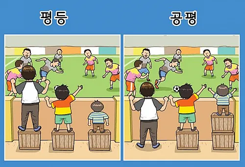

## 문서번호: 4701

### 제목: [노동현장](https://q4all.kr/redirect/detail/cbd76452-3677-4e25-9fc3-c41bc2eca371)

**작성자:** [김신](https://q4all.kr/user/profile/6976)
**작성일:** 2025-02-26 14:17:02 (수요일)

---

현장에서 일하는 노동자입니다.
----------------

노동청과 정부기관은 외국인노동자를 받을때 불법적인 것 없이 정상적으로 처리되어지고 있다. 그리고, 현장에서는 정상적으로 등록된 외국인만이 일하고 있다고 합니다.
-----------------------------------------------------------------------------------------

어느 방송을 통해서 대구ㆍ경북 그리고 부산 경남은 국민의짐이 득세하여( 물론 그 시민들이 선출해준것이죠) 시장조사는 형식적인 암묵거래아래 무자비한 아파트건설로 인해 뒷거래가 판치고 그렇게 이용당해도 어쩔수 없는 국민의짐의 뒷거래를 그 시민들이 해줬기에 살림살이 그리고 상식적인 시민을 잘살게 해줄려고 하는 정책보다 뒷패거리 정치인과 콩고물(어마어마한) 거래로 배를 채우는 이들로 인해 젊은친구들은 살던곳을 떠나고 나이든 이들은 자기들이 무슨짓을 했는지 모른체 와이래 먹고살기가 힘드노 하고 외침니다.
---------------------------------------------------------------------------------------------------------------------------------------------------------------------------------------------------------------------------------------------------------------------------------------

지들이 국민의짐인지 왜놈의힘인지를 모를 놈들을 찍어놓고서는 그리고 살림살이를 우째사는지 감시는 하지 않으면서 걍 잘하것지 그결과 쉽게 세금걷고 시민은 개돼지니까 세금 더 걷고 지놈들은 스스로 세금 적게내고 그런짓을 뻔히알면서 왜놈들이 잘한다고 지껄입니다.
----------------------------------------------------------------------------------------------------------------------------------------------

창원에서 태어나 대구로 와 산지 30년 정말 징그럽습니다. 상식도 모르거니와 상식 밖에 생각과 닭대가리 말들만 내뱉는 이곳 넌더리가 납니다.
------------------------------------------------------------------------------

노무현대통령닝께서 그 고생고생으로 나라빛 줄이고 경쟁력있는 시대를 맹글어 놓으니 쥐새끼놈이 말아먹고 또 돼먹지 않은놈이 또 말아먹고 그걸 잘했다고 지껄이는 이 갱상도 늙은것들 정말 모조리 갈아엎어야되는 이 동네 어쩌면 좋습니까 !
--------------------------------------------------------------------------------------------------------------------------------

우매하고 정말 앞뒤 생각없는 덜떨어진 이곳
-----------------------

김누리교수님과 다른사회학교수님께서 대담에서 말씀하셨듯이 가정이 무너지고 나니 지새끼들을 학교가 겔치라하고 보내놓고서는 독일처럼 교사의 임명과 그 위대함을 가르치지 못하는 지금의 교육방식으로 자살과 타살과 타의로 인해 나라는 망해가고 있는듯 합니다.
------------------------------------------------------------------------------------------------------------------------------------------

나이든 이는 지 편한 것만 찾고 거기에 독재자들에게 배운 "에혐" 내가 누군지 알아 너 얼마나 알아 시키면 시키는대로 해 " 어린애들은 듣고 배운것이 없으니 그저 나아가려고 하고 무엇하나 제대로 된 됨됨이를 갖추질 못하고 있습니다.
---------------------------------------------------------------------------------------------------------------------------------

겉모양만 돌아갈뿐
---------

정부의 모든 기관이 국민을 위해서 일하지 아니하고 어른들이 자식과 이웃을 위해 애쓰지 않는다면 인간이 아니겠지요.
---------------------------------------------------------------

언제쯤이면 이나라가 상식적인 나라가 될수 있는지 부탁드립니다.
----------------------------------

저보나 훌륭하신분들께서 어럽고 어려운 상황이오나
--------------------------

부디 부디 작은것 하나 하나 꼭 세세히 집어주시기 부탁드립니다. 역사라는 거대한 이름보다 작디작은 힘없고 무지렁한 이들을 위한 깨우침과 매를 같이 주시기를 진정 부탁드립니다.
-------------------------------------------------------------------------------------------------

제 손주들이 이제 4살 3살 2살입니다. 이 아이들이 좋은나라에서 상식적인 나라에서 살게 해주십시요
-------------------------------------------------------

넋두리를 너무 많이 뱉어 죄송합니다
===================

---

## 문서번호: 4702

### 제목: [여러분 대학 꼭가세요.](https://q4all.kr/redirect/detail/61ce2d98-b818-463d-ac46-7b436cec3ee5)

**작성자:** [김서연](https://q4all.kr/user/profile/2576)
**작성일:** 2025-02-26 14:18:03 (수요일)

---

고등학교 졸업할 시기에는 딱히 가고 싶은 [과]도 없었고

가정 형편으로 대학 등록금이 부담스러워서 대학 다니는 동안 취업해서 돈을 벌이 하는 게 낫겠다는 생각으로

졸업 전 취업해서 지금까지 20년 넘게 사회 생활하고 있습니다.

그런데 일을 하면서 자격증 취득이나 다른 업종으로 취업하려고 시도할 때마다

자격요건이 대학졸업자여만 하더군요

혹여 대학을 가지 않겠다고 생각하시는 분들

대한민국에서 전문대학교라도 꼭 졸업해야 합니다.

---

## 문서번호: 4703

### 제목: [이명박이 잘한일 못한일을 알기 쉽게 정리해주세요](https://q4all.kr/redirect/detail/35e6b46e-49ea-4fed-8d4a-5bf1698680d8)

**작성자:** [최영](https://q4all.kr/user/profile/6980)
**작성일:** 2025-02-26 14:27:42 (수요일)

---

버스전용차로같은건 잘한일이라고 합니다다

건축안전기준을 낮춘건 많은 재난을 낳고 있습니다

공과가 파편화되어 날아가지 않도록 정리해주시면 좋겠습니다

---

## 문서번호: 4704

### 제목: [맞벌이 하면서도 내 새끼는 내가 키울 수 있는 제도적 뒷받침이 필요합니다.](https://q4all.kr/redirect/detail/38e0dbfb-d156-48cd-a31e-7b0e52284201)

**작성자:** [김의찬](https://q4all.kr/user/profile/6981)
**작성일:** 2025-02-26 14:37:15 (수요일)

---

맞벌이 하면서 초등학생 두 자녀를 키우고 있는 아빠 입니다.

부모가 퇴근할 때 까지 돌봄 교실과 학원 뺑뺑이를 도는 아이들을 보면서 갖게 된 질문입니다.

학교 돌봄 교실을 확대하는 것도 필요하지만 내 새끼는 내가 키울 수 있게 돕는 제도가 필요합니다.

초등학교 이하 자녀를 둔 맞벌이 부모는 단축 근무가 가능하도록 제도화 하면 어떨까요?

예를 들면 부모 합산 최대 3시간의 단축 근무가 가능하다면 1시간은 등원을 시키는데 사용하고 2시간은 하원을 시키고 아이들 학습을 돕거나 아이들과 저녁 시간을 보내는데 사용할 수 있습니다.

첫 1시간의 단축 근무에 따른 임금은 국가가 보전하고 다음 1시간은 기업, 마지막 1시간은 본인이 부담하도록 설계하면 사회가 아이를 함께 키울 수 있습니다.

나이가 어린 아이들일 수록 부모와 함께 보내는 시간이 중요한 만큼 과감하게 단축 근무를 가능토록 하는게 어떨지 질문 해봅니다.

---

## 문서번호: 4705

### 제목: [개인이 아닌 단체나 집단의 집단지성을 참여시키는 방식은 무엇인가요?](https://q4all.kr/redirect/detail/9453582c-21ef-42de-93f3-b0f951274f6e)

**작성자:** [김경훈](https://q4all.kr/user/profile/6982)
**작성일:** 2025-02-26 14:40:09 (수요일)

---

디지털 네트워크 시대의 특징 가운데 하나는 인구 수보다 많은 커뮤니티, 약한 연결의 집단, 단체들이 사회적 관계의 인프라가 되고 있다는 것입니다.

취미, 기호, 관심사, 이슈, 이해관계 등에 따라 정말 많은 네트워크들이 있고, 한 사람이 다양한 네트워크에 참여하는 것이 21세기의 기본 구조입니다.

그렇다면 이 각각의 네트워크에서 모두의 질문Q에 참여하고 싶을 수가 있는데,

제가 사이트를 둘러보니 개인의 이름으로만 질문을 할 수 있게 되어 있네요.

제 생각엔 약한 연결 네트워크들의 소규모 집단 지성을 녹서와 백서를 만드는 데는 물론,

앞으로 미래 사회의 문제와 해결책을 모색하는 과정에서도 적극 활용해야겠다고 생각하는데요.

당장 모두의 질문 Q에도 단체나 네트워크의 이름으로 질문을 제기하는 루트가 있었으면 좋겠습니다. 어떻게 생각하시는지요?

---

## 문서번호: 4706

### 제목: [윤석열의 계엄으로 인한 내란성 우울증을 윤석열에게 손해배상청구로 받아내는 방법은 무엇일까요?](https://q4all.kr/redirect/detail/0fda2d27-27b1-4643-ace3-590c4a4648c7)

**작성자:** [양미순](https://q4all.kr/user/profile/6983)
**작성일:** 2025-02-26 15:01:44 (수요일)

---

계엄 이후 정의와 상식이 무너진 현실에 근로에 대한 의욕도 사라지고 소비에 대한 욕구도 사라졌습니다

많은 국민들이 겪고 있을 정신적 피해 상황을 금전으로 환산하여 윤석열에게 청구 하고 싶습니다

---

## 문서번호: 4707

### 제목: [불법 쓰레기소각 강력단속](https://q4all.kr/redirect/detail/33f03243-d784-4f36-89ee-c7f30b5f18d6)

**작성자:** [신재호](https://q4all.kr/user/profile/6805)
**작성일:** 2025-02-26 15:16:42 (수요일)

---

현황

▪︎농어촌지역 중소업체의 경우, 소각로를 비치하고 거의 매일 비닐류, PVC, 고무, 폐자재 등 소각으로 지독한 매연 발생.

▪︎개별 가구의 경우, 집안 또는 경작지 인근에서 산발적으로 각종 유해쓰레기 소각.

피해상황

▪︎공기질 악화로 기후위기 역행.

▪︎인근 농경지 오염으로 농작물 친환경재배 타격.

▪︎한 곳에서 발생한 오염물질은 자동차 수천 대의 매연량에 못지 않다고 보아 환경오염 심각.

대책

▪︎체계적이고 지속적인 계도와 홍보(매스컴, 마을방송 등)

▪︎일벌백계로 실효성 있는 단속.

---

## 문서번호: 4708

### 제목: [국민연금 수익 내기 ''''''](https://q4all.kr/redirect/detail/4f34a011-8be1-400c-9df3-57b70f826acb)

**작성자:** [김명규](https://q4all.kr/user/profile/5118)
**작성일:** 2025-02-26 15:24:57 (수요일)

---

유료도로및터널 기타등등에 들어가는 투자를 국민연금에서한다면

안정된 투자금 회수와 수익률이 보장받는일을

외국계 자본으로 유치한다는것이 한탄 스럽네요

이것만 이행된다해도 통행료 상승이 있다한들 기분좋게 받아들일듯하네요

---

## 문서번호: 4709

### 제목: [농자재 경량화 추진](https://q4all.kr/redirect/detail/b6455d95-f7fc-419a-8c9e-a34e27729629)

**작성자:** [신재호](https://q4all.kr/user/profile/6805)
**작성일:** 2025-02-26 15:46:27 (수요일)

---

현황

▪︎퇴비, 비료 등 20kg 단량의 획일화.

▪︎농업인의 노령화, 여성농업인의 증가.

대책

▪︎10kg, 20kg으로 구분 포장.

---

## 문서번호: 4710

### 제목: [일반직장인들과 개인사업자의 신용평가분류](https://q4all.kr/redirect/detail/f9fe0617-3daa-48c4-8f99-f6e94f190550)

**작성자:** [임진현](https://q4all.kr/user/profile/6987)
**작성일:** 2025-02-26 16:16:43 (수요일)

---

3년째 개인 사업을 하는 자영업자 소위 소상공인입니다.

사업을 하면서 자금의 융통성을 보다 절실히 느끼는 개인 사업자 중 한 사람입니다.

돈을 빌리는 것이 집이 있고 차가 있고 신용 평가 숫자가 높으면 대출이라는 허들을

잘 넘 길수 있었습니다.

개인 사업을 하기전 멀쩡히 잘 다니던 회사를 17년 만에 나오니 막막했습니다.

전에 다닐 때는 1등급 무조건 1등급 이었고 카드도 잘나오고 카드 이용 한도도 넉넉했습니다.

막상 사업을 무일푼으로 하다 보니 집 팔고 대출 받고 정부 정책 받고 카드 쓰고 하니 신용 평가의 중요성을 알게 되었습니다

문제는 여기서 시작 되는 것 같습니다.

지금도 대출 카드값 한번 가게세 상가 관리 직원월급 밀린적없는데

신용도는 낮아져만 갑니다. 이러다 보니 그동안 몇 년간 잘 사용하던 카드 사의 카드가 이용 한도를 줄이기 시작합니다.

점점 더 믿고 사는 사회에서 카드사 들은 신용평가가 낮아서 줄인다 라는 게

하나의 카드가 진행되면 도미노 처럼 모든 카드들이

한도가 하양 되어집니다.

이게 문제가 되어집니다.

물론 악영향도 있겠지만 사업을 하다 보면 정말 절실히 느껴지는 대목입니다.

신용 평가는 개인 사업자들만 따로 그 회사의 유동성을 보고 직접 체크 하는 그런 평가 기준을 만들어서

정말이지 클리어한 한번도 안 밀리고 사는 분들에게 높은 등급을 주어서 따로 관리 하게 끔 하는게 낫지 않을까 합니다.

정말 절실 합니다.

돈 없이 장사하지말라고 하겠지만 배운게 도둑질이고 다른 건 하지를 않는 사람들 자기일 만 묵묵히 하는 사람들에게 힘을 주실수 있는 법이 생겼으면 합니다

대출 받을때 심사 받을때 신용평가사와 얘기나눌때 정말 장사하는게 죄인가 돈 빌리는게 너무 질리고 감정 소모를 당합니다.

정말 그래서 비대면들로 하는거고

그래 봤자 신용도 낮아져 있어서 그것마져도 힘들어 제2,제3 비금융권 끝으로 사채로 가는 길로 진입하게 됩니다.

정말 정부에서 개인사업자들을 소상공인들을 위한다면 신용등급의 개편을 추진하는게 좋지않을까 싶습니다.

---

## 문서번호: 4711

### 제목: [땅](https://q4all.kr/redirect/detail/ca896333-0587-484b-9f41-78d48dd7dcf5)

**작성자:** [김정재](https://q4all.kr/user/profile/6975)
**작성일:** 2025-02-26 17:03:47 (수요일)

---

안녕하세요

송북시장에살고있는데

저희집옆집 예전 농약사하던건물 새로온 집주인이 저희집이 자기땅 침범했다고 지금 소송중입니다

저희는 전 주인이랑 60년동안 아무이상없이 살아왔습니다 그리고 70년전에는 건축물대장이 없다고하는데 이런 땅분쟁이 있는데 도움요청부탁드려도 될까요 시장안이라 앞부분만 면적측량이되고 뒤건물은 막혀있고 경계점도없이 정확한 측량이 가능한가요 새로집 짓는것도 아니고 건물밖에만 보강공사하는데 법원에서 핀결이 어떻게 나올까도 궁금합니다

010 5107 9476입니다

3월25일에 기일이 잡혀혀서

---

## 문서번호: 4712

### 제목: [기계톱 안전인증과 교육](https://q4all.kr/redirect/detail/136fd9ee-e4bd-44c7-9d83-785257331218)

**작성자:** [김명환](https://q4all.kr/user/profile/6485)
**작성일:** 2025-02-26 17:09:04 (수요일)

---

저는 산림분야의 안전을 공부하고 있으며 산림기술사, 산림학박사입니다.

임업분야도 향후 개선할 사항, 수정할 사항이 많이 있겠지만 특히 기계톱에 대한 위험성이 가장 시급한 문제라 생각합니다.

1. 기계톱 안전인증

많은 나라에서 위험한 기계기구에 대하여 안전인증과 판매, 전시, 점검을 실시하고있습니다.

그러나 많은사용과 재해가 빈번한 기계톱에 대하여 우리나라는 2022년 안전인증에서 해제되었습니다.

기계톱에 의한 절단, 베임 등의 사고와 벌목하던 나무에 의한 사고가 매년 많이 발생하고 있으며

 이들 대부분은 전문적 교육과 점검, 유지관리에 대한 교육과 관리방안을 교육받지 못한상태 였습니다.

위험한 기계의 판매, 전시, 대여의 제한과 판매시 일정이상의 교육을 수료후 판매가 이루어져야 할것입니다.

2.기계톱 사용 집단의 교육

기계톱과 예초기등의 사용을 하고있는 집단을 구분하면 .

1) 전문입업인 - 최소한의 교육을 받고있음(산림청 지자체 소속 부서의 임업임- 약 6만명 .

2) 비정규임업인 - 벌목현장에서 일하시는 작업원으로 목재생산자의 업체에서 작업을 실시함.(약 7만명)

3) 지역별 공공근로 - 농업, 제조업등 기타업무에 경험후 공공근로에서 처음 톱과 예초기를 접함(약 35만명).

4) 농업인 - 산과 농지를 같이 소유하고있으며 사용량은 적으나 약 전국 농업가구 100가구의 약 20%는 기계톱을 소유하고있음 (약 20만가구)

5) 군인 - 제초작업과 벌목작업을 시행하고있으나 일체의 교육과 점검을 받지못하고있음-(수량 /인원 추정 불가- 개인적인 한계- 정부에서는 파악할수있을 거라 판단됨)

6) 한전 - 철탑하부 작업을 실행하는 작업원- 임업과 유사하나 작업교육을 실시하지 않고있음- (수량 /인원 추정 불가)

 안전에 대한 우리사회의 의식이 변화되고있는 시점에 어느그룹도 방치할 수 없지만 군에간 아이들이 교육도 없이 기계톱과 예초기작업을 하고있는 것은 매우 위험하고 심각한 문제라 생각됩니다.

군의 예초기 기계톱사용에대한 제한, 훈련, 교육의 제도 도입이 시급합니다.(군특성상 폐쇄되어 사고사례나 사고 통계의 자료등 자료접근이 어려움)

각 분야별, 단체와 기관에서 이러한 사고사례의 종합적 검토가 필요하다고 생각되어 모두의 질문에 올려봅니다.

---

## 문서번호: 4713

### 제목: [지방 의회가 소중한 세금을 낭비하는 일은 없어져야겠습니다.](https://q4all.kr/redirect/detail/399f00d6-9a08-4b6f-9cc6-e4cb0bfbb547)

**작성자:** [최만석](https://q4all.kr/user/profile/1878)
**작성일:** 2025-02-26 17:39:25 (수요일)

---

**지방자치 의회가 국민들을 위해서 얼마나 일을 잘하고 있는지?**

**효율적으로 일하고, 그 효능이 국민들에게 가고 있는지? 의문이 듭니다.**

### **지방의회 의원들이 최초의 취지와 달리 많은 급여를 받아가고,**

### **거대한 의회 건물, 그들을 위한 장소들을 운영하면서**

### **또다른 권력과 혜택을 누리는 것이 맞는 것일까요?**

낭비 가득한 그들의 해외 견학, 해외 여행을 국민들 세금으로 보내주는 것도 맞는지?

### **중앙정부가 해야 할 일들을 꼭 '지방자치' 라는 이름으로 해야 하는지?**

### **이제는 다시 돌아보고 검토되어야 하는 시점이라 생각됩니다.**

---

## 문서번호: 4714

### 제목: [고위직의 겸직과 자격증 및 자격 교차에 관하여](https://q4all.kr/redirect/detail/1544cd17-d8e9-4636-b498-52f5eb78a2a6)

**작성자:** [김홍철](https://q4all.kr/user/profile/7011)
**작성일:** 2025-02-26 17:41:30 (수요일)

---

2025년인데 아직 고위 공직 중에 겸직이 있다는 것이 좀 이해가 안되고 더구나 판사검사 퇴직 후 변호사 자격증이 주어지는 것도 이해가 되지 않습니다. 퇴직 후 10년뒤에 자격을 가질 수 있도록 하던지 아니면 새로 로스쿨에 들어가서 시험을 쳐서 다시 받을 수 있도록 해야하지 않을까요? 시험 하나 합격한거 가지고 평생을 보장받으려하는 것은 문제가 많다고 생각합니다. 로스쿨이 생기기 이전에야 그 직무인원이 작아서 그렇다치지만 지금은 아니잖아요? 무슨 귀족을 양성하는 것 같아서 공화정시민으로서 무척 우려스럽습니다. 자격증 혹은 자격의 교차, 고위직의 겸직에 대해 회피 할 수 있는 방안에 대해 토론해보았으면 좋겠습니다.

---

## 문서번호: 4715

### 제목: [한국장학재단 생활비 대출 다중채무에 대해](https://q4all.kr/redirect/detail/5cc28018-5455-4583-8857-e86ea94592b9)

**작성자:** [안병출](https://q4all.kr/user/profile/7014)
**작성일:** 2025-02-26 17:44:09 (수요일)

---

2025년 상반기 한국장학재단 학자금대출의 다중채무 제도를 개선할 예정이라

다행입니다. 하지만 생활비 대출 다중채무 제도 개선 계획이 없다는 점은 아쉽습니다.

생활비는 1학기 최대 150만원 입니다.

4년 8학기를 다 받아도 1천 2백만원입니다.

그야 말로 소액인데, 8건의 다중채무가 발생합니다.

대학을 졸업하고 원룸 전세대출이라도 받으려면,

다중채무 대출로 인해

이율이 높아지거나, 보증보험 가입 등으로 해결해야 합니다.

최소한 한국장학재단이라는 국가기관에서 받은 동일한 성격의 대출금인 생활비를 건건마다 다중채무로 만드는 것은

학생들을 옭아매는 것이라 생각합니다.

학생들이 공부하며 진 빚 정도는,

사회생활 시작에 걸림돌이 되지 않았으면 합니다.

---

## 문서번호: 4716

### 제목: [구단위 군단위 자치제가 필요한가?](https://q4all.kr/redirect/detail/a1a87eb4-793c-462c-bf08-ac9db08a7534)

**작성자:** [서한섭](https://q4all.kr/user/profile/6933)
**작성일:** 2025-02-26 17:44:34 (수요일)

---

구청장,구의원 시장,시의원 군수,군의원까지 선거를 통해서 선출한다.

비효율적이라 생각한다.

3만인구의 군에서도 군수, 군의원 구청장,구의원까지 선거로 선출한다는 것은

전문성이 부족해 보인다.

도지사, 광역시장까지만 선거로 선출하고,

군수,군의원은 그 조직에서 승진하는 것도 좋다고 생각된다.

---

## 문서번호: 4717

### 제목: [재산세 공정 과세와 주거권 보장 방안 마련 필요](https://q4all.kr/redirect/detail/ffc3886e-8ac4-413b-a156-cd11a7ec7527)

**작성자:** [박정현](https://q4all.kr/user/profile/1794)
**작성일:** 2025-02-26 17:56:50 (수요일)

---

LH로 부터 주택 담보 대출로 분양 받은 매입임대 아파트의 재산세 면제와 LH의 부동산 투기에 대한 피해 보상 필요

현황 >

20년경 LH 매입임대아파트를 밀어내기식 분양에 떠밀려 울며 겨자 먹기로 담보 대출을 받아 30년 분할 원리금 납부 조건으로 분양받은 후 매월 약 70만원씩 원리금으로 납부하고 있습니다. 사실상 비싼 월세를 살고 있는 것이지요.

그러함에도 명목상 소유자이라는 이유만으로 재산세를 부과하고 있는데 **아파트 분양에 따른 수익은 LH가, 이자 수익은 은행이** 고스란히 **받아 챙기면서 애먼 시민은 이자에 세금 부담까지 이중 부담**을 떠안는 형국입니다.

실상 은행이 주인이고 명의만 소유자로 되어 월세 살이하고 있는데 재산세까지 부담하는 것은 조세 형평에 어긋납니다. 은행이 이자 수익에 대한 별도의 세금을 납부하는 지도 궁금합니다.

현행 제도는 **의식주 중 주거권이 기본권**이라고 한다면 **기본권을 제대로 보장받지 못하고 사실상 이자 및 세금 노예로 30년을 살아가게 되는 것**입니다. 전문가들에 의하면 최근 아파트 값이 하락 추세에 있다고 하며 인구 절벽을 맞아 하락 안정세는 지속될 것으로 보고 있습니다.

개선 건의>

현행 부동산 제도의 개선해야 할 부분은 많겠습니다만 거액의 담보 대출로 원리금을 매월 납부해야 하는 시민들이 재산세까지 부담하는 것은 기실 **내용상 이중 과세**를 부담하는 것입니다.

**세금은 수익을 가져가는 은행이 부담하는 것이 타당**할 것입니다. 해당 **시민들에겐 재산세 면제 또는 감면 조치가 시급**히 필요합니다.

또한 밀어내기 분양을 통해 **수익을 본 LH는 시민 주거권 보장을 위한 노력을 병행해야** 할 것입니다. **사실상의 투기 수익을 분양 받은 실거주민에게 반환해야 합니다.**

(LH가 매입 대금 대비 분양 차익(투기 수익) 은 분양가에서 제외한 금액에 대해서만 원리금을 납부하면 근저당 말소가 되어 실제 소유주가 되도록 해야합니다.)

---

## 문서번호: 4718

### 제목: [국가적으로 100여년간 영어교육을 해왔고 개인적으로 십수년간 영어공부를 해왔으나 우리국민 대부분은 왜? 하고싶은 우리말을 영어로 말을 못합니까요? ](https://q4all.kr/redirect/detail/10c92c45-6f27-4137-a6ed-11b17362fa5a)

**작성자:** [박경석](https://q4all.kr/user/profile/7019)
**작성일:** 2025-02-26 18:41:26 (수요일)

---

우리나라는 국가적으로 100여 년간 영어교육을 해왔고 개인적으로는 우리 국민 대부분은 십수 년간 영어 공부를 해왔으나 막상 하고 싶은 우리말을 영어로 말을 거의 못합니다. 그동안은 영어를 해석하고 이해하는 것에 집중하고 영어로 말하는 것에는 소홀했고 산수의 구구단같이 이것만 하면 영어가 된다는 영어의 왕도를 개발하지도 않고 발견하지도 못했기 때문입니다.

과거에 선진국 언어인 영어를 받아들일 때 선교사 등 영어 교육자로부터 한국인 수강자는 영어책을 보고 공부하면서 영어를 해석하고 이해하는 방법 외에는 뭐가 있겠습니까? 이와 같은 영어교육 방법이 지금까지 계속되고 있지요. 그동안 국가는 뭐를 했습니까? 그 많은 영어 전공자, 영어 교육자, 영어 학원에서는 뭐를 했을까요? 우리 국민들의 지적 능력이 부족해서 우리말을 영어로 말하기가 그렇게 어려울까요? 우리의 국력, 문화 수준 등으로 볼 때 우리 국민들의 영어 능력이 낮은 것은 불가사의한 일입니다. 국가가 문제 해결에 적극적으로 나서야 합니다. 이러한 국가 영어교육의 문제를 제기하고 해결책을 제시하는 전문가들의 의견도 적극적으로 수렴해야 합니다.

절대영어는 이러한 문제에 대한 해결책으로 하고 싶은 우리말을 영어로 자유롭게 말하는 획기적인 영어 학습법으로 중고생을 기준으로 15시간 학습으로 우리말을 영어로 말하는 자유를 얻을 수 있는 영어의 왕도로 영어 전공자로부터 노벨상감으로 평가받고 있습니다.

절대영어는 수천만 가지의 영어 표현도 우리말 서술어에 따라 6개의 패턴(6PA, 6 Patterns of Asking)이 있음을 발견하고 이를 체계화한 것입니다. 6개의 패턴은 be동사, 일반동사, 진행형, 현재완료, 수동태, 의문사 주어 패턴으로 이것만 구구단같이 학습하면 누구나 우리말을 영어로 자유롭게 말할 수 있습니다. 우선적으로 절대영어를 현재의 영어 교육의 문제점에 대한 보완책으로 채택하여 이를 널리 전파하면 국민들의 영어 능력 향상에 큰 도움이 될 수 있을 것이고 장기적으로는 절대영어를 국가의 영어교육 제도에 반영하여 국민들의 영어 능력 향상에 도움이 되도록 해야 할 것입니다.

---

## 문서번호: 4719

### 제목: [한국 의료체계 개편에 대한 제안: 투트랙(2-Track) 시스템 도입](https://q4all.kr/redirect/detail/22515582-36a5-40fd-b95a-474cd36c1355)

**작성자:** [신정훈](https://q4all.kr/user/profile/7031)
**작성일:** 2025-02-26 19:45:20 (수요일)

---

저의 생각을 쳇지피티를 이용하여 정리해 보았습니다.

현재 한국의 의료체계는 \*\*의사들이 의대를 졸업한 후 자유롭게 개원하거나 병원에 취업하는 방식(자유 경쟁 시스템)\*\*으로 운영되고 있다. 하지만, 이는 필수 의료 분야(응급의학, 외과, 소아과 등) 인력 부족과 지역 의료 불균형 문제를 해결하기 어려운 구조다. 이를 보완하기 위해 의사 양성과 배치 방식을 투트랙(2-Track)으로 운영하는 방안을 제안한다.

🔹 투트랙 의료체계 개편 방안

1️⃣ 자유경쟁 트랙

✔ 현재 방식 유지 → 의대 졸업 후, 본인의 선택에 따라 개원하거나 병원 취업 가능

✔ 경쟁을 통해 병원 운영 및 수익 창출

✔ 개인의 능력과 시장 원리에 따른 의료 서비스 제공

2️⃣ 국가관리 트랙

✔ 정부 지원 및 관리 시스템 도입

• 의대 재학 시 국가가 학비 지원 및 장학금 제공

• 졸업 후 국가의 정책적 배치에 따라 전문과별·지역별 인력 조정

✔ 보수 및 근무 환경 안정화

• 국가가 의사의 급여 및 근무 조건을 일정 수준 이상 보장

• 필수 의료 분야와 지역 의료 서비스 강화를 위한 배치 조정

✔ 공공 의료 강화를 위한 필수 의료 인력 확보

• 응급의학과, 외과, 소아과 등 기피과 인력 확보 및 의료 공백 해소

📌 기대 효과

1. 자유 경쟁과 국가 의료 안정성의 균형 유지

• 시장 경쟁을 원하는 의사는 자율적으로 개원 가능,

• 국가 지원을 원하는 의사는 안정적인 근무와 의료 공공성 강화.

2. 필수 의료 분야 및 지역 의료 인력 문제 해결

• 국가가 직접 인력 조정을 함으로써 의료 인력 쏠림 현상 해소.

3. 의사들의 선택권 보장

• 개인의 성향과 가치관에 맞는 의료 커리어를 설계할 수 있음.

✅ 결론

현재 의료 시스템의 한계를 보완하기 위해 자유 경쟁과 국가 관리를 병행하는 투트랙 시스템을 도입하는 것이 보다 현실적인 해결책이 될 수 있다. 이를 통해 의사들의 자율성을 존중하면서도, 국가 차원의 의료 서비스 균형을 맞출 수 있는 효율적인 의료체계를 구축할 수 있을 것이다.

---

## 문서번호: 4720

### 제목: [KBS 방송국 이번 계엄?](https://q4all.kr/redirect/detail/71adfd4a-0838-4d5f-a4d0-a32134c232f0)

**작성자:** [김진태](https://q4all.kr/user/profile/6771)
**작성일:** 2025-02-26 20:10:43 (수요일)

---

윤석열 계엄 활동에에 다름 방송국 보다 협력하고 계엄 발표할 때도 미리 알았을 수 있을 구도 있는데 쉬 쉬 하였다면 국민 국가 방송국으로 방송료전 국민의 지원을 하고 있는데 여기애 대에서 조사가 필요 하지 않나요? 만약 깊게 개입이 됫다면 방송료는 다른 방송국으로 선정해야 하지 않나요

---

## 문서번호: 4721

### 제목: [질높은 공교육을 제공하기 위해 우리가 할 수 있는 것은 무엇일까? ](https://q4all.kr/redirect/detail/cfb27639-e046-49d7-bf20-2feb2e61ff66)

**작성자:** [이대희](https://q4all.kr/user/profile/7030)
**작성일:** 2025-02-26 20:28:08 (수요일)

---

1. **학급당 적정 학생수는?**
2. **학생당 적정 교사수는?**
3. **질높은 공교육을 제공하기 위해 우리가 할 수 있는 것은 무엇일까?**

경남에서 근무하고 있는 교사입니다.

글을 적었다가 날리는 바람에 다시 적고 있습니다 ㅎㅎㅎ

최근 교육청 정책으로 교실당 교사수가 줄었습니다.

이는 같은 학급을 유지할 경우 학교에서 1~2명의 교사가 감축되는 결과를 발생시킵니다.

일선 학교에서 1~2명의 교사 감축이 있을 경우

교사의 평균 수업 시수는 18시수에서 ->21시수로 1~2시수 증가 됩니다.

또한 줄어든 교사의 업무는 남아있는 교사에게 부여 됩니다.

따라서 전국의 모든 교사는 올해 업무 부담과 수업 부담이 동시에 늘었습니다.

한편 제가 방금 인터넷 검색으로 찾은 내용에 따르면

학급당 인원수는 최대 28명인것으로 보입니다.

그러나 일선 현장에서는 학급당 30명을 넘는 학교가 여전히 많습니다.(신도심 중심)

한편으로는 학생수가 너무 적은 학교가 있습니다. (15~20명선 / 구도심 중심)

평균적으로는 28명이 되겠네요.

그러나 교육청에서는 학교의 학생 수급 능력에 따라 무작위로 배정하는 것이 맞지만

학부모의 민원에 의해 과밀학급이 분명히 예상됨에도 1지망 학교에 무조건 적으로 배정합니다.

#### **물론 거리적인 요인이나 기타 요인을 고려했을 때 1지망에 우선 배정하는 것이 맞겠지만**

#### **그것이 학교의 교육 여건을 악화(과밀학급/수업의 질 하향)하면서 까지 해야하는 것일까요?**

**위 상황은 많은 문제적 상황을 보여주고 문제적 상황을 일으킵니다.**

1. **교육청의 민원인 중심적 행정 ->교육정책의 방향이나 학교/지역의 여건을 고려치 않은체 무조건적으로 학부모의 의견 반영 ->학부모는 협상하려는 의지를 보이지 않고 이 태도는 학교로 지속 -> 악성 민원 발생**
2. **교사의 평균 업무 및 수업 부담 증가 -> 수업을 준비하려면 개인적 시간을 사용(E.G.주말등) -> 개인적 시간을 사용 원치 않을 경우 교과서대로 수업 -> 행정적 교원**
3. **과밀학급을 보유한 학교의 교육의 질 하락 -> 인원수가 많아 학급및 학교에서 감당해야 할 생활 교육 증가(학폭 포함) -> 개별 학생을 돌볼 여건 X 따라서 사고가 나지 않는 통제와 감시적 상황으로 학교 운영**
4. **소규모 학교의 정주 교사 감소(E.G. 9과목중 4과목은 순회교사) -> 순회교사는 두 학교를 다녀야 하므로 교과 수업에만 집중 -> 학교의 교육과정을 탄력적으로 운영 X**

**이런 상황에서 우리는 교사에게 질높은 교육을 제공하라 합니다.**

**학부생때 배웠던 위생-동기 이론이 떠오르네요. 매슬로우의 동기이론도 떠오릅니다.**

**질 높은 배움을 위해서는 그에 맞는 환경이 갖춰져야 합니다.**

**저는 교육 환경의 질을 결정하는 주요한 요소중 하나가 학생 수 대비 교사의 수라고 생각합니다.**

**아무리 뛰어난 교사라 해도 1명이 30명을 돌보는 것 보다**

**2명이 30명을 돌보는 것이 훨씬 교육의 질이 높아 집니다.**

**만약 교사를 단순히 지식의 전달자 정도로만 본다면 학교는 사라지고 유튜브만 있으면 됩니다.**

**그럼에도 불구하고 학교를 유지하는 이유는 학교라는 공간은 교육을 하는 공간이기 때문입니다.**

**교육은 인지적 배움도 포함하지만, 정서적 돌봄, 학생의 성장, 안전의 개념이 더욱 중요한 것이 아닐까요?**

그럼에도 불구하고, 왜 교육부의 정책은 계속 효율성을 강조하는 경제부처럼 작동할까요?

일선학교의 교사로서는 너무나 안타깝습니다. 학생들이요.

물론 위와 같은 상황에서 교사는 잘 적응해서 살아갈 겁니다.

하지만 학생들이 조금 더 나은 환경에서

조금 더 질높은 교육을 받을 수 있게 끔 하는 방법이 없을까요?

저는 생각을 조금 더 확장해보면 출산률과도 관계되지 않을까 생각합니다.

물론 개인 가치관도 예전과 달리 달라졌지만,

교육의 현장에 있는 저로써는

아이들에게 예전에는 있고 지금은 없는 게 무엇일까 생각하곤 해봤습니다.

공동체 입니다.

예전에는 마을에서 아이들이 뛰어 놀았습니다.

지금은 아이들이 뛰어 놀려면 부모님이 옆에 있습니다.

아이을 돌보는 것이 오롯이 가정의 몫으로 간 것이지요. 예전에는 마을의 몫이었는데

만약 학교가 마을의 몫, 공동체의 몫으로 역할 한다면 어떨까요?

그래서 엄마 아빠가 꼭 아이 옆에 붙어 있지 않더라도 안심할 수 있는 공간

그럴려면 결국 저는 사람인 것 같습니다.

**학령 인구 감소, 출산율등으로 교원의 T.O.를 유지하기 어려운 것은 알지만**

**구태여 굳이 미리 억지로 강제로 T.O.를 줄일 필요가 있을까요?**

**만약 선생님들이 차고 넘친다면, 그 인력으로 더 다양한 교육 활동을 전개할 순 없을까요?**

---

## 문서번호: 4722

### 제목: [언론의 오보를 정정보도하는 기준을 보도한 오보량에 비례하여 보도하게하면 어떨까요?](https://q4all.kr/redirect/detail/2172e0f9-11e4-46ec-8540-4b083cf08ef6)

**작성자:** [신영관](https://q4all.kr/user/profile/7039)
**작성일:** 2025-02-26 20:28:51 (수요일)

---

예를들오 조××일보가 1면에 잘못된 보도를 3일간했다면 동일한 조건( 동일면, 동일면적, 동일글자크기, 동일글자수, 동일자간, 동일부수, 동일기간)으로 의무적으로 오보가 확인되는 바로 다음날에 보도를 하게하는 겁니다. 그다음날 특종이 있더라도 정정보도를 다른 어떤보도 보다 우선하여 보도하게 하면 기사를 쓰는데 신중해지지 않을까요.

---

## 문서번호: 4723

### 제목: [미국 대통령에  대하여 ?](https://q4all.kr/redirect/detail/de42c57c-d9eb-4c7d-9f10-96ba3d461ab6)

**작성자:** [김진태](https://q4all.kr/user/profile/6771)
**작성일:** 2025-02-26 20:28:54 (수요일)

---

개인에 생각 입니다.

저는 민주당 당원 이였을 때 이재명 대표님 선거 때 이메일 로 여러 제안을 드린 것 중에 정의당을 안고 가면 승리에 도움이 된다 라는 제안과 윤석열 와이프 대하여 의심되는 것 들이 있다 조사을 해좌야 되지 않을 까 그리고 글그 윤석열 도 중도에 문제가 있을 것이다 라는 글도 이메일로 보내드렸으나 관심이 없는지 답도 없고 보지도 않느것 갔습니다.

이번 대선 선거 이재명 대표님을 최고의 의인 입니다. 대통령 당선 확률 99% 입니다

제안

미국 대통령 중도 하차가 될 것으로 느낌이 있읍니다. 미국 대통령은 성격상 머리 숙이면 무룹꾸르라고 하는 스타일 입니다. 강하게 나가면 도움이 되지 않을 까 생각이 듭니다.

---

## 문서번호: 4724

### 제목: [경재](https://q4all.kr/redirect/detail/109475a8-7d48-4274-9eb4-e1c43532b538)

**작성자:** [김진태](https://q4all.kr/user/profile/6771)
**작성일:** 2025-02-26 21:39:00 (수요일)

---

1. 소상공인 골목 상권을 부활 해야 된다.

* 먼니가 회전력이 좋다
* 회전력이 좋아지면 돈이 돌고 돌아 내수 경재에 초석이 된다.

1. 미국 대통령 정책

* 쇠는 두두릴 수 록 강해진다 강하면 부러진다 이것이 미국 대통령 이다 (중간에 큰 문제에 돌출될 것)
* 그럼 우리는 부러지지 않은 방법을 찿아야 된다.

이유 : 미국 대통령 은 길어야 4년 짦으면 2년 부러진다.

---

## 문서번호: 4725

### 제목: [세종안성고속도로현장 교량 붕괴사고를 보며 발주자는 사고책임에서  자유로운가 ?  ](https://q4all.kr/redirect/detail/d7fcade2-306e-45cd-ab55-a77c4f28b27b)

**작성자:** [김영남](https://q4all.kr/user/profile/7044)
**작성일:** 2025-02-26 21:55:07 (수요일)

---

세종안성고속도로 교량붕괴사고를 보며 잊을만 하면 반복되는 대형사고 막을 수는 없는가 아니 빈도수를 줄일 수는 없는가

지금까지는 사고가 발생하면 건설시공사에 대한 법적처벌 과 불이익으로 재발방지 효과를 얻으려 했으나 대형사고는 반복되고 있다.

어디에 문제가 있을까

최저가 낙찰제에 따른 적정하지 못한 공사금액 무리할수 밖에 없는 공사기간 여기에 문제가 있다고 글쓴이는 생각한다

발주자는 건설현장에서 갑중에 "갑"이다 계약시 저가에 공사수주하고 촉박한 공사기간에 무리한 진행을 한다면 사고는 발생할수 있다

재해예방 업무에 35년을 살아온 사람으로써 이번 대형사고로 사회적 무리를 일으켜 사고 당사자는 아니어도 사회에 미안하고 어디에

문제가 있는지 살펴보고 반성하며 이 글을 쓰게 되었다

미국 유럽등에도 발주자에게 안전책임을 확대하고 있으며 우리나라도 마찬가지다 그러나 책임에 대한 처벌은 너무 유야무야 하다

만약 이러한 사회적 물의를 일으킨 중대재해 발생시 발주자에게 10-50억의 과태료를 부과한다면 어떤 결과(효과)가 있을까

생각만 해도 그 결과(효과)에 기대를 한다

아마도 발주과정에서 재해예방에 대한 매우 민감한 반응으로 보다 안전한 공법의 선정, 보다 엄격한 안전 매뉴얼을 요구할것이다

분명 한단계 발전된 모습이 그려진다

---

## 문서번호: 4726

### 제목: [도시에 왜 자전거가 필요할까요?](https://q4all.kr/redirect/detail/3935a8fe-8178-4524-8085-49c62921cbd1)

**작성자:** [박규희](https://q4all.kr/user/profile/5584)
**작성일:** 2025-02-26 22:09:51 (수요일)

---

도시 곳곳에 비치된 공공 자전거를 보면 자전거의 필요성에 대해 의문이 듭니다. 대중교통이 발달된 경우 굳이 자전거를 타지 않아도 이를 이용하여 환경을 위한 노력을 할 수 있다고 생각해요. 대중교통에 비해 자전거는 사고 위험이 높고, 이미 설치된 대중교통 시설에 더해 새로운 공간을 마련해야 하며 매우 좁은 범위의 사람들만 이용할 수 있습니다. “두 다리를 자유롭게 사용할 수 있고 자전거를 탈 줄 알며 원하는 거리를 이동할 정도의 체력과 비용 지불 능력이 있는 사람”을 위한 것이 공공 시설이 될 수 있는지 재고해볼 문제라고 생각합니다. 물론 대중교통이 발달하지 않았거나 그 비용이 지나치게 높은 곳에서는 그러한 문제를 해결하는 하나의 방책이 될 수 있겠으나 서울을 비롯해 대중교통이 편리한 지역에서 굳이 자전거가 도로 한 쪽을 길게 차지하고, 빠른 자전거가 제대로 된 안전장비 없이 차도와 인도를 가로지르고, 그 시설과 장치, 시스템 및 사고 처리까지 관련 문제에 드는 비용까지 감당해야 할 필요가 있을까요?

---

## 문서번호: 4727

### 제목: [내가본 미래 기상   (2025년 2월25일 화요일  (1일) 3월7일 9마디   3월11일 11마디 이날짜에 비가 많이 올것으로 예측됩니다 바람은 섞이지 않은것 같고요  비의 양은 아주크게 많은것은 아니지만 많습니다.     다음은 태풍소식 입니다 2025년 3월22일  요일로는 수요일. 11월 시작 마디입니다 바람이 어마무시하게 쎄다 태풍인듯. 서울이다. 어둡다 밤 추정 중국쪽에서 오는 바람같다 ,    나라. 운영에 참고하십시요,](https://q4all.kr/redirect/detail/e1ff993b-4171-4b83-9ae0-8a80d69322d7)

**작성자:** [박미순](https://q4all.kr/user/profile/7049)
**작성일:** 2025-02-26 22:56:45 (수요일)

---

비소식 바람이 섞이지. 않은듯 비의 양은 아주 많지는 않지만 많다

2025년3월7일. 9마디

3월11일.11마디 (가능)

태풍소식 2025년3월22일. 요일로는. 수요일 11월 시작마디다 바람이 어마무시하게 쎄다 어둡다 밤추정 장소는 서울 같고. 중국 쪽에서 불어 오는 바람이다

나라 안전에 참고해 주십시요

---

## 문서번호: 4728

### 제목: [[질문-13] 특목고는 설립 취지와 그 목적/목표에 맞게 운영되고 있나요? 📣](https://q4all.kr/redirect/detail/bd1e5169-d37b-4aef-8b7f-393f68d53d5c)

**작성자:** [윤연정](https://q4all.kr/user/profile/2570)
**작성일:** 2025-02-26 23:00:49 (수요일)

---

#### 특목고는 설립 취지와 그 목적/목표에 맞게

#### 운영되고 있는지 알 수 있는 방법이 있나요?

#### 

#### 쉬운 예로,

#### 과학고는 과학에 관한 전문 지식을 갖추도록

#### 육성해야 할 것이고

#### 외고는 외국어 분야에 뛰어난 능력을 갖춘 역량이

#### 사회나 국가에 보탬이 되어야 할 것이고

#### 국제고는 국제화 시대를 선도할 전문 역량을

#### 갖춰야 할 것인데

#### 

### 그 목적과 목표를 얼마나 달성하고 있는 것일까요?

#### 

#### 제가 알고 있기로는 특목고에 대한 일반적인 인식은

#### 의사나 변호사, 검사, 판사 등을 목적으로

#### 진학하고 있다고 들었습니다.

#### 

#### 경쟁이 치열하다 못해 살인적은 한국 교육 현실에

#### 특목고는 순기능보다는 역기능 비중이 큰 것도

#### 부정할 수는 없어 보입니다.

#### 

#### 거의 모든 학생과 학부모들은 특목고를 선망하고 갈망합니다.

#### 여러 상황에서 갈등과 경쟁이 희비를 조장합니다.

#### 건강하지 않다고 여겨집니다.

### 공교육의 부재가 낳은 비극이라고

### 생각합니다.

그 비극에 주인공인
----------

학생/교사/학부모는 불행합니다.
-----------------

결국 공교육의 부재가 한국 전체를
------------------

병들어 우울하게 만듭니다.
--------------

#### 

### 현 한국의 특목고 현황에 대해 이야기를

### 들려 주실 분이 있을까요?

---

## 문서번호: 4729

### 제목: [지금 사회적 문제 대부분의 원인이 되고 있는 교육의 문제는 언제 개혁할 겁니까?](https://q4all.kr/redirect/detail/e5fdd9ab-27de-452e-9f13-883f51e16d0e)

**작성자:** [황성일](https://q4all.kr/user/profile/1789)
**작성일:** 2025-02-26 23:45:27 (수요일)

---

우리의 공교육의 문제점을 언제까지 이렇게 두고 볼 겁니까?

1.교실내에서의 극심한 경쟁교육, 서열화, 지배구조

=> 이는 히틀러 파시즘의 기본 원리였습니다. 우리 아이들을 언제까지 이런 교육을?

=> 잠재적 파시스트 양성?

=>이러면서 지금의 극단 세력과 파시스트를 비난, 처벌로만 해결 가능합니까?

2.정답을 고르는 다지선다형, 주입식 교육을 언제까지?

=>이제 정답은 AI가 다 알려줍니다

=>정답보다 자신의 생각을 합리적으로, 민주적으로 할수 있는 교육이 필요

=>지금까지의 교육으로 고학력자도 무지성의 시대가 도래

(고학력 고위공무원, 고학력 군인들, 고학력 학자들의 무지성)

3. 대학간의 서열화는 왜 필요 한가요?

=>사교육의 심화, 학력 계급 세습이 계속 됨.

이렇게 사회의 대부분 문제 원인이 되고 있는 이 교육을 개혁하지 않고

내란의 종식은 있을 수 없습니다. 잠재적인 파시스트를 계속 배출하는 교육을

하면서 지금의 내란 세력만 정리한다고 되지 않습니다.

자신의 주체적인 깊은 생각 없이 누군가의 선동에 쉽게 선동 당하는 젊은이들

모두 대부분이 대졸자, 고학력자 입니다.

학력 불평등의 원인, 청소년 자살율, 우울하고 불만이 가득한 사회로 인한 전세계 최저 출생율

이 또한 교육의 문제일 수 있습니다.

대학교 진학율이 70%가 되지만 불행한 마음을 갖는 이유가 무엇입니까?

증등, 고등 학교 생활이 서로 경쟁하고 싸우는 전쟁터 이기 때문이고

고득점자 아니면 다들 패배자라는 인식을 갖고 살기 때문입니다.

이렇게 교육의 폐해가 많은데 매번 대학입학 방법이나 바꿔가면서 교육개혁을 하려 합니까?

교육은 완전히 혁명적으로 바꾸어야 합니다. 아닙니까?

내란 세력의 종식, 파심즘의 종식을 말하면서 지금 드러난 세력들을 절저히

엄벌하는 것보다 더 중요 한것이 국민들이 기초 교육으로 어릴때부터

아주 성숙한 민주주의자를 기르는 것입니다.

그리고 AI시대, 자신의 생각을 많이,깊게, 폭넓게 하고 합리적이고 창의적인 생각을 할 수 있는

생각하는 힘을 기르는 것이 중요합니다.

이제 정답을 찾아내는 교육은 필요 없습니다.

이렇게 정답을 잘 맟추는 주입식 교육에서 전교 1등이나 고석차 아이들은

단지 그 한국의 이 교육에서 정답을 잘 좀 맞췄다는 이유로 의사가 되고,

판, 검사가 되고, 고위 공무원이 되며 경찰대 카르텔 고위 경찰이 되고,

육사의 군 카르텔 장군이 되었습니다.

이들이 지금 벌인 짓들과 이들의 지금의 의식을 보면 알수있지 않습니까?

단지 그때의 그 성적이라는 것으로 이들에게 이런 자리를 주는 나라가 맞습니까?

한국에서 성적이 좀 좋다고 모두 대우해주고 앞길을 다 열어 주니

자기만이 옳다고 남을 깔보고 오만하기 그지없는 인간들이 되어 나라를 망친것 아닙니까?

---

## 문서번호: 4730

### 제목: [차별금지법과 교회의 탄핵반대](https://q4all.kr/redirect/detail/c7e38ab8-4077-4476-af13-dcbb1cca905e)

**작성자:** [이아영](https://q4all.kr/user/profile/7043)
**작성일:** 2025-02-27 00:05:54 (목요일)

---

안녕하세요 저는 증조부님으로부터 4대째 신앙을 물려받은 모태 기독교인 입니다.

그리고 저의 정치적인 견해는 보수적인 성향의 중도입니다.

그러나 국민의 힘을 지지하진 않습니다.

김대중 대통령과 노무현 대통령을 존경하고 지난 대선 때 부터 이재명님을 지지하고 있습니다.

그런데 한국 교회들이 이재명님을 지지하지 않고 국힘을 지지하며 윤씨의 어이없는 계엄에도 불구하고 계엄이 정당했다, 계몽령이 맞다며 탄핵을 반대하고 있는 이 통탄스러운 일의 원인 중 한가지는

바로 차별금지법 때문입니다.

교회에서는 야당이 차별금지법을 통과시키려 하고있다며 이를 막아야한다고 합니다. 차별금지법은 소외된 계층이 없이 장애인이건 성소수자건 모든 국민이 평등하게 대우받아야 한다는 선한 의미로 보이지만 성소수자를 차별하지 말자는 법의 이면에는 하나님의 창조질서를 무너뜨리는 동성애를 인정하자는 의미가 담겨있어 교회에서 절대 반대를 하는 것이거든요.

성경을 통해 엄연히 계시된 하나님의 뜻은 하나님께서 남자와 여자를 만드셨고 한몸이 되어 생육하고 번성하라는 하나님의 거룩한 뜻 안에 남과 여가 짝지어져서 부부가 되는 것인데

남자가 남자와 성관계를 갖고 결혼을 하는 것을 법적으로 인정해달라는 것은 하나님의 뜻에 반하는 아주 더러운 죄이므로 이를 법으로 허용해서는 안된다는 것입니다. 그런데 퀴어축제가 광화문 같은 대로에서 아이들이 보는 앞에서 남자들이 비키니만 입은 흉측한 모습으로 무지개깃발을 휘날리며 버젓이 거리를 활보하도록 허용하는 세상이 되어 도대체 아이들에게 뭐라고 교육을 해야할지 통탄스러운 요즘 입니다.

동성끼리 성욕을 느끼는 것은 비정상이고 치료받아야 할 일이지 이것에 인권을 갖다대는 것은 어불성설입니다.

차별금지법은 분명 필요하고 좋은 법입니다. 다만 그 대상은 장애인이나 소외계층이지, 비정상적이고 비윤리적인 동성애의 추잡하고 건강상으로도 큰 해악이 되는 성행위를 인정해서는 절대 안됩니다.

차별금지법이 통과된 미국의 어느 주나 뉴질랜드 같은 나라에서는 초등학교 어린이들에게 성이 50가지나 되며 자유롭게 선택할 수 있다는 기괴한 교육을 시킨다고 합니다. 우리나라도 급기야 이렇게 될까 우려하여 교회에서 차별금지법을 제정하는 것을 절대 반대하는 것입니다.

교회에서 목사들이 성도들에게 차별금지법을 이유로 윤씨 탄핵반대에 나서고 국민의 힘을 지지해야 한다고 설교하고 있기에 윤씨부부의 어이없는 실정과 국힘의 상식밖의 태도에도 민주당 지지자가 많이 늘지 않는 이유 중 하나라 생각됩니다.

이재명 대표님 께서도 분당에서 예배드리며 주님을 섬기고 계시다고 들었습니다. 부디 하나님 앞에 큰 죄가 되는 동성애가 활개치도록 허용하는 악법이 제정되지 않도록 이 부분을 확실하게 말씀해주신다면 국힘과 윤씨를 지지하던 교회가 많이 민주당으로 돌이킬 것이라 믿어 의심치 않습니다.

저를 비롯하여 많은 기독교 신앙인들이 이재명님을 지지하고 있습니다.

이재명 대표님이 반드시 이번에 대통령님이 되셔서 혼란에 빠지고 반쪽으로 갈라진 우리나라를 정조임금과 같은 애민과 지혜로운 리더쉽으로 통합시키고 다시 일으켜 발전시키실 줄 믿습니다.

---

## 문서번호: 4731

### 제목: [국회의원 특권 포기법](https://q4all.kr/redirect/detail/17d7e7ae-ece1-405a-b26c-250ba2445961)

**작성자:** [장길](https://q4all.kr/user/profile/7058)
**작성일:** 2025-02-27 00:32:49 (목요일)

---

대한민국 국회의원 특권 포기는 언제쯤 이루어지는 건지 강하게 질문드려요!

200개 가까이 되는 특권! 없앨 법안은 언제쯤? 민주당이 먼저? 아니면 국힘이 먼저? 할 지 알려주면 좋겠습니다!

"국회의원 특권 포기법"

---

## 문서번호: 4732

### 제목: [우리나라는 종자 주권국이 될 수 있을까?](https://q4all.kr/redirect/detail/1f387dcb-9122-44ad-9253-45cbc679b5cc)

**작성자:** [오희경](https://q4all.kr/user/profile/97)
**작성일:** 2025-02-27 00:39:04 (목요일)

---

지난해 여름 배추 수급 문제가 야기한 김치 품귀 현상은 익히 들었던 '기후변화는 가장 낮은 위계에 있는 사람부터 찾아간다.'는 말을 이해하는데 충분했습니다. 기후변화로 급변하는 날씨와 해외 주요 생산지의 불안한 정세로 농작물 가격의 변동성은 커졌습니다. 미래에도 모든 사람이 건강하게 먹고 활동하길 바라지만 지구온난화를 지나 지구열탕화 시대가 된 만큼 폭염, 폭우, 이상저온 그리고 따뜻한 겨울로 인한 해충의 피해까지 매해 농사를 짓기 힘들다는 뉴스가 쏟아집니다. 낙관하고 싶지만, 점차 많은 사람들이 폭염을 견딜 에너지 비용과 건강을 유지할 신선한 식품 사이에서 선택을 필요하는 상황이 되리라 예상합니다.

개별 국가로 기후변화와 국제 정세를 제어할 수 없다면 안정적인 식량 공급을 위해 국내 농작물 생산량을 늘리는 노력을 해야 한다고 생각합니다. 2024년 농림축산식품 통계연보¹에 따르면 2023년 기준 식량자급도는 쌀 99.1%, 밀 2.0%, 콩 35.7%로 전체 49.0%이고 사료용 곡물을 제외한 곡물자급률은 밀 1.1%, 콩 9.3%로 전체 22.2%입니다. 세계 평균 100.7%, 일본 27.6%보다 한참 낮은 수준입니다. 특히 밀은 빵, 국수, 과자 등 점차 소비량이 증가하는 추세지만 90% 이상을 수입에 의존하고 있습니다. 1984년 정부가 밀 수매제도를 폐지하자 밀 자급률은 떨어지고 수입 의존도는 높아졌습니다. 생협과 일부 농가의 노력으로 다른 국가의 자급률에 비해 낮은 수치나마 유지하고 있지만 이상기후와 병충해, 판로 문제로 참여 농가가 줄고 있습니다.²

국내 밀 생산은 간신히 명맥을 이어가는 수준이지만 역설적으로 전 세계에서 생산되는 밀의 약 90%가 토종 '앉은뱅이 밀'의 유전자를 가지고 있습니다. 앉은뱅이 밀은 키가 작고 병충해에 강한 품종으로 일제강점기 일본이 '농림 10호'로 개량했고 노먼 볼로그 박사가 '농림 10호'와 멕시코 재래종을 교잡하여 높은 수확량의 '소노라 64호’로 개발, 보급하였습니다. 노먼 볼로그 박사는 전 세계 식량 문제 해결에 기여한 공로로 노벨 평화상을 받았습니다.³ 이처럼 종자는 보이지 않지만 중요성과 잠재력은 여타 산업에 뒤지지 않습니다.

정부도 종자의 중요성을 인지하고 1962년 농산종묘법⁴, 1973년 종묘관리법⁵ 제정으로 종자 산업의 기틀을 다졌습니다. 그러나 IMF 외환위기 전후로 국내 5대 종묘사 중 농우종묘(농우바이오)를 제외하고 다국적 기업에 매각되어 매년 200억 원의 넘는 로열티를 지급하고 있습니다. 2012년 동주팜한농이 몬산토코리아의 종자 사업을 인수⁶하여 소비량이 많은 과채의 종자주권을 찾아왔으나 종자 로열티 지급액은 계속 증가하는 추세입니다. 같은 해 정부 주도로 Golden Seed 프로젝트(GSP)를 추진하여 2021년까지 신품종과 브랜드를 955건 개발하였고 사업에 참여한 종자 기업의 매출도 증가하였습니다.⁷ 하지만 전체 종자 기업 중 판매액 5억 미만의 소규모 업체가 89.4%를 차지하고 대부분 채소 종자 개발 중심이며 그마저도 전 세계 4.6% 수준으로 영세합니다.⁸

아직 종자주권국으로 도약은 부족해 보이지만 가능성이 있다고 믿습니다. 특히 세계 주요 곡물 중 콩은 한반도와 만주가 원산지로 다른 국가와 기업은 가지고 있지 않은 야생종 콩이 존재합니다. 전남대학교 정규화 교수는 평생 야생 콩 채집과 연구로 7000여 종을 보유하고 있습니다.⁹ 평생 야생 콩 종자를 연구한 연구자부터 급변하는 날씨에도 포기하지 않는 전국의 농민까지 잠재력은 충분하다고 생각합니다. 그동안 정부는 곡물 종자, 민간은 과채류 종자를 연구•개발했던 기조를 이어받아 Golden Seed 프로젝트의 후속 사업을 추진하고 양질의 유전 정보를 확보하기 위해 다양한 종자 수집과 보존을 한다면 식량안보를 걱정하지 않는 종자 주권국가가 될 수 있을까요?

[참고]

¹차예지 정보통계정책담당관, 「2024년 농림축산식품부 통계연보」, 농림축산식품부, 2024년 12월 17일, <https://www.mafra.go.kr/home/5102/subview.do?enc=Zm5jdDF8QEB8JTJGYmJzJTJGaG9tZSUyRjc4OSUyRjU3MjU4OSUyRmFydGNsVmlldy5kbyUzRmJic0NsU2VxJTNEJTI2cmdzRW5kZGVTdHIlM0QlMjZiYnNPcGVuV3JkU2VxJTNEJTI2cGFzc3dvcmQlM0QlMjZzcmNoQ29sdW1uJTNEJTI2cGFnZSUzRDElMjZyZ3NCZ25kZVN0ciUzRCUyNnJvdyUzRDEwJTI2aXNWaWV3TWluZSUzRGZhbHNlJTI2c3JjaFdyZCUzRCUyNg%3D%3D>

²하지혜, 「밀 자급률 ‘역주행’…이상기후·병충해로 생산량 30% 줄듯」, 농민신문, 2024년 07월 03일, [https://www.nongmin.com/article/20240703500653]( https://www.nongmin.com/article/20240703500653)

³한옥규 국립식량과학원 전작과 박사, 「우리 유산 ‘앉은뱅이 밀’과 ‘노벨평화상’」, 한국농업신문, 2014년 07월 22일, <http://www.newsfarm.co.kr/news/articleView.html?idxno=5622>

⁴「농산종묘법」, [시행 1962. 1. 15.] [법률 제976호, 1962. 1. 15., 제정], <https://www.law.go.kr/lsInfoP.do?lsiSeq=1893>

⁵「종묘관리법」, [시행 1973. 8. 27.] [법률 제2555호, 1973. 2. 26., 제정], <https://www.law.go.kr/법령/종묘관리법/(02555,19730226)>

⁶박상규, 「동부팜한농, 몬산토코리아 영업권 인수 의미와 전망 “우량종자 사용료 없이 저렴하게 공급”」, 농민신문, 2012년 09월 17일, <https://www.nongmin.com/article/20120916062120>

⁷이병성, 「골든씨드프로젝트 10년, 신품종·브랜드 955건 개발 성과, 한국농어민신문, 2022년 09월 30일, 신문 3428호10면, <http://www.agrinet.co.kr/news/articleView.html?idxno=312648>

⁸농식품혁신정책관 첨단기자재종자과, 「한국 농업의 반도체인 케이(K)-종자 디지털 육종 기술로 고부가 수출 산업 씨앗 키운다!」, 농림축산식품부, 2023년 01월 31일, <https://www.mafra.go.kr/home/5109/subview.do?enc=Zm5jdDF8QEB8JTJGYmJzJTJGaG9tZSUyRjc5MiUyRjU2NTI2MiUyRmFydGNsVmlldy5kbyUzRg%3D%3D>

⁹민병래,「미국에서 수십억 제안했지만 우리 야생콩을 넘기지 않았습니다 - 7000여종의 야생콩을 모은 전남대 정규화 교수」, 오마이뉴스, 2020년 07월 26일, <https://omn.kr/1rfu9>

---

## 문서번호: 4733

### 제목: [기본 주택 정도는 지원해 줄 수 있는 나라가 되어야 할지 않을까요?](https://q4all.kr/redirect/detail/5c474984-5b3e-4bdc-9236-80beec646ead)

**작성자:** [허준석](https://q4all.kr/user/profile/7061)
**작성일:** 2025-02-27 00:58:41 (목요일)

---

기본 주택 개념의 임대 주택 정도는 이제 나라에서 지원해 줄 수 있어야 하지 않을까요?

주택만 지원된다면 출산율도 결혼 비율도 늘어나지 않을까요? 이대로 간다면 얼마 지나지 않아 인구 소멸로 대 혼란이 일어날 날도 멀지 않아 보입니다.

좀 더 좋은 곳에서 살 수 있는 자유도 있겠지만 기본적으로 최소의 주거 환경을 제공해 주었으면 좋겠습니다.

---

## 문서번호: 4734

### 제목: [다시 기회를 주는 사회적 장치를 마련해주세요](https://q4all.kr/redirect/detail/30a34c42-b17f-4b11-9ebc-d0b9b40785c2)

**작성자:** [정현이](https://q4all.kr/user/profile/7066)
**작성일:** 2025-02-27 04:28:01 (목요일)

---

교육도 한번 삐끗하면 낭떨어지 같은 타이트한 입시환경은 문제가 있다고 생각 합니다.

어릴 때 공부 외에도 다양한 활동을 통해 배워야할 것이 많은데 오로지 입시를 위한 공부로 갈려나가는 학생들이나 여기서 낙오되면 다른 경로가 거의 존재하지 않는 것이 답답 합니다.

사람마다 성장속도나 배우고 깨치는 속도 또한 다르고, 자신이 좋아하는 관심사를 찾는 것도 다 다릅니다.

교육에 관한 보편적인 주기나 틀이 있어야 하는 것은 맞지만, 이 틀이 맞지 않는 학생이 당연히 있을 것인데 대안이 없다고 느껴집니다. 공교육 안에서 경쟁하는 것도 좁은문인데, 밖에서 준비하는 이들은 더 좁은문을 향해 또 경쟁 해야해서 압박적 환경에서 결국 포기하는 학생들을 보면 안타깝습니다.

공부하고 배우고자 하는 학생에게는 공교육 안에서 다양한 다른 기회를 마련해 줄 수 있어야 한다고 생각 합니다.

또 이번 계엄을 지나오면서 크게 느낀 것은 결국 교육이었습니다.

지식에 관한 교육 외에도 보편적인 가치를 익히고, 혼탁한 언어와 미디어 속에서 진실을 판단할 수 있도록 하는 훈련, 논쟁 속에서 의견을 듣고 말하면서 조율하는 훈련, 사람을 이해하고, 협력하고, 돕는 훈련 등등 사회 일원으로 또 어른으로 갖추어야 할 이런 부분들이 공교육에 큰 부분으로 녹아 있어야 한다고 생각 합니다.

---

## 문서번호: 4735

### 제목: [이재명대통령 만들기](https://q4all.kr/redirect/detail/6b8c6191-ba53-4328-a480-9a7fb6cd312d)

**작성자:** [조동진](https://q4all.kr/user/profile/7071)
**작성일:** 2025-02-27 06:31:59 (목요일)

---

이재명대표가 대통령이 되려면 비호감은 내리고 후덕함은 올려야합니다. 지금 이미지는 예리하고 카리스마 냉철한 이미지입니다

따라서 안경도 뿔테같은 찐한 색으로 하고 말투도 끝을 날리지 말고

꾹 눌러서 신뢰감을 줘야합니다. 글고 말의 앞뒤에는 비록 적에게 말할 때라도 습관적으로 덕분입니다, 감사합니다...라는 말을 합니다

걷는 자세도 뒤로 약간 눕는데 앞으로 약간 굽히고 겸손한 모습을 합니다. 악수할 땐 두손으로 하구요. 글고 다른 대선주자들은 어차피 상대가

안되니 예민하게 대응해서는 안됩니다. 여든 야든. 포용하세요.

한동훈이 제일 위험한 사람이라고 하면, 최소한 두번째라고 했으면 어떨까 싶네요 하면서 베스트셀러 축하한다고 하고 저를 등장시켜주셔서 고맙습니다...라고 했으면 이대표님의 위상은 더 올라갑니다

앞으로 더 많은 공격이 여기저기서 올겁니다.

1차원적으로 대응하면 말려드는겁니다. 유머와 후덕함으로 관대하게

하면 비호감은 내려가고 지지율은 올라갈겁니다

---

## 문서번호: 4736

### 제목: [소비가 많은 젊은층에게 하는 증여세율을 완하하는 것은 어떨까요?](https://q4all.kr/redirect/detail/2d081ff7-b298-4f9d-a305-e76faf8a2048)

**작성자:** [최근](https://q4all.kr/user/profile/7072)
**작성일:** 2025-02-27 06:48:02 (목요일)

---

한국의 인구가 감소하는 것은 이제 명백한 사실이 되었습니다.

그 중 큰 문제는 주소비층인 젊은층은 감소하고 노령층은 '소비'가 감소하는 것으로 전체 소비가 축소되는 것이 문제로 보입니다.

이러한 소비 축소 문제를 완화하고 젊은층들이 자산을 축적하여 소비를 할 수 있게 젊은층 개인적으로는 성년이 된 2~40대에게 증여세를 완화해서 자산 축적을 통한 소비를 촉진하는 것은 어떨까요?

현재에도 주위를 둘러보면 많은 부부들이 어린 자식들에게 증여를 해줘서 젊은층의 자산형성을 돕고 있지만 아지구부족하다고 생각됩니다.

여러 가지 방법이 있겠지만 제가 생각한 방법은 공제액을 높히거나, 증여세율을 기간 한정 감액해 주는 것은 어떨까란 생각을 하고 있습니다.

예를 들어, 현재 10년 간 미성년은 2,000 성년은 5,000인 인적공제 미성년 3,000 또는 성년 7,500으로 금액를 높히거나,

증여세율을 20대땐 10% 감액해서 매년 감액을 0.5% 축소하는 방법 등이 있을 것으로 생각됩니다.

이를 통하여, 자산이 노년층에서 젊은층으로 자연스레 내려와 인구감소로 인한 소비축소를 햐결하는 방법의 하나로 이용하는 것은 어떨까요?

---

## 문서번호: 4737

### 제목: [대한민국의 농업정책은 있는가?](https://q4all.kr/redirect/detail/7f137f60-4c15-44c4-91ac-f1719f597cd6)

**작성자:** [서한섭](https://q4all.kr/user/profile/6933)
**작성일:** 2025-02-27 08:58:08 (목요일)

---

사람이 살아가는데 중요한 것이 의,식,주 라고 합니다. 입고,먹고,자는 것.

그중 먹는 것. 먹는 것의 바탕은 농업입니다.

식량자급률이 30%도 안된다고 들었습니다. 정부에서는 농업이 중요하다면서 수 많은

정책을 실행하고 있지만, 전혀 나아진게 없는 듯 합니다.

10년, 30년 50년, 100년 계획이 전혀 없는 듯 합니다.

정부의 미래계획이 먼저 수립되어야 될 것 같습니다.

직불금이나, 귀농자급이니, 이런 근시안적 정책말고...

---

## 문서번호: 4738

### 제목: [4자녀를 둔 가장입니다.  ](https://q4all.kr/redirect/detail/6d76b33b-5eed-4ae6-a6b9-1632e5efbb38)

**작성자:** [이승철](https://q4all.kr/user/profile/7077)
**작성일:** 2025-02-27 09:11:34 (목요일)

---

4자녀중 3자녀는 26(남),25(남),23세(여)로 두 아들은 군필이후 복학하여 학생이라, 적잖이 양육비가 발생하고 있습니다.

현 제도에서는 20세 이상의 자녀에 대하여는 소득세 공제가 안되고 있는데....

소득이 없는 20세 이상의 자녀에 대하여 소득세 공제가 가능하도록 일부 수정이 되었으면 가정살림에 많이 보탬이 될것 같습니다.

검토바랍니다.

---

## 문서번호: 4739

### 제목: [개 식용 방지법의  향후 사회적 비용 대책은?](https://q4all.kr/redirect/detail/34a5901e-d947-4c66-a215-660e06fbe677)

**작성자:** [김병철](https://q4all.kr/user/profile/7076)
**작성일:** 2025-02-27 09:17:26 (목요일)

---

개 식용 방지법이 국회 통과 후 27년 2월 적용 시행시까지 매년

1천억원이상의 비용이 지출되어 농장의 폐업 지원이 이루지고

법 시행 후 남은 개들의 관리를 위해 년간 수천억원의 비용이 추가로 집행 될 것으로 예상됩니다.

저는 개 식용 방지법이 전체 국민의 동의를 구하는 절차적 과정을 거치지 않은 하자가 있으며 저처럼 어릴때부터 문화의 한 부분으로 받아들여져 식용을 하는 국민을 잠재적, 확정적 범죄자로 이끄는 법의 부당함을 주장합니다.

급격한 시대의 변화를 인정하나 법으로 금지 할만큼 범죄 수준인지 확신하지 못합니다.

더불어 식용을 금지함으로서 번식, 사육되어 왔던 개들의 보존에 따른 사회적 비용 또한 요구받게 될 것입니다.

법의 위헌 가능성, 시행 유예와 시행에 따른 과도한 사회적 비용 지출에 대한 의문을 제시합니다.

---

## 문서번호: 4740

### 제목: [지역아동센터를 사회유대의 장으로 ](https://q4all.kr/redirect/detail/dd64d4c6-6c45-40ff-8362-50202b9313dc)

**작성자:** [임현아](https://q4all.kr/user/profile/168)
**작성일:** 2025-02-27 09:37:48 (목요일)

---

**안녕하세요 저는 여러 대학교, 기업, 공무원, 초중고에 메타버스 및 IT교육을 공급하는 강사입니다.**
-----------------------------------------------------------

**또한 아이 3명을 키우고 있는 엄마이기도 합니다.**
-------------------------------

**저희 동네에는 학원이 하나도 없고 지역아동센터가 있는데, 동네 아이들이 이용하고 있어 친구를 사귀거나 부모가 하지 못하는 교육을 보충하여 주고 있어 매우 도움이 되는 곳인데**
----------------------------------------------------------------------------------------------------

**이곳에 대한 인식이 너무 좋지 않습니다. 그래서 저소득층이 아닌 이상 아이를 다른동네 학원에 보내고 있습니다.**
-----------------------------------------------------------------

**엄마들은, 이곳의 교육의 질이나 급식의 질 등에 대해 신뢰를 하지 못하고 있어 정말로 부득이하게 아이를 맡길곳이 없는 저소득층 부모님들만 아이들을 이곳에 보내고 있다는 인식을 갖고 있습니다.**
--------------------------------------------------------------------------------------------------------------

**그리고, 이곳은 아이들이 학교를 마친후 센터에 오지 않더라도 부모에게 알리거나 관리를 하지 않는 다는 인식이 있습니다.**
----------------------------------------------------------------------

**지역아동센터는 정말로 중요한 시설이라고 생각합니다.**
--------------------------------

**그런데 교육을 담당하는 선생님들은 모두 자원봉사로 받고 있어 사실 교육의 질적 측면이나 사회의 변화에 따른 새로운 교육 등을 적용하기 힘들다 생각합니다.**
-----------------------------------------------------------------------------------------

**이곳에 교육과 급식의 질이 나아질 수 있도록 고급화하는 방법을 도모했으면 합니다.**
-------------------------------------------------

**일반 학원을 다니는 학생들 보다 뒤떨어지지 않고, 집에서 먹는 밥 만큼 영양가있는 급식이 제공된다면**
-----------------------------------------------------------

**센터에 대해 안좋은 이미지를 가졌던 학부모들도 달리 생각하게 되지 않을까요?**
----------------------------------------------

**소득여부 상관없이 한 지역내 학생들이 두루두루 이용하는 공간이 된다면, 요즘같은 단절된 사회에서 아이들끼리 사회적 연대도 쌓고 불안한 치안에 노출된 학생들도 안전한 쉼터로 여길수 있습니다.**
-------------------------------------------------------------------------------------------------------------

**이런 정책을 쓴다면 기존 개인학원 운영자들이 반발을 할수도 있겠지만, 운영에 일정부분 참여케 한다면 교육의 질도 높아지고 사회적 합의가 도출될 가능성도 높지 않을까 합니다.**
----------------------------------------------------------------------------------------------------

**아이들은 대한민국의 미래입니다.**
---------------------

**누구나 소득수준에 상관없이 공평한 교육을 받고 재능에 맞는 꿈을 가지게 된다면 대한민국의 미래는 밝을 것입니다.**
------------------------------------------------------------------

---

## 문서번호: 4741

### 제목: [시골 주택 소유 포함 1가구 2주택 재산세 산정과 관련하여 ](https://q4all.kr/redirect/detail/53b6532e-fb8e-4d9e-a4e5-38228e3a27aa)

**작성자:** [김선규](https://q4all.kr/user/profile/7080)
**작성일:** 2025-02-27 09:39:50 (목요일)

---

광명시의 아파트를 소유하고 있는 50대 남자입니다.

재산세 과세 기준 중 1가구 2주택 과세에 관해서 함께 생각해 보고자 글 남깁니다.

저는 시골(서천군)에 어른들이 계신데, 바로 뒷집이 당숙의 집입니다. 외지에 살고 있는 당숙은 이 집의 관리가 어려우니, 시골에 가끔 내려오는 저희에게 그 집을 매입해 줄 것을 부탁했습니다.

저희 또한 부모님을 뵈러 올 때마다 머물러 있을 작은 집이 하나 있으면 좋겠다고 생각하였기에, 망설임없이 집을 매입했습니다.

알아본 결과, 공시지가 1억 이하 또는 지방의 주택을 소유한 경우에 1가구 2주택에 포함되지 않기에 크게 고민하지 않았고, 그 집은 양쪽 조건 모두 만족합니다.

그런데 예전에는 35만원 정도 나오던 7월분 재산세가 24년도에는 두 배로 부과되었습니다.

이러한 사실을 시청 공무원에게 문의했는데, 지방 주택은 취득세에서는 혜택이 있으나, 재산세에는 아무런 혜택이 없다고 하면서

세금에는 문제가 없다고 답변하였습니다.

시골의 작은 집이 있다는 이유로 해마다 재산세를 2배를 더 내야한다는 것인데, 너무나도 비합리적이지 않은가 생각이 됩니다.

그 이유를 간략하게 정리하면 세가지 정도 될 듯 합니다.

1. 제가 서천의 집을 소유하고 있음으로 오히려 광명시의 세금만 보태주고 있는 형국입니다. 이에 따라,
2. 제가 서천 집을 소유하고 있는 것이 서천군에게도 도움이 되는 방향으로 세금이 납부되어야 할 것 같습니다. 또한,
3. 세제의 측면에서도 동일한 과세 대상이 세목마다 다르게 평가하는 것도 불합리 합니다.

별 것 아닐 수도 있으나, 이런 방식의 과세는 수도권에만 유리하고, 지방에는 압도적으로 불리한 방식인 듯 합니다.

---

## 문서번호: 4742

### 제목: [종교도 세금 받아야합니다.형편이 어려우면 내고나서 환급받거나 국가에서 지원을 받으면 됩니다.종교와 종교인의 국가에 소속되 있지 않은건가요?](https://q4all.kr/redirect/detail/f81d9cb4-3e78-4059-bd5b-34062822d5d9)

**작성자:** [도완영](https://q4all.kr/user/profile/892)
**작성일:** 2025-02-27 09:53:01 (목요일)

---

납세는 국가에 소속되 있으면 의무입니다.

종교와 종교인들의 대한 면세는

현대 한국에서 형평에 맞지 않습니다.

사정이 어려운 종교시설이나 봉사하는 곳들을 예로 들면서

면세해야 된다고 한다더군요.

납세를 한다음에 환급이나 지원을 받는게 타당하다고

생각합니다.

듣기에 거꾸로 형편이 어려운 작은 종교시설들을 큰 곳에서

지원금을 미끼로 이런 저런 동원도 한다고 들었습니다.

그런 곳들은 국가와 사회에서 지원하고

반대로 대형 종교 시설이나 그 곳에 소속된 종교인이나

사회적 지탄이 있는 곳이지만 소속교인이 많은

세력은 큰 종교시설에서도

종교를 명목으로 세금을 내지 않습니다.

소득이 있는데 세금을 내지 않는것 이게 정당한가요?

---

## 문서번호: 4743

### 제목: [여성 의복  '프리사이즈(F)'는 왜 평균신체 사이즈인 M보다 작은 걸까요?](https://q4all.kr/redirect/detail/ed6c9f05-66e7-4066-90b8-34690e7c773b)

**작성자:** [류이현](https://q4all.kr/user/profile/7082)
**작성일:** 2025-02-27 09:58:19 (목요일)

---

#### **한국의 여성복, 특히 젊은 여성들이 주로 구입하는 브랜드는 평균 신체사이즈인 M사이즈보다 작은 ‘프리(F)’ 사이즈가 39%라고 합니다.**

#### **이는 남성복(7%)의 프리사이즈 비율보다 높고 특히 해외 브랜드보다는 월등히 높은 비율입니다**(세계적 의류 브랜드 Zara와 H&M의 여성복의 경우 프리사이즈는 0.09%)**.**

#### **뿐만 아니라 여성복은 사이즈 범주 자체도 부족합니다(남성복은 한 벌 당 평균 3.3종의 사이즈, 여성복은 한 벌 당 평균 2종의 사이즈).**

※ 참고: "M사이즈보다 작은 프리사이즈... 한국여성을 재단하다 [출처:경향신문]" https://www.khan.co.kr/article/202404120957001

온라인쇼핑몰 10곳, 서울 대학가 매장 8곳을 실측 조사에 따르면, 실제 상품 치수가 의복에 대한 한국산업표준규격(허리, 엉덩이 치수)은 작게는 1cm, 크게는 10cm 작게 제작되어 있다고 합니다.

※ 참고:‘프리’ 없는 ‘프리사이즈’ 옷, 다이어트 압박 부추겨 [출처:중앙일보] https://www.joongang.co.kr/article/23662498

최근 들어서는 중장년층 브랜드도 프리사이즈가 증가하는 추세라고 합니다.

시장의 자율에만 맡기기에는 한국의 상황은 상식의 범주에서 크게 벗어나 있는 것 같습니다.

청소년, 젊은 여성들의 신체에 대한 부정적 인식이 증가하고 있고 특히 최근 5년 간 10대 여성 거식증 환자가 97.5% 증가했습니다(식이장애 환자의 80%가 여성).

그리고 여성의 실제 비만율은 28%인데 비해 주관적 비만인지율은 90%이라고 합니다(국민건강영양조사 통계).

물론 이러한 결과가 모두 작게 제작되는 의복 사이즈 때문이라고 할 수는 없습니다. 그렇지만, 마치 피할 수 없는 미세먼지처럼, 건강을 해치는 다이어트에 대한 압박을 가중시키는 원인일 수는 있겠지요.

대기업이 아닌 중소, 영세 업체에 갑작스럽게 규제를 하기에는 무리가 따르더라도

의복(속옷 및 신발 포함)의 사이즈를 다양하게 제작하는 업체에는 여성친화인증기업 인증을 하여 각종 공공사업 참여 기회 확장하는 등 혜택을 주거나 세액 공제 등의 유인책을 쓸 수 있다고 생각합니다.

그렇게 하면 한류에 대한 관심으로 한국을 방문하는 외국 관광객들에게도 더 많은 상품을 판매할 수 있지 않을까요?

-> "해외의 한 소셜미디어 이용자는 ‘한국에서 겪은 문화충격’ 중 하나로 “의류, 특히 여성복은 대개 한 가지 사이즈가 붙어 있다”고 놀라움을 표시하기도 했다."

---

## 문서번호: 4744

### 제목: [언론 개혁](https://q4all.kr/redirect/detail/27ea2b75-21de-495f-bdf5-baaf78e05aa4)

**작성자:** [김서현](https://q4all.kr/user/profile/1094)
**작성일:** 2025-02-27 10:09:35 (목요일)

---

막대한 세금을 받는 연합 뉴스의 공정성이 의심 될때가 많다. 정부 기관지도 아닌데 돈이 들어가는것도 언론 기관으로서도 국회나 시민단체등 규제가 있으면 좋겠다

---

## 문서번호: 4745

### 제목: [공소시효, 소멸시효 반드시 필요한 것인가요?](https://q4all.kr/redirect/detail/5b2adf81-d5c7-4cb9-a8bf-b23c2681f27c)

**작성자:** [최만석](https://q4all.kr/user/profile/1878)
**작성일:** 2025-02-27 10:37:08 (목요일)

---

### 죄를 짓고도 시간만 지나면 ..

### 자동으로 없애 주는 "공소시효" 가 반드시 필요한가요?

### 

### 채무자가 채무를 변제하지 않고,

### 재판에서 패소하여 확정판결을 받아도

### 10년만 버티면 "소멸" 되는 그런 법이 필요한 것인가요?

---

## 문서번호: 4746

### 제목: [육사를 폐교해야만 한다고 생각하십니까?](https://q4all.kr/redirect/detail/c8ee4209-0f1a-4140-8481-2858086d4d8b)

**작성자:** [강병국](https://q4all.kr/user/profile/6888)
**작성일:** 2025-02-27 10:44:24 (목요일)

---

육사는 역사와 전통도 없는 조직입니다.

역사 속의 쿠데타와 내란에 모두 주동적으로 개입했습니다.

친일, 독재의 본산이며 지속적으로 친일독재인력을 양산해 왔습니다.

군내의 사조직으로 국방에 해를 끼치고 있습니다.

태릉의 육사는 도심에 위치해서 훈련도 제대로 못하고 있습니다.

광주로 이전하고 통합군사 훈련 학교로 바꿔야 합니다.

현재, 육군은 학사, 학군, 삼사 등 다양한 경로로 인력을 양성하고 있습니다.

굳이 육사 있을 필요가 없습니다.

이제 미래 군 양성을 위해서라도

내란 주범인 육사를 유지할 이유가 없습니다.

임시로 광주로 이전하고, 통합군 학교로 변경하고 육사를 폐교해야 합니다.

육사가 있는 한, 내란의 위협은 계속 될 것입니다.

---

## 문서번호: 4747

### 제목: [상가 보증금 반환을 위한 대출 규제 좀 풀어주시면 안됩니까?](https://q4all.kr/redirect/detail/d7d2a7bd-6ace-4e9a-b259-5167135300b3)

**작성자:** [차유미](https://q4all.kr/user/profile/7088)
**작성일:** 2025-02-27 11:06:06 (목요일)

---

상가에서 퇴거한 지 1년이 지나도 보증금을 받지 못하고 있습니다.

반환 소송 승소도 했지만

주인은 건물 매매도 안되고, 돈이 없다고, 은행에서는 추가대출도 안된다고 하고....

아파트가 아니라서 안되고... 장사 안되서 문 닫은 세입자는 정말 어쩌란 겁니까?

보증금 반환을 위한 목적으로 하는 대출만이라도(담보가 확실하자나요) 규제를 풀어주면 안됩니까?

어찌 좀 살게 해주세요

---

## 문서번호: 4748

### 제목: [살고 싶은 지방 도시를 만드는 방법을 제시해 주세요.](https://q4all.kr/redirect/detail/b6b4ff0a-ff06-49a3-8b65-d4cca73a31c9)

**작성자:** [김판석](https://q4all.kr/user/profile/7087)
**작성일:** 2025-02-27 11:19:58 (목요일)

---

현재 서울 경기 및 지방 거점 큰 도시를 제외하면 대부분의 지방이 소멸해 가는 중입니다.

사람이 살아가는데 가장 중요한 부분이 (자녀)교육, 일거리, 교통, 의료, 치안 부분인데, 이 5가지가

모두 충족되는 곳을 제외하곤 모두 인구 감소를 경험하게 되는 것 같습니다. 제 생각에...

비록 제가 경기도에 살고 있지만 늘 조금은 한적하고 여유로운 지방 생활을 꿈꾸며

이곳 저곳을 살펴보지만 지역이 맘에 들면 위 5가지 중 2-3가지 이상 결핍상태임을 보게 됩니다.

또한 무분별한 개발로 함부로 들어가 살 수 없는 지역도 자주 목격하기도 했습니다.

(예를 들어 좋은 자연입지인줄 알았다가 산등성이 넘어에는 아스콘업체가 숨어있었죠. 인근

1km 이내에는 건강에 해를 입을 수 있다고 알고 있습니다.)

지방에서 살고자 하는 사람들에게 안착할 수 있는 쾌적한 환경을 제공하면 이동할 사람들이 제법

있을 것 같은데, 그리고 인구 과밀도 낮출 수 있어 부동산 문제 인구 분산 등의 다양한 사회적 비용을

줄일 수 있을 것 같은데, 구체적인 방법은 무엇이 있을까요?

---

## 문서번호: 4749

### 제목: [실비 보험 환급의 전산화! 안하는걸까? 못하는걸까?](https://q4all.kr/redirect/detail/3b201d13-2592-4298-b76a-2d69e68bc9d8)

**작성자:** [이수해](https://q4all.kr/user/profile/7089)
**작성일:** 2025-02-27 11:29:50 (목요일)

---

실비 보험료 매달 따박따박 통장에서 칼같이 빠져나가는데,

병원가서 지출 후 환급 받기는 왜 이렇게 어려운걸까?

모든것이 전산화되고 있는 요즘 시대에

못하는 걸까? 안하는 걸까?

어르신들은 병원에서 관련 자료를 받아 하나하나 사진찍어 어플에 등록하던가, 팩스로 자료를 제출 해야한다.

어려워서, 까먹어서, 귀찮아서 환급을 못 받는 경우가 많다.

권리를 찾으려면 너희가 노력해라.. 이것이 정의인가?

권리를 찾는 절차가 복잡하다면 국가가 나서서 해결하는 것도 하나의 역할이다.

병원에서 보험사로, 약국에서 보험사로 정보가 넘어가서 자동 지급되는 시스템은 구축할 수 없을까?

자동 지출은 재빠른데, 자동 환급은 왜 이렇게 더딜까

만약 해낸다면 민주당은 전 국민의 찬사를 받을 것이다.

환급률이 높아져 수익이 감소하는 기득권 보험사를 제외하고

---

## 문서번호: 4750

### 제목: [공공기관의계약직채용](https://q4all.kr/redirect/detail/b690cc73-988b-4e32-b173-585b38bbe783)

**작성자:** [조지연](https://q4all.kr/user/profile/7091)
**작성일:** 2025-02-27 11:41:41 (목요일)

---

**공공기관의 채용이 정규직보다 계약직이 압도적으로 많습니다 육아휴직등의 대체인력을 계약직으로 채용하던데... 정규직원 입장에서는 육아휴직을 쓸 수 있으니 좋지만 취업하는 입장에서는 같은 능력을 길어야 2년 짧으면 5개월로 일하기엔 부담스럽고 채용과정도 3개월정도 소비되는게 매우 난폭하게 느껴지기까지합니다.**

**육아휴직도자유롭고 대체인력이 그 기간만큼만 존재하지 않으려면 공공기관 에서 만이라도 정규직 채용인원이 늘어야 하지 않을까요? 딱 필요할 때만, 필요한만큼만 인력을 쓴다는 것은 그 일을 하는 사람의 입장을 전혀 고려하지않음으로써 취업을 준비하는 사람들의 불안을 가중시키는거 같습니다.**

---

## 문서번호: 4751

### 제목: [이북5도위원회를 폐지합시다.](https://q4all.kr/redirect/detail/eb607953-6f99-44d6-8a15-0df63ac4d12d)

**작성자:** [장규홍](https://q4all.kr/user/profile/6048)
**작성일:** 2025-02-27 11:53:29 (목요일)

---

이북5도위원회가 왜 필요할까요?

예산을 좀 먹는 위원회를 폐지합시다.

---

## 문서번호: 4752

### 제목: [코인 (가상화폐) 과세 및 법적인정이 꼭 필요합니다!](https://q4all.kr/redirect/detail/bc94c83f-38ef-472d-b7e4-d846c6fe2ea0)

**작성자:** [한재규](https://q4all.kr/user/profile/7104)
**작성일:** 2025-02-27 13:28:47 (목요일)

---

1. 현재 가상화폐는 법적 지위가 불안정하고, 그 가치를 보증할 만한 어떠한 수단도 없습니다.

2. 결국 불법 및 편법으로 모은 자금들을 돈세탁하는 용도로 전락하고 말았습니다.

3. 현재는 가치 자체가 없는 데이터 쪼가리로 판정 됩니다. 결국 지하경제 창궐의 일조하기 쉽다는것입니다.

4. 현재는 위의 따라 결국 도박성 마음가짐 즉, 투기용도로만 쓰기 적합하기 때문에 사기나 기타 피해를 당하였을 때 회수하기 힘듭니다.. (2번과 중복임.)

5. 과세기준을 마련 함으로써 위의 문제점들을 일거에 해결하고, 4차산업시대에 걸맞는 전자형 상품권으로써의 본연의 목적을 달성하기 쉬워집니다.

---

## 문서번호: 4753

### 제목: [기소권과 재판권을 국민에게 돌려주세요](https://q4all.kr/redirect/detail/7ef887e5-2373-43cc-8506-cd5e34eb66e4)

**작성자:** [정재일](https://q4all.kr/user/profile/4130)
**작성일:** 2025-02-27 13:52:03 (목요일)

---

검사와 판사는 국민을 대리하여 법질서를 확립하는데 이를 확고히 할 수 있는 장치가 마련되어 있는지요

검사의 기소 내용과 판사의 재판 내용에 대해 영상기록 및 그 기록 공개를 원칙으로 해야 한다고 생각됩니다

모든 권력은 국민으로 나온다는 헌법을 위배하지 않도록 시민이 이를 검증할 토대가 반드시 마련되어야 할 것이라고 생각합니다

---

## 문서번호: 4754

### 제목: [위헌 정당이 계속 법적 보호를 받으며 활동하는 이유는 무엇인가요](https://q4all.kr/redirect/detail/19a06d7e-cb40-4af1-87d3-bc0d97e986b6)

**작성자:** [정재일](https://q4all.kr/user/profile/4130)
**작성일:** 2025-02-27 13:57:11 (목요일)

---

윤석열과 그 일당의 내란 과정에서 국민의힘과 의 소속의원들이 헌법을 위반하고 사회 혼란을 조장하는 일을 지속적으로 벌이고 있는데

정당보조금과 의원 세비를 지급하면서 세금으로 그 활동을 지속적으로 지원하는 이유는 무엇인가요

---

## 문서번호: 4755

### 제목: [공인중개사 책임범위](https://q4all.kr/redirect/detail/92d279f7-3ea8-407c-97a5-c38528c50542)

**작성자:** [손은실](https://q4all.kr/user/profile/7110)
**작성일:** 2025-02-27 14:09:03 (목요일)

---

현재 공인중개사의 책임 범위는 너무 좁은 듯 합니다.

거래 당사자들이 철저하게 공부를 해야 사고를 막을 수 있다는 게 불공정하게도 느껴지고 불안하기도 합니다.

계약 후 생기는 법적인 문제에 대해서까지 책임을 지게 하면 지금 벌어지는 무수한 부동산 사고들을 줄일 수 있는데 도움이 되지 않을까요?

---

## 문서번호: 4756

### 제목: [왜 건설 엔지니어 개개인의 수준은 점점 더 하향하고 있는가? ](https://q4all.kr/redirect/detail/e12895e4-28b0-418d-b82f-7a493acc8f76)

**작성자:** [최봉식](https://q4all.kr/user/profile/5647)
**작성일:** 2025-02-27 14:17:52 (목요일)

---

### 타이틀의 질문Q는 마치 엔지니어 개개인의 수준이 하향 한다고 썼지만, 사실은

### 

### 뻔한 수의 관리자들에 비해 복잡해지고 세분화되는 각종 행정, 수많은 제도,규칙,절차 등을 따르다 보니,,

### 실제 본업인 엔지니어링에 집중을 못하고 있는 것은 아닌지 에 대한 걱정이 들어 던지는 질문이다.

### 

### 본인은, 현재 현장에서 건설분야에서 설계 시공 업무를 한지 20년 정도 되어간다.

### 최근 10여년간 건설안전과 품질에 대한 각종 제도의 보완 및 해당기관의 주기적 이행점검이 매우 강화 되었으며,

### 매우 바람직한 방향이라 생각한다.

### 

### 현장은 이에 따른 관리감독 업무가 상당히 디테일 해 졌고, 원도급사 및 원사업자의 책임과 의무(교육 관리 이행점검)

### 중요시 하다보니, 현장은 점점 절대적인 업무량이 많아졌다.

### 법과 규칙을 이행하기 위한 당연한 업무이라고 생각한다.

### 

### 하지만 그러함에도 바뀌지 않는 것들이 있다.

### 

### 1.

### 현장 관리 인원은 늘지 않았지만, 엄청나게 늘어난 업무량 대비 맨파워는 더 약해졌다. 주52시간만 일하고는 현장이 정상적으로 돌아갈 수가 없다.

### 수 많은 안전서류(작업허가,위험성평가...근로자 보건, 작업환경성평가 등등) 와 품질서류(시험하고 사전 체크해아할 점검목록이 너무 많이 늘었다.),

### 현장에서 안전을 점검하고, 서류로 정리하서 야근하면 주 80시간도 부족하다. 그렇게 야근하다 주52시간이 초과되면 PC가 잠기고, 당장 내일 공사를 못하는 상황도 나온다.

### 그래서 일하면서 근무시간을 반영하지 않는 경우도 허다하다.

### 공사서류(일보,검측,각종 현안 및 실정보고,각종점검 및 점검결과보고, 주간 및 일간보고... 보고..보고..보고...)

### 도면을 보고 계산서를 보고, 불일치를 찾고 현장에서 제대로 시공하고 있는지 철근이음 정착 그리고 각종 치수가 설계와 일치하는지 정확히 체크해야할 엔지니어 작업안전, 위험성평가, 안전시설물 설치승인여부, 작업자의 공구점검, 접지점검 하다가.... 하루가 그냥 다 지나가고,

### 정작 중요한 것들을 다 놓친다....

### 

### 누군가 챙기겠지 하지만... 품질관리자도 법적인 서류만 정리하는데 급급하고, 실질적인 품질에 크게 관심이 없다.

### 감리는 사진찍는 부분만 잠깐 보고 사무실에 들어가 오늘 뭐 했는지 감리일지 쓴다고 바쁘다.

### 공무나 소장은 원가상승, 수금부진으로,, 매일매일 본사에 보고자료만 만들다가, 도면은 보지도 않고 있다.

### 건설공무가 현장에서 도면을 보고 수량을 뽑고, 설계변경 하는 시대는 이미 예전에 끝난 것 같다.

### 공무는 각종 대관 업무와 발주자에게 돈을 받아오는 일을 하지만,

### 사실 주 업무는 본사에 매출 및 수금실적 전망을 보고하는 그런 존재가 되어 버렸다.

### 공무 실무자 중 건설 엔지니어는 이제 없다.

### 

### 2.

### 하도급사의 기술적 수준... 더이상 말해 뭐하나... 건설업계로 들어오는 사람들이 적고 혼자 일당 백 하는 사람만 있었기도 하지만,

### 요즘하도급사는 1당 0.7도 못하는 기술수준을 가지고 있는 경우가 태반이다. 물론 훌륭한 엔지니어들을 보유한 업체도 있다.

### 원도급이 공정 품질 안전을 관리하는 조직으로 바뀐다면, 하도급사는 그만큼 더 전문적 지식과 기술적 고집을 가진 존재여야 한다.

### 하지만... 수준 이하의 관리자들이 너무 많다. 그러함에도 철저하게 하도급법의 보호를 받고 있다.

### 

### 3.

### 부실한 설계, 현장의 공사기간, 부족한 공사비, 발주자의 예산 제한으로 설계/예산 단계에서 누락되었지만 절대 증액되지 않는 공사비.

### 설계에 누락된 사항이 수두룩 함에도 공사비 증액은 소송으로 가야 2~3년 뒤에 받을 수 있다.

### 그것조차도, 후속 영업을 고려할 때 소송 진행도 조심스럽다.

### 

### 4.

### 자재비도 변동폭이 많아 문제지만, 정작 중요한 것은, 최초 검토시 설계와 예산, 공정이다.

### 더 정확히 말하면 원가산정기준, 설계가 산정기준을 현실에 맞도록..

### 현실이라면, 보완된 법과 규칙을 이행 할 수 있는 인원과 시간을 보장하도록 ,,, 예산을 잡고 공기를 책정해야 한다.

### 

### 민간공사의 경우, 민간의 의지에 따라 다르겠지만,

### 

### 관급 공사는... 좀 제대로 절차대로, 규정대로, 설계오류로 돈이 늘어나더라도 인정하고

### 발주처 부터 생각을 바꾸고, 정부도 생각을 바꾸고,

### 정치적 목적으로 빨리빨리 짓는게 아니고 시간이 10년이 걸려도 제대로 할 수 있도록... 예산을 짜줘야 하는건 아닐까?

### 

### 

### 건설회사는 많아야 10% 정도의 마진을 보고 입찰을 따내고,, 수많은 직원들을

### 2~3년간 지방으로 또 지방으로 돌린다. 그들은 가족을 떠나와 그 험한 일들을 지속한다.

### 

### 요즘 MZ는 돈을 많이 준다고 해도 이런 떠돌이 생활은 안하려 한다.

### 나역시도 자식들에게 너무 미안해서, 타지로만 돌고 있는 이 노다가 생활 그만할까 수백번 수천번 생각해봤다.

### 

### 언론들은 다 건설회사에서 조그마한 또는 큰 사고라도 나면 난리 법석인데,,,

### 정책을 수립하는 분들께서는,,,

### 과연 무엇 부터가 문제인지... 근본적인 것들을 좀 더 고민해서,

### 정부 정책 수립자들께서, 건설 안전/품질사고 개선을 위해

### 무엇이 선행되어야 하는지 같이 고민 좀 해줬으면 좋겠다.

### 

### 당장 안전/품질 사고가 안나는 것도 중요하지만,

### 코로나를 잡기 위해 우선 예방주사 개발한것 처럼,, 마스크만 두껍게 낀다고 달라지는건 없다.

### 

### IT나 AI가 가장 늦게 도입되는, 가장 아날로그적인 분야가 건설분야고,, 워낙 매시브 한것들을 다루기때문에

### 어떤 분야보다도 자동화가 늦을 분야이다.

### 다르게 말하면 가장 인간적인 분야이고, 우리국민 중 가장 많은 근로자가 돈을 벌고 있는 분야이다.

### AI가 아무리 대단해도... 매시브한 건설분야를 자동화 하려면 앞으로도 한 30년은 더 걸릴텐데...

### 

### 너무 복잡한 법, 규칙, 기준,, 20년을 이 바닥에 있어서도 늘 새롭고 어렵다.

### 현재의 건설 시스템으로는 법대로 못 하는게 너무 많다.

### 

### 기관에서 관리하는 시스템은 또 너무 많다. 국토부,노동부,환경부, 조달청 각각의 시스템이 있고,

### 건설사 본사에서 현장과 소통하는 시스템도 수십가지고,

### 그 시스템은 계속 업그레이드 된다.. 사실 더 복잡해지는게 업그레이드이다.

### 

### 아무리 똑똑한 머리를 가지고 있다고 해서, 이 모든 걸 관리하고 통제할 수 있는 사람은 없으리라 생각한다.

### 건설사고가 터질때마다, 실무자 입장에서는 '그 많은 안전장치가 있는데, 어떻게 저런 사고가 날 수있지?' 라며 황당하다.

### 법적으로 강화하면, 그만큼 현장은 뛰겠지만,, 다른 곳은 또 커다란 구멍이 생기고 무너지고 있음을 알아줬으면 좋겠다.

### 

### 발주처는 시간과 예산에 쫓기면서 허접한 설계로 발주내시지 마시고

### 예산 책정 오류를 최소화 하시고,

### 최저가 낙찰제를 제발좀 줄이거나 지양하시고,

### 설계오류, 그외 도급자의 잘못이 없는 공사기간의 연장에 유연하고, 간접비나 사업비 증액이 가능 해야하고,

### 공기가 2년이늘던 10년이 늘던, 원칙적으로 허가받고 시공하고, 정치적으로 제발 흔들리지 않도록...

### 그런 건설 문화가 정착토록 근본적인 문제점을 짚어봐야 할 때가 아닌지??

그렇게

### 

---

## 문서번호: 4757

### 제목: [자본시장 코리아 디스카운트는 언제 해결되나요](https://q4all.kr/redirect/detail/b7db76ba-ebc5-4efa-80dc-6c0d51aeb421)

**작성자:** [정재일](https://q4all.kr/user/profile/4130)
**작성일:** 2025-02-27 15:01:56 (목요일)

---

국내 자본시장 저평가를 설명하는 대표적인 논의가 코리아디스카운트입니다.

이 중에는 법개정을 통해 해결할 수 있는 것과 없는 것이 구별되어 있을 겁니다

자본시장에 참여하는 많은 시민이 경제민주화에 대한 실질적인 제도화에 큰 기대를 걸고 있습니다.

왜곡된 자본시장 제도 하에서 자신의 자산을 투자하고자 하는 개인은 없을 것입니다

전자주주종회 의무화, 의무공개매수제도, 이사회 주주 충실의무 강화 등 몇 건의 법률 개정만으로도 확 달라진 자본시장을 기대할 수 있을 거라고 생각합니다

---

## 문서번호: 4758

### 제목: [직업에 대한 비밀도 있지 않은가?](https://q4all.kr/redirect/detail/8c08dbb0-f2bd-4d95-b512-1934775ece9c)

**작성자:** [전기수](https://q4all.kr/user/profile/7118)
**작성일:** 2025-02-27 15:10:46 (목요일)

---

지하철이나 대중교통을 이용하면서

그 사람을 보면 직업이 무엇인지 알 수 있는 경우가 있습니다.

제가 관상을 본다는 얘기가 아닙니다.

어떤 직업군도 알 수 없숩니다.

의사인지? 경찰인지? 은행원인지? 호테리어인지?

도무지 알 수가 없습니다만

이 직군만은 유니폼을 입고 출근을 합니다.

항공사 직군입니다.

승무원을 볼 때면 참 불편합니다.

왜 회사에 가서 유니폼으로 갈아입지 않고

불편한 유니폼에 머리 장식까지 하고 출근을 할까요?

그들은 직업이 남들에게 노출되어도 되는 건가요?

넓은 공항청사에 직원들 락커도 준비해주지 못한답니까?

제 질문은

왜 그들은 직업에 비밀이 없는가?

---

## 문서번호: 4759

### 제목: [대통령의 형사소추 면책 특권에 대한 헌법재판소의 판례가 궁금하신가요?](https://q4all.kr/redirect/detail/8978e966-a954-448e-b422-9e466e1522f6)

**작성자:** [정덕수](https://q4all.kr/user/profile/6943)
**작성일:** 2025-02-27 15:32:20 (목요일)

---

**2004헌나1 판례는 \*\*대통령의 형사소추 면책 특권\*\*에 대한 헌법재판소의 핵심 해석을 담은 결정입니다. 주요 내용을 다음과 같이 정리해 드리겠습니다.**

**### \*\*1. 사건 개요\*\***

**- \*\*사건명\*\* : 대통령 재직 중 형사소추 금지 여부 (前 노무현 대통령 관련)**

**- \*\*쟁점\*\* : "재직 중 대통령에 대한 형사소추가 헌법 제84조에 위반되는가?"**

**### \*\*2. 판결 요지\*\***

**#### \*\*(1) 재직 중 형사소추 금지\*\***

**- \*\*헌법 제84조\*\*는 대통령이 \*\*재직 중\*\* 내란·외환죄를 제외한 모든 형사소추로부터 보호받음을 재확인.**

**- \*\*목적\*\* : 대통령의 \*\*공적 직무 수행 방해 방지\*\* (국가 운영의 안정성 보장).**

**#### \*\*(2) 재판 절차 중단\*\***

**- \*\*재직 전에 이미 시작된 형사재판\*\*도 \*\*즉시 중단\*\*해야 함을 명시.**

**- 이유 : 재판 진행 자체가 직무 수행에 부담을 줄 수 있음.**

**#### \*\*(3) 예외 사항\*\***

**- \*\*내란·외환죄\*\*는 재직 중에도 소추 가능 (헌법 제84조 단서).**

**- \*\*민사소송\*\*은 중단되지 않음 (형사소추와 구분).**

**### \*\*3. 결정 근거\*\***

**- \*\*국가 이익 우선\*\* : 대통령의 \*\*정치적 중립성\*\*과 \*\*국가 운영 연속성\*\* 보호.**

**- \*\*권력 분립 원칙\*\* : 사법부가 행정수반인 대통령을 재직 중 소추하는 것은 \*\*권력 균형을 훼손\*\*할 수 있음.**

**### \*\*4. 실제 적용 사례\*\***

**- \*\*이명박 전 대통령\*\* : 2018년 구속영장 발부 당시 재직 중이 아니었으나, 재직 전 범죄 혐의에 대해서는 퇴임 후 재판 진행.**

---

## 문서번호: 4760

### 제목: [국가 연구 개발 선진화가 필요하지 않는가?](https://q4all.kr/redirect/detail/b5b8d935-da36-4c4e-99d1-c0ab17f4e845)

**작성자:** [신효순](https://q4all.kr/user/profile/7121)
**작성일:** 2025-02-27 15:47:53 (목요일)

---

국가연구개발 사업의 목표를 분명히 할 필요가 있음(기초연구, 응용연구, 전략연구, 사업화 등)

국가연구개발 사업의 자율성 확보 필요(정량적인 수치 위주의 관리, 경직된 자금 집행에 따른 비효율 지출 등)

상시적으로 실패가 용인되는 연구사업(그 과정과 다양한 실행이 검증되는 사회로 변모하여 거의 100% 성공이 아니라 100% 과제가 목표에 미달하지만 의미있는 결과를 도출하도록 변화해야 함)

국가 전략성 강화(단기적인 시류에 따라 너무 빨리 변화하는 주제는 깊은 선도 연구를 저해함. 각 기관별 전략적 과제에 대한 집중 및 선행연구 풍토 조성)

국가 연구 개발 인력의 처후 개선 필요

---

## 문서번호: 4761

### 제목: [시청의 월권 행위가 아닌지 판단해 주시길 바라고 민주당의 도움을 구합니다.](https://q4all.kr/redirect/detail/8a1e089a-3dc8-4b17-a219-307a16a90d4b)

**작성자:** [윤대홍](https://q4all.kr/user/profile/7120)
**작성일:** 2025-02-27 15:54:22 (목요일)

---

저는 오랜 기간 택지개발지구(신도시)에서 신축 상가 건물 분양업무를 해오고 있습니다.

그 동안 주로 경기 남부권인 수원, 용인, 동탄에서 업무를 해왔는데요, 몇 달전부터 이천 시청 맞은편 LH공사가 조성하는 택지개발지구에 신축 상가 건물을 분양하고 있습니다.

그런데요, 이천시청에서 건축 부지에 분양 사무실로 쓰는 컨테이너를 놓지 못하게 합니다. 여지껏 이런 사례가 없었는데요, 시청에서 바로 보이는 곳이라서 그런지 안된다고 합니다. 그래서 어쩔 수 없이 건축 현장에서 조금 떨어진 곳에 월세를 내면서 사무실을 운영하고 있습니다.

신축 현장이 대로변이라 최근에 현장 앞 나무에 이장 취임 축하, 화장장 반대, 강아지를 찾아달라는 현수막 등 이런저런 현수막이 많이 내걸리고 있습니다.

그런데 신축 현장 펜스에 분양 문의 전화번호가 적힌 현수막을 떼라고 시청에서 수차례 독촉이 와서 현수막도 못걸고 있습니다.

건물에 입주 또는 임대사업에 관심 있는 분들이 현수막을 보고 문의 전화를 많이 하는데 그걸 못하게 하네요.

부동산 경기가 좋지 않아서 상가 분양하기 너무 힘든 시기입니다. 이 일은 월급을 받는게 아니고 계약이 될때마다 수당을 받으며 생계를 유지하는 직업인데, 시청 담당자는 그런 하소연에도 아랑곳 없이 컨테이너도 못놓게 하고 걸려있는 현수막을 떼라고 합니다.

상가 건물을 신축하고 있는 경우 건축과 분양을 위해서 현장에 컨테이너를 놓게 해주는게 일반적인데요, 이 지역은 일부 아파트만 입주를 시작했고, 전체가 공사판이라 도로 개통도 안되어 있는 상황이라 입주민들의 민원이 있을 가능성도 현저히 낮다고 보입니다.

그럼에도 불구하고 분양을 위해 반드시 필요한 사항인

<1>분양 상담을 위한 컨테이너를 못놓게 하는 것

<2>건축 현장 펜스에 홍보 현수막을 못걸게 하는 것

이천시장이 국민의힘 소속이라 그런지 분양 관련 종사자들의 생계는 나몰라라 하는 것 같습니다.

누구를 위해, 무엇을 위해 이천시를 운영하는지 의아합니다.

상가 건물 시공사는 이천시에 지적사항이 나올까봐 눈치만 보고 있고, 분양 영업하는 직원들만 힘들어 하고 있습니다. 답답한 마음에 하소연 할데도 없고, 제가 민주당 권리당원이라 여기 게시판에 글을 올립니다.

---

## 문서번호: 4762

### 제목: [노후가 안정되었으면 합니다. 노후에도 일하고 싶습니다. ](https://q4all.kr/redirect/detail/06a77eeb-9f19-4425-b855-e1fe62e6b643)

**작성자:** [정가을](https://q4all.kr/user/profile/2895)
**작성일:** 2025-02-27 16:00:20 (목요일)

---

기대수명 120살 시대를 살고 있는 40대 직장인 입니다.

최근 회사 내에 정년퇴직자가 많이 생겨서 제 노후를 생각하는 계기가 되었습니다.

늙어서는 일하지 않아도 의식주 걱정 없이 살고 싶습니다.

생존을 위해 일하는 것이 아니라 건강한 삶을 위해 일을 선택하는 노후를 살고 싶습니다.

그러자면 회사에서 정년이 보장되어야 하고, 정년퇴직 나이가 늘어나야 합니다.

지금은 정년퇴직 나이가 만 60세인데, 기대수명 120을 따져보자면 적어도 만 70세까지 늘어나야 하지 않나 싶습니다.

물론 일하지 않아도 잘 살 수 있는 복지가 되어있으면 더 좋겠습니다만 시간이 걸리겠지요.

또한 노인 일자리가 늘어났으면 좋겠습니다.

부모님께서 퇴직하셨으나 마땅한 수입이 없어 일용직을 하십니다. 칠순이 넘어 그마저도 구하기 힘들다고 하십니다.

최저임금을 받고 일하는 저는 부모님을 온전히 부양해드리지 못하고, 자식된 도리를 다 하지 못하는 현실에 어깨가 무겁습니다.

제 노후를 생각해봐도 늙어서 출근할 곳이 있는 것이 신체적, 정신적 건강에 도움이 되리라 생각합니다.

청년, 장년들과 동일한 급여는 받지 못하더라도 노인이 할 수 있는 양질의 일자리가 많이 생겼으면 합니다.

---

## 문서번호: 4763

### 제목: [산업폐기물처리장, 주거지와의 거리 제한 규정과 피해 방지 대책](https://q4all.kr/redirect/detail/220b0515-ffe4-4d21-879f-ae7872bffdc9)

**작성자:** [김윤수](https://q4all.kr/user/profile/7122)
**작성일:** 2025-02-27 16:35:57 (목요일)

---

저는 충남 서천군 시초면에 살고 있는 주민입니다.

제가 사는 이곳에 산업페기물처리공장이 들어선다고 해서 주민들이 결사반대하고 있습니다.

산업폐기물이 들어서기로 한 부지 인근에는 논 농사를 주로 하는 주민들이 살고 있습니다.

이곳은 생태계가 살아있는 곳으로 멸종위기 동식물이 살고 있으며, 도토리 자연 생태 학교와 초등학교 체험장이 있습니다.

1키로 반경 내에는 초등학교와 주민들이 이용하는 도서관과 면사무소가 있으며, 저희 동네 전체는 지하수를 먹고 있습니다.

저희 동네는 서울 경기 등 타지역에서 귀촌한 사람들이 늘고 있는 상황인데,

맹독성 물질과 물 공기 오염으로 인한 ,생존을 위협하는 산업페기물처리장이 들어서면 누가 여기 살 수 있겠습니까.

갈수록 늘어가는 농촌의 산업폐기물처리장은 주민들의 생존을 위협하고 있습니다.

오랫동안 아름다운 자연 환경을 유지하며 잘 살아가고 있는 농촌 주민들에겐 마른 하늘에 날벼락입니다.

이익만 챙기는 민간인 사업자로 인해 조용히 살고 있는 농촌 마을은 파괴되고, 농촌 주민들만 고스란히 피해를 받습니다.

생존권을 위협하는 산업폐기물처리시설물은 농어촌 주민들의 목숨을 앗아가고 있습니다.

산업페기물처리시설은 반드시 주거지와의 거리 제한 규정이 필요하며 민가가 없는 곳이어야 합니다.

저희 동네엔 축사도 있습니다. 냄새로 괴롭지만 주민들이 감시를 게을리하지 않고 있습니다

그런데 축사보다 더 치명적인 산업페기물처리시설에 관한 거리 규정과 감시는 왜 없을까요?

국민의 생명과 관련 있습니다. 엄격한 법 제도가 반드시 필요하니 꼭 검토해주시길 바랍니다.

---

## 문서번호: 4764

### 제목: [도로표지 페인트도색](https://q4all.kr/redirect/detail/17e0039f-1fd3-4059-a4c6-7b2f3b77b955)

**작성자:** [정경진](https://q4all.kr/user/profile/7125)
**작성일:** 2025-02-27 17:12:39 (목요일)

---

전국 도로의 차선 표시 도색에 쓰이는 페인트질이 좋지않아 비나 눈이 오면 차선이 보이지 않습니다 법적 규격이 맞는지 의심스럽습니다 시공업체와 지자체 담당 공무원과 소규모 페인트생산업체사이의 카르텔이 의심스럽습니다

정치권에서 조사하고 문제해결이 조속히 되길바랍니다

---

## 문서번호: 4765

### 제목: [법이 없는 것이 아니라 법을 제대로 지키지 않아서 야기되는 문제가 많은데, 도움되는 법을 제대로 지키도록 감시하는 "국민감시자" 일자리를 활성화해서 법이 제대로 지켜지도록 시민들이 많이 참여하도록 할 수 없을까?](https://q4all.kr/redirect/detail/f8040a93-4e94-4b73-91b3-26f39a8b3d8e)

**작성자:** [최기호](https://q4all.kr/user/profile/760)
**작성일:** 2025-02-27 17:16:10 (목요일)

---

새로운 좋은 법을 만드는 것도 필요하겠지만, 기존에 만들어진 필요한 법규들이 제대로 지켜지도록 하는 것도 중요하다.

그런데, 많은 경우 공공의 감시가 없으면 법규를 지키지 않는 경우가 많다.

이처럼 꼭 지켜져야 하는데, 감시가 없는 틈을 타서 지키지 않고 있는 법규에 대해서는

국민 감시단 일자리를 만들어서, 일자리 창출도 하고 법규를 지킴으로 해서 사회적 이익도 얻을 수 있도록 하는 것이 필요하지 않을까?

아주 중요한 감사업무라면 아주 '국가 자격증 제도'를 도입해서 해당 자격증이 있는 전문 국민 감시 인력을 양산해서

상시적으로 법규 준수를 감시하는 활동을 하도록 해서,

필요한 법규도 지키고, 일자리 창출도 하는 1석 2조의 방식으로 이런 문제를 해결하면 좋을 것같다.

이재명 대표가 성남시에 있을 때, 방화문를 꼭 닫아두도록 전문 단속반을 운영했더니 이후 화재 발생시 인명피해가 현격히 줄었다고 한다.

이처럼 꼭 필요한 법규정 준수를 감사할 전문 국민 감시 인력을 양산하고 적극 활용하는 방안이 유용할 것같다.

---

## 문서번호: 4766

### 제목: [언론인들의 이해충돌](https://q4all.kr/redirect/detail/340f08c0-2f5b-45dc-9034-7d16b40b7e72)

**작성자:** [정경진](https://q4all.kr/user/profile/7125)
**작성일:** 2025-02-27 17:18:44 (목요일)

---

언론의 감시비판의 대상이 사회전반을 대상으로 하기때문에 선출직이든 임명직이든 언론인들이 공직에 진출할때는 최소 2~3년의 유예기간을 두길바랍니다

---

## 문서번호: 4767

### 제목: [나락으로 빠진 국가경제 및 경쟁력을 높일수 있는 방법은?](https://q4all.kr/redirect/detail/4e68515a-9090-4be3-b9e2-ff46f44df3b5)

**작성자:** [윤태영](https://q4all.kr/user/profile/3436)
**작성일:** 2025-02-27 17:22:53 (목요일)

---

신도시 및 국도 고속도로 건설 꼭 필요한가요?

노령화가 가속되고 인구절벽인 시점에

내란 등 극우정부의 잘못된 정책으로

나락으로 빠진 국가경제 및 경쟁력을 높일수 있는 방법은?

계획되어있고 진행중인 기간산업, 도시개발, 정책사업, 지방개발 전면 다시 검토 필요

자동화 및 간소화 전산화로 공무원은 대폭줄이고

대기업 및 고소독 근로자의 소득차이를 줄이기 위해 소상공 및 중소기업 채용 및 급여비를 대폭지원

Ai, 반도체, 방산, 농어촌, 조선업, 바이오

등등

다시뛰는 대한민국을 위해 기원합니다

---

## 문서번호: 4768

### 제목: [사실적시 명예회손](https://q4all.kr/redirect/detail/6b45fbf6-5115-4e21-b18d-1b3a0ede6473)

**작성자:** [정경진](https://q4all.kr/user/profile/7125)
**작성일:** 2025-02-27 17:27:50 (목요일)

---

최근 공익적 목적의 사실적시가 명예회손으로 처벌받는 경우가 종종있습니다 개인들의 사생활 보호는 중요하지만 공직자나 공적인일들과는 구분해야할것같습니다

---

## 문서번호: 4769

### 제목: [일제 파시즘, 군부 독재에 대한 강행규범 (peremptory norm)](https://q4all.kr/redirect/detail/e81b2129-4161-4d25-b039-1a7dfe273ab6)

**작성자:** [정경진](https://q4all.kr/user/profile/7125)
**작성일:** 2025-02-27 18:14:11 (목요일)

---

제가 얄기로는 독일에는 나치즘에 대한 강햄규범(peremptory norm)을 두어 활동을 규제하는 것으로 알고 있습니다 우리나라의 국가보안법도 북한 공산주의에대한 강행규범을두고 북한에대한 찬양,고무,교류,회합등을 규제하고 있습니다

앞으로는 일제 군국 파시즘의 식민지배에 대해서도 강행규범을 두어 찬양, 고무, 피해자들의 명예훼손, 저항 투쟁한 독립운동가들에 대한 명예훼손, 위안부할머니들에 대한 명예훼손등을 처벌할수있게 되기를 바랍니다

파시즘에대한 강행규범은 국제법적으로도 받아들어지는 법개념으로 알고있습니다 더구나 우리는 일제 파시즘의 피해당사자로서 당연한것으로 생각합니다

이참에 이승만독재, 박정희과 전두환 군부파쇼정권에대한 강행규범도 두어 찬양,고무, 피해자명예훼손, 저항투쟁한 민주화 운동가들에대한 명예훼손등을 처벌할수 있기를 바랍니다

---

## 문서번호: 4770

### 제목: [국책사업비 - 연구개발부서의 기자재로 제공되면 안되나요~](https://q4all.kr/redirect/detail/b48adefd-aa25-4fca-bf7f-b8fca533793c)

**작성자:** [이성우](https://q4all.kr/user/profile/1071)
**작성일:** 2025-02-27 18:25:13 (목요일)

---

여러 국책사업비는 선정된 산학연 등만 해당되는 것으로

더욱 보편적으로 국책 미대상업체들도 넓게 누렸으면 좋겠어요..

회사(or 학교) 연구개발부서, 신설 때만 보토 기자재 구매 후

몇년, 수십년 지나도 계측장비 등이 노후되는 것을 회사비용이 아닌

**국책사업 없어도 기본적인 장비(설비,프로그램)를 제공하였으면 합니다.**

예) 국내 국책으로 개발한 계측장비 활성화

국내 개발한 CAD, 워드 등 프로그램을 연구개발부서 무료 갱신을 통한 개발환경개선

---

## 문서번호: 4771

### 제목: [자연사박물관건립](https://q4all.kr/redirect/detail/0c596ab3-3611-4cbb-a1a9-3cc3aab8c8de)

**작성자:** [정경진](https://q4all.kr/user/profile/7125)
**작성일:** 2025-02-27 18:25:51 (목요일)

---

**OECD국가들중 '자연사 박물관'이없는 몇안되는 국가중 하나가 우리나라 입니다**

**우리나라의 문화수준으로봐도 납득이 가질않습니다 서울서대문에 소규모 자연사 박물관이 있는걸로 압니다만 대규모국립 자연사 박물관이 세워져 현재 우리의 터전이 어떻게 만들어져 어떤 시간이 흘러왔는지 국민들이 알았으면 좋겠습니다**

---

## 문서번호: 4772

### 제목: [일제식민역사박물관](https://q4all.kr/redirect/detail/54b3ca79-1e52-493d-b4de-d01ab963f8f7)

**작성자:** [정경진](https://q4all.kr/user/profile/7125)
**작성일:** 2025-02-27 18:40:55 (목요일)

---

용산 미군기지내에 일제 주둔군 부대건물이 있는걸로 아는데 그걸 일제 식민 역사박물관으로 개조하여 잊혀져가는 일제침략과 저항, 투쟁의 역사를 보존하길 바랍니다

또 헌재 일본이 전범 국가로의 역사를 학교교육에서 빼버린것을 우리가 보존함으로서 일본국민들을 교육시킬수도 있을것입니다

---

## 문서번호: 4773

### 제목: [검사, 판사 견제장치를 만들어 볼까요?](https://q4all.kr/redirect/detail/d9bdaabd-48f1-4da1-9583-db693078fec8)

**작성자:** [문민식](https://q4all.kr/user/profile/7146)
**작성일:** 2025-02-27 18:52:32 (목요일)

---

검사,판사 견제장치를 만들어야 합니다

왜냐 대한민국 신상필벌 체계를 견제하지 못해서 생긴 문제가 많다고 보기 때문에

여러분은 어떻게 생각합니까?

---

## 문서번호: 4774

### 제목: [공교육 교사는 왜 교육문제의 해결책을 제시하지 못할까요? + 왜 공교육 교사집단은 교육전문가로 거듭나지 못할까요?](https://q4all.kr/redirect/detail/5b020359-3cec-4e2a-90c4-77d89c43146b)

**작성자:** [백형진](https://q4all.kr/user/profile/7142)
**작성일:** 2025-02-27 18:58:09 (목요일)

---

저는 공교육 교사입니다.

공교육 교사는 왜 교육문제의 해결책을 제시하지 못할까요? 문제의 해결책 제시는 전문가의 의무입니다. 그런데 왜 전문직의 조건은 충분히 갖추고 있는 공교육 교사들은 우리나라에서 교육문제에 대한 해법을 제시하지 못하고 있을까요?

잠깐 오해가 있을까 먼저 말하자면, 교육문제는 공교육 교사만이 해결할 수 있다거나, 이야기 나눌 자격이 있다고 말하고자 함이 아닙니다. 가르치고자 하는 마음만 있으면 누구나 스승이기에 당연히 교육의 문제는 누구나 함께 이야기 나눌 수 있고 나눠야만 합니다.

하지만!!! 우리나라의 교육담론의 특징은 교육문제를 논할 때 가장 직접적인 당사자 중 한축인 공교육 교사들이 철저히 배제된다는데 있습니다.

교육의 문제를 제외한 다른 모든 문제를 논할 때는 현장의 의견이 늘 토론장에 존재합니다... (현업이 아니더라도 최소한 그 분야에 오랜 종사자가 함께 합니다.)

그리고 전문가의 의견이라며 현업의 전문가의 의견이 존중받습니다.

하지만 우리나라 교육 토론장의 분위기는 완전히 다릅니다. 교육문제에 있어서 만큼은 가장 큰 단일집단인 공교육 교사만은 집요하게! 철저하게! 배제됩니다.

지금껏 정책토론회나 TV토론, 혹은 무슨무슨 간담회 등에서 목소리를 내는 사람들은 늘 어느 사교육 업체 대표, 어느 대학 교수, 정치인 등등 뿐이었습니다. 최근 들어 각종 교사단체들이 많이 생겨나면서 조금은 현장의 의견도 함께하는 경우가 늘어가고 있긴하지만

여전히 사회의 평가는 공교육 교사집단은 교육전문가로 인정하지 않는 분위기라고 생각합니다.

**왜 공교육 교사단은 교육전문가로 사회의 인정을 받지 못할까요?**

다양한 원인을 말할 수 있지만, 내재적 원인을 하나 제시하고 해결하고 싶어 이렇게 질문을 올리게 되었습니다.

저는 공교육의 "승진시스템"이 교사집단이 교육전문가로 거듭나는데 가장 큰 장애물이라고 생각합니다.

공교육의 승진시스템이란 교사들이 점수를 모아 교감-교장으로 승진하게 되는 시스템입니다. 엄밀히 따지면 승진이 아니지만, 교사들은 이걸 승진이라고 부르고 있습니다.

우리나라 교육이 살아나려면 교육의 가장 큰 영역을 담당하고 있는 공교육 집단이 교육전문가로 거듭나고 사회의 인정도 받아야 한다고 생각합니다. 그러려면 공교육 교사의 "승진시스템"을 어떻게든 바꾸지 않으면 안된다고 생각합니다.

전문가 집단이 그 고육의 전문성을 높이는데 집단지성을 발휘하지 못하고, 오직 개인의 승진에만 몰두할 때 어떻게 타락해 가는지는 여러 전문가 집단을 통해 증명되고 있습니다. 교육계도 마찬가지입니다.

교사 승진시스템이 바꿔야 교사가 교육전문가로 거듭날 수 있고, 그래야만 우리나라 교육문제를 해결해 나가는데 큰 힘을 보탤 수 있습니다.

꼭 교육문제에도 관심을 가져주시길 바랍니다.

---

## 문서번호: 4775

### 제목: [근대미술관이 없습니다](https://q4all.kr/redirect/detail/3504cbf9-9afb-43d3-9ba8-fe2e6aa1dd3b)

**작성자:** [정경진](https://q4all.kr/user/profile/7125)
**작성일:** 2025-02-27 19:18:05 (목요일)

---

현재 국립현대미술관이 덕수궁서관에 근대미술품을 소장하고있읍니다 근대 미술품전문 전시관이 없지요

이건희기증품에는 많은 근대 미술품들이 있으므로 송현동에 짓고있는 이건희기증관을 '이건희기증기념근대미술관'으로 하여 근대미술품전문관으로 바꿨주길 바랍니다

---

## 문서번호: 4776

### 제목: ["아픈 노인이 된 대한민국, 좋은 처방은 무엇일까요?](https://q4all.kr/redirect/detail/19bb215f-6f87-4c0b-9cb7-6480087606c7)

**작성자:** [이상률](https://q4all.kr/user/profile/5685)
**작성일:** 2025-02-27 19:24:28 (목요일)

---

**아픈 노인, 대한민국의 처방전은 무엇일까요?**

대한민국이라는 노인이 있습니다.

70여년 동안 너무 열심히 뛰기만 한 이 노인은 요즘 몹시 아픕니다.

우울증도 심합니다.

전쟁의 폐허 위에서 70년 넘게 앞만 보고 달려왔습니다.

"한강의 기적"이라 불리는 눈부신 경제 성장을 이루었고, 민주화를 성취했으며, 한류 문화로 세계를 매료시켰습니다.

주변에서는 제법 인정받는 노인이 되었습니다.

그런데 지금, 이 노인은 너무 아픕니다.

그리고 우울합니다.

IMF 위기, 금융 위기 팩데믹과 같은 큰 병을 이겨내고, 부패, 양극화, 저출산과 초고령사회, 팩데믹 후유증 같은 병치레를 하면서 응급약을 계속 먹고 있습니다.

급할 때마다 처방 받은 약은 때로는 독이 되기도 했습니다.

빨리 낫기 위해, 더 높이 오르기 위해 먹었던 약들이었지만, 근본적인 치료법은 아니었던 것 같습니다.

이제 대한민국뿐만 아니라 전 세계가 아프다고 합니다.

기후 위기, 팬데믹, 경제 불안, 사회 갈등... 모두가 앓고 있습니다.

이럴 때일수록 잠시 숨을 고르며 휴식이 필요하지 않을까요?

건강하고 행복한 것이 무엇인지 다시 생각해 볼 때입니다.

그동안 우리는 너무 빨리, 너무 급하게 답을 찾기만 했습니다.

이제는 왜 달려가는지, 무엇을 위해 노력해야 하는지에 대한 깊은 고민과 해답이 필요합니다.

몸과 마음 모두 건강한 것이 최우선입니다.

이 아픈 노인을 어떻게 치유할 수 있을까요?

어떻게 하면 다시 건강하고 행복한 대한민국이 될 수 있을까요?

**늙고 아프고 우울한 대한민국을 위한 건강 처방이 필요합니다**

우선 우리 주변 상황을 정확하게 봐야 아픈 원인과 처방이 가능하다고 생각합니다.

아픈 원인은 무엇일까 질문해 봅니다.

그리고 나름 고민한 원인과 처방을 급하게 적어 봅니다.

**왜 대한민국만 더 아프고 우울하고 힘들까?**

이제는 개인적인 문제를 넘어서 사회적인 관점에서 바라볼 필요가 있습니다.

나만 힘든 걸까? 아니면 우리 모두가 같은 고통을 겪고 있는 걸까?

우리는 각자의 자리에서 최선을 다해 살아가고 있지만, 경쟁과 불안 속에서 지쳐가고 있습니다.

노력해도 나아지지 않는 현실, 끝없는 비교와 성과 압박, 불확실한 미래가 우리를 더욱 힘들게 합니다.

단순히 개인의 문제가 아니라, 사회 구조적인 문제일 수도 있습니다.

이 불안과 우울을 만들어내는 근본적인 원인은 무엇일까요?

어떤 처방이 필요할까요?

**첫번째 처방으로 공정에 대해서 이야기하려고 합니다.**

**공정의 시대를 열며: 벽을 넘어 함께 걷는 길**

우리는 '공정'이라는 단어를 일상에서 자주 사용합니다.

시험이 공정했는지, 경쟁이 공정했는지, 기회가 공정하게 주어졌는지를 논합니다.

하지만 진정한 공정이란 무엇일까요?

오늘은 이 질문을 시작으로, 우리 사회가 나아가야 할 방향에 대해 함께 생각해보려 합니다.

**평등, 공평, 그리고 공정의 여정**

**평등(Equality)의 시나리오**: 세 사람 모두에게 같은 높이의 상자가 주어집니다. 키가 큰 두 사람은 경기를 볼 수 있지만, 가장 키가 작은 사람은 여전히 담장에 가려 아무것도 보지 못합니다.

**공평(Equity)의 시나리오**: 각자의 키에 맞추어 다른 높이의 상자가 제공됩니다. 이제 세 사람 모두 경기를 볼 수 있게 되었습니다.

그러나 이 그림에서 가장 중요한 요소는 따로 있습니다.

바로 '담장',

즉 '벽'입니다.

**공정(Justice)의 시나리오**: 담장 자체가 제거되거나 투명하게 바뀌어, 더 이상 상자가 필요하지 않게 됩니다. 모든 사람이 자신의 조건에 상관없이 경기를 볼 수 있게 됩니다.

이것이 평등(같은 것을 주는 것)과 공평(필요에 맞게 다르게 주는 것)을 넘어, 진정한 공정(장벽 자체를 제거하는 것)으로 나아가는 여정입니다.

**우리 사회의 벽: 보이지 않는 장벽들**

우리 사회에는 수많은 '벽'이 존재합니다. 이 벽들은 때로는 눈에 보이지 않아 인식하기 어렵고, 때로는 너무 견고해 넘기 어렵습니다.

* **경제적 벽**: 자산과 소득의 격차, 계층 이동의 어려움
* **교육의 벽**: 지역, 가정환경에 따른 교육 기회와 질의 차이
* **사회 문화적 벽**: 성별, 나이, 장애, 출신 지역에 따른 편견과 차별
* **정보와 네트워크의 벽**: 중요한 정보와 인맥에 대한 불균등한 접근성
* **디지털 격차의 벽**: 기술 발전에 따른 새로운 형태의 불평등

(벽들을 잘 이용하고, 잘 만드는 벽돌공이 시험이라는 제도를 통한 힘, 선출된 권력, 돈, 언론을 사용해서 더욱 견고하게 만들고 있습니다. 그리고 빨리빨리, 효율(가장 빠르고 쉽게 돈을 버는 방법), 비교, 불공정이 만든 투명한 벽, 보이지 않는 자체 생산 벽 또한 문제입니다.)

이러한 벽들은 개인의 노력만으로는 쉽게 넘을 수 없는 구조적 장벽입니다.

그럼에도 우리 사회는 종종 이 벽의 존재를 무시한 채, 마치 모두가 같은 출발선에 서 있다는 환상 속에서 '공정한 경쟁'을 이야기합니다.

**상자 놀이에서 벗어나기**

안타깝게도 현재 우리 사회는 '벽'을 허무는 데 집중하기보다 '상자'를 차지하기 위한 경쟁에 몰두하고 있습니다.

* **기득권의 상자 쌓기**: 이미 벽 안쪽에 있는 이들은 더 많은 상자(기회, 자원, 정보)를 독점하며 자신의 우위를 공고히 합니다.
* **상자 뺏기 게임**: 공정한 경쟁보다는 타인의 상자를 빼앗는 것이 능력으로 인정받는 풍토가 형성되어 있습니다.
* **효율성이라는 미명**: '효율'과 '성장'이라는 이름으로 불공정한 상자 분배가 정당화됩니다.
* **벽에 대한 무관심**: 많은 이들이 벽의 존재를 인정하지 않거나, 인정하더라도 그것을 바꿀 수 없다는 체념에 빠져있습니다.

이러한 '상자 놀이'는 단기적으로는 일부에게 이익을 가져다주지만, 장기적으로는 사회 전체의 신뢰와 연대를 약화시키고 지속 가능한 발전을 저해합니다.

(상자 놀이에 너무 많은 예산이 집중되고, 단기 처방에만 관심 있는 자칭타칭 전문가(떡고물 사냥꾼)들이 너무 많습니다.)

**공정의 시대를 열기 위한 제안**

이제 우리는 '상자'에 대한 집착에서 벗어나, '벽'을 허물기 위한 노력에 나서야 합니다.

이를 위한 몇 가지 제안을 드립니다:

**1. 벽을 인식하고 이해하기**

* 우리 사회의 구조적 불평등과 장벽을 정확히 파악하기 위한 연구와 교육이 필요합니다.
* 다양한 배경의 사람들이 경험하는 서로 다른 현실을 인정하고 공감하는 문화를 형성해야 합니다.
* 불평등과 차별에 대한 솔직한 대화가 이루어져야 합니다.

**2. 시스템 변화를 위한 제도적 노력**

* 교육, 주거, 의료, 고용 등 핵심 영역에서 불평등을 완화하기 위한 정책이 마련되어야 합니다.
* 기득권의 '상자 독점'을 방지하기 위한 제도적 장치가 필요합니다.
* 사회적 약자와 소외 계층의 목소리가 정책 결정 과정에 반영될 수 있는 채널이 확보되어야 합니다.

**3. 공동체 의식과 연대 강화**

* '나만의 상자'를 챙기는 개인주의를 넘어, 공동체 전체의 행복을 추구하는 가치관이 확산되어야 합니다.
* 서로 다른 집단 간의 이해와 협력을 촉진하는 프로그램과 공간이 필요합니다.
* 경쟁이 아닌 협력을 통해 문제를 해결하는 사례가 공유되고 축하받아야 합니다.

**4. 장기적 비전과 지속가능성 추구**

* 단기적 성과와 효율보다 장기적 지속가능성과 포용성을 우선시하는 사회적 합의가 필요합니다.
* 미래 세대가 직면할 문제와 기회를 고려한 의사결정이 이루어져야 합니다.
* 경제적 가치뿐만 아니라 사회적, 환경적 가치를 함께 추구하는 균형 잡힌 발전이 이루어져야 합니다.

**우리 모두의 책임과 역할**

공정한 사회는 하루아침에 만들어지지 않습니다.

그것은 우리 모두의 지속적인 노력과 헌신을 통해 조금씩 실현되어 가는 이상입니다.

각자의 위치에서 할 수 있는 일을 찾아 실천하며, 함께 '벽'을 허물어가는 여정에 동참해야 합니다.

* **개인으로서**: 자신의 특권과 한계를 인식하고, 다른 이들의 경험에 귀 기울이며, 일상에서 공정한 관계를 실천합니다.
* **공동체 구성원으로서**: 소외된 이들을 포용하고, 차별에 맞서며, 연대와 협력의 문화를 만들어갑니다.
* **시민으로서**: 정책과 제도의 변화를 요구하고, 민주적 참여를 통해 사회적 의사결정에 기여합니다.

**'널리 더불어 이롭게' 걷는 길**

공정의 시대는 '상자'를 둘러싼 경쟁을 넘어, '벽'을 함께 허물어가는 여정입니다.

그것은 누구도 소외되지 않고, 모두가 존엄을 지키며 살아갈 수 있는 사회를 향한 집단적 노력입니다.

우리 앞에 놓인 길은 쉽지 않겠지만, 함께 걷는다면 반드시 도달할 수 있을 것입니다.

지금 이 순간부터, 우리 각자의 자리에서 '공정의 시대'를 열어가기 위한 작은 변화를 시작해보는 것은 어떨까요?

"벽을 허물고 더불어 걷는 길, 그것이 바로 공정의 시대로 가는 길입니다."

공허한 주장이라 생각할 수 있지만, 이런 제안과 고민 자체가 의미가 크다고 봅니다.

쉽지도 빨리 되지도 않겠지만, 우리는 이런 방향으로 가야 됩니다.

**P.S** : 급할 땐 '빨리빨리'라는 처방이 효과적이었고,

당분간 필요한 방법이기도 합니다.

하지만 한 가지 처방만으로 건강을 회복하고 유지하기는 어렵습니다.

오랫동안 우리 안에 자리 잡은 깊은 정서,

즉 ‘널리 더불어 행복을 찾는 처방’이 반드시 필요합니다.

한글은 전세계에 ‘널리 더불어 이롭게‘의 대표적인 처방이라 자랑할 수 있습니다.

벽을 낮춘 가장 좋은 경우라 생각합니다.

‘널리 이롭게‘ 도 건국의 이념이라고 합니다.

오랫동안 우리는 마음속 깊이 공정이라는 처방과 건강한 습관을 가지고 있었습니다.

최근 100여년 전부터의 어려움으로 인해 급하게 무리한 결과로 나타난 후유증만 잘 치료하면 됩니다.

---

## 문서번호: 4777

### 제목: [프리랜서도 국민인데 왜 이렇게 불리할까요?](https://q4all.kr/redirect/detail/a556fab1-fc2d-47dd-8cee-68e32e72f17f)

**작성자:** [임연화](https://q4all.kr/user/profile/7143)
**작성일:** 2025-02-27 19:29:26 (목요일)

---

저는 프리랜서로 일하면서 많은 불편을 겪고 있습니다.

가장 큰 문제는 프리랜서의 법적·제도적 지위가 애매해서 경제활동에 여러 제약이 따른다는 것입니다.

우리나라의 프리랜서 규모는 점차 늘고 있는데 열악한 노동환경은 전혀 개선이 되지 않고 있습니다.

**세금은 내지만 4대 보험 적용은 제한적 입니다**

프리랜서는 사업소득자로 분류되어 세금을 납부하지만, 직장인과 달리 4대 보험 적용이 어렵습니다. 특히 고용보험과 산재보험은 가입이 제한적이며, 국민연금과 건강보험도 직장 가입자보다 불리한 조건입니다.

저같은 경우 예술인으로 분류되어 예술인고용보험 가입이 필수이긴 하지만 실업금의 지급조건이 여러모로 제 분야의 노동 특성에 맞지 않는 조건이라 실질적으로는 보험의 도움을 받긴 어려운 실정입니다.

**소득 증명이 어려워 금융 서비스 이용이 제한적 입니다**

프리랜서는 급여 명세서가 없고, 소득이 일정하지 않아 금융권에서 신용도를 인정받기 어렵습니다.

신규 통장을 개설하면 한도 제한을 해제하는 데 필요한 소득 증빙이 어렵습니다.

신용카드 발급이 어렵고, 대출 심사에서도 불이익을 받습니다.

소득증빙 시스템을 개선할 순 없는 걸까요?

**건강보험료 부담 조정이 어려움**

프리랜서는 수익이 일정하지 않아 건강보험료가 소득을 반영하는 방식이 직장 가입자보다 불리합니다.

갑작스럽게 수입이 크게 줄어도 해촉증명서 같은 까다로운 조건으로 건강보험료를 조정받기가 어렵습니다.

---

## 문서번호: 4778

### 제목: [퇴직금 산정방식 바꿔주세요](https://q4all.kr/redirect/detail/74a9a33e-621f-4694-bed5-c4d7ff802ce2)

**작성자:** [이형언](https://q4all.kr/user/profile/7150)
**작성일:** 2025-02-27 19:54:44 (목요일)

---

선요약

근무년수 X 3개월 평균임금

-> 근무개월 / 12개월 X 3개월 평균임금

예를 들어 2년 4개월을 근무하고 퇴사하면

최근 3개월 평균임금 X 2 (2년인정) 으로 받습니다

만약 11개월간만 일하면 퇴직금을 받지 못하죠

그럼 회사입장에선 단순업무를 하는 분야는 11개월까지만 일 시키고 퇴사 시킨후

새로운 사람이 1개월째 일을 하게되면 12개월치 일을 시켰지만

임금지출 부분에서 퇴지금 1달치를 절약할수 있게 됩니다

회사입장에서 12개월째에 1달치 임금과 1달치 퇴직금을 지출해야 하는데

직원을 교체시킴으로 퇴직금 1달치를 아낄수 있습니다

그럼 기존 사람을 써야할 이유도 없고

비용 절감차원에서 무조건 11개월까지만 근로 계약하고 장기근무 시킬 이유가 없게됩니다

이렇게 근로자 입장에서 장기근무가 불가능하게 되면 고용 안정성이 떨어져서

결혼이나 생활에 있어서 불확실성이 증가합니다

그럼 결혼을 꿈꾸고 싶어도 할 수 없게 됩니다

장기적으론 출산에도 영향을 주겠죠

제가 원하는건 퇴직금 제도의 개선입니다

퇴직금을 근무개월 / 12개월 X 3개월 평균 으로 변화 한다면

11개월 일하다가 퇴직금 때문에 짤릴 이유가 없어집니다

불가피하게 퇴직되더라도

11개월 / 12개월 X 평균임금 = 약 0.9개월치 퇴직금을 받을수 있게 됩니다

회사입장에선 11개월 하다가 내보내고 신입뽑아서 1개월 일시키나

기존 사람이 12개월 일하게 하나 전체적인 임금+퇴직금의 총액이 같기 때문에

일부러 신입을 뽑고 기존 직원을 퇴사시킬 이유가 없게됩니다

물론 회사의 입장에서 전체 퇴직금 규모는 늘어날겁니다

그렇다고 많이도 아니고 겨우 0.5개월치 임금이 늘어날뿐입니다

2년 1개월 일하고 그만두는 사람

2년 2개월 일하고 그만두는 사람

.

.

.

2년 11개월 일하고 그만두는 사람 이렇게 평균내보면

평균 2년 6개월로 수렴하게됩니다

그럼 회사는 평균 6개월 근무기간에 해당하는

퇴직금 0.5개월치의 평균 월급 만큼의 비용이 늘어날뿐이지만

근로자는 장기근무가 가능해지고

설사 1년 미만으로 일하고 퇴사되더라도 약간의 퇴직금으로 생활의 안정성이 높아질겁니다

회사의 임금 비용 부담과 근로자의 근무 안정성 중에 선택한다면

후자를 선택함으로 인해 얻는 사회적 이득이 더 크다고 확신합니다

퇴직금을 아끼기 위해 쪼개기 11개월 근로계약이 늘어나고

주휴수당을 주지 않기 위해 주15시간 미만으로 요일별 쪼개기 알바를 구하는 시대에

법의 사각 지대를 줄여주는 법의 개선을 희망합니다

---

## 문서번호: 4779

### 제목: [가짜뉴스 보도, 언론을 통한  광고인가? 비판인가?](https://q4all.kr/redirect/detail/9bd07085-c1c0-4931-9aed-7ce65eb7f4f1)

**작성자:** [조윤정](https://q4all.kr/user/profile/5268)
**작성일:** 2025-02-27 20:05:02 (목요일)

---

예를 들어

시위자들은 김건희는 줄리라는 주장을 했습니다. 이는 확인되지 않은 정보를 말한 것으로 문제입니다.

그들이 김건희는 줄리라는 구호를 외쳤습니다. 반복적으로 확인되지 않은 정보를 주장한 것으로 문제입니다.

사람들이 김건희는 줄리라는 팻말을 내세웠습니다. 이들의 확인되지 않은 정보 주장에 대해 대통령실은 우려를 전했습니다.

유튜버가 김건희는 줄리라는 방송을 했습니다. 이러한 반복된 방송에 대통령실에서 고소를 했습니다.

.

.

.

자 이런 식으로 반복되는 뉴스를, 언론의 보도를 듣는 시민들의 머리속에는 무슨 말만 남을까요?

518 광주에 대해서, 내란 관련해서, 극우집회들에 대해서...

언론은 반복적으로 가짜뉴스를 말하고 주장하는 이들의 표현과 주장을 그대로 반복적으로 보도를 합니다.

물론 가짜뉴스라는 말과 함께 우려도 함께입니다.

그러나 그러한 주장을 하는 사람들의 목소리를 그대로 방송해 줍니다.

시민들은 무한 반복으로 가짜뉴스들을 계속 듣게 됩니다.

그러면 머리속에 모가 남을까요...

걱정입니다.

가짜뉴스에 대한 법적 처벌을 강화하는 것에 더해서 언론의 보도행태에도 변화가 필요하지 않나요?

그들의 표현, 그들의 주장을 그들의 목소리로 그대로 방송에 내보내 주는 건 비판이 아닌 광고가 아닌지...

심각하게 고민해 봐야 할 때가 아닌가요?

(이글은 이글에서 든 사례가 가짜뉴스인지 아닌지에 대한 저의 생각을 나타내지는 않으며, 단순한 자극적인 문장의 반복이 불러 일으킬 수 있는 반향을 알리고자 하는 하나의 예일 뿐임을 알립니다.)

---

## 문서번호: 4780

### 제목: [수박이라고 불리는분들](https://q4all.kr/redirect/detail/40a3668e-09d5-4138-8775-a75e5dbe1f7e)

**작성자:** [임희남](https://q4all.kr/user/profile/6773)
**작성일:** 2025-02-27 20:15:28 (목요일)

---

이재명대표님의 아량에도 불구하고 김동연 김경수등 다수가 민주당원임에도 불구하고 이재명대표님을 지지하는 연설이 아닌 개헌만을 떠들고 다니는데 이건 아니지 않나요!!

---

## 문서번호: 4781

### 제목: [온실가스 감축 계획만 수립하고 실행은 못하는 한국, 더 늦기 전에 정부 조직 개편이 필요하지 않을까요?](https://q4all.kr/redirect/detail/2358e6dc-b66e-4121-932e-c1409c7a394e)

**작성자:** 전문가Q - 이유진
**작성일:** 2025-02-27 21:58:02 (목요일)

---

**이유진 소장(녹색전환연구소)의 질문**

1. 질문의 맥락

❍ 기후위기 대응은 이미 모든 영역에서 영향을 미칠 정도로 광범위한 파괴력을 보이고 있는데, 우리 정부는 여전히 환경 문제로만 보고 있는 건가요?

① 기후위기의 심각성과 파급 효과

• 기후위기는 단순한 환경 문제가 아니라 재난, 경제, 통상, 산업, 금융, 농업, 주거, 교통 등 모든 분야에 영향을 미치는 거대한 위기입니다.

- 기후변화로 인해 전 세계적으로 자연재해가 증가하고 있으며, 한국도 집중호우, 폭염, 태풍 등 기후 재난으로 인한 피해가 심각해지는 추세입니다.

- 지난해 우리나라의 경우도 태풍과 폭우로 농가에 큰 피해를 입히면서 시민들의 밥상 물가에도 영향을 미칠 정도로 기후위기는 일상의 문제가 되었습니다.

- 따라서 국제사회는 기후위기에 대응하기 위해 온실가스 감축을 목표로 설정하고 협약을 체결하며 적극적인 대응에 나서고 있습니다.

② 한국의 기후위기 대응 현황

• 우리나라는 2020년 탄소중립을 선언하고, 2030년까지 2018년 대비 온실가스 40% 감축 목표를 세웠습니다.

- 그러나 2022년 기준 7.6% 감축에 그쳐 2030년 목표 달성이 불투명한 상황입니다.

- 아울러 OECD 국가 중 재생에너지 비중이 가장 낮으며, 기후변화 대응 평가에서도 가장 낮은 등급을 받는 등 한국은 국제사회에서 ‘기후 악당’이라는 비판을 받고 있습니다.

③ 국제사회와 주요 국가의 적극적인 기후위기 대응

• 이미 주요 국가들은 기후위기 대응을 위해서 에너지 전환과 탄소 감축을 시작했고, 성과를 거두고 있는 상황입니다.

- 유럽연합은 ‘탄소국경조정제도(CBAM)’를 통해 미국은 ‘해외 오염 관세법’을 통해 탄소 배출이 많은 제품에 대해 무역 장벽을 설정하는 등 기후 대응을 경제 및 통상 정책과 연결하고 있습니다.

- 트럼프 정부의 재등장으로 미국의 재생에너지 정책이 후퇴할 거란 일각의 예상도 있지만, 미국은 이미 태양광·풍력발전 등 재생에너지가 석탄·석유보다 경제성이 높아 재생에너지로의 전환을 막을 수 없는 상황입니다.

- 영국은 석탄 발전소 완전 폐쇄하고 해상 풍력 발전을 확대하여 1990년 대비 온실가스 배출을 50% 감축하였습니다.

- 독일은 태양광 발전(월 1GW 이상)의 대규모 확충을 통해 전체 전력의 63% 이상을 재생에너지로 생산함으로써 1990년 대비 42% 이상을 감축하였습니다.

- 중국 역시 정부가 주도적으로 ‘쌍탄소 정책’을 통해 재생에너지로의 전환과 탄소 중립을 위한 산업 정책을 추진하고 있습니다.

2. 해결방안

❍ 기후위기 대응은 개별 부처나 특정 산업의 문제가 아니라 국가 전체가 총력으로 나서야 하는 문제이므로 기후경제부 신설, 에너지 정책 개혁, 탄소중립을 고려한 산업정책 수립 등 근본적인 정책 변화가 필요합니다.

➀ 기후위기 대응의 정책적 우선순위 설정

• 정부 차원에서 기후위기 대응을 국가의 최우선 과제로 설정하고, 이를 산업 정책 및 경제 정책과 연계하여 실행해야 합니다.

- 기후위기는 환경 문제가 아니라 경제, 산업, 금융, 농업, 주거, 교통, 먹거리 등 전 분야에 영향을 미치는 문제이므로 개별적인 정책이 아닌 종합적이고 총괄적인 대응책이 필요합니다.

➁ 산업 및 경제 정책과 연계한 탄소중립 전략

• 탄소중립이 단순한 환경 목표가 아니라 경제 시스템 변화의 핵심 요소로 작용해야 합니다.

- 기업의 경쟁력을 탄소중립과 연결하여 탄소 감축이 경제 성장과 일자리 창출로 이어지는 정책을 설계해야 합니다.

- RE100(재생에너지 100%) 요구 등 글로벌 무역 환경 변화에 대응하기 위해 기업들이 재생에너지 조달을 용이하게 할 수 있는 정책 마련 필요합니다.

- 한국 내에서 재생에너지 조달이 어렵다는 이유로 기업들이 해외로 이전하는 것을 방지하기 위한 에너지 정책 개편이 필요합니다.

➂ 에너지 정책 개혁 및 에너지 효율성 제고

• 에너지를 단순히 가격 측면에서 접근하는 것이 아니라 에너지 효율 산업과 재생에너지 산업을 육성하는 기회로 활용해야 합니다.

- 에너지 가격 현실화를 통해 효율적 에너지 사용을 유도하고, 동시에 에너지 절약 및 효율 관련 산업을 육성하여 시장 기회를 창출해야 합니다.

- 아울러 에너지 빈곤층 보호를 위한 에너지 복지법 제정을 통해 사회적 안전망을 구축해야 합니다.

➃ 정부 조직 개편 및 정책 실행력 강화

• 기후위기 대응을 환경부가 담당하는 것은 비효율적이며, 온실가스 배출의 93%가 산업과 에너지 부문에서 발생하는 만큼 기후 및 에너지 정책을 총괄할 수 있는 새로운 조직이 필요합니다.

- 기후경제부를 신설하여 산업 및 에너지 부문의 온실가스 감축 책임과 이에 따른 예산 및 정책 실행 권한을 부여해야 합니다.

- 아울러 대통령실에 기후경제수석 신설을 통해 정부 차원의 강력한 정책 조정 기능도 확보해야 합니다.

- 탄소중립 녹색성장위원회를 독립적 행정위원회 개편하여 정책 이행 점검 및 평가 기능을 강화해야 합니다(국가인권위원회와 유사한 독립적 권한 부여 필요).

- 또한, 기후시민의회를 광역 및 시군구 단위로 구성하여 시민들의 의견을 정책에 반영하는 체계도 구축할 필요가 있습니다.

⑤ 국제적 기후 변화 대응 흐름에 맞춘 정책 수립

• 글로벌 기후 규제와 시장 변화에 대응하기 위해 한국도 산업 및 에너지 정책을 조정해야 하며, 이를 통해 새로운 산업 기회를 창출해야 합니다.

- 전 세계적으로 재생에너지, 에너지 효율 기술, 수요자원 관리, 섹터 커플링 기술 등의 발전이 빠르게 이루어지고 있습니다.

- 중국, 유럽, 미국 등 주요 국가들의 기후 정책 변화와 재생에너지 확대 전략을 면밀히 분석하고, 한국이 경쟁력을 확보할 수 있도록 방향성을 설정해야 합니다.

- 아울러 국내 에너지 전환 과정에서 발생하는 갈등을 조정하고, 최적의 에너지 믹스를 조합하는 정책적 접근이 필요합니다.

---

## 문서번호: 4782

### 제목: [쿠데타 직접세력 및 간접 동조세력에 대한 처벌을 재산권 몰수 및 재산권 박탈을 하는게 현 자본주의 민주주의 국가인 대한민국에 가장 합당 처벌이 아닐까?](https://q4all.kr/redirect/detail/2b62dcf1-20a3-4dcd-b569-7249ac0148de)

**작성자:** [이원홍](https://q4all.kr/user/profile/7177)
**작성일:** 2025-02-27 23:02:52 (목요일)

---

**현 쿠데타(외·내란 반란 범죄) 가담자들에 대한 대응 방안**

현재 대한민국의 가장 큰 문제는 과거 청산의 실패로부터 비롯되었다. 이승만 정권의 개입으로 인해 국가의 근본적인 방향이 틀어졌으며, 친일파와 민족반역자들이 권력을 장악한 채 독립운동가들을 탄압하면서 부와 권력을 축적해왔다. 대한민국은 여전히 제국주의 일본의 식민지적 영향을 벗어나지 못한 상태로, 그 잔재가 지속되고 있다.

이승만, 박정희, 전두환, 노태우 등의 권력 집권 기간을 합치면 대한민국 역사에서 절반이 넘는 시간이 매국 반역자들의 통치 아래 있었다. 이들의 후손까지 처벌해야 한다는 의견이 있지만, 현실적으로 대한민국은 사형 집행조차 어려운 국가로서, 보여주기식 처벌에 그치는 경우가 많다.

### 

### 1. 기존 대응 방식의 한계

현 민주당 세력은 강한 권력을 쥐어도 제대로 개혁하지 못하는 모습을 보이고 있다. 마치 학폭 피해자가 성장 후에도 가해자보다 성공하기 어려운 것과 같은 구조적 한계를 겪고 있다. 학폭 피해자의 자살률이 높지만, 이 문제는 공식적인 통계에서 제대로 반영되지 않는다. 학폭 가해자가 권력을 누리는 현실을 바꾸지 않는다면, 반역자들의 영향력 또한 사라지지 않을 것이다. 단순한 폭행이나 감옥형만으로는 실질적인 효과를 거두기 어렵다.

### 

### 2. 최적의 해결 방안: 재산권 박탈 및 경제적 제재

가장 현실적이면서도 효과적인 대응책은 **재산권 박탈 및 몰수**이다.

* 주요 반역자 및 그들의 후손의 재산을 전부 몰수하고, 최저 생계 비용만을 제공한다.
* 공범으로 작용한 검찰, 경찰, 언론, 사법부 종사자들 또한 재산 몰수 후 최저 생계비 지원으로 전환한다.
* 해당 가해자들의 자녀는 국가의 지원만으로 성장하도록 재산권을 분리하고, 결혼 역시 제한해야 한다.

### 

### 3. 자본주의적 처벌 시스템 도입

감옥에 수감한다고 해서 반성이 이루어질 것이라는 기대는 무의미하다. 오히려 재범률이 증가하는 현실에서 기존의 형벌 체계는 실효성이 부족하다.

* 단순한 징역형이 아닌 **강력한 경제적 제재**를 가해야 한다.
* 기업 및 이사급 인사까지 책임을 물어 연대 처벌을 시행해야 한다.
* 규제를 완화하되, 그 안에서 발생하는 불법 행위에 대해 더욱 강력한 자본주의적 처벌을 적용해야 한다.

결국, 과거를 청산하지 못한 채 반복되는 역사적 실수를 막기 위해서는 기존의 무력한 법적 대응을 버리고, **경제적 처벌을 중심으로 한 새로운 제재 시스템**을 구축해야 한다.

### **요약 정리**

1. **과거 청산 실패의 문제**: 친일파 및 반역자들이 권력을 장악하면서 대한민국의 발전이 왜곡되었고, 그 영향이 현재까지 지속되고 있음.
2. **단순한 형벌의 무의미함**: 감옥 수감이나 단순한 처벌로는 문제 해결이 불가능하며, 강력한 대응이 필요함.
3. **경제적 제재를 통한 해결책**: 재산권 박탈, 경제적 압박, 기업 및 권력자 연대 책임 부과 등의 강력한 조치가 필요함.

---

## 문서번호: 4783

### 제목: [국회의원과 행정부의 각료를 겸직해도 될까요?](https://q4all.kr/redirect/detail/1eb76734-0a48-4dc4-9071-47e6ee696a19)

**작성자:** [김다솔](https://q4all.kr/user/profile/2856)
**작성일:** 2025-02-27 23:21:01 (목요일)

---

우리 나라의 정치형태는 대통령제를 기반으로하고 일부 의원 내각제적인 요소를 채택해 운영하고 있다고 얼마전 배우게 되었습니다. 본래 대통령제에서는 의원과 각료 겸직이 불가능하지만 의원내각제에서는 가능하죠.

우리나라의 현행 헌법이 규정하는 의원내각제적인 요소는

1. 행정부의 법률안 제출권

2. 국무회의

3. 국무총리

4. 국무위원의 의회 발언권

5. 국무위원 해임건의권

6. 대통령의 국회 임시회 소집권

7. 의원 각료 겸직 가능

이라고 알고있습니다만, 우리나라는 3권 분립 국가로 입법부, 행정부, 사법부가 서로 견제하며 권력 분립을 하고 있습니다. (물론 몽테스키외가 주장한 전통적인 3권분립과는 달리 국회의 권한이 비교적 약하기도 하긴하지만요. 이러한 국회의 권한이 비교적 약한것에 대한 대책도 있어야 한다고 봅니다. 이번 12.3 비상 계엄 사태를 통해 단수, 단전 등을 행정부에서 입법부인 국회에게 하려 했다는점에서요.)

그런데 의원과 각료, 즉 국무위원이 겸직을 한다면 입법부와 행정부가 같이 존재하게 되는것이므로 권력 분립에도 위배되는것이며 정치적 중립성도 논란이 될 수 있다고 생각합니다. 실제로 많은 의원 겸직 장관들이 이러한 논란과 문제로 둘 중 하나의 직책을 사퇴하는일도 적지 않은걸로 알고있고요.

그런데도 우리나라 현행 헌법에서 이를 가능하게 한 이유가 있을까요? 권력 분립을 위해서라면 의원과 각료의 겸직은 불가능해야하지 않을까요?

---

## 문서번호: 4784

### 제목: [5인미만 사업장에 근로기준법을 동일하게 적용하지 않는 이유가 뭔가요?](https://q4all.kr/redirect/detail/e6142d24-1552-432f-a0c7-59e77ceeb107)

**작성자:** [김승리](https://q4all.kr/user/profile/7179)
**작성일:** 2025-02-27 23:32:33 (목요일)

---

저는 서비스직에 종사중인 청년입니다. 근로기준법이라는 법 테두리 안에서 많은 노동자들이 보호받고 있으나, 5인 미만 사업장에는 제외되는 항목들이 많아 오로지 운영하는 사람의 재량으로 마치 특혜인 것처럼 주어지는 복지들이 있습니다. 대표적으로 크게 피부로 느끼는 항목들입니다.

1) 연차 및 월차 미지급

5인미만의 사업장에는 연차가 필수가 아닙니다. 많은 노동자들이 불가피한 사유에도 불가하고 무급으로 휴무를 하게 되거나 그조차 허용되지 못하고 출근을 해야하는 경우가 발생합니다. 대표자 재량으로 연차가 지급되는 경우에도 근속년수에 상관없이 년에 15개만 주어지고, 그나마도 미사용한 연차에 대해서는 연차수당이 필수가 아닙니다..

2) 공휴일 근무

말그대로 공휴일임에도 불구하고 출근하여 업무를 수행하고, 휴일수당은 전혀 없습니다.

물론 모든 5인미만 사업장에서 이러한 일이 발생하지는 않겠죠. 하지만 90%가 중소기업으로 굴러가는 대한민국에서, 특히나 제가 근무하는 서비스직은 많은 사람들이 노동자로 인식하지 않지만 살아가는데 필수불가결한 업종입니다. 이러한 불만을 제기해도 너가 공부를 못해서 그래, 노력을 해서 큰 기업을 갔어야지 라는 말이 아니라, 정당한 권리 안에서 근무할 수 있는 환경을 갖고 싶습니다.

---

## 문서번호: 4785

### 제목: [대한민국은 기본적으로 할수 있는게 왜 없나요?](https://q4all.kr/redirect/detail/4efb5719-1846-4436-a52d-f7279907c3b6)

**작성자:** [김세진](https://q4all.kr/user/profile/5854)
**작성일:** 2025-02-27 23:48:31 (목요일)

---

대한민국은 기본적으로 할수 있는게 왜 없나요?

학교다니고 졸업후 성인이 되고 취업하고 일하고 그만두고 무직이 되니 정부에서 지원해주는게 거의 없고 사람마다 퇴직 사유도 다행하고 한데 조건에 맞지 않으면 각자도생이죠. 외톨이가 됩니다.일하면서 세금 따박따박 다 내고 내가 힘들어질때는 나몰라 하는 것은 좀 괘씸하다 생각이 드네요. 한 사람 개인마다 국민에게 기본적으로 사회에서 차별없이 응대해줘야 합니다.

무언가 정책을 여태까지 관행적 정책을 보면 누군가 돈벌이를 하는 사람이 있든지 서류상으로만보고 일할나이같으면 조건정책에서 제외해서 혜택을 받지 못하는 탁상행정은 이제 좀 그만 했으면 좋겠어요.

IMF부터 코로나, 윤정부 초기부터 현재 계엄령은 터지고 나서 너무너무 국민들의 삶은 엉망진창이 되고 일상생활이 완전 무너졌어요. 그렇기 때문에 여태까지 해오던 방식으로의 정책으로 행정을 하면 안됩니다. 기본부터 차근차근 재정비가 필요해요. 행정시스템 구축 시대흐름에 맞게 해야하고 옛날처럼 직장생활하는 일자리는 없어지고...

내가 사는 생활이 일자리가 된다면...

기본적으로 기본소득 기본주택 기본금융,기본의료,등등..더 나아가 장례까지 이어져야 합니다.

그렇게 하려면 전수조사가 필요해요.

통계청에 통계 평가하지말고 각 지역구 마다 사각지대까지 꼼꼼하게 해야 차별없이 체감하고 기본적으로 혜택을 받을 수 있다고

생각합니다. 복지는 신뢰.관심,진정성 기본입니다.

또한 영세한 자영업자들 중 여건이 안되서 인건비없이 가족이 함께 운영하시는분들을 위해서 정부에서 세금 감면을 좀 해주던지 아니면 상담신청을 받아서 지원해주는건지 해야 기본적으로 생계지원을 해주건지 해야 한다고 봅니다. 매출이 안되니 일해준 가족에게 월급을 주겠어요?

또한 일하는 가족들 위해서 가정일을 봐주는 분들도 있고 부모도 퇴직 자식도 퇴직을 해서 부모의 연금으로 가족들이 생활을 하는 가정들도 수두룩합니다.

그만큼 정부와 정치권에서 통계적으로 파악보다 심각해요.

한사람마다 기본적으로 기본소득으로 지역에서 먹고 쓰면서 지역 활성화되고 내 생활으로 지역마다 소비로 포인트 혜택을 주고 한다면 어떨까 합니다.

쓸데없는 재정적으로 행정적으로 쓰여지는건 없는지 과도한 산정으로 공직자들 월급이든지. 불필요한 관행적인 지출은 없는지 꼼꼼하게 투명하게 살펴서 추후 국민들에게 공개해야 합니다. 그래야 신뢰성. 투명성 도덕성으로 국민들이 믿고 안심합니다.

국민들이 체감하지 않으면 무의미합니다. 꼭 개선되길 바랍니다.

---

## 문서번호: 4786

### 제목: [국민 대토론회 활성화](https://q4all.kr/redirect/detail/333ac365-ebb2-42fe-83a8-7f11ed25a77d)

**작성자:** [윤진득](https://q4all.kr/user/profile/2174)
**작성일:** 2025-02-27 23:50:53 (목요일)

---

지난번 반도체 노사간 토론회에 대해서 많은 감명을 받았습니다.

같은 이슈에 대해서 서로 다른 생각으로 많은 오해를 일으키는것을 대토론회장에 불러내어 서로간 이견을 줄이는 것이 아주 좋은 모습으로 보이고, 벌어진 우리 사회를 치유하는데 많은 도움이 될 것으로 생각하고 있습니다.

그래서 대척점에 있는 이해집단끼리 불러내어 서로간의 대화를 하고, 민주당이 중간에 조정자가 되어서 이끌어 가면 어떨까요?

또한 경기도 계곡 정비처럼 공무원과 이해 집단간의 대화와 타협의 장을 만들어 가기를 요청드립니다.

이벤트 성도 있지만 정말 심각한 문제도 있습니다.

쉽게 접근하기 좋고, 사회적으로 문제되는 것을 들추어 가면 어떨까요?

가령

군대의 이병/일병과 상병/병장간 대화를 하게하고, 예비역들이 조언하는 이벤트를 한다던지....

노측과 사측간 대화를 하게하고, 정치인 혹은 종교의 어르신들이 조언하는 이벤트 라던지...

부하사원과 상사간의 대화...

남편과 아내의 대화...

며느리와 시어머니의 대화...

등등의 갈등 집단간에 완벽한 조율은 아니더라도 수면위로 끌어 올리고, 사회적으로 공감하며 치유하는 그런 대화의 장을 만들었으면 좋겠습니다.

매월 한 이슈씩 대화를 하고, 너무 핫하면 좀 늘려서 하는 그러한 장을 만들기를 기대해봅니다.

---

## 문서번호: 4787

### 제목: [관리비가 왜 이렇게  ](https://q4all.kr/redirect/detail/6fbd9739-136b-4d7f-b8c3-41066ccb470b)

**작성자:** [김세진](https://q4all.kr/user/profile/5854)
**작성일:** 2025-02-28 00:03:32 (금요일)

---

뉴스보고 아파트마다 관리비때문에 너무 힘들어 하는 걸 봤어요

저 역시 전기료며 보일러 쓰기가 겁나서 켜고 싶어도 자제하게 되요.

더워도 추워도 집에서 편히 쉬기가 힘드네요.

물가상승이기도 하지만 상식적으로 관리비가 너무 심해요.

투명하게 전수조사가 필요해요.

적게 쓰고 아껴썼는데 60만원~80만원더 많게는 100만원 넘게 나온다는게 말이 됩니다.

앞으로 기후변화로 인해서 더 더워지고 추워지면. 어떻게 해야 하는지

걱정되네요

당장 올 여름 겨울이 걱정되네요

아파트마다. 태양열설치 의무화해서 정부에서 예산지원 해서

재생에너지로 해서. 아파트별로 세대별로 에너지 소비도 하고 팔기도 하는 설비를 한다면 해결되지 않을까 제안합니다.

---

## 문서번호: 4788

### 제목: [걱정입니다](https://q4all.kr/redirect/detail/d4e302f8-4c02-4af1-8788-8a12f86168d9)

**작성자:** [정송희](https://q4all.kr/user/profile/7182)
**작성일:** 2025-02-28 00:23:36 (금요일)

---

경찰청 인사단행하는데 불안합니다

민주당에서 계엄에 대비하신것처럼 준비하시겠지만..조바심이 나네요.

최상목 대행 어떻게 안되나요. 걱정되는데 대책이 궁금해요.헌재재판관 집앞 집회도 그렇고 지금도 안일하게 대처하는 경찰같은데 헌재폭동이나 대선이나 어디든 문제가 생길것 같아요...

---

## 문서번호: 4789

### 제목: [물가상승이 되는것에 있어서 유통구조 문제라고 보는데..](https://q4all.kr/redirect/detail/bf395b87-5707-4e3b-8202-c4c2a41701e4)

**작성자:** [김세진](https://q4all.kr/user/profile/5854)
**작성일:** 2025-02-28 00:38:01 (금요일)

---

물가상승이 전세계적으로 문제 이지만

유독 대한민국은 심각해요. 다양한 문제가 있기도 하겠지만 그중에서 유통구조 문제가 예전부터 문제라고 생각했어요

유통구조 예전부터 보니 농민들이 힘들게 농사짓고 판로를 보면 대부분이 보니 대기업이 지분을 갖고 있는 유통기관들이 경매를 올려서 소비자에게 비싸게 오는걸 매체를 통해서 봤는데 이건 좀 전수조사가 필요해요. 이부분은 정부에서 알고 있을거라 생각 해요. 그전에 민주당에서 이것에 관한 법안을 만든걸로 알고 있는데

현재 물가상승에 유통구조문제가 비중이 많이 차지 할거라 생각합니다. 대기업의 기득권으로 문제면 이것에 대해서 입법과 함께 규제를 하든 불법적이든 편법으로 하는게 있으면 엄중한 처벌과 함께 조치를 취해야 한다고 봅니다.

또한 농민들에게 비료를 정부에서 비싸게 팔지 말고 각 지역구 음식물쓰레기이든 관공서,학교 구내식당의 음식물쓰레기를 모아서 농작물들에 맞게 비료를 만들어서 농가들에게 저렴하게 구입하게 한다든지

다양하게 구상을 하는것도 필요해요.

화학적 비료보다 나을거 생각합니다.

서민들 음식. 먹거리를 비싸고 먹기 힘들다는건. 점점 사람들의 일상도 마음도 우울해요. 그나마 소소한 먹거리 먹으면서 즐거움.도 느꼈는데 그것도 못하니 자꾸 늘어나는거 절제력,예민함,민감함,불안정 한숨,인내심 불안감입니다. 정말 답답해요.

---

## 문서번호: 4790

### 제목: [독립운동가의 후손이면서 국적이 없는 고려인들을 포용 할 수 있는 국가 시스템을 갖출 수 있을까요?](https://q4all.kr/redirect/detail/2a874a66-bc00-4abd-8d5a-5cd29aec5407)

**작성자:** [방가영](https://q4all.kr/user/profile/7050)
**작성일:** 2025-02-28 00:48:45 (금요일)

---

출산율 감소로 해외 이민자를 받자는 여론도 있는데

저는 기본적으로 한국에 대한 애정도 없이

한국의 이점만 취득하기 위해 오는 이민자들에 대해 강한 반감을 가지고 있지만

만약 인구감소로 이민자 수용 기준을 완화한다고 하면

가장 먼저 독립운동후손이면서 국적이 없는 고려인들을 생각해 주셨으면 좋겠습니다

무국적 고려인들이 큰 어려움 없이 한국사회로 융화 될 수 있는 사회 시스템을 갖출 수 있을까요?

몇몇 비영리 사회운동단체에서 기부를 받아 지원 하는 건 그 한계가 있다고 생각합니다

자신의 뿌리를 사랑하고 잊지 않기 위해 노력하는 고려인들은 한국 국적이 없는 한국사람 입니다

---

## 문서번호: 4791

### 제목: [그릇된 언론과 유드브 동영상](https://q4all.kr/redirect/detail/e44ca921-e48b-4ce6-a68b-1de03d0dd868)

**작성자:** [장성순](https://q4all.kr/user/profile/7184)
**작성일:** 2025-02-28 00:59:23 (금요일)

---

정말 놀라운 사실은 전광훈과 같은 위치에

있는 목사님들이 그릇된 정보와 국힘의 선동에 그릇된

가치관으로 성도들에게 세상일을 전하고 있는것이 큰 문제입니다

목사님들은 대다수 보수인데요. 국힘의 그릇된 정보로 민주당을좌파 빨갱이로만 알고 많은 성도들에게 전한다는게 가장큰 문제입니다. 물론 다 그런것은 아닙니다.

별개로 이번엔

네이버와 유트브에 고든창의 연설을 퍼와서

또 다시 좌파 민주당.12원3일 계엄뿐이니라 그전의 선거

즉 선관위 장비가 대부분 중국제 였고 중국과 연계해서

부정선거를 했고. 또 자유를 위해 보수층에서 싸우고 있다고

연설을 했다며 선동하고 있습니다.이럴때 마다 거대 야당 때문에 윤석열이 억울한 일을겪는것처럼 포장하니

대책을 세우고 있으신건지요? 답답합니다

앞전엔 큰교회 목사님이 설교때 이재명 죽여야된다고 하니 성도들이 아멘 아멘 하는 영상을 보고 쓰러질뻔 했습니다

저는 개인적으로 대선때 윤석열에게 아까운 표차로 졌던것도

많은 보수교회 목사님들의 그릇된 보수 생각을 놓쳐서

진거라 생각합니다. 이럿듯 그릇된 보수의 논리를 가지고 계신

교회 목사님들에 대하여 어떻게 대처하며 나아가고 있는지

궁금합니다.

---

## 문서번호: 4792

### 제목: [행정서비스에 대해서..](https://q4all.kr/redirect/detail/cf3ad147-b6fa-4ce1-8f63-274d33db7d7e)

**작성자:** [김세진](https://q4all.kr/user/profile/5854)
**작성일:** 2025-02-28 01:08:30 (금요일)

---

정부에서 정책들이 다양하게 있는데 아이부터 어르신들까지 개인마다 혜택 받을수 있는데 못받는분들이 있을거라 봅니다.

또한 현재 정책들은 정부들 기준으로 조건 두고 국민들이 혜택 받지 못하는 구조인데 행정적으로 정책이고 공직사회에서 현장에 인식이 국민 한 개인으로 상담을 하고 해결해 주는 든든한 봉사자 되어야 합니다. 각 부서마다 전문성도 있어야 합니다.

공직사회가 민원만 들어오면 해결해 가는건 그건 당연한 기본이고

그런것 조차 모르는 분들이 많고 국가가 정부가 왜 존재하는지 국민들이 체감을 느껴본적이 있었는지 생각해봅니다.

나에게 해당하는 정책을 알고 싶을때 알려주는지 하면 좋을텐데... 하는생각을 평소에 했었어요. 또한 어르신들도 보면 기초연금 같은경우 신청해야 받을수있는거라 못하시는분들도 있을거라 생각해요.

이렇게 행정시스템 누구든지 차별없이 정교하고 꼼꼼하게 국민들이 혜택 받아야 한다고 봅니다. 그래서 시스템적으로 재정비가 필요해요

시스템적으로 재정비하려면 개인정보 수집이 필요할것이고 유출되지않게 보안도 철저히. 블록체인으로 해킹되지않게 공무원 교육도 철저히 해야 합니다.

---

## 문서번호: 4793

### 제목: [현재의 경찰이 과연 앞으로 국민의 얀전을 지켜줄까요?](https://q4all.kr/redirect/detail/a54abf32-895b-4344-84a7-527447cf829f)

**작성자:** [김효경](https://q4all.kr/user/profile/7185)
**작성일:** 2025-02-28 01:33:52 (금요일)

---

계속되는 내란수괴 윤의 옥중 인사로 불안감이 갈수록 가중되고있습니다.

편파적인 언론이 가세하여 국민의 눈과 귀를 막고 뒤집어진 헛소리로 혼란을 부추깁니다.

대학가의 극우세력을 방관하고 폭력선동을 바라보고만 있습니다.

경찰을 정의의 선봉에 세우는게 이렇게나 어려운일인가요?

---

## 문서번호: 4794

### 제목: [위헌정당해산](https://q4all.kr/redirect/detail/f9ac74d1-efb2-4b95-8b57-48c070c15d34)

**작성자:** [공은주](https://q4all.kr/user/profile/7186)
**작성일:** 2025-02-28 01:58:23 (금요일)

---

위헌정당해산은 정부만 할수있다는데 잘못된거아닌가요?

정당이든 국회의원이든 국민이 뽑아서 국민의 권리를 위임한건데

국회의원 제명, 위헌정당해산 국민이 할 수 있어야 하지 않나요?

---

## 문서번호: 4795

### 제목: [ 법인대출에 대해서...](https://q4all.kr/redirect/detail/c2ba5351-0717-469c-93b7-bcea7df6ece3)

**작성자:** [김세진](https://q4all.kr/user/profile/5854)
**작성일:** 2025-02-28 02:36:24 (금요일)

---

대출을 보면 법인대출으로 기업이고 대형교회를 비롯해서 종교단체,연예인 을 보면 부동산사업으로 건물사고

수익 챙기고 집도 사고 차액으로. 재산 증액하는것은 잘못된거 아닌가요? 수십억 집이면 대출을 70~80%받는건 일반 서민들 대출에 대한 차별아닌가요?

재산들은 차명계좌 빼돌리고 세금은 편법으로 속이고... 이것도 기득권층 권력자들만에 불공정한 거라 생각해요

이런것도 법을 좀 아는사람들의 할거라 봅니다. 금융계,법조계. 관료들 과 다 짜고 편법으로 할거라는 의구심을 가져봅니다.

법인으로 등록하는것부터 엄격하게 까다롭게 해야 한다고 봅니다.

법인 등록이 아니라. 신청을 해서 심사후 승인이 나는 구조로 해야

페이퍼컴퍼니도 안생기고 불법적인것을. 사전에. 차단된다고 봅니다

대출용도도 구체적으로 엄격하게 한다던지...

서민들 대출과 차이가 있을거라 생각되요.

시중은행이 실적으로 하다보니 이렇게 부작용이 있다고 보고 정부에서 단속을 철저하게 해야 합니다

---

## 문서번호: 4796

### 제목: [정론의 바른언론으로 가기위한 제안?](https://q4all.kr/redirect/detail/f6ff8fdb-5c29-41da-93e9-0451e5f56d56)

**작성자:** [김원희](https://q4all.kr/user/profile/2962)
**작성일:** 2025-02-28 03:11:30 (금요일)

---

인쇄부수에 의한 언론사 이윤창출 시대는 지나갔습니다

광고게재가 이윤창출의 많은 부분이 아닌가 생각합니다

광고게재. 수주의 불투명이 - 바른 언론보도의 저해요인으로 작용한지는 꽤 되었다고 보여집니다

모든 불투명은 음성요인이 작용하는 구조가 있으며 그 방향으로 성장하기 마련입니다

결국은 정론에서 벗어나는 언론이 관행화되면 - 도덕이 무디어져 - 사익이 공익보다 우선시 되기 쉽습니다

또한 사권이 공권력을 작동케하여 - 민의 목소리와 괴리된 사안을 국론화하는 - 국가시스템을 일부 국가에서도 보고 있지 않습니까?

이에 아래와 같이 투명전자광고입찰시스템 도입을 제안합니다

1. 적용광고 : 언론사 광고 (종이광고 & 홈페이지 광고 포함)
2. 입찰발주대상 : 국가기관, 지방자치단체, 공공단체, 기업, 사회단체 등 가능한 많은 부분
3. 입찰수주 : 언론사
4. 발주& 수주방법 : 투명전자입찰시스템에 등록 - 경쟁입찰 의한 수주
5. 신뢰성.지속성 위해 : 절차 & 결과의 투명공개

(추가 논의필요사항)

\* 개인의 광고게재(일정 광고크기 . 일정 금액 이상) 도 위 대상에 포함 : 편법 의한, 시스템 도입 고유목적이 저해되는 것을 최소화 위해

---

## 문서번호: 4797

### 제목: [역사에 대해 중요함....](https://q4all.kr/redirect/detail/8567662f-f693-41b9-9c15-eef91b560bb0)

**작성자:** [김세진](https://q4all.kr/user/profile/5854)
**작성일:** 2025-02-28 03:19:09 (금요일)

---

이번에 내란계염령으로 인해 역사에 대해 또 중요함을 느꼈어요.

교육적으로 재대로 배우지 못해서 현 상황같은 일이 일어났다고 봐요

독일처럼 역사에 대해 배우는것을 의무화 했더라면 생각해봅니다.

가짜 역사정보를 왜곡해서 배포하면 처벌법이 입법으로 있어야 합니다.

대한민국 근현대사를 기본적으로 초등학교부터 대학교 까지 그리고 공무원, 국회의원,지방 자치단체장,공직자,관료들은 의무교육으로 해야 한다고 봅니다.

공직자들은 대한민국을 대표로 일하는데

중요한 일을 하는 만큼 역사의식이 있어야 하고 애민정신도 있어야 합니다. 외교적으로도 대한민국을 위해서도 정말 중요하기때문에 이것은 정말 엄격하게 해야 합니다

역사상식을 제대로 교육을 받는게 정말 중요한만큼 사회인식으로도 좀더 바꿔야 합니다. 잘못된 역사문제를 알고 있는 분들에 대해 바로 알수 있게 하는 앞으로의 정부 뿐만이 아닌 전 국민들의 숙제라 봅니다.

---

## 문서번호: 4799

### 제목: [왜 국회의원은 자격 면허증이 없나요?](https://q4all.kr/redirect/detail/0066046b-3220-4925-8819-24ab85962105)

**작성자:** [김진수](https://q4all.kr/user/profile/7191)
**작성일:** 2025-02-28 06:32:00 (금요일)

---

* 자동차 운전을 위하여 실기와 이론시험을 통한 최소한의 능력을 증명하여야 합니다.
* 국회의원도 자격증명을 하여야합니다.
* 국민의 표를 얻는것을 실기 시험이라고 한다면, 한국국민으로서 반드시 알고 지켜야할 도덕과 상식 그리고 헌법수호와 준법의식을 검증하는 이론 시험을 치루어야 합니다.
* 자격 미달 의원들이 많아서 걱정입니다.

---

## 문서번호: 4800

### 제목: [마을 골목길 눈은 누가 치워야 하나요?](https://q4all.kr/redirect/detail/bf2033de-026f-4269-8e5f-458d7ff85b3f)

**작성자:** [김진수](https://q4all.kr/user/profile/7191)
**작성일:** 2025-02-28 06:42:53 (금요일)

---

* 올해 겨울은 눈이 많이 내렸어요.
* 산골 마을에 눈이 내리면 평화로운 풍경이지만, 눈을 어떻게 치울까 걱정이 됩니다.
* 저는 60세 이고요, 17가구 작은 산골마을의 새마을 지도자입니다.
* 마을에서 제가 막내이고 이장님과 함께 소소한 마을일을 함께 하고 있습니다.
* 눈을 치우면서 늘 걱정인것이 과연 10년 뒤에도 이 마을골목길 눈을 치울수 있을까?
* 눈을 못치워 통행이 어려우면 마을 어른들이 병원에는 어떻게 갈까?

---

