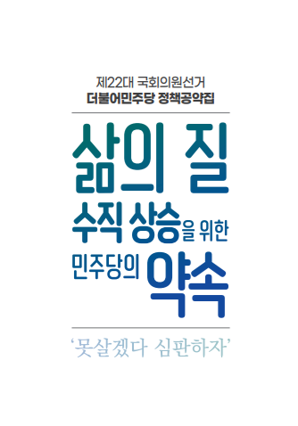
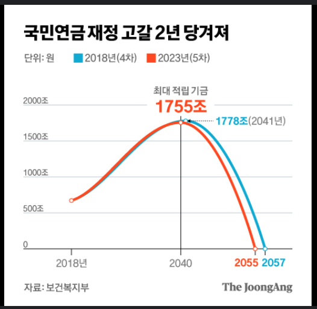
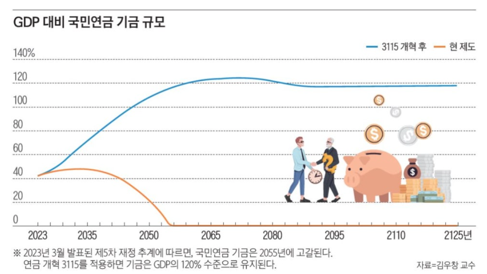
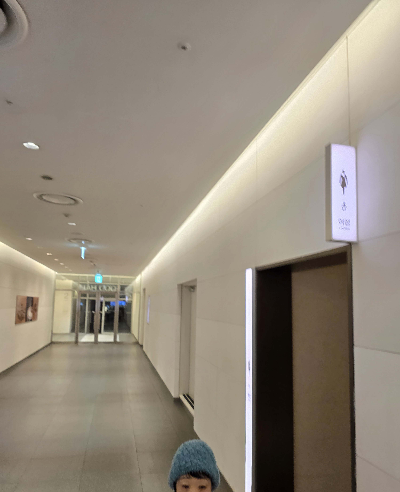
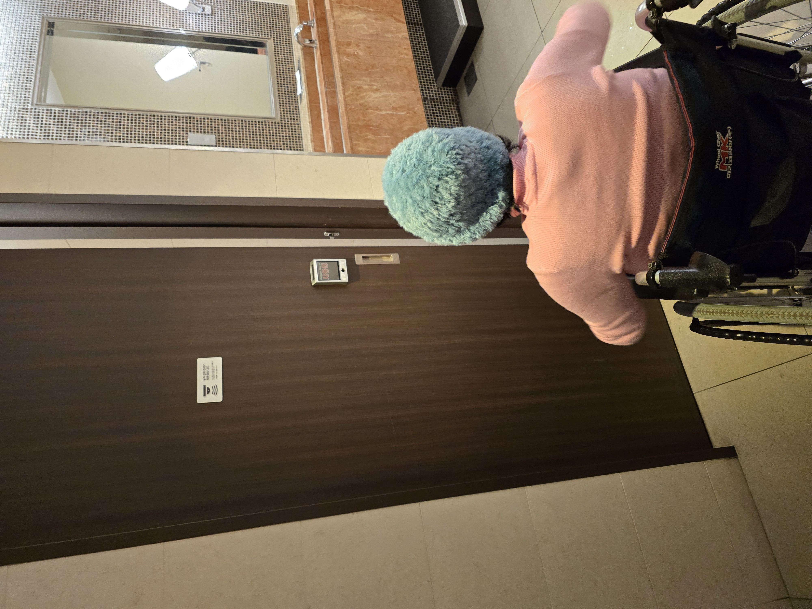
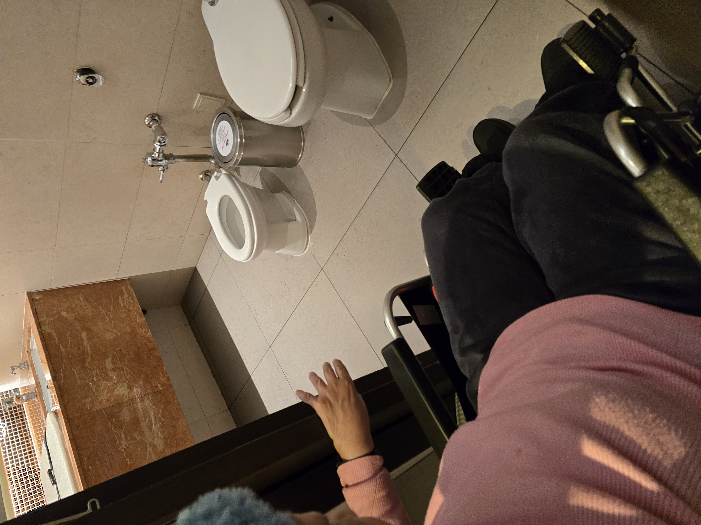
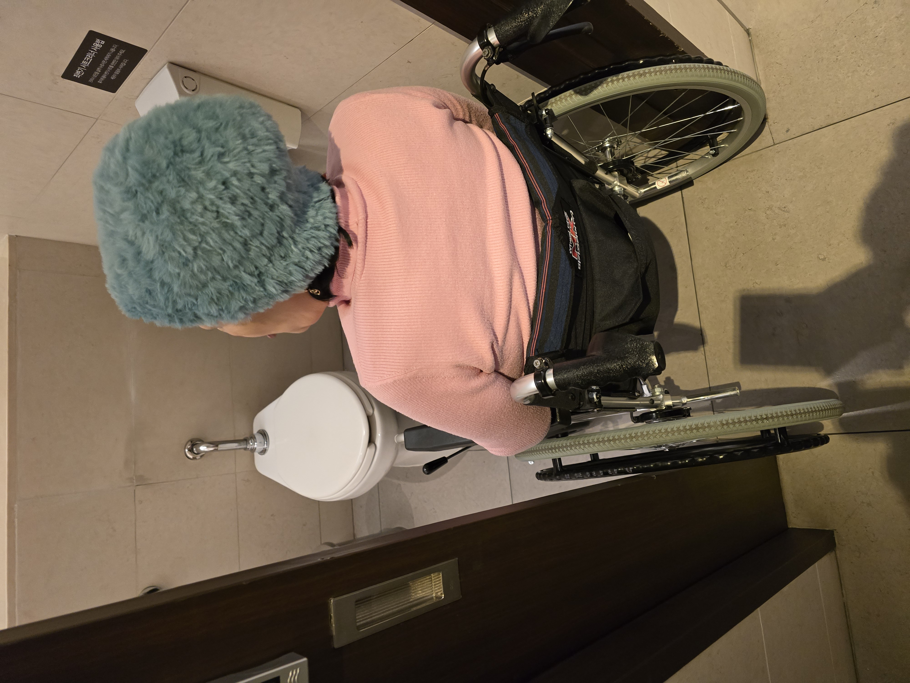
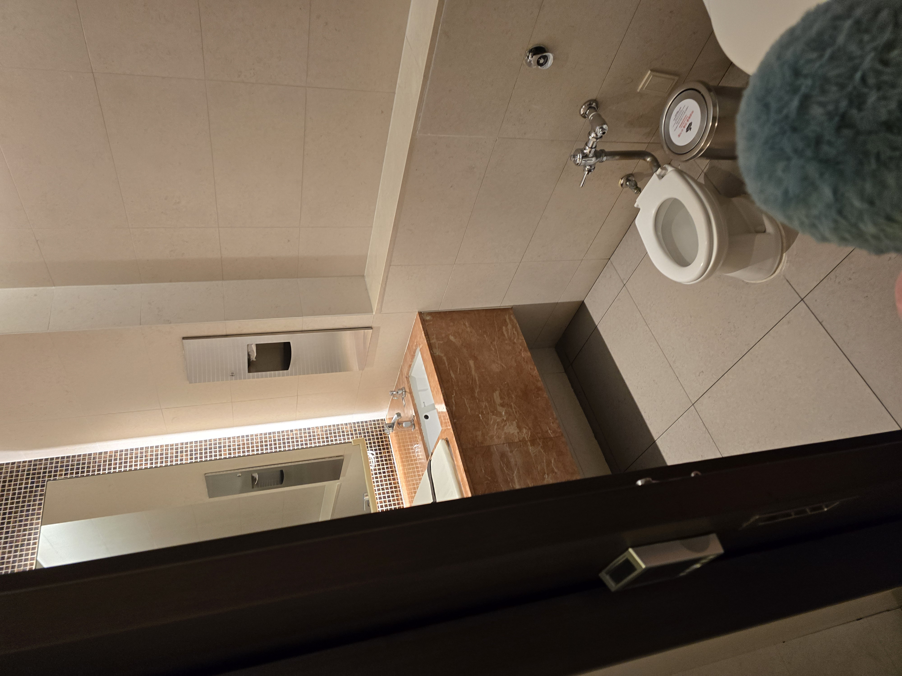
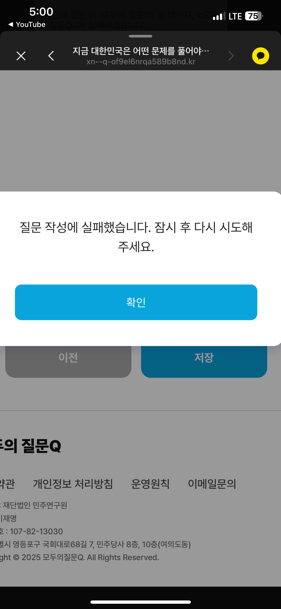
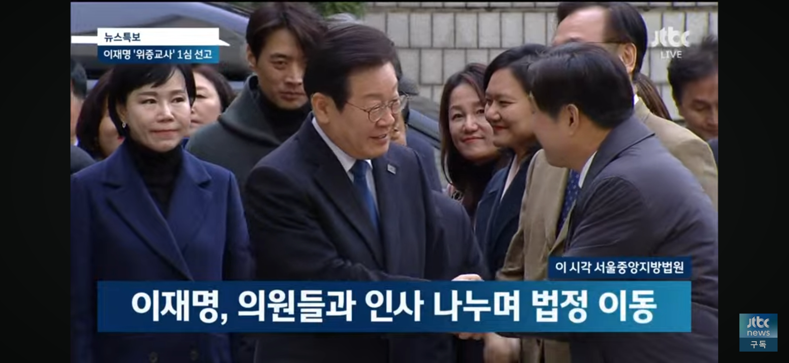

## 문서번호: 4801

### 제목: [노동 계약,경제 상식,미디어 미터러시 이건 어릴때 교육받아야 하는거 아닌가요?사회의 쓴맛이니 가짜 뉴스에 속았다고 질타하는건 모두 당연히 가리쳐야할걸 안가리친 것에 대한 변명 아닌가요?](https://q4all.kr/redirect/detail/a9838d41-3d88-4111-893f-7eb44106c9ed)

**작성자:** [도완영](https://q4all.kr/user/profile/892)
**작성일:** 2025-02-28 07:48:49 (금요일)

---

외국에는 있지만 이상하게 한국 교육 과정에서 어릴때부터

가르치지 않는게 노동계약과 경제나 금융,부동산 계약 등

대한 것이라고 합니다.한국 청년들이 대학과정까지 교육받고도

사회에 나가 낭패를 보는게 두 가지 교육을 받지 않아서라고 합니다.

그리고 미디어 리터러시 요즘 세태를 보면 더 중요한게

이 교육이라고 생각합니다.

해당 언론사 성향,해당 기자 성향,어디 까지 팩트인가

10가지 이야기 중 사실 몇에다 거짓 얼마가 섞여있나?,

행간에 숨은 의미는 무엇인가?,일부로 보도하지 않는게 뭔가?

여론 조사 세부 사항 해석 방법 등 등

가짜 뉴스에 속지 않고 의미를 제대로 해석해내는 방법에

대한 교육이 어릴때 부터 필요하다고 생각합니다.

정보 홍수와 알고리즘의 문제를 생각하면 더 더욱요.

현대 한국에서 어릴때부터 배우는 것 중 이런 교육이

빠져 있는게 맞나요?

---

## 문서번호: 4802

### 제목: [동전 제작비용](https://q4all.kr/redirect/detail/3690fdf9-0afa-410c-8d51-ba7d5e50d424)

**작성자:** [박세용](https://q4all.kr/user/profile/4331)
**작성일:** 2025-02-28 08:56:39 (금요일)

---

1, 전국의 코스트코에서 10원 동전을 사용하여 한국은행에 부담되는 동전 제작비용 부담은 얼마로 추정 하나요?

2, 굳이 10원 동전을 사용하여 코스트코도 불편하고, 고객도 불편한데, 정부에서 규제& 조정할. 수는 없나요?

---

## 문서번호: 4803

### 제목: [*대학을 집중](https://q4all.kr/redirect/detail/7a35bab2-7a99-4d4d-b681-979c282112cb)

**작성자:** [신문희](https://q4all.kr/user/profile/7196)
**작성일:** 2025-02-28 09:04:38 (금요일)

---

\* 대학이 수도권 집중으로 인구가 서울과 같은 수도권에 모이고 있는데 이 문제를 해결하기 위해 우리나라는 어떻게 해야할까?

---

## 문서번호: 4804

### 제목: [지방의회 의원 정당공천제](https://q4all.kr/redirect/detail/f2350a87-f206-4f7f-bef8-728b9245958d)

**작성자:** [박세용](https://q4all.kr/user/profile/4331)
**작성일:** 2025-02-28 09:07:08 (금요일)

---

지방의원공천이 지역에 미치는 폐해가 만연한 것을 전국민이 아는데 이런 사항은 왜 공론화되지 않나요?

---

## 문서번호: 4805

### 제목: [왜 국회의원,대통령은 권력을 많이 가지고 있나요?](https://q4all.kr/redirect/detail/fd1276a3-e366-4aea-a51e-58ab53a4414b)

**작성자:** [임현재](https://q4all.kr/user/profile/2355)
**작성일:** 2025-02-28 09:10:58 (금요일)

---

12 3 내란과 최근 공천 개입의 전말이 밝혀지면서 느낀건 의원과 대통령에게 주어진 권력이 너무 넘친다는 것입니다. 또 특혜도 지나치게 많습니다. 세상에 많은 직업 중 하나일 뿐이고 그 중에서도 국민을 위해 일하는 공무원 중 한명입니다. 그러나 지금은 넘치는 권력이 있다보니 부정을 저질러서 감옥을 가더라더 당선이 되려합니다. 이정도면 병에 걸리는거라 할 수 있습니다. 권력에 취하는 것입니다. 이제는 권력을 줄이고 권한만 부여해야 합니다. 의원과 대통령을 지자체 공무원 수준으로 만들어야 합니다.

---

## 문서번호: 4806

### 제목: [독재는 싫다고 하면서 왜 국회는 소수에게 권력을 허용해 주고 있나요?](https://q4all.kr/redirect/detail/aa0ea389-b9bb-4023-95b5-daea38e0c9d3)

**작성자:** [도완영](https://q4all.kr/user/profile/892)
**작성일:** 2025-02-28 09:12:00 (금요일)

---

국가의 권한과 힘이 견제와 균형이 이루어 지지 않는 것이

독재입니다.아니면 전제군주제겠지요.

그런데 우리는 국회만은 인구와 세분화된 사회 구조에

비해 많이 작은 300명에게 권한이 집중돼 있습니다.

소수에게 권한이나 권력이 집중된 건 말 바꿔 비유하자면

소수의 귀족들과 같습니다.

어느 나라의 국회 의원은 자전거 타고 다니고

혹은 노숙자처럼 다니는 의원 이야기도 들은 바 있습니다.

제 생각에 그 건 그 의원들에게 권한이 우리 나라만큼

주어져 있지 않기 때문입니다.

방법은 300명에게 주어진 권한과 권력을 더 쪼개면 됩니다.

나누면 나눈만큼 권한은 약해집니다.

우리나라 인구 정도면 600이나 750 정도면 적당하다고

합니다.결국 우리는 750명에게 나눠 있어야 할 권한을

300명에게 집중시켜 주고 있는 겁니다.

혹시 우리는 언론과 여론조사 기관의 기사와 조사문항의

설계에 가스라이팅 되고 있지 않았나 의심됩니다.

정치 혐오 그리고 더 소수에게 권력을 집중시켜서

150명 나아가 100명에게까지 집중시키라고

국회에 자신의 직업군 있어야 하지 않냐고 하는

여론조사 설문이나 기사나 스피커를 본적이 있습니까?

회사원,농부,어부, 산업 현장 출신,일용직, 전업주부 등 등 기억 나는대로

적었는데 이런 자신들을 대표하는 국회의원이 있나요?

심지어 위 직업들도 도시와 수도권,지방에서는 다 다릅니다.

그저 정치혐오를 설명하고 국회의원 몇 명이 좋냐

숫자를 늘이는데 찬성하느냐 이런 여론 조사나 기사만

있었던게 아닌가요?

왜 우리는 지금까지 300명에게만 권한을 집중시켜만 둬야 하나요?

---

## 문서번호: 4807

### 제목: [왜 부정부패는 사라지지 않을까](https://q4all.kr/redirect/detail/0601298b-3fea-4882-851c-53fcba2633d8)

**작성자:** [최준호](https://q4all.kr/user/profile/3034)
**작성일:** 2025-02-28 10:41:11 (금요일)

---

유구한 역사가 이를 증명하듯 지금도 부정부패는 사라지지 않고 만연하고 있습니다.

위부터 아래까지 어느 곳 하나 깨끗한 곳이 없습니다.

그저 이에 대한 피해는 성실히 법을 지키며 살아가는 힘 없는 서민들의 몫입니다.

자신에게 주워진 권리도 제대로 받지 못하며, 기울어진 운동장에서 힘들게 살아갑니다.

이런 사람들을 위해 필요한 사람들 조차 그저 권력에 기대어 그들만의 리그를 지속하고 있습니다.

이에 사람들은 무기력감에 빠져 정치를 등한시 하는 것이겠죠... 믿고 싶은 정치 마저 그저 힘의 논리에 기대어 권력자만을 위해 돌아가며, 표면적으로는 서민들을 위한다고 하지만 결국 보면 그것도 이용하기 좋은 핑계일 뿐입니다.

사람이라 어쩔 수 없다... 이는 부정부패를 저지르는 사람의 정신승리겠죠. 비겁한 변명입니다.

이 사회를 살아가는 일원으로서, 두 딸의 아빠로서 세상은 너무나 힘든 곳입니다.

이런 곳에서 어찌 아이를 낳고 살아가라고 자신있게 말할 수 있겠습니까!

전 종교는 없지만 아마도 지옥은 이런 곳이 아닌가 싶습니다. 그래서 아마도 어느 종교에서는 모든 사람들을 죄인이라 하는지 모르겠습니다.

---

## 문서번호: 4808

### 제목: [극우들은 어떻게 해야하는가...](https://q4all.kr/redirect/detail/7ee3a2f3-820f-46ef-913c-39c8c5156132)

**작성자:** [최준호](https://q4all.kr/user/profile/3034)
**작성일:** 2025-02-28 10:58:36 (금요일)

---

십분 백분 천분 양보해도... 도저히 이해가 가지 않습니다.

그들을 어떻게 해야 할까요?

지금도 어떤 인터넷 기사에 대통령의 최후 변론을 들어봐야 하지 않냐며, 그를 응원하는 댓글을 봅니다.

도대체 어떤 포인트가 그의 행동(계엄)이 정당하다고 생각하는지.. 도저히 모르겠습니다.

논리도 없고, 어디서 주워들은 카더라를 믿으며,

특정 종교에서는 정치적 설교를 하고... 그를 믿고...

이런 분들이 전국민의 4분의 1이라는 사실이 너무 무섭습니다.

가끔 퇴근길에 지하철에 꽉찬 사람들을 볼때 마다 이 많은 사람들 중에 25%는 그런 사람이겠지 하며 무서운 상상을 합니다.

부산행의 좀비가 생각날때도 있습니다.

무섭고 무섭습니다.

서부지법 테러 사건도 그렇고, 이번에 헌재에서 탄핵 인용결정이 나면 정말 큰일이 나지 않을까 하는 걱정도 됩니다.

만약의 사태에 대비해 치안에 힘을 써야 하지 않을까 생각합니다.

우리는 그들을 어떻게 해야할까요? 계엄을 계몽이라고 하는 자들을 어떻게 우리 사회에서 품어줘야 할까요...

걱정입니다.

---

## 문서번호: 4809

### 제목: [역사를 잊은 민족에게 미래는 없습니다.](https://q4all.kr/redirect/detail/cfb81888-32ae-4411-9a29-0f169c7d5796)

**작성자:** [강대삼](https://q4all.kr/user/profile/3027)
**작성일:** 2025-02-28 11:01:03 (금요일)

---

저는 충북 단양이 고향인, 3자녀를 둔 1970년생 평범한 남성입니다.

저는 진보와 보수라는 정치 이념에 대해 보통 사람으로서 이야기 해 볼까 합니다.

대한민국에는 언제부터 인가 진보와 보수라는 정치 이념으로 나뉘어 극심한 대립을 이루고 있습니다. 국가의 안녕과 발전을 하는데 가장 소모적이고 비생산적인 논쟁이라고 생각합니다.

과연 보수와 진보라는 명확한 기준, 진리를 알고 있는 사람들(특히 일반 국민들)이 과연 얼마나 있을까요?

국어사전을 보면 보수는 국정 운영을 하는데 있어 체제 유지를 좀 더 목적에 두고, 진보는 체제 유지보다 체제는 유지 하되 조금은 진보 되는 방향으로 국정 운영을 하는 것으로 나와 있습니다.

좀 더 구체적으로 민주주의 공화정 체제 하에서 보수든 진보든 헌법의 기틀 아래 대한민국의 지속적인 안녕과 번영을 기본 가치로 한다는 것은 동일하다고 봅니다.

다만, 보수는 기존 체계의 룰과 가치를 좀 더 중심에 두고, 진보는 세상의 변화에 발 맞춰 조금은 변화되는 세상에 맞게 가치와 룰을 생각 한다는 것 입니다.

그런데, 현실은 어떠한가요?

우리는 당연히 국민의힘 또는 그 전신 세력들=보수, 민주당 또는 그 전신 세력들을 진보라고 인식 하고 있습니다.

더 나아가 보수를 지칭하는 사람들의 대다수가 보수는 헌법과 질서를 존중하는 세력=국민의힘=보수, 진보는 헌법과 질서를 파괴하는 세력 민주당=진보=공산주의(빨갱이), 불순세력 이라는 생각을 하고 있습니다.

그러면, 정말 객관적으로 그럴까요?

단언 하지만 이것은 해방 이후 80년 가까운 세월의 대부분의 시간을 집권당, 기득권 세력으로 자리 잡은 친일매국, 친미 사대주의자들이 만들어 놓은 프레임 이라고 생각 합니다.

그들이 기득권 유지 목적으로 만들어 놓은 프레임인 것을요.

80여년간 기득권을 유지해온 집권당(국민의힘세력)과 검찰(사법포함), 언론(소위 매국 언론지인 조,중,동과 그 동조 언론들)의 3각 카르텔이 만들어 내는 지속 적인 가짜정보, 가짜뉴스에 가스라이팅을 당해 온 것 때문 아닌가요?

집권당과 검찰과 언론은 자신들에게 위협이 될 만한 세력들에게 가짜뉴스나, 정보를 국민들에게 흘리고, 그들은 이것을 확대 재생산 하여 여론을 형성하고, 검찰은 사이비 단체를 이용 고발 사주하고, 검찰(국정원 포함)은 다시 허위 진술과 자백을 강요, 사건 조작을 하여 기소를 하고, 판사는 이 거짓 조작된 자료를 토대로 터무니없는 판결과 형을 집행을 하고, 그러면 또다시 그것을 바탕으로 악마화 하는 여론을 형성 하고, 이렇게 80여 년간 변하지 않는 악의 3각 카르텔로 기득권을 유지 해 온 것이 사실 아닌가요? 80여 년간 변하지 않게 가스라이팅을 당해오는 국민들도 대단 한 것 같아요.

이제는 더 이상 이런 왜곡된 역사를 되풀이 하여서는 아니 됩니다. 바로 잡아야 할 시간 입니다.

국민 여러분들이나 민주당의 청치인 들은 이제 바뀌어야 합니다.

국민 여러분들은 편향된 사고와 왜곡된 역사의 진실을 자각하고, 진정한 현실에 눈과 귀를 열어야 합니다. 민주당 정치인들 또한, 어설픈 화합이나, 통합이라는 쓰레기 같은 명분은 집어치우고, 80여 년간 내려온 악의 카르텔을 없애야 합니다.

그것을 위해 모든 국민들이 대동 단합하는 길 만이 대한민국이 앞으로 나아가야 할 길 이라고 생각 합니다.

국민 여러분?

저는 대한민국의 보수는 없다고 확신 합니다.

여러분들이 말하는 보수는 보수가 아닙니다. 그저 해방 이후 80여 년간 친일매국, 친미 사대주의자들이 만들어 놓은 매국, 악의 카르텔일 뿐입니다.

제가 왜 이런 생각을 하는지 말씀 드리겠습니다.

자칭 보수의 시조, 아버지, 국부라고 하는 1대 보수 정부인 이승만 정권부터 볼까요?

이승만 정권은 해방 이후 일제 치하 친일, 매국 행위자들을 발본, 색원 하 기 위해 만든 반민족특별조사위원회(반민특위)를 해체하고, 친일, 친미 세력들을 이용해 자신의 정치적 정적인 독립 애국자들을 공산주의자들로 매도, 척결한 자 입니다.

또한, 서북청년회등 청치 깡패를 동원해 반대파들을 억압하고, 1947년~48년에는 제주 4.3사건, 여수,순천 사건 처럼, 남로당원들을 제거 한다는 목적으로 무고한 시민 수만명을 학살 하였으며, 1949년에는 일명 국회 프락치 사건으로 국회 부의장이던 김약수및 노일환, 이문원등이 남북평화통일방안7원칙을 제시한 의원을 정국 혼란을 야기 했다는 이유로 빨갱이로 몰아 서대문 형무소에 수감하기도 하였습니다. 1950년에는 국민 보도연맹이라는 소위 반공단체를 만들어 무고한 시민들을 공산주의자들로 몰아 수십만인지 백만인지도 모르게 학살을 자행 하였습니다. 6,25 전쟁 시에는 자기 혼자 살겠다고, 한강 인도교를 폭파 지시하여, 많은 무고한 시민을 죽게 하였습니다.

1954년에는 영구 종신 집권을 위하여 정치깡패인 이정재를 동원해 말도 안 되는 사사오입 개헌이라는 만행을 저지르기도 했습니다.

1958년에는 총선에서도 지고, 차기 대선에서도 조봉암 에게 질 것이 유력 해지자, 조봉암을 간첩으로 몰아 정식 재판 절차 없이 사형을 선고, 바로 집행 하였으며, 1960년에는 3.15 부정선거를 자행하여 4.19학생 운동의 원초를 제공하기도 하였습니다. 이승만은 최인규 내무부 장관의 지휘 하에 경찰, 정치깡패를 동원, 각종 선거 부정행위를 통해 대통령 득표율 88.7%, 부통령 득표율 79%등 있을 수 없는 결과로 선거 조작 행위를 자행 정권을 탈취 하였습니다.

이후, 5.16 군사혁명때 최인규와 이정재 등은 선거 부정행위 등으로 사형이 집행되기도 하였습니다.

이렇게 집권당의 대통령 이란 작자가, 자신의 정권 연장을 위해 누구보다도 보수의 제1원칙인 헌법 수호와 대한민국의 가치를 불법 계엄 등으로 앞장서서 파괴하고, 선거조작, 간첩 조작 사건등으로 헌법 파괴와 대한민국 국민들의 목숨을 빼앗았습니다.

이것이 보수의 시조인 이승만 정권의 실체입니다.

1960년 4.19혁명으로 얻어낸 윤보선 민주 정권을 박정희는 1961년 5월16일 군사정변을 일으켜 정권을 탈취하였습니다.

박정희는 대구 사범대를 졸업하고, 문경공립보통소학교교사를 하던 중 1940년 만주 육군 군관학교를 거쳐, 1944년 일본제국 육국사관학교를 졸업 만주군 소위로 임관, 1945년 중위로 진급, 독립군 토벌에 앞장선 자입니다.

해방이 되자, 1946년 조선경비사관학교(지금육사의전신)를 졸업, 신분 세탁을 하고, 1948년 소령으로 진급까지 하게 됩니다. 1949년 형인 박상희의 영향을 받아서인 조선 남로당(빨치산)활동을 하다 체포되어 불명예제대를 하였습니다.

간첩죄로 고생하던 중, 1950년 6,25전쟁이 나자 대한민국 육군 소령에 복직, 승승장구하여 1959년 육군 소장에 진급하게 됩니다.

1960년 5.16군사정변을 일으키고, 1961년 8월 스스로 육군 중장 진급을 하고, 1961년 11월 스스로 육군 대장에 진급을 하기 도 합니다.

1962년 3월 대통령 윤보선을 협박하여 하야 시키고, 스스로 대통령 권한 대행을 차지합니다. 그리고, 드디어 각종 청치 탄압과 여론 조작으로 1963년.12월 대통령에 당선 됩니다.

2대 보수정부인 박정희 역시 영구 집권을 위해, 불법계엄, 3선 개헌, 인혁당사건, 부마사태, 각종 간첩 조작사건 등으로 보수의 제1원칙인 헌법 수호와 대한민국의 가치를 앞장서서 파괴하고, 대한민국 국민들의 목숨을 빼앗았습니다.

이자 역시 당시 중앙정보부장인 김재규의 손에 1979.10.26 암살되는 최후를 맞이합니다.

이것이 2번째 보수정권인 박정희 정권의 실체입니다.

그렇게, 군사독재 정권이 끝나는가 싶었지만, 전두환 이라는 작자가 또다시 1979. 12.12 군사정변을 일으켜, 1980년 5월 불법 군사 쿠테타에 항쟁하는 광주 시민들을 북한 간첩으로 조작해 비상계엄을 선포, 특전사부대를 동원 무참히 학살 합니다. 이렇게 무력으로 1980년 8월 다시 제2의 군사 독재 정권을 시작합니다.

그리고, 불법 체육관 선거를 통해 7년짜리 대통령권한을 찬탈 합니다.

3대 보수정부인 전두환 정권 역시, 정치적 반대 세력인 김대중, 김영삼, 김종필등을 암살, 추방, 불법 감금 등을 시도 합니다. 전두환은 1980년 5월 광주 민주화운동을 남파간첩 사건으로 조작, 1980년 7월 김대중을 간첩으로 조작, 암살 하려 합니다, 1980년 11월 강제 언론 통폐합, 1986년 10월 북한 금강산댐 조작 모금운동, 1987년 1월 수지 김 간첩조작사건, 1987년 1월 박종철군 고문 치사 사건, 1987년 4월 정치깡패인 김용남(일명 용팔이)을 이용한 통일민주당 창당 방해사건등 정권 유지를 위해 온갖 조작, 폭력을 이용해 여론을 호도 국민들을 속였습니다.

1987년 그 역시 영구 독재를 시도 하다, 1987년 6월 민주화 시민항쟁 운동으로 권자에서 물러나게 됩니다.

3대 보수정부인 전두환 정권 역시 불법 계엄, 시민 학살, 간첩 조작 사건등 보수의 제1원칙인 헌법 수호와 대한민국의 가치를 앞장서서 파괴하고, 대한민국 국민들의 목숨을 빼앗았습니다.

어떻게 이렇게 하나같이 똑같은 만행으로 정권을 유지하려고 할까요?

이후 1987,12월 탄생한 4대 보수 정부인 노태우 정권 역시 재벌과의 유착에 의한 커넥션 비리, 군내 사조직인 하나회를 기반으로 정권 연장을 꿈꾸었으나 여의 치 안아, 김영삼, 김종필등과 3당 합당이라는 카드로 김영삼이라는 대한민국 최초의 문민정부를 탄생 시킵니다.

그러나, 1993년 12월 탄생한 5대 보수정부인 김영삼 정권 역시 독단과 아집의 정책으로, IMF라는 국가 대재앙을 초래하여 많은 기업과 국민들을 파산과 절망에 빠트렸습니다.

또한, 이러한 상황에서 이회창 후보의 대통령 당선을 위하여 국정원을 이용, 북한에 돈을 주고 대선시기에 맞추어 남한을 공격해달라는 이른바 총풍 사건을 벌입니다. 정말 국가 반역 행위 아닙니까? 그러나, 다행이 현명한 국민들로 인해 대한민국 정부 탄생 최초로 1998년 12월 50년 만에 처음으로 1대 소위 진보 민주 정부가 탄생 합니다.

이렇게 탄생한 진정한 문민정부인 김대중 정부는 , 2001년 8월 대한민국 국민과 정부의 노력으로 IMF를 졸업하게 됩니다.

김대중 정부는 어려운 환경 속에서도 미래를 위한 과감한 문화예술, 과학기술(IT),국방분야의 집중적인 투자로 대한민국을 현재의 문화, IT, 국방강국을 만드는 초석을 만들었습니다.

2003년 2대 진보 정부인 노무현 정부의 탄생으로 민주주의 국가로서의 기틀을 다지게 됩니다.

그러나, 2008년 탄생한 6대 보수정부인 이명박 정권의 탄생으로, 대한민국은 다시 역사를 후퇴 시킵니다.

뉴라이트등 친일 세력이 역사왜곡, 자원비리, 무분별한 종편언론사의 허가 등으로 언론을 왜곡하여 국민들을 가스라이팅 하기 시작 합니다.

이때부터 본격적으로 군부를 동원한 정권 연장의 꿈이 불가능해 지자 정권, 언론, 사법(검찰,판사) 3각의 악의 카르텔이 본격적으로 자리 잡게 됩니다.

이명박 정권 역시 내곡동 부동산투기, BBK주가조작, 4대강 사업, 자원비리, 서울시 공무원 간첩 조작 사건등을 일으키고, 국정원을 동원 여론 조작으로, 2013년 7대 보수정부인 박근혜 정권를 탄생 시킵니다.

박근혜 정권 역시 역사 왜곡, 각종비리, 최순실에 의한 국정 농단등 수없이 많은 비리 들이 생깁니다. 또한, 국정운영이 여의치 안으니, 국가 계엄 사태를 모의하기도 합니다.

그리고, 결국 대한민국 최초로 국민에 의해 탄핵되어 권좌에서 물러납니다.

2017년 박근혜의 파면으로 조기 출범된 3대 진보 정부인 문재인 정부에서는 그야말로 국민의힘, 검찰(사법포함)과 언론등의 악의 카르텔이 이 나라를 지배 하게 됩니다.

검찰과 언론 공화국이 탄생 한 것입니다.

대한민국 5,000년 역사에서 최악의 정부인 8대 보수 정권인 윤석열 정권인 것 입니다.

무엇을 상상하던 그 이상의 온갖 악행과 비리로 얼룩진 세계사에도 보기 드문 악의 정부인 것 입니다.

대한민국 보수의 제1원칙인 헌법 수호와 대한민국의 가치를 앞장서서 파괴하고, 대한민국 국민들의 목숨과 재산을 빼앗았습니다. 온갖 조작과 가짜뉴스로 정적을 제거하고,

국가를 전쟁으로 내몰아 통일 대통령으로 영구집권을 시도하였습니다.

나라를 친일, 매국세력의 세상으로 만들었습니다. 김건희라는 희대의 악마를 만들었으며, 국민들을 이간질하여, 법원 폭동 사태등 나라를 준 내전 상태로 만들어 버렸습니다.

상상할수 없는 계엄을 선포하여 국가 내란 사태를 만들었습니다.

40년간 차곡히 쌓아온 민주주의를 송두리째 뽑아 버렸습니다.

군사독재 정권 하에서는 숨도 못 쉬고, 정권의 나팔수와 칼이 되어 시녀 노릇을 하던 조,중,동의 언론과 검찰은 스스로가 최고의 권력이 되었습니다.

이렇게 앞에서 설명 한바와 같이 1대부터 8대 보수 정권 모두 보수의 제1가치인 헌법 수호와 국가의 안녕과 발전을 뒤로 한 채, 스스로 헌법 파괴에 앞장서며, 국민의 생명과 재산을 빼아샀습니다. 언제나 항상 헌법수호와 국가의 안녕과 발전은 진보 정부가 담당해 왔습니다.

그동안 대한민국에 보수는 항상 민주당 몫이었습니다.

자칭 보수라고 해온 1~8대 보수정권은 보수가 아니라 친일 매국, 반란, 기득권 세력 이었습니다. 그렇지 않은가요?

특히나 윤석열 정권은 1~7대 보수 정권의 종합판인 것입니다.

불법계엄, 무능, 사건조작, 여론 조작, 국정농단, 친일 매국 행위에 사이비 주술로 이 나라를 엉망으로 만들었습니다.

조봉암이나, 김대중처럼 이재명 대표를 간첩으로 몰아 제거 하려 하였습니다.

이런데도 쓰레기 언론에 가스라이팅 당한 국민들은 이 극악무도한 정권을 찬양하고 있습니다.

왜일까요?

저는 대한민국의 최근 근현대사 150년의 역사의식 부재에 있다고 봅니다.

150년의 역사를 제대로 알고 있다면 쓰레기 같은 언론의 가짜뉴스에 지배당하지는 안았겠지요. 그래서, 학교의 교육 과목에서 최근 근현대사의 역사 교육을 강화 해 야 한다고 봅니다.

또한, 전국 지자체의 교양 문화 강좌에 역사교육의 강화와 공무원, 군인, 예비군, 민방위, 각종 특수직종의 안전교육등의 교육 프로그램에도 150년 근현대사의 역사 교육을 의무화해야 된다고 생각 합니다.

기본적이고 근본적인 역사인식이 없는데, 국가관, 민족관, 도덕관, 윤리관등이 있겠습니까?

이런 인간의 기본 가치관도 없는 인간들이 정치인, 검사, 판사, 언론인, 의사등 소위 사회지도층으로 자리하고 있는 사회가 제대로 굴러 가겠습니까?

역사를 잊은 민족에게 미래는 없습니다.

---

## 문서번호: 4810

### 제목: [민주당의 남성 혹은 남성 청년을 위한 정책으로는 무엇이 있나요?](https://q4all.kr/redirect/detail/ba950e39-37ba-48e9-98bc-c62c88d34dc8)

**작성자:** [홍가람](https://q4all.kr/user/profile/2520)
**작성일:** 2025-02-28 11:30:50 (금요일)

---

간단하게 제22대 총선 더불어민주당 온라인 정책공약집 파일 (pdf)를 구해서 좀 봤습니다.

<https://theminjoo.kr/uploads/%EC%A0%9C22%EB%8C%80_%EC%B4%9D%EC%84%A0_%EB%8D%94%EB%B6%88%EC%96%B4%EB%AF%BC%EC%A3%BC%EB%8B%B9_%EC%98%A8%EB%9D%BC%EC%9D%B8_%EC%A0%95%EC%B1%85%EA%B3%B5%EC%95%BD%EC%A7%91(f).pdf>

링크입니다.

간단하게만 찾아봤는데 큰 틀에서 봤을 때는 성평등이라는 이름으로 되어 있어서

여성 혹은 남성으로만 찾아봤습니다.

여성의 경우 입니다.

* 여성안심주택 등 공급 확대
* 과학기술 인력 양성정책을 현장‧지역‧청년‧여성 중심으로 전환하고 지원 확대
* 아동, 여성, 어르신, 중증질환자 전문 병동, 병실을 갖춘 메디타운 조성
* 울산형 돌봄 책임제 도입(경력단절 여성의 직업의 질과 지위 해결과 아이 키우기 좋은 도시 구축)

남성의 경우 입니다.

* ?

남성이라는 키워드로는 찾을 수가 없습니다.

청년이나 그런 키워드는 일부러 찾지 않았습니다.

청년이라는 말은 성을 구분하지 않으니까요.

그러나 온라인 정책집에서도 남성들의 목소리 자체가 보이지를 않아서

민주당의 입장에서는 남성들, 특히나 2030 남성들을 위해서는 어떠한 안이 있는지

자세히 알고 싶습니다.

사실 여성들이 무슨 불편을 겪고 있는게 있냐?, 라고 말하는 것이 아닙니다.

여성들 당영히 불편을 겪고 있습니다.

하지만 동시에 남성들도 불편을 겪고 있고, 그에 대한 목소리를 들어보셨다면

그에 따른 생각이나 정책안이 있는지 여쭙는 것입니다.

---

## 문서번호: 4811

### 제목: [무작정 금연 구역을 늘리는 것만이 정답일까요?](https://q4all.kr/redirect/detail/315a5422-3d7b-46a8-bc43-e3d8e9cbcc9f)

**작성자:** [홍가람](https://q4all.kr/user/profile/2520)
**작성일:** 2025-02-28 11:44:37 (금요일)

---

사실 제 개인적으로는 흡연 구역 혹은 부스에 대한 설치가 필요하다고 봅니다.

문제는 그 구역이 너무 적다는 것이죠...

당장에 떠오르는 공공장소에 있는 흡연 구역이나 부스라고는

* 구청에 있는 사실상 방치된 흡연 부스
* 병원 혹은 장례식장 등에 있는 흡연 구역
* 휴게소의 흡연 구역

정도입니다.

흡연을 하거나 흡연을 하시는 분들을 보면, 제 개인이 사용하는 표현으로는 회색구역 / 그레이존 이라고 부르는 "금연 구역도 그렇다고 흡연 구역도 아닌 곳"에서 피우거나 피우는 걸 보는 경우가 많습니다.

다만, 담배는 국가에서 공식적으로 인정하고 판매하는 제품이기도 하고 대부분이 세금으로 이루어져 있죠.

(그 세금이 어떻게 쓰이는 지에 대해서는 알기가 어려운 점이 있죠)

* 비흡연자 분들의 입장에서는 금연 구역은 아닌데 그렇다고 흡연하기도 애매한 곳에서 담배를 피우시는 분들 때문에라도 피해를 입게 되고
* 흡연자 분들의 입장에서는 금연 구역은 아니고, 그렇다고 흡연 구역이나 흡연 부스가 있는 것은 아니니 제 표현에 따르면 회색 구역에서 피우게 되는 경우가 대다수라고 봅니다.

흡연 부스를 설치하거나 흡연 구역을 지정하면 뭐하냐, 거기서 안 피우지 않냐 라고 하시는 분들도 분명 계실지 모릅니다.

하지만 동시에 흡연 구역이나 부스가 떡하니 있음에도 그 외의 장소에서 피우는 사람에게는 변명을 못 하게 할 수 있는 방법이 될 수도 있다고 봅니다.

* 비흡연자들의 건강에 대한 권리
* 흡연자들의 소위 말하는 흡연할 권리

이 둘에 대해서 언제까지고 금연 구역을 늘리는 것만으로는 답이 없을 거라 보입니다.

가격을 올리고 혐오스러운 이미지를 담배 케이스에 붙이는 것도 그리 큰 의미는 없을 것이라 보입니다.

사실, 담배로 인한 세금도 상당히 있는 것으로 알아서 건강을 말하며 담배를 안 팔게 할 수도 없을 것으로 보입니다.

그래서 물론, 뭘 하든 돈이 쓰이긴 합니다만

담배를 통한 세금으로는 흡연자들을 위한 시설을 설치함과 동시에

비흡연자들을 간접 흡연 등에서부터 보호할 수 있는

흡연 구역 및 부스에 대한 지정 및 설치가 필요하다고 생각합니다.

---

## 문서번호: 4812

### 제목: [한국의 민주주의는 전세계적 극우화의 흐름을 멈출 수 있는가?](https://q4all.kr/redirect/detail/9ff7ee58-4c98-4a85-9f68-504e2a7a47ca)

**작성자:** [김은주](https://q4all.kr/user/profile/7210)
**작성일:** 2025-02-28 11:52:06 (금요일)

---

이번 12.3 계엄 사태를 통해 한국 시민들이 얼마나 위대한지 민주주의가 얼마나 저력 있는지를 느끼게 되었습니다. 그러나 정치 양극화는 더욱 심해졌고. 전 세계적 흐름이 양극화로, 극우적으로 빠르게 가고 있어서 민주주의에서 피할 수 없는 현상인가 많이 우려가 됩니다. 과연 작지만 강한 나라 한국이 이 문제를 돌파하고 후대에게 새로운 비전을 제시할 수 있는가 질문합니다.

---

## 문서번호: 4813

### 제목: [공단, 국가기관 등에 스마트폰 앱은 따로 따로 만들어 놨을까요?](https://q4all.kr/redirect/detail/e88dc2c5-2ea7-46d3-8faa-5b02a77eadb0)

**작성자:** [김정국](https://q4all.kr/user/profile/2061)
**작성일:** 2025-02-28 12:46:52 (금요일)

---

조기 은퇴한 평범한 개발자입니다.

건강보험공단, 국민연금, 모바일 신분증, 국민비서 등등 등등 등 너무 많은 앱이 난무합니다. 국가에서 제공하는 다양한 서비스는 국민이 손쉽게 접근할 수 있어야 합니다.

흔히 슈퍼앱이라고 하는 형태에 국가 앱이 필요하다고 생각합니다. 아니면 일부 영역을 좀 나누어서 안보, 민원, 경제 등에 카테고리를 나누어 영역별 슈퍼앱을 국가 주도로 개발 및 운영을 하면 좋겠습니다.

보안, 건강 정보 등을 특정인을 알 수 없게 암호화 하고 자기 자신만 그 정보를 열람 할 수 있게 암호화 하고 다른 민간 업체들은 특정인을 알 수는 없고 좋은 양질에 데이터를 사용할 수 있고 등등 아이디어는 많은거 같은데요.

양자컴퓨팅이 슬슬 언급되는 세상에 맞지 않을 수는 있지만 블록체인 같은걸로 원장에 해당하는 정보를 관리하는 등에 IT 강국 다운 국가 시스템이 될거 같네요 ㅎ

공공데이터 등도 이런 슈퍼앱을 개발할 때 기초부터 프로토콜 정의도하고 다른 민간 기업들과 협업하여 제대로 한번 만들어주셨으면 좋겠네요.

주저리주저리 생각나는 대로 적어봤습니다.

---

## 문서번호: 4814

### 제목: [국민연금 - 30년 후 소진되는 펀드에 누가 돈을 넣고 싶어하겠는가?](https://q4all.kr/redirect/detail/44a85001-3c02-4f87-ac88-79994f1dc762)

**작성자:** [하태환](https://q4all.kr/user/profile/6666)
**작성일:** 2025-02-28 13:01:18 (금요일)

---

왼쪽은 국회에서 논의되고 있는 모수개혁에 의한 적립금의 변화이고, 오른쪽 그림은 재정투입 (GDP 1%)을 전제한 김우창 교수의 "3115" 연금개혁에 따른 적립금의 추이를 시뮬레이션한 겁니다.

펀드나 주식투자를 해보신 분들은 알겠지만, 적립금이 소진되는 계좌에 누가 내 월급의 일부를 넣고 싶겠습니까?

적립금이 소진되는 것을 눈앞에 뒀을 때 (예를 들어 2040년대), 월급쟁이들은 월급의 20% ~25%를 넣어야 현행 기대수익비 2.0 근처의 연금을 기대할 수 있습니다.

더 큰 문제는 20% 이상의 소득을 국민연금에 납입한 직장인들은 막상 당사자들이 은퇴했을 때, 혜택을 누릴 수 있을 지 불확실하다는 공포에 시달리게 됩니다.

또한 55년이 되는 시점에서는 국가 재정에서 200조원 300조원을 국민연금 투입해야 한다고 합니다 - 그 때의 경제상황이 좋으면 괜찮지만 나쁘면 어떻게 합니까????????

농부가 흉년이 들어도 내년에 뿌릴 씨앗은 굶어 죽더라도 지킨다고 했습니다. 현재 20대 ~30대 뿐 아니라 10대인 우리의 자식들이 저런 상황에 (왼쪽 그래프) 처하게 할 수는 없습니다.

아무쪼록 우리의 정치인들과 관료들이 머리를 맞대어 국민연금의 적립금이 유지되는 방안을 찾을 수 있기를 바랍니다. (딱히 GDP 120% 수준이 아니라, GDP 80%, 90% 이라도 영속되는 그림이 있어야 정부를 믿지 않겠습니까??)

---

## 문서번호: 4816

### 제목: [출산율 걱정? 그 본질인 태어난 아이들이나 잘키우게 해주세요](https://q4all.kr/redirect/detail/5380adad-b2b0-455b-9db0-cc34ad96d750)

**작성자:** [권정하](https://q4all.kr/user/profile/3839)
**작성일:** 2025-02-28 13:20:37 (금요일)

---

현재 출산율이 항상 적다고 걱정만 합니다. 그래서 대책은 아이를 낳으면 몇백만원을 준다고 합니다.본질 적인 것은 그것이 아닙니다: 출산 장려금 주는것도 좋지만 키울때 돈이 정말 많이 듭니다. 엄마들에게 아이 낳는건 너무 행복한 일이지만 돈때문에 아이를 낳지말라 라는 의견들이 대다수 입니다. 그렇기 때문에 아이를 키우는 엄마들이 아이를 키우는데 나라에서 지원을 해줘서 돈도 걱정없고 행복하다 라는 말이 많아야 아이를 낳고 싶은 생각이 많이 들것 입니다.

현재 이대남이라는 일부 사람들은 군대를 가지고 여자들은 혜택이 있는 것처럼 말하지만 여자는 엄마가 되면 경력단절에 그이후 직장 복귀도 어려운 실정입니다.

거의 대부분 그래서 남자 직원들이 70프로 이상이 됩니다.

출산율이 우리나라에 제일 문제라면 근본적으로 나라와 엄마와 같이 키운다는 생각으로 아이가 클수록 학원비등 너무 많이 듭니다.( 점점 교과서등 영어도 수준이 너무 높아져서 학원과 사교육을 하지 않고 싶어도 할수 밖에 없습니다. 교과서 영어등 수준을 낮추고 시스템을 변경해야 한다고 생각합니다. )그것은 추후 모두의 q에 질문을 드리며 엄마급여 첫째둘째 상관없이 만18세까지 50만원 지급 양육수당도 만18세 첫째만 아동수당 50만원 첫째만 이라는 이유는 요즘은 첫째만 낳기 이유며 현재 둘째 셋째 다자녀로 다른 혜택을 많이 받기 때문에 첫째만 주는것이 도움되는것이 또 입양을 정부 지원 받으려고 일부러 몇명이나 불법적으로 자행되는 세금낭비도 적어질 갓이며 한달에 100만원정도 지원 해줘도 엄마와 아이는 행복할 것입니다. 또한 한부모 가족들은 예민한 부분으로 따로 학교나 기간에 제공 하지 않았으면 좋겠습니다. 그리고 한부모 혜택은 이것보다 1.5~2배로 정부에서 제공 해주는것이 도움 될것입니다.

허나 위장 한부모등으로 발견시는 지급x2배로 환수 또 지원에도 필수 조건으로 아동학대, 아동방치 아이 미보호등시 첫째 경고 두번째 아동수당및엄마수당지급중지 셋째 아동수당 엄마수당 지금까지 받은돈 환수 환수 안될시 구금등으로 강하게 다스려야 할것입니다.

더 많은 생각인 모두의 q가 많으니 기간을 좀더 늘려주셨으면 좋겠습니다

---

## 문서번호: 4817

### 제목: [개정을 해줬으면 하는 법](https://q4all.kr/redirect/detail/9f2d7825-f7b0-44d5-a9fb-6dfd11c70f53)

**작성자:** [정민수](https://q4all.kr/user/profile/7216)
**작성일:** 2025-02-28 13:33:39 (금요일)

---

법은 도덕의 최소한 이라 생각하고 시대 상황을 반영해야 한다고 보는데요 이 사회를 살아가며 합리적이지 못하다 생각하는 내용을 적어 보려 합니다.

사기범 처벌에 있어 피해자들의 피해보전에는 실효가 부족한데도 국가 수익인 벌금으로 처분 되는 것과 그 형량 마저도 심히 미약한 점.

사실적시 명예훼손

정당방위 적용 받기가 너무 힘들다고 들었는데 공적 처벌 자체도 부족한데 자력 구제 조차도 못하게 하면 피해자를 양산하는게 아닌가 하는 점.

무고죄라는 게 허위로 신고 당한 피해자가 당한 불이익에 상응하는 게 상식적이라 보이는데 그 처벌도 대등하지 못할 뿐 더러 애초에 성립 받기가 상당히 어려운 점.

마지막으로 극우 집단의 집회 및 마이크와 방송차 까지 동원해 벌이는 행위들이 해당 대상을 떠나 일반인에게도 물리적 정신적 폭력으로 고통을 주고 있는데 이에 대한 대책은 없는 것인지 여쭙고 싶습니다.

---

## 문서번호: 4818

### 제목: [권력기관의 중립성](https://q4all.kr/redirect/detail/ff2e72d6-a011-47d6-a6cc-b99ee60c4e33)

**작성자:** [이승민](https://q4all.kr/user/profile/7221)
**작성일:** 2025-02-28 14:14:40 (금요일)

---

검찰, 경찰, 감사원, 군대, 감사원등등 정권에 휘둘리지 않고 국민들만을 위한 역할을 할 장치는 없는가요?

적어도 이런 기관들이 제 역할만 해줘도 지금의 이런 사태는 없을거라는 생각이 드는군요

---

## 문서번호: 4819

### 제목: [왜 지자체는 나무를 옮겨심지 않고 다 베어버리나요?](https://q4all.kr/redirect/detail/b48c80d3-3fa1-4d9d-a4d2-511378a419c1)

**작성자:** [차여진](https://q4all.kr/user/profile/7223)
**작성일:** 2025-02-28 14:50:13 (금요일)

---

지자체에서는 늘 오래된 나무든, 갓 심은 나무든 위치를 옮겨야 하거나 나무를 치워야 하는 경우, 나무를 옮겨 심지 않고 베어버리는 일이 많습니다.

이번 전주 덕진공원 기사를 보고 의문이 들었습니다.

[전주 덕진공원 나무 200그루 사라진다.. "호수 조망 위해"](https://www.msn.com/ko-kr/news/other/%EC%A0%84%EC%A3%BC-%EB%8D%95%EC%A7%84%EA%B3%B5%EC%9B%90-%EB%82%98%EB%AC%B4-200%EA%B7%B8%EB%A3%A8-%EC%82%AC%EB%9D%BC%EC%A7%84%EB%8B%A4-%ED%98%B8%EC%88%98-%EC%A1%B0%EB%A7%9D-%EC%9C%84%ED%95%B4/ar-AA1zh2SP?ocid=BingNewsSerp)

비단 전주 뿐만 아니라, 가로수나 공원 나무들을 옮겨 심지 않고 베어버리는 행정을 여러번 목격했는데요.

옮겨 심는 것이 베어버리는 것보다 비용이 적게 들어서라고 하지만, 몇 십년 나무를 키우는 시간은 고려하지 않은 단순히 현재 시점에 드는 비용만을 고려한 행정이라고 생각합니다.

오랜 세월 잘 자란 나무를 옮겨 심는 것이 비용 효과적이지 않나 싶습니다.

기후위기로 나무들이 멸종될 것이라는 기사가 뜨는 시국에.. 잘 있는 나무들을 미관상 혹은 민원의 이유로 베어버리는 건 잘못된 행정 아닐까요?

[[뉴스의 2면] 전 세계 나무 3분의 1, 곧 사라진다 | KBS 뉴스](https://news.kbs.co.kr/news/pc/view/view.do?ncd=8094074)

또한, 있는 나무들도 가지만 남겨두는 경우가 많습니다. 인도나 공원에서도 자주 볼 수 있는데요.

이미 이 문제에 의문을 갖고 안타까워 하는 국민들이 많습니다.

[‘벌목 수준’ 가지 없는 가로수, 왜 이렇게 많나 했더니… : 네이버 블로그](https://blog.naver.com/PostView.naver?blogId=mhj6549&logNo=222282771968)

[거리의 가로수들이 각종 이유로 심하게 가지쳐지고 잘려나가는데 좋은 대책은 없나요? ㅣ 궁금할 땐, 아하!](https://www.a-ha.io/questions/435b63421a5c8be481f13c348fe996db)

지자체들도 모르지 않을텐데 왜 이런 행정을 반복하나요?

---

## 문서번호: 4820

### 제목: [사무실에는 왜 감기약 등을 비치하지 못하나요.](https://q4all.kr/redirect/detail/3bf94963-57a1-4694-80c3-d28504888dcb)

**작성자:** [박용진](https://q4all.kr/user/profile/377)
**작성일:** 2025-02-28 15:07:44 (금요일)

---

사무실에 일반 감기약 등을 비치하면 법 위반이라고 하는데 왜 그럴까요....개선해주세요.

---

## 문서번호: 4821

### 제목: [국가기관 공문서는 왜 데이터로 제공되지 않는가?](https://q4all.kr/redirect/detail/477ebfc4-5687-4186-9160-db4c30d175a4)

**작성자:** [이호성](https://q4all.kr/user/profile/1587)
**작성일:** 2025-02-28 15:10:18 (금요일)

---

대햐민국의 국가기관(법원포함)의 공문서는 왜 문서로만 제공되는가? AI시대, 빅데이터 분석의 시대에 일본 도장 문화같은걸 대한민국이 하고 있다니. 대한민국의 모든 공문서를 데이터화하는것을 제안합니다.

---

## 문서번호: 4822

### 제목: [애국가 가사](https://q4all.kr/redirect/detail/ea9e2ad1-b949-4b63-aaac-d48840321c08)

**작성자:** [최희진](https://q4all.kr/user/profile/1447)
**작성일:** 2025-02-28 15:10:57 (금요일)

---

정청래의원의 최후 변론 영상 감동스럽게 봤습니다.

그러나 하나 걸리는 단어 "하나님"이 보우하사...

본가사는 하느님 아닌가요?

공식적인 자리에서 종교적이유로 하나님이라고 하는게 신경쓰이는건 제가 이상한가요?

---

## 문서번호: 4823

### 제목: [인천공항 출국장의 시무리티 출구 개선에 대하여](https://q4all.kr/redirect/detail/a8636f2c-dfcf-4c48-abc2-26a08d09decb)

**작성자:** [이명식](https://q4all.kr/user/profile/807)
**작성일:** 2025-02-28 15:12:13 (금요일)

---

인천공항의 출국인이 많아지면서 출국장의 시큐리티 출구를 소지품 검사대와 동일하게 개방형으로 개조하여 기다리는 시간이 단축되게 부탁합니다.

전체 출구의 베런스(이미그레이션-소지품검사대-시큐리티치크)가 맞게 설계되어 운영될 수 있게 검토를 제안합니다.

---

## 문서번호: 4824

### 제목: [성인장애인이나 성인발달지연자들에 대한 지원](https://q4all.kr/redirect/detail/ee5ec0b0-7875-4a2d-8c5a-42c0e487f942)

**작성자:** [윤희정](https://q4all.kr/user/profile/311)
**작성일:** 2025-02-28 15:12:42 (금요일)

---

장애아나 발달지연아들이 성인이 되면 갈 수 있는 교육기관이나 활동프로그럄들이 너무 부족합니다. 그들이 자립하거나 최소한 정신적이든 신체적이든 상태가 악회되지 않도록 보낼 수 있는 교육기관들이 필요합니다.꼭 무상이 아니더라도 그들의 부모가 사회활동을 할 수 있도록 이들을 사회의 일원으로 함께 할 수 있도록 교육시킬 프로그램과 시설이 필요합니다. 보편복지에 이들의 자리도 마련해주세요. 이분들의 가정이 위태롭고 삶이 넘 힘듭니다. 그들에게는 주어진 삶의 시간이 짊이고 고통인 분들이 많습니드

---

## 문서번호: 4825

### 제목: [독일에서 살펴본 한국의 문제점들과 해결책](https://q4all.kr/redirect/detail/828af9fe-42a5-4b7d-ba1d-4350513bdb22)

**작성자:** [왕대식](https://q4all.kr/user/profile/3365)
**작성일:** 2025-02-28 15:12:54 (금요일)

---

안녕하세요

청년시절 독일에 와서 37년째 살고있는 66세 해외동포 입니다.

 독일에서 삼십여년간 살면서 세 자녀를 교육하고 독일에서의 여러 제도와 이들이 누리는 풍요를 경험하며 한국의 그것들과 비교하며 그 근본적인 차이점을 상고해보고 혹시 한국에도 적용할 수 있는 점들은 없는지 많이 생각해 보았습니다.

다들 아는 문제들 이지만 한국의 몇가지 문제를 지적해 보면

- 대도시로 인구가 집중되는점

- 주택문제

- 극심한 양극화

이밖에도 여러 문제가 있겠지만 크게 이정도로 생각해볼 수 있겠습니다.

그런데 이런 문제들이 서로

긴밀히 유기적으로

관련되어 있고 이들 문제의 핵심에 교육문제가 자리하고 있음이 또렷해 보입니다.

한국은 비정상적으로 교육열이 높습니다. 80% 를 넘는 대학진학율은 비정상 입니다.

참고로 독일은 초드학교부터 대학원 까지의 학비가 무료에도 불구하고 대학진학율이 40% 내외입니다.

60% 의 학생들이 초등학교 4학년을 마치고 5학년때

---

## 문서번호: 4826

### 제목: ["배민", "쿠팡"등 소상공인에 직접적인 영향을 주는 분야는 공기업화 할 수 없는지?](https://q4all.kr/redirect/detail/5b005692-ae8d-4088-9362-8cd14a8d1144)

**작성자:** [윤승범](https://q4all.kr/user/profile/1130)
**작성일:** 2025-02-28 15:13:45 (금요일)

---

소상공인에 직접적인 관련이 되는 모든 분야는 공기업 형태로 운영하는 것을 제안합니다.

공기업에 젊은 감각 들을 채용하여 운영한다면 경쟁력과

젊은이들 취업 효과 소상공인의 영업 활성화에 크게 기여가 될 것으로 기대됩니다.

---

## 문서번호: 4827

### 제목: [헌법적 독립성을 보장하는, "팩트체크 위원회"를 만들어서, 정치,사회,역사,문화,제도,통계 등에 관한 팩트 공증역할을 해주는 , 그래서 국론분열을 조금이라도 줄여주고, 가짜뉴스가 번식하지못하게 해주세요.](https://q4all.kr/redirect/detail/8553ed9b-35f9-417d-a5c9-40ffe7f3432c)

**작성자:** [박용규](https://q4all.kr/user/profile/4128)
**작성일:** 2025-02-28 15:16:40 (금요일)

---

헌법적 독립성을 보장하는, "팩트체크 위원회"를 만들어서, 정치,사회,역사,문화,제도,통계 등에 관한 팩트 공증역할을 해주는 , 그래서 국론분열을 조금이라도 줄여주고, 가짜뉴스가 번식하지못하게 해주세요.

---

## 문서번호: 4828

### 제목: [왜 우리는 스스로를 인정하지 않지요?](https://q4all.kr/redirect/detail/11799ee8-07f6-429b-90a5-dc49222f7290)

**작성자:** [윤희정](https://q4all.kr/user/profile/311)
**작성일:** 2025-02-28 15:16:45 (금요일)

---

다양성을 인정하려면 스스로를 인정함이 필요한 듯합니다.한국사회는 엵혀있다보니 남을 의식하고 잘 해야하고 남을 위해서도 실수하지 말아야하고가 강한 사회인 듯합니다. 완벽한 인간이 되기보단 행복한 인간이 되어야 하지 않을까요? 행복을 물질의 양과 스팩에서 찾기보다 스스로의 민족감과 함께해서 얻어지는 성취감에 더 의미를 두는 사회가 되어야하지 않을까요? 어른들이 바뀌어야하고 그러기위햐 교육이 바뀌어야 한다거 생각합니다. 그 힘을 가진 정치인들과 관료들이 공공의 이익을 위해 햐동해야하지 않나요?

---

## 문서번호: 4829

### 제목: [검찰개획.어론개획 ㅡ 거짓 사실을 진짜인듯 오보로 국민을 선동하거나 이득을 보는 행위에대한 강력한 처벌법.](https://q4all.kr/redirect/detail/85af23bd-e6f1-4068-8363-e0697f8fbfee)

**작성자:** [김옥륜](https://q4all.kr/user/profile/4011)
**작성일:** 2025-02-28 15:19:39 (금요일)

---

대통령 5년 3선임제.

검찰수사권 회수.

언론인 오보에대한 책임및 사법처리

대통령 직속부서로 암행어사제 공무원비리 척결.ㅡ강력한 법제화

국토면적에 비례해서 너무 많은 국회의원및 자치구의원수로 인해 혈세낭비ㅡ절반을 줄여도 아무탈없음.

---

## 문서번호: 4830

### 제목: [신 재생에너지 시대로 가고 있나요??](https://q4all.kr/redirect/detail/b75dcee7-3890-4822-8bf0-9bb069bcdc4e)

**작성자:** [박민우](https://q4all.kr/user/profile/5443)
**작성일:** 2025-02-28 15:20:35 (금요일)

---

전세계적으로 선진국과 수많은 기업들은 신재생에너지 총력을

기울이고 있습니다.

하지만 대한민국 현실은 신재생에너지에 투자 하지 않고 있습니다

태양광 보급만 일반 빌딩및 단독주택에 6~12KW 급 설치만 해도

수입하는 석탄 석유 .가스 로 들어가는 사화적 비용을 아낄 겁니다

또한 관련 산업도 세계적으로 발전할 겁니다

전력.반도체.배터리.HMI 인버터.전선. 그외 인프라 건설등

다양한 분야에서 고용 창출 까지 일어 날수 있습니다

엉뚱한 대왕고래 시추에 예산 낭비하지 말고 그돈으로 단계별 지역별로 기존 주택에 빌딩에 설치한다면 환경도 깨끗해지고 에너지 걱정에서 한시름 놓을수 있을거라 생각합니다.

전기자동차 도 가정에서 태양광으로 충분히 충전할수 있고

전기차 충전소 설치도 해결되는 효과 전기차 판매가 많이 이뤄질수 있을 겁니다~~

남는 전기는 태양광 설치가 안된곳에서 사용 할수 있게 되겠죠

에너지 자원 하나도 없는 국가에서 꼭 에너지 분야는 꼭 해결 되야할

목표라 생각 됩니다

---

## 문서번호: 4831

### 제목: [국회에서 위증하거나 불출석하는 공무원을 강력하게 처벌하기 위한 제도적 장치 필요](https://q4all.kr/redirect/detail/51b72da4-ccfe-467a-8c68-99707129e845)

**작성자:** [윤진득](https://q4all.kr/user/profile/2174)
**작성일:** 2025-02-28 15:23:43 (금요일)

---

국회에서 증인 선서를 하고서도 많은 위증을 합니다.

처벌한다고해도 실제적으로 강력한 처벌을 한다거나 조금 지나면 유야무야 넘어가곤 하는 것 같습니다.

가장 법을 잘 수행되어 지어야 하고, 선출된 권력이고 국민의 대변자인 국회의원 앞에서 조차 장관 및 공무원들의 거짓 행위를 보면 법을 우습게 알고 국민을 우습게 아는구나라는 생각에 자괴감이 듭니다.

국민 주권시대에 국민을 무서워하고 투명하게 법 집행이 이루어지는 사회를 만들었으면 하는 마음이 간절합니다.

그래서, 국회 직속 특별기구를 설치하여, 위증을 하거나 국회 출석 거부 공무원에 대해서 국회의 권한으로 체포를 하여 조사를 하고 구속할 수 있으면 좋겠습니다.

경찰도 검찰도 마음대로 움직일 수 없는 국민의 대표 권력을 국회를 통해서 행사할 수 있고, 견제할 수 있는 시스템이 절대적으로 필요해보입니다.

물론 공수처라는 견제 기관이 있지만 이또한 국회를 잘 대변하지 못하는 것에 대한 안타까움입니다.

결국 국민의 마음을 얻는 정당을 대신하여 윗 권력을 행사할 수 있으니 파괴된 민주주의 시스템에서 파생된 제도라고 생각됩니다.

---

## 문서번호: 4832

### 제목: [공무원은 왜? 안된다고만 할까? 어떻게 하면 되는지가 안될까요?](https://q4all.kr/redirect/detail/69ee6b2e-bd88-43f4-9ac3-fa0355622941)

**작성자:** [최인남](https://q4all.kr/user/profile/2862)
**작성일:** 2025-02-28 15:27:14 (금요일)

---

저희는 가족이 스크린골프장을 운영하고 있습니다. 프랜차이즈 본사 말만 듣고 시설을 갖추고 용도변경을 건축사에 의뢰 하여 오픈 하려고 하는데 용도변경이 안되는 토지라는 구청 공무원 답변입니다.

또한 구청에서는 용도변경이 되지 않았기에 불법건축물로 지정하여 과태료를 부과 하였습니다.

그러면 어떻게 용도변경 해야 하는지 알려 주라고 하면 유원지 시설은 시청 관할이라고 합니다. 그래서 유원지 시설에도 스크린골프장 할 수 있다고 나와 있다고 해도 구청은 건축법에 의해서 무조건 안된다고 합니다.

절차를 물어보면 시청에서 하면서 이것을 불법건축물 이라고 합니다. 이런 판단은 시청에서 불법인지 아닌지 판단해야 되는것 같은데 답답하네요.

그리고 불법건축물로 지정되어 체육시설업 신고가 계속 반려 되어 행정소송 끝에 체육시설업 신고가 되었는데도 불법건축물 지정 해지가 안된다고 합니다. 아니 체육시설업 신고 접수 반려 사유가 불법건축물 지정인데 체육시설업 신고가 되었다면 자연히 불법건축물 지정해지 되어야 올은거 아닌지? 행정기속력은 이럴때 적용되야 되는것이 아닌지? 다시 행정소송 하라고 합니다.

건축주는 우리 잘못이라고 명도소송을 제기 하면서 계속해서 영업방해 하고 있습니다. 우린 건축주가 용도도 아닌 건물을 임대하는 행위가 사기 아니냐라고 변론 했지만 모든것이 행정 미비에 의한 발생하는 사건 같습니다.

---

## 문서번호: 4833

### 제목: [동물보호단체의견만 듣고 애견 Breeder들의 권리는 침해되도 되나요?](https://q4all.kr/redirect/detail/03cc12e4-ecff-47ef-ad41-43b95afe518e)

**작성자:** [오윤경](https://q4all.kr/user/profile/7241)
**작성일:** 2025-02-28 15:28:58 (금요일)

---

저희 가족은 은퇴후에 가족이 모두 모여 살 시골집을 오빠가 열씨미 준비하고 건축하고 정리해서 현재 엄마 언니가 거주하시면서 애견 브리딩 업을 운영하고 계십니다.

워낙 가족들이 강아지를 좋아해서 앞으로 오빠도 저도 은퇴하면 다 그 시골집에서 모여 살며 좋아하는 애견 브리딩 사업을 다같이 할 계획입니다.

그런데 몇년전부터 펫산업을 선진화 한다는 둥, 동물보호협회에서 주장하는 동물의 권리를 보호하기 위하여 애견 브리딩 사업을 하는 분들의 권리가 침해당하는 입법이 진행되었다고 합니다.

저도 자세한 상황을 알아보려고 인터넷을 검색하고 법령 등을 알아보고자 하는데 쉽지도 않은 상황에서...

저희 시골집은 애견 브리딩 사업 허가가 있다는 이유로 이 정보가 지자체 공식 채널에 허가 받은 사업자들 명단이 공개되고 그걸 참조한 동물보호단체에서 여러가지 루트로 저희 시골집의 사사로운 공간까지 침해하고 있습니다.

예를 들면 허가사업체 명단을 가지고 해당 사업체를 돌면서 사찰도 아닌 사찰 후 지자체에 민원을 넣는다던가 신고를 한다는 것입니다.

저희 집엔 원래 강아지들을 좋아해서 집에서 기르는 강아지들도 꽤 되는데 그 강아지들이 집2층 앞 데크에서 뛰어 논다고 허가받지 않은 곳에서 강아지를 기른다고 신고가 들어가는 그런 식입니다.

저는 제가 좋아하는 반려견과 함께 좋은 환경에서 즐거운 시간을 보내며 살수 있는 자유가 왜 이런 식으로 침해되는지 이해할 수 없습니다.

보다 공정하고 합리적인 입법은 모든 이해관계자의 의견을 동등하게 청취하여 객관적으로 판단하고 법안을 준비하여 입법하는 것이 마땅하다고 하는데 이 부분에 대한 협의와 설득의 과정이 제대로 이루어지지 않은 것 같습니다.

더불어 동물보호단체가 더불어민주당의 어떤 당직자들 또는 의원들과 밀접한 네트워킹 및 로비를 통해서 이런 입법을 진행하고 일방적인 의견 수렴이 이루어졌는지 투명하게 해명 받았으면 합니다.

저희 집은 저만 더불어 민주당 지지자이며 당원이고, 나머지 가족은 정치색이 보수시라 매번 더불어 민주당에서 주도하여 이루어지는 불합리한 사건들에 대해 제가 모두 비난을 받는 형국입니다.

제가 더불어 민주당 지지자로서도 이해가 잘 되지 않는 이 상황에 대한 명확한 답변을 듣고 싶어서 모두의 질문Q가 생겼다는 소식을 듣고 너무 반가와서 방문하여 질문 드립니다.

---

## 문서번호: 4834

### 제목: [장애인  등급심사 개정필요합니다](https://q4all.kr/redirect/detail/2dad4d35-88b2-4868-ae09-34b2992f386d)

**작성자:** [이종성](https://q4all.kr/user/profile/2744)
**작성일:** 2025-02-28 15:29:52 (금요일)

---

저는 선천적 장애인입니다 1995넌 처음으로 장애인 등록제가 되면서 장애등급 5급으로 분류되어습니다. 그당시 의료진단도 없이 외견상으로만 판단한것ㅣ금으 같고요 동사무소에서~~ 그러나 지금은 장애인법이 바뀌어 그 전의 3급~1급은 중중장애인? 4급~6급은 경증장애인으로 분류해 장애인 정책을 시행하고 있습니다. 그러나 저같은 경우 이제 나이도 60되어 고관절이 통증이 심해져서 휠체어 타고 다닙니다. 수술하러고 병원도 가봤으나 성공확률이 50%도 안된다고하더군요 수술하다 지금보다 더 나빠진다하여 포기하고 그낭 이대로 살기로 했습니다. 동사무소에 볼일보러 갔는데 동직원이 왜 장애등급이 경증이냐? 그정도면 중증일텐데 하면서 심사 받아보라고 하더군요 근데 그 심사기준이 너무 까다롭고 또 병원에서 수술이나 치료받은적이 있어야 등급심사 한다고 하더군요 올해 저는 정년퇴임하는데 퇴직하고나서 재취업하기도 힘들고 ~~ 그래서 장애인 심사기준을 외견상 말고 실제 느끼는 통증 또는 보행의 어려움, 생활수준. 경제활동능럭정도등 감안해서 장애인 기준을 설정했으먼합니다. 장애인복지정책 관련 의원님과 만나 직접 대화를 나누고 문제점 및 개선대책등 토론하는 자리를 가졌으먼 소원이 없겠습니다 꼭 답변부탁 드립니다 감사합니다

---

## 문서번호: 4835

### 제목: [민주시민교육을 정당에서 정례화 하자](https://q4all.kr/redirect/detail/e6f4611a-2be5-4c87-9d9e-9fcfa27fa10e)

**작성자:** [김창현](https://q4all.kr/user/profile/7242)
**작성일:** 2025-02-28 15:33:40 (금요일)

---

역사교육을 통해서시대정신을 읽고 대한민국의 정통성을을살려나가야 합니다다

민주시민교육은 시민들이 민주주의의 원리와 가치를 교육 과정으로

1. 민주주의의 이해

2. 시민의 권리의무

3. 정치 참여 방법

4. 지역사회 및 사회문제 해결 능력

5. 다양성과 포용성 등입니다

지역구별로 당이 중심이 되여서

교육을 했으면 좋겠네요

구체적인 실행방안을 만들고

예산도 확보할 수 방안

그리고 교육강사 양성 등

검토를 부탁드려요

---

## 문서번호: 4836

### 제목: [청소년이 행복한 대한민국은 불가능한가?](https://q4all.kr/redirect/detail/c2009701-7b98-4ac5-9b62-3003569be66c)

**작성자:** [박정희](https://q4all.kr/user/profile/1206)
**작성일:** 2025-02-28 15:35:27 (금요일)

---

고등학교 교사입니다.

학교에서 행복해하지 않는 교사, 학생을 볼 때마다 생각합니다. “청소년 아이들이 하루의 대부분을 보내는 학교, 그 안에서 아이들(청소년)이 행복해 질 수는 정말 없는가?“

---

## 문서번호: 4837

### 제목: [사랑과 용서와 감사라는 말이 어떻게 하면 "힙"한 단어가 될 수 있을까요?[사람들이 많이 사용하는] ](https://q4all.kr/redirect/detail/1b21299b-8e31-42ba-b337-c44bdbfc64f7)

**작성자:** [유제상](https://q4all.kr/user/profile/7239)
**작성일:** 2025-02-28 15:35:39 (금요일)

---

사랑 용서 감사는 요즘에 매우 귀한 단어가 되었습니다.

사랑 대신 혐오

용서 대신 보복

감사 대신 갑질

등이 미디어에서 많이 다루어 지고 있습니다.

이런 것들이 더 자극적이기 때문일까요?

더 자극 적인 것들이 돈이 더 되기 때문일까요?

돈도 중요하지만 긍정적인 가치와 함께 돈을 쫓는 방법은 없을까요?

내가 귀한 줄 알면 남도 귀하게 생각하여 사랑하고,

나도 그럴 수 있다는 생각에 용서하고,

내가 뭐라고 이런 친절에 감사하는

그런 사회가 되었으면 합니다.

"나는 너를 사랑해"

"나는 너를 용서해"

"나는 네게 감사해"

가 많이 쓰이길 기대 합니다.

---

## 문서번호: 4838

### 제목: [미군 주둔비용 …. 처음부터 ](https://q4all.kr/redirect/detail/3ffdcb05-61af-486c-9464-2193ed0ad1d6)

**작성자:** [고대영](https://q4all.kr/user/profile/444)
**작성일:** 2025-02-28 15:37:43 (금요일)

---

미국군인 주둔비용 받아내자

---

## 문서번호: 4839

### 제목: [모든 학교에 수영장을](https://q4all.kr/redirect/detail/ef4fba36-0b87-47ee-8891-753159afcf97)

**작성자:** [박정희](https://q4all.kr/user/profile/1206)
**작성일:** 2025-02-28 15:38:39 (금요일)

---

모든 초중고 학교에 수영장을 가질 수는 정녕 없는겁니까?

---

## 문서번호: 4840

### 제목: [사법부의 직선제는 할 수 없는 겁니까?](https://q4all.kr/redirect/detail/e4813bc0-5894-4709-be6c-9cadaf2cc7c7)

**작성자:** [박성범](https://q4all.kr/user/profile/908)
**작성일:** 2025-02-28 15:49:44 (금요일)

---

1945년 해방 이후, 대한민국은 왜곡된, 그리고 정의롭지 못한 사법부로 인해 [사법살인]이라는 오욕의 역사를 지나와야 했습니다.

다른나라들과 달리, 대한민국이 검찰의 과도한 권력으로 부패하고 불합리한 현실을 격고 있는 것도 사법부의 잘못된 구조로 인한 것 이라고 생각합니다.

행정부의 대통령은 직선제이고, 입법부의 국회의원도 직선제인데, 사법부는 왜 국민의 손으로 선출 할 수 없는 겁니까?

---

## 문서번호: 4841

### 제목: [최상목](https://q4all.kr/redirect/detail/24851cbb-9b1c-4dbd-89b0-777cd07f818a)

**작성자:** [변효임](https://q4all.kr/user/profile/7257)
**작성일:** 2025-02-28 15:50:37 (금요일)

---

제발 국무위원들좀 날려주세요요요

최상목을탄핵못하는이유가뭔가요?

경찰도엉망 인데

방법이없나요?

---

## 문서번호: 4842

### 제목: [도로나 인도 시설할 때 교량 공사처럼 담당자 실명 현판을 설치가 필요합니다.](https://q4all.kr/redirect/detail/8643632d-5efc-4656-a206-f639c62077fc)

**작성자:** [황종락](https://q4all.kr/user/profile/1901)
**작성일:** 2025-02-28 15:52:44 (금요일)

---

현재 교량을 건설할 때 설계자. 시공자, 감리자, 담당공무원 이름 명판을 설치하도록 되어 있으나 도로나 인도 시설은 하지 않고 있습니다.

어느 도시나 12월이 되면 남은 예산을 사용하기 위해 멀쩡한 인도를 다시 깔거나 도로에 아스콘을 재설치합니다.

앞으로 도로나 인도블록를 새로 깔 때 도로 바닥에 설계자. 시공회사 및 시공 감독자. 감리자 등의 명판을 만들어 설치하며 해마다 도로를 까는 예산 낭비는 줄어들지 않을까요?

---

## 문서번호: 4843

### 제목: [현재 진행중인 분리수거, 재활용이 정말 효과가 있나요?](https://q4all.kr/redirect/detail/27ef5876-1f50-4fe7-9e1e-eef1446dc459)

**작성자:** [김창희](https://q4all.kr/user/profile/7256)
**작성일:** 2025-02-28 16:00:19 (금요일)

---

제가 사는 곳은 매주 목요일 분리수거, 재활용쓰레기를 버리는 날입니다.

아파트 단지 내에 쌓여있는 분리수거 쓰레기들을 보면, 여전히 제각각이에요.

누군가는 씻어버리고 말리기도 하고, 그러다보면 물이 오염되는 건 괜찮나? 하는 의문도 생기고,

재활용이 제대로 진행되지 않고 있다는 뉴스도 가끔 들리고요.

지역마다 재활용 쓰레기에 대한 지침도 조금씩 다르다보니 이말저말 듣는 말도 달라 혼돈이 생깁니다.

이런 재활용 사업은 전국이 똑같이 방법을 통일해야 효과가 크지 않을까요?

특히, 국민들이 페트병에 붙은 플라스틱 떼어 버리느라,

종이박스에 스티커 떼내느라, 시간과 노력과 비용, 스트레스도 많은데

정말 이대로 계속 하는 게 맞나요?

이렇게 수십년간 열심히 재활용하고 분리수거하며 사는데, 여전히 쓰레기는 넘쳐나고

정작 기업들은 일회용품 계속 늘이고, 스티커 붙은 제품들은 통제도 안하고....

사소한 것 같지만 재활용 분리수거에 대해 오히려 국가전담반을 가동해서 일자리도 창출하고

근원적으로 쓰레기를 만들지 않는 방법에 대해 고민해봐야 하는데... ㅠ

산적한 문제가 많으니 언제 쓰레기까지 신경쓰는 사람이 나올지 걱정입니다.

---

## 문서번호: 4844

### 제목: [공공근로를 노령인구에게 시혜적으로 베풀어야나요?](https://q4all.kr/redirect/detail/abe7fabb-45a5-4738-b5d2-c6f132b662d0)

**작성자:** [장병춘](https://q4all.kr/user/profile/7254)
**작성일:** 2025-02-28 16:03:39 (금요일)

---

공공근로 하시는 분들

그 노동으로 노령 인구도

실질적으로 사회에 기여하는 노동을 했으면 합니다.

아침에 골목길에 대충 휴지 줍고

시간 채우며 앉아 계시는 모습 많이 봅니다.

원경이 가까운 곳이 명승지 일까요?

한반도는 어디든 원경 아름다운 명승지입니다.

그러나 눈을 아래로 주변으로 돌려보면

여기저기 내 집아니니까 해서 버려지는 쓰레기에

아무리 원경이 멋져도 눈살 찌푸리게 됩니다.

천변길 골목길 임도 사람들 많이 찾는 곳마다

책임지고 청소 꽁초 휴지줍기 유지 관리하며

그곳을SNS에 올리며 공유하고 얘기를 쌓아가고

역사와 문학과 문화를 만들어간다면

이미 어디든 명승지이니

사람들 찾게 될 거 같습니다.

둘 째 시에서 용역에게 하청 주어 하는 예초에 관해서 입니다.

잡초가 어디있나요 세상에는 진화를 통해

열심히 생명활동 영위하며

조화롭게 살아가며 다른 생명과 공생하는

시민지위까지 주어야한다고 생각합니다.

자연 필터링으로 하천물 정화기능에

생명들 보금자리 등

그래서

예초할 때 마구잡이로 할 것이 아니라

최소로 하면서 천변길 길가 계절을 느끼게

해주시면 좋을 거 같습니다.

하천변 가로등 불빛 조절하고

예초 등 관리해서 반딧불이가 오는

시내 천변이면 어떨까요?

---

## 문서번호: 4845

### 제목: [검찰은 왜 경호처장의 구속영장을 기각하는가?](https://q4all.kr/redirect/detail/57553a15-7771-47c1-9199-f59a0120fa63)

**작성자:** [이태건](https://q4all.kr/user/profile/2458)
**작성일:** 2025-02-28 16:09:37 (금요일)

---

1. **검찰은 왜 경호처장의 구속영장을 기각하는가?**
2. 대통령실은 계엄과 관련이 없는가?
3. 김건희 또한 계엄과 관련이 없는가?

---

## 문서번호: 4846

### 제목: [장애인복지 예산은 왜 저 예산인가?](https://q4all.kr/redirect/detail/8b6acd22-7a94-4ea1-b6fa-4f3f7cfe3baa)

**작성자:** [주성호](https://q4all.kr/user/profile/195)
**작성일:** 2025-02-28 16:11:10 (금요일)

---

국가전체 예산 1%정도 밖에 안 된다.

왜 다른 예산에 밀려 항상 OECD 에 하위권인가?

왜 이렇게 억압해야 하는지?

---

## 문서번호: 4847

### 제목: [장애인들의 편의시설은 충분한가?](https://q4all.kr/redirect/detail/48a8233d-ba5b-4ead-a427-9354605b5213)

**작성자:** [박소정](https://q4all.kr/user/profile/4588)
**작성일:** 2025-02-28 16:15:15 (금요일)

---

저희 엄마는 휠체어를 타는 장애인 이십니다~

얼마전에 가족과 의정부 신세계 백화점 2층에 있는 식당가에서 식사를 맛있게 하던중 엄마가 화장실에 가고 싶다고 해서 화장실을 갔는데 장애인 화장실이 없어 휠체어가 안들어가서 애먹었거든요~

애기 기저귀 가는 유아랑 같이 들어가는 화장실은 있었지만 거기도 휠체어가 안들어가더군요~ㅠ

지켜보던 청소하시는 아주머니가 다른층에는 있다고 다른층 화장실로 가보라고 하시는데 급한볼일을 무릅쓰고 장애인은 엘리베이터를 타고 장애인화장실을 찾아헤메야 하는건가요?

엄마가 너무 서러워 하셔서 마음이 아팠습니다~ㅠ

요즘에 이런 큰 건물에는 장애인 시설이 잘 되어 있던데 층층에 있는게 아니라 몸이불편한 장애인들이 화장실을 찾아 헤매야한다면 이게 과연 장애인을 위하는 시설인가요?

이런부분 시정은 될 수 있는건지 질문합니다.

---

## 문서번호: 4848

### 제목: [극자본주의](https://q4all.kr/redirect/detail/19a29889-019a-4894-8892-70d28b8e6f4e)

**작성자:** [문형규](https://q4all.kr/user/profile/2126)
**작성일:** 2025-02-28 16:18:47 (금요일)

---

엄청난 불로소득이 현실이되는 나라

건물주가 청소년들의 가장큰 꿈인 나라를 봅니다.

부동산으로 코인으로 주식으로 대박을 노리며 그 소중한 시간들을 쏟아붓는 상황에, AI 로보트 양자컴퓨터 같은 것들이 눈에 들어오겠습니까? 그저 콘크리트에 돈을 쏟아부으며 돈있는 사람만 결혼하게 만드는 이 상황를 어떻게 되돌릴수 있을까요?

공정 정의 평등 등의 말장난 뿐인 나라를 무엇으로 되돌릴수 있을까요? 가능은 할까요?

---

## 문서번호: 4849

### 제목: [양자화폐로 대한민국을 전세계 1등 국가로 만들수 있습니다. ](https://q4all.kr/redirect/detail/3b8771aa-6780-489e-babf-3358db1039ea)

**작성자:** [김성훈](https://q4all.kr/user/profile/5966)
**작성일:** 2025-02-28 16:19:51 (금요일)

---

핀셋재테크 부자경제학에서 발행한 양자화폐가 무엇일까요.

1. 지금까지 발생한 모든 국가부채 을 양자화폐로 0원인 국가로 만들 수 있습니다.

2. 국가 도움 없이 양자화폐로 부동산 대출에서 100% 해방되고 주택걱정 없는 국가가 가능합니다.

3. 국민연금 제도 없이 양자화폐의 벨류업 수익으로 전 국민이 노후에는 큰 부자가 될 수 있고 평등하게 모두가 잘 살 수 있는 국가가 가능합니다.

4. 국가 복지가 필요 없이 이 나라에 주인인 국민들 자신이 자립복지가 가능합니다.

》지금까지 정치인들이 단 한 번도 성공하지 못한 국가복지 시스템이 양자화폐로 가능합니다.

대한민국에 전 국민이 빈부격차 없는 세상 모두가 풍족하게 잘 살 수 있는 세상을 만들 수 있습니다.

극좌파. 극우파가 대립적인 정치이념이 필요 없는 대한민국이 가능합니다.

---

## 문서번호: 4850

### 제목: [학교 폭력을 없앨 수 있는 방법이 없을까요?](https://q4all.kr/redirect/detail/05f7aae9-7617-47ef-a544-3d1cdefd02ec)

**작성자:** [황종락](https://q4all.kr/user/profile/1901)
**작성일:** 2025-02-28 16:22:11 (금요일)

---

학교 폭력없는 행복한 학교만들기 위한 제언

민주적인 학교 공동체를 만들기 위해 교육의 3주체가 함께하는 각 시군 관내에 있는 초등학교, 중학교(고등학교)를 1개씩 선정합니다. 초등학교에서 학생자치를 통해 민주적인 교육공동체 일원으로 생활했는데 중학교, 고등학교는 초등학교와 달리 학생자치가 활성화되어 있지 않으면 연계성이 확보되지 않기 때문입니다. 이러한 연계성 확보를 통해 학생이 초등학교 – 중학교 – 고등학교에서 민주적인 교육공동체를 체험하고 대학에 진학하거나 사회에 진출하는 교육시스템을 만들 수 있습니다. 실현 방법으로 다음과 같이 제안합니다

1. 도(시)교육청은 선정된 초등학교, 중학교, 고등학교의 교장, 교감, 행정실장을 다음 학년도 인사 때 공모로 선정하거나 승진하는 교장, 교감, 행정실장을 인사 발령합니다. 인사 발령 전에 3개 학교 관리자들은 학교자치에 대한 워크숍을 통해 연수받습니다. 그 후, 새학기가 시작되기 전인 2월 말에 학교장을 중심으로 전교직원 워크숍을 실시할 때 학교장은 의장이 되어 교무회의 진행을 합니다. 교무회의에서는 ‘다음 학년도 즐겁고 행복한 학교 만들기’를 주제로 토론을 하여 합의 결정된 내용에 대해 전교생과 학부모님께 안내합니다. 이에 더불어 민주적인 학급운영을 위한 담임교사 연수를 따로 합니다. 특히 담임선생님과 학생들이 소통하는 방법, 학부모님과 소통하는 방법, 아이들과 소통하기 위한 대화법 등이 포함된 연수를 합니다. 강의식 연수보다 모둠별로 토의하는 연수를 합니다. 학년 초를 이렇게 시작하면 자연스럽게 학생과 학부모님들이 학교자치에 적극 참여할 것입니다.

2. 학생회는 전년도 학기말이 아닌 해당년도 3월 말에 구성합니다. **대부분 학교에서 2학기말에 학생 회장 선거를 하는데 기존 3학년은 선거에 참여하지 않고 1학년과 2학년만 참여하게 됩니다. 다음연도에 입학하는 신입생의 의견은 전혀 반영되지 않은 상황에서 이미 학생회가 구성되어 있는 상황이 되기 때문에 새학기에 선거를 한다면 전교생이 선거에 참여하게 됩니다.** 학생회장선거를 전교생이 참여하는 민주적인 방식으로 진행하여 국회의원 선거처럼 후보 벽보와 현수막도 만들고 후보별 상호 토론도 계획합니다. 벽보와 현수막은 학생회 예산으로 지원해 줍니다. 첫 해 시스템을 잘 만들어 놓으면 다음년도부터는 아이들이 스스로 알아서 합니다. 학생회장이 선출되면 학생회 임원 구성을 전적으로 학생회장에 맡기고 학생회 조직도 새로 구성할 수 있는 권한을 줍니다. 학생회장을 중심으로 임원회의에서 토론하여 학생회 예산 활용 계획을 세우도록 하고 집행할 수 있도록 합니다. (학생회 담당교사는 학생회에서 예산 집행 요청이 있을 때 에듀파인에서 기안만 해 줍니다.)

3. 학부모회를 학급별로 몇 명을 추천받아서 구성하지 말고 학부모님들께 충분히 홍보해서 보다 많은 학부모님들이 참여할 수 있도록 합니다. 학부모회장도 입후보 받아서 온라인투표를 이용하거나, 구글드라이브나 네이버오피스를 이용하여 모든 학부모가 참여하는 투표를 합니다. 이런 절차로 당선된 학부모 회장은 지명 선출된 회장에 비해 훨씬 학부모회 활성화에 적극적일 것입니다. 의사 결정할 때 토론과 협의가 생활화 된다면 교실 수업은 자연스럽게 토론 수업으로 발전할 것이며 학교자치가 정착되면 학교폭력 없는 즐겁고 행복한 학교가 될 것입니다. 교장, 교감, 선생님들이 합의만 한다면 구성원 모두가 행복한 학교가 될 것입니다.

4. **학교폭력 예방을 위한 수많은 대책이 난무하지만 학교에서 자치가 이루어진다면 학교폭력은 당연히 사라질 것입니다. 많은 학생들이 생활하는 학교에서 갈등이 없을 수는 없습니다. 갈등과 폭력이 발생했을 경우 학교마다 갈등화해조정 전문 상담가(학생생활지도 유경험자 포함)를 배치하여 1차 조정을 시도한 후에 교육청 학교폭력심의위원회로 회부하는 시스템을 마련했으면 합니다. 학생들 사이에 갈등과 단순 폭력으로 학교폭력심의위원회 회부되어 조치를 받은 후에 조치를 이행하면 갈등이나 폭력으로 깨진 관계 회복은 언제 이루어지나요? 현 시스템에서는 학교폭력심의위원회 조치 결과에 따라 학교폭력 가해 학생이 교내봉사나 사회봉사. 출석정지, 학교교체, 전학 조치를 받고 이행하면 끝입니다. 학교 피해학생은 가해 당사자로부터 진정한 사과 한마디 받지 못한 상태에서 가슴에 상처를 안고 고통을 참으며 학교생활을 해야 한다는 아쉬운 점이 있습니다.**

**갈등화해조정자를 선발은 시도교육청에서 공모를 통해 1차 서류 심사와 면접을 통해 선발한 후 학교에 배치하면 좋을 것 같습니다. 도교육청에서는 시도교육청에서 선발된 갈등화해조정자를 질문법과 감정코칭과 갈등화해조정 사례 중심으로 30시간 정도 연수를 한 후 모델학교에 배치하면 좋을 것 같습니다.**

5. 각 시군에 초.중.고 급별 성공 모델학교를 만들어 해마다 점차 학교 수를 확대해 가면 미래교육을 선도하는 대한민국 교육이 될 것으로 확신합니다.

https://www.youtube.com/watch?v=kU3AoJJg25c 학급운영

### https://v.daum.net/v/20040314052405845 "우리모두 반에서 꼭 필요한 사람이죠"

---

## 문서번호: 4851

### 제목: [보험에 대하여 불만](https://q4all.kr/redirect/detail/36906cc9-2465-4f09-b04b-4926bb5fc027)

**작성자:** [김윤복](https://q4all.kr/user/profile/5306)
**작성일:** 2025-02-28 16:23:04 (금요일)

---

보

---

## 문서번호: 4852

### 제목: [러시아와의 무역 정상화가 가능 할까요?](https://q4all.kr/redirect/detail/621773da-ec85-48ac-bbce-34849ae2d5ef)

**작성자:** [정혁중](https://q4all.kr/user/profile/1882)
**작성일:** 2025-02-28 16:27:48 (금요일)

---

우리나라는 지형적으로 열강의 세력 속에서 살아남기 위해 다양한 위치에서 그들과 경재적,정치적,문화적,인적교류가 필요하다.

현재 러-우 종전 협상이 인박해짐에 따라 러시아와의 전쟁전 물동량으로 회복해야할 시기이다. 이를 위한 우리의 노력 방향과 정부 외교정책을 알고자 한다

---

## 문서번호: 4853

### 제목: [기초생활 수급자를 위한 생계급여와 최저생계비가 차이나는 이유는 뭔가요?](https://q4all.kr/redirect/detail/2e828aaf-869e-4abc-9165-b2555e017778)

**작성자:** [신영진](https://q4all.kr/user/profile/3636)
**작성일:** 2025-02-28 16:34:27 (금요일)

---

혼자 살던 오랜 지인이 암에 걸렸습니다.

더이상 일을 할 수 없었던 지인은 그동안 저축했던 돈으로 비싼 치료비와 생활비를 감당했었지만 한계가 왔고 현재는 기초생활 수급자가 되어 투병을 이어오고 있습니다.

지인을 통해 얼마전 알게된 충격적인 현실에 이렇게 질문을 할 수 밖에 없었습니다.

2024년 국가에서 정한 1인 최저 생계비는 1,337,067원 입니다.

다시말해 국민이 생계를 이어가기 위해 필요한 최저금액이 1,337,067원 이라는 얘기죠.

그러나 국가에서 기초생활 수급자에게 지급되는 생계급여는 1인 713,102원 입니다.

대한민국 헌법에 국가는 국민을 보호할 의무가 있다고 정의하고 있습니다.

그런데 정부는 국민이 살아갈 수 있는 최저 생계비라며 자신들이 책정해논 금액에 한참 못미치는금액으로 살아가라고 합니다.

기준 중위소득이니 하는 산정방식이 무슨 뜻인지 사람들은 이해하지못합니다.

다만 국가가 국민의 한사람으로 국민이 지켜야 할 의무를 지키며 살아온 국민이 살아갈 수 있게는 해 줘야 하는것 아닌가요?

물론 국가가 지속되려면 다야한 부문에 세금이 필요하겠지요.

그러나 국민이 낸 세금으로 제일 먼저 해야 할 일이 국민을 보호하는것 아니겠습니까?

국가가 최저 생계비를 책정한 이유가 무언가요?

대한민국 국민 한사람이 살아갈 수 있는 최소한의 필요금액을 정한것아닌가요?

그렇다면 현실적으로 사람이 살 수는 있게 해 줘야 하는거 아십니까?

지인이 정부에서 기초생활수급자에게 지급되는 생계급여로 어텋게 살아가는지 알고는 충격을 금할 수 없었습니다.

잘 먹고 치료받아야 하는 암환자인 지인은 안 먹고, 안 입고, 치료도 포기한체 진통제로 연명하며 그냥 살아만 있습니다.

정부에 묻고 싶습니다.

당신들은 70만원 조금 넘는 돈으로 의,식,주를해결하며 살 수 있습니까?

당신들도 불가능한 것을 정책이라고 만들어서 시행하는건가요?

유전 시추하는것이, 무기 개발하고 수입하는것이, 정치인들 해외 연수가는것이, 길을 새로내고, 검사들 활동비 지급하는것이, 공무원 연수하는것이 국민의 목숨보다 우선하나요?

아이들이 밥을 굶고, 노인들이 박스를 줍는것이 현실입니다.

공무원들 취미생활 지원하는데 수천억씩 쓰면서 극빈층 생계지원에는 왜들 그렇게 야박한가요?

저의 지인과 같은 이들도 건강할때는 세급 내가며 국가발전에 일조하던 국민입니다.

쓰임이 다한 소모품이 아니라는겁니다.

나라에 불필요한 존재를 정부가 먹여 살린다는 식으로 대해서는 안되는 국민입니다.

정부의 예산에서 공무원들 취미생활 지원이라던지, 자기개발 지원, 해외연수등의 복지에 쓰이는 예산 조금 덜어서 극빈층이 살고 죽는 문제인 생계지원에 조금 더 지원하는것이 그렇게 어럽나요?

2025년 대한민국에 아이들이 먹을것이 없어서 굶고, 먹고 살 돈이 없어서 스스로 생을 마감하는 일이 벌어지는것이 정상인가요?

기초생활수급자들을 잉여인간 취급이 아닌 국가의 구성원으로 생각한다면 한달 713,000원으로 살아가라고 할수 있을까요?

진심으로 궁금합니다.

정부는 왜 극빈층에 대한 복지정책을 현실성 없게 만드는 걸까요?

극빈층이 영향력이 없어서, 목소리를 내지 않으니까?

아니면 정부에서는 극빈층을 짐이라 여기는 건가요?

왜 전혀 현실성 없는 정책을 만들고 시행하는 걸까요?

전에는 전혀 모르고있던 극빈층들에 대한 국가의 무책임하고 허술한정책들을 알게되니 그동안 한국인임을 자랑스럽게 여기던 날들이 창피할 뿐이네요.

기초생활수급자들에게 지급되는 생계비용 한달713,000원은 사실 "매달 생계비를 지급했다."는 정부의 면피용 금액이지 실제로 살아가라고 지급된 금액은 아닌것 같습니다.

정권이 바뀐다고 해도 극빈층들의 의, 식, 주 문제가 현실에 맞게 반영되기는 어렵겠죠?

정부 입장에서는 브라질의 룰라대통령의 말처럼 극빈층에게 들어가는 돈은 "투자"가 아닌 "비용"일 테니까요.

---

## 문서번호: 4854

### 제목: [내란범 처벌은 누구나 가능한가?](https://q4all.kr/redirect/detail/ad0a9d08-216b-458f-b1f9-dbb469f96022)

**작성자:** [조준상](https://q4all.kr/user/profile/7093)
**작성일:** 2025-02-28 16:39:45 (금요일)

---

내란범 처벌은 국민 누구나

즉결 심판 혹은 처벌이 가능한가요?

---

## 문서번호: 4855

### 제목: [오류로 질문이 등록이 안되는 일이 3닐째 ... 이건 되는지 다시 한번 시도중 ](https://q4all.kr/redirect/detail/78fb1c61-ef70-4cab-bab3-6a3ded47f583)

**작성자:** [박성진](https://q4all.kr/user/profile/7068)
**작성일:** 2025-02-28 17:00:58 (금요일)

---

웰케 어류가 많은지 ... 관공서 롬피인줄요 ...

관공서들 홈피운용방식 바꿔야 하지 않을까요?

밤마다 홈피는 쉬고 왜 인터넷이출퇴근???

---

## 문서번호: 4856

### 제목: [2030세대에게 공단 제조업이 매력적이려면 어떤 복지가 필요할까요?](https://q4all.kr/redirect/detail/51ac0f83-d264-46b7-a6ef-c28741b2c8be)

**작성자:** [유현희](https://q4all.kr/user/profile/1926)
**작성일:** 2025-02-28 17:11:22 (금요일)

---

2030세대에게 공단 제조업이 매력적이려면 어떤 복지가 필요할까요?

제조업에 지원하려는 젊은 세대가 없어요.

종사하는 사람으로서 기술을 익히면

1. 정년없음.
2. 정규직 생활을 오래할 수 있음.

과 같은 장점에도 불구하고 지원자가 거의없고 기술을 가르쳐주면 짧게는 6개월 길게는 2년으로 이직률이 높습니다. 제조업이 무너지면 안된다는 생각으로 질문해봅니다. 2030세대에게 공단 제조업이 매력적이려면 어떤 복지가 필요할까요?

---

## 문서번호: 4857

### 제목: [검철  수사권  개혁  해체가 답이다](https://q4all.kr/redirect/detail/80e294fb-094f-4f23-9731-c093d83f485f)

**작성자:** [김진태](https://q4all.kr/user/profile/6771)
**작성일:** 2025-02-28 17:12:20 (금요일)

---

검찰 수사를 양심의 법 원칙대로 수사를 안 했을 경우 처벌할 수 있도록 해야 합니다.

바 주기식 수사로 금품이 오고 가는 것을 미리 방지할 수 있도록 해야 합니다.

수사 권한을 모든 권한을 검찰에게 주었습니다.

중간 별도 검증 기관을 두어 구속, 압수 수색, 여부 등 검증 기관에서 결정 할 수 있도록 해야 합니다

검사는 수사만 할수 있도록하고 외 검증 기관에서 처리하는 방법으로 해야 지금 검찰 기능을 축소하고 법칙 원칙 공평하게 수사를 하게 하여야 합니다

지금 공수처를 검사 검증 기관으로 해야 합니다.

검찰에서 압수 승인 절차를 공수처에서 검증하게 하고. 법원 구속 등 절차도 공수처가 승인하에 할 수 있도록 하고,

고위 수사권 강화하여 공수처가 직접 수사, 압수수색 인건등 독립적으로 모든 권한을 할 수 있는 권한을 주어야 합니다

---

## 문서번호: 4858

### 제목: [검찰의 기소권에 대한 전횡을 어떻게 견제하고 결과에대해 평가할것인가?](https://q4all.kr/redirect/detail/a8df0ab3-c337-4d6d-b4c1-52958dab6f37)

**작성자:** [박정원](https://q4all.kr/user/profile/3776)
**작성일:** 2025-02-28 17:19:49 (금요일)

---

모든 검찰기소 사안에 대해 결과에 대한 평가하기위한 제도-기구와 정보시스템이 필요합니다.

---

## 문서번호: 4859

### 제목: [출산율이 문제가 아니라 자살률이 문제가 아닐까?](https://q4all.kr/redirect/detail/87768ae1-e46c-492b-be0c-ba46482f76d3)

**작성자:** [이승훈](https://q4all.kr/user/profile/3084)
**작성일:** 2025-02-28 17:36:30 (금요일)

---

어떤 복합적 문제는 그 문제를 파고드는 것보다 거리감을 두고 상황을 파악하는 것만으로도 큰 도움이 될 것이라 생각합니다

삶이란 죽음이라는 것을 동시에 태동시키는 존재이기에 죽음과 맞닿아 있는 것에 눈을 돌리면 출산의 문제도 자연스레 해결되리라 봅니다

태어난 존재는 하나의 독립적이고 개성 있는 개별자인 동시에 공동체를 이루고 인류라는 문명을 살아가는 연속체라 봅니다

그런 존재가 어째서 스스로 목숨을 끊게 되는가!

출산율을 높이면 뭐가 해결됩니까?

어차피 사회의 부조리와 계급 폭력, 자본이라는 물질이 이미 사람보다 가치 있는 사회에서 자신으로서 살아가는 것이 힘들고 끊임없이 가진 자와 비교하며 자신이 가지지 못한 것이 죄가 되는 동시에 혐오의 존재가 되는 사회와 타협이 불가하기에 스스로 목숨을 끊음으로써 자신의 가치를 보존하려 사라질 텐데요

사람이 최소한의 기본권을 제대로 누리고 있습니까?

집이라는 것은 투기의 대상이 되어버린 지 오래되었고

최저 임금은 딱 그만큼 만 주면 된다고 하고 하물며 그것조차 지키지 않는 곳이 수두룩하고

광고가 뉴스가 되고 심지어 주권자들에게 권리를 보장하려는 사람들을 검찰의 사주를 받아 마녀사냥의 제물로 만들고

법은 '이재용' 같이 돈 많은 자본가가 액수가 큰 범죄를 저지르면 증거가 차고 넘쳐도 처벌받기는커녕 더 잘 살 수 있다는 살아 숨 쉬는 증명의 근거가 되었으며, 그걸 판결한 판사는 그 회사의 임원으로 들어가 호의호식하는데...

나라가 어찌 이 모양 이 꼴입니까

미친 세상에서 미친 것이 정상이고

살기 힘들 정도로 구토가 나오는 '고장 난 국가 시스템' 아래 자살률이 낮으면 그게 이상한 거겠죠

모두가 기억하는 '세 모녀 자살 사건'은 우리나라 사회의 현실이 어떠한가를 잘 보여주는 표상이라 봅니다

우리 모두의 의지가 이 나라의 표상이 되는 것이 아닐까요

사건이 수면 위로 떠오른다는 것은 이것이 처음이 아니라 오랜 시간 동안 수없이 많은 사람들이 죽어 나가는 것을 방치한 사회에게 더는 방치하면 안 된다고 하는 지표라고 생각합니다

우리는 현재 상황을 제대로 인식하고 있는가?

'동정'의 의미를 잘 파악할 필요가 있다고 봅니다

동정은 불행한 누군가를 측은히 여기는 마음이라고 합니다

저는 타인과 '같은 마음'이라 생각합니다

사회가 죽음으로 내몰아서 스스로 목숨을 끊는 형식으로 살해된 투명한 사람들과 어떻게 '같은 마음'일 수 있을까요?

우리는 그 누구와도 '같은 마음'일 수 없습니다

이완배 기자는 무릎까지 오는 파도에 어떤 이는 머리까지 물이 차오른다고 합니다

어떻게 해야 할지 토론하고 논의하는 시간에 보이지 않는 사람들이 죽어 나간다고 합니다

토론하고 논의할 게 뭐가 있을까요?

사람이 죽어 나가는데...

그런 상황에 출산율을 말을 하니...

대의로 뽑힌 입법부와 행정부 그 사람들은 이해하지 못합니다

지금...내일 당장... 고작 돈 때문에 스스로 죽어야 하는 사람이 있나요?

머리로 이해하는 것은 이해하는 게 아닙니다

국가는 왜 존재하는 걸까요?

자신의 정체성을 파고 또 파고 들어 그 끝을 자살로 이끄는 사람은 불가항력이지만 돈으로 인해 사람이 가진 최소한 존엄성이 파괴되어 스스로 사라지는 존재는 차원이 다른 문제입니다

국가가 사회의 피고인이라는 말입니다

누가 판결하나요

이미 '주권자'라 불리었던 기망당한 사람은 사라지고 없고 사라지기 전에도 투명했는데요

사람은 완전히 타인을 이해하는 것은 불가능합니다

이해하려고 하지말고 죽어가는 이는 구해야 그나마 '우리'라고 하는 공동체가 살아갈 수 있는 세상이 아닐까요?

루즈벨트 시대의 '대압착' 정책이 아주 강력하게 필요하다고 생각합니다

우리의 고민은 지긋지긋할 정도로 충분히 했습니다

이제는 실행할 때입니다

그 무엇이라도요...

---

## 문서번호: 4860

### 제목: [포괄임금제를 수정하거나 없애는것이..최저임금에서 벗어날 수 있을까요?](https://q4all.kr/redirect/detail/21ba3407-49c7-48d7-90d5-28340aade210)

**작성자:** [김도연](https://q4all.kr/user/profile/438)
**작성일:** 2025-02-28 18:02:37 (금요일)

---

토.일 근무해도 초과수당 없습니다..포괄임금제라는 월급제때문에..최저임금에서 벗어날 수 있을까요?물가는 천정부지로 오르는데..

---

## 문서번호: 4861

### 제목: [1인 GDP 3만6024달러가 국민들에게 의미가 얼마나 많을까요?](https://q4all.kr/redirect/detail/3873ff69-37fb-47a6-bf75-95f0d84bef64)

**작성자:** 유튜브ID dangdangkim-sm1gc
**작성일:** 2025-02-28 18:17:01 (금요일)

---

국민에게 의미있는 소득은

PGDI(가계 총처분가능 소득), 통장으로 입금된 실제 <사용 가능한 소득>입니다.

.

1인당 PGDI 1만 9천불 뿐입니다.

1인당 GDP 대비 1인당 PGDI

비율은 절반 수준입니다

그 정도의 소득을 내는 것이 다수의 국민은 사실상 투자를 하지 않고서는 집을 사기 힘듭니다.

정규직이 아닌 경우도 많습니다. 원하는 일도 아닌 경우가 많습니다.

교육부터 직업, 주거까지 총체적으로 정책의 판을 다시 잡아야 할 것 같습니다.

※ 이 질문은 유튜브 OPQR채널([youtube.com/@오피큐알opqr](https://www.youtube.com/@%EC%98%A4%ED%94%BC%ED%81%90%EC%95%8Copqr))로 제안되었습니다.

---

## 문서번호: 4862

### 제목: [썩은 물 퍼내기가 필요한 시점 ](https://q4all.kr/redirect/detail/5e40bfbd-3820-44a5-a01e-2fee2919f4b1)

**작성자:** [하준서](https://q4all.kr/user/profile/7228)
**작성일:** 2025-02-28 18:18:43 (금요일)

---

온갖 의혹 혐의자들의 줄줄이 승진을 보며,
-----------------------

뜯어 고쳐야 할 것이 많다는 생각을 해봅니다.
-------------------------

정치권은 번번히 명분을 핑계삼아, 가장 존중되어야 할 대원칙인 다수결의 원칙이 후퇴하고,
-------------------------------------------------

극성의 소수 이권층의 입장을 수용합니다.
----------------------

남에게 싫은 소리 못하는 가장이 집에 돌아와선, 감정이입으로 가족들을 향해 가혹행위 하는
-------------------------------------------------

양상이 빈번하게 일어납니다.
---------------

1. 견제와 균형이 없는 인사제도의 문제 입니다.

헌법 제 53조에 따르면, 결재 대행에게 부의권을 부여하지도 않았고, 15일 이내 정상적으로 대통령을 거쳐 부의권이 행사되지 않은

국회 의결의 법률안은 이후 국회의장의 공표를 통해서, 기한이 넘어선 순간 자동효력을 발휘합니다. 헌법 재판소는 난데없는 권한의 대행의 또 대행

헌법 문란 사태를 조기에 일괄하여 정리했어야 합니다. 헌법에 명시된 사항은 너무나 명확하여, 이론의 여지 없습니다.

상식적으로 행정부 차원의 관여된 상태에서, 합리적으로 국정에서 배제되었어야 할 자 들이 이젠 투기 광풍 일으키기, 내란 방조로 일관합니다.

현재의 인사제도의 문제점은 하향식으로 이뤄진다는 점 입니다.

일정 경력 이상을 요하는 관리자급의 승진에 하급 직원의 표결, 그리고 그 승진대상자에 관계된 대상자들의 표결을 반영합시다.

그래야 일선의 현장에서 헌신하는 분들이 그 노고와 성과를 인정받는 공직 문화가 정착할 것이며, 패악의 명령에 불응해, 정말로 국민에

헌신하는 공직자의 기틀을 마련할 것 입니다.

예) 경위 승진 경사,경장,순경 등 일선의 경찰관들이 표결에 참여합니다. 경감은 경위급 이하의 경찰관이 표결에 참여합니다.

부조리한 최고위직 공직자는 파면 조치와 함께, 직급도 강등합시다.

### **부조리한 지자체장, 의장, 공공기관장 에 대한 파면은 내부 직원들의 소환제 실시를 확대합시다. 특정 지역에 한정되는 지자체장이나 의장**

### **지방 공기업 등은 주민자치의 취지에 따라 주민투표를 의무적으로 실시하도록 합시다. 주민투표의 결과 인용에 따라 파면이 결정될 경우,**

### **투표 비용 등은 귀책사유 유발한 자가 부담하는 것으로 합시다.**

2.견제와 균형의 스퀘어 사정기관

수사,공소 등 사법부 이전 단계의 기관 모두에 영장 청구권 부여해야 합니다.

공소 여부/ 유무죄 평결에 기본적인 법적 소양을 갖춘 국민 심판단이 판정하도록 해야 합니다. 이는 공소권의 선택적 남오용 으로부터 국민의 헌법상 권리를

보장해주고, 모호한 주관적인 비약에 기인한 이상한 판결로 국민이 억울한 재판결과에 구속당하지 않도록 합니다. 또한 사정기관과 사법부의 업무과중을

예방합니다.

3.건물만 차지하는 유명무실한 국가기구 해산

4.캐비넷 치우기

특정 집단의 경우, 개인정보 보호, 프라이버시 침해가 심각해, 평온한 국민 생활의 안정을 훼손하고 있습니다. 대체 그 캐비넷엔 뭐가 들어있는 지 대대적으로

밝히고, 국민을 검열하는 도구는 신속하게 치워야 할 것 입니다.

5.참군인은 파격적인 승진, 나라 망신 시키는 내란 똥별은 현격한 강등

안보기강의 첫걸음입니다. 능력에 걸맞지도 않은 계급을 달아봤으니, 훈련병으로 강등시켜 입소 훈련 후 구속처벌 해야 할 것 입니다.

---

## 문서번호: 4863

### 제목: [왜 우리나라 사법부의 신뢰지수가 135개국에서 꼴찌 수준인가요](https://q4all.kr/redirect/detail/dea67cb2-d36e-4789-a53b-f5e2e041721c)

**작성자:** 유튜브ID asajong33
**작성일:** 2025-02-28 18:20:44 (금요일)

---

왜 우리나라 사법부의 신뢰지수가 135개국에서 꼴찌 수준인가요

※ 이 질문은 유튜브 OPQR채널([youtube.com/@오피큐알opqr](https://www.youtube.com/@%EC%98%A4%ED%94%BC%ED%81%90%EC%95%8Copqr))로 제안되었습니다.

---

## 문서번호: 4864

### 제목: [대한민국은 어디로 가고 있는 건가요](https://q4all.kr/redirect/detail/72895b37-fcf1-4f68-9090-8bc15ad31447)

**작성자:** 유튜브ID marine153
**작성일:** 2025-02-28 18:23:09 (금요일)

---

저는 병원에서 3교대로 최저시급 받고 일하는 착한 대한민국 국민입니다

너무 힘들어요 근무중 만보도 넘게 걷고 냄새나고 열악하고 휴게공간도 없는 더러운 병원에서 일하고 있습니다

아무리 얘기를 해도 변하지를 않아요 우리가 이래요 우리나라가 이래요 도데체 뭐가 맞는 건지 모르겠어요 시간과 몸을 갈아 넣는데 왜 이리 행복하지 못한지

대한민국은 어디로 가고 있는 건가요

※ 이 질문은 유튜브 OPQR채널([youtube.com/@오피큐알opqr](https://www.youtube.com/@%EC%98%A4%ED%94%BC%ED%81%90%EC%95%8Copqr))로 제안되었습니다.

---

## 문서번호: 4865

### 제목: [평균의 삶을 살고 싶다는 생각을 버려야 하는건가?](https://q4all.kr/redirect/detail/f58ab80f-5b90-4461-999a-834216ba0dbc)

**작성자:** 유튜브ID 냐하하2334
**작성일:** 2025-02-28 18:32:47 (금요일)

---

검색창에 대한민국 평균이라는 걸 입력하면 수많은 평균치가 나오거든요. 평균 월급, 평균 연애횟수, 평균 결혼자금 등…

저는 그 ‘평균‘이라도 가는 삶을 살려고 하는데 그게 안되니까 불행한거라 생각하거든요. 그러면 평균의 삶을 살고 싶다는 생각을 버려야 하는건가? 라는 고민을 상당히 오랜시간동안 해 왔습니다. 뭐.. 그 생각 또한 틀린 것은 아니겠으나, 자신이 평균 아래라고 생각하는 사람이 이렇게나 많은데는 이유가 있다고 생각했거든요. 그 생각에 대한 답을 알 수 있는 영상이었던 거 같아요.

대한민국이 선진화 될수록 중산층이 많아진 것이 아니라 오히려 양극화가 극심해지는 방향으로 발전했고 중간은 없지만 평균치는 계속 높아지는 최악의 방향으로 발전한 게 문제라는 결론이 나는 것 같아요.

양극화 된 이 상황에서 최상위에 맞춰서 높아진 허구에 가까운 그 평균을 맞추려고 아등바등 하니까 불행해지는 거라는 생각이 드네요.

모두가 평균, 평균 이상의 삶을 살 수 없다는 것은 잘 알아요. 하지만 지금처럼 양극화로 인한 신기루에 가까운 평균에 도달하려고 헛된 노력을 하며 좌절하는 삶을 살고 싶지는 않습니다.

모두가 잘 사는 것은 아니지만, 대다수가 평균에 가깝게, 도달가능한 평균이 존재하는 대한민국이 되길 바랍니다!

※ 이 질문은 유튜브 OPQR채널([youtube.com/@오피큐알opqr](https://www.youtube.com/@%EC%98%A4%ED%94%BC%ED%81%90%EC%95%8Copqr))로 제안되었습니다.

---

## 문서번호: 4866

### 제목: [농촌으로 들어오는 폐기물 시설 문제, 왜 이 문제를 아무도 거들떠보질 않는거죠?](https://q4all.kr/redirect/detail/672219fd-cd1c-49c2-8b99-73c7793767ab)

**작성자:** 유튜브ID JinWooKim1000
**작성일:** 2025-02-28 18:34:57 (금요일)

---

전 양비론이 아니라 누구도 고민도 해결도 모색하지 않는다는 말씀으로 들었어요. 농촌으로 들어오는 폐기물 시설 문제는 도시에 비해 아주 심각한 수준입니다. 일이 터져도 문제제기조차 힘들지요. 이익은 도시가 취하는데 피해는 고스란히 농촌이(혹은 지방이) 감당하라는 건 폭력이자 반정의입니다. 다시 돌아가 저도 같은 질문은 해봅니다. 왜 이 문제를 아무도 거들떠보질 않는거죠?

※ 이 질문은 유튜브 OPQR채널([youtube.com/@오피큐알opqr](https://www.youtube.com/@%EC%98%A4%ED%94%BC%ED%81%90%EC%95%8Copqr))로 제안되었습니다.

---

## 문서번호: 4867

### 제목: [이렇게 일하는 저는 프리랜서가 맞을까요?](https://q4all.kr/redirect/detail/9ee0ccb3-d672-4482-9f05-d8b0374968dd)

**작성자:** 유튜브ID joayo281
**작성일:** 2025-02-28 18:36:27 (금요일)

---

저는 주5일 정규직들과 똑같이 출퇴근 하는데 1년단위로 계약하는 프리랜서입니다. **이렇게 일하는 저는 프리랜서가 맞을까요?** ㅎㅎ3.3프로를 떼고 퇴직금이 없습니다. 😂

※ 이 질문은 유튜브 OPQR채널([youtube.com/@오피큐알opqr](https://www.youtube.com/@%EC%98%A4%ED%94%BC%ED%81%90%EC%95%8Copqr))로 제안되었습니다.

---

## 문서번호: 4868

### 제목: [장애는 다름이고 조금 불편한 것이라는 인식개선과 충분한 인력지원 장소가 필요합니다.](https://q4all.kr/redirect/detail/576b6cb4-ba9d-4020-a66c-7a7b3c8ec95e)

**작성자:** 유튜브ID 윤은주-q7z
**작성일:** 2025-02-28 18:38:02 (금요일)

---

12살 지적장애 아이를 키우고 있습니다.특수학급과 일반학급 선생님과 개별화 회의를 하고 좋은 선생님들을 만나 공부를 하고 있지만 일반학급 선생님들 중에는 통합교육에 대한 인식조차 없는 분들도 계시고 특수학급,특수학교 인력도 많이 부족합니다.

장애는 다름이고 조금 불편한 것이라는 인식개선과 충분한 인력지원 장소가 필요합니다.

※ 이 질문은 유튜브 OPQR채널([youtube.com/@오피큐알opqr](https://www.youtube.com/@%EC%98%A4%ED%94%BC%ED%81%90%EC%95%8Copqr))로 제안되었습니다.

---

## 문서번호: 4869

### 제목: [경쟁하는 교육구조 안에서 건강한 민주주의 시민으로 성장하도록 어떤 양육이 필요할까요?](https://q4all.kr/redirect/detail/d9b895c7-25cd-4eb9-8e2a-cd494d076c8d)

**작성자:** 유튜브ID eunyoungyoo7976
**작성일:** 2025-02-28 18:52:06 (금요일)

---

한말씀 한말씀이 너무 귀하네요.

말씀하신 방향에 전적으로 동의합니다.

그런데 구체적으로 이런 경쟁 사회에서, 아니 경쟁하는 교육구조 안에서 건강한 민주주의 시민으로 성장하도록 어떤 양육이 필요할까요?

※ 이 질문은 유튜브 OPQR채널([youtube.com/@오피큐알opqr](https://www.youtube.com/@%EC%98%A4%ED%94%BC%ED%81%90%EC%95%8Copqr))로 제안되었습니다.

---

## 문서번호: 4870

### 제목: [지방에는 젊은 이들이 살고싶어도 일할 곳이 없어 할 수 없이 서울로, 수도권으로 가야하고... 큰 철학도 없는 엄마는 아이 키우기가 참으로 버겁습니다. 방법은 있는 것일까요?](https://q4all.kr/redirect/detail/dc959907-c883-4c0b-a89c-4925b8bc3bc5)

**작성자:** 유튜브ID heeyoungpark7261
**작성일:** 2025-02-28 18:54:31 (금요일)

---

선생님 말씀에 전적으로 동의합니다. 이제 중 1되는 아이를 키우고 있는 지방에 사는 엄마입니다. 만약 저희 아이가 선생님의 많은 강연을 보고 "중앙대 독일어과에 가서 김누리 선생님께 공부 배우고 싶어요!" 한다면... 전 무슨 말을 해줄 수 있을까요? 지방에서는 일반 고등학교 때 전교권에 들어들어야 선생님의 제자가 될 수 있습니다. 그 과정에서 친구는 친구가 아니고 제껴야하는 경쟁자일뿐이구요. 그럼 전 아이에게. 그래 김누리선생님 정말 대단하신분이야. 엄마도 좋아하는 분이야. 그럼 우리 먼저 수학숙제와 고난도 영어 단어를 외워보자... 이렇게 말을 해야하겠지요. 정말 우리 나라 교육은 어디로 가야할까요? 지방에는 젊은 이들이 살고싶어도 일할 곳이 없어 할 수 없이 서울로, 수도권으로 가야하고... 큰 철학도 없는 엄마는 아이 키우기가 참으로 버겁습니다. 방법은 있는 것일까요?

※ 이 질문은 유튜브 OPQR채널([youtube.com/@오피큐알opqr](https://www.youtube.com/@%EC%98%A4%ED%94%BC%ED%81%90%EC%95%8Copqr))로 제안되었습니다.

---

## 문서번호: 4871

### 제목: [왜 은행에서  ’자격 요건‘을 내밀며  ‘대출을 받을 수 없는 사람’이 존재할까요?](https://q4all.kr/redirect/detail/9cf044ee-72ad-4324-91d2-5b4edee643f5)

**작성자:** 유튜브ID koreanmama6122
**작성일:** 2025-02-28 18:59:02 (금요일)

---

왜 은행에서

’자격 요건‘을 내밀며

‘대출을 받을 수 없는 사람’이 존재할까요?

마치,

국가 안에 태어나긴 태어났는데,

‘자격 요건’에 따라 ‘옷을 입을 자격이 없는 사람’은 벌거벗고 다니고,

‘자격 요건’에 따라 ‘밥을 먹을 자격이 없는 사람’은 굶어서 죽게 하고,

이런 제도를 수십 년 하면,

그 문화와 문명에 익숙해져서

’자격이 안 되니까 당연히 벌거벗고 다녀야지‘라고 모두가 생각하고 받아들이고,

’자격이 안 되니까 당연히 먹어선 안 되고 굶다가 죽어야지‘라고 모두가 생각하고 받아들이게 되는 것처럼,

수십 년을 ‘자격 요건’ 운운하며 ‘대출을 받을 수 없는 사람’이라며 ‘자금중개기능’을 하지 못하는 은행이라면,

국민경제의 발전에 이바지는커녕

국민경제가 아닌,

‘일부의 국민만을 위한 경제’로 작동되어

‘양극화’를 일으켜

(전체)국민경제의 불균형으로

경제생태계를 파괴시키는 원인이 ‘은행’이란 느낌이 든다.

은행은 ‘인가’를 받아야 하는 특수한 업종으로,

국가의 마르지 않은 샘인 ‘세금’을 거두는

그 모든 화폐들을

‘국무총리 직속’의

’중앙행정기관‘인

’금융위원회‘의 ’인가‘를 받아야만 하는

특수한 사업이다.

’국가‘가 걷는 세금은

’모든 시민•모든 국민‘이 부담하는 것으로써,

’모든 시민•모든 국민‘이 ’보장•보증‘을 선 것이나 마찬가지인데,

’인가‘를 받아 특수 ’사명‘을 요구받는

여타 일반 사업체들과는 다른 특수성을 요구받는 사업인 ‘은행’이,

‘모든 시민•모든 국민’들의 ‘권리’인

‘화폐 및 통화’의 활용을

마치,

누구는 이용 가능, 누구는 이용 불가능으로,

자의적 기준을 내세워

‘권리’를 착취 및 ‘제재’하는

잘못된 행위를 수십 년째 해오니,

가랑비에 옷 젖듯이,

수십 년 익숙해진 대한민국의 국민들은

‘당연히 대출이 안 되고,

나의 등급이 안 되기 때문이고,

내가 능력이 없기 때문’이라 생각하게 만들어

제2금융권 또는 과도하게 높은 이자의 사채 등을 이용하게 하는

‘권리’를 모르게 하여

‘희생’ 당하게 하는

이 이상한 상태를

수십 년째 이어오고 있는 것 같습니다.

‘보증’은 다 섰는데,

누구만 대출을 이용할 수 있고,

누구는 대출을 받을 수 없는

이 이상함,,,

태어났을 때부터,

신생아 때부터 분유와 기저귀와 배넷저고리 사서 먹이고 입히고 하느라

태어나자마자 바로 ’소비‘를 통해 세금부터 냈는데,

그래서 ’보증 선 국민’으로

단 한 명도 ‘세금’을 내지 않은 이가 없는데,

왜,

‘대출’을 ‘자격 요건’에 등급을 비롯하여 복잡한 요건을 두어 ’거부‘하는 걸까요?

윤석열의 ’거부권‘ 못지않게

아니, 더 고질적이고 한이 맺히는

그런 ‘불공절한 거부권’의 트릭,,

‘권리’를 ‘권리’인 줄 모르게 하는

대한민국의 ‘가짜 교육’,

‘중앙은행’에는 아예 접근조차 할 수 없는

처음부터 설계를 그렇게 한 이유는 무엇 때문일까,,,

‘금융통화위원회’가 인정한 기업은 ‘중앙은행’을 이용할 수 있게 해 놓은

이 이상한 설계,,,

진정한 ‘교육’이란,

’학습‘하는 것이 아닌,

’학문‘을 하는 것이라던데,

’학습‘은 공부하여 익히고, 익숙해지고, 잘 알고, 능해지는 것인데,

‘학문’은 공부하여 묻고, 질문하고, 문초하고, 신문하고, 찾는 것,

나는 묻고 싶다.

모두가 보증을 섰는데,

보증 선 이는 이용을 못 하는가..

처음부터 ‘양극화’를 위한 시스템으로 구축하기 위해 설정한 전략적 제도인 것인가?

‘권리’를 모르게 하기 위해,

12년 동안 ‘수능’과 ‘입시’에 미쳐있게 만든

전략적 빌드업이었던 것일까…

사회에 나와서도

먹고 사는 것에 발목잡혀

‘권리’를 깨달을 수 없도록

노동 시간을 길게 하여

집에 오면 지쳐서 자게 만들도록

일부러 ‘노동 시간’을 길게 하려는 진짜 목적이

‘권리’를 깨닫지 못하게 하기 위한

전략적 빌드업 설계는 아니었을까…

※ 이 질문은 유튜브 OPQR채널([youtube.com/@오피큐알opqr](https://www.youtube.com/@%EC%98%A4%ED%94%BC%ED%81%90%EC%95%8Copqr))로 제안되었습니다.

---

## 문서번호: 4872

### 제목: [신혼희망주택, 글자그대로 신혼희망 보금자리가 되어야 하지 않을까요?](https://q4all.kr/redirect/detail/90e3d659-768c-47f2-89af-fcdf729a8b5c)

**작성자:** 유튜브ID 청정-l7s
**작성일:** 2025-02-28 19:07:13 (금요일)

---

신혼희망주택은 신혼 뿐만 아니라 결혼하면 아이도 태어나고합니다

 저출생 때문에 문제가 많은데 평수가 너무작게 분양을 합니다 아이를 많이 낳게 하려면

 평수를 넓게분양해서 글자그대로 신혼희망 보금자리가 되어야 하지 않을까요?

※ 이 질문은 유튜브 OPQR채널([youtube.com/@오피큐알opqr](https://www.youtube.com/@%EC%98%A4%ED%94%BC%ED%81%90%EC%95%8Copqr))로 제안되었습니다.

---

## 문서번호: 4873

### 제목: [바보놀음하는 공직자 진급까지 하는건 너무한 것 아닌가요?](https://q4all.kr/redirect/detail/8a2ccf3f-2a94-4865-b052-b82aea4c8eae)

**작성자:** [김태진](https://q4all.kr/user/profile/4610)
**작성일:** 2025-02-28 19:09:56 (금요일)

---

사회적 문제까지 야기시키고

책임져야할 상황까지 갔음에도 불구하고

모르쇠로 일관하며 바보놀음 일삼고

책임회피까지 하는 고위공직자들을

이번 내란 사태까지 해서 너무 많이 봐왔지 않습니까?

누군가는 처벌 없이 전역했고

누군가는 처벌 들어가기 전에 연금까지 신청해서 받아챙기고

며칠 바보놀음하다 진급해서 무궁화 별 자리 몇개씩 받아챙기고

공기업 사장까지 받아가는 대한민국입니다.

문제가 이토록 커질 때까지 막지도

일어난 문제를 수습하지도 못하고

하다못해 몰랐다고 나몰라라하며

책임회피까지 하는 이들은

적어도 강등.

파면.

정도는 나와야 되는 것 아닙니까.

수사중인 사항이라면

적어도 직무배제와 격리 정도는 나와야 되는것 아닌가요.

그간의 모든 노력이 순간의 선택 때문에 모두 어그러 졌다고 생각할지 모르겠지만.

그 자리에 오르는 모든 노력이

잘못된 노력과, 선택으로 이루어져서

마침내 그러한 결과를 만들어 냈다고 생각하고

그간의 행적들도 수사하고 처벌해야 하지 않을까요.

적어도

아부와 비양심이 능력으로 받아들여져서

고위직 자리까지 꿰차게 만드는

그러한 나라가 되지는 말아야 되는 것 아닌가요?

---

## 문서번호: 4874

### 제목: [정부 구조도 이상합니다. ](https://q4all.kr/redirect/detail/362126c5-6c33-465f-b7fe-3744617d5922)

**작성자:** [하준서](https://q4all.kr/user/profile/7228)
**작성일:** 2025-02-28 19:19:12 (금요일)

---

### 부(처)-청 의 정부 기관 위계인데,

### 번번히 법무부의 외청에 불과한 검찰행정직 공무원이

### 한 단계 위고, 독립적으로 공직자 관련한 수사를 전담할 공수처를

### 압수털이 합니다.

### 

### 이상한 일 입니다.

### 

### 대체 해야 할 수사는 은폐하고 차일피일 미루면서,

### 내란 세력들의 의혹제기엔 전광석화같이 우리는 하나다.

### 움직이네요.

### 

### 위계질서도 엉망진창...

### 

### 법무부의 구성을 봐도 이상한 것은 유독 검찰부 자체 입니다.

---

## 문서번호: 4875

### 제목: [왜 우리나라에는 디자인진흥법이 두 개가 있을까요? 통합되어야 마땅하지 않을까요?](https://q4all.kr/redirect/detail/193d547a-8e0f-4eed-88b7-64bd8856dd76)

**작성자:** [윤성원](https://q4all.kr/user/profile/5901)
**작성일:** 2025-02-28 19:30:24 (금요일)

---

**국내 디자인진흥 관련 법률의 재정비 필요성**

현재 산업디자인진흥법과 공공디자인 기본법 두 개의 법안이 병존하고 있다. 세계적으로 유래가 없는 일이다.

디자인의 영역은 계속 확장되고 있다. 산업디자인진흥법도 디자인 영역이 확대됨에 따라 범위를 확대, 개정해가고 있다.

보이지 않는 디자인, 서비스디자인도 2014년 법 개정을 통해 디자인의 개념으로 규정되었다.

공공영역으로 확대되면 응당 기존 법인 산업디자인진흥법이 개정되어 포괄해야 할 것인데 별도의 법이 생겼다. 성격이 다른 영역이라서 그래야 한다면, 제품, 시각, 환경 디자인법은 왜 별도의 법을 만들지 않는가.

우리나라의 현 산업디자인진흥법은 명칭이 바뀌지 않아서 일 뿐(그간 산업디자인진흥법 명칭도 디자인진흥법으로 개정하려는 노력을 해왔으나 실패함),

공공디자인을 배제하지 않으며, 공공디자인 또한 포괄하는 개념을 포함하고 있다. 공공디자인기본법은 산업디자인진흥법에서 다루지 않는 세부 공공디자인 정책을 위한 특화법이다.

**산업디자인진흥법은 공공영역의 디자인을 이미 포괄하고 있다.**

산업디자인진흥법(산업디자인진흥법 제정법률)은 공공영역의 디자인을 배제하지 않는다. 오히려 공공영역의 디자인을 포함하여 디자인 산업 전반의 진흥을 목적으로 하고 있다.

산업디자인진흥법에서는 디자인의 정의를 "제품 및 서비스 등의 **미적ㆍ기능적ㆍ경제적 가치**를 최적화하여 **생산자 및 소비자의 물질적ㆍ심리적 욕구**를 충족시키기 위한 창작 및 개선 행위와 그 결과물을 의미한다."로 규정하고 있다.

산업디자인이란 **제품디자인, 포장디자인, 환경디자인, 시각디자인, 서비스디자인**을 포함한다고 명시되어 있다. 이 정의는 공공 서비스를 포함한 **모든 서비스의 디자인 개선**을 포괄할 수 있다. 법에서는 서비스디자인의 대상이 민간 서비스인지 공공 서비스인지에 대해 제한을 두지 않고 있기 때문이다.

이는 공공디자인을 포함한 다양한 디자인 활동을 지원하고 진흥하는 법적 근거를 제공한다.

예: 공공기관의 서비스디자인 프로젝트, 공공시설의 사용자 경험 개선, 시민 편의를 위한 행정 서비스 개선 등.

산업디자인진흥법 내에서 공공 부문의 디자인을 포괄할 수 있는 조항을 몇 가지 확인할 수 있다.

### 1. 제2조(정의)

이 법에서 "산업디자인"은 제품 및 서비스 등의 미적, 기능적, 경제적 가치를 최적화하는 창작 및 개선 행위와 그 결과물을 의미하며, 제품디자인, 포장디자인, 환경디자인, 시각디자인, 서비스디자인 등을 포함한다고 정의하고 있다.

여기서 **서비스디자인**의 포함은 공공 부문에서도 서비스디자인 접근 방식이 적용될 수 있음을 시사한다. 공공서비스디자인은 공공 서비스의 품질을 개선하고 사용자 경험을 최적화하기 위해 서비스디자인 방법론을 적용하는 것이므로, 이는 산업디자인의 범주에 포함될 수 있다.

### 2. 제11조(한국디자인진흥원의 설립 등)

* 진흥원의 사업 중 \*\*"정부의 위촉사업"\*\*을 포함하고 있다.
* 정부의 위촉사업에는 공공디자인, 공공서비스디자인, 정책디자인 등 공공 부문과 관련된 디자인 사업이 포함될 가능성이 있다.

### 3. 제11조의2(지역디자인센터의 설치 등)

* 시·도지사는 **"지역 디자인 특화사업, 진흥사업, 기반구축사업"** 등을 위해 지역디자인센터를 설치할 수 있다.
* 지역 디자인 사업에는 공공디자인과 관련된 사업도 포함될 수 있으며, 이는 지역사회 내 공공 공간, 공공서비스 개선 등을 위한 디자인을 포괄할 수 있다.

### 4. 제5조(산업디자인의 육성·개발사업)

* 정부는 산업디자인에 관한 국가경쟁력 향상을 위하여 \*\*"산업디자인 개발 등을 통한 산업경쟁력의 향상을 위한 지원"\*\*을 할 수 있다.
* 산업경쟁력은 민간뿐 아니라 공공 부문에서도 강화될 수 있으며, 공공디자인 및 공공서비스디자인이 이러한 경쟁력 강화에 기여할 수 있다.

### **왜 산업디자인진흥법이 공공디자인을 다루는가?**

1. **산업디자인의 범주 확장성:** 산업디자인의 정의에 서비스디자인이 포함되어 있으며, 서비스디자인은 공공서비스 개선에도 적용 가능하다.
2. **정부 위촉사업 포함:** 진흥원의 사업에 정부의 위촉사업이 포함되어 있으며, 이는 공공기관의 디자인 프로젝트도 지원할 수 있는 법적 근거가 된다.
3. **지역디자인센터의 역할:** 지역디자인센터는 공공 디자인 특화사업을 포함할 수 있으며, 이는 공공 부문에서의 디자인 활용을 촉진하는 역할을 한다.
4. **공공 서비스 품질 향상:** 공공 부문에서의 디자인 활용은 국민의 삶의 질을 개선하고, 공공서비스의 접근성과 효율성을 높이는 데 기여할 수 있다. 이는 궁극적으로 국가의 산업 경쟁력을 강화하는 효과를 가져온다.

따라서 산업디자인진흥법은 공공디자인, 공공서비스디자인, 정책디자인을 직접적으로 명시하지는 않더라도, 포괄적 해석을 통해 이러한 영역을 다룰 수 있는 법적 근거를 제공하고 있다고 볼 수 있다.

특히 공공디자인의 경우, 지역사회나 공공기관에서 활용될 수 있는 디자인을 포함하며, 이를 통해 공공서비스의 질을 향상하고 국민의 삶의 질을 높이는 것을 목표로 한다. 예를 들어, 공공시설물 디자인, 공공서비스디자인, 공공환경디자인 등이 이에 해당한다.

따라서 산업디자인진흥법은 공공디자인을 배제하지 않으며, 오히려 공공디자인을 포함한 전체적인 디자인 산업의 발전을 지원하는 역할을 한다.

해외 사례들을 우리나라의 상황에 대입해 보면, 대부분의 국가에서는 **공공디자인을 별도의 법률이 아닌 디자인 진흥이나 도시계획, 공공정책의 하위 분야**로 관리하고 있다. 이는 결과적으로 **산업디자인진흥법**이 포괄하는 디자인 진흥의 넓은 범위 안에 공공디자인이 포함될 수 있음을 시사한다.

### 공공디자인의 법적 위치 비교:

1. **영국의 디자인카운슬(Design Council):** 디자인카운슬은 디자인 전반을 아우르며, 공공디자인 역시 **디자인 진흥 정책의 일부**로 관리한다. 이는 한국의 산업디자인진흥법처럼 하나의 **포괄적인 디자인 진흥 법안** 내에서 공공디자인을 포함할 수 있다는 가능성을 보여준다.
2. **미국의 비영리 단체(PPS, DTPS):** 미국은 공공디자인을 위한 별도의 연방법은 없으나, **민간 주도의 비영리 단체**가 공공디자인을 활성화한다. 이는 공공디자인이 반드시 **법적 근거**가 필요한 것이 아니라 **정책적 또는 프로젝트 기반으로도 충분히 진흥 가능**함을 시사한다.
3. **일본의 도시디자인센터(UDC):** 일본은 공공디자인을 **도시계획과 지역개발의 한 부분**으로 보고, 이를 통해 공공디자인을 활성화한다. 이는 한국의 산업디자인진흥법이 **서비스디자인, 환경디자인, 시스템디자인** 등 다양한 디자인을 포함하고 있듯이, 공공디자인도 충분히 포함할 수 있는 구조다.

이러한 이원화된 법 체계는 행정적 비효율을 초래하고 있으며, 디자인 진흥 정책의 일관성과 효과성을 저해하는 요인으로 작용하고 있다.

**비효율 발생의 대표적 사례**

1. 중복된 기본계획 수립 의무

현행 법 체계에 따르면, 모든 지방자치단체가 각각 산업디자인진흥계획과 공공디자인 기본계획을 수립해야 한다.

이에 따라 유사한 내용의 계획이 이중으로 수립되며, 예산 낭비와 행정 비효율이 발생하고 있음.

특히, 공공디자인 기본계획의 경우 전국 모든 지자체가 개별적으로 수립해야 하며, 지역 간 차별성이 반영되기보다 형식적인 계획 수립으로 이어지는 경우가 많음.

산업과 공공 영역의 디자인 분리로 인한 정책 비효율

산업디자인과 공공디자인은 상호 보완적인 관계에 있음에도 불구하고, 법적으로 별개로 다뤄지면서 정책 연계성이 부족함.

예를 들어, 스마트시티 디자인, 모빌리티 디자인 등은 산업과 공공의 경계를 넘나들어야 하지만, 현재의 이원화된 법 체계에서는 협력보다 개별 추진되는 경우가 많음.

2. 기관 간 역할 중복 및 비효율

산업디자인진흥법은 한국디자인진흥원(KIDP)이 중심이 되어 운영하는 반면, 공공디자인 기본법은 문화체육관광부 및 각 지자체에서 별도로 추진함. 이로 인해 중앙정부와 지방정부 간, 그리고 부처 간 조율이 원활하지 않으며, 불필요한 정책 중복과 예산 낭비가 지속됨.

**해결 방안**

디자인진흥 법체계의 통합적 재정비

1. 디자인진흥법으로 통합 개편하여 국가 디자인진흥 전략 일원화

산업과 공공디자인을 분리하지 않고, ‘디자인진흥법(가칭)’을 제정하여 국가 차원의 통합적 디자인 정책을 수립하도록 함. 기존 법안의 장점을 유지하되, 중복 조항을 정리하고, 산업·공공디자인을 유기적으로 연계하는 체계를 마련해야 함.

2. 기본계획 수립 절차 효율화

전국 지자체별 공공디자인 기본계획 수립 의무를 완화하고, 국가 차원의 광역·권역별 기본계획을 중심으로 수립하도록 개편. 지역 특성이 반영된 개별 계획이 필요할 경우, 선택적으로 수립할 수 있도록 조정하여 행정 부담을 줄임.

3. 디자인 정책 추진 체계 재구성

산업·공공디자인의 경계를 허물고, 국가 차원에서 통합 디자인 전략 기구를 운영하여 정책 간 연계를 강화. 디자인진흥을 담당하는 기관(KIDP)과 공공디자인을 관할하는 문체부 간의 협업 체계를 정립하여 실질적인 시너지 창출.

현행 디자인진흥 관련 법률의 이원화는 행정적 중복을 유발하고 있으며, 공공 및 산업디자인의 연계 발전을 저해하는 요인으로 작용하고 있다. 이에 따라 통합적인 디자인진흥법 개정 및 제도 개선을 통해 중복된 행정 부담을 줄이고, 보다 전략적이고 효과적인 디자인 정책을 추진해야 한다.

---

## 문서번호: 4876

### 제목: [변호사이신지 국회의원 이신지 들러리이신지](https://q4all.kr/redirect/detail/426290f7-2001-42bd-91fd-66750f4e54dd)

**작성자:** [구준근](https://q4all.kr/user/profile/7220)
**작성일:** 2025-02-28 19:40:41 (금요일)

---

안녕하세요 김남희 의원님 질문하겠습니다

국회의원 이세요 변호사이세요 아님 이재명대표 들러리이세요

도대체 일하라고 보내는데 법원이나가있고 뭐하시는거에요

국회의원 선거다시 해야하나싶은생각도들어요 본인이아니라고

거짓말은하지마세요 정말 부끄러운줄아세요 죄짓고 가신분인데

왜 뭐가 잘했다고 갔어 악수하고 웃고 계십니까

정말 실망이에요 복지전문가라고하지마세요 차라리이재명대표님

변호하려고 국회가신거라고하세요

---

## 문서번호: 4877

### 제목: [왜  정년퇴임 이후  바로  국민연금을 받을 수 없을까요?](https://q4all.kr/redirect/detail/980a3bd8-1e12-46ae-8276-5a74aeba553f)

**작성자:** [주광영](https://q4all.kr/user/profile/7288)
**작성일:** 2025-02-28 19:54:05 (금요일)

---

저는 작년 12월에 퇴직 했습니다. 그런데 국민연금은 2027년 12월에야 국민연금의 수혜자가 됩니다. 퇴직후 3년이 지나야 가능한데 왜 그래야 하나요. 저는 퇴직후 3년 뒤에 이지만 나중은 5년후에야 받습니다. 그 수혜 받지 못하는 기간은 도대체 어떻게 생활하라는 건가요?

묻지 않을 수가 없습니다. 퇴직과 동시에 연금혜택 줄 수 없을까요?

---

## 문서번호: 4878

### 제목: [초등학교 지하로 등교 안되나요?](https://q4all.kr/redirect/detail/a5f12a48-6a63-4cfb-ab53-74124bab2736)

**작성자:** [김양민](https://q4all.kr/user/profile/547)
**작성일:** 2025-02-28 19:55:51 (금요일)

---

초등학교는 왜 지하 통로는 없나요?

초등학교 등교시 차로 등교를 시키는 부모가 많아요.

도로에 모두 내려주려고 도로가 막히거나 위험한데

초등학교 지하에 드라이브 쓰루처럼 만들어 등하교 할 수 있게하면 더 안전하지 않을까요?

---

## 문서번호: 4879

### 제목: [경기도교육청에 취업사기를 당하는 교사들!! 민선교육감들의 정책에 농락당하는 기간제교사들을 위한 법은 왜 없는걸까요?](https://q4all.kr/redirect/detail/6ae0c8e6-4980-466c-a3e5-8a3a40d28513)

**작성자:** [강은영](https://q4all.kr/user/profile/7290)
**작성일:** 2025-02-28 20:20:59 (금요일)

---

https://www.youtube.com/watch?v=SpmwVC4vJPw

[제보는 MBC] "3년 일했는데 무자격 교사?"‥기간제 사서교사들 "사기 당한 기분" (2024.05.10/뉴스데스크/MBC)

**교육청에 취업 사기당했습니다.**
--------------------

**경기도교육청 기간제사서교사 [교원+사서], 경력 불인정, 임금환수 사태를 중심으로**
-------------------------------------------------

24년 5월 14일 기간제사서교사 임금환수 대책위 기자회견이 열렸다. 경기도교육청에서 19년부터 23년까지 채용한 기간제사서교사의 자격을 무자격으로 인정하며 이에 따라 호봉을 재산정하고 지급된 임금의 일부를 환수하겠다는 내용의 공문을 학교로 보냈기 때문이다. 이에 기간제사서교사[교원+사서]들은 교육청에서 요구한 자격을 소지했고 이에 정당하게 교원으로 계약서를 작성한 뒤 근무했기에 경기도교육청의 주장은 명백한 근로 위반이자 갑질이며 횡포라고 주장하고 있다.

1. 경기도교육청의 명백한 근로 위반

경기도교육청은 이재정 전 교육감 재직 당시 독서교육 발전을 위해 경기도 내 전문인력이 미배치된 학교에 사서교사를 채용하고자 했다. (교육부를 통해 사서교사 정규인원 확보가 어려워지자 정원외 기간제사서교사 채용을 추진) 그러나 사서교사 자격 소지자의 수가 현저히 어 전문인력 미배치교의 수가 줄지 않자 채용 자격요건을 완화하였습니다. 2차 공고 후에도 사서교사 자격증 소지자가 응시하지 않을 경우 교원자격과 사서자격증 동시 소지자를 채용 가능하다고 안내를 하였다.

이때 채용된 이들은 도서벽지에 위치해 거리상의 이유 또는 불편한 교통 등을 이유로 사서교사가 오랫동안 부재한 학교에 배치되었다. 그들은 도서관 활성화와 양질의 독서교육을 위해 최선을 다해 근무했다. 또한 보결, 부담임, 동아리 수업, 생기부 기록까지 교원으로서 해야 할 업무를 모두 수행했다. 그러나 임태희 교육감 취임 후 경기도교육청은 2023년 3월부터, 이전 4년간 근무한 사람들은 더이상 계약이 불가하다고 하여 실직하였고, 이후, 2024년부터는 기간제사서교사[교원+사서] 채용이 전면 불가하게 되었다.

그리고 5월 2일(전면 배치 금지로부터 약 15개월 후)에는 감사원의 요구로 기간제사서교사[교원+사]의 호봉을 재산정하고 지급되었던 임금의 일부를 환수하겠다는 공문을 보냈다. (교사들이 반환할 금액은 105억원에 달하는 것으로 추산) 해고당하고 다른 학교로 지원할 수 없도록 막아 놓은 것도 억울하고 부당한데 무자격자라는 불명예스러운 단어를 듣게 되었다.

이에 분노한 선생님들은 1인 시위 및 민원 제출, 언론 제보 등으로 경기도교육청의 주장을 반박하고 있으나 경기도교육청은 아직 감사중이며 아무것도 확정된 것이 없다는 태도로 언론 제보 등의 활동을 자제해달라는 요청만 할 뿐 민원에 대한 답변 및 요구에 대한 확답을 피하고 있다.

2. 기간제사서교사[교원+사서]의 인력배치 법적 검토

경기도교육청은 2018년 경기교사노조 단체협약 제23조(학교도서관의 활성화)에서 “교육청은 학교도서관이 설치된 초중고 학교 중 사서교사등이 배치되지 않은 학교에 연차적인 사서교사 배치 방안을 마련하고, 사서전문인력 배치현황을 고려하여 사서교사를 우선 배치되도록 한다”고 약속한다. 그러나 2023년 12월 31일 조사한 [학교도서관 전문인력 배치현황]에 따르면 정규직 사서교사 213명, 기간제 사서교사 1,059명, 교육공무직 사서 1,151명인 상황이다.

상치교사(법적인 용어는 아니지만 기간제사서교사[교원+사서]는 현장에 존재하는 상치교사에 해당한다.) 즉 [교원+사서] 기간제사서교사의 경우 교원자격증을 소지하였기 때문에 기간제 교사로 채용되는 자격을 갖추었으므로 초중등교육법에 위배되지 않는다. 또한 한시적 필요에 의해 교육감에 의해 채용된 정원 외 기간제교사의 자격에 부합하므로 교육공무원법에도 위배되지 않는다. 초중교사, 늘봄학교 한시적 정원 외 기간제 교사와 같이 정책에 의해 자격요건을 완화하여 채용한 기간제 교사이기 때문이다.

3. 학교도서관의 인력배치에 대한 원칙의 필요성

모든 학교에 도서관이 있다. 학교도서관은 단순히 수업 보충 자료나 읽을거리를 보관하는 장소가 아니다. 교과서를 통해 배운 지식을 이해하고 소화할 수 있는 능력을 키울 수 있는 곳이다.

교육부는 2024년 3월 제4차 학교도서관 진흥 기본계획(2024~2028)에서 학교도서관을 통한 교육경쟁력 제고 및 미래 인재 양성이라는 목표 아래 “교수·학습 혁신을 지원하는 학교도서관”이라는 전략을 제시한다. 이에 경기도교육청 임태희 교육감은 지난해 성과를 바탕으로 2024년에는 배움과 학생이 더 넘쳐나는 '더 나은 학교도서관 3대 정책'을 추진한다고 발표한다.

교육부의 제4차 학교도서관 진흥 기본계획과 경기도교육청의 ‘더 나은 학교도서관 3대 정책’의 실현을 위해서는 학교도서관의 교육적 역할을 강화해야 한다는 공통점이 있다. 이러한 학교도서관의 교육적 역할을 위해서는 학교도서관에서는 사서교사 배치가 원칙이 되어야 한다.그리고 기간제사서교사[교원+사서]는 그 정규 사서교사 배치 과정의 필수불가결한 한시적 인력배치다.

경기도교육청은 정규 사서교사의 인력배치를 이끌어 2022개정 교육과정과 IB 교육과정에 부합하는 인재를 양성할 수 있는 학교도서관의 교육적 역할을 강화할 수 있도록 해야 한다.

---

## 문서번호: 4880

### 제목: [진정한 민주화는 정보의 민주화라고 생각해. 그렇다면 공개 되어야 하는 정보와, 공개 되지 않아야 하는 정보를 구별하는 기준이 어떤것일까?](https://q4all.kr/redirect/detail/cd8e80e3-feff-46ee-8732-0439d17cc310)

**작성자:** [한석규](https://q4all.kr/user/profile/7287)
**작성일:** 2025-02-28 20:33:14 (금요일)

---

저는 진정한 민주화는 정보 민주화라고 생각합니다.

**경제 민주화, 정치 민주화, 지방 분권화** 등 시대 과제라고 칭하는 것들의 본질에는 정보 민주화가 중심에 있다고 생각됩니다.

기득권이 가지고 있는 일부 정보를 가지고 온갖 나쁜일에 사용하며 사회를 혼탁하게 만들고 있습니다.

진정한 정보 민주화가 이뤄진다면 정보에 대한 검증, 고찰, 토론, 협동 등을 통해 모든 정보가 더욱 더 가치있게 사용될 것 입니다.

다만, 적국에게 공개 되지 않아야 하는 정보, 외교 상대에게 공개 되지 않아야 하는 정보, 범죄에 악용되거나 국민들의 개인 정보 등이 존재하기도 합니다.

주권재민 사상을 바탕으로 정보 공개에 대한 기준을 정하는 일은 권한이 있는 국민들이 정해야한다고 생각합니다.

권한을 위임받은 대통령은 해당 정보를 가지고 현명한 의사 결정을 하는 것이 업무입니다.

다시말해 국민에게 보고할 정보, 보고하지 않아도 되는 대외비의 기준을 국민이 정해야 합니다.

그렇다면 대외비를 나누는 기준은 어떤것이 있을까요?

---

## 문서번호: 4881

### 제목: [독일식 사회적시장경제 체제 도입](https://q4all.kr/redirect/detail/de80d9a1-aad4-4b53-a086-0ecbabec3588)

**작성자:** [송인아](https://q4all.kr/user/profile/2754)
**작성일:** 2025-02-28 20:43:54 (금요일)

---

독일이나 스위스 같은 조직중심이 아닌 인간중심 구조와 시스템으로 우리나라 대변혁을 이루길 바랍니다

---

## 문서번호: 4882

### 제목: [농업 유통구조 개혁은 어떻게 해야될까요](https://q4all.kr/redirect/detail/5982d060-cca8-406d-a06a-6059af611f98)

**작성자:** [박정임](https://q4all.kr/user/profile/7299)
**작성일:** 2025-02-28 20:54:16 (금요일)

---

샤인 포도 농사 9년차입니다

기준이 되는 포도를 출하하려면

돈이 안되고

기준이 안되는 포도를 일찍 따내면

돈을 벌수 있는 이상한 유통구조 입니다.

보여주기식 로컬푸드가 아닌

소비자와 생산자가 서로 상생할수 있는 시스템으로

바꾸어 나갔으면 합니다

---

## 문서번호: 4883

### 제목: [지방이탈 인구 감소 ,지방으로 기업 이전 하루 아침에 가능하다고 보지 않습니다. 다만 지방거주자 재택근무활성화가능한 산업군들을  분류해서 국가에서 컨트롤 할 순 없나요?   ](https://q4all.kr/redirect/detail/9a4843ac-0b8a-4608-8eb7-d9a09266b8ea)

**작성자:** [이수연](https://q4all.kr/user/profile/2594)
**작성일:** 2025-02-28 21:00:13 (금요일)

---

**안건: 지방거주자 재택근무활성화가능한 산업군들을 분류해서 국가에서 상용화 할 순 없나요?**

대기업, 중견기업에서 지방거주자 재택근무를 국가에서 할당해서 유지해줬으면 좋겠습니다.

그럼 지방 사람들 서울 안 올라와도 되는 구조가 자릴 잡게 된다면 비싼 수도권으로 월급과 생활비를 숨 쉬고 잠자는 비용으로 어떤이는 월급의 반을 흘려보내지 않을 것입니다 몰리지 않을 거에요.

형편이 좋지 못한 대다수 지방에서 올라 온 사회초년생들은 다수가 4-6평대 원룸 혹 그보다 못한 고시원에서 자취를 시작합니다 다 구제 못하는 건 압니다.

그래도 재택하면 할 수 있잖아요 입시 때도 정시로 가고, 다양한 전형으로 배움에 기회 주 잖아요.

소수의 혜택이라 구분하셔도 좋습니다. 조금씩 통제가능한선에서 다양한 방법들을 시도라도 좀 해주었으면 좋겠습니다. 기업에게 맡기지 말고 국가에서 나서서 말입니다.

본사 으리의리한 회사건물은 아니여도 공유오피스형 지방거점 대,중견기업 지방 거점 회사 국가에서도 부동산 임대 절감식으로 지원해서 거점 회사로 가서 출근 후 화상 회의 서울 본사랑 하면 되는 것은 이미 코로나 때 한 회사들도 있을 것입니다.

우려되는 점은 정보 유출이 있을 것인데 재택근무활성화를 한다면 넷망으로 클라우드와 통신보안 소프트웨어 회사들도 같이 발전 할 것입니다.

---

## 문서번호: 4884

### 제목: [[질문-14] 내가 사는 동네에서 편리하게 안전하게 진료받고 싶습니까? 📣](https://q4all.kr/redirect/detail/6765c5c2-e5ca-4c5c-bee3-c3807538d3ea)

**작성자:** [윤연정](https://q4all.kr/user/profile/2570)
**작성일:** 2025-02-28 21:20:51 (금요일)

---

#### OECD 의사 수 평균이 한국은 얼마인지 아시나요?

#### 공공의료기관을 늘려 주세요.

#### 

#### 자본주의 체제는 잘만 운용이 되면 모두가 편리합니다.

#### 그런데 문제는 편리하다 못해 너무 빼어납니다.

#### 너무 빼어나서 되려 그 빛이 사람들을 유혹하고 길들입니다.

#### 인간이 편리하고자 만든 기계는 인간을 잡아먹습니다.

#### 이것이 '소외(전도)'입니다.

#### 아이러니죠.

#### 

#### 선진국 대열에 오른 한국은 공공의료가 턱없이 부족합니다.

#### 인간의 삶이 편리하려고 발전한 것들은 모든 게 돈입니다.

#### 세계에서 인구 수에 비해 의사 수는 가장 적습니다.

#### 몇 해 전 의사 수에 관한 oecd 통계에 따르면

#### 한국은 30개국 중 29등이랍니다.

#### 꼴찌는 멕시코구요.

#### 한국은 2.6, 멕시코는 2.5.

#### 

#### 의사 수는 인구 천 명 당 의사 수가 몇인가로 계산합니다.

#### 한국은 지금 인구 천 명 당 의사가 3명이 안 된다고 합니다.

#### 가장 최근 자료에 의한 oecd 평균이 3.7이라고 합니다.

#### 평균에 비해 한 명 이상이 적은 겁니다.

#### 

#### 우리가 대략 5,200만입니다.

#### 천 명 당 oecd 평균으로 따져 5만2천 명 이상이 부족합니다.

#### 사실상 굉장한 수의 의사가 모자란 상태입니다.

#### 

#### 코로나-19 당시 의사들이 보인 행태는 이해가 되지 않고

#### 더구나 의사 수 늘리기에 반대하면서 광화문으로 들고 나왔던

#### 그 성명서의 내용은 정말이지 수치스러웠습니다.

#### 

### *"여러분 같으면 어떤 의사에게서*

### *진료받고 싶으십니까?"*

### *"전교 1등을 놓치지 않기 위해*

### *공부에만 매진한 의사"*

### *"실력은 한참 모자라지만 추천제에 의해서*

### *공공병원의 의사가 된 의사"*

#### 

#### 민주당 생각은 어떠한가요?

#### 여러분 생각은 어떠세요?

---

## 문서번호: 4885

### 제목: [최악의 공공서비스에 상을 주면 어떨까요?](https://q4all.kr/redirect/detail/b7185586-066f-44d7-b751-dbf8768d595a)

**작성자:** [윤성원](https://q4all.kr/user/profile/5901)
**작성일:** 2025-02-28 21:41:22 (금요일)

---

### **최악의 공공서비스대상을 선정합시다.**

### 시장경쟁을 통한 개선을 기대할 수 없는 불편한 공공서비스, 그것이 바뀌지 않는다면 국민들은 고통을 피할 수 없습니다.

### ‘**최악의 공공서비스대상**’은 우리나라 최악의 공공서비스를 선정, 시상해 수상기관에게 망신을 주고 국민들의 웃음거리가 되게 합니다.

### 부끄러움을 참지 못한 공공기관이 결국 서비스를 개선하게 유도함으로써 국민의 행복을 실현하는 유익한 시상제도입니다.

“왜 잘하는 것을 뽑아 시상하지 않지? 여럿 다치기만 하겠는데...”라고 생각하고 계십니까?

좋은 것을 시상하는 시상제도는 우등생만 관심을 갖습니다. 좋은 서비스를 시상하는 제도는 원래부터 잘하고 있고 상 안줘도 잘 할 기관들만 관심을 갖고 참여하기 때문에 이런 방식으로는 세상이 바뀌지 않습니다. 엉망인 서비스는 엉망인체로 남게 됩니다.

공공서비스를 바꾸어 국민의 생활을 나아지게 하자면 우리는 음지로 시선을 돌려야 합니다. 구석에서 망가져 있는, 외면받고 있는 서비스를 빨리 찾아내 개선해야 합니다.

**절차**

- 국민 제보를 통해 후보서비스를 목록화합니다.

- 제보한 국민들을 패널로 후보서비스에 대해 평가합니다.

- 패널 중 적중도 상위 10% 국민을 선정위원으로 지정하여 수상대상을 선정합니다.

  (고객 경험가치 평가지표\*를 이용 공공서비스 평가)

  \* 그런 것이 있나 궁금해서 검색해 보실 필요 없습니다. 아직 없어요.

- 수상대상 기관에게 공문 발송, 기관의 해명과 조치계획을 수렴합니다.

- 그 내용을 선정위원에게 공유하여 최종 수상작을 결정합니다.

- 최악의 100대 서비스와 수상작을 발표합니다.

- 시상식을 개최합니다.

- 미참석 기관 명단을 공개합니다.

응모방식 : 어떤 기관도 응모하지 않을 테니 사용자인 국민 여러분의 추천을 받습니다.

\* 자유로운 영혼을 가진 내부 고발자 자질의 공무원도 참가 가능

모집기간 : 추천 서비스 100개가 될 때까지 

모집대상 : 정부, 지자체, 공기관이 제공하고 있는 모든 서비스 중 좋지 않다고 생각하는 서비스

\* 좋지 않음의 기준 : 뭘 어쩌라는지 알 수 없음, 알아도 불편함, 스트레스를 유발함, 암 걸릴 것 같음, ‘왜 나만 못하나’ 자책하게 함(당신만 처한 어려움이 아닙니다)

**특전**

선정 후 1년 내 상당 수준으로 개선된 현황을 통보해 주신 기관은 위원회에서 내용을 확인 후 수상 기록에서 삭제해 드립니다.

3년 연속 수상작은 명예의 전당에 헌정됩니다.

**접수**

여러분의 마음속, 최악의 공공서비스를 알려주세요.

[**>> 최악의 공공서비스 추천하기…**](https://docs.google.com/forms/d/e/1FAIpQLSdqP4Bxg0S_2qtZnZ9ocNTD6apycW_lip3Jl65ymiLeDmtIrg/viewform)

**향후 계획**

공유대회, 세미나, 엉망진창UX학술대회 개최, 

국제공모전과 국제학술대회로 발전시키기

주관 : 최악의공공서비스위원회 (위원회가 최악이란 말이 아닙니다.)

---

#### **사업계획 : 최악의 공공서비스 어워드 이니셔티브: 혁신적인 디자인을 통한 공공 서비스 혁신**

**개요**

요약 : 최악의 공공서비스 어워드 이니셔티브는 한국에서 최악의 공공 서비스를 식별, 인정 및 개선함으로써 공공 서비스 부문을 혁신하는 것을 목표로 함. 이 이니셔티브는 OOO진흥원이 행정안전부와 협력하여 주도함. 경쟁적이고 투명한 시상 시스템을 육성함으로써 이 이니셔티브는 기관이 사용자 중심 디자인에 집중하도록 장려하여 궁극적으로 서비스 품질을 향상할 것임

목적: 기관이 성과와 서비스 품질을 향상하도록 장려하는 경쟁적이고 투명한 시상 시스템을 만들어 한국에서 최악의 공공 서비스를 식별하고 개선되도록 유도함

운영기관 : OOO진흥원

협력기관 : ~~기획재정부, 행정안전부 아닙니다.~~

기간 : 3년(지속가능한 수익모델 확립을 목적으로)

**추진배경 및 필요성**

현재 한국의 공공서비스는 적절한 디자인과 사용자 경험이 부족하여 비효율, 대중의 불만 및 경제에 부정적인 영향을 미치고 있음. 민간 서비스가 시장 경쟁을 통해 지속적으로 개선됨에 따라 공공 부문은 정체되어 시민들이 열악한 서비스로 고통받고 있음

좋은 디자인은 공공 서비스를 사람들의 요구에 부응하는 효율적이고 사용자 친화적인 시스템으로 전환하는 데 필수적임. 성공적인 외국 모델에서 사용되는 디자인 원칙을 채택함으로써 한국의 공공 서비스는 세계적인 기관으로 발전할 수 있음

**목표**

한국에서 최악의 공공 서비스를 식별하고 선정함

공공기관이 서비스 개선을 위한 혁신적인 디자인 솔루션을 채택하도록 장려함

경쟁력 있고 투명한 보상 시스템을 구현하여 공공 서비스 품질과 사용자 경험 향상함

**해외사례**

여러 국가에서 다음과 같이 디자인을 통해 공공 서비스를 개선하기 위한 이니셔티브를 성공적으로 구현함

영국: 영국의 정부 디지털 서비스(GDS)는 사용자 중심 설계와 민첩한 방법론을 통해 디지털 공공 서비스를 혁신하여 효율성과 시민 만족도를 높임

덴마크: 덴마크의 정부간 혁신 부서인 MindLab은 공공 기관과 협력하여 사용자 중심 설계, 실험 및 공동 창작을 통합하여 공공 서비스를 위한 혁신적인 솔루션을 개발함

캐나다: CDS(Canadian Digital Service)는 정부 부서와 협력하여 더 나은 디지털 공공 서비스를 공동 설계 및 제공하고 사용자 요구 사항과 지속적인 개선을 강조함

**추진내용**

1. 주제 선택

데이터 기반 분석: 빅데이터와 감성 분석을 사용하여 온라인 포럼, 소셜 미디어, 설문조사에서 가장 시급한 공공 서비스 이슈를 파악.

트렌드 분석: 지역 및 글로벌 사례, 뉴스 기사, 연구 간행물을 분석하여 공공서비스 제공 및 공공디자인 분야의 새로운 트렌드를 파악함

주제별 웨비나: 다양한 공공 서비스 분야(예: 의료, 교육, 교통)에 초점을 맞춘 웨비나를 개최하여 개선이 필요한 주제에 대한 이해관계자의 의견 수집.

공개 워크숍: 시민들이 자신의 경험을 공유하고 혁신과 재설계가 필요한 공공 서비스 분야를 제안할 수 있는 커뮤니티 워크숍 개최.

아이디어 크라우드소싱: 시민, 공공 부문 직원 및 기타 이해관계자가 공공 서비스 개선 및 혁신 디자인과 관련된 주제에 대한 아이디어를 제출할 수 있는 온라인 플랫폼 활용

전문가 자문: 공공 서비스, 디자인 및 혁신 분야의 전문가를 참여시켜 토론 및 탐색을 위한 시의적절한 주제 제안

2. 공모전

아이디어 제출 플랫폼: 참가자들이 혁신적인 디자인을 통해 공공서비스를 개선하기 위한 제안을 제출할 수 있는 사용자 친화적인 온라인 플랫폼을 개발

팀 구성: 다양한 배경(예: 공공 부문, 민간 부문, 학계, 시민사회)의 구성원들로 구성된 다학제적 팀이 협업하여 공동 제안서를 제출할 수 있도록 장려

멘토링 프로그램: 참가 팀과 공공 서비스 디자인 및 혁신 분야의 경험이 풍부한 멘토를 연결하여 제안서 개발 과정을 안내

3. 선정

다단계 평가: 제안서에 대한 1차 심사, 전문가 패널의 세부 검토, 최종 공개 투표를 포함한 다단계 평가 프로세스를 시행

전문가 패널 토론: 최종 후보에 오른 팀이 전문가 패널에게 제안서를 발표하는 패널 토론을 개최하여 패널이 질문하고 피드백 제공

다중 이해관계자 위원회: 공공 부문, 민간 부문, 학계, 시민사회 대표로 구성된 위원회를 구성하여 선정 과정에서 다양한 관점을 고려할 수 있도록 함

공개 쇼케이스: 공개 쇼케이스 이벤트를 개최하여 최종 후보에 오른 팀이 제안서를 전시하고 참석자들과 소통할 수 있는 기회를 제공하고, 참석자들은 최종 우승작에 투표

4. 시상

상금: 우승팀에게 상금을 수여하여 제안의 실행을 지원하고 공공서비스디자인의 혁신 촉진

파일럿 프로젝트: 수상자에게 관련 공공기관과 협력하여 제안을 시범 운영할 수 있는 기회를 제공하여 아이디어를 실제 환경에서 테스트하고 구체화할 수 있도록 지원

네트워킹 기회: 공공 서비스 및 디자인 분야의 영향력 있는 인사들과 수상자를 연결하여 지원 및 잠재적 협력자 네트워크를 구축할 수 있도록 지원

5. 홍보

스토리텔링 캠페인: 잘못 디자인된 공공서비스디자인으로 인해 영향을 받은 시민들의 개인적인 경험을 강조하는 스토리텔링 캠페인을 개발하여 이니셔티브 및 목표에 대한 정서적 공감대를 형성. 지역 및 전국 언론 매체와 협력하여 이니셔티브, 목표, 예정된 이벤트에 대한 보도를 확보하고 인지도를 높임

인플루언서 파트너십: 디자인 및 공공서비스 분야의 인플루언서와 협력하여 그들의 영향력과 신뢰도를 활용하여 이니셔티브와 이벤트 홍보. 지역 곳곳의 공공 예술 설치물 중 최악의 공공 예술품 선정 발표

인터랙티브 미디어: 증강 현실 경험 및 게임화된 앱과 같은 인터랙티브 미디어 콘텐츠를 제작하여 대중의 참여를 유도하고 공공 서비스에서 혁신적인 디자인의 중요성에 대한 인식을 높임.

바이럴 콘텐츠: 인포그래픽, 짧은 동영상, 블로그 게시물과 같은 매력적이고 공유 가능한 콘텐츠를 제작하여 공공서비스에서 좋은 디자인의 중요성을 알리고 영감을 줌. 소셜 미디어 채널과 온라인 커뮤니티를 통해 이 콘텐츠를 배포

국제 파트너십: 유사한 이니셔티브를 추진하는 외국 기관 및 정부와의 관계를 구축하여 아이디어와 모범 사례를 교환합니다.

**실행 전략**

주관기관 대표, 협력 기관 및 시민 패널로 구성된 최악의 공공 서비스위원회 (WPSC) 구성.

사용자 경험 및 서비스 효율성에 중점을 둔 공공 서비스 순위에 대한 명확한 평가 기준 및 방법론 개발

시민들이 저조한 공공 서비스를 추천하고 신고하도록 장려하기 위한 전국적인 인식 캠페인 추진

보고된 공공 서비스를 평가하고 순위를 매기고 최악의 공공 서비스를 표창하기 위해 연례 시상식 개최

수여 기관의 진행 상황을 모니터링 및 평가하고 개선을 위한 설명 및 실행 계획 수집

공공기관 간 지식교류 및 역량강화를 위한 공유회의, 세미나, 워크숍 개최

콘퍼런스, 세미나, 워크숍을 통한 후원, 파트너십, 수익 창출 등 지속 가능한 수익 모델 구축

**연차별 실행계획**

1년 차:

1분기-2분기: 주관기관 대표, 협력 기관, 시민 패널로 구성된 최악의 공공 서비스 위원회(WPSC) 구성

Q1-Q2: 사용자 경험 및 서비스 효율성을 포함하여 공공 서비스 순위에 대한 명확한 평가 기준 및 방법론 개발

Q2-Q3: 시민들이 저조한 공공 서비스를 추천하고 보고하도록 장려하는 전국적인 인식 캠페인 시작

Q3-Q4: 설정된 기준에 따라 보고된 공공 서비스를 평가하고 순위 매김

Q4: 100대 최악의 공공 서비스 및 포상 발표, 시상식 개최, 비참여 기관 명단 공개

2년 차:

Q1: 수여 기관의 진행 상황을 모니터링 및 평가하고 개선을 위한 설명 및 실행 계획 수집

1~4분기: 공공기관 간 지식교류 및 역량강화를 위한 공유콘퍼런스, 세미나, 워크숍 개최

2분기~3분기: 실적이 저조한 공공 서비스 추천 및 신고 과정 반복

3~4분기: 보고된 공공 서비스를 재평가 및 순위 지정하고, 업데이트된 100대 최악의 공공 서비스 목록 발표, 2차 시상식 개최

Q4: 콘퍼런스, 세미나 및 워크숍을 통한 후원, 파트너십 및 수익 창출을 포함할 수 있는 지속 가능한 수익 모델 구축.

3년 차:

Q1: 수여 기관의 진행 상황을 모니터링 및 평가하고 개선을 위한 설명 및 실행 계획 수집

1~4분기 : 나눔콘퍼런스, 세미나, 워크숍 지속 추진, 국제회의 및 학술행사로 확대

2분기~3분기: 실적이 저조한 공공 서비스 추천 및 신고 과정 반복.

3-4분기: 보고된 공공 서비스를 재평가 및 순위 지정하고, 업데이트된 100대 최악의 공공 서비스 목록을 발표하고, 세 번째 시상식 개최.

Q4: 프로젝트의 전반적인 영향, 성공 및 지속 가능성을 평가하고 확립된 수익 모델을 기반으로 향후 계획을 개발.

**수익모델**

1. 후원 및 파트너십: 민간 기업, 재단 및 공공 서비스 개선이라는 이니셔티브의 비전을 공유하는 기타 조직과 협력. 이러한 스폰서와 파트너는 이벤트, 판촉 자료 및 이니셔티브 웹 사이트에서 브랜딩 기회에 대한 대가로 재정적으로 기여. 또한 콘퍼런스 및 워크숍을 위한 공간을 제공하거나 디자인 및 서비스 개선에 대한 전문 지식을 공유하는 등 현물 지원.

2. 컨퍼런스, 세미나 및 워크숍: 이니셔티브에서 주관하는 콘퍼런스, 세미나 및 워크숍 참석에 대한 등록비 청구. 이러한 이벤트는 공공 기관, 민간 기업 및 디자인 전문가에게 귀중한 학습 기회와 네트워킹 플랫폼 제공. 정부 기관, 민간 기업, 비영리 단체 및 개별 참석자에게 다양한 요금을 제공하는 계층화된 가격을 설정할 수 있음. 가상 출석 옵션을 제공함으로써 더 많은 청중을 유치, 추가 수익 창출 가능.

3. 구독 기반 리소스 플랫폼: 디자인을 통한 공공 서비스 개선에 대한 사례 연구, 연구 논문, 모범 사례 및 교육 자료와 같은 리소스에 대한 독점 액세스를 구독자에게 제공하는 디지털 플랫폼을 개발. 구독은 계층화되어 공공 기관, 민간 기업 및 개인 전문가와 같은 다양한 사용자 그룹의 특정 요구 사항에 맞출 수 있음. 이 플랫폼은 또한 컨설팅 서비스를 제공하여 가입자를 디자인 및 공공 서비스 혁신 전문가와 연결하여 맞춤형 안내 및 지원을 제공할 수 있음.

**기대효과**

공공 서비스 제공의 투명성과 책임성 증가

경쟁과 동료 학습을 통한 공공서비스의 질 향상

시민에게 참여와 서비스 향상에 기여할 수 있는 권한 부여

이니셔티브의 장기적인 운영을 보장하기 위해 지속 가능한 수익 모델 수립

공공 서비스 제공의 모범 사례 촉진을 위한 국제 협력 및 지식 교환 촉진

참고 : 이그노벨상, 다윈상, 골든래즈베리상, 한국서비스대상(한국표준협회), 대한민국최우수공공서비스대상(매경미디어그룹), 국가품질대상(한국표준협회), 소비자가 뽑은 서비스고객만족대상(머니투데이), Japan 300 High-Service Awards (일본서비스생산성협의회) 등

최악의 공공서비스대상

출처 : <https://servicedesign.tistory.com/332>

---

## 문서번호: 4886

### 제목: [화물노동자](https://q4all.kr/redirect/detail/f0dd577f-9320-4cd8-9ccb-0d6e3a532096)

**작성자:** [박동철](https://q4all.kr/user/profile/7307)
**작성일:** 2025-02-28 21:53:55 (금요일)

---

평생 헨들 잡고 살아 온 인생.

왜 아직 헨들을 놓지 못하는가?

나의 욕심인가? 나의 아둔함인가?

1952년생의 절규.

---

## 문서번호: 4887

### 제목: [왜 가짜 텍스트 문서가 사라지지 않는가? 왜 공공부문은 단순하고 중요한 규칙을 지키지 않는가?](https://q4all.kr/redirect/detail/fa1e21b8-af68-40ea-8725-af10f0598a1e)

**작성자:** [윤성원](https://q4all.kr/user/profile/5901)
**작성일:** 2025-02-28 21:57:04 (금요일)

---

**공공서비스디자인, 접근성의 문턱을 없애자**
--------------------------

정부는 행정기관 및 공공기관에 올려지는 첨부파일은 텍스트를 찾을 수 있도록 제공하라고 지시하고 있다.

이것은 정보 접근성을 높이는 적절하고도 좋은 지침이다. 그런데 안 지키는 기관들이 상당히 많다.

연구보고서, 정책자료, 가이드라인, 매뉴얼 등 공개하는 자료 중 일부는 글자가 보이긴 하지만 이미지로 저장되어서 텍스트로 인식되지 않는 파일이다.

이런 파일은 검색도 안되고 재활용도 못하고 읽는 기능 등을 활용할 수 없다. 이 문제는 일반 시민 뿐 아니라 연구원, 정책 입안자 및 이러한 자료에 의존하는 사람들에게 영향을 미친다.

사람도 정보를 찾기 어렵지만 검색엔진도 이 자료들을 찾고 색인화하지 못한다. AI 시대에는 데이터가 자산이다. 하지만 이렇게 이미지로 만들어지는 가짜 텍스트 데이터는 자산이 아니다.

AI가 효율적으로 학습할 수 있는 많은 텍스트 데이터가 필요한데 이미지로 만들어진 파일은 검색엔진이 읽지 못하는 등 자료 활용성이 월등히 떨어지기 때문이다.

이것은 전수조사를 해서라도 반드시 찾아내 고쳐야 한다. 어떤 기관이 얼마나 읽히지 않는 파일을 제공하는지는 검색로봇으로 쉽게 파악할 수 있을 것이다.

이것을 기준으로 기관 웹서비스의 접근성 점수를 공개하고 고칠 수 있도록 해야 한다. 이것은 정부의 의지가 필요한 부분이다.

어떤 강제성 없이 관행대로 둔다면 공공영역에는 이미지 형태로 공개되는 PDF 파일이 많아질 것이고 이로 인해 국민들은 공공데이터에서 원하는 내용을 찾기 힘들어지고 시간을 낭비하게 되어 상대적으로 우리나라의 정보 경쟁력은 떨어질 것이다.

공공의 웹 사이트가 사용자 친화적이고 모든 사람이 접근할 수 있도록 하기 위해서는 접근성 표준 준수가 필수적이다.

정부는 이러한 지침을 보다 강력히 시행하고 모든 기관이 이를 준수할 수 있도록 조치를 취해야 한다.

정부는 데이터가 온전한 기능을 할 수 있도록 데이터의 생산과 유통 과정을 관리해야 한다. 특히 정부가 직접 콘텐츠를 생산하거나 유통에 관여하는 영역에서는 말할 것 없다.

AI 시대가 도래한 이상, 국가 간 더 나은 품질과 많은 양을 확보하기 위한 데이터 자산 경쟁은 이제 R&D나 국방력 경쟁보다 그 중요도가 떨어지지 않는다.

우리는 세계에서 유일하게 한글 데이터 자산을 가진 나라다. 정부는 이를 인식하고 한글 데이터를 디지털 세상에서 발전의 주동력으로 활용할 기반을 속히 마련해야 한다.

적어도 한글 데이터에 있어서만큼은 다른 나라가 뭘 대신해 줄 수도 없고, 그래서도 안 되는 것 아닌가.

공공서비스디자인, 접근성의 문턱을 없애자

<https://servicedesign.tistory.com/329>

---

## 문서번호: 4888

### 제목: [공공 웹사이트는 왜 최종 페이지를 찾을 수 없는가?](https://q4all.kr/redirect/detail/e390b68a-0330-4959-b3ae-472107a9f474)

**작성자:** [윤성원](https://q4all.kr/user/profile/5901)
**작성일:** 2025-02-28 22:05:02 (금요일)

---

**숨겨진 URL이 문제다**

많은 행정 및 공공기관 웹사이트가 검색 결과에 최종 페이지의 URL을 표시하지 않아 사용자가 특정 콘텐츠를 공유, 저장, 재방문하기 어렵다. 이는 결과적으로 공공서비스의 활용성을 낮춘다.

그 사례는 곳곳에서 찾을 수 있다. 현재 공공 데이터 공유를 통해 가치를 제공하기 위한 목적으로 개발, 운영 중인 대표적 서비스인 범부처통합연구지원시스템도 그 문제의 일부다.

범부처통합연구지원시스템 <https://www.iris.go.kr/> 에서는 자료를 검색한 후 나오는 결과 화면이 브라우저에 URL로 나타나지 않아 검색해서 어떤 자료를 찾더라도 이 페이지를 기록해 두거나 타인과 공유하기가 불가능하다.

<https://www.iris.go.kr/contents/retrieveBsnsAncmView.do>

와 같이 모든 콘텐츠가 최종 콘텐츠의 주소로 표기되지 않고 공통으로 사용하는 주소로만 표기된다. 이 주소로는 기껏해야 목록페이지까지만 이동할 수 있을 뿐이다. 특정 자료를 다른 사람과 공유하려면

"<https://www.iris.go.kr/> 여기 웹사이트에 접속해서 검색창에다 OOOO 키워드로 검색한 다음에 몇 번째 페이지로 이동해서 어떤 제목을 찾아 눌러..."

이런 식으로 알려줘야만 간신히 해당 자료를 찾을 수 있게 된다.

다른 사람에게 공유하는 것은 고사하고, 본인이 한번 찾았던 자료도 나중에 다시 찾으려면 주소를 저장해 두거나 하는 식으로는 불가능하고 전에 찾았던 것과 똑같은 방식으로 여러 단계를 거쳐야만 확인할 수 있으니 이 얼마나 비효율적인가?

더 큰 문제는 최종 페이지 URL이 노출되지 않음으로써 해당 웹사이트 시스템의 모든 콘텐츠가 구글이나 네이버 같은 검색엔진에 콘텐츠가 색인화되지 않으며 그 결과 검색되지 않는다는 것이다.

범부처통합연구지원시스템의 경우는 애초에 많은 연구자들이 참고하고 쉽게 접근, 활용할 수 있게 하자는 취지로 만든 시스템이니 막으려는 의도 때문이라고는 할 수 없다. 콘텐츠 URL 및 콘텐츠의 첨부파일 URL이 보이지 않도록 자바스크립트로 처리한 결과로 보인다. 이 사소한 사용성 문제로 인해 많은 노력을 기울여 공공데이터를 구축한 노력이 결과적으로 무용화되고 공유의 취지가 구현되지 못하고 있는 점이 안타깝다.

대통령실의 국민제안 웹사이트의 경우도 마찬가지이다. '소통하기 > 국민제안보고서' 메뉴에 등록된 게시물을 누군가와 공유하고 싶다면 브라우저에 표시되는 URL

<https://www.epeople.go.kr/nep/withpeople/PrplRptstView.npaid>

로는 할 수 없다. 이것도 수정되어야 할 것이다.

이 외에도 굉장히 많은, 공공데이터를 공유하자는 취지로 운영되고 있는 공공부문 웹사이트가 동일한 문제를 가지고 있다.

여기에 사정을 설명해두었다. <https://servicedesign.tistory.com/330>

---

## 문서번호: 4889

### 제목: [화물 기사로서 묻습니다.](https://q4all.kr/redirect/detail/4f737bdf-28ae-484e-bc70-8125f0005d64)

**작성자:** [김덕수](https://q4all.kr/user/profile/2511)
**작성일:** 2025-02-28 22:34:52 (금요일)

---

안전 운임제, 표준 운임제등을 주장 하는 지난 화물연대의 파업을 현 정부는 떼돈 벌면서 불만만 많은 귀족, 간첩의 준동, 사회혼란세력이니 하면서 강경한 진압을 했습니다.

정말 화물차 기사들이 간첩에 귀족, 사회혼란 세력 입니까?

모든 비용이 늘어만 가는데 운임은 십여년전 수준에서 후퇴, 제자리 걸음을 하고 있습니다. 그거 보전해 달라는게 나라 말아 먹는 간첩 인가요?

화물차 기사들은 열악한 국내 운송 시장에서 음지에 가려 산업의 한 부분을 담당하고 있는 성실한 국민들일 뿐 입니다.

현 화물 운송구조의 가장 큰 문제는 제한 없는 운송 수수료 입니다.

대기업, 화주와 연관된 물류업체, 운송사가 물동량을 독식 하고 이들은 아무런 제약 없이 수수료를 책정 합니다.

기업과 화주가 지불한 운임이 실제 운송한 차주들의 수입으로 제대로 돌아 오지 않는 구조부터 바꿔줘야 합니다.

현 권장 수수료 10%를 몇 단계를 거치든 총합 법정 수수료 10% 이내로 강제규정을 둬야 합니다.

운송 여건이 상이한 화물운송의 특성상 모든 화물운송에 대한 안전 운임제, 표준운임제의 구현은 현실적으로 사실상 불가능 합니다.

아무런 통제가 없는 현 권장 운송 수수료부터 강제력이 있는 법정 수수료로 바꿔 주시기를 바랍니다.

실제로 일한 사람에게 수익이 들어오는 구조를 만들어 주는 건 화물 기사들 만의 문제가 아니라 공정한 나라를 만들기 위한 우리 전체의 문제 이기도 합니다.

---

## 문서번호: 4890

### 제목: [건설현장 근로](https://q4all.kr/redirect/detail/ae542e2c-ef66-4f2c-811e-92b88dd6823c)

**작성자:** [권낙준](https://q4all.kr/user/profile/7314)
**작성일:** 2025-02-28 22:49:08 (금요일)

---

주4일을 이야기 하는 시대 건설현장 근로자는 주6일(간혹 주7일)일해야 할까? 사망사고도 주말,공휴일에 많이 나는데 쉴순 없을까?

---

## 문서번호: 4891

### 제목: [재심 무죄 사건에 관여한 검사, 판사들이 처벌받았다는 소식이 없는 것인가요?](https://q4all.kr/redirect/detail/0665e798-1a0f-4e54-b0af-963fcf74f114)

**작성자:** [박희성](https://q4all.kr/user/profile/1266)
**작성일:** 2025-02-28 22:52:15 (금요일)

---

재심으로 무죄 받은 분들이 상당히 많은데 그 사건에 관여된 검사, 판사들은 재심으로 무죄가 나오면 처벌을 받나요?

재심 무죄 사건의 배상금은 국민 세금으로 충당되나요? 사건을 그렇게 만든 검사, 판사들은 전부 미꾸라지 처럼 다빠져나가고 그 어떤 책임도 지지 않는 것 같은데 국가 공권력을 잘못 사용했거나 고의로 그렇게 사용했다면 자신이 했던일에 대해서 평생 책임을 지기 만들어야하지 않을까요? 피해자만 고초를 격고 평생 힘들게 살아가는 것이 맞는 것인지 의문입니다.

---

## 문서번호: 4892

### 제목: [개인이 하는 환경보호, 얼마나 효과가 있을까요?](https://q4all.kr/redirect/detail/adef0101-57ca-4f26-b341-8a2ed6f379f5)

**작성자:** [김민지](https://q4all.kr/user/profile/7315)
**작성일:** 2025-02-28 23:06:48 (금요일)

---

매 해 변해가는 기온으로 지구온난화를 더 크게 느끼고 있는 20대입니다. 피부로 체감되는 위험에 두려움을 느껴 제가 할 수 있는 환경보호법들을 최대한 실천하려 노력하고 있습니다.

그런데 주변을 둘러보면 관심은 가지고 있지만 실천하지 않으시거나, 혹은 관심조차 가지지 않으시는 분들도 많습니다.

또한 기업이나 인구수가 많은 다른 국가에서는 이익을 최대화하기 위해 환경문제를 크게 신경쓰지 않는 듯한 행보를 보이는 경우도 부지기수입니다.

이런 상황에서 개인이 하는 환경보호가 진정으로 지구에 도움이 되는지 의문이 생기고 회의감이 듭니다.

개인이 하는 환경보호가 지구 전체에 얼마만큼의 도움이 될까요?

---

## 문서번호: 4893

### 제목: [면접비를 법제화 할 수는 없을까?](https://q4all.kr/redirect/detail/04227aa5-d1b5-42f5-97d8-84e73ed168cc)

**작성자:** [김민지](https://q4all.kr/user/profile/7315)
**작성일:** 2025-02-28 23:18:58 (금요일)

---

취업을 준비하는 20대입니다. '취준생'들이 모인 커뮤니티를 보다보면, 진정으로 인원을 충원하고 직원을 구하기 위한 면접이 아니라고 느껴질 정도로 모욕적이거나 불쾌한 경험을 해 보지 못한 사람을 찾기가 어려울 정도입니다.

만약 면접비가 법제화 된다면 기업에서도 불필요한 지원자를 무분별하게 부르고, 지원자들에게 업무와 관련이 없거나, 모욕적인 발언을 하는 횟수가 감소하지 않을까요?

취업에 대한 간절함으로 항상 '을'이 되어야하는 '취준생'들이 구직과정에서 조금이라도 덜 상처받는 사회가 오길 희망합니다.

---

## 문서번호: 4894

### 제목: [도전적 행동이 심한 최중증발달장애인과 그 가족의 삶을 위한 24시간 돌봄은 불가능한 것일까요?  아니면 그 가정을 위한 실질적으로 도움이 될 수 있는 다른 대안은 없을까요?](https://q4all.kr/redirect/detail/40b2111b-ba20-4801-8bb3-e74966460bd0)

**작성자:** [오춘분](https://q4all.kr/user/profile/6885)
**작성일:** 2025-02-28 23:38:36 (금요일)

---

폭력이 심하고 언어 소통이 되지 않는 36세 최중증발달장애인 아들을 돌보고 있는 70세 아빠입니다.

36년 동안 하루도 마음이 편할 날이 없이 아들을 돌보고 있었는데, 이젠 지쳐서 삶을 빨리 포기하고 싶은 상황까지 왔습니다.

복지 사각지대에 있는 우리들의 사정을 진지하게 들어주세요. 오죽하면 1년에도 삶을 포기하는 가정들이 계속 나오는 것일까요.

우리 아들에 대한 이야기를 하겠습니다.

우리 아들은 태어나서 돌 지난 후부터 현재까지 너무 너무 부모를 힘들게 하고 있습니다.

이제는 아들이 하는 모든 문제 행동들을 제지하거나 설득할 수 없어서 지켜보고 만 있어야 하는 부모의 심정은 속이 타 들어가기만 합니다.

하루에도 몇 벌 씩 옷을 갈기갈기 찢어서 버리고, 신발도 못 신도록 찢으며

모든 물건을 부수고, 찢고, 버리고

먹는 음식을 통째로 싱크대 하수구에 버리고 주워 먹고

많은 차들이 다니는 도로상에서 서 있는 아빠의 옷을 몽땅 벗겨 모멸감속에 치를 떨게 하기도 하며

추운 겨울에도 상의와 신발을 벗어 맨몸이나 맨발로 차에서 내려 걸으며

차에 태워 주간보호시설로 이동할 때 운전중인데도 아빠의 옷을 모두 벗겨 나체로 만든 후 다시 입는 과정에서 매우 위험한 순간들이 항상 있으며

이 모든 문제 행동들일 제지하면 어느 순간 손바닥으로 아빠나 엄마 또는 시설 선생님들 얼굴을 정면으로 때려서 공포속으로 몰아 넣습니다.

누나는 얼굴을 맞아 코뼈가 부러졌으며, 사촌 동생은 턱 뼈가 어긋나서 수술을 받기도 하는 등 매우 위험한 도전적 행동을 합니다.

따라서 문제 행동을 할 때 아무런 제지를 할 수 없습니다. 이로 인해서 돌보는 부모나 시설 선생님들은 너무나 힘이들고 아들의 건강도 무척 나빠지고 있습니다.

눈가에 다크 써클은 매우 진해져 가고 있으며, 얼굴이나 몸에 염증도 많이 발생하고, 체중은 100kg 가까이 됩니다.

말 할 수 없는 탄식속에서 이젠 너무 지쳤습니다. 저와 제 아내는 온갖 질병에 시달리고 있어서 돌보기가 정말 힘이 듭니다.

저와 제 아내가 하루를 살더라도 아무 근심 걱정없이 살 수는 없는 것일까요?

정부에서는 최중증발달장애인 24시간 돌봄 서비스를 실시한다고 예산도 책정하고 있지만

대부분 지자체에서는 희망하는 시설이 없기 때문에 포기하고 대신 맞춤형돌봄서비스를 한다고 하지만 별로 도움이 되지도 않고 예산만 낭비고 있다고 생각합니다.

지자체에서 실시하기가 어려운 까닭은 도전적행동이 있을때 이를 제지하고 수정하게 할 수 있는 방법이 없기 때문이라고 생각합니다.

그것은 장애인의 인권을 보호해야하므로 행동을 못하게 손이나 몸을 잡을 수도 없고, 아무런 제지를 할 수 없기 때문입니다.

이로 인해 우리 아들의 '인간답게 살 권리'인 인권은 더욱 나빠져 가고 있습니다.

아들 뿐만 아니라 부모와 선생님들의 인권도 짓밟히고 있는 실정입니다.

이 땅에 살고 있는 최중증발달장애인의 가족이 소망을 가지고 살 수 는 진정 없는 것 일까요?

이 문제를 놓고 최중증발달장애인 부모와 함께하는 토론회를 개최해 주실 수는 없을까요?

우리를 살려 주세요!

이러한 질문을 할 수 있도록 해주셔서 감사합니다.

---

## 문서번호: 4895

### 제목: [한국이 다시 마약청정국가로 되돌아 갈 수 있을까요?](https://q4all.kr/redirect/detail/ee16de1d-7924-4272-ab23-536f86dc2e37)

**작성자:** [방가영](https://q4all.kr/user/profile/7050)
**작성일:** 2025-02-28 23:49:51 (금요일)

---

오늘 국민의힘 현역 국회의원 아들이 액상대마를 거래하려다 경찰에 적발 됬다는 뉴스를 들었습니다

한때는 '마약청정구역'이라던 대한민국이 어쩌다 이렇게 된 건지 개탄스럽습니다

전체적으로 마약범이 증가하고 있지만, 특히 10-20대가 너무 심각한 것 같습니다

젊은 청춘들이 아직 살아갈 날이 많은데 마약에 찌들어 인생이 망가지는게 안타깝고

안그래도 저출산에 국가소멸위기인 나라에서 이런 현상은 사회 전체적으로도 너무 큰 손실입니다

마약 퇴치가 가능 할까요? 이미 마약에 중독 된 사람들은 어떡하죠?

---

## 문서번호: 4896

### 제목: [왜 투표권은 평등하게 부여되나요?](https://q4all.kr/redirect/detail/8efb442f-42ce-4696-a425-6345b6a02c26)

**작성자:** [김주연](https://q4all.kr/user/profile/2133)
**작성일:** 2025-02-28 23:58:05 (금요일)

---

경제적 평등에는 질색팔색 하는 사람들이 많지만 투표권에는 그렇게 반응하는 사람이 별로 없나 봅니다.

투표권이 평등하게 부여되는 이유는 무엇인가요?

투표권은 그냥 일정 나이가 되었다고 생기면 안되는, 오히려 나이와 무관하게 특정 조건을 만족 시켜야 획득 할 수 있는 그 무언가가 되어야 하는거 아닐까요?

깝깝한 마음에 이런 질문도 해봅니다.

---

## 문서번호: 4897

### 제목: [토론 카테고리에 "육아"는 왜 없습니까? ](https://q4all.kr/redirect/detail/120e2ee5-02ff-470d-8115-a9285cceabea)

**작성자:** [양희진](https://q4all.kr/user/profile/3374)
**작성일:** 2025-03-01 01:04:09 (토요일)

---

안녕하세요~

토론 카테고리에 "교육", "저출생고령화"는 있는데

"육아"나 "가정교육"은 관련 질문은 카테고리에 포함되지도 못한 이유가 있을까요?

다들 돌봄 확대하자는 이야기 뿐 "가정 육아" "가정교육"은 그저 개인이 알아서 할일 일까요?

최성애 교수님 표현대로 아이들이 가정의 온기없이 자라는 "감정적 흙수저"가 되고 있는데,

다들 나몰라라 하고 있는 건 아닙니까?

김누리 교수님 말씀대로 경쟁교육을 없애면 가정의 온기도 혹시 되살아날까요?

남의 자식, 남의 가정 문제라고 하기엔 요즘 가정교육 부재로 인한 사회문제가 정말 심각한 것 같습니다.

가정교육 공동화(空洞化) 문제도 함께 지혜를 모아주세요.

---

## 문서번호: 4898

### 제목: [한 사회의 구성원으로 다양한 위치에 있는 한 개인(저)이 갖고 있는 고민에 대해 공유하고 이에 대해 답변을 받을 수 있으면 좋겠습니다.](https://q4all.kr/redirect/detail/4574b442-706a-4d40-9571-aedac508a1ec)

**작성자:** [노희준](https://q4all.kr/user/profile/6891)
**작성일:** 2025-03-01 02:32:14 (토요일)

---

안녕하세요!

이 질문을 하기 위해 몇 주간 고민하여 글을 남기게 된 한 사회의 구성원인

30대 남성이고, 한 아이의 아빠이고, 회사의 구성원인 한 사람입니다.

사실 저는 사회의 현상에 대한 부분 보다는 개인의 삶에 대해 고민을 많이 했던 사람입니다.

어린 시절부터 '정치는 더러운 것, 신경 쓸 필요가 없다는 것'과 같은 내용을 직/간접적으로 교육 받았다고 생각합니다.

지금 가정을 이루고 한 아이의 아빠가 되면서

저 라는 개인의 삶 보다는 아이의 미래에 대해 나(우리)는 어떻게 해야하는 것인가?

비슷한 사건과 사고가 반복되면서 나(우리)는 어떻게 준비하고 대응해야 하는가?

라는 생각을 하게 되었습니다.

저는 개인적으로 우리 사회가 개혁을 이뤄야 된다고 생각합니다.

이에 대해 우선 순위로 정리하자면

1. 검찰 개혁
2. 언론 개혁
3. 교육 개혁
4. 의료 개혁
5. 주권자인 국민이 직접적인 영향을 줄 수 있고 반영하는 정치개혁

이렇게 4가지로 정리가 필요하다고 생각합니다.

특히 저의 생각과 고민을 이렇게 공유할 수 있는 플랫폼이 있어

마음과 머리가 찌릿할 정도로 반가우면서 고민이 많게 되었습니다.

제가 생각하는 고민에 대해 정리하고자 합니다.

저의 고민을 같이 논의했으면 좋겠습니다 ^^

----------------------------------------------------------------------------------------------------------------------

**[안건] 1. 검찰 개혁**
=================

저는 현재 검찰이라는 조직은 무소불위의 권력을 가지고 있다고 생각합니다.

'기소'에 대한 부분은 특히 기소청으로 분리하여 권력을 나누는 과정이 필요하다고 생각합니다.

이 이외의 나머지 안건들은 우리 시대적 과제이며, 많은 사람들이 논의하므로 추가적인 내용을 기입하지 않겠습니다.

정말 필수적으로 개혁이 필요하다고 생각합니다.

[안건] 2. 언론 개혁
=============

제가 생각하는 언론의 순기능은 '일반 시민들이 특정 안건에 대해 시간과 자금을 투입하여 진실을 다 알 수 없으므로, 언론을 통해 이 진실을 확인하는 것' 이라고 생각합니다.

하지만 최근 언론의 행태는 편법을 통해 "진실"을 소비자인 시민들에게 공유하는 것이 아니라, 특정 권력자의 편중된 보도가 많은 것으로 드러나

어떤 것이 진실인지 모를 정도로 정보의 홍수 속에서 왜곡되는 부분이 많아 심각하다고 생각합니다.

또한 유튜브라는 새로운 플랫폼의 알고리즘을 통해 검증되지 않은 왜곡된 정보를 맹신하는 사람들이 많아지고, 이는 우리 사회를 병들게 하는 요소라고 생각합니다.

이 부분은 시간이 많이 들더라도, 우리 구성원들이 같이 논의하고 개선하는 작업이 필요하다고 생각합니다. 왜냐하면 언론사라고 말하는 조직들은 '기업'화 되어 있어

이를 개선하는 것은 우리 사회의 노력이 필요하다고 생각합니다.

또한, 선출직 공무원을 검증할 때 미국과 같은 시스템인 "검증 시스템"을 구축해야하는 것이 언론의 역할이라고도 생각합니다.

[안건] 3. 교육 개혁
=============

최근 한 아이의 아빠로서 마음이 아픈 아이들의 사고를 많이 접하게 되었습니다.

안전하다고 생각했던 학교에서 선생님이 한 아이에게 말도 하고 싶지 않은 행동을 해서 하늘로 보냈고, 아파트 단지에서 분리수거를 하다가 재활용 수거 차량에 의해 사망한 사고, 스쿨존에서 일어나는 사고...

저와 직접적으로 알고 있는 아이들은 아니지만 말도 못할 정도로 가슴이 아프고, 유사한 패턴으로 반복되는 참사가 화가 나고,

유권자로서 시민으로서 나는 어떻게 이에 대해 대비하고 다시는 발생하지 않도록 어떻게 해야되나 잠도 줄여가면서 고민을 한 적도 있습니다.

현재까지 내린 결론은 정말 역설적인 것이 이와 같은 사건 사고의 원인이 "교육"으로 발생되었다는 깨달음이 왔습니다.

우리는 민주주의를 지향하는 사회이며 이는 헌법에 규정되어 있지만, 교육은 엘리트만 인정해주는 '파시즘'들을 키우는 교육이었다는 것이었습니다.

하나의 생명으로 사회의 구성원으로 존중받는 것이 아니라, 입시 위주의 교육을 통해 성적순으로 명문대만을 보내어 개인의 성향보다는 성적에 전공을 정하고

이런 스펙이 한 아이의 평생을 가지게 하는 정말 나쁜 교육을 우리는 겪었던 것이었습니다.

최근 저와 동년배인 30대의 남/녀 성별 갈등, 지역 갈등, 학벌/대기업 위주의 서열 문화 등 이와 같은 현상들이 그 증거라고 생각합니다.

지인들과의 대화를 통해 이런 갈등과 이슈들이 당연하게 되어 있는 것들에 놀랐고, 특히 고학력자들이 중점적으로 이 이슈의 중심에 있어

근본적인 문제가 아닌 당연한 생각이라고 말하는 사람들을 보며 많이 놀랐고, 제 아이가 이런 생각을 가질까봐 두려워 한 적도 있습니다.

저는 교육에 대한 전문가도 아니고 교육을 받고 대학까지 나온 사람입니다.

하지만 이런 사회적인 문제들과 문제를 인식조차 못하고 갈등만 생기는 이런 상황들이 답답합니다.

MZ세대라는 명칭은 "낙인 효과"라고 생각합니다.

이런 하나의 정의로 특정 연령대를 정의내리며 판단하는 우리의 태도들이 잘못되었다고 생각합니다.

저는 이런 문제들이 교육으로 발생되었다고 생각하고, 전문가 분들께서 같이 고민하고 방향성을 제시해주고

공감대를 통해 우리 사회가 같이 고민하고 지지하며 발전하는 사회가 되길 희망합니다.

지금 성장하는 아이들이 우리의 미래가 될 테니까요...!

[안건] 4. 의료개혁
============

최근 일어나는 의료계와 정부간의 갈등에 대해 양쪽 다 공감하는 부분이 있습니다.

저는 언젠가는 일어날 일이라고 생각했던 것이고, 분명히 개선 될 것이라고 생각합니다.

하지만 이 문제를 해결하는 방법에 대해 너무 극단적으로 진행되어 서로 돌이킬 수 없는 강을 건너서

말도 안되는 피해를 보는 분들이 많다고 생각합니다.

대한민국의 의료 시스템은 정말 잘 구축이 되어 있다고 생각합니다.

하지만 의료 시스템을 구축하는 주요 요소들인 "의료인"들의 힘이 너무 부당하게 집중되어 있다고 생각합니다.

구체적인 통계로 우리나라의 인구 대비 의사의 수는 부족한 것으로 알고 있으며,

산부인과, 내과, 외과, 소아과는 정말 미래가 없을 정도로 의료인의 수가 줄어들고 있다고 생각합니다.

이는 속칭 "응급실 뺑뺑이"가 확실하게 우리의 현상을 말해주고 있다고 생각합니다.

정말 의료 시스템이 전반적으로 붕괴되어, 살릴 수 있는 생명들을 많이 놓치고 있는 현실이 너무 안타깝습니다.

의사들은 "의료수가"에 대해 문제가 있다고 언급을 합니다. 언론에서 자주 언급해서 '수가'가 구체적으로 뭔지 몰라도 왠만한 사람은 다 수가라는 단어를 잘 알것입니다.

그래서 저는 궁금해서 한번 찾아봤습니다.

의료수가는 '재료비와 행위료'로 구성되어 있으며 이는 급여와 비급여로 규정되어 심평원과 환자에게 청구하는 시스템이라고 알게 되었습니다.

간단히 말하자면 병원은 비영리법인이라 이익을 추구할 수 없지만, 심평원(건강보험공단)과 환자에게 청구하여 수익을 얻는 구조라고 보시면 됩니다.

의료인은 수가가 적어 힘들다고 얘기합니다. 하지만 일반 시민 관점에서 보면 의료인은 엘리트이고 의사가 되면 고액 연봉자 이기 때문에 그렇게 마음이 와닿지 않습니다.

하지만 소중한 생명을 건강을 지켜주는 숭고한 직업이기 때문에 사회의 구성원들이 존중해주는 직업이라고 생각합니다.

최근 의료대란으로 환자의 생명을 담보로 협상을 하는 의사 단체들을 보며, 개개인의 상황도 어느정도 이해는 되지만 직업에 대한 윤리의식까지 버리면서 하는 행태에 환멸을 느낍니다.

물론 저도 만성질환 환자로서 신뢰하는 병원의 원장님을 통해 꾸준히 진료받고 있어 그렇지 않은 분들이 많다는 것을 알고 있습니다.

하지만, 정책을 결정하는 결정권자들의 행태에 우리 사회가 정신 차려서 우리의 생명권을... 그리고 잘 갖춰져 있는 의료 시스템을 보완하는 방향성을 찾아가야 된다고 생각합니다.

최근 어느 언론사를 통해 우리의 의료정보가 대기업의 보험 시스템과 민영화를 위해 제공된다는 소식을 들었습니다.

어찌보면 미국의 의료시스템처럼 "의료 민영화"를 위해 준비하고 있는 세력이 있다고 알고 있습니다.

개인적인 생각이지만 이런 의료대란과 다툼이 이런 세력들의 밑그림이지 않을까 하는 생각이 듭니다.

왜냐하면, 시스템을 망가트려 판을 새로 짜는 것이라고 느껴지기 때문입니다. 특히 의대 정원수 문제를 발생시켜 향후 의사의 수를 줄여, 아픈 사람들은 빅5에 몰리게 하고

대기업과 권력자가 설정한 보험사가 이를 집중적으로 관리해서 영리를 취하는 기획을 했다는 생각밖에 들지 않습니다.

앞서 언급된 개혁을 기반으로 의료개혁도 진행되어야 된다고 생각합니다.

최근 의료기기에 대해 안정성 검증없이 규제를 풀어주고, 의료 데이터 제공 등 정말 말도 안되는 현상들이 일어나고 있는 것으로 보여 이 문제도 시급하다고 생각합니다.

큰 이슈만 대응해서 근본적인 부분을 대응을 못하면, 정말 우리 사회는 더 병들어 질 것이라고 생각합니다.

저도 지인 중에 '실비 보험'을 들지 않은 부분에 대해 가입을 권유하는 것을 부끄럽게 생각하지만

정말 다치고 아플 때, 의료보험으로 치료를 받을 수 없기 때문에 스스로 대비해야 된다는 현실이 너무 답답합니다.

실비 보험료도 다달이 내는 금액이 만만치 않습니다. 이것은 분명 사회적인 손실이라고 생각합니다.

그리고 제가 금전적으로 힘들 때 응급실에가서 진료를 받은 적이 있었는데, "응급 진료비 대불 제도"를 통해 지원을 받아 치료를 받은 적이 있습니다.

하지만 최근에 들은 부분인데 병원에서 이 제도를 거부하는 경우도 있다고 들었습니다.

아픈것도 서러운데 돈이 없어 치료를 못받으면 정말 그 상처는 심할거 같습니다...

저는 의료 대란이 하루빨리 정리되어 의료시스템 회복이 되길 바라며, 다시는 이런 상황이 없길 희망합니다.

또한 의사-한의사-간호사-간호조무사-의료기사 등 의료업에 종사하시는 분들 사이에 일어나는 갈등과 다양한 이슈에 대해 해결되길 간절하게 희망합니다.

[안건] 5. 주권자인 국민이 직접적인 영향을 줄 수 있고 반영하는 정치개혁
==========================================

앞서 언급한 대로, 저는 정치는 더러운 것 생각도 하지 말아야 할 것이라고 직/간접적으로 교육과 문화 속에서 성장한 사람입니다.

하지만, 정치인들이 하는 정치는 우리의 삶을 더 나아가게 하기도 하고, 최근 일어난 사건들처럼 망가트리는 부분도 발생한다는 것을 알게 되었습니다.

그래서 더욱더 관심을 가지게 되었고, 자주 뉴스를 챙겨보는 편 입니다.

먼저, 투표권이 있는 사람은 후보자에 대해 검증할 시간이 크게 없습니다. 그렇기 때문에 정치적인 성향을 기반으로 투표를 하는 경우가 많다고 생각합니다.

그렇기 때문에, 언론이나 선거관리 위원회에서 후보자들의 인사검증을 확실하게 할 수 있는 시스템이 필요하다고 생각합니다.

두 번쨰로, 지지를 받아 당선된 선출직 공무원에 대해, 공약 실천을 미이행 하거나 잘못된 방향으로 정치를 할 때 이를 지적하고 개선하는 프로그램이 필요하다고 생각합니다.

이에 대해 '주민소환제'가 있는 것으로 알고 있는데, 이것은 큰 실효가 있는지 사실 의문입니다.

선거라는 방법이 유일하게 선출직 공무원을 견제한다는 것이 좀 답답하다고 생각합니다.

세 번째로 세금을 잘못된 방향으로 집행하여 손실을 발생하게 한 '선출직 공무원에 대한 책임'을 명확하게 물을 시스템이 필요합니다.

국민연금에 대한 이슈가 최근 있는 것으로 뉴스에서 봤습니다. 인구대비 향후 연금비율에 대한 부분으로 인지하고 있습니다.

4대보험을 내고 있는 근로자로서.... 사실 내고 싶지 않습니다. 이것을 생활비에 보태고 싶은 마음 뿐입니다.

왜냐하면, 국민연금이라는 기관이 투자를 하고 자금을 운용하는데 너무 방만하게 운용해 손실을 많이 발생시키는 "도둑"들이 많다고 생각합니다.

만약 투자사들이 이렇게 자금을 운용하면, 소비자들이 가만히 있을까요??

대기업으로 인해 손실된 금액이나 이상하게 해외에 투자하여 손실을 끼친 책임자들이 책임을 지고 손실 금액을 복구시키는 근본적인 문제들을 해결해야 된다고 생각합니다.

정말 이런 뉴스들을 들으면 "니 돈이면 그렇게 쓰겠니??" 라고 묻고 싶습니다.

이런 도둑들을 잡고 복구를 한 다음, 시스템화하여 세는 돈이 없어서 국민들의 신뢰를 얻은 후 미래를 얘기해야 되지 않을까 싶습니다.

이건 어떤 부분을 먼저 관리해야 하는지 우선순위가 중요하다고 생각합니다.

[마지막]
=====

요즘 저의 고민은 '어떻게 먹고 살아야 할 것인가, 우리 아이와 가족이 어떻게 행복하게 살아야 할 것인가, 건강/교육을 어떻게 중점을 가지고 봐야할 것인가' 등등 입니다.

동시대를 살아가는 사람들이 누구나 다 갖는 고민이라고 생각합니다.

정말 두서없는 긴 글이지만

혹시나 제 글을 보신 분들께서 제가 가지고 있는 고민들에 대해 좋은 방향성을 제시해주시면

숙지 후 그에 맞게 행동할 수 있도록 노력하겠습니다.

마지막으로 저의 글을 읽어주셔서 감사합니다.

---

## 문서번호: 4899

### 제목: [유튜브와 같은 대안 미디어는  가짜뉴스 또는 진실을 활용해 어떻게 우리를 정서적 극단주의(극우극좌)로 만들어 가나요 ?  ](https://q4all.kr/redirect/detail/52e3d7de-72fa-4118-9f78-8e1e820d9579)

**작성자:** [이정석](https://q4all.kr/user/profile/6637)
**작성일:** 2025-03-01 03:00:01 (토요일)

---

유튜브는 우리가 알거나 알지 못하는 검색, 클릭수, 구독, 좋아요 등을 통해서

우리를 끊임없이 정서적 극단주의로 변하게 만드는가요 ?

유튜브를 항상 재미있게보고 유익하게 보고 있지만 정치적 이슈처럼 내용을 싫어지거나 좋게 만드는데 경우도 많은데

대안 미디어를 통해서도 정서적 극단주의로 변하지 않고 서로 신뢰하고 믿고 사랑하며 사는 공동체를 만들 수 있을까요 ?

감사합니다.

---

## 문서번호: 4900

### 제목: [언론사의 언론 조작을 금지하는 법을 만들어야 한다.](https://q4all.kr/redirect/detail/fba62564-188d-4d6a-9bad-a973b71ac237)

**작성자:** [김란희](https://q4all.kr/user/profile/3901)
**작성일:** 2025-03-01 06:38:32 (토요일)

---

요즘 보도에서 조선일보가 청와대와 딜을 한 정황이 포착되었다고 한다.

국민이 직접 선거로 뽑는 대통령을 일개 언론사가 딜을 통해 자기 구미에 맞는 사람을 꽂으려고 했다는 것이 너무 황당했다.

이런 일이 다시는 일어나지 않도록 언론사를 감시하고 제재를 가해야 한다고 생각한다.

---

