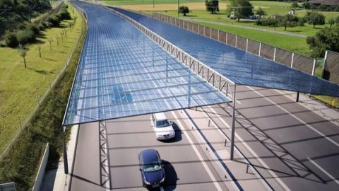
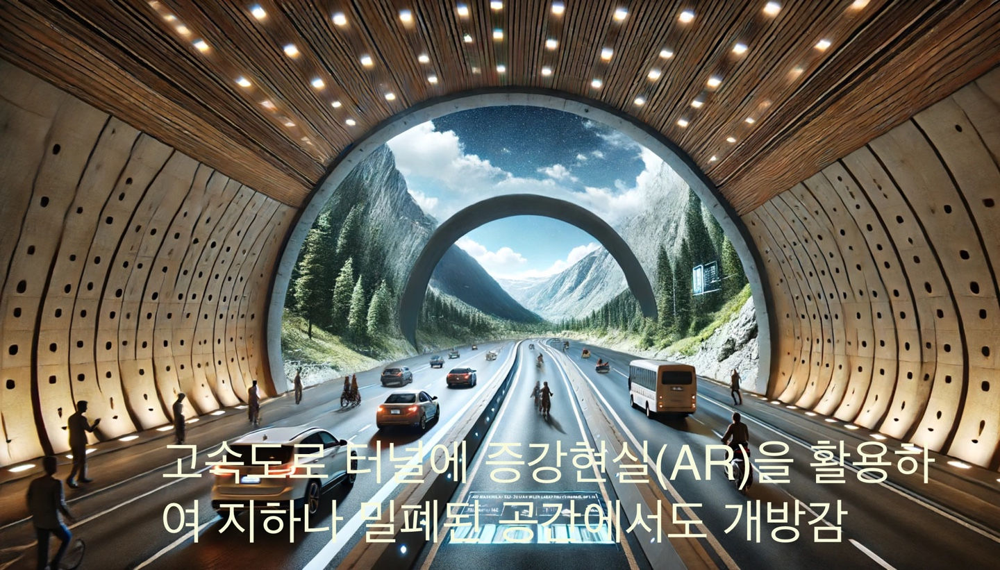

## 문서번호: 5001

### 제목: [KBS 방송국도 시대의 변화에 맞게 역할과 시스템을 개편해야 하지 않을까요? ](https://q4all.kr/redirect/detail/c3da223e-b862-427c-8c5a-a4127bf920eb)

**작성자:** [구태원](https://q4all.kr/user/profile/3099)
**작성일:** 2025-03-02 14:27:21 (일요일)

---

기술의 발전으로 인해 더 이상 청소년, 청년층과 중장년층 뿐만 아니라 심지어 노년층에서도 이상 TV에서 방송을 보며 많은 시간을 보내는 시대는 지나가고 있습니다.

손에 들고 다니는 휴대폰으로 개인방송, 유튜브, OTT, SNS 등에 사람들은 더 많은 시간을 보내고 있습니다.

이런 상황에서 공영방송이 시청료라는 명목으로 전 국민에게 가구당 요금을 징수하는 것이 과연 맞는 일 일까요?

과거처럼 TV를 통해서 정보, 뉴스, 즐거움을 얻어 가던 시절에는 채널을 돌리다 보면 KBS를 보게 되는 경우도 있기 때문에

명목상 시청료를 낼 수도 있다고 생각하지만, 이제는 많은 사람들이 TV 자체를 보지 않는데 시청료를 내라고 하는 것은 모순이라고 생각합니다.

그렇지만 시청료를 없애고, 그것으로 운영되는 KBS, EBS를 없애자는 건 아닙니다.

시대가 변해도 자본 권력에 영향받지 않는 공영방송은 분명 필요합니다.

그 공영방송이 개인방송 시대에 걸러지지 않는 가짜 정보들을 걸러주고, 확인되고 검증된 뉴스들을 전달하고,

시대의 조명이 필요한 사실들이나 소외된 이웃들을 위한 방송을 해주어야 하고,

자극적이지 않은 웃음들을 시청률에 구애받지 않고 사람들이 찾아서 볼 기회를 주어야 합니다.

이제는 KBS는 두 채널이나 운영을 할 필요가 없습니다.

두 채널을 통합하여 1개의 채널로 줄이고, 공영 방송의 취지에 맞게 상업 광고를 받지 않고, 예능이나 드라마 비중을 확 줄이고, 시사, 교양, 뉴스 등의 기능에 집중해야 합니다.

그리고 현재 납부 저항이 있는 시청료라는 이름을 공영방송 발전 기금이라는 명목으로 바꿔서 징수를 해야 합니다.

또한, EBS에 배정되는 금액의 비중을 대폭 늘려야 합니다.

시대의 변화에 맞춰서 권력에 눈치보지 않고 시민의 힘으로 운영되는 공영 방송이 다시 만들어 지길 바래봅니다.

---

## 문서번호: 5002

### 제목: [개인회생에 관한 문제점](https://q4all.kr/redirect/detail/c37ad438-a953-4d9e-8351-e038a2377268)

**작성자:** [정성훈](https://q4all.kr/user/profile/7480)
**작성일:** 2025-03-02 14:33:54 (일요일)

---

현재 개인회생을 진행하고 있는 50대 남성입니다.

더이상 부채로 인해서 정상적인 사회생활이 어려운 상황이라

개인회생을 신청하고 지금 진행중입니다.

이 질문을 보는 담당자분이 개인회생에 대해서 잘 아는분 일지 모르지만

개인회생은 두가지가 있습니다.

정해진 기간안에 개시결정 되었을때 그 금액을 그대로 납부만 하면되는 사람과

매년 법원에 소득을 신고해서 소득이 오를경우

변제금을 올려서 납부해야 하는 조건부 인가.

저는 조건부 인가에 해당이 됩니다.

조건부 인가를 만든 이유는 월 400받던 사람이 개인회생을 위해서 일부러 급여가 작은 직장으로 옮기고

낮은 변제금을 내려고 꼼수를 부릴경우 법원에서 조건부 인가를 내립니다.

개인회생 인가결정후 다시 급여가 높은 회사로 이직하는걸 지속적으로 확인하겠다는 의도입니다.

이건 법원의 판단이 맞다고 생각됩니다.

그런데. 저같은 경우 20년 전산직 근무를 하다보니 나이 50에 경력직으로 입사가 대한민국에서 거의 불가능합니다.

할수있는 일이 그리 많지 않더군요

구직 사이트를 봐도 경비나 택배 또는 차를 가서 운전하는것 말고는 그리 많지않습니다.

아니면 육체적 노동을 해야하는 저는 참고로 장애인입니다.

그래서 모기업에서 장애인 채용으로 월 200만원 급여를 받고 계약직으로 재택근무중입니다.

미혼이라 월 200만원을 받고 변제금(아직 확정은 아니지만 변호사 사무실에 그정되 될거라고 했습니다.)

월급 200 에서 변제금 60만원 내고 월세 55만원 관리비 13만원 내고 나면

남은 생활비는 70만원에서 모든 생활비를 충당해야 합니다. 앞으로 5년동안이요.

그래서 저녁에 아르바이트라도 해보려고 했습니다.

그런데 문제는 올해 아르바이트를 하면 내년에 근로소득이 오를테구 그러면 변제금이 오르게 됩니다.

만약에 제가 직장을 옮겨서 월급여가 오른다면 인상된 급여를 계속 받을수 있기에 상향된 변제금을 내는것도 문제가 없습니다.

하지만 아르바이트는 내년에 제가 할수있을지 또 올해만큼 아르바이트로 수입을 지속적으로 올릴수 있는 불확실합니다.

한번 상향된 변제금은 제가 내년에 아르바이트를 하지 못하더라도 다시 하향되지는 않습니다.

조건부 인가의 목적이 개인회생을 악용하기위해서 개인회생 신청당시 일부러 저임금의 회사로 이직후 개인회생 인가 결정이 된후

다시 높은 급여회사로 옮기는것을 방지하고자 하는게 목적인데

저같은 경우 나이 50에 경우 장애인전용으로 채용이 되서 그나마 구직활동을 하고 개인회생도 할수있었습니다.

저도 더 좋은 급여를 받을수있는 직장으로 옮기고 싶지만 지금 경제 상황과 구직상황이 쉽지 않습니다.

아르바이트도 나이가 많아서 여기저기 이력서를 넣어도 연락오는곳이 거의 없습니다.

업주들 입장에서도 업주들 보다 나이 어린사람들을 고용하기를 원하겠죠.

그런 저런 생각하다보면 결국. 전 5년간 아르바이트를 해서 부족한 생계비 그리고 조금이라도 저축이라도 해야 나중에 아팠을때 병원비라도 낼텐데.

그것도 못하게 생겼습니다.

알바를 열심히 해서 알바비를 모아 보자 생각하지만. 그러면 내년에 변제금이 오를테구

그런데 내가 내년에 알바를 올해 처럼 하지 못하면 난 오히려 변제금도 못내는 상황이 올수있기에

생각의 끝은..

그냥 아무것도 하지말자로 돌아 옵니다. 그냥 70만원으로 통신료 교통비 식비등등 모든걸 해결하면서 앞으로 그냥 죽은듯히 5년을 살아야 하는 결론에 도달합니다.

부채를 갚지 못해서 개인회생을 한 제 잘못이 큽니다.

그래도 국가가 인생 밑바닥에 있는 사람들 다시 사회구성원으로 돌려보내서 다시금 살아 보게 하려고 만든게 개인회생 제도 입니다.

그런데 추가 소득에 대해서 알바비 까지 전부 변제금 투입을 하는 규정은 한번쯤 생각해봐야 되지 않나 싶습니다.

개인회생 인가를 받고 끝까지 변제금 내고 면책까지 받는 비율이 50%가 안되고 그중에 절반이 중도에 포기하거나 그냥 평생 신불자로 살아간다고 합니다.

업는 돈에 변호사비 까지내서 겨우 개인회생 받았는데 절반만 완주를 한다는것도 현재 제도에 고칠부분은 없는지 확인을 해봐야 한다고 생각합니다.

지금 자영업자들 코인과 주식투자붐으로 많은 사람들이 힘들어 하는 시기인데. 이 사회 구성원들을 그냥 버릴건지 아니면 다시 사회로 되 돌아갈수있게 할수있는지

깊은 고민이 필요하다고 생각됩니다.

---

## 문서번호: 5003

### 제목: [탄핵인용시 불복의 경우는 어떻게 되나요?](https://q4all.kr/redirect/detail/0ad20cb3-9f2a-4928-8aef-da8491a123eb)

**작성자:** [전장규](https://q4all.kr/user/profile/7487)
**작성일:** 2025-03-02 14:37:14 (일요일)

---

헌법재판소가 탄핵을 인용하였는데, 불복을 하고 저항을 한다면

조기대선등 향후 일정은 어떻게 되는건가요?

불복하는 경우, 이에 대한 제재방법등이 있는건가요?

---

## 문서번호: 5004

### 제목: [중소 중견기업의 노조 가입의 현실적 문제 해결 방안이 없을까요?](https://q4all.kr/redirect/detail/bc894e6c-595c-44f4-91de-6094f2e0728c)

**작성자:** [추용수](https://q4all.kr/user/profile/7309)
**작성일:** 2025-03-02 14:39:13 (일요일)

---

노동조합은 규모가 큰 대기업 공기업들의 전유물이 되어버린지 오래입니다. 본인들은 귀족노조라 하면 긁히면서도 비정규직과 중소중견기업의 고용인에 대한 행동이나 시선을 보면 그 귀족노조라는 말이 딱히 틀린말은 아닌것 같습니다.

산별노조라 하지만 기업별이라는 한계때문에 2-300명 이하의 중소기업은 물리적으로 불가능한게 현실입니다. 그럼에도 큰 규모의 노조원들은 개인의 이익에만 목소리를 높일뿐 노동조합의 확장에는 관심이 별로 없다는게 현실이지요. 그로써 중소기업 사용자들의 권위주의적 사고는 확고하게 굳어져있고 고용인들의 삶은 이중삼중으로 피폐해져만 가고 있습니다.

대한민국은 이 괴상한 산업구조로 지금껏 수출로 먹고사는 나라를 유지해왔다는것을 부정하지 말았으면 합니다. 이제는 희생과 고통만을 강요받고 집단우울증에 빠져 하우적 거리는 중소중견기업 현장고용인들에게 정치 사회 노동조합는 해답을 줘야 한다 생각합니다. 이제는 더이상 잘사는 사람만 더 잘사는 노통받는 사람은 영원히 고통받아야하는 이 해괴한 사회구조를 손봐야 하지 않을까요?

Ps 자영업자들이 점점 더 어려워져만 가는 이유가 인구감소에서만 있는것이 아니라 더이상 모임을 가지지 않는 월급쟁이들의 우울증에서도 찾아봐야 할것입니다.

---

## 문서번호: 5005

### 제목: [왜 한국의 디자이너들은 일찍 이직, 퇴직할까요?](https://q4all.kr/redirect/detail/d323ec79-e668-49e9-997d-aa89b06ccfad)

**작성자:** [윤성원](https://q4all.kr/user/profile/5901)
**작성일:** 2025-03-02 14:40:25 (일요일)

---

한국의 디자인 산업은 인력 과잉 공급과 열악한 근로 여건이라는 이중의 문제를 안고 있습니다. 고용정보원에 따르면, 디자인 인력의 평균 연령은 33.9세에 불과합니다. 이는 전체 취업자 평균 연령인 44.7세보다 약 10년이나 젊은 것으로, 디자이너들이 타 직종보다 훨씬 일찍 퇴직하거나 전업을 선택한다는 현실을 보여줍니다.

디자인 업계에는 여전히 60세를 넘긴 다수의 저명한 디자이너들이 활발히 활동하고 있습니다. 예를 들어, 독일의 산업 디자이너 디터 람스(Dieter Rams)는 1932년생으로, 90세를 넘긴 현재까지도 디자인 철학과 작품으로 영향력을 발휘하고 있습니다. 또한, 일본의 그래픽 디자이너 가와카미 노리유키(Noriyuki Kawakami)는 1940년생으로, 80대 중반의 나이에도 왕성한 활동을 이어가고 있습니다.​

그러나 우리나라에서는 이러한 고령의 경험 많은 디자이너를 현장에서 찾아보기 어렵습니다. 산업 현장에서 고령의 노하우를 갖춘 디자이너들의 활동이 상대적으로 적은 편입니다.

이는 디자인 업계의 인력 과잉 공급과 열악한 근로 여건으로 인해, 디자이너들이 비교적 이른 나이에 퇴직하거나 전업을 선택하는 경향이 있기 때문입니다.

이러한 차이는 디자인산업의 구조적 문제에서 기인합니다. 한국의 디자이너들은 문제 해결의 기획 단계에서 중요한 역할을 수행하기보다는, 상대적으로 피상적인 스타일링에 머무는 경우가 많습니다.

이는 디자인이 사회문제 해결의 도구로서 충분히 활용되지 못하고 있다는 것을 의미합니다. 또한, 디자인업계에서 오랜 경험을 쌓은 전문가들이 사회 곳곳에서 활용될 기회가 부족하다는 것을 보여줍니다.

특히, 고령화, 보건, 복지, 교육, 치안, 문화, 교통 등 사회 전반에 걸쳐 디자이너의 창의적 관점이 활용되는 선진국과 비교할 때, 한국의 디자이너들은 사회적 가치를 창출할 기회가 적습니다.

이러한 상황은 디자인산업의 서비스 공급자(디자인 전문인력)가 상대적으로 경력이 짧고, 노하우가 축적되지 못한 채 산업을 떠나게 되는 악순환을 초래하고 있습니다.

왜 디자인 업종에서는 이직과 퇴직이 이렇게 빠르게 일어날까요?

낮은 급여와 과도한 업무 등 열악한 근무 조건이 주요 원인으로 꼽힙니다. 이는 디자인 인력의 과잉 공급과도 밀접하게 연결되어 있습니다. 우리나라는 인구 대비 디자인 전공자가 가장 많은 나라로, 대학에서 매년 약 2만 명의 디자인 전공자가 배출되고 있습니다. 이는 국내 디자이너 인력 시장의 약 6%에 해당하며, 비전공자까지 포함하면 시장의 경쟁은 더욱 치열해집니다.

디자인 전문기업들은 만성적인 구인난을 겪고 있지만, 이는 우수한 인재들이 디자인 전문기업보다 대기업을 선호하기 때문입니다. 대기업은 디자인의 중요성을 인식하고 신입과 경력 디자이너를 가리지 않고 적극적으로 채용하고 있습니다. 그러나 이는 디자인산업 생태계에는 부정적인 영향을 미칩니다. 대기업으로의 이직은 디자인 서비스업의 공급자였던 디자이너를 수요자로 전환시키며, 디자인 전문기업의 역량을 약화시킵니다.

이러한 문제를 해결하기 위해서는 디자인산업의 인력 수급을 조절하고, 디자이너의 경력관리를 체계화할 필요가 있습니다. 디자이너들이 작은 디자인기업이나 1인 기업에서 근무하더라도 지속 가능한 경력 관리를 할 수 있도록 지원 체계를 마련해야 합니다. 이를 위해 2019년 마련된 디자인 대가기준, 표준계약서, 경력관리 시스템 등을 적극 활용할 필요가 있습니다.

한국은 디자인 인적 자원의 양적 측면에서는 세계 최고 수준입니다. 그러나 이러한 풍부한 자원을 어떻게 개발하고 활용할 것인지가 앞으로의 과제입니다. 디자인산업이 단순히 '젊은 직업'으로만 머무르지 않도록, 디자이너들이 오래도록 일할 수 있는 좋은 근로 환경을 만드는 것이 시급합니다. 이는 디자인산업의 고도화뿐만 아니라, 사회 전반에 걸쳐 디자인의 가치를 높이는 길이 될 것입니다.

결론적으로, 한국의 디자인산업은 고령화 사회에 맞춰 디자이너들이 나이가 들어서도 축적된 경험과 노하우를 활용할 수 있는 환경을 조성해야 합니다. 이를 통해 우리나라에서도 알레산드로 맨디니, 하비에르 소사스와 같은 디자이너들이 산업 현장에서 오래도록 활동하며 사회에 기여할 수 있는 기반을 마련할 수 있을 것입니다.

---

## 문서번호: 5006

### 제목: [문화강국 대한민국에 노인을 위한 교육과 문화 정책은 어떤 것이 있나요?](https://q4all.kr/redirect/detail/f1812dc7-d687-47a1-9b11-3d447490cec4)

**작성자:** [이영](https://q4all.kr/user/profile/7086)
**작성일:** 2025-03-02 14:44:39 (일요일)

---

한국 전쟁 이후 경제 일꾼으로 한 생을 보낸 어르신들이 탑골 공원에서 한 끼를 해결하며 시간을 보낸다는 뉴스가 있었습니다.

그러다, 태극기 부대라는 정치 선동의 장에 노인들이 동원된다는 뉴스가 나왔습니다.

코로나 이후 전광훈 유튜브를 매일 보고 있다는 소리도 들었습니다.

고령화 사회, 노인 인구 증가, 가난한 노인들, 노인정에서 생기는 갈등과 사고 ...

그간 뉴스들에서 만난 노인들은 경제적 지원과 사회적 배려가 필요한, 문제적 존재로만 다루고 있지는 않았나 생각합니다.

우리나라에 1981년 처음 노인복지법이 만들어지고 개정을 통해 그 내용이 구체화되고 있는 것으로 보입니다.

하지만, 노인의 건강, 요양 등 보호 조치와 소극적 지원 차원에 머물러 있다는 생각이 듭니다.

노인층 가난과 건강 문제는 반드시 해결해야 할 선결 과제인 것은 맞습니다.

그러나 이번 내란 사태를 통해 나타난 극우 집회, 종교를 이용한 정치 선동 집회를 보면서 의문을 갖게 됩니다.

그 곳에 나온 사람들은 가난과 소외로 고통 받는 노인이 아니라 종교와 지역 공동체에 속하면서 자신의 경제적 정치적 이익을 직접적으로 챙기는 활동을 하고 있습니다.

저로서는 그들이 아스팔트 바닥에 누워 법 집행을 막으려 한 힘이, 일당 몇 만 원이라고 믿고 싶지도 않고, 그렇게 생각할 수도 없습니다.

50대 후반을 들어서는 저 역시 새로운 만남이 꺼려지고 이미 있는 관계도 지쳐가는데, 더 나이가 들수록 가족도 관계에서도 점점 더 유대가 줄어들 게 분명합니다.

사회적 경제적 책임과 의무에서 놓여 난 세대에게 관계는 선택이고, 취향의 문제일 수도 있지만, 한편으로 그만큼 세상을 보는 시야와 관심이 축소되고, 왜곡된 의식에 빠져들 가능성도 커지리라 봅니다.

빠르게 변화하는 사회와 달라지는 가치 체계에서 어떤 판단과 결정을 내릴 것인가?

제가 느끼는 문제 의식은 그 지점입니다. 온전히 개개인이 살아온 경험과 과거 교육만으로 지금 이 현실과 미래를 이해하는 것이 가능한가?

시간을 내서 책을 읽고, 계엄 이후 다양한 유튜브 영상을 통해 뉴스를 확인하고 있지만, 그럼에도 이를 이해하고 받아들이는 데는 시간차가 있습니다.

그래서 질문하고 요청합니다.

역사, 사회, 종교적으로 편향된 공동체가 아니라, 인생의 지혜를 펼치고 청년의 다양성을 이해하는 건강한 노년 공동체는 어디에 있습니까?

그런 공동체를 개개인이 직접 찾고, 검증하고, 경험하러 돌아다녀야 합니까?

교통비 무료처럼 일상적으로 문화와 교육에서 실질적인 정책이 만들어져야 한다고 생각합니다.

키오스크 주문을 못해서 굶어죽는다는 뉴스를 할 게 아니라, 기술과 사회 변화 속도에 적응할 수 있는 재교육을 정책적으로 해야 한다고 생각합니다.

노인들에게 실질적으로 도움이 되는 컨텐츠를 평생 교육차원에서 주민센터를 통해 실시, 참여하도록 지역화폐처럼 인센티브를 지급하고 모두 동등한 자격으로 공동체에 참여하는 방식도 제안해 봅니다.

문화 정책을 통한 노인 사회 참여가 현재 문제를 미래로 연장하지 않는 한 방안이라고 생각합니다.

---

## 문서번호: 5007

### 제목: [국민을 위한 정치는 언제쯤?](https://q4all.kr/redirect/detail/6a08e500-86ce-48fe-9a6f-28bfd1086d93)

**작성자:** [이예준](https://q4all.kr/user/profile/7492)
**작성일:** 2025-03-02 14:54:50 (일요일)

---

본인의 자리가 아니라 진심 "국민"을 위한 정치는 언제 실현됩니까? 민생법안이 아닌 정쟁 법안이 많이 처리되고 있습니다. 어느 한 당의 문제가 아니고 모든 당의 문제인것 같습니다. 국회의원 분들께 호소드립니다. 이상황이 안정되면 부디 정쟁을 멈추고 민생을 위해주시기 바랍니다.

---

## 문서번호: 5008

### 제목: [기후위기, 기후온난화 해결책은 독일처럼 주4일 근무를 하면 됩니다.](https://q4all.kr/redirect/detail/a3b5488b-ece4-4a7c-8a02-9cff41bf9e4c)

**작성자:** [김성근](https://q4all.kr/user/profile/7490)
**작성일:** 2025-03-02 15:06:07 (일요일)

---

기후위기, 기후온난화 해결책은 독일처럼 주4일 근무를 하면 됩니다.

독일은 주4일 근무하는데 노동을 더 많이 하는 한국보다.생산성과 월급이 더 높습니다.

독일은 노동자가 AI와 기계를 이용해서 생산성이 높습니다.

주 4일 근무가 기후위기 해결에 기여할 수 있는 이유

1.탄소 배출 감소:

출퇴근 감소: 주 4일 근무제로 전환할 경우 출퇴근일이 줄어들어, 자동차나 대중교통 이용으로 인한 교통 관련 탄소 배출이 감소할 수 있습니다. 출퇴근의 빈도가 줄어들면 교통량도 줄어들고, 그 결과로 도시의 공기 질이 개선되고 교통 관련 배출이 줄어들 수 있습니다.

회사 운영 에너지 절감: 주 4일 근무제는 사무실 운영 시간을 줄이는 결과를 가져올 수 있습니다. 이를 통해 전력 소비, 난방, 에어컨 사용 등을 줄여 건물의 에너지 소비량이 감소할 수 있습니다. 이는 사무실에서 발생하는 온실가스 배출을 줄이는 데 도움이 됩니다.

2. 소비 패턴 변화:

근무 시간이 줄어들면 사람들이 소비 패턴을 바꾸는 경향이 있을 수 있습니다. 주 4일 근무제는 사람들이 여가 시간을 더 많이 가질 수 있게 하며, 자원을 낭비하지 않고 지속 가능한 방식으로 시간을 활용할 수 있는 기회를 제공합니다. 예를 들어, 사람들은 자연과 가까운 곳에서 여가 활동을 즐기거나, 환경에 더 나은 방식으로 생활할 수 있는 선택을 할 가능성이 높아집니다.

3. 생산성 향상과 환경 보호:

연구에 따르면, 근무 시간이 줄어들더라도 생산성은 유지되거나 오히려 향상될 수 있습니다. 효율성을 높인 근무 방식은 불필요한 자원 소비를 줄이고, 근로자의 삶의 질을 향상시키면서도 기업의 지속 가능성을 높이는 데 기여할 수 있습니다. 더 적은 시간 안에 집중력과 창의성을 발휘하여 결과를 얻는 방식은 자원 낭비를 줄이는 방식과 일맥상통합니다.

4. 지속 가능한 경제 구조:

주 4일 근무제는 보다 지속 가능한 경제 구조로 전환하는 계기가 될 수 있습니다. 주 4일 근무는 과잉 생산이나 과잉 소비를 줄이는 데 기여할 수 있으며, 장기적으로 자원 절약형 경제로의 전환을 촉진할 수 있습니다. 이는 자연 자원과 에너지 소비를 줄이고, 환경에 덜 해로운 경제 활동을 조장할 수 있습니다.

독일 사례: 주 4일 근무와 기후 정책의 연계 가능성

독일은 기후 변화 대응에 있어 선도적인 국가로 평가받고 있으며, 재생 가능 에너지 도입과 환경 친화적 정책을 적극 추진하고 있습니다. 독일에서 주 4일 근무가 도입될 경우, 환경 정책과 근로 정책이 서로 긍정적인 시너지를 낼 가능성이 높습니다.

에너지 전환: 독일은 이미 재생 가능 에너지로의 전환을 추진하고 있으며, 주 4일 근무가 도입되면 에너지 절약 효과가 배가될 수 있습니다.

산업 혁신과 디지털화: 독일은 4차 산업혁명 기술을 도입해 스마트한 근로 환경을 구축하고 있으며, 주 4일 근무제와 이러한 기술을 결합하면 효율성과 친환경성을 동시에 추구할 수 있습니다.

---

## 문서번호: 5009

### 제목: [선출직 공무원들의 부실 외유 방지](https://q4all.kr/redirect/detail/17d98306-86a7-4a72-b59d-7820c6d3ad3a)

**작성자:** [박인홍](https://q4all.kr/user/profile/7476)
**작성일:** 2025-03-02 15:06:42 (일요일)

---

가끔씩 의원들의 외유 기사가 나오곤 합니다. 주로 지방의원들이지만, 국회의원들이 문제가 되는 경우도 있습니다.

이런 문제를 근본적으로 해결할 방법이 없을까요?

저는 이렇게 생각합니다.

해외 출장 안건은 소속 의회(또는 상임위)의 의결을 거치게 합니다. 과반수의 찬성으로 통과된 안건은 의회 홈페이지에 게시하고.

문제가 되는 것은 출장비인데, 이것을 후불제로 하는 것입니다.

그러니까 의원이 해외 출장을 다녀와서 보고서와 함께 영수증을 제출하면, 보고서의 내용에 맞춰서 업무에 사용한 비용 만큼 돌려주는 것입니다.

공개된 안건에 없는 관광 등의 비용은 물론 청구할 수 없습니다. 가령 어떤 의원이 해외 출장을 가서 관광도 즐겼다면, 관광 비용은 자비로 부담해야 하는 것이지요.

그리고 출장 보고서도 의회 홈페이지에 공개해야 합니다.

이렇게 하면 부실한 의원 외유는 많이 줄어들 것으로 생각됩니다.

물론 외국에서 초청하는 경우나 긴급한 사정이 있는 경우도 있을 수 있겠습니다만, 그런 경우는 예외 조항을 두면 되지 않을까요?

---

## 문서번호: 5010

### 제목: [이재명의 지역화폐기본소득을 실시하면 위험과 가난에 처한 태아와 임산부와 미혼모에게 지역화폐기본소득은 큰 도움이 될 것입니다.](https://q4all.kr/redirect/detail/bb210c5b-2401-4fe8-bae3-f719fbdcd7cf)

**작성자:** [김성근](https://q4all.kr/user/profile/7490)
**작성일:** 2025-03-02 15:12:10 (일요일)

---

지역화폐기본소득을 실시하면 위험과 가난에 처한 태아와 임산부와 미혼모에게 지역화폐기본소득은 큰 도움이 될 것입니다.

종교지도자는 지역화폐기본소득을 실시하라고 해야 합니다. 한국도 독일의 기본법을 배워야 합니다.

독일 기본법(GG, Grundgesetz) 제1조1항는 "Die Würde des Menschen ist unantastbar. Sie zu achten und zu schützen ist Verpflichtung aller staatlichen Gewalt."

("모든 인간의 존엄성은 침해할 수 없다. 이를 존중하고 보호하는 것은 모든 국가 권력의 의무이다.")

 4차산업의 존엄성이란 예수님이 말씀하신 내 이웃을 내 몸 같이 사랑 입니다. 내 이웃을 내 몸 같이 사랑하라 실천은 지역화폐기본소득입니다.

지역화폐기본소득을 실시하면 가난 때문에 굶주리는 사람이 없어요.

지역화폐기본소득을 실시하면 지역불균형 해결 지역화폐기본소득으로 새로운 마을과 새로운 창업이 생기면 일자리가 생겨서 4차산업 대책이 됩니다.

사람의 일자리를 대신하는 AI와 자율주행기계가 빵을 만들면 소비자가 있어야 합니다 소비가 있어야 AI와 자율주행기계가 빵을 만들어요.

AI와 자율주행 기계가 빵을 만들어도, 소비자가 없으면 그 생산물은 팔리지 않기 때문에 결국 경제는 원활하게 돌아가지 않습니다.

아무리 기술이 발전해도, 그것을 소비할 사람들이 있어야 경제 활동이 유지되며, 기술의 혜택도 지속적으로 확산될 수 있습니다.

결론적으로, AI와 자율주행 기술이 사람의 일자리를 대체하는 시대에서는 소비자의 역할이 더욱 중요해지며, 이를 위해 지역화폐 기본소득과 같은 정책이 필요합니다.

4차 산업혁명 시대에서 예수님의 철학과 더불어 철학적 성찰이 더욱 중요해지고 있고. 기술은 빠르게 발전하지만, 그 기술이 인간의 삶에 미치는 영향은 깊이 고민해야 할 문제들이 많습니다.

예수님의 가르침인 "이웃 사랑"은 단순히 개인적인 관계뿐 아니라 사회 전체에서 인간 존엄성을 유지하고, 불평등과 같은 문제를 해결하는 데에도 적용될 수 있습니다.

4차 산업혁명 시대에는 기술이 인간의 일자리를 대체하고 사회 구조가 급변하는 상황에서, 기술이 어떻게 사용되고 인간의 역할이 어떻게 변화해야 하는지에 대한 윤리적 논의가 반드시 필요합니다.

철학과 종교적 가르침은 기술이 인간성을 잃지 않고, 모두의 이익을 위한 도구로 사용되도록 하는 방향을 제시할 수 있는 중요한 지침 입니다.

4차 산업혁명 시대에서 AI와 자율주행기계화는 필연적으로 사람의 일자리를 대체할 수 있으며, 그에 대한 대응이 중요합니다. 지역화폐 기본소득은 AI와 자율주행 기술이 가져올 변화에 대한 매우 효과적인 대책이 될 수 있어요.

1. 4차 산업혁명과 AI 자율주행기계화

AI와 자율주행 기계화는 농업, 제조업, 서비스업 등 다양한 산업에 걸쳐 적용될 수 있고, 이는 필연적으로 노동의 구조를 변화시킬 것입니다. 특히, 반복적이고 단순한 업무는 기계가 대체하면서 많은 사람의 일자리가 줄어들 수밖에 없죠.

2. 독일의 준비

독일이 AI와 자율주행기계화에 대해 걱정을 덜하는 이유는, 그들이 이미 기술과 인간의 존엄성을 함께 고려한 체계적인 준비를 하고 있기 때문입니다. 기술이 인간을 대체하는 것이 아니라, 인간의 삶의 질을 높이기 위해 사용되어야 한다는 인식이 강해요. 이는 AI가 일자리를 대체하더라도 사람들이 존엄성을 유지하며 살 수 있는 구조를 마련하는 것이죠.

3. 지역화폐 기본소득의 필요성

AI와 자율주행 기계가 일자리를 대체하면 사람들의 소비력이 감소할 가능성이 큽니다. 그럴 때 지역화폐 기본소득은 경제적인 안전망 역할을 하며, 소비를 촉진하고 지역 경제를 활성화시킬 수 있어요. 소비가 일어나야 경제 활동이 지속 가능하기 때문에, 지역화폐 기본소득이 도입되면 AI와 자율주행 기계화 시대에서도 경제가 돌아가게 됩니다.

소비 촉진: 기본소득은 사람들이 생필품을 구입하고 서비스를 이용할 수 있는 최소한의 재정적 지원을 제공합니다. 이로 인해 AI와 자율주행 기계가 생산한 제품에 대한 수요가 유지될 수 있습니다.

지역 불균형 해소: 지역화폐 기본소득을 통해 특정 지역에서만 사용할 수 있는 화폐를 제공하면 지역 내 경제 활동이 활성화되고, 지역 간 불균형을 해소하는 데 도움이 됩니다.

새로운 창업과 일자리 창출: 지역화폐가 주어지면 지역 내에서 새로운 사업과 창업이 활성화될 가능성이 높아지며, 이는 새로운 일자리 창출로 이어질 수 있습니다.

4. 결론

4차 산업혁명 시대에 AI와 자율주행 기술이 필수적인 경제 요소가 될 것이며, 이에 대응하는 정책이 중요합니다. 지역화폐 기본소득은 단순히 경제적 안전망을 넘어, 지역 경제를 활성화하고 사람들에게 최소한의 생활을 보장해주는 대책으로서 큰 가능성을 가지고 있습니다. AI와 자율주행 기술이 사람의 일자리를 대체하는 세상에서, 소비자로서의 역할을 유지할 수 있는 환경을 만드는 것이 중요합니다.

---

## 문서번호: 5011

### 제목: [고속도로 속도제한 문제. 언제까지 100km/h?](https://q4all.kr/redirect/detail/8d2f3a8a-9ceb-476b-a580-1d5a341866cc)

**작성자:** [이동근](https://q4all.kr/user/profile/7496)
**작성일:** 2025-03-02 15:13:39 (일요일)

---

차량의 성능과 안전기능이 비약적으로 발전발전했는 시속 100km는 너무 느린것 같습니다. 현실화 해야하지 않을까요?

---

## 문서번호: 5012

### 제목: [지속가능한 국가를 위해, 불평등한 사회를 재조정할 방법은 무엇일까요?](https://q4all.kr/redirect/detail/4a0ad10e-abbb-46c8-a315-f8bab61735bc)

**작성자:** [윤성원](https://q4all.kr/user/profile/5901)
**작성일:** 2025-03-02 15:15:51 (일요일)

---

지속가능한 국가를 위해 사회의 불평등을 재조정하는 것은 필수적입니다. 최근 통계에 따르면, 우리나라의 소득 불평등은 여전히 심각한 수준입니다.

2023년 한국보건사회연구원이 발표한 '빈곤통계연보'에 따르면, 가처분소득 지니계수는 2011년 0.388에서 2021년 0.333으로 감소하였지만, 여전히 개선이 필요합니다.

또한, 2021년 기준 소득 최상위 10%의 비중은 34.4%로, 이는 OECD 회원국 중 네 번째로 큰 증가 폭을 보였습니다. ​

"자산과 비교해 소득의 불평등을 나타내는 수치이면서, 빈부 격차를 평가하는 피케티 지수가 최근 10년 사이 급격히 증가하고 있다. 피케티 지수는 높을수록 빈부격차가 심하다는 것을 의미한다.

피케티 지수가 높아지는 가장 큰 요인으로는 토지와 주택 등 자산 가격의 증가를 꼽고 있다. 한국의 피케티 지수는 경제협력개발기구(OECD) 회원국 중 가장 높은 수치다. 다른 선진국의 경우 피케티 지수가 높아도 5~7배 수준이다.

9배를 넘은 나라는 대한민국이 유일하다. 그만큼 우리의 자산 격차가 심하다는 것을 의미한다."

출처 : [제주일보(http://www.jejunews.com)](https://www.jejunews.com/news/articleView.html?idxno=2213765)

"우리나라의 성별 임금격차가 경제협력개발기구(OECD) 35개국 중 가장 높은 것으로 조사됐다.

통계청은 22일 이 같은 내용이 담긴 ‘한국의 SDG 이행보고서 2024’를 발표했다.

보고서에 따르면 최근 10년간 한국은 여러 지표에서 향상된 모습이었지만 성별과 연령, 지역 등 일부 항목에서 격차가 발견됐다. OECD 회원국들과 비교하면 성평등, 기후 및 생태계 분야에서 하위권으로 기록됐다.

한국의 임금격차는 지난 2022년 기준 31.2%로 OECD 35개국 중 가장 높은 것으로 드러났다. 이는 OECD 평균은 12.1%로, 2.6배에 달하는 수치다.

한국외에도 격차가 큰 국가는 이스라엘(25.4%)과 일본(24.9%), 에스토니아(20.5%) 등이 있었지만, 이들 국가는 모두 20%대로 30% 이상인 국가는 한국이 유일했다.

출처 : 투데이신문 https://www.ntoday.co.kr/news/articleView.html?idxno=104286

이러한 불평등을 해소하기 위해서는 다음과 같은 노력이 필요합니다:​

1. **교육의 공정성 강화**: 모든 사람에게 평등한 교육 기회를 제공하여 경제적 격차를 줄일 수 있습니다.
2. **소득 및 재산 분배의 공정성 강화**: 세금 정책 개선과 사회 복지 프로그램 강화를 통해 소득 및 재산의 공정한 분배를 도모해야 합니다.
3. **취약계층 지원 강화**: 주거 지원, 의료 보장 등 취약한 계층에 대한 지원과 보호를 강화하여 사회적 격차를 줄여야 합니다.
4. **고용 기회 확대**: 다양한 직업 분야에서의 고용 기회를 확대하고, 다양한 배경과 경험을 갖춘 사람들이 일할 수 있도록 지원하는 것이 중요합니다.

**소득 불평등 해소:** 최저임금 인상, 부문별 임금 바닥 마련, 누진세 강화 등을 통해 저소득층의 소득을 증대시킬 수 있습니다.

**사회 안전망 강화:** 실업 보험, 국민연금, 의료보험 등의 사회적 보호 제도를 강화하여 취약계층을 지원할 수 있습니다.

**고용 안정성 확보:** 비정규직의 정규직 전환을 촉진하고, 장기 근속을 장려하는 정책을 시행하여 근로자들이 안정적으로 일할 수 있는 환경을 만들어야 합니다.

**교육과 직업 훈련 강화:** 사회적 약자나 실업자가 새로운 일자리를 찾을 수 있도록 직업 훈련 프로그램을 강화하고, 평생 학습 기회를 확대해야 합니다.

**주거 안정 보장:** 공공임대주택 확대, 주거비 지원 등을 통해 주거 불안정 문제를 해결할 수 있습니다.

**건강과 안전 보장:** 산업재해 예방, 교통안전 강화, 정신건강 지원 등을 통해 국민의 생명과 건강을 보호해야 합니다.

---

## 문서번호: 5013

### 제목: [우리나라는 디자인으로 번영할 수 있을까요?](https://q4all.kr/redirect/detail/7af96169-8639-4b09-bf9e-745145ec5235)

**작성자:** [윤성원](https://q4all.kr/user/profile/5901)
**작성일:** 2025-03-02 15:24:20 (일요일)

---

우리가 일상에서 사용하는 대부분의 물건과 서비스에는 디자인이 녹아 있습니다. 아침에 사용하는 커피잔, 출근길에 타는 버스, 업무 중 사용하는 스마트폰, 퇴근 후 이용하는 배달 앱까지—이 모든 것이 디자인의 결과물입니다. 하지만 디자인은 단순히 제품의 겉모습을 예쁘게 만드는 것을 넘어, 우리의 생활을 더 편리하고 안전하게 만들고, 때로는 문제를 해결하는 중요한 역할을 합니다.

디자인은 국가 경제에도 큰 영향을 미칩니다. 예를 들어, 북유럽의 작은 나라 덴마크는 디자인 산업을 국가 성장의 핵심 축으로 삼아 성공을 거둔 사례로 유명합니다. 덴마크는 '수출을 위한 디자인(Design for Export)' 프로그램을 통해 자국의 디자인 제품을 세계 시장에 알리고, 국가 브랜드 가치를 높이는 데 성공했습니다. 이로 인해 덴마크의 디자인 제품은 전 세계에서 높은 평가를 받고 있으며, 디자인 강국으로 자리매김하게 되었습니다.

하지만 한국의 상황은 어떨까요? 한국은 세계에서 가장 많은 디자인 전공자를 배출하고 있으며, K-팝, K-드라마, K-푸드와 같은 'K-브랜드'의 글로벌 인기가 높아지고 있습니다. 그러나 정작 디자인 산업의 국제 경쟁력은 기대에 미치지 못하고 있습니다. 한국 제품의 수출 부진과 제조업의 경기 둔화가 이어지면서 디자인 산업에도 부정적인 영향을 미치고 있습니다. 기업들은 비용 절감을 위해 디자인에 대한 투자를 줄이고, 이는 곧 디자인 산업의 침체와 연결됩니다.

그렇다면 한국이 디자인으로 번영할 수 있는 방법은 무엇일까요? 정부와 기업이 디자인을 단순한 '포장'이 아닌, 혁신과 성장의 핵심 요소로 인식하고 투자해야 합니다. 디자인 교육과 연구개발(R&D)을 강화하고, 젊은 디자이너와 스타트업을 지원할 수 있는 인큐베이터 프로그램을 도입할 필요가 있습니다. 또한 디자인을 통해 중소기업의 제품 경쟁력을 높이고, 한국 디자인의 고유한 가치를 글로벌 시장에 전달할 수 있는 정책적 지원이 필요합니다.

디자인은 단순히 '예쁜 것'을 만드는 일이 아닙니다. 디자인은 문제를 해결하고, 삶을 개선하며, 경제를 성장시키는 강력한 도구입니다. 한국이 디자인을 통해 세계 시장에서 차별화된 경쟁력을 갖춘다면, 이는 곧 한국 경제의 지속 가능한 번영으로 이어질 수 있습니다.

이제, 한국은 디자인으로 번영할 준비가 되어 있을까요?

한국이 디자인을 통해 번영을 이루기 위해서는 다음과 같은 전략적 접근이 필요합니다.​

**1. 디자인 산업의 글로벌 경쟁력 강화**

한국 디자인 산업의 글로벌 경쟁력을 높이기 위해서는 우수한 디자인 인재 양성과 혁신적인 디자인 기업의 육성이 필수적입니다.

이를 위해 디자인 교육 프로그램의 강화와 디자인 스타트업에 대한 지원이 필요합니다. 예를 들어, 한국디자인진흥원은 디자인 법·제도, 디자인권리보호, 인재육성, 기업지원 등을 통해 한국 디자인 산업의 발전을 도모하고 있습니다.

**2. 디자인을 통한 수출 촉진 사례**

디자인 혁신은 수출 경쟁력을 높이는 데 직접적인 영향을 미칩니다. 예를 들어, 한국의 한 기업은 제품 디자인을 개선하여 매출이 4배 이상 증가한 사례가 있습니다. 이 기업은 기존 제품의 투박하고 무거운 디자인을 세련되고 슬림하게 개선하여 소비자들의 호응을 얻었습니다. 또한, 한국의 화장품 브랜드 '클리오'는 독특한 패키지 디자인과 우수한 제품 품질로 해외 시장에서 큰 성공을 거두었습니다.

**3. 해외 성공 사례 벤치마킹**

해외의 성공적인 디자인 정책을 벤치마킹하는 것도 중요합니다. 예를 들어, 독일은 연방정부와 지방정부 간의 긴밀한 협력을 통해 디자인 산업을 육성하고 있으며, 이를 통해 세계 최대 수출국 지위를 유지하고 있습니다. 또한, 덴마크는 '수출을 위한 디자인(Design for Export)' 프로그램을 통해 디자인 산업의 국제 경쟁력을 강화하고 있습니다. ​

**4. 디자인 혁신을 통한 산업 경쟁력 제고**

디자인 혁신은 단순한 제품 외관 개선을 넘어, 사용자의 경험과 만족도를 높여 전체 산업의 경쟁력을 향상시킵니다. 예를 들어, 아모레퍼시픽은 디자인 씽킹(Design Thinking) 방식을 도입하여 혁신적인 제품을 개발하고 있습니다.

**5. 정부의 정책적 지원**

정부는 디자인 산업의 성장을 위해 정책적 지원을 아끼지 않아야 합니다. 디자인 연구 개발에 대한 자금 지원, 디자인 인큐베이터 설립, 디자인 홍보 행사 개최 등을 통해 디자인 산업의 생태계를 조성해야 합니다. 이러한 지원은 디자인 산업의 경쟁력을 높이고, 나아가 국가 경제의 발전에 기여할 것입니다.​

결론적으로, 디자인은 한국의 수출 촉진과 경제 번영을 위한 핵심 요소입니다. 디자인 산업의 경쟁력을 강화하고, 혁신적인 디자인을 통해 글로벌 시장에서의 입지를 넓혀나간다면, 한국은 디자인을 통해 지속 가능한 성장을 이룰 수 있을 것입니다.

---

## 문서번호: 5014

### 제목: [독거노인의 사망 이 후, 절차 진행이 궁금합니다.](https://q4all.kr/redirect/detail/626bce3f-03a8-4d61-b564-26789bc98255)

**작성자:** [박민수](https://q4all.kr/user/profile/2572)
**작성일:** 2025-03-02 15:35:25 (일요일)

---

와이프의 건강이 그리 좋지 않은편이라, 자식은 없습니다.

좀 이른건지 모르겠지만, 나름의 노후에 대해 생각하다가 문득 의문이 들어 질문드립니다.

이곳이 좀 더 유명해지면 혹시 저를 아는 사람이 나오지 않을까란 생각에..창피해서..ㅎㅎ

벌써 얼레벌레..40대 후반이고, 나 잇대가 그러하다 보니, 자주 장례식장에 다녀옵니다.

한 장례식장에서 남편분이 돌아가신 건지, 다 큰 따님 2분과, 부인께서 장례식장을 지키고 계셨던걸로 보입니다.

요즘은 운관 서비스도 상조에서 인원 지원을 해주긴 하나,

2명정도 밖에 안되는 걸로 알고 있고, 추가로 더 지급하면 더 불러 주는 지는 잘 모르겠습니다.

손님도 얼마 없어보여..참 남얘기 같지 않구나란 생각을 했습니다.

제 노후 즈음에는 누구에게 기댈만한 상황은 안될꺼 같고..

와이프와 같은날에 떠난다거나, 와이프 혼자 남는다거나, 나 혼자 남는 다거나...그래도..위와 같은 질문에 봉착이 되네요..

저보다 연배 높으신 분이 이글을 보면, "뭐이런놈이 다있어" 라고 여기실지 모르지만..ㅎㅎ;;

뭐 미리미리 준비해서 나쁠껀 없겠단, 생각에 한번 문의를 드려 봅니다.

뭘 알아야 개선도 요구할테고 말이죠..ㅎㅎ;;

---

## 문서번호: 5015

### 제목: [우리는 왜 '강자만 이기는' 경쟁의 게임을 원할까요? - 공공부문 비정규직 문제](https://q4all.kr/redirect/detail/98d3f0e5-968c-4576-a779-d627c0ed6632)

**작성자:** [윤성원](https://q4all.kr/user/profile/5901)
**작성일:** 2025-03-02 15:38:27 (일요일)

---

### 우리는 왜 '강자만 이기는' 경쟁의 게임을 원할까요? - 공공부문 비정규직 문제

최근 한국 사회에서 공공부문 일자리 감축이 본격화되면서 사회적 약자들이 또다시 희생양이 되고 있다. 정부는 공공기관의 효율성을 높이기 위해 대규모 구조조정을 진행하고 있지만, 정작 그 과정에서 가장 큰 타격을 받는 것은 안정적인 일자리가 필요한 무기계약직(비정규직) 노동자들이다.

### **공공부문 일자리 감축의 현실: 약자가 먼저 희생된다**

2024년 초, 정부는 국토교통부 산하 공공기관을 포함해 약 5,000개의 공공부문 일자리를 줄이겠다고 발표했다. 이 중 대다수가 현장에서 실질적인 서비스를 제공하는 무기계약직, 비정규직 노동자였다. 대표적으로 한국도로공사는 424명의 인력을 감축했는데, 이 중 417명이 현장지원직으로, 간부직 감축은 단 1명에 불과했다. 이는 겉으로는 효율화를 표방하지만, 실제로는 사회적 약자들이 가장 먼저 타격을 입는 구조조정의 전형적인 사례다.

무기계약직 노동자들은 주로 서비스 접점에서 국민들과 직접 소통하고 일상적인 공공서비스를 제공하는 이들이다. 이들이 대규모로 해고되면, 공공서비스의 질은 당연히 저하될 수밖에 없다. 또한, 이들은 대체로 저임금 노동자들이며, 고용이 불안정한 경우가 많아 해고 후 사회적 안전망에 쉽게 접근하지 못하는 문제가 있다.

### 

### **'강자만 이기는 게임'의 구조: 경쟁과 불평등의 심화**

공공부문 일자리 감축은 단순히 일자리의 문제가 아니라 사회 구조 전반에 영향을 미친다. 현 정부의 공공기관 혁신 정책은 상위 직급보다는 하위 직급, 특히 비정규직 인력을 우선 감축하는 방식으로 진행되고 있다. 이는 결국 '강자만 이기는 게임'을 더욱 강화하는 결과를 낳는다.

한국의 소득 불평등을 나타내는 지니계수는 2024년 0.345로, OECD 평균(0.32)보다 높았다. 또한, 상위 10%가 전체 소득의 45% 이상을 차지하고 있어 소수의 경제적 강자가 대부분의 자원을 차지하고 있는 상황이다. 이러한 상황에서 공공부문이라는 사회적 안전망이 축소되면, 약자들은 더욱 불안정한 삶을 살아야 한다.

### **공공부문 감축이 사회에 미치는 영향**

1. **사회적 안전망 약화:** 공공부문은 단순히 일자리를 제공하는 역할을 넘어, 사회적 약자를 보호하는 중요한 안전망 역할을 한다. 특히, 비정규직 노동자들은 민간 부문에서 쉽게 취업 기회를 얻기 어려운 경우가 많아 공공부문에서의 일자리가 생계 유지의 중요한 기반이 된다.
2. **서비스 품질 저하:** 무기계약직 인력 감축은 공공서비스의 질적 저하로 이어진다. 예를 들어, 도로공사의 현장지원직 감축은 요금수납, 환경정비 등 일상적인 서비스의 공백을 초래할 수 있다. 이는 결국 국민 생활의 불편으로 이어진다.
3. **사회적 불평등 심화:** 상위 직급이나 정규직 인력은 거의 감축되지 않는 반면, 비정규직만 집중적으로 줄이는 구조조정은 사회적 불평등을 심화시킨다. 이는 경제적 강자가 더 많은 권력과 부를 축적하게 하고, 약자는 더 많은 고통을 겪게 만든다.

### 

### **왜 우리는 이러한 경쟁의 게임을 선택할까?**

경쟁을 통해 효율을 높인다는 명분은 시장 논리에서는 타당할 수 있다. 그러나 공공부문은 시장 논리와는 다른 사회적 가치를 실현해야 하는 곳이다. 공공부문에서의 효율화는 곧 서비스의 질적 저하와 사회적 약자의 희생을 의미할 수 있다. 우리는 왜 이러한 '강자만 이기는' 게임을 선택하고 있는 것일까?

이는 정치적 이념의 차이와도 관련이 깊다. 보수적인 정책은 경쟁을 통해 자원을 효율적으로 분배한다는 믿음이 강하다. 그러나 이러한 경쟁의 룰은 모두에게 공정하지 않다. 출발선이 다른 이들이 같은 규칙으로 경쟁할 때, 강자는 더 많은 자원을 얻고 약자는 더욱 빈곤해지는 구조적 문제를 낳는다.

### 

### **사회적 안전망을 강화해야 하는 이유**

한국은 이미 높은 불평등과 불안정한 고용 환경을 가지고 있다. 이러한 상황에서 공공부문 일자리를 줄이는 정책은 사회적 불안을 가중시킬 뿐이다. 우리는 공공부문을 축소하는 대신, 오히려 강화해야 한다. 특히, 비정규직 노동자들을 위한 고용 안정성과 공공서비스의 질적 향상을 위해 정부가 적극적으로 나서야 한다.

또한, 덴마크와 같은 북유럽 국가들은 공공부문을 통해 사회적 약자를 보호하고, 경제적 강자가 사회적 책임을 다할 수 있도록 하는 다양한 정책을 시행하고 있다. 예를 들어, 공공부문에서 일하는 비정규직 노동자들도 정규직과 동일한 복지 혜택을 받을 수 있도록 하고, 실업 시에도 충분한 사회적 지원을 제공한다.

### 

### **공정한 게임을 위한 사회적 대안이 필요하다**

우리는 '강자만 이기는' 게임을 지속해서는 안 된다. 경쟁의 룰을 바꾸고, 사회적 안전망을 강화해 약자도 재기할 수 있는 기회를 제공해야 한다.

이를 위해 공공부문 일자리의 역할을 재정립하고, 비정규직 노동자들의 권리를 보호하며, 공공서비스의 질을 높이는 정책이 필요하다.

궁극적으로 공공부문은 사회적 공정성을 실현하고, 국민 모두가 안심하고 살 수 있는 사회를 만드는 중요한 도구다.

우리가 만들어야 할 게임은 '강자만 이기는' 게임이 아니라, '모두가 함께 승리할 수 있는' 게임이어야 한다.

---

## 문서번호: 5016

### 제목: [장애인 연금과 관련하여 질문이 있어요](https://q4all.kr/redirect/detail/7b1f6578-2beb-4a7f-bffb-e7f7b8626193)

**작성자:** [이건](https://q4all.kr/user/profile/7499)
**작성일:** 2025-03-02 15:42:07 (일요일)

---

장애인 연금과 관련하여 두 가지 질문이 있습니다.

첫 번째, 장애인 연금을 신청 할 수 있는 조건을 보면 기존의 1~2급(중증)에 해당되는 장애인은 신청 할 수 있지만 3급(경증)인 경우에는 두 가지 장애를 가지고 있는 중복 장애인 경우에만 신청이 가능하더라고요.

이것은 어떻게 보면 장애인에 대한 역차별이 아닌지 생각이 듭니다. 이 불합리에 대해 어떻게 생각하시나요?

두 번째, 장애인 연금 같은 경우 신청하여 받다가 취업을 하게 되면 연금이 중단되고 일을 쉬는 경우에는 장애인 연금을 받으려면 다시 신청하고 심사에 통과되야 됩니다.

특히 장애인 같은 경우 취업할 수 있는 직장이 한정적이고 대부분 비정규직이며 최저임금인 곳이 많습니다.

고용도 불안정하고 임금도 불안정한대 취업이 됐다는 이유로 기존에 받던 장애인 연금을 중단한다면 장애인들이 안정적인 일상생활이나 돈을 모을 수 있을까요?

오히려 취업이 됐다는 이유로 기존에 지급 됐던 장애인 연금이 중단된다면 역으로 장애인 연금을 받기 위해 취업을 더 안할 가능성이 높은데 이러한 문제점에 대해 어떻게 생각하시나요?

취업을 하더라도 장애인 연금을 중단 시키는 건 문제가 있지 않나요?

---

## 문서번호: 5017

### 제목: [고령자와 장애인, 누구나 키오스크를 쉽게 이용할 수 있어야 하지 않을까요?](https://q4all.kr/redirect/detail/97d7d99e-dc1b-4f9e-bb09-d22f0f4b60a9)

**작성자:** [윤성원](https://q4all.kr/user/profile/5901)
**작성일:** 2025-03-02 15:50:49 (일요일)

---

### 고령자와 장애인, 누구나 키오스크를 쉽게 이용할 수 있어야 하지 않을까요?

### 

#### 제안 배경

우리나라는 세계에서 가장 빠르게 고령화되고 있는 국가입니다. 통계청에 따르면 2025년이면 한국은 초고령사회에 진입하게 됩니다. 또한, 장애인의 사회적 포용과 접근성 향상은 선진국으로서의 필수 조건이기도 합니다. 이러한 사회적 배경에도 불구하고, 일상생활 속 많은 서비스가 고령자와 장애인에게 여전히 높은 장벽으로 작용하고 있습니다. 특히, 공공서비스와 외식업 등에서 확산되고 있는 키오스크(무인단말기)의 사용 문제는 시급히 해결해야 할 과제입니다.

#### 

#### 문제점

1. **사용자 경험의 불편함**
2. 키오스크의 사용자인터페이스(UI)와 사용자 경험(UX)은 대부분 젊은층과 비장애인에 맞춰져 있습니다. 작은 글씨, 복잡한 메뉴, 제한된 화면 전환 시간 등은 고령자와 시각·청각 장애인에게 큰 불편을 줍니다.
3. **표준화된 접근성 기준 부족**
4. 현재 키오스크의 접근성에 대한 법적 기준이나 표준화된 가이드라인이 미비합니다. 이에 따라 매장마다 다른 시스템을 사용하고, 사용 방법을 익히기 어렵습니다.
5. **디지털포용법의 한계**
6. 2023년 통과된 디지털포용법은 다양한 디지털 서비스의 접근성을 강화하는 내용을 포함하고 있지만, 실제 현장에서 이를 적용하고 모니터링할 수 있는 구체적인 실행 방안은 부족한 상황입니다.

#### 

#### 제안 내용

1. **접근성 기준 강화 및 법제화**
2. 디지털포용법 내에 키오스크 접근성에 대한 세부 기준을 명확히 제시해야 합니다. 이는 화면 크기, 글자 크기, 음성 안내, 물리적 접근성을 포함하여 사용자의 다양한 특성을 반영해야 합니다.
3. **사용자 교육 프로그램 확대**
4. 키오스크 사용이 어려운 고령자와 장애인을 위한 교육 프로그램을 지역 사회와 공공기관에서 적극적으로 운영해야 합니다. 이를 통해 '배우지 않아도 쉽게 사용할 수 있는' 키오스크 환경을 조성할 수 있습니다.
5. **모니터링 및 평가 시스템 도입**
6. 공공기관 및 대형 프랜차이즈에서 사용되는 키오스크의 접근성을 정기적으로 평가하고, 미흡한 부분을 개선하도록 독려하는 제도를 마련해야 합니다. 민간 참여를 통한 감시와 평가 시스템도 필요합니다.
7. **디지털 접근성 인증제 도입**
8. 고령자와 장애인이 쉽게 이용할 수 있는 키오스크에 대해 '디지털 접근성 인증'을 부여하고, 이를 받은 기업에 인센티브를 제공하는 정책을 마련해야 합니다.

#### 

#### 기대 효과

* 고령자와 장애인의 서비스 이용 편의성 증대
* 공공서비스 접근성 강화로 사회적 포용성 확대
* 키오스크 관련 산업의 기술 발전과 경쟁력 강화
* 디지털 격차 해소를 통한 국민 삶의 질 향상

#### 

디지털 전환이 가속화되는 시대, 누구도 소외되지 않는 포용적 사회를 만드는 것이 우리의 목표입니다. 키오스크는 단순한 무인기기가 아닌, 사회적 가치를 실현할 수 있는 중요한 매개체입니다. 정부와 기업이 함께 힘을 모아 모두가 편리하게 이용할 수 있는 키오스크 환경을 만들어가길 제안합니다.

---

## 문서번호: 5018

### 제목: [“고속도로 위에 펼쳐지는 친환경 스마트시티 구상”](https://q4all.kr/redirect/detail/7118da56-5e76-4c0b-a2e7-2ca5a3b810d5)

**작성자:** [김성근](https://q4all.kr/user/profile/7490)
**작성일:** 2025-03-02 15:57:44 (일요일)

---

아우토반 태양광 지붕 아이디어는 태양광 시스템이 지속 가능한 전기를 생산하는 가장 저렴한 기술이고 태양광 지붕 아래에서 운전하면 많은 이점이 있고 덮힌 도로는 열과 비로부터 도로 표면을 보호하여 도로 표면의 수명을 연장합니다.

동시에 소음 방지 기능이 향상되고 겨울철 유지 보수 비용도 절감 할 수 있습니다.태양 전지판이 에너지의 절반만 생산한다면 이는 독일 전체 가정의 총 전력 소비량의 약 4분의 1에 해당하는 어마어마한 양입니다.

네덜란드도 이미 대규모 시험에 착수했습니다. 드렌데 지방의 40km 길이의 고속도로를 따라 두 차선 사이의 중앙에 태양광 시스템을 설치할 계획입니다.

드론을 사용하면 더 편하게 사용할수 있습니다.

신도시 아파트와 태양광사업과 많이 부족한 전기차 충전소, 운동경기장, 공연장, 놀이공원, 그리고 아름답고 경치좋은 곳에 캠핑장(급수와 오물 자동화 처리장) 그리고 기후변화로 해수면 근처 주민이주 등등을 고속도로위에 만들면 땅값이 들어가지 않고 자연의 훼손이나 파괴하지 않고 만들수 있습니다.

고속도로는 국가땅 곧 국민들 땅이라 국민과 국가가 허락해 주면 무상으로 사용 할수 있습니다.

지금에 도로는 자동차만 다니지, 다른 용도로 사용을 안하고 있습니다

앞으로 과학의 발달로 끝없는 도로 위에 땅값들지 않고 도로 위에 건물를 만들수 있을것 같습니다.

고속도로와 지방도로는 국가 땅이라 국가에서 사용 허락을 해 주면 땅값이 들지 않고 도로 위에 끝없이 건물을 만들 수 있습니다.

부동산 문제를 해결 할 수 있는 방법이 될 수 있습니다.

태양광을 고속도로 위에 만들면 재생 에너지 충분 합니다.

대한민국은 에너지 도로 만들면 전기 충분히 사용할수 있습니다. 태양광을 만들기 위해 땅한평 구입 운동하던데요 이것도 자연을 훼손할수 있겠죠.

고속도로 위에 태양광을 만들면 자연과 산과 논과 밭을 파괴 안하고 지역민들과 갈등도 없습니다.

고속도로의 태양열판은 장점이 많습니다. 그리고 자동차 자율주행도 더 빨리 앞 당길수 있습니다.

태양열판 때문에 겨울에는 고속도로에 눈이 안 쌓여서 눈길사고 줄이고,여름에는 기온 상승을 막아 줘서 도로의 변형을 막아줘서 사고를 줄여 줍니다. 겨울만 되면 눈으로 위험한 강원도 같은 고속도로 위에 태양광 설치하면 겨울에 눈걱정 없이 고속도로 다닐수 있습니다. 고속도로는 기후변화로 여름에는 도로가 기온이 40도 넘게 올라갑니다. 도로위에 태양광 설치하면 여름에는 도로의 열 상승도 막아 주겠죠. 겨울에는 태양열 판에 열이 발생하게 해서 눈이 쌓이는것을 막을수 있습니다.

태양열을 이용한 도로 위에 전기충전소를 만들수 있습니다.

전기충전소는 기름탱크 가스탱크가 필요 없어서 도로위에 전기충전소를 얼마든지 만들수 있습니다.

도로위에 다목적 전기차 충전소를 만들수 있습니다. 교통량에 따라 전기충전소로 사용하면서 운동경기장, 공연장, 놀이공원, 캠핑장등등 만들수 있습니다.

고속도로 태양열을 만들때 핵무기 핵폭탄도 견딜수 있게 만들면 빌딩의 단절된 대피소가 아니고 연결된 대피소가 됩니다.

어쩌면 태양열판이 기온상승과 고속도로의 열상승을 막아줘서 지구의 온도를 낮추게 될지도 모릅니다.

이렇게 고속도로를 다니면 어둡고 답답하지 않을까 생각이 드십니까?

증강현실로 지하로만 다니는 답답함도 증강현실로 가상인지 현실인지 구분 못하게 답답함을 해결 됩니다

기후변화 대회에서 문재인 대통령께서 연설하실때 증강현실을 보시면 가상인지 현실인지 구분 못할 정도 입니다.

몇년 후에는 한국에 가장 땅값 비싼 강남과 종로에 땅값이 들지 않는 건물을 만들수 있습니다.

고속도로와 지방도로는 국가 땅이라 국가에서 사용 허락을 해 주면 땅값이 들지 않고 도로 위에 끝없이 건물을 만들 수 있습니다

지금에 도로는 자동차만 다니지, 다른 용도로 사용을 안하고 있습니다. 앞으로 과학의 발달로 끝없는 도로 위에 땅값들지 않고 도로 위에 건물를 만들수 있을것 같습니다.

곧 미래는 전기차 자율주행이 됩니다

미래도로는 전기차로 인해 조용하고 공해가 없는 도로가 됩니다. 전기차자율주행차는 매연공해, 헤드라이트 공해없고, 경적 필요없고, 사이드미러가 필요없고, 핸들도 필요 없습니다

전기차와 자율주행차는 공해가 없기 때문에 고속도로와 지방도로에 1층과 2층는 자동차가 다니고 3층부터는 친환경 도시 건물를 만들면 됩니다

그리고 지하 1층은 지하철이 다니고 지하 2층KTX 고속열차 다닐 수 있습니다.

전기차 충전소 부족 해결도 도로위에 만들면 될것 같습니다

전기차 충전소는 기름탱크 가스탱크 필요없으니 전기차 충전소 도로 위에 충전소 만들수 있습니다. 충전만 하는게 아니고 도로위에 다목적으로 만들수 있습니다. 도로 위에 전기충전소는 교통의 접근성이 좋아서 교통량에 따라 평소에는 공연장, 운동경기장, 수영장, 놀이시설, 휴계실 등등 다목적 사용가능합니다

이렇게 만들어진 토목 건축이 한국에 있습니다. 연세대에 핵폭탄 견딘다는 연세대 지하주차장, SRT역과 수원역은 1층은 기차가 다니고 2층부터는 역대합실과 백화점 이루어진 건물입니다. 건축 토목 발달로 새로운 SRT역 정말 조용합니다. 지금에 전쟁 지하대피소는 단절된 대피소인데 건물아래 도로는 도시가 연결된 대피소가 됩니다.

도로위에 건물을 생각해 보면 집에가기 위해 자동차가 좁은 도로 골목을 안가도 되고요

내가 사는 집 건물 도로 아래는 지하철이나 고속전철있어서 타거나 내리면 5분안에 집에 출발 도착 상상이지만 좋은것 같아요

신도시를 만들려면 산과 자연을 파괴하고 밭과 논을 없애야 합니다. 그러나 도로는 이미 메꾸어 만들진 곳이라 산과 자연을 파괴를 최소화 해서 고속도로 위에 신도시를 만들수 있습니다

한국은 기후위기에 식량자급률이 20%도 안되는 나라입니다

식량 자급률 100퍼센트이상 나라 유럽은 평지는 식량재배하고 사람은 산에서 삽니다.

만약 기후변화로 앞으로 식량이 부족하면 평지에 먹을것을 심어야 해서 사람은 산으로 가야 하는데, 도로위에 도시를 만들면 사람들은 산으로 가지 않아도 됩니다. 그리고 기후변화로 만약 해수면이 높아지면 바닷가 근처 주택은 국가가 수용하고 이주해야 하는데 천문학적인 세금이 들어갑니다. 땅값이 들지 않는 고속도로 위에 건물과 아파트가 대안이 될 수도 있습니다.

많이 부족한 저의 글을 읽어 주셔서 감사합니다.

---

## 문서번호: 5019

### 제목: [왜 정부는 공공부문을 민영화하려고 할까요? 정부 역할의 책임 회피 아닌가요?](https://q4all.kr/redirect/detail/f14a0df9-4461-446d-96f0-6dc24a9d0460)

**작성자:** [윤성원](https://q4all.kr/user/profile/5901)
**작성일:** 2025-03-02 16:00:12 (일요일)

---

**공공부문 민영화, 다른 나라의 실패에서 배워야 하지 않을까요?**

공공부문 민영화는 겉으로는 '효율성'을 이유로 내세우지만, 실제로는 정부의 책임을 민간에 떠넘기는 경우가 많습니다. 이는 국민의 삶의 질을 악화시키고, 사회적 불평등을 심화시키는 결과를 초래할 수 있습니다. 이미 여러 나라에서 이러한 실패 사례가 반복되어 왔습니다.

### **1. 영국의 철도 민영화 실패 사례**

1990년대 영국은 철도 산업의 효율성을 높이겠다며 철도 운영을 민영화했습니다. 그러나 민영화 이후 철도 요금은 가파르게 상승했고, 서비스의 질은 오히려 악화되었습니다. 민간 기업은 이윤을 최우선으로 삼아 필수적인 유지보수나 안전 관리에 투자하지 않았고, 그 결과 여러 차례 대형 사고가 발생했습니다. 결국 영국 정부는 민영화된 철도 회사들을 다시 국유화해야 했습니다.

### 

### **2. 미국의 교도소 민영화 문제**

미국은 교도소 운영 비용 절감을 위해 민영화를 추진했습니다. 그러나 민간 운영 교도소에서는 재소자의 복지와 안전보다 비용 절감과 이윤 창출이 우선시되었고, 이는 재소자 인권 침해와 교정 효과 감소로 이어졌습니다. 정부는 민간 교도소의 문제를 해결하기 위해 다시 공공 운영으로 전환해야 했습니다.

### 

### **3. 프랑스 물 관리 민영화의 교훈**

프랑스는 1980년대 물 관리 서비스를 민간 기업에 맡겼습니다. 초기에는 효율성이 높아지는 듯했지만, 곧 물 사용 요금이 급등하고 품질이 저하되면서 시민들의 불만이 커졌습니다. 이에 프랑스는 물 관리 권한을 다시 공공부문으로 회수했고, 그 이후로 물 서비스의 질과 가격이 안정되었습니다.

### 

### **4. 공공부문 민영화의 공통된 문제점**

* **요금 인상:** 민간 기업은 이윤을 극대화하려고 서비스 요금을 높이는 경향이 있습니다.
* **서비스 질 저하:** 비용 절감을 위해 서비스의 품질이 희생되는 경우가 많습니다.
* **공공성 상실:** 사회적 약자나 취약 계층에 대한 배려가 줄어들며, 공공 서비스의 접근성이 낮아집니다.
* **고용 불안정:** 공공부문 종사자들은 민영화 이후 고용 안정성을 잃게 되어 경제적 불안정에 놓이게 됩니다.

### **5. 한국은 다른 선택을 해야 합니다**

한국은 세계에서 가장 빠르게 고령화되고 있으며, 경제적 불평등과 사회적 격차가 커지고 있습니다. 이러한 상황에서 공공부문을 민영화하면, 사회적 안전망이 약화되고 국민의 삶의 질은 더 나빠질 것입니다. 공공기관은 단순히 '효율성'만을 위해 존재하는 것이 아니라, 국민 모두가 최소한의 복지를 누리고, 안전한 사회를 만들기 위한 중요한 역할을 합니다.

### **6. 정부의 역할은 '효율성'이 아니라 '책임감'입니다**

정부는 사회적 약자를 보호하고, 시장의 실패를 보완하며, 모든 국민이 공정한 기회를 가질 수 있도록 공공서비스를 제공해야 합니다. 민영화는 이러한 책임을 회피하는 것일 뿐만 아니라, 국민에게 그 부담을 떠넘기는 행위입니다.

### **결론: 공공부문은 사회의 마지막 안전망입니다**

정부는 공공기관의 효율성을 높이기 위해 노력할 수는 있지만, 민영화를 통한 효율성 증대라는 단순한 해결책에 기대서는 안 됩니다. 우리는 다른 나라들의 실패 사례에서 교훈을 얻어야 합니다.

공공부문은 우리 사회의 마지막 안전망이며, 국민의 신뢰와 삶의 질을 지키는 중요한 역할을 합니다.

차기 정부는 민영화의 유혹에 빠지지 않고, 공공의 가치를 지켜주는 정책을 마련해야 할 것입니다.

---

## 문서번호: 5020

### 제목: [한국의 아동은 공부로 인해 가장 불행한 삶은 사는데 그 불행을 부모가 직접 선택하고 있습니다. 한국의 부모는 왜 그런 선택을 하는 것일까요? 또 어떻게 하면 이런 고통스런 모습을 극복할 수 있을까요?](https://q4all.kr/redirect/detail/23206098-f031-43a1-a72b-9698b017f8be)

**작성자:** [최재훈](https://q4all.kr/user/profile/4521)
**작성일:** 2025-03-02 16:05:38 (일요일)

---

2019년 유엔아동권리위원회에서 아말 알도세리 위원은 “**한국 교육은 아동의 잠재력을 끌어내기보다 명문대 진학을 위해 경쟁만을 일삼는다**”고 지적했습니다. 그런 교육 환경에서 한국 아동은 OECD에서 수십년째 가장 불행하고 가장 많이 자살하고 있습니다.

그런데 아이러니한 것은 그런 불행한 경쟁교육을 부모가 직접 수행한다는 사실입니다. 부조리한 국가교육제도와 그에 공모하는 부모의 선택은 아동 개인의 불행을 넘어 구성의 오류로 작동하고 있습니다. 인구 감소로 인해 사회  전체가 붕괴할 지경에 이르렀기 때문입니다.

그래서 묻습니다. **왜 한국의 부모들은 자녀의 불행에 공모하는 것일까요? 어떻게 하면 지금과 다른 선택을 할 수 있을까요?**

참고 : **중앙일보** **유엔아동권리위** “**한국교육** **목표는** **오직** **명문대** **입학인가**?”

<https://www.joongang.co.kr/article/23582462>

---

## 문서번호: 5021

### 제목: [지역인재의무채용 적용 대상의 합리화](https://q4all.kr/redirect/detail/6aa5d46a-440d-4a2a-b7cc-1133e9d2d7a1)

**작성자:** [봉민성](https://q4all.kr/user/profile/7508)
**작성일:** 2025-03-02 16:05:46 (일요일)

---

**현행 지역인재의무채용제도는 최종 졸업한 대학교의 소재지로만 적용 대상을 한정하고 있습니다.**

**이에 따라 서울 소재 대학을 졸업했으나**

**지방 공기업 등에 취업하고자 하는 학생들은 제도의 취지에 부합함에도**

**혜택을 받지 못하고 있습니다.**

**현행 제도는, 출생 및 연고지와 무관하게, 출신 대학의 소재지가**

**희망 기업의 소재지와 일치하는 경우에만 실질적인 혜택이 주어지는 문제가 있습니다.**

**이를 해결하고 지방 인구 소멸 문제에 대응하기 위해 지역인재의무채용할당제의 적용 범위를 확대를 제안합니다.**

**지방 공공기관 및 공기업 취업을 희망하는 경우,**

**출신 대학의 소재지뿐 아니라 출생지 및 연고지를 기준으로도 지역인재로 인정하는 방안이 어떨까싶습니다.**

---

## 문서번호: 5022

### 제목: [사회문제 해결을 위해 디자인이 필요하지 않을까요?](https://q4all.kr/redirect/detail/66b58b11-d751-46b5-8f0a-4878af5bf16c)

**작성자:** [윤성원](https://q4all.kr/user/profile/5901)
**작성일:** 2025-03-02 16:10:27 (일요일)

---

### **디자인이 주도하는 사회 혁신, 왜 중요한가요?**

영국에서는 최근 기후위기 대응을 위해 2,500만 파운드(약 394억 원) 규모의 'Future Observatory: Design the Green Transition' 사업을 발표했습니다. 이 사업은 Design Museum과 AHRC(예술인문연구회)가 주도하며, 혁신적인 디자인을 통해 화석연료 대안을 찾고, 2050년 넷 제로(Net Zero) 목표 달성을 지원하는 것을 목표로 합니다.

이처럼 디자인은 단순히 ‘아름다움’을 넘어 문제 해결의 핵심 도구로 활용될 수 있습니다. 디자인은 사용자 경험을 중심으로 기술, 정책, 제도를 조율하여 복잡한 사회 문제를 창의적이면서도 실질적으로 풀어낼 수 있습니다.

### **디자인 주도 혁신의 실제 사례: 영국의 접근법**

영국의 'Future Observatory' 사업은 디자인을 통한 사회 문제 해결의 좋은 사례입니다. 이 프로젝트는 다음과 같은 세 가지 주요 프로그램으로 구성됩니다:

* **Design Exchange Partnership**: 디자이너들이 지역 기업, 공공기관과 협력해 기후위기 관련 실질적 해법을 모색.
* **Design Accelerator**: 대학의 디자인 연구 성과를 지역 공동체에 적용해 그린 경제를 지원.
* **Green Transition Ecosystem**: 연구혁신 클러스터를 통해 지속 가능한 디자인 솔루션을 개발.

영국은 이미 Design Council을 통해 지난 20년간 디자인을 활용해 다양한 사회 문제를 해결해 왔습니다. 이처럼 디자인은 정책의 간극을 메우고, 서비스의 효율성과 사회적 수용성을 높이는 데 기여할 수 있습니다.

### **한국의 상황은 어떤가요?**

한국은 저출산, 고령화, 통일, 사회 안전망 구축 등 다양한 사회적 도전에 직면해 있습니다. 그러나 이러한 문제 해결을 위한 정책은 여전히 전통적인 접근에 머물러 있습니다. 이제는 디자인을 통해 실질적인 사용자 경험을 개선하고, 다양한 이해관계자를 연결하며, 미래지향적 솔루션을 제시할 필요가 있습니다.

### **디자인의 다부처 협력 역할: 한국디자인진흥원 사례**

한국디자인진흥원(KIDP)은 국민디자인단 등 다양한 서비스디자인 시범사업을 통해 공공 및 민간 부문에서 사용자 중심의 혁신을 선도하고 있습니다.

### **디자인이 다부처 협력에서 중요한 이유**

1. **사용자 중심의 통합적 접근 :** 디자인은 다양한 부처의 정책과 서비스를 하나의 일관된 사용자 경험으로 통합할 수 있습니다. 이는 특히 고령자나 장애인을 위한 디지털 서비스 개발에서 중요한 역할을 합니다.
2. **정책과 서비스 간극 해소 :** 디자인은 정책이 실제로 시민들의 삶에 긍정적인 영향을 미치도록 실행력을 높입니다.
3. **사회적 가치와 혁신 촉진 :** 디자인은 다양한 이해관계자의 의견을 통합하고, 실험적 접근을 통해 예상치 못한 리스크를 줄일 수 있습니다. 이는 KIDP의 국민디자인단 프로젝트에서도 입증된 바 있습니다.

### **한국형 디자인 주도 혁신 사업 제안**

한국도 영국의 'Future Observatory' 프로그램처럼 디자인이 주도하는 '사회 문제 해결 디자인 프로젝트'를 도입해야 합니다. 이를 위해 다음과 같은 정책적 지원이 필요합니다:

* **디자인 R&D 예산 확대 :** 저출산, 고령화, 통일, 기후위기 등 사회적 문제 해결을 위한 디자인 프로젝트에 정부 차원의 연구개발 자금을 지원해야 합니다.
* **디자인 인큐베이터 및 허브 설립 :** 디자인 전문가, 기업, 공공기관이 협력할 수 있는 플랫폼을 구축해 혁신을 촉진해야 합니다.
* **디자인 교육 강화 :** 대학과 연구기관이 사회 문제 해결을 위한 디자인 교육 프로그램을 강화하도록 장려해야 합니다.

### **결론: 디자인은 사회 문제 해결의 숨은 연결고리다**

디자인은 단순히 제품의 미학을 넘어, 복잡한 사회 문제 해결을 위한 강력한 도구로 자리 잡아야 합니다.

영국의 사례처럼 디자인이 사회적, 환경적 문제 해결에 중심적인 역할을 하게 된다면, 한국에서도 저출산, 고령화, 기후위기 등 다양한 도전에 보다 창의적이고 실질적인 해결책을 제시할 수 있을 것입니다.

이제는 디자인이 공공정책 설계 초기 단계부터 참여해 다부처 협력의 연결고리가 되어야 할 때입니다. 이를 통해 한국이 직면한 다양한 사회적 문제를 해결하고, 국민의 삶의 질을 실질적으로 높이는 데 기여할 수 있기를 기대합니다.

### 

---

## 문서번호: 5023

### 제목: [돈의 흐름, 문제없나요? (물음-2)](https://q4all.kr/redirect/detail/7971bb1e-dcb9-443e-aa51-3dd49419dc45)

**작성자:** [이유](https://q4all.kr/user/profile/2297)
**작성일:** 2025-03-02 16:25:52 (일요일)

---

이건 제 개인적인 의견을 Grok 3이 정리해준 글입니다. 여러분 생각도 나눠봐요.

자본주의는 돈이 끊임없이 돌아야 유지돼요. 돈이 돌면 소비하고 투자해서 다 같이 잘 살죠.

근데 지금은 돈이 소수한테 쌓여요. 대기업이나 부자가 자산으로 고이 모아두면 아래로 안 내려와서 문제가 생깁니다.

특히 심각한 건 돈이 쌓이면서 권력이 커지고, 이 권력이 계급을 만드는 거예요.

그러면 왕정 시대처럼 신분 차이가 생기고, 다 같이 잘 살려는 목표에서 멀어져요.

결국 자본주의가 붕괴하고 공동체도 무너집니다. 자본이 순환 안 되면 안 되는 이유죠.

**공동체 기업 요약**

* **뭐야?**: 사회적 기업(약자 고용) + 협동조합(중소기업 뭉침) + 공기업(R&D·감사 지원) 결합.
* **목적**: 경쟁 살리고, 자본 순환시키기. 오너 독식 막고 다 같이 분배.
* **운영**: 세금 지원 받고 노동자·공동체 재투자. 점유율 50% 미만 유지, 남는 돈으로 분사·투자.

**예시: 택배 사업**

* **예시 선정 이유**: 경쟁으로 획기적 개선이 힘든 구조, 독과점 상황, 노동 집약적, 택배 기사 대부분 개인 사업자로 차량 지입까지 하는 상황이라 공동체 기업 적용에 알맞음.
* **문제**: 대기업 독점, 기사 과로, 돈 안 돌음.
* **해결**: 현장 기사·중소업체 협동조합 만들어 공동체 기업化.
* 전산 시스템으로 효율 UP(한 명이 한 동 돌기).
* 수익: 50% 배당(기사 포함), 40% 재투자, 10% 약자 기금.
* 현장 의견 직접 반영, 약자 고용 비율 공동체 합의.
* **효과**: 돈이 기사·지역으로 돌고, 경쟁력 생김.

이 구조로 자본이 안 쌓이고 순환해요. 1편에서 경쟁 없는 자본주의 문제 제기했는데, 공동체 기업으로 풀어본 거예요.

여러분 생각은 어때요? 자본 돌리려면 뭐가 더 필요할까요? 얘기 나눠봐요!

공동체 기업의 세부적인 작동 예시는 다음에 기회 되면 올리겠습니다.

---

## 문서번호: 5026

### 제목: [대한민국 교육의 현재와 미래](https://q4all.kr/redirect/detail/8d014041-b6ad-4fb2-acd8-8d490c1f7560)

**작성자:** [성원석](https://q4all.kr/user/profile/2970)
**작성일:** 2025-03-02 16:43:17 (일요일)

---

대한민국 공교육의 의의와 목적은 무엇이며 대한민국은 의무교육을 마친 아이들이 어떤 어른으로 성장하길 바라는지 궁금합니다. 또한 현 대한민국의 교육과정은 이를 달성하기에 적합한지 궁금합니다. 아울러 현 교육 목적과 교육과정을 확립하기 위해 이어져온 논의의 전반적인 흐름 및 과정 역시 알고 싶으며 만일 현 교육의 목적 혹은 교육과정에서 개선해야할 점이 있다면 무엇이 있으며 개선 방안은 무엇인가요? 마지막으로 후대에게 계엄 사태를 포함하여 윤석열 정부와 국민의 힘이 보여온 모든 행태를 어떻게 기록하여 교육해야 하는지 듣고 싶습니다.

---

## 문서번호: 5027

### 제목: [일자리는 왜 서울에만 몰려있을까요?](https://q4all.kr/redirect/detail/83ad4299-c72c-48df-9085-316c541ace00)

**작성자:** [박도연](https://q4all.kr/user/profile/7514)
**작성일:** 2025-03-02 16:46:55 (일요일)

---

우리나라 일자리는 서울에만 몰려 있고, 그마저도 경기도 및 수도권에만 집중되어 있는 것이 현실입니다.

서울에서도 주로 강남이나 여의도에 회사가 몰려 있습니다.

따라서 출퇴근 시간에 해당 도시로 향하는 노선의 대중교통은 혼잡해지는 것이 일상입니다.

저는 강남과 여의도에 직장이 있었기 때문에 출퇴근을 모두 겪어보았습니다.

지하철에 사람이 꽉차서 공간이 없음에도 불구하고 계속 밀려 들어오는 사람들로 인해 산소가 부족해서 어지러움을 호소하는 사람들을 많이 보았습니다.

이는 실제로 흔하게 볼 수 있는 하나의 작은 상황일 뿐입니다.

현재는 경기도 판교에서 일하고 있는 사회 초년생 입니다.

경기도만 해도 강남/여의도에 비해 훨씬 출퇴근하기 편하다고 느끼고 있습니다.

그 이유는 확실히 대중교통에 사람이 (서울에 비해) 없고, 인도도 복잡하지 않아 이동하는데 크게 어려움이 없습니다.

이로 인해 오는 쾌적함이 커서 일자리만 있다면 경기도나 지방에서 일하고 싶은 마음입니다.

서울은 집 값이 비쌉니다.

사회 초년생이 일자리를 구하기 위해 서울이나 그 근교에서 생활을 하기에는 부담이 클 수밖에 없습니다.

당장 지방에 여러 일자리들을 만들기에는 현재 경제 상황상 쉽지 않을 거라고 생각합니다.

하지만 조금씩이라도 지방에도 일자리들을 늘려나갔으면 좋겠습니다.

평생을 서울에서만 살고 서울에서만 일하고 싶지 않습니다.

다양한 생활 환경에서 넓은 시야를 가지고 다양한 경험을 해보고 싶습니다.

이러한 상황을 조금이라도 개선해주신다면 희망을 가지고 계속 일할 수 있을 것 같습니다. 부탁드립니다.

---

## 문서번호: 5028

### 제목: [3기 신도시 분양 원가를 공개 촉구합니다 ](https://q4all.kr/redirect/detail/fe0df550-9433-435a-a51d-8146e0e3193d)

**작성자:** [김명숙](https://q4all.kr/user/profile/5595)
**작성일:** 2025-03-02 16:47:32 (일요일)

---

최근 3기 신도시 본 청약에서 분양가 상승으로 무주택자들의 꿈이 무너졌습니다. 정권에 따라 변동되는 공공주택 정책이 근본적 폐단으로 나타나고 있습니다. 공공주택 정책은 근본적으로 개혁하여야 합니다. 현재의 공공주택 정책은 무주택자 입장보다는 땅장사 입장에서 이루어지고 있습니다. 이에 분양가 공개가 우선적으로 이루어져야 합니다. 집을 볼모로 무주택자들을 우롱하는 정책 기조는 폐기되어야 합니다

---

## 문서번호: 5029

### 제목: [대학 무상교육은 언제쯤 실현 가능할까요?](https://q4all.kr/redirect/detail/9a508853-829a-48b3-8b72-f9bd12e57c9f)

**작성자:** [최준호](https://q4all.kr/user/profile/7525)
**작성일:** 2025-03-02 17:13:49 (일요일)

---

국민의 교육열로 세계 10위권의 경제 강국이 되었는데

대학 무상교육은 언제쯤 실현가능할까요?

한꺼번에 실현하기 어렵다면 국립대-사립대 순, 지방-수도권 순, 다자녀-둘째-첫째 순, 순수학과-응용학과 순, 1학년-2학년-3학년-4학년 순 방법은 많을 것 같습니다.

완전 대학 무상 교육이 된 후에는 대학 미진학자에게는 같은 수준의 장학금을 지원하면 좋을 것 같습니다.

---

## 문서번호: 5030

### 제목: [국민연금 소비쿠폰으로 지급하면 어떨까요?](https://q4all.kr/redirect/detail/2db14e6b-2c8e-427d-abed-c37f3aab9057)

**작성자:** [신동숙](https://q4all.kr/user/profile/7532)
**작성일:** 2025-03-02 17:34:10 (일요일)

---

연금을 모아서 자녀에게 증여하는 분들이 많습니다. 연금전액을 저축할 수 없도록 절반을 사용기한이 있는 지역화폐로 지급하면 어떨까요.

---

## 문서번호: 5031

### 제목: [국회의원  구성 다양화](https://q4all.kr/redirect/detail/1cd8858c-a731-4f11-aebc-1b9a63a33a4a)

**작성자:** [서관순](https://q4all.kr/user/profile/7538)
**작성일:** 2025-03-02 17:51:35 (일요일)

---

국회의원들은 국민을 대신해 법을 만들고 정치하는 대리자입니다.그런데 변호사 검사 판사와 같은 특정 직업군의 국회의원이 많습니다.그래서야 국민의 다양한 요구가 반영될 수 있을까요? 국회의원 구성의 다변화 대책은 있습니까?

---

## 문서번호: 5032

### 제목: [국민건강보험과 국민연금 대해서...](https://q4all.kr/redirect/detail/b5e5cbab-6b74-4dac-a518-88d57a038a59)

**작성자:** [김세진](https://q4all.kr/user/profile/5854)
**작성일:** 2025-03-02 17:58:02 (일요일)

---

국민건강보험에 대해서 솔직히 잘 모르겠어요.

정책도 바뀌고 어떠한 것에 대해서 내가 혜택이 지원을 받는지

아는 국민이 얼마나 있을까요?

또한 산정기준이 공정한것인가? 누굴 위해서 만들고 국민들은

왜 정책에 불만이 있는데 개선도 안하고 반영도 안되고 누가

국민의 건강보험을 공직자 멋대로 바꾸는가?

또한 치과병원을 치료에 대해서 대부분이 비급여이고 가장 비용이 많이 필요하고 누구든지 차별없이 보험혜택을 받아야 한다고 봅니다.

병원과 처방의 약도 비급여가 줄어야 하고 비급여도 평가원에서 감시 평가해서 과도한 병원비,약값을 받지 못하게 해야 합니다.

의료쇼핑은 제한해야하지만요.

유튜브 방송 오피큐알 방송에서 이재명 대표님께서 연금,보험 말씀에 너무 공감했어요.대부분의 국민이 국민 건강보험으로는 부족하고 불안하니깐 실손보험을 드는데 이것또한 낭비고 공공서비스로 국가책임제로. 출산부터 장례까지 책임제가 된다면 국민이 너무 좋을거 같고 그렇게 되어야 합니다. 장례비용으로 진짜 너무 부담이 큽니다.

의료비로 집집마다 큰 부담입니다. 코로나때 너무 겪었잖아요.

국민건강보험료를 적게 내든 많이 내든 병원을 잘 안가고 가벼운 두통정도라 약국가서 약사먹으면 국민건강보험은 내고 그것 때문에 병원가면 그러니 안가는데 그런경우 있잖아요. 이럴경우 혜택을 준다든지 공제가 있든 해야 합니다. 국민건강보험도 좀 바꿔야 합니다

아프면 비용 때문에 다들 걱정을 많이 하고 대한민국은 국민들의

소망은 1순위가 건강 이잖아요. 그만큼 국민건강보험이 공공서비스 수준과 전문성도 높아야 국민이 건강보험에 가입한것에 안심하고 노후걱정이 줄어들거라 생각합니다.

국민연금도 한계점이 왔다고 봅니다.

퇴직하고 60세~65세되어야 연금을 받을수 있다고 하는데 당장 현재

애 삶이 어떻게 될지못하는 불안감으로 살다는건 너무 강제성이 있다고 봅니다. 정책이든 제도를보면 하나하나 국민이 선택하고 의견이 반영도 안되고 하는건 좀 개선되어야 합니다.

의무적인 국민건강보험과 국민연금이면. 그만큼 국가가 공공서비스로

발전도 되어야 하고 차별없이 국민이 체감하고 기본적으로 혜택을 받을 수 있는 방법있나요? 나이를 먹으니 혼자서 살아가야하니 노후걱정이 되네요.

---

## 문서번호: 5033

### 제목: [전남지역 지자체장 선정 문제 없는가?](https://q4all.kr/redirect/detail/20d2b698-d148-4297-8898-1642cc3914e2)

**작성자:** [서관순](https://q4all.kr/user/profile/7538)
**작성일:** 2025-03-02 17:59:26 (일요일)

---

전남에서 뽑히는 민주당의 군수 도지사 군의원 도의원 후보 선출을 당원이 뽑을 수 있는 제도가 필요합니다

지방 토호세력들이 자신의 사업확장이나 권력을 쥐기위한 수단으로 여겨 그런 류의 사람들이 후보가 되고 당선이 됩니다

솔직히 수준 이하의 당선인도 많습니다

지역에서 무슨 일을 했던 사람인지 알수 없는데 어느날 불쑥 후보가 되고 당선이 됩니다

돈 좀 있으니 국회의원에게 줄을 잘 대서 후보가 되고 당선된 이들이 허다 합니다

민주당 당원으로서 전남의 당원으로서 이런 불투명한 방법으로 민주당 후보가 되는 일을 또다시 보게 된다면 민주당에 대한 지지를 철회할 생각입니다

당원의 의견이 반영되는 시스템 통해 후보를 선정해줄 것을 요구합니다

---

## 문서번호: 5034

### 제목: [계약직의 비애를 언제까지 느껴야 할까요?](https://q4all.kr/redirect/detail/8332d05b-402b-4ee8-a4e0-df5fbecbdb8c)

**작성자:** [이춘은](https://q4all.kr/user/profile/7535)
**작성일:** 2025-03-02 18:18:12 (일요일)

---

저는 계약직으로 수년간 일하고 있습니다.

자격을 갖추고 스팩을 쌓고 대학원까지 다니고 있습니다. 50이라는 나이로 할 수 있는 건 다 해보고 있습니다. 그러나 지금도 구직 중 입니다. 관공서나 기관이나 교육업계나 어디서나 계약직만 구합니다. 최장 1년에서 10개월, 6개월, 3개월 까지.. 여기 들어가기도 힘듭니다. 갈수록 높아지는 경쟁률. 계약만료되면 또 어디에 넣어야 하나? 그런 생각 할 여유도 없습니다. 제겐 대학생이 둘이나 있습니다. 서류 합격하고 면접 볼 때마다 느껴지는 불안감.. 도대체 언제까지 구직자로 살아야하나? 현재도 적은 나이 아닌데 시간이 지날수록 불리해지는 나이. 나는 끊임 없이 공부하고 자격을 갖추기위해 노력하지만 시간이 흐를수록 멀어지는 일자리. 하고 싶은 일이 있어 공부했으나 이제는 갈 수 있는 곳이라면, 날 채용만 해준다면 가리지 않고 일할 수 밖에 없는 현실로 다가옵니다. 채용서류 접수와 면접을 본 시간과 에너지만큼 자괴감도 커집니다. 혹시 운이 좋아 6개월짜리 계약직에라도 된다면 또 채용서류에 다녀간 회사만 수두룩하게 쌓이고 면접에선 그것이 마이너스로 작용되어 취업하기 더 힘들겠죠. 왜 이렇게 옮겨다녔냐고요? 면접관이 물으면 계약직이라 어쩔수 없는 걸 나더라 어쩌라구요. 한계에 부딪히며 또 낙방의 쓴맛을 느낍니다. 그래요. 떨어질 수도 있죠. 살다보면 그럴수 있죠. 그런데 말입니다. 저도 정규직으로 한 곳에서 꾸준히 일하고 싶습니다. 계약직은 제가 원해서 하는게 아닙니다. 제발 계약직으로 사람을 소모품화하지 않는 사회이길 간절히 바랍니다. 나는 하나의 나사로 굴러다니는 부품이 아니라 일하고 싶은 사람입니다. 열심히 일해서 정당한 대가를 받는 사람으로 이 사회를 살아가고 싶을 뿐입니다. 그런 사회는 존재할 수 없나요?

---

## 문서번호: 5035

### 제목: [대학 전문화와 평준화](https://q4all.kr/redirect/detail/bbea8e89-6c40-4142-bae4-450471dd0761)

**작성자:** [심형섭](https://q4all.kr/user/profile/326)
**작성일:** 2025-03-02 18:23:40 (일요일)

---

대학이 공교육의 부정과 사교육을 부추긴다고 봅니다.

그래서 다음과 같이 진행하면 진정한 교육이 될 것 같습니다

1. 대학을 국가에서 주도 운영

2. 대학별 전문화 유도 - 의과대학 전문, 공과대학 등

3. 무료교육 - 입학은 쉽지만 졸업은 어렵게

---

## 문서번호: 5036

### 제목: [존엄하게 죽고 싶습니다 ㅡ 존엄사 입법 촉구](https://q4all.kr/redirect/detail/4b88308b-e74e-42eb-b728-90b6cc97edac)

**작성자:** [장규홍](https://q4all.kr/user/profile/6048)
**작성일:** 2025-03-02 18:45:46 (일요일)

---

존엄사를 선택하기 위해 스위스로 떠나는 사람들의 이야기가 사회적 논쟁을 불러일으키고 있습니다. 이는 국내에서 존엄사에 대한 법적 논의가 미흡하고, 말기 환자의 존엄한 죽음에 대한 사회적 합의가 이루어지지 않았음을 보여줍니다.

존엄사 허용 법안은 회복 불가능한 말기 환자가 극심한 고통 속에서 삶을 이어가는 대신, 스스로 존엄한 죽음을 선택할 수 있도록 하는 것을 목표로 합니다.

죽지도 못하고, 병실을 지키면 환자로 인해 살아 있는 가족경제도 파산합니다.

존엄사 법의 조속한 입법을 촉구합니다.

#존엄사 #존엄사입법 #인간답게죽고싶다

#가족경제파탄을막자

---

## 문서번호: 5037

### 제목: [유기농사꾼 확산](https://q4all.kr/redirect/detail/a3260efc-56ac-4973-b379-113dedfc91b8)

**작성자:** [강승수](https://q4all.kr/user/profile/7545)
**작성일:** 2025-03-02 19:04:43 (일요일)

---

농사와 농사꾼들에 대한 푸대접은 어제오늘의 일이 아닙니다. 그 결과 국민들의 건강과 직결되는 먹거리의 안전성이 사라지고 있습니다.

나아가 과도한 농약 사용으로 땅과 뭇생명들 죽어갑니다.

한편, 적은 수이기는 하지만 생명을 살리고 보존하고 있는 유기농사꾼들이 있습니다.

어떻게하면 유기농사가 자본의 논리에 굴복하지않고 생명 살리기에 매진할 수 있을까요?

---

## 문서번호: 5038

### 제목: [노인 임대주택의 복잡한 임대계약 갱신 절차, 간소화가 필요합니다](https://q4all.kr/redirect/detail/db4fed60-05a2-4f49-b562-ee4f38e72d50)

**작성자:** [배혜정](https://q4all.kr/user/profile/2305)
**작성일:** 2025-03-02 19:10:27 (일요일)

---

노인 임대주택 계약 갱신, 어르신들도 쉽게 할 수 있게 개선이 필요합니다.

현재 임대아파트에 거주하시는 노인분들이 계약 갱신 과정에서 심각한 어려움을 겪고 계십니다. 임대주택 계약 갱신에 필요한 서류와 절차가 지나치게 복잡하여 어르신들께는 큰 부담이 되고 있습니다.

많은 어르신들은 계약 갱신 통지서를 받고도 그 내용을 제대로 이해하지 못하거나, 요구되는 서류가 무엇인지 파악하기 어려워하십니다. 젊은 세대도 이해하기 쉽지 않은 용어와 복잡한 서류 양식을 노인분들께 그대로 제시하는 것은 사실상 주거권 보장의 장벽이 되고 있습니다.

가족의 도움을 받을 수 있는 분들은 그나마 다행이지만, 홀로 사시는 어르신들은 이런 문제를 혼자 해결해야 하는 상황에 놓여 있습니다.

이러한 문제를 해결하기 위해 다음과 같은 개선책이 시급히 필요합니다:

첫째, 노인 거주자를 위한 '쉬운 계약 갱신 안내서'를 제작해주십시오. 큰 글씨와 쉬운 용어로 작성된 안내서는 어르신들의 이해를 크게 도울 것입니다.

둘째, 임대주택 관리사무소에 노인 전담 상담사를 배치해주십시오. 계약 갱신 시즌에는 어르신들을 직접 찾아가 필요한 서류 작성을 도와드리는 '찾아가는 계약 갱신 서비스'도 고려해 주시기 바랍니다.

셋째, 65세 이상 노인 임차인을 위한 간소화된 갱신 절차를 마련해주십시오. 필수 서류를 최소화하고, 한 번 제출한 기본 정보는 다음 갱신 때 재활용하는 시스템이 도입되어야 합니다.

넷째, 어르신들을 위한 계약 갱신 관련 교육 프로그램을 지역 복지관이나 주민센터에서 정기적으로 제공해주십시오.

임대주택은 경제적으로 취약한 노인분들에게 중요한 사회 안전망입니다. 그러나 복잡한 갱신 절차로 인해 이 안전망에서 떨어질 위험에 처한 어르신들이 너무 많습니다.

주거 복지 정책의 진정한 목표는 단순히 주택을 제공하는 것이 아니라, 그 혜택이 필요한 분들이 실질적으로 누릴 수 있도록 하는 것입니다. 노인 임차인들이 존엄성을 유지하며 안정적으로 거주할 수 있도록, 계약 갱신 절차 개선에 적극적인 관심을 기울여 주시기 바랍니다.

---

## 문서번호: 5039

### 제목: [선거법을 이렇게 바꿀 수 있을까요?](https://q4all.kr/redirect/detail/25d82769-a107-4978-a464-f83cdd5a338c)

**작성자:** [안상은](https://q4all.kr/user/profile/7546)
**작성일:** 2025-03-02 19:21:34 (일요일)

---

선거제도의 개혁

투표용지에 "해당사항 없음"란을 만든다.

1 갑 당 김 아무개

2 을 당 박 아무개

3 병 당 이 아무개

해당사항 없음

해당사항을 만드는 이유 마땅히 선출할 사람이 없는 경우임.

단순히 “해당사항 없음”을 만드는 것이 아니라

해당 지역구 투표율이 70%이상인 경우 투표자 중 50%이상이 “해당사항 없음”을 선택한 경우 해당 후보자들이 관련 선거 비용을 갹출하여 부담한다.

투표자 중 50%미만이 “해당사항 없음”을 선택한 경우 다수의 득표자가 선출된다

해당 지역구의 투표율이 70%미만인 경우 “해당사항 없음” 항목은 적용받지 아니한다. 해당 지역구의 국민은 선거법 위반, 사기, 성범죄, 강력 범죄를 행하지 아니하는 한 국민 소환을 받지 않는다.

투표에 참여하지 않는 국민은 선출된 자에게 책임을 물을 자격을 부여하지 않는 것이며,

후보자의 경우 국민의 호응을 얻기 위하여 설득과 공감을 하는 정치를 할 수 밖에 없기 때문이며,

후보자 선출에 관심이 높은데 이에 부합하지 않는 후보자들을 선거비용을 보전 해 줄 필요가 없기 때문입니다.

---

## 문서번호: 5040

### 제목: [의료보험 의 개선을 바랍니다](https://q4all.kr/redirect/detail/91cfc054-d8c1-4d8c-ba70-899a00fc2353)

**작성자:** [김준배](https://q4all.kr/user/profile/7544)
**작성일:** 2025-03-02 19:40:22 (일요일)

---

현재 우리국민 대다수가 실손보험에 가입되어 있을것입니다. 이건 이중으로 부담이 되고 있는 형편입니다.

공공의료보험비를 어느정도 인상 하더라도 현재 비급여 항목을 확줄여 좀더 큰부담없이 의료 서비스를 받게 행야 합니다.

인상폭에서 공공의료및 의사들의 의료숫가도 인상하여

좀더 양질의 의료서비스를 받게 해주셔야 합니다.

재벌 보험회사들에게 배부르게 해주는 일은 없어야 합니다.

우리나라 의료보험의 기초였던 청십자회 의 장기려 박사님의 정신에도 벗어납니다.

물론 모든의사들이 장기려박사님이 되시라 하는 얘기는 아닙니다.

어려운 공부 하시고 의사된분들도 사회적으로 인정받고 부유 하시게 되는것에 반대 하는것은 아닙니다.

또한 의료민영화를 하려고 하는세력은 우리나라에 발 붙이지 못하게 해야 합니다.

비급여부분은 잘논의 해서 최소한으로 줄여야 합니다

---

## 문서번호: 5041

### 제목: [국민청원 데이터를 왜 사장시키나요?](https://q4all.kr/redirect/detail/b2d32e95-a72e-49b1-87de-6300cd0a12ff)

**작성자:** [윤성원](https://q4all.kr/user/profile/5901)
**작성일:** 2025-03-02 19:57:09 (일요일)

---

진보를 이루기는 고통스럽고 더디지만 퇴보는 눈 깜짝할 사이에 일어난다.

청원을 더 받을 상황이 안된다고 해도 기존 2억 2900만 명이 이용했던 그 많은 데이터를 공개해두어야 할 텐데

문재인 정부에서 윤석열 정부로 정권이 바뀌자 하루아침에 접속이 안되었다.

국민청원 웹플랫폼은 국민들이 억울함을 호소하고, 사회적 공감대를 형성하며, 정부 정책과 연결될 수 있는 중요한 소통 창구였다. 그러나 문재인 정부의 종료와 함께 청와대 국민청원 홈페이지는 대통령기록관으로 이관되었고, 이에 접근할 수 없게 되었다. 이는 단순히 서비스를 중단하는 수준이 아니라, 국민의 참여와 목소리를 담은 국가적 자산을 실질적으로 "삭제"한 것과 다름없다.

국민청원 데이터를 왜 사장시켜야 하는가?
----------------------

1. **왜 국민청원 데이터를 공개하지 않는가?**

* 국민청원에는 2억 2900만 명이 참여한 방대한 데이터가 축적되어 있다.
* 이는 국민들이 억울함을 호소하고, 사회적 관심사를 학습할 수 있었던 소중한 자료이다.
* 이러한 데이터를 단절시키는 것은 역사적, 사회적 학습 기회를 차단하는 것이다.

1. **국민의 참여로 형성된 데이터의 가치는 누가 결정하는가?**

* 국민청원에 참여한 국민들의 마음과 노력은 비용으로 환산할 수 없는 가치이다.
* 이러한 데이터를 국가가 일방적으로 폐기하거나 비공개하는 것은 국민의 참여 가치를 무시하는 처사이다.

1. **왜 정부 플랫폼은 다음 정부로 이어지지 않는가?**

* 새 정부가 들어설 때마다 기존 정부의 플랫폼과 데이터를 단절하는 관행은 정부의 일관성과 지속가능성을 해친다.
* 이러한 단절은 공공정책의 장기적 계획을 저해하고, 수요자 참여로 만들어진 여론 자원을 매번 소멸시키게 한다.

대통령기록물법과 국민청원 데이터
-----------------

* 대통령기록물법 제16조에 따르면 대통령 기록물은 대통령기록관으로 이관되어야 하며, 이 경우에는 정보 공개에 제한이 있을 수 있다.
* 그러나 국민청원 데이터는 단순히 대통령의 업무 기록이 아닌 국민의 참여와 의견이 담긴 공공 데이터이다.
* 대통령기록물법 제17조에서는 공공의 이익을 위해 필요한 경우, 기록물 공개가 가능하다고 명시하고 있다. 국민청원 데이터는 국민의 알 권리와 학술적, 정책적 활용 가치를 고려할 때 공공의 이익을 충족할 수 있다.

OECD 우수사례로 평가받은 국민청원 데이터의 가치
----------------------------

* 청와대 국민청원은 OECD 공공 서비스 혁신 플랫폼(OPSI)에서 우수사례(Best Practice)로 선정된 바 있다.
* 이는 국민 참여를 통해 실제 정책 변화에 기여하고, 민주적 소통을 촉진한 점이 높은 평가를 받은 결과이다.
* 국민청원 플랫폼을 통해 공론화된 '텔레그램 성착취 사건' 등은 법률 개정과 제도 개선을 이끌어낸 대표적인 사례로, 이러한 데이터를 사장하는 것은 사회적 진보의 기회를 놓치는 것이다.

녹서(Green Paper) 제도와의 비교
-----------------------

* 녹서(Green Paper) 제도는 정책 수립 과정에서 정부가 초안을 제시하고, 시민들의 의견을 수렴하여 정책을 완성하는 과정에서 활용된다.
* 국민청원 플랫폼은 이러한 녹서의 기능을 수행할 수 있는 중요한 장치였다.
* 청원 데이터를 통해 국민의 염원과 실제 수요를 파악하고, 이를 바탕으로 정책을 '화이트 페이퍼(White Paper)' 단계로 발전시킬 수 있었을 것이다.

개선 방안 제안
--------

1. **국민청원 데이터 공개 및 보존 법제화**

* 대통령기록관으로 이관된 국민청원 데이터를 일정 기간 후에는 공개하도록 법제화해야 한다.
* 공개된 데이터는 연구와 정책 개발에 활용될 수 있도록 체계화해야 한다.

1. **정부 웹플랫폼 통합 관리 시스템 구축**

* '국민신문고', '광화문1번가'와 같은 다양한 정부 웹플랫폼을 통합하고, 플랫폼 간 데이터 연속성을 보장해야 한다.
* 데이터는 정부 교체 시에도 소멸되지 않도록 중앙 데이터베이스에 안전하게 저장해야 한다.

1. **국민 참여 데이터 활용 확대**

* 국민청원 데이터를 활용하여 정책 연구, 학술 연구, 공공 데이터 활용 사례 등을 발굴할 수 있는 프로그램을 마련해야 한다.
* 민간과 학계에서도 활용할 수 있도록 API 제공 등을 통해 개방할 필요가 있다.

국민청원 데이터는 국민의 참여와 목소리가 집약된 소중한 국가 자산이다. 이 데이터를 폐기하거나 비공개하는 것은 국민의 참여 가치를 무시하고, 공공정책의 지속 가능성을 해치는 일이다. 정부는 국민청원 데이터를 보존하고 활용할 수 있는 시스템을 마련해 국민의 참여가 진정으로 정책에 반영될 수 있도록 해야 한다. 이를 통해 국민이 진정한 민주적 참여를 경험할 수 있도록 해주길 강력히 촉구한다.

---

## 문서번호: 5042

### 제목: [부동산(주택)문제](https://q4all.kr/redirect/detail/9ec05419-5fbf-494b-bd35-f2e0753e6ab0)

**작성자:** [박종도](https://q4all.kr/user/profile/7555)
**작성일:** 2025-03-02 19:58:02 (일요일)

---

한국에서 부동산 아파트는 교육 문제 만큼 민감, 골치 덩어리 이다.

미분양, 재건축 재개발, 수도권 집중, 전세 사기

복잡하게 연결되어 있다. 과연 한국 정부는 이를 해결할 생각, 능력은 있을까요?

---

## 문서번호: 5043

### 제목: [국립공원에 입산금지가 너무 많은것 아닌가?](https://q4all.kr/redirect/detail/309273fc-f099-4df1-9859-73e0e1ef09db)

**작성자:** [유상봉](https://q4all.kr/user/profile/4410)
**작성일:** 2025-03-02 19:59:22 (일요일)

---

기상청은 국민 안전 또는 본인들의 면피를 위해 약간 과장해서 특보를 작성하고

국립공원은 이러한 기상청 특보에 따라 기계적으로 입산금지를 발령하다 보니

충분히 산행할 수 있는 상황에도 국립공원 통행이 금지되는 경우가 많다

다양한 기상 상황에서도 국립공원을 경험할 수 있도록 좀 더 개방적인 관리가 필요하다

또한 백두대간은 하나의 연결된 능선으로 의미가 있는데

일부 구간이 계속해서 입산금지되어 있어 완주가 불가능한 상황인데

완주 가능하도록 개선되어야 한다

---

## 문서번호: 5044

### 제목: [입시로 변질된 교육을 바른 인간을 키우는 교육으로 정상화하려면 어떻게 해야 할까요?](https://q4all.kr/redirect/detail/e75f7257-181d-4ebb-91aa-89b61fb4d111)

**작성자:** [윤성원](https://q4all.kr/user/profile/5901)
**작성일:** 2025-03-02 20:10:15 (일요일)

---

서론

현재 대한민국의 교육 시스템은 지나치게 대학 입시에 집중되어 있으며, 학생들의 전인적 성장보다는 입시 성적을 올리는 데 초점을 맞추고 있다.

이로 인해 학생들은 학업 스트레스와 심리적 부담을 겪고 있으며, 진정한 배움과 인성 교육의 기회는 줄어들고 있다.

현황과 문제점

사교육비: 연간 약 20조 원 (출처: 통계청, 2024)

대입 전형료: 약 1540억 원 (출처: 한국대학교육협의회, 2024)

수능시험 운영비용: 약 380억 원 (출처: 교육부, 2024)

청소년 학업 스트레스: 최근 조사에 따르면 중고등학생의 70% 이상이 학업으로 인해 심리적 부담을 느끼고 있다고 응답 (출처: 한국청소년정책연구원, 2024)

교육적 효과

고등학교 교육 정상화: 고등학교 교육이 대학 입시 준비 과정으로 변질된 상황에서 벗어나, 학생들이 진정으로 학문적 호기심과 사회적 역량을 키울 수 있는 교육과정을 제공해야 한다.

바른 인성 교육 강화: 입시 중심의 교육에서 벗어나, 학생들이 공동체 의식과 책임감을 배울 수 있는 기회를 제공해야 한다.

해외 사례

핀란드: 대학입시가 없으며, 고등학교 내신과 대학 자체 시험을 통해 학생을 선발한다. 이는 사교육비를 줄이고 학생들의 학업 스트레스를 감소시키는 효과를 가져옴.

독일: 대학입학 시험이 따로 없으며, 주별 아비투어(Abitur) 성적을 통해 대학에 진학. 사교육의 필요성이 적어 가계 경제 부담이 줄어듦.

덴마크: 프로젝트 기반 학습과 협동 학습을 통해 학생들이 스스로 생각하고 문제를 해결하는 능력을 키우도록 교육한다.

정책 제안

대학입시 폐지 : 상대평가가 아닌 절대평가로, 학업 능력만 있다면 누구나 입학할 수 있도록 함. 대신 졸업 시험을 통해 능력을 평가함. 국립대학은 평준화함.

인성 교육 강화: 학업 성취도뿐만 아니라 학생의 사회적 역량과 공동체 활동도 평가 요소에 포함해야 한다.

절감된 예산의 활용 방안: 사교육비 절감을 통해 가계 경제 안정화, 대학 등록금 지원을 통한 교육 평등 실현.

기대 효과

경제적: 사교육비와 입시 관련 비용 절감으로 국민 경제에 긍정적 영향.

사회적: 학생들의 학업 스트레스 감소, 교육의 본질적 가치 회복.

교육적: 대학이 진정한 학문 연구 기관으로 기능하게 되어, 우수한 연구자가 배출될 가능성 증대.

결론

대학입시 대비 중심의 교육은 이제 변화가 필요하다. 바른 인성을 갖춘 인간을 키우는 교육으로 전환함으로써, 학생들이 미래 사회에서 창의적이고 협력적인 시민으로 성장할 수 있도록 돕는 것이 필요하다.

정부의 적극적인 검토와 시범 사업을 통해 현실화할 필요가 있다.

---

## 문서번호: 5045

### 제목: [이재명 대표님 같은 정치인 또 나오려면?](https://q4all.kr/redirect/detail/603da899-143d-4369-b696-791acf5c70b2)

**작성자:** [양희진](https://q4all.kr/user/profile/3374)
**작성일:** 2025-03-02 20:15:53 (일요일)

---

안녕하세요~

그동안 우리는 자기 이익만 좇고 붕당정치에만 목을 매는 정치인들을 지겹게 보아왔습니다.

지금 그 끝판왕의 탄핵심판을 기다리고 있구요.

이재명 대표님처럼 국민을 위해 일하고 국민과 함께 고민하고자 하시는 지도자를 (이재명 대통령님 되신 이후에) 또 양성하고 선출하려면 어떤 제도적 장치가 필요 할까요?

---

## 문서번호: 5046

### 제목: [민주주의의 약점을 보완해야 하지 않을까요? - 미래를 위한 정치, '선거 연령 상한제'](https://q4all.kr/redirect/detail/cd5be354-82a1-4025-9dfa-26ca8711f50e)

**작성자:** [윤성원](https://q4all.kr/user/profile/5901)
**작성일:** 2025-03-02 20:31:15 (일요일)

---

**대의 민주주의 체계의 약점을 보완해야 하지 않을까?**
--------------------------------

**미래를 위한 정치, '선거 연령 상한제'가 필요하다**
--------------------------------

*"나이 먹을수록 변화를 두려워한다.*

*미래로 나가야 한다면*

*노인들이 지배할 수 없게 해야 한다."*

현행 대의 민주주의 체계는 국민의 다양한 목소리를 반영하고 사회 전반의 의견을 정책에 반영하는 것을 목표로 한다. 그러나 현실에서는 특정 연령대와 직업군에 치우친 대표성으로 인해 미래 세대를 위한 정책이 아닌, 현재의 기득권을 유지하는 정책들이 우선시되는 경우가 많다. 이러한 현상을 극복하기 위해, 정치 참여의 연령 제한을 재고해야 한다는 주장을 제시하고자 한다.

### 1. 미성년자의 정치 참여 제한과 노년층의 정치 참여 제한의 동일 논리

현재 대한민국을 포함한 대부분의 민주주의 국가에서는 만 18세 미만의 미성년자의 정치 참여를 제한하고 있다. 이는 미성숙한 판단력과 사회적 책임감 부족을 이유로 한다. 이러한 논리를 확장해 본다면, 고령으로 인해 변화에 대한 두려움이 커지고, 기존의 관점을 유지하려는 경향이 강해진 사람들의 정치 참여 또한 제한할 수 있다.

인간의 뇌는 나이에 따라 변화하며, 특히 고령이 될수록 신경 인지 기능이 저하되는 경우가 많다는 연구 결과들이 있다. 그렇다면 미성숙한 사람의 정치 참여를 금지시키는 논리와 동일하게, 인지 능력이 저하되어 미래 지향적 사고가 어려운 경우에도 정치 참여를 제약하는 것이 공정한 논리적 일관성을 유지하는 것이다.

### 2. 미래 세대를 위한 국가를 만들기 위한 실용적 판단

정치의 본질적인 목적은 국민의 삶의 질을 향상시키고, 국가의 지속 가능한 발전을 도모하는 것이다. 그러나 현재의 정치 구조에서는 미래의 삶을 살아갈 젊은 세대의 목소리가 상대적으로 약하게 반영되고 있다. 이는 고령층의 인구 비율이 높아지는 고령화 사회에서 더욱 두드러진 문제다.

젊은 세대는 앞으로 수십 년을 더 살아갈 주인공들이다. 이들이 원하는 교육, 일자리, 환경, 기술 발전 등에 대한 정책이 실질적으로 반영되지 않는다면, 국가의 미래는 불투명할 수밖에 없다. 따라서 미래를 책임지고 만들어가야 할 젊은이들이 정책 결정 과정에서 더 큰 비중을 차지할 수 있도록 제도적 개선이 필요하다.

### 3. 예상되는 비판에 대한 반론

**1) 연령 차별 논란**

* 비판: "연령에 따라 정치 참여를 제한하는 것은 연령 차별이며, 헌법에서 보장하는 평등권을 침해한다."
* 반론: "미성년자의 정치 참여를 제한하는 것도 결국 나이에 따른 차별이다. 그러나 이는 사회적 합의 하에 공공의 이익을 위해 허용되고 있다. 마찬가지로, 미래 세대를 위한 실질적 정책 수립을 위해 고령자의 정치 참여를 제한하는 것도 공공의 이익을 위한 것이다."

**2) 노년층의 경험과 지혜 무시**

* 비판: "고령자의 경험과 지혜를 무시하면 사회적 손실이 발생할 것이다."
* 반론: "정책 결정권을 제한한다고 해서 고령자의 경험을 무시하는 것은 아니다. 자문 역할이나 비공식적 참여를 통해 충분히 사회적 경험을 활용할 수 있다. 이는 정치뿐만 아니라 기업, 학계에서도 활용되고 있는 방식이다."

**3) 헌법적 문제**

* 비판: "헌법에서는 모든 국민이 평등하게 정치에 참여할 권리를 보장하고 있다."
* 반론: "헌법은 공공의 이익을 위한 제한을 허용하고 있다. 실제로 선거 연령을 정하거나, 특정 범죄자에게 투표권을 제한하는 것처럼 공공의 복리를 위한 제한은 가능하다. 이러한 논리를 확대 적용하여, 국가의 지속 가능성과 미래 세대의 권익을 보호하기 위해 고령자의 정치 참여를 제한할 수 있다."

### 4. 제안하는 정책 모델

1. **정치 참여 연령 상한제 도입 :** 평균 기대 수명에서 18세를 뺀 나이를 정치 참여의 상한으로 설정한다. 예를 들어, 평균 기대 수명이 85세인 경우, 67세 이상은 선거 등 정치적 주요 결정에 참여하지 못하도록 제한한다.
2. **세대별, 직업군별 대표성 할당제 :** 국회의원, 지방의회의원 등 공직 선출 시 특정 연령대나 직업군이 일정 비율 이상을 차지하지 못하도록 한다. 이를 통해 다양한 세대와 직업군의 목소리가 균형 있게 반영될 수 있다.
3. **노년층 자문위원회 구성 :** 정치적 결정에서 노년층의 경험과 지혜를 반영할 수 있도록 별도의 자문위원회를 구성해 정책 입안 과정에 참여할 수 있도록 한다. 이는 정책의 지속 가능성을 높일 수 있는 실질적인 방안이 될 것이다.

### 5. 기대 효과

1. **미래 지향적 정책 수립 :** 젊은 세대의 목소리를 더 많이 반영해 변화와 혁신을 촉진할 수 있다.
2. **정치의 공정성과 대표성 강화 :** 특정 세대나 직업군에 편향되지 않은 정책을 통해 국민 모두가 혜택을 받을 수 있는 정책을 만들 수 있다.
3. **정치적 세대 갈등 완화 :** 젊은 세대와 고령 세대의 갈등을 줄이고, 미래 세대가 주도적으로 정책을 설계할 수 있는 기회를 제공한다.

### 

### 결론

대의 민주주의는 국민의 다양한 목소리를 반영해야 한다. 그러나 현재의 체계에서는 고령층의 목소리가 지나치게 크게 반영되어 젊은 세대의 미래를 위한 정책이 실종되는 경우가 많다. 이는 국가의 지속 가능성을 해치는 문제이며, 이를 해결하기 위해 정치 참여의 연령 상한제를 도입하고, 세대별·직업군별 대표성을 강화하는 제도적 개선이 필요하다. 이는 특정 세대를 배제하는 차별이 아닌, 미래 세대의 권익을 보호하고 국가의 지속 가능성을 확보하기 위한 실용적이고 합리적인 방안이다.

---

## 문서번호: 5047

### 제목: [왜취학전 아동까지만 양육수당을줄까요?](https://q4all.kr/redirect/detail/953c7114-c5df-491a-bde4-f8045b7261fc)

**작성자:** [장혜진](https://q4all.kr/user/profile/7558)
**작성일:** 2025-03-02 20:36:02 (일요일)

---

아이들이 어릴때는 그때가 가장 힘든줄 알았고, 그때가 가장 돈이 많이 드는줄알아서 ,나라에서 나오는 양육수당이 너무 많은 도움이 되었고 너무 당연하다고 생각을 했습니다.

그런데 아이들이 자라서 대학생 중고생이 된 지금 어릴때와는 차원이 다른 비용이 들어가는데 자녀 양육에 관한 수당이 아무것도 없다보니 자연스레 질문을 하게됩니다.

이렇게 돈이 많이드는데 왜 어릴때만 ,돈 가장 적게 들어갈때만 지원을 해 줄까?

아들둘에 딸 하나인 우리집은 큰 아이들 식비만해도 어마어마하게 들어가고 성인 옷을사고 컴퓨터에 교통비까지 엄청난 지출이 생기는데아이들 실컷 먹을수있는 식비차원에서라도 지원을 해주면 얼마나 좋을까 하는 생각이들었습니다.

중고등학생 대학생도 양육비가 더 많이 드는데 왜 취학전까지만 지원을 해줄까요? 개선되었으면 좋겠습니다

---

## 문서번호: 5048

### 제목: [중증외상센터 지원](https://q4all.kr/redirect/detail/7e0afaa2-845d-44ca-bd68-f2ee9c88bfe9)

**작성자:** [심형섭](https://q4all.kr/user/profile/326)
**작성일:** 2025-03-02 21:01:32 (일요일)

---

아직도 중증외상센터 지원은 뒷전으로 알고 있습니다.

버려지는 세금(특활비)등을 이런 데로 전용하는 것이 타당하리라 생각 됩니다.

---

## 문서번호: 5049

### 제목: [농업현장의 부족한 일손문제는 언제쯤 해결될수 있을까요?](https://q4all.kr/redirect/detail/de59238e-9be0-4d10-9c22-89eb92460dc8)

**작성자:** [이은주](https://q4all.kr/user/profile/7566)
**작성일:** 2025-03-02 21:10:29 (일요일)

---

누구나 알고있지만 쉽게 접근하지 않는것 같습니다.

미래식량문제 미래먹거리문제 미래종자문제는

몇해전부터 정책의 화두가 된지 오래지만

지금 현재, 농업현장에 대해선 각자도생하라고 하는방식은 이제 그만 직접적이고 현실적인 방안이 마련되길 진심으로 희망합니다

지금 농촌은 고령화가 다른 어떤 분야보다도 많지만

그 대비책이 너무나 비현실적인것 같습니다.

청년들의 유입을 늘려보겠다며

청년농업인들에게 아낌없는 지원을 해주는것도 나쁜건 아니지만 지금 현재 농업에 종사하고 있는 농부들이 격고있는

농산물 생산에 들어가는 비용들이 인건비를 비롯해, 방제약제, 농자재등의 가격인상등 수많은 난관이 겹겹이 쌓여있습니다. 농촌의 노동가용인력은 외국인들이 아니면 운영하기 어려운 상황이 된지도 오래되었구요. 구직을 희망하는 젊은이들께 매력적인 직업이 될수있게 하는 방법 어디없을까요?

이를테면 구직자의 농업현장 근무시간을 정산해

수료시간으로 인정 가산점을 주는 정책같은거라도ㅎㅎ

농사짓기 정말 힘들거든요

농사현장에서 직접 일해본 사람들은

그 가치를 높이 존중받아야 마땅할겁니다

---

## 문서번호: 5050

### 제목: [용서는 언제해야 할까요?](https://q4all.kr/redirect/detail/ccd60e49-7924-4c96-a11d-d7aaf5156302)

**작성자:** [임영규](https://q4all.kr/user/profile/1408)
**작성일:** 2025-03-02 21:18:01 (일요일)

---

오늘 장인수 기자의 리포터 중에 민주당은 왜 잘하고도 임기 말이 되면 안 좋은 가짜 정보들이 난무하게 되는가에 대한 내용인데 처벌을 제대로 하지 않아서 라는 내용인데

전적으로 동의합니다.

어제 탄핵찬성 집회에 나갔는데 경찰의 태도가 또 바뀌었다는 느낌이 들었습니다.

최상목이 친윤석열 인사 중심으로 인사 발령이 난 후 실질적인 첫 집회였습니다.

파면은 분명히 인용될 것을 누구가 예상하는데 어떻게 저들이 저렇게 행동할까 하는 생각이 늘 있었는데 그 이유를 명확하게 정리해줬다고 생각합니다.

민주당이 집권해서 법에 벗어난 명백한 증거만 없다면 나한테 큰 불이익은 없을 거라는 것을 경험적으로 또는 주위에 경험한 이들에게서 들어서 일 것입니다.

청산하지 못한 역사가 우리에게 끼친 해악의 사례는 수 없이 많아 일일이 언급도 필요없습니다.

공무원 사회에 신망받는 인사는 술에술탄듯 물에 물탄듯 서로 눈감아주고, 대충대충 넘어가는 인사가 신망을 받는 것입니다.

대부분 그런 놈들이 살아 남아서 고위직 까지 승진하는 것을 늘 봐왔고, 민주당에 불리한 일을 하더라도 별 차별을 받지 않을 거라는 것을 알기에 굳이 나설 필요가 없고,

나서다 불이익을 당한 사례를 수없이 봤습니다.

하지만 국민의 힘 계열의 정권이 들어섰을 때는 확실하게 충성한 놈은 어떤 이력이 있건 챙겨주고, 마음에 안드는 자는 어떠한 명분을 만들어서라도 불이익을

주는 것을 수없이 봐왔는데 민주당 정권에 충성하는 것은 바보나 하는 짓일 것입니다.

쓰지 않는 권력은 권력이 아니며 지지자들에 대한 배신 행위입니다.

제대로 역할을 하지 못한자, 본인의 자리에서 제역할을 제대로 수행하지 한하거나 못한자, 국민의 이익에 반하는 행동을 한 자에 대한

철저한 심판에 권력을 확실하게 써 주십시오.

그러지 못하면 지지자들은 지치게 되고, 떠나고, 심지어 나중에는 반대의 세력에 합류할 것 입니다.

너무나 답답합니다. 속이 터집니다.

착하기만한 자는 지도자가 될 수 없으며 되어서도 안됩니다. 이순신이 민족의 지도자가 된 것은 스스로 죽을 곳에 들어갔기 때문입니다.

민주당은 왜 권력은 언제 사용하려는가요 ?

용서는 언제 해야 할까요 ?

지금 많은 수의 공무원들이 내란 세력에 부역하고 있습니다. 이들에 대한 경고 메세지를 내야하지 않을까요 ?

부역자들에게 어떻게 책임을 물을 건가요 ?

지금의 시기가 용서가 가능한 시기일까요 ?

---

## 문서번호: 5051

### 제목: [서울이 아닌 곳에서 살고 싶지만... ](https://q4all.kr/redirect/detail/60eab166-f980-4bda-91b8-f7b596e6ff91)

**작성자:** [김미정](https://q4all.kr/user/profile/5521)
**작성일:** 2025-03-02 21:31:34 (일요일)

---

여행을 다니다보면 여기에서 살고 싶다라는 지방의 여러 도시들을 만나게 됩니다. 귀농이나 귀촌이 아닌 서울이라는 메가도시를 벗어나 자연과 보다 가깝게 지내고 도시의 일류적인 주거환경에 떠나고 싶은 마음이 큽니다. 나고 자란 서울이기에 모든 것들이 익숙하고 당연하게 여겨지는데요, 지방을 가려고 할 때 가장 큰 망설임의 이유는 병원입니다. 여행을 다니면서 아이들이 열이 나거나 이유없이 구토를 하거나 그러면 당장 여행지 근처 병원과 약국을 찾는 일이 서울보다 어렵습니다. 그래서 상비약을 준비해서 다니기도 하지만, 미처 상비약을 못챙겼거나 상비약이 아이들의 상황과 맞지않을 때는 참 곤란합니다. 고작 감기나 배탈로도 이럴지언대, 정말 큰 사고를 당하거나 질병으로 병원을 다니게 될 상황이면 어떡하지라는 우려가 앞섭니다. 지방에 사시는 친척분들이 암과 같은 큰 병을 알게 되면, 수술과 치료를 위해 서울로 왕복을 하십니다. 그 때마다 지낼 곳을 찾고 이동수단을 찾느라 이래저래 병원비에 더해지는 비용도 만만치 않습니다. 내가 사는 곳과 가까운 곳에서 치료받고 지낼 수는 없을까요? 그게 왜 꼭 서울여야만 가능할까요? 지방에서 살고 싶은 마음은 그저 어쩌다 가는 여행으로 채워야만 할까요?

---

## 문서번호: 5052

### 제목: [대통령집무실과 거주지 제한법](https://q4all.kr/redirect/detail/f9064455-d261-4a3c-b0ae-ee41478e1bd3)

**작성자:** [김중곤](https://q4all.kr/user/profile/7570)
**작성일:** 2025-03-02 21:37:03 (일요일)

---

대통령 말 한마디에

집무실도 옮기고

거주지도 옮기고

돈이 한두푼인가요

---

## 문서번호: 5053

### 제목: [시의원 권한 축소, 시의원 발의로 인한 예산감소시 실명붙이기 등](https://q4all.kr/redirect/detail/47d1e2d9-d797-4665-8ca7-c53b62b52805)

**작성자:** [김민승](https://q4all.kr/user/profile/7575)
**작성일:** 2025-03-02 21:57:03 (일요일)

---

시의원들의 권한을 축소와 시의원 발의로 인한 공공예산 감소시시공공기관에 시의원 이름을 붙이는 방안이 중요하다 봅니다.

공공기관에서 근무하며 시의원들이 실상은 알지 못하면서

뻘소리나 해대는 의회활동 보며 열불터진게 하루이틀이 아닙니다.

시의원이라는 대단한 권력으로 공무원과 밑의 기관 직원들에게 갑질하는 행위가 너무나 많습니다.

문화예술과 스포츠 쪽은 공공시설의 역할이 중요한데 시의원들은 실상파악은 커녕 그저 예산만 감소하면 자신들의 일은 다했다고 생각하죠.

밑의 공무원들만 민원에 죽어나갑니다.

---

## 문서번호: 5054

### 제목: [조속한 주 4.5일제 도입으로 아이들에게 부모와의 시간을 돌려줍시다](https://q4all.kr/redirect/detail/ac7c09ad-7532-46c8-b19c-d0d07f4b5473)

**작성자:** [심주희](https://q4all.kr/user/profile/7573)
**작성일:** 2025-03-02 22:12:36 (일요일)

---

옛날에는 남성이 주로 경제활동을하고 여성은 가사와 육아를 담당했습니다. 하지만 IMF를 기점으로 여성의 사회생활이 증가하여 맞벌이 부부가 늘어났습니다. 그 덕분에 빠른 경제회복은 이루어졌지만 그만큼 잃은 것도 많았습니다. 특히 가정에서 육아전담자가 사라져 아이들이 사각지대에 놓이게 된 것입니다.

빠른 시회변화로 여성의 경제활동은 증가한 반면 가치관의 변화는 그 속도를 따르지 못해 여성들이 경제활동, 가사,육아를 모두 책임지다보니 출산률 저하의 결과로 이어졌습니다.

국가적 차원에서 어린이집 야간운영, 학교의 늘봄 교실 증대 등 많은 노력을 기울이고 있습니다.

하지만 아이들이 바라는 것도 그런 지원일까요?

사회는 아이들로부터 부모를 빼앗아갔습니다. 이제는 AI, 자동화 시스템 등 발달한 신기술을 총 동원하여 부모들의 업무처리 시간을 단축시키고 주4.5일제를 도입하여 아이들에게 부모와 함께할 저녁 시간을 돌려주어야 할 때라고 생각합니다

---

## 문서번호: 5055

### 제목: [왜 유튜브의 알고리즘을 방치해야 하나요?](https://q4all.kr/redirect/detail/c9e0a3a7-9721-4023-8759-d8e381598bf5)

**작성자:** [김주영](https://q4all.kr/user/profile/7571)
**작성일:** 2025-03-02 22:13:48 (일요일)

---

어느 날 문득 이런 생각을 하게 되었습니다.

대한민국이 왜 이렇게 시끄럽지?

원인이 뭘까? 유튜브 댓글들을 살펴봤습니다.

정치 때문에 시민들이 반으로 갈라져 화를 내더군요.

그래서 반년 동안 다음 채널들을 관찰했습니다.

김어준의겸손은힘들다 vs 배승희변호사

매불쇼 vs 고성국TV

그리고 깨달은 게 누구라도 지성과 이성이 있다면

어느 진영이 비정상적인지 고를 수 있어 보였습니다.

제가 하고 싶은 말은,

현재 시청자들은 유튜브 알고리즘에 갇혀

반대 진영의 목소리는 듣지 않을 만큼 세뇌되어

서로 지독히 다른 세상에 살고 있다는 것입니다.

알고리즘 때문에 반대 진영을 볼 기회를 상실하고

차츰 혐오와 조롱의 단계까지 간다는 거죠.

만약 저처럼 알고리즘을 벗어나 양진영을 함께 봤다면?

대한민국이 정치 때문에 이렇게 급속도로 망가졌을까요?

왜 유튜브의 알고리즘을 방치해야 하나요?

최소한 정치 분야에서 알고리즘 작동을 멈출 게 할 순 없을까요?

정치는 세상을 바꾸는 가장 빠른 도구로 그 중요도가 남다릅니다.

---

## 문서번호: 5056

### 제목: [4차산업의 갈라파고스화](https://q4all.kr/redirect/detail/c2a70dd5-77c1-43de-9f59-a55b91722313)

**작성자:** [이현수](https://q4all.kr/user/profile/7576)
**작성일:** 2025-03-02 22:19:21 (일요일)

---

우리나라 산업 보호를 위해 외국 회사에 대한 정부의 과규제가 있다고 생각됩니다.

인터넷에선 해당 건에 대해 갈라파고스처럼 갇혀있다고 표현합니다.

예를들어,

인터넷 방송플랫폼인 트위치가 과한 망사용료로 철수한 일이 있습니다.

한국기업에게는 낮은 망사용료, 외국 기업에게는 높은 망사용료를 부과하고 있는 민간 통신업자에 의해 일어난 일 입니다.

해당 행위를 그대로 둔 정부의 무책임한 외면 또한 외국기업에 대한 규제라고 보여집니다.

또 한가지,

테슬라의 오토파일럿도 규제도 그 예입니다.

현재 테슬라 오토파일럿은 운전자가 핸들을 잡지않아도 목적지까지 도달하는 수준에 와있습니다.

하지만 한국 기업은 운전자 도움없이는 차선 맞추기, 앞차와의 간격 조절하기 정도만 가능한 수준이죠.

한국 기업 기술력에 맞추겠다고 테슬라 운전자도 핸들에서 손을 뗄 수 없게 만든 규제는 너무 과하다고 봅니다.

테슬라 규제를 풀어줘야 한국 기업들도 위기 의식을 갖고 개발에 박차를 가할 것으로 봅니다.

이처럼 자국 기업을 우선시하는 건 좋은데, 기술이나 인지도가 앞선 외국기업을 규제함으로써 만드는 갈라파고스식 규제는 삼가해야한다고 생각이듭니다.

AI 시대인 만큼 자유경쟁을 풀어주면 그만큼 더 빨리 따라갈 것이라고 봅니다.

원래 우리나라가 First mover는 안되도 Fast follower는 잘하지 않습니까.

이게 우리나라 dna라고 봅니다.

외국기업과 자유시장에서 경쟁 팍팍 시켜서 장성하게 크도록, 거칠게 키워주시길 바랍니다.

---

## 문서번호: 5057

### 제목: [대학 입시를 쓸데 없는 경쟁제도에서 바꿀 수 있을까?](https://q4all.kr/redirect/detail/294d46b8-060b-453e-82b3-a408b4d6e849)

**작성자:** [임훈](https://q4all.kr/user/profile/7583)
**작성일:** 2025-03-02 22:35:29 (일요일)

---

학생수가 점점 줄어드는데 희망하는 학교, 학과에 들어가서 마음껏 공부하게 하고, 역량이 기준치에 미도달되면 진학, 졸업을 시키지 않는 방법의 교육혁신이 이루어져야 합니다.

---

## 문서번호: 5058

### 제목: [지방 소멸 특이점 지났나요?](https://q4all.kr/redirect/detail/68f03551-dd4b-45ee-9cdc-899aaa75603a)

**작성자:** [이유](https://q4all.kr/user/profile/2297)
**작성일:** 2025-03-02 22:41:15 (일요일)

---

도시는 물리적 인프라의 한계로 성장을 멈추는데,

우리 공동체는 사람이 많으니 인프라 깔고 인프라가 좋으니 사람이 몰리는 무한루프에 빠진거 같습니다.

지방 소멸이 가속화 되는 이유는 딱 반대 구조입니다.

인프라가 없으니 사람이 빠지고, 사람이 없으니 인프라도 안깔고.이런 식으로 조금 더 지나면 수도권에 인구 90% 이상이 몰리는 것도 가능 할 듯 합니다.

어쨌든 우리나라 사람은 수도권에서 50.86% 가 사니까 인프라 깔아 달라는거 버틸수 없는 지경이 된 만큼 되돌릴 수 있는 특이점은 지난게 아닐까요?

---

## 문서번호: 5059

### 제목: [왜 우리만 복잡한 인증 제도와 시스템을 갖고 있을까요?](https://q4all.kr/redirect/detail/e1f339ba-0ce9-4a80-941b-89618fc9dd1e)

**작성자:** [조정행](https://q4all.kr/user/profile/846)
**작성일:** 2025-03-02 22:41:29 (일요일)

---

외국의 경우 인증을 우리 처럼 복잡하게 안 합니다.

보통 이메일이나 전화로 받은 PIN 넘버로 인증합니다.

로그인 할 때 또는 결제를 할 때 마다 하기도 하지만, 아이디와 Password 로 인증없이 그냥 로그인하고,

일정 기간 사용을 안 했을 경우나 접속하는 지역이 주소지와 다른 경우만 하기도 합니다.

미국은 은행, 증권, 보험, 등을 전 금융업을 하는 종합금융기관도 하나의 아이디와 Password 로만 로그인하고 모든 금융상품을 이용할 수 있습니다.

인증도 위와 같이 간단히 합니다. 그렇다고 우리보다 온라인 사고가 많이 발생할까요? 그렇다면 전부 망해야죠.

그런데 우리는 왜 이렇게 복잡하게 할까요?

인증서를 받아 컴퓨터나 전화기에 저장해서 그 걸로 인증하는 것은 우리나라밖에 없을 겁니다.

전화기 바꾸면 이 것 땜에 엄청 애먹습니다.

인증서 받는데 돈도 내야되요.

어떤 은행은 로그인 하는데 필요한 카드까지 별도로 들고 다녀야 해요.

인증하는 것도 뭐 그렇게 종류가 많나요?

등록을 할려면 보안프로그램을 깔라고 해서 깔았는대도 계속 또 깔라고 해요.

뭐가 안되서 문의 하면 Browser 가 틀려서 그렇다고 하기도 하는데, 브라우져가 틀리면 문제 생기는 게 제대로 된 시스템입니까?

뭐 하여간 이런 저런 거로 엄청 어렵고 복잡합니다.

보이스피싱이 많아서 그렇다는데, 보이스피싱은 시스템 하고는 별 관련이 없어요.

아니라면 이렇게 복잡한 인증을 하는데 왜 우리가 보이스피싱 피해가 더 많을까요?

인증 땜에 돌아버리겠구요, 그 것 때문에 외국 사람이 우리의 온라인 시스템을 이용할 수 없어서 국제적으로 물건을 팔지도 못합니다.

우리의 인증제도가 문제가 많아서 언젠가 개편해야 한다고 말이 나왔었는데, 이젠 아예 말이 없네요.

전부다 포기를 한 건지 아님 인증과 보안관련 업체들의 이해관계 때문에 그런 건지.

보안 기술이 많이 떨어져서 그런 것 같기도 합니다.

아무튼 이 복잡한 인증제도 때문에 시간 낭비 엄청 합니다.

이젠 이 거 뜯어 고쳐야 하지 않을 까요?

---

## 문서번호: 5060

### 제목: [우리는 왜 부조리를 당연시 해야 하나요?](https://q4all.kr/redirect/detail/0e3f8e00-6da0-43e4-bcf6-bb7cce2e7db1)

**작성자:** [김희철](https://q4all.kr/user/profile/7582)
**작성일:** 2025-03-02 22:44:25 (일요일)

---

드라마를 보던중 이런 내용이 나오더군요.

평범한 기간제 교사가 학생의 악행에 대응하지 못하는데, 이유가 학생의 부모가 3선 국회의원의 자식이라는 줄거리 였습니다. 이런 스토리의 영화나 드라마는 널리고 널렸습니다.

아마도 이제 우리는 이런 불합리함을 당연하게 인정하는 사회가 된 것일까요?

우리들의 시스템에는 고발하는 제도도 있고, 공론화 시키는 제도도 있습니다만.

영화나 드라마에선 그런 제도, 법률이 당연히 작동하지 않는다고 묘사합니다.

현실에서는 그렇지 않다고 말하기 어려울겁니다.

불합리 함을 당연하게 여기지 않는 사회가 되는 방법은 없을까요?

---

## 문서번호: 5061

### 제목: [모두의질문q에 질문 합니다.](https://q4all.kr/redirect/detail/9e9a639c-0007-4b92-ab8d-3497806d4f77)

**작성자:** [하일](https://q4all.kr/user/profile/7581)
**작성일:** 2025-03-02 23:03:30 (일요일)

---

오늘 가입 했습니다.

가입 신청서를 적다보니 농림어업직은 없어서 당황 했습니다.

확인하시고 만들어 주셨으면 합니다.

---

## 문서번호: 5062

### 제목: [국민연금 - 3번째이자  마지막글 ](https://q4all.kr/redirect/detail/819f0d6b-d329-407f-8183-49a367eab113)

**작성자:** [하태환](https://q4all.kr/user/profile/6666)
**작성일:** 2025-03-02 23:21:07 (일요일)

---

방금 슈카월드에 나온 방송을 보고 절망에 빠져서 마지막 의견을 올립니다.
========================================

### 

### 

### 위 그림은 우리나라의 연령별 인구분포입니다. 20-30대 숫자가 지속적으로 줄어들고 있어요. 반면 연금 수급자수는 어마무시하게 늘어납니다.

### 

### 27년부터 국민연금의 수입과 지출이 역전되어 적자로 전환된다 -- 현재 1100조원의 적립금에서 나오는 수익으로 적자를 메꿀 생각이겠지요.

### 

### 그러나, 미래 세대에 지원할 돼지저금통을 더 이상 키울 수 없게 되는 것이지요.

### 

### 대책없이 적립금이 고갈되는 시점을 맞이한다면, 55년 즈음에 우리 자식들은 월급의 30% 이상을 국민연금으로 지출해야 합니다.

### 

### 근로소득세는 차치하고 국민연금 항목에만 월급의 30% 이상 내야 한다는 겁니다 (재정 지원이 없으면 40%가 솔직한 숫자임). 불가능하죠.

### : 지금 9% 납입에서 25년 혹은 26년부터 매년 1%씩 상승시켜서 13% 낼 예정)

### 

### 2055년에 불가능할 제도를 지금 논의되는 수준의 개혁으로는 되돌릴 수 없어요. (13% -- 43% 또는 13% -- 44%) --- 별로 큰 차이도 아님.

### 

### 

### 그냥 국힘 제안으로 합의 보고 재정투입안을 준비하는 것이 더 생산적임 -- 1% 차이로 더 국민들을 위한다는 생색만 내는 쇼로 보임.

### 

### 

### 민주당의 현실 인식이 이 정도라면 우리나라에는 미래가 없음 -- 다음 대선에서 이재명 후보가 재정투입에 대한 내용이 없다면 솔직히 실망입니다.

### 

### 친위 쿠데타를 옹호하는 내란당이 집권하거나, 명백하게 닥칠 미래는 눈감고 고령층들의 표 계산에 집착하는 민주당이 집권하거나

### 

### 

### 각각의 특징은 있겠지만 미래의 모습은 비슷하게 암울함 ----- 비슷하다는 건 아무래도 억지같지만서도. 암튼.

#### [[[[[ 정정 내용 ]]]]]]]

#### 

#### 제가 그 동안 국민연금 개혁에 대해서 몇 년간 공부해 온 내용을 제시하면서, 적립금 2500조원 ~ 3000조원 정도 모으면, 여기서 나온 수익금으로 연금지출이 가능하지 않을까란 희망에서 영속적인 적립금을 주장해 왔습니다.

#### 

#### 그런데, 정부안과 KDI 안을 들여다 보면서, 한 해 최대 900조원의 연금지출이 발생한다는 걸 알아냈습니다 (예를 들어 2099년, 23년 KDI 자료)

#### 연금 지급액은 이미 태어난 사람이 정해졌기 때문에 확정되지만, 보험료 수입은 아직 태어나지 않은 인구도 포함하여 계산합니다.

#### (KDI 자료에서는 출산률 1.21명으로 가정하였고, 임금상승률, 물가상승률 등 특정 숫자를 넣어서 계산함)

#### 

#### 이번에 13% - 42% 개혁안을 정부측이 제시한 자료를 보면, 최대 5000조원의 적립금이 쌓여도 결국은 고갈되는 그래프를 보여 줍니다.

#### (강한 자동조정안을 넣더라도) --- 대신 재정 투입은 없음

#### 

#### 따라서 저의 질문/주장은 최대 적립금 5000조원 이상을 달성할 수 있도록, 김우창 교수 주장처럼, 당장 내년부터라도 재정투입이 되어야 하는 것으로 바꾸겠습니다.

#### 모아야 하는 적립금 최대치 숫자가 바뀌는 것이고 주장하는 바는 똑같아요.

#### 여기서 제시하는 숫자가 워낙에 거대하니까, 어차피 안되는 것 아니냐? 할 수 있습니다. 그렇지 않습니다. 모두 물가상승률을 넣어서 계산되어서 그런 것입니다.

#### 그래서 2025년으로부터 먼 미래가 될수록, 예측치(예를 들어, 2099년 숫자)는 변동이 심합니다. 적립금 수익률, 물가상승률, 임금상승률, 경제성장률 등 개별적으로 움직이는 변동률의 작은 차이가 몇 십년 후의 예상치에 큰 영향을 미치기 때문에 숫자의 크기에 미리 겁먹지 마시길 바랍니다.

#### (((( 어떻게 해서든 적립금을 유지시켜서 후속세대, 또는 MZ 세대에 희망을 줄 수 있도록 하자 )))

### 

### 

---

## 문서번호: 5063

### 제목: [왜 꼭 현장 진료를 해야하나요? ](https://q4all.kr/redirect/detail/3048f29d-d0d9-4799-a271-6f43cb9aafe6)

**작성자:** [진숙](https://q4all.kr/user/profile/7602)
**작성일:** 2025-03-02 23:28:56 (일요일)

---

몸이 불편하신 분들이나 연세드신 분들은 병원에 직접 가시기 힘들잖아요. 또 지방이나 의료기관이 넘 먼 곳에 거주하신 분들을 위해서 원격진료가 사용화 되었으면 좋겠습니다.

요즘 닥터나우나 기타 비대면 진료 앱들이 있기는 한데 고령층이 사용하시기엔 많이 불편한 거 같아요.

조제약의 경우도 택배로 수령 가능했으면 좋겠어요.

정부 차원의 지원이 있었으면 좋겠습니다.

---

## 문서번호: 5064

### 제목: [아름다운 노년을 어떻게 구현할 수 있을까?](https://q4all.kr/redirect/detail/e78869a9-d380-46c5-81ed-e0474df0a7e1)

**작성자:** [오회령](https://q4all.kr/user/profile/7601)
**작성일:** 2025-03-02 23:35:08 (일요일)

---

고령화시대, 인공지능 세상, 자본주의 사회에서

퇴직한 사람들은 남은 생을

어떻게, 무엇을 하며 **아릉답게** 살아낼 수 있을까?

---

## 문서번호: 5065

### 제목: [남북한간에 전쟁 발생을 방지하고 남북관계를 개선하여 평화통일로 가는 방법이 없을까요?](https://q4all.kr/redirect/detail/79608524-79cf-4d10-b30f-36eea89aadb6)

**작성자:** [박경석](https://q4all.kr/user/profile/7019)
**작성일:** 2025-03-02 23:46:15 (일요일)

---

남북한간에 전쟁 발생을 방지하고 남북관계를 개선하여 평화통일로 가는 방법을 검토해 봅니다.

1. 북한에 대한 기본 인식과 현실

￮ 애초에 태어나지 않았어야할 체제이며 국가이며 정권이다.

- 그동안에도 있어서는 안 될 체제이며 국가이며 정권이다.

- 현재도 존재하지 않아야 할 체제이며 국가이며 정권이다.

￮ 그러나 현존하는 북한의 실체(체제, 국가, 정권)를 어떻게 할 것인가?

- 완전한 남남으로 담을 쌓고 주변 국가의 하나로 관계를 유지하면서 살 것인가?

- 통일을 해야 할 것인가?, 어떤 통일을 할 것인가?, 무력통일을 할 것인가?, 흡수통일을 할 것인가?

￮ 평화통일을 할 수 밖에 없다 ⇒ 남북한 평화통일 방안이 대안이다

2. 남북 관계에 대한 기본 인식

￮ 남한의 총체적인 국력이 북한보다 월등하게 우위에 있다.

￮ 공산 독재체제, 사회주의 계획경제에 대한 실험은 실패로 끝났다.

￮ 평화통일을 위해서는 북한이 개혁, 개방을 통해서 자유민주주의, 시장경제 체제로 전환해야하고, 남한은 북한의 체제 전환을 도와야 한다.

3. 최근의 관련 상황

￮ 남북한 관계

- 남한의 경우 정권교체에 따라 대북 대결 국면의 강화로 남북 관계 긴장이 고조되고 있음

- 북한도 남한의 새로운 정권에 대한 거부감으로 남북 관계 긴장감 증대

￮ 주변 정세

- 한･미･일, 북･중･러의 양 진영 간 대결 구도 및 우크라이나전쟁 발발과 남북한의 양 진영에 대한 군사 지원 등으로 남북한 관계는 어느 때보다 긴장이 고조 되고 있는 실정임

4. 관련한 대책 검토

가. 전쟁 반대

￮ 남북한 간에 전쟁이 다시 발발하는 것은 어느 누구에게도 도움이 되지 않고 반대하는 일이나 현실은 전쟁의 위기감이 점점 고조되고 있음은 부인할 수 없는 일임

- 남북한 정부의 일방 또는 쌍방 모두 정권 안보 등의 목적으로 긴장감을 고조시키는 것은 과거에도 있었고 현재도 충분히 일어날 수 있은 일임

- 정권 안보를 위해 대결 국면을 조성하는 것에 평가, 심판은 선거를 통해서 할 수 있으나, 상시적으로 전쟁 반대를 위한 의견 제시, 대국민 홍보활동은 다방면적으로 이루어져야 함

나. 남북 관계 개선

￮ 남북 관계 개선을 통한 평화통일의 당위성에 대한 명분은 너무나 분명하나, 장기간의 남북 대결 국면의 지속, 젊은 세대의 의식변화, 쌍방이나 일방의 정권 안보를 위한 악용 등으로 남북 관계 개선 추진의 동력이 약화되고 있는 것도 현실임

￮ 과거의 경험으로 볼 때 최고의 홍보는 실제로 남북한 간 인적, 물적 교류 등 남북 관계 개선이 이루어지는 것이며 이를 위한 대국민 계몽 활동 등을 강화해야 함

5. 특별한 대책 검토

￮ 탈북민이 긍정적 활동을 할 수 있도록 적극적 지원 및 여건 조성

- 탈북민은 북한, 남한의 양 체제를 경험한 남북 관계 개선의 소중한 자원이며, 탈북민의 숫자도 3만 5천여 명으로 적은 인원이 아님

- 탈북민의 사실에 기초한 탈북 동기, 북한 실태, 남북한 비교, 남북 관계 전망 등의 증언은 어느 누구의 얘기보다 설득력 있음

￮ 탈북민의 한국 사회 성공적 정착이 남북 관계 개선의 주춧돌이 될 수 있음

- 탈북민 정착지원 강화 및 남북 관계 개선 선봉장의 역할 부여와 활동 적극 지원

- 특히 탈북민 유튜버의 활동이 남북 관계 개선에 기여할 수 있도록 지원, 협조 강화

6. 이와 관련한 본인의 경험 및 의견

가. 북한 실태 및 남북 관계

￮ 기본적인 문제

- 북한은 장기적으로 폐쇄정책을 고수하여 경제성장이 어렵고 모든 재원을 군사력 강화에 집중하여 남한과는 비교할 수 없는 정도의 사회기반시설, 주민 생활 전반에 큰 어려움을 겪고 있음

- 그동안의 국내외 언론보도, 관련 정보의 접근, 본인의 10여 차례의 북한방문 시 보고, 들어 알고 있는 북한 실태, 남북한 간 국력 비교 등은 사실과 크게 다르지 않음

- 특히 탈북민의 생생한 증언으로 이를 확인할 수 있음

￮ 지금까지의 대북정책에 대한 검토

- 남북 분단 이후 지금까지 80여 년간 주로 보수적인 대결 정책(65년, 81%)을 취해왔고 정권에 따라 일시적으로 진보적인 유화정책(15년, 19%)을 추진한 적도 있다.

- 분단 이후 남북한 간의 체제경쟁에서 남한의 승리로 끝난 90년대 초까지 호전적인 북한을 상대로 보수적인 정책을 폈던 것은 불가피한 일일 것이나, 아직까지 북한에 대해 대결적 정책을 펴는 것은 민족적, 실리적 측면에서도 합리적, 지혜로운 판단이 아닐 수 있다.

- 탈북민이 진행하는 유튜브 방송에서 남한에 첫 발을 들여놓는 탈북민이 북한, 중국보다 훨씬 발전된 모습을 보고 “전쟁이 절대 일어나서는 안 되겠구나”라고 하는 분도 있었고,

- “통일이 집으로 가는 길”이기 때문에 남북 관계 개선과 통일을 앞당기는 일에 매진하겠다.는 분도 있었습니다. 또한 남북문제는 외세에 의존하지 말고 남북이 협의해서 진행하고 국력이 월등히 우세한 남한이 주도적으로 추진해야 한다고 하는 분도 있음

나. 전쟁 예방, 남북 관계 개선을 위한 의견

￮ 전쟁 예방을 위한 군사적 조치 등

- 남북한 간 완전한 평화 상태가 도래하기 전까지 경계 태세 강화, 국방력 강화 등에 대해서는 너무나도 당연한 조치임으로 여기서는 언급하지 않기로 함

￮ 상대를 이해하고 존중하며 비난하지 않으며 자극하지도 않음

- 상대측의 모든 언행에 대해 이해와 존중을 표하고, 긍정적인 것에 대해서는 수용하고 부정적인 것에 대해서도 일단 상대가 그럴 수밖에 없었다는 것에 이해와 존중을 표하고 사실에 기초한 의견으로 수용할 수 없음에 유감을 표하고 향후부터는 시정을 요하는 의사 표시가 필요

- 위와 같은 일은 분쟁 발생을 방지하고 관계 개선을 위해서는 불가피하며 당연한 것이나 상호 간에 그동안은 해오지 않았음

- 상대측의 이행 여부와 관계없이 인내심을 갖고 추진하면 상대도 결국에는 함께할 것임

- 북한, 남북한 관계, 통일문제 관련 모든 공개적 활동이 노출되고 있는 언론 환경에서 상대 측이 이를 완벽하게 확인하고 있다는 것을 전제로 위와 같은 조치가 이행되어야 함

￮ 국내에서도 정치, 지역, 계층 간, 종교적으로 첨예한 갈등 및 대립 구도가 심각한 상황을 타개하기 위해서는 상대를 이해하고 존중하며 비난하지 않으며 자극하지도 않아야 함.

---

## 문서번호: 5066

### 제목: [해외주식 양도소득세](https://q4all.kr/redirect/detail/d87092a4-e49f-42f0-9d08-98ffaa1a4e4a)

**작성자:** [김다혜](https://q4all.kr/user/profile/2198)
**작성일:** 2025-03-03 00:05:49 (월요일)

---

현재 해외주식 양도소득세의 경우, 기본공제가 250만원이며 세율이 22%입니다. 양도소득세의 기본공제 금액은 현저하게 낮은 250만원인데 다른 투자 상품에 비하면 불합리해 보입니다.

250만원이라는 금액에 대한 기준이 궁금합니다.

---

## 문서번호: 5067

### 제목: [왜 전자제품,자동차,커피 등등 대한민국에서 ....???](https://q4all.kr/redirect/detail/66a78f00-e259-4d0f-b81b-fc1fcf735083)

**작성자:** [김세진](https://q4all.kr/user/profile/5854)
**작성일:** 2025-03-03 01:03:01 (월요일)

---

늘 궁금한거 였는데. 왜 대한민국에서 전자제품, 자동차, 한우 등등

스타벅스 커피도. 같은커피인데도 대한민국에서 비싸고

왜 그러는건가요?

국내기업에서 왜 자국민들에게 더 비싸게 팔며

한우도 농가에서는 적자라는데 소비자에게 비싸게 팔고

참 이상한 유통구조 문제가 있고 국민들이 봉입니까?

이것 또한 신뢰성 문제 아닌가요?

국민들은 정부에서나 민간에서나 봉인가요?

손해보고 참....씁쓸하네요.

진짜 왜 그런지 궁금해요.

---

## 문서번호: 5068

### 제목: [국민형편에 따라 변동하는 세금변동제 도입 가능할까요?](https://q4all.kr/redirect/detail/bd20047a-3dae-4e39-bf55-4ca1662cf4e0)

**작성자:** [권애임](https://q4all.kr/user/profile/7615)
**작성일:** 2025-03-03 01:34:41 (월요일)

---

국민의 경제 사정은 나빠지고 있습니다. 특히 소상공인들은 더 그렇습니다. 인구감소로 인해 여러분야가 예전과는 비교도 안되게 나빠지고 있습니다. 그러나 과세는 국민의 상태를 고려하지 않고 그대로 이뤄지고 있습니다.

부자 감세만 신경쓰지말고 서민과 중산층 감세도 적극 추진해주세요.

의료보험, 연금보험 등도 좋은 제도이지만 삶이 버거운 이들은 그마저도 따라가기 힘듭니다. 소상공인들은 사업자라는 이유로 일반인보다 더 많은 세금을 내야합니다.

수입에 따라 차등을 두어 과세하기를 원합니다.

국가 예산은 지출을 줄이거나 다른 국가수익사업으로 늘려가면 될거라 생각합니다.

국민의 형편에때라 변화하는 과세제도야말로 애민정책의 정점이라고 생각합니다.

---

## 문서번호: 5069

### 제목: [경증장애인의 취직 및 급여제도는 개선 될 수 있을까요?](https://q4all.kr/redirect/detail/38763cb6-383f-41d0-8ec2-6b833b6a1fd9)

**작성자:** [이영섭](https://q4all.kr/user/profile/7621)
**작성일:** 2025-03-03 02:43:17 (월요일)

---

경증 장애인은 주 5일 일해도 4시간 주 20시간 밖에 못하고 명절 공휴일 대체휴일 국경일은 쉬다보니 100이 겨우 넘는 업종에서 일하는 공고에 겨우 취직됩니다.

29세에 경증장애인이 되었는데요.

취직이 쉽지가 않아요.

겨우 취직해도 대기업 중소기업 갈 스펙 없으면 120-130 될까말까입니다.

60-70 주는 데도 있고요.

중증은 되는데 경증은 장애연금 장애인연금 이 적용이 안되어서 급여가 더 적습니다.

이 부분은 언제쯤 해결 할 수 있나요.

게다가 병원외래를 월1회 가느라 부담도 많습니다.

급여도 적고 월세든 전세든 독립도 못하고 차살 능력도 안되고 이런 장애인들에게 법이 개선되어 캥거루족을 벗어나서 최소한 차를 사고 혼자살 수 있는 능력을 주어지게 할 수 있는 방법 이 있을까요.

저는 청각장애 6급이 29세에 31세에 간장애 5급이 합산 등급으로 4급이 생겼습니다.

제 장애로 인해 비용이 많이 들기도 하고 급여가 답이 없어요.

120 벌다가 31세에 황달로 동네병원 갔더니 종합병원 가라 종합병원은 원인을 모르겠다 해서 대학병원 가고 그 대학 병원의 더 큰 곳 으로 가소 간장애 로 인해 뇌사자 간을 겨우 이식받아 수술도 하고 병가 연차 쓰다가그만두고 60-70 인데서 일하다가 다시 120 인데 갈려고 백수된 상태입니다.

장애인은 일반인 보다 취업시장에서 재구직시 백수 기간이 길기도 합니다.

국가에서는 이런 장애인들을 위해 무슨 법안을 내놓고 조치를 할 생각인지 모르겠습니다.

장애인 최저임금 장애인연금 장애연금 등급 차별없이 줄 수 있는지 차를 살때도 등급 차별로 중증만 전기차 살때 취득세 및 자동차세 면제 되는거 를 차별 없이 적용 할 수 있는지

장애인의 주택 구매를 어떻게 국가에서 도와줄 수 없는지

법안은 고민 중인지 궁금합니다.

---

## 문서번호: 5070

### 제목: [더 좋은 대한민국 공동체를 위하여](https://q4all.kr/redirect/detail/543043c9-46c7-4fd4-9eda-0a34646812e3)

**작성자:** [손현옥](https://q4all.kr/user/profile/7622)
**작성일:** 2025-03-03 03:39:22 (월요일)

---

대한민국 공동체의 역사 중 친일세력을 제거하지 못해 정치, 경제, 사회 등 여러분야에서 공동체가 힘들어졌고 독재를 겪고 불의한 자들이 재산을 축적하여 기득권을 취득했으며 내란에 이르렀다고 생각합니다

내란세력을 단죄하지 못하면 우리 후손들이 왜곡된 세상을 어렵게 살아갈 것입니다

내란세력 단죄를 위해 법적, 제도적 장치를 마련하여 다시는 공동체에 해악을 끼친 자들이 힘과 권력을 행사하지 못하게 해야 합니다

내란세력 종사자나 종사자로 의심되는 자들을 대통령 권한대행이 승진시켜 부당하게 자리 배치한 경우 어떻게 해야 하고 해결방법은 있는가?

---

## 문서번호: 5071

### 제목: [통합간호간병 환류 인센티브 직군별 차등 지급](https://q4all.kr/redirect/detail/186dbd63-4c78-4596-8831-fdd95416172a)

**작성자:** [김준자](https://q4all.kr/user/profile/7620)
**작성일:** 2025-03-03 03:47:54 (월요일)

---

대학병원 간호간병서비스병동에 근무하는 간호조무사입니다.

통합간호간병을 기관별로 년간 평가하여 간호직 2직종(간호사,간호조무사)의 처우개선을 목적으로 환류 인센티브를 시행하고 있는데 기관별로 평가나 환류금액을 산정하는 기준은 정해져있으나 기관에 환류금액이 들어와 직접 금액을 배분할때 간호사 ,간호조무사의 배분기준을 기관의 자율에 맡기다보니 간호사와 간호조무사에게 심각하게 차등 지급되고있다.

간호부를 구성하고 있는 간부들이 거의 모두 간호사로 이뤄져있다보니 자율이라는 명목하에 대부분의 환류금이 간호사들에게 배분되로 있다.

제가 근무하고 있는 병원의 경우를 예를 들면 환류금의 90%정도는 간호사에게 배분되고 10%정도만 간호조무사에게 배분되었다.

다른 기관들의 사례도 조사한 결과 비슷하게나 더 심한 차등지급이 이루어지고 있는 기관들도 많았다.

간호간병서비스의 정착과 활성화를 위하여 시행하는 제도인듯 한데 간호간병서비스는 애초에 간호사들로만 시행할수 있는 제도가 아니고 간호조무사도 반듯이 참여해야만 이루어지는게 제도라고 생각합니다.

그럼에도 불구하고 건강보험공단의 규정이 환류금액을 기관의 자율배분에 맡기다 보니 이런 말도 안되는 차별이 이루어지고 있다고 봅니다.

현업에서 3교대 근무까지 하면서 건강보험료 충실히 납부하는 수많은 간호조무사들도 환류금액의 목적에 맞게 배분받아야 한다고 생각합니다.

지금의 환류 인센티브는 간호사의 처우개선에만 이용되고 있는 제도입니다.

간호간병서비스에 간호조무사는 참여 시키면서 인센티브는 간호만 주겠다는 건지?

건강보험공단의 통합간호간병 환류 인세티브 제도의 세부 규정의 보완이 필요하다고 봅니다.

---

## 문서번호: 5072

### 제목: [이재명의 정치체재에 대한 정보전달을 강화하고 있는가?](https://q4all.kr/redirect/detail/869b9141-6398-41cd-93c5-4feb7dfae163)

**작성자:** [최유달](https://q4all.kr/user/profile/5119)
**작성일:** 2025-03-03 05:14:23 (월요일)

---

대구 더민주 혁신회의 상임위원

최유달입니다.

국민들이 이재명의 정치체재에 대하여

우려하며 의심의 눈초리로 바라보고 있는 이때, 이러한 국민들을 대상으로 어떠한 전략전술에로 국민들, 특히 보수우파의 국민들에게 이재명이 집권하면 어떤 체재의 사회를 만들겠다는 이재명의 정치적 정체성을 알리고 있으며, 극우들의 이재명의 악마화에 대하여 효율적인 대처를 하고 있는지? 건의하는 바입니다.

제가 현재의 혼란한 시국을 바라볼때,

극우들이나 보수우파의 준동을 너무 가볍게 보아서는 절대 안된다고 주장하며, 좀더 본질적인 이재명의 대의명분을 표명하고 강화하고 보완하는 운동을 전개해야 한다고 생각하고 건의하며 질문하는 바입니다.

즉, 저들은 논리적이거나 피상적인 시국논쟁에서는 명분이 열세인걸 잘 알고서,

본질적이고 생존적차원의 대의명분을 강화하고 부르짓고, 비상계엄을 계몽령으로 포장하는 등, 모든 수단을 총동원해서 나라의 생존이 달린 체재전쟁이라고 공공연히 광장을 이용하여 주장하는 것으로써,

이는 영상미디어와 덜 친한, 대다수 성실한 생업종사자이자 그동안 정치적인 분야에는 가급적 무관심했던 일반서민과 중도보수층을 타겟한 선전선동의 전략전술로 보이며, 광장에서 대놓고 과격한 언동을 반복하으로써

정치에 무관심했던 대다수 서민을 상대로, 심리적 공포심을 심어줌으로써, 즉,

이재명이 집권하면? 공산주의가 되어,

자유가 말살되고 사유재산을 다 뺏기고, 또 그동안 출세와 성공을 위해

수단방법 가리지 않았던 기득권 및 기득권과 결탁한 그들의 치부가 들키면?

신변까지 위험해질수 있다는식의 공포심을 자극함으로써, 이성을 잃게하고 탐진치에 빠지게 만들어, 이성마비시키고 옳고 그름을 판단못하게 많드는 전략전술을 사용함으로써, 종교적 광신도를 만들듯이,

부화뇌동하는 서민들을 더더욱 우민화하여, 이재명의 체재를 악마화시키고 주입시키는, 복합적 전략전술을 구사하고

있다고 볼수 있는바, 이에대한 대응전략을 수립하고 실행하고 있는지 묻고 싶습니다.

그러므로, 대다수 생업에만 종사하던,

정치에 무관심했던 서민과 중산층을 타켓하여 심리적 공포조장으로 이성마비

시킨후, 이재명을 악마화하여 주입시키고 세뇌시켜 부화뇌동하도록 만들어, 그 어떠한 진실도 판단조차 할수없도록 심리적공포를 자극, 이성을 마비시켜버린후,

주입된 감정에만 천착하는 정치적

한정치사자를 만들어 극우의 아이콘으로 광신도화하는 무서운 전략전술을 편다고 볼수 있고 저는 그렇게 분석하는바, 계속 광장에서 과격한 언동을 반복 부추김으로써, 대중들이 진보진영과 이재명에게 줄서지 못하도록 만드는 전략전술이므로,

이에대한 대응책을 마련해야 합니다.

그 한 방법으로, 우리는 대다수 순수한 서민이 극우들의 주장과 논리에 부화뇌동 하기전에, 이재명의 체재에 대하여 솔직하고진정성있게 알리고 정보전달을 강화하여

설득하고 이해시키는 정면돌파만이 그들의 전략전술에 휘말리지 않고,이재명의 확장성을 배가시켜 나갈수 있는 효과적인

전략이라고 생각하는 바입니다.

또, 극우들은 어쩌면. 윤석렬의 실수인 비상계엄까지도 전략전술 차원에서, 진보진영의 전략에 말려서 \*어쩔수없이 계엄\*을 발동하였다고 민주당을 음해하고 아전인수식 주장으로 서민들을 혹세무민하는 방법으로 속여서, 집토끼 뿐만아니라 중도보수의 인식을 훔치고 있는 것입니다.

그래서. 이러한 체제전쟁이자 생존전쟁에서. 지엽적이고 부차적인 적반하장식 비상식적 극우들의 허위 주장들은, 작금의 사회혼란의 책임을 이재명과 민주당에 전가시키고,그들의 본질적 대의명분을 주장하고 강화하기 위한 수단으로 동원하는 수사들로써, 본질적 대세를 결정하는 핵심요소는 될수 없음에도, 민주당에서 오판하여 그러한 지엽적이고 부차적인 담론에 천착하도록 유도하여, 그들의 본질적 전략전술 목표를 은폐하려는 목적으로 비상식적 주장을 지속하는바, 우리는 그러한 전략에 휘말려서 우리끼리만 상투적 비판이나 성토만 하는 전략으로 실수하는 것은 아닌지? 되돌아보아야 하며, 저의 생각으로는

그런 가짜 담론에 천착하여 에너지를 분시켜서는, 이재명의 확장성에 큰 효과가 없다고 생각하는 바입니다.

그래서, 공포조장,가짜뉴스,거짓말,허위정보등은 극우들이 얼마든지 전략전술상 채택할수 있고 부르짖을수 있다고? 극우들이 생각하는 것으로써, 대의명분의 확립에는 큰 영향을 주지 않는다고 보고서, 오로지, 자유민주주의라는 체재의 대의명분을 반복주장하면서, 이재명의 체재에 대한 공포조장 하는데 주력하고 있으며, 또, 그 전략전술들이 먹혀들고 있다고 강하게 믿고 더 가열차게 목소리를 높이고 가짜뉴스, 허위주장까지 동원하는 등,

나치정권 하의 괴벨스가 주장하였다는,

'거짓말이라도 반복하면 진실이 된다'라는 전략전술로, 이재명이 집권하면 사회주의나 공산주의가 되고, 자유는 말살되고 사유재산은 다 뺐긴다고 선동하고 반복주장

함으로써, 윤석렬의 탄핵반대를 이끌어내고, 그 목적을 달성하지 못한다고 하더라도 조기대선에서의 지지층 결집으로 극우기득귄의 정치적생명을 연장시킬뿐만 아니라, 이재명의 집권이후의 정치적입지까지 포석을 생각하면서, 그들의 대의명분인 자유민주주의와 철저한 금융자본자유를 강화하는 논조로, 대의명분을 주장하여,

판단력이 마비된 대중들을 세뇌시키고 그들의 사상과 논리를 주입시켜 그들의 주장이 옳다고 세뇌시키고 있다고 판단되는바, 이러한 저들의 전략전술에 대한 대응책은 무엇이며 준비하고 있는지 묻는 것으로써,

그렇기때문에. 우리는 극우들이 퍼트리는 그들의 전략전술에 대비하여, 진보의 가치이자 대의명분을 진정성있게 이해시키는 전략전술을 강화하고 보완하는 운동기조를 세워야 할 때라고 주장하고 건의하는 바로써,

이재명의 체재는, 사유재산보장과 공정한 자본주의 기반하의 \*새민주적 자본주의\*가치체재임을 진정성있게 이해시키는 전략과 대의명분 강화가 절실히 필요하는 것이라고 주장하고 건의합니다.

저들, 극우진영들의 헛발질이나

실수에만 편승하고, 터무니없는 가짜주장들만 아무리 우리끼리 비판하고 성토해보아야, 일반 중도보수주의자들의 미래의 우려사항을 명쾌하게 해소시켜주기는 부족한 것입니다. 그래서, 저들의 실수만 상투적이고 반복적으로 성토만한들 이재명의 대의명분인 새사회적 자본주의 가치와명분을 확장시키는 데에는 부족하다고 생각합니다.

좀더 본질적인 대의명분과

체재전쟁에서. 국민들이 올바로 인식할수 있도록 대의명분의 정보전달을 미디어를 통한 대대적 강화 및 당원과 더민주혁신위원등을 총동원하여 이재명의 체재와 정치철학과 경제개념에 대하여 범사회적 명분알리기 전략을 강화해야할 뿐더러,

윤석렬의 계엄은 진보진영의 전략에 농락당한게 아니라, 시대의 흐름상 중산층이 무너지고 대다수 국민이 서민으로 추락하는 과정인, 늙고 병들고 부패한 썩은 헌 자본주의를 지속했고 관료기득권과 부조리한 법치주의가 결탁되고 수구화되었음에도, 그들의 기득권수호를 위한 수단으로 비상계엄을 일으켰다는 점과

민주당과 이재명의 사회체재는, 정치구조적이고 역사의 흐름상, 이러한 늙고 병들고 부패한 자본주의 부작용을 개혁혁파한,

사유재산보장과 성장을 담보하면서 복지와 조화롭게 작동하는 기초사회의 모델로,

성장쪽으로는 코스피지수가 4000포인트도 도달할수 있는 성장과 분배가 조화로운, 유럽식 사회주의와 닮은,

사회자본주의 기반 하의 (공정과 상식의 더불어 잘사는) \*새사회민주주의 체재임\*을, 솔직하고 진정성 있으며 적극적으로 정면돌파하는 전략전술로 중도보수주의자들에게 이해시키고 정보전달 다가가는 운동을 빨리 시작해야한다고 건의하고 주장하고 싶은 것입니다.

아직도 계엄과 내란은 종식되지 못하고 더 심각하게 진행되고 있는 때로써, 탄핵인용과 더불어서 대국민통합이 절대적 시대적 사명이라 생각하기에, 운동에너지를 분산시켜서는 안될때로써, \* 떡줄 국민들은 생각도 않는데? 김칫국부터 마시는 우를 범해서는 더더욱 안되며\*  지금은 오로지 탄핵정국을 마무리짓는 일념과 목표로 지혜와 에너지를 모아야한다고 강력히 주장하고 건의드리는 바로써, 이에대한 구체적 대안을 세우고 있는지 묻고 싶습니다.

두서없는 질문이지만, 더민주혁신회의 상임위원의 한사람이자 백의종군의 마음자세로 반드시 공정과 상식의 더불어 잘사는 이재명의 집권으로 수구기득권의 적폐를 개혁하고 혁신할 적임자는 오로지 이재명의 능력과 어깨에 이 나라의 운명이 걸린 중차대한 시기이기에, 또 저 개인적으로는 검찰의 지맘대로 기소에 의하여 심각한 인권침해와 전혀 근거없음에도 일반서민인 저를 상대로 윤석렬의 검사가 사업하는 한사람을 누명쒸어 억지기소함으로써 저는 누명에 의한 약식기소로 덮어쓰고 누명으로 기소당한 성신이자 소상공인으로서, 이재명대표님의 경우와 같이, 물적증거나 근거가 전혀 없음에도 일방적 고소인의 주장만으로 범죄자로 기소되어 인생자체가 파탄날 지경이기에, 이 나라의 정치검찰의 개혁과 사법부의 개혁이 절대로 필요하다는 국민의 한사람으로서, 반드시 이재명만이 공정과 상식의 사회를 개혁해낼수 있다고 확신하기에, 피끓는 절절한 심정으로, 이재명이 집귄할수 있는 확실한 헤게모니와 전략전술을 준비하고 있는지 묻고 싶고, 또 저의 견해를 건의드리기 위하여 문을 두드리는 바입니다.

돈과 명예와 권력과 성공과 출세만이 인생의 가치가 아님을 몸소 일평생 실천한 한 존재이자, 오로지 순수한 가치를 지향하는 인생의 저 최유달이, 이재명님의 집권만이 이 나라를 살리고 안정시킬수 있다고 확신하기에 질문드리게 되었으며, 이미 많은 준비도 하고 있으리라 믿지만, 또, 이재명의 집권을 150%확신하고 있지만, 집권후의 추진력을 위해서도 확장성을 높혀가야 하기에, 또 작금 극우들의 기승으로

대중들의 우민화전략에 공포와 탐진치에 파져 부회뇌동하고 본질과 진실을 판단할 능력을 상실한 대중들도 많다고 할수 있기에, 그들 순수한 서민들이 옳고 그름을 현명하게 판단할수 있도록 이재명의 정체성과 체재와 사상철학에 대해 진솔한 정보전달이 꼭 필요하고 강화되어야 하는 전략이 핵심이자 본질이라 생각하여 노파심에서 강조하고 건의드리는 바입니다.

감사합니다.

---

## 문서번호: 5073

### 제목: [장례식장 바가지 규제가 필요합니다!](https://q4all.kr/redirect/detail/ef2ca7af-8ad4-48b1-a3f9-97d9e938dd7e)

**작성자:** [김애영](https://q4all.kr/user/profile/2063)
**작성일:** 2025-03-03 05:57:06 (월요일)

---

간단하게 해도 2,3천은 우습게 깨집니다.

병원에서 매출 1위 찍는 게 장례식장이라는 소리가 괜히 나오는 게 아닙니다.

"나 어제 할아버지상 끝났는데 2700만원 나옴...

그나마 진짜 용품들은 전부 회사에서 나와서 회사물품 도착전에 기본만 깐거 말곤 아예 안샀는데도..;

근데 이게 다 부의금 들어온걸로 충당이 되는걸 아니니까 걍 답도없이 붙이는듯 ㅅㅂ

라면 한박스 마트에서 이만칠천원인가 받는거 사만오천원 받고 맥심 커피믹스도 230개 든거 사만원 넘게 받더라"

이런 글도 봤습니다.

정신없고 슬프고 힘든 상황에서 고인 가시는 길 편안히 모셔드리고 싶은 유족의 마음을 상술로 이용하는 장례업체들의 단합을 규제해 주십시오!!

장례 부의금으로 충당될 거 알아서 마구잡이로 바가지 씌운다고 합니다.

돈 없는 사람은, 지인 없는 가족들은 죽어서도 고통받아야 합니까?

---

## 문서번호: 5074

### 제목: [부모에게 버려진 아이를 양육하는 조부의 무권한](https://q4all.kr/redirect/detail/fae7fe36-fa79-4ddb-a62c-9d461b02954a)

**작성자:** [김병현](https://q4all.kr/user/profile/7627)
**작성일:** 2025-03-03 08:58:47 (월요일)

---

나는 부모에게 버림받은 6세의 유치원생 손녀와 단둘이 사는 59세 할배입니다.

아이의 부모들과는 단절된 상태인데 조부모에게는 아이를 양육하는데 필요한 그어떤 권한도 주어지지 않습니다.

심지어 은행에서 아이의 통장하나도 개설할수가 없네요.

저출산도 문제지만 태어난 아이를 제대로 케어할수 없는 사회가 더 큰 문제가 아닐까요?

주민등록에는 손녀라고 등재되어 있는데 그것만으로는 보호자(부모)로서의 그 어떤 행위도 할수 없으며,

심지어 관공서에서도 할아버지는 아무것도 아니랍니다.

그래서

첫째는 법적 순위를 두더라도 조부모에게도 양육에 필요한 권한을 부여하는 법이 반드시 필요합니다.

이이양육 때문에 제대로된 일을 할수가 없으니 생활비도 부족한데 아무런 권한도 행사할수 없는 현재상태로는 나라에서 손녀를 고아원이나 보내라는 것밖에 안되는 것입니다.

둘째는 멍청한 누군가가 호적을 없애면서 너무 큰 잘못을 해버린 가족관계증명서를 고쳐야 합니다.

최소한 조부모와 손자는 등재되어야 합니다.

할아버지인 제게는 손녀가 없고 손녀에게는 제가 없으니 이것은 조부와 손자는 가족이 아니라는 것인지?

이러니 조부에겐 아무런 양육도 못하게 되는거 이닌지?

법을 정비하고 제정하는 관계부처의 아둔함이나, 국회의 국민 삶에 대한 무관심이 이런 사소하지만 가장 기본이 되는 가정의 구성도 제대로....

---

## 문서번호: 5075

### 제목: [한 달 단위로 진척도 보고서 써서 내라는 연구 프로젝트, 효율성을 이런 식으로밖에 할 수 없는 것일까요?](https://q4all.kr/redirect/detail/4d6a0459-ac8e-4078-a907-37cb27cdd369)

**작성자:** [박재혁](https://q4all.kr/user/profile/7629)
**작성일:** 2025-03-03 09:04:20 (월요일)

---

현재 모 연구 프로젝트에 속해 있는 연구자입니다. 기존 연구와는 달리 정말 도전적인 목표를 세우고 연구를 진행 중입니다. 이 도전적인 목표는 먼저 한 사람도 없고, 모든 것이 안개 속인 상황에서 쌓아 올려야 합니다. 선진국이기 때문에 할 수 있는 연구라고 봐도 되겠죠. 그런데 사업단에서는 평가를 위해 매 달 진척도를 수치화해서 보고하라고 합니다. 연구를 할 시간에 공무원도 알아들을 수 있는 언어로, 포맷에 맞춰서 정리하고 수정하는 데 시간을 썼습니다. 이렇게 해서 충분할 달성도가 쌓이지 않으면 1~2년만에 연구를 자릅니다. 다른 말로 하면, 연구비 지원 중단입니다. 평가는 어떻게 진행될까요? 달성도 100%가 아니네? 지원 중단. 이렇게 되지 않을까요? 연구에 한 번이라도 참여해보았다면 알겠지만 달성도 100%가 되지 못할 수도 있는 것이 도전적인 연구입니다. 그리고 100%가 되지 못한다고 해서 그 내용이 어디로 사라지는 게 아닙니다. 연구자의 노하우로 다 쌓입니다. 도전적인 연구에는 연속성이 제일 중요합니다. 중간에 실패를 하더라도 꾸준한 지원이 없다면, 결국 남는 것은 실패한 연구와 그 연구 노하우를 가지고 새로운 재원을 마련해서 다른 연구를 할 수밖에 없는 현실입니다. 효율성, 물론 중요합니다. 성과가 없으면 도태되는 게 맞지요. 그런데 가시적인 성과를 요구하고, 심지어 그것을 한 달 단위로 진척도를 평가하는 것이 정말 맞는 것인가요? 더 나은 방법은 없을까요?

---

## 문서번호: 5076

### 제목: [기괴한 숫자 당첨,로또복권,조작복권](https://q4all.kr/redirect/detail/7c42729a-514e-44e4-a335-c138f177ee1f)

**작성자:** [박상기](https://q4all.kr/user/profile/1153)
**작성일:** 2025-03-03 09:34:47 (월요일)

---

1152회차 로또 당첨번호 2024.12.28 추첨

**당첨번호:****30,31,32,35,36,37**

도대체 어떻게 이런 번호가 나올수 있습니까?

조작이 아니라고 할 수 있습니까?

로또복권 운영,관리 시스템에 대해서 확실하게

살펴봐야 합니다.

혹시 국가의 암묵적 묵인하에 국정원 비밀자금으로

사용하기 위해 지속적으로 조작하고 있는것은 아닌가?

하는 의심이 듭니다.

---

## 문서번호: 5077

### 제목: [정부주도 연구개발 결과 관리 강화(국회가)](https://q4all.kr/redirect/detail/42cd56bf-46a4-4306-8a51-ed686d11362f)

**작성자:** [김현일](https://q4all.kr/user/profile/7641)
**작성일:** 2025-03-03 10:24:41 (월요일)

---

국가는 사법을 제외하면 정부가 운영을 하고 국회는 예산을 심의하는데

정부 운영결과(연구개발 기획, 예산 배분, 평가, 예산 재배정 등)에 대한 평가가 사실상 없습니다.

있다고 하더라도 정부가 한 일을 정부가 평가하는 모양새입니다. 게다가 너무나 상투적이고 실효성이 없어 정부 운영결과를 평가, 연구개발에 따른 국가 경쟁력 향상에 대한 기여를 담보하기 어렵습니다.

정부가 수행한 연구개발의 효용성 증대를 위해 정부가 아닌 국회의 기능 강화, 직접민주주의 강화가 절실하다 생각합니다.

---

## 문서번호: 5078

### 제목: [세금을 많이 내는 사람이 존경받고 자랑스러운 사회를 만들 수 없을까요?](https://q4all.kr/redirect/detail/cc87da5b-a625-49e2-8f11-b892ff64dfe8)

**작성자:** [하재천](https://q4all.kr/user/profile/7640)
**작성일:** 2025-03-03 10:44:46 (월요일)

---

저는 21세기를 살아가는 국민으로 지금 내가 가장 애국하는 게 뭘까라는 고민을 가졌습니다.

그러면서 모든 사람이 국가에 공헌하는게 시대나 상황에 따라 다르다고 생각합니다.

예를 들어 일제식민지하에서는 독립운동을 하는 사람이 최고의 애국이요 6.25 전쟁중에는 군인들이 그럴 것입니다.

지금도 각자 맡은바 자리에서 자기의 일을 열심히 하는 모든분을 다 애국을 합니다.

각설하고 국가가 하는 모든 일에는 돈이 들고 그 돈은 국민이 내는 세금입니다. 그래서 제가 지금 이 나라에 가장 애국하는 사람은 국가에 세금을 많이 내는 사람이라 생각합니다.

그런데 가만 뉴스나 sns를 보면 돈이 많은 건 사람들이 부러워하면서 나라에 세금많이 내는 사람에 대한 얘기는 별로 없습니다.

돈 많은 것은 개인적 일이지만 세금을 많이 내는 것은 국가나 사회에 공헌을 하는 것입니다.

열심히 노력해서 돈을 많이 벌면 세금을 많이 내는 것이 당연하고 다들 그렇게 알고 있습니다. 근데 누가 알아주지 않고 어떤 분들은 탈세나 규제의 눈으로 보기도 합니다.

그러다 보면 국가가 내 돈을 빼앗아 간다는 억울함도 생길 수 있다고 생각합니다.

이왕이면 이런 분들 칭찬하고 국가적 지자체적으로 격려해주는 사회가 되면 이분들의 자긍심이나 명예도 더 올라가고 사회적 분위기도 조금은 달라질 수 있을 것입니다.

세금 많이내는 사람을 우대하지는 못하더라도 그들에게 잘했다고 고맙다고 박수 쳐줄수 있는 세상을 만들어 주십시요

---

## 문서번호: 5079

### 제목: [민주당은 왜 이번 온누리상품권 사태에 침묵하는지요?](https://q4all.kr/redirect/detail/e7f7c566-5970-42ca-82ae-deb84d05ca3f)

**작성자:** [이동회](https://q4all.kr/user/profile/3856)
**작성일:** 2025-03-03 10:52:46 (월요일)

---

### 전통시장 활성화에 그나마 효자노릇을 하는 온누리상품권 운영시스템이 통합을 한다고

### 2월 15일 ~ 2월 28일 약 보름간 카드형 온누리상품권을 전국민이 사용을 못했습니다.

### 약 10%정도 할인해 주는 상품권이기 때문에 가뜩이나 힘들어 하는 시장상인들을

### 완전히 죽기 일보직전까지 몰아 부쳤습니다.

### 

### 이번 온누리상품권 시스템통합작업이라는게

### o 보름씩이나 컴퓨터시스템을 중지시켜야 할만큼 난이도가 높은 작업이었는지

### o 중단일정을 최소화할 방안을 심도있게 검토라도 제대로 하기는 했는지

### o 통합작업비용을 아낄려고 국민과 상인이 죽어나도 모른채 한것은 아닌지

### 확인해봐 주셔야 하는거 아닌지요?

### 그리고 3월 1일 통합시스템 가동시에는 먹통으로 전통시장이 아수라장이 되었습니다.

### 전국민지원금 주겠다고 쌩돈 뿌리려고 하는 것도 좋지만,

### 집행된 지원금이 제대로 쓰이고 있는지 확인을 한번쯤은 해봐야 되는것 아닌가요?

---

## 문서번호: 5080

### 제목: [종교 문제라고 생각합니다.](https://q4all.kr/redirect/detail/583a4613-46b1-46bd-8c3a-8dec4b87675d)

**작성자:** [송혜숙](https://q4all.kr/user/profile/7643)
**작성일:** 2025-03-03 10:58:05 (월요일)

---

왜 같은 종교를 믿는데도

이렇게 극과 극으로 나뉘어서 화합하지 못하고 분열하는지 묻고 싶습니다.

---

## 문서번호: 5081

### 제목: [마약척결  ](https://q4all.kr/redirect/detail/fca0abaf-871e-4f42-9bb4-499455e4bcb6)

**작성자:** [이경호](https://q4all.kr/user/profile/7644)
**작성일:** 2025-03-03 11:02:10 (월요일)

---

마약사범 형량을 높여서 청정 대한민국을 만둘고 음주운전도 척결합시다 타인의 생영을 위협하는 무모한것이죠 이런사람들 형량도낮아요 타인의 인생을 망쳤음 자기기도 그기에 상하는 벌을 받는게 맞는거 아닌가요 그런데 형량도낮아요 참 아이러니합니다 누구를위한 법구조인지 모르겠어요

---

## 문서번호: 5082

### 제목: [대한민국에서는 왜 죽도록 노력해야 평범하게 살 수 있나요?](https://q4all.kr/redirect/detail/989fbf81-b8f4-4006-b8d6-81729d7b98c6)

**작성자:** [조재일](https://q4all.kr/user/profile/7645)
**작성일:** 2025-03-03 11:09:17 (월요일)

---

대한민국에서 경쟁은 왜 이렇게 치열하고, 끊임없이 이어지나요?

또 죽도록 노력해야 고작 평범하게 살 수 있고, 그렇지 않으면 평범하게도 살 수 없는 것이 너무나 가혹하다고 생각됩니다.

모든 사람들이 항상 경쟁하고 있는 사회에서는 Tension이 높을 수 밖에 없고, 긴장, 불안, 초조의 증상이 사회 전반의 분위기를 만드는 것 같습니다.

실수와 실패가 용납되지 않고, 이는 곧바로 사회에서 낙오되어 삶의 질이 떨어지게 되는 구조라면,

사회적 다양성과 포용력은 기대하기 어려워지는 것이 당연하게 생각될 것 같습니다.

또 각자도생 시대에서 사회적인 연대와 시민의식을 가져야 한다는 생각이 순진하거나 사치스러운 생각일 수 있다는 생각마저 갖게 하네요.

이러한 대한민국의 현실을 어떻게 변화해야 하는지, 변화는 가능한 것인지 깊게 고민해 봤으면 합니다.

---

## 문서번호: 5083

### 제목: [건전한 종교활동을 위한 종교부 신설](https://q4all.kr/redirect/detail/3f82d59f-9f9c-4e61-acf4-6772bbaf759c)

**작성자:** [박상기](https://q4all.kr/user/profile/1153)
**작성일:** 2025-03-03 11:16:22 (월요일)

---

국론분열,사회갈등을 부추기는 매국종교,사이비종교를 청산하기 위해서 정부 부처로 종교부를 신설해야 합니다. 종교부에서 종교를 이용해 사악한 정치선동,내란선동...서민착취를 못 하도록 적절한 규제를 해야 합니다

---

## 문서번호: 5084

### 제목: [편의점에서 미성년자가 담배를 사면 왜 아직도 판매자가 처벌을 받아야 하나요? ](https://q4all.kr/redirect/detail/ee3263a5-0848-4392-8c75-1859fd75d24f)

**작성자:** [최현식](https://q4all.kr/user/profile/7654)
**작성일:** 2025-03-03 11:30:55 (월요일)

---

편의점 점주입니다.

예전에 담배 구멍가게에서 미성년자들이 담배를 사도록 방관한 점주들을 처벌하기 위해 만들어진 법으로 알고 있습니다.

하지만 이제 시대가 바뀌었고, 그 어떤 점주도 미성년자에게 담배를 판매하고 싶어하지 않습니다.

하지만 아직도 이 법이 바뀌지 않아서 미성년자가 미성년자가 담배를 사가면,

담배를 판매한 판매자(아르바이트생 또는 점주)는 청소년보호법 위반으로 전과기록이 남고요,

점주는 영업정지 2개월이란 막대한 금전적 피해까지 받습니다.

그리고 이를 통한 2차 범죄가 일어나고 있습니다.

미성년자인지, 성년인지 알 수 없는 사람이 담배를 사고서 사실 자기가 미성년자라 우기며 경찰에 신고하겠다는 협박을 판매자에게 합니다.

당황한 판매자와 점주가 신고를 막기 위해 합의금(50~100만원 상당)을 주고 몰래 처리해버리기도 합니다.

이 청소년보호법이 왜 아직도 유지가 되어야 하는가요?

---

## 문서번호: 5085

### 제목: [이재명 대표의 주4일 근무 정책에 관하여](https://q4all.kr/redirect/detail/e3089daa-c28e-4101-9915-0a6a6a86ea25)

**작성자:** [신현주](https://q4all.kr/user/profile/7652)
**작성일:** 2025-03-03 11:34:09 (월요일)

---

이재명 대표께서 최근 주4일 근무제를 언급하셨습니다~물론 좋은 취지 ᆢ미래지향젹인 취지는 맞습니다ᆢ하지만 지금 탄핵국면에 나라가 어지럽고 ᆢ국민들의 경제상황이 불안한 상태에서 주4일 근무제 언급은 좀 시기상조가 아니었나 싶습니다~ 저 뿐만 아니라 주위에 지지자들 대부분도 실망감이 크다고 합니다~ 아무리 좋은 정책이라도 현실에 맞게ᆢ상식적으로 속도를 조절해서 시행해야 국민들이 받아들이기에 거부감이 없을거라 생각합니다~

" 그리고 한가지 더 말씀드리자면ᆢ얼마전 민주당은 중도보수라고 했는데ᆢ좌편향 언론인 김어준의 뉴스공장 출연은 자칫 논란을 불러일으킬 소지가 있다고 생각합니다~ 앞으로 이재명 대표는 대권유력 후보로서 말한마디~ 행동거지~ 언론을 대하는 자세등등 조심하고~ 신중해야 할것입니다~ 모쪼록 좋은행보 기대합니다~"

---

## 문서번호: 5086

### 제목: [저출생, 빈부격차, 소비 위축 등 우리 사회의 심각한 문제들 중 가장 큰 어려움은 주거와 사교육 문제입니다. 이 문제들은 서로 긴밀하게 연결되어 있으며, 국민들의 삶의 질을 크게 저해하고 있습니다. 그럼에도 불구하고 이 문제들이 해결되지 않는 이유는?](https://q4all.kr/redirect/detail/da1af6d5-2f7c-4956-9909-1ea3fa4d14a1)

**작성자:** [박찬식](https://q4all.kr/user/profile/7658)
**작성일:** 2025-03-03 11:52:23 (월요일)

---

대한민국의 주거와 사교육 문제는 단순한 경제적 이슈를 넘어, 사회적 불평등과 정치적 복잡성을 내포한 복합적인 현상입니다. 이를 해결하기 위해 다음과 같은 핵심 사항을 고려해야 합니다:

1. **정책의 종합적 접근 필요성**: 현재 정부의 주거 및 사교육 정책은 일시적이고 단편적인 해결책에 초점을 맞추고 있어, 문제의 근본 원인을 해결하는 데 한계가 있습니다. 이러한 접근 방식은 문제를 지속시키는 요인으로 작용할 수 있습니다.
2. **빈부격차로 인한 불평등 심화**: 소득 불평등이 심화되면서, 주거와 교육 기회의 격차도 확대되고 있습니다. 부유층은 고급 주택과 사교육을 통해 자녀에게 유리한 조건을 제공하는 반면, 저소득층은 이러한 기회에서 배제되어 사회적 이동성이 제한되고 있습니다. 이는 사회적 갈등을 증대시키는 요인입니다.
3. **정치적 이해관계의 영향**: 주거와 교육 문제는 정치적 이해관계와 밀접하게 연관되어 있어, 정책 결정 시 국민의 실질적인 필요보다는 특정 집단의 이익이 우선시되는 경우가 많습니다. 이로 인해 정책의 실효성이 저하되고, 문제 해결이 지연될 수 있습니다.
4. **장기적 비전의 부재**: 주거와 사교육 문제는 단기간에 해결될 수 없는 복잡한 사안입니다. 그러나 현재의 정책과 정치권은 종합적이고 지속 가능한 장기 계획을 제시하지 못하고 있어, 문제의 악순환이 계속되고 있습니다.

이러한 문제를 해결하기 위해서는 정책의 근본적인 전환, 불평등 해소를 위한 노력, 정치적 이해관계의 초월, 그리고 장기적인 비전 수립이 필요합니다. 이러한 종합적이고 지속 가능한 접근 없이는 주거와 사교육 문제의 실질적인 해결을 기대하기 어렵습니다.

---

## 문서번호: 5087

### 제목: [언론은 왜 누군가에게만 유독 더 혹독한가요?](https://q4all.kr/redirect/detail/04cd134f-5726-4a0c-b488-b9c881376c84)

**작성자:** [유형석](https://q4all.kr/user/profile/7653)
**작성일:** 2025-03-03 11:54:32 (월요일)

---

노무현 대통령을 헬기까지 동원하며 실시간으로 중계하던 시절을 떠올리면 많이 괴롭습니다.

16여년이 흘렀지만 달라진게 하나도 없는것 같습니다.

조국 집앞에서 배달원에게까지 인터뷰하는 모습들이 저 괴로웠던 장면을 상기시킵니다.

그러나 그 언론들은 이른바 국힘 보수쪽 인사들은 표면적으로 더 드러난게 많음에도 불구하고 저들처럼 집요하게 취재 보도를 하지 않는것 같습니다

이중적임 모습을 취하는 언론 약강강약의 모습을 보이는 언론들은 조중동의 문제만은 아닌것 같습니다

언론개혁은 진정 어려운건가요?

---

## 문서번호: 5088

### 제목: [다시 살고싶은데 정책이 손을 뿌리치네요.](https://q4all.kr/redirect/detail/0028e1d9-c687-4cb5-80eb-27046ca48b02)

**작성자:** [황미심](https://q4all.kr/user/profile/7649)
**작성일:** 2025-03-03 12:06:29 (월요일)

---

우리나라에는 서민들을 위한 많은 정책들이 있지만 그 지원정책이 정말 필요한 서민들에게 규정이란 이름으로 벼랑끝에 놓인 사람을 밀어버리는 사례가 많습니다.

규정은 지원대상 기준이 되야하고 규정에 조금 벗어나더라도 실태조사나 지원이 정말 필요한 상황인지 사실파악이라도 해서 나라의 도움이 필요한 사람에게는 도움을 주어야한다고 생각합니다.

규정이 절대적기준이 되어선 안되는거 아닌가요?

이의를 제기하면 가장많이 듣는 답변이 " 규정상 안됩니다"입니다.

저도 그런경험이 많이 있지만

요근래겪은 일을 하소연하고자합니다.

전세자금대출을 받아 2년전 우리가족은 새로운 보금자리를 얻게되었습니다. 그당시 제 이름으로 전세계약을 하고 남편이 연대보증을 해서 전세자금대출 보증금의 60프로정도를 받았습니다. 2년이 흐르는동안 남편이 건강도 안좋아지고 하던일도 잘 안되어서 금융연체자가 되었고 저랑 둘이서 일용직배달일을 하면서 힘들게 가계를 꾸리고 있었지만 전세대출원리금은 한번도 연체하지않았습니다. 2년후 대출연장신청을 하니 연대보증인이 연체를 해서 규정상 대출연장이 안된다고 했습니다.전세대출금상환은 2년간 한번이라도 연체한 사실이 없는데도 규정상 안된다고만 합니다. 제 수입이 적으니 연대보증인을 바꾸던지 대출금을 갚으라고합니다. 막막함에 호소도 하고 큰소리도 치고 금융워원회에 민원제기도 하고 많은 시간을 보내고 상처도 받은 후에야 겨우 연장해주겠다는 답변을 받았습니다. 시간도없고 힘이 없으니 저처럼 끝까지 이의제기하지않고 그냥 포기하는 경우가 대부분일겁니다.

그리고 지금현재도 국민신문고에 민원제기하여 답변을 기다리는경우인데 폐업후 새출발기금신청하여 사업하며 지게된 빚을갚으며 다시 살수있는 희망을 가졌는데 제 사업자등록증상 업종에 부동산임대업이 들어있어서 지원대상이 안된다고합니다. 전 도소매업을 했었고 부동산임대업은 한적도 없습니다. 왜 부동산임대업이 들어가게 된건지도 잘 모르겠습니다. 2년간 사업하고 세금신고했던 내용들 다 증명한다해도 부동산임대업은 규정상 지원대상이 아니라는 답변만 되풀이합니다.

저같은 소상공인에게는 너무나 희망이되는 지원정책이지만 손에 잡히지않는 이름뿐인 그림자같습니다. 서민지원정책은 규정만으로 판단하는 탁상행정이 아닌 진짜 나라의 도움이 필요한 상황인지 실태조사를 하여 정책의 사각지대에 있는 사람들이 벼랑끝으로 내몰리는 일이 생기지않도록 하는 패자부활같은 제도가 필요한것같습니다.

"나는 왜 지원정책을 받을수 없는가?" 라는

이의제기할수있는 기관을 만들어주세요

민원제기하는데 과정이 너무 복잡하고

시간도 너무많이 걸리고 어느기관에 문의해야할지도 잘 몰라서 포기하는 사람이 많을것입니다. 희망이 없어지면 한 가정이 무너집니다.

서류상의 절대적규정이 아닌 사실에 근거한 현명한 판단으로 벼랑끝에 서있는 많은 서민들이 국가의 구제를 받고 새삶을 살수있도록 진짜 다같이 잘사는사회 꼭 만들어주시길 기대합니다

---

## 문서번호: 5089

### 제목: [계층간 문화자본 격차를 해소하기 위해 공공도서관이 어떤 역할을 할 수 있을까?](https://q4all.kr/redirect/detail/2aea7d60-6d3e-4821-8e89-a23b96198224)

**작성자:** [배수인](https://q4all.kr/user/profile/7668)
**작성일:** 2025-03-03 12:30:10 (월요일)

---

좋은 문학 음악 미술 작품을 향유하기 위해 오랜 시간과 자본과 교육이 필요하지만 바쁜 현실에서 그럴 수 없는 사람들이 많습니다 공공도서관이 거점이 되어 문화시민교육을 하고 커뮤니티 센터 역할을 한다면 공동체가 더 건강하게 될 것 같습니다

---

## 문서번호: 5090

### 제목: [무면허 공유 킥보드 사용 . 사고발생이 문제...](https://q4all.kr/redirect/detail/7bf88606-3c20-427e-a760-5f2ce98808e8)

**작성자:** [이진구](https://q4all.kr/user/profile/2720)
**작성일:** 2025-03-03 12:30:45 (월요일)

---

수고하십니다.

공유자전거 . 공유 킥보드 사고 사례 많이 발생됩니다.

특히 킥보드의 문제는 무면허 사고 발생시 피해가 발생됩니다

유상 사용 이고 운전면허 있어야 사용가능한데요. 안전장치 사용할수도 없으며 법은 잘 만들어놓았으나 현실은 준법준수 되나요??

법되로 킥보드 사용하기가능한가요?

미성년자 어떻게 사용될수 있는지? 정말 의문입니다.

공유플랫폼 만든회사 ㅡ 과연 문제발생 경우의수 예상 못했을까요? 온전히 사용자의 책임일까요?

미성년자 교통사고시 누가 처리보상을 해야 할까요?

안전하지 않는 제도 미성년자가 다치고 사망하고 그 가족은 한순간 모든것을 잃어버리고...

과연 국민이 행복한 공유일까요??

누군가 책임을 다하려고 할때

누군가는 그로 인해 이익을 보는 사회구조 ...

가해자 . 피해자 모두가 피해자 입니다.

미성년자 킥보드 사용할수 없는 근본적 제도 마련이 시급합니다.

어른들이 만들어놓은 제도가 과연 안락하고 행복한 삶 추구인지? 되묻고 싶습니다.

사용자 책임 아닌 . 시설관리자 책임이 더 중하다 생각합니다.

소잃고 외야간 고치고 고치고 고치고...

얼마나 더 많은 소를 잃어야 제대로 고칠까요?!

---

## 문서번호: 5091

### 제목: [공무원 고시선발 제도에 관하여](https://q4all.kr/redirect/detail/dd06d51a-ce8d-44d0-858c-6bc8ad61d78a)

**작성자:** [문현근](https://q4all.kr/user/profile/7675)
**작성일:** 2025-03-03 12:41:49 (월요일)

---

우리나라는 사법시험제도는 없앴지만 특히

행정공무원에 대한 5급공채 시험을 실시하여

고급공무원을 양성하여 국가 공무원의 상층부를

형성하고있다.

본인의 생각으로는 고시한번 합격으로

변화하는 세상과 국제환경에 대처하는 일을

한다는 것은 문제가 있다.

또한 고시출신들은 대부분 국비유학생으로

미국 몇개대학에 국비유학을 보내주는데

의례적으로 특전을 받아 갔다 오는것 같다.

공부는 뒷전이고 공부치고 친미파가 되어

돌아오는것이다.

고시를 철폐하고 9.7급으로 시작한 사람중에

선발과정을 거쳐 5급공무원으로 임용하여

현장을 아는사람이 고위공무원이 되게

하는게 맞다.

또한 전문가가 필요하면 공무원을 국비들여

유학보낼것이 아니라 해외유학하여 연구성과를

가지고 있는 전문가를 고위공무원에 채용하여 국가경영

에 보다 경쟁력있는 인재를 등용하는게 좋겠다.

왜 젊을때 시험한번 잘본 외우기 잘하는 하나밖에 모르는 외눈박이들에게 계속 국가운영을 맡기는 것은

시대에 맞지 않다고 생각한다.

고위공무원 고시제도를 두고 있는 나라는

선진국중에 거의 없는것으로 알고 있다.

---

## 문서번호: 5092

### 제목: [대의 민주제 이대로 좋은가 ? 직접 민주제 개헌을 통한 시민 혁명 완수의 길](https://q4all.kr/redirect/detail/165f70bd-7c12-47f5-b5cc-1cb6cabaccfb)

**작성자:** [박정현](https://q4all.kr/user/profile/1794)
**작성일:** 2025-03-03 12:44:50 (월요일)

---

### 우리는 흔히 대의 민주주의로 표현하고 있습니다만 이러한 표현에 동의가 안됩니다.

### 이재명 대표의 민주당은 많이 개선되고 있음에도 대의제가 허구임은 동일합니다.

### 어느 누구도 나를 대신하거나 대변할 순 없기에 그러합니다. 더우기 현행 대의제는 일종의 귀족 정치로서 스스로의 특권 유지와 자본 권력의 입법 로비 창구 역할을 수행해 왔다고 봅니다.

### 그 결과, 군사 독재를 시민 혁명으로 막고 민주화를 이루었다고 생각했으나 실은 자본 독재 시대에 살고 있음으로 대의제의 허구성을 증명하고 있습니다.

### 

### 근원적인 대안은 허구 대의제를 역사의 박물관에 넣고, 명실상부 주권자에게 주권을 돌려 시민 주권 시대를 열어야 합니다.

### 그 실행 방안으로 직접 민주제 개헌이 필요합니다. 직접 민주제 개헌을 통해 민생에 영향하는 정부 주요 정책(주택, 교육, 노동, 금융, 경제, 국방, 에너지 등)을 주권자 시민들이 직접 투표로 결정하도록 해야합니다.

### 주권자가 주권자로 거듭날 때 비로소 시민 혁명은 완수되고 사회 개혁과 사람 사는 대동 세상을 만들 수 있습니다.

### 빛의 시민 혁명 완수를 위한 사회 개혁 방안 >

### - 학벌 주의 타파, 사람 기르는 교육 혁명

점수따기 경쟁 교육 수능제 폐지, 대학까지 무상 교육, 국립대 통합과 학점제 운영

### - 자본 독재 극복, 경제 민주화

재벌 지배 구조 혁신, 유통 구조 개혁, 금융권 불로소득 철폐, 중소 및 창업 기업의 R&D 지원

### - 인간 존엄성 담보 기본 소득제

(희망에 따라 스스로 제외 가능한) 전 국민 기본소득제 도입으로 기본 생존권 보장

### - 비정규직과 차별 철폐 노동 혁명

일자리는 모두 정규직으로 평등권의 헌법 정신 구현과 국민 삶의 질 개선

### - 사법 개혁 등 기득권 카르텔에 의한 사회 부조리 혁파

80년 적폐 청산으로 선진 대한민국의 초석 마련

### 

---

## 문서번호: 5093

### 제목: [서울 지하철을 좀더 편리하고 누구나 쉽게 이용할수 있는 개선방안 없나요?](https://q4all.kr/redirect/detail/089b8280-3ac0-4ebf-a5d5-27485304ae4d)

**작성자:** [박찬식](https://q4all.kr/user/profile/7658)
**작성일:** 2025-03-03 12:51:11 (월요일)

---

서울시의 지하철역과 버스 정류장은 지나친 광고와 정보로 인해 혼잡해져 시민들의 시각적 피로를 유발하고 있습니다. 이를 개선하기 위해 다음과 같은 조치를 제안합니다:

광고물 규제 강화: 정류장 주변의 광고물을 적절하게 제한하는 규정을 마련하여 시각적 혼잡을 줄이고, 공공 공간의 미관을 향상시켜야 합니다.

정보 표기 일관성 확보: 방향 표시, 위치 정보, 글자 크기, 색상, 외국어 표기 등을 통일성 있게 정비하여 모든 시민이 쉽게 이해하고 이용할 수 있도록 해야 합니다.

디자인 개선: 심플하고 직관적인 디자인으로 전환하여 편리한 이용 환경을 조성해야 합니다.

이러한 개선을 위해 서울시는 전문가들로 구성된 프로젝트 팀을 구성하여 체계적인 작업을 진행할 것을 제안합니다. 이 팀은 지하철과 버스 정류장의 정보 제공 방식을 종합적으로 재검토하고, 현대적이고 정돈된 시스템을 설계하여 시민들의 편의를 극대화해야 합니다. 이를 통해 서울의 대중교통 시스템이 더욱 효율적이고 사용자 친화적으로 발전할 수 있을 것입니다.

---

## 문서번호: 5094

### 제목: [*종교를 가지는 시기를 19세이상 부터 과학의 진리를 이해하눈 시기부터 법안을 마련해 주세요*](https://q4all.kr/redirect/detail/9da66785-3ba5-4222-b5e2-b239a185030c)

**작성자:** [동만덕](https://q4all.kr/user/profile/7325)
**작성일:** 2025-03-03 13:01:41 (월요일)

---

@세금이 없는 사이비 종교계를 폐단 하여 정부의 복지예산에 투입 하는것이 종교 개혁의 시작일겁나다 .  지금까지 세금 없이 재산을 축적 해온 교회ᆞ사찰ᆞ모든 종교집단과 목사는

오로지 목사가족의 재산 불리기 ᆞ재산상속ᆞ신자들 노동력착취ᆞ가스라이팅 ᆞ인간의 기본적 욕구인 성욕본능을 억압시키고 ᆞ 새벽에 교회에 와서는 예수님의 이름을 팔며 경건하게 살아가고 목사 한테 순종 하라는

사탄 같은 기독교 종교 교리가

현재 대한민국의 모든 개신교의 실상 이다.

인간 기본 행복 추구권을 박탈하고 언제든지 세뇌 시켜 그들에게 헌금을 통하여 욕망의 도구로 희생 된다.

사이비 기독교복음선교회 JMS 정명석ᆞ정조은 여목사는 신성모독죄( 태초에 남자 아담의 갈비뼈로 이브를 만들었다. 이브는 아담의 부속물 이브는 여자 ) 신천지 이만희★통일교 한학자(일본 정치인이 총본산)★영생교를 해체하고 재산은 몰수하여 세뇌 되어 피해를 본 각종교 신도 들에게 보상 하여야 이세상의 이단 사이비들이 정화 될수 있습니다.

---

## 문서번호: 5095

### 제목: [모든 영역에서 차별을 금지하는 제도를 만들어야 합니다.](https://q4all.kr/redirect/detail/c1ce6124-ab48-45da-a896-4212323ce91a)

**작성자:** [이성철](https://q4all.kr/user/profile/7680)
**작성일:** 2025-03-03 13:03:01 (월요일)

---

인권을 기본으로 모든사람이 평등하다는 원칙에서 갑을관계를 해소해야 합니다.

저는 영업용 화물트레일러 ,BCT,컨테이너,토사운반 골제운반덤프트럭등의 업종에서 일했습니다.

항상 문제는 갑을관계에서 비롯됩니다.

운수업은 배차라는 일꺼리 나눔에서 생계가 달립니다.

덤프트럭 경험에서는 탕뛰기라고 하는 배차방식 이었습니다.

하루 매출 기준이 있고 하루에 몇회전이 가능한가로 한회전의 운송비가 결정되는데 어떤사람이 일찍 시작해서 한회전을 더 한다면 결정권을 가진 운수사가 원래 5회기준인데 하나 더 해서 6회전이 가능하니 1회의 운송비를 더 깍는식 입니다.

또 문제는 배차권한을 가진 운수회사가 충성하는 자에게 좋은 일꺼리와 일양을 주고 불만을 말하거나 공평을 요구하는 자에게는 불이익을 줘서 충성파와 나머지를 갈라치기해서 길들이기를 합니다.

생계가 달린일 입니다.

차별을 할수 없도록 모든 차량의 월별 일양을 차주들에게

공개하고 그 사유를 알려 불이익이 없도록 공평한 일양을 주도록 갑질을 방지해야 무리한 운행을 막을수 있고 건강한 운수회사를 만들수 있습니다.

---

## 문서번호: 5096

### 제목: [검찰청법등 사법개혁을 반드시 해 야 하고, 올바르게 할 수 있는 방안.](https://q4all.kr/redirect/detail/d8888ce8-94fe-49a2-9fb9-5094cb40ca85)

**작성자:** [강대삼](https://q4all.kr/user/profile/3027)
**작성일:** 2025-03-03 13:04:07 (월요일)

---

지금의 검찰은 수사개시권, 종결권, 지휘권, 영장청구권, 기소권, 공소권, 공소 유지권등 민,형사 사건과 관련된 모든 권한을 가지고 있습니다. 전 세게 어디에도 이런 권한을 검찰에게 부여한 나라는 대한민국이 유일 합니다. 군사독재정권의 견제 수단으로 만들어진 악법이 현재 민주주의 국가에서 사법 독재로 이어지고 있는 것입니다.

이런 검찰이 군사독재 정권 하에서는 정권의 개가 되어 증거, 증인조작으로 사법 살인을 자행 하였습니다. 그러나, 민주 국가가 되자 자신들이 정권의 절대 권력자가 되어 여론을 호도 각종 헌법 파괴행위와 정치적 정적의 제거 수단으로 악용 하고 있습니다.

자유에 책임이 따르지 않으면 방종이 되듯이 절대 권력에 견제 수단이 없으니 민주주의를 파괴하는 절대 악이 되었습니다.

이에 검찰 권력을 민주주의 사회에 맞게 개선 해 야 합니다.

현행 검찰에게 독점 되어 있는 형사, 사법 권한을 모두 분리 해 야 합니다.

첫째, 수사권, 영장 청구권은 모두 경찰에게

수사 개시와 지휘권은 경찰에게, 종결권은 일정 형량 이상의 사건에 대하여는 수사 종결 위원회를 만들어 수사 종결 위원회에서 최종 판단을 할 수 있게 하여야 합니다.

영장 청구권은 경찰 조직내에 영장 심사위원회를 별도 조직으로 만들어야 합니다.

경찰청장등 누구도 심의 위원회를 간섭 하지 못하도록 하고, 일정 형량 이상의 형이 예상되는 범죄에 대하여는 반드시 영장 심사위원회에서 결정 하도록 하여야 합니다.

수사 종결 권과 영장 청구권은 어느 한 개인의 수사관에 의해 악용 될 수 있는 폐해를 원천적으로 차단, 공정함을 기하기 위함입니다. 물론 살인, 마약, 강도, 강간 등의 중대범죄 현행범의 검거를 위하여는 별도의 예외 조항을 만들면 될 것입니다.

둘째, 기소권은 반드시 기소 청으로 분리 독립 시켜야 합니다.

기소 청은 기소만을 전담으로 하고, 범죄 유형, 예상 형량별 기소위원회를 구성 하여야 합니다. 기소 위원회 또한, 기소의 유무에 대한 독립적인 권한을 부여 외부의 개입을 원천 차단 하여야 합니다.

셋째, 공소, 공소 유지권은 공소청으로 분리 해 야 합니다.

검찰을 공소와 공소유지만 할 수 있는 공소 청으로 분리해야 합니다.

공소청 또한 기소청과 마찬 가지로 범죄 유형, 예상 형량별 공소위원회를 구성 하여야 합니다. 공소 위원회는 공소 및 공소 유지의 유무에 대한 독립적인 권한을 부여 외부의 개입을 원천 차단 하여야 합니다.

넷째, 고위 공직자 범죄 수사처

고위공직자범죄수사처의 권한을 부총리 급으로 확대 개편하여, 대통령을 포함한 정부 부처의 장, 차관급, 판사, 총경이상의 경찰 등을 수사범위로 정하고, 수사권, 영장청구권, 기소 권을 부여하고, 공소와 공소 유지는 공소 청에서 할 수 있도록 하여야 합니다.

기소 권은 공수 처내 기소위원회를 독립 기관으로 만들어 기소 위원회에서 기소 유무의 최종 결정을 하여, 외부로 부터의 압력을 원천 차단 하 여야 합니다.

각 청의 수장은 대통령이 지명하고, 국회의 동의를 얻어 임명 하면 됩니다.

징역 1년 이상의 범죄 행위를 한자에 대하여는 원천적으로 자격 제한을 두며, 정치사범에 한해 사면복권 대상자는 이에 해당 하지 않는 것으로 하면 됩니다.

각 청에는 5~7인으로 구성된 공무원 3급을 위원장으로 하는 소위원회를 범죄유형별로 만들고, 형량이 실형 1년 이상, 1,000만원 이상의 범죄에 한하여 최종 권한을 위원회에서 과반 이상의 찬성으로 결정 하여, 개인이 최종 결정하여 발생 할 수 있는 오심과 비리에 의한 피해자가 발생하는 일이 없게 원천 차단하여야 합니다. 실형 1년 미만 1,000만원 미만의 범죄에 대하여는 위원회의 의결 없이 담당자가 최종 결정 할 수 있게 하여야 합니다.

각 위원회의 위원은 시민 단체에서 추천한 인물을 대상으로 청장이 임명하고, 위원장은 위원 들중 순환 임명 하면 됩니다, 임기는 정년 보장으로 하고, 임기 중 상식에 어긋나는 판단을 내릴 경우 탄핵제도를 만들어 탄핵을 할 수 있게 하여야 합니다. 상식에 반하는 행위의 1차 판단은 각 위원회의 위원이 무기명 투표로 과반수이상 찬성 시 각 사건의 사건개요와 경위를 설명한 자료를 국회로 보내 과반 이상의 찬성으로 최종 탄핵 할 수 있게 하여야 합니다.

형량이 1년 이하인 사안에 대하여는 해당 당사자가 이의 신청을 할 경우 별도의 심의 위원회를 같은 조건으로 만들어, 구제 방안을 만들고, 비리 행위가 밝혀지면, 공무원법에 의거 즉각 파면 할 수 있게 하여야 합니다.

위의 두 가지 사항 모두 영장청구권, 수사 권, 기소 권, 공소 권 등을 가진 담당자 개인의 이해관계나 편향된 사고에 의한 사법 피해자를 최대한 방지하게 하 기 위함입니다.

그리고, 위 의 두 가지 사안에 대하여 탄핵 사건이 발생 하면, 그 새로 구성된 위원회에서 재심을 통한 구제를 할 수 있게 하여야 합니다. 탄핵된 위원에 대하여는 구속수사를 원칙으로 해당 당사자와의 직, 간접적으로 뇌물, 청탁 등의 부조리가 발생할 경우 그 위원은 뇌물, 청탁등 직권남용으로 형사처벌을 할 수 있게 하며, 뇌물, 청탁금액의 경우 최소 10배 이상의 징벌적 손해배상을 청구하며, 또한, 각종자격을 박탈하여야 한다.

범죄 혐의가 없이 소신에 의한 판단이라면 탄핵으로만 하면 됩니다. 모든 위원회 위원 자격의 학력은 고려 대상으로 하지 않으며, 연령은 만 21세에서 65세로 한정 하여야 합니다.

각 위원들은 모집 공고를 통해 선발하거나 시민 단체의 추천에 의해 선발 합니다.

살인, 강도, 사기, 마약, 음주, 성폭력, 횡령, 직무유기등의 범죄 행위로 실형 1년 이상의 형을 받은 자는 사면 복권에 상관없이 위원으로 추천 할 수가 없게 하고, 국가 유공자, 훈, 포상자등에게 가산점을 주어 선발 하면 됩니다.

이렇게 투명하고, 공정 하게 사법권을 행사하면 지금과 같이 절대 권력자의 힘에 논리에 의한 사법 살인을 원천적으로 차단하여 공명정대한 세상을 만들 수 있을 것입니다.

---

## 문서번호: 5097

### 제목: [언론의 공정성과 공익성을 강화할 방안은?](https://q4all.kr/redirect/detail/8f8d72c1-b900-411b-8e14-e312a374a48c)

**작성자:** [박찬식](https://q4all.kr/user/profile/7658)
**작성일:** 2025-03-03 13:16:44 (월요일)

---

언론의 공정성과 공익성을 강화하기 위해서는 객관적이고 투명한 평가 기준이 마련되어야 합니다. 이를 통해 언론사와 대안언론 모두를 공정하게 평가하고, 가짜뉴스, 사실 왜곡, 여론 조작, 허위 보도 등의 문제를 엄격히 규제할 수 있는 체계를 구축해야 합니다. 이러한 문제 행위에 대한 명확한 처벌 기준을 설정함으로써 언론의 신뢰성과 책임성을 높이는 동시에, 시민들의 알 권리를 보호할 수 있습니다.

또한, 언론인의 채용 분포도 지역, 성별, 소득 수준 등 다양한 요소를 고려한 합리적이고 객관적인 평가 기준표를 마련해야 합니다. 이를 통해 다양한 계층과 지역의 목소리가 균형 있게 반영될 수 있는 환경을 조성할 수 있습니다. 이러한 평가 기준표에 따라 점수를 산정하고, 그 결과를 바탕으로 정부 광고를 배분하는 방안도 고려할 필요가 있습니다. 이는 언론사의 공정성과 공익성을 강화하는 동시에, 사회적 책임을 다하는 데 기여할 것입니다.

이러한 조치들은 언론의 공정성과 다양성을 확보하고, 사회적 신뢰를 회복하는 데 중요한 역할을 할 것입니다. 이를 통해 언론이 진정한 공익의 역할을 다할 수 있도록 하는 것이 중요합니다.

---

## 문서번호: 5098

### 제목: [소음공해, 대기오염으로 인한 주거환경권 침해를 막아주세요](https://q4all.kr/redirect/detail/766b44cc-08f5-4885-844a-c0776d99f4f9)

**작성자:** [박지원](https://q4all.kr/user/profile/5869)
**작성일:** 2025-03-03 13:27:13 (월요일)

---

경기도의 한 신축 아파트로 이사를 왔지만, 입주 후 예상치 못한 주거 환경 문제를 발견하게 되었습니다. 최근 전국적으로 아파트가 무분별하게 건설되면서, 거주 환경이 열악한 지역에도 단지가 들어서는 경우가 많아지고 있습니다.

특히, 발전소·소각장·물류센터 등 생활 환경에 영향을 줄 수 있는 시설이 주거지와 인접해 있어 여러 가지 문제가 발생하고 있습니다.

발전소 근처 아파트: 전자파나 대기 오염 등의 영향이 있을까 우려됩니다.

소각장 인근 아파트: 공무원들은 ‘합법적 시설’이라고 하지만, 밤이면 타는 냄새가 퍼져 봄·가을에도 창문을 열기 어렵습니다.

물류센터 인접 아파트: 대형 트럭이 수시로 오가며 도로가 혼잡해지고, 어린아이들의 안전도 위협받고 있습니다. 실제로 교통사고도 많습니다.

주거 환경 보호를 위해 발전소, 소각장, 물류센터 등의 시설은 주택가로부터 일정 거리 이상 떨어져 있어야 합니다. 그렇다면, 이러한 기준이 법적으로 존재함에도 불구하고 왜 지켜지지 않는 걸까요?

법령에 따르면, 일정 규모 이상의 환경 유해 시설은 주거 지역과 일정 거리를 유지해야 하지만, 예외 규정 적용, 지역 조례 차이, 도시 확장 등의 이유로 규제가 완화되거나 무시되는 경우가 많습니다.

이 문제를 해결을 위해 입주민들이 함께 연대해 공론화해서 바뀐 곳도 있지만 전혀 바뀌지 않는 곳이 많이 있습니다.

주거 환경은 삶의 질과 직결되는 중요한 문제인 만큼 문제되는 곳들을 추려서 공론화 되어 해결되었으면 합니다.

---

## 문서번호: 5099

### 제목: [전국 아파트 관리비를 투명하게 공개하고 비교할수는 없나요?](https://q4all.kr/redirect/detail/48c36a0a-4d26-4092-9d14-155e92a1615a)

**작성자:** [박찬식](https://q4all.kr/user/profile/7658)
**작성일:** 2025-03-03 13:35:17 (월요일)

---

아파트 관리비를 투명하게 공개하고 비교하는 플래폼이나 앱을 국가나 지방자치단체가 만들어서 입주민들이 감시하고 근본적으로 부정부패를 막을수 있게 해야 합니다. 아파트단지간 관리비 비교가 가능하도록 하면 효율성도 높아질 거라고 봅니다.

---

## 문서번호: 5100

### 제목: [왜 우리는 초중고 철학교육을 시키지 않을까?](https://q4all.kr/redirect/detail/04ecff83-c5c7-4227-8cc8-055f61af9f85)

**작성자:** [이삭](https://q4all.kr/user/profile/7690)
**작성일:** 2025-03-03 13:35:35 (월요일)

---

젊은이들이 생각이 없다고 보수화 극우화 되었다고 말하지 말고 초중고에서 생각하는 힘을 길러 줄 철학 공부를 시키고 수능에서도 프랑스 처럼 철학을 필수 과목으로 지정 해서 생각과 질문하는 능력을 키워 줘야한다고 생각합니다

---

