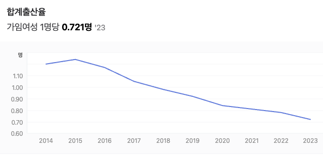
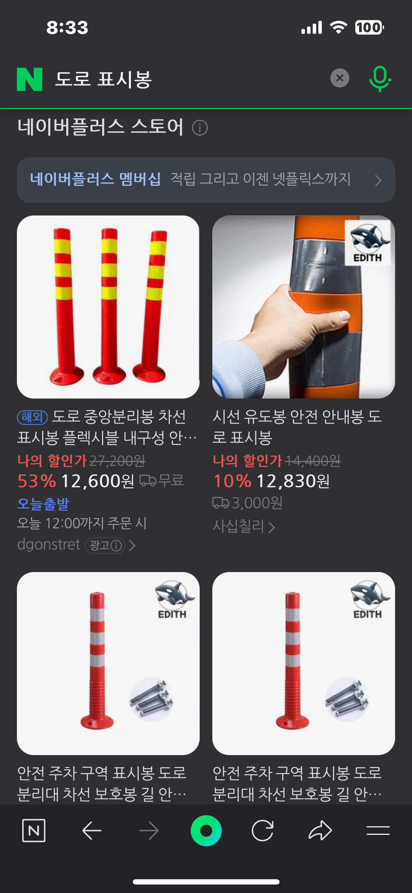
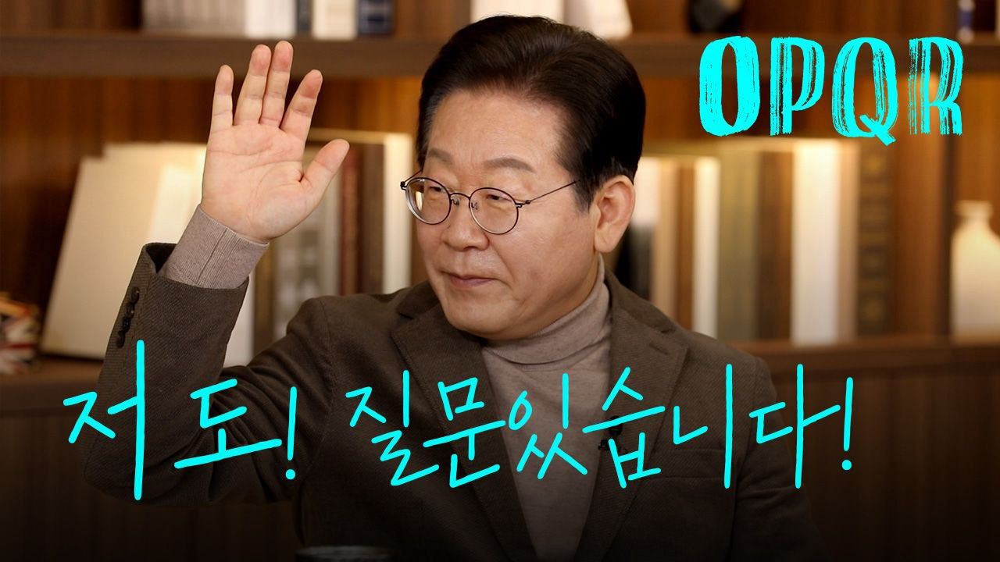
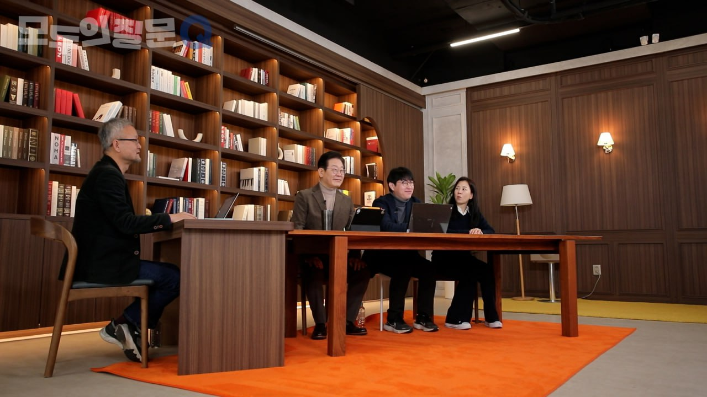

## 문서번호: 5101

### 제목: [입시 지옥 그대로 둘 것인가 ? 교육 혁명이 필요하다 !](https://q4all.kr/redirect/detail/94dde164-3b94-472f-8f60-012c264a2e45)

**작성자:** [박정현](https://q4all.kr/user/profile/1794)
**작성일:** 2025-03-03 13:37:12 (월요일)

---

### 아래 글은 X(트위터)에서 '백경' 작가의 글을 옮겨 둡니다. 혹시 저작권 문제가 있다면 가려도 좋습니다.

### 다만 현행 우리 교육의 현실을 작가의 눈과 글을 빌려 살펴보고 교육 혁명의 필요성을 제기하고자 함입니다.

### 

---------------------------------------------------------------------------------------------------------

### 입시 학원으로 출동을 나갔다. 입구의 플래카드가 눈에 띄었다.

### 

### <입학 성공 사례>

### 서울대 4명

### 카이스트 1명

### 연세대 5명

### 고려대 4명

### 의대 3명

### . . . .

### 

### 입학 성공 사례에서 제외된 아이들은 스스로를 ‘입학 실패 사례’로, 나아가 ‘인생 실패 사례’로 여길지도 모르겠구나란 생각을 잠깐 했다.

### 아닌가. 그 정도로 나약하진 않은가. 세상은 넓다. 공부 좀 못한다고 망한 인생이 되진 않을 것이다. 그러나 아이들의 세상은 좁다. 집, 학원, 편의점, 코인 노래방.

### 마음의 맷집을 늘리기엔 주변 환경이 너무 열악하다. 화장을 한 것도 아닌데 도화지처럼 핏기 없는 얼굴로 쓰러져 있던 학생이 말했다. “죄송해요.” 학원 선생님께 죄송한 건지 놀라서 달려온 엄마에게 죄송한 건지 나한테 죄송한 건지 불분명한 말이었다. 애초에 죄송할 일이 아닌 걸 두고 학생은 죄송하다고 말했다. 더 열심히 하지 못해서 죄송해요. 쓰러져서 죄송해요. 인생 성공 사례가 아니라서 죄송해요. 죄송해요.

### 나는 그 말에 트라우마가 있는데 이따금 어린 학생들이 스스로 삶을 저버릴 때 유서에 남기는 말이 바로 그 말이기 때문이다.

### 

### 2024년 기준 이 나라에선 하루 평균 40명이 스스로 목숨을 끊었다. 365를 곱하면 14600명이다. 한 가정에 높게 잡아 3명이 거주한다고 가정했을 때, 1000세대짜리 대단지 아파트 5개가 해마다 주저앉는 셈이다. 작년에도 위풍당당한 신축 아파트들은 30층, 40층, 50층을 향해 기지개를 뻗었지만 사람의 아파트들은 지구의 내핵을 향해 곤두박질쳤다. 그리고 그 속엔 수 천의 죄송한 아이들이 살고 있었다.

---------------------------------------------------------------------------------------------------

### 교육 혁명, 이 시대를 사는 기성 세대, 민주 시민들의 후 세대를 위한 책무입니다.

---

## 문서번호: 5102

### 제목: [음주운전 적발 시 형량이 너무 작습니다.](https://q4all.kr/redirect/detail/367cbaab-9032-4a56-869c-9150aefb77ce)

**작성자:** [박대환](https://q4all.kr/user/profile/7692)
**작성일:** 2025-03-03 13:48:53 (월요일)

---

한 해 음주운전 적발 건수만 15,000건이고 이로 인해 사망자만 200명이 넘어갑니다.

2018년 윤창호 사건, 2022년 강남 음주운전 사망 사건, 2023년 창원 음주운전 사망 사건 등 사회적 이슈가 된 사건도 많습니다.

모두가 음주운전을 하지 말아야지 하면서도 하게 되는 이유가 뭘까요?

사고로 인해 아이, 혹은 부모, 누군가의 친구등이 죽어나가는 이유가 음주운전인데도 불구하고

처벌 2년 이하의 징역, 천만원 이하의 벌금 등 한 사람의 생명을 앗아간 사람에 대한 처벌이 너무 낮습니다.

과연 음주운전 적발시 징역 10년을 집행하고, 음주운전하여 상대가 사망에 이르게 한 사람에 대해서 무기징역으로 처벌한다면

위와 같은 제 2의 윤창호 사건 등이 일어날까요?

음주하면 운전대를 잡지 않게 하는 방법이 사회적 합의로 이뤄지지 않는다면

법과 질서를 사회적 합의로 정하고 따르게 해야 한다고 생각합니다.

음주운전 적발 시 형량이 너무 작은 이유에 대해서 알려주세요.

---

## 문서번호: 5103

### 제목: [아파트 관리비 적립금 관리 문제 없나요?](https://q4all.kr/redirect/detail/d65119da-9af7-4f78-8f22-7b88f5476ebf)

**작성자:** [박찬식](https://q4all.kr/user/profile/7658)
**작성일:** 2025-03-03 13:54:34 (월요일)

---

관리비 적립금은 아파트의 공용 부분 유지보수, 시설 보수, 그리고 장기적인 재건축을 위한 준비금으로 활용됩니다. 이는 매달 관리비의 일정 부분을 적립하여 미래의 대규모 수리나 교체 비용에 대비하는 목적을 가지고 있습니다.

최근 아파트가 고층화되면서, 건물의 수명이 다했을 때 슬럼화될 가능성에 대한 우려가 커지고 있습니다. 이러한 문제를 해결하기 위해서는 사회적 합의가 절실히 필요합니다. 단순히 입주민들에게만 책임을 맡기기보다는, 국가나 지방자치단체가 적극적으로 법적 제도를 마련하여, 향후 재개발이나 재건축이 원활하게 이루어질 수 있도록 해야 합니다. 이를 통해 고층 아파트의 지속 가능한 관리와 도시 환경의 안정성을 확보할 수 있을 것입니다.

---

## 문서번호: 5104

### 제목: [현재의 대결적 남북관계를 개선하고 남북한 평화통일 방안을 수립하고 실천할 구상이 필요하지 않을까요? ](https://q4all.kr/redirect/detail/a33f4132-362d-4f99-a4d9-979ee6f7537e)

**작성자:** [박경석](https://q4all.kr/user/profile/7019)
**작성일:** 2025-03-03 14:33:11 (월요일)

---

**남북한 평화통일 방안 대강(大綱)**

**1. 남북한 평화통일의 당위성**

**가. 대한민국 헌법**

￮ 전 문 : ㆍㆍㆍ 조국의 민주개혁과 **평화적 통일의 사명에 입각하여 정의ㆍ인도와 동포애로써 민족의 단결을 공고히 하고**ㆍㆍㆍ

￮ 제3조 : **대한민국의 영토는 한반도와 그 부속도서로 한다.**

￮ 제4조 : **대한민국은 통일을 지향하며**, 자유민주적 기본질서에 입각한 **평화적 통일정책을 수립하고** **이를 추진한다.**

￮ 제5조 ① : 대한민국은 국제평화의 유지에 노력하고 **침략적 전쟁을 부인한다**.

￮ 제66조 ③ : 대통령은 **조국의 평화적 통일을 위한 성실한 의무**를 진다.

**나. 평화통일의 사례 및 교훈**

￮ 분단국 통일 사례 : 독일, 베트남, 예멘

￮ 역대 정부의 평화통일정책 : 7･4 공동선언, 7･7 선언, 남북기본합의서, 민족공동 체 통일방안, 대북화해협력정책, 평화번영정책, 대북 상생공영정책 등

**다. 통일정책의 일관성 유지**

￮ 보수 및 진보 진영의 주장을 수용, 특정 이념에 치우치지 않고 오직 평화정착과 평화통일만을 추구하는 정책으로 정권 교체에도 불구하고 지속적인 추진이 가능

**2. 남북한 평화통일 방안 기본 방침**

**가. 무력통일을 추구하지 않는다.**

￮ 북한을 무력으로 먼저 공격하거나 무력통일을 추구하지 않는다.

￮ 북한이 무력으로 공격하면 즉각 응전하고 그 이상의 보복을 실시한다.

￮ 북한이 무력으로 통일을 추구하면 이를 격퇴하고 북한지역을 수복하여 통일을 달 성한다.

**나. 흡수통일도 추구하지 않는다.**

￮ 북한을 흡수하여 통일하는 대북정책을 추진하지 않는다.

￮ 그러나 북한이 스스로 남한으로의 편입을 원하면 이를 거절하지는 않는다.

**다. 평화통일을 추구한다.**

￮ 평화통일은 남북간의 합의에 의한 통일을 의미한다.

￮ 남북간의 합의통일은 북한이 개혁, 개방을 추진하여 자유민주주의 시장경제체제로 전환하고 남한에 근접한 수준의 경제력을 달성할 때에 가능하다.

￮ 평화통일을 위해서는 북한은 체제전환과 경제발전을 적극적으로 추진해야 하며, 남한은 이를 최대한 지원해야 한다.

**라. 남북한 평화통일 방안은 남한이 북한의 체제전환과 경제발전을 적극적으로 지원하는 대북정책이다.**

￮ 평화통일을 위해서는 북한의 체제전환과 경제발전이 전제되어야 함을 북한에게 이해시키고 설득시켜야 하고, 남한이 이를 적극 지원할 것을 약속한다.

￮ 북한의 현 체제를 비난하거나 공개적으로 개혁, 개방을 요구하여 자극하지 말고 체제전환의 필요성을 이해시키고 설득하여 북한이 스스로 변화를 선택하도록 유도한다.

￮ 모든 대북정책은 북한의 체제전환과 경제발전에 초점을 맞추어 추진되어야 한다.

**3. 남북한 평화통일 방안 주요 내용**

**가. 평화 정착**

**(1) 평화 확보**

￮ 북한의 침공 시 방어할 수 있는 국방력 확보

- 북한의 전면 도발을 저지할 수 있는 국방력 : 북한전력의 최소 70% 이상

￮ 북한의 국지적 도발 시 즉각 응징의 결의 표명 및 보복능력 확보로 도발 억제

- 북한의 도발 시 즉각 응징한다는 의지를 공개적으로 발표하고 즉각 응징함으로써 우리의 의지와 능력을 과시

￮ 북한의 전면적 무력침공 시에는 이를 응전ㆍ격퇴함은 물론 통일을 달성하겠다는 의지 표명 및 이에 필요한 군사력 확보

- 북한이 무력으로 공산화 통일을 획책할 시에는 이를 격퇴할 뿐만 아니라 북한정권을 무너뜨리고 통일을 추진하겠다는 의지를 나타내고 필요한 군사력 확보

(자체 또는 우방의 지원 등)

**(2) 평화 정착**

￮ 남북간 화해ㆍ협력 강화로 신뢰증진 및 군사회담을 통해 군사적 신뢰구축, 전방 배치 무력의 후방 이동 및 군비축소로 실질적인 평화 정착 추진

￮ 북한의 사회주의 헌법 및 노동당 규약의 개정으로 대남 적화통일 포기 유도

￮ 남북대화 및 6자회담, 미ㆍ북간 협의, 종전 선언 등을 통한 북핵 문제 해결 및 한반도 평화체제 구축

**(3) 북한 핵문제 해결**

**(가) 북한이 핵무기를 개발하는 이유**

￮ 외부의 위협으로부터 체제 및 정권 안정 확보

￮ 김정은 체제의 불안정, 경제난 등으로 인한 주민 동요 단속 및 내부 체제 결속

￮ 경제력 약화로 인한 대남 군사적 열세의 극복

￮ 핵무기 수출로 외화 확보 수단 등

**(나) 북한 핵과 한국**

￮ 남북간 군사력 균형이 깨지고 북한의 핵위협에 직접적으로 노출

￮ 핵무기 개발 유혹에 직면

￮ 국민들의 안보 우려, 대북 불신감 증대 및 대북 지원, 교류협력에 부정적인 영향

**(다) 북한 핵과 미국**

￮ 미국 본토 및 해외 주둔 미군, 해외 거주 미국인에 대한 위협

￮ 한국, 일본 등으로의 핵 확산 우려

￮ 테러단체로의 핵무기 유출 우려 등

**(라) 북한 핵과 일본**

￮ 북한으로부터의 직접적인 핵 공격 위협에 노출

￮ 핵무기 개발에 대한 유혹 등

**(마) 북한 핵문제 대책**

**(ⅰ) 한국의 대책**

￮ 월등한 국력을 바탕으로 북한과 핵무기 개발 경쟁을 통해 북한의 도발을 억제

￮ 미국과의 안보협력 강화로 북한의 핵위협에 공동 대응

(한미상호방위조약, 방위비 분담 등)

￮ 남북대화 및 북핵 6자회담 등을 통한 해결방안 강구

**(ⅱ) 미국의 대책**

￮ 북한과 직접적인 교섭을 통한 해결

- 북한 : 핵개발 포기 및 핵물질 완전 제거 등

- 미국 : 북한에 대한 체제 보장, 불가침 협정 체결, 국교수립 및 경제지원 등

￮ 북핵 6자회담 등 다자 회담 등을 통한 해결

￮ 평화적 해결노력이 무산되면 무력을 통한 해결방안도 고려

**나. 평화 지원**

￮ 인도적 동포애적 차원에서 북한에 대한 식량, 비료 등을 지원하되, 남한의 인도적 문제인 이산가족, 납북자, 국군포로 문제 해결과 연계하여 추진

￮ 다른 대북지원사업도 개발지원 사업 형태로 추진

￮ 북한 인권문제도 말로써 북한을 자극하지 말고, 인도적 문제 해결 차원에서 대북 지원, 남북경협(SOC 투자, 차관 제공 등) 등과 연계하여 구체적 성과를 도출

**다. 평화 교류**

￮ 문화, 예술, 체육, 학술, 종교 등 전 분야에 걸쳐 민족의 동질성 회복에 중점을 두고 교류 추진

￮ 동시에 북한의 긍정적 변화를 유도할 수 방법으로 연계하여 추진

**라. 평화 협력**

￮ 민간분야 경제협력은 민간의 자율적인 판단 하에 시장원리에 의거 추진토록 하되, 경협활성화를 위해 정부가 적극적으로 지원

￮ 북한의 SOC 건설 등 정부차원의 경제협력은 남북경협 관련 제도 개선, 북한의 개혁ㆍ개방조치, 북한인권 개선, 평화증진 조치 등 구체적 성과와 연계하여 추진

**마. 평화 교육**

￮ 평화 공존, 평화 정착, 평화통일에 대한 확고한 신념과 자신감 확보

￮ 남북한 평화통일 방안에 대한 정당성과 구체적 내용에 대한 교육 중점

￮ 북한의 실상과 남북관계 현실에 대한 객관적 이해에 중점

- 북한방문 기회의 확대를 통한 살아있는 통일교육 실시

※ 한 번의 금강산 관광이 30년 동안의 통일교육보다 더 효과적이었다는 평가

**바. 평화 통일**

￮ 남북간 평화정착, 자유왕래 등 높은 수준의 화해ㆍ협력 단계에 이르기까지는 인내심을 갖고 남북한 평화통일 방안에 입각한 대북정책 지속 추진

￮ 북한이 상당한 수준의 민주화와 경제발전으로 ‘사실상의 통일’ 상태에 이르러 남한과 통일논의에 자신감을 갖고 응할 때까지 구체적인 통일논의 제의 지양

￮ 남북연합 등 과도체제를 거쳐 단일의 통일국가(자유민주주의, 시장경제체제)를 달성하는 평화통일 방안에 대한 남북간 합의 도출

￮ 자유민주주의, 시장경제체제의 통일국가 건설 -끝-

---

## 문서번호: 5105

### 제목: [소방차, 119 구급차 사이렌 울리면서 출동할때 협조하지 않는 운전자들등으로 인해 문제가 많이 생기고 있는데 법적으로 조치가 필요하지 않을까요?](https://q4all.kr/redirect/detail/ef5e51ea-f2ca-4f3b-acf0-e7e27ca0fa31)

**작성자:** [박종욱](https://q4all.kr/user/profile/772)
**작성일:** 2025-03-03 14:49:37 (월요일)

---

미국에서 소방차나 엠블런스가 지나갈때 사이렌 소리가 나면 다들 차를 갓길로 몰아서 정지하고 아무리 복잡한 교통상황일지라도 다들 최대한 자리를 만들어서 비켜줍니다.

이게 미국 국민들 시민의식이 높아서만일까요? 아닙니다. 국민의 생사와 직결될수 있는 소방차나 응급차량의 운행 방해에 대한 벌금이 주에 따라 다르지만 캘리포니아는 벌금이 천불 이상 현재 환율로 140만원 정도이고 대부분 주에서는 500불 이상 벌금을 물립니다. 운전면허에 벌점도 추가되고 상황에 따라 운전면허 정지 또는 형사처벌도 받을수 있습니다. 또한 긴급차량이 주행을 방해하는 차량을 파손하고 지나가더라도 긴급차량 운전자가 법적으로 보호받을수 있게 되어 있고 파손된 차량 운전자는 본인 보험으로 수리를 해야합니다.

이런 여러가지 법적인 제제가 있으니 사이렌 소리만 들려도 속도를 줄이고 어디서 긴급차량이 오는지 체크하면서 다들 길을 비켜주는게 아닐까요?

별거 아닌것처럼 넘어가기에는 너무 많은 국민들이 골든타임을 놓쳐서 소중한 목숨과 재산을 잃고 있습니다. 긴급차량의 이동에 방해를 하거나 도움을 주지 않는 운전자들의 행동은 어찌보면 간접 살인을 하는 것과 같다고 봅니다. 그러니 미국같은 자유민주주의 대표 국가에서도 긴급차량 운행 방해에 대한 벌금과 처벌을 강력하게 해놓은 것이겠지요,

이재명 대표님이 관련 법안을 준비하셔서 공약을 만드시고 홍보 하신다면 대부분의 국민들은 동의를 하실것이고 지지할것입니다.

미국 거주중인데 가끔 한국 드라마 볼때 긴급차량들 지나가는데 꿈쩍도 안하고 오히려 화를 내면서 당당히 길막고 있어서 응급대원들이 어쩔줄을 모르고 속타하는 장면이 나올때마다 부끄러운건 둘째치고 이런 단순하지만 당연히 지켜야 할것들이 아직까지도 방치되고 있어서 최신 k드라마에서도 소재로 사용되고 있다는게 황당합니다.

간접살인과도 같은 행동을 하는 운전자와 사람들에게는 강력한 법적 조치를! 소방차나 엠블런스 운전사에게는 여러 예외 허용 규정을! 확실하게 만든다면 2025년부터는 대한민국에서 골든타임을 놓쳐 최소화 시킬수 있었던 화재나 인명피해를 막지 못하는 안타까운 일들이 발생하지 않길 바랍니다. 이런 사항은 단순히 시민의식에 맡겨두기에는 그로인한 피해가 너무 큽니다. 대한민국 국민 누구나 그 피해자가 될수 있구요,

---

## 문서번호: 5106

### 제목: [챗GPT가 글 쓰고, 로봇이 일하는데... 저출산은 오히려 기회 아닐까요?](https://q4all.kr/redirect/detail/f4f28e6f-9c04-4ade-96e4-6fa0dff6b887)

**작성자:** [류진성](https://q4all.kr/user/profile/7579)
**작성일:** 2025-03-03 15:25:27 (월요일)

---

시작하기에 앞서, 저는 올해 만 28세의 청년이자 남성임을 밝힙니다.

24년 출산율이 역대 최저점을 찍었습니다. 15년도 1.24였던 출산율이 불과 9년만에 0.72까지 급락했습니다. 이런 급락폭도, 저출산율도 전 세계적으로 유래가 없던 일입니다.

많은 나라와 전문가들이 한국의 상황을 주목하고 있고 국내에서도 저출산에 대한 위기의식이 점점 더 고조되고 있습니다. 도대체 저와 같은 우리 청년들은 무슨 생각일까요? 대체 왜 아이를 이렇게까지 안 낳을까요?

청년인 제 입장에서, 지금 사랑하는 여자친구가 있고 결혼을 계획하고 있는 상황에서 제가 느끼고 있는 부담을 솔직하게 말씀드려 보겠습니다.

단연 먼저 등장하는 주제는 집값이겠죠. 평생동안 직장생활을 하고, 노예처럼 일해도 서울에 집 한 채 살 수 없다는 현실은 엄청난 절망감을 저에게 선물해줍니다. 이건 도저히 스스로 극복이 안되기에 강한 무력감을 동반합니다.

다음으로는 물가상승이 떠오르네요. 월급은 쥐꼬리 만큼 오르는데 물가는 미친듯이 올라갑니다. 이제 점심 한끼 밖에서 사먹기 조차 두려운 세상이 이미 와버렸습니다.

집값도 집값이지만 제 월급으로는 생활비도 빠듯한 상황입니다. 저축? 재테크? 작고 귀여운 제 월급으로 미래를 대비하는 건 사치라는 생각이 안들 수 없는 게 현실이네요.

어찌저찌 결혼을 한다 해도 아이를 낳는 것은 또 다른 문제입니다. 제일 큰 문제는 긴 노동시간이에요.

아이와 함께 할 절대적인 시간이 부족한데 아이를 낳는다는 건 태어날 아이를 생각하면 너무나도 이기적인 선택이라는 생각이 듭니다.

아이 등하원은 시켜줄 수 있을지, 입학식과 졸업식, 운동회와 참관수업은 참여할 수 있을지 모릅니다. 태어날 아이에게 몹쓸 짓이 아닌가 하는 생각도 들어요.

AI의 발전도 두렵습니다. AI가 일자리를 대체할거라는 위기감이 벌써 사회내에 팽배합니다. 이미 그런 변화들이 시작되었죠.

제 일자리도 대체되어 나중에 제가 가정과 아이를 책임지지 못하게 될까봐 두렵습니다. 태어날 아이의 미래도 걱정입니다.

AI혁명은 이미 시작되었고 막을 수 없다는 것이 저에게는 두려움으로 다가옵니다. 저와 제 아이가 잉여인력이 되면 어떡하나 하고 벌써부터 고민하게 됩니다.

저는 결혼도 하고 아이도 낳고 싶습니다. 하지만 현실은 너무 버겁습니다. 저 뿐만 아니라 대부분의 청년들이 비슷한 생각을 할겁니다.

특히 임신을 하고 양육에서 주도적인 역할을 맡는 여성분들의 부담은 남자인 저보다 더 하겠죠.

‘지난 50-60년간의 고속경제발전은 여성들을 고등교육과 일터로 밀어넣었습니다. 하지만 아내와 어머니의 역할은 같은 속도로 발전하지 못했습니다.’

BBC가 진단한 한국의 저출산 문제의 원인입니다. 참 뼈 있는 말이라는 생각이 듭니다.

결론은 청년세대들, 특히 여성들의 저출산 현상은 선택이 아닌 생존을 위해 몸부림 치고 있는 결과라는 것이죠. 출산을 하고 아이를 낳고 싶어도 할 수 있는 여건이 되지 않는다는 것이 문제입니다.

나라 차원에서의 저출산 해결을 위한 노력은 끊임없이 계속되고 있습니다. 천문학적인 액수의 예산을 써가며 어떻게든 출산율을 올리기 위해 끊임없이 노력해왔습니다.

그러나 문제는 계속 악화되기만 할 뿐입니다. 대체 무엇이 문제일까요? 그리고 어떻게 해결해야 할까요?

엄밀히 따지면 저출산을 문제라고 말하며 위기감을 고조하고 있는 세대는 기성세대입니다. 위에서 말했다시피 청년세대는 자신의 삶을 보전하는 것 만으로도 매우 버거운 상태입니다.

하지만 기성세대에게는 청년세대의 이런 상황이 그저 어린 친구들의 배부른 소리, 행복한 비명 정도로 밖에 보이지 않는 것 같습니다. 왜 그럴까요?

기성세대는 사실 존경스러운 세대입니다. 그 어려운 정치, 경제, 사회의 상황속에서 한국을 선진국 반열에 올려놓은 세대이죠. 우리나라 국민들이 더 이상 굶주림을 고민하지 않아도 되게 만들어 주신 분들이 바로 기성세대입니다.

그 발전 아래서 지금의 청년세대들이 자란 것이죠. 기성세대는 젊은세대로부터 존경받아 마땅합니다.

하지만 이게 무슨 일일까요. 기성세대와 젊은세대의 갈등은 심해져만 가고 서로를 비난하고 헐뜯기에 바쁩니다.

기성세대는 젊은세대에서 일어나는 저출산을 비롯한 여러 부정적인 현상을 보며 혀를 차기 바쁘고, 그런 기성세대를 보며 젊은세대는 늙은 꼰대들 이라며 비난하기에 여념이 없습니다.

이 시대를 함께 살아가는 두 세대가 왜 이렇게까지 극렬하게 갈등할까요?

청년인 제 입장에서 이야기 한다는 점을 이해해주시고 양해해주시길 부탁드리겠습니다. 제가 생각하는 이유는 기성세대가 철저하게 자신들의 관점에서만 청년세대를 바라보고 있다는 것입니다.

기성세대가 살아간 시대와 젊은세대가 맞닥뜨린 오늘날의 현실은 완전히 다릅니다. 경제도, 성장률도, 사회도, 문화도, 기술도, 인간관계도, 공동체도, 정치도, 교육도, 성장과정도, 삶도 모든 것이 다릅니다.

정말 과장이 아니라 모든 것이 다릅니다. 그러니 청년들의 얘기를 듣지 않고서는, 그들의 삶으로 들어가보지 않고서는, 그들의 삶을 이해하려고 몸부림치고 애쓰지 않고서는 알수도, 이해할 수 도 없는 것이죠. 어쩌면 이것이 당연합니다.

제가 존경하는 유시민 작가님께서 몇 년 전 대선주제의 토론회에서 하신 말씀이 기억납니다.

‘기성세대에 묻지마라. 기성세대에게 답을 구하지마라. 어차피 이들은 모른다. 여러분들이 답을 스스로 찾고 직접 그 답을 가지고 부딪혀라.’

당시에는 ‘이건 너무 무책임한 발언이 아닌가? 우리가 맞이한 세상을 만든 건 기성세대인데, 왜 아무것도 묻지도 말고 도움도 구하지 말라는거지?’ 라고 생각했었습니다.

하지만 지금은 그 말씀이 너무나도 명확하고 핵심을 찌르는 통찰임을 깨닫습니다. 기성세대는 지금의 시대를 모르기 때문입니다.

그것이 잘못이라는 것이 아니라, 그것이 자연스러운 현상이라는 의미입니다.

그렇다면 저는 기성세대에게 한가지 묻고 싶습니다.

우리에게 논의의 주도권을 넘겨줄 수 있나요?

이 세상을 살아갈 우리들에게 이 논의를 맡길 수 있나요?

아니면 적어도 우리의 얘기를, 진짜 속마음을 제대로 들어주고 정치와 경제와 사회에 반영해줄 수 있나요?

그것은 쉽지 않을 겁니다. 아마도 기성세대에게는 당신들의 권력(아젠다를 주도할 수 있는 영향력, 결정하고 집행할 수 있는 권한)을 내어 놓으라는 뜻으로 들릴테니까요.

현실적으로 쉽지 않습니다. 하지만 분명한 건 이제는 청년들의 목소리가 세상에 더 크게 울려퍼져야 한다는 겁니다.

지금 당장 실현할 수 있는 방법이 있습니다. 바로 청년들이 더 정치에 관심을 가지고, 목소리를 내고, 지지와 투표로 우리 자신을 사회내에서 더 드러내는 겁니다.

우리의 목소리에 진심으로 귀 기울여주고, 우리의 미래를 진심으로 생각해주고, 우리의 마음을 정책으로 나라 전반에 반영시켜 줄 정치인을 우리 손으로 뽑으면 됩니다. 그렇기에 청년들이 정치에 관심을 더더욱 가져야만 하는 것이죠.

그렇다면 이제는 청년인 제가 기성세대로만 이루어져 있는 사회의 핵심권력층과 정치계에 제시하고 싶은, 저출산에 관한 새롭고 도발적인 관점에 대해서 말씀드리고자 합니다.

오롯이 청년의 입장에서, 지극히 현실주의자적인 입장에서 말씀드림을 밝힙니다.

저출산은 이제 현실입니다. 기성세대는 기존에 시도해왔던 모든 출산장려 정책, 출산율 회복 정책이 실패했음을 인정해야 합니다. 기존의 방식으로 접근해서는 절대 이 문제를 풀지 못함을, 당신들이 실패했음을 인정해야 합니다.

그리고 청년세대의 입장에서 새롭게 이 현상에 접근하고 분석하고 해석해야 합니다. 기존의 판을 버리고 새 판 위에서 이 현상을 논의해야 합니다. 기존의 기준은 버리고 새롭게 세워진 기준에서 저출산 현상을 바라보자고 제안하는 바입니다.

또한, 지금은 AI혁명이 시작되고 있는 시기입니다. 사실상 이미 우리가 두려워하던 특이점이 도래했습니다. AI의 수준은 일부 영역에서는 사람의 능력을 뛰어넘었습니다.

수 많은 일자리가 AI에 의해 사라질 것이고 수 많은 사람들이 AI로 대체될 것입니다. 이미 그 파괴적 변화는 시작되었습니다. 이것은 막을 수 없는 현실입니다.

AI의 거대한 해일이 이미 우리 눈앞에 와있고 일부는 벌써 쓸려가고 있습니다. 우리는 이 현실을 직시해야 합니다.

AI는 일자리를 대체하고 빼앗고, 출산율은 점점 낮아지기만 하고… 마치 한국의 종말을 목전에 둔 것 같습니다.

수 많은 청년들이 ‘대한민국은 이미 망했다’ 하고 자조 섞인 한탄을 내뱉고 있습니다. 맞습니다. 위기입니다. 아주 큰 위기 앞에 우리는 직면해 있습니다.

그러나 위기는 곧 기회이기도 합니다. 기회는 위기속에 숨어서 항상 함께 옵니다.

그 기회를 발견하면 우리는 또 다시 전세계를 선도하는, 미래지향적으로 발전하는 국가가 될 수 있습니다.

마치 IMF위기를 온 국민의 힘으로 함께 극복하고, 정부주도 투자, 그리고 민간의 투자와 역량으로 외환위기를 보란 듯이 뛰어넘고 세계 최강의 IT강국이 되었던 것 처럼요.

우리가 미래에 AI강국이 될 수 있는 기회가 여전히 있습니다. 저는 그 기회가 있다는, 위기를 기회로 볼 수 있다는 관점을 제시하고 싶습니다.

저출산은 위기이지만 앞으로의 AI시대를 생각해보면 또 하나의 기회가 될 수 도 있습니다. AI시대의 가장 큰 문제는 잉여인력 입니다. 사람이 많아도 AI로 인해 일자리가 부족하다는 뜻이죠.

오히려 베이비부머 세대처럼 출산율이 높다면 그것은 AI시대에 더 심각한 사회문제가 될 가능성이 높습니다.

저출산은 되려 이 문제를 해결 할 수 있는 키가 될 수 있습니다. 미래사회에서는 필요한 인력이 지금보다 훨씬 적을 가능성이 매우 높습니다.

필요한 인력은 모두 AI를 비롯한 미래산업에 필요한 역량을 갖춘 인재가 되겠지요. 새롭게 태어나는 세대들을 미래산업의 핵심 인재들이 될 수 있게끔 해야합니다. 그러러면 교육시스템의 혁신도 반드시 함께 따라야 할 것입니다.

AI의 등장은 기존의 인구규모경제체제를 완전히 뒤집어 엎는 파괴적인 변화입니다. AI시대에는 더 이상 많은 사람이 필요하지 않습니다.

대규모 노동력을 투입해 오랜 시간 일하게 해서 성과를 내는 시대는 지나가고 있고 일부 업계는 이미 지나갔다는 뜻입니다.

AI가 노동에 대한 개념을 완전히 바꾸고 있는 상황인데, 우리는 여전히 20세기 방식으로 일하고 있다면 그것은 매우 어리석은 짓일 겁니다.

그렇기에 기존의 인구규모경제체제 하에서 발전하고 성장해온 기성세대의 시각으로 논의하는 것이 얼마나 소모적인지, 그리고 그러한 접근방법으로는 그 어떤 문제도 해결할 수 없는지에 대한 이유가 여기에 있습니다.

완전히 다른 세상이라는 것입니다.

이제는 소수의 사람이 AI와 협력하여 더 적은 시간만 일하는 시대가 도래했습니다. 그렇게 일해도 기존의 조직들이 내는 성과를 훨씬 상회하는 결과를 낼 수 있습니다.

이미 그렇습니다. 그리고 앞으로는 더더욱 그 방향으로만 발전할 것입니다. 이것은 막을 수 없습니다. 어떤 윤리적인 문제를 제기해도, 아무리 저항해도 시대의 거센 물결은 절대로 막을 수 없습니다.

이것을 막고자 시도하는 것은 스마트폰이 이미 등장했고 사회의 새로운 기준이 되어가고 있는데 피처폰 시장을 살려야 한다며 사력을 다하는 것이나 마찬가지 입니다. 새 술은 새 부대에 담아야 합니다.

AI로 인해 1인당 생산량은 혁신적으로 늘어날 것입니다. 그렇다는 건 1인당 소비력이 늘어난다는 뜻이죠. 인구규모가 줄어드는 상황에서 생산성은 AI를 활용해서 끌어올린다 하더라도 소비력의 하락이 큰 문제입니다.

내수시장은 한 나라의 경제 기초체력이나 다름없죠. 때문에 이 문제를 1인당 소비력을 높이는 방식으로 접근하려는 시각이 필요합니다.

이미 출산율이 전세계 최하이기에, 이러한 접근은 이상적이거나 낙관주의적인 접근이 아니라 지극히 현실주의적인 접근일 수 밖에 없습니다.

AI로 인해 생산량과 효율성이 기하급수적으로 증가하기 때문에 노동시간을 단축하는 것도 가능해집니다. 여기에 대해서 논란이 심하다는 것을 알고 있습니다.

하지만 이미 주4일제에 대한 논의는 시작되었고 필요성이 대두 되고 있는 상황입니다. 저는 이것이 선택사항이 아니라 청년세대의 생존이 달린 필수사항이라고 말씀드립니다.

AI로 인해 이것이 가능해졌고, 앞으로 더더욱 그러할 것이며, 청년들이 아이를 키우며 자신의 삶을 가꾸어갈 수 있는 방법 중의 핵심은 바로 노동시간 단축에 있다는 것을 인정하고 받아들여야합니다.

더 이상 이것은 선택 사항이 아닙니다.

청년들의 주거문제도 시급히 해결해야 합니다. 출산율이 급락하기 시작한 15-16년도는 집값이 급등하기 시작한 시점과 맞물립니다.

평생을 일해도 내 집 하나 마련하기 힘들다는 두려움이 청년세대를 지배하고 있습니다. 극단적 양극화로 인해 중산층으로 올라 갈 수 있는 사다리가 사라진 상황에서 청년들이 유일하게 희망을 가질 수 있는 자산이 부동산 되버린 것입니다.

그래서 소위 ‘영끌’이 탄생했습니다. 청년세대의 미래와 집에 대한 두려움과 공포감, 절망과 희망을 모두 담은 단어가 바로 ‘영끌’인 것입니다.

청년들의 삶에서 주거문제에 대한 두려움이 사라지고, 중산층으로 올라갈 수 있는 사다리가 다시 생기고, 주4일제 같은 혁신적인 근무기간 단축 체계가 자리잡는다면 청년들과 미래세대의 삶이 어떻게 달라질까요?

그렇다면 출산율은 어떻게 될까요?

저는 더 이상 출산율을 이라는 데이터, 즉 숫자를 가지고 뭔가를 논하고 위기의식을 가지는 것은 무의미하다고 말씀드리고 싶습니다.

중요한 건 청년, 즉 저희의 삶입니다. 저희 세대의 삶의 질입니다. 저희의 행복입니다.

저희가 아이를 낳아도 괜찮은, 걱정하지 않아도 되는 사회가 되는 것입니다. 더 나아가 2명을 낳고 싶으면 낳아도 괜찮고 더 나아도 행복한 사회가 되는 것입니다.

이제 우리는 이 무의미한 출산율 위기론을 끝내야 합니다. 위기가 아니라서가 아니라 이미 도래했고 기존의 접근 방식으로는 해결할 수 없고 이미 모두 실패했기 때문입니다.

접근방식을 완전히 다른 차원으로 바꿔야만 답이 있습니다.

그렇기에 우리가 다루고, 논의하고, 토론해야 할 주제는 나의 삶, 나의 삶의 질, 나의 행복, 아이를 낳아도 괜찮을 거라는 확신이 있는 세상,

아이를 낳고 싶으면 낳을 수 있는 세상, 출산율이 더 이상 젊은 세대의 문제라고 보고 비난하지 않는 세상이 되어야 합니다.

더 늦기 전에 이 논의를 시작해야 합니다. 출산율 자체를 문제 삼는게 아닌, 다가오는, 이미 도래한 AI시대에 맞춰서 지금의 청년세대가, 그 이후의 미래세대가 어떻게 살아야 하는지를 논의해야 합니다. 아직 늦지 않았습니다.

여러분의 생각은 어떠신가요? 마주해버린 극도의 저출산과 현실로 성큼 다가온 AI의 파괴적 혁명 앞에서, 우리는 어떤 대한민국을 만들어가야할까요? 정말 저출산이 AI시대에서는 새로운 기회가 될 수 있을까요?

---

## 문서번호: 5107

### 제목: [만약 AI에게 양심을 알려줄 수 있다면?](https://q4all.kr/redirect/detail/129325e1-de17-4c79-88bb-e31fcdecabf8)

**작성자:** [방건](https://q4all.kr/user/profile/7709)
**작성일:** 2025-03-03 15:58:39 (월요일)

---

만약 AI에게 양심이라는 개념을 알려주고 프로그래밍 할 수 있다면,

AI에 대한 인간의 두려움을 없앨 수 있고

인간 양심 교육을 더욱 공고히 하고 분명히 할 수 있으며

지금과 같은 이러한 양극화와 극단적인 갈등도 조금이나마 원만히 해결해 나갈 수 있지 않을까요?

---

## 문서번호: 5108

### 제목: [2025년 대한민국이 반드시 긴급하고 중요하게 처리해야 할 최우선적인 문제는 무엇인지 궁금합니다!!!!!!](https://q4all.kr/redirect/detail/283ea151-3451-4a04-8401-c2349670eb1d)

**작성자:** [하현석](https://q4all.kr/user/profile/4614)
**작성일:** 2025-03-03 16:05:17 (월요일)

---

저의 질문은
======

1. 대한민국이 처한 수 많은 문제들 중 매우 긴급하고 매우 중요한 최우선적으로 처리해야 할 문제들은 무엇입니까??
================================================================

2.그 문제들을 1위부터 10위로 나열한다면 어떤 내용으로 정리할 수 있을까요?
============================================

3.그 문제들을 국민들과 어떻게 공유하고 공론화해서 국민들의 동의 혹은 합의를 이끌어 내서 국력을 집중하게 할 것입니까?
===================================================================

4.각 문제들을 해결할 수장과 팀원을 어떻게 구성하고 계획-기간과 예산과 권한 등-을 수립하겠습니까?
========================================================

5.그 과정과 결과를 어떻게 국민들과 공유하고 피드백을 받겠습니까?
=====================================

6.5년 이상 장기 과제인 경우엔 어떤 식으로 지속적으로 문제 해결을 위해 차기 정부와 협력하겠습니까???
===========================================================

이상입니다.
======

---

## 문서번호: 5109

### 제목: [동네에서 인기좋은 일반인이 하는 재건축/재개발은 정상적인가?](https://q4all.kr/redirect/detail/b22ff306-38a1-466b-93b2-f5a0089e30d9)

**작성자:** [이경철](https://q4all.kr/user/profile/7711)
**작성일:** 2025-03-03 16:29:11 (월요일)

---

전국 많은 곳에서 재건축 재개발이 진행되고 있습니다.

하지만 실제 재건축/재개발에 관려노딘 사람이 많지 않다보니까. 주요 이슈가 되지 못합니다.

재건축/재개발을 주도하는 조합장은 건축을 아는 사람인가?

건축은 몰라도 행정을 아는 사람인가?

과연 옆에서 도와 준다는 정비 곳에서 재건축 재개발이 진행되고 있습니다.

하지만 실제 재건축/재개발에 관려노딘 사람이 많지 않다보니까. 주요 이슈가 되지 못합니다.

재건축/재개발을 주도하는 조합장은

건축을 아는 사람인가?

그렇다면 행정을 아는 사람인가?

과연 옆에서 도와 준다는 정비업체 또는 LH는 조합원들의 편인가?

만약 그들이 업자들의 편이 된다면 조합원들의 이익은 누가 보장할 것인가?

모든 이익을 조합원들이게 돌려줘야 한다는 것은 아니다 최소한 손해는 나지 않아야 하는 것이 아닌가?

해결 방법을 정확하게 모르겠지만,

헌집 줄께 새집다오를 합리적으로 이루어지기를 바란다.

감사합니다.

---

## 문서번호: 5110

### 제목: [50대를 위한 정책을 알려주세요](https://q4all.kr/redirect/detail/59d02cce-11dd-4b52-81cd-3cb2fe1bf49a)

**작성자:** [황지영](https://q4all.kr/user/profile/7710)
**작성일:** 2025-03-03 16:32:09 (월요일)

---

안녕하세요 저는 서울에 거주하는 50대 미혼여성입니다. 저는 지금 아르바이트로 생계를 꾸리고 있습니다. 취업이 쉽지는 않아서 얼마의 자금을 모아 후에 창업만 할 수 있는 나이입니다. 지금 저의 고민은 제 노년에 필요한 노후자금과 주택에 대한 고민입니다. 네이버에서 검색창에 청년이란 두 글자만 입력을 해도 청년도약계좌, 청년희망적금, 청년월세지원, 청년주택, 청년전세대출 등등 많은 정보들이 나오나 50대인 저에게 유용한 정책이나 정보는 사실 아는게 하나도 없어서 사실 짜증도 많이 나곤했습니다. 어디로 문의를 해야하는지도 잘 모르겠습니다. 그냥 스스로 해결해야한다는 막막함으로 하루하루 열심히 일을 하고 있습니다. 앞으로 세상을 이끌 친구들은 청년들과 저같은 50대의 국민이라고 생각합니다. 20대는 힘든 일이 생겨도 일어날수 있는 힘(기회, 시간, 체력 등)과 회복력이 있으나 저같은 50대는 일단 기회가 제한되고 회복력 또한 유연하지 않습니다. 저희가 가진 거라곤 성실함과 유연성뿐이라 현재를 살아가는데 버겁기만 하네요. 급변하는 세상에 뒤쳐지지 않으려 AI관련 강의도 듣고 젊은 친구들과 발 맞추려 하지만 쉽지는 않습니다. 앞으로의 세상을 저같은 50대와 청년들이 같이 이끌어간다 생각합니다. 50대도 희망을 가지고 살아갈수 있는 정책을 만들어주세요. 부탁드립니다.

---

## 문서번호: 5111

### 제목: [사망률 1위 암. 치료하는 고가의 치료기들 국민들이 걱정안하고 쓰게 할수 없나요?](https://q4all.kr/redirect/detail/c65ef767-7ce1-4b7e-9b77-e394bfb95fd1)

**작성자:** [도완영](https://q4all.kr/user/profile/892)
**작성일:** 2025-03-03 16:39:28 (월요일)

---

근래 암에 대해서 표적 항암제,양전자,중입자 치료기들이

나와있지만 비용이 걱정되서 치료를 포기하는 경우가 있습니다.

걱정안하고 치료받고 또 병실,간병비 등

병원비 고민을 안하고 치료 받기는 불가능한가요?

---

## 문서번호: 5112

### 제목: [장기 전기 구성 방향성 전략 수립 방안 ](https://q4all.kr/redirect/detail/2a7db092-2a45-4224-ad40-a238ef00f8a6)

**작성자:** [안병혁](https://q4all.kr/user/profile/7712)
**작성일:** 2025-03-03 16:48:07 (월요일)

---

장기적으로 신재생 화력 원자력 수력 구성이 정권 마다 달라서 혼선 상존함으로 최적의 방향으로 가기위한 장단기대책 필요

---

## 문서번호: 5113

### 제목: [보이스피싱 안 잡는건가요? 못 잡는건가요?](https://q4all.kr/redirect/detail/321b8cf6-664b-45ee-bde2-b884bb609d79)

**작성자:** [박지원](https://q4all.kr/user/profile/5869)
**작성일:** 2025-03-03 16:51:40 (월요일)

---

보이스피싱 피해자가 제 주변에도 많은데요.

피해 금액이 어마어마합니다.

보통 천만원 이상이구요.

십여년전에 뉴스를 본 기억으로는 경찰 검사 은행원 출신들이 보이스피싱 범죄조직의 간부로 있었다고 합니다.

그런데 보이스피싱 피해는 점점 더 커지고 있어요.

안 잡는 건지 못 잡는 건지 알 수 없을 정도에요.

이 정도면 국가적으로 해결책을 세워야 합니다.

언제까지 피해를 봐야 할까요 ㅜㅜ

---

## 문서번호: 5114

### 제목: [만인이 평등하다는 법??](https://q4all.kr/redirect/detail/3e4b259e-ef6c-44e2-9fbd-1b72257ad85a)

**작성자:** [황지영](https://q4all.kr/user/profile/7710)
**작성일:** 2025-03-03 16:52:38 (월요일)

---

결혼을 하지 않고 홀로 살아가는 국민들의 수가 많은 시대입니다. 뉴스에는 많은 흉악 범죄들이 일어나고 아동성폭력 같은 무서운 일들, 사기죄 등 많이 일어나는데 왜 범인들의 형량은 이리도 낮은 걸까요? 많은 범죄들의 법적 형량을 늘리는 방안이 절실히 필요한거 같습니다. 그 누구든 법을 어기면 그에 따른 댓가가 무겁다는 것을 모든 범죄자들이 인지 하는 나라가 되는게 어려운건지 궁금합니다. 현재 대한민국의 법은 만인에게 평등한게 아니라 만명에게만 평등하다는 누군가의 말씀을 떠올리며 질문을 드립니다.

---

## 문서번호: 5115

### 제목: [국회의원들은 돈이 많나요?](https://q4all.kr/redirect/detail/09066b60-069c-4e35-bcfe-7892b3b3ab57)

**작성자:** [이영진](https://q4all.kr/user/profile/7303)
**작성일:** 2025-03-03 17:31:57 (월요일)

---

한 모 신문사의 기사를 제 22대 국회가 개원했을 당시 국회의원들의 평균 재산을 보도하였습니다. 그 기사에서 당마다 차이는 있지만 평균적으로 20억이 넘어갔습니다. 그 기사를 보고 궁금증을 가지게 되었습니다. '전 한평생 일해도 이런돈을 가질 수 없는데 국회의원들은 불경기 속에서도 돈이 저렇게 많은 이유가 무엇일지?' 제발 알려주세요!

---

## 문서번호: 5116

### 제목: [자살율 1위, 내전상태같은 사망자 숫자 이거 국가와 사회가 그냥 지나칠 문제인가요?](https://q4all.kr/redirect/detail/6e9b10c0-0633-4784-8aa2-042e59e85954)

**작성자:** [도완영](https://q4all.kr/user/profile/892)
**작성일:** 2025-03-03 17:51:13 (월요일)

---

이번에 내란이 일어나 성공했다면 수많은 사람들이 죽을거라고 합니다.

그런데 내란 성공 여부와 별개로 우리는 해마다 내전이 벌어져 부상자와

사망자,내전이란 전쟁으로 인한 외상후 스트레스 장애 환자들이

속출하고 있습니다.

내란 말고 이 끝없이 이어지는 내전의 상처로 인한 환자들과 사망자들은 그냥 두고 지나쳐가야 할까요?

초등학교 이전부터 전쟁을 시작한다는 7세 고시도 있다더군요.

우리는 이 끝없는 내전을 치루며 계속 나아가고 또 발전해갈수 있을까요?

이 20세기 중기형 설계로 만든 국가사회 시스템으로 내전을 치루며 미래 사회와 세계와의 경쟁에서 도태되지 않을 시대에 맞는 창의적인 결과들은 낼수 있을까요?

20세기 미국을 이룬게 새로운 사회적 계약이라고 해서 빅딜이라고 했다고합니다.

21세기 초반을 넘어서고 있는 지금 이 끝없는 내전에 대해 뭔가 사회적 판단이 필요한게 아닌가 합니다.

말 많은 결혼과 출산율이 줄어든것도 이 끝없는 내전에 질려서가 아닌가요?

---

## 문서번호: 5117

### 제목: [글로벌 기업으로 활약 중인 회사를 아직도 고용보험 하의 환급제도 등으로 지원해야 하나요?](https://q4all.kr/redirect/detail/3c582b4d-09ec-4482-b3e6-14c7ac05d655)

**작성자:** [최종면](https://q4all.kr/user/profile/7721)
**작성일:** 2025-03-03 18:07:48 (월요일)

---

프리렌서 기업 교육 컨설턴트로 25년 이상 일하고 있으며 체감하는 부분으로

대기업이 글로벌 기업으로 성장하기 위해 그간의 제도적 지원은 훌륭하였습니다. 하지만 글로벌기업으로 성장한 이상 더 이상 정부의 대기업 지원은 이제 새롭게 접근해 주어야 할 듯 합니다.

연구개발 투자를 함께 하여 신기술 및 신약 등의 개발 및 양산체제까지 가도록 하는 방안은 끊임없는 미래 산업 개발을 위해 필요하다고 봅니다.

하지만, 예를 들어 고용보험 내 사업주 직업능력개발 지원 제도와 같이 정부 지원보다 내부 기획을 통해 보다 양질의 학습을 구성원들에게 제공해 줄 수 있음에도 환급제도 활용수준 만으로 운영하다보니 환급 받는 수준에서의 학습 지원에 그치는 경우가 발생하고 있습니다. 글로벌 기업 수준이라면 이러한 환급 수준을 넘어 보다 확대된 협력사 학습 지원까지 이러한 제도 하에서 운영하는 것이 아닌 자체 예산을 갖고 보다 양질의 학습이 지원되도록 해 줄 수 있을 것입니다.

물론 이러한 활동이 전혀 없는 것은 아니지만 아직도 고용보험 환급제도 범위 내에서의 학습을 운영하여 환급을 받는 형태로 운영되는 경우가 있습니다.

이러한 대기업 군의 지원제도는 과감히 개선하여 글로벌 기업으로 성장한 대기업이 협력사 및 2, 3차 공급사에게도 실질적인 학습 협력체제를 구축하여 운영하는 부분의 2, 3차의 중소기업 지원을 통해 대기업 부담을 줄여주지만 실질적 직무역량 강화가 되도록 하는 등의 제도적 개선이 필요하지 않을까 싶습니다.

**제도나 법률의 주기적 개선을 위한 '산업 지원 제도 개선 위원회' 등을 통해 대기업까지 중소기업과 동일하게 적용되는 제도나 법률이 아닌 글로벌 기업으로 성장한 회사는 사회 환원 차원에서의 활동을 요구하고 보다 축적된 예산을 성장을 꿈꾸는 창업 기업과 성장을 도모하는 2, 3차 중소기업에 초점을 맞추는 형태로 지속적인 제도 혁신을 주기적으로 해 주기를 바랍니다.** 우리나라의 산업 역량 강화를 위해서도 규모와 이미 갖추어진 역량을 고려하지 않고 법에 있으니 지원한다 보다는 전체 산업 성장을 위한 현실적 방안 마련이 필요하다는 생각이 듭니다.

---

## 문서번호: 5118

### 제목: [지체장애인도 말안들으면 예외없이 혼나야 합니다.](https://q4all.kr/redirect/detail/4fff374b-3d3b-4c66-980f-8727f09b63b7)

**작성자:** [노경태](https://q4all.kr/user/profile/7723)
**작성일:** 2025-03-03 18:17:43 (월요일)

---

장애인이라도 봐주는거 없습니다.

말안듣고 사고쳐도 무조건 혼낼수 있게 해야합니다.

---

## 문서번호: 5119

### 제목: [중견 중소기업 대상의 정부의 무료 컨설팅 활동을 검토가 필요하지 않을까요?](https://q4all.kr/redirect/detail/19651ab0-5e57-4974-a5f4-36e6e9af55e5)

**작성자:** [최종면](https://q4all.kr/user/profile/7721)
**작성일:** 2025-03-03 18:22:47 (월요일)

---

중소기업의 성장과 지속 경영을 지원하는 측면에서 정부의 지속적인 지원활동은 필요하다고 생각합니다.

하지만 무료로 진행되는 정부 지원활동은 검토가 필요하다고 생각합니다.

정부 예산을 활용해 중소기업 대상 컨설팅, 교육, 시설 구축 지원 등은 필요한 활동이라고 생각합니다.

하지만 무료로 지원하거나, 약간의 자부담만 지우고 상담 금액을 지원해 주는 제도에 대한 효과는 검토해 봐야 한다고 생각합니다.

저는 정부 지원 컨설팅의 현장 컨설턴트로 활동 하며 필요한 제도라고 생각은 되지만,

무료로 또는 매우 저렴한 비용 만으로 생산시설 개선 등의 활동(정부지원 경영컨설팅, 스마트 공장 구축 지원 등)의 경우, 중소기업에서 원해서 하는 경우 보다는 실적을 쌓기 위해 설득해 제공되는 경우가 많아 지원 효과가 정부가 요구하는 수준보다 낮다고 생각합니다.

이러한 류의 컨설팅 운영 시 이행관리라는 항목으로 컨설팅 등의 지원 제공 후 실제 현장에서 어떻게 적용되어 어떠한 성과가 났는지 제출하라는 경우가 자주 있는데 컨설팅이든 시설 구축 지원이든 현장에서 적용하는 물리적 시간이 너무 촉박하고, 적응하기도 전에 성과 있는 결과를 요구하고 있어 억지로 작성되는 경우도 발생하고 있는 것이 사실 입니다.

그리고 저는 상담을 다니며 중소기업 담당자가 "이러한 서비스는 무료로 안 해 주나요? 중소기업인데.." 라고 문의하는 경우도 있었습니다.

물론 대기업의 2, 3차 공급사로 운영되는 중소기업은 근무인원도 많지 않고 수익도 충분하지 않아 스스로의 투자가 어려운 상황이겠지만, 원하지 않는 서비스를 중앙부처 산하기관 등을 통해 운영되다 보니 실적 위주로 운영되는 경우도 많아 실질적인 효과를 거둔다는 게 쉽지 않습니다. 그럼에도 이런 지원은 지속되어야 한다고 정부에서 생각한다면 어쩔 수 없으나 이러한 서비스를 받는 회사만 2, 3차 받는 경우도 많아 개선은 필요하다 생각합니다.

오히려 창업 기업과 같이 연구개발 등 스스로의 혁신을 필요로 하는 회사의 사업계획서, 연구계획서, 운영계획서를 받아 심사하고 실질적 성과를 거둘 수 있는 방향으로 지원 방향을 잡아야 하지 않을지요?

정부 서비스는 다양하게 제공되지만 운영기관에서 모집하여 성과까지 제출해야 다음 예산을 다시 타 낼 수 있는 구조로는 알찬 성과를 도출하기는 쉽지 않다고 봅니다.

무료로 제공하더라도 원하는 기업에게, 필요로 하는 기업에게 그리고, 실천 의지가 있는 기업에게 공정한 기회를 제공하고 면밀한 검토를 통해 유니콘 기업으로 성장하도록 제대로 지원해 주는 방법은 어떨지요?

---

## 문서번호: 5120

### 제목: [은행들 해킹당하는걸까요? 해킹해서 모피아들이 가져가는걸까요?](https://q4all.kr/redirect/detail/2fef62d5-a1b9-4752-8569-6416f447acd4)

**작성자:** [박지원](https://q4all.kr/user/profile/5869)
**작성일:** 2025-03-03 18:33:01 (월요일)

---

늘 의문이었어요.

은행들 해킹당해서 돈이 없어졌다는 뉴스는 봤지만

그 해커를 잡아서 돈을 다시 갖다놨다던지

돈을 다 써버려서 감옥에 갔다던지

하는 뉴스는 본적이 없네요.

은행들이 해킹당하는게 해킹을 당하는건지 해킹을 빙자한 모피아들이 가져가는건지

수사가 필요하다고 봅니다.

---

## 문서번호: 5121

### 제목: [공단, 공사와 같은 공기업 및 중앙부처 등의 산하기관 내 공기관은 왜 전공을 무시한 인력운영으로 업무 효율을 떨어뜨릴까요?](https://q4all.kr/redirect/detail/fd4debab-fff4-4113-9b17-f9123a5149b2)

**작성자:** [최종면](https://q4all.kr/user/profile/7721)
**작성일:** 2025-03-03 18:44:26 (월요일)

---

공기업과 공기관은 정부의 인원통제를 받고 있는 것으로 알고 있습니다. 이러한 제도가 좋은지 아닌지는 잘 모르겠습니다만,

대졸자를 기준으로 본다면 대학 전공을 무시한 인사정책의 개선이 필요하지 않을까 싶습니다.

크게 보면 문과계열은 인문사회경영경제 등 사무직군의 전문 지식을 가질테고, 이과계열은 연구기술건설앤지니어 등 기술직군의 전문지식을 가지고 회사에 입사할 것입니다.

신입지원 선발 시 각 기업과 기관은 정부의 인력총량 기준 내 각 부서의 요구인력을 파악하여 채용하여 배치할텐데

이러한 요구인력의 보다 시스템적으로 운영되는 게 아닌 듯 합니다.

예를 들어 모 공사의 경우는 인사부서에 토목, 전산과 같은 이과계열 전공자를 배치하여 업무를 보게 합니다. 해당 인원은 본인의 경력개발에도 도움이 안 되지만 업무 역량을 발휘하기 어려워 다음 인사이동까지 능동적 업무보다는 수동적 업무를 수행할 수 밖에 없는 경우가 많습니다.

물론 이러한 인문사회계열 부서에 이과계열 인원이 근무하지 못하는 것은 아니지만 단지 순환배치를 하다보니 발생하는 오류를 넘어

1) 인력총량이 결정되어 있다보니 전공을 고려하지 않고 주요 업무라고 생각되는 인력 채용을 늘리는 형태로 운영되는 듯 하며

2) 공적 기능 조직의 특성 상 민간기관에 비해 짧은 업무 기간으로 인해서 인지 전공을 고려하지 않아도 그 업무를 수행할 수 있지 하는 인식이 있는 듯 합니다.

이로 인해 실무자 시절에 탁월한 업무를 내는 분도 상위 직급으로 올라갈수록 경력개발이 제대로 운영되지 못해 기업에 부담이 되는 중견 및 고위직 인원이 되는 경우도 발생하고 있다고 봅니다.

이로 인해 오히려 인문사회계열 인원의 채용이 더욱 어려워 지는 부분도 있지 않을까 싶기도 합니다.

제가 인터뷰한 어느 공사의 팀장님은 이렇게 말씀 하시기도 했습니다. "경영지원 인원은 경리만 잘하면 되잖아요. 경영지원 업무는 우리 기술직이 다 할 수 있어요."

회사의 주요 의사결정자의 인식이 이런 정도면 전공, 경력개발, 회사에서의 성장 등을 꿈꾸며 열심히 일한다는 인식이 가능할까, 청운의 꿈을 품고 입사한 후 내가 성장하고 있고 여기서 보람을 느끼며 더욱 열심히 해야지 생각할 수 있을까 싶습니다.

정부 및 산하기관, 공단, 공기업의 조직구조에 맞추어 전공에 맞는 인력구성을 하고 있는지 한 번 검토가 필요하지 않을지요?

지나친 총 인력 규모의 규제로 인해 오히려 무기계약직 등의 정규직도 아니면서 정규직과 같은 일을 하는 저임금 노동인력만 늘어나는 건 아닌지요?

**정부기관 및 산하기관 부터 오히려 정확한 인력 활용을 위해 대학교육과 연계된 정확한 전공자를 적재적소에 활용하고 보다 보장된 고용조건으로 근무할 수 있는 환경을 구축해 주어야 하지 않을지 고민이 필요할 것으로 생각됩니다.**

**이래야 인문사회 학도 들도 더욱 희망을 가질 수 있고, 이공계 학도들도 제대로의 자신의 전공을 살리며 양질의 기술 인력으로 성장할 수 있음을 기대할 수 있을 것으로 생각됩니다. 입사 후 오히려 좌절하고 성장을 포기하는 사람도 많음을 고려해야 할 떄입니다.**

---

## 문서번호: 5123

### 제목: [왜 나이 든 여자들이 일 할 곳은 없는 걸까요?](https://q4all.kr/redirect/detail/a2636d3c-8c77-41e9-af88-ea853e4d142b)

**작성자:** [윤경숙](https://q4all.kr/user/profile/7726)
**작성일:** 2025-03-03 19:19:41 (월요일)

---

왜 같은 조건이어도 여자이면 제외 될까요?

50대 이상의 여자들은 어떻게 생계를 꾸려 가야 할까요?

---

## 문서번호: 5124

### 제목: [정치인이면 꼭 바르게 해야할 일 ?](https://q4all.kr/redirect/detail/4b19d556-1a4a-450d-8f82-a80e0ac00283)

**작성자:** [김원희](https://q4all.kr/user/profile/2962)
**작성일:** 2025-03-03 19:39:21 (월요일)

---

1.국민 저변의 **실질의사 확인과정 꼭 필요**합니다

ㅇwhy : 강대국 정치세력이 펼치는 기조의한 --> 세계 관련국에 직접 스트림화 되는

--> 수구집단**{**국민의 관점이 아닌 - 그들(정-재-언)의 사익관점을 - 소재로 끌어내어 주제화 시키는**}**이 펼치는 

--> 소위 여론이라는 것을 국민의 의사라고 말하는

-->**함량미달의****-****국론을 논해서는 안되는 정치인이 아직도 곳곳에 산재**해 있다.

2. 국민저변 실질의사를 **국론으로 주제화** 시키고

3. 사회참여**회의체를 통한 토론**

4. 정치의사 집합체**(정당) 간 보편성에 의한 토론과정**

5. **타당성의 합리적 안 도출** 

6. **입법화** 

7. 정부의 충실하고 바른 집행

8. 사법부의 재차 바른 판단으로

9. 다시 돌아가, 국민 저변의 실질의사가 실현되는 국가공동체(=국민)가 되도록 해야 하는 것이 정치인의 역할이라고 생각합니다.

---

## 문서번호: 5125

### 제목: [신혼부부 주거문제 해결](https://q4all.kr/redirect/detail/272f5127-8e6f-4f58-9dba-71c2d98c38bf)

**작성자:** [이경례](https://q4all.kr/user/profile/6217)
**작성일:** 2025-03-03 20:21:35 (월요일)

---

신혼부부 특공 분양 내지는 임대 아파트

정말 좋은 제도 이지만 흙수저로 살아가는 신혼부부에겐 그림의 떡인듯 싶네요

대도시 아파트 값은 임대도 5억이상이니 이제 갓 출발하는 신혼부부에겐 고액의 연봉이 아닌 이상

쉽지 않습니다. 혹시 신혼부부를 위한 저렴한 장기 임대는 어려울까요?

---

## 문서번호: 5126

### 제목: [고령자 복지주택 공급 확대 요청 ](https://q4all.kr/redirect/detail/bbe39fbe-a4d2-4916-a425-80cd5f3c2a11)

**작성자:** [이경례](https://q4all.kr/user/profile/6217)
**작성일:** 2025-03-03 20:34:13 (월요일)

---

[시사상식사전](https://terms.naver.com/list.naver?categoryId=43667)

초고령사회

  65세 이상 고령인구가 총인구에서 차지하는 비율이 20% 이상인 사회를 말한다.

우리나라는 2024년 12월 23일 기준으로 65세 이상 주민등록인구가 1024만 4550명으로,

전체 주민등록인구(5122만 1286명)의 20%를 기록하며 초고령사회에 진입했다.  **[네이버 지식백과]** [초고령사회](https://terms.naver.com/entry.naver?docId=65936) (시사상식사전, pmg 지식엔진연구소)

현재 우리나라는 초고령사회로 접어들었고 여기에 대한 구체적인 해법이나 정책은 미약한 듯 싶습니다.

우선 고령자 복지주택을 놓고 보더라도 현재의 초고령 인구에 비해 턱없이 부족한 고령자 복지주택 공급으로

극히 소수의 고령자들만이 혜텍을 누리고 있을뿐 다수의 고령자들은  **절대적 주거 빈곤층에 내몰리고 있습니다.**

초고령사회에 진입했다면 당연히 고령자주택 역시 공급확대로 어느정도는 보급률을 늘려야 되지 않을까요?

---

## 문서번호: 5127

### 제목: [국내와 국외의 차별되는 부분에 대한 용역조사 및 대안 대처가 필요합니다. ](https://q4all.kr/redirect/detail/8da1b1c9-2650-4939-b1ee-898ed9b6ba51)

**작성자:** [고정진](https://q4all.kr/user/profile/7230)
**작성일:** 2025-03-03 20:39:16 (월요일)

---

국내와 외국의 차별적인 문제를 지적할까 합니다.

글로벌 시대니 뭐니 해도 환율을 알고 어느정도 마진은 먹겠지 하지만 그 이상으로 국내와 외국간의 같은 제품간의 차별 또는 서비스의 차별

심지어 국내기업인데 역차별 하는 경우도 있습니다.

이런경우 소비자의 권리를 위한 국가에서 정기적 조사 및 시정을 권고하고 법률적으로 악용한 자에 대한 세무조사등이 이루어져야 하지 않나 봅니다.

1. 고가의 차량을 구입했는데 국내 법이 미비한 것을 악용해서 레몬법의 무력화와 차량관련 사건사고가 소비자가 입증 해야 하는 등의 불평등
2. 국내 차량이 비싸면서 정작 외국에는 상대적으로 가격이 좋은 상태에서 안전규정은 국내가 아닌 외국에 맞춘경우(이렬경우 국내는 안해줌)
3. 컴퓨터 부품 특히 2025년 2월달에 신규 그래픽카드가 외국에 비해 유통업자의 유통구조의 악용으로 인한 심한 바가지성 금액 팔이
4. 유튜브의 경우 한국만 요금제를 비싼 요금으로만 유지시키고 다른 나라에는 가족요금제나 저렴한 요금제를 도입하지 않는 이유
5. 유튜브의 악성 컨텐츠 등에 대한 신원 파악시 미국본사로만 신원을 알아야 하는 문제 (미국에서의 소송이라 소송비용이 2억정도 라는 것이 문제) 국내 법으로는 못하는것 자체가 문제 아닌가함
6. 스마트폰이나 다른 언급안한 공산품의 서비스나 가격의 국내와의 차별

유통업자들의 중간 착취는 상도에 어긋난다 봅니다.

또한 유튜브 같은 서비스 부분도 왜 한국만 다른 나라와 비교시 같은 서비스를 받을수 없는지도 의문입니다.

이건 간접적인 사기라고도 보기 때문에 정부에서 전문적인 조사를 할수 있는 관련 부서도 신설되어야 한다고 봅니다.

---

## 문서번호: 5128

### 제목: [기본소득에 대해 민간부분에서 할수있는 아이디어](https://q4all.kr/redirect/detail/b4a4a1e9-b364-4330-a5e9-a0ae9ef6bd65)

**작성자:** [이동환](https://q4all.kr/user/profile/7737)
**작성일:** 2025-03-03 22:22:34 (월요일)

---

점점더 많은분들이 기본소득에 대해 긍정적으로 생각하시는거 같고

저또한 앞으로 다가올 미래에는 받듯이 필요한 일이라 생각합니다

그래서 이 아이디어를 생각했습니다

먼저 정부와 민간 부분을 나눈다면

정부기관이 하실일은 이재명대통령이된 정부기관이 알아서 잘하시리라 믿고있습니다.

저는 민간부분에서의 할일을 생각했습니다.

지금의 자본주의 세상에서는 자본가가(주주.임원 등) 회사의 모든 이익금을 나눠 갖는 시스템 입니다

그렇다면

모든 구성원이 주주.임원인 플랫폼 회사를 만드는것은 어떤가요?

예를들어

모든 구성원이 주주(n/1) 이면서

모든 구성원이 소비자이며

모는 구성원이 노동자인 플랫폼 법인 회사 입니다.

지금 기존에 있는 플랫폼회사(예시로 유투브.인스타.sns 등등)를

우리 모두가 만들고

우리 모두가 사용하고

우리 모두가 거기서 나오는 모든 이익금을 n/1로 나눌수 있다면

그런 회사를 만들수만 있다면

대한민국의 많은분들이 참여하실 거라 생각됩니다.

그리고 더 크게 생각하면 지구촌 전체 모든 인류가 참여할수 있을거라 생각됩니다.

그러면 더큰 이익금이 생길것이고 더많은 사람들이 참여하고 80억인구중에 더 많은분들이 혜택을 받을수 있을거라 생각합니다

만약에 할수만 있다면

이런 회사를 만들수만 있다면

인류 전체의 미래세대에게 엄청나게 큰 긍정적인 효과가 있을거라 생각 합니다.

물론 많은 문제점들이 생기겠지만 방법론으로 보고 해결할수만 있다면 서로 상의하고 타협해서 같은 목표를향해 하나씩 하나씩 해결해 나간다면 될수도 있는 프로젝트라 생각됩니다

인간의 존엄성을 최우선으로 생각하시는 모든 학자분들(경제.사회.과학.철학등)이 길을 열어주시고 우리 모두 같이 힘을 모은다면 할수도 있을거라 생각합니다.

두서없이 쓴글 읽어주셔서 감사합니다

다양한 의견 듣겠습니다

---

## 문서번호: 5129

### 제목: [수능 이대로 계속 해야 하나요?](https://q4all.kr/redirect/detail/9d374a1b-cc65-4668-9fbd-92766782f4c7)

**작성자:** [조원향](https://q4all.kr/user/profile/355)
**작성일:** 2025-03-03 22:28:56 (월요일)

---

고3 자녀를 둔 학부모입니다.

곁에서 아이가 공부하는 것을 지켜보고 있자니, 여러 가지 안타까운 마음이 듭니다.

여기 이 '모두의 질문Q'에서 하는 것과 같이 학교에서도 호기심을 갖고 문제를 발견하고, 스스로 탐색하는 공부를 할 수는 없는 것인가 해서요.

주어진 질문이 가득한 문제집을 풀고 또 풀고

자신의 흥미와 관심이 아닌 지식들을 머릿속에 넣고 또 넣고

상대평가에 의해, 친구들과 협업하고 토론하기보다

혼자 고독하게 무한대의 경쟁을 느껴야 한다는 것이 안타깝습니다.

사람, 자연, 사회, 미래 등에 대해

잘 살펴보고, 호기심을 갖고 질문하고, 함께 탐구하며, 협업하여 해결하는 사람으로 커 나갈 수 있는 교육으로의 변화가 필요하다고 생각합니다.

그러나, 수능 평가 방식이 지금처럼 유지된다면 아무리 등급 간격을 바꾼다 하여도 본질적인 교육의 변화는 없을 것이며

교육의 변화없이, 사회도 변화가 없을 것입니다.

물론 사회에서 빈부격자, 직업별 임금격차, 직업에 대한 차별적인 인식이 변화되지 않는다면

교육이 변화되지 않을지도 모르지만요...

정말 수능 이대로 계속 가도, 우리 아이들과 우리 사회 우리 국가가 괜찮을까요?

#교육 #수능

---

## 문서번호: 5130

### 제목: [대한민국 국민 건강에 유해한 것들에 주목했으면 합니다.](https://q4all.kr/redirect/detail/f9bfe16c-6fe9-4d88-9ac6-6db8023461c2)

**작성자:** [한수정](https://q4all.kr/user/profile/7742)
**작성일:** 2025-03-03 22:36:15 (월요일)

---

건강한 신체에 건강한 정신이 깃듭니다.

최근 트럼프 정부 보건복지부 장관이된 로버트케네디주니어- 식품첨가물 규제강화와 FDA 개혁 중심 건강정책 추진에 한국 정부도 관심을 가졌으면 합니다.

1. (건강 정책 핵심)

  1. 식품첨가물 및 화학물질 규제 강화

  2. 학교 급식 가공식품 퇴출

  3. FDA 영양부서 개편

2. (의약품 정책)

  1. 백신 정책 자율성 강화

  2. 비만치료제 오젬픽 비판

  3. NIH 연구예산 50% 대체의학 투자

3. (식품 안전)

  1. 원유 규제 완화

  2. 수돗물 불소 제거

  3. 농약사용 기준 재검토

(요약)

트럼프 당선인이 지명한 RFK Jr.는 FDA 개혁, 식품첨가물 규제 강화, 학교급식 개선 등 광범위한 건강 정책 개혁을 추진할 계획임. 특히 가공식품과 화학물질 규제를 강화하고 대체의학 연구 투자를 확대하는 등 기존 정책과 차별화된 접근을 예고함

(핵심요약)

RFK Jr., 식품첨가물 규제강화와 FDA 개혁 중심 건강정책 추진

미국에 정책이 다 옳다고 여기는 것이 아니라 앞서 언급했듯이 인간이 생물학적 존재기에 신체의 기능이 정신력에도 영향을 미치기 때문입니다.

이념이나 정치성을 떠나서 홍익인간 정신으로 모든 시민 나아가 세계 시민 생활에도 영향을 미친다고 생각해서 제안합니다.

1번 건강정책에서 한국에 가장 시급한 것은 식품첨가물 및 화학물질 규제 강화 입니다.

2번 의약품 정책에서 백신 정책을 자율성을 강화 했으면 좋겠습니다.

특히 질병관리청은 건강한 학교생활을 위해 초·중학교 입학생은 '필수 예방접종'을 완료해야 한다고 합니다.

임신과 출산 후 자녀 양육의 고민 중에 백신 접종 여부도 한가지 문턱이 될 수 있다고 생각합니다.

병원에서 근무하는 의료인은 원하지 않는 독감 예방 접종을 매년 해야 하기도 합니다.

누군가는 백신 접종을 원하지 않을 수 있습니다.

3번 식품 안전에서 수돗물 불소 제거를 시행했으면 합니다.

최근 유타주, 모든 주민을 대상으로 물 플루오라이드화를 중단하는 최초의 주가 되었습니다.

불소 노출이 어린이의 IQ 저하와 관련이 있다는 압도적인 과학적 증거를 인정했기 때문입니다.

또한 음용수에 플루오라이드를 첨가해도 치과적 이점이 거의 없거나 전혀 없다고 결론지었습니다.

같은 맥락으로 환경 정책의 중요성이 간과되서는 안된다고 생각합니다.

예를 들면 서울 하수도 악취 문제 해결이나 목포 해수 악취 문제 해결에 우선 시급한 것은 청소 일듯 합니다.

안타깝게도 정부가 청소할 것이 너무 많습니다.

대한민국 물이라도 맑은 국가가 되기를 바라면서 적어봅니다.

---

## 문서번호: 5131

### 제목: [한글과 우리말이 더 나아지기 위해서 구체적으로 어떤 노력을 해야 할까요?](https://q4all.kr/redirect/detail/3153ceff-1e50-4f82-82cc-8869224ce514)

**작성자:** [방건](https://q4all.kr/user/profile/7709)
**작성일:** 2025-03-03 22:39:28 (월요일)

---

제레미 다이아몬드의 저서 "총, 균, 쇠"라는 책에서 볼 수 있듯 말과 글은 문명을 지탱하는 중요한 한 축이며 그것을 표현하고 기록하는 우리 한글은 너무나도 소중합니다.

AI데이터 시대에 말과 글이 자원으로서 중요한 것은 당연합니다.

또한 250만 외국인이 이미 대한민국 사회에 살고 있는데 이를 통합할 수 있는 고유한 구심점도 당연히 우리 한글이, 우리 한국어가 중심이 되어야 한다고 생각합니다.

다양한 지역의 배경과 문화를 통합할 수 있고 또 그것을 공유하고 향유할 수 있는 그 중심에 우리 말 과 글이 있기 때문입니다.

그런데, 다른 언어를 공부하면서 자연스럽게 우리 말과 글에 대해 생각해 보게 되었습니다.

언어는 머리 속에 생각하고 있는 개념을 나타내 주는 정말 좋은 수단인데, 다른 언어를 공부하면서 배운 개념들을 우리나라 말과 글로 표현 하고자 하는 과정이 참으로 어렵고 쉽지 않은 과정이라고 생각합니다.

왜냐하면 우리 말과 글로는 그런 개념이 없었고 한번도 그런 것을 생각해 보지 않았기 때문입니다.

여기에는 제가 고심해 왔던 것을 예를 들어 한 번 설명해 보고자 합니다.

* 색깔(형용사, 그림씨)

외국어와 비교할 때 흔히 색깔을 이야기 하곤 합니다. 우리 말의 색 표현이 정말 풍부한데 그것은 색을 표현하는 단계가 많기 때문입니다. 영어의 노란색 Yellow를, Golden, Orange, Lemon, Amber 라는 여러가지 다른 어휘로 표현했다면 노르스름하다 누리끼리하다 등의 그림씨, 움직씨의 여러 형태로 표현할 수 있습니다. 이는 우리나라의 이름씨(명사)가 많이 부족할 수 있다는 의미이기도 하면서 움직씨(동사)가 단계별로 풍부하게 표현 가능함을 이릅니다. 이를 외국인들에게 더 잘 설명하기 위해서 예를 든다면 Yellowish, Lemonish등의 -ish라는 (-와 비슷하면서도 같은) 형태의 형용사를 붙여 설명해야 합니다. 이런 개념들을 그들이 알고있는 언어에 빗대어 설명해 준다면 우리 한글을 더욱 잘 알 수 있음과 동시에 그들에게 더욱 더 쉽게 다가갈 수 있을 것입니다.

* 시제

반대로 다른 언어권의 움직씨(동사)의 시간에 대한 다양한 표현을 어떻게 해야할지에 대해서 우리말 학자들은 고민해 봐야 합니다. 과거형 동사와 대과거형 현재 완료등 유럽권의 시제는 우리나라 색깔의 다양한 표현처럼 여러 단계로 나눠져 있습니다. 이 표현을 우리나라말로 옮기기 위해서 우리말 학자들이 많은 고민을 해야 한다고 생각합니다. 그런 표현이 유럽권에서는 왜 어떻게 생겨났는지 살펴보고 왜 우리나라는 그런 말이 없는지 만약 우리나라말로 그런 단계를 표현하려면 어떻게 해야 하는지 그러한 비슷한 표현들이 있는지 등을 살펴본다면 우리가 표현하는 시간에 대해 더욱 여러단계로 표현할 수 있을 것이며 우리의 생각도 더욱 확장 될 수 있을 것입니다. 단순히 우리말에는 그런 표현이 없다는 것보다 다른 나라말을 우리말로 더 잘 옮기고 서로 다른 언어와 더욱 긴밀하게 소통할 수 있도록 우리 언어도 발전시켜야 한다고 생각합니다.

* 어휘

우리나라말의 특징이라고 한다면 움직씨가 풍부한 반면 이름씨가 많이 부족하다는 점입니다. 그래서 대부분의 표현을 외래어를 그대로 사용하는데 있습니다. 우리나라말은 이를 영어와 한자에서 많이 차용하고 그것을 그대로 사용하고 있습니다. 물론 어쩔 수 없이 그렇게 하고 있지만 우리의 생각과 표현으로 이를 어떻게 하면 더욱 잘 지칭할 수 있을까 고민해봐야 합니다. 예를 들면 옛말에 "땅감" 이라는 말이 있습니다. 이는 토마토를 뜻하는 우리말인데 토마토가 감과 비슷하지만 땅에서 나오기 때문에 "땅에서 나는 감"이라는 의미로 토마토를 땅감이라는 재미있는 말로 만들었습니다. 되도록 우리 고유의 말과 글을 활용해서 그러한 개념과 물건들을 어떻게 이름지어야 할지 고민해 봐야 합니다. 그리고 그러한 것에도 역시 원칙을 만들어야 합니다. 국립국어원의 노력이 이를 뒷받침 하지만 이것을 어떻게 더욱 많은 사람들에게 알릴 수 있을지도 생각해 봐야 합니다.

언어 철학자 비트겐 슈타인은 "말할 수 없는 것에는 침묵하여야 한다"는 말로 언어와 생각이 연결 되어 있고 그렇게 서로 규정될 수 있음을 말했는데,

다른나라말로 표현할 수 있는 생각을 우리나라말로 표현할 수 없다면 우리말의 사고가 다른나라의 언어에 비해 비교적 풍부하지 못하여 우리의 생각을 확장할 수 없을 것입니다.

반면, 우리말이 고유하게 가지고 있는 풍부함이 다른나라 말과 글에 영향을 주어 사고를 확장시킬 수 있을 것입니다.

AI 시대에서 다양한 언어 비교 연구를 통해서 서로 사고의 확장을 통해 영향을 주고 받아 발전을 해 나가길 바랍니다.

모두의 질문의 집단지성처럼 세계 모든 언어가 집단 지성처럼 연결되고 우리 한글도 역시 더욱 발전하길 고대합니다.

따라서 우리말과 한글은 더 많은 어휘와 시제를 어떻게 우리 말로 표현하여 우리의 생각을 확장할 수 있을지 고민해 봐야 하는 때 입니다.

한글과 우리말을 세종대왕이 만든 취지와 목적에 맞춰서 더욱 발전 시키길 바랍니다 .

---

## 문서번호: 5132

### 제목: [치매지원센터 확대를 요청드립니다.](https://q4all.kr/redirect/detail/c2446b91-54a3-4be1-9a78-03c7875a193d)

**작성자:** [조원향](https://q4all.kr/user/profile/355)
**작성일:** 2025-03-03 22:42:20 (월요일)

---

저희 지역에 치매지원센터가 한 곳 있습니다.

알아보니, 그 곳에서 지원할 수 있는 인원이 10명 뿐이라고 합니다.

그래서, 프로그램에 참여하려면 일단 대기자 명단에 올리고 기다려야 한다고 하네요.

노인 인구가 늘고, 그에 따라 치매환자도 늘고 있는데

한 지역에서 10명만 혜택을 받는다는 것은 너무 부족한 것 같습니다.

치매지원센터를 좀 더 확대해 주시기를 바랍니다.

#치매지원센터 #노인복지

---

## 문서번호: 5133

### 제목: [저녁이 있는 삶, 주말 있는 삶을 맘편히 영위 할 수 있는 세상은 없는 것 일까요?](https://q4all.kr/redirect/detail/ad6b86a7-f257-41ec-acb3-2a31bf39792c)

**작성자:** [안태준](https://q4all.kr/user/profile/7743)
**작성일:** 2025-03-03 22:42:36 (월요일)

---

현재는 국내 IT 대기업에 종사중입니다.

국내 기업들을 몇군데 경험 했고, 외국계 회사도 경험 했습니다.

업무량을 고려하지 않는 업무 분장이 되고,

문제 발생시, 업무 해결을 위한 인력 확보는 되지 않지만 문제 해결을 위한 압박은 높아만 지는 문화.

자연스레, 많은 직원이 주 40시간/52시간을 넘어, 일을 하게 됩니다.

저녁에 퇴근 후 집에서 아이들을 재우고 10시 11시가 넘어서 원격으로 업무를 계속하는 상황이 반복되고 있습니다.

당연히 회사에서는 40시간이상 근무를 하고, 52시간 이내에서 근무시간만 조절이 되면 신경을 쓰지 않는 것을 알고,

직원들도 52시간 이내로 근무시간이 되도록, 퇴근 버튼을 일찍 누르고 일을 이어 갑니다.

이는 포괄 연봉제 및 관리되지 않는 52시간 상한제도 때문 이라고 생각 합니다.

**1)우선 포괄적 연봉의 폐지가 필요 하다고 생각 합니다.**

연봉이 정해져 있으니, 그 안에서 부여된 역할을 마무리 해야하고,

단, 3일만에 52시간을 초과해 버리는 일이 반복되고 있습니다. 물론, 회사 관리자 측에서는 알면서도 모르는 척 하지요. 일을 더 안시키면 본인들에게 불이익이 떨어지니까요.

**2) 52시간초과금지 / 40시간이상 근무에 대해, 회사에 의해 강제 관리되지 않는 것은 의미 없는 제도라고 생각 합니다.**

**실제 직원들이 초과근무로, 워라벨이 무너지고 힘든 상황인지 관리되지 않는 회사는 결국 미래가 없어진다고 생각 합니다.**

**3)SNS로 부터의 업무 금지**

**개인 SNS를 통한 업무 지시가 수시로 내려 옵니다.(카카오톡등)**

**팀 전체 단톡방을 통해 내려오는 지시사항등이 있어서 나오기도 불가하고,**

**일부 직장내 괴롭힘으로 인식 될 여지도 있는 상황들이 보이기도 합니다.**

**업무 효율화 라는 관점에서는 누구나 쉽게 접근하고 확인 할 수 있는 카카오톡으로 인한 업무 관리는 장점이 있겠지만,**

**평일 저녁/주말/휴가중 등에 수시로 연락이 오는 업무용 단체 카카오톡방이 수십개에 달합니다.**

**물론 이부분도 기업 문화에 따라 다르겠지만, 제가 있는곳은 업무 분류별 카카오톡을 수십개씩 만들어 놓고 사용하는 상황이며,**

**주말에도 수시로 업무 연락이 전달되는등.. 폐해가 많아 수정이 필요 할 것 같습니다.**

**4) 주말 및 퇴근 후 업무 연락 금지 등의 법 시행을 요청 드립니다.**

**유럽 및 호주등에서는 퇴근후 연락 및 주말 업무차 연락시 개인 및 회사에 강력한 벌금제도가 시행 되고 있습니다.**

**기업들의 반발이 많이 있겠지만, 관련 법령 제도를 통하여, 주말이 보장되고, 퇴근후 시간이 보장되는 선진 사회를 정책으로 만들어 가기를 희망해 봅니다.**

---

## 문서번호: 5135

### 제목: [우리나라는 사기 범죄에 너무 관대합니다 형량을 높일 수 없나요?](https://q4all.kr/redirect/detail/ea1a81d1-0f61-4efe-995f-45b2c7a6c190)

**작성자:** [백두산](https://q4all.kr/user/profile/4971)
**작성일:** 2025-03-03 23:09:21 (월요일)

---

우리나라 범죄 중 가장 많은게 사기삭

---

## 문서번호: 5137

### 제목: [1가구 1주택 규제완화](https://q4all.kr/redirect/detail/25c09f6f-c697-4c0c-bd3d-96c906756eeb)

**작성자:** [민유선](https://q4all.kr/user/profile/7749)
**작성일:** 2025-03-03 23:17:16 (월요일)

---

아파트를 10년전에 매수해서 형편이 안되어 거주를 못하고 재건축이 되어 2022년부터 현재까지 분양권입니다 2026년 2월-3월경 입주 예정입니다 저는 2025년 12월에 정년퇴직하나 64세가 되어야 국민연금이 나오므로

당장 2026년이 되면 생활비가 걱정이 됩니다 퇴직금까지 아파트 잔금을 납부해야되는 상황이고 그래도 최종 대출이 3억이 넘어갑니다 현재 1가구 1주택자에게도 특히 분양권의 경우에는 3년이내 2년 이상 거주 조건이 들어가서 거주하지 않으면 매도시 양도소득세가 엄청 많이 나와 매도하면 세금이 너무 많이 나오므로 매도를 할 수가 없습니다 세금을 좀 적게 납부하려면 적어도 2년은 거주하다가 매도를 해야합니다 대학 졸업 후 취직을 해서 헌재까지 집 한채를 유지하기위해 너무 노력하며 살아왔습니다 2025년 퇴직인데 당자돈 나올 때도 없고 퇴직금도 잔금으로 납부해야하고 집도 양다세때문에 매도를 할 수가 없습니다 정말 진퇴양난입니다 적어도 1가구 1주택자에게는 박귾정권때처럼 집값 상관없이 거주조건 없애서 양도세 완화시켜주시고 마음대로 매수 매도할 수 있도록 해주세요 서울 송파구에 집 한채가 어쩌다 매수해서 지금까지 유지하느라 사치하지 않고 너무 노력하며 살아왔는데 지금의 제도로는 현금 부자들외에 돈이 없으면 세금을 많이 내고 매도해서 다른 곳으로 이사를 해야되는 구조입니다 1가구 1주택자들의 사각지대나 고충을 덜어주시면 정말 고맙겠습니다

---

## 문서번호: 5138

### 제목: [학교 체육수업](https://q4all.kr/redirect/detail/f3f785b6-58f6-4281-b1b9-f2ca561b7e13)

**작성자:** [오재홍](https://q4all.kr/user/profile/7750)
**작성일:** 2025-03-03 23:26:11 (월요일)

---

일본이나 미국은 어릴때 부터 학교에서 어떤종목이든 운동을 하게끔 교육한다고 알고 있습니다 하지만 우리나라는 체육수업이 점점 줄어 들고 있습니다 어릴때부터 팀스포츠를 배우게 된다면 팀웍을 자연스럽게 교육이 될것 같습니다 경쟁을 위해 공부만 하는 교육에서도 개혁이 좀 필요해 보입니다

---

## 문서번호: 5139

### 제목: [주택 구입의 기회는 공정한가?](https://q4all.kr/redirect/detail/a126f40e-95a2-4a11-a0d0-57b04c8dd002)

**작성자:** [김태성](https://q4all.kr/user/profile/7748)
**작성일:** 2025-03-03 23:33:48 (월요일)

---

‘현행 분양 제도와 저리의 대출 지원 제도는

과연 공정한가’에 대한 의문이 듭니다.

먼저 분양의 경우 현행 가점제 항목은

부양가족 수가 절대적으로 유리하게 되어있습니다.

실제 부양 여부에 관계없이 서류상 묶여있으면 되기에

수 많은 편법이 난무합니다.

핵가족을 넘어 1인 가구도 늘어나는 현 시대에 맞지않은

셈법입니다.

다음 대출, 특히 저리로 받을 수 있는 디딤돌 같은 상품의 경우

소득 제한을 두고 있는데, 이 역시 문제가 많습니다.

부모에게 손 벌릴 수 없는, 그러나 소득 기준은 넘어서는

가난한 사람들이 오히려 혜택을 받을 수 없는 구조이기

때문입니다.

이 밖에도 무주택 기간의 점수 비율이 낮고, 성실한 청약 납부에

대한 혜택이 적은 점 등 제기하고 싶은 문제점이 많습니다.

부디 낡은 제도를 개선하여 ,모두가 납득할 방식의 주택 구입 기회

가 마련되길 희망해 봅니다.

---

## 문서번호: 5141

### 제목: [왜 우리는 통일 한국을 준비하지 않는 것입니까?](https://q4all.kr/redirect/detail/e2fbb275-c72e-4068-aa7d-a025bb2806d0)

**작성자:** [윤성원](https://q4all.kr/user/profile/5901)
**작성일:** 2025-03-03 23:34:57 (월요일)

---

오늘날 한반도는 여전히 분단의 현실 속에서 살아가고 있습니다. 그러나 국제 정세와 남북 간의 관계 변화를 고려했을 때, 우리는 '통일 한국'이라는 미래를 진지하게 준비해야 할 필요성이 있습니다. 그럼에도 불구하고, 정부와 사회 전반에 걸쳐 통일에 대한 구체적이고 체계적인 준비가 이루어지지 않고 있는 현실을 마주하고 있습니다.

### **왜 우리는 통일 한국을 준비하지 않는 것일까요?**

첫째, 정치적 부담과 현실적 제약이 존재합니다. 통일은 단순히 정치적 이벤트가 아닌 경제, 사회, 문화 등 다방면에서의 대대적인 변화와 준비를 요구합니다. 이로 인해 정치적 리스크와 단기적인 경제적 비용이 부담으로 작용할 수 있습니다.

둘째, 국민적 공감대와 통일에 대한 인식 부족도 큰 문제입니다. 많은 국민들은 통일의 필요성은 공감하지만, 실제 통일 이후의 변화와 대비에 대해서는 막연한 두려움이나 무관심을 보입니다. 이는 통일 교육과 정책적 홍보의 부족에서 기인한 것입니다.

셋째, 정부의 통일 준비 부족을 우리는 독일의 사례와 비교하여 알 수 있습니다. 독일은 통일 이전부터 다양한 준비를 해왔습니다. 서독 정부는 동독과의 화해를 위해 지속적인 대화를 이어갔고, 동독 주민들의 경제적, 사회적 통합을 위한 계획을 세웠습니다. 또한 '통일 비용'을 대비해 약 2,000억 마르크(한화 약 120조 원)의 통일 기금을 마련하고, 법적, 행정적 제도를 미리 준비해 두었습니다.

반면, 현 정부의 통일 준비는 이에 비해 매우 부족한 상황입니다. 2025년 통일부 예산은 총 1조 554억 원으로, 일반회계 2,293억 원과 남북협력기금 8,261억 원으로 편성되었습니다.

그러나 세부적으로 살펴보면 미래 통일 대비를 위한 예산은 극히 미미한 수준입니다.

* 통일 교육 예산은 미래 세대의 통일 준비를 위한 항목으로 단 12억 원이 배정되었습니다.
* 북한 이탈 주민 정착 지원에 총 78억 원이 배정되었지만, 이는 북한 주민의 실제적인 통합을 위한 장기적 대비로는 매우 부족한 금액입니다.
* 자유민주주의 통일 기반 구축을 위한 국내외 예산은 총 70억 원에 불과합니다.

특히 남북협력기금의 대부분인 5,881억 원이 북한 주민의 인도적 지원에 사용될 예정이지만, 이는 통일 이후의 사회적, 경제적 통합을 위한 준비와는 거리가 멉니다.

반면 독일은 통일을 준비하며 막대한 통일 기금을 마련했을 뿐만 아니라, 지속 가능한 통합을 위해 교육, 행정, 경제 시스템에 대한 체계적인 대비를 진행했습니다.

이에 저는 다음과 같은 제안을 드리고자 합니다.

1. 통일 준비를 위한 체계적인 계획 수립: 정부는 독일의 사례를 참고하여 통일 이후의 사회적, 경제적, 법적 통합을 위한 로드맵을 마련해야 합니다.
2. 통일 교육 강화: 국민들이 통일의 필요성과 그에 따른 변화에 대비할 수 있도록 교육 프로그램을 강화해야 합니다.
3. 통일 기금 마련 및 활용: 통일 이후의 경제적 비용을 대비할 수 있도록 통일 기금을 마련하고, 남북 교류 및 협력 사업에 적극 활용해야 합니다.
4. 국제 사회와의 협력 강화: 통일 과정에서 국제 사회의 지지와 지원을 받을 수 있도록 외교적 노력을 강화해야 합니다.

통일 한국은 단순히 미래의 가능성이 아닌, 우리가 반드시 준비해야 할 현실적인 과제입니다.

지금부터라도 체계적이고 구체적인 준비를 통해 통일 이후의 안정적이고 평화로운 한반도를 만들어 나갈 수 있기를 기대합니다.

---

## 문서번호: 5142

### 제목: [저소득층이나 국가의 보호가 필요한 사람에 대한 서류는 그 사람의 인생 스토리를 기재하는 이야기책 형식으로 바뀌여야 하지 않을까요?. ](https://q4all.kr/redirect/detail/eb013ee6-6b53-442a-8409-610b68bb0719)

**작성자:** [이하니](https://q4all.kr/user/profile/7745)
**작성일:** 2025-03-03 23:38:52 (월요일)

---

사례를 들어 질문을 드립니다.

두 아이를 혼자 키우고 있는 어떤 엄마가 있습니다.

성별이 다른 아이들은 점점 커가는데 집은 너무 좁고 이 엄마는 아이들에게 각각 방을 하나씩 주고싶

었지만 집을 구할 여력이 부족하여 LH에 임대주택을 신청했지만 번번히 탈락합니다.

이 엄마의 전남편은 외국인 입니다.

외국인 등록증이 없는 외국인이고, 본국에 일이 있어 잠깐 갔다온다던 전남편은 그대로 소식을 끊었다고 합니다.

그래서 이 엄마는 이혼도 안되어 있지만 사실상 현실은 한부모 가정이고, 당연히 전남편에게선 어떠한 금전적 지원도 받지 못합니다.

외국인이라서 찾기도 힘들어 이혼도쉽게 못합니다.

그러나 서류상으로는 남편이 있기때문에 어떠한 정부혜택도 받지못하고 심지어 LH에서는 배우자중 한명이 외국인 등록이 안되어 있는 외국인일 경우 재산을 뒤로 빼돌릴수 있어 임대주택을 원칙적으로 신청을 못한다고 면박을 줬다합니다.

현재도 이 엄마는 그냥 두 아이들과 하루하루 그냥 어렵게 살고 있어 걱정됩니다.

우리나라 국민이 5200만명 정도 되는걸로 알고 있기 때문에 어떠한 기준점을 정하고 그것을 토대로 혜택이나 시책을 결정할수 밖에 없겠지만, 국민 각자 삶의 모습과 사연도 다른데, 누군가 절실함으로 자신이 처한 상황을 직접 설명하고 그 설명이 합리적으로 납득이 된다면 공무원은 그 상황을 서류보다는 눈으로 확인을 하고 어떠한 시책에 반영할 순 없는건지요?

이런질문을 하면 항상 공무원이 하는 말이 있습니다. “선생님 해드리려면 다른분들도 다 해드려야 되요 그러려면 법이 왜 있습니까?”

이분들이 원하는건 법을 어기고 나만 특혜를 달라는게 아니라, 합법적인 테두리 안에서 내가 입증할수 있는걸 모두 입증해드릴수 있으니 내 상황을 가슴으로 좀 공감을 해주시고 제발 규칙이라는 이유로 매몰차게 내치지 말아달라는겁니다.

복지 사각지대에 놓여있다가 결국 아사하신 분들

학대받다 숨진 아이들,

쓰레기집에서 고독사 하신 분들…

이런 안타까운 사고를 종종 뉴스에서 접합니다.

이런 사례가 발견되지 않은 이유는 물론 세상의 무관심도 있겠지만, 이들을 정의하는(공무원들이 볼수 있는) 공식 서류에서의 이들은 숫자와 구간으로 나뉘어져 해당구간에 들어가지 않으면 그대로 뒷전으로 밀려나는 그런 시스템의 문제가 있어서 라고 생각합니다.

이러한 어렵고 힘든 이웃들에 대한 서류는 소득이나, 정부에서 정한 어떠한 구간이나 계층을 적어놓는 형식말고 이사람의 이야기를 적어놓는 에세이 형식으로 서류가 바뀌면 어떨까 합니다. 그래야만 글을 읽는 공무원도 공무원이기 이전에 같은 인간으로서 마음으로 공감을 하고, 한번 들여다볼거 두번 들여다 보게 되고, 이사람의 과거부터 현재까지의 이야기를 읽어보면 가까운 미래에 이사람에게 어떠한 상황이 펼쳐질건지 유추할 수 있고, 불의의 사고를 미연에 방지할수 있는 효과도 있다고 보여집니다.

---

## 문서번호: 5144

### 제목: [우리는 그러지 맙시다.](https://q4all.kr/redirect/detail/879118f6-7f5d-4277-aadb-97ea299d9e7f)

**작성자:** [윤진득](https://q4all.kr/user/profile/2174)
**작성일:** 2025-03-04 00:12:29 (화요일)

---

저분들이 광화문에서 여의도에서 저급한 막막들을 배설하며 공격하는 모습이 아주 지저분해 보입니다.

저분들이 보수?

저분들이 기독교?

저분들이 기득권?

전혀 아닌것 같죠?

저는 평범한 시민으로써 저쪽분들이 지저분하고 섬뜩한 말들을 쏟아내는 것이 마치 파시스트 같고 인민재판하는 홍위병 같아 보입니다.

보수라는 것은 민족의 뿌리를 준수하고 법질서를 옹호하는 세력으로 알고 있습니다.

그런데 저분들은 반대 방향으로 가고 있는 것으로 보여 전혀 보수가 아닙니다.

극우라고 칭하기도 어려운 그냥 반동이며, 사이비 종교세력이라고 칭하는 것이 맞을 것 같습니다.

진정한 기독교인이 아니고, 하나님과 예수님을 섬기는 분들이 전혀 아닙니다.

제가 접했던 목사님이 아니라, 목사님의 반대편에서 공격하는 그러한 무리로 느껴집니다.

목사님은 하나님을 섬기고 백성들을 보듬어 주는 그러한 분으로 알고 있는대, 이분들은 반대편에 서서 법을 파괴하고 백성들을 공격하는 것 같습니다.

그래서 우리는 저쪽 사람들 처럼 "우리는 그러지 맙시다"라고 호소하고 싶습니다.

헌재를 날린다느니...

법원을 날린다느니...

선거관리위원히를 날린다느니...

모든것을 부정하고 파괴를 주장하는 홍위병처럼의 행동에 대해서 "우리는 그러지 맙시다"...

이러한 주장을 민주당에서 적극 지지자 분들께 전달하고, 국격을 올리기 위해서 반드시 필요한 말이고 행동인것 같습니다.

선거전략에도 저분들과는 달리 품격있는 민주당이 저쪽과는 차별화된 전략으로 중도 보수를 끌어 안는 전략을 구사했으면 좋겠습니다.

저쪽 진영은 우리처럼의 행동을 수용하기 어려운 상황일 것입니다.

중도보수라고 칭하시는 대표님의 발언이 시의 적절하였다고 말씀드리고 싶습니다.

다만 아쉬운 것은 최소한 당원들에게 설문 조사라도 해서, 이러이러해서 우리가 중도보수라고 하는것이 어떻습니까? 라고 설문을 하고...

이에 대한 당원들의 답으로 대표께서 발표하고 이끌어 가는 형식으로 가면 어떨까라고 생각해봅니다.

여기저기의 공격을 차단하기 위해서는 지금도 늦지 않았으니 하나의 절차를 거치는 것이 좋을 듯합니다.

어찌보면 중도보수라는 거대한 이념(?)을 정착시키기 위해서는 많은 공격이 있을 것이며, 안착시키기 위해서는 필요이상의 노력이 필요하다고 생각됩니다.

민주당의 무궁한 발전을 위하여 한말씀 드렸습니다.

---

## 문서번호: 5145

### 제목: [국민을 괴롭히는 법안을 제정하는 국회의원, 정당과 뜻을 같이하는 민주당 의원들은 도대체 무슨 생각을 하고 있는것인지 알고싶습니다.](https://q4all.kr/redirect/detail/d8b29891-aeaf-4feb-9cf0-67b12d8d8416)

**작성자:** [이영길](https://q4all.kr/user/profile/7757)
**작성일:** 2025-03-04 00:22:21 (화요일)

---

최근 내란정당으로 확정된 국민의 힘 의원 12명이 태양광발전사업자들을 나락으로 빠트리려는 법안을 상정했다는 소식에 관련사업자들이 국회게시판에 반대의견을 표시하는라 지금도 태양광발전사업자들 사이에선 분주한데요.....

해당 사안은 관련기사를 참조하면 현재 smp와 rec로 구성된 태양광발전소들의 수익발생구조를 일방적으로 rec를 폐지하겠다는 내용입니다.

태양광발전사업자들이 모인 인터넷 카페에선 재생에너지에 대하여 부정적인 내란당 국개의원들이 민주당에 지지성향을 가진 태양광발전사업자들에게 정치혐오를 갖게 하려한다는 어이없는 얘기도 돌고 있구요.

대부분 태양광발전사업주들은 100kw규모의 소규모 사업으로 월 200여만원의 수입으로 은퇴한 중장년들이 연금으로 생각하며 투자한 사업이라고 얘기합니다.

재생에너지의 활성화를 위한 좋은 명분과 함께 노후에 큰 금액은 아니지만 안정된 수입원으로 오히려 국가예산에 도움 될 수도 있는 훌륭한 사업이기도 하다고 생각하구요.

나름대로 국가적으로도, 개인적으로도 좋은 사업이라 정부의 정책을 지지하며 나름 큰 금액을 투자하여 사업을 개시하였으나 순식간에 다가올 악몽에 너무나도 괴롭네요.

도대체 이런 선의의 부분만 보며 시작한 해당 사업주들을 순식간에 고통으로 몰고가는 악법을 재정하는 내란당의 국개의원들이 존재한다는것에 통한을 금할길 없네요.

동시에 이런 악법에 동조하는 정신나간 민주당 의원들이 존재한다는 소식엔 아직도 민주당을 좀먹고 있는 수박들이 숨어있다는 사실에 다시 한번 분노를 느끼지 않을 수 없습니다.

도대체 당연히 존재해야 할 재생 에너지 시장과 관련 법규를 무너뜨리면서 국민들을 고통에 빠트리려는 국회의원들도 척살 되어야 하지만 저러한 악법에 동조하는 민주당 의원들 즉 수박들도 다시 한번 정리되길 바랍니다.

---

## 문서번호: 5149

### 제목: [유아, 초등학생에게 스마트폰이 꼭 필요할까요?](https://q4all.kr/redirect/detail/a6b445c0-0d04-431c-ae3a-21699139aa41)

**작성자:** [박종희](https://q4all.kr/user/profile/7761)
**작성일:** 2025-03-04 01:09:07 (화요일)

---

연락을 위한 전화, 문자 서비스만 허용하고

스마트폰 개설을 금지해야 한다고 생각합니다.

법안이나 제도로

어린이 스마트폰 사용을 규제해야한다고 생각해요.

---

## 문서번호: 5150

### 제목: [상식이 상식으로 통하지 않는 대 한국인  !  그  해법은](https://q4all.kr/redirect/detail/80247337-05c4-4268-8a3f-c5f415b23305)

**작성자:** [최경원](https://q4all.kr/user/profile/7430)
**작성일:** 2025-03-04 01:29:23 (화요일)

---

### 갈수록 분열화 되어가는 국민 정서

#### 주체성이 결여되어 있는 통일 대한민국

#### 불안의 요소를 종교 세력에 의지하는 나약한 정신

상식이 상식으로 통하지 않는 국민 소통
=====================

기득권의 검은 정체를 제대로 알지 못하는 정보의 부재

청년들과 기성세대의 역사 의식

토론과 건설적인 비판이 결여된 암기식 교육

신뢰감이 무너진 정부 조직, 행정, 정치, 사법, 경찰, 언론

---

## 문서번호: 5153

### 제목: [2차 가해 또는 상처없이 성폭력 가해자와 당당하게 맞설  수 있는 제도적 장치, 실현 가능할까요?](https://q4all.kr/redirect/detail/b38413e7-1809-4892-b58b-222d60a6c87b)

**작성자:** [염미혜](https://q4all.kr/user/profile/7401)
**작성일:** 2025-03-04 06:29:37 (화요일)

---

성폭력 피해자의 입장에서 분노와 절망 속에서 억울함을 풀어내고자 고민하고 행동으로 옮겼던 경험이 있습니다 그 과정에서 다른 피해자들의 사연도 알게 되었어요 결국 중간에 포기하고 가슴에 묻어 버리고 일상으로 돌아와 버렸는데 ,

그 이유는 가해자의 귄력으로 인한 2차 가해에 대한 두려움, 해당 사실에 대한 구체적 증거와 정황을 복기하고 제시하는 과정에서의 심리적 고통, 일상의 무너짐, 그 과정에서 상처를 더 받는 대부분의 사례들, 이 일을 도와주는 분들의 턱없이 부족한 인력과 과중한 업무량 등 때문이였습니다

하지만 늘 숙제가 남아 있는 느낌이었고

이렇게 막막할 때 나라예 확실하게 끝까지 주눅들지 않도록 도와주는 기구가 있다면 그것이 진정으로 좋은 나라가 이닐까 하는 생각을 가슴에 품고 살아 왔습니다

이제 그 바램을 꺼내 봅니다

---

## 문서번호: 5154

### 제목: [우리민족의 과제](https://q4all.kr/redirect/detail/8440eadf-aae2-4ab0-84fd-ca9b77d4cedb)

**작성자:** [김필순](https://q4all.kr/user/profile/7765)
**작성일:** 2025-03-04 06:58:08 (화요일)

---

현재 우리나라의 극단적 갈등 상황이 만들어진 이유가 어디있을까요?

저는 반민특위의 실패에서 시작한다고 생각합니다.

현재 대한민국의 발전을 막고있는 세력의 뿌리가 거기있다고 생각합니다.

이들과 그에 야합하는 세력의 처벌이 반드시 필요하다 생각합니다.

이재명 대표께선 화해와 용서를 말씀하셨습니다.

갈등의 해소가 용서라면 적어도 지금 상황은 문통때 보다 갈등이 약화 됐어야 하는게 아닌가 싶습니다.

고 김대중 대통령, 고 노무현 대통령과 문재인 대통령

모든 분이 용서를 말씀하셨고 현실은 점점 극으로 치닫고 있습니다.

이제는...... 많이 늦었지만 이제는 좀 바뀌어야 하지 않을까요?

잘못을 하면 그에 응당한 처벌이

잘하면 응당한 칭찬이 따르는 사회가

제가 생각하는 건강한 사회입니다.

여러분의 생각을 알고 싶습니다.

---

## 문서번호: 5156

### 제목: [노동관련](https://q4all.kr/redirect/detail/0fdce5a9-d918-49e2-9205-f593028b8491)

**작성자:** [김홍철](https://q4all.kr/user/profile/7766)
**작성일:** 2025-03-04 07:41:59 (화요일)

---

회사가 다알고있는 노동법을 위반하는데 노동조합은 그것을보고 눈감고 있는것일까 또 그것을 알고있는 노동자들이 불이익을 당할까봐 피해만보고 신고조차 하지못하고 있습니다.현 정부가 하는짓처럼 기업도 노동조합도 유착이되어 한몸으로 움직인다는게 참으로 화가나고 억울합니다.회사는 경영상 이유라고 하면서 법을 위반하는건 하루이틀도 아닌데 왜 노동조합은 소수가 잘먹고 잘살려고 회사와 유착하는지 참으로 한심스럽습니다.어용노조로 확인되는 노동조합은 법으로 제한해서 해당 위원장및간부들을 처벌할수 있게 해주기길 부탁드립니다.

---

## 문서번호: 5157

### 제목: [국가가 개발해야 하는 새로운 방식의 경제적인 탈원전 신재생 발전소를 서민이 개발에 성공했고, 에너지 수입국에서 에너지 수출국으로 전환될 수 있는데 왜 정부는 그것을 지원하지 않을까? ](https://q4all.kr/redirect/detail/44c6232d-9d5c-454a-9c3c-9795d8aba3d3)

**작성자:** [김기도](https://q4all.kr/user/profile/7769)
**작성일:** 2025-03-04 08:38:00 (화요일)

---

정부는 해마다 R&D 자금으로 20조 원 이상을 각 연구소에 지원하면서, 지난 20년 동안 수조원을 에너지 개발비로 지출했음에도 괄목할만한 에너지의 개발에 성공하지 못했으면서, 원전을 폐쇄시킬 수 있을만한 경제적인 재생에너지를 개발한 개인에겐 왜 자금을 지원하지 않을까? 전세계 각국에 특허출원 및 등록비만으로도 300억원이 필요한데, 특허 등록을 해야 년 시장 규모가 1500조원인 전세계 비ㅣㄹ전소 건설시장을 장익할 수 있는데 정부누 왜 그것을 알아보려고 하지도 않을까?

---

## 문서번호: 5158

### 제목: [무분별한 도로 표시봉 설치에 엄격한 규정과 감독을 요구합니다.](https://q4all.kr/redirect/detail/3b83556e-eac7-4f5c-937f-e925c68208c7)

**작성자:** [서인찬](https://q4all.kr/user/profile/7642)
**작성일:** 2025-03-04 08:39:01 (화요일)

---

도로에서 쉽게 볼수있는 도로 표시봉,

무분별하게 설치되어있어서 국민세금이 낭비된다는 의견입니다.

설치에 엄격한 규정과 관리감독을 강화할 필요가 았다고 생각합니다.

---

## 문서번호: 5159

### 제목: [지역의료와 연구의에 대한 생각과 질문입니다.](https://q4all.kr/redirect/detail/9dbb66b7-c235-45c4-9a9e-23e239ea6f17)

**작성자:** [김유경](https://q4all.kr/user/profile/7767)
**작성일:** 2025-03-04 09:06:41 (화요일)

---

지역이 소멸되고 지역의료가 붕괴되어 가고 있습니다. 이럴 때 일수록 지역 맞춤 의료 정책이 필요하다고 생각합니다.

의사수가 부족하다고 의대 학생수만 늘리는 것이 아니고 지역으로 분산할 수 있는 시스템 도입이 더 효율적이라고 봅니다.

이런 측면에서 작년에 논의 되었던 과기의전원에 대한 진행이 효과적일 수 있다고 봅니다.

과기원은 각 지역에 분포되어 있습니다. 이 인프라를 활용하여 학생들을 유치하면 의료 취약 지역에 대한 해소와 더불어 연구의사를 양산할 수 있는 교두보를 만들 수 있지 않을까 싶습니다.

과기원에 대한 국가적인 투자와 현재 진행되고 있는 많은 연구들, 또한 의전원 학생들의 역량을 함께 끌어올려 의학 연구 과제에 대한 심도있는 탐구가 진행될 수 있을 것입니다.

국비장학생으로 입학하는 과기원의 특성을 활용하여,

1. 졸업시 지역 거점 의료원에 몇 년간 취직
2. 박사 과정 졸업

두 가지 졸업 요건을 만들고 이것을 이행하지 않으면 수련 기간동안 받았던 국비장학금을 반환하도록 하는 정책으로 학생들을 지역의료에 기여하게 하거나 연구의로서 실적을 낼 수 있도록 할 수 있을 것입니다.

지역 의사와 연구의가 부족하다는 것을 인지하고 그것을 해결할 수 있는 최선의 방안은 현재 우리가 가지고 있는 인프라를 얼마나 잘 활용하냐에 달려있다고 생각합니다.

또한 대학을 졸업한 이들에게도 의사가 될 수 있는 기회를 제공함으로서 인력풀이 더 넓어질 수 있는 효과도 볼 수 있습니다.

의사수에 연연하기 보다 어느 부분의 의사가 부족한지 이에 따라 어떤 의사를 키워야 하는 지에 대한 고민이 필요할 때입니다.

---

## 문서번호: 5160

### 제목: [출산율 제고를 위한 아이들 양육 비용의 사회적 부담(이전소득)과 근로소득세 개선에  방법에 대한 질문.](https://q4all.kr/redirect/detail/0f291c85-033b-4c5c-972e-69f0fa0eeb99)

**작성자:** [최재원](https://q4all.kr/user/profile/7776)
**작성일:** 2025-03-04 10:29:20 (화요일)

---

* 국가가 신생아 부터 18세까지 매달 일정 금액의 현금성 재화를 지급해야 합니다.
* 예를 들어 자녀 1명당 50만원이면, 2명은 인당 55만원, 3명 이상은 인당 60만원...이런식으로 누진으로 지급합니다.
* 현금은 사용을 안하고 save할 수 있으니, 사용기한이 있는, 어디에서든 쓸수 있는 현금성 쿠폰으로 지급해야합니다.
* 이 쿠폰은 어린이 집을 보내든, 유치원을 보내든, 영어 유치원을 보내든, 밥을 먹든,책을 사든 아이를 위해 어떤 한 곳에서도 사용할 수 있는 쿠폰이어야 합니다.
* 이 쿠폰은 소득의 많고 적음에 관계 없이, 대한민국 국민으로 태어난 어린이에게는 모두 지급이 되어야 합니다.
* 그리고, 매년 직장 근로자와 자영업자 모두 근로소득세를 국세청 시스템에 신고 하기 때문에, 양육비로 지급된 금액의 합을 이전소득으로 국세청 시스템에서 잡아주면 됩니다.

예를 들어 5천만원 소득자가 아이가 2명있으면 자연스럽게 5000+1100(55x12x2) = 6100만원으로, 3000만원 소득자는 4100만원으로 소득신고가 되고, 그에 맞는 세금이 책정됩니다.

* 이렇게 되면 모두에게 같은 금액이 지급되지만, 고소득자와 저소득자에게 자연스럽게 다른 금액의 지급 효과가 이뤄집니다.
* 재원 마련은 현재 출산율 제고를 위해 쓰이고 있는 예산을 조정합니다. 예를 들어, 어린이집, 유치원 이런 곳으로 직접 지원되는 지원비를 줄입니다.(자연스레 경쟁도 이뤄집니다).
* 근로 소득세에서 아이 한명당 이뤄지는 소득공제의 폭을 조정합니다.(세금 공제가 줄어 어느정도 재원 확보가 가능합니다.)
* 건강보험에 노인요양보험금이 붙듯이, 교육세, 농어촌 특별세가 붙듯이 양육세를 신설합니다. 농어촌 특별세와 교육세을 조정해서 양육세에 더하는 것도 생각할 수 있습니다.

여기까지가 제 의견입니다.

제가 드리고 싶은 질문은, 기획재정부에서 우리 예산에서 이러한 양육예산을 할당할 경우 세세한 시뮬레이션을 해줬으면 합니다. (얼마를 몇년동안 어떻게 지급해야 추가로 모든 사회 구성요원들에게 큰 부담 없이 가능할까)

제가 알고 있기론 캐나다 같은 나라도 이러한 정책을 쓰는 것으로 알고 있는데, 왜 우리 나라는 안할까요? 안하는걸까요? 못하는 걸까요?

---

## 문서번호: 5164

### 제목: [남들이 기피하는 직종의 급여는 왜 가장 낮은가?](https://q4all.kr/redirect/detail/0c308d21-116e-4c80-8b7c-638629ec6704)

**작성자:** [손정한](https://q4all.kr/user/profile/7783)
**작성일:** 2025-03-04 11:00:44 (화요일)

---

미화원을 포함한 소위 '아무나 할 수 있는'직업을 가진 자들은

세상에서 가장 낮은 임금과

가장 낮은 대우를 받으며

가장 오랜시간 회사에 있습니다(가장 오래 일 하진 않습니다, 회사에서 근무 하지 않는 시간은 근로가 아닌 경우가 있으므로 회사에 오래 있지만, 오래 일 하진 않죠)

지금 세상은 주 5일 시대를 넘어 주 4.5일 또는 주 4일 시대를 향할 수 밖에 없습니다.

하지만, 하급 노동자들의 경우 인건비 문제로(사실 인건비도 제일 적으면서) 주6일 근무가 당연하게 되는 분위기 입니다.

나의 가치도 너의 가치도 모두 1인의 가치인데, 나의 근로는 주 6일이고 너의 근로는 주 4일이면,

우리의 자녀들은 아버지 어머니의 직업으로 인해 2차 3차 차별을 받게 되는 상황입니다.

어찌하여 대한민국은 가장 기피하는 직종의 사람들은 주 6일과 최저임금으로 일 하는 것에 부끄러움이 없는가

라는 질문을 드리고 싶습니다

---

## 문서번호: 5165

### 제목: [왜 국가 행정망의 공개되는 통계데이터는 원본데이터(](https://q4all.kr/redirect/detail/a7194b58-2bda-4db5-afcc-f3fe6adde88f)

**작성자:** [정현철](https://q4all.kr/user/profile/6842)
**작성일:** 2025-03-04 11:32:45 (화요일)

---

통계청 자료나 한국은행자료등 국가기관에서 공개되는

---

## 문서번호: 5166

### 제목: [성매매. 진짜 없애지 못하는 건가요??? 안하는 건가요???](https://q4all.kr/redirect/detail/8e0ac1c1-e547-4f84-b62e-a8a71f2c4416)

**작성자:** [김강섭](https://q4all.kr/user/profile/3063)
**작성일:** 2025-03-04 11:51:40 (화요일)

---

성매매는 불법이고 정도에 따라 심각한 범죄가 되기도 합니다.

과거 일명 집창촌이 사라질때 많은 사람들이 환호를 했습니다.

그러나 그곳이 일자리 이던 분들은 다른 방식으로 성매매를 하고 있습니다.

그리고 스마트 시대인 지금 수많은 방식으로 수많은 방법으로 암암리가 아닌 공공연하게 이루어지고 있습니다.

최근에는 연령 성별 구분 없이 스마트폰만 있으면 원하던 원치않던 무분별하게 팝업의 형식으로 관련 사이트들에 접속 되기도 합니다.

그리고 그런 성매매 장소들은 우리의 이웃에 있습니다. 아니 우리 옆집 일수도 있습니다.

과거처럼 특정 장소들이 아닙니다.

그리고 우리 이웃에 있다는 것을 수사기관에서 다 알고 있습니다.

어디에 검색, 접속 할수 있는지 어떤 업체에서 어떤 종류의 성매매를 하는지, 가격이 얼마인지, 누가 운영하는지등...

다 알고 있다고 알고 있습니다. 관련자에게 들었기에 확신합니다.

그래서 궁금했습니다. 다 알고 있으면서 왜 성매매란 범죄를 없애지 않는거지??? 왜 선택적 단속을 하는거지??? 왜지???

라는 생각을 하게 되었습니다.

왜인가요? 우리 이웃에 성매매하는 장소가 있다면? 내 이웃이 성매매 업종에 있다던지... 하면...

지금 성매매가 범죄인 우리나라에서 내 이웃이 범죄자이고 범행장소가 됩니다.

한간에는 그렇게 벌금으로 세금을 보충한다는 소문도 있습니다.

다음 정권에서는 이런 문제를 분명히 해주셨으면 합니다.

범죄로 정의 할거라면 지금처럼 선택적 단속이 아닌 일망타진을,

아니면 이를 합법화해 직업으로 인정해 주던지.

결정을 해주셨으면 합니다.

사람의 욕구를 이용해 범죄를 만들는 것이 정말 옳은가요?

지금의 성 윤리와 관념이 10년, 20년, 그 이전 과거와는 다릅니다.

이제는 다시 고려가 되어야 한다고 생각합니다

---

## 문서번호: 5167

### 제목: [청소년기본법에 의한 청소년 연령이 9~24세가 현재 우리 사회에 적절한가?](https://q4all.kr/redirect/detail/e7249c39-390b-40d8-afa6-99ded250f94e)

**작성자:** [황상연](https://q4all.kr/user/profile/7786)
**작성일:** 2025-03-04 11:53:51 (화요일)

---

아동복지법의 아동 연령, 청소년보호법의 청소년 연령, 소년법에 청소년 연령이 법에 따라 규정이 각 각 다름. 나름의 이유가 있겠지만, 청소년 연령에 대한 합의가 재 논의되어야 하지 않을까?

청소년기본법에 의하면 초등 1~2학년 연령은 청소년에서 제외된다. 아이들이 청소년기본법에 의한 기관의 서비스나 상담을 받을 수 없다.

특히, 아동복지법 상 아동과 청소년기본법의 청소년은 9~19세(/18세?)까지 겹치게 된다. 아동과 청소년은 왜 구분되어야 할까?

기준과 정의가 모호하다.

무엇을 위해 구분해야 할까?

정부부처도 아동은 보건복지부, 청소년은 여성가족부가 소관부처이다.

정부 부처의 통합을 제안하고 싶다.

출생부터 성장과정, 발달단계에 따른 정책이 필요하다고 생각한다.

청소년의 연령도 초등학교 1~2학년을 포함하면 어떨까?

---

## 문서번호: 5168

### 제목: [3윌8일 여성의날  여성의삶의정치는?  가장한국적인예도와미가있으면서가장현대적인사고와문화를동시에소유한것은?](https://q4all.kr/redirect/detail/61445ae0-b376-4c8a-ba07-6627582f677d)

**작성자:** [정영옥](https://q4all.kr/user/profile/7787)
**작성일:** 2025-03-04 12:04:38 (화요일)

---

3윌8일 여성의날

희한하고 극난한 여성의삶을 여성의 삶의정치현장에 정의하고싶다 그 정의는 가장한국적인 예도와 미가있으면서 가장현대적인사고와문화를동시에소유한 그 무엇이어야한다 그것은?

휴대폰으로 문자나알림필요 매일잘안보고 필요하면다른메일통보

---

## 문서번호: 5169

### 제목: [한국의스파크문화정의필요할때? 왜?](https://q4all.kr/redirect/detail/05fd5c03-2e2d-49d5-a37e-f699aa52333c)

**작성자:** [정영옥](https://q4all.kr/user/profile/7787)
**작성일:** 2025-03-04 12:13:34 (화요일)

---

한국의 스파크하면 요즘 튄다는문화가 저변깔려있다

해서 학이시습지불역열호 에서처럼

무언가를배울때인지?

그것을 때맞출때인지?

그것을 복습할때인지?

역시? 라고 감탄할때인지?

즐겁지아니한가? 평온하게 즐거윈할수있을때인지?

가교와 가벽의 유스그레이러 청년융합자들의소리필요할때

---

## 문서번호: 5170

### 제목: [미래 세대를 위한 대한민국 미래 100년 돋보기  이 재 명](https://q4all.kr/redirect/detail/d3b567c3-9719-4553-8431-43ae4645408d)

**작성자:** [김진태](https://q4all.kr/user/profile/6771)
**작성일:** 2025-03-04 12:19:52 (화요일)

---

1. 국민연금+각종연금제도= 30년~40년 고갈이라는 문제에 대하여 30년~40년 쭘 이시대는 어 떤 모습일까?

2. 연금개혁 앞으로 현 대한민국 과 미래 40년대 대한민국은 현세대 동일한 똑같은 모습으로 있을까 ?

3. 미래 30년 이후 대한민국은 AI시대에서 세계 강국이 된다면! 연금, 먹고사는 삶. 등 어떤 계 변할까 ?

4. 미래의 자원는 얼마나 변화된 모습으로 있을까 ?

현 자원 체제에서 미래의 자원 체제는

5. 국민 고일력(박사) 정부 차원에서 어떤 보장을 하고 하여 미래의 먹고사니즘에 대한 연구를 지속적으로 하여금 모든 국민이 기초 생활을 하는데 부 족함이 없는 세상 미래의 세대를을 위한 현 우리의 의무가 안닐까 ?

바로 이재명이 합니다.

이 시대의 의인 이제명, 100년의 귀한 인제가 나타나 현 우리의 삶을 변화 시키고 올바른 대한민국 올바른 민주주의 법 없어도 양심으로 사는 나라로 만들 초속이 될 것이라는 확실한 믿음과 미래의 세대를 위한 투철한 사명이 있는 이재명 현 시대의 이나라를 책입질 위인입니다.

우리는 우리에게 온 귀한 손님을 내 품으로 받아 미래의 대통령으로 세우고 세우기 위해서는 범 국민적 절대적 동의하에 헌법기관, 법무부, 기관 들 미래를 위해서 대통령을 세우는데 우리의 사명임을 명심 해야할 것입니다.

---

## 문서번호: 5171

### 제목: [여성의삶의정치](https://q4all.kr/redirect/detail/71038960-2e74-4277-8899-564a763e8870)

**작성자:** [정영옥](https://q4all.kr/user/profile/7787)
**작성일:** 2025-03-04 12:21:56 (화요일)

---

가장희한하고극난한삶의 끝에서 여성의삶

자신을지키고 가정을돌보고 나아가 공동체에기여하고자한다면

어떤가치와 어떤 문화에 놓여있어야하는지 당장 3윌8일

구호가나와야 오늘처럼 모두의 다큐에 선보입니다

가장한국적인예도와미가있으면서가장현대적인사고와문화를동시에소유한그무엇에대한 준비가 필요할듯싶읍니다

---

## 문서번호: 5172

### 제목: [집값 안정화 = 전세자금대출](https://q4all.kr/redirect/detail/bdcc417a-5ec1-4f7b-b5f7-5df3ea330f4c)

**작성자:** [최태봉](https://q4all.kr/user/profile/7791)
**작성일:** 2025-03-04 12:32:52 (화요일)

---

대한민국은 지금 집값 폭등으로 인한 부의 격차가 더욱더 극대화 돼 가고 있는 상황이고 이로 인한 출생률 저하 및 고령화가 급속 돼 가고 있습니다. 이를 해결 하기 위해 집값 안정을 이뤄야 하는 상황이며, 가장 효과적으로 이룰 수 있는 부분은 전세 대출 억제 및 제도 폐지를 해야 한다고 생각 합니다. 그게 힘들다고 생각 할 경우 전세 대출 또한 반드시 DSR에 포함돼야 한다고 생각 합니다. 앞으로 부동산 정책에 대한 의견을 알고 싶습니다.

---

## 문서번호: 5173

### 제목: [수많은 국민이 죽는 안전 사고, 근본 대책은 없습니까?](https://q4all.kr/redirect/detail/b11ca2ae-c43c-41ab-af3f-37054187d9cd)

**작성자:** [최대식](https://q4all.kr/user/profile/1937)
**작성일:** 2025-03-04 13:07:48 (화요일)

---

무안 제주항공, 이태원, 세월호 등 최근 참사 외에도 과거 삼풍백화점, 성수대교, 대구 지하철, 서해 페리호, 등등 끝도 없이 반복적으로 일어나고 있습니다.

뿐만 아니라 산업 현장 안전 사고로 죽는 사람도 한 해에 팔,구백명에 달합니다. 산재 처리도 안 된 사람들이나 미등록 외국인들까지 합치면 그 수는 더욱 어마어마할 것입니다.

사고가 나면, 말단 담당자 몇 명만 형사처벌 받고 끝나고 정부나 기업의 고위직 간부들은 형사처벌은 커녕 해임되는 경우도 많지 않습니다.

무엇보다 큰 문제는 비슷한 사고가 계속 반복적으로 일어난다는 것입니다.

**제가 겪은 일을 하나 소개해 보겠습니다.**

세월호 참사가 일어난지 몇 년 안 됐을 때였습니다. 가족들과 배를 타고 여수에 놀러간 적이 있었는데, 배에 구명조끼가 있는데도 지급을 안 해 주어 제가 꺼내서 입으려 했더니 선상 관리자가 난리를 치며 왜 허락 없이 입냐고 도로 뺏어 갔습니다.

우리나라는 사고가 나도 방지 대책이나 법령의 개정도 없습니다. 있다해도 제대로 관리도 안 되고요.

사람이 죽고 나서 돈으로만 뒷처리 하면 끝입니까?

*생명은 한번 잃어버리면 다시는 찾을 수 없습니다.*

끊임없이 반복되는 안전사고를 막기 위해 강력한 처벌 규정을 **헌법안에 명시**하든지, 대책 법령을 1년안에 만들어 전 국민에게 보고하도록 법에 규정하든지, 뭔가 근본적인 대책을 여쭙고 싶습니다.

국민의 생명을 지키지 못하는 정부는 더 이상 정부로서의 자격이 없습니다

---

## 문서번호: 5174

### 제목: [프리랜서 또는 계약직은 일부는 급여가 높아야 하지 않을까?](https://q4all.kr/redirect/detail/39e38e0e-a821-425c-a72f-38eb893a1f1e)

**작성자:** [곽재욱](https://q4all.kr/user/profile/5079)
**작성일:** 2025-03-04 13:20:31 (화요일)

---

프리랜서 또는 계약직은 일부는 급여가 높아야 하지 않을까? 프리랜서란 특정 기업, 단체, 조직 등에 전담하지 않고 자신의 기술과 능력을 이용해 사회적으로 독립적인 개인 사업자를 말한다.

계약직은 평소에는 불필요한 인력이지만, 필요한 순간이 있기 때문 아닐까?

계약직은 프로페셔널한 면에 한해서 계약직을 활용하고, 높은 임금을 주도록 하면 안되는지 궁금하다.

그럼 프로페셔널할 필요는 없지만, 성실하고 저 임금이 필요한 부분은 사회적 논의를 통해서 정직으로 아님 파견회사의 정직으로 하는 방안을 찾도록 했으면 한다.

---

## 문서번호: 5175

### 제목: [입학준비금이 입지도 않는 교복으로.. 세금 낭비 아닐까요?](https://q4all.kr/redirect/detail/2acd136d-b200-4f1d-8552-2c4e55832874)

**작성자:** [양희진](https://q4all.kr/user/profile/3374)
**작성일:** 2025-03-04 13:32:29 (화요일)

---

안녕하세요~

나라에서 초중고 신입생에게 입학준비금으로 20~40만원씩 세금 지원을 해주고 있습니다. 참 고맙습니다.

그런데 초등은 몰라도 제 중1 아이는 자주 입지도 않을 교복에 그 돈을 거의 다 써버린 상황입니다.

물론 학교마다 상황이 다르겠습니다만,

입학준비금을 30만원이나 감사히 받았으나

교복(동.하복, 체육복)에 29만3천원이 들어갔습니다.

그런데 중학교 선배엄마들 말로는 정장교복은 거의 안입고 체육복만 입고 다닌다고 합니다.

그냥 체육복만 사도 되는 상황인데 입학식 하루 입을 정장을 위해 25만원넘게 쓴 셈입니다.

친구들 눈치 선생님 눈치에 안살 수도 없는 노릇입니다.

세금으로 교복업체 먹여살리고 있는 것처럼 느껴집니다.

땅에서 썩지도 않는 폴리 소재 옷들이라 피부에도 안좋고 환경오염도 우려됩니다.

혈세 낭비가 아닐지 면밀한 검토 부탁드립니다.

감사합니다.

---

## 문서번호: 5176

### 제목: [검찰 불기소 오남용을 막을 수 있는 방법이 필요치 않나?](https://q4all.kr/redirect/detail/acac7fcc-e936-454c-8439-3a38f12079c2)

**작성자:** [홍성훈](https://q4all.kr/user/profile/7799)
**작성일:** 2025-03-04 14:40:37 (화요일)

---

검찰의 기소권 남용도 문제가 되지만, 불기소의 악용도 막을 수있는 방법이 강구되어야 한다고 생각합니다. 고민을 해도 뾰족한 해법이 떠오르지 않네요.

---

## 문서번호: 5177

### 제목: [수술비에 관한 의료보험 제안](https://q4all.kr/redirect/detail/4ceb546d-2025-472a-b19f-f386cc181243)

**작성자:** [이율아](https://q4all.kr/user/profile/7784)
**작성일:** 2025-03-04 15:06:07 (화요일)

---

저는 현재 일본에 거주 중인 재외국민 입니다.

일본에서 얼마전에 여성질환 관련 로봇수술을 받았습니다.

일본에서는 가입된 의료보험과 소득수준에 따라 수술비 적용 혜택이 다르긴한데, 저 같은 경우는 어떤 수술을 받아도 청구된 수술비의 25%만 지불하면 되더군요.

일본엔 고액보험 상한제가 있는데, 소득수준에 따라 정해진 비율 대로 수술비를 지불하는 제도가 있습니다.

그래서 저 같은경우는, 청구된 로봇수술비는 100만엔 이었는데, 전 25만엔만 지불했습니다. 여기에 입원실비는 별도구요.

저와 같은 수술을 받은 한국에 있는 친구는 수술비 천만원을 지불했다고 해요.

그래서 저는 한국도 일본처럼 수술비 상한제를 도입 하기를 희망합니다. 수술비 상한제는 수술비 부담을 많이 줄여줄수 있다고 생각합니다.

혹시 이와 관련된 자료가 필요하다면, 제가 자료를 찾아 보내드리겠습니다.

감사합니다.

---

## 문서번호: 5178

### 제목: [개인자영업자 코로나대출(우리은행 희망플러스 신용대출)의 일시불 일시상환에 대한 부담](https://q4all.kr/redirect/detail/377dfe61-75ec-4bef-bc9d-db1d5ddf8f97)

**작성자:** [박영훈](https://q4all.kr/user/profile/7801)
**작성일:** 2025-03-04 15:19:32 (화요일)

---

안녕하세요

어려운 국가적 상황에 온 국민이 고통에서 다시 일어날수 있겠금 이런 컨텐츠를 만들어 주신 분들에 대해 감사와 존경을 표하며,

소상공인 및 개인 자영업자들의 고통이 있어 함께 풀어나갈 수 있는 방법을 모색하였음 하기에 이 글을 올립니다.

코로나 시기 국가에서 어려운 자영업자에게 희망이 되고자 경제적으로 많은 도움을 주어 버티고 일어설 수있게 해 주었지만

일부 대출사업이 어려운 시기에 소상공인 및 개인 자영업자에게 크나큰 고통을 주게되었습니다

금융권(우리은행)에서 희망플러스라는 상품으로 어려운시기를 이겨냈는데

갑자기 상품이 없어지게 되었으니 일시불 일시상환이라는 통고를 받게 되었습니다

몇천 의 금액을 일시상환하라는 통보는 말그대로 하던사업(제조)을 모두 청산하여 대출금을 변제하라는 이야기인데

국가정책으로 이러한 소상공인 및 자영업자에게 신용보증재단을 통한 대환대출이나 은행 상품의 연장를 해주실 정책은 없으신지요?

많은 소상공인 및 자영업자에게 일시불 일시상환(1~2 개월 이내)하라는 것은 감당하기엔 너무 벅차서 좋은 정책을 기대하고 있습니다.

---

## 문서번호: 5179

### 제목: [공무원 탄핵 우리 나라는 다른 나라에 비해 많이 적다는데 그건 국회가 의무를 제대로 안한걸까요?](https://q4all.kr/redirect/detail/4de7fd13-1195-49c0-8d03-6f9618538a2b)

**작성자:** [도완영](https://q4all.kr/user/profile/892)
**작성일:** 2025-03-04 15:31:30 (화요일)

---

다른 나라들은 공무원들에 대한 탄핵이 일상적이어서 뉴스 가치가

크게 없다고 하더군요.

민주주의로는 선진국이라는 평가를 받지 못하는 일본도 그렇다고

들었습니다.

그렇다면 우리나라 공무원들이 다른나라들 보다 나은가 보면 그렇지는

않아 보입니다.

그러면 결국 우리 국회가 행정부,사법부 두 권력을 견제하라는

국회의 의무를 제대로 못한게 아닌가요?

특히 사법부 견제는 과연 잘 하고 있는지 의문이 듭니다.

---

## 문서번호: 5180

### 제목: [왜 아파트나 오피스텔 관리비를 농협이나 은행에서 받는건가요? ](https://q4all.kr/redirect/detail/34b97ccf-a5d4-4a28-9f7c-91995c450e0d)

**작성자:** [김민정](https://q4all.kr/user/profile/6802)
**작성일:** 2025-03-04 15:32:51 (화요일)

---

상식적으로 좀 납득이 안가서 질문드립니다

아파트 관리사무소에서 관리해야하는데

그냥 농협에서 아예 관리하는 오피스텔도 있더라구요

오산이라고만 말하겠습니다

이재명 대표님 대선전에 공약이 오피스텔 관리비에 대해

조사 들어간다고 하셨던것 같은데

무슨 연결고리가 있는건지 궁금합니다!!

---

## 문서번호: 5181

### 제목: [2025년 봄이 이쁜가요?      봄비에 이어서 작은눈발이날립니다.  봄은 이렇게 조용히 오는가봅니다   경기도 포천시의봄도 필경  노자와장자의 무위를 닮은듯합니다   포천의봄도  사람이 사람답게 사는데 품이  많이 안드는 그런사회 그런문화 기대해도 되겠죠?  이렇게  질문했더니  이런답장이왔네요엇그제밤에는  우박이었소  오늘은 눈이와  3윌에 내리는눈  바람과함께  내눈에는  봄이 매우시끄럽고  요란스럽게 오는 ㅐㅅ으로 보입니다  나경스런봄  영옥스런봄순이스런봄  지속가능발전경제분과스런봄  대체  어떤봄이오길래 ...기대감꿈틀대는  25년봄  4윌의 위크숍이 기다려집니다  좋은하루되세욧    그래서  3시간후  아래내용을  답장했읍니다  봄이 이쁜가요?    저만치  목련이  산수유가  개나리봄처녀가  진달래화전이 그리고 보리수및 깔깔거리는아이들목소리가 수양거들아래가 시윈하기까지하군요    생각하는봄 봄꿈꾸고있지요ㆍ    생각하고 살지않으면 살면서 생각한다기에  해서 답장이 좀늦었다오   삼삼한어제  잘보내고  삼사한 넉사자에빠져  삼윌팔일  여성의날 팔팔한 여성의 삶의정치 그 사선을 넘어보려고 좀 끙끙거리고  있답니다  가장한국적인 예도와 미가 있으면서 가장현대적인사고와문화를  동시에소유한  그의제를  이곳 오복이네  사선가에서 말입니다  내일쯤  삼삼오오모여서  03윌05일  삼오모임이나할까요?    봄이 이쁠까요?](https://q4all.kr/redirect/detail/a60d5f84-7e89-49b0-aea5-8016bea0f9ac)

**작성자:** [정영옥](https://q4all.kr/user/profile/7787)
**작성일:** 2025-03-04 16:06:55 (화요일)

---

* ~~보ㅂ봄비에ㅡㅁㅂ보~~보~~봄이ㄴ~~

---

## 문서번호: 5182

### 제목: [대한민국 청년과 사회 초년생의 고민해결](https://q4all.kr/redirect/detail/abd6f669-beea-49e3-bfdf-5fdf36f9cadd)

**작성자:** [김귀성](https://q4all.kr/user/profile/7808)
**작성일:** 2025-03-04 16:28:28 (화요일)

---

현재 청년들이 겪고있는 취업난의 해결방법이 궁금합니다.

눈에 보이진 않지만 일부에서는 성 편가르기도 있는것같고

이러한 문제점을 정치적 사회적으로 해결가능할까요?

자녀세대가 살아가야 할 미래가 불투명해 보입니다

정권이 바뀔때마다 국민들 모두가 소모전에 휩싸이지 않고 모든 분야에서 그리고 각 사회계층들도 지속적이고 발전적인 미래가 있다고 믿는 사회가 되었으면 하는 간절함에 질문드립니다.

수고하세요.

---

## 문서번호: 5183

### 제목: [국회의원 수가 300명보다 늘어나면 좋겠습니다.](https://q4all.kr/redirect/detail/9b21d722-1747-46da-af09-f4d48770ec0b)

**작성자:** [김리아](https://q4all.kr/user/profile/4252)
**작성일:** 2025-03-04 16:38:26 (화요일)

---

대한민국 국민이 5000만 명이 넘습니다.

대한민국 한 해 예산이 600조가 넘습니다.

이 규모를 300명에서 감시, 관리하는 것은 터무니 없게 부족하다고 생각합니다.

600조의 세금을 꼼꼼히 관리하는 비용이라 생각하면 국회의원 수가 2배로 늘어나도 훨씬 많은 이득이 될 것이라 생각합니다.

개미도 3분의 1은 일하고 3분의 1은 놀고 3분의 1은 일을 하는 척 일을 늘립니다.

국회도 마찬가지이겠죠. 실질적으로 100명~200명만 일하고 있는 국회의원, 터무니 없이 모자랍니다!

---

## 문서번호: 5184

### 제목: [갑자기 대체휴일을 지정하면 사업주의 부담은 누가?](https://q4all.kr/redirect/detail/1a199d37-d645-4e83-8c1a-496979951a26)

**작성자:** [강윤경](https://q4all.kr/user/profile/7809)
**작성일:** 2025-03-04 16:42:00 (화요일)

---

우리나라에는 대체 휴일 제도가 있는데, 대체 휴일은 공휴일이라서 사업주는 해당일을 직원들이 쉬더라도 유급을 지급해야 합니다.

근로자가 근무할 경우에는 총 2.5배의 급여를 지급해야 하는데요,

특히 기존에 지정된 대체 휴일 외 갑작스럽게 지정되는 대체 휴일의 경우, 대부분의 제조업-중소기업들은 이 부분에 대해 엄청난 부담을 느끼고 있습니다.

일을 해야 회사는 돈을 벌 수 있는데, 갑작스러운 대체 휴일의 지정되면 회사의 부담은 누가 책임지나요?

예를 들면, 올해 1월27일의 경우 갑작스럽게 대체휴일로 지정되어 1월에만 총 5일(1일,28일,29일,30일 + 27일)의 휴일이 발생하여 1달 중 1주일이 유급휴일이 되었습니다.

일은 3/4만 했는데 급여는 모두 지급해야하니 고스란히 사업주의 부담이 됩니다.

대체 공휴일의 갑작스러운 지정에 대해 고민이 필요하다고 생각합니다.

---

## 문서번호: 5185

### 제목: [농민, 농촌 기본소득 보장은 언제쯤 실현될까요?](https://q4all.kr/redirect/detail/4799a690-cf6d-4452-9ead-373ecc1f1310)

**작성자:** [김리아](https://q4all.kr/user/profile/4252)
**작성일:** 2025-03-04 16:47:54 (화요일)

---

농사를 짓는 일은 한 해에 수확이 나는 시기에만 잠시 수입이 있고, 나머지 계절은 내내 돈이 나가는 일 뿐입니다.

농촌이 살아나려면 안정적인 기본소득 보장이 반드시 필요합니다.

---

## 문서번호: 5186

### 제목: [농촌 일자리 인턴십 프로그램이 만들어지면 어떨까요?](https://q4all.kr/redirect/detail/f6ca4c59-2325-4dea-a4a9-c4d78dbf7bff)

**작성자:** [김리아](https://q4all.kr/user/profile/4252)
**작성일:** 2025-03-04 16:51:38 (화요일)

---

농가에서 젊은 사람들을 1년, 2년 단위로 채용하고 월급은 나라에서 지급하는 방식으로 일자리가 만들어지면 좋을 것 같습니다.

시골에서 살아보고 싶지만 막막한 젊은 사람들, 손이 모자라서 막막한 농촌 인구 모두에게 좋은 방식이 될 수 있지 않을까요?

일자리도 만들어내고, 농촌으로 젊은 사람들도 모이고 활력이 생길 수 있는 계기가 되면 좋겠습니다.

---

## 문서번호: 5187

### 제목: [왜 중학교 1학년부터 학교에서 시험을 치뤄야 하는지요?](https://q4all.kr/redirect/detail/41370f5b-6ac8-4dd2-806e-53a76ce7ad3f)

**작성자:** [김선우](https://q4all.kr/user/profile/7812)
**작성일:** 2025-03-04 16:58:13 (화요일)

---

안녕하세요, 저는 이번에 중학교에 입학한 학생입니다.

저희 오늘 중학교에 입학을 하였는데, 학교 일정을 설명 듣고서 당장 다음 달부터 시험을 본다는 사실을 알게 되었습니다.

새로운 학교에 입학해서 적응하는 데도 많이 바쁘고 힘든데

당장 다음 달부터 시험을 본다 해서 스트레스를 많이 받게 되었습니다. 몇년 전엔 중학교 1학년은 시험을 안 봤는데

최근엔 왜 중학교 1학년도 시험을 보는 것으로 바뀌었는지 이해가 되지 않습니다. 시험을 너무 일찍부터 보는 건 학생들 입장에선 스트레스가 크다고 생각합니다. 그러므로 저는 중학교 1학년 때는 시험에 대한 부담 없이 즐겁게 학교생활을 이어나갔으면 합니다.

---

## 문서번호: 5188

### 제목: [서민 부담으로 정부 배당 챙기기, 공기업의 역할은 어디에?](https://q4all.kr/redirect/detail/2a3a951a-01b5-403a-8710-33edb67de808)

**작성자:** [이한종](https://q4all.kr/user/profile/7816)
**작성일:** 2025-03-04 17:34:15 (화요일)

---

최근 전력·가스·난방 등 공공서비스 요금 인상이 이어지는 가운데, 공기업들이 적자를 해소하자마자 배당금을 지급해 논란이 되고 있습니다. 한전, 가스공사, 지역난방공사 등 주요 공기업의 최대 주주는 정부와 공공기관입니다. 요금 인상으로 서민들의 부담이 커진 상황에서 배당금의 실질적인 수혜자가 국가기관이라는 점에서 국민 부담으로 정부가 배당금을 챙긴다는 비판이 나오고 있습니다.

특히 가스공사는 지난해 1조원이 넘는 당기순이익을 기록했지만, 도시가스 회사에 원가보다 낮은 가격으로 가스를 공급한 미수금 1조원가량을 제외하면 실제 이익은 절반 수준에 불과합니다. 그럼에도 가스공사는 흑자 전환과 동시에 배당을 발표했습니다.

더 큰 문제는 공기업들이 수많은 부채를 떠안고 있음에도 배당을 강행했다는 점입니다. 가스공사의 경우 자기자본의 4배가 넘는 47조원의 부채를 지고 있으며, 지난해 이자 비용만 1조5000억원에 달했습니다.

공기업의 배당 자체가 잘못은 아니지만, 요금 인상으로 서민들의 부담이 가중된 상황에서 이익을 우선 배당금으로 환원하는 방식은 공기업의 공공성보다 이익 창출에 초점을 맞춘 운영 방식이라는 비판을 피하기 어렵습니다.

정부가 부족한 세수를 메우기 위해 공기업의 이익을 가져가는 상황에서, 국민들이 요금 인상의 명분을 납득할 수 있을지 묻지 않을 수 없습니다. 국민의 희생을 바탕으로 한 배당금 잔치, 과연 정당한 것일까요? 이런 경우 일종의 도덕적 해이로 간주, 해당 기업에 제재를 가할 수는 없나요?

또한 이처럼 적자라며 요금을 인상했지만 흑자로 전환된 경우, 다시 요금을 인하하도록 공기업에 강제할 수는 없을까요? 특히 천연가스는 몇 년전과 비교하여 몇 배나 가격이 낮아졌기에, 요금제도에서 유연함이 필요하다고 보여집니다.

---

## 문서번호: 5189

### 제목: [AI와 대한민국 그리고 저, 이재명의 미래가 궁금해서 왔습니다](https://q4all.kr/redirect/detail/9fc42b58-0684-4276-bb5a-68b9ce454503)

**작성자:** 오피큐알OPQR - 모두의질문Q
**작성일:** 2025-03-04 18:36:14 (화요일)

---

**AI와 대한민국 그리고 저, 이재명의 미래가 궁금해서 왔습니다**

이재명 대표와 전문가들이 <모두의질문Q>를 통해 시민 여러분이 제안하신 질문들을 바탕으로 AI 기술의 발전과 대한민국의 미래에 대해 심도 있는 대담을 진행하였습니다.

AI가 가져올 **노동 시장의 변화**와 그에 대한 사회적 대비책, 데이터 개방의 중요성, 그리고 AI 기술 경쟁력 확보를 위한 **정부의 역할**에 대한 논의로 시작된 대화는 AI 기술 발전이 가져올 생산성 향상을 어떻게 사회 구성원 전체가 공유할 수 있을지에 대한 **근본적인 질문**으로 이어졌습니다. 이를 통해 새로운 사회 시스템 구축의 가능성을 모색하며 AI 기술을 활용한 교육 격차 해소, 취약 계층을 지원하는 방안에 대한 고민도 함께 나누었습니다.

AI 시대에 대한민국이 나아가야 할 방향은 무엇이며, **모두가 행복한 사회**를 만들기 위한 새로운 아이디어는 어떤 것이 있을지 여러분도 함께 토론해주시기 바랍니다.

**1. 🎨 AI와 예술, 그리고 데이터 개방의 중요성**

최근 AI가 음악 및 예술 분야에서 활발히 이용되고 있으며, 저렴한 비용으로 영상 음악 제작이 가능해지고 있습니다. AI를 활용한 작품과 인간의 창작물 간의 **저작권 논란**이 커지고 있는 가운데, 예술가들은 어떻게 대응할지 많은 고민을 하고 있습니다. AI 기술로 인해 중급 이하의 예술 작품은 누구나 만들 수 있는 환경이 도래하여, 많은 사람들이 예술 작품을 창작하고 향유할 수 있는 형태로 발전할 것으로 기대됩니다. 캐나다 사례에서 보듯, AI를 예술 창작에 잘 활용하도록 지원하는 것이 중요합니다.

AI 기술 발전을 위해서는 공공 데이터 개방이 필요하며, 이는 국가 경쟁력 강화로 이어질 수 있을 것입니다.

**2. 🤖 AI 발전과 미래의 일자리**

**AI 로봇의 발전**으로 인해 취업자보다 실업자가 더 많은 상황이 올 것으로 예측되는 상황에서 자동화를 통한 **일의 효율성** 향상은 노동 시간의 단축과 이를 통해 **행복한 삶**, 일자리 나누기를 통해 사회 전체의 삶의 질을 높이기 위한 논의로 이어져야 할 것입니다. 한 사람이 수행할 수 있는 생산량이 증가함에 따라, **사회적 합의를 통한 일자리 분배**와 같이 AI 시대에 진입장벽이 높아지는 젊은 세대를 위한 **사회 전체의 합의**가 필요합니다.

**3. 🌐 AI 경쟁과 한국의 현실**

현재 전 세계에서는 치열한 **AI 주도권 경쟁**이 진행중이며, 크게 미국, 중국, 유럽 세 진영으로 나뉘어 있습니다. 한국은 **AI 글로벌 순위에서 3위 그룹에 포함되지만**, 비즈니스 순위는 낮아 GDP 순위보다도 떨어지는 상황입니다. 산업 내 기존 플레이어들과 AI 기반 신생 기업 간의 **충돌로 인해**, 생태계 조성이 기대에 미치지 못하고 있습니다. 한국이 세계 12위 경제 대국임에도 불구하고, **AI 생태계 활용**에 있어 연구비 지원과 행정적인 관행은 기술 발전에 걸림돌로 작용하여 혁신적인 프로젝트 도전을 어렵게 하고 있습니다.

**4. 🤖 인공지능 발전을 위한 GPU 필요성**

세계 최고의 과학자들을 효과적으로 활용하기 위해서는 **적극적인 연구 지원과 자원 배분**이 필요합니다. **GPU 사용량**이 인공지능 성능 향상에 엄청난 영향을 미치므로, 학습을 위한 충분한 GPU 확보가 필수적인 상황입니다. 한국의 **AI 경쟁력 강화를 위해서는 충분한 규모의 GPU**를 확보하는 것이 중요합니다. 정부의 지원과 기업의 협업을 통해 인공지능 **연구 및 인재 양성**에 필요한 구체적인 신뢰 구축이 필요하며, 국방 산업에서도 AI 활용을 적극 고려해야 합니다.

**5. 🤖 AI의 사회적 역할과 미래 가능성**

인공지능이 평범한 시민들의 삶에 미치는 영향은 AI 자체가 아니라, 시민들과 사회의 활용 방식에 달려있습니다. 시민들이 AI로 생성된 부를 공정하게 나눌 방법을 함께 고민하고 새로운 가치를 창출하기 위해 연대할 필요가 있습니다. 현재의 연금 제도와 고용 보험 시스템이 미래에 어떻게 변화할지는 불확실하며, 인공지능의 발전이 생산성에 미치는 영향도 예측이 쉽지는 않습니다. 그러나 지방자치단체의 태양광 연금 사례처럼 공동체가 에너지를 나누고 공동의 부를 생성하는 방안이 새로운 안전망의 가능성을 보여주고 있습니다. 인공지능 사회에서 긍정적인 변화로 생산성 향상이 공공 영역과 국민이 나눠 가질 수 있는 공동의 부로 이어진다면, 이러한 가능성은 현실이 될 수 있을 것입니다. 이러한 사회를 위한 발상의 전환이 필요한 시대입니다.

**질문영상 전체보기**[**▶ 유튜브 오피큐알OPQR 채널 바로가기**](https://youtu.be/1QSXUPtRHas?si=GRhWs4_nA3Y0KNzm)

---

## 문서번호: 5190

### 제목: [미래세대 및 우리와 함께 살아갈 지구 생명 공동체들을 대표하고 이익을 만들어 갈 헌정체제(제4부 ‘미래심의부’)가 필요하지 않을까요?](https://q4all.kr/redirect/detail/b565952d-4a2c-4102-b099-583cc02508e9)

**작성자:** 전문가Q - 안병진
**작성일:** 2025-03-04 18:58:53 (화요일)

---

**미래세대 및 우리와 함께 살아갈 지구 생명 공동체들을 대표하고 이익을 만들어 갈 헌정체제(제4부 ‘미래심의부’)가 필요하지 않을까요?**

안병진 교수(경희대학교 미래문명원)의 질문

1. 질문의 맥락

❍ 우리의 미래 세대와 모든 지구 생명체에게 안전한 지구를 물려줄 수 있어야 하지 않을까요?

① 미래 공존공영에 대한 화두를 던져야 할 시점

• 젊은 세대 및 아직 태어나지 않은 세대 그리고 그들의 삶의 터전이 되는 지구 공동체를 지금부터 고려하지 않고서는 공존공영의 공화주의, 민주공화국은 가능하지 않습니다.

- 전 세계가 본격적인 기후 위기 국면에 돌입한 상황에서 정치권이 어떤 결정을 하는가에 따라 젊은 세대 및 앞으로 태어날 세대, 그리고 지구 공동체에 결정적 영향을 미치게 됩니다.

- 따라서 젊은 세대와 태어나지 않은 세대, 그리고 미래의 지구가 지속 가능하기 위해서는 정치권에서 어떤 의사결정 구조, 어떤 정치 질서, 어떤 사회 구조를 만들어야 하는지에 대한 깊은 고민이 필요합니다.

② 생태민주주의 부활 필요

• 김대중 대통령께서 말씀하신 ‘생태민주주의’가 다시 21세기 화두로 부활해야 합니다.

- 생태민주주의를 구현하기 위해서는 현재를 살아가는 사람들이 조금은 소홀할 수밖에 없는 미래의 과제에 대해 집중적으로 반영하고 대표하는 체계를 만들어야 합니다.

- 김대중 대통령이 선구적으로 제기해 주셨고 민주당의 주요 가치가 되어야 할 생태민주주의를 21세기에 전면화하고 과감하게 실현해 나가야 할 때입니다.

2. 해결방안

❍ ‘미래심의부’는 대한민국이 단기적인 현재의 정치 이해관계를 넘어 미래에 중대한 영향을 미치는 의사결정 및 장기적 국가 발전 전략을 수립하는 데 기여할 수 있는 혁신적 기구이므로, 도입을 위한 논의를 본격화하고 구체적인 실행방안을 마련해야 합니다.

➀ 입법부, 행정부, 사법부 외에 4부로써 ‘미래심의부’ 구성 필요

• 4부인 ‘미래심의부’는 젊은 세대 및 아직 태어나지 않은 세대와 심지어 동물, 식물을 포함하는 우리의 지구공동체에 대한 중장기적인 대한민국의 미래를 대표하는 역할을 하는 기관입니다.

- ‘미래심의부’는 AI, 기후위기 등 현재의 결정이 미래에 큰 영향을 미치는 중장기적 미래 과제들을 집중적으로 고민해야 합니다.

- 미래의 이익을 대표해온 권위자, 생태주의자 등 전문가들과 추첨을 통해 선발된 일반 시민들로 ‘미래심의부’를 구성하고, 미래 과제들에 대한 주제로 다양한 워크숍 등을 가지며 깊은 논의와 공감대를 이루어 나가야 합니다.

- ‘미래심의부’는 국회미래연구원과 같은 싱크탱크를 가지고 내용적 검증과 실효성을 강화해 나가면서, 입법부인 국회가 결정한 어젠다(agenda) 중 중장기적으로 대한민국과 지구공동체에 치명적 피해를 끼치는 법안의 경우 영향평가 등을 통해 비토권을 가질 수 있는 정도로 그 역할을 점차 확대할 필요가 있습니다.

➁ 비인간 존재를 대표하는 체제

• 오랫동안 생태적 공동체를 지향해온 이들에게는 “어떻게 하면 비인간 존재를 대표하는 체제를 만들 것인가?”라는 화두가 있어왔습니다.

- 뉴질랜드는 황가누이강에 법인격을 부여하여 해당 강은 기업과 같은 법인으로 되어있고, 미국의 일부 주에서도 자연에 법인격을 부여하고 있습니다.

- 한반도와 국제관계의 급변에 따라서는 멀지 않아 DMZ, 한강 등에 법인격을 부여하자는 이상주의적 아이디어가 한반도 생명·평화체제의 일환으로 우리나라에도 생각보다 빨리 논의될 수 있습니다.

➂ K-민주주의 모범으로 전 세계 주도

• 대한민국이 유럽 일각의 ‘시민의회’ 등의 실험은 물론이고 비인간 존재들의 의사도 대표하는 기구에 대한 구상을 선도적으로 시도한다면 K-민주주의가 하나의 모범으로 전 세계를 주도해 나갈 수 있습니다.

- 영국 웨일즈 등은 결정 구속력이 있는 기구는 아니지만 ‘미래세대 커미셔너’를 통해 미래 세대의 보호자 역할을 실험하고 있습니다.

- 정치권과 차기 정부는 개헌을 통해 시민들의 위대한 촛불 정신과 헌정주의의 다양한 상상력이 반영되도록 해야 합니다. 아울러 국가의 원로와 지혜로운 전문가가 나라 발전을 위해 중요하다는 보수적 관점과 시민의 적극적인 참여가 중요하다는 진보적 관점이 서로의 입장을 수용하면서 더 나은 공존공영의 민주공화국을 열어 나가야 할 것입니다.

---

## 문서번호: 5191

### 제목: [주택 가격이 계속 오르는데 저출산 문제가 해결될 수 있을까요? 반대로 저출산이 심해지는데 주택 가격이 계속 오를 수 있을까요?](https://q4all.kr/redirect/detail/bc7573e6-f36f-4fa9-938b-cbb4bb9d9045)

**작성자:** 전문가Q - 강경훈
**작성일:** 2025-03-04 19:02:24 (화요일)

---

**주택 가격이 계속 오르는데 저출산 문제가 해결될 수 있을까요? 반대로 저출산이 심해지는데 주택 가격이 계속 오를 수 있을까요?**

강경훈 교수(동국대학교 경영학부)의 질문

1. 질문의 맥락

❍ 정치권과 정부는 언제까지 “주택 가격을 잡자니 유주택자 표가 떨어지고, 주택 가격 오르는 것을 허용하자니 무주택자 표가 떨어진다.” 표 계산만 하고 있을 건가요?

① 심각한 저출산 현상

• 합계 출산율 0.72가 지속된다면 한 세대에 거쳐서 인구가 3분의 1 정도로 줄어드는 심각한 상황입니다.

- 예를 들어 지금 100명의 남녀가 있다고 가정할 때, 그 자식 세대는 35명 정도로 줄어들고 그보다 한 세대 뒤에는 13명 정도 남게 되므로 사회의 존속 자체가 불가능한 상태가 됩니다.

② 경제 문제는 저출산 현상의 주요 원인

• 저출산을 막기 위해 역대 정부와 현 정부 모두 여러 정책을 내놓았으나 효과를 보지 못했으며, 특히 부동산 중 주택과 관련한 가계부채 문제가 저출산의 가장 큰 경제적 원인이 되고 있습니다.

- 주택 가격과 관련하여 유주택자는 주택 가격이 오르는 게 좋지만, 무주택자는 주택 가격이 너무 올라 주택을 살 수 없는 상황이 되는 딜레마가 존재합니다.

- 통상 유주택자는 나이가 많은 세대이고 무주택자는 청년층이므로 세대 간 갈등이 발생하는 상황인데도 선거 시 유권자의 표심에 눈치를 볼 수밖에 없는 정치권과 정부는 명쾌한 해법을 내지 못하고 있습니다.

2. 해결방안

❍ 주택 가격이 오르고 가계부채가 오르면서도 해소하지 않은 상태로 계속해서 누적해 온 경제적 위험성이 경제 외적인 저출산이라는 급격한 인구 조정을 초래한 것입니다.

➀ 정부의 주택 가격 안정에 대한 대국민 신뢰를 주는 것이 급선무

• 주택 가격이 불안정하고 가계부채가 과중한 상황에서, 특히 젊은 세대는 결혼, 출산 등의 안정적인 인생 계획을 세우기 어려운 현실에 직면해 있습니다.

- 젊은 청년층이 언제쯤 결혼을 해서 언제쯤 아이를 낳겠다는 정도의 계획을 세우는 데 있어서 “주택을 가지고 있지 않으면 언제든 벼락 거지가 될 수도 있겠다”는 등의 공포감을 생기지 않도록 신뢰할 수 있는 정부의 안정적인 주택 정책이 필요합니다.

- ‘영끌’해서 주택을 살 수 있는 정도가 아니면 결혼도 생각할 수 없고, 결혼을 하더라도 가계부채를 갚아 나가야 하는 상황 때문에 아이 낳을 생각을 할 수 없는 현재의 대한민국에서는 저출산을 막을 수 없습니다.

- 대한민국의 주택시장은 경제적·사회적 안정성에 큰 영향을 미치며, 주택 가격 상승과 가계부채 문제는 특히 청년층과 젊은 세대에 극심한 경제적 불안을 초래합니다.

➁ 주택 가격 하락 허용과 과도한 부채 문제 해결 필요

• 주택시장에 대한 과도한 부양책이나 지나치게 규제하는 방식은 효과적이지 않으며, 시장 경제 내에서 자연스러운 구조적 조정을 통해 주택시장을 안정시키고 경제적 불안을 해소해 나가야 합니다.

- 통상적으로 경제 문제는 시장 경제 내에서 오랫동안 누적되어 있다가도 한 번씩 터지거나 해소되는 메커니즘을 보이는데, 대한민국의 주택시장은 주택 가격이 오르고 가계부채가 올랐음에도 해소되지 않고 여전히 버티고 있는 위험한 상황입니다.

- 저출산이라는 급격한 인구 조정은 결국 주택 가격을 떨어뜨릴 뿐만 아니라 가계부채의 해소 불능으로 이어져 우리 사회의 경제를 크게 무너뜨릴 수 있습니다.

- 또한 가계부채가 수십 년 동안 계속 누적해서 증가했음에도 이에 대한 구조조정 없이 방치하여 특정 시점에 정부의 재정으로도 감당하지 못하는 상황이 온다면 국가 전체적으로 매우 큰 혼란이 초래될 수밖에 없습니다.

- 따라서 정부는 임대주택 공급을 포함하여 꾸준히 주택 공급 정책을 시행하면서 한편으로는 주택시장에서 발생하는 주택 가격 하락을 어느 정도 허용하는 정책도 마련해야 할 것입니다.

- 글로벌 금융위기 당시 주택 가격이 폭락했음에도 혹독하지만 신속하게 구조조정을 함으로써 주택 가격을 빠르게 반등시켜 회복한 미국의 사례는 우리에게 시사하는 바가 크다 할 것입니다.

---

## 문서번호: 5192

### 제목: [노인형복지주택의 활성화](https://q4all.kr/redirect/detail/a8415c01-d20a-41a6-9a20-04f4e5f68400)

**작성자:** [김정현](https://q4all.kr/user/profile/7821)
**작성일:** 2025-03-04 19:08:47 (화요일)

---

1인화되고 고령화되는 시대에서

단순히 주거안정화를 위함이 아니라 노령생활을 좀더 가치있고 인간답게 생활할 수는 없을까요?

자식에 의존하거나 요양병원에서의 연명생활이 아닌

준비된 노령생활이 가능한 환경이 조성되기를 희망하며

독립적 생활공간으로 프라이버시는 보장되며 함께 늙어가며 위로받는 울타리같은 거주지에서

노인생활지도와 응급의료케어가 가능한 시대를 준비하도록 민주당이 많은 정책 내어 주세요

---

## 문서번호: 5193

### 제목: [한국 외교·안보 수명은 한국 반도체 수명과 같이 가며, 지금까지의 인계철선은 38선이었지만 앞으로는 반도체 라인이 될 것입니다. 한국의 반도체 1위 전략 무엇이어야 할까요?](https://q4all.kr/redirect/detail/198a425e-33bf-4e8a-81b8-2f488cd007ec)

**작성자:** 전문가Q - 전병서
**작성일:** 2025-03-04 19:08:59 (화요일)

---

**한국 외교·안보 수명은 한국 반도체 수명과 같이 가며, 지금까지의 인계철선은 38선이었지만 앞으로는 반도체 라인이 될 것입니다. 한국의 반도체 1위 전략 무엇이어야 할까요?**

전병서 소장(중국경제금융연구소)의 질문

1. 질문의 맥락

❍ 한국 반도체 산업이 지속적으로 성장하고 경쟁력을 유지하기 위해서는 기술 개발, 투자 확대, 정부 지원, 외교 전략이 모두 종합적으로 고려되어야 하지 않을까요?

① 반도체 산업의 위기와 글로벌 경쟁 심화

• 반도체 산업은 한국 경제의 핵심 산업으로 자리 잡았으나, 최근 글로벌 경쟁이 더욱 치열해지면서 생존을 위한 전략적 대응이 필요합니다.

- 한국의 주요 경쟁국인 중국과 미국의 반도체 패권 경쟁 속에서 한국이 불리한 위치에 놓일 가능성이 커진 상황입니다.

- 중국은 자국 반도체 자립을 목표로 대규모 투자 및 정부 지원 확대하고 있으며, 미국은 중국의 반도체 굴기를 견제하는 동시에 동맹국(한국, 일본, 대만 등)에 대한 기술 이전 및 보호 정책을 추진하고 있습니다.

② 반도체 산업이 한국 경제에서 차지하는 비중과 위험성

• 반도체는 한국의 최대 수출 품목이며, 2024년 기준 전체 수출의 18%(1,202억 달러)를 차지하고 있습니다.

- 무역 흑자의 절반(597억 달러)이 반도체에서 발생하고 있어, 반도체 산업이 흔들리면 한국의 무역수지도 심각한 타격을 입을 가능성이 큽니다.

- 반도체 수출이 줄어들면 GDP 성장률이 하락할 가능성이 높으며, 반도체 산업이 직접적으로 창출하는 일자리뿐만 아니라 연관 산업(소재·부품·장비 등)에서도 일자리 감소 우려가 있습니다.

③ 외국인 투자 의존도가 높아 경영권 위협 가능성

• 한국 반도체 기업들은 높은 외국인 지분율을 보이고 있습니다.

- 삼성전자는 외국인 지분율이 50% 이상이고, SK하이닉스는 외국인 지분율이 56% 이상입니다.

- 외국인 투자자들이 한국 반도체 기업의 주식을 대량 매도할 경우, 주가 폭락 및 기업 경영권 위협으로 이어질 수 있습니다.

- 특히 한국 증시에서 외국인이 보유한 반도체 관련 주식 비율이 약 36%에 달하기 때문에, 대규모 자금 유출이 발생하면 한국 금융시장과 환율 시장에도 부정적인 영향을 미칠 가능성이 큽니다.

- 아울러 미국 정부가 한국 반도체 기업을 자국 반도체 공급망에 강하게 묶어두려는 시도를 하고 있으며, 향후 경영권 문제까지 영향을 미칠 수 있습니다.

④ AI 시대의 도래와 반도체 패러다임 변화

• AI 시대가 본격화되면서 GPU 및 고성능 메모리(HBM)의 중요성이 급격히 증가하고 있습니다.

- AI 산업에서 필수적인 HBM 시장에서 SK하이닉스(53%)와 삼성(38%)이 시장 점유율 91%를 차지하고 있으나, AI칩 파운드리 시장에서는 대만 TSMC가 점유율 64%로 세계 1위이며 삼성은 12%로 격차가 큰 상황입니다.

- AI 반도체 시장이 급속도로 성장하는 가운데, 한국 반도체 기업들은 메모리 반도체 중심에서 AI 반도체 및 시스템 반도체로의 전환을 서둘러야 하는 과제를 안고 있습니다.

⑤ 글로벌 공급망 위기와 한국 반도체 산업의 취약성

• 반도체 산업의 핵심 공급망이 아시아(한국, 대만, 중국, 일본)에 집중되어 있어, 지정학적 갈등(미중 대립, 대만 문제 등)이 심화될 경우 한국 반도체 산업에 직접적인 타격이 발생할 수 있습니다.

- 특히 대만이 중국과의 갈등 속에서 전쟁 등 위기를 겪을 경우, 한국 반도체 기업들이 글로벌 반도체 공급망에서 핵심 역할을 맡을 가능성이 있지만, 동시에 한국의 평택 반도체 라인은 미국과 중국의 새로운 전쟁터가 될 수도 있습니다.

⑥ 한국 파운드리의 기술격차 축소가 AI시대 한국의 안보와 경제·외교에 관건

• AI 반도체에서 최강자가 되면 돈도 외교·안보도 모두 해결됩니다.

- 미국·중국의 반도체 기술전쟁에서 한국이 당당하게 대응하고 레버리지를 걸 수 있는 위치 확보가 가능하게 되며, 한국이 대만 TSMC의 기술을 넘어서는 순간 북핵 위협도 해결됩니다.

• AI시대 핵심인 첨단 반도체 확보에 미국·중국이 패권전쟁을 주도하고 일본·유럽이 참전하는 등 국가대항전으로 전개되고 있으나, 한국의 지원정책은 치명적으로 약한 상태입니다.

- 반도체는 규모의 경제 산업으로 라인 당 투자금액이 약 250억 달라가 필요하며, 투자금액에 대한 정부의 지원(보조금, 세액공제 등) 비율은 미국 28%, 일본 54%인데 반해 한국은 6%로 매우 저조하여 한국 반도체의 경쟁력을 저해하고 있는 실정입니다.

2. 해결방안

❍ 한국이 반도체 시장에서 세계 최상위를 유지하기 위해 HBM에서는 현재 기술격차를 유지하고, 파운드리에서는 투자 확대와 고객 확보가 필요합니다.

➀ 기술격차 유지 및 글로벌 경쟁력 강화를 위한 투자 확대 필요

• HBM에서는 R&D 지원 세금 감면 확대가 필요합니다.

- 기업의 R&D가 일정 수준을 도달하게 되면 정부가 인센티브를 계속적으로 지급하여 기업이 R&D에 더욱 집중할 수 있도록 해야 합니다.

- 중국의 경우 28나노 이상의 기술을 가진 기업에게는 10년 동안 법인세를 면제하는 정책을 시행하고 있으며, 이를 벤치마킹하여 기업의 R&D 투자에 대해 법인세를 파격적으로 감면해 주는 방안을 검토해야 합니다.

➁ 반도체 인력 양성과 교육 혁신을 통한 인재 확보 필요

• 한국은 전력 공대가 아니라 반도체 공대가 더 시급합니다.

- 정부의 2025년 의대 정원 확대는 반도체 산업에 치명적인 충격을 가했습니다.

- 반도체 공학과에 갈 인재가 의대로 몰리면 10년 후 의사 부족 문제가 아니라 4년 후 반도체 엔지니어 문제가 더 급한 발등의 불이 될 것입니다.

- 반도체 공과대학을 설립하고 학생들의 생활과 교육환경, 교수의 처우와 연구·개발 환경을 파격적으로 조성해야 할 뿐만 아니라 반도체 공과대학·대학원 졸업생에 대해서는 반도체 회사에 우선 취업할 수 있도록 하는 등의 인센티브 제공도 고려해야 합니다.

➂ 국가 주도 반도체 기업인 KSMC 설립 필요

• 정부가 대주주로 있는 전 세계 1등 파운드리 업체인 대만의 TSMC와 3등 업체인 중국의 SMIC와 같이 우리도 정부가 대주주인 KSMC를 설립해야 합니다.

- 애플, 퀄컴, AMD 등 세계 3대 파운드리 소비가가 모두 삼성전자의 제품 경쟁사이기 때문에 삼성전자에 대한 파운드리 위탁기피 현상은 불가피한 상황입니다.

- 따라서 삼성전자에서 삼성파운드리가 분사하여 KSMC를 설립해야 정부 보조금 지원, 인력 확보, 고객 확보가 가능해져 세계적인 파운드리 경쟁력을 가질 수 있습니다.

• KSMC는 3:3:3(기업 3, 연기금 3, 국민주 3)의 지배구조(경영은 기업이 하고 지원은 정부와 국민이 함께 하는 구조)가 필요합니다.

- 완전 분사가 어렵다면 신규 라인별 자회사 구조로, 지배구조를 지주회사 형태로 변화시켜 고객이 기술 유출을 우려하지 않도록 해야 합니다.

- 중국의 SMIC는 정부와 지방정부 기금이 라인별 자회사 형태로 투자하고, 이를 지주회사 구조로 통제하는 구조입니다.

• 한국이 가진 반도체 산업의 능력을 토대로 5~10년 이상의 중장기 로드맵을 수립하여 과감하게 투자하고 인재를 확보한다면 TSMC 및 글로벌 반도체 기업과의 격차를 점진적으로 줄여나가 마침내 반도체 세계 최상위의 국가가 될 것입니다.

---

## 문서번호: 5194

### 제목: [국가가 발주한 소규모 공사(관공서)의 안전관리의 방향](https://q4all.kr/redirect/detail/eb4acfcd-e3ee-431e-a370-0007a6f317c1)

**작성자:** [원훈희](https://q4all.kr/user/profile/7818)
**작성일:** 2025-03-04 19:12:19 (화요일)

---

먼저, 관공서에서의 일을 도급하여 공사 하는 일을 하면서 생기는 궁금증을 논의 하고자 써봅니다.

중대재해처벌법이 시행된 이후로 공사현장에서는 안전관리 관련한 규제들이 강화되었습니다.

민영건설사들의 건설현장들은 많은 개선이 이루어졌을지 모르겠습니다.

직접 경험한대로만 말하자면, 중대재해처벌법이 시행되고 난 후 현장에서 몸소 체감할 수 있는 것은 안전관리가 강화되었다기 보다는

빗발치는 안전교육광고 전화와 쉼없이 들어오는 팩스광고, 그리고 제출해야하는 수많은 안전관련 서류들 입니다.

민영건설사에서 발주된 공사는 감리단, 안전관리자를 직접 계약, 선임하여 현장에 운용하는 것으로 알고 있습니다.

그들은 여러분야로 분할되어있는 하도급사들의 현장을 수시로 체크하고, 관리프로세스에 맞게 규제, 감독, 지시를 하고 있습니다.

하지만, 관에서 이루어지는 소규모 공사들은 이전부터, 현장대리인을 선임하고 공사규모에 따라 안전관리자도 선임하게 법적으로 정해져 있습니다.

또한, 외부 안전교육업체에서 일정금액을 내고 직급과 위치에 따라 수시로 교육을 받도록 정해져 있습니다. 심지어는 최근부터는 공사현장의 동영상을 촬영하여 제출하는

지침이 생겨난 것으로 알고 있습니다.

이 모든것이 국가 및 지자체에서 발주한 소규모의 공사들의 도급업체들의 부담으로 해야 한다는 것 입니다.

그렇다고 해서 이러한 인력채용이나 교육비용 및 영상제작비용 등이 공사금액에 제대로 책정되어 있지도 않습니다.

과연, 이러한 것들을 소규모 공사를 도급받는 영세업체들이 부담하고 책임을 해야 하는 것입니다.

첫째, 안전교육에 대해 말해보자면, 코로나 이전 2018년 즈음부터인가 안전교육에 대한 광고들이 기하급수적으로 늘어나고,

마치 국가기관인양 공인된것마냥 ㅇㅇ안전교육협회, ㅇㅇ안전협의회, ㅇㅇ안전협동조합 등의 이름으로 하루에도 3~4통 이상의 전화가 옵니다.

스팸콜을 걸러내는 어플리케이션에 대부분 등록 되어있습니다.

그리고 번호를 어디서 알게 된건지 안전교육을 받아야 한다는 한달에 A4용지 1묶음을 써야 할 정도로 팩스가 옵니다.

이를 일일이 차단 할 수도 없는 노릇입니다.

이런 안전교육을 받으라는 연락들은 발주처에 제출해야 하는 서류들을 충족시키기 위해 대표자부터 상용근로자, 일용근로자 까지 받게 됩니다.

그렇다면 교육의 내용이 금액 만큼 충실한가? 전혀 그렇지 않다고 봅니다.

온라인 강의는 그저 시간을 채워서 서류내기 용도이며, 집체교육 또한 강의장에서 일방적 교육을 받고 수료증을 받아오는게 다입니다.

우리가 과연 이러한 내용들을 몰라서 사고가 날까요?

둘째, 현장대리인, 안전관리자의 채용이 과연 합리적인가?

우리나라의 채용 제도는 정규직을 권장합니다. 계약직으로 채용을 하게 될 경우 인력을 구하는게 쉽지가 않습니다.

그러나, 현장대리인, 안전관리자가 필요한 규모의 공사는 공개입찰로 공사를 도급받는게 90% 이상입니다. 그렇게 되면 회사는

공사를 위해 채용한 현장대리인, 안전관리자를 계속 근무시켜야 하지만 입찰의 낙찰이 연속되지 않는다면, 회사의 부담은 상당히

늘어나게 됩니다.

그리고 공사비용에 현장대리인, 안전관리자가 상주한다는 것 또한 공사비용에 포함되어 회사의 이익에는 반하는게 현실이고, 이것도

만만치 않은 부담입니다.

그렇다면 과연 **관공서(각 구청이던지, 사업소던지)에서 안전관리팀을 만들어 공사 현장을 직접 안전관리하고 교육하는게 맞지 않은가?** 라는 생각을 해봅니다.
----------------------------------------------------------------------------------------

큰 규모의 공사현장은 이미 모든게 분할되어 발주가 됩니다.

하지만 소규모공사(주관적으로 5억미만의 공사 또는 공사기간 30일 이하로 하겠습니다.)에서는 도급받는 업체에서 모든것을 다 해야 한다는 것 입니다.

이것을 지자체 기관에서 안전관리팀(발주담당과는 분리된)을 만들어서 현재 진행되고 있는 소규모 공사들을 직접 관리감독하고, 사진도 찍고 영상도 만들고,

신규채용자 교육, 정기교육 및 수시교육을 한다면, 공사업체들은 본연의 일에만 더 열중함에 따라서 퀄리티와 시간절약 모두 잡을 수 있지 않을까 하며,

민영화 된 것 같은 안전교육시장에 들어가는 많은 비용들도 국가차원에서 절약할 수 있을 것 입니다.

끝으로 항상 안전이 최우선되는 현장이 되고 나라가 되었으면 하는 마음에 하지만 좀 더 효율적으로 세금이 집행되기를 원하기에 글을 남겨봅니다.

글재주가 없어서 나름 정리를 한다고 하였지만 두서없이 쓴 글 읽어주셔서 감사합니다.

---

## 문서번호: 5195

### 제목: [신문가사를 쓸 때, 기자들이 제발 전체 데이터를 보게 끔 법 좀 만들 수 없을까요?](https://q4all.kr/redirect/detail/e0227ed3-c1ee-406f-8f7f-f7cc1e35d03c)

**작성자:** [박창영](https://q4all.kr/user/profile/4780)
**작성일:** 2025-03-04 19:36:55 (화요일)

---

최근에 2024년 박사 취득자가 30%가 백수고 역대 최고라고 한다는 기사가 있었는데,

제가 통계청 들어가서 다 봤는데,

21~24년까지

약 29%대로 비슷하더라구요.

제가 분석한 것은 다음과 같구요,

https://blog.naver.com/saving\_thingking/223783564413

데이터를 쓸 때는 제발 Raw데이터랑 추세를 보고 답했으면 좋겠습니다.

취준생들은 슬퍼집니다.

---

## 문서번호: 5196

### 제목: [학교폭력 피해자 지원](https://q4all.kr/redirect/detail/68f32d65-2a8d-42bb-806f-93335137c7b4)

**작성자:** [강덕화](https://q4all.kr/user/profile/7822)
**작성일:** 2025-03-04 19:56:23 (화요일)

---

저는 학교폭력전담조사관입니다. 학교폭력의 피해자는 전체 학생의 2%에 해당한다고 합니다. 매년 8만명 정도입니다. 피해의 양상은 무척 다양합니다. 교사들, 교육청에서 많은 노력을 하고 있지만 현장에서 보면 피해 회복지원이 잘 이뤄지고 있는지 의문을 갖게 됩니다.

* 학교폭력 피해자로 확정이 되면 의무적으로 상담센터와 연결해 상담지원
* 피해가 중대한 경우 민형사 법률지원(현재는 행정심판,행정소송에 한함)
* 피해가 중대한 경우 국가가 정신과 치료 지원
* 가해학생의 경우 상담 치료 연계

---

## 문서번호: 5197

### 제목: [전 국민 제안 드립니다.  과거 김대중 금모우기 있어다면 지금은 미래 대한민국을 위한 전 국민 월  1구자 1만원 지원 과학 지원 사업](https://q4all.kr/redirect/detail/34bdac2a-08d2-45bc-88ee-833ca13eb975)

**작성자:** [김진태](https://q4all.kr/user/profile/6771)
**작성일:** 2025-03-04 20:44:46 (화요일)

---

안녕하세요

저는 이제 저물어 가는 인생입니다. 1955년생인데 호적 나이는 1958년생으로 등록

먹거리가 부족한 시대에 태어나 배 고픔 고통 기억을 지금도 생생합니다….

학교는 근 20리 길을 걸으며 등교하였고 육성회비를 못에 선생님들에게 야단과 구타하는 시절 등교가 무섭던 시절

초등을 어렵게 졸업 중학교는 야간 학교에서 교육비를 벌기 위해 밭에 고철 못, 철사 등을 신발주머니에 모아 팔아 중학교 교육비를 감당 하였던 시절

기술 고등은 야간 학교 용접 학과를 중퇴 정부(형님이 군 월남전에서 전사)의 혜택으로 자동차 회사에 교육생으로 입문하여 취업하여 생활고를 조금이나마 가족에게 도움이 되었습니다. 시급 1620원 한 달 약 3만 원

우리는 이러한 환경에서 살고 해외 일력 수출인 사우디 등으로 국익에 도움이 되어고 지금의 우리가 있었기에 지금 대한민국이 있습니다.

나라가 좀 살만하고 태평 시대에 머무는 듯하지만 개인 잘못된 생각으로 계엄이라는 통치 행위가 계속 이어진다면 결국 과거 대한민국으로 갈 수밖에 없습니다.

대한민국 인구는 줄고 대한민국이 위기의 대한민국 시대에 도달하여 우리 미래 세대에게 무엇을 물려줘야 할 것일 가을 곰곰이 깊은 생각을 할 때가 왰습니다.

  저는 개인의 생각입니다.

전 국민 1계좌 월 1만 원을 첨단 과학/ai 개발 지원사업으로 개척해 세계가 인정하는 수준까지 지속해서 지원하고자 제안합니다. 정부에서 모금 관리 할 수 있도록 하여 과학에 조금이나마 지원하여 모자라는 세정을 지원하는 정책으로 생각을 해 봅니다.

---

## 문서번호: 5198

### 제목: [동사무소나 시청에 복지신청룸을 의무와 합시다. ](https://q4all.kr/redirect/detail/9f4030e5-d215-48b2-bb0c-9a321d3ba13f)

**작성자:** [이하니](https://q4all.kr/user/profile/7745)
**작성일:** 2025-03-04 20:58:00 (화요일)

---

이전부터 생각해오던건데요.

동사무소에 등본이나 기타 간단한 서류를 떼러 가서 대기표를 받고 기다리고 있으면 종종 복지상담 창구에 복지 지원을 받고자 찾아오시는 시민들이 계시는데,

이분들이 내가 왜 이러한 지원이 필요한지에대해 설명을 해야 하는데, 참 여러가지 인생 이야기를 듣습니다.

사기를 당한 이야기, 알콜중독으로 가족들에게 버림받은 이야기 등등 사연도 가지각색입니다….

그런데 이런 이야기를 그냥 창구에서 직원이 민원인 분께 이야기를 하게 합니다.

그 창구는 열린공간이고 거기에서 이런 민감한 이야기를 하면 다른 민원인들이 때로는 말하고 싶지않은 그분들의 과거사 같은걸 전부다 듣게 되는데,

공무원분들은 반대로 내가 저 입장이라면 오픈된 공간에서 저런 개인사를 모든사람 다 듣게 할수 있겠는가 라는 생각이 듭니다.

공감능력이라는게 공무원들에게는 정녕 없습니까?

저소득층이라고 해서 수치심이 없는게 아닙니다.

사람들은 가난이 죄는 아니라 하지만, 그것을 겉으로 내보이려 하지 않는 이유는 무엇이겠습니까?

법으로 의무화 하게 해주십시오.

“ 복지나 긴급지원이 필요한 분들이 신청을 하러 내방시 상담을 요하는 경우 무조건 직원과 민원인만 들어갈수 있는 개별적인 상담룸에서만 진행이 되어야만 한다”

너무나 상식적인것이라 이것을 저같은 누군가가 글로 적어 건의하기 훨씬 이전부터 당연히 법제화 되었어야 했던 내용입니다.

---

## 문서번호: 5199

### 제목: [수많은 판례와 모든 법을 학습한 정부행정 생성형 AI가 있다면, 엄청난 행정 비용을 절감할 수 있지 않을까요?](https://q4all.kr/redirect/detail/2535cb3b-9eac-40c9-b38f-0be2384d4ecf)

**작성자:** [최봉식](https://q4all.kr/user/profile/5647)
**작성일:** 2025-03-04 21:07:20 (화요일)

---

### 

### 개인적으로 또는 업무적으로 많이 찾아보는 행정 정보는,

### 법제처, 각종 지자체의 정보공개, 각종 부처의 질의회신집, 그리고 판례집...을 통해 얻는다.

### 

### 내가 고민하는 유사한 사례를 찾기 위해 짧게는 몇시간 또는 몇일간의 시간이 소요되고, 딱 맞는 사례가 없으면 질의를 넣고, 수일 수주간 답변이 오길 기다린다.

### 때로는 비용을 들여 변호사 또는 법무사의 도움을 얻어야 하기도 한다.

### 

### 그런데, CHAT GPT를 쓰기 시작한 이후, 간단한 자연어 검색으로만으로도 90% 이상의 정확도를 가진 정보를 얻고

### 다시 법제처 현행법 & 행정규칙 등등 원문을 재확인한다.

### 대충 1~2일 걸리던 고민거리가 단 10분이면 해결된다.

### 

### 문득,, 왜 정부 AI는 없는지 의문이 생긴다. 또는 준비는 하고 있는 것인지?

### 또는 행정 빅데이터가 관련 법에 묶여서 학습하지 못하는 상태이진 않을까?

### 

### 현재 각 지자체에는 각종 질의식 민원을 담당하는 공무원들이 감정 노동과 병행하고 있고, 그들의 일자리도 소중하긴 하지만,

### 질의를 하는 사람 입장(시간)에선 GPT 반 정도만 똑똑한 AI가 있으면 하는 바램이 든다.

### 

### GPT는 매월 그 수준을 업그레이드 하고 있고, 중국의 딥시크, 그리고 우리는??

### 수년 뒤에라도 우리의 AI가 나온다면 우리 정부 행정DATA를 학습하고 바로 활용 될 수 있도록

### 법을 정비하고 준비해야 하지 않을까?

### 

---

## 문서번호: 5200

### 제목: [항공기 승무원은 운동화를 신고 일 하면 안될까요?](https://q4all.kr/redirect/detail/cb0d3338-4517-4bbf-82b1-b34d1491a5ea)

**작성자:** [편선화](https://q4all.kr/user/profile/7830)
**작성일:** 2025-03-04 21:30:23 (화요일)

---

항공기 승무원은 장거리 비행 평균 15,000보 이상을 걸어야 합니다. 태평양을 걸어서 건너는 승무원은 구두를 신고 일합니다. 승무원이 운동화를 신고 일할 수는 없을까요?

비상 상황에서는 승객 탈출을 지휘해야하고 기내에서 발생할 수 있는 다양한 위급 상황에 대비해야 한다. 또한, 필요할 경우 폭력적인 승객을 제압하는 역할도 맡고 있다. 이러한 역할을 수행하는데도 구두보다는 운동화가 적합하다고 생각합니다.

---

