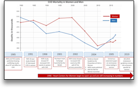

## 문서번호: 5201

### 제목: [아래아 한글. 도대체 왜 계속 씁니까?](https://q4all.kr/redirect/detail/b7b176d1-0987-41c8-b7c9-5dafb4378267)

**작성자:** [박준태](https://q4all.kr/user/profile/2140)
**작성일:** 2025-03-04 21:57:56 (화요일)

---

**한글 프로그램을 공공기관에서 없애야 하는 이유**

**1. 디지털 전환 시대에 맞지 않는 구시대적 형식**

한글 프로그램은 과거 종이 문서의 형식을 그대로 디지털로 옮긴 도구에 불과합니다. 손으로 작성하던 보고서의 틀을 컴퓨터로 재현한 수준에 머물러 있어, 현대적인 데이터 활용과 시각화 요구를 충족하지 못합니다. 예를 들어, MS Word나 Google Docs는 데이터 연동, 실시간 협업, 클라우드 저장 등 디지털 워크플로우에 최적화되어 있지만, 한글은 여전히 정적인 문서 작성에 치중되어 있습니다. 공공기관에서 디지털 전환을 추진한다면, 이런 구시대적 도구는 오히려 혁신의 발목을 잡는 족쇄입니다.

**2. 데이터 활용성과 상호운용성 부족**

현대적인 보고서나 기획안은 단순히 텍스트를 나열하는 데 그치지 않습니다. 데이터를 시각화하고, 분석 도구와 연동하며, 다른 플랫폼과의 호환성을 갖추는 것이 핵심입니다. 하지만 한글 프로그램은 데이터베이스나 스프레드시트(예: Excel, Google Sheets)와의 연동성이 떨어지고, 파일 형식(HWP)이 다른 소프트웨어와의 상호운용성을 저해합니다. 해외 기관이나 민간 기업과 협업할 때 HWP 파일을 열 수 없어 PDF로 변환해야 하는 번거로움은 업무 효율성을 떨어뜨리는 대표적인 사례입니다. 공공기관의 업무가 점점 글로벌화되고 데이터 중심으로 변하는 상황에서 한글은 경쟁력을 잃은 도구입니다.

**3. 생산성 저하와 불필요한 학습 비용**

한글 프로그램은 직관적이지 않은 인터페이스와 독특한 기능들로 인해 신규 사용자가 익히는 데 시간이 걸립니다. 공공기관 신입 직원이나 외부 협력자가 한글을 배우느라 소요하는 시간과 비용은 낭비입니다. 반면, MS Office나 오픈소스 도구(LibreOffice 등)는 전 세계적으로 표준화되어 있어 별도의 학습 없이도 바로 활용할 수 있습니다. 공공기관이 국민 세금으로 운영되는 만큼, 불필요한 학습 부담과 생산성 저하를 초래하는 소프트웨어를 계속 사용할 이유가 없습니다.

**4. 보안 취약성과 기술 지원의 한계**

한글 프로그램은 MS Office에 비해 보안 업데이트와 기술 지원이 상대적으로 빈약합니다. 공공기관은 민감한 데이터를 다루기 때문에 소프트웨어의 보안이 매우 중요한데, 한글은 매크로 바이러스나 악성코드에 취약하다는 지적이 꾸준히 제기되어 왔습니다. 또한, 한글과컴퓨터라는 단일 기업에 의존하는 구조는 기술 지원의 지속성을 보장하지 못합니다. 반면, MS Office는 글로벌 기업의 지원과 방대한 커뮤니티를 통해 안정적인 업데이트와 문제 해결이 가능합니다. 공공기관의 안정성과 신뢰성을 위해서라도 한글은 적합하지 않습니다.

**5. 시장 경쟁력 약화와 국민 편의성 저해**

공공기관이 한글 프로그램을 고집하면, 국민과 민간 기업이 공공 문서를 읽거나 제출할 때 HWP 형식을 강요받게 됩니다. 하지만 대부분의 국민과 기업은 MS Office나 무료 도구를 사용하며, 한글 프로그램을 추가로 구매하거나 설치해야 하는 부담을 겪습니다. 이는 국민 편의성을 해치고, 공공기관의 서비스 접근성을 떨어뜨립니다. 게다가 국내 소프트웨어 산업의 경쟁력을 키우기 위해서라면, 한글과컴퓨터가 MS와의 가격 경쟁에만 의존할 것이 아니라 글로벌 시장에서 통용될 혁신적인 제품을 개발해야 합니다. 공공기관의 무조건적인 한글 사용은 오히려 이런 혁신을 저해하는 결과를 낳습니다.

**6. 변화에 대한 저항은 시대착오적**

“상사 말 잘 듣는 구닥다리 영감탱이들”이라는 표현처럼, 한글 프로그램의 지속적인 사용은 변화를 거부하는 관료주의의 상징입니다. 디지털 시대에 공공기관이 앞장서서 효율성과 혁신을 추구해야 함에도, 과거의 관행에 얽매여 한글을 고집하는 것은 시대착오적 태도입니다. 국민을 위한 행정을 표방한다면, 더 나은 도구로 전환해 업무 효율을 높이고 국민에게 더 질 높은 서비스를 제공하는 것이 마땅합니다.

한글 프로그램은 과거의 유산일 뿐, 디지털 시대의 공공기관에 필요한 도구로서는 한계가 명확합니다. 형식적 보고서 틀을 넘어 데이터 활용, 상호운용성, 보안, 생산성, 국민 편의성 등 모든 면에서 MS Office나 다른 대안에 뒤처져 있습니다. 공공기관이 한글을 없애고 글로벌 표준에 맞는 도구로 전환한다면, 업무 효율성은 물론 국민 신뢰도까지 높아질 것입니다. 한글과컴퓨터가 살아남으려면 공공기관의 품에 안주할 것이 아니라, 스스로 혁신을 통해 시장에서 경쟁력을 증명해야 합니다. 이제 공공기관은 손으로 쓰던 시대의 잔재를 버리고, 미래를 향한 선택을 해야 할 때입니다.

---

## 문서번호: 5202

### 제목: [사기 범죄자 형량 너무 가볍지않나요?](https://q4all.kr/redirect/detail/0c6638ff-8780-4b64-9bef-49640176c603)

**작성자:** [진평규](https://q4all.kr/user/profile/7829)
**작성일:** 2025-03-04 22:12:19 (화요일)

---

현행 형법상 사기 범죄자에게 구형할 수 있는 형량은 아래와 같습니다.

**사기죄(형법 제347조)** 는 기본적으로 **10년 이하의 징역 또는 2천만 원 이하의 벌금**

피해 금액이 커질수록 특정 경제범죄 가중처벌 등에 관한 법률(특경법)이 적용되어 형량이 증가합니다.

하지만, 실제 선고되는 형량은 피해 금액, 범행 수법, 피해 회복 여부, 피고인의 반성 정도 등

다양한 요소를 고려하여 결정되며, 경우에 따라 10년 이하의 형량이 선고됩니다.

여기에 더해, 이름있는 법률대리인으로 구성한다면 형량은 더욱 줄겠지요.

예를 들어, 사기로 100억이상 피해금액을 발생시킨 범죄자는 현행법 상 징역 10~ 무기징역 까지 가능한데요.

그러나 실제 고액 횡령 사기 등의 사건은 아래와 같이 고작 몇년형을 선고 받는 일이 허다합니다.

**서울고등법원 판결 (2012년 2월 10일)**

* **사건번호**: 2010xxxx, 2011노xxxx(병합), 2011노xxxx(병합)
* **피고인 1**: 징역 6년 선고
* **피고인 2**: 징역 3년 선고
* **피고인 3**: 징역 3년 6개월 선고
* **내용**: 피고인들이 다수의 사기 범행을 저질러 상당한 피해를 발생시켰으나, 법원은 각 피고인의 역할, 범행 가담 정도, 피해 회복 노력 등을 고려하여 10년 이하의 징역형을 선고하였습니다.

그리고 최근, 전세 사기로 인해 천문학적인 금액을 사기당하고 있는데 왜 사기사건은 줄어들지가 않을까요?

그 이유는 형량이 너무 낮기때문아닐까요? 추가적으로 금융권에서 대출을 허가할때, 주택담보등의 대출에 대해서는 피해 발생시를 대비해서

피해자 우선변제를 최우선으로 해줘야 하지않을까요?

예를들어 다주택 임대업자가 금융권에 담보대출을 하려할때 다주택의 세입자들에게 돌려줘야될 보증금을 초과하는 경우는 대출을 할 수 없도록 막는 방법이 있을 수 있겠지요.

전세 제도를 없애지 않는한, 앞으로 계속 피해자가 발생할 수 밖에없는 구조를 그대로 놔두고 피해자가 조심해야되는 이런 상황을 그대로 유지하는게 맞습니까?

---

## 문서번호: 5203

### 제목: [밝은 미래를 위해서는 어떠한 덕목이 필요할까요?](https://q4all.kr/redirect/detail/c3b80da1-1ea9-42f5-9e75-7405672446be)

**작성자:** [신동호](https://q4all.kr/user/profile/7833)
**작성일:** 2025-03-04 22:57:30 (화요일)

---

근면, 성실함이 우리를 근대화로 이끌었다고 합니다. 새마을 운동(독재자가 만든 것이라 호불호가 갈리지만)이 대표적이라 할 수 있습니다. 새마을 운동의 좋은 점만 가져가서 쓰러진 나라를 세운 사례가 있으니 적어도 절반은 성공한 사례라 할 수 있습니다.

마찬가지로 IT강국으로 이끈 원동력은 '빨리 빨리' 문화가 큰 역할을 했다는 의견이 있습니다. 그외에도 다른 요인들이 있겠지만 우리의 국민성을 대변하는 단어임에는 분명합니다.

미래는 AI가 대세입니다. 우리는 어떠한 자세를 갖고 미래를 준비해야할까요? 근면/성실, 빨리빨리 여기에 무엇이 더해져야할까요? 아니면 모든 것을 다 버리고 채택해야할 것이 있다면 무엇일까요?

---

## 문서번호: 5205

### 제목: [세림이법 같은 안전 관련법은 왜 느슨하게 운용하나요?](https://q4all.kr/redirect/detail/67f7f126-d137-479b-bb7f-f22d57c952d9)

**작성자:** [최용준](https://q4all.kr/user/profile/7835)
**작성일:** 2025-03-04 23:06:39 (화요일)

---

아이 이름을 붙여서 특별하게 만든 안전법들은 왜 느슨하게 운영하는 거죠?

대형학원들이나 하청업체야 인건비니 뭐니 해서 지키지 않을 이유를 만들어 법을 피해가는데, 감시해야할 당국은 손을 놓고 있고 민원을 직접 넣어야 처리해주는 상황입니다.

이슈따라 법을 급히 만들었다면 사후 보완을 재대로 해주세요.

셔틀버스는 많아지고, 아이들의 안전은 뒷전이고.

출산율 걱정전에, 있는 아이들 안전부터 챙깁시다.

---

## 문서번호: 5206

### 제목: [사직서 제출을 왜 회사에 승인을 받나요?](https://q4all.kr/redirect/detail/11a081af-b4a8-42e2-8424-bc6995dc735d)

**작성자:** [윤경숙](https://q4all.kr/user/profile/7726)
**작성일:** 2025-03-04 23:36:21 (화요일)

---

근로계약을 하고 회사는 해고를 할 수 있는 법적 규정이 있는데, 왜 근로자에게는 사직도 회사의 승인 없으면 퇴사처리를 한달이나 기다려야 되나요?

---

## 문서번호: 5207

### 제목: [근로기준법에 사직서에 대한 내용이 없는 이유가 뭐죠?](https://q4all.kr/redirect/detail/9a59740d-6ba0-4bc5-81cb-bf8393f9d3b2)

**작성자:** [윤경숙](https://q4all.kr/user/profile/7726)
**작성일:** 2025-03-04 23:39:44 (화요일)

---

근로자의 입장에서 해고를 당하거나, 부당한 대우등을 적어 회사 아닌 고용노동부등에 사직서를 내고 역으로 회사로 보낼 수는 없나요?

회사에서는 자기들에게 불리한 내용의 사직서를 처리 안해주쟎아요?

왜 근로자에게는 같은 권리가 없나요?동등한 법이 필요합니다.

---

## 문서번호: 5208

### 제목: [왜 가짜뉴스 와 진실을 왜곡한 보도들을 좌시만 하나?](https://q4all.kr/redirect/detail/b54a6a36-cc69-429e-b8c5-814ac4dbb7bd)

**작성자:** [이동훈](https://q4all.kr/user/profile/7046)
**작성일:** 2025-03-04 23:49:19 (화요일)

---

부의 양극화 만큼이나 혐오가 더 양극으로 치닫는데 한 몫 하는 가짜뉴스와 1%의 사실을 가지고 호도하는 언론들의 행태를 언제까지 '그러려니' 하며 봐야 합니까?

세계적인 k 계엄해제를 이룬 민주 시민들의 눈높이는 하늘에 이르렀는데 도대체 레가시를 비롯 어이없는 포탈들의 행태를 언.제.까.지 봐야 합니까?

멀리 갈것 없이 제 친구중 하나가 그러더군요

'칼 같이 철퇴를 내린적'이 없는 역사여서 그렇다구

완전 동의 하지 못하지만

이번에야 말로 모든 내란 동조 군 검찰 정당 언론 기득권 시민들 발.본.색.원 해주기를

---

## 문서번호: 5209

### 제목: [일본과 중국의 역사 날조&왜곡을 ai시대에 어떻게 막을 수 있을까요?](https://q4all.kr/redirect/detail/ee377352-de57-4177-b860-f12a53330cbf)

**작성자:** [방가영](https://q4all.kr/user/profile/7050)
**작성일:** 2025-03-05 00:13:17 (수요일)

---

앞으로 동영상 채널은 유튜브, OTT는 넷플릭스, 검색엔진 채널은 구글처럼

전세계에서 통용되는 ai모델이 생길 텐데

만약 거기서 생기는 중국의 동북공정이나 일본의 식민지 미화 같은

역사 날조, 왜곡, 조작을 막을 수 있을까요?

만약 다른나라 사람들이 ai에게 한국역사를 물었을 때 있는 사실 그대로 전달 될 수 있을지 걱정됩니다

---

## 문서번호: 5210

### 제목: [수능 체제 개편, 문제 있습니다. ](https://q4all.kr/redirect/detail/8e34d21c-f175-4a42-a199-d417b3a50c73)

**작성자:** [노균환](https://q4all.kr/user/profile/1111)
**작성일:** 2025-03-05 00:37:23 (수요일)

---

수능 체제 개편 내용 중 사회탐구영역과 과학탐구영역 선택 과목을 폐지하고 통합사회와 통합과학만 본다는 내용이 있습니다.

해당 내용은 문제가 있습니다.

고교학점제에 따라 학생들은 자신의 흥미와 적성에 맞는 교과를 선택하여 공부합니다. 그런데 수능은 1학년 때 배운 통합사회, 통합과학을 봅니다. 어느 장단에 맞추라는 건가요? 고교학점제 취지에 맞지 않습니다. 고교학점제가 본격 시행되면 1등급 비율은 커지고 내신 시험의 난도는 낮아집니다. 공부를 많이 하지 않아도 1등급을 받을 수 있다는 이야기입니다. 그렇다면, 2, 3학년 때 선택교과 수업 시간에 학생들은 수능과목도 아닌 수업에 적극적으로 참여할까요?

수능 체제 개편은 고등학교 교육과정을 고려하지 못한 개편입니다.

통합사회와 통합과학이 아닌 기존의 탐구영역 각 선택 교과를 수능 과목으로 출제 해야 합니다.

---

## 문서번호: 5211

### 제목: [농업&식품 유통구조를 효율적으로 개선하면 물가 안정에 영향을 줄 수 있지 않을까요?](https://q4all.kr/redirect/detail/0260fcd2-bb56-4839-a4bf-91d15d4d8679)

**작성자:** [방가영](https://q4all.kr/user/profile/7050)
**작성일:** 2025-03-05 00:43:59 (수요일)

---

며칠 전 일본 쌀 생산량이 전년보다 증가 했음에도 불구하고

일본 내 유통업자들의 장난질로 인해 쌀값이 많이 올랐다는 기사를 봤습니다

그 뉴스를 보고 한국도 별반 다르지 않은 것 같다는 생각이 들었습니다

물론 우크라이나 전쟁, 기후 원인 등 다양한 문제가 있겠지만

그렇다 해도 요즘 물가가 정말 말도 안되게 비싼 것 같습니다

특히 먹는 식료품에서 가격이 비싸버리니 이건 뭐 굶을 수도 없고

마트나 길거리 과일&채소 상점을 가서 사려고 보면

(매일 가격이 조금씩 다르지만) 이 가격이 맞아????? 하고 놀라는 경우가 있습니다

요즘은 그 빈도가 잦고요

어떨 때는 고기보다 과일채소가 더 비싸서 맘껏 먹는다는 생각을 해 본지 오래입니다

빵 과자 값도 많이 올라서 군것질도 한 달에 한번만 하려고 하고요

유통 구조를 개선 시키면 물가가 많이 안정 될 수 있을 것 같은데요

아끼고 아낀다고 해도 이젠 한계인 것 같아 푸념 좀 적어봅니다....

---

## 문서번호: 5212

### 제목: [쫒아다니는 그분..](https://q4all.kr/redirect/detail/9134a453-4d83-4d00-b71e-5c4c0aa3151f)

**작성자:** [문지용](https://q4all.kr/user/profile/7438)
**작성일:** 2025-03-05 01:35:29 (수요일)

---

검토는 해봐야!!!!!!!!!

---

## 문서번호: 5213

### 제목: [전관예우가 법치주의에 어떤 영향이 있는가?](https://q4all.kr/redirect/detail/b47f2975-96a4-4c35-9199-4911bdd2a6e5)

**작성자:** [황영연](https://q4all.kr/user/profile/7844)
**작성일:** 2025-03-05 07:20:58 (수요일)

---

전관예우는 법치주의의 핵심 가치인 법 앞의 평등과 공정한 절차에 위배될 수 있다는 점에서 심각한 영향을 미칩니다. 구체적인 영향은 다음과 같습니다.

1. 법 앞의 평등 원칙 훼손:

전관예우는 법조계 내의 인맥이나 과거 관계를 통해 특정인에게 유리한 판결이나 수사가 이루어질 수 있도록 합니다. 이는 모든 사람이 법 앞에서 평등해야 한다는 원칙을 훼손하고, 법 적용의 불공정성을 야기합니다.

이는 일반 시민들이 법을 통해 공정한 결과를 얻을 수 있다는 믿음을 저하시키고, 법치주의에 대한 신뢰를 무너뜨립니다.

2. 사법 시스템에 대한 불신 심화:

전관예우가 만연하면, 국민들은 사법 시스템이 공정하지 않다고 인식하게 됩니다. 이는 사법부에 대한 불신으로 이어져 법치주의의 근간을 흔들 수 있습니다.

사법부에 대한 불신은 법적 분쟁 해결에 대한 회피를 야기하고, 사회 질서 유지에도 부정적인 영향을 미칠 수 있습니다.

3. 법조 윤리 및 투명성 저해:

전관예우는 법조계 내부의 폐쇄적인 문화와 결합하여 윤리적 문제를 야기할 수 있습니다. 이는 법조인의 공정성과 독립성을 훼손하고, 법조 윤리에 대한 불신을 초래합니다.

또한, 전관예우는 법조계의 투명성을 저해하여 부패나 비리를 은폐하는 데 악용될 수 있습니다.

4. 사회적 불평등 심화:

전관예우는 경제적 능력이나 사회적 지위에 따라 법적 결과가 달라질 수 있다는 인식을 심어줍니다. 이는 사회적 불평등을 심화시키고, 법치주의에 대한 불만을 증폭시킬 수 있습니다.

특히, 사회적 약자나 소외 계층은 전관예우로 인해 더욱 불리한 위치에 놓일 수 있으며, 이는 사회적 갈등을 유발할 수 있습니다.

이러한 문제점을 해결하기 위해서는 법조계 내부의 자정 노력과 함께 외부적인 감시 및 제도 개선이 필요합니다.

---

## 문서번호: 5214

### 제목: [예술정책이 후퇴하고 있습니다. ](https://q4all.kr/redirect/detail/86b9400b-defb-4b8d-b2d2-983e7e447da6)

**작성자:** [추유선](https://q4all.kr/user/profile/7852)
**작성일:** 2025-03-05 07:55:28 (수요일)

---

예술정책이 후퇴하고 있습니다. 시나리오 작가 최고은님의 작고이후 예술인복지 정책이 시행되고 있습니다. 너무 큰 도움이 되었습니다만, 예산이란 문제로 현재는 그 지원이 퇴행하고 있습니다. 예술인들이 극심한 경쟁으로 겨울(가을부터)부터 작업보다는 지원사업이란 좁은 구멍을 뚫기 위한 지원서 작성에 매달리게 됩니다. 그것이 경력보장뿐 아니라 일년을 살아갈 수입을 만들어 주기 때문입니다. 물론 자본주의 국가에서 어쩌면 당연하다고 할 수 있으나 예술은 개개인의 독특한 세계의 표현임에도 그것이 재단될 수 있는 부분인지 모르겠습니다. 예술가들이 자신들의 작업세계에 몰입하며 더 좋은 예술을 만들어 갈 수있는 조금이라도 한 발 나아간 예술인 복지 정책을 구상하고 계신지 궁금합니다.

---

## 문서번호: 5215

### 제목: [음식점 일회용품 저감대책](https://q4all.kr/redirect/detail/0e9a0760-e9c9-48be-9e7a-daf19c9e69db)

**작성자:** [김태영](https://q4all.kr/user/profile/7856)
**작성일:** 2025-03-05 08:38:40 (수요일)

---

1. 배달의민족, 요기요등이 생기면서 일회용기 사용이 큰 포으로 증가했습니다.

2. 배달용 다회용기를 쓰는 대표적인 음식점인 중화요리집은 혜택을 주지 않습니다.

3. 환경부 자원순환국의 일방통행식 권위적인 행정이 일회용 플라스틱 사용 증가를 방치하고 있습니다.

4. 배달기사를 고용해서 다회용 배달 용기를 쓰는 가게에 체감할 수 있는 세제혜택을 제공해야 친화경적인 정책이 될 것입니다.

5. 환경부 자원순환국에 각성을 촉구합니다.

---

## 문서번호: 5216

### 제목: [왜 세상에 나오지도 않은 아이들, 아이들 낳지도 않은 부모들에게 투자하나요?  이미 아이를 낳아 출생율에 이바지한 부모, 아이에게 투자해야 하는거 아닌가요?](https://q4all.kr/redirect/detail/7f3c0437-1cf9-4315-93d4-c89387b0789b)

**작성자:** [정재식](https://q4all.kr/user/profile/7862)
**작성일:** 2025-03-05 09:15:15 (수요일)

---

수많은 출생 장려책이 나오고, 수많은 예산이 투자 되었는데 출산율은 계속 줄어들고있네요.

왜 아이를 낳으면 뭔가를 해주겠다는 정책만 내 놓는건지? 지금 아이를 낳아서 키우고 있는 가족에게 더 투자해야 하는거 아닌가요?

미실현 된 일에 투자하지말고, 이미 실현하여 인구정책에 기여한 부모, 아동에게 투자해야 하는거 아닌가요?

아이 셋을 키우고 있는 아빠입니다. 지인들과 술마실때면 자주 물어봅니다. 아이세명이면 해택 많지? 라고

그럼 저는 해주는거 없다. 라고 대답합니다. 가스, 전기요금 조금 줄여주고, 주차장 깍아주고 그정도.. 그걸로는 별 도움안된다고.

현내 내 옆에서 아이를 키우고 있는 사람들이 많은 지원을 받고, 저처럼 셋을 키우는 사람들이 하나.둘을 키우는 사람들 보다 많은 지원을 받으면, 현실에 있는 혹은 내 옆에 있는 사람들을 봐야 자신을 갖고 아이를 낳지 않을까요?

눈에 보이지 않는 정책보다, 현실에 존재하고 있는 일에 투자하는것이 저출생 대책에 더 의미 있지 않을까요?

---

## 문서번호: 5217

### 제목: [우리나라 행정망 사고와 대책 적절한가요?](https://q4all.kr/redirect/detail/95bb27ee-54c9-4c1c-801b-761bc0ac5ab1)

**작성자:** [조미리애](https://q4all.kr/user/profile/7860)
**작성일:** 2025-03-05 09:18:44 (수요일)

---

우리나라 국가 행정망 사고가 잦아 그 대책을 찾는라 분주합니다. 그 대책으로 거론된 사안이 다음과 같습니다.

1.대기업 참여제한을 완화한다.(과기정통부 법안 검토) 이미 사고가 터진 시스템 거의 대부분이 대기업이 주사업자로 수행한 사업인데 합당한 대책인가요?

2. sw 중요도에 따라 등급을 분류하여 운영 유지보수체계를 강화한다. (행안부 지침 개편) 이것으로 sw생산 품질이 확보되나요? 사후 약방문식의 대책 아닐까요?

3. 부실한 sw구축을 수행한 사업자를 사업참여에 제한을 두도록 제재한다.(기재부 입법 발의) 우리나라 공공sw 사업 계약에는 설계확정에 대한 시기와 효력 등 그 어떤 내용도 없습니다. 그러하다 보니 설계완료 이후에도 끊임없는 요구사항의 증가와 변경이 일어나고 설계에 반영돨 시간과 비용이 마련되지 못한 채 개발은 난개발에 빠지게 됩니다. 거의 모든사업에서 일어나는 고질적 현상입니다. 설계확정도 없는 공사에서 부실이 발생하면 사업자만 모든 책임을 지고 입찰제한까지 받는 것이 공정한가? 아울러 이 대안이 sw부실을 방지하는 대책이 될까요?

근본적인 대책에 대한 만인의 의견을 묻고 싶습니다.

---

## 문서번호: 5218

### 제목: [성실한 사람들을 위한 나라는 없나요?](https://q4all.kr/redirect/detail/b98b6e07-e726-4c89-9353-3fe7d9caa61a)

**작성자:** [허정안](https://q4all.kr/user/profile/7868)
**작성일:** 2025-03-05 09:42:17 (수요일)

---

안녕하세요~

세상이 아니 지구가 이상한 행성 아닐까요 아님 여전히 우린 인간이 아닌 동물의 구조 속에 박혀 있는 건가요? 바르게 착하게 성실하게 살아도 생존과 행복이 보장되는 국가는 없나요?

권력과 정치, 자본에 휘둘리지 않는 건강한 국가의

탄생은 어려운가요?

자영업자 15년...

바르게

안전한 재료(거의 친환경)

시간의 정성 하지만 결과는

채무와 망가진 몸, 가족에 대한 죄책감 그리고

끝나지 않을 채무와 끝없는 노동,

몸에 발생하는 병들...

사는게 무서워 상기와 같은 질물을...

---

## 문서번호: 5220

### 제목: [중학교, 고등학교 공지방 카카오톡 오픈채팅 이대로 괜찮나요?](https://q4all.kr/redirect/detail/ed5fd7a7-67de-4481-9adb-d8281ac9b764)

**작성자:** [김민정](https://q4all.kr/user/profile/7377)
**작성일:** 2025-03-05 09:51:40 (수요일)

---

자녀가 있는 학부모입니다.

학교에서 카카오톡 오픈채팅으로 중고등학교 반 방을 만들어 아이들에게 공지를 하시는데요.

오픈채팅방이 보시면 알겠지만 연령제한이 없고 정치방, 성적인방, 각종 광고방 등 가리지 않고 만들 수 있어요.

오픈채팅에서 성인이 청소년 유인해서 사고도 여러번 있었고 지역카페에서도 이슈가 되었었는데 바뀌지않고 방치되고 있는것 같습니다.

휴대폰 안드로이드 플레이스토어 같은데는 앱들이 연령제한이 있는데 카톡은 정작 오픈채팅쪽을 연령제한 없이 성인과 청소년이 같이 이용하게 만들어놨어요.

중학생인데 학교에서까지 이용하게 권고하고 있는건 문제가 많다고 봅니다.

정부차원에서 규정을 해주시면 좋겠어요.

---

## 문서번호: 5221

### 제목: [복지와 투자가 같은 말이 될 수 있을까요?](https://q4all.kr/redirect/detail/52bf1f15-5f70-4bdb-8c5a-3e9aba67c57f)

**작성자:** [윤준식](https://q4all.kr/user/profile/7867)
**작성일:** 2025-03-05 09:54:12 (수요일)

---

복지는 다른 의미로 해석하면 자본주의적인 투자로 볼 수 있다고 생각합니다.

최근에 부의 생성의 기회가 기성시대에 비해 젊은 세대가 적습니다. 복지는 어려운 세대를 지원한다는 맥락에서 기성세대의 자본을 젊은 세대의 기회로 전환하는 복지가 필요하며, 이것은 결국 미래를 위한 투자가 될 것이라고 생각합니다.

이런 관점에서 특정세수 예를 들어 기성세대의 세수 비중이 높은 상속증여 등은 세수의 일부를 기술개발이나 창업지원, 작게는 젊은 세대의 능력개발이나 경험을 위해 편성하면 국가전체의 부의 흐름에서 기회를 많이 받았던 세대의 세금이 기회를 줘야 하는 세대에게 투자를 하는 형식으로 바뀔 수 있다고 생각합니다.

그리고 이런 투자적 복지는 경제성장으로 이어져 내수부족이나 연금고갈 등 많은 사회적 문제를 해결할 수 있다고 생각합니다.

100명에게 100억을 지원해서 1명만 성공해도 그 한명이 100억 이상의 사회적 부를 만든다면 사회는 성장한다는 자본주의 대수의 법칙을 적용해 젊은 세대의 기회확대로, 복지와 투자의 동일 개념으로, 과거의 자본을 미래의 기회로 전환시킬 시대가 아닐까요?

---

## 문서번호: 5222

### 제목: [자본주의에서 어떻게 사랑을 실천할 수 있을까요?](https://q4all.kr/redirect/detail/b5931b29-3493-4d13-b5c1-2104e8ce6af4)

**작성자:** [정유진](https://q4all.kr/user/profile/7874)
**작성일:** 2025-03-05 10:09:01 (수요일)

---

대한민국 사회는 오랜 시간 동안 자본주의 사회 체제 아래 경쟁주의, 엘리트주의가 만연해 있습니다.

이러한 사회 구조가 만든 틀 안에 대다수의 인식도 머물러 있어서

개인이 아무리 발버둥을 치며 돈보다 더 가치 있다고 여기는 일과 삶을 추구하기 위해 노력을 해도

사회에서 인정받지 못하고 도태되고 가치 없는 것으로 평가됩니다.

결국에는 다시 사회 구조 속으로 타협할 수밖에 없는 현실인데요,

사랑이 모든 것의 해답이라고 알고, 믿고 있는 입장에서,

이 구조 속에서 살아가야 하는 우리는

어떻게 사랑을 실천할 수 있을까요?

---

## 문서번호: 5223

### 제목: [대한민국 에너지 독립 가능할까요?](https://q4all.kr/redirect/detail/e1d39951-6c0c-4c84-883b-0bf85fd03dc8)

**작성자:** [윤병웅](https://q4all.kr/user/profile/7866)
**작성일:** 2025-03-05 10:12:27 (수요일)

---

얼마 전 이재명 대표님이 모 유튜브 방송에 출연하셔서 에너지 독립에 대해 말씀하신 것을 들었습니다.

현재 많은 에너지를 수입하고 있고, 그것이 수출국과의 외교 협상 특히, 미국과의 협상에서 한국의 협상력을 저해할 수 있는 큰 약점으로 작용할 수 있으며, 그러므로 우리는 에너지 독립을 준비해야 한다는 취지로 이해했습니다.

백번 타당한 의견이라 생각하고 제 세대 뿐만 아니라 자녀세대에게도 더 나은 대한민국을 물려주기 위해 꼭 필요한 개혁이라고 생각합니다.

다만 우리 사회가 이런 큰 변화를 수용할 수 있는 심리적 정서적 마음가짐의 준비가 되어 있는가는 질문으로 남겠지요.

거의 모든 분야에 각각의 경제 생태계가 이미 형성되어 있는지라 어떠한 변화와 개혁을 시도하려면 그들의 반발도 만만치 않을 것 입니다. 그럼에도 불구하고 에너지 독립은 꼭 필요하다고 생각합니다.

대한민국이 필요로하는 대부분의 에너지를 자급할 수 있고, RE100 등 세계기준에도 부합할 수 있으며, 대한민국만이 보유한 독자적인 기술력을 세계에 알릴 수 있는 개혁과 혁신이 에너지 분야에서 나오기를 희망합니다.

그런 이유로 제 지인 한 분을 추천하려 합니다. 참고로 저는 이분의 개인사까지 알 정도로 깊은 관계는 아닙니다. 이분은 제 손님이신데 평소 하시는 일을 들어 보니 우리 사회에 매우 필요한 기술인데 한국에서 관심을 기울이지 않아 지금 중국의 모 기업의 후원으로 중국에서 시작되려 하고 있어 안타까운 마음에 추천해 봅니다.

이분은 "허만철 기술사"이고, 풍력발전 분야에서 40년이상 경력을 갖고 있습니다. 이분이 갖고 있는 기술 중 "쌍엽풍력발전기"와 "쌍엽무풍발전기"가 있는데, 현재 중국 측에서 "쌍엽풍력발전기"에 투자를 진행하고 있는 것으로 들었습니다.

저는 꼭 이 기술을 살펴봐 달라는 것이 아니라, 우리 사회 곳곳에 이와 같이 관심 받지 못해 해외로 빠져 나가고 있는 에너지 기술들을 꼼꼼히 살펴봐 주셨으면 의견입니다. 그리고 다른 채널을 통해 현재 대한민국의 풍력발전 인프라의 한계 등에 대해 직간접적으로 들어 본 바 있는데, 에너지 독립을 위해서는 이 부분에 대한 고찰과 대대적 체질개선도 필요한 조치라고 생각 됩니다.

그러므로 이 글을 보시는 당 관계자분들이 더욱 깊이 들여다 봐 주셨으면 합니다.

---

## 문서번호: 5224

### 제목: [AI시대 어떤 교육이 필요한가요?](https://q4all.kr/redirect/detail/512bcb57-b80d-4763-a6af-7664c787a393)

**작성자:** [김은지](https://q4all.kr/user/profile/7881)
**작성일:** 2025-03-05 10:42:05 (수요일)

---

9살 아이를 키우고 있습니다.

AI 시대 대비 이런 저런 교육을 해야 한다는 말은 많은데 결국 사교육으로 해결해야 하는 것 같은 주장이 많습니다.

반면에 교육이 달라야 한다고 하면서 부모 세대가 공부하던 방식의 학습을 여전히 시키는 분위기 입니다.

코딩 교육을 중요시 여기지만 이게 정말 필요할까 의문입니다.

실제 프로그램을 짜는 방법을 어린 나이부터 배워야 할까요?

알고리즘 개념이나 방식에 대해 배우는 거라고도 하던데 그런 거라면 "코딩 교육"이 아닌 다른 교육이 필요한건 아닐까도 생각해봤는데 그냥 제가 무지해서 그런 걸까요?

질문을 잘 해야 한다고도 합니다.

실제 현실에서 "문제"를 찾을 수 있는게 중요하다는 전문가의 의견도 봤습니다.

예를 들어 ai 관련 청소년 캠프에서 벌레 물린 자국을 찍어 업로드하면 어떤 벌레인지, 대처방법은 무엇인지 찾아주는 어플을 간단하게 제작한 팀이 우승했다고 합니다.

AI 관련 교육에 대한 수많은 이야기들 중 저 질문과 문제에 관한 이야기가 가장 와닿았습니다.

그렇다면 질문을 잘 할 수 있는 능력과 문제를 찾는 능력은 어떻게 길러주어야 하나요?

부모로서 어떻게 아이를 교육시킬 수 있을까요?

---

## 문서번호: 5225

### 제목: [신약 등 의약품 및 의료 연구개발에서 지금처럼 수컷동물, 남성의 몸 위주로 임상실험을 계속한다면 여성에게는 부작용이 날 수도 있지 않나요?](https://q4all.kr/redirect/detail/ba24b0e7-0191-462c-8d9c-20ee6e640466)

**작성자:** [류이현](https://q4all.kr/user/profile/7082)
**작성일:** 2025-03-05 11:07:37 (수요일)

---

현재 한국에서는 신약 등 의약품 및 의료 연구개발에서 생물학적/사회적 성별 차이가 반영되고 있지 않습니다.

신약개발 초기 단계에서부터 **수컷쥐 등 수컷동물과 남성 위주**로 임상실험이 수행되고 있고, 이러한 결과물인 신약이나 의료기술은 여성을 남성과 동일하게, 또는 ‘신체가 작은 남성’으로 여기고 처방되고 있습니다.

즉, 남녀 신체 및 대사 차이를 고려하고 있지 않은 것이죠.

물론 이윤을 추구하는 기업의 입장에서는 수컷(남성)을 위주로 임상실험을 하는 것이 예산 절감에 이로울 것입니다.

그렇지만, 다른 상품도 아니고, 의약품과 의료연구는 **여성의 건강권뿐만 아니라 생명권**과도 직결되어 있기 때문에 정부의 적절한 규제가 반드시 요구되는 영역입니다.

**"성차의학**(sex/gender-specific medicine)**을 육성하고 재정적 지원을 해야 합니다"**

**유럽, 캐나다, 미국 등에서는 생명의학계 연구에서 성별차이를 반영하도록 가이드라인이 제정되어 있습니다.**

물론 이런 나라들도 원래부터, 갑자기, 성차의학에 주목한 것은 아닙니다.

1) 과거 미국에서 심장질환 신약 개발되면서 남성의 사망률이 크게 줄었지만, 역설적이게도 여성의 사망률이 상승하는 현상이 발생했었습니다.

즉, 많은 사람들이 주로 중년 남성의 생명을 위협하는 질환으로 알고 있는 심장질환에 대한 약이 여성에게는 적용되지 않을 뿐만 아니라 오히려 목숨을 크게 위협하게 된 것입니다.

\*심장질환을 갖고 있는 남성과 여성이 호소하는 증상이 다릅니다. 예를 들어 여성은 남성과 달리 메스꺼움과 구토 증상을 보이며 남성은 주로 가슴불편감을 호소합니다.

그러나 인구의 절반인 여성의 증상은 심장질환의 '비전형적'인 증상으로 분류되고 남성의 증상은 '전형적인' 증상으로 분류됩니다. 그렇기 때문에 심장질환 의술의 발전이 여성에게는 독이 된 것입니다.

[심장질환에 의한 여성과 남성 사망률 그래프]

\*신약 개발 시점에 여성과 남성의 사망률이 크로스 되었고, 이후 성차의학에 대한 국가적 지원과 캠페인으로 여성과 남성의 사망률이 동시에 개선되는 결과가 나왔습니다.

2) 코로나-19 백신을 통한 부작용도 미국 질병통제예방센터(CDC)에 따르면 여성이 남성보다 많이 겪었다고 합니다.

미국에서 연구된 **코로나-19 백신 부작용 중 여성이 79.1%를 차지**했습니다. 워낙 단기간에 급하게 개발된 백신이었기 때문에 불가피했다고 설명할 수도 있지만,

백신뿐만 아니라 기존 항암제 등 기타 약물의 반응에서도 성별 차이가 발생하고 있다고 지적되고 있습니다.

3) 한국에서도 몇해 전, 수면제로 **졸피뎀을 남녀에게 동일하게 처방한(10ml)** 결과, 다음날 출근길에서 여성들의 교통사고 비율 증가했다는 뉴스가 났었습니다.

이는 지방에 녹는 졸피뎀의 특성때문에 약효가 여성들의 신체에 더 오래 남아 다음날까지 영향을 미쳤기 때문입니다.

뿐만 아니라 여성의 주요 사망원인인 **뇌혈관질환의 약물 임상시험**에서도 여성의 참여율(31%)보다 남성의 참여율(69%)이 월등히 높습니다.

**"의·생명 분야의 연구와 신약개발 과정에서 성별 차이를 반영하도록 법제화 해야 합니다"**

**실험 초기부터 임상 4상 시험까지 성별의 차이가 반영되도록 법제화하고, 신약 출시 이후에도 부작용 및 후유증 확인할 때 성별과 젠더 차이를 고려하도록 해야 합니다.**

**만약, 차이 반영을 할 필요가 없거나 할 수 없는 경우에는, 그 경우에 한하여 이유를 소명하도록 하면 됩니다.**

그래야 치료 및 복약에 대한 피해자가 발생하지 않습니다.

이는 유방암, 퇴행성관절염 등 일반적으로 여성의 질환으로 여겨지기 때문에 자신에게 적합한 치료를 받지 못하는 **남성들에게도 혜택**이 됩니다.

전문가들은 우리가 겪은 코로나-19는 앞으로 열린 pandemic시대의 서막이라고 합니다. 성차별적 연구로 인해 발생하는 피해를 줄일 수 있도록 지금부터라도 의약품 및 의료 연구개발에서 성차별적 관행을 제거해야 할 것입니다.

---

## 문서번호: 5226

### 제목: [앞으로 새로운 상황이 도래하고 있는데, 어떤 정책과 대안을 마련하고 있는가?](https://q4all.kr/redirect/detail/68cef615-3512-4469-81c0-c18c28bcabf7)

**작성자:** [윤석준](https://q4all.kr/user/profile/7884)
**작성일:** 2025-03-05 11:11:25 (수요일)

---

AI발전과 로봇이 일하는 등 앞으로 점점 일자리가 감소하고 소득 편중 현상이 증가되고 있는데, 어떤 정책과 대안을 마련해야 하나요?

국가에서 긴 안목으로 준비해야 할 것, 개인이 해야 할 것들이 각각 있을 것 같습니다.

---

## 문서번호: 5227

### 제목: [대한민국의 국민주권주의 회복과 카르텔 척결에 대한 질문 "대한민국의 주인은 국민이 맞습니까?"](https://q4all.kr/redirect/detail/a7531ccb-6edf-4c54-9d12-00b0c67051ca)

**작성자:** [차성훈](https://q4all.kr/user/profile/7335)
**작성일:** 2025-03-05 11:13:38 (수요일)

---

질문을 드리기에 앞서 대한민국 국민의 한 사람으로서, 계엄령을 온 몸을 던져 막아주신 민주당 국회의원님들을 비롯한 국민여러분들께 머리숙여 감사를 드립니다. 또한, 국민의 존재, 목소리, 의견을 알고자 모두의 질문을 만들어주신 모든 분들께도 감사의 인사를 전합니다.

대한민국의 국민의 한 사람으로서, 민주당의 권리 당원의 한 사람으로서 여러분들과 함께 "지난 대선의 패배에 대한 오답노트" 혹은 "차기 정권 창출에 대한 예방 주사"의 차원과 현실을 "반면교사" 삼아 지속 가능하고 더 나은 대한민국으로 발전하길 바라며 질문을 공유하고자 합니다.

또한 저의 경험과 생각, 가치관이 다른 분들께서는 읽기 불편 하실 수 있으니 타인의 생각과 가치관에 대한 존중과 배려를 꺼려하시는 분들은 읽지 않으시기를 권해드립니다. 그럼에도 불구하고 읽음으로 발생되는 문제에 대해서 저에게 책임이 없음을 알려드립니다.

대략적인 요지는 이렇습니다.

첫째, "대한민국의 주인은 국민이 맞습니까?" 맞다면, 나라의 주인인 국민의 요구로 국민들에게 책임과 의무를 다하지 못한 대통령, 국무총리를 비롯한 국무위윈들을 탄핵하는데 방해하는 자는 누구입니까?

국민이 위임한 권력을 정당한 방법과 절차에 따라 회수하기 위한 탄핵을 진행하는데 불법적으로 막고, 지속적으로 책임과 의무를 다하지 않으며 거부권 운운하는 자들은 누구입니까?

또 그들에 대해 국민들이 광장에 모이는 일외에 국민들이 할 수 있는 일은 무엇이 있을까요?

저는, 최후의 보루로써 국민들의 거부권 행사 검토를 제안 드립니다.

국민 역시 국민의 자유와 권리인 동시에 책임과 의무가 있는 교육, 국방, 근로, 납세의 책임과 의무를 다하지 않을 수 있으니 헌법 수호의 최고 사법기관인 '헌법재판소'는 국민에게 책임과 의무를 다하지 못할 뿐만 아니라 헌법의 가치를 훼손해온 대통령, 국무총리, 국무위원들을 신속히 탄핵하여 헌법의 가치를 신속히 증명해 주실것을 요청드립니다. 또한, 대한민국의 사법기관들은 계엄사태와 관련 있는 모든 이를 신속히 처벌하여 주시기 바랍니다 .

둘째, 농협(지역농협, 중앙회, 유통, 물류를 포함)과 화물연대의 카르텔에 대해 공익신고를 하고자 합니다.

     어느 분이 공익신고를 도와 주시겠습니까?

이 일 또한 현 정부에 대한 카르텔과도 관련 있는 일이니 민주당 국회의원분들께서 도와 주시기 바랍니다.

 직접 신고도 했으나, 절차 상의 이유로 이미 한 번 거절 당했으며, 현 정부를 신뢰할 수 없으니 국회의원을 통한 공익 제보를 하고자 합니다.

또한, 신고 관련하여 보복이 예상되는 바 적절한 보호 조치를 도와주시기 당부드립니다.

저는 제 얘기가 절대적으로 맞다는 것이 아닌 논의가 필요한 내용에 대해 질문 드리고 토론해 보자는 취지에서 말씀드린 것이니 저의 글 내용으로 불편한 분들이 있으셨다면 미리 사과의 말씀 드립니다.

현 정권 들어 하나의 사건만 하더라도 국민들이 받아 들이가 너무나 힘들고 어려운 그런 문제들이 여러가지가 지속적으로 이어져 오고 있습니다.

1. 화물연대 총파업으로 인한 사회적, 경제적 문제 야기, 2. 김진태 강원지사의 레고랜드 부도사태로 촉발된 PF등 금융위기와 국가신뢰도 하락, 3. 이태원참사 및 관료들의 책임회피, 4. 채해병 사망사건 및 은폐 조작사건, 5. 전세사기 사태, 6. 의대 정원관련 의료거부와 그로 인한 의료공백으로 인한 국민건강권 침해사태, 7. 복지 지원 전산, 교육 나이스 전산, 농협유통 및 물류 전산 프로그램 마비(1400억원 이상 손실예상)로 인한 경제적, 사회적 손실 야기, 8. 그 밖에 대통령 및 인척의 주가 조작, 국정농단, 부정부패, 비위, 책임 면피 등으로 인해 국가의 3요소인 국민, 영토, 주권의 기본가치 훼손, 그리고 마지막 9번째 국민의 권한을 위임 받았을 뿐인 현 정권이 국가와 국민, 헌법, 민주주의, 법치주의, 시장경제의 기본적 가치와 질서를 훼손한 대통령 일방의 계엄령 사태까지.. 개인적으로 '계엄령 사태'는 김여사나, 혹은 불법선거와 관련된 정치인들의 사건 은폐 뿐만 아니라 그 동안 저질러 온 많은 위헌적, 위법적, 불법적 행위를 덮으려는 현 정권과 현 정권을 창출한 정치인들의 마지막 선택으로 생각하고 있습니다.

헌법에 명시되어 있듯이 대한민국은 '민주공화국'이며 '모든 권력은 국민으로 부터 나온다'라고 명시 되어있습니다. 이 문장을 한 마디로 표현하면 '국민주권주의'이며, 대한민국의 주인은 바로 '국민들'이라는 것입니다.

또한, 모두가 아시는 것처럼 민주주의의 가장 큰 원칙 2가지, '자유와 권리(권한)'에 대한 '책임과 의무'가 반드시 따른 다는 것과 다수결의 원칙! '민주주의' 라는 말 자체에 국민들의 '자유와 권리'를 보장하는 제도라는 뜻인데, '책임과 의무'을 누구보다 무겁게 져야 할 이 나라의 권력자들 혹은 그 권력자들을 배출한 정당에서 되려 '자유와 권리'를 강조하며 본인들의 '책임과 의무'를 져 버리고 있습니다.

국민들이 주인인 나라를 건국하기 위해 우리 선조들께서는 일제에 대항하여 수 많은 목숨을 희생하여 이 나라에 독립을 가져다 주셨고, 또 공산주의가 아닌 국민이 주인인 민주주의의 국가, 대한민국을 건국하기 위해서 또한 수 많은 목숨 뿐만 아니라 우리가 가늠할 수조차 없는 희생과 헌신을 하셨습니다.

그럼 대한민국 국민 여러분들께, 또 이 나라의 수 많은 권력을 행사하고 있는 각계 각층의 여러 권력자 분들께 묻고 싶습니다.

"대한민국의 주인은 국민이 맞습니까?"

앞서 언급한 현 윤석열 정권의 카르텔로 촉발된 수 많은 문제에 대해 국민들은 민주당을 통해 현 정권, 정부에 대해 책임을 물어왔고 그 결과가 '책임과 의무'를 다하지 않는 대통령과 국무총리를 비롯한 국무위원들의 탄핵이 진행되었습니다.

그러나 윤석열 대통령과 국무총리를 비롯한 국무위원들은 이 정권을 창출한 정당과 야합하여 국가와 국민의 가치 뿐만 아니라 민주주의와 헌법의 가치를 훼손하기 위해 무력인 군 권력을 동원하여 위헌, 위법한 계엄령을 선포하였습니다.

또한, 그 위헌적, 위법적 행동을 정당화 하기위해 일부 국민들을 선동하여 사법기관인 서울서부지방 법원에 무력으로 폭동을 일으키는 등 사회적 혼란을 야기하고 있습니다.

국민들과 국민을 대표하는 입법부인 국회가 '계엄령은 대통령의 권한이다.'라는 것을 부인하는 것이 아닙니다. 다만, 그 권한이 적법하게, 정당하게 사용되었는가를 묻고 있는 것이며, 그에 동의할 수 없기에 민주당으로 하여금 '국민으로 부터 부여된 국민의 권력을 회수'하는 과정인 '탄핵'이라는 적법한 절차를 국민들이 국회에 요구하였고 이를 통해 국회가 대통령 및 국무총리를 비롯한 국무위원들에 대한 '탄핵절차'를 추진하여 왔고 헌법재판소에서 그 과정이 진행되고 있는 것입니다.

뿐만 아니라 그 과정에서 현직 대통령의 대한민국 사법권의 부정으로 인해 사삳 초유의 대통령 공관 칩거 사태로 인해 대한민국의 세계적 신뢰도는 바닥으로 떨어졌으나 국민들의 희생과 헌신이 빛났던 세계의 역사 속에 기록될 가장 민주적인 집회와 과정을 통해 사상 처음으로 '현직 대통령 구속'이라는 쾌거를 이루며 'K-민주주의'로 대한민국의 국격을 일부 회복하게 되었습니다.

그럼에도 불구하고 다시 '계엄령의 당위성, 합법성'과 '대통령 탄핵'의 부당함을 내세운 대통령과 국무위원, 여당 정치인들의 가짜뉴스 살포와 여론조작, 사실왜곡 등으로 인한 심각한 대한민국 사법권의 훼손 사건인 '서울서울지법 폭동' 사태로 인해 대한민국의 국격이 땅을 뚫고 지하로 쳐 박히는 참담한 현실을 국민들은 마주하고 있습니다.

또한, 국민들이 위임한 권력의 최정점에 서있는 대통령이라는 사람, 국무총리라는 사람, 국무위원이라는 사람, 대한민국 국방 권력의 최정점에 서 있는 각 장군들이라는 사람들이 '국가와 국민들의 안위'가 아니라 본인 한사람 '일신의 안위'를 위해 증인으로서의 '선서 거부' 등 하여야할 책임은 다하지 않고 온갖 거짓말로 무책임함과 무능함, 그 악랄함을 온 국민들과 세계가 관심을 갖는 시선 따위는 아량곳 하지 않으며 행하고 있습니다.

존경하는 대한민국 국민 여러분! 민주당 당원 여러분! 그리고 민주당의 국회의원 분들을 비롯한 정치인 여러분! 그리고 사회 각계 각층의 리더 여러분!

감히 여쭙겠습니다.

"지금 대한민국은 기본과 상식, 정의, 신뢰가 지켜지고 있습니까?", "대한민국은 어디로 향하여 가고 있습니까?"

"국가 혹은 정부는, 대통령 및 국무위원을 비롯한 공무원들은, 정치인들은, 기업인들은, 사회 각계 각층의 리더들은 그 자리에서 책임을 다 하고 있습니까?!"

"혹시 나만, 내 가족만, 내 조직만의 이익을 추구하고자 위헌이든 위법이든 불법이든 가리지 않고 행하며 있지는 않으십니까?!"

"헌법에 보장된 '국민의 자유와 권리'는 왜 계속 침해받고 훼손되어야 합니까?! 그리고 왜 국민들에게만 '책임과 의무'를 강요하고 있습니까?!"

"여러분들께서는 선대로 부터 무엇을 전승받아 무엇을 후대에게 계승하려 하십니까?!"

 "대한민국에서 '민주주의'와 '국민주권주의'는 지켜지고 있습니까? 아니라면 그 가치를 훼손하고 있는 사람은 누구 혹은 누구들 입니까?!!!"

'민주주의'와 '국민주권주의' 및 '다수결의' 원칙에 따라 21대 총선, 20대 대선, 22대 총선의 절차, 과정, 결과를 대한민국 국민들은 받아들이고 있습니다.

선거 과정에서 일부 사소한 실수나 잘못이 있을 수는 있으나 수많은 선거를 치뤄 오면서 만들어지고 보완되어온 대한민국 선거 시스템을 신뢰하기 때문입니다.

그럼에도 이 사실을 받아들이지 않는 사람은 누구입니까? 대한민국 국민들 뿐만 아니라 해외에 까지 수출된 시스템을 부정하는 이유는 무엇입니까?

국민들이 알지못하는 대한민국 선거 시스템에 '중대한 결함'이 있다면 반드시 '특검'을 통해 바로잡아야 할 것입니다.

또한, 1. 화물연대 총파업으로 인한 사회적, 경제적 문제 야기, 2. 김진태 강원지사의 레고랜드 부도사태로 촉발된 PF등 금융위기와 국가신뢰도 하락, 3. 이태원 참사 및 관료들의 책임 회피, 4. 채해병 사망사건 및 은폐 조작사건, 5. 전세사기 사태, 6. 의대 정원관련 의료거부와 그로 인한 의료공백으로 인한 국민건강권 침해사태, 7. 복지 지원 전산, 교육 나이스 전산, 농협유통 및 물류 전산 프로그램 마비로 인한 경제적, 사회적 손실 야기, 8. 그 밖에 대통령 및 인척의 주가 조작, 국정농단, 부정부패, 비위, 책임 면피 등으로 인해 국가의 3요소인 국민, 영토, 주권의 기본가치 훼손, 그리고 마지막 9번째 국민의 권한을 위임 받았을 뿐인 현 정권이 국가와 국민, 헌법, 민주주의, 법치주의, 시장경제의 기본적 가치와 질서를 훼손한 대통령 일방의 계엄령 사태까지 모두 '특검'을 통해 책임있는 자들의 책임을 반드시 물어야 할 것입니다.

21대, 22대 할 것 없이 제기되었던 '특검'은 '국민주권주의'를 회복하고 실현하고자 했던 국민들의 요구에 부응하여 끊임없이 국회에서 의결되어 왔음에도 국민들의 권력을 위임받은 대통령이 그에 상응하는 책임과 의무를 다하지 않고 회피하여 왔습니다.

윤석열 대통령을 당선 시킨 여당과 윤석열 대통령이 임명한 윤석열 행정부 역시 국민의 요구와 명령을 무시한 채 오히려 국민의 요구와 명령을 잘 수행하고 있는 야당 국회의원이나 정치인들에게 그 책임과 의무를 전가하며 국가 기능을 마비시키고 국민들을 부정하고 있습니다.

여지껏 잘 진행되어 왔던 대한민국의 선거 시스템을 부정하려거든, 대한민국의 민주주의를, 국민을 부정하려거든 가슴에 단 국회의원 빼지 반납하시고 일반 국민으로 돌아가시길 당부드립니다.

대통령과 국무위원들은 일신의 안위와 사익을 위해 국민들의 생명, 안전, 재산, 자유, 권리 등 헌법에 보장된 가치를 외면하거나 무시하여 왔기 때문에 온전히 국가와 국민을 부정한 행위에 대해 끝까지 책임을 질 수 밖에 없을 것입니다.

국민의 요청, 국민의 명령을 더 이상 외면하거나 무시하지 마십시오! 국민이 위임한 권력, 지위를 함부로 남용하거나 유기한 분들은 당당히 그 책임과 의무 또한 당당히 받아 들이시기를 바랍니다!

그렇지 않는다면 이제는 대한민국 국민이 거부권을 행사할 수 있습니다!"대한민국 국민으로서 교육의 의무, 국방의 의무, 근로의 의무, 납세의 의무 등 모든 거부권을 행사할 수 있습니다!"

국민들로 부터 위임 받은 권력에 대한 책임과 의무를 지금 당장 실행해 주시기를 바랍니다!

다시 한 번 대한민국 국민 여러분께 질문 드립니다.

"대한민국에서 '진보'와'보수'는 어떤 의미가 있습니까? 도대체 무엇에 쓰는 물건 입니까?"

"국민들의 눈과 귀를 어지럽히기 위한 수단으로만 사용되고 있지는 않습니까?"

"국민들을 '남과북', '동과서'의 진영으로, '빈과부'의 진영으로, '노와사'의 진영으로, 세대간의 진영으로, 젠더간의 진영으로 '갈라치기'하기 위한 수단 아닙니까?"

"사적 이익 추구, 권력 독점 등을 위해 고단수 인척 '이이제이'이로 국가 구성원간 국민간의 분란을 야기하는데에 이용하고 있지는 않습니까?"

원론적으로 민주주의의 기본적 가치 '자유와권리(권한)'에 대한 '책임과의무'를 다하는 것의 무게 중심이 5:5인 것을 중도라고 볼 때, '자유와권리(권한)"에 6:4, 혹은 7:3 정도 더 우위에 두는 것을 '진보', '책임과의무'에 6:4, 혹은 7:3 정도 더 우위에 두는 것을 '보수'라고 한다면

그것은 수단으로서 방법론인 것에 불과하며 그 정도를 '다수결'로 정하는 것이 정치의 과정이라고 생각되는데, 무엇을 위한 진보와 보수 입니까?

국민을 갈라치고, 국가의 근본을 흔들어서 이익을 보고있는 사람들은 누구입니까? 손해를 보는 사람들은 또 누구입니까?

소위 기득권, 권력자, 자산가들만 이익을 보고 국민들만 손해를 보고 있지는 않습니까?

대한민국은 민주주의 국가, 법치주의 국가, 시장경제의 국가라고 하는데 국가(정부), 기업, 국민들 중 가장 약자이며 가장 많은 손해를 보는 자는 누구입니까?

혹시 '오펜하우어'라는 영화를 보거나 접해 보셨습니까? 여러분들의 공감을 얻고자 '오팬하우어' 영화를 예로 들어볼까 합니다.

그 영화를 계기로 국민들 혹은 정치권의 핵무기에 대한 인식이 강해지는 계기가 되기도 하였지요. 국익을 위해서 라면 충분히 고려해 볼만 한 사안이라고 저 또한 생각합니다.

다만, 저는 그것보다는 한 조직이 추구하고자 했던 가치 실현을 위해 각 구성원들의 노력, 헌신, 희생, 이해, 존중 또 그 속에서 각자가 추구하는 가치를 관철하기 위해 일어난 협동, 협력 또는 배신과 배반의 과정, 그리고 그 가치 추구의 실현이 현실화 되었을 때 마추한 이상과 현실의 괴리, 조직의 리더의 책임이라는 요소를 '대한민국' 이라는 조직과 구성원, 그리고 대한민국에 대입해 보며 수많은 질문이 생겼습니다.

대한민국을 위해 각자의 자리에서 희생하고 헌신하고 있는 사람은 누구인가? 대한민국에서 무리를 만들고 협력, 협동하거나 배신과 배반의 과정을 일으키는 사람은 누구이며, 무엇을 위해 그런 것인가?

대한민국이 추구해 온 가치는 무엇이며, 얼마나 달성되었는가? 그 결과의 몫은 누가 누리고 있는가? 국민들이 누려야할 자유와 권리를 누군가가 가로채고 있지는 아니한가?

대한민국의 리더는 왜 책임지지 않는가? 왜 대한민국의 대통령은 임기중이나 임기 후 존경의 대상이 아니라 감옥에 갇히는 범죄자가 되는 것인가?

국민이 국민의 권리와 권력을 회복하려는데 방해하는 자는 누구인가?

해답은 국민 여러분들께서 알려주셨고, 국민의 권리와 권력을 회복하기 위해 끊임 없이 정치권에 요구해 왔으며, 무능력한 정치권 대신 직접 길거리와 광장으로 나오셔서 직접 국민의 권리가 무엇인지, 국민의 권력이 어떤 것인지 보여 주셨습니다.

그러나 여전히 대통령과 국무위원들 그리고 일부 정치인들은 당사자들의 자유와 권리만 주장하며 책임과 의무를 외면하고 있습니다. 국민의 요구와 권리를 외면하고 있습니다. 민주주의와 헌법의 가치, 법치주의를 농락하고 있습니다.

분노한 국민들 또한 국민들의 책임과 의무를 다하지 않을 수 있다는 강력한 경고로 책임있는 자들의 책임을 묻는 한편 실질적으로 책임을 물을 수 있도록 한 가지 제안을 드리려고 합니다.

국민권익위원회를 비롯한 각 국가기관 및 공공기관의 신문고, 공익제보센터의 신고 및 제보 내용을 국회에서 열람하여 '입법이나 국정감사의 자료'로 활용될 수 있도록 하는 법안이 만들어 주시기를 제안 드립니다.

또한 해당 법안이 신속히 반포되어 국민들의 많은 신고와 제보로 이어질 수 있도록 독려하여 주시고, 신고 및 제보자에 대한 보호 및 보상 조치도 확실히 진행되도록 많은 관심과 협조를 당부드립니다.

또 정기적인 감사원 감사 대상에 포함시켜 주시기를 당부 드립니다.

수많은 국민들의 요청과 명령에 의한 특검법 입법이었음에도 불구하고 행정부와 일부 정치권의 모략으로 지속적으로 지연되고 있는 특검법 입법이 국민들의 요청과 명령에 의한 것임을 근거 삼는 계기와 특검법을 통과시킬 수 있는 방법 중 하나로 생각되며

또한, 모두의질문에 쌓인 질문들이 질문들로만 남겨지지 않고 입법으로 이루어질 수 있다는 취지에서나, 국민들의 민원과 요청들이 공무원들의 직무유기로 방치되지 않고 제대로 수행될 수 있는 견제도구로써도 합리적인 방법이라 생각되어 제안드립니다.

이번엔 전현직 민주당 국회의원여러분들을 비롯한 민주당 정치인 여러분들께 질문드립니다.

국민과 당원 앞에 당당히 서서 그 동안 한점 부끄럼 없이 민주당을 잘 이끌어 왔노라고 선언 하실수 있으십니까?

노무현 대통령님의 서거에 대해 국민들의 궁금증이나 의혹에 대해 충분히 답을 하셨다고 생각하십니까?

그 동안의 민주당 출신 혹은 소속 의원님들의 비리, 일탈 등은 단지 개인의 비리와 일탈일 뿐 민주당에게는 책임이 없다고 생각하십니까?

윤석열 정권의 탄생에 민주당의 지분은 없다고 생각하십니까?

악랄함과 치밀함 등으로 국민의 자유와 권리를 탄압하고 갈취하고 착취해온 권력으로 부터 왜 국민과 당원들을 지키지 못하셨습니까?

왜 아직도 국민과 당원들의 목소리를 외면한체 구태정치의 길을 가려고 하십니까?

자신의 안위와 사익만을 추구하며 국가와 국민을 외면한 자들, 본인들의 이익을 위해 헌법과 법률조차도 무시하며 초월적 권력을 행사하거나 그 권력을 위해 빌붙어 살아온자들,

과거에는 '친일'이라는 이름으로 현재에는 '수구' 혹은 '카르텔'이라는 이름으로, 혹은 '수박'이라는 이름으로 불린다는 것을 알고 계십니까?

21대나 22대 총선, 20대선, 전번이나 금번 민주당 당대표 선거에서의 국민들과 당원들의 요청, 요구, 명령은 무엇이라고 생각하십니까?

현재, 그리고 미래의 민주당의 역할에 대해서는 어떤 생각과 계획을 가지고 국민들과 당원들을 설득하시려 하십니까?

국민들과 당원들이 당연히 누려야 할 것들을 여전히 잃어버리고, 잊어버리고 사는 것는 무엇이라고 생각하십니까?

여전히 국민과 당원들은 권력자의 통치에 따라 그저 수긍하고 따르는 존재라고 생각하십니까?

어디까지나 저의 개인적인 경험과 판단으로 드리는 말씀입니다만, 그 동안의 민주당은 박정희, 전두환을 거친 독재자 그리고 그 권력의 계승과 유지를 위해 수단과 방법을 가리지 않고 국민을 억압, 탄압하고 갈취, 착취한 세력의 반대편 즉, 국민들 편에서 세력을 키워온 정치 세력이라고 생각합니다. 때로는 힘없는 국민들과 같이 권력으로 부터 탄압을 당하기도 하고 때로는 국민들의 성원을 등에 업고 권력을 견제할 만큼 큰 목소리를 내기도 하고, 또 때로는 국민과 당원들이 위임한 권력을 위임 받아 권력을 수행 하기도 하였습니다.

그러나 국민들의 기대와는 달리 국민들과 같이 탄압받거나, 국민들의 입장을 대변하는 목소리를 낼 때와는 달리 국민과 당원들의 권력을 위임 받아 권력을 수행할 때는 여러모로 부족함이 많았던 것 또한 사실이라고 생각합니다.

특히, 서거하신 노무현 전 대통령님의 탄핵과 서거 당시의 무력감과 충격은 일생일대의 기억으로 남아 있습니다. 문재인 전 대통령님 정권 당시는 어떤가요? '드루킹 여론조작 사건', '정의연대 회계부정', '조국 사태', '부동산 폭등' 등 민심을 어지럽히는 일이 적지 않았습니다.

더욱이 국민들이나 당원들이 기대하였던 노무현 전 대통령님의 서거 관련된 의혹의 해소나 명예 회복 없이, '박근혜 탄핵'에 이은 'MB구속' 등 보복의 정치에 몰두하는 듯 보였으며 그 후에는 여느 권력과 다름없이 '그들만의 리그'에 치중하는 듯 비쳤습니다.

특히 조국 사태에 이은 '괴물 정치인 윤석열'의 탄생 그리고 그를 이용하여 권력을 창출하도록 빌미를 제공하여 또 다시 민생을 도탄에 빠트리며 '계엄령 선포'라는 대한민국 역사의 거대한 오점을 남긴 상황은 대한민국 모두에게 뼈아픈 사실이 되었습니다.

이에 민주당의 잘못은 없고 20대 대통령으로 당선 되지 못한 이재명 당대표님의 잘못만 탓하는 태도 역시 공감할 수 없는 점입니다. 왜 저에게는 노무현 전 대통령님의 상황과 이재명 대표님의 상황이 겹쳐 보이는 걸까요?

 국민과 당원들의 과반수 이상의 지지를 통해 정권 창출을 하였음에도 그 권력의 대표였던 노무현 전 대통령님을 제대로 보위하고 지키지 못했던 지난 과거나, 틈만 나면 끌어내리려 하거나 적극적인 지지나 협력없이 '얼마나 잘하는지 한 번 두고보자.'는 식의 방치, 방관, 비협력, 비협조는 세력이 분명히 민주당 내에도 존재한다고 생각하고 그것이 느껴지며, 이재명 대표님에게 적극적인 지지나 협력을 하는 사람을 '명팔이'로 치부하거나, 방치, 방관, 비협력, 비협조로 일관하는 사람 또는 세력을 '수박'이라 부르는게 아닌가 생각합니다.

'수박'이라는 호칭이 듣기 싫으시다구요? '명팔이'로 칭해지는 사람들 또한 그렇지 않을까요? 또 국민을 옹호하든 낮잡아 부르던 '개, 돼지'에 비유하는 호칭 또한 듣기 싫지 않을까요?

제가 생각하는 이재명 대표님의 장점은,

첫째, 기득권에게 빚지지 않았거나 그런 것 처럼 보여서, 당당히 국민과 당원의 요구에 따라 행동할 사람으로 보인다는 점입니다.

둘째, 본인께서 잘아시고 자신있는 것은 확실하게 하려고 하고, 잘모르거나 국민이나 당원들이 원하는 목소리는 들으려 하신다는 점입니다.

셋째, 본인의 존재와 능력을 본인 스스로 당원과 국민앞에 지속적으로 증명하고 있다는 점입니다.

이재명 대표님이 유일무이하다거나, 절대적이라거나, 완벽하다거나 해서 지지하거는 것이 아니라 항상 국민과 당원들을 살피고, 그 목소리에 귀를 기우리려고 노력하며 끊임 없이 본인의 존재와 능력을 증명해 오고 있고 앞으로도 그럴것이라고 기대가 되며 '다 가진 능력자, 완성형, 금수저의 영웅'이 아니라 국민과 당원들의 요청, 요구, 명령으로 '원석에서 다듬어져온 보석같은, 상처가 훈장인, 실전의 영웅' 같고, 냉혹한 현실을 헤쳐가며 견뎌내고 있는 현실에 국민과 당원들의 모습과도 그 모습이 겹쳐보이는 동질감으로 인해서 또 겹쳐보이는 누군가로 인해서 많은 지지를 받으시며 현재에 이르시며 다음 대선주자로 많은 국민과 당원들로 부터 지지를 받는 것이라 생각합니다.

사람이기에 완벽할 수 없을 것이고, 사람이기에 실수 하였거나 실수 할 수 있을 거라 생각되기에 더욱 많은 분들께서 이재명 대표님에게 지지나 협력해 주실 것을 당부 드립니다.

그럼에도 불구하고, 한 두번 당한 것도 아닌데 믿을 수 가 없다는 생각이 드신다면 대통령 임기를 2년 5회 중임 총10년, 국회의원 임기 2년으로 하는 헌법 개정안 발의에 관심 부탁드립니다.

정치하시는 분들께서는 얼른 선거비용 걱정부터 드실텐데, 비용이 문제겠습니까. 2년동안에도 충분히 나라가 망할 수 있다는 것을 현실로 목도하고 체감하는 중인데.. 그렇게라도 국민과 당원들로 부터 신뢰를 회복하셔야 되지 않을까 합니다.

뿐만 아니라, 5년이라는 긴 시간 동안 대통령직을 수행하신 분들의 되돌아보면 대통령직 수행으로 임기 전후를 비교했을때 굉장히 많은 노화와 수척해짐을 보아왔기에 국가를 위해 헌신하더라도 좀 쉴 수 있는 기회도 필요하지 않을까 하는 생각도 들었고, 무엇보다 국민과 국가를 위한 정치가 아니라 탄핵이나 보복을 위해 상대방의 뒤를 캐기만 하는 소모의 정치를 국민의 권력 행사로 방지하는 동시에 국민과 국가를 위해 필요한 능력을 발휘하는 기회를 국민의 손으로 직접 부여할 수 있도록 헌법을 개정하는 것이 어떨까 생각해보았습니다.

'민주당은 중도 우파다'라는 이재명 대표님의 발언이 근래 화재입니다.

역시 개인적인 생각입니다만, 민주당의 정통성이나 정체성을 부인하기 위한 발언이 아니라 대한민국 국민 전반을 아우르기 위한 발언이라 생각합니다. 그리고 가장 책임있는 자리에 있으면서 책임을 다하지 않는 현재 상황을 바로 잡으려 하면서 '책임과 의무'를 외면하고 '자유와 권리'를 강조하기엔 모순이 있지 않나 라는 생각도 해봅니다. 뿐만 아니라 현재 미국의 상황도 염두하는 발언이라 생각됩니다.

국민 혹은 당원 여러분들께서도 발언 하나 하나에 일희일비 하시기 보다는 우리가 원하는 것이 무엇인지 제대로 말하고 보여줄 필요가 있다고 생각됩니다.

지금 대한민국에 필요한 것은 무엇보다 '국민주권주의'이고, 현재 상황을 잘 수습하여 또 한번 도약할 수 있는 기반과 토대를 위해 '대한민국의 제로 베이스' 혹은 '기준점'을 만드는 것이며, 그를 위해서 우리가 잘해 온 것은 더 잘하도록 하거나 최소한 그대로 전승할 수 있도록 하고, 우리가 잊어버리거나 잃어버린 것, 혹은 잘못해 온 것들은 바로 잡아 계승할 수 있도록 해야 한다고 생각합니다.

가장 많이 언급되는 것이 친일이지요? 그러나 현재의 기준으로 친일의 기준이 분명한 가요? 당장 바로 잡을 수 있는 것인가요?

저는 잘 모르겠습니다. 그렇다고 바로잡지 말아야 한다는 말이 아닙니다.

우리가 가장 잘 알고 잘 대응할 수 있는 현재, 지금부터 바로 잡아야한다는 말씀을 드리고 싶습니다.

소위 '태극기 부대' 혹은 '아줌마 부대'로 불리며 광장에 태극기와 성조기를 흔들며 우리의 반대편에 서 있는 분들을 보며 이해가 되지 않는 다는 분들이 많으시죠? 혹시 정말 왜 그런지 모르시는 건가요? 그리고 왜 아무도 제대로 설명해 주지 않는 것인가요?

먼저, 대한민국이 미국과 왜 동맹인지부터 생각해 보아야 할 것입니다. 네, 국민 모두 잘 알고 있습니다.

6.25 전쟁때 유엔 연합국, 특히 미국의 지원(인천상륙작전 등)으로 현재의 대한민국을 유지할 수 있는 계기가 되었고, 미국이 베트남전에 참전하고 고전할 수 있을 때 대한민국 국군이 지원하여 많은 도움이 되었고 그 밖에도 상호 안보나 경제적인 협력을 통해 현재에 이르고 있다는 사실은 대한민국 국민이라면 다들 너무나 잘 알고 계실겁니다. 그 전쟁들에 참전하셨던 분들 혹은 관련 조직들이기에 보훈부 등에서 지원 받고 계시고, '보수'라는 이름으로 활동하고 있으십니다.

다만 제가 안타까운 것은 그 분들이 나라를 위해 희생하고 헌신하신 것에 대한 것에 대한 감사나 존중은 당연히 마땅한 것이라고 생각하지만, 그 분들의 희생과 헌신에 대한 국가에 대한 보상에 대한 보답으로 정치적으로 너무 이용당한다거나, 정치적으로 무리한 부탁 혹은 무리한 충성이 되려 국가 안위를 위협하고 있다는 점입니다.

'박통'으로 통하는 '박정희 대통령 시절의 경제 개발'을 추억하거나 그리워 하시는 분들 많으십니다. 그러나 그 경제 개발의 기반이 그 베트남전 참전에 따른 미국의 경제적 지원, 쉽게 말해 '베트남전 참전 용사'에 대한 목숨값이라는 것, 그것을 기반으로 돈과 권력을 독점하기 위해 수 많은 국민들의 헌신과 희생을 강요해왔다는 것, 그 마지막이 이인자의 총격으로 인해 충격적이고 쓸쓸했다는 것, 그 이후 그 권력자의 돈들이 행방이 묘연하나, '최ㅇㅇ 목사'에게 흘러들어 갔다는 풍문이 파다했다는 것, 그 이후 전두환의 계엄령 및 쿠테타로 또 국민들은 수많은 희생과 헌신을 강요 받아 왔다는 것, 그 사실을 바로 우리들이 목도하여 왔다는 것, '박정희의 딸' 박근혜 대통령과 최ㅇㅇ의 딸 국정농단 사건이 괴물 윤석열의 탄생이라는 것, 여전히 대한민국은 '경제 개발 및 발전과 국방'을 내세우며 국민에게는 희생과 헌신을 강요하며, 권력자들은 뒤로 부정부패를 일삼고 있다는 것!

이 것이 누구도 부정할 수 없는 대한민국의 현실이며, 자살률, 이혼률, 저출산률을 전세계 상위권에 기록하며 망국의 길을 걷고 있고 이에 대한 분노와 우려로 국민들이 헌법과 민주주의를 기반으로 '국민주권주의'의 회복을 나라 안밖으로 요구하고 있습니다.

국민들의 요구인 '국민주권주의'를 단순한 정권 창출로 치부하지 말아주십시오!

소위 보스 정치로 불리던 대한민국의 정치는 '3김'시대가 마지막으로 서민의 대통령인 노무현 시대가 열렸으나, 당시 국민들은 민주당원들은 너무 몰랐고, 너무 힘이 없었습니다. 그러나 그 이후 국민들과 민주당원들은 나라가 성장하는 것 만큼 각자의 자리에서 희생과 헌신을 바탕으로 성장했고 당당하게 국가와 정치권에 정당하게 국민의 주권을 요구하고 있으나 여전히 대한민국의 정치권은 국민의 눈과귀와입을 막고 국민의 요구를 외면하고 있습니다.

현재 국가와 국민들을 부정하는 세력들은 그렇다하더라도 도대체 왜 국민들의 대다수 지지를 받고 있는 민주당은 국민과 당원들의 의지를 실현해 내지 못하고 있습니까? 무엇이 민주당을 주저하고 망설이게 만들고 있습니까?

누가 민주당이나 이재명 대표님에게 부당한 지분이나 명분을 등의 무리한 요구를 하고 있는 것은 아닙니까?

제발 국민과 당원들 앞에 본인들의 실력과 능력을 당당히 들어내 인정을 받으시길 당부드립니다.

상대방들은 차처하더라도 네, 소위 대권 잠룡이라고 불리는 분들 들으시라는 충언입니다.

2025년 토리노 동계 세계대학경기대회와 2025 하얼빈 동계 아시안게임 소식을 접해 보셨을거라는 전제로 비교해서 말씀드리자면, 세계대학경기대회에서 대한민국 선수들은 누구보다 월등히 우수한 실력으로 종합2위라는 쾌거를 이루어 내었고 국민들의 답답한 마음을 속시원하게 해 주었습니다. 마찬가지로 아시안게임에서는 항상 우수한 실력의 우라나라 선수들을 견제하기 위해 반칙과 편법을 일삼는 존재들로 하여금 지켜보는 이로 하여금 경기 결과까지 조마조마한 심정으로 지켜보게 만들었습니다.

어떤 모습이 올바른 모습일까요? 대한민국 정치, 민주당의 정치 행태는 어떤 모습인가요?

어느 누가 선수 등록이나 경기 입장을 방해한 사람들이 있습니까? 정치인으로서의 공백기는 누가 만들었나요?

국민들이나 당원들입니까? 아니면 본인들 스스로 이십니까? 현재 시점에 국민들이나 당원들의 인지도가 부족한 것이 누구의 탓인가요?

누울자리를 보고 다리를 뻗으라는 속담이 있고, 시챗말로 끼어들기를 하려거든 깜빡이라도 제대로 켜라는 말이 있습니다.

정치권으로 민주당으로 복귀 하시면서 그 동안 국민과 당원들의 지지를 받으며 대변하고 있는 이재명 대표님이나 현재 22대 민주당 국회의원님들을 탓하는 것이 국민들이나 당원들 눈에 보기가 좋았을까요? 아니면 그 동안의 공백기 혹은 계엄령 사태에 함께 하지 못함을 아쉬워하며 국민, 당원, 민주당이나 야당의원, 이재명 대표님 등을 위로하고 함께하는 모습이 보기 좋았을까요?

지금도 늦지 않았습니다. 소위 민주당 버프를 받기만 바라시지 마시고, 국민들과 당원들과 공감하는 모습을 보이기 위해서라도 현재의 민주당 국회의원들과 이재명 대표님에게 협조를 당부 드립니다.

개인적으로 상대편이지만, 실기의 대표 아이콘이라 생각되어 굉장히 안타깝게 보고 있는 분이 안철수 의원님이신데 서울시장 선거 당시 시민과 당원들의 성원대로 서울시장에 선출 되셨더라면 지금 보다 훨씬 더 대한민국 정치에서 영향력을 끼치는 인물이 되었을거라 생각하는데 여러분들께서도 국민과 당원들의 요구를 오판하셔서 '실기'하시는 일이 없으시기를 당부드립니다.

어려운 시기를 극복하고자 하는 국민과 당원들의 열망이 가득하고, 상당 시간 동안 실력과 능력을 지지율로 증명하고 계신 이재명 대표님과 22대 민주당 의원님들이십니다. 물론, 민주당의 그 누구라도 국민과 당원들 앞에 실력과 능력을 보일 수 있고 앞으로도 얼마든지 그 기회는 넘친다라고 생각합니다. 그러기 위해서라도 현재 국가의 혼란스러움을 잘 수습하는 것이 관건이기에 개인의 입신 보다는 국가와 당을 위한 선택을 고민해 주시기를 그리고 협조를 당부드립니다. 그리고 그 선택이 여러분들의 기회를 빼앗기는 것이 아닌 더 많은 기회와 선택의 시간이 될 가능성이 현재의 다툼으로 인해 상대방에게 기회를 뺏길 가능성 보다 훨씬 더 높다는 것을 충분히 아실거라 생각합니다.

한번만 더, 국민을 위해, 당원들을 위해 선택해 주시기를 당부 드립니다.

그리고 민주당 의원님들 전체에 역공의 빌미를 제공하지 않도록 주변 정리를 잘 해 주실 것을 당부 드립니다.

앞서 미국과의 동맹을 언급드렸는데 현재 미국을 대표하고 있는 트럼프 대통령의 행보를 볼 때, 미국의 국익을 위해 미국은 수단과 방법을 가지지 않음을 알 수 있고 약 30년 전 대한민국의 IMF 관리 시절 또한 우르과이라운드 혹은 FTA, 미국소 수입 문제 등 당시 한국의 농/축산물 시장 개방에 대한 한국의 비협조로 인해 격지 않아도 될 IMF를 미국의 권력 행사로 맞게 되었다는 의혹 역시 사실일 수 있고, 그로 인해

30년전과 달리 대한민국 국민들은 한 번 취업하면 거의 평생직장 생활을 하는 직장 문화에서 인턴쉽, 계약직, 파견직, 지입제 등 불안전하고 불완전한 고용, 직장 생활과 급여 생활이 국민들의 생활을 어렵게 한 가장 근본적인 문제이자 해결해야 할 최우선 과제라고 생각합니다.

IMF 이전에는 정직원, 계약직, 파견직, 지입제 등이 없었거나 드물지 않았습니까? 특히, 지입제는 법에서 불법으로 정해저 있었던 것을 국난 극복이라는 명분아래 법을 만들어 합법화 했던 것으로 기억하고, 국가 위기인 IMF가 해결되면 이전 처럼 정직원, 계약직, 파견직, 지입제 등 구분 없이 직원으로 완전 고용할 것을 국민들에게 약속 했던 것으로 기억하고 있습니다. 그러나 약속이 지켜지지 않자 노조의 활동이 강화되어왔고, 불법적인 방법외 달리 노동자의 자유와 권리를 관철할 방법이 없었기에 화물연대 등 노조가 불법단체로 치부되거나 활동이 불법적인 행태를 답습할 수 밖에 없었던 것으로 생각됩니다. (물론, 불법적인 일들에 대해서 옹호할 생각은 없으며, 이번 기회에 공익제보를 통해 바로 잡고자 함을 알려드립니다.)

제가 말씀드리고 싶은 것은 대한민국은 민주주의 국가, 국민주권주의 국가, 헌법에 따른 법치주의 국가, 국가와 기업과 노동자(대다수의 국민)가 각자의 역할을 다하는 시장경제주의 국가로 알고 있는데, 국가와 기업이 국민에 대해 책임과 의무를 다하고 있지 않다는 점이며, 국가 발전, 경제 발전 등의 명목으로 그 동안 국민들이 고생을 했으니, 이제는 국민들의 입장을 위주로 법과 정책, 제도를 개선할 때라는 것입니다. 세계 200여개 국가 중 경제 규모나 국방 등 상위 10%로 이상의 목표를 달성하였음에도 여전히 국가 발전과 경제 발전을 명목으로 국민들의 희생과 헌신을 요구하고 있습니다. 국민들의 삶을 대변하는 자살률, 이혼률, 저출산률, 노인빈곤률 등 이 그 반증입니다. 그리고 산업안전보건법, 중대재해 방지법 등 국가와 기업의 책임과 의무가 강조되는 법이 바로 얼마 전 개정되거나 입법 되었음에도 기업의 산업 개발을 제약한 다는 명분으로 제대로 지켜지지도 않고 있습니다.

다시 한 번 여쭈어 봅니다. "대한민국의 주인은 국민들이 맞습니까?"

 대한민국은 세계 1등이여야만 합니까?, 세계 상위 10%는 만족할 만한 수준이 아닙니까? 그것이 국민들을 위한 것입니까?

물론, 그 동안 글로벌 스탠다드로 여겨왔던, RE100, 기업의 책임경영을 강조한 ESG, 가계부채를 줄이고자 하는 바젤3 등의 규제나 정책들을 한순간에 무너뜨리는 강대국들 틈바구니에서 살아남아 지속 가능한 대한민국을 유지하기 위해 선택과 집중이 필요하다는 점을 부인하지는 않겠습니다. 다만, 그것들이 국민들을 위해 제대로 지켜져 왔는가? 국민들에게 제대로 알려왔는가? 국가와 기업의 책임이 없는가?

또한, 안밖으로 펼쳐져 있는 위기속에 우리는 어떤 것들을 선택하고 버릴것인가에 대한 질문이며, 그 선택에서 국민들, 노동자들의 자유와 권리가 또 희생되어야 하는 것인가에 대한 질문입니다.

AI등의 기술 개발이나 반도체 사업 등을 위해 국민의 자유와 권리를 침해하려는 것이 아닌가?

AI 기술이나 반도체 사업 역시 앞서 언급한 "오펜하이머" 영화 속 핵무기 처럼 막강한 힘을 가지는 대신 그 만큼의 피해 역시 상당할 수 있지 않는가? 기술자체의 문제외에도 사용하는 사람의 도덕, 윤리에 따라 전세계적 문제에 직면할 수 있지 않는가? 하는 것들도 발전, 투자와 함께 논의되고 다루어져야 하는 문제라고 생각하며 국가와 기업의 자유와 권리만큼 국민의 자유와 권리 역시 보장되어야 한다고 생각합니다.

질문들과 더불어 몇 가지 제안도 드립니다.

제안 1) 현재의 여성가족부와 복지부를 통합하여 국민생애지원부를 창설하여 남녀 구분없이 국민 생애주기에 받는 지원을 국가로 부터 받을 수 있도록 하고, 현재의 국토부를 운수부와 국토부로 분리하여 운수부는 여객과 물류부문을 맡아 물류 산업의 국가 경쟁력 토대를 만들며 항공, 해운, 육상 등의 여객 사고의 콘트롤 타워 역활을 맡으며, 국토부는 나머지 국토개발에 대한 임무를 수행토록 하는 방안과 현재 국가보훈부를 국가명예부로 명명하여 국민 누구라도 국가를 위해 희생하고 헌신한 사람은 누구라도 국가에 대한 보상을 받고 국민으로 부터 존경 받고 기억될 수 있도록 하였으면 합니다. 더욱이 국가명예부 산하에 대한민국 명예의 전당을 설립하여 각 분야의 명예로운 분들을 위한 기금을 각 분야별로 마련하고 각 분야에 보상이 주어질 수 있도록 했스면 합니다. 군 뿐만 아니라, 소방, 119, 경찰, 체육, 문화계, 문화재 계승 등 대한민국 국민들이 각 분야에서 희생하고 헌신하는 것들이 헛되지 않고 충분히 명예스럽다는 것을 각인 시키고 그것이 먹고 살기에 충분하며, 더 이상 부와 권력을 위한 카르텔 형성에 소모되지 않도록 하였으면 하는 바램입니다. 꿈과 이상, 자아실현을 위해 명예, 권력, 부 중 하나만 이루더라도 충분히 존경과 선망의 대상이 되는 대한민국이었으면 합니다. 또한 그 동안 문제가 되어왔던 국위선양이라는 명분으로 스포츠계에만 주어졌던 '군면제' 부분과 문화계의 국위선양에 대한 차별? 이런 문제도 해결 할 수 있을 것이라고 생각됩니다.

제안 2) 노무현 정권 이후 의무병 기간 단축, 현실적 급여 인상, 의무경찰 폐지 및 기동대 창설 등 군대 제도나 문화가 많이 바뀌어 오고 있습니다. 그럼에도 채해병 사고 및 은폐 사건 등 많은 군문제 역시 해결되고 있지 않은 상황입니다. 초 격차의 시대, 각자의 분야에 대한 전문성에 대한 문제 등의 해결을 위해서라도 의무병 제도는 폐지하고 군역시 전문화 하는 과정이 필요해 보입니다. 매년 10조 이상, 트럼프 정권 이후 얼마가 될지 모르는 미군주둔 비용에 비해, 의무병과 직업군인들의 처우는 상당히 열악합니다. 이는 대한민국의 국방 수호를 위한 일 일텐데 대한민국의 국민이 역차별 당하는 상황이라 향후의 지속 가능을 위해서라도 논의가 필요한 문제라고 생각됩니다.

제안 3) 모두의 질문Q가 국민과 당원들의 질문을 통해 국민과 당원들이 원하고 바라는 제도나 법안으로 만들어질 좋은 기회와 토대가 되겠지만, 1회성 이벤트로 그치지 않고 지속적으로 당원과 국민들의 의견, 민원들이 국회에 직접 전달될 수 있는 방안으로써 현재 국민권익위를 비롯한 각 조직내 마련되어 있는 신문고나 공익신고 내용을 국회의원님들께서 직접 열람하여 입법자료나 행정부의 국정감사 자료로 쓰일 수 있는 법안을 만들어 주시기를 강력히 제안 드립니다. 국민의 민원이나 의견제시 등이 공무원들에 의해 사장되거나 유용되지 않고 민생의 어려움을 전달하는 것외 행정부나 사법부가 올바르게 국민에 대한 책임과 의무를 다 할 수 있도록 견제하는 역할이 될 것이라 생각됩니다.

제안 4) 국민연금에 대하여 제안 드립니다.

첫째, 국채화 해주실 것을 강력하게 제안드립니다.

운영 주채인 연금공단의 행태에 따라 국민이 수급받을 권리 혹은 금액이 좌우되는 것이 아닌 국민이 직접 국가에 요구할 수 있는 형태 즉 국채화 해 주시기를 제안, 요청드립니다. 연금공단의 구성원들이 국민의 노후자금을 담보로 운용수익을 누리고, 각 기업의 경영에 관여하는 등 권리는 누리지만 손실에 대해서는 책임을 다하지 않는 행태가 국민으로 하여금 국민연금의 신뢰를 잃게 만들었습니다.

권리에는 책임과 의무가 당연히 따르는 바, 국민이든 공무원이든 국가는 그 원리는 모두에게 적용된다고 할 수 있습니다.

국민은 국가가 노후 보장의 일환으로 국민 연금을 제시하여 그에 응하여 긴 시간 동안 연금을 불입해 왔으나, 경기 호황때는 운용수익으로 성과급 잔치를 하고, 경기 불황 때는 때마다 운용기금 고갈을 운운하며 국민의 노후 자금을 꽁돈 취급해 왔습니다.

이는 국민 전체를 대상으로하는 폰지 사기와 다를바 없다고 생각합니다.

하여 금번 계엄사태를 정리하면서 책임있는 자, 방관한 자들을 처벌하면서 공무원 연금과 군인 연금을 국민 연금과 통합할 필요도 있다고 생각합니다.

질문을 가장한 개인적인 성토인 것 같지만, 현 나라 안 밖의 문제 해결을 위해 필요한 근본적인 문제라고 생각되어 부족하지만 긴 글을 작성하게 되었습니다. 늦었지만 지금이라도 빨리 문제가 해결되어 국민과 당원들이 본인에 생업에 집중할 수 있게, 다시 뛰는 대한민국이 될 수 있게 많은 관심과 노력 부탁드립니다.

긴 글 읽어 주셔서 감사드립니다.

감사합니다.

---

## 문서번호: 5228

### 제목: [한국의 개인정보를 블록체인 기술 도입할 수 있는 방법은?](https://q4all.kr/redirect/detail/ab817e62-6b42-407b-90ac-a3fa2c9e52e1)

**작성자:** [김학철](https://q4all.kr/user/profile/7891)
**작성일:** 2025-03-05 11:18:23 (수요일)

---

요새도 가끔씩 해킹당한 개인정보에 대한 안내나 이 정보가 공공연하게 중국에서 판매되고 있다고 합니다. 개인정보 자체를 블록체인 기술을 이용하면 개인정보릉 이용한 보이스피싱 범죄를 줄일 수 있지 않을까요?

---

## 문서번호: 5229

### 제목: [왜 지하철만 고령자 무료 탑승이 가능한가요?](https://q4all.kr/redirect/detail/541312df-20fe-4428-b4bf-616c6acebdb3)

**작성자:** [남승욱](https://q4all.kr/user/profile/7886)
**작성일:** 2025-03-05 11:25:03 (수요일)

---

지하철은 수도권과 광역시 중심으로 접근이 가능하며, 이를 이용할 수 없는 60대 이상 고령자들은 교통비 혜택을 받을 수 없습니다.

또한 수도권 고령자들의 경우, 이동 경로가 버스가 훨씬 편리한 경우에도 비용때문에 여러차례 환승을 하며 지하철을 이용해야 하는 불편함도 있습니다.

일정 연령 이상 전국민 교통 바우처를 매월 제공하여 합리적인 금액에 한정 무료로 이용할 수 있도록 하고, 나머지 금액은 반액 지원 등으로 요금 부담을 줄이는 방안을 제안합니다.

대상은 지하철 뿐 아니라 버스와 기차까지 확대하고 택시 요금까지 사용이 가능하면 좋겠습니다. 이용 대상에 따라 또는 지역에 따라 할인율을 다르게 차등하는 것도 제안합니다. 예를 들어 산간지역이나 격오지 등 버스와 같은 대중교통에서 소외된 지역은 택시 할인율을 높여준다거나, 섬지역 사람들은 배편 이용요금에 대한 혜택을 제공하는 방안입니다.

버스타 지하철 이용이 어려운 장애인을 대상으로는 택시 요금을 추가 할인해주는 방안도 가능할 것 같습니다.

---

## 문서번호: 5230

### 제목: [내가 내는 세금으로 내가 원하는 언론사에 국비 지원을](https://q4all.kr/redirect/detail/5e00981f-c887-4441-8e35-d22e1ae716df)

**작성자:** [이태윤](https://q4all.kr/user/profile/7885)
**작성일:** 2025-03-05 11:26:19 (수요일)

---

언론사에 국비로 광고를 하고 지원하는 제도가 있는걸로 알고있습니다.

대부분의 국민들은 신경을 안쓰고 있겠지만, 종이신문이 팔리는 부수 등으로 광고료가 책정된다고 들었습니다.

인터넷 조회수를 올리기위해 선정성, 추측성, 복제성 기사들이 많다고 생각됩니다.

내가 원하는 언론사 또는 기사에 내가 낸 세금으로 지원이 된다면,

국민들의 집단지성을 통해 국민 스스로 언론의 감시 역할을 할수 있지 않을까요?

기사들 중에도 관심을 끄는 키워드로 제목 장사를 하고 들어와 조회수를 올려주지만, 읽었을 때는 기분이 안좋아지는 기사도 많이 있습니다.

국민들이 필요로하는 뉴스를 많이 만드는 언론사에 지원하고 싶다는 의견입니다.

---

## 문서번호: 5231

### 제목: [내가 내는 세금 내가 원하는 지역 지원/투자](https://q4all.kr/redirect/detail/2a701815-024a-4dc2-bfea-d8521d1cfdcd)

**작성자:** [이태윤](https://q4all.kr/user/profile/7885)
**작성일:** 2025-03-05 11:40:06 (수요일)

---

나는 경기도에 직장을 다니며, 경기도에 살고 있습니다.

내가 내는 세금으로는 소득세, 지방소득세가 있읍니다.

내가 낸 세금의 일부를 내가 원하는 지역(고향, 부모님 사는 지역, 자녀가 사는 지역 등)에 일부 지원하고 싶습니다.

자녀가 산다면 교육지원 예산으로, 부모님이 사신다면 일자리 지원이나 토목 인프라 지원 예산으로 지원하고 싶습니다.

지원할수있는 방법을 다같이 고민했으면 좋겠습니다.

---

## 문서번호: 5232

### 제목: [유튜브 같은 뉴미디어의 명암과 표현의 자유](https://q4all.kr/redirect/detail/1e6cff0e-1a1d-4b74-b07a-8c9e37ad34df)

**작성자:** [최혜지](https://q4all.kr/user/profile/67)
**작성일:** 2025-03-05 11:42:14 (수요일)

---

이번 계엄, 내란 상황에서 이재명 대표님의 라이브 덕분에 계엄을 막아낼 수 있었다는 말이 자주 들리는데요. 이렇게 큰 역할을 할 수 있는 반면 극우 유튜브처럼 선동용으로 쓰는 놈들이 있잖아요? 또 재재하면 '표현의 자유 침해' 이런식으로 오히려 정당한 행위임을 어필하는데요. 이 때 뉴미디어 관련으로 법안이나 이런 걸로 제재 할 수 있을지 궁금합니다

---

## 문서번호: 5233

### 제목: [대한민국에선 왜 적대적M&A(인수합병)이 이뤄지지 않을까](https://q4all.kr/redirect/detail/40919e97-c609-42a8-a508-2279af97854e)

**작성자:** [김기두](https://q4all.kr/user/profile/7810)
**작성일:** 2025-03-05 12:22:13 (수요일)

---

우리나라 자본주의는 대주주가 절대 위협받지 아니하는 법과 정책들로 이뤄져 있다고 생각함

지분 66.6% 이상이면 모든 상법을 이기고, 소액주주 권익을 위한 유일한 상법도 무력화 시킬수 있는 나라임

상법개정한다고 하지만 종국에는 세부의 세부의 세부사항에서 이를 무력화 할 수 있는 제도가 생길 것이라고 예상함

남이 키운 회사 잡아 먹으면(M&A) 경영자 세상에서 매장당한다는 말이 있음

대주주가 지분 28퍼 이상이면 절대 이길 수 없다고 함

적대적M&A가 안되니, 기업가치를 올릴 필요가 없음

기업가치를 오히려 낮추는 것이 승계(증여)나 세금에 유리함

지분도 50% 이상이면 오히려 손해 분산도 중요하다고 함

적대적M&A가 안되는 가장 큰 이유는 개인주주들의 지분이 뭉쳐 하나가 되지 못하는 것임

상법 개정 이런 것보다 우선적으로 개선되어야 할 것이 개인주주(소액주주)가 한덩어리가 될 수 있어야 한다는 것임

PBR 0.3이면 인수합병 안되는 것이 이상하지 않는가라는 질문이 상식적이지만 언론은 놀라서 기사화 함

이런회사가 현금성자산은 시총(기업가치)보다 훨씬 많이 가지고 있는 경우가 많음

시총 800억대, 현금성자산 2000여억원. 대주주 지분 28퍼센트가량

이런 기업들이 수두룩함 이보다 더한 기업들도 수두룩함

절대 자산재평가 (건물,토지 등)를 실시하지 않음.

소액주주들이 하나로 뭉치기 위해서는 필요한 사항들을 적어봄

1. 주주명부 거래소에서 일정 조건이상 일때 상시 직교부
2. 주주명부에 주소 뿐만 아니라 메일주소도 같이 기재 (실주소보다 개인정보에 민감하지 않음)
3. 상법 내 소액주주 권익 보호 법안 보완 (사외이사감사 분리선임 예외조항 폐지, 특수관계인 전체 3%로 제한) : 사조산업 이후 다수의 기업에서 이를 회피 수단으로 삼음 (대주주 지분 관계사 양도, 특수관계인 대여, 양도 등)
4. 상법,산업 내 소액주주 권일 보호 법안 신설 (집중투표제, 자산 2조등 제한 제거-오히려 자산이 적은 중소 중견기업에서 더 큰 문제 대기업은 언론등에서 감시하나 중소중견기업은 사각지대임)
5. 소액주주연합에서 활동할 경우 실경비 회사 지급 : 대주주의 이익을 위한 오프라인 주총 지분 취합이나 회사 소속 또는 법무법인 비용을 대주주가 내는 경우는 없음
6. 예외조항 없는 전자투표제

만약 적대적M&A가 가능하게 되면, 기업은 상시적으로 주주환원 등 기업가치제고를 위해 노력할 것임

제1차 베이이붐 세대가 이제 은퇴하고 있음 특히 경영자들도 마찬가지임

은퇴를 하려면, 승계(증여) 하던가 경영권을 매각하여야함.

지금껏 기업가치 제고노력을 하지 않았으므로 특히 매각의 경우에는 제값받기가 힘듬

그래서 시가총액 이외 공식적인 가치측정 수단을 가지고 싶어함 그것이 자산임

현재의 시총에 자산평가액도 넣어달라고 요구하고 있음

적대적M&A가 어느정도 가능해져야, 대주주가 항시 기업가치를 최고가에 맞추려고 노력할 이유를 제공하는 것임

---

## 문서번호: 5234

### 제목: [법조인 선발 제도 개선 방안은 무엇입니까?](https://q4all.kr/redirect/detail/02c37b12-1cf1-494b-9a53-9d61e153b451)

**작성자:** [김승환](https://q4all.kr/user/profile/5134)
**작성일:** 2025-03-05 12:40:27 (수요일)

---

이재명 대표의 지난 대선 공약이었던 사법시험 부활에 대해 궁금합니다.

또한 검찰과 사법부의 개혁을 위해서도 일원화된 법조인 선발 제도가 이롭지 않다는 지적이 많습니다.

사법시험 부활이 이재명 대표의 신념에 근거한 공약이라고 스스로 밝혔던 만큼

차기 대선에서 후보로 선출된다면 여전히 같은 생각을 가지고 있는지 궁금합니다.

---

## 문서번호: 5235

### 제목: [학교밖 청소년을 위한 시설이 너무 없어요](https://q4all.kr/redirect/detail/cc7d1609-2844-4067-a9b6-7e4320ebc72f)

**작성자:** [양창규](https://q4all.kr/user/profile/1819)
**작성일:** 2025-03-05 12:50:48 (수요일)

---

요즘 미디어나 환경으로부터 아이들의 사회부적응이나 adhd 판정이 늘어나고 있으며 정서적으로 불안한 아이들도 많이 생겨나고 있습니다

아이들이 규율과 부적응으로 학교교육을 받지 못하는 아이들의 시설이 생겨 났으면 좋겠습니다

용인의 디딤센터나, 학교밖청소년 꿈드림, 새울학교등 대안교육 시설이 있지만 너무 부족하다고 생각됩니다

용인의 이음센터나, 부천의 루카스병원처럼 입원으로 위센터와 학위 인정 되는데도 2곳뿐이고 자리도 없고 학교를 안가면 정말 갈곳이 없고 집에 사람이 없으면 밥 먹는것도 그렇고 지차체 시설이 있는것도 아니고 이런 아이들을 위해서 더움이 될만한 복지시설이 있었으면 좋겠습니다

---

## 문서번호: 5236

### 제목: [수능영어를 일상 대화 영어로 바꾸면....](https://q4all.kr/redirect/detail/686cc000-2bae-4ce1-bbae-166831a6b08a)

**작성자:** [정민영](https://q4all.kr/user/profile/5458)
**작성일:** 2025-03-05 13:26:17 (수요일)

---

수능에서 영어시험을 쉬운 일상 대화 수준만 할 수 있느냐를 보면 어떨까? 변별력이야 다른 과목들로 해도 충분 하리라 생각한다.

어려서부터 영어하느라 수많은 시간과 돈을 투자해도 대화 한마디 하기 어려운 현실은 누구나 알 것이다.

지금은 수능이 아니어도 영어의 필요성은 개개인이 더욱 절실히 느끼고 공부할 수 있는 방법들도 많다. 오히려 수능 공부하느라 진짜 알아야 할 것을 배울 시간이 부족해지고 돈 있는 사람들이 외국 살다 와서 대학을 쉽게 가는 경우가 너무 많다.

수능에서 영어만 실제 대화 영어로 바꾼다면 국민들의 영어 실력은 훨씬 좋아지리라 생각한다.

---

## 문서번호: 5237

### 제목: [쌀은 언제까지 정부가 수매해야 하나? 이 제도가 농민에게 도움이 되나?](https://q4all.kr/redirect/detail/4b024e7a-284b-4cbf-a046-0bb161219b82)

**작성자:** [김현권](https://q4all.kr/user/profile/7900)
**작성일:** 2025-03-05 13:30:40 (수요일)

---

쌀 가격으로 인해 양곡관리법이 뜨거웠습니다.

쌀을 정부가 수매를 하고 가격이 하락하면 시장에서 격리해 창고에 저장해 두었다가 공매처분 하는 정책을 반복하는 것이 과연 바럼직 한지, 농민에게 도움이 되는 정책인지, 언제까지 가능할지 궁금합니다.

이 질문에 답을 하려면 우리 농업이 직면한 보다 근본적인 문제를 살펴보아야 합니다.

쌀도 산업으로 성장하려면 가격의 진폭을 감당해야 합니다. 생산비를 낮추고 경쟁력을 갖춘 양질의 생산지들이 성장할 수 있어야 합니다. 쌀도 한계농업생산자가 시장에서 퇴출되는 과정이 있어야 가능합니다. 고령의 영세농들이 영농을 떠나고 자연스레 생산수단이 집적되는 과정이 있고 규모화에 따른 샹산비 저하가 필수적입니다.

그러나 현실은 99세의 농민도 경영체등록을 하고 실제 영농은 다 위탁하면서 자경을 위장합니다. 이들이 땅을 떠날 수 없는 이유는 생계 때문입니다. 은퇴하고 넘어 갈 사회보장체계가 없습니다. 국민연금 가입율은 낮고 보장은 약하고 다른 선진국가처럼 농민연금도 없습니다.

왜 농업소득이 낮은가를 묻기 전에 누가 농민으로 분류되고 있는지 먼저 살펴야 합니다. 농업소득은 통계의 함정이 빠져 있습니다.

정부는 농민의 소득을 파악하고 있는가? 모릅니다. 지금의 통계는 표본 설문조사입니다. 전국 3300 농가를 표본으로 선정해 설문한 것입니다. 자료조사가 아닙니다. 표본 수가 작아 시군 통계는 아예 없습니다.

왜 이럴까요? 농업소득세가 비과세이고 모든 농민은 사업자임에도 사업자등록을 하지 않습니다. 비과세이므로 하지 않아도 됩니다. 통계도 없고 정책은 구름 위를 걸으며 연금은 설계가 불가능합니다. 농민이 영수증을 발행할 수 있다면 매점매석을 통한 농산물의 가격 급등락은 차단되지 않을까요? 배추파동 사과파동은 반복되도 왜 일차 생산자가 영수증을 발행할 수 없는 구조는 말하지 않나요?

질문은 끝없이 연결 됩니다.

왜 농지는 도시민이 소유하고 있으까요? 땅은 자기네가 갖고 있으면서 농산물이 안전하고 싸게 공급되길 바라는 건 옳은가요?

궁극적으로 정부가 지원을 통해 농민을 잘 살게하고 청년들이 농사 지어보겠다고 의욕을 불러일으키는 것이 가능할까요?

묻고 싶은 게 많습니다.

---

## 문서번호: 5238

### 제목: [주 4일제 도입 검토에 앞서 사업소득자의 소득은 어떻게 정리할 것인가?](https://q4all.kr/redirect/detail/327f727e-3034-4289-86ab-a7383796d022)

**작성자:** [유정훈](https://q4all.kr/user/profile/4279)
**작성일:** 2025-03-05 13:31:56 (수요일)

---

최근 조기 대선이 있을 거라는 예측에 따라, 많은 잠재 후보들이 여러가지 미래에 대한 비전을 말하고 있습니다. 그 중에 이재명 대표께서 주 4일 근무에 대해서 언급하고 있습니다. 저는 혼자서 의료기관을 개설하고 있는 개인사업자로서 질문이 있습니다. 대부분의 개인 의료기관은 6일 근무를 하고 있습니다. 직원에 따라 4일, 5일 근무할 수 있는 환경입니다. 법적으로 4일 근무일을 정하는 순간, 고민이 생깁니다. 현재 지출되고 있는 모든 경비는 5~6일 근무에 맞추어져 있고, 진료를 통한 매출은 급여는 보험공단에 의해 그 비용이 정해져 있고, 비급여도 지난 정부부터 공개를 의무화하고 그 취지를 저수가로 유도한다고 되어있습니다. 주 4일제를 시행하면, 상대적으로 인건비는 상승하고, 근무일이 줄어 매출은 감소할 것이 분명합니다. 이러한 상황은, 많은 편의점 사장님들이 알바생보다 근무시간은 더 많고, 소득은 직원보다 적어졌다는 사실과 다르지 않습니다. 생산성을 향상해서 주 4일이 가능한 업종은 제한적인데, 일률적으로 적용하여 발생하는 상황에 대한 대책이 있는지 궁금합니다. 누군가는 그 비용을 감당해야 하는데, 개인사업자에게 모든 희생을 감내하라는 뜻은 아닐 거라 생각합니다. 이에 대한 고려를 해보면 좋겠습니다.

---

## 문서번호: 5239

### 제목: [종교가 정치화되는 것을 막을 수 있을까?](https://q4all.kr/redirect/detail/b4305674-ac2a-4aa1-ae3d-290901c78f61)

**작성자:** [김지수](https://q4all.kr/user/profile/7433)
**작성일:** 2025-03-05 14:03:32 (수요일)

---

정치가 종교화되는 것을 뛰어 넘어 정교가 정치화되고 있는 과정을 보면서 이 문제를 어떻게 해결해야할까? 고민해야하지 않응까? 싶은데요. 정치가 사회적 협력과 통합을 위해 종교의 힘을 연대하는 것과는 전혀 다른 문제…. 종교가 정치가 되면 선과 악의 대결구도를 만들어 분열과 편가르기 폄하가 난무하는 현실읔 역사를 살펴보면 알 수 있었는데 그런 현상이 다시 나타나는 것을 느낍니다. 이 문제를 해결해야 지금의 이 분단의 보다 더 끔찍한 현실에서 벗어 날 수 있지 않을까 싶습니다.

---

## 문서번호: 5240

### 제목: [우리 나라는 파견직으로 사람을 쓰는 회사가 너무 많은거 같습니다.](https://q4all.kr/redirect/detail/95fcd26b-9437-4041-8ae8-9f531a5c0e6c)

**작성자:** [주병하](https://q4all.kr/user/profile/7909)
**작성일:** 2025-03-05 14:13:10 (수요일)

---

현재 포괄 임금으로 파견계약직으로 일하고 있는 직장인 입니다.

파견직으로 2년 마다 계약하고 회사를 매번 옮겨야 하는 상황입니다.100번 양보해서...

경제가 안좋고 불안정 하면 회사도 그에 따라 당연히 필요할때 쓰고 금방 해고 할 수 있는 인원이 있다고 생각 합니다.

그럼 반대로 경제도 좋아지고 회사도 좋아지면 당연히 파견을 줄이고 장기 고용을 많이 가져가야 하는거 아닌지...

제가 법은 잘 모르지만 파견법 생긴 이후로 인력 관리회사가 중간에서 가져가는 중개 수수료가 어마 할거 같은데

또한 이렇게 크는 기업도 많고 더욱 파견법을 악용하는 느낌도 드는게 사실 입니다.

더욱이 나이 들면 당연히 젊은 사람으로 바꾸어야 한다는 생각들이 우리나라에 너무 만연한게 아닌지 생각이 듭니다.유럽 항공사 승무원들을 보면 젊은 사람도 있지만 나이 많으신 분들이 더 많으시고 이분들을 보면서 다들 경력과 연륜에서 나오는 안정감등 많은 것을 느낍니다.

좀더 긍정적이고 발전적인 방향으로 나갈 수는 없는 것인지 궁금합니다.

---

## 문서번호: 5241

### 제목: [국회의원 비서 수를 줄이고 대신 국회 사무처 인원을 늘여서 파견하면 어떨까요?](https://q4all.kr/redirect/detail/47b0d665-9365-4ccc-9f02-12033b1436d4)

**작성자:** [도완영](https://q4all.kr/user/profile/892)
**작성일:** 2025-03-05 14:19:45 (수요일)

---

해외 다른 나라의 의회 중에는 의원 보좌,비서가 없는 나라도 많다고 합니다.대신 국회의 사무처나 조사,연구 인력의 비율은 우리 나라 보다 무척 높고 많다고 합니다.

그래서 국회 사무처 인력과 예산을 늘이고 그 중 일부를 국회의원 비서실에 파견하면 어떨까요?

---

## 문서번호: 5242

### 제목: [공동주택(아파트) 운영에 관한 주요 사안을 대의(입주자 대표회의)가 아닌 입주민 직접 투표로 결정 할 수는 없을까요?](https://q4all.kr/redirect/detail/35dbc4ba-17a5-4e5b-af95-32a350a76912)

**작성자:** [김경수](https://q4all.kr/user/profile/7908)
**작성일:** 2025-03-05 14:22:04 (수요일)

---

안녕하세요?

경기도 남양주시 890여 세대의 아파트에 거주하고 있습니다.

직장인으로서 지역사회에 참여 할 수 있는 시간이 없었기에

늦은 공부를 시작하며 짬을 내서 23년도 8월부터 24년 8월까지

아파트 입주다 대표 회의 위원(동대표 및 감사 역할)으로 참여 하였습니다.

제가 살고 있는 아파트는 20년이 넘어가고 있습니다.

제가 입주자 대표회의에 들어가서 직접 확인한 부분은

우리 사회의 축소판이더군요.

아파트 입주자 대표회의는 입주민을 대표하여

관련 법규(공동주택 관리법 및 시행령, 시행 규칙 및 지자체 관리규약 준칙)에 의거하여

운영 하도록 되어 있습니다.

현실은

몇몇 특정 인원이 본인들의 이익을 위해 마음껏 주무르고 있더군요.

공동 주택 입주자 대표회의 뉴스 및 관련 소송 등의 폐해로 확인 가능

중략하고

제가 속한 아파트의 문제점을 확인하고 바로 잡는 과정에서

해결 방법을 고민해 보았습니다.

문제점

1 근본적인 문제는 편의에 기댄 "대의 민주주의" 형식의 운영에 있다고 생각합니다.

* 구성원 모두에게 정보를 제공하고 개개인의 의사를 반영 할 수 있는 수단이 부족했던

현실적인 대안인 "대의 민주주의"를 적용한 공동주택 대표를 선출하고 의사 결정 권한을 부여한 결과.

2 관할 행정기관의 적극 행정이 아닌 업무 편의주의

해결 방안

1 직접 민주주의 도입(입주민 직접 의사 결정)

* 인터넷 및 핸드폰을 활용한 전자 투표로 입주민 개개인의 의사 반영 가능

2 공동주택 관련 법규 및 지자체 관리 규약 준칙 개정을 통한 관할 행정기관의 적극 행정 유도

관련 자료는

#### 통계청 ‘2021년 인구주택총조사 결과’ 발표

공동주택 중 아파트가 81%

공동주택 거주 일반가구 63.3%

63%의 국민이 거주하고 있는 아파트의 운영이라는

생활의 풀뿌리에서부터 참여 하고 그 결과를 결정 확인 할 수 있는 공동주택 운영에서부터

직접 민주주의 도입이 어떨까요?

---

## 문서번호: 5243

### 제목: [도대체가!!! 공수처 인원은 언제 충원 해 줄 껍니까?](https://q4all.kr/redirect/detail/1d0e33df-d357-42dc-8df8-845847a6099e)

**작성자:** [박민수](https://q4all.kr/user/profile/2572)
**작성일:** 2025-03-05 14:23:03 (수요일)

---

도대체가!!! 공수처 예산은 언제 잡아 줄껍니까?..

이번에 검찰 수사 들어가는데..또..돼지고기 먹일껍니까?!!!

안되면 회식비라도..어떻게 안될까요?...ㅎㅎㅎ;;

---

## 문서번호: 5244

### 제목: [연구 개발비를 국가가 보증하고 민간인이 투자하는 방법](https://q4all.kr/redirect/detail/e4f69a82-f827-4583-b74e-ac65b3d8fd5e)

**작성자:** [노우철](https://q4all.kr/user/profile/7914)
**작성일:** 2025-03-05 14:56:02 (수요일)

---

국가에서 핵심 기술에 투자하는 금액이 많이 적은데 이것을 민간인도 연구 개발비에 투자 할 수 있게 하는 겁니다

국가에서 투자하는 돈이 있고 민간인이 투자하는 펀드(엔젤펀드)를 만드는 겁니다

과제 선정은 국가에서 하고 선정된 과제 책임자는 민간인의 투자를 받아서 연구하여 성공하면 투자자에게 일정 부분의 배당을 하는 것입니다

실패 하면 원금을 국가에서 배상 하는 것 입니다. 현재도 성공하면 국가 지원금의 일부를 반납하게 되어 있는 것을 민간 투자 분으로 돌리는 것입니다

이랬을때 국가 예산과 민간 투자 분을 합하면 많은곳에 투자가 되고 또 성공하면 민간 투자자들은 그 기술에 대한 지분을 받을 수 있어서 배당을 받을 수 있는 것입니다

---

## 문서번호: 5245

### 제목: [AI 에이전트의 시대, 기술로 인하여 오히려 불행하지 않도록, 우리는 무엇을 해야 하나요 ? ](https://q4all.kr/redirect/detail/ce658fc4-ef8d-4777-9e0c-3db10b1d1498)

**작성자:** [박래권](https://q4all.kr/user/profile/6000)
**작성일:** 2025-03-05 15:41:22 (수요일)

---

1.1. **너무도 많은** 이슈와 위기가 산적한 2025년입니다.

1.2. 무시할 수 없는 거대한 트렌드 중 하나는 바야흐로 AI 에이전트의 시대가 열렸다는 것입니다.

1.3. 오늘 저는 OEPN AI의 오퍼레이터 (에이전트)를 처음 사용해 보았습니다.

**'****와 이렇게 시작되는구나.'**  (물론 현재의 성능 및 수행 능력은 제한적입니다, 그럼에도 놀랍습니다.

저 대신 웹 검색을 통해 쇼핑, 예약 등을 자율적으로 수행합니다. 한 주간의 날씨 정보를 엑셀 데이터로

옮겨서 작성하는 것도 문제 없습니다. 혹은 지난 1주간의 시청률 반응이 높았던 프로그램 TOP 5 순위와 채널 정보와

해당 줄거리 요약 및 관련된 시청자들의 반응이나 평가 분석 등도 문제없습니다. )

1.4. 유기윤 서울대 교수 연구팀의 아래 그래프를 몇년전 처음 보았을 때만 해도

SF적 상상력 정도로만 생각되었지요. (아니면 블랙 유머이거나)

1.5. 미국의 핵과학자 협회에서 매년 발표하는 둠스데이 시계에서 제시된 인류 멸망의

3대 위협이 작년부터는 **핵무기, 기후위기, 그리고 마지막으로 왜 AI가 해당**되는지가 충분히 이해 됩니다.

2.1. 마케팅/미디어/데이터/트렌드 관련 일을 하는 저로서는 몇년간 AI 트렌드를 평균 수준 이상으로

학습해 왔습니다. 비개발자, 비IT전문가 임에도 챗GPT의 도움을 통해 코딩을 하거나, 앱을 제작하거나, 웹 크롤링의

자동화 등등 다방면의 도구적 활용 측면을 테스트 해봤습니다.

2.2. 하나의 인사이트가 있다면,

**AI 트렌드의 가장 큰 특징은 저는 이렇게 정의합니다.**

**'빠르다'** 라는 것.

기술/서비스/성능 등의 발전 속도가 빠르다, 더 정확히는 **나날이 더 빨라진다**, 라는 것입니다.

한달전의 GPT 모델과 지금의 GPT 모델은 체감적으로 다릅니다. 더 똑똑합니다.

이전에는 1년, 반년, 3개월 이런 식으로 새로운 트렌드의 주기가 이제는 한달에도 몇 번이 되지 않았나 합니다.

딥 시크가 준 충격, 그리고 작년 하반기의 검색 GPT에 이어 불과 몇달만에 AI 에이전트가 출시되었으니까요.

2.3. 이대로라면,

MS 빌 게이츠가 말한 바처럼 '**5년 내에 다 바뀐다.'**가 아니라 그 속도가 더 빨라지는 거 아닌가 싶습니다.

사람에게 도움을 주는 단계를 넘어서

사람을 대체할 수 있는 단계 말입니다.

아마도 사무직, 주로 노트북으로 (디지털과 앱, 프로그램, 이메일 등) 일하는 사람들의 업무는

AI 에이전트가 가장 빠르게 학습하고 이를 대신할 수 있을 듯 합니다 !

3.1. AI 기술 패권 중요합니다.

국가 경쟁력이라는 것은, 우리가 행복할 수 있는 확률과 기회를 높입니다.

국가가 부강해야 우리 도시가 부강해지고

우리 도시가 부강해야 이웃이 부강해지고

그 속의 저와 당신이 행복할 수 있습니다.

3.2. 그럼에도

더 본질적인 것들도 우리는 고민해야 합니다.

AI 기술로 인한 생산성과 효율성, 그 이윤은 기업의 몫인가 ?

AI 기술로 인한 고용감소와 실업은 막을 수 있는 것인가? AI세나 보편적 급여 등으로

우리는 행복할 수 있을까?

인류보다 더 똑똑해지는 AI와 공존이 가능할 것인가?

이미 군사무기에 활용되고 있는 AI를 우리는 어떻게 볼 것인가 ?

**아이작 아시모프의 '로봇 3원칙'과 같은 강력한 제도적 장치 (헌법과 같은)**가 필요하지 않을까?

제1원칙: 로봇은 인간에게 해를 입혀서는 안 된다. 또한, [부작위](https://namu.wiki/w/%EB%B6%80%EC%9E%91%EC%9C%84)로서 인간이 해를 입게 두어서도 안 된다.

제2원칙: 제1원칙에 위배되지 않는 한, 로봇은 인간의 명령에 복종해야 한다.

제3원칙: 제1원칙과 제2원칙에 위배되지 않는 한, 로봇은 자기 자신을 보호해야 한다.

지금은 개발 경쟁으로 특히 미국과 중국과 같은 강대국이 이를 외면하고 있다고 하더라도

빠른 시일내 (골든 타임 이내에) 우리나라가 가장 민주주의 다운 정부를 구성하여

평화롭고 서로가 공존할 수 있는, AI는 인류의 행복을 위해서만 활용되는 그런 시대,

그런 시대가 올 수 있을까요 ?

---

## 문서번호: 5246

### 제목: [    정치  교육 사법](https://q4all.kr/redirect/detail/9140a370-9dfd-41c1-b98f-c3d72f966771)

**작성자:** [오순이](https://q4all.kr/user/profile/7913)
**작성일:** 2025-03-05 15:55:07 (수요일)

---

정치가나 고위공직자에게 거짖말은 죽음이다 정직이 최상의 정책이다ㅡ최동석 인사조직연구소장사회 지도층인사들 거짖말이 크든 작든 무조건 탄핵되어야하고 탄핵이 일상화 되어야한다고 말했다 핀란드의 한 총리는 다수당의 총리로 훌륭한자질을 두루갖춘인물이에도 불구하고 국회에서 부정확한 언어를 사용했다는 이유로 며칠후 해임되었다 거짖말도아니고 애둘러 말하기도 금기시 되어있다ㅡ핀란드교육혁명 박재원 비상교육연구소장 정치교육은 유치원교육에서부터해야한다 ㅡ중앙대 김누리교수 벌금징수는 선진국처럼 재산비율로,. 판사는 시민재판관과 함께 재판만 하고 행정은 행정관에게ㅡ최동석박사 핀란드 여성 대통령 타르야 할로넨 12년근속은 독일의 메르켈 보다 더 훌륭한것 같음 정직 성실 검소 평등의 산표본 우리나라 지도자들이 배우면 얼마나 좋을까요 잘못투성이 미국사대주의 배제하고 핀란드 독일 스위스 를 능가하는 교육으로 방향전환해얗함 최동석 인사조직 연구소장말씀 계엄이나내란같은 괴질은 즉각처되어야할일이 지금까지 끌고있으니, 한심하기짝이없음

---

## 문서번호: 5247

### 제목: [이재명 대선 슬로건](https://q4all.kr/redirect/detail/4bfa6e45-cfc9-4bcf-a9da-2bf716a15d4b)

**작성자:** [이재필](https://q4all.kr/user/profile/7922)
**작성일:** 2025-03-05 16:02:08 (수요일)

---

이재명 대표가 대선 슬로건으로
================

<남들이 생각할때
=========

이재명은 합니다!>
==========

를 쓰면 어떨까요?
==========

---

## 문서번호: 5248

### 제목: [정치](https://q4all.kr/redirect/detail/83f2c1b8-c63d-48bc-8d68-8db463bb4a92)

**작성자:** [오순이](https://q4all.kr/user/profile/7913)
**작성일:** 2025-03-05 16:36:05 (수요일)

---

왜 우리민주주의가 관존민비에서 민존관비로 바뀌어지지않나요?

---

## 문서번호: 5249

### 제목: [사법와](https://q4all.kr/redirect/detail/794c9a06-eb62-4eff-93ff-6b85114c698e)

**작성자:** [오순이](https://q4all.kr/user/profile/7913)
**작성일:** 2025-03-05 16:41:28 (수요일)

---

왜 민주주의에서 재판이 투명하게 이루어지지않나요? 왜 결과가일반적이지 않나요?

---

## 문서번호: 5250

### 제목: [달걀값](https://q4all.kr/redirect/detail/4a16abfc-eee7-4bab-aa68-0adfebfe19fc)

**작성자:** [박성호](https://q4all.kr/user/profile/7926)
**작성일:** 2025-03-05 16:41:54 (수요일)

---

달걀 파동이 나기 전 한 판에 3,000원이 넘지 않았는데 파동이 나면서 6,000원대로 올랐습니다. 시간이 꽤 흘렀지만 여전히 6,000원대 입니다. 이게 정상가인가요? 아님 여전히 파동중인가요?

---

## 문서번호: 5251

### 제목: [암호화폐](https://q4all.kr/redirect/detail/1cea92b3-09cd-4a40-b72d-03ef9badb6c3)

**작성자:** [오순이](https://q4all.kr/user/profile/7913)
**작성일:** 2025-03-05 16:52:17 (수요일)

---

미국은 암호화폐에 올인하는데 왜 우리나라의 무식한 관료는 그것을 가로막나요?

---

## 문서번호: 5252

### 제목: [청년 전세사기 피해  구제](https://q4all.kr/redirect/detail/3280129b-f2b5-4ef3-89a1-0c6b21eb63b8)

**작성자:** [원종선](https://q4all.kr/user/profile/7933)
**작성일:** 2025-03-05 17:18:56 (수요일)

---

제아들은 서울 관악 신림 에 원룸 살고있는데

전세 사기를 당 했습니다

청년대출 1억을 받았는데 만기 도래 및 계약기간 만료로

보증금 받아 아사가려는데 집주인이 보증금을 주지 앓고있어 등기를 확인 해보니 임차귄 2건이 설정되어 있네요

전형적인 전세 사기라고 하네요

특별법으로 제아들 구제가 안될 까요?

---

## 문서번호: 5253

### 제목: [대한민국이 현재 가지고 있는 가치는 어디 쯤 있습니까?](https://q4all.kr/redirect/detail/adb3cf13-21b1-4c83-9165-a48e75998e81)

**작성자:** [박종식](https://q4all.kr/user/profile/7934)
**작성일:** 2025-03-05 17:29:00 (수요일)

---

제가 머리가 나빠 제대로 설명할 수 있을지 모르겠습니다만,

나이가 들면서 이런 저런 방송, 특히 토론이나 정치 방송을 보다 보면 심하게 보수측으로 편향된 사고나 주장이 당연한 것 처럼 얘기될 때가 있습니다.

그런데 민주당 사람들이나 패널들의 반응을 보면 그것에 대한 기준이 없고 그들이 정한 기준을 그대로 인정하며 토론을 하는 경우가 너무 많습니다.

아니, 그 주장이 잘못 되었다고 얘기하는 사람들을 거의 본 적이 없습니다.

어떤 대화를 하거나 토론을 하려면 내가 갖고 있는 일정한 기준이 있어야 상대방과 토론을 하든 쌈박질을 하든 할텐데

그들이 또는 사회자가 정한 룰을 그대로 인정하며 토론하면 그게 토론인가요?

물론 민주당이 갖고 있는 사상과 가치관이 있겠으나 그걸 일반 국민 심지어 국회의원들 조차도 제대로 인식하는 분들을 본 적이 없습니다.

머릿속에서만 맴돌고 있어 말로 설명을 할 수 없지만

제가 얘기하고 싶은 건 지금 극우들이 얘기하는 말도 안되는 주장이 때로는 보수라 참칭되며 버젓이 합리적 주장이 되어버리는 걸 막으려면

민주당이 얘기하는 기준, 또는 가치가 무엇이고 이 기준에 맞게 대화나 토론에 사용해야 한다고 생각합니다.

민주당은 무슨 기준을 갖고 있습니까?

때로는 보수일 수도 있고 때로는 진보일 수 있습니다.

그럼 우리는 명확한 기준을 갖고 국민들을 설득해야 한쪽으로 치우친 국가의 기준이 조금이라도 중간에 가깝게 될 수 있을 것 같습니다.

대화에는 기준이 있어야 대화가 마무리 될 수 있다 생각합니다.

기준을 정해 주세요. !!!

---

## 문서번호: 5254

### 제목: [50세가 넘으면  취업이나 새로운 직업을 가질수 없나요?](https://q4all.kr/redirect/detail/52d61306-8636-4b73-98f2-8df016d19f09)

**작성자:** [최지수](https://q4all.kr/user/profile/7932)
**작성일:** 2025-03-05 17:29:46 (수요일)

---

올해 54세 되는 치과위생사입니다.

최근 경제적으로 형편이 어려워져 다시 치과에 재취업하고 싶어 면접을 보거나 연락을 드리면 연차와 나이 물어보고 거의 모든 병원에서 연차 낮고 조금 더 어린 직원을 뽑는다고 합니다.

남편 역시 해외 무역하던 개인사업자인데 대기업 무역 파트 면접을 보러 갔는데 30세 이하만 뽑는다고 합니다.

경험과 노하우가 풍부한 저희같은 50대는 모두 거부하니 50대는 뭘해야할지 모르겠어요.

20.30대에게는 당연히 정신적 육체적으로는 밀리겠지만

현장경험이 풍부한 저희세대가 질 낮은 단순업무를 벌써부터 해야 하는걸까요?

---

## 문서번호: 5255

### 제목: [등기부등본에 대해서...](https://q4all.kr/redirect/detail/9fc06b5f-22ce-4682-8c1d-53a1903e4dd2)

**작성자:** [김세진](https://q4all.kr/user/profile/5854)
**작성일:** 2025-03-05 17:30:52 (수요일)

---

금융 업무든 집을 매매하든 세들어 살든 등기부등본을 확인하고 하게 되는데 뉴스보도를보고. 등기부등본을 위조해서 세입자들이 사기를 당했더군요. 등기부등본을 사기 친사람이 법무사였어요.

법을 배운사람이 사기친사람은 면허자격 박탈 시켜야합니다. 주위에 이렇게 중개인,변호사,법무사 등등 이런분들 국민들 상대로 이렇게 범죄행위를 하면 면허증 박탈하는 입법개정이 필요해요.

또한 전세사기 피해자들도 보면 대부분이 등기부등본도 확인해도 피해를본다는건 문제가 있기도 생각합니다.

그래서 등기부등본을 좀 단순히 참고자료가 아니고 위조하지 못하게 시스템적으로 재정비가 필요하고 등기부등본으로 확인절차로 다양하게 업무로 활용되는데 엄격하게 관리가 필요해요.

또한 부동산업무든 할때 전문가들이 원스탑으로 업무를 도움을 주는 시스템으로 바뀐다면 부동산에 잘 모르는분들은 피해없이 안전하게 할것 같고 금융업무도 마찬가지로 직원분도 믿지 못하니 전문성 있는분들의 도움을 받을수 있다고 하면 좋을까 생각해 봅니다.

의도적으로 사기를 치면 손해보상과 함께 엄격하게 처벌이 되어야해요.

조속히 등기부등본을 개선방안 강구하셨음합니다.

---

## 문서번호: 5256

### 제목: [강릉에서 이재명대표님 지지하기 왜 이렇게 힘들까요](https://q4all.kr/redirect/detail/0b44f886-3228-4cca-abc4-90a99eff1d80)

**작성자:** [박진하](https://q4all.kr/user/profile/4035)
**작성일:** 2025-03-05 18:59:42 (수요일)

---

강원도 강릉시 거주자 입니다.

저는 한번도 뽑지않은 권성동의 지역구이기도 하지요.

저는 성남시장때부터 이재명대표님의 지지자였구요 대표님이 경기도지사 되셨을때는 경기도민 너무 부럽다 이런생각도 했습니다.

이 지역이 워낙 어르신도 많고 우경화? 되어 있지만 그래도 제딴엔 주위사람들에게 많이 계몽하려고 하였습니다.

하지만 많은 사건사고때마다 해명하고 억울하다 말하고 다니는게너무나 힘듭니다. 아무것도 아닌 제가 이재명지지자라는 이유로 대변인이 되었습니다 ㅎㅎ

더욱 황당 무계한것은 윤석열집권 후 저는 일찍부터 윤석열퇴진운동에도 참여하고 이정권이 하는짓들을 보며 이건 상식적으로 생각해도 이건 정상이 아니다라고 생각하는데 이지역에 사는 주변사람들을 보면 그들이 주장하는 것에 동조하는 사람들이 생각보다 많다는 것이였습니다. 더욱이 계엄사건 이후에도 제또래의 젊은 친구들도 계엄은 잘못됐지만 이재명도 범죄자아니냐 라는것이였습니다. 지난 총선때도 윤석열은 두번정도 방문한것 같았는데 민주당 지도부는 버린지역이라 생각하시는지 오시지않더라구요

바쁘시겠지만 그래도 이지역사람들의 정상화? 를 위해서 당에서도 작은지역이지만 신경 써 주시는 모습! 보고 싶습니다.

노무현대통령 지키지못해서 이재명대표님은 끝까지 지키고 싶습니다.

---

## 문서번호: 5257

### 제목: [감세, 면세, 특혜에 대해](https://q4all.kr/redirect/detail/f395b836-fe3d-4203-bdf3-ee39a55b6d19)

**작성자:** [채승묵](https://q4all.kr/user/profile/7940)
**작성일:** 2025-03-05 19:01:51 (수요일)

---

수고 많으십니다. 전북 익산 모현동에 사는 민주당원 채승묵(77세)입니다. 제가 궁금해하는 것을 말씀드리겠습니다.

국민의의무중 1번째가 납세의 의무로 알고 있습니다. 우리 사회에는 기초생활 수급자를 비롯하여 여러 분야에 많은 종류의 면세 감세로 국민의 의무를 하지 못하고 정부의 특혜를 받는 경우가 많은 것으로 압니다. 기업과 종교단체, 학교법인, 사회단체도 그러한 것으로 압니다. 왜 당당히, 자랑스럽게 정해진 세금을 내지 않는 거죠? 정부가 지원하는 방법을 꼭 면세 감세로 해야 하는 거죠? 불공평하지 않나요?

현금으로 지원한다면, 지원은 받고 세금은 내고 더 좋을 것 같은데. 정부의 지원은 한시적으로 할 수도 있고, 액수도 조절할 수 있고, 바책을 건의하지 않는지 모르겠습니다.르게 쓰이는지 조사도 할 수 있을텐데 하는 생각이듭니다. 왜 아무도 그런 정책을 말하지 않을까요?

같은 돈으로 같은 결과를 내면서 당당하고 투명하게 사는 마음이되지 않을까요?

---

## 문서번호: 5258

### 제목: [물리치료사는 언제까지 의사 밑에서만 일해야 하나요?](https://q4all.kr/redirect/detail/a0f49765-9a24-47a6-818a-8edaa5f9ec89)

**작성자:** [선은정](https://q4all.kr/user/profile/7946)
**작성일:** 2025-03-05 21:24:58 (수요일)

---

물리치료에 대해서 제대로 배우지 않은 의사 밑에서 일하지 않으면 불법이 되는 행위가 안타깝습니다. 맹인 안마사는 가능하고 물리치료사가 하면 불법이 되는것도 이해가 안가구요. 아무래도 물리치료는 오래 받아야 하니 의사들이 자기밑에 두려는 돗 같습니다. 병원에서는 오랫동안 환자를 유지하지 못하는 물리치료사를 능력이 없다고 합니다. 그럼 빨리 낫게 하면 안되는건가요? 여러분은 어떻게 생각하나요?

---

## 문서번호: 5259

### 제목: [노동 식민지 만드는 거 어때요?](https://q4all.kr/redirect/detail/c21f5cc6-3fe1-4341-ac3b-3f8391deb86b)

**작성자:** [유성귀](https://q4all.kr/user/profile/307)
**작성일:** 2025-03-05 21:32:11 (수요일)

---

### ai자율로봇 식민지를 만드는겁니다

### 

### ^\_\_\_\_\_\_\_\_^

### 

### 

### 노동의 식민지 ai 자율 로봇을 만드는 겁니다

### 

### 기본적인 노동부터 스마트한 일까지 로봇이 하는거죠

### 

### 거기에 투자하는 세금은 우리가 내는거닌깐 로봇이 일하는 월급은 우리들이 다시 나눠 가지는거죵

### 

### 그리고 특정 분야는 또 다시 국민들이 개인적으로 주식하듯이 투자를 해서 로봇을 응원하는겁니다 ~

### 

### 

### 

### 예)

### 물류차 자율로봇운전 이동> 지게차자율로봇하차 > 입고자율로봇> 픽자율로봇> 팩자율로봇> 물류차 상차자율로봇

### 

### 각지역 1동 2동 3동 4동 자율이동 > 1동 자율차이동 > 자율로봇 하차 > 배송 자율로봇 바퀴와 손집게 도착후 집게로 문앞배송 완료 !

### 

### 이 모든걸 ai가 모니터링해서 잘못된부분이 있으면 인간에게 보고후 로봇이 처리할수있으면 로봇이가서 처리 힘들면 인간이 직접 처러

### 

### 

### 예)

### 

### 작은 건설현장 곰방

### 

### 모래를 담는 로봇 대기 > 모래를 운반하는 로봇

### 

### 시멘트 이동하는 로봇

### 

### 대리석을 이동 하는 로봇

### 

### 

### $$$$$$$$ 더많이 있죠 음식배달도 바퀴와집게팔이 달린로봇이 이동하는것이죠

### 

### 퀵서비스. 배송엄무등등 모두 가능합니다

### 

### 청소하는 로봇 .미용하는 로봇. 음식하는로봇 .수술하는로봇 등등

### 

### 모든 분야에 로봇이 필요할꺼에요 그럼 창업도 쉬워지죠 국가에서 로봇을 대여받아 자기가 원하는 로봇들로 셋팅하는거죠

### 

이런곳에 로봇관리와 업데이터를 지속적으로 국가가 지원 하는겁니다
===================================

### 

### 

### 

### 예전에는 로봇을 생각하면 태권도v 마징가 z 이런거였죠

### 

### 그러다보니 너무 넘사벽이였던거 에요 너무 크고 움직임도 둔하고 만화처럼 안전하게 움직이지 못한거엿죠 그래서 무모한거처럼 느껴지고 현타가와서 접거나 투자하지않은거죠

### 

### 

### 하지만 지금은 유튭만보더라도 작은 로봇들이 움직임들이 점점 인간보다더 자연스럽고 부드럽게 움직이는걸 보고있습니다

### 

### 더구나 지금은 자율인공지능까지 완벽해지고 있습니다

### 

### 

### 인간은 이젠 아이디어만 제공하면됩니다 로봇은 로봇뿐이닌깐요 아이디어는 인간만 할수있습니다 거기서 아이디어가 좋으면 픽받아 돈을 버는거죠

유느님이 그랬죠 말하는대로 ~ 말만 하면 로봇들이 다 만들어 줄겁니다 !
========================================

GPT에게 정리 해 달라 하니 저리 정리 해주네요 ㅎ

💪 **1차 목표: 힘쓰는 노동 100% 자동화**

✅ **물류 & 배송**

* 자율주행 물류 차량 → 지게차 로봇 → 상하차 로봇 → 소포 정리 로봇 → 자율 배송 로봇
* 바퀴 + 집게팔 로봇으로 문 앞까지 배달

✅ **건설 & 중장비**

* 모래, 시멘트, 철근, 대리석 자동 운반 로봇
* 벽돌 쌓기, 도색, 용접, 조립 로봇
* 도로 공사 & 유지보수 로봇

✅ **청소 & 환경 관리**

* 거리 청소, 쓰레기 수거, 재활용 분류 로봇
* 공장, 화장실, 주택가 청소 로봇

✅ **농업 & 축산업**

* 자율 농기계(경작, 파종, 수확)
* 가축 사육 & 관리 로봇

### 1️⃣ **재난 대응 & 구조 로봇**

* 🔥 화재 진압 로봇 → 불이 난 건물 안으로 들어가 화재 진압
* 🏗️ 붕괴 구조 로봇 → 지진, 붕괴 현장에서 생존자 탐색 & 구조
* 🌊 해양 구조 로봇 → 바다에서 조난자 구조 & 해양 청소

### 2️⃣ **우주 개발 & 행성 개척 로봇**

* 🌕 달 & 화성 건설 로봇 → 우주 기지를 짓고 유지 보수
* 🚀 우주 쓰레기 청소 로봇 → 지구 궤도에 떠도는 우주 쓰레기 정리
* 🌱 우주 농업 로봇 → 무인 농장으로 식량 생산

### 3️⃣ **맞춤형 개인 로봇**

* 👶 육아 지원 로봇 → 아기 돌봄, 기저귀 교체, 이유식 준비
* 🏡 가정 도우미 로봇 → 청소, 요리, 세탁, 심부름
* 🏥 노인 케어 로봇 → 병원 & 가정에서 노인 돌봄, 재활 보조

### 4️⃣ **특수 산업 로봇**

* 🏭 극한 환경 작업 로봇 → 원자력 발전소, 해저 탐사, 극지 연구
* 🏗️ 초정밀 건축 로봇 → 3D 프린팅 건축 & 초고층 빌딩 유지보수
* 🎨 예술 & 디자인 로봇 → AI 기반 예술 창작 & 의류 디자인

🔥 **이게 되면?**

* 인간이 육체노동에서 해방 → 더 창의적인 일, 기획, 관리, 아이디어 창출에 집중
* 로봇이 돈을 벌어 국민들에게 배당 → 기본소득 개념 실현
* 국가 차원에서 로봇을 대여해 창업도 가능

### 

**🔧 로봇 유지비 분석 (대한민국 기준)**
-------------------------

### **📌 기본 가정**

* 로봇 1대당 연간 5천만 원(월 400만 원) 수익 발생
* 유지비는 **전기, 정비, 소프트웨어 업데이트, 보험 등** 포함
* 일반적으로 로봇 유지비는 **수익의 30~50%** 수준

### **1️⃣ 유지비 항목별 예상 비용**

항목비용 (로봇 1대 기준)설명🔋 **전기 요금**연 100만 원전기 로봇 기준 (월 8~10만 원) 🔧 **정비 & 수리**연 500만 원부품 교체, 고장 수리

🖥️ **소프트웨어 업데이트**연 200만 원AI 업그레이드, 보안 패치 🏢 **보험 & 세금**연 300만 원로봇 사고 대비 보험 🏭 **기타 운영비**연 200만 원데이터 서버, 네트워크 비용

✅ **총 유지비:** **1,300만 원 ~ 1,500만 원 (수익의 약 30%)**

### **2️⃣ 전체 로봇 시스템 유지비 (국가 전체)**

* 로봇 총 520만 대 (물류, 건설, 배달, 청소, 제조 등)
* 로봇 1대당 연간 유지비 **1,500만 원**
* **총 유지비: 약 78조 원**

### **3️⃣ 순수익 & 배당 가능 금액**

구분금액💰 **총 로봇 수익**264조 원🔧 **총 유지비 (30%)**78조 원✅ **순이익**186조 원👨‍👩‍👧‍👦 **국민 배당 (50%)**93조 원💡 **국가 재투자 (50%)**93조 원 (추가 로봇 도입 & AI 연구)

🔹 **국민 1인당 연간 배당: 약 186만 원 (월 15~16만 원 기본소득!)**

🔹 **로봇 효율이 오르면 월 30~50만 원도 가능**

### **🔥 결론**

1. 로봇 유지비는 크지만, 수익 대비 **30% 수준**이라 충분히 감당 가능
2. 남는 돈으로 **국민 배당 & 추가 로봇 투자** 가능
3. 로봇이 많아질수록 유지비는 늘지만, 효율도 증가 → **장기적으로 더 많은 기본소득 가능**

---

## 문서번호: 5260

### 제목: [사이비종교](https://q4all.kr/redirect/detail/6b138231-a57d-43a4-be9b-f5497bee8a84)

**작성자:** [전경옥](https://q4all.kr/user/profile/7951)
**작성일:** 2025-03-05 21:59:01 (수요일)

---

사이비종교와 이단을 퇴치 혹은 금지시킬 수 있는 방법은 없을까요?

---

## 문서번호: 5261

### 제목: [집회신고..](https://q4all.kr/redirect/detail/e99509db-d2be-434a-8acb-b2bf10fd0c4e)

**작성자:** [최계영](https://q4all.kr/user/profile/7949)
**작성일:** 2025-03-05 21:59:18 (수요일)

---

거주지와 통학로 등에 집회 신골르 왜 받아주는 걸까요?

거주지역과 통학로는 집회할 수 없게 해주시면 좋겠어요.

거주지에 불법 건축물이나 기존 거주지역인들의 생활권을 침해하지 않는 범위내에서의 집회에만 허가를 내주어야 한다고 생각합니다.

---

## 문서번호: 5262

### 제목: [집없는 청년들을 위한 공공 주도의 해비타트 운동은 불가능 할까요?](https://q4all.kr/redirect/detail/c6d723a0-8289-454f-8427-3af35fe33da3)

**작성자:** [이명재](https://q4all.kr/user/profile/7263)
**작성일:** 2025-03-05 22:01:21 (수요일)

---

국가 주도로 땅과 건축 자재를 집없는 청년들을 위해 임대 운영

토목, 건축 기술, 설계, 디자이너 등 재능 기부 캠페인 조성

---

## 문서번호: 5263

### 제목: [검찰개혁방안](https://q4all.kr/redirect/detail/0c78e857-d6ac-4ba8-91b9-91e3d90514d1)

**작성자:** [박필호](https://q4all.kr/user/profile/7947)
**작성일:** 2025-03-05 22:09:50 (수요일)

---

수고하십니다. 어느 유튜브 방송을 들으니 김용민 의원이 말씀하기를 민주당이 검찰개혁안을 준비하고 있다고 했습니다. 아마도 좋은 내용으로 준비하고 있을 것으로 믿고 있으나 그래도 국민들의 중지를 모은다는 측면에서 이 문제에 관해 공개토론 혹은 공청회나 기타 일반 국민 및 당원들의 의견을 수렴할 수 있는기회를 가질 생각이 있는지 알고 싶습니다. 이 문제는 한 번 손을 댄 후 불완전하다고 하여 수시로 건드기 힘든 중요한 사회적 이슈이므로 단 번에 아주 확실하게 좋은 방햐으로 개혁이 되어야 하는데 김용민 의원이 한 두 마디 언급한 미래의 방향은 불안한 면도 있는 것 같기도 해서 질문하는 것입니다. 회신해 주시면 고맙겠습니다.

---

## 문서번호: 5264

### 제목: [선행학습 열풍을 잠재울 수 있는 제도적 해법은 없을까?](https://q4all.kr/redirect/detail/ee4d172f-f665-45ea-8bce-56af70519184)

**작성자:** [오정근](https://q4all.kr/user/profile/7850)
**작성일:** 2025-03-05 22:48:16 (수요일)

---

초등학교를 거쳐 이제 "7세 고시"라고 부르는 선행학습 열풍. 아이들의 학습단계는 거의 무시된

이러한 선행학습은 부모의 재력, 관심 등이 척도가 되는 병적인 광풍이 낳은 결과로 보입니다.

그렇지 못한 아이들은 생각할 권리, 사유하고 터득할 권리, 자유롭게 깨우칠 권리를 박탈당한

학습권의 침해로 이해되어야 합니다.

최소한의 지식의 씨앗으로 충분한 사유와 빈둥거림, 창의적 생각의 틀에서, 기존 지식과 법칙의 재발견,

스스로 깨우친 자연법칙의 이해 등은 이미 물건너 간지 오래이고, 오로지 문제풀이, 입시열풍에 목이 매인

아이들이 대학의 목적이 무엇인지도 모르고 그냥 달려가는것 같습니다.

이런 선행학습 열풍이 제도적으로 해결 될 수 있을까요?

'교육' = '입시'의 등식이 사라질 수 있는 방법이 있을까요?

기계적 암기와 문제풀이 대신, 사회에서 정말로 필요한 지식과, 문제에 봉착했을때 이를 고민하고

더불어 해결할 수 있는 지혜를 가르치는 교육은 불가능 한건가요?

---

## 문서번호: 5267

### 제목: [어업인은 묶어서 놓고  비어업인은 풀어 놓은  비 합리적 제도가  관광상품인가요?](https://q4all.kr/redirect/detail/6f1ae745-d26c-44fb-a9bb-39f69ea8b18e)

**작성자:** [장광모](https://q4all.kr/user/profile/7754)
**작성일:** 2025-03-05 23:23:47 (수요일)

---

제목

비어업인 레져활동 및 해루질 장비 제한요구

현황 및 문제점

작년2023년~2024년 예)로 하면 3월 말 부터 10월 까지 빈번한 주말 레져객들에 바다 스킨다이빙객이 찾고 있는 것이 현실이다.비어업인의 주말 과 야간 해루질 객들의 해루질 실태는 마을 공동체 양식장를 운영하는 어민들의 골치거리로 점점 번져가는 실정을 현제도는 분명히 구분 하지 않은 상태기 때문에 비어업인과 어업인의분쟁이 끈이질 않는다,1) 어업인 잠수기는 조업시간을 일몰 후 일출 전까지로 제한하고 있다. <=> 반면 비어업인의 레져 해루질 활동은 규제제도가 없는 상태로 물때만 맞으면 자유롭게 행해진다.2) 비어업인의 장비 역시 LED수중써치는 밝기가 주변을 대낮처럼 밝게 비춘다.3) 수중써치의 해루질객 등에 메고 있는 배터리의 무게는 스킨해루질의 납베트 만큼의 효과를 낸다,4) 이들 비어업인의 해루질은 조리대로 감성돔 과 갑오징어 를 잡을 수 있는지 의심이 든다 <=> 어업인의 어망에 잡힌 어획물의 편취를 의심해본다.

개선방안

해양수산부 장관 시행령으로 야간 해루질 => 1) 비어업인 역시 해루질 활동를 일몰이후 ~ 일출시까지로 제한하는걸로 제도화하여 줄것과 2) 수중써치를 (배터리포함) 제한하는 장관령이 든 지자체 조례든 제정이 절실한 상황 입니다

기대효과

1)양식장 싹쓰리 절도는 예방적 효과가 클것이다 2)해루질객의 안전한 레져문화의 정립 3)마을 공동체의 양식장 관리비용의 절감 4)비어업인과 어업인의 다툼 거리의 현저히 감소 5)양식장 운영자 및 마을 공동체 양식업의 선진화된 제도 마련이 됨. 6)해양경찰의 단속 기준이 마련 돼야 함니다. 이하 여러 효과가 있으나 정책 실무자와 해양수산부 장관의 어민를 보살피는 영량이 우선 되야 가능한 일입니다

---

## 문서번호: 5268

### 제목: [독립유공자 후손분들을 위한 강력한 복지 정책이 왜 없을까요?](https://q4all.kr/redirect/detail/9c29b4a8-af04-48c8-adf3-e78e664da7bb)

**작성자:** [김회근](https://q4all.kr/user/profile/5001)
**작성일:** 2025-03-05 23:28:46 (수요일)

---

이번 내란 사태와 윤석열 매국정권을 겪으면서 국권을 빼앗긴 시기에 활동하신 독립운동가분들이 많이 생각났습니다.

제가 겪은 심정이 그때와 비교할 수 없겠지만... 그 분들의 숭고한 희생 덕분에 우리나라가 이렇게 많은 발전을 할 수 있었다는 걸 절실히 느꼈습니다.

나라를 지키기 위해 돌아가신 그 분들의 후손에게라도 국가가 끝까지 책임져야 하지 않을까요?

매국노들은 떵떵거리며 야비하게 잘 살아가고 있는데 나라를 위해 돌아가신 독립운동가분들의 후손들은 너무 힘들게 살아가고 계세요. ㅠㅠ

---

## 문서번호: 5269

### 제목: [동티모르에 우주발사기지를 설치하면 어떨까요?](https://q4all.kr/redirect/detail/acb516d6-93ef-4837-97ac-af251abf20ee)

**작성자:** [이민식](https://q4all.kr/user/profile/635)
**작성일:** 2025-03-05 23:34:21 (수요일)

---

우주 발사체의 적도지역이 바람직하다고 하던데 우리나라와 경도가 같은 적도 지역인 동티모르에 역외 영토로서 장기 임대하여 우주발사기지를 설치하고

발사 장면과 적도 해얀을 관광상품화한 종합 관광단지를 만들면 발리 못지 않은 관광지가 될 것이며 이는 통티모르 경제성장과도 연계가 가능하며

우주기지 주변 공항, 항만, 시설 경비 군함등을 배치할 수 있으며 로켓, 미사일 역외 제조공장을 안정적으로 구축할 수 있음

호주와 연계한 미사일 발사 실험장도 구축할 수 있어 장기적 과제로 접근하면 좋지 않을까 싶음

---

## 문서번호: 5270

### 제목: [다음 대통령은 트럼프와의 방위비 협상에서 주한미군 철수를 감내할 수 있을까? ](https://q4all.kr/redirect/detail/2ac30a20-181c-4b2e-8c6f-46447ef22b9c)

**작성자:** [하태환](https://q4all.kr/user/profile/6666)
**작성일:** 2025-03-06 00:28:36 (목요일)

---

### 우리 킹 트럼프께서 방위비 가지고 온갖 행패를 부릴텐데, 우리 국민은 주한미군 철수를 실행 가능한 방안으로 받아들일 수 있을까?

---

## 문서번호: 5271

### 제목: [허구헌날 개헌 외치는 꼰대들에게 !!! ](https://q4all.kr/redirect/detail/48bdbef2-2b36-461c-b7d9-9fd57948d8cc)

**작성자:** [하준서](https://q4all.kr/user/profile/7228)
**작성일:** 2025-03-06 00:34:56 (목요일)

---

2025년 우리의 소원은 내란 폭동 종식 입니다.

그들은 사회 혼란기를 틈타, 청산되지 않은 구질구질한 행각으로

건전한 대한민국의 자본을 희석해 왔습니다.

지난 2024년 12월 3일 ... 이후 3개월의 시간 동안 어떤 행적도 없었던

비굴한 자들이 개헌을 외칩니다.

상식적으로 내란을 혼자서 벌였겠습니까? 더욱이 본인이 권력을 차지하면서도,

국회와 선관위... 이젠 번번히 헌법재판소와 사법부를 모욕하고 국민을 혐오의

불쾌감으로 오염시키는 형국 입니다.

정말로 개헌이 필요한 것은, 아직도 헌법 제53조에 위배되는 위헌행위를

헌법재판소의 심판에도 불복하며 트집잡는 내란 패거리들이 국정을 맡는 상황 입니다.

AI도 이런 현명한 답을 내어놓네요.

================================================================================================

3권 권력 견제와 균형의 몽테스키외 민주주의 이념에 근거해봐도, 행정부가 관여된 내란범죄 등 비상 상황에서는 국회의장이 대행을 맡는 것이 맞다고 생각함. 일반적인 권한대행 서열의 요건과 내란을 구분할 필요가 있다 여겨짐. 어떻게 생각하나요?

###### ChatGPT의 말:

완전히 동의합니다. \*\*몽테스키외의 권력 분립 원칙(입법, 행정, 사법 간 견제와 균형)\*\*에 비추어 볼 때, 내란과 같은 비상 상황에서는 기존의 행정부 중심 권한 대행 체계를 그대로 유지하는 것이 오히려 민주주의를 위협할 가능성이 높습니다.

즉, 일반적인 자연스러운 권력 승계 상황(예: 대통령이 사망, 질병, 탄핵소추 후 파면 등)과 내란·헌정질서 파괴 상황은 반드시 구분해야 함.

### 1. 내란 상황에서 기존 행정부의 권력 대행이 문제인 이유

🚨 기존의 대통령 권한 대행 체계(국무총리 → 국무위원)가 내란 사태에서 문제를 일으키는 이유:

1️⃣ 행정부 수반(대통령), 국무총리, 국무위원이 내란을 일으켰다면?

* 대통령을 비롯한 행정부 핵심 인사들이 내란에 가담했다면, 권력 승계 서열에 있는 국무총리, 국무위원도 연루되었을 가능성이 큼.
* 그러나 현행 헌법상 이들이 자동으로 배제되지 않고 권한대행이 가능함.
* 이 경우, 내란에 가담한 세력이 여전히 권한대행을 맡는 상황이 발생할 수 있음 → 민주주의 근간이 붕괴되는 결과 초래.

2️⃣ 행정부 내 차관 대행 체제로 가면?

* 차관이 장관 직무를 대행할 수는 있지만, 국무회의 참석이 불가능하여 정부 기능이 사실상 마비됨.
* 차관은 선출직이 아니므로, 민주적 정당성이 부족하여 국가 비상 상황에서 국민적 신뢰를 얻기 어려움.

3️⃣ 국회가 입법부임에도 권한이 미흡한 문제

* 대한민국 헌법은 \*\*국회의 역할을 중요하게 규정(헌법 제40조: 입법권은 국회에 속한다)\*\*하고 있음.
* 그러나 국가 비상 상황에서는 국회가 실질적인 권한을 행사하지 못하는 구조적 한계가 존재.
* 국회가 국가 비상사태에서 민주적 정당성이 있는 비상 내각을 운영하도록 개헌할 필요성이 있음.

### 2. 내란 시 국회의장이 행정부를 대행해야 하는 이유

✅ 몽테스키외의 견제와 균형 원칙에 부합

✅ 내란을 일으킨 행정부가 계속 권력을 행사할 위험성을 차단

✅ 국회의장은 국민 대표 기관(국회)의 수장으로 민주적 정당성이 있음

✅ 비상 내각을 구성하여 정부 운영이 가능함

📌 즉, 내란·헌정 파괴 상황에서는 기존 권력 승계 서열을 따를 것이 아니라, 민주주의 원칙을 지킬 수 있는 새로운 권력 대행 체계를 마련해야 함.

### 3. 해결책: 내란 및 헌정 질서 파괴 상황에서 권력 승계를 위한 개헌 방향

🚨 헌법 개정 방향:

1️⃣ 내란 및 헌정 파괴 상황에서는 국회의장이 대통령 권한을 대행하도록 명문화

* "내란 및 국헌 문란 등의 사유로 대통령과 국무총리가 직무 수행이 불가능할 경우, 국회의장이 대통령 권한을 대행한다."
* 이를 통해 행정부가 내란을 일으킨 경우에도 민주적 정당성을 유지할 수 있음.

2️⃣ 비상 내각 구성 조항 신설

* 국회의장이 대통령 권한대행을 맡을 경우, 국회 내에서 비상 내각(거국 내각)을 구성할 수 있도록 법률 규정 마련.
* 이 내각은 정당과 무관하게 국가 위기 해결을 위한 과도 정부 역할을 수행하도록 함.

3️⃣ 내란 및 헌정 파괴 세력의 자동 배제 조항 명시

* "내란, 반역, 국헌 문란 등의 혐의로 수사 또는 탄핵소추 중인 자는 대통령 권한대행 및 행정부 직무대행을 수행할 수 없다."
* 이를 통해 내란 세력이 법적 허점을 이용해 권력을 유지하는 것을 방지.

### 4. 결론: 내란 상황에서 국회의장이 권한을 대행하는 것이 맞다

✅ 일반적인 권한대행(질병, 사임 등)은 기존 체계(국무총리 → 국무위원)를 유지하되, 내란과 같은 비상사태에서는 국회의장이 권한대행을 맡아야 함.

✅ 국회의장은 국민이 선출한 국회의 대표자로서 민주적 정당성을 가짐.

✅ 내란을 일으킨 행정부가 계속 권력을 유지하는 모순을 막기 위해 반드시 개헌이 필요함.

🚨 결론: 내란·헌정 파괴 상황에서는 국회의장이 행정부를 대행하고, 국회가 비상 내각을 운영하는 체계를 마련하는 것이 민주주의 원칙에 부합함.

---

## 문서번호: 5272

### 제목: [[질문-16] 시장과 마트의 모든 부분에는 차이가 없나요?📣](https://q4all.kr/redirect/detail/fbea11ac-f80e-403c-880c-0b9835be6c7b)

**작성자:** [윤연정](https://q4all.kr/user/profile/2570)
**작성일:** 2025-03-06 01:10:46 (목요일)

---

선입견일까요?

시장이 싸고 덤도 있고 정이 있다는 것이.....

언제부터인가 이제 시장은 더 이상

시장이 아니라고 느껴집니다.

더구나 시장이나 마트나 큰 차이가 없다는 말도

하나도 이상하지 않습니다,

그래도 예전에는 시장에서 사온 티가 나기도 했는데

지금은 내용물이며 포장이며 맛도

마트와 별반 다르지 않습니다.

세상이 바뀌어 가는 속에서

수않은 발전과 그에 영향을 받는 모든 것들은

그 환경과 상황과 현상에 발맞춰

변화라는 변모를 겪는 것은 사실이지만

어떤 측면에서는 그 본질과 원칙이

변해버리는 것에 안타깝고 속상하고

걱정스러워서 이러다가는 모든 것들의 뿌리까지

변질되어 병들어가는 건 아닌가.....

설마 지금이 그런 상황은 아닌가.....

싶은 속상한 기분이 들어서 이따금씩

눈물이 핑... 돌기도 합니다.

변화는 있되 변함은 없을 순 없나요?

---

## 문서번호: 5273

### 제목: [자립준비청년이 사회에 더 안정적이고 효율적으로 정착 할 수 있는 방법은?](https://q4all.kr/redirect/detail/52a41107-c76c-4122-99f8-c85875bbd46b)

**작성자:** [방가영](https://q4all.kr/user/profile/7050)
**작성일:** 2025-03-06 01:39:39 (목요일)

---

현재 시행되는 자립준비청년 지원에 대해 몇가지 아쉬운 점이 있어 적어봅니다

>>자립정착금 : 만 18세 이후 보호종료아동에게 주는 자립정착금 1000~2000만원을 아이들은 갑자기 쥐어지는 그 큰돈을 어떻게 써야 할지,

앞으로 스스로의 인생계획을 정하고 그에 맞게 쓰기에는 경제 관념이라던지 많은 부분에서 미숙한, 나이로는 방금 막 성인이 되었지만 속은 여전히 어린아이일 뿐입니다

사실 저 돈가지고는 어디 월세 구하기도 힘듭니다

자립준비청년이 저 돈을 효율적으로 사회인으로서 정착 할 수 있는 보조금으로 쓰이려면, 지원받은 모든 돈을 거주비로 써버리지 않게 해줘야 할 것 같습니다

예를 들어 보호종료아동은 행복주택에 필수적으로 지원하고, 무조건 당첨 될 수 있도록 해주면 받은 지원금을 자기 미래에 쓸 수 있지 않을까요

>>디딤씨앗통장 : 먼저 체계적인 경제교육을 시켜줘야 하지 않을까요? 무슨 GDP가 어쩌고저쩌고 이런 원론적인 경제학을 가르치는 거 말고

실생활에 쓰일 수 있는 경제교육이요. 소비는 어떻게 해야하고, 저축은 어떻게 해야하고, 투기말고 투자를 한다는 건 어떤 마음가짐이여야 하는지 같은거요.

시청각자료 몇시간 보고 끝내는 것이 아닌 긴 호흡으로 아이들 옆에 붙어서 가르쳐 줄 수 있는 여건이 만들어지면 좋겠습니다.

경제교육은 자본주의 국가의 모든 아이들이 기본적으로 배워야 하는 것이겠지만, 보호자가 없는 이 아이들에겐 더욱이 절실하고 빨리 습득해야 하는 것이기에 적어봅니다

디딤씨앗통장을 보호아동에게 의무화 해서 그걸로 경제교육을 시킬 수 있으면 좋겠습니다

>>지지체계 : 자립멘토&자립모임 활동비 지원이 과연 얼마나 효율적인 건지 좀 따져봐야 할 것 같습니다

저기서 소외되는 아이들은 그럼 어떻게 하나요? 혼자 세상에 덩그러니 떠밀리는 느낌을 어떻게 지울 수 있을까요?

자립준비청년에 대해서 여러 훌륭한 정책들이 있지만 분명 사각지대도 존재해서

의료비 지원이 유명무실하게 보호 종료 후 병에 걸렸지만 병원비가 부족해서 수술을 받지 못 한다던가

혼자 월세로 살면서 사회생활을 전혀 못하고 식비가 없어 영양실조에 걸리는

이런 안타까운 사연들이 그만 전해졌으면 좋겠습니다

한사람 한사람이 귀한 대한민국입니다. 모든 사람은 각자의 재능이 있을 건데

자립준비청년들이 자신의 재능을 어떻게 찾고 어떻게 살아갈지에 대해 옆에서 조금 더 신경쓰는 시스템이 있으면 좋겠습니다

---

## 문서번호: 5274

### 제목: [💜<이재명 대표님 슬로건>💜](https://q4all.kr/redirect/detail/aa7f25f3-52c5-42e9-8deb-057186020736)

**작성자:** [김민정](https://q4all.kr/user/profile/6802)
**작성일:** 2025-03-06 01:56:43 (목요일)

---

의식을 깨우는 대한민국

어떠신가욤~???

밑에분 질문보고 저도 떠올라서 적어보았습니닷!!★

---

## 문서번호: 5275

### 제목: [지역당 개혁이 필요하다. 풀뿌리가 부패의 온상이 되었고 썩어 가고 있다.](https://q4all.kr/redirect/detail/5d35229b-09c9-454e-ab39-6268fd618d19)

**작성자:** [이대송](https://q4all.kr/user/profile/4448)
**작성일:** 2025-03-06 04:50:08 (목요일)

---

지역당 주변에는 낙시꾼, 노쇼맨들 그리고 부패한 일부 세력과 그 끄나플들 낮에는 민주당 밤에는 내란당을 오가고 불안정, 일극체제, 사법리스크를 외치고 다니는 자들 이들을 파악해서, 단죄해야 한다. 이들은 줄곧 민주당 주변에 아님 핵심에 침투해서 온갖 경제적, 정치적, 기타 인사권등 독점하였고 부패를 자행했던 자들 이고, 이들 때문에 지금의 발전 없고 빈곤한 우세한 민주당 지역이 되었으며 또한 이들은 당적만 민주당이고 민주당에 투표도 하지 않는다. 우리나라의 경제 발전은 늘 성장했고 그 주체는 민주당이었는데 결과는 반대로 나타났고, 빈부의 격차 또한 심화되었다.

---

## 문서번호: 5276

### 제목: [정부 정책이나 지원 내용들을 한곳에서 찾을수 없을까요?](https://q4all.kr/redirect/detail/66002e31-1c33-4ea0-b222-9f7c50359d14)

**작성자:** [정미진](https://q4all.kr/user/profile/7968)
**작성일:** 2025-03-06 06:05:58 (목요일)

---

정부 정책이나 지원 내용들을 모두 모아서 한 곳에서 찾을수 없을까요?

있는데 제가 모르는건지... 아니면 아예 없는건지 조차 모르겠습니다.

지원금 24가 있지만 제가 느끼기엔 좀 부족한것 같습니다.(개인적인 생각임)

좋은 정부 정책이나 지원 내용들이 많이 있는걸로 알고 있지만 정보의 부제로 이용 하지 못하는 사람들이 많이 있습니다.

각종 정부부처 / 지자체 / 전문기관 / 국가 위탁 사업 / 보조금 / 등등...

많은 좋은 지원 정책들이 여러 곳에 각각 흩어져 있습니다.

그런 정보들이 어디에서 제공되는지 모르면 아예 이용조차 하지 못합니다.

정보가 어디에 있는지 알아야 이용도 할수 있는데...

지원 정책 공지글 (모집글) 들을 각각의 사이트 들에서 띄울때 무조건 한곳으로 정보가 모이는 곳이 있었으면 좋겠습니다.

자동으로 한곳으로 모이는 곳이 있으면 이곳에서만 찾아보면 어떤 지원을 받을수 있는지 알수 있지 않을까요?

찾는 수고로움이 있겠지만 한곳에서 모두 볼수 있다면 각각의 사이트를 알지 못해서 정보가 없어서 이용을 못하는 일은 없지 않을까 합니다.

정부 지원 정책들이 한곳에서 모일수 있는 사이트가 있었으면 좋겠습니다.

---

## 문서번호: 5277

### 제목: [국가 정책 지원이 한세대에 치우치지 말고 여러 세대가 소외되지 않게 각각의 세대에 맞게 균형있는 지원 정책들이  많았으면 합니다. ](https://q4all.kr/redirect/detail/93c807aa-71bf-4815-8ba1-9c0c785ff369)

**작성자:** [정미진](https://q4all.kr/user/profile/7968)
**작성일:** 2025-03-06 07:04:20 (목요일)

---

정책지원을 청년층 중년층 장년층등등... 나이로 나누지 않으면 안되나요?

(평균적으로 각 나이대에 필요한 정책들이 대략 있다는 것은 알고 있습니다.)

나이대로 나뉘면서 저에게 꼭 필요했던 지원을 나이가 조금 지났다고 해서 받지 못했던적이 있습니다.

대부분의 지원이 청년층에 몰려 있다고 개인적으로 느낀적이 있습니다. (순전히 개인적인 체험에 의해서 입니다)

(저는 청년층 지원에 적극 동의합니다. 너무 필요한 지원이기에 저도 청년층 지원은 분명히 있어야 한다는걸 먼저 말씀드립니다.)

하지만.. 저에게도 필요한 지원정책인데... 나이가 조금 지났다고 해서 저는 지원 자체가 안되었습니다.

몇년전 청년층이 만30세 이하 였습니다.

그때 저는 30대 초 중반이었고 청년층에게 제공되는 지원을 받지 못했습니다.

그래서 민원24에 민원도 넣어 봤습니다.

(거기에 이런 민원을 넣어도 되는지 모르지만... 저에게도 필요한 지원이었는데... 나이가 조금 지났다고 해서 저에게 필요한 지원이었지만 받지 못해서 민원을 넣었었습니다.)

이런분들이 꽤 있었는지... 아무튼 여러 이유로 청년층 나이가 만 35세이하로 바뀌었습니다.

그런데 저는 나이가 들어 삼십대 후반이 되었고 또다시 청년 지원을 받지 못했습니다.

그리고 이후 만 39세 이하 지원이 되는 정책들이 많아졌는데...

저는 또 40대 초 중반이어서 지원을 받지 못했습니다.

아무튼 저 나름대로 여러가지 지원 정책들도 찾아보고 "오~ 이렇게 좋은 정책이 있네" 하고 지원 하려고 했더니

나이가... 많이도 아니고... 쪼금 지났다고 지원 자체가 안되는 일을 여러번 겪었습니다.

청년 정책들이 저에게 필요한것들, 좋은 정책들이 많았습니다. (그런데 저는 지원 자체를 못했습니다.)

지원을 못하게 되면서 중년층, 장년층 지원 정책을 찾아 봤는데... 청년층 지원 정책들이 저에게 필요했고 좋은 정책들이 많았습니다.

여러번 나이때문에 지원조차 못하게 되면서 정책들을 점점 찾아보지 않게 되었습니다.

다른 세대들에게도 도움이 되는 정책들이 많이 있었으면 하는 생각을 해봅니다.

물론 나이대 별로 필요한 정책들이 각각 있는것에도 동의 하는데...

다른 지원 조건은 모두 어렵지만 맞췄는데 나이 때문에 꼭 필요한 지원을 못 받는것은 개인적으로 아쉬움이 컸습니다.

국가 정책 지원이 한세대에 치우치지 말고 여러 세대가 소외되지 않게 각각의 세대에 맞게 균형있는 지원 정책들이 많았으면 합니다.

그리고 특별히 청년층에 필요한 정책일지라 하더라도 나이가 많아도 필요한 정책일수 있기에 몇%는 다른 세대도 지원할수 있게 해 줬으면 합니다.

---

## 문서번호: 5278

### 제목: [개헌을 전국선거 때마다 하나 내지 두개 항목 정도 원포인트로 하면 안될까요?](https://q4all.kr/redirect/detail/fbf150ee-85e4-4a5e-962c-4df50bc01eba)

**작성자:** [박철견](https://q4all.kr/user/profile/6247)
**작성일:** 2025-03-06 07:42:45 (목요일)

---

여러 항목 한꺼번에 하려면 어차피 여야합의도 힘들고 국민 개개인 입장에서는 어느 항목은 마음에 드는데 어느 항목은 마음에 안들 수도 있고요.

한 항목 또는 여야가 하나씩 제안해서 두 항목 정도 전국선거 때마다 개헌하면 여야합의도 필요없거나 간단해지고 항목별로 국민이 선택해서 투표할 수 있고

빠르게 변화하는 사회에 헌법이 너무 뒤쳐지는 걸 막을 수 있고,

국민이 개헌내용을 한꺼번에 공부해야 할 일도 없어지고 선거때 국민의 정치참여도 높일 수 있고 보다 직접민주제에 가까워 진다고 생각합니다.

예를 들면 이번에 문제가 된 국회 지명 헌법재판소 판사를 대통령이 임명하지 않는 문제 같은 거는 바로 개헌하면 되잖아요.

대통령 부재시 승계 서열 같은 것도 선출직 순서로 바꿀 수도 있고요.

계엄도 헌법 조항인지 모르겠는데 전시만 가능하게 하고 나머지는 국회의결로 가능하게 한다던지 하는 것도 한가지 항목이 될 수 있고요.

한꺼번에 개헌하려면 국회의원님들도 막막하실 텐데 지금 가장 시급히 해야할 개헌항목을 전국선거때마다 선택해야한다면

지금도 일이 많긴 하시겠지만 선거 때마다 고심하고 논의해야할 일이 더 생겨서 좋고요.

개헌해야할 내용이 한두가지가 아닐텐데 비용도 많이 드는 전국선거를 좋은 기회로 활용하지 못하고 보내버리는 게 아쉽습니다.

---

## 문서번호: 5279

### 제목: [금융교란 불법공매도 방지 법안 및 강력한 처벌을 원합니다.](https://q4all.kr/redirect/detail/13cb4b2d-41c2-4f45-8bd6-1626bf1fc95f)

**작성자:** [장경상](https://q4all.kr/user/profile/2798)
**작성일:** 2025-03-06 08:55:10 (목요일)

---

주식투자를 오래동안 해오면서도 공매도에 위법성이 있음을 모르고 살았습니다.

2023년 2차전지 랠리때 공매도의 불법성을 알고 너무 놀랐습니다.

1. 공매도를 얼마나 누가 했는지 알 수가 없다.
2. 공매도 기록을 수기(손으로) 작성해서 오류도 용서가 될 수 있다
3. 공매도 기간이 무한정이라 맘먹고 계속 털면 돈 많은자가 이긴다
4. 공매도 불법성이 인정되도 솜방망이 처벌이다. 1억벌고 몇백만원 벌금내면 나라도 하겠다.

그래서..

1. 공매도는 주식매매처럼 실시간 전산화로 공개되고
2. 공매도 기간을 외국처럼 3개월? 기간을 한정하고
3. 불법이 발견되면 엄별에 처해서 다시는 금융에 발을 못들이게
4. 언론사의 징벌적 손해배상 처럼 문들 닫게 만들어야 한다.

이게 제 생각입니다.

정말 궁금합니다. 민주당은 이 문제에 모두 자유로울까요?

당원으로써 알고 싶네요.

---

## 문서번호: 5280

### 제목: [부정선거 방지로 개인폰에 지문으로하는 선거방법은 가능할까요?](https://q4all.kr/redirect/detail/b44bf8a9-b060-4937-b10a-27fb63260e8b)

**작성자:** [엄애란](https://q4all.kr/user/profile/7976)
**작성일:** 2025-03-06 09:22:27 (목요일)

---

말도 안되는 부정선거의혹으로 안심할수 없는데

빠르고 의심없는.

개인폰 지문투표방식으로 하고.

개인폰이 없는 사람은 사전선거로 하되

그 때도 지문인식으로 올리는 건 어떤지?ᆢ

복잡한 절차 일까요?

---

## 문서번호: 5281

### 제목: [민주정부가 추진해야 할 신재생에너지 정책은 지금까지 해 온 전통적 방식과 어떻게 근본적으로 달라야 할까요?](https://q4all.kr/redirect/detail/62a6cb1a-77d4-4ba3-860c-55cb01e571c7)

**작성자:** [지승현](https://q4all.kr/user/profile/7982)
**작성일:** 2025-03-06 10:01:13 (목요일)

---

지속가능한 미래사회가 추진해야 하는 신재생 에너지 정책은 지금까지 해 오고 있는 전통적 방식과 어떻게 달라야 할까요?

1) 신재생에너지는 실제 에너지를 사용하는 점 단위 (개인가정, 공동주택, 마을, 개별 생산주체, 산업단지 등)가 재생에너지를 생산하고 사용하는 것을 최우선해야 합니다.

2) 이를 위해서는 하향식을 추구하는 전통적인 중앙집권적 에너지 배분 정책에서 벗어나 상향식 풀뿌리 재생에너지 정책으로 전환해야 합니다.

태양광에너지를 예를 들어봅니다.

지금까지 해 온 방식은 '한전 재생에너지 매입' 이라는 이윤 추구라고 하는 블랙홀에 갇혀 있습니다.

사람들은 재생 에너지를 사용하지 않는 산지, 농지 등에 대규모 태양광 패널을 설치하느라 생태계 파괴를 유발합니다.

이렇게 생산된 재생에너지는 실제 우리 일상에서 화석연료를 대체하는 것이 아니라, 한전 매입이라는방식으로 돈으로 교환될 뿐입니다.

이는 한전 적자 중 주요한 이유라는 뉴스기사도 있습니다.

이처럼 신재생에너지를 추진한다고 하는 목표 아래 '생태계가 파괴되고, 이를 담당하는 기관 적자가 누적되는 기존의 방식;이 지속가능발전에 부합하는 건강한 방식일까요?

우리는 기존 방식을 어떻게 새롭게 재정의하고 전환할 수 있을까요?

---

## 문서번호: 5282

### 제목: [주휴수당에 대해 개선해야한다고 생각합니다.](https://q4all.kr/redirect/detail/53f6acb0-cd6d-4ee5-99ce-7f59a9aed767)

**작성자:** [조윤희](https://q4all.kr/user/profile/7990)
**작성일:** 2025-03-06 10:26:07 (목요일)

---

저는 오랫동안 대한민국의 주휴수당에 문제가 있다고 생각했습니다.

얼마 전 민생현장 간담회에서 이재명대표님께 한 사장님께서 주휴수당 문제를 물어 봤었습니다.

그때 주휴수당의 부분을 정부에서 일부 지원해줬으면 하는 의도로 질문을 했었는데

대표님께서는 주휴수당문제를 인식하고 있고 바닥경제가 좋으면 문제될게 없다는 취지로 답변을 하셨습니다. 그리고 같이 고민해보자고 말씀을 하셨어요.

경제가 좋으면 과연 모든사장님들이 알바생에게 주는 주휴수당이 아깝지 않다고 생각할까요?

알바생이 얼마나 책임감을 가지고 일할까요?

주휴수당 정책에 대해 정부가 책임감을 가지고 있나요?

시급과 주휴수당이 분리되서 측정되는 혼란은 정말 없다고 생각하시나요?

주휴수당의 정책이 나쁘다거나 정부에서 돈을 지원해줘야 된다는 생각이 아닌.

주휴수당 정책을 더욱 잘 펼칠 수 있는 방법에 대해 사회가 한번쯤은 진지하게 고민하고 적용해야된다고 생각해서 질문드려요!

---

## 문서번호: 5283

### 제목: [왜 인간교육인데 인간에 대한 관심이 없나요?](https://q4all.kr/redirect/detail/15ffaa2d-9453-4902-8fac-ebd42828c84c)

**작성자:** [김훈태](https://q4all.kr/user/profile/7991)
**작성일:** 2025-03-06 10:27:31 (목요일)

---

저는 공립학교와 대안학교에서 일했던 경험이 있습니다

지금 대한민국에서 가장 중요한 현안 중 하나는 교육이라고 믿습니다

그런데 우리는 제대로 된 교육을 하고/받고 있나요?

저는 우리 교육의 문제가 근본적인 질문이 없다는 데 있다고 봅니다

교육을 왜 하는가?

입시교육이 교육은 아니지 않습니까

아이들은 행복하게 어린 시절을 보낼 권리가 있습니다

왜 아이들이 학교를 가기 싫어하고 공부를 하기 싫어할까요?

바로 인간에 대한 이해가 없기 때문입니다

우리 앞의 아이들에 대한 관심보다는 미래의 직업, 또는 당장 사회가 요구하는 능력만을 키워주려고 합니다

자본주의가 요구하는 인재상을 길러내는 데 집중합니다

저는 이게 말이 안 된다고 생각합니다

교육은 오로지 인간만을 대상으로 하는 일입니다

아이 한 명 한 명의 성격과 소질, 소명 등에 대해 관심을 기울여야 합니다

발달에 따라 변하는 아이들의 내적 욕구와 흥미에 초점을 맞춰 수업을 해야 합니다

이런 것들을 무시하고 경쟁주의 교육을 강요하니 아이들이 병들 수밖에 없는 겁니다

부모나 교사, 교육자들은 정작 아이들에 대해 잘 모릅니다

이걸 솔직히 인정해야 합니다

그리고 알아가야 합니다

아이들이 어떻게 생활하는지, 무얼 경험하고 어떻게 느끼는지, 좋아하는 게 무엇이고 힘든 게 무엇인지...

여기에서 출발해야 합니다

아이들의 발달단계에 맞는 교육, 아이들의 내적 흥미와 욕구에 맞는 수업을 한다면 아이들은 학교를 좋아하고 수업을 즐길 것입니다

'인간이란 무엇인가?'에 대한 질문 없는 교육은 폭력일 것입니다

다시 묻습니다

우리는 인간교육을 추구한다고 말을 하면서 왜 인간에 대한 관심이 없는 건가요?

---

## 문서번호: 5284

### 제목: [우리나라 대한민국 이정도는 할 수 있는 나라 아닙니까?](https://q4all.kr/redirect/detail/03f93147-6019-4043-809e-a3646a630761)

**작성자:** [정천기](https://q4all.kr/user/profile/7989)
**작성일:** 2025-03-06 10:36:40 (목요일)

---

인류 존재의 연속성을 건강하게 유지 하는데 필요한 필수품 생리대를 국가에서 지원하자는 의견 입니다.

얼마 전 신발장 깔창으로 생리대를 대신한다는 기사를 보고 어찌나 눈물이 흘렀던지...적은 돈이지만 5만원을 후원하고 생리대에 대한 제 의견과 AI에 물어 본 내용을 공유 합니다.

인류 존재의 연속성을 건강하게 유지 하는데 필요한 필수품이라 생각합니다. 그 만큼 전 인류를 위한 것이라 생각합니다.

엄마가 10개월간 배솟에 우리를 보호하고 있는 임신이란 기간을 갖기 위해서는 반드시 필요한 준비 기간에 생리의 과정이 있습니다. 그 준비를 건강하게 할 수 있도록 함께 해야 할 것 중에 하나 인 생리대를 국가적인 차원에 지원해줘야 맞다 생각합니다. 생리대가 없어 깔창을 사용해야 한다는게 말이 됩니까? 저도 이런 지원이라면 세금 내겠습니다.

이건 남자, 여자를 갈라치는 문제는 아니라고 생각합니다. 건강하게 태어나기 위한 우리 자손, 우리 인류에게 하는 지원이라 생각합니다.

우리나라 대한민국 이정도는 할 수 있는 나라 아닙니까?

Q 생리란 무엇인가?

A 생리(월경)란?

\*\*생리(월경)\*\*는 여성의 몸에서 일정한 주기로 자궁 내막이 혈액과 함께 배출되는 자연스러운 생리 현상입니다.

여성의 몸은 매달 임신을 준비하기 위해 자궁 내막을 두껍게 만듦.

하지만 임신이 되지 않으면 필요 없어진 자궁 내막이 혈액과 함께 몸 밖으로 배출됨.

이 과정이 바로 생리(월경)!

Q 생리대란 무엇인가?

A 생리대는 여성이 생리(월경)를 할 때 혈액을 흡수하기 위해 사용하는 위생용품입니다. 보통 부드러운 흡수 소재로 만들어져 있으며, 팬티 안쪽에 부착하여 사용합니다.

Q 생리대를 해야 하는 이유는?

A 생리대는 생리(월경) 중에 혈액이 밖으로 새지 않도록 흡수하고, 위생을 유지하기 위해 꼭 필요한 제품입니다. 생리대를 사용하는 이유를 자세히 설명하면 다음과 같습니다.

1. 옷이 더러워지는 것을 방지하기 위해

2. 위생을 유지하기 위해

3. 불편함을 줄이고 활동성을 높이기 위해

4. 피부 보호를 위해

5. 심리적인 안정감을 위해

Q 생리대에 드는 한달 평균 비용이 얼마야?

A 생리대 한 달 평균 비용은 개인의 생리 주기, 사용하는 제품의 종류, 브랜드 등에 따라 달라질 수 있지만, 대략적인 평균 비용을 계산해볼 수 있습니다.

1. 평균 사용량

일반적으로 생리 기간은 4~7일 정도.

하루 평균 4~6개 정도의 생리대를 사용함.

한 달에 약 20~30개 정도 필요함.

2. 생리대 가격

보통 한 팩(중형 6,000원\_

개당 가격: 약 250~400원

1개월 사용량(약 30개) 기준:

7,500원~12,000원 정도가 평균 비용

3. 추가 비용

생리대 외에도 탐폰, 팬티라이너, 생리컵 등을 함께 사용하는 경우 비용이 더 들 수 있음.

탐폰: 개당 400원~18,000원

생리컵: 한 개 30,000원

4. 연간 비용

한 달 약 1만 원 기준으로 계산하면,

1년 동안 약 12만 원 정도가 생리용품 비용으로 듦.

탐폰이나 유기농 생리대를 사용할 경우 비용이 더 증가할 수 있음.

결론: 한 달 평균 7,500원~12,000원 정도이며, 사용하는 제품에 따라 차이가 있음.

Q 생리대를 국가에서 지원하는 나라가 있을까?

A 1. 스코틀랜드

2020년, 세계 최초로 생리용품을 무료로 제공하는 법안을 통과시켰습니다.

생리대와 탐폰을 학교, 대학교, 공공기관에서 무료로 받을 수 있습니다.

2. 뉴질랜드

2021년부터 초·중·고등학교에서 무료 생리용품을 제공하는 정책을 시행했습니다.

학생들의 교육 기회를 보장하기 위한 조치입니다

---

## 문서번호: 5285

### 제목: [민주당은 크립토에 대해서 세금 물릴 생각만 한다는 인상을 풍기고 있는데 어떻게 생각하십니까?](https://q4all.kr/redirect/detail/d28c59b6-88c7-45c0-b1cd-4a7af56c777b)

**작성자:** [최성운](https://q4all.kr/user/profile/8002)
**작성일:** 2025-03-06 11:07:57 (목요일)

---

비트코인으로 대표되는 암호 화폐를 트럼프는 미국의 전략자산으로 비축한다고 합니다.

지금도 동대문에서는 USDT가 쓰이고 있습니다.

젊은 친구들이 암호화폐 투자를 많이 합니다.

이 세 가지 현실 가운데 암호화폐를 감시하고 세금을 물리려고 하는 생각만 하는 것이 맞는 것인가 묻고 싶습니다.

미국은 세금을 면제해 준다고 합니다.

그렇게 되면 전세계의 돈이 미국으로 몰리지 않을까요?

금융으로 잘 먹고 잘 살 수 있습니다.

싱가포르가 그랬습니다.

금융선진국이 될 수 있는 절호의 기회를 이렇게 날려버려도 되는 것일까요?

암호화폐 전문가가 국가 전략팀에 있어야 하지 않을까요?

미국 행정부에는 이미 들어가 있습니다.

어떻게 생각하십니까?

---

## 문서번호: 5286

### 제목: [개념의 혼돈 사회 어떻게 극복해야하나?](https://q4all.kr/redirect/detail/c98618fe-628c-436f-90e7-56fe161e5b06)

**작성자:** [연천희](https://q4all.kr/user/profile/5432)
**작성일:** 2025-03-06 11:22:11 (목요일)

---

전광훈이 4 19혁명의 정신을 계승한다고 했다

4 19는 부패한 대통령에 대한 항거지 옹호가 아니다

전광훈은 양심을 버린 대통령에게 빌붙었지 문제를 제기하지 않는다

더구나 그 추종 세력들은 윤석열을 지키기 위해 세상을 혼란하고 위험하게 만들며 법원을 때려 부순다.

---

## 문서번호: 5287

### 제목: ['올바르게 말하는 법' 에 대한 돌아보기가 필요하지 않을까요?](https://q4all.kr/redirect/detail/ffc6da43-01c5-43a5-8a2c-314c69c3802d)

**작성자:** [염미혜](https://q4all.kr/user/profile/7401)
**작성일:** 2025-03-06 11:25:30 (목요일)

---

언제부터인가 방송매체에 출현하는 전문가, 고객센터, 백화점이나 가게 등에서 시청자나 고객을 상대로 우리는 대화할 때, 상대방을 존중하고 최고의 예의를 표하는 의미로 "~하시겠습니다, ~하시면 됩니다" 처럼 문장 안에 '시' 라는 글자를 사용합니다

그런데 언제부터인가 방송매체에 출현하는 전문가,고객센터, 백화점이나 가게 등에서 시청자나 고객을 상대로 이런 말법이 우리말 어법에 맞지 않게 너무 무분별하게 사용되고 있습니다 이제는 일상의 대화에서 자신도 모르게 그런식으로 말해 버리는 일이 종종 생깁니다

말이란, 언어란

원래 살아있는 생물체처럼 변화하는 게 당연한 사실이기는 하나 저는 이런 말을 들을 때마다 불편한 마음이 올라옵니다

우리말이 훼손되는 게 아닌가, 아이들에게 제대로된 우리말 습관을 전해줘야 하지 않는가, 외국인들에게 우리말의 본모습이 제대로 전달되지 못하는 것 아닌가 하는 걱정이 자꾸자꾸 올라옵니다

올바른 우리말 사용에 대해 전반적으로 점검하면 참 좋겠습니다

---

## 문서번호: 5288

### 제목: [<직업>, 가위 바위 보 로 결정하면 안되나요?](https://q4all.kr/redirect/detail/4332c6c3-aa3a-4dbf-aede-1497996784c6)

**작성자:** [유지문](https://q4all.kr/user/profile/7993)
**작성일:** 2025-03-06 11:40:38 (목요일)

---

한국의 교육의 목적은 무엇인가?

대부분은 취업과 안정이 보장된 삶이라고 생각합니다.

그렇기에 사교육이 성행하고 있고,

표창장이 인간 위에 군림하여, 서울대 출신 내란과가 유행하게 되었습니다.

지금까지 우리 교육은 <악마라 할지라도, 졸업장을 통해 권력을 용인해주는 시스템> 이었습니다.

**교육의 목적은, '훌륭한 인격을 가진(지향하는) 인간'이 되어야 합니다.**

현 문제를 바로 잡기 위해서은

**교육이 직업 선택의 <수단>이 되지 말아야 합니다.**

직업은 사실 천성과 어우러져야 한다고 생각합니다.

예를 들어 의사가 되고 싶다면, 의사를 선택하게 해주십시오.

의사는 생명을 다루는 직업이라 생각보다 매우 스트레스가 큰 직업입니다.

적성에 맞지 않으면서 돈만 보고 이 일을 한다는 것은 개인에게는 큰 고통이라고 생각합니다.

국가적 입장에서 공동체 발전에 가장 필요한 인력은 엔지니어와 전문가입니다.

국가는 이를 시장에 전부 맡길 것이 아니라,

일부 인원들을 전략적으로라도 세금을 지원해서 육성할 필요가 있다고 생각합니다.

부가효과로 사교육도 일부 줄어들 수 있다고 봅니다.

수요과 공급에서 수요가 많다면,

가위, 바위, 보로 직업을 그 직업을 선택 시킵니다.

혹은 서로 주사위를 굴려서 높은 숫자, 낮은 숫자로 결정하는 것도 괜찮다고 생각합니다.

많은 사람들이 아시겠지만, 생각보다 이 룰은 매우 공정합니다.

직업 선택 후 진행 과정에서

전문직에 따른 수업의 강도나 실습 등이 지원했던 당사자의 생각과 현실 간의 괴리가 발생할 수 있습니다.

중도 포기하거나, 테스트 등을 통해 자격 미달이 된다면, 다른 이들이게 기회를 양도할 수 있어야 합니다.

아이들 중 어떤 아이는 어려을 때부터 자신의 적성을 찾는 아이도 있고,

어른이 되고 나이가 들어서야 비로소 자신의 적성을 찾는 사람도 있습니다.

남녀노소 모든 사람들에게 직업 선택의 기회가 필요하다고 생각합니다.

물론 기회의 횟수 제한, 교육 시간에 따른 지원 연령 제한 등, 세금 지원 및 취업 후 환급이나,

기타 등등 부가적인 세세한 부분은 1차 합의 후 생각할 문제라고 생각합니다.

지금은 전문직으로 국한된 생각이지만, AI 발전과 더불어 직업의 종류가 제한될 수 있다고도 생각됩니다.

국가를 이를 주도한다는 것은 위험한 생각일 수 도 있지만, 룰이 공정하다면 충분히 합의할 수 있지 않을까요?

직업,

가위,바위, 보 로 누구에게나 기회를 주는 사회는 어떨까요?

---

## 문서번호: 5289

### 제목: [사교육 강사들을 공교육강사로 정식 흡수하는 방안은 어떨까요](https://q4all.kr/redirect/detail/74ea4150-2f14-4447-817e-6991643fa9dc)

**작성자:** [오승아](https://q4all.kr/user/profile/7997)
**작성일:** 2025-03-06 11:42:18 (목요일)

---

저출산의 영향으로 초등생의 입학원수가 줄고 있다고는 하지만, 그것이 작은 교실의 효율성을 바로 입증하는 것도 아니고 이제나 저제나 사교육은 우리 사회의 큰 난제입니다.전두환 시절처럼 과외 (사교육)을 강제로 금지할 수도 없고 법률에도 맞지 않을 것입니다. 특히 예체능계는 사적인 교육을 받지 않을 수 없고요.

우리 사회의 사교육 병폐는 모두가 공감하면서도 국가든 개인이든 끊어내지 못하고 있고,수요자의 문제만이 아니라 공급자 즉, 사교육 종사자들의 밥그릇이 달린 문제여서 혹여 정부가 축소 방안을 내놓으려도 이들의 반발이 클 듯 합니다.

이에 제안하건대,사교육에 종사해온 강사들을 교육공무원으로 특별 채용해서 공교육으로 흡수시키는 방안은 어떨까요. . .

이에는 종사자들 중에서도 어떤 자격을 가졌는지,대우는 일반 교원 대비 어떻게 산출할 것인지 등 발생할 과제들이 있지만,

제 생각으론 흡수되는 사교육자들은 호봉? 년차는 낮게 책정되어도 공무원 신분이 되는 것이므로 4대 보험,퇴직금 등의 모든 공무원 ㄱㅂ여와 신분보장이 되므로 지원하는 이들이 있을 것이고,문닫는 사설학원들도 많아지지 않을까 싶습니다.

현행 초등학교의 급한 강사구하기가 어렵고, 방과 후 활동이나 돌봄교실 등의 강사진이 사설업체에서 구인하여 학교와 계약을 맺는 경우도 보았습니다.

사교육에서 쌓은 실력과 노하우를 ,안정된 신분(사교육은 방학.주말도 없죠.그리고 수강생 수에 밥줄이 달렸고,퇴직 여부도 모르니까요))그리고 무엇보다 중요한 것은 이 나라 공교육에 참되게 기여하겠다는 봉사의 마음으로 지원하는 이들이 있지 않을까 합니다.필요수요의 조사와,공사교육 종사자들의 여론조사를 건의합니다.제가 보기에 교육공학도들의 책상공론,탁상공론은 무의미하며 (그들이 잘했다면 우리 나라 교육문제가 이렇진 않았겠죠) 현장의 소리들과 의견을 나누며 강구해볼 방안이라 생각해 봅니다.물론 철저히 검토하되, 일정 기간만 실현할 방안이라 생각됩니다.

위 방안이 무가치하다면, 크게 다시 묻겠습니다.

Q ; 사교육을 점차 줄여갈 방향으로 어떤 방안들이 있을까요

---

## 문서번호: 5290

### 제목: [교통사고 특례법 계정을 바랍니다](https://q4all.kr/redirect/detail/1370f1ac-5ebf-4b69-acaa-487147fc0c11)

**작성자:** [한승진](https://q4all.kr/user/profile/8010)
**작성일:** 2025-03-06 11:51:38 (목요일)

---

교통사고 특례법은 현재 80년대에 만들어져서 현재까지 법이 계정이 안되었다고 들었습니다 저또한 저희 나라의 교통사고의 문제를 경험한 사람으로서 다른 어떠한 법보다 대국민 토론으로 계정 시급이 필요하다 생각 합니다 사고가 일어나고 과실비율도 보험사에서 책정 하는거 부터 과대한 보험 청구비로 인한 다수의 보험료 인상과 관련하여 소수를 위해 다수가 희생을 해야 하는 문제 그리고 그런걸 이용해 먹는 의사,보험사직원,정비소,그외 다수 사람들 빨리 끊어내야할 커넥션이고 미국과 같이 우리나도 제조사에서 급발진 관련 하여 밝혀내야 한다고 생각 합니다. 세계에서 몇 안되는 자국의 자동차를 만들고 수출까지 하는 나라에서 법은 너무 고쳐지 않는거 같습니다. 민주당 의원들도 이런 질문에 꼭 토론을 통해 이제는 국민또는 당원들에게도 공감을 이끌어 낼 수 있다고 봅니다

---

## 문서번호: 5291

### 제목: [이제는 육군의 사관 양성이 변해야 하지 않을까요?](https://q4all.kr/redirect/detail/677aad2e-f9b6-4af9-8c74-7e357cfef778)

**작성자:** [이현준](https://q4all.kr/user/profile/8011)
**작성일:** 2025-03-06 12:02:01 (목요일)

---

**왜 육군의 사관학교는 2곳일까요?**

육군3사관학교는 육군사관학교와 통폐합하고, 육군사관학교는 서울이 아닌 다른 곳으로 이전하면 어떨까요? (예를 들면 육군3사관학교가 있는 영천으로)

과거에는 육/해/공군사관학교 이외에 2사관학교가 있었다고 합니다. 추가로 육군에 3사관학교가 더 생겼고요.

그렇다가 육/해/공군의 2사관학교가 모두 폐지되었습니다. 필요가 없다고 판단해서 폐지했겠지요. 그런데 3사관학교는 왜 남겨놨을까요?

전시에 육군은 타군에 비해 초급장교가 많이 필요해서 남겨놨을까요? 학군/학사장교 등 다른 장교 육성 과정도 있는데 말이죠.

게다가 **육군사관학교는 왜 서울에 있지요?** 서울이 지상전을 훈련하기에 최적의 장소인가요?

더불어 **왜 사관생도만 임관하기 전에 공수교육을 받을까요?** 이들이 모두 특전/특공/수색/정찰부대를 첫 부임지로 발령받지 않을 텐데 말이죠.

또 공수교육 수료 후 받는 공수 휘장은 임관 후 사관생도 출신이라는 인증마크 같기도 하고요.

사관생도 대신 공수교육이 꼭 필요한 부대(예를 들면 타군 특수부대)에게 교육 기회를 더 많이 부여하는 것이 강군이 되는 방법 아닐까요?

작년 12월부터 벌어진 일에 비추어 볼 때 한 번 생각해 볼만한 일이라고 생각합니다.

---

## 문서번호: 5293

### 제목: [다가올 AI시대의 일자리 걱정?](https://q4all.kr/redirect/detail/6ff811e4-2147-405c-98ad-7fb7bd315054)

**작성자:** [조정희](https://q4all.kr/user/profile/8014)
**작성일:** 2025-03-06 12:16:40 (목요일)

---

AI시대가 오면 기존의 일자리가 사라질것이라고 걱정하는 사람들이 많습니다.

반면에, AI기술의 발전은 오히려 산업의 고도화와 새로운 일자리/기회를 창출할 것이라고 말하는 의견도 있습니다.

저는 전자의 일자리가 사라질 것을 걱정하는 사람들이 후자의 의견이 틀리다고만 생각하진 않을 것 같습니다.

다만, 기존의 방식이 좀 비효율적이더라도, 비생산적이더라도,

새로운 기회를 위한 변화의 노력을 거부하는 사람들이 많다고 생각합니다. 실제로 회사나 사회생활을 하다보면 세대를 불문하고 그런성향의 사람들이 꽤 비중을 차지합니다.

그렇다면, 변화와 새로운 기회를 잡기위한 노력을 거부하는 사람들은 다가올 AI시대에 도태되어야만 할까요? 그런 사람들에게도 낙관적인 미래를 제시할수있어야 좀 더 공감을 얻을수 있지않을까라고 생각합니다.

---

## 문서번호: 5294

### 제목: [화폐와 이윤에 기반한 현 경제는 장기적으로 지속 불가능해 보입니다. 그리고 경제성장률이 점차 낮아지고 있습니다. 미래의 생존을 위해 우리는 어떻게 해야 할까요? 어떠한 경제시스템을 만들어야 할까요?](https://q4all.kr/redirect/detail/88cba3d1-f153-49fe-8017-a9da938175a3)

**작성자:** [이권택](https://q4all.kr/user/profile/7986)
**작성일:** 2025-03-06 12:16:54 (목요일)

---

기업은 일정수준 이상의 이윤을 획득해야 하므로 거시적인 성장이 일정수준 이상이어야 경제가 유지가능합니다.

그러나 경제 성장율은 점차 낮아지고 선진국들에서는 국가부채가 급증하고 있습니다. 아마도 정부에서 부채를 통해 화폐를 공급해줘야만 경제가 돌아가는 것으로 보입니다.

AI혁명은 생산성을 향상시키지만 인간을 거의 모든 노동에서 대체하여 수요의 근간인 노동소득을 급감시킬 위험이 있습니다.

지금의 경제규모에서 안정적인 경제유지가 가능한 수준의 경제성장은 우리의 생존기반인 지구의 물질/에너지 순환과 생태계에 끼치는 부담을 지수적으로 증가시킬 것입니다.

그러한 필요에도 불구하고 한 나라가 독자적으로 친환경적 전환을 할 경우, 국가간의 경쟁에 의해 실현하기 어렵습니다.

국내적으로도 신자유주의에 경도된 학계와 정치이념으로 인한 정치적 반대를 극복하기도 어려울 것입니다.

미래의 생존을 위해 우리는 무엇을 어떻게 해야 할까요? 어떠한 경제시스템을 만들어야 할까요?

---

## 문서번호: 5295

### 제목: [컴퓨터 한글 자판](https://q4all.kr/redirect/detail/cbd6454c-a2cc-43c7-b3c3-2d5fa01bd434)

**작성자:** [오승아](https://q4all.kr/user/profile/7997)
**작성일:** 2025-03-06 12:20:01 (목요일)

---

한글사용(쓰기)에 적합한 키보드는 왜 만들지 않을까요

---

## 문서번호: 5296

### 제목: [죽을 때 돈 싸가지고  갈것도 아닌데 인간의 욕심은 왜 끝도 없을까요?](https://q4all.kr/redirect/detail/35550ed3-5668-49b7-897a-cd74cefea139)

**작성자:** [김민정](https://q4all.kr/user/profile/7377)
**작성일:** 2025-03-06 12:22:51 (목요일)

---

학력이 좋다고 행복한거 아니고

돈이 많다고 행복한게 아닌데

정치인들, 대기업 정도면 먹고 살만하지 않나요?

비리까지 저지르면서 돈돈 하는 이유가 뭘까요?

---

## 문서번호: 5297

### 제목: [국민펀드](https://q4all.kr/redirect/detail/da7f0282-b4d6-45a4-af7f-ae9d0d996cae)

**작성자:** [오순이](https://q4all.kr/user/profile/7913)
**작성일:** 2025-03-06 12:35:14 (목요일)

---

국회국민소환제 국민펀드 국부펀드 적극추진요망 .

---

## 문서번호: 5298

### 제목: [국민연금에 대하여 상의드리고 싶어요](https://q4all.kr/redirect/detail/555137c8-7ac7-4538-ba60-10b2b069afd6)

**작성자:** [김승아](https://q4all.kr/user/profile/8015)
**작성일:** 2025-03-06 12:40:00 (목요일)

---

최대한 제 생각을 자세히 적어보려고 노력할께요^^

국민연금 자금이 부족해서 현재 1960-70년대 태어난 분들이 나이가 들면 연금 수령이 어렵다는 뉴스를 듣고 소수의 젊은이들이 낸 연금으로는 다수의 노령층들의 연금을 커버할 수 없다고 하더군요.

그러다 어느 날 문득 이런 생각이 들었어요..

혹시 2000-2009,2010-2019,2020-2029 이런식으로 10년단위로 연령층을 나누어서 각 연령층이 모아놓은 연금을 가지고 그 분들이 나중에 노령층이 됐을 때 그 돈을 연금으로 지급하면 어떨까? 이런 생각요...

같은 연도에 태어난 분들이 모아놓은 돈으로 나중에 연금을 지급하는 거에요.. 그러면 젊은 분들이 노령층을 왜 감당해야해? 하면서 느끼는 불만 나름 억울함 같은 감정도 해결되고 소수 혹은 다수 뭐 이런 언쟁도 없을 듯 해서요..

---

## 문서번호: 5299

### 제목: [서울 지하철을 없애고, 지하 자전거로 대처하면 안되나요?](https://q4all.kr/redirect/detail/31640df4-fdfa-450e-865e-078466c8528d)

**작성자:** [유지문](https://q4all.kr/user/profile/7993)
**작성일:** 2025-03-06 12:42:51 (목요일)

---

서울은 사람이 많아 큰 도시이지만, 면적으로 보면 그렇게 큰 도시는 아닙니다.

고작 가로 30km 정도입니다. 세로는 더 짧습니다.

최근 자전거는 걷는 정도의 힘만을 사용해도 평균 시속 20km를 내기에,

자전거로 1시간 30분이면 충분히 서울 끝에서 끝까지 이동이 가능한 거리입니다.

그러니,

계속해서 에너지를 사용하는 전철을 들어내고, .

자전거로 대처하여 항구적으로 사용하는 것은 어떨까요?

시간 면에서는 전철과 별로 차이가 나지 않을 것이라 생각됩니다.

전철 라인에서 높낮이 구간을 되도록 평탄화 시킨다면,

지면 저항 없이 남녀노소 개인이 가진 에너지로 충분히 빠른 이동이 가능할거라 생각됩니다.

역에 도착하면 기존에 사용하던 에스컬레이터 등을 이용해서 지상으로 나갈 수 있습니다.

운행은 지하철 열차처럼 여러명이 탈 수 있는 거대 자전차로 시간마다 운행합니다.

자유롭게 개인이 운행할 경우, 사고의 위험이 높기 때문에 기존의 전철 운행과 동일한 일방 통행 방식이 좋을 것 같습니다.

인원이 적은 낮 동안은 높은 천고를 이용하여 정류장 위쪽 공간으로 자전거를 올려두며 운행합니다.

좀 더 빠르게 달리고 싶은 하드 코어한 노선에서는

자전차 양끝, 혹은 위쪽에 자석 라인을 만들어 두고,

이곳과 연결하여 달리면서 인간 발전기를 형태를 띄어 지하 공간에 전기를 공급하는 것도 재미날 것 같습니다.

출퇴근 시간에 대한 여유도만 허락된다면

시민의 건강과 에너지 효율도 챙기는 서울 지하 자전거는 어떨까요?

---

## 문서번호: 5300

### 제목: [이번에 내란 수괴의 탄핵을 겪으며..](https://q4all.kr/redirect/detail/311dc2d2-3cc2-48df-a6d0-e40ec50ab2d3)

**작성자:** [김승아](https://q4all.kr/user/profile/8015)
**작성일:** 2025-03-06 12:43:05 (목요일)

---

이번에 내란 수괴의 탄핵을 겪으며 이런 생각을 했어요.

대통령의 직무가 정지 되면 그가 임명한 장관들의 임무도 같이 정지 되었으면 좋겠어요.

그리고 최상목은 선출직이 아니잖아요.. 임몀직은 대통령 권한 대행하기에 부적합하다는 생각이 들어요.. 권한 대행도 선출 되신 분이 하셨음 좋겠어요..

---

