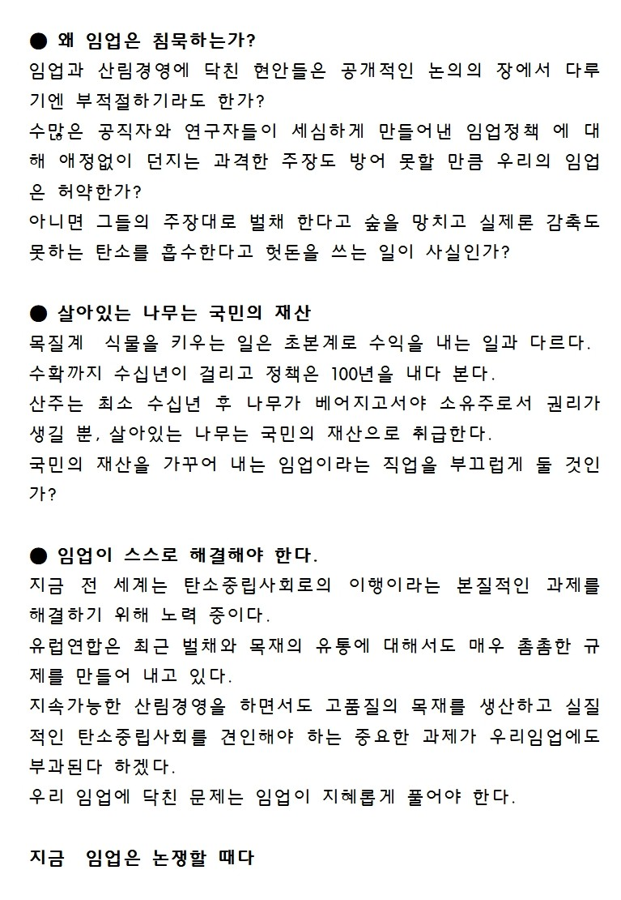
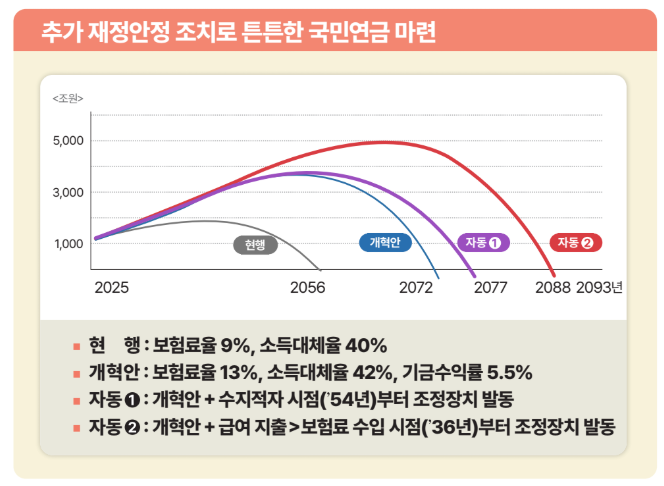

## 문서번호: 5301

### 제목: [주택 청약/분양/임대 관련해서 소득기준은 왜 봐야할까요?](https://q4all.kr/redirect/detail/a55a80ed-9c9a-4779-864d-49f519f46496)

**작성자:** [심상우](https://q4all.kr/user/profile/8018)
**작성일:** 2025-03-06 12:48:41 (목요일)

---

주택정책에서의 소득수준에 대한 원론적인 재검토가 필요하지 않을까요?

재산수준에 대해서 확인하는 것이 대해서는 충분히 납득이 갑니다.

재산이 많은 사람보다는 재산이 적은 사람에게 분배하기 위한 기준이라 생각됩니다.

하지만 현재 벌고 있는 소득기준은 왜 적용할까요?

과거에 어떠한 기준에서 넣게된지는 모르겠는데

현재의 경우 소득수준이 높은편이라고 받아들여지는 '연봉1억'인 사람의 경우에는 역차별받는 경우가 많습니다.

어떠한 정책적 혜택도 받지 못하며 그렇다고 본인이 열심히 일해서 자산형성을 하여도 주택구매를 하려면 못해도 10년 15년은 일해야 수도권 집 한채를 구할 수 있죠.

모든 제도에는 혜택 받지 못하는 구간이 있다는 점은 알고 있으나

주택이 없는 사람들이라면 동일한 기회가 주어지는게 더 공정한 세상일 것 같습니다.

어떻게든 소득수준을 줄이기위해 탈세하고 신고 누락하는 것 보다는

제공되는 기회는 동등한것이 더 좋은 세상이지 않을까요?

---

## 문서번호: 5302

### 제목: [시청 우체국 은행 등등 업무시간 관련하여 드릴 말씀이 있어요](https://q4all.kr/redirect/detail/26a09b87-cf4f-491e-a8b2-23043a6fec69)

**작성자:** [김승아](https://q4all.kr/user/profile/8015)
**작성일:** 2025-03-06 12:51:14 (목요일)

---

시청 우체국 은행 등등 업무시간 관련하여 드릴 말씀이 있어요

생활을 하다보면 아침 일찍 혹은 점심 시간에 혹은 늦은 저녁.. 관공서나 은행등에 볼 일이 있는데 운영시간이 짧다보니 불편할 때가 있고,, 반차를 쓴다거나 조퇴 혹은 휴가를 내서 관공서 업무를 보는 경우가 생겨요..

학생들의 경우에도 학교에 있다가 주말에만 시간이 나는데 은행에 직접 가야지 직불 카드 등등을 만들 수 있잖아요.. 그런 경우에 영업시간에 유연성을 두면 좋겠다는 생각을 했어요..

그런 생각을 하다가 얼마전 이재명 대표님이 한 방송에 나오셔서 하신 말씀중에 특별 수당을 주면서 근무시간 외에 근무를 하면 된다.. 이런 식으로 말씀을 하시더라고요..

그 말씀을 들으며 딱! 떠오른 생각이 근무시간 유연제 를 만들어서 직원들 중에 아침 7시 근무 하는 조, 오전 9시, 오후 1시부터 근무하는 조.. 오후 3시부터 근무하는 조.. 이런식으로 시간대를 나누어 근무시간을 유연하게 하면 어떨까요?

점심시간이라고 입구에 철물까지 내리고 있는 우체국을 보면 눈살이 찌푸려져요.. 공공서비스란 말에 맞질 않아요.

---

## 문서번호: 5303

### 제목: [ 군대 경찰 공무원 교직원 등등 임명할 때 임명권자를 바꾸면 좋겠어요.](https://q4all.kr/redirect/detail/70094c4e-a212-4d25-88d0-6f1d2df58b45)

**작성자:** [김승아](https://q4all.kr/user/profile/8015)
**작성일:** 2025-03-06 12:57:03 (목요일)

---

 군대 경찰 공무원 교직원 등등 임명할 때 임명권자를 바꾸면 좋겠어요.

가까운 예로 시장이 뽑히면 그 분의 수행비서 이런 분들은 시장이 뽑는게 옳죠.. 하지만 소수의 몇 분만 빼고 그 외 분야는 그 분야에 종사하는 분들의 의견을 수렴하여 승진을 하게끔 하면 좋겠어요.

나쁜 예로는 윗 분들께 뇌물을 준다거나 아님 그 분들이 눈에 들려고 노력하면서 매우 정성을 들이지만 아랫 직원들에게는 함부러 대하고 그런 분들 많잖아요..

그게 모두 임명할 수 있는 권리를 높은 분들이 가지고 있어서 그런 듯 해요.. 임명을 탑다운 방식이 아니라 보텀업 방식으로 바꾸면 어떨까요?

---

## 문서번호: 5304

### 제목: [50만명 이상 지방 대도시, 왜 대도시에 걸맞은 재정과 행정 권한을 주지 않습니까?](https://q4all.kr/redirect/detail/b5524e66-843f-41fc-b1c7-dd249315ef1a)

**작성자:** 전문가Q - 임승빈
**작성일:** 2025-03-06 13:11:18 (목요일)

---

**50만명 이상 지방 대도시, 왜 대도시에 걸맞은 재정과 행정 권한을 주지 않습니까?**

임승빈 특임교수(한성대학교 사회과학부, 명지대학교 명예교수)의 질문

1. 질문의 맥락

❍ 한국 사회가 직면한 대학 진학률과 경제성장률의 디커플링, 근로와 자산의 디커플링, 사회적 약자 계층과 기성 계층의 디커플링 문제를 해결할 수 있나요?

① 대학 진학률과 경제성장률의 디커플링

• 고등 교육을 받은 인재는 쏟아져 나오지만 경제는 저성장 되고, AI와 기계화가 고급 인력을 대체되는 상황에서 실업자 양산, 빠른 퇴직 등 지적인 능력과 보상 간의 디커플링이 발생합니다.

- 평균적인 소득 수준은 높아지고 있는 반면 대학을 나온 수많은 사람들의 소득 수준은 개선되지 않는 디커플링이 발생하고 있어 사회 불만이 커지고 있는 상황입니다.

- 이와 같은 불만은 학교 교육, 직업, 경제 성장이 서로 부조화(mismatch) 하는 데에서 기인한 것입니다.

- 경제의 저성장에도 불구하고 고학력자가 양산되는 상황이고, 고학력자들이 선호하는 직업은 한정되어 있어 자연스럽게 실업을 선택하는 이른바 고학력의 잉여 인간이 발생하고 있는 실정입니다.

② 근로와 자산의 디커플링

• 일하지 않고서도 자산 소득이 발생하는 계층과 일을 하면서도 생계를 해결하기 어려운 근로 소득 계층 간의 괴리가 점점 커지고 있는 상황입니다.

- 선진국이면서도 가장 선진화된 국가들이 갖고 있는 사회적 문제임

- 근로와 자산의 디커플링은 수도권과 비수도권, 수도권 내에서도 강남권과 강북권으로 분명하게 대비되어 발생합니다.

- 자산이 커져가는 구조가 열심히 일하는 것에 있지 않고, 투자를 잘해서 발생하는 것인데 이는 정보가 편중된 데에서 기인한 것입니다.

③ 사회적 약자 계층과 기성 계층의 디커플링

• 여성 차별금지를 여성 우대로, 장애인 차별금지를 장애인 우대로, 외국인 노동자 차별금지를 외국인 노동자 우대로 여기는 20대 남성 계층이 존재하며, 이는 인권적 관점에서의 평등의 상대가 아니라 경쟁자로 생각지 않았던 사회적 약자 계층을 경쟁의 상대로 인식하는 데에서 기인한 것입니다.

- 법으로 정하고 있는 장애인의 고용 비율과 외국인 노동자도 차별 없이 적용되는 최저임금, 고학력자의 3D 업종 기피로 이를 대체하고 있는 수많은 외국인 노동자들, 고학력 여성들의 적극적인 사회진출의 결과로 국가고시 합격자의 남녀 성비 유사 현상 뿐만 아니라 지방공무원 7급·9급 합격자의 여초 현상은 보편화 되었으며, 고위 관리직이 되는 외교관시험, 사법, 행정교시 합격자에서도 남녀 합격률이 거의 균등해집니다.

- 이와 반대로 20대 남성 계층에서는 과거 기득권 강자였던 남성들이 사회적 약자 계층에 의해 자리를 빼앗겼다는 피해의식이 자리 잡고 있는 상황입니다.

④ 권력의 집중화가 디커플링의 근본적 원인

• 지방에서 해결할 수 있는 디커플링을 중앙정부 권력의 집중화가 막고 있는 구조입니다.

- 예를 들어 지방에 있는 산업단지를 조성할 때 산업통상자원부의 허가, 과학기술정보통신부의 보조금, 국토교통부의 인프라 등이 반드시 필요하며, 결국 중앙정부의 규제 권력의 영향으로 자연스럽게 수도권에 개발이 집중되어 왔습니다.

- 이와 같은 중앙정부 권력의 집중화 결과로 양질의 일자리와 수입이 좋은 일자리 등 일자리 환경이 서울과 수도권에 집중되어 지방에 있는 사람들이 서울과 수도권으로 몰리는 상황을 초래합니다.

2. 해결방안

❍ 인구 50만명 이상 지방 도시에 대학 설립 인허가 권한, 공장 등 산업단지 조성 권한, 해외 투자 유치 권한 등을 중앙정부가 가지고 있는 많은 권한을 넘겨주어야 합니다.

➀ 중앙정부의 권한을 대폭 줄이는 대신 지방자치단체에 이양 필요

• 산업화, 민주화, 도시화가 정착된 1980년대 이후 태어난 세대들은 대부분 도시에서 살아가며 문화적 향유와 직업을 가진 계층이기 때문에 대도시로의 집중 현상은 막기 어려우며, 이는 전 세계적인 현상입니다.

- 문제는 도시화가 아니라 도시화가 된 곳에 대한 권력을 거기에 걸맞게 주지 않았던 데 문제가 있는 것이며, 중앙에 집중된 권력을 지방에 이양하지 않는다면 수도권과 지방의 양극화는 더욱 심화될 것입니다.

• 인구 50만명 이상 지방 도시에 대학 설립 인허가 권한, 공장 등 산업단지 조성 권한, 해외 투자 유치 권한 등을 넘겨주지 않으면 결국 지방은 붕괴할 것입니다.

- 전국 226개 기초자치단체 중 인구 50만명 이상 도시는 17곳, 이 중 11곳이 수도권에 위치하고, 대한민국 전체 인구의 80% 이상의 인구 50만 이상 도시에 거주하며, 이는 중앙에 집중된 권력이 특정 지역에만 공장을 조성하고 일자리를 만든 데에서 기인한 것입니다.

- 교육부의 대학 설립 인허가 권한은 과거 산업화 시대의 모델이며, 지역사회에 맞는 인재 육성을 위한 대학 시스템을 구축할 수 있도록 지방자치단체가 권한을 갖도록 해야 합니다.

➁ 중앙정부 재정의 지방 이양이 급선무

• 권력과 재원을 중앙정부가 모두 가진 구조에서는 지방분권이 불가능합니다.

- 우리나라 지방자치단체의 가장 큰 문제는 대부분이 중앙정부의 국고보조금에 대한 의존율이 매우 높다는 것입니다.

- 새만금 사업의 사례를 보더라도 정권 교체에 따라 중앙정부의 지방자치단체에 대한 국고보조의 변화와 편중이 극심하게 발생해 지역 간 갈등의 요인이 되기도 합니다.

- 기획재정부의 예비타당성조사 제도의 경우 B/C를 기준으로 가성비적으로 돈이 되는 쪽에 투자를 하게 되므로 인구가 집중되어 있고 노동이 확보된 곳에 투자되어 결국 부익부 빈익빈 지역 구조가 발생합니다.

• 인구 50만 이상 지방 도시에 대한 조세 체계를 개편해야 합니다.

- 중앙정부의 국세 중 일부를 지방 도시로 이양함으로써 지방자치단체 간 지방 재정의 제로섬 게임을 방지할 수 있습니다.

- 문재인 정부에서 국세와 지방세 비율을 기존 8대 2에서 최종적으로는 6대 4로 가려는 노력을 하여 대략 7대 3 수준에 이르렀습니다.

- 인구 50만 이상의 도시에는 제대로 된 지방분권, 재정분권을 위해 지방세에 대한 세목을 확보해 주어야 합니다.

➂ 혁신도시 개선 필요

• 혁신도시의 경우 결과적으로 해당 지역에 정착하는 젊은 직장인들로 인구 분산 효과는 일부 있었으나, 기성 도시와의 연계성이 떨어지는 문제로 더 큰 지역적 시너지를 내지 못하는 실정입니다.

- 혁신도시로 공공기관이 이전하면 지역 인재 30%를 지방 대학 출신으로 선발하고 있는데, 해당 지역 지방 대학 출신자를 선발할 것이 아니라 지역 연고자의 귀향과 고향에서의 정주성을 고려하여 해당 지역 고등학교 출신 비율로 개정이 필하며, 지역 인재 비율도 기존 30%에서 50%까지 확대가 필요합니다.

- 아울러 이와 같은 지역 인재를 기반으로 혁신도시와 기성 도시를 산업적으로 클러스터화 하는 방안을 마련해야 할 것입니다.

---

## 문서번호: 5305

### 제목: [민군(民軍) 융합의 시대, 이제는 민과 군이 Win-Win 하는 거버넌스와 법적 근거를 마련해야 하지 않을까요?](https://q4all.kr/redirect/detail/451b3e34-54db-44d4-aea9-adb5fdbd9a6c)

**작성자:** 전문가Q - 유형곤
**작성일:** 2025-03-06 13:34:41 (목요일)

---

**민군(民軍) 융합의 시대, 이제는 민과 군이 Win-Win 하는 거버넌스와 법적 근거를 마련해야 하지 않을까요?**

유형곤 정책연구센터장(한국국방기술학회)의 질문

1. 질문의 맥락

❍ 국가R&D와 국방R&D의 이원화로 인해 민·군 협력이 제한받아 왔는데, 법적 근거 미비와 거버넌스 부족으로 범국가적 역량이 국방력 강화에 충분히 활용되지 못하고 있는 것은 아닐까요?

① 오랜 기간 우리나라는 ‘국가R&D 추진체계’와 ‘국방R&D 추진체계’가 이원화되어 수행되어 온 상황

• 지난 1970년대 국방과학연구소(ADD)가 설립되어 국방R&D를 집중적이고 독점적으로 수행하면서도 국방R&D는 국가R&D사업과 분리된 채 수행되어 왔습니다.

- 그리고 1970년대 정부는 매우 협소한 내수 방산시장 규모의 제약과 당시 불안한 안보 여건에서 단기간 내 국내 방산 기반을 마련하고자 일부 업체를 방산업체로 지정하고, 방산물자·업체 지정제도 등으로 보호·육성함으로써 방위산업을 민간 산업기반과 분리한 채 육성해 왔습니다.

② 물론 정부도 지난 1990년대 후반부터 민·군 간 기술협력을 촉진하는 노력을 시행하고 있는 중

• 지난 1998년 산업경쟁력과 국방역량 강화를 동시에 강화하기 위해 「민·군겸용기술사업 촉진법」이 제정되고 국가R&D사업으로서 민·군겸용기술사업이 신설되는 등 이원화된 국가R&D와 국방R&D을 연계하고자 노력해 왔습니다.

- 최근에도 과기정통부, 산업부 등 민수부처와 국방부, 방사청 등 국방부처 간 연구개발 협력 노력이 계속되고 있는 양상입니다.

③ 그러나 여전히 민·군 간 다양한 형태의 협력을 위한 거버넌스가 제대로 정립되어 있지 않고, 법적 근거도 미비하여 범국가적인 역량이 국방력을 강화하는 것에 활용되지 못하는 제한요인으로 작용

• 지난 2000년대 이전과 달리 현재는 혁신적인 첨단기술을 개발할 수 있는 역량을 가진 민간 연구개발 기관이 다수 존재하고 있고, 국내 제조업 역량과 민간 산업기반도 세계적 수준으로 도약하는 등 이제는 국방과학기술 혁신역량을 강화하기 위해서는 민·군 간 협력이 필수적인 상황입니다.

- 예를 들어, 과기정통부가 주관하여 설정한 12개 ‘국가전략기술분야’는 국방부가 수립한 10대 ‘국방전략기술분야’와 거의 유사하므로 국방분야에서는 민간에서 개발된 관련 기술의 국방 활용을 활성화하도록 협력체계를 마련하는 것이 요구됩니다.

- 게다가 방위사업청이 향후 육성 분야로 지난 2021년 설정한 5대 국방첨단전략산업(AI·우주·반도체·드론·로봇)분야는 사실 국방부처가 전담하여 육성해야 하는 산업영역이 아니라 이미 범국가적으로 육성하고 있는 전략분야이기 때문에 민·군 간 산업협력을 활성화하여 국가적인 산업기반을 국방산업 육성에 활용할 수 있어야 합니다.

• 비록 지난 1998년 「민군겸용기술사업 촉진법(2013년 「민군기술협력사업 촉진법」으로 개정)」이 제정되어 민·군 간 협력을 위한 법적 근거가 최초로 마련되었으나, 국가R&D사업으로 민군겸용기술을 개발하는 협소한 범주에 국한되고 있어 매우 부족하며, 그나마 민·군 간 산업협력을 촉진하는 법적 근거는 사실상 존재하지 않습니다.

- 즉, 민·군 간 협력을 전담하는 유일한 법률인 「민군기술협력사업 촉진법」은 다수의 국가R&D사업 중 하나인 ‘민군기술협력사업’을 시행하는 것을 뒷받침하는 조항 위주로 상당히 협소하게 정하고 있습니다.

• 결국 현행 「민군기술협력사업 촉진법」만으로는 민·군 간 다양한 민군기술협력 관련 R&D 및 관련 활동(비R&D사업)이 구속력 있게 지속적으로 수행하는 것을 제대로 뒷받침하지 못하며, 민·군 간 산업협력도 본격화되기 어려운 실정입니다.

- 예를 들어, 지난 정부(2021.11월)에서 범국가적인 민·군 간 R&D 협력을 뒷받침하기 위한 거버넌스로서 국방과학기술위원회가 구성·운영되었으나, 법적 근거가 없이 운영되어 구속력을 갖추기 어려웠고, 그나마도 현 정부가 들어서면서 흐지부지되었습니다.

2. 해결방안

❍ 민·군 간 기술 및 산업협력을 촉진하기 위해 컨트롤타워 설치, 법적 근거 마련, 국방전문연구센터 지정 등 범국가적 거버넌스와 제도를 정비하는 것이 시급합니다.

➀ 이제는 최근의 민·군 간 이루어지고 있는 다양한 R&D 협력 활동 등을 더욱 촉진하는 한편 기시행되고 있는 민군기술협력사업의 효과성을 제고하고, 민·군 간 산업협력도 상시적으로 수행토록 거버넌스를 재정립하며 아울러 법적 근거를 마련하는 것이 시급

• 즉, 단순히 민군기술협력사업(국가R&D사업)을 추진하기 위한 협소한 법률이 아닌 범국가적으로 민·군 간 기술협력 및 산업협력 등의 활동이 활발하게 지속적으로 수행될 수 있도록 뒷받침하는 거버넌스와 법적 근거를 마련하는 것이 필요합니다.

➁ 【추진사항1】 민·군 간 기술협력 및 산업협력을 총괄하는 컨트롤타워 설치 운영

• 국방부처와 민수부처 간 범국가적인 기술협력 및 산업협력 추진방안 수립, 공동 투자사업 기획, 기추진되고 있는 민·군 간 협력 애로사항 해소 및 성과진단에 관한 사항을 심의·의결하기 위한 전담 위원회(가칭 민군융합위원회)를 설치하고 지속적으로 운영합니다.

- 아울러 대통령실 내에 민·군 간 기술협력 및 산업협력에 관한 사항을 총괄하여 수행하는 비서관급 담당자를 지정·운영합니다.

➂ 【추진사항2】 민·군 간 전면적인 협력을 촉진하는 (가칭)민군융합법 제정으로 강력한 이행동력 확보

• 앞서 제시한 범부처 간 전담위원회(가칭 민군융합위원회) 운영 근거를 반영하고, 범국가적으로 민·군 간 기술협력 및 산업협력 등의 제반 활동에 관한 사항을 반영하는 전담 법률인 (가칭)민군융합법을 제정합니다.

- 현행 「민군기술협력사업 촉진법」에 있는 주요 조항은 (가칭)민군융합법 내 민·군 간 기술협력을 이행하는 R&D사업에 관한 사항으로 이관·반영합니다.

➃ 【추진사항3】 상시적 민군융합형 기술개발 거점으로서 과학기술분야 출연연 내 (가칭)국방전문연구센터 지정·운영

• KIST, ETRI 등 과학기술분야 출연연은 장기간 기술 개발을 수행할 수 있는 우수 연구인력 및 인프라가 기구축되어 있으므로 민군융합형 핵심·원천기술을 지속적으로 개발할 수 있는 거점으로 운영하는 것이 바람직합니다.

- 이를 위해 각 과학기술분야 정부출연연별로 기관 주력분야에 대한 민군융합형 기술 개발, 국방분야 사업화, 관련 인력양성 및 유관 국방기업을 지원하는 임무를 부여하는 (가칭)국방전문연구센터를 지정하여 운영합니다.

---

## 문서번호: 5306

### 제목: [어떻게 하면 대한민국을 도전적 시행착오가 가득한 혁신 국가, ‘Scale-up Korea’로 만들 수 있을까요?](https://q4all.kr/redirect/detail/ef2f576f-1aaa-453d-a868-b90da3642861)

**작성자:** 전문가Q - 이정동
**작성일:** 2025-03-06 14:00:49 (목요일)

---

**어떻게 하면 대한민국을 도전적 시행착오가 가득한 혁신 국가, ‘Scale-up Korea’로 만들 수 있을까요?**

이정동 교수(서울대학교 공학전문대학원)의 질문

1. 질문의 맥락

❍ 한국이 당면한 가장 큰 과제는 “아무도 가보지 않은 새로운 길을 어떻게 갈 것인가?”인데, 우리 정부는 준비가 되어 있나요?

① 추격자 전략의 한계

• 이제 우리가 가야 할 길은 ‘모범이 없는 길’, ‘정답지가 없는 길’, ‘교과서에 없는 길’입니다.

- 우리나라는 그간 선진국에서 정립된 비즈니스 모델, 선진국이 이미 앞선 길을 보여준 선진 기술, 지배적 디자인이라 불리는 탁월한 제품 등을 빨리 벤치마킹(benchmarking)하여 더 성능 좋게 더 효율적으로 만드는 데 노력해왔고, 이와 같은 방식으로 사실상 거의 유일하게 성공한 국가라 할 수 있습니다.

- 하루가 다르게 급변하고 아무도 길을 모르는 혼돈의 세상 속에서 우리 산업계와 과학·기술계가 벤치마킹을 찾고자 하는 루틴(routine)을 벗어나지 못하고 있는 것은 아닌지 우려되는 상황입니다.

- 과거 추격의 기억을 뒤로 하고, 이제 아무도 가보지 않은 미지의 길로 나가는 도전적 루틴을 어떻게 도입할 것이냐가 가장 큰 숙제입니다.

② 기술 및 산업 표준 주도권 문제

• 기술의 세계, 산업의 세계에서 특히 현대적인 의미에서 결정적으로 가장 중요한 것은 ‘기술표준’입니다.

- 기술표준이 한 번 만들어지면 그 표준을 따르지 않고는 물건을 만들 수 없고, 만들어도 소용이 없으므로 그 표준을 장악한 자가 곧 비즈니스의 질서를 장악하는 것이며 산업의 지형도를 결정하는 것입니다.

- 오래도록 산업의 경험을 쌓아왔던 미국, 독일, 영국, 프랑스, 일본은 과거 비즈니스 질서를 결정하는 기술 표준의 종주국들이었습니다.

- 최근 중국 딥시크(DeepSeek) 모델의 등장을 보면서 우리가 깨닫게 된 것 중 하나는 중국이 또 다른 전략으로 기술표준이라는 모범을 창출해 가고 있다는 것입니다. 이미 중국은 전기차 모델, 고속철도 모델, 배터리 모델 등에서 새로운 중국발 기술표준을 만들어가고 있습니다.

- 중국이 ‘중국의 개념 설계’를 통해 사실상 ‘벤치마크(benchmark)’로 등장하려고 노력하는 중이고, 중국이 기술표준을 제시하는 단계에 돌입하고 있다는 것이 우리를 두렵게 하는 것입니다.

- 우리가 그간 선진국의 표준이 교과서라 생각하고 열심히 따라왔는데 다른 교과서가 만들어지는 상황이 된 것이며, 우리가 이 교과서 저 교과서를 수입하면서 그걸 더 잘 수행하는 방식으로는 더 이상 살아갈 수 없는 단계에 직면했다 할 것입니다.

③ 우리만의 고유한 개념 설계 필요

• 새로운 개념 설계를 만들기 위한 비법은 단 두 가지로, 첫째는 남들이 해보지 않은 문제(최초의 질문, 담대한 비전 등)를 풀어보자고 나서야 하는 것이고, 둘째는 조금씩 시행착오를 쌓아가면서 개선해 나가는 것, 즉 스케일업 해나가는 것입니다.

- 과거와 같이 벤치마킹을 통해 ‘표준을 만든 이들의 꿈’을 쫓아가는 것이 아닌 “대한민국이 고유하게 이걸 했으면 좋겠다.”라는 우리만의 비전을 제시해야 합니다.

- 그 비전은 누구도 던져보지 않은 질문이라 해답이 없으므로, 버전 1, 버전 2, 버전 3을 만드는 과정 즉 조금씩 시행착오를 거치며 개선해 올라가는 ‘스케일업(Scale-up)’ 과정을 반드시 겪어야 합니다.

- 다시 말해 우리만의 고유한 개념 설계, 대한민국이 전 세계를 상대로 제시하는 기술을 만들어내는 방법은 ‘최초의 질문’을 던지고 ‘스케일업’을 하는 것입니다.

④ 제조업 기반 활용 필요

• 우리가 해왔던 일(제조업)이 다음 단계로 나가기 위한 디딤돌이 될 수 있습니다.

- 그간 우리는 상당한 인적자원을 쌓아 왔습니다. 중요한 건 제조업 기반을 쌓아 제조 역량이 전 세계 5위 수준이며, 특히 한국 제조업은 반도체부터 해양 플랜트, 우주 발사체에 이르기까지 풀 패키지(full package)를 가지고 있다는 매우 큰 장점이 있다는 것입니다.

- 현재 미국이나 중국 등 전 세계가 제조업 살리기에 사활을 걸고 있는데, 그 이유는 일자리 때문이 아니며 현장에 제조업이 함께 있어야 혁신이 이루어지기 때문입니다.

- ‘혁신’이 가능하기 위해서는 제조업을 통해 우선 적용해 보고, 그것이 되는지 안 되는지 살펴 ‘피드백 앤 포워드(feedback & forward)’ 하는 제조 루프(loop)가 살아 있어야 합니다.

- 우리는 제조 현장의 기술을 가지고 있는데 이는 전 세계 몇 개 나라(미국·중국·일본·한국)만 가지고 있는 역량이며, 이와 같은 역량에 새로운 질문을 하는 기회를 열어주고 시행착오를 할 수 있도록 시간과 재원을 투자해야 새로운 다음 단계로 나갈 수 있습니다.

- 제조업은 모든 혁신의 모판이며, 이 제조기반 위에 고급 디자인, 마케팅, 브랜딩을 얹어야 고부가 서비스업이 가능하고, 결국 독창적인 개념설계를 만들 수 있다는 것을 잊지 말아야 합니다.

2. 해결방안

❍ ‘금융 혁신’, ‘인내 자본(patient capital) 확대’, ‘평생 학습체계 구축’, ‘패스트 러닝(fast learning) 문화 정착’, ‘국회의 역할’이 혁신과 국가 경쟁력 강화를 위한 필수 요소입니다.

➀ 금융 혁신

• 우리나라 금융은 은행 중심의 예대 마진 구조에 의존하는(전 세계 금융권을 다 비교해 봐도 이런 식으로 돈 버는 데 없는) 보수적 수익 모델에 머물러 있으므로, 금융이 산업의 도전과 확장을 뒷받침할 수 있도록 혁신적인 구조로 개혁해야 합니다.

- 금융은 산업의 그림자이며, 둘 중 하나가 없이는 다른 하나가 설 수 없어 산업과 금융은 함께 발전하는 것입니다.

- 스페인의 이사벨라 여왕과 여러 사람이 돈을 모아 콜럼버스 항해를 지원했던 사례에서 보듯이, 금융은 위험과 책임을 분산하고 혁신을 가능하게 합니다.

- 창조적 파괴를 열어나가는 데 있어 “금융이 어떤 역할을 할 것인가?”라고 할 때, 콜럼버스의 항해를 뒷받침했던 금융이야말로 금융의 본모습이라 말할 수 있습니다.

- 금융은 그런 면에서 산업계가 최초의 질문을 던지고 스케일업 해 나가는 데 있어 필연적으로 따르는 위험을 함께 나누어서 부담해야 하는 것입니다.

- 그러나 우리 산업을 위해 금융을 담당해야 하는 은행은 예대 마진을 통해 가만히 앉아서 기록적인 수익을 내고 있을 뿐 산업계에서 새로운 질문을 던지고 스케일업 해 나가는 데 있어 오히려 장애 요인이 되고 있으므로, 제 역할을 하도록 획기적인 금융혁신을 해야 합니다.

➁ 인내 자본(patient capital) 확대

• “한 국가의 ‘새로운 개념 설계’가 얼마나 많이 나오는가?”의 정도와 “그 나라 금융의 ‘인내 자본’ 성격이 얼마나 큰가?”와는 정확히 일치합니다.

- 우리나라 기관 투자 또는 정부 R&D 자금, 정부 산업 지원 자금, 벤처 지원 모태 펀드 등을 통틀어 ‘인내 자본’이라고 합니다.

- 미국은 벤처 펀드를 통해 1개의 벤처 성공을 위해 100개 벤처를 모두 뒷받침하는 투자를 하며, 성공한 1개의 벤처를 통해 실패한 99개의 벤처 투자비를 커버합니다.

- 현재 우리의 금융 관점에서 보면 각자도생의 시대라 할 정도로 인내 자본이 상당히 취약해진 상태입니다.

- 중요한 인내 자본 중 하나가 ‘정부 투자’이며, 정부 투자 가운데 기업에 대한 R&D투자, 대학에 대한 R&D투자 등 ‘국가 연구개발 투자’는 매우 중요하다 할 것입니다.

- 갑작스럽게 국가의 R&D 예산이 삭감되는 일은 절대로 반복되어서는 안 되며, 금융에 있어 인내 자본을 확대함으로써 시행착오를 쌓아가면서 개선해 나가는 스케일업이 가능하도록 지원해야 합니다.

➂ 평생 학습체계 구축

• 결국 혁신은 사람이 하는 것이며, 우리 정부는 대학을 졸업하는 23세부터 80세에 이르도록 모든 국민의 평생 학습을 지원할 국가 차원의 평생 학습체계, 즉 Learning Korean을 구축해야 합니다.

- 우리나라 초·중·고 교육에 매년 70조 원 이상의 재정이 투입되지만, 대학을 제외하고 23세부터의 성인 교육은 고용보험 연계 환급금과 일부 재정 사업을 포함해 연간 3~4조 원 수준에 불과합니다.

- 기술 변화의 속도가 빠른 환경에서 이와 같은 성인들에 대해서는 교육 중심이 아닌 학습 중심의 국가적인 대책이 있어야 합니다.

- 나이 50대 후반의 베이비부머가 1년에 100만 명씩 나오는 현실에서, 국가는 이들에게 학습의 기회라는 최고의 복지를 제공해야 하는 것입니다.

- 대한민국 정부는 이들에게 다시 ‘질문을 던질 기회’와 ‘작게나마 시도할 수 있는 스케일업’을 지원함으로써 우리가 가진 산업의 넓은 포트폴리오(portfolio)를 더욱 강화할 수 있습니다.

- 특히 산업별·지역별·레벨별 맞춤형 학습체계를 구축함으로써 반도체·건설·화학·디자인 등 다양한 산업에 종사했던 사람들이 개인의 능력을 더 높이거나, 다른 분야와 융합하거나, 다른 분야로 전환할 수 있도록 해야 하며, 이때 대학은 평생 학습의 전진기지가 되어야 합니다.

∙ 우리나라는 산업화를 성공적으로 추진하면서 다양한 산업에 수많은 사람이 종사하고 있어 빠르게 변화하는 세상에 맞게 전환해야 하는 아주 거대한 과제를 안고 있으나, 이와 같은 과제는 다른 나라는 가질 수 없는 특별한 과제이므로, 정부는 이들이 역량을 평생 펼칠 수 있도록 국가적인 평생 학습체계를 반드시 구축해야 합니다.

➃ 패스트 러닝(fast learning) 문화 정착

• 중요한 건 빠른 실패(fast fail)가 아니라 빠른 학습(fast learning)이며, 실패 자체를 두려워할 것이 아니라 짧은 주기로 시도하고 배움을 극대화해야 하는 것입니다.

- 6개월, 심지어 분기 단위로 해당 버전의 일(도전)을 무조건 끝내고 결과를 봐야 하며, 결과에 대한 성공이냐 실패냐를 묻는 것이 아닌 해당 도전을 통해 배움을 최대한 끌어내는 것이 중요합니다.

- 우리가 알고 있는 모든 혁신의 사례들은 패스트 러닝의 산물이고, 로드맵을 앞선 최초의 혁신 사례로 기록된 64메가 D램 개발(1984년부터 본격적으로 D램 개발을 시작해 10년 만인 1994년 개발 성공) 역시 매주 수요일 아침 7시마다 삼성전자 전 부서가 모여 수요 공정회의라는 학습을 통해 만든 결과물이었으며, 이는 세계적으로 상당히 유명해질 정도의 패스트 러닝을 위한 메커니즘이었습니다.

- 결국 혁신은 여러 시도와 실패의 학습이 누적된 결과이며, 스케일업 해서 결국 완성에 다가갔다는 의미입니다.

➄ 국회의 역할

• 신기술을 육성하고, 신기술이 사회에 안착하게 하며, 기존 이해관계가 있는 네트워크 속에서 서로 다른 주체들이 잘 어울릴 수 있도록 만드는 일련의 과정에 있어서 국회의 역할은 매우 중요합니다.

- 국회는 법과 제도를 통해 신기술에 옷을 입혀주는 역할을 하는데, 유전자 편집 기술, 인공지능 기술 등 모든 신기술은 야수와 같아서 어디에 쓰일지 모르기 때문에 의회가 법과 제도를 통해 반드시 맞춤형 옷을 만들어 입혀야 합니다.

- 다시 말해 국회가 법과 제도를 만들 때, 사전에 길을 정하는 것이 아니라 법과 제도가 기술과 함께 공진할 수 있도록 만들어 가는 것입니다.

- 따라서 국회는 새로운 기술들을 알아야 하며, 기술과 마찬가지로 법과 제도 역시 한 번에 완성되지 않는다는 것을 이해함으로써, 버전 1, 버전 2, 버전 3 만드는 과정 즉 조금씩 시행착오를 거치며 개선해 올라가는 법·제도의 ‘스케일업(Scale-up)’을 해야 합니다.

---

## 문서번호: 5307

### 제목: [선진국의 함정에 빠진 한국, 살아날 길은?](https://q4all.kr/redirect/detail/f7edf7de-c4dd-4293-bb11-daeed49995a0)

**작성자:** 전문가Q - 권석준
**작성일:** 2025-03-06 14:13:43 (목요일)

---

**선진국의 함정에 빠진 한국, 살아날 길은?**

권석준 교수(성균관대학교 화학공학부, 반도체융합공학과, 미래에너지공학과)의 인터뷰

1. 질문의 맥락

❍ 현재 우리나라는 선진국의 함정에 빠지고 있는데, 이 함정에서 어떤 식으로 빠져나와야 할까요?

① 선진국의 함정

• 선진국의 함정에 빠진 나라는 우리나라만이 아니라 우리 보다 10~20년 정도 먼저 이른바 선진국형 함정에 빠진 일본과 영국, 프랑스, 독일, 이탈리아 등 유럽권 국가들도 포함됩니다.

- 다만 선진국의 함정이라는 것을 아직 학계나 미디어에서 충분히 다루지 않고 있어, 일부의 조짐과 징후만 가지고 알 수 있을 뿐이므로 각 나라마다 선진국의 함정이 무엇인지 정의할 필요가 있습니다.

② 【선진국의 함정 1】 산업 경쟁력 약화

• 우리나라의 경우 선진국이 될 수 있도록 기반이 되었던 요소들, 예를 들어 중화학공업, 제조업 등의 전통적인 산업과 첨단산업 그리고 지식산업까지 모든 산업에서 경쟁력이 점점 약해지고 있습니다.

② 【선진국의 함정 2】 극심한 저출산

• 저출산 문제는 단순히 규모의 경제 또는 내수 시장의 축소만 문제가 되는 것이 아니라 인력을 기반으로 하고 있는 가치 창출의 기회라는 관점에서도 우리나라의 혁신의 기회가 줄어든다는 점에서 더 큰 문제입니다.

③ 【선진국의 함정 3】 양극화 심화

• 시간이 갈수록 세대 간, 종교 간, 사회단체 간, 수도권과 지방 간 갈등과 분극화로 인해 양극화를 넘어, 다극화라 부를 수 있을 정도로 사회 분리 현상이 점점 심화되고 있어, 지난 30여 년 동안 자리 잡아왔던 민주주의 체제와 시민사회의 성숙도를 바탕으로 하는 공동체 의식이 악화되고 있습니다.

2. 해결방안

❍ AI를 활용한 혁신과 신산업 개척, 인구 문제 해결을 위한 긴급 처치와 장기적 대응, 세대 간 갈등과 시민사회 성숙을 위한 정책 추진을 통해 선진국의 함정에서 벗어나야 합니다.

➀ AI를 활용한 혁신과 신산업 개척

• 한국의 주요 산업들은 중국의 급격한 성장과 맞물려 심각한 도전에 직면해 있습니다.

- 중국은 자국 내 거대한 내수 시장과 높은 경제 성장률을 바탕으로 한국의 제조업, 중화학공업, 조선, 방산 등 거의 모든 산업에서 한국을 따라잡았거나 일부 영역에서는 이미 추월했습니다.

- 한국이 ‘선진국의 함정’에 빠지는 동안 중국은 지속적인 경제 성장을 통해 후진국에서 중진국으로 도약했으며, 앞으로도 지속적으로 글로벌 경쟁력을 강화할 가능성이 높아 이러한 격차는 앞으로 더욱 확대될 가능성이 높습니다.

- 한국 경제는 수출 중심의 구조를 가지고 있어, 수출의 핵심인 제조업이 글로벌 경쟁력을 잃게 될 경우 국가 경제의 근간이 약화될 위험이 크므로 기존 제조업이 생존하고 발전하기 위한 전략적 대응이 필요합니다.

• 한국은 IMF 이후 두 차례의 혁신(1990~2000년대 인터넷 혁신, 2010년대의 모바일 혁신)을 경험한 바 있으며, 이제 세 번째 혁신인 ‘AI 혁신’을 준비해야 합니다.

- 한국의 제조업은 30~50년 이상의 업력을 바탕으로 민간 분야는 물론 공공 분야에서도(예를 들어 정부 부처 등) 방대한 데이터와 전문 인력을 보유하고 있으므로, 여러 면에서 유리합니다. 예를 들어, 석유화학 분야는 중국에 밀리고 있지만, 산업 자체가 사양 산업이 될 수도 있는데, 한국이 그간 쌓아 온 데이터와 노하우가 결합된 AI 기반의 ‘디지털 트윈’ 기술을 활용하면 석유화학 산업 등 전통적인 산업 공정을 최적화하고 비용을 절감하면서도 높은 부가가치 제품을 생산할 수 있습니다.

- 첨단 바이오 산업은 AI가 가장 큰 부가가치를 창출할 수 있는 영역 중 하나로, 신약개발, 의료기기, 맞춤형 치료제 및 백신 분야에서 산업이 한 번 더 점프하기 위해서는 AI가 굉장히 강한 혁신의 엔진으로 투자 될 수 있어야 합니다.

- 조선업 역시 AI가 조선업의 모듈화 및 첨단 기술 도입을 가속화하는 데 중요한 역할을 할 수 있는 분야이므로, 기존 조선업이 상선 및 벌크선 위주로 구성되었다면 향후 글로벌 안보 환경 변화에 따라 방산 및 해군력 강화의 일환으로 발전할 할 가능성이 큽니다. 특히 트럼프 2기 이후의 미국에서는 해군력 보존 및 업그레이드를 위해서라도 한국의 조선업을 매우 중요한 파트너로 볼 것입니다. 이에 대응하면서 제2의 조선업 르네상스(고부가가치 선박 제조업 경쟁력 확보) 파도를 한국이 잘 이용할 필요가 있습니다.

- 그 외에도 자동차·섬유·화학 산업이나 기계류·로봇 산업은 앞으로도 각 산업 영역은 물론, 산업 간 연계 과정에서도 많은 혁신을 만들어 낼 수 있는 산업이므로, AI를 통해 각 산업들이 한 번 더 점프할 수 있도록 계기를 만들어야 합니다.

• 아울러 새로운 산업을 만드는 것이 중요한데, 여기서 새로운 산업은 현재 우리나라가 잘 해왔던 산업뿐만 아니라 앞으로 훨씬 더 잘해야 하는 산업을 포함합니다.

- 이미 잘 해왔던 반도체 산업에 더 많이 투자하여 더 많은 점유율을 가질 수 있는 전략을 마련해야 하고, AI 기반 최적화 설계를 활용하여 GPU 포함 시스템 반도체 혹은 로직 반도체를 개발하는 것뿐만 아니라 AI 및 반도체 산업 간의 시너지를 극대화하기 위해 장기적인 투자가 필요합니다. 특히 SoC(system-on-chip) 형태로 각 산업에 보급될 수 있는 경량화된 맞춤형 AI 반도체는 산업 전환 전략에 있어 매우 중요한 촉매 역할을 할 것입니다.

- ‘IT 혁명’, ‘모바일 혁명’, ‘AI 혁명’에 이어, 앞으로 한 세대 안에 ‘양자IT 혁명’이 발생할 가능성이 있어 양자 컴퓨팅 분야에도 선제적 대응이 필요합니다. 특히 양자 IT 기술은 금융, 법률, 공공시설, 통신, 전력망 등 국가 안보의 핵심 인프라 시스템과 직결되므로 장기적으로 안보적 관점의 로드맵을 마련하여 국가 경쟁력을 확보해야 할 것입니다.

➁ 인구 문제 해결을 위한 긴급 처치와 장기적 대응

• 우리나라가 직면한 인구 문제는 단순한 출생률 저하를 넘어 경제적, 사회적, 문화적 측면에서 심각한 영향을 미치고 있습니다.

- 특히 2030년대 초반 이후, 2010년대 출생 세대가 대학과 사회로 진출하는 시점부터 연간 출생 인구가 40만 명대로 떨어지면서 그 영향이 본격화될 전망입니다.

- 이는 단순한 국내 경제 규모 축소의 문제가 아니라 인적 다양성과 혁신 인재 배출 가능성의 감소라는 더 근본적인 문제로 이어질 수 있습니다.

• 우선, 해외 인재 유입 확대를 통한 긴급 처치가 필요합니다.

- 첨단 기술, 전략 산업 등에 종사할 외국인 유학생 등 외국인 인재에게 보다 개방적인 비자 및 영주권 취득 기회를 제공해야 하고, 외국인 유학생 및 인국인 전문 인력이 한국 산업과 경제에 기여할 수 있도록 보다 체계적인 정착 프로그램을 마련해야 합니다.

- 국내 대학들이 동남아, 서남아, 동유럽 등지에 클러스터 개념의 캠퍼스 설치를 통해 우수한 학생들을 유치함으로써 고학년 과정이나 대학원 과정에서 한국 본교로 유학할 수 있도록 유도하고, 국내 산업과 연구 분야에서 활동할 수 있는 기회를 제공해야 합니다.

- 국가 안보와 관련된 분야는 철저한 신원 검증을 거치되, 당장 인력이 부족한 첨단 산업 및 필수 산업 분야에서는 보다 적극적으로 해외 인재를 수용할 필요가 있습니다. 핵심 전략 산업 분야의 석박사급 인재들은, 보다 비자와 영주권 문호를 넓혀 우대하는 정책을 마련해야 합니다.

• 장기적 대응 방안으로는 기존의 바우처 및 지원금 방식에서 벗어나 출생에서 대학 입학까지 최소 18~19년간 국가가 아이의 성장과 교육을 책임지는 ‘국가 책임제’라고 할 정도의 파격적인 개념을 도입해야 합니다.

- “아이를 낳으면 국가가 책임진다.”는 개념 도입에 더해 각 지자체가 지역 특성에 맞는 맞춤형 지원 정책을 혁신적으로 운영할 수 있도록 유연성을 부여해야 합니다.

- 이와 같은 정도의 파격적인 전환이 없다면 우리나라의 출산율을 높이는 것은 기대하기 어렵습니다.

➂ 세대 간 갈등과 시민사회 성숙을 위한 정책 추진

• 세대 간 소통이 원활할 수 있는 사회 분위기 형성 및 시민사회 성숙을 위해 기본적인 제도를 마련하고 지속적으로 지원해야 합니다.

- 최근 들어 세대 간, 성별 간, 그리고 지역 간 격차가 심화되고 있는데, 이러한 갈등은 한국만의 문제가 아니라 미국의 트럼프 현상, 독일의 극우 정당 AfD 부상, 영국의 반이민주의, 프랑스내 특정 종교 배경의 이민자와 기존 시민들 사이의 사회적 갈등 등 선진국 전반에서 나타나는 현상으로 ‘선진국의 함정’이라 하겠습니다.

• 한편으로는 강력한 공권력으로 법치주의를 회복해야 합니다.

- 시민사회, 시민의 자율권 그리고 시민의 의사 표현이나 언론·출판·집회의 자유가 보장되기 위해서는 기본적으로 법 안에서 모든 것이 이루어져야 합니다.

- 준법을 무시하고 사회 갈등을 조장하는 일부 단체 및 유튜브 채널, 검증되지 않은 미디어에 대해서는 정부 차원의 단호한 대응이 필요합니다.

- 이를 통해 사회적 갈등의 불씨를 최대한 법의 테두리 안에서 통제하고, 아울러 시민들에게 신뢰할 수 있는 정보 환경을 제공하는 것이 중요합니다.

• 세대 간 이해를 증진하기 위해 교육 시스템을 개선해야 합니다.

- 젊은 세대는 역사 교육을 통해 앞선 세대의 경험과 고충을 이해할 필요가 있으며, 반대로 시니어 세대도 시대 변화에 맞춰 재교육을 받을 기회가 확대되어야 합니다.

- 이를 위해 지자체 차원에서 시니어 교육 프로그램을 체계적으로 운영해야 할 뿐만 아니라 최신 정보를 지속적으로 업데이트할 수 있도록 지원해야 합니다.

• 국민 누구나 민주시민의 소양을 갖고 시민사회의 일원으로 성장할 수 있도록 공교육 시스템의 개혁이 필요합니다.

- 현재 공교육에서는 금융 교육, 법과 정치 시스템에 대한 교육이 부족하며, 학생들이 입법·사법·행정 과정에 대한 기본적인 이해가 미흡한 실정입니다.

- 입시를 위한 커리큘럼을 축소시키는 대신 법과 시민사회의 역할, IT 및 AI 소양, 글쓰기와 커뮤니케이션 능력 등을 강화함으로써 대학에 가지 않더라도 자립하여 충분히 자신의 목소리를 논리적으로 얘기할 수 있는 시민들을 양성하는 방향으로 공교육 커리큘럼에 대한 혁신이 필요합니다.

---

## 문서번호: 5308

### 제목: [퇴직금을 피하기 위한 11개월 계약직 꼼수에 대하여](https://q4all.kr/redirect/detail/35475f49-916b-4392-8292-fef41b7a78fe)

**작성자:** [최준호](https://q4all.kr/user/profile/3034)
**작성일:** 2025-03-06 14:25:18 (목요일)

---

주변의 이야기를 들어보면 계약직의 경우 11개월만 진행하여 퇴직금을 피하려는 꼼수가 종종 들립니다.

11개월 일하고 이후 쉬었다가 다시 계약하는 방식을 취하더라구요.

관련 법과 판례를 살펴보니 애매한 지점들이 있던데 이를 해결하기 위한 방법은 무엇이 있을까요?

---

## 문서번호: 5309

### 제목: [미국도 나오고 중국도 나오는데, 대한민국은 왜 재벌후손이 아닌 새로운 큰 부자가 나오지 않을까요?](https://q4all.kr/redirect/detail/7db2d108-6dd5-4b45-92e3-e8c454c46834)

**작성자:** 전문가Q - 존리
**작성일:** 2025-03-06 14:33:04 (목요일)

---

**미국도 나오고 중국도 나오는데, 대한민국은 왜 재벌후손이 아닌 새로운 큰 부자가 나오지 않을까요?**

존리 대표(존리의 부자학교)의 질문

1. 질문의 맥락

❍ 우리 정부는 언제까지 경직된 사고와 잘못된 교육, 노동시장의 경직성, 금융 산업의 경직적인 후진성, 복잡하고 과도한 규제 등으로 국가 경쟁력을 떨어뜨릴 건가요? 싱가포르처럼 금융 중심의 개방적 경제 모델은 불가능할까요?

① 경직된 사고와 잘못된 교육

• 크게 성장할 수 있고 행복할 수 있는 대한민국을 경직된 사고와 잘못된 교육이 망치고 있습니다.

- “변별력이 왜 있어야 하죠?” 사람의 재능은 모두 다른데, 수능시험 점수로 줄을 세우는 것은 가장 공정하지 않은 방식입니다.

- 공무원을 하겠다는 사람만 많고 창업을 하겠다는 사람이 없는 나라는 희망이 없고, 이와 같이 희망이 없는 한국에는 외국 자본이 투자를 하지 않습니다.

- 경직된 사고와 잘못된 교육의 결과로 다양성이 사라진 대한민국은 가진 경쟁력이 100이라고 했을 때 결국 30만큼도 제대로 쓰지 못하는 사회가 되었습니다.

- 줄을 세우는 수능시험은 과감하게 없애는 정도의 교육 개혁을 함으로써 각기 다른 재능이 그 재능에 걸 맞는 평가를 통해 모두가 100점을 맞아 다양성이 확보되는 사회를 만들어야 합니다.

② 노동시장의 경직성

• 노동의 유연성을 제대로 이해하지 못한 대한민국은 노동자를 보호하는 게 아니라 노동자를 오히려 괴롭히고 있습니다.

- 외국기업이 한국에 투자를 꺼리는 가장 큰 이유가 한국의 경직된 노동법입니다.

- 회사가 어려울 때 노동자를 해고하지 못하는 법체계 때문에, 회사가 정규직 고용을 기피하고 비정규직을 고용하게 하는 구조로 고착화되었습니다.

- 근무시간을 제한함에 있어 유럽의 경우 생명을 다루거나 안전을 위해 반드시 적정한 휴식이 필요한 직업군에만 적용하는데 반해 한국의 ‘52시간 근무제’는 모든 사업장에 일률적으로 적용되어 노동시장의 비효율과 함께 경직성을 심화시키고 있습니다. 미국 금융의 경우 일주일에 80시간 이상 일하는 사례가 허다합니다.

③ 금융 산업의 후진성

• 제조업 중심의 경제 구조는 성장에 한계가 있으며, 우리가 직면한 그 한계에서 다음 레벨로 가기 위해서는 금융 산업이 발전해야 합니다.

- 대한민국은 국민 역량이 뛰어남에도 금융은 세계 최하위 수준이며, 더 큰 문제는 미국, 영국, 싱가포르 등 금융 강국의 모델이 아닌 금융 문맹인 일본의 모델을 답습하고 있다는 것입니다.

- 정부 관료의 과도한 개입이 일본의 경제와 금융을 망쳐 놓은 것인데 우리나라 역시 일본과 같은 관치금융(심판의 역할이 아닌 과도한 개입)에서 벗어나지 못하고 있는 실정입니다.

- 외국 자본이 국내에 들어와서 수익을 거두는 것을 ‘국부 유출’로 보는 부정적인 시각이 존재해, 골드만삭스와 메릴린치 등 국제적인 투자은행이나 증권회사를 유치한 싱가포르나 홍콩과 비교할 때 한국은 스스로 대규모 외국 자본 투자를 막고 있는 상황입니다.

- 경제부처 공무원들의 외국자본에 대한 편협한 시각을 없애야 합니다.

➃ 복잡하고 과도한 규제

• 과도한 상속세와 만연한 편법 상속, 과도한 자산운용업 규제에 따른 금융 서비스의 부익부 빈익빈 발생 등 금융 산업을 막고 있는 복잡하고 과도한 규제가 존재합니다.

- 부의 세습을 막기 위한 상속세 제도가 주식을 이용한 편법에 의해 부의 세습을 높이는 반면 주식 가격을 인위적으로 낮추는 상황이 발생합니다.

- 우리나라 금융이 은행이나 보험회사 중심으로 되어 있어, 부자는 돈을 빌리기 쉽지만 담보 여력이 없는 사람들에게는 금융 서비스가 제한되어 결국 금융의 부익부 빈익빈을 초래합니다. 아울러 혁신적인 기업이 탄생하지 못합니다.

- 아울러 과도한 규제로 가장 중요한 자산운용사의 숫자와 금액이 적어, 아무리 혁신적인 아이디어가 있어도 담보 없이는 필요한 자금을 구할 수 없으므로 혁신 창업이나 혁신 기업이 나올 수 없는 상황입니다.

- 지난 20년 전과 비교해 미국은 새로운 글로벌 기업들이 대거 출현했으나 한국과 일본은 대기업 순위의 변화가 없을 정도로 혁신적인 기업이 나오지 않고 있습니다.

- 따라서 금융 산업의 개혁이 필수적입니다.

2. 해결방안

❍ 금융 교육 강화와 창업 활성화는 한국 사회가 지속적으로 성장하고 경쟁력을 유지하는 데 필수적인 요소이며, 이를 위해 교육 개혁, 창업 지원, 퇴직연금 개혁 등의 종합적인 접근이 필요합니다.

➀ 금융 교육의 체계적 도입

• 아이들을 학원에서 해방시켜 자유롭게 활동하게 함으로써 다양성을 확보하는 한편 실생활에 도움이 되는 금융 교육을 강화해야 합니다.

- 한국의 모든 학생들이 방과 후에 학원으로 몰려가 길거리에 아이들이 없는 현실, 공무원 등 안정적인 직업만 찾는 사회 분위기는 역동성이 사라진 일본의 뒤를 따르는 것 같은 상황입니다.

- 학생들을 위한 금융교육은 전혀 없을 뿐만 아니라 성인이 되어서도 제대로 된 금융교육이 없으며, 퇴직연금을 자산운용사가 아닌 보험사나 은행이 관리함에 따라 연금이 제대로 기업에 투자되지 않고, 연금보장이 되었다는 인식으로 인해 금융교육의 필요성이 없게 만듭니다.

- 미국의 경우 퇴직연금의 사업자인 자산운용사가 금융 교육을 담당하고, 적극적인 주식 투자 등을 통해 퇴직 이후를 정교하게 준비합니다.

➁ 창업정신 함양과 창업 및 금융 활성화

• 청년들이 다양한 창업 아이디어를 가지고 어렵지 않게 투자를 받으며 꿈을 키워 나갈 수 있는 나라가 되어야 합니다.

- 창업을 통해 새로운 기업이 많이 나오고, 수많은 자산운용사가 창업과 기업 활동을 뒷받침하며, 외국 자본이 자유롭게 투자할 수 있도록 금융 개혁을 신속히 추진함으로써 앞으로 10년 후 한국에서도 신흥 부자들이 대거 나올 수 있는 체계를 만들어야 합니다.

- 아울러 어릴 때부터 제대로 된 금융교육, 주식교육 등을 통해 국민 누구나 자연스럽게 주식을 소유하게 함으로써 “나도 투자자·자본가다.”라는 생각과 미래에 대한 희망으로 삶의 행복을 회복시켜야 합니다.

• 불필요한 규제를 완전히 풀어주는 대신 위법한 행위에 대해서는 일벌백계하는 Negative 시스템으로 전환해야 합니다.

- 규제를 풀어주면 문제가 발생하겠다고 하지만 실제로는 규제 때문에 대부분의 문제가 발생하며, 과도한 규제 때문에 사회 다양성이 사라집니다.

- 예를 들어 과도한 상속세는 온갖 편법적이고 불법적인 수단을 써서 상속세를 낮추려는 행태를 만연케 하여 부정부패 가능성을 높일 뿐만 아니라 자본의 외국 유출까지 초래하고 있습니다.

- 한국의 금융 경쟁력은 세계 꼴찌 수준이고, 그 이유는 과도한 사교육(쓸데없이 어려운 수능시험으로 인해)과 금융교육 부재, 투자에 대한 편견에 있습니다.

➂ 퇴직연금 개혁 및 자산운용 활성화

• 대한민국 퇴직연금 규모는 500조 원 정도이며 향후 1천 조 원에 이를 것이므로, 이와 같은 퇴직연금을 어떻게 사용하느냐가 대한민국의 미래를 결정할 것입니다.

- 미국의 경우 1975년 퇴직연금 개혁을 하면서 완전히 다른 나라, 즉 금융 강국이 되었고, 월급쟁이의 돈이 주식시장에 대거 유입되면서 창업을 통해 새로운 기업이 커 나갈 수 있도록 하는 선순환의 구조를 만들었습니다. 결국 Google, Apple, Amazon과 같은 새로운 기업의 탄생을 가져왔습니다.

- 대한민국의 퇴직연금을 전부 해외에만 투자할 것이 아니라 국내 주식 시장에 투자하도록 함으로써 새로운 기업이 커 나갈 수 있는 구조를 만들어야 하는 시점에 와 있습니다.

• 자산운용 시장을 키워 창업에 활용할 수 있는 자금 운용을 쉽게 해야 합니다.

- 미국은 2만 5천 달러(약 3,600만원)면 자산운용업 허가를 내주는 반면 우리는 10억 원에 달해 자산운용업에 대한 진입 장벽이 높아 결국 금융 산업이 발전하지 못하는 상황입니다.

- “자산운용사 허가를 다 줘서 사고 나면 어떻게 하냐?”고 말하지만 실제 금융사고 대부분은 허가를 받지 못한 사람이 내는 것입니다.

- 금융감독원 입장에서는 허가를 받은 소수의 자산운영사만 관리하면 되는 이점이 있을지는 모르지만, 돈이 필요한 창업자와 혁신 기업 입장에서는 자금 조달에 어려움을 겪는 원인이 됩니다.

- 미국에는 약 3만 개의 자산운용 회사가 존재하지만, 한국은 몇 백 개 밖에 존재하지 않고 그나마도 대부분 부동산에만 투자합니다.

- 금감원 등의 규제가 새롭고 다양한 자산운용업의 진출을 막고 있으며, 그 결과 많은 국민들을 금융사기에 노출시키고 있습니다.

---

## 문서번호: 5310

### 제목: [대기업과 중소기업 간 격차를 줄이기 위한 제조 거래혁신은 한국에서는 어려울까요?](https://q4all.kr/redirect/detail/3aa20017-d256-48ea-bdeb-2806fbe1b4cf)

**작성자:** [최종면](https://q4all.kr/user/profile/7721)
**작성일:** 2025-03-06 14:38:16 (목요일)

---

3년 전까지 5년 정도 지자체 기업자문위원으로 활동하였습니다.

당시 문재인정부 시절 최저임금이 급하게 올라 중소기업 사장님들이 어렵다는 이야기를 많이 하였습니다.

한번 여쭈어 보았어요. 왜 힘드신지. 모두 아시는 이야기 일 수 있지만 우리나라 원청과 하청간의 구조적 문제가 컸습니다.

"내가 충분히 받으면 왜 못 주겠나. 대기업에서 내년 원가 무조건 30% 줄여라고 1차 공급사를 모아두고 일방적으로 통보해요. 그럼 1차사가 2~3차사 불러서 우리도 힘드니 당신들도 25% 줄여와. 못하겠으면 빠지세요. 할 수 있는 회사 부르면 되니라고 해요. 이런 구조에서 어떻게 이익을 남겨서 급여를 주겠어요. 단가는 줄고 월급은 오르고 2~3차 대표중에서 집담보로 대출 안낸 사람 없을 거예요." 라고 하시더군요.

이러한 구조적 불합리함을 지적하시는 분이 많았습니다.

1차 공급사는 규모도 크고 매출도 커서 대기업 규모라고 봐야 하고, 2~3차로 내려가면 이러한 대기업과 규모와 매출 간 엄청난 차이가 많이 납니다.

한국의 제조사 구조를 보면 제가 작은 범위를 본 것이지만 1차사 중에서는 많은 부분 몇천억, 조단위의 매출규모이지만 2~3차로 내려가면 몇 백억도 많지 않은 작은 규모 회사들이 많이 있습니다.

하지만 대기업은 이러한 산업구조로 인해 수익을 엄청나게 내고 있지만 중소기업은 빠듯한 사업을 운영하는 경우가 발생하고 있다고 생각됩니다.

물론 이러한 거래관계는 자본주의 사회에서 상호 협의를 통해 결정하는 것이니 규제하거나 관리 감독한다는 것은 어려울 것입니다.

하지만 상생하며 제조사 강국으로 유지되고, 저가이며 기술력을 갖추어 가는 중국 등의 후발 제조사와의 경쟁력 유지를 위해서도 대기업의 수익 중심 경영 구조는 한번 고민해 봐야 하지 않을까 싶습니다.

2~3차로 내려가면 연구개발 여력이 급격히 떨어집니다. 그래서 더욱 제조 혁신을 감당하기에는 어려움이 많습니다.

수익을 많이 내는 원청사가 벌어드린 수익을 협력사의 성장을 위해 활용되는 구조가 마련되어야 하지 않을까 싶은데 공공에서 이러한 자리를 마련할 수 있으면 좋은데 한국의 공조직은 그런 관여를 꺼리는 부분도 많습니다.

독일 등 타국의 제조 원청사는 협력사와 함께 성장하는 개념으로 수익을 일정 수준으로 유지하며 협력사의 수익을 일정 보장하는 시스템으로 유지된다고 들었는데

한국은 원청사의 수익을 일단 정하고 그에 맞추어 협력사가 알아서 원가를 쥐어짜는 형태로 유지되는 형태라 이러한 산업 구조의 전환이 필요한 부분이 아닐까 싶습니다.

과거 반도체 팹리스 기업의 여러 임원분들을 인터뷰 할 기회가 있었습니다.

삼성전자 등 대기업 출신 임원들이 많으셨어요. 본인이 대기업 임원할 때는 몰랐는데 이렇게 작은 기업 와서 대기업과 거래하기 위해 노력하다 보니 예전에 못 보던 것이 보이더랍니다.

대기업의 무리한 요구, 나의 조건에 맞추라는 조건 등 그에 맞추어 일하는 게 너무 어렵고 힘든데 본인이 대기업 임원 했을 때는 이렇게 운영되는 걸 잘 몰랐다고 합니다. 와 보니 느끼는 점이라고 하네요. 후배들에게 말해 주기도 하는데 수익위주의 대기업 경영구조에서는 바뀌기 어렵다고 생각하시더군요.

기업 오너들의 인식도 바뀌어야 하고

전문경영인이라도 이러한 포괄적 기업가정신을 가질 수 있다면

당장의 숫자에만 매여서 경영하는 것이 아닌 다양한 공급망 차원에서의 상생 방안을 고려하는 의사결정을 하는 구조로 성장할 수 있다면 제조강국의 지위는 유지 할 수 있을텐데

현장을 다녀보면 이러한 부분의 아쉬움이 많아 질문을 올려보았습니다.

---

## 문서번호: 5311

### 제목: [공휴일 제도 개선(종교기념일, 명절 등)](https://q4all.kr/redirect/detail/0dbf2563-3db8-4142-b9d7-cf94ef974da2)

**작성자:** [강치원](https://q4all.kr/user/profile/6677)
**작성일:** 2025-03-06 14:40:30 (목요일)

---

현재 우리나라는 매달 공휴일이 존재하다시피 하여

1년에 지정된 공휴일(대체공휴일 제외)만 15일정도 입니다

이 중 명절(추석,설날,신년)이 7일이고, 국가기념일(3.1절, 현충일, 광복절, 개천절, 한글날)이 5일,

종교기념일(석탄일, 성탄절) 2일, 그냥 기념일(어린이날) 1일로 지정되어 있습니다.

학교든 직장이든 중간에 공휴일이 있으면 업무(학업 포함)에 단절이 생겨

생산성이 저하되는 현상이 빈번한 것 같습니다.

우리나라가 종교의 자유가 있는 것은 좋은 일이긴 한데

모든 국민이 석탄일과 성탄절을 다 같이 쉬어야 될 일은 아닌 것 같습니다.

개천절도 종교기념일 성격이 포함되어 있으니 조정하는 것도 방법입니다.

자신들이 믿는 종교가 있다면 개인휴가를 사용해서 기념을 하는 것이 어떨까요?

또한 공휴일로 지정되어 있는 어린이날을 그냥 기념일로 하고,

물론 어린이가 있는 부모에게는 5월 1첫째주에 하루의 유급휴일로 지정해주는 것도 방법이 될 듯합니다.

제가 생각한 방법이지만 이렇게 4일의 공휴일을 기념일로 지정하고 나면 빠진 4일을

명절 앞뒤로 붙여서 사용하는 것은 어떨까 합니다.

명절 휴일이 3일인데 어떤 사람들에게는 더 피곤한 연휴가 되기도 합니다.

방문할 곳이 없는 사람도 있겠지만 대부분은 고향을 방문하여 부모님과 조상님께 인사드리고 오면

평상시 주말보다 더 피곤해지기도 합니다.

설날과 추석 주간에 앞뒤로 2일씩 붙이면 9일 연휴로 만들어 휴가 형태로 지낼 수 있었으면 합니다.

소비진작, 휴식개념, 교통체증 분산 등 여러가지 장점이 있을수 있을 것으로 보이며

이렇게 하면 중간에 공휴일이 끼어서 업무하기에 애매하지 않고 업무에 집중하여

한주 한주를 보낸다면 생산성이 좀더 일관성이 있지 않을까 생각합니다.

나머지 공휴일에 대한 대체공휴일을 지금 방식으로 해도 좋을 듯 합니다.

정책을 펼치시는 분들이 잘 살펴보시고 효율적인 제도를 만들어 주시기 바랍니다.

---

## 문서번호: 5312

### 제목: [우리나라 헌법재판소를 독일에 연방헌법재판소와 같이 9인에서 16인으로 변경해야한다고 생각합니다.](https://q4all.kr/redirect/detail/e123767f-a26b-4e93-b946-45b4ae5515f0)

**작성자:** [박진형](https://q4all.kr/user/profile/8045)
**작성일:** 2025-03-06 14:50:01 (목요일)

---

지금 헌재 재판관이 공석부분이 많기 때문에 성문법을 따라가는 우리나라도

독일에 연방헌법재판소와 같이 16인이 되면, 헌재판결에 있어서도 공석이 줄어들어

국민의 많은 혜택이 주어질거라 생각이 듭니다.

아울러 헌법재판관은 꼭 판사출신만이 아닌, 법조계있는 교수나, 변호사등 많은 사람이 등용되어야

복합적인 판단이 될거라 생각이 듭니다.

---

## 문서번호: 5313

### 제목: [의료보험 적용에 대한 개선이 필요합니다.](https://q4all.kr/redirect/detail/532c40a9-4419-4b5e-b298-02ed7af729ef)

**작성자:** [김효종](https://q4all.kr/user/profile/8042)
**작성일:** 2025-03-06 14:51:28 (목요일)

---

병원비가 부담스러운건 감기같은 질병이 아니라 수백 수천만원이 드는 큰 질병과 큰 사고와 같은 재해로 발생하는 의료비입니다.

우리나라는 선진국이라면 아예 병원갈 생각도 하지않는 감기나 작은질병들도 어김없이 병원을 찾고 의료보험이 상당부분 이를 지불합니다.

먹지않아도 되는 약제비도 어마어마 하게 지출됩니다. 낭비라고 생각됩니다.

병원비 5만원이하의 진료비라면 개인이 100% 부담하게 하고 이 이상은 차등부담하며 보다 큰 질병과 상해에 본인부담을 없애거나 최소화해 집중하는것이 필요하다는 생각입니다.

그렇게 되면 병원에 가지 않아도 충분히 회복되는 감기와 같은 질병에 대한 인식이 변화하게 되고 의료보험 재정도 좋아질 것입니다.

나에게 큰 병원비 지출이 생길 질병이나 상해가 발생한때 좀 더 안심하고 치료에 집중할 수 있다면 올바른 전국민 의료보험이 될수있다고 생각됩니다.

이로인해 무분별한 진료도 줄어들거라 확신합니다.

비용이 많이드는 질병이나 상해에 대해 국민들이 안심할 수 있다면 적은비용은 얼마든지 감수할 수 있다고 생각합니다.

물론 사회적약자계층에도 똑같이 적용하자는 것은 아닙니다. 적어도 일반국민들은 이런 방식으로 의료보험이 사용되면 좋겠습니다.

---

## 문서번호: 5314

### 제목: [공사부분(예, 수자원공사, 한국전력 기타등등) 및 의료 민영화를 꿈도 못구도록 헌법에 명시를 해야한다고 생각합니다.](https://q4all.kr/redirect/detail/3b0c861b-4e5d-483e-92e3-840365dfda21)

**작성자:** [박진형](https://q4all.kr/user/profile/8045)
**작성일:** 2025-03-06 14:54:11 (목요일)

---

공사를 민영화를 바꾸려는 사람들이 많기때문에 국민투표에 의해서, 민영화를 꼭 해야한다면, 헌법을 고쳐서라도 해야하는게 맞는것이지

일부 권력층에 의해서 바꾸려는 행색조차 하지 못하도록 해야한다고 생각합니다.

---

## 문서번호: 5315

### 제목: [매일 운동하는 사람에게 지역화폐와 형식으로 아니면 다른 어떤 방식으로  일정금액을 주는것을 제안합니다.](https://q4all.kr/redirect/detail/04d32a08-74b7-47c8-848e-94f0b8206e61)

**작성자:** [강성원](https://q4all.kr/user/profile/8041)
**작성일:** 2025-03-06 15:04:12 (목요일)

---

안녕하세요.

저는 개인이 걷기나 뛰기로 매일 운동하면 보상이 주어지는 제도를 만들면 어떨까 하는 것을 제안합니다.

현재도 하루 걷기를 하면 일반 업체에서 100원

정도의 금액을 적립해주는 서비스가 있는 것으로 알고 있습니다. 그러나 이 금액은 자발적 동기 부여에는 너무 터무니없는 금액이라 봅니다. 수개월을 모아도 1~2만원이 안됩니다.  매일 달리기나 걷기로 걷기의 경우, 하루 7000보 이상은 건강에 매우 도움이 된다고 알고 있습니다. 국민의 건강이 곧 건보 재정의 건실화와 국가와 개인 모두에게 의료비 지출을 줄일 수 있는 방법 중 하나가 아닐까 제안해 봅니다.

개인이 아파서 병원을 방문하게 되면 개인과 국가에게는 명백한 지출입니다. 이런 병으로 지출이 되는 금액 중 일부를 미리 개인에게 지불한다면 이는 개인에게는 건강과 의료비용 지출이 줄어 들것이고 국가에게는 의료비 재정 감소에도 큰 도움이라 생각합니다.

개인이 자발적으로 매일 운동하는 것을 어떤 포인트나 금액으로 쉽게 사용할 수 있게 또 좀 현실적으로 더 많은 금액, 예를 들어 하루 3000원 혹은 그 이상이라면 요즘 음식 시키는 배달비용이라 생각할 수도 있고 이를 한 달 모으면 최소 2~3만원을 모을 수 있다면 물론 금액의 작다면 작고 좀 크다면 큰 금액이라 볼 수 있지만 많이 사람이 자신의 건강과 더불어 약간의 용돈벌이 같은 형식이 되어 보다 많이 사람이 운동이나 걷기에 참여할 수 있어서 국민 건강에 도움이 된다고 믿습니다.

물론 걱정이 되는 점은 핸드폰 감지 센서의 한계가 있을 수가 있으나 이는 충분히 현재 기술로도 개인의 진짜 운동과 가짜 운동을 구별할 수 있는 기술은 분면 있다고 봅니다. 부정적인 진동으로 인위적으로 걸음 수를 증가시길 수 있으나 이는 위치와 속도로서 해결이 가능하고 기타 다른 문제도 충분히 노력하면 해결 가능하지 않을까 생각합니다.

남녀노소 모두에게 도움이 되는 이런 제도를 만들어 주십시오. 읽어 주셔서 감사합니다.

---

## 문서번호: 5316

### 제목: [주택을 지을때 선분양제가 아닌 후분양제로 바뀌어야 한다고 생각하고, 주거와 관련되어서 민간시장에 경쟁입찰이 안되어야 한다고 생각합니다.](https://q4all.kr/redirect/detail/e718a0c0-3ff4-4004-9283-7fff8fe567c6)

**작성자:** [박진형](https://q4all.kr/user/profile/8045)
**작성일:** 2025-03-06 15:10:28 (목요일)

---

다른 부분은 경쟁입찰이 맞는것 같은데 우리나라와 같이 부동산이 심한나라에선

경쟁입찰 원천적으로 제한해야하 한다고 생각합니다.

국가 조달입찰처럼 설계가가 있고 설계가에서 80%정도의 투찰률을 적용하는것 처럼

민간부분에서도 투찰부분의 설계가의 하안선을 정해서 사정률로 입찰해야한다고 생각해요

그래야만 부실공사도 덜할거라 생각이 들어요, 그리고 빨리빨리 공사만 안한다면, 안전사고도 덜해질것이고,

돈이 없으니까 선분양으로 돈을 받아서 공사비에 충당하고, 그러다가 물가가 오르면 분양받은 불특정 다수인이 떠 안게 되고,

돈이 없어 공사 날림으로 빨리빨리 지어서 건물을 짓게되면 얼마 안가서 벽이든 어디든 크랙이 갈것이고, 비오는날 콘크리트 타설할것이고, 철근도 빼는등...

너무 부작용이 심해서, 공기도 넉넉히 잡고, 돈있는곳이 건물을 지어야하며, 건물을 다 짓고 안정성평가할때 하자 부분이나 이런부분을 공인된 기관(공사감리X)에서

점검을 하며, 공인된 기관에서 분양가도 책정해야한다고 생각해요. 감평원같은데서 하고, 감평은 3곳이상, 건설업체나 발주처가 아닌 국가기관에서

3곳을 정해서 분양가를 조정해야 하지 않을가 싶어요. 그것도 추첨해서...

그러면 아무도 건축을 짓지 않겠죠?;;;

---

## 문서번호: 5317

### 제목: [판사들이 판결하고나서의 판례를 일반 사람들이 알기쉽게 번역이 되었으면 좋겠습니다.](https://q4all.kr/redirect/detail/5bcf1de3-50ae-4867-9d4b-5fba2fc52162)

**작성자:** [박진형](https://q4all.kr/user/profile/8045)
**작성일:** 2025-03-06 15:17:18 (목요일)

---

법률용어가 너무 많고 법조인이 아니면 알아보기 힘드니, 세종대왕이 민을위해 훈민정음이 창제 된것처럼

판례도 정말 알기쉽게 중학생정도의 교양만있으면 알수있게끔 만들어주시면 감사하겠습니다.

아울러 판례에 나온 부분도 판사 이력만 보면 어떤판결을 했고 어떤 판례를 만들었는지 배석판사는 누군지 나오면 좋을것 같아요.

---

## 문서번호: 5318

### 제목: [학교의 돌봄센터](https://q4all.kr/redirect/detail/e34b858e-743b-43db-a460-81b0bcba580b)

**작성자:** [경민선](https://q4all.kr/user/profile/8050)
**작성일:** 2025-03-06 15:24:50 (목요일)

---

저는 아이 둘을 혼자 키우는 엄마입니다.

이번에 작은 아이가 초등학교에 입학하여 돌봄을 신청하게 되었습니다.

작은 아이를 학원에 보냈다가 다시 돌봄으로 돌아가려하니 안된다고 합니다. 늘봄은 4시면 끝나고 돌봄은 6시까지 하나 학원을 갔다 다시 복귀는 안된다고 합니다 더욱더 6시까지 있으며 간식또한 준비되어 있지 않습니다. 직장을 다니며 혼자 키우는 부모는 아이에게 오후간식조차 준비해 줄수 없습니다.

성남시에 운영하는 돌봄 센터는 간식과 저녁까지 준비해 준다고 하는데 이제 겨우 1학년 아이가 혼자 타학교의 돌봄 센터를 큰 도로를 건너갈수도 없고 학원조차도 다닐수 없다는 것입니다. 또한 큰아이가 아직 미성년이라 아이의 하원도 시킬수없다고 합니다. 저같은 일반 시민은 시터를 줄수있을정도로 넉넉하지 않습니다. 아이의 교육도 양육도 포기해야 하나요?

---

## 문서번호: 5319

### 제목: [건축물 감리제도는 없어져야 하지 않을까 생각이 듭니다.](https://q4all.kr/redirect/detail/3bcd9921-9b36-45c0-92b2-0d29a9090b8e)

**작성자:** [박진형](https://q4all.kr/user/profile/8045)
**작성일:** 2025-03-06 15:25:34 (목요일)

---

그러지 않은분들도 있겠지만, 공사일하면서 아무것도 모르는 감리들이 그냥 자격요건만 갖춰져서 들어오시는부분이 태반이라

시공경험이 있는 경험자가 감리를 해야 맞는거지 서류도 못하고, 도면도 못보고, 이게 왜 이렇게 돼야하는지 모르는사람이 공사감리로 앉아서

일 진행이 안돼게 막아둘바엔, 차라리 조달공사일 경우엔 유능한 공사감독을 더 키워내서 감리를 없애는게 맞다고 생각해요.

아니면 원천적으로 시공경험없는 사람을 못뽑도록 하던가...

---

## 문서번호: 5320

### 제목: [미디어주권상실의 시대](https://q4all.kr/redirect/detail/cb898d46-5052-4811-9f40-baa9b48f72e0)

**작성자:** [이희주](https://q4all.kr/user/profile/8055)
**작성일:** 2025-03-06 15:39:57 (목요일)

---

국경 없는 인터넷을 기반으로 한 글로벌미디어전쟁의 시대입니다.

넷플릭스, 유튜브 등 글로벌 OTT에 의해 짓밟히고 있는 대한민국 신구미디어플랫폼들이 궤멸되고 있습니다.

대한민국 미디어주권상실의 위기에 대처하는 고민이 필요하지 않을까요?

---

## 문서번호: 5321

### 제목: [부동산 정책에 대한 의견](https://q4all.kr/redirect/detail/6f2e1e36-ca63-4916-94c0-5754c47c83f8)

**작성자:** [박종영](https://q4all.kr/user/profile/8037)
**작성일:** 2025-03-06 15:46:56 (목요일)

---

안녕하세요. 지방에 살고 있는 가장입니다.

안타깝게도 아직 내집마련을 하지는 못했네요.

월급이 올라가는 속도보다 집값이 올라가는 속도가 너무나도 빠르기에 집 장만은 쉬운 일은 아니더군요.

상황이 이러한데... 자녀를 낳을 수 있을까요?

상황이 이러한데 청년들은 결혼이나 할 수 있을까요? 아이는 낳겠어요?

전세계에서 압도적인 출산율이 적은 나라가 우리나라 입니다.

무엇 때문일까요? 저는 정치인들이 그중에 가장 큰 문제라고 생각하고 있습니다.

저출산에 돈을 쓰고는 있다는데... 효과가 있었나요?

차라리 그런 돈으로 무주택자들한테 주택을 싸게 공급했더라면 아니면 싼 임대주택을 공급했더라면 지금처럼 0.75명이라는 말도 안되는 출산율이 되었을까요?

지금도 보세요. 최상목 대통령 권한대행은 지방 미분양 아파트를 3000호를 매입해준다고 합니다.

정상적인 행동입니까? 나라에서 부동산 가격을 낮추려고 노력하는게 아니라 떠받치고 있으니 말입니다.

국민들은 나몰라라 하고 건설사의 이익만을 위한 정부가 정상적이라고 생각하십니까?

지금의 부동산 가격이 정상입니까?

과연 지금의 청년들이 회사에 취직해서 월급으로 살 수 있는 가격입니까?

정치인들 하는 정책마다 정상적인 사고로는 이해가 가지 않으니, 부동산 가격이 지경까지 온거겠지요.

너무나 답답해서 서론이 좀 길었는데요... 많이 모자라지만, 제가 생각하는 안을 의견으로 내어봅니다.

첫번째로, 지방의 부동산 정책에 대해 말씀드려보겠습니다.

지방에도 미분양 아파트가 많다는 뉴스들이 나오지요. 그럼에도 불구하고 집이 없는 사람들이 매우 많습니다.

이유는 너무 가격이 비싸기 때문이요.

지방에 양질의 아파트를 지어서 대량으로 공급하는 것입니다.

그렇게 되면, 여러가지 장점들이 있습니다. 기존의 아파트 가격 하락의 효과가 있을 것입니다.

그렇게 되면 결혼하는 청년들이 많아 질 것입니다. 집이 해결 되면 아이들도 낳을 것입니다. 저출산 문제에는 부동산만 해결이 된다고 완전한 해결은 안되겠지만, 적어도 어느정도 해결의 실마리는 될꺼라고 봅니다.

또한 서울로 이주를 하는 청년의 수도 줄일 수 있을것입니다. 지방 소멸과 수도권 과밀화를 막는 문제에 도움이 될 것입니다. 물론 지방에 일자리 정책도 함께 수반이 되어야겠지만요.

두번째로, 수도권의 부동산 정책에 대해 말씀 드려보겠습니다.

서울 부동산 가격의 가장 큰 원인은 인구의 과밀화에 있습니다. 그렇기 때문에 아파트 가격이 너무나도 비싸지요.

개인적으로는 행정수도의 이전을 추천드립니다.

또한, 국가의 핵심 개발분야(AI, 친환경사업, 의학분야 등)의 기업들을 각 지방에서 육성하는 정책이 필요하다고 봅니다.

신규 주택 공급 및 고도제한 폐지 저가의 임대주택도 건설해서 누구나 집을 구매할 수 있는 가격대로 만들어 한다고 생각합니다.

또한 다주택자에 대한 보유세를 엄청난게 늘려야 한다고 생각합니다. 투기 목적의 부동산 매입을 억제해야만 부동산 가격의 거품을 제거 할 수 있을 것입니다.

무주택자에 대한 대출은 장례하되, 다주택자들의 대출은 제한해야 합니다.

무주택자의 대출에 대한 이자는 국가에서 일부 보조를 해주는 방법도 가능하다면 검토가 필요하다고 생각합니다.

부동산이 소수의 자산가들의 배를 불리기 위한 수단이 아닌 공동체 모두가 함께 누릴 수 있는 공공재가 되어야 한다고 생각합니다.

사실 정치인들은 표가 중요하기 때문에 부동산을 보유하고 있는 국민들의 부동산의 가치 하락으로 원망을 살 수도 있습니다.

그러나, 부동산 문제가 해결 되지 않는 한, 우리나라의 미래는 없습니다.

경제성장, 일자리 창출 다 중요합니다. 그렇지만, 결혼과 출산의 가장 큰 걸림돌은 바로 거주의 안정성 입니다.

그게 해결 되지 않는 한 우리나라의 미래는 없다고 생각하시고, 가장 비중 있게 다뤄주시기를 바래봅니다.

김대중, 노무현, 전 대통령님들께 많은 기대를 했고, 존경했고, 그리워하고 있는 시민중 한명 입니다.

세번째로 이재명 대표님이라면 뭔가를 기대를 해볼 수 있겠다는 기대를 하고 있습니다.

실현이 물론 되기 어렵겠지요. 그렇지만, 이재명 대표님이라면 최대한 노력은 해주실꺼다라는 믿음은 가지고 있습니다.

번외로 대통령 임기단축하자는 개헌을 이야기하는 사람들 신경쓰지 마시고, 꼭 5년 꽉 채워서 이나라를 이끌어 주시길 당부드리며 마칩니다.

---

## 문서번호: 5322

### 제목: [초중고 학교 앞 사고 예방을 위한 방안](https://q4all.kr/redirect/detail/21fbfdbb-4e47-4152-b209-f9e8f562ce4d)

**작성자:** [김민정](https://q4all.kr/user/profile/7377)
**작성일:** 2025-03-06 15:51:36 (목요일)

---

안양 평촌 지역은 옛날 신도시 지을 때 육교를 많이 만들었더군요.

학교 다니는 학생들이 위험에 노출될 확률이 적어서 아이키우기 좋은 도시 같습니다. 그래서 그런지 학군도 좋고 학원가도 유명합니다.

아이가 많은 지역 중심으로 학교 앞 육교를 점점 확대가는 방안은 어떨런지요?

그렇게되면 아이들 안전도 지키고 학부모도 안심하고 학교 보낼 수 있을 뿐더러 운전자도 표준 속도로 운전할 수 있는 방법인거 같습니다.

---

## 문서번호: 5323

### 제목: [대한민국의 다음 세대를 위한 기후위기 대처방안이 궁금합니다.](https://q4all.kr/redirect/detail/cada63db-1f3c-4c39-9d74-d84030040bde)

**작성자:** [박상준](https://q4all.kr/user/profile/8062)
**작성일:** 2025-03-06 16:07:03 (목요일)

---

안녕하십니까! 저는 세 아이의 아빠이자 가장입니다.

현재 기후위기, 기후재난은 더이상 다음세대가 아닌 현 세대에 일어날 일이라는게 많은 과학자들이 공통되게 말하는 부분입니다.

그럼에도 대한민국을 비롯한 세계 많은 국가들이 이것을 적극적으로 대처하지 못하고 있는 듯 합니다.

이것은 단순한 재난 정도가 아닌 인류 생존의 위험으로까지 여겨질 사안으로 보고 있는데요,

아이가 있는 부모로서 저는 이 부분을 매우 심각하게 바라보고 있으며, 국가를 이끌어나가는 분들이 진지하게 바라봐야 한다고 생각합니다.

이에 대한 대한민국의 대처방안과 계획들을 알고 싶습니다.

---

## 문서번호: 5324

### 제목: [10대들의 스마트폰 사용 금지](https://q4all.kr/redirect/detail/e5a69685-c7b9-4c6c-94dc-1e15161a0243)

**작성자:** [김은경](https://q4all.kr/user/profile/8059)
**작성일:** 2025-03-06 16:16:03 (목요일)

---

요즘 아이들은, 초등학생부터 고등학생에 이르기까지 자유시간이 생기면 신체를 움직이는 활동보다는 자동적으로 스마트폰을 들여다 보게 됩니다.

주위 사람들이 모두 스마트폰을 보고 있기 때문입니다.

저는 두 초등학교 남자아이를 키우는 엄마로 아직까지는 스마트폰을 사주지는 않았고 평일에는 티비 시청도 허락해 주지 않고 있습니다. 주말에는 허락을 해 주고 있어서 주말동안은 티비 시청 외 아무것도 하지 않으려고 합니다. 그래서 영상이 참 무섭구나 라는 생각이 듭니다.

큰애는 4학년이 되면서 스마트폰을 사달라며 조르고 있지만 중학생이 되면 사주겠다고 미루고 있습니다. 친구들이 모두 스마트폰을 가지고 있어 그 세계에서 소외된다는 것이 이유입니다.

앞으로 2년을 스마트폰을 사주지 않고 어떻게 버틸지 참 고민이 많습니다.

조나단 하이트의 '불안 세대 (The Anxious Generation)' 에서는 스마트폰과 소셜 미디어가 정신건강에 미치는 영향을 연구결과를 통해 잘 나타내주고 있습니다.

스마트폰의 사용을 시작한 2010년 이후로 2011년~2021년 사이 10대들의 지속적인 우울감을 느낀학생의 비율 증가와 자살, 자해의 비율도 늘어난 통계가 있습니다.

스마트폰 사용이 증가하면서 현실세계 경험을 충분히 하지 못하고 이는 문제 해결 능력과 감정 조절 능력을 약화 시키는 것으로 나타났습니다. 뿐만아니라 수면에도 영향을 미치며 사이버 불링도 큰 문제가 되고 있습니다.

### 

이처럼 스마트폰의 사용은 아이들에게 해악입니다. 이것은 사실이며 추측이 아닙니다. 어른들도 이런 점을 알고 있습니다. 하지만 스마트폰을 아이들의 손에 쥐어주고 큰 관여를 하는 것 같지는 않습니다.

사용해본 사람들은 알겠지만 아이들에게 스마트폰을 줘 버리면 게임 끝입니다. 모든 아이들이 사용하므로 내 아이만 사용하지 못하게 할 수도 없습니다. 사용하지 못하게 할 수는 있겠지만 고난의 길로 들어서는 것입니다.

핀란드는 학교에서 휴대전화 사용을 금하는 법을 시행한다고 합니다.

우리나라는 어느 상황에 와 있는지 궁금합니다. 스마트폰의 해악을 파악하고 우리아이들을 그로부터 지키려는 행동을 취하고 있는지, 온전히 부모들에게 맡겨 통제하도록 하는지 궁금합니다.

스마트폰 사용을 제한하는 것은 미래세대에게 튼 선물을 주는 것이라 생각합니다.

---

## 문서번호: 5325

### 제목: [지금까지 왜 법원장을 선거로 선출하지 않았을까요?](https://q4all.kr/redirect/detail/7a80baab-59aa-4acb-a4b9-2032ef40100a)

**작성자:** [이현준](https://q4all.kr/user/profile/8011)
**작성일:** 2025-03-06 16:58:39 (목요일)

---

사법부의 대표라 할 수 있는 대법원장, 그리고 일반 국민들이 가장 먼저 만나게 되는 사법부인 지방법원장을 선거로 선출 할 수 있지 않을까요?

**대법원장 선거는** **총선과 대선처럼** **별도 선거일을 정하여** **국민들이 투표 할 수 있도록** 하는 겁니다.

**지방법원장은 전국동시지방 선거 때****지방의회의원, 지방자치단체장, 교육감** **등과 함께 선출** 하는 겁니다.

이렇게 하면 조금 더 분명하게 삼권분립을 이룰 수 있다고 생각합니다.

입법부는 국회의원을 국민이 직접 뽑습니다. 행정부의 수반인 대통령도 국민이 직접 투표합니다. 그런데 사법부의 장은 국민이 선택 할 수 없습니다.

지방자치 차원에서도 지방의회의원과 지방자치단체장은 국민의 선택을 받습니다. 반면 지방법원장은 중앙에서 정해져서 ‘내려’옵니다.

우리나라는 국가 주권의 원천인 국민이 국가의 중요한 의사결정에 참여하는 민주정입니다.

때문에 입법부와 행정부, 사법부의 권력은 국민이 직접 나눠줘야 한다고 생각합니다.

국민으로부터 힘을 받은 사법부라면 이전보다 더 독립적인 환경에서 판단을 할 수 있지 않을까요?(지금이 독립적이지 않다는 의미는 아닙니다.)

또 지방법원장도 주민이 직접 뽑았으니 지역에 대해 조금 더 애정을 갖고 지방법원장으로서 소임을 다할 것이라고 생각합니다.

더 나아가 헌법재판소 재판관의 비중에서도 선출된 대통령이 지명한 3명, 국회에서 선출한 3명, 선출된 대법원장이 지명한 3명으로 삼권분립의 의미에 부합하는 형태가 됩니다.

물론 이렇게 하면 이전보다 국가적으로 비용이 더 필요할 겁니다. 하지만 이렇게 하지 않음으로써 발생하는 비용을 막을 수 있다면 충분히 시도해 볼만합니다.

---

## 문서번호: 5326

### 제목: [어린이집/유치원/초등학교 저학년을 위한 유동적인 돌봄 플랫폼이 있으면 어떨까요?](https://q4all.kr/redirect/detail/f3cd54b7-5d70-419b-84fe-96560e14cc27)

**작성자:** [이은표](https://q4all.kr/user/profile/8070)
**작성일:** 2025-03-06 17:13:58 (목요일)

---

### 초등학교 3학년 아이를 키우는 입장에서, 이제 아이가 좀 스스로 움직일 수 있는 환경이 되었구나 하는 생각이 듭니다.

### 

### 한편으로는 어린아이들이 학원 등의 사교육을 이용하게 되는 상황이 사실 돌봄 서비스에 구멍이 많기 때문이라는 생각이 들어요.

### 

### 그래서 휴대폰 어플 등으로 간편하게 사용할 수 있는 플랫폼이 있으면 좋겠다고 생각이 들어서 대략적으로 구상해봤습니다.

### 

### 

### 

### 

### 

### \*돌보미 서비스-가칭 돌봄마을(한 아이가 자라는 데에는 온 마을이 필요하다)

### 

### 

### 당근처럼 지역의 어린이집이나 유치원 등의 보육 기관의 인증을 통해서,

### 

### 1. 서비스 제공자: 돌보기가 가능한 사람들은 자기가 돌봐줄 수 있는 시간을 게시하고

### 

### 2. 서비스 수요자: 돌보기가 필요한 사람은 해당 돌보기 서비스 제공자의 시간을 보고 의뢰한다.

### 

### 3. 돌보기 서비스 제공자는 본인의 자녀가 해당 어린이집이나 유치원에 다니고 있음을 인증해야 하고,

### 

### 4. 같은 동네(가령 직선거리 300미터 이내)에서는 다른 어린이집 혹은 유치원의 서비스 제공자와 연결될 수 있음.

### 

### 5. 서비스 제공자는 미리 계획한 제한된 구역(집이나 놀이터 등)에서 돌봄 서비스를 제공해야 하며, 서비스 제공시간 동안, 위치 확인이 가능하도록 경로 트래킹을 한다.(이부분은 기술적인 대처가 필요할듯)

### 

### 6. 결제는 최저임금으로 기준(이하의 비용이면 좋겠는데, 법에 저촉되는지 잘 몰라서)하며, 30분 단위로 계산한다. 30분 미만 이용시에는 30분에 해당하는 금액. 비용의 지불은 편의성이 좋은 네이버페이 혹은 쿠팡페이? 등의 플랫폼 이용. 추후에는 직접 충전 등을 유도할 수 있음.

### 

### 7. 서비스 제공자는 등록 시에 범죄 회신서를 통해서 돌봄 서비스 제공에 문제 없음을 확인받는다면 좋을 텐데(이건 좀 쉽지는 않을거 같네요.)

### 

### 

### 8. 그 외에 사용 상의 편의성은 플랫폼 구성 시에 신경써서 만들면 될테구요. ex. 주 단위 월 단위의 계획 등

### 

### 

### 

### 

### 

### 위와 같은 방식의 플랫폼을 구상해 볼 수 있지 않을까요?

### 

### 어쩔 수 없이 사교육을 이용하거나, 돌봄 때문에 큰 비용을 지출하는 사람들이 있거든요.

### 

### 그리고 삼십분이나 한시간으로는 사람을 부를 수도 없어요.

### 

### 

### 

### 그리고 맞벌이를 인증하는 경우에는, 국가에서 바우처로 지원을 해준다면

### 

### 가령 1시간 이용금액 1만원인 경우, 1시간당 5천원의 지원 바우처를 제공해 준다면 좋을 거 같구요.

### 

### 

### 

### 지난 몇 년 사이에 학교를 통한 여러 돌봄 서비스도 제공하고 확실히 확충되었다고 생각하지만,

### 

### 사이사이에 구멍이 너무 많고, 경직된 방식이라서 긴급한 이용에 아주 제한적이거든요.

### 

### 

### 

### 아이가 자라는 데에 정말 빈틈없이 손길이 닿아야하는데,

### 

### 급변하는 사회에서 모든 일을 부모가 해결해야 하기에는 여유가 턱없이 부족한 요즘입니다.

### 

### 자녀양육하는 모든 엄빠들 화이팅.

---

## 문서번호: 5327

### 제목: [보궐선거 비용 ](https://q4all.kr/redirect/detail/44c0fd37-eb1d-463f-9376-21980b11f35b)

**작성자:** [이동근](https://q4all.kr/user/profile/8061)
**작성일:** 2025-03-06 17:38:03 (목요일)

---

선거법상 당선 무효, 형사소송법상 범죄로 공석이 되서 보궐선거가 불가피한 경우 보궐선거비용을 당사자인 당선무효자,범죄자에게 전액,또는 일부비용을 내게하거나 거부시 재산압류,처분으로 상계시키는 제도가 있었으면 합니다.

중대범죄로 공석을 야기시킨 보궐선거 비용을 세금으로 다시 충당한다는게 이해가 안되네요.

세금절약과 정치인들의 준법질서를 위해서라도 보궐선거 비용은 범죄자에게 금전적책임을 물어야 한다고 생각합니다.

12,3불법계엄과 내란동조한 일부 부역자들을 위해서 2024,12,3일 부터 소급적용 되길 바랍니다.

살기좋은 대한민국 함께 만듭시다.

---

## 문서번호: 5328

### 제목: [해상풍력개발지역 주민들의 생계문제는 어떻게 해결하나요?](https://q4all.kr/redirect/detail/b572c39a-ace9-41ef-a975-79a2c4f0f466)

**작성자:** [손지나](https://q4all.kr/user/profile/8068)
**작성일:** 2025-03-06 18:01:03 (목요일)

---

전남 완도에있는 금일도라는 해상풍력개발구역이 제 고향이고 현재 엄마와 오빠가 거기서 생계를 이어가고있습니다 아실지 모르겠지만 금일도라는 지역이 대한민국 다시마 70~80%생산지역이고 그외 미역 전복 김양식등 여러 어산물들로 유명한지역인데 그곳이 풍력발전개발구역으로 선정되어 설치얘기들이 나왔다고합니다 저는 현재 광주에 살고있기에 잘몰랐다가 엄마랑 오빠한테 고향얘기를 듣다가 알게되었는데 지역주민들 반대로 아직진행은 안되고있는걸로 알고있었어요 그러다 요즘 시국도 시국이고 정치문제도 문제지만 경제문제가 시급하다는것도 알고 그러다보니 이재명 대표께서 재생에너지 발전얘기를 하셔서 고향얘기를 다시 떠올리게되었습니다 나라경제가 살고 발전된다는데 당연히 좋은일이겠지만 지역주민들의 생계를 아예 못하게되는건또다른 문제가 발생하는것이기에 물음남겨봅니다 일단 해상풍력기산업을무조건반대하는 입장은 아니라고 알고있습니다 하지만 산업을 시작하기전에 그 지역민들의 생계를 대체할수있는 대안들을 내놓거나 도청창들과지역장들이 원래약속을했던사항들로 주민들과 의견을 나눠야하지않을까요? 일단 금일도라는곳은 명칭대로 섬지역이라 배를타야 도시로 나올수있는 도서산간지역입니다 그래서 지역주민 90%이상 어업으로 생계를 이어가는곳이고 다만 일반도산간지역처럼 나이드신분들 위주가아니고 30.40.50대 자식들이 부모의 뒤를이어 지역에거주하고있습니다 다시마등 어산물들로 규모에 따라 조금씩다르지만 대부분의 지역민들의 수입이 어느정도 넉넉한편이라 되려 도시권에 있다 고향에 내려와정착하는 지역민들이 주를이룬다고 말할수있겠네요 그런데 이 해상풍력기가 설치되면 어산물채취자체가 아예 힘들어진다고하더군요 그래서 현재 지역민들은 반대를하고있다고 알고있습니다 처음 도에서 산업얘기를 꺼내고 지역민들이 찬성했다며 추진을하는걸로 알고있는데 이것도 사실과 다른면있다고들었습니다 만약 제 얘기에 귀기울려 이사항들을 조사해주시고 답을 주신다는추정하에 제선에서 알고있는점들만 몇가지 말씀드리겠습니다(정확한 사실관계는 지역민대표들과 얘기하시는게 좋을것같습니다) 일단 주민들의 찬성이 있어서 추진한다는 결과에대해서는 도청관계자와 지역장의 비리가있었던걸로 알고있습니다 지역장이 풍력발전산업에대한 오티를 진행했었는데 그때 지역민들은 섬지역이라는 열악성을 벗어나게할수있다면 자식들과 후손들도 편하게 생활할수있을것이고 도시권의 직업을 가지고 고향과의 교류도 할수있을테니 본인들의 생계는 충분히 포기할수있다라며 다리를 지어줄것을 제시했고 지역장의 약속을받았는데 지역장의 임의로 도와의 계약에선 다리문제는 거론없이 지역민들과 합의한것으로 계약을 작성했다고 들었습니다 그리고나선 합의된사안이라며 산업을 진행하려고하니 당연히 지역민들은 반대를하고나선것이고 뒤에 진행이안되자 다시 회의를가졌는데 다리문제를물어봐도 도에선 그건은 합의된사안이아니라며 모르쇠로 일관하고있는걸로 알고있습니다 지역대표장이였던 사람이 다리건설은 금액단위가 너무크니 그냥보상금위주로 끝내자라고 도관계자들과 몇십억단위로 뒷돈을받아서 그사항은 없앴다고 지역민들이 확인했다는데 정확한 사실관계는 저는 알지못하니 그건은 확신은 못드리지만 그러고나서 지역민들에게 가구당 1억원씩 보상한다는 통지비슷한 얘기만 오갔답니다 모르는 사람들은 1억이 누집 개이름이냐라며 지역민들이 욕심이많네라고 비난할수도 있겠지만 일이좀 힘들어서그렇지 그지역민들 1년 평균수입이 기본1억은됩니다 일이 좀못버는 집들도 7.8천은 벌고 산다는 얘기고 잘버는집들은 억단위는 훌쩍뛰어넘지요 그럼에도 도시권과의 원활한 교류가된다는 가정하에 다리설치만 된다면 그수입도 포기하고 보상금도 필요없으니 다리만 지어달라고 합의의사를 해준겁니다 솔직히 섬지역에 다리를 잇는게 1.2년가지고 됩니까?못해도 5년이상은걸릴거고 우리부모님들은 10년은걸릴거라 생각하지만 그시간동안 수입이없어도 자식들과 손주들을위해 생계수단마저 포기하신건데 뒷통수맞으신거나 마찬가지고 1년이면 벌어지는 보상아닌 보상금으로 태풍이나 자연재해가 벌어지도 도시권으로 나가지도 못하는 환경속에서 벌이도 없이 살다 죽으라는 말이랑 뭐가다른지 모르겠습니다 이재명대표님의 재생에너지 산업발전 얘기에 적극공감하지만 막상 당사자들은 그냥 생계를 뺏기는거나 다름없는 실태에 망연자실할수밖에 없으니 혹시나하는 마음에 몇자적는다는게 말이 길어졌는데 관심을갖고 지향점을 같이 찾아주셨으면 좋겠습니다 작은 섬이지만 그곳도 대한민국 국민들이 살아가고있는 곳입니다....ㅠㅠ

---

## 문서번호: 5329

### 제목: [자기소개서에 도대체 성장과정은 왜 물어보는 걸까요?](https://q4all.kr/redirect/detail/f8c6e19d-1e69-43f6-abe0-c302c4d8bdcd)

**작성자:** [이충효](https://q4all.kr/user/profile/8075)
**작성일:** 2025-03-06 18:02:58 (목요일)

---

성장과정을 묻는 나라는 제가 알기로

일본과 한국뿐입니다.

우선 채용 시 자기소개서 형태의 서류를 받는 곳도 없는 것으로 알고 있습니다.

미국은 한장에 개인의 성격 등 구체적 사례가 아닌, 졸업 및 전공 관련한 인적 사항 이외에

전부 일과 관련한 자격증이나, 인턴 및 경험을 묻습니다.

유럽도 그렇고요.

장학금 등의 수혜를 받고 싶거나 상위 학교로 진학을 하는 경우가 아니면

보통 일과 관련한 것 외에 회사에서는 면접 볼때는 장단점, 비전 등을 물어볼 수 있겠으나,

성장과정 같은 것을 묻는 경우는 거의 없다고 봅니다.

이것 또한 그저 일본이 한 것을 그대로 따라하면서 발생한 것일까요.

PS>일 이외에 인성을 보기 위해서 물어 보는 것이 잘못은 아니고, 얼마든지 물어 볼 수 있다고 생각합니다.

다만, 질문을 할 때 청년들에게 회사에서 어떤 의도로 질문을 하는지 처음부터 알려준다면,

지원자들이 오히려 명확하게 자신을 소개할 수 있지 않을까 합니다.

그래서 왜 묻는지를 밝히고 어떤 질문이든 할꺼면 그때 해달라고 요청하고 싶기도 해서요~

---

## 문서번호: 5330

### 제목: [생성형 AI시대에 지금처럼 주입식 교육으로 배워도 되는 걸까요?](https://q4all.kr/redirect/detail/116d9ec9-d77d-45d6-98ba-f946577244fe)

**작성자:** 전문가Q - 김승일
**작성일:** 2025-03-06 18:25:31 (목요일)

---

**생성형 AI시대에 지금처럼 주입식 교육으로 배워도 되는 걸까요?**

김승일 대표(모두의연구소)의 질문

1. 질문의 맥락

❍ 정해진 답을 맞히는 시험만 강조하는 현행 우리의 교육으로 창의적 문제 해결 능력을 갖춘 생성형 AI의 시대를 제대로 살아갈 수 있을까요?

① AI와 인간의 역할이 뒤바뀔 위험에 직면

• AI는 창의적 문제 해결 능력을 갖추어 가고 있지만, 우리는 정답 중심의 주입식 교육을 받는 상황입니다.

- 기존에는 컴퓨터가 정답이 정해진 문제를 빠르고 정확하게 푸는 역할을 했지만, 생성형 AI의 등장으로 답이 정해지지 않은 문제도 해결할 수 있게 되었습니다.

- AI는 방대한 데이터를 학습하고, 이를 기반으로 어떤 문제에도 그럴듯한 의견을 생성할 수 있도록 발전했습니다.

- 반면, 현재 우리의 교육은 여전히 정해진 답을 맞히는 시험을 통해 학습하는 구조를 유지하고 있습니다.

② 사회 전체의 낮은 신뢰 수준

• 정해진 답을 맞히는 현행 평가 제도는 평가하는 사람을 신뢰하지 못하는 전반적인 사회적 신뢰 부족에서 나온 것입니다.

- 예를 들어 주관식으로 누군가를 평가할 때 또는 서로 토론하는 시험을 보겠다고 할 때, 이를 평가하는 전문가 또는 평가자의 평가 결과에 대해 평가받는 사람이 이를 인정하지 않는다는 것입니다.

- 그 결과 공정성만을 담보하기 위해 이미 정해진 답을 맞히는 시험만 보게 된 것인데, 생성형 AI시대가 도래했음에도 이와 같은 평가 제도가 유지되는 건 정말 큰 문제라 할 것입니다.

③ 실력보다 스펙을 중시하는 사회적 문화

• 자격증이나 스펙으로 인정을 받는 것이 아니라 해당 직무에 대한 역량과 실력을 갖췄다면 인정을 받을 수 있는 사회가 되어야 합니다.

- 우리 사회의 평가 중에서 가장 첨예하게 대립하는 대학 입시의 경우 공정성을 너무 중요하게 여긴 나머지 정해진 답을 맞히는 능력만 키우게 되었고, 아울러 출신 대학은 그저 자격이나 스펙이 되는 상황이 되었습니다.

- 대학이 ‘고등학교 졸업 후 자격이나 스펙을 만드는 곳’이 아닌 ‘나이와는 상관없이 언제든 내가 하는 일에 대한 지식과 역량을 키워나가는 곳’으로 바뀔 시점이 되었고, 대학 입시 역시 바뀌어야 합니다.

- 그렇게 함으로써 사람은 역량과 실력을 갖추도록 하고, 동시에 우리 사회는 해당 역량과 실력을 제대로 평가할 수 있는 사회로 전환해야 할 것입니다.

2. 해결방안

❍ 생성형 AI시대의 교육과 인재 양성 방식은 기존의 스펙 중심, 주입식 교육에서 벗어나 창의적 문제 해결 능력을 키우는 방향으로 전환되어야 하며, 이를 위해 평가 시스템 및 교육 방식의 혁신, 대학 및 공교육의 변화, 협력 모델 구축이 필요하다.

➀ 스펙이 아닌 실력 중심의 평가 시스템 구축

• 평가자가 공정하고 투명한 평가를 수행할 수 있도록 시스템적 보완과 감시 체계가 마련되어야 합니다.

- 평가자는 지원자의 역량을 객관적으로 평가할 수 있도록 전문성을 갖추어야 하며, 이를 위해 평가자에 대한 교육 및 신뢰성 확보가 필요합니다.

- 아울러 예를 들어 AI 연구원이나 개발자 채용 시 학위나 특정 스펙에 따른 지원 제한을 두지 않고, 실력을 검증할 수 있는 방식으로 채용 절차를 개편해야 합니다.

➁ 실력을 키울 수 있는 교육 방식의 혁신

• 정답을 암기하는 기존의 교육 방식에서 벗어나, 문제를 정의하고 해결하는 과정을 중점적으로 교육해야 합니다.

- AI 활용 능력을 키우기 위해 “AI로부터 어떤 답을 끌어낼 것인가?”에 대한 문제의식부터 맥락까지 정의할 수 있는 ‘요청하는 능력’과 ‘상상하는 힘’을 강화하는 교육이 필요합니다.

- 교육자들도 기존의 주입식 교육 방식에서 벗어나 학습자들이 스스로 답을 찾아가는 과정을 지도하는 역할을 해야 하며, 이를 위해 교육자들은 새로운 방식의 학습법을 체득하고 교육 프로그램도 이를 반영하여 변화해야 합니다.

➂ 대학 및 공교육의 역할 변화

• 대학은 정해진 커리큘럼을 일방적으로 전달하는 것이 아니라, 학생들이 실무 프로젝트를 수행하고 창의적으로 문제를 해결하는 공간으로 변화해야 합니다.

- 초·중·고 교육에서도 학생들의 상상력과 문제 해결 능력을 키울 수 있도록 창의적 교육 방식을 도입해야 합니다.

- 교육 혁신을 빠르게 도입할 수 있도록 ‘교육 샌드박스’를 운영하여, 교육 벤처 기업과 협력함으로써 새로운 교육 방식을 실험할 수 있는 환경을 조성하되 이를 장기적(5~10년)으로 운영하여 교육 방식이 점진적으로 변화할 수 있도록 해야 합니다.

➃ AI 인재 양성을 위한 인재-자원 개방형 인프라 조성

• 핵심 AI 인재로 성장할 수 있는 개인(및 기관) 연구자들의 연구 환경(놀이터)를 만들고 운영해야 합니다.

- 기존의 기관 중심의 폐쇄적인 연구 환경 뿐 아니라, 누구나 개발하고 연구하고 지식을 공유할 수 있는 연구 환경(GPU 제공 등)을 조성하고, 연구자들이 자율적으로 모여 협업할 수 있는 생태계를 조성해야 합니다.

- 협력적 촉진자(퍼실리테이터) 모델을 통해, 교육자가 일방적으로 가르치는 것이 아니라 학습자들끼리 토론하고 실습하는 방식의 교육/연구 문화를 확대해야 합니다.

- 또한 정부와 기업이 AI 교육 및 연구 환경 조성을 위한 정책적 지원을 강화함으로써 AI 인재 양성을 체계적으로 추진해야 합니다.

---

## 문서번호: 5331

### 제목: [공동체 자치와 기업체 협력 없이 행정의 역량만으로 가능할까요?](https://q4all.kr/redirect/detail/966ae36c-3699-4899-8807-7aa9217291a3)

**작성자:** 전문가Q - 이영재
**작성일:** 2025-03-06 18:39:11 (목요일)

---

**공동체 자치와 기업체 협력 없이 행정의 역량만으로 가능할까요?**

이영재 정책실장(더가능연구소)의 질문

1. 질문의 맥락

❍ 정부와 시장 그리고 시민사회 역량이 어떤 연계 구조를 가지고 사회문제에 대응해야 하나요?

① 다양한 사회적 위기에 직면한 우리사회

• 인구 감소와 지역 소멸, 신종 바이러스 출현과 팬데믹 등 다양한 사회적 과제가 이제는 정부와 지자체의 행정과 역량만으로 해결되지 않습니다.

- 이와 같은 과제들을 어떤 방식으로 극복할 것인지 또는 위기 발생 이후 어떻게 회복할 것인지 구체적인 방안을 마련하는 것이 중요합니다.

- 아쉬운 것은 우리 공동체의 역량을 포함한 사회자본을 우리사회가 심각할 정도로 제대로 활용하지 못하는 데 있습니다.

② 공동체성이 갖는 가능성은 추상적인 것이 아닌 현실의 문제

• 공동체 안에서의 신뢰나 호혜적 연대가 우리 일상 속에서 매우 중요하며, 우리의 삶 속에서 실제로 작용하고 있습니다.

- 동경 대지진이 발생했을 때 마을 자치활동이나 공동체 활동이 잘 되고 있는 마을에서는 그렇지 않은 마을에 비해 상대적으로 그 피해가 현저히 작았던 것으로 나타났는데, 이는 마을에 문제가 발생한 경우 누가 아직 문제 상황에서 빠져나오지 못했고 누가 더 시급하게 도움이 필요한지 등을 공동체가 알고 대처했다는 것입니다.

- 우리나라의 사례를 살펴보더라도 사회적 대참사인 세월호 참사의 경우 사회적으로 받는 트라우마와 스트레스를 국민 개인이 혼자 감내하는 것이 아니라 공동체가 함께 풀어가면서 서로 위로하고 재발되지 않도록 대안을 모색했던 것입니다.

③ 우리나라의 인적자본은 세계 2~3위, 물적자본은 10위 이내, 사회자본은 100위 밖

• 2023년 국제 비교 자료에 따르면 우리나라의 인적·물적자본은 매우 높은 수준이지만 사회자본은 매우 취약한 상태입니다.

- 107위를 나타낸 우리의 사회자본 수준은 공동체성이나 사회적 신뢰, 눈에 보이지 않는 안전망 등에서 상당히 취약하다는 것을 의미합니다.

- 이는 세계 최고의 자살률, 노인 빈곤율, 저출산을 비롯해 1인 가구의 급증과 사회적 고립도 증가 등이 우리의 사회자본 수준을 직접적으로 나타낸다 할 것입니다.

④ 사회문제 해결에 있어 정부가 문제 해결의 주체라는 기존 인식과 방식이 문제

• 신자유주의 하에서 사회적 위기들을 극복하는 부담은 정부가 아닌 개인에서 전부 전가되었습니다.

- 그간 우리사회는 사회적 부담을 감내하는 사람은 능력 있는 사람으로, 감내하지 못하고 무너지는 사람은 능력 없는 사람으로 치부하며 양극화를 심화해 왔습니다.

- 정부나 시장의 역할과 기능만으로는 다양한 사회문제를 해결하는 데 한계에 직면한 상황이며, ‘정부와 시장 그리고 시민사회 역량이 어떤 연계 구조를 가지고 사회문제에 대응해야 하는가?’가 중요한 과제라 하겠습니다.

2. 해결방안

❍ 공동체 활동과 시민사회 지원이 정권 변화에 따라 좌우되지 않도록 사회적 공감대를 형성하고, 중간 지원 조직의 안정성과 법적 기반을 마련하여 균형 잡힌 지원 체계를 구축해야 합니다.

➀ 사회적 공감대 확대 및 지원 체계 강화 필요

• 공동체 활동과 시민사회 단체 지원을 강화하기 위해서는 사회적 공감대 형성이 우선되어야 합니다.

- 과거 서울시의 시민사회 단체 지원에 대해 불투명하다는 논란이 있었으나, 실제로 지원금은 사업비에 한정될 뿐 인건비나 자산 취득에는 사용이 불가능했습니다.

- 행정 지원금이 마중물 역할을 하고 아울러 주민 자원과 결합을 할 때 더 큰 효과를 창출할 수 있습니다.

- 행정은 단순 지원의 역할이 아니라 주민 자원과 연계하여 시너지 효과를 창출할 수 있는 틀이 되어야 합니다.

➁ 중간 지원 조직 구축과 불안정성 해소

• 중간 지원 조직(마을공동체 지원센터 등)은 행정이 직접 수행하기 어려운 일을 담당해왔으나 3년 위탁제로 운영되어 고용 안정성이 취약한 구조입니다.

- 결국 서울·대전·충남 등의 중간 지원 조직인 지원센터가 사라지면서 축적된 역량이 단절되는 문제가 발생하였습니다.

- 중간 지원 조직은 민·관 연결을 위한 필수적인 역할을 수행하므로 제도적 안정성 확보가 필요합니다.

➂ 기본법 제정 필요

• 정치적 상황에 관계없이 지속 가능성을 보장하기 위한 기본법 제정이 필요합니다.

- 시민사회 및 공동체 활동이 정권 교체에 따라 좌우되는 문제가 발생하여 애써 쌓아 놓은 사회자본이 단숨에 사라지는 실정입니다.

- 마을 단위에서는 정치적 성향보다 삶의 질이 중요하므로 공동체 활동을 정파적으로 볼 필요는 없으며, 지역 경제와 연계된 사회적 경제 활동은 여야를 초월해 지원이 가능합니다.

- 성과를 투명하게 공유하고, 주민들이 직접 효과를 체감할 수 있도록 함으로써 정파를 초월한 지지를 얻을 수 있도록 해야 합니다.

• 특정 단체 지원의 불균형 문제를 해소해야 합니다.

- 새마을운동본부, 바르게살기운동, 자유총연맹, 대한노인회 등 특정 단체들만 특별법에 의해 지속적인 지원을 받고 있는 반면 시민사회 단체나 마을공동체 활동은 지원이 단절되는 경우가 빈번하게 발생하고 있습니다.

- 따라서 기존 관변 단체 중심의 지원 구조에서 벗어나 균형 잡힌 지원 체계를 마련해야 할 것입니다.

---

## 문서번호: 5332

### 제목: [21세기 최첨단 산업사회 효율성에 맞게 대한민국을 업그레이드해야 하는 거 아닌가요? 우리 사회가 너무 후진 거 아닙니까?](https://q4all.kr/redirect/detail/3c7c198b-0a56-4814-ba15-5013f2515aac)

**작성자:** 전문가Q - 홍기빈
**작성일:** 2025-03-06 18:43:37 (목요일)

---

**21세기 최첨단 산업사회 효율성에 맞게 대한민국을 업그레이드해야 하는 거 아닌가요? 우리 사회가 너무 후진 거 아닙니까?**

홍기빈 소장(글로벌정치연구소)의 질문

1. 질문의 맥락

❍ 산업의 이중 구조가 한국 사회의 불평등과 경제적 불안정을 초래하는 우리 사회의 후진적 시스템을 언제까지 지속해야 할까요?

① 산업 구조의 이중화

• 한국 경제는 대기업 중심의 고부가가치 제조업(반도체, 자동차, 조선, 철강 등)과 저부가가치 내수 서비스업(소상공인, 자영업 중심)으로 양분됩니다.

- 대기업 및 글로벌 가치사슬(GVC)에 포함된 산업의 노동생산성은 높지만, 서비스업 및 중소기업은 상대적으로 낮아 임금 및 생산성 격차가 극심한 상황입니다.

- 이로 인해 경제 성장의 과실이 특정 계층(대기업 정규직, 고소득 직군)에 집중되고, 중소기업·자영업·서비스업 종사자는 저임금에 머물러 있는 실정입니다.

② 저임금 노동자 계층의 고착화 (‘300충’ 문제)

• ‘300충’이란 월 300만 원 이하의 저임금 노동자를 가리키며, 300만 원 이하의 월급을 받고 직장 생활을 시작하면 죽을 때까지 300만 원을 넘어설 수 없다고 하는 절망의 표현입니다.

- 저임금 노동 시장에 진입한 경우 소득 상승 기회가 거의 없으며, 중산층으로의 이동이 제한되는 상황입니다.

- 비정규직, 플랫폼 노동, 서비스업 종사자의 비율이 높아지면서 노동시장 이중구조가 더욱 심화되고 있는 실정입니다.

③ 재벌 중심의 산업 정책 및 혁신 부족

• 정부의 경제 지원 정책이 대기업 중심으로 운영되어 신생 기업(스타트업, 벤처)의 성장 기회가 제한되고 있습니다.

- 대기업 위주의 연구개발(R&D) 지원이 많아 중소·벤처기업의 혁신 및 시장 진입이 더욱 어려운 상황입니다.

- 특히 신산업(바이오, AI, 전기차 등)에서 스타트업 생태계 활성화가 미흡하여 글로벌 경쟁력이 낮습니다.

④ 지역 불균형 심화 및 지방 경제의 약화

• 경제 성장과 혁신이 서울과 수도권에만 집중되어 있습니다.

- 지방에서는 글로벌 가치사슬(GVC)에 포함된 산업이 부족하여 우수 인재와 기업이 수도권으로 유출되는 상황입니다.

- 지방 정부의 재정 및 행정 자율성이 부족하여 지역 주도의 혁신 및 산업 육성에 어려움을 겪고 있습니다.

⑤ 내수 서비스업의 저부가가치 문제

• 한국의 서비스업(음식점, 소매업, 숙박업 등)은 OECD 평균 대비 노동생산성이 낮고 임금 수준도 저조합니다.

- 사회적 필요가 높은 돌봄, 교육, 문화 서비스 분야도 저임금·고강도 노동 환경으로 인해 질적 발전이 어려운 구조입니다.

- 아울러 기술 혁신이 제조업 위주로 진행되며, 서비스업의 디지털 전환 및 효율성 개선이 더딘 상태입니다.

⑥ 교육 시스템의 문제 및 인재 미스매치

• 대학 입시 중심 교육 체계로 인해 상위권 25~30% 학생들만 집중 지원을 받고, 나머지 70%의 학생들은 방치되고 있습니다.

- 결국 대졸자는 많지만, 산업 수요에 맞는 인재 배출이 부족하여 청년 실업과 기업의 인력난이 동시에 발생하고 있습니다.

- 또한 21세기 산업구조 변화(AI, 디지털 전환, 친환경 산업 등)에 대응할 수 있는 실무 중심 교육이 부족한 현실입니다.

2. 해결방안

❍ 우리 사회는 산업 구조의 다변화 및 신산업 육성, 공정한 산업 정책 및 스타트업 지원 강화, 지역 균형 발전 및 혁신 네트워크 구축, 서비스업의 고부가가치화 및 노동 환경 개선, 교육 개혁 및 실무 중심 인재 양성을 통해 포용적 경제 성장과 지속 가능성을 확보해야 합니다.

➀ 산업 다변화 및 혁신 유도

• 반도체·자동차 중심에서 벗어나 바이오, 2차 배터리, AI, 친환경 에너지 등 다양한 산업을 육성해야 합니다.

- 중소·벤처기업이 글로벌 가치사슬(GVC)과 연결될 수 있도록 해외 진출 지원, 규제 완화, 정책금융 확대 등 정부 차원의 다양한 지원이 필요합니다.

- 제조업뿐만 아니라 서비스업과 문화·콘텐츠 산업도 고부가가치화하여 일자리를 창출해야 합니다.

➁ 공정한 산업 정책 및 스타트업 생태계 조성

• 대기업 위주의 지원에서 벗어나 혁신형 중소·벤처기업에 대한 투자 및 세제 혜택을 강화해야 합니다.

- 연구개발(R&D) 및 정책 자금 지원을 ‘될 놈’(대기업) 중심에서 ‘언더독’(신생기업) 중심으로 개편해야 합니다.

- 스타트업·벤처 기업이 성장할 수 있도록 M&A 활성화, 벤처캐피털 투자 확대, 규제 샌드박스 등 지원을 강화해야 합니다.

➂ 지역 균형 발전 및 지방 혁신 네트워크 구축

• 수도권 중심 개발에서 벗어나 지역별 특화 산업을 육성해야 합니다.

- 지방 정부에 재정·행정 자율성을 부여하여 지역 기업·대학·주민이 협력하는 혁신 생태계를 조성해야 합니다.

- 아울러 지방 혁신 클러스터를 조성하고 지역 내 기업과 연구기관 간 협력을 강화해야 합니다.

➃ 서비스업의 고부가가치화 및 노동환경 개선

• 돌봄, 교육, 문화 등 필수 서비스업을 디지털 전환 및 공공 투자를 통해 고부가가치 산업으로 육성해야 합니다.

- 서비스업 노동자(요양보호사, 보육교사 등)의 임금 및 노동환경 개선을 위한 정책을 마련하고, 플랫폼 기반 서비스업(배달, 공유경제 등)의 노동권 보장을 강화하여 안정적 일자리를 창출해야 합니다.

➄ 교육 개혁 및 실무 중심 인재 양성

• 기존 명문대 위주의 교육에서 벗어나 지역 대학 및 특성화 대학의 경쟁력 강화를 위한 투자가 필요합니다.

- 대학 중심 교육 이외에도 지역 단위의 실무 교육 및 직업 훈련 지원을 확대해야 합니다.

- 온라인 교육, 기업 연계 인턴십 등을 통해 실제 산업에서 필요한 기술을 배울 수 있는 기회를 확대해야 합니다.

---

## 문서번호: 5333

### 제목: [재택근무가 활성화 되도록 정부가 지원줄 수는 없나요?](https://q4all.kr/redirect/detail/e04f86da-682f-4909-8128-9409c0a056b6)

**작성자:** [김근래](https://q4all.kr/user/profile/8039)
**작성일:** 2025-03-06 19:03:44 (목요일)

---

코로나시기를 겪으면서 재택근무가 불가능한 것만은 아니란 걸 몸소 느꼈습니다.

요즘은 다시 재택근무가 줄어드는 추세이긴 하지만 주 4일제와 노동생산성을 고려하면

재택근무로도 생산성을 충분히 높이고 일과 생활을 조화롭게 할 수 있다고 믿습니다.

아직까지는 재택근무를 시행하고자 하는 기업이 스스로 임직원을 지원하는 정도에 그치고 있지만

공공적인 차원에서 정부가 지원해 줄 수 있지 않을까 싶습니다.

어떤 고민을 하고 계신지 궁금하네요.

---

## 문서번호: 5334

### 제목: [모두의질문Q에서 질문 작성 시 닉네임으로 등록하게 해주세요.](https://q4all.kr/redirect/detail/aad390a4-3eb2-4984-9159-6ac8971f4d36)

**작성자:** [김근래](https://q4all.kr/user/profile/8039)
**작성일:** 2025-03-06 19:09:01 (목요일)

---

모두의질문Q 가 실명인증을 하는 것은 좋지만

모두가 볼수 있는 게시판에 실명이 노출되는 것은 불필요한 오해를 살 수 있지 않을까 싶습니다.

인증은 하되 개인정보에 닉네임을 등록하여 그 닉네임으로 질문 작성자가 표시되도록 해주세요.

---

## 문서번호: 5335

### 제목: [모두의질문Q에서 등록한다는 깃허브 주소를 알려주세요.](https://q4all.kr/redirect/detail/c2343cfd-3ddb-4694-8daa-9c0e948d775a)

**작성자:** [김근래](https://q4all.kr/user/profile/8039)
**작성일:** 2025-03-06 19:12:03 (목요일)

---

깃허브 주소가 궁금합니다.

---

## 문서번호: 5336

### 제목: [대한민국의 교육 어떻게 바꿔야 할까요?](https://q4all.kr/redirect/detail/8c2a2295-155b-4054-ac02-b774d348042a)

**작성자:** [문명렬](https://q4all.kr/user/profile/7804)
**작성일:** 2025-03-06 19:23:37 (목요일)

---

'대한민국 교육 더이상 이대로는 안된다'에 많은 분들이 공감하실 겁니다.

대학입시교육이 낳은 폐해의 사례 중 하나인 초등의대반('사교육걱정없는세상' 참조)은 아동학대와 다름 없다고 생각합니다.

대한민국 교육 어떻게 바꿔야 할까요? 세가지로 요약할 수 있겠습니다.

하나, 대학 평준화(도서출판 살림터의 '대한민국 대학혁명'참조) : 입시 교육 철폐, 대학 입학 자격 고사 도입.

둘, 대학 무상교육(도서출판 살림터의 '대한민국 대학혁명'참조) : 대학무상교육으로 사회적 성취를 이룬 개인은, 사회로부터 받은 혜택에 대한 고마움을 갖게 되고,

'내가 사회를 위해 무엇을 기여할 수 있을까'를 생각하는 인간으로 성장할 수 있게 됩니다. 학교 폭력, 극우 파시스트 예방도 가능하겠습니다.

셋, 교사 정치 기본권('징검다리교육공동체' 참조) : 민주 시민 교육 등을 가능하게 하고, 무엇보다도 양질의 교사 출신 정치인을 많이 배출할 수 있을 것입니다.

그러면 어떻게 위의 3가지를 해결해낼 수 있을까요?

하나, 교육에 관심있는 시민, 교육단체, 정치권 등이 연대해야 한다.

---->대한민국 교육을 바꾸고자 하는 열망은 가득한데, 서로 연결되고 결집 되어있지 않아서 힘을 발휘할 수 없다.

둘, '대학 평준화, 대학 무상교육'을 국민들에게 알리고, 상시적으로 토론하고, 사람들을 모을 수 있는 '모두의 질문q' 같은 플랫폼이 필요하다.

셋, '교사 정치 기본권'은 다음 민주 정권에서 반드시 법제화시킬 수 있도록 한다. 가장 쉽다고 생각함.

더불어민주당 교육정책분과 국회의원님들과 특히 이재명 대표님께 부탁드립니다.

바쁘시겠지만 다음 책들을 읽으시고, 교육 개혁에 대한 큰 그림과 아이디어 얻으시길 바랍니다.

하나, '대한민국 대학혁명(살림터 출판사, 대학무상화, 대학평준화 추진본부 연구위원회 지음)' : 대학 평준화 방법에 대한 아이디어를 얻을 수 있음.

대학 무상교육(쳇지피티활용하여 추산함, 2024년 입학생수 46만명 예상, 한학기 등록금 500만원 추산시, 연간 1조 이내)은 대통령 수준의 결단이면 할 수 있다고 생각함.

둘, '독일 부모는 조급함이 없다(이비락 출판사, 백경자 지음)' : 독일의 교육 제도를 상상해볼 수 있음.

셋, '우리도 행복할 수 있을까?(오마이북 출판사, 오연호 지음)' : 세계 행복지수 1위인 덴마크인들의 행복 비결 중 하나는, 바로 덴마크 교육 제도 덕분임을 알 수 있음.

---

## 문서번호: 5337

### 제목: [학교폭력의 희생자들을 에대한 시급한 대책이 필요합니다](https://q4all.kr/redirect/detail/8cfc7902-2b19-4b94-93d1-61e4ef368274)

**작성자:** [박종배](https://q4all.kr/user/profile/8081)
**작성일:** 2025-03-06 19:27:14 (목요일)

---

저는 작년에 그 무섭다는(^^) 중2학년 딸아이를

둔 보통 가정의 아빠입니다.

그런데, 요즘 학교에서 일어나는 학교폭력 사태에 대해서서질문이 있어서 이렇게 글 올립니다.

우리 아이는 코로나를 초등학교 3,4학년 때 격고 5학년 부터 대면학습으로 전환 됐다 말았다 하다 6학년에 전면 대면을 격는 과정에서 5학년이 되서 따돌림이라는 학교폭력에 노출이 되었습니다.

그 때는 원만히 넘겼는가 싶었는데, 중학교에 와서는 그 정도가 더 심해지더니 학교에서 학폭사례가 가장 많은 학교에 들어 가게 됐습니다.

그러다 보니 그런 환경에서 더 많은 학폭신고가 학생 서로간에 이뤄지는 가운데 놓인 아이가 힘들어하는 모습을 지켜봐야하는데, 학교에서는 교사님들이 “학폭”이라는 단어만 나와도 손을 때고 교내에 게시는 담당(학폭) 선생님 께 넘기는 형국으로 흘러가는 실정을 목격하면서

이건 뭐가 잘못되도 단단히 잘못 돼간다는 생각을 하게 됐습니다.

즐거워야되는 학창시절을 왜 그 어린 아이들이 “학폭”이라는 단어만 나오면 어른들(선생, 부모)모두 아무런 도움도 힘도 줄 수 없는 이런 상황이 일상처럼 경험해야 하는지 모르겠습니다.

도대체 이런 문제를 왜 사회적인 논의나 개선하려는 움직임이 없는지 아이 부모들은 어떻게 해야 되는지 답답한 마음에 질문을 던저 봅니다.

---

## 문서번호: 5338

### 제목: [왜 (SKY급) 명문대를 (지방에) 여럿 만들지 않나요? 필요 재정 연 5조, 연 사교육비 27조.. 대학개혁으로 지방활성화, 공교육정상화, 행복한 아이들](https://q4all.kr/redirect/detail/6ac438a2-43d2-4bb1-b043-fdf6f28a3f7b)

**작성자:** [이장혁](https://q4all.kr/user/profile/8085)
**작성일:** 2025-03-06 19:38:46 (목요일)

---

제가 2012년 [개인블로그](https://blog.naver.com/bodycombat/10145254624)에 ([링크](https://blog.naver.com/bodycombat/10145254624)) 기록한 내용을 바탕으로 오늘 상황을 고려하여 수정한 내용임을 감안해 주시면 감사드리겠습니다.

기술 발전으로 학력이 삶의질에 미치는 영향이 많이 줄어들었으나 아직도 우리나라의 많은 초중고등학생 심지어 유치원생도.... 명문대입학...이라는 대명제 앞에 삶을 허비하고 있습니다.

사교육을 부추겨 비효율적인 곳에 많은 재원을 낭비하고 있고... 교육 환경이 좋은 곳과 아닌 곳 집값 격차도 더 많이 벌어졌고...(서울과 지방.. 서울내에서도 학원이 잘된 곳과 아닌 곳..간 격차 등등) 교육때문에 직장 가까이 이사도 제대로 못가서 통근시간이 많이 소요되고...

대학을 입학해도.. 취업 준비한다고 또 사교육 받는.... 자원의 낭비.... 청소년 삶 피폐.... 가처분소득 감소로 인한 경기 침체.... 등 악순화이 너무나 오래 반복되어 오고 있습니다.

제일 좋은 것은 굳이 대학을 가지 않고도 자기가 향유하고자 하는 삶을 살 수 있게 하는 것이고.... 이 것이 힘들다면...

지방 거점 도시에... SKY급 명문 대학을 키워서.. 대입 부담도 줄이고... 서울과지방 간 격차도 줄이며 지방 활성화를 하고... 학벌 완화를 통한 보다 공정한 취업 경쟁을 할 수 있게 만들 수 있습니다.

지방 주요 대학을 SKY 수준으로 만드는데... 연 5000억원이 약 10년 간 소요됩니다.... 10개를 만든다면..

연 5조원정도의 재원이 필요하고요..... 물론 적지 않은 금액이나.. [2023년도 사교육비 지출 27조](https://www.yna.co.kr/view/AKR20240314077751530)를 감안한다면....

충분히 하고도 남는 일입니다.

그러면 이렇게 단순한 산수로 해결할 수 있는 문제를 왜 해방 이후 아직까지 해결하지 못했을까요?

서울대, 연세대, 고려대 (물론 의대를 제외하고....) 이 세 학교가 지난 80년간 꾸준히 한 일을 생각해 보면 답이 있습니다.

2024년 서울대는 정부에서 6,129억원을 [정부출연금](https://www.snu.ac.kr/about/overview/financial_statements) 지원 받아 학교를 운영했는데 (서울대는 이제 국립대학도 아닙니다... 법인화를 했기 때문에.. 준 공립입니다...) 왜 다른 국립대는 1000억원도 안되는 금액을 받아 학교를 운영해 왔을까요?

이와 같이 누적된 재원의 불균등 배분이.. 현재 대학 간 서열을 고착화 시켰습니다.

많은 분들의 관심과 새 정부의 정책 변화가 필요합니다.

2002년 노무현 정부에서.... 서울대학교를 없애서... 1,2,3대학 같은 방식으로 전국의 국립대학 평준화 안들 들고 나왔다가 뭇매를 맞은 적이 있었습니다. 하향 평준화한다는 거였는데요.... 그러지 말고 상향 평준화를 하면 됩니다. 대신 파격적인 정부지원을 받지 못하는 사립대학은 운영의 자유를 더 줘서... 다른 방식으로 대학을 재편하는 것입니다.

---

## 문서번호: 5339

### 제목: [경잘들도 개혁하실건가요?](https://q4all.kr/redirect/detail/e00578c5-b920-4f19-bb4d-f09272fd2a66)

**작성자:** [이승엽](https://q4all.kr/user/profile/8090)
**작성일:** 2025-03-06 20:44:54 (목요일)

---

일반서민들은 경찰들을 만나는데

경찰조직은 비대하고 비리도 있는데

경찰들도 어떠게 견제하고 개혁하실건가요?

---

## 문서번호: 5340

### 제목: [전자개표기 폐기하고 투표소에서 수개표 선거법 개정이 필요합니다. ](https://q4all.kr/redirect/detail/51cdea47-78da-4d17-89b5-c5c0ff8aba05)

**작성자:** [이준모](https://q4all.kr/user/profile/8088)
**작성일:** 2025-03-06 20:46:55 (목요일)

---

저는 우리나라 선거에 대한 관심이 많은 사람입니다.

이승만때부터 자행되어온 부정선거는 거의 모든 선거때마다 나타났으며, 1956년, 1960년, 1963년, 1967년, 1971년, 1987년, 2012년 대선은 개표조작으로 하나마나한 선거였죠.

우리나라 선거는 투표함을 개표장으로 모아서 개표하는 시스템을 두고 있으며 2002년 6.2지방선거부터 전자개표기를 사용중입니다.

이것은 시간과 비용 노력이 매우 소모되면서 정확성도 떨어지고 투명성이 결여된 매우 좋지 않은 투개표 시스템입니다.

투표소에서 개표를 해야 현재 벌어지고 있는 부정선거 논란도 종식될 것입니다.

돌이켜보면 국힘쪽에서는 선거 질 때마다 부정선거를 주장하며 분탕질을 하고 있습니다.

2010~2012년 지방선거, 재보선, 총선, 대선때 자신들이 벌였던 개표조작에는 눈감으면서 오로지 민주당 탓으로 몰아붙이죠.

이번 21대 대선도 다르지 않을거라 생각합니다. 지금과 같은 부정선거 이슈속에서 치뤄진 대선이라면 그 어떤 결과가 나와도 부정선거라고 하면서 난리를 칠 겁니다.

18대 대선과 20대 대선때 문재인과 이재명 후보는 크나큰 잘못을 했습니다. 그것은 바로 선거 결과를 제대로 분석하지 않은채 방송만 보고 너무나 빨리 승복했다는 점입니다.

미분류표 편중 현상 분석은 개표 도중에도 할 수 있습니다. 현장에서 개표상황표를 걸어두거든요. 참관인들로 하여금 전량 사진 전송 받아서 여려명이서 분석하면 오래 안걸립니다.

20대 대선 개표상황표를 전량 분석해보면 호남과 광주지역을 제외한 전국 모든곳에서 미분류표에서의 윤석열 쪽으로 쏠림 현상이 나옵니다. 여기에서만 국힘이 3%이상 공짜로 가져갑니다.

18대 대선 개표상황표를 전량 분석해보면 전국적으로 개표조작이 자행된 흔적이 너무나 많습니다. 미분류표가 박근혜 쪽으로 쏠린건 말할것도 없고, 개표 끝나기도 전에 방송에 먼저 나가는 현상,

미분류표가 60%가 넘게 발생된 현상, 개표상황표를 사후에 조작한 흔적, 고의적으로 개표를 늦춘 정황, 51.6%에 의도적으로 맞춘 정황 등 개표조작의 증거는 차고 넘칩니다.

그런데 민주당은 부정선거가 자행되어도 가만히 있더라고요. 제가 그런 민주당의 태도 때문에 불안해서 매번 선거때마다 개표감시하러 참관인을 하고 있습니다.

2014년 6.4지방선거에서 서울 동대문구 개표참관인을 하고 있었는데 봉인도 안된 투표함이 다량 발견한 성과도 있었죠.

오늘도 선관위에 대한 질의가 쏟아졌는데 그 누구도 미분류표 다량 발생과 국힘 후보쪽으로의 쏠림 현상은 얘기를 안하더군요.

정치인들이라면 선거 전문가들일테고 선거는 민감한 소재이면서 선거때마다 막심한 손해를 보는데도 왜 모른척 하는것인지 의아합니다.

전자개표기 관련 문제라서 언급을 안하는 것이라면 국민들보다는 당리당략에 움직이는 것이라고밖에 생각이 안듭니다.

이런 상황에 입법기관인 민주당이 해결해줄 수 있 방법은 선거법 개정말고는 답이 없는것 같습니다.

2016년 강동원 의원이나 송영길 의원이 추진한 투표소에서 수개표 하자는 법안은 지금 어디에 있습니까?

윤석열 탄핵 표결때처럼 좀 확실하게 밀어붙이면 될 거 같은데 답답할 노릇입니다.

지금 우리나라 공직 선거를 완전무결하게 치루기 위해서는

1. 전자개표기 폐기하고 투표소에서 바로 개표
2. 선관위원들을 사법 기관과 분리(판사 출신들을 임명x)
3. 사전투표 전면 폐지
4. 투표함을 투명하게 교체
5. 개표 상황을 전부 cctv로 생중계

이렇게 하지 않으면 부정선거 이슈는 절대 가라앉지 않을겁니다. 선거때마다 그래왔으니까요.

이재명 대표도 2016년때 18대 대선은 전대미문의 부정선거이고 투표소에서 수개표하자고 했었습니다.

당연히 18대 대선 개표조작의 흔적도 다 알고 계실것입니다. 이제는 알고만 있지말고 행동으로 나서시길 바랍니다.

국힘쪽에서 제기하는 부정선거 이슈라서 반대를 위한 반대 행세하지 마시고, 저들이 매 선거마다 물귀신 작전 쓰는것을 못하도록 선거법 개정을 하면 되겠습니다.

그리고 국회에서 선관위에다가 이것 좀 물어보세요.

1. 왜 멀쩡한 표인데 미분류표가 다량 발생하는지
2. 미분류표에서 왜 편중현상이 호남 광주 지역만 제외하고 전국적으로 공통으로 나타나는지
3. 1963년 5대 대선에서 밤사이에 왜 결과가 뒤바뀌었는지 중앙정보부가 손을 쓴 건 아닌지
4. 1987년 13대 대선에서 봉고차에서 투표함 바꿔치기 하고 참관인들 내쫓고 무슨짓들을 했으며 석간신문에 선거결과가 미리 발표됬는지
5. 2010년 서울시장 선거에서 왜 참관인들 돌려보내니까 밤중에 결과가 뒤집힌건지
6. 2011년 재보선 디도스 공격에 대해서 한나라당 최구식 의원쪽에서 무슨짓들을 한 건지
7. 2012년 19대 총선때 강남을 지역구 참관인들 내쫓고 봉인 안된 투표함으로 무슨짓들을 했는지
8. 2012년 18대 대선 개표조작의 흔적들과 결과에 대해서 선관위는 자유로울 수 있는지
9. 사법부의 비호속에 선관위가 그동안 깨끗한 척만 해온것은 아닌지
10. 2003수26사건에서 투표지분류기가 기계장치가 맞는지 전산장비인지, 전자개표기라는 명칭이 틀린건지

---

## 문서번호: 5341

### 제목: [해외주식양도세부과](https://q4all.kr/redirect/detail/97817f7b-008c-4d3d-93f0-3f9d8eff08ae)

**작성자:** [박선영](https://q4all.kr/user/profile/8091)
**작성일:** 2025-03-06 21:04:02 (목요일)

---

개인의 경제는 같은 자본금에서 나오는데 국내주식시장 보호라는 이유로 해외주식 시장에서의 양도차익금에 세금을 부과하는것이 불합리한것 아닌가요?

만약 세금을 물더라도 국내주식시장의 차익금과 가감을 해야하는것 아닌가요?

경제 재태크로도 개인의삶을 영위하는데 큰 몫을 차지하고 중요한것인데 국내장의 불안정함에 부득이 해외장으로 이탈 할수밖에 없는 상황에 해외 주식 양도세는 이해 불가합니다.

---

## 문서번호: 5342

### 제목: [은행의 이익이 높아질수록 국민 삶의 질은 떨어집니다.](https://q4all.kr/redirect/detail/8fac4f85-f040-4464-8c32-846332881229)

**작성자:** [김영범](https://q4all.kr/user/profile/8095)
**작성일:** 2025-03-06 21:17:36 (목요일)

---

좋은 정책으로 글을 쓸 수 있게해주셔서 감사합니다.

아이 둘 키우는 평범한 4인가족의 가장입니다.

평범한 집 답게 집은 대출로 마련했구요.^^

월급쟁이답게 팬더믹 이 후 변한게 있다면 삶이 조금더 어려워졌다는 겁니다.

팬더믹에 의한 금리 영향으로 잠시나마 높았던 예금 금리는 다시 원래대로 2%후반~ 3%를 유지하고 있는데

대출에 의한 금리는 팬더믹전 4%초반에서

팬더믹 이후 5~6%를 유지하고 있습니다.

예금 금리는 제자리, 대출금리는 계속 높은수준으로 유지하고 있는 이유가 뭘까요?

국민의 삶은 힘들어가는데 그들의 이익은 높아져가는 이유.

궁금합니다

---

## 문서번호: 5343

### 제목: [박원순 시장의 억울한 죽음에 대해 민주당에서 이제는 입을 열어야 합니다.](https://q4all.kr/redirect/detail/77d85768-a304-4ae6-ba37-d1892966219a)

**작성자:** [이준모](https://q4all.kr/user/profile/8088)
**작성일:** 2025-03-06 21:22:29 (목요일)

---

열린공감TV를 보면 내용이 다 있습니다.

성폭력 당했다던 여비서가 다른 남자랑 문제가 생긴것을 박원순 시장이 알고 태도가 냉담해지자 박원순까지 엮어가지고 죽음으로 몰게 한 사건을요.

제보자와 유가족들을 최대한 보호하되 이제는 진실을 파헤쳐야할 때입니다.

그 여직원을 미국으로 호화 유학시켜주고 공천까지 시켜주겠다던게 오세훈입니다.

이미 다 알잖아요? 언제쯤 진실을 알릴겁니까? 지금까지 2차가해, 역풍 이런걸로 입꾹닫하고 있었는데, 희생당한 박원순 시장에게 미안하지도 않나요?

---

## 문서번호: 5344

### 제목: [노무현 죽음에 대해서 이제는 말할때가 되었습니다.](https://q4all.kr/redirect/detail/fddc4caa-7dd8-48cd-a970-c83c5495aab2)

**작성자:** [이준모](https://q4all.kr/user/profile/8088)
**작성일:** 2025-03-06 21:24:30 (목요일)

---

자살이 아니라 타살인것을요. 이미 아시는 분은 아시리라 생각합니다.

---

## 문서번호: 5345

### 제목: [천안함 조작에 대해서 이제는 밝혀야 합니다.](https://q4all.kr/redirect/detail/db28f138-28bb-46f5-821e-249e89bb3370)

**작성자:** [이준모](https://q4all.kr/user/profile/8088)
**작성일:** 2025-03-06 21:28:06 (목요일)

---

천안함 사건은 훈련중에 발생한 해상 교통사고입니다.

이 사건은 그 교통사고가 발생한 상황을 다루는것은 말할것도 없고 어떻게 조작을 해왔는가를 밝히는것도 꽤 중요합니다.

조작에 가담한 사람은 누구이며, 이 사건이 지금까지 어떻게 흘러왔는지, 천안함 재판때 법원의 판단은 왜 그렇게 나온것인지 물어야 합니다.

1심 판사 윤준, 2심 판사 김형두, 3심 대법관들

허위로 판결했다면 절대로 용서해서는 안됩니다.

---

## 문서번호: 5346

### 제목: [학교가 안전해질려면?](https://q4all.kr/redirect/detail/6b44877b-c94b-4955-9a38-555b7b4c01de)

**작성자:** [김영범](https://q4all.kr/user/profile/8095)
**작성일:** 2025-03-06 21:32:57 (목요일)

---

질문할 수 있는 좋은 계기를 만들어 주셔서 감사합니다.

질문과 대안제시성 건의를 드리고자 합니다.

학교안에서의 폭력, 성범죄등 학생들의 사고가 계속 일어나고 있습니다.

범죄가 일어날수록 학교가 더 폐쇄되어지고

폐쇄되어 질수록 범죄가 더 잘 일어날수있다고 생각합니다.

그러면 어떻게 사고를 예방할 것인가?

저는 학교내에 경찰이 배치되어야 한다고 생각합니다.

학교는 스승과 제자가 있는곳이 아닙니다.

선생님이라는 직장인고 학생이 있는 공간일 뿐입니다.

부모가 선생님을 스승으로 생각하지 않으므로 학생들도 선생님을 스승보다는 배움을 주는 사람으로 인식하게 된게 이미 오래전부터 지속되어 왔습니다.

우리는 이점을 받아들여야합니다.

그러면 학교에서 내발되는 선생님 학생간의 폭력

선생님간의 폭력, 학생간의 폭력은 학교내부 시스템으로 막을 수 있는가? 아닙니다.

경찰이 개입해야합니다.

이제는 학교내의 문제를 학교와 교육청에 맡기기 보다 공정한 경찰에게 맡기는게 선생님, 학생, 교육청도 찬성할거라고 생각됩니다.

그러면 학교에 대한 쓰임새도 달라질것입니다.

학교는 대부분 학생이 부족해 시설이 남아돌고 있고 폐교하는 학교도 늘어날것입니다.

경찰이 배치되면서 안전한 학교가 되면 학교내에 대표저으로 부족한 시설인 영유아 돌봄시설이라든지 체육시설이 들어올수있습니다.

어르신 시설도 들어올수있고 중년 문화시설도 들어올수있다고 생각합니다.

학교가 특정 연령대가 다니는 학교가 아닌 전시민이 배울수있는 교육 문화시설이 되는거죠.

과연 국민들이 이런 제도를 반대할까요?

---

## 문서번호: 5347

### 제목: [보이스 피싱](https://q4all.kr/redirect/detail/dfd7f545-9d0c-4b84-8a53-729406d57c56)

**작성자:** [정영교](https://q4all.kr/user/profile/8096)
**작성일:** 2025-03-06 21:34:08 (목요일)

---

보이스 피싱이 점점기승을 부리고 있습니다 요즘은 특히 개인 핸드폰 헤킹을 통한 보이스 피싱이 매우 심합니다 이를 사전에 방지 할 수있는 웹을 정부 차원에서 개발 하여 주었으면 합니다

---

## 문서번호: 5348

### 제목: [왜 역사는 반복될까요?](https://q4all.kr/redirect/detail/f73069c1-7192-4cd8-82bd-94eafcdcda53)

**작성자:** [김영범](https://q4all.kr/user/profile/8095)
**작성일:** 2025-03-06 21:43:09 (목요일)

---

대한민국에서 민족반역자에 처벌이 한번도 이뤄진적이 없기때문에 역사는 반복된다고 생각됩니다.

이승만을 비롯한 친일세력의 처벌

군사쿠테타에 의한 수괴일단들의 처벌

거짓역사를 선동하는 반민족주의자들의 처벌

무엇하나 제대로 된 처벌이 이뤄진적이 없기에 역사는 반복되고

일을 저지른 넥타이들은 뒤로 빠지고 그때마다 국민들이 하던일 멈추고 나라를 다시 원래재로 돌려놓으면 또 넥타이들이 망쳐놓고 또 국민들이 금도팔아 추운날씨에 촛불켜고 다시 원래대로 돌려놓는거죠.

그러면 국민들에게 죄송한 사람들은 사라지는거죠.

개탄스럽습니다.

만인이 평등한 법은 만명만 평등한것 같다는 노회찬님의 말씀처럼 그런일이 없도록 법치주의 확립.

법치주의가 넥타이들에게 휘둘리지 않게 만들어 주시길 당부드립니다.

감사합니다.

참고로 저는 친일 안익태가 만든 애국가도 싫습니다.

우리나라의 국가는 독립군가로 지정이 되어야한다고 극단적으로 생각도 합니다.

---

## 문서번호: 5349

### 제목: [아이는 부모만 키우는거 같습니다.](https://q4all.kr/redirect/detail/b420eca4-2454-40c0-a5f5-41f6c0dc09cd)

**작성자:** [김영범](https://q4all.kr/user/profile/8095)
**작성일:** 2025-03-06 21:52:42 (목요일)

---

안녕하세요

좋은 정책으로 질문할기회를 주셔서 감사합니다.

저희 아이들은 4,5학년입니다.

아이를 임신하면서 임신기간 병원진료비를 국가에서 부담해주고, 아이가 출생하면 보건소에서 무료주사도 맞고.

커가면서 일정부분의 기저귀값도 받고.

우리나라 좋구나. 복지국가구나 생각했습니다.

하지만 아이가 초등학교에 입학하면서 그때부터는 부모의 능력에 따라 아이의 미래가 바뀐다는걸 체험하게 되었습니다.

당장 인윈이 한정되어있는 돌봄 서비스라던가,

방과후활동도 그렇고

학원비가 교육비로서 지원이 되지않는 상황까지

모든게 부모의 관심과 능력에 따라 아이들이 클수밖에 없는 환경에 놓이게 되는거죠.

부모는 맞벌이라 최대 12시간을 아이와 떨어져 지내야하는데 어쩔수없이 보내는 지원도 안되는 아이의 관심과 적성에도 맞지않은 학원 뺑뺑이가 1학년부터 시작이 되는거죠.

부모는 대출금 이자 내야하는데

아이의 지원은 전기차 한대만도 없는 나라.

출산율이 늘어 날까요?

출산율에 소비한 예산만 모아도 전국에게 1억씩 줄수있다는 사실! 다음 정부에서는 일어나지 않길 바랍니다.

---

## 문서번호: 5350

### 제목: [예술을 하면 왜 배가 고플까요?](https://q4all.kr/redirect/detail/842afd8e-acb4-4ac7-b30c-d4608920f63c)

**작성자:** [김예선](https://q4all.kr/user/profile/8105)
**작성일:** 2025-03-06 22:26:54 (목요일)

---

연극을하고 예술강사로 학교에서 아이들을 만나는

연극강사 입니다.

왜 예술은 항상 배고픈가요?

왜 정권이 바뀌면 제일 먼저 문화예술 부터 예산 삭감을 하나요?

kpop. 아이돌. k문화

문화 산업의 중요성을 강조하면서 왜 정작 예술은 터부시하나요?

성장기 아이들에게 입시교육이 아닌 정서적 안정감과

여러 예술을 쉽고 재밌게 향유하며 올바른 성인으로 자랄 수 있는 기회의 장이 제공되던 문화예술교육이 사라지고 있습니다.

성과주의, 경쟁 속에서 아이들이 무엇을 배울까요?

10년을 넘게 예술강사로 일하면서 매년 제자리... 4대 보험조차 되지 않은 프리랜서, 10년동안 강사비 3000원 인상

정권바뀌면 예산 삭감 1순위.

이제는 문화예술도 사교육화하려는 이런 거지 같은 상황에

그저 답답할 노릇이네요.

이 시대.예술이 문화예술이 설 자린 없나봅니다.

---

## 문서번호: 5351

### 제목: [도보 중 길담의 피해는 보행자 몫](https://q4all.kr/redirect/detail/e959a0f3-1e53-4fa3-9b50-1e4868ca7870)

**작성자:** [배진희](https://q4all.kr/user/profile/8080)
**작성일:** 2025-03-06 22:34:33 (목요일)

---

선거때가 아니여도 이따금씩 지하철역 부근에서 인사하시는 의원님의 모습을 많이 뵙습니다. 정의감과 신뢰감을 심어주시기에 앞으로도 늘 응원하겠습니다.

제가 말씀드리고자 하는 것은 너무 소소한 얘기이지만 몇년째 불편함을 참고 있는 길거리 담배, 길담에 대해섭니다.

동네 곳곳마다 지나가면서 담배를 피우는 사람들을 자주 볼 수 있습니다. 이러한 현상은 연령과 지역을 불문하고 어딜가나 존재하는 것 같습니다. 사무실 근처는 흡연존이 있지만 동네는 그렇질 못해 불편함은 모두 보행자의 몫인 것 같습니다.

좁은 골목길과 같은 일방통행길에서는 뒷사람이 오롯이 견뎌야하는 간접흡연의 고통을 어떻게 해결할 수 없는걸까요?

해당 구청에 문의를 넣어도 제재할 수 없다는 답변과 정확한 과태료를 부과하기 위한 이론적인 설명만 들을 수밖에 없었습니다. 정확한 제재가 없으니 그러한 모습을 따라하듯 20대 청년부터 70대 노인까지 길담의 수가 눈에 띄게 점점 증가하는 것 같습니다. 흡연을 규제하는 국가가 늘어가고 있는데 한국에서도 신중히 검토하여 주시길 당부드립니다. 아주 작은 길거리담배에서라도 벗어날 수 있기를 희망해봅니다. 감사합니다.

---

## 문서번호: 5352

### 제목: [병원 정상화는 언제쯤 될까요](https://q4all.kr/redirect/detail/797ee644-0b7f-4b85-ae85-93dc45e08e1c)

**작성자:** [이윤미](https://q4all.kr/user/profile/8109)
**작성일:** 2025-03-06 22:43:46 (목요일)

---

아이가 손목뼈 골절로 수술을 해야하는데

아산.서울.삼성.경희 대학병원은 수술할의사가 없대요ㅜㅜ

질좋은 치료를 받고싶은데 나라를 쑥대밭 만든 누구때문에

속상합니다. 건강보험료는 또 얼마나 많이내는지

정말 너무너무 원망스러워요

언제쯤이 면 병원 시스템이 정상으로 돌아올까요

---

## 문서번호: 5353

### 제목: [대통령은 왜 ‘대통령’일까요?](https://q4all.kr/redirect/detail/8eb6d38f-968e-4be8-ae98-9066ed6277c7)

**작성자:** [이현준](https://q4all.kr/user/profile/8011)
**작성일:** 2025-03-06 23:05:54 (목요일)

---

**국가원수이자 행정부 수반의 명칭을** ‘대통령’에서 **‘국무의장’****으로** 바꾸면 어떨까요?

다들 아시겠지만 ‘대통령’이라는 단어는 근대 일본이 미국의 개념을 번역 하면서 만들어진 것이라고 합니다.

‘통령’이라는 단어가 과거 한자 문화권에서는 군대의 지휘관이나 우두머리라는 의미였다고 하지요.

우리나라에서는 수군 통령이 있었는데, 배 8척을 지휘하는 중견 간부였다고 합니다.

반면 ‘대통령’이라는 것을 처음 만들어낸 미국에서는 이 ‘president’라는 단어의 의미가 ‘회의의 진행자’라고 합니다.

따라서 국가원수이자 행정부 수반은 국무회의를 주재하는 의장이니 ‘국무의장’이라고 하면 좋을 듯 합니다.

입법부의 국회의장, 사법부의 대법원장, 행정부의 국무의장. 라임도 딱 맞고 좋네요.

이전에는 없던 개념을 들여오면서 명칭이 정확하지 않았다면 이제라도 바꾸는 것이 본래의 개념과 취지에 맞게 미래를 이끌어가는 첫걸음이라고 생각합니다.

말은 생각에 큰 영향을 미치니까요.

---

## 문서번호: 5354

### 제목: [왜 임업만 침묵하나? ](https://q4all.kr/redirect/detail/d70e5a72-3f1a-47c4-bf16-cd4bd85bf2ec)

**작성자:** [이승재](https://q4all.kr/user/profile/3055)
**작성일:** 2025-03-06 23:36:41 (목요일)

---

### 

---

## 문서번호: 5355

### 제목: [인문학이나 순수자연과학에 대한 국가의 관심이 필요하지 않을까요?](https://q4all.kr/redirect/detail/6cebf0ea-ffdc-4ca5-9b62-d6d99d685107)

**작성자:** [김현호](https://q4all.kr/user/profile/8115)
**작성일:** 2025-03-06 23:47:18 (목요일)

---

10년 전부터 이른바 메디컬계열 학과의 선호도가 너무 높습니다. 자식을 키우는 입장에선 자식이 미래에 어렵지 않게 살기를 바라는 부모의 입장에서라도 당연한 것이라 생각합니다. 하지만 사실 이런 메디컬계열 선호현상은 우리사회의 양극화가 낳은 구조적 문제라 생각됩니다.

최상위권 학생들이 계속 이렇게 의대진학만 선호하게 되면 국가의 근간이 될 순수자연과학과 철학 역사와 같은 인문학의 발전은 기대할 수 없을 것 같습니다. 계속 악순환이 반복되면 우리나라의 미래 먹거리 또한 없어지겠죠.

학부모와 학생의 선호를 막을 수는 없겠죠. 하지만 인공지능과 에너지 대전환의 시기에 우리나라의 교육제도는 너무 안이하다는 생각을 합니다. 철학을 공부하고 역사를 좋아하며 물리학과 화학, 천문학을 공부하는 학생들도 의대 나온 학생들만큼 잘 살 수 있는 사회를 만들기 위한 국가적 컨센서스가 만들어진다면 지금의 의대선호 현상은 줄어들 것이라 생각합니다. 교육은 백년지대계일 뿐만 아니라 우리사회의 미래를 결정하는 정말 중요한 사회정책이 돼야 하는데 너무 주먹구구식으로 50년을 허비했단 생각이 듭니다.

앞으로 자식에게 넌 커서 무엇을 하고 싶니? 너의 꿈을 부모도 국가도 응원한다는 메시지를 줄 수 있는 우리 대한민국을 기대하기란 어려운 일일까요?

---

## 문서번호: 5356

### 제목: [담배는 어디서 피워야 합니까?](https://q4all.kr/redirect/detail/2e95bf5c-7f26-4fa2-a6ce-5722cab69ac7)

**작성자:** [문동주](https://q4all.kr/user/profile/2692)
**작성일:** 2025-03-06 23:59:48 (목요일)

---

담배는 어디서 피워야 합니까?

집안에서 피울 수도 없고, 밖에서 피우면 꽁초 버릴 데도 없고, 벽이나 전봇대에 금연 위반 시 10만 원 벌금 이런 게 붙어 있어요.

차라리 마약으로 규정하고, 안 만들고 안 팔면 안 피울 텐데

---

## 문서번호: 5357

### 제목: [유기견 보호소를 수익성 있는 강아지카페로 바꿀 수 있을까요?](https://q4all.kr/redirect/detail/93f0c4d0-cbdd-4c12-a368-e4b2d4eb204e)

**작성자:** [서진솔](https://q4all.kr/user/profile/8118)
**작성일:** 2025-03-07 00:19:58 (금요일)

---

일정 기간이 지나면 무조건 안락사 해야 하는 법이 가혹하게 느껴집니다

그래야 하는 이유가 있다면 비용때문일텐데

보호소가 아닌 동물 카페 등의 형태로

자체 수익만으로, 안락사 없이, 지속적으로 운영될 수 있는 방법이 있을까요?

---

## 문서번호: 5358

### 제목: [내가 죽은 후 AI로 생성될 '나'를 제한할 수 있을까?](https://q4all.kr/redirect/detail/4185106a-dc60-49f9-8387-e209c2dda6eb)

**작성자:** [오희경](https://q4all.kr/user/profile/97)
**작성일:** 2025-03-07 00:23:55 (금요일)

---

연일 새로운 AI 모델과 활용 결과가 쏟아져 나오고 텍스트에서 이미지, 영상물로 빠르게 발전하는 AI 기술을 보면 불가역적인 진짜 혁명, 제4차 산업혁명 시대를 실감합니다. 기업에서는 지난한 업무를 대체하고 업무 효율을 위해 다양한 AI 응용 제품을 도입하고 있으며 개인은 단순 검색부터 여행 일정이나 에세이 작성, 외국어 공부까지 역량과 욕구에 따라 사용하고 있습니다. 점점 AI는 일상생활과 업무에 없으면 안 되는 필수 요건으로 자리 잡고 있습니다.

모든 기술이 장단점이 있듯 AI 또한 접근하기 쉽고 활용도가 높아 악용 사례도 증가하는 추세입니다. 탈옥을 통해 위험하거나 유해한 결과를 생성할 수 있고 실제 사람의 이미지를 합성하는 딥페이크(DeepFake)가 가짜뉴스, 성 착취물 제작에 사용되기도 합니다. 다행히 딥페이크에 대한 법들이 마련되고 있어 AI로 생성한 성 목적의 제작물에 대한 처벌이 가능해지고 있습니다.

하지만 이미 죽은 사람을 성적인 목적도 악의적인 목적도 없이 딥페이크로 생성한다면 어떨까요?

수년 전부터 영화나 TV 프로그램을 통해 고인이 된 배우나 가수의 모습을 심심치 않게 볼 수 있습니다. 그리고 최근 몇 년 전부터 MBC 명절 특집 '너를 만났다'로 고인이 된 일반인의 모습도 볼 수 있습니다. 고인을 CG로 제작하려면 많은 인력과 시간이 투입되었지만, AI 기술의 발전으로 더 빠르고 정교하게 제작이 가능해지고 있으며 그 속도는 더욱 가속될 것입니다. 지금은 아직 유명인과 방송사의 혜택을 받은 일부 일반인만 가능한 영역이지만 AI 기술 발전과 맞물려 머지않은 미래에 명절 특집처럼 일회성이 아닌 대부분의 사람이 디지털로 고인의 모습을 되살릴 수 있다고 생각합니다.

디지털로 죽은 사람을 되살리는 일¹은 딥페이크로 통용되는 AI 기술 발전과 함께 널리 확산하여 사랑하는 사람을 잃은 상실감을 완화하는 데 활용될 것으로 생각합니다. 실제로 해외에서는 관련 사업이 점차 성장하고 있습니다². 고인의 목소리가 담긴 오디오, 고인의 모습이 담긴 사진과 영상은 디지털 변환하여 AI 학습 데이터로 사용할 수 있으므로 고인을 디지털로 되살리는 일은 어렵지 않을 것이고 보편화되면 기술의 발전에 따라 변형된 애도와 추모의 연장선으로 인식되어 거부감도 줄어들 것으로 예상합니다.

그러나 이미 죽은 사람이 남긴 정보와 주변인의 기억에 의존해 고인을 생성한다면 왜곡되거나 고인의 의사에 반하는 모습일 수 있습니다. 현재는 유족의 허락으로 생성된 유명인의 모습과 목소리를 만날 수 있지만 자신의 정보에 대해 권리를 행사하지 못하는 상황이 옳은지 의문이 듭니다. 그러므로 죽기 전 디지털로 죽은 나를 되살릴 때 사용할 모든 정보 즉 생활 데이터, 사진, 목소리, 영상, 뇌파, 그 외 생체 정보의 허용 범위와 생성된 '나'의 활용 범위를 생전에 결정할 수 있도록 하는 안전장치가 필요하다고 생각합니다. 사전연명의료의향서와 유사하게 생전에 작성하고 의향서가 없는 고인의 일부 유족에게는 애도를 위한 단편적인 활용이 가능하도록 허가하는 부분도 고려되어야 한다고 생각합니다.

과연 일반인의 정보가 사용과 활용 범위를 제한할 정도로 의미가 있을지 알 수 없지만 생활 데이터처럼 미래에는 생체 정보를 포함한 다른 정보도 중요해질 것으로 생각합니다. 또한 AI 발전으로 사람의 노동이 점차 AI로 대체되는 과도기에 이미 산업의 중추인 사람과 새로 진입하려는 아마추어 사이의 간극을 메워주는 데 도움이 될 것으로 생각합니다.

아직은 일부 유명인에 국한되어 먼 미래 같은 일이지만 일반인에게 기술이 확대될 가능성이 있고 죽은 후 원치 않게 디지털로 생성되어 온라인에서 끊임없이 확대 재생산될 가능성도 있다고 봅니다. 그렇기에 제 정보에 대한 결정권은 죽은 후에도 제가 갖는 게 맞다고 생각하는데 어떻게 생각하시나요?

[참고]

¹Hannah Ellis-Petersen, 「Bruce Lee, Audrey Hepburn and the ethics of digital necromancy」, Guardian News, 2015년 04월 10일, <https://www.theguardian.com/culture/2015/apr/10/bruce-lee-audrey-hepburn-ethics-digital-necromancy>

²Jason Fagone,「The Jessica Simulation:Love and loss in the age of A.I.」, San Francisco Chronicle, 2021년 07월 23일, <https://www.sfchronicle.com/projects/2021/jessica-simulation-artificial-intelligence>

---

## 문서번호: 5359

### 제목: [[질문-17] 아이 한 명을 키우는 데 온 마을이 필요하다는 말만 있을 뿐일까요? 📣](https://q4all.kr/redirect/detail/96e40349-8c70-4274-b83a-f64fcff2ed91)

**작성자:** [윤연정](https://q4all.kr/user/profile/2570)
**작성일:** 2025-03-07 00:32:28 (금요일)

---

### 늘 의문이었습니다.

### 

### 우리 지역은 우리 동네에는 없는 우리 아이들이 놀 만한 그런 공간이 수도권에는 있는 걸까요? 우리 지역, 우리 동네에는 아이들이 쉬거나 놀 만한 그렇다 할 공간이 없습니다.

### 

### 아이들이 친구들과 놀다 온다고 하면서 가는 곳은 피시방, 노래방, 만화카페, 음식점 등을 돌며 지냅니다. 이따금 아이들이 피시방이라도 갈라치면 부모에게 잔소리도 듣습니다. 심지어 시험 기간에 스터디카페에 간다고 해도 부모는 달갑지 않습니다

### 

### 문화적인 공간이나 문화적인 경험을 할 거리들도 부족합니다. 어느 순간 어른들이 아이들에 대한 존중과 배려가 부족한 게 아닐까 하는 생각을 하다가도 현 교육 환경과 사회적 문화를 떠올리면 한숨만 나올 뿐 뾰족한 수가 생각이 나지 않습니다.

### 

### 그러다 아이들에게 인심쓰듯 앵무새처럼 이렇게 반복합니다.

### 

### **"공부 열심히 해서 대학에 들어가면**

### **그때 니가 하고 싶은 거 다 해."**

### 

### 아이들은 어른들의 말을 믿습니다. 그래서 그렇게 하기도 그렇지 못한/안한 아이들이 있기도 합니다.

### 

### 어른들이 거짓말을 하는 걸까요?

### 아이들이 열심히 하지 않은 걸까요?

### 열심히 하지 못한/않은 아이들은 패배자인 걸까요?

### 아이 한 명을 키우기 위해서는 온 마을이 필요하다는..... 말만 있을 뿐일까요?

### 

**모두의 질문**이어야 한다고
-----------------

생각합니다.
------

---

## 문서번호: 5360

### 제목: [지원금이나 개개인에게 맞는 정책들을 자동으로 알려줄수는 없을까요? ](https://q4all.kr/redirect/detail/d655bf07-411c-4822-af0d-c89f7057bf05)

**작성자:** [정미진](https://q4all.kr/user/profile/7968)
**작성일:** 2025-03-07 01:27:01 (금요일)

---

정부정책이나 지원금등... 신청하지 않으면 이용할수 없었던 것들을 조건에 맞는 사람에게 자동으로 알려줄수 있는 방법은 없을까요?

예시로 바로 떠오르는 것이

건강보험공단에서 건강검진 대상자일때 휴대폰으로 자동으로 알림이 옵니다.

잊어 버리고 있다가 알림을 보고 알수 있어서 좋았습니다.

알림이 오지 않았다면 건강검진 올해인가 다음해인가... 대상자가 맞나... 헷갈렸을건데 알림으로 알려주니 좋았습니다.

바빠서 못 받는건 개인의 사정에 따른 개인 선택 사항 이지만 몰라서 못하는것과 알지만 개인 선택에 의해 안하는 것은 큰 차이가 있다고 생각합니다.

저소득층 지원금이나 교육 등의 정책들은 신청을 해야 받을수 있을텐데 꼭 필요한 분들이 몰라서 이용 할수 없는 상황이 없었으면 좋겠습니다.

다만 여러곳에서 너무 많은 알림이 시도때도 없이 많이 오면 그것도 피로도가 쌓이고 잘 챙겨 보지 않을 가능성이 있으니

알람 보내는 날을 지정해서 한꺼번에 정리해서 받을수 있도록 해주면 알림 피로도도 덜 할 것이고 문자 중간중간 알림 찾지 않아도 되어서 편하지 않을까 합니다.

정보의 부재로 소외 되는 사람이 없었으면 좋겠습니다.

AI 시대가 다가 오면서 급변할 세상에 적응하지 못할까 무섭습니다.

---

## 문서번호: 5361

### 제목: [우리나라 인권은 가해자가 우선인가? 인권위는 피해자와 가해자 중 누가 우선인가? 한국사회가 생각하는 인권이 무엇인가?](https://q4all.kr/redirect/detail/8e0d019e-c0e8-4940-a834-de4e80a0d204)

**작성자:** [방가영](https://q4all.kr/user/profile/7050)
**작성일:** 2025-03-07 01:43:55 (금요일)

---

다른나라는 범죄를 저지른 사람의 신상정보를 바로바로 내보내 주는데

왜 우리나라는 가해자의 인권을 이유로 감춰주나요?

예전 군사정부시절이나 책상을 탁치니 억하고 쓰러졌다 같은 강압수사가 비일비재 했으니

그때의 아픈 경험으로 무죄추정의 원칙을 적용해서 '일단 가해자로 추정되는 사람일지라도 인권을 보호해 줘야 한다' 였지만

요즘같이 카드통신조회 다 되고 CCTV, 블랙박스에 증거 영상 확실하게 남아 있어서

범죄자를 특정 할 수 있는데도 '개인정보(인권)'라는 이유로 신상보호 해주는게 너무 화가 납니다

심신미약, 주취감형 역시 가해자의 상황을 이해해 주기 때문에 나오는 것 아닌가요

가해자가 왜 이해 받아야 하는지 잘 모르겠습니다. 우선순위가 매우 잘못되어 있습니다

반성문이나 형사공탁금 역시 피해자가 아닌 가해자를 위한 제도 같습니다

최근 뉴스에서 연인을 잔인하게 살인한 사람이 법원에 제출한 대필 반성문으로 양형 참작된 경우를 예로 들 수 있겠네요

공탁금은요? 피해자의 고통을 가해자가 임의로 그 고통값을 메길 수 있는 것 이던가요

피해자 의견을 충분히 반영하지도 않고, 돈 내면 반성하는 거라고 벌을 깎아주는게 너무 기괴합니다

추가로,

이렇게 피해자보다 가해자 신변이 더 보호 받는 사회를 향해 인권위는 어떤 목소리를 냈었나요?

한국 인권위원회가 생각하는 우선순위가 뭔지 궁금합니다. 모든 사람은 인권이 있고 보호받아야 한다...뭐 이런 뻔한 대답이 예상되지만...

때로는 사람의 형태를 한 악마도 있습니다. 일단 눈으로 보기에 '사람'이니까 인권 줘야겠죠?

가만보면 가해자도 인권이 있다며 그걸로 자기방어하기 바쁜 모양새인데

사회적으로 인권 개념에 대한 재정립이 필요할 것 같습니다

그래야 법원 판결도 이상하게 안 나오고 가해자의 신변을 걱정해주는 이상한 사람들도 줄어들죠

그리고 위 맥락과 연결되지는 않지만 인권 재정립이 나와서 덧붙이자면

ai 와 로봇이 결합하는 시대가 오는 것에 대비해서도 인권 재정립은 필요하다고 생각됩니다

지능형 ai 에게 인권에 대해 명확하게 학습시켜 놓지 않으면 추후 문제가 발생하지 않을까요 (ex. 딥페이크 범죄)

---

## 문서번호: 5362

### 제목: [다음에 보수에서 대통령이 당선된다면 과연 성공적인 계엄을 시도하지 않을거란 보장이 있을까요?](https://q4all.kr/redirect/detail/3a330db1-add0-406d-95ed-5b8f0c06af07)

**작성자:** [윤제필](https://q4all.kr/user/profile/8121)
**작성일:** 2025-03-07 01:59:00 (금요일)

---

이번에 내란 사태가 일어난 후 현재까지 왜 실패했는지 자세히 밝혀졌고, 앞으로 재판이 진행되면 더 구체적으로 나올 겁니다.

이번에는 그렇다 쳐도 언젠가는 보수가 다시 집권을 하는 날이 올텐데,

어떻게든 영구 집권을 하고자 하는 수구들의 무능하고 무식한 탐욕과 권력욕을 봤을 때

이번에 윤석열 김건희가 무식하지만 용감하게 이번에 일을 저질러서 실패했을 뿐인것 같아요.

다음에 정권을 잡으면 주말에 계엄을 하던지, 아니면 바로 통금을 때려서 사람들이 모이지 못하게 하던지, 국회를 처음부터 막던지 하는 식으로 계엄 해제를 못하게 할 것이고,

따라서 이에 대해서 충분히 막을 수 있는 법적 조치가 꼭 필요하다고 생각합니다.

그리고 기본적으로 계엄같은 일이 벌어졌을 때 여야 가릴 것 없이 이를 막으려면 헌법의 가치를 이해하고 헌법을 존중하는 사람들이 고위 공무원이 될 수 있는 시스템을 갖춰야 한다고 생각이 됩니다.

그러려면 먼저 법의 집행과 판단이 공정하게 진행되도록 시스템이 바꿔져야 합니다.

적어도 공직자나 정치인에 대한 수사는 해당 수사가 과거 유사 사건들의 수사 기록과 비교해 봤을 때 수사를 진행하는 것이

형평성에 맞는지 검증하는 배심원들을 통한 수사의 합리성 여부에 대한 판단이 이루어진 후 진행될 수 있도록 해서

검찰이 수사권이 있거나 없거나, 권력과 다른 수사기관이 결탁해서 정치적 목적을 위한 수사가 이뤄지지 않도록 막는 장치가 하나 필요하다고 생각합니다.

당연히 수사 뿐 아니고 법적 판단역시 공정해야 하는데, 현재 우리나라 법조계의 판결 수준을 봤을 떄

그리고 판사 출신 국민의 힘 국회의원들을 봤을 때 그들이 정치적 중립을 지킨채 판결을 내렸을 거라 신뢰할 수가 없습니다.

당연히 정치적인 수사 및 사건으로 볼 여지가 있는 재판에 대해서는 피의자가 요청시 1심, 2심 모두 배심원을 통한 평결이 이루어지도록 해야 한다고 생각합니다.

3심의 공정성을 확보하는 방안도 필요하겠지만 지금은 잘 모르겠네요..

이렇게 법적 판단이 공정하게 이뤄진다면,

탈세, 비리, 청탁, 국가 기밀 누설, 내란, 외환, 내란 선동 등의 유죄 판결을 받은 자에 대해서는 선출직, 임명직 공무원이 될 수 없도록 막고,

이들 죄에 대해서는 사면을 받아도 선출직, 임명직이 될 수 없도록 막는 장치가 필요하다고 봅니다.

민주당에도 반대할 만한 사람들이 많겠죠.

하지만, 적어도 저런 사람들이 공직자가 되지 못한다면 현재 국민의 힘 같은 사람들은 상당수가 출마도 못할 겁니다.

국가를 위해서 좀 강력한 제도가 필요한 것 같습니다.

또한, 차관급 이상 고위 공무원이 헌볍 준수를 하지 않았다고 판단을 받으면 공무원 연금을 없애고 파면하고

역시 선출직, 임명직 공무원이 될 수 없도록 막는 법적 제도가 필요하다고 생각합니다.

지금 대놓고 헌법을 무시하는 장관들이 앞으로 정치하겠다고 나올텐데 다음 정권에서 그들의 지금 행동들에 대해서 처절하게 책임을 물어야 한다고 생각합니다.

광복 후 반민특위가 실패하면서 쌓여온 문제가 재발되지 않도록 하려면 이번에라도 내란범들 처벌하면서

강력한 제도로 헌법 수호 의지가 없는 이들이 다시는 국민 세금을 받는 일이 없도록 막아야 할 것입니다.

마지막으로 국세청 고위 공무원, 고위 판사, 고위 검사, 장관 등은 해당 직을 수락할 때 퇴직 후 10년간 선출직, 임명직 다른 업무를 하지 않도록

선서하고 동의를 받는 프로세스가 필요하다고 생각합니다.

다들 자신의 자리에서 임무를 성실히 하기 보다 다음에 좋은 자리에 가기 위해서 현재 있는 자리를 악용하는 사례들이 너무 많습니다.

이런 것들을 막아야만 각자 자리에서 책임을 다하는 사람들이 늘어날 수 있고

그러면 다시 또 시스템을 무너뜨리려는 시도가 일어나도 각자의 자리에서 이를 막는 사람들이 더 많아질 것이라고 생각합니다

계엄 이후 한달은 제대로 잠을 못잤었고, 지금은 그나마 충격에서는 벗어났지만, 아직도 뉴스는 스트레스로 가득해서 점점 멀리하게 됩니다.

다시 일상으로 회복하는 게 중요한 것 같지가 않습니다.

다시는 저런 생각조차 못하도록 엄하게 처벌하고, 앞으로 50년 100년 동안은 아무도 엄두를 내지 못하도록 만드는 것이 중요하다고 생각합니다.

물론 시스템을 업그레이드하는 것도 중요하겠지만요.

이번만큼은 반민특위의 실패가 재현되지 않으면 좋겠습니다.

조중동이 뭐라하던지, 한겨레/경향이 뭐라 하던지, 수구들이 뭐라 하던지

그저 무소의 뿔처럼 묵묵히 김구 선생이 완성하지 못한 일을 완수하겠다는 마음으로 민주당과 이재명 대표가 밀고 나가면 좋겠습니다.

---

## 문서번호: 5363

### 제목: [공공기관 수의계약  최대 금액이 2천만원인데 20년 이상 변하지 않나요?](https://q4all.kr/redirect/detail/1d0fccdc-a562-4279-8330-b0905e3538df)

**작성자:** [김상국](https://q4all.kr/user/profile/8128)
**작성일:** 2025-03-07 05:32:18 (금요일)

---

생물을 키우고 공공기관에 납품도 하고 사육시설 유지관리도 하는 사람입니다ㆍ

업을 한지는 26년차입니다ㆍ

저희는 다양한 켱험과 높은 수준의 기술을 갖고 있다고 자부합니다ㆍ

가끔 공공기관과 특이한(?) 일을 할 때가 있습니다ㆍ

그럴때 담당자가 2천만원 이상은 공개입찰이라며 2천만원 이하의 견적을 요구합니다ㆍ

결과적으로 부실한 재료와 업무로 비효율 또는 부실이 발생합니다ㆍ

20여년 전에는 2천만원이어도 수준이 약간 있는 일이 가능했으나 지금은 낮은 수준의 일밖에 할 수 없는 금액입니다 ㆍ

그 동안의 물가상승률 만큼의 인상이 필요하다고 생각합니다 ㆍ

민주당 화이팅ㆍ

---

## 문서번호: 5364

### 제목: [공공기관의 소액 계약에 제출되는 서류가 왜 통일되지 않나요?](https://q4all.kr/redirect/detail/2070ce44-708c-4a65-8c05-dc5e0a0f3e52)

**작성자:** [김상국](https://q4all.kr/user/profile/8128)
**작성일:** 2025-03-07 05:45:11 (금요일)

---

다수의 공공기관과 년간 100여만원 짜리 계약을 맺고 일하고 있습니다ㆍ

공공기관의 담당자별로 원하는 서류가 다르기도 하지만 숫자도 너무 많습니다ㆍ

많은 곳은 20가지 정도 됩니다ㆍ

년간 100여만원 계약에 과도하고 불필요한 낭비도 발생한다고 생각합니다ㆍ

전자정부에 맞게 계약금액에 비례해서 서류 간소화와 통일이 된다면 영세 자영업자 입장에서 조금 효율을 올릴 수 있을 것 갗습니다 ㆍ

수고하세요 ㆍ

---

## 문서번호: 5365

### 제목: [신재생에너지 태양광 REC폐지](https://q4all.kr/redirect/detail/87d03aee-7e73-4851-9dc1-deea9d2fa358)

**작성자:** [문서호](https://q4all.kr/user/profile/8140)
**작성일:** 2025-03-07 09:30:32 (금요일)

---

이번 국힘12인 국회의원들이 신재생에너지 REC폐지를 하기위해 발의했는데 천인 공로할 일이다

그래서 반대서명 1만명 넘게 하였다

그런데 더 천인 공로할일이 더 있다 우리 민주당의원 일부도 있다는 사실이다 당신들이 신재생에너지 사업하는데 돈 한푼 준적있나?

국가보조를 준적있나?

왜 도대체 신재생에너지 태양광 사업자를 못 잡아 먹어 안달이냐?

민주당은 정신 차려라!

안그래도 태양광 카르텔이라하여 윤석렬에게 당한것도 억울한데 또다시 더러운 짖을?

다음 총선에서 두고 보겠다

---

## 문서번호: 5367

### 제목: [담벼락을 넘어, 민주주의를 지키다 – 12.3 '국민저항의 날' 제정 제안](https://q4all.kr/redirect/detail/6aac7842-10a6-4342-9343-70433e4da288)

**작성자:** [김학귀](https://q4all.kr/user/profile/141)
**작성일:** 2025-03-07 10:13:32 (금요일)

---

**1. 역사적 배경: 대한민국 민주주의의 위기와 국민 저항**

2024년 12월 3일, 대한민국은 민주주의의 존립을 위협하는 중대한 위기에 직면했습니다. 당시 대통령 윤석열은 정권 연장을 목적으로 비상계엄을 선포하며 헌정 질서를 무너뜨리려 했습니다. 그러나 국민과 국회의 강력한 저항 속에서 그 시도는 철저히 좌절되었습니다. 190명의 국회의원들이 긴급 소집되어 비상계엄 해제를 결의했고, 전국 각지에서 시민들은 민주주의 수호를 위한 대규모 시위를 전개하며 정권의 위헌적 조치를 단호히 거부했습니다.

**2. 국회 담벼락에서의 연대와 저항**

특히, 국회 담벼락에서는 보좌관들과 시민들이 힘을 합쳐 의원들이 국회에 진입할 수 있도록 도왔습니다. 보좌관들은 자신의 어깨를 내어주었고, 의원들은 서로 손을 맞잡아 끌어올렸으며, 시민들은 이 과정이 성공할 수 있도록 필사적으로 지원했습니다. 하나된 연대와 결속의 힘으로 국회 내부와 외부가 단단히 결합되었고, 결국 친위 쿠데타는 완전히 무산되었습니다. 이후 내란을 기도한 윤석열은 법의 심판을 받았고, 대한민국은 다시 한번 민주주의를 지켜낸 국가로 기록되었습니다.

**3. 국민저항의 의미와 역사적 교훈**

이 사건은 대한민국 역사에서 민주적 정당성이 국민의 직접적 저항과 의회주의를 통해 구현된 대표적인 사례로 자리 잡았습니다. 비상계엄 철회의 과정은 국민 주권이 실질적으로 작동한 중요한 전환점이었으며, 이후 정치 개혁과 시민사회 참여가 더욱 촉진되는 계기가 되었습니다.

**4. ‘국민저항의 날’ 제정 필요성**

이에 우리는 "매년 12월 3일을 ‘국민저항의 날’로 공식 제정할 것"을 제안합니다. 현재 대한민국에는 4.19 혁명 기념일, 6.10 민주항쟁 기념일 등 민주주의 발전 과정에서 중요한 의미를 지닌 기념일이 존재합니다. 그러나 현대적 민주주의 수호를 위한 직접적 저항과 의회주의의 결합을 기리는 공식적인 기념일은 부재합니다. 담벼락을 넘12월 3일을 ‘국민저항의 날’로 지정함으로써, 헌법이 보장하는 국민 주권의 실천 사례를 기념하고, 다시는 국가 권력이 국민을 억압하는 비상계엄을 남용하지 못하도록 경각심을 고취해야 합니다.

**5. 기념행사의 방향**

‘국민저항의 날’은 단순한 기념행사가 아닙니다.

이날, 국회 앞에서 ‘담벼락 넘기 퍼포먼스’를 진행하여 국민과 국회의 연대를 상징적으로 표현하는 한편, 비상계엄이 민주주의를 보호하는 개념으로 자리 잡을 수 있도록 교육적 활동을 병행해야 합니다. 또한, ‘비상계엄과 민주주의’를 주제로 한 학술 토론회와 시민 강연을 통해 역사적 교훈을 공유하고, 민주적 제도 발전을 위한 방안을 모색해야 합니다.

이와 함께, 민주주의를 위한 연대와 희생을 기리기 위해 국회 주변과 주요 역사적 장소에 기념 조형물을 배치합니다. 이 조형물들은 당시 저항의 상징적인 순간을 재현하며, 민주주의를 위해 싸운 이들의 헌신을 시각적으로 담아낼 것입니다.

- 등을 구부려 다른 이를 받쳐주는 동상

- 손을 내밀어 끌어주는 동상

- 어깨 위에서 받쳐주고 올려주는 동상

- 담벼락 안에서 손을 뻗어 당겨주는 동상

이 조형물들은 단순한 기념물이 아니라, 실제 행사와 연계되어 시민들이 직접 참여할 수 있는 체험형 공간으로 활용됩니다. 국내외 관광객들도 이 행사에 동참하여, 실제 담벼락을 넘는 체험을 하며 민주주의의 가치를 몸소 느낄 수 있도록 합니다. 이러한 방식으로 ‘국민저항의 날’은 대한민국을 넘어 전 세계 민주주의의 상징적 기념일로 자리 잡을 것입니다.

‘국민저항의 날’은 단순한 기념행사가 아닙니다.

이날, 국회 앞에서 ‘담벼락 넘기 퍼포먼스'를 진행하여 국민과 국회의 연대를 상징적으로 표현하는 한편, 비상계엄이 민주주의를 보호하는 개념으로 자리 잡을 수 있도록 교육적 활동을 병행해야 합니다. 또한, ‘비상계엄과 민주주의’를 주제로 한 학술 토론회와 시민 강연을 통해 역사적 교훈을 공유하고, 민주적 제도 발전을 위한 방안을 모색해야 합니다.

**6. 결론: 국민이 만든 민주주의, 국민이 지켜야 한다.**

2024년 12월 3일, 대한민국은 다시 한번 국민의 힘으로 민주주의를 지켜냈습니다. 독재와 불의의 벽을 넘어선 이날을 우리는 영원히 기억해야 합니다.

이제, ‘국민저항의 날’을 통해 그날의 승리를 매년 기념하고, 민주주의를 더욱 공고히 만들어 나갑시다

---

## 문서번호: 5368

### 제목: [일반국민이 언제까지 윤대통령지지자들의 악플과 횡포를 견뎌야하나요?](https://q4all.kr/redirect/detail/d72b5521-1d2c-4b35-8034-dc230fdeddc6)

**작성자:** [김하정](https://q4all.kr/user/profile/8151)
**작성일:** 2025-03-07 10:30:32 (금요일)

---

인스타그램 내 인사이트 뉴스기사를 보고 국민을믿고 계엄령을 내렸다는 기사를 접하고 기가막혀서 웃기고있네 라고 글한줄 썼다가 극우세력 악플러들에게 집단 욕설을 듣고 그중 한명은 제게 그사이트 댓글로 50개가 넘는 욕설과 좌파는 신고한다고하니 신고해보라며 조롱과 욕설을 해댔습니다. 프로필을 보니 95년생 20대남성인것같고 신고확인을 위해 제게 개인 디엠을 보내 욕설을 이어가며 조롱.협박.여성비하발언까지 이어가며 이재명대표님을 친구들과 밟아죽이겠다며 글을 썼습니다.

너무 화가나서 김포경찰서에 형사고소를 진행하려고하는데 수사관님께서 적극적으로 도와주지않고있습니다.

증거자료를 캡쳐해서 댓글과 개인톡 메세지내용을 50여페이지 컬러로 복사해서 제출했는데도 말이죠.

김포경찰서 수사관 여자분인데 그냥 고소를 취하하라고 합니다.

일반국민이 이렇게 억울하게 극우세력들의 횡포를 겪고도 신고조차 무시당하다니 믿을수가 없습니다.

인스타그램에서 정보를 안줄꺼다..알아보지도않고 그냥 고소를 취하하라니요~~수사기관에 너무 실망을 했습니다.

잘못한것없이 그냥 당하고 있으라는 수사관의 말이 어이가없네요. 악플러를 잡을수있게 도와주세요~변호사님에게도 자료 보여드리고 제출했고 범죄사실이 명확한데 고소취하하지말라는 답변도 받은상태인데 문제는 김포경찰서 수사관님의 비협조적인 태도입니다. 시정바랍니다. 도와주세요!!!다시는 저와같은 피해자가 발생하지않도록 그악플러에게 벌을 줄수있도록요.

---

## 문서번호: 5369

### 제목: [작은 방송사와 제작사, 비인기 장르 콘텐츠는 살아남을 수 없는 시대에 우리는 방송의 다양성을 어떻게 유지해 나가야 할까요?](https://q4all.kr/redirect/detail/ddd2e16b-3484-414a-ade5-15ffac969ace)

**작성자:** 전문가Q - 강신규
**작성일:** 2025-03-07 10:45:08 (금요일)

---

**작은 방송사와 제작사, 비인기 장르 콘텐츠는 살아남을 수 없는 시대에 우리는 방송의 다양성을 어떻게 유지해 나가야 할까요?**

강신규 책임연구위원(한국방송광고진흥공사)의 질문

1. 질문의 맥락

❍ 대한민국 방송산업의 위기와 그에 따른 방송의 다양성 축소를 그냥 지켜보고 있어야 하나요?

① 방송산업의 위기

• 방송 제작비와 구매비는 상승하는 반면 방송사업 매출액 감소, 방송광고 매출액 감소, 유료 방송 가입자 수 정체, 유료 방송 VOD 매출 급감 등으로 우리나라 방송산업이 위기에 직면해 있습니다.

- 이는 경기 침체, 다양한 플레이어의 방송산업 진입에 따른 경쟁 심화, 가처분소득 감소 및 소비의 분극화·양극화, 지역 소멸 가속화, 낡은 규제 지속 등 다양한 요인들이 복잡하게 상호작용한 결과라 할 것입니다.

② 방송의 다양성 축소

• 더 큰 문제는 방송산업의 위기가 방송의 다양성 축소로 이어지고 있다는 것입니다.

- 방송의 다양성은 ‘다양한 창·제작자가, 다양한 작품에 다양함을 담아, 다양한 방식으로 유통하고, 이를 다양한 사람들이 다양하게 이용할 수 있는 것’을 의미합니다.

- 방송과 OTT 시장에서 글로벌 플랫폼(넷플릭스, 유튜브, 디즈니+ 등) 중심의 자본논리가 강화되면서 수익성 높은 특정 장르 위주로 콘텐츠가 집중되고 있습니다.

- 이 과정에서 특히 작은 방송사(지역방송), 작은 제작사, 비인기 장르(다큐멘터리, 실험적 콘텐츠 등)는 설 자리를 잃고 있으며, 다양한 목소리를 담는 미디어 환경이 축소되고 있습니다.

③ 방송의 다양성과 민주주의

• 방송의 다양성은 한 사회의 다양한 가치관, 문화 그리고 정치적 입장까지도 반영하는 중요한 기제입니다.

- 특정한 주류 콘텐츠나 소수의 제작자만이 방송 시장을 장악할 경우, 사회 내 다양한 목소리가 배제될 수 있으며, 이는 민주주의적 가치에도 부정적인 영향을 미치게 됩니다.

④ ‘콘텐츠 다양성 확보’와 ‘수익성 극대화’ 간 딜레마 존재

• 시장 논리하에서는 수익성 높은 콘텐츠에 투자하는 것이 합리적이지만, 다양한 콘텐츠를 만들기 위해서는 산업 상황이 좋아지거나 정책적 개입과 공적 지원이 이루어져야 하는 상황입니다.

- 문제는 당분간 방송산업이 성장세로 돌아서기 어렵다는 점이며, 이와 같은 상황에서 정부 지원에 대한 의존도가 높아질 수밖에 없는데, 그동안 미디어 지원을 위한 주요 재원이었던 기금은 계속 줄어들고, 새로운 지원 재원을 찾기 어려운 상황입니다.

2. 해결방안

❍ 정부·공공기관의 홍보성 캠페인 재원을 활용해 중소 미디어·제작사의 성장과 지속가능성을 지원하고, 단기적으로 상생 협의체 운영과 장기적으로 법·정책적 기반 마련이 필요합니다.

➀ 중소 플레이어들을 위한 실질적 재원 마련

• 광고, 투자 등 외부에서의 자원투입이 잘 이루어지지 않는 상황에서, 최근 정부 부처와 공공기관의 홍보성 캠페인들이 미디어의 주요 재원으로써 차지하는 역할이 커졌습니다.

- 정부 부처와 공공기관의 홍보성 캠페인들 집행을 통해 만들어지는 재원으로 미디어 다양성 확보를 위한 지원을 할 필요가 있습니다.

➁ 단기적·중장기적 추진 전략

• 단기적으로는 중소 미디어·제작 주체 상생 협의체 구성·운영을 통해 재원을 어디에 어떻게 투입할 것인지에 대한 계획을 수립해야 합니다.

- 이후 재원을 중소 미디어·제작사들의 경영 여건 개선, 제작·유통구조 개선, 신규 비즈니스 모델 발굴, 인력양성 및 교육, 신기술 활용, 기타 조사·연구 등에 투입해야 합니다.

• 장기적으로는 중소 미디어·제작사들의 다양성 확보와 지속가능성 제고를 위한 법적·정책적 틀을 확립해야 합니다.

---

## 문서번호: 5370

### 제목: [AI 기본법 등 신기술 법률, 왜 ‘온라인으로’ 직장인, 재외국민, 청소년, 이동장애인 목소리는 반영하지 않나요?](https://q4all.kr/redirect/detail/06aa82c4-ee1c-4d76-9b4d-83a7c8b76acc)

**작성자:** 전문가Q - 이재흥
**작성일:** 2025-03-07 11:14:05 (금요일)

---

**AI 기본법 등 신기술 법률, 왜 ‘온라인으로’ 직장인, 재외국민, 청소년, 이동장애인 목소리는 반영하지 않나요?**

이재흥 상임이사(시민기술네트워크, 시민참여AI기본법 PM)의 질문

1. 질문의 맥락

❍ 시대 흐름에 발맞춰 국회법을 개정해, 주요 법률에 온라인 공청회를 상설화할 수 있게 해야 하고, 온라인 상 의견수렴 기간을 늘려야 합니다. 이를 통해 의견 제안 및 투표참여는 나이나 장소, 장애에 상관없이 누구나 낼 수 있게 해야 합니다.

① 신기술 관련법은 앞으로 점점 많아질 겁니다. 그리고 점점 더 전 사회와 미래세대에 큰 영향을 줍니다.

• 유럽연합 GDPR 발효 이후 제·개정된 <데이터 3법>, 그리고 이번 AI 광풍과 EU AI기본법 이후 제정된 <AI 기본법>이 있습니다.

- 이런 신기술에 관한 법률은 1) 점점 전 사회부문을 ‘휩쓰는’ 영향을 끼치고 있고, 2) 미래세대 (유아청소년)가 가장 큰 영향을 받으며, 3) 누구도 어떤 결과와 부작용 및 피해를 가늠하기 어렵습니다. 4) 그래서, 논란이 되는 쟁점과 이에 대한 찬반양론이 팽팽하기에, 충분한 공론화와 숙의를 거치지 않으면, 결국 의회표결로 통과되더라도 깊은 사회적 갈등을 낳기 쉽습니다.

② 최근 AI기본법 제정 과정에서 보듯, 온라인 의견수렴 없이 ‘단 1회 오프라인 공청회’로만 끝나 일반 시민 누구도 의견을 잘 낼 수도 없었고, 법의 주요 내용도 모릅니다. 그래서 제정 이후 오히려 사회적 갈등과 개정의 목소리가 커지고 있습니다.

• 최근의 <AI 기본법>이 대표적입니다. <AI기본법>은 계엄 와중 혼란한 시국에 2024년 말 본회의를 전격적으로 통과해, 1년 후 공포를 앞두고 있습니다.

- 그런데 이 법은 21대 국회에서 이미 수많은 의원들이 유사한 법(안)을 발의했고, 정부도 입법을 했지만, 사회적 논란이 팽팽해 끝내 국회에서 합의되지 못 하고 결국 폐기된 역사를 갖고 있습니다.

- 22대 국회에 들어서도 여러 의원이 앞 다퉈 발의하고, 저희 <시민기술네트워크>도 최민희 의원과 함께 시민의 다양한 의견을 수렴하고 반영해 법안을 만들어 발의하기도 했습니다.

- 그러나 상임위-본회의를 거치는 과정에서 공청회가 오프라인에서 평일 낮 단 1회 개최된 뒤, 계엄 와중 혼란한 상황에서 12월말 속전속결로 통과됐습니다. 이 과정에서 AI산업 발전이 시급하다는 여야의 판단으로 규제나 인권보호조항은 거의 모두 삭제되었습니다.

- 우선, 충분한 숙의와 의견수렴 없이 진행되었기에, 예상대로, 국회 입법조사처와 학계는 벌써부터 하위법령 정비만으로는 어려워 공포 전 재개정이 불가피하다는 입장을 속속 내고 있습니다. 진보넷, 참여연대, 민변 등 진보적인 시민사회단체와 인권단체는 일제히 반발 성명을 내고 일제히 법안내용과 국회를 비판하고 있습니다.

- 무엇보다, 일반 시민들은, 특히 가장 많은 영향을 받을 미래세대 청년, 청소년은 이 법이 무슨 내용을 담고 있는지, 각자의 미래와 현재 삶에 어떤 영향을 주는지 알지 못합니다.

③ 언론, 기업, 학자, 정책가, NGO 등이 주축을 이루는 오래된 입법 생태계에서는 이들로 구성된 이른바 ‘전문가’와 ‘단체 및 집단’은 의견을 낼 수 있는 창구와 방법이 있습니다.

• 하지만, 정작 국회의원들이 대의하고 있는, 날마다 출근하고 일하는 까닭에 평일 낮에는 국회를 오기 어려운 다수의 개개인 시민, 장애인, 재외국민, 지방거주민, 투표권도 없는 청소년은 그럴 창구와 방법이 없습니다.

- 스마트폰이 발전하고, 디지털 플랫폼이 발달함에 따라 일반 시민도 실시간으로 정당과 정책에 참여하고 의견을 낼 수 있으며, 주요의사결정에 토론하고 표결로 참가하기도 합니다.

- 그러나, 여전히 입법 제도만은 이러한 시대흐름을 담지 못 하고 있습니다. 그래서 일반 시민은 뒤늦게 법이 공포되고 나서야 법 주요조항을 체감하는 경우가 대다수입니다.

④ 다행히, 코로나 시국때, 행정절차법이 개정되어 ‘온라인 공청회’가 가능하게 되었습니다. 그러나 현행법은 오프라인 공청회를 기본으로 열어야만 병행해서 ‘온라인 공청회’를 열 수 있게 해주고 있습니다. 온라인 공청회만은 열 수가 없고, 온라인 공청회를 여는 것이 의무사항도 아닙니다.

• 설사 온라인공청회가 열린다고 하더라도, 민원창구로 인식되고 있는 ‘국민신문고’의 한 메뉴에서만 열립니다.

- 그리고 거기에는 숙의와 토론, 법안문구 제안, 투표를 할 수 있는 기능이 구현되어 있지 않습니다.

- 국가와 정부가 직접개설 운영하는 플랫폼은 보안과 행정제약 사항이 많아 더더욱 자유롭고 창의적이며 유연한 메뉴구성 변경이 어렵기도 합니다.

2. 해결방안

❍ 온라인 공청회가 열리는 사이트를, 행정 규정과 보안 제약 많고 딱딱한 국민신문고 사이트의 한 메뉴에서 탈피해, 시민의견 수렴에 전문성 있고 공론화에 특화된 ‘시민기술 플랫폼’ 협동조합이나 스타트업과 협력해 기획하고 생동감 있게 운영할 수 있게 해야 합니다.

➀ 온라인 공청회를 규정하고 있는 행정절차법을 개정해야 합니다.

• 공청회 의무개최의 대상을 확대해야 하고, 특히 미지의 미래 신기술이나 이를 최초 도입하는 것에 대한 기본법은 기본으로 하도록 의무화해야 합니다.

- 오프라인과 병행해서만 한시적으로 온라인 공청회를 열 수 있게 할 게 아니라, 온라인 공청회만을 열 수 있게 해야 하고, 온라인 공청회의 기간을 최소한 3주 이상으로 늘려야 합니다.

- 온라인 공청회가 열리는 사이트를 천편일률적으로 ‘국민신문고’로 의무화하는 것에서 벗어나야 합니다. 온라인 공론화나 디지털 민주주의 솔루션과 전문성을 갖춘 플랫폼 협동조합이나 스타트업의 서비스를 통해서도, 공식적인 온라인 공청회가 열릴 수 있게 해야 합니다.

- 이를 통해, 장애인, 재외국민, 미성년자가 쉽게 접속하고 참여할 수 있는 기술 환경도 개선하고 법·규정에 담아내야 합니다.

➁ 세계최초의 온라인 크라우드소싱 법률로 평가받고 있는 ‘프랑스 디지털공화국법’ 사례를 국회 차원에서 적극적으로 분석하고 벤치마크 해야 합니다.

• 이 법은 지금의 AI처럼, 데이터가 뜨거운 감자였던 GDPR 발표 직후 2016년 프랑스가 ‘공화국을 디지털로 업데이트한다는 의지’로 과정을 설계하고 법안을 제정했습니다.

- 우선, 이 법은 민간의 시민기술(Civic tech) 전문 스타트업이 함께 손을 잡고 민관협력으로 진행했습니다. 기존에 '정책제안 플랫폼'을 함께 만들어 온 협업경험이 쌓여온 결과였습니다.

- 전무후무할 정도로 누리꾼이 법내용 구성이나, 작성 수정에 참여할 수 있었습니다. 요컨대, 위키(wiki)방식입니다. 동시에 모든 수정 업데이트 내역은 개발공유 플랫폼 깃허브(Github)에도 올려서 공유했습니다.

- 당시 이를 주도한 디지털 경제수석 악셀 르메르는 “입법과정의 투명성과 법안 내용 변경의 수정과정에 대한 세세한 부분까지 공유하고자 하는 것이 목적”이라고 밝혔습니다. 온라인 중심의 공론화와 법안작성 참여기회제공은, 기존과 달리 장애인과 해외거주 국민, 그리고 미래세대인 청년과 청소년에게도 참정권을 적극 보장할 수 있었다는 의의와 성과가 있습니다.

- 아울러, 숙의과정 중에 제안된 아이디어로, 공공데이터나 민간데이터 외에 <공익데이터>라는 개념이 신설 제정돼, 공공기관의 업무관련이거나 공공기관으로부터 보조금을 받은 업무데이터도 공개가 의무화되도록 규정했습니다. 그 결과, 상업적 활용이 가능한 데이터가 더 많이 공유되게 되었습니다. 동시에 기존에 공공데이터에서 제외되던 법원 판결문이 공개 의무화 대상이 되었습니다.

- 공론화 기간 3주 동안 온라인 플랫폼 방문자수는 137,000명, 법안 작성기여 네티즌 21,330명, 각 항목에 투표참여 147,000명, 제안의견 8,501개를 기록했습니다. 가장 중요한 것은, 그 결과로 나타난 의회표결 결과입니다. 하원에서 ‘찬성 356 vs 반대 1표’, 상원에서 ‘찬성 322 vs 반대 1표’라는 놀라운 의견합치가 이뤄진 것입니다.

➂ 과방위 국회의원들이 먼저 나서야 합니다.

• 이번 최민희 의원과의 협력 사례처럼, 행정절차법 개정에 시간이 걸린다면, 우선 추진되는 신기술법들은 상임위인 과방위 차원에서라도 공동으로라도 법안을 발의하고 심의하는 과정에, 온라인 스타트업이나 플랫폼협동조합을 통해 시민의견을 적극 수렴하고 반영해야 합니다.

- 이를 ‘테스트베드’ 삼아, 도출된 결과를 바탕으로 행정절차법 상 ‘온라인 공청회’ 관련 규정을 개정해야 합니다.

➃ 프랑스 디지털공화국법의 PM이었던 전)디지털장관 악셀 르메르를 인터뷰하고, 사례를 국회와 정부입법 담당자들이 함께 연구해야 합니다.

• 악셀 르메르는 본인 자신이 오랜 시간 영국에서 학창시절을 보내고 거주했던 ‘재외국민’이기도 했습니다. 그래서 더더욱 크라우드소싱 입법을 힘주어 추진했습니다.

- 물론, 프랑스도 많은 시행착오와 추진 과정 중에 어려움이 있었습니다. 이를 청취해, 미리 발생할 수 있는 문제들을 예방하고 구체적인 성공요인을 법 시행 전에 먼저 배울 필요가 있습니다.

---

## 문서번호: 5371

### 제목: [주택 건설과 아파트 분양 시 은행의 대출에 대해서](https://q4all.kr/redirect/detail/77af5765-bbd4-4de8-b1b4-f5f5ec5ee0c9)

**작성자:** [남진우](https://q4all.kr/user/profile/8169)
**작성일:** 2025-03-07 11:31:27 (금요일)

---

은행과 대형 건설사들이 협력하여 대출과 연계한 아파트 분양을 진행하면서, **주택 = 아파트**라는 인식이 고착화되었습니다.

하지만 이제는 다양한 형태의 주택에 대해 고민해야 할 시점입니다.

현재 은행권은 개인이 직접 주택을 건축하려 할 때 대출을 극도로 제한하고 있습니다. 결국, **현금이 있는 사람들만 집을 지을 수 있는 구조**가 되어버렸습니다.

개인이 주택을 직접 건축할 때도 아파트 구매 시와 유사한 조건으로 대출을 받을 수 있어야 합니다. 하지만 현실적으로 개인의 주택 건축 대출은 거의 불가능에 가까운 수준입니다.

은행권이 **주택 건축에 대한 불확식성**을 이유로 대출을 차단하는 것은 형평성의 문제를 야기하며, 이는 다양한 주택 형태의 발전을 저해하는 요소가 됩니다.

---

## 문서번호: 5372

### 제목: [국립중앙박물관 모유수유실 커튼을 달아주세요](https://q4all.kr/redirect/detail/0cfe7dd4-81a1-42f7-a5dc-f9b75249e01c)

**작성자:** [박광곤](https://q4all.kr/user/profile/5029)
**작성일:** 2025-03-07 11:34:31 (금요일)

---

작은 민원이라 죄송합니다 가족이 다 사용가능하지만 엄마의 프라이버시 보호도 중요한거같아요 공공기관의 수유실 기저귀갈이대 신경써주시면 감사할거같아요

---

## 문서번호: 5373

### 제목: [권리당원가입](https://q4all.kr/redirect/detail/d00be496-79ab-4a3b-995b-45247600bc5d)

**작성자:** [배영철](https://q4all.kr/user/profile/8172)
**작성일:** 2025-03-07 11:53:01 (금요일)

---

원래 주소 전주대살다가 이사해서 서울 중구로 주소지 이동했는데 평당원에서 권리당원으로 되려면 어떻게하나요.오늘 일단1000원 당비납부하도록해놨습니다.

---

## 문서번호: 5374

### 제목: [차상위계층 소득 & 근로](https://q4all.kr/redirect/detail/d9e39be2-1767-47fc-8602-b61b16162bf3)

**작성자:** [하안나](https://q4all.kr/user/profile/5216)
**작성일:** 2025-03-07 13:12:43 (금요일)

---

안녕하세요. 저는 차상위계층으로 살아가고자 하고 있는 국민입니다.

이 메시지를 보내는 이유는 현재 차상위계층이 겪고 있는 어려움을 전달하고, 조금이라도 개선될 수 있기를 바라는 마음에서입니다.

장애인 가족이 있어 전일제근무는 힘들어 단시간근로가 지속되면서 차상위를 신청하게 되었습니다.

얼마전 추가근무가 두 달 넘게 연속으로 이어져 대표에게 그 자료를 보여줬다가 권고사직을 당했습니다.

차상위계층은 소득이 119만원을 넘으면 자격이 박탈되기 때문에, 단시간 근무를 선택할 수밖에 없는 상황입니다. 하지만 단시간제 근무를 제공하는 곳은 불합리한 근로 조건을 요구하거나, 임금을 제대로 지급하지 않는 경우가 많습니다. 또한 언제 퇴사를 요구할지 모르는 불안감 속에서 하루하루를 살아가고 있습니다. 이렇게 받는 임금은 생계를 유지하기에도 턱없이 부족해, 내일을 생각할 여유조차 없습니다.

더욱이 단시간 근무는 주로 노인이나 청년 위주로 채용이 이루어지기 때문에, 중장년층은 점점 고립되고 있습니다. 중장년층에게는 육체노동이 유일한 길이지만, 나이와 체력의 한계로 인해 힘든 상황입니다.

육체노동을 하더라도, 복지를 조금이라도 생각하는 공공기관(시청, 구청, 대학병원 등)에서 채용 기회가 늘어난다면, 안정적이고 신뢰할 수 있는 근로 환경에서 희망을 가지고 일할 수 있을 것입니다.

저와 같은 차상위계층 국민들이 더 이상 불안과 막막함에 시달리지 않도록, 정책적 지원과 고용 환경 개선을 위한 노력을 부탁드립니다. 특히 중장년층의 고용 안정과 복지 확충을 위한 구체적인 방안이 마련되길 간곡히 요청드립니다.

관심과 노력을 기대하며, 이 메시지가 조금이라도 도움이 되길 바랍니다.

감사합니다.

---

## 문서번호: 5375

### 제목: [내란범 (주요종사자 포함) 사면이 없이 형을 살아야 한다.](https://q4all.kr/redirect/detail/a71c5da9-5f29-46b6-a8cc-083e95a590f3)

**작성자:** [윤계협](https://q4all.kr/user/profile/8187)
**작성일:** 2025-03-07 13:20:45 (금요일)

---

우리의 현대사를 보면 친일파의 청산, 쿠테타 세력의 청산을 정확히 하지 못하고, 통합이라는 미명 아래 사면 시켜 줌으로서 오늘 같은 사태가 벌어졌다고 생각한다.

이번 사태도 보면 한강 작가가 얘기한 것처럼 죽은자가 산 자를 구하고 군사 쿠데타의 아픈 기억이 윤석렬의 친위 쿠테타를 막은거라고 생각한다.

그러므로 헌법을 고쳐서라도,(내란범들을 발본색원하여 사면없이 형을 집행해야 한다.) 그러므로서 앞으로 이런 극악무도한 일이 일어나지 않는다고 생각한다.

---

## 문서번호: 5376

### 제목: [구속되어 징역살이하는데 월급 받는게 말이됩니까?](https://q4all.kr/redirect/detail/6a6c6e2e-5f52-4627-9d10-66c21e9abb91)

**작성자:** [김세진](https://q4all.kr/user/profile/5854)
**작성일:** 2025-03-07 13:27:44 (금요일)

---

법률적으로 문제가 있거나 징역을 살고 있는데 왜 월급이며 수당,연금 이며 따박따박 지급하는지 이해가 안되고 납득하기 힘드네요.

국민의 혈세로 이렇게 낭비해도 되는지 궁금합니다.

잘못 지급한거 다시 환수해야합니다.

현재 지급된거면. 구속된일부터 환수조치하고 월급,연금 수당 다 중단되어야하고 자격박탈되어야 합니다.

당장 입법처리하고 바로 시행되어야 합니다.

---

## 문서번호: 5377

### 제목: [비정규직 문제 해결방안을 알고 있으면서 왜 정부는 비정규직 문제를 해결하지 않고 있나요?](https://q4all.kr/redirect/detail/cadcdc2e-50c4-418e-b5c5-ee8cc5585a69)

**작성자:** 전문가Q - 조돈문
**작성일:** 2025-03-07 13:38:40 (금요일)

---

**비정규직 문제 해결방안을 알고 있으면서 왜 정부는 비정규직 문제를 해결하지 않고 있나요?**

조돈문 이사장(한국비정규노동센터)의 질문

1. 질문의 맥락

❍ 청년들이 아무리 열심히 노력해도 그 절반 이상은 비정규직으로 살아가야 하는데, 이대로 방치한다면 대한민국의 미래가 있을까요?

① 소득 불평등 심화

• 한국은 OECD 국가 중 소득 불평등이 가장 심각한 수준이며, 특히 상위 10%가 전체 소득의 45% 정도를 차지하는 구조적 불평등이 존재합니다.

- 정부가 추진한 신자유주의 경제 정책과 재벌그룹 대기업 중심의 이윤주도 성장 전략이 불평등을 심화시켰습니다.

- 아울러 한국 경제는 수출 중심 정책에 의존하며, 중소기업의 낮은 이윤율과 노동자의 저임금으로 내수 시장이 위축되면서 경제적 불균형이 더욱 심화되었습니다.

② 비정규직 문제

• 임금 노동자의 절반 이상이 비정규직이며, 이들은 정규직 대비 평균 임금이 절반 수준에 불과합니다.

- 비정규직 근로자는 퇴직금, 사회보험, 복지 혜택 등이 부족하여 경제적 불안정성이 크며, 특히 여성과 청년층이 비정규직으로 취업할 가능성이 높아 노동시장 취약집단들이 구조적으로 불리한 노동 환경에 놓여 있습니다.

- 비정규직의 경우 고용이 불안정하여 미래의 불확실성 때문에 작은 소득이나마 편안하게 소비할 수 없고, 이는 경제 전반에 부정적인 영향을 미칠 수밖에 없습니다.

③ 정규직과 비정규직의 격차

• 기업은 채용·해고를 마음대로 하고 인건비를 절감하기 위해 비정규직을 선호하지만, 이는 정규직과 비정규직 간 격차를 고착화시키는 원인이 되고 있습니다.

- 정규직과 비정규직 간의 임금, 복지, 처우에 있어 차이가 극심할 뿐만 아니라 정규직은 고용 보호를 받고 있지만, 비정규직은 언제든 해고될 위험에 놓여 있습니다.

④ 중소기업의 낮은 이윤율과 비정규직 활용

• 중소기업이 기술력 강화보다는 인건비 절감으로 경쟁력을 유지하려 하면서 저임금 구조가 고착화 되었습니다.

- 대기업과 중소기업 간 이윤율 격차가 확대되면서 중소기업이 비용 절감을 위해 비정규직을 적극 활용하는 구조가 형성된 것입니다.

- 여기에 더해 대기업과 중소기업 간 불공정한 거래 관행도 중소기업의 수익성을 악화시키는 원인 중 하나입니다.

⑤ 정부 비정규직 정책 실패

• 문재인 정부는 비정규직을 정규직으로 전환하겠다는 ‘비정규직 제로 시대’ 정책을 추진했으나, 결과적으로 실패하였습니다.

- 문재인 정부 정규직 전환 정책의 상징이었던 인천공항공사의 경우 직접고용 전환율은 2%에 불과했고 대부분이 자회사 방식으로 진행되었는데, 자회사 고용은 불법파견의 소지가 큰 간접고용 비정규직이며 본사 정규직과 동일한 처우를 제공하지 않아 비정규직 문제를 제대로 해결하지 못했습니다.

- 이는 기존 정규직 노동자와 시장 자본의 반발이 심해 정책 추진이 원활하게 이루어지지 않은 측면도 존재합니다.

2. 해결방안

❍ 정부는 노동시장 차원에서 고용을 보장하고 비정규직의 노동3권을 보장하는 노동개혁을 신속하게 추진해야 하며, 정책 실행 과정에서 시장 자본과 기존 정규직의 저항이 부당하다면 이를 돌파할 수 있는 정치적 의지가 필요합니다.

➀ 모든 노동자의 노동기본권 보장 필요

• 임금 등 물질적 보상을 위해 노무 서비스를 제공하지만 노동법의 보호를 받지 못하는 플랫폼 노동자, 프래랜서 등 특수고용 비정규직을 포함한 모든 노동자의 노동기본권을 보장해야 합니다.

- 생산방식 변화와 노동시장 유연화로 새로운 형태의 고용관계들이 등장하며 다양한 형태의 종속성을 지닌 노동자 유형들이 확산되고 있지만 전통적 노동자를 위해 설계된 현행 노동법체계에서는 보호받지 못하고 있습니다.

- 노동조합법 제2조의 근로자 개념 정의를 확대하여 노동기본권 사각지대를 없애는 것은 고용관계 존재 여부와 무관하게 노동3권을 보장해야 한다는 국제노동기구(ILO)의 입장에도 부합합니다(이용우 의원 등이 2024년 6월 공동발의한 법률안 참조).

- 민주당은 ‘노란봉투법’으로 알려진 노동조합법 제2·3조 개정안을 두 차례 국회에서 통과시켰으나 윤석열 대통령의 거부권 행사로 무산되었지만, 노란봉투법 입법화를 다시 추진하되 제2조 근로자 개념 정의 확대도 포함해야 합니다.

② 노동시장 차원의 고용 보장 개혁 필요

• 기업 단위의 고용 경직성을 완화하되 기업에서 해고되더라도 신속하게 다른 일자리에 취업할 수 있도록 노동시장 차원에서 고용을 보장해야 합니다.

- 산업 구조 변화에 따라 기존 업종의 축소나 소멸이 불가피한 상황이므로 노동자들이 다른 업종이나 기업으로 이동할 수 있도록 정부는 고용 전환 및 재취업을 지원하는 적극적 노동시장정책을 강화해야 합니다.

- 실업급여의 수급기간을 연장하고 소득보전율을 높이는 방식으로 고용보험제도를 확충하여 노동자가 한 일자리에서 다른 일자리로 이동할 때 발생하는 소득 공백을 메우고, 비용 부담 걱정 없이 직업 교육 및 훈련을 받을 수 있도록 지원해야 합니다.

- 다시 말해 현행 개별 사업장 수준의 직장 보장 방식이 아닌 전체 노동시장 차원의 취업 보장 방식으로 고용 안정성을 확보하는 것입니다.

③ 정규직과 비정규직의 임금 격차 해소 필요

• 비정규직을 비용 절감 수단이 아니라 시장 수요 변동에 대응하기 위한 제한적 사유로만 사용하도록 유도해야 합니다.

- 정규직과 비정규직의 동등 처우 원칙을 적용하여 기업이 비정규직을 남용하지 못하도록 해야 합니다.

- 이를 위해 최저임금 대폭 인상과 생산현장 차별처우 금지의 철저한 감독 등 정규직-비정규직 임금 격차를 최소화하는 강력한 정책이 도입되어야 합니다.

- 결과적으로 인건비 절감을 목적으로 하는 비정규직 오·남용이 불가능하도록 제도를 강화해 나가야 합니다.

④ 산별 교섭 제도화 필요

• 산업 구조 재편이 빠르게 이루어지는 상황에서 기업별 단위의 고용 보장은 한계가 있으므로 산업 단위에서 고용 보장을 논의해야 합니다.

- 산업별 교섭을 통해 비정규직 차별 없는 모든 노동자의 고용 안정성과 노동시장 유연성을 확보하는 노동과 자본이 상생하는 방안을 모색해야 합니다.

- 아울러 단체협약의 효력을 확장하여 노조 가입 여부와 관계없이 더 많은 노동자가 초기업 수준의 단체협약으로 보호받을 수 있도록 제도화해야 합니다.

- 중소기업의 경쟁력을 강화하기 위해 대기업과 중소기업 간의 불공정한 거래 구조를 개선하고 중소기업이 비정규직을 활용하지 않고도 경쟁력을 가질 수 있도록 기술 개발 지원을 강화해야 합니다.

➄ 정부 정책 실행력 강화

• 정책 실행 과정에서 시장 자본의 저항을 돌파할 정치적 의지와 정규직-비정규직의 갈등을 최소화할 정책적 능력이 필요합니다.

- 산업발전과 노동시장 개혁을 위해 산업·업종별 노·사·정 협의를 활성화하고, 노동과 자본의 상생을 위한 사회적 대타협을 추진해야 합니다.

- 단기적인 성과에 연연하지 않고 장기적인 관점에서 지속 가능한 노동시장 개혁을 추진해야 합니다.

---

## 문서번호: 5378

### 제목: [그간 한국이 일궈왔던 한강의 기적이 화석연료 문명과 공멸하지 않으려면 재생에너지 기반 경제생태계를 구축해야 하지 않을까요?](https://q4all.kr/redirect/detail/1b30fe94-8ef2-4638-a833-d8da22066297)

**작성자:** 전문가Q - 오동재
**작성일:** 2025-03-07 13:48:40 (금요일)

---

**그간 한국이 일궈왔던 한강의 기적이 화석연료 문명과 공멸하지 않으려면 재생에너지 기반 경제생태계를 구축해야 하지 않을까요?**

오동재 팀장(기후솔루션)의 질문

1. 질문의 맥락

❍ 한국 경제가 글로벌 경쟁력을 유지하려면 탈탄소 산업으로 빠르게 전환해야 하지 않을까요?

① 온실가스 배출과 기후변화 대응 부족

• 한국은 온실가스를 많이 배출하는 국가 중 하나이지만, 탄소중립 목표 달성을 위한 정책은 매우 미흡한 실정입니다.

- 재생에너지 비중이 작고 화석연료 의존도가 높고, 공적금융의 해외 화석연료 지원도 전세계 2위로 ‘기후 악당’이란 비판을 받고 있습니다.

② 글로벌 산업 변화와 한국의 경쟁력

• 유럽·호주·미국 등 선진국은 재생에너지 중심 산업으로 전환 중이며, 더 이상 늦지 않도록 우리나라도 이에 대응해야 합니다.

- 세계는 글로벌 기업이 주도하는 RE100(재생에너지 100% 사용) 친환경 정책이 확대되고 있어 제조업 기반의 수출 국가인 대한민국은 재생에너지 확보가 곧 국가 경쟁력과 직결되는 상황입니다.

- 중국과의 경쟁이 심화되는 글로벌 배터리, 전기차, 해상풍력 등 시장에서 한국 기업의 생존 전략이 필요한 실정입니다.

③ 한국의 에너지 포트폴리오 문제

• 우리나라의 LNG 중심 에너지 정책은 장기적으로 경제성과 지속가능성이 낮을 수밖에 없습니다.

- 여전히 재생에너지 확대를 위한 정책적 지원이 부족하고, 규제 문제로 인해 재생에너지 보급 속도 역시 저하되고 있습니다.

- 특히 태양광, 풍력 등에 대한 발전시설 설치 규제가 심해 국내 재생에너지 확대는 매우 어려운 실정입니다.

④ 화석연료 의존과 전기요금 문제

• 60%에 달하는 화석연료 발전 의존이 한국의 에너지 안보에 위협이 되고 있습니다. 국제 화석연료 가격 변동성이 한국전력의 막대한 적자로 이어졌습니다.

- 따라서 재생에너지로의 전환이 불가피하나, 재생에너지는 장기적으로 비용이 낮다는 장점이 있음에도 불구하고 정부의 초기 설치 비용 및 정책적 지원은 여전히 부족한 상황입니다.

⑤ 공적 금융 및 정책 지원 부족

• 우리나라의 공적 금융(수출입은행, 산업은행 등)은 여전히 신규 화석연료 사업에 집중적으로 투자되고 있어, 산업의 전환을 가로막고 있습니다.

- 반면, 해외는 화석연료 지원을 제한하고 재생에너지 금융 지원으로 빠르게 전환되고 있어, 시간이 갈수록 한국 기업이 시장을 선점하기 어려운 상황입니다.

2. 해결방안

❍ 재생에너지 확대, 산업 구조 전환, 공적 금융 지원 강화 등을 통해 안정적인 산업 성장 전략 수립 필요하며, 정부의 적극적인 정책 추진과 기업의 혁신이 조화를 이루어야 글로벌 시장에서 주도권 확보가 가능합니다.

➀ 재생에너지 확대 및 정책 개선

• 화석연료 수입 의존도 감소 및 재생에너지 확대 위해 재생에너지 관련 규제 완화, R&D 투자 강화, 공적 금융 전환이 시급합니다.

- 태양광·풍력 발전소 설치 관련 규제를 완화함과 더불어 송전망을 확충해 나가고, 국내 재생에너지 및 배터리 산업 기술 개발을 위한 장기적인 연구 개발을 중단없이 지원하며, 재생에너지를 기업들이 쉽게 사용할 수 있도록 정부 차원의 적극적인 지원책이 마련되어야 합니다

➁ 산업 경쟁력 확보

• 배터리 및 전기차 산업 강화, 그린 수소·철강·선박 분야 기술 개발, 기업 RE100 대응 지원을 통해 산업 경쟁력을 확보해야 합니다.

- 해외 화석연료 중심 공적금융의 탈탄소 사업 전환, LG, SK, 삼성 등 배터리 기업의 글로벌 경쟁력 확보를 위한 지원을 강화하고, 수소환원제철, 무탄소 선박 기술 등을 개발하여 신산업을 육성.

➂ 전력시장 개혁

• 신규 재생에너지가 빠르게 확산될 수 있도록, 화석연료 중심으로 설계된 전력시장 거버넌스를 개선하고, 재생에너지가 계통 연계에서 우선시되도록 해야합니다.

- 석탄·LNG 발전 비중을 줄이는 대신 재생에너지 비중을 확대하고, 분산형 전원(태양광, 풍력 등)에 맞는 ESS 등 유연성 자원을 확대 투자해 나가야 합니다.

➃ 탈탄소 산업의 글로벌 시장 진출 및 정부 지원 강화

• 국가 간 협력 강화, 해외 시장 개척 지원, 산업 육성을 위한 정책 일관성 유지를 통해 재생에너지 글로벌 경쟁력을 강화해야 합니다.

- 유럽·미국·동남아 등 재생에너지 성장 시장과 협력을 강화하고, 한국 기업들이 해외 재생에너지 사업에 참여할 수 있도록 정부 지원을 확대하며, 정부와 공적금융이 지속적이고 명확한 정책 방향을 설정하여 기업에 화석연료 에너지에서 재생에너지로 전환한다는 단호한 신호를 꾸준히 보내야 합니다.

---

## 문서번호: 5379

### 제목: [상속세 전면폐지](https://q4all.kr/redirect/detail/03620f92-9e3b-4949-8baf-b046ad7f28e9)

**작성자:** [박희각](https://q4all.kr/user/profile/8193)
**작성일:** 2025-03-07 13:57:06 (금요일)

---

상속세는 부모님이돌아가셔서 자녀들한테

상속하는건데 이것이왜 증여와세율이같아야하고

그리고 배우자 상속세전면폐지는 말이않됩니다

자녀들의상속공제는그대로면서요

그럴려면배우자나자녀모두 상속세를전면폐지해야합니다

상속세폐지국가도많이있습니다

전면으로배우자나자녀모두상속세폐지해주세요

자녀들도 돈이 없어서 상속세따문에 골치아파요

배우자만사람이고자녀들은사람아닙니까

상속세전면폐지해주세요

이재명 대표님 다시고려해주세요

---

## 문서번호: 5380

### 제목: [R&D 및 일반용역, 정부지원사업 신청 시 과도한 서류 제출 및 행정 절차 간소화 개선 요청](https://q4all.kr/redirect/detail/1707bbaa-07c9-4723-880a-fcc349be2bd1)

**작성자:** [지병석](https://q4all.kr/user/profile/8192)
**작성일:** 2025-03-07 14:02:21 (금요일)

---

O 배경 및 목적

국내 기업과 연구기관(개인 포함)은 정부가 제공하는 R&D 및 일반용역 사업, 정부지원사업 등을 신청할 때 과도하게 복잡하고 비효율적인 서류 제출과 행정 절차로 인해 여전히 많은 어려움을 겪고 있습니다. 각 기관별 사업공고를 한번 보십시오. 현재 대부분의 절차가 여전히 워드프로세서(HWP, 엑셀 등)를 기반으로 하며, 직인 날인 등 전통적인 방식을 유지하고 있어 업무 효율성과 디지털 혁신을 저해하고 있습니다. 또한 데이터 연계로 해결할 수 있는 사업자등록증, 재무제표, 법인인감증명서 등 서류를 해당 기관에서 발급할 것을 요구하고 있습니다. 이에 디지털 및 AI 기술을 활용하여 신청 절차를 간소화하고, 사회적 비용을 절감하며, 기업의 경쟁력 향상을 지원하기 위한 개선방안이 꼭 필요하겠습니다.

O 문제점

① 서류 과다 및 중복 요구

* 유사하거나 동일한 내용의 서류를 여러 기관과 사업에 중복 제출해야 하는 문제 발생
* 이미 공공데이터로 관리 중인 기업정보를 반복 제출하는 비효율성 존재

② 기관 간 비표준화된 양식

* 기관 및 부처마다 서류 양식과 제출 항목이 달라 신청 기업의 업무 부담 가중
* 비효율적이고 반복적인 서류 작업으로 인해 행정적 시간 낭비가 심각

③ 미흡한 디지털 전환

* 여전히 종이문서, 직인 날인 중심의 업무처리로 인해 디지털 시스템 도입이 지연되고 있음
* 기존 전자문서 시스템의 활용도 제한적이며 실제 적용이 미흡한 상황

O 개선 방안

① 디지털 및 AI 기반 통합 플랫폼 도입

* AI 기술을 활용한 신청서 자동 생성 및 검토 시스템 도입으로 업무 간소화
* 공공 데이터베이스 연계로 기업 기본정보 자동 불러오기 및 제출 서류 최소화

② 표준 양식 시스템 구축

* 정부 차원에서 표준 양식을 마련하여 모든 기관이 공통된 양식 사용(< 기관 담당자 개인이 함부로 변경할 수 없도록.)
* '기업 정보 통합 등록제' 도입을 통해 한번 등록된 정보가 다른 사업에도 재사용 가능

③ 전자 서명 및 블록체인 인증 시스템 활용

* 모든 서류에 전자 서명 및 블록체인 기술 적용으로 신뢰성 및 효율성 증대
* 종이서류 및 직인 사용 최소화 및 문서 보안 강화

③ 원스톱 통합 플랫폼 구축

* 여러 기관의 지원사업 신청을 단일 플랫폼에서 가능하도록 시스템 구축
* 마이데이터 기반으로 기업이 제공한 데이터의 반복 활용 허용

④ (중장기 과제) AI 기반 자동 초벌(1차) 심사 및 평가

* AI 심사 시스템을 통해 공정성 확보 및 심사 효율성 제고
* 평가 결과의 투명성 강화 및 인적 개입 최소화

O 기대 효과

* 행정 절차 간소화로 인한 기업과 기관의 행정 부담 경감
* 업무 처리 효율성 향상 및 사회적 비용 감소
* 투명하고 공정한 심사 절차 확보
* 기업이 본연의 연구개발 및 생산 활동에 집중할 수 있는 환경 제공

윤석열 정부에서 디지털플랫폼정부위원회에서 추진했던 디지털플랫폼 정부 사업이 제대로 추진되었는지 의문스럽습니다. 새 정부가 AI 및 디지털 기술을 활용한 행정 혁신을 통해 R&D 및 지원사업의 신청 절차 간소화, 서류 제출 표준화, 전자 서명 및 원스톱 플랫폼 구축 등을 추진해주길 요청합니다. 이를 통해 기업과 연구기관의 불필요한 행정적 부담을 줄이고, 국가의 경쟁력 강화에 기여할 수 있기를 기대합니다.

---

## 문서번호: 5381

### 제목: [내란범이 활보하는 대한민국의 미래는 없습니다. ](https://q4all.kr/redirect/detail/0e0fefc3-607a-455b-9857-8872d82dbfbc)

**작성자:** [하준서](https://q4all.kr/user/profile/7228)
**작성일:** 2025-03-07 14:48:21 (금요일)

---

방금전 속보로 전해 지는 어이없는 이야기...

12.3 내란사태 후 새벽1시 해제되는 순간,

국민은 긴급체포를 외쳤습니다.

하지만 어이없게도 현행범은 번번히 헌법을 유린하고,

그렇게도 국민을 핍박하던 검찰은 우물쭈물...

틀막하던 수사기관도 마찬가지... 겨우 시간 끌며

전격적인 구속을 했죠.

그런데 영장청구를 앞두고서도, 이들은 회의를 소집하며

시간을 지연했습니다.

상식의 국민으로서, 도저히 납득할 수 없는 건...

번번히 독립성과 임기보장을 연관짓다는 것 입니다.

법관의 정년은 왜 유독 70세 정년까지 연장됩니까?

법이야 말로 인륜의 양심과 상식의 토대에 끊임없이

시대공감 해야 하지 않습니까?

정년이 여유로우니, 내가 곧 법이니, 나를 따르라...

국민은 안중에 없는 판결로 고통에 허덕이게 하면 되는 건가요?

번번히 공공의 이익을 침해하는 판결을 보며,

시급하게 도입되어야 할 것은 국민 배심제라 생각합니다.

구체적인 법률엔 취약해도, 양심과 상식의 판단에는 법관보다

훨씬 합리적이고 윤리적인게 국민 아닌가요?

그야 말로 권력과 상관없이 독립적인 표결을 할 수 있는 집단지성이죠.

**나라가 바로 서려면, 법관과 검사를 신속하게 처벌할 수 있어야 하겠습니다.**

**누구도 법 앞에 평등해야 하지 않습니까?**

---

## 문서번호: 5382

### 제목: [지나친 정년 보장은 독이 됩니다. ](https://q4all.kr/redirect/detail/25d7aa89-e8c7-4fda-8ced-80a913885393)

**작성자:** [하준서](https://q4all.kr/user/profile/7228)
**작성일:** 2025-03-07 15:10:14 (금요일)

---

광복 이후 숱하게 착취로 기득권을 강화해 온 자 들은
-----------------------------

여전히 본인들의 능력치에 걸맞지 않는 자리를 차지하며, 보편타당한 국민의 기회를 독과점 합니다.
-----------------------------------------------------

일반 국민은 한 순간 사회생활의 첫 단추를 잘못 꿰거나,

중도에 소속된 직장에서 이탈, 회사 파산을 겪는 순간

벼랑 끝에 내몰리는데,

소수를 내세우는 자들은 유독 정년 보장을 받습니다.

국가 운영의 핵심을 도맡는 공직자들이 안정적인 근속을 보장받는 것에 이론의 여지 없습니다.

하지만 우리는 진입하는 순간, 무조건적인 정년 보장을 내세웁니다.

직급이 높아지고, 권한이 많아질수록, 그만큼 책임이 따르는데, 우리는 거꾸로 거꾸로 입니다.

일반 공무원들은 사소한 발언 하나로도 중징계 불명예 퇴직 하는 일이 다반사 일 것 인데,

유독 직급이 높아지면 관대합니다.

판사 검사가 신 인가요? 그들도 실수도 하고, 중대 과실을 할 수 있습니다.

지난 정부를 돌이켜보면, 지나칠 정도로 가뜩이나 막대한 특혜를 누리는 최고위직 공직자들의

임기 보장에 집착했다는 사실 입니다. 결정적으로 버젓이 관료 카르텔로 똘똘 뭉치는 기반으로 작용해,

오늘날의 비극을 초래했습니다.

특헤를 누리는 만큼, 롤러코스터 같이 부조리 행위를 벌였을 시 곤두박질 하는 공직기강의 쇄신이 시급합니다.

전체 공공기관의 숫자는 무려 1만개가 넘는다고 합니다. 제대로 견제와 균형이 이뤄지기도 어렵고

업무 역량 자체가 전무한 인사들이 최고위직 차지하니, 유능하고 효율적으로 일할 의욕이 생기겠습니까?

누구한테 잘 발탁되도록, 그럴듯한 명함 스펙 쌓아서 고연봉 보장될 최고위직 노리겠죠.

최소한 관련 내부직원들의 불신임투표를 통해, 걸러낼 장치도 없습니다.

정년 보장이 독립적인 행정과 연계되지도 않는데, 유독 정년 보장에 급급합니다.

정말로 필요한 건 주기적인 갱신을 통해 유능하고 성실한 공직자가 오랫동안 일할 수 있는 동기부여를

하는 것이라 생각합니다.

뭐든 지나침은 안하는 것만 못합니다. 차기 인사혁신의 방향은 전문가를 참칭하는 집단에 대한

갱신제 도입이라 생각합니다. 특히 대거 솎아내기가 필요한 법조계와 정치권에 도입해야 합니다.

내란 선동 역사왜곡에 가담한 자는 공직자 결격사유로 배제해야 합니다. 그래야 나라가 바로섭니다.

---

## 문서번호: 5383

### 제목: [학교의 개인정보 이용 동의 필요한가요?](https://q4all.kr/redirect/detail/6959c31f-a8de-4d89-b5f3-f5d10de15f5b)

**작성자:** [이인사](https://q4all.kr/user/profile/3258)
**작성일:** 2025-03-07 15:10:40 (금요일)

---

학교는 개인정보 없이는 운영이 불가능 공공기관입니다. 그런 학교라는 공간에서 해마다 개인정보 이용 동의를 받는 것은

학부모와 학교 모두 불필요한 에너지와 시간을 낭비하는 일 입니다.

법이 개정되어서 학교 입학 때 한번 개인정보 이용 동의를 받거나 또는 학교는 개인정보를 교육적 목적으로 이용하는 것에 동의 하는 것으로 간주되었으면 합니다.

나쁜 짓을 하는 교직원은 그 나쁜 짓이 다른 법으로 처벌 받을 수 있었으면 합니다.

---

## 문서번호: 5384

### 제목: [왜 마음대로 공무원 인사를 하느냐?](https://q4all.kr/redirect/detail/98979c90-fbc3-4560-acdb-ef8ed79851df)

**작성자:** [노청호](https://q4all.kr/user/profile/1511)
**작성일:** 2025-03-07 15:16:42 (금요일)

---

공무원 인사는 공정한 수치 및 객관적 자료를 가지고 해야하는데 왜 인사권자 마음대로 하는가?

(이번 경찰청 인사를 보면 개판임. 인사는 아주 중요하다. 절대 인사권자 마음대로 하면 안된다.

명확한 자료를 가지고 아주 아주 공정하게 해야되고 이에대해 시민 위원회에서 검증을 철저히 하여

잘못된 인사는 철회되어야 한다.)

---

## 문서번호: 5385

### 제목: [검찰은 왜 본인의 이익만 추구하므로서 매국 행위를 하는가?](https://q4all.kr/redirect/detail/0abae6d3-95cb-4b34-951e-29b8f5c6cf6d)

**작성자:** [노청호](https://q4all.kr/user/profile/1511)
**작성일:** 2025-03-07 15:22:34 (금요일)

---

검찰은 국민의 세금으로 운영되는데 본인들의 이익만을 위해 일하고 있다. 명태균 수사,김건희 수사등을 보면 일부 집단의 이익만을 위하고 있다.

이런자들에게는 세금을 한푼도 주어서는 안된다. 당장 급여를 중단하고 모조리 잡아들여 감방으로 보내야 한다.

---

## 문서번호: 5386

### 제목: [왜 공직에 있는 사람들은 모든 책임을 밑에 사람에게 떠넘기는가?](https://q4all.kr/redirect/detail/8f95d4e8-2e4d-4391-a67d-94bc6757abd1)

**작성자:** [노청호](https://q4all.kr/user/profile/1511)
**작성일:** 2025-03-07 15:27:33 (금요일)

---

무슨일이 터지면 무조건 책임을 부하 직원에게 돌리는데(윤석열이 대표적임) 이는 있을 수가 없다.

이런 사람들은 죄를 집행시 2배의 형량을 주어야한다

---

## 문서번호: 5387

### 제목: [공직에 있는 사람들이 매국행위를 범했을시 감옥뿐만아니라 국가에 손해를 낸것의 100배를 환수해야되는것이 아닌가](https://q4all.kr/redirect/detail/21cb39fc-1468-425c-b65c-2443347e88ed)

**작성자:** [노청호](https://q4all.kr/user/profile/1511)
**작성일:** 2025-03-07 15:32:09 (금요일)

---

공직에 있으면서 매국 행위를 함으로서 국가에 해를 키친 공직자는 감방에가서 살아야 하고,

손해를 끼친 금액의 100백를 환수해야한다.

---

## 문서번호: 5388

### 제목: [아이들이 실력에만 집중할 수 있는 시험 환경을 만들어주세요](https://q4all.kr/redirect/detail/eee8a9f0-0680-4edf-8350-7cd0c25a773a)

**작성자:** [강수정](https://q4all.kr/user/profile/3199)
**작성일:** 2025-03-07 16:39:24 (금요일)

---

### **사실 저는 최근에 오엠알 답안지 기술에 대해 알게 되었는데요,**

### ***크게 칠한 것만 인식하고 작게 칠한 것은 인식하지 않는 기술이 이미 개발되어 있다고 합니다.***

### **놀랍게도 이 시스템이 생긴지가 꽤 오래되었다고 합니다.**

### 

### **현재 우리 아이들은 시험에서 많은 불필요한 어려움을 겪고 있습니다.**

### 

### **문제를 풀고 답을 알고 있어도 마킹 과정에서 실수할까봐 두려움을 느끼고, 좋은 펜을 찾느라 스트레스를 받습니다.**

### **시험 시간이 부족한 상황에서도 지우개로 깔끔하게 지우지 못해 답안지를 교체받느라 시간을 허비하기도 합니다.**

### **이런 상황들이 우리 아이들의 실력 발휘를 방해하고 있습니다.**

### 

### ***작게 칠한 것은 무시하고 크게 칠한 것만 인식하기 때문에, 답안지를 교체하지 않고도 수정이 가능해져 시간을 절약할 수 있습니다.***

### **아이들은 기존 답을 지우거나 새 답안지를 받을 필요 없이, 새로운 답을 크게 칠하기만 하면 됩니다.**

### **결과적으로 아이들은 답안지 작성 방법보다 문제 해결에 더 집중할 수 있고, 시험 불안감도 크게 줄어들 것입니다.**

### 

### **이제는 정말 바뀌어야 하지 않을까요?**

### **언제까지 이런 구식 방법을 고수할 건가요?**

### **스마트폰, AI 시대에 우리 교육 현장만 수십 년 전 방식을 유지하는 것은 이해하기 어렵습니다.**

### **아이들을 위해서라도, 시험 환경은 반드시 바뀌어야 합니다.**

### **왜 아직도 우리 교육 현장에서 이런 기술을 도입하지 않는지 의문이 듭니다.**

### **이렇게 좋은 기술이 있는데도 아직 구식 방법을 고수하는 이유가 뭘까요? 혹시 이런 기술의 존재를 몰라서 그런 것은 아닐까요?**

### **우리 아이들이 실수로 인한 불이익 걱정 없이, 자신의 실력을 제대로 보여줄 수 있는 시험 환경을 만들어주는 것, 이것이 우리 어른들이 해줄 수 있는 작은 배려가 아닐까요?**

---

## 문서번호: 5389

### 제목: [가짜뉴스 유튜브에 중독된 아버지를 어떻게 구할까요?](https://q4all.kr/redirect/detail/ab0d1136-32ee-48b7-8b40-cec377f6ede9)

**작성자:** [김은경](https://q4all.kr/user/profile/8212)
**작성일:** 2025-03-07 17:00:15 (금요일)

---

우리 아버지가 극우 거짓 유튜브에 중독 되셨어요.

노인이 되시면서 시간은 많아지고, 무료한 시간에 하루 종일 유튜브를 듣다가 결국 극우성향의 아주 자극적인 메체에 노출이 되었고, 알고리즘을 타고 더 자극적 영상이 하루종일 나옵니다. 이 알고리즘을 어떻게 순화시킬 수 있을까요? 내가 듣기에는 말도 안되는 거짓인데,,,유튜브를 듣지않게 함께 시간을 보내는 것도 하루이틀이지....아버지의 유튜브 알고리즘을 자식이 바꿀 방법이 없네요.

---

## 문서번호: 5390

### 제목: [국민연금 - 정부제안 (13% 납입, 소득대체율 42%, 자동조정장치 도입) -- 재정 투입은 없음](https://q4all.kr/redirect/detail/0141c7a8-98a1-4b11-b209-66084375b937)

**작성자:** [하태환](https://q4all.kr/user/profile/6666)
**작성일:** 2025-03-07 17:29:37 (금요일)

---

### 제가 재정투입을 주장하면서도 정부 제안안에 대한 검토가 없어서 내용만 올려드립니다.

### 영속적인 적립금을 유지하자는 저의 입장에서는 정부안이 민주당 안보다는 마음에 들지만 많은 분들은 싫어하실 겁니다.

### 강한 자동조정장치를 넣으면 == 기대수익비를 낮추면 == 기금의 영속성에는 확실히 도움이 되는군요. (자동 2, 위 그래프)

### 

### 제게 흥미로운 부분은 적립금의 최고치가 5000조원에 이른다는 겁니다. 10% 수익률이면 500조원이 생겨요. 6% 수익이면 300조원이 생기고.

### 

### 그러나, 꿈같은 일이죠. 현재 최대인구수를 자랑하는 베이비붐 세대들이 연금 지급의 축소를 원치 않으니 말입니다.

---

## 문서번호: 5391

### 제목: [가정을 통째로 날려버리는 사기죄 엄벌](https://q4all.kr/redirect/detail/5f27fea5-2214-486b-bf34-3a6f21bc60b6)

**작성자:** [김덕남](https://q4all.kr/user/profile/8216)
**작성일:** 2025-03-07 18:07:04 (금요일)

---

남이야 죽든말든 자신의 이익을 위해 저질러지는 사기죄 솜방망이 처벌 미국처럼 엄하게 다스려야 합니다.

사기를 치려면 목숨을 걸고 해야한다는 생각이 들게끔 최고의 형벌로 다스려야 합니다.

미국의 경우 경제사범이 100년 이상, 10배 이상의 징벌적 배상금 등으로 다스리는 뉴스를 보면 부럽습니다.

파렴치한 사기범들로 인해 선량한 국민의 목숨과 가정이 훼손되는 것을 더 이상 방치할 수 없는 지경에 이르렀으니 서민을 위하는 정당인 민주당에서 바로잡아줘야 한다고 봅니다.

말로만 하는 먹사니즘이 아니길 바랍니다.

---

## 문서번호: 5392

### 제목: [“인구절벽으로 징병제를 유지하고 싶어도 유지할 수 없는 현실,  단계적 모병제 전환을 통한 스마트 정예강군 건설은  선택이 아니라 필수 아닐까요?”](https://q4all.kr/redirect/detail/80e515d8-bd22-4278-b143-bbfd8084a15c)

**작성자:** 전문가Q - 이용민
**작성일:** 2025-03-07 18:26:45 (금요일)

---

**“인구절벽으로 징병제를 유지하고 싶어도 유지할 수 없는 현실, 단계적 모병제 전환을 통한 스마트 정예강군 건설은 선택이 아니라 필수 아닐까요?”**

이용민 연구위원(민주연구원)의 질문

1. 핵심과제

❍ 한국군은 인구절벽, 전투숙련, 첨단전력, 개혁완성, 경제이익의 총 5가지 차원에서 단계적 모병제를 통한 스마트 정예강군 건설을 준비해야 합니다.

① (인구절벽) 초저출생 인구위기로 현재의 징병중심 군대는 더 이상 유지될 수 없습니다. ‘전투전문군인’ 중심 정예 군구조로 개혁해야 합니다.

• 당장 올해인 2025년부터 징집병이 부족합니다(-0.8만). 우리는 징병제를 유지하고 싶어도 유지할 수 없는 현실을 마주하고 있습니다. [첨부1]

- 민주연구원 분석에 따르면, 주요 입영대상인 만 19~21세 남성은 ’19~’23년 100.4→76.8만으로 1차 급감(-23.5%)하고, 이후 10년간(’30~’40년) 70.8→46.5만으로 2차 급감(-34.3%)할 것으로 전망됩니다. 특히 ’33년부터 징집병 부족분은 더욱 심화될 것으로 예상되며, 올해 인구성장률도 감소세로 전환될 전망입니다(-0.13%, 통계청).

• 즉, 현재의 50만 군규모와 군복무기간 18개월을 유지해도 병력확보가 불가능합니다. 모병제를 통한 정예강군 건설이 선택이 아닌 필수인 이유입니다.

② (전투숙련) 현재의 징병제에서는 군인들의 전투력이 오히려 하락하고 있습니다. ‘장기복무 정예군대’ 구성이 합리적입니다.

• 현행 체제에서 징집된 사병들은 대부분 첨단장비 운용 등에 대한 전투숙련도가 상급에 이르지 못한 채 전역하고 있습니다.

- 전투숙련도 상급 : 보병 16개월, 포병 17개월, 기갑 21개월, 통신 18개월, 정비 21개월 (KIDA 분석)

• 미래전 양상이 급변하고 있기 때문에(동시·통합전, 다차원전, 무인전, 비선형·비대칭전, 도시전, 마비전 등), 병력에 좌우되는 군사전략은 시대적 대전환에도 부합하지 않습니다.

- 이라크전 “미군 18만 對 이라크군 130만”, 노동집약 아닌 무기집약 첨단전

• 현재의 징병제가 갖고 있는 강제성도 군대의 질과 사기를 저하시키는, 전투력 하락으로 직결되는 주요 요인입니다.

- 군의 폐쇄성을 타파해 ‘본인선택 정예군인’의 군기(軍氣)를 극대화하고, 병영시스템을 혁신하는 것이 필수입니다.

• 따라서, 병력의 양(數) 중심에서 전력의 질(質) 중심으로, ‘이기는 군대’를 위한 과감한 개혁을 추진해야 합니다.

③ (첨단전력) AI·혁신기술 기반 미래전 게임체인저 무기에 맞는 ‘스마트군인’ 또는 ‘스마트군대’를 집중 육성해야 합니다.

• 초소형 정찰위성군, 스텔스 전투기, 극초음속 미사일, 개인전투체계(워리어플랫폼), 유·무인 복합전력(드론·로봇), AI 무인자율무기 등 첨단 무기체계에 대한 숙련도가 높은 전문군인 또는 전문군대가 대폭 확충돼야 합니다.

④ (개혁완성) 문재인정부 시기 추진했던 ‘국방개혁 2.0’은 업그레이드형 개혁이라 볼 수 있습니다. 이제 그것을 뛰어넘어 완성형 개혁인 ‘국방개혁 3.0’을 추진해야 합니다. 단계적 모병제 전환 준비는 그 핵심요소입니다.

• ‘국방개혁 3.0’ 추진을 통해 판을 완전히 바꾸는, ‘스마트 정예강군’ 3축 완성에 초점을 둔 획기적 개혁에 대한 의지를 강력히 표명해야 합니다.

- 3축의 첫 번째는 ‘스마트화’입니다. 무기 고도화를 통한 ‘첨단전력’ 중심 초연결·초융합·초지능을 구현해야 합니다.

- 두 번째는 ‘정예화’입니다. 강군 고도화를 통한 ‘전투전문군인’ 중심 정예강군을 구현해야 합니다.

- 세 번째는 ‘중심화’입니다. 연합 고도화를 통한 ‘한국군’ 중심 연합방위체제를 구현해야 합니다.

• ‘국방개혁 3.0’은 단계적 모병제 전환을 통한 ‘정예화’ 없이는 불가능합니다.

⑤ (경제이익) 징병제로 인한 기회비용 유발 및 개인생애소득 감소 등과 같은 부작용, 모병제 전환 경제효과 등에 대해서는 여러 연구결과들이 있습니다.

• 일종의 ‘현물세’ 개념으로서의 징병제 기회비용에 대해, ’15년 경총련은 연간 11.5~15.7조, ’17년 국방대는 10.1조, ’15년 가톨릭관동대 최창현 교수 연구팀은 9.7조, ’15년 KDI 이주호 박사 연구팀은 1인당 0.7~1.13억으로 추산하고 있습니다.

• 또한, ’05년 열린우리당 박찬석 의원은 모병제 전환으로 징집병을 18만명 감축하면 GDP가 16.5조 상승할 것으로 추산했고, ’15년 KDI 이주호 박사는 군복무기간을 21개월에서 12개월로 단축하면 4.64~9.33조 경제효과를 창출할 수 있다고 추산했습니다. ’17년 국방대 이상목 교수는 군규모 30만의 정예강군으로 전환하면 병력운영비 절감으로 일자리가 12만개 창출될 것으로 추산했습니다.

**2. 핵심방안**

❍ 당장 모병제로 전환하는 것은 우리의 안보여건, 군사력 상황, 국민 공감대 문제로 어렵습니다. ’22년 대선에서 당시 이재명 후보와 더불어민주당이 제시한 것처럼 ‘선택적 모병제’라는 ‘징모혼합 확대’ 형태의 군구조로 신속하게 개혁하는 동시에, 단계적 모병제 전환을 추진하는 것이 합리적입니다.

➀ ‘선택적 모병제’의 핵심은 현재의 징병제를 유지하되, 징집병 15만명을 감축해, 상비병력 40만의 정예강군을 건설하자는 것입니다.

• 병역대상자는 징집 시 일반사병(18개월 의무복무)과 ‘기술집약형 전투부사관’(4년 의무복무) 중 군복무 형태를 선택하게 됩니다.

• 징집병 15만명 축소분은 ▵전투부사관 5만명 ▵군무원 5만명 ▵민간인력 5만명으로 대체합니다. 즉 상비병력은 10만명 감축되지만(현재 50만 – 징집병 15만 + 전투부사관 5만 = 40만) 국방인력 전체 규모는 변동이 없습니다(군무원 6만 포함 56만 – 병력 10만 + 군무원 5만 + 민간 5만 = 56만).

- 기술집약형 전투부사관 + 5만명 : 첨단장비 운용 및 전투지휘 등 배치, 급여 외 퇴직시 사회정착지원금(5천만원) 지급, 여성부사관 비율 20% 이상

- 군무원 + 5만명 : 행정·군수·시설·교육·복지 등 대체(제대군인 재취업 확대)

- 민간 아웃소싱 + 5만명 : 병원·법원·군사경찰·조리 등 대체

• 그동안 군이 해왔던 해안경계 임무를 해경으로 이관하고, 부대간 유사기능을 통합하며, 시설경계 등은 용역으로 전환하는 군구조 혁신을 병행합니다.

• 소요예산은 총 4.4조로 추산됩니다(전투부사관(1.8조) 및 군무원(2조) 인건비, 전투부사관 퇴직금(0.6조)). 징집병 축소에 따른 인건비 절감액(0.1~0.3조)을 계상하면 예산은 더 적게 들 수도 있습니다.

② 다만, ‘선택적 모병제’는 병역대상자가 군대에 갈 의무가 여전히 남아 있기 때문에 진정한 모병제는 아니며, 의무복무기간 단축에 대한 내용도 포함하지 않고 있어, 병역대상자 입장에서 소구력이 떨어지는 것은 사실입니다.

③ 따라서, 향후 단계적 모병제 전환에 대한 검토 시 ▵중장기적 과제임을 전제로 한 군복무기간 단축과 함께 ▵여성모병 ▵전문용병 등 다양한 ‘모병 확대’ 방식을 함께 논의해 볼 것을 제안합니다.

• 현재의 군복무기간으로도 병력유지가 힘든 상황이기 때문에 즉각적인 의무복무기간 단축은 국민의 안보불안감을 커지게 할 것입니다. 군복무기간 단축을 고려함으로써 ‘모병제’로서의 소구력은 높이되, 반드시 중장기적 과제로 추진해야 할 것입니다.

• 여성 군복무는 현재 장교·부사관에 한정돼 있는데, 여성징병 또는 남녀평등복무는 현실적으로 어렵더라도, 군부대 내의 적정 소요에 여성을 모병해 배치하는 것은 합리적이라 판단됩니다.

• 전문용병 문제는 프랑스 ‘외인부대’ 사례를 적용해 검토해 볼 수 있습니다.

- 프랑스 외인부대 : 육군 소속 엘리트부대(1만 규모), 신속대응군 및 특수작전 수행 돌격군

---

## 문서번호: 5393

### 제목: [다시 씁니다.중학교졸업이 의무교육이라는데. 왕따를 당해서 정신적 충격때문에 거의 결석을 하고등교거부를 표시하는데 이의무와 정신적 스트레스에서 벗어날 방법을 찾고 있습니다](https://q4all.kr/redirect/detail/e1b57364-065f-41f7-8ae0-b6c08c11036c)

**작성자:** [강아람](https://q4all.kr/user/profile/5814)
**작성일:** 2025-03-07 19:13:12 (금요일)

---

다른거는 다 간단히 하고

---

## 문서번호: 5394

### 제목: [모든 권력을 국민으로부터 나온다. 왜 나오게만 하나요?](https://q4all.kr/redirect/detail/1b2f8211-4354-437b-85c6-833c96215687)

**작성자:** [이경준](https://q4all.kr/user/profile/998)
**작성일:** 2025-03-07 20:10:35 (금요일)

---

모든 권력은 국민으로부터 나온다.

요즘 가장 많이 듣고있는 말입니다.

그 권력이라는 것이 뽑을 때만 씁니다.

그래서 저는 " 나온다 " 라는 표현이 참으로 애매하다고 생각됩니다. 모든 권력은 국민에게 있다.라는 표현이 맞지 않을까요?

권력이 국민에게 있다면 주는 것도 회수하는 것도 오롯이 국민이 할 수 있어야 맞는게 아닐지요.

제왕적 권력구조라는 비판으로 개헌을 이야기 합니다.

임기를 줄이고 연임을 하고 내각제를 통해 권력을 나누고

그렇게 하면 이번 사태와 같은 일들이 더이상 일어나지 않을까요?아니라고 생각합니다. 탄핵심판을 받는 지금의 대통령에게 권력을 나누어 준 국민들은 알았을까요? 이런 사태가 벌어질지..물론 국회에서 탄핵이라는 제도로 견제를 할 수 있다 합니다. 그렇지만 그것은 어디까지나 국회도 제 기능을 할때야 비로소 가능한 일이겠지요. 그 국회는 누가 견제하나요? 그것 또한 권력을 나눠줄때만 할 수 있는 구조인 것 아닌가요?.

저는 권력을 나눠받아 그 인사권으로 임명된 공무를 수행하는 고위공직자에게까지 제 의견을 적용해야 한다는 생각이지만, 그전에 지금 대한민국에서 가장 시급한 것은 뽑을때만 쓰는 권력이 나오는 구조만이 아닌 직을 탄핵이나 파면할 때 쓰는 권력이 오롯이 국민에게 있는 구조개혁이 필요하고 생각합니다. 그것을 제도화해서 직접 국민이 제왕적 권력구조라는 대통령을 직접 견제하는 것이 해결책이 아닐까 하는 생각입니다.

사회적 비용, 국민참여도, 절차와 방법에 있어 많은 어려움이 있을 것으로 생각됩니다. 그러나 국민의 선택이 잘못되어 이와 같은 일이 벌어졌다면 뽑았던 것을 만회할 그 권력을 회수하는 것도 국민이 하게 해야하지 않을까요? 묻고 싶습니다. 저의 생각이 제도화 되어 실현 될 수는 없는 것일까요?

---

## 문서번호: 5395

### 제목: [언제까지 대가없는 야근으로 착취당해야하나요?](https://q4all.kr/redirect/detail/f945d94e-1c2c-446f-9620-376db2e63cdc)

**작성자:** [박건혜](https://q4all.kr/user/profile/8219)
**작성일:** 2025-03-07 20:14:56 (금요일)

---

저는 광고업계에서 디자이너로 일하고있습니다. 업계 특성상 야근이 잦고 종종 새벽까지 일합니다. 하지만 야근 수당은 당연히 없고 수당에 대해서 말하면 이상한 사람이 되는 분위기에 다들 체념하고 다니고있습니다.

이렇게 직원들을 갈아넣어서인지 제가 일하는 회사는 작년에 성과가 좋았다고합니다. 그 성과 덕에 고생이 많았다는 말은 들었지만 직원들에게 돌아오는 보상은 아무것도 없었습니다.

이 상황을 보면서 문득, 직원들의 야근수당을 빼앗아서 회사만 배불리고있는게 아닌가 하는 생각이 들었습니다. 나는 면역력 저하와 무력감을 얻었는데 회사는 금전을 얻었구나, 내 신체의 건강과 정신의 건강을 뺏어서 회사가 성장하고있구나 싶더라구요.

야근을 시킬때 무조건 수당을 지급해야했다면 회사가 우리를 당연하게 야근시켰을까요? 저희의 노동력이 아무렇지않게 갈아넣어도 되는 값싼 것 취급을 받았을까요? 저같은 약자 입장에서는 수당을 달라고 주장하기도 어렵고 수당을 주겠다는 회사를 찾는것은 더더욱 어려운게 현실입니다.

정당한 대가를 받을 수 있는 노동환경은 언제쯤 이루어질 수 있을까요?

---

## 문서번호: 5396

### 제목: [한미연합사령부가 내란음모사건을 관할한다면 내정간섭일까 아니면 합법일까](https://q4all.kr/redirect/detail/d0395c6c-89eb-4cd7-88db-a26a6a0ef31f)

**작성자:** [김재혁](https://q4all.kr/user/profile/8220)
**작성일:** 2025-03-07 20:46:20 (금요일)

---

현재 대한민국은 전시상황인데 우리 모두가 간과하고있다 나는 법을 전공하지 않아서 정확히는 모르겠으나 현재 상황을 가장 빠르게 해결할 법이 있다고 생각합니다 현재 대한민국 대통령은 국군통수권자이지만 군인사권만 가지고 군을 움직일 권한은 없다고 봅니다 그렇다면 한미연합사가 나서서 해결해야 마땅한데 내정간섭이될까 주저하는듯 보입니다 정식으로 국회의장께서 공식적으로 요청해야 마땅하다고 판단됩니다 지금과 같은 상황이 계속되면 분열만 가속되고 국가적 손실도점점 커질것입니다 국내외 눈치볼 일이 아닌것같습니다 법적 검토후 바로 진행해야됩니다

---

## 문서번호: 5397

### 제목: [국가보안법이란 무엇인가...](https://q4all.kr/redirect/detail/3d1ced77-0474-4267-bafd-432a94c19cf0)

**작성자:** [김재혁](https://q4all.kr/user/profile/8220)
**작성일:** 2025-03-07 21:28:16 (금요일)

---

내란범.반란범을 지지하면 국가보안법에 위배되나요?국가보안법은 민주시민들을 보호하고 민주국가를 유지시키는 법으로 알고 있는데 지금 상황에 잘 적용될 것같습니다 내란범.반란범은 한미연합사령부에서 군법으로 판단한 용어가 될것 같습니다

---

## 문서번호: 5398

### 제목: [일회용 용기의 분리수거시 문제](https://q4all.kr/redirect/detail/7033c248-2a4e-4789-a9fd-07e1d1280bfb)

**작성자:** [윤정희](https://q4all.kr/user/profile/8226)
**작성일:** 2025-03-07 22:00:27 (금요일)

---

일회용 용기를 사용 후 분리수거 하려고 할 때, 고추장이나 고춧가루가 묻은 용기는 아주 불편해요. 특히 올록볼록하게 만들어진 용기는 닦는게 힘들어서,

항상 이런 질문을 하곤 했어요. 왜 용기를 올록볼록하게 만드는 걸까? 평평하게 만들면 그래도 닦아서 분리수거하는데 불편하지는 않는데....

그렇게 만드는 것이 튼튼해 보이기는 하는데, 일회용 용기 사용을 줄이기 위해 재활용할 수 있는 방법으로는 어렵지 않을까? 이런 용기는 차라리 버리는게 나은가? 재활용하는게 비용이 덜들까?

그릇을 닦느라 물을 쓰는게 오히려 비용이 더 들진 않을까?

여러 방법으로 세척해서 분리수거하기도 하며 나름 방법을 모색해보았는데, 일회용 사용을 해야만 한다면, 만들 때부터 좀 더 재활용하기 쉽게 만드는 것은 어려울까요?

---

## 문서번호: 5399

### 제목: [대한민국을 망치는 원흉 0순위 ](https://q4all.kr/redirect/detail/90081c2a-cc90-437f-bc82-af053434fe9a)

**작성자:** [하준서](https://q4all.kr/user/profile/7228)
**작성일:** 2025-03-07 22:14:49 (금요일)

---

### 전 단연코 비굴한 법비 사법부 라 생각합니다.

합격 순간 부터 영감 님 소리 들으며 군림한 사법부가 과연 보편타당한 양심의 논리가 성립할까요?

평생을 판례에 강박당한 체, 판결을 내리니, 짐이 내린 결론은 곧 진리니, 나를 따르라...

이렇게 된 데엔 시대가 빠르게 변화하는데도, 과거의 법적 통제에 집착한 판례에 강박하기 때문 입니다.

예전과 비교할 수 없이 AI 정보 대칭화되는 시대에서, 지식은 융복합 되어가고, 기존의 엘리트로 군림하던

집단은 위기를 인식하겠죠. 일반인들이 끊임없이 자기계발 하는 순간에도, 그들은 입신양명 하기 급급 했으니까요.

시대의 변화에 둔감한 법조 집단....

정말로 대한민국이 변화하려면, 최소한 평온한 국민의 삶을 짓밟는 만행의 예방을 위해,

공소여부, 유무죄 평결 에 대국민 배심제도를 도입해야 한다고 생각합니다.

공정한 선거제도 운용에 있어서도 마찬가지 입니다. 법관들 위주로 배치하니, 신속하게 공명정대한 선거관리를 해야 할 때,

소쿠리 투표 같은 불신을 자처하는 어이없는 짓만 벌어집니다.

**대국민 배심제도 어렵지 않습니다.**

**기본적인 법적 상식을 갖춘 국민을 대상으로 랜덤 추첨하여,** 국민의 삶에 치명적인 영향을 미치는 1차 단계 에서부터

솎아내면, 기존의 엘리트를 자처하는 법관,수사관들도 법률에 특화해, 합리적인 판단을 내릴 수 있지 않을까요?

최소한 무고한 사람들이 가혹한 헝벌을 겪는 국가폭력을 예방 할 수 있을 것 입니다.

---

## 문서번호: 5400

### 제목: [부정투표와 부정투표 논란을 봉쇄하는 투표 방법](https://q4all.kr/redirect/detail/d98782a2-b42b-4279-8a79-5e6439847163)

**작성자:** [박승원](https://q4all.kr/user/profile/5708)
**작성일:** 2025-03-07 22:19:21 (금요일)

---

민주주의는 결국 투표에 의해 국가가 나아갈 방향을 결정한다.

이러한 투표는 첨예한 의견 충돌과 이권이 격돌하는 장이다.

맛있는 반찬에 벌레가 꼬이지 않으리라 여기는 것은 안일한 생각이다.

모든 시스템은 해킹 가능하다.

현재와 같은 검증이 불가능한 투표 시스템에 대해 해킹이 없다고 절대 단언할 수 없다.

검증이 가능한 투표 방법을 도입해야 부정투표의 가능성을 없애고, 투표 이후의 부정투표 논란도 없앨 수 있다.

민주당은 부정투표 논란에 대해 자꾸 수세적으로 나가는데, 큰 실책이라고 본다.

지난 대선과 총선에서 격전지에서는 대부분 범야권이 졌다.

부정투표가 있었다면 범여권에서 했을 것이다.

현재의 시스템으로 볼 때, 부정투표를 할 능력이 있는 집단은 높은 수준의 사이버전 역량이 있는 국가들이나, 광범위한 영향력을 끼치는 첨단 기업일 것이다.

국민의 힘이나 민주당같은 문외한들이 정당 차원에서 할 수 있는 일이 아니다.

국힘이 선거 전의 오염된 여론 조사 등의 여론전을 통해 민심을 바꾸려고 한다고 짐작하는 사람들이 많다.

앞뒤가 전도된 생각이다.

사람의 마음은 쉽게 바뀌지 않는다.

오염된 여론 조사에 열중하는 것은 부정투표를 가리기 위한 사전작업이다.

오늘 포탈과 언론을 보니 이미 십자포화가 시작되었다.

또, 속지 말고 이번엔 좀 이 투표 방법을 도입했으면 좋겠다.

당장에 언론 도배가 사라질 것이다.

민주당에 여러번 이 투표 방법을 제안하여 빨리 도입하라고 하였으나, 전혀 반응이 없었다.

왜 안된다는 건지, 연락 한번, 전화 한번 없었다.

내 추측으로는 압도적인 여론을 형성하지 못한다면 이번 대선에서도 또 민주당이 진다.

10% 정도는 충분히 가짜 여론조사와 부정투표로 엎을 수 있다.

이 투표 방법을 잘 연구하여 도입하기 바랍니다.

이 투표 방법은 모든 국민에게 일회용 일련번호를 부여하여, 투표한 후 일련번호와 투표한 내용을 공개하여 국민 개개인의 검증을 통해 전체 검증을 한다.

1. 투표권이 있는 모든 국민에게 일련번호를 부여한다.

  이 일련번호는 중복되지 않으며, 매 투표시마다 새로 부여받는다.

2. 이 일련번호는 자신만이 알고 있는다.

  선관위는 이 일련번호를 투표인명부와 함께 정해진 기간동안 비밀리에 보관한다.

3. 투표시 자신의 일련번호와 자기가 투표한 번호를 합한 데이터를 대상으로 전자서명하여 쪽지를 발급받는다.

  이는 허위로 자신의 투표가 잘못되었다고 신고하는 것을 방지하기 위한 것이다.

  로또를 산 후 쪽지를 받는 것과 비슷하다고 생각하면 된다.

  이 쪽지에는 자신의 일련번호와 이름 혹은 주민번호, 투표한 번호, 그리고 위조 쪽지인지 검증가능한 전자서명한 숫자가 적혀 있다.

  이 쪽지에 나올 내용은 유연하게 바꿀 수 있다.

  보이고 싶지 않은 내용을 전자서명 속에 숨길 수 있다.

4. 투표 후 전국민의 투표 결과(투표하지 않은 사람의 데이터도 포함)를 공개한다.

  이 데이터는 일련번호와 투표한 번호의 긴 리스트로 구성되며, 누구든 자유롭게 열람 및 다운로드할 수 있다.

5. 모든 국민은 이 데이터 속의 자신의 일련번호와 투표한 내용을 확인한다.

  모든 국민이 이러한 방식으로 각자 확인하면 전체적인 투표를 검증할 수 있다.

  투표를 하지 않은 사람의 데이터도 공개해서 전체 유권자의 수와 비교해야 한다.

  투표인 명부의 숫자와 데이터의 수가 일치해야 한다.

6. 만일 자신이 투표한 것과 데이터에 공개된 내용이 다를 경우, 발급받은 쪽지를 제시하여 문제를 제기한다.

- 이 실행안은 마치 암호학에 의존하는 듯이 보이지만, 주된 부분은 데이터의 공개라는 원시적인 방법이고, 지엽적인 부분에서 전자서명 기술이 사용되었다.

- 투표는 현대 사회에서 가장 첨예한 이권의 격전장이기에, 절대로 기술적인 뛰어남이 부정 투표의 방지 수단이 되어서는 안된다.

 항상, 1000년 정도 더 발전된 컴퓨터 기술을 가진 악의가 있는 자가 있다고 가정하여도 안전할 만한 방법을 강구해야 한다.

- 위의 실행안에서 핵심은 투표 데이터의 공개이기 때문에, 기술적으로 전자서명을 와해시킬 정도의 적이 있다고 해도, 그 적은 개개인의 허위 투표 오류 신고 정도만 실행할 수가 있다.

 즉, 투표를 무효로 만들 수는 있어도 투표 결과를 바꾸지는 못한다.

- 이 방법은 현행 방법을 그대로 둔 채 보완적인 방법으로도 사용할 수 있다.

 기존과 같이 똑같이 투표하되, 자신의 일련번호가 적힌 쪽지만 하나 더 받고 이후에 투표 결과를 검증하는 것이다.

---

