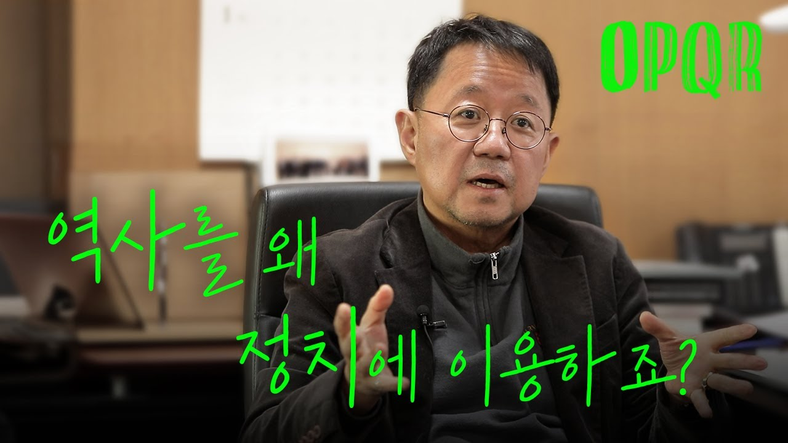
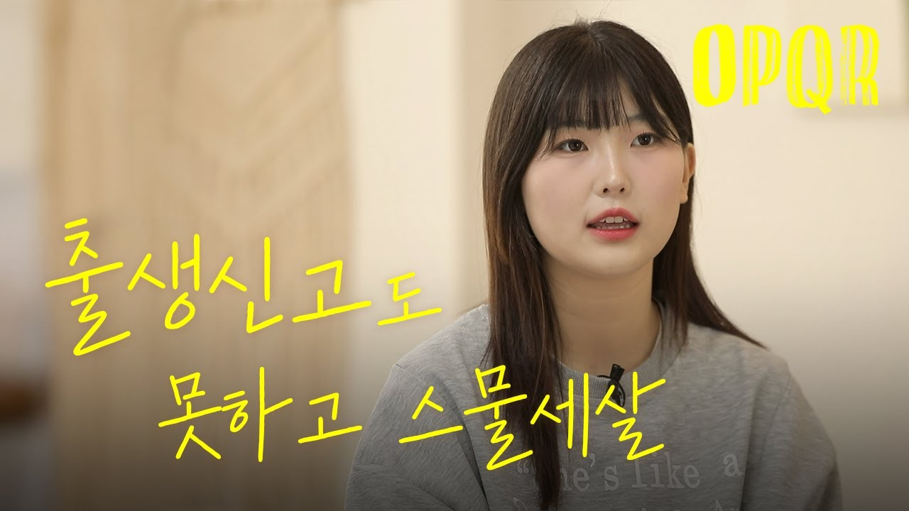
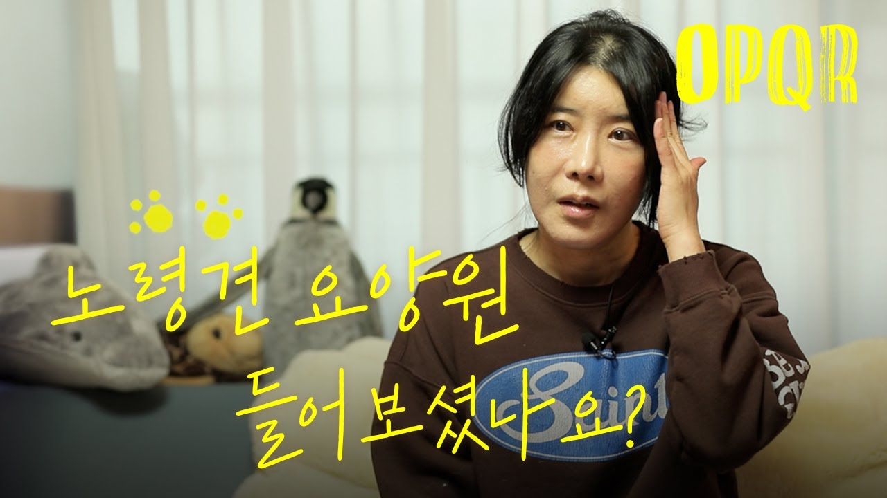

## 문서번호: 5501

### 제목: [청년도약계좌 좋은 정책인것 같습니다.  자리잡지 못한 중년층을 위한  정책 지원도 만들어 주세요.](https://q4all.kr/redirect/detail/542be857-3241-4539-8ab0-6703eef19928)

**작성자:** [정미진](https://q4all.kr/user/profile/7968)
**작성일:** 2025-03-10 03:07:10 (월요일)

---

청년도약계좌 엄청 좋은 정책인것 같습니다.

여러 지원 조건 중 나이만 해당이 되지 않고 다른 조건은 다 해당 된다면 중년층도 지원 할수 있었으면 합니다.

중년층이지만 아직 자리잡지 못한 사람들도 꽤 있습니다. (왜 나이로 지원 조건이 나뉘나요)

여러 지원 조건 중

개인소득 총 급여액 7,500만원 (종합소득 6,300만원) 이하 ......

제시된 조건에 모두 해당되고 나이만 혜당되지 않습니다.

(계약직으로 일하면 중년층이라 하더라도 급여가 생각만큼 올라가지 않습니다. 대부분 최저 시급으로 계산됩니다.)

여러가지 다른 조건 다 똑같이 해당되고 나이만 해당되지 않아서 지원 하지 못한다면 같은 조건의 "중년층 도약 계좌"도 만들어 주세요.

이런 좋은 정책이

자리 잡지 못한 중년층에게도 꼭 필요한 지원 정책입니다.

중년층을 위한 정책도 많이 만들어 주세요.

(제가 하고 싶은 말은... 꼭 이 정책만을 말하는것이 아니고

좋은 정책을

나이대로 나누지 말고 소득이나 재산 등.. . 다른 기준을 더 꼼꼼히 세워서

꼭 필요한 사람들이 소외되지 않고 모두 이런 좋은 정책을 이용할수 있었으면 좋겠습니다.

=========================================================================

지원 정책은 필요한 사람들이 소외 되지 않고 골고루 사용되어야 한다고 생각하는데

청년 충년 장년으로 구분 지으니 괜히 세대를 나누는것 같고 세대 갈등을 만드는것 같아 이 글을 쓰면서도 많이 불편합니다.

중년층을 위한 정책을 만들어 달라고 하긴 했으나....

세대 구분없이 소득 불균형이 일어나지 않게... (중년층도 자리 잡지 못한 사람들이 많습니다.)

조건을 잘 세워서 필요한 사람 모두 골고루 이용할 수 있었으면 좋겠습니다.

---

## 문서번호: 5502

### 제목: [말레이 마약 밀반입 무마](https://q4all.kr/redirect/detail/aeadfbdd-eda5-48bd-827e-2c76a0c8b056)

**작성자:** [이혜영](https://q4all.kr/user/profile/8394)
**작성일:** 2025-03-10 04:28:21 (월요일)

---

인천공항 세관들과 짜고

500만명분 1000억원어치의 마약 밀반입 사건을 덮어준 인천지검장이 경찰총장이 되었고 그 뒤에 있는 세력이 대통령이라는 게 사실입니까? 공천개입 부동산 주가 이제는 마약까지 이 엄청난 일이 정말 사실입니까?

---

## 문서번호: 5503

### 제목: [사회복지 필요성을 왜 개인 복지사들이 찾아내야 하는 걸까?.](https://q4all.kr/redirect/detail/3c307281-0de3-4020-82bb-ab1ccf5d9463)

**작성자:** [김진희](https://q4all.kr/user/profile/8395)
**작성일:** 2025-03-10 06:04:23 (월요일)

---

지역 소멸 위기 속에서 지역 사회복지사로 살아간다는 것

대한민국은 지금 지역 소멸이라는 거대한 위기에 직면해 있다. 특히 지방 도시들은 젊은 인구가 빠져나가면서 빠르게 고령화되고 있고, 남겨진 지역 사회는 점점 활력을 잃어가고 있다. 이런 상황에서 지역 사회복지사로 일한다는 것은 단순한 직업 이상의 의미를 가진다. 하지만 그 역할과 책임이 점점 커지는 반면, 이를 감당할 수 있는 제도적 지원은 여전히 부족한 것이 현실이다.

사회복지 프로그램, 왜 개별 복지사가 만들어야 할까?

국가는 사회 조사를 통해 정책을 수립하고, 사회복지 예산을 배정한다. 그런데 정작 현장에서 필요한 구체적인 프로그램은 지역 복지사들이 직접 만들어야 하는 구조다. 나는 늘 이 점이 의문이었다. 보다 전문적인 기관에서 프로그램을 개발하고, 이를 전국적으로 표준화하여 제공하면, 지역 간 복지 격차도 줄이고 복지사들의 업무 부담도 덜 수 있지 않을까? 하지만 현실은 다르다. 각 복지관마다, 각 복지사마다 새로운 프로그램을 기획하고 실행해야 한다.

문제는 지역 복지사들이 이러한 프로그램을 개발할 수 있도록 체계적으로 교육받을 기회조차 부족하다는 점이다. 프로그램 개발은 단순한 기획이 아니라 정책 분석, 예산 관리, 효과성 평가까지 포함해야 하는데, 이런 전문성을 갖추기란 쉽지 않다. 특히 지역 복지관들은 대도시와 달리 인적·물적 자원이 부족하다. 나는 사회복지사로서 수많은 프로그램을 기획하면서 늘 제한된 예산과 인력, 그리고 전문적인 교육의 부족을 실감했다.

지역에서 일한다는 것, 누구도 쉽게 상상하지 못할 현실

나는 지역 사회복지사로서 많은 도전을 경험했다. 새로운 프로그램을 기획할 때마다 \*\*"이게 정말 어르신들에게 효과가 있을까?"\*\*라는 고민을 수없이 반복했다. 국가에서 제시하는 기본적인 지침이 있지만, 그것만으로는 부족하다. 결국 현장에서 직접 부딪히고 배우면서 프로그램을 보완해야 한다.

한 번은 인지 건강 프로그램을 개발하면서 어려움을 겪은 적이 있다. 처음에는 대도시 복지관에서 시행한 프로그램을 참고하려 했지만, 지역 현실과는 맞지 않았다. 대상 어르신들의 학력 수준, 디지털 기기 접근성, 참여율 등 모든 것이 달랐다. 결국 나는 지역 특성에 맞춰 프로그램을 다시 설계해야 했고, 실행하면서 계속 수정하는 과정을 거쳤다. 이런 시행착오를 겪으면서 느낀 것은, 지역 사회복지사는 단순한 운영자가 아니라, 지역 문제를 해결하는 기획자이자 연구자여야 한다는 점이다. 하지만 정작 이를 위한 지원은 너무나도 부족했다.

이런 고민은 나 혼자만의 것이 아니다. 지역 복지사들은 한 명이 여러 역할을 감당해야 한다. 프로그램 기획, 사례 관리, 행정 업무, 지역 네트워크 구축까지 모두 한 사람이 해야 하는 경우가 많다. 그런데도 체계적인 지원 시스템은 부족하고, 교육 기회도 한정적이다. 결국, 경험을 통해 배우고, 현장에서 스스로 길을 찾아야 한다.

지역 복지를 지속 가능하게 만들려면?

지역 사회복지가 지속 가능하려면, 복지사들에게 더 나은 교육과 지원 시스템이 필요하다. 나는 다음과 같은 변화가 필요하다고 생각한다.

1. 프로그램의 표준화와 전문기관 개발

지역 복지사들이 개별적으로 프로그램을 기획하는 것이 아니라, 전문기관에서 검증된 프로그램을 개발하고, 이를 지역 상황에 맞게 적용할 수 있도록 해야 한다.

복지사들은 프로그램 운영과 대상자 맞춤형 조정을 담당하고, 기획의 부담을 줄여야 한다.

2. 복지사 교육 및 연구 지원 강화

단순한 직무 교육이 아니라, 지역 특성에 맞는 복지 기획, 예산 운영, 효과 평가까지 포함된 심화 교육 과정이 필요하다.

복지사들이 직접 연구하고 정책을 제안할 수 있도록 연구비 지원도 고려해야 한다.

3. 지역 복지사들의 역할 분담과 행정 지원 확대

복지사가 프로그램 기획부터 운영, 행정까지 모두 감당하는 구조가 아니라, 행정 전담 인력과 협업 시스템을 구축하여 역할을 분담할 필요가 있다.

복지사가 본연의 역할에 집중할 수 있도록, 실질적인 지원책이 마련되어야 한다.

결론: 지역에서 복지를 지킨다는 것

지역 소멸 위기가 가속화되는 지금, 지역 사회복지사는 단순한 서비스 제공자가 아니다. 우리는 고령화 속에서 지역을 지키는 마지막 보루이자, 소멸을 막기 위해 사회적 안전망을 설계하는 사람들이다. 하지만 그 역할을 제대로 수행하기 위해서는 더 나은 환경과 지원이 필요하다.

지역 복지사들이 전문성을 키우고, 프로그램 개발 부담에서 벗어나 보다 효율적으로 일할 수 있도록, 국가 차원의 체계적인 복지 시스템 개편이 절실하다. 나는 현장에서 매일 느끼고 있다. 지역에서 복지를 지킨다는 것은 그 누구도 쉽게 상상하지 못할 만큼 치열한 일이라는 것을.

---

## 문서번호: 5504

### 제목: [사회적으로 문제가 될만한 범죄로 발전 가능한 정신질환(뇌질환) 환자를 위한 제도적 장치 또는 경제적 지원](https://q4all.kr/redirect/detail/af917363-55cd-4e59-8fbd-0610cf6b65ed)

**작성자:** [김윤](https://q4all.kr/user/profile/3569)
**작성일:** 2025-03-10 06:55:01 (월요일)

---

사회적으로 문제가 될만한 범죄로 발전 가능한 정신질환(뇌질환) 환자를 위한 제도적 장치 또는 경제적 지원 방법이 있었으면 좋겠습니다.

정신질환자(질병에 따라 차이가 있지만\_일단 조현병 등)가 한 가정에 존재할 경우, 그 질환자를 실제 부양 해야만 하는 가족의 경제적 수준의 정도에 따라, 부담 해야 할 경제적인 부담과 정신적인 힘듦이 어느 정도인지 분석해서, 국가차원에서 어느정도를 어떠한 지원 방법으로 해야, 사회적 문제가 되는 범죄로 발전해 나가지 않을 수 있는지 대안이 필요하다 생각합니다.

뇌질환 전문 국립병원(신축 등)에서 지원 치료, 입원 관리를 받을 수 있거나,

인근 종합병원에서 정부지원금을 받아 치료, 입원 관리를 받거나,

또는 지역 보건소에서 치료, 입원 관리를 받는 방법 등등등...

부양 가족이 치료비가 감당이 되지않아, 치료를 포기해서 환자가 방치 되거나,

치료를 받고 있다 해도 약물 복용 관리나, 전문적인 행동관리 등이 적절히 이루어지지 못해 범죄로 이어져,

또다른 가정에 억울하고 안타까운 죽음으로 끝이 나는 현실이 가슴 아픕니다.

---

## 문서번호: 5505

### 제목: [등기부등본의 법적 효력](https://q4all.kr/redirect/detail/cd788def-1b51-4bf2-8db1-a7931532ad54)

**작성자:** [윤재복](https://q4all.kr/user/profile/8397)
**작성일:** 2025-03-10 07:12:31 (월요일)

---

부동산 거래시 등기부등본이 법적효력이 없다보니

부동산 전문가 조차도 피해를 보는 현실입니다

등기기관이 법적인 공신력을 가져야합니다

집 소유자가 등재를 할 때 등기기관이 다양한 각도로 검증을 해서

올려줘야 하고 손해가 발생시 등기기관이 직접 손해를 배상해줘야합니다

그래야 등기부등본을 믿고 편하게 거래할 수 있지 않겠습니까?

지금의 시스템은 사기를 너무 잘 치거나 잘 당하게 되어 있어요

---

## 문서번호: 5506

### 제목: [전세대출](https://q4all.kr/redirect/detail/7be47e55-1afa-4d41-a400-f0cbeb630c38)

**작성자:** [윤재복](https://q4all.kr/user/profile/8397)
**작성일:** 2025-03-10 07:23:16 (월요일)

---

전세 대출은 금지되어야 합니다

부동산 상승의 가장 큰 이유 중의 하나가

전세대출이라는건 이미 증명이 되었습니다

더 이상 전세대출제도를 유지하면 안된다고 생각합니다

---

## 문서번호: 5507

### 제목: [감사원장을 국회에서 임명하자](https://q4all.kr/redirect/detail/6aad3560-b8ee-4012-b0fd-d403b919a28c)

**작성자:** [장규홍](https://q4all.kr/user/profile/6048)
**작성일:** 2025-03-10 08:24:34 (월요일)

---

현재 대한민국 헌법 및 감사원법에 따르면, 감사원장은 대통령이 임명하며, 임명 시 국회의 동의를 받도록 규정되어 있습니다.

그러나 감사원이 정부 및 공공기관에 대한 독립적이고 공정한 감사를 수행해야 하는 기관이라는 점을 고려할 때, 행정부의 수장인 대통령이 임명권을 갖는 현행 제도는 감사원의 중립성과 독립성을 저해할 우려가 있습니다.

감사원은 국민을 대표하여 행정권을 감시하고 견제하는 역할을 수행하므로, 그 수장의 임명 과정에 국민의 의사가 보다 직접적으로 반영될 필요가 있습니다. 이를 위해 입법부인 국회가 감사원장을 직접 임명하도록 제도를 개선한다면, 감사원의 정치적 중립성과 독립성이 강화되고, 국민에 대한 신뢰도 제고에 기여할 수 있을 것입니다.

---

## 문서번호: 5508

### 제목: [내가 나라 걱정을 했다.](https://q4all.kr/redirect/detail/85ae8eba-3a4f-454e-a8fc-2857618a4089)

**작성자:** [김은희](https://q4all.kr/user/profile/8398)
**작성일:** 2025-03-10 08:41:59 (월요일)

---

국민이라면 당연한 나라 걱정인가요?

나라를 걱정하는 날이 올것이라고는 상상도 못했어요.

스트레스를 받고, 우울증이 생기고..주위에서는 쓸데없는 고민하지 말라고, 언제는 안 그랬냐면서 유난 떨지 말고 뉴스 그만 보라고 합니다.

북한과의 대립, 아동폭력, 성폭행 범죄, 살인... 말로 표현 못할 만큼의 걱정거리가 많지만

나라의 얼굴이라는 사람의 행동때문에 내가 걱정을 안고 살 줄 몰랐어요.

이것이 악몽이라면 좋겠어요.

---

## 문서번호: 5509

### 제목: [사기공화국 대한민국](https://q4all.kr/redirect/detail/25d89896-5114-4ad3-b536-c07c7b51fa77)

**작성자:** [김은희](https://q4all.kr/user/profile/8398)
**작성일:** 2025-03-10 08:58:52 (월요일)

---

며칠전에 유튜브에서 자주 보는 여자 변호사도 보이스피싱으로 큰돈을 잃었다고 한다.

작년 8월에 인터넷 주식 리딩방에 현혹되서 억대의 돈을 사기 당하고 경찰에 신고 했으나, 현재는 진행 상황도 모르고 있다. 가족에게도 숨기고 이런저런 알바 자리 찾아가면서 어떻게든 살아가려고 버티고 있다.

이렇게 발전하는 AI를 사기꾼들도 사용하겠지. 그들은 돈을 어마어마하게 벌고 있으니까 최고의 두뇌를 채용하고 최고의 시스템으로... 최고의 변호사도 구할 수 있으니까...

드라마나 영화속 이야기가 결코 현실보다 과장되었다고 할 수 있을까

---

## 문서번호: 5510

### 제목: [1,500만 대의 가스보일러를 탄소 중립을 할 수 있을까요? 우리나라는 왜 히트펌프를 고민하지 않을까요?](https://q4all.kr/redirect/detail/2550501c-4519-4e87-9171-47e948f8c9bf)

**작성자:** 전문가Q - 권필석
**작성일:** 2025-03-10 10:13:19 (월요일)

---

**1,500만 대의 가스보일러를 탄소 중립을 할 수 있을까요? 우리나라는 왜 히트펌프를 고민하지 않을까요?**

권필석 소장(녹색에너지전략연구소)의 질문

1. 질문의 맥락

❍ 우리는 상당한 수준의 히트펌프 기술을 보유하고 있으면서 탄소 중립과 거리가 먼 가스보일러를 언제까지 써야 할까요?

① 탄소 중립에 힘써야 하는 상황이지만 여전히 화석연료 사용

• 우리는 기후변화의 심각성을 체감하면서도 여전히 일상 속에서 화석연료를 사용하며 탄소 배출을 하고 있습니다.

- 대한민국에 살고 있는 수많은 사람들이 생활 속에서 가솔린이나 디젤을 연료로 하는 자동차를 타고, 가스보일러를 이용해 난방을 하고 있습니다.

- 유럽과 미국에서는 가정용 난방기기로 히트펌프 보급이 빠르게 확대되고 있는 반면, 우리는 여전히 가스보일러에만 의존하고 있습니다.

- 특히 유럽은 탄소 중립 목표에 맞춰 히트펌프 전환을 적극 추진하고 있으며, 독일은 2024년부터 연간 50만 대의 히트펌프 설치 목표를 세우고, 영국은 2028년까지 연간 60만 대 보급을 목표로 다양한 보조금 정책을 운영하고 있습니다.

- 미국에서도 히트펌프 보급이 꾸준히 증가하여 2022년에는 판매량이 430만 대에 달하며, 천연가스 보일러 판매량을 넘어섰습니다. 또한, 미국 정부는 ‘IRA(Inflation Reduction Act)’를 통해 히트펌프 설치비 지원을 확대하고, 주별로 추가적인 보조금 제도를 운영하며 보급을 촉진하고 있습니다. 반면, 우리는 기존 가스보일러보다 효율이 약 10% 향상된 콘덴싱 가스보일러를 친환경 제품으로 포장해 오히려 화석연료 보일러의 확산을 지원하고 있는 실정입니다.

② 유럽, 미국 등 히트펌프 보급 보편화

- 히트펌프는 외부 열을 이용하여 내부 공기를 따뜻하거나 차갑게 만들어주는 냉·난방 장치로, 냉매의 상태 변화(증발과 응축) 과정에서 발생하는 열전달을 통해 저온의 열원을 고온으로 끌어올리는 방식으로 난방을 합니다.

- 러시아-우크라이나 전쟁 여파로 가스 요금이 급등하면서, 이에 대응하기 위한 정부의 설치 보조금과 정책 지원이 확대됨에 따라 유럽에서는 히트펌프 보급이 빠르게 증가하고 있습니다. 그 결과, 많은 시민들이 경제적 부담을 줄이고 에너지 효율을 높이기 위해 히트펌프로 전환하고 있으며, 독일에서는 히트펌프 수요가 폭발적으로 증가해 설치 인력이 부족한 상황까지 벌어지고 있습니다.

- 아이러니한 점은 LG와 삼성이 세계적인 수준의 히트펌프 기술력을 보유하고 있으며, 유럽과 미국 시장에 적극적으로 수출하고 있음에도 불구하고, 정작 우리나라에서는 히트펌프를 설치해 사용하는 가구가 극소수에 불과하다는 것입니다.

③ 전기화를 저해하는 누진 요금제

• 전기 사용 정도에 따른 누진 요금제는 전기화를 고민하는 각 개인에게 큰 장애물이 될 수밖에 없습니다.

- 현재 우리나라에 보급되어 있는 도시가스 보일러는 1,500만 대 수준(가스안전공사 전국 도시가스 보일러 현황 DB)이며, 하루아침에 1,500만 대 모두를 교체할 수 없으므로 가스보일러의 수명을 고려하여 10년 정도를 계획하여 전기화해야 합니다.

- 일부에서는 전기를 사용하는 것이 결국 화력 발전소에서 생산된 전력을 소비하는 것이므로 탄소 배출량이 크게 줄어들지 않는다고 반문할 수 있습니다. 그러나 현재 전력망은 재생에너지의 비중이 점점 증가하고 있으며, 전기를 직접 활용하는 기술(예: 전기차, 히트펌프 등)은 화석연료를 직접 연소하는 장치보다 훨씬 높은 에너지 효율을 가집니다. 예를 들어, 내연기관 자동차보다 전기차의 에너지 변환 효율이 더 높듯이, 히트펌프 또한 가스보일러보다 적은 에너지로 더 많은 열을 생산할 수 있어 탄소 배출 감축 효과가 큽니다. 따라서 탄소 중립을 위해서는 난방과 이동 수단을 포함한 전반적인 전기화가 필수적입니다.

- 그러나 현재의 전기 요금 체계, 특히 누진 요금제가 개선되지 않는다면, 가스보일러를 히트펌프로 전환하는 것은 경제적 부담으로 작용할 수밖에 없습니다. 이에 따라 효과적인 전기화 전환을 위해서는 합리적인 전기요금 개편과 함께 재생에너지 확대 정책이 병행되어야 합니다

2. 해결방안

❍ 탄소 중립 목표 실현을 위해 1,500만 가스보일러를 대체할 수 있는 히트펌프를 적극 도입해야 합니다.

➀ 히트펌프 전용 요금제

• 히트펌프의 장점(고효율, 친환경성)을 최대한 활용하려면, 현재의 누진 요금제를 개선하거나 히트펌프에 맞춘 별도의 요금제를 적용하는 것이 필요합니다.

- 전기차의 경우 가정에서 충전할 때 일반 누진 요금과 별개로 전기를 사용할 수 있는 요금제가 적용됩니다.

- 히트펌프 전용 요금제를 도입한다면, 난방비용 부담을 줄이면서도 탄소 배출을 줄이는 효과를 얻을 수 있습니다.

➁ 히트펌프와 재생에너지 연계

• 히트펌프와 열 저장소를 활용하면 남는 전기를 효과적으로 저장하고 사용할 수 있습니다.

- 재생에너지가 많이 생산될 때, 히트펌프를 이용해 미리 뜨거운 물을 데워 보온성이 뛰어난 탱크에 저장해 두면 이후 난방이나 온수로 사용할 수 있습니다. 이 방식은 배터리보다 훨씬 저렴하고 효율적이며, 재생에너지 활용도를 높이는 데 기여합니다.

- 현재 제주도뿐만 아니라 육지에서도 재생에너지 출력 제한(출력 제어)이 발생하고 있으며, 이는 재생에너지를 충분히 활용하지 못하는 주요 원인 중 하나입니다. 하지만 전기차나 히트펌프를 건물에 많이 설치하면, 재생에너지가 과잉 생산될 때 남는 전력을 저장하고 필요할 때 활용할 수 있어 전력 사용의 유연성이 높아집니다.

• 이러한 방식은 재생에너지 기반의 전력망을 더욱 안정적으로 운영할 수 있도록 돕고, 에너지를 낭비하지 않으면서 전기를 더욱 효율적으로 활용할 수 있는 효과적인 해결책이 됩니다.

➂ 히트펌프와 패시브 하우스 및 도시가스 소외지역 연계

• 패시브 하우스는 단열과 기밀성이 뛰어나 마치 보온병처럼 열이 잘 빠져나가지 않는 집이므로 난방 에너지가 적게 필요하기 때문에 히트펌프를 효과적으로 활용할 수 있습니다.

- 패시브 하우스에 사는 사람들은 전기요금을 줄이기 위해 태양광을 설치하는 경우가 많고, 이를 통해 누진 요금을 피하면서도 히트펌프를 사용할 수 있습니다. 하지만 히트펌프는 아직 일반적인 보일러만큼 대중적이지 않으며, LG나 삼성과 같은 대기업에서도 주거용 히트펌프 제품 라인업이 충분하지 않은 상황이라 이에 대한 개발이 병행되어야 합니다.

- 아울러 도시가스가 닿지 않는 지방에서는 아직도 LPG나 등유를 사용하는 경우가 많지만, 장기적으로 보면 이런 방식은 비효율적이므로 히트펌프와 태양광을 함께 설치하면 더 경제적이고 친환경적인 난방이 가능할 것입니다.

➃ 아파트형 히트펌프 시범 단지

• 히트펌프를 본격적으로 확산시키려면 신규 택지에 히트펌프 단지를 조성하는 것이 매우 중요합니다.

- 아파트에 적용할 히트펌프 기술은 아직 충분히 검증되지 않았고, 해외에서도 사례가 적어 참고할 곳이 없으므로 정부와 민간이 협력하여 시범 단지를 조성해 히트펌프 아파트 모델을 만들어야 합니다.

- 신규 택지에 히트펌프 기반의 시범 단지를 조성하고, 태양광과 결합하여 에너지를 효율적으로 활용하는 모델을 구축하는 것이 중요하며, 이런 방식으로 히트펌프가 우리나라의 주요 난방 방식으로 자리 잡을 수 있도록 준비해야 합니다.

---

## 문서번호: 5511

### 제목: [저출생·고령화로 인한 복지재정의 장기적 위기, 이제는 민주적 통제로 대응해야 하지 않을까요?](https://q4all.kr/redirect/detail/24737963-23b3-4ff6-a728-1cbc481cefa0)

**작성자:** 전문가Q - 김성욱
**작성일:** 2025-03-10 10:21:36 (월요일)

---

**저출생·고령화로 인한 복지재정의 장기적 위기, 이제는 민주적 통제로 대응해야 하지 않을까요?**

김성욱 교수(호서대학교 사회복지학부)의 질문

1. 질문의 맥락

❍ 단기성과에 매몰된 정부와 국회가 저출생·고령화 대응이라는 장기적 사회혁신 프로젝트 수행의 적임자라 할 수 있을까요?

① 급격한 고령화와 높은 수준의 노인 빈곤 문제

• 우리 사회 4-50대 중장년층 대부분은 불안정한 노동시장이 높은 수준의 노후빈곤으로 이어지는 취약한 가구경제 구조에 노출되어 있습니다.

- 어르신들의 자연적 사망과 지속적인 노후소득보장제도 확대에도 노인 빈곤률이 줄어들지 않는 원인 중 하나는 불안정한 준고령자 계층이 끊임없이 빈곤층으로 유입되는 데에서 기인합니다.

- 특히 30대, 늦어도 40대 초반부터는 멀지 않은 미래에 주된 노동시장에서 퇴출된다는 불안감과 함께, 40대 중·후반에 불안정한 노동시장으로 내몰리는 현실 속에서 자녀들에 대한 양육과 부모에 대한 부양이 개인의 노후 대비를 어렵게 만드는 3중 부담은 우리의 열악한 노후소득보장제도의 어두운 단면입니다. 그러나 아이러니하게도 이들 중장년 계층은 소득보장제도에서 거의 배제되어 있는 집단이기도 합니다.

- 우리가 겪는 ‘급격한 고령화’는 단순히 사회적 노화가 빠르게 진행되는 것이 아니라, 가난하거나 가난할 가능성이 높은 집단의 규모가 증가한다는 것을 의미합니다. 그러나 노인에 대한 상당한 재정지출 전망에도 불구하고, 우리 사회는 이를 효과적으로 예방하거나 대응할 방안을 마련하지 못하고 있습니다.

② 고령화 문제의 핵심은 노인 인구 증가가 아닌 저출생

• 이처럼 불안정한 준고령자의 폭발적인 증가를 고려할 때 이들을 사회적으로 부양할 수 있는 생산가능인구의 감소는 매우 심각한 문제입니다. 즉 저출생 극복여부는 재정측면에서 고령화 문제 해결의 핵심입니다.

- 고령화로 인한 중장기적인 대한민국 복지재정 위기를 해결하는 방법은 저출생 문제를 해결하는 것입니다. 문제는 정치인들에게도 정부 관료들에게도 전혀 매력적이지 않은 정책 사업으로 여겨지고 있다는 점입니다.

- 왜냐하면 저출생 문제를 해결하기 위해서는 오랜기간 상당한 재정을 들여야 할 뿐만 아니라 경제·노동·사회구조와 조직문화에 이르기까지 지속적으로 개선해야 하는 장기간의 대규모 프로젝트이기 때문입니다.

- 임기가 정해져 있는 정치인들과 정부 관료들 입장에서는 대규모 재정이 장기간 투입되고 당장 성과를 예측하기 어려운 사업을 실행해야 할 유인이 적을 수밖에 없습니다. 문제만 부각시킬 뿐 실제 발 벗고 나서지는 않는 이들에게 지금처럼 미래 한국사회의 가장 첨예한 사회문제가 될 고령화와 재정위기의 문제를 온전히 맡기는 것이 타당한지 질문할 필요가 있습니다.

2. 해결방안

❍ 복지 재정의 민주적 통제 강화가 저출생·고령화 문제 해결을 위한 첫 걸음입니다.

➀ 저출생·고령화에 대한 본질적 이해와 해법에 대한 국민적 논의 필요

• 장기적인 프로젝트에 대한 국민들의 이해를 어떻게든 하나로 모아서 합의를 끌어내려고 하는 과정은 저출생·고령화 문제의 해결에 중요합니다.

- 우리는 얼마 전 국민연금과 관련한 공론화를 시도했고, 세계 최초로 굉장히 많은 논의 과정을 통해 합의를 도출한 경험이 있습니다.

- 이는 사회적 현안에 대해 시민들의 참여를 보장하고, 시민의 목소리를 적극적으로 반영하는 방식으로도 사회적 합의를 이끌어 낼 수 있다는 소중한 경험이었습니다.

➁ 삶과 직결한 보건복지 재정의 민주적 통제 강화 필요

• 대규모 재정의 배분과 집행 권한을 특정 주체에게 지나치게 집중시키면 결국 부패할 가능성이 높아집니다.

- 국회가 민주적 통제의 가장 큰 역할을 하고 있지만 재정과 관련해서는 행정부에 대한 국회의 통제 능력이 현저히 떨어지는 상황이며, 국회가 재정에 대한 민주적 통제 역량을 갖는 것을 구조적으로 기대하기는 사실상 어렵습니다.

- 보건복지 재정의 규모와 분배 방식을 결정하는 과정에서 시장의 다양한 주체들의 전망을 독식하거나 통제하려는 재정 관료들의 권한을 분산시키고 민주적으로 통제할 수 있는 법적·제도적 수단들을 만들어야 합니다.

➂ 보건복지 재정 배분과 집행 시, 투명성 강화 필요

• 막대한 권한과 재정을 통제하고 정책을 심의·의결하는 보건복지 관련 각종 위원회들이 있습니다. 그러나 회의록조차 공개를 하지 않고 폐쇄적으로 운영하는 위원회가 여전히 존재합니다.

- 이러한 폐쇄성에 기대어 재정당국과 이해관계 기관 및 단체들은 가감 없이 본인들의 밑바닥 욕망들을 거침없이 드러내며 국민들이 이해할 수 없는 결정을 내리고 있는 실정입니다.

- 주요 보건복지 재정이 논의되는 각종 위원회의 회의록과 관련 자료가 적어도 국회에는 투명하게 보고될 수 있도록 통제할 수 있는 법제화 방안 마련이 시급합니다.

➃ 자체 예산 편성이 가능한 독립적인 저출생·고령화 기구 필요

• 정부, 특히 재정당국으로부터 독립적인 저출생·고령화 전담기구에 장기간 근무할 수 있는 전문적인 공무원들을 배치하고, 장기적 플랜과 밀도 있는 논의를 할 수 있는 조직 체계를 갖추어야 합니다.

- 재정 당국의 강력한 예산 통제 하에서는 어떤 보건복지 정책도 장기적인 비전을 가지고 추진할 수 없는 구조입니다. 국회의 통제 하에 자체 운영 및 사업예산의 편성이 가능한 독립적인 전담기구의 출범이 요구됩니다.

- 아울러 해당 기구를 통해 국민들이 참여하는 저출생·고령화 해법 모색의 공론화를 추진함으로써, 민주적 통제를 통한 사회적 합의를 도출해 나가도록 법제화 할 필요가 있습니다.

---

## 문서번호: 5512

### 제목: [한국의 스타트업과 한국의 혁신 기업이 인류의 문제를 푸는, 인류 전체에서 최상위권에 드는 기업이 되려면 대한민국 정부는 무얼 지원해 주어야 할까요?](https://q4all.kr/redirect/detail/c78d8dce-dd98-4fba-87fa-c52afe62bf60)

**작성자:** 전문가Q - 류중희
**작성일:** 2025-03-10 10:24:53 (월요일)

---

**한국의 스타트업과 한국의 혁신 기업이 인류의 문제를 푸는, 인류 전체에서 최상위권에 드는 기업이 되려면 대한민국 정부는 무얼 지원해 주어야 할까요?**

류중희의 질문

1. 질문의 맥락

❍ 미국에서 몇 조 원씩 투자를 받은 스타트업과 한국에서 몇 백억 원 투자를 받기도 힘들어 하는 스타트업 간 경쟁이 가능할까요?

① 대규모 자금 지원이 어려운 대한민국 자본시장과 금융 시스템

• 인류사적으로 기여할 수 있는 한국 창업자들은 이미 나오고 있고, 이들의 연구 개발에는 천문학적인 돈이 들어가는데, 대한민국에는 천문학적인 돈을 지원해 줄 수 있는 시스템이 없습니다.

- 10여 년 전에는 주로 전자, 전산 등을 전공한 사람들이 소프트웨어를 만들거나 작은 하드웨어를 만드는 창업이 대부분이었다면, 지금은 로봇으로 대표되는 기계 공학은 물론이고 화학·생물학·의학 등 이른바 하드 사이언스 분야의 사람들까지 창업하는 사례가 나오고 있으며, 그 중에는 세계적인 기술을 갖고 계신 분들 세계적으로 많이 인용되거나 상을 받은 논문을 낸 연구자분들도 많습니다.

- 이와 같은 분들이 하는 연구 개발에는 천문학적인 돈이 들어가는데 대한민국의 자본시장은 너무 약합니다.

② AI 연구 경쟁으로 천재급 인재 확보 경쟁 심화

• 세계적인 연구자들을 얻기 위해 국가 간 경쟁이 일어나고 있습니다.

- 지난 해 노벨상 2개 부문은 난제를 풀어낸 AI가 수상했다고 봐도 과언이 아닐 정도로 AI는 단순히 우리 일상의 문제를 푸는 차원을 넘어 인류가 새로운 지식의 지평을 뚫을 수 있는 조언자·조력자로서 이미 자리매김을 했습니다.

- 이와 같은 AI를 대규모 모델로써 훈련시키고 추론하게 만들기 위해서는 천문학적으로 많은 GPU 등 컴퓨터 자원과 수많은 연구자들이 필요합니다.

- 이런 연구자들을 얻기 위해 전 세계적으로 경쟁이 일어나고 있을 뿐만 아니라 천재급 인재를 구하기가 매우 어려워 연구자의 연봉이 수십억 원에 이를 정도로 가치가 천정부지로 치솟고 있습니다.

③ 설립한 지 1년도 안된 회사를 5조 원의 회사가치로 인정해 줄 수 있는 문화와 그에 걸 맞는 자본시장이 없는 대한민국

• 끝까지 성장하기 위해서 천문학적인 자금이 지원되어야만 성공할 수 있고 성취할 수 있는 영역이 열리고 있는데, 우리는 여기에 투자할 수 있는 여력도 경험도 없습니다.

- 최근 미국에서 가장 주목받는 ‘로봇과 AI의 교집합 영역’인 이른바 ‘피지컬 AI(Physical AI)’ 또는 ‘리얼 월드 AI(Real World AI)’라 불리는 영역이 있습니다.

- 이 영역에서는 “지금까지의 AI 연구 성과를 로봇이라는 몸에 집어넣어 로봇을 동작시키는 것이 AI의 끝판 왕이다.”라고 얘기하는데, 이걸 실현하기 위해서는 정말 천문학적인 돈이 필요합니다.

- 그러나 우리의 벤처 생태계 또는 초기 창업뿐만 아니라 그 뒤에 회사가 IPO 등 투자를 받아야 하는 상황을 고려한다면, “휴머노이드 로봇은 자동차보다 많은 부품으로 이루어져 있는데 이런 것들을 어디서 양산하나요?”, “우리가 어디서 이런 로봇을 테스트 할 수 있을까요?” 등 ‘천문학적인 비용이 들어갈 수밖에 없는 질문’에 대한민국은 쉽게 답하기 어렵습니다.

- 아울러 우리나라 자본시장의 근본적인 취약점 중 하나는 증권 시장이 약하다는 것이며, 이른바 ‘코리아 디스카운트(Korea discount)’가 너무 심해 몇 개 회사를 제외하고는 훌륭한 기술력을 가지고 매출과 영업이익을 내는 회사라 하더라도 시가총액이 낮은 수준에 있습니다.

- 반대로 미국의 경우에는 만들어진 지 1~2년밖에 안 된 스타트업들이 첫 번째 시드 라운드(Seed Round)에 1~3조 원 정도 되는 펀딩을 받고, 기업가치가 2~5조 원을 달성한 사례가 있습니다.

- 결국 미국에서 몇 조 원씩 투자를 받은 경쟁자와 한국에서 몇 백억 원 투자를 받기도 힘들어 하는 경쟁자 사이에 아무리 훌륭한 연구자들이 똑같이 있다고 해도 경쟁이 가능할지 의문입니다.

2. 해결방안

❍ 대한민국 정부는 ‘대한민국 스스로 강한 자본시장을 갖는 장기적인 방안’과 ‘당장 5~10년 천문학적인 자본을 조달할 수 있는 단기적인 방안’을 마련해야 합니다.

➀ 장기적인 방안은 대한민국이 강한 자본시장을 스스로 가지는 것

• “우리나라가 중장기적으로 자본이라는 시장에 대해 어떤 관점과 철학을 가질 것인가?”를 명확하게 정하고 하나의 원칙을 세우는 것이 중요하며, 이에 대해 여러 정부가 서로 이어달리기를 해야 합니다.

- 현재 우리나라는 과거 한국전쟁 직후 상황 보다는 훨씬 더 강력한 자본시장을 가지게 되었고, 75년이 걸려 이룩한 현재의 자본시장을 가능한 일인지는 모르겠지만 미국과 겨룰 만한 자본시장으로 만들겠다고 상상해보면 아마도 또 다른 75년이 필요할 수도 있을 것입니다.

- 향후 우리는 싱가포르와 같이 자본시장을 굉장히 글로벌 지향적으로 오픈하고 이에 맞는 세제 혜택을 주며 극단적인 자유경제를 추구하는 시스템을 벤치마킹 하거나, 최근 글로벌 투자를 늘리고 있는 UAE 등 중동 국가의 국부펀드들을 벤치마킹할 필요가 있습니다.

- 따라서 ‘기존에 우리가 지켜야 할 가치’ 보다는 ‘앞으로 가져야 할 가치’가 더 크다는 것을 믿고, 대한민국의 자본시장 자체를 글로벌 플레이 그라운드로 개방하는 방식의 장기적인 전략이 필요합니다.

➁ 단기적인 방안은 우리나라 내부에서 자본을 조달하거나, 할 수 없다면 외부에서 적극적으로 자본을 조달하는 것

• 새로운 한국 정부는 미국의 벤처 캐피탈이 한국 시장과 한국발 스타트업에 관심을 가질 수 있도록 총력을 다 해야 합니다.

- AI와 로보틱스 패권은 길면 10년 짧으면 5년 내에 자리를 잡을 것이고, 세계 1~5위 기업들은 결정될 것입니다.

- 이른바 스타트업 문화, 벤처 문화를 만든 국가는 미국이며, 미국에서 수 조 원 단위의 투자를 하는 벤처 캐피탈은 한국 시장에는 관심이 전혀 없습니다.

- 아울러 미국의 벤처 캐피탈들은 미국 델라웨어 주에 설립된 회사, 이른바 델라웨어 시콥이라고 불리는 회사 형태가 아니면 투자를 거의 하지 않으므로, 결국 미국 법인으로 전환을 해야 투자를 받을 수 있는 상황입니다.

• 법인을 미국에 만들건 일본에 만들건 한국에 만들건 그 시작점이 한국이고, 한국에 R&D 센터가 있고, 한국의 데이터를 활용하고, 굉장히 많은 채용이 일어나고, 한국의 산업계에 좋은 임팩트를 준다면 그것에 대해 과감하게 한국의 정부 또는 한국의 시민사회가 지원할 수 있어야 합니다.

- “우리가 우리의 자본으로 우리의 연구자만으로 한국 내에서 연구개발을 하는 것으로 전 세계 1등을 할 수 있을까요?”라고 질문한다면 “현실적으로 어렵다.”는 답변을 할 수밖에 없습니다.

- 그렇다면 “한국의 연구자가 훌륭해.”, “한국에 있는 공장 데이터가 굉장히 의미가 있어.”, “그런데 자본은 한국이 약하니 자본이 가장 강한 미국을 끌어들이고, 첨단 공정은 일본과 대만이 강하니 두 나라도 끌어들이자.”와 같은 방식으로 연합군을 만들어서 진짜 인류의 게임을 한다면 한국이 주도할 수도 있습니다.

- 종국적으로 승리하는 회사는 그 어떤 나라의 회사가 아니라 인류의 회사가 되는 것입니다.

• 천문학적인 자본이 필요한데 한국이 그 자본을 조달할 수 없다는 걸 인정해야만 이 문제를 풀 수 있습니다.

- 과거 산업사회처럼 “이 회사의 국적이 어디야? 이 회사가 어디에 등록되어 있어? 1차적으로 세금을 어디에 내?”와 같은 국적을 판별하는 우를 범하지 말아야 합니다.

- 미국을 위주로 한 거대 자본과의 연결고리를 만들지 못하면 세계적인 경쟁력을 가진 회사는 한국에서는 절대로 나올 수 없습니다.

- “우리가 글로벌 스케일의 게임을 우리의 우방국들과 함께 인류 전체의 지혜를 모아서 어떻게 해나갈 것인가?”가 다음 정부가 풀어야 하는 숙제가 될 것입니다.

• 공공성과 수월성의 두 마리 토끼를 한 번에 잡아야 하는 한국의 모태펀드를 공공성에 중심을 두는 방향(모태펀드 1)과 수월성에 중심을 두는 방향(모태펀드 2)으로 나누어 운영할 수 있는 방안도 검토할 필요가 있습니다.

- ‘모태펀드 1’은 창업을 할 때 자금 스트레스를 받지 않고 회사를 만들 수 있도록 돕는 역할을 하며, 최대한 많은 스타트업을 지원하되 성공한 회사가 실패한 회사를 커버하는 정도로 은행 금리만큼 수익을 유지함으로써 국민의 세금을 최소한으로 쓰면서도 창업을 최대한 장려할 수 있도록 하자는 것입니다.

- ‘모태펀드 2’는 철저하게 이익 기반으로 국가대표 선수급의 슈퍼 엘리트 회사만 투자하며, 예를 들어 “미국에서 1조 투자를 받았다면 한국에서 1조 투자 받게 해줄게.”라는 역할을 하는 것으로 극단적으로 1년에 10개 회사만 직접 투자하거나 심지어 투자를 잘하는 벤처 캐피탈과 함께 협력해서 투자할 수 있는 방안도 검토해 보자는 것입니다.

---

## 문서번호: 5513

### 제목: [진정한리더와 감사](https://q4all.kr/redirect/detail/bd8f012e-9d6a-4c71-9f21-ca8205df42d3)

**작성자:** [홍연희](https://q4all.kr/user/profile/8409)
**작성일:** 2025-03-10 11:26:37 (월요일)

---

작금의 시대를 한탄하며~

이제 국민의 뜻에 따라 키워진 진정한 리더에게 힘을 모우고 의견을 내는 적극적 행동에 참여하기를 바라며 글을 올립니다

한사람이 세상 바꿉니다

이 공간을 마련해 주신 기획자들에게 감사드립니다

---

## 문서번호: 5514

### 제목: [TV에서 힘든 사연이 나오고 후원 요청 프로그램이 나올때마다 화가 납니다.도대체 국회와 정부는 뭐하고 있나요?](https://q4all.kr/redirect/detail/2fc0ff4b-9c90-4c8c-956e-a20ae62089a9)

**작성자:** [도완영](https://q4all.kr/user/profile/892)
**작성일:** 2025-03-10 13:50:24 (월요일)

---

국내 사례들에 대한 이야기입니다.

사연을 볼때마다 안타까울수록 화가 납니다.

저건 국가와 사회가 해야 하는 일인데 뭐하고 있는가

국회 보건복지위와 보건복지부에서는 저런 프로그램보고

리스트만들고 대응하고 있는가?

왜 매번 비슷한 사연들이 올라오는가?

저런 사연들를 그저 보고만 있다면 그 부서와 국회의 해당

위원회는 제대로 일하고 있는게 맞는가 하는 의심이 듭니다.

사례는 민간이 먼저 발굴하더라도 해결은 민간과

경쟁에서 국회와 국가가 이겨야 존재의 가치가 있지 않을까요?

---

## 문서번호: 5515

### 제목: [왜 한국은 아직도 초등학생의 운동회부터 거의 모든 공식행사에서 당연하다는 듯 전체주의와 파쇼적 행동양식을 강요하고 일제와 독재자들의 상징이었던 '국민의례와 애국가제창'을 강요할까요?](https://q4all.kr/redirect/detail/0d80359a-b17f-46dc-8c6f-a8fbb279b5ff)

**작성자:** [조윤서](https://q4all.kr/user/profile/2508)
**작성일:** 2025-03-10 14:24:31 (월요일)

---

지금의 모든 내란사태와 한국의 파쇼의 기원이자 거대축은 결국 파쇼적 교육에 있다고 생각합니다

김누리교수님의 견해에서도 볼수있듯이요

한국은 불과 한두세대 전까지도 교련이라는 전두환작정희 독재정부집단을 위한 군사교육관련과목을 곻등학교 학교시간표에 반영했었던 국가이고

공식행사의 대부분에서 도열하여 학교의 주인인 학생을 학교의 직원들이 마치 수용소의 감시자들마냥 내려다보는 구조로 진행하는 경우가 대부분입니다.

이는 심지어 반민주저항이 존재목적이자 이유인 민주당의 관련 공식행사에서도 이같은 모습으로 진행합니다

이는 분명 2025년의 내란이 진행되고있는 국가의 서열주의교육과 서열주의가 절대교리인 그 모든 한국 반민주집단의 상징과도 같은 모습입니다.

우리는 모두 평등하고 학교의 주인은 학생전체, 당의 주인은 당원전체, 지역의 주인은 지역주민전체라는 형식적으로도 상징화하는 청산의 모습을 보여야 한다고 생각합니다.

세상 어느 민주주의 국가에서 마치 군대처럼 장엄한 군대열병식 같은 곡을 틀고 크고작은 행사떄마다 애국가를 강제하고 국기에 대한 맹세를 강제할까요?

심지어 초등학교 부터 고등학교까지 이런 환경에 노출된다면 그 사람이 갖는 근본적 생각은 내가 있는곳의 주인은 나다가 아니라

나를 내려다보며 저 위에 서서 국가와 맹세를 강제하고 지휘하는 선생, 교장이나 조직의 관련진행자들이라고 생각할게 너무나 뻔한거 아닐까요?

이제 우리 모두 국가의 주인은 우리 모두이지 특정성적을 맏은 사람이나 특정직업군, 특정소득계층이 아니라는걸 형식적 절차적 교육적으로도 보여야하지 않을까요?

---

## 문서번호: 5516

### 제목: [기후재앙에 대비하는 여러 농업 방향 중 저탄소 농업 즉 친환경농업에 대한 지원과 정책 지금 이대로면 농업보다 친환경농업이 먼저 끝날겁니다.친환경농업 이대로 끝나도 괜찮을까요?](https://q4all.kr/redirect/detail/7984609f-2ca8-4c26-8bb6-018f9d32c24a)

**작성자:** [도완영](https://q4all.kr/user/profile/892)
**작성일:** 2025-03-10 14:59:01 (월요일)

---

친환경 농업은 국내에서는 유기농업이라고 불립니다.

일반농업에서 유기농업으로 전환하는 경우 유기농업 인증이 나오기

이전의 인증을 무농약 인증이라고 합니다.

그런데 유기농업으로 생산하는 농산물은 일반 농산물에 비해 비쌉니다.

또 못생겨서 모양과 색깔로 상품성을 볼때 경쟁력도 떨어집니다.

그래도 지금까지 유기농업에 산념을 가진 농부들의 노력과

유가농산물을 찾는 소비자들이 계셔서 그런대로 버텨왔다고 할수 있습니다.

그런데 기후 재앙이 시작되고 농업에 타격이 생기면서 일반 농업에

비해 생산량이 작아 규모의 경쟁력이 약해 생산물 가격이 비싼

유기 농업 농가는 아무래도 일반 농가 보다 농산물 생산량이 비례해서

타격을 받아 재정적 타격을 견디지 못한 농가들은 속속 유기농업을

포기하고 있습니다. 유기농업 인증에 도달못한 무농약 농가도 마찬가지

입니다.

유기농업 농가 입장에서 일반 농업 농가를 볼때 각종 농약,호르몬제,

비료 등으로 병해충과 기후재앙에 대응이 쉬운 걸 알지만 신념으로

버텨온겁니다.그것이 한도를 넘어선 상황입니다.

원래 우리 나라 유기 농업에 대한 정부와 사회의 규제는 다른 나라에 비해

이상하고 국제적 기준에도 맞지 않습니다.유기 농업에 사용되는 친환경 자재가 다른 나라에서는 가능하지만 안되는게 여러가지 있습니다.예를들어 우리 나라에서는 공장 생산은 안되고 자가 제조는 되는 식입니다.

또 친환경 인증 농산품을 납품한다더니 무농약 인증 농산물은 어떻게 인증한다고 해도 친환경 농산물 인증이 아닌 농약사용규제 인증인 GAP 농산물을 납품시키곤합니다.

다른 나라들은 친환경 농산물이 일반농산물보다 싸게 시장에 나오게 하기 위해 보조금을 줘서 친환경 농가가 늘어나 소비자들에게 친환경농산물의 접근을 쉽게 하는데 그에 비하면 우리는 형식적 지원의 흔적 정도만 있습니다.

유럽은 추가로 친환경 농법을 도입하는 농가에 대한 보상 체계 입법을 [젊은 세대 농업진출 촉진 위해 소득 보장·공공지원 확대, ‘농산물 생산원가 이하 판매 금지’ 불공정 거래 개정 추진]에 포함 시켜 식량 안보에 같이 취급하는 입법을 하려고 하고 있습니다.

그에 비해 우리는 농업도 포기할 지경인데 상대적으로 보면 지원하는 흔적만 있는 친환경농업은 그보다 먼저 사라질것 같습니다.

저탄소농법이기도 한 친환경농업 사라지게 둬도 될까요?

---

## 문서번호: 5517

### 제목: [경제성장률 3%도 쫄리나요?](https://q4all.kr/redirect/detail/1c987ba6-c6ab-47e7-8e80-f679a3741aa8)

**작성자:** 전문가Q - 주형철
**작성일:** 2025-03-10 16:53:04 (월요일)

---

**경제성장률 3%도 쫄리나요?**

주형철 본부장(K먹사니즘본부)의 질문

1. 질문의 맥락

❍ 저성장, 무성장, 역성장의 고착화되는 흐름에서 향후 5년이 ‘골든타임’인데 우리는 준비가 되어있나요?

① 저성장 고착화 및 경제 특이점 도달

• 대한민국 사회의 가장 큰 문제는 저성장의 고착화이며, 반등이 어려운 티핑포인트(tipping-point)에 도달한 것입니다.

- 골드만삭스 예측에 따르면, 현재 태어나는 아이들이 15세가 되는 2040년에는 대한민국 경제성장률이 0%이고 이후 마이너스 성장 가능성을 경고했습니다.

- 아울러 한국의 경제 규모도 국가 순위가 점점 하락해 2040년 이후 15위권 밖으로, 2050년 이후에는 20위권 밖으로 하락하는 것으로 예측되었습니다.

② ‘자랑인 과거, 불안인 현재, 불안한 미래’의 핵심 원인은 ‘돈, 안전, 사회시스템 그리고 복지’

• ‘돈’에 대한 불만과 불안이 존재합니다.

- 낮은 가처분소득(높지 않은 소득, 높은 생계비), 증가하는 가계부채, 불충분한 노후 대비와 부족한 사회 안전망, 산업 경쟁력 저하 및 좋은 일자리 부족, 현재의 저성장 흐름 속에 개선은 역부족인 상황입니다.

• ‘안전’의 위협이 존재합니다.

- 자연·사회재난과 재난 대응 골든타임, 북한 위협과 국가안보의 불안, 인구감소, 지역 간 불균형, 지역소멸에 놓여있는 상황입니다.

• ‘사회시스템’의 붕괴가 존재합니다.

- 민주주의 위기, 사회갈등의 심화, 자유·정의·평등·평화의 가치 퇴보가 현실이 되었습니다.

• ‘복지’에 대한 불만과 불안이 존재합니다.

- 아직 갈 길이 먼 복지국가, 공공부조·사회보험·사회서비스 확대가 필요한 상황, 항상 겪고 있는 재원 문제(국채 발행? 증세? 논쟁만 반복) 등 해결해야 할 것이 산적해 있지만, 현 저성장 기조로는 공공 재정의 증가를 기대하기 어려운 상황입니다.

③ 정책 공백으로 가중되는 한국 경제 위기

• 한국 경제는 미국을 따라가지 못하고, 중국은 이미 우리를 앞서 나가고 있습니다.

- 한국의 원화 가치가 1년 사이 14.22% 하락했고, KOSPI 시총이 250조 원 증발하는 등 자본시장이 불안정해 한국 경제는 위기가 심화되고 있습니다.

- 글로벌 시총 100위 기업 중 미국은 60개, 중국은 10개, 영국은 5개 기업이 포함되어 있지만 한국은 1개 기업에 불과하고, 신규출원인 수와 특허 비중은 2020년 이후 연속적으로 감소하고 있습니다.

- 우리 정부의 성장 정책기조 실종으로 경제 활성화에 어려움을 겪고 있으며, 대외 리스크관리 미흡 등으로 경제 위기 대응력이 부족한 상황입니다.

2. 해결방안

❍ ‘성장 우선’, ‘산업정책 주도’, ‘삼성전자 6개 만들기’, ‘AI 주도’, ‘문화 주도’, ‘안보 주도’ 전략으로 골든타임 5년을 재도약의 기회로 전환해야 합니다.

➀ ‘성장 우선’ 전략

• 국가 성장전략의 첫걸음, ‘파괴적 혁신’에서 시작됩니다.

- “인구감소와 고령화로 더 이상의 성장은 불가능하다.”, “선진국은 저성장이 숙명이고, 한국은 선진국이 되었다.”는 현재의 고정관념에서 벗어나야 합니다.

- 산업 생산성과 혁신 자본을 통한 새로운 성장 가능성과 국제관계, AI 등 첨단기술, 기후변화 등 기회가 존재하므로, 잠재 성장률은 한계가 아닌 정책으로 높일 수 있는 목표치로 인식해야 합니다.

- 젊은 인구의 감소는 사실이지만 생산성 혁신과 효율적 투자로 극복 가능하며, 기존 ‘인구 중심 성장’에서 ‘산업혁신 중심 성장’으로 전환해야 합니다.

- 산업혁신을 통해 새롭게 성장한 미국과 독일 사례가 존재하며, 혁신과 산업정책을 통한 새로운 성장 경로 창출이 가능합니다.

- 능력 있는 리더십, 학자·관료를 넘어서는 전문가, 전문성과 의지를 갖춘 콘트롤타워 등 강력한 추진체계를 구축해야 합니다.

➁ ‘산업정책 주도’ 전략

• 재정정책 중심에서 산업정책 중심으로 성장 방향의 전환이 필요합니다.

- 전 세계는 산업정책 전쟁으로 돌입하였고, 빅테크 육성, AI·문화·안보 주도 성장, 시장 확대와 인재 육성, 일자리 및 슈퍼클러스터는 모두 산업정책의 영역이므로 재정정책은 산업정책에 대한 지원과 민생안정에 초점을 두어야 합니다.

- 보호무역주의, 글로벌 밸류체인 재편, 안보 이슈 등 급격한 변화 속에서 국가가 산업에 적극 개입하는 시대가 된 것입니다.

• 기존 간접적 산업정책에서 나아가 기업 육성을 위한 직접적인 산업정책으로 발전시켜야 합니다.

- 자금(모험자본의 적극적 조성·공급, 자본시장 육성), 인재(부족 전문인재 확보 지원, 교육혁신 및 중장기 인재 육성), 판로(혁신제품 공공구매 등 혁신조달, 해외시장 진출지원 및 시장 확대)의 3대 포인트를 제공하는 체계를 구축해야 합니다.

➂ ‘삼성전사 6개 만들기’ 전략

• ABCDEF(AI, Bio, Culture, Defense, Energy, Food) 빅테크기업 주도 성장을 위한 50조 원 이상의 ABCDEF 모태펀드, 2조 원 이상의 ABCDEF 혁신조달이 필요합니다.

- 빅테크(Big Tech)기업은 첨단기술과 플랫폼 서비스 등을 기반으로 다양한 상품을 제공하는 애플, 마이크로소프트, 아마존, 메타, 엔비디아 같은 대형 기술 기업을 의미합니다.

- 우리는 유니콘(시가총액 1조 원 이상)기업 100개, 데카콘(시가총액 10조 원 이상)기업 10개, 헥타콘(시가총액 100조 원 이상)기업 6개를 우선 육성해야 합니다.

- 50조 원 규모의 모태펀드 조성 및 민간과 글로벌 협력으로 빅테크 후보 기업에 연간 10~20조 원 이상을 투자하고, 스타트업 금융 설립으로 창업기업 융자 등 금융서비스를 제공해야 합니다.

- 공공의 혁신 조달을 통해 연간 2조 원 빅테크 후보 기업의 상품에 대한 판로를 지원하는 한편 민관 모태펀드를 활용하여 글로벌 유니콘 펀드를 조성하고 신아시아 전략 등 해외시장 진출을 지원해야 합니다.

➃ ‘AI 주도’ 전략

• ‘Magnificent 7’ 기업들을 능가하는 ‘국가 AI 데이터센터’를 만들어 가장 앞서 나가는 정보화 국가로 거듭나야 합니다.

- Magnificent 7(M7 : 마이크로소프트, 애플, 엔비디아, 알파벳, 아마존, 메타, 테슬라) 기업들의 시가총액 13조 달러로 한국 GDP 약 1.7조 달러, 국내 시가총액 1위 기업 삼성전자 약 2,500억 달러와 현격한 차이를 보입니다.

- 최근 마이크로소프트·오픈AI가 손잡고 134조 원을 투자해 데이터센터 동맹을 맺고, 오픈AI가 미국 정부기관용 업무보조 챗봇 ‘챗GPT Gov’를 제작하며, 트럼프 정부는 718조 규모의 ‘AI 미·일 합작회사’를 설립하는 등 집중 투자의 흐름이 나타나고 있습니다.

- GPU 보유량에서 메타 15만 대, 마이크로소프트 15만 대, 테슬라 10만 대와 비교해 우리나라 기업인 네이버 2,500대, LG 2,000대, 광주 AICA 1,000대 등 현격한 차이를 나타내므로, 정부는 10만 GPU 규모의 AI 데이터센터를 조속히 만들어 AI를 가장 잘 사용하는 국민, 가장 앞선 AI Testbed 대한민국을 실현해야 합니다.

➄ ‘문화 주도’ 전략

• K-culture의 성장, 5천만 해외관광객, K-자영업의 새로운 한류화를 통한 문화 주도 성장을 이루어야 합니다.

- 우리 사회 전체 일자리의 40%를 차지하는 전통적인 서비스 사업과 자영업을 지원·구조조정 대상에서 성장 동력으로 전환해야 합니다.

- 게임, 음악, 드라마, 웹툰, 영화, 출판, 스포츠, 뷰티 등 다양한 영역에서 창작-유통-소비의 전 과정을 포괄하는 문화는 그 자체로 거대한 산업이므로, 장르의 확대, 소수 스타 중심에서 롱테일 영역으로 확장, 적극적 투자를 통해 K-culture를 확대해야 합니다.

- 확대된 K-culture를 통해 외국인들의 버킷리스트에 한국 관광을 추가시켜 5천만 해외관광객을 유치함으로써 이와 연계한 음식, 숙박, 쇼핑의 혁신을 통해 매출 증대는 물론 전통적인 서비스 사업과 자영업의 좋은 일자리화를 추진해야 합니다.

➅ ‘안보 주도’ 전략

• ‘국방’이라는 전통적 안보에서 ‘방위산업, 에너지 자립, 식량 자립, 펜데믹 자립, 반도체·6G·AI·보안 등 기술 안보’의 비전통적 안보까지 국가안보는 확장되었습니다.

- 국가안보 역량 강화를 위한 국가의 투자(첨단무기체계 전환 가속화, 에너지 고속도로 구축, 선제적 백신 개발 투자, 핵심 기술 자립 R&D)와 전통 제조업 고도화를 연계하여 시너지를 창출해야 합니다.

• 4강 실용외교와 트럼프 정부 협력 성장 창출을 더해 신아시아 전략 및 교류·경제·안보 3축 중심 공동 협력을 강화해야 합니다.

- 4강과의 협력 속에 새로운 시장 확대를 추진하고, 인도와 아랍, 오세아니아, 북아프리카로 대상을 확대해 나가야 합니다.

- 문화·관광·서비스 성장과 연계한 교류, 기술·창업·인재확보 등과 연계한 경제협력, 방위산업 및 비전통적 안보 협력으로 시너지를 창출해야 합니다.

---

## 문서번호: 5518

### 제목: [대의를 위해 자신의 인생은 실패시키면서, 국가와 민족을 위해 희생하신 분들의 인생이 대한민국의 역사가 되도록 해야 하지 않을까요?](https://q4all.kr/redirect/detail/435705c9-d659-457f-95e7-ad0ba871c001)

**작성자:** 전문가Q - 방현석
**작성일:** 2025-03-10 16:58:15 (월요일)

---

**대의를 위해 자신의 인생은 실패시키면서, 국가와 민족을 위해 희생하신 분들의 인생이 대한민국의 역사가 되도록 해야 하지 않을까요?**

방현석 교수(중앙대학교 문예창작과)의 질문

1. 질문의 맥락

❍ 역사 교육이 현행 단편적 암기식 교육이 아니라, 역사적 맥락과 시대정신을 중심으로 한 논증적·서사적 교육이 되어야 하지 않을까요?

① 역사의식의 중요성

• 역사의식이 중요한 이유는 국가나 민족이 기억의 공동체이기 때문입니다. 함께 겪어온 수난의 시간과 영광의 순간에 대한 공동의 기억이 공동체를 형성하는 바탕입니다. 그 기억에서 비롯되는 가치관과 행동 양식이 같은 민족, 같은 국민이라고 하는 동질성은 부여합니다. 인류가 지닌 보편적인 가치와 더불어 나라마다 그 나라 국민이 지닌 고유한 가치체계와 행동 양식이 있습니다. 그 나라 국민 절대다수가 존중하는 대상이 있고, 결코 용인할 수 없는 행위가 있습니다. 어떤 법규나 제도적 강제 이전에 그 나라 국민의 보이지 않는 합의가 존재하기 때문입니다. 그 합의의 바탕이 바로 그 나라의 역사에 대한 공동의 기억입니다. 3.1절과 8.15, 5.18과 같은 국가기념일은 그러한 공동의 기억을 특별히 제도화한 것이고, 하루하루 국민들이 조화롭게 살아가는 일상을 가능하게 만드는 공동의 가치와 행동규범도 모두 그 공동체가 축적해온 공동의 기억에서 비롯되는 것입니다. 그러한 공동의 기억을 기억하는 과정인 역사 교육은 그 나라 국민의 공동의 가치를 형성하고, 함께 살아가는 행동의 규범을 세우고, 더불어 지향해야 할 미래로 함께 나아가게 합니다.

- 대한민국 국민은 누구나 “유관순과 안중근은 훌륭한 사람이고 우리가 존중해야지.”합니다. 그렇지 않고 “유관순은 이상한 사람이고, 안중근은 테러리스트야.”라고 한다면 어떻게 되겠습니까.

- “5·18민주화운동은 우리 국민이 독재자들의 권력욕을 앞세운 총칼 앞에 당당히 맞서 싸워 오늘의 대한민국을 만든 위대한 투쟁이었다.”라는 공동의 기억에 대한 공감대를 가진 국민들의 나라가 대한민국입니다.

② 역사의식 결여와 총체적 위기

• 사회적 합의의 전제가 되는 것이 역사의식이므로, 역사의식이 없다는 것은 그 어떤 사회적 합의도 할 수 없다는 것을 의미합니다.

- 역사의식이 없다면 결국 분노해야 할 것에 누군가는 분노하지 않고, 존중해야 할 것을 누군가는 혐오하는 그런 결과가 초래되는데, 현재 대한민국은 이와 같은 역사의식의 결여로 사회 전체가 총체적인 위기에 직면해 있는 상황입니다.

③ 암기식 역사 교육은 역사의식 바로 세우기의 가장 큰 걸림돌

• 역사는 큰 맥락 속에 있는 것으로, 그 시대의 역사적 흐름 속에서 다시 말해 “어떤 것이 우리 민족에게 바른길이었나.”라는 맥락 속에서 역사를 봐야 하는 것입니다.

- 안중근 참모중장이 총을 쏴서 이토 히로부미를 죽인 그 순간의 행위만을 봐서는 안 되는 것이며, 그 행위가 어떻게 해서 발생했는지 그 앞의 사건과 뒤의 결과를 함께 봐야 한다는 것입니다.

- 3.1운동이 왜 일어났는지를 역사적 맥락에서 보지 않는다면 치안유지법을 위반한 불법 시위나 위법 행위가 되는 것입니다.

• 우리의 암기식 역사 교육은 역사 왜곡을 초래합니다.

- 단순히 순간의 파편적인 지식만 가지고 역사 교육을 하면 왜곡이 가능해집니다.

- 현행 우리의 암기식 역사 교육은 맥락을 이해하게 하는 게 아니라 파편적인 지식을 통해 점수를 얻도록 하고 있어 역사 왜곡에 취약한 것입니다.

2. 해결방안

❍ 대의를 위해 자신의 인생은 실패시키면서, 국가와 민족을 위해 희생하신 분들의 인생이 대한민국의 역사가 되도록 해야 합니다.

➀ 암기식 역사 교육에서 논증적·서사적 역사 교육 시스템으로 전환

• 역사 교육 만큼은 파편적인 단편적 암기식 교육이 아니라 역사적 맥락과 시대정신을 공부하고 평가하는 방식으로 교육 시스템을 전환해야 합니다.

- 예를 들어 “우리 독립 항쟁 기간에 독립 항쟁의 방법으로서 가장 유효했던 방법들은 무엇이고, 그 이유는 무엇인지 대표적인 사례를 설명하라.” 같은 질문과 이에 대한 답을 할 수 있어야 합니다.

- 역사학계가 떠받드는 실증주의(몇몇 통계 자료와 파편적인 증거 중심의 암기식 교육)로 역사를 왜곡하여 우리 역사를 끊임없이 왜소화시키는 역사 교육에서 벗어나, 전체 맥락과 시대정신을 중심으로 하는 논증적·서사적 역사 교육 시스템으로 전환해야 합니다.

- 따라서 결과 중심의 사건 암기가 아닌 과정 중심으로 사람과 사건을 이해하고, 맥락 속에서 시대정신을 배우며, 그것이 ‘어떤 의미인지’와 ‘어떤 후속 과제를 남겼는지’를 생각할 수 있는 역사 교육으로의 획기적·전면적 전환이 필요한 시점이라 하겠습니다.

➁ 친일 식민사관 청산과 역사 교과서 개혁

• 조선총독부 조선사편수회와 그 계승자들의 식민사관에 따른 서술 방식을 배제하고, 우리 민족이 지녔던 시대정신을 중심으로 역사 교과서를 새롭게 구성해야 합니다.

- 친일파 학자들과 그의 제자들이 ‘일제시대’라고 했던 ‘일제 강점기’로 고쳤지만 이건 여전히 일제 관점의 시대규정입니다. 우리 민족의 관점, 시대정신에서 보면 민족독립이 절체 절명의 시대정신이었던 ‘항일 독립전쟁기’가 되어야 마땅함에도, 그렇지 않은 것이 여전한 우리 역사 교육의 현실입니다.

- ‘독립운동’이 아니라 ‘독립전쟁’이고, ‘안중근 의사’가 아니라 ‘안중근 참모중장’이며, ‘항일 독립 항쟁 시기’의 핵심은 ‘항일 무장 투쟁’과 ‘독립전쟁’이라고 가르쳐야 합니다.

- 우리 민족의 입장, 우리 민족의 시대적 과제가 무엇이었는지를 한번만 살펴보고 서술한다면 일본 역사 관점의 ‘식민지 시기’가 아닌 ‘항일 독립 투쟁 시기’로 바꾸는 것이 너무나 당연합니다. 우리 민족이 기억해야 할 공동의 기억은 식민통치가 아니라 ‘항일 독립투쟁’이라는 시대정신에 따라 치열하게 분투했던 사람들의 자취입니다.

- 따라서 해방 후 친일파들이 주도한 역사 교육의 틀을 완전히 버리고, 파편적인 실증주의 역사학이 아닌 민족과 시대정신을 고려한 서사적 역사학을 바탕으로 역사 교과서 내용을 개편해야 합니다.

➂ 대한민국 역사 바로 세우기와 우리의 의무

• 대한민국은 자신의 인생을 실패시키면서까지 스스로 희생하신 분들의 헌신으로 이어온 나라이므로, 그분들의 인생이 대한민국의 역사가 되도록 해야 합니다.

- 안중근 참모중장은 그 시대에 자기 혼자 성공하려고 했다면 누구보다 성공할 수 있었으나 개인적 성공의 길을 선택하지 않았고, 홍범도 장군은 나라로부터 어떤 혜택도 받지 못했지만 자기 인생을 고스란히 국가와 민족을 위해 희생했습니다.

- 그분들은 자기 인생을 실패시켰지만, 우리에게 좋은 나라(총 들고 나가서 목숨 걸고 싸우지 않아도, 투표만 잘하면 내가 원하는 나라에 살 수 있는 그런 좋은 나라)를 물려주었습니다.

- 대한민국 지도자와 우리 모두의 의무는 그분들을 역사의 승자로 만드는 것이며, 그분들의 인생이 우리의 역사가 되도록 끊임없이 방법을 찾아 실행해 나가야 하는 것입니다.

➃ 역사의식 바로잡기로 창의적 인재 양성

• 역사 교육, 역사의식이 중요한 이유는 우리 공동체의 합의에 대한 진전을 이루기 위한 것뿐만 아니라 역사의식이 바로잡힌 당당한 국가와 국민이 되어야 창의적 인재를 양성할 수 있기 때문입니다.

- 당당한 역사의식을 가진 사람만이 창의적인 상상력이 가능하므로, 왜곡된 역사의식을 가진 사람은 창의적인 인재가 될 수 없습니다.

- 상상력, 창의력 그리고 그것을 기반으로 만들어진 산물의 가장 큰 수원지는 역사이며, 역사적 상상력과 창의력은 다시 새로운 미래를 만듭니다.

- 지나간 긴 역사 속에 어떤 일들이 있었고 그 당시 선조들은 어떤 선택을 통해 어려움을 돌파했는지, 어떤 잘못된 선택으로 재앙에 직면했는지, 어떤 훌륭한 선택으로 이 나라를 바꾸었는지 등 역사적 상상력을 키워나가야 합니다.

- 이러한 올바른 역사의식을 가진 사람만이 상상력과 창의력을 가진 자유로운 사고를 할 수 있으며, 나아가 창의적인 인재가 되어 세계를 호령할 수 있는 것입니다.

⑤ 이를 위한 구체적 정책

• 역사기념일 변경: 국군의 날 10월 1일 → 6월 7일, 또는 9월 17일

- 현행 10월1일은 과거 육군의 날(10월2일) 해군의 날(11월11일) 공군의 날(10월1일)을 하나로 통합하여 ‘국군의 날’로 명명했습니다.

- 대한민국 국군의 기원은 ‘대한민국의 이름으로 수행한 첫 번째 전투인 봉오동전투’(1920년) 승전일인 6월 7일, 또는 대한민국 임시정부가 창건한 한국광복군(1941년) 창건일인 9월 17일로 변경하여 우리 군의 정통성이 봉오동전투와 이어진 청산리전투, 한국광복군에 있음을 분명히 해야 합니다.

• 육군사관학교는 <신흥무관학교> 역사 계승

- 우리군의 간성을 양성하는 육군사관학교의 기원을 항일독립전쟁 시기 만주에서 창설한 독립군간부 사관학교 <신흥무관학교>에 있음을 명시해야 합니다.

- <신흥무관학교>를 계승한 육군사관학교 생도들이 국민의 군인임을 철저히 인식하고 군을 사적 권력의 수단으로 동원하는 전철을 다시는 밟지 않는, 사명과 자부심을 확립해야 합니다.

• 독립전쟁기념공원 조성

- 서울, 또는 수도권에 독립전쟁기념공원을 조성하고 국민들이 전 세계에서 가장 길고 치열했던 40여 년에 걸친 독립전쟁의 역사를 일상 속에서 체험하고 교육할 공간으로 조성하고, 빼앗긴 나라를 되찾기 위해 목숨 바쳐 싸운 홍범도 장군과 김좌진 장군 등 독립전쟁의 영웅들을 기념해야 합니다.

• 역사현장 교육 강화 프로그램

- 근현대사 교과 분리, 또는 획기적 강화

- 교사들의 파편적인 암기식 역사교육의 한계를 극복하기 위한 교사 국내외 역사현장 교육 프로그램 상설화

- 학생들의 역사현장 체험 교육 교과화

- 국어, 문학 등 비역사 교과의 역사 관련 작품 수록

• 한국역사의 K-콘텐츠화 지원사업

- K-문화라는 결과물을 넘어 식민지배에 맞서싸운 유장한 항일독립전쟁 서사, 민주화와 산업화에 모두 성공한 K-역사 자체를 드라마, 영화 등의 세계적인 콘텐츠화를 지원함으로서 K-콘텐츠의 기반을 더욱 강화 확대해야 합니다.

- K-역사콘텐츠의 지원을 통해 위기에 직면하고 있는 K-영화와 K-드라마를 비롯한 창의적인 K-문화의 재도약 발판을 제공해야 합니다.

- K-역사콘텐츠를 통한 한국 산업의 K-브랜드 이미지 가치 높이고, K디스카운트를 극복해야 합니다.

• 세계적인 K역사문화축제

- K-역사콘텐츠를 기반으로 한 세계적인 K역사문화축제를 통해 국민의 우리역사와 문화적 위상에 대한 자부심을 강화하고, K문화를 사랑하는 외국인의 대대적인 유치를 통해 한국의 국격을 높이는 동시에 관광산업 활성화에 기여해야 합니다.

---

## 문서번호: 5519

### 제목: [지금도 국가인재들이 대책없이 해외로 유출되고 있습니다.](https://q4all.kr/redirect/detail/c64a00a8-370d-4444-9380-b17a61ab7852)

**작성자:** [이동회](https://q4all.kr/user/profile/3856)
**작성일:** 2025-03-10 18:50:30 (월요일)

---

서울대 물리학부를 졸업하고 영국 옥스포드대학에서 양자물리로 석사, 박사학위를 취득했던 인재가 KIST에서 연구원으로 오래동안 근무를 했었습니다. 작년에 과학기술분야 연구예산이 줄어든 여파인지 작년중반 연구원자리가 없어져 취업처를 물색한 끝에 작년말 벨기에의 한 AI연구소에 취업하였습니다. 국가적 인재들이 이런 어처구니없는 일로 유출되지 않도록 지금이라도 국가가 직접 나서야하지 않겠습니까?

---

## 문서번호: 5520

### 제목: [대통령 및 국무총리를 비롯한 국무 위원들에 대한 탄핵이 왜 이리 더디기만 한가요? 필요하다면 제2의 탄핵안도 모색할 때이지 않을까요?](https://q4all.kr/redirect/detail/195807e8-e14f-4eb5-868a-6ffc9d27fe56)

**작성자:** [차성훈](https://q4all.kr/user/profile/7335)
**작성일:** 2025-03-10 19:24:56 (월요일)

---

헌법 65조

①대통령ㆍ국무총리ㆍ국무위원ㆍ행정각부의 장ㆍ헌법재판소 재판관ㆍ법관ㆍ중앙선거관리위원회 위원ㆍ감사원장ㆍ감사위원 기타 법률이 정한 공무원이 그 직무 집행에 있어서 헌법이나 법률을 위배한 때에는 국회는 탄핵의 소추를 의결할 수 있다.

②제1항의 탄핵소추는 국회재적의원 3분의 1 이상의 발의가 있어야 하며, 그 의결은 국회 재적의원 과반수의 찬성이 있어야 한다. 다만, 대통령에 대한 탄핵소추는 국회 재적의원 과반수의 발의와 국회 재적의원 3분의 2 이상의 찬성이 있어야 한다.

③탄핵 소추의 의결을 받은 자는 탄핵 심판이 있을 때까지 그 권한 행사가 정지된다.

④탄핵 결정은 공직으로부터 파면함에 그친다. 그러나, 이에 의하여 민사상이나 형사상의 책임이 면제되지는 아니한다.

위 헌법에 따라 현 대통령 및 국무총리를 비롯한 국무 위원들의 탄핵을 국민과 민주당원들의 요구로 진행하고 있습니다.

또한, 가장 빠르고 효율적인 방법으로 "내란 및 외환의 죄"로 대통령 및 국무총리 와 국무위원들을 탄핵하거나, 탄핵을 하려 하고 있습니다.

"내란 및 외환의 죄"가 가장 크고 가장 현실적인 탄핵의 사유이지만,

1. 화물연대 총파업으로 인한 사회적, 경제적 문제 야기, 2. 김진태 강원지사의 레고랜드 부도사태로 촉발된 PF등 금융위기와 국가신뢰도 하락, 3. 이태원참사 및 관료들의 책임회피, 4. 채해병 사망사건 및 은폐 조작 사건, 5. 전세사기 사태, 6. 의대 정원관련 의료거부와 그로 인한 의료공백으로 인한 국민건강권 침해사태, 7. 복지 지원 전산, 교육 나이스 전산, 농협 유통 및 물류 전산 프로그램 마비(1400억원 이상 손실예상)로 인한 경제적, 사회적 손실 야기, 8. 그 밖에 대통령 및 인척의 주가 조작, 국정농단, 부정부패, 비위, 책임 면피 등으로 인해 국가의 3요소인 국민, 영토, 주권의 기본가치 훼손, 그리고 마지막 9번째 국민의 권한을 위임 받았을 뿐인 현 정권이 국가와 국민, 헌법, 민주주의, 법치주의, 시장경제의 기본적 가치와 질서를 훼손한 대통령 일방의 계엄령 사태까지.. 탄핵의 사유는 차고 넘친다고 생각합니다.

대통령을 제외한 국무총리 및 국무 위원과 고위공직자들의 탄핵 및 탄핵 사유 추가로 대통령 탄핵 인용의 근거를 마련해야 하지 않을까요?

개인적으로는 화물연대 총파업 관련 민주당의원님들에게 드릴 말씀이 산더미 같습니다.

여러분의 의견은 어떠신가요?

---

## 문서번호: 5521

### 제목: [국부 펀드 지분공유가 공산주의나 사회주의라면 농협,수협,입협,신협,새마을금고 등 협동조합은 싸그리 공산주의인가?](https://q4all.kr/redirect/detail/ae6456a4-b1d2-4476-b5c4-b79271ffdda1)

**작성자:** [차성훈](https://q4all.kr/user/profile/7335)
**작성일:** 2025-03-10 19:38:23 (월요일)

---

국부 펀드 지분 공유가 공산주의나 사회주의라면

조합원의 출자로 조직을 운영하여 수익을 배당하는 농협,수협,입협,신협,새마을금고 등 협동 조합은 싸그리 공산주의인가?

왜 내란당은 본인들이 주장 하는대로 공산주의나 사회주의 방식으로 운영되는 농협,수협,입협,신협,새마을금고 등의 철폐를 주장하지 않고,

선거철이면 표밭으로 이용하는가? 내란당이 공산당인가?

라고 대신 물어 봐주실 분 안 계시나요??

---

## 문서번호: 5522

### 제목: [왜 공무원들은 국민을위하는 것보다 상사의 이익을 우선하는가?](https://q4all.kr/redirect/detail/8a906444-6be2-4a04-a54e-cdb823d0e329)

**작성자:** [노청호](https://q4all.kr/user/profile/1511)
**작성일:** 2025-03-10 19:40:09 (월요일)

---

공무원은 우리가 내는 세금으로 월급을 받는데, 주인인 국민을 위하지 않고 상사의 이익을 우선하는 명령을 따릅니다.

국민이 주인이데 하인인 공무원이 국민을 위하지 않고 상사의 지시로 불법적이고, 반헌법적이고, 국익에 반하는 행동을 하면

이를 엄벌해야합니다. 상사의 명령 불이행시 좌천이나 승진시 불이익등을 받는데, 이것보다 10배 강하게 벌을 내려야 합니다.

---

## 문서번호: 5523

### 제목: [검사와 판사는 신의 영역인가?](https://q4all.kr/redirect/detail/94579871-12a7-45c9-9753-b6e3220766c0)

**작성자:** [노청호](https://q4all.kr/user/profile/1511)
**작성일:** 2025-03-10 19:46:01 (월요일)

---

국가의 주인인 국민이 낸 세금으로 월급을 받는자는 모두 하인에 불과합니다. 대통령도 하인, 검사, 판사도 하인인 것입니다.

하인이 잘못하는 것은 주인을 능멸하는 것이니까 엄벌을 하는데 어떻게 하는 것이 좋겠습니까?

과거에는 심할 경우 삼족을 멸했는데, 이와 비슷한 처벌을 해야합니다.

엄벌을 해야합니다.

---

## 문서번호: 5524

### 제목: [검사는 왜 본인들의 잣대로 기소와 항고를 마구 휘둘러대는가?](https://q4all.kr/redirect/detail/6c9854af-a80f-4007-8da6-01cead7bfc11)

**작성자:** [노청호](https://q4all.kr/user/profile/1511)
**작성일:** 2025-03-10 19:54:15 (월요일)

---

검사들이 지 꼴리는대로 기소와 항고등을 주므르고 있습니다.

국가의 주인인 국민이 낸 세금으로 월급을 받는 하인 주제에 있을수 없는 일입니다.

공정하지 못하고, 투명하지 못하고, 국민을 위하지 않는 행위에대해 하인들(검사들)을

용납하면 안됩니다.

법을 행사하는 사람들이기때문에 일반인보다 18배 강하게 엄벌해야합니다.

---

## 문서번호: 5525

### 제목: [한국여성의 이슈는 여성들이 해결해야 하나요?](https://q4all.kr/redirect/detail/6d6c42b7-d81e-4d30-968c-66911efb2fc3)

**작성자:** [조희진](https://q4all.kr/user/profile/8082)
**작성일:** 2025-03-10 21:05:45 (월요일)

---

장애인 이슈는 장애인이 해결하고, 농민의 이슈는 농민이 해경하고, 자영업자 이슈는 자영업자가 해결하고, 여성의 이슈는 여성이 해결해야 하나요? 그게 합리적이고 민주적인가요?

---

## 문서번호: 5526

### 제목: [검찰 심우정  총장  최고의 범죄자와 동일 죄를 적용해야 !!!](https://q4all.kr/redirect/detail/93bdc24b-223a-4e4a-ae57-94e9228e2224)

**작성자:** [김진태](https://q4all.kr/user/profile/6771)
**작성일:** 2025-03-10 21:09:28 (월요일)

---

검찰 내란 운석열과 동조한 검찰과 심우정 총장은 운석열과 동조하여 최고의 법죄자을 풀어준 혐의로 중 범죄자로 적용하여 두 번 다시 동일한 행위가 있어서는 안됨니다. 그리고 이번 기회로 검찰청 폐지해야 합니다.

---

## 문서번호: 5527

### 제목: [대한민국의 인구가 계속 줄어드는 원인은 다른 나라와 이유가 다르다. ](https://q4all.kr/redirect/detail/fa923de1-81b5-466d-9e6d-34e08602c6f0)

**작성자:** [고정진](https://q4all.kr/user/profile/7230)
**작성일:** 2025-03-10 21:31:40 (월요일)

---

모든 선진국들은 인구가 줄어들고 있는 것으로 알고 있습니다.

심지어 인구가 많은 중국조차도 최근에 급격이 줄어들어 이와 관련된 대책과 그동안 한아이 갖기 운동같은 출산 제한을 폐지하는 것으로 알고 있습니다.

선진국이라 불리우는 쪽을 보면 우리나라를 제외하고 이들의 공통적인 것은 과밀화로 인한 사회적 스트레스와 행동적 이상에 기인한 쥐의 번식률을 감소하는 칼훈의 실험의 유사성을 보여주고 있습니다.

즉 사회 전반적인 문제로 서서히 나타나고 있는 상황에서

우리나라는 급격한 인구 감소는 칼훈의 실험과는 다른 이유가 있다고 보여집니다.

특히 지난 20년 넘게 인구감소의 문제는 통계를 통해서 이야기를 하였고 엄청난 재정을 쏟아 부어도 급격한 인구 감소을 막지 못하고 있는 실정입니다.

이는 서서히 감소하는 인구문제인 칼훈과는 다른 상황으로 제3의 시점이나 다른 관점에서 처음부터 다시 급격한 인구 감소 원인을 찾아야 한다고 봅니다.

우리나라의 가장 큰 문제는 바로 부정부패 특히 남을 시기하게 하는 문화와 개인화를 유도한 보수라 불리우는 극우들의 작품이지 않나 보여집니다.

자식을 낳아 키울려면 결국 금전적인 문제도 있지만 사회적으로 취업, 경쟁화, 이기주의 등이 어느 시대보다 큰 시대가 되었습니다.

우리 같이 가자에서 이재는 너의 사정을 내가 왜? 라는 것으로 바뀌어 가고 있고 공동의 이익을 위해서는 서슴없는 카르텔이 형성되고 있는 상황입니다.

이런상황에서 누가 자식을 낳아 키웁니까? 가족이라는 약점이 생기는 것인데요

특히 보수라 불리우는 것들이 선을 넘어도 한참 넘은것이 미국의 일부 보수는 이런것을 알기 때문에 어느정도 세금을 더 내야 한다는 이야기도 나왔었습니다.

하지만 우리나라의 보수라 불리우는 자들은 자기들의 기득권을 유지 하기 위해서는 서슴없는 짓을 벌였고 그러다가 문제가 생기면 해결한 것은 민주당 또는 민주진보진영이었습니다.

대표적인게 IMF였고 경제 위기 때마다 보수들은 한것이 없었고 오히려 민주당이 집권한 시기에는 기득권들(언론포함) 거짓으로 경재위기을 부르짓으며 불안을 유도했습니다.

마치 내란을 유도하듯이요.

그리고 북한팔이 즉 종북좌파빨갱이가 안먹혀들기 시작한 2010 부터는 새로운 이념 남녀 혐오을 부추기면서 기득권들의 관련 범죄(성범죄포함)에는 침묵하고 민주당 또는 진보진영에는 농담한마디도 혐오로 날조 논란 선동을 일삼기 시작합니다.

이런 환경들이 구축이 되어 가니 어느 누가 가족을 만들며 아이가 태어나기를 바랄까요?

지금 2030세대가 많이 힘들다 기성세대가 미안하다 하는데 이건 잘못된 거라 봅니다.

지금 기성세대는 IMF도 겪었고 금융위기도 겪었으며 평생직장이 막 없어진 세대인데 이걸 2030과 갈라치기 하는게 더 문제고 같이 나아가야 하는 겁니다.

이런 원인이 뭘까요?

결국에는 기득권들의 자기 이득을 위한 여러가지 암암리에 행한 것들이 문제지요.

교육은 사립을 중심으로 입시 위주로 윤리와 도덕은 암기로만 하고 학부모들은 한자녀 같은 문제로 과보호 덕분에 결국 개인주의, 이기주의만 생겨나기 시작했고 이들이 사회로 나오니 그 결과는 소위 갑질문화가 많아진 탓이 크다 봅니다.

그런 교육정책을 만들어오고 진보진영에서 좀 바로 잡으면 다시 뒤업고 한 기득권들이 있기에 나라의 뿌리부터가 흔들렸다 봅니다.

또 다른 원인은 기득권들이 쥐고 있는것 바로 법관련 입니다.

사법관련으로 기득권들의 입맞에 맞게 입법부 특히 국힘당의 역활이 컷다 봅니다. 그리고 민주당의 일부도 국힘당에 동조해서 통과 시킨것도 문제라 봅니다.

그 동조한 사람에 대해서 민주당 내에서 스스로 치유를 하는게 최근에서야 일어났고 수박으로 명명되어 22대 국회 되어서야 정비가 됬으니 한탄할 노릇입니다.

이런 법기술자들(판사, 검사들)을 이용해서 기득권들에게 유리한 법을 판결하고 어느 누구에는 당연히 내려져야 할 판결이 엄격한 잣대를 세우는 엿가락 법과 판결을 해대니 그 사회의 일원들이 가족구성을 하지 않는게 당연하지 않을까요?

요점은 대한민국의 급격한 인구감소는 기득권들의 욕심에 있고 이들을 급진적인 방법을 통해서라도 해결을 해야 하는 겁니다.

급진적인 방법은 두가지를 제시합니다.

한가지는 역사적으로 실패한 반민특위의 재림과 동시에 보수 기득권들의 씨를 말살 시키는것 이것은 현재 내란 수괴를 저지른 자와 내란과 관련된 자는 무조건 강력한 처벌을 해야 하는게 순서입니다.

두번째 급진적인 방법은 북한과의 통일입니다.

북한 괴뢰정권 빼고 나면 북한 지역은 그야말로 우리나라가 선진국으로 도약할수 있는 마중물이자 기회의 땅이 될것입니다.

이런 상황이라면 제2의 베이비붐이 일어나는 것은 당연한 것이고 대륙과도 이어지기 때문에 우리나라로써는 현재 문제가 되는 경재문제를 단번에 해결함과 동시에 인구증가 + 북한 인구 라는 막강한 인구파워가 생기기 때문에

현재의 문제가 해결되리라 봅니다. (물론 통일에 대한 혼란은 있을 수 있지만 혼란보다 얻는 이득이 더 크다 봅니다. )

---

## 문서번호: 5528

### 제목: [부동산 등기부의 공신력 부여](https://q4all.kr/redirect/detail/3ee4183a-bdfb-48b4-8697-184e1d7d826e)

**작성자:** [최의찬](https://q4all.kr/user/profile/1922)
**작성일:** 2025-03-10 21:47:12 (월요일)

---

국회는 우리나라 부동산 등기부 제도에 공신력 부여를 진지하고 깊이 그러나 신속하게 입법 요청합니다.

"돈이면 돈 인원이면 인원 전부 지원"해서 싹 다 바꿔서 등기부 등본 만으로 안전하게 부동산 매매할 수 있는 나라로 만들어 주길 강력하게 요구합니다.

피눈물 흘리는 피해자 소식을 요즘 심심치 않게 봅니다.

감사합니다.

---

## 문서번호: 5529

### 제목: [세대별 1인 가구를 위한 정책 및 공공 서비스의 유무](https://q4all.kr/redirect/detail/c2ada084-fcdd-4363-a91b-78c689e35db0)

**작성자:** [박재우](https://q4all.kr/user/profile/8431)
**작성일:** 2025-03-10 22:24:22 (월요일)

---

안녕하세요. 혼자 살고 있는 40대 직장인입니다.

대한민국 한국 사회에서 세대별로 필요한 정책 및 공공서비스는 각 세대별로 다르다고 봅니다. 저처럼 40대를 비롯한 주요 세대별 정책 및 공공서비스 방안에 현재 무엇이 있는지? 나아가 앞으로 무엇을 준비하고 있는지 아래 키워드별로 질문드립니다. (그외 다른 것이 있으면 알려주시기 바랍니다.)

1 ) 청년 세대 (20~30대)

* 청년 실업문제, 주택 지원, 창업지원, 학자금대출
* 우울증 등 정신건강, 사회관계형성 등

2 ) 중장년 세대 (40~50대)

* 고용안정성 및 노동시장 정책
* 경력단절 여성 재취업, 평생 교육 및 직업 재교육 서비스
* 늦은 시기의 결혼 및 출산 지원 서비스
* 부모부양/자녀교육을 동시 책임지는 ‘샌드위치 세대’를 위한 정책적 지원 서비스
* 건강관리 예방을 위한 공공 의료 서비스 개선 방안

3 ) 노년 세대 (60대 이상)

* 고령화사회에서 노인빈곤의 복지정책
* 사회적 고립 완화를 위한 커뮤니티 프로그램, 공공서비스
* 의료비 부담을 줄이기 위한 건강보험 및 의료지원정책
* 노인돌봄서비스의 공공/민간방안

4 ) 모든 세대를 아우르는 정책

* 세대간 갈등 완화와 사회통합 촉진정책
* 다양한 세대가 참여하는 공공서비스 및 문화프로그램
* 새대별 복지서비스의 형평성 유지와 나아가 실질적인 혜택의 방안

---

## 문서번호: 5530

### 제목: [사법개혁에 대한 몇가지 제안](https://q4all.kr/redirect/detail/d146f997-a8ff-4fa2-9c96-03b058106435)

**작성자:** [박승원](https://q4all.kr/user/profile/5708)
**작성일:** 2025-03-10 23:58:52 (월요일)

---

\*\* 법 제정 취지의 법률 문서화

법률 개정 혹은 제정 시에 그러한 법을 만들게 된 취지와 상황을 별도로 문서화하여 법 조문의 필수 참조 사항으로 한다.

수학의 명제와 달리 언어의 명제는 명확한 의미를 가지기 힘들다.

상황과 맥락 상에서 정확한 의미를 가지는 것이다.

그러므로, 이 법 제정 상황을 빼고, 법 조문의 문장만으로 법을 정의하려 하지 말자.

그 상황과 맥락, 취지의 정보를 남겨서 판시할 때 참조하도록 하면, 판사의 재량권 남용과 법 조문에 대한 상식을 벗어난 해석과 꼼수가 많이 줄어들 것이다.

\*\* 공수처의 정립(鼎立)

검찰 권력의 견제를 위해 공수처가 생겼으나, 아직 확실한 위치를 점하지 못하고 있다.

제일 큰 문제는 공수처가 검찰에 의해 기소될 수 있다는 점이다.

감찰권을 지닌 사람들이 제대로 활동할 수 없을 것이다.

예전의 병정놀이 게임을 보면, 대장은 장교한테 이기고, 장교는 졸병한테 이기고, 졸병은 대장한테 이긴다.

이런 삼각 피드백 구조를 만들어줘야 한다.

공수처는 검찰의 기소를 받지 않고, 국민이 참여하는 배심원단 혹은 국민에 의한 어떤 기구의 기소만을 받게 만들어야 한다.

\*\* 판사 배당의 탈디지털화

현재 재판의 판사 배당을 컴퓨터가 하고 있다.

컴퓨터는 매우 복잡한 부품이다.

하드웨어인 CPU에도 버그가 있고, 백도어가 있다.

그 내부 사정을 잘 안다면, 컴퓨터를 통한 랜덤 선택이 얼마나 위험한 것인지 알 것이다.

일반적으로 기술을 발견해도 공개하지 않고, 첩보 등에서 사용하다가, 타국이 쫒아오면 공개하는 경우가 많다.

이외에도 여러가지 이유가 있다.

발전된 기술을 가진 집단이 좌지우지할 소지를 남겨둬선 안된다.

로또 이전의 복권에세는 구역을 나눈 원을 돌리고, 사람이 활로 쏴서 맞추는 방식으로 했다.

이런 단순한 방식으로 해야한다.

이러한 탈디지털화는 사회의 근간을 이루는 투표나 재판 등의 핵심적인 부분에서는 항상 고려되어야 한다.

\*\* 수형생활의 표준화

현재 한국의 재판 진행 속도나 수감자의 생활 수준은 전혀 표준화가 이루어지지 않고 있다.

어떤 사람은 비교적 편안한 수감생활을 하고, 어떤 형무소는 훨씬 힘든다.

재판에서 판결이 난 징역 10년, 20년이 다른 가중치를 지니게 된다.

10년 같은 20년이 되기도 하고, 20년 같은 10년이 되기도 한다.

수형 생활의 표준화가 되어야 한다.

\*\* 재판 진행의 표준화

재판의 진행에 있어서도, 도대체 언제 재판이 끝날 것인지 가늠할 수가 없다.

재판의 진행이 누군가의 재량권에 너무 의존한다.

어차피 한국의 재판은 문서를 위주로 진행된다.

그러니, 바둑에서 각자가 타이머를 소모해가면서 수를 두는 것처럼, 원고, 피고, 재판부가 돌아가면서 문서를 제출하고, 이 문서 제출에 걸린 시간을 도합 측정하여 어떤 제한 시간이 초과되지 못하도록 정해놓으면 된다.

그리고, 대질이 필요한 경우 등 법원에 직접 출두해야 할 경우는 문서제출로 불가능한 경우로 한정하여 최소한으로 줄인다.

이런 방법으로 하면 국민이 재판의 진행에 속을 훨씬 덜 태우게 될 것이다.

---

## 문서번호: 5531

### 제목: [근로자? 노동자?를 위한 협동 조합은 왜 없나요?](https://q4all.kr/redirect/detail/1d5edca4-e503-4dcc-9d9e-be4b1371fdcd)

**작성자:** [차성훈](https://q4all.kr/user/profile/7335)
**작성일:** 2025-03-11 03:29:24 (화요일)

---

교육, 국방, 납세와 더불어 근로의 권리와 의무는 헌법에 보장된 국민의 권리이자 의무입니다.

현 근로기준법의 테두리로 보호 받지 못하는 중소기업 근로자가 1000만 여명, 노동인구 25% 내외가 개인사업자입니다.

사실상 대기업, 공무원을 비롯한 공공기관 근로자를 제외한 국민 대다수가 근로기준법의 사각지대에 놓여있고, 그들의 대우가 개선되지 않고 있습니다.

합리적이고, 합법적으로 운영되는 노동협동조합 이제는 국민들을 위해 필요하지 않을까요?

---

## 문서번호: 5532

### 제목: [화물 연대는 불법 단체인가요?](https://q4all.kr/redirect/detail/55dcb564-44a0-4588-821e-7edddca53a7a)

**작성자:** [차성훈](https://q4all.kr/user/profile/7335)
**작성일:** 2025-03-11 03:44:02 (화요일)

---

윤석열 대통령을 비롯한 국무총리, 국토부 장관, 노동부 장관, 경찰청장, 공정위원장 등 윤석열 정부의 고위 공무원들은 화물 연대를 불법 단체로 규정해

오고 있습니다.

화물 연대는 불법 단체인가요? 불법 단체인데 왜 버젓이 기업과 교섭 단체로서 활동하고 있는 것일까요?

이는 엄연히 대통령을 비롯한 국무 위원들의 지위, 권한 남용 혹은 유기 아닙니까?

얼른 탄핵을 마무리 짓고, 특검으로 돌입해야 합니다. 대한민국의 정상화를 위해 바로 잡아야 할 것들이 한 두가지가 아닙니다.

---

## 문서번호: 5533

### 제목: [화물노동자는 주7일 혹은 주6일 근무가 당연한가요?](https://q4all.kr/redirect/detail/0f723179-1f07-46d5-aa3f-34cc5902507f)

**작성자:** [차성훈](https://q4all.kr/user/profile/7335)
**작성일:** 2025-03-11 03:51:18 (화요일)

---

근로자는 주5일제 보장 혹은 주4일제 추진 등 워라벨, 건강권, 행복추구권 등의 사유로 충분히 쉴 권리가 보장되고 있지만, 화물노동자는 사용자의 편의를 위해 주7일 혹은 주6일 밤낮없이 일하는 것이 당연한가요? 개인사업자라서?

화물노동자를 개인사업자로 만는 주체는 누구인가요? 위헌적이고 위법적인 일은 아닌가요?

---

## 문서번호: 5534

### 제목: [홈플러스 사태를 비롯한 롯데, GS, 신세계, 농협 등 물류 및 유통 업계의 위기는 무엇으로 부터 시작되었을까요?](https://q4all.kr/redirect/detail/6c609d71-5739-4d46-95c9-e283ead24c86)

**작성자:** [차성훈](https://q4all.kr/user/profile/7335)
**작성일:** 2025-03-11 04:08:46 (화요일)

---

홈플러스 사태를 비롯한 롯데, GS, 신세계, 농협 등 물류 및 유통 업계의 위기는 무엇으로 부터 시작되었을까요?

1. 독점 및 대규모 유통법 위반으로 수억 혹은 수십억에 달하는 과징금을 받은 사례가 있고 개선되지 않는 비정상적 운영 구조
2. 거의 365일 운영하며 전통 시장 혹은 골목 상권과의 상생 문제
3. 거의 365일 운영되어 근로자, 배송 기사의 근로, 노동 환경과 처우 문제
4. 쿠팡의 시장 독점화

등의 문제가 있다고 생각합니다. 어떻게 개선해야 할까요?

---

## 문서번호: 5535

### 제목: [쿠팡은 글로벌 기업 즉, 국내 기업이 아닌 거죠?](https://q4all.kr/redirect/detail/6422dd01-6c35-4d0a-9159-23735c15412d)

**작성자:** [차성훈](https://q4all.kr/user/profile/7335)
**작성일:** 2025-03-11 04:22:27 (화요일)

---

쿠팡은 미국 혹은 글로벌 기업 즉, 국내 기업이 아닌 거죠?

그렇다면 왜 정부는 수천, 수십조의 국고를 쿠팡을 위해 투자를 하고, 위헌적 위법적 법률을 제정하여 국내 시장경제의 혼란을 야기 하는건가요?

만약, 여느 기업들 처럼 먹튀를 할때 방지책은 있는 건가요?

---

## 문서번호: 5536

### 제목: [반려동물 1500만 반려인 복지](https://q4all.kr/redirect/detail/005e7df7-2cfd-4f38-bab1-1dbcc5d3f94c)

**작성자:** [황지연](https://q4all.kr/user/profile/8439)
**작성일:** 2025-03-11 04:52:18 (화요일)

---

안녕하세요

수많은 질문 들어주셔서 감사합니다

현재 반려동물 1500만 시대에 살고 있습니다

시민공원에 돌아보면 반려동물과 함께 있을공간이 모자라 활동하는데 많은 제약이 되고 있죠

쓰임도없이 넓은 공터도 있지만 정작 반려인들의 공간은 없습니다

반려동물과 반려인이 눈치 보지 않고 갈수있는 공간을 마련해 줄수는 없는건가요?

한모퉁이에 반려동물 공간을 분리해서 마련해 주시면

일반 시민들과의 갈등도 줄어들지 않을까요?

애견 운동장 가려고 차끌고 시외까지 간다는것도 웃기지 않나요?

시민공원에 애견 운동장 만들어 입장료 받아서 관리하면 좋을것 같은데

1500만 빈려인 시대에 시민공원 그어느 한곳도 없다는게 말이 되나요?

동물들과 더불어 사는 대한민국이 되었으면 좋겠습니다

동물학대법 처벌강화

죽이는 시보호소가 아닌 살리는 시보호소

유기견,유기묘 공고기간을 꼭 거쳐야만 입양,임시보호를 할수있는

어이없는 법안이 살릴수 있는 아이들까지 죽이고 있는것을 알고는 계시는지요?

보호소법도 들여다 보시고 현실정에 맞는 법안으로 바꿔주실수 없나요?

제 질문에 답을 듣고 싶습니다

감사합니다

---

## 문서번호: 5537

### 제목: [농협의 정체는 뭘까요?](https://q4all.kr/redirect/detail/7f384652-13c1-4ad8-b193-da593e8b6635)

**작성자:** [차성훈](https://q4all.kr/user/profile/7335)
**작성일:** 2025-03-11 04:54:41 (화요일)

---

국민 대다수는 그냥 통칭 농협으로 부르고, 다 같은 조직이나 회사로 생각합니다.

그러나 농협은 농협동조합의 준말이고, 지역 농협은 비영리단체입니다.

농협 은행을 비롯한 농협 중앙회는 공직자 관련법을 적용 받는 국가 조직입니다.

농협유통은 경제지주, 즉 중앙회 소속 농협물류는 경제지주의 자회사라 각각 다른 성질의 회사입니다.

윤대통령 대파 사건 혹은 각종 언론에 소개되는 양재하나로클럽은 농협유통이 운영하는 회사입니다. 분당이나 청주 등에도 하나로클럽이 있습니다.

보통 국민이 지역에서 쉽게 이용하는 하나로마트는 지역농협에서 운영합니다.

농협은행과 지역농협은행 역시 운영주체가 다릅니다.

또한 농협 조직의 수장인 농협중앙회장은 각 지역 농협의 조합장 투표로 선출됩니다.

이런 구조가 위헌이나 위법한 것 아닌지 궁금합니다.

**정부 조직법**

**제6조(권한의 위임 또는 위탁)** ① 행정기관은 법령으로 정하는 바에 따라 그 소관사무의 일부를 보조기관 또는 하급행정기관에 위임하거나 다른 행정기관ㆍ지방자치단체 또는 그 기관에 위탁 또는 위임할 수 있다. 이 경우 위임 또는 위탁을 받은 기관은 특히 필요한 경우에는 법령으로 정하는 바에 따라 위임 또는 위탁을 받은 사무의 일부를 보조기관 또는 하급행정기관에 재위임할 수 있다.

② 보조기관은 제1항에 따라 위임받은 사항에 대하여는 그 범위에서 행정기관으로서 그 사무를 수행한다.

③ **행정기관은 법령으로 정하는 바에 따라** 그 소관사무 중 조사ㆍ검사ㆍ검정ㆍ관리 업무 등 **국민의 권리ㆍ의무와 직접 관계되지 아니하는 사무**를 지방자치단체가 아닌 법인ㆍ단체 또는 그 기관이나 개인에게 위탁할 수 있다.

---

## 문서번호: 5538

### 제목: [지금은 한 걸음씩 빨라야 할 때가 아닐까요?](https://q4all.kr/redirect/detail/9d8a5ffb-9264-4f51-b6eb-223bbd9a4feb)

**작성자:** [한그린](https://q4all.kr/user/profile/8440)
**작성일:** 2025-03-11 06:49:14 (화요일)

---

내란사태 종식을 위해 애쓰시는 의원님들께 감사드립니다.

방에서 책이나 보며 조용히 살고 있었는데 계엄 때문에 너무 놀랐습니다.

물론 계엄 할 것 같기는 했어요. 가끔 보는 뉴스에서 나오는 북한 도발, 8.15 파행, 육군 서열식에서의 모습에서 그런 낌새가 느껴졌지요.

다만 북한의 선제 공격 후에 할 줄 알았지 그걸 가장해서 발표부터 해버릴 줄은 몰랐지요. 그것도 미국을 패싱하구서요. (나중에 트럼프가 문제제기하지 않을지 조마조마한 부분입니다,)

아무튼 최소한의 모양새도 갖추지 않고 계엄을 선포해서 놀랐습니다. 국민을 속이려는 기본적인 모양새조차 갖추지 않았다는 부분이요.

조금의 믿음이라도 있었는지 계엄하면서 국민 여론을 신경 쓸 거라 생각했나봐요.

그 때부터 지금까지의 사태를 죽 지켜본 결과 음모론이 더 이상 음모론이 아니게 된 것 같습니다. 게다가 온갖 계획이 무속 프레임에 숨겨 져 있었죠.

에이 또 무속이야 하고 무시했던 부분 몇가지만 살펴보면

손바닥 왕자->본인이 왕이 되려는 욕망이 있음을 은연중에 국민들 마음에 집어 넣음.

무속인 정권이라는 프레임 -> 그 속에 여론조사 조작 전문가 명태균을 숨겨둠. 건진 법사는 뭔지 아직 드러나지도 않고 있죠.

누구를 뽑을 때 궁합을 본다-> 진짜 보는지도 모르겠습니다만 불공정 인사네 시비를 걸기가 이상해지는 효과.

용산이전->광화문 집회의 목소리가 닿지 않고 군의 보호를 받는 곳으로 이전. 이유 설명에 점괘 활용.

설 이후 운 전환설 -> 그 때까지 버티려는 속셈이다 오판하게 만듬. 실제로는 피해자 코스프레를 하면서 그때까지 극우집회의 결집을 위해 활동했을 것. 혹은 무리한 체포 시도 유도 했으나 실패.

최근 김건희 2박 3일 외박설 -> 굿을 하려고 했다고 추측했지만 실제로는 그 후로 윤석열 구속 취소 인용 판결이 나왔습니다. 저는 헌재 재판관 만나 회유하거나 검찰 만나 캐비닛 활용하라 했을지도 모른다 생각했습니다.

쓰다 보니 길어졌는데 제가 하고자 하는 말은 전조가 있었고 그에 대해 심각하게 생각하지 않은 때가 많았다는 뜻이죠. 당시는 그러기도 어려웠구요.

4인 안가회동부터 지금까지의 과정을 겪어본 후에야 사후적으로 아 이래서 그랬구나 하는 것들이도 있습니다.

태연한 김건희, 최은순. 사위 체포된 다음날 골프장 갔다고 다들 비웃었지만 실제로는 이런 계획을 미리 알고 있었을 가능성이 있죠.

형사재판에서 느닷없이 날을 시로 바꿔 긴 변론을 했던 변호사.

전광훈의 서부지법 폭동으로 다른 극우들을 결집시키고 헌재 변론 포기한 모습 보여주면서 진보를 안심시켜 아스팔트 집회에서 앞섰다 싶으 순간, 20일이나 미뤘던 구속 쥐소 청구 인용.

댓글부대로 진보 쪽 힘을 빼고, 추측입니다만 싫어요 눌러서 진보 유튜브에 좋아요 갯수를 빼는 작업이 만명 이하 정도 계정을 통해 이뤄지고 있는 듯 하구요. 민주 파출소네 신고 하고 싶었는데 방법이 없어서 여기에 씁니다.

앞으로도 아마 온갖 자잘한 수를 쓰면서 헌재 기각 결정을 유도하거나 기일을 늦춰서 이재명 대표님 유죄 판결을 이끌어내서 판을 뒤집으려 하겠죠. 재판부가 바뀌었대서 불안불안 합니다. 그 외에도 뭔가 노리는 게 더 있는 것 같은데 딱 떠오르는 건 없습니다. 또 일어나야 알게 될건지 ㅠㅡㅠ

에이 설마 혹은 그냥 비웃고 넘어가는 징후들이 너무 많습니다.

체포가 끝이 아닌데 하며 불안해 지귀연 판사 프로필 까지는 살펴봤지만 진보 성향 판결을 많이 내렸다고 해서 안심했습니다. 이제 보니 이재용 무죄 심판이 더 의미 있었을 거 같네요; 꺼진 불도 아니고 으으으.

어쨌든 이런 일련의 과정들을 고통 속에서 지켜 봤습니다. 의미 없는 시간이었다 생각하진 않습니다.

다만 이제는 행동해야할 때가 아닐까요?

이런 자잘구레한 전법에는 정공이 답입니다.

민주당이 가진 가장 강력한 힘이 무엇입니까? 탄핵권입니다. 다른 건 미루세요. 애초에 내란특검 안 받는 권한대행은 줄탄핵 시켰어야 했다고 봅니다. 역풍 걱정해서 검찰을 믿은 결과가 이렇습니다.

그건 물 건너 갔어도 이제는 판단 기준이 두 가지가 되었죠. 내란특검 거부와 마은혁 재판관 미임명.

최상목 탄핵을 전격적으로 실행 해야 헌재도 탄력을 받을 것입니다. 무시당하는 판결을 내주고 싶은 재판관이 어디 있겠습니까?

그렇게 하면 오히려 인용 판결이 당겨질지도 모릅니다.

뒤에 이주호? 말 안 들으면 또 날리세요.

우원식 국회의장 차례 될 때까지 말 안 듣는 권한 대행 다 날리세요.

내란특검과 마은혁 재판관 임명 거부가 바로미터가 될 겁니다.

검찰이 내란죄 수사를 망쳤으니 특검만이 답이라고 하세요. 법리가 어떻고 잘못됐고 따질 필요 없습니다.

검찰은 공소 취하 하라고 하세요. (아 이건 함정이 될지도 모르겠습니다. 홀랑 취소하고 특검은 기소 안하면 꽝이 되니까;; 완벽히 믿을 수 있는 특검이어야 합니다. 대법원장 추천도 요새는 못 믿겠어;;)

심우정은 고발한 것으로 아는데 탄핵 해 버리세요. 죄명은 내란범 석방 및 내란연루 혐의 그리고 대통령 불법 구금 자인!

탄핵은 국회의 정당한 권리 행사라고 헌재도 명시 했습니다.

역풍도 있고 미국 압력도 있고 정무적인 판단도 있을 것이라 봅니다. 하지만 이제 그것들은 감수해야 할 리스크가 되었습니다.

국민들은 목숨걸고 싸우고 있습니다.

민주당도 역풍이든 리스크든 다 떠안겠다고 천명하세요. 줄탄핵 예고 하면서 정치 생명 걸겠다고 공식적으로 발표하십시오.

얻으려는 자는 잃고 잃으려는 자는 얻습니다.

극우들이 가장 원하는 것은 강력한 지도자 입니다. 피해자 프레임에 갖혀서는 안됩니다. 민주당 대통령 중에는 그런 점을 긁어줄 대통령이 없었죠? 그러니 더 만만히 보는 겁니다. 저야 그래서 민주당이 좋습니다만.

윤석열은 계엄도 했잖아요? 줄탄핵이 뭐 어때요? 하겠다고 천명 하세요. 완전한 내란 종식을 위해서는 이미지쯤 버리겠다 발표해 버려요.

(다수당 대표가 대통령이 되니 독재가 어쩌고 운운하면 움츠리지 말고 그 점을 활용해 효율성 있는 정부가 되겠다. 합법적으로 효율적인 살림 해 볼테니 2년 뒤 국회의원 선거에서 국민 여러분이 심판해 주시라. 는 대통령 선거용이지만 몇 마디 더 붙이면..

극우가 원하는 건 강한 모습입니다. 쫄아서가 아니라 그런 걸 좋아하는 거에요. 여당은 또 프레임 씌우려 하겠죠. 독재니 뭐니. 그러면 독재야말로 국짐당이 제일 좋아하는 것 아니냐고 하시면 되죠.

악마화?좋다. 2002년 붉은 악마가 우승하지 않았느냐. 대한민국의 발전을 위해서라면 악마라도 되겠다 하세요.)

그런 건 지금은 됐고 지금은 국민의 비난을 감수하고라도 가지고 있는 모든 검을 다 쓰겠다. 그 시작은 위헌적인 행태를 하는 권한대행을 전부 탄핵하는 것이 될 것이다. 비판은 아픈 마음으로 수용하되 국민 통합을 위해 내란 사태를 조속히 종식 시키겠다. 뜻이 있는 국민 여러분은 동참해 주십시오. 하세요.

계엄 반대하는 세력이 뭉치면 극우는 이기지 못합니다.

그리고 앞장서서 가장 효율적인 무기로 싸우는 것이 선봉장입니다. 뒤에 무기 숨겨 두었다가는 아무것도 이루지 못합니다.

내란특검 다시 발의 하고, 검찰의 행태를 보니 특검에 반대하는 자들을 전부 내란세력으로 간주하지 않을 수 없다 하세요.

그리고는 특검을 거부하는 권한대행은 다 날리세요.

지지율이요? 떨어질 수도 있습니다. 그러나 저는 더 오를 거라고 봅니다. 극우라 칭하는 자들 중에 그저 태도만 보고 난리치던 쪽이 오히려 전향할 수 있습니다. (모를 일이긴 해요. 윤석열이 돌아왔으니;)

말을 많이 하라는 뜻이 아닙니다.

차분하게. 짧고 간결하게. 그러나 굵직하게. 낮은 목소리로 설명하다가 마지막은 크고 선명하게 한 마디로. 모든 것은 대한민국의 무궁한 영광을 위하여! 라고..

아 조금 새벽 감성인가 봅니다. ㅎㅎ

아파서 집회도 못나가고 속상해서 지껄여 보았습니다.

어쨌든 있는 힘을 쓰십시오. 헌재의 위헌판결에도 불복하는 자를 심판해 줘야 헌재의 권위가 산다는 점. 다시 한 번 강조합니다.

국민이 목숨을 걸었으니 민주당은 지지율을 거십시오. 함께 싸운다는 것은 그런 겁니다. 민주당이 온전히 남아서 대선 승리하는 구도는 몽상입니다. 오히려 잃을 각오 하고 대선도 포기하겠다는 정도의 각오로 덤벼야 진짜 큰 승리를 이룰 수 있습니다. 심우정의 행태를 보십시오. 출혈 없이는 검찰 개혁은 커녕 탄핵 인용도 어려울 겁니다.

(물론 진짜 포기하라는 말 아닙니다. 큰일 날 소리죠!)

원래 12월 안에 이 일이 끝나고 특검을 해서 심우정이 연관된 것까지 밝혔다면 베스트였을텐데 아쉽긴 합니다.만!

지금이라도 헌재와 국민을 지지하며 칼을 휘두르셔야 합니다.

알박기 인사들도 다 날려버리세요. 그럴 권한이 없다 하시지 말고요. 위헌을 반복하는 권한대행이 직무 정지된 대통령에게 지령을 받아 행한 것으로 의심되는 인사는 믿을 수 없다고 다 날리세요. 최소한 직무 정지라도 시키세요.

그게 촛불 시민을 지키는 일입니다. 박현수 위시로 건건이 전부.

요즘 탄핵 찬성 집회에 후원하는 분들 계좌 털었다는 거 알고 계시죠? 수단방법 가리지 말고 날리세요.

우리편은 확실히 지킨다는 것을 보여줘야 합니다. 명태균 건으로 드러나는 저들의 행태가 다 그런 식이잖습니까? 그런 짓거리를 옹호한다는 게 아니라 현실적으로 하는 말입니다. 잘못됐다 비판하고 눈돌리지 마시고 핵심을 보세요. 왜 저들이 충성하는지.

그에 비해 민주당이 너무나 바른 시민들 고생하시는 시민들조차 경찰과 극우의 위협에서 지켜주지 못하면 안됩니다. 결집만 호소하지 마시고 행동을 하십시오.

최상목 날리면서 박현수만 같이 날려도 저들은 뜨끔하고 우리는 더 모일 겁니다.

게다가 이렇게 초법적인 일을 하는 저들이 헌재 재판관님들 경호에 어떤 경찰을 넣을지 믿을 수는 있는 겁니까? 경호 담당 경찰에 무슨 말을 속삭일지는요?

상징적인 알박기 인사 몇만 쳐내도 장난 못 칠 겁니다만 확실히 하기 위해서는 검증을 하셔야 합니다. (검증은 비공식적으로. 이걸 공식적으로 한다면 경찰 못믿냐 나올테니까요.)

저들 논리에 말려들지 마세요.다 죽게 생겼는데.

알박기 인사 날리는 이유는 직무 정지된 대통령이 지령을 내린 게 아닌가 의심된다. 임명한 최상목이 헌법재판소장도 임명을 안했다. 위헌적인 최상목이 위헌적인 인사를 한 것 아니냐. 적어도 명백히 밝혀질 때까지는 못믿겠다. 직무 정지 해라.

주장을 하세요. 저들이 듣든 말든요.

저들 말 듣고 고심하고 하는 시간 아닙니다. 전쟁중이에요 지금은.

머리는 맹철하게. 언어는 단호하게. 행동은 매섭게.

국민의 힘 떼쓰는 반만큼이라도 떼라도 쓰세요. 레거시 미디어가 뭐라고 떠들든 우리 주장만 반복해도 되는 시기입니다. 어차피 받아쓰기 미디어인데요 뭐.

주장은 확실하되 한 문장으로. 저처럼 중언부언은 안 좋지요.

힘을 실어드리고 싶었는데 어째 이래라 저래라 잔소리만 한 꼴이 되었네요. 하는 것도 없는데 시간만 낭비하게 해드린 거 아닌가 싶습니다. 어쩌면 보실 시간도 없으실지도요. ㅠㅡㅠ

지지하고 응원하고 함께 싸우고 있습니다. 하필 몸이 고장 나서 이 중요한 시국에 집회 참가를 못하게 되서 저도 속이 타고 잠도 못 이룹니다.

헌재에 글도 썼고.

댓글 싸움은 예전에는 했는데 요즘 못하고 있어요. 극우는 논리도 답도 없어서 너무 힘이 빠져요. 3개월 전 글이 똑같이 또 올라와요. 매크로를 쓰나 싶고 실시간 채팅에서 글 쓰면 그냥 허공에 던진 기분이라서...

네... 받아줄 것 같은 민주당 게시판에다가 ㅎㅎ

잔소리가 될까봐 그 동안 하지 못했던 이야기들 풀어봅니다.

무논리에는 무논리로 맞서세요. 떼쓰면 같이 떼쓰고. 그래 우리 막 나가고 있다. 국힘도 같은 짓하는데 왜 우리만 욕하냐 언론에 농담처럼 쓴소리 한마디 하시고. 언론 팰 때는 농담 꼭 섞어서 중의적으로. 웃자고 한 말 같게.

내란완전 종식 때까지만이라도 강력한 탄핵권 적극 활용하십시오. 어차피 탄핵 많이 한다 욕하는데 권한대행 몇 더 날리는 게 대수입니까? 그렇게 다날리다 보면 말 잘 듣는 사람 나올 수도 있겠죠뭐.

저는 탄핵 어쩌고 하는 댓글에 더 날렸으면 게엄 못했을 수도 있지 않냐 해버립니다.

웃고 넘기셔도 좋고 쓸만 하다 하셔도 좋습니다. 뭘모르고 저렇게 쓰는 거다 하셔도 할말 없습니다.

어쨌든 가장 큰 무기 지금 활용할 때라고 생각합니다.

쓰고 수정하고 덧붙이고 또 덧붙이고 하다 보니 벌써 아침이네요.

아파서 집회 못간다고 못 자더니 날을 새버렸네요.

못 가서 너무 죄송해요. 이번 주가 너무 중요한데. 꼭 나가야 하는데. 응원하고 지지하는 마음은 어느 때보다 강합니다.

민주당 화이팅! 대한민국 화이팅!!

---

## 문서번호: 5539

### 제목: [판사가 위법한 판결을 내리면, 범법한 판결을 내리면 어떻게 해야할까](https://q4all.kr/redirect/detail/1b37ecee-855d-4dc1-8c36-55a1d6f29e49)

**작성자:** [한승협](https://q4all.kr/user/profile/2555)
**작성일:** 2025-03-11 09:05:18 (화요일)

---

판사 개인에게 국가 중대사의 판결을 맡기는게 맞을까?

탄핵이됐는데 왜 헌재 재판관이 판결하나?

바로 국민투표로 부치면 안되나?

---

## 문서번호: 5540

### 제목: [환경파괴 주범에게 환경정화를 맡기는게 말이 되나요?](https://q4all.kr/redirect/detail/cddf262a-2e43-4cfd-82b5-c685aec417ba)

**작성자:** [김정환](https://q4all.kr/user/profile/4540)
**작성일:** 2025-03-11 09:54:50 (화요일)

---

모든 인간 족적의 역사는 환경파괴의 역사입니다.

인간은 자연을 파괴하고 환경을 오염시키고 끊임없이 쓰레기를 배출합니다. 동의 하시겠죠?

그러한 인간 스스로가 그들 스스로에게 환경정화의 주도적 역할을 맡긴다는게 논리에 맞을까요?

마치 삶 자체가 범죄로 가득찬 범죄자에게 모든 범죄를 묵인해 주고 스스로 알아서 앞으로 죄를 안 지을 계획을 세우란 논리와 뭐가 다를까요?

차라리 인간이 아닌 AI에게 환경개선에 대한 통제권을 부여하고 환경파괴의 활동이 일정 기준에 넘어 설 때마다 개선이 될 때까지

모든 인간활동을 멈추게 하는 시스템을 만들면 어떨까요? 과연 인간을 믿을 수가 있을까요?

며칠 동안 숨도 쉬기 싫은 대한민국의 하늘을 보면서 몇 자 적어봅니다.

---

## 문서번호: 5541

### 제목: [AI 기반 판결 시스템 도입과 공정성 향상 방안은?](https://q4all.kr/redirect/detail/6e3a10a3-3b2c-47c9-b3dc-4108086e3021)

**작성자:** [남궁호](https://q4all.kr/user/profile/4558)
**작성일:** 2025-03-11 10:06:55 (화요일)

---

법원은 입법기관이 아닌, 이미 제정된 법을 해석하고 적용하는 기관이다. 그러나 동일한 법조문을 두고 1심 판결에서 해석이 달라져 사회적 논란이 발생하는 경우가 종종 있다. 이는 판사 개인의 법리 해석 차이, 사회적·정치적 분위기, 사건의 특수성 등에 따라 판결이 달라질 수 있기 때문이다.

이러한 문제를 해결하고 판결의 공정성을 높이기 위해, AI를 활용한 판례 및 법리 해석 데이터 학습 시스템을 도입하는 방안을 고려할 수 있다. AI가 기존 판례를 분석하고 학습하여 1심 판결에 적용한다면, 보다 일관성 있는 판결을 도출할 수 있다. 그러나 AI 시스템은 예상하지 못한 시나리오에 직면할 경우 오판할 가능성이 있으며, 법적·사회적 맥락을 충분히 반영하지 못하는 한계가 있다.

따라서 AI가 1심 판결을 수행한 후, 2심부터는 사람이 개입하여 판결을 재검토하는 방식을 적용할 수 있다. 2심 판결에서 판사들이 내린 법적 판단은 AI 시스템에 다시 반영되어 지속적인 학습을 통해 정밀도를 높이는 방식이다. 이를 통해 AI는 시간이 지남에 따라 더욱 정교한 판결을 내릴 수 있으며, 사람과 AI가 상호 보완적으로 작용하여 공정성을 강화할 수 있다.

그러나 AI 판결 시스템의 도입에는 몇 가지 중요한 고려 사항이 필요하다. 우선, AI가 법적 해석을 수행할 때 발생할 수 있는 윤리적 문제 및 법적 책임을 명확히 할 필요가 있다. 또한, AI 판결이 기존 판결 데이터만을 반영하는 것이 아니라, 시대적 흐름과 사회적 가치를 반영할 수 있도록 지속적인 업데이트가 필요하다.

이러한 AI 기반 판결 시스템이 법조계 및 사회 전반에 미칠 영향을 신중히 검토하고, 국민들의 신뢰를 얻기 위한 법적·제도적 보완책을 마련하는 것이 중요하다. AI 판결 시스템의 도입이 법원의 역할을 대체하는 것이 아니라, 판결의 공정성과 일관성을 높이는 보조적 역할을 할 수 있도록 방향을 설정해야 할 것이다.

---

## 문서번호: 5542

### 제목: [공공문서 서식에 사용되는 단어들의 어려움](https://q4all.kr/redirect/detail/66ab4c38-c20d-4a04-84ab-c45d1e3d6eda)

**작성자:** [이인식](https://q4all.kr/user/profile/7183)
**작성일:** 2025-03-11 10:52:26 (화요일)

---

부동산 계약서를 쓰거나 세금신고를 한다거나,

그외 공공문서들을 작성 할때마다 느끼는 어려움이

서식에 단어들이 어렵다는 생각입니다.

예전 한자를 자주 쓸때는 어려움이 없었을테지만,

한자를 잘 쓰지 않는 현 시점에선 명확하게 인식되지

않아 작성또는 신고시 어려움을 많이 느낍니다.

공공문서의 단어들을 쉽고명확하게 바꿀 수 없을까요?

---

## 문서번호: 5543

### 제목: [9시출근 18시퇴근제를 탄력시간근무제(출퇴근시차제)로 바꿀수 없나요?](https://q4all.kr/redirect/detail/93377b3d-f806-493b-b768-24acd55f9599)

**작성자:** [이동회](https://q4all.kr/user/profile/3856)
**작성일:** 2025-03-11 12:03:36 (화요일)

---

1.전기 및 전동기의 발명과 그에따른 대량생산체제로 대변되는 2차산업혁명의 태동과 함께한 출퇴근 시간제가 100여년이 지난 지금까지 이어져 오고 있습니다.

2.대한민국 인구의 약 50%에 육박하는 서울, 수도권의 인구과밀과 그에따른 교통난 해소를 위해 막대한 교통인프라 투자에도 불구하고 직장인들은 출퇴근에 엄청난 시간과 불편, 애로가 가중됨에도 해소될 기미가 전혀 보이지 않습니다. 이는 결국 국민이라면 당연히 누려야할 행복추구권이 오히려 퇴행되고 있습니다.

3.또한 불가피하게 맞닥들일 인구절벽시대가 점점 도래해 오고 있음에도 무턱대고 교통인프라에 막대한 국가세금이 투입되고 있는 역설적 현상이 여전히 일어나고 있습니다.

4.이에 출퇴근시간을 탄력적으로 운영하는 기관에 법인세 감면등 과감한 인센티브를 부여함으로써 직장인의 삶의 질을 개선하는 전기를 마련해 주시면 고맙겠습니다.

---

## 문서번호: 5544

### 제목: [내란극복을 위한 대국민담화가 필요하다고 생각되는데요](https://q4all.kr/redirect/detail/37120142-5837-4a79-aacc-1d3197da6914)

**작성자:** [김기창](https://q4all.kr/user/profile/8455)
**작성일:** 2025-03-11 12:14:08 (화요일)

---

작금의 내란 상황에 밤잠 설치는 국민중 한명입니다.

곳곳에서 암약하고 있는 내란 세력을 극복하기 위해서

곳곳에서 활동하고 있는 건강한 국민들을 지켜낼 방도가 필요해보입니다.

이번 내란이 지나가고 나면

내란에 항거하고 정의를 지키기 위해 노력한 분들에게

국가유공자와 유사한 대우와

특히 공무원분들의 직위와 신변을 보호하는

특별한 선언이 필요하디 않을까요?

직분상 당연하다지만 샹활인으로서 나약해질 수 있는

분들에게 정의세력이 함께하고 있다는 용기를 심러줄 수 있으리라 생각됩니다

---

## 문서번호: 5545

### 제목: [거짓말을 반복하는 공직자](https://q4all.kr/redirect/detail/bc31d372-6561-482a-86ec-58aa64865b4c)

**작성자:** [양중식](https://q4all.kr/user/profile/8452)
**작성일:** 2025-03-11 14:31:53 (화요일)

---

거짓말을 너무 나도 아무렇지 않게 하는 공직자 (고위 공직자와 하급 공무원 포함)들은 거짓말을 했다는 의혹이 발생하면 즉시 업무 배제를 시키고 월급을 동결하고 2주 내에 자신의 발언이 거짓이 아님을 증명하게 해야 합니다.

당연히 대통령과 국회의원을 포함한 초 고위 공직자도 동일하게 적용해야 합니다.

대통령, 대통령 부인, 총리, 내각의 각료, 각 부처의 차관 등 고위 공직자들이 자신의 이득, 또는 당리 당략에 따라 거짓말을 하는 경우가 너무 많습니다.

이들은 국민이 부여한 권한을 함부로 행사하고, 국민의 세금으로 월급을 받으며, 국민의 세금으로 제공된 업무추진비 등을 받고, 국민의 세금으로 제공되는 각종 의전과 특혜를 받습니다.

하지만 내가 받는 각종 혜택은 개인의 능력으로 성취한 것이고, 국민들의 지적은 개되지가 지껄이는것 처럼 생각합니다.

그러한 두뇌구조는 상황에 따라 대충 거짓말로 둘러대고 최선을 다해서 무마를 하는 방향으로 행동하게 하곤 하죠.

거짓말을 한 공직자 한 명 때문에

왜 언론을 그 말이 거짓임을 증명하기 위해 취재를 하는 노력을 하고, 전파와 인터넷 트래픽을 소모해야 하며,

국민들은 왜 그 거짓말이 진실이라고 믿는 사람과 거짓이라고 믿는 사람이 서로 반목하고 대립해야 합니까?

2주 내에 거짓말이 아니라 진실임이 밝혀지면, 동결했던 월급을 지급하고 위로금을 지급하면 되며,

거짓말이 2주 내에 빨리 국민들의 혼란을 최소화 하고 빠르게 처벌을 위한 절차를 밟을 수 있습니다.

이러한 기준이 모두에게 적용되면 누구라도 함부로 거짓말을 할 수 없는 환경이 만들어질 수 있다고 생각합니다.

사실 지금 대한민국은 아이들을 키울때 거짓말을 하면 안된다고 말할수 없는 국가입니다.

대한민국의 의전 서열 1위 부터 10위 까지 최근 3달간 거짓말을 하지 않은 사람은 몇명이나 될지.....의문입니다.

아이들에게 솔직하게 거짓말을 하지 않고 사는 세상을 물려줄 의무가 있습니다.

---

## 문서번호: 5546

### 제목: [건국절, 김구선생 국적 논란까지 뉴라이트, 역사를 정치에 왜 이용합니까?](https://q4all.kr/redirect/detail/4e4a43c2-3f34-44fb-9603-6ee5c61e2f9c)

**작성자:** 오피큐알OPQR - 박태균
**작성일:** 2025-03-11 14:47:05 (화요일)

---

**건국절, 김구선생 국적 논란까지 뉴라이트, 역사를 정치에 왜 이용합니까?**

이번 영상에 담긴 질문은 대학에서 한국 현대사를 강의하고 연구하고 있는 역사학자의 이야기입니다.

역사를 정치의 영역으로 끌어들임으로 인하여 우리가 치루는 엄청난 비용들에 대해 고민하는 그는 특히 뉴라이트의 역사관이 어떻게 정치적으로 이용되고 있으며 현재 우리 사회에 어떤 영향을 미치고 있는지를 분석해왔습니다.

건국절 논란, 김구 선생 국적 논란과 이승만 재평가 시도부터 뉴라이트의 등장 배경 까지 다양한 사례로 드러난 민족 중심 역사관과 시장 중심 역사관의 차이, 역사적 사실 왜곡의 문제점을 지적합니다.

**1. 🧐 역사와 정치의 상관관계**

'음모론' 이라는 것은 역사적 사실이 아닌, 증명하기 어려운 주장을 바탕으로 생성되는 것입니다. 이는 역사의 영역이 아닙니다. 뉴라이트 그룹의 등장 이후, 건국절 논쟁이 일어나고 있으며, 이는 역사 연구에 크게 영향을 미치고 있습니다. 박태균 교수는 "건국"이라는 개념은 단순히 특정 시점을 주장하는 것이 아니라, 지속적인 과정인 '네이션 빌딩'으로 이해해야 하며 이에 대한 논쟁은 불필요하다고 합니다.

**2. 📜 역사 정치화의 문제점**

역사가 정치의 영역으로 끌려가면서 역사적 사실과 다른 주장이 등장하고 있습니다. 과거의 역사 해석 문제에 대한 주장은 역사적 팩트를 왜곡해서는 안 됩니다. 한일 협정 60주년을 맞아 역사에 대한 정부와 사회 간의 인식 차이가 계속 문제를 야기하고 있는 가운데 박태균 교수는 한일협정 체결 당시 주요한 문제를 덮은 결과가 이어지고 있다고 분석합니다. 한국과 일본 간 한일협정의 해석 차이는 여전히 역사 문제 합의를 어렵게 하고 있다는 것입니다.

**3. 📚 역사 자료 공유의 필요성**

공통의 역사 인식을 만들기 위해서는 관련 학자들이 모여 자료를 발굴하고 사실을 공유해야 합니다. 현재의 문제는 한국과 일본 양쪽에서 사용하는 자료들이 서로 다르다는 것입니다.

일례로 위안부 문제를 접근하기 위해 우리는 미국 쪽 자료를 주로 활용하지만, 이는 일본이 가진 공식 자료와는 다른 기록이 있습니다. 왜 위안소들이 일본군을 따라 움직였는지에 대한 공식 자료가 존재할 것이며 한일관계 개선을 위해서는 이와 같이 서로 꺼리는 문제를 논의하고 자료를 찾아야 합니다. 한국과 일본은 서로 공조해야 하며, 인식의 차이를 인정하는 것이 필요합니다.

**4. 📉 역사 왜곡과 한일 관계**

박태규 교수는 한일관계가 개선되기를 바랍니다. 역사를 정치로 끌어들였던 앞선 정부들을 살펴보면 노태우 전 대통령의 방일 당시 일본의 과거사에 대해 언급하고 사과했던 아키히토 일왕을 이명박 대통령이 갑자기 언급하며 비난하고, 아무런 현안이 발생하지 않은 상황에서 독도를 방문하여 정치적으로 이용함으로써 한일 관계가 악화되고 이해를 좁히는 기회를 놓친 바 있습니다. 하지만 이후 한일관계 악화의 책임을 오히려 문재인 정부에게 물었습니다. 이는 역사 왜곡의 또 다른 사례라고 그는 이야기 합니다.

**5. 광복절 기념식과 정치적 분열**

지난해 정부는 제79주년 광복절 경축식을 세종문화회관에서 열었고, 광복회는 서울 용산구 효창공원에서 별도로 기념식을 개최하며 분열상을 보였습니다.

정치적으로 심각한 분열을 보이는 지금의 한국 사회에 비추어 정치적 분열 없이 국민들이 독립 운동이라는 목표로 통합되어 치렀던 3.1 운동의 의미를 다시 되새길 필요가 있습니다.

**"우리는 역사를 바로 보고 과거로부터 교훈을 얻고 있나요?"**

**질문영상 전체보기**[**▶ 유튜브 오피큐알OPQR 채널 바로가기**](https://youtu.be/COJ337WDJ2Q?si=g5MCFLgdpy_xW0WS)

---

## 문서번호: 5547

### 제목: [아파트부정비리해결책](https://q4all.kr/redirect/detail/82fdc5c9-30fe-4a70-b805-8f8be6814ff3)

**작성자:** [김경연](https://q4all.kr/user/profile/8458)
**작성일:** 2025-03-11 15:00:34 (화요일)

---

28년 된 아파트 1521세대에 사는 거주민입니다

2년 동안 문제점들과 대립으로 생각있는 주민들이 지쳐가고 있습니다 구청에행정명령도 나몰라라

너무 힘듭니다

좋은방안이 없을까요

아파트 규약이 문제 더라구요

엉터리로 만들어진 규약 /규정

더 나아가서보니 얼마든지 문제를 만들수있는

법률이나 헌법의 맹정처럼 또 법으로 판결을 매번 받아야만 되는. 아파트 규약과 규정들

문제가 많앗습니다

---

## 문서번호: 5548

### 제목: [롯데백화점 명동영플라자에서 근무 하고 있습니다](https://q4all.kr/redirect/detail/4ac4dc06-b160-40c3-9efb-32d75fb85bda)

**작성자:** [김광용](https://q4all.kr/user/profile/2615)
**작성일:** 2025-03-11 15:16:37 (화요일)

---

어느덧 명동영플라자 점에서 일한지 6년 가까이 되갑니다

매년 리뉴얼공사 얘기가 나오긴 했지만 좀처럼 되지 않아 이번에도 하지 않을거라 생각하였는데

2/28일에 3/31일까지 영업하고 종료 통보를 받았습니다

그리고 3/7일경에 3/16일까지 폐점하라는 통보를 받았네요

동네 구멍가게도 아니고 하루이틀안에 이렇게 결정 되는게 맞는걸까요?

건물 전체를 리뉴얼 하는거라 서울시에서 허가도 받아야 할거 같은데

어제 결정 났어요 오늘 결정 났어요 이 한마디에 수십명에 판매사원은 하루아침에 실직자가 되었습니다

이게 맞는건가요? 본사는 롯데탓이라고 하고 롯데는 나도 몰랐다고 하고 아무도 모른다고 하면

누가 이 결정을 하고 정한걸까요?

알고 싶습니다

---

## 문서번호: 5549

### 제목: [가족이민 전략, 농어촌 지역 활성화의 해법이 될 수 있을까? ](https://q4all.kr/redirect/detail/26ff44e7-9490-437c-9c03-280d73389b98)

**작성자:** [이정우](https://q4all.kr/user/profile/7873)
**작성일:** 2025-03-11 15:30:46 (화요일)

---

**가족이민 전략, 농어촌 지역 활성화의 해법이 될 수 있을까?**
-------------------------------------

### **질문의 맥락**

### **1. 축소사회에 대한 불가피한 현실과 대응 필요성**

한국은 저출생·고령화로 인해 인구구조가 급격히 변화하고 있으며, 이에 따른 인구감소와 지역소멸 위기가 현실로 다가오고 있다.

일부에서는 이를 불가피한 흐름으로 받아들이며,

복지·교육·경제 시스템을 축소사회에 맞게 재설계해야 한다는 주장이 제기되고 있다.

그러나 축소사회가 모든 지역에 동일한 영향을 미치는 것은 아니다. 수도권은 경제·교육·의료 인프라가 집중되어 있어,

인구감소 속에서도 일정 수준의 기능을 유지할 가능성이 높다. 반면, 농어촌 지역은 인구감소의 직접적인 타격을 받으며,

노동력 부족, 지역 경제 침체, 필수 서비스(학교·병원·상업시설 등)의 붕괴 위험이 더욱 심각한 수준에 이르고 있다.

따라서 축소사회에 대응하는 정책은 수도권과 지방에서 동일하게 적용할 수 없다.

한국의 지정학적 위치와 최근 보호무역 확산, 글로벌 공급망 불안정, 통상갈등, 경제위기 등을 고려하면 단순히 축소사회에 적응하는 방식이 아니라,

일정 규모의 생산공급망과 소비시장을 기반하여 첨단기술을 발전시키는 방향으로 대응해야 할 필요가 있다.

### **2. 농어촌 소멸 위기와 기존 정책의 한계**

농어촌 지역은 단순한 거주 공간이 아니라, 한국 사회의 식량·환경·생태계를 지탱하는 필수 기반이다.

이 공간에 사람이 줄어들면 시장이 사라지고, 경제와 공동체의 활력도 상실될 것이다.

정부와 지자체는 그동안 귀농·귀촌 지원, 농촌 체험 활성화, 지역 균형 발전, 출산 장려 정책 등을 추진해 왔지만,

이러한 정책들은 청년층 유출을 막지 못했고, 지방 인구감소 문제를 해결하는 데 실패했다.

특히 농어촌 지역의 고령화 속도는 더욱 빠르게 진행되고 있으며,

현행 저숙련 이주노동자 및 계절근로자 정책만으로는 지역공동체의 지속 가능성을 보장하기 어렵다.

현재 이주노동자의 활용 및 순환 정책은 단기적으로 부족한 농어촌 노동력을 보완하지만, 농어촌에는 지역에서 생활하고 구성원으로 정착할 사람이 필요하다.

따라서 농어촌 지역의 지속 가능성을 높이려면 **지역특성에 맞는 전략적 인구정책이 필요**하다.

### **3. 지역 특성에 맞는 인구성장 전략 필요**

농어촌 지역의 특성을 고려한 새로운 인구 유입·정착 전략이 필요하다.

기존의 단기적인 귀농·귀촌 지원이 아닌, 장기적으로 지역 사회에 기여할 수 있는 인구를 유입하고, 이들이 정착할 수 있도록 환경을 조성하는 정책적 접근이 필요하다.

이를 위해 다음과 같은 "유도-유지-포용" 모델을 제안할 수 있다.

**(1) 유도: 지역 특성을 반영한 새로운 인구 유입전략**

- 농어촌 지역은 계절별, 단기간, 다양한 형태의 노동력이 필요하므로, 이를 고려한 맞춤형 이민 정책(순환 이민+정주 이민 병행)이 필요하다.

- 단기적인 노동 이민뿐만 아니라, 장기적으로 정착할 가능성이 높은 인구층(예: 가족 단위 이민자)을 유치하는 전략적 접근이 필요하다.

**(2) 유지: 정착을 유도하고 지역을 떠나지 않는 환경 조성**

- 단순히 이민자를 받아들이는 것이 아니라, 이들이 안정적으로 지역에 정착할 수 있는 주거, 교육, 의료 인프라를 제공하는 정책적 지원이 필수적이다.

- 농업·어업·지역산업과 연계된 다양한 경제활동 지원을 통해 이민자 가족이 자립할 수 있도록 해야 한다.

- 정주 의향이 있는 이민자 가정을 위한 체류 조건 완화, 장기 거주 비자 제공, 자녀 교육 지원 등의 정책이 필요하다.

**(3) 포용: 이민자를 환영하는 공동체 형성**

- 지역 주민과 이민자 가족이 자연스럽게 어울릴 수 있도록 문화 교류 프로그램, 지역 사회 네트워크 구축이 필요하다.

- 이민자 가족이 지역 사회에서 단순한 거주자가 아니라, 공동체의 구성원으로 인정받을 수 있도록 사회적 포용 정책을 마련해야 한다.

- 지방 정부 및 농어촌 마을 공동체가 이민자의 지역 정착을 적극적으로 지원하는 체계를 구축할 필요가 있다.

### **4. 가족이민 전략, 농어촌 지역활성화의 해법이 될 수 있을까?**

현재 농어촌 소멸문제를 해결하기 위한 여러 방안이 논의되고 있지만,

가족 단위의 이민자 유치는 지역 경제 및 공동체 활성화에 효과적인 전략이 될 가능성이 크다.

#### **(1) 가족 이민자는 노동력과 소비시장을 동시에 제공할 수 있다.**

- 기존의 단독 이민자(노동 중심)와 달리, 가족 단위 이민자는 지역 경제에서 소비 시장을 확대하는 효과를 가져온다.

- 이들은 지역 내에서 장기적으로 주거·교육·의료 서비스 등을 이용하면서, 농어촌 지역의 생활권을 유지하고 지역 경제 활성화에 기여한다.

**(2) 지역 내 필수 서비스(학교, 병원, 상업시설 등) 유지에 기여할 수 있다.**

- 가족 단위 이민자가 지역에 정착하면, 학교, 병원, 상업시설 등의 운영이 지속될 가능성이 높아진다.

- 이는 지역 주민에게도 긍정적인 영향을 미치며, 공공 서비스가 유지되는 기반을 마련할 수 있다.

**(3) 기존 주민과의 갈등을 최소화하면서도 지역공동체의 지속성을 보장할 수 있다.**

- 가족 단위 이민은 미성년 학교생활 적응 문제와 연결되면서 해당 지역 이탈률을 낮추는 효과를 기대할 수 있다.

또한, 가족과 함께 정착하는 이민자는 심리·정서적 안정감을 확보할 가능성이 높아,

지역 사회에서 장기적으로 생활하며 주민과의 평온한 관계를 유지할 가능성이 커진다.

- 가족 단위 이민자는 지역공동체의 안정성과 연대감을 높이는 데 기여할 수 있다.

감사합니다.

---

## 문서번호: 5550

### 제목: [불법체류자의 자식으로 숨어산지 20년, 열심히 살고있는데 꼭 쫓겨나야할까요?](https://q4all.kr/redirect/detail/2d680333-4738-4eb1-afae-b447ac97c2fb)

**작성자:** 오피큐알OPQR - 마리나
**작성일:** 2025-03-11 16:27:53 (화요일)

---

**불법체류자의 자식으로 숨어산지 20년, 열심히 살고있는데 꼭 쫓겨나야할까요?**

이 영상에 담긴 질문은 미등록이주아동의 이야기입니다.

마리나씨는 한국에서 태어나고 자랐지만, 부모님의 미등록 체류로 인해 20년간 숨어 살아야 했습니다.

그녀는 교육, 의료, 사회생활 등에서 많은 어려움을 겪었지만, 긍정적인 마음으로 학업과 사회 활동에 매진하며 자신의 역량을 키워나가고 있습니다.

**1. 🌏 미등록 이주 아동 마리나가 겪은 어려움과 정체성 혼란**

마리나씨는 서울에서 태어나 초·중·고등학교를 다니고 현재 대학에 진학했지만, 미등록이주아동으로 생활하며 여러 어려움을 겪었습니다. 부모님이 몽골 출신으로 한국에서 마리나씨를 낳고 키웠으며, 정식 체류 기간이 지난 후 미등록 이주 상태로 있었습니다. 때문에 마리나씨는 20살이 될 때까지 병원을 이용할 수 없어 약국 약으로만 생활해야 했고, 코로나 시기에는 주민등록번호가 없어 구입이 통제되던 시기에 마스크를 구하지 못하기도 했습니다.

부모님이 청각 및 언어 장애를 가지고 있어 집에서 수어로 대화했기 때문에 몽골어를 거의 알지 못했고, 2023년에 강제 추방된 부모님을 뵙기 위해 처음으로 몽골을 방문할 수 있었습니다. 이로 인해 정체성 혼란을 겪으며 자란 마리나씨는 한국에서 나고 자라며 한국 문화 속에서 자랐기에 한국에서 계속 살아가고자 합니다.

**2. 🏠 한국에서의 삶과 부모님의 고난**

마리나씨의 부모님은 장애로 인하여 제대로 된 교육을 받지 못했고 몽골에서는 취업이 거의 불가능했습니다. 이로 인해 한국에서 일을 하기 위해 왔으며, 아버지는 10년 이상 건설 현장에서 일하였고 어머니는 약 18년 동안 미싱 공장에서 일하며 생계를 이어갔습니다. 미등록 외국인에 대한 자진 신고후 처벌 면제 기회가 있지만, 재입국 보장이 없어 어린 마리나씨가 혼자 남는 상황이 될 수 있다는 걱정에 이마저도 활용하지 못했습니다.

**3. 😟 미등록 이주 아동의 불안한 미래**

미등록이주아동이라는 신분으로 언제 추방될지 모른다는 불안 속에서 공부의 의미를 찾기 어려웠던 마리나씨는 20살이 되면 한국을 떠나야 한다는 두려움으로 인해 극단적인 선택도 고민했었다고 합니다. 매년 학교에서 진행된 우울증 검사에서 위험군으로 분류되어 상담을 지속적으로 받았고, 사회복지사분들의 도움으로 학교 생활을 이어갈 수 있었습니다. 중학교 2학년 말이 되어서야 법무부에 신분 인정을 위한 진정서를 제출했지만, 3년이 지나도록 답변이 오지 않았다고 합니다.

**4. 📝 마리나의 비자 취득과 이후의 변화**

대학입시를 앞두고 다시 진정서를 제출한 마리나씨는 처음 진정서를 제출한지 6년만에 비자를 받을 수 있었습니다. 비자가 발급되고 나서야 일상생활에서 본인 인증이 가능해져 다양한 공식 활동을 할 수 있게 되었습니다. 이처럼 미등록 이주아동 구제 정책은 초기 기준이 매우 엄격하여, 현재는 약 2만 명 중 900명만이 조건을 충족하고 있다고 합니다. 그러나 이 정책마저도 임시로 도입된 것으로 만료가 다가오고 있는 가운데 연장 여부가 불확실한 상황입니다. 마리나씨는 미등록이주아동들을 위해 정책 연장이 필요하며, 현재의 높은 기준을 완화해야 한다고 생각합니다.

**5. 📈 한국에서의 생활을 위한 노력과 귀화 준비**

마리나씨는 사회복지사 분들의 도움으로 이어갈 수 있었던 한국생활 경험과 평소 봉사활동을 즐겨하던 성격을 바탕으로 사회복지학과에 진학했지만 해당 전공이 비자 조건에 맞지 않아 전과를 해야만 했습니다. 지금은 새롭게 마케터로서의 경력을 쌓기 위해 다양한 자격증을 취득하며 취업을 해야만 하는 체류 조건을 충족하기 위해 애쓰고 있습니다. 마리나씨는 온전히 한국인이 되기 위해 정식 비자로 5년 이상 체류해 귀화를 신청할 계획입니다.

본인의 경험을 통해 마리나씨는 미등록이주아동 문제에 대한 공론화가 필요하다고 이야기하며, 미등록 이주 아동을 포용하는 것이 저출생 문제를 마주한 대한민국의 미래를 위한 중요한 방안이라고 제안합니다.

**"국내 미등록 이주아동 2만 여명 '추방'만이 답일까요?"**

**질문영상 전체보기**[**▶ 유튜브 오피큐알OPQR 채널 바로가기**](https://youtu.be/zGABNChJi2I?si=i96215mwnR3la8o9)

---

## 문서번호: 5551

### 제목: [공교육과 평생교육을 통해 민주공화제 시민 교육을 필수교과로 확산해 주세요](https://q4all.kr/redirect/detail/5e2416b6-e813-48c0-a92a-5b51912b034f)

**작성자:** [이현희](https://q4all.kr/user/profile/5777)
**작성일:** 2025-03-11 16:47:11 (화요일)

---

민주공화제를 채택한 우리나라의 공교육에서는 민주공화제 교육이 없습니다.

교과과정에서 주권자의 권리와 의무에 대해 한 학기 내내 토론과 학습을 통해 자신이 사는 나라의 지향점을

주권자인 국민이 제대로 알 수 있도록 해주세요.

고교과정에 있는 <윤리와 사상> 등의 교과서와 다르게 전적으로 우리나라 사람들이 정한 헌법에 기초하여

나라 운영의 기초를 배울 수 있도록 해주세요.

고등학교 과정까지는 배울 수 있도록,선택과목이 아닌 필수과목으로 해주세요.

역사 등 여러 교교와 연계는 가능해도 반드시 독립교과로 신설해 주세요.

공교육 뿐만 아니라 전국민의 평생교육으로 공교육 졸업자에 대한 사후 교육도 해주세요.

일하기 바빴던 장노년층에게 당신들의 청춘의 노고가 서린 나라가 어떤 나라가 되고 싶은지

지향점을 공유할 수 있도록 해주세요

 -헌법 전문에 있는 역사가 어떤 취지로 전문에 실리게 되었는지 그 의의와 대한민국이 지향하는 가치는 무엇인지

-임용직 공무원과 선출직 공무원의 차이, 선출직 공무원이 누구를 어떻게 대변하는지

-사법부, 입법부, 행정부의 역할과 각 균형 잡힌 역할

-세금이 걷히고 쓰이는 방법, 사회보험이 쓰이는 방법, 나라 경제의 순환성 등

-대한민국에 등록된 크고 작은 정당과 시민사회 단체 활동 체험

대한민국은 원래부터 단일 혈통 국가가 아닙니다.

출산율이 낮아진 나라는 이민자에게 개방적입니다.

대한민국의 미래도 그리 될 것입니다.

대한민국은 세계 여러나라 중의 하나입니다.

세계 여러나라 가운데 민주공화제가 현실세계에서 잘 구현되어

안전하고 편안하다면 그것이 대한민국의 국가 경쟁력이 될 것입니다.

국가경쟁력은 기업, 국가행정력 뿐만 아니라 국민의 수준에서 비롯됩니다.

국민을 기업의 일꾼으로 양성하기 위해 시작했던 공교육을

대한민국 국가가 채택한 체제를 보다 정교화 하고, 발전시키는 도구로 활용하면 좋겠습니다.

언제쯤이면

누구나

오늘은 뭐 먹고, 어디서 잘까? 하는 기본적인 생존의 욕구는 당연히 채워지고,

오늘 먹을 음식은 어떻게 기르고 어떻게 먹으면 좋을까?

내가 쓰는 에너지가 지구 환경에 덜 유해하려면 내가 어떻게 해야할까?

지구상에 사는 사람이 모두 균일하게 생존욕구가 채워지려면 어떻게 해야 할까?

나는 누구인가?

같은 상상을 할 수 있다면 좋겠습니다.

---

## 문서번호: 5552

### 제목: [국우 파시스트가 없는 사회를 어떻게 만들 건가요?](https://q4all.kr/redirect/detail/ccfdb010-8fd1-4370-8ad1-efac3189a704)

**작성자:** [김형일](https://q4all.kr/user/profile/5562)
**작성일:** 2025-03-11 16:52:25 (화요일)

---

윤석열이 한국 파시스트의 우두머리가 되려고 합니다.

당장에 파면되어아지만 판사한명과 검찰총장의 결정으로 편안하게 구치소 밖에서 국민들 옆에 있습니다.

이런 상황은 앞으로도 힘에 의한 지배, 반민주 파시스트가 양산되는 것을 막을 수 없다고 생각합니다.

민주당이 공교육에 민주제를 강화에 힘쓰는 것도 어렵다면 차라리 당차원에서 어린이나 청소년을 위한 민주학교라도 운영해야 하는 것은 아닌지요?

미래세대의 건강한 민주적 기본질서에 충실한 인재 양성을 어떻게 할 것인지 묻고 싶습니다.

---

## 문서번호: 5553

### 제목: [왜 검찰의 칼날은 국민을 위해 쓰지 않고 권력자를 위해 쓰는가?](https://q4all.kr/redirect/detail/4c84a596-e277-4344-ac66-08e9ee3b2e1c)

**작성자:** [노청호](https://q4all.kr/user/profile/1511)
**작성일:** 2025-03-11 16:52:40 (화요일)

---

권력자(대통령이나 검찰총장)의 눈치를 보고 칼을 쓰는 것은 있을 수가 없습니다.

국가의 주인인 국민의 세금으로 먹고 사는 하인 주제에 주인을 능멸하는 것은 용납할수 없습니다.

이럴경우 시효를 두지 않고 언제라도 국민의 심판을 받게하여(시민 위원회 구성해서 여기서 결정)

권력자의 불이익보다 100배의 벌을 내려야 합니다.(여기에는 형량+ 징벌적 배상)

---

## 문서번호: 5554

### 제목: [검찰의 기소와 항고는 왜 공정하지 못한가?](https://q4all.kr/redirect/detail/7375c172-79f1-4936-9ed3-ab3354a2c473)

**작성자:** [노청호](https://q4all.kr/user/profile/1511)
**작성일:** 2025-03-11 17:03:01 (화요일)

---

국가의 주인인 국민의 세금으로 먹고사는 하인 입장을 망각했기때문에 그렇다고 생각합니다.

검사의 불공정한 기소와 항고를 가칭 시민 위원회에서 평가하여 100배 엄벌을 해야 합니다.

---

## 문서번호: 5555

### 제목: [판사가 국민을 위하지 않고 사욕을 위해 판결을 왜 남발 하는가?](https://q4all.kr/redirect/detail/e38ca8c0-04f6-4753-b783-048e621ea972)

**작성자:** [노청호](https://q4all.kr/user/profile/1511)
**작성일:** 2025-03-11 17:09:42 (화요일)

---

국가의 주인인 국민의 세금으로 먹고사는 하인 주제를 망각하고 주인을 능멸했기 때문입니다.

이는 용서 할수가 없습니다.

가칭 시민 위원히에서 이런 판결을 한 판사들를 모조리 철저히 찾아내어 엄벌해야합니다.

일반인의 100배로 엄벌해야 합니다.

---

## 문서번호: 5556

### 제목: [상위1프로이외 영화인의 대다수는 소리없이 죽어갑니다.](https://q4all.kr/redirect/detail/a503e637-4e30-49c3-9279-877eefc862a6)

**작성자:** [김현근](https://q4all.kr/user/profile/8471)
**작성일:** 2025-03-11 18:12:01 (화요일)

---

모두의질문드립니다.

대한민국하면 떠오르는게 K 문화입니다.

영화 .드라마.k컬쳐

전세계에 대한민국 위상을 높혔습니다. 한국어 배우기 열풍

전세계 어딜가도 코리안? 자랑스럽게 느껴집니다.

문화강국 발전을 이루어냈습니다.그런데 거기에 걸맞는 예술인 대우는 척박합니다.상위1프로만 명예.돈.혜택을 받고 이외 수많은 무명들은 처참할 정도입니다. 스타가 탄생하려면 수많은 경쟁속에서 탄생되어집니다 . 수많은 배우들이 있었기에 가능했습니다.무명들은 수십년 끝에 소리소문없이 사라지거나 생계가 힘들어 극단적 선택으로 생을 마감합니다.

공무원들은 연금이있고 회사원은 퇴직금이 있듯이 예술인들은 예술인복지재단이 있지만 턱없이 부족.미비합니다.기회가 오래걸리고 어렵게 기회를 잡아도 영화 흥행에따라 희비가 엇갈립니다. 촬영으로 먹고살지못하여 다른일을 겸하거나 포기합니다.다른일 마저 못하는배우들은 극단적으로 고립되고 결국 쓸쓸이 죽어갑니다.전세계 K문화로 얻은 혜택을 기득권에게만 받는 관행을 바꾸고 개선해야됩니다. 어려운배우들에게도 상생되야됩니다.그것이 위대한 K문화의 밑거름입니다.

그래서 10년이상 10작품이상 경력있는 배우들은 촬영이없을때 연기에만 집중할 수 있게 생계와 문화생활 할 수 있게 예술인 연금지원이 필요합니다.통계상 수만명중에 먹고살 수 있는 배우들은 수백명에 불과합니다.그들도 행복하게 살수있는 권리와 가치가있습니다.

2.대기업 극장개봉 독식

 중소 영화사들이 제작을해도 예산문제로 대기업 위주영화다보니 대부분 개봉을 못하거나 해도 잠깐하고 사라지는 영화가 무수히 많습니다. 어제 오늘일이 아닙니다.민주당 문화정부에서 예산을 대폭늘려 많은 중소제작사가 영화을 만들수있게 지원하고 국립영화관에 걸려 많은 관객층이 다양한 영화를 볼수있는 권리 자유를위해 국립영화관극장이 많이 필요합니다.대기업.독과점 독식 해결하는방법은 이방법밖에없습니다.

민주당은 문화선진국을위해 구체적으로 어떤생각과 실천계획을 갖고있습니까?

---

## 문서번호: 5557

### 제목: [중국인 유학생이 생각하는 한국 사회 모든 문제의 본질 (간단하게 정리)](https://q4all.kr/redirect/detail/19dc8ec8-b2d0-462e-b22b-3b20246a75c9)

**작성자:** [HANCHENG](https://q4all.kr/user/profile/7411)
**작성일:** 2025-03-11 18:25:15 (화요일)

---

저는 한국에서 유학중인 중국인 대학생 입니다. 제가 한국유학생활을 하면서 느낀 점들을 써볼까 합니다.

요즘 한국사회가 참 힘들죠? 제가 외국인 관점에서 한국사회의 문제점이 어디에 있는지 진단해 드리겠습니다.

한국 사회의 모든 문제는 어디서 부터 잘못 되었냐면 ,

민족성이 문제입니다, 역사적으로 위 아래로 초강대국들 한테 얻어맞고 살아서 , 이러한 환경에서 살아 남기 위해서는 자기 자신들 끼리 똘똘 뭉칠수 밖에 없었고,

그러다 보니 단일민족이 형성이 되고 , 단일민족이 형성이 되면 , 민족주의 집단주의가 강해지게 됩니다 ,

민족주의 집단주의가 강해지면 다양한것에 배타적이게 됩니다. 즉 한국인들은 민족성 자체가 보수적인 민족이죠,

한국인들이 가장 많이 쓰는 표현이 "우리 " 라는 표현이죠. 그만큼 집단에 찌들어 삽니다. 우리 (our) 이라는 표현을 왜 이렇게 자주 쓰는 걸까요? 저는 북한에 온줄 알았습니다. 한국인들은 동질성 同质性 에서 행복감을 느낍니다. 그만큼 이세상이 다 자신들 하고 똑같아야지만 직성이 풀리죠.

또한 한국인들은 "다르다" 와 "틀리다" 도 구분 못합니다. ( 미국 문화랑 한국 문화는 많이 틀려요!) 라고 표현하는 한국인들이 굉장히 많죠. 그만큼 다양한 것을 접해보지 못했기 때문에 이런 겁니다.

이렇게 되면 문제가 뭐냐면 세상이 변화 하는것을 인식하지 못해요, 우물안에 개구리 처럼, 그러다가 멍때리고 있다가 바로 코앞에 있는 중국이 치고 올라오는데 사태파악 전혀 못한거죠.

이렇게 되다 보니 시간이 가면 갈수록 산업 경쟁력이 점점 하락하니까

경제학에서 말하는 (완전경쟁시장) 형태가 되면서 , (P=MR=MC) 점점 한국이 가난해 지는겁니다 , (낙수효과) 도 이젠 사라지고요.

이러한 경제 상황을 해결해 보려고 재정정책 ~ 통화정책~ 수단을 다~ 써봐도 , 유동성이 부동산으로 전부 흘러 들어가고, 그결과 효과도 없고, 가계부채 3000조, 가처분소득 0 원 , 실질임금 마이너스가 된거죠 , 개인적인 생각으로는 조만간 한국가계부채 문제가 터지면 엄청난 지옥이 펼쳐질거라고 봅니다.

아무튼 이렇게 되다보니, 원체 민족주의 집단주의 강한 한국인들이 + 경제까지 안좋으니 점점 극우화 되기 시작합니다,

사회과학적으로는 인간은 배가 부르면 부를수록 의식수준은 향상하고 진보적 성향이 강해지고 ,

배가 고프면 의식수준은 하락하고 보수성향이 강해집니다,

지금 한국 사회 젊은이들이 극우화 되는것도 이때문입니다. (청년실업)

저는 이미 윤석열 대통령 후보 시절에 , 윤석열 후보가 당선 될 것이라는 것을 알았습니다

그렇기 때문에 현재 한국 상황은 이 문제를 일단 해결하려면

산업 업그레이드를 해야 하는데.

이것 또한 어렵습니다, 왜냐하면 지금 현재 미래 산업은 , 과거 노동집약적 산업과 달리, 개인의 개성이 중요한 시대인데, 그래 야지만 인재들이 자신의 날개를 펴면서 아이디어가 뿜어져 나오면서, 창의성 + 고부가가치가 탄생합니다.

그런데 한국사회는 위에서도 말했듯이 , 민족주의 집단주의가 강하기 때문에 불가능할겁니다, 그래서 산업 업그레이드도 불가능 할것입니다.

(해석: 썩어빠진 집단문화, 위아래 문화, 조직문화 등등등 한국인들은 헤어스타일도 똑같고, 여학생들은 메이크업도 똑같고,옷차림도 똑같죠. 개인의 개성이 없습니다, 집단주의가 너무 강해서 그런겁니다, 또한 한국은 전세계에서 교회가 가장 많은 나라이고, 사이비 종교가 많은 나라입니다, 왜 그럴까? 집단주의가 강해서, 정신적으로도 집단에 의지 하니까 그런 겁니다, 즉 한국인들은 독립적인 사고를 할줄 모릅니다. 집단논리에 끌려다니죠, 전광훈 목사 같은 사람이 나오는 이유도 그이유입니다, 한국인들은 전세계에서 제일 분열되기 쉽고, 선동 당하기 쉬운 민족이며, 극단적으로 변하기 가장 쉬운 민족입니다. )

한국은 개인이 존중받는 개인주의 사회가 와야 합니다.

왜 한국에 우수한 인재들이 빠져나가고 , 삼성전자 직원이 회사 기밀을 중국으로 넘길까요? 과연 R&D 가 적어서 그런걸까요? 전혀 돈때문이 아닙니다, 개인이 스트레스 받으니까 기술유출 하는 것입니다,

왜 한국에 연예인들이 극단적 선택을 할까요? 집단 따돌림 , 개인이 항상 집단에 의해 희생 당하니까 그런 것입니다. 개인이 존중받지 못하니까 이런 겁니다. ( 자신들의 도덕적 기준을 남한테 함부로 강요한다.)

한국은 미래에 살아 남으려면 두가지를 달성 해야합니다.

첫번째: 민족주의 집단주의를 버리고 , 개인주의 사회로 전환한다.

두번째: 민족성, 뇌구조가 너무 우매해서 이걸 개화 해줘야 하기때문에 인문학 철학을 발전 시켜야함 , 인문학 철학은 인간의 의식을 향상 시키는 유일한 학문입니다.

하지만 위에 두가지를 달성 하려면 시간이 굉장히 오래 걸립니다 , 목표를 500년 정도는 잡고 해야 합니다,

그런데 그게 가능할까요? 성질급한 민족성 땜에? 저는 한국이 결국엔 망할수 밖에 없다고 봅니다.

제가보기에는 한국의 현 시점에서는 거대한 혁명이 필요해 보입니다. 모든것을 바꿀 ....... 근데 뭐 불가능 할거 같은데 .......

한국은 자기 스스로의 힘으로 문명을 건설해야 합니다.

과거에는 중국한테 개화 당하고, 근대에 와서는 일본한테 개화 당하고, 오늘날에 와서는 미국한테 개화 당하고, 도대체 언제까지 이렇게 살건가요?

---

## 문서번호: 5558

### 제목: [차기정부에서 검찰개혁이 이뤄지지 않으면 검사 퇴직후 변호사취업 3년간 금지시켜 주세요.](https://q4all.kr/redirect/detail/8e29de6d-2fbc-47f2-baa0-db585b01c823)

**작성자:** [이동회](https://q4all.kr/user/profile/3856)
**작성일:** 2025-03-11 20:27:41 (화요일)

---

언론 및 기득권의 저항으로 차기정부에서 검찰개혁이 이뤄지지 않는다면,

대신 김사 퇴직후 3년간 변호사 개업을 금지시켜 전관예우를 근원적으로 차단시켜주세요.

---

## 문서번호: 5559

### 제목: [300억 이상 경제 사범은 모두 형을 살지 않는다고 하더군요.이게 옳은가요?](https://q4all.kr/redirect/detail/5809adf0-2557-4597-9ef0-766d2a1bc07f)

**작성자:** [도완영](https://q4all.kr/user/profile/892)
**작성일:** 2025-03-11 21:12:49 (화요일)

---

3년에 집행 유예 5년의 3.5 정찰제 이야기도 있고요.

양형 위원회에서 작년에 양형기준 수정안 만들어 이전달에

의결 계획이 잡혔다는 기사가 있던데 어찌됐나 궁금합니다.

이 것과 검사 와 판사의 정식 재판 회부 사례 0건

그리고 세를 많이 모아 정치권에 영향을 미치면 제대로

처벌 받지 않는다는 걸 보여주고 있는 어떤 목사

양형 기준을 올려도 검찰과 법원이 개혁 공언을 해도

경향성은 그대로 입니다.

누군가는 수많은 고발을 해도 괜찮은 어떤 사람처럼 말입니다.

이런 것들이 시민들에 안좋은 상징적 시그널을 줍니다.

희망이 작은 사회라는 열패감을요.

이대로 둬도 될까요?

---

## 문서번호: 5560

### 제목: [법조인 대하여 생각해봅니다.](https://q4all.kr/redirect/detail/8629ffa7-606f-407e-a457-2612278542a0)

**작성자:** [정종규](https://q4all.kr/user/profile/3790)
**작성일:** 2025-03-11 21:26:20 (화요일)

---

우리나라 법조인은 변호사, 검사 판사로 크게 구분된다고 생각합니다.(군 문제는 별도로 생각하기로 해요)

여기서 문제는 이들이 늘 섞여서 문제가 발생한다고 생각합니다.

즉 변호사가 되어야 검사나 판사가 되고 언제든 서로의 직종을 변경할 수도 있고.(아닌가요?)

앞으로 이를 구분하여 각기 부여된 역할을 수행할 수 있도록 합시다.

외국사례 등을 고려하지 말고 국내 현실만 생각합시다.

첫째, 변호사는 현행과 같이 로스쿨을 나오고 적정한 검증을 거쳐 변호사가 되는 것입니다.(로스쿨 이수기간을 늘립시다)

둘째, 판사는 사법부에서 일반공무원 채용과 동일하게 시험을 거쳐 선발하되(5급 사무관으로) 사법연수원같은 교육기간을 2~3년으로 두어 법관으로서 가져야 할 소양을 갖추도록 합시다.

셋째, 검사도 행정부에서 일반공무원 채용과 동일하게 시험을 거쳐 선발하되(5급 사무관으로) 별도의 교육기관을 두고 2~3년 동안 검사로서 가져야 할 소양을 갖추도록 합시다.

판사나 검사가 변호사가 되려면 로스쿨을 이수하고 검증을 통과한 다음 변호사가 되도록 합시다.

변호사 자격이 있는 사람은 사법부나 행정부에서 판사나 검사로 임용될 수 없으며, 다만, 교육, 연구직에 일시적(3~4년 정도가 적정한 것으로 생각합니다)으로 근무할 수 있도록 합시다.

덧붙여, 판사나 검사를 역임한 사람은 퇴직후 5년 이내 피선거권을 제한하도록 합시다.

---

## 문서번호: 5561

### 제목: [근로 시간 의 범위   ](https://q4all.kr/redirect/detail/ac12f29f-816b-4311-a723-861e24262689)

**작성자:** [이동욱](https://q4all.kr/user/profile/8479)
**작성일:** 2025-03-11 21:27:04 (화요일)

---

머리는 많이 쓰는 직종에 한정하여

회사에서 해야하는 일이 있는데

그 일을 해야하기위해서 머리를 써야한다.

그런 직종이다 라고했을때

퇴사하고 나서 집에 가서

그 일을 **생각**하는 것이 일의 범위에 포함되는가?

즉, 일의 시간에 포함되는 것이냐 하는 질문이 떠올랐습니다.

과거에는 그 생각하고 과제를 해결하기 위해 늦게까지나마 일을하면서 보상받았던 시간들이

근로시간에 초과한다는 이유로 집에가서 무임금으로 집에가서도 공부하고 머리쓰는 상황이 있을 수 있다고 생각됩니다.

---

## 문서번호: 5562

### 제목: [[질문-18] 우리 아이들이 한우인가요? 📣](https://q4all.kr/redirect/detail/13a803e0-f240-4316-9470-33254342e04c)

**작성자:** [윤연정](https://q4all.kr/user/profile/2570)
**작성일:** 2025-03-11 21:33:15 (화요일)

---

### 왜 우리 아이들이 등수로 혹은 점수로

### 평가절하되게 내버려 두는 건가요?

### 

### 우리 아이들을 왜 두 달에 한 번 꼴로 돌아오는

### 중간/기말 고사에 하루에 두세 과목 시험을 보는

### 문제풀이기계/공부기계를 만드나요?

### 

### 그렇게 스트레스와 압박을 주면서 독서를 하라구요?

### 그렇게 스트레스와 압박을 주면서

### 사유와 사색과 성찰을 하라구요?

### 

### 당신은 가능합니까?

### 

### 금쪽 같은 내새끼가 왜

### 성적으로 고통받는

### 하루하루를 견뎌야 하나요?

### 

### 그렇게 견뎌내서 무엇이

### 달라졌습니까?

### 그렇게 견뎌내서 아이들이

### 지금 행복한가요?

### 

### 우리 아이들에게 대학에 목숨 거는 이 현상에 대해

### 논리를 가장한 유창한 변명만 할 뿐

### 현실적으로 현실을 신랄하게

### 진실되게 설명해 준 적이 있나요?

### 

### 작금에 있어서 이 문제는

### **모두의 질문이어야 합니다.**

---

## 문서번호: 5563

### 제목: [세제 개편안](https://q4all.kr/redirect/detail/52e7fb60-641b-4bef-870c-2431e03ed389)

**작성자:** [차순길](https://q4all.kr/user/profile/8472)
**작성일:** 2025-03-11 21:33:57 (화요일)

---

세제 개편안 민주당이 반대한 이유

작금 민주당이 거부한 세제 개편안

이유가 무엇 때문인가요?

부모가 안 먹고, 안 쓰고 평생 모은 전 재산, 5억을

(모자라면 대출이라도 받어서 자녀 한데 부모는 주려 할 것입니다)

자녀 결혼 비용으로, 증여할 경우는

국가는 여기에다, 추가로 보조금을

주어야 젊은 세대가, 조금이라도 신이 나서 결혼도 하고

자녀도 출산하지 않을까요!

주려면 세금을 먼저 내라고, (말도 안 되는 논리)

국민이 납부한 세금이 제대로 쓰이는지도 잘 모르겠습니다.

매스컴에 민주당의 지지율이 잘하고도 왜 낮은지

저는 모르겠습니다,

선거에서 어느당 을 찍어주어야, 하는지, 알려주시면 참고

하겠습니다.

---

## 문서번호: 5564

### 제목: [4대보험 없는 일반인도 대환 대출이 가능해지면 좋겠습니다.](https://q4all.kr/redirect/detail/a18b30ee-a0fd-46e5-ac47-727427ad5b0d)

**작성자:** [박지헌](https://q4all.kr/user/profile/8480)
**작성일:** 2025-03-11 21:49:31 (화요일)

---

매달 1금융 2금융 대부업 까지 매달 감당해 내지 못하는 금액에 짓눌려 살고 있는데요

대환 대출 꿈을 꾸어보지만 배달 노동으로 명을 경우 유지하고 있어서 그나마 금리가 낮은편인 1금융 은행에서 대출은 불가능합니다.

채무통합, 채무조정 이런것도 알아봤으나 쉽지 않습니다.

4대보험도 없는 은행권이 등을 돌린 저 같은 사람도 살수 있게

욕심을 더 부려보자면 저금리로 대환 대출이 가능한 그런

살아날 구멍 하나 없을까요

---

## 문서번호: 5565

### 제목: [무기계약_아웃소싱의 어두운 노동 현실](https://q4all.kr/redirect/detail/8f344e0c-f5c8-4b53-b56b-2ecaeb871dde)

**작성자:** [김현희](https://q4all.kr/user/profile/8483)
**작성일:** 2025-03-11 22:37:33 (화요일)

---

무기계약직의 어두운 면을 돌보아주세요.

대기업 아웃소싱회사 부조리로 해당 근로자들의 어두운 노동체계도 살펴주세요.

---

## 문서번호: 5566

### 제목: [복지사각지대](https://q4all.kr/redirect/detail/210450aa-fa3b-435a-b0e9-7542c813e2ed)

**작성자:** [김태희](https://q4all.kr/user/profile/453)
**작성일:** 2025-03-11 22:41:44 (화요일)

---

대한민국이 전쟁국가도 아니고
---------------

단어가 거북할수도 있겠지만

현실이니까

왜 최하위 계층의 븍지는 늘 부족한걸까요?

왜 십대 소녀들의 생리대.후원까지 받아야하는걸까요?

왜 혼자 라면으로 끼니를 ㄸㅔ우는 아이들에게

학교급식지원, 도시락지원. 돌봄지원이

제대로 이루어지지 않는걸까요?

솔직히

최하위 5%-10%계층에게

얼마의 예산이 쓰인다고

이런. 복지사각지대를 볼때마다

이사회가 정상작동 되고 있는건지

의심스럽습니다.

효과있는 직접적 복지를 제공하는게

단순히 퍼주기. 포퓰리즘 인가요?

국가행정이 할일을 민간에 떠넘기는건 아닌가요?

---

## 문서번호: 5567

### 제목: [골프장이 너무 비싸요](https://q4all.kr/redirect/detail/af6d28b4-e92f-460c-b002-e6d20b36356a)

**작성자:** [박용진](https://q4all.kr/user/profile/377)
**작성일:** 2025-03-12 01:10:23 (수요일)

---

골프장 그린피 제한이 필요합니다.

전세계에서 제일비싼 그린피 이게 말이 됩니까?

골프장에서 캐디 카트 강제하지 말고 선택할수 있도록 해 주세요.

---

## 문서번호: 5568

### 제목: [자동차 전조등 개선할 수 없나요?](https://q4all.kr/redirect/detail/c3f9d159-f698-4ace-b85a-50409b319491)

**작성자:** [김원희](https://q4all.kr/user/profile/2962)
**작성일:** 2025-03-12 01:24:38 (수요일)

---

저는 요즘 운전중에, 마주오는 & 뒤따라오는 자동차의 강한 라이트 때문에 시야가 안보여

갑자기 서행하거나, 길가에 멈추어 - 상대방 차가 지나가기를 기다리는 일이 잦아지고 있습니다

모두가 운전자이고 - 상대방 운전자이며 - 보행시민인 사회공동체의 문제라고 생각되어

아래와 같이 문제 제기하는 데 좋은 방법이 없겠습니까?

마치 상향등 같은 하향등 / 운전석 쪽을 상향으로 조정한 하향등

규정밝기 보다 훨씬 강한 전조등

백열등 불빛이 아닌 형광등 불빛 전조등

마주오는 차 운전자에, 앞서가는 운전자에, 보행시민에

**나 아닌 모든 사람에게, 안전/불편/조심/인내를 강요하는 이 폐단**

방법이 없겠습니까!

국민 각자의 양식에 맡겨 놓아야 할 문제인가요?

정부가 해야 할 일은 없습니까

정부가 하지않거나 문제인식을 못하고 있다면

**국회는, 자동차 제조 / 수입차 안전규제 등에 입법으로 규제할 수는 없습니까?**

---

## 문서번호: 5569

### 제목: [왜 우리는 항상 당하고만 있나요. ](https://q4all.kr/redirect/detail/21df8c62-95a3-4786-9361-b21b11579687)

**작성자:** [강영은](https://q4all.kr/user/profile/829)
**작성일:** 2025-03-12 05:17:32 (수요일)

---

윤석열의 구속 취소 사건을 보면서 생각합니다.

우리는 왜 맨날 뒤늦게 당하고만 있을까요.

항상 악한 것들은 뒤통수를 칩니다.

우리도 정보를 알고 있을 수 있는데

왜 우리만 당할까요.

심리적으로, 철학적으로... 가능한 제 지식을 총동원해서 해석하고 이해하려고 해도

명쾌하게 설명되지 않습니다.

왜 우리는 맨날 당해야 하나요.

정의로운 자들이 당하지 않는 세상을 만들고 싶습니다.

---

## 문서번호: 5570

### 제목: [판사 투표제](https://q4all.kr/redirect/detail/98b953a1-c81c-4fe3-aceb-a553fc38b967)

**작성자:** [채종대](https://q4all.kr/user/profile/2609)
**작성일:** 2025-03-12 05:23:21 (수요일)

---

개인주의와 이기주의가 팽배한 이 사회에서 도덕성도 제대로 평가 되지 않은 성적순으로 판사는 선출하는 것은 문제가 있다고 생각합니다. 투표제로 변경 해주세요.

인기 투표가 되는 부작용이 있을 수 있지만 검사와 변호사로 10년 이상 활동한 사람들을 보면서 평가하는 시간도 필요 하다고 생각합니다.

최소한 판결을 내릴 때 지금은 권력과 양심을 보고 결정 하지만 이렇게 하면 국민들의 눈치도 조금은 보지 않을까요?

1. 투표직으로 변경
2. 자격은 10년 이상 검사나 변호사로 활동한 사람
3. 5년마다 재신임 투표

---

## 문서번호: 5571

### 제목: [직종에 종교인 항목은 대부분 왜 없을까요? ](https://q4all.kr/redirect/detail/a6985db8-99ca-49f8-b12e-c8ce59fd9f49)

**작성자:** [강영은](https://q4all.kr/user/profile/829)
**작성일:** 2025-03-12 05:25:20 (수요일)

---

모두의질문큐에 개인정보 등록을 하면서도 느낍니다.

우리나라에는 종교인 항목이 없습니다.

미국과 같은 나라에서는 해외 종교 활동을 하는 사람들의 직분까지도 직종으로 구분되어 있습니다.

그런데 우리나라에서는 기타 항목에라도 잡히면 다행입니다.

종교인 과세 범주에도 들어가는데요.

이러한 원인이 세금 문제라면 목사, 성직자를 비롯한 자들이 제대로된 세금을 납부하고

또 사회인의 일부로 인식될 수 있기를 바라는 마음입니다.

---

## 문서번호: 5572

### 제목: [법원 판사의 판결에 대한 검증과 인사고과시스템이 있나요?](https://q4all.kr/redirect/detail/b524f004-b953-44a2-a265-f64cb9adc635)

**작성자:** [박정원](https://q4all.kr/user/profile/3776)
**작성일:** 2025-03-12 07:40:14 (수요일)

---

판사의 개인적인 취향이나 성향에 따라 법의 기준이 신뢰를 잃어가는것 같습니다. 제목과 관련해 어떤 시스텡이 있는지 궁금합니다.

---

## 문서번호: 5573

### 제목: [법원의 내란죄 심판은 믿을 수 있나요?](https://q4all.kr/redirect/detail/a64f4605-ffba-45a2-b85f-61d80fada35f)

**작성자:** [정동하](https://q4all.kr/user/profile/8487)
**작성일:** 2025-03-12 08:15:27 (수요일)

---

> 내란 수괴 윤석렬이 탈옥에 성공했습니다.

> 하찮고 보잘것 없는 윤석렬 개인으로는

> 절대로 성공하지 못했을 탈옥을

> 민주당과 범야권 대다수의 국민들을 제외한

> 법원 검찰 행정부와 언론, 극우들의 정성으로

> 이 불가능할것 같았던 탈옥을 이뤄냈습니다

> 헌법재판소는 아직 탄핵판결을 낼 일정 조차 없는데

> 일각에서는 100% 탄핵인용을 말합니다

> 국민들은 불안합니다

> 이번 탈옥을 도왔던 법원과 검찰이

> 과연 윤석렬의 내란죄는 상식적으로 기소하고 판단할까요?

> 검찰은 자신들이 내란의 동조자임을 숨기는데 급급합니다

> 법원은 내란수괴를 풀어주기위해 형사소송법마저 기만 합니다

> 이런 검찰과 법원이 내란죄에 대한 정상적인 재판을 통해 상식적인 판결을 내리기란 힘들어 보입니다.

> 그래서 국민들은 불안합니다

> 저 미친자가 다시 돌아와서 다시한번 내란을, 외란을 일으키려 할것이고 온 국민들, 온 나라를 전쟁의 파국으로 몰고갈 것임이 자명해 보이기 때문입니다.

> 잘 먹고 잘 살고 싶다는걸 떠나서 내 가족의 안위를 걱정해야할 지경이 된것같습니다

> 왜 2025년도에 다시한번 국민들이 불안과 공포에 떨어야합니까

> 왜 2025년도에 대한민국이 정치적 불안에 떨어야합니까

> 과연 이재명대표와 민주당은 국민들의 이런 걱정을 해소시키고 절망을 희망으로 바꾸는 확실한 답이 될 수 있습니까

> 잠시나마 믿었습니다 내란이 끝난 뒤부터 윤석렬의 탈옥이 성공하기 전까지

> 내란수괴의 체포가 불발되고 법원이 유린 당해도 민주당만은 국민들의 아픈 마음을, 답답한 가슴과 좌절된 법치주의를 반드시 제자리로 돌려줄거라고

> 그러나 이제는 국민들은 믿을 곳은 광장뿐입니다

> 평일 집회에도 생계를 저버린 자영업자들이

> 퇴근하고 피곤한 몸을 이끄는 직장인들이

> 학생과 가족들이..점점 더 많이..

> 대답으론 안됩니다 확신을 주십시오

> 이 혼란스러운 대한민국을 구하기위한 확신을

> 국민들에게 주십시오

> 죄를 지은 자는 반드시 그에 합당한 죗값을 치룬다는 가장 보편적이고 상식적인 정의를 보여주십시오

> 아직까지도 어느것 하나 정리된것이 없습니다

> 저들은 아직 건재하고 우리는 미약합니다 위태롭습니다

> 지금 국민들에게 필요한 건

> 조기대선에서의 유력한 대통령 후보가 아니라

> 현재의 혼란을 수습하고 국민들의 불안과 공포를 종식시켜

> 앞으로 나아갈 수 있도록 확신을 주는 리더입니다

> 확신에 대한 믿음 그게 절실합니다

---

## 문서번호: 5574

### 제목: [체포적부심 제도 개선을 위한 제안서](https://q4all.kr/redirect/detail/85967be0-8d95-4372-946f-01154cf791bf)

**작성자:** [이강주](https://q4all.kr/user/profile/4786)
**작성일:** 2025-03-12 09:46:03 (수요일)

---

**체포적부심 제도 개선을 위한 제안서**

### 1. 배경 및 문제점

형사소송법에 따르면, 피의자가 체포된 경우 48시간 이내에 구속영장을 청구하지 않으면 석방해야 한다. 그러나 현실적으로 체포적부심 심사를 진행하는 동안 48시간이 경과하게 되므로 체포적부심을 신청하는 실익이 없어 실무적으로 활용이 않되었다. 이러한 이유로 적극적으로 활용되지 않았던 체포적부심사 제도가 윤석열 대통령이 이 제도를 활용하면서 혼란이 발생하고 있다. 이로 인해 기존의 법적 해석과 실무 관행을 뒤흔드는 사례가 나타나고 있다.

체포적부심 시간이 구속기간에서 제외된다는 명확한 법적 규정이 없음으로 인해, 충분한 법률적 지원을 받지 못하는 국민들은 손해를 보고, 제도의 틈새를 이용한 법꾸라지들만 이용하는 사례가 발생하고 있다.

그럼에도 불구하고, 체포적부심 시간이 구속기간에 포함되는것은 형사절차의 신속성 원칙과 피의자의 신체 자유 보호 원칙을 훼손할 우려가 있다.

### 2. 제안 내용

이를 해결하기 위해, 다음과 같은 절차적 개선 방안을 제안한다.

1. **체포적부심 청구 시 수사기관의 의견서(구속영장 청구 여부) 제출 의무화**

* 피의자가 체포적부심을 청구할 경우, 수사기관은 해당 피의자에 대해 구속영장을 청구할 것인지 여부를 법원에 반드시 제출해야 한다.

1. **구속영장 미청구 시 체포적부심 기각**

* 수사기관이 구속영장을 청구하지 않는 경우, 법원은 이를 감안하여 체포적부심을 기각할 수 있도록 한다.
* 이는 체포적부심을 악용하여 구속기간을 사실상 단축하는 부작용을 방지하고, 체포적부심 심사를 신속하게 하여 피의자의 인권을 보장하기 위함이다.

1. **체포적부심과 구속적부심을 통합적 판단**

* 수사기관이 체포적부심이 신청된 피의자에 대하여 구속이 필요한 경우, 수사기관은 구속영장을 같이 청구 한다.
* 법원은 체포적부심과 구속영장 실질심사를 동시에 심사하도록 한다.  구속영장 실질심사를 청구하면 체포의 적법성까지 함께 판단해야 하므로, 이를 제도적으로 명확히 규정하여 일관된 법적 절차를 확립한다.

### 3. 기대 효과

1. **형사절차의 신속성 유지**

* 체포적부심이 진행되는 동안 불필요한 구속기간 연장을 방지하여 형사절차의 신속성을 보장한다.

1. **체포적부심의 남용 방지**

* 체포적부심을 악용하여 구속기간을 단축하여 수사를 방해하는 사례를 차단할 수 있다.

1. **피의자의 신체 자유 보호 강화**

* 체포적부심과 구속적부심을 통합하여 심사함으로써, 피의자의 불필요한 신체적 구속을 줄이고 인권 보호를 강화한다.

1. **법적 혼란 방지 및 실무 적용 가능성 증대**

* 수사기관과 법원이 일관된 기준을 적용할 수 있도록 함으로써, 법적 혼란을 줄이고 실무에서의 활용 가능성을 높인다.

### 4. 결론

현행 체포적부심 제도는 본래의 취지와 달리 악용될 가능성이 있으며, 최근 사례에서 이를 활용하여 구속기간을 연장에 대한 논란이 발생하였다. 따라서, 본 제안을 통해 체포적부심과 구속절차를 보다 명확하게 정리하고, 신속한 형사절차 진행과 피의자의 기본권 보호를 동시에 달성할 필요가 있다.

이에 따라, 본 제안이 입법 및 정책 개선에 반영될 수 있도록 적극 검토해 주시기를 요청드린다.

### **[첨부자료 1] 체포적부심에 대한 법적 판단 및 검토**

📌 **체포적부심 시간이 구속기간에서 제외되는가? 논리적 검토**

**✅ 주어진 주장:** 체포적부심 시간은 체포영장 48시간 유효기간에서 제외되지만, 구속기간에서 제외된다고 명확하게 규정된 법 조문이 없다. 체포적부심 시간을 체포시간에서 제외하는 것과, 구속기간에서 체포시간을 포함하는 것은 별개의 문제다. 따라서, 체포적부심 시간이 구속기간에서 제외된다고 주장하는 것은 논리적 비약이 있을 수 있다.

📌 **이에 대한 검토**

1. **법 조문의 해석상 체포적부심 시간이 구속기간에서 제외된다는 직접적인 규정은 없음**

* 형사소송법 제214조의2 제13항
* 법원이 수사 관계 서류와 증거물을 접수한 때부터 결정 후 검찰청에 반환된 때까지의 기간은 제200조의2 제5항 및 제200조의4 제1항을 적용할 때 그 제한기간에 산입하지 아니한다.
* 위 조문은 체포적부심 시간이 "체포영장 48시간"에서 제외됨을 명시하고 있음.
* 하지만 구속기간(10일)에서 제외된다는 규정은 없음.

📌 **최종 결론** 체포적부심 시간이 체포시간에서 제외된다고 해서, 자동으로 구속기간에서 제외된다고 볼 수 없다. 구속기간을 연장하려면 법적 근거가 필요하지만, 체포적부심 시간이 구속기간에서 제외된다는 명확한 규정이 없기 때문에 이를 인정하기 어렵다.

### **[첨부자료 2] 형사소송법 개정안 제안**

#### **1. 기존 조항**

* 형사소송법 제214조의2 제13항 *법원이 수사 관계 서류와 증거물을 접수한 때부터 결정 후 검찰청에 반환된 때까지의 기간은 제200조의2 제5항 및 제200조의4 제1항을 적용할 때 그 제한기간에 산입하지 아니한다.*

#### **2. 개정안**

* **형사소송법 제214조의2 개정안** *법원이 수사 관계 서류와 증거물을 접수한 때부터 결정 후 검찰청에 반환된 때까지의 기간은 제200조의2 제5항 및 제200조의4 제1항을 적용할 때 그 제한기간에 산입하지 아니한다. 다만, 피의자가 체포적부심을 청구한 경우, 수사기관은 법원에 구속영장 청구 여부를 제출해야 하며, 법원은 이를 고려하여 체포적부심을 심사하여야 한다. 또한, 수사기관이 구속영장을 청구하지 않는 경우 법원은 체포적부심을 기각할 수 있다.*

#### **3. 기대 효과**

* 체포적부심 제도를 명확하게 규정하여 형사절차의 일관성을 유지
* 구속기간의 불필요한 연장 방지
* 체포적부심의 남용을 원천 차단
* 피의자의 인권 보호 강화 및 형사절차의 신속성 확보

---

## 문서번호: 5575

### 제목: [전관예우나 짬짜미나 카르텔을 막으려면 검판사,세무,재정을 비롯해 각 분야 공직자들의 전문 분야의 개업및 취업을 3년 정도 금지해야 하지 않나요?](https://q4all.kr/redirect/detail/091b51d5-7036-482a-a27a-0b4d55d50330)

**작성자:** [도완영](https://q4all.kr/user/profile/892)
**작성일:** 2025-03-12 09:56:34 (수요일)

---

그게 검판사 부터 각종 관련 직종과 학과들의 카르텔이나

전관 예우 혹은 짬짜미를 막을수 있는 길이라고 봅니다.

3년 정도면 전관의 힘은 그렇게 많이 남지 않으리라 생각합니다.

생각 나는 공직만 해도 검사,판사,재정관료,세무관료,경찰,산자부쪽,

건설교통관련,농식품 관련,해양수산 관련,임업 관련,원자력 관련,환경 관련,세관 관련 등 등

더 많을텐데 어쨌든 3년 정도 기한의 금지는 필요하지 않을까요?

---

## 문서번호: 5576

### 제목: [눈치보지 않고 연차휴가 쓰고싶다!!!!!!!!!!!!!!!!](https://q4all.kr/redirect/detail/e17bd60f-e81a-4e17-837b-9779c0affc36)

**작성자:** [이용호](https://q4all.kr/user/profile/8492)
**작성일:** 2025-03-12 10:05:56 (수요일)

---

제발 이런날이 빨리 오길 바랍니다..

---

## 문서번호: 5577

### 제목: [판사가 판결하면 틀리고 잘못된 판결이라도 따라야만 하나요?](https://q4all.kr/redirect/detail/d56b54d5-da62-4371-98bd-0c6f8593163e)

**작성자:** [김기현](https://q4all.kr/user/profile/8493)
**작성일:** 2025-03-12 10:24:39 (수요일)

---

이번에 지귀연 판사의 판결에 흠결 혹은 논란이 있음은 자명합니다. 그럼에도 불구하고 그런 판결을 우리 공동체는 무조건 따라야 하나요? 판사 개인의 정체성에 따라 좌지우지될 수 있지 않나요?

---

## 문서번호: 5578

### 제목: [*판사 검사 선출직으로 ](https://q4all.kr/redirect/detail/4c8ee504-7ffb-4d2e-b954-0e4061f0d122)

**작성자:** [이몽용](https://q4all.kr/user/profile/8494)
**작성일:** 2025-03-12 10:26:01 (수요일)

---

판사,검사 판사,검사 선출직으로 중간 직급이상 카르텔 형성 배제 위해선출직으로 하면 안 되겠 습니까

최소 중간 직급이상

지방,중앙 카르텔 형성 배제 위해

대법원관을 대법원에서 뽑는 다

한국만

정상적인 듯 정상적인 적이지 않은게

너무많아서 한국은

파시즘의 교육을

파시스터을 만드는 교육

이제는 그맛

엘리터라는 인간이 다 미친 수능 점수 눞은

서울대? 비롯

계급투쟁

경쟁은 악마다?

---

## 문서번호: 5579

### 제목: [4권 분립으로 - 교육 4권](https://q4all.kr/redirect/detail/00952cb9-5703-4451-8cae-c78accf85292)

**작성자:** [이몽용](https://q4all.kr/user/profile/8494)
**작성일:** 2025-03-12 10:58:40 (수요일)

---

유치원생 부터 민주주의 교육을 함께 하는 세상 내가 싫으면 친구도 싫어유치원생 부터 민주주의 교육을 함께 하는 세상 내가 싫으면 친구도 싫어 할거야 숙의(토론)로

초등학생 부터 정당 가입을

초,중,고

학교 선생님 정당 가입을

절대 평가 학점제

서울대 전국 10개 ㅡ 국립대학 무상 부터

국회의원 여성 인구 대비 국회의원 선출 법으로는

장애인 기업 취업 수준 인구 대비 국회의원 선출을

입법,행정,사법 3권 분립과

교육 4권 분립으로

학교는 학생이 행복한 교육이 근본으로

대학

총장은 신입생 대학생도 임기 보징을

노무 이사 50%이상 노동자로

유엔 비핵국 가입ㅡ 대한민국 국회 비준

---

## 문서번호: 5580

### 제목: [파시즘교육 멈출수있나요?](https://q4all.kr/redirect/detail/e87caa88-ecba-4bef-8ede-772c53eac872)

**작성자:** [이명재](https://q4all.kr/user/profile/4666)
**작성일:** 2025-03-12 11:09:13 (수요일)

---

파시즘교육을 경쟁.적자생존.약육강식으로 본다면

우리의 교실은 바로 파시즘 양성소입니다.

이런 교육은 미래의 윤석열을 만듭니다.

우월한자는 함부러하는것을 당연시하고

약자는 당하는것을 수긍하는 문화가 학교에서 부터 바꿔야합니다.

독일은 반 파시즘 운동을 교육 개혁부터시작했다네요.

우리 교육 미래에 유효하고 민주주의에 기여할 개혁을 바랍니다

---

## 문서번호: 5581

### 제목: [공무원의 정치적 중립의무 - 정치적 표현의 자유 보장해야한다](https://q4all.kr/redirect/detail/2728ff64-1f10-4c4d-ace5-b9b683bf81d2)

**작성자:** [이은숙](https://q4all.kr/user/profile/8490)
**작성일:** 2025-03-12 11:14:40 (수요일)

---

공무원이라고 정치적 중립 의무를 지켜야한다는 규정아래,

개인 SNS 등 다양한 형태에서 제약을 가하고 있고 특히 선거시기가 오면 위반했을 시 가해지는 제재들에 대한 내용을 가득담은 공문들이 온다

그러나,

지금의 현실을 보면 검찰이나 행정부 고위층은 더 정치적으로 행동하고 판단하는데 그에 대한 제재는 못하고

개인들의 소소한 생활은 엄청 엄격하게 규제하는 상황인게 형평성에 맞지않는다

개인의 정치적 성향은 존중하고

위법한 결정을 내렸을 때 공무에 영향을 끼쳤을때 벌을 주는 것이 당연한데

정무적 판단으로 이나라를 어지럽히는 고위직 공무원들에게는 솜방망이 조치조차도 없다

ㅠㅠ

더이상 개인의 자유와 인권을 침해하는 정치중립의 의무는 철폐되어야한다고 생각한다

---

## 문서번호: 5582

### 제목: [한국의 세계 경제 관련한 협력 기구나 협정을 못 만드나요?](https://q4all.kr/redirect/detail/2ed8564c-9a9d-4b44-99e4-2644ad9055d1)

**작성자:** [문고훈](https://q4all.kr/user/profile/8500)
**작성일:** 2025-03-12 12:01:51 (수요일)

---

이미 OECD 나 FTA 같은 협력 기구나 협정은 가입나 체결이 되있으나,

한국이 체결한 그 협정 이나 협력 기구들은 다른 나라 정상이 의중에 따라 효력이 반감되고 있습니다.

한국이 주도해서 만들 협력 기구를 만들어 한국이 해 줄 수 있는 서비스나 한국 통해서 만 사용할 수 있는 기술을 제공하고

당사국에 자원이나 세관 인하 같은 것을 제공을 받는 수 있는 협력 기구 만들 순 없는 것인지 궁금해서 글을 올립니다.

여기에서 핵심은 한국 주도 한다는 것임

---

## 문서번호: 5585

### 제목: [테러방지법은 장난으로 만든겁니까?](https://q4all.kr/redirect/detail/c0127976-4a1c-4bb9-a8f3-b335783ec2e2)

**작성자:** [이원홍](https://q4all.kr/user/profile/7177)
**작성일:** 2025-03-12 14:08:15 (수요일)

---

**1. 대한민국 테러방지법 주요 내용 및 해석:**

* **법적 근거:** 테러방지법은 2016년 3월 3일 제정되어, 같은 해 6월 4일부터 시행되고 있으며, 2025년 현재 유효하게 작동하고 있습니다. (최신 정보 확인 결과, 법안은 폐지되지 않고 유지되고 있음)
* **테러 정의:** 테러방지법은 '테러'를 **"정치적·종교적·이념적 동기에 의하여 사람을 살해·상해하거나 재물을 손괴·파괴하여 공중을 危害에 빠뜨리는 행위"** 로 정의합니다 (법 제2조 제1호). **암살은 살해 행위에 포함**되므로, 테러방지법 적용 대상이 될 수 있습니다.
* **처벌 대상 및 범위:테러 행위:** 테러를 **실제로 실행한 자**는 물론, **테러를 계획·지도·선동·교사·방조한 자**, **테러 단체 조직·가입·지원한 자**, **테러 자금 모집·제공한 자** 등 테러 관련 행위 전반을 처벌 대상으로 규정합니다 (법 제3조 ~ 제13조). **암살 목적을 가지고 테러를 계획하거나 준비하는 행위** 역시 처벌 대상에 포함될 수 있습니다.
* **외국인 테러 전투요원**: 외국 테러 단체에 가입하거나 테러 활동에 참여하기 위해 국외로 출국하려는 내국인, 또는 국내에 입국하려는 외국인 (테러 '전투요원') 에 대한 처벌 규정도 포함되어 있습니다 (법 제11조의2, 제12조).
* **처벌 수위:** 테러 행위의 종류 및 심각성에 따라 **사형, 무기징역, 5년 이상의 징역** 등 매우 강력한 처벌이 가능합니다. 특히, **사람을 살해하는 테러 행위 (암살 포함)** 는 가장 무겁게 처벌될 수 있습니다. 테러 예비·음모, 선전·선동, 자금 조성 등 행위도 징역형으로 처벌됩니다.
* **국정원의 권한 강화:** 테러방지법은 국가정보원에 테러 정보 수집, 테러 위험 인물에 대한 출국 금지 및 금융 거래 정지 요청, 테러 위험 경보 발령 등 **광범위한 권한**을 부여합니다 (법 제14조 ~ 제17조). 특히 **테러 위험 인물에 대한 감시 및 정보 수집 권한**은 논란의 여지가 있습니다.

**2. 테러방지법 작동 방식 및 논란:**

* **법 집행 기관:** 테러방지법은 **국가정보원, 경찰, 검찰** 등 다양한 기관이 협력하여 집행합니다. 국정원은 테러 정보 수집 및 분석, 테러 위험 인물 관리, 테러 경보 발령 등을 담당하며, 경찰은 테러 사건 수사 및 진압, 테러 예방 활동 등을 수행합니다. 검찰은 테러 사건 수사 지휘 및 기소를 담당합니다.
* **법 집행 절차:** 테러 혐의자에 대한 수사는 통상적인 형사 절차에 따라 진행되지만, 테러방지법은 **긴급 상황** 시 체포·구속, 통신 감청, 금융 거래 정보 열람 등 **특례 조항**을 두고 있습니다 (법 제18조 ~ 제20조). 이러한 특례 조항은 **인권 침해 논란**을 야기할 수 있습니다.
* **인권 침해 및 남용 우려:** 테러방지법은 테러 예방 및 대응이라는 긍정적인 목적에도 불구하고, **국가 권력 남용 및 인권 침해** 가능성에 대한 우려가 꾸준히 제기되어 왔습니다. 특히 광범위한 정보 수집 및 감시 권한, 자의적인 법 해석 및 집행 가능성, 표현의 자유 및 사생활 침해 우려 등이 주요 논란 지점입니다.
* **실제 법 적용 사례:** 테러방지법 시행 이후, 실제로 법이 적용되어 테러 혐의자가 처벌된 사례는 존재합니다. 하지만 법 적용 범위 및 기준이 모호하고, **정치적 악용**될 수 있다는 비판도 끊이지 않고 있습니다. 특히 **정부 비판 세력** 또는 **소수 집단**에 대한 표적 수사, 과잉 수사 논란이 발생할 수 있습니다.

**3. 테러 및 암살 목적자에 대한 처벌 가능성:**

테러방지법은 **테러 및 암살 목적을 가진 자**를 처벌할 수 있는 **법적 근거**를 제공합니다. **실제로 암살을 실행하지 않았더라도, 암살을 계획하거나 준비하는 단계** 에서도 테러 예비·음모죄 등으로 처벌될 수 있습니다.

**하지만, 법 적용에 있어 다음과 같은 점들을 고려해야 합니다.**

* **'테러' 정의의 모호성:** 테러방지법의 '테러' 정의가 다소 추상적이고 포괄적이어서, 자의적인 해석 및 적용될 여지가 있습니다. **정치적 반대 의견 표명**이나 **합법적인 시위**까지 테러 행위로 **확대 해석**될 위험성이 존재합니다.
* **'테러 목적' 입증의 어려움:** 테러방지법 적용을 위해서는 **'정치적·종교적·이념적 동기'** 로 테러를 감행하려는 **'목적'** 을 입증해야 합니다. 하지만 개인의 내심의 의도를 객관적으로 입증하는 것은 매우 어렵고, 수사 기관의 자의적인 판단에 의존할 가능성이 있습니다.
* **표현의 자유 및 인권 침해**: 테러 혐의 수사 과정에서 **과도한 정보 수집 및 감시, 표현의 자유 침해, 무죄추정의 원칙 훼손** 등 인권 침해 논란이 발생할 수 있습니다. 법 집행 과정에서 엄격한 인권 보호 장치가 필요합니다.

---

## 문서번호: 5586

### 제목: [민주주의를 위한 교육 이전의 질문](https://q4all.kr/redirect/detail/82a1a026-2304-46a2-9f67-fc088073cd4d)

**작성자:** [박래권](https://q4all.kr/user/profile/6000)
**작성일:** 2025-03-12 14:30:14 (수요일)

---

(연달아 질문을 올렸지만, 일단 저는 라스트 입니다. )

엊그제 유튜브 코너에서 독일 유학파 교수님의

'우리나라는 아직 후기 파시즘 사회...' 이며 가장 큰 문제로 교육

그러니까 초중등 전과정을 통해 등수를 매기고 결과적으로 우열과 서열을 구분짓게 하는

교육제도는 민주시민을 만들어내지 못하고

오히려, 지금의 내란 세력 대다수를 이루는 엘리트들을 만들어냈다, 기본적 소양이

우월한 사람이 열등한 사람을 배제하거나 통치하는걸 당연시하는... 다양성을

인정하기 어렵게 만드는 교육.

너무도 인사이트 있는 얘기였습니다 .

그럼에도 바로 떠오른 의문입니다.

여튼. 민주주의에 가까운 교육이 가능하게 되었더라도.

이들이 지금의 자본주의 / 이윤 / 글로벌 대기업 / 생존 경쟁의

직장인이 되었을 때는? 또 다른 문제들은 어떻게 해야 하나요?

다시 우열이 매겨지고 고과 등 평가되고 서열화되는게 시작되고,

이것은 너무 당연하죠, 이윤 추구와 효율로 작동하는 것이 기업이니까요.

대부분의 회사 문화는, 민주주의와는 전혀 무관하거나 정반대가 아니면

다행일 정도입니다.

민주주의 국가에서, 기업 또한 민주주의 일 수 있을까요 ?

아니면 자본주의에 속하므로 이는 어쩔 수 없는 건가요?

본질적으로

민주주의는 자본주의와 공존할 수 있는 것일까요?

---

## 문서번호: 5587

### 제목: [양로원이라고 해놓고 노령견 파양 펫샵이라고요? 우리는 반려동물과 함께 나이들 준비가 되어 있나요?](https://q4all.kr/redirect/detail/1e619dfb-b8fe-4ddc-94d3-715085f0aac4)

**작성자:** 오피큐알OPQR - 수의사 박정윤
**작성일:** 2025-03-12 14:36:10 (수요일)

---

**양로원이라고 해놓고 노령견 파양 펫샵이라고요? 우리는 반려동물과 함께 나이들 준비가 되어 있나요?**

이번 영상에 담긴 질문은 반려동물과 함께 나이 들어가는 것에 대한 고민을 하는 수의사의 이야기입니다.

박정윤씨는 최근 한국 사회에서 급성장한 반려 인구, 반려동물 산업과 달리 나이 든 동물에 대한 사회적 인식과 준비가 부족한 것에 대해 우려합니다.

나이 든 동물을 보다 보니 나이든 사람이 보이게 되었다는 정윤씨, 특히 노령견을 파양하는 펫샵의 등장과 실버타운에 반려동물 동반 입소가 불가능한 현실을 예로 우리 사회가 반려동물과 함께 늙어갈 준비가 되어 있는지 질문을 던집니다.

**1. 🐾 반려동물과의 노령기 준비 상태**

한국의 가구 중 최소 25%는 반려동물과 함께 살고 있습니다. 갈수록 반려 인구가 증가하는 추세 속에서 나이 든 반려동물에 대한 케어의 필요성도 증가하고 있습니다. 늘어나는 반려 인구와 관련 산업의 성장에 비해 반려동물이 나이를 들어 감으로써 발생하는 간병의 시기에 대하여 사람들은 충분한 대비가 되어 있지 않습니다. 이러한 문제는 반려동물에 대한 물리적인 돌봄을 넘어서 반려 인구의 심리적 준비와도 연결되지만 나이가 든 반려동물의 건강이나 간병에 대한 관심은 많은 반면 반려동물의 죽음과 이에 대한 준비는 부족한 상황입니다.

**2. 🐾 노령견 케어의 어려움과 이별 준비**

개와 사람이 함께 나이가 들어감에 따라 관리가 필요하지만, 보험 적용이 어려워 부담이 큰 것이 현실입니다. 노령 동물의 갑작스러운 아픔으로 인해 반려인도 연차 사용 등 돌보기 위한 제도가 필요하지만 아직 사회적 인식의 차이로 사용이 쉽지 않습니다. 12세, 13세의 동물들은 사람으로 치면 약 60~70대로 노령 동물과 이별할 준비를 미리 해야 하지만 사회적 인식은 이를 불편하게 느껴지는 경우가 많습니다. 준비없이 반려동물을 떠나보내는 상황이 닥치면 반려인에게 그 과정이 계속 고민으로 남게 되므로, 미리 준비하는 것이 중요합니다.

**3. 🐾 반려동물 이별 준비의 중요성**

반려동물과의 이별은 죽음을 눈앞에 두고 준비하는 것이 아니라, 나이가 들면서 천천히 준비해야 하는 과정입니다. 준비를 위해서는 교육이 필요하며, 반려동물과의 관계에 대한 반려인의 깊은 생각이 요구됩니다. 반려동물들이 떠나면서 반려인이 정신적 어려움을 겪는 것은 자연스러운 일이며, 준비 과정에서 어려움을 느낄 수 있습니다.

**4. 🐶 반려동물과 함께 나이드는 문제**

반려동물을 떠나보낸 상실감은 반려동물을 잃은 후에도 지속될 수 있으며, 이에 대한 감정은 시간이 지나도 사라지지 않는다고 합니다. 반려동물이 떠나는 순간, 반려인은 종종 잘못한 점이나 부족한 점을 되돌아보게 되며, 반려동물의 죽음 조차도 본인이 책임지려는 경향이 있습니다. 한국에서는 노령 동물과 노인이 요양원에 함께 입소하기 어렵고, 이로 인해 반려동물의 파양이 불가피한 상황이 발생하고 있습니다. 동물도 하나의 가족이 된 상황에서 임종을 앞둔 이들이 생의 마지막 순간에 반려동물을 보지 못하는 우리나라의 상황은 노령기 반려동물에 대한 준비가 얼마나 열악한지 보여줍니다. 외국에서는 이러한 접촉이 가능하지만 한국에서는 병원 접근조차 어려운 것이 현실입니다. 이러한 환경을 이용한 신종 펫샵이 등장하여, 동물을 기부하는 형태의 산업이 형성되는 등 또 다른 문제가 발생하고 있습니다.

**5. 🐾 반려견과의 행복한 삶을 위한 조건**

장시간 노동이 여전한 한국의 노동 조건으로 인해 반려견이 반려인과 함께 사는 것이 행복하지 않을 것이라는 우려도 이러한 문제와 연결됩니다. 반려견은 함께 사는 가족을 쉽게 잊지 못하며, 그들의 세상은 주인과의 관계로 국한됩니다. 높은 수준의 진료를 받지 못하더라도, 주인이 옆에 있어주는 것이 중요하며, 이를 위한 사회·제도적 여건 마련이 필요합니다.

**"대한민국은 반려동물과 함께 나이들 준비가 되어 있나요?"**

**더 많은 질문이 보고싶다면?!**[**▶ 유튜브 오피큐알OPQR 채널 바로가기**](https://youtu.be/G95uJl9R8Sc?si=c5mdTV8P1RQCcb4o)

---

## 문서번호: 5588

### 제목: [의료기관(병원) 필수의료 제공을 위한 낮은 건강보험 의료수가 정책 고집 언제까지 할 것인가?](https://q4all.kr/redirect/detail/1530ffa9-27c3-4f14-bfe5-097f50c0f522)

**작성자:** [정윤묵](https://q4all.kr/user/profile/8517)
**작성일:** 2025-03-12 18:57:23 (수요일)

---

생명을 다루는 병원은 타 직종과의 특수성을 감안하여 저 수가정책에서 탈피하여 필수의료 제공을 할 수 있는 합리적인 수가 인상을 통한 진료 제공 기반을 조성해야 합니다. 코로나 19 사태, 전공의 사태 등 긴급할 땐 정부에서 필수의료강화와 병원에 협조를 요청하지만, 임시방편으로 수가를 한시적으로 인상 후 다시 수가는 제자리 걸음으로 퇴보하는 과정을 반복하고 있습니다. 왜 의사는 필수진료과를 기피할까요? 당연히 쉽고 수가가 높은 진료과를 선택하는 것은 인지상정으로 보입니다. 단순 숫자로 보는 공무원분들의 생각과 현장에서 느끼는 체감은 너무나 다른 부분입니다.

그리고, 왜 병원이 비급여 항목에 목을 메는지 알까요? 당연히 건강보험 수가가 낮기에 병원을 운영하려면 어쩔 수 없는 것으로 보입니다. 정부에서는 비급여를 손 보겠다 지속적인 협박 아닌 압박을 지속적으로 가하고 있는 상태로, 생명을 다루는 병원에게 협박이 아니라 필수의료를 환자에게 어떻게 제공하여 양질의 의료를 제공할지 고민하게 해야 하는 부분이라고 판단됩니다. 의료수가는 24년 대비 1.96%(25년) 인상 적용되었고, 매년 2% 미만 인상으로 병원은 매우 어려운 위기 상황에 직면해 있습니다. 의료수가 인상과 반하여 최저임금 인상은 5년간(21-25년 / 연 3%) 인상되었고, 이와 관련하여 물가 상승률은 반영도 되지 못하는 수준입니다.

매년 복지부에서는 건정심 회의를 통해 의료수가(환산지수)를 결정하고 있으나 경제 논리도 중요하지만 필수 의료 유지를 위한 정부의 적극적인 수가 인상이 반영되어야 할 것입니다. 정부가 필요할 때만 손을 내미는 것이 아닌 필수의료를 위한 병원의 어려운 현실을 외면하지 마시고, 생명을 살리는 본업을 충실히 수행할 수 있는 기반 여건 확대 마련을 위한 정책(저수가 정책 탈피)을 추진해 주시기 바랍니다.

---

## 문서번호: 5589

### 제목: [영흥화력발전소 가동 중단 요청 합니다.](https://q4all.kr/redirect/detail/a6fce6e2-9f9b-4130-b802-0bce7a9612b4)

**작성자:** [정윤묵](https://q4all.kr/user/profile/8517)
**작성일:** 2025-03-12 18:58:14 (수요일)

---

병원은 환경 살리기 일환으로 환경회복 실천운동 과제(42개)를 전 직원이 항상 숙지하고 실천을 하고 있습니다. 에너지 절약을 넘어 환경을 살리기 위한 실천을 통해 적극적으로 참여를 독려하고 있습니다. 1회용품 사용하지 않기, 배달 음식 줄이기(다회용기 요청 등) 등 다양한 방법으로 환경 살리기 운동에 동참하고 있습니다.

이와 반대로 영흥화력발전소는 1, 2호기가 완공(2004년)되어 현재는 6호기(2014년)가 가동되고 있습니다. 경인지역 전력을 공급하고 있으며, 화력발전소 특성상 탄소 배출 등 기후 위기에 직접적인 영향을 주고 있으며, 정부에서도 화력발전을 축소하고 신재생에너지로의 전환을 지속적으로 추진하고 있습니다. 영흥 화력발전소 가동으로 미세먼지 뿐 아니라 온도 상승으로 인한 각종 피해가 발생하고 있고, 언제까지 영흥 화력발전소를 가동하려고 하는지 알수가 없습니다. 신 재생에너지로 빠른 시기에 대체하여 전력 공급이 이뤄지도록 해야 합니다.

지금도 환경을 살리기 위한 환경(탄소)세를 부과하고 있으나, 영흥화력발전소처럼 문제의 원인이 되는 근본 문제를 해결하지 않으면서 세금을 많이 부과한다고 하여 쉽게 개선되기는 어려워 보입니다. 정부의 빠른 정책 수정을 통해 근본문제 해결을 위한 국민적 합의 뿐 아니라 정부의 추진 노력이 필요합니다.

영흥화력발전소의 가동 중단 (폐쇄) 정책을 만들어 주시고, 신재생에너지로 대체 될 수 있도록 해 주시기 바랍니다.

---

## 문서번호: 5590

### 제목: [의료인의 적극적인 진료저지(응급처치, 수술 등)를 위한 악법(판결)을 계속 만드는 이유가 무엇인가요 ?](https://q4all.kr/redirect/detail/fae36c3f-c44b-464f-ab7c-69cd33489107)

**작성자:** [정윤묵](https://q4all.kr/user/profile/8517)
**작성일:** 2025-03-12 18:58:35 (수요일)

---

환자의 상태에 따라 판단은 의료진이 합니다. 응급상황에서 환자의 상태를 확인하고 곧바로 수술, 내시경, 처치 등을 시행하였으나 환자 상태가 나빠지는 경우가 발생할 수 있는데, 그 책임은 환자를 진료한 의료진에게 전가되고 있습니다. 이런 경우 어느 의료진이 환자를 위한 적극적인 응급처치 및 수술 등을 할 수 있을까요 ?

법대로 말하면 절차법이니 절차를 지켜라 하는 부분입니다. 법을 안 지키는 게 아니라 잘 준수하는 부분입니다. 환자의 상태에 따라 의료진의 즉각적인 판단에 따른 처치를 해야 함에도 불구하고 기다리는 과정에서 발생하는 사고에 대해서는 누가 책임을 지는지요 ? 적극적인 처치를 해도 모자라는 상황에서 절차를 지켜라 하는 것에 대해 객관적으로 전·후 과정에 대한 이해가 되지 않습니다. 또한 환자 상태에 따라서 다양한 상황이 발생할 수 있는데, 환자 상태가 나빠지면 모든 책임은 의료진에게 전가되는 느낌입니다. 일례로 (25.2.13/ 내시경 금식을 구두로 확인했다고 과실치사 금고형), 응급상황에서 구두 확인은 주의의무 위반..이라는 판결(2심)에 대해 환자를 위한 판결인지 아니면 응급상황에서 의료진에게 환자상태가 나빠지든 말든 검사 확인 후 처치를 하라는 판결인지 알 수 없는 부분이라고 판단됩니다. 이처럼 의료진이 환자를 위한 적극적인 진료를 할 수 있는 여건이 아직도 미흡하다고 생각되며, 이를 개선하기 위해 정부에서는 의료진의 권한과 책임이 부여 될 수 있도록 법령을 개정해 주시길 부탁드립니다.

---

## 문서번호: 5591

### 제목: [얼룩말의 똥꼬를 물어뜯어 내장을 꺼내먹는 하이에나에게 법적, 도덕적 책임을 물을 수 있나?](https://q4all.kr/redirect/detail/13d173a4-1766-43e3-a04b-7869106eb437)

**작성자:** [정용상](https://q4all.kr/user/profile/1562)
**작성일:** 2025-03-12 21:18:21 (수요일)

---

하이에나는 덩치가 작아 큰 동물을 단번에 죽이기 힘들다고 합니다.

그래서 여러 마리가 집요하게 달려 들어 상대를 산채로 뜯어 먹는다고 합니다.

그런데 이게 무슨 문제가 되나요? 이놈들도 그저 먹고 살자고 하는 짓인데..

제가 왜 이런 지저분하고 끔찍하기까지한 질문을 하는 걸까요?

지금 저들이 혹시 사람으로 보이나요?

수트에 넥타이 맨거 외엔 하이에나와 무엇이 다를까요?

내란 주범이 권력의 요소요소에 공범들을 심어 놓았습니다.

그래서 이번 사태는 끝날때까지 끝난게 아닌 것이지요.

다음주 월요일까지 탄핵선고가 안나오면

국무위원들 전원 탄핵하고 행정권력을 의회로 가져와야 합니다.

지금 저들의 의도는 인용도 기각도 아닌 지연, 즉 시간을 질질끌자 입니다.

역풍 운운할때가 아닌것 같습니다. 어차피 죽을거 이판사판 붙어야 합니다.

저는 이번 사태가 예상과 상식을 완전히 벗어난 쪽으로 결론이 난다면

인간으로서의 삶은 사망선고를 받은것이라 생각합니다.

그리고 민주당에 부탁드립니다.

저들이 무슨 짓을 하더라도..

도대체 이해할 수 없다. 이게 말이 되느냐.

규탄한다..! 사과하라..! 사퇴하라..!

제발.. 이런 말은 안하셨으면 좋겠습니다.

배고파서 밥처먹는 하이에나들에게 사과라니요? 사퇴라니요?

이게 말이 되나요?

말이 아니라 행동으로 보여줘야 합니다.

자꾸 깝짝거리면 뒷발굽으로 세게 걷어차야 합니다.

안그러면 우리 부랄 물어뜯깁니다.

끝.

----------------------------------------

뉴스보다가 심장이 터질것 같아 소주 2병 나발불고

우연히 노무현 영상을 보다가 갑자기 울컥해서..

노짱은 우리에게 어떤 질문을 남기고 떠난걸까?

비통한 마음에 글 올립니다.

게시판의 취지와 맞지 않다면 사과드립니다.

---

## 문서번호: 5593

### 제목: [분열과 혐오를 조장하는 "선동"을 어떻게 제재할 것인가](https://q4all.kr/redirect/detail/e0de4246-a489-45f3-9288-08569bba7f86)

**작성자:** [서상원](https://q4all.kr/user/profile/8522)
**작성일:** 2025-03-12 22:09:31 (수요일)

---

**선동**(煽動, [영어](https://ko.m.wikipedia.org/wiki/%EC%98%81%EC%96%B4): agitation)은 개인 또는 집단을 부추김으로서 특정 단체가 원하는 일이나 행동에 나서도록 유도하는 행위이다.

남성과 여성에 대한 혐오, 지역별 적대, 세대별 불신, 그리고 다른 진영에 대한 공격과 무시, 마지막으로 법의 테두리를 위협하는 폭력과 테러

이것들의 공통점은 그 시작의 목적이 크기와 상관없이, 그 목적의 크기가 미비하거나 거대한것과 상관없이, 선동자에 의해 발현되어 결국은 혐오와 분열을 초래한다는 것이다.

선동자 혹은 선동행위를 구분한다는 것은 자유민주주의 체제에서 그 위험성이 다분하다. 개인의 의견에 대한 자유의지를 제한한다거나, 선동에 의한 결과를 인과과정 속에서 객관적으로 증명할수 있는 기준을 마련할수 있을까하는 애매함때문이다.

하지만, (어떤 의미에서는) 건국이래 가장 혼란스러운 대한민국에 살고있는 우리는, 그리고 이 중대하고 어려운 문제에 직면한 우리는, 더이상 이 문제를 회피하지 말고 해결책을 찾기위해 노력해야하지 않을까.

---

## 문서번호: 5594

### 제목: [고위 공직자들의 폭주를 견제할 수 있는 방법은 없을까요?](https://q4all.kr/redirect/detail/da5e2355-f3d7-4f03-bb18-d03f50a5a0b7)

**작성자:** [김태진](https://q4all.kr/user/profile/4610)
**작성일:** 2025-03-12 23:34:48 (수요일)

---

모든 직종에서. 모든 계열에서.

고위 공직자들의,

비 양심적이고. 비 전문적이며.

심지어 비 상식적인 행태들이

현 사태에서 이리도 수없이 드러나고 있는데.

고위 공직자들을.

한 계열 혹은 직종의 일부를

선출직으로 두어

인사 시작 단계에서 견제를 하거나

행한 결과에 대해서

그 책임을 물어

수사, 배제, 제재, 탄핵 등

인사 후 행위에 대한 견제책을

국민이 직접 참여할 수 있고

더 유연하고

더욱 접근성이 쉽고 알아보기 쉬운.

그런 방법은 없을까요.

입법부도. 사법부도. 행정부도.

이권에 눈이 멀어

그 무엇도 아랑곳 하지 않는 듯 합니다.

견제에 대한 권한과,

관련 정보에 대한 접근의 편의성이,

더욱 직접적으로 국민에게 주어져야 할 필요가 있습니다.

이 접근성이 제한되고

그 대부분을 언론이 차지한 결과

언론이 왜곡할 때

엄청난 혼란과 잘못된 결과가 나타나는 것을

이번 탄핵 사태에서 다시 확인하고 있습니다.

국민의 더욱 직접적인 접근과 판단과 행동이 실현될 때,

진짜 국민을 생각하는 공직자들이

구조적으로 자리잡을 수 있다고 생각입니다.

---

## 문서번호: 5595

### 제목: [검사와 판사의 재판을 의무적으로 국민배심원제로 할 수 없나요?](https://q4all.kr/redirect/detail/ab9b34c9-387d-4946-9d31-f4bd6e393e71)

**작성자:** [박영준](https://q4all.kr/user/profile/8525)
**작성일:** 2025-03-12 23:47:38 (수요일)

---

현재 운영되고 있는 국민참여재판을 검사와 판사의 재판에는 의무 조항으로 법령을 제정하는 것이 가능한 것인지 궁금합니다. 위헌적 요소 없이 그들만의 쇠창살을 국민 목소리로 깨고 싶습니다.

---

## 문서번호: 5596

### 제목: [[질문-19] 지금까지도 우리 아이들이 푸는 문제 유형, 선다형이 어디에서 온지 아세요? 📣](https://q4all.kr/redirect/detail/d6698c8c-28f2-4518-b5b4-084df12b1bc5)

**작성자:** [윤연정](https://q4all.kr/user/profile/2570)
**작성일:** 2025-03-13 00:36:15 (목요일)

---

### 선진국 중에서 기계로 채점하는 나라는 한국 뿐이랍니다.

### OMR카드..... 채점하기는 쉽겠죠.

### 

### 현 교육 환경은 아이들이 사색하거나 사유하며

### 성찰할 기회를 빼앗은 구조입니다.

### 

### 더구나 '빨리빨리"라는 수식어가 붙는 한국은

### 외국인들이 우리나라에 와서 가장 먼저

### 배우는 말이라고도 하죠.

### 

### 요즘 AI에 대한 많은 관심과 그에 대한

### 여러 생각과 의견들로 모두를 향한 합의점을

### 찾아가려는 노력과 모습들을 볼 수 있습니다.

### 

### AI시대는 모두에게 효율성과 실용성 그리고

### 편리성 등으로 쓰여야 한다고 생각합니다.

### 그러한 목적 이외에 남용되어 쓰이지 않기를

### 걱정하는 마음 또한 있습니다.

### 

### AI가 잘만 활용된다면 '빨리빨리' 문화를 충족하면서도

### "여유"가 있는 삶으로 바꾸어질 수 있도록

### 건강한 정책으로 꼭 필요한 영역에

### 쓰여야 한다고 생각합니다.

### 

### 앞서 말한 선다형 문제 유형은 미국 국방부에서

### 가져온 방식이라고 합니다.

### 사실 저는 이 정보를 듣고는 놀랐습니다.

### 교육부려니 생각했거든요.

### 

### 미국 국방부에서도 이 선다형 방식은

### 신병을 테스트하기 위한 수단으로 쓰였다고 합니다.

### 적어도 아군을 보고 총을 쏘진 않아야 할 테니까요.

### 

### 이런 방식을 누군가/어디에선가 가져왔겠죠.

### 누군일지 어디일지는 잘 모르지만

### 지금까지 쓰고 있는 겁니다.

### 원망스럽더라구요.

### 

### '빨리빨리'라는 수식어가 교육 현장에 붙어서는

### 안 된다고 생각합니다.

### 

### 우리나라는 지금 민주주의 사회라고는 하지만

### 성숙한 민주주의 '자'는 아직이라고 여겨집니다.

### 깊이 있는 배움도 부족하다고 여겨집니다.

### 심연이 부족하다고 여겨집니다.

### 

### **지금도 대다수의 아이들은** **"너는 어떻게 생각하니?"**

### 라고 물으면 자신의 생각을 잘 표현하지 못합니다.

### 쓰는 것은 더욱 난감해합니다.

### 

### 여러 다른 이유도 있겠지만

### 이런 이유로 비싼 사교육비를 들여

### 논술을 배우게 하지 않나요?

### 이 또한 입시 혹은 취업을 위함이죠.

### 

### 공교육 현장에서 모국어인 한글과 국어를

### 기초기본부터 철두철미하게 가르첬다면

### 지금 우리 아이들은 물론 아이들이었을 지금 어른들도

### 자신의 생각을 자유롭게 표현하는 데에

### 어려움/난처함/막막함은 없었을 거라고 추측합니다

### 

### 그렇게 배우지 못한 어른들이었기에

### 그렇게 배우지 못한 아이들이 있을 뿐이죠.

### 

### **당신의 생각은 어떤가요?**

---

## 문서번호: 5597

### 제목: [우리나라에서 법을 다루는 이들, 판사, 검사, 변호사들에 대한 기소율과 처벌수위는 왜 이렇게 낮을까요? ](https://q4all.kr/redirect/detail/9f9ed3e2-b602-410e-a0a2-992d9f30da24)

**작성자:** [성수아](https://q4all.kr/user/profile/8526)
**작성일:** 2025-03-13 00:51:01 (목요일)

---

민주주의의 최후의 보루는 깨어 있는 시민이고 민주주의를 지탱하는 시스템인 법치주의의 힘은 법을 다루는 이들에게서 나올 것입니다.

하지만 우리나라의 판사, 검사 등 사법부의 핵심에 있는 사람들은 범죄를 저질러도 처벌 받지 않습니다.

돈이 있고 빽이 있고 권력이 있어야 하는 양육강식의 사회를 보여주는 이들은 공기처럼 우리 사회를 병들게 하고 있습니다.

무수한 사람들이 사법 시스템에 의해 억울하게 희생되도 바뀌지 않습니다.

도대체 왜 그런 걸까요? 입법에 구멍이 많은 것입니까?

법을 다루는 이들이 법으로 저지른 범죄는 다른 범죄보다 훨씬 가중 처벌 되야 한다고 생각합니다.

법이 제대로 만들어져 있는 게 맞습니까? 법이 문제가 없다면 무엇이 문제이고 해결책은 무엇입니까?

---

## 문서번호: 5599

### 제목: [전관예우를 타파할 수 방법이 없을까요?](https://q4all.kr/redirect/detail/c2519290-6f6d-40e8-b75a-c067d700870a)

**작성자:** [성수아](https://q4all.kr/user/profile/8526)
**작성일:** 2025-03-13 00:57:20 (목요일)

---

공정한 판결이 핵심인 사법부에서 판사와 검사들에 따라 판결이 좌지우지 된다는 것은 말이 안된다고 생각합니다.

이런 사법 환경에서 그래도 법을 존중해야 하고 판결해 승복해야 한다고 어떻게 얘기할 수 있습니까?

---

## 문서번호: 5600

### 제목: [전기 가스 수도 공항 도로 항만 등의 국가 기반시설은  민간기업에 넘어가지 않도록 헌법에 명시할 수 없나요?](https://q4all.kr/redirect/detail/f2642fdc-a82a-42af-9fa5-05441fb2b81b)

**작성자:** [성수아](https://q4all.kr/user/profile/8526)
**작성일:** 2025-03-13 01:01:31 (목요일)

---

정권이 바뀔 때다마 이런 국가 기반 시설을 호시탐탐 노리는 이들이 있는 것 같습니다.

이런 시도를 영구적으로 차단할 수 있는 방법은 없을까요?

우리나라의 훌륭한 의료보험제도나 연금복지제도 등이 훼손되지 않도록 할 수 있는 법적 보완 장치는 무엇이 있을까요?

---

