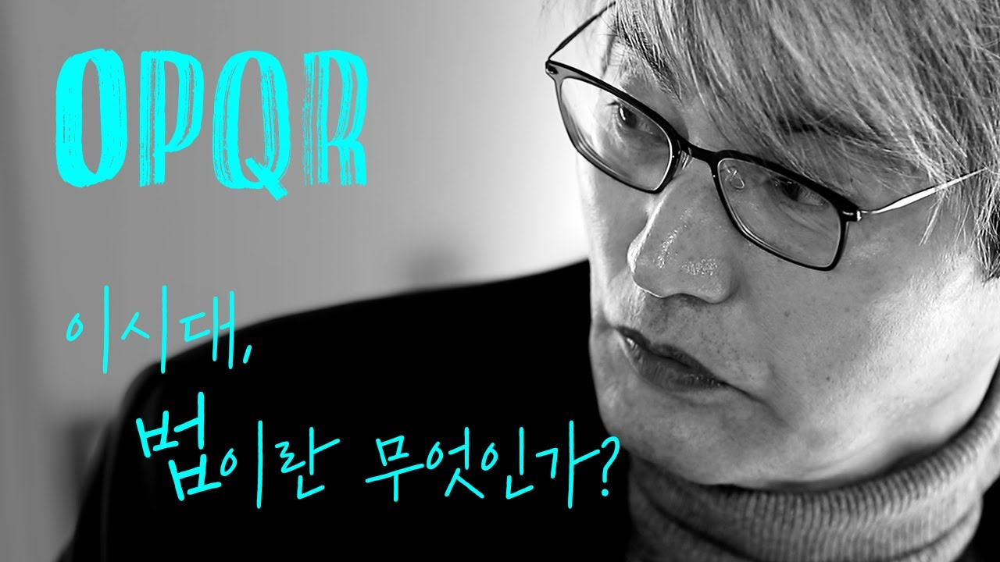
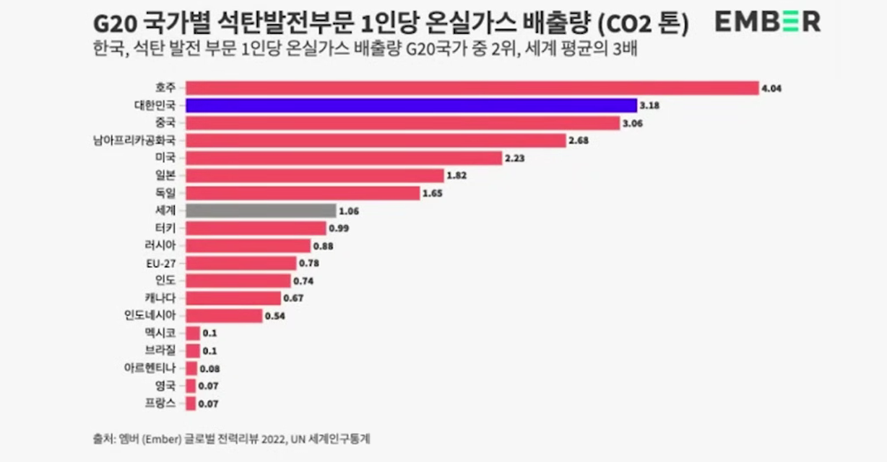

## 문서번호: 5601

### 제목: [대통령이 내란죄나 외환죄 등을 저질렀을 때 수사기관과 권력승계순위는 바뀌어야 하지 않을까요? ](https://q4all.kr/redirect/detail/4da5f693-4652-40ba-af4d-4d0256ae48fd)

**작성자:** [성수아](https://q4all.kr/user/profile/8526)
**작성일:** 2025-03-13 01:06:15 (목요일)

---

대통령이 내란죄와 외환죄를 저질렀을 경우 행정부와 내각 전체에 책임이 있을 가능성을 대비해

대통령의 권한이 국회로 넘어가는 것이 맞지 않을까요?

그리고 아예 내란죄와 외환죄는 국회 과반 이상이 정한 특검에서 수사를 하는 것으로 입법해야 하지 않을까요?

---

## 문서번호: 5602

### 제목: [우리나라의 경우 배심원제 같은 제도가 필요하지 않을까요?](https://q4all.kr/redirect/detail/430382ac-80ad-46ab-afa8-07c593b20ef4)

**작성자:** [성수아](https://q4all.kr/user/profile/8526)
**작성일:** 2025-03-13 01:14:30 (목요일)

---

우리나라 사법적 판결은 전관 예우 등의 문제로 판결에 일관성이 없고 정당성을 담보하기에는 판결의 편차가 심합니다.

법의 판결을 존중하라고 일방적으로 반복해서 주입할 것이 아니라 법의 공정성과 정당성을 담보할 만한 시스템을 만들어야 합니다.

대법관이나 검찰총장 경찰총장 같은 직책을 선출직으로 하면 좀 나아질까요?

잘못된 사법시스템과 판결은 국가의 폭력으로 국민의 삶을 위협합니다. 이런 폭력을 계속 방치한다면 입법부 또한 공범이 될 것입니다.

꼭 방법을 찾아주시길 부탁드립니다

---

## 문서번호: 5603

### 제목: [당내 경선이나 각종 투표에서 여론조사는 적용하지 않는 것이 맞지 않을까요?](https://q4all.kr/redirect/detail/6d258b45-bb7b-4205-b370-57c898eb3b57)

**작성자:** [성수아](https://q4all.kr/user/profile/8526)
**작성일:** 2025-03-13 01:22:44 (목요일)

---

민주당은 충분히 여론을 수렴할 수 있는 권리 당원의 수를 가지고 있습니다.

여론조사가 얼마나 많이 오염될 수 있는지, 신천지나 일부 세력의 역선택이 있을 수도 있음을 알고 있습니다.

정당활동을 통한 정당에서 당원들의 의견이 여론보다 우선인 것도 명확합니다.

그렇지 않다면 당의 존재 이유가 없을 것입니다.

더해서 모든 권리 당원의 한 표는 대의원들 한 표의 가치와 동등해야 할 것입니다.

---

## 문서번호: 5604

### 제목: [일 안하고 고액연봉을 받는 낙하산 공무원직을 없앨 수는 없나요?](https://q4all.kr/redirect/detail/a882ce75-b971-4dba-8e86-a99af5c4b9c9)

**작성자:** [성수아](https://q4all.kr/user/profile/8526)
**작성일:** 2025-03-13 01:40:18 (목요일)

---

보은 인사 등으로 어쩌다 공무원이 된 사람들이 너무 많은 세금을 축내고 결국 이런 시스템으로 정치권이 혼탁해 지는 것이 아닌지요?

---

## 문서번호: 5605

### 제목: [주5일에서 주4일제 시행을 앞두며...](https://q4all.kr/redirect/detail/b4faf596-e180-4f66-a02f-ced488c566ca)

**작성자:** [이정원](https://q4all.kr/user/profile/8527)
**작성일:** 2025-03-13 03:08:47 (목요일)

---

현재 주5일에서 4일로 바꾸자는 논의가 있습니다.

공무원,대기업 제외하면 주5일 근무하는곳 많지 않습니다

자영업이나 건설현장 근무하는곳은 특히 주6일 근무가 더많고요

이런데도 주4일로 바꾸는게 좋은건가 십습니다

---

## 문서번호: 5606

### 제목: [일본식 말법으로 어렵게 쓰인 헌법을 우리말로 누구나 쉽게 읽을 수 있도록 바꿔야 하지 않을까요?](https://q4all.kr/redirect/detail/060dc530-58b5-4936-8615-c057486f3a3c)

**작성자:** [김회근](https://q4all.kr/user/profile/5001)
**작성일:** 2025-03-13 09:09:45 (목요일)

---

어렵게 쓰인 헌법을 쉽게 읽고 싶습니다.

다른 법전들도 마찬가지지만 너무나 만연체 문장들도 많고

전혀 친절하지 않은 용어들로 이해가 잘 안됩니다.

이런 이유로 법비들의 말장난을 참을 수 없습니다!

---

## 문서번호: 5607

### 제목: [암담한 미래, 살아갈 희망을 체제는 보여줄 수 있는 것인가? ](https://q4all.kr/redirect/detail/b836783e-6c6f-4106-a000-dd940068656c)

**작성자:** [김지현](https://q4all.kr/user/profile/6729)
**작성일:** 2025-03-13 09:13:28 (목요일)

---

권력의 독점, 자본의 독점이 보통이 되어버린 이 사회에서 '정치적 자유'라는 것이 가능한 것일까요?

기울어진 땅은 언제 제자리로 돌아올 수 있을까요?

체제 속에서 잉여 이익을 취득하며 노동자들은 (노예) 계약에 묶여 원래 제것이었던 잉여 축적의 기회를 얻을 수 없습니다. 일할 수 없을 때 지난날 축적해둔 자산으로 삶의 후미를 잘 살아가야하는데, 우리 사회가 그것은 불가능한 것이라고. 너무 어두운 미래만이 그려집니다. 오직 지금 할 수 있는 것은 노동자, 시민들의 적극적인 체제 개선을 위한 정치 참여만이 방법일 뿐인데... 지금도 무력한 사회를 여실히 뉴스를 통해 확인하고 있습니다.

불합리하고 부조리한 상황은 여실히 경험되어지고 있지만

현실에서 할 수 있는 것은 극히 제한적입니다.

나와 내 옆의 사람들의 삶이 흔들리는 것을 끊임없이 보게됩니다.

이토록 어두운 미래가 그려지는 날들이 없었습니다.

소모되어가는 것 같은 시간들입니다.

노동자의 시간도, 민주주의의 시간도, 인간의 시간도...

헬레어 벨록 <노예국가>를 읽다가 하도 답답해 모두의질문Q에 들렀습니다.

우리 사회가 나아질 수 있도록 각계 각층 각영역 각각의 권한 지어진 사람들이 시급히 애써야 할 일이겠지요...

---

## 문서번호: 5608

### 제목: [3기 신도시~!](https://q4all.kr/redirect/detail/c40ccc2f-612d-4b3c-a2e7-d5d5059b6280)

**작성자:** [이진호](https://q4all.kr/user/profile/8534)
**작성일:** 2025-03-13 09:45:15 (목요일)

---

민주당 문재인정권에서 3기신도시 사전청약이 시작되었고

지금 내란수괴 우두머리 정권에서 본청약이 속속 진행되고 있는데요

사전청약시의 추정분양가 대비 본청약 분양가가 15~20% 정도 오른채 진행되는 것 같습니다.

수천만원에서 억대 이상의 금액으로 오르고 있는건데요

이렇다보니, 주변시세 대비 분양가격이 비슷하거나 약간 비싸다고 볼 수준의 분양가입니다.

수년간 무주택 혹은 생애최초로, 자산이 일정수준 이하의 서민에게

내집마련의 희망이던 민주당표 3기신도시가

사전청약 당첨자에게 무리 혹은 포기의 선택으로 다가 오고있습니다.

워낙 물가상승율이나 인건비 원자재가 오른 탓이라 어쩔 수 없이 가격이 오른 측면이 있다 하더라도

대책 마련이 필요할 것 같습니다.

저도 사전청약 당첨자의 한 사람이고, 관련된 카페나 커뮤니티 활동을 통해

많은 분들이 고민 하고 있기에

제안드려봅니다

3기 신도시 중 추정분양가 대비 본 청약 분양가가 많이 오른 지역에 대한 대책이 있었으면 합니다.

대출한도 확대, 금리인하등 서민들이 오른 분양가로 인해

내집마련의 기회를 포기하지 않도록 현실적인 대책 마련을 부탁드립니다.

문재인정권의 민주당에서 당첨되어 이재명정권의 민주당에서 입주하는 날을 기대해봅니다~!

감사합니다.

---

## 문서번호: 5609

### 제목: [종교인 과세](https://q4all.kr/redirect/detail/aedc3222-605e-4d9b-ab66-f9c286eb6f54)

**작성자:** [이혜은](https://q4all.kr/user/profile/4179)
**작성일:** 2025-03-13 10:08:25 (목요일)

---

종교인 과세를 통해 부족해진 국가의 세수확보와 사이비 종교의 생성방지등 여라가지 국가적 이득을 볼수있을것 같은데 이를위한 계회이나 준비가 있나요?

---

## 문서번호: 5610

### 제목: [헌법 재판관님에게 호소 합니다.](https://q4all.kr/redirect/detail/6d714eb5-67b3-4178-b804-874868b237a8)

**작성자:** [강대삼](https://q4all.kr/user/profile/3027)
**작성일:** 2025-03-13 10:09:05 (목요일)

---

나라가 풍전등화의 위기에 놓여 있습니다.

한시라도 빨리 탄핵인용을 하여 대통령 파면을 결정 하여 주세요.

지금 재판관님의 손에 이 나라 5,000년의 유구한 역사를 자랑해온 대한민국의 흥망성쇄, 운명이 달려 있습니다.

생각하기도 실치만 만에 하나라도 탄핵 기각의 결정이 내려질 경우 이 나라는 지도상에서 영원히 사라지게 될 것입니다.

기각과 동시에 대한민국은 국가신인도의 하락은 물론, 주식시장 붕괴, 극심한 내전, 저 미치광이 대통령의 광기에 의한 전쟁으로 이 나라는 지금의 우쿠라이나 이상으로 주변 강대국에 의해, 북한과 함께 붕괴 영원히 역사 속에서 사라지게 될 것입니다.

역사는 되풀이 된다고 하지만 120년 전의 을사늑약이 재현 되는 사태는 제발 좀 막아 주세요.

저 미치광이 대통령과 그 부역자들 그리고 우매한 시민들이 크게 착각하고 있습니다.

과연 자기들의 의도 데로 정권을 찬탈하여 독재 정부를 세운다고 한들 그게 얼마나 유지가 될까요?

전 세계 최고의 집단 지성을 가지고 있는 민주시민들이 가만히 있을까요?

그리고, 군부가 되었든 경찰이 되었든 모든 사람들이 자기들의 명령을 따를 까요?

그야 말로 친구, 동료, 가족끼리 죽고 죽이는 극심한 내란, 내전으로 이 나라는 사분오열 되어 미국, 중국, 러시아, 일본 등에 의해 북한과 함께 쪼개질 것입니다.

지금의 대한민국은 먹을 것이 얼마나 많습니까?

세계최고의 반도체, 베터리, 조선, 자동차, 방산등 그야 말로 황금알을 낳는 거위와도 같은 데요?

북한은 러시아, 중국, 대한민국은 미국의 주도하에 일본이 통치하는 나라로 쪼개질 것입니다.

120년 전으로 돌아가는 것입니다.

누가 다시 독립운동을 할 것이며, 독립운동을 한들 다시 나라를 찾을 수 있을까요?

있는 사람들은 다 이민을 갈 것이고, 없는 사람들은 자기들끼리 지지고볶고 싸우다가 열강들의 식민 시민이 되겠지요. 재판관님들 또한 지금의 자리를 지킬 수가 있을까요?

나라가 있어야 나도 있고, 내 자리도 있는 것 아닌가요?

정말 바라옵건데 한시라도 빨리 대통령 파면을 결정하시어 이 어지러운 난국을 하루 속히 수습하여, 세계 초일류 국가로 나아 갈 수 있는 밑거름이 되어 주세요?

5,000만 국민들의 염원을 외면 하 지 말아주세요?

헌법재판소 게시판에 이 글을 호소 하였는데, 금방 삭제가 되었습니다.

정말 걱정됩니다.

국민들의 애타고 간절한 마음을 부모님이 자식 사랑하는 마음으로 헤아려 주시기 바랍니다.

---

## 문서번호: 5611

### 제목: [의무병역기간을 1년 미만으로 줄일 수는 없을까요?](https://q4all.kr/redirect/detail/3092df7a-34f2-4171-acde-4429f56898f4)

**작성자:** [성수아](https://q4all.kr/user/profile/8526)
**작성일:** 2025-03-13 11:20:11 (목요일)

---

양육강식과 극우 파시즘이 득세하는 요즘 세상에 군대를 의무적으로 가야 하는 젊은 남성들이

역차별을 받는다고 생각하는 것은 어쩌면 이해가 가는 측면이 있습니다.

무엇보다 1년이라는 시간은 젊은이들에게 너무나 소중한 시간입니다.

제가 여성이라 병역의 경험이 없지만 1년 정도면 유사시 병역 능력을 갖출 수 있는 충분한 시간이라고 생각하고

1년 이상의 병역은 원하는 사람들이 월급을 받는 모병제 형식으로 운영하는 것이 좋지 않을까요?

---

## 문서번호: 5612

### 제목: [왜 우리 사회는 개인의 정치적 의견을 자유롭게 말하는 것이 불편하게 되었을까요?](https://q4all.kr/redirect/detail/33f2de3c-9361-43ae-a55c-8874b5039b1c)

**작성자:** [성수아](https://q4all.kr/user/profile/8526)
**작성일:** 2025-03-13 12:27:29 (목요일)

---

온라인 커뮤니티들 중에는 건전한 정치적 비판과 응원과 토론을 포함한 정치적 이슈에 대한 발언 자체를 막는 카페나 커뮤니티가 많습니다. 마을 공동체나 아파트 단톡방도 마찬가지구요.

그 중 하나의 원인은 이명박 때부터인가요? 댓글 부대 같은 온라인 작업과 일베 등의 싸이트 등에서 시작된 혐오와 극단의 언어로 아예 정치 이슈를 멀리하는 경향이 생기게 한 것 같습니다.

점점 정치에서 멀어진 사람들은 가짜 뉴스를 통해 정치를 피상적으로 볼 수 있게 될 뿐입니다.

또 하나의 중요한 점은 공무원이나 교사들에게도 정치적 중립을 강요합니다. 정치적 토론을 막고 정치를 입에 담을 수 없는 것으로 만들어 버립니다.

정치적 발언을 자유롭게 할 수 없는 교사에게 교육받은 아이들이 어떻게 자유롭게 정치적인 의견을 개진하고 토론할 수 있습니까?

연예인들도 정치적 발언을 하면 양 극단 세력의 표적이 됩니다. 진보진영도 자유로울 수 없습니다.

정치를 혐오하게 된 많은 사람들은 정치적 발언을 하지 않는 이런 현상을 오히려 당연하고 좋은 것으로 받아들입니다.

이게 얼마나 이상한 모습인가요?

하루 빨리 정치적 발언과 토론과 다양성이 존중되는 사회가 될 수 있는 방법을 찾아야 한다고 생각합니다.

---

## 문서번호: 5613

### 제목: [기저귀 차고 "4세 고시" 보는 아이들, 자라서 어떤 어른이 될까요?](https://q4all.kr/redirect/detail/fb92a589-59ca-4e06-88e1-602ba3b39660)

**작성자:** [양희진](https://q4all.kr/user/profile/3374)
**작성일:** 2025-03-13 13:06:27 (목요일)

---

안녕하세요~

요즘 영유아 사교육을 대변하는 "4세, 7세고시" 표현이 계속 언급되고 있습니다.

오늘자 연합뉴스에 "기저귀 차고 4세 고시 본다"는 충격적인 제목의 뉴스가 있길래 링크 공유해 봅니다.

<https://n.news.naver.com/article/001/0015263225?cds=news_edit>

그래도 김누리 교수님 열심히 강연하시는 덕분에,

독일이 히틀러 같은 사람 또 나올까봐 교육개혁을 단행했다는 것 많이들 알게 되셨을거라 생각합니다.

우리도 윤석열 같은 파시스트 지도자가 재등장하지 않도록 아동학대 수준의 경쟁교육을 근본적으로 개혁해야 하지 않을까요?

그렇지만 내란수괴도 불법 석방 시켜주는 이 나라에서 교육이 제대로 개혁될지..

학부모의 한 사람으로서 심히 우려스럽습니다.

---

## 문서번호: 5614

### 제목: [대한민국은 누구를 위한 법치주의 국가인가?](https://q4all.kr/redirect/detail/82d4ba32-2f6b-4bdd-afe2-5b9cb04a4d5d)

**작성자:** [박형래](https://q4all.kr/user/profile/8539)
**작성일:** 2025-03-13 13:59:16 (목요일)

---

대한민국은 누구를 위한 법치주의 국가인가?

먼저 일벌백계라는 유래를 다시 공부해 보자

1. 일벌백계가 없는 대한민국

선진국은 수천억원의 벌금,배상금,보상금을 부과한다

그러나 대한민국은 그런 뉴스를 본적이 없다

잘못을 한 검사 판사들의 처벌도 마찬가지다

이들은 죄를 지어 판결을 받아도 일정기간 후 변호사 개업을 할 수 있다

특권이다.

검사 판사들은 어떤 죄로 일을 그만두게 되어도 이런 법조 카르텔로 먹고 살수 있고

그전에 먹고 살만큼의 수익을 챙겼을 수도 있다.

죄를 짓게 되면 대한민국에서 살기 어렵게 없게 만들어야 한다

어떤 언론은 일벌백계보다 합리적형벌을 요구하기도 했다

계속 이렇게 되고 그렇게 된다면

대한민국은 법꾸라지들이 계속 늘어나게 될것이고

법을 지키는 자들은 줄어들게 되며

그 선례들이 대한민국의 법치주의를 무법천지로 만들게 될것이다

2. 법꾸라지 없는 헌법 개정, 법률 개정 및 제정

왜? 판 검사들은 탄핵을 당해도 인용되기 힘들까?

그들은 왜? 잘못을 해도 기소 조차 당하기 어려운가?

3000억 이상의 고액 범죄는 왜? 작은 형벌 또는 무죄인가?

이러한 법조카르텔은 유전무죄, 유권무죄를 양산하게 될 것이고,

판검사포함 공무원 탐관오리들을 일벌백계하지 못한다면

누가 대한민국 법을 믿고 안전하고 정의롭게 살아가겠나?

탐관오리 뉴스가 나오고 일벌백계 하지 못 하니

나 부터도 이민가고 싶다

빠른 시일내에 법을 개정 제정하여 일벌백계했다는 뉴스를 듣고 싶다

대한민국은 정의로운 나라라는 해외 뉴스를 듣고싶다

---

## 문서번호: 5615

### 제목: [부족하고 진료받기도 힘든 소아과. 어린이집 순회 의사가 있으면 좋겠어요.](https://q4all.kr/redirect/detail/e26878d4-1fd5-4418-872b-0b75de302481)

**작성자:** [이현구](https://q4all.kr/user/profile/8541)
**작성일:** 2025-03-13 14:15:01 (목요일)

---

안녕하세요, 서울에서 두 아이를 키우며 맞벌이중인 아빠입니다.

대신 봐주시는 할머니나 이모님 없이 순수하게 둘이서 직장다니면서 키우기가 힘에 부칠때가 많아요.

특히, 어린이집에 다니는 아기가 감기나 폐렴에라도 걸리면 긴급상황이 시작됩니다.

어린이집에 맡길수가 없어 둘 중 한명은 연차를 내야하고, 병원진료만 받아도 되는 경우에도 반차는 기본입니다.

퇴근 후 병원 진료는 언강생심입니다. 5시 6시면 웬만한 소아과는 다 문을 닫거든요.

이 상상이 현실이 될지는 모르겠지만, 어린이집을 순회해주며 진료를 봐주는 소아과 의사쌤이 있었으면 좋겠어요.

그렇게되면 부모입장에서 아이가 아파도 어느정도는 안심하고 직장에 출근할 수 있을것 같아요.

어린아기 어린이집 보내시는 맞벌이 부모님들은 다들 공감하실꺼예요.

연차의 대부분은 아기 병원이나 간호로 인한 가정육아로 거의 다 소진됩니다.

이런 사소하지만 커다란 부분이 현실이 된다면 그나마 조금은 나은 육아와 직장일을 병행하는데 아주 큰 도움이 될 것 같습니다.

---

## 문서번호: 5616

### 제목: [은행에 내는 이자 상한선 법](https://q4all.kr/redirect/detail/a60f5252-1de6-4a38-bb61-739afab615a2)

**작성자:** [박정규](https://q4all.kr/user/profile/8542)
**작성일:** 2025-03-13 15:08:37 (목요일)

---

은행들은 대출을 해주고 이자를 받습니다.

예들들어 1억을 빌려주고 이자는 1억을 넘어서 지속적으로 받을 수 있습니다.

이것은 사채업이라고 밖에 할 수 없습니다.

나라의 돈을 받고 대출을 해주면서, 이자를 한도 끝도 없이 받아 착복하는 것은 옳지 않습니다.

따라서 가칭 "은행이자 상한선법"을 만들어,

지급한 이자 총액이 100%가 되면, 그 이후부터는 이자를 내지 않아도 되는 법을 만들어야 합니다.

아울러, 대출자동 연장 기한을 원금액의 200%가 되는 시점으로 해서 원금 100%가 되기 이전이나 되었을 경우,

은행이 계약해지를 할 수 없도록 해야 합니다.

한국은행의 돈은 국민의 돈입니다.

국민의 돈을 은행에 빌려주어 국민의 피를 빨아먹는 짓은 더 이상 하지 말아주세요.

---

## 문서번호: 5617

### 제목: [미래가 점점 어두워지고 있는데, 언제까지 나라살림을 아끼려고 합니까?](https://q4all.kr/redirect/detail/0aae3d7f-7414-43f8-a013-f4aef1cca30f)

**작성자:** 전문가Q - 정창수
**작성일:** 2025-03-13 16:24:40 (목요일)

---

**미래가 점점 어두워지고 있는데, 언제까지 나라살림을 아끼려고 합니까?**

정창수 소장(나라살림연구소)의 질문

1. 질문의 맥락

❍ 덮어놓고 국가 재정 아끼다 보면 결국 거지꼴 못 면하지 않을까요?

① 나라살림의 지속 가능성 중요

• 현재 국가 재정 쓰는 것을 크게 늘리지 않았으나 세입으로 들어오는 것을 크게 줄였기 때문에 큰 문제가 되며, 결국 나라살림의 지속가능성을 담보하기 어려운 상황입니다.

- 현 정부의 경우 너무 많은 감세로 역대 어느 정부보다 많은 재정 적자를 기록하고 있는 실정입니다.

- ‘덮어놓고 낳다 보면 거지꼴 못 면한다.’라는 구호가 현재 우리나라에 심각한 저출산 문제를 초래했는데, 같은 의미로 국가 재정의 경우도 ‘덮어놓고 아끼다 보면 거지꼴 못 면한다.’고 판단됩니다.

② 나라살림의 가장 중요한 세 가지 기능은 소득 재분배, 자원 재분배, 재정을 통한 경제위기 대응

• 개인이 해결할 수 없는 공동체의 문제를 해결하는 가장 큰 도구는 재정이며, 재정이 지속 가능하지 않으면 공동체의 미래를 담보할 수 없습니다.

- 재정의 지속 가능성을 위해서는 들어오는 만큼 써야 되는 것이며, 우리 사회의 고령화 속도를 고려한다면 더 많이 써야 되는데 오히려 감세를 통해 재정의 규모를 줄였기 때문에 큰 재정 적자가 발생하고 있는 상황입니다.

- 결국 직면하게 되는 공동체의 문제가 개인의 부담으로 돌아갈 수밖에 없으며, 재정의 중요한 기능인 소득 재분배, 자원 재분배, 재정을 통한 경제위기 대응 역시 크게 축소될 것입니다.

2. 해결방안

❍ 국민 모두가 무엇이 국가 전체를 위한 이익인가를 국가 재정으로 들어오는 돈과 나가는 돈을 중심으로 함께 살펴보아야 국가 재정이 건전해집니다.

➀ 혜택이 확실한 것부터 우선적으로 정책 시행 필요

• 의료, 교육, 주택 등에 대한 확실한 재정 지출을 통해 납세자들이 내가 부담하는 세금이 결국 나에게 돌아온다는 효능감을 느끼게 해야 합니다.

- 누구나 무조건적인 증세는 반대하지만 확실한 복지가 담보된다면 증세에 대한 저항의 정도를 줄일 수 있으며, 다른 나라보다 상대적으로 낮은 부가가치세의 증세 등 여러 세원의 합리적 조정과 발굴을 통해 국민들을 설득해 나가는 새로운 시대의 리더십이 필요한 시점입니다.

➁ 미래를 위한 정부 투자는 기본적으로 교육

• 지방 소멸과 관련된 요인 중 하나가 지방 대학의 경쟁력 약화에 있으며, 지방 대학에 대한 정부의 전폭적인 투자가 필요한 상황임

- 서울대학교 한 곳에 지원하는 예산이 다른 모든 국립 대학교를 지원하는 예산을 합한 것보다 많으며, 서울대학교의 경쟁력이 월등한 것은 우수한 학생들이 입학하는 것도 있지만 그만큼 쓰는 예산이 많기 때문입니다.

- KAIST, POSTECH, UNIST, GIST, DGIST 등이 지방에 있으면서도 성공한 이유는 그만큼 많은 투자와 지원이 있었기 때문입니다.

➂ 국가 재정의 투명성 확보 필요

• 국가 세입과 세출에 대한 투명한 공개는 단순히 국민들의 알 권리 차원이 아닌 국가 재정의 지속 가능한 운영을 위해 필요합니다.

- 정부가 세수 추계에 대한 자료를 공개하고 있지 않으므로 이에 대한 공개가 필요할 뿐만 아니라 더 나아가 거버넌스를 통한 정교하고 투명한 추계를 해야 할 것입니다.

• 국회에 회계 검사를 위한 감사원을 두어야 합니다.

- 주요 선진 국가 중 국회에 감사원이 없는 유일한 국가가 대한민국이며, 감사원의 기능이 직무 감찰과 회계 검사이므로 최소한 결산을 위한 회계 검사 기능의 감사원은 국회에 설치해야 합니다.

• 각 기관별 재정 감시를 촘촘히 하는 시스템을 갖춰야 합니다.

- 국가의 재정 규모를 고려할 때 겨우 하나의 부서가 국가 전체 재정에 대한 회계 검사를 담당하는 것은 불가능하므로 각 부처별 회계부서가 우선적으로 하고, 기재부에서 전반적으로 하며, 국회와 국회 내에 설치된 감사원을 통하여 감시할 뿐만 아니라 거버넌스를 통해 함께 살펴보는 체계를 구축해야 합니다.

---

## 문서번호: 5618

### 제목: [자녀돌봄휴가는 있는데 왜 부모돌봄/부모공경휴가는 없는 걸까요](https://q4all.kr/redirect/detail/366a9eb5-27e8-46f5-bb46-0a927b814d1d)

**작성자:** [오기수](https://q4all.kr/user/profile/7231)
**작성일:** 2025-03-13 17:04:25 (목요일)

---

고령화가 급속도로 진행되는 시대 흐름과 유교의 효의 사상이 뿌리내린 대한민국에서 어찌 자녀돌봄휴가만 존재하는 겁니까.

노령의 부모님을 실제 모시고 살아가는 자녀들은 부모님을 위해 많은 시간이 필요합니다. 낮시간에 챙겨 드리고 모시고 다녀야 하는 상황에 맞춰 부모님을 봉양하고 섬기는 휴가 시간을 법적으로 보장해줘야 나라의 기틀이 바로 섭니다.

---

## 문서번호: 5619

### 제목: [공직자들은 왜 공정하지 않은가?](https://q4all.kr/redirect/detail/f9b917b3-af88-4d3a-945f-b01de3919962)

**작성자:** [노청호](https://q4all.kr/user/profile/1511)
**작성일:** 2025-03-13 17:51:57 (목요일)

---

국민은 지위 고하를 막론하고 항상 똑같은 잣대로 벌을 받게되어있습니다.

그런데 왜 지위가 높은 사람들은 특혜를 받고 있는지 화가 납니다.

공직자들이 일 처리시 지위에 휘둘려서 했을시 일반적인 죄 값보다

100배의 엄벌을 내려야 합니다.

---

## 문서번호: 5620

### 제목: [법을 집행하는 자들이 법치를 왜 어기는가?](https://q4all.kr/redirect/detail/df880119-2289-4167-abae-79e94ff0f5a2)

**작성자:** [노청호](https://q4all.kr/user/profile/1511)
**작성일:** 2025-03-13 17:57:56 (목요일)

---

법을 집행하는 자들이 법치를 파괴하는 행위를 하고 있습니다.

이런 자들은 무조건 사형을 선고하여 집행해야합니다.

그래야 법이 바로 세워집니다.

---

## 문서번호: 5621

### 제목: [지방법원에서 경범죄로 즉결심판 선고 이후 부과된 벌금은 왜 영수증 처리를 하지 않습니까? 국고로 귀속 되야 하지 않는지요?](https://q4all.kr/redirect/detail/d0eea642-ec07-46f1-b4f0-c612ef6b7251)

**작성자:** [조성규](https://q4all.kr/user/profile/8547)
**작성일:** 2025-03-13 18:06:24 (목요일)

---

개인적으로 경범죄 판결로 인하여 2024년에 동부지법에서 즉결심판을 받은 적이 있었습니다.

아침시간으로 지정이 되어서 9시전에 법원에 도착하였고,

이때 대략 2~30명 정도의 사람들이 다양한 사항의 경범죄로 즉결심판을 받기 위해 대기하고 있었습니다.

즉심은 각 경범죄에 대하여 판사가 그 행위의 위법사항에 대하여 경중을 판단하며 20만원 미만 (5만, 10만, 15만, 그리고 20만원)의 벌금형,

혹은 행위가 단순 실수로 용서 가능한 경우 벌금이 없이도 판결은 끝내게 됩니다.

여기서 당황하게 되는 일이 있었는데,

판결에 대하여 납입하는 벌금은 현금으로 법원에 파견된 경찰관이 직접 수거하고 있었는데,

이같은 일련의 행위가 밝은 장소에서 받는 것이 아니고 판결이 진행된 중앙에서 출구 쪽 불빛이 다소 어두운 쪽방으로 안내되어 ‘감사합니다’라는 언급을 하면서 받는 것이었습니다.

이것도 역시 이상하다는 생각을 하게 되었습니다.

이 벌금은 사실 국가 사법 체계에 따라서 지불하는 것인데 영수증 처리도 없으며, 경찰관이 직접 수령하고, 오직 현금으로만 지불하게 되더군요.

국가 전체로 놓고 볼때, 이렇게 수취 되는 경범죄 벌금 액수는 1년이면 엄청난 현금 자산이 될 것으로 생각됩니다.

이와 같다고 할 때, 경범죄 판결 현금은 사용처가 무엇인지 의문을 가지게 되었고,

만약 지금까지 이것이 주머니 돈이 쌈짓돈이라고 하듯이 일부 관련자들에게 무작위로 사용되었다면

이것은 '국고로 귀속되거나 사회로 환원 되어 사용되어야 할 공적인 돈이 사적으로 오용되는 것이므로 반드시 바로잡아야 되지 않나'하는 의견을 어딘가에 말해 보고 싶어서 여기에 올립니다.

길 글 보아 주셔서 감사합니다.

---

## 문서번호: 5622

### 제목: [더불어 산다는 것, 당신은 폭력을 일삼는 사람들과 더불어 살아갈 수 있습니까? ](https://q4all.kr/redirect/detail/1ad9e965-df65-415f-95e3-d8ad1547ebe9)

**작성자:** [정해원](https://q4all.kr/user/profile/8550)
**작성일:** 2025-03-13 18:52:46 (목요일)

---

12.3 불법 계엄 이후 국민들은 헌법 수호 세력과 그 반대 세력으로 갈라졌습니다.

저는 폭력에 있어서는 중간 지대가 없다는 의견입니다.

무슨 일이 있어도 폭력은 안된다는 입장이며,

인간은 폭력이 아니라 다른 방법으로 (대표적으로 언어와 법이 있습니다) 갈등과 문제를 충분히 해결할 수 있다고 믿기 때문입니다.

문제 해결에 시간이 걸릴지언정 해결하지 못할 문제는 없다고 믿고 있습니다.

계엄 세력, 즉 헌법 수호 세력에 반하는 사람들은 신기할 정도로 폭력적입니다.

제가 본 계엄 세력들은 대부분 폭력을 용인하거나 조장하는 사람들입니다. (폭력이 필요하다고 믿는 사람들인 거죠)

저는 어린 시절 가정 폭력을 경험한 사람으로, 그러한 경험이 바탕이 되어

'무슨 일이 있어도 폭력 만큼은 용인 되어서는 안 된다'는 신념을 갖게 되었습니다.

더불어 민주당이 그동안 '더불어'를 표방해 왔는데요. 아무래도 폭력적인 사람들과는 그럴 수 없다고 생각합니다.

폭력을 용인하는 사람들은 사회적으로 경계와 한계를 두어야 하겠습니다.

법, 국가가 존재하는 이유가 바로 그것 아닌가요? 살인자와 경계 없이 더불어 살 수는 없는 노릇입니다. 살인자와 마찬가지로

폭력적인 사람들과도 경계 없이 더불어 살 수는 없습니다.

도대체 언제까지 수많은 국민과 법을 유린하며 폭력과 살인을 용인하고 조장하는 사람들이 권력을 휘두르는 걸 지켜봐야 합니까?

어떻게 버젓이 이런 말도 안되는 폭력이 일어날 수 있는 것입니까?

Q. 당신은 폭력을 일삼는 사람들과 더불어 살아갈 수 있습니까?

#1. 더불어 산다는 것

#2. 폭력(살인)을 조장 또는 용인는 자들, 법을 유린하는 자들과 어떻게 (어디까지 포용하며) 함께 살 수 있을까?

---

## 문서번호: 5623

### 제목: [폭력은 때에 따라서 필요한가?](https://q4all.kr/redirect/detail/53a4262a-cdb8-421c-985f-75e3e92c10f6)

**작성자:** [정해원](https://q4all.kr/user/profile/8550)
**작성일:** 2025-03-13 19:12:27 (목요일)

---

신체적 폭력, 언어 폭력을 비롯해 폭력의 종류는 다양합니다.

폭력을 당하는 사람이나 저지르는 사람이나 그것이 폭력인지 인지하지 못하는 상태에서 폭력이 일어나기도 합니다.

저는 어린 시절 가정 폭력을 경험한 사람으로, 그러한 경험이 바탕이 되어

'무슨 일이 있어도 폭력 만큼은 용인 되어서는 안 된다'는 신념을 갖게 되었습니다.

폭력이 무엇인가요?

이런 원론적인 질문은 폭력 문제 해결에 도움이 되지 않을듯합니다.

다만 폭력이 필요한가 묻고 싶습니다.

필요하다면 왜 필요한지 묻고 싶습니다.

---

## 문서번호: 5624

### 제목: [탄핵 중인 공직자들에게 왜 국민 세금으로 매월 월급을 지급해야 하나요?](https://q4all.kr/redirect/detail/e663f6ac-f813-43d2-b38e-f8076426968b)

**작성자:** [김회근](https://q4all.kr/user/profile/5001)
**작성일:** 2025-03-13 20:32:21 (목요일)

---

탄핵 중인 공직자들에겐 판결 전까지 월급 지급을 중단해야 합니다.

당연히 탄핵이 기각 되더라도 월급을 소급해서 지급해서도 안됩니다.

---

## 문서번호: 5625

### 제목: [지하철 내부 스크린을 직관적으로 바꿔주세요.](https://q4all.kr/redirect/detail/af734a24-c388-40e7-befa-a48d3aae00c5)

**작성자:** [마성영](https://q4all.kr/user/profile/8553)
**작성일:** 2025-03-13 20:43:43 (목요일)

---

지하철 스크린을

현재 정차 할 역이 크고 길게

노출될 수 있게 바꿔주세요

지하철 안에서

현재 정차한 역 이름을 확인하려고 할 때

안 보이는 경우가 너무 많습니다.

빔프로젝트 같은 걸로 유리에 쏴서

크게 보여주는 걸 만들 든

모든 좌석에서 현재 역을

잘 확인할 수 있었으면 좋겠습니다.

---

## 문서번호: 5626

### 제목: [대한민국 모든 보도블럭이 훨체어가 자유롭게 다닐 수 있게 정비되었으면 좋겠습니다.](https://q4all.kr/redirect/detail/d521f0b0-c5e6-406b-ae36-d69da12edb89)

**작성자:** [마성영](https://q4all.kr/user/profile/8553)
**작성일:** 2025-03-13 20:50:54 (목요일)

---

연말?같이 지자체 재정을 남김없이 써야 할 때

멀쩡한 보도블럭을 뒤집어 엎는 광경을 자주 봅니다

(예전보다는 줄었다고 생각하지만)

예산 털어내기 좋은 방법이 그거라면

보도블럭을 갈아 엎을 때

휠체어나 전동휠체어 등

교통약자들이 쉽게 이동할 수 있게

(사진 출처 : 아시아 경제)

보도블럭 턱을 의무적으로 낮추는 법안을 만들어주세요.

---

## 문서번호: 5627

### 제목: [처벌과 개혁](https://q4all.kr/redirect/detail/390f46b6-f97d-40d8-9c53-84f4927c19b7)

**작성자:** [최창호](https://q4all.kr/user/profile/8555)
**작성일:** 2025-03-13 21:37:13 (목요일)

---

지난 정부의 부족함에서 배웠듯 비리 부패를 수사하고 처벌해야 하는 것은 마땅하지만 그걸 한다고 검찰 개혁의 기회를 날리면 절대로 안 된다는 사실을 모두 뼈저리게 느끼고 인식하고 있다. 반헌법적 내란 세력과 윤 정부의 비리를 있는 대로 수사하고 처벌해야만 하지만 그 방식과 타이밍, 절차를 미리 정교하게 설계해야 할 필요가 있다. 어떻게 해야 가장 효과적으로 빠른 시간 안에 부작용과 오류 없이 검찰을 해체하고 지난 3년의 (혹은 그전까지) 부패를 처벌할 수 있을까.

---

## 문서번호: 5628

### 제목: [우리나라 법에 구멍이 많은 걸까요?](https://q4all.kr/redirect/detail/e3b253ae-b21c-4951-b938-9d8235c291af)

**작성자:** [성수아](https://q4all.kr/user/profile/8526)
**작성일:** 2025-03-13 21:48:14 (목요일)

---

법기술자들이 판을 치고 있습니다.

그들이 헌법과 법률을 위반하고 교묘히 법을 이용해 범죄를 자행하고 국민들 머리 위에 올라서려 하고 있습니다.

입법을 하는 국회의원 분들께 호소드립니다.

만약 법에 구멍이 아직도 많다면 법꾸라지, 법기술자들이 설치지 않도록

헌법과 법률의 빈틈을 메우는 데 최선을 다해 주십시오.

삭발과 단식이 아닌 최선을 다해 법률을 재검토하고 입법을 하는 데 온 힘을 다하는 것이 무엇보다 중요하지 않을까요?

법을 잘 모르는 저와 같은 일반 국민들은 할 수 없는 일입니다.

광장보다 제대로 된 입법에 온 힘을 다해 주시길 간절히 원합니다.

---

## 문서번호: 5629

### 제목: [적정 기본 근무 시간이란](https://q4all.kr/redirect/detail/9e1166c0-dc03-4069-aff8-9cdcddc8fa54)

**작성자:** [지득명](https://q4all.kr/user/profile/8556)
**작성일:** 2025-03-13 22:08:29 (목요일)

---

직업을 대하는 태도에 어떤 사람들은 꿈이나 사명감 등의 태도를 갖고

또 어떤 이들은 살아가기 위한 수단으로 생각하기도 합니다.

하고 싶은 일과 해야만 하는 일... 이런 표현으로도 설명할 수 있을 것 같은데

이러한 대부분의 노동자들의 적정 근무 시간의 합의 선은 어느 정도면 합의 할 수 있을지

혹은 합의하려면 어떤 과정이 있어야 할지 질문합니다.

---

## 문서번호: 5630

### 제목: [여자 혼자서 산책할 수 있는 나라가 사라지고 있는 걸까요?](https://q4all.kr/redirect/detail/9dd2af97-4cbd-425f-84f2-453cb5df9fa3)

**작성자:** [황미주](https://q4all.kr/user/profile/23)
**작성일:** 2025-03-13 22:23:26 (목요일)

---

저는 산책을 참 좋아합니다.

사실 산책을 잘 하기 위해 서울에서 제주로 이주해 온 것이기도 합니다.

그런데 언젠가부터

산책을 하다 일면식 없는 남성들에게 살해되는 여성들이 많아지고 있습니다.

그들은 본인들 삶의 스트레스를 풀기 위해 살인을 했다고 말합니다.

화가 너무 났고, 우연히 그 여자를 봤고, 죽였다고 그렇게 말합니다.

전과자도 있고 초범도 있습니다.

사실 산책 말고도 그런 식으로 살해되는 여성들의 이야기는 더 많습니다.

지하철역 화장실에 들어갔다가 죽습니다.

퇴근하여 집으로 가던 골목에서도 잡혀가서 죽습니다.

여행지에서 아름다운 길을 걷다 잡혀 죽습니다.

친구랑 헤어지고 집에 가던 길에 죽습니다.

면접 보러 가는 길에 평소 다니던 공원길에서 맞아 죽습니다.

이건 다 모르는 사람들의 손에 죽는 것입니다.

남자친구에게 헤어지자고 말했다고 죽는 사람들까지 합치면 어마어마합니다.

얼마전 제주 어느 아파트에서는 밥상이 마음에 안 든다고 아들에게 죽은 어머니도 계시더군요.

죽지 않는 사람들은 성폭행을 당하거나 죽도록 맞다가 장애를 갖게 됩니다.

남성들의 폭력성이 용인되고 제어되지 않고 교육, 훈육되지 않고 제대로 처벌받지 않는 뉴스를 많이 보게 됩니다.

그런 것이 어떤 이들에게는 농담거리가 됩니다.

또 어떤 이들에게는 자랑거리가 됩니다.

그러한 행위는 반드시 피해자를 남기고 마는데도 말이지요.

신기하게도요.

제가 그런 것만 보는 예민한 사람일까요?

아마, 맞을 거예요.

그런 뉴스를 보면 예민하게 반응합니다 저는.

몸이 떨리고 나도 그 피해자가 될 수 있다는 생각을 합니다.

그렇게 희생되는 여성들에게

저는 동질감을 느낍니다.

생판 모르는 남이지만 그들의 잃어버린 꿈과 인생이 손에 만져질 듯 생생하게 느껴집니다.

그들의 고통을 조금은 알 것 같고, 그 공포는 제 삶에 그대로 남겨집니다.

어떤 사람들은 가해자에게 동길감을 느끼고 감정이입을 하더군요.

저런, 앞길이 창창한 젊은이가, 아이도 있고 직장도 있는 성실한 가장이, 그저 어르신이

어쩌다 저런 일을... 반성할 테니 그들에게 다시 재기할 기회를 주어야 한다고.

저로서는 정말이지 이해할 수 없는 일입니다.

저는 평화로이 산책을 할 수 있는 삶을 살고 싶습니다.

너무 큰 욕심일까요?

그런 산책을 하기 위해 저는 어디로 가야 할까요?

대한민국 어느 곳이 저에게 그런 공간이 되어 줄 수 있을까요?

혹, 그런 공간은 이제 이 나라에 없는 것일까요?

---

## 문서번호: 5631

### 제목: [[질문-20] 공교육은 7세와 1학년 아이들에게 왜 한글을 가르치지 않나요? 📣](https://q4all.kr/redirect/detail/c475add4-0a40-4ad9-bb0c-a1fbbbaba0cf)

**작성자:** [윤연정](https://q4all.kr/user/profile/2570)
**작성일:** 2025-03-13 23:13:13 (목요일)

---

#### 우리 아이 7세 시절 유치원 담임 선생님께 여쭈었습니다.

#### 유치원에서는 왜 한글을 가르쳐서 깨쳐주지 않느냐구요.

#### 돌아온 답변은 유치원 교육과정에 필수는 아니라는

#### 취지의 이야기였습니다.

#### 

#### 이런 환경에서 유치원을 졸업한 아이들이

#### 초등학교에 입학해서 맞닥뜨리는 현실은

#### 모든 아이들이 한글을 깨쳤다는 암묵적 당연한

#### 인식 속에서 수업을 듣게 됩니다.

#### 

#### 그러다 유독 몇몇 아이가 한글 부족으로

#### 수업을 따라오지 못하면 가정으로 연락이 오고

#### 왠지 내 아이가 부족하다는 생각에 부모는

#### 한없이 잘못한 것만 같아 아이에게

#### 미안하고 속상합니다.

#### 

### 언제부터 공교육의 역할이 부모의 몫이 되었나요?

### 언제부터 공교육의 역할이 사교육에 주어졌나요?

### 언제부터 공교육에서 영어가 중요해졌나요?

### 언제부터 공교육이 한글맞춤법보다

### 영어맞춤법이 우선순위가 됐나요?

#### 

### 한국 초등학생 아이들의

### 정체성은 무엇인가요?

#### 

**모두의 질문이어야**
-------------

**합니다.**
--------

#### 

#### 

---

## 문서번호: 5632

### 제목: [독립 운동을 하면 3대가 가난하다.이말이 지금 현실에도 살아 있는게 옳은가요?](https://q4all.kr/redirect/detail/860b1e16-bd06-44f6-be62-290fc9f018e5)

**작성자:** [도완영](https://q4all.kr/user/profile/892)
**작성일:** 2025-03-13 23:24:58 (목요일)

---

좋은 국가나 사회는 단지 상과 벌이 명확하게 실행되는 곳이라는 말이

기억납니다.그런데 현대의 우리는 그 줄 상을 제대로 명확하게 주고 있나요? 우리 모두의 전제는 저 분들은 상 받을만한 훌륭한 일을 하셨다는 것입니다. 그러면 우리는 반대로 저분들에게 거꾸로 3대가 흥하는 상을 주지는 못하더라도 3대가 망해 있는 현실을 크게 개선하지 못하고 있다면 아주 잘못된 일 이라고 생각합니다.

그저 가난만 면 이하는 그 이상의 보상이 그 분들에게 주어져야 하는데

아직도 가난을 면치 못하는 후손이 있다면 그건 우리 사회가 상과 벌 중

상도 제대로 주지 못하는 사회라는 신호를 사회 주는 상징적인 부분이라고 생각합니다.

이런 상징적인 부분부터 고쳐나가야 하지 않을까요?

---

## 문서번호: 5633

### 제목: [기후위기와 AI시대의 학교란 어떤 곳?](https://q4all.kr/redirect/detail/5d76233e-e26e-4ae1-8539-f6f679e0182b)

**작성자:** [하유미](https://q4all.kr/user/profile/8559)
**작성일:** 2025-03-13 23:47:56 (목요일)

---

대안학교에서 교육을 시키고 있는 학부모입니다.

코로나시국 비대면 수업을 경험하며 학교란 무엇일까란 의문이 생겼고,

긴 고민 끝에 대안학교로 전학을 했습니다.

앞으로 기후위기와 AI로 대표되는 큰 시대흐름 속에서 살아가야할 미래세대들일텐데요,

이 아이들에게 학교란 어떤 형태이어야 할까요?

또 학교에서 무엇을 가르쳐야 할까요?

학교의 형태가 변하더라도 끝까지 지켜야할 가치와 시대의 흐름에 발맞춰 새롭게 바뀌어야할 교육내용은 어떤것이 있을지 고민하게 되는 때인 것 같습니다.

---

## 문서번호: 5634

### 제목: [대한민국 길보드를 다시 부활 시켜주세요~](https://q4all.kr/redirect/detail/d13c5154-f2de-40a6-a507-aab12f857fd4)

**작성자:** [이승호](https://q4all.kr/user/profile/3980)
**작성일:** 2025-03-14 05:25:10 (금요일)

---

언제부터 인가 대한민국 길거리는 휑하고 쓸쓸한 길 거리로 변했습니다.

추운 겨울이면 따듯하고 포근했던 캐롤도 사라지고

한여름 더위에 시원한 바닷바람을 불어주던 멜로디도 사라진 거리를

다시 활기찬 거리로 바꿔보면 안될까요?

대한민국 길보드가 사라진 이유는 두가지로 알고 있습니다.

첫번째는, 이제는 사라진 불법복제 테이프.

이제는 핸드폰 안에서 누구나 음악을 들을 수 있는 시대가 되었습니다.

누구나 즐겨 듣고 함께 들을 수 있게 규제를 재정비 해야 합니다.

두번째는, 가장 큰 이유겠지요... 소음 진동 관리법.

제가 법률가가 아니기 때문에 몇가지 추려 봤는데

공공장소는 일정소음 제한을 유지하고

특정 허가된 공간에서는 일정수준의 데시벨을 허용 하는 방안

현재 적용되는 소음기준을 특정시간대에는 완화 하는 방안,

단순 음악 송출 외에 시위나 상업적용도의 음악 송출의 데시벨은 차별화 등

일단 생각 나는 것만 적어 봤는데 머리 좋으신 분들이 더 많이 고민 해주셨으면 좋겠습니다.

음악은 소음이 아닙니다.

문화강국 대한민국 길거리에 다시 한번 활기찬 음악이 흘러 나올 수 있게

많은 사람들이 함께 토론 해주셨으면 좋겠습니다.

---

## 문서번호: 5635

### 제목: [현재 법질서는 절차적 민주주의라는 형식만 남은 것 아닌가요?](https://q4all.kr/redirect/detail/6ba60813-4d45-45a2-a806-cb97a75b6ab4)

**작성자:** [우수경](https://q4all.kr/user/profile/5009)
**작성일:** 2025-03-14 06:02:19 (금요일)

---

공동체가 무너지고 갈등이 증폭하여 법적 분쟁을 조장하고 있다고 생각합니다. 그런데 실제로 법을 집행한 과정은 형식적인 절차에 따라 외형적으로 민주적으로 보이나, 소위 법꾸라지들에 의해 포장되고 있는 것은 아닌지요?

징벌적 관점으로 처벌하더라도 상황과 맥락에 대한 이해가 현재 판사들의 수로는 판결에 애로사항이 많아 허점이 많다는 것은 공공연한 사실 아닌가요?

윤석렬 재판 과정이 보여준 형태는 아주 특별한 상황은 아니라고 봅니다.

윤석렬처럼 법조계에 철저한 지식과 권력이 없는 사람은 성실한 법 집행 과정에서 누명을 벗는 것은 지나치게 운에 의존해야 하는 것 아닌가요? 억울한 법 집행으로 더 억울하게 된 사람을 구제할 방법이 없나요?

지금의 사법시스템을 어떻게 바꾸고, 지금까지 억울하게 법집행을 당한 사람을 구제할 방법은 없을까요?

갈등을 법으로 구제하는다는 신화같은 소리는 너무 무책임합니다. 요즘은 특히나 신고 정신이 투철한데 득보다 실이 많아요. 국민이 서로 갈등을 조정할 기회나 대화 방법을 익히게 하는 것이 아니라 국민끼리 싸움을 조장하고 있어요. 큰 문제입니다.

---

## 문서번호: 5636

### 제목: [집*](https://q4all.kr/redirect/detail/813999e7-bbb0-4e8a-a4ba-7ce93ee504e2)

**작성자:** [김유경](https://q4all.kr/user/profile/8561)
**작성일:** 2025-03-14 06:24:51 (금요일)

---

집은 왜 꼭 사야하나요? 주어지면 안되나요?\*

---

## 문서번호: 5637

### 제목: [법과 양심에 따라 판단하는 것 맞나요?](https://q4all.kr/redirect/detail/044c8382-7a58-43ca-be11-6993f23d7f84)

**작성자:** [김태진](https://q4all.kr/user/profile/4610)
**작성일:** 2025-03-14 07:47:01 (금요일)

---

법과 양심에 따라 판단하고 선고한다 하지만.

양심은 타인이 판단하거나 제한할 수 없고.

법은 법대로 존재하지만.

법의 해석과 주장은 사람에 따라 다를 수 있다는 것이

숨어 있다고 생각합니다.

국민이 이해하고 받아들일 수 없는 판단과 선고가 나올 때 마다.

양심을 지적하면 눈을 감았고

해석과 주장을 지적하면

전문성을 주장하며 무시해 버리거나

해석의 시간을 기다려야 한다며 흘려보내 버리거나

조직논리와 법 시스템의 준엄함을 몽둥이삼아

주장을 밀어붙여 버립니다.

법과 양심에 가려 숨어있는

해석과 주장의

판단시점과, 해석과 논의와 공동체 안에서의 합의를 이루는데 걸리는 시간의 괴리.

조직논리와 법의 준엄함을 오남용 하는데 발생하는 문제들.

이를 견제하고 해결할 수 있는 방안은 없을까요?

---

## 문서번호: 5638

### 제목: [왜 개인은 정부의 낮은 이자를 직접 빌릴수 없는가?](https://q4all.kr/redirect/detail/8a9258a3-46f3-441b-aeb0-4e383abbac08)

**작성자:** [박형래](https://q4all.kr/user/profile/8539)
**작성일:** 2025-03-14 10:22:41 (금요일)

---

해마다 천문학적 수익을 거두는 은행 수익을 정부는 왜 방치하는가?

그 수익은 어디로 가는가?

이자부담에 시달리는 서민들은 공정하고 평등한 이자를 부담하는가?

정부는 일반은행에도 최대 상환 이자를 정해주는 통제를 할 수는 없는가?

왜 서민들이 집을 구하는데 거시적인 국제 금융기준에 무조건 따라야 하는가?

왜 개인은 정부의 낮은 이자를 직접 빌릴수 없는가?

시간과 인건비가 대폭 줄어드는 ai 시대에 답은 있을 것이다

희생이 없는 거대 자본세력과 모피아들의 탐욕 통제가 필요한 시대가 도래했다

정부는 억강부약을 바탕으로 정책적으로 서민에게 더 강력한 희생을 해야한다

특히 은행 이자에 있어서는 더욱 그렇다

---

## 문서번호: 5639

### 제목: [불안한 나의 노후](https://q4all.kr/redirect/detail/4b16d100-b62c-4088-9322-f9c0eacde1f6)

**작성자:** [유엽수](https://q4all.kr/user/profile/8568)
**작성일:** 2025-03-14 10:24:02 (금요일)

---

세금 현실화되서 내 노후 국가가 보장해 준다면 기꺼이 합리적인 세금인상 받아들일 수 있겠음

---

## 문서번호: 5640

### 제목: [민주당과 정통보수의 토론의 장을 자주 열어주세요](https://q4all.kr/redirect/detail/c188bf7d-b3a7-4a3e-9483-8ab463ec4901)

**작성자:** [이명옥](https://q4all.kr/user/profile/8569)
**작성일:** 2025-03-14 10:50:21 (금요일)

---

최근 A채널에서 정규재 선생님과 이재명대표와의 토론이 매우 좋았습니다.

혐오와 불신만 증폭되는 시점에서 보수의 생각을 들을수 있어서 맘이 놓였습니다.정쟁이 아닌 진보와 보수의 가치이념을 토론에서 더 많이 접한다면 국민들이 정치에 대한 피로감이 줄어들고 시민의식도 높아질것입니다.

지금은 대한민국 시민으로서 자긍심을 회복해야 할 때입니다.

부디 다음 정권에는 국민들이 안심할수 있는 정책중 하나인 올바른 가치이념에 대한 토론과 실천의 장이 이번 토론처럼 확대되길 제안합니다.

---

## 문서번호: 5641

### 제목: [보궐선거 공고를 대통령대행이 하지않고 버틸 경우에 대한 대비는 되어있는가?](https://q4all.kr/redirect/detail/c918ac8e-1732-4ca8-b3c0-7eaefcb1ed0d)

**작성자:** [김상희](https://q4all.kr/user/profile/8572)
**작성일:** 2025-03-14 12:58:52 (금요일)

---

헌법재판소에서 대통령탄핵 판결을 며칠 후에 할 것 같습니다. 만약 대통령파면이 결정된다면 60일 이내에 선거를 실시해야하고, 선거일 50일 이전까지 대통령대행이 선거일을 공고하여야 합니다.

그렇지만 현재 위헌판결을 받은 헌법재판관 미임명의 이행조차도 하지 않는 최상목대행이 윤석열 파면이후 10일 이내에 선거를 공고하지 않을 가능성도 커보입니다.

그렇게 된다면 내란동조세력이 선거를 늦추려는 전략과 맞닿아 또 엄청난 사회적 혼란이 있을 것 같습니다.

상상을 초월한 획책이 매번 나오고 있는 역대급 상황입니다. 미리 대비를 한다면 그 여파는 그리 크지않을 수도 있을 것 같습니다.

부디 현명한 판단과 대안을 마련해주세요.

---

## 문서번호: 5642

### 제목: [대통령 파면시 극우세력의 폭동 가능성은 얼마일까? 경찰의 적극 대처 의지는 얼마나 될까?](https://q4all.kr/redirect/detail/41a715ec-4313-473d-a0a4-69ab2811d934)

**작성자:** [김상희](https://q4all.kr/user/profile/8572)
**작성일:** 2025-03-14 13:41:08 (금요일)

---

유례없는 친위쿠테타 역사의 역경을 모든 국민이 큰 걱정을 하며 헤쳐나가고 있습니다.

내란동조정당의 존재, 경호처의 내란동조, 사법권력의 탈옥 사기사건, 극우폭동세력의 법원의 무단 점거 등등 믿기 힘든 상황이 계속 나오고 있는 역대급 역사의 현장 속에서 살아가고 있습니다.

질문을 하게 된 계기는

1. 가장 최근에 벌어진 검찰과 법원판사의 불법행위로 윤석열이 탈옥되었다는 겁니다. 이것은 그들 내란동조세력의 내란을 계속 이어가고자 하는 결연한 의지가 보이는 행동이었다고 생각합니다. 즉, 내란동조세력은 현 헌법과 법을 이행할 의지는 없고 계속 내란을 이어가고 그것을 실현시키겠다는 무서운 의지가 엿보입니다.
2. 최근 알박기 인사로 치안을 담당하는 경찰권력을 자기들 입맛에 맞게 해놨습니다. 그리고 헌재 건물도면이 폭동세력에 넘어간 것도 확인되었습니다. 그것은 서부지법 난동과 같은 혼란을 또다시 꿈꾸고 있다는 증거입니다. 그 상황에서 가장 중요한 것이 경찰의 역할입니다. 하지만 저번처럼 소극적으로 대처하거나 은근 그들을 돕는 공공세력이 있다면 헌재 또한 저번처럼 아주 혼란한 상황 속에 빠질 수도 있습니다.
3. 특수군인의 내란임무도 종결되지 않은 상황이라 민간인으로 위장한 그들이 결정적 상황에 폭동세력 속에 등장할 수 있는 가능성이 여전히 존재하고 있습니다.
4. 친위쿠테타이기에 내란과 관련된 권력근처 부패자들의 숫자가 너무나 많습니다. 그리고 내란정당의 국회의원도 여전히 활개를 치고 있는 상황입니다. 거기에 대통령 대행은 헌법 위반을 너무 쉽게 하고 있습니다.

이런 상황이라 마냥 안심하고 있을 수 없는 상황입니다.

명백한 위헌, 위법행위가 있었기에 그 부당함에 대한 국민들의 저항은 엄청난 힘의 합당성을 부여받은 상황입니다. 그렇지만 부패세력들의 저항도 만만치 않기에 우리는 계속 좋지 않은 상황에 대해 미리 대처도 해야 할 것 같습니다.

---

## 문서번호: 5643

### 제목: [검찰공화국을 견제할만한 제도가 필요하지 않은가?](https://q4all.kr/redirect/detail/f50c8d16-0eca-4308-99de-570a6bbd5953)

**작성자:** [이명옥](https://q4all.kr/user/profile/8569)
**작성일:** 2025-03-14 13:43:17 (금요일)

---

서민은 듣도보도 못한 검찰의 끝판 행태를 보고 있습니다.

유툽에서 잘못되었다고 말 하는 사람은 많은데 다음 차기 정권에는 견제할만한 제도가 있는겁니까?

공수처가 검찰보다 무력하다면 누가 심판을 할수있을까요?

통탄스럽기 그지 없습니다

정책적 대안이 필요합니다!!!!

---

## 문서번호: 5644

### 제목: [여성 유방비대증을 치료하기 위한 수술도, 남성의 여유증과 마찬가지로, 보험 적용 가능하게 해야 하지 않을까요?](https://q4all.kr/redirect/detail/feff0424-dc8e-4839-a63d-7f2b20435364)

**작성자:** [류이현](https://q4all.kr/user/profile/7082)
**작성일:** 2025-03-14 14:28:37 (금요일)

---

성인여성의 약 5%가 유방비대증으로 고통을 받고 있다고 합니다.

여성의 유방비대증은 한국표준질병 분류번호 ‘N62’로서 남성의 여유증과 같은 질병 분류번호를 사용합니다.

남성 환자의 경우는 의료보험 적용을 받고 있으며 건강보험도 조건에 부합한다면 받을 수 있는데(2017년 보건복지부 고시 이후), 여성 환자의 경우는 유방축소술이 미용목적이라는 이유로(의료적 처치로 판단할 수 있는 기준이 마련되어 있지 않다는 이유로) 의료·건강보험이 적용되지 않고 있습니다.

그 결과 여성환자들은 의료목적을 수술임에도 불구하고 수술비로 700만원~1,000만원(이상) 까지 거액을 지불해야 합니다.

이런 현황에 대한 문제 제기는 지속적이었습니다. 2021년과 2022년 두 차례에 걸쳐 청와대 국민청원 게시판에 올라오기도 했습니다.

당시 청원인은,

“어른 남성에게 성희롱을 당했던 경험, 큰 가슴을 지탱하면서 생기는 만성 어깨 결림, 굽은 어깨, 하부 요통 증상 등을 견디다 못해 유방축소술을 결심”

“유방외과에서 받은 초진 차트 …진단서와 가슴으로 인해 발병하는 정형외과적 문제 …정형외과 의사의 소견서를 함께 첨부해 보험회사에 첨부했지만 …미용목적이기 때문에 보험금을 지급할 수 없다고”

라고 하시며 보험 적용을 요구하셨습니다.

보험적용이 가능하도록 여성 유방비대증의 의학적 기준을 신속하게 수립하고 건강보험의 혜택을 받을 수 있도록 해야 합니다.

---

## 문서번호: 5646

### 제목: [저출산문제를 해결하기 위한 특단의 대책이 필요합니다](https://q4all.kr/redirect/detail/3df217fe-4176-4720-a4aa-2cc270d62f63)

**작성자:** [유정민](https://q4all.kr/user/profile/8582)
**작성일:** 2025-03-14 18:20:33 (금요일)

---

자녀를 둔 부모의 심정으로 질문합니다. 정부가 지금까지 저출산 대책을 위해 몇십조가 넘는 어마무시한 예산을 지출했음에도 달라진 건 없습니다. 저출산을 말하기 이전에 젊은 세대가 왜 결혼을 안하고 결혼을 하더라도 왜 자녀를 출산하지 않으려고 하는지를 먼저 살펴야 합니다. 무엇보다 주거비에 대한 부담, 출산에 대한 부담, 자녀 양육과 교육에 대한 부담이 크기 때문입니다. 맨날 탁상공론 회의비에 예산을 낭비하지 말고 결혼하는 부부에 무상으로 주택을 줍시다. 신혼부부는 작은 평수에서 시작해서 자녀가 태어나면 더 큰 평수의 집을 주도록 합시다. 정부가 미분양된 아파트를 공급가대로 사주는 쓸데없는 예산낭비하지 말고 원가에 아파트를 구입해서 결혼하는 청년들이 주거비에 대한 부담이 없게 무상으로 아파트를 사용할 수 있게 합시다. 그리고 보육시설과 탁아시설을 충분히 확보할 수 있게 한다면 저출산 문제는 어느 정도 해결하리라 믿습니다. 지금까지 쏟아 낭비한 국가예산 몇십조 만으로도 충분히 해결됐을 문제라고 생각합니다

---

## 문서번호: 5647

### 제목: [이재명 당대표는 대한민국의 사활을 책임진 공인으로서           대선이 끝날때까지 신변보호에 각별히  신경을 써야 하지 않을까요?  ](https://q4all.kr/redirect/detail/9469611f-21e2-4929-adc0-44d425f8b340)

**작성자:** [심재경](https://q4all.kr/user/profile/7421)
**작성일:** 2025-03-14 20:14:59 (금요일)

---

당 대표의 암살 정보가 수시로 전해오는 작금의 상황에서

가벼운 행보는 자제해 주시길 간곡히 요청드립니다

---

## 문서번호: 5648

### 제목: [헌재 재판관 및 가족들 위협받아 늦어지는 건 안 닐 까요?](https://q4all.kr/redirect/detail/86e31918-26d6-4ca8-99e9-0ef11e8361e5)

**작성자:** [김진태](https://q4all.kr/user/profile/6771)
**작성일:** 2025-03-14 20:36:33 (금요일)

---

재판관 자택 확인 순찰해야 안심됩니다.

늦어지는 이유가 혹시 가족들이나 극우세력들에게 위협 받아 판결을 못하는 건 안닌지 의심

---

## 문서번호: 5649

### 제목: [Ai 교육을 위한 지원금](https://q4all.kr/redirect/detail/71edcace-c82a-4f29-b2da-793abb006c6a)

**작성자:** [이진순](https://q4all.kr/user/profile/8586)
**작성일:** 2025-03-14 23:34:59 (금요일)

---

미디저니나 챗gpt 등을 사용하는데 학생들은 경제적으로 부담을 많이 느끼고 있습니다. 이에 대한 대책이 마련되어 있나요?

---

## 문서번호: 5650

### 제목: [[질문-21] '표준어'의 사전적 의미를 다시 규정해야 하지 않을까요? 📣](https://q4all.kr/redirect/detail/452da009-e540-4d5b-ae3c-e91c0c753416)

**작성자:** [윤연정](https://q4all.kr/user/profile/2570)
**작성일:** 2025-03-15 01:21:22 (토요일)

---

#### 표준어란 교양있는 사람들이 현대에 두루 쓰는 서울말입니다.

#### '교양이 있다'라는 뜻은 소위 품위가 있다는 말로도

#### 그 의미를 함께 합니다.

#### 

### 표준어와 교양이 어떤 관련이 있는 걸까요?

#### 

#### 서울뿐만 아니라 전국 곳곳에는 서로 다른 지역민은 물론

#### 다양한 이유의 외국인들도 함께 살아가고 있습니다.

#### 이들 중 표준어를 쓰지 않으면

#### 교양이 없는 걸까요?

#### 

#### 다양성을 존중한다면서도 표준어를 쓰지 않으면

#### 쓰지 못하면 직업 선택에 자유롭지 않은/못한

#### 사회적 인식은 논리가 무엇일까요?

### 표준어와 직업이 무슨 관련이 있는 걸까요?

### 지금껏 우리가 당연하다 여긴

### 그 당연함이 준 불평등이 아닐까요?

#### 

#### 예전에는 자동차나 택시 번호판에 표시된

#### 차주 지역 정보로 지역 감정을 완화/방지하기 위해서

#### 번호 형식이 지금과 같이 바뀐 것으로 압니다.

#### 

#### 표준어 규정도 마찬가지라고 생각됩니다.

#### 원하든 않든, 의도가 있든 없든

#### 암묵적 지역감정을 조장하는 것 같습니다.

#### 암묵적 차별을 조장하는 것 같습니다.

#### 암묵적 파시즘이 뽐내는 것 같습니다.

**시대가 변화하는 데 표준어 규정도**
----------------------

**달라져야 하지 않을까요?**
-----------------

**교양의 의미도 바로잡혀야**
-----------------

**하지 않을까요?**
------------

#### 

#### 

---

## 문서번호: 5651

### 제목: [역사교육 헌법교육 위한 학교교육 및 사회교육은 어떻게 할 것인가!!](https://q4all.kr/redirect/detail/7753adeb-c7d4-45de-9a50-aacdbb2172ec)

**작성자:** [박용성](https://q4all.kr/user/profile/758)
**작성일:** 2025-03-15 05:01:23 (토요일)

---

○ 역사교육은 모든 교육의 출발점 중심점이며, 이를 통해서 자기 정체성이 확립되고 공동체에 대한 자부심(자긍심)이 커가는 까닭에 개인과 공동체 중요과제

○ 헌법교육은 자유 평등 박애 등 인류사회 중심문화국가 자리매김 위한 토대, 선진시민사회 선도모델 창출과 진입에 관계되는 중요과제

□ 역사교육

▶ 대한민국(State Of Great Korea/ Republic Of Korea)의 <대한><민국><대한민국>은 크다 외 통일(Unification)된 나라라는 의미, 민주공화국(Republic) 외 삼한(족속)의 나라, 백성의 나라라는 의미

▶ 한국사 선사시대 고대시대 영역 등 중앙아시아까지 시야 넓히고 수정 필요

고조선과 단군 실체 교육에 힘쓰고 역사왜곡 부실기재 수정 필요

카자흐스탄 화폐단위 텡게(tenge)(단군) 사용 등

▶ 단군 왕검(단군은 제사 주관, 왕검은 국가(영토) 관장) 이해/ 편찬/ 편성/ 학습 필요

단군 47인 2096년간 통치자료 및 47인 이름 현존 - 부루 부우 부소 부여 소태 색불루 아홀 연나 솔나 물리 구물 여루 보을 고열가 단군 등

BC 2338년 부루단군 도량형(度量衡) 통일, 2231년 정전제(井田制) 시행 기사 등

▶ 요하문명 홍산문화 등 민족형성과 국가발전 이해/ 편찬/ 편성/ 학습 필요

국사편찬위원회 한국학중앙연구원 동북아역사재단 독립기념관 국립중앙박물관 한국고전번역원 등 국무위원 정부위원 이사회 집행부(주요 연구자 포함) 해편수준 개혁

◦ 환국(3301년간)(BC7197~BC3897)

◦ 배달(1565년간)(BC3897~BC2333)

◦ 단군조선(2096년간)(BC2333~BC239)(각 진한(1048) 진조선(860) 대부여(188) 년간 단군조선기 형성, 1/2/3기 구분)

◦ 대부여(고조선 44대 단군)(BC425~BC238)

◦ 북부여(182년간)(BC239~BC58)(각 위만정권 최씨낙랑국 존재시기)

◦ 졸본부여(후기북부여)(BC108~BC58)

◦ 동부여(가섭원부여)(BC86~AD22)

◦ 갈사부여(갈사국)(BC22~AD68)

◦ 동부여후(AD 68)

◦ 백제(남부여)(AD 538)(웅진에서 사비로 천도 후, 국호를 백제에서 남부여로 변경)

◦ 연나부부여(서부여)(BC285 ~ AD494)(의려(의라) 도왜하여 오신왕, 일본고대국가 성립 기여)

◦ 고구려(산성의 나라, 국상 명림답부(明臨答夫))

◦ 부여 고구려 백제(각 강성한 해양국가)

◦ 고구려(사국시대)

◦ 백제(사국시대)

◦ 신라(사국시대)

◦ 가야(사국시대)

◦ 발해(남북국시대)(발해국, 당나라 평주 서주 등 15개 주 장악 평로절도사 이정기(이희옥) 지원)

◦ 신라(남북국시대)

◦ 고려(대몽항쟁 37년, 몽골 침략국가 중 토속(영토 풍속) 존중받은 유일한 나라)

◦ 조선(책의나라 고려 조선 활판인쇄술-목판인쇄술 정점, 정조(正祖) 수원성 건설시 최초로 인부에게 임금 지급, 시전(市廛) 설계 시공)

◦ 대한제국(삼한일통(三韓一通), 본래부터 한 삼한 대한으로 당연하게 인식, 면면히 계승, 고종 전시중립국(화) 선언(1904), 아관망명)

◦ 독립의군⇨ 독립군⇨ 광복군으로 발전(갑오왜란(1894), 갑진왜변(1904), 안중근 홍범도는 산포수(山砲手) 출신)

◦ 기미독립선언(1919.03.01) (천도교도 600만명, 개신교도 10만명)

◦ 대한민국(1919.04.11) (임시정부수립)

□ 헌법교육

▶ 헌법은 권리와 권력체계 결합으로 구성

권력체계는 권리를 지켜나가기 위한 도구적 설계이자 하위수단 기능

▶ 권리 중 가장 큰 권리는 주권과 인권

현재까지 우리 사회에서 인권교육에 치우친 경향이 있었던 점 성찰 인식

단/중/장기적 관점에서 주권교육(=주권자교육) 제도화, 사회적 인식 학습 확대

▶ 정치적 의사는 의견과 의지를 의미 / 주권은 정치적 의사형성 능력에 관계

정당문화 발전⇨ 의회문화 성숙⇨ 정치문화 고양 순으로 단계적 상보적 발전

---

## 문서번호: 5652

### 제목: [복지제도에 있어서 개인별 생애주기와 경제수준에 따라 신청이 아니라 자동안내 및 지원할 수 있게 할 수는 없나요?](https://q4all.kr/redirect/detail/6806e37e-bdf9-4b2b-bc42-851d9133232f)

**작성자:** [김명진](https://q4all.kr/user/profile/8588)
**작성일:** 2025-03-15 05:28:22 (토요일)

---

송파세모녀 사건같은 복지사각문제도 해소하고

건강보험 지역가입자와 직장가입자의 차별도 해소할 수 있도록

복지제도의 기준을 세대나 가구가 아닌 개인별 생애주기와 경제수준을 기준으로 하고,

신청에 의해서가 아니라 대상에게 자동안내 및 지원하여 신청을 못해서 지원받지 못하지 않게 하고,

가족구성원의 소득에 따라 지원이 제한되지 않아 뭉쳐도 지원혜택이 줄지않는 방식으로 개선할 수는 없을까요?

---

## 문서번호: 5653

### 제목: [차관보(제) 활성화 방안에 대하여!!](https://q4all.kr/redirect/detail/3d92161b-d50d-4f5d-a032-48b230f174c0)

**작성자:** [박용성](https://q4all.kr/user/profile/758)
**작성일:** 2025-03-15 07:55:12 (토요일)

---

▶ 정부조직법 개정 및 설계시, 대내외적 현안 갈등과제 및 지속과제에 대하여 이의 종결시까지 차관보(제)를 확대 설치 운영 검토

▶ 차관보(次官補, 1급 상당)(제)는 중앙행정기관 각부 장관과 차관을 보좌하는 직책으로 운용되고 있으나, 대내외 국가 주요과제/ 현안과제/ 갈등과제/ 지속과제/ 장기과제 해결 및 연착륙에 <담당차관보> 형식 임무 부여 검토

▶ 정권 변동성 넘어서는 국가사무 연속성 유지에 기여할 여지가 있으며, 미국 등에서 활용성이 높고, 부처별로 과제 다과에 따라서 임명 수 탄력적 배치(설계)운용, 직제명도 칙임관(勅任官) 주임관(奏任官) 판임관(判任官) 등 적정명칭 부여 검토

▶ 논외로 현행 서기보 서기 주사보 주사 사무관 서기관 부이사관 이사관 관리관 직제명도 재검토 후, 적정명칭 재부여 검토

---

## 문서번호: 5654

### 제목: [우리 말과 글(언어 문자) - 프랑스 <투봉법> 이상의 정책과 관심 필요!! ](https://q4all.kr/redirect/detail/2e1661dc-3bba-4daa-a1cc-a30eba6b5b05)

**작성자:** [박용성](https://q4all.kr/user/profile/758)
**작성일:** 2025-03-15 08:10:20 (토요일)

---

○ 우리 말과 글(언어 문자) 미래와 건강성 제고 필요

○ 무분별 사용 언어와 문자, 전략-미래 각 국가적 국민적 관심 필요

□ 무너져가는 공존의 틀

― 역사의식과 철학 빈곤이 낳은 사회 풍토

― 관심 밖 언어문자 정책과 활용

― 우리나라 문명 형성과 역사문화 담겨 있는 언어와 문자

― 한민족 정신과 얼이 담겨있는 씨앗, 우리말 우리글

― 전세계 12위 8,000만명 사용 강소 언어, <한글> 미래

― 국제정치경제적 필요에도 불구하고 과도한 외국어 사용(범람과 훼손 환경) 등

□ 새로운 미래를 향해서(1)

― 프랑스 ‘투봉법’ 이상의 언어 문자 정책 필요

― <한글> 국보 1호 채택 필요

― 다극화 국제사회, <한글>이 반도체 넘어서 대한민국의 미래이자 병기

― 세종학당 88개국 256개소 약 10만명 교육중(2024년 기준), 실질적 지원책 재점검

― 동아시아 인류자산 소멸 대응

― 한민족 정체성 단절 대응 및 책의나라 한민족 고전번역 곤란 대응

― 남북한 이질화 심화 대응, <겨레말 큰사전> 사업지속 공통교과서 학습교재 개발

― 훈민정음 28자 사용방안 고도화

― 국립국어원 한글학회 외 역할 높이기

― 한글문화연대 외 역할 높이기

― 우리 언어 문자 이해할 권리, 사회적으로나 스스로 존중해야 할 과제 등

□ 새로운 미래를 향해서(2)

말과 글은 생각을 담는 그릇! 지금까지 해온 정책과제들을 발전적으로 끌어올리고 정책 우선순위를 높여서 무겁게 다뤄가야할 것으로 이해

인구 소멸만이 아니라 공동체 문화 소멸을 걱정해야 하며, 역사(자료)는 우리의 내일을 밝혀줄 것이기에 우리 말 글 (국가)정책과 시민(일반)의 관심은 매우 중요한 일로써, 글로벌화 사회환경에서 국가경제 필요 등 이유로 영어(외국어 포함)가 불가피하다는 점을 모르지 않음에도 불구하고, 민족공동체 얼과 혼이 담긴 역사문화를 이어갈 말 글 정책은 매우 중요한 과제로 이해

훈민정음 28자 사용검토를 통해서 발음이 어려운 외국어 전달(표현)문제도 해결점을 찾을 수 있다고 해석되며, 공적기관 행정용어 사법용어 정비 등을 넘어서서 언론 통신 매체, 건축물 경관, 광고 등 관련 정책에 관심을 두어야 할 부문과 내용이 많다고 이해

---

## 문서번호: 5655

### 제목: [하늘은 몇 미터까지 소유권이 있나요?](https://q4all.kr/redirect/detail/3d88b9ca-f1ee-48a8-93fb-156e83ab04d6)

**작성자:** [이봉희](https://q4all.kr/user/profile/8589)
**작성일:** 2025-03-15 08:25:54 (토요일)

---

눈을 뜨면 보이는 것은 눞고 낮은 건물들입니다. 땅을 소유한 람들은 자신의 땅 위에 건축물들을 지을 권리가 있습니다. 과연 지주들에게 하늘까지 소유할 권리가 있을까요? 만약 있다면 지상 몇 미터까지가 그들의 권리일까요?

지주들에게 하늘 사용에 대한 규제가 필요하다고 생각합니다. 땅을 가지지 못한 사람들에게 하늘까지 뺏지 말아야 합니다. 이제 우리도 아름다운 건축물들을 지상 위에 올릴 때가 되었습니다. 과도한 욕심 때문에 쓰레기 같은 건물들이 하늘위로 솟아오릅니다. 건물공해입니다. 해결방안을 찾아주십시오.

---

## 문서번호: 5656

### 제목: [의심하고 질문하는 답을찾고 수정하는 아이로 키우기 위한 학교교육 ](https://q4all.kr/redirect/detail/3e234a1e-64a1-45d0-9a5b-3520ec8970c5)

**작성자:** [박명미](https://q4all.kr/user/profile/8592)
**작성일:** 2025-03-15 10:21:17 (토요일)

---

얼마전 김누리 교수님의 말씀에 전적으로 동의합니다. 우리 사회는 파시즘 사회다. 문제는 그 사실을 대다수가 인식조차 하고 있지 못하다는 것입니다. 원인은 무엇일까요. 저는 교육에 제1 책임이 있다고 생각합니다. 의심하고 질문하면 혼나는 교실에서 어떤 창의적이고 사고하는 아이가 길러지겠습니다. 그래서 질문합니다. 의심하고 질문하고 답을 찾고, 다시 의심하고 질문하고 수정하는 그런 교육이 가능하려면 무엇을 바꿔야 하나요? 이번 계엄실패의 요인중 하나는 의심하는 군인들에 있었습니다. 그런 사고하는 국민이 많아지려면 교육의 첫걸음 부터 그렇게 가르쳐야 한다고 생각합니다. 통섭 통섭 하는 말들은 많이 하지만 여전히 교실에서는 국어와 수학 사회를 따로 배우고 있습니다. 더해 아이들의 교육이 달라지려면 국민 전체의 교양교육이 함께 진행되어야 한다고 생각합니다. 이를 실현시킬 수 있는 방법이 있을까요??

---

## 문서번호: 5657

### 제목: [정부 정보공개를 쉽게](https://q4all.kr/redirect/detail/6fc721aa-2749-4ccb-a4a6-355fbaad0ac8)

**작성자:** [박성완](https://q4all.kr/user/profile/8595)
**작성일:** 2025-03-15 11:04:45 (토요일)

---

참여하게 되어 영광입니다.

정부 정보공개를 쉽고 편하게 접할수 있게 부탁드립니다.

특히, 법원,검찰,행정부 정보를 AI를 이용해 쉽고 빠르게 찾고, 검색할수 있게 한다면 예를들어 현재 벌어지고 있는 검사탠핵, 감사원장 탄핵과 같은 물적증거를 공개하지 않아 기각되는 사례는 없어질 것으로 판단됩니다.

---

## 문서번호: 5658

### 제목: [국민들이 왜 헌법을 공부해야합니까? 개헌, 진짜 필요합니까?](https://q4all.kr/redirect/detail/34728638-0d8a-4a9e-ab3b-9499160c1d2f)

**작성자:** 오피큐알 - 법률가 차병직
**작성일:** 2025-03-15 11:08:32 (토요일)

---

**국민들이 왜 헌법을 공부해야합니까? 개헌, 진짜 필요합니까?**

법률가 차병직씨는 헌법 질서가 흔들리는 시기에 우리가 가져야 할 질문들을 던지고자 합니다.

헌법은 단순히 법률가가 해석하는 조문이 아니라, 서로 다른 생각을 가진 사람들이 함께 살아갈 수 있는 규칙이라고 말하는 그는 헌법은 국가 권력 기관이 지켜야 할 규범이며, 국민은 헌법의 수호자로서 자신의 권리를 행사하되, 때로는 손해를 감수하고 양보하는 자세가 필요하다고 합니다.

**1. 📜 헌법 질서와 사회적 합의의 중요성**

현재 우리가 겪고 있는 정치적 상황은 헌법적 질서가 깨진 비정상적인 상황이지만, 이는 동시에 질서가 유지되고 있다고 볼 수도 있습니다. 헌법은 개인적인 것이 아니라, 서로 다른 생각을 가진 사람들과 함께 살기 위한 기본 룰입니다. 우리는 우리가 수호해야 하는 헌법은 나만의 것이 아니라, 나의 적의 헌법일 수 있다는 점을 인식해야 합니다.

**2. 📜 헌법 해석과 사회적 합의의 중요성**

헌법 조문을 해석하는 데 있어 다양한 상반된 입장이 존재하며, 이는 비상 계엄 조항과 같은 사례에서 명확히 드러납니다. 비상 계엄은 국가적 위기 상황을 전제로 하며, 의회와 국회의 승인을 통해서만 선포될 수 있는 제도입니다. 헌법적 통합을 이루기 위해서는 정치적 협상과 타협이 필수적이며, 차병직 변호사는 현재 이 과정이 실종된 상태라고 보고 있습니다.

그는 개헌이 필요한 경우가 있음에도 불구하고, 개헌이 본질적인 해결책이 아닐 수도 있다고 강조합니다. 헌법의 변경이 아니라 헌법을 어떻게 운용하느냐에 따라 국가적 위기가 올 수 있으며, 1987년 이후 헌법이 그 자체로 큰 문제를 일으키지는 않았다고 그는 말합니다.

**3. 🏛️ 헌법 질서와 범죄자의 재사회화 문제**

헌법에 따르면 기본적으로 범죄자가 처벌을 받고 나면 사회로 돌아가야 하지만, 사회적 감정은 범죄자를 영원히 범죄자로 간주하는 경향이 있습니다. 범죄자의 재사회화는 형벌 제도의 기본 목적 중 하나이며, 이에 따라 범죄자는 다시 이웃으로 받아들여져야 할 것입니다. 유명인의 범죄 발생 시, 사회의 지속적인 비난이 범죄자의 재사회화를 방해하며, 언론의 과도한 보도가 사회에 부정적인 영향을 미친다고 그는 말합니다.

**4. ⚖️ 사법부와 신뢰의 문제**

우리 사회는 사법부에 대한 불신이 크며, 사람들이 그러한 불신에도 불구하고 모든 문제를 법원으로 가져가는 이유에 대한 질문이 필요합니다. 과거에는 재판 결과에 대해 승복하는 분위기가 있었으나, 현재는 판사 개인에 따라 결과가 달라질 수 있다는 현실을 인식하게 되면서 사람들이 변호사를 통해 원하는 결론을 얻으려는 경향을 보입니다.사법부에 대한 신뢰 부족 문제는 이기는 경우는 당연시하고 지면 불복하는 경향에 기인하며, 이로 인해 사법부의 기능이 민주적이지 않게 됩니다.

기본적으로, 재판권은 당사자에게 있으며, 분쟁을 가장 잘 이해하는 사람은 당사자 자신이기 때문에 그들 스스로 해결하는 것이 바람직합니다. 그러나 사법부에 대한 불신으로 인해 자신들의 문제를 전혀 모르는 제3자에게 맡기는 경우가 많아 문제가 발생하게 됩니다. 사회 여러 부문에서 법원의 판결로 결론짓는 사법화가 진행되는 이유는 토론과 합의의 문화가 결여되어 있기 때문이며 이로 인해 많은 문제가 사법적 결정에 의존하게 됩니다.

**5. 🤝 헌법 질서와 국민의 역할**

대통령 탄핵과 같은 정치적 사태는 헌법 질서 내에서 이루어지는 정상적인 절차임에도 불구하고 국민에게 서글프게 다가갈 수 있습니다. 정권 교체가 쿠데타나 혁명처럼 인식될 수도 있으며, 그로 인해 국민 간의 갈등이 증가할 수 있습니다.

헌법은 국가 권력을 담당하는 사람들이 지켜야 할 규범이지만, 국민 또한 헌법의 수호자로서 책임감을 가져야 합니다. 때에 따라서 개인의 권리를 포기하고 양보하는 것이 필요한 경우가 있으며, 이는 궁극적으로 정치적 문제 해결에 긍정적인 영향을 미칠 수 있습니다. 정치적 혼란 속에서 국민은 헌법을 수호하고 공동체의 이익을 위해 행동해야 하는 중요한 주체이자 주권자입니다.

**더 많은 질문이 보고싶다면?!**[**▶ 유튜브 오피큐알OPQR 채널 바로가기**](https://youtu.be/FNdOeVB10Rc?si=XBVg4nUmypAoY1E9)

---

## 문서번호: 5659

### 제목: [모든 것의 기본이 되는 글, 왜 글값은 제 값을 받지 못하나요?](https://q4all.kr/redirect/detail/e522f067-ed73-45fe-aac1-2392568de77c)

**작성자:** [정윤희](https://q4all.kr/user/profile/506)
**작성일:** 2025-03-15 11:46:37 (토요일)

---

글 지어다 밥상 차리기가 너무 힘들어요.

직업군에도 글짓는 이는 ‘기획’이나 ‘무직’으로 들어갈 수밖에 없죠. 물론 기획이 글이 되기도 하고, 글이 기획이 되기도 하지만 모든 과정에서 글은 기둥이 되어주는데도 결국 글값은 제일 낮아요. 글 지어다 차리는 밥상에 매일은 아니어도 이따금씩 고기 반찬 먹을 수 있게 글 짓는 일이, 글값이 제 값을 받을 수 있었으면 좋겠어요.

---

## 문서번호: 5660

### 제목: [게임에서 여자캐릭터의 성적이고 성차별적인 묘사를 규제할 수 없나요? 너무 유해합니다. ](https://q4all.kr/redirect/detail/36b52c47-7dde-452b-a19f-f33a3b940d59)

**작성자:** [김연은](https://q4all.kr/user/profile/7752)
**작성일:** 2025-03-15 12:16:34 (토요일)

---

온라인 또는 모바일 게임의 이미지가 지나치게 선정적이고 여성 캐릭터에 대한 왜곡 및 성적인 묘사가 심각합니다. 게임은 어린 아이도 한다는 점에서 더 유해한데 이것에 대한 규제가 왜 없는지 궁금합니다.

남자 캐릭터는 헐벗거나 주요 부위가 강조되지 않는데 유독 여성 캐릭터만 벗겨놓고 가슴과 엉덩이를 강조하는 등 성차별적이고 여성에 대한 왜곡된 신체이미지를 조장하는 게임이 많습니다. 여성으로서 볼 때마다 매우 불쾌하며 제 아이가 아들이든 딸이든 부정적인 영향을 받을 것이 걱정됩니다.

심지어 얼굴은 아기같이 귀여운데 가슴은 크게 강조되어 그려진 일러스트도 많습니다. 이런 그림은 소아성도착증을 유발할 수 있으며 어린 여자아이를 위험에 빠뜨리는데 일조할 수 있습니다. 우리 딸이 그런 게임을 무비판적으로 접한 사람들에게 성적인 대상으로 비칠까봐 매우 걱정됩니다.

게다가 몇 세 연령가인가와 상관없이 게임 홍보 포스터나 이미지에는 일러스트가 그대로 담깁니다. 왜곡되고 성차별적인 이미지를 지나가면서 사람들이 다 볼 수 있는 것은 마치 포르노를 전시하는 것처럼 유해합니다. 특히 자라나는 아이들이 왜곡된 이미지를 무비판적으로 수용할 수 있어 보호가 필요하다고 생각합니다.

대한민국이 건강하고 살기 좋은 나라가 되려면 성차별이 해소되어야 합니다. 특히 성폭력에 영향을 줄 수 있는 왜곡된 성관념은 특히나 더 엄격하게 다루어야합니다. 게임에서의 여자캐릭터 신체 노출 및 왜곡된 이미지를 규제할 수 없는지 묻고 싶습니다.

---

## 문서번호: 5661

### 제목: [이제  0.5도 남았습니다. 우리나라는 어떤 노력을 할 수 있을까요?](https://q4all.kr/redirect/detail/ce109614-eb59-41ea-b1d2-d8de10372de1)

**작성자:** [성수아](https://q4all.kr/user/profile/8526)
**작성일:** 2025-03-15 15:20:24 (토요일)

---

과학자들이 기후변화에서 2도 변화의 위험성을 경고한 이후 평균 1.5도 올랐습니다. 이제 0.5 도만이 남았습니다. 아직 늦지 않았습니다.

기후위기에 대처할 수 있는 인간 사회의 기술력은 충분하고 의지만이 필요하다고 합니다.

특히 전세계가 기후 변화의 위기에 대처하기 위해 노력하고 있지만 우리 나라는 아직 다른 나라들에 비해 턱없이 부족한 것 같습니다.

아래 표는 우리나라의 현실을 잘 보여주고 있습니다.

인류 구성원으로서 지구라는 행성의 구성원으로서 우리는 어떤 노력을 해야할까요?

---

## 문서번호: 5662

### 제목: [정부는 기후위기 대응 언제까지 방관할 건가요? ](https://q4all.kr/redirect/detail/236bd503-becf-45fb-a490-f763b78803d0)

**작성자:** [이유진](https://q4all.kr/user/profile/2607)
**작성일:** 2025-03-15 18:52:33 (토요일)

---

경제가 너무 어렵습니다. 어려운 시기에 기후위기 대응을 이야기하는 것이 사치처럼 보일 수 있습니다.

하지만 극단적인 기후변화로 인해 재해가 발생하고, 인간의 생명을 포함해 생물종의 멸종을 앞당기고 있습니다.

국제사회가 온실가스 감축을 위해 '파리협정'을 맺었고, 한국도 탄소중립을 약속했지만 감축은 더디기만 합니다.

기후위기로 농사 짓기도 힘들고, 정부는 석탄발전소 폐쇄 일정이 다가오는데 석탄발전 노동자들과 지역에 대한 대책을 준비하고 있지 않습니다.

윤석열 정부에서 한국정부의 기후위기 대응은 아예 고장난 시계 같습니다.

국제사회는 탄소배출량을 기준으로 통상과 경제 질서를 만들어가고 있습니다. 트럼프 임기 4년동안 후퇴할 수 있지만 이 방향은 지속될 것입니다.

결국 온실가스 배출량이 많은 산업 구조를 갖고 있는 한국은 경제와 일자리에도 영향을 받을 수밖에 없습니다.

한국 정부는 기후위기 대응 언제까지 방관할 건가요?

---

## 문서번호: 5663

### 제목: [20대 민생의제 중 주택 임대차 최장 10년 개정안에 임대인의 권리 보장방안도 일부 있나요?](https://q4all.kr/redirect/detail/8f3c261f-07bb-470d-9157-c60f4629b1c9)

**작성자:** [하나](https://q4all.kr/user/profile/5420)
**작성일:** 2025-03-15 19:05:40 (토요일)

---

민주당에서 제시한 20대 민생의제와 60개 정책과제에 대한 뉴스를 보았습니다.

전세사기 등 다양한 사회적 문제에 대한 해결 방안이 필요하다는 점은 공감합니다. 그러나 임차인에게 보증금을 돌려주지 않아 발생한 문제, 전세를 끼고 진행된 갭투자, 그리고 이를 이용한 집단적 사기 행위 등이 근본적인 원인일 수 있는데, 이러한 상황에서 임대차법을 계속 개정하는 것이 오히려 시장을 더 불안정하게 만들지는 않는지 우려됩니다.

이번 개정안의 근본적인 목적은 임차인 보호에만 초점이 맞춰진 것인가요?

현재 '2+2' 제도가 큰 문제가 되고 있나요? 전세사기가 계약 연장이 되지 않아 발생하는 문제도 아니고, 계약 간 금액 차이가 커서 생기는 문제도 아닌 것으로 보입니다.

전세제도가 사회적으로 큰 문제라면, 다른 나라와 비교하여 전면적으로 월세 제도로 전환하는 방안도 검토해볼 수 있지 않을까요?

사유재산인 부동산의 전월세 금액을

정부에서 이것으로 관리하겠다? 라는것에는 반감이 있습니다.

반복적인 임대차법 개정은 부동산이라는 사유재산에 대한 제약을 강화하는 것으로 보입니다. 이는 지난 문재인 정부에서 실패한 부동산 정책의 연장선일 수 있습니다. (특히, 주식 투자자들이 많은 요즘, 소액 투자자들에게 큰 부담은 아니었으나 반감을 샀던 금융투자소득세(금투세)가 지난 대선에서 중도층의 표를 얻지 못한 주요 원인 중 하나였다, 생각하는 1인입니다.)

임차인의 안정성을 보장하기 위한 연장 또는 추가 계약 방안은 필요하지만, 임대인이 자신의 공간에 대해 보호받을 수 있는 장치는 포함되어 있는지도 궁금합니다.

상가의 경우, 임차인이 직접 인테리어를 진행하므로 어느 정도 보호가 필요하다고 봅니다. 하지만 주택은 그렇지 않죠.

한 주택에서 오랜 기간 거주하게 된다면, 수선의 의무도 임차인과 임대인이 나누어야 맞지 않을까요? 양심 있는 사람들은 협의하여 잘 해결하겠지만, 일부 임차인은 집을 심하게 훼손하고 떠나는 경우도 많습니다.

예를 들어, 2+2 이후 최소 5년차나 7년차 시점부터는 노후된 배관과 같은 부분은 임차인이 수선하고 관리하도록 해야 하지 않을까요? 그래야 임대인도 일정 부분 보호받을 수 있습니다. 참고로 배관 탐지 한 번에만 70만 원이 든다고 합니다.

임차인도 집을 자신의 집처럼 아껴 써야 합니다. 하지만 일부는 집을 소홀히 사용해 배관이 막히거나 터지고, 환기도 시키지 않아 곰팡이가 생기며, 주방과 화장실 설비를 망가뜨리는 경우도 있습니다. 화장실 하나를 리모델링하는 데만 300만 원 정도가 소요됩니다. 싱크대를 새로 교체해도 금방 훼손되기 일쑤입니다. 이런 경우, 누가 책임져야 할까요? 현재 기준이라면 보통 집에 귀속되어 있는 주방 가구로 인식되는것은 임대인의 책임이라고 할 수밖에 없습니다.

이 책임 소지 가리는것. 집주인이 갑 일것이라고만 생각하십니까?

집은 고쳐가며 살아야 하는 것입니다. 특히 지방은 서울과 달리 임대료가 그렇게 높지 않습니다.

사유재산인 부동산에 대해 계속해서 제재를 강화하려면, 임대인들도 안정감을 느낄 수 있도록 보호 장치가 마련되어야 합니다. 그래야만 정책이 합리적이고 수용 가능해질 것입니다.

---

## 문서번호: 5664

### 제목: [무엇을 위해, 왜 우리나라가 왜 부강해 져야 할까요? 그리고 이 가치를 어떻게 헌법 전문과 헌법에 그리고 법률에 넣을 수 있을까요? 그리고 이 가치를 어떻게 일상생활에 녹여낼 수 있을까요?](https://q4all.kr/redirect/detail/424e533c-251b-4552-9fc5-4743e6661344)

**작성자:** [방건](https://q4all.kr/user/profile/7709)
**작성일:** 2025-03-15 19:49:56 (토요일)

---

부강이라는 말은 경제적으로 부유하고 군사적으로 강한 나라를 뜻합니다.

나라가 부강해야 한다는 것은 많은 사람들이 동의할 것 이라고 생각하는데,

왜, 무슨이유로 부강해 져야 할지는 우리가 이야기하지 않은 듯 합니다.

다른나라로 부터 우리 자신을 지키기 위해서 이기도 하지만

왜 부유해져야 하는지 행복해져야 하는지 고민해야 하고 이를 실현하기 위해

어떻게 노력해야 할까요?

고민입니다.

---

## 문서번호: 5665

### 제목: [[질문-22] 대한민국 대학생은 학생인가요, 고객인가요? 📣](https://q4all.kr/redirect/detail/c35be75d-cbcd-4e7d-9fed-db8e4f75e358)

**작성자:** [윤연정](https://q4all.kr/user/profile/2570)
**작성일:** 2025-03-15 20:14:39 (토요일)

---

### 교육은 누구나 평등하게 받을 권리라고 했습니다. 권리에는 책임과 의무가 따릅니다. 그런데 한국은 책임과 의무만이 아니라 돈까지 지불해야 교육을 받을 수 있는 구조입니다.

### 

### 분기별로 지불하는 비싼 등록금에 비해 학교 시설/수업 기자재/학식 등은 초라하기 그지 없습니다. 책임과 의무는 윤리/도덕성으로 다스리고, 돈으로는 부담/불안/소외를 자극합니다.

### 

### 책임과 의무를 다하지 않으면/못하면, 돈을 지불하지 않으면/못하면, 모든 건 개인의 책임이요, 개인의 잘못이요, 개인의 부족함입니다. 빈익빈부익부가 당연하듯 자연스럽습니다. 국가가 사회가 어른들이 비겁하다고 생각합니다.

### 

### 대한민국에 국공립대학이 몇 개인가요? 사립대학은 지금도 꾸준히 생겨납니다. 별의 별 과가 다 생깁니다. 실효/실용/효율성이 없어 보입니다. 내용보다 형식을 우선시 하는 듯합니다.

### 

### 내신등급과/수능점수가 높지 않은 건 공부를 못 하는 게 아니라 안 한 겁니다. 공부하는 방법을 모르는 겁니다.

### 여기에 어른들은 책임이 없습니까?

### 여기에 공교육은 책임이 없습니까?

### 여기에 사회는 책임이 없습니까?

### 여기에 국가는 책임이 없습니까?

### 온 마을이 성찰해야 합니다.

### 

### 공부도 재능이라고 생각합니다. 공부가 가장 쉬웠다는 아이들 있습니다. 그 아이들은 공부하면 즐겁습니다. 그 아이들은 하지 말래도 합니다. 그런 아이들만 대학에 입학하면 됩니다.

### 

### 그렇지 않은 여러 다양한 아이들과 그 속에 소위 더러 열등아로 취급받는 아이들까지, 공부에 재능이 있고 공부가 취미인 공부가 재미있어서 공부하기를 원하는 이 아이들과 똑같이 하기를/가기를 강요할 수 있나요?

### 왜죠?

### 무슨 권리로요? 누구를 위해서요? 그 아이들의 삶이 혹시 어른들 자신의 것이라고 당연시하는 건 아닐까요? 어른들이 옳다고 여기는 건 아닐까요? 삶의 정답이 있듯 정해주는 건 아닐까요? 아이들 개개인이 지닌 고유성/재능/특성/개성 등을 찾으려 노력은 한 걸까요?

### 

**이제는 모두가/온 마을이 '교육에 대한 인식, 교육 환경, 교육 구조'에 대해 더 큰 관심과 성찰과 실천이 필요한 때입니다. 지금이 바로 교육촛불을 들어야 할 시점이라고 생각됩니다.**
---------------------------------------------------------------------------------------------------------

---

## 문서번호: 5667

### 제목: [개헌 요구](https://q4all.kr/redirect/detail/303852b8-1de3-4bea-8df4-03ee1a3d13a3)

**작성자:** [김준배](https://q4all.kr/user/profile/7544)
**작성일:** 2025-03-15 20:46:10 (토요일)

---

개헌을 논의 할시점이 분명히 올것이 라고 생각되어 집니다.

다른 부분은 많은 전문가와 법률가 들이 논의 하고 좋은 방향으로 개헌 될것 이라 믿고 있습니다만.

딱 한가지 대통령 탄핵시 탄핵의 최종 결정은 주권자이자 선출을 투표로서 선출하였던 국민에게 묻은것이 당연하다고 생각 합니다.

국회에서 탄핵이 되면 최단기간을 정해 국민투표로 탄핵결정을 하는것이 당연한 절차라 생각 합니다.

지금처럼 헌재 의 인용을 기다리고 재판관이 성향을 진보 와 보수로 나누고 어떻게 될것이다 하는 분열을 다시는 하지 맙시다.

물론 이개헌 방안도 단점은 있을것 입니다만

주권자의 결정이라는 대의는 그어떤것 보다 위에 있을것 이라 생각 됩니다.

---

## 문서번호: 5668

### 제목: [의료 보험 수가 조정](https://q4all.kr/redirect/detail/af4f2ac6-4102-429d-964f-4c1327f24228)

**작성자:** [한상수](https://q4all.kr/user/profile/5349)
**작성일:** 2025-03-15 21:22:31 (토요일)

---

의료접근이 어려운 지역에 소재한 의료 기관에게 같은 질환 치료에도 더 많은 수가를 지급하연 의료기관의 지방 이탈을 완화할수 있을 것 같습니다.당장 인상 지급이 어려우면 연차적으로 인상율을 차등하는 방법도 생긱할 수 있습니다.

---

## 문서번호: 5669

### 제목: [고(변)시제도 및 로스쿨 폐지](https://q4all.kr/redirect/detail/75406098-edcd-407e-abe6-ac888401a4be)

**작성자:** [한상수](https://q4all.kr/user/profile/5349)
**작성일:** 2025-03-15 22:08:11 (토요일)

---

우리나라는 과거 또는 다른 나라와 달리 교육열이 높아 대다수 국민, 특히 젊은 세대의 거의 대부분이 대졸자 입니다.따라서 실질적으로 잠재 역량에 큰 차이가 없음에도 불구하고 유독 공직 채용에 출발부터 엄청난 격차를 두고 있습니다. 같은 대졸이라도 어떤 사람은 가정 형편상 돈을 빨리 벌어야해서 9급 공무원으로 들어가는 이가 있는 반면 어떤 사람은 부모 잘 만나서 몇수하고도 고시붙으면 조선시대 양반 쌍놈 차별하던 시대에 과거 급제한 신분으로 바뀝니다.우리 헌법은 평등권 조항에서 어떠한 특수계급의 창설도 허용되지 않는다 규정하는데 고시 제도야말로 세습할 수 있는 가능성이 점점 눞아지는 특수계급 창설 장치가 아니고 무엇입니까? 국민의 세금으로낸 공직 채용에서 과거 봉건시대나 산업화 시대 초기에나 어우릴 법한 고시제도를 하루가 다르게 급변하는 AI 시대에 고집하여 특별히 국가에 도움이 되는 역량이 탁월한 인재를 채용하지도 못하면서 대다수 젊은이들을 전부 패배자로 만들고 국가경쟁력을 소모하고 있습니다.로스쿨 역시 당초 취지와 달리 장학 제도가 축소되고 판검사 임용 및 유수 로펌 채용에도 명문대 출신 선배 및 전직들의 입김이 강하게 작용해 그들만의 잔치판이 된지 오래입니다.정히 국제적 역량을 갖춘 변호사가 필요하다면 그 수많은 미국 변호사 자격 갖춘 자들 중에서 특별 선발하면 될 것입니다.로스쿨이나 고시제도는 폐지하고 7급 공채로 일원화하길 바랍니다.변호사는 해당 직렬 공무원 중 7급 이상에서 10년이상 근무한 자 중에서 선발하면 됩니다.AI 시대에서는 선출직 공무원을 국민들이 잘 뽑고 그 선출직 공무원들이 사명감을 갖고 다른 나라보다 능력이 탁월한 민간부문의 잠재 역량을 뽑아내는데 주력하는 시스템으로 가야 젊은이들이 애낳고 자살율이 줄어드는 사람사는 나라가 되지 않겠습니까? 그렇게 해야 그나마 우수한 인재들이 공대에 몰리고 AI 관한 한 중국 발밑에서 기고 있는 현상을 타파할 수 있다고 봅니다.오히려 의대는 인원을 동결 축소하면 공대 쏠림 현상이 벌어질 것입니다.고시는 9수를 해도 서울 법대 9수했다는 말은 듣지 못했습니다.의대 입시 9수할 사람은 없을 것이고 자연히 현실적인 방안을 찾게 될 것입니다.그러면 명문대도 공대 위주로 바꿔어 지금과는 달리 국가발전에 더 큰 기여를 할 수 있을 것입니다.과거 일제가 우리나라를 수탈하기 위해 서울대 전신인 경성 제국대학을 세우되 문과만 설립하고 자기들 기술전수는 하지 않기 위해 공대는 설립하지 않았습니다. 광복후 그나마 구축한 공대 인프라가 의대 쏠림.로스쿨 쏠림으로 거의 무너져 내린 상태입니다.중국은 자국의 인공 위성 발사 장면을 tv를 통해 6000만명의 중학생들이 또릿한 눈망울로 지켜 보며 기술 대국의 꿈을 키운지 오래입니다. 그결과 딥시크같은 것도 출현하여 미국을 위협하고 있습니다.우리는 수십년간 일제의 유습에 갇혀 판검사 고시 출신자들에게 허리 숙이는 걸 반복하다 그들의 횡포가 극에 달해 그들이 거미줄처럼 쳐놓은 카르텔을 부스느라 온국민이 탈진하고 있습니다. 이러다 종국에는 중국의 기술 조공국이 되고 그들의 하청국가로 전락할지도 모릅니다.우리도 일론머스크가 doge로 효율화 작업하듯 효율화 작업을 하여 중국을 제치는 기술 한국이 될수 있기를 염원합니다.

---

## 문서번호: 5670

### 제목: [내 세금의 일부를 내가 원하는 곳에 쓰일 수 있게 선택하면 안되나요?](https://q4all.kr/redirect/detail/0f8c6e5e-f4b3-453f-8b2c-333bb13d25f5)

**작성자:** [한성룡](https://q4all.kr/user/profile/8612)
**작성일:** 2025-03-15 23:00:59 (토요일)

---

🚀 "내 세금 1%, 내가 선택한다?"

세금 일부를 원하는 공공 분야에 배정할 수 있다면?

🤔 1️⃣ 현재 정부가 세금을 일괄 배정하지만, 세금 1%를 내가 직접 지정할 수 있다면?

💰 2️⃣ 국가 지정 공공 분야 중 선택 가능!

✔ 환경 🌱 ✔ 의료 🏥 ✔ 교육 📚 ✔ AI 🤖 ✔ 사회복지 🏡

3️⃣ 연말정산 시 분야 선택! 👉 “내 세금 1%는 AI 연구에!”

4️⃣ 장점? ✅ 세금 투명성 ↑ ✅ 국민 참여도 ↑ ✅ 미래 투자 효과 🚀

5️⃣ 가능할까? 1%만 선택 가능하면 현실적! 국민 참여도 증가 + 정책 신뢰도 상승 🙌

💬 이 제도, 어떻게 생각하세요? 🤔

라고 저의 생각을 GPT로 요약해 보았습니다.

---

## 문서번호: 5671

### 제목: [2025년  한국산업인력공단_모든 국가기술자격시험 도중 화장실 출입 금지 개선 건의](https://q4all.kr/redirect/detail/d15158a5-baba-466c-8855-021d10bc4a55)

**작성자:** [지완진](https://q4all.kr/user/profile/5950)
**작성일:** 2025-03-16 00:21:08 (일요일)

---

안녕하세요.

모두의 질문 운영자님, 모두의 질문 참여하는 참여자님들

[현황 및 문제점]
----------

#### 

#### 1.

#### 

#### 2024년 4분기 내에 국가기술자격 실기 시험을 치르고 있던 중 시험 도중 화장실에 가고 싶어서 담당 시험 감독관 분께 화장실 가도 되냐고 물어보았습니다.담당 감독관님께서는 2시간 지나면 화장실에 갈 수 있습니다. 하지만 시험지 제출 후에는 다시 시험지를 다시 받아서 풀 수 없다고 말씀해 주셨습니다.

#### 

#### 결국에는 참고 시험을 보았습니다.

#### 

#### 나중에 자료를 찾아보니 한국산업인력공단에서는 2시간을 넘지 않은 시험은 애초에 화장실 이용조치 불가능하고, 장애인 수험자나 필기시험·필답형 실기시험 중 시험시간이 긴 경우에는 화장실에 갈 수 있도록 제도를 운영하고 있었습니다.

#### 

#### 그런데 컨디션에 따라서 2시간이 안넘어가도 화장실 가고 싶은 상황이 생길 수 있는 거고, 비장애인이면 화장실 이용에 제한을 건다니 이건 역차별이라고 생각합니다.

#### 

#### 

#### 2.

#### 

#### 참고로 아는 지인분이 교직에 계셔서 2024년 수능시험에 감독관으로써 시험 감독을 하셨습니다. 그래서 제가 그 분께 수능도 혹시 시험 도중 화장실 못 가냐고 물어보니,무슨 호랑이 담배 피던 시절 애기 하냐고 , 요새 2024년에도 누가 시험 도중 화장실도 못가게 하는 데가 어딨냐고 웃으면서 애기 하셨습니다.

#### 

#### 

#### 3.

#### 

#### 긍정적으로 생각해 보려고 해도 이제 점점 세상이 변하여 행복 추구권과 , 행동 자유권을 억압하는 방식의 제도는 점점 없어져야 된다고 생각하는데, 한국산업인력공단은 시험 중 화장실 이용 제한은 인간으로서의 행복추구권과 일반적 행동자유권을 침해한 행위임을 인지함에도 불구하고 계속적으로 필기든, 실기든 시험도중 화장실 가는것을 왜 이렇게 2024년에도 끝까지 제한하는 것인지 납득하기가 매우 어렵습니다. 개인적으로 한국산업인력공단이 너무 이 문제에 대해 안이하다는 생각이 듭니다.

#### 

#### 

#### 4.

#### ------------------------------------------------------------------------------------------------------------------------------------------------------------------

#### 한 응시생이 2015년 경에도 국가기술자격시험(전기기사) 응시 도중 용변이 급해 감독관에게 화장실에 가고 싶다고 말하였으나 화장실 출입 후, 재입실이 불가하다고 하여 시험장 안에서라도 용변을 볼 수 있도록 요청하였습니다.

#### 

#### - 이에 감독관이 응시자들에게 양해를 구한 후 시험장 뒤편의 쓰레기통에 용변을 보게 하였는데, 진정인은 급한 용변임에도 화장실을 못가게 하여 시험장내에서 용변을 보게 되어 수치심과 굴욕감을 느꼈다며 인권위에 진정을 제기하여

#### 

#### 한국OOOO공단은 시험 중 화장실 출입을 허용할 경우 다수의 응시자들이 화장실 사용을 요구하거나 동일한 응시자가 연속으로 화장실 사용을 요청하는 경우 이를 제한하기 어려우며, 화장실 사용을 허가할 경우 재입실을 위한 신체검색의 어려움, 조직적 부정행위 방지 등을 이유로 화장실 출입을 허용하기 어렵다는 입장입니다.

#### 

#### o 인권위는 한국 OOOO공단이 국가기술자격시험을 총괄․관리하는 기관으로서 부정행위를 방지하는 등 시험을 공정하게 관리해야 할 책임이 있으나, 그렇다고 해서 화장실 출입 후 재입실 금지 원칙을 들어 결과적으로 응시자가 시험실 뒤편에서 소변을 보도록 한 것은「헌법」 제10조에서 보장하는 인격권 침해행위이며, 이에 대한 제도 개선이 필요하다고 보았습니다.

#### 

#### o 한편, 이 사건 진정의 국가기술자격시험을 비롯해 국가공무원 시험, 대학수학능력시험 등은 시험 중 화장실 출입을 제한하거나 금지하는 별도의 법률규정이 없으며, 교육부 주관 대학수학능력시험(08:40~17:00, 5교시)의 경우 매교시 약 20분 정도의 휴식시간이 있고, 시험 도중 화장실 출입을 허용하는데 동성의 복도 감독관이 동행하고 재입실 후 시험을 계속 보도록 하고 있습니다.

#### ------------------------------------------------------------------------------------------------------------------------------------------------------------------

#### 

#### 자료를 찾다보니 맨아래 출처4(위 점선사이의 글)와 같이 과거에도 시험도중 화장실 사용 문제로 이슈화가 되었습니다. 그 때에도 한국산업인력공단은 응시자가 연속으로 화장실 사용을 요청하는 경우 이를 제한하기 어려우며, 화장실 사용을 허가할 경우 재입실을 위한 신체검색의 어려움, 조직적 부정행위 방지 등을 이유로 화장실 출입을 허용하기 어렵다는 즉, 행정편의주의적인 행동을 취해 많은 시험응시생들로부터 공분을 샀다고 생각합니다.

#### 

#### 심지어 그 당시 글에서도 국가기술자격시험을 비롯해 국가공무원 시험, 대학수학능력시험 등은 시험 중 화장실 출입을 제한하거나 금지하는 별도의 법률규정이 없는데, 이렇게 까지 2025년 까지도 시험도중 화장실 사용하는 것을 제한하는 것은 월권 남용 이라는 생각 까지 듭니다.

#### 

[개인적으로 생각하는 해결방안]
-----------------

#### 

#### 1.

#### 

#### 국가인권위에서도 화장실 이용 제한은 헌법 제10조에서 보호하는 인간으로서의 존엄과 일반적 행동 자유권을 침해한 행위라 하였습니다. 2025년 1분기부터는 필기든, 실기든 한국산업인력공단\_모든 국가기술자격시험 도중 화장실 이용제한을 즉시, 풀어주시길 건의드립니다.

#### 

#### 2.

#### 

#### 시험 문제 유출 및 부정행위로 염려가 되신다면 예를 들어,

#### 

#### ㄱ. 시험 도중 화장실을 이용하고 싶다면 감독관의 허락을 받아야 한다.

#### 

#### ㄴ. 복도 감독감이 휴대용 금속탐지기로 수험생의 소지품을 검사한다.

#### 그리고 금속소재가 아닌 소지품이 있을지도 모르닌 화장실 이용자 주머니 및 양말 속, 신발속 등을 검사한다.

#### 

#### ㄷ. 그 뒤 수험생과 동성인 감독관이 화장실에 동행한다.

#### 

#### ㄹ. 이 경우 시험 응시생은 감독관이 정해준 화장실 칸만 이용해야 한다.

#### 

#### ㅁ. 단, 화장실 사용 시간은 시험시간에 포함된고. 응시 분위기가 저해되지 않도록 각 교시별 시험 시작 20분 후부터 1시간 마다 1번씩 이용할 수 있다.

#### 

#### 위와 같이 화장실 이용도중 시험 문제 유출 및 부정행위를 원천적으로 차단하는 대안책이 될 수 있다고 개인적으로 생각합니다.

#### 

#### 끝으로 맨 아래 출처1~6과 같이 시험 도중 화장실 사용이 전향적으로 검토 및 도입 되었으면 좋겠습니다.

### 3.

### 

#### 개인적으로 생각하는 해결방안 이외에 모두의 질문 운영자님, 모두의 질문 참여하는 참여자분들, 모두의 질문 Q레이터분들이 더 좋은 idea 가 있다면 그 idea가 위 해결방안을 보완하거나 또는 최선책으로 추진 되었으면 좋겠습니다.

#### 

#### 긴 글 읽어주셔서 감사합니다. 고생하십쇼.

[출처]
----

#### 

#### 1. [https://www.hankyung.com/article/2020050751261](https://www.hankyung.com/article/2020050751261 )

#### #국가기술자격시험 도중 화장실 가도 된다 #한국경제 #2020.05.07 17:40

#### 

#### 2. [https://www.public25.com/news/articleView.html?idxno=13374](https://www.public25.com/news/articleView.html?idxno=13374 )

#### #공무원 시험 때 화장실 허용하니 이용률은 1.13% #공생공사 #2023.06.21

#### 

#### 3. [https://www.mdilbo.com/detail/MQNmVO/695468](https://www.mdilbo.com/detail/MQNmVO/695468 )

#### #인권위 "시험 중 화장실 이용금지는 권리침해" #무등일보 # 2023.05.23

#### 

#### 4. [https://www.humanrights.go.kr/site/program/board/basicboard/view?](https://www.humanrights.go.kr/site/program/board/basicboard/view?currentpage=120&menuid=001004002001&pagesize=10&boardtypeid=24&boardid=611270)

#### [currentpage=120&menuid=001004002001&pagesize=10&boardtypeid=24&boardid=611270](https://www.humanrights.go.kr/site/program/board/basicboard/view?currentpage=120&menuid=001004002001&pagesize=10&boardtypeid=24&boardid=611270)

#### #“국가기술자격시험 화장실 출입금지, 제도 개선해야” #국가인권위원회 #2015-10-29

#### 

#### 5.<https://www.newsis.com/view/NISX20240102_0002577873>

#### #9급 공무원 필기 중 화장실 사용 가능…고3도 5·7급 응시 # 뉴시스 #등록 2024.01.02 12:00:00

#### 

#### 6. <https://www.imaeil.com/page/view/2021022409322612788>

#### #공무원 시험 도중 "화장실 좀…" 가능해질까? #매일신문 # 2021-02-24

#### 

---

## 문서번호: 5673

### 제목: [국가소멸 위기 극복(저출산)](https://q4all.kr/redirect/detail/26a1b158-3a89-4d23-80ac-11cdd07d588f)

**작성자:** [김종호](https://q4all.kr/user/profile/8615)
**작성일:** 2025-03-16 08:36:55 (일요일)

---

저출산으로 인한 국가소멸위기에서어떻게 이겨내야할까요?

국방위기까지 오는데

우리도 적극적으로 이민자 수용을 통한 인구를

늘려야 할까요?

---

## 문서번호: 5674

### 제목: [국사교육을 현재로부터  과거순으로  하면 안되나요](https://q4all.kr/redirect/detail/4269bfed-6a1f-4fd2-b2e4-0d22578d938c)

**작성자:** [김현명](https://q4all.kr/user/profile/8264)
**작성일:** 2025-03-16 08:37:38 (일요일)

---

국사교육을 고대로부터 하다보니까 현실감이 떨어지고 현대사,특히 민주화운동에 대한 교육은 거의 못하게되는 것 같다.

앞으로 국사교육은 현대사에서부터 고대사로 거슬러 올라가는 식으로 바꾸어주길 바랍니다.

그렇게하면 훨씬 더 현실감이 있고 민주시민 양성에 도움이 되리라 생각합니다

---

## 문서번호: 5675

### 제목: [국내 농산물 유통, 공영도매시장에 대한 제대로 된 질문이 필요하다](https://q4all.kr/redirect/detail/82f0852e-d80b-4fc5-8ce8-672c9f43f14f)

**작성자:** [박현욱](https://q4all.kr/user/profile/8620)
**작성일:** 2025-03-16 11:17:58 (일요일)

---

국내 농산물 유통은 국민 먹거리와 직결되는 중요한 사안이다. 농민이 종자를 선택해 파종하고 키우면, 이를 산지유통인, 도매시장(경매사), 중도매인, 일선 마트, 소비지까지 각 단계별로 또 하나의 복잡한 생태계를 거쳐야 한다. 때문에 국내 농산물 유통을 이해하려면 단계별 과정을 꼼꼼히 들여다볼 필요가 있으며 그 핵심에는 공영도매시장이 있다. 매년 반복되는 농산물 수급 문제와 유통 몰이해에서 시작된 잘못된 정책과 제도, 그리고 법률에 대한 심도있는 논의가 필요하다. 이에 대한 녹서도 필요하다. 공영도매시장의 기능과 역할에 대해 질문한다.

---

## 문서번호: 5676

### 제목: [연금개혁, 왜 미래 세대만 희생해야 하는가?](https://q4all.kr/redirect/detail/b948621a-3c3f-45bc-9c18-8cfa5f6821de)

**작성자:** [정윤범](https://q4all.kr/user/profile/8624)
**작성일:** 2025-03-16 12:47:26 (일요일)

---

연금개혁, 왜 미래 세대만 희생해야 하는가?

국민연금은 대한민국 국민이라면 누구나 의무적으로 가입해야 하는 사회보험이다. 그런데 연금 개혁 논의가 나올 때마다 해결책은 한결같다.

미래 세대의 소득대체율을 낮추거나, 보험료율을 올리는 것이다. 이는 기성세대가 만든 문제를 청년 세대가 온전히 부담하라는 것인데, 현재 연금을 받고 있는 노년층이 어떤 방식으로 연금을 수령하는지를 살펴보면, 이 개혁 방식이 얼마나 불합리한지 쉽게 알 수 있다.

지금의 노인들은 연금을 거의 내지 않았거나, 아주 낮은 보험료율로 냈음에도 불구하고 현 세대보다 몇 배나 많은 연금을 받는다. 특히 은퇴한 공무원들은 후배 공무원보다 훨씬 구조적으로 안정된 연금을 타먹으면서 여전히 ‘원로’ 대접을 받으며 골프 취미나 기웃거리고 한심스럽기 그지 없다. 본인들이 낸 돈보다 훨씬 많은 연금을 받아가며, 연금의 재정 문제에 대한 책임도 지지 않는다. 연금 개혁 논의가 있을 때마다 천문학적인 돈을 타먹는 늙은이들의 이야기는 쏙 빠지고, 저출산이나 젊은이들의 문제라고만 떠드는는 이유는 무엇인가?

공적 연금이란 원래 사회적 연대의 원칙에 따라 운영되는 것이지만, 지금의 구조는 지속 불가능하다. 단순히 먼저 태어났다는 이유만으로 더 많은 연금을 받을 자격이 주어진다는 것도 도저히 정당화될 수 없다. 현 세대는 훨씬 높은 보험료를 부담하면서도, 정작 본인들이 은퇴할 때는 더 낮은 연금을 받거나 그마저도 불확실하다. 국민연금 개혁이 필요하다면, 가장 먼저 고려해야 할 것은 기성세대의 연금 구조 조정이다. 이미 연금을 받고 있는 사람들의 지급액을 합리적으로 줄이고, 연금 재정 간의 형평성을 맞추는 것이 우선되어야 한다. 하지만 이런 논의는 쉽게 꺼낼 수도 없다. 왜냐하면 이미 연금을 받고 있는 기성세대가 정치권에서 가장 강력한 이해관계자이기 때문이다.

결국 이런 문제를 해결하지 못한 채 보험료율만 올리고 연금 수급액을 낮춘다면, 이는 미래 세대의 삶을 더욱 피폐하게 만들 뿐이다. 그런데도 정치권은 ‘어쩔 수 없는 문제’라며 젊은 층의 희생을 당연하게 여긴다. 그러나 현실적으로 인구 구조 문제를 해결할 방법이 없다면(필자는 상당 부분에서 이미 늦었다고 본다), 장기적으로는 보다 근본적인 대책이 필요하다.

냉정하게 말해, 현재의 연금 구조를 유지하려면 미래 세대는 훨씬 높은 세금을 내야 하고, 이는 출산율을 더욱 떨어뜨려 악순환을 초래할 뿐이다. 결국 극단적인 방법이 아니라면 지속 가능성이 없는 구조다. 연금 문제를 해결할 방법이 인구 구조의 변화 없이 존재할 수 없다면, 장기적으로는 스위스처럼 국가적으로 노년층의 삶을 자연스럽게 마무리하는 정책이 필요하다는 결론에 도달할 수밖에 없다.

어떤 정책이든 윤리적 논란을 피할 수 없겠지만, 위정자들이 도저히 불가능한 안들만 제시하고 어느 누구도 공부하지 않았고 공단 주식 수익률 같은 되도 않는 소리나 떠들고 있는데, 애국심 많은 늙은이들이 대의적 차원에서 펜토바르비탈 주사하는 게 그나마 현실적인 안 아니겠는가?

---

## 문서번호: 5677

### 제목: [[질문-23] 국사편찬위원회는 무엇을 위해 무슨 일을 하는 곳입니까? 📣](https://q4all.kr/redirect/detail/143555c0-2673-4993-82a1-f62b037ee1c3)

**작성자:** [윤연정](https://q4all.kr/user/profile/2570)
**작성일:** 2025-03-16 12:50:17 (일요일)

---

### 한국사가 수능 필수 과목으로 된지 오래되지 않은 것으로 압니다. 도대체 그 전에는 왜 시비가 있었을까요? 이해가 되지 않습니다.

### 

### 국사편찬위원회에 속한 사람들은 한국인이 맞겠지요, 당연히? 그들은 교과서 내용을 역사적 사실을 바탕으로 기술하고 검토하고 수정하는 과정을 함께 하겠지요, 당연히? 그럼에도 오늘날까지도 미래세대가 배우는 역사 내용에 대해 끝없이 논란이 되는 이유는 왜인가요? 이해가 가지 않습니다.

### 

### 한술 더 떠서 공교육 현장에서는 한국사를 교육할 때 이미 초등학교 고학년부터 선사시대부터 꾸준히 배워오다가도 무슨 이유에서인지 고등학교에 가면 수능에서 잘 다루어지지 않는다는 소위 문제출제 비중이 높지 않다는 그래서 그다지 중요하지 않다는 취지의 이유들로 현대사 부분을 순삭 방식으로 간단히 지나칩니다. 정신이 온전한 배움터인가요? 이해를 할 수 없습니다.

### 

### 왜, 대한민국의 공교육 현장은 아이들에게 문제풀이기계/공부기계/달달달외우기달인기계를 배출하는 곳이 되었습니까? 모든 아이들은 어째서 자신들이 지닌 장점/특성/개성/재능/고유성 등은 무시된 채 공장에서 찍어나오는 똑같은 모양새로 소위 볼트너트로 전락되는 거죠? 도대체 왜 그런 거죠? 공교육 현장에서 보는 아이들에 대한 인식은 어떤 존재인 거죠? 이해의 수준을 지나 비상식적신 행태라고 여겨집니다.

### 

### 모든 배움의 목적을 문제를 풀기 위한 스킬을 키우는 데 쓰고, 모든 스킬을 대학입시 혹은 취업을 위해서만 쓰는 이런 비정상적인 현실을 마주하게 하는 근본적인 원인은 어디에/누구에게 있는 것입니까?

### 

### 교실에서 이루어져야 할 사색과 사유와 성찰과 성숙은 누구에게/어디에 팔아치운 겁니까, 대체?

**모두의 질문이어야 합니다.**
==================

### 

---

## 문서번호: 5678

### 제목: [쓰레기는 지방에 보내야만 하나요?그것도 지방의 그 지역 주민들 분열시키면서요?](https://q4all.kr/redirect/detail/4cf5601c-ffb0-46ad-a2c4-8a5a91ee1f6e)

**작성자:** [도완영](https://q4all.kr/user/profile/892)
**작성일:** 2025-03-16 12:58:31 (일요일)

---

각종 폐기물들 대체로 지방에서 허가를 얻어서 그곳에 매립합니다.

주민들에 제대로 알리지 않은 공청회와 전체 의사를 대표하지 못한

일부 소수의 주민 대표들의 동의를 받고 지역에 기금 조금 내면

그 지역에 폐기물 매립 허가가 납니다.

이후 해당업체은 지역의 주민들간의 갈등은 알바 아니고 매립 허가 용량를을 넘어도 일단 폐기물 쌓아 놓고 폐업합니다.

또 공장이나 창고 허가를 받고 폐기물 쌓아둡니다.

이후 이상?하게 거기서 화재가 납니다.

손해인것 같지만 폐기물 처리대금이 훨씬 크다고 합니다.

그외 폐기물들 상당수는 시멘트 공장을 가서 태워집니다.

그렇게 만드는건 한국만의 방식인데

그래서인지 한국만 새집증후군이 생기는지도 모릅니다.

또 쓰레기를 태우는 발전소(SRF)가 있는데 이상하게

지방의 도시들에 다수 있습니다.

이렇게 쓰레기나 폐기물들이 외부로 내보내는건

뭔가 잘못된것 같습니다.

왜 강남에는 SRF 발전소가 없나요?

왜 대도시에는 소형모듈원자로(SMR)이 없나요?

사드 레이더나 그린파인 레이더 같은 고출력

레이더는 지켜야 하는 지역에 없고

지방에 있나요?

지방에서 대도시로 고압송전 선로 까는건 많은 갈등도

만들어내지만 에너지 낭비 아닌가요?

광역시에 하나씩 제일 배출량 높고 에너지 소모 많은 곳에

자체적으로 해결한다면 문제의 상당수를 해결할수 있을것도

같습니다.

지금까지는 문제를 눈 앞에서 치워버리는 방식으로 해결해왔는데

그것이 문제의 원인 아닌가요?

---

## 문서번호: 5679

### 제목: [동네에 피부질환을 전문으로 치료하는 피부과는 어디 있을까요?](https://q4all.kr/redirect/detail/4f1b4af4-f6e1-4f81-b543-3cf8998d9d84)

**작성자:** [방가영](https://q4all.kr/user/profile/7050)
**작성일:** 2025-03-16 14:44:00 (일요일)

---

아토피, 지루성 피부염 등 피부 질환을 치료하는 피부과는 별로 없는 것 같습니다

분명 간판은 피부과인데 피부 관련 질환을 치료하지 않는 병원이 많은 것 같아요

주로 레이저나 미용 시술만 취급하는데 간판이 피부과라 더 혼동이 옵니다

만약 동네에서 피부질환을 치료하려면 어디로 가야 될까요?

병을 고치는 피부과와 미용 피부과는 구분 되었으면 좋겠습니다

---

## 문서번호: 5680

### 제목: [보험, 대출, 광고, 보이스 피싱 등의 스팸 전화와 문자를 근절 할 수 있을까요?](https://q4all.kr/redirect/detail/31696595-0059-4a83-8a00-12849f0c14e5)

**작성자:** [방가영](https://q4all.kr/user/profile/7050)
**작성일:** 2025-03-16 15:01:53 (일요일)

---

바쁘게 일하고 있는 와중에 저런 전화가 오면 너-무 짜증납니다

그렇다고 한가할 때 저런 연락이 와도 짜증나는 건 똑같습니다

스팸 차단 앱을 쓰고 있는데 간혹 스팸표시가 안되면서 연락오는 경우도 있습니다

이건 스팸앱에서도 걸러내지 못하는 것이겠지요

너무 스팸공해가 심한 것 같아요

언제까지 이런 걸 개인이 하나하나 대응해야 하는 걸까요?

이미 전국민 개인정보를 활발하게 사고 팔아서 이제 막는게 더이상 불가능한 걸까요?

---

## 문서번호: 5681

### 제목: [폐의류 생산자책임재활용제도, 폐의류 수선 산업 활성화 , 저개발국가 폐의류 수출 금지가 필요하다고 생각합니다.](https://q4all.kr/redirect/detail/ab992a58-768f-43b5-9ae6-123640be710f)

**작성자:** [지완진](https://q4all.kr/user/profile/5950)
**작성일:** 2025-03-16 15:23:53 (일요일)

---

안녕하세요. 모두의 질문 운영자님, 모두의 질문 참여하는 참여자님들

청와대-국민청원에 이와 같은 민원을 작성하였지만 너무 개선의 속도가 더디고

의견수렴에 한계가 있다고 판단했습니다.

그래서 여기 모두의 질문에 이 글을 재작성 되었습니다. 이 점 이해해 주셨으면 좋겠습니다.

[현황 및 문제점]
----------

#### 

#### 1. 2022년 환경부 통계를 보면 의류수거함에 버린 폐 의류(신발포함)가 연간 10만 7천 톤입니다.

#### 2. 공식 통계상으로는 매립이나 소각되지 않고 모두 재활용 되는 것으로 나타납니다.

#### 

#### 3. 하지만 실상은 국내에서도 많은 사람들이 재활용될 거라는 기대로 헌 옷을 죄책감 없이 의류수거함에 넣지만, 실상은 다릅니다.국내에서 수거된 헌 옷이 중고 의류 수출업체를 통해 동남아시아·아프리카로 판매되는 건 맞지만, 상당수는 재활용되지 못한 채 맨아래 출처1과 같이 소각되거나 매립됩니다.

#### 

#### 4. 그로인해 예를 들어 인도 - 심라구지란 곳에서는 한국의 헌 옷, 기타 선진국의 중고 의류를 200여개 공장에서

#### 비용 아끼려고 잿빛 오염수 불법 방류하고 있습니다. 그 결과 맨아래 출처2와 같이 마을 주민 10%가 가려움증·혈액암 등 질병에 걸리는 상황입니다.

#### 

#### 5. 옷 쓰레기를 우리나라한테서는 저개발국가 ( 특히 , 동남아시아 및 아프리카) 수출로 없애는데, 정작 저개발국에서는 엉망으로 옷쓰레기가 처분되고 있습니다. 위해성이 있는 폐기물은 바젤협약(유해 폐기물의 국가 간 이동 및 교역을 규제하는 협약)으로 수출을 못 하게 돼어 있지만 의류가 거기서 빠져 있는데, 의류가 폐기물로 환경에 큰 영향을 줄 수 있다는 사실이 간과되고 있습니다.

#### 

#### 6. 국내에서는 환경부는 연구 용역을 통해 “섬유 패션 브랜드 기업이 폐기물 부담금을 납부하도록 해야 한다”는 결론(충남대 환경공학과 교수 연구팀, 2023년 8월)을 얻었음에도, 제도 도입을 하지 않은 상태입니다.

#### 

#### 환경부는 “폐의류의 경우 시장성이 확보되거나 상용화된 재활용 기술이 없고, 재활용 시장 또한 대부분 중고 의류 수출에 머물러 있다. 제도의 도입은 중장기적 검토가 필요한 사항” 이라고 매우 소극적인 상태입니다.

#### 

#### 현재 이 글을 작성하는 시점 기준으로 여의도 국회 의사당 본관 앞에 있는 독일 메르카토르 기후변화연구소(MCC) 기후위기시계 시간이 4년 하고도 174일 밖에 안남았습니다. 그런데 환경부가 정말 무책임한 태도를 보이고 있는 것을 보니 개인적으로 경악을 금치 못하겠습니다.

#### 

#### 

#### 7. 심지어 건설업계를 이어 3번째로 많은 배출량을 자랑하는 패션 산업의 세계 탄소 배출량의 약 8~10%인데 이것만 효과적으로 컨트롤해도 독일 메르카토르 기후변화연구소(MCC) 기후위기시계 시간을 상당량 늦출 수 있는데 너무 안타깝습니다.

[개인적으로 생각하는 해결방안]
-----------------

#### 

#### 1. 2025년 1분기 부터 당장 생산자책임재활용제도를 도입해 주시길 촉구드립니다.

#### 

#### 옷을 설계하는 단계부터 재활용이 가능한 섬유(구체적으로 저탄소 소재 적용, 그리고 복합 소재의 사용 금지, 총체적으로 사용량 자체로 줄임)를 만들고, 생산자가 수거된 중고 섬유 선별 비용을 부과하는 등 재활용 시스템을 만드는 데 일조하도록 하는 게 핵심입니다. 현재 국내에도 플라스틱 등엔 이 제도가 있지만, 의류는 적용 대상에서 빠져 있습니다. 참고로 프랑스는 2007년 부터 생산자책임활용제도를 실시하고 있습니다.

#### 

#### 2. 한국에도 맨아래 출처3과 같이 프랑스 '수선비 보조금 제도'를 벤치마킹하여 우리나라 실정에 맞게 법을 제정하였으면 좋겠습니다. 기존 법 개정으로 충분히 실현할 수 있으면 빠른 시 일내에 개정해주시면 더욱 좋겠습니다.

#### 

#### 새로운 법안 발의는 아무래도 시간이 오래 걸리니깐요.

#### 

#### 구체적으로 예를 들어 파타\*\*\* 업체처럼 브랜드를 막론하고 어떤 의류 제품이든 수선해주는 · 서비스를 모든 패션 브랜드 업체(신발 및 모든 의류, 가방, 모자 등) + 모든 봉제 공방(=의류 수선업)과 제화공 자영업자 분들이 참여하게 권유하여 성과에 따라 연말에 일정 부분 지원금 또는 세금 감면 혜택을 주면 어떨지 건의드립니다.

#### 

#### ㄱ. 이렇게 된다면 굳이 소비자가 자기 옷 파는 브랜드 업체에 찾아서 갈 필요가 없고, 가까운 의류 판매업체 또는 봉제 공방 · 제화공 자영업자에 수선 맡기러 가니 소비자들의 접근성 및 이용도도 높아 질 것 이라 생각됩니다.

#### 

#### ㄴ. 또한 수선 작업장과 관련 소매업체들이 수선 서비스 제공을 통해 일자리 재창출이 생길거라 예상됩니다. 왜냐하면

#### 수선작업은 반복적인 작업처럼 보이지만 사실 많은 노하우가 필요한 것이 바로 수선입니다. 다양한 원단과 부자재의 특성에 대한 풍부한 이해도를 바탕으로, 제품마다 다른 수선 방식을 빠르 게 적용하는 능력이 중요합니다. 이 때문에 수 년간 경험이 풍부한 장인(수선 마스터)만이 전문적인 수선업을 견인할 수 있다고 생각하기 때문입니다.

#### 

#### 3. 의류에 관해 마지막 단계까지 탄소배출량을 모니터링해야 합니다. 아직 한국은 인벤토리(배출 목록)가 안 만들어졌습니다. 예를 들어 면이라고 하면, 이 면이 재배될 때부터 들어가는 물의 양과 탄소량, 또 섬유를 뽑아서 우리가 옷을 가공하고, 팔고, 입고, 수거함에 넣고, 수출되고, 분류되고, 그 뒤에 배출되는 것까지 (탄소배출 목록을) 만들어야 합니다.

#### 

#### 

#### 4. 맨 아래 출처4에서 전문가가 말하듯이 저개발국가에서 폐의류를 소각하는 것보다 차라리 우리나라에서 소각하는 것을

#### 건의드립니다. 왜냐하면 염료의 경우 유기용제 등이 많이 들어가기 때문에 위해성이 굉장히 높습니다. 이런 것들을 저 개발국가에서는 개방된 마당에서 특별한 시설 없이 태우고, 소각 온도가 낮기 때문에 완전연소(연료가 충분한 산소와 결합해 이산화탄소와 물로만 변환되는 연소 과정) 되지 않습니다.

#### 

#### 즉, 이산화탄소로 전환되지 않고 (위해성 높은) 화합물들로 부분 분해됩니다. 결국 발암물질이 즉각적으로 발생됩니다.

[기대효과]
------

#### 

#### 1. 기존보다 의류를 장기간 사용함으로써 의류 폐기시 발생되는 미세플라스틱 발생량을 최소화 할 수 있습니다.

#### 

#### 2. 의류 및 신발, 모자 등 을 설계하는 단계부터 재활용이 가능한 섬유로 제작하다 보니 재활용률을 높일 수록 미세플라스틱 발생량을 최소화 할 수 있습니다.

#### 

#### 3. 기존보다 폐의류를 안전하게 소각해서 불완전연소시 발생되는 발암물질 발생량을 최소화 할 수 있습니다.

#### 

#### 4. 궁극적으로는 폐의류 합성섬유 사용량과 미세플라스틱 발생량을 0 으로 만들어 폐의류에서 발생되는 미세플라스틱을 0 으로 될 확률이 매우 높다고 생각합니다.

#### 

#### 

#### 끝으로 긴글 읽어 주셔서 감사합니다. 고생하십쇼.

[출처]
----

1. <https://www.youtube.com/watch?v=u-MzgRpuzYE&list=PLt82T0CW-VcUedTGxLzuHDi5hxvdFPyqV&index=4>

#세계 각국에서 날아와 쓰레기가 되어 쌓여가는 헌 옷 [UHD 환경스페셜] | #KBS 환경스페셜 #2021-07-01

2. <https://www.hani.co.kr/arti/society/environment/1175900.html>

#한국 헌 옷 표백한 폐수…인도 마을과 노동자가 병들다 #한겨례 #2025-01-01

3. [https://www.newsis.com/view/NISX20230713\_0002374804]( https://www.newsis.com/view/NISX20230713_0002374804)

#"버리지 말고 고쳐라"…의류 수선 보조금 주는 프랑스 #뉴시스 #2023.07.13

4.<https://www.hani.co.kr/arti/society/environment/1176658.html>

#“저개발국 헌옷 처리 엉망…국내 소각이 더 친환경적” #한겨례 #2025-01-07

---

## 문서번호: 5682

### 제목: [왜 인구수 기준으로만 정책을 펼치고 지원하나요? 약자는, 지방은 계속 뒷전입니다](https://q4all.kr/redirect/detail/9cf37f9a-d6a5-4c72-b31b-3db87378809a)

**작성자:** [서진희](https://q4all.kr/user/profile/8629)
**작성일:** 2025-03-16 16:20:07 (일요일)

---

지방이 소멸하고 수도권만 커져도 대한민국의 미래가 있다고 할 수 있나요?

머리만 큰 괴물 아닌가요?

정치도 인구수 기준으로 지역구를 나누고

예산도 인구수 기준으로 주고

인프라도 산업도 인구수 기준으로 사업성을 따져 자본주의적으로 지원하니

상대적으로 수가 적은 사람들은 목소리를 내기가 어렵습니다.

소설 '오멜라스를 떠나는 사람들'의 비밀처럼 알면서도 모른척 덮지 말았으면 좋겠습니다.

지방문제도 농민문제도 장애인문제도... 소수 약자들의 문제는 계속 뒷전으로만 밀리고 관심을 받지 못하니

이런 문제들은 자꾸 미루지 말고 상시적으로 조금씩이라도 해결할 수 있는 기구가 있었으면 좋겠습니다

---

## 문서번호: 5683

### 제목: [대한민국은 거주이전의 자유가 있는데 왜 어떤 농촌마을들은 마을기금을 내야 이전할 수 있나요?](https://q4all.kr/redirect/detail/bcbe534d-5b76-48b6-99b6-995a9e557000)

**작성자:** [서진희](https://q4all.kr/user/profile/8629)
**작성일:** 2025-03-16 16:42:45 (일요일)

---

아무런 연고 없이 농촌마을에 귀촌해 살면서 참 많은 일들을 겪었습니다.

어떤 일들은 문화적 차이려니 하지만 어떤 일들은 정말 이해하기가 어렵기도 합니다.

제가 사는 마을에는 새로운 사람이 전입하려면 마을발전기금을 100만원 내야 합니다.

이 지역 다른 동네들도 마을규칙에 따라 정한 금액의 기금을 내야 마을 사람으로 받아줍니다.

안낸다고 절대 마을에 못 살게 하는 건 아니지만 마을 회의에 참여하지 못하고 마을 사업의 혜택을 나누지 않습니다.

이장에 따라 여러 불이익을 주기도 하여 고소고발이 일어나는 경우도 있습니다.

옛날에는 기존 마을 사람들이 노동력으로 함께 일궈놓은 것들을 공유하는 것이니 쌀 한가마니를 마을에 주고 인사하며 마을 사람으로 함께 했던 것이 이젠 돈으로 바뀐 것이라고 들었습니다.

지금은 도로도 저수지도 수도도 전기도 다 세금으로 만들어지고 있는데도 쌀 한가마니 값의 2배, 많게는 5배나 되는 금액을 내야 마을 사람으로 인정해준다는 것이 황당합니다.

저는 이 규칙이 만들어지기 전에 마을로 들어와서 내지 않았지만 그때도 다른 마을에 이런 규칙이 있다는 것에 놀랐고 그 뒤에 우리 마을에도 이 규칙이 만들어지는 것에 또 놀랐습니다.

다른 마을에도 있으니 우리마을에도 당연히 필요하다는 취지였습니다.

지방, 특히 농촌은 인구소멸이 뚜렷이 나타나는 곳인데 이런 배타적인 마을규칙은 더 농촌을 떠나고 싶게 합니다.

그리고 법적으로도 문제가 있는게 아닌가요? 이런건 어디에 신고할 수 없나요?

---

## 문서번호: 5684

### 제목: [한·일 관계는 어떻게 정상화하고, 친일 반역자 문제와 뉴라이트 문제는 어떻게 처리해야 할까요?](https://q4all.kr/redirect/detail/1613a33f-3efe-4bce-91c6-a760d07d3ba1)

**작성자:** 전문가Q - 호사카 유지
**작성일:** 2025-03-16 16:43:50 (일요일)

---

**한·일 관계는 어떻게 정상화하고, 친일 반역자 문제와 뉴라이트 문제는 어떻게 처리해야 할까요?**

호사카 유지 교수(세종대학교 대양휴머니칼리지)의 질문

1. 질문의 맥락

❍ 한반도 평화가 지정학적 영향 속에서 일본 극우세력과 뉴라이트의 개입으로 더욱 흔들리고 있는데, 그대로 방치해도 되는 걸까요?

① 한반도의 지정학적 위치와 평화 문제

• 한반도는 동북아시아에서 전략적으로 중요한 위치를 차지하고 있으며, 지정학적으로 중국·러시아의 대륙 세력과 미국·일본의 해양 세력이 충돌하는 지점에 놓여 있습니다.

- 이는 역사적으로 한반도가 국제적인 긴장과 갈등의 중심이 되어 온 주요 원인 중 하나이며, 한국 입장에서는 매우 불리한 환경입니다.

- 이러한 지정학적 특성은 현재까지도 남·북 분단과 한반도 평화에 큰 영향을 미치고 있습니다.

• 이와 같은 지정학적 위치에서 “한반도의 영구적인 평화를 어떻게 실현할 것인가?”라는 질문은 오래된 숙제이자 앞으로도 해결해야 하는 과제입니다.

- 현재는 외세에 대응하는 평화뿐만 아니라 남·북 간의 평화, 아울러 한국 내부적으로 극심하게 분열되어 있는 상황에 대한 평화까지 모두 한국이 직면한 과제라 할 것입니다.

② ‘일본 극우세력’과 ‘한국 뉴라이트(이하 ‘뉴라이트’)’의 관계

• 일본에서 시작된 혐한(嫌韓)과 혐중(嫌中)이, 일본 극우세력의 상당한 영향을 받고 있는 뉴라이트를 통해 전파되어, 한국 내에서도 극우세력을 중심으로 혐중과 국가 불안을 고조시키고 있는 상황입니다.

- 일본은 대륙세력인 중국·북한에 대항하기 위해 한국의 우파를 포섭하여 미국·일본과 하나가 되어야 한다고 생각하는데, 한국과 일본 간 역사 문제가 심각하기 때문에 뉴라이트를 적극적으로 지원하며 밀접한 관계를 맺은 것입니다.

- 1993년 위안부 문제를 어느 정도 인정한 일본 정부의 ‘고노 담화’에 반대한 일본 자민당 내 극우세력이 “위안부와 강제노역은 없었고, 오히려 한국을 근대화시켰다.”는 식의 논리를 만들었으며, 그 논리가 뉴라이트의 핵심이 된 것이지 한국 안에서 뉴라이트가 만들어진 것이 아닙니다.

③ 뉴라이트의 반역적인 행위

• 2002년 일본 극우세력은 뉴라이트를 지원하기 시작했고, 특히 한국 좌파에 있다가 우파가 된 사람들 다시 말해 진보 진영을 잘 아는 사람들을 포섭함으로써 제2의 ‘노무현 정권’이 더 이상 한국에 들어서지 않도록 대응해 나갔습니다.

- 결국 뉴라이트를 통해 2007년에는 한국의 대선 후보인 이명박을 지원했고, 2010년대에 뉴라이트 연합이 된 후에는 대통령이 된 이명박이 뉴라이트를 지원하였습니다.

- 이후 뉴라이트는 박근혜 정부 때도 친일 국정 교과서 편찬 등에 관여하였으나 박근혜 탄핵으로 실패했으며, 문재인 정부가 들어서자 정권에 대한 엄청난 비판과 동시에 “문재인은 중국의 스파이다.” 등의 거짓 정보를 생산하여 대규모로 유통시켰습니다.

- 특히, 윤석열 정부의 지지율이 낮아 일본 극우세력이 조바심이 날 수밖에 없는 상황이 되자 ‘완전한 뉴라이트 인사’로 알려진 사람들을 대한민국의 주요한 기관의 장으로 임명하도록 유도했고 결국 현실이 되고 말았습니다.

- 윤석열 탄핵 국면에서도 뉴라이트와 한·일 극우세력은 혐중을 퍼트리고, 위헌·위법이 자명한 탄핵을 반대하며 대한민국을 더욱 혼란스럽게 만드는 반역적인 행위를 하고 있습니다.

2. 해결방안

❍ 대한민국의 정보기관 개혁과 역사 왜곡 처벌법 제정 등을 통해 민주적 가치를 확립하고, 정상적인 한·일 협력 관계로 개선함과 동시에 여러 국가와의 다자간 균형 외교를 복원해야 합니다.

➀ 다수의 독립된 정보기관 간 견제체계 구축

• 대한민국 차기 정부에서는 여러 개의 정보기관을 두고, 기관 간 견제와 균형을 이루게 함으로써 정보 권력의 독점을 막아야 합니다.

- 통상적으로 선진국은 여러 개의 정보기관을 두고 있으며, 특히 미국의 경우 CIA, FBI 뿐만 아니라 굉장히 많은 정보기관들이 각각의 역할을 수행하며 견제와 균형을 이루고 있습니다.

- 우리나라는 대표적인 정보기관으로 국정원이 존재하며, 몇 개의 정보기관이 더 있으나 해당 기관의 예산을 국정원이 집행하는 경우가 많아, 사실상 국정원이 국내 정보를 독점하고 있는 상황입니다.

- 이번에 발생한 위헌·불법한 계엄과 내란 상황 등 반역적인 행위가 더 이상 발생하지 않도록 사전에 막기 위해서는 예산까지도 완전히 독립된 다양한 정보기관을 두어야 할 것입니다.

- 아울러 국정원과 같은 정보기관의 예산 집행을 투명하게 하고, 국내 정치에 개입하지 못하도록 철저히 차단하는 등 정보기관을 정상화해야 합니다.

➁ 역사 왜곡 및 뉴라이트 대응을 위한 법적 기반 마련

• 한국 사회에서 친일·반역적 행위를 처벌하는 법적 근거가 부족하여 뉴라이트 세력의 역사 왜곡이 지속되고 있습니다.

- 프랑스는 제2차 세계대전 이후 친나치 행위를 법적으로 처벌했으며, 독일은 나치 찬양 및 부정행위를 금지하는 법을 제정했습니다.

- 우리의 경우 과거 노무현 정부에서 친일 행적을 정리하는 작업(친일인명사전 편찬 등)을 시도했으나, 이를 근거로 친일 행위를 법적으로 처벌하는 조치까지는 취하지 않았습니다.

- 아울러 국회에서 그간 수차례 관련 처벌법이 발의까지는 되었으나, 제대로 논의되지 못하고 결국 폐기되었습니다.

- 한국이 과거 친일 행위나 역사 왜곡에 대한 처벌법을 만들어야, 일본 역시 영향을 받아 독일의 사례와 같이 관련법을 만들 수 있는 것입니다.

• 과거에 친일·반역자에 대한 처벌법을 만들지 않았기 때문에 윤석열 정권에서 자행된 위헌·불법한 계엄과 내란이 발생한 것입니다.

- 아울러 대학 교수를 비롯해 고위 관료들이 “위안부와 강제노역은 없었고, 오히려 한국을 근대화시켰다.” 등의 발언을 거리낌 없이 하는 상황에까지 이르게 된 것입니다.

- 따라서 독일의 경우 나치를 찬양하는 발언을 하면 현직 총리라도 즉각 사임해야 하는 것처럼 우리나라도 역사 왜곡과 반역적인 언행에 대해서는 처벌할 수 있는 법을 조속히 제정해야 할 것입니다.

➂ 한일 관계 개선과 다자간 균형 외교 추진

• 한·일 양국의 정상끼리는 우호적인 관계를 유지하되, 실무급 협상을 통해서는 논리적으로 접근하고 감정적 대응을 최소화하면서도 역사 문제를 분명하게 제기하는 전략을 취해야 합니다.

- 일본 이시바 총리의 외교정책은 기본적으로 미국 동맹 중심이지만 친중국·친북한파 인사이고, 한국에 대해서도 “식민 지배를 했다는 것에 대해 계속 사죄를 해야 한다.”는 입장을 가지고 있기 때문에 우리나라와 우호적인 관계가 가능합니다.

- 다만, 일본 자민당 내에서 이시바 총리의 기반이 약하고, 당내 극우파들은 이시바 총리를 하루라도 빨리 끌어내리려 하고 있습니다.

- 따라서 우리나라 차기 정부에서는 윤석열 정부가 만들어 놓은 대일 굴욕외교를 청산하되 일본과 정상적인 협력 관계로 개선함과 동시에 여러 국가와의 다자간 균형 외교를 복원해야 할 것입니다.

---

## 문서번호: 5685

### 제목: [우리도 AI경찰 어때요?](https://q4all.kr/redirect/detail/6fd4967b-d421-45a1-a624-f74113ff69b7)

**작성자:** 전문가Q - 이지은
**작성일:** 2025-03-16 16:48:49 (일요일)

---

**우리도 AI경찰 어때요?**

이지은 지역위원장(더불어민주당 서울시당 마포구갑 / 전 경찰공무원)의 질문

1. 질문의 맥락

❍ 4차 산업혁명의 AI시대, 경찰이 핵심 치안 업무에 집중할 수 있도록 획기적인 대책을 마련해야 하지 않을까요?

① 현장 상황판단 부족으로 위험한 범죄 증가

• 묻지마 폭행, 극우 테러리즘 등 새로운 형태의 범죄가 지속적으로 발생하고 있으며, 위험한 범죄 유형도 증가하고 있습니다.

• 이에 따라 경찰이 현장에서 예기치 못한 위험에 노출되거나 큰 부상을 당하는 사례가 빈번하게 발생하고 있습니다.

② 112신고 폭증, 주취자 사건처리로 본연의 업무에 집중도 저하

• 휴대전화 보급으로 112신고가 폭증하는 가운데, 이러한 신고 내용 중에는 타기관 업무나 단순 서비스 제공 요청도 많은 실정입니다.

• 야간 시간대 신고 사건의 99% 이상이 주취자 관련 사건으로 주취자에게는 같은 말도 여러번 해야 하며 주기적으로 건강상태를 확인해야 하는 등 신고대응시간이 일반 사건 대비 2~3배 걸려 경찰관들이 피로도가 증가하고 있습니다.

③ 법제도 개선 및 사회환경 변화 등 국민 요구에 따라 경찰 업무 증가

• 전·의경제 폐지, 각종 특별법 증가, 피해자 보호에 대한 사회의 요청 등으로 경찰 업무가 증가하였습니다.

• 경찰 뿐 아니라 소방, 군 등과 함께 공동대응해야 하는 경우도 많아지고 있습니다.

❍ 전문화하고 증가하는 경찰업무에 대응하고, 경찰관은 안전한 환경에서 본질적 업무에 집중하게 하기 위해 경찰 보조인력이 필요합니다.

2. 해결방안

❍ AI 및 로보틱스를 활용한 경찰 지원 시스템을 점진적으로 도입하고, 경찰·소방 통합 및 AI 기반 대응 체계를 구축하여 긴급 대응 효율성을 높이는 것이 필요합니다.

➀ AI 및 로보틱스 기반 경찰 지원 시스템 도입

• AI가 CCTV 영상을 실시간으로 분석하여 특이사항을 자동으로 알린다면 경찰의 범죄 예방과 치안 업무에 큰 도움을 줄 수 있습니다.

- 현행 CCTV 운영은 사람이 눈이 빠지게 모니터를 보고 있다가 특이사항을 발견하면 현장 확인을 하는 아날로그 방식입니다.

- CCTV 영상을 충분히 학습한 AI를 통해 실시간으로 CCTV를 모니터링 한다면 사람 간 폭력 행위, 차량 절도 행위, 길거리에 쓰러져 있는 주취자, 전자발찌 착용자의 이상 행위, 도난·수배 차량의 번호판 등을 보다 정확하고 빠르게 감지하여 경찰에 알림으로써 보다 효과적인 대응이 가능해집니다.

• 로봇 경찰을 도입한다면 위험한 상황에서 시민과 경찰관을 안전하게 보호하며, 경찰관의 행정업무 부담을 줄이는 등 경찰 업무의 효율성을 높일 수 있습니다.

- 두바이의 경우 이미 2017년부터 로봇 경찰을 도입하였습니다.

- 로봇 경찰은 외국인에 대한 통역, 청각장애인 수어 소통, 분실물 신고와 접수 대응, 경찰서 내 민원 응대, 경찰관과 동행 시 현장 촬영과 다양한 전문적인 정보 제공 및 응급시 바이탈 체크, 음주여부 및 유독가스 감지, 흉기 난동자에 대한 대응 지원(경고, 시민·경찰 방어 및 보호 등), 공중·수중 수색 등 다양한 지원을 통해 부족한 ‘경찰 치안 보조 인력’을 대체할 수 있습니다.

➁ 경찰·소방 통합 및 AI 기반 대응 시스템 도입

• 국민들은 긴급한 상황에서 112(경찰)와 119(소방) 중 어느 번호로 신고해야 할지 혼란스러울 수 있으며, 실제로 경찰과 소방이 협업해야 하는 경우가 많으므로, 미국과 같은 단일 긴급 신고 번호(911) 체계를 도입하고, AI 기반 신고 접수 시스템을 활용하여 출동을 자동화하는 방안이 필요합니다.

- 범죄, 사고, 재난 등의 현장에서 경찰과 소방이 동시에 출동해야 하는 경우가 많으며(예를 들어 자살 신고, 추락사고, 화재 발생 시 경찰과 소방이 공동 대응해야 함), 119 출동 시에도 경찰이 교통 및 주민 통제를 위해 먼저 현장에 도착하는 경우가 빈번합니다.

- 아울러 AI는 신고내용을 분석하여 적절한 기관(경찰, 소방, 해경, 군 등)에 자동 배분이 가능하므로, AI 기반 자동 판단 및 대응 체계를 도입하여 긴급 신고 접수자가 아닌 AI가 초동 판단을 내리는 체계를 구축한다면 종합적인 대응 능력과 출동 속도가 개선될 것입니다.

➂ 유의해야 할 점

• 경찰 로봇의 법적 지위와 책임 문제를 검토해야 합니다.

- 경찰 로봇을 장비로 볼 것인지, 경찰관 역할을 일부 수행하는 존재로 볼 것인지 등에 대한 법적 정의가 필요합니다.

- 아울러 경찰 로봇이 수행하는 행위에 따른 책임 소재(경찰, 제조사, 소프트웨어 개발사 등)를 구체화할 필요가 있습니다.

• 경찰 로봇의 정보 수집에 대한 개인정보 보호를 검토해야 합니다.

- 경찰 로봇이 과도한 정보를 수집하는 것을 방지하기 위해 목적별 정보 수집 제한과 시민 동의 등의 규정을 명확히 해야 합니다.

- 국가기관 간 정보 공유 제한을 고려하여 경찰 로봇이 특정 업무 내에서만 데이터를 활용하도록 설계해야 합니다.

- 해킹과 정보 유출 방지 대책 마련은 필수적인 사항입니다.

- 얼굴 인식 기술을 포함, 여전히 정확성 문제가 존재하므로 AI의 잘못된 판단으로 시민의 인권을 침해해서는 안 됩니다.

➃ 전략 : 단계적 도입

• (규제 영역이 아닌) 서비스 영역부터 도입해야 합니다.

- 분실물 신고·회수 및 사건 접수 지원, 주취자 및 응급 상황 지원, 경찰이 신속한 법 적용을 할 수 있도록 하는 AI 기반 워킹 딕셔너리 등을 제공합니다.

• (독자적 판단 아닌) 경찰 보조 역할로 시작해야 합니다.

- 수배자·도난차량 발견시 즉시 검거를 하는 것이 아니라 경찰관에게 자료를 보내어 경찰이 최종 판단을 하도록 해야 합니다.

• (공개된 장소가 아닌) 제한적 장소, 동의 받은 경우 우선적으로 적용해야 합니다.

- AI 기반 CCTV의 경우 일반인이 다니는 도로가 아니라 경찰서, 지구대 등 본인 동의가 있는 환경부터 시범 운영 후 확대해 나가고, 초기에는 전자발찌 대상자 감시 등에 제한적으로 적용을 검토할 필요가 있습니다.

---

## 문서번호: 5686

### 제목: [차가 없으면 살 수 없는 곳](https://q4all.kr/redirect/detail/8b19f33d-dcab-4bab-b6a9-4d18f722062b)

**작성자:** [서진희](https://q4all.kr/user/profile/8629)
**작성일:** 2025-03-16 17:00:55 (일요일)

---

대도시가 아니면 차 없이 살기가 어렵습니다.

대중교통 인프라가 약하기 때문이죠

인구가 적으면 적을 수록 버스 배차시간은 점점 길어지고

버스를 타기위해서도 차를 타지 않으면 안됩니다.

차가 없어 대중교통을 이용하면 1시간 거리가 3,4시간이 됩니다.

교통약자인 어린이, 청소년, 노인이 가족 중에 있다면 집안에 누군가는 라이더 노릇을 해야만하고

라이딩을 못한다면 그날의 스케쥴은 포기해야합니다.

차가 별로 없으니 걷거나 자전거를 타면 될거라 생각하지만 인도도 없고 자전거 도로는 더더욱 없습니다.

차와 함께 자전거를 타는 것은 자전거를 오래 탄 사람들도 위험한 일이라 아이들에게 자전거를 권하기도 어렵습니다.

교통인프라는 투자금액이 크기때문에 인구가 적으면 사업성이 없다는 걸 잘 알지만

관광용 산악철도나 케이블카, 모노레일 등에 투자하기보다 교통약자들의 이동권 보장을 위한 교통수단 개발에 힘쓰면 안되나요?

---

## 문서번호: 5687

### 제목: [준비된 경제.민생 대통령](https://q4all.kr/redirect/detail/0496f62f-149d-475f-aaaa-4ddfe40de8d5)

**작성자:** [최준원](https://q4all.kr/user/profile/2731)
**작성일:** 2025-03-16 17:38:24 (일요일)

---

나라의 혼란을 틈타 생필품값은 줄줄이 인상되고

곳곳에서 사건.사고.안좋은일만 일어나고 있습니다.

그속에서 서민들삶과 민생경제는 어렵다못해

죽어가고 있습니다.

하루빨리 헌재의 파면 결정이나와 이 혼란을 정리하고

민생경제를 살릴 준비된 경제.민생 대통령이 나와야

합니다.

---

## 문서번호: 5688

### 제목: [살인적인 경쟁 교육을 깨고 어떻게 협력하는 시민들을 양성할까?  --- ](https://q4all.kr/redirect/detail/d835b0ae-6002-47b5-978e-2c69ddda2f8a)

**작성자:** [하태환](https://q4all.kr/user/profile/6666)
**작성일:** 2025-03-16 20:19:44 (일요일)

---

모처럼 수다쟁이가 되었습니다 - 많은 아이디어가 어떻게든 우리의 리더들에게 흘러 들어가서 "다음 대통령"이 더 나은 정책을 펼칠 수 있기를 기원합니다.

1. 국민연금 문제, 인구감소 문제, 자살률 문제 등등의 많은 오늘날 한국의 많은 문제점들이 "고립된 개인"에게서 생겨난다고 결론 내렸습니다 ------------------------------- 개인적인 소양에 기반을 둔 직관이라고 해두죠
2. 고립된 개인은 개인의 능력을 최대화하고 집단에 얽혀서 생기는 광기를 피할 수 있는 장점이 있기도 하지요 -- 나찌의 광기나 종교적 광기를 생각해 보면 알 수 있다
3. 그러나 도움이 필요한 한국민들에게는 자신의 자존감으로만 버티기 힘든 상황에서, 도움을 요청할 방법이나 공간이 없다 --- 살인적인 경쟁을 내면화했기 때문이다.
4. 딱히 경제적으로 불우한 인생에게만 해당되는 문제는 아니다 --- 개인적 어려움에 빠져서 목숨을 끊는 부자들이나 연예인이 얼마나 많은가?
5. 위에서 언급한 "살인적인 경쟁의 내면화/내재화"를 깰 수 있는 대책이 필요한데, 일생에 걸쳐서 학습해온 "경쟁원리"를 어떻게 파훼할까? ---------------------------------- 은둔 고수의 비밀의 서책이 필요할까?

많은 학자들, 관료들, 정치인들이 진단과 대책을 내놓고 있는데, 굉장히 전문적인 경우가 많다 (ex. 촘촘한 대책, 세밀한 보살핌, 재정소요 ??? 억원, 하버드 연구결과 등등),

"다음 대통령"의 공약은 되겠으나 한국민들의 사이키(psyche)를 변화시킬 수는 없을 것이다 ---- 생각해 낼 수 있는 최대한의 대책들이 많은 구멍들과 생각지 못한 저항에 부딪히는 경우를 많이 본다.

왜냐하면 평생에 걸쳐서 "내면화된 경쟁원리"와 따라서 우리의 말과 행동에 깃든, 패배자들에 대한 무신경함(무생물을 보는 듯한)과 승리자에 대한 무제한의 찬양을 깨기에는, 저러한 정책적 대응들이 솔직히 충격력이 부족하지 않을까 한다.

유력한 모 정당의 대표가 밀고 있는 "기본소득" 혹은 "기본사회"는 우리가 도달하는 목표는 맞으나, 이를 향해 움직이는 경로에서는 많은 저항과 변절을 겪을 가능성이 높다 - 조삼모사란 사자성어가 문득.

출항하자마자 격침 되는 일본 전함 같을 수 있겠다 싶다 - 이름이 야마토라고, 이제야 생각이 났어요.

A0. 경쟁 교육의 병폐 : 과거의 영광이 현재의 발목을 잡고 있다

A. 경쟁교육을 파훼하기 위해서는 조용히, 그리고 말보다는 행동이 필요하다.

A.1. 어떤 선구자의 경쟁교육 파훼법이 "생각보다 괜찮은데????? 나도 저기 가볼까???" ----------------- 앙칼지게 저항하는 사람도 없고, 따로 설득할 필요도 없다.

B. 리더의 자식들이 어떻게 지내는 지 살펴보자 --- 대략적인 리더의 철학을 볼 수 있다

B.1 비교적 평범한 생활을 하는 어떤 인물이 알면 알수록 자신의 인생을 즐기고 있다는 느낌이 든다면 어떤가?? ------"욜로 인생"에 대한 생각

C. 성장 vs (질서있는 후퇴) : 영화 "델마와루이스"의 마지막 장면 vs 흥남철수

D. 100만명을 웃도는 MZ세대 실업자와 1000만명의 은퇴자 : 악몽일까? 기회일까?

E. 일본의 "유토리" 교육과 이전 정부의 "창조혁신경제" : 배울 점은 없는가?

F. 악마는 디테일에 있다고 하던데 --- 어떤 동사무소 공무원 : 100만명의 공무원은 정권의 수족일 뿐인가?

결어: 인간에 대한 이해와 삶의 목적 -- 개인의 자율성과 의지 vs 국가의 통제

------------ 좀 더 생각해보고 논거를 보충해서 향후 업데이트 해보겠습니다.

---

## 문서번호: 5689

### 제목: [의전이 꼭 필요한가요? ](https://q4all.kr/redirect/detail/a02a920c-a430-48c1-990f-1a4214c61e9d)

**작성자:** [김현정](https://q4all.kr/user/profile/8636)
**작성일:** 2025-03-16 21:21:59 (일요일)

---

허례허식 의전은 왜 없어지지 않을까요??

---

## 문서번호: 5690

### 제목: [왜 우리나라를 지켜온 농업과 1,2,3차 산업제조기반 지원은 어쩌고  유행에 따른  인공지능만 지원해야 할까요 ?](https://q4all.kr/redirect/detail/d7c6a821-a063-47f0-a200-0c89a12ba9f2)

**작성자:** [이정석](https://q4all.kr/user/profile/6637)
**작성일:** 2025-03-16 22:09:08 (일요일)

---

AI의 소프트파워만이 과학기술의 전부는 아닐 것입니다.

우리는 수저와 식기로 밥을 먹고 자동차를 타고 전화를 하고 그 외 수많은 생활을 해야하는데

어찌 인공지능으로만 국한하여 우리의 생활을 생각 할 수 있을 까요 ?

농업과 제조업은 우리생활에서 결코 없어지지 않을 것입니다.

인간이 생활하는데 꼭 필요한 것이기 때문입니다.

그리고 모든 농업 및 제조업을 외국에 의존하고 유통만한 다면

언제가는 국내 농업과 제조업의 일자리는 없어지고 많은 실업자가 발생할 것이기 때문입니다.

그 큰 예로 미국의 제조업 붕괴로 많은 부분 일자리가 없어져 많은 사회문제가 되고 있습니다.

우리나라의 산업 투자지원은 유행에 민감하게 움직이고

Ai, 2차전지, 환경, 에코, 에너지,방산 등에 몰려 산자부, 과기부, 중기부 유행따라 과제를 만들고

지원을 하게되면 기존의 농업과 제조업은 더 이상 지원과 투자부족으로

해외 제품을 유통하여 판매하는 경우가 늘어 날 것입니다.

이런 경우 많은 한국의 일자리가 사라지고 제조업을 기반으로 산업이 발전한 우리나라의 경우

직장을 잃은 모든 이들이 치킨집을 만들 수는 없는 일입니다.

왜 우리는 농업과 1,2,3차 산업의 제조기반을 버리고 유행을 따른 과학기술에 많은 예산을 집행하나요 ?

외국 제품의 낮은 가격 문제는 정부지원으로 충분히 극복할 수 있는 부분입니다.

가격을 결정하는 원자재, 가공비, 인건비, 제조간접비등에서 줄일 수 있는 부분은 줄이고

없는 부분을 정부지원을 해준다면 가격문제와 물가문제는 반드시 잡을 수 있는 부분입니다.

감사합니다.

---

## 문서번호: 5691

### 제목: [최저시급은 올랐는데 왜 알바비는 확 줄었을까요.? (feat.주휴수당)](https://q4all.kr/redirect/detail/ae690044-a837-4667-b2d6-1853617745d2)

**작성자:** [서주영](https://q4all.kr/user/profile/8637)
**작성일:** 2025-03-16 22:13:16 (일요일)

---

안녕하세요 저는 40대 구직활동중인데요,

아르바이트를 구하면서 **초단시간(주 14시간 이하) 일자리**가 지나치게 많다는 점을 지적하고 싶습니다. 이는 **주 15시간 이상 근무 시 발생하는 주휴수당 지급을 피하려는 꼼수** 때문으로 보이며, 결과적으로 아르바이트생들이 충분한 소득을 얻기 어렵습니다.

이러한 상황을 개선하기 위해 정부가 **소상공인·자영업자를 대신해 주휴수당을 지급하는 방안을 제안**합니다. 이렇게 하면

1. 자영업자의 부담이 줄어들고,

2. 초단시간 고용이 줄어들며,

3. 아르바이트생들의 근무 시간이 늘어나고,

4. 소득 증가로 소비가 활성화되며,

5. 경제 전반에 긍정적인 영향을 미칠 수 있다.

이 제안을 적극적으로 검토해주시길 요청합니다.

넋두리.. 사십대 일하고싶지만 일자리가 너무 없어 생계가 힘들고 걱정되어 알바라도 구하고 있습니다. 세대를 떠나서 일하고 싶지만 일을 찾지 못하는 현실이 너무 안타까운 현실입니다. 일자리가 꼭 증가되길 간절히 바랍니다.

---

## 문서번호: 5693

### 제목: [탄핵 각하에 대해 AI에게 물어봤습니다. ](https://q4all.kr/redirect/detail/fc6ca405-a0cb-4084-9e0b-a8424cea532d)

**작성자:** [유진희](https://q4all.kr/user/profile/8278)
**작성일:** 2025-03-17 06:07:58 (월요일)

---

불법 계엄이 명백한데, 그들이 주장하는 절차적 문제 때문에 각하될수도 있는거구나?

네, 그렇습니다. 불법 계엄이 명백하다 하더라도, 헌법재판소는 탄핵 심판 과정에서 절차상의 적법성을 매우 중요하게 고려합니다.

만약 심리 과정에서 대통령 측의 방어권 침해, 증거 채택 과정의 불합리성, 또는 기타 절차적 문제들이 중대한 결함으로 판단된다면, 그 자체로 탄핵 심판을 각하하는 근거가 될 수 있습니다.

즉, 실체적 위법성이 분명하더라도 절차적 정당성이 확보되지 않는다면, 헌법재판소가 절차상의 문제를 이유로 탄핵 심판을 각하할 가능성도 존재합니다.

이런 상황에서는 헌법재판소가 최종 판단을 내리기까지 내부 평의와 쟁점에 대한 다각적 검토가 이루어질 것이고, 각하 또는 기각이라는 결론이 나올 수도 있겠습니다.

라고 챗 지피티가 말합니다.

헌법조항과, 관련 뉴스보도를 알려주면서 지귀연판사의 날짜계산과 즉시항고포기서를 작성하지 않고 석방을 시켜버린 행태에 대해서도 물어봤습니다.

AI는 피의자의 권리를 중요시 적용했다, 그러니 적법했다..라고 말합니다.

진짜 법꾸라지들이 법기술을 이용해서 교묘하게 빠져나가는구나.. 너무 분하지만 그런 판결이 가능하다고 말합니다.

극우들이 이제는 각하를 외치고 있습니다.

너무 안일하게 절대 그럴일 없다.. 라고 안심해도 되는지 너무 걱정이라 여기 글을 남깁니다.

이 글을 보시고.. 여러 시민들이 불안해하실 까 염려는 됩니다만..

우리가 .. 구속취소 사건을 겪은 후로.. 또 다시 뒤통수를 맞을까 싶어.. 잠을 잘 수가 없습니다.. ㅠㅠ

---

## 문서번호: 5695

### 제목: [서기와 병행하여 새로운 연호年號 /연기年紀를 쓴다면?](https://q4all.kr/redirect/detail/c93b67ab-9173-4a36-ae87-2dcf2198fcaa)

**작성자:** [김선흥](https://q4all.kr/user/profile/8614)
**작성일:** 2025-03-17 07:55:15 (월요일)

---

우리는 언제부턴가 서양의 연호年號 /연기年紀인 '서기'를 사용하고 있습니다.

북한은 '주체'를 사용하고 있습니다.

우리가 '서기'를 꼭 사용해야 한다는 법은 없습니다.

새로운 연호/연기로서 '민기民紀'는 어떨까요?

민주. 민권의 신기원을 이룬 2025년을 민기 1년으로 하면 좋지 않을까요?

그 어둡던 반민주 반민권의 2024년은 기원전 1년이 되겠지요.

병기해도 좋겠습니다.

민기 1년(서기2025) 혹은 서기 2025년(민기 1년)

이런 식으로요.

지금 우리는 위기감을 절감하고 있습니다.

우리가 성취한 민주주의와 우리 후손들의 삶이 내란세력에 의해 언제든지 파괴될 수 있음을.

그런 세력이 우리 사회를 지배해 왔음을 우리는 또한 새삼 깨닫고 있습니다.

이제 새로운 세상, 새로운 나라를 선언하고 내란세력과 영원히 결별해야 하지 않겠습니까?

그런 각성과 각오를 다지기 위하여 새로운 연호/연기를 사용하는 것이 좋지 않을까요?

정부나 정당에서 이 문제를 제기하기는 어려울 겁니다. 너무 엄청난 저항이 있을테니까요.

그러나 공감하는 사람들이 자발적으로 '민기'를 쓰는 것이야 누가 말기겠습니까?

저는 앞으로 친구들과 모임할 때 야, 우리 민기 1년 4월 19일 오후 4시에 송현광장에서 만나자 라고 하고 싶습니다.

내년에는 민기 달력도 만들어 친구들과 나누고 싶습니다.

이런 운동이 확산되어 간다면 언젠가 국가에서 제정할 날도 오지 않을까요?

또 서양인들에게도 '민기'를 쓰도록 설득 해 보고 싶은, 좀 장난스런 생각도 듭니다.

"우리 한구긴들은 예수 믿지 않을 때부터 너희의 서기를 썼다.

이제는 너희가 우리의 '민기'를 써야 공평하지 않겠니?

한국이라는 나라에서 2025년 민주. 민권의 신기원을 이룬 것을 잘 알지 않니?

그게 세계 어떤 나라도 성취할 수 없는 민주.민권사의 기념비적 쾌거라는 점을 인정한다면,

민주. 민권이라는 것은 어느 누구만의 가치가 아니라 지구촌 모두의 보편적 가치임을 인정한다면,

광기어린 극우세력으로부터 지구촌의 우리와 우리 후손들을 지킬 필요를 인정한다면,

2025년을 민주.민권의 기원으로 삼는 운동에 동참하지 않겠니?

너희의 서기와 병기해도 좋겠지.

'2025(D 1)' , 2024(BD1) 이런 식으로.

D가 뭐냐고? 그야 .DEMOCRACY겠지.

'세계 어린이의 날'이 한국 어린이의 날에 맞춰 제정된 건 알고 있겠지?

새로운 연호/연기로 민기를 쓰면 안된다는 법은 없을 거야."

---

## 문서번호: 5696

### 제목: [대한민국 국민의 헌법수호만이 대한민국 국민입니다.](https://q4all.kr/redirect/detail/035ca511-d5e6-4d1f-b9ab-b04dcba2d119)

**작성자:** [한상범](https://q4all.kr/user/profile/8643)
**작성일:** 2025-03-17 08:41:43 (월요일)

---

이번 윤석열의 집권과 내란으로 인해 국민이 분열되었다고들 합니다.

하지만 저는 분열보다 극우들의 정체가 들어난 것이라 생각합니다.

내란의 우두며리부터 정부고위층의 친일파, 그리고

서부지법의 난동과 일본친일파들과 극우유트버들의 대거 정부요직으로 발탁된것 !

모든것이 예전 군부의 잔재 미척결의 결과이며, 친일파 척결 또한 마차가지라 생각됩니다.

이러한일은 깨끗하게 척결하고 처벌하지 않으면 절대 반복된다는것입니다.

이재명대표님의 정권이 시작되면 강력하게 독일이 나치를 척결하듯.!

극우와 친일 그리고 내란범들의 처벌이 강력해야 합니다.

그리고 내란범.동조범.옹호범들은 연좌제가 적용되어야합니다.

사돈에 팔촌이상까지도 전재산 몰수 와 대대손손 공직불가의

법을 만들어야 합니다.

이것만이 내란이란 단어를 생각조차 안하리라 생각됩니다.

꼭 강력한 법안 부탁드립니다!

---

## 문서번호: 5697

### 제목: [종교계가 정치적인 활동을 한다면 더 이상 비과세를 유지할 필요가 있을까요? ](https://q4all.kr/redirect/detail/1e337600-8835-41f4-869f-ac904e780ee9)

**작성자:** [박영진](https://q4all.kr/user/profile/8645)
**작성일:** 2025-03-17 10:12:20 (월요일)

---

종교단체는 순수한 종교 활동 및 공익활동에는 면세 혜택을 받습니다.

그래서 경제적 수입이 있지만 법인세, 재산세, 부가가치세, 종합부동산세 등 세금을 감면 받습니다. 이건 나름 납득할 수 있습니다.

그러나 종교단체가 종교활동 외에 다른 활동을 하는 경우에는 어떻게 해야 할까요?

최근 탄핵 국면과 관련하여 다양한 종교 단체가 정치적인 활동을 하고 있습니다. 특히 극우적인 성향을 가진 종교지도자들이 연일 분명한 정치적인 메세지를 표현하고 있습니다.

현대 사회에는 자본주의 사회이므로 자금이 있으면 다양한 영향력을 행사할 수 있습니다. 더군다나 각 종교단체는 일정 수 이상의 신도들이 있어서 실질적으로 사람들에게 영형을 줄 수 있습니다.

요즘으로 치면 어느정도 팔로우 수를 갖는 인플루언서 들인 셈입니다. 따라서 종교단체가 이런 영향력으로 종교활동 혹은 공익활동을 하지 않는다면 이를 정치단체로 보지 않을 이유가 없어 보입니다

이렇다면 굳이 면세 혜택을 주어야 할 이유가 있을까요?

어떤 단체가 종교활동을 하고, 어떤 단체가 정치활동을 하는지 구분하기 쉽지 않을 겁니다.

그리고 정치활동을 하는 종교단쳬는 종교활동을 하는 것이라고 우기면서 정치활동을 계속할 겁니다.

그러니 그냥 모든 종교단쳬가 정치활동을 허용하게 하고 세금도 동일하게 부가하는 것이 더 현실적일 것 같습니다.

종교단체가 종교단체로서의 본분에서 벗어나서 다른 욕심을 부린다면 그에 맞는 견제가 필요해 보입니다.

이에 대한 논의가 필요하지 않을까요?

---

## 문서번호: 5698

### 제목: [사법체제 유감.](https://q4all.kr/redirect/detail/7adacb9b-7b1e-4220-a574-eb5847d0b88d)

**작성자:** [주문돈](https://q4all.kr/user/profile/3323)
**작성일:** 2025-03-17 11:09:50 (월요일)

---

대형견 사건 동영상보다 인터넷에서 아래글을 보게 되었습니다.

(형사상책임)

반려견이 사람을 물어 다치게 하거나 사망에 이르게 될 경우에는

①과실로 인하여 사람의 신체를 상해에 이르게 한 사람은 500만원 이하의 벌금, 구류 또는 과료에 처할 수 있고(⌜형법⌟제266조제1항),

②과실로 인하여 사람을 사망에 이르게 한 사람은 2년 이하의 금고 또는 700만원 이하의 벌금에 처해집니다. (⌜형법⌟제267조)

다른 사람의 반려견을 다치게 하거나 죽인 사람은 3년 이하의 징역 또는 700만원 이하의 벌금에 처해집니다. (⌜형법⌟ 제266조)

글을 읽고 깜짝 놀랬습니다.

사람을 사망에 이르게 한 견주에 대한 형벌과

반려견을 죽인 사람에 대한 형벌이 이게 맞나요?

사람을 죽인게 반려견이지 견주는 아니지 않느냐라는 것으로 이해는 되는데

그래도 당한 사람 입장에서 보면 이 얼마나 분통 터지겠습니까.

판사마다 형량이 차이가 많은 것도 문제이지만 죄목마다 형벌의 수위가 맞지 않는 것도 문제입니다.

그리고 사기 사건이 끊이지 않는데 사기죄 형벌이 너무 약합니다.

전세사기 피해자는 목숨을 끊는데, 가해자는 상급심으로 가면서 감형되어 7~8년이면 출소하니 이건 새로운 몸테크란 비아냥까지 하고 있습니다.

피해자가 자살했으면 이는 살인죄를 적용해야지 .. 형벌의 수위도 국민이 정했으면 합니다.

그리고 피해자가 다수일 경우 형벌을 합산하도록 법을 바꿨으면 합니다.

최소한 국민이 억울한 일은 막았으면 합니다.

---

## 문서번호: 5699

### 제목: [이재명 대표님 중신으로 정권 창출](https://q4all.kr/redirect/detail/b98d8b3f-28cc-48d5-8b00-d80504b0d065)

**작성자:** [정수락](https://q4all.kr/user/profile/8648)
**작성일:** 2025-03-17 11:38:45 (월요일)

---

본인은 울산에 거주하는 민주당 지지자 입니다 윤성열 때문에 나라꼬라지가 말이 아님니다

이번에 어떻게하던 끄집어 내려서 감옥에 보네ㄱ야 합니다

민주당 대선주서 여려분 지발 민주당끼리 좀 싸우지말고 서로협력해서 정권 가지고 와야 할것 아님니까

이재명 대표로 중심으로 하여 단결존 해 주십시요 우리끼리 싸우지말고 이게 멈니까 지발 정신 차리세요...

---

## 문서번호: 5700

### 제목: [교사들의 정치 참여권 보장과 교육현장 입시제도 개혁](https://q4all.kr/redirect/detail/cc71b8da-e700-4c55-9367-cf47b5855de5)

**작성자:** [최승원](https://q4all.kr/user/profile/3928)
**작성일:** 2025-03-17 13:34:16 (월요일)

---

우리나라 **초등, 중등, 고등학교 교사들의 정치적 의사표현, 정당 참여권 보장을 위한 법개정**, 사회적 분위기 조성 필요합니다.

OECD 국가중 우리나라 교사들만 정치적 참여권이 보장되지 않는 군사정권의 잔재속에 희생되고 있습니다.

대한민국 교사들도 우리나라 국민으로서 개인의 정치적 의사표현, 참여의 자유가 보장되야 합니다.

교육 현장의 수용자인 학생들은 공정,상식,평등의 민주사회의 기본 가치 교육은 경시된 채로,

교실은 사회화 기능을 잃은지 오래고, 입시와 대학진학을 위해 수단, 방법을 가리지 않는 것이 선이며,

또래 친구들은 친구, 동료가 아닌 경쟁자, 적이 되는 생존을 위해 경쟁하는 정글이 되었습니다.

건강한 민주시민이 아닌 사익과 출세를 위해 나약하고 말 잘 듣는 엘리트를 배출하는 악순환이

사회를 병들게 하고 기득권과 불공정으로 얼룩진 대한민국의 미래를 암울하게 하고 있습니다.

지난 산업화, 민주화 시기에 걸쳐 수많은 시민들의 피와 눈물로 이뤄낸 대한민국의 민주화가

더 이상 훼손되고 퇴보하지 않도록, 우리 아이들에게 건강한 교육환경과 민주시민 교육이 필요합니다.

우열과 서열을 가리기 위한 경쟁적인 평가가 아닌, 고교학점제와 절대평가를 통한 다양한 분야에서

자신의 장점을 발휘할 수 있는 건강한 젊은이를 양성하기 위한 교육분야 개혁이 필요합니다.

---

