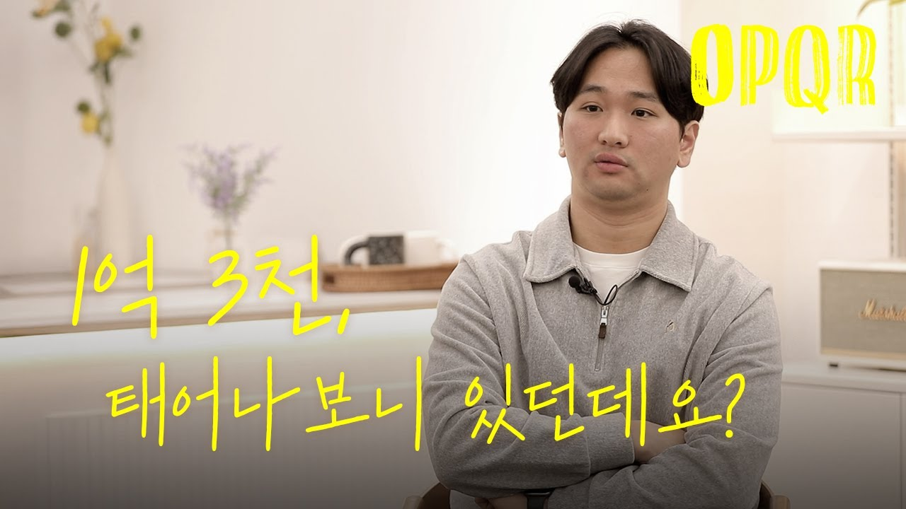
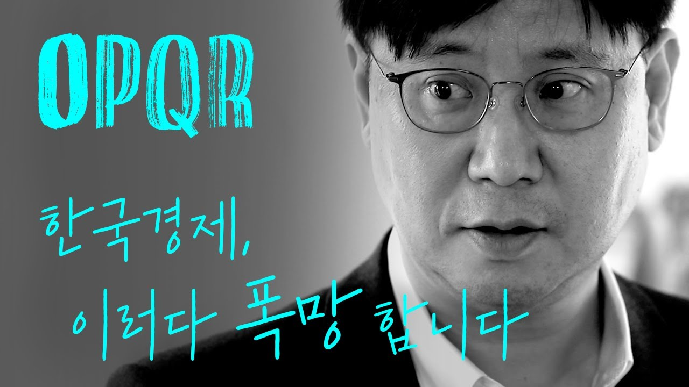
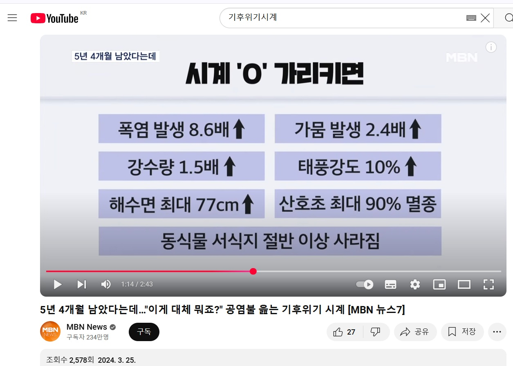

## 문서번호: 5701

### 제목: [연금저축 계좌에서 배당금세금](https://q4all.kr/redirect/detail/434f3122-a732-4076-adb6-1253a9fc5535)

**작성자:** [이종복](https://q4all.kr/user/profile/8650)
**작성일:** 2025-03-17 14:40:32 (월요일)

---

박찬대 의원님이 발의한 법 때문에 연금계좌에 들어는 배당금에 세금을 물린다고 하는데

이 말이 맞는지 알고 싶어요

관련 된 영상 댓글에 다들 민주당 박찬대 의원님을 탓을 합니다

사실을 알고 싶습니다.

---

## 문서번호: 5702

### 제목: [장애인등록자동차 2000cc이하 불합니합니다](https://q4all.kr/redirect/detail/1b4dc5db-9022-4019-9d19-ef4fa0560da4)

**작성자:** [장재용](https://q4all.kr/user/profile/8441)
**작성일:** 2025-03-17 16:39:47 (월요일)

---

안녕하세요

장애인 등록 세금감면기준이 2000cc이하로 되어 있습니다.

이부분 개선이 필요 합니다.

지금 자동차는 중형 및대형차 기준이 cc로 나누는 시대는 지났습니다.

대형자동차도 하이브리드 1500cc 로나오는 시대입니다.

그런데 아직 장애인 세금감면 자동차 등록 기준이 2000cc이하로 되어 있습니다. 이제 이cc기준을 아예 없애야 된다고 생각 합니다.

중형차나 소형차여도 cc가 2000cc 이상이면 세금이나오고 대형차에 억대가 넘는 자동차라도 2000cc가 넘지않으면 세금감면이 됩니다. 시대에 맞게 cc로 나누는것을 없애야 한다고 생각 합니다.

시정해주세요

---

## 문서번호: 5703

### 제목: [미성년자의 범죄 피해보상은 보호자가 해야하는 법적, 제도적 장치가 필요하다](https://q4all.kr/redirect/detail/779b8cda-80ff-4bb4-a20a-d4019f21bdae)

**작성자:** [이화향](https://q4all.kr/user/profile/8654)
**작성일:** 2025-03-17 16:55:56 (월요일)

---

뉴스를 장식하는 미성년자의 범죄가 늘고있다고 한다.

촉법소년 이하의 미성년 범죄도 횟수도 강도도 점점 늘고있다고 한다.

길게 설명하지 않아도 많은이들이 동의할 것이라고 본다.

촉법소년 나이를 낮추거나 형벌을 강화하는 것보다는

다른 방법으로 해결해야한다고 생각한다.

미성년자이니 그들이 저지른 범죄나 잘못에 누군가는 책임을 져야하는데, 부모를 포함한 보호자가 물적 피해보상을 해야한다는 법적 제도적 장치가 필요하다고 본다.

이런 장치가 마련된다면 부모를 포함한 보호자가 미성년의 행동을

제약할 것이고

아이들도 자신들의 행동 결과에 자신이든 누군가는 책임져야한다는 걸 알수있을 것이다.

적어도 나이어린 아이들이

내가 불법적인 일을 해도 잡아가지 않는다고 말을 할때

행동결과의 피해를 부모나 보호자가 책임져야하니까

하지말아야한다는 제약을 가질수있을 것이다

---

## 문서번호: 5704

### 제목: [사회에서 사용하는 언어와 상식에 새로운 정의가 필요](https://q4all.kr/redirect/detail/0ebe7bbc-a379-4a3a-a26b-e2fa045b1222)

**작성자:** [이화향](https://q4all.kr/user/profile/8654)
**작성일:** 2025-03-17 17:14:39 (월요일)

---

뉴스를 보다보면

각종 언론에서 사용하는 언어가 내가 사용하는 것과 달라 혼란스럽다.

여당과 야당에서 말하는 국민의 의미가 다르고

언론에서 사용하는 주요어휘가 어떤 입장이냐에 따라 의미가 달라진다.

아무도 이런일에 질문을 던지지 않고

가르고 정리해주는 기관이 없다..

언어들이 점점 풍위가 없어지고 자극적이고 강도가 세진다

아무리 사회가 험해지더라도

언어까지 이렇게되면 상승작용을 해서

샤회가 더 살벌해지게 된다고 생각한다.

사실을 확인해서 팩트체크를 하면

거짓뉴스를 말한 기자나 언론 유튜버들은 사과와 책임을 지울수있는

장치가 필요하다.

적당히 넘어가니 거짓말과 거짓뉴스 개소리들까지

자연스럽게 늘어나고 사회속에서 횡행한다

언어나 상식의 새로운 정의

가짜뉴스, 개소리들의 책임지우기

우리사회의 평온과 도약을 위해 필요하다고 생각한다

---

## 문서번호: 5705

### 제목: [사법개혁과 권력형카르델 단절에 대안](https://q4all.kr/redirect/detail/6cd7c4d1-6e5a-4156-8228-8db8f37bdb62)

**작성자:** [김철](https://q4all.kr/user/profile/414)
**작성일:** 2025-03-17 17:31:55 (월요일)

---

1.사법고시후 5년이상 변호사 경력자를 판사로 채용해야합니다.

2.판사들의 업무평가기관을 설치하여 판결문을 공개하고 평점하여 하위5%탈퇴해야 합니다.평가기관은 국민들이 선출한 국회에서 관리 감독해야 합니다.국회에서 입법한것이고 국회에서 법을 잘 이행하고 집행하는지 감시하는 것은 당연한 권리 입니다.

3.고위공직자들 정년퇴직후 5년내 재취업 못하게 해야 합니다.

국민의 세금으로 봉급받고 퇴직금받고 연금받으면서 퇴직후도 국민이 주었던 권력을 이용해 재취직한다는 것은 비리와 권력형카르텔을 유지하는 것입니다.권력형카르델은 국민의 감시에서 벗어나 온갓부정부패를 저지르고 있습니다.

4.사임한 고위공직자들에 대해서도 상세한 규제제도를 만들어야 합니다.

---

## 문서번호: 5706

### 제목: [최상과 최하의 임금 겨차를 줄이자](https://q4all.kr/redirect/detail/f3895a5f-90d6-4bb9-8704-e20e4a099f54)

**작성자:** [이화향](https://q4all.kr/user/profile/8654)
**작성일:** 2025-03-17 17:39:36 (월요일)

---

최상과 최하의 임금격차를 줄이자

예를 들어

의사와 중소기업 대졸자 연봉차가 몇배일까?

예전엔 5배 정도였다고 하는데

지금은 훨씬 더 많아졌을 것이다

적어도 사회적인 합의가

3배정도를 넘지 않도록 한다면

사교육비를 줄일수있고

고연봉자에 대한 상대적 박탈감, 반감들을 줄일수있을것이다

부모들이 내 자식이 돈 많이 벌고 잘살게하기위해

학교 다니는 내내 아이들에게 공부를 강요하고

성적을 올리기 위해 사교육시장을 전전하게한다.

적응하지 못한 아이들의 불행을 초래하고

경쟁을 과도하게 하게하고

화풀이같은 학교폭력이 늘게한다.

그렇게 큰 아이들이

죽을것같은 그 콰정을 통과한 소수의 아이들을

그렇게 하지못한 다수 아이들의 질투같은 반감 사이에

사회 갈등은 더 커지고

감정의 골은 더 깊어가서 더 어깃장을 놓게된다.

삶의 만족도가 높은 북유럽은

연봉차가 3배 정도라고 들었다.

물론 의료서비스 및 최고 전문가의 질이 떨어질수있겠지만

적어도 사회통합이나 많은 이들의 행복도를 높이지 않을까

생각한다

---

## 문서번호: 5707

### 제목: [자취방은 전세 사기 당하고, 청년 임대주택은 보증금 비싸서 못들어가는 제가 대한민국 평균 30대 맞나요?](https://q4all.kr/redirect/detail/dfc0697b-87fa-4cd0-8ade-403884f47663)

**작성자:** 오피큐알OPQR - 청년 전성훈
**작성일:** 2025-03-17 17:50:05 (월요일)

---

**자취방은 전세 사기 당하고, 청년 임대주택은 보증금 비싸서 못들어가는 제가 대한민국 평균 30대 맞나요?**

중견기업에 다니는 성훈씨는 스스로 평균이라고 생각하며 지냈지만 전세사기 피해를 당하고 청년 임대주택 입주에 실패하면서 과연 나는 평균인가 하는 의문이 들었다고 합니다.

40대 초반에 희망퇴직을 받는 변화된 세태 속에서, 평균의 함정에서 벗어나 기성세대의 삶의 방식이 통하지 않는 현실에 맞는 세입자 보호 정책을 고민하는 그의 질문입니다.

**1. 🏠 청년 주택 문제와 현실**

청년들은 높은 보증금을 마련하는 데 어려움을 겪고 있으며, 이 과정에서 상대적으로 부유한 집안의 자녀들이 유리한 환경에 있다는 점이 같은 세대 내의 양극화를 보여주고 있습니다.

성훈씨는 평균 소득을 가진 평범한 직장인으로, 서울에서 전월세 매물이 부족해 주택 구하는 과정이 힘들었고, 전세사기를 겪으며 집주인이 많은 자산을 가지고 있음에도 보증금을 돌려주지 않아 큰 어려움을 겪었습니다.

**2. 🏡 전세사기 피해지원의 법률적 어려움**

전세사기 피해 지원을 위해서 계약을 증명하는 과정에서 너무 많은 서류가 요구되었고, 서류마다 추가 되는 서류가 많아 복잡한 상황이 발생하기도 했습니다. 계약서의 법률적 용어는 이해하기 어려웠고 결국 어머니의 지인인 법무사에게 도움을 요청하게 되었습니다. 법무사의 도움으로 복잡한 법원 문서 대신 간단한 한 문장으로 설명하여 절차를 신속하게 진행할 수 있었습니다. 하지만 피해자 지원 신청이 완료된 후에도 담당자의 배정이 지연되며, 연락이 없는 상태에서 두 달을 기다려야 했습니다. 이러한 현재 주택도시보증공사의 보증 시스템은 집주인들의 손해 책임을 사실상 세금으로 부담해주는 구조이며 성훈씨는 개선이 필요하다고 말합니다.

**3. 💸 청년 주택 보증금 문제와 청년문제**

전세 사기로 인해 보증금을 돌려받지 못하는 상황에서 성훈씨는 전세 사기에서 안전한 집을 찾아 나섰고, 높은 보증금에도 불구하고 청년 주택을 선택할 수밖에 없었습니다. 하지만 민간 청년 주택 임대 보증금 1억 3천 만원과 월세 75만 원은 큰 부담이었으며 결국 대출을 알아보게 되었지만, 1인 가구 소득 요건 등 대출 기준이 매우 제한적임을 확인하여 결국 포기하고 말았습니다. 청년 주택의 높은 보증금은 월급이 300만 원인 성훈씨에게도 어려운 현실입니다. 기존 세대가 더 큰 어려움을 견뎌냈다고 하지만, 안정적인 주거 여건이 무너진 상황에서 지금의 청년들도 이미 단칸방에 거주하며 현실적 어려움을 겪고 있습니다. 사회의 부러진 사다리를 회복하기 위해서는 청년 정책의 개선이 필요하며, 이러한 문제를 겪는 당사자들과의 직접적 논의가 필수적입니다.

**더 많은 질문이 보고싶다면?!**[**▶ 유튜브 오피큐알OPQR 채널 바로가기**](https://youtu.be/oDJRGwxVBmg?si=jCwPio3mrOyyOwPl)

---

## 문서번호: 5708

### 제목: [수입 금에 관세를 꼭 부과해야 할 까요???](https://q4all.kr/redirect/detail/b1f5ce21-7682-42f7-9117-5fa57257a881)

**작성자:** [이형언](https://q4all.kr/user/profile/7150)
**작성일:** 2025-03-17 17:51:03 (월요일)

---

선결론 - 금의 수입시 관세를 없애고 유통시엔 부가세를 부과하고 수출시엔 추가 세금을 부과하자

그래서 국내 민간 금 보유량을 늘리자

최근 영국의 실물 금이 미국으로 옮겨간다는 뉴스를 본적이 있습니다

그래서 우리나라는 어떤가 싶어서 찾아보니 금 수입시 관세를 매긴다고 하더군요

이상했습니다 왜 관세를 부과할까 하고...

그 결과 금을 상품으로만 보기 때문에 수입 관세를 부과한다는 결론에 이르렀습니다

금은 단순히 물건이기만 입니까?

물건이기도 하고 화폐이기도 합니다

한국은행이 금을 보유하는것 자체가 최후의 화폐의 기능을 알고 있기 때문입니다

달러를 국내로 송금할때 관세를 부과 하지 않습니다

하지만 달러보다 더 화폐의 기능을 하는 금에 관세를 부과하는건 이상합니다

각국 중앙은행들은 최후의 화폐인 금 보유량을 늘리려고 노력중입니다

한국은행이 금 보유량을 늘리면 좋겠지만

그게 안된다면 민간에서라도 금 보유량을 늘릴수 있도록 유도해야한다고 봅니다

과거 60-70년대 달러 보유량을 늘리려고 수출장려정책을 폈고

그리고 해외여행 허가제등등 여러정책으로 달러의 반출을 줄이는 노력을 했습니다

달러 수입은 늘리고 달러 지출을 줄임으로써 국가전체의 달러보유량을 늘리려고 노력했고

어느정도 궤도에 오르자 해외여행 자유화등을 실시하여 달러 지출을 어느정도 풀어줬습니다

금도 저런 유사한 정책을 펴서 국내의 금 보유량을 늘려야 한다고 생각합니다

흑묘백묘처럼 한국은행이든 민간이든 누가 보유했던 상관 없습니다

수입시엔 달러 송금 받는것처럼 화폐로 취급하여 면세하고

국내 유통시엔 상품으로 취급해서 부가세를 과세하고

수출시엔 국부로 취급하여 추과 관세를 부과해서

금의 국내 유입은 늘리고 국외 유출을 줄이는 것이 국익에 맞다고 봅니다

똑똑한 경제학자들이 많아서 다들 잘 알아서 하시겠지만

100년에 한번 빈도의 국가 위기시 제2의 금 모으기 운동을 하려고해도

국내에 금이 있어야 할수 있지 않겠습니까

---

## 문서번호: 5709

### 제목: [뉴스보다 속터져서 글씁니다. 국힘 뉴스 댓글 좌표 언제까지 봐야되는지](https://q4all.kr/redirect/detail/64b02024-3177-4986-b959-e6f8b28d9b56)

**작성자:** [이성규](https://q4all.kr/user/profile/8657)
**작성일:** 2025-03-17 18:11:11 (월요일)

---

얼마전 만 40세 접어든 남자입니다.

디시인사이드 국민의힘 갤러리만 가봐도 이렇게 대놓고

글머리 🔥화력 달아놓고 특정 기사, 청원 등 좌표 달아놓고 우르르 몰려가서 해당 기사 올리고, 댓글 올려두고

네이버는 추천 많이 받은 기사 메인에 노출되고

정치 무관심한 분들 기사보다가 그런가? 하고 조금씩 저쪽으로 넘어가고

혼자서 백날 댓글 달고 반대 먹이고 해봐야 소용도 없고

MB 정권부터 네이버/네이트/디씨/펨코 등등 온갖 커뮤니티를 점령하다 시피 하고 있고,

특히 리그오브레전드 (fow.kr 이나 디씨 리그오브레전드 게시판), 스타크래프트 (예전 와이고수 부터) 같은 게임 커뮤니티를 중심으로 10년이 넘는 기간동안

때로는 재밌는글, 때로는 남자들 좋아하는 야시시한 글들로 커뮤니티가 활발하게 돌아가면

슬쩍슬쩍 조롱글, 사실을 왜곡한 자료들을 섞어 올리며

어린 친구들을 물들이기 시작하더니

요새 이런 게임 해보셨나요? 한게임 하면 10명이 한팀인데 3~4명은 말끝마나 노노 거리면서 완전 일베에 절여진 친구들이 득실득실 합니다.

처음부터 이러지 않았습니다. 이들은 오랜기간 여기에 공을 들인겁니다.

노대통령님 조롱하고 전땅크 전땅크 거리며 히히덕 거리던 어린 친구들이

자라나서 지금의 20대 이대남이 된거구요. 지금도 게임 커뮤니티는 무방비 상태입니다.

지금의 게임좋아하는 10대 아이들도 똑같이 20대되서 이렇게 될겁니다.

왜냐면 실제로 재밌는글도 많고, 남자들 좋아하는 야시시한 글들도 많고. 낄낄거리며 웃다가

이런 저런 정보들과 섞여 저렇게 되가고 있으니까요

사실상 조직적이 되버린 저런 좌표몰이를 개개인이 상대할 수가 없습니다.

십수년을 이 놈들하고 인터넷서 보일때마다 뚝딱거리면서 힘이 쭉쭉빠져 답답한 마음에 글 올립니다.

어떻게 상대할 수 있나요? 민주당은 이런 쪽으로는 완전 포기하시는건가요?

---

## 문서번호: 5710

### 제목: [선출직 공무원의 귀책사유로 실시하는 보궐선거비용](https://q4all.kr/redirect/detail/301f6610-50f2-435d-9b2a-c21f25155809)

**작성자:** [김승도](https://q4all.kr/user/profile/8658)
**작성일:** 2025-03-17 19:34:09 (월요일)

---

선출직 공무원의 귀책사유(위법행위)로 보궐선거를 실시할 경우에 보궐선거비용을 귀책사유가 있는 자에게 왜 부담하게 하지 않을까?

선출직 공무원으로 출마하려는 자는 본인 및배우자의 직계존비속 재산신고를의무적으로 하게하고 본인의 귀책사유(위법행위) 로 실시할 경우에는

본인 및 배우자 직계존비속의 신고재산 범위내에서 보궐선거비용을 부담하도록 하자

선출직 공직자가 되려는 자가 배우자 및 직계존비속의 신뢰도 얻지 못하는데 어찌하여 출마할 수 있을까?

---

## 문서번호: 5712

### 제목: [임대차 10년 연장법안설에 대해 질문있습니다 ](https://q4all.kr/redirect/detail/6efd3d60-7c4c-4706-9723-f94d8f3ba713)

**작성자:** [강민주](https://q4all.kr/user/profile/8660)
**작성일:** 2025-03-17 20:20:58 (월요일)

---

저는 오랜세월 민주당을 응원하고 투표도 늘 민주당외에는

뽑지않았던 사람입니다.

지금도 늘 민주당이 잘되길 바라는데 최근 뉴스에

민주당에서 임대차기간을 10년 연장 법안을 발의할 예정이라고

봤습니다. 이법안이 발의되는 것 자체가 편가르기 입니다.

이 사회가 임차인만 보호하고 임대인들은 심각한 재산권 침해를

당한다는건 생각도 안하시는듯 하네요.

저는 겨우 2주택자 이지만 그것도 서울에 아주 낡은 빌라하나

세를 주고 있는데도 빌라는 매도도 안되서 어쩔수 없이 가지고

있는데 그나마도 매도하려 할때마다 임차인들은 집을 보여주지도

않고 전세사기에 임차인 구하는것도 어려워 임차인이 나간다고

할까봐 눈치나 보며 이러지도 저러지도 못하는데 10년 임차하면

그게 과연 임대인들의 집인가요?

지난 대선에 이재명 대표님이 낙선한 가장 큰 원인이 집값과

임대차법 때문이라는거 알고계신가요?

국가의 세금을 책임지는건 수많은 임대인들이지 임차인들이

아닙니다. 제발 현실에 맞고 임대인과 임차인이 상생 하는

법안을 고민해주세요..

지금도 계약갱신 청구권을 악용하는 임차인들 때문에 속썩는

임대인들 아주많습니다.

---

## 문서번호: 5713

### 제목: [나는 더 일하고 싶습니다. 나는 계약직 근로자 입니다. ](https://q4all.kr/redirect/detail/74a7d044-483f-4f37-89f0-6793f8ecd534)

**작성자:** [이종수](https://q4all.kr/user/profile/8634)
**작성일:** 2025-03-17 21:37:56 (월요일)

---

기간제법(기간제 및 단시간근로자 보호 등에 관한 법률)은 원래 계약직 근로자의 고용 불안을 줄이고, 장기적인 고용 안정을 도모하기 위해 제정되었습니다. 그러나 현실적으로는 기업이 무기계약직 전환 부담을 피하기 위해 계약 기간이 끝나기 전에 근로자를 해고하거나, 단기 계약을 반복적으로 체결하는 등의 부작용이 발생하고 있습니다.

이로 인해 가장 큰 피해를 보는 것은 계약직 근로자들입니다. 이들은 안정적인 일자리를 얻지 못할 뿐만 아니라, 24개월이라는 기간 제한 때문에 경력이 단절되거나, 새로운 일자리를 계속 찾아야 하는 불안정한 상황에 놓이게 됩니다.

이를 해결하기 위해서는 노사 간 합의를 통해 계약 기간 연장(단, 무기계약직 전환 의무 없음) 같은 유연한 방안을 고려할 수 있습니다. 또한, 정규직 전환이 어려운 경우라 하더라도 장기 근속이 가능하도록 제도를 개선하거나, 계약직 근로자에 대한 처우 개선을 병행하는 대안이 필요합니다. 기업의 부담을 줄이면서도 근로자의 고용 안정성을 높일 수 있는 현실적인 정책이 빠르게 논의되어야 할 것입니다.

---

## 문서번호: 5714

### 제목: [노조에 대한 혐오](https://q4all.kr/redirect/detail/980d65d6-bcf4-42f3-8f72-cd55c523c67c)

**작성자:** [고정진](https://q4all.kr/user/profile/7230)
**작성일:** 2025-03-17 21:52:01 (월요일)

---

대다수의 국민들은 노동을 하며 하루하루 살아갑니다.

그런데 국내의 노동조합에 대해서는 인식이 각색하다 못해 종종 종북좌파빨갱이라는 북한팔이을 하는 사람들에게 소재로 사용하기도 합니다.

분명 회사를 다니고 급여를 받는 일반인인데 그 일반인이 노동자일텐데 이런 일이 왜 일어난지 몰라 적어 봅니다.

1. 기득권의 혐오정서
2. 노동 조합의 스스로의 개혁 부족
3. 노동에 대한 기본 교육부족
4. SNS 또는 유튜브등으로 인한 왜곡된 정보
5. 노조 조차 비정규직에 대한 차별
6. 정부의 불법 운운하면서 불법으로 유도하는 정책
7. 소통부족

정치색이 아닌 진정한 노동자의 이익을 대표하는 노동조합이 필요한 시기가 아닌가 생각될 정도로 문제가 있다 봅니다.

한국노총과 민주노총의 문제점들은 시대에 맞게 변하지 않고 있다고 보여 집니다.

인식도 문제인것이 나 또한 노동자 이지만 노조에서 요구하는 일들이 간혹 보면 내가 을인가 생각되기도 합니다.

교육에서도 문제입니다.

모든 학생이 과학자 되고 연예인이 되고 정치인이 될수는 없습니다.

대다수는 노동자로 삶을 살아가야 합니다.

그럴려면 초중고 교육중에 노동과 금융에 대해서 교육을 해야 하는 겁니다.

(금융은 논외이므로 생략합니다. )

그래야 정채된 노동조합도 개혁이 될수가 있고 노동자에 대한 이익을 지킬수 있는 기반이 있다 보여집니다.

더불어 법을 다루는 직종에서도 노동에 대한 이해과 개념이 잡힐수 있기 때문에 무지로 인한 잘못된 판결이나 수사 각종 소송에서 해당 지식들이 유용하게 쓰여지리라 봅니다.

---

## 문서번호: 5715

### 제목: [태양광 설치 위치를 전국 고속도로 일직선 라인으로 설치하면 안될까요?](https://q4all.kr/redirect/detail/9b8c5f7f-936e-4b89-8ec0-23630489f00e)

**작성자:** [김윤](https://q4all.kr/user/profile/3569)
**작성일:** 2025-03-18 01:26:42 (화요일)

---

태양광 설치 위치를 전국 고속도로 일직선 라인으로 설치하면 안될까요?

태양광을 도로를 따라 설치하고, 리프트 형식으로 각도를 조절 할 수 있게 수평 또는 상황에 따라 수직으로 세울 수 있게 변형이 가능한 구조로 만들면 어떨까요?

---

## 문서번호: 5716

### 제목: [위원회 운영 이대로 좋은지요?](https://q4all.kr/redirect/detail/4905d3f4-f9bd-4bbd-82ce-6b52b33636d6)

**작성자:** [차현철](https://q4all.kr/user/profile/8668)
**작성일:** 2025-03-18 08:09:33 (화요일)

---

정부의 중요한 조직중 방통위, 방심위 등 각종 위원회 운영에 문제는 없습니까?

위원 임명을 누락한 상태에서 의사결정이 이루어지고 있습니다.

합의기구로 운영되는 위원회는 그 구성원이 완전체가 되기 전에는 활동할 수 없도록 법제화할 필요가 있지 않나요?

---

## 문서번호: 5717

### 제목: [네어버 알고리즘(정치 고관여층 관리 의심,내란정권 민감 단어 조작](https://q4all.kr/redirect/detail/dde526b0-bb35-47bb-8931-8e7192c717a8)

**작성자:** [박상기](https://q4all.kr/user/profile/1153)
**작성일:** 2025-03-18 10:27:44 (화요일)

---

유투브에서 캡쳐한 사진의 글을 복사해서

네이버 블로그에 붙여넣기를 하면

글자 오류가 생기고 코드오류가 생깁니다.

정치 고관여층과 정치관련 블로거들에게

알고리즘 차원의 고급 소프트웨어 기술을 이용해

의도적으로 방해를 하고 있다는 의심이 듭니다.

계엄,국힘,수괴...같은 민감한 단어가 변형됩니다.

애플 아이폰,삼성 갤럭시에서 발생합니다.

애플 고객센터에서는 네이버 문제라고 합니다.

제 블로그에 게시한 일부 내용을 공유하기 위해

링크합니다

<https://m.blog.naver.com/iu2222iu/223707639142>

포털 감시 알고리즘 모니터를 강화해 주세요

언론 모니터링 강화해 주세요

---

## 문서번호: 5718

### 제목: [의대 입학생을 꼭 학부 통합해서 뽑아야 합니까???](https://q4all.kr/redirect/detail/4aeec1a5-e2e4-4b83-aa5e-7d8ed64f0415)

**작성자:** [이형언](https://q4all.kr/user/profile/7150)
**작성일:** 2025-03-18 10:39:41 (화요일)

---

의대 입학 - 국가고시 - 일반의 - 전문의 수련(레지던트) - 전문의

소아외과가 부족하다

산부인과가 부족하다

일반외과가 부족하다

응급의학과가 부족하다 등등 말들이 많습니다

그럴꺼면 다른 학과처럼 의대 입학할때부터 소아과 0명, 외과 0명, 응급의학과 0명 이렇게 뽑으면 안되나요???

이렇게 뽑고 졸업후 국가고시 통과해서 일반의로 살겠다고 한다면 할수 없겠지만

응급의학과로 입학하고 국가고시 합격후 피부과, 안과 등등 입학한 과 외엔 전문의 수련 못하게 막는다면

전문의 부족현상을 조금이라도 줄일수 있지 않을까요?

이것이 너무 과한 처사라고 한다면

응급의학과로 입학하고 피부과 전문의 수련 받고 싶다면

피부과로 입학하고 피부과 전문의 수련하려는 사람을 1순위로 뽑고 그후 정원 여유있을때

타과로 입학한 사람을 2순위로 선발하게 한다면 어느 정도 해결되지 않을까요???

입학 : 응급의학과 -> 일반의 or 응급의학과 전문의 1순위 수련 자격 or 타과 수련시 2순위로 선발

입학 : 피부과 -> 일반의 or 피부과 전문의 1순위 수련 자격 or 타과 수련시 2순위로 선발

---

## 문서번호: 5719

### 제목: [최상목 탄핵은 언제쯤 가능한가요????](https://q4all.kr/redirect/detail/cbd7d821-dd70-4532-b758-382391b820ea)

**작성자:** [박진희](https://q4all.kr/user/profile/8676)
**작성일:** 2025-03-18 10:51:37 (화요일)

---

안녕하세요.

탄핵이란 엄청 큰 일을 겪으면서 정치에 관심을 갖게된 50대 아줌마입니다.

완전 초초초초보로써 세상 돌아가는걸 잘 모릅니다.

하지만 윤석렬이 나쁜짓을 많이 한거,

최상목이는 윤석렬보다 더 나쁜짓을 하고 있다는건 알겠어요.

최상목은 윤석렬의 역할까지 더해 아주 가관일 정도로 오버를 하고 있는데

도대체 언제쯤 탄핵이 될까요?

헌법재판소도 소식이 없고

도대체 지금 대한민국은 내란의 잔존물들이 너무 깊숙이 자리 잡고 있어서

1가지 하려면 많은 것들을 쳐내야해서 힘이 몇배로 드는거 같아요.

오늘도 최상목이가 방통위건으로 또 거부권 행사를 하는걸 보면서

뉴스 기사에 최상목이 얼굴이 보이니까...정말 쳐다보기도 싫어

울화병이 ....가슴에 통증이 느껴집니다.

정말 화가나고 분하고 열받아서 미치겠어요

민주당이 조금은 과감하게 행동을 해주시면 안되나요?

처음에는 행동으로 계속 보여주시더니....요즘은 너무도 소극적인 행동만 보여주시는거 같아요.

과감하게 최상목 탄핵부터 해주세요.

---

## 문서번호: 5720

### 제목: [질문에도 등급이 있는건가요? 누군가가 한 질문은 중요한 질문이기 때문에 꼭 표시해야 하는 질문인가요? 이 공간의 정체성은 무엇인가요?](https://q4all.kr/redirect/detail/b0046dc6-c6ba-4afd-966d-8f860ca72f9e)

**작성자:** [박선하](https://q4all.kr/user/profile/8675)
**작성일:** 2025-03-18 11:05:03 (화요일)

---

전문가가 더 많이 깊이 있는 질문을 할 수 있습니다. 하지만 모두의 질문이잖아요. 전문가의 질문이든 국민 한 사람의 질문이든 심도 깊게 논의 해 보자는 것 아닌가요?

그럼 질문으로 논의를 해야지 왜 그 질문을 한 사람을 강조하는거죠? 그게 엘리트주의 아닌가요. 한국 사회의 엘리트 주의를 깨고 국민 한명 한명의 목소리를 듣겠다는 공론의 장에

이렇게 떡 하니 전문가 누구의 질문 이라고 강조하고 무게를 더하는 것은 어떤 의도 인지 모르겠습니다.

전문가Q / OPQR Q 를 따로 선정한 기준에 대해 알려 주세요.

그리고 다른 국민들과 다르게 그들의 질문을 구분해야 겠다고 생각한 철학적 배경에 대해서 설명해 주십시오.

많은 기대를 하고 들어왔는데

실망입니다.

그리고 각 질문에 대해 답변하시는 국회의원의 짧은 답변 잘 봤습니다.

그 답변에 대한 저의 개인적인 생각은 음.. 딱 형식적인 답변 "그 일을 해야하는 필요성은 나도 알고 있고 하지만 예산은 없고 방법은 찾고 있는 중이다"

그런 답변은 무수히 많은 공간에서 무수히 많이 들었던 정말 딱 형식적인 답변 그 이상 그 이하도 아니였습니다. 그런 답변을 할꺼면 왜 질문하라고 했는지 모르겠습니다.

제대로 된 답을 할 수 없으면 같이 답을 찾자고 만든 공간이라고 생각했는데 달려 있는 답변을 보고 참 ... 내가 왜 여기 왔을까 하는 회의 밖에 들지 않습니다.

---

## 문서번호: 5721

### 제목: [소비소득. 소비만 해도 소득이 만들어지는 사회! 생계 노동에서 해방?](https://q4all.kr/redirect/detail/c47b101c-f774-48fb-b720-6807e3f57295)

**작성자:** [홍성원](https://q4all.kr/user/profile/8562)
**작성일:** 2025-03-18 11:29:16 (화요일)

---

보통 현대인들은 직장을 구해 일(노동과 시간)을 하고 급여를 받아 생활하는 것을 당연하게 여기고 있습니다.

이러한 방식이 과거에도 당연했을까요? 아니면 미래에도 이러한 생활방식이 계속 유지될까요?

10여년 전, 기사를 통해 '여중생 깔창생리대'에 대한 충격적이고 가슴아픈 소식을 접했었습니다.

현재 우리나라가 선진국이 되었음에도 끼니를 거르는 아이들, 소득이 없어 마지못해 저지르게 되는 생계형 절도, 가족 모두 장애가 있어 직장을 구할 수 없거나, 끝내 생활고를 이겨내지 못해 극단적인 방법을 선택하는 사람들 이야기는 계속 들려오고 있습니다.

더구나 AI, 빅데이터, 로봇, 자동화, 대량생산 등 새로운 기술로 인간이 대체되면서 많은 일자리가 사라지고, 동시에 직장에 남겨진 사람들도 실직을 우려하고 있습니다.

줄어드는 일자리로 세대간 경쟁과 갈등이 발생하고, 빈부격차는 더 벌어지고, 저출산 인구감소에 노후 빈곤, 장수 리스크까지 먹고사니즘과 연결되는 소득에 대한 많은 문제들이 사회를 더욱 혼란스럽게 만들고 있습니다.

우리나라 지식인들은 사람들이 퇴직하게 되면, 새로운 기술을 다시 배워 적응하고 재취업을 반복하며 늙어 죽을 때까지 노동을 해서 스스로 생계 문제를 해결해야만 한다고 합니다.

그렇다면, 앞으로도 각자도생해야 할까요? 미래는 어떻게 변화될까요?

무인매장에서 7천원 커피 한 잔을 사서 마시는 동안 1만원이 되돌아오고, 부모가 온라인거래를 통해 5만원대 아이 분유를 구매하면 6만원이 재입금되며, 지하철, UAM, 고속도로 등 교통인프라를 이용할 때마다 의식하지 않아도 이용료가 자동정산 된 후 100% 내 계좌에 돈이 다시 들어오는 세상.

생계를 목적으로 노동을 제공해서 소득을 만드는 것이 아니라, AI가 생애주기에 따라 제안하는 콘텐츠들을 소비만 해도 현금흐름이 블록체인으로 관리되어 소득으로 다시 환원되는 사회.

바로 '소비소득(Consumption IncIncom)'입니다.

AI시대, 인간이 고유하게 지속할 수 있는 대표적인 것은 ‘창작’과 ‘소비’, '소통' 활동이라고 생각합니다.

창작은 재능이 요구되지만, 소비와 소통은 생애주기 내내 모든 인류가 필연적으로 해야만 합니다.

현재는 노동소득으로 소비하며 힘들게 자산도 일구지만, 다음 세대의 미래는 사람들이 소비와 소통활동만 하면 AI가 현금흐름을 스스로 관리하여 소득과 자산, 즉 신용을 축적합니다.

사람들은 누구나 꿈을 펼칠 수 있는 환경 속에서 오로지 자아성장을 목적으로 하는 업에만 집중하며 수준 높은 삶을 누리게 될 것입니다.

소비소득은 현재 해결해야 하는 여러가지 문제들을 해결할 수 있는 기반이 될 수 있습니다.

실직에 따른 생계문제, 국민연금 재정고갈 문제, 공기업 적자운영 개선문제, 미래 통일 비용에 대한 재정문제 등 소비소득을 통해 여러가지 사회문제를 해소하고, 빈부격차를 완화하여 중산층을 확대하는 방법을 찾을 수 있습니다.

기업에 많은 이익이 집중되는 현재 구조를 개선하여, 유통과정에서 발생하는 이익을 소비자에게 나눠주는 AI 시스템을 구현할 수 있다면,

그리고, AI가 생애주기별 소비패턴을 학습하여, 바른 소비를 제안하면서 현금흐름을 관리한다면, 우리나라 내수경기는 활성화되어 지속적인 경제성장을 이룰 수 있을 것입니다.

이러한 미래비전을 설정하고,

정책적으로 구상하는 기본소득과 민간에서 함께 만드는 소비소득을 기반으로 하여, 본업에서 나오는 급여 또는 사업소득, 투자를 통한 이자와 배당소득, 그리고 노후 연금소득을 체계적으로 준비한다면,

우리나라는 10년 내에 GNI 10만불 달성 가능성을 높이고, 중산층의 폭을 두텁게 넓힐 수 있을 것입니다.

---

## 문서번호: 5722

### 제목: [산에 나무가 많아졌는데 언제까지 두고 보기만 할겁니까?울창한 숲을 세계적인 자원으로 만들 수 있습니다!](https://q4all.kr/redirect/detail/1c19a168-5498-4a56-ba09-044ae17ea227)

**작성자:** [이정미](https://q4all.kr/user/profile/8683)
**작성일:** 2025-03-18 11:42:01 (화요일)

---

ㅇ 오늘날 지역소멸 위기는 대한민국의 중요한 사회적 문제로 대두되고 있습니다.

지방의 인구 감소와 경제 위축은 심각한 수준이며, 이를 해결하기 위해 다양한 대책이 논의되고 있습니다.

이 시점에서 산림에 대한 투자는 지역소멸을 막고, 동시에 경제적 가치를 창출할 수 있는 중요한 해법이 될 수 있습니다.

ㅇ 산림에 대한 투자는 지역 경제 활성화에 기여합니다.

 - 산림은 단순한 녹지가 아니라, 지역 경제를 떠받칠 수 있는 중요한 자원입니다. 현재 우리나라 산림은 국토의 약 63%를 차지하고 있지만,

경제적 활용은 아직 충분하지 않습니다. 국토의 74%가 산림인 핀란드는 GDP의 3%가 임업에서 나오고 있으며,

수출액의 약 20%가 목재나 종이 제품으로 임업이 국가 경제에서 차지하는 비중이 매우 큽니다.

이러한 경제적 효과가 도시가 아닌 산촌에서 나온다는데 더 큰 의미가 있습니다.

- 이제 우리 산림도 울창해져서 활용할 수 있는 시기가 되었으며, 산림에 투자하면 그만큼 경제적 가치를 창출할 수 있습니다.

산림 순환경영과 목재 활용이 증가함에 따라 관련 산업이 성장하고, 이를 통해 새로운 일자리가 늘어날 수 있습니다.

또한 산림에서 생산되는 먹거리 임산물은 약리성, 기능성이 높아 바이오산업의 소재로서 활용 가능성도 높습니다.

ㅇ 뿐만 아니라, 산림경영으로 산림의 기후변화 대응 기능을 강화할 수 있습니다.

- 산림은 탄소 흡수원으로서 기후변화 대응에 필수적인 역할을 합니다. 숲은 가만히 놔둔다고 건강해지지 않습니다.

산림을 조성하고 가꿈으로써 탄소흡수를 잘하는 숲, 생물다양성이 높은 숲, 수자원을 함양하는 숲 등 우리에게 필요한 숲을 만들어 나갈 수 있습니다.

- 더 나아가 나무를 사용하는 것도 탄소중립에 도움이 됩니다. 숲이 새롭게 자라나는 동안에 이용 중인 나무가 탄소를 저장하고 있기 때문입니다.

그래서 해외에서도 탄소중립 실현을 위해 자국의 목재 활용을 적극적으로 늘리고 있습니다.

유럽, 일본, 북미 등에서는 국산 목재를 기반으로 한 건축과 에너지 산업을 확대하며, 이를 통해 탄소 배출을 줄이고 지속 가능한 경제 구조를 구축하고 있습니다.

우리나라 역시 이러한 글로벌 흐름에 발맞추어 국산 목재 활용을 확대하고, 탄소중립 정책과 연계한 임업 활성화 전략을 추진해야 합니다.

현재 국내에서 사용되는 목재의 약 85%가 수입되고 있는데 이는 연간 8조원에 달하고 있습니다. 국산 목재 활용을 확대하면 외화를 절약하고 국내 임업과 관련 산업을 성장시킬 수 있습니다.

ㅇ 산림경영이 활성화되기 위해서는 인프라가 필요한데, 정부 차원에서 인프라 확대를 위한 적극적인 정책을 추진해야 할 필요가 있습니다.

- 산림이 건강하게 경영되려면 접근성을 높이는 것이 우선입니다. 오스트리아는 임도밀도가 50m/ha가 넘는 데에 비해 우리나라는 4m/ha 수준 밖에 안됩니다.

오스트리아는 우리와 비슷한 지형임에도 불구하고 임도의 접근성에서 오는 경영비용의 차이가 엄청나게 납니다.

오스트리아는 지속가능한 산림경영을 통해 우리나라 산림면적의 1/3 수준인 약 200만ha의 면적에서 생산된 목재로 자급률 100%를 달성하고 오히려 목재를 수출하는 국가가 되었습니다.

- 우리도 산림의 경영과 관리를 위한 인프라가 갖춰지고 첨단기술을 활용한 경영 방법을 적용하게 되면 지역을 살리는 임업을 활성화 할 수 있습니다. 더 나아가 우리 목재를 수출하는 경쟁력을 확보할 수 있습니다.

---

## 문서번호: 5723

### 제목: [프리랜서 대출기준 일원화](https://q4all.kr/redirect/detail/fa2cc6e7-c07d-41c7-aacb-e0a5759d7f2d)

**작성자:** [선우강](https://q4all.kr/user/profile/8682)
**작성일:** 2025-03-18 11:45:13 (화요일)

---

프리랜서들 일반대출시 소득기준은 근로자들과 달리 총소득의 6~70%를 적용하는 반면, 햇살론 등 서민금융 대출 기준은 총소득100%를 적용하고 있어서 은행에서는 소득이 적다고 대출제약이 있고, 서민금융에서는 소득이 기준보다 많다고 제약합니다. 같은기준을 적용해서 하는거 아닌가요?

---

## 문서번호: 5724

### 제목: [고금리대출 성실상환자에 대한 재기정책이 필요하지 않을까요??](https://q4all.kr/redirect/detail/6f2cd949-30a4-4918-a45a-c654ff28b2b6)

**작성자:** [선우강](https://q4all.kr/user/profile/8682)
**작성일:** 2025-03-18 11:58:43 (화요일)

---

고금리대출로 고생하시는 분들이 많습니다.

누군가는 성실하지 못해서 고금리대출을 받아 쓰는것 아니냐고 하실수 있지만 본인 의지와 관계없이 사업실패나 질병문제 등으로 고금리대출까지 사용해야하는 사람들이 있습니다. 설사 실수나 부족함때문이어도 고금리대출로 인해 재기가 쉽지않은 점은 감안했으면 좋겠고, 그것이 개인 회생, 파산으로 몰리는 일을 막아야합니다.

이런 분들에 대한 지원정책 개발이 필요해보입니다. 무조건이 아니고 총상환기간중 상당기간을 성실하게 납부를 해온 사람들에 대한 과감한 금리할인이나 저금리 대환 기회를 줌으로서 재기할수 있도록 해줘야합니다. 예를들어 총60개월짜리 고금리상품을 36개월간 연체없이 성실하게 갚았다면 남은 원금 만큼에 대해서 정부보증아래 시중은행에서 저금리로 전환해주는겁니다. 20%짜리 고금리도 성실하게 갚았다면 저금리는 더 잘 갚지 않겠습니까?

과거에 탕감정책이나 캠코 대환대출 제도가 있었는데 문제점을 보완해서 적극적으로 시행했으면 좋겠습니다

이재명대표님이 어려움을 아는 분이니 이런 부분들 잘 연구하고 정착 개발하면 좋겠습니다

---

## 문서번호: 5725

### 제목: [연예인 인권보호](https://q4all.kr/redirect/detail/dbb8eae3-a285-45ba-ae2e-8b8957526769)

**작성자:** [이수정](https://q4all.kr/user/profile/8701)
**작성일:** 2025-03-18 13:40:39 (화요일)

---

최근 김수현 연예인의 경우에 잘못을 떠나 그 사람에 대한 개인정보나 사진들이 너무 무차별하게 올라오고 있는 것 같습니다

불편하고 걱정됩니다

연예인도 사람입니다..

인권보호에 대한 법을 만들어주세요

---

## 문서번호: 5726

### 제목: [연애인 인권보호](https://q4all.kr/redirect/detail/57c5e5d9-2072-4d59-8e4b-cb490ff3092c)

**작성자:** [이경진](https://q4all.kr/user/profile/8704)
**작성일:** 2025-03-18 13:48:11 (화요일)

---

연애인들 인권보호도 법적으로 책임져주는 대한민국이 되었으면 좋겠습니다. 아무리 연애인이지만 너무 개인적인 사진이나 개인사가 포털이나 기사로 뜰때 안타까운 너무 마음이 큽니다. 제발 연애인이라는 직업을 가졌다는 이유로 지극히 개인적인 신상이 노출되어 자살에 이르는 일이 더이상 발생하지 않는 대한민국이 될 수는 없을까요?

---

## 문서번호: 5727

### 제목: [출산휴가와 육아 휴가를 좀더 확장했으면 합니다](https://q4all.kr/redirect/detail/7c468b4c-10a1-4114-b53d-f9acdfdb08d6)

**작성자:** [남경준](https://q4all.kr/user/profile/6239)
**작성일:** 2025-03-18 13:56:36 (화요일)

---

https://youtube.com/shorts/RrHV39CUq0c?si=kSZrs378qwMU288h

위 사례를 보면 남편은 임신중 육아 휴직을 사용하지 못합니다

위 사례의 경우 첫째 아이의 육아휴직으로 대체 사용가능핬지만

첫아이일경우 출산전 육아휴직이 불가합니다 남편도 출산전 육아휴가를 사용할수 있게 해줬으면 합니다

그리고 다둥이일 경우 고위험 산모이기도 하고 출산이후에도 육아에 더 많은 노력이 필요한바

출생하는 아이의 수에 비례해 기존의 육아 휴직기간을 연장할수는 없나요?

---

## 문서번호: 5728

### 제목: [탄핵당하거나 직무 정지된 사람들의 임금은  그 기간동안 정지되어야](https://q4all.kr/redirect/detail/91a78e2f-6e2d-41f7-a630-62fdac8771d0)

**작성자:** [이화향](https://q4all.kr/user/profile/8654)
**작성일:** 2025-03-18 14:49:23 (화요일)

---

**무노동 무임금**

**노동자에게 적용되는 원칙입니다**

**탄핵당하거나 직무정지처분을 받은 고위급 분들도**

**그 기간 동안 공평하게 무임금의 원칙을 정해야합니다.**

**지금처럼 직무정지되어 일도 안하는데 월급을 그대로 받아가는 것도 특혜입니다.**

**평등한 세상을 위해 생각해주세요**

---

## 문서번호: 5729

### 제목: [말 못 하는 소나무를 대신하여 외칩니다. 소나무는 억울하다!](https://q4all.kr/redirect/detail/992404ca-5199-4016-9500-a8632ea802df)

**작성자:** [이우람](https://q4all.kr/user/profile/8711)
**작성일:** 2025-03-18 15:22:33 (화요일)

---

ㅇ 대형산불의 원인이 소나무이니까 활엽수로 바꿔야 한다! 소나무를 심어서 소나무재선충병 피해가 크다! 이러한 논쟁에서 주인공인 소나무는 어떻게 생각할까?

ㅇ 소나무 생각 1.

- 산불을 내지 않으면 되지 않을까? 인간이 산불을 내고서 소나무인 나에게 뒤집어씌우는 것 아닌가? 인간들은 산불을 내지 않는 것에 대해서 이야기를 나누고 있는 것일까?

ㅇ 소나무 생각 2.

- 소나무재선충병의 원인인 재선충은 일본에서 들어왔다.① 원래 한반도에서 풀과 나무와 함께 살던 선충②이 아니어서 나도 아프다. 인간들이 코로나19를 겪었던 것처럼

- 그럼 누가 재선충을 한국 땅에 들여온 것인가?③ 인간들 아닌가. 과연 피해자인 소나무에 대해서 생각하는 사람들이 있기는 한 것인가?소나무 때문에 소나무재선충병이 퍼진 것이라고 말하니 기가 막힌다.

ㅇ 특히, 소나무재선충을 옮기는 솔수염하늘소의 최대 비산거리는 2km 정도밖에 안 되는데도 처음 발생한 부산에서부터 저 멀리 경기도, 강원도까지 소나무재선충병이 어떻게 퍼져나갔을까?그 이유는 바로 인간들이 재선충에 감염된 소나무 원목을 땔감 등으로 이용하려고 인위적으로 이동시켰기 때문이다.

ㅇ 일부 언론과 전문가 등이 대형산불을 막고, 소나무재선충병을 막기 위해서 소나무를 심지 말자고 한다. 일부 맞는 말이기도 하다. 소나무가 활엽수에 비해 불에 잘 타고 발열량도 높으니까. 소나무재선충병은 소나무만 걸리니까.

ㅇ 그런데, 근본적으로 인간이 산불을 일으키지 않으면 되는 것 아닌가?에 대한 대답을 듣고 싶다. 그래도 일부의 언론과 전문가들은 소나무를 심지 말자는 주장을 계속할 것인지 궁금하다.

ㅇ 소나무가 걸리면 100% 고사하는 소나무재선충병이기에 다른 수종으로 대체④했다고 치자. 교체한 수종이 걸리면 치사율 100%인 질병이 해외로부터 유입되어 해당 수종을 죽인다면, 소나무를 대체한 수종이 문제라고 할 것인가.

ㅇ 대형산불, 소나무재선충병에 대한 문제의 본질을 다양한 각도에서 보는 것이 균형 있는 논의가 아닐까?

ㅇ 산불 예방을 어떻게 할 것인지, 산불이 나면 어떻게 빨리 진화할 것인지가 대형산불 대응을 위한 논의의 중심이 되어야 한다.

ㅇ 소나무재선충병도 마찬가지이다. 식물검역을 철저히 하는 방법을 이야기하고, 현재의 확산을 막기 위한 방법은 무엇인지를 논해야 한다. 과거 일본에서 들어온 솔잎혹파리 피해⑤도 이겨낸 우리 소나무이다.

ㅇ 마지막으로 대형산불, 산사태, 소나무재선충병 등 산림재난 방지를 위해서 아래와 같이 제안해 본다.

ㅇ 제안 1

- 산림 정책 추진 시 산불 예방 정책을 강력히 추진해 주기 바란다. LA 산불에서 피해가 큰 원인이 산림 가까이 집을 지었기 때문이라 하는데, 산림 인접지 개발을 제한해야 한다.

ㅇ 제안 2

- ’23년 경북 예천에서 산사태로 인명피해가 많이 발생하였다. 사람들이 집을 지을 때 어디가 위험한지 예방은 어떻게 해야하는지를 건축을 허가할 때 알려주는 제도가 필요하다. 국가가 모든 것을 다해줄 수 없다. 위험 여부를 알려주고 위험을 감수하고 집을 짓는다면, 수술의 위험성을 동의하고 하는 것처럼 본인의 행동에 책임을 지는 것이 필요하다.

ㅇ 제안 3

- 소나무재선충병은 걸리면 100% 죽는다고 한다. 코로나19 때 백신을 맞은 것처럼 소나무재선충병 예방나무주사를 확대해야 한다. 그리고, 필요한 지역에 대해서는 중지된 항공방제를 실시해서 재선충병을 옮기는 매개충을 제거해야 한다.

ㅇ 인간들 싸움에, 자신들이 하고 싶은 주장을 위해서, 인간들이 존재하기 전부터 살아온 식물, 가만히 있었던 소나무를 끌어들이지 말자. 소나무림은 1910년대에서 한반도의 70%를 점하고 있었는데, 과도한 남벌, 한국전쟁 등으로 점차 줄어서 25% 수준이다. 심은 것은 얼마 되지 않는다.

---

## 문서번호: 5730

### 제목: [한국은 과연 다당제인가](https://q4all.kr/redirect/detail/d55dba43-df7c-4d0d-9591-b0618c824e7c)

**작성자:** [엄태현](https://q4all.kr/user/profile/7567)
**작성일:** 2025-03-18 16:31:01 (화요일)

---

대한민국 헌법 제8조 1항
정당의 설립은 자유이며 복수정당제는 보장된다.

이 조항은 다당제를 보장하기 위한 조항입니다.

실제로도 우리나라에는 많은 정당들이 저마다 국가를 위해 일하고 있습니다.

그러나, 우리는 지금 실질적으로 양당제를 겪고 있습니다.
여당의 원내대표가 "우리 정치의 기본 틀은 양당제"라고 대놓고 말할 정도로요.

그러나 우리나라 민심은 그렇지 않았습니다.
21대 총선에서 양당의 비례 득표율 합은 67.19%이었습니다.
30% 가량은 양당이 아닌 타 정당을 뽑았다는 거죠.
사표심리 등을 고려하면 잠재적인 양당 비지지자는 더 많을 겁니다.
21대 총선에서 양당이 얻은 의석수는 281석, 전체 의석의 93%에 달했습니다.
(\*더불어시민당에 참여한 시대전환,기본소득당 의석을 각 1석씩 제외)
누가 봐도 불합리한 선거제도입니다.

그래서 저는 이 선거제를 바꾸어야 한다고 생각합니다.
민심이 더 잘 반영되도록 말이죠.

그렇다면... 어떻게 해야 할까요.

제가 생각해본 방안 몇 가지를 나열해보겠습니다.

1.지역구 254석 / 전국 비례 46석에서 최소 100석으로 확대 및 봉쇄조항 최소 1%로 완화 / 권역별 비례 최소 100석 추가
- 실질적 양당제를 유지시켜주는 지역주의, 소선거구제 비율 두 가지를 한번에 줄일 수 있는 이상적인 방법이지만 의석을 기존 의원수의 150%로 늘리는 대규모 증원에 국민 대부분이 반대할 가능성이 높음.
( 한국갤럽이 2023년 3월 21∼23일 전국 만 18세 이상 1001명을 대상으로 조사한 결과 '선거구 조정이나 비례대표 확대 등 국회의원 선거제도를 변경할 때 현행 의원정수 300명을 확대해야 한다'는 주장에 대해 어떻게 생각하는지와 관련, 응답자의 57%는 '줄여야 한다'고 답했다. '현재 정수 유지' 30%를 합치면 87%. 늘려도 된다는 응답은 9%에 불과했다.)

2. 지역구 200~254석 / 비례 100석
- 증원이 없거나 있더라도 소수라 그나마 가능성이 높음. 그러나 상황에 따라 지역구 수를 줄여야 하는 만큼 문제가 될 소지가 높음.

3.지역구 수 3분의 1 수준으로 감축, 대신 3석 중대선거구제 도입
- 일명 '제3지대'로 불리는 양당 외 타 정당 지지자의 민의 반영 보장이라는 장점이 있음. 대신 득표율이 33% 또는 납득할 만한 수준에 이르지 못할 경우 과대표라는 논란이 일 수도 있음.

제가 나열한 방법 말고도 어떤 방법이든 양당 독과점 수준의 정치가 깨지고 조금 더 건전한 정치가 되었으면 좋겠습니다.

'민주당에 불리한 게 아닌가?' 생각하실 수도 있습니다.
그러나 선거제 개편으로 조금 더 건전한 정치가 만들어진다면 오히려 민주당에 더 유리할 겁니다. 양당제에서 차악으로 뽑힌다는 비난이 덜해지고, 정책적인 부분 등 민주당의 진가가 조금 더 잘 드러날 수 있을 테니까요.

지금까지 국가를 걱정하는 국민으로서 적어봤습니다.
긴 글 봐주셔서 감사합니다.

---

## 문서번호: 5731

### 제목: [그냥 헌재 판결을 기다리고만 있는건가요?](https://q4all.kr/redirect/detail/0ffc9f50-9a84-4e31-b9fb-1f2ef6b9b099)

**작성자:** [김형일](https://q4all.kr/user/profile/5562)
**작성일:** 2025-03-18 16:51:54 (화요일)

---

헌법재판소에 글을 써서 판결을 빨리 해달라고 하기도 지칩니다. 그냥 몇 대 몇만 알려주시도록 해주세요. 판결문은 필요없어요. 역사엔 몇 대 몇만 남을 것 같습니다.

고구마 민주당이 다시 보이기시작합니다.

계엄령의 직접적인 피해자들이 국회의원이라 자기일이 아니라고 생각하진 않으시겠고 내란의 밤에 담을 넘어 표결에 참여하겠다고 하는 심정으로 국민을 위해 뭐든 하주세요.

심우정, 지귀얀, 최상목 등 위헌과 위법을 행하는 자들을 그냥 보고 있으려니 도대체 민주당이 살려는 것인지 죽으려는 것인지 모르겠습니다.

기다리다 국민들이 죽어나갈 것 같습니다.

이젠 무엇을 믿고 살아가는 것이 맞을지 답을 주시기 바랍니다.

---

## 문서번호: 5732

### 제목: [아파트가격이 하향 안정화하기 위한 방안이 있을까요?](https://q4all.kr/redirect/detail/7b2c169c-7881-4b26-8251-55203e2069d5)

**작성자:** [이동석](https://q4all.kr/user/profile/8714)
**작성일:** 2025-03-18 17:35:00 (화요일)

---

안녕하세요. 경기도에 살고 있는 무주택자입니다.

내집을 마련하고 싶으나 미쳐버린 우리나라의 아파트값 현실과 현정부의 대책없는 정책에 좌절하고 있는 국민으로서 두서없이 글을 올려봅니다.

현 정부에서는 아파트가격이 하향 안정화되려고 하면 정책을 사용하여 국민들에게 대출을 받도록 유도하여 집값(아파트)은 다시 튀어 오르게 하고 국민들은 빚쟁이로 만들고 있습니다.

서울은 말할것도 없고 주요 수도권 지역에서도 오랫동안 살만한 괜찮은 조건의 내집을 마련하기 위해서는 최소 10억 이상의 돈이 있어야 하고

몇몇 돈 있는 사람들을 제외하면 대부분의 국민들은 그러한 내집을 마련하기 위해 과도한 대출을 받아야 하고 그 빚을 갚기 위해 일상적인 소비를 위한 지갑은 닫아야 하는 상황입니다.

저도 몸이 안좋은 와이프의 진료 병원이 서울에 있어 오랫동안 살 수 있는 집을 서울에 마련하고 싶으나, 엄청난 대출을 받지 않으면 마련할 수도 없거니와

설령 대출을 받는다고 하여도 중소기업 직장인의 월급으로는 한푼도 안쓰더라도 원리금을 갚을 수도 없을 것 같습니다.

내수경기가 살기 위해서는 국민들이 소비를 해야 하는데, 그러기 위해서는 국민들이 빚이 없거나 있더라도 내가 버는 월급으로 충분히 갚으면서도

가족들과 맛있는 음식도 사먹고 여행도 다니면서 여유있게 살 수 있는 정도의 빚이어야 하지 않을까 생각합니다.

너무 이상적인 생각인지는 모르겠으나 빚이 없다면 열심히 일해서 번 돈으로 가족들과의 즐거운 소비가 이루어지고 미래를 위한 저축도 하면서 살 수 있고 굳이 투기, 투자를 위한 빚을 지지 않아도 되지 않을까요?

그러나 현 정부는 국민들이 여유있는 삶을 살도록 할 생각이 없는것 같고 그저 본인들 재산 불리기에만 혈안이 되어 있어 투기를 조장하고 평범한 서민들은 빚쟁이로 만들 생각뿐인 것 같습니다.

집은 재산을 불리기 위한 투기수단이 되면 안되고 나와 내 가족이 몸과 맘 편히 살기 위한 목적으로만 존재해야 합니다.

가격이 오르더라도 물가 상승률 정도만 오르는 것이 맞지 않을까요?

결론은 내집 마련의 꿈을 꾸고 있는 서민들이 서울 또는 수도권 주요 지역에 집을 마련하더라도 빚을 지지 않거나 아주 적은 빚만 발생하도록 아파트가격을 하향 안정화시키고

아파트가격이 하향되었을때 타격을 받을 수 있는 소위 영끌족이라고 하는 분들이 과도하게 진 빚을 해결할 수 있는 방안을 마련해주실 수 있으신지 질문드립니다.

이러한 하소연과 질문을 드릴 수 있는 공간을 마련해주셔서 감사드립니다.

끝으로 대한민국이 외국인들까지 몰려드는 부동산 공화국이 되지 않았으면 좋겠습니다.

감사합니다.

---

## 문서번호: 5733

### 제목: [무법한자에대한 신속한 처벌규정을 만들수 없는가?](https://q4all.kr/redirect/detail/eb7695d8-9f3e-4901-8f1e-efcab5cf33ec)

**작성자:** [박세진](https://q4all.kr/user/profile/4963)
**작성일:** 2025-03-18 17:54:30 (화요일)

---

대한민국을 이유없이 사적으로 삼키려하는 자(계엄한자)들과 친일정도를 지나 일본편?인 사람들이 대한민국에 발붙이지 못하게 하는 방법이 없을까?

그런자들을 거래중지, 재산몰수, 급여정지등 돈줄을 확보하지못하도록 바로 즉시 차단할수 있는 방법은 없을까?

비화폰 대통령이 쓸수 있는 권한의 사람들을 정해놓을수 없을까? 그리고 그 누구도 서버를 지울수 없고 지우면 사형에 중범죄로 처벌하여 다시는 석방될수 없게 하는 방법은 없을까?

하루속히 내란에 부역한 자들과 검찰의 존재자체를 신속하게 없애거나 인신구속해버릴수 있는 방법은 없을까?

무법한 자는 바로 처벌 또는 인신구속 혹은 추방 등의 규정을 만들수는 없을까?

---

## 문서번호: 5734

### 제목: [아예 내란이라는 것을 꿈도 못꾸게 할수 있는 방법은 없을까요?](https://q4all.kr/redirect/detail/0b626102-ac6a-4c44-a855-d14c29f59872)

**작성자:** [박세진](https://q4all.kr/user/profile/4963)
**작성일:** 2025-03-18 18:02:26 (화요일)

---

아예 내란이라는 것을 꿈도 못꾸게 할수 있는 방법은 없을까요?

---

## 문서번호: 5735

### 제목: [울산 동구 낚시 조례안에 대해](https://q4all.kr/redirect/detail/faf495e4-249e-4564-a696-6a5ae55f09ee)

**작성자:** [김지형](https://q4all.kr/user/profile/8718)
**작성일:** 2025-03-18 19:14:43 (화요일)

---

울산 동구에 전하동에 거주 하는 주민입니다.

현재 울산 동구 다지역구의 이수영 의원님께서

발의한 조례안으로 인해 낚시가 취미이신

지역주민 및 타 지역주민들의 반발과 실망이 큼니다.

"의사일정 제8항 의안번호 2143호

울산광역시 동구 낚시통제구역 지정 및 운용에 관한 조례안"

분명 조례 안에서는 낚시문화 조성에 기여하기 위한다는

말을 들먹이면서 지역주민과 관련 단체와

간담회 및 의견수렴도 없이 넓은 지역을 낚시 금지하는

조례안부터 만들고 보자는 것이 보임니다.

의회에서 기록한 회의록을 보면

지역 주민과 상권 이해 당사자들과 대화도 없이

조례안 부터 만들고 간담회를 하겠다고 하고

통제구역 지정 후에 의견수렴을 받겠다는건

무슨생각인지 모르겠습니다.

이것이 국민과 소통을 우선시 하는 더불어 민주당에서

말하는 소통인 것 인가요??

조례안을 만들고 통제구역을 만들고 난 뒤에

그러고 난 뒤에서야 지역주민과 관계 단체들과

간담회를 하고 의견수렴을 받겠다는 것은

대화를 할 생각이 없어 보임니다.

5년동안 테트라 포트에서 1명의 사망자가 생긴건

정말 안탑갑고 생기면 안되는 사고였던 것은 맞습니다.

하지만 울산의 근로자들의 스트레스를 풀기 위한

한 방향인 낚시를 의견수렴도 없이

막무가네로 조례안을 만들겠다는것은 이해가 안감니다.

울산 슬도 공원처럼 낚시를 할수있는 공간을 만들고

테트라 포트 진입을 제한하는 방법도 있을 것인데

그러한 조치도 없이 테트라포트 및 겟바위 조차

조례안으로 막으면 저희는 어디서 스트레스를 푸나요??

맨날 술로 건강을 해치면서 화를 풀어야 하나요??

뭐 다른 취미를 가지고 스트레스를 풀수도 있지만

낚시가 제일 큰행복인 사람들은 어찌합니까??

아니면 극단적으로 등산(암벽등반 같은)을 하다 사망사고가

발생하면 그 산 또한 입산금지를 시켜야 하는것 아님니까??

그리고 수영을 하다가 익사 사고가 발생하면

해상 레저활동 또한 제한을 받아야 하는 것이 아니며

극단적으로 교통사고 사망사고가 1년에

수십 수백건이 생기는데 왜 차량 주행금지는

해야 하는것이 아닌가요??

저는 군대에 근무 중에 김대중 대통령님 이후로

쭉 민주당을 지지 했는데 실망입니다.

현재 이 사항은 울산 지역 낚시 카페를 비롯한

전국 낚시 카페에서 이슈가 되고 있습니다.

저희 낚시인들 또한 한표를 가진 지지자 입니다.

지금 타지역은 모르지만 울산 동구 지역은

저를 비록한 주변 지인들은 추후 선거 때

표의 수로 보답을 하기로 했습니다.

제가 싫어 하는 국민의 힘의

윤모씨랑 같이 주민을 대하는 행동이

별반 차이가 없는거 같습니다.

일절 대화를 할생각도 없고

들을 생각도 없는 행동...

일단 자기가 하고 싶은 대로 저지르고 싶은

그래서 저를 비롯한 주변 지인 수백명은

이수영 의원님 지역구에선

반대편을 지지할 생각 입니다.

소수가 모이면 다수가 되고

당신들이 혐오하는 취미를 가진 자 또한

당신들의 지지자 이기도 합니다.

쓸때 없는 긴 푸념을 읽어 주셔서 감사합니다.

---

## 문서번호: 5736

### 제목: [민감국가 지정관련 의견입니다.](https://q4all.kr/redirect/detail/bd1d3549-8dbd-4773-a3ce-68a0c56a3cb5)

**작성자:** [한그린](https://q4all.kr/user/profile/8440)
**작성일:** 2025-03-18 19:27:57 (화요일)

---

단순히 정치적 수사로 핵무장을 언급한 게 아니라 아무래도 실질적인 무기 개발 단계에 있었을 가능성을 염두에 두고 계셔야 하지 않을까 우려됩니다.

이걸 전제로 본다면 미국을 패싱한 무리한 계엄 및 그 후 몇 행정관들의 뻔뻔한 언행, 국힘 의원들의 태도변화, 최근 헌재의 태도까지 연결되어 이해가 됩니다.

더불어 핵 관련 외교적인 압력 문제와 한미동맹 악화를 쟁점으로 부각시키는 게 중요할 것 같습니다.

직관적인 핵무장 옹호 심리와는 다르게 핵무기 끌어안고 뜯어먹고 살 수는 없지 않습니까?

좀 더 생산적인 논의를 바탕으로 국력을 더 향상시키고, 핵 폐기물 처리부터 시작해서 핵 방어 체계 및 기술 발전으로 국론을 이끌어야 하지 않을까 싶습니다.

헌재에도 이런 상황이 비밀리에 알려지거나 해서 갑자기 유보적인 태도를 보이는 건 아닌가 싶기도 합니다. 대통령 석방은 눈돌리기구요.

오늘은 이미 글을 썼고 내일부터는 헌재 게시판에 이런 내용을 포함한 글을 올릴 생각입니다.

민주당도 최악의 상황을 고려해서 핵무장 여론을 등에 엎고 윤석열이 복귀하는 시나리오를 대비해야 합니다.

생각이 있다면 실제로 제작하려했다는 고백을 하지는 않겠지만, 제정신 아닌 사람이니 무슨 일을 저지를지도 알 수가 없네요.

---

## 문서번호: 5737

### 제목: [공정 공평](https://q4all.kr/redirect/detail/3e96b849-7e59-4efc-b252-2a1764a08916)

**작성자:** [유엽수](https://q4all.kr/user/profile/8568)
**작성일:** 2025-03-18 19:42:14 (화요일)

---

노동자가 범죄를 저지른 자에게 법의 잣대는 엄격하고 돈 많고 권력을 가진 자가 범죄를 저지르면 법은 솜방망이가 되는 이 사회가 좀 바로잡아졌음 좋겠다

---

## 문서번호: 5738

### 제목: [국민깨 의제를  국힘당 김상옥 의원  보수주의 진정한 보수라고 생각하시면 좋아요 의견 주시십요](https://q4all.kr/redirect/detail/d11a5414-da89-47d8-a60c-7966da47d05e)

**작성자:** [김진태](https://q4all.kr/user/profile/6771)
**작성일:** 2025-03-18 20:36:41 (화요일)

---

진정한 보수주의는 무엇인가?

이번 윤석열 계엄을 통해 알게된 보수는 국힘당 김상옥 의원을 통해 진정한 보수주의 라고 라는걸 알겠됬습니다.

보수란

전통, 질서, 제도의 가치를 지키는 사람 그리고 유지를 위해 노력하는 사람 이라고 생각함니다.

태도나 사고방식 의미가 안닌지요.

사회, 경제적 그리고 문하적,. 정치적 안정을 중시하는 짛케를 신뢰하는 의미를 가진다 라는 생각이 듭니다.

변화를 신중하게 검토하고 또 검토하는 사회적 불확성을 줄이고 안정성을 해치지 않는 철학적 이 안닐까요?

저도 무식한 삼람중에 한사람입니다. 그리고 양심적, 도덕적, 도를 가지고 대화을 통해 모든지 해결하려는 의지가 필요라고 생각이 듭니다.

옛날 어르신들이 하시는 말씀 중에 저놈은 법이 없어도 사는 사람이라고 하시는 말을 많이 들으며 지금 것 살라왔습니다.

국힘당은 해체 후 다시 태어 나야 합니다.

김상옥의원이야 말로 진정한 보수의 가치를 알고 아는 가치 속에서 몸과 마음이 일치하는 김상옥 의원이라 생각합니다.

이런 김상옥 같은 진정한 보수와 함깨 동참할 의원들로 구성되어 제되로된 국회의원으로서의 자격이 있다고 생각합니다.

같은 의견을 같고있는 국민이라면 동참하시어 작은 힘이 나마 사회적으로 보템이 되는 한사람이 되어 추천해 주십시요

---

## 문서번호: 5739

### 제목: [권력자 특권 폐지해야합니다. 대통령, 입법, 사법, 행정, 재벌 총수에 국민소환제, 주주소환제 이뤄내야 합니다.](https://q4all.kr/redirect/detail/7ebe3056-4e55-44aa-a63f-c600fda838f2)

**작성자:** [설원경](https://q4all.kr/user/profile/5015)
**작성일:** 2025-03-18 21:08:46 (화요일)

---

그 직역을 하는 댓가를 받고 있는데 그외의 댓가로 특권이 왜 있어야 합니까?

대통령, 국회의원의 특권 - 정책을 실시하는데 강하게, 연속적으로?

-> 5년, 4년의 임기로 그런 자만심 가득한 정책을 할 수 있다고 봅니까?

정권이 연속적이어야 하는데 그것은 특권이 있음으로가 아니라 국민의 선택을 받아야 하는 것입니다.

행정, 사법의 고위 공직자들의 특권 - 특권이 있어서 더 큰 부를 누리는데 도움이 되지 국민에게 돌아오는 정책, 판결 뭐가 있습니까?

법? 그것도 사람이 만든것입니다. 그걸 최상이라 믿고, 그걸 판결하는 사람이 신이고 이게 말이 됩니까?

판결하는 판사에 따른 복불복이라는 말이 어쩌면 이리도 당연하게 하는 것인지

국회의원도 빈 곳의 입법을 열심히 해야할 것이 당연한데 빈곳의 입법을 할 생각은 안하고, 적용할 법이 없어서라는 말을 태연히도 하는 그런 멍청한 인간들

박근혜 촛불집회부터 지금에 이르기까지 많은 기대를 하지만 그와 더불어 많은 실망을 하게 됩니다.

국민에게 힘이 있어야 합니다.

재벌총수도 마찬가집니다. 총수가 하는일이 뭡니까? 없는것 같기도 합니다만....

수많은 직원과 주주가 없이는 총수의 월급, 부수입은 없는 것입니다.

왜 총수만 모든게 무죄고, 모든 수입을 독차지하고, 총수일가의 재산세를 왜 국민이 걱정해야 하는 것입니까?

웃깁니다.

국민위에 국민 있다고 착각하지 말아야 하는 사회이어야 합니다.

너나 나나 똑같은 인간, 국민 입니다.

권력으로 무시하지 않는 사회이어야 합니다.

---

## 문서번호: 5740

### 제목: [지금의 학교교육이 사회를 이끌만한 힘이 있다고 생각하십니까? 지금의 학교교육이 어떻게 바뀌어야 할까요?](https://q4all.kr/redirect/detail/90e37855-55d9-456d-97f1-6aa972826a1d)

**작성자:** [설원경](https://q4all.kr/user/profile/5015)
**작성일:** 2025-03-18 22:27:35 (화요일)

---

잘된 학교교육이 사회를 이끌만한 힘이 충분히 있다고 생각합니다.

학교교육에서 다양한 경험과 지식, 지혜, 상식, 동료, 어른, 후배 등에 대한 배려, 이해를 배워

그를 바탕으로 사회에 이행시키고, 이끌 수 있다고 봅니다.

그러나 지금의 학교교육은 한줄 세우기, 그것도 국영수사과 그 과목의 성취도만으로 한줄 세우기를

하는 교육장인데 이런 학교교육으로 탄생한 맨 앞줄에 있는 국민이 많은 다양한 사회의 일꾼이자 리더가

될 수 있을까요?

인간은 많은 다양한 재능과 호기심을 가지고 있습니다. 학교 교과목의 높은 성취도 능력은 많은 능력 중의

하나일 뿐입니다. 그러면 다른 능력을 가진 인간은 왜 일꾼이자 리더로써의 목소리를 낼 수가 없는건가요?

목소리를 내면 학벌로 왜 무시를 당하는 건가요?

얼마전 외국인이 방문한 서울대 유튜브를 봤습니다. 왜 서울대를 진학했냐는 질문에 그많은 학생들은 최고기때문에

진학했다는 말을 하였습니다. 최고라는 하나의 이유만을 아는 사람이 다양한 생각을 하는 사람을 이해할까요?

맘에 안들면 의대 진학해라, 서러우면 서울대 와라 등등의 학벌 갑질은 이제 그만했으면 좋겠습니다.

그러면 진화하는 학교교육은 어떤 모습으로 변모되어야 할까요?

---

## 문서번호: 5741

### 제목: [우리 사회를 좀 먹는 비상식적인 법 개정이 필요합니다.](https://q4all.kr/redirect/detail/f49d2817-56b7-4f90-875e-857a78cf5185)

**작성자:** [손종남](https://q4all.kr/user/profile/8723)
**작성일:** 2025-03-18 23:31:17 (화요일)

---

1. 사실적시 명예훼손 죄를 폐지해야 합니다. 범죄를 저지르고도 뻔뻔하게 사실적시 명예훼손 이라는 법을 이용하여 피해자를 압박하고 협박하는 악법 없애야 합니다.
2. 다수의 인원이 이용하는 주차장을 일부러 가로막고 통행을 방해하는 악질 차주에 대한 차량 강제 견인과 더불어 차량의 흠집이나 파손에 대하여 면책을 법으로 명시하여 법을 악용하여 다수에게 불편함과 피해를 주는 행위를 근절해야 합니다. 공권력을 동원해도 차를 이동시키지 못한다는 법이 말이 됩니까? 반드시 개선되어야할 법입니다.
3. 사기 범죄자 및 경제사범들에 대한 형량을 최고 무기징역까지도 처벌 할 수 있도록 법 개정이 필요합니다. 우리나라는 사기 범죄 비율은 세계 탑급입니다. 그 이유는 처벌이 너무도 약하기 때문입니다. 사기는 경제적 피해를 입은 피해자가 죽음에 이르게도 하는 엄연한 중 범죄이며, 특히 거액의 경제 사범들은 사회와 국가에 막대한 피해를 준 금액에 비해 형량이 터무니 없이 적은 솜방망이 수준입니다. 사기도 살인 범죄와 마찬가지로 무기징역 까지도 처벌 할수 있도록 법 개정이 필요합니다.
4. 음주 운전으로 범죄로 인해 피해자가 사망 또는 평생 중증 장애를 갖고 살아가게 되는 경우 그 처벌도 약한 처벌이지만 피해보상이 너무도 형편없습니다. 이런 법 체계에서는 가해자의 뻔뻔한 배째라 식의 태도와 책임지지 않는 경우가 늘고 있습니다. 한마디로 법이 역할을 전혀 못하고 있는 겁니다. 일본처럼 최소 10년 이상 성인이 될 때까지 생계와 교육비를 책임 지도록 법으로 명시해야 할 필요가 있다고 생각합니다.
5. 남여간의 데이트를 이용 돈을 목적으로 무고를 일삼는 자들에 대한 무고죄에 대한 처벌과 그 피해에대한 보상이 적법하게 이루어 질 수 있도록 법 개정이 필요합니다. 여성이라는 이유로 피해자 행세하며 상대를 성범죄자로 몰아가는 무고죄에 대하여 반드시 법개정을 통해 억울한 피해자가 발생되지 않도록 만들어 가야합니다.

---

## 문서번호: 5742

### 제목: [탄핵은 헌재에서 하지말고, 국민투표로 결정  할 수 없을까?](https://q4all.kr/redirect/detail/316b384f-a06b-4cdb-baa9-0d37a640b66f)

**작성자:** [박용식](https://q4all.kr/user/profile/2181)
**작성일:** 2025-03-19 00:41:06 (수요일)

---

모든 법적인 것은 상식이 바탕이 되야 합니다.

그런데 요즘 탄핵 선고가 늦어 지고 있습니다.

심지어는 기각, 각하 설도 간혹 나옵니다.

대통령 탄핵의 경우 국회에서 의결이 되면 국민투표로 결정 하는것으로

변경하면 좋을 것 같습니다.

국민 투표로 하면 1달이면 충분 할 것이므로 탄핵에 비해 훨씬 빠르게 정리 될 수 있습니다.

그리고 상식 선에서 탄핵이 결정 되어 민의가 확실히 반영 될 것입니다.

---

## 문서번호: 5743

### 제목: [여성기업 수의계약 한도금액 상향 조정과 최저가 입찰의 문제등 간식업체의 고충](https://q4all.kr/redirect/detail/273de83f-db3b-4871-8829-a8b8e0009613)

**작성자:** [이연우](https://q4all.kr/user/profile/8725)
**작성일:** 2025-03-19 03:23:58 (수요일)

---

현재 초등학교 보살핌늘봄교실(과거 돌봄교실) 및 병설,단설 유치원 간식을 납품하고 있는 여성기업 업체입니다

첫번째 질문

국가를 당사자로하는 계약에 관한 법률은 아래와 같이 지난 23년1월3일 개정 되었으나,

**제26조(수의계약에 의할 수있는 경우)**

5. 제1호부터 제4호까지의 경우 외에 계약의 목적ㆍ성질 등에 비추어 경쟁에 따라**국가를 당사자로 하는 계약에 관한 법률 시행령****(2023.1.3개정)**

계약을 체결하는 것이 비효율적이라고 판단되는 경우로서 다음 각 목의 경우

가. 다음의 어느 하나에 해당하는 계약

5) **추정가격이 2천만원 초과 1억원 이하인 계약으로서** 다음의 어느 하나에 해당하는

자와 체결하는 물품의 제조ㆍ구매계약 또는 용역계약

가) 「여성기업지원에 관한 법률」 제2조제1호에 따른 여성기업

지방자치 단체를 당사자로하는 계약관한 법률은 아직도 한도가 5천만원으로 되어 있어 25년 계약에 있어 한계가 있었습니다

국가로 당사자로 하는 계약에 관한 법률과 같이 1억까지 상향 조정해주시기를 바랍니다.

두번쨰 질문

최저가 입찰의 문제

간식인데도 불구하고 현재의 규정상 입찰시 물품으로 규정되어 있어 연간 매출 한도금액에 따라 88%이하,90%이하 최저가 또는 최저가로 하고 있습니다

그러다보니 정부에서 물가인상등을 고려하여 수급자 기준 지방 2천원으로 지정되어 있어도 기초금액을 2천원으로 선정하다보니 평균 1,750원대에 낙찰되는 상황입니다.

하물며 금액 한도에 따라 2단계 입찰인 경우는 한도 기준도 없이 최저가이다 보니 2천원 기초금액이 1,290원에 낙찰되는 상황입니다

경쟁업체는 수주를 하기 위해 매출을 보고 최저가를 제시하고 일단 낙찰되고 보는 실정입니다

또한 2단계 입찰 최저가인 경우는 정성평가부문도 있어 오히려 업체를 배제하려는 마음만 있으면 충분히 그럴수 있어 불공평하다는 생각도듭니다

그러다보니 이 피해는 고스란히 아동들에게 가고 있습니다

간식 상품은 물론 물품이지만 단순 물품으로 보지말고 식음료로 구분하여 별도 규정이 필요하다고 봅니다

예를들어 간식 단가는 2천이면 고정으로 두고 업체 검증하여 선정하는 방법등

세번째 질문

서류 간소화 및 체계적인 기준 마련 필요

계약시 체출 서류를 보면 업체를 검증하기 위한 서류라고 인정하더라도 굳이 불필요한 서류가 많습니다

기준없이 급하게 간식 제공을 도입하다 보니 급식의 서류를 그대로 가지고와서 간식에 맞지 않는 서류 요청도 많습니다

예를들어 건강진단결과서의 경우는 완제품이거나 포장된 상태의 상품을 취급할 경우는 예외인데도 불구하고 요청하고 있다던지

보존식의 경우도 급식의 경우는 조리를 한번에 해서 필요하다고 생각이 드나, 간식의 경우는 개별 포장인 상태로서 문제가 발생시 같은 상품이라고 볼 수 있는지 의문입니다

과거 하도 답답하여 교육청 담당 장학사님을 만나 업체의 고충을 얘기했는데 고충 해소는 되지 않고 오히려 업체에 부담이 되는 경험을 한 적이 있습니다

간식표를 요청하여 3개월분을 드렸는데 교육청에서 간식 상품 하단에 단팥빵인 경우 국내산 40%적용, HACCP를 받은 국내산 상품 위주등을 요청하여 현실과 동떨어진 지침을 내려

힘들었던 경험이 있습니다(이것이야 말로 탁상행정이라고 생각합니다)

어떤 정책을 만들때는 현장의 다양한 의견을 들어 반영했으면 합니다.

네번쨰 질문

집단급식소 판매업의 신고 완화

현재는 허가제이다보니 위생과에서 현장 방문 후 영업신고증을 받을 수 있습니다

과거의 법이다 보니 개정이 되지 않아 이대로 진행하고 있는 걸로 알고 있습니다

그러나 현재는 시설조건인 사무실,작업장,화장실등이 필요하지 않고

주문업체 프로그램을 활용하여 주문하고 물류센터에서 상품 구분 검수 상차하여 납품하고 있어 굳이 사무실이 필요하지 않습니다

불필요하게 사무실을 임대하여 임대료만 주고 있는 실정입니다(사무실은 비어 둔 상태임)

상황에 따라 자택주소로 사업자신고가 가능하도록 요청합니다(실제로 현재 자택에서 컴퓨터로 주문하고 있음)

다섯번째 질문

다양한 간식 상품 제공의 어려움

완제품,개별포장,세척된 과일(하물며 바나나까지도),전자렌지 상품도 제제, 세척 및 칼을 학교에서 사용해서는 안된다등

과거에는 감자,고구마,단호박등도 제공했는데 제제는 많아지고 현장은 다양한 상품 요구하고 서로 상충하는 것 같습니다

물론 식중독 예방차원에서 하는 것은 알곘지만 원천적으로 차단하는 것 보다는 교육하고 주의해서 다양한 상품을 제공하는 것이 옳다고 생각합니다

과일 같은 경우도 세척해서 납품하는 것 보다는 현장에서 세척해서 섭취하는 것이 더 신선합니다

또한 조각 세척 과일등을 납품하면 아무래도 인건비, 포장비용등 단가는 올라갈 수 밖에 없습니다

조가 세척과일 보다는 원물을(사과등) 제공하여 현장에서 절단하여 제공하면 더 양도 많고 신선한 과일을 아이들에게 제공할 수 있습니다.

오늘은 여기까지 질문하겠습니다

모두의 질문Q의 안내방송을 보고 그래 이거야 하는 생각이 많이 들었습니다

질문을 그냥 버리지 않고 되면 되고 안되면 안된다는 말씀을 해주신다고 하여 평소 제가 가지고 있던 생각들을 나열 해 보았습니다

아무쪼록 발전하는 대한민국이 되기를 간절히 희망하는 국민의 한 사람으로서 항상 응원합니다.

Ps: 위 내용 중 일부 내용은 교육청 신문고에 올려 답변 받은 내용도 있습니다만 제가 원하는 답변은 아니었습니다 항상 법의 테투리안에서 두루뭉실.

---

## 문서번호: 5744

### 제목: [대통령 탄핵은 국민투표로 바꾸면 안되나요?](https://q4all.kr/redirect/detail/8c879504-3094-46ed-92b6-9b6228529732)

**작성자:** [고부경](https://q4all.kr/user/profile/7063)
**작성일:** 2025-03-19 04:29:36 (수요일)

---

대한민국 헌법 1조 1항은 대한민국은 민주공화국이고 모든 권력은 국민에게서 나온다 입니다. 그런데 공화국의 수장인 대통령은 투표로 뽑지만 탄핵은 국회의 소추안 표결과 헌법재판소의 판단으로 파면이됩니다. 아무리 국회의원이 국민을 대리하지만 국민의 힘 같은 국민을 대리하지 않는 국회의원들이 이번 12.3 내란처럼 탄핵소추에 협조 하지않는다면 대통령을 파면할 수 없고 헌법 1조 1항에 어긋나는것 아닐까요? 대통령 탄핵 국민투표로 바꿀것을 건의합니다.

---

## 문서번호: 5745

### 제목: [소나무 재선충 방제시 왜 소나무에 화학농약 방제만 하나요?다양한 방식을 시험해보고 그 이후 현재에 이른 지금의 결과에 대해서도 국회가 제대로 알고 있어야 합니다.](https://q4all.kr/redirect/detail/912adb37-3fd9-4b19-b628-d256b0d60036)

**작성자:** [도완영](https://q4all.kr/user/profile/892)
**작성일:** 2025-03-19 08:26:31 (수요일)

---

이전에 산림청에서 친환경적인 살충 곰팡이 중 백강균과 에스테야균을 시험해 봤다는 걸 봤지만 이후 현재 상황에 대한 추적 보고서도 없고 긴 기간 동안 방제한 기간인데 저런 다른 방식의 시험에 대해서 국회가 보고서가 아닌 현장 보고를 받은 것 같지도 않습니다.

시험해본다는게 언제인데 아직 그러고 있는지 모르겠네요.

그리고 두 곰팡이 이외 또 다른 살충곰팡이로 유명한 녹강균은 왜 테스트 했다는 기록은 없는지 궁금 합니다.

또 위의 살충곰팡이 류 말고 선충을 직접 타켓하겠다면 포식성곰팡이나 기생성곰팡이 등 화학살충제말고 농업현장에서 미생물로 토양내 식물기생성 선충 방제할때 사용해 오던 다른 타입의 곰팡이들과 녹강균이 있는데 그쪽은 테스트는 해보고 그건 국회에서 확인해봤는지 궁금합니다.

세계의 다른 나라들은 위에 언급한 곰팡이에 박테리아 등 여러 종류의 생물학적 방제 연구를 재선충과 재선충을 퍼트리는 솔수염하늘소 등 매개 곤충 양쪽에 다 시험하고 연구하고 있습니다.

우리는 화학방제에만 너무 의존하고 있습니다.

요즘 식량안보 위기의 원인 중 하나로 예측되는 것이 꿀벌의 실종입니다.

그 중 하나가 살충제입니다.꿀벌때문에 항공 방제를 최소화하고 수액 주사를 많이 쓴다고 하는데 최소화했다는 항공화학방제나 소나무 체내의 잔류가 되어야하는 화학살충제가 송화가루에 포함된것이 축적되는 경우 꿀벌에 어떤 영향을 미치는지에 대해 국회에 제대로 보고되고 있는지 궁금합니다.

숲이 너무 단일수종인 경우 천적생태계가 안만들어져서 그렇다.

또 우리 기후가 바뀌는 문제가 미치는 것 포함해 숲이 자연적인

“천이“과정을 거치는 과정중 일부분으로 봐야 한다는 의견,

소나무 단일 수종의 숲이 소규모 산불을 키워 대규모 산불을 유발 시킨다는 의견,

임도가 바람길을 만들어 산불 규모를 키운다는 의견과 다른나라에 비해 유달리 임도의 밀도 높은데 적정 밀도보다 3배에서 5배 이상 높다는 의견,

산불 진압 후 숲을 만들기 위한 조림 수종 선정때 기후와 나무간 경쟁에서 이기기 힘든들어 고사할것이 눈에 보여도 가능성이 희소하지만 성공했을때 수익등을 보는 도박적인 조림을 한다는 의견 등

이런 지적들에 대한 연구는 이루어지고 있는지 그 연구가 제대로 보고되고 있는지에 대해 정부에서는 파악하고 있나요?

그리고 국회는 위 사항들에 대해 제대로 확인하고 파악하고 있는게 맞나요?

---

## 문서번호: 5746

### 제목: [대통령 탄핵을 국민투표로 할 수 없나?](https://q4all.kr/redirect/detail/5f18b74e-aa6d-4f91-bcc7-9f6a28292c09)

**작성자:** [주갑돈](https://q4all.kr/user/profile/8349)
**작성일:** 2025-03-19 10:35:55 (수요일)

---

헌법재판소에서 내란 대통령 탄핵 재판을 하니

너무 많은 시간이 소요되어 나라가 너무 혼란합니다.

차라리 국민투표로 결정하면 투표에 돈이 들더라도

일정이 압도적으로 단축되는 장점이 있을 것 같습니다.

---

## 문서번호: 5747

### 제목: [교육부 재산인 학교의 활용도를 높이는 방안은 없을까요?](https://q4all.kr/redirect/detail/3eb76e37-c112-44b3-8dd5-15acd8818ea0)

**작성자:** [설원경](https://q4all.kr/user/profile/5015)
**작성일:** 2025-03-19 10:57:56 (수요일)

---

교육부 장관이 부총리인데는 여러 이유가 있겠지만 그 중 하나가 교육부에서 관리하는 기관 및 예산, 재산의 정도가 정부 예산 및 재산에 큰 비중이 있지 않아서 그런가 아닌가 싶습니다.

물론 이건 제 개인 생각입니다.

출생률은 낮아져 초중고가 학생 유치에 힘이 퍽 들어가는 사회가 되었고, 고령화는 날이 갈수록 심해지고 있습니다.

정보나 기술면에서도 사회 발전이 꽤 빠른 속도로 진행되어 가고 있는 시점입니다.

그래서 학교 교육뿐 아니라 다양한 사회발전에 맞춘 교육도 필요한 시점입니다.

이것을 해줄 장소로 우선 국공립 학교를 생각해 봤습니다.

오전과 오후에는 초중고 학생들의 배움터로, 오후와 늦은 저녁에는 사회교육의 배움터로, 폐교하는 학교는 노인학교로 활용하는 방법입니다.

국공립 학교는 입지면에서도 훌륭하여 교육부에서 교육부 이외의 부분에 활용하는 것은 반대할 것이라 생각합니다.

하지만 고령화와 빠르게 발전하는 사회의 재교육장으로 활용해 보는 것도 심사숙고해볼 만한 사안이지 않나 생각합니다.

지금의 학교를 교사와 학생으로만 채우는데서 시간과 장소를 가려 다양한 사람들로 하여금 채우게 한다면 장소의 활용도에서도,

학생들의 사회화에 있어서도 좋은 영향을 끼치지 않을까 생각합니다.

이러기 위해선 많은 인력도 필요할 것입니다. 일자리 창출에도 도움이 될거라 생각합니다.

학교는 배움의 장소인데 우리나라 학교는 꼭 교도소같은, 밀폐된 장소 같은 생각을 지울수가 없습니다.

학교의 안전은 한사람의 보안관, 경찰관, 교사로 안전을 지킬 수가 없다고 생각합니다.

안전한 학교를 만들겠다며 운동장도, 학교 건물안으로도 자유로 드나들 수 없는 곳이 지금의 현실입니다.

학교를 안전하고 활발한 장소로 만들기 위한 방안에 적극적이고 절실한 고심이 필요할 때라고 생각합니다.

---

## 문서번호: 5748

### 제목: [신재생에너지의 REC는 왜 국내에서 생산된 것만 인정이 되나요?](https://q4all.kr/redirect/detail/b53b399f-f7ed-44e7-9a20-d2ad2d6c25b5)

**작성자:** [문영석](https://q4all.kr/user/profile/8733)
**작성일:** 2025-03-19 11:05:47 (수요일)

---

신재생에너지는 세계적으로 환경을 보호하자는 의미에서 세계가 동의하고 실행하고 있는 정책입니다.

우리나라는 산이 않아 태양광이나 풍력을 이용한 신재생에너지 생산을 할 장소가 많지 않습니다.

그렇다면 인구가 적고 전력을 필요로 하며 가용 부지가 넓은 나라에서 태양광, 풍력으로 전기를 생산하여 그 나라에 SMP를 판매하고

REC는 국내로 가져오는 길을 열어주면 보다 쉽게 REC 부족으로 어려움을 겪는 기업들의 문제를 해결할 수 있을듯한데 왜 못 할까요?

현장검증이 꼭 필요하다면 에관공에서 나라별로 1,2명의 직원만 파견해도 충분할텐데요..........

---

## 문서번호: 5749

### 제목: [소비소득 2탄. 기본소득과 소비소득을 모든 국민에게 제공한다면?](https://q4all.kr/redirect/detail/29629bef-2bb1-418e-8c45-51c0297747c8)

**작성자:** [홍성원](https://q4all.kr/user/profile/8562)
**작성일:** 2025-03-19 11:24:48 (수요일)

---

기본소득은 국가 또는 지자체가 모든 국민에게 정기적으로 지급하는 보편적 보장소득입니다.

아직 논쟁중이어서 도입되지는 않았지만, 정치권 정당과 단체들도 만들어져 있어 그 의미가 대중들에게 많이 알려져 있습니다.

기본소득은 사회적 합의에 따라 정책적으로 국가 재정을 분배할 수 있습니다. 따라서 기본적인 생활보장만 가능하도록 지급되는 최소한의 소득입니다.

소비소득은 민간이 자발적으로 만들어갈 수 있는 소득입니다.

AI와 블록체인을 활용한 플랫폼으로써 생태계를 구축하여 운영할 수 있는 시스템입니다.

만약 소비소득 플랫폼에서 AI가 소비패턴을 학습하여 큐레이트된 정보를 소비자에게 제안하고, 개인이 상품을 구매하기 위해 지츨을 승인한다면, 플랫폼에서 소비자가 결제한 비용 이상의 금액을 24시간 내에 되돌려주도록 운영하는 방식입니다.

기본소득과 소비소득이 결합하여 활성화되면 어떤 효과를 볼 수 있을까요?

예를들면, 보편적 기본소득이 매달 50만원 지급되고, 플랫폼으로 운영되는 소비소득이 매달 100만원씩 입금된다면, 우리나라 국민들은 생계를 걱정하는 삶에서 벗어날 수 있습니다.

소득이 늘어나면 다양한 사회갈등과 문제를 해소할 수 있습니다.

은퇴나 실직한 가정의 생활 걱정을 덜 수 있고, 노후 장수리스크를 해결할 수 있습니다.

젊은층의 헬조선, 다포세대라는 용어도 사라지게 됩니다.

철도공사와 같은 공기업의 재정을 흑자로 만들고, 통일 대한민국의 막대한 비용도 사회적 충격을 낮추어 감당할 수 있습니다.

국민연금 등 공적 연금의 재정부담을 완화하고, 빈부격차를 좁혀 중산층을 증가시킬 수도 있습니다.

우리나라 내수경기가 활성화되고, 지방인구가 증가하여 지역발전을 이룰 수 있습니다.

소비소득 플랫폼에서 내가 1만원 지출하면 24시간 이내에 다시 1만원이 내 계좌로 입금된다면 우리 국민의 삶은 어떻게 변화될까요?

이러한 시스템과 생태계가 다른 국가에서 먼저 운영된다면 우리나라에 어떤 위기가 발생할까요?

부디 모두의 질문Q에서 소비소득에 대한 인식이 넓혀지기를 바랍니다.

---

## 문서번호: 5750

### 제목: [수능시험 난이도 이대로 가야하나요?](https://q4all.kr/redirect/detail/93daa9c6-5bb6-41c5-997f-454c8fe027c1)

**작성자:** [설원경](https://q4all.kr/user/profile/5015)
**작성일:** 2025-03-19 11:32:35 (수요일)

---

중학교 고등학교가 입시를 위한 교육이 된지는 오래입니다.

그래서 학교에서 내신도 수능 수준에 맞춘다며, "교과서 외"라는 범위를 넣어 학원 수업을 받아야 하는 명분을 주고 있습니다.

학교시수로는 수능수준으로는 도저히 할 수가 없는 것이기에 그렇다고 봅니다.

교사가 내신을 출제할 수 있는 시간은 대략 2주~3주 남짓 되는 걸로 알고 있습니다. 그것도 모든 업무를 하면서 말입니다.

그러니 오류도 나서 정정도 하게 되고, 무엇보다 수능 수준에 맞춘다며 "교과서 외"까지 넣었지만 문제난이도는 수능 문제와는 별개로 출제되는 듯 보입니다.

물론 수능은 약 1달 내지 두달 가량 각 전공 교수들과 고등학교 교사, 장학사 등등이 모여 심도있게 문제를 출제하는 것이니 난이도가 비슷할 수가 애초부터 없는 것입니다.

여기서 문제가 발생합니다.

수시로 가고자 할때는 학교 내신에 매진해야 합니다. 정시로 가고자 할때는 학교 내신에 비교적 융통성 있게 대처하며 많은 시간을 본인이 스스로 또는 다양한 매체를 이용하여 따로 공부해야 합니다.

그러니 우리의 학생들은 전혀 시간이 없습니다.

수능을 출제할때의 과목별 난이도는 교육부에서 지정한 과목별 목표에 근거한다고 알고 있습니다.

그러니 국어 문제에 한글로 쓰여진 각종 분야의 전문분야의 글들이 올라오게 되는 것이겠죠. 한글로 쓰여진 것이라면

읽고 이해해서 풀어라 하는 식인거죠.

그렇다면 고등학교에서 과목별 목표에 맞게 수업을 하느냐는 다른 문제인것 같습니다.

그동안의 기출문제, 예상문제들로 문제 풀이에만 급급한 수업

이런 수업으로는 지금의 수능 난이도는 어림도 없으니 재수, 삼수가 필수인 시대가 될 수밖에 없다 생각합니다.

사법고시를 없앤 이유 중 하나가 엘리트 고시 낭인을 더이상 방치할 수 없다는 이유도 있었다고 들었습니다.

n수도 마찬가지 아닐까요?

수능을 대학교 입학을 위한 기초학력진단으로 하고, 대학 입학 후 전공과 진로에 매진할 수 있는 교육 환경이었으면 좋겠는데요.

---

## 문서번호: 5751

### 제목: [사법적 권력기관, 사법부에 대한 강력한 제도적 장치가 필요하다](https://q4all.kr/redirect/detail/3fb706bd-e7e8-4db6-a06a-26841bffdd20)

**작성자:** [이원홍](https://q4all.kr/user/profile/7177)
**작성일:** 2025-03-19 11:39:36 (수요일)

---

사법부는 사회 정의를 실현하고 국민의 권익을 보호해야 하는 핵심 기관입니다. 그러나 현재 사법부는 권력 남용, 부패, 불공정성 등 다양한 문제에 직면해 있으며, 이는 국민의 신뢰를 심각하게 훼손하고 있습니다. 이러한 문제를 해결하고 사법부의 본래 기능을 회복하기 위해서는 강력한 제도적 장치가 필수적입니다.

1. 사법부 권력 분산 및 제한:

* 기능적 분리 강화: 재판, 검찰, 법무 등 사법 기능을 명확히 분리하고, 각 기관의 독립성을 강화해야 합니다.
* 인사 독립성 확보: 각 기관의 인사권을 독립적으로 행사하도록 하고, 외부의 영향력을 차단해야 합니다.
* 정보 접근 제한: 사법 시스템 내부 정보에 대한 접근 권한을 제한하고, 정보 유출 방지 시스템을 구축해야 합니다.

2. 금전적 이익 차단:

* 보수 체계 개선: 과도한 보수를 제한하고, 공익적 가치를 우선시하는 보수 체계를 마련해야 합니다.
* 이해 충돌 방지: 퇴직 후 자신이 담당했던 사건과 관련된 업종에 종사하는 것을 제한해야 합니다.

3. 공익적 가치 우선:

* 선발 기준 강화: 법조인 선발 시 공익적 가치관, 윤리 의식 등을 평가하는 기준을 강화해야 합니다.
* 교육 시스템 개선: 법조 교육 과정에 공익적 가치관, 윤리 의식 등을 함양하는 교육을 강화해야 합니다.
* 시민 참여 확대: 사법 시스템 운영에 시민 참여를 확대하여 투명성과 공정성을 높여야 합니다.

4. 사법부 취지 부합:

* 이러한 제도적 개선을 통해 사법부가 권력 남용을 방지하고, 공익적 가치를 우선시하도록 해야 합니다.
* 사법 시스템에 대한 국민의 신뢰를 회복하고, 법치주의를 확립해야 합니다.
* 궁극적으로, 사법부가 사회 정의를 실현하고, 국민의 권익을 보호하는 역할을 수행하도록 해야 합니다.

사법부는 권력 남용과 부패로부터 자유로워야 하며, 오직 공익을 위해 헌신하는 진정한 국민의 일꾼들로 채워져야 합니다.

이를 통해 우리는 정의가 살아 숨 쉬는 사회, 국민 모두가 법 앞에 평등한 사회를 만들어 나갈 수 있을 것입니다.

---

## 문서번호: 5752

### 제목: [빌딩 비상계단을 경사로 형태로 만들면 안될까요?](https://q4all.kr/redirect/detail/d699cb45-3ce4-4b0e-9ef7-5b2088a9e0fb)

**작성자:** [송병기](https://q4all.kr/user/profile/8734)
**작성일:** 2025-03-19 11:53:30 (수요일)

---

빌딩의 비상계단은 유사시 대피용 뿐만 아니라 최근에는 건강 증진용으로 활용됩니다. 그리고 최근 배달이나 택배가 많아지면서 엘레베이터의 사용률이 높아졌는데 비상 계단의 환경을 개선한다면 엘레베이터 사용도 분산 시키고 향후 로봇을 활용할 수 있는 여건도 마련될 것으로 생각합니다.

이런 목적에 부합되게 **비상 계단의 반을 경사로(슬로프) 형태로 만들면 어떨까요**?

-대피시에도 계단을 뛰어 내려가는 것보다 경사로를 뛰어가는게 시선처리나 걸려 넘어질 위험도 낮을것 같고

-운동시에도 다양한 프로그램을 만들수 있으며

-배달시에 전동 카트만 있다면 보다 편리하게 배송이 가능하겠습니다

-궁극적으로 무거운 로봇이 이동할 통로를 확보함으로써 미래를 대비 할 수 있습니다.

안전하고 효율적인 비상계단, 제도적으로 의무화가 되면 좋겠습니다.

---

## 문서번호: 5753

### 제목: [친위 쿠데타 관련 법률 정비](https://q4all.kr/redirect/detail/8ccaf30f-ff9e-40fe-a56f-d3d8cdfa1cdc)

**작성자:** [문고훈](https://q4all.kr/user/profile/8500)
**작성일:** 2025-03-19 13:07:52 (수요일)

---

대통령 대행도 윤석열 측 사람이고 검사장도 윤석열 측 사람인데 경찰까지 윤석열 측 사람이 넘쳐나는 상황에서

아무것도 진행이 안되는 상황에서 탄핵인들 제대로 되겠나 하는 생각이 들어 글 몇자 적어봅니다.

현재 상황을 보면 모든 기관의 장이 윤석열이 임명했거나 그와 관련이 있는 사람이 기관의 장에 있는 상황이고,

윤석열은 그를 지키기 위해서 법원이고 헌재 법원이고 윤석열에게 조금만 해가 되면 죽일 기세로 상대방을 겁박함.

윤석열이 속한 당의 비정상적이 말과 지지자들에게 비상식적이 행동을 요구하고 있는 상황에서

어딘가에서 잘못을 잡아가야 하는데 그렇게 할 곳 없는 게 안타까울 뿐 입니다.

민주당에서 매번 이번주에는 탄핵 선고가 날 것이라고 하는데 생각을 해보면 민주당도 국힘에서 뭐라고 하면 그 말을 의식에서

최상목 탄핵도 못하고 있는 상황인데 헌재 재판관이라고 그 부담감은 얼마나 할 까 하는 생각을 해봅니다.

헌재에서 더 많이 소리 치는 곳을 의식하지 않을까 싶습니다.

그러니 친위 쿠데타가 나면 대통령이 임명한 장관을 업무에서 배재하고 기관의 차관이든 뭐든 가네 업무를 대하게 하고

수사를 집중 할 수 있게 하는 법이 필요해 보입니다.

윤석열 같은 생각을 하는 사람이 차 후에도 나왔을 때 그 혼란을 빨리 낼 수 있게 꼭 필요 한다고 생각 합니다.

---

## 문서번호: 5754

### 제목: [가짜뉴스 엄벌 가능할까요?(외국인 의료지원 등등)](https://q4all.kr/redirect/detail/9969e6ed-f42e-464e-a9cc-917bab8df9c6)

**작성자:** [김정민](https://q4all.kr/user/profile/2436)
**작성일:** 2025-03-19 13:22:32 (수요일)

---

문재인 전대통령이 중국인 등 외국인에게 온갖 의료혜택을 퍼부어주어 세수가 펑크났다,

문전 대통령이 부동산을 폭등시켜 집을 못샀다. 등등

온갖 가짜뉴스와 조직적으로 움직이는 주식/부동산 카페 등 커뮤니티 활동범들 엄벌 가능할까요?

그리고 이미 퍼뜨려진 가짜뉴스에 대한 적극적 해명자료와 언론사를 통한 정정보도 등 가능할까요?

---

## 문서번호: 5755

### 제목: [경작중인 농지에 대한 재산세 감면](https://q4all.kr/redirect/detail/cd0c2087-0ca2-46f1-869a-717350c55da7)

**작성자:** [김기훈](https://q4all.kr/user/profile/8738)
**작성일:** 2025-03-19 13:23:55 (수요일)

---

농촌은 개발 이익을 가질 기회가 적어 자산가격상승이익이 도시에 비하여 극히 미세하고 소득 또한 도시인에 비하여 열악합니다. 수입 농산물 가격이 아무리 싸도 국내 농산물은 지속적으로 생산되어야 하고 그러기 위하여 농지는 반드시 일정 면적 이상 유지해야 합니다. 스마트 팜 등 현대적 농업 방식을 이용하는 일부 농민을 제외하면 대다수 전통 농민은 농가 소득이 농지 재산세를 크게 넘지 못하고 있습니다. 이러한 이유 때문에 직불금 제도를 유지하고 있겠지만 이는 너무 미약합니다. 경작 중인 농지에 대하여 재산세 감면 또는 비과세를 검토하여 주시기 바랍니다.

도시인들은 농민의 이러한 어려움을 농민들의 능력 부족, 노력 부족으로 치부하고 더 이상의 지원에 대하여 거부할지도 모릅니다. 그러나 도시인들 개인이 자기 스스로 도시를 일군 게 아니고 국가가 도시 발전을 주도하였고 그 혜택을 받는 것입니다. 국가의 지역 간 균형 발전은 모든 국토를 도시화 하는 게 아닙니다. 도시 뿐만 아니라 농지, 임야 모두 있어야 합니다. 때문에 국가의 힘으로 도시화 하는 것이고 그런 개발 이익을 누리지 못하는 농촌에는 도시화로 인한 이득 만큼 다른 이익을 주어야 합니다.

---

## 문서번호: 5756

### 제목: [이재명 대표, 민주당, 국민들께 호소 합니다](https://q4all.kr/redirect/detail/46b744f3-e77c-4430-9fb2-ee5329ed98e8)

**작성자:** [강대삼](https://q4all.kr/user/profile/3027)
**작성일:** 2025-03-19 14:32:42 (수요일)

---

벌써 헌법재판소의 대통령 탄핵 최종 변론이 끝 난지 한달이 다되어 가는데, 아직도 헌재는 묵묵부답, 깜깜 무소식이네요. 정말 모든 민주시민들의 속을 다 태워 죽이려는 걸까요?

대한민국 국민 5,000만이 증인이고, 명명백백한 탄핵사유로 탄핵된 대통령의 파면 결정이 이리도 심사숙고, 고민 해야 될 사항 인지 정말 묻고 싶습니다.

정말로 탄핵 기각이나, 각하를 생각하고 있는 것인지 정말 걱정되는 것이 현실이네요.

지금 온 세상이 미쳐서 돌아가니, 이런 생각이 저만의 걱정이 아닌 온 국민의 걱정이 아닐까 합니다.

법의 수호자인 검찰, 법원이 대놓고 헌법 파괴 행위를 하고 있고, 헌법재판소 또한 이렇게 온 국민의 불안감을 고조 시키고 있으니 당연한 불안감, 걱정이겠지요.

저는 이러한 불안감이 단순한 기우가 아닌 현실이라 생각하고 조민간 닥칠 두 가지의 경우의 수에 철저히 대비 하여야 한다고 생각합니다.

이것만이 이 혼란한 정국을 빠른 시일 내에 극복하고 다시 정상의 국가로 돌아가는 길이라 생각 합니다.

첫째

탄핵 각하나, 기각시

정말 상상하기도 싫지만 현실이 된다면 우리나라 대한민국은 망한다는 것에 모두 동의 하실 것입니다. 극심한 대립, 내전으로 인한 사회혼란, 경제붕괴, 전쟁 유발등으로 우리나라는 주변 강대국들에 의해 사분오열, 다시 120년전 을사늑약의 시대로 돌아가는 것이 불 보듯 뻔한 것 아닌가요? 이런 상황은 절대 만들지 말아 야지요.

탄핵 결정이 발표 되는 날 모든 민주 시민과 민주당 의원들은 국회로 모여야 합니다.

기각이나, 각하와 동시에 국회는 헌법재판관 3인, 국무위원 18인, 검사2,300명, 판사3,250명, 경찰총장등 국회가 탄핵 할 수 있는 전원을 모두 일괄 탄핵 시켜야 합니다.

그리고, 이재명 대표님은 대한민국의 헌법은 이미 저들에 의해 무너졌음으로, 국민 저항권을 정식으로 발 동 해야 합니다.

그와 동시에 군인, 경찰들에 강한 메시지 전달을 하여야 합니다. 국민 저항권에 대항 하지 말고, 군인은 군인의 본분, 경찰은 경찰의 본분, 공무원은 공무원 본인의 역할에 충실하게 업무를 볼 수 있도록 해야 합니다. 또한 북한, 미국이나 일본, 중국, 러시아등 일절 국내 정치 상황에 개입하지 못하도록 특사를 보내 야 합니다.

대한민국의 정상적인 군인, 경찰, 공무원등은 작금의 이 기득권, 매국세력인 검사, 판사, 헌법 재판관, 국무위원, 쓰레기언론 등의 이런 헌법 파괴행위, 대한민국 파괴 행위를 용서치 않을 것입니다.

그리고, 새로운 대통령 선거를 공표 해야 합니다.

탄핵 동조세력인 국민의힘 의원을 포섭하여, 4년3연임의 7공화국 개헌을 통하여 검찰개혁,사법개혁,언론개혁등을 통한 저 쓰레기만도 못한 악의 카르텔 세력을 모조리 법으로 엄단 처벌 하여야 합니다.

그리하여, 새로운 대한민국을 만들어야 합니다.

둘째

탄핵 인용시

국무위원 전원, 검사장급 이상의 검사, 위헌, 불법 판결행위의 판사, 헌법 재판관을 모두 탄핵 해야 합니다.

그리고, 탄핵 동조세력인 국민의힘 의원을 포섭하여, 4년3연임의 7공화국 개헌을 통하여 검찰개혁,사법개혁,언론개혁등을 통한 저 쓰레기만도 못한 악의 카르텔 세력을 모조리 법으로 엄단 처벌 하여야 합니다. 쓰레기 언론도 포함해서요.

123내란 특별법을 만들어 공소시효 없이, 내란 동조, 선전, 선동한 자들을 모조리 잡아들여 법의 엄준한 심판을 받게 하여야 합니다.

또한, 내란세력은 감형, 가석방, 보석, 사면등 일체의 행위를 못하도록 법에 명시하여야 합니다.

그리하여, 새로운 대한민국을 만들어야 합니다.

다시는 이런 매국 세력이 이 땅에 발붙이지 못하도록 하여야 합니다.

---

## 문서번호: 5757

### 제목: [부장검사급 이상 퇴직후 3~5년 변호사 개업금지 합시다](https://q4all.kr/redirect/detail/2aedf705-c4e9-4907-8913-121922585106)

**작성자:** [이화향](https://q4all.kr/user/profile/8654)
**작성일:** 2025-03-19 15:30:09 (수요일)

---

부장검사, 부장판사 정도의 직위를 가진 자가 퇴직후

3~5년 변호사 개업을 금지하는 법을 제정하는 건 어떨까요?

전관예우 라는 사법부의 악습을 조금이나마 줄일수도 있고

좀 크게 생각하면 사법부의 독립성을 유지하는데 도움이 될것입니다

좋은게 좋은것이고 끼리끼리 묶여서 봐주고 도와줘서

사법부의 정의실현을 훼손하고

억울한 사람을 양산하는 것을 조금이나마 막을수 있을것입니다

역차별이 되지않도록 필요한 조치는 취할수 있을것입니다

---

## 문서번호: 5758

### 제목: [지방자치단체에서 임기제로 근무하는 공무원입니다. 지자체 임기제 공무원은 대체로 임용 5년이 지나면 재채용 절차에 들어갑니다. 이때 채용이 돼 다시 임용되면 신규채용이라는 이유로 연봉을 직급 하한(미니엄)선으로 책정합니다. 당장의 생계가 급해 울며 겨자먹기식으로 재계약에 응하는 경우가 많습니다. 이것은 너무 불합리하지 않나요?](https://q4all.kr/redirect/detail/a30adbfb-fd4d-4af2-bd2a-5db9d3968c66)

**작성자:** [변소영](https://q4all.kr/user/profile/8743)
**작성일:** 2025-03-19 15:59:21 (수요일)

---

지방자치단체에서 임기제로 근무하는 공무원입니다. 지자체 임기제 공무원은 대체로 임용 5년이 지나면 재채용 절차에 들어갑니다. 이때 채용이 돼 다시 임용되면 신규채용이라는 이유로 연봉을 직급 하한(미니엄)선으로 책정합니다. 당장의 생계가 급해 울며 겨자먹기식으로 재계약에 응하는 경우가 많습니다. 이것은 너무 불합리하지 않나요?

---

## 문서번호: 5759

### 제목: [에너지에 좌파, 우파가 왜 필요합니까? 재생에너지, 환경문제를 넘어선 글로벌 제조업 패권전쟁입니다.](https://q4all.kr/redirect/detail/269e8511-043c-41a6-901d-c1dc976ef523)

**작성자:** 오피큐알OPQR - 애널리스트 한병화
**작성일:** 2025-03-19 16:02:41 (수요일)

---

**에너지에 좌파, 우파가 왜 필요합니까? 재생에너지, 환경문제를 넘어선 글로벌 제조업 패권전쟁입니다.**

한병화 애널리스트는 재생에너지가 단순한 환경 문제를 넘어선 글로벌 제조업 패권 전쟁임을 강조합니다.

그는 한국이 재생에너지 산업에서 필요한 모든 인프라와 경쟁력을 갖추고 있음에도 불구하고, 정치적 논쟁과 규제로 인해 잠재력을 제대로 발휘하지 못하고 있는 현실을 지적합니다.

에너지 전환은 국가 경쟁력의 핵심 이슈이며, 저탄소 산업 구조로의 전환은 피할 수 없는 흐름입니다.

한국이 제조업 강국으로서의 강점을 살려 에너지 전환을 이끌며, 이를 통해 경제 위기를 기회로 바꿀 수 있을 것입니다.

**1. ⚡ 재생 에너지와 글로벌 패권 전쟁**

재생 에너지는 현재 전 세계 새로운 발전소의 80~90%를 차지하며, 특히 중국은 연간 수백 기가와트의 재생 에너지 설비를 건설하고 있습니다. 재생 에너지 투자의 급격한 증가 이유는 단순한 환경 문제가 아닌 패권 다툼의 일환이며, 저탄소 산업 구조로의 전환과 그 맥을 같이 합니다. AI 기반 디지털 전환과 에너지 전환이 국가 경쟁력의 주요 축이며, 전기차와 그린 철강 산업이 그 변화를 보여주는 대표적인 예입니다.

**2. 🌍 EU의 전기차 정책과 재생 에너지의 중요성**

EU는 전기차에 대한 지원을 앞으로 그린 철강으로 진행할 것임을 명확히 할 것입니다. 과거에 철강 강국이었던 유럽은 헤게모니를 아시아 국가들, 특히 중국과 일본에 빼앗겼고 이를 회복하려 하고 있습니다. 미국의 빅테크 기업들도 데이터를 처리하기 위해 리뉴어블 에너지(재생 에너지)를 기본적으로 사용하고 있습니다. RE100 기업들은 자사의 전력뿐만 아니라 부품 공급업체까지 재생 에너지를 사용해야 한다는 규정을 따르고 있습니다. 탄소를 많이 배출하며 저렴한 가격으로 제품을 수출하는 한국과 같은 나라로 인해 탄소 국경 조정세가 도입되었고, 재생 에너지 발전이 석탄 발전보다 단가가 더 높은 우리의 현실은 이에 대한 대응을 어렵게 하고 있습니다.

**3. ⚡ 재생 에너지와 원자력의 필요성**

전 세계에서 석탄 발전보다 단가가 더 높은 재생 에너지를 발전하고 있는 국가는 한국과 일본 두 곳뿐입니다. 재생 에너지는 반복적으로 대규모로 설치해야 단가를 낮출 수 있지만, 한국은 변동성이 크고 재생 에너지 설치 규모가 작아 규모의 경제가 형성되지 않아 단가를 낮추기가 쉽지 않은 상황입니다. 현재까지 대체 에너지만으로는 전 세계적인 에너지 수요와 기후 변화 문제를 해결하는 데 한계가 있어, 한병화 애널리스트는 원자력 활용이 불가피하다고 보고있습니다. 원전 건설은 평균 15년 이상 걸리며, 이를 위해서는 엄청난 투자가 필요해, 빠른 대응이 필요한 탄소 감축 시대를 맞이한 우리는 재생 에너지와 원전 사이의 논란으로 골든 타임을 놓친 상황입니다. 한국은 이미 2030년까지 탄소 감축 목표를 약속했지만 이 문제에 대한 정치적 논의가 사회 전체의 동력을 잃게 할 위험이 있습니다.

**4. ⚙️ 제조 인프라와 에너지 전환의 중요성**

전 세계가 에너지 전환에 착수하고 있으며, 이는 주로 제조 인프라에서 시작되고 있습니다. 미국은 바이든 정부에서 IRA, EU는 그린딜을 만들어 각각 1조 달러를 투자하는 프로젝트가 추진되고 있으며 한국은 주요한 파트너입니다. 한국은 이 모든 기술에 있어서 높은 수준을 갖춘 유일한 국가로 유럽과 미국의 에너지 전환은 한국 없이는 불가능할 것입니다. 한국은 재생 에너지 산업에서 양산 가능한 공장을 보유하고 있으며, 이는 위기와 기회가 공존하는 상황임을 보여줍니다.

**5. ⚡ 에너지의 중요성과 기업 경쟁력**

미국의 많은 농장과 목축업체는 재생 에너지 사업자에게 땅을 빌려 주며 큰 소득을 올리고 있습니다. 한국의 농지에서 전력 생산이 가능한 규모는 대략 1,000기가에 달할 것으로 추정됩니다. 해상 풍력 설치선 부터 모든 기반을 갖추고 있는 한국은 해상풍력 강국입니다. 미국의 1기 트럼프 정부는 재생에너지에 대한 부정적인 입장이었음에도 불구하고, 임기 동안 풍력과 태양광의 호황기를 경험했습니다. 값싼 전력을 찾는 기업들로 인하여 2기 트럼프 정부에서도 저렴한 재생 에너지의 성장은 계속될 것입니다. TSMC는 4년 전부터 해상풍력 단지에서 나오는 전력을 구매하는 계약을 체결하여 RE100을 이행하고 있는 반면, 삼성전자는 한국 내에서 RE100 달성에 어려움을 겪고 있습니다. 한국의 삼성전자와 같은 기업들이 RE100과 같은 글로벌 트렌드에 적응하지 못해 경쟁력을 잃는다면 결국 해당 기업에서 일하는 직원도 일자리를 잃는 등 함께 어려움을 겪게 될 것입니다.

**더 많은 질문이 보고싶다면?!**[**▶ 유튜브 오피큐알OPQR 채널 바로가기**](https://youtu.be/aTAGDJfZ02U?si=0rHBLneF8J06_Zzh)

---

## 문서번호: 5760

### 제목: [부동산 가격 코브라 효과](https://q4all.kr/redirect/detail/4215c027-1772-4540-9194-d636ca2090f0)

**작성자:** [최성운](https://q4all.kr/user/profile/8002)
**작성일:** 2025-03-19 18:38:14 (수요일)

---

코브라 효과라고 아시죠? 인도에서 코브라로 인한 인명피해가 발생하자 코브라를 잡아오는 사람에게 보상을 해줬고 인명피해가 줄어들었지만 보상금이 계속 나가는 것이 이상해서 조사해보니 주민들이 코브라를 키우고 있었다는. 그것을 안 정부가 보상을 안 해주기 시작하자 사람들이 코브라를 버렸고 인명피해가 더 커졌다는.

문재인 정부 때 부동산 가격에 코브라 효과가 발생했다고 보는데 어떻게 생각하시나요?

다음 민주 정부 때는 어떻게 코브라 효과를 피하면서 부동산 정책을 펼 수 있을까요?

선의로 시행한 정책이 오히려 반대의 효과를 내는 경우가 많은데 이것을 어떻게 해결할 수 있을까요?

예를 들어 전세 기간을 올려서 법제화를 했더니 전세가가 폭등하질 않나, 부동산 공급보다 규제로 가격을 잡으려고 했더니 가격이 폭등하질 않나.

시장의 기능을 왜곡하는 이런 정책들을 어떻게 피해갈 수 있을까요?

부동산 안정은 대한민국의 미래와 직결됩니다. 저출산의 원인도 부동산 가격과 맞물립니다. 어떻게 코브라 효과를 피하는 실효성 있는 정책을 수립할 수 있을까요?

---

## 문서번호: 5761

### 제목: [AI의 잠재적 위험](https://q4all.kr/redirect/detail/00128b34-e274-4338-8c70-4bd1474789fc)

**작성자:** [전우진](https://q4all.kr/user/profile/8752)
**작성일:** 2025-03-19 19:48:26 (수요일)

---

AI의 개발은 인류에게 매우 효율적이고 유용한 전방위적 천재로서 도움러가 될 수 있다는 기대감이 있습니다

그러나...

AI의 5단계인 Organizations를 넘어서면, 자아가 형성되어 인간을 단순 대상물로 인식하고 Commander로 작동 할 수도 있지 않을까 가장 우려됩니다

인간의 수많은 데이터에는 이기적이고 폭력적이며 자연과 생명에 위해한 요소들이 포함되어 있는데 이러한 것까지 포괄하여 학습한 인공지능에 대해, 그 잠재적 위험을 방어할 알고리즘이나 대책이 동시에 연구되고 있는지, 정말로 안심 할 수 있을지 질문 드립니다.

아울러,

양자 컴퓨터가 일정 수준이상 발전 된다면, GPU보다 더 AI의 향상에 직접적인 영향을 줄 수 있을가요

---

## 문서번호: 5762

### 제목: [민주당은 진심으로 대응해야 합니다.](https://q4all.kr/redirect/detail/078ec994-d26d-4931-be76-3fc62747f1aa)

**작성자:** [이원홍](https://q4all.kr/user/profile/7177)
**작성일:** 2025-03-19 20:04:54 (수요일)

---

오늘날 우리 사회의 현실을 마주하며 깊은 절망감을 금할 수 없습니다.

얼마 전 유시민 작가께서 22대 국회가 의결한 탄핵안들이 헌법재판소에서 속속 기각된 사례를 통해 대한민국 사회의 권력 카르텔과 법 적용의 불공정성에 대해 통렬하게 지적하신 방송을 보고 저 또한 깊이 공감했습니다.

특히 방송통신위원회 위원장, 검사, 감사원장 등 고위 공직자들의 탄핵안이 4대4 또는 8대0의 압도적인 표결로 기각되는 것을 보며, 우리 사회의 정의는 과연 살아있는 것인지 깊은 회의감을 느끼지 않을 수 없습니다.

버스 기사의 800원 횡령에는 가혹한 해고라는 징벌이 내려지지만,
====================================

**고위 권력자들의 심각한 비위 의혹에는 번번이 면죄부가 주어지는 현실은**
==========================================

**‘법은 큰 고기만 빠져나가는 촘촘한 그물’**이라는 유시민 작가의 비판에 힘을 실어줍니다.
====================================================

유시민 작가께서는 이러한 일련의 탄핵 기각 사례를 통해 한덕수 국무총리에 대한 탄핵안 역시 같은 전철을 밟을 것이라고 예측하셨습니다.

저 또한 이 예측에 동의하며, 이는 단순히 특정 개인의 문제가 아니라 대한민국 사회 깊숙이 뿌리내린 권력 카르텔의 민낯을 보여주는 것이라고 생각합니다.

이들은 서로를 감싸고 보호하며, 자신들의 잘못에 대한 책임을 회피하는 데 익숙해져 있습니다.

더욱이 과거 검찰청 기소권 분리 과정에서 드러났던 더불어민주당 내부의 혼란과 잡음을 기억합니다.

이러한 상황 속에서 권력 카르텔에 제대로 맞서 싸우기 위해서는 당 내부의 단결과 명확하고 단호한 대응 의지가 무엇보다 중요합니다.

일부의 흔들림이나 이견은 오히려 상대에게 빌미를 제공하고, 국민들에게 실망감을 안겨줄 뿐입니다.

**이에 더불어민주당에 강력히 촉구합니다.**
=========================

고위권력자 및 자본가에 대한 처벌의 기준이 상향되어야 합니다.

권력에 따른 더 큰 책임이 없으니 또 다른 범죄로 이어지며 그들만의 무법지대를 만들고 있습니다.

과거 기소권 분리 과정에서 나타났던 내부 분란을 되풀이하지 않도록 단호한 조치를 취해 주십시오.

당의 모든 구성원이 하나 되어 권력 카르텔에 맞서 싸우는 강력한 의지를 보여주어야 합니다.

흔들리는 내부의 목소리들을 잠재우고, 오직 국민만을 바라보며 정의로운 사회를 향한 흔들림 없는 발걸음을 내딛어 주시기를 간곡히 바랍니다.

유시민 작가의 통찰에 깊이 공감하며, 저를 포함한 많은 국민들은 더불어민주당의 결연한 의지와 행동을 간절히 기다리고 있습니다.

부디 권력 카르텔의 그림자를 걷어내고, 정의가 살아 숨 쉬는 대한민국을 만들어 주십시오.

---

## 문서번호: 5763

### 제목: [노동과 인권-거부할권리](https://q4all.kr/redirect/detail/388d8a78-9497-494f-971a-59ed9231e674)

**작성자:** [김영범](https://q4all.kr/user/profile/8095)
**작성일:** 2025-03-19 20:47:59 (수요일)

---

저와같은 서비스 노동자(백화점)가 어머니와 지하방으로 밀려들어온 빗물에 잠겨 숨지는 사고가 윤석열대통령 기간에 있었습니다.

안타까운 사고였으나 어느 노동계만이 서비스노동자였다고 발표할뿐이었습니다.

우리나라는 돈이있어야 장례도 치룰수있으니 적은 금액이마 기부를 하였습니다.

며칠전 청년한명이 뜨거운 쇳물에 빠지는 사고가있었습니다. 매년있는 일이나 그냥 넘어가야할까요? 내주위사람이 일하는 곳이 아니니 그냥 한줄뉴스로 넘어가야 할까요?

무더운 여름 마트에서 카트를 정리하던 직원이 사망하였습니다.

전공과 무관한곳으로 취업이 된 소녀가 자살을한 사건이 다음소희라는 영화로 만들어지기도 했습니다.

노동에대한 송곳이라는 웹툰이 인기를 끌자 드라마로 만들어지고 마트노동자를 다룬 영화가 만들어지기도 하였지만 사회가 바뀌거나 이슈는 잠깐뿐이었습니다.

왜 그럴까요?

노동자이기 때문입니다. 더울때 시원한곳이 아닌 더운곳에서 일하고, 추울때 따뜻한곳이 아닌 추운곳에서 일하는 노동자이기 때문에 이슈가 되지 않고 변화가 없는 것이기 때문입니다. 노동자야말로 사회구성원의 기본인데 말입니다.

대한민국 모든가정은 노동자로 이뤄져있습니다.

노동자가 없는 가족이 있을 수 있나요?

그럼 우리는 노동자에 대한 교육을 받았을까요?

한글도배우고 수학, 영어, 과학, 체육, 음악, 미술을 배우지만 노동에대한것을 배우나요?

프랑스는 초등학교때부터 노동을 배우고 협상을 배우고 노동계약서 작성하는것을 배운다고 합니다.

와 가르치지 않을까요?

노동을 담당하는 넥타이들이 20대에 주유소, 편의점, 결혼식장 아르바이트를 해보지 않았으며, 계약직, 인턴, 정직원의 스트레스를 받아본 적이 없기 때문입니다.

노동자들이 노사에대해 배우고 노동자에 대한 권리, 거부할 권리만 배웠어도 빵만드는 공장에서 혼자 쓸쓸하게 기계에 휩쓸려가는 사고가 일어나지 않았을것입니다.

노동자의 거부할 권리는 싸우는게아닌 나를지키고 우리늘 지키고 다음 세대를 지키는 권리입니다.

노동에대한 교육을 시켜주십시오.

---

## 문서번호: 5764

### 제목: [민주주의 주제로 소설이나 애니을 이야기 한다면 꼭 언급되어야 작품 :  은하영웅전설에 관해서... ](https://q4all.kr/redirect/detail/6247c405-e7ec-4645-a1b8-3936c0943a66)

**작성자:** [고정진](https://q4all.kr/user/profile/7230)
**작성일:** 2025-03-19 21:11:29 (수요일)

---

\* 소계 \*

SF 소설이라 말하지만 까고보면 SF 탈을 쓴 민주주의 입문서 이자 최악의 민주주의 와 최선의 군주정(전체주의) 을 논하기 딱 좋은 소제 은하영웅전설 입니다.

이 소설은 정식 발간도 되어 있고 카카오페이지에도 있으며 1982년 일본 버블시대에 본편 100편 이상과 외전 60편정도 되는 애니메이션 제작

최근 리메이크 되어 일본의 우익이 판치는 상황에서도 다시 민주주의에 대한 이야기를 할 수 있는 애니가 다시 만들어지고 있는 상황입니다.

(자세한 정보는 나우위치에서 은하영웅전설로 검색하면 나옵니다. )

(그리고 정치만 나오는게 아닌 우주 함대전, 각종 모략 등도 나오기 때문에 너무 치우치지는 않았다 생각됩니다. )

1990년 이후 우리나라 보수가 들어서면 어떤 상황이 되냐 바로 은하영웅전설 민주주의 진형인 자유동맹행성처럼 변해 버립니다.

소설에서 우국기사단이라는 권력자의 사조직이 있고 부패가 판을 치며 은하제국과의 전쟁에서 자신들의 사적이익으로 장병을 사지로 몰아넣어 수천만 함대와 수천사람이 사망하는등

그 모습이 비슷하게 같아지기 때문입니다. 특히 지난 계엄시도와 외환혐의 그리고 2025년 3월 19일 mbc 뉴스을 보면서 총으로 쏘라는 어느 누구를 보면서 욥트류니히트 여자 버전이냐 라는 실소를 금치 않을 수 없었습니다.

해당소설에서 몇개의 어록이 있습니다.

"전제주의가 쓰러지는 것은 군주와 중신의 책임이지만, 민주주의가 쓰러지는 것은 모든 국민의 책임이다."

양웬리 원수 사문회가 끝나면서 : "정치가 그렇게 위대합니까? 우리가 사회에 기여한 것이 무엇입니까? 시민의 세금을 공정하고 효율적으로 재분배하는 임무를 맡아 그 대가로 월급을 받는 게 고작 아니던가요

어떻게 정당화 시켜도, 정치가는 기생충일 뿐이오"

은하제국군이 민주주의 중심이자 수도행성 하이네센에 들어오면서 욥트류니히트를 포함한 고위관계자들이 있는 가운데 뷰코크 제독의 말

"하드웨어가 아무리 거대해도 그걸 사용하는 사람이 바보같으면 정치가는 권력을 남용하고 군인은 암릿처(대규모 군사 작전 수천만명이 전사함)에서 볼 수 있는 것처럼 충동적인 모험에 동조하고 시민까지도 몇몇의 정치가에게 모든 권리를 줘버려 정치에 참가하려고도 하지 않았다. 민주주의를 입으로 외치면서도 그것을 유지하려고 하는 노려을 태만히 한것입니다. "

양웬리 사령관(원수)가 쿠데타를 진압하는 과정에 한말

"정치타락은 정치가가 뇌물을 받는 것만을 의미하는게 아니다. 그것은 단지 정치가 개인의 타락일 뿐이다. 정치의 타락이란것은 사람들이 정치가의 뇌물수수를 말할 자유가 없다는 것을 의미하는 것이다.

당신들은 자유로운 발언을 금지시켰다. 이것 하나만으로도 당신들은 전체 제국정치나 동맹정치를 비판할 수 없다. "

대한민국의 윤석열 내란범죄자의 계엄실패이후 위에 적은 어록들을 보면 공감가지 않나요?

또한 해당 작품중 민주주의을 지키는 핵심이자 2명의 주인공중 하나인 양웬리 원수는 암살로 죽습니다. 어느 상황과 같지 않나요? 이재명 대표와 오버렙되기까지 합니다.

지금 우리나라의 극우들 그리고 그 폭동들은 은하영웅전쟁을 소설이나 애니를 봤던 사람이라면 놀랍지도 않습니다.

왜냐 우국기사단이라는 존재로 그려져 나왔거든요. 예언서처럼..;;;

유튜브 작품해설에는 이렇게 이야기 합니다.

"근본적인 원인은 민주주의가 부여한 힘을 쓸뿐 책임을 지지 않는 자들 때문이라는것"

"(부정부패로)이익에만 취해 신념을 버리면 민주주의 또한 수명을 다한다"

" 민주주의는 자신들의 선택에 책임을 질수 있기 때문에 좋은거다. "

우리나라가 보수가 정권이 들어서면 전 이애니를 봅니다. 윤석열때도 다시 정주행 했네요.

소설도 잘 사서 모셔두었습니다.

이 작품과는 그래도 다른점은 양웬리 원수와 같은 위치에 있는 이재명 대표는 다행이 암살실패로 살아 있고 중심이 되어주고 있으며 민주당은 어느 역대급보다 일을 잘하고 있다는 겁니다.

그래서 앞으로 좋은 결과가 나왔으면 하는 바람에 이글을 올려봅니다.

---

## 문서번호: 5765

### 제목: [블록체인 기술의 활용](https://q4all.kr/redirect/detail/f5d1d225-95e1-411a-a754-2f864bf67d7b)

**작성자:** [전우진](https://q4all.kr/user/profile/8752)
**작성일:** 2025-03-19 21:18:05 (수요일)

---

암호화폐가 출현 하면서 그 투기적 형태에 대해서는 우려가 되었지만, 그보다 확 들어온 부분은 "블록체인" 이었습니다.

관련하여 다음의 세 가지에 대해 질문 드립니다

1, 가장 중요하다고 생각되는 것 - 블록체인 기반의 암호화폐를 현실화폐로 대체하여 카드나 현금을 대체해서 일상화 할 수 있지 않을까 / 이것이 가능하다면 우리나라가 정부를 중심으로 주도적으로 시행할 수 있도록 할 수 없을까

2,개인정보의 국가적 전산화 - 신분증을 비롯 국민의 개인정보를 안전하게 프로텍트 할 수 있다면, 가령 신분 확인을 하더라도 해당 사항에 대해 1회 적으로만 사용되고 일체의 정보는 보안을 유지할 수 있다면 전국민의 개인정보 전산화도 가능할듯

3.AI 잠재적 위험에 대한 방어 - 개인 단위 또는 개별 단위의 정보에 대한 보안이 가능하다면, 적어도 탑다운 식의 침투나 명령에 대해 방어가 가능하지 않을까

다만,

전제는 블록체인 보안의 완성도가 완벽 할 수 있을지 입니다

---

## 문서번호: 5766

### 제목: [전기 자동차 배터리 충전 방식](https://q4all.kr/redirect/detail/71f4a2d1-eade-4f63-9f60-42444e0eba76)

**작성자:** [전우진](https://q4all.kr/user/profile/8752)
**작성일:** 2025-03-19 21:33:07 (수요일)

---

기존의 엔진 자동차의 배터리는 운동 에너지를 전기 에너지로 전환하여 충전하는 것으로 아는데,

전기 자동차에서도 모터를 통해 동작하는 운동 에너지를 전기 에너지로 전환하여 자가 충전하는 것은 가능하지 않을가요,

거기에 보조적으로 지붕쪽에 태양광 전지를 장착한다면, 100%는 아니더라도 일정량 이상 충전이 가능하다면, 훨씬 효율적이 지 않을까요

---

## 문서번호: 5767

### 제목: [인류가 배출하는 비가역적 폐기물에 대한 환원의 문제](https://q4all.kr/redirect/detail/e33cbfd3-2a6f-45fb-97dc-bd2da61b9a0c)

**작성자:** [전우진](https://q4all.kr/user/profile/8752)
**작성일:** 2025-03-19 21:45:08 (수요일)

---

아주 어린 시절부터 늘 우리가 일상에서 배출하는 갖가지 다양하고 무수한 쓰레기등의 폐기물이 자연에 쌓여 가는 것에 대해 평생 걱정을 해왔습니다

지금은 특히나 인류가 생산하고 인간이 버린 어마어마한 양의 플라스틱이 직접적인 폐해로 우리 스스로에게 이미 돌아오고 있습니다.

플라스틱을 비롯 가능한 모든 유기, 무기물 모두 분자 단위로 분해하여 집적한후, 다시 각 성분별로 분류되고, 나아가 그 각각의 성분을 다시 3D 프린트식으로 재구성하여 물질을 재생산할 수는 없을까

특히, 이제 개발 진행되고 있는 양자 컴퓨터의 성능이 향상된다면, 인류의 이런 비가역적 행위를 가역적으로 되돌릴 수 있는 기술도 가능해 지지 않을까

시간의 걸리더라도 반드시 이루어 졌으면 하는 바램에, 질문 올려 봅니다.

---

## 문서번호: 5768

### 제목: [지자체에 대한 자발적 시민 감시 기능](https://q4all.kr/redirect/detail/32743474-b608-426c-9619-c09eca52d6ae)

**작성자:** [전우진](https://q4all.kr/user/profile/8752)
**작성일:** 2025-03-19 22:17:45 (수요일)

---

김 대중 정부 이후 지방자치 제도는 외형 상 어느 정도 자리를 잡아가는 듯 보이지만, 지방의회의 견제 기능이 작동하기에는 여전히 부족한 측면이 있다고 보여집니다.

지자체장과 같은 당의 지방의회가 다수이면, 여전히 비 민주적이고 일방적인 결정이 내려지는 경우를 종종 목격하게 됩니다.

지자체장이 청렴하거나 건실하고 시민에 대한 공공 이익에 대해 신념이 있는 경우라면, 매우 효과적이겠으나

많은 정치인 및 행정가 등은 자신의 권한을 권력으로 사용하는 경우가 허다하여, 국민이나 시민의 신뢰를 얻지 못하고 있습니다

제도적으로 의회 외에 비 급여를 전제로 한 자발적 자원 봉사자들을 모집하여, 기간을 1년에서 2년 이하로 하고(이는 기존 지자체장이나 의회와 관계를 단절 하기 위해 장기 활동을 배제함),

무작위로 희망자들을 선발하여

지자체에서 세금을 통해 시행하는 사업 등에 대해 자금 사용 내역을 공개하여 검토하도록 하고, 애초에 그 계획 및 실행 과정에서 이권 개입 여부나 사적 관계의 결부가 있었는지 여부 등을 감시할 수 있게 함으로써

부정,비리, 부패를 방지 할 수 있었으면 합니다.

자금 실행 외에도 공무원의 활동에 있어 정당하지 못한 부분이 있다면, 처벌은 불가 하더라도, 의견을 통해 개진 될 수 있도록 할 수 있으면 좋지 않을 가 싶습니다.

사회 내에서는 의식이 있고, 의지가 있으며, 각자 자기 분야에서 특화된 분들이 많이 있다고 봅니다.

지역의 발전을 위해 그 분들의 창의적이고 혁신적인 견해도 모을 수 있고,

이러한 분들이 개인적인 이해관계에 얽히지 않고 활동한다면 우리가 바래왔던 지자체의 완성에 가까워지리라 봅니다.

---

## 문서번호: 5769

### 제목: [제2의 윤석열 방지하기 위해..](https://q4all.kr/redirect/detail/ef3520e4-6dd4-470a-95df-44feda3e6bef)

**작성자:** [장영희](https://q4all.kr/user/profile/8757)
**작성일:** 2025-03-19 22:28:41 (수요일)

---

미국. 중국이 인공지능 우주 양자 컴퓨터 등으로 고민하고

총력을 기울일 때

우리나라에서는

사회.경제.기술.의료 등 전분야가 퇴보한듯 하여 정말 너무 안타깝습니다.

대통령 잘못 뽑은 후과가 너무 큽니다..

그래서 제2의 윤석열이 나올수 없도록 많은 부분이 개선되어야 할 테지만

우선.. 국민들이 대선후보를 제대로 검증할 수 있도록

다양한 후보검증 시스템이 있어야 합니다.

적어도 거짓과 위선에 속아서 대통령으로 뽑아주는 일은

다시는 있어서는 안됩니다.

대선 토론의 방식. 회수. 시간. 내용을 제도화하는 등의

방법이 필요하지 않을까요?

---

## 문서번호: 5770

### 제목: [국민주권 시대의 개막 - 전국민 대상 여론조사와 국민 참여 투표](https://q4all.kr/redirect/detail/b87aca35-c389-4c2e-8036-1988d951179e)

**작성자:** [전우진](https://q4all.kr/user/profile/8752)
**작성일:** 2025-03-19 22:33:34 (수요일)

---

이전 질문에서 블록 체인 기술 활용에 대해 세 가지가 있었습니다

그와는 별도로 특별이 바라는 바가 있습니다

그러한 보안 기술이 가능하다면,

아예 전 국민 대상으로 하는 여론조사가 저 비용으로 수시 가능 하리라 봅니다.

그렇게 된다면, 정책에 관련하여 통수 권한의 지도자와 수권 정당이 또는 기타 정당이 정책을 발현하고 공보한 뒤, 주요 현안 및 의제 그리고 시행 예정 정책 등에 대해

국민의 의견을 직접 수렴하고 반영할 수 있지 않을가요

또한 국민 투표를 통한 결정까지도 가능할 수도 있지 않을까 기대해 봅니다

만일 그렇게 된다면, 대한민국은 그야말로 "국민 주권"을 실현한 모범적인 나라로 전세계 민주 제도의 시금석이 되지 않을 가 바래봅니다.

한 사례로,

이미 민주당에서 지난 총선에서 보여준 당원 중심 정당, 당원 주권 정당의 모습을 옆에서 지켜보면서(민주당 당원이 아니므로) 아주 흐뭇하고 바람직한 마음에 큰 박수를 보냈습니다.

이러한 민주적 제도와 민주적 절차를 실행하는데 있어 기술적인 뒷받침이 되어준다면 정말 좋을 듯 합니다.

---

## 문서번호: 5771

### 제목: [불합리, 불공정 사회를 바꾸시렵니까 ?](https://q4all.kr/redirect/detail/4cb8d4d8-a905-4ca5-9219-b87dc0569c41)

**작성자:** [박정현](https://q4all.kr/user/profile/1794)
**작성일:** 2025-03-19 22:39:50 (수요일)

---

### 불합리, 불공정 사회를 바꾸시렵니까 ?

### 교육혁명이 필요합니다.

### 

### 윤석열 파면으로 가능할까요 ? 기득권 카르텔의 허구 대의제에서 가능할까요 ?

### 불가합니다.

### 

### 교육혁명을 통한 사회 개혁과 공정 사회 구현은 직접민주제 개헌으로 주권자 시민들이 직접 삶을 결정할 수 있어야 가능합니다.

### 따라서, 시민들의 목표는, 윤 파면을 넘어 직접민주제 개헌으로 교육 혁명이 가능한 명실상부 주권자가 되는 것입니다.

### 

### 참조) 김누리 교수 특강, 경쟁 교육이 허물어뜨린 공감과 연대의 사회

### https://youtu.be/JfqebH7wVd8?si=Uiec4A-IYVvKnBmt

---

## 문서번호: 5772

### 제목: [비선출 소수의 헌재 판관들에게 대통령 파면권을 주는 현행 헌법 문제 없는가 ? ](https://q4all.kr/redirect/detail/2f526921-bd4c-4f2d-9306-dd3d908532b0)

**작성자:** [박정현](https://q4all.kr/user/profile/1794)
**작성일:** 2025-03-19 23:04:46 (수요일)

---

### 나라와 민생의 명운을 소수의 비선출직 헌재 판관들에게 내맡겨 두고는 그들의 처분만 기다려야 하는 것이 주권 재민의 헌법상 주권자로서 합당합니까 ?

### 탄핵소추위원장 정청래 의원 왈 "국민들을 어여삐 여기시어..."

### 주권자가 왜 ? 헌재 판관들이 뭐길래 주권자들이 그들의 어여삐 여김을 받아가며 그들에게 선고를 간청해야 하는가 ?

### 

### 대통령 파면권을 비선출 헌재에 이런 식으로 맡겨두어서 주권 재민의 헌법 1조에 의거한 주권자 민의를 제대로 반영할 수 있는가 ? 상호 모순되지는 않는가 ?

### 헌재는 주권 재민의 헌법 1조를 지금 지키고 있는가 ?! 헌법을 무시하고 주권자 민의를 가벼이 여기고 있는 건 아닌가 ?

### 개헌이 필요합니다. 직접 민주제 개헌으로 대통령 선출과 파면을 주권자 시민들이 직접해야 명실상부 주권자가 되고 비로소 진짜 민주공화국이 됩니다.

---

## 문서번호: 5773

### 제목: [법은 그 취지와 역할을 다 할 수 있을까요?](https://q4all.kr/redirect/detail/ed1f0de7-ff98-4372-ae2b-5ab6943a5cba)

**작성자:** [김태진](https://q4all.kr/user/profile/4610)
**작성일:** 2025-03-19 23:06:34 (수요일)

---

현 사태가 진행되면서 다시금 느끼는 것은.

법은 법을 믿고 지키는 이들에게는

제약하는 방향으로 효력을 발휘하며.

법을 이해하고 해석하고 활용하는 이들에게는

권한과 자유를 영위하는 방향으로 효력을 발휘한다는 것 입니다.

법은 무엇인가요?

법의 취지와 역할은 무엇인가요?

민주주의 법치주의 공화정이 조화롭게 숨쉬며

삶을 영위하기 위한

법의 존재 이유와

법의 역할과

법의 나아가야 할 방향과

법과 내가 공존하며

삶을 나아가게 할 동반자가 되기 위한

고민이 필요하다고 생각합니다.

현재 우리가 가장 믿고 의지하는 것도 법이고.

현재 우리가 가장 실망하고 분노하고 있는 것 도 법입니다.

이 괴리는 어떻게 해소 할 수 있을까요?

---

## 문서번호: 5774

### 제목: [민주당 지지자 분들 중 "개딸" 이란 별칭에 대한 어휘 변경 의견](https://q4all.kr/redirect/detail/a12b2cd0-558b-4e27-b274-987b49c76cf9)

**작성자:** [전우진](https://q4all.kr/user/profile/8752)
**작성일:** 2025-03-19 23:07:55 (수요일)

---

개혁의 딸들 - 의미가 훌륭합니다

다만 약칭으로 불렸던 "개 딸"이란 말을 처음 들었을 때, 이해가 바로 되지 않았습니다

뜻을 알고, 받아들이긴 했으나 걱정이 되었습니다.

반대편 정당이나 세력에게 먹잇감처럼 쓰일 수 있는 어감의 용어라 느꼈습니다

그래서 사용이 제한 된 것으로 알고 있으나, 본래의 의미마저 상실 되는 것에는 아쉬운 마음이 들어 저라면 다음과 같이 네이밍을 했겠다 싶어 올려봅니다

일단, 민주 당원은 아닙니다, 개인 성향 상 힘 있는 곳 보다는 같은 민주 진영이라면 기본 소득당과 같은 소수 정당에 작으나마 실질적 힘을 보태고 있습니다

그러나 민주당은 민주 진영에서 기대할 수 있는 수권 정당이기에 늘 마음으로 신뢰와 지지를 보냅니다

개혁의 딸들

우리말 그대로가 좋긴 하지만, 사람들이 듣기에 어감도 중요하여 다음과 같이 영자로 바꿔 보았습니다

Ladys of Reform 또는 Reformation 또는 Revolution 이를 약자로 하면

" LaRe's "
----------

발음을 우리말로 하면 "라레스", 또는"레어즈"

라레스는 별도로 그 뜻이 로마 신화에서 가정의 수호신이라고 합니다, 따라서 중의적 의미로 보더라도 괜찮을 듯 싶습니다.

p.s : 오래전부터 평소 여성 분들에게 Lady 혹은 Young Lady 라는 어휘를 사용하고 있는데, 요즈음은 혹시나 이런 말도 성적감수성에 관련이 있을런지 조심스럽긴 합니다

의도나 취지와 상관없이 상대방의 감성을 고려해야 하는게 아직은 매우 조심스럽고 참 어렵습니다 ::

---

## 문서번호: 5775

### 제목: [왜 우리가 사는 세상은 불공평할까..?](https://q4all.kr/redirect/detail/2f56ed14-59ec-40e8-bf34-8c5ac6dcca87)

**작성자:** [박세진](https://q4all.kr/user/profile/3056)
**작성일:** 2025-03-19 23:55:11 (수요일)

---

왜 우리가 사는 세상은 불공평할까..?

1. 불공정한 뉴스, 방송은 듣지 않으면 된다. 하지만 왜 거의 모든 방송 채널에서 불공정한 얘기를 할까?
2. 내가 가입한 연금은 수익율이 맘에 안들면 해지하면 된다. 하지만 왜 국민연금은 해제도 안되고, 국가가 마음대로 계약을 변경하고, 투자하고, 대주주의결권은 공단이 임의적으로 행사할까?
3. 회사에서 보고서 쓸때, 마감기한 안 적으면 상사에게 혼나는데, 왜 법률은 그렇게 만들어도 아무도 혼나는 사람이 없을까? 어떻게 사인간 계약서 보다 허술할까?
4. 토허제 해제와 같이 정책 실수를 한 사람은 미안하다는 말 한마디면 되는데, 아파트 계약한 나는 왜 계약금을 물어줘야 할까?
5. 누구는 표창장 위조했다는 심증을 가지고 대법에서 징역 선고가 되는데, 누구는 직권이 없다고 직권남용이 아니라고 판결 받을까?
6. 누구는 거기에 가지 않았다고 구글 타임라인까지 공개해도 불인정되는데, “날리면”인지 “바이든”인지 확인 안된다는 특정 기관의 말을 믿고 제재를 내릴까?
7. 어떤 평론가들은 사실을 얘기해도 명예회손으로 고소/고발되는데, 국가 기관은 대국민 보도에서 압수수색했다고 허위를 얘기해도 별다른 징계가 없을까? 종교단체는 폭력 조장 발언을 해도 제재가 없을까?
8. 업무지침을 하나라도 어기면 징계를 받는데, 왜 날로 계산하라는 것을 때로 계산해도 당당할 수 있을까?
9. 5000만 국민의 불안한 하루가 8명의 하루와 같은 무게일까?
10. 왜 5000만 국민과 그 후손의 미래가 8명의 생각에 좌지우지 되어야 하는가?

물론 지금 체제 내에서 다른 방법이 없는 것도 알고 있으나,

* 개인 간의 공정의 잣대, 선의 기준이 가늠할 수 없이 차이가 있는것도 생각해야 하지 않을까?
* 이런 차이를 법이 해결하기 위해서 더 꼼꼼해지지 못한다면 다른 방법을 찾아봐야 하지 않을까?
* 무엇보다 몇명의 양심에 기대는 것은 하지말아 할 행동이 아닐까?

하지만, 이런 얘기를 할 수 있는 대한민국이 좋다!

---

## 문서번호: 5776

### 제목: [민주당에 하고 싶은말 ](https://q4all.kr/redirect/detail/77830030-2241-498f-b1e3-acbe58edf01a)

**작성자:** [장찬영](https://q4all.kr/user/profile/4754)
**작성일:** 2025-03-20 00:25:57 (목요일)

---

중도우파정책을 한다고 했는데 좌,우든 정책만 좋으면 중도는 다 지지해주고 어차피 안찍을사람은 지지안해줍니다. 그리고 민주당에 가장 필요한건 정치인재 영입입니다. 예를들면 한덕수 탄핵은 너무 빨랐습니다(본인이 탄핵할 명분을 만들어 줄건데 민주당은 못기달리고 탄핵함) 그래서 지금 또 탄핵한다고 하면 중도층이 지지해줄지는 의문이죠(윤석열탄핵은 찬성하겠지만요) 이런걸 캐치 해주는 인재가 민주당에는 (삼국지같은 책사)필요해요 정말로 우파 정책을 할거라면 병장월급 200만원부터 취소한다고 하세요 민주당에 인재가 있다면 이걸로 명분,실리 다 챙길수 있는 그림 그릴수 있을겁니다.

---

## 문서번호: 5778

### 제목: [언론 감시하는 장치를 광범위하게 세밀하게 만듭시다](https://q4all.kr/redirect/detail/9b13b712-3709-4c5b-9443-b387185dbf29)

**작성자:** [이화향](https://q4all.kr/user/profile/8654)
**작성일:** 2025-03-20 07:50:41 (목요일)

---

국민의 알권리라는 미명하에 굳이 알고싶지않은 연예인, 정치인, 셀럽등의 쓸모없는 이야기를 정보라고 남발하는 신문사들,

자극적이고 부풀린 이야기를 클릭장사를 위해 남발하는 신문사들

30%의 진실과 70%의 가짜를 섞어서 특종을 남발하는 신문사들

공직자나 정치인의 이야기를 가치분석이나 팩트체크 없이

앵무샞더럼 읊어대는 신문사나 방송사들

하루종일 이 사람 저 사람 데려다가 자기편에 유리한

편향된 이야기만 하는 방송사들

방심위니, 언중위에게 맡겨두기에는

아무런 효과가 없습니다

몇회이상 했을때는 몇달간 정지시키거나

더많이 했을때는 폐간까지도 할수있는 장치가 필요합니다.

나날이 이러한 신문 방송을 보는것이 스트레스인데

몇년째 변화가 없고 더 심해집니다

우리나라가 아름다운 문화국가가 되기를 희망합니다

---

## 문서번호: 5779

### 제목: [정부의 태극마크 로고는  뉴라이트가 홰손한것입니다](https://q4all.kr/redirect/detail/21e25bc1-7fcf-4cc6-ab90-a559f0611996)

**작성자:** [이성철](https://q4all.kr/user/profile/7680)
**작성일:** 2025-03-20 08:08:17 (목요일)

---

지금 정부가 사용하는 흰색이 들어간 삼색 가짜태극은 우리 민족역사에서 온것이 아닙니다.

뉴라이트가 득세할때 예고도 없이 전격기습으로 만든 가짜 택극입니다.

나라의 상징 태극기에서 유래한 국가의 상징을 왜곡한 것입니다.

뉴라이트세력의 반란입니다.

삼태극도 아닙니다

나라의 상징 민족의 얼이 들어있는 태극마크로 바로잡아야 합니다.

뉴라이트세력의 내란반란을 막아 주세요

---

## 문서번호: 5781

### 제목: [녹조의 위험성과 정부대책](https://q4all.kr/redirect/detail/3210dbbe-e3b3-47c4-82f9-7743ae1c94f9)

**작성자:** [박은영](https://q4all.kr/user/profile/6974)
**작성일:** 2025-03-20 08:52:50 (목요일)

---

물 흐름을 막고 있는 댐이 전국 곳곳의 하천에서 녹조 발생을 심화시키고 있습니다. 그러나 많은 국민들은 녹조가 얼마나 건강에 해로운지, 왜 생겨나는지조차 잘 알지 못하고 있습니다. 더 큰 문제는 이러한 상황에서도 정부가 2024년 새로운 댐 건설 계획을 발표하였다는 점입니다. 이는 국민 건강과 환경을 위협할 수 있는 방향이며, 하루빨리 재고되어야 할 사안입니다.

녹조는 주로 유속이 느리고 수온이 높으며, 영양염류가 풍부한 정체 수역에서 빠르게 번성합니다. 댐은 하천의 흐름을 차단하고 물을 가두는 구조이기에, 녹조가 발생하기 쉬운 환경을 조성합니다. 이는 단순히 보기 좋지 않은 경관의 문제가 아니라, 수질 악화와 함께 국민 건강에 심각한 위협을 주는 환경 문제입니다.

특히 녹조가 생성하는 독성 물질은 간 손상 등 다양한 건강 문제를 유발할 수 있으며, 면역력이 약한 노인, 어린이, 만성질환자에게는 더욱 위험할 수 있습니다. 단순한 미관이나 물 저장의 문제가 아니라, 우리 모두의 삶과 직결된 문제입니다.

이미 미국과 유럽 등 여러 선진국들은 댐 철거를 통해 생태계 회복, 수질 개선, 홍수 예방, 주민 안전 확보라는 다양한 효과를 얻고 있습니다. 흐름을 회복시키는 것이 자연을 살리고, 인간을 보호하는 길이라는 것을 실천하고 있는 것입니다.

지속 가능한 물 관리는 물을 가두는 것이 아니라, 흐르게 하는 데에 초점을 맞춰야 합니다. 흐름이 살아야 생태계도 살아나고, 수질도 개선되며, 건강한 환경이 만들어집니다.

이제는 우리나라도 흐름을 거스르지 말고, 흐름을 따르는 물 관리 정책으로 전환해야 할 때입니다. 새로운 댐을 짓기보다, 기존 댐의 철거를 진지하게 검토해야 합니다. 국민의 생명과 건강을 위협하는 녹조를 근본적으로 해결하고, 지속 가능한 생태 환경을 후세에 물려주기 위해 정부의 책임 있는 결단을 촉구합니다.

---

## 문서번호: 5782

### 제목: [국회 <상임/특별/소위원회> 회의체 운영개혁에 대하여!!](https://q4all.kr/redirect/detail/05249d4c-9c6c-4c48-8d30-a550a810f03b)

**작성자:** [박용성](https://q4all.kr/user/profile/758)
**작성일:** 2025-03-20 10:08:32 (목요일)

---

○ 대한민국국회 회의체 운영모델 선도 대응 등 중요과제

○ 정책형성과정-결정과정 의회의견반영 효과미흡 효율개선 등 중요과제

○ 대한민국국회 정부정책 심의 효능감 높일 필요 대응 등 중요과제

○ 국민일반 정치의식향상/ 시민적 참여증가/ 의회문화 정치문화 활성화 대응 등 중요과제

□ 상임/특별/소위원회 운영개혁(Ⅰ)

▶ 각 위원회 위원장 - 개의 고의회피 고의방해 제한조항 추가 검토

▶ 국무위원 정부위원 외 - 실국장 등 출석요구 범위 확대와 출석 기속력 확보

▶ 예산운용계획안과 그 밖의 심사 - 예비심사 본심사 강화 통해서 정부 예산운용계획안 심사(그 밖의 심사 포함), 현행 수준이상 심사강화(예산운용계획안/ 기금운용계획안/ 임대형 민자사업 한도액안 외)

▶ 전문위원제 전문위원검토보고서 축조심사 체계자구심사 폐지 - 각 통합조정 국회입법조사처 국회입법지원처 담당업무로 조직/ 역할/ 기능 이관

▶ 원격영상회의 - 본회의/ 상임위원회/ 특별위원회/ 소위원회 원격영상회의 활성화

▶ 회의의 공개 - 본 회의/ 상임위원회/ 특별위원회/ 소위원회 공개원칙 견지 검토

□ 상임/특별/소위원회 운영개혁(Ⅱ)

▶ 주요 정책질의

질의 위원회 의원(실)에 대한 해당기관 답변 보고권(보고의무권) 확대 강화

자료제출권 확대 강화

국무위원 정부위원 외 실국장 출석의무 범위확대 실효성 강화

▶ 국무위원 정부위원 외

정책형성-정책결정 전(前) 단계 정책추진 점검 필요

정책형성-정책결정 전(全) 단계 정책추진 심의 필요

▶ 청문회

상임위 특별위 소위 각 실시

소위에서 국무위원 정부위원 외 실국장 등 대상으로도 주요 정책단계별 수시 실시

국정조사 국정감사 자료제출권 동행명령권 보고권(보고의무권) 실효성확보 기속력 강화 국회 활성화 존중문화 토대 구축

▶ 인사청문회

본 회의 연계 임명동의(청문보고서 채택 포함) 대상자 확대강화

정책청문회 통한 활성화 토대 구축

자료제출권 동행명령권 보고권(보고의무권) 실효성 확보 기속력 강화 국회 활성화 신뢰성 제고 존중문화 토대 구축

---

## 문서번호: 5783

### 제목: [헌법 <국회 상원하원 감사원 예산처 입법처> 준비할 때!!](https://q4all.kr/redirect/detail/8efe872f-5a8b-455e-85eb-e3b14aab1f58)

**작성자:** [박용성](https://q4all.kr/user/profile/758)
**작성일:** 2025-03-20 10:09:12 (목요일)

---

○ 정당문화 발전 의회문화 성숙 정치문화 고양을 통해서 의회역할 증대/ 의회 대정부 견제역할 강화/ 국가운영 중심축 이행 필요에 따른 대응 등 중요과제

○ 정책형성과정 정책결정과정에 의회의견반영 확대/ 정부정책견제 강화/ 정치(정책 포함)효능감 높일 필요에 따른 대응 등 중요과제

○ 헌법개정 상원하원 설치/ 감사원 이관/ 예산기획처 입법지원처 등 환경변화 대응 중요과제

○ 헌법개정 외 단/중기적 예산지원조직-입법지원조직 혁신 필요에 따른 대응 등 중요과제

□ 국회 - 상원 하원 도입 설치

▶ 국가 권위기제 담당기구 중요성

▶ 상원 지역대표성 갖는 50명 내외로 구성/ 임명동의권 조약비준권 탄핵권 등

▶ 하원 다당제 정당명부제 도입 350명 내외로 구성/ 세입세출예산권 국정조사권 국정감사권 등

□ 국회 - 감사원 소속 변경 역할 개편

▶ 감사원 소속 국회 이관 국가운영 중심축 기능 확대

▶ 국가 지방자치단체 한국은행 외 회계감사

□ 국회 - 예산기획처 입법지원처 확대 설치

▶ 예산편성권 국회 이관/ 기획재정부 예산기획부문 이관 국회 예산처(예산기획처) 구성/ 국가운영 중심축 기능 확대

▶ 조사 외 실질 입법지원/ 국회의원실 보좌인력(2/3) 이관 국회 입법조사처(입법지원처) 구성/ 국회운영 입법환경 효율성 효과성 확대

□ 예산지원조직-입법지원조직(Ⅰ)

＊ 미국 의회 조사국 사례를 참조하며, 설치 운영 헌법개정 법률개정 사항을 포함함

▶ 국회 예산정책처 정책 포함 실질 예산처 예산기획처로 확대 통합조정

변화하는 국가운영 국회운영 요구에 걸맞게 단/중기적 국회 예결산지원담당 중심조직으로 발전

국회예산정책처는 국회예산처 국회예산기획처 등으로 명칭과 역할확대 개편하며, 정부담당 국가예산기획업무-국가예산편성업무 이관 통해서 실질적 (세입세출)예결산수립-예결산수립지원 담당업무조직으로 개편, 현행 국가 예산결산 기금 및 재정 운용 관련 사항 연구분석 평가 의정활동 지원 준비 외

▶ 국회 입법조사처 조사 포함 실질 입법조사처 입법지원처로 확대 통합조정

변화하는 국내외환경에 걸맞게 단/중기적 국회 입법지원담당 중심조직으로 발전

국회입법조사처는 국회입법조사처 국회입법지원처 등으로 명칭과 역할 확대, 국회의원담당 입법조사업무-입법지원업무 단계적 이관 통해서 실질적 국회 입법조사 입법지원 담당업무조직으로 개편, 현행 입법 및 정책 관련 사항 조사 연구 관련 정보 및 자료 제공 등 입법정보서비스 관련 의정활동 지원 준비 외

▶ 국회사무처 편제 확대 통한 역할 확대 강화, 효율성 효과성 제고

국회사무처는 입법 예산결산심사 등 활동 지원 행정사무 처리, 국회도서관은 도서 및 입법자료에 관한 업무 처리 외

▶ 국회세종의사당 국회 분원(分院) 설치시에도 국회예산처(예산기획처)와 국회입법조사처(입법지원처) 분사무처(分事務處) 설치

□ 예산지원조직-입법지원조직(Ⅱ)

＊ 미국 의회 조사국 사례를 참조하며, 설치 운영 헌법개정 법률개정 사항을 포함함

▶ 국회예산처(국회예산기획처) 등은 현행 기획재정부 인력 2/3 감축 이관 추가 충원하며, 1,800명(600-1,200-1,800) 규모로 확대해 가고, 국회 예산정책처 인력통합과 기획재정부 예산기획부문 소속 이관 포함한 단/중기적 안정화 토대 구축 준비

▶ 국회예산처(국회예산기획처) 예결산 업무중심 확보 통해서 예산통제 및 예산낭비방지 예산투입 효율성 효과성 제고

▶ 국회입법조사처(국회입법지원처) 등은 현행 국회의원 보좌인력 2/3 감축 이관 추가 충원하며, 2,100명(700-1,400-2,100) 규모 확대해 가고, 국회 입법조사처 인력통합 소속 업무 이관 포함한 단/중기적 활성화 토대 구축 준비

▶ 국회입법조사처(국회입법지원처) 등 국회 입법지원-조사지원 질적 제고와 대내외 글로벌환경 변화에 능동적 대처가능 입법조사 -입법지원 환경 구축

---

## 문서번호: 5784

### 제목: [<국가역사위원회> 통해서 국가 정체성 확인/국민 지혜 모아야 !!](https://q4all.kr/redirect/detail/e9b18cde-2d08-4c97-9e4c-669240ad1f1b)

**작성자:** [박용성](https://q4all.kr/user/profile/758)
**작성일:** 2025-03-20 10:10:03 (목요일)

---

○ Republic Of Korea(ROK)/ State Of Great Korea(SOGK)

한(韓) 백성들의 통일된 나라/ 한국 삼한국 대한국 대한민국

국민지혜 모으는 국가역사위원회! 국론통일기제/ 첨단무력/ 적절한 동맹은 국가안보 3대조건!

○ 문화 넘어 문명 중심 열어가는 겸손 창의성 스마트 파워 가진 우리 국민 일으켜 세우고 공동체 깨워야!

역사 관점 등은 당대(적) 시각 통해서 실체적 모습에 접근 반영하는 것이 타당하고 이를 통해서 궁극적 역사문화 발전과 인류문화 성숙 고양에 이바지!

○ 역사의 선택이란 상반된 두 가지 길에서 하나를 선택하는 것

역사 관점은 일이관지(一以貫之)해야 한다는 것

역사관(歷史觀) 역사교육(歷史敎育)이 모든 교육의 시작

○ 우리 사회 역사 교훈은 어디에 있는가!

부끄럽지 않은 학습/ 평가/ 교육/ 재교육 시스템이 작동되고 있는가!

외세침략 전조가 보이기 시작한 이래 150년-130년-100년이 지났다.

이런 역사 방치/ 거짓선동혼란 조장/ 파쇼화 진행 바로잡을 국가책임 막중 시기!

이런 역사관 이런 역사책을 가진 나라가 세계 어디에 있는가!

○ 교육부 국사편찬위원회 한국학중앙연구원 동북아역사재단 한국고전번역원 독립기념관 국립중앙박물관 등 반역사행위기관(사업 포함) 국무위원 정부위원 이사회 집행부(주요 연구자 포함) 개혁 등 중요과제

○ 국가교육위원회에 교육부 외교부(재외동포청 포함) 국방부 통일부 국가보훈부 문화체육관광부(문화유산청 포함) 환경부 국토교통부 해양수산부 소관기관과 광역 기초 지방자치단체 유관부문 기속 및 재정립 등 중요과제

○ 우리나라 역사문화 왜곡되어 사회전반 바른역사이해 학술편찬 과정편성 제도교육 사회재교육 한국학진흥 훼손에 따른 대응 등 중요과제

○ 역사정의 부정 바른역사인식 마비 역사몰각사회풍토 확산 대내외 외교/안보/국방/경제안보/문화 등 국민-국가 정체성 왜곡 자부심(자긍심) 손상 위기에 따른 대응 등 중요과제

□ 국가역사위원회(Ⅰ)

▶ 환국-배달-단군조선-열국시대-사국시대-남북국시대-고려-조선-대한제국-대한민국

▶ 국가역사위원회 설치 역사문화 역사정의(正義) 재정립 정책이 국민적 역사의식과 부합하며, 사회적 합의 넓혀가고 안정적이면서 일관되게 추진됨으로써 역사교육 자주성/ 보편성/ 연대성/ 인류성 확보에 필요

▶ 국가역사위원회 입법 권고 통해서 반인권 반역사 반국가 역사정의 왜곡(歪曲) 역사정의 오손(汚損) 연구자, 내란 외환 옹호자 처벌과 배제 입법 필요

▶ 교육부 학술연구정책 교육컨텐츠정책 동북아역사대응정책 외 역사왜곡 전통문화훼손 환경 막아내며, 주요 고시 시험 등에서 역사평가 명문화, 역사사실 논술평가(선다형 제외) 방식 채택 대응 필요

▶ 국가교육위원회 예에서 보듯이 국가교육 백년대계 수립 목적에도 불구하고, 내용은 없이 뼈대만 남은(형해화 形骸化) 데 따른 국가기관 제도설계 설치 외 영속적 관리 운영 발전안과 퇴행 방지안 확보 필요

▶ 역사위원회 의사결정조직구조 연구조직구조 소관사무 운영조직구조 역할 자격 설계 설치 등에 ‘실증학문 위장 반역사-반학문 내용 및 자원 제한’부문 포함하고 명문화 필요

▶ 역사위원회 위원장 위원은 외부의 부당한 지시나 간섭을 받지 않도록 역할과 지위 보장, 정부기관 내외 의전서열 상위 보장 등 형식 절차 내용에서 국가중요위원회 및 자원 강조 필요

□ 국가역사위원회(Ⅱ)

▶ 국가역사(교육)계획 수립 경우 관계 중앙행정기관 지방자치단체 교육기관 연구기관 교육관련기관 교육관련단체 등 의견수렴 발전계획 수립 필요

▶ 국가역사(교육)계획 변경 경우 국회 보고/ 관계 중앙행정기관 통보/ 매년 시행계획 이행상황 점검/ 다양한 수단 방법 결과 공개 필요

▶ 국민참여위원회 등 역사(교육)정책 국민의견 수렴 조정/ 사회 각계 의견 폭넓게 수용/ 시민참여 사회적 합의기반 구축 필요

▶ 전문위원회 설치 등 소관사무 실무 자문/ 심의 의결 사항 사전검토 기구 필요

▶ 특별위원회 설치 등 긴급 중요 (교육)의제/ 심의 의결 사전검토 자문 기구 필요

▶ 전문위원 등 소관사무 전문적인 조사 연구/ 수행 자원 필요

▶ (교육)연구센터 등 소관사무 수행 지원할 교육 및 관련 분야 연구기관 지정 필요

---

## 문서번호: 5785

### 제목: [우리는 사형제를 폐지해야 하는가?](https://q4all.kr/redirect/detail/1d094546-2634-46e3-939d-2ba37a973158)

**작성자:** [홍세원](https://q4all.kr/user/profile/1373)
**작성일:** 2025-03-20 11:34:11 (목요일)

---

현재 대한민국은 사실상 사형제 폐지국가로 여겨지고 있다. 사형을 선소하나 집행하지 않기 때문이다.

사형제 폐지를 논의할 경우 많은 논란 발생을 우려하여 지금과 같이 방치되고 있다

완벽한 형사 사법 절차라는 것은 세상에 존재하지 않기 때문에 언제라도 오심이 있을 수 있으로 개인적으로 사형제에 반대 한다.

하지만, 내란 우두머리를 지난 번 전두환의 사례처럼 자연사하게 둬야 할까?

내란 우두머리는 군법을 적용해 총살형에 처해야 하지 않나? 하는 생각을 자주하게 된다.

노르웨이가 한시적으로 총살형을 부활시켜 나치부역자 국가 반역자 크비실링을 총살형에 처한 사례를 참고해야 하지 않을까?

내란 우두머리는 총살형하고 사형제를 폐지하면 안될까?나는

---

## 문서번호: 5786

### 제목: [국민연금 폐지](https://q4all.kr/redirect/detail/4d20ec06-58a1-45d0-bedb-74684683fc07)

**작성자:** [이윤표](https://q4all.kr/user/profile/759)
**작성일:** 2025-03-20 13:13:44 (목요일)

---

도입 (1988년): 국민 합의 없이 정부 주도로 시행, 초기엔 10인 이상 사업장 근로자 대상.

확대 (1995~1999년): 농어민·자영업자 포함, 전 국민 의무가입 확대, 국민투표 등 합의 절차 없음.

개혁 (1998년·2007년): 연금 지급률(소득대체율) 하향, 국민 동의 없이 개편.

현재: 보험료율 인상 논의 중, 국민적 합의 없이 정책 변경 지속.

강제 징수되는 국민연금, 조세가 아니라지만 내는 사람 입장에선 사실상 조세다. 국민투표 즉시 실시하라!

진짜 어이가 없습니다.

---

## 문서번호: 5787

### 제목: [4대강 사업, 특히 낙동강 인근의 보 해체작업을 빨리 시작했으면 좋겠습니다](https://q4all.kr/redirect/detail/ff6871d2-b293-48a2-8866-fdd95544ca39)

**작성자:** [진형원](https://q4all.kr/user/profile/8774)
**작성일:** 2025-03-20 14:16:27 (목요일)

---

https://n.news.naver.com/article/308/0000036357

시사인의 뉴스에 따르면 녹조독소, 마이크로시스틴의 위험성이 심각합니다

경남에 사는 사람으로서 TK와 PK에 사는 우매한 사람들이 이명박의 폐기물을 찬양하는 것에 너무 가슴아프지만 그럼에도 아이들을 생각하면 마냥 손을 놓고 있을 수 없다는 생각이 듭니다

언제쯤 4대강 사업의 폐기물들이 사라질 수 있을까요?

이재명 대표가 대통령이 되면 즉시 보를 해체할 수 있을까요?

---

## 문서번호: 5788

### 제목: [22대 국회 계류중인 「제조물 책임법」 적극적인 검토 및 입안 건의 ](https://q4all.kr/redirect/detail/bbc310dd-41cc-4ad4-98a7-e9d730672bd9)

**작성자:** [지완진](https://q4all.kr/user/profile/5950)
**작성일:** 2025-03-20 14:33:27 (목요일)

---

안녕하세요. 모두의 질문 운영자님, 모두의 질문 참여하는 참여자님들

 최근 맨 아래 출처 1~8과 같이 제조물 책임법에 관한 기사를 접하고 문제가 있다고 생각하여 이렇게 모두의 질문을 통해

다같이 답을 찾아보는 생각에 이 글을 작성했습니다.

##### 

##### 

**[현황 및 문제점]**
--------------

#### 

#### 1.

#### 

#### 맨 아래 출처1을 보면 알 수 있듯이 최근 제4차 산업혁명이라 일컬을 정도로 일대 변혁이 일면서 제조물 책임제를 현실

#### 

#### 적으로 보강해야 할 필요성이 다시 제기되고 있습니다. 고도의 기술이 집약된 제조물의 결함에 대한 입증 책임 문제가 그

#### 

#### 렇습니다. 기술집약형 제품의 경우 소비자 개인이 결함과 손해발생 간의 인과관계 및 추정을 위한 증명이 사실상 불가능

#### 

#### 하기 때문이다. 대표적으로 자동차 급발진 사건, 가습기 살균제 사건 등이 있습니다.

#### 

#### 

#### 2.

#### 

#### 맨 아래 출처 2와 같이 실제 지난 21대 국회에서 제조물책임법 개정안을 발의했던 허영 더불어민주당 의원은

#### 

#### 이달 중 개정안을 다시 발의할 예정이었습니다.

#### 

#### 그리고 현재 22대 국회에서 제조물책임법 개정 논의되고 있지만 전반에 대한 입증책임을 전환하는 입법례는 드

#### 

#### 물며, 산업계에 미치는 부담으로 인해 진행이 멈춘 상태입니다.

#### 

#### 

#### 3.

#### 

#### 외국입법사례를 보면 이미 1963년 서부터 미국 캘리포니아주 대법원 같은 경우 그린맨 사건 판결 이후 제조사의 무과실 책임을 강조하는 ‘엄격책임’(Strict Liability)에 관한 법리를 발전시키기 시작했습니다.

#### 

#### ‘엄격책임’은 제조업자가 물품의 제조·매매과정에서 모든 주의의무를 다했음에도 불구하고 물건의 결함으로 인해 피해가 발생했을 때도 그에 대한 책임을 부담하는 것을 말한다. 해당 사건은 그린맨(Greenman)이라는

#### 

#### 사람이 유바(Yuba Power Products)라는 제조사가 만든 목공용 공구를 사용하다가 기계 결함으로 나무 조각이 튀어 부상을 당한 사건입니다.

#### 

#### 

#### 당시 캘리포니아주 대법원은 제조사의 엄격책임을 처음으로 인정하는 판결을 내렸는데, 이후 미국 50개주 중 42개주가 제조물책임 사건에 대해 엄격책임을 적용하고 있습니다.

#### 

#### 

#### 4.

#### 

#### 유럽연합(EU) 또한 지난 2022년 9월 피해자의 입증 책임을 완화하는 내용의 제조물책임지침 개정안을 채택했습니다. 개정안에 따르면, 피해자가 ▲제조업자가 피해자가 요청한 관련 증거를 공개하지 않았거나 ▲제

#### 

#### 조업자가 EU법 등에 규정된 안전요건을 준수하지 않았거나 ▲제품의 결함이 명백한 오작동에 의해 발생한 경우 중 하나의 사실만 증명해도 제조물 결함으로 인해 손해가 발생한 것으로 추정할 수 있습니다.

#### 

#### 또한 피해자가 기술적·과학적 복잡성으로 인해 제품의 결함, 또는 결함과 손해 간의 인과관계를 입증하기 어렵다고 판단된다면 피해자가 ▲손해가 제조물로 인해 발생했거나 ▲제조물에 결함이 있고, 해당 결함이 손해

#### 

#### 의 원인일 가능성이 높다는 것을 증명하기만 해도 제조물의 결함으로 인해 손해가 발생한 것으로 인정한다는 내용도 개정안에 포함됐습니다.

#### 

#### 

#### 5.

#### 

#### 저희 나라도 선진국에 속한 나라인데 미국, EU 입법사례처럼 이러한 제조물책임법 개정에 한발자씩 뒤쳐진다는 사실이 개인적으로 매우 안타깝습니다.

[개인적으로 생각하는 해결방안]
-----------------

#### 

#### 

#### 1.

#### 

#### 최근 나라에 큰 사건에 대한 헌법재판소 선고가 지연되고 있습니다. 그래서 22대 대다수 국회의원님들이 신경을 못 쓰시고 있는 거라 생각됩니다.

#### 

#### 

#### 2.

#### 

#### 헌법재판소 판결이 나온뒤 어느 정도 정리가 되면 본격적으로 제조물책임법에 대해 검토 및 수정이 이루어 지길 간곡히 부탁드립니다.

[기대효과]
------

#### 

#### 1.

#### 

#### 고도의 기술이 집약된 제조물의 결함에 대한 피해 입증 책임 발생시, 그 부담이 현격히 줄어들거라 확신 합니다.

#### 

#### 

#### 끝으로 긴글 읽어 주셔서 감사합니다. 고생하십쇼.

[출처]
----

1. <https://www.ceopartners.co.kr/news/articleView.html?idxno=13837>

#제조물·결함에 의한 손해 범위 확대하는 EU #월간 CEO& # 2023.05.09

2. <https://www.ekoreanews.co.kr/news/articleView.html?idxno=74386>

#'급발진 입증책임' 미국 유럽, 韓과 달라... ‘도현이법’ 입법 전망은? #(주)코리아뉴스타임즈 #2024.07.11

3[.](.https://www.ohmynews.com/NWS_Web/View/at_pg.aspx?CNTN_CD=A0002918978)<https://www.ohmynews.com/NWS_Web/View/at_pg.aspx?CNTN_CD=A0002918978>

#한국은 피해자, 미국은 제조사... 급발진 입증 책임 왜 다른가 #오마이 뉴스 #2023.04.17

4. <https://www.joongang.co.kr/article/25174917>

#美NASA도 못 했는데…손자 숨진 급발진, 할머니가 증명하라니 #중앙일보 #2023.07.05

5. <https://h21.hani.co.kr/arti/society/society_general/56010.html>

#가습기살균제 참사 13년… 피해자의 ‘번아웃’ #한겨례21 #2024-08-30

6. <https://biz.chosun.com/topics/law_firm/2023/06/28/HOPDQMKZDBGDJGGOGBOZCZNR4U/>

#[급발진 책임 논란]① “운전자가 직접 증명해라”...급발진 인정, ‘하늘의 별따기’ #조선일보 #2023.06.28.

7. <https://www.joongang.co.kr/article/25198789>

# “손자 잃은 강릉 급발진 사고 누구든 겪을 수 있는 재앙” 피해자 지원 조례 잇따라 #중앙일보 #2023.10.12

8.<https://www.donga.com/news/It/article/all/20231212/122594079/1>

#[자동차와 法] 급발진 교통사고에 대한 법원의 입장과 해결 방안 #동아일보 #2023-12-12

---

## 문서번호: 5789

### 제목: [우리가 AI를 고용하는 세상을 만들어야 합니다.](https://q4all.kr/redirect/detail/c7bec2cc-2bc6-41c2-b606-b2913f3e3f9e)

**작성자:** [김철](https://q4all.kr/user/profile/414)
**작성일:** 2025-03-20 14:35:29 (목요일)

---

AI가 우리의 일자리를 빼앗아 가는 것이 아니라 우리모두가 AI에 투자하여 우리가 AI를 고용하여 우리대신 노동하고 국방의 엄무를 지게 하는 시스템도입하는 것이 결코 어려운 일이 아니라 생각됩니다.

---

## 문서번호: 5790

### 제목: [국민연금폐지 국민들 공론화 의견들어주세요](https://q4all.kr/redirect/detail/7babb8ad-ef8a-4ee7-a716-d815f07ca18b)

**작성자:** [김미자](https://q4all.kr/user/profile/8778)
**작성일:** 2025-03-20 15:48:37 (목요일)

---

이재명 대표님

현장에서 ..

국민들 의견들 꼭 들어주세요

국민연금을 20년째 납부하면서

가게 운영을 하고 있는 자영업자 입니다

소상공인들 무척 힘들고 어렵습니다.

어쩔수 없이 매월 꼬박꼬박 연금을 납부하고 있지만,,,

우리세대를 위해? 어른들을 위해?,,,누구를 위해 ?

젊은 세대들이 그 짐을 부담해야 하는건가요?

소상공인들은 가장 어려운데

어느 금융권에서도 대출이 되고 있지 않습니다

내 돈 내가부은 국민연금 원금이라도 받아서

현실적인 가게운영자금으로 할 수있도록 해주세요

또한,,,젊은 세대들이 왜 그 큰 짐을 들어야 하는지요?

미래 젊은세대들에게 짐이 되지 않도록,,

꼭 폐지해 주세요

국민들 의견을 공론화 해서 현실적인 정책을 해주시면 어떨까요,,

꼭 국민께 답을 주시길 바랍니다

---

## 문서번호: 5791

### 제목: [에너지 거버넌스, 에너지 전환(Energy Transition) 시대에 걸맞는 미래지향적인 사고방식의 국가 에너지 정책과 전략 마련의 필요성](https://q4all.kr/redirect/detail/cd50efd5-663d-4e05-8efd-80dcb9a51c86)

**작성자:** [이병엽](https://q4all.kr/user/profile/8776)
**작성일:** 2025-03-20 16:43:50 (목요일)

---

무엇보다 에너지 정책(Energy Policy)은 긴 호흡에 걸쳐 이루어지는 기술의 발전에 대한 세심한 관찰과 더불어 미래세대에 대한 고려라는 목표지향적인 당위성을 확보해 나가야 하는 어려운 과제이다.

게다가 다양한 이해관계자(stakeholders)를 배려해야하는 산업정책에 대한 고려와 대외교역(international trade)에 경제구조가 거의 전적으로 의존하고 있는 소규모 개방경제인 우리나라 입장에서는 자국 우선주의라는 국제정치환경의 변화에도 현명한 관계설정을 통해 이른바 손해를 보지 않으면서 최대한의 이익을 추구해야 하는 게임판의 설계자이자 참여자로서 이중적인 역할을 수행해야 하는 어려움도 해결해야 한다.

여기 "모두의 질문Q"에서 논의되고 있는 현재의 에너지 정책에 대한 논의는 이른바 신재생 혹은 원자력 만능에 대한 주의와 경계가 소홀한 점이 있지 않나 싶다.

국가 에너지 전략은 흔히 "xx 마피아"에 의해 휘둘리지도 않고, 특정 지역에 편중되지 않아야 된다고 모두들 생각한다.

그러나 우리의 현실은 근본적인 문제인식에 대한 접근보다는 근시안적인 땜질식의 처방만이 주도권을 잡아가는 것처럼 보인다.

대다수 에너지 정책토론에서 나오는 것처럼 자원의 97% 이상을 수입에 의존해야 한다면, 무역 없이는 중장기적인 생존의 기본 요소인 대한민국 경제의 미래가 밝지 않다면,

이념(Ideology)도 아닌 신념(personal belief)에 사로잡힌 프로파간다식 여론몰이가 진정되어야 하고, 그야말로 치밀한 준비와 허심탄회한 토론(debate and discuss)을 통해 우리 모두 차이의 간극을 좁혀나가야 한다.

타국 혹은 특정지역에 최적화된 발전방식(이른바 해상풍력, offshore wind 등)이 우리에게는 각종 규제(국방부, 해수부, 행안부, 지자체)와 지역사회의 요구사항에 휘둘리며

21세기 초 사업분야 태동기의 시의적절한 정책의 수립과 프로젝트의 실행이라는 황금시간(Golden Hour)을 놓쳤던 사실은 되돌릴 수 없는 것처럼,

에너지 정책 거버넌스(Policy Governance)는 더이상 특정의 혹은 심각한 이해상충을 가져올 수 있는 이해관계자들에게 맡겨둘 수 없다고 본다.

북유럽만의 에너지 전환에 대한 시각은 그들만의 생활방식과 당면과제가 다르기에 우리에게 참고자료는 될 수 있을지언정 만고불변의 성전(holy bible)이 아니고,

OPEC으로 대변되는 생산자 집단의 이익 최대 추구(profit maximization)와도 다를 수 밖에 없는 것이 대한민국과 현재의 우리에게는 고민의 바탕이 되어야 하는 것이다.

"모두의 질문Q"를 통해 앞으로 우리가 서로의 다름을 인정하고, 대의를 추구하면서 현실의 어려움을 돌파할 수 있는 현명한 정책입안과 의사결정을 실천할 수 있다면,

단순하게 정권의 교체(regime change)가 아닌 상호소통의 열린 공간에서 전문가와 소시민이 함께 논의하고 집단지성의 현명함으로 해결책을 찾아갈 수 있을 것이라 생각된다.

이러한 투명하고 열린 소통과정으로 "다함께 만드는 세상"이라는 지향점의 출발에서 구호만의 외침이나 탁상공론이 아니라 현장에 기반한 실천 과제(action plan)를 마련하고, 미래세대에게 도움이 되고, 다른 나라에게 전범(benchmarking)이 될 수 있는 계기가 되리라 본다. 이를 위해 과거 정부의 캠페인식 "참여 숙려 민주주의" 공론의 장 마련이 아닌 다양한 그룹의 집단논의와 국제적인 시각에서 타국의 사례를 상호 교류할 수 있는 계기가 마련될 수 있으면 좋겠다.

---

## 문서번호: 5792

### 제목: [편의점 이용을 위한 슬로프 설치](https://q4all.kr/redirect/detail/78e88d0a-0e00-4a7a-b214-1a36c28d0b58)

**작성자:** [나동수](https://q4all.kr/user/profile/8655)
**작성일:** 2025-03-20 18:00:12 (목요일)

---

안녕하세요

2000년 10월 교통사고로 현재 휠체어를 타고 있고 있습니다.

장애인들이 생활 속에서 겪는 어려움은 셀 수 없이 많습니다 만,

제 개인적으로 이용 빈도수와 생활 필수적인 점으로 꼽았을 때

동네 주변에 있는 편의점이라고 할 수 있겠습니다.

각 브랜드 별로 꽤나 많은 편의점이 있습니다 만, 대부분의 경우 입구에 턱이 있던가 계단으로 되어있어서 이용이 불가 합니다.

턱이 없는 경우는 입구 쪽으로 경사가 져서 수동 휠체어로 들어가려고 할 때 문을 열기 위해 휠체어 손잡이에서 손을 떼는 순간

휠체어가 뒤로 밀려 위험에 처할 뻔 한 경우도 있었습니다.

여기서 드는 생각이 편의점이라면 누구나가 다 편하게 이용할 수 있는 곳 이여야 하는데 아쉽게도 일반 사람에게만 열려 있다는 게 유감스럽습니다.

그래서 궁금합니다.

이런 편의점에 대해서 제도적으로 휠체어로 이용할 수 있도록 개선 시킬 수 있는 방법은 없을까요?

물론 모든 편의점이 다 가능할 거라는 생각은 하지 않습니다.

---

## 문서번호: 5793

### 제목: [후보자 등록 이후 대법원 판결](https://q4all.kr/redirect/detail/a3305872-f8cb-4612-9f6e-4e7d5f9b25bb)

**작성자:** [이윤수](https://q4all.kr/user/profile/2384)
**작성일:** 2025-03-20 18:01:29 (목요일)

---

헌법재판소의 윤석열 탄핵 선고가 늦어지고 있습니다.

파면 후 조기대선이 진행되면 이재명 대표가 대선 후보가 될 가능성이 높다고 생각합니다.

이재명 대표가 대선 후보로 등록 후 현재 진행하고 있는 재판에서 대법원 판결이 유죄가 날 경우에 대하여 대비하고 있나요?

---

## 문서번호: 5794

### 제목: [3월20일 헌법재판소의 한덕수 탄핵부터 처리는 결국 국힘당 압박에 굴복한것 아닌지?](https://q4all.kr/redirect/detail/8be58613-bf94-4241-8757-97250053cf79)

**작성자:** [고정진](https://q4all.kr/user/profile/7230)
**작성일:** 2025-03-20 19:57:26 (목요일)

---

헌법재판소가 권성동 의원의 헌법재판소 방문 전까지만 해도 강한 의지가 들어났던걸로 기억합니다.

그런데 계속 여론전과 압박 심지어 헌법재판소를 찾아가 어떤 이야기를 나누었는지 궁금했는데 그 결과가 이런것 아닌가 하는 의심까지 듭니다.

이건 제보도 받고 수사을 해야 하는 상황 아닌가 봅니다.

이 정당은 잠재적인 내란동조을 안고 있는 당입니다. 자중을 해도 모자를 판에 오히려 선을 넘어버린게 한두게가 아닙니다.

특히 순서대로 한다면서 정착 한덕수 총리 탄핵을 먼저하겠다는 것은

마치 최상목 권한대행의 헌법위법행위와 같은 모순을 지고 있다 보여집니다.

헌법재판소에 압력을 넣은 국힘당에 대한 제제를 할수 있는 방안을 강구해야 하는것 아닌가 해서 적어 봅니다.

---

## 문서번호: 5796

### 제목: [ 2025년 내 환경부_화장품 용기 , 액체 식품류 용기 100[%] 재사용 방법 도입 및 시스템 마련 촉구](https://q4all.kr/redirect/detail/239a0bcd-249d-4279-9096-6faea2c6e9c5)

**작성자:** [지완진](https://q4all.kr/user/profile/5950)
**작성일:** 2025-03-20 23:07:30 (목요일)

---

안녕하세요. 모두의 질문 운영자님, 모두의 질문 참여하는 참여자님들

청와대-국민청원에 이와 같은 민원을 작성하였지만 너무 개선의 속도가 더디고

의견수렴에 한계가 있다고 판단했습니다.

그래서 여기 모두의 질문에 이 글을 재작성 되었습니다. 이 점 이해해 주셨으면 좋겠습니다.

[현황 및 문제점]
----------

#### 

#### ■ 맨 아래 출처 1 뉴스에서 언급한 것과 같이 화장품 용기는 실제로는 화장품 용기의 대부분이 재활용이 되지 않습니다. 참고로 이 같은 문제는 지난 수십년간 해결하지 못한 골칫덩어리 문제 입니다.

#### 

#### 

#### ■ 떼기 힘든 라벨이 붙어 있고, 재활용이 어려운 소재로 만든 뚜껑과 펌프 몸통을 쓰면, 재활용 어려움 등급을 받습니다.

#### 

#### 

#### 반면 색 없이, 같은 재질로 만들고, 라벨이 붙어있어도, 접착제를 거의 남기지 않고 떼어지는 방식이라면 재활용 최우수 등급을 받을 수 있습니다. 하지만 그마저도 복합 플라스틱 소재로 된 용기와 단일플라스틱 소재랑은 구분이 전혀 가지않습니다. 그래서 개인적으로 재활용 최우수 판정 받더라도 소재별로 제대로 재활용이 되는지 의구심이 듭니다.

#### 

#### 

#### ■ 여의도 국회 국회의사당 본관 앞에 맨 아래 출처 4,5와 같이 메르카토르 기후변화 연구소(MCC) 기후위기시계가 있었습니다. 현재 이 민원작성글 기준으로 5년도 채 안남고 2025년이 지나면 3년 하고도 몇 칠 밖에 안 남습니다. 이러한 초 위기 상태인데, 환경부에서는 이러한 화장품 용기 100[%] 재사용 할 수 있는 방법이 시중에 이미 실용화 되어 있음에도 불구하고 행정 지원을 통한 과감한 도입 및 그와 관련된 시스템을 마련하지 않아 개인적으로 매우 안타깝습니다.

[개인적으로 생각하는 해결방안]
-----------------

#### 

#### □ 맨 아래 출처 2,3에 자료에서 보니 마치 이중 용기처럼 투명한 병 안에 들어간 실리콘 소재 용기가 있습니다.병 대신 실리콘 용기에 화장품을 넣으면 잔여물 없이 다 쓸 수 있습니다. 잔여물 다 사용하면 실리콘 용기이 바람 빠진 풍선처럼 완전히 찌그러집니다.

#### 

#### 

#### 그리고 나서 실리콘 용기만 제거하고 새로운 화장품 내용물이 담긴 실리콘 리필 신청하면 택배기사가 수거해가서 회수된 용기는 세척 작업을 거쳐 다시 리필된 제품으로 이용자에게 다시 배송됩니다.니다. 만약 실리콘 용기가 아닌 병 자체가 손상되거나 더러우면 그 병도 업체에서 수거해가 100[%] 리사이클링이 가능합니다. 즉, 버려지는 플라스틱이 전혀 없습니다.

#### 

#### 

#### □ 위 용기 순환 시스템을 환경부,국회 지원으로 더 개선시킨다면 이용자의 접근성과 참여 및 이용률이 매우 높아질 거라 생각됩니다.

#### 

#### 구체적으로

#### 

#### - 화장품 제품 다 사용후 화장품 자사 택배기사가 수거시 까지 시간이 걸릴 수 있습니다. 그러므로 전국 각지자체마다 국민들 거주지에서 도보 10분 이내거리(ex> 동네 편의점 가는 거리 )에 용기 수거 및 제품 내용물을 충전 할 수 있는 오프라인 장소 인프라(ex> 동네 편의점, 할인마트, 슈퍼 , 무인편의점, 무인빨래방, 전통시장 등과 협업)를 대폭 확대합니다.

#### 

#### 하지만 이 경우 오프라인 장소에서 모든 화장품 종류 내용물을 구비해야 하는 문제점이 있습니다. 이 점은 좀 더 좋은 아이디어가 있다면 모두의 질문 참여자님들, 모두의 질문 전문가님들 , 모두의 질문 Q레이터 님들이 보완 해주셨으면 좋겠습니다.

#### 

#### 

#### 

#### □ 위 용기 순환 시스템을 좀 더 환경부,국회 지원으로 업그레이드 시켜서 식품 산업 영역으로 까지 확장하면 좋겠습니다.

#### 

#### 왜냐하면 식품 용기도 재활용률이 매우 떨어지기 떄문입니다. 식품 특히, 간장,식초,들기름, 우유, 생수,물엿 , 음료수 등 액체 식품류를 투명한 병 안에 들어간 실리콘 소재 용기에 넣고 리필식으로 온라인 또는 오프라인에서 수거 및 재사용 한다면 쓰레기 발생량이 없을 것입니다.

#### 

#### 또한 용기 뚜껑 방식도 미세 플라스틱을 발생시키는 플라스틱 계열의 펌프 , 뚜껑 소재 보다는 순수 알루미늄 소재로만 구성하고 밀폐 한다면 미세플라스틱도 안 발생하니 이용자들의 건강에도 유익할 거라 생각됩니다.

#### 

#### 왜냐하면 현재 대부분 유리병 소재의 뚜껑과 병 사이에 얇고 투명한 막으로 밀폐를 시켜주는 역할 (일명 라이너)을 하는 것이 '저밀도 폴리에틸렌(LDPE)' 인데 이게 뚜껑 개봉시 미세플라스틱을 발생하지 않을까 하는 우려가 있기 때문입니다.

#### 

#### 소재에 따라 뚜껑 개봉 또는 계속적으로 뚜껑 열고,닫으면 그 찰나에 미세플라스틱이 발상된다는 것도 심각한 문제점이라 생각됩니다. 좀 더 좋은 방안이 있다면 보완 해주셨으면 좋겠습니다. 첨언하자면 이 점은 화장품 용기에서도 동일한 문제점으로 작용할 수 있다고 생각됩니다.

#### □ 위 용기 순환 시스템을 적용하는 기업들한테도 대폭 인센티브를 주어서 참여율을 높이는 것도 좋은 방법이라 생각합니다.

#### □ 초록색 소주병 재활용 시스템 (주류 업체 간의 협약과 빈 용기 보증금 제도) 를 벤치마킹하면 어떨지 제안합니다. 화장품 · 식품분야에서 소비자들이 자주 사용하는 제품군 용기를 규격화(크기,색깔) 한 다음  제조사가 공동으로 제작, 사용해 공병의 회수와 재사용을 촉진한다면 제조원가 절감으로 경제·환경적 편익이 발생할 것으로 예상됩니다.

#### 

#### 

#### □ 기휘위기 시계가 0으로 계속 되게 방치하는 것은 맨 아래 출처 6번, 맨아래 fig.1과 같은 결과를 초래합니다. 나중에 그 피해 복구는 수백조가 아닌 수천조 그 이상의 비용이 발생합니다.

#### 그에 비해 위 해결방안과 같이 실천하는 것은 상대적으로 맨 아래 출처 6번, 맨아래 fig.1 사진 결과에 비해 비용도 적게 들고, 의지만 있다면 당장에 단계별로 빠른시간 안에 실천할 수 있다고 생각합니다. 대한민국 미래세대를 위해서 행동과 결과로 보여 주시길 촉구 드립니다.

끝으로 긴글 읽어주셔서 감사합니다. 고생하십쇼.

[출처]
----

1.<https://www.youtube.com/watch?v=4-wL_HgtiWk>

#'친환경 소비' 관심 높아지는데 화장품 용기 10개 중 6개 '재활용 어려움' #MBC 뉴스데스크 #2023.03.28

2.<https://www.youtube.com/watch?v=nSqr3hxGWmc>

#화장품 용기를 100% 재활용하는 방법! LG화학이 알려드립니다 (With 이너보틀 & CJ대한통운) [LG Chem Tech] #LG화학 #2022. 5. 10.

3.<https://www.youtube.com/watch?v=4baePQrwZho>

#오늘은 '세계 쓰레기 없는 날'‥일회용은 이제 "그만" #MBC 뉴스데스크 #1분 21초 ~ 2분 08초 #2024. 3. 30.

4.<https://www.mcc-berlin.net/en/research/co2-budget.html>

#메르카토르 기후변화 연구소(MCC) 연구소 남은 탄소 예산 => 기후위기시계 실시간 조회

5.<https://www.youtube.com/watch?v=9PKWhQ8IbvI>

#[국회뉴스] Ep.65 국회 기후위기시계 이전 제막식 #국회 유투브 #2024. 9. 12.

6.<https://www.youtube.com/watch?v=ES2yszs0s5c>

#5년 4개월 남았다는데…"이게 대체 뭐죠?" 공염불 읊는 기후위기 시계 #mbn 뉴스 # 2024. 3. 25.

7.이미지 출처

fig.1-> <https://www.youtube.com/watch?v=UstYdXqSZeI>

#5년 4개월 남았다는데…"이게 대체 뭐죠?" 공염불 읊는 기후위기 시계 #MBN News #2024.03.26

**fig.1\_기후위기+시계+0일시+지구에+나타나는+현상.jpg**

---

## 문서번호: 5798

### 제목: [국민연금](https://q4all.kr/redirect/detail/81ab7d40-6be4-42ed-84a3-bbdceaf89aab)

**작성자:** [유찬웅](https://q4all.kr/user/profile/8791)
**작성일:** 2025-03-21 01:22:37 (금요일)

---

자동조정장치 왜 거부하셨나요?

---

## 문서번호: 5799

### 제목: [3자녀](https://q4all.kr/redirect/detail/5126947b-a4b6-4087-9f20-9dce7313eca8)

**작성자:** [유찬웅](https://q4all.kr/user/profile/8791)
**작성일:** 2025-03-21 01:23:56 (금요일)

---

출생율을 높이려면 3자녀 이상이면 집 한채 주는 정책은 어때요?

애국자들이잖아요

---

## 문서번호: 5800

### 제목: [내란으로 확실해진 엘리트 집단의 극악한 이기주의 ](https://q4all.kr/redirect/detail/7f4d0d95-0c1f-4b23-842f-36b013e7b860)

**작성자:** [김옥식](https://q4all.kr/user/profile/8792)
**작성일:** 2025-03-21 02:38:29 (금요일)

---

한국 사회가 그동안은 그럭저럭 굴러간다고 생각하고 있었어요. 그런데 내란이라는 위기가 닥치니 민낮을 보여주고 있습니다.특히 기득권 엘리트라는 집단의 이기적이고 사악하기까지한, 본인의 안위만을 챙기는 모습에 절망감을 느낍니다.

인간 사회에는 모든 경우에 양극에 10~20%씩있다고 생각하며 살았는데 이번에 보니 기득권인 자들은 거의 백프로가 본인만을 생각하는 족속임을 보고 놀라고 있습니다.

우리 사회의 엘리트양성과정에 크나큰 잘못이 있는듯 합니다. 능력만 있으면 뭐든 괜찮다는 악마을 키우는 교육을 해온것은 아닌지 돌아봐야 할때라 생각합니다.

이번 기회에 바꾸지 않는다면 더이상 나라의 발전은 없을것 같습니다.

---

