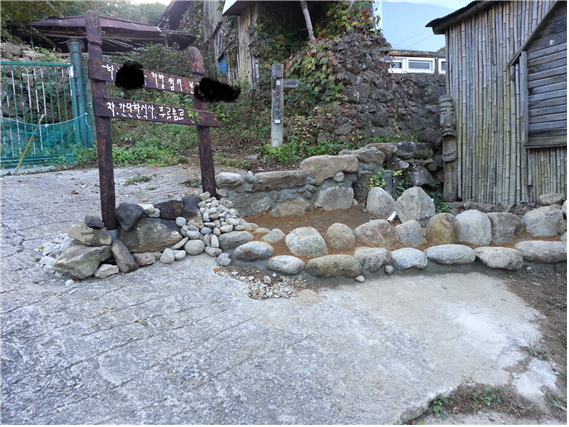

## 문서번호: 5801

### 제목: [언론의 자유와 의무에 대한 별도 법이 있었으면 합니다.](https://q4all.kr/redirect/detail/fa971980-2e35-466d-8f57-d1aef7bd1861)

**작성자:** [김주성](https://q4all.kr/user/profile/8795)
**작성일:** 2025-03-21 06:50:17 (금요일)

---

모든 법은 헌법에 기반을 두고 있습니다.

언론의 자유와 의무에 대해 헌법에 명시되어 있으나

세부법은 너무나 적은듯 합니다.

재선권과 자유의 침해에 대한 많은 법이 있습니다. 반면 언론의

침해에 대한 자세한 법이 없는듯 합니다.

언론의 자유에 대한 침해, 언론의 의무에 대한 침해 모두 중요하여

이를 보장하는 세부 법이 있었으면 합니다.

독재시절 언론의 자유에 대해서만 강조하였으나

매체가 다양화된 현재 그 침해, 가짜뉴스, 유튜브 등으로

많은 피해사항이 있는듯 하나 단순히 민사소송으로 처리하는

방식과 일부 벌금, 징계 수준으로는 그 침해에 대한 배상부족 등으로향후 다시 발생할여지가 많을듯 합니다.

언론의 자유를 방해했을 경우 강한 처벌법과 더불어 가짜뉴스, 언론의 개인침해 등에 대한 징벌적 손배나 강한 처벌에 대한 법이 있었으면 합니다.

---

## 문서번호: 5802

### 제목: [결혼제도안에서만 허용되던 것을 바꿀필요가](https://q4all.kr/redirect/detail/2638789c-13c9-4442-ad8a-c47314c85718)

**작성자:** 클리앙ID jperf7
**작성일:** 2025-03-21 10:04:34 (금요일)

---

한국의 결혼시장 그 제도는 이미 사회 계층사회의 축소판이고

그것에 지친 많은 사람들이 또다시 하나의 계층사회를 만들어들어가고 싶지 않은 것 같습니다

전통적인 가부장제를 만들어온 결혼제도만이 주류 사회를 구성하는거로 인지되는 이걸 이제 깨야할듯합니다

실상은 기득권 상류층도 수많은 혼외자식 입양 해외결혼등이 많죠. 현실을 직시해 외국처럼 동거와 출산이 법적으로 보호받아야한다고 생각합니다.

가족과 가족의 결합이 아니라

마음에 맞는 두 사람이 그들이 이성이든 동성이든 자국인이든

외국인이던 함께 살고

아이를 낳고 입양을 하고

해서 가정을 이루는 다양한 방식이 현실적으로 법제회되었면 좋겠습니다

숨겨오기만 했던 지금의 다양성을 더 드러내고 토론하고 해서 현실적인 법이 제정되길 바리는

마음입니다

현실의 장벽이 낮아져 어떤 형태로든 가족으로서 법적보호를 받는다면 좀더 나은 삶을 살수있지 않을까요

1인으로 불행하게 죽어 썩은 시체로 발견되지 않기 프로젝트

※ 이 질문은 커뮤니티 사이트 '클리앙'에서 [질문Q]로 제안되었습니다.

(원문 게시물) <https://www.clien.net/service/board/park/18916999?combine=true&q=%EC%A7%88%EB%AC%B8q&p=0&sort=recency&boardCd=&isBoard=false>

---

## 문서번호: 5803

### 제목: [예술인 고용 보험의 실질적 개선이 필요하지 않을까요?](https://q4all.kr/redirect/detail/c703b194-f004-4c88-8764-cd853d1578df)

**작성자:** [임연화](https://q4all.kr/user/profile/7143)
**작성일:** 2025-03-21 11:45:28 (금요일)

---

안녕하세요. 저는 웹툰업계에서 프리랜서로 활동하고 있는 예술인입니다. 현재 다섯 개의 업체와 건별 계약을 맺고 있으며, 각각 예술인 고용보험에 가입한 상태입니다.

하지만 최근 예술인 고용보험의 실업급여 수급 요건을 확인하는 과정에서, 제도적으로 매우 불합리한 점이 있다는 것을 알게 되어 이렇게 개선을 요청드립니다.

현행 제도에서는 복수 사업장에서 일하던 예술인이 모든 계약이 종료된 경우에만 실업 상태로 인정받고, 실업급여를 수급할 수 있습니다. 그러나 이는 프리랜서 구조의 현실을 반영하지 못하는 기준입니다.

예술인의 경우, 대부분 단일 계약으로는 생계가 어려워 복수 업체와 계약하는 것이 필수입니다. 실질적으로 주요 수입원이 종료되었더라도, 단 하나의 계약이 남아있다는 이유만으로 실업 상태로 인정되지 않고, 실업급여 수급이 불가능하다는 점은 큰 문제입니다.

이러한 구조는 다음과 같은 부작용을 초래합니다:

실질적인 소득 단절 상태임에도 실업급여를 받을 수 없습니다. 예를 들어 일이 대부분 끊기고 계약이 하나만 남은 상태여서 월 소득이 30만원 밖에 안되어도 실업으로 인정이 안되어 지원을 받을 수 없는 실정입니다.

복수 계약 구조의 예술인·프리랜서에 대한 제도적 사각지대를 보완해주십시오.

제도의 존재 이유인 고용 안정망으로서의 기능이 상실되는 부분을 개선해야합니다.

이에 다음과 같은 개선을 요청드립니다:

**복수 계약 예술인의 실업 상태를 실질 소득 기준으로 판단할 수 있도록 제도 개선**

예) 주된 수입 계약의 종료, 일정 소득 이하 감소 시 실업 인정

**남아 있는 일부 계약이 ‘형식상 유지’되는 경우에도 실질 실업 상태를 입증하면 수급 가능하도록 제도 보완**

**고용센터 실업인정 판단 시, 프리랜서 및 예술인의 특수한 근무 형태에 대한 가이드라인 마련**

프리랜서와 예술인도 고용보험료를 성실히 납부하고 있습니다. 그에 걸맞은 실효성 있는 보장과 제도적 유연성이 보장되어야 한다고 생각합니다.

이 제안이 실제 제도 개선으로 이어지길 간절히 바랍니다.

감사합니다.

---

## 문서번호: 5804

### 제목: [왜 행정부의 수반인 대통령은 아무나 될 수 있는가 아니면 국회의장,대법원장도 국민선거로 뽑으면 안되는가](https://q4all.kr/redirect/detail/8c7f62c1-a0a0-4c8c-a7f9-0a6df1d4b0d8)

**작성자:** [김기두](https://q4all.kr/user/profile/7810)
**작성일:** 2025-03-21 14:27:47 (금요일)

---

현재 한국 정치 상황을 지켜보면서,

우크라이나 러시아 전쟁을 생각해본다.

두 나라의 대통령이 이 사태에 핵심에 있다고 본다.

다시말해 대통령의 자질을, 능력이 한 국가를 좌지우지 한다고 보는 것이다

민주주의는 삼권이 분립되어 있다.

대통령, 국회의장, 그리고 대법원장이 각각 최고 자리이다

국회나 대법원은 각각 그 분야에서 수장을 뽑는다

국회의장은 국회의원 중에서 다선이고 다수당 출신 인물을, 부의장은 1,2당에서 뽑는다

대법원장은 국회 동의를 얻어 대통령이 임명한다 하지만 모두 법관 출신이다.

대법관은 대법원장 추천으로 대통령이 임명한다

이 두 입법,사법의 수장은 어느정도 경력을 가진, 최고 전문가 중에서 뽑힌다고 봐야 한다.

하지만 대통령은 다르다.

우크라이나를 보자. 젤렌스키의 경력은 무엇인가

대한민국을 보자. 윤석열의 경력은 무엇인가

행정권의 수반인 대통령은 왜 사전 검증을 할 수 있는 경력을 보지 않는가

대통령도 행정부의 수반인 만큼, 시도단체장의 경력을 봐야 하지 않을까

그래야 시나 도 또는 광역시를 책임지고 운영해본 경력을 보고 대통령을 능력을 자질을 가늠해 볼 수 있지 않을까

나이만큼이나 중요한 것이 경력(시간의 힘)이지 않을까 한다

대통령을 꿈꾸는 자는 먼저 소도시 대도시 또는 군이나 도의 장을 거쳐 그 능력을 발휘해 보아야 한다.

그 이전 경력이 코메디언이던, CEO던, 검사던, 정치인(국회의원,지방의원)이던...말이다.

이번 개헌이 이뤄질때, 안건으로 다뤄졌으면 한다.

1당 독재인 공산당에서도 어린 공산당원부터 경쟁과 시험을 거쳐 승진되고 발탁되고 하여 국가 지도자 리스크를 회피한다.

아니면, 국회의장도, 대법원장도 대통령처럼 아무나? 입후보해서 국민 선거를 치뤄서 뽑자

---

## 문서번호: 5805

### 제목: [전문건설업은 왜 공동도급 허용 안해주나요 ?](https://q4all.kr/redirect/detail/7914cfb8-8e5b-4a4f-bdbc-d221deb0e7c6)

**작성자:** [채재경](https://q4all.kr/user/profile/8806)
**작성일:** 2025-03-21 14:58:12 (금요일)

---

건설업은 수주산업의 특성상 공사규모에 비해 기업규모가 적은 경우가 많고 또 지역경제 활성화를 위해 지역업체 우대를 하다보니 공동도급을 요구하는 경우가 많습니다.

그런데, 종합건설업간, 종합건설업과 전기, 정보통신 등은 공동도급이 가능한데 전문건설업(실내건축, 지반조성포장 등 시설물의 일부 또는 전문분야를 시공)은 공동도급을 허용해 주는 경우가 많지 않습니다. 전문건설업간 공동도급이 가능하다는 규정이 명시적으로 없어서 그런것도 같은데 어떻게 발주해야 하는지 의견이 발주자 별로 건설사업자 별로 다 다릅니다.

전문건설업이 종합공사에 공동도급으로 들어가는 제도는 내년말까지 제한된게 맞으나 전문공사에 2개이상 면허를 요구하는 유지보수공사의 경우에는 전문공사이기 때문에 아무런 제한 조건이 없습니다,

부디 발주가 가능한 명시적 규정을 조속히 마련하고 발주가 활성화 될 수 있는 방안을 마련했으면 좋겠습니다.

---

## 문서번호: 5806

### 제목: [한국에선 AI를 말하는 사람은 많은데 정작 AI를 만드는 실무자의 목소리는 들리지 않을까?](https://q4all.kr/redirect/detail/15410a85-94b0-41ca-aadc-4912b41086f3)

**작성자:** [조대희](https://q4all.kr/user/profile/8808)
**작성일:** 2025-03-21 15:23:25 (금요일)

---

현재 전 세계적으로 AI에 대한 토의가 계속 되고 있습니다. 그런데 대한민국은 주식전문가들만 나오고 있고, 자칭 인문학전문가들만 AI에 대해 얘기하고 있습니다.

막장 개발자나 분석가, 현업에서 직접 손발로 뛰고 있는 실무자들은 말하는 것을 많이 본적이 없습니다. 비단 이러한 현상은 AI뿐만이 아닙니다. 실무자들의 얘기를 들을 수 없는 대한민국의 환경이 왜 이런가요?

이건 단순히 AI에 대한 문제만이 아니라 한국 사회 전체의 구조적이고 문화적인 문제와 맞닿아 있습니다. "왜 대한민국은 실무자의 목소리를 듣기 힘든가?" 이 질문은 오늘날 한국 사회의 지식 흐름, 위계, 그리고 미디어 구조까지 들여다봐야 답할 수 있는 깊은 질문입니다. 저도 현장에서 몸으로 데이터 다루며 일해오면서, 수없이 같은 답답함을 느꼈습니다.

1. 지식의 위계 구조 ‘이론’이 ‘현장’을 지배하는 구조

대한민국은 유난히 지식의 위계가 강한 나라입니다. 이론, 타이틀, 학벌, 자격증, 직급, 권위가 지식의 진위를 결정하는 경향이 강합니다.

실무자의 말은 “그건 네 경험일 뿐이지”라며 쉽게 가볍게 여겨지는 반면, 어느 기관 교수, 박사, 애널리스트, 인플루언서는 '정답자'로 등장합니다.

결국 실무자는 자신의 이야기를 공론화하기 어렵고 설령 얘기해도 그저 어려운 얘기라면서 묻혀버립니다.

2. 미디어 생태계의 구조적 문제 콘텐츠를 누가 만들고, 누가 불리는가?

AI에 대한 유튜브, 방송, 기사들을 보면 대부분 '말 잘하는 사람'이 말하고 있습니다. 그들이 실무를 잘하느냐는 다른 문제입니다.

대한민국 미디어는 전문성보다 말발과 팔릴만한 스토리를 우선시합니다.

그리고 미디어가 원하는 건 늘 “확신 있는 이야기”, “정답 같은 예측”, “멋진 비전”입니다.

반면 실무자는 “아직 데이터 부족하다”, “실제로 해보니 잘 안 된다”, “변수가 너무 많다”고 이야기하죠.

이런 불확실한 이야기는 미디어가 원하는 그림에 맞지 않기 때문에, 실무자는 점점 멀어집니다.

3. 실무자의 시간 부족과 ‘말하기의 언어’ 부족

실무자들은 하루하루 데이터 쿼리 짜고, 모델 돌리고, 에러 고치고, 지표 분석하고, 실제 문제 해결에 집중하고 있습니다.

즉 그들이 입을 열 시간이 없고, 설령 말할 시간이 생겨도 전달할 언어가 없을 수 있습니다.

한국에서는 기술자, 분석가들이 쓰는 언어를 '어려운 말'로 치부하거나, '현장 언어'로 인정하지 않는 문화가 있습니다.

이건 교육 문제이자 리터러시의 문제입니다.

4. ‘전문가’ 타이틀의 남용과 인문학의 오남용

대한민국은 "자칭 전문가"가 참 많습니다.

AI 분야만 해도 "AI 윤리 전문가", "AI 철학자", "AI가 인류를 지배할 것" 같은 자극적인 키워드로

자리를 차지한 사람들이 많습니다.

그들의 말은 종종 실무적 근거 없이 감성적이고 관념적일 뿐입니다.

하지만 현장의 개발자, 데이터 사이언티스트, 리서처, 머신러닝 엔지니어는 수십 개 모델 돌리고, 벽에 부딪히고,

실제 적용의 한계와 가능성을 아는 사람들이죠.

그들의 목소리는 "재미없고 어려운 이야기"로 밀려나고 감각적 스토리텔러들이 앞단을 차지합니다.

5. 실무자의 커뮤니케이션 채널 부재

해외는 GitHub, Medium, Hacker News, Substack 같은 실무자가 발언할 수 있는 커뮤니티가 활발합니다.

구글, 엔비디아, 마이크로소프트의 실제 연구자가 논문을 쓰고, 블로그도 운영하고, 팟캐스트에 나옵니다.

하지만 한국은 그런 플랫폼이 부족하고, 있어도 검색이 잘 안 되며, 주류 미디어가 그것을 연결해주지 않습니다.

그렇다면 어떻게 해야 할까요?

▷ 실무자가 말하게 만들어야 합니다.

- 실무자의 언어를 ‘공론의 장’으로 끌어올릴 리터러시 번역자가 필요합니다.

 (예를 들어 실무자가 말한 내용을 잘 정리해주는 콘텐츠 큐레이터, 인터뷰어)

- 블로그, 기술 브리핑, 뉴스레터, 강의, 토크 등 실무자의 입장에서 가볍게 말할 수 있는 채널을 열어야 합니다.

- 대학이나 언론에서도 ‘이론가-실무자’가 함께 나오는 복합형 포럼을 만들어야 합니다.

나도 실무자로서, 나부터 말하겠다

저는 데이터 분석가로서, 지금도 수많은 테이블 정리하고, 잘못된 수집 로직 수정하고, 리텐션 분석하며 하루를 보냅니다.

실제로 AI가 마법처럼 적용되지 않는 현실을 누구보다 잘 알고 있습니다.

그렇기에 저는 앞으로도 블로그, 뉴스레터, 강연을 통해 실무의 언어로 AI와 기술을 해석하려 합니다.

말할 수 없으면 존재하지 않는 것처럼 여겨지는 세상에서, 실무자가 말할 수 있는 구조를 함께 만들고 싶습니다.

> AI는 실무 없이는 존재하지 않습니다.

> AI에 대해 말하는 사람보다, AI를 실제로 만드는 사람, AI를 데이터로 개선하는 사람, AI가 적용된 제품을 평가하는 사람의 이야기가 더 많이 들려야 합니다.

> 대한민국도 이제는 권위보다 맥락, 이론보다 현장, 타이틀보다 경험을 중시하는 사회로 나아가야 한다고 생각합니다.

필요하시면 실무자 인터뷰 시리즈나 현업 분석가의 AI 적용기 콘텐츠도 함께 기획해볼 수 있어요.

함께 실무자의 말하기 구조, 만들어보시겠어요?

---

## 문서번호: 5807

### 제목: [📍 청년들에게 '적극적인 쉼'을 위해서 시간을 선물해 줄 수 없을까?](https://q4all.kr/redirect/detail/0bc2babc-471e-48d0-ba6c-cd933fbe73e6)

**작성자:** [양석원](https://q4all.kr/user/profile/5852)
**작성일:** 2025-03-21 15:45:35 (금요일)

---

**Q : 청년들에게 '적극적인 쉼'을 위해서 시간을 선물해 줄 수 없을까?**
--------------------------------------------

#### 왜 청년인가?

#### 

* 지난해(2024년) 일할 능력은 있지만 그냥 쉰 청년이 42만명, 코로나19가 확산한 2021년 때보다도 늘어나면서 4년 만에 최대치 기록 | (통계청 국가통계포털(KOSIS))
* 가족 외 타인과의 의미 있는 교류가 없고, 곤란한 상황에 처했을 때 도움을 요청할 수 있는 곳이 없는 사회적 고립 상태에 있는 청년인구는 54만명(19~34세 인구의 5%)으로 추정 | 한국보건사회연구원의 실태조사(2023년)
* 청년 3명 중 1명은 번아웃, 최근 1년 동안 번아웃 경험이 있다고 응답한 청년은 32.2%. 번아웃의 배경은 진로불안(39.1%), 업무과중(18.4%), 일에 대한 회의감(15.6%) 순| 국무조정실 '2024년 청년의 삶 실태조사'

모든 청년들이 각자의 이유로 불안해 하고 있으며, 그냥 쉼, 우울, 고립과 같은 현상이 나타나고 있다.

**적극적인 쉼이란?**

터널안에 들어와 있는것 같은 시기에 모두가 방황의 시간을 거친다. 이 방황의 시간을 부정적인 시선으로 '그냥 쉼'이라는 소극적인 쉼의 형태가 아니라 자신을 발견하고 타인과의 관계속에서 사회를 이해하고, 작은 실천을 할 수 있는 시간으로 만들 필요가 있다.

그것이 '**무엇 때문에 쉬는 소극적인 쉼**'이 아니라, '**무엇을 위해서 쉬는 적극적인 쉼**'이 될 수 있을것이다. 적극적인 쉼에 시간은 전환을 위한 기회가 될 것이다.

**시간을 선물해 준다는 의미는?**

청년들을 지원하는 프로그램들이 취업과 진로 그리고 상담, 멘토링에 집중되어 있기 때문에 다양한 청년들의 상황과 필요를 반영하지 못하고 있다. 당장의 직업 훈련이나 교육 보다는 자신을 둘러볼 수 있고, 다른 사람과의 관계속에서 자신을 발견하고, 새로운 시도에 도전해 볼 수 있는 기회. 즉 시간을 배려해 주는 것이 필요하다. 그 시간에는 하고 싶은 일, 경험하고 싶은 일들을 스스로 할 수 있도록 하는것이다.

**누구를 대상으로 어떻게?**

<대상>

* 고교졸업 후 대학 미진학자 청년
* 대학 생활중 휴학 혹은 진로 변경 청년
* 입사 1년 이내 퇴사 청년
* 고립/은둔 청년

<어떻게>

* 민간이 주관 또는 위탁• 운영하는 프로그램으로 봉사, 교육, 인턴 등 각종 경험을 쌓으며 진로와 적성에 대한 탐색 프로그램 제공
* 활동 영역은 지역 중심
* 활동 내용은 청년들이 스스로 선택하거나 만들어 갈 수 있도록 자율 운영 중심
* 지역 체류형으로 1개월~3개월의 장기 프로그램 제공

**어떤 움직임들이 있었나?**

\* 한국형 '갭이어'(gap year)를 도입하는 청년기본법 개정안을 자신의 1호 법안 | 더불어민주당 박범계 의원

<더불어민주당\_제20대\_대통령선거\_정책공약 -2022년>

중학교• 고등학교 졸업 후 진로교육 프로그램 도입

\*  중학교 졸업생 중 희망자 대상 보충학습• 진로체험 제공 전환학교제도 도입

\*  고교졸업 후 대학 미진학자 대상 한국형 갭이어' 도입

<제22대\_총선\_더불어민주당\_온라인\_정책공약집 - 2024년>

비진학 청년 위한 특화된 프로그램 마련

\*  지자체• 교육청이 운영 중인 평생교육진흥원, 평생학습관 내에 비진학 청년을 대상으로 한 평생학습시민대학 개설(전문대, 폴리텍대, 방통대와 연계)

\*  시 •도 평생교육진흥원 또는 민간이 주관 또는 위탁• 운영하는 인생설계학교(Gap Year)를 통한 국내외 여행, 진로탐색 프로그램 지원

**해외에서는?**

덴마크 애프터스콜레 : 14-17세 연령의 학생들이 고등학교 진학 이전에 1년 동안 시간 동안 길 찾기를 도와주는 학교

덴마크 폴케호이스콜레 : 17.5세 이상 청년들에게 일종의 '인생학교'로 다양한 청년들과 기숙활동을 통해서 작은 공동체를 구성하고 자신과 타인 그리고 사회를 이해하는 기회를 주는 학교

독일 자발적 사회봉사의 해 (Freiwilliges Soziales Jahr, FSJ): ‘자발적 사회봉사의 해’는 16~27세의 청소년들이 참여하는 사회봉사 프로그램

- 보통 고등학교 졸업 후 1년간 봉사활동을 하는 제도, 봉사영역은 어린이집, 학교, 노인 돌봄 기관, 박물관 등 주요 사회 공익시설

- 진로를 고민하는 청소년들은 해당 프로그램을 통해 본인의 적성 및 직업을 찾는 발판으로 사용

일본 지역부흥협력대 : 청년들이 1년 이상 3년 이하로 활동을 하면서 관광자원 기획이나 개발, 고령자 생활지원, 빈집과 빈 점포와 같은 공간의 활용 대책, 이주자 지원 등의 '지역부흥' 활동을 한다.

---

## 문서번호: 5808

### 제목: ["외국인 아동의 출생등록에 관한 법률안(서미화 의원 대표발의)"에 관한 질문입니다](https://q4all.kr/redirect/detail/4ab95316-8e9f-4d47-91ac-1c9b7d24e12f)

**작성자:** [박대희](https://q4all.kr/user/profile/8796)
**작성일:** 2025-03-21 15:56:29 (금요일)

---

유튜브의 댓글을 보던 중 확인이 필요한 댓글이 있어서 질문 드립니다

댓글 내용은 다음과 같습니다

" 며칠전에 민주당의 서미화 의원이 중국인이 우리나라 와서 아이 낳으면 우리나라 국적을 주는 법안을 발의 하였습니다

이래도 민주당 지지하실겁니까 정신들 차리세요 " 라는 댓글이었습니다

확인을 위해 발의 법안을 찾아보았더니 외국인 아동의 출생등록에 관한 법안인듯 했습니다

질문1) 아무리 찾아봐도 대한민국 국적 부여에 대한 내용은 없는듯

한데 법안의 정확한 내용에 대해서 답변을 요청드립니다

질문2) 법안을 보니 미등록 외국인이 자녀를 출생 했을때 출생등록을 해서 의료, 교육 등의 혜택을 부여해서 인권의 사각지대를 줄인다는 좋은 취지의 법안인듯 했습니다

다만, 미등록 외국인이라는 의미는 일반적으로 불법체류자인데 불법체류외국인의 경우 소득세(4대보험 포함) 등의 납부가 이루어지지 않을텐데 출생등록 후 그와 같은 혜택이 주어진다면 자칫 내국인과의 형평성에 관한 문제가 발생할텐데 이에 대한 대안은 무엇인지 답변 부탁드립니다

요즘과 같이 반중감정이 고조되고 있는 상황에서는 아무리 좋은 취지의 법안이라 할지라도 자칫 위의 댓글과 같이 왜곡될수 있기에 글을 써봅니다

---

## 문서번호: 5809

### 제목: [모든 노동자가 근로기준법을 적용받을 수 없을까요?](https://q4all.kr/redirect/detail/18269a7d-e832-4f95-b350-c40ef0845164)

**작성자:** [박신안](https://q4all.kr/user/profile/8805)
**작성일:** 2025-03-21 16:05:41 (금요일)

---

5인 미만 소규모 사업장에서 일한다는 이유로 최소한의 보호장치인 근로기준법조차 적용받을 수 없는 노동자가 있습니다.

국가인권위원회에서도 5인 미만 사업장에도 근로기준법을 적용하라고 거듭 권고했습니다.

5인 미만 사업장 노동자가 노동권의 사각지대에서 차별받는 경우는 너무나 많습니다.

- 주 52시간제가 적용되지 않음

- 법정공휴일 해당 없음

- 휴업 수당을 받지 못함

- 연차유급휴가 해당 없음

- 직장 내 괴롭힘을 당해도 법에 호소할 수 없음

- 부당해고로부터 보호받을 수 없음

- 야간·연장·휴일근로를 해도 임금을 더 받지 못함

- 중대재해처벌법 적용 제외

그리고

5인 미만 사업장 법 적용 제외를 악용하는 경우도 성행하고 있습니다.

근로기준법 적용을 피하려고 사업장을 쪼개는 변칙적인 방법이 활용되거나 노동자가 사업소득세를 납부하는 '가짜 3.3 노동자'로 고용하는 불법이 늘어만 가고 있습니다.

5인 미만 노동자가 겪어야 했을 사회적 차별을 너무 오래 방치했습니다.

모든 노동자에게 근로기준법이 적용될 수 있도록 새롭게 논의될 수 있길 바랍니다.

---

## 문서번호: 5810

### 제목: [집회에서 나오는 시민발언을 모아야 하지 않을까요? ](https://q4all.kr/redirect/detail/68e2abc1-eca2-4079-8676-737de1d622b6)

**작성자:** [조용미](https://q4all.kr/user/profile/8809)
**작성일:** 2025-03-21 16:27:37 (금요일)

---

지금 탄핵집회가 100일 넘게 열리고 있습니다.

남태령대첩이라 불리는 집회에서 물꼬가 터진 시민발언이 매주, 요즘은 매일 생성되고 있습니다.

듣다 보면 이토록 구석구석에서 시민들이 각자의 고통과 다양한 분야에 대해 목소리를 내주는구나, 감동스럽습니다.

서울 뿐 아니라 전국 각지에서 나오는 개별적이고도 생생한 시민의 이야기를 아카이빙 해서

이 사회의 목소리를 모으고 정리하는 게 필요하지 않을까요?

사회대개혁에 필요한 질문을 모으고 있는 '모두의 질문'이 지향하는 바와 크게 다르지 않을 것 같습니다.

전문적으로 아카이빙하면 좋겠지만, 지금 그럴 여력이 없다면

네이버 카페라도 하나 열어서 지역별로 카테고리를 나누고 다시 분야별로 나눠서

"그동안 발언하신 분들은 여기에 올려주세요", 라고 홍보를 하면 어떨까요?

아마 발언하신 분들은 대체로 핸드폰 메모장에 적어서 나온 듯하니 지우지 않고 간직하고 있을 겁니다.

그걸 옮기기만 하면 됩니다.

싫은 사람은 하지 않아도 되고 원하는 사람만 쓰는 거지요.

언제 어디서 발언 한 내용이다, 정도만 기록하고 이름은 밝힐 수도 있고 발언할 때 썼던 활동명 등을 써도 좋겠지요.

아직 큰 집회가 남았으니 민주당에서 이 내용을 홍보해주시고,

트위터 등에서도 홍보해주시고

김어준의 겸손은 힘들다 등 유명 유튜브에서 홍보해주시면

크게 힘들이거나 인력 없이도

충분히 모을 수 있을 것 같습니다.

시민들의 소중한 의견이 이대로 사라지는 게 너무도 아쉽습니다.

꼭 아카이빙 될 수 있게 힘써주세요!

---

## 문서번호: 5811

### 제목: [혹시 군인 자주 목격하는 분들 계신가요?](https://q4all.kr/redirect/detail/9fb3e891-ddcd-41d7-bdf1-4fa708dc4697)

**작성자:** [한그린](https://q4all.kr/user/profile/8440)
**작성일:** 2025-03-21 16:36:34 (금요일)

---

신림동 쪽인데 어머니가 장 보고 오시다가 한 명 씩 돌아다니는 군인을 다수 목격했다고 합니다. 단순히 휴가 나온 군인이 많았다고 하기에는 시국이 시국이라;

경찰이 극우 유튜버를 독려했다고도 하고 검경 움직임이 불안합니다. 정말 2차 계엄 준비하는 것 아닐까요?

---

## 문서번호: 5812

### 제목: [일회용품을 쓰라는건지 말라는건지 오락가락, 그래서 자영업자들은 어쩌라고요?](https://q4all.kr/redirect/detail/984f86c6-8b19-42a6-aab4-0ce2a399820d)

**작성자:** 오피큐알OPQR - 자영업자 주철홍
**작성일:** 2025-03-21 16:53:56 (금요일)

---

**일회용품을 쓰라는건지 말라는건지 오락가락, 그래서 자영업자들은 어쩌라고요?**

을지로에서 카페를 운영하는 주철홍 씨는 자영업자로서 일회용품 사용 규제에 대한 고민이 깊습니다.

환경 보호를 위해 에스프레소 바를 시작하고 다회용 컵 사업에 참여했지만, 정부 정책의 오락가락 행보와 일관성 없는 규제로 인해 어려움을 겪어왔습니다.

종이컵 내 플라스틱 코팅 문제, 복합 소재의 재활용 불가 등 모순적인 상황에 속에서 환경 보호 노력이 오히려 비용 부담으로 이어지는 현실은 자영업자들의 친환경 사업 동참을 어렵게 합니다.

지속 가능한 지구를 위한 정책이 지속 가능하지 못하고 단편적으로 이루어지는 아이러니한 상황에서도 손님들의 자발적인 참여를 유도하고, 원두 봉투 재사용 캠페인 등을 통해 작은 실천으로 환경에 미치는 긍정적인 영향을 만들고자 애쓰고 있습니다:)

**1. ☕ 환경을 고려한 카페 운영의 철학**

주철홍씨는 카페를 창업하며 커피의 맛과 친환경적인 운영을 동시에 고려해 에스프레소 바를 선택하였습니다. 그가 이처럼 친환경적인 가게 운영을 동시에 추구하게 된 계기는 '호프 자런'의 책 '나는 풍요로웠고 지구는 달라졌다'를 통해 우리의 풍요로움에 비례하여 파괴되는 자연환경의 대가를 깨닫고, 이를 최소화하기 위한 방법을 고민하면서 였습니다.

**2. 🥤 일회용품 사용 규제와 자영업자의 고충**

2022년 전면적인 매장 내 일회용품 사용 금지 규제가 시작되고 정부에서 다회용 컵 보증금(1,000원) 적용/반환을 통한 다회용기 이용 장려 친환경 사업도 시범도입되었습니다. 그러나 일회용품 사용 금지 규제가 유예되고 이 사업도 갑자기 중단되면서 추가 유지 비용을 요구받는 상황이 발생했습니다. 사업자가 한 달에 50만 원의 유지 비용을 요구받는 상황에서 1회용품을 사용하는 것이 더 경제적이라는 결론에 이르게 되었습니다. 2023년 부터는 일회용품 사용 제한이 무기한으로 연기 되었고 이러한 정부의 지속성 없는 정책으로 자영업자들에게는 환경 보호를 위한 희생이 강요되는 상황이 발생하였습다.

**3. 🤔 정부의 일회용품 규제의 모순**

시민들이 자발적으로 환경 정책에 참여할 것이라고 기대하는 것은 비현실적이며, 실제로 손님들이 일회용품을 쓰지 않는 카페의 운영정책에 불만을 제기하는 사례도 있었습니다. 환경을 생각하는 카페가 많아지고 있는데 반해 정부의 정책은 지속 가능하지 않아 친환경적인 운영을 어렵게 하고 있습니다. 현행 정책에서 매장 내 플라스틱 컵 사용은 금지되지만, 일부 종이컵은 사용 가능합니다. 그러나 허용되고 있는 종이컵 역시 내부에는 플라스틱 코팅이 되어 있어 사실상 플라스틱과 크게 다르지 않는 모순이 발생하고 습니다.

**4. ♻️ 복합 소재의 환경 문제와 대안 행동**

복합 소재는 재활용이 불가능하여 환경에 큰 해를 끼칩니다. 환경을 위해 텀블러를 사용하라고 하지만, 텀블러를 만드는데에 발생하는 온실가스 배출량이 플라스틱 컵 보다 압도적으로 많아 오히려 이산화탄소 배출이 증가하는 요인이 됩니다. 종이, 은박, 플라스틱 비닐 등 다양한 재질로 구성된 원두 봉투의 경우에도 3중 구조로 되어 있어 환경에 부정적 영향을 미칩니다. 철홍씨는 카페에서 원두 봉투를 재사용하는 방안으로 손님에게 추가 원두를 담아주는 서비스를 제공하며, 환경과 고객 모두에게 이득을 주는 시도를 하고 있습니다. 철홍씨의 이러한 정책에 호응하여 개인 텀블러나 병을 가지고 오는 손님들이 올 때 작지만 긍정적인 영향을 미치고 있음을 확인할 수 있어 보람을 느낍니다.

**5. 🤔 일회용품 사용의 선례와 자영업자의 고민**

철홍씨는 이러한 자신의 정책을 통해 가게가 성공하여 좋은 선례로 남기를 바랍니다.

스타벅스의 성공을 따라 많은 사람들이 이를 따랐듯이 자신의 가게 운영이 다른 이들이 '따라 하고 싶은 사례가' 되었으면 합니다.

**"환경을 위한 첫 실천은 그저 약간의 불편함이 아닐까요?"**

**더 많은 질문이 보고싶다면?!**[**▶ 유튜브 오피큐알OPQR 채널 바로가기**](https://youtu.be/-r5VVItUA5Y?si=YU6J9Lheo82-Xe_U)

---

## 문서번호: 5813

### 제목: [유보통합보다 공립 유치원 확대가 먼저 아닌가요?](https://q4all.kr/redirect/detail/44a8a2e2-2a5d-4d4c-afa3-bb04219d34c7)

**작성자:** [김원배](https://q4all.kr/user/profile/8804)
**작성일:** 2025-03-21 18:04:47 (금요일)

---

안녕하세요, 저는 전교조 유아교육위원회 부위원장으로 활동하고 있습니다.

소속을 밝히는 것이 국민들께서 조금 더 객곽적인 판단을 할 수 있을 것 같아 먼저 소속을 밝힙니다.

윤석열 정부의 유보통합 정책으로 2022년부터 현재까지 보육 및 유아교육 현장은 많은 갈등과 혼란이 발생하고 있습니다.

이러한 상황에서 **유보통합보다 공립 유치원 확대가 먼저 아닌가요?** 라는 질문을 던져봅니다.

**1. 한국의 유아교육 공공성 수준은 OECD 국가 중 최하위권입니다.**

* **OECD 평균 공립 유치원 취원율: 67%**
* **한국 공립 유치원 취원율: 30%**

출처: OECD (2024). Education at a Glance – Indicator C2: Enrolment in Early Childhood Education

그런데 정부는 **공립 유치원을 늘리는 것보다, 유치원과 어린이집을 통합하는 '유보통합'을 먼저 추진하고 있습니다.** 이는 과연 올바른 방향일까요?

### 

### ※ 부모와 교사들은 어떻게 생각할까요?

* **부모 81%**: "유아교사와 보육교사 자격을 분리하는 것이 적절하다"
* **부모 72.9%**: "보육교사와 유치원 교사의 자격을 통합하는 것에 반대한다"
* **맞벌이 부모의 유보통합 찬성도**: 2.78점 (정부의 기대보다 낮음)

출처: 육아정책연구소(2023). 『0~5세 자녀를 둔 부모의 유보통합 관련 인식조사 연구』

### ※ 해외 사례를 보면?

* 유보통합이 안정적으로 정착된 나라들(스웨덴, 핀란드, 뉴질랜드)은 **공립 유아교육기관 비율이 70~80% 이상**
* 그러나 한국은 **사립기관이 70% 이상**, 공공성이 취약한 상태

출처: 육아정책연구소(2023). 『국외 유보통합 추진 사례 및 시사점』, 정책보고서 제2023-06호. OECD (2024). Education at a Glance – Indicator C2: Enrolment in Early Childhood Education

그렇다면, **유보통합보다 공립 유치원 확대가 먼저 아닐까요?**

여러분의 의견을 들려주세요!

**함께 읽어볼 짧은 자료**

**1. 유아교육 공공성 강화 (2017~2020년 문재인 정부)**

* 20년 사립유치원 ‘에듀파인’100% 도입 및 법인화 유도
* 어린이집 누리과정 예산 전액 국고 편성
* 21년 국공립유치원 취원율 40% 달성
* 저소득층 유아 국공립유치원 우선 입학, 입학 및 선발 공정성 강화, 온라인 신청으로 학부모 편의성 증대, 유치원 교원 입학업무 경감

**2. 유보통합 추진(2020~2024년 윤석열 정부)**

* 2022.7월 만5세 초등학교 조기 입학 정책 취소 → 2023. 유보통합 추진
* 정책기조: 저출산 대책 교육정책
* 0~5세 통합기관 및 통합교사 양성 추진
* 기존 12시간 운영, 방학기간 운영 확대, 토요일.휴일 돌봄 지원
* 단계적 무상교육.보육 확대. 사립유치원 및 어린이집 경비 지원

**3. 유아의 공교육은 세계적으로 보편화된 흐름입니다. OECD 국가들은 안정적이고 일관성 있는 유아교육을 국가가 운영하고 있습니다.**

**4. 우리나라 국공립 유치원 취학 선호도는 56%로 높은 반면 실제 취학률은 21%로 OECD국가들의 평균 취학률(67%)보다 낮습니다.**

**5. 0~2세 영아기와 3~5세 유아기는 발달과 요구가 다릅니다.**

**6. 2021년 전국 보육실태조사에 따르면 1세 미만과 1~2세 미만은 가정양육을 선호한다’는 응답이 97.8%로 나타나고 있습니다.**

**7. 2023년 육아정책연구소의 ‘0~5세 자녀를 둔 부모의 유보통합 관련 인식 조사 연구’ 따르면 보육교사와 유치원 교사 자격을 통합된 자격으로 일원화하는 것에 대해 반대하는 비율이 72.9%로 나타났으며, 영유아 연령에 따라 자격이 구분될 필요가 있다고 보느냐’는 질문에 대해 부모의 81.1%가 자격은 구분되는 것이 적절하다고 응답했습니다.**

**8. 2018년 전국 보육실태조사에 따르면 보육교사 전공은 아동학과 유아교육 학과는 42.7%인 반면, 나머지는 사회복지, 간호학과, 영양학과 등 유아교육과 직접적으로 관련 없는 전공자가 50%가 넘습니다.**

**9. 무상교육 정책으로 회계 투명성 없는 사립유치원, 민간 어린이집에 두 배 많은 국가 예산을 투입되고 있으며 소규모 공립유치원 소멸의 원인 중 하나로 지적되고 있습니다.**

**10. 2022년도부터 인천지역은 사립유치원에 대한 만5세 무상교육을 시행하였는데, 2023년까지 사립의 정원충원률은 80% → 84.5%로 늘어난 반면, 공립유치원은 75.5% → 67.4%로 줄어들었습니다.**

**11. 일본의 경우 우리나라 유치원교사 및 보육교사양성체제와 유사하여 3~5세 유아를 대상 유치원교사와 0~5세 유아 대상 보육사 자격으로 이원화되어 있습니다. 2006년 인정어린이원이라는 제 3의 통합기관이 만들어졌으나 통합은 되지 않고, 유치원, 보육소 및 인정어린이원의 세가지 형태의 유아교육 및 보육기관이 존재합니다. 특히 인정어린이원은 4가지 유형으로 분리 운영되어 더 복잡해졌다는 평가를 받고 있습니다.( 이규림, 2017) 일본의 인정어린이원은 제 3의 기관으로 통합을 꾀했으나 제도 안착에만 20년이 걸렸고 아직 인정어린이원으로 전환하지 않는 보육소와 유치원이 다수 남아있습니다. 우리나라 유보통합 역시 이렇게 될 가능성이 높다고 판단됩니다.**

**12. 2022년 유아교육 실태조사에 따르면 유보통합에 대한 학부모 설문 평균 찬성도는 4점 만점에 2.83점으로, 만5세 의무교육 확대(3.32점)나 유치원 무상교육(3.50점)에 비해 낮았습니다. 특히 맞벌이 부모의 찬성도가 2.78점으로 외벌이(2.92점)보다 오히려 낮게 나타났습니다​. 원래 유보통합은 맞벌이 가정의 양육 부담을 덜기 위한 정책인데 정작 그 대상층의 호응이 높지 않다는 것은 정책 설계가 현장 요구와 어긋났을 가능성을 시사합니다. 또한 유아교육 현장의 교사들과 원장들의 반응은 더욱 부정적으로, 유치원 교사의 유보통합 찬성도는 평균 2.15점에 불과했습니다​.**

**13. 2024년 OECD 교육지표에 따르면 우리나라 유아교육기관의 50대 이상 비율은 7%에 불과하며, 이는 OECD 평균이 30%보다 훨씬 낮은 수치입니다. 이러한 수치는 유아교육기관의 교사들의 처우가 매우 열악한 것을 보여주며, 이는 2024년 공립유치원의 유아의 취원율이 29.2%인 것과도 밀접한 연관이 있습니다.**

**14. 윤석열 정부가 유보통합 정책 상향평준화 과제로 제시한 “희망하는 0~5세 영유아에게 12시간 돌봄 보장” 등을 강조하자, 정작 여론 일각에서는 “애를 12시간 맡길 거면 왜 낳느냐”, “어른이 일찍 귀가하는 게 먼저”와 같은 비판적인 반응이 나왔습니다.**

**15. 대체로 유보통합이 성공적으로 정착된 국가들은 공립기관 비율이 70~80% 이상이었습니다. 이는 공공재원 투입을 통해 교육의 질을 안정적으로 유지하고, 교육 불평등을 최소화하기 위한 정책적 결정과 관련 있으며, 사립기관이 존재하는 경우에도 국가 차원의 강력한 규제와 동일한 교육과정 적용을 요구받습니다. 하지만, 우리나라의 공립기관의 유아 취원율은 공립 30%, 서립70%로 유아교육 공공성이 매우 열악한 상황입니다.**

---

## 문서번호: 5814

### 제목: [사법권력 부패,종교권력 부패,정치권력 부패, 언론권력 부패 등 각종 권력 기관들 정화를 위해서는 각 권력집단의 힘을 박탈할수 있도록 주권자인 국민에게 물을수 있게 국민투표 대상을 확대하면 안될까요?](https://q4all.kr/redirect/detail/021e68e3-f87a-47f6-a11c-c8945b03712e)

**작성자:** [이진형](https://q4all.kr/user/profile/8833)
**작성일:** 2025-03-21 20:51:58 (금요일)

---

모든 것을 국민투표에 붙이자는 것은 아닙니다.

정말 명백하게 그 해당 권력 기간이 잘못된 권력을 남용하고 있는데도 제도적인 허점을 이용해서 계속 그 권한을 박탈하는것이 힘들때 국회에서 안건을 부의해서 특정 조건을 통과된 건에 대해서만 국민 투표를 붙이는 식으로 하면 됩니다.

부패기관들이 국민들 대중들의 마음을 사로잡으려고 하고 그것이 작용해서 잘못된 국민투표 결과가 나올 수도 있겠죠. 다만 이런 작용들로 인해서 권력 기관들이 국민의 눈치를 볼수 밖에 없게 됩니다

또한 잦은 국민 투표 발생 이런 것들에 대한 우려는 국민투표를 붙일 상황에 대해서 제한한다면 자주 발생할 것 같지는 않고. 지금 it가 발달된 상황에서 개인 정보에 대해서 확인하는 시스템이 보안이라든지 더욱 명확하게 된 걸로 알고 있는데 그러면 전자 투표 등을 활성화해서 국민투표할 때 비용을 획기적으로 줄일 수 있다고 보임으로 이런 방향에 대해서 직접 민주주의를 실천할 수 있는 제반 여건은 다 조성된 현재 상황이라 샙각됩니다.

중요한 부분에 대해서는 국민들한테 직접 물어보고 국민들의 결정에 맞게 그런 식으로 나라가 운영 직접적으로 주권자인 국민의 뜻이 직접 반영될 수 있게 하는게 맞다라고 봅니다.

---

## 문서번호: 5815

### 제목: [환경변화의 위험에 대비하기위해 국가가 다른나라의 땅을](https://q4all.kr/redirect/detail/efe85e42-bb62-437d-aaa8-5c635fa9ac4a)

**작성자:** [진복남](https://q4all.kr/user/profile/8845)
**작성일:** 2025-03-21 21:36:50 (금요일)

---

환경변화의 위험에 대비하기위해 국가가 다른나라의 땅을

구매하면 좋지않을까요?

---

## 문서번호: 5816

### 제목: [세금 거부 운동하면 어떨까요?](https://q4all.kr/redirect/detail/390d79be-ba6b-4d6d-ac7b-89dffd481455)

**작성자:** [윤경순](https://q4all.kr/user/profile/2838)
**작성일:** 2025-03-21 21:56:39 (금요일)

---

권력의 중심부에 있는 자들이 위법에 위법을 더하고 있습니다

이들을 위해 세금을 내고 있는 사실이 너무나 화가납니다.

피땀흘린 노동을 하고 그 댓가가 그들의 배를 배부르게 하고 권력을 유지하게 도와주고 비리를 감추게 하고 범죄를 저질러도 눈감게 하는데 쓰이고있는 현실이 말이 되나요??

더이상 거리로 나가기만 하는건 안될거 같아요.

헌재는 국민의 세금을 받아 운영되는곳 아닌가요??

우리가 저 위법한 것들에 주는 세금은 거부 하면안되나요??

근로소득자들은.회사에 원천징수 거부 신청을 하고. 가처분신청 이런걸 하면 어떨까요?

정말 징글징글합니다.

---

## 문서번호: 5817

### 제목: [대통령 탄핵 국민투표 헌법 개정 제안합니다. ](https://q4all.kr/redirect/detail/3d45cb55-0621-4910-9304-84a59d5343ec)

**작성자:** [유진희](https://q4all.kr/user/profile/8278)
**작성일:** 2025-03-21 23:00:45 (금요일)

---

경찰 검찰 법원 헌법재판소.

모두 내란진행중인것 같습니다.

언제까지 기각되는 것을 보고 있어야 합니까?

대통령 탄핵이라는 이 중요한 사안을 국민투표로 모두가 주권을 행사할 수 있도록

헌법 개정을 진행해주십시오.

불가능한 일입니까?

---

## 문서번호: 5818

### 제목: [헌법 개정 시 "특별재판부" 설치 근거를 만들어야 할 듯 합니다.](https://q4all.kr/redirect/detail/636969fd-05c6-414d-896b-248917c9eff1)

**작성자:** [강무영](https://q4all.kr/user/profile/8150)
**작성일:** 2025-03-21 23:53:40 (금요일)

---

이 내란을 종식하는데 정말 행정부 사법부 할 것 없이 걸림돌이 너무 많은 것 같아요. 수사도 재판도 상식을 벗어나는 상상치 못했던 일들이 너무 많네요.

내란 세력의 뿌리가 어디까지인지 알 수도 없고, 사법부까지 손을 뻗었는지 아닌지 알 수도 없으니 어디 하나 믿음 가는 곳이 없고 답답하기만 하네요.

특별재판부 설치 근거를 헌법과 법률에 두어 공정한 재판이 이뤄질 수 있도록 해야 할 듯 합니다.

특별재판부 설치 이유는 내란 외환 등 특별한 사정이 있는 때.

임기는 관련 사건 피고의 재판이 종료되는 날까지

보수 규정은 별도 마련.

특별재판부 구성 : 퇴임 재판관 중 모수자천 하거나 외부 추천을 받아 퇴임 이전 기록이나 평가 등을 살펴 특별한 문제 없는 재판관을 랜덤으로 선별(공개)해 구성. 필요시 인원 보충 가능.

특별재판부 설치 국회 절차 :과반 찬성. 행정부, 사법부엔 통고로 갈음.

---

## 문서번호: 5819

### 제목: [왜 유사한 사건에 대해 판결 결과의 편차가 이렇게 심한 걸까요?](https://q4all.kr/redirect/detail/32c31ce5-cc08-4e8b-b01f-cb6e69d734ce)

**작성자:** [함광석](https://q4all.kr/user/profile/8850)
**작성일:** 2025-03-21 23:56:03 (금요일)

---

정치, 사회 뉴스를 들을 때 마다 너무나 흔하게 듣는 경우 입니다.

그 이유는 우리 모두다 알고 있죠.

기득권을 가지고 있는 법원과 그 구성원인 판사라는 것을.

사건이 법원에 가기도 전에 검찰 선에서 이미 법의 왜곡이 일어나는 경우는 너무 많아 당연히 알고 있지만 법의 마지막 보루라는 법원도 크게 차이가 없는 것 같습니다. 검찰이 더 티내고 할 뿐.

그렇다면 이미 이런 이유를 다 알고 있음에도 이런 상황을 바꿀 수 있는 방법이 없를까요?

아무리 관련 법 조항이 있더라도 판사들 마음에 따라 이렇게 고무줄처럼 편차가 심한 판결이 가능한 구조(판사의 판결 자유도가 거의 무제한 수준이 아닌가 싶을 정도로)라면 그들의 양심만을 기대하는 것이 안정적인 사법 시스템이라는 측면에서 맞는 것인가 싶습니다.

그들의 양심을 기대하기 보다 사법 시스템이나 사회 시스템적으로 이러한 편차(서민에겐 가혹하고 기득권 층에는 너무나 관대한...)를 줄일 방법은 없을까요?

---

## 문서번호: 5820

### 제목: [우리나라의 호랑이 복원은 불가능한가?](https://q4all.kr/redirect/detail/2dbc26c8-d60f-44a5-b4d5-5a97f9d4607e)

**작성자:** [김성현](https://q4all.kr/user/profile/8849)
**작성일:** 2025-03-22 00:08:33 (토요일)

---

안녕하세요

대한민국 생태학자를 꿈꾸고

한국의 생태계를 사랑하는 한 사람입니다.

질문의 제목은 한반도 호랑이 복원이라고 써놨지만,

사실 본 질문의 숨은 의도는 대한민국은

대한민국 생태계에 얼마나 관심있고 중요하게 생각하는가?

이걸 묻고 싶었습니다.

누구나 다 아는 "호랑이 담배피던 시절", "환웅이 곰과 호랑이에게 마늘과 쑥을 먹인 이야기", "옛 민화에 자주 등장하는 호랑이", 전래동화에 수많은 호랑이 이야기 등 우리에게 호랑이는 아주 친숙한 동물입니다. 개와 고양이정도 되지 않을까요?ㅎㅎ

한반도에 한 때 호랑이가 살았지만 일제 때 다 멸종되고 이제 동물원 철장에 갇힌 호랑이만 남아 있지만 그 누구도 한반도에 호랑이를 복원 시켜야한다는 생각을 하진 않습니다.

여기서 단어만 살짝 바꾸어 보죠. 호랑이를 까치로 바꿔 보세요. 까치까치 설날, 호랑이와 까치, 전래동화 까치 아주 친숙한 동물이죠? 까치. 만약 까치도 없어졌다면 지금 대한민국이 까치 복원에 신경을 쓸까요?

대한민국은 경제발전을 위한 급속한 산업화로 경제성장 외에 다른 것은 전부 무시 당해 왔습니다. 그 중에 생태계도 포함됩니다. 지금은 전세계가 기후변화로 생물다양성 문제를 언급하는데 아직 우리는 생태계 문제를 외면합니다.

과연 대한민국은 언제쯤 주변 자연환경과 야생동물을 돌아볼까요? 언제쯤 멸종위기 야생생물들이 하나둘씩 복원되는 과정을 볼 수 있을까요? 까치가 멸종위기 야생동물로 지정되는 날이 오지 않기를 희망하면서, 질문을 던져봅니다.

대한민국은 진정으로 호랑이(자연생태계)에게 사랑과 관심이 있을까요?

---

## 문서번호: 5821

### 제목: [판사의 부당판결](https://q4all.kr/redirect/detail/ab93cad6-7cec-4259-9f82-9d176c737f38)

**작성자:** [박건영](https://q4all.kr/user/profile/1099)
**작성일:** 2025-03-22 09:17:35 (토요일)

---

**판사는 무오류의 존재가 아님에도 그 결정에 대해 책임을 물을 마땅한 방법이 없기에 잘못된 생각을 가진 판사들이 법을 이용해 진실과 다른 자기만의 주관적인 판결로 피해를 입는 경우가 발생.**

**판사들의 자신의 판결이 잘못 되었을때 그 책임을 물어 처벌할 규정이 없는한 재판에 대한 불신이 커지고 사법부에 대한 신뢰가 무너지면 이러한 나라에 희망이 사라집니다. 역사에 보면 부정한 판사를 산채로 가죽을 벗겨 그 아들의 의자에 덮어 그위에 앉게하여 판결을 내리게 할 정도로 그 문제의 심각성을 일깨웠는데 현 상황을 그대로 유지 한다면 언젠가 서부지법폭동과 같은 일이 극단주의자가 아닌 일반인에 의해서도 발생할것 같습니다. 판사의 판결이 신뢰를 얻을수 있도록 새로운 법개정이 반드시 필요하다 생각됩니다.**

---

## 문서번호: 5822

### 제목: [LX 한국국토정보공사 하동지사의 엉뚱한 측량으로 맹지 됨](https://q4all.kr/redirect/detail/b5416f67-db7e-4c0b-8396-460df46d083a)

**작성자:** [장천석](https://q4all.kr/user/profile/8869)
**작성일:** 2025-03-22 09:22:06 (토요일)

---

(2014년 5월 ~11월까지)

### 경남 하동군 화개면에 귀농한 2014년 5월부터 마을공동도로(정O리 도로1337번지)에 321번지의 토지라고 우기면서 교통방해 시작해 2014년 8월 7일 1차 측량하는 1시간 30분 동안 고성 악담과 만삭 임산부에게 인신 모독하여 측량방해 하니 측량팀장이 하동군 토지정보계와 협의한다고 철수**(협의하지 않아 자료 부존재하고 LX 한국국토정보공사 하동지사는 독단적으로 목소리 큰 쪽이 유리하도록 이동했다는 증거가 국토교통부 의결서에서 확인할 수 있습니다)** 하고 2014년 9월 4일 2차 경계복원측량 확정과 2014년 10월 29일 도로1337번지 경계복원측량 결과 321번지 토지가 아닌 마을 공동도로에 무단 설치되어 간판과 화단 일부를 하동군청 소로계에서 철거명령하고 공무원 철수하니 간판만 철거하고 화단은 철거하지 않았습니다.

### 

### 2014년 9월 4일 317번지, 2014년 10월 29일 도로1337번지의 경계복원측량부터 추후 측량이 이루어지는 정O리 317번지 일원 측량은 모두 지적기준점을 옮긴 측량확정으로

### 엉터리 측량이 되고 국토교통부 중앙지적위원회 또한 2020년 318번지 엉터리 측량을 기준으로 마을 전체 지적재조사사업을 권고했는데 하동군은 “마을 전체가 아니고 317번지만 해당하는 재측량이다” 억지 주장합니다.

(2021년 6월 ~현재까지)

### 2021년 5월경 정O리 3221-1번지의 대지를 불법으로 점유한 정O리 321번지의 목재 테라스 철거를 요구하자 앙심을 품고 교통방해의 목적으로 마을 공동도로에 철제 펜스와 대문을 만들어 2021년 LX 한국국토정보공사,하동군청, 경상남도 지방 지적위원회에 민원 신청해 철거 요구했지만, 사유지라서 안된다는 변명과 측량 결과는 이상이 없다 변명하고 3기관 중 한 기관만이라도 2002년의 측량성과도를 확인했더라면 법원까지 가는 소송이 없을 것인데 3기관 모두 조직적으로 은폐하기 급급했고 일을 제대로 하지 않았다고 생각합니다. 2022년 9월 국토교통부 중앙지적위원회 민원 신청해 2022년 12월 7일 지적측량 적부 재심사 의결서를 받아 확인하니 2000년 1월 27일 320번지 지적현황측량 2001년 8월 17일 318번지 경계복원측량 2002년 3월 7일 317번지 경계복원측량 2002년 5월 21일 372번지 경계복원측량은 같은 측판점을 사용하여 동일한 측량성과를 제시하였고 과거 측량성과를 비교 검토한 결과 측량성과에 오류는 발견할 수 없었다.

### 그 후 쟁점측량인 2014년 9월 4일 317번지의 경계복원측량성과와 2014년10월 29일 도로 1337번지의 경계복원측량성과는 과거 측량성과에 오류가 없음에도 이를 참고하지 않고 과거 측량성과와 다르게 성과 결정을 하였으며 317번지의 적부심사를 위한 경상남도 지방지적위원회의 조사측량성과 결정에도 오류가 있는 것으로 조사되었다.

### (317번지 2002년과 2014년의 차이는 X축 –1.1m Y축 –1m 편차 나서 맹지가 됩니다. 2014년 10월 29일 도로1337번지는 317번지와 동일하게 이동했고 지적도와 다르게 의도적으로 목소리 큰 쪽이 유리 하도록 도로의 폭을 1m 이상 좁게 측량 확정한 부분도 있습니다,)

### 

### 그러나 국토교통부 중앙지적위원회는 꼼수를 발휘합니다.

### 2002년 3월 7일과 2014년 9월 4일 317번지 경계복원측량을 비교해야 하지만 2014년 9월 4일 317번지 및 2014년 10월 29일 도로1337번지 경계복원측량성과와 2001년 8월 17일 경계복원측량을 비교하면 엉뚱하게 측량한 2020년 318번지의 경계복원측량성과를 기준으로 잡아 비교하여 X축(동서)으로 70cm Y축(남북)으로 30cm 차이가 있다고 지적하고 적부재심사 조사 측량 결과 현실 경계와 도상 경계가 불일치 하는 곳이 많이 있으므로 청구인의 요구사항을 받아들여 지적재조사사업 시행을 권고한다.(지적측량적부재심사 청구는

### “일부인용”함)

### 

### 그러나 LX한국국토정보공사 하동지사장 김O민은 국토교통부 의결서는 효력이 없고 법원의 판결을 받아 오면 2002년의 측량으로 원복해 주겠다 거절함(지적소관청은 하동군청인데 LX한국국토정보공사 하동지사장 김O민은 선임들의 잘못이 탄로 날 것이 우려 되었는지 아무런 법적 권한이 없는 자가 권리 남용함)

### 하동군청은 지적소관청이면서 LX한국국토정보공사에 문의해 마을 전체 지적재조사사업이 아니고 317번지만 해당한다고 변명해 서로 협의하지 못하고 무산되었습니다.

### 

### LX국토정보공사가 오측량을 하면 견제하는 기관이 없고 설령 있다 하더라도 같은 지역 선후배 사이로 눈을 감았고 민원인이 측량에 대한 전문적인 지식이 없어 엉뚱한 측량되고 시간 흘러 잘못된 측량이 밝혀져도 이 핑계 저 핑계 대고 당초의 측량으로 되돌려 주지 않습니다. 오늘은 내 땅 내일은 남의 땅이 됩니다.

### 1미터로 길이 없는 맹지로 변해 막대한 재산 피해와 수천만원의 변호사수임료가 발생하고 책임자는 처벌 받지 않습니다.

### 오측량이 밝혀지면 측량 책임자에게 법원 소송 비용과 정신적 피해 보상하게 하고 상응한 처벌 받도록 규정이 엄격한 법안을 발의해야 엉뚱한 측량으로 국민을 서로 싸움을 붙이는 국토정보공사가 아닌 진정한 국토의 정보를 다루는 공사가 되지 않을까요?

### 

### 321번지에서 10년 넘게 지금까지 교통방해하는 이유는 본인들이 317번지가 매물로 주택이 나와서 몇 년 동안 보고 있었는데 제가 매매해 앙심으로 그런다고 2명의 마을 주민에게 실토해 전해 들을 수 있었습니다.

### 

### \*경상남도 지적측량 적부심사 의결서 (No.1722)

### \*국토교통부 지적측량 적부재심사 의결서 (제2022-12호)

### 

---

## 문서번호: 5823

### 제목: [소비소득 3탄(최종). 적용 가능한 사례들.](https://q4all.kr/redirect/detail/8e06eb9d-2d00-4d2c-b2b0-d1c6ddd5586c)

**작성자:** [홍성원](https://q4all.kr/user/profile/8562)
**작성일:** 2025-03-22 10:26:33 (토요일)

---

소비소득 플랫폼의 생활 적용 사례

1. 취약계층 생활안정에 대한 자생력을 높여줄 수 있습니다.

20kg 쌀을 5만원대 구매하면 플랫폼에서 6만원이 되돌아오고, 기저귀 또는 생리대 등 물품을 사더라도 당사자에게 지출한 만큼 소비소득이 재입금되면 가계의 가처분소득이 유지될 것입니다.

취약계층은 복지 사각지대에 놓이지 않고 스스로 생계를 책임지며 살아갈 수 있습니다.

2. 지하철, 고속도로 등 교통인프라를 운영하는 공기업들의 재정을 강화하고, 이용자들의 교통비 지출 부담을 완화할 수 있습니다.

출근시 지하철요금 1,500원 내고 이동할때, 플랫폼에서 지출한 만큼 소비소득으로 돌려준다면 이용자는 매 번 발생하는 교통비 부담을 덜게 됩니다.

이런 시스템이 있다면, 해당 공기업은 요금을 인상하여 책정하더라도, 재정이 안정되면서 이용자들 불만은 생기지 않게 됩니다.

3. 국민연금 재정고갈을 예방할 수 있습니다.

출산율 감소와 연금 수급자 증가로 인해 어렵게 연금 개혁 정책을 만들더라도 예정된 고갈 시점을 몇년 늦추는 정도입니다.

소비소득 플랫폼에서 사회 구성원 모두에게 지속적으로 소비소득 100만원씩 매월 제공할 경우, 연금 수급자에게는 100만원을 차감 후 나머지 연금을 지급하고, 연금 납부 의무자로부터는 소비소득의 13%를 직장인 연금납부와 무관하게 별도로 내도록 한다면, 국민연금 재정은 안정될 것입니다.

4. 우리나라 통일 이후 북한 주민 생활안정에 도움됩니다.

소비소득이 북한 주민에게 제공되면 민주주의 경제활동을 적응하는데 들이는 시간과 노력을 덜 수 있습니다.

통일 후 당장 일자리를 찾지 못해도 생필품 소비에 따른 비용을 플랫폼에서 소비자가 지출한 만큼 되돌려 주면, 외부의 물적 지원 없이도 생계를 스스로 유지할 수 있게 됩니다.

그렇게 되면 우리나라 경제 성장률은 높아지고, 국민의 통일비용 부담은 완화될 수 있습니다.

5. 치열한 경쟁 사회를 변화시킬 수 있습니다.

좋은 학원 다니며 스팩 쌓고, 명문 학교 졸업장 받아 대기업 취업하거나 전문 자격증 취득하려고 경쟁하면서 남보다 훨씬 잘 살아 보겠다는 가치만 우선하는 사회 분위기를 지양하려면?

소비소득을 만들어 지속가능한 생활안정을 이루게 되면, 어렵게 좋은 직장 구해 높은 연봉을 추구하지 않아도, 자아성장을 우선하는 방법을 찾으려 노력하는 분위기가 만들어 질 수 있습니다.

연애, 결혼, 출산 등 가정을 이루려고 지출하는 많은 비용을 감당하기 위해 삶의 대부분 시간을 직장 월급 받으려고 경쟁하는데 소모하지 않아도, 소비한 만큼 자동적으로 소득이 만들어지면 더욱 의미있는 가치를 추구하는 사회 분위기가 조성될 수 있습니다.

소비소득 플랫폼에서 우리나라 미래를 찾는다면, 사회 구성원 모두가 꿈을 실현하는 기회를 스스로 만들 수 있을 것입니다.

다만, 이러한 컨셉을 내수시장이 거대한 중국 등 이웃한 나라가 먼저 도입한다면, 우리의 생존에는 거대한 도전이 될 것입니다.

많은 분들이 소비소득을 허황된 이야기라 여기시겠지만, 함께 힘을 모으면 소비소득 플랫폼의 생태계를 만들 수 있습니다.

---

## 문서번호: 5824

### 제목: [선고기일과 이재명 대표의 형량까지, 미국의 내정간섭에 대해서 밝혀야 되지 않을까요?](https://q4all.kr/redirect/detail/3278d644-0dbb-4a1d-bb95-21132adc84dc)

**작성자:** [이기범](https://q4all.kr/user/profile/4547)
**작성일:** 2025-03-22 10:36:30 (토요일)

---

며칠 전 밝혀진 박선원 의원의 인터뷰 내용이 정말 충격적이었습니다.

결국 이번주에도 선고기일이 정해지지 않아 실망스럽던 참이었는데 가까운 나라의 대사급 인사가 늦어질 거라는 발언을 했다는겁니다. 모든 걸 미리 다 계획하고, 알고있다는듯이요.

더 충격적이었던건 이재명 대표의 형량이 깎이지 않을거라는 내용까지 언급했다는것입니다.

어떻게 대한민국 제 1 야당 대표의 재판에까지 관여할 수 있나요?

만약 이 모든게 사실이라면 우리나라의 가장 중요하고 민감한 부분을 미국이 쥐락펴락하고 있다는 것 아닌가요?

대한민국은 민주공화국이고, 모든 권력은 국민으로부터 나옵니다. 이런 내정간섭에 대해 절대 묵과하지 말고 대한민국의 제 1 야당으로서 당당하게 항의하고, 내정간섭 중단을 위해 싸워주세요.

---

## 문서번호: 5825

### 제목: [박선원 의원의 제보가 사실인가요? 그런 외국 인사의 간섭이 우리나라에게 영향이 큰가요??](https://q4all.kr/redirect/detail/900f854f-a6b6-4513-be99-9ff4692ae269)

**작성자:** [문한결](https://q4all.kr/user/profile/8888)
**작성일:** 2025-03-22 11:37:08 (토요일)

---

박선원 의원이 외국 고위 인사에게 국힘당과 같은 주장을 들었다는 제보를 봤습니다. 거의 뭐 이재명 대표 낙선 계획이던데요. 지금 윤석열이 파면되면 국힘당에게 불리하지 않겠냐는 말을 민주당인 박선원 의원에게 왜 한 건지 이해가 안됩니다. 대부분 그 국가가 미국이라고 하던데 미국이 민주당을 그런 식으로 압박하고 있는 건가요?

지금 국민들은 윤석열 파면, 내란세력 청산 뿐만 아니라 사회대개혁을 외치고 있습니다. 국민들이 원하는 사회대개혁은 바로 헌법 1조, 국민이 국가의 진정한 주인이 되는 세상을 만들자는 겁니다. 민주당은 미국이라는 외세에 휘둘리지 말고 국민들이 원하는 개혁을 완수해야 하지 않겠습니까? 대한민국의 정당으로서 미국의 개입에 굴복하지 말고 나라의 주권을 지켜주십시오.

---

## 문서번호: 5826

### 제목: [박선원 의원님의 주한미대사 내정간섭 제보 충격입니다.](https://q4all.kr/redirect/detail/8290a4be-cc7e-4a50-8571-b1fbecf2db83)

**작성자:** [이종오](https://q4all.kr/user/profile/6352)
**작성일:** 2025-03-22 11:40:24 (토요일)

---

주한미대사가 이재명 대표님 선고와 헌법재판소의 판결을 비슷하게 가야한다, 윤석열과 이재명을 같이 날려야한다 라고 말했다는데 이건 내정간섭이란 말로도 부족합니다. 간섭 정도가 아니라 대놓고 진두지휘하는 것 같습니다.

박선원 의원님의 중요한 제보 감사하지만 한편으로 매우 아쉽습니다. 대한민국의 주권과 존엄을 위해, 빠른 내란종식을 위해 진작에 강하게 규탄했어야하는 것 아닌가요? 왜 이제서야 조심스럽게 얘기하는지 답답합니다.

더불어민주당은 미국의 내정간섭을 단호히 거부하고 규탄하는데 나서주시길 바랍니다.

---

## 문서번호: 5827

### 제목: [우리나라 군대 체계는 왜 더 나아질 수 없나요?](https://q4all.kr/redirect/detail/f2d8e479-1e12-4aba-a82c-3878a7716530)

**작성자:** [원수연](https://q4all.kr/user/profile/8890)
**작성일:** 2025-03-22 12:19:53 (토요일)

---

한국은 작은 국가입니다. 그래서 적절한 국방력을 위해서는 징집병 체계를 갖추는 게 맞다고 생각합니다.

다만 왜 지금처럼 해야 하는지 도무지 모르겠습니다. 같은 돈과 시간으로 더 좋은 군 체계를 만들 수 있지 않을까요?

이런 질문을 해 봅니다.

1. 복무 기간을 한번에 길게 하지 말고 1년에 며칠 나누어서(예비군처럼) 한다면? 그리고 직업군인 처우를 훨씬 개선한다면?
2. 1번을 전제로 할 때, 징집병들을 교육시키는 걸 최우선으로 한다면? 예를 들어, 군인으로서 기본으로 갖출 사격술, 호신술, 군체계 교육은 물론이고 부상 응급처치, 야영 기술 따위를 함께 교육하는 것.
3. 남여 모두에게 예비군 자질을 갖출 수 있게 하되, 여성들은 특수한 경우에 복무일수를 줄이거나 면제한다면? 복무 일에는 일당을 지급한다면?
4. 군복무 대신 교육을 키워드로 해서 징집병(예비군)과 직업군인을 구분한다면?

이런 식으로 질문하면 끝도 없겠으니 여기까지 하겠습니다. 질문의 취지는 한마디로 정리하면 이러합니다.

[대한민국 국민 전체의 군사적 능력을 소폭 향상시키는 ‘교육’으로 징집병 체제를 바꾸는 것이, 대힌민국에게는 국민의 단합력과 경제 측면에서도 좋지 않을까?]

---

## 문서번호: 5828

### 제목: [미국이 너무 과도하게 간섭하는 것 같습니다](https://q4all.kr/redirect/detail/4a601510-371c-4a23-af64-11446f1b08df)

**작성자:** [김학률](https://q4all.kr/user/profile/8897)
**작성일:** 2025-03-22 12:35:58 (토요일)

---

외교를 통해 자국의 이익이 되로록 교석하는 것은 할 수 있는 일이아 생각합니다. 하지만 최근 충격적인 영상을 보았숩니다. 미국이 자신들의 이익을 위해 윤석열의 파면 선고를 늦추고 이재명 당대표님을 공격한다는 것입니다. 민주당은 대처와 향후 민주당의 노선이 궁금합니다. 대통령실을 감청하기도 한 미국은 가만히 둘것입니까?

---

## 문서번호: 5829

### 제목: [대학 교육이 필요한가?](https://q4all.kr/redirect/detail/f6549488-6448-4f75-af1f-fcc32f620be3)

**작성자:** [김영환](https://q4all.kr/user/profile/8896)
**작성일:** 2025-03-22 12:57:01 (토요일)

---

12.3 내란을 보고 그후 계속되는 상황을 보면 "대학 교육이 필요한가?" 라는 생각이 든다.

잘난 서울대 법대, 육군 사관학교를 졸업한 자들이 내란을 일으키고 동조하며 지금도 수사 진행을 방해하고 있다.

자식하나 대학 보내려 키우는데 1~2억이 들어 간다는 이야기가 있다.

대입 기숙 학원 한달 비용이 300만원을 넘는 다고 한다.

대한 민국은 개인의 직업과 진로를 결정하는 과정에 소요되는 비용을 개인이 부담하는 구조이다.

그러니까 부자집 아이가 더 많이 배우고 사회 계층 이동이 어려워진다.

그래서 제안한다. 고등학교 졸업하고도 행복한 세상을 만들자.

고등학교 졸업하고 노동 현장에서 일하며 무엇을 배워야 하는지 안다음에 다음의 배움 기회를 열어 주자.

이제 직업과 진로 선택에 소요되는 비용을 국가와 기업이 나누어 가져야 한다.

---

## 문서번호: 5830

### 제목: [믿음을 배신한 나의 나라](https://q4all.kr/redirect/detail/7d534132-5384-4678-92df-9df8aabafafe)

**작성자:** [최상직](https://q4all.kr/user/profile/8886)
**작성일:** 2025-03-22 13:33:58 (토요일)

---

검찰과 판사와 국가인권위원회 믿었던 헌법재판소까지 삶의 기준이 무너지고 있습니다. 내가 무엇을 포기하고 바꾸어야 하는지 알려주십시요.

---

## 문서번호: 5831

### 제목: [제 1야당 답게 가까운 나라 대사의 주권 침해 발언에 당당하게 대처했으면 합니다.](https://q4all.kr/redirect/detail/f5eab731-ae3d-499c-bd05-f04d65e08e3f)

**작성자:** [이정현](https://q4all.kr/user/profile/6368)
**작성일:** 2025-03-22 13:45:43 (토요일)

---

저는 제 1야당으로 국민들의 지지를 받고 있는 민주당이

지금 한미동맹결의안 보다는 윤석열 파면, 이재명 대표 견제에 내정간섭을 대놓고 노골적으로 하는 미국에게 할말을 해야한다고 생각합니다.

국민들이 민주당에 바라는 것은 윤석열 국힘당과 차원이 다른 국격회복, 주권회복에 앞장서는 역할을 하는 것입니다.

국민들은 내란범 윤석열 파면을 미루는 헌재에 대한 압박으로 매일 광화문 광장에 모이고 있습니다.

민주당은 국민을 믿고 당당하게 미국의 내정간섭을 규탄하고 항의하는 입장과 행동을 적극적으로 나서주세요.

여기에 걸려있는 문제가 있는 건지, 왜 할말을 하는 것도 눈치를 보는 건지 이유가 있다면 알려주세요.

할말은 하는 민주당이 되는데 걸리는 문제가 있다면 국민들은 그것도 같이 싸울 준비가 되어있습니다.

민주당의 역할을 정확하게 인식하고 국민을 믿고 내정간섭 항의에 나서주세요!

---

## 문서번호: 5832

### 제목: [박선원 의원이 미국 내정간섭에 대해 진술하였습니다](https://q4all.kr/redirect/detail/31f06343-8094-44ff-bb4c-a4803838e083)

**작성자:** [한은혜](https://q4all.kr/user/profile/8900)
**작성일:** 2025-03-22 13:47:44 (토요일)

---

박선원 의원이 가장 가까운 대사급 인물이 이재명 대표의 선고 날짜에 맞춰서 윤석열 파면 판결을 하는 것이 국민의 힘이 덜 불리하지 않겠냐라며 이야기했다고 합니다. 이것이 만약 사실이라면 미국은 내정간섭을 하고 있다는 것을 국회의원이 말해준 것입니다. 그렇다면 미국에 맞서야 하지 않겠습니까. 이제는 미국의 내정간섭 반대의 목소리를 내주어야 할 때인 것 같습니다.

---

## 문서번호: 5833

### 제목: [민주당의 의중이 궁금합니다. ](https://q4all.kr/redirect/detail/0e02aac7-aeee-4b4a-b640-94eec87b3a33)

**작성자:** [이혜린](https://q4all.kr/user/profile/8901)
**작성일:** 2025-03-22 13:51:00 (토요일)

---

박선원 의원이 가까운나라의 대사급 인물이 헌재의 선고를 이재명 대표의 판결 이후로 미루고 있다라는 이야기를 했다고 말하였습니다. 헌재의 선고를 미룰수 있을정도로 영향력 있는 가까운 나라는 미국이라고 생각하는데 박선원 의원의 말이 사실이라면 이는 엄연한 내정간섭이며 민주당 대표이자 차기 유력 대권주자인 이재명 대표를 공격하는 것입니다. 이에 대한 민주당의 의중이 궁금합니다

---

## 문서번호: 5834

### 제목: [제1야당으로서 미국의 내정간섭을 끊어내주십시오!!](https://q4all.kr/redirect/detail/771ce8c6-d4e4-448d-a1d5-6d288c3a9444)

**작성자:** [민유민](https://q4all.kr/user/profile/6343)
**작성일:** 2025-03-22 14:00:46 (토요일)

---

계엄 이후 미국의 내정간섭은 도를 지나치게 넘고있습니다!!

심지어는 박선원 의원의 제보로 미국이 대선까지 관여하고 있다는 말이 안되는 사실이 밝혀진 것을 알고 계실거라고 생각합니다!! 우리나라의 주인은 국민입니다. 대선도 이 나라의 운명도 마땅히 우리 국민들이 원하는 세상으로 방향으로 이끌어가는것이 올바른 것이 아니겠습니까?

민주당은 제1야당으로서 더 이상 미국의 내정간섭을 가만히 두고보며 눈치만 볼것이 아니라!! 우리의 주권을 되찾는것에 있어서 동조해주십시오!!

우리나라 국민을 위해 미국의 내정간섭을 끊어내주십시오!!

---

## 문서번호: 5835

### 제목: [미국의 내정간섭 반드시 끊어내야합니다.](https://q4all.kr/redirect/detail/4953030e-2415-41d8-aed0-413fd5b474de)

**작성자:** [이현채](https://q4all.kr/user/profile/6419)
**작성일:** 2025-03-22 14:34:22 (토요일)

---

박선원의원의 제보는 너무나 충격적입니다.

미국이 내정간섭하고 있다는 사실이 명백히 드러났습니다.

야당대표를 공격하고 평가하는 말을 하는 것도 모자라

이제는 재판 선고일까지 좌지우지 하고 있는 상황입니다.

이 땅 대한민국의 주인은 우리 대한민국 국민입니다.

국민의 의견은 단 하나도 반영이 되지 않으면서

미국의 말 한마디에 국정이 좌지우지되는 이 현실

받아들일 수 없습니다. 반드시 내정간섭을 끊어내야합니다.

---

## 문서번호: 5836

### 제목: [미국의 내정간섭 끊어내야 합니다.](https://q4all.kr/redirect/detail/740c5a37-51ee-4995-ad56-4ef43fb566e8)

**작성자:** [김민선](https://q4all.kr/user/profile/6350)
**작성일:** 2025-03-22 14:43:24 (토요일)

---

최근 박선원 민주당 국회의원이 미국 대통령 트럼프를 노벨 평화상 추천을 했고, 미국과도 연결고리가 있는 정보통으로 알려졌습니다. 지금 윤석열 파면이 시급한데 그것도 잘 모르는것 같아 너무나도 답답합니다. 박 의원은 미국을 가장 가까운 국가라고 칭하는데 이것도 결코 미국의 내정간섭 입니다. 박선원 의원은 정신 똑바로 차리십시오.

---

## 문서번호: 5837

### 제목: [박선원 의원이 최근 밝힌 친한 국가의 대사관료의 발언 어떻게 생각하시나요?](https://q4all.kr/redirect/detail/818b8cb6-1e6b-43ea-966c-d58ef8ae90e0)

**작성자:** [현승민](https://q4all.kr/user/profile/6359)
**작성일:** 2025-03-22 14:45:30 (토요일)

---

박선원 의원은 트럼프를 노벨평화상에 추천한다고 할 정도로 미국통으로 알려져 있죠. 이런 사람이 만난 대사관 관료는 누가 봐도 미국이겠죠. 이전부터 내란을 동조하고 간섭하는 것도 미국밖에 없으니 말입니다.

그런데 미국은 왜 계속 이재명을 범죄자 취급하고 윤석열 탄핵 선고까지 간섭하는 건가요?

이재명이 대통령이 안되기를 비라는 것 아닌가요? 한동훈이 등장해서 뛰워주고 있는데 윤석열이 파면선고를 늦추고 있는 것도 한동훈을 차기 대선주자로 생각하고 시간 버는 것 아닌가요?

민주당이 당장 항의해야 할 부분이라 생각됩니다

---

## 문서번호: 5838

### 제목: [우리나라는 주권국가입니다.](https://q4all.kr/redirect/detail/a92f6799-e961-41d9-a01e-c5873c010a70)

**작성자:** [기승은](https://q4all.kr/user/profile/8904)
**작성일:** 2025-03-22 14:50:06 (토요일)

---

그런데 왜 미국의 내정간섭에 대해 아무런 조치도 취하지 않고 있나요?

미국은 예전에 <한국의 정치적 위기>라는 보고서를 내며, 이재명 대표를 범죄자 취급했습니다.

민주당은 이에 대해 아무런 항의를 하지 못하고, 트럼프를 노벨평화상 후보로 추천하자는 말이나 했습니다.

이번에 박선원 의원 인터뷰는 더 충격이었습니다.

아무리 봐도 미국일 수 밖에 없는 나라가 대놓고 우리나라의 내정을 간섭하고 있다는게 드러났습니다.

민주당은 여기에 명확하게 입장을 밝히고 항의해야 합니다!!

우리나라는 주권이 없나요?

국민들이 나라의 주인으로서 윤석열 파면을 외치는데 왜 미국이 이를 방해하나요?

그리고 미국의 방해에 민주당은 왜 아무말도 하지 않나요!!

민주당은 주권국가의 제 1야당으로서 미국의 내정간섭을 항의하십시오!!

---

## 문서번호: 5839

### 제목: [미국은 한국에 대한 내정간섭을 즉각 중단하라](https://q4all.kr/redirect/detail/65c63847-f3d6-4cff-bde0-ef4104948337)

**작성자:** [이기성](https://q4all.kr/user/profile/8905)
**작성일:** 2025-03-22 14:57:54 (토요일)

---

최근 박선원 의원님의 인터뷰 내용이 화제가 되고 있습니다. 박선원 의원님은 국정원에서 근무하신 적이 있으며 미 대사괸급 인물과도 친분이 있는 분이십니다

박선원 의원님은 자신과 친한 대사급 인물이 우리나라랑 제일 가까운 나라가 우리나라에 내정간섭을 하고 있다고 말했다고 했습니다. 지금 온 국민이 윤석열 파면 뉴스를 기다리고 있는 상황에서 헌재에서 판결 선고를 계속해서 미루는 이유가 여기있습니다.

미국은 친중반미 외교정책을 주장하던 이재명 대표를 범죄자 취급한적이 있습니다. 그래서 윤석열 파면선고를 이재명 2심 재판 이후로 잡으라고 압박을 넣은것 아니겠습니까? 그리고 한미연합훈련 때 포천 오폭사고로 민간인들이 피해를 입었을때 우리 국민들에게 제대로 된 사과 한마디 한적이 없습니다. 오히려 이재명을 욕하고, 우리 국민들의 생명과 재산을 무시하는 미국을, 민주당에서 오히려 트럼프를 노벨평화상 후보로 추천하는 말도 안되는 싱황이 벌어졌습니다. 이것이 우리 국민들을 위하는 정당의 태도가 맞습니까?

민주당은 우리 국민들의 목소리를 듣고 이국의 내정간섭에 대해 당당히 할말은 할수 있어야합니다. 윤석열을 파면시키고 새로운 민주 개혁 정부, 어떤 나라와 당당히 외교할수 있는 자주정부를 만들어주시기 바랍니다.

---

## 문서번호: 5840

### 제목: [미국 내정간섭의 증거가 밝혀지고 있습니다. 미국과의 관계는 동맹이라고 볼수 있을까요?](https://q4all.kr/redirect/detail/3e5ddd35-5aa7-48f9-a1f6-0182425e37c4)

**작성자:** [고서연](https://q4all.kr/user/profile/6387)
**작성일:** 2025-03-22 15:10:00 (토요일)

---

미국이 윤석열 및 국힘당과 이해관계를 같이하는 속에서 헌법재판소의 윤석열 탄핵 심판 선고를 늦추기 위해 영향력을 행사하려 한 것이 드러났습니다. 미국은 동맹이 맞습니까?

우리나라 정치인들은 미국의 내정간섭에 침묵하실겁니까?

---

## 문서번호: 5841

### 제목: [미국의 내정간섭 밝혀내고, 끊어내야 하지 않을까요?](https://q4all.kr/redirect/detail/ff293794-75bb-4af2-9094-f634ab85f8bc)

**작성자:** [조서영](https://q4all.kr/user/profile/8906)
**작성일:** 2025-03-22 16:32:30 (토요일)

---

얼마전 박선원 의원이 미국의 내정간섭에 대해 구체적으로 제보했습니다.

가까운 나라의 대사급 인사가 한국 정치에 개입하고 있다며, 윤석열의 파면 선고와 이재명 대표의 선고가 비슷하게 갈 것이다, 이재명 대표의 형량이 깎이지 않을 것이다 등의 발언을 했다는 겁니다.

가까운 나라의 대사급 인사, 주한미대사가 분명합니다.

제보가 사실이라면 우리의 주권이 심각하게 침해당한 것입니다.

지금 국민은 윤석열의 파면 선고가 늦어지는 하루하루 고통 속에 살고 있습니다. 매일같이 걱정하고 불안에 떨면서 혹시라도 기각이 되면 어떡하나, 기각되고 전쟁이 나면 어떡하나 울분을 토하고 있습니다. 어떤 국민분은 이런 말씀을 하셨습니다.

저들은 국민을 그저 벌레 취급하는 것이다, 벌레처럼 국민을 밟으려고 할 것이다.

우리나라가, 우리나라 국민이 그런 취급을 당하고 있습니다. 윤석열에게, 내란세력에게, 적폐들에게, 그리고 미국에게. 너무도 분노스럽습니다.

제 1야당으로서 당당하게 내정간섭에 대해 항의하고, 멈춰주시길 바랍니다. 내정간섭 중단을 위해 싸워주십시오.

---

## 문서번호: 5842

### 제목: [박선원 의원의 제보(미국의 내정간섭)에대해 민주당은 왜 가만히 있습니까](https://q4all.kr/redirect/detail/40a94384-42eb-4004-a491-cd9e70cbbc2f)

**작성자:** [김성훈](https://q4all.kr/user/profile/6384)
**작성일:** 2025-03-22 16:43:40 (토요일)

---

박선원 의원이 미국의 내정간섭에 대해 구체적으로 제보했습니다. 명백한 주권 침해 입니다. 그런데 왜 민주당은 미국에 항의 한마디 없습니까

---

## 문서번호: 5843

### 제목: [왜 정부 정책에는 연구개발이 없을까요? - 정책에도 실험이 필요합니다](https://q4all.kr/redirect/detail/d5456611-8b1d-43a8-a9f8-b3f04188c101)

**작성자:** [윤성원](https://q4all.kr/user/profile/5901)
**작성일:** 2025-03-22 17:07:12 (토요일)

---

**왜 정부 정책에는 연구개발이 없을까?**
========================

**비R&D에는 R&D가 없다**
------------------

정부 예산은 R&D(Research and Development)와 비R&D로 나뉜다. 비R&D는 연구개발이 아닌 정책 사업을 의미한다.

그렇다면 정책에는 R&D가 필요 없는 것일까?

아니다. 계획수립 시 정책의 방향성을 정하고, 목표를 명확히 하며, 실현 가능성을 검토해 성공적 실행과 지속 가능성을 높이자면 R&D가 필수적이다. 그러나 실제 정책 개발 중에 R&D 활동은 거의 일어나지 않는다.

공무원이나 정책 결정자들은 정책에도 R&D가 필요하다는 전제에 동의하지 않을지 모르겠다. 이는 정책 기획에 대한 인식 부족, 정책 개발 단계에 R&D를 지원하는 제도나 시스템의 부재 등 다양한 요인에 기인하며, 이로 인해 정책의 효율성과 효과성이 저하되는 문제를 초래한다.

**정부 정책 수립 단계의 현황과 한계점**
------------------------

많은 정책은 의도와는 달리 현실과 동떨어진 결과를 가져오곤 한다. 사무관이 연구보고서 등 기존 자료만으로 가설을 세우고 사업 계획을 만든다. 이것은 빠르게 달리는 말 위에서 눈 감고 목표물에 화살을 쏘는 것과도 같다. 그 과정에 소수 전문가의 의견을 수렴해 계획을 가다듬지만 이미 목표가 바르지 않으니 별 도움이 되지 않는다. 이러한 방식은 정책이 현실에 맞지 않거나 예상치 못한 문제를 초래할 수 있다. 단순한 사안이라면 연구개발 과정 없이도 효과적 방안을 마련할 수 있을 것이다. 하지만 정부 정책은 대체로 복잡하고 큰 영향을 미치는 경우가 많아서 정밀한 연구개발 없이 잘못 만들어진 정책은 많은 국민들에게 고통을 준다.

정책 수립 과정에 검증이나 테스트도 없다. 시범사업이 본사업에 앞서 검증의 역할을 한다고 하지만, 이는 디자인에서 말하는 빠르게 실패하고 수정하는 프로토타이핑, 테스트와는 개념이 매우 다르다. 시범사업의 운영은 개발의 마지막 단계에 확산을 전제로 치명적인 문제나 고려해야 할 보완점들을 찾기 위한 목적으로, 모양새가 그럴싸하게 갖춰진 상태로 실행된다. 이에 비해 프로토타이핑은 연구개발 전 과정에 내용 검증을 위해 운영되며 짧은 시간에 손쉽게 여러 번 반복할 수 있게 거칠고 값싼 방법으로 실행된다.

새로운 교육 정책을 수립한다면 다양한 시나리오를 통해 시뮬레이션하고 작은 실험들을 반복하면서 가설의 타당성을 검증할 수 있다. 개발 과정에서 이렇게 반복적인 프로토타이핑과 테스트로 검증하지 않는다면 그 대가를 치러야 한다. 정책 실행 후 예상치 못한 문제가 발생할 수 있고 이것을 번복하고 수습하는 데 많은 비용과 시간이 소요될 수 있다.

**서비스디자인의 역할**
--------------

서비스디자인은 사용자 중심의 접근법으로, 실제 정책이 어떻게 작동하게 될지에 대한 깊이 있는 통찰을 제공한다.

영국 정부는 장기 실업자에게 일자리를 마련해 주는 데 통상 1인당 6만 2천 파운드(약 1억 원)의 예산을 써 왔다. 서비스디자인기업리브워크Livework는 기존 고용창출 정책을 다시 디자인한 프로젝트 'Make it work'\*로 고용 정책의 효과를 높일 수 있었다. 소요 비용을 5천 파운드(약 9백만 원)까지 약 1/10의 규모로 줄였고 1천 명 이상의 지원자 중 275명에게 새 일자리를 제공했다.

\* [고용창출을 위한 사업도 디자인한다. Makeitwork (영국 Livework)](https://servicedesign.tistory.com/34#gsc.tab=0)

이처럼 서비스디자인은 정책의 효과성을 높이고, 사용자의 만족도를 증가시키며, 자원의 효율적 활용을 가능하게 한다. 그러나 서비스디자인 접근법을 성공적으로 도입하자면 초기부터 체계적인 R&D가 필요하다.

지자체가 공공도서관 이용률을 높이기 위한 목적으로 새 정책의 도입을 고려한다고 가정해 보자. 정책을 만들기 이전에 도서관 이용자들의 필요와 불편함을 조사하고, 그들의 의견을 반영한 서비스디자인을 한다면 생각하지 못했던 새로운 기회를 발견하게 될 것이고 이용자 중심의 개선이 가능할 것이다. 하지만 아쉽게도 이러한 일은 일어나지 않는다. 사업계획 수립을 위한 사업비 같은 것은 마련되지 않기 때문이다. 결과적으로 도서관 시설 확장이나 운영 시간 연장 등 구태의연하고 표면적인 해결책만 제시되고 혁신을 가져올 강력한 아이디어는 나오지 않게 된다.

**왜 정부정책에는 R&D가 없을까?**
----------------------

공공 영역은 정책 기획 단계에서 사용할 수 있는 자원이 없다. 정부 정책 계획 수립 과정에 시간과 예산의 부족은 일상적이면서도 심각한 문제이다. 때문에 대부분의 정책이 체계적이고 과학적인 연구, 검증 과정 없이 개발되고 실행된다.

대통령의 한 마디에 부처 장관들이 우르르 모여 대책을 논의하고 허겁지겁 실무자들이 실행 방안을 준비하는 일이 흔하게 일어나고 있다. 이런 모습은 마치 연습 없이 무대에 올라와 있는 배우들을 보는 것 같다. 방향은 정하지 않고 빠르게 달리라고 다그치는 꼴이다. 그 결과는 당연히 혼란의 도가니다. 충분히 준비되지 않은 여건에서 무리하게 추진되는 정책은 예상치 못한 문제를 초래한다. 이렇게 공급자 위주로 계획되고 실행되는 정책이 계획처럼 작동한다면 그것은 오히려 기적이다.

물론, 급박한 사회적 문제에 대응하기 위해 긴급히 정책이 수립되는 경우도 있다. 갑작스러운 재해나 전염병이 퍼진다면 빠르게 정책을 결정하고 실행하는 것이 중요하다. 평상시에도 체계적으로 연구개발해서 정책을 계획하는 일이 거의 일어나지 않는데 하물며 긴급 상황에 과학적인 계획이 실현될 수 있겠는가. 하지만 이런 경우에도 효율성과 효과성을 검증하고 개선하는 사후적인 조치는 필요하다. 급조된 계획 속에 숨겨진 허점들이 나중에 정책의 장기적 효과와 안정성을 보장하는 데 한계점으로 작용할 수 있기 때문이다.

**정부정책에 R&D 도입이 가져오게 될 장점**
---------------------------

정책 기획 단계에 체계적인 R&D 과정을 포함시키면 정책의 신뢰성과 실효성을 높일 수 있다. 수요자의 요구를 포착하고 이를 통해 문제를 정의하는 서비스디자인 방법을 통해 정책이 해결하려는 수요자의 문제를 정확하게 진단하고 정의할 수 있다.

수요자의 시각에서 정확히 문제를 진단하는 것은 정책의 목표와 방향성을 명확히 하고, 적절한 해결책을 제시하는 데 필수적이다.

R&D 과정에서 가설을 다양한 방법으로 검증하고, 정책의 실효성을 평가할 수 있다. 이는 정책이 실제 상황에서 어떻게 작동할지 미리 예측하고, 필요에 따라 수정할 수 있는 기회를 제공한다. 모든 정책이 이러한 과정을 거칠 필요는 없지만, 중요한 정책이라면 이 과정은 필수적이다.

R&D를 통해 정책 집행에 필요한 자원을 효율적으로 배분할 수 있다. 이는 자원의 낭비를 줄이고, 더 효과적인 정책 집행을 가능하게 한다. 자원의 효율적 사용이 R&D에 의해서만 이룰 수 있는 것은 아니지만 R&D가 그것을 크게 도울 수 있음은 분명하다.

**정책 R&D의 대안적 모델로서의 국민디자인단**
----------------------------

국민디자인단\*은 R&D가 어떻게 정책에 적용될 수 있는지 착안점을 제시하는 하나의 사례이다.

\* [국민디자인단 소개 : 내 손으로 직접 정책을 디자인한다. 2023.4.8.](https://servicedesign.tistory.com/395#gsc.tab=0)

아직 제대로 자원 투입이 이루어지고 있지 않아,(현 국민디자인단 지원과제는 서비스디자이너 자문비 명목으로 최대 6백만원 이내만 지원) 충분한 연구개발의 예시라고 하기는 어렵다. 기획과정에 수요자의 사정을 고려하는 방안으로 서비스디자인 방법을 도입하고 있어, 그나마 정책영역에서 R&D라 부를만한 요소가 있는 드문 사례이다. 국민디자인단은 정책 수요자인 국민, 서비스디자이너, 공급자인 공무원이 정책과정 전반에 함께 참여하여 서비스디자인 방법을 통해 공공서비스를 개발·발전시키는 국민참여형 정책 기획 모델이다. 이것은 정책의 기획 단계에 체계적인 연구와 검증 과정을 포함시키고, 수요자의 요구를 직접 반영함으로써 정책의 실효성과 만족도를 높이는 데 이바지한다.

국민디자인단을 통해 추진된 세 가지 사례를 소개한다.

1. ['가치 운동할래' 프로그램 (강남구 국민디자인단 과제, 2023, 대통령상)](https://www.designdb.com/?menuno=790&bbsno=31047&siteno=15&act=view&ztag=rO0ABXQAOTxjYWxsIHR5cGU9ImJvYXJkIiBubz0iNTkxIiBza2luPSJwaG90b19iYnNfMjAxOSI%2BPC9jYWxsPg%3D%3D#gsc.tab=0)

첫 번째 사례는 작년에 대통령상을 받은 "가치 운동할래" 프로그램이다.

강남구 장애인복지관에서는 장애인 재활 운동을 위해 제공되고 있던 정책을 개선하기 위해 국민디자인단을 운영했다. 기존에는 예산 대부분이 전용 체육시설을 마련하고 고가의 특수 운동기구를 구입하는 목적으로 쓰이고 있었지만 사용율은 낮았다. 정책 수요자들의 욕구를 살펴본 결과 이들에게 필요한 것은 특수한 장소나 장비가 아닌 전문적 운동 프로그램이라는 점을 이해하게 되었다. 이를 개선하기 위해 공원에서 간단한 도구로 누구나 운동할 수 있는 재활 프로그램을 개발해서 시범 운영했다. 자연스럽게 장애인 뿐 아니라 비장애 주민들도 함께 하면서 관심과 호응이 높아져, 이제는 매주 1회씩 지역 주민들이 참여하는 행사가 되었다. 지역 문화센터에도 전문 트레이너들이 장애인을 위한 교육 과정을 만들어 운영하는 모델을 도입했다. 조례 개정을 통해 동행인은 무료로 이용할 수 있게(장애인은 운동을 돕는 동행인이 필요하다)하는 등 제도적으로 뒷받침되었다. 장애인들은 기존에는 전용 체육시설을 이용해야 했지만, 이 프로그램을 통해 공원과 피트니스 센터에서, 더 자주 자연스럽고 쾌적하게 건강을 위한 운동을 할 수 있게 되었다. 이는 장애인들이 비장애인과 장벽 없이 함께 운동하고 싶어 하는 수요자의 욕구를 바탕으로 개발된 것이다.

2. [제주도의 부모 참여 프로그램 숲돌봄 (제주 서귀포시 국민디자인과제, 2023, 국무총리상)](https://www.designdb.com/?menuno=790&bbsno=31048&siteno=15&act=view&ztag=rO0ABXQAOTxjYWxsIHR5cGU9ImJvYXJkIiBubz0iNTkxIiBza2luPSJwaG90b19iYnNfMjAxOSI%2BPC9jYWxsPg%3D%3D#gsc.tab=0)

제주도는 전국에서 맞벌이 가구 수가 가장 많아 부모와 아이가 함께할 시간이 부족한 상황이다. 이에 따라 국민디자인단은 정책대상들이 처한 상황을 이해하고 숨은 욕구의 발견을 통해 숲 안내사가 아이를 교육하는 기존 프로그램을 부모가 아이와 함께 참여할 수 있는 프로그램으로 개편하였다. 기존 정책은 부모가 아이를 돌볼 시간이 없으니 아이 돌봄 공공서비스를 늘린다는 관점에서만 접근했던 것을, 부모가 프로그램에 참여하게 하여 아이와 부모 간 관계를 강화하는 방향으로 관점을 전환함으로써 수요자의 충족되지 않았던 가족 간 관계 강화라는 목적을 달성하는 효과를 가져왔다. 이 프로그램은 높은 예약률과 참여자들의 긍정적인 반응을 얻었다.

3. [골든타임 72 프로그램 (교육부 국민디자인과제, 2021, 국무총리상)](https://www.designdb.com/?menuno=790&bbsno=31099&siteno=15&act=view&ztag=rO0ABXQAOTxjYWxsIHR5cGU9ImJvYXJkIiBubz0iNTkxIiBza2luPSJwaG90b19iYnNfMjAxOSI%2BPC9jYWxsPg%3D%3D#gsc.tab=0)

세 번째로 골든타임 72 프로그램은 학교에서 재난이 일어났을 때 학생들과 교사들이 초기 72시간 동안 트라우마를 완화하는 교육을 제공하는 프로그램이다. 사고가 일어나고 3일간이 피해자들에게 있어 정신적 트라우마 완화 치료가 필요한 가장 중요한 시기라고 한다. 그 시간 내에 트라우마를 완화하는 활동들이 있어야 되는데 교육을 의무화하는 관련 법규나 교육을 실행하는데 필요한 여러가지 여건이 마련되지 않아 실행이 잘 안 되는 실정이었다. 국민디자인단 운영을 통해 프로그램을 만들고 관련 법규를 마련하면서 프로그램이 정례화되어 2023년 1만 명 이상을 지원했고, 2024년도 1만 1천 명을 지원할 예정이다.

\* [2014~2023 국민디자인단 우수사례 모음...(디자인DB)](https://www.designdb.com/?menuno=790&cate=&order=new&period=&key=community&search_type=bbsconts&keyword=%EA%B5%AD%EB%AF%BC%EB%94%94%EC%9E%90%EC%9D%B8&writer=&pageIndex=1&sphereCode=&comm=null#gsc.tab=0)

국민디자인단의 운영은 정부 정책에 R&D를 적용하게 되면 어떤 효과가 날 수 있을지를 보여주는 작은 사례이다. 2025년은 2억원의 예산으로 몇개의 지원과제를 운영 중이다.

적은 예산으로 국민 생활 접점의 다양한 과제들에 공무원들과 수요자가 함께 참여해 개발하며 서비스디자인 방법을 경험하고 디자이너들은 공공 정책 기획 영역에 관여하는 경험을 하게 한다. 국민디자인단은 정책 기획 단계에서 사용자 조사 연구를 통한 사용자 중심 문제 재정의, 서비스디자인 프로세스와 방법을 통한 다양한 정책 아이디어 개발, 다양한 이해관계자의 참여를 통한 공동 개발, 반복적인 프로토타이핑, 테스트, 시뮬레이션 등의 연구개발 활동이 일어나게 하는 효과가 있다.

**해결 방안 (정책 방향)**
-----------------

1. 정부 보조금, 출연금 예산의 일정 규모(예: 연 100억 원 이상)의 사업에 대해 총 예산의 5~10%를 정책디자인 활동에 의무 배정토록 제도화

2. 정책 기획 단계에 사용자 조사, 이해관계자 인터뷰, 페르소나 도출, 정책 시나리오 설계, 빠른 프로토타이핑과 실험 등 정책디자인 방법론 도입

3. 행정안전부 또는 국무조정실 산하에 "**국가 정책디자인실험실**(가칭)"을 설치하고, 범부처 정책기획과 실험을 위한 통합 플랫폼으로 시범 운영

4. 정책디자인랩은 부처 간 수평적 협업 체계를 조정하고, 사용자 조사–시뮬레이션–프로토타이핑–확산을 하나의 루프로 연계하는 거버넌스를 담당

5. 정책디자인 활동 가이드라인 수립 및 평가 연계

6. 수요자 중심 정책 평가 모델 수립, 공공부문 서비스 평가 체계에 수요자 평가 도입

7. 국민디자인단 등 수요자 참여형 모델을 제도화 된 정책디자인 체계로 통합

국민디자인단이 기존 정부 정책의 한계를 극복할 만능 열쇠라고 주장하는 것은 아니다. 오히려 수요자 중심 접근 방법이 비현실적인 정책에 당위성을 부여하는 측면도 있기에 행정가나 국민들은 이를 경계해야 한다.

그런데도 이러한 시도가 권장되어야 하는 이유는 공공부문에 수요자 중심의 변화 동인이 너무나 부족하기 때문이다. 공공부문이 수요자 중심으로 변화하려면 국민디자인단 뿐 아니라 수백 배 이상의 규모로, 더욱더 전폭적이고 다각적으로 수요자 중심 정책의 실현 방안을 모색해야 한다.

이는 정책 수립에 근본적인 패러다임 전환을 의미한다. 단순히 국민의 의견을 반영하는 것을 넘어, 그들의 실제 필요와 요구를 깊이 이해하고, 이를 바탕으로 정책을 설계하는 체계적인 방법론을 적용해야 한다. 이를 통해 정책의 실효성과 국민의 만족도를 높일 수 있으며, 궁극적으로는 공공부문의 신뢰성을 강화할 수 있다. 정부는 정책 기획 단계에 체계적인 연구와 검증 과정을 포함한 R&D를 도입해 정책의 정확성과 신뢰성을 높이고 자원의 효율적 사용과 지속 가능성을 확보해야 한다.

국민디자인단은 시작에 불과하다. 더 본격적인 규모의 연구개발(R&D)과 다양한 수요자 중심 접근법이 공공부문에 뿌리내리도록 하기 위한 지속적인 노력이 필요하다. 이는 공공 서비스의 질을 향상시킴으로써 국민의 삶의 질 향상에 기여할 것이다.

윤성원

'왜 정부 정책에는 연구개발이 없을까?', 디자인사학회논문집, 윤성원 (2024.8.30. p-ISSN. 2765-2572 / e-ISSN. 2765-7825 )

---

## 문서번호: 5844

### 제목: [박선원 의원이 미국의 내정간섭에 대해 구체적으로 제보했습니다. 제보가 사실이라면 우리의 주권이 심각하게 침해당한 것인데, 제 1야당으로서 당당하게 내정간섭에 대해 항의하고, 멈춰내야합니다](https://q4all.kr/redirect/detail/4544e7c9-0f61-45e8-90f6-ac16c27232a0)

**작성자:** [이재명](https://q4all.kr/user/profile/8907)
**작성일:** 2025-03-22 17:23:52 (토요일)

---

내정간섭이 사실인지 제대로 조사하고 사실이라면 이에 대해 철처히 강력하게 항의해야된다고 봅니다. 그리고 제 1야당으로서도 그 책임이 있고 같이 해야된다고 봅니다.

---

## 문서번호: 5845

### 제목: [할말은 좀 합시다! 자주권을 되찾아야합니다](https://q4all.kr/redirect/detail/ea105d71-91b6-49c7-b7bc-39b97d7c015b)

**작성자:** [길정혜](https://q4all.kr/user/profile/8908)
**작성일:** 2025-03-22 17:29:28 (토요일)

---

트럼프 당선되고 내정간섭 더 노골적으로 하고있는데 민주당에서 더 적극적으로 할말 했으면합니다. 우리에게 도움안되는 한미동맹은 다시 생각해야합니다!

---

## 문서번호: 5846

### 제목: [국익 중심 외교가 필요할때](https://q4all.kr/redirect/detail/cf2ae241-ce1c-471b-85c5-b9346dd44ce3)

**작성자:** [남준현](https://q4all.kr/user/profile/8909)
**작성일:** 2025-03-22 17:33:23 (토요일)

---

한미동맹은 영원하지 않습니다

박선원 의원이 제보한 내용을 보면서 파면선고 지연에 분명한 미국의 내정간섭 행위가 보여집니다.

그런 미국와 우리가 함께 가야하는가 싶습니다

당연하게 지속된 한미동맹을 다시 생각해야합니다 국익중심으로 미국과 대화하고, 그렇지 못하면 버려야합니다

---

## 문서번호: 5847

### 제목: [최근 박선원 민주당 의원이 밝힌 제보가 사실인가요?](https://q4all.kr/redirect/detail/1cc595d6-1876-479e-9370-e716bace7f75)

**작성자:** [김수형](https://q4all.kr/user/profile/8910)
**작성일:** 2025-03-22 17:36:56 (토요일)

---

박선원 의원이 최근 미국으로 추정되는 우방국이 헌재 판결을 질질 끌고 있다는 내용을 제보한 바있습니다. 이 제보가 사실이라면 명백한 미국의 내정간섭인 것입니다. 우리의 주권이 심각하게 침해당한 것인데, 민주당은 이와 관련해 제1 야당으로서 당당하게 미국에 내정간섭에 대해 항의해야만 합니다.

---

## 문서번호: 5848

### 제목: [미국의 내정간섭에 대처하세요](https://q4all.kr/redirect/detail/965e0c66-6190-4791-94b7-bf47871778a3)

**작성자:** [민소원](https://q4all.kr/user/profile/8912)
**작성일:** 2025-03-22 17:40:54 (토요일)

---

국민을 가장 중요시 한다고 말은 하면서

내정간섭에 대처하지 않는 민주당의 모습 실망스럽습니다. 조속한 대처와 대응을 부탁드립니다.

---

## 문서번호: 5849

### 제목: [박선원 의원이 최근 밝힌 발언에 대해 어떻게 생각하시나요?](https://q4all.kr/redirect/detail/3c98d401-7344-47e5-b99b-cd52f4cddfd1)

**작성자:** [김조은](https://q4all.kr/user/profile/6412)
**작성일:** 2025-03-22 17:56:00 (토요일)

---

박선원 의원이 미국의 내정간섭에 대해 구체적으로 제보했습니다.

제보가 사실이라면 우리의 주권이 심각하게 침해당한 것인데, 제 1야당으로서 당당하게 내정간섭에 대해 항의해야 하는 것 아닌가요??

왜 매번 아무 말도 안하고 계신건가요?

---

## 문서번호: 5850

### 제목: [국민만 보고 가세요](https://q4all.kr/redirect/detail/82042059-1b6d-46fb-9a3e-66ccb57fcd9c)

**작성자:** [신은진](https://q4all.kr/user/profile/6424)
**작성일:** 2025-03-22 18:01:39 (토요일)

---

미국의 내정간섭이 도를 넘고 있습니다

국가의 주인은 국민이지 미국이 아닙니다

---

## 문서번호: 5851

### 제목: [박선원 의원이 말이 사실인가요?](https://q4all.kr/redirect/detail/cbb259f0-8d5c-46b0-97e5-e4917c2abcd8)

**작성자:** [조두윤](https://q4all.kr/user/profile/8917)
**작성일:** 2025-03-22 18:11:52 (토요일)

---

사실인지 아닌지 명확히 밝혀야합니다.

사실이면 심각한 내정간섭입니다.

민주당은 미국에게 정확히 할 말 해야합니다.

---

## 문서번호: 5852

### 제목: [우리나라는 자주독립 국가입니다](https://q4all.kr/redirect/detail/fb29b54c-9cf3-49e5-8e61-8b8ce5eadfbe)

**작성자:** [백륭](https://q4all.kr/user/profile/6401)
**작성일:** 2025-03-22 18:15:03 (토요일)

---

최근 박선원 의원의 이야기에 따르면 우방국 관련자가 헌재의 판결이 이재명 대표님의 판결과 맞물려 진행 되야하지 않겠냐며, 헌재의 심판이 늦아질 것을 암시했다고 합니다.

우방국 관련자면 누구겠습니까.

당시 주한미대사 조셉 윤이라는 분석이 많습니다.

의원님들과 대표님도 촛불 광장에 나와보셔서 아시겠지만

민심이 천심이고, 그 천심이 윤석열 즉각 파면 입니다.

유구하고 빛나는 5천년 역사를 지닌 우리나라는 자주독립 국가입니다.

저는 그 어떤 나라라도, 그 어떤 외세라도 우리나라의 주권을 침해한다면 강력하게 나와야 한다고 생각합니다!

그것은 5천년 역사를 이어온 우리 민족의 기개를 증명하는 것이라 생각합니다.

박선원 의원의 폭로와 관련하여 우리는 당당히 나와야 합니다.

그래서 질문 드립니다.

현재 한미의 관계는 종속적 관계라고 생각합니다.

힘의 차이 속 우리는 계속해서 협박을 받고있다 생각합니다.

민주당 및 의원님들과 대표님은 현재의 상황에 대해 어떻게 생각하십니까?

저는 외교란 두 국가가 동등한 위치에서 거래가 이루어 질 수 있어야 비로소 국익을 얻을 수 있다고 생각합니다.

그런데 우리나라는 현재 미국과 전혀 동등한 외교적 관계를 이루고 있지 않습니다. 지금 많은 국민들이 미국의 짓을 보며 깡패짓이라 생각하고 있습니다.

차기 대통령으로 가장 유력한 이재명 대표님의 입장과 여당이 될 가능성이 가장 높은 민주당에 질문 드립니다.

---

## 문서번호: 5853

### 제목: [미국의 내정간섭에 대해서 민주당은 어떤 대응을 하실건가요?](https://q4all.kr/redirect/detail/d8f5894d-2ce5-497b-8bea-fa61276030b7)

**작성자:** [윤민](https://q4all.kr/user/profile/8918)
**작성일:** 2025-03-22 18:15:03 (토요일)

---

미국의 내정간섭이 이렇게 심각한데 민주당은 어떻게 대응하실건가요. 미국의 이런 행보는 우리 국민을 무시하는 행위라고 생각합니다! 민주당의 적절한 대응 부탁드립니다.

---

## 문서번호: 5854

### 제목: [육아기 근로시간 단축근무의 차별적 정용](https://q4all.kr/redirect/detail/ee38f1d1-a89a-4bd0-a68c-00fa9b37a5a9)

**작성자:** [김무성](https://q4all.kr/user/profile/8916)
**작성일:** 2025-03-22 18:16:52 (토요일)

---

육아기 근로시간 단축근무가 근로자와 공무원이 다른 적용을 받고있는데 아이 키우기좋은 세상 만들겠다는 정부와 정치인들이 한 목소리를 내고있지만 현실은 따로 놀고있다는 생각이 많이 듭니다

자식 키우는데 부모의 직업이 중요합니까?

육아기 근로시간 단축근무 확대적용을 공무원에게도 똑같이 13세까지

적용해주세요

공무원은 근로자가 아니라고 해당사항없다는 말에 절망감이 듭니다

정부가 앞장서서 시행해야지 이게 뭡니까?

무슨일만 있어도 공무원은 희생만 강요하고 애 키우는데도 참고 희생 해야 합니까?

공무원 가정은 이러한 차별 적용에 분노하고 있습니다

---

## 문서번호: 5855

### 제목: [박선원 의원의 충격적인 폭로, 미국의 내정간섭에 강력히 대응 하십시오.](https://q4all.kr/redirect/detail/164c632a-e0b1-4a4d-8572-1648af6ffd21)

**작성자:** [손정빈](https://q4all.kr/user/profile/6346)
**작성일:** 2025-03-22 18:19:17 (토요일)

---

의원님이 말씀하신 가까운 나라의 대사라면 사실상 미국이라고 생각합니다.

안그래도 내란대행 한덕수와 최상목을 지지한 미국이지 않습니까?

파면 선고가 계속 미뤄지므로 국민들의 분노는 더욱 더 커지고 있습니다. 미국의 내정간섭을 폭로를 넘어 강력한 조치를 취해야 하는 것이 국민을 위한길이고 내란수괴 윤석열과 모든 내란세력을 청산할 수있는 길이라고 생각합니다. 친미국가라는 멕시코와 캐나다, EU국가들도 트럼프의 관세공격에 당당히 목소리내고 주권을 지키려 합니다. 민주당은 미국의 내정간섭에 단호히 대처해주시길 바랍니다. 국민은 주권을 위해 당당히 목소리를 내는 정치인을 바라고 지지합니다.

---

## 문서번호: 5856

### 제목: [내정간섭에 대해 당당하게 항의하세요](https://q4all.kr/redirect/detail/178c4e93-4cb2-45f0-b39b-6ea8cd40a317)

**작성자:** [박준영](https://q4all.kr/user/profile/8921)
**작성일:** 2025-03-22 18:25:34 (토요일)

---

박선원 의원이 미국의 내정간섭에 대해 구체적으로 제보했습니다. 제보가 사실이라면 우리의 주권이 심각하게 침해당한 것인데, 제 1야당으로서 당당하게 내정간섭에 대해 항의하고, 멈춰내야합니다.

---

## 문서번호: 5857

### 제목: [민법. 법적 상속인 대상자 범위 축소가 필요하지 않을까요?](https://q4all.kr/redirect/detail/7795df7a-7554-4716-8c40-c7e6050efd1a)

**작성자:** [강무영](https://q4all.kr/user/profile/8150)
**작성일:** 2025-03-22 18:29:50 (토요일)

---

아래는 민법 제1000조 상속의 순위를 규정해 놓은 것입니다.

제1000조(상속의 순위) ①상속에 있어서는 다음 순위로 상속인이 된다. <개정 1990. 1. 13.>

1. 피상속인의 직계비속

2. 피상속인의 직계존속

3. 피상속인의 형제자매

4. 피상속인의 4촌 이내의 방계혈족

②전항의 경우에 동순위의 상속인이 수인인 때에는 최근친을 선순위로 하고 동친등의 상속인이 수인인 때에는 공동상속인이 된다.

③태아는 상속순위에 관하여는 이미 출생한 것으로 본다. <개정 1990. 1. 13.>

[제목개정 1990. 1. 13.]

90년대는 좀 높은 비율로 대가족을 형성했던 시기였는데 이젠 핵가족을 넘어 1인 가구가 평범해진 시대입니다.

시대에 맞춰 상속 대상 범위도 축소해야 하지 않을까요? 법이 시대를 따라오지 못하는 것 같습니다.

지금 시대라면 1순위, 2순위 피상속인의 부모, 배우자, 자녀까지만 해도 될 것 같은데 말이죠.

1, 2순위는 사회통념상 부양 의무를 지는 관계라고 보지만 3, 4순위는 부양 의무를 지는 관계라고 보진 않으니깐요.

자세한 비율은 모르지만, 3, 4순위까지 오는 경우면 피상속인의 채무 상속이 많을 것 같고 대부분 상속 포기를 하게 된다고 봅니다.

이게 법적으로나 사회적으로 그다지 효율적이지도 실용적이지도 않다고 봅니다.

저도 경험이 있어서 그런지 왕래 없는 인척이 남긴 채권자로부터 빚 소장을 받으니 꽤나 황당스러웠고 변호사 선임에 자비 부담도 크고

번거로웠던 기억이 있습니다. 상속 포기에 소송 대응에 쓴 비용을 누구한테 보상 받지도 못하는데..

시대가 바뀌었는데 아직 이 법이 그대로 유지될 필요가 있는지 사실 잘 모르겠습니다.

사건번호 2018헌가11 (피상속인의 4촌 이내의 방계혈족을 4순위 법정상속인으로 규정한 민법 조항에 관한 위헌 제청)

위와 같은 위헌 제청이 있었는데 합헌 결정이 난 게 있었습니다.

합헌의 이유가 3순위든 4순위든 상속포기나 한정승인, 특별한정승인제도가 있고 최종 상속자가 없으면 국가 귀속된다 하여 합헌 결정을 내렸는데..

3, 4순위가 굳이 위와 같은 제도를 두었다 하여 그런 번거로운 과정을 안을 필요까진 없다 생각합니다.

그리고, 상속재산관리인에 관한건데요. 좀 불합리한 성격이 있는 것 같습니다.

법원이 상속재산관리인을 지정하면 강제적으로 관리인이 되어야 하는 게 좀 합리적이진 않은 것 같습니다.

법원이 선임하려는 사람에게 "관리인 할거니?" 라고 묻고 한다, 안 한다 사전 선택을 할 수 있게 끔 해줘야 하는데 말이죠.

차라리.. 수요가 어느 정도 있다면 전문재산관리인 직업을 새로 만드는 게 낫지 않을까요? 아니면 법원 공무원 어느 파트를 나눠 이를 대리한다던지..

그러다 상속인이 우리가 관리인 하겠다 이의제기를 하면 넘겨주면 되는 것이고요

---

## 문서번호: 5858

### 제목: [본분](https://q4all.kr/redirect/detail/202d765e-57db-463b-8c35-55b6b1198230)

**작성자:** [김한경](https://q4all.kr/user/profile/8919)
**작성일:** 2025-03-22 18:36:59 (토요일)

---

한국은 더 이상 미국의 입맛대로 움직이는 나라가 아닙니다. 국민의 여론은 미국의 내정간섭을 물리치는 것입니다. 국민의 뜻을 전하는 국회의원으로서의 본분을 잊지 말고 속히 내정간섭에 대응해주세요

---

## 문서번호: 5859

### 제목: [헌법재판소의 파면선고 지연에 관한 민주당의 생각이 궁금합니다.](https://q4all.kr/redirect/detail/3a671e93-a17f-4436-8065-f1a7707b3e06)

**작성자:** [안호진](https://q4all.kr/user/profile/8922)
**작성일:** 2025-03-22 18:40:05 (토요일)

---

**안녕하십니까? 민주당 의원 여러분. 아직도 윤석열 파면이 선고되지 않고 있습니다. 때문에 많은 국민분들이 광장에 모이며 의원님도 그 촉구에 응하여 모여주셔 감사하다고 생각합니다. 헌재가 결국 이재명 대표의 2심에 맞춰 선고하려합니다. 헌재가 그랬을때 대선에서 국민분들께 투표 받은 것들이 아예 날라가 결국 민주당이외에 분산되어 내란옹호세력의 집결체인 국힘당의 후보가 당선될 것을 노리고 있습니다.**

**국민분들은 왜 헌재가 파면선고를 늦추나 답답해 하고 있던 와중, 얼마전 박선원 의원께서 가장 가까운 나라의 대사급 인사와 했던 대화를 이야기하며 알게되었습니다. 우선 박선원 의원은 한미동맹 지지 선언을 했습니다. 민주당에서 미국에 관한 큰 축을 맡고 계십니다. 따라서 굳이 미국이 아닌 다른 나라가 박선원에게 접근하긴 미국의 심기가 두려울 겁니다. 즉 가까운 나라는 추상적으로 가깝게 느끼는 우방국이라 불리는 미국일 겁니다.**

**그리고 이제 대사급 인사와 한 내용을 살펴봅시다. 민주당 이재명 대표의 2심 재판과 국민의 힘에 불리하지 않겠냐며 저희 국민들조차 하지 않던 편들기를 했습니다. 이재명 대표와 민주당에서 국민의 힘에게 봐주며 대선을 해야 한다듯이 말한 겁니다. 의원님들은 미국이 민주당을 신뢰하지 않는다는 것을 알고 계서서 의원들님들께서 한미동맹 지지를 외치기도 하셨죠. 하지만 미국의 내정간섭이지 않습니까?**

**국민분들은 헌재의 파면선고 지연을 통해 미국의 압력이 있었다는 것을 압니다. 그래서 미국이 간섭을 안 했으면 합니다. 이에 맞게 미국보다는 국민들 바라보고 이런 자주를 외치는 의원님들을 더욱 지지해 주시고 계십니다. 민주당에서 이런 국민분들의 모습을 모르지 않으시리라 생각합니다. 그렇기에 미국의 말에 수긍하는 자세는 그리 썩 좋게 보이진 않습니다. 하지만 민주당에서 미국의 전력에 대해 어떤 당보다 잘 알것이라 생각합니다. 민주당 의원님들께서 이에 대해 국민들에게 더 얘기해 주신다면 국민분들은 더욱 지지하고 안 좋게 보던 마음도 괜찮아 지실 것 같습니다. 미국보다 국민들 더 믿고 행동하시면 됩니다. 민주당은 국민보다 미국을 신뢰하지 않지 않습니까? 미국의 압력에 이 힘을 잃을 지라도 전략적으로 안 좋아 보일지라도 이런 정국이 이러가면 민주당 의원분들의 민심도 안 좋아질 수 있을 겁니다.**

**따라서 묻고 싶습니다. 민주당의 현 정국을 돌파할 정책이 무엇입니까? 단순히 헌재 재촉과 국민분들께 반복적으로 말씀드리는 것이 다이지 않습니까? 최근에 최상목 대행의 탄핵을 추진하여 국민분들의 여론이 더 좋아졌습니다. 미국에서는 한덕수 대행 탄핵때 처럼 안 좋게 말하겠지만 광장에는 더 많은 사람들이 모여주신 만큼 민심은 좋아졌습니다.따라서 다음 대책이 있어야 합니다. 이에 다시금 묻습니다. 민주당은 국민을 위해 어떤 대책까지 펼칠 수 있겠습니까?**

---

## 문서번호: 5860

### 제목: [민주당이 더 자주적인 외교를 펼쳐야 합니다. ](https://q4all.kr/redirect/detail/7cbf03f6-3a1d-4770-bb74-4519997c36f8)

**작성자:** [박근하](https://q4all.kr/user/profile/6377)
**작성일:** 2025-03-22 18:43:55 (토요일)

---

얼마전 기사를 읽었습니다. 박선원 의원의 제보에 관한 기사였습니다. ‘가까운 나라’가 우리 정치에 관해 이러쿵 저러쿵 예측하고 논했다는 것입니다. 가까운 나라가 미국이란 것은 누구나 느낄 것입니다. 미국의 내정간섭이 참 심각합니다. 제보가 사실이라면 우리의 주권이 심각하게 침해당한 것인데, 제 1야당으로서 당당하게 내정간섭에 대해 항의하고, 멈춰내야합니다.

광장에서 촛불을 드는 우리 국민들은 민주주의와 자주를 외치고 있습니다. 국민의 뜻을 따라, 민주당이 더 당당하게 자주적인 입장으로 나가야 합니다.

---

## 문서번호: 5861

### 제목: [민주당172명 국회의원 집회 참여도](https://q4all.kr/redirect/detail/c732683a-2851-4a49-abde-8df83c1f56c8)

**작성자:** [강윤정](https://q4all.kr/user/profile/8924)
**작성일:** 2025-03-22 18:50:13 (토요일)

---

집회를 다니면서 궁금증이 생겼습니다.

민주당 국회의원이 172명인데 모두 참여하나요?

집회에서 일반인들의 연설이나 공연도 할수 있습니다.

하루에 17명씩 돌아가면서 10일씩 로테이션으로

하면 좀 더 진정성을 느끼지 않을까라는 생각을하게 되었습니다.

---

## 문서번호: 5862

### 제목: [민주당은 미국에 눈치보면 안 됩니다.](https://q4all.kr/redirect/detail/b0ea8678-e5f4-4f4d-b498-3a787ed2f902)

**작성자:** [류우승](https://q4all.kr/user/profile/6391)
**작성일:** 2025-03-22 18:53:59 (토요일)

---

민주당은 미국의 내정간섭으로 헌재의 판결이 늦춰지고 있음을 알고있을 것 입니다. 그렇다면 미국과 싸워야하지 않겠습니까? 민주당은 왜 미국에 목소리내지지않습니까? 국민들을 못 믿기 때문 아닙니까? 국민은 내정간섭 미국에 옳은 목소리를 하는 분들입니다. 민주당이 앞장서서 싸워야합니다. 그러지 않으면 대선 패망합니다.

---

## 문서번호: 5863

### 제목: [미국의 내정간섭이 도를 지나치고 있는 거 아닌가요? ](https://q4all.kr/redirect/detail/637f33c1-45c5-4c2c-bc3a-625820e4ce2a)

**작성자:** [한수진](https://q4all.kr/user/profile/6385)
**작성일:** 2025-03-22 19:09:20 (토요일)

---

헌법재판소 선고 기일에 대해 미국이 언제쯤이라고 의견을 제시한다는 게 말이 됩니까! 권한대행 지지 선언에 이어서 유력 대선 주자를 견제하는 듯한 모양새입니다 미국은 말할 권한이 없는 게 맞습니다 말하면 안되는 타국입니다 전세계에서 타국의 정치 상황에 대해 감놔라 배놔라하는 나라는 미국입니다 미국의 내정간섭에 대해 민주당의 입장은 무엇입니까

---

## 문서번호: 5864

### 제목: [미국의 내정간섭에 대해서 제 1 야당이 목소리를 내야 하지 않나요?](https://q4all.kr/redirect/detail/ee339d62-131b-410a-9dad-e1b4b3afa127)

**작성자:** [강태웅](https://q4all.kr/user/profile/6383)
**작성일:** 2025-03-22 19:14:31 (토요일)

---

박선원 의원이 미국의 내정간섭에 대해 구체적으로 제보했습니다. 제보가 사실이라면 우리의 주권이 심각하게 침해당한 것인데, 헌법 수호를 위해 민주당이 목소리를 내야 한다고 생각합니다.

---

## 문서번호: 5865

### 제목: [캐나다, 멕시코, EU의 공통점](https://q4all.kr/redirect/detail/aed152e8-f62a-4203-85cf-85ac045de48c)

**작성자:** [곽성용](https://q4all.kr/user/profile/8930)
**작성일:** 2025-03-22 19:19:46 (토요일)

---

미국에 맞서 싸우는 국가들이 참 인상적입니다.

하지만 우리나라는 왜 그러는걸까요?

박선원 의원님이 이야기 하기를

가장 가까운 나라에서 헌재 판결 속도를 조종하고 있다는데..

누가봐도 미국 아닌가요? 이게 말이나 되는겁니까?

근데 왜 아무도 여기에 대해 이야기 한마디 안하나요?

미국이라서 그러는겁니까?

미국 눈치 안보고 국민들을 위해 일하는 민주당이 되어야 합니다.

어떻게 생각하시나요?

---

## 문서번호: 5866

### 제목: [궁금합니다. ](https://q4all.kr/redirect/detail/ee46600a-0b8b-488d-b324-ae0c8fb6ac8c)

**작성자:** [이다솜](https://q4all.kr/user/profile/6409)
**작성일:** 2025-03-22 19:22:19 (토요일)

---

박선원 의원의 제보가 있었습니다. 제보가 사실이라면 이는 우리나라의 주권이 크게 침해되는 사안이라고 생각합니다. 이와 관련해서 민주당은 어떤 입장을 가지고 있는지 앞으로 어떻게 대응할지 궁금합니다.

---

## 문서번호: 5867

### 제목: [민주당은 미국의 내정간섭에 대응하지 않나요?](https://q4all.kr/redirect/detail/b71bb644-baec-4900-b005-0b736a43134a)

**작성자:** [신혜선](https://q4all.kr/user/profile/6415)
**작성일:** 2025-03-22 19:23:46 (토요일)

---

미국의 내정간섭이 도를 지나치고 있는 상황에

의원께서도 제보를 하셨는데 사실이라면 제대로 대응해야하지 않나요??

---

## 문서번호: 5868

### 제목: [미국 내정간섭 동의하시나요 ](https://q4all.kr/redirect/detail/fb8e2f44-36bf-4142-b4fa-e0c590ea80b0)

**작성자:** [이해천](https://q4all.kr/user/profile/6344)
**작성일:** 2025-03-22 19:29:09 (토요일)

---

헌재 선고가 미국의 영향을 받고 있다는 의혹이 있는데 어떡해 생각하시나요.?

---

## 문서번호: 5869

### 제목: [미국의 내정간섭에 더 적극적으로 대항해야 합니다.](https://q4all.kr/redirect/detail/5b835f00-5990-43a5-94f9-f9a7ce7c7d0c)

**작성자:** [이예진](https://q4all.kr/user/profile/8929)
**작성일:** 2025-03-22 19:29:15 (토요일)

---

박선원 의원이 폭로한 내용을 기사로 보았습니다. 미국이 남의 나라 정치에 이래라저래라 말을 얹는 것으로 모자라, 헌재 판결에까지 영향을 미치고 있는 것은 정말 심각한 내정간섭입니다.

국민들은 민주정부 수립과 자주독립을 외치고 있습니다. 민주당은 지금까지의 순종적인 태도를 버리고, 미국에 당당하게 맞서야 합니다. 국민의 뜻에 따라 미국의 내정간섭을 끊어내어 내란을 하루 빨리 종식시켜 주십시오.

---

## 문서번호: 5870

### 제목: [미국이 선을 넘고 있습니다](https://q4all.kr/redirect/detail/c511cf93-68ad-4df8-826b-bb617460a504)

**작성자:** [최예진](https://q4all.kr/user/profile/6392)
**작성일:** 2025-03-22 19:32:37 (토요일)

---

박선원 의원 인터뷰 보니까

가까운 대사가 이재명 대표님 선고 기일에 맞춰서

파면선고를 하려고 한다고 한다면서

국힘당에 불리한 것이라고 얘기한다는데

이걸 가만히 참고 있어야하는건가요?

정권교체의 열망이 가장 높은 건 국민들입니다.

민주당은 더 당당하게 미국에게 요구해야합니다.

안그러면 정말 큰일납니다.

이런 내정간섭 행태를 더 이상 내버려뒀다간

지들이 왕인 줄 알고 더 마음대로 하려할것입니다.

민주당 참지마세요

---

## 문서번호: 5871

### 제목: [미국에 당당히 목소리 내셔야 합니다!](https://q4all.kr/redirect/detail/551fd937-6226-4977-bad5-33f2635288d5)

**작성자:** [김나인](https://q4all.kr/user/profile/8936)
**작성일:** 2025-03-22 19:35:57 (토요일)

---

안녕하세요. 20대 대학생입니다! 지금 미국이 계속 우리나라 정치 상황에 개입하는 정황들이 보이고 있는데 미국에 맞서야 한다고 생각합니다. 미국에 어떻게 대응하실건가요?

---

## 문서번호: 5872

### 제목: [박선원 의원의 폭로를 유의깊게 들어야합니다.](https://q4all.kr/redirect/detail/76f2ebf2-b988-4629-a5a2-e230f8de1010)

**작성자:** [문채린](https://q4all.kr/user/profile/6399)
**작성일:** 2025-03-22 19:37:57 (토요일)

---

미 대사가 윤석열 파면, 그리고 대선까지 염두에 둔 발언을 해 논란입니다. 윤석열 파면 선고가 차일피일 밀리는 것은 모두 미국의 구상임이 드러났습니다. 미국은 미국 말 잘 듣는 국힘당에 유리한 대선을 만들어주기 위해 이재명 대표 재판까지 선고를 미루려고 하는 것입니다. 미국은 이재명 대표를 범죄자 취급하는 미 의회 조사국 보고서를 내고 친북 친중 인사로 평가하며 심각한 내정간섭을 일삼고 있습니다. 지금은 미국의 눈치를 보며 비위를 맞출때가 아닙니다. 미국의 내정간섭에 침묵한다면 대선도 어떻게 될지 장담할 수 없습니다. 미국에 즉각 항의하고 자주적인 입장을 취해야합니다.

---

## 문서번호: 5873

### 제목: [미국의 도 넘는 내정간섭을 끊어내야합니다.](https://q4all.kr/redirect/detail/de29486f-4937-4ec2-8371-958aa5d02f22)

**작성자:** [박민채](https://q4all.kr/user/profile/6403)
**작성일:** 2025-03-22 19:42:00 (토요일)

---

온 국민이 내란수괴 윤석열을 파면하라 외치고 있고, 민주당 의원들도 그 투쟁에 앞장서고 있는 요즘입니다.

헌재가 계속해서 파면 선고를 미루고 있는 지금,

미국이 선고를 지연시키고 있다는 사실이 드러나고 있습니다.

내란공범 한덕수, 최상목 지지 / 이재명 대표 범죄자 취급에 이어

이제는 민심을 받들어야할 헌재까지 움직이려하는 미국에

이제는 대응해야할 때입니다.

파면 촛불을 드는 국민들 또한 미국의 내정간섭을 끊어내야한다고 외치고 있는데,

민주당에서 앞장서야한다고 생각합니다.

대응하고 싸워주십시오!

---

## 문서번호: 5874

### 제목: [민주당 앞으로의 행보가 궁금합니다](https://q4all.kr/redirect/detail/b24e285e-c996-4fea-8989-f4a21bf5d46e)

**작성자:** [박근호](https://q4all.kr/user/profile/8934)
**작성일:** 2025-03-22 19:43:04 (토요일)

---

지금 윤석열 파면 촛불 광장에서 미국의 내정간섭이 심각하다는 얘기가 나오고 있다는 것 민주당도 다 알고 있을 겁니다. 국민들은 대한민국이 미국의 개입에서 벗어나길 원하고 있습니다.

지금 대한민국은 법치, 민주주의로부터 퇴보하고 있습니다.

이게 다 윤석열같은 적폐세력들이 미국의 입장만 들고 장작 우리나라는 버렸기 때문이겠죠. 이승만, 박정희, 전두환 그리고 윤석열까지. 앞으로 이런 독재자가 나오지 않고 역사가 진보하기 위해서는 미국의 내정간섭에서 벗어나야합니다.

최근 박선원 의원이 우리와 가장 가까운 나라가 윤석열 파면 선고를 미루라고 했다고 말했습니다. 그 가까운 나라는 당연히 미국이라는 것을 압니다. 미국의 내정간섭입니다.

민주당은 앞으로 미국과 관련해서 어떤 입장을 내실겁니까?

미국의 편에 서실 겁니까, 국민의 편에 서실겁니까?

우리 국민들이 현재 민주당으로 정권이 옮겨지기를 바라는 것은 민주당이 미국에게 굴복하지 않고 우리나라의 입장을 당당히 내세울 것을 기대하고 있는 겁니다.

앞으로 미국의 간섭이 더 심각해질텐데, 입장을 분명히 세우는 것이 좋겠습니다. 앞으로 어떤 모습을 보이실겁니까?

---

## 문서번호: 5875

### 제목: [미국의 내정간섭명백한데 항의해야 주권국가 아닐까요?](https://q4all.kr/redirect/detail/d7d6cbc7-5318-4227-a11a-f373ea321301)

**작성자:** [조성진](https://q4all.kr/user/profile/6420)
**작성일:** 2025-03-22 19:51:47 (토요일)

---

미국의 영향력이 윤석열 파면 선고에까지 영향을 미친다는것은

21세기 주권국가 대한민국에게는 치명적인 국제망신이자 결함이라고 생각합니다. 당당하게 항의하고 이에 대해서 책임을 묻는것이 자주국가의 국회의원, 그리고 제1야당의 역할 아니겠습니까.

그런 의미로 아무런 대응도 하지 않고 자신들 정치적인 이득만 취하려는 민주당의 행태가 매우 실망스럽습니다

---

## 문서번호: 5876

### 제목: [야5당은 미국의 내정간섭을 왜 단호히 거부하고 규탄하지 않습니까](https://q4all.kr/redirect/detail/cc293c87-1646-4ea2-b32c-a348016c6519)

**작성자:** [김용환](https://q4all.kr/user/profile/6388)
**작성일:** 2025-03-22 19:57:06 (토요일)

---

박선원 의원의 제보 정말 충격적입니다.

미국이 헌법재판소의 판결을 좌지우지 하고 있다는 것이 드러났습니다. 이는 심각한 내정간섭입니다. 내정간섭을 넘어 우리의 정치를 진두지휘하눈 것입니다.

야당 의원들이 뭉쳐서 미국의 내정간섭에 단호히 규탄의 입장을 내야 합니다.

미국의 내정간섭을 끊어내야만 윤석열 파면, 내란 세력 청산, 민주주의를 이뤄낼 수 있습니다.

더불어민주당을 비롯한 야5당은 미국의 내정간섭을 단호히 거부하고 규탄하는데 앞장서주시길 바랍니다.

---

## 문서번호: 5877

### 제목: [미국에 할 말 하는 민주당이 되어주세요!](https://q4all.kr/redirect/detail/c7becfa9-7070-4c14-867c-aa97fa7bc85c)

**작성자:** [김민정](https://q4all.kr/user/profile/6394)
**작성일:** 2025-03-22 19:57:13 (토요일)

---

박선원 의원의 '가장 가까운 나라의 대사'가 했다는 이야기는 정말 충격적이었습니다!! 미국이 우리나라의 내정에 간섭하고 있다는 사실, 국힘당의 재집권을 위해 파면 기일을 늦추고 있다는 사실이 분명해졌습니다.

이런 상황에서 민주당이 가만히 있는 것은 국민을 기만하는 것이라고 생각합니다. 내란범들을 몰아내기 위해서 국민들이 매일 촛불을 들고 있습니다. 국회의원의 의무는 국민의 요구와 목소리를 실현하는 것입니다. 미국과 적폐들의 눈치를 보면서 정치적인 계산을 할 때가 아니라 당당히 맞서야 합니다.

정권교체는 민주당을 위한 일이 아니라 국민을 위한 일이라는 것을 기억하고 지금 바로 미국에 항의하십시오.

---

## 문서번호: 5878

### 제목: [국민의 뜻은 자주입니다](https://q4all.kr/redirect/detail/05ebf2b8-6661-40e4-b494-ae56fae0f4a7)

**작성자:** [윤겨레](https://q4all.kr/user/profile/6408)
**작성일:** 2025-03-22 20:03:25 (토요일)

---

미국 인사의 판결이 늦어질 것이라는 말대로 흘러가고 있습니다.

민심은 빠른 파면과 적폐 청산, 주권국가 완성까지 요구하고 있는데 야당은 미국의 내정간섭에 항의조차 제대로 하지 않는 현실이 참 답답하고 이해가 가지 않습니다.

외세에 휘둘린다면 국민을 위한 정치를 할 수 없습니다.

진정 국민을 위한다면 미국의 깡패짓에 대한 침묵을 중단하고 당당하게 항의하십시오.

---

## 문서번호: 5879

### 제목: [미국의 내정간섭이 너무도 명백한데 왜 당당히 항의하지 않나요?](https://q4all.kr/redirect/detail/e02f220c-e9a3-4db7-a60c-0373119ff9f4)

**작성자:** [김성윤](https://q4all.kr/user/profile/6395)
**작성일:** 2025-03-22 20:06:34 (토요일)

---

미국이 최상목, 한덕수 지지한 것으로 남의 나라 정치에 계속해서 간섭해왔던 것으로 알고 있습니다. 또 이번에 박선원 의원이 제보한 바에 의하면 미국이 또 한 번 이번 윤석열 파면 선고에 대해서도 내정간섭이 너무도 명백한 행위를 한 것으로 보입니다.

우리나라 헌재의 판결에 대해 미국이 왈가왈부한다는 것이 정멀 말이 안 된다고 생각하는데 혹시 이에 대해 어떻게 생각하시나요?

우리나라를 대표하는 당으로서 미국의 내정간섭에 대해서는 당당하게 항의해야 한다고 생각합니다. 혹시 항의하지 않는 이유가 있는지, 이유가 없다면 어떤 방식으로 미국에 항의의 표현을 당당히 전할 것인지 알려주세요!

---

## 문서번호: 5880

### 제목: [주권 국가가 되기 위해서](https://q4all.kr/redirect/detail/a7f297c2-2163-42aa-95d5-8310b558f027)

**작성자:** [박민아](https://q4all.kr/user/profile/6366)
**작성일:** 2025-03-22 20:16:36 (토요일)

---

현재 국민들이 촛불광장을 통해 주권을 행사하고 있습니다. 민주주의의 가치를 가장 잘 표현하는 모습인 것 같은데요. 앞으로 국민이 지향하는 바에 따라 국가가 운영되고 국민들이 스스로 자신의 나라를 꾸려갈 수 있는 국가가 되길 희망합니다.

그러나 최근 박선원 의원이 밝힌 바에 따르면 미국의 내정간섭이 도를 넘었고 국민의 주권을 침해하는 심각한 상황임을 알 수 있었습니다. 식민지 국가도 아닌 지금 상황에 '동맹국'이 이렇게 한 나라의 의사결정을 좌지우지하고 간섭하는 것이 과연 올바른 일입니까.

제 1 야당으로서, 국민의 큰 지지를 받고 국민의 권리행사를 대변해야 할 국회의원과 정당으로서 이에 대해 어떤 입장인지 알고 싶습니다.

---

## 문서번호: 5881

### 제목: [정치권에서는 노인빈곤을 해결할 의지가 있나요?](https://q4all.kr/redirect/detail/35c7c5d2-5abc-489c-bbc9-edbd865097a5)

**작성자:** [유규정](https://q4all.kr/user/profile/5640)
**작성일:** 2025-03-22 20:20:09 (토요일)

---

이번 국민연금 개혁은 노인빈곤을 위해 잘된 일이지만

아직도 노인빈곤에 대한 지원은 부족합니다.

현재 한국의 노인빈곤은 oecd 평균의 3배입니다.

옆나라 일본에 비해서는 약 2배입니다.

일본을 1인당 gdp로 이겼다고 자찬할게 아니라

소외된 약자들부터 챙기는게 더 중요하지않나 싶습니다.

노인빈곤이 심각한 사회문제라고 나온게 20년이 지난걸로 기억하는데

여태 그대로인건 국민들의 삶을 책임져야할 정치권이 정말 반성해야하지않나요?

노인들이 돈을 벌기위해 20년전,10년전이랑 똑같이 폐지 줍는거 보면 화가 납니다.

제발 과감하게 노인빈곤을 줄여주세요.

---

## 문서번호: 5882

### 제목: [미국의 도가 넘은 내정간섭, 민주당은 어떻게 생각합니까?](https://q4all.kr/redirect/detail/016571d8-6963-4545-b1a5-e056f3ee8f9c)

**작성자:** [한채희](https://q4all.kr/user/profile/6370)
**작성일:** 2025-03-22 20:53:56 (토요일)

---

이건 트럼프 노벨 평화상 후보 추천이나 한덕수 지지 발언 정도와 차원이 다릅니다. 미국이 여론 몰이 뿐 아니라 내부적으로 탄핵 판결 자체를 막고 있다면 이건 도를 넘은 중대한 내정간섭입니다. 민주당이 여론을 모으기 위해 계속해서 우파 진영과 합의를 보는 게 이해가 아예 안 되는 건 아닙니다. 하지만 이건 포기할 수 없는 부분입니다. 국민 모두는 주권자로서 윤석열 탄핵을 헌재에 명하고 있습니다. 미국이 이를 막는 것은 명백한 내정간섭입니다. 민주당은 이에 당당히 맞서십시오.

---

## 문서번호: 5883

### 제목: [집단 지성이 모여 대한민국의 권력 카르텔 지도 만드는 것은 어떨까요?](https://q4all.kr/redirect/detail/ce4af5ea-eab6-41ca-87a9-3f57c4bcaf0f)

**작성자:** [이승철](https://q4all.kr/user/profile/8941)
**작성일:** 2025-03-22 21:32:08 (토요일)

---

대한민국의 권력 카르텔을 지도화 해서 국민들이 공유하고 감시를 강화할 수 있는 공공앱 같은 것이 나오면 어떨까요?

아래의 사례들처럼 흩어져 있는 권력 카르텔을 분야 별로 또는 종합적으로 볼 수 있는 앱이 있다면 어떨까 생각해 봅니다. 집단 지성이 참여한다면 권력 감시 기능을 강화할 수 있지 않을까요?

**. 《족벌 두 신문 이야기》**

* **형태:** 다큐멘터리 영화
* **감독:** 최승호​
* **개요:** 대한민국의 주요 언론사인 조선일보와 동아일보의 역사와 그들의 권력 구조를 탐구한 작품입니다. 언론과 권력의 유착 관계를 조명하며, 언론사의 족벌 체제를 비판적으로 다룹니다.​
* **특징:** 언론의 역할과 책임, 그리고 그들의 권력 남용에 대한 깊이 있는 분석을 제공합니다.​

**2. 《재벌, 그들은 누구인가》**

* **형태:** 다큐멘터리 시리즈
* **제작:** KBS (한국방송공사)​
* **개요:** 대한민국 경제를 지배하는 재벌들의 역사, 성장 과정, 그리고 그들의 권력 구조를 심층적으로 분석한 다큐멘터리입니다.​
* **특징:** 재벌의 형성과 그들이 사회에 미치는 영향을 다양한 각도에서 조명합니다.​

**3. 《권력과 언론: 한국 언론의 권력 지도》**

* **형태:** 책
* **저자:** 김동민​
* **개요:** 한국 언론의 권력 구조와 그들의 영향력을 분석한 저서입니다. 언론사 내부의 권력 관계와 그들이 사회에 미치는 영향을 상세하게 다룹니다.​
* **특징:** 언론의 권력 구조를 이해하는 데 필요한 다양한 사례와 분석을 제공합니다.​

**4. 《재벌의 나라 대한민국》**

* **형태:** 책
* **저자:** 이상호​
* **개요:** 대한민국 재벌의 역사와 그들의 권력 구조를 분석한 저서입니다. 재벌의 형성과 그들이 사회에 미치는 영향을 심층적으로 다룹니다.​
* **특징:** 재벌의 권력 구조와 그들의 사회적 영향력을 이해하는 데 필요한 다양한 사례와 분석을 제공합니다.

---

## 문서번호: 5884

### 제목: [미국의 내정간섭을 강력히 규탄해야합니다.](https://q4all.kr/redirect/detail/83516380-5cec-41f2-93a6-a676ed362fee)

**작성자:** [전수민](https://q4all.kr/user/profile/8942)
**작성일:** 2025-03-22 21:32:11 (토요일)

---

미국은 해방이후부터 우리나라를 불법으로 점령하여 한반도를 반토막냈으며 우리나라 국민들을 무참히 학살했습니다. 또한 반공사상을 퍼트리고 분단을 더 극대화시켰습니다. 현대의 쿠데타 세력들 또한 모두 미국의 내정간섭을 통해 우리나라를 더 파국으로 몰았습니다. 지금은 뭐가 다릅니까? 윤석역은 마치 미국의 개가 된마냥 미국의 눈치를 보고 오히려 미국이 잘못한 일에 사과를 사서 하기 급급합니다… 또한 이런 내정간섭을 인지하고 있음에도 불구하고 야 5당은 왜 목소리를 내지 않는 것입니까? 그렇게 국민들과 새로운 세상을 열어가겠다 하면서 정작 미국에 대해선 꼼짝도 못하는 겁니까? 새로운 세상과 우리나라의 자주 독립을 위해선 미국을 배제하고 친미이기 못해 미국의 꼭두각시가 되어 본인의 이익만을 갈구하고 우리나라를 암흑으로 몰고가는 세력을 청산해야합니다! 제발 목소리 내어주세요. 국민의 뜻과 함께해주세요!

---

## 문서번호: 5885

### 제목: [자동차 급발진 사고에 대한 방지책?](https://q4all.kr/redirect/detail/67d9a53c-07a6-43cd-9eca-4e5987f3aa67)

**작성자:** [김영찬](https://q4all.kr/user/profile/8944)
**작성일:** 2025-03-22 22:21:36 (토요일)

---

자동차가 점점 기술력이 높아지면서

복잡해지고 있습니다.

그러함에도 불구하고 가장 많이 이용하는 교통수단입니다.

급발진 사고도 끊임없이 발생하고 있지만

자동차 제조사는 한번도 자신의 실수를 인정한적이 없습니다.

급발진 사고에 대한 방지책을 국가차원에서 해결해주었으면 좋겠습니다.

블랙박스 필수라든지, 간단한 방법으로도 충분히 해결할 수 있는 부분입니다.

자동차를 구매한 것은 소비자 입니다.

당연히 구매자로서의 권리를 인정받아야 합니다.

제조사의 책임은 제조사로서 당연히 가져야 할 의무입니다.

반드시 이부분이 해결되었으면 합니다.

---

## 문서번호: 5886

### 제목: [20대 남성은 왜 보수화하고 있는가](https://q4all.kr/redirect/detail/b9b0e14d-fc6b-4be2-a964-1bd438c41ba9)

**작성자:** [고대경](https://q4all.kr/user/profile/8943)
**작성일:** 2025-03-22 22:57:01 (토요일)

---

최근 발표되고 있는 각종 여론조사에서 20대 남성들은 70대와 비슷한 보수적 정치성향을 보이는 것으로 나타나고 있다.

대표적인 사례로는 지난 2022년 3월 20대 대통령선거당시 하락하던 윤석열후보의 지지율이 '여성가족부 폐지'라는 기치를 들고 나선 이후 반등했으며 윤후보의 당선이라는 결과를 냈다는 것이다.

그 이유로 생각되는 것은 '남녀평등'이라는 이름하에 진행되고 있는 많은 정책들이 실제로는 여성들에게 유리한 지위를 부여하고 있다는 느낌을 20대 남성들에게 주는 게 아닌가 하는 것이다.

1. 군복무 : 남성들에게만 부여되는 군복무는 현저하게 불공평하다. 복무에 따른 메리트는 거의 없으며 가장 활발하게 활동하고, 취직해야할 시기에 부여되는 의무복무는 치명적이다. 대표적인 사례로는 세계적으로 가장 잘나가던 보이그룹인 BTS가 커리어의 정점에서 군복무때문에 사실상 활동중단의 길을 걸은 것이다. BTS가 그룹활동을 접은 시기에 비슷한 인지도를 가진 여성그룹인 BLACK PINK는 월드투어를 했는데 공전의 히트를 기록한 것으로 알려졌다. 그 연관성이 어느 정도인지는 장담하기 어려우나 명암이 극명하게 대비된 것은 사실이다.
2. 조상에 대한 의무 : 재산의 상속에 대한 법적 권리는 완전히 평등해 졌으나 미풍양속으로 여겨지는 명절차례나 제사, 조상들의 묘지관리는 여전히 남성들의 의무로 생각된다. 해마다 수차례씩 치러야 되는 제사는 적지않은 재정의 부담을 지우고 있으며, 무더운 여름날에 행해지는 '벌초'도 남성들의 의무로 치부되며 여성형제들은 나몰라라하는 것이 현실이다.
3. 가정에 대한 의무 : 남성들의 '가장'이라는 권위는 거의 사라지고 있으나 가장으로서의 의무는 여전히 남아있다. 지금도 흔하게 방영되는 드라마들의 상당수가 '무능한 아버지', 또는 '폭력적인 아버지' 때문에 초래된 위기의 극복을 테마로 하고 있다. 현재 활약하고 있는 드라마작가들의 상당수가 여성이며, 청소년기였던 1997년 IMF사태때 보았던 '실직한 아버지'의 이미지를 떠올리며 글을 쓰기 때문이 아닌가 사료된다.

---

## 문서번호: 5888

### 제목: [유효투표 50% 미만이라면 국회의원도 없다: 국회의원 유효 선출기준 재정립](https://q4all.kr/redirect/detail/9779239f-ab19-4365-931a-e491ebaeb00c)

**작성자:** [김호굉](https://q4all.kr/user/profile/8949)
**작성일:** 2025-03-22 23:56:56 (토요일)

---

현행 국회의원 선거에 대해서 얘기해보자면, 정당성 내지 정통성의 기준을 아무도 얘기하고 있지 않는데. 지역구를 대표하는 대리인인 국회의원 선출에 참여하는 유권자 투표 비율이 50% 넘지 않는다면, 솔직히 그 지역구의 민의를 대표하는 국회의원이 없다고 봐야 함. 대의정치라면 지역 유권자가 일정 비율(50%) 이상 참여치 않는다면 그 지역구 대표를 선출할 인정할 의사가 없다고 봐야 함. 괜한 논쟁 벌여봐야 민의 대표에는 미달하므로 그 지역구의 국회의원 선출 없이 국회가 운영되어도 된다고 봐야 함. 현행 국회의원 300명도 많다는 주장도 있는 마당에. 무튼 그게 아니라면 일정 비율(유권자 50% 이상 투표 참여)을 기준으로 투명하게 선거제도와 민주주의 본질에 맞도록 진행해야 할 것임. 도대체가 민주주의 제도 자체가 형식에 매몰되어 있는데 실질을 챙기는 아이디어는 왜 나오지 않는거야 도대체!!!!

---

## 문서번호: 5889

### 제목: [건축법 시행령 별표1에 나와 있는 건축물_수돗물 음용률 확대 제안](https://q4all.kr/redirect/detail/7b8770a3-4900-4be9-8d89-1ef527f73b46)

**작성자:** [지완진](https://q4all.kr/user/profile/5950)
**작성일:** 2025-03-23 00:06:44 (일요일)

---

안녕하세요. 모두의 질문 운영자님, 모두의 질문 참여하는 참여자님들 기후위기가 다가오는 상황에서

 <https://www.yna.co.kr/view/AKR20241128189600081>

#"생수 대신 수돗물 마셔라"…佛상원, 생수세 대폭 인상 #연합뉴스 #2024-11-29

위와 출처와 같이 프랑스에서 최종승인은 미지수 이지만 어쨌든 생수 이용률을 줄임으로써 탄소 발생률을

저감시킬려고 노력하고 있습니다. 저희 나라도 기후 위기 대응 측면으로 보았을때

이 같은 스탠스에 맞추어 동참 하는게 옳다고 생각되어서 이 글을 작성했습니다.

또한 이 제안사항은 개인적으로 국민들 대다수가 일상속에서 손쉽게 동참 할 수 있는 방법이라고 생각합니다.

[현황 및 문제점]
----------

### ■ 현재 전국적으로 건축법에서 정하고 있는 용도별 건축물 대다수 에서는 수돗물 음용하기 보다는 민간 회사 정수기, 생수를 이용하여 먹는물을 해결하고 있습니다.

### 

### 

### ■ 맨 아래 출처1 참고해서 말하자면 2024년 기준으로 수돗물 음용율 49.6%로 21년 환경부 조사보다 13%정도 높아져-미국 68%, 프랑스 80%, 독일 95%, 일본 78.9%로 상대적으로 타 국제사회와 비교해도 수돗물 음용률이 낮은 수준에 속합니다.

### 

### ■ 2024년 기준 수돗물 음용율 49.6% 도 시간이 흐를 수록 음용율이 감소할 여지도 있다고 생각합니다. 왜냐하면 수돗물을 음용하는 가정내 옥내 수도관(=옥내급수관 =옥내상수도관)도 시간이 지낼수록 노후화(물때,스케일,녹 , 부식 등 발생 )가 진행되기 때문입니다.

### 

### ■ 몇 년전 뉴스지만 맨 아래 출처2와 같이 공공영역에서 수돗물 음용률을 높이려고 예산을 들여시도 하였지만, 공공 영역에서 참여율이 저조해 실패로 끝났다고 생각합니다.

### 

### ■ 또한 한국수자원공사에서 맨 아래 출처3과 같이 ‘분산형 물 공급 시스템’이라는 시범사업을 통해 수돗물 음용률을 높이려고 노력 했습니다.

### 하지만 관련 인허가와 예산 확보가 필요하고 추진 과정에 여러 장애 요인이 있어서 그런지 모르겠지만 2025년 현재 기준으로 이 사업이 대다수 공공기관에 적용되고 있지 않은 것 같습니다. 왜냐하면 대다수 지자체 공공기관에서 민간 정수기를 사용하는 것을 최근 1주전에도 어렵지 않게 볼 수 있었기 때문입니다.

### 

### 

### ■ 수돗물 생산과정에서 발생하는 탄소량은 1㎥당 0.512g에 불과하지만, 같은 양의 먹는샘물을 생산하는 과정에서 발생하는 탄소는 271g, 정수기를 사용하면 677g이 발생합니다.

### 

### 

### ■ 개인적으로 이렇게 수돗물 음용률이 저조한데는 아래 fig.1 이미지와 같이 공공시설, 공동주택(APT, 빌라, 연릭주택,다세대주택,기숙사), 업무시설 등 건축물 건물 종류에 상관없이 옥내 노후 수도관(=옥내급수관 =옥내상수도관) 부식 , 오염 문제가 가장 큰 원인이라고 생각합니다.

### 

### fig.1\_노후배관

### 

### 

### ■ 아래 fig.2\_1,2,3,4 이미와 같이 수도사업자관리 배관 부분(인입급수관)은 국가에서 관리를 하고 , 몇몇 지자체 상수도 사업본부에서 ISO 22000 국제인증을 받을 정도로 철저히 관리됩니다.

### 하지만 수용가 부분(공용배관,세대별 배관,옥내급수관)은 건물 소유주들 관리이기 때문에 상대적으로 체계적 관리가 안되고 관리 필요성을 못 느끼는 경우도 많다고 생각합니다.

### ■ 물론 대다수 지자체에서 '노후 수도관 개량 지원 사업' 이 있습니다. 하지만 지자체 마다 약간 상이하지만 공통적으로

### 

### - 준공 후 20년이 지난 노후주택 중 옥내급수관과 공용배관 문제로 수질검사 결과 수돗물 사용 ‘부적합’ 결과를 받은 곳

### - 기초생활수급자와 차상위계층 소유 주택, 사회복지시설, 옥내급수설비가 아연도 강관으로 설치된 주택

### - 면적이 작은 순서로 지원 대상

### 

### 이라서 이 기준에 속하지 못한 건물은 노후 수도관 개량 지원 사업 지원을 받을 수가 없습니다.

### 

### 

### ■ 개인적으로 판단할때 각 수용가, 공공기관 자체 비용으로 옥내 노후 수도관(=옥내급수관 =옥내상수도관)을 관리해야 되니 누수 , 배관 파열 등 문제가 직접적으로 생기지 않는 이상 세척,갱생 또는 교체를 안한다고 생각합니다.

### ■ 또 다른 문제도 있습니다. 가정내 옥내 수도관(=옥내급수관 =옥내상수도관) 관리업체에서 최근 새로 지은 공동주택 경우 스마트 계량기를 사용하여 계량기가 노출이 되어있지 않은 환경이 있었다고 말해주었습니다.

### 

### 구체적으로 간혹 신발장 밑에 수도 계량기함이 있어서 계량기는 보이나 양손이 들어가서 움직일수 있어야하는데 그 공간(노출)이 없는 경우도 있다고 말해주었습니다. 그로 인해 옥내 수도관(=옥내급수관 =옥내상수도관) 관리(세척,이온화 장치 설치 등)가 불가능 하다고 첨언 주셨습니다.

#### 

### 

### ■ 그래서 이 같은 문제점에 대해 해결하기 위해 한국 수자원공사 담당 주무관분께 문의 드렸습니다. 문의드린 결과 수도 계량기함 크기,환경 기준 설정은

### 

### ㄱ. 지자체 수도사업본부에서 수도계량기함 크기, 환경 설정 관리

### ㄴ. 지자체 조례마다 수도계량기함 크기,환경 설정 관리

### ㄷ. 한국수자원공사에서 수도계량기함 크기,환경 설정 관리

### 

### 를 하기 때문에 즉, 관리 주체가 지역마다 다 달러서 수도 계량기함 크기,환경 기준 설정은 각 관리주체에게 문의 및 건의하라고 조언 주셨습니다.

### 

### 현실적으로는 개인이 이 문제점을 개선하기 매우 어렵다고 생각했습니다.

### 

### 각 지역 공동주택마다 수도계량기함 공간 크기,환경 기준 설정을 일괄적으로 통일 시킬 순 없지만 그래도 최소한

### 작업자 양손이 들어가서 작업하는데 불편함이 없을 정도의 공간은 있어야 하지 않나 생각했습니다.

[개인적으로 생각하는 해결방안]
-----------------

### 

### □ 수돗물 음용률을 전국적으로 높이려면 노후 수도관 개량 지원 사업에 해당되지 않는 건물에 옥내 노후 수도관 관리 목적으로 국가 보조금을 일부 지원해 주는 것도 한 방법이라고 생각합니다.

### 

### 건물 소유자, 관리자 가 옥내 노후 수도관(=옥내급수관 =옥내상수도관) 부식, 오염 문제를 해결하는데 적극적으로 유도해야 한다고 생각합니다.

### 

### 

### □ 옥내 노후 수도관(=옥내급수관 =옥내상수도관) 부식,오염 문제를 해결하려고 자료를 찾아 보니

### 

### ㄱ. 공용부분 · 전용부분에 옥내급수관 이온발생장치 설치를 통해 수도관 관리

### 

### ㄴ. 공용부분 · 전용부분에 질소기체 활용한 옥내 노후 수도관세척

### 

### ㄷ. 한국상하수도협회 옥내급수관 시공·관리 우수업체 -> 공용부분 · 전용부분에 Air sand , 공기압축파, 오존 세척 공법 등 활용한 수도관 세척

### 

### ㄹ. 서울시 대형 상수도관 세척기술 경진대회 참고-> 대형 상수도관 로봇, 고압펌프를 이용한 폴리에틸렌(PE) 브러시와 패드 , 추진 노즐과 청소 노즐을 이용해 고압수로 세척 , 세척수와 회전 압축공기의

### 마찰력, 고압수와 장비 앞쪽의 고리체인 및 브러쉬를 활용한 수도관 세척하는 공법 등 다양한 관리 공법들이 있었습니다.

### 

### 이 중 소유자, 관리자가 자신의 건물에 적합한 공법을 선택해 적용합니다.

### 그래서 공용부분 · 전용부분 옥내 노후 수도관(=옥내급수관 =옥내상수도관) 부식 문제를 해결한다면 자연스럽게 수돗물 음용률이 증가되는 환경을 만들 수 있다고 생각합니다.

### 

### 참고로 인터넷 검색을 통해 알게 되었습니다. 이미 몇몇 공공기관 및 시설 (관저, 지자체 공공 수영장, 터널 , 초등학교, 중학교, 시‧군 상수도 등) 에서 위에 언급한 ㄱ~ㄷ 중 한 공법을 적용해서 옥내 노후 수도관(=옥내급수관 =옥내상수도관) 을 지속적으로 관리하고 있었습니다.

### 

### □ 각 지역 마다 모든 건축물의 수도계량기함 공간 크기 설정을 일괄적으로 통일 시킬 순 없지만 최소한 계량기 교체 및 옥내 수도관(=옥내급수관 =옥내상수도관) 관리(세척,이온화 장치 설치 등) 하는데 불편함이 없을 정도의 크기,환경 기준 설정이 필요하다고 생각합니다. 관련 상임 위원회 의원님, 국민, 전문가, 담당 부처 주무관과 토론을 통해 모색하고 관련 법을 개정하는게 매우 효과적이라고 생각합니다.

### 

### □ 여의도 국회 구역 내에 있는 모든 건물, 정부세종청사, 각 지자체 청, 지방자치단체 청 ,국방부, 국립대 , 모든 공공기관 · 준정부기관 · 기타 공공기관 등 국가기관 관련 모든 건물 에서 솔선수범으로 옥내 노후 수도관(=옥내급수관 =옥내상수도관) 을 적극적으로 개선, 관리합니다. 그리고 그것을 주기적으로 온라인 · 오프라인 홍보합니다.

### 

### □ 여의도 국회 구역 내에 있는 모든 건물, 정부세종청사, 각 지자체 청, 지방자치단체 청 ,국방부, 국립대 , 모든 공공기관 · 준정부기관 · 기타 공공기관 등 국가기관 관련 모든 건물에서 사용하던 정수기를 전부 없애고 수돗물 음수대를 설치해서 수돗물 음용하고 주기적으로 온라인 · 오프라인 홍보 합니다.

### 

### □ 국회의원, 지방의회 의원, 정부 고위공직자부터 수돗물 음용하고 주기적으로 온라인 · 오프라인 홍보 합니다.

### □ 개인적으로 생각하는 해결방안 이외에 모두의 질문 운영자님, 모두의 질문 참여하는 참여자분들, 모두의 질문 Q레이터분들이 더 좋은 idea 가 있다면 그 idea가 위 해결방안을 보완하거나 또는 최선책으로 추진 되었으면 좋겠습니다.

[기대효과]
------

### ● 옥내 수도관(=옥내급수관 =옥내상수도관) 부식,오염 으로 인해 수돗물 음용을 꺼렸던 국민들 인식이 달라질거라 생각됩니다.

### 

### ● 더 이상 수돗물 음용을 안 할 이유가 사라집니다.

### 

### ● 자연스럽게 건축법에서 정하고 있는 용도별 건축물 대다수에서 수돗물 음용률이 증가합니다. 왜냐하면 옥내 수도관(=옥내급수관 =옥내상수도관)이 깨끗한데 굳이 정수기를 사용할 이유가 많이 사라지기 때문입니다.

### 

### ● 그래도 좀 꺼림칙하다고 생각 할 수도 있다고 생각합니다. 그렇다면 정수기 대신 수돗물 음수기 수전만 따로 설치해서 요리 및 식기 세척 수전과 구별해서 사용한다면 더욱 쾌적한 환경에서 수돗물을 음용할 수 있다고 생각합니다.

### 

### ● 기존보다 생수 이용률이 감소합니다. 그 결과 생수 PET(플라스틱) 병 생산,구매,처리에서 발생되는 탄소 발생량을 감소 시킬 수 있습니다.

### 

### ● 기존보다 정수기 사용률이 감소합니다. 그 결과 정수기 생산,구매,사용,유지에서 발생되는 탄소 발생량을 감소 시킬 수 있습니다.

### 

### ● 공용부분 배관 관리시 약품(청관제, 방청제), 소금 등을 사용하는 경우가 있습니다. 그런데 공용부분 · 전용부분 옥내급수관 관리 함으로써 배관 관리시 사용하는 약품, 소금, 등 사용량을 줄일 수 있습니다.

### 즉, 경제적 관리 비용이 줄어든다고 생각합니다. 또한 환경적 측면에서 보아도 약품, 소금 사용을 점진적으로 줄이는 것이 긍정적이라고 생각합니다.

### 

### 끝으로 긴 글 읽어 주셔서 감사합니다. 고생하십쇼.

[출처]
----

### 

### 1. [http://ionestop.kr/bbs/board.php?bo\_table=B01&wr\_id=1269]( http://ionestop.kr/bbs/board.php?bo_table=B01&wr_id=1269)

### #수돗물 음용율 49.6%로 21년 환경부 조사보다 13%정도 높아져 #환경경영신문 #2024-09-30

### 

### 2. [https://www.youtube.com/watch?v=zduYseTMyXg]( https://www.youtube.com/watch?v=zduYseTMyXg)

### #'아리수' 시민만 마셔라? 정수기 쓰는 공무원들 #SBS #2018. 3. 30.

### 

### 3. <https://science.ytn.co.kr/program/view.php?mcd=0082&key=202103121653144240>

### #수도꼭지 틀면 정수한 물이 바로...'그대로 마시는 수돗물' 만든다 #ytn 사이언스 #2021년 03월 12일

### 

### 4. 이미지 출처

### fig.1\_노후배관

### -> <https://blog.naver.com/gri_blog/220743029360> #깨끗한 수돗물, 녹슨 관의 체계적인 교체부터 #경기연구원 #2016. 6. 22

### fig.2\_옥내급수관 수도사업자,수용가 구분 사진\_1

### -> #환경부

### fig.2\_옥내급수관 수도사업자,수용가 구분 사진\_2

### -> [https://www.roplant.com/index.php/contents/platform/share?act=view&seq=296&bd\_bcid=knowledge&page=1](https://www.roplant.com/index.php/contents/platform/share?act=view&seq=296&bd_bcid=knowledge&page=1 )

### #수용가의 급수설비와 옥내 급수관\_Water system for drinking water #ROPLANT: Water & Energy Research Center #2023.01.24

### 

### 

### fig.2\_옥내급수관 수도사업자,수용가 구분 사진\_3

### -> <https://www.steeldaily.co.kr/news/articleView.html?idxno=99120> #서울시, 아파트 노후 공용배관 교체 순항 중 #스틸데일리 #2014.08.29

### 

### fig.2\_옥내급수관 수도사업자,수용가 구분 사진\_4

### -> <https://www.gg.go.kr/contents/contents.do?ciIdx=952&menuId=2617> #녹물 없는 우리 집 수도관 개량사업 #경기도청

---

## 문서번호: 5890

### 제목: [올드카](https://q4all.kr/redirect/detail/21e320dd-f591-40fb-b68f-b9c73cb4a506)

**작성자:** [신동호](https://q4all.kr/user/profile/8950)
**작성일:** 2025-03-23 01:39:21 (일요일)

---

올드카에 대한 정의, 조건, 혜택 등에 관한 법이 왜 없나요? 선진국은 있던데요. 올드카 번호판, 자동차세, 보험료, 보험금등 관련법 제정이 필요합니다. 자동차 제조국 위상에 맞게 올드카 인정, 보호가. 필요합니다

---

## 문서번호: 5891

### 제목: [소방전문  군부대는 없는것인가요?](https://q4all.kr/redirect/detail/c5be0807-f107-419a-9168-5049784b426b)

**작성자:** [기노섭](https://q4all.kr/user/profile/3075)
**작성일:** 2025-03-23 05:12:58 (일요일)

---

그동안 군부대의 여러병과를 보았는데 소방전문부대를 본적이 없는것같습니다

소방전문 군부대가 1개사단만있어도

요즘같은 산불정도는 쉽게 진화할수있을것같은데요

특수장비를 보유하고 능숙한훈련으로 빠른 산물진화를 할수있는 군부대의 창설은 꼭필요한것같습니다

재난상황마다 군부대를 투입하는 뉴스를 본적이 있는데 그들은 일반사병이지

전문가는 아니니까요

---

## 문서번호: 5892

### 제목: [큰불이 났을때 특별재난지역으로 선정.까지만 하는데  국가재난인데 모든 자원을 동원해야한다면 왜 군대는 동원되지 않나요?](https://q4all.kr/redirect/detail/494542bf-dbd1-4ecc-9da9-e6f936ac8b34)

**작성자:** [정부환](https://q4all.kr/user/profile/3319)
**작성일:** 2025-03-23 06:22:57 (일요일)

---

큰불로 소방관이 죽고 산림청헬기가 총동원되어 난리입니다. 모든 국가자원이 동원되어야 할진데 왜 군대는 조용합니까?

계엄령에 동원되어서는 안되지만 국가재난 큰 산불에는 군용헬기가 필수적인데 왜 조용합니까? 국가지도자들은 자원을 총동원하여 재난을 관리하라고 권력을 위임받았는데 뭐합니까? 특별재난지역선포 하면 땡입니까?

---

## 문서번호: 5893

### 제목: [주택 의무 화재보험가입법을 제정하면 안될까?](https://q4all.kr/redirect/detail/0cc2d321-82e1-45fa-95ae-6974bc68d93c)

**작성자:** [신동호](https://q4all.kr/user/profile/8950)
**작성일:** 2025-03-23 08:14:46 (일요일)

---

대형재난, 산불 등이 나면 주택, 건물에 불이 납니다. 사후약방문 특별재난지역 선포 후 국가 예산 투입, 정치인 현장 방문 사진찍기 등. 의무보험으로 보험금으로 피해복구하면 좋음. 공공복리 우선 논리로 사유재산 의무보험. 계약자유 원칙 반대논리 극복하면 됨. 터키 지진보험 의무화 사례 있음

---

## 문서번호: 5894

### 제목: [종북의 프레임을 벗어날수 있는 방법은 ?](https://q4all.kr/redirect/detail/d5484c72-14bc-4bfb-b968-6e6115a40dee)

**작성자:** [정향기](https://q4all.kr/user/profile/8968)
**작성일:** 2025-03-23 11:04:50 (일요일)

---

민주당이 종북라는 프레임을 벗어나고 이런 프레임을 만들어내는 진원지를 찾아낼 수 있는 방법은 무엇일까? 이 프레임으로 우리나라를 둘로 나누었다. 이것은 꼭 해결되어야 할 문제라고 생각한다.

---

## 문서번호: 5895

### 제목: [금융설명서 제작 하는건 어떨까요???](https://q4all.kr/redirect/detail/94643165-f52f-4b5d-a1ef-cc937b71059a)

**작성자:** [임진현](https://q4all.kr/user/profile/6987)
**작성일:** 2025-03-23 11:39:24 (일요일)

---

소상공인 자영업자 기업 대기업 나라를 살리고 돌리는 버팀목들

다만 기업과 대기업은 예외로 하고

1인 ~5인 미만 자영 업자 소상공인에 대한 얘기입니다

금융 설명서

신생아들 백신 접종 주기 책 처럼

첫 걸음 부터 안정시기 까지 정부 정책에서 부터

1금융권 ,2금융권 대부 사채 불법 금융 까지

적나라하게 자산 운용 및 가계 대출, 신용 대출 세무적인거 등등 이렇게

하는 거다 라는 책자를 사업자 등록증 발행시 성경처럼

손에 꼭 쥐어 주는 건 어떨까요??

몸으로 체득하기에는 너무 정신이 없고

그 년도에 그 해에 정부 정책들이 그때 마다 바뀌는 거 말고 법령집 처럼

아에 신생아 주기 접종 몇 월 몇 일 맞으셔야 합니다.

알림 오고 체크하고 다시 확인하고

하는 방법은 어떨까요??

처음에 사회 뛰어나와 제일 먼저 힘 빠지는게 그 분야 사람들에게 통수 씨게 맞는 경우가 허다합니다.

그걸 체득한다 하죠 비싸게 배웠다 하면서 웃고 넘기기에는 너무 힘든 경우가 많습니다.

차라리 정부를 믿고 든든하게 버팀 목이 되어주면 어떨까 합니다.

---

## 문서번호: 5896

### 제목: [병무청 - 모두의 질문에 검색하니 아무도 안적어서 언급함](https://q4all.kr/redirect/detail/081c9d87-a1d6-47bc-80b2-142ed946187a)

**작성자:** [고정진](https://q4all.kr/user/profile/7230)
**작성일:** 2025-03-23 12:01:28 (일요일)

---

예전 2월달에 글을 적은거 같은데 글이 없더군요.

또한 병무청 으로 검색하니 나오지 않더군요. 그래서 언급이라도 해둘겸 적어 둡니다.

이 병무청은 검찰, 기획재정부, 감사원과 더불어 숨어있는 문제 덩이 부서(청)라 보여집니다.

예나 지금이나 군대는 대한민국의 남성이라면 의무적으로 가야 하는 상황입니다.

그 만큼 공정성이 필요한 곳이기도 합니다만

그래도 자폐을 입대시키거나 요즘 군대 신검 쇼츠 같이 아직도 엉망이거나 갑질하는 병무청 이야기를 볼때마다 어질어질 합니다.

이재 나이가 40을 넘은 아저씨 이지만 그 때도 어깨 탈골을 밥먹듯 하는 후임이 들어와서 병원 두군대에서 진단서를 받았는데도 국군수도병원에서 퇴짜 맞아서 어이없던 기억이 새록새록 하는데

20년이 넘었는데도 아직도 이러고 있으니 병무청내 문화로 자리잡은것 아닌지 그냥 고쳐질 일은 아니겠구나 생각되어 집니다.

SNS나 유튜브 덧글에는 항상 말합니다. 국회의원이나 힘있는 사람은 빼주고 돈없는 서민만 이렇게 대우한다고

요즘은 반은 맞고 반은 틀린 이야기 아닌가 봅니다. 특히 SNS같은 미디어의 발달로 몇십년뒤 학교폭력도 밝혀져서 사회 매장당하는 예시가 생기고 있기 때문입니다.

어찌됬던 입대를 했다 봅시다.

그런데 병무청에서 어거지로 입대시킨 자들에 대한 책임은 일선 부대가 책임을 져야 합니다.

최전방에서 또는 일선부대에서 간부로 일하는 군인들은 무슨 죄인건가요?

몇몇 군대썰 유튜브(실제 일들을 이야기로 올린거니)만 보아도 유튜브니까 라면서 무시할만한 상황은 아닌것 같습니다.

제대로 군대에서 일할 자를 걸러내야 하는 필터링 역활을 전혀 못하고 있는 겁니다.

몇몇 악의적이고 꼼수 쓰는 자들 잡아내자고 군생활에 문제 있는 자들 군으로 보내는게 오히려 더 문제라 봅니다.

병무청의 대대적인 개혁이 필요한 시점이라 보여집니다.

---

## 문서번호: 5897

### 제목: [사회갈등을 유발하는 가짜뉴스에 대처하는 상시적 정부조직이 필요하지 않을까?](https://q4all.kr/redirect/detail/1ab0d623-c270-4b4e-9282-01941f812db0)

**작성자:** [최기호](https://q4all.kr/user/profile/760)
**작성일:** 2025-03-23 12:20:11 (일요일)

---

민주주의 사회에서는 다양한 의견이 나올 수 있다.

그러한 다양성은 인류생존애 중요한 요소이다.

하지만,

의도적으로 가짜뉴스를 퍼뜨려서 가짜 여론을 만드는 범죄행위는 식별해서, 가짜 뉴스를 검증하고 식별해서 지속적으로 가짜뉴스 퍼뜨리는 범죄행위에 대해서는 단속이 필요하다.

사적인 목적을 위해 조직적으로 사회갈등 조장하는 범죄행위에 대해서는, 그로 인한 사회적으로 막대한 비용을 유발시키는 치명적인 범죄행위이기 때문에,

공권력의 지속적인 단속과 처벌이 필요하다고 생각한다.

전혀 필요없은 세대간 갈등, 성별간 갈등, 이해집단간의 갈등 등을 유발하는 가짜뉴스를 너무 가볍게 취급해서는 안될 것이다.

가짜뉴스를 고의적으로 반복적으로 조직적으로 퍼뜨리는 행위는 중범죄로 처벌해야 할 만큼 공동체에 커다란 해악을 끼지는 중대 범죄라고 생각한다.

보다 체계적이고 지속적인으로 가짜뉴스에 대처하는 공권력 기관(상시 정부 조직)을 필요하다.

'민주파출소'에 해당하는 공식적인 국가권력기관이 필요하다.

---

## 문서번호: 5898

### 제목: [검찰, 변호사, 판사 이들에 대한 임용에 관한 의견](https://q4all.kr/redirect/detail/0e4c132d-cda0-4dc1-a7b2-aa542bdc98a7)

**작성자:** [고정진](https://q4all.kr/user/profile/7230)
**작성일:** 2025-03-23 12:22:30 (일요일)

---

같은 로스쿨에 나와서 같은 시험을 치루어 네트워크가 생기고 사법고시 몇기생 하면서 네트워크가 생겨 문제라 봅니다.

에시당초 변호사 자격증을 딴 이후 검사와 판사를 따로 임용하였으면 좋겠습니다.

영국도 경력 15년 이상되어야 판사임용 하거나 독일은 판사형, 검사형, 변호사영으로 경로분기 한다고 하더군요.

한바구니에 계란을 담지 말라 라는 이야기가 있습니다.

첫단추부터 문제니 줄줄이 문제이지 않나 해서 적어 봅니다.

GPT 내용 참고 :

한국은 **로스쿨→변호사시험→법원·검찰 인사 교류** 등으로 **법조 네트워크가 과도하게 집중**되어 있어 전관예우 발생 가능성이 높습니다.

✔ 선진국들은 **직역 구분**, **인사 다양성**, **윤리 규범**, **사건 회피 시스템** 등으로 **제도적·문화적 견제장치**를 갖추고 있습니다.

---

## 문서번호: 5899

### 제목: [화폐 도안을 국가와 민족을 위해 헌신한 인물로 반영해 주십시오](https://q4all.kr/redirect/detail/eae0f5ae-b9de-473c-b5b8-49b8863c833e)

**작성자:** [배혜정](https://q4all.kr/user/profile/2305)
**작성일:** 2025-03-23 12:34:48 (일요일)

---

국가와 민족을 위해 헌신한 인물을 화폐 도안에 반영해 주십시오

### **제안 취지**

현재 우리나라 화폐에 등장하는 인물은 세종대왕(만원권)을 제외하고는 대부분 조선시대의 학자나 예술가(이황, 이이, 신사임당)로 구성되어 있습니다. 세종대왕은 한글 창제와 민본 정치로 국가 발전에 크게 기여하신 분으로 화폐에 모실 가치가 충분하다고 생각되지만 그 외 인물들은 학문적 업적은 뛰어나지만 우리 국가의 독립과 수호에 관한 현대적 가치와 미래지향적 정체성을 충분히 반영하지 못하고 있다고 생각합니다.

화폐는 단순한 교환 수단을 넘어 국가의 정체성과 가치관을 상징하는 중요한 매체입니다. 따라서 화폐에 등장하는 인물은 국민들이 존경하고 본받을 만한, 국가와 민족을 위해 헌신한 분들이 더 많이 포함되어야 한다고 생각합니다.

### **구체적 제안 내용**

향후 화폐 도안 개정 시 다음과 같은 국가와 민족을 위해 헌신하신 인물들을 고려해 주시면 좋겠습니다.

1.**세종대왕**

: 현재 만원권에 있는 세종대왕은 한글 창제와 민본 정치의 상징으로, 만원권에 계속 모시거나 향후 발행될 더 높은 액면가의 화폐(5만원권, 10만원권 등)에 모시는 것이 적합함

**2. 이순신 장군**

: 국가 존망의 위기에서 목숨을 바쳐 나라를 구한 충절의 상징

**3. 김구 선생**

: 일제 강점기 독립운동과 광복 후 통일 국가 건설을 위해 헌신한 민족의 지도자

**4. 안중근 의사**

: 국권 회복을 위해 자신을 희생한 독립운동가

**5. 유관순 열사**

: 어린 나이에도 나라 사랑의 정신을 몸소 실천한 3.1운동의 상징

이러한 인물들은 국가의 독립과 발전을 위해 헌신한 분들로, 현대 대한민국의 정체성과 가치를 더 잘 반영할 수 있을 것입니다.

### **기대 효과**

1. 국가 정체성 강화: 근현대사의 중요한 인물들을 통해 대한민국의 역사적 정체성 강화

2. 애국심 고취: 국민들에게 나라 사랑의 의미를 일상에서 상기시키는 계기 마련

3. 역사 교육 효과: 젊은 세대에게 우리 역사의 중요한 인물들을 자연스럽게 알릴 수 있는 기회

4. 국제적 위상 제고: 국가 수호와 독립을 위해 헌신한 인물들을 통해 국제사회에 대한민국의 자주독립 정신 표현

화폐는 국민들이 매일 접하는 국가의 상징물입니다.

이를 통해 우리 국민들이 국가와 민족을 위해 헌신한 위인들의 정신을 기억하고, 나라 사랑의 마음을 일깨울 수 있기를 바랍니다.

본 제안을 긍정적으로 검토하시어, 한국은행 및 관련 기관과 협의해 주시기를 간곡히 부탁드립니다.

---

## 문서번호: 5900

### 제목: [국가정보원 은퇴자는 왜 중견기업, 대기업 사외이사를 할까요?](https://q4all.kr/redirect/detail/13e200b4-72c3-4bf8-b1a0-03ad38ca01ea)

**작성자:** [신동호](https://q4all.kr/user/profile/8950)
**작성일:** 2025-03-23 13:37:04 (일요일)

---

국정원 은퇴하고 기업체 사외이사를 2-3번 70세까지 합니다. 한번 전수 조사가 필요합니다

---

