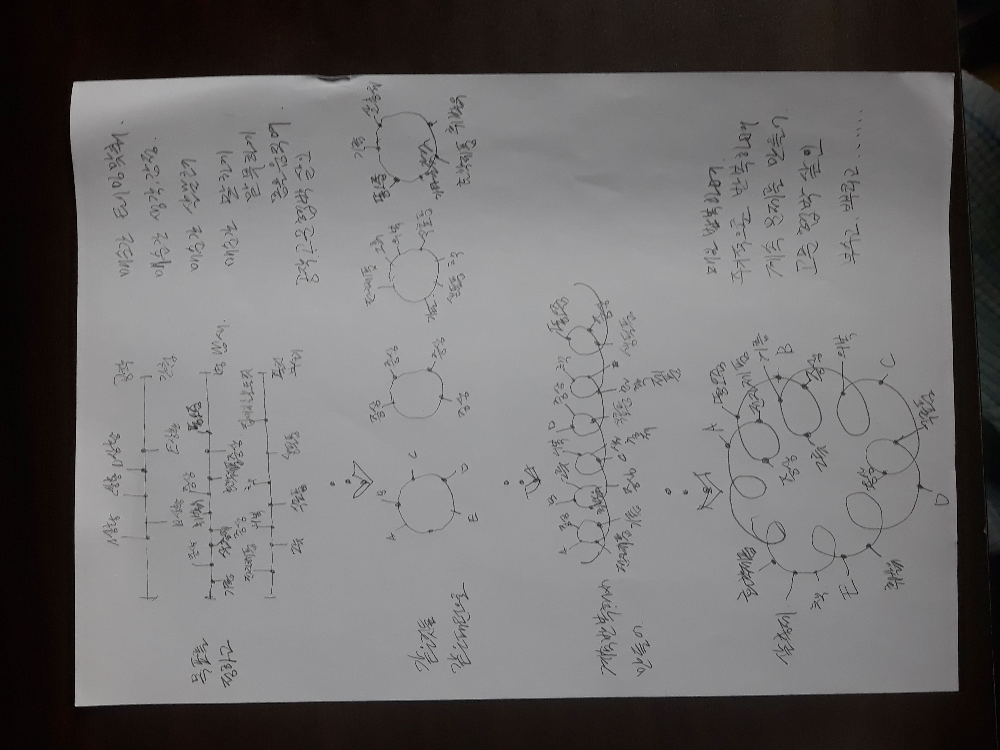
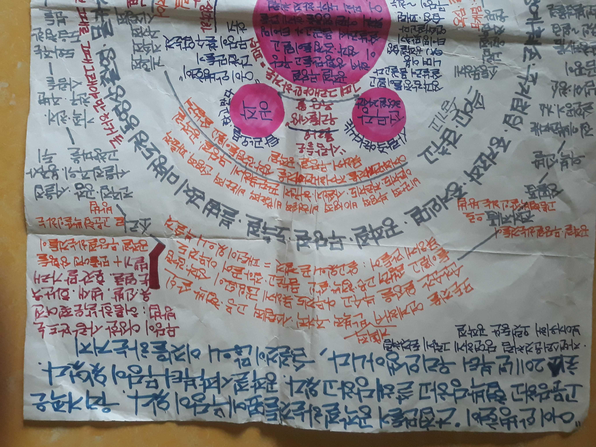
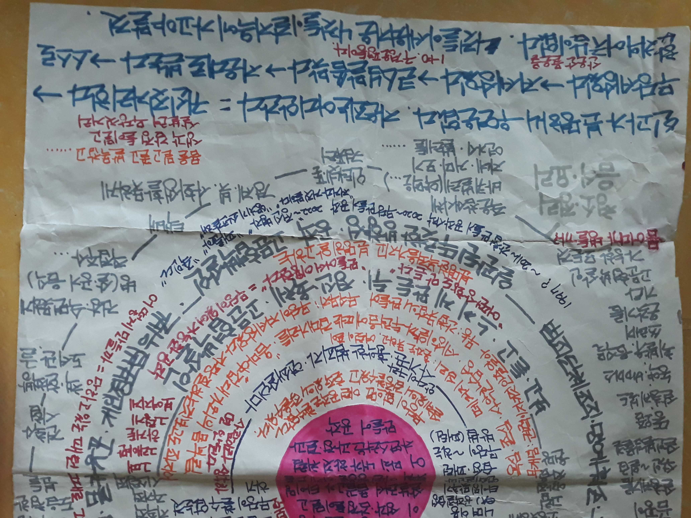

## 문서번호: 501

### 제목: [전 국민 <모바일투표제>를 모든 선거와 여론조사에 왜 전면 실시하지 않나요?](https://q4all.kr/redirect/detail/78db5d47-b404-434a-a5fb-62ebc3ca7ade)

**작성자:** [이우혁](https://q4all.kr/user/profile/824)
**작성일:** 2025-02-08 05:18:17 (토요일)

---

전 국민 <모바일투표제> 전면 실시를

왜 세계 최고 IT강국인 우리 대한민국이

여태 실시하지 않고 있나요??

현재, 각 정당은 선거 경선에서

<모바일투표제>를 적극 실시하고 있어요.

이제

명태균의 여론조작사건이나,

윤석열의 부정선거 핑계로 한 내란 등

많은 부작용과 비용을 낳은 기존의 투표방식을

과감히 현실적으로 개혁합시다!

전 국민 <모바일투표제> 전면 실시는

1. 각종 선거비용 초절감효과

2. 선거할 때 시공간의 제약이 사라지고

3. 결과를 즉시알 수 있고

4. 부정투표시비도 획기적으로 낮추며

5. 무효표, 사표 방지 효과 극대화

6. 국민주권 , 국민소환, 주민소환 실현

7. 모든 주요 공직자 선출 및 파면을 국민이 직접 즉각 실행가능!

8.각종 주요 국가 현안에 대한 국민 여론 조사, 수렴 , 반영, 감시 가능

9. 특히, 윤석열 내란사태에서 절감했 듯이,

대통령과 국무위원, 모든 선출직 공무원을

국민이 직접 선출 , 파면 가능해져서,

국정안정, 시간, 비용 절감 등 그 효능가치 극대화의

특장점이 있어요!

10. 다만, 해킹방지 ,조작방지 대책기술 등을

블록체인 및 최신기술 등을 적용해서 보완한다면,

우리 대한 민국은 명실상부한 국민주권국가실현이 가능해요.

---

## 문서번호: 502

### 제목: [대한민국은 왜 큰 도둑들에게 관대한가?](https://q4all.kr/redirect/detail/49c94212-d48e-4f1d-9f96-a88498465eea)

**작성자:** [최연화](https://q4all.kr/user/profile/828)
**작성일:** 2025-02-08 05:22:03 (토요일)

---

작은 도둑들에게 벌을 내리듯 큰도둑들에게 모두 걷어 들여야 맞다고 생각한다.

빼돌리고 돈이 없다면 감옥에서라도 벌어서 갚도록 해야한다.

어떻게든 큰돈 빼돌리고 여차하면 몇년 살고 나오면 된다? 이건 정말 아니라고 본다.

서민들은 힘들게 사는데 큰도둑들은 잘들 산다.

왜그런가?

지들끼리 짜고 치는건가?

금융치료 꼭 필요하다.

불법으로 모은것도 싹다 걷어 들여야한다.

그래야 투명한 사회가 되지 않겠는가?

투기말고 투자로 돈을 벌어야한다.

---

## 문서번호: 503

### 제목: [수학능력시험을 우리는 왜 폐지하지 못하는가? ](https://q4all.kr/redirect/detail/2eba2fec-6169-4ac9-8807-1842bf17c670)

**작성자:** [강영은](https://q4all.kr/user/profile/829)
**작성일:** 2025-02-08 05:23:44 (토요일)

---

현재와 같은 수학능력시험에 대한 폐지론이 오래 전부터 논의를 시작했지만

그 누구도 제대로 정리를 못하고 있습니다.

평가원에서도 누가 칼을 들기가 쉽지 않을 거 압니다.

그럼에도 불구하고 수학능력시험은 이제 폐지되어야 할 이유가 충분하다고 보는데요,

왜 우리는 여전히 수학능력시험에 매인 사회를 계속 감당해야 할까요.

언제까지 우리는 알면서도 손해보는 사회를 계속 살아야 할까요.

질문해 봅니다.

---

## 문서번호: 504

### 제목: [수저론을 이제는 없애야 하지 않을까요? ](https://q4all.kr/redirect/detail/e4128ee9-d2d2-401e-bc83-848f8f7a2ff2)

**작성자:** [강영은](https://q4all.kr/user/profile/829)
**작성일:** 2025-02-08 05:28:43 (토요일)

---

어디서부터 시작되었는지 모르겠지만

처음엔 이렇게 진지하고 심각한 사회 문제가 될 거라 예상 못했을지도 모르지만,

현실이 그렇다 하더라도 굳이 수저론을 우리가 당연히 받아들이지는 않아야 하지 않나 생각합니다.

제가 느끼기에, 너무 당연하게 사회와 개인이 이 수저론을 수용하고 있고,

사실 갖지 않아도 될 한계를 굳이 안고 괴로워하면서 사는 거 아닌가 생각합니다.

건강한 사회적 사고를 유지할 수 있는 개념은 더 나와야 하고

진실인 듯 하지만 진실 아닌 이런 개념들은 사장되는 건강한 사회가 되면 좋겠습니다.

수저론이 당연하게 느껴지지 않는 사회가 되기 위해서, 또한 이런 개념들을 정제하기 위해서

우리가 해야할 노력에는 어떤 것들이 있을까요?

---

## 문서번호: 505

### 제목: [핸드폰 이용 요금의 정상화는 언제 이뤄질까요? ](https://q4all.kr/redirect/detail/551250cc-c639-4d65-9879-bf646a82c4da)

**작성자:** [강영은](https://q4all.kr/user/profile/829)
**작성일:** 2025-02-08 05:33:52 (토요일)

---

해외 생활을 오래 하면서

우리나라와 해외 생활에서 느끼는 가장 큰 차이 중 하나는

핸드폰 요금입니다.

우리나라는 언제쯤 이용자 중심의, 이용자가 납득할 수 있는 핸드폰 이용 요금 시스템을 가질 수 있을까요?

알뜰폰 같은 대안이 있긴 하지만 아무리 생각해도 이용자들에게는 부담될 수 밖에 없는 요금 시스템이라고 생각합니다.

다음 정부에서는 가능할까요?

우리가 다른 나라처럼 이런 합리적 시스템을 가지지 못할 이유가 있나요?

합리적으로 납득할 수 있는 요금을 지불하면서 핸드폰을 이용할 수 있는 날이 오기는 할까요?

---

## 문서번호: 506

### 제목: [가입 되어 있는 보험은 왜 신청해야만 받을 수 있는가?](https://q4all.kr/redirect/detail/741ecbd2-335d-438e-9d12-a81ee514ca07)

**작성자:** [김성곤](https://q4all.kr/user/profile/836)
**작성일:** 2025-02-08 05:40:52 (토요일)

---

엄청나게 복잡한 보험 약관들 대부분 몰라서 받지 못하는 보험금이 꽤 있을 듯 합니다.

최근 대장 내시경 용종 제거 수술도 보험금 지급 대상임을 알고 신청을 하였으니까요?

이렇듯 병원 진료기록이나 처방 기록이 전산으로 처리되면 내가 가입한 보험약관에 따라 보험금이 자동으로 지급 되도록 시스템을 구축하자는 취지 입니다.

---

## 문서번호: 507

### 제목: [왜 건설사 아파트 원가 공개를 하지 않는거죠?](https://q4all.kr/redirect/detail/a1166c91-8431-404c-a5e7-2c3b24890138)

**작성자:** [주우정](https://q4all.kr/user/profile/840)
**작성일:** 2025-02-08 05:44:10 (토요일)

---

검색해보면 30평형 아파트 한채에 들어가는 20~30톤정도이고 만약 30톤이 필요하다고 할때 톤당 7만2600원이랍니다. 검색해보면 누구나 알 수 있는거구요.

무슨 세계적으로 물류비가 높아지고 인건비 올라가고. 블라블라.... 알았으니까 아파트 건설사들 원가 공개 좀 하라고 하세요.

비싸면 비싼대로 아~ 그래 그럴만하네 하고 살거고.

또 어떤 업체들은 우리가 저것보다 싸게 부당이득 좀 인간적으로 덜 먹고 만들어드릴게 하고 튀어 나올수 있는거고.

이건뭐. 전국민은 눈뜬 장님 만들고 대충 사가라는 식이니....

---

## 문서번호: 508

### 제목: [식량자급도가 무엇이며 이것은 왜 중요한걸까요?](https://q4all.kr/redirect/detail/13d6e6ec-a24e-41a6-b4df-e414fb78c016)

**작성자:** [김지수](https://q4all.kr/user/profile/841)
**작성일:** 2025-02-08 05:46:48 (토요일)

---

우리가 던지고자 하는 모든 질문은 지금 이 순간 살아있음에 할 수 있는 것이고 살아있음에 답을 찾아가는 여정을 밟아나갈 수 있다고 생각합니다.

그 삶을 위한 가장 중요한 근본적인 문제인 식량, 그 식량을 자급 할 수 있다는 것은 어떤 의미를 지니는 것일까요?

---

## 문서번호: 509

### 제목: [분열의 대한민국, 어떻게 하면 공존 하면서 번영 할 수 있을까요?](https://q4all.kr/redirect/detail/7c3cdd14-87eb-4871-877e-b4de5ca03230)

**작성자:** [김진욱](https://q4all.kr/user/profile/835)
**작성일:** 2025-02-08 05:48:44 (토요일)

---

지금의 한국은 사상(좌우), 남여, 노소, 빈부,지역,노사등으로 나누어져 끊임없는 대립과 갈등의 연속입니다. 평화와 번영이라는 공동의 가치로 공존 할 수 있는 해답은 없을까요.

---

## 문서번호: 510

### 제목: [우리나라 판사는 뇌물을 받고, 공범으로 재산을 갈취해도, 행정부와 사법부는 기소하지 못하는 걸까?](https://q4all.kr/redirect/detail/39741edb-6286-4329-af67-12faf5d62cef)

**작성자:** [김철수](https://q4all.kr/user/profile/834)
**작성일:** 2025-02-08 05:49:32 (토요일)

---

우리나라 법은 모든 국민에게 평등하게 주어지는 법이라 합니다.

그렇기에 대통령도 법을 어기면 실형을 사는 것이지요.

하지만 판사 윤준은 강간을 하여도, 뇌물을 받아도, 결정문을 위조하여 뇌물 사실을 숨겨도, 공범들조차 수사를 하거나, 기소 하지 않습니다.

믿기 힘들겠지만 재판(회생)은 했으나, 10년이 넘도록 판결문(강제 집행문)을 받지 못하는 사례가 있습니다.

판사 윤준은 채무자로부터 회생 채권으로 신고된 금액을 뇌물을 받았으며, 그 뇌물이 형사 판결문 다시 회생 채권으로 신고되자, 회생 채권자 목록 및 회생 계획안을 기재하지 않고 회생 조기 종결로 사건을 은폐하였습니다.

종결 7년이 지난 현재까지 서울회생법원은 회생 채권자에게 판결문 (회생 채권자목록과 회생 계획표)를 발급하지 못하고 있습니다.

판사의 불법 행위로 서울회생법원, 국가권익위원회, 공수처 등 모든기관에 민원을 제기 하였으나, 돌아오는 답은 수사, 조사는 하지 못한다. 입니다.

왜 대한민국은 판사의 불법 행위를 눈감아 주는 것일까요? 범죄자에게 판결을 받고, 억울하다 말하면 왜 안되는 것일까요? 이들에게도 상식적인 법 적용이 왜 이리 힘든 것일까요?

---

## 문서번호: 511

### 제목: [왜 검사외 판사는 더 엄하게 처벌할 수 없는가?](https://q4all.kr/redirect/detail/0850ab06-f753-42f2-8836-9e24515aff1e)

**작성자:** [홍대식](https://q4all.kr/user/profile/838)
**작성일:** 2025-02-08 05:50:55 (토요일)

---

상식적으로 법을 잘 알고 잘 지켜야 하는 자들 아닌가요?

가장 청렴해야하고 가장 원리원칙대로 해야할 그 들이

왜 조작, 은닉, 복수 등 파렴치한 일들을 해도 처벌을 못 할까요?

---

## 문서번호: 512

### 제목: [다음 대통령실은 어디로 가야 하나요](https://q4all.kr/redirect/detail/5163ba6a-e80c-45b4-b638-018245f96840)

**작성자:** [안창근](https://q4all.kr/user/profile/845)
**작성일:** 2025-02-08 05:51:06 (토요일)

---

용산 대통령실을 계속 이용해야 하나요 다시 청와대로 들어가야 할까요 아니면 세종 종합청사로 가야 할까요

---

## 문서번호: 513

### 제목: [사촌이 땅을 사면 왜 배 아파 해야하나요](https://q4all.kr/redirect/detail/85fdbfcc-63c2-4b09-b44e-144408e0d4f4)

**작성자:** [NAMI](https://q4all.kr/user/profile/842)
**작성일:** 2025-02-08 05:51:17 (토요일)

---

"사촌이 땅을 사면 배아프다"

이 속담 하나가 고려~조선~일제~근대~현대 까지 이어진 역사 중 한 시라도 빠진 적이 없는 한국피를 거진 사람들 다 수의 DNA 라고 생각합니다...

남이 잘 되건, 잘 못되건 이유와 동기와 목적이 있을 것 입니다.

내가 남보다 부족하다고 하여 질투,시기,분노 할 필요가 있을까요?

"송충이는 솔잎을 먹어야 한다"

송충이로 태어나고 자라서 배웠는데 굳이 되지 않을 나비가 되어 보겠다는 욕망으로 자신을 희생 시킬 필용가 없습니다.

자신이 송충이 인지 나비 인지에 대한 자아를 가지게 하는게 지금 한국 사람들에게 가장 중요한 숙제라 봅니다..

그러기 위해서 국민윤리와 도덕 교과서가 다시 살아나야하며 제대로 된 역사의 교육과 맞 물린다면 앞으로 30년 후의 한국 미래는 밝지 않을까요??

사람이 먼저 입니다... 돈은 그 다음 입니다...

---

## 문서번호: 514

### 제목: [모바일 어플로 연동될수 없나요?](https://q4all.kr/redirect/detail/38a5dc41-e72b-470e-b084-308d9e01f72e)

**작성자:** [황순혁](https://q4all.kr/user/profile/844)
**작성일:** 2025-02-08 05:52:54 (토요일)

---

모바일 환경에서도 언제어디든지 질문할 수있게 어플도 만들어 주세요!

---

## 문서번호: 515

### 제목: [동일노동 동일임금은 왜 안합니까?](https://q4all.kr/redirect/detail/5d64cbab-daad-4ce1-850a-d84b06d42042)

**작성자:** [김혜순](https://q4all.kr/user/profile/833)
**작성일:** 2025-02-08 05:53:43 (토요일)

---

비정규직은 늘어가고 노동자의 삶은 쓰다가 버려지는 휴지처럼 노후를 준비하기는 힘들어지고 있습니다. 불안정한 노동은 빈부격차를 더욱 심화시킵니다. 기업의 필요에 따라 단기고용을 하는만큼 임금도 합당하게 지불하는것이 맞지않을까요?

---

## 문서번호: 516

### 제목: [출산율 저하의 진짜 원인은 무엇일까요?](https://q4all.kr/redirect/detail/a10a9397-c1a8-436b-9a64-cf3d9fee3f0a)

**작성자:** [변휘원](https://q4all.kr/user/profile/804)
**작성일:** 2025-02-08 05:54:57 (토요일)

---

최근 한국의 출산율은 세계 최저 수준을 기록하고 있습니다.

이러한 현상은 단순히 인구 감소의 문제를 넘어, 사회 전반에 걸쳐 심각한 영향을 미치고 있습니다.

그렇다면, 출산율 저하의 원인은 무엇일까요?

그리고 이를 해결하기 위해 우리는 무엇을 해야 할까요?

**'현대사회의 출산율 저하의 원인'**

현대사회의 출산율 저하의 원인은 다양합니다.

높은 주거비와 교육비로 인해 젊은 세대들이 결혼과 출산을 꺼리는 경우, 일과 가정의 양립이 어려운 직장 환경, 개인주의적 가치관의 확산 등.

여러 가지의 합당한 이유를 꼽을 수 있습니다.

하지만 이러한 문제점들은 나무에 비유하자면 잔가지에 불과합니다.

우리는 이런 잔가지에 집중할 것이 아니라, 잔가지를 타고 내려가 이 문제점이 시작된 근원, 즉 나무기둥과 뿌리를 살펴봐야 할 것입니다.

**'문제의 뿌리'**

20세기 세계대전은 당시 노동력의 대부분을 차지하던 남성들을 전장으로 내몰았고, 그 결과 전쟁이 끝난 후 엄청난 수의 남성들이 사망하며 노동력 공백이 발생했습니다.

이 공백을 메우기 위해 정부는 여성들에게 선거권과 여성인권을 강조하며, 가정에서 사회로의 진출을 촉구했습니다.

초기에는 여성들이 직접 노동에 참여하는 것에 거부감을 느꼈지만, 언론과 정부의 강력한 선전과 심리적 조작으로 점차 사회로 진출하게 되었습니다.

이는 국가가 상실된 노동력을 보충하기 위한 단기적 전략이었지만, 결과적으로 여성들은 남편의 경제적 보호 아래 가정에서 아이를 돌보며 살아가던 삶에서 벗어나야 했습니다.

이러한 변화는 출산율 저하의 근본적인 원인이라 볼 수 있습니다.

여성들이 사회로 진출하며 가정과 일의 균형을 잃어버렸고, 이는 결국 출산율 감소로 이어졌습니다.

이제 우리는 이 문제의 뿌리를 파고들어, 여성들이 다시 가정으로 돌아갈 수 있는 환경을 조성해야 합니다.

이를 통해 출산율 저하 문제를 해결하고, 더 건강한 사회를 만들어 나가야 할 것입니다.

#### **'출산율 저하의 영향'**

출산율 저하는 사회 전반에 걸쳐 심각한 영향을 미칩니다.

노동 인구의 감소로 경제 성장이 둔화될 수 있습니다.

고령화 사회로의 진입이 가속화되어 연금과 복지 시스템에 부담이 가중됩니다.

지역 사회의 소멸과 학교 폐교 등 사회적 문제가 발생할 수 있습니다.

#### '정부와 사회의 적극적인 노력'

첫째, 주거비와 교육비를 줄이기 위한 정책이 필요합니다.

둘째, 일과 가정의 양립이 가능한 직장 환경은 현실적으로 불가능 합니다.

우리는 여성과 남성을 구별하여 각자에 특기인 노동과 출산을 구별하여 장려해야 합니다.

셋째, 결혼과 출산에 대한 남녀의 다름을 인식을 확산시키는 캠페인이 필요합니다.

**"성별에 따른 공교육의 차별화"**

성별에 따른 공교육의 차별화는 현대 사회에서 중요한 논의 주제 중 하나입니다.

남성과 여성은 생물학적, 심리적 특성이 다르기 때문에, 이에 맞는 교육이 필요합니다.

특히, 2차 성장이 시작되는 10대 시기부터 성별에 맞는 교육을 실시한다면, 각자의 잠재력을 최대한 발휘할 수 있는 환경을 조성할 수 있습니다.

남성은 노동 시장에 적합한 기술과 역량을 키울 수 있도록 교육해야 하며, 여성은 가정에서의 역할을 포함해 사회적 성숙을 이룰 수 있도록 지원해야 합니다.

이러한 성별 맞춤형 교육은 대한민국의 고질적인 문제인 극심한 사회적 경쟁을 완화하고, 자원을 효율적으로 분배하며, 성별에 따른 사회적 역할을 명확히 함으로써 인권의 향상을 기대할 수 있습니다.

결국, 성별에 따른 교육의 차별화는 개인의 성장과 사회의 발전을 동시에 이루는 중요한 전략이 될 것입니다.

출산율 저하는 단순히 인구 감소의 문제를 넘어, 우리 사회의 미래를 위협하는 심각한 문제입니다.

이 문제를 해결하기 위해서는 정부와 사회의 적극적인 노력이 필요합니다.

모두가 함께 노력한다면, 더 나은 미래를 만들 수 있을 것입니다.

---

## 문서번호: 517

### 제목: [인간의 노동](https://q4all.kr/redirect/detail/efe4bde6-e937-46c4-a59e-efaec3f79d73)

**작성자:** [김상백](https://q4all.kr/user/profile/848)
**작성일:** 2025-02-08 06:03:18 (토요일)

---

날이 갈수로 노년층이 늘어가고

폐지를줍는 노인들이 늘어가고

노인 빈곤율이 늘어가고 있는 대한민국의 현실

인간은 언제까지 노동을 해야 할까요?

인간들을 노동을 하지 않아도

AI가 인간을 대신해 삶의 질이 높아지는 방법은 없을까요?

노동을 전혀 하지 않을수는 없겠지만

AI로 인해 적은 노동으로 삶의질이 높아지는

세상을 꿈꿉니다

---

## 문서번호: 518

### 제목: [왜 정부는 사람이 살만한 아파트 또는 주택공급을 안하죠?](https://q4all.kr/redirect/detail/d2347175-c166-49b4-a88c-65de2028b3ef)

**작성자:** [주우정](https://q4all.kr/user/profile/840)
**작성일:** 2025-02-08 06:05:08 (토요일)

---

왜 정부가 나서서 집을 안짓죠?

세계사적으로 보면 그런나라도 많던데 반면교사든 뭐든 해서 우리나라에 맞는 제도 만들어 좀 하면 안되나요?

언제까지 민간건설사 아파트 주도의 가격 상승을 보고만 있을건가요?

훌륭하신 공무원님들?

아니 쿠데타할 돈으로 '주택공급청'같은거

하나 만들고 노가다라 불리우는 비정규직으로 떠도는 우리 수많은 '집짓는 장인들'을 특채든 임시직이든 공무원으로 채용해서

전국에 집좀 제대로 짓고 다니면 안되나요? 외국인 노동자들이 노가다판에서 한국사람 부리면서 일한다던데.

아니 국내 인력들 활용하고 실업구제에도 기여하고 좋잖아요.

그리고 또 왜 정부가 공급하는 아파트는 맨날 좁디 좁고 무주택서민 불쌍한 사람들만 이용하라는식이죠?

예전에는 그렇다쳐도 이제는 좀 한 30평대도 많이 만들어 공급하고 합당한 비용 받으면 안되나요? 다주택자들은 얼씬 못하게 하구요.쫌.

언제까지 이모양으로 놔두고 모기같은 건설사와 은행이 국민피 빨아먹는거 방관할거냐구요.

이 나라는 왜 주택정책이 이모양이에요~

민간 건설사에 외주줘서 순살아파트 주차장 붕괴사고까지 나는거보면 뻔한거 아니에요?

정부에서 어차피 확실하게 돈주는 아파트 이놈 저놈 다 빼먹으니 나도 좀 빼먹자 한 결과 아니에요?

처벌 안하니까 관련 공무원들은 또 어디선가 수면아래 눈치보고 있을거에요. 또 해먹으려고.

그런 공무원과 건설업자 카르텔 안부술건가요?

그러니까 그냥 민간은 민간대로 짓든지 하라고 하고

정부가 나서서 직접 짓고 매수도해서 좀 제대로 공급 합시다. 왜 안해요? 왜 다주택자들 유리하게만 정책을 돌려요?

그리고 왜 청년만 국민이고 불쌍한 사람들만 국민인거에요?

모든 국민들도 주택자유 좀 누립시다.

---

## 문서번호: 519

### 제목: [일러스트레이터, 디자이너 과도한 수정 요청에 의한 노동력 착취](https://q4all.kr/redirect/detail/a7f61ed9-cb75-4704-ad0f-73ca5a1a90cd)

**작성자:** [장명진](https://q4all.kr/user/profile/854)
**작성일:** 2025-02-08 06:09:47 (토요일)

---

과도한 수정 요청이 일러스트레이터, 디자이너의 창의성과 권리를 침해

"과도한 수정 요청이 일러스트레이터, 디자이너의 창의성과 권리를 침해하는 심각한 문제로 대두되고 있습니다. 이를 해결하기 위해 다음과 같은 질문을 던져볼 수 있습니다:

과도한 수정 요청의 문제점

일러스트레이터, 디자이너의 창의성이 저하되는 원인은 무엇인가요?

수정 요청이 반복될 때 발생하는 시간과 비용의 낭비를 어떻게 줄일 수 있을까요?

지속적인 수정 요청이 일러스트레이터, 디자이너에게 미치는 심리적 부담을 어떻게 해소할 수 있을까요?

불공정한 계약 관행

수정 요청에 대한 대가가 지급되지 않는 현상을 어떻게 개선할 수 있을까요?

계약서에 수정 횟수와 기준을 명확히 명시하는 것이 왜 중요한가요?

과도한 수정 요청이 디자이너의 저작권을 침해하는 경우, 이를 어떻게 방지할 수 있을까요?

해결 방안

명확한 계약서 작성을 통해 불필요한 수정 요청을 방지하는 방법은 무엇인가요?

클라이언트와의 원활한 커뮤니케이션을 통해 작업 효율성을 높이는 방법은 무엇인가요?

문화예술 분야의 불공정 관행을 개선하기 위한 법적 제도는 어떻게 마련되어야 할까요?

---

## 문서번호: 520

### 제목: [인천세관 밀반입 마약 수사무마 외압 의혹의 마약을 계엄군에게 먹였다면 계엄군은 어떻게 행동했을까요 ~~ ??](https://q4all.kr/redirect/detail/6f3c695a-7c1e-461d-bdc4-6f5e8550027b)

**작성자:** [유재욱](https://q4all.kr/user/profile/863)
**작성일:** 2025-02-08 06:38:50 (토요일)

---

2024년8월 청문회에서 인천세관 마약 밀수관련 대통령실 수사 축소 및 무마 관련 외압이 있었다는데 누가, 왜 ~~??

마약의 최종 수령지가 어디였을지 반드시 밝혀야 되지 않을까요 ~~ ??

광주 518 민주항쟁 당시 확인 여부는 정확히 알지 못하지만

마약에 흥분된 계엄군들이 더욱 흉폭하게 광주시민을 확살했다는 말들이 많이 나돌았었는데 ....

---

## 문서번호: 521

### 제목: [왜 중산층은 민주당을 싫어할까?](https://q4all.kr/redirect/detail/f8776bdb-47f4-402f-a1f6-92da390c1ea2)

**작성자:** [이재근](https://q4all.kr/user/profile/866)
**작성일:** 2025-02-08 06:41:18 (토요일)

---

대기업에 다니고 있는 사람입니다

주변 회사 동료들을 보면 민주당은 저소득층을 위한 정책만 있을뿐

중산층을 위한 정책은 펼치지 않는다고 다들 생각합니다

왜 고소득자와 중산층이 민주당을 꺼려하는지 그 관점에서 고민이 필요하고

중산층을 위한 정책마련 및 홍보가 필요하다고 생각됩니다

---

## 문서번호: 522

### 제목: [사법부는 왜 선출직이 없나요?](https://q4all.kr/redirect/detail/7ed3adab-c579-4b55-999f-6179f403352e)

**작성자:** [진성식](https://q4all.kr/user/profile/869)
**작성일:** 2025-02-08 06:44:31 (토요일)

---

현재 우리나라는 입법부(국회의원), 행정부(대통렁, 기초단체장)은 국민들의 선거로 선출된 선출직으로 이루어져 있습니다.

그런데 사법부는 왜 선출직이 없나요?

사법부에 선출직이 없는 이유가 재판의 판결에 중립성과 전문성을 보장하기 위해서라고 알고 있습니다.

그런데 중립성에서 결과가 국민들의 정서와 민의를 대변하지 못하고 기득권이나 권력지향적으로 판결의 결과로 일반 국민들의 정서가 법 불평등이 극에 달했다고 봅니다.

지금은 재판의 과정과 결과는 돈과 권력에 편향적으로 이루어지고 있는데 이는 지금 사법부 시스템의 한계라고 생각합니다.

이를 조금이라도 제재하는 방법이 사법부의 일부를 국민들의 직접 선출직으로 바꿈으로 이런 사법부 시스템의 부족한 부분을 채울 수 있다고 생각합니다.

---

## 문서번호: 523

### 제목: [왜 대한민국에서는 이중국적을 허용하지 않나요?](https://q4all.kr/redirect/detail/fb98d0ff-cfdb-4eec-8b1a-5338429715da)

**작성자:** [정선아](https://q4all.kr/user/profile/860)
**작성일:** 2025-02-08 06:52:50 (토요일)

---

글로벌 시대라고 합니다. 인턴쉽 유학 다양한 기회로 해외로 나가서 공부하고 취업하는 것을 장려하지요.

많은 청년들이 해외로 진출합니다. 이 과정에서 일을 하기 위해, 혹은 여러가지 이유로 해당국가의 시민권을 받기도 합니다.

하지만 그렇게 시민권을 받게되면 대한민국은 이중국적,복수국적을 허용하지 않기때문에 대한민국의 국적은 자동 상실 됩니다.

나의 뿌리는 대한민국이고 스스로 한국 사람이라고 생각하지만 이미 자리잡은 해외의 터전을 버릴 수 없기에 외국인이 되어버립니다.

많은 해외동포들이 영주권과 시민권사이에서 많은 고민을 합니다. 이유는 대한민국의 국적을 상실하고 싶지않아서 입니다.

건강보험 단순히 이런 혜택을 누리고 싶어서가 아니라 내 뿌리를 잃고싶지 않아서..

영주권을 계속 유지하면 되지않냐 라는 생각도 할 수 있겠지만 그것또한 나름의 문제가 있지요.

선택의 기회를 받고 싶습니다.

만약 조건에 따라 이중국적을 허용받을 수 있다면 그 또한 많은 해외 거주 한국인들에게 도움이 될 수 있지 않을까요?

대한민국이 이중국적을 허용하지 않는 이유는 무엇이고 이중국적을 허용하게 되면 발생하는 문제는 무엇인가요?

65세가 넘으면 이중국적을 허용해주는데 그 이유는 무엇인가요? 나이와 상관없이 이중국적을 허용해주면 안되나요?

징병제가 원인이라면 여성이어도 군대를 다녀오면 이중국적을 허용받을 수 있나요?

건강보험이 이유라면 건강보험을 이용하지 않는다면 이중국적을 허용받을 수 있나요?

제 질문을 봐주셔서 감사합니다.

---

## 문서번호: 524

### 제목: [악의성 허위 사실을 유포하는 유튜버들에게 언론, 출판의 자유로 어디까지 인정해야 하나요~??](https://q4all.kr/redirect/detail/d14be904-2e3d-4c4d-b2b4-95d2d3e246a3)

**작성자:** [유재욱](https://q4all.kr/user/profile/863)
**작성일:** 2025-02-08 06:53:31 (토요일)

---

이런 것들을 방치하여 사회가 무너질 수 있는데, 대책이 시급합니다..

---

## 문서번호: 525

### 제목: [앞으로의 우리 아이들은 어떻게 교육을 받아야 하나요?](https://q4all.kr/redirect/detail/cd66edcc-06cd-4831-ae24-3b1555a12319)

**작성자:** [장미향](https://q4all.kr/user/profile/871)
**작성일:** 2025-02-08 06:54:22 (토요일)

---

안녕하세요. 저는 호주에서 중학생과 초등학생 아이를 키우는 엄마입니다.

호주에서 아이들을 키우기 때문에 한국에 대한 문화 교육과 언어 교육등을 어떻게 해야 하나 신경을 쓰고 있습니다.

호주에서 아이들이 자라고 있지만 한국인으로 아이들의 건강한 정체성과 사회성 그리고 세계관이 가지고 자라기를 바라고 있습니다.

이곳에 아이들에게 한국문화를 알려주는 교육도 진행하고 있지만, 한국사회와 정치 그리고 문화를 교육 함에 있어서 이면적으로 접근 하려는 부분도 있어 보이고 사실의 근거하여 현재 사회 현상을 알려주려고 하여도 문제가 생기고 있습니다.

아이들이 한국에서 정치, 사회, 문화등 건강하게 생각 할 수 있는 교육 방향성이 얼마나 있고 한국의 교육 방향을 따라 외국에 살고 있는 한국인 2, 3세 아이들의 교육 방향도 잡힐 것이라 생각합니다.

앞으로의 아이들의 건강한 교육 방향은 어떻고 어떻게 진행 되야하는 지 알려주세요.

감사합니다.

---

## 문서번호: 526

### 제목: [우리나라 레가시 언론들의 기득권 편들기 보도를 언제까지 지켜봐야 하는가요 ? ](https://q4all.kr/redirect/detail/1fbe7b98-e15d-439e-9342-84ca5a96403c)

**작성자:** [박원철](https://q4all.kr/user/profile/868)
**작성일:** 2025-02-08 06:54:51 (토요일)

---

안녕하세요.

먼저 아주 좋은 기획을 해주셔서 감사드립니다.

주제넘게 말씀드리면, 우리나라의 많은 문제들 (친일, 부동산 카르텔, 검찰 및 법원의 사법카르텔, 국민의 힘 및 극우집회 등) 의

가장 강력한 자양분은 기성 언론들의 보도태도라고 생각을 합니다.

다행스럽게 기술발전이 이러한 부패집단들의 이익을 어느정도 방해하는 대안 언론으로서의 역할을 하고 있지만,

이는 부패집단도 그들의 이익을 위해 극단적인 세력들을 키우는 수단으로 이용되고 있는 게 현실인 듯 합니다.

결국 정확하고 공정한 가치를 담은 내용들을 다루고 있다고 신뢰할 수 있는 언론을 만드는 것이

가장 중요한 것이 아닐까 하는 생각을 해봅니다.

우리나라가 망한다면 7할의 잘못은 언론에 있다고 생각을 하는데, 이 중요한 기능을 담당하고 있는 언론들의 정상화를 위한

방법이 정말 없을까요 ?

답답한 마음에 질문 올립니다.

---

## 문서번호: 527

### 제목: [검사, 판사의 잘못은?](https://q4all.kr/redirect/detail/00d507ed-7e16-4da8-a439-5a3a3b251c0b)

**작성자:** [이정훈](https://q4all.kr/user/profile/881)
**작성일:** 2025-02-08 07:06:41 (토요일)

---

검사나 판사의 잘못은 누구 심판 하나요?

잘못이 있어도 처벌되지 않는 무소불위의 권력, 이젠 바꿔야 되지 않을 까요?

---

## 문서번호: 528

### 제목: [우리나라 과학영재들이 인정받으려면 어떻게 바뀌어야할까요?](https://q4all.kr/redirect/detail/68da2212-9082-4b50-adac-472ab3c194fa)

**작성자:** [이정석](https://q4all.kr/user/profile/878)
**작성일:** 2025-02-08 07:06:44 (토요일)

---

어릴적 과학자가 되겠다던 영재들이 의사가 되려고 합니다.

왜 그렇까요?

미국하고 뭐가 다를까요?

순수과학을 하고 싶으면 미국 가야하나요?

---

## 문서번호: 529

### 제목: [우리의 소원이 진짜 통일일까? ](https://q4all.kr/redirect/detail/83c93e60-bb99-4982-99c8-7a2aacc1ef5d)

**작성자:** [김승우](https://q4all.kr/user/profile/862)
**작성일:** 2025-02-08 07:11:13 (토요일)

---

애국가를 부르고 국기에 대한 경례하게 시키고

우리의 소원이 통일이라고 강조한다.

당연히 분단국가에서 통일 이라는 가치를 가지며 분명 이뤄야할 사명이다.

그런데 전세계 국제정세를 보면 미국.중국.러시아.일본 은 우리의통일이 그닥 멋진 아젠다가 아닌듯하다

정치인.관료.법조인.등 흔히 기득권을 가진 이들은 통일 이 중요하다면서 실제는 분단의 갈등상황으로

인해 더욱 그들의 기득권만 지켜주는건아닐까?

이번 모두의 질문으로

우리의 소원을 강조시키는 나라보다

나의 소원을 이야기하는 기회가 생겨났으면 한다.

왜 백범김구 우리에게 통일을 강조시키지않았을까? 혹시 이미 백범김구 선생님은 통일은 이미 되었다는 전제하에

통일 이후의 시대를 준비하시듯하다.

통일은 당연한 시대적요구다. 그러나 진짜 국민의 삶에 필요한 소원을 들어주는 나라가

통일을 꿈꾸는 나라보다 중요하다. 대한민국은 이미 북한보다 정치경제사회 모든 면에서 살기좋으며

전세계 어디내놓아도 뛰어난 국방력이 있다.

통일이후의 비전으로 전세계를 향한 국가 비전.사명이 생기기를 바란다

적어도 국가를 이끄는 리더라면 국민들의 삶을 챙기며 시민이 안전하고 재난재해로부터 보호되는

것은 기본이 서는 것부터 잘이행하고 비전을 제시했으면한다.

나의 소원은 서로를 돌봐주는 복지국가. 대한민국이 되길바란다. 전세계인들이 오고싶고 살고싶은 나라.

---

## 문서번호: 530

### 제목: [인간의 가장 기본적인 욕구 성욕, 우리는 언제까지 성을 개인의 영역으로 맡기고 공공연한 비밀로만 남겨둘 것이가?](https://q4all.kr/redirect/detail/3fb9b335-0d55-4ad9-ba63-07f9fe9300bc)

**작성자:** [이철준](https://q4all.kr/user/profile/886)
**작성일:** 2025-02-08 07:14:21 (토요일)

---

식욕만큼이나 당연한 인간의 기본 욕구인 성욕. 음식을 먹으면 배설하는 것이 인간 생리의 기본입니다. 우리 사회는 화장실은 눈에 보이게 배치되어 있으나, 배설물을 처리하는 배관이나 정화조는 보이지 않습니다. 남성의 성욕을 그저 개인의 문제로, 사회 규범에 따라 알아서 해결하라고 하는 것이 맞는 것입니까? 그리고 그 기본 욕구를 해소하지 못해 일어난 범죄들을 처벌만 하는 것이 문제의 해결책입니까? 그저 있는 지저분한 것들을 눈에 띄지 않게 덮고 넘어가는 것은 아닙니까?

엄연히 존재하지만 암암리에 불법 영역에서 성매매가 이루어지고 있습니다. 인간의 쾌락을 좇습니다. 불법인 성매매는 그냥 공급자와 수요자가 존재하는 한, 인간이 이 지구상에 존재하는 한 없어지지 않는 현상입니다. 고금을 막론하고 계속해서 일어나는 현실이지만, 우리 사회는 이것을 언급하는 것 자체를 기피하고 덮는 데 급급합니다.

그저 성매매는 법으로는 불법이고, 공급자와 수요자들은 서로의 보건적, 신체적, 심리적 안전을 보장받지 못한 채 엄연히 이루어지고 있습니다. 성을 제공해서 돈을 버는 사람들의 안전하지 않은 공간이나 상황에서 종사하는 것이 맞는 것입니까?

방송에서도 공공연한 비밀인, 일명 '야동'이라 불리는 성인물은 불법이지만, 모두가 다 한 번쯤은 보고 소장하고 암암리에 유통시키고 공공연히 대화를 합니다. 모두가 공공연한 비밀로 하면서 숨어서 소비하는 것이 맞는 것입니까? 성이 비밀스러운 것입니까? 성이 더러운 것입니까? 성이 환상 속에는 있지만 현실에서는 일어나면 안 되는 일입니까?

---

## 문서번호: 531

### 제목: [치매에 부모는 어느 선까지 개인이 책임져야 하나요?](https://q4all.kr/redirect/detail/3794cdeb-e797-4a56-a921-65d68d4dd91e)

**작성자:** [김민희](https://q4all.kr/user/profile/880)
**작성일:** 2025-02-08 07:16:03 (토요일)

---

혼자 책임져야하는 부모가 치메 일경우 개인은 어느선까지 부모에게 책임을 져야할까요?

그리고 정부는 어떠한 정책이 있나요?

---

## 문서번호: 532

### 제목: [왜 정의가 지켜지지 않을까요?](https://q4all.kr/redirect/detail/4993aa88-f373-4831-8a9d-c50b953280dc)

**작성자:** [김현우](https://q4all.kr/user/profile/885)
**작성일:** 2025-02-08 07:16:43 (토요일)

---

이번 계엄을 통해서 의문을 가지게 되었습니다. 대한민국은 정의가 없는 나라인가?

정의를 지키고자 하는 사람은 한없이 약하고 한없이 느리고 한없이 방해를 받습니다.

민주주의란 게 이런 것인가요? 우리가 법을 재대로 정하고 재대로 지킬 수 있게 만들어 놓은 게 맞는지 의심이 듭니다.

옳고 그름을 판별하는 교육이 부족하지 않나 하는 생각도 듭니다.

언론 또한 옳고 그름을 판별하지 못하도록 판단력을 흐리게 만드는 역할을 하고 있습니다.

올바르게 정의가 실현될 수 있도록 꼭 세상을 바꿔주세요.

잘못한 사람은 합당한 처벌을 받고

정의로운 사람들이 목소리를 낼 수 있는 사회를 꼭 만들어주세요.

---

## 문서번호: 533

### 제목: [예전처럼 저렴한 비용으로 응급실을 이용할 수 있게 될 수 있을까요?](https://q4all.kr/redirect/detail/12a8e17b-c643-427c-a4a4-dd6e7c0f9533)

**작성자:** [이경아](https://q4all.kr/user/profile/861)
**작성일:** 2025-02-08 07:16:51 (토요일)

---

얼마 전에 응급실에 갔는데 간단한 검사와 처치를 받고도 수 십 만원의 비용이 청구됐습니다.

응급 처치비의 자기부담비율이 90프로라고 합니다.

예전처럼 아플 때 비용 걱정 안하고 응급실을 갈 수 있을까요?

응급실에 가면 받아 줄지 망설이고 응급 상황인지를 환자가 판단해야 하나요?

그리고 우리나라의 자랑스럽던 선진 의료 체계가 다시 회복될 수 있을까요?

---

## 문서번호: 534

### 제목: [가장 유망한 미래 과학 기술 분야는 무엇일까요?](https://q4all.kr/redirect/detail/93158486-da78-4292-ae63-ba0c4ba2b386)

**작성자:** [홍재성](https://q4all.kr/user/profile/124)
**작성일:** 2025-02-08 07:19:44 (토요일)

---

요즘 AI가 한참 화제입니다. 현재 가장 뜨거운 이슈이죠. 그럼 가까운 미래에는 어떤 과학 기술 분야가 가장 유망할까요? 우리나라의 미래를 위해 생각해 볼 문제라고 생각합니다. 개인적으로 우주산업, 양자컴퓨터, 에너지 기술이 가장 유망하고 필요하다고 생각합니다. 조금 구체적으로 말해보면 우선 양자 컴퓨터 기술은 주로 하드웨어적인 부분이 많이 주목받고 있는데 그 뿐만아니라 양자논리와 같은 소프트웨어적 문제, 주변 기기의 양자 기술화도 필요한 부분이라고 생각합니다. 우주산업에서는 개인적으로 발사체 기술에 관심이 많은데 지금 쓰고 있는 화학적 연료 발사체 말고도 핵추진, 이온 플라즈마 엔진 같은 차세대 발사체 개발도 중요하다고 생각합니다. 그리고 우주 거대 구조체 기술도 중요한 것 같습니다. 에너지 기술과 결부하여 우주태양광 기술은 그런 면에서 연구할 가치가 있다고 생각합니다. 에너지 문제 뿐만아니라 우주에 거대 구조물을 건설하는 기술은 여러가지로 활용도가 높기 때문입니다. 에너지 기술 중에는 무엇보다도 핵융합 기술이 가장 뜨거운 주제인 것 같습니다. 그리고 태양광 쪽도 페로브스카이트 태양전지가 많이 연구되는 분야인 것 같습니다. 두서없이 막 나열했는데 이 외에도 수없이 많은 미래 과학 기술들이 있을테니 집단지성을 발휘해 보았으면 좋겠습니다.

---

## 문서번호: 535

### 제목: [왜 밤 늦게까지 아이들은 학원을 다니고 숙제를 하고 있을까요?](https://q4all.kr/redirect/detail/15937ad2-8500-4b95-bcac-066ea8739a21)

**작성자:** [홍연곤](https://q4all.kr/user/profile/891)
**작성일:** 2025-02-08 07:26:22 (토요일)

---

요즘 주변에 있는 사람들의 자녀들을 보면 많은 아이들이 밤 늦게까지 학원을 다니고 밤 늦게까지 숙제를 하고 늦게 잔다고 합니다.

초등학생이 중학교 3학년 과정을 선행학습을 하고 있다고 하는데, 꽤나 많은 아이들이 그런 것 같습니다.

대기업에 다니는 부모들 학원비가 부담스럽다고 하는데 소득이 상대적으로 낮은 부모님들의 자녀들은 선행학습의 기회라도 있을까요?

선행학습이 너무나 보편화 되고 있는데, 아이들의 선택(본인이 원해서 선택한 선행학습)이 아닌

환경적 분위기에 휩쓸려 어쩔 수 없이 (다들 하니 나도 해야만 할 것 같아서) 하는 밤 늦은 시간까지의 공부가

아이들 개개인의 경쟁력, 정서의 발달, 우리나라의 행복도와 국가 발전에 도움이 크게 될까요?

아이들의 정서가 걱정되고 이러한 상황들이 궁금해져서 질문 올려봅니다.

---

## 문서번호: 536

### 제목: [민족반역자 친일파들을 청산하고, 그 후손들이 지금의 대한민국을 망치고 있는데.. 어떻게하면 이 문제를 해결할수 있을까?](https://q4all.kr/redirect/detail/c0c8a80d-865c-4aa9-a42a-6783316245d3)

**작성자:** [황정수](https://q4all.kr/user/profile/898)
**작성일:** 2025-02-08 07:27:11 (토요일)

---

민족반역자 친일파들을 숙청하고 그 후손들도 완전 발본색원해야만 진정한 대한민국이 시작된다고 생각합니다. 어떻게 해야 가능할까요?

---

## 문서번호: 537

### 제목: [직업, 해직에 대해 시민의 사회적 안정망이 기업에게도 도움이 되도록 하려면, 정부의 행정서비스는 어떻게 해야 하는가? ](https://q4all.kr/redirect/detail/1d27c811-4b35-49e3-a24f-9c2afcc9868e)

**작성자:** [곽준규](https://q4all.kr/user/profile/888)
**작성일:** 2025-02-08 07:29:27 (토요일)

---

개인에게 직업은 생존의 문제 입니다. 기업의 유연성도 결국 기업의 생존 문제입니다.

기업에게 부여된 보호 장치는 정규직에게만 제대로 작동하여, 계약직 노동의 차별 계급을 만들고 심화 하고 있습니다.

개인도 기업도 괴롭고 불편하니, 보수를 해야겠습니다.

공공서비스인 사회적 안정망을 공동서비스를 온라인쇼핑의 공동구매처럼 효율적인 시스템으로 만들 필요가 있습니다.

유럽식의 안전망과 미국식의 기업 자율성에서 이제는 한국의 모델은 우리가 만들어야 합니다.

정부의 행정망 속에서 일정기간 개인의 생존을 하고, 새로운 일자리, 더 좋은 일자리로 이동을 할 수 있도록 사업자와 매칭과 개인의 교육을 지원하는 시스템으로 구현이 필요 합니다.

---

## 문서번호: 538

### 제목: [임금체불](https://q4all.kr/redirect/detail/d1add9a7-888e-426e-a0f6-648cf0089838)

**작성자:** [노성만](https://q4all.kr/user/profile/900)
**작성일:** 2025-02-08 07:30:21 (토요일)

---

임금 체불 발생시 조사관이 정확히 판단 했는지 교차 검증 할수 없을까?

---

## 문서번호: 540

### 제목: [농업 직불금제도 과연 필요한가?](https://q4all.kr/redirect/detail/4dfe7d55-ca24-4370-bd99-78da6b0f5775)

**작성자:** [홍종환](https://q4all.kr/user/profile/905)
**작성일:** 2025-02-08 07:37:53 (토요일)

---

저는 경남에 살고 있습니다 여기 농사짓는 사람들은 쌀값이 오르던 내리던 별로 상관을 안하더군요 저번에 쌀값이 많이 떨어졌을때 아는 형님한테 물어봤습니다 형님 괜찮으세요?라고

그랬더니 우리는 직불금제도가 있어서 괜찬다라고 대답하더군요 그리고 또 땅은 가지고 있으면서 농사를 짓지도 않고 다른사람에게 대신 농사를 짓게하면서도 편법으로 직불금을 타는 형님도 있습니다

이거 뭔가가 많이 잘못된 정책 아닌가하는 생각이 들더군요~~허점도 많고요!!

---

## 문서번호: 541

### 제목: [치매](https://q4all.kr/redirect/detail/4d73ef78-20df-47f8-9aca-d2b6da6bf09e)

**작성자:** [유재준](https://q4all.kr/user/profile/913)
**작성일:** 2025-02-08 07:38:53 (토요일)

---

치매에대한 국가의 책임을

강화하기위한 정책은 어떻게

수립하고 있는가?

---

## 문서번호: 542

### 제목: [sky 수도권 의대 중심으로 대학이 서열화 되어 있고 차별로 작용하고 있습니다. 해결 방안은 무엇일까요?](https://q4all.kr/redirect/detail/9f84ad0f-0b6f-4d9a-9868-3fcb46b06f71)

**작성자:** [심규한](https://q4all.kr/user/profile/904)
**작성일:** 2025-02-08 07:39:57 (토요일)

---

sky 수도권 의대 중심으로 대학이 서열화 되어 있고 차별로 작용하고 있습니다. 때문에 고등학교 교육이 대입을 위한 입시교육에서 한치도 벗어나 있지 못합니다. 수없이 입시제도를 바꾸고 교육과정을 바꿔도 고등학교 교육은 변함없이 대학 입시를 위한 서열화 기능에 머물고 있습니다. 대학의 서열화와 학력차별을 없애지 않으면 중고등 교육의 개혁도 불가능합니다. 대학 서열화를 해체하고 기득권 학연 카르텔을 형성한 차별을 차단하는 방법은 무엇일까요?

---

## 문서번호: 543

### 제목: [과거사 청산](https://q4all.kr/redirect/detail/f902a80a-11d6-492e-aedb-73334095a61d)

**작성자:** [임정환](https://q4all.kr/user/profile/910)
**작성일:** 2025-02-08 07:41:34 (토요일)

---

과거사, 역사적 과오는 청산되지 못하는것은 왜 그런가요? 성향 정치적 합의로 가능한것이 아닌것은 분명한 전제고, 정치적 유불리를 떠나청산합시다.

예)제주항공사고, 이태원참사,세월호등 국민이 인정하고 납득할 처리는 없었습니다 ㅎㅎ

---

## 문서번호: 544

### 제목: [국회의원의 의정활동  부진시 월급삭감제도 신설](https://q4all.kr/redirect/detail/182831bf-faa4-40ca-b6f2-45ad3586b29c)

**작성자:** [곽동열](https://q4all.kr/user/profile/911)
**작성일:** 2025-02-08 07:41:44 (토요일)

---

**현제 국회의원들의 의정활동 참여율이 저조한 의원이 있는데도 월급은 100%센트 지급되고 있습니다.**

**일반직장인은 5분도 지각하지 않으려고 애쓰는데 출근도 하지않고 의정활동도 미비하면서**

**월급을 받는것은 부당하다고 생각합니다.**

**의정참여율에 따라서 차등월급을 지급 하는것을 질문드립니다.**

**의정활동 90% 미만일시 월급을 전혀 지급하지않는것입니다.**

****

[**https://www.ppomppu.co.kr/zboard/view.php?id=issue&no=720642**](https://www.ppomppu.co.kr/zboard/view.php?id=issue&no=720642)

**참고자료입니다.**

**평균 출석률 순위**

**1위. 더불어민주당 97.07% (전체 170명) (평균 미출석 1.56건)**

**최고 출석률 100%(81/81) 노종면 등 54명(공동 1위)**

**최저 출석률 85%(51/60) 박찬대(237위)**

**2위. 진보당 96.51% (전체 3명) (평균 미출석 2건)**

**최고 출석률 98%(49/50) 정혜경(84위)**

**최저 출석률 93.75%(60/64) 윤종오(157위)**

**3위. 조국혁신당 95.91% (전체 12명) (평균 미출석 2.33건)**

**최고 출석률 100%(68/68) 박은정 등 3명(공동 1위)**

**최저 출석률 87.50%(56/64) 황운하(209위)**

**4위. 사회민주당 95.74% (전체 1명) (평균 미출석 2건)**

**최고 출석률 95.74%(45/47) 한창민(135위)**

**최저 출석률 95.74%(45/47) 한창민(135위)**

**5위. 무소속 95.65% (전체 2명) (평균 미출석 3건)**

**최고 출석률 100%(31/31) 우원식(공동 1위)**

**최저 출석률 91.30%(63/69) 김종민(180위)**

**6위. 기본소득당 90.90% (전체 1명) (평균 미출석 5건)**

**최고 출석률 90.90%(50/55) 용혜인(187위)**

**최저 출석률 90.90%(50/55) 용혜인(187위)**

**7위. 개혁신당 88.76% (전체 3명) (평균 미출석 7.67건)**

**최고 출석률 94.64%(53/56) 이주영(150위)**

**최저 출석률 80.26%(61/76) 이준석(271위)**

**8위 국민의힘 82.65% (전체 108명) (평균 미출석 9.36건)**

**최고 출석률 93.67%(74/79) 최형두(159위)**

**최저 출석률 50.74%(34/67) 추경호(300위)**

**■ 미출석 0건(출석률 100%) 58명/300명 (출석률 공동 1위)**

**1. 더불어민주당 54명/170명 (31.76%/100%)**

**2. 조국혁신당 3명/12명 (25%/100%)**

**3. 무소속 1명/2명 (50%/100%)**

**4. 그 외 정당 0명 (0%/100%)**

**■ 미출석 1건(출석률 98.79~97.50%) 54명/300명 (출석률 59~112위)**

**1. 더불어민주당 49명/170명 (28.82%/100%) (0~1건 누적 103명/170명 60.59%/100%)**

**2. 조국혁신당 3명/12명 (25%/100%) (0~1건 누적 6명/12명 50%/100%)**

**3. 진보당 2명/3명 (66.67%/100%) (0~1건 누적 2/3명 66.67%/100%)**

**4. 그 외 정당 0명 (0%/100%) (0~1건 누적 0명 0%/100%)**

**■ 출석률 1~100위 (100%~97.87%) (미출석 0~1건)**

**1. 더불어민주당 93명/170명 (54.7%/100%)**

**2. 무소속 1명/2명 (50%/100%)**

**3. 조국혁신당 5명/12명 (41.67%/100%)**

**4. 진보당 1명/3명 (33.33%/100%)**

**5. 사회민주당 0명/1명 (0%/100%)**

**6. 기본소득당 0명/1명 (0%/100%)**

**7. 개혁신당 0명/3명 (0%/100%)**

**8. 국민의힘 0명/108명 (0%/100%)**

**■ 출석률 101~200위 (97.87%~88.67%) (미출석 1~7건)**

**1. 사회민주당 1명/1명 (100%/100%)**

**2. 기본소득당 1명/1명 (100%/100%)**

**3. 진보당 2명/3명 (66.67%/100%)**

**4. 개혁신당 2명/3명 (66.67%/100%)**

**5. 조국혁신당 6명/12명 (50%/100%)**

**6. 무소속 1명/2명 (50%/100%)**

**7. 더불어민주당 75명/170명 (44.12%/100%)**

**8. 국민의힘 12명/108명 (11.11%/100%)**

**■ 출석률 201~300위 (88.67%~50.74%) (미출석 5~33건)**

**1. 국민의힘 96명/108명 (88.89%/100%)**

**2. 개혁신당 1명/3명 (33.33%/100%)**

**3. 조국혁신당 1명/12명 (8.33%/100%)**

**4. 더불어민주당 2명/170명 (1.18%/100%)**

**5. 진보당 0명/3명 (0%/100%)**

**6. 사회민주당 0명/1명 (0%/100%)**

**7. 무소속 0명/2명 (0%/100%)**

**8. 기본소득당 0명/1명 (0%/100%)**

**(출석률 201~300위 100명 중 무려 96명이 한 정당 소속)**

본회의 불참 시 차감되는 활동비 수당은 겨우 -3만원 정도..

국회의원 연봉이 약 1억 6천만원(월 1300만원), 명절 상여금만 설/추석 각각 약 425만원이라고 합니다.

4년이면 6억 이상 (국회의원 300명 급여에만 1800억 이상)

사무실 운영비, 출장비, 보좌진 급여 등으로 지급하는 돈은 4년간 약 1조원 (1인당 연평균 32억)

국민 여러분, 일 열심히 하는 국회의원 뽑읍시다.

---

## 문서번호: 545

### 제목: [왜 제 주변인들은 정치에 무관심할까요?](https://q4all.kr/redirect/detail/f4727b74-6fb2-4083-9d91-b674b5a6f1fd)

**작성자:** [우선숙](https://q4all.kr/user/profile/906)
**작성일:** 2025-02-08 07:42:02 (토요일)

---

제 주위에 정치에 관심있는 사람은 손꼽힙니다. 사회가 돌아가는것과 정치가 어떻게 돌아가는지

지인과 편안한 만남에서도 가볍게 꺼내고 대화할수 있는 사회가 됐므면 좋겠 습니다.

관심없는 사람들에게 정치 얘기를 꺼내는것은 제 개인적으로 서로 종교가 다른데 일방적으로 전도하는

느낌과 대화의 흐름을 깨는것같은 불편함이 드는건 왜일까요~~

정치가 우리사회에 스며들게 아무렇지 않게 대화하고 칭찬할건 칭찬하고 비판할건 비판하는 사회가 됐으면 합니다.

그러기 위해선 의원님들께서 먼저 사회에 스며드시고 그러면 저희는 뒤따라 밭을 갈겠습니다.

저희가 먼저 나서기엔 불편해하는 주변인들이 많거든요~~정치는 우리삶의 밀접한 관계가있는것을 모르는 사람이 많은것 같습니다.

자기와 무관하다고 생각하는 사람이 많은것 같아요~여러 아이디어로 시민사회에 정치가 내삶을 바꾸고 영향을 줄수있다는 환경을 조성해주셨음 좋겠 습니다.

그러기 위해선 많은 토론과 활동이 필요한것 같습니다.

---

## 문서번호: 546

### 제목: [탄핵국면에 의원님들 수고가 많으십니다.](https://q4all.kr/redirect/detail/bbbbe9a8-c6f6-4e56-a5b6-47d03f279818)

**작성자:** [서보윤](https://q4all.kr/user/profile/903)
**작성일:** 2025-02-08 07:46:36 (토요일)

---

안녕하세요? 변방의 민주당 지지자 입니다. 요즘 수고가 너무 많으세요. 정책 질문이 아니라 요즘 민주당내에 이상기류가 느껴져서 한 마디 적어봅니다.

민주당에 친명 비명같이 계파가 나누어져 있습니까? 저는 이 것은 옳지 않다고 생각합니다. 윤석렬이 내려 온다하더라도 그의 잔재는 여전히 남아있을겁니다. 당내의 분열은 그들에게 공격할 빌미를 주는 겁니다. 이재명 대표님으로 단일대오를 만들어야 한다는 생각은 아닙니다. 아직 때가 아닌데 이런 갈라치기의 말이 나온다는 것이 이해가 되지 않고 민주당은 하나로 뭉쳐서 같은 방향을 보고 가야하지 않나? 하는 생각입니다. 국힘계열이 지금까지 연명할수 있었던 이유는 같은 방향을 보고 한목소리를 내고 있기 때문입니다. 저는 민주당이 정책으로 치열하게 토론을 하고 좋은 정책을 입법하는 당이 되었으면 좋겠습니다. 제발 내부분열 안됩니다.

---

## 문서번호: 547

### 제목: [화물노동자의 삶을 위한 운송 요금현실화 방안은 ?](https://q4all.kr/redirect/detail/74aec55c-ba68-4342-b58a-1f6cf3321058)

**작성자:** [신준호](https://q4all.kr/user/profile/909)
**작성일:** 2025-02-08 07:47:52 (토요일)

---

화주가 아무리 많은 운송료로 화물알선소에 의뢰하여도 알선소의 농간으로 피해는

전적으로 화물노동자가 받게되는 현실입니다.

그래서 현실에 미치지도 못하는 저가운송료로 장시간 노동에 시달리며 살아가기 힘든 현실입니다.

또한 운송료도 떼이는 일도 많고 알선소에서 운송료지급까지는 거의 한달뒤에 결재를 받는 방식입니다.

당일 운송한 운임은 당일지급처리 할 방안은 법제정은 헐수없나요?

---

## 문서번호: 548

### 제목: [적산재산불하과정에서 배제된 한국민들이 침해된 권리는 무엇이고 그 보전방법은 무엇인가요?](https://q4all.kr/redirect/detail/a9a2d5c6-0f02-49d5-a98a-9aacc442b9b9)

**작성자:** [정흥민](https://q4all.kr/user/profile/914)
**작성일:** 2025-02-08 07:48:09 (토요일)

---

Q1. 일제식민지에서 대한민국으로 이동하는 과정에서, 일제가 강탈한 재산(적산재산)에 관한 불하과정이 있었다고 알고있습니다.

그런데 적산재산 불하과정에서 대한민국의 극소수의 사람들만 참여할 기회를 갖고 부를 축적할 수 있었습니다.

이 과정에서 배제된 국민들이 침해된 헌법적 권리는 우엇일까요?

그리고 침해된 권리가 있다면, 그 권리를 현재 보전받을 수 있는 방법은 무엇입니까?

---

## 문서번호: 549

### 제목: [데이터베이스오류라고 나오고 6일부터 글수정이 안됩니다. 무당들과 붙어서 간첩만드는 공작질하는 정보기관원들은 어떻게 해야 잡을 수 있을까요? 누군가 이 글을 읽고 조사를 시작해 주길바랍니다. 그리고 제가 당하는 일들을 조사하고 기록할 수 있게 도와주십시요 이 글을 쓰는 동안 계속 방해하니 맞춤법이 틀리거나 문맥이 맞지 않을 수 있습니다. 이 글이 편집 될 수도 있습니다. 노트북과 폰은 해킹된지 오래되었습니다. 말하면이상한놈미친놈안하면고립돼당하는구조](https://q4all.kr/redirect/detail/af9c90cb-c959-4f14-bb95-90025875e11b)

**작성자:** [안병현](https://q4all.kr/user/profile/821)
**작성일:** 2025-02-08 07:52:34 (토요일)

---

**무당이 말하는 그런 세상은 없다**

**전제가 잘못됐습니다.**

**무당 세상은 있다**

**그 무당의 능력이 어디까지인가?**

**그 능력으로 무슨 짓을 하고 있는가?**

**정보기관은 그 무당을 어떻게 이용하고 있는가?**

**무당 세상은**

**실체 있는 세상 실체 있는 현실입니다.**

**모르면 당하고 알면 잡을 수 있습니다.**

저를 간첩으로 만들려고 공작질하는 것들이 있음을 알게 된 것은 종각집회에 참여하고 난 뒤 2012년즈음 됩니다

이후에 계속 이상한 일들이 생기고 감시미행하고 있다고 드러내 놓고 보고듣고느끼게 만들었습니다.

나중에 안 일이지만 이때부터 아니 더 오래전부터 무당이 관여하고 있었습니다.

2011년부터 시작됐으니 그 이전부터 준비했다고 봐야합니다. 그 이전에도 지금 생각해보면 이상한 일들이 많았습니다.

그렇게 당하다가 2018년 부터 언론사와 국회의원들에게 제보를 하기 시작했습니다.

저희 가족은 2017년 가을부터 집 주위를 둘러싼 저것들로부터 고문협박살해 당하고 있습니다.

그 고문협박살인 방법은 온갖 것으로 할 수 있는 것들은 다 동원해서 하고 있고 부모님 친구 친지 주변사람들도 당하고 있습니다.

오랫동안 자연스럽고 당연한 듯 공작하기때문에 그분들은 고문 당하고 있음을 모릅니다.

저를 고문협박살인하기 위해서 그분들이 당하는 것들을 보고 듣고 느끼게 하고 있습니다.

말하지 않으면 고립돼서 당하고 말하면 이상한 미친놈 소리를 듣습니다.

아내와 아들과는 싸움을 붙여 서로 그런 이야기를 못하게 만듭니다.

그것이 가능한 이유는 아내와 아들도 무당질 당했는데 그 사실을 모르기 때문입니다.

어머니께서는 혼자만 알고 있으라고 하고 동생은 그것들이 왜 하고 말하고

아버지께서는 내가 이상하다고 말하시고 ......

지금까지의 공통된 주변상황은 그래 니 말도 일리가 있네 한번 알아보자 이렇게 말한 사람이 없다는 것입니다.

유일하게 진제 큰스님께 가보자고 말한 친구는 고문협박살해 당하고 있습니다.

2021년3월 이 공작에 무당이 관여돼 있다는 것을 알게 되었습니다.

제 주위 사람들은 모르고 당하고 있습니다.

이런 얘기를 하면 이상한 미친 놈 되고 안하면 고립돼서 당하는

어떻게 되든 제 인생이 주위 사람들 생이 망가지고 영혼이 찢어지고 부서지는 일을 겪고있습니다.

무당이 무당질 하면 무당질 당한 사람에게는 어떤 일이 벌어질까요?

몸이 살을 받습니다.

자기 것이라 믿고 있는 자기 몸이, 자기 생각과 자기 감정이 자기 것이 아닙니다.

무당이 들러붙어 말을 하게 만들고 말문을 막아 말을 못하게 됩니다.

무당들은 사람에게 무당질해서 자기 생각감정인것처럼 속이고 말하게 만들고 말문을 막고

몸에 들러붙어 몸에 힘을 주어

몸을 움직이게 만듭니다. 그렇게 끌고 가서 상황들을 만듭니다.

영화 같은 이야기지만 실제 제가 당하고 있습니다.

"누가 니 말을 믿어줄거라고!"

무당들이 하는 말입니다.

세상 모든 일은 사람들이 합니다

그 사람에게 무당질 해서 끌고 다닐 수 있다면 어떤 일들을 할 수 있을까요?

"어떤 상황도 만든다."

무당들이 하는 말입니다.

생각 감정을 일으키고 몸에 힘을 주어 몸을 움직이게 할 수 있으니 가능한 것입니다.

2021년8월 해운정사 진제큰스님 찾아 갔습니다.

제 눈을 보시고는 깜짝 놀라시며 눈을 돌리셨습니다.

저에게 무슨 짓을 한 걸까요?

언제부터 무당짓을 당한 걸까요?

우리집 아내집 가계도를 그려놓고 일어난 일들을 보면 주위분들에게 일어난 일들을 보면 이상한 일들이 참 많습니다.

친지자살 아내친구남편 불타죽어 열사병 암 사기 가정파탄 병 문중갈등 내 대학원 담임교수님 자살 고향동네 아저씨 자살......

그 죽음이 tv뉴ㅅ에도 나오고......

아들에게 일어나는 일들을 보면 어렸을때 부터 무당질을 당한 것이 분명합니다.

오랫동안 공작질해서 어떤 상황을 만들었을 때 그것이 너무 자연스럽고 당연해서 만들어진 것인 줄 모르게 할 수 있는 것입니다.

자기 생각과 행동으로 자기가 한 일인 것처럼 공작할 수 속일 수 있습니다.

자연스럽고 당연함 뒤에 무당이 있다는 것을 사람들은 알 수가 없습니다.

사람들이 무당이 아니거든요

무당에게 그런 능력이 있다는 것을 아는 정보기관은 그 무당을 어떻게 할까요?

그냥 둘까요? 이용하려고 할까요?

**"사람들은 몰라요 우리들 세상"**

**"만들어서 이용한다."**

**"어떤 상황도 만든다."**

**"전장엔 상황이 필요하다."**

**"속이고 속이고 또 속인다."**

**-일어난 사건은 잊혀지지 사라지지 않습니다. 다음이 없으면 1초 뒤도 없습니다.**

**저와 가족이 무당에게 당한 일들 중 몇가지 패턴들입니다.**

**-할 줄 아는 대로 살 줄 아는 대로 살아온 대로 사는 것들이라 하는 짓에도 패턴이 있습니다.**

**-보고듣고느끼게 그리고 반드시 인식 시키고 닌 뒤 사기 치고 속인다.**

**-내 잘못인 것 처럼 속인다.**

**-내 영혼을 뽑아 다른 곳에 가둬두고 귀신을 붙여? 이용한다.**

"니죽었다""니는 끝났어" 하고 옆앇씨발마굴 짖어대 듣게 만들어 들러붙어 반드시 듣게 만듭니다. 인식시켜야하니까요

"껍데기" 하고 코란도밴 타고 아랫 골목 지나가며 짖어대 듣게 만들어

유골함 가지고 계단 올라가는 것 보여줘 보게 만들어

무당들 새벽에 살날려 잠깨워 타일 깨는 소리 방울 소리 장구 소리 무당 읊어대는 소리 들게 만들어

동생 자동차뒷유리에 비친 귀신 살날려 잠깨워 선잠들었을때 내 위에 뜨 있는 귀신

사람 뒤에 붙어가는 검은 그림자 살날려 잠깨워 선잠들었을때 발 밑에 서 있는 귀신 실루엣

보여주고 무섭다 두렵다 생각감정들이밀어

시청역 승강장 내려가는 계단 "내안에 내가 하나 더 있어"하고 짖어 듣게 만들어

인권위원회 앞 공원 "잘 작동하는데 왜"하고 짖어 듣게 만들어

봉천역 가는 길 "무당한테 꽉 잡혀가지고"하고 짖어 듣게 만들어

춘천 닭갈비집 "빙의됐데"하고 짖어 듣게 만들어

그리고 귀신 붙여 이용한다고 몸을 끌고 다닌다고 보고듣고느끼게 합니다.

저것들이 어디까지 할 수 있는지 모르니 사기 치고 속이는 것입니다.

결국 내 영혼을 어쩌지 못하니 들러붙어 고문협박살인 하는 것입니다.

그리고 고문협박살인하기 위해 365일24시간 붙어 있는 것입니다.

**-2021년8월 진제스님 뵈러 갔을 때**

스님께서 내 눈을 보고 놀라시며 잠깐 눈을 돌리셨습니다.

손 좀 잡아주십시요 하고 말하자 스님이 노려보시는데

겁먹고 눈을 피하며 고개를 숙이고 몸을 앞으로 굽히는 것이 제가 아닌 것이 느껴졌습니다.

**-2021년12월 아들 한림대 면접 갔을 때**

닭갈비 집 먼저 와 있던 여자 고개를 제쪽을 들고 "빙의됐데"

일어나 나갈 때 젊은 남자 몸에 힘주고 "콱" 하고 보라고 나가 나는 그걸 보고 웃고 있었습니다.

화를 내야하는데 이상하게 웃고 있었습니다.

내 앞쪽에 있던 여자들 내가 사진찍자 "왜 우리를 찍어"하고 말해 이렇게 이상한 상황 만들었습니다.

내가 그 집에 들아갈 지 어떻게 알고 그곳에 그들이 와 있었을까요

그곳에 가자 계획하고 그들이 있는 곳으로 나를 끌고 가면 그만입니다.

분명한 것은 내가 무당이 아니니 저것들이 어떤 방법으로 하는 지는 알 수 없습니다.

그러나 분명 방법이 있으니 당하는 겁니다.

그리고 내 영혼을 뽑아 가둔다 이런 짓은 못합니다.

그러니 여기 붙어서 저를 속여 가며 저 짓을 하는 겁니다.

**들러붙는다는 것을 알았을 때**

**-내 생각인 것 처럼 생각을 일으킨다는 것을 알았을 때**

내가 했던 일중에 하지 않은 행동을 상상하듯 일으키고 옆앇씨발마굴에서 콜 전종서 웃듯 웃기시작 이런 과정 타이밍 맞춰 계속 반복

이렇게 웃을 때 짖을 때 특징은 신나재미나즐거워조롱비아냥빈정거림 같은 감정들이 들어 있습니다.

진제스님 뵈러 갈 때 하동 가는 아버지 차에 타이어 펑크나는 생각 내가 상상하듯 일으키고 킥킥거리며 타이밍 맞춰 웃기 시작

옆에 앉은 여자 가르쳐줬어 하고 말하고 머리 흔드니 어지러워 욱하고 들이밀고 발로 앞좌석을 차게 만들어

앞 좌석 사람들이 무당인지 정확히 알 수 없습니다. 왜냐하면 주위에 끌려 다니며 이용 당하는 사람들이 있습니다

타이밍 맞춰 말 행동을 하거든요 반드시 그 타이밍에 그렇게 해야만 고문협박이 되니까 그분들도 그렇게 할 수 밖에 없습니다.

**-어떤 상황을 만들 때 나와 대화하듯 자기들 끼리 내 몸에 들러붙어 말하고 내가 무당과 말한 것처럼 속여**

**-내 감정인 것처럼 감정을 일으킨다는 것을 알았을 때**

현대시장 근처 횡단보도 앞 신호 기다릴 때 아무 감정도 없는데 눈물이 나와 주위 도와주는 사람들이 보고 있다 들이밀어 이상하게 쳐다보는 사람

은천초등학교 앞 갑자기 눈물 나와 지나가는 여자 "정신차리세요 제발" 하고 말하며 지나가

웃고 울고 우울해지고 멍해지고

저것들이 이런 짓을 한다는 것을 알고 가만히 있으면 화가 치밀고 몸이 스트레스 받는 것이 내가 하는 것이 아니라는 것이 느껴져

**-들러붙어 말하게 만든다는 것 알았을 때**

옆앇씨발마굴에서 "해봐" 하고 들어라고 큰소리로 말하자 내 의지와 상관 없이 입이 열리고 "해봐" 하고 소리가 나와 내가 웃고 있어

그 뒤로 계속 생각을 들이밀고 내 생각인 것처럼 반복한 뒤 그 말을 하게 만들어 이때 들러붙어 말하는 것 말하지 않고 있으면 힘을 주고 입을 벌리게 만들어

**-들러붙어 말문 막는다는 것 알았을 때**

특정 상황에서 해야하는데 말이 안나와 입에 힘을 주고 꾹 닫고 있어

**-살 날린다는 것 알았을 때**

동성맨션 앞에 갔을때 어떻게 죽여줄까 사시나무 떨듯해주까 하고 짖어대 내가 이유없이 떨어던 것이 살을 받은 거였구나 알게 돼

**-살 확신하게 된 때**

옆앇씨발마굴에 옴마야겁대가리가 와서 도마에 칼 치는 소리를 내자 왼쪽 목에 칼 맞는 통증이 와

**-저것들이 날리는 살**

칼로 자르는 바늘로 찌르는 망치로 치는 정으로 때리는 힘으로 누르는 잡고 미는 아리는 피가 통하지 않는듯한 재리는 몸에 열나는 가려운

**-몸에 힘을주어 잡고 밀고 누른다는 것 알았을 때**

지하철에서 내릴려고 할 때 양발을 뭔가가 힘을 주고 잡고 있어

누워 있을때 가슴을 눌러

방문 앞에서 등을 밀어

안 일어나고 있으니 엉덩이를 밀어올려

좌식하고 있으니 엉덩이쪽을 쳐 몸이 앞으로 밀려 나가

캣츠 앞 다리 잡고 몸을 뒤로 돌리게 만들어

아내 아들 자고 있을때 아내 갑자기 앉은 자세로 일어나 아들 몸이 일어나는데 힘들어 고통스러워 해 자기가 일어나려고 일어나는게 아닌 것

경부고속도로 상행선 안개낀 구간 앞 뒤 양옆으로 자동차 같은 속도로 간격 유지하며 달려 핸들을 오른쪽으로 꺾어려고 해 못 꺾게 잡고 있어

갑자기 폰 삭제 버튼을 눌러 사진 삭제 되거나 문자 삭제 돼

**위에 쓴 이런 것들을 이용해 타이밍 맞춰 어떤 상황을 만든다는 것을 알게 돼**

**-끊임없이 문제 만들어 고문협박살인하기**

주위의 모든 것을 이용해서 문제를 만들고 그 문제를 이용해서 매순간 매시간 매일 매주 매달 매년 고문협박살해 합니다.

필요없는 전자제품 사게 만들고 집에 들어와 부수고 수리하면 다시 들어와 부수고 사야겠다 하고 들이밀어 다시 사게 만들고

다시 사면 부수고 그 사이 사이 생각감정들이밀고 살날려서 고문협박살인하고 이런 과정들을 일상의 모든 것들을 이용해서 계속 반복합니다.

내 주위에 없으면 주위 사람들을 이용해서 만듭니다.

**-주위로 부터 고립 시킨다.**

가족 친구 동기들 주위 사람들을 못만나게 만들다. 내가 만나지 않는 것처럼

모임 연락와도 들러붙어 못가게 만들어 내가 안 간 것처럼 만듭니다.

그런 곳은 안빠지고 다녔는데 안가기 시작합니다. 계속 반복 되면 고립됩니다.

**-끊임없이 생각감정들이밀고 스트레스 받듯 살날리고 혼잣말하게 만들어 매순간 하루를 망가뜨린다.**

**-보고 듣고 느끼게 한 뒤 속여 진실이 뭔지 헷갈리는 것처럼 몰고 가**

**-세상은 몸으로 살아가는 건데 건강하든 몸을 먼저 망가뜨린다.**

2004년 토마토 자르다가 토마토 잡은 손을 칼에 베여 신경 수술 받은 것을 시작으로 계속 다치기 시작했습니다.

아주 오랫동안 자연스러운 것처럼 당연한 것처럼 공작질 하니 간첩 만드는 공작질이 이때즈음부터 시작되었을 것으로 추정합니다.

아들도 어릴 때 부터 계속 다쳐

아내도 안해도 되는 수술을 받게 만들고 이후로 계속 다치기 시작했습니다.

**-골절을 만드는 패턴**

아내 : 어느 순간 클라이밍을 하고 싶다고 들이밀어 계속 그 생각만 하게 만들어 자기 생각인 것 처럼 속이고 하게 만들어

연락 안하던 사람에게서 연락 와 갔다 오는 길에 서울대 입구쪽 클라이밍 클럽 보고 가입하게 만들어

클라이밍 할 때 발을 헛딛어 발목 다치게 만들어 착지할 때 들러붙어 발에 힘을 주고 밀거나 당기면 착지할 때 헛딛어 다쳐

내가 화장실에서 신발 신을 때 발을 앞으로 밀어 넘어져 다칠 뻔 한 것고 같은 패턴

집에서 걸을 때 상 있는 쪽으로 발을 내딛게 만들어 발가락을 다치게 만들었던 것과 같은 패턴

나 : 진주 가기전 부터 집 뒤에 대나무 밭을 정리해야겠다고 하고 계속 들이밀어 결국 그걸 하게 만들어 작업할 때 들러붙어 헛 것 보이게 해

발을 잘못 딛게 만들어 떨어져 갈비뼈 골절 시키고 아버지와 싸움 붙여

이전에도 대나무밭 정리하다가 그기서 그렇게 다친적이 있어 몸이 아팠는데 그때는 골절 안돼 똑같은 일 같은 패턴으로 만들어

**-주사바늘 자국**

집 창문 현관문 모두 나사로 고정 시켜놨는데 집에 들어와서 물건부수고 자리 옮겨놓고 훔쳐가

들어왔다 간다고 흔적 남기고 가

3월5일 현관문 끈 풀려 있고 아들 방 문안 잠겨 있어 큰방 끈 풀린 흔적 있고 내 손등에 바늘 자국 나 있어 설사 두 번

지속적으로 주사바늘 자국 보여 왼쪽 고관절 왼쪽 입술 오른쪽 팔 주사 맞고 멍든 자국 이런 날은 마취된 것처럼 잠을 계속 자

**-노트북 폰 해킹 됐다고 보여줘**

노트북 넷플릭스 화면 썸네일에 커서 올리면 썸네일 화면이 다른 동영상으로 바껴

초기화면에서 소개영상들이 인스타 릴스 처럼 썸네일이 바껴

시청 기록 삭제 돼 있고 이거 누르면 저게 나와

주문한 제품이 실시간으로 사라져 결제할 때 없어

즐겨찾기 url 바꿔놔

제어판 드라이브 지워 마우스 스피커 안돼게 만들고 웃고짖어

폰 주문할 때 화면을 내 폰앱을 다운 시키고 웃고짖어대

메모장 글 맞춤법 실시간으로 틀리게 고쳐 놔

이런 경우는 허다하게 많습니다.

**-노트북 폰 해킹해서 가짜사이트 가짜정보로 속이거나 고문하거나 싸움붙이거나 공작질 할 때 사용**

**인터넷에 정보들을 의심하게 만들어서 확신을 가지지 못하게 만들어**

**-이 글을 쓰고 수정하려고 로그인하려고 하니 화면의 글씨체가 바뀝니다. 명조체?에서 울릉도체?로**

**처음 접속했을 때는 그렇지 않았는데 사이트가 왜 이렇지 가짜사이트인가 역시 속여서 진실을 가립니다.**

**-무당이 만드는 여러 가지 상황 중 하나**

내게 도움을 주려고 했던 친구 정\*\*

2018년 초 겨울 10년간 연락 안했던 친구 김\*\* 우연히 당구장에서 동생 만나

친구가 연락하라고 한다고 동생이 전화로 알려줘

연락하고 친구들 만나 내가 당한 일들 말 해 바로 다음 날

2019년 2월 7일? 정\*\* 친구 아버지 돌아가셔 서울에 올라왔다가 진주에 다시 내려가

장례식장에서 내가 계속 친구자형을 노려보고 있어

친구 자형 창원지검 검찰수사관

2019년 무당 "도와주는 사람들이 없다고 생각하는게 편하지 "

진주에 갈 때 친구들과 만나고 내가 당한 일을 말 해

하대동 실비집에서 나왔을때 친구 냄새 얘기 어머니 냄새 얘기와 같은 패턴

2020년12월4일 친구 정\*\* 간암말기 사망

간암을 인식하고 한 달 뒤 아산병원?에서 수술 후 사망

"내가 보이는게 있는데~"

사망하기전까지의 이상한 상황들 장례식장에서의 이상한 상황들

친구자형 친구장례식때 내 일을 알고 있어

2021년3월 무당이 관여하고 있는 것 알게 돼

2021년8월 해운정사 진제 큰스님 만나러 가

진주에 내려가 친구 김\*\* 만난 날 "친구야! 잊어버리고 살아라. 잊고 살다 보면 좋은 일 있을거다." 여러번 반복해서 말해

2022년 명태균게이트 시작

2024년 9월 창원지검 명태균게이트 수사

이 상황속에 여러가지 우연 같이 일어나는 이상한 일들이 있습니다.

제 경험에 의하면 만들어진 것들입니다.

이런 일들이 일어나기전 생각을 들이밀어 자기들이 할 짓을 자랑합니다.

**-24년11월 아들 제3야수교 퇴교식 갈 때 급브레이크 급회전 내 뜻대로 안돼**

하루전 이 방향으로 가야겠다하고 계획하고 가고 있는데 네비게이션 갑자기 경로 변경 내 몸이 브레이크 갑자기 밝고 핸들 갑자기 꺾어

바뀐 네비대로 따라가 시간이 없다고 노란 불에 엑셀 밝아 신호위반 해

이럴 때는 원래 가려든 가평대교쪽으로 못가 왜 못갈까요

네비를 갑자기 바꾸고 핸들 꺾게 만들고 급브레이크 밟게 만들고 들러붙어 가평대교쪽으로 가야한다는 생각을 못하게 만드는 것입니다.

이런 일들은 수도 없이 많습니다

진주 집에 갈 때 홍천 처가 갈때 2005부터 지금까지......차를 운전할 때 일어나는 일입니다.

급정차 급차선변경 과속 갈림길에서 다른길로 들어가 고속도로에서 ic 지나가 아는길도 지나가 길을 못찾고 헤매......

**-신고를 하지 못하게 만들고 증거를 인멸하게 두게 만들어**

신고를 못하게 다른 생각들 들이밀고 몸에 힘을 주고 잡고 있어 순간 잊게 만들어...

이렇게 하려면 365일24시간 붙어있어야 돼

동영상 찍은 것 삭제 돼 폰에 녹음한 이상한 전화녹취한 것 편집 돼 가훈에 찍힌 지문 지워져

**-2023년12월19일 서울의 봄 보러 간 날**

영화예매하고 나가는데 밑앇씨발마굴에서 소\*\*이 쓰레기를 버리러 나왔습니다. 타이밍 맞춰 나왔구나 문제를 만드네 하고 그냥 가면 되는데

그렇게 안됩니다. 반드시 내가 말을 해야 문제가 만들어지고 내가 이상한 놈이 돼야하니 들러붙어 말을 하게 만들었습니다.

이를 때 입을 닫고 있으면 살을 날리고 힘으로 밀어 부쳐 입을 열게합니다. 반드시 내가 먼저 뭔가를 해야 하니까요

그냥 그래 그짓을 해라 하고 지나갈 수도 있는데

저쪽은 공작질하는 것을 나에게 들킨 것들이라 준비된 일이니 내 말에 맞춰 화내기 시작하고 오빠하고 내가 잘못한 것처럼 전화를 합니다.

그리고 영화를 보고 돌아온 뒤 밤늦게 집에 찾아와 낮에 일을 핑계로 싸움을 만들었습니다.그런데 주인아주머니를 모셔왔습니다.

큰소리가 오가고 아프면 약 먹으라고 주인아주머니가 말하게 하고

아내에게 들러붙어 화가 치밀게 만들어 발길질하게 만들고 울게 만들고 옆앇씨발마들은 영화 콜에서 전종서 웃듯이 미쳐 웃고

동네가 떠들썩하게 문제를 만들었습니다.

그런데 주인아주머니를 왜 데려왔을까요 반드시 증명해 줄 사람 증거가 필요합니다.

저것들이 항상 하는 말이 있습니다. "증거가 없는데 어쩔건데"

저것들은 공작질하는 것들이니 어떤식으로 과정이 만들어져야 법정에서 유효한지 아는 거죠 그러니 반드시 증거 증인을 만듭니다

어떤 상황을 만들든지 주위에 다른 사람들 가족들 친구들이 있습니다. 언젠가는 그들이 증인이 되야 하니까

그리고 그들이 특정한 말이나 행동을 반복하게 만들어서 인식 시키고 과정을 만들어갑니다. 했던 일들을 다시 하게 만들어서 만들어 갑니다

몇 번 지나면 원래그래 그렇게 해왔어 예전에도 그랬어 이런 말들을 하게 만들어 지금 일어나는 일들을 정당화 시킵니다.

오랫동안 자연스러운 것처럼 당연한 것처럼 그렇게 공작 합니다.

**이날 홍대 보승회관에서 순대국을 먹었는데 그때 내가 이렇게 하면 주목만 더 받는다고 "그러면 더 주목만 받지"하고 들이밀었습니다.**

**누군가 더 주목해서 저것들을 잡아주길 바랍니다. 제 생이 제자리로 돌아가길 바랍니다.**

**나와 가족들 친지들 친구들 주위 분들의 삶이 평온해지기 바랍니다.**

**-2019년 12월 26일? 대한극장 월성 원전 시사회 망가뜨리게 이용하는 패턴**

갑자기 아내가 월성시사회 보러 가자고 말하게 만들어 가기 싫다는 생각 들이밀고 그래 가자 하고 말하게 만들어 결국 가게 만들어

상영 끝나고 감독 작가와 대화하는 시간에 뒤에서 갑자기 바퀴벌레 약을 뿌리고 플라스틱 병 떨어지는 소리가 나

말하자 하고 들이밀어 뒤에서 바퀴벌레 뿌렸다고 말하게 만들어

무대 출입구쪽에 도와주는 사람 와 있다 하고 들이밀고 도와주는사람들에게 알리자하고 들이밀어

큰소리로 말하게 말들어

무대 위에 있던 사람들 주위 사람들 원망하고 짜증나고 화난 얼굴로 내쪽을 봐 오른쪽에 앉아 있던 여자가 바퀴벌레 약 뿌렸대 하고 몇번 말하고 나가

이렇게 끌고 가서 이용합니다 끌려가서 이용당한 건데 그때는 내가 그런 줄 알았습니다.

이때 옆앇씨발마가 "바퀴벌레가 왜 이렇게 많아" 하고 말하는 것 듣게 만들고 집에 바퀴벌레를 계속 집어 넣고 살충제를 뿌려 댈 때 입니다.

이런 짓을 하기 위해 아내와 아들 없을 때 이런 짓을 하고 아내 아들에게 말할 때는 미리 준비해서 말하게 만듭니다

예를 들어 똥오줌을 뿌리다가 내가 아내에게 말하게 만들때는 살충제 기름을 섞어 뿌려 바로 공기중으로 확신 되게 만들어 아내가 냄새을 맡을 때는 이미 냄새가 안납니다

그리고 양도 조금만 뿌려서 확산 속도도 조정합니다. 아내에게 들러붙어 냄새 안난다고 화내고 짜증내게 만듭니다. 몇 번 반복하고 아내에게 들러붙어 화를 내며 말도 꺼내지 못하게 만듭니다.

**-2016년 촛불집회 끌고 가 분위기 망가뜨리게 이용하는 패턴**

전인권 노래 하자 내가 소리가 왜 저렇냐며 미친 듯이 웃기 시작 들국화 lp사서 듣던 팬인데 이상한 행동해서 주위 사람들 지켜보게 만들어

국무총리 공관 쪽으로 행진해서 갔다가 돌아올 때 미쳤습니다. 하고 말하게 만들어

이런 경험이 있어서 윤석열 탄핵집회에 못나갑니다. 가서 또 분위기 흐리는데 이용당할까봐

**-아내 아들과 싸움붙여 이간질 시키는 패턴 이렇게 가족으로부터 고립시켜**

유튜브에 영상 올려 놓고 영상 보자하고 들이밀어 클릭하게 만들어 영상을 보고 내 생각인 것 처럼 들이밀어 말하게 만들어 아들은 반대로 말하게 만들어 화나는 감정 들이밀고 큰소리 치게 만들어

이런 과정을 몇 번 반복하고 아들 아내와 대화 못하게 만들어 우리가 안하는게 아니라 못하게 만드는 것

은천어린이놀이터에서 경찰까지 왔던 "가정파탄 억울해"상황 만들어 보여줘

**아내 아들 싫어하는 것 하게 만들고 아내 아들 말에 반대로 말하게 만들고 그 말을 계속하게 만들어**

**아내 아들 말할 때 다른 것들 들이밀어 딴 생각하듯 만들고 귀 기울이지 못하게 만들어**

**계속 생각을 들이밀어 화난 얼굴 짜증난 얼굴 하고 있게 만들어**

**어떻게 하면 싸움이 생기고 어떻게 하면 이간질 된다는 방법들을 알고 있으니 저것들은 그대로 해서 싸움붙이고 이간질 시킵니다.**

**-친구들로부터 고립시키는 패턴**

내가 먼저 친구 계모임 만들자고 앞장 서 서울에서 진주로 일 년에 몇 번 가지 않는데

어느 순간 귀찮은데 나가지 말자 하고 친구들에게 전화를 안해

이럴 때는 친구들도 전화가 없어

나를 고립시키기 위해서는 반드시 친구들도 무당질이 돼 있어야만 한다.

왜 누군가는 진주에 내려왔는지 전화를 할 수 도 있는데 친구들도 안한다.

이게 2007~8년 즈음 되니까 이미 그전부터 간첩만드는 공작질은 시작 됐다고 보는게 맞다.

아주 오랫동안 자연스러운 것처럼 당연한 것처럼 자기자신도 모르게 공작질 당한다.

**-진주 집 앞 나무로 가족들 싸움붙이고 이간질 시킬 때**

몸이 계속 아파 갑자기 진주 집 앞에 나무때문이라는 생각이 들기시작 결국 나무 자르고

그 일 로 동생 아버지와 싸움 붙고 어머니 나도 그게 항상 마음에 걸리더라 하고 말씀하셔

정확히는 무당이 살을 날려 몸이 계속 아프게 만들어 갑자기 진주 집 앞에 나무 때문이라고 생각 들이밀어

그 나무를 잘라야겠다 잘라야겠다 그 생각을 계속 들이밀어 결국 진주 집 앞 나무 자르게 만들어

동생 아버지에게 화나는 감정 들이밀어 싸움 붙여 어머니 나도 그게 항상 마음에 걸리더라 하고 말하게 만들어

내 일에 동조하듯 옆에서 거들게 만들어

고향에 계신 부모님께도 이런 일들이 많습니다. 그분들이 모르고 당하고 있을 뿐 고문협박살인은 계속하고 있습니다.

이 글을 읽는 분은 아내와 아들 부모님 형제들 주위사람들과 싸우고 싶으십니까?

저는 그렇게 살고 싶지 않습니다. 저것들은 들러붙어 싸움을 붙여야만 하니 매일매일이 맞다툼입니다.

**-모임에 못나가게 만들어 고립 시키는 패턴**

연락오면 들러붙어 짜증내게 만들고 안간다고 말하게 만들어

**-내 기억과 행동에 확신을 못가지게 만들어 가는 패턴**

넷플릭스를 이용한 경우

1.아내가 보는 드라마를 중간중간 보게 만든다. 또는 안 본 드라마

2.시간이 지난 뒤 유트브를 통해 그 드라마가 이번에 방영되는 드라마라고 인식하게 만든다.

3.보자하고 들이밀어 보게 만든다.

4.예전에 본건데 하고 들이민다.

5.안 본건데 본거라고 생각한다고 들이민다.

6.어떤 것이 진실인지 확신을 못가지게 만든다.

물건과 행동, 장소 여러 가지 것들을 이용해서 이런 과정을 반복한다.

그래서 자기 생각과 행동에 대한 확신을 못가지게 한다.

이런 것을 하기 위해 가까운 곳 (집 옆위밑 골목)에서 365일 24시간

내가 보는 것을 같이 보며 생각감정을 들이밀고

뭔가를 해야하는 때가 됐을 때 이렇게 저렇게 하자 들이밀어

이렇게 하면 시키는대로 하네 저렇게 하면 그거하려고 했다 하고 들이밀어

뭔가를 하면 어떤 일을 하면 하라는 대로 움직인다고 들이민다.

비참한 생각감정을 들이밀어

내가 내 행동과 말과 생각과 감정에 확신을 못가지는 상태를 만들어간다.

서울시청역 "내안에 내가 하나 더 있어"

인권위 앞 작은 공원 "잘 작동하는데 왜"

이상호 기자가 고발뉴스에서 말한 서대문역 장군보살 찾아갔을때 "자기한테 확신이 없구나"

노트북과 폰에 기록된 사진이나 메모 같은 기록을 지우고 그 일을 다시 하게 만들어서 확신을 가지지 못하게 합니다.

**-무당이 몸에 살날려 고문하는 패턴 중 하나**

1.살을 날려 몸이 아프게 만든다.

2.아프다하고 생각감정을 일으킨다.

3.앞 과정을 계속 반복한다.

4.병원에 가야겠다 하고 생각을 일으킨다.

5.자기 몸이 느끼는 통증일뿐 물리적인 것이 아니기 때문에

X레이 검사나 MRI검사로는 원인을 찾을 수 없다.

6.필요없는 약을 처방 받아 복용한다

7.이 과정을 반복하며 살날려 잠을 못자게 만들고 생각과 감정을 계속 들이밀어 예민하게 만들어

몸을 망가뜨린다. - 십이지장궤양 패턴

**-영혼을 찢고 부수는 고문 패턴 중 하나**

1.내가 자기들 비하하듯 말하는 생각 들이밀어

2.니가 그래서 살날린다 하고 들이밀고 살 날려

3.영화 콜에 전종서 웃듯이 미친듯 신나 재미나 즐거워하며 비아냥 빈정거림 조롱섞어 웃고 짖어

4.비참한 감정 들이밀어

5.영화 콜에 전종서 웃듯이 미진듯 신나 재미나 즐거워하며 비아냥 빈정거림 조롱섞어 웃고 짖어

6.다시 살날리고 비참한 감정 들이밀고

7.영화 콜에 전종서 웃듯이 미친듯 신나 재미나 즐거워하며 비아냥 빈정거림 조롱섞어 웃고 짖어

8.이 과정을 매순간 반복해 영혼을 찢고 부순다.

**-냄새 소리로 고문하는 패턴**

1.구멍을 뚫고 온갖 것를 뿌린다

2.들러붙어 호흡하게 만들어서 반드시 냄새를 맡게 한다.

3.무슨 냄새야 하고 들이밀고 짜증나고 화나는 감정을 들이민다

4.콜 전종서 웃듯 신나 재미나 즐거워하며 비아냥 빈정거림 조롱 섞어 웃고 짓는다.

5.더럽다 하고 비참한 생각감정 들이민다.

6.콜 전종서 웃듯 웃고 짓는다. 신나 재미나 즐거워하며 비아냥 빈정거림 조롱 섞어 웃고 짓는다.

7.몸을 움직여 청소하게 만든다. 시키는 대로 한다고 끌고 다니는 장난감 노리개라고 들이민다.

8.비참한 생각 감정 들이민다.

9.콜 전종서 웃듯 웃고 짓는다. 신나 재미나 즐거워하며 비아냥 빈정거림 조롱 섞어 웃고 짓는다.

10.청소 하면 다시 뿌린다. 냄새 나니 청소한다 하고 내 의지로 청소 하는 것 처름 들이민다.

11.이런 과정을 하루 종일 반복한다.

이런 과정이 계속 반복되면 사람이 어떻게 될까요?

냄새로도 아내아들에게 들러붙어 싸움붙이고 냄새라는 말을 못하게 만들고 고립시킨다.

**-빚 만들기 패턴**

옆앇씨발마굴 이\*\* 이 집에 들어와 물건 훔쳐가고 집에 있는 것들을 부수고 가

들어왔다고 책 엎어놓고 흔적남기고 가 그걸 잡아야지 하고 들이밀어

폰 있는데 폰은 해킹됐으니 아이폰 사자 들이밀어 사게 만들어 비번이 안돼 손대고 갔구나 하고 들이밀어

아이폰을 하나 더 사게 만들어 먼저 산 아이폰 초기화 시켜 사용하면 되는데

그걸 못하게 붙어있어 결국 하나 더 사게 만들어 비번을 똑같이 설정했는데 그것도 안돼

미행 감시하는 것들 동영상 사진 음성녹취한 것 보관하자 하고 들이밀어 집 컴퓨터는 해킹됐으니 하나 더 사자 들이밀어

노트북 사게 만들어 해킹 안되게 모뎀을 분리하자 들이밀어 서비스센터에서 분리하게 만들어

미행감시당하니 다른사람에게 해끼친다고 일을 못하게 만들어 결국 카드론으로 이 모든 것들을 하게 만들어

무당들이 하는 짓을 알게 됐으니 결국 일은 못하고 카드빚은 쌓여 빚내서 빚 갚는 패턴 만들어 반복

2018년 200만원에서 지금은 4500만원으로 불어나게 만들어 이렇게 불어나게 만든 빚으로 아내와 싸움 붙이고 가정파탄 시킨다고 협박중입니다.

은천어린이놀이터에 "가정파탄 억울해"하고 소리 지르고 보게 만들어 경찰까지 와 있어

이렇게 당연하고 자연스러운 것처럼 오랫동안 공작합니다.

죽은 친구도 이렇게 빚을 늘려 갔을 것

**-밤낮이 바뀌게 만들어 생활패턴을 바꿔**

밤에 살날려 잠을 깨워 못자게 만들고 피곤하게 만들고 낮에 몸에 살을 날려 자게 만들어

**-니가 하고 싶어하는 일을 절대 못하게 만든다 패턴**

건축기사 건축사 시험 망치기

시험 접수 시기 되면 시험접수하자고 들이밀어 시험장소가 멀리 잡히게 접수 하게 만들어

시험공부 못하게 일상을 망가뜨려

시험 치는 앞 날 살날리고 걔속 생각감정 들이밀어 잠을 못자게 방해 잠을 못자고 시험장에 가게 만들어

시험장에서 들러붙어 이렇게 해보자 아니것 같은데 하고 들이밀어 답을 못찾게 방해

살날려 손떨리게 만들어 도면 작성 방해

아랫배에 살날려 화장실 가게 만들어 시간 못맞추게 방해

**-무당 만들기**

2019년 가을? 국사봉 산책할 때 정상 아래 갈림길 "저거는 보이는 것도 아니야"하고 말하고 듣게 만들어

마을 할머니 "선무당이 사람 잡는다" 하고 말하고 듣게 만들어

친구 장례식때 살날려 잠깨우고 선잠들었을때 우산 쓴 이미지 들이밀고 이 말을 해야지 하고 계속 들이밀어

친구 장례식에서 들러붙어 "내가 보이는게 있는데~"하고 내 입으로 말하게 만들어

계속 법당 들이밀고 이디아 신림 문화교점 들어가게 만들어 들러붙어 "내가 집에 작은 법당 하나~" 하고 내 손으로 글쓰게 만들어

내가 무당인 것처럼

이런 과정을 만든 그 즈음부터 무당들 있다고 보고듣고느끼게 만들었습니다.

무당들이 여기 와서 저 짓을 하게 만드는 명분 같은 것을 만들었습니다.

제가 진짜 무당이면 저것들에게 이렇게 당하지만은 않을텐데

아내는 화실에서 반가사유상 문수보살 그림을 그려 집에 가져오고 지금은 관세음보살을 그리고 있습니다

그림 얘기 계속 하게 만들더니 찾아서 간 집에서 먼 화실

우연하게도 그 화실을 운영하는 화가가 불교그림을 그리는 분이라고 합니다. 우연일까요 절대 아닙니다.

**-"우리 힘이 얼마나 센지 보여줄께"**

2022년2월 열린공감TV 북콘서트 갔을 때 저것들이 짖어 댄 소리입니다.

사람들은 모르고 그런 재주는 있으니 저렇게 자랑합니다. 그러니 이렇게 함부로 사는 것입니다.

그 힘으로 저것들이 그 힘으로 밀고 들어오기 때문에 내 의지대로 몸이 움직이지 않는 것입니다.

오로지 그 힘 그 재주만 믿고 세상을 우습게 보고 함부로 사는 것 들입니다.

**-이상한 놈 미친 놈 만들기**

혼잣말하고 지나가는 사람 노려보고 화내고 길에서 가래뱉고 옷에는 곰팡이자국 있고

가방 뒤에는 이상한 글을 붙이고 다니고 몸에서는 냄새가 나면

누가 봐도 이상한 미친 놈 아닙니까?

정확히는 계속 들러붙어 혼잣말 하게 만들고

눈 앞에서 비아냥대고 조롱하는 행동을 보게 만든 뒤 지나가는 사람이 감시미행하는 것들이라고 들이밀어 노려보고 화내게 만들고

집 안에 온갖 냄새들 뿌려 기관지염 만들어 가래 만들고 길에서 뱉게 만들고

집에 들어와 옷을 망가뜨리고 지워지지 않는 뭔가를 뿌려 놓고 새옷을 사도 그걸 반복하니

새 옷을 사는 것을 포기하는 것처럼 못사게 만들어 망가진 옷을 입고 나가게 만들고

도와주는사람들 보라고 미행감시하는 것들 보라고 글쓰서 가방에 붙여나가게 만들고

집에서 나갈 때 똥오줌 뿌려서 냄새 나게 만들어

이상한 놈 미치 놈을 만드는 것입니다.

**-글 쓸 때 방해**

글 쓸 때 들러붙어 조사를 빼먹게 필요 없는 문장들을 넣게 만들어 주제를 흐리게

접속사 조사를 이상하게 쓰서 문맥에 맞지 않는 글을 쓰게 맞춤법을 틀리게 해서 방해합니다

이건 넣고 저건 빼고 하면서 글을 수정하기도 합니다.

제가 제보하는 글을 세 번을 고쳤는데 그때 선잠 세한도를 빼자 하고 들이밀어 뺀적이 있습니다.

저것들이 그렇게 한다고 해서 본질은 바뀌지 않습니다.

일어나 사건은 잊혀지지 사라지지 않습니다.

**-타이밍 맞춰서 오는 이상한 경찰들**

처음 경찰에 신고 한 것은 2017년인가 밖에서 비닐 타는 냄새가 나서였읍니다.

어디서 나는지 몰라 경찰은 단속하겠다고 하고 돌아 갔습니다.

그 뒤로 여러 차례 신고 했습니다.

택배트럭이 후진하다 집을 들이받아 창살이 찌그러져 관악경찰서에 가서 cctv영상을 확인한 적이 있습니다.

그런데 카메라가 세방향을 15초 단위로 회전하며 영상을 녹화하는데 트럭이 안 찍혔습니다. 그 트럭은 분명 최소 몇 분이상

아래쪽에 정차해 있었는데 저도 쫓아가서 따지지도 못했습니다. 지금은 이유를 알지만 그렇게 지나갔습니다.

18년 3월초인가 저것들이 집에 카메라를 설치해서 보고 있다고 신고해서 경찰이 온적이 있는데 제 몸이 사시나무 떨리듯 떨렸습니다.

저것들은 오히려 그런 일 없다는 듯이 당당하고 지금와 보니 저것들은 처음부터 공작질무당질하는 것들 떼거지 였습니다.

그위에도 경찰이 오면 몸이 사시나무 떨리듯 떨리고 내가 이상하게 눈웃음을 웃고 있고 이상한 일들이 반복 됐습니다.

옆앇씨발마굴에 사는 놈이 계속 집에 드나들고 증거를 잡지 못해서 화장실 창문만 빼고 집 창문에 나사를 박았습니다.

그런데 그 얼마 뒤 화장실 천정에 손자국이 나있고 밖에 화장실 창문쪽에 흔적이 남아 있어 경찰에 신고 했습니다.

말하면 도와줄테니 말해 보라고 해서 간첩만들려고 했고 사찰당한다고 말하니 같이 온 경찰들이 이상한 표정을 짓고

고개를 숙이고 있었습니다. 미안해서 그런가보다 했습니다. 그 뒤 집에 물건을 부수고 가서 신고하니 찾아온 경찰이 내 얘기를

듣기도 전에 다짜고짜 아내에게 전화하고 이상한 일들을 글로 적어보라고 해서 적을때 밖에서 저것들이 웃듯이 웃고 있어

자기들이 적고 조사해야 되는데 이상해서 지구대에 찾아갔더니 "내가 공작질 했단 말이야"하고 큰소리로 화를 내고

옆에 있던 그 경찰은 진주 경상대 병원 응급실에 갔을 때 나를 따라 다니던 윤제문이 닮은 놈 우산을 씌워주는 놈인 것 같았습니다.

우표책이 없어져 경찰에 신고하자 신고하자 미루다 신고하니 아들이 올 시간에 와서 아들이 들어오자 마자 우표책 못봤냐고 아들을 몰아붙였습니다.

그때도 나는 이상하게 눈웃음을 짓고 있었습니다. 계속 미루게 만들고 아들이 올 시간 즈음에 신고하게 만들었던 겁니다.

아들을 몰아붙이는 그 태도가 지금 생각해도 고압적이고 이상합니다.

얼마 전에는 에어컨 배관을 감싼 비닐을 뜯는 소리가 나서 보니 뜯어놓고 가 경찰에 신고 하니 현장에 온 경찰은 벌써 화를 내고 있었습니다.

**-타이밍 맞춰 내가 잘못한 것 처럼 만드는 패턴**

옆앇씨발마굴의 저것들은 그 이전에 해 온 짓들이 많아 공작질하는 것들인 줄 알고 있었고 자기들도 어떤 짓을 하는지 아는 것들인데

명절에 집에서 돌아오니 옆앇씨발마굴에 그 놈이 계단으로 내려오는 중이었습니다. 우리가 도착해서 계단을 오러는 그 타이밍 맞춰 내려오는데

기가막히다 어디가나 보자 하고 따라갔습니다. 지금은 저것들이 들러붙어 생각을 들이밀어 행동을 하게 만들걸란 걸 알지만 그때는 내가 한줄 알았습니다.

가는 중에 전화를 받고 갑자기 뒤를 돌아보더니 마을 버스정류장으로 갔습니다 그걸 뒤에서 보고 돌아왔습니다.

그때도 나는 이상하게 웃고 있었습니다. 오후에 내가 자기를 따라 갔다고 경찰을 불렀습니다. 다 알고 있다는 듯이 카메라에 뭐가 찍혔을지 궁금하네 하고

말하는데 가해자는 저러고 있는데 피해지가 저러고 있다 그 상황에 들어맞는 표현입니다.

이후에 서울대역 근처 커피숍에 갔을때 내가 들어간 뒤 따라온 것들이 도와주는 사람인척 말하고 나간 말인데 정확한 표현입니다.

21년 이후에 알게 된거지만 이렇게 문제를 만드는 겁니다. 그냥 집으로 들어올 수도 있었을텐데

문제를 만들려면 반드시 내가 그런 행동을 해야 만 하는 겁니다. 그래야 제가 잘못한 것 처럼 보여지니까요

23년 12월19일 서울의 봄 보러간 날도 같은 패턴으로 문제를 만들었습니다.

미끼를 던지고 들러붙어 하게 만들고 내가 한 처럼 속여서 만들어서 문제를 만들고 반드시 그때 내가 문제를 일으킨 것처럼 공작하는 패턴

이런 일들이 한 두 번 아닙니다.

소리로 냄새로 물건으로 이용할 수 있는 것들은 모두 이용해서 이런식으로 고문협박살인 합니다.

내가 저것들이 뿌려대는 음식물쓰레기 누른기름 온갖 것들이 뭍어 있는 공기청정기 필터를 지구대에 가져가 신고를 하려고 하니

어떤 경찰이 집에 와 본다고 나섯습니다. 현장을 보겠다고 그런데 내가 증거가 없는데 어쩔거냐고 하고 말했습니다.

그때 무서운 감정이 생기고.몸이 떨렸습니다. 내가 잘못한게 없는데 왜

우리집은 저쪽과 우리쪽 신발장이 붙어 있어 저것들 말이 우리집에 까지 들립니다 그걸 확인하면 되는데 내가 증거가 없는데 하고 말하고 있는 겁니다

그래서 그 경찰은 집에 오지 못했습니다.

지금은 저것들이 들러붙어 말하게 만들었다는 걸 알지만 그때는 내가 말한 줄 알았습니다. 그때도 지구대 밖에 이상한 사람이 타이밍 맞춰 보이고

이상한 행동을 해서 감시미행하는 것들이라고 생각했습니다. 지금보면 둘 중 하나입니다.

공작질무당질 하는 것들 아니면 무당질 당해 끌려 다니는 사람들 사람들을 이용하고 그속에 숨어 진실을 감추고 속입니다.

저것들이 하는 모든 것의 공통된 패턴은 일어선 진실을 사라지게 만들 수 없으니 오직 숨기고 감추고 속이는 것입니다.

진주 부모님도 현금60만원을 도난 당하고 집에 물건들이 계속 없어지는데도 신고를 안하십니다. 정확히는 못하게 만드는 겁니다.

그리고 부모님을 고문하기 위해 이런 일을 만들기 위해 누군가 끌고 와서 훔치게 만들었다고 확신합니다.

왜냐하면 자기들은 잡히면 안되니까요

동영상 지문 증거가 있는데 신고를 안하고 증거인멸하도록 그냥 뒀으니 다른 사람들이 보면 제가 이상한 거죠

돈이 물건이 없어지는데도 신고를 안하니 어머니가 아버지가 이상한 거죠

안하는 것이 아니라 못하게 만드는 것입니다. 저것들 입장에서는 일이 커지는 것이 싫겠죠 그러니 들러붙어 못하게 만드는 겁니다.

그렇게 순간적으로 들러붙어 생각을 다른 곳으로 돌리고 몸을 움직이게 만들어 잊어버리게 만드는 겁니다.

어떻게 숨길까? 어떻게 감출까? 어떻게 속일까?

서울대 투썸플레이스에 갔을 때 얼마나 많은 사람들에게 그짓을 해놨어 하고 도와주는 무당이 들이민거라고 들이민적이 있는데

주위에 일어난 그 많은 일들을 돌아보면

실패하지 않고 공작하기 위해 정보를 얻기 위해 얼마나 많은 사람들에게 이짓을 해놨을까요

사람들은 자기가 무당질 당했다는 걸 모를겁니다. 저것들 짖어대듯 촉이 좋은 사람은 알 수 있을까요 내 촉이 좋다고 짖던데

그것도 들어라고 짖어대는 공작의 일부지만

**-도와주는 사람들 검찰**

은천로를 따라 집에 오는 길 식당을 지날 때 식당에서 사람들이 나오고 그 사람들이 나를 이상하게 쳐다 보고

그 사람들을 지나니 우리검찰이 그렇게 허술한지 알아 하고 들이밀어 검찰이 도와주고 있다고 느끼게 만들어

그때 진짜 검찰이 수사하고 있었는지는 모르겠지만 친구 장례식에서 만난 친구 자형이 알고 있는 것 같았습니다.

**-누가 공작질 무당질 하는 것들인지 알지 못하게 사람들 끌고 다니며 그속에 숨어 속여**

**-지난 15년간 당한 일들이 여기에 적을 수 없을 정도로 수 없이 많습니다.**

**-예전 안기부 고문기술자들이 하든 짓을 무당이 하고 있는 겁니다.**

**보라고 주위 사람들 고문협박살해 - 인과가 분명하니 우연은 없다.**

-내가 당한 일을 제일 많이 아는 유일하게 진제큰스님께 같이 가보자고 말한

친구 강\*\* 에게 일어난 이상한 일들

형제들 급성당뇨 어머니 치매 친구장모 알츠하이머?

친구 당뇨 우울증 빚1억 토렌토고발 쿠팡야간작업 웹관리주간작업 피곤해해

장모님 병 수발때문에 아내와 떨어져 살아

-내 일을 도와주려고 한 친구 정\*\*

간암말기 알고 한 달 후 병원에서 수술 후 사망 - 친구 자형 검찰수사관과 관계 끊어져

딸기하우스시작 아내반대 사채 빚5억 아이들 보는 곳에서 아내 구타하고 후회

아내와 시어머니시누이 갈등

친구가 죽는 그 과정속에 우연을 가장한 이상한 일들

-내 몸에 이상한 일 있었던 날 같이 있던 학교 후배

건설 현장에서 떨어져 뼈가 으스러져 죽는 줄 알았다고 연락 안하든 친구에게서 연락와 병원 가서 만나

후배 아내는 회사에서 일한다고 집에 안들어온다고 없는 일도 만들어서 한다고 후배가 불평

위에 쓴 이런 일들은 무수히 많습니다.

아내 아들 부모님 형제들 자형 조카들 친구들 친지들 주위 사람들

"어떤 상황도 만든다" 무당들이 해대는 헛말이 아닙니다. 결국 만들어서 이용합니다.

이런 일들은 지금도 끝없이 만들어지고 있고 그렇게 고문협박 당하고 있고 그렇게 살해 당하고 있습니다

사람들은 자기가 어떻게 죽는지도 모르고 죽고 왜 그런 일들이 생기는지도 모르고 당하고 있습니다.

"만들어서 이용한다."

**무당에게 당한 뒤 나에게 일어난 일들 중**

1.혼잣말을 하고 있고 이유없이 몸이 계속 아프다.

-영화 김금화 만신에 나오는 장면 같이 내몸에 들러붙어 자기들 끼리 말을 주고 받아

2.안하든 행동을 하고 안쓰든 말을 쓴다. 해야 할 말을 못한다. 필요없는 말을 계속 하고 있다. 그리고 눈이 반짝거리며 눈웃음 짓고 소리없이 웃고 있다

3.이상하고 무례하고 경솔하게 함부로 행동하고 말한다.눈을 부릅뜨고 쳐다 보고 있다.

4.쉽게 자주 아무 이유없이 화내고 짜증내고 노려본다. 멍해져있다.

5.이상하고 안좋은 일들을 계속 생각하고 그런 일들이 계속 일어난다. 반드시 그 일들에 대한 이유가 떠오르고 아내탓 아들탓 ~탓을 하기 시작한다.

6.타이밍 맞춰 어떤 상황들이 계속 일어난다. 일어나는 일들에 타이밍이 맞고 그것이 반복 된다.

7.상상하듯 끊임없이 생각을 한다.

8.유트브에 내 상황과 일치하는 영상들이 올라온다.

9.일상 일들을 계획하고 시작하면 안된다.

10.해야할 일의 결정을 미룬다.

11.해보까? 하지말까? 해보자! 그라지뭐! 이쪽으로 가보까? 이런 패턴의 소리들이 들린다.

12.저것들이 내 눈을 들여다 본다. 진제스님이 내 안의 무엇을 볼 때 처럼

.......

공작이란 결과를 정해놓고 과정을 만드는 것입니다

과정을 만들고 증거를 만들고 증인을 만들면 됩니다.

만약 무당이 우울증 증세을 만들고 싶다면 어떻게 할까요

우울증 증세의 병증들은 결과가 나와 있으니 그 병증대로 만들면 됩니다.

감정들이밀어 불안한 감정 만들고 살날려 몸 떨게 만들고 충동적일 생각 들이밀어

우울증 병증을 만들면 됩니다.

이상한 놈 미친 놈 만들고 싶으면 이상한 놈 미친 놈이 하는 행동 말들을 하게 만들면 됩니다.

이상한 놈 미친 놈이다 하고 소문을 내고 싶다면 소문이 나는 과정을 만들면 소문이 납니다.

기억은 시간이 지나면 잊게 되니 기록을 지우면 잊게 만들수 있고

없는 기억은 내 생각인 것처럼 들이미니 만들 수 있습니다.

고립 시킬려면 주위와 관계를 끊게 만들면 되고

이간질 시킬려면 싸움 붙여 서로 미워하게 만들면 됩니다.

어떤 상황도 만들 수 있습나다. 어떻게 하면 된다하는 방법들은 다 있으니까요

살날리고 생각 감정 들이밀고 말하게 하고 말문 막아 못하게 만들고 몸을 움직이게 해 만들면 됩니다.

독살 자살 병 사고 고문 협박 이용 결국 사람이 하는 일들이니 무당질해 놓으면 어떤 식으로든 만들 수 있습니다.

사람들은 저것들이 자기에게 들러붙었다는 것을 모르니 결국 그 사람만 당하는 겁니다.

세상 사람들은 보여지는 결과를 통해 과거의 행적을 통해 그 사람을 판단합니다.

보여지는 것들을 만들고 이용할 사람을 만드는 겁니다.

"어떤 상황도 만든다."

결국 나는 아무것도 안 한 것입니다. 하지만 내 몸에 붙어 한 짓들이라 나는 기억합니다.

고립시키는 과정 간첩을 만드는 과정 무당을 만드는 과정 이상한 미친놈을 만드는 과정 과대망상 거짓말쟁이를 만드는 과정

주위로부터 나를 고립 시키는 과정 아내아들 부모님형제들의 삶이 부서지고 망가지는 과정

주위분들이 이용당하는 모습 친구 친지들의 삶이 망가지는 모습

모두 기억합니다.

무당 앇씨발마들이 들러붙어

생각 감정을 일으키고 말하게 말문막아 말 못하게 만들고 몸을 움직여 행동하게 만들어 상황을 만듭니다.

영화 찍듯이 만들려고 했던 결과를 만들어냅니다.

반드시 그 때 그 일이 그 말이 그 행동이 일어나기 위해서는 그것에 관여된 모든 사람들이 무당질 돼 있어야 합니다.

저것들이 만들려는 결과를 만들려면 저것들 말처럼 삑사리가 나면 안되니까요

**"어떤 상황도 만든다."**

명태균게이트도 큰 문제지만

명태균게이트에 관련된 사람에게 무당질 했다면

명태균 게이트도 충분히 만들 수 있습니다.

어느 쪽이 더 큰 문제일까요?

**-쿠데타 미리 알아**

2024년 6월 14일 "니 제사상 잘 차려놨다."

여름 쿠데타?

2024년 10월31일 "힘들거다 열심히 해라."

2024년 11월 cctv밑 "열심히 해라 힘들거다."

2024년 11월 22일 아들 파주1사단 포병 부대개방행사 "자! 우리가 ~"

2024년 12월 3일 점심전 "하는 거야!"

2024년 12월 3일 점심후 "그럴 줄 알았다."

진주에서 자고 있을 때 쿠데타 한 시간 후 서울에 있는 아내가 처제 전화 받고 전화로 비상계엄 알려줘

저것들은 비상계엄을 미리 알고 있었습니다.

그리고 이후에 "나는 왜 쿠데타 당일 진주에 있어야만 했을까" 하고 들이밀었습니다.

진주에 가는 과정도 저것들이 만들었으니 아마도 반드시 진주에 있어야 했나 봅니다.

2025년 2월 7일 무당 "공기가 심상치 않다."

이것이 그냥 해대는 협박인지 아니면 더 큰 무엇이 기다리고 있는지는

결과가 보여줄 겁니다

어떤 상황을 만들 든 결과는 반드시 나오게 되니까요.

주위에 일어나는 이상한 일들 알고 보면

공작질하는 것들 무당질하는 것들이 하는 짓이라는 걸

알게 되는 그 많은 일들

소설 같고 영화 같지만 이런 일을 정말 저와 제 가족이 친구가 친지가 주위 분들이 당하고 있습니다.

무당과 관련된 일이니 저것들 말하듯 사람들이 저것들 세상을 모를 뿐입니다.

**무당이 말하는 그런 세상은 없다**

**전제가 잘못됐습니다.**

**무당 세상은 있다**

**그 무당의 능력이 어디까지인가?**

**그 능력으로 무슨 짓을 하고 있는가?**

**정보기관은 그 무당을 어떻게 이용하고 있는가?**

이런 얘기를 하면 이상한 미친 놈 되고

안하면 고립돼서 당하는 구조입니다.

어떻게 되든 제 인생이 주위 사람들 생이 망가지고 영혼이 찢어지고 부서지는 일을 겪고 있습니다.

글을 쓰는 지금도 맞춤법 틀리게 글 주제를 흐리게 조사를 틀리게 해서 문맥이 맞지 않게 계속 생각을 방해해서 글을 못쓰게 만들고 있습니다.

글 쓰고 확인하면 맞춤법이 틀리게 단어가 고쳐져 있습니다.

잠을 자는 아내에게 살을 날려 뒤척이게 만들고 깨웁니다. 아내가 보게 만들고 싸움 붙이게 만들려는 겁니다.

처음에 저것들을 사람 아니라고 개돼지들이라고 불렀습니다.

그러다 저것들이 하는 짓을 겪고나서 사람에게 살충제 휘발유 달군기름 타르 하수구슬러지 음식물쓰레기 농약 똥오줌 화학약품 화학제품

같은 것을 뿌리고 고문협박살인하는 것에 죄를 짓는 것에 순간의 망설임도 주저함도 없는 것을 보고 당하고 난 뒤 악귀살귀라 불렀습니다.

옆밑앇씨발마굴에서 들어라고 소리에 힘주고 "씨발넘이" 하고 짖어대고 무섭다하고 들이밀고 머리를 정으로 때리는 살날리는 짓을 반복해서

앇씨발마라고 부르고 있습니다.

세상에 무당이 저것들만 있는 것도 아니니 알면 반드시 잡을 수 있습니다.

제 말이 사실인지 거짓인지

진제 큰스님 같은 분께 말씀드려 본다면 알 수 있을 것입니다.

그리고 당장 저것들을 잡지 못해도 저와 제 가족이 주위 사람들이 당하고 있는 일들을 조사하고 기록할 수 있도록 도와주십시요.

세상에 무당이 저것들만 있는 것도 아니니 알면 반드시 잡을 수 있습니다.

그런 일들이 벌어질까 두려우니 365일 24시간 붙어 고문협박하고 결국 죽이려는 겁니다.

고립시키기---간첩만들기---무당만들기---이상한놈 미친놈 만들기---과대망상 거짓말---죽인다

이상한 놈 미친 놈 과대망상 걸려 거짓말하는 사람으로 만들고 어떻게 죽일까요?

아마도 저것들 시나리오대로 죽이겠죠

내가 공작질하는 것들 옆에 무당이 있다는 걸 알고 이런 글을 쓰고 언론에 국회의원에게 제보하고 있으니

저것들은 숨기고 감추고 속이기 위해 어떤 짓을 할까요?

삑사리가 안날려면 나와 관계된 모든 사람들은 무당질 돼 있어야 합니다.

관계된 사람들은 조심하고 반드시 의심해 봐야 합니다.

스스로는 알지 못합니다. 저는 진제 큰스님을 찾아뵙는게 제일 좋은 방법이라고 생각합니다.

황정민 주연 영화 공작 볼 때 옆앇씨발마굴에서 짖어대듯이

제가 촉이 좋아 무당질 당해 이용당하는 걸 알게 된 것인지 그 소리마저 저것들이하는 공작질 일부분이지만 ...

저를 고립시켜 이상한놈 미친놈 만들어 죽이려고 알려준 것인지는 모르겠습니다.

2021년3월 이전에는 저도 무당질 당했다는 사실을 몰랐으니까요

2018년부터 고문협박살인을 드러내 놓고 하고 있습니다. 물론 그 이전에도 지속적으로 당하고 있었는데

그때는 당하는지 몰라서 그런가보다 하고 지나쳤을 뿐입니다.

위에 쓴 일들이 계속 지속적으로 반복되면 사람이 어떻게 될까요?

추사 김정희 선생의 세한도는 그림만 봐서는 그 진짜 의미를 모릅니다.

모두의 질문은 박제시켜 기록한다고 하니 여기에 글을 남겨둡니다.

누군가 읽고 조사하고 기록하고 저것들을 잡아 다시는 이런 일이 없도록 법과 제도가 만들어지길 바랍니다.

지금까지 저것들은 계획해서 시나리오 짜고 만들 상황을 준비해 놓고 만들어서 이용하는 패턴이었으니

들킬것이 두려워 숨어서 저 짓을 하는 것들이 이 글을 쓰게 두는 것은 어떤 짓을 만들어 놓은 것일까?

뭐가 무서워서 이렇게까지 할까?

세월 빠르다. 니것들이 부처님 말씀 맞다고 증명했다. 기다려! 빚 받으러 간다.

---

## 문서번호: 550

### 제목: [국가는 왜 국민의 주택 선택권과 주거권을 보장하지 않나요??](https://q4all.kr/redirect/detail/8332100a-d46b-44c0-aa78-c904d3718dec)

**작성자:** [하지웅](https://q4all.kr/user/profile/912)
**작성일:** 2025-02-08 07:53:40 (토요일)

---

대한민국은 이미 경제적인 관점에서 봤을 때 선진국에 진입 하였습니다.

그런데 국민들의 주택 선택권은 아직까지 제한되고 주거권은 보장되지 않고 있다고 생각합니다.

민영주택(민간부문에서 공급하는 주택)과 공영주택(공공부문에서 공급하는 주택)을 국민이 선택 할 수 있어야 한다고 생각합니다.

국가는 공영주택을 충분히 공급하고 그에 따라 국민이 민영주택과 공영주택을 선택 할 수 있어야 한다고 생각합니다.

현재는 대다수의 일반국민들에게는 민영주택을 구입 또는 임차 하는 방식 밖에 없는 게 사실 입니다.

운 좋게 당첨된 사람이나 또는 특수한 사람들 (예: 청년 노인 장애인 신혼부부 저소득층 등)에게만, 그분들중에도 일부만 공영 주택에 거주 하고 있습니다.

(저는 신청 요건 조차 되지 않고, 간혹 되는 경우도 당첨 된 적이 한번도 없습니다.)

대한민국 국민이라면 누구나 공영주택에서 거주 할 수 있어야 한다고 생각합니다.

국가는 헌법에 보장된 국민의 주거권을 보장해야 한다고 생각합니다. 그리고 국민의 주거 선택권을 보장해야 한다고 생각합니다.

---

## 문서번호: 551

### 제목: [차별만 남은 특수운영직!!](https://q4all.kr/redirect/detail/0a4f9649-c571-47e9-9d75-b80723cdd85d)

**작성자:** [이정우](https://q4all.kr/user/profile/920)
**작성일:** 2025-02-08 07:56:47 (토요일)

---

직업에 귀천이 너무 많은 우리나라!!!

정규직과 비정규직으로 나누고 ..

비정규직 즁에서 또 더 취약한 계층을 나누고...

젊어서부터 차별 받다가 늙어도 차별 받는 나라!!!

학교교육고뮤직이 뮤기계약직이ㅜ되었지만...

그 즁에서도 주로 나이 많고 취약한 청소와ㅠ당직근무자는

특수운영직으로 빼서 따로ㅠ차별하는 현실....

당직근무자는 학교 상주 시간이 엄청 길지만 평일6시간..토,일,공휴일9시간만

근무인정 나머지는 모두 휴게시간...이런 차별을 언제까지 존재하는

나라로 남아 있을건지..취약계층 모두에게 관심을 가지고 같은 사람으로 인식하게

되는 선진 대한민국으로 거듭나길....차별 좀 없앱시다...

---

## 문서번호: 552

### 제목: [모두의 의견이 하나하나 소중해 질수 없을까요?](https://q4all.kr/redirect/detail/b88daf35-71ba-45ab-9a07-4d9206850901)

**작성자:** [박재욱](https://q4all.kr/user/profile/922)
**작성일:** 2025-02-08 07:59:23 (토요일)

---

국가의 중요한 의사결정에 대해 투표 범위를 넓혀 주세요

* 행정부 입법부 만 아닌 사법부까지 국민 투표로
* “ 국민 투표 영역을 넓혀 주세요”

많은 투표에 대한 사회적 비용을 최소화하는 방법을 찾아주세요

* 기술을 활용한 (국가 인증 시스템 그리고 AI 활용 )투표 접근성 및 보안성 강화
* 단계적인 개발 적용 확대

더욱더 강화된 직접 민주주의 방안을 찾아주세요

---

## 문서번호: 553

### 제목: [기본소득사회로의 전환](https://q4all.kr/redirect/detail/442b1f7d-d3c9-4d54-aaf1-351c07cbaf3b)

**작성자:** [정흥민](https://q4all.kr/user/profile/914)
**작성일:** 2025-02-08 07:59:38 (토요일)

---

기본소득사회의 출현을 기대하고 있습니다.

대한민국이 실제로 기본소득사회로 이행은 가능한가요?

가능하다면 그 전제조건은 무엇입니까?

---

## 문서번호: 554

### 제목: [제 자신부터 혐오에 오염되었어요, 혐오가 만연한 사회를 어떻게 완화할 수 있을까요?](https://q4all.kr/redirect/detail/d284ef6d-06a1-4c3b-993b-a5725d10388a)

**작성자:** [황아현](https://q4all.kr/user/profile/893)
**작성일:** 2025-02-08 08:00:26 (토요일)

---

12.3 내란사태 이후로 저는 내란불면증을 겪으며, 평소보다도 더 병원을 자주 들락날락 합니다

평소 좋은게 좋은거라고 생각하는 저조차도 사태 이후 마음속에서는 종종 어떤 사람들을 보면 2찍일거라는 색안경을 끼게되고, 그들을 지지하는 제 주변 가까운 가족들과도 단절하여 지내고 있습니다

혐오가 자라난 마음을 저 자신도 스스로 억제가 안되고 이해가 안됩니다

어떻게 하면 서로 혐오하는 사회를 완화할 수 있을까요?

---

## 문서번호: 555

### 제목: [화폐 가치로 산정할 수 없는 가치를 인정하고 독려할 수 있는 방법은 없을까요?](https://q4all.kr/redirect/detail/52eca01b-1591-4c4a-b637-8622f3096311)

**작성자:** [신영우](https://q4all.kr/user/profile/427)
**작성일:** 2025-02-08 08:02:34 (토요일)

---

‘꿈을 꿔라! 그것을 위해 달려가라!’고 하지만 그 과정에서의 고독함과 자신이 세상의 어디쯤 위치하는지 알수없는 막막함은 오롯이 개인의 몫입니다. 사회의 다양성을 만들고 새로운 창의적인 생각들이 나오기 위해서는 조금 더 개개인들의 도전에 대하여 가치를 인정해주고 격려해주는 문화나 관심이 필요한 것 같습니다. 그리고 자신이 하고 있는 일이 재화의 가치를 가지지 않더라고 정신적으로 문화적으로 가지는 가치에 대하여 알리고 평가 받을 수 있는 다양한 방법이 모색되어야 한다고 생각합니다. 지금도 어디선가 홀로 고군분투하고 있을 예술가, 철학가, 문학가, 탐험가를 응원하며 그들이 느끼는것, 보고싶어 하는 것, 도전하는 것들에 감사의 마음을 전합니다.

---

## 문서번호: 556

### 제목: [시니어 알찬 미래](https://q4all.kr/redirect/detail/cecc00a2-2541-46a0-ba3d-a43e80f75cb7)

**작성자:** [권희영](https://q4all.kr/user/profile/930)
**작성일:** 2025-02-08 08:04:32 (토요일)

---

50~60대 시니어들은 직업도 꿈도 없이 똑같은 하루하루를 보내는 사람들이 많은데 이들을 잘 활용할 수 있는 방법이 없을까요? 나라 경제에도 도움이되고 무기력한 시간을 잘 보낼수 있는 방법을 찾아주세요

---

## 문서번호: 557

### 제목: [농민도 자신이 키운 작물을 합리적인 가격으로 팔 수 있는 제도를 마련해줄 수는 없나요?](https://q4all.kr/redirect/detail/e4fd8098-c13d-407e-9b22-b3edbef83119)

**작성자:** [김태욱](https://q4all.kr/user/profile/916)
**작성일:** 2025-02-08 08:04:55 (토요일)

---

간혹 뉴스로 어떤 작물이 태풍 피해를 받아 시장가격이 폭등하는 경우

반대로 작황이 좋아 시장에 공급이 늘어 가격이 폭락하는 경우를 많이들 경험하셨을 겁니다.

가격이 너무 낮아 산지에서 폐기를 하거나

트랙터를 이용하여 애써 기른 작물을 갈아 엎어버리는 장면은 해마다 반복됩니다.

제 고향 성주에서는 참외를 출하량을 조절하기 위해 성주군에서 일정 품질 이하의 참외를 사들여 대량으로 폐기시키고 있습니다.

마트에서 사과 한알에 만원이 가까운 적도 있었습니다. 그런 경우에 많은 사람들은 사과 농가가 많은 돈을 벌거라고 생각하기 쉽습니다.

정작 농가는 그 전해 태풍피해로 출하량이 적은 해나, 풍년으로 출하량이 많은 해나 빚이 늘어나기는 마찬가지입니다.

농업법인을 새워 대량으로 하는 부농들은 정부의 각종 보조금을 쓸어담고,

정작 피해를 받고 도움이 필요한 농민들에게는 실질적인 도움이 도달하는 경우는 거의 없습니다.

어렸을 때 기억을 여러분과 공유하고 싶습니다.

한 할머니가 자신이 키운 자두 다섯 박스를 농산물 경매장에 팔았습니다. 이 할머니는 얼마를 벌었을까요?

이 할머니는 경매장에 오히려 1500원을 내야 했습니다.

마침 그해는 자두값이 말도 아니게 폭락한 해였는데

경매장에 팔기위해 동네에 들어온 트럭에 싣는 비용 5000원, 경매장에 하차하는 비용 5000원,

자두 다섯 박스를 팔고 받은 돈은 8500원.

분명 자두를 팔았는데 자신의 돈을 더 내야하는 상황이 발생한 것입니다.

많은 분들이 그럽니다. 차라리 산지폐기를 하느니 요양원이나 보육원 같은 곳에 기부를 하지....

그 작물을 수확하기 위해 들어가는 인건비,

포장하는 인건비, 배송하는 인건비는 누가 내주나요.

왜 농민들은 뼈가 빠지는 노동을 하지만 그 대가를 받지 못하나요?

소수의 농산물 경매회사는 왜 해마다 막대한 이익을 쓸어담고 있나요?

왜 소비자들은 널뛰는 농산물의 가격을 바라봐야 하나요?

많은 분들이 지혜를 모아주시면 좋겠습니다.

---

## 문서번호: 558

### 제목: [왜 아직도 대한민국은 검찰총장제도 폐지하지 못하며 왜 검찰청을 해체하지 못하는 것일까요?](https://q4all.kr/redirect/detail/52061454-315d-40b3-a362-441911ea97bc)

**작성자:** [김영호](https://q4all.kr/user/profile/363)
**작성일:** 2025-02-08 08:05:24 (토요일)

---

왜 대한민국은 아직도 검찰총장제도를 폐지하지 못하고 검찰청도 해체하지 못하는 것일까요? 당장 지검청을 포함한 검찰청을 해체하고 검찰총장제도도 폐지해서 검사 전원 법부무장관의 통제를 받는 구조를 만들어야 합니다.

---

## 문서번호: 559

### 제목: [법원 재판 판결을  재판관님을 배제한 AI가 할 수는 없는걸까요?](https://q4all.kr/redirect/detail/6273f8ac-b31a-4a48-952e-89198e1c057d)

**작성자:** [조서윤](https://q4all.kr/user/profile/925)
**작성일:** 2025-02-08 08:05:25 (토요일)

---

이번에 알았습니다

지식인들과 재판관님들의 생각과 행동이 사회를 얼마나 불안하게 할수있는가를

대통령이나 군장성들 에게 질문하실때 편견을 가지고하지는 않는지 불안하게 TV로 지켜봤습니다

혹시나 잘못된 판결이 나올까봐 각각의 사람들의 편견이 얼마나 무서운가를 그래서 생각했습니다

법전을 AI에 입력시키고 판결을 하면 차별없는 판결이 나오지 않을까요 감정이 실려있지않으니까요

유전무죄 무전유죄라는 단어가 왜 생겼겠습니까

어떤 진영에 속하지도 않고 개인의 생각을 배제한 재판결과를 받지않을까하는 생각이 들었습니다

대통령이어도 일반 시민이어도 동등한 입장에서 재판받을수있는 대한민국이 되었으면 좋겠습니다

---

## 문서번호: 560

### 제목: [외국인의 양도세에 대한 질문](https://q4all.kr/redirect/detail/ff4f1f62-ecdd-4ff1-bd7c-70398ed9996a)

**작성자:** [JOHN JUNG](https://q4all.kr/user/profile/924)
**작성일:** 2025-02-08 08:06:40 (토요일)

---

저는 캐나다에 이민와서 24년째 살고있는 캐나다 시민입니다.

제가 캐나다에 살고 있고 여기서 많은 혜택을 받고 잘 살아가도 있습니다. 이제는 은퇴를 하여 나라에서 주는 연금을 잘 받고 이를 바탕으로 잘 살아가고 있습니다.

저에게는 한국에서 살던 작은 아파트를 이민오기 전에 전세를 주고 지금까지 보유하고 있습니다. 그러나 이제는 은퇴를 하고 이것을 팔아야할 시점에 왔습니다.

이 시점에서 아파트를 팔았을 때 세금 문제가 있는데 한국 보다는 캐나다에서의 세금이 적게 됩니다. 그래서 한국에 나가서 6개월을 살다가 팔면 세금이 한국 보다는 캐나다가 많아지게 되어

많은 사람이 한국에 나가서 많게는 2년 적게는 6개월을 살고 아파트를 처분하고 한국에서는 세금을 적게내고 캐나다에 와서 다시 팔린 아파트에 대하여 세금을 캐나다에 납부하게 됩니다.

저의 질문은 캐나다에서 내는 세금과 동일하게 해서 대한민국에 세금을 내도록 하는 방법은 없을까요?

저는 우선 절세는 하지만 이 세금을 저의 모국에 내고 싶습니다.

---

## 문서번호: 561

### 제목: [왜 아직까지 대한민국은 고등학교까지의 의무교육을 국회법 및 대통령령으로 법을 만들지 못한 것일까요?](https://q4all.kr/redirect/detail/757901a5-7bb8-4960-9c02-8e4c74d895d2)

**작성자:** [김영호](https://q4all.kr/user/profile/363)
**작성일:** 2025-02-08 08:11:54 (토요일)

---

왜 아직까지 대한민국은 고등학교까지의 의무교육을 대통령령의 법으로 만들지 못한 것일까요?

---

## 문서번호: 562

### 제목: [“고환율·정치적 이슈로 침체된 면세업계 지원 대책은?”](https://q4all.kr/redirect/detail/a7c23832-7b0c-46b9-a164-77b20898bcfc)

**작성자:** [백승호](https://q4all.kr/user/profile/929)
**작성일:** 2025-02-08 08:13:22 (토요일)

---

**질문:**

“최근 고환율과 정치적 이슈로 인해 면세업계가 심각한 타격을 받고 있습니다. 여행객 감소로 인해 면세점이 로컬 마켓보다 가격 경쟁력을 잃었고, 관광산업 전반에도 악영향을 미치고 있습니다. 면세업계 종사자들이 안정적으로 근무할 수 있도록 정부 차원의 지원 방안이 필요하다고 생각하는데, 이에 대한 대책이 있으신가요? 또한, K-관광이 다시 활성화되고, 면세점이 여행의 즐거움을 시작하는 공간이 될 수 있도록 정부의 적극적인 정책이 필요하다고 보는데, 이에 대한 계획이 있으신가요?”

배경**설명:**

저는 오랜 기간 면세점에서 세일즈 업무를 해왔습니다. 과거에는 한국이 ‘K-관광’이라는 매력적인 여행지로 인식되면서 외국인 관광객이 면세점을 활발히 이용했습니다. 하지만 최근 정치적 이슈(사드 사태 등), 코로나19, 그리고 12.3 사태로 인한 ‘위험 국가’ 지정 등으로 인해 한국을 찾는 관광객이 급감했습니다.

이로 인해 환율이 폭등하면서 면세점의 가격 경쟁력은 사라졌고, 이제는 면세점이 오히려 로컬 마켓보다 비싸다는 인식까지 생겨 방문객이 줄어드는 악순환이 계속되고 있습니다.

이런 상황에서 면세업계 종사자들은 큰 어려움을 겪고 있습니다. 코로나19 시기에도 버텨왔지만, 경제 불안정성이 커지면서 업계 전반이 흔들리고 있습니다. 면세점에서 근무하는 직원들은 기본적으로 외국어를 한 개 이상 구사할 정도로 전문성이 높음에도 불구하고, 백화점 등 다른 업계로 이직할 경우 경력이 100% 인정되지 않는 등의 불합리한 문제도 존재합니다.

그렇다면, 고환율 상황에서도 면세업계 종사자들이 고통받지 않으면서, 일반 시민들도 여행을 떠나기 전 면세점에서 합리적인 가격으로 쇼핑을 즐길 수 있도록 정부가 마련할 수 있는 대책은 없는 걸까요? K-관광이 다시 활성화되어 면세점이 활력을 되찾을 수 있도록 국회 차원에서 실질적인 지원 방안을 마련해 주셨으면 합니다.

---

## 문서번호: 563

### 제목: [저출산으로 인한 국가 소멸의 위기에 대응할 대책이 있나요? ](https://q4all.kr/redirect/detail/61cea672-f92d-4107-b08d-99ee2c8c1226)

**작성자:** [문정국](https://q4all.kr/user/profile/935)
**작성일:** 2025-02-08 08:13:48 (토요일)

---

이미 저출산 국가로 전락한 지금

실질적인 대책들이나 지원정책들이 실효를 거듭하고 있는지 너무나 궁금합니다.

주변을 둘러봐도 다자녀 지원정책이 너무나 협소하게 지원되어

누구라도 아이를 낳지 않는 일들이 발생되며

사회 악순환이 이어지는 듯 합니다.

---

## 문서번호: 564

### 제목: [공감은 왜 주목받지 못하고 있을까?](https://q4all.kr/redirect/detail/16630ae5-9eaf-4c2b-ba99-9ba1be052e4c)

**작성자:** [정연도](https://q4all.kr/user/profile/941)
**작성일:** 2025-02-08 08:15:32 (토요일)

---

공감은 왜 주목받지 못하고 있을까?

---

## 문서번호: 565

### 제목: [왜 대한민국은 아직까지 독재의 잔재인 공무원의 정치적 중립을 경력직공무원만 지키는 것을 폐지하지 못한 것일까요?](https://q4all.kr/redirect/detail/b57820c9-43af-4d9d-a700-84f197341fa4)

**작성자:** [김영호](https://q4all.kr/user/profile/363)
**작성일:** 2025-02-08 08:18:02 (토요일)

---

왜 대한민국은 아직까지 독재의 잔재인 공무원의 정치적 중립을 경력직공무원만 지키는 것을 폐지하지 못한 것일까요?

---

## 문서번호: 566

### 제목: [보이스피싱 근원적차단](https://q4all.kr/redirect/detail/041dbc00-37e4-42b2-8f25-794f6b341339)

**작성자:** [곽동열](https://q4all.kr/user/profile/911)
**작성일:** 2025-02-08 08:19:01 (토요일)

---

보이스피싱 범죄를 근원적으로 차단해주세요.

개인 피해가 너무 많이 발생하고 있습니다.

---

## 문서번호: 567

### 제목: [로봇청소기 사용하시 촬영된 영상으로도 개인정보 유출이 가능한가요?](https://q4all.kr/redirect/detail/e39a8cd0-327b-4eb3-bdde-33a5f8aa5a9d)

**작성자:** [김종희](https://q4all.kr/user/profile/934)
**작성일:** 2025-02-08 08:24:26 (토요일)

---

모두의 질문q 소식에 앞으로 가 기대될 정도로 설렜습니다.

좋은 정책 감사합니다.

동네 모임에 갔다가 이런저런 이야기 중에

어쩔 수 없이 정치 이야기도 잠시 나왔습니다.

한 지인이 중국이 너무 싫다 하면서

중국 로봇청소기 샤오미만 사용해도 개인정보가 중국으로 넘어가니

절대로 사용하지 마라. 또 딥시크도 마찬가지다.

그런데 아무리 생각을 해도 믿기지 않는데

청소기에 저장창치까지 있는지?

개인 정보가 유출되려면 어떤 장치, 어떤 과정이 있어야 하는지?

또 다르게 생각하면 자동차 블루링크 서비스를 보면

내 차의 모든 정보가 블루링크로 집결되니

영 얼토당토한 말은 아닌 것 같기도 하고.....

이 질문은 신속 답변이 필요합니다.

만약 중국혐오 확산을 위한

가짜뉴스라면 조기 차단을 해야 하기에

---

## 문서번호: 568

### 제목: [국가유공자에 대한 폭넓은 대우를 해줘야 한다?](https://q4all.kr/redirect/detail/bea0c9b3-7df0-4d3e-be6c-783f15da4c63)

**작성자:** [최현주](https://q4all.kr/user/profile/936)
**작성일:** 2025-02-08 08:26:28 (토요일)

---

문재인 정부때 국가유공자에 대한 대우가 아주 조금 나아졌습니다.

국가 유공자의 범위를 참전용사까지 넓혀주었고 수당도 올려주었습니다.

아직까지도 우리나라는 미국이나 타 나라에 비해 국가유공자에 대한 대우가 좋지 않습니다.

아직도 빈곤하게 살고 있는 많은 국가유공자는 사기업에서 지원을 하여 집을 지어주거나 하는 경우가 있는데 이는 국가가 할 일 입니다.

또한 혜택에 관해서도 제약이 많습니다.

저희 어머니는 아버지가 6.25 국가 유공자로 훈장까지 받은 분으로 전쟁을 이끌다 장애를 입어 평생을 고생하다 돌아가셨는데도

어머니가 자랄때에는 딱히 국가유공자 자녀로서의 혜택이 거의 없어 받지 못하셨습니다.

전쟁 이전 부자로 넉넉한 삶을 살았던 집안은 가장이 장애를 입어 고생하자 가세가 기울어 자녀들이 뿔뿔히 흩어져 살았어야 했습니다.

저희 아버지는 베트남 참전용사로 국가유공자입니다. 한창 젊고 빛나는 20대에 전쟁에 파병되어 목숨을 걸고 싸우다 오셨습니다.

그러나 참전용사로서의 혜택은 거의 없다시피 합니다.

저는 자녀로 교사이나 학교나 지역을 이동시 국가유공자 자녀 조항의 이동 혜택을 전혀 받지 못하고 있습니다.

조건이 까다로워 참전 용사는 제외이고 학창시절에도 전혀 참전용사는 혜택이 없었습니다. 교사들은 지역 이동시 왜 국가유공자의 혜택을 받지 못하는걸까요?

이동시 평생 1회 쓸 수 있는 횟수 제한도 있는데 경기도 교육청은 단순 참전용사는 쓸 수 없다고 합니다.

전쟁에 참여해서 인정을 받아 국가유공자가 되었는데 그것을 급을 나누어 넌 되고 넌 안되고 하는 것은 좋지 않다고 생각합니다. 국가 유공자의 폭넓은 해석이 필요합니다.

또한 제 아들은 군인을 꿈꾸는 학생입니다. 외할아버지와 증조할아버지의 이야기를 듣고 군인이 되고자 열심히 공부하고 있습니다.

아이의 마음은 이해하나 처우가 열악한 군인의 특성상 차마 하라고 선뜻 나서주지 못하고 있습니다. 나라를 위해 힘들게 일하는 군인에 대한 처우 개선도 필요합니다.

2대째 국가유공자가 있는 집인데도 자녀들은 단 하나의 혜택도 받지 못하고 스스로 컸습니다.

국가유공자 혜택 범위를 늘리고 자녀에 대한 공평한 기회가 있었으면 좋겠습니다. 또한 군인과 국가유공자는 미국과 같이 대우를 높였으면 좋겠습니다.

우리나라가 아직까지 이렇게 못하는 이유가 무엇입니까?

친일은 떵떵거리며 자식들까지 잘 먹고 잘 살고, 나라를 위해 희생한 사람들은 자녀까지 힘들게 사는 경우가 많으니 국민들이 나라를 위해 무엇을 한다는 것을 기피하는 것이 아닐까요?

나라를 위해 기여한 사람들이 혜택을 볼 수 있는 나라가 되었으면 좋겠습니다

---

## 문서번호: 569

### 제목: [왜 국토교통부가 직접 저소득층을 위한 주거용 공공임대아파트를 관리를 하지 못하는 것일까요? LH는 희망이 없는 엉망진창이 된 지 오래인데 왜 해체하지 못하는 것일까요?](https://q4all.kr/redirect/detail/433ab365-6519-478c-afbb-e647d0bc0844)

**작성자:** [김영호](https://q4all.kr/user/profile/363)
**작성일:** 2025-02-08 08:28:39 (토요일)

---

국민의 기본권인 주거의 권리를 참해당하고 고통받고 있는 대한민국의 저소득층를 위하여 질문합니다.

---

## 문서번호: 570

### 제목: [다수결에 의한 대통령 선출이 완전한 방식인가요?](https://q4all.kr/redirect/detail/a357b256-fe40-4da1-9c01-9d94772ed63f)

**작성자:** [차기수](https://q4all.kr/user/profile/952)
**작성일:** 2025-02-08 08:28:51 (토요일)

---

1인 1투표제가 이상적이긴 한데

지금의 현실을 보면 너무 괴롭습니다

특정 종교나 단체에 의한 표몰이로

정말 상식이하의 대통령을 선출하였습니다

이런 사람은 거를 수 있는 투표 제도는 불가능 할까요?

---

## 문서번호: 571

### 제목: [계엄군이 국회를 정전시켰을 때 국회에서 계엄해제위한 방법 대비](https://q4all.kr/redirect/detail/32c1f027-c786-4ab3-bcac-0d26fe1885f7)

**작성자:** [이재우](https://q4all.kr/user/profile/950)
**작성일:** 2025-02-08 08:29:10 (토요일)

---

지난 12월3일-4일 새벽 국회에서 계엄해제 결의를 할 떄 만약 전자투표를 방해하기 위해 정전시켰을 경우

정전이 된 상태에서도 신속히 아날로그 방식으로 해제 투표를 할 수 있는 플랜B 법안을 만들어야 함. 이미

있는지도 모르겠으나 없다면 만들어야 함.

---

## 문서번호: 572

### 제목: [장기전세 만기거주 대책](https://q4all.kr/redirect/detail/41d90dd2-7969-4de5-8fc6-f9e69e5f5dd0)

**작성자:** [정순희](https://q4all.kr/user/profile/940)
**작성일:** 2025-02-08 08:29:48 (토요일)

---

2009년 결혼을하고 서울살이를 시작했고 2010년에 자녀1을 출산해씁니다. 전세살다가 장기전세 신혼부부 전형으로 2012년에 입주 했고 14년 거주중입니다. 우리는 자녀가셋으로 늘어 다자녀가 되었습니다. 거주가 안정되니 자녀도 부모도 행복하게 살았습니다. 너무 감사했습니다. 그런데 그 사이 부동산이 천정부지가되고 근로자의 소득으로 따라잡을 수 없게 되었습니다. 남은 거주기한은 고작 몇년인데 많은 가족을 데리고 전세 월세를 전전해야 하는 삶으로 돌아가야하나 걱정이 큽니다.

일반적으로 30대에 대출받아 집을 사고 주택대출을 갚는 노선을 같이 갔어야하는데 이제 세대주 나이가 50이 넘어 대출도 안될것 같고 앞으로이 주거를어떻게 풀어야할지 걱정이 한가득입니다.

얼마전 오세훈시장이 만기가 돌아오는 장기전세를 신혼부부 주택으로 사용할꺼라고 합니다. 물론 저출산 문제가 심각하지만 다자녀의 중년가족은 더이상 복지대상이 아닌건지요?

그간 적은비용으로 20년 살았으니 알아서 해야 하는건가요?

우리도 입주하면서 돈을 모아 내집도 마련하고 싶었지만 시기를 놓쳤고 사실 내집이 정말 필요한건지 평생을 대출 갚는게 맞는 삶인지 의문도있었습니다.

저는 투자가 아닌 거주 목적의 집이라면 공공주택이 문제를 해결 할 수 있다고 생각합니다. 정말 막막합니다. 장기전세가 만기가 되면 신혼부부만이 아닌 다자녀 등 다른형태의 가족에게 공공주태그이 문을 열어주세요. 계속 살수 있게 해주세요. 장기전세 만기세대에 대한 대책 부탁드립니다.

---

## 문서번호: 573

### 제목: [왜 기재부는 복지 예산은 편성해주지 않을까요?](https://q4all.kr/redirect/detail/ac790bd0-0738-4b2e-8dab-7882af576dec)

**작성자:** [송석길](https://q4all.kr/user/profile/951)
**작성일:** 2025-02-08 08:30:20 (토요일)

---

제가 가끔 저희 사는 곳 소식을 보는데, 기재부에서 예산을 따왔다고 홍보를 많이 합니다. 그런데, 보면 예산따온 것의 대부분이 전시성 사업인 거에요. 복지에 해당하는 예산은 적어요. 기재부에서 일부러 복지 예산은 편성을 하지 않는 것인지 의심이 많이 듭니다. 그에 반해 무엇을 짓거나 토건성 사업은 잘 따오는 거에요. 별로 쓸데없이 보이는데도 그런 사업은 예산 편성이 잘 되더군요. 기재부의 예산 편성에 문제가 있는 건지 묻고 싶고, 예산 편성 꼭 기재부가 결정해야 하는지 묻고 싶네요.

---

## 문서번호: 574

### 제목: [사이비 종교는 국가정책으로 막을 수 없나요?](https://q4all.kr/redirect/detail/33424f1e-82c6-4777-8259-bbc7692c49fb)

**작성자:** [차기수](https://q4all.kr/user/profile/952)
**작성일:** 2025-02-08 08:30:55 (토요일)

---

이번 법원 테러 사태를 보면

특정 종교에서 주도한 것으로 보입니다

테러 이전에도 사이비 종교에 따른 가정 파탄 등 많은 사건이 있었습니다

사이비종교는 사회의 공권력을 통해서 규제하거나 처벌 할 수 없나요?

---

## 문서번호: 575

### 제목: [정의로운 행동이 유별나지 않고 당연한 것으로 받아들이는 세상을 어떻게 만들 수 있을까?](https://q4all.kr/redirect/detail/8241245b-b922-4f3d-8ae3-629c6c8276b5)

**작성자:** [박준혁](https://q4all.kr/user/profile/887)
**작성일:** 2025-02-08 08:32:04 (토요일)

---

개인적으로 중2병이 생기는 것은 교과서와 현실이 다르다는 것을 느낀 애들이 어른들과 사회에 보내는 냉소라 생각합니다.

학교에서부터 소위 착하다거나 정의롭다는 행동이나 말은 현실과 동떨어진 것으로 터부시됩니다. 선하고, 정의로운 것들이 현실과 동떨어진 유치하고 비정상인 것으로 받아 들여지고 있지요.

취업을 해서 회사를 다녔는데 회사를 처음부터 키워왔던 오너는 회사를 팔아 가족을 데리고 미국으로 갔고, 이미 동력을 잃은 회사에는 소위 사모펀드의 전문경영인이 들어와 주식으로 장난을 쳐대다가 결국 문을 닫았습니다.

그 과정에서 월급도 못받고 묵묵히 자신의 일을 해왔던 직원들만 피해를 입었고 결국 그런 의리있는 행동은 바보같은 행동이 되었습니다. 오너나 사모펀드가 했던 행동은 매우 똑똑하고, 경제적인 판단이며, 오히려 사회에서 인정을 받게 되죠.

그렇게 회사가 망하고 뭔가 바른 일을 해보고 싶어서 법무사 사무실에서 일을 한 적이 있습니다. 그 때 법원직원에게 결제서류에 돈봉투를 끼워주면 일주일 넘게 걸릴 일도 3일 만에 처리가 된다는 것을 배웠습니다. 직접 돈봉투를 배달했습니다.

어떤 범죄를 저질러 검찰수사를 받게 된 지인이 있었는데 비싼 변호사를 써서 이미 검사랑 판사랑 얘기 다 끝났다고 얘기하고 실제로 그렇게 풀려납니다. 풀려나서 또 같은 범죄행위를 했고 다시 감방에 가는 걸 두려워 하지 않았습니다.

도덕의 최소한이라는 법을 다루는 세상도 그러한데 다른 곳은 오죽할까요? 예전보다 훨씬 우리 사회는 정의를 유치하고 비현실적인 것으로 받아들이는 세상이 된 것 같습니다.

회사에서 입바른 소리를 하거나 올바르다고 생각하고 하는 행동을 하면 철부지가 됩니다. 그저 윗사람 심기경호를 잘하는 것이 유능한 직원이고 잘못을 지적하는 직원은 분란거리로 취급됩니다.

저는 청년들의 자살율이 높은 것도 그저 여리고 선하게 조용히 살고 싶은 사람들이 그렇게 살기 어렵다는 생각에 우울증이 걸려 그렇게 된다고도 생각합니다.

지금 내란이라는 어마어마한 큰 범죄가 저질러 졌음에도 이를 옹호하는 집단이 생겨나는 것도 바로 이런 생각들이 팽배하기 때문이라고 생각합니다. 좋고 나쁨, 정의롭고 정의롭지 못하다는 관념은 유치한 말장난으로 받아 들여지고

모든 것이 힘과 권력의 논리로 좌우된다는 것이 진리라고 믿고 있는 것 같습니다. 민주당에서 아무리 좋은 정책, 바른 소리를 해도 그냥 권력을 얻기 위한 수단이라고 생각하고 국민의 힘과의 권력싸움으로만 비춰질 뿐,

누가 옳고 그르다는 판단을 하지 않는 사람들이 지금의 위기를 만들어 내고 있다고 생각합니다. 그리고 그런 사람들이 점점 많아져 이 세상을 삼킬까봐 두렵습니다.

특히 힘과 권력을 가진 사람들이 그런 생각을 갖고 있는 것이 무섭고 그런 생각을 가진 사람들이 성공한다는 사회적 인식도 무섭습니다.

세상에는 정말 좋은 사람들이 많습니다. 하지만 그들은 세상에 잘 도드라지지 않습니다. 그들의 말과 행동이 뉴스가 되어 널리 알려지고 사회에서 인정받을 수 있는 세상이 되어야 한다고 생각합니다.

정의로운 말과 행동을 하는 것이 부끄러운 것이 되지 않도록 모두가 지혜를 모았으면 하는 바랩입니다.

---

## 문서번호: 576

### 제목: [생존,극단,분노,혐오를 없애기 위해서 인간성의 회복을 위한 사랑,이해,협동,연민,조화를 이루어 사는 법을 배우기 위해 유아기부터 성인이 되어서도 할수있는 공동체 프로젝트를 정책적으로 펼쳐볼수 없을까?](https://q4all.kr/redirect/detail/d78776cc-da40-4452-aff3-d7466f80a502)

**작성자:** [노제민](https://q4all.kr/user/profile/947)
**작성일:** 2025-02-08 08:34:40 (토요일)

---

극단적인 경쟁을 통해 살아남아야 하고 타인의 도태가 나의 이익이 되는 현실.

인간임에도 자연생태계의 동물의 세상 그 이상도 이하도 아닌 비참한현실.

인간다움을 극우집회에서 비뚤어진 욕망과 분노를 표출하고,

사이비 종교에서 자신의 구원을 바라고,

그 공동체에서 외로움을 치유하고, 존재이유를 발견하는 슬픈고 외로운 사람들을보며

진짜 삶을 살수있게하는 방법이 없을까?

인간으로서의 소통,사랑,헌신,조화,연민을 모두에게 연습할수 있게 기회를 제공할수 있는

그런 프로젝트를 정책적으로 아동부터 성인까지 체험할수 있게하는 방법이 있을까요???

---

## 문서번호: 577

### 제목: [우리는 왜 원하는 곳에 살 수 없고 서울로만 향하는가? ](https://q4all.kr/redirect/detail/73308684-bd0f-4d1e-9204-e4428bf11d23)

**작성자:** [홍창현](https://q4all.kr/user/profile/953)
**작성일:** 2025-02-08 08:39:03 (토요일)

---

우리나라에는 아름다운 곳이 참 많습니다. 더불어, 나는 사람이 많아 시끄럽고 교통체증이 심하며 거주 비용이 많이 드는 곳에 사는 것이 행복하지 않습니다.

왜 대부분의 사람들은 서울에서 살고 싶어 할까요? 왜 우리는 우리가 원하는 곳에 자유롭게 거주할 수 없나요?

대한민국 어디든 우리가 원하는 지역에서 행복하게 살려면 어떻게 해야 할까요?

모두가 행복한 대한민국을 만들어 주세요. 감사합니다.

---

## 문서번호: 578

### 제목: [육군사관학교 계속 유지 해야 하나요?](https://q4all.kr/redirect/detail/0f247e4a-850e-42b8-bab5-88fefeb3f7be)

**작성자:** [차기수](https://q4all.kr/user/profile/952)
**작성일:** 2025-02-08 08:39:36 (토요일)

---

서울을 침략한 건 북한이 2번, 육군은 3번 입니다

육군사관학교 계속 유지 해야 하나요?

공군, 해군 쪽은 이런 일이 없습니다

---

## 문서번호: 579

### 제목: [의료비리를 근절하는 방법](https://q4all.kr/redirect/detail/2a860064-d78f-40d3-a2c8-3fcdc7889b82)

**작성자:** [민복기](https://q4all.kr/user/profile/965)
**작성일:** 2025-02-08 08:39:48 (토요일)

---

의료 분야에서 발생하는 부정행위나 비윤리적 행위로 인해 환자의 건강과 안전을 위협하고, 의료 시스템의 신뢰를 훼손합니다.

1. **과잉,불필요한 진료**: 환자에게 필요하지 않은 검사나 수술을 진행하고 병원을 바꿀때마다 재검사(MRI등)하여 고비용을 부과하는 행위.
2. **과다청구**: 실제 제공된 서비스보다 높은 금액을 청구하거나, 제공하지 않은 서비스를 청구하는 행위.
3. **리베이트**: 제약회사나 의료기기 업체로부터 금전적 이익을 받고 특정 약품이나 장비를 처방하는 행위.
4. **진단서 조작**: 실비보험등을 악용해서 허위 진단서를 발급하고 보험금을 청구하거나 법적 혜택을 얻는 행위.
5. **의료 사고 은폐**: 의료 사고 발생 시 이를 은폐하거나 축소하는 행위.

이를 방지하기 위해 정부와 의료기관은 감독을 강화하고, 의료인은 윤리적 기준을 준수해야 합니다.

---

## 문서번호: 580

### 제목: [나는 인구  1만명도 안되는 작은 지방의 읍에 거주하는데 왜  높은 집값을 걱정하며 살아야 할까?](https://q4all.kr/redirect/detail/0b79f8b9-77a2-48b9-bd6d-7fe0ffdc2e61)

**작성자:** [함영훈](https://q4all.kr/user/profile/956)
**작성일:** 2025-02-08 08:40:31 (토요일)

---

평창읍에 살고 있는 군민입니다

치솟는 집값! 내집은 없는걸까?

이런거는 최소한 수도권,광역시 등등에서 해야될 고민이여야 되지 않을까 생각합니다

인구가 만명도 안되는 작은 시골 읍에서 공급의 부족으로 집값이 주위 시세보다 터무니없이 비싸고

퀄리티가 낮은 집들만 있고 ~

사람이 살아가기 위해 필수요건 의식주 모두가 부족한 지방 소 도시이지만

집이라도 적딩한 가격에 적당한 퀄리티의 집에 살 수 있어야 살만하지 않을까요

지방소멸에 많은 이유가 있지만

집값이 인접한 도시보다 전혀 나은점이 하나 없다는 것이 더더욱 소멸을 가속시키지 않을까 합니다

---

## 문서번호: 581

### 제목: [국내 취약계층을 권익보호를 위한... ](https://q4all.kr/redirect/detail/ab377906-5af3-462d-9f46-2c4921821269)

**작성자:** [홍민우](https://q4all.kr/user/profile/971)
**작성일:** 2025-02-08 08:42:19 (토요일)

---

정신장애인, 미성년자, 치매노인 등을 위한 공공후견 예산 증액은 언제쯤 이루어질까요?

---

## 문서번호: 582

### 제목: [복지의 공평 형평 투명성](https://q4all.kr/redirect/detail/ebab99c4-bf48-4068-a9a9-f633eb957aa6)

**작성자:** [이미경](https://q4all.kr/user/profile/961)
**작성일:** 2025-02-08 08:42:32 (토요일)

---

복지혜택은 왜 필요한자가 아닌 편법을 부리는 사람에게 더 이로운 걸까요?

저는 맞벌이 가정입니다.

2018년 출산 때 정부 지자체 지원으로 산모도우미의 도움을 받았습니다.

기준중위소득으로 4단계로 지원범위를 정했던 걸로 기억납니다.

남편은 자영업 초기라 소득이 별로 없없고 저는 3천만원 미만 근로소득이 있어

3단계지원으로 제 부담금이 많이 발생했는데

우연히 소규모법인을 운영하는 지인이 본인과 배우자를 법인에 등록해놓고

급여를 낮게 하여 100% 지원을 받았다고 들었습니다.

그럼에도 외제차를 끌고 다니고 넓은 새아파트에 이사도 가구요. 허탈했습니다.

저희 가족은 10만원도 벌벌 떠는 중이었는데요..

얼마전 초등학교 돌봄교실 신청을 받을 때에도

학교측에선 정원을 늘렸음에도 인원 초과가 되어

추첨을 한단 연락을 받았습니다.

주변에선 맞벌이가 아님에도 취직했다고 서류 조작하고 제출을 하더군요.

공무원들은 가려내기란 현실상 어렵다고 되풀이 합니다.

이런 편법적인 사회에서 불안에 떨며, 미워하는 마음을 가지며

불공평한 인생을 한탄하며 살아가야 합니다..

왜 이렇게 되어 버린 걸까요?..

---

## 문서번호: 583

### 제목: [비정규직은 언제쯤 사라질까요?](https://q4all.kr/redirect/detail/9bad6cb0-c842-4bae-848a-064e7a55ce29)

**작성자:** [이명대](https://q4all.kr/user/profile/960)
**작성일:** 2025-02-08 08:42:40 (토요일)

---

대기업 협력사 에서 일하고 있습니다.

한공간안에 정규직 비정규직으로 갈라진 노동 환경 언제 쯤 개선 될 수 있을까요?

근로자 지위에 대한 불법파견 소송에 승소 하였어도 바로 정규직으로 채용하지 않고 버티는 대기업의 행태는 개선되지 않고 있습니다,

법의 판단이 나도 변화 없는 대기업을 정부는 왜 방치 하고 있을까요?

또한 소송을 하지 않아도 다같은 정규직으로 되는 방법은 정말 없는건가요?

직접고용해서 해야 할일을 협력 업체란 이름과 자회사란 이름으로 이루어 지는 대한민국의 생산산업의 형태를 바꿀순 없는건가요?

한공간에 똑같은 일을 하면서 임금차이가 생기는 이런 현실을 제 자녀 세대에게도 물려주고 싶지 않은데 언제쯤 해결 될까요?

---

## 문서번호: 584

### 제목: [세금을 아끼는 공무원에게 가점을 줄수 없나요?](https://q4all.kr/redirect/detail/5770f0be-59d1-4e3c-92e9-1deb78ca1936)

**작성자:** [김성두](https://q4all.kr/user/profile/966)
**작성일:** 2025-02-08 08:43:18 (토요일)

---

모든 관공서는 세금을 안쓰고 이월되면

다쓰기위하 보도블럭 시작해 다쓰고 보자가 됩니다

예산을 확보하기위해 다쓰고 보자가 아니라

절약하는 사람이 페널티아 아닌 어드벤테이지가

되어야 더욱더 창의적인 행정 정책이 나오지 않을까요?

공무원이 쓸곳에 쓰고 절약하게 만들수 있는 제도는

만들수 없나요?

아낀 세금을 더 복지에 투입할수는 없나요?

그렇다면 같은 세금으로 더많은 약자와 취약 계층을

도울수 있지 않을까요?

돈이 없는게 아니라 잘쓰지 못하는거 아닐 까요?

---

## 문서번호: 585

### 제목: [보험설계사의 자격이 이게 맞나요](https://q4all.kr/redirect/detail/96b78d38-57da-408c-83ce-81c82ee2df9b)

**작성자:** [문준희](https://q4all.kr/user/profile/933)
**작성일:** 2025-02-08 08:44:45 (토요일)

---

안녕하세요 저는 30대 남성입니다.

현재는 종사하고 있지 않지만 20대 중반에 보험설계사로 근무 하였던 경력이 있습니다.

약 5년간 근무를 하였고, 많은 상담을 해 보기도 하였습니다.

그러면서 느끼게 되었던 내용을 질문하려 합니다. 제가 많이 듣던 질문이기도 합니다.

“보험설계사는 다 사기꾼이지 않습니까?”

각각의 사람들이 표현하는 방범은 다르겠지만서도 결국 그 물음의 내용은 이렇게 전 들리고 느끼게 되었습니다.

분명 각각의 사람들 마다 사보험이라는 것이 필요하다고 느낄 수 있고, 필요 없다고 느낄 수 있다고 생각합니다.

가족 중에 큰 병이 걸린 사람이 있다던지, 가족 중에 사망을 하여 사망보험금을 받아보아 그 중요성을 느낀다던지

또는 정말 다행히도 큰 불상사나 큰 병을 겪어보지 못해 아직은 내가 필요성을 느끼지 못하여서 크게 의미를 두고 있지 않다던지..

각각의 생각이니, 그 생각을 존중하는게 맞다고 생각합니다.

다만, 그 생각에서 필요하다고 생각하시는 분들에게는 정확한 정보가 필요 할 거라고 생각합니다.

그러나 사보험이라는 시장은 어느하나 정확한 정보를 알려주기보다는 “우리 상품은 이런거 보장한다.” 라는 내용을 tv광고, 홈쇼핑, 인터넷, 등등에서 상품 팔 듯이 판매하고 있습니다.

분명히 사보험은 사기업의 상품이 맞습니다.

다만 법 상 금융상품이라는 것도 분명합니다. 그리고 장기적인 상품이기도 합니다.

그런데 그 중요한 장기적이고 내 인생에 크게 좌지우지 할 수 있는 상품을 판매하는 사람들이 전문성이 있다면,

“보험설계사는 다 사기꾼이지 않습니까?”

이런 이야기가 나올까요?

분명 보험이 시작하며 쌓여온 이미지가 있으니, “그 이미지가 잘못되었다. 그렇게 생각하면 안된다.” 이렇게 말하고자 하는게 아닙니다.

저는 근무한 경험으로 같이 일하시는 분들, 즉 동료분들이 어떻게 이 일을 시작하게 되었는지, 어떤 마음으로 하고 있는지, 이렇게 말하면 좋지 않지만 어떤 수준의 사람인지 등 많이 겪어보고 든 생각입니다.

“결국 우리가 그렇게 만들었구나, 시스템이 잘못되어 있구나. 그래서 사람들이 저리 생각하는 구나.”

보험은 자격증 시험이 있습니다.

그러나 그 자격증 시험은 2일 또는 길게 잡아 1주일 정도 공부하면 취득이 가능하다고 생각 합니다.

기존 보험의 내용을 알아야 하고, 장기적인 계획을 세워 설명 할 줄 알아야 하고, 상품의 내용과 약관을 숙지하여 고객이 알아들을 수 있게 설명하여야 하고 계약 후 관리를 할 줄 알아야 하는 전문적인 직업이

1주일이면 자격증이 나옵니다.

분명 기존 보험업에 종사하시는 분들 중 정말 훌륭하고 대단하신 분들이 있습니다.

그러나 우리나라 전체 보험을 가입했거나 가입하시려는 분들이 훌륭하신 분들을 만날 수 있다고 생각하지는 않습니다.

그래서 전문성이 갖춰진 분들이 많이 계셔야 합니다.

그런데 지금 시험 내용이 맞을까요? 손해사정사의 시험만 어려우면 되는 걸까요?

가입은 쉽게 하고 보상은 어렵다는거 자체가

설계사의 시험은 쉽고 손해사정사의 시험은 어렵다는것과 다른게 있나요?

이 이외에도 세부적인 내용은 모르겠지만, 여러가지로 확인하고 손 봐야 될 것이 있을겁니다.

다만 제 우둔한 머리로는 겪어본 일에 대해 말씀드리려 길게 글을 작성해 보았습니다.

다시 묻습니다.

설계사 자격증 시험이 지금 이대로가 맞습니까?

---

## 문서번호: 586

### 제목: [상식과 비상식의 혼돈을 해결해야합니다](https://q4all.kr/redirect/detail/84798874-2181-4344-8eaa-f5611b36dae6)

**작성자:** [권형민](https://q4all.kr/user/profile/973)
**작성일:** 2025-02-08 08:48:59 (토요일)

---

많은 정치인과 언론들이 비상식을 주장하다보니(과도의 정보의 홍수) 개인은 어떤 정보가 상식에 맞는건지 햇갈리고 있습니다(특이 연령이 높거나 젊은층 또는 판단능력이 부족한 일반인)

우리가 올바른 정보에 접속할수 있는 기준 혹은 방법이 필요합니다. 저도 햇갈리는데 얼마나 많은 사람들이 잘못된 정보에 노출될 수밖에 없습니다.

---

## 문서번호: 587

### 제목: [국민의 의무인 세금과 복지를 위한 국민연금, 건강보험료, 고용보험, 노인요양 보험,  소득세, 재산세, 종합부동산세 및 부동산 정책에 대해서  일관되고 단순한 원칙으로 국민이 살아 가기 편리했으면 합니다.   ](https://q4all.kr/redirect/detail/8a9246d8-c8d1-4a90-8128-719fae5ece26)

**작성자:** [임도영](https://q4all.kr/user/profile/856)
**작성일:** 2025-02-08 08:49:37 (토요일)

---

들쭉 날쭉한 원칙으로 잘 피해 나가면 안내도 되고, 잘못 피하면 내야 한다는 세금에 대한 생각이 바뀌질 않습니다.

일관된 원칙을 알리고, 그에 맞추어 제도를 수정하고 실천해야 한다.

1.국민연금, 건보료, 고용보험, 노인요양보험은 소득이 오르지 않는데 부족하다는 이유로 쉽게 비율을 올립니다.

해마다 부동산 관련한 제도와 세금정책은 이렇게 저렇게 바뀝니다.

2.기재부가 1년에 한번 발표하는 제도와 세금 보면, 기재부 공무원들이 필요한 것들만 가득합니다.

3.연말정산을 할때는...지난과거의 정권들이 권력을 휘둘리기 위해서 각종 소득공제 항목이 많습니다. 인적 공제를 높이고, 소득공제 항목을 서서히 없애야 합니다. 소득공제 항목으로 추가하기 위해서 정권 권력을 휘두르기 때문입니다.

4.소득을 높이는 것에 치중해야지, 비율을 올리는 것은 신중하시기 바랍니다.

---

## 문서번호: 588

### 제목: [★GD 팬입니다. 암표 때문인지 콘서트 표를 구할 수가 없습니다. 저는 GD 콘서트 영원히 못 봐야 되나요?](https://q4all.kr/redirect/detail/b3ecb575-99c1-4b7a-9e79-6a8bda561bd4)

**작성자:** [이건석](https://q4all.kr/user/profile/139)
**작성일:** 2025-02-08 08:55:07 (토요일)

---

한국 사람이고 GD 팬인데 한번도 콘서트 못 갔습니다.

한번이라도 간 해외 팬들이 저보다 더 많이 간거죠.

왜 이렇게 티켓팅이 어려운지 나름 생각 해봤습니다.

1. 내가 운이 없어서
2. 내가 손가락이 느려서
3. 누가 부당 이익을 노리고 조직적으로 표를 나보다 빨리 매수해가서
4. 돈 많은 사람들이 웃돈 주고 미리 미리 사서

등등

별별 생각이 다 들어요.

제 개인적인 운 문제는 어쩔 수 없는데 암표나 부당 거래는 시스템으로 막던 기술로 막던 어떻게 해볼 수 있지 않나요?

가고 싶은 사람이 정당하게 간다는게 그렇게 어렵습니까.

GD만 문제가 아니라 공연, 스포츠, 방송 등등 티켓팅 문제 심각합니다. 좀 같이 해결책 좀 모색해주세요.

**올해 GD 월드투어 한다는데 이젠 좀 한번이라도 가보고 싶습니다! 도와주세요!**

---

## 문서번호: 589

### 제목: [검찰개혁과 사법부의 중립성](https://q4all.kr/redirect/detail/1fd4e7aa-35ac-4a4a-bc49-606557301b50)

**작성자:** [김광래](https://q4all.kr/user/profile/974)
**작성일:** 2025-02-08 08:55:25 (토요일)

---

검찰을 개혁하여 기소청으로 개편했을 때 기소의 공정성과 객관성을 담보할 수 있는 제도는 어떻게 하면 가능할지 와

법원의 판결을 신뢰할 수 있는 객관적인 제도는 없는지?

---

## 문서번호: 590

### 제목: [우리는 왜 생각이 다른 사람들을 혐오하게 되었을까요?](https://q4all.kr/redirect/detail/d3a1bbde-de1b-4160-8441-3b0c29ecd137)

**작성자:** [원도연](https://q4all.kr/user/profile/968)
**작성일:** 2025-02-08 08:58:40 (토요일)

---

내 생각이 옳다. 나와 생각이 다른 사람은 틀렸다는 사고가

점점 더 사회 전반을 휩쓸고 있습니다.

같은 생각을 가진 사람들은 그들끼리 더 뭉치고, 다른 생각을 가진 사람들을

공격하기에 이르게 되었습니다.

왜 자신의 생각이 정말 옳은가? 에 대해서는 전혀 되새겨 보지 않고, 생각이 다른 사람들의

입장을 부정하고 공격하게 될까요? 그리고 이런 갈등이 점점 더 가속화 되고 있을까요?

이 물음에 대해 진지하게 성찰하고, 근본적인 원인과 해결에 대한 단초를 마련하는 것이야

말로 지금 당면한 위기를 극복하고 한 단계 성장하는 대한민국으로 나아갈 수 있는

첫걸음이 될 것 같습니다.

---

## 문서번호: 591

### 제목: [세금은 왜 중산층에게 가혹한가요?](https://q4all.kr/redirect/detail/387d82bb-c4da-42a8-b7af-b208ddbc6671)

**작성자:** [최송민](https://q4all.kr/user/profile/983)
**작성일:** 2025-02-08 08:58:59 (토요일)

---

3~50대 주요직장인은 세금으로 국가경쟁력을 지탱하고 있습니다.

그러나 정책집행은

일하지 않은 자들에게 세금을 쏟아붓고 부자들에게는 세금을 깎고있습니다.

민주당에게 투표하지 않은 저 노인집단과 코인 등 일확천금만 노리는 저놈의 젊은 애들에게 세금으로 구제해주는 정책은 펼치지 말아야합니다.

물가상승이 엄청 났는데도 불구하고 세율구간은 몇십년째 그대로 두는것은 사회를 지탱하는 3~50대에게 너무가혹합니다.

조선시대에 대동법이라는 좋은 제도 처럼 있는자에게 더 걷고, 일하려고 노력하지만 상황이 안되 어쩔 수 없는 세대외에는 세금을 쓰지말아야합니다.

자본주의에서는 공정한 세금제도가 지속사회의 경쟁력입니다.

---

## 문서번호: 592

### 제목: [비닐 코팅은 필요한가요](https://q4all.kr/redirect/detail/cc5521b4-e3d3-413d-a793-18f8aed8a54a)

**작성자:** [김정은](https://q4all.kr/user/profile/994)
**작성일:** 2025-02-08 08:59:29 (토요일)

---

제품을 담는 크고 작은 모든 종이박스에 비닐로 코팅을 하는데 환경을 위해 재활용을 위해 법으로 규정해 비닐코팅을 없애야 한다고 생각합니다

---

## 문서번호: 593

### 제목: [대부분의 40대는 왜 가난한가요?](https://q4all.kr/redirect/detail/7680ba15-ed9b-4209-9b2e-0bb6cc411b98)

**작성자:** [장성복](https://q4all.kr/user/profile/977)
**작성일:** 2025-02-08 09:00:10 (토요일)

---

20대에는 패기와 열정으로 30대에는 실력과 성실함으로

누구 못지않게 정말 열심히 살았다고 자부하지만

40대가 된 지금.. 희망이란 단어가 사라진 것 같습니다.

물질적으로나 정신적으로나 점점 더 가난해지는 현실 속에

앞으로 5~60대 이후를 어떻게 맞이해야할지 막막합니다.

희망이라는 단어를 다시 품을 수 있도록 하려면 어떻게 해야할까요?

---

## 문서번호: 594

### 제목: [주식 중독은 어떻게 치료해야 할까요?](https://q4all.kr/redirect/detail/54d5a37f-b00c-45eb-81c1-8b3db6ceba15)

**작성자:** [최가라뫼](https://q4all.kr/user/profile/996)
**작성일:** 2025-02-08 09:00:13 (토요일)

---

아버지는 김대중 대통령부터 문재인 대통령까지 지지자셨습니다.

그러나 주식을 시작하고 2년 가량 지난 후에 세월호 책임자 처벌이 미비하단 이유로 증오 하는 듯한 모습을 보였습니다.

세월호를 말하지만, 사실을 이재용을 구속해서 삼성전자 주식이 폭락했다고 믿는 게 이유인 듯 합니다.

주식 중독은 어떻게 치료해야 하나요?

---

## 문서번호: 595

### 제목: [세상은 미래 교육을 말하는데 왜 학교는 입시 교육만 하는걸까?  ](https://q4all.kr/redirect/detail/b166eed3-b418-48f9-bd94-847704c5a0ec)

**작성자:** [김은숙](https://q4all.kr/user/profile/959)
**작성일:** 2025-02-08 09:00:44 (토요일)

---

세상은 미래 교육을 말합니다.

미래 교육의 역량으로 리터러시 교육을 말하고,

사고력, 창의력, 문제해결능력 등등을 말합니다.

이제는 학벌이 세상을 주도하지 못 한다고도 합니다.

2025년부터 고교학점제가 도입되며, 스스로 과목을 선택해 학습하는 제도로 변화되었습니다.

코로나-19 이후 온라인을 기반으로 한 수많은 교육 방법이 도입되고 있기도 합니다.

교사들도 변화된 세상에 적응하고, 이를 수업에 적용하기 위해 노력하고 있습니다.

칠판과 책만으로 수업하던 30년 넘게 교사 생활을 하고 있던 사람도,

이제 교실에 들어갈 때 아이패드를 들고 가서, 디지털 화면으로 보여주며,

줌과 패들렛과, 캔바와 북크리에이터와 기타 등등 온갖 AI 기자재를 활용해 수업합니다.

그러나 내용은 여전히 입시 교육입니다.

학부모들은 여전히 우리 자녀가 명문대에 진학하기를 원합니다.

입시 교육을 위해서는 학교에 헌신도 하십니다.

어이들이 늦게까지, 또는 주말에도 학교에 나와 자율학습을 하면 뒷바라지하시느라 애쓰십니다.

문제는 왜, 무엇을 위한 정성과 희생일까입니다.

우리 자녀가 명문대, 그것도 의,치,한,약,수에 합격시키기 위한 노력입니다.

학생들은 어떻습니까?

오로지 공부만 합니다. 아니 문제풀이만 하고 있습니다.

책도 입시를 위한 정보 획득을 위해서만 읽습니다.

실제 책을 읽고, 서사에 감동하고, 상상하고, 꿈꾸고, 비판해보는...그런 책읽기가 이루어지지 않습니다.

고등학교에서 동아리활동은 이제 사장되다시피합니다.

동아리마저도 진로 희망에 따라(합격하고 싶은 전공 희망에 따라) 결정합니다.

의치한약수 동아리가 인기입니다.

그외 동아리, 책 읽는 동아리는 이제 인기 동아리에서 제외된 지 오래입니다.

봉사하는 동아리, 자신의 취미와 특기를 살리는 동아리도 하기 어렵습니다.

자율동아리는 이제 생활기록부에 기록되지도 않습니다. 그러니 자율 동아리도 사라졌습니다.

고등학교만 올라오면 오로지 대학 진학을 위해 모든 것들을 삭제해 버립니다.

고등학교 교실을 보십시오.

교육이 제대로 이루어지고 있는지..

대학 입시만을 위해 수업하고, 대학입시만을 위해 모든 것들이 움직이니

대학 입시만 끝나면 모든 것들이 끝나버립니다.

아니 몇 년 전까지는 수능 이후에 벌어졌던 교실 현상이

지금은 고1교실에서부터 시작됩니다.

"난 정시로 갈거에요"

정시로 마을을 굳혔다고 말하는 순간부터 학교는 학생들에게 아무 의미가 아니게 됩니다.

지금의 한국의 교육을 보면 미래가 암담하지 않을 수 없습니다.

대표는 서로 하려고 합니다.

하지만 대표 역할은 안 합니다.

책임감도, 희생도, 봉사도 없습니다.

생기부에 대표였다는 기록만 필요할 뿐...왜 수시로 원서를 쓸 수도 있으니까..

함께 협력하고, 누군가를 위해 봉사하고,

서로 나누고, 고마워하고, 생각하고, 토론하고, 그러면서 문제해결을 하는

그런 교육이 이루어질 수는 없을까요?

이건 교사만의 문제가 아닙니다.

학교 현장만의 문제가 아닙니다.

대입 제도만의 문제도 아닙니다.

내 아이만 좋은 대학 가면 된다는 학부모들의 이기심 탓으로만 돌릴 수도 없습니다.

대한민국 사회 분위기입니다.

대한민국의 미래를 위해 교육은 절대절명으로 중요한 분야입니다.

교육이 대한민국의 미래를 만들 것입니다.

지금의 입시만을 위한, 대한민국의 교육, 이대로 두면 위험합니다.

다함께 만드는 세상, 교육 문제를 함께 고민해주시면 감사하겠습니다.

35년차 교사의 절절한 질문입니다.

"세상은 미래 교육을 말하는데 왜 학교는 입시 교육만 하는 걸까요?"

"대학 입시 방법을 획기적으로 변화시킬 수는 없을까요?"

---

## 문서번호: 596

### 제목: [세금으로 자란 사업이 성공했을 때 왜 나는 기뻐할 수 없는가?](https://q4all.kr/redirect/detail/73fd22c9-d608-4ef2-b885-bc80e5abeb58)

**작성자:** [송용근](https://q4all.kr/user/profile/987)
**작성일:** 2025-02-08 09:02:57 (토요일)

---

각종 사업 명목으로 투자되는 나랏돈이 많은 것으로 알고있는데

당연히 그래야한다고 인정하지만 그 결과물에대한 공유가 공평한가,

국민연금이 투자 잘해서 연금을 넉넉히 받을 수 있다는 기사 한줄은 온 국민을 기쁘게한다

그러나 나라이름으로 이루어진 개발과 투자에대한 성과는 왜 좋을 때 기쁘지 않고 안좋을 때만 기분 나쁜가?

---

## 문서번호: 597

### 제목: [대한민국의 올바른 역사를 찾자](https://q4all.kr/redirect/detail/745e7269-4d6e-4f07-b38b-584155d692fb)

**작성자:** [박주형](https://q4all.kr/user/profile/972)
**작성일:** 2025-02-08 09:03:21 (토요일)

---

해방 이후 청산하지 못한 친일로 인해 대한민국 국민들이 너무나 많은 고통을 겪고있다. 친일 식민사관, 사대주의 의식, 반도사관등으로 완전히 일그러진 대한민국의 역사를 온전히 회복해야한다. 우리의 찬란했던 고조선, 부여, 발해, 고려사 등을 포함한 우리의 거대 및 중세역사를 온전히 복구하고 우리의 후손들에게 올바른 역사 그리고 자랑스러운 역사를 가르쳐야한다. 한반도 안에서만 우물 안 개구리 처럼 살고 있는 사람들은, 대한민국 국민이 얼마나 똑똑하고, 창의적이고, 그리고 의로운 집단의 사람들인지 잘 이해 못한다. 굉장한 자부심을 충분히 가져야할 위대한 민족이라고 생각한다. 이 모든 것들이 우리들에게 우수한 유전적 형질을 물려준 우리의 조상들의 덕 임을 알자. 그리고 고대로부터 우리의 선조들이 어떻게 이 나라를 지켜왔는지 그리고 발전 시켰는지를 올바로 알자. 그러기 위해서는 우리의 역사가 외곡됨이 없이 회복되어야 한다. 역사는 반복된다. 올바른 우리의 역사로부터 우리는 대한민국의 미래를 위한 지혜를 배울 수 있다. 한강작가의 말처럼 죽은 자가 산자를 살리고 과거가 미래를 살린다. 어떻게 해야 또 언제나 되어야 우리의 역사를 우리가 온전히 그려 낼 수 있을까!!

---

## 문서번호: 598

### 제목: [왜 대학을 꼭 가야하나요?](https://q4all.kr/redirect/detail/38e4c6fa-6b7a-4925-808f-c0afd0042a7a)

**작성자:** [이형아](https://q4all.kr/user/profile/999)
**작성일:** 2025-02-08 09:03:32 (토요일)

---

왜 대학을 꼭 가야하나요? 대학은 교수나 학자가 되고싶은 사람이 가야하는거 아닌가요? 취업을 위한 대학보다 다른 대안이 있어야 하지 않을까요? 수능을 위한 교육이 아니라 하고싶은 일을 하면서 사회에 기여를 하고 합당한 가치를 받으면서 행복하게 살 수 있게하는 교육으로 바뀌어야 하지 않을까요?

---

## 문서번호: 599

### 제목: [왜 놀이터에 노는 아이들이 없나요?](https://q4all.kr/redirect/detail/713a6ca8-716d-421d-8a12-93ef76eb1ef8)

**작성자:** [지민환](https://q4all.kr/user/profile/1018)
**작성일:** 2025-02-08 09:09:44 (토요일)

---

우리 아이는 친구들과 놀려면 동내 놀이터가 아니라 학원에 가야 또래 친구를 만날 수 있나요?

---

## 문서번호: 600

### 제목: [정부부처와 민각위탁한 기관들의 꼼수](https://q4all.kr/redirect/detail/af0fb594-30dd-46fc-bf78-11919214e45b)

**작성자:** [이혜정](https://q4all.kr/user/profile/995)
**작성일:** 2025-02-08 09:10:27 (토요일)

---

안녕하세요. 다스뵈이다를 보고 해결되지 않던 시청과 부처의 답변에 대해 질문을 드리고 싶었습니다.

2008-2010년 영남지역에서 노동부와 위탁계약 했던 직업학교 근무를 했는데 직업학교에서도 규정을 철저히 지켰고, 고용센터도 철저하게 규정대로 일 하는 것을 보았습니다.

2022년부터 현재까지 호남지역의 지역자활센터에 참여주민으로 근무중인데 여기서는 지침대로 센터가 관리를 하지 않았습니다.

근무시간, 지침 해석 등 그때그때 상황에 따라 말이 바뀌고 지침대로 하지 않는 걸 워낙 많이 봤고, 관련해서 국민신무고에 여러차례 문의를 하였으나, 객관적인 사실이 확인된 부분에 대해서만 조처를 할 수 있다 했습니다.

그럼 매시간 제가 카메라, 녹음 등을 할 수도 없고 해야 한다 생각도 안 하는데 제가 본 사실을 말을 해도 객관적인 사실 확인이 되지 않아 지침은 어겨도 아무 일도 생기지 않는 걸 보며 왜 지침을 지켜야 하는지 가장 큰 의문이 들었습니다.

또 자활센터는 상황에 따라 말을 얼마나 만들어 내는지요..

전체적으로 담당자들의(자활센터 뿐 아니라 다른 위탁 기관도 사람을 뽑을 때 인맥으로 아는 사람 뽑아주기도 합니다.)

업무처리 방식은 지지하는 정치와 반대의 업무를 한다고 몸으로 체감했습니다.

제가 호남지역에서 느낀 것은 시청과 일을 하는 위탁기관이 꼼수가 많습니다.

지침과 규정은 왜 있고 왜 지켜야 하는지 모르겠습니다.

정작 잘 지켜야 하는 업무 담당자들이 그렇게 하지 않는데요. 그러니까 참여하는 사람들 역시 눈에 보일 때 말고는 대부분이 지키지 않고 자기들끼리 말을 맞춥니다.

이 안에서 규정과 지침을 소수의 사람만 지킬 때 많이 힘듭니다..

이건 정말 바뀔 수 있는 부분일까요?!

---

