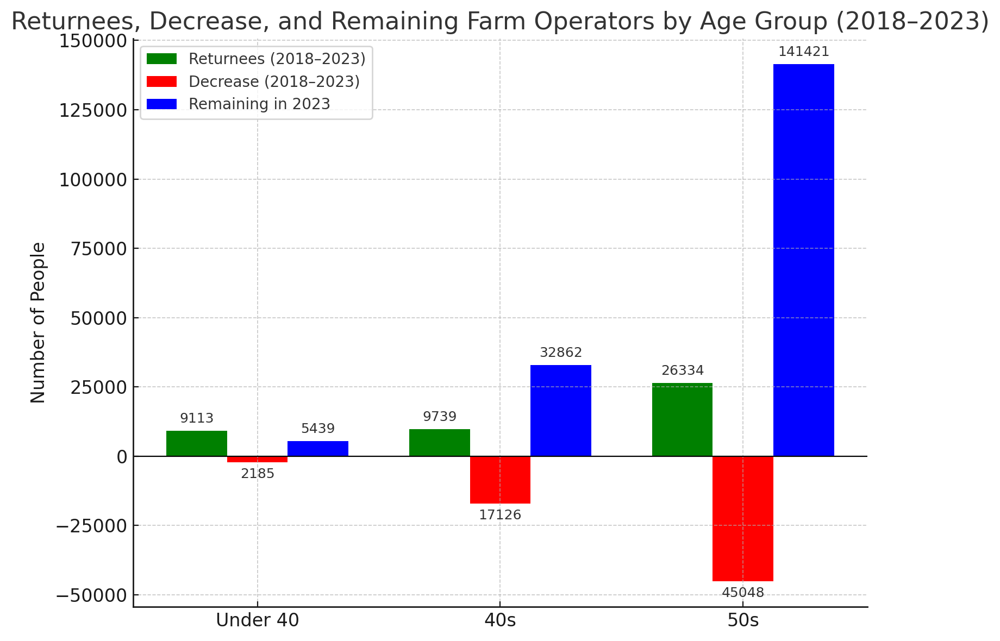
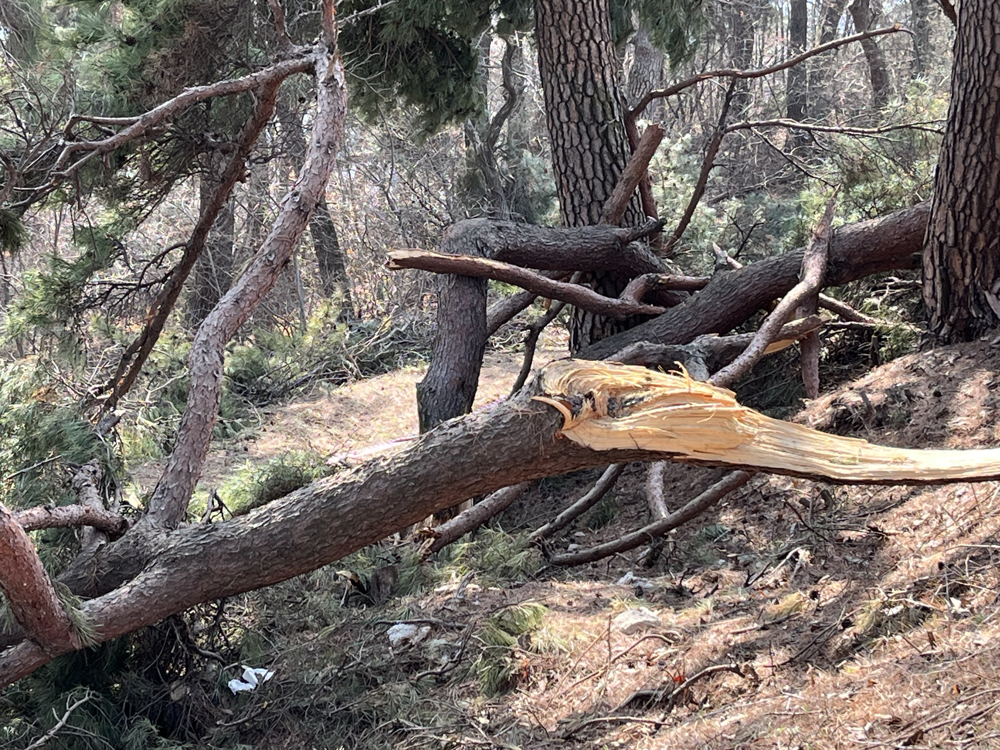
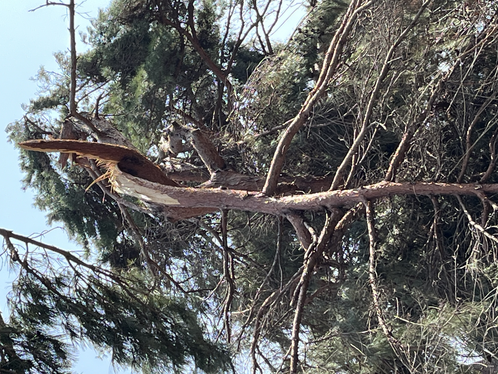
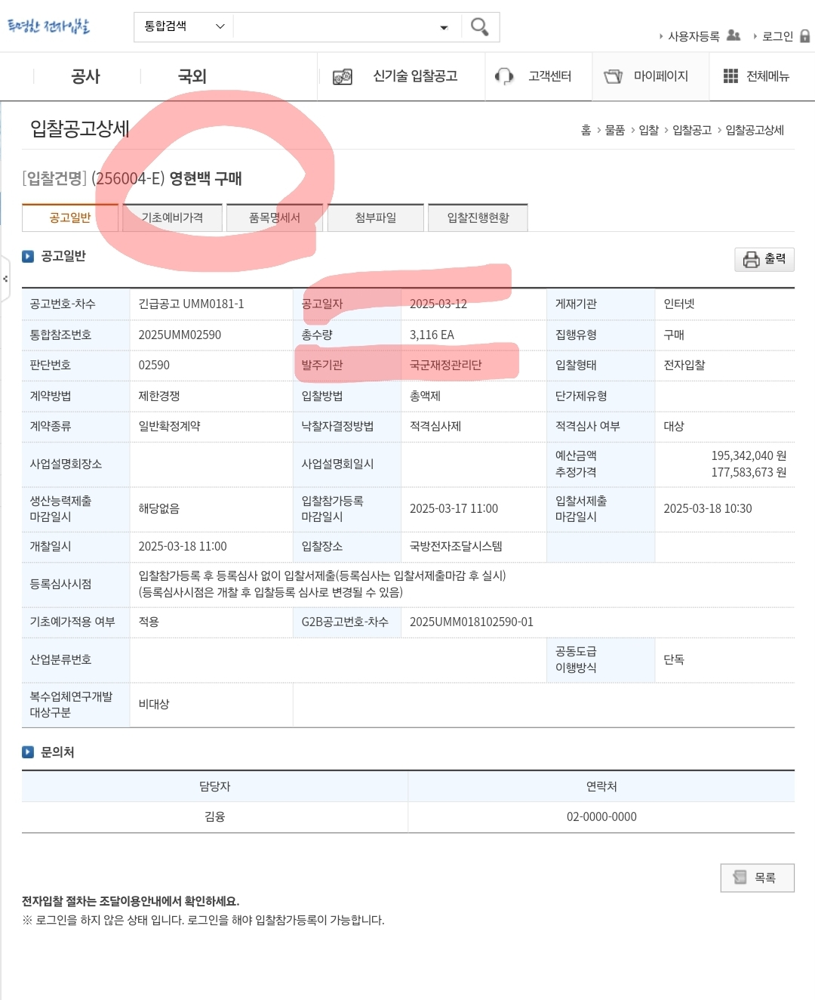
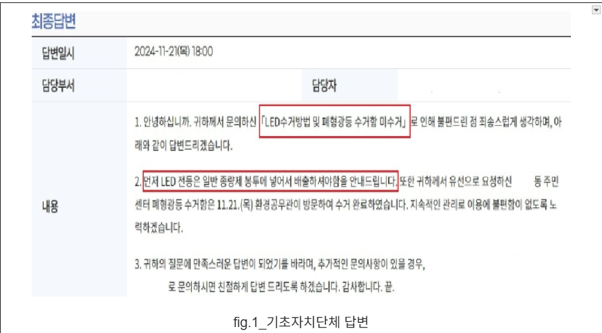
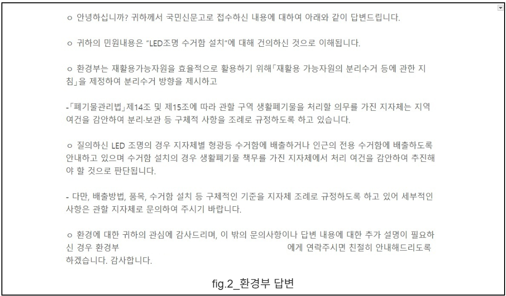

## 문서번호: 5901

### 제목: [자연의 권리를 인정하는 법을 제안합니다. ](https://q4all.kr/redirect/detail/6d622822-473c-442a-9971-6b9e902e5cdb)

**작성자:** [노승방](https://q4all.kr/user/profile/8292)
**작성일:** 2025-03-23 13:51:08 (일요일)

---

**자연의 권리**(Rights of nature)는 기본적 인권의 개념과 유사하게, 생태계와 생명종에 내재된 권리를 인정하고자 하는 내용입니다.

20세기 근대법이 일반적으로 자연을 소유하고, 사용하고, 질이 저하되는 "자원"으로서 간주하는 형식에 기초하고 있기 때문에 자연의 권리에 기반을 둔 법을 제정함으로써 우리 인간과 자연계가 근본적으로 상호 연결되어 있음을 인정하자는 것입니다. 2008년, 에콰도르 국민들은 자연의 본질적인 권리, 즉 파차마마(Pachamama)를 인정하기 위해 헌법을 개정했고 이를 통해 아마존 보호와 원주민 권리 운동으로 이어졌습니다.

우리 나라에도 제주 돌고레 떼에 대한 법인격 부여 활동 등 다양한 자연권 부여 활동이 있어왔는데, 이와같은 지난 수십년 동안 여러가지 규제 수치와 수단이 도입됐음에도 불구하고 자연에 대한 현재의 법적 보호 시스템은 부족하기만 합니다.

자연권 인정 법안이 인간의 존엄성을 침해하지 않고, 환경이 현재와 미래 세대의 복지에 필수적 요소라는 점을 보장하도록 한다면, 자연에 법적 인격을 부여하는 등 자연의 권리를 인정하는 법안은 국제적 운동의 흐름과도 일치한다고 할 것입니다.

이에 자연과 생물에 대한 법인격 부여 등을 내용으로 하는 자연권을 인정하는 기본법을 제정할 것을 제안합니다.

---

## 문서번호: 5902

### 제목: [노동의 계급과 소득의 격차](https://q4all.kr/redirect/detail/888bdfc1-7423-4d5b-8479-30546518bf7e)

**작성자:** [정성찬](https://q4all.kr/user/profile/7312)
**작성일:** 2025-03-23 16:55:06 (일요일)

---

노동의 계급과 소득 격차

이재명 대표님의 정규직과 비정규직의 노동의 계급과 임금 격차, 고용의 불안정에 대해 매우 동의합니다

우리 나라는 화이트 칼라 계열과 블루 칼라 계열의 임금 격차, 또 그 안에서도 학벌에 따른 임금 격차가 큰 상황인데요 동일 시간 노동에도 육체적 노동이 임금이 더 적고 학벌에 대한 보상 임금도 너무 많다고 생각합니다

이것은 온전히 개인의 능력만으로는 이룰 수 없는 것인데 이를 우열의 개념으로 생각한다면 부의 양극화와 계층의 이동이 불가능한 사회가 될 것입니다

저는 전국민 기본소득에 대해 매우 동의합니다

어떠한 정책으로 이를 해결할 수 있을까요?

---

## 문서번호: 5903

### 제목: [[질문-24 ] 초등학교에 한글/국어 전담 교사를 만들어 주세요 📣](https://q4all.kr/redirect/detail/818abbe2-63bf-445a-a38b-08e28422f94f)

**작성자:** [윤연정](https://q4all.kr/user/profile/2570)
**작성일:** 2025-03-23 17:15:00 (일요일)

---

1.
--

오늘까지 제 질문-24번째 거의 모든 내용은 '교육'에 관한 의문/질문/요구입니다. 하루에도 쉴 새 없이 올라오는 다양한 이야기 속 질문 중 무엇 하나 억지스러움이 없다고 생각됩니다.
------------------------------------------------------------------------------------------------------

2.
--

저는 그 중에서도 우리 인식의 틀을 형성해 가는/주는 "배움/교육 환경'이 우선순위에 놓여야 할 만큼 개혁/혁명 영역으로 간절하다고 여깁니다. 한 집단과 단체와 조직과 사회와 국가를 만들어 가는 데에 생물 같은 생명 같은 끝없는 원동력이 되는 화수분이라고 생각하기 때문입니다.
----------------------------------------------------------------------------------------------------------------------------------------------------------

3.
--

이런 화수분은 제 구실을 잃은 지 오래되었고, 그 속에서 이미 왜곡되고 편협하고 부정하고 부패하여 썪어버린 그 뿌리에 너덜너덜해진 호흡기를 장착하고서 겉으로는 푸르고 알록달록 화려함으로 보여주기 식에 능수능란해져 뻔뻔한 채로 하루하루 아슬아슬하게 버텨내고 있다고 판단했습니다.
----------------------------------------------------------------------------------------------------------------------------------------------------------

4.
--

교육은 모든 영역의 기초기본입니다. 그 기초는 우리 말과 글이지 않습니까? 우리가 태어나서 배우게 되는 우리 말과 글은 곧 우리 정체성이 아니겠습니까? 그런데 왜 홀대하나요? 한글/국어는 우리 말이니까 안 배워도 다 알게 될 거라는 안이한 생각일까요?
--------------------------------------------------------------------------------------------------------------------------------------------

5.
--

아이들에게는 좀 아는 어른이라는 명분으로 세종대왕에 대한 식상한 알은척만 할 뿐 행동은 한글/국어보다 외국어를 우선시하는 이 모순을 어떻게 설명할 수 있을까요? 어른인 자신조차도 한글 자/모음을 바르게 쓰고 읽는 것에 부족하면서 외국어 자/모음에 우선순위를 두는 이런 이중적 행동을 무어라 설명할 수 있을까요?
-----------------------------------------------------------------------------------------------------------------------------------------------------------------------------

6.
--

더 나아가서 특정 과목에 치중된 공/사교육 현장은 그런 학부모들을 조장합니다. 그 특정 과목 또한 우리 말과 글로써 배우는 거 아닌가요? 그럼에도 달달달 외워서 단답형으로 적거나 달달달 외워서 선다형으로 찍는 스킬을 가르치고 있지 않나요?
-------------------------------------------------------------------------------------------------------------------------------------

7.
--

외국어만 독해를 해야 하는 게 아닙니다. 우리 말과 글도 독해를 할 줄 알아야 그 말을 하는 사람과 그 글을 쓴 사람의 의도를 파악할 줄 알겠지요. 그러면서 진정한 공감으로 소통을 하는 거겠지요. **그래야 선동가를 판별/분별할 줄 알게 되겠지요.**
--------------------------------------------------------------------------------------------------------------------------------------------

외국어는 문법/독해에 목을 매고 우리 말과 글에는 소홀한 이런 인식을 언제까지 물려주려고 하는 겁니까?
---------------------------------------------------------

밖에 것을 무조건 배척하자는 뜻이 아니라는 거 아실 겁니다. 우리 것을 올바른 인식으로 잘 지켜 단단하게 한 후 받아들이는 밖의 것으로 그 나비효과를 내는 게 건강한 실천이 아닐까요.
------------------------------------------------------------------------------------------------------

8.
--

그래서 저는 초등학교에 한글/국어 전담 교사를 두어야 한다고 생각했습니다. 교육개혁을 이룬 어느 나라처럼 초등학교 저/중학년 과정에 모국어에 대한 문법을 제대로 가르치고, 중/고학년부터 글쓰기와 독서에 집중하며 수업을 해야 옳다고 생각합니다.
---------------------------------------------------------------------------------------------------------------------------------------

이렇게 훈련이 되면 중학생 이상 수준부터는 토론과 논술이 자유로운 일상이 환경이 되고 문화가 될 거라고 생각합니다.
----------------------------------------------------------------

9.
--

이 교육 환경이 고등학교까지 이어지고 고등학교 졸업 시험만으로 대학에 진학할 수 있도록 해야 합니다. 고등학교 졸업 시험 자격으로 원하는 대학, 원하는 과를 원하는 때에 언제든 얼마든지 갈 수 있게 기회의 장을 열어주어야 합니다.
--------------------------------------------------------------------------------------------------------------------------------

10.
---

우리는 12년 공부해서 단 하루에 결판이 나지 않습니까. 아이들에게 야만적인 행태라고 생각됩니다. 길들인 당연함에 소중하고 중요한 것을 빼앗는 행위라고 생각됩니다. 그럴 권리가 누군가에는/어디엔가는 있는 걸까요?
----------------------------------------------------------------------------------------------------------------------

11.
---

더 이상 우리 아이들이 성적으로 등수로 등급으로 그 해맑고 창의롭고 풍성한 유년시절을 초조하고 조바심내며 여유없이 불행하게 하루하루를 보내게 해서는 안 됩니다.
-----------------------------------------------------------------------------------------

그 결과가 작금의 대한민국의 실상이라고 생각하기 때문입니다. 제발.........
---------------------------------------------

12.
---

가장 중요한 초등 과정 6년을 우리는 너무나 안이하게 시간을 흘려보내는 것 같습니다. 지금과 같이 6년 거기에 더해 또 6년간 여러 이유로 억압받은 우리 아이들이 대학에 들어가서 그 눌렸던 시간들의 목마름을 자유라는 이름으로 대학생활을 유야무야 보내게 되는 경우도 적지 않다고 생각됩니다.
-----------------------------------------------------------------------------------------------------------------------------------------------------------------

공부라는 것을 연구라는 것을 학문이라는 것을 고등 교육 기관인 대학에서 제대로 할 수 있게 해야 하는 게 아닐까요? 그런 환경을 준비해 놓고 우리 아이들을 맞이해야 하는 게 아닐까요? 그러기 위한 밑거름을 뿌리를 12년이라는 과정이 만들어 가야 하는 게 아닐까요?
---------------------------------------------------------------------------------------------------------------------------------------------------

13.
---

1프로만 독식하는 구조라는 것도 알지 않습니까. 불평등합니다. 그런 우리 아이들이 너무나 안타깝고 너무나 안 됐고 저도 어른의 한 사람으로써 우리 아이들에게 너무나 미안합니다. 우리 아이들이 사유/사색/성찰하는 건강한 자유를 누릴 수 있게 어른들이 도와야 하지 않을까요.
-------------------------------------------------------------------------------------------------------------------------------------------------------

14.
---

아이 한 명을 키우는 데 온 마을이 필요하다는 이 말을 우리 모두는 지금부터라도 형식적 해석이 아닌 의미적 독해를 해야 할 때라고 생각합니다.
-------------------------------------------------------------------------------

**여러분 의견은 어떠신가요?**
------------------

**모두의 질문이어야 합니다.**
==================

---

## 문서번호: 5904

### 제목: [심리상담소 설치](https://q4all.kr/redirect/detail/0f0654c1-a157-4170-a2ab-52d8df41161c)

**작성자:** [김두리](https://q4all.kr/user/profile/8988)
**작성일:** 2025-03-23 19:50:54 (일요일)

---

* 선진국은 2만명당 상담소가 1개씩 있고 건강보험이 되어서 마음이 좀 우울해도 감기걸려 병원에 가는 것처럼 이용한다고 합니다 사회가 복잡해지고 젊은이들이 취업이 안 되어 집에 있다 보면 방에서만 뒹굴거리고 은둔형외톨이가 되기 쉽습니다 이럴 경우 정신과에 가려고도 하지 않고 멘토도 없고 부모와 대화도 않고 가족은 도울 수 없어 애만 태우는 현실임
* 심리학과 졸업생들을 교육시켜 상담소를 많이 설치하여 상담도 받고 비용을 내면 가정에 내방하여 정신이 건강한 젊은이들이 되었으면 함 민주당 정부에서 꼭 실현해 주시길 부탁합니다

---

## 문서번호: 5905

### 제목: [법치국가는 법으로 해결해야 한다고 봅니다.](https://q4all.kr/redirect/detail/afaee011-17b6-4546-9990-4802cdd5e9cd)

**작성자:** [이원홍](https://q4all.kr/user/profile/7177)
**작성일:** 2025-03-23 20:09:03 (일요일)

---

최근 계엄령 선포와 관련하여 국회, 언론, 군·경찰 등 여러 기관이 헌법에서 보장하는 국민의 기본권을 제한하는 위법 행위를 저질렀습니다.

이 사안은 단순한 정치적 분쟁을 넘어 민주주의와 삼권분립의 근간, 그리고 제21조(언론ㆍ출판, 집회ㆍ결사의 자유)와 제10조(인간의 존엄과 행복추구권) 등 헌법상 기본권을 심각하게 훼손하고 있습니다.

세계 외신 및 타 국가에서는 이번 사태를 “실패한 쿠데타”이자 “민주주의 대한민국에서 일어난 기적”으로 평가하고 있습니다.

절차적 위반

계엄령 선포 후 대통령이 헌법에 명시된 즉각적인 국회 통고를 이행하지 않아 절차적 요건을 위반하였으며, 이에 따라 국회의 기능이 제한되는 문제가 발생했습니다.

또한, 계엄 포고령 내에 국회의 정상적 운영을 방해하는 내용이 포함되어, 입법부의 자율적 기능 보장과 삼권분립의 원칙이 심각하게 훼손되었습니다.

기본권 침해 (개인의 신체 및 재산권 포함)

군·경찰이 계엄령 집행 과정에서 무력 사용을 통해 개인의 신체 안전과 재산권을 침해한 사례가 확인되었습니다.

이와 같은 강제적 조치는 헌법이 보장하는 개인의 기본권, 특히 제21조와 제10조에서 보장하는 표현·집회·결사의 자유와 인간의 존엄 및 행복추구권에 중대한 위협을 가하고 있습니다.

권력 남용 및 독재적 행태

계엄령 선포 및 집행 과정에서 행정부와 군·경찰이 법적 근거 없이 독단적인 권한을 행사함으로써, 국정 운영과 법치 체계를 문란하게 하였습니다.

특히, 이러한 권력 남용은 사법부의 독립성을 훼손하는 정황과 결합하여 민주주의의 기본 원칙에 정면으로 도전하는 결과를 낳았습니다.

정치적 탄압 시도

계엄령을 이용해 특정 정치 반대 세력에 대해 제한 조치를 시도한 정황이 드러났습니다.

이는 단순한 긴급조치가 아니라, 정치적 견제를 넘어 민주주의의 근간을 위협하는 행위로 평가되며, 입법부와 사법부의 역할 및 독립성 보장을 심각하게 훼손하는 결과를 초래하였습니다.

정부가 계엄령을 선포하면서 국회의원 출입 차단, 언론 검열 등 헌법과 형법, 계엄법 등 여러 법률에 위배되는 행위를 저질렀습니다.

이러한 행위는 국민의 기본권(예, 제21조와 제10조에서 보장하는 언론ㆍ출판 및 집회ㆍ결사의 자유, 인간의 존엄과 행복추구권)을 침해하며,

민주주의와 삼권분립의 근간을 위협하는 중대한 문제입니다.

외신 및 타 국가에서는 이번 사태를 “실패한 쿠데타”이자 “민주주의 대한민국에서 일어난 기적”으로 평가합니다.

그래서 개인적인 요청을 드립니다.

추후 내란특별법에 추가할 법조문 요청안

[A. 내란 범죄에 대한 특별 처벌 ]

 (적용 범위: 대한민국에서 규정하는 내란죄에 해당하는 내란범을 대상으로 함)

제X조 (내란 범죄에 대한 특별 처벌)

 ① 내란 행위에 가담한 자(이하 "내란범"이라 한다)에 대하여는 기존 법률에 따른 처벌 외에 다음 각 호의 특별 처벌을 적용한다.

 1. 내란범의 전 재산에 대해 국가가 몰수 조치를 취한다. 이 조치는 내란범이 국정을 문란하게 하고 법치에 정면으로 맞선 중대한 범죄 행위임을 고려한 것으로, 경제적 사형의 의미를 내포한다.

 2. 내란범으로 확정된 자에 대하여는 최저생계비 지급을 전제로 하여, 일정 기간 동안 국가가 지정한 광산업, 어업, 농업 등 공공사업장에서의 강제 근로를 부과한다.

 ② 제1항의 특별 처벌은 내란 행위의 위법성을 역사적 경고로 명확히 하고, 국민의 인권을 보장하며, 내란 범죄에 대한 사회적 낙인을 확실히 남기기 위하여 적용된다.

[B. 이해충돌 문제 해결을 위한 보완 법조문 ]

제Y조 (특별 처벌 규정의 우선 적용)

 ① 본 법에서 규정하는 내란 범죄에 대한 특별 처벌은 기존의 형법, 계엄법 및 기타 관련 법률과 충돌할 우려가 있는 경우에도 본 법의 규정을 우선 적용한다.

 ② 다만, 본 조항의 해석 및 집행에 있어서 대한민국 헌법이 보장하는 기본권(예, 제21조와 제10조에서 보장하는 권리)과 재산권(제23조)을 반드시 보호하여야 하며, 관련 분쟁 발생 시 헌법의 소급입법 금지 원칙을 준수한다.

[C. 추가된 헌법 조문]

 아래 헌법 조문들은 내란 특별법 적용 시 헌법상 기본권 및 재산권 보호 원칙을 명확히 하는 데 참고한다.

제21조 (언론ㆍ출판, 집회ㆍ결사의 자유)

 ① 모든 국민은 언론ㆍ출판의 자유와 집회ㆍ결사의 자유를 가진다.

 ② 언론ㆍ출판에 대한 허가나 검열과 집회ㆍ결사에 대한 허가는 인정되지 아니한다.

 ③ 통신ㆍ방송의 시설기준과 신문의 기능을 보장하기 위하여 필요한 사항은 법률로 정한다.

 ④ 언론ㆍ출판은 타인의 명예나 권리 또는 공중도덕이나 사회윤리를 침해하여서는 아니 된다. 언론ㆍ출판이 타인의 명예나 권리를 침해한 때에는 피해자는 이에 대한 피해의 배상을 청구할 수 있다.

제10조 (인간의 존엄과 행복추구권)

 모든 국민은 인간으로서의 존엄과 가치를 가지며, 행복을 추구할 권리를 가진다. 국가는 개인이 가지는 불가침의 기본적 인권을 확인하고 이를 보장할 의무를 진다.

제23조 (재산권의 보장)

 ① 모든 국민의 재산권은 보장된다. 그 내용과 한계는 법률로 정한다.

 ② 재산권의 행사는 공공복리에 적합하게 하여야 한다.

 ③ 공공필요에 의한 재산권의 수용ㆍ사용 또는 제한 및 그에 대한 보상은 법률로써 하되, 정당한 보상을 지급하여야 한다.

대한민국의 민주주의와 법치국가의 근간은 우리 국민의 기본권과 삼권분립의 견제에 달려 있습니다.

내란범으로 규정되는 자들의 행위는 단순한 정치적 논쟁이 아니라, 우리 국정과 법질서를 심각하게 훼손하는 중대한 범죄입니다.

이러한 위법 행위에 대해 강력하면서도 인권을 보장하는 특별 처벌 방안을 마련함으로써, 우리 사회가 역사적 경고의 의미를 확실히 하고 재발을 막을 수 있기를 촉구합니다.

야당 여러분, 지금, 이 순간 우리는 모두 단순한 정당 간의 이견을 넘어,

민주주의와 법치국가를 지키기 위한 중대한 기로에 서 있습니다.

심장이 옥죄이고 피눈물이 눈가에 맺힌 채,

정의라는 무거운 짐을 짊어지고 자유민주주의라는 목적지를 향해 나아가는 서민 한 사람의 마음으로,

권력의 카르텔에 수없이 희생되는 현실의 절망 속에서도

우리가 모두 희망의 불씨를 지켜내야 할 때입니다.

지금 바로, 법치의 기본 원칙과 국민의 권리를 위해 과감하고 단호한 행동을 촉구합니다.

---

## 문서번호: 5906

### 제목: [야간 편의점 운영 문제점](https://q4all.kr/redirect/detail/7c9d07d0-bf09-4f6f-85db-d12619145353)

**작성자:** [김두리](https://q4all.kr/user/profile/8988)
**작성일:** 2025-03-23 20:31:58 (일요일)

---

아파트 단지 같은 경우 12시 넘은 야간에는 편의점 이용자가 거의 없는데 하루종일 전기를 켜놓고 야간을 해야 하는지 또 예전에 비해 요즘은 야간에 일할 사람이 없어서 사장이 거의 밤을 새우는데 개선이 필요함

간혹 야간 미영업점이 있으나 법으로 타이레놀등 간단한 약품도 못 팔게 되어있는데 야간영업소와 똑같이 약품 판매가 가능하기를 원함

그리고 손님이 없어 밤1시부터 6시까지 영업하지 않은다고 회사에서 이익을 아주 적게 책정해놓은 실정인데 소상공인 좀 보호해주기를 소망함

---

## 문서번호: 5907

### 제목: [경력단절 여성 과학자의 재도약을 위한 제도적 보완 요청](https://q4all.kr/redirect/detail/33621aa7-1c63-4dc5-81f2-be5cab5333d2)

**작성자:** [이예림](https://q4all.kr/user/profile/7181)
**작성일:** 2025-03-23 22:58:49 (일요일)

---

현재 한국 연구재단에 개인지원 사업 신청 시 육아휴직으로 인한 공백기간을 감안하여 박사학위 후 5년을 넘었더라도 그 기간을 유예해 주는 제도가 있습니다. 이 제도의 취지는 참 좋다고 생각합니다. 사회가 많이 바뀌었다고 하지만 여성 과학자들의 경우 우수한 실적과 능력이 있더라도 결혼과 출산, 육아로 인해 본인의 능력을 더 이상 발휘하지 못하고 경력단절이 이루어지는 경우가 많습니다. 이러한 안타까운 경우를 구제하고 경력 단절 기간에서 벗어나 다시 시작할 기회를 갖게 해 주기 위해 꼭 필요한 제도라고 생각합니다.

하지만 육아휴직으로 인한 공백기를 인정받기 위해서는 대학 등 연구 기관에서 공식적인 휴직 절차를 밟은 경우만 가능한 것이 이 제도의 맹점입니다. 실상 여성 과학자들은 임신, 출산, 육아를 해야 할 경우 채용이 어려워 경력단절 여성이 되는 경우가 많습니다. 이 경우 공식적인 육아휴직의 증빙이 어렵게 됩니다.

현실적으로 박사후 연구원은 여러 프로젝트를 수행하고 과제 성과를 내야 하는 위치에 있습니다. 경우에 따라서는 학생 케어와 강의까지 해야 합니다. 이런 상황에서 임신, 출산, 육아를 병행 하기에는 시간적, 체력적으로 한계가 많은 것이 사실입니다. 과연 이러한 상황을 이해해 줄 대학 교수와 연구원이 한국 과학계에 얼마나 될지 의문입니다.

공식적인 육아휴직 공문 만이 임신, 출산, 육아로 인한 공백기를 증빙할 수 있는 유일한 방법 일까요? 자녀의 출생 신고 등 다른 방법으로 기간 산정이 가능하지는 않을까요? 정말 치열하게 박사학위 과정을 마치고 분야에서는 손꼽히는 실적을 냈지만, 같은 과학자인 남편의 유학 뒷바라지와 임신, 출산, 육아로 벌써 5년간의 경력단절이 된 저와 같은 여성 과학자는 더 이상 국가의 개인지원사업은 신청할 기회조차 얻을 수 없는 건가요? 이것이 정말 평등한 기회의 보장 일까요?

---

## 문서번호: 5908

### 제목: [종교인들은  국민의 제1의무 납세의 의무는  하지 않으면서 온갖혜택은  다받고 있나요?.](https://q4all.kr/redirect/detail/36b9d7c9-1d67-4253-bcbd-8c959106a924)

**작성자:** [장하주](https://q4all.kr/user/profile/8994)
**작성일:** 2025-03-23 23:11:04 (일요일)

---

**종교인들은 세금을 내지 않습니다.그러면서 국가로부터 수많은 혜택을보면서 힘까지 가지고 있습니다.**

**게다가 종교는 탈세의 온상이기도 합니다.**

**대한민국에살면서 국민의 세금으로 혜택을 누리면서 자신들은 국민 밖의 영역의 특벌한 사람들이라 여깁니다.그래서 온 거리에 세금안내고 마음장사하는 교회가넘쳐납니다.**

**의무는 하지 않고 권리만갖겠다.?**

**이게 평등하고 정의롭고 상식적인가요?**

왜 나의 세금이 하느님아들을 먹여 살리야 하는건지 부당합니다. 다도 먹고살기 어렵습니다

이땅에 발을딛고산다며 당연히 누구나 세금을 내어야겠죠?

---

## 문서번호: 5909

### 제목: [비정규직은 평생  비정규직 이어야하나?](https://q4all.kr/redirect/detail/eb7e1ca4-238c-4a5a-b44d-80a7e2b8e550)

**작성자:** [장하주](https://q4all.kr/user/profile/8994)
**작성일:** 2025-03-23 23:31:14 (일요일)

---

학교에서 비정규직으로 일한지 12년째입니다.

교원대체직으로 교사들과 똑같이 아이들을수업합니다.

해마다 2월이며 계약이 끝나고 다시 계약서를 씁니다.

재계약이 되지 않을까 (교사들로부터 평가점순를 받습니다 점수가 낮으면 계약이 안됩니다)부당한 지시에도 따르는 경우가 다반사입니다.(어떤교사들은 아예대놓고 점순를 낮게주겠다는 사람도 있죠)

임용시험통과 한번으로 교사들은 정규직이라는 타이틀을 달고 아무리 무능하고 수업을 안해도 철밥통입니다.

비정규직이란 이유만으로 정규직의 부당한 요구를 수용해야합니다.내년의 나의 밥그릇을 위하여

정규직은 정규직만큼의 의무와 권리를 다하면됩니다. 또한 비정규직은 비정규직 만큼의 의무와 권리를 다하면됩니다. 의무는 정규직만큼주면서 권리는 비정규만큼 가지라하니 부당하고 화가납니다

왜 한번 비정규직은 평새 비접규직일까요?

짤리지 않으려 정규직다 더 치열하게 삽니다.그래서 실력은 정규직이 따라올수 없을 만큼좋은데도 말이죠

---

## 문서번호: 5910

### 제목: [탑골공원을 국가적 성역으로 조성해야 합니다](https://q4all.kr/redirect/detail/a84a63a2-335c-4ac6-b623-b6378338f2ce)

**작성자:** [정연주](https://q4all.kr/user/profile/8996)
**작성일:** 2025-03-24 00:27:48 (월요일)

---

**탑골공원을 역사적 가치와 국가적 자긍심을 제대로 드러낼 수 있는 공간으로 조성해야 합니다.**
------------------------------------------------------

**또한, 3월 1일은 단순히 만세운동을 일으킨 날이 아닌, 대한민국의 독립을 스스로 선언한 독립기념일이어야 합니다.**
-------------------------------------------------------------------

3.1만세운동은 곧바로 상해임시정부와 의회를 탄생시켰고 대한민국은 그 정통성을 이어 받아 세워진 국가입니다. 따라서 1919년 3월 1일에 만세를 외친 첫 지점으로서의 탑골공원은 그 상징성 만으로도 국가적 성역이 되어야 마땅합니다.
---------------------------------------------------------------------------------------------------------------------------------

**그러나, 탑골공원은 대한민국의 독립을 최초로 선언한 역사적 장소**임에도 불구하고 현재의 공간적 위상은 매우 초라합니다. 마치 버려진 곳처럼 보이기까지 합니다. 해방 후 권력을 쥔 친일파들에 의한, 이 공간에 의미가 부여되는 것을 막으려는 의도가 반영된 것은 아닐까라는 의심까지도 들었습니다.
---------------------------------------------------------------------------------------------------------------------------------------------------------------------

지금의 탑골공원에서는 대한민국의 독립을 선언한 자랑스럽고 성스러운 공간으로서의 가치는 전혀 찾아보기 힘들고, 그런 이미지로 인해 3.1만세운동의 역사적 가치마저 훼손 당하는 느낌을 지우기 어렵습니다.
---------------------------------------------------------------------------------------------------------------

탑골공원을 지날 때마다 느꼈던 깊은 안타까움에 더해, 언제까지 이 곳을 이대로 내버려두려는 것일까... 전혀 신경쓰지 않는 것처럼 보이는 정치인들에게 화가 나기도 했습니다.
------------------------------------------------------------------------------------------------

탑골공원과 그 일대를 역사적 가치와 국가적 자긍심을 드러낼 수 있는 공간으로 조성하고, 필요하다면 유료화까지도 도입할 수 있어야 할 것입니다.
-------------------------------------------------------------------------------

그러나, 이러한 취지에 동의를 한다 해도 노인들의 쉼터를 빼앗는 것 같은 인상을 주게 될까 봐... 그래서 표심을 잃게 될까 봐... 염려가 되어 선뜻 정책으로 채택하기 어려울 수도 있을 것입니다.
--------------------------------------------------------------------------------------------------------------

하지만 대한민국의 자존심과 국가적 뿌리를 밝히고, 민주시민으로서의 정체성과 자부심 확립을 위해 탑골공원의 성역화 사업은 반드시 이루어져야 한다고 생각합니다.
---------------------------------------------------------------------------------------

---

## 문서번호: 5911

### 제목: [청년 중심의 귀농지원정책, 이대로 좋은가요?](https://q4all.kr/redirect/detail/0af02e29-88fa-40e2-87be-c1f631396eca)

**작성자:** [김세진](https://q4all.kr/user/profile/7521)
**작성일:** 2025-03-24 00:43:53 (월요일)

---

### 지난 10년 이상 정부는 '청년 귀농'을 농촌 소멸 위기를 해결할 핵심 열쇠로 추진해 왔습니다.

청년 귀농을 촉진하기 위한 지원금, 창업 지원, 교육 프로그램 등 다양한 정책이 이어졌고, 매년 수천 명의 청년들이 농촌으로 향했습니다.

그러나 농촌의 현실은 크게 달라지지 않았습니다. 청년 유입이라는 숫자는 늘었지만, 정착으로 이어지지 않았기 때문입니다.

구체적으로 살펴보겠습니다.

최근 5년 동안 농촌으로 유입된 청년 귀농인은 9,113명에 달했으나, 이 중 약 70%가 다시 농촌을 떠났습니다.

즉, 10명 중 7명은 농촌에 뿌리를 내리지 못했습니다. 반면, 같은 기간 동안 농촌을 실제로 지탱한 주력층은 50대와 60대였습니다.

최근 5년간 연령대별 '귀농 유입'(초록), '이탈'(빨강), 및 '잔존 농업인'(파랑) 현황을 나타낸 그래프를 보시면,

청년층의 정착률이 낮은 반면, 40대와 50대의 이탈이 급증하여 농촌 기반이 흔들리고 있음을 확인할 수 있습니다.

농촌 생태계가 무너지면 도시의 생활도 위기를 맞게 됩니다.

2023년 현재 귀농 정착자 중 청년층(39세 이하)의 비율은 전체의 10%에도 미치지 못합니다.

이는 정책의 목표와 실제 성과 사이에 심각한 괴리가 존재함을 보여줍니다.

이쯤에서 드는 의문은 간단합니다.

왜 정부는 여전히 현실과 동떨어진 ‘청년 중심’ 지원 정책을 유지하는 걸까요?

수천억원의 귀농 지원 예산을 투입한 결과는 처참합니다.

매년 수만 명이 농촌을 떠나는 이유는 제대로 조사되지 않았고, 그들의 실패 경험과 목소리는 정책에 반영되지 않았습니다.

농촌을 떠난 청년과 귀농인들의 이야기는 통계에서 사라지고, 귀농 정책은 반복된 실패를 계속 답습하고 있습니다.

지금 필요한 것은 청년 중심의 지원이 아니라, 귀농인이 농촌에서 실제로 정착할 수 있는 '새로운 농촌 생태계'라고 생각됩니다.

신도시는 만들면서 새로운 농촌 생태계를 설계할 생각은 왜 하지 않는걸까요?

---

## 문서번호: 5912

### 제목: [기후변화에 대한 산림정책 변화 필요](https://q4all.kr/redirect/detail/2628fd30-edcb-4ab7-a56b-a28da8f4b340)

**작성자:** [김태관](https://q4all.kr/user/profile/8998)
**작성일:** 2025-03-24 05:35:45 (월요일)

---

최근 기후변화의 영향으로

수분이 많이 포함된

습설의 강설량이 부쩍 많아졌다

낙엽수와 달리

겨울철애도 잎이 무성한

소나무는 습설의

무게를 이기지 못하고

줄기나 가지가 부러져

고사목 이 다량 발생 하고있다

전국토에 걸쳐

소나무 군락지를 조사하면

습설의 피해는 상당하리라 본다

지금 산림청은

멀쩡한 낙엽수를 베어내고

습설에 취약한

소나무로 교체 하고있다

이는 몇년 후 산림 황폐로

이어질것이 분명하다

소나무 위주의 산림정책은

즉각 시정되어야 한다

---

## 문서번호: 5913

### 제목: [ 판사자격과 임용](https://q4all.kr/redirect/detail/73f745c9-97db-4ff9-aef5-2aa0b1e9bb39)

**작성자:** [정성호](https://q4all.kr/user/profile/4658)
**작성일:** 2025-03-24 05:36:16 (월요일)

---

판사가 법을위반해서 판결을 했다해서 말이 많은데

그런판사가 계속해서 중요사건을 맡는다?

그런위법한 판사가 아무런 제재나 처벌없이 계속 판결업무를 수행할수 있다니 이런국가 사회가 있나요?

제조업체에서 아무리 물건을 잘만들어도 불량품이 있기마련이고 아무리 머리좋아 판검사되어도 불량 판검사 있기마련인데 이런불량품을 왜 못골라내나요?

국가가 최우선 할일 아닌가요?

---

## 문서번호: 5914

### 제목: [기간제법의 현실과 계약직 근로자의 고용 안정 대책](https://q4all.kr/redirect/detail/8bf93666-0ee1-476f-addd-452090fea6d8)

**작성자:** [이종수](https://q4all.kr/user/profile/8634)
**작성일:** 2025-03-24 10:50:17 (월요일)

---

기간제법(기간제 및 단시간근로자 보호 등에 관한 법률)은 원래 계약직 근로자의 고용 불안을 줄이고, 장기적인 고용 안정을 도모하기 위해 제정되었습니다. 그러나 현실적으로는 기업이 무기계약직 전환 부담을 피하기 위해 계약 기간이 끝나기 전에 근로자를 해고하거나, 단기 계약을 반복적으로 체결하는 등의 부작용이 발생하고 있습니다.

이로 인해 가장 큰 피해를 보는 것은 계약직 근로자들입니다. 이들은 안정적인 일자리를 얻지 못할 뿐만 아니라, 24개월이라는 기간 제한 때문에 경력이 단절되거나, 새로운 일자리를 계속 찾아야 하는 불안정한 상황에 놓이게 됩니다.

이를 해결하기 위해서는 노사 간 합의를 통해 계약 기간 연장(단, 무기계약직 전환 의무 없음) 같은 유연한 방안을 고려할 수 있습니다. 또한, 정규직 전환이 어려운 경우라 하더라도 장기 근속이 가능하도록 제도를 개선하거나, 계약직 근로자에 대한 처우 개선을 병행하는 대안이 필요합니다. 기업의 부담을 줄이면서도 근로자의 고용 안정성을 높일 수 있는 현실적인 정책이 빠르게 논의되어야 할 것입니다.

---

## 문서번호: 5915

### 제목: [법을 위반해도 아무 문제가 없다는 대한민국의 헌법과 법률은 정의로운 나라인가요? ](https://q4all.kr/redirect/detail/4cd18407-c5be-43bf-8d84-298ed6eb9836)

**작성자:** [박형래](https://q4all.kr/user/profile/8539)
**작성일:** 2025-03-24 10:52:02 (월요일)

---

헌법재판소는 법률을 위반 했음에도 탄핵 사유는 안된다고 합니다.

이게 말이 되는 상식 인가요?

개헌으로 헌법재판소의 모든 권한을 국회로 위임하여

다른 나라처럼

국회에서 탄핵을 하면 바로 탄핵 선고 하는 것으로 개헌이 필요합니다.

그럼 모든 탄핵 가능한 공무원들은

법을 위반해도 공무원 신분에 아무 문제가 없이 그 권력을 휘드룰 수 있다는

대한민국의 헌법과 법률은 정의로운 사회 만들 수 있을 까요?

---

## 문서번호: 5916

### 제목: [지방에 의사가 없다고, 비인기 의사도 없다고 들었는데 제한을 하지 않는 이유가 궁금합니다.](https://q4all.kr/redirect/detail/a4afa32d-9e37-427f-a5bf-855ab3b23ca2)

**작성자:** [이호준](https://q4all.kr/user/profile/9010)
**작성일:** 2025-03-24 11:00:57 (월요일)

---

전문 지식 없이 궁금점을 작성한다는 것을 미리 밝힙니다.

지방에서 소아과 진료를 받는 것이 불가능해 부부가 주말에 근처 호텔을 예약하면서 1박 2일로 서울에 진료 출장을 다닌다는 이야기를 들었습니다. 뿐만 아니라 주변 도시에 본인이 해당 진료가 가능한 유일한 의사라는 분의 이야기도 들었습니다.

진료를 받고 치료를 받는 것은 대한민국 수준의 국가에서는 당연하게 여겨져야 한다고 생각하는데 해결이 시급한 것 같습니다.

제가 알기로 매년 "의사"가 되어 배출되는 인원이 제한, 지정되어 있다고 들었습니다. 총 인원은 제한을 두고 각 과는 제한을 두지 않아 몰림 현상이 일어난다고 생각하는데 필요한 수만큼 피부과 100명, 정형외과 200명 등 제한을 두면 간단히 해결될 문제 아닌가 싶은데 뉴스에서는 돈을 쏟아부어도 다들 지방가지 않고 성형만 한다고 울상이고... 그렇게 성적 좋아하는 사람들인데 스스로가 성적이 딸려서, 순위가 밀려서 원하는 과를 선택 못하는 건 감수해야 한다고 생각합니다. 죽어도 해당 과를 선택해야 한다? 재수하고 또 경쟁하면 될 일입니다.

지인과 관련이야기를 나누고 있을 때 의사들이 자기 환자들에게 다음 투표 때 찍지 말라고 시킬 거라서 진행이 불가능 하다는 의견이 나왔는데 지방에까지 의료 서비스의 손길이 닿도록 혁신을 일으키는데 1. 싫어하는 사람이 좋아하는 사람보다 많을 것이다. 2. 다음 선거 이겨야 하니까 난 안 할 거다. 둘 다 이해되지 않습니다.

관련 전문가도 아니고 배경 조사도 안 한 내용이니 엉망이네요. 하지만서도 모두가, 완벽하지 않더라도 서로의 생각을 말하고 질문하는 것이 이 사이트의 존재 의의라고 생각하여 남깁니다.

---

## 문서번호: 5917

### 제목: [법률을 입맛대로 해석하는 것뿐만 아니라 상황과 외적인 이유로 판결을 달리하는 판사는 제제를 받지 않는 것인지 궁금합니다.](https://q4all.kr/redirect/detail/f7947e08-9b8c-4d2e-a71e-96f51dd21c90)

**작성자:** [이호준](https://q4all.kr/user/profile/9010)
**작성일:** 2025-03-24 11:05:11 (월요일)

---

윤석렬 풀어준 판결을 내린 판사가 같은 내용을 얼마 지나지 않아 다시 이전처럼 해석하고 이용했다는 소식을 들었습니다. 이게 사실이라고 가정할 때 법을 자신이 원하는 대로 주무르며 재미를 보는 판사는 간단하게 저의 눈으로 보면 "잘 못"을 저지른 것으로 보이는데 어떤 재제도 없이 그냥 권력을 휘두르게 안전장치를 준것인지 궁금합니다.

---

## 문서번호: 5918

### 제목: [법이라는 게 의미가 있나요 ????](https://q4all.kr/redirect/detail/70b08b58-34b3-4384-bf55-8f6ea45e5bd2)

**작성자:** [정철헌](https://q4all.kr/user/profile/7321)
**작성일:** 2025-03-24 11:24:53 (월요일)

---

어차피

검사 판사들 말장난 한번이면

법을 지들 입맛에 맞게 다 요리가 가능한데

법이라는 게 의미가 있나요 ? ㅎㅎㅎ

특히 정치 관련 법들은 심하죠

우리나라는 법치주의라기 보단

검찰주의 판사주의라고 해야 맞겠네요 ㅎㅎ

---

## 문서번호: 5919

### 제목: [대통령 탄핵과 같은 국가적 중대사안에 대해서는 국민투표를 시행해야 합니다.](https://q4all.kr/redirect/detail/496eeb86-a084-4cf0-b455-ca211d4ae73c)

**작성자:** [오연주](https://q4all.kr/user/profile/5169)
**작성일:** 2025-03-24 11:56:46 (월요일)

---

12월 3일 윤석열의 장기집권을 위한 계엄령 선포와 국회의 해제 결의가 있은지 4달이 다 되어가고 있습니다.

우리는 안정되게 잘 굴러가고 있던 대한민국 국가체제가 윤석열이란 모자란 인간 하나 때문에 하루아침에 혼란스러워지는 과정을 지금도 목도하고 있습니다.

혼란은 정치적 혼란에만 한정되는 것이 아니라 사회, 경제적으로 막대한 비용을 지불하며 대한민국 미래세대에게 부채만을 더 안겨주고 있습니다.

그런데도 소위 이 나라의 엘리트, 지배층이라는 사람들은 대한민국의 혼란을 재빨리 종식시키긴 커녕 자신의 손익을 계산하며 혼란 수습을 차일피일 미루고 있습니다.

3월 초면 나올거라던 헌재의 판결은 사안의 명징함에도 불구하고 이러저러한 정무적 사유로 계속 미루어지며 국민들의 피로도를 높이고 있습니다.

대한민국은 국민의 나라입니다.

대한민국 국민은 4500백만명이나 됩니다.

헌재 재판관 8명. 그들은 우리가 우리 손으로 뽑은 이들이 아닙니다.

법 전문가란 이유로 그 자리에 앉아 있으면서 법에 의한 판단이 아닌 정무적 판단을 한다면 그 자리에서 이런 중대한 사안을 좌지우지할 권리가 없습니다.

윤석열의 계엄령 선포는 저와 같은 법 무지랭이가 헌법 조문을 읽어보아도 위헌임에 분명합니다.

그런데 왜 이렇게 시간을 끄는 것입니까? 국민이 왜 저 헌법재판관들의 눈치를 보고, 저들의 선택에 대해 전전긍긍하며 기다려야 합니까?

이 혼란이 종식되면 가장 먼저해야 할 논의는 대통령 탄핵과 같은 국가적 중대사안의 결정권을 국민에게 돌려주는 일이 되어야 할 것입니다.

국회에서 탄핵안이 가결될 때도 우리는 국회에 들어가 있는 내란 동조범들에 의해 탄핵이 한 주나 지연되는 것을 지켜봐야 했습니다.

이제 대통령을 탄핵할 권리를 국민에게 돌려줄 논의를 하십시요,

대통령 탄핵에 대한 결정은 국회나 헌재가 아닌 국민투표로 결정해야 합니다.

4개월이라면 국민투표를 하고도 남았을 시간입니다.

그리고 사법부의 수장들도 생각보다 큰 권한을 가진 자들입니다.

그런 자들에 대한 임명권 또한 소수가 결정해선 안됩니다.

적어도 대법원장, 헌법재판관, 검찰총장(은 없어져야 겠지만), 공수처장, 경찰청장은 국민의 직접 선거로 선출합시다.

교육감은 직선제로 하면서 이들은 왜 권력이 임명합니까?

다시는 국민 생각에 반하는 대통령이 나와선 안되고, 다시는 국민 뜻에 반하는 계엄, 내란 따위가 있어선 안됩니다.

하루 빨리 심사숙고해야 할 일이라 생각합니다.

---

## 문서번호: 5920

### 제목: [산불이 번질 때, 누가 책임지나요? 왜 산 하나를 세 부처가 나눠서 관리하죠?](https://q4all.kr/redirect/detail/a8b0a4d0-ca78-4cdc-b2eb-d73ef471a9b8)

**작성자:** [최성준](https://q4all.kr/user/profile/9013)
**작성일:** 2025-03-24 12:11:57 (월요일)

---

산불이 번질 때, 누가 책임지나요?

왜 산 하나를 세 부처가 나눠서 관리하죠?

올해도 산불이 났습니다.

TV에서 불길이 산을 삼키고,

헬기가 하늘을 맴도는 걸 봤습니다.

그리고 또 들었습니다.

“국립공원이라 장비 못 들어갔다.”

“산림청 관할 아니라고 했다.”

“임도 설치는 환경부가 반대했다.”

그 사이 불은 마을을 삼켰고,

사람들은 집을 잃었습니다.

제가 묻고 싶은 건 이겁니다.

왜 산불이 날 땐,

책임지는 사람보다 변명부터 나오는 걸까요?

지금 우리나라 산의 63%는 숲입니다.

그 숲을, 이렇게 나눠서 관리하고 있습니다.

국립공원은 환경부

일반 산은 산림청

도시숲은 국토교통부

실질 관리는 지자체

숲은 하나인데,

법도 다르고, 기준도 다르고, 책임도 다릅니다.

그래서

산불은 빨라지고

대응은 느려지고

피해는 커집니다.

숲은 지금

"누가 주인이냐" 싸움에 지쳐가고 있습니다.

병해충은 퍼져도, 국립공원은 방제 늦고

도시숲은 공원시설 취급받아 예산도 인력도 부족

산주는 자기 땅에 나무 심는 것도 허락받아야 합니다

이건 산림 정책이 아니라, 숲 방치입니다.

저는 이렇게 생각합니다.

숲 관리, 이제는 하나여야 합니다.

산림청 중심으로 일원화해야 합니다.

산불? 누가 꺼야 하나 묻지 말고 바로 꺼야죠.

병해충? 번지기 전에 막아야죠.

도시숲? 나무도 관리받아야, 아이들도 숨 쉴 수 있죠.

국립공원? 지키는 것도 중요하지만, 관리도 해야죠.

산림청은 이미 「산림재난방지법」을 통해

재난 총괄 책임을 갖고 있습니다.

이제 제도와 권한도 그에 맞춰야 합니다.

숲은 국경도, 이념도, 부처도 모릅니다.

그저 조용히 우리 곁을 지키고 있었을 뿐입니다.

이젠 우리가 그 숲을 지킬 차례입니다.

여러분은 어떻게 생각하시나요?

산불을 막고, 숲을 지키기 위해

‘산 관리 일원화’를 위한 '산림청 기능 강화' 가 필요하다고 생각하시나요?

공감하시면 관심등록과 추천을 눌러주시고 댓글도 남겨주세요.

---

## 문서번호: 5921

### 제목: [사법개혁 제안](https://q4all.kr/redirect/detail/676fbc42-9031-4e13-b670-16b979a15052)

**작성자:** [이상훈](https://q4all.kr/user/profile/9017)
**작성일:** 2025-03-24 12:33:23 (월요일)

---

우리나라 재판은 왜 배심원제도를 의무화하지 않는가? 판사들만 믿고 있어서야 사법 카르텔을 어찌 분쇄하겠는가?

검사, 판사도 변호사경력 10년이상된 사람만 채용해야 하고 재임기긴도 10년을 못 넘기도록 해야한다.

판사와 검사는 승진제도를 없애야한다.

검찰수장과 대법관도 국민의 투표로 섲출해야 한다.

---

## 문서번호: 5922

### 제목: [청소년에게 철학 및 정치 교육을 실시하자](https://q4all.kr/redirect/detail/09b64145-d657-44c7-8c16-aff112f0c5cc)

**작성자:** [이상훈](https://q4all.kr/user/profile/9017)
**작성일:** 2025-03-24 12:37:30 (월요일)

---

초등학생때부터 정치와 철학에 대한 교육을 실시하여

비판능력을 함양시키고,

성적 지상주의가 아닌 인성과 관심분야 전문성 교육위주로 재편되어야 한다

---

## 문서번호: 5923

### 제목: [대학제도 개편](https://q4all.kr/redirect/detail/8635e24f-347c-4a0c-b3b9-4b022bef4230)

**작성자:** [이상훈](https://q4all.kr/user/profile/9017)
**작성일:** 2025-03-24 12:43:42 (월요일)

---

우리도 독일처럼 대학제도를 개편하여 졸업을 어렵게 하고,

대학에 가지 않아도 초봉을 대학졸업자와 비슷한 수준으로 맞추어야 한다.

노동의 가치를 존중해야 불필요한 고학격자의 미취업 사회에서 벗어나도록 해야한다

국립대 등록금의 면제를 추진하고,

모든 국립대는 같은 위상으룩 대우하여 서울대의 해체를 도모해야 한다

---

## 문서번호: 5924

### 제목: [헌법재판소, 향후 개혁을 해야 하지 않을까요? ](https://q4all.kr/redirect/detail/03927119-876f-4c93-9d86-5a3313c953fe)

**작성자:** [황성일](https://q4all.kr/user/profile/1789)
**작성일:** 2025-03-24 13:36:11 (월요일)

---

헌법재판소!

그 헌재재판관들을 지켜보는 시민으로써 마치 그들은 무슨 천상의 저 위에 있는

사람들 같이 보입니다.

국회든 대통령이던 정부던 법원이나 재판관들도 많은 사람들이 한 나라에서

같이 잘 살기 위해 제도로서 만든 것일 뿐입니다. 그래서 그 국민들로부터

권한도 위임받고 국민들이 낸 세금으로 모두 운영됩니다.

이 말은 그 모든 국가 기관과 그에서 일하는 사람들이 가장 중요하게 여겨야 하는

것은 '국민'입니다. 국민이 없다면 이 모든 것이 존재의 의미가 없기 때문입니다.

그런데 지금의 판사들이나 헌법재판관들은 그 국민의 저 위에 서서 내려다 보는 것

같습니다.

1.국가 공무원 탄핵. 이는 일반 시민에게 있어서는 직장에서 그 직을 잃는다는 것입니다.

일반 시민은 법적인 문제든 도덕적인 문제든 조금이라도 문제가 있다고 소문만

나도 직을 잃고 생계를 걱정해야 합니다. 하지만 시민은 혹시 억울함이 있더라도

다음의 생계를 이을 수 있는 예측도 불가한 직을 또 알아보고 다닙니다.

그런데 국가 고위 공무원의 파면은 왜 이리 어렵습니까? 도데체 얼마나 많은 짓을 해야

그 직을 잃을 수 있습니까? 특히 공무원은 모두 국민을 위하라는 책임이 있는 사람들

입니다. 그래서 고액의 연봉도 세금으로 받습니다. 그래서 작은 잘못이라도 엄중하게

파면을 해야 다음부터 그런 짓을 못하게 됩니다.

2.'대통령 탄핵'은 국가 중대 사항입니다. 이는 그 어느 사건보다 중대하고 위급한 사항입니다.

이는 회사로 말하면 최대 위기 사항, 전원 비상 상황, 병원으로 생각하면 '긴급 환자 이송'

응급환자 수술 같은 사항입니다.

그렇다면 최대한 긴급하게 최대한 많은 시간을 갖고 며칠 밤을 새워서라도 빨리, 정확하게

결정해야 합니다. 시민들은 그런 상황이 되면 매일 밤을 샙니다. 때로는 그저 생계 유지를

위해서도 매일밤, 새벽까지 잠을자지 못합니다.

그런데 헌재 재판관들은 마치 어느 회사나 사람의 목숨줄을 쥐고 흔들며 내가 너희의

운명을 쥐고 있다고 장난을 치는 듯 하며 사람위의 사람으로 군립하는것처럼 보입니다.

그러면서 지금까지도 결론을 못내리고 있으면서 정시퇴근을 한다고요?

그리고 무슨 관례가 그렇게 많습니까? 뭐 하루에 두번 선고는 않한다는 둥, 무슨 요일은

뭐를 한다, 않한다는 둥, 그런 관례가 있는 것도 이해를 못하겠는데 설사 그런 관례가 있다

해도 지금 그런 것 따지고 있을 때입니까?

총리 선고하고 바로 대통령 선고 할수도 있고 대통령 선고 기일을 정해 줄수도 있지, 아니면

모든 일정을 다 뒤로 하고 벌써 몇 주전에 대통령 탄핵선고를 하고도 남았어야 했지 않습니까?

3.헌재의 심의 내용도 문제입니다.

'가해자'를 불러놓고 '가해자'의 논리와 주장, 궤변을 계속 설파하게 했다. 그러면 '피해자'의 목소리는

들어 본 기억이 있습니까? 청구인측(국회)의 법적 위헌, 위법 사항들만 얘기했지 그날밤

진짜 물적, 정신적 피해를 입은 국민들의 피해의 목소리를 들은 적이 있었습니까?

그날밤 슬리퍼를 신고 뛰쳐나온 국민들과 전국적으로 충격과 공포로 잠 못이루며 그날부터 계속

자다가 벌떡벌떡 깨고 일상이 무너지고 낮에 일도 제대로 못하고 장사도 제대로 못하는 국민들의

피해는 누가 책임져 줄겁니까?

그런데 이 '피해자'의 목소리가 '가해자'의 궤변보다 더 많아야 하는 것 아닙니까?

---

## 문서번호: 5925

### 제목: [전과가 늘어날수록 가중처벌을 제대로 해야 하는 것 아닌지요? 어떻게 전과 10범 이상이 거리를 활보하는지 알 수 없습니다. ](https://q4all.kr/redirect/detail/70b0bc35-9e5a-4f73-aa2e-c8efc5b19e13)

**작성자:** [조용환](https://q4all.kr/user/profile/9028)
**작성일:** 2025-03-24 13:36:34 (월요일)

---

주기적으로 주폭과 욕설을 하는 진상들, 그리고 묻지마 폭행. 알고 보면 다수의 전과가 있음에도 불구하고 모두 솜방망이 처벌하듯이 처벌하니 같은 진상이 반복된다고 생각합니다.

아무리 처벌수위가 낮다고 하더라도 반복되는 전과는 누적 가중처벌을 강하게 해야 하지 않을까요?

몇 번은 약한 처벌을 할 수 있다고 생각합니다. 하지만 전과10범이 거리를 마음 놓고 세상을 돌아다닙니다.

약한 처벌에 익숙해진 진상들은 주변인에게 반복적인 피해를 줍니다.

그리고 언제든 피해를 줄 수 있는 시한폭탄과 같습니다.

세금도 누진세 적용하듯 전과범에게도 누진 개념을 적용해서 강한 처벌이 필요합니다.

그래서 안전한 거리가 되도록 했으면 합니다.

---

## 문서번호: 5926

### 제목: [군인의 복무신조](https://q4all.kr/redirect/detail/2fdc9d8a-47a8-4ecc-8a87-35f23d256102)

**작성자:** [유현우](https://q4all.kr/user/profile/9032)
**작성일:** 2025-03-24 13:48:56 (월요일)

---

현재 현역복무를하고 있는 현역군인들은

밤낮으로 복무신조와 병영생활행동강령을 외치고 있습니다

현재 윤대통령의 내란에 있어서 군인은 당연히 동원되었고

국가와 국민을 지켜야 한다 외쳤던 군인들은 국회에 들어가게되었습니다 이는 군인의 복무신조와 반하는 행태였습니다

물론 국군통수권자가 명령과 지시에 복종하는것이 맞으나 국군통수권자가 헌법에 반하는 행동을 한다면 그 명령과 지시는 따르지 않는것이 맞다고 생각합니다 우리는 국민들이 투표로 선출해해대통령에게 권한을 국민을대표해 주게됩니다 이는 어쩌면 대통령의 명을 무조건적으로 따르기보다 국민을 지키고 국민을 위해 움직인다는 뜻이라고 생각됩니다 이렇기에 현역군인들이 외치는 복무신도또한 조금 바뀌어야한다고 생각합니다 헌법을 준수한다는 내용이라던가 무조건적인 권한이부여된 상급자의 명령을 따르는것이 아닌 헌법을 준수하고 헌법에 따른 정당한 명령만 따른다고 바꾸는것은 안될까요? 복무신조와 병영생활행동강령을 읽어보며 의문이 들었습니다

---

## 문서번호: 5927

### 제목: [탄핵심판 기각에 대비해서 계엄법을 수정해 둬야 하지 않을까요 ?](https://q4all.kr/redirect/detail/9fbf6f88-67ea-46b9-a0fe-5859d4df0d5b)

**작성자:** [임한영](https://q4all.kr/user/profile/9038)
**작성일:** 2025-03-24 14:00:16 (월요일)

---

제목 그대로 입니다

---

## 문서번호: 5928

### 제목: [매년 3월중순부터 한달간 전국산불강조기간  및 감시실시](https://q4all.kr/redirect/detail/c34606b9-9ebd-45df-b755-3e807839a699)

**작성자:** [강대성](https://q4all.kr/user/profile/1282)
**작성일:** 2025-03-24 15:13:44 (월요일)

---

매년 봄철 산불로인해 악대한 인명피해와 비용이 투입됩니다

그래서 3월중순부터 한달간 65세이상 장년 노인들을 활용해서 대대적인 산불감시활동을 해야합니다

매년 자동으로 실시하는 법령을 제정하든지

해야합니다

---

## 문서번호: 5929

### 제목: [법인세와 지역균형발전 관련 공상](https://q4all.kr/redirect/detail/34f468a9-f1ac-457a-b0ff-e60bfa6e431c)

**작성자:** [지재우](https://q4all.kr/user/profile/8374)
**작성일:** 2025-03-24 15:21:20 (월요일)

---

질문은 아니구요 공상을 올려봐요

법인세율을 40%까지 올려요

그리고

지역별로 청년인구수를 조사해요

예를들어

A 100만 B 150만 C 20만 D 30만

이런식으로 나오면

(A,B,C는 서울 경기 강원 충청 같은 지역 명이에요)

다 더해서

퍼센트를 구해요

A 33% B 50% C 6.7% D 10%

퍼센트의 평균은 도시가 4개라고 했으니까 25%일거에요

%가 25보다 높은 도시에서 낮으도시로 이사가는 법인은 법인세율을 깎아주는거에요 이사 가서 법인 이사갔다고 신고하는 날짜 기준으로 산정하는거에요 (똑같은 지역으로 이사가도 먼저 이사가는 법인이 할인폭이 큰거죠)

A에서 D로 이사하는거보다 B에서 D로 이사하는 경우 더 많이 할인되고

A에서 D로 이사하는거 보다 A에서 C로 이사하는 경우 더 많이 할인 되죠

이때 할인폭이 굉장히 큰거죠

가장 할인을 많이 받은 기업은 5%까지도 될수 있게

그러면 지방에 미분양 문제도 해소되고

청년일자리도 분산되고

사람이 많아지면 인프라도 따라갈거고

그러면 집을 사기위한 경쟁도 전국 단위로 하다보니

경쟁하는 매물이 많아지고 집값도 안정화되면서

저출산도 숨통이 틔이지 않을까요?

균형발전이 되고 나면 높은 법인세율은

후속 법인들에게 사다리로 작용할테니까

그때가서 법인세율을 다시 정하는건 어떨까요??

상대적 박탈감때문에 이사라는 비용을 지불하지는 않을거같아요

---

## 문서번호: 5930

### 제목: [다중이용시설 공조기(=공기조화기=전열교환기=환기장치) 점검 · 관리 법적 강화 , 실내공기질 관리 대상 확대 제안](https://q4all.kr/redirect/detail/04faea0d-0a90-45c2-8f40-b88f6e675f5e)

**작성자:** [지완진](https://q4all.kr/user/profile/5950)
**작성일:** 2025-03-24 15:29:27 (월요일)

---

### 

안녕하세요.

모두의 질문 운영자님, 모두의 질문 참여하는 참여자님들, 모두의 질문 Q레이터님들

### 

### 

**[현황 및 문제점]**
==============

### 

### ■ 기후위기가 심화되면서 갈수록 아래 fig.1,2 이미지와 같이 미세먼지, 초미세먼지, 오존, 황사 등 실외 대기질 환경이 나빠지는 날이 증가되고 있습니다.

### 

### 

### 

### ■ 이런 상황속에서는 실외 보다는 실내 생활 시간이 자연스럽게 늘어날 수 밖에 없습니다. 그 만큼 실내에 대기질 상태 및 관리 중요성이 날로 커지고 있습니다.

### 

### 

### ■ 국토교통부는 이런 상황을 예측이라도 했듯이 2006년부터 건축되는 100세대 이상 아파트, 2020년 4월부터는 30세대 이상의 공동주택,주상복합 건물, 다중이용시설까지 환기장치의 의무 설치 대상이 확대시켰습니다.

### 

### 

### ■ 하지만 환경부 실내공기질 관리법에 명시되어 있는 다중이용시설을 이용할 때 보니 아래 fig.3,4,5 이미지와 같이 디퓨저 팬 외관 청결 상태가 매우 오염된 모습이 많이 보였습니다.

### 

### 

### 

### 

### 외관 청결 상태로 추측해 보건데 아래 fig.6,7 이미지에 천장 디퓨저 팬(fig.6 급기 · 배기 부분 , fig.7 빨간색 사각형 부분)이랑 연결되어 있는 배관(=덕트) 자체 (fig.6 보라색 사각형 부분, fig.7 파란색 사각형 부분)도 관리(청소,유지,수리 및 교체)를 안하고 있다고 추측됩니다.

### 

### 

### 

### 그리고 천장 디퓨저 팬과 연결되어 있는 본체 기계 즉,

### 공조기(=공기조화기=전열교환기=환기장치)도 필터교체를 주기적으로 하고 있는지 의구심이 들었습니다.

### 

### 

### ■ 이에 광역 자지단체 , 국토교통부 담당 주무관 분께 이 같은 문제점에 대해 의회신문고 , 국민신문고를 통해 물어 보았습니다.

### 

### 답변을 요약해 보자면

### 

### 건물에 있는 공조기(=공기조화기=전열교환기=환기장치)에 대해 아래 점선 사이 내용과 같이 규정하고 있었습니다.

### 

### **아래 점선과 점선 사이에 ‘다만~ ‘ 으로 시작하는 법적 조항 부분과 같이 점검한 결과에 대한 조치(수리, 청소 ,필터 교체)는 강제 조항이 없어 대한민국에 있는 상당수 건물이 공조기 (=공기조화기=전열교환기=환기장치)필터 · 배관 청결, 디퓨저 팬 외관 청결 관리가 매우 부실할 수 밖에 없다고 생각했습니다.**

### ---------------------------------------------------------------------------------------------------------------------------------------------------------------------------------------------------------------------------------------------------

### 기계설비는 기계설비법 시행령 제2조(기계설비의 범위) 별표1에서 12가지로 구분하고있으며, 그중 공조기는

### 

### ‘공기 조화·공기 청정·환기 설비에 포함되는 설비로서 건축물등에서 온도, 습도, 청정도, 기류 등을 조절하기위하여 설치된 기계, 기구, 배관 및그 밖에 성능을 유지하기 위한 설비’로 구분하고 있습니다.

### 

### 기계설비의유지관리에 대한 점검 및 확인은 관리주체가 기계설비법 제17조에 따라기계설비 유지관리자 또는성능점검업자에게 관리하도록 하고 있으며, 기계설비 유지관리자는 설비별 현황표를 작성하고 설비별점검표에 따라 항목별로 주기적(일일, 주간,월간, 분기, 반기) 점검하도록 하고 있으며, 또한 성능점검업자에게 1년에 1회 성능점검을 받도록 하고 있습니다.

### 

### 점검표에 있는 공조기의 필터에 관련 점검항목은 ‘공기조화기 유지관리 점검표’에는‘필터 오염 및 차압

### 

### 적정상태’, ‘공기조화기 성능점검표’에는 ‘필터의 오염상태’를 포함하고 있으며 ‘필터’에 대한 별도의 점검표도 있어 관리주체가 철저하게 관리하도록 하고있습니다.

### 

### **다만, 점검(유지관리, 성능점검) 시 발견된 설비의 고장, 노후 부품의 교체 및 수리 등에 대해 점검한 결과는 관리주체(기계설비의 소유자 또는 관리자)에게 통보하고 있으나,점검한 결과에 대한 조치(수리 및 교체 등)는 법적 강제 조항이 없어 관리 주체에게 권고하고 있습니다.**

### 

### ---------------------------------------------------------------------------------------------------------------------------------------------------------------------------------------------------------------------------------------------------

### 

### ■ 맨 아래 출처1~3 에서 언급되듯이 공조기 (=공기조화기=전열교환기=환기장치) 관리가 부실한 상태에서 실내 공기는 오염될 수 밖에 없습니다. 그리고 그 공기가 자연스럽게 우리의 호흡기를 통해 들어옵니다. 결국에는 장기적으로 신체 장기에  오염물질 누적으로써 혈관의 영향을 주고 이로 인해서 큰 문제를 야기할 수 있습니다.

### 

### 누군가는 그러면 실내 공기청정기를 가동시키면 되지 않느냐 하고 반론을 제기할 수 있다고 생각합니다.

### 

### **그러나 공기청정기는 외부 공기에서 대기오염물질을 필터링해서 실내에서만 순환시킵니다. 즉, 실내에서만 공기만 순환되기에 대기오염 물질 중 하나인 가스형 유해물질 ( ex> 라돈, VOC, 이산화탄소 등) 제거하는 데는 한계가 있습니다.**

### 가스형 유해물질은 환기를 통해 별도로 제거해야 합니다.

### 

### 

**[개인적으로 생각하는 해결방안]**
=====================

### 

### □ 맨아래 출처5번 처럼 24시간 가동하지 않는이상 천장 디퓨저 외관, 배관에 먼지가 누적될 수 밖에 없습니다. 공조기 (=공기조화기=전열교환기=환기장치) 필터 상태도 길어봤자 평균적으로 6개월 정도면 수명을 다합니다.

### 

### 따라서

### 

### 예를 들어 매년 상반기, 하반기 총 2회씩 **실내공기질 관리법에 나와있는 다중이용시설에 대해서는 천장 디퓨저, 배관(=덕트) ,****공조기(=공기조화기=전열교환기=환기장치) 필터 상태 점검 및 개선(청소,유지,수리 및 교체 등)을 법적으로 제제하여 관리 되어야 하지 않나 생각합니다.**

### 

### **왜냐하면 관리주체(기계설비의 소유자 또는 관리자) 입장에서는 시설관리 비용절감을 굉장히 중요시 여깁니다.**

### 

### **그 결과 점검한 결과에 대한 법적 제재****조항이 없으면 제대로 된 관리(**청소,유지,수리 및 교체**)를 기대하기란 매우 어렵습니다.**

### 

### 

### □ 실내공기질 관리법에 나와있는 다중이용시설 이외에 사각지대 시설에 대해서도 공동주택 개인 세대를 제외하고는 **매년 점진적으로 실내공기질 관리 구역 으로 확대 , 기존 다중이용시설 지역과 확대 지역에 설치된 공**조기(=공기조화기=전열교환기=환기장치) 점검 및 관리(청소,유지,수리 및 교체)가 법적으로 강화 **되어야 하지 않나 생각합니다.**

### 

### **물론 그 전제조건은 국민들과 관련 분야 전문가, 관련 상임 위원회 국회의원, 국토부 및 환경부 담당 주무관과 함께 공개 토론을 통한**

### **ㄱ. 실내공기질 관리 사각지대 대상시설 · 관리대상기준 설정**

### **ㄴ. 공조기 점검 및 관리 결과에 대한 법적 강화 수준**

### 

### **을 정하는게 우선시 되어야 한다고 생각합니다.**

### 

### □ 추후 모두의 질문에 새로운 글 작성하면서 제안 하겠지만 **개인적으로 건축법 시행령 별표1 용도별 건출물에 언급되는 곳 상당수 지하에는 전기실(=변전실=수변전실), 기계실, 정화조실, 중수조실, 건물 관리 직원 휴게실, 방재실, 통신실(=MDF실), 유수검지장치실, PS실(건축물의 건축기계설비용 배관이 지나가는 공간), 공조기(=공기조화기=전열교환기=환기장치)실, CO2실 , EPS실(건축물에 설치된 전기 관련 전선이 통과하는 통로), TPS실(통신용 케이블이 수직 또는 수평으로 다니는 통로) , 건축물 배기팬 실( 건축물의 환기 시설이나 장치가 위치하는 장소) 등 각종 건물 설비시설이** 있습니다.

### 

### 이 시설들은 지하에 위치하거나, 외부 공기 유입이 밀폐된 장소로 구성되다 보니 자연환기가 불가능 합니다.

### 건물시설관리 노동자들이 이러한 설비실에서 작업시 건강 및 안전을 위해서라도 기계적 환기시설 설치, 점검 및 관리(청소,유지,수리 및 교체)가 법적으로 관리받아야 한다고 생각합니다.

### 

### 그리고 이 지하시설들이 우선순위로 실내공기질 관리법 대상시설 · 관리대상에 추가적으로 포함되어 져서 지하 노동자들의 건강권이 보장 되었으면 좋겠습니다.

### 

### 

### □ 위 해결방안 이외에 모두의 질문 운영자님, 모두의 질문 참여하는 참여자분들, 모두의 질문 Q레이터분들이 더 좋은 idea 가 있다면 그 idea가 위 해결방안을 보완하거나 또는 최선책으로 추진 되었으면 좋겠습니다.

### 

### 

### 끝으로 긴글 읽어 주셔서 감사합니다. 고생하십쇼.

### 

### 

### 

[출처]
====

1.<https://www.youtube.com/watch?v=IK75PkqPzfc>

 #[뉴스토리] 실내 공기의 역습 #SBS 뉴스 #20분 ~23분 부 #2023. 7. 7

2.[https://www.hkbs.co.kr/news/articleView.html?idxno=773043]( https://www.hkbs.co.kr/news/articleView.html?idxno=773043)

#[창간 31주년 특별기획] “건강한 삶의 지향, 실내공기질 관리가 척도”#환경일보 

#2024.09.30

3.<https://www.molit.go.kr/USR/policyData/m_34681/dtl.jsp?search=%ED%99%98%EA%B8%B0&srch_dept_nm=&srch_dept_id=&srch_usr_nm=&srch_usr_titl=Y&srch_usr_ctnt=&search_regdate_s=&search_regdate_e=&psize=10&s_category=&p_category=&lcmspage=1&id=4458>

#공동주택 환기설비 매뉴얼 #국토교통부 ->정책자료 ->정책정보 #page2~4 부분 #2019-12-30

4.<https://www.molit.go.kr/USR/policyData/m_34681/dtl.jsp?search=%ED%99%98%EA%B8%B0&srch_dept_nm=&srch_dept_id=&srch_usr_nm=&srch_usr_titl=Y&srch_usr_ctnt=&search_regdate_s=&search_regdate_e=&psize=10&s_category=&p_category=&lcmspage=1&id=4436>

#환기설비 유지관리 매뉴얼 #국토교통부 ->정책자료 ->정책정보 #page6 부분 #2019-10-01

5.<https://www.youtube.com/watch?v=ZrFcYpTfTT4>

#환기장치 배관 청소해야 할까요?｜청소 안하면 건강에 더 안좋다?! 

#피코네 PHIKO NET #3분 ~5분사이 #2020. 6. 15.

6. 이미지 출처

fig.1\_2025년 03월 23일 대기질 현황  

-> 미세미세 app 에서 대한민국 전체 대기질 상태 

fig.2\_2025년 03월 23일 대기질 현황 -> 

<https://cleanair.seoul.go.kr/?area=111212&type=pm25> #서울특별시 대기환경정보

fig.3,4,5 다중이용시설 디퓨저 청결 상태\_1,2,3 

-> 최근 1달 이내에 수도권 다중이용시설 이용시 직접 스마트폰 촬영

fig.6\_건물 1개의 층 공조기(=공기조화기=전열교환기=환기장치) 시설 개념도

-> #공동주택 환기설비 매뉴얼 #국토교통부 ->정책자료 ->정책정보 #page5 

fig.7\_\_일반 건물 전층 공조기(=공기조화기=전열교환기=환기장치) 시설개념도

-> <http://www.eaglexkorea.co.kr/home/homepage.php?homefile=sub3_1.html> 

#건물 공조 시스템 #(주)이글엑스코리아 

### 

### 

### 

### 

### 

### 

### 

### 

---

## 문서번호: 5931

### 제목: [법치국가의 가면, 권력자들의 파라다이스](https://q4all.kr/redirect/detail/9212f3aa-9f53-4e89-b1f5-f31f8c426b24)

**작성자:** [이원홍](https://q4all.kr/user/profile/7177)
**작성일:** 2025-03-24 15:45:19 (월요일)

---

2024년 12월 3일, 우리는 갑작스러운 계엄을 맞이해야 했습니다.

그 후 차디찬 고난의 시간을 보내며 마침내 탄핵의 심판대에까지 올랐습니다.

헌법재판소의 작위적인 법 해석은 파면에 이르지 않는 권력 카르텔의 견고함을 명백히 보여줍니다.

일반 시민인 버스 기사는 800원 때문에 해고가 정당하다고 판단되지만,

검사에게는 85만원 횡령에 대한 면직 처분조차 부당하다는 판결이 내려졌습니다.

그 결과, 그는 아무런 처벌 없이 검사 생활을 마치고 변호사로 활동하고 있습니다.

이러한 불공정한 현실을 보며,

이곳이 법치국가가 아닌 허허벌판의 무법지대에 세워진 권력자들의 파라다이스를 속수무책으로 바라볼 수밖에 없는 현실에 답답함을 느낍니다.

이러한 절망 속에서도 민주당은 반드시 기억해야 할 것입니다.

법치국가가 추구해야 할 것은, 그 어떤 직업이나 재력도 법의 판단을 흐리게 할 수 없으며,

흐리게 하려고 시도하는 것에 더욱 가중 처벌이 이루어져야 법치국가의 자세를 확고히 하는 것입니다.

그러기 위해서는 민주당은 안일한 자세를 버리고 더욱 신중하고 전략적으로 움직여야 합니다.

상대에게 공격의 빌미를 주지 않도록 모든 변수를 고려하여 철저히 대비해야 합니다.

마치 바둑에서 다음 수를 내다보듯, 최악의 상황까지 염두에 둔 빈틈없는 행보가 필요합니다.

지금의 대한민국은 임시정부 시절부터 이어져 온 역사 속에서 매국 부역자들이 제대로 된 처벌 없이 권력층으로 살아남은 어두운 과거를 안고 있습니다.

하지만 우리는 반드시 이러한 암울한 현실을 극복하고, 정의와 상식이 통하는 진정한 법치국가로 나아가야 합니다.

민주당은 이러한 역사적 소명을 잊지 않고, 국민의 염원을 담아 더욱 강력하고 책임감 있는 자세를 보여주기를 바랍니다.

---

## 문서번호: 5932

### 제목: [우리나라 법은 왜 공정하지 않을까요](https://q4all.kr/redirect/detail/6a0e060d-fe91-4157-b375-675bad39953e)

**작성자:** [이소정](https://q4all.kr/user/profile/9044)
**작성일:** 2025-03-24 16:03:20 (월요일)

---

국민을 억압하고 나라를 파괴하려 범법하는자들은

승승장구하며 출세하고

약자나, 정의의 편에 서는 사람들은 법을 어기지 않아도

억압받고 옥살이를 하고 목숨의 위협은 물론 가족의 삶까지 위태로워지는 나라가 너무 슬퍼요 ㅠ

---

## 문서번호: 5933

### 제목: [입법 경찰, 입법 기소관, 판사 직권조사 등의 기능을 만들 수 없을까요?](https://q4all.kr/redirect/detail/5d52b9b4-bfba-4c41-9a8f-463e39c23a55)

**작성자:** [김익재](https://q4all.kr/user/profile/7455)
**작성일:** 2025-03-24 16:12:45 (월요일)

---

한국검찰은 기소권과 수사권, 영장청구권 등을 모두 가진 정신나간 권력집단이며 이익집단입니다.

세간의 평처럼 '기소할 수 없는 사건을 기소해 명예를 얻고, 기소해야할 범죄를 기소하지않아 돈을 번다.'는

말이 딱 맞는 자들 입니다. 2천명이 넘는 검사 중 일부만 그렇다고 항변해봐야 그 일부를 자체 정화할 능력도 없는

범죄조직이란 것에는 변함없습니다.

다음 정부에서 검찰청은 당연히 폐지되겠지만 아직은 헌법에 남아있는 '기소는 검사가 한다.' 이 문구 때문에

기소검사 혹은 기소관이란 이름으로 검사는 기소독점을 이어가게 될 것입니다.

없앨 수 없다면 검사를 왕창 늘려버리면 어떨까 싶습니다.

행정부 검사가 기소하지 않은 사건을 기소할 수 있는 또 다른 검사

행정부 검사가 청구하지않는 영장을 청구해주는 또 다른 검사

행정부 대검찰청의 인사에 전혀 영향을 받지 않는 별도의 검사

이런 검사가 필요하고 이 검사들을 입법부 산하에 두면 어떨까 합니다.

또한 검사와 손잡은 경찰의 폐해도 심각합니다.

헌정사상 최대 마약사건을 수사하고 결과물을 낸 백해룡 경정을 방해하고 사실상 좌천시켜버린다던지,

영화배우 이선균 씨의 마약수사를 집요하게 이어나가 사회적으로 망신을 줘 자살까지 시키는 인천경찰서의 뻔뻔한

만행은 분노하지 않을 수 없을 지경입니다.

국수본이라던지 지방경찰도 생겼다고 하지만 여전히 경찰을 대신하거나 견제할 세력은 약합니다.

공수처는 조직이 너무 작습니다.

그렇다면 행정부 경찰이 수사하지 않는 사건을 수사하고, 엉터리로 수사한 사건이 있다면 수사한 경찰을 수사하는 경찰

혹은 엉터리 공소장을 본 판사가 직권으로 재수사할 수 있게 도와주는 경찰. 이런 경찰조직을 입법부와 사법부에 신설하면

이선균씨나 약촌오거리 살인사건 가짜 범인 같은 피해자가 덜 생기지 않을까 합니다.

견제 받지 않은 권력은 필연적으로 부패하는 법이니까 말이죠.

---

## 문서번호: 5934

### 제목: [검사와 판사를 신뢰할 수 없는 시대, AI로 사법체계를 변혁할 수 있을까요?    ](https://q4all.kr/redirect/detail/7bd9768f-dbc6-4bf9-87ff-e90490b2a9ed)

**작성자:** [이정우](https://q4all.kr/user/profile/7873)
**작성일:** 2025-03-24 16:20:25 (월요일)

---

**검사와 판사를 신뢰할 수 없는 시대, AI로 사법체계를 변혁할 수 있을까요?**
==============================================

[질문의 맥락]
--------

### **검사, 판사, 변호사들의 법조 카르텔**

검사-판사-변호사로 연결되는 법조 카르텔이 우리 사회를 깊이 병들게 한다.

사법권 독립이라는 미명 아래 배타적인 사법권 행사로 국가와 국민을 혼란하게 한다.

이들은 국가 발전을 위해 무엇을 했던가?

이들이 민주주의 발전에 기여한 바가 있었던가?

법조 카르텔들은 민중들이 군부와 반민주세력에 맞서서 싸워 이루어 놓은

민주주의 열매와 기업들과 노동자들이 열심히 노력하여 쌓아 놓은

경제적 부를 마치 흡혈귀처럼 빨아 먹고

국민 위에서 군림하고 있다.

### **검사와 판사 – 조직적인 범죄집단**

검사와 판사들은 법규를 자의적으로 적용·해석했고,

국민이 위임해 준 권력인 사법권을 마음대로 행사했다.

그들이 바로 법치주의와 민주주의를 파괴하는 조직적인 범죄집단이었다는 사실을

이번 내란과정에서 우리는 분명히 보았다.

우린 잊지 말아야 한다.

이들이 어떻게 국민들을 무시하고 법치주의와 민주주의를

무너뜨리고 있는지 똑똑히 기억해야 한다.

### **검찰 캐비닛으로 정치하는 검사, 재판정에서 왕으로 군림하는 법관**

약자에게 더욱 모질게 하는 수사와 기소,

무차별적인 압수 수색과 디지털 개인정보 수집,

별건 수사로 자행하는 민간인 사찰, 검찰 캐비닛 등으로

국민들을 겁박하는 검사와 자의적인 공소권 행사에 장단을 맞추는 법관들...

‘법관은 헌법과 법률에 의하여 그 양심에 따라 독립하여 심판한다’는 헌법조문을

우리나라 법관들은 더 이상 지키지 않는다는 것을 우리는 보았다.

법관들은 헌법과 법률을 마음대로 해석했고,

자본과 권력을 위해서

공익과 공정, 상식을 요구하는 국민의 요구를

뻔뻔하게 무시했다.

### **새로운 기회가 왔다. AI를 활용하여 새로운 사법체계를 세우자!**

현행 사법체계와 헌법을 농단하는 법조 카르텔로 인하여

우리는 더 이상 좌절하거나 분노만 할 수 없다.

지금이 바로 검찰조직과 사법체계를 변혁할 때다.

새로운 사법체계로 법치주의를 바로 세워 한국 민주주의를 더욱 굳건하게 만들자!

직접 민주주의를 통해 새로운 한국 민주주의 모델(K-Democracy Model)을

창출할 절호의 기회가 왔다.

검사와 판사제도를 포함한 사범체계를 획기적으로 혁신하자.

수사기관에 의한 수사결과에 대한 수사보완 및 기소여부를 **“공소 AI”**를 통해 결정하고,

재판은 **“배심원과 판결 AI”**에 의해 판결하도록 하자.

재판과정은 배심원들이 진행하고 현재 판사의 역할은 재판내용을

기록하고 공시하는 법원행정공무원으로 전환하자.

헌법수호와 정의 실현에는 관심이 없는 헌법재판소도 폐지하자.

---

## 문서번호: 5935

### 제목: [대학을 가지않아도 괜찮은 세상은 어떨까요??](https://q4all.kr/redirect/detail/e20c2d3e-d313-4a1f-a30a-ccc847416460)

**작성자:** [지재우](https://q4all.kr/user/profile/8374)
**작성일:** 2025-03-24 16:41:11 (월요일)

---

질문보다는 공상인데요

직업학교가 번성해서 대학을 가지않아도 되고

초중고에서는 보다 유연한 교육을하고

대학에서 더 빡신 경쟁을 하는 상상을 해봤습니다

1. 지금 대학의 과들 중에보면

특정 직업이 되기위한 과들도 있죠

그런 과들중에 비교적 쉽게 수료할수 있는 과들을 직업학교로 빼야된다고 생각합니다

2. 기업에서 자기들 생산라인에 필요한 기술을 익히는 과를 직업학교에 만들어서 직업교육을 시켜서 바로 투입할수 있는 인재를 만들어야된다고 생각합니다

3. 친인척이거나 현장에서 저임금으로 허드렛일을 수개월에서 수년간 버텨야 전수받을 수 있는 기술직도 직업학교에서 배울수 있어야한다고 생각합니다

4. 각종 산업기사 필기 실기도 보다 접근성을 높혀서 직업학교에서 가르쳐야한다고 생각합니다

1,2,3,4를 만족해서 대학을 가지않아도 직업학교를 가면 직업을 얻을수 있고 나쁘지 않은 보수를 받을 수 있어야합니다 그래야 대학을 반드시 가야한다는 인식이 사라질 수 있습니다

대학을 가야만 하는 곳에서 필요에의해서 가는곳으로 바꾸면

희망하는 학생들을 다 수용할 수 있습니다

그러면 초중고에서

대학에서 필요로하는 기초과목만 남기고

법공부 경제공부 창의공부 비판공부 토론공부 같은 정해진 답이 없는 과목을 추가할수도 있습니다

그리고 전문직군에서 필요로하는 변별력은

대학에서 빡시게 가르치고 빡시게 경쟁시켜서

졸업율을 낮춰서 아무나 전문직의 길을 걷지 못하게 하면됩니다

이러면 초중고교생을 위한 사교육 시장은 줄어서 양육의 부담은 줄고 출산율의 숨통은 틔이고

대신에 대학에서 분야별로 사교육이 분화되지 않을까요?

기왕이면 과별로 제때 졸업하면 학비를 없다싶히하고

졸업을 유예할수록 부담을 줘서 대학생의 특권을 누릴려고 죽치는 인원을 줄이는게 좋을듯합니다

전문가 집단에서 직접 대학연합과 연개해서 관리하고 자신들이 원하는 인재를 윤성하는대신에 경제적으로 지원해주면 어떨까요?

---

## 문서번호: 5936

### 제목: [판사가 판결을 1심에서라도 잘못했을때 이를 처벌할 방법이 무엇이 있나요?](https://q4all.kr/redirect/detail/e58b985b-9179-468d-b1e7-9932a9ae6067)

**작성자:** [노청호](https://q4all.kr/user/profile/1511)
**작성일:** 2025-03-24 17:06:21 (월요일)

---

민주주의 최대 적인 사법 카르텔에의해 판사들이 연루 되어 1심에서 잘못된 판결을 했을때

(지귀연이가 윤석열을 탈옥시킨 것, 허준서가 김성훈 체포영장을 기각 한 것등이 의심 됨)

시민위원회를 구성하여 일반인 범죄보다 100배 강하게 벌을 주어야 합니다(사형까지도)

---

## 문서번호: 5937

### 제목: [검사가 잘못을 했을때 어떤 처벌을 할수 있나요?](https://q4all.kr/redirect/detail/b601b7cb-65ec-4ff7-9613-6427af74cf46)

**작성자:** [노청호](https://q4all.kr/user/profile/1511)
**작성일:** 2025-03-24 17:11:31 (월요일)

---

윤석열을 탈옥시킨 검사, 김성훈 체포영장을 방해한 검사들을 어떻게 처벌해야 합니까?

시민 위원회를 구성하여 일반인 범죄의 100배 벌을 주어야 합니다.(사형까지도)

---

## 문서번호: 5938

### 제목: [왜 국민이 공공서비스를 평가하지 않을까요? - 만족도 조사로는 경험을 개선할 수 없습니다.](https://q4all.kr/redirect/detail/ca15e00e-f3ff-4c24-8ee5-94461ba7dfd8)

**작성자:** [윤성원](https://q4all.kr/user/profile/5901)
**작성일:** 2025-03-24 18:32:45 (월요일)

---

**왜 국민이 공공서비스를 평가하지 않을까요?**

**– 만족도 조사만으로는 경험을 개선할 수 없습니다.**

공공서비스는 국민이 일상 속에서 가장 자주 접하는 정부의 얼굴이다.

하지만 현재 우리나라 공공서비스의 평가는 ‘공급자 중심’에 머물러 있으며,

국민은 자신의 경험을 정부에 알릴 기회도, 영향력도 갖지 못하고 있다.

고객만족도 조사는 정기적으로 시행되고 있지만,

정작 국민이 체감한 문제와 경험은 수치로 환산되지 못한 채 정책 개선 과정에서 배제되고 있다.

공공서비스를 국민이 직접 평가하지 않는 한,

국가는 진짜 문제를 보지 못하고, 잘못된 방향으로 개선을 반복하게 된다.

**현황과 문제점**

공공서비스 평가 방식의 한계:

대부분의 기관은 만족도 조사를 정형화된 설문 방식으로 진행하고 있으며, ‘응답률 확보’와 ‘점수 유지’에만 집중됨.

→ 실사용자 관점의 평가가 아닌 내부 성과 관리 지표로 전락.

경험 중심 데이터의 부재:

공공서비스의 전 과정을 겪은 국민의 ‘여정’, ‘정서적 반응’, ‘불편의 이유’는 수집되지 않음.

→ 개선이 아닌 반복되는 민원 대응만 지속.

조사 결과의 정책 반영 부족:

고객만족도 결과가 있어도 실질적인 정책 반영이나 피드백 순환 구조는 부재.

→ 국민의 목소리는 ‘조사된 채로’ 사장됨.

따라서 사용자 경험 평가가 필요하다.

이 주장에 대해 다음의 반론이 있을 수 있다.

1. 기존 만족도 조사에도 경험 항목이 포함돼 있다

2. 경험 기반 평가는 주관적이고 정량화가 어렵다

3. 기존 데이터만으로도 개선이 가능하다

4. 새로운 평가체계는 행정 부담만 늘린다

위 지적에 대해 사용자 경험 평가가 의미를 갖는 이유는 다음과 같이 들 수 있다.

**1. 만족도 조사에 이미 경험 항목이 일부 포함돼 있다?**

만족도 조사를 통해 “경험 일부”는 측정되지만, ‘경험의 흐름’과 ‘맥락’은 파악되지 않는다.

점수는 있되, 왜 불편했는지, 언제 막혔는지, 어떤 감정이 들었는지는 알 수 없다. 즉, 단편적 조각은 있지만 전체 여정(여정 기반 UX)은 없는 것이다.

\* “포함돼 있다”는 주장은 양적 착시에 불과.

**2. 경험 평가는 주관적이고 정량화하기 어렵다?**

그렇기에 경험 평가는 정량+정성 혼합 방식으로 접근해야 한다.

정성적 데이터도 패턴 분석, 키워드 빈도, 감정 AI 분석 등을 통해 충분히 구조화 가능.

해외 정부(BIT, USDS)는 이미 이를 정책 개선의 핵심 지표로 활용 중. → 주관적이라는 이유로 정책에서 배제하는 건 시대착오적이다.

**3. 기존 데이터(VOC, 민원)로도 개선이 가능하다?**

VOC나 민원은 문제 발생 후 반응이며, UX 평가는 문제 발생 전부터 전체 경험을 살핀다는 점에서 다르다.

VOC는 “소리친 사람”만 잡히고, “말하지 않은 다수의 불편”은 놓친다.

UX 평가는 말하지 않아도 드러나는 체감 정보를 사전에 수집함. → 사후 반응 데이터와 사전 설계 데이터는 본질적으로 다르다.

**4. 새로운 평가체계는 행정 부담만 늘릴 것이다?**

경험 평가는 ‘또 하나의 평가’가 아니라, 기존 평가를 제대로 작동하게 만드는 해석 장치다.

지금의 CSI 점수는 왜 그 점수가 나왔는지, 무엇을 어떻게 개선해야 할지 제시하지 못한다.

UX기반 평가는 수치 뒤의 맥락을 밝혀 실질 개선이 가능하게 만든다. → 행정 부담이 아니라, 불필요한 반복 개선을 줄여주는 효율화 장치다.

**관련 통계 및 사실**

공공기관 고객만족도 조사 예산 약 70억 원(연간)

\* 출처: 기획재정부 고객만족도조사 예산 항목, 2023

만족도 평균 점수 대부분 80점 이상

→ 실제 문제 발견 기능보다는 기관 홍보용 수단으로 기능 중

\* 출처: 기재부 고객만족도조사 결과 종합보고서, 2023

국민의 불편 경험 조사 결과:

민원서비스 이용자 중 약 60%가 “개선되지 않을 것 같아서” 불만을 제기하지 않음

\* 출처: 국민권익위원회, 2022 국민불편실태조사

**해외 사례**

영국 정부는 GOV.UK 사용자경험디자인 개선을 통해 연간 약 6억 파운드(약 1조 원) 예산을 절감함

\* 출처 : Lou Downe, 2019, Good Services

호주 NSW주 정부:

‘Customer Journey Mapping’ 방식의 공공서비스 평가 도입.

민원 전 여정에 대한 정성적 피드백을 수집하고 시스템 설계에 반영.

미국 USDS(United States Digital Service):

사용자의 실제 서비스 이용 흐름을 분석하고, 연방정부 서비스의 UI/UX를 전면 개편함.

정량지표보다 사용자경험을 주요 지표로 활용.

**정책 제안**

사용자경험 기반 평가 도입:

고객만족도 조사에 더해 ‘접근성–상호작용–정서–영향’ 등 경험 기반 평가 항목 신설.

디지털 피드백 플랫폼 구축:

모바일, 웹 등에서 실시간 사용자 피드백을 수집할 수 있는 국가 단위의 공공 UX 플랫폼 운영.

공공서비스 UX 통합평가모델 마련:

서비스 유형별로 사용자경험지표를 표준화하고, 기관 평가 및 정책기획 지표로 연계.

수요자 참여형 서비스 개선 루프 설계:

‘평가–개선–공개’의 피드백 루프를 명확히 하여 국민이 정책개선의 당사자가 되도록 설계.

**기대 효과**

정책 신뢰도 향상: 국민이 직접 평가하고, 그 결과가 개선으로 연결되면 정부 신뢰가 실질적으로 제고됨.

서비스 체감 품질 개선: 정량 수치가 아닌 실제 이용자의 불편과 욕구를 반영함으로써 체감도 높은 정책이 설계됨.

데이터 기반 정책 설계 강화: 수집된 사용자경험 데이터는 향후 정책 개선 및 예산편성의 근거자료로 활용 가능.

서비스디자인 기반 행정 확산: ‘디자인하는 정부’로의 전환 가능. 조직 내 민첩한 개선과 협업 문화 정착에 기여.

국민은 공공서비스의 최종 사용자이자 평가자이다.

하지만 그들의 경험은 측정되지 않고, 반영되지 않는다.

기존 만족도 조사만으로는 사용자의 경험을 개선할 수 없다.

국민이 평가하는 공공서비스.

그것이 진정한 수요자 중심 행정 혁신의 시작점이다.

---

## 문서번호: 5939

### 제목: [폭염기간 야외 노동자의 '작업중지권' 실행을 위한 사회적 프로토콜과 정책 마련 방법은?](https://q4all.kr/redirect/detail/3b2079af-0c43-438f-a144-59590db165b1)

**작성자:** [최미혜](https://q4all.kr/user/profile/9065)
**작성일:** 2025-03-24 20:40:28 (월요일)

---

KAIST 문술미래전략대학원 과학저널리즘 석사과정으로 논문을 준비하고 있는 최미혜입니다.

MBC 전속 다큐멘터리 작가로도 활동하고 있습니다.

2020년 VR 휴먼 다큐멘터리 <너를 만났다> 제작에 참여해 2022년 시즌3까지 만들었고,

2021년에는 VR 저널리즘 형식을 도입해 <용균이를 만났다>를 만들기도 했습니다.

과거 방송의 경험을 되살려, 이번에는 논문으로, 또 가능하다면 르포르타주나 다큐멘터리로 만들어

세상에 알리고 소통하고 싶은 주제가 있어 '다함께 만드는 세상, 모두의 질문Q'에 노크합니다.

최근 기후 변화로 인해 폭염이 증가하면서 **야외 노동자의 건강과 안전이 위협**받고 있습니다.

특히, 비정규직 및 특수고용직 노동자들은 열 스트레스에 더욱 취약하지만,

열사병 예방을 위한 보호 조치는 미흡한 실정입니다.

따라서 저는 생체신호 기반의 과학적 임계값을 도출하고,

**‘작업중지권’ 시행을 위한 정책적·사회적 프로토콜을 제안하는 것을 목표**로

논문을 구상하고 준비하고 있습니다.

앞으로는 '올해가 가장 서늘한 여름'일 것이라고들 합니다.

2024년 출간된 책 <폭염 살인>(웅진 지식하우스)에서는

'폭주하는 더위가 어떻게 우리의 삶을 파괴하는지'에 대해 이야기 합니다.

그리고 '폭염 불감증'에 빠진 우리에게 묻고 있습니다.

이젠 정말 뜨거운 날씨가 사람을 죽게 할 수도 있게 된 것입니다.

그 가운데,

점점 가혹해지는 폭염 기간 동안에도 일을 멈출 수 없는

야외 노동자(택배기사, 라이더, 건설 노동자 등)들이 있습니다.

(2023년 코스트코 야외 노동자가, 2024년 전남 장성에서 에어컨 설치하던 젊은 노동자가 사망했습니다.)

최근 연구에 따르면, ‘장기간 열 노출’은 야외 노동자의 응급실 방문과 입원 건수, 사망 위험을 증가시킵니다.

반면 야외 노동자의 열 스트레스 대응은 개별 노동자의 적응 전략에 의존하고 있으며,

법적·제도적 보호가 부족합니다.

**산업안전보건법 제52조는 근로자의 '작업중지권'을 명시하고 있습니다.**

작업중지권이란, 재해 발생 위험이 있다고 판단될 때 노동자가 그 위험으로부터 대피하거나,

해당 작업을 거부하는 것으로 자신의 생명과 안전을 지키기 위해

누구도 침해할 수 없는 '자연법적 권리'를 말합니다.

**그러나, ‘작업중지권’ 기준이 명확하지 않아 실질적인 실행이 어렵습니다.**

***"택배 노동자가 필요한 작업 중지권이라는 건,***

***진짜 이렇게 일하다가 죽겠다라고 싶을 때는 멈출 수 있어야 되는 거 아닌가"***

* ***전국택배노동조합 관계자 인터뷰 중***

저는 생체신호 분석을 통한 정량적인 기준(임계치 설정) 도출하는 논문 작업을 통해

*(\* 이 부분은 제 능력만으로는 부족해서 '디지털 헬스케어'를 담당하는 IT 전문가들의 도움이 절실합니다.)*

'작업중지권' 실행의 근거를 마련할 수 있는 과학적 근거를 찾고 싶습니다.

이를 통해 실효성 있는 정책을 제안하고 야외 노동자의 건강권과 제도적 개선을 촉진하는

사회적 프로토콜을 마련하는 물꼬를 트고 싶습니다.

3월말을 지나는 시점에서 벌써 기온은 20도를 웃돌고 있습니다.

올 여름 폭염을 또 얼마나 힘겨울지 걱정이 앞섭니다.

저는 진심으로 바라기는,

**'열심히 일한 죄로 누군가 죽음에 이르는 상황'은**

**가능한 막을 수 있는 세상이고 사회였으면 좋겠습니다.**

제 미약한 힘이나마 보태어 할 수 있는 일을 찾고 있지만,

'모두의 질문Q'에서 더 큰 스피커가 되어주신다면

더 빠르고 강력한 효과를 만들어낼 수 있지 않을까 기대하게 됩니다.

'모두의 질문Q'에 올라오는 질문들 빠짐없이 보고, 응원하고 있습니다.

경청해주시고 공감해주시는 분들께 감사 인사 드립니다.

---

## 문서번호: 5940

### 제목: [돈없는 사람들도 주거를 보장받으며 안심하고 살 수 있는 주택 정책은 무엇인가?](https://q4all.kr/redirect/detail/59536aa0-aac8-4e72-85f1-d8b7540ef4ae)

**작성자:** [김승현](https://q4all.kr/user/profile/9079)
**작성일:** 2025-03-24 22:40:57 (월요일)

---

높은 월세, 전세 보증금, 그리고 아파트 가격.

월세조차도 50만원 이하는 찾아보기 어렵습니다.

월세라도 보증금이 있어야 하고요.

그나마 수도권에서 조금이라도 쾌적한 환경에 살려면 100만원에 가까운 돈을 지불해야 합니다.

가난해서 그나마 보증금이 적게 드는 월세를 선택하는데,

월세가 턱없이 비싸니 월세를 내기 위해 일을 하는 것일 뿐,

더 나은 환경을 기대하기란 어렵습니다.

임대아파트는 전세만 되고 월세는 되지 않는 데다,

그나마 월세가 나와 있어 물어보면,

전입신고를 하지 않는 조건이라고 하니

보증금을 법적으로 보장받지 못하는 상황에 내몰립니다.

어느 드라마의 대사처럼 소라게도 제 집을 가지는데

돈 걱정 덜고 발뻗고 잘 공간조차 욕심이 되어가는 것 같습니다.

이런 현실은 아직 경제력이 약한 청년에만 해당하는 줄 알았는데, 중장년층에도 마찬가지인 것 같습니다.

그나마 청년은 청년이라고 국가가 도와주는데

중장년은 경제생활해 봤다고 그러는지 어려움이 생겨도 국가는 잘 돕지 않습니다.

그렇게 살림살이가 어려워지니

옳은 길보다 뭐라도 좋으니 의식주를 해결할 수 있는 길을 선택하게 되는 것이 아닐까 생각합니다.

---

## 문서번호: 5941

### 제목: [우리 아이들이 지방에서도 행복하게 살 수 있을까요?](https://q4all.kr/redirect/detail/3bfc686e-b770-42a7-9a88-e956f06f896e)

**작성자:** [김두현](https://q4all.kr/user/profile/9085)
**작성일:** 2025-03-25 00:56:23 (화요일)

---

경쟁 위주의 교육과 수도권 집중의 현실은 지방에서 아이를 행복하게 키울 수 있을까라는 의문을 들게 합니다.

기회만 되면 아이를 위해 서울 또는 수도권으로 이사를 가야 하지 않나라는 압박감이 듭니다.

지방에서도 아이에게 좋은 교육과 행복한 삶이 가능한 세상은 어떻게 만들 수 있을까요

---

## 문서번호: 5942

### 제목: [정권에 관계없는 연구는 불가능할까요](https://q4all.kr/redirect/detail/8c1af618-bc73-4539-842b-36f31e17d30a)

**작성자:** [우현숙](https://q4all.kr/user/profile/9084)
**작성일:** 2025-03-25 01:01:14 (화요일)

---

남편은 농업연구기관의 연구자입니다. 농업은 식량주권과 직결되어 있고 국가의 근본을 이루는 산업이기에 이를 연구하는 남편은 자부심을 갖고 일을 합니다. 하지만 기관장이 바뀔때마다 참 힘들어합니다. 길게는 2년. 짧게는 9개월에 한번씩 바뀌기도 하는 기관장들은 정치적 성향을 띄는 경우가 많아서 취임하면서 전임 기관장의 일을 싹 뒤집는것부터 시작합니다. 긴호흡을 가지고 미래를 위한 연구를 하여야 함에도 기관장의 성향에 따라 부서 대개편부터 연구과제도 훅훅 바뀌곤 합니다. 전임이 필요없다고 없앤거 다시 만들어내라고 닦달하기도 하구요. 품종육성의 경우 짧게는 3년, 길게는 20년이 걸리기도 하는데 당장 성과를 내놓으라고 다그칩니다. 기관장들은 보통 집권세력과 연관있는 분들이 내려오곤 하니 농업연구현장에 대한 이해가 없는 분들이 매우 많기도 합니다. 국가 기반산업이라면서. 안보산업이라면서. 집권세력에 따라 그 내용이 바뀌는걸까요. 연구기관의 기관장은 적어도 연구현장에 관해 잘 알고 미래를 위한 비전을 제시할 수 있는 분들이 하셔야는거 아닐까요? 실력있는 분들의 내부승진은 있을까말까한 일이 됐습니다. 그러니 연구자들은 보고서에 치이고 기관장 구미에 맞춘 성과를 당장 쥐어짜느라 죽어납니다. 연구는 언제하나요

(연구기관에 논문 쓰는법도 모르는 사람이 연구사로 들어오는것도 큰 문제입니다) 적어도 연구기관의 기관장은. 집권세력의 영향을 받지않고 길고 큰 안목으로 연구현장을 잘 아는 분이 기관장으로 오셔야한다고 당위적으로는 모두가 얘기하는데... 현실적으로는 정말 힘든걸까요?

---

## 문서번호: 5943

### 제목: [불관용에 대한 관용?](https://q4all.kr/redirect/detail/c85e789b-90f3-43ef-ab30-54257ae15f4f)

**작성자:** [윤지용](https://q4all.kr/user/profile/9086)
**작성일:** 2025-03-25 01:06:03 (화요일)

---

오래전부터 해오던 고민입니다.

우리 사회의 분열과 갈등을 조장하고 증오를 부추겨 정치적 입지를 유지하거나 확장하려는 세력이 존재합니다. 이런 자들은 척결의 대상일까요? 관용하고 포용해야 할 대상일까요? 마음 같아서는 척결해야 할 것 같은데, 그러면 정치적 대립의 악순환에서 벗어나기 어려울 것 같기도 해서요.

---

## 문서번호: 5944

### 제목: [[질문-25] 여러분, 광고의 기준이 넘친다는 생각  안 드세요? 📣](https://q4all.kr/redirect/detail/1d88b905-d6e5-4c75-883e-f3fe3dd5dfed)

**작성자:** [윤연정](https://q4all.kr/user/profile/2570)
**작성일:** 2025-03-25 01:29:41 (화요일)

---

'광고'의 사전적 의미를 찾아 보니 이렇더라구요. -----1.세상에 널리 알림. 또는 그런 일. -----2.상품이나 서비스에 대한 정보를 여러 가지 매체를 통하여 소비자에게 널리 알리는 의도적인 활동.
------------------------------------------------------------------------------------------------------------------

이 중 제가 말하려는 광고의 의미는 2번입니다.
--------------------------

2번 의미에서 제가 뽑은 핵심은 '상품, 정보, 매체, 소비자, 의도적'입니다. 새로운 정보를 다양한 매체를 통해 소비자에게 목적/목표를 가지고 알리는 활동이라는 뜻으로 해석이 됩니다.
-------------------------------------------------------------------------------------------------------

개인적으로 저는 여러 단어들 중 '의도적'이라는 말에 불편했습니다. '의도적'이라는 이면에는 소비자의 심리를 꿰뚫고 있다는 조건이 전제가 되어야 합니다. 따라서 알리는 대상이 '사람들'이 아닌 '소비자'인 것은 수익 창출의 수단임을 나타낸다고 읽혀졌습니다.
-----------------------------------------------------------------------------------------------------------------------------------------------

정보는 받아들이는 입장에 따라 그 의미와 가치와 중요성은 다양합니다. 오래 전부터 '정보홍수'라는 말처럼 끝없이 쏟아지는 홍수 속에서 나에게 맞는 나에게 유익한 나에게 적당한 정보를 찾기란 여전히 혼란스럽습니다. 그 원인을 저는 '의도적인 활동'에 있다고 생각합니다.
-----------------------------------------------------------------------------------------------------------------------------------------------------

인간의 심리를 연구하는 이유가 무엇일지 생각해봤습니다. 다양한 공감과 다양한 소통이 보다 매끄럽게 연대할 수 있도록 건강한 다리 역할을 하기 위함이 아닐까요?
----------------------------------------------------------------------------------------

그런데 저는 한국의 다양한 매체에서 마주한/하는 광고들을 볼 때면, 광고 상품이 지나치게 편중돼 있다고 느낀 적이 많았고/많고, 또 광고 내용도 지나친 포장을 넘어서 교묘한 거짓과 사실을 섞은 현란한 선동이 소비자에게 암묵적 강제 선택과 결정을 하도록 인간의 심리를 악용하는 게 아닌가 싶었습니다.
----------------------------------------------------------------------------------------------------------------------------------------------------------------------

물론 내가 구매를 하지 않으면 그만입니다. 그런데 빼어난 자본주의/물질만능주의 체제에 '성숙한 교육'이 없이는 그 유혹을 뿌리치기는 쉽지 않습니다. 그럼에도 "광고가 다 그런 거잖아. 몰랐어?"라고 한다면 할 말은 없습니다.
-----------------------------------------------------------------------------------------------------------------------------

하지만 그런 생각을 하는게 너무나 당연하다 여기는 그 지점이 저는 위험하다고 생각합니다. 모든 책임은 판매자이고 구매자입니다. 그렇기에 판매자와 소비자 간의 여러 이유로 벌어지는 갈등 또한 그들의 몫입니다. 개인에 모든 책임을 묻는 격이죠.
--------------------------------------------------------------------------------------------------------------------------------------

더구나 소비자가 고발할 처지는 녹록지 않습니다. 배보다 배꼽이 더 큰 격이죠. 설상가상으로 소비자고발센터는 존재하지 않아서 소비자상담센터에 문의를 하면 서로 적당히 타협하라는 식의 이야기만 안내받을 뿐입니다.
--------------------------------------------------------------------------------------------------------------------

이 모든 것들은 자본이 시장에 지나치게 내맡겨진 한국 경제의 문제점이 아닐까요? 결단성이 결여된 끊임 없는 생산과 교묘한 선동이 모두를 병들게 하는 건 아닐까요? 너무나 당연해져서 오랜 비정상적인 사회적 인식에 작금의 대한민국이 좀먹혔던 게/좀먹히는 게 아닐까요?
---------------------------------------------------------------------------------------------------------------------------------------------------

광고에 대한 규칙/규정이 정확히 어떤 내용인가요? 지금과 같이 이렇게 지나친 과대 광고를 허용해야 하는 걸까요? 그렇다면 그 이유는 왜일까요? 아니라면 규칙/규정은 형식적일 뿐일까요? 그렇다면 규칙/규정을 위반했을 때 어떤 조치가 있었나요? 혹시 그 규칙/규정을 강화할 수는 없는 건가요?
-----------------------------------------------------------------------------------------------------------------------------------------------------------------

저는 잘 몰라서 궁금합니다.
---------------

여러분 생각은 어떤가요?
-------------

모두의 질문이어야 한다고
=============

생각합니다.
======

---

## 문서번호: 5945

### 제목: [ 대한민국 사법체계의 구조적 문제와 현실](https://q4all.kr/redirect/detail/af70de64-2b7f-4a64-8693-098bbe77f65c)

**작성자:** [이윤표](https://q4all.kr/user/profile/759)
**작성일:** 2025-03-25 03:53:24 (화요일)

---

대한민국 사법체계의 구조적 문제와 현실

1. 위헌은 인정되나 처벌은 없다

한덕수 탄핵 기각: 헌법 위반 인정 → "경미하므로 탄핵 사유 아님"

결과: 고위공직자의 위헌 행위가 사실상 면책

2. 권력자에게 관대, 서민에겐 철퇴

버스기사 800원 횡령 → 파면

김학의 성접대·뇌물 의혹 → 무혐의, 무죄

검찰·판사 비위 다수 → 솜방망이 징계

3. 사법 내부의 ‘제 식구 감싸기’

검사·판사 비위 사건 → 내부 징계, 실질 처벌 없음

기소권·재판권 독점 구조 → 사법권력 무책임 구조 고착

4. 정치·법의 경계 모호

탄핵 판단조차 정치적 고려 개입

법리 아닌 정치적 셈법에 따른 결정 우려

5. 법의 신뢰성과 정당성 붕괴

법 앞의 평등은 허상

국민 인식: “법은 강자 편”

정의·헌법이 권력에 따라 적용되는 현실

대한민국 사법체계는 지금 권력을 감시할 장치가 무력화된 구조이며,

헌법과 법치주의가 실질적으로는 선택적이고 계층적인 적용을 받고 있음.

근본적 개혁 없이는 국민의 법적 신뢰 회복 불가능.

 "헌법은 권력을 지키고, 청년은 나라를 지킨다"는 비극적인 현실

바뀌지 않으면, 청년은 세대 탈출, 정치 혐오, 국가 불신으로 응답할 수밖에 없음.

이런 엄중한 시기에 청년 세대의 등골이나 뽑아먹는 연금 개악이나 하고, 잘들 논다. 도대체 국민을 생각하는 공직자가 한 놈도 없다.

도대체 썩지 않은 곳이 어디가 있는지 모르겠다.

답답합니다. 저는 점점 포기하게 되네요.

---

## 문서번호: 5946

### 제목: [헌재에 대한 배상 청구가 가능할까요?](https://q4all.kr/redirect/detail/6560b7fa-ef2d-42ac-9f66-3be0e033cc2f)

**작성자:** [김선흥](https://q4all.kr/user/profile/8614)
**작성일:** 2025-03-25 06:56:22 (화요일)

---

대한민국의 국민은 주권자가 아니라 닭 쫓던 개가 되었습니다.

지붕만 쳐다보고 있습니다.

지붕 위에서는 법비法匪들이 망나니 춤을 춥니다.

법비 망나니들의 칼 춤이 경제와 민주주의, 정의를 파괴하고 능욕하여도

주권자는 지붕을 향해 짖어대고만 있을 뿐입니다.

법비 망나니들은 눈 하나 깜빡 하지 않고 칼을 휘둘기도 하고

역적을 놓아주ㄱ도 하고 코를 골며 잠을 자기도 합니다.

특히 헌재의 윤석열 탄핵 지연은 산불보다 더 큰 손실과 피해 그리고 재앙을 야기하고 있습니다.

국가적 경제 피해, 사회적 비용과 갈등, 국민 개개인의 정신적 피해가 갈수록 심각합니다.

그 책임을 주인인 국민이 묻지 않는다면 어찌 주권자라 할 수 있을까요?

헌재를 피청구인으로 하여 범국민 피해 보상 청구 운동을 벌일 수는 없을까요?

---

## 문서번호: 5947

### 제목: [사회적대화를 일상 시스템으로 작용하게 할 수는 없을까?](https://q4all.kr/redirect/detail/ca0565de-5383-4115-b08e-da66da843583)

**작성자:** [곽복임](https://q4all.kr/user/profile/9093)
**작성일:** 2025-03-25 09:09:00 (화요일)

---

극단적 갈등의 시대에 살고 있다. 갈등의 원인이 되는 사회문제는 더 다양하고 복잡해졌다.

잘 되는 조직은 소통·대화가 잘 되는 조직이라는데 지금 우리 사회는 어떤가?

학교나 직장 등에서 소통을 위한 토론·소양 교육을 많이 하고 있지만 사회는 갈수록 불통소식만 늘어나고 있다.

어떻게 하면 복잡다양한 갈등을 대화로 해소할 수 있을까?

그것을 위해 열린 사회적 대화가 정말 가능할까?

특정 분야 전문가들이나 정책 활동가만 하는 것이 아니라

다양한 참여자들이 언제든 의견을 말하고, 듣고, 조율하여 합의하는

일상 시스템으로 작용하는 사회적 대화가 가능할까?

지금 우리 사회는 자기 의견을 일방적으로 말하기만 하는 것이 아니라

잘 말하고, 배우고, 경청하고, 합의하는 교육이 필요하다.

이를 위한 사회적 대화 교육이 가능할까?

---

## 문서번호: 5948

### 제목: [국방부 나라장터에 2025년 3월 12일 영현백 3,116개가 긴급공고 되었는데...](https://q4all.kr/redirect/detail/f430484f-812f-4a32-8f98-54bd030bf326)

**작성자:** [장규홍](https://q4all.kr/user/profile/6048)
**작성일:** 2025-03-25 09:55:04 (화요일)

---

국방부 나라장터 긴급공고

공고일자: 2025-03-12

입찰마감: 2025-03-18

영현백(시체 담는 백) 3,116개

긴급공고라면 일상적인 것이 아닌데, 대응방안은 무엇인가요?

---

## 문서번호: 5949

### 제목: [산불확산 방지](https://q4all.kr/redirect/detail/2c55c816-77ab-477f-8543-71a6cf5d9696)

**작성자:** [류제성](https://q4all.kr/user/profile/9097)
**작성일:** 2025-03-25 10:02:53 (화요일)

---

야산 부터 산불확산 방지용. 임도밎 작업로 국가에서 많은 개설이 필요합니다

---

## 문서번호: 5950

### 제목: [2025년 내에 LED조명 EPR(생산자책임재활용제도) 제도 강화 및 확대가 필요하다가 생각합니다.](https://q4all.kr/redirect/detail/ac9404f2-e853-430c-821a-8aa16b2b1b26)

**작성자:** [지완진](https://q4all.kr/user/profile/5950)
**작성일:** 2025-03-25 11:12:45 (화요일)

---

안녕하세요. 모두의 질문 운영자님, 모두의 질문 참여하는 참여자님들, 모두의 질문 Q레이터님들

청와대-국민청원에 이와 같은 민원을 작성하였지만 너무 개선의 속도가 더디고

의견수렴에 한계가 있다고 판단했습니다.

그래서 여기 모두의 질문에 이 글을 재작성 되었습니다. 이 점 이해해 주셨으면 좋겠습니다.

**[현황 및 문제점]**
--------------

#### 

#### ■ 점점 대한민국 전국 가정내에서 등기구가 형광등에서 LED로 점점 변경되는 추세인데 아직까지 LED에

#### 대한 분리수거 및 재활용 대책이 없는점이 대단히 아쉽습니다. 그 일례로 제가 속한 기초자치단체에서는 아래 fig.1 이미지와 같이 LED 자체 등 , LED 자체 등 포함하는 등기구를 형광등 수거함에 배출하거나 인근의 전용 수거함에 배출하도록 안내하고 있지 않습니다.

#### 그래서 기초자치단체장님께 직접 문의 드리니 아래 점선 사이와 같이 답변 주셨습니다.

#### ------------------------------------------------------------------------------------------------------------------------------------------------------------------------------------------------------------

#### 저, 우리 구정에 많은 관심을 가지고 소중한 의견을 주신 귀하께 진심으로 감사의 말씀을 드립니다. 귀하께서 보내주신 의견에 대해 검토해본 결과, 폐LED 전구 재활용 활성화 및 전용 수거함 설치 요청 건으로 판단되며, 아래와 같이 답변 드리겠습니다.

#### 

#### 환경부는 2023년부터 폐LED 전구를 생산자책임재활용제도(EPR) 범위에 편입시켰습니다. 이에 따라 전구형, 직관형 LED 전구를 재활용 품목으로 지정하였으며, 폐LED 전구의 재활용 처리 및 수거함 설치는 ｢폐기물관리법｣제14조 및 15조에 따라, 각 지자체가 지역 여건을 감안하여 분리·보관 등의 구체적 사항을 조례로 규정하도록 되어 있습니다.

#### 

#### 다만, 현재 폐LED 전구는 반도체칩, 플라스틱, 구리 등 여러 가지 품목이 있어 재활용하기 어려움이 있으며, 전문적으로 처리가능한 재활용 업체는 전국적으로 1곳뿐으로, 모든 폐LED 전구를 처리하기에는 부족한 상황입니다. 환경부 정책에 맞춰 재활용업체가 늘어나 폐LED 전구의 재활용이 상용화되면, 폐LED 전구의 재활용 처리가 이루어지도록 적극적으로 노력하겠습니다.

#### -----------------------------------------------------------------------------------------------------------------------------------------------------------------------------------------------------------------

#### 

#### 

#### ■ 즉, 기초자지단체에서 과련 조례를 만들어도 현재 전국에 LED 처리 기관이 1곳이라서 분리수거 해도 소용이 없고, 대부분 소각처리 되고 있습니다. 이 문제는 다른 자치단체도 마찬가지일거라 예상됩니다.

#### 

#### 

#### ■ 환경부에도 문의 드리니 아래 fig.2 이미지와 같이 답변 주시면서 생활폐기물 책무를 가진 기초자치단체에서

#### 처리 여건을 감안하여 추진해야 한다고 답변을 주는 등 담당 기초자치단체에 책임이 있다고 답변 주셨습니다.

#### 

#### 

#### ■ 중앙행정기관인 환경부가 LED 재활용 업체 활성화를 위한 대책도 맨 아래 출처 1~4와 같이 지지부진하고 있고, 그렇다고 현재 각 지자체에 환경부 자체적으로 LED 재활용 시설을 구축하지도 않습니다. 이런 상황을 계속적으로 방치하는 것은 옳지 못하다고 생각합니다.

**[해결방안]**
----------

#### 

#### □ 사견입니다만 일단은 몇년안에 LED 조명 EPR 제도가 정착할 때까지만이라도 차선책으로 맨 아래 출처5번을 참고해서 말해 보면 지금 당장 **‘기존 폐형광등 수거함에 폐LED도 분리 배출 → 광역지방단체에서 직접 수거  → LED조명 재활용사업자 직접 배달’** 형식으로 시스템을 운영하는게 그나마 LED 폐기물로 인한 환경 오염을 어느 정도 최소화 할 수 있다고 생각합니다.

#### 

#### 

#### □ 현재 정국이 어지러운 상황이어서 관련 상임위원회 국회의원 분들이 이 문제에 관해 신경을 못 쓰시고 있는 거라 생각됩니다.

#### 

#### 

#### □ 헌법재판소 판결이 나온뒤 어느 정도 정리가 되면 본격적으로 폐 LED를 재활용 할 수 있는 시스템 (LED조명 EPR) 에 대해 적극적인 검토 및 수정,강화 및 확대,적용이 이루어 질 수 있도록 힘써 주시길길 건의드립니다.

#### 

#### 

#### **□** **위 해결방안 이외에 질문 모두의 질문 운영자님, 모두의 질문 참여하는 참여자분들, 모두의 질문 Q레이터분들이 더 좋은 idea 가 있다면 그 idea가 위 해결방안을 보완하거나 또는 최선책으로 추진 되었으면 좋겠습니다.**

#### 

#### 

#### 끝으로 긴글 읽어 주셔서 감사합니다. 고생하십쇼.

**[출처]**
--------

1.<https://www.gangnam.go.kr/board/article/4672/view.do?mid=ID01_05013&pgno=347&keyfield=bdm_main_title>

#‘필(必)환경 강남’ LED도 재활용한다 #강남구청 #2020-05-04

2.<https://www.electimes.com/news/articleView.html?idxno=213613>

#알티코리아 대표 " 폐LED 재활용 사업 수익 크다는 건 오해…현실은 적자 #전기신문 #2021.03.08 

[3.https://www.electimes.com/news/articleView.html?idxno=312908](https://www.electimes.com/news/articleView.html?idxno=312908)

#환경부-조명업계, 시행 2주 남기고 LED조명 EPR 운영방안 결론#전기신문 #2022.12.15

4.<https://www.electimes.com/news/articleView.html?idxno=315263>

#LED조명 EPR 시행 한 달, 업계 반응은 ‘시큰둥’ #전기신문 # 2023.02.11

5.<https://www.bundangnews.co.kr/28500>

#LED조명도 폐형광등 수거함에 버리세요. 

환경부, 서울시, 한국환경공단, 공제조합 등과 업무협약 체결 #분당신문 #2020.04.29

---

## 문서번호: 5951

### 제목: [심우정 딸, 자격 미달인데 국립외교원 채용이 어떻게 가능한가?](https://q4all.kr/redirect/detail/e4320bb7-f639-4762-a40b-a0d3f66d2443)

**작성자:** [노청호](https://q4all.kr/user/profile/1511)
**작성일:** 2025-03-25 11:13:29 (화요일)

---

권력을 이용하여 불법 채용되는 것은 벌이 약하기 때문입니다.

불법 채용에 관련된 모든 사람들은 100배의 벌을 주어야합니다.

---

## 문서번호: 5952

### 제목: [윤 탄핵 기각에 대비해서 계엄법 수정을 건의 합니다 ](https://q4all.kr/redirect/detail/6ebbdaf9-014f-4347-bd81-6fe1d80de2fc)

**작성자:** [임한영](https://q4all.kr/user/profile/9038)
**작성일:** 2025-03-25 11:30:06 (화요일)

---

만에 하나 헌재 탄핵이 기각 되어 대통령이 직무 복귀하더라도 ... 함부러 비상 계엄 선포 못하도록 계엄법을 수정 하자는 건의 입니다

---

## 문서번호: 5953

### 제목: [국가 위기상태를 방치하고, 간단한 헌법사안 조차 판단 못하는 불안하고 무능한 헌법재판소 체계에 대한 개헌이 필요하지 않을까?](https://q4all.kr/redirect/detail/1fe53449-177f-4465-9911-7c43490460e4)

**작성자:** [최기호](https://q4all.kr/user/profile/760)
**작성일:** 2025-03-25 11:39:44 (화요일)

---

지금의 헌법재판소는 무능하다.

그리고 불안한 조직이다.

헌법에 의거해서 판단하면 되는 사안들을 각각 정치적으로 지 멋대로 해석하고 판단하려고 한다.

법치주의를 지키라고 만든 조직인데, 그 목적에 부합하지 않는다.

국가 위기에 대한 사명감도 없다. 개인적 정치적 입장의 유불리를 고려한다는 자체가 자격이 없는 조직이다.

헌법 개정시에 헌법재판소 조직에 대한 개헌이 필요하다.

헌법재판관의 인원을 9명으로 한정하지 말고, 1부와 2부를 만들어서 각각 9명씩 18명으로 늘리고, 업무에 판사 징계 및 평가 업무 등을 추가해서 법을 비상식적으로 왜곡 해석하고 의도적으로 법을 위반하는 판사를 경계하는 업무가 추가되면 좋겠다.

또한 중요판결을 해야 하는데, 인원이 결원이 생긴 경우, 즉각적으로 헌법재판관들을 상호 교류할 수 있도록 해야 한다.

그래서 재판관 임명을 보류하는 방식으로 헌법재판소를 9인체제로 못만들어서 제대로된 심판을 못하도록 하는 악의적인 의도를 원천적으로 막아야 한다.

또한, 탄핵 심판에 대해서도, 대통령 탄핵과 같은 아주 중요한 사안(탄핵 의결 3/5 이상으로 의결)에 대해서는 1달 간의 국민 공론화의 시간만 갖고

탄핵 청구 1개월 이내에 국민투표에 붙여서 바로 결정할 수 있도록 해야한다.

대통령 탄핵은 기득권 권력자들이 너무 많이 연관되어 있어서, 헌법재판관들이 판단하기에는 무리가 있다.

즉각적으로 국민들이 신속하게 국민투표에 의해서 판단하도록 해야 한다.

헌법 개정을 할 때, 이러한 문제는 반드시 검토되고 다뤄져야 한다.

---

## 문서번호: 5954

### 제목: [출산율 높이는 법](https://q4all.kr/redirect/detail/9a5f1533-58f4-4fb6-8c3d-40eecf36a915)

**작성자:** [김영범](https://q4all.kr/user/profile/8095)
**작성일:** 2025-03-25 13:21:56 (화요일)

---

아기 하나 키울려면 마을 하나가 모두 나서서 키우라고 했다.

어느날 어머니에게 전화가왔다.

어머니 고향 친구의 어머니가 돌아가셨다. 니가 근처에 사니 대신 부조금좀 내고와라.

장례식장을 다녀왔는데 어머니 친구라는 분은 건달이었다.

나중에 어머니를 만났을때 엄마는 깡패친구도 있었어? 라고 물으니 갸 집이 가난해서 어렸을때 밥도 못얻어먹는거 느그 할머니가 밥도주고했다. 갸가 글더라. 배고파서 음식좀 훔쳐먹었다고 동네어른들이 저 깡패새키 커서 뭐가 될라그라냐고. 그래서 깡패가 됐다고 하더라.

아이는 어른의 거울이라고 했다.

아이들이 커서 지금 대한민국의 사회를 어떻게 평가할것인가?

대기업 살린다고 전기자동차를 사면 세금을 펑펑써준다.

아이가 태어나면?

출산율 정책으로 쓴돈을 현금으로 가구당 주면 1억이 넘는돈을 줄수있다고 들었다.

실제 내가 아이둘을 키우는데 2억이 피부에 와닿았을까?

새로운 정부가 탄생된다면 피부에 와닿는 정책이 되길 바란다.

---

## 문서번호: 5955

### 제목: [국회의원에게 최소한의 책임을](https://q4all.kr/redirect/detail/cbc1f042-a040-47f5-85e3-b1b1b16b4139)

**작성자:** [김영범](https://q4all.kr/user/profile/8095)
**작성일:** 2025-03-25 13:29:00 (화요일)

---

국민의힘 000의원, 더불어민주당 000의원

언론에 나오는 국회의원의 소속이다.

나는 이사람들의 소속이 더 추가되어야한다고 생각한다.

더불어민주당 광산을 ㅇㅇㅇ 의원

이렇게 자신이 속한 지역명까지 소속이 나와야한다고 생각한다.

국회의원은 국민의 대리인이라는 명분의로 헛소리, 막말, 자신의 이익을 위한 정치싸움을 해왔다.

이 국회의원이 언론에 나올때는 자신을 뽑아준 소속까지 명시가 되어야 진정한 국민의 대변이이 되지 않을까 생각한다.

해당 의원이 잘하면 그 의원을 뽑은 지역 사람도 축하를 받을것이고, 그 의원이 자기만 생각하는 허튼짓을 하면 그 지역사람들도 같이 책임감을 느껴야한다.

투표가 하루만 진행되는 투표가아닌 4년간의 책임을 같이하는 투표가 되었으면 한다.

---

## 문서번호: 5956

### 제목: [배심원제도](https://q4all.kr/redirect/detail/e5db6c48-af04-4b31-81b5-55478df1e76f)

**작성자:** [권희영](https://q4all.kr/user/profile/930)
**작성일:** 2025-03-25 15:16:55 (화요일)

---

우리나라는 왜 배심원제도를 잘 활용하지 못하나요?

---

## 문서번호: 5957

### 제목: [국민이 주인인 민주공화국인데..](https://q4all.kr/redirect/detail/286904b1-5a30-4f7e-8ebc-09b4235aff90)

**작성자:** [권희영](https://q4all.kr/user/profile/930)
**작성일:** 2025-03-25 15:18:09 (화요일)

---

국민이 주인이라는데 주인이 할수있는일이 많이 없어요 무엇이 문제일까요?

---

## 문서번호: 5958

### 제목: [대통령 탄핵 결정은 헌재가 아닌 전국민 투표로 가능했으면....](https://q4all.kr/redirect/detail/b1d357e5-9304-41b3-b017-b17a3fb91ef9)

**작성자:** [이성우](https://q4all.kr/user/profile/1071)
**작성일:** 2025-03-25 15:21:45 (화요일)

---

선출된 대통령의 탄핵되면 몇일 이내에 전국민 투표로 했으면 좋겠어요.

기각 vs 인용

국민이 선출한 분의 파면은, 국민의 뜻으로 파면 했으면 좋겠어요.

국민의 선출되지 않고 여야(좌우)추천 헌법재판관과 대통령이 추천한 재판관의 몇 명이....

특정 대학(서울대 등) 다수, 기울어 진 정치성향 재판관들께서...

나라의 미래, 대통령을 결정하는 것은 많은 문제점이 발생되었습니다.

---

## 문서번호: 5959

### 제목: [3부요인들을 모두 직선제 투표로 뽑는건 왜 안될까요?](https://q4all.kr/redirect/detail/5bf33fdf-8d2f-407e-9cad-9dd8a0a71309)

**작성자:** [노승현](https://q4all.kr/user/profile/8288)
**작성일:** 2025-03-25 15:22:18 (화요일)

---

3부요인들을 모두 직선제 투표로 뽑는건 왜 안될까요?

더 많은 투표 선거가 더 큰 민주정을 만든다고 믿습니다.

대통령 직선제는 저희가 이루어낸 쾌거입니다.

왜 국회의장님이나 대법원장님은 직선제로 투표할 수 없을까요?

나아가 의전서열 20위 안에 드는 분들을 모두 직선제로 투표하는 것은 왜 안될까요?

---

## 문서번호: 5960

### 제목: [국민연금 개혁 방안](https://q4all.kr/redirect/detail/a5290f5b-d12a-4da6-ae1a-dd8d3e127f6f)

**작성자:** [임성준](https://q4all.kr/user/profile/8119)
**작성일:** 2025-03-25 15:22:26 (화요일)

---

국민연금은 항상 고갈을 걱정하며, 부담율과 지급율을 조정하고 있으나 실질적으로 연금의 규모가 충분치 않아 특히 젊은 사람들이 국민연금에 대한 반감이 큽니다.

이를 해결하기 위하여 이소영 의원이 연금소득으로 수취되는 세금을 국민연금에 투입하는 좋은 대안을 제시한 것으로 알고 있습니다.

그러나 연금소득세수만으로는 국민연금의 감소를 막을 수 없을 가능성이 큽니다.

따라서, 차기 정부부터 매년 연금세수 포함 연간 20조를 적어도 20년 이상 충당하게 하여 국민연금을 영속적으로 만들 대안으로 삼아 젊은 사람들의

국민연금에 대한 오해도 풀고 튼튼한 복지국가가 되도록 합시다.

---

## 문서번호: 5961

### 제목: [지금 현재  대한민국 헌법 시스템](https://q4all.kr/redirect/detail/83c46336-0427-4c22-907d-14125b1982d3)

**작성자:** [김병윤](https://q4all.kr/user/profile/9133)
**작성일:** 2025-03-25 15:24:18 (화요일)

---

지금 정국을 보면 너무 말도 안되는 일들이 많이 벌어지고 있습니다.

그중에서도

헌법재판관 8명에게 나라의 운명을 맡기는게 너무 위험성이 있어보여요

더좋은 시스템을 만들수는 없을까요?

민주주의와 법치주의의 균형과 발전을 위해

방법을 찾아주세요~~~~

---

## 문서번호: 5962

### 제목: [돈 있으면 살고, 돈 없으면 죽는 세상 … 건강보험의 역할은 무엇인가요?](https://q4all.kr/redirect/detail/b98693b0-426e-47a8-9654-95b44b3a46ba)

**작성자:** [차지희](https://q4all.kr/user/profile/8173)
**작성일:** 2025-03-25 15:24:23 (화요일)

---

### **말기 암 환자에게 필요한 것은 무엇일까요?**

저희 할아버지는 전립선암이 뼈로 전이되며 극심한 고통 속에서 세상을 떠나셨습니다.

전립선암은 뼈 전이가 흔하며, 그로 인한 통증은 상상을 초월할 정도여서 마약성 진통제로도 통증 조절이 어렵다고 들었습니다.

할아버지는 뼈로 전이된 암 때문에 거동도 어려우셨습니다.

병상에 누워 계시는 동안 갑자기 돌아가신 할머니의 장례식장에도 할아버지는 오지 못하셨습니다.

말기 암이 한 사람의 인생과 그 가족까지 얼마나 잔인하게 무너뜨릴 수 있는 병인지, 너무나도 뼈저리게 경험한 순간이었습니다.

할아버지의 투병을 가까이서 지켜보며, 말기 암 환자들에게 가장 필요한 것은 항암의 고통 속에 단순히 생명만 연장하는 연명치료가 아니라,

#### **통증을 줄이고 삶의 질을 유지하면서 생명을 연장할 수 있는 치료**라고 생각하게 됐습니다.

### **새롭게 등장한 치료제, 왜 쓸 수 없나요?**

최근에 저희 할아버지가 앓으셨던 전립선암에도 새로운 치료제들이 등장하고 있다고 들었습니다.

특히 방사성 물질로 정밀하게 암 세포를 공격하는 ‘방사성 리간드 치료제’라고 하는 혁신적인 의약품도 나왔다고 합니다.

이 방사성 의약품은 생존 기간을 늘리고, 통증을 완화하는 효과까지 확인되어 말기 전립선암 환자들에게 거의 유일한 희망인데, 현재 건강보험이 되지 않아서 환자들이 자비를 써야 한다고 합니다.

이런 상황에서 스스로에게 물어봅니다. ‘할아버지가 조금만 더 버티셨다면, 방사성 의약품을 사용할 수 있었을까? 그래서 할아버지를 더 오래 볼 수 있었을까?’

하지만 저는 답을 알고 있습니다. 지금 만약 할아버지가 살아 계셨다고 해도, 억대의 치료제 비용은 우리 가족에게 또 다른 고통이 되었을 것이라는 사실을요.

#### 우리 가족 뿐만이 아닙니다. **대한민국에 과연 억대의 치료제 비용을 턱턱 낼 수 있는 국민들이 얼마나 될까요?**

#### 생명의 끝자락에 있는 말기 전립선암 환자들에게 마지막이자 유일한 희망이 될 수 있는 치료임에도

#### 돈이 없어서 그 치료를 받을 수 없다면 이것이 과연 올바른 의료 정책일까요?

### **우리나라 건강보험 제도의 목적은 무엇일까요?**

*우리나라의 건강보험 제도는 국민의 질병, 부상에 대한 예방/진단/치료/재활과 출산/사망 및 건강증진에 대하여 보험급여를 실시함으로써*

*국민보건을 향상시키고 사회보장을 증진함을 목적으로 하고 있습니다. (국민건강보험법 제1조)*

한평생 국가에 건강보험료를 꾸준히 냈음에도 불구하고,

정작 암에 걸린 환자가 됐을 때 제대로 치료를 ‘보장’받지 못하는 상황은 건강보험 제도의 목적에 어긋나는 것이 아닐까요?

### **치료를 포기하지 않는 사회, 건강보험이 만들어야 합니다**

말기 암 치료는 단순히 한 사람의 문제가 아니라고 생각합니다.

환자가 치료를 받을 수 있느냐 없느냐는 가족의 삶에도 큰 영향을 미치고, 결국 사회 전체의 문제로 이어질 수 밖에 없을 것입니다.

치료비 부담이 크면 환자 뿐만 아니라 가족까지 경제적·심리적으로 힘들어지고, 간병 부담도 커질 수밖에 없습니다.

가족들은 대출을 알아보고, 집을 팔고, 친척과 지인에게 돈을 빌리는 등 어떻게 해서라도 치료비를 마련하기 위해 노력하겠지만,

환자 본인은 남은 가족에게 경제적 부담을 주지 않겠다는 마음으로 스스로 치료를 포기하는 일도 있을 것입니다.

비극입니다. 결국 치료비를 마련할 수 없다는 이유로 사랑하는 이를 떠나 보내야 하는 가족들을 생각하면 가슴이 너무 먹먹해집니다.

#### 돈 있는 사람만 오래 살고, 돈 없는 사람은 치료를 포기해야 한다면 그것이 과연 올바른 사회일까요?

#### 치료제가 있지만 돈이 없어서 치료를 포기하는 수많은 환자들은 오늘도 건강보험 제도로부터, 우리사회로부터 철저히 외면당했다는 절망 속에서 버티고 있습니다.

#### 이런 환자들에게 희망을 줄 수 있는 사회를 건강보험이 만들어가야 합니다.

더불어민주당이 이 문제를 깊이 들여다보고,

말기 암 환자들이 신속하게 방사성 리간드 치료제와 같은 새로운 기술로 치료받을 수 있도록 건강보험 정책을 개선해 주시길 바랍니다.



생명이 돈 앞에서 포기되지 않도록, 건강보험이 제 역할을 할 수 있도록 변화가 필요합니다.

지금 저희 할아버지는 계시지 않지만, 여전히 말기 암과 싸우고 있는 환자들과 그 가족들이 있습니다.

그들이 치료를 포기하지 않도록, 건강보험이 꼭 필요한 곳에 제대로 쓰이길 바라며 글을 마치겠습니다.

 

(참고기사) [항암치료 효과 없는 난치성 전립선암, ‘방사선 미사일’로 치료](https://news.kbs.co.kr/news/pc/view/view.do?ncd=8107238&ref=A) (KBS, 2024-11-15) 

---

## 문서번호: 5963

### 제목: [가로수 보호](https://q4all.kr/redirect/detail/32b22374-15dd-46a6-8276-b4c5b681ebbc)

**작성자:** [박미경](https://q4all.kr/user/profile/7550)
**작성일:** 2025-03-25 15:24:32 (화요일)

---

도로가의 가로수 정비관련 가지칫기 등 가로수의 생장과 무관하게 인간의 이기심에 마구잡이로 자르고, 가로수 파헤쳐지는 것을 주민, 시민등의 의사를 확인하거나 제대로 하도록 오랫된 나무를 함부로 자르지 못하도록 해주세요.

---

## 문서번호: 5964

### 제목: [신혼부부는 같이 살게 해줍시다.](https://q4all.kr/redirect/detail/3ebe8173-f70c-47d5-a460-9e11ed26e569)

**작성자:** [김화영](https://q4all.kr/user/profile/3594)
**작성일:** 2025-03-25 15:24:35 (화요일)

---

주변에 공기업(교원공제)에 다니는 딸친구,남편은 농협, 신혼인데 전혀 배려없이 남편과 다른지역으로 발령을 냅니다. 왜그럴까요? 개인적인 배려는 일일이 어렵다해도 뭔가 지역별로는 대책이 있을것같은데 인구문제 해결을 위해서라도 배려가 필요할것같습니다.

---

## 문서번호: 5965

### 제목: [인구는줄고있는데 아파트계속 건설 하여도될까요?](https://q4all.kr/redirect/detail/01e856bf-c08a-4498-a78a-c713fec10460)

**작성자:** [심형준](https://q4all.kr/user/profile/7111)
**작성일:** 2025-03-25 15:24:36 (화요일)

---

인구는줄고있는데 아파트가 무분별하게 지어지고 있는거같아요 부산같은경우 지역의 오랜 기업을 내몰고 짓고있는 수준이죠 과연 부동산정책 이게 맞는걸까요? 걱정이앞서네요

---

## 문서번호: 5966

### 제목: [영구임대 아파트에 살면 왜 최저임금도 못 벌어야 하나요??우리는 언제 이 가난에서 벗어날 수 있을까요?](https://q4all.kr/redirect/detail/4cc896ef-b2aa-45a5-a11f-7830d4e056f6)

**작성자:** [위수임](https://q4all.kr/user/profile/9126)
**작성일:** 2025-03-25 15:27:08 (화요일)

---

란 질문드리고 싶습니다.

강서구 가양동 영구 임대에 사는 위 수임이라고 합니다.

저는 이곳에 이사 온 지 대략 30년이 훌쩍 지나고 있습니다.

처음에는 자영업에 실패하여 모든 걸 다 잃고 이곳으로 입주할 비용이나마 마련하여 들어오게 되었습니다.

원래의 취지는 서민들을 위해 지은 아파트였으나 미분양 가구가 많아 일반인 상대로 모집을 했고 티브이를 보고 신청했는데 다행히 입주할 수 있게 되었습니다. 처음 입주 조건은 2년마다 재계약을 해야 하고 그때마다 임대료인지 보증금인지 잘 기억은 없지만 2% 정도 오르는 수준으로 입주가 가능했습니다.

처음에는 별 불편함 없이 가진 걸 거의 잃고 들어와 감사하는 마음으로 살고 지금도 살고 있습니다.

그러나 어느 때부터인가 재계약 때가 되면 재계약 요건에 맞지 않을까 전전긍긍하여 취업을 제대로 할 수가 없고 버는 수입을 줄여야 이곳에 거주할 수 있으니, 기가 막힐 노릇입니다.

벌지 않을 수도 벌 수도 없는 이 현실이 막막하기만 합니다.

아는 지인은 이 계약 때문에 다니던 직장 급여 협상에서 좀 줄여서 부가세 신고를 부탁드렸다가 결렬되어 결국엔 직장을 그만둘 수밖에 없는 실정에 놓여 안타까움으로 바라볼 수밖에 없었고 글을 쓰는 저 또한 온전한 근무를 하면 수입이 초과하여 반일 근무만 하여 빈곤에 악순환을 겪고 있습니다. 또한 같이 살던 아이들마저 수입을 줄이려 월세 자취방으로 내몰아 같이 살면 저축하며 살 돈을 월세 내고 겨우 생활만 해야 하는 상황입니다.

처음부터 서민들 아파트였던 건 알지만 서민만을 입주시킨 건 아니지 않나요??

서민의 정의가 무언가요? 서민은 영원한 서민이어야 하나요??

무엇보다 점점 빈부격차가 심해지는 이 나라에 빈곤을 벗어날 방법은 있는지요??

벗어나지 못하면 빈곤을 안고 살아갈 방법은 있어야 하지 않나요??

대한민국 국민으로 태어나 등 대고 잘 곳은 있어야 하지 않나요??되는 벌이로 살아가라고 하니, 아님 퇴거를 당해야 하고 사람이 살집은 있어야 하니 버는 걸 줄일 수밖에 없고 줄이면 빚 갚으며 생활하기가 너무나도 힘든 이 상황을 저희 영구 임대 아파트에 사는 사람들은 어떻게 해야 할까요?????

너무 답답함에 질문드렸습니다.

고생해 주시는 분들 너무나 감사드립니다.

이상입니다.

---

## 문서번호: 5967

### 제목: [귄력의 집중화로 인한 문제점 개선 방안은?](https://q4all.kr/redirect/detail/e5c902f4-5d96-424d-b543-b92ce48f8bb4)

**작성자:** [엄태남](https://q4all.kr/user/profile/1191)
**작성일:** 2025-03-25 15:27:21 (화요일)

---

현 대통령 탄핵이후,민주당 집권시 행정과 의회 권력을 독점하게 되는데, "권력 카르텔 화" 가 되지 않을 "제도적 방안"이 있나요?

아니면 지난번 이재명 대표님 말씀 과 같이 운영을 잘하면 되는 건가요?

장기적 관점에서 보았을때, 진보 진영이든 보수진영이든 양진영 모두에서 권력의 독점이 있을 수 있는데, 그때마다 권력 운영자들이 잘 운영 하기만 기대 한다는 것은 객관적이지 않은것 같아요!

답변 요청드립니다.

감사합니다.

---

## 문서번호: 5968

### 제목: [전투형 노무현 이재명은 부울경을 산업수도로 재도약 시킬 용기와 결단을 가지고 있는가? ](https://q4all.kr/redirect/detail/e6453807-240d-4bde-baf6-009656bca263)

**작성자:** [조희정](https://q4all.kr/user/profile/4379)
**작성일:** 2025-03-25 15:27:32 (화요일)

---

대한민국 만악의 뿌리인 강남을 중심으로 한 수도권 일극체제를 깨야 지방균형발전의 서막을 열수 있다.

이를 위해서는 두 가지 필요조건이 있다.

#산업은행부산이전이라는 빨간당의 프레임전쟁에서 이겨야 한다.

수도도 옮기는데 국책은행 모두를 부산으로 옮기지 못할 이유가 없다.

트라이포트 특별법의 이름으로 완전한 규제프리지역을 만들어야 한다.

부산은 부울경이라는 생산기지를 배후에 둔 관광금융중심도시여야 한다.

홍콩+싱카폴+두바이 모두를 합친 것 보다 더 좋은 배후여건이다.

정치의 무능함이 동북아 최고의 입지를 가진 부산을 노인과 바다뿐이라는 명칭의 도시로 만들었다.

* "국책은행 올페키지 부산이전"
* "트라이포트 특별법"

전투형 노무현 이재명은 부울경을 산업수도로 재도약 시킬 용기와 결단을 가지고 있는가?

---

## 문서번호: 5969

### 제목: [헌법 재판소에 의한 대통령 탄핵 제도 개정해야 겠지요 ?!](https://q4all.kr/redirect/detail/bcc54529-b1c3-493f-b619-ce16205b89b3)

**작성자:** [박정현](https://q4all.kr/user/profile/1794)
**작성일:** 2025-03-25 15:28:20 (화요일)

---

### 대한민국 헌법 1조는 주권재민입니다.

### 대한민국은 민주 공화국이다. 대한민국의 주권은 국민에게 있고 모든 권력은 국민으로부터 나온다.

### 

### 그러함에도 같은 헌법에 대통령에 대한 파면권을 주권자 국민이 아닌 비선출 헌재 판관에게 내맡겨 두고 있습니다.

### 헌법 1조에 반하는 조항으로 헌법 자체가 모순을 내포하고 있습니다.

### 

### 이번 헌재에 의한 정치적 고려와 비겁한 말장난식 판결과 사실상 선고 지연은 주권자 민의에 정면으로 배치됩니다.

### 헌법 수호의 최후의 보루라는 말을 무색케하는 바 헌재 스스로가 헌법 1조를 위배하는 위헌 기관이 되었습니다.

### 

### 이젠 바꿔야 합니다. 현행 모순적 헌법과 허구 대의제 하에서는 개혁이 사실상 불가합니다.

### 직접민주제를 반영한 개헌을 통해 모순적 헌법을 개정해야 합니다. 대통령 선출과 파면을 주권자가 직접 투표로 결정해야 합니다.

### 

### 비로소 명실상부 주권재민의 민주 공화국으로 거듭날 수 있습니다.

### 현 체제는 기득권 법비(법버러지)들에게 나라 주권을 내맡겨 두고 있어 진정한 민주공화국이라 할 수 없습니다.

### 

### 민주 시민들이 깨어 일어나 어둠의 적폐를 걷어내고 새로운 미래를 함께 열어 나가십시다.

---

## 문서번호: 5970

### 제목: [국영으로 행해지는 마약, 도박사업을 중단해 주세요](https://q4all.kr/redirect/detail/d7540726-fd47-442b-8870-2f4508a905bd)

**작성자:** [한성준](https://q4all.kr/user/profile/7935)
**작성일:** 2025-03-25 15:29:42 (화요일)

---

국가가 개인의 도박과 마약류 단속은 하고 있으나

대마보다 중독성이 강한 담배사업을 합법화 하고

있으며 한국담배인삼공사가 KT&G로 민영화는 됐지만

국가 보호 아래 합법의 포장을 하고 중독성 강한

마약물질을 시중에 판매하고 있다

추가적으로 주류는 광고가 되는데 담배는 굉고를

못 하게 하는 것도 아이러니하다

또한 한국마사회가 전국민을 대상으로 경마도박을

하고 있으며. 경륜도 마찬가지로 오랜동안 도박으로

자행되고 있는데 개인 도박은 왜 불법이고 처벌하는지

이해할 수 없다

국민의 토론을 통해 합의와 재정립이 필요하다고 본다

---

## 문서번호: 5971

### 제목: [학교밖 아이들을위한 지원센터](https://q4all.kr/redirect/detail/e8936d78-8308-4d37-9523-ef8fcab721e9)

**작성자:** [이미연](https://q4all.kr/user/profile/376)
**작성일:** 2025-03-25 15:30:27 (화요일)

---

학교밖을 선택하거나 잘못으로인해서 나가게된 친구들에게 다양한기회와 치료적인 혜택을 줄수 있는 곳이 전문적으로 있으면 좋을것 같아요

---

## 문서번호: 5972

### 제목: [우리 고전을 발굴하고 번역하는 의미있는 일을 할 수 있는 인력양성에 나이라는 유리천장을 깨야합니다.  ](https://q4all.kr/redirect/detail/5007447e-eb02-4250-970c-9973a97bbd9e)

**작성자:** [오연주](https://q4all.kr/user/profile/5169)
**작성일:** 2025-03-25 15:31:29 (화요일)

---

우리 고전을 발굴하고 번역하는 기관으로 한국고전번역원이란 곳이 있습니다.

한글이라는 우리 고유의 문자가 있지만 모두가 알고 있듯 우리나라의 옛 문헌들은 모두 한문으로 기록되었고, 그렇기에 한국학 제반의 분야를 연구하기 위해선 한문 역자의 양성이 필수적입니다. ai가 번역을 도맡는 시대지만 어느 분야나 그 정확성을 검증하는 최소한의 전문인력은 필요하고 특히 우리나라 옛 문헌에 쓰인 한문은 이미 사어가 된지라 ai의 오류가 많으므로 전문인력이 더욱 절실히 요구되는 분야입니다.

그러나 이 분야는 어린 세대로 갈수록 한문을 접할 기회가 적기 때문에 연령대가 높은 사람의 관심도가 높은 분야입니다. 그럼에도 한문번역을 위한 국내 유일 국책기관에는 나이라는 유리천장이 존재합니다. 장학금 제도부터 입학, 프리랜서 번역가의 경우 정년까지 모든 분야의 나이 제한을 없애서 한문에 대한 이해도가 높은 고연령자의 능력을 활용하고 아울러 젊은이도 함께 양성해야 합니다. 이를 통해 점차 수요가 많아지는 고령층의 재취업 문제와 한문번역가 양성을 통한 한국학 기반 강화라는 두마리 토끼를 잡을 수 있을 것입니다.

한국사회에 수많은 문제가 산재하지만 이런 전문분야에 대해 눈길을 주는 일도 필요합니다.

---

## 문서번호: 5973

### 제목: [소상공인 대출사이트](https://q4all.kr/redirect/detail/6cc0614a-0776-442d-bbba-1ece42154d1f)

**작성자:** [정명진](https://q4all.kr/user/profile/1234)
**작성일:** 2025-03-25 15:34:41 (화요일)

---

소상공인들이 안전하게 대출지원들을 살펴보고 지원할수있는 사이트를 만들수 없을까요?

나라에서 많은지원이 있다하더라도 모르고 못받는경우가 많아서 그사이를 파고들어 수수료 받고 지원 하는곳을 알려주고 대출 해주는곳이 있어요 급하니 쓰는 경우도 많을텐데 직접 손쉽게 알수 있고 지원도 할수 있게 사이트를 만들어줄수 없는지요?

---

## 문서번호: 5974

### 제목: [지역 소멸 방지를 위해 지자체장 혹은 군,면의 지방의회 의원들이 해당 지역 인구를 늘이는 정책을 제시하고 있는가?](https://q4all.kr/redirect/detail/07fe7f2f-7594-4d19-9421-5e1a43c578f7)

**작성자:** [이승용](https://q4all.kr/user/profile/1119)
**작성일:** 2025-03-25 15:36:05 (화요일)

---

해남군 문내면에서 약국을 운영하고 있는 이승용 약사입니다.

이순신장군님이 명량대첩을 승리로 이끌었던.. 그 장소 우수영이 지금은 해남군 문내면으로 불리고 있습니다.

우수영에는 약국인 2개 편의점에 2개 있고.. 또 많은 식당과 다방이 있습니다.

하지만 사림은 별로 없습니다.

4000명이 안 되는 지역 입니다. 이번 우수영 초등학교 입학생이 3명 입니다.

약국의 유지될 수 있는 최소한의 인구수를 약 2000명으로 보고 있습니다. (감으로 그렇다는 것입니다)

왜냐하면 2000명 이하의 면에 있는 약국수를 조사해 보면 ... 알게 됩니다.

중언 부언 했군요...

아무튼.... 군의원, 도의원, 군수 등 지자제 관련 정치인과 해당 지역 국회의원들의 평가 방법으로 해당지역에 인구수를 얼마나 유지 시켰고, 늘렸는가를 넣어 봤으면....

혹은 해당 지역 인구수를 늘렸던 효과 좋은 행정이나 조례등의 발굴은 하고 있는가?

---

## 문서번호: 5975

### 제목: [인간 지능과 AI](https://q4all.kr/redirect/detail/47f470ff-61fb-4349-8206-17d436b0659b)

**작성자:** [조동근](https://q4all.kr/user/profile/6856)
**작성일:** 2025-03-25 15:37:53 (화요일)

---

인간의 지능은 원래부터 주어진 인간의 특징인가요?

그렇다면 AI 는 발명한 것인가요 아니면 발견한 것인가요?

인간이던 기계이던 지성 또는 지능은 당연히 원래부터 있던 것이라고 한다면

초지능은 그저 발견하는 것이라면 발명이 아니라서 인간이 제어를 못하지 않을까요?

---

## 문서번호: 5976

### 제목: [길거리 현수막,각종범죄](https://q4all.kr/redirect/detail/1c50126f-5bb8-4ba1-acc0-a6ff8120523a)

**작성자:** [김건희](https://q4all.kr/user/profile/7244)
**작성일:** 2025-03-25 15:38:33 (화요일)

---

의원분들이 길거리에 현수막을 자꾸 다는데 그거 좀 못하게 하면 안 됩니까

지저분한 것도 지저분한 거지만 거짓말을 막 써놓고 애들도 다 보는데

그런 걸로 장난치는 애들이 일베도 하고 재밌다고 본인들은 웃으면서 얘기하지만

그런 게 방치되다간 현재처럼 극단적인 사람들이 늘어나고 그런 사람들이 소수라고

간과하다가 제2의 서부지법, 전광훈, 이만희, 사이비유투버, 사이비세력 등이 생기고

나라가 말이 아닙니다.

크게 볼 것도 없이 저런 현수막부터가 내란범은 민주당, 내란 이재명 등등 말도 안 되는

현수막을 보고 자랄 아이들이 청소년들이 걱정입니다.

나라차원에서 저런 것부터 해결해 가야 나라도 살고 미래도 있을 것 같습니다.

당 떠나서 현수막은 금지, 국회위원회에서도 거짓말이나 선동발언 시 법적으로 처벌가능,

언론사에서 사실여부 판단하기도 전에 보도금지, 증거 없이 고소할 시 더 큰 처벌 같은 제재를 해야 합니다.

'자유'가 개인의 자유, 표현의 자유, 언론의 자유 다 좋은데

'자유'가 있으려면 어느 정도의 제재는 필요하다고 봅니다.

사회와 나라가 없으면 자유가 무슨 소용인가요... 그냥 자연으로 돌아가야죠 그런 거면

강력한 처벌만이 그런 사람들 줄이는 방법입니다.

위와 같은 거짓정보선동뿐만 아니라

경범죄를 제외하고 마약, 폭행, 살인, 살인미수, 사기는 다른 인권과 자유를 강력하게 침해하고

그 사람하나로 인해 피해자의 가족, 지인들은 인권과 자유를 침해당합니다

그에 상응하는 강력한 처벌(사형, 무기징역, 30년 이상, 촉법소년법조정)로 자유를 지켜야 합니다

---

## 문서번호: 5977

### 제목: [교육에서 사교육에 의한 빈부격차 최소화방안](https://q4all.kr/redirect/detail/865000ba-27f8-4dca-a828-b25462695673)

**작성자:** [박중근](https://q4all.kr/user/profile/3255)
**작성일:** 2025-03-25 15:39:17 (화요일)

---

저출산의 3대요소라고 하면 과도한 부동산, 사교육비, 취업난과 고용안전불안 이정도 ///

사교육이 산업이 되어 완전히 없애지는 못하죠.

그럼 이걸 완화할 수 있는 방안을 생각해서 법제화하였으면 좋겠네요

물론 법제화이전에 언론, sns 를 통한 홍보는 해야겠죠.

전 사교육에서 과목별 적정이수 시간을 정해주고

그 이상의 시간에 대해서는 수시, 정시에서 감점을 주는 방안을 했으면 하는데

헌법에서 불일치하려나..

영국인가 어딘가 점수 동점이면 외부 조력을 받았냐를 따져서 조력 받았으면 밀리게 한다는걸 예전 들었네요

---

## 문서번호: 5978

### 제목: [민주당 의원님들~](https://q4all.kr/redirect/detail/7b390777-7c1f-4301-a3b9-72cf18341b5b)

**작성자:** [임희남](https://q4all.kr/user/profile/6773)
**작성일:** 2025-03-25 15:39:38 (화요일)

---

민주당 의원님들은 개인 페이스북이나 방송에나와 이재명대표를 지지하는 성명운 공식적으로 내시지않는지 조금 궁금합니다!~암묵적으로 이재명대표님을 반대만안하면 지지하는거라고 한다면 좀 소극적인게 아닌가 싶습니다~이재명대표는 당원과 민주당ㅈ의원님들과 우리국민이 지지하고 응원한다고 크게 알리고 소리내서 말하고 다녀야 하는거 아닌가요!~이재명대표님 혼자 싸우는게 아니라는걸 소리내서 해주시기 바랍니다~민주당 내에서도 다른생각하시는분들이 있다고 들었습니다~내분은 절대안됩니다!~이번만큼은 이재명대표님이 대통령이 꼭되셔야 숨통이 좀 트이고 기득권세력에 맞설수있습니다!~제발 민주당의원여러분 한사람도 옆길로 새지마시고 이재명대표님을 지지해주시기를 거듭거듭 부탁드립니다!!~똘똘뭉쳐서 하나된 마음으로 정권교체를 이루어 낼수있기를 바랍니다! 이재명대표님이 그동안 걸어온길도 너무 힘드셨는데 지금부터는 좀 으쌰으쌰 해주는 사람들이 많았음 좋겠습니다!~

---

## 문서번호: 5979

### 제목: [인성교육](https://q4all.kr/redirect/detail/95a2b36d-4ae3-4f0c-b17e-4c3a42b6b355)

**작성자:** [김광철](https://q4all.kr/user/profile/406)
**작성일:** 2025-03-25 15:40:26 (화요일)

---

좋은 교육은 건강한 사회를 만듭니다

유치원 교육은 회사와 국가가 함께 노력하여 아이 와 부모를 위한 회사근처에 유치원을 운영해서 휴게 및 점심시간을 이용해 소통할수있는 기회를 준다 아이를 키울수있는 환경 조성~

초등학교 부터 인성교육 프로그램을 실시하여

건강한 분위기를 만들고

성인이 되어 잘못된 방향성을 고쳐나가는 시간과 사회적 비용 등

너무힘들고 어렵지만 우리공동체가 함께 잘 살아가는 방향으로 노럭했으면 좋겠습니다

공부만 잘 한다고 그사회가 건강한 사회는 아닌듯 합니다~

---

## 문서번호: 5980

### 제목: [AI시대에 경계선지능은 어떻게 살아야할까요?](https://q4all.kr/redirect/detail/35bf21b6-b752-404e-a00f-0ed6b9438a69)

**작성자:** [이형근](https://q4all.kr/user/profile/3880)
**작성일:** 2025-03-25 15:43:07 (화요일)

---

IT종사자입니다.

생물학적 중년이고 에이징 커브도 심하게 느껴지니

옛날이면 은퇴할 나이가 된거죠.

기억력 감퇴로 복잡한 일이 힘들었습니다.

그런데 최근 AI로 인해 다시 생산성이 올라갑니다.

적은 사람으로 많은 서비스를 만드는 일 가능해지고 있습니다.

또 하나 우리나라 평균 IQ가 높다고 합니다.

최적화된 생활로 사회가 빠릅니다.

경계선지능의 경우 우리나라에서 적응이 힘들다고 합니다.

최소한 일머리가 없으면 최저임금으로 일하기 힘듭니다.

단순 몸쓰는 일도 천천히 배우는 사람이 설자리가 없습니다.

청년 조차 일자리가 없어지는 이 시점에

경계선 지능의 성인 아이가 있어도 돌볼수 없고

매번 떨어지거나 일을 못하는거 보면

여러가지 생각이 듭니다.

지속 가능한 사회일까?

단순 운이 나뻐서일까?

내가 더 일을 하면 해결되는것일까?

나는 일이라도 하지 다른 가족은 어떻게 살지?

이런 생각이 듭니다.

인공지능 출현으로 모든게 빨리 되고

인간이 24시간 양질의 서비스를

시간이 없어서 받지 못하는 서비스 공급 과잉이 올텐데

사회 안정망은 너무 취약합니다.

이대로면 모두 다 망할지도 모른다는 생각이 들어 질문합니다.

어떻게 살아야하나요?

---

## 문서번호: 5981

### 제목: [자신의 책임을 방조하는 고위공직자, 누가 월급주라고 허락했나요? ](https://q4all.kr/redirect/detail/b5d52e97-9156-46ec-911b-2c2eda41a4d9)

**작성자:** [최부희](https://q4all.kr/user/profile/3506)
**작성일:** 2025-03-25 15:43:25 (화요일)

---

안녕하세요,

요즘 고위공직자들을 보면서, 정말 여러 생각이 드는데요.

어떤 기관이든 국민의 세금으로 일을 하는 분들인데,

국민을 위해서 전혀 일하지 않는 분들을 볼 때마다 세금이 너무 아까워서요.

심지어 출근도 안하셨으면서 허위로 출근도장 찍으신 분도 계시더라고요?

특히 요즘 기관을 막론하고, 자신의 책임을 다하지 않는, 일 안하는 고위공직자들을 보고 있으면

저분들에겐 왜 그 누구도 책임을 묻지 않는지,

정말 책임을 묻는 법은 없는지 궁금해졌습니다.

한 기관에 있으면서 별 성과도 안내셨으면서

다른 공공기관으로 이동하고, 그러면서 연봉 꼬박꼬박 받아가시고...

논란 생기면 성과급까지 챙겨서 조용히 있으시다가 다른 곳 가시고.

이런 구조는 누가 허락한건가요?

일반 국민들도 자신의 일을 성실히 하겠다며

몇 시부터 몇 시까지 일하겠다는 내용이 들어간 근로계약서 작성해서 일합니다.

심지어 성과가 좋지 않으면 연봉동결 당하기 일쑤이고 그마저도 여의치 않으면 연봉 깎입니다.

(게다가 책임져야 할 소지가 있으면 본인 사재 터는 경우도 비일비재하지요.)

국가 기관을 책임지는 분들 중 일 제대로 안하고, 사고쳤는데 자기 사재 털어서 책임진 분을 한 명도 못 본 것 같은데요,

이런 말도 안되는 구조가 고쳐져야 하지 않을까요?

---

## 문서번호: 5982

### 제목: [금융투자를 가장하여 도박을 일삼는 시장교란한자들이 망하면 파산면책해주는것이 잘못된것 아닐까요?](https://q4all.kr/redirect/detail/e474f6bc-d139-4f30-9bdc-fcabd57e3ed7)

**작성자:** [권태우](https://q4all.kr/user/profile/9134)
**작성일:** 2025-03-25 15:44:40 (화요일)

---

금융 투자, 부동산 투자 등을 본인이 갚을수 있는 역량(소득)과 본인 자산없이 대출받아서 시장가를 교란시키며 도박을 하시는 자들이 있습니다.

이들이 불경기나 시장이 정상적으로 돌아가는 경우 망하는데요. 이들은 결국 남의 돈으로 사업하다가 망했다고 파산신고를 하고 심지어 면책도 요청합니다.

그리고, 파산하면서 은닉자산을 타인명의로 만들고, 타국의 시민권을 획득하여 국내자산을 유출할수도 있구요.

열심히 산업경제에 참여하였는데 불경기나 사고로 인해 파산하는 경우는 면책하여 다시 기회를 줄수도 있습니다.

그러나, 부동산투기나 금융시장투기 등으로 도박을 하였던자들은 우리나라에 부동산 가격을 올리며 거품을 만들어 실질적으로 재화를 생산해야하는 산업체나 일꾼들을 망가뜨렸을뿐만 아니라 금융사들도 위기에$ 빠뜨렸습니다.

하여, 이런 금융/부동산 투기세력들은 폐업/청산/파산의 요청이 오더라도 철저하게 수색하여 엄벌에 처해야합니다. 타국의 시민권 취득에 제한을 둘수 있어야하구요.

그러지않다면, 이들은 계속적으로 재생되어서 결국 나라와 시민, 노동자들에게 해악을 끼치게 될것입니다. 강력한 처벌을 요청드립니다.

P.S 포털사이트를 뒤져보면.. 일정수수료만 만히 주면 파산면책 잘받아주겠다는 법무법인 광고가 보이는데요. 이들의 광고에도 허위과장 광고를 할수없도록 제약이 들어가야합니다.

---

## 문서번호: 5983

### 제목: [산별노조의 필요성은?](https://q4all.kr/redirect/detail/5d6b6270-ba17-4e2e-b868-50de9267d2dc)

**작성자:** [허세민](https://q4all.kr/user/profile/9141)
**작성일:** 2025-03-25 15:46:22 (화요일)

---

산별노조 상단덤은?

---

## 문서번호: 5984

### 제목: [민주시민교육 시급](https://q4all.kr/redirect/detail/629839b2-a8cb-47f2-955d-6c1c993a87a0)

**작성자:** [권성하](https://q4all.kr/user/profile/7506)
**작성일:** 2025-03-25 15:48:12 (화요일)

---

20대 딸을 키우는 50대 여성입니다.

군사잔재 교육을 받은 저와는 달리 요즘 아이들은 다양한 형식의 자유로운 교육을 받고 있습니다.

그러나 여전히 정치 분야는 교과서 위주로 접근하여 실제 사회문제를 바라보는 올바른 시각은 갖기 어려운것 같습니다.

청소년 시기 아이들에게 민주시민교육 도입이 필요합니다.

또한 성인 이후에도 직장별로 민주시민교육을 활성화하여 사회문제에 대해 적극적인 소통 경로를 제공하면 좋겠습니다.

---

## 문서번호: 5985

### 제목: [반려동물 관리 강화](https://q4all.kr/redirect/detail/cbf7437d-ab4a-4010-8999-144f4b6ed052)

**작성자:** [배경환](https://q4all.kr/user/profile/8982)
**작성일:** 2025-03-25 15:49:52 (화요일)

---

무책임하게 기르다가 버려지는 반려동물이 사회 문제가 되고 있습니다.

외국 사례에서 보면 배울 점이 많을 것 같은데요...

1. 공장식 농장에서 '생산' 불가하다록 법제화
2. 개인별 분양을 통해서만 입양할 수 있게 법제화, 애견샵(분양샵) 불가능하다록 변경.
3. 일정기간 교육을 받거나 면허증을 따야 기를 수 있도록 법제화.
4. 비문 등록 의무화, 전자칩 삽입은 비용이나 귀찬은 점이 많지만, 최근 기술 발달로 비문으로 쉽게 등록할 수 있다고 들었습니다.

---

## 문서번호: 5986

### 제목: [정년퇴직 후에 어떻게 생업을 이어가야 하나요?](https://q4all.kr/redirect/detail/572abb2a-8883-478e-9336-bb02707888f1)

**작성자:** [황춘식](https://q4all.kr/user/profile/8488)
**작성일:** 2025-03-25 15:50:11 (화요일)

---

대한민국에서의 직장 정년이 60세인데

정년퇴직 후에도 약 70세까지는(사람에 따라 차이는 있지만) 생업을 위해 일을 해야 하는 사람들이 대부분입니다.

도대체 어떤 일을 통해서 생업을 이어가야 할까요?

아직 60대까지는 일을 놓기에는 젊습니다.

국가에서 이러한 부분에 대한 대안은 있나요?

저도 정년이 몇년 남지않은 시점이라 이런 고민이 많이 듭니다.

---

## 문서번호: 5987

### 제목: [대통령, 총리, 장관, 판서, 검사 등 침익적 행정행위가 가능한 권력을 가진 자들은 더 큰 책임을 지도록](https://q4all.kr/redirect/detail/54d8d248-6946-4306-a12d-6b746f4b1f3e)

**작성자:** [김익재](https://q4all.kr/user/profile/7455)
**작성일:** 2025-03-25 15:50:33 (화요일)

---

공정이란 가치를 설명하는 말 중에 "같은 것은 같게 다른 것은 다르게" 라는 게 있습니다.

연 소득 100억원 이상인 자와 1000만원인 자에게 같은 금액의 소득세를 부과해선 안되겠죠.

마찬가지로 연 소득 100억원 이상인 가구에는 특별히 주택이나 의료 관련 지원 혜택이 필요 없겠지만 1000만원 이하인 가구에는 반드시 지원이 필요합니다.

즉 처지나 재산 상황에 따라 사회적인 대우도 달라야 한다는 것 입니다.

우리 사회는 그런 방향으로 제도가 정비된 것 같지만 처벌에 대해선 그렇지 않은 것 같습니다.

퇴근 후 커피를 마시기 위해 버스 요금통에서 동전을 꺼낸 버스기사는 하루 아침에 직장을 잃었습니다. 꺼낸 동전을 나중에 돌려놓으려 했다는 애원도 법원은 받아들이지 않았습니다.

국민의 혈세인 예산으로 소고기 파티를 벌인 검사, 99만원 무죄세트 검사 등 범죄를 저지르고도 아무 처벌도 받지 않거나 고작 몇 푼 안되는 벌금으로 끝나는 경우도 있습니다.

**국민으로부터 나온 권력을 시험 잘 쳐서 획득했다 생각하는 특권 의식 공무원들의 그 망상을 깨야 할 때가 됐습니다.**

대통령의 불소추 특권을 없앨 수 없다면 대통령 재임 기간 중 발생한 어떤 의혹이라도 반드시 수사해야하며 그게 기소까지 가야 할 범죄면 대통령직을 면하는 그 날로 의무적으로 기소하도록 한다던지

판사, 검사 등 타인의 생명이나 신체적 자유 그리고 재산에 침익적 행위를 할 수 있는 권력을 가진 고위 공무원들은 직무상 범죄는 물론이요 직무 외적인 범죄를 저질렀다면

그 의혹만으로도 반드시 수사가 이뤄져야 하고, 기소되어 처벌이 확정될 때 그 수위는 비 권력자 시민 보다 훨씬 강해야 한다고 생각합니다.

특히 범죄를 저지른 자에 대해선 변호사나 의사, 교사 같은 면허는 반드시 취소되야 하고 재취득이 불가해야한다고 생각합니다.

누가 범죄자 출신 변호사, 의사, 교사에게 내 가족의 인생을 맡기고 싶겠습니까.

일반 시민이 벌금 100만원 내야 한다면 권력자들은 1억원

일반 시민이 징역 1년을 살아야 한다면 권력자들은 100년

이 정도는 가혹하게 권력을 잘못 사용한 대가를 요구해야 법을 우습게 아는 권력자들이 줄지 않을까 합니다.

---

## 문서번호: 5988

### 제목: [노인가족요양에 대해 실질적인 대책이 필요합니다.](https://q4all.kr/redirect/detail/41ff4865-b409-4ba2-8e95-fcf3898a5d2c)

**작성자:** [서민경](https://q4all.kr/user/profile/2212)
**작성일:** 2025-03-25 15:53:01 (화요일)

---

어머니께서 요양등급을 받고서 집에서 가족요양 서비스를 받고 계십니다. 딸인 제가 일도 못하고 하루 종일 어머니를 케어하고있는데 가족요양은 1시간만 인정되어 그 수당이 정말 적습니다.

어머니가 거의 걷지를 못하셔서 식사, 몸씻기, 거동,복약 등의 도움, 병원 동행등 옆에서 거의 하루종일 돌보는데 비해 가족 딸이라는 이유로 1시간만 서비스로 인정되는게 좀 억울합니다.

가족외에 요양보호사는 하루에 3시간을 케어하면서 인정받을수 있도록 되어있는데 반해 똑같이 요양보호사 자격증을 따서 하루종일 부모님을 케어하는 가족은 타인보다도 못한 수당을 받는다는것이

형평성에도 전혀 맞지 않는 거 같습니다.

어머니처럼 남은 여생을 집에서 가족에게 요양보호 서비스를 받고자하는 분들이 상당히 많은데 가족요양수당이 너무 적어 재정문제로 어쩔수 없이 요양원을 선택하는 경우도 많습니다.

공단에서도 제대로된 조사를 통해 가족 요양보호사도 적어도 하루 3시간이라도 인정받도록 해주실것을 진심으로 건의합니다.

---

## 문서번호: 5989

### 제목: [시험 한번에 평생 직업이 맞을까요?](https://q4all.kr/redirect/detail/cbe8ccd1-65a4-42d5-a5e5-62483716c6ad)

**작성자:** [우광호](https://q4all.kr/user/profile/3029)
**작성일:** 2025-03-25 15:53:26 (화요일)

---

요즘 판검사에 대한 회의론이 많이 나옵니다

근데 판검사 뿐이 아닌 사회 전반에 걸쳐 비슷한 경우는 많은 것 같네요

시험 한번에 직업이 생기고 평생 일을 합니다

시험 공부를 열심히 해서 높은 실력으로 직업을 구하는 것은 맞다고 생각되지만 몇년 뒤에도 그 실력은 유지되고 있는게 맞을까요

시험 한번에 경력자들 보다 더 많은 월급을 받을 수도 있는 구조가 맞는지 의문입니다

제가 일하는 건설현장도 비슷한 상황이죠

현장에서 몇년씩 일을 하지만 일당쟁이로 사는 분들이 많은데 자격시험 한번으로 감도관으로 오지요

경력이 늘면 실력도 올라간다 생각되지만 안주하는 사이에 알던것도 잃어버리는 경우도 많은 것 같네요

우리 사회에 자격증이 많은 것을 자랑으로 여기지만 그게 정답인지는 의문입니다

능력 위주의 사회가 다는 아니지만 직업윤리에서는 능력에 대한 평가하는 방식이 단순 한번보는 시험에 있다고는 생각되지 않습니다

다른 나라의 경우 등 능력데로 인정 받을 수 있는 방법은 없을까 생각합니다

---

## 문서번호: 5990

### 제목: [공정한 사회를 위하여 고위공직자나 재판관들도 처벌할수있는 법이 만들어졌으면 좋겠습니다](https://q4all.kr/redirect/detail/a5afcbc1-ea35-4955-a859-92d516af4738)

**작성자:** [조서윤](https://q4all.kr/user/profile/925)
**작성일:** 2025-03-25 16:01:11 (화요일)

---

법은 만인에게 공평하게 적용되어야한다고 생각합니다

일반 시민들은 법을어기면 엄격하게 적용되는것같은데

고위공직자나 재판관님들 국회의원님들은 누가봐도 법을어기는데도 처벌되지않으니 속상해서 이렇게 생각하게되었습니다

---

## 문서번호: 5991

### 제목: [연속혈당체크기](https://q4all.kr/redirect/detail/fe8cca1f-2912-45dd-b52a-b5ef83bf6a20)

**작성자:** [박은녕](https://q4all.kr/user/profile/7420)
**작성일:** 2025-03-25 16:16:44 (화요일)

---

안녕하세요.

남편이 당뇨병 환자입니다.

여러 합병증이 진행중입니다만 몇해전부터 사용하게된 연속 혈당 측정기에 대해 말씀드리고 싶습니다.

현재 1형당뇨 환자에게만 보험지급이 되고 있고 임산부에게까지 확대되는 것으로 알고 있습니다.

말씀드리고자 하는 바는

1형 2형에 관계없이 당뇨질환자로 판명이 되면 연속혈당 측정기 사용에 있어 보험지급이 되어야한다는 것입니다.

선천적 당뇨가 있든, 후천적으로 당뇨가 왔든 결과적으로 당뇨환자입니다.

후천적으로 당뇨가 생겼다 해서 그에대한 귀책사유를 환자에게 논해서는 안된다는 것입니다.

당뇨의 질환이 환자의 죄가 아니지 않습니까?

그런데 병원에 가면 의사들은 대부분 환자의 질환의 이유가 환자가 무슨무슨 관리를 안해서 그렇다며 그에 대한 죄값으로 당뇨가 발병한 듯 죄인 다루듯합니다.

1형 당뇨환자는 니 잘못이 아니니 보험지급이 되고

2형 당뇨환자는 니 잘못이니 보험지급을 해줄 수 없다.

이러한 논리로 보험 지급의 유무가 갈리는 것을 도저히 이해할 수가 없습니다.

그게 아니라 만약에 데이터의 부족이라면

보험지급 관련 재정상의 문제라면

연속혈당체크기 사용이 얼마나 환자가 또는 그의 보호자가 혈당 관리를 하는데 유용한지 말씀드리겠습니다.

실제 연속혈당 측정기를 사용하면 그 수치를 보고 혈당 조절을 합니다.

어떤 음식을 먹을때 혈당이 치솟는지, 유지되는지, 떨어지는지를 수시로 시각으로 파악합니다.

또한 어떤 운동을 몇시간 또는 몇분을 했을때 혈당이 떨어지는지를 수시로 시각으로 파악합니다.

하루 중 어느때 혈당이 오르내리는지를 수시로 시각으로 파악할 수 있습니다.

때문에 환자(보호자)가 그 데이터를 기반으로 음식 조절을 합니다.

운동도 계획하고 실천합니다.

매번 바늘로 손끝을 찔러 피를 내야하는 번거로움과 고통과 사용의 한계, 장소의 한계를 벗어나 수시체크가 가능하여 실질적 관리를 그때그때 할 수 있습니다.

부탁하건데 연속혈당기를 보험적용해주십사 간청합니다.

연속혈당 측정기를 한달 사용하려면 적어도 16만원~20여만원의 비용을 지불해야합니다.

그 금액이 최저시급 노동자에게는 1/10에 해당되는 돈입니다.

얼마나 버거운 돈인지 아시는지요?

그러나 살기위해서 지불해야합니다.

제발 보험적용 부탁드립니다.

감사합니다.

---

## 문서번호: 5992

### 제목: [사법 권력을 서비스로 재설계할 수 있다면, 인간의 자유와 공동체의 질서는 어떻게 균형을 이룰 수 있을까?](https://q4all.kr/redirect/detail/e3fd046b-04c9-4da2-ad83-93cc27cf40b8)

**작성자:** [남병철](https://q4all.kr/user/profile/1113)
**작성일:** 2025-03-25 16:22:54 (화요일)

---

진보 없는 보수적 정치 세력 사이의 경쟁을 보다가 생각났습니다.

기존 3권 분립 조정

입법부, 집권부(집단지성권한부), 행정부

**사법은 입법의 하위 구조다.**

* 사법은 독립 권력이 아니라 입법을 해석하는 도구다.
* AI가 입법 취지를 학습하고 사건을 양형 범위에서 판단한다.
* 개별 판사에게 과도한 해석 권한이 주어져 법적 혼란이 발생하고 있다.
* 법률은 서비스이며, 일관되고 예측 가능한 시스템으로 제공되어야 한다.

**AI 판단이 입법 취지에 맞지 않다고 생각한다면 입법 상고로 조정한다.**

* 상고하면 입법부에서 공개 심의회를 거쳐서 입법 취지에 맞는 판단인지 투명하게 논의 후 법을 추가, 수정, 삭제, 유지할 수 있다.
* 다량의 문서가 발생하는 입법 환경에서도 AI를 활용하면 투명하고 효율적인 일 처리가 가능하다.

**AI와 집단지성 기반의 집권부 도입**

* 집단지성 권한부는 공동체 중대사를 결정하는 방어기구다. 기존의 헌재 기능 포함.
* 집권부는 정치적으로 판단 내리기 어려운 사안에 대해 공동체의 방향을 잡는 역할을 한다.
* 집단지성의 흐름을 진단하고, 시대적 흐름에 따라 입법 방향을 잡는다.
* 집단 지성이 군중심리에 매몰되지 않도록 교육 단계에서 감정 알아차리기, 뉴스/정보 비교 제공, 사회적 중요 사안에 대한 온오프라인 상설 토론.

---

## 문서번호: 5993

### 제목: [헌법재판소의 국회(국민) 무시 해결 방법](https://q4all.kr/redirect/detail/1419f5cc-5b0a-4a25-962f-19930ecd8c98)

**작성자:** [김주송](https://q4all.kr/user/profile/1888)
**작성일:** 2025-03-25 16:24:45 (화요일)

---

검사가 공소를 제기했을 경우 사법부의 1심 유죄 판단비율이 99%정도 되는걸로 알고 있습니다.

근데 국회가 탄핵 소추를 하면 헌법재판소에서 기각 비율이 현재 기준 90%(박근혜 탄해 이외 인용사례 없는걸로 알고 있음)는 넘는걸로 알고 있습니다.

국회는 국민을 대리하여 그 직을 계속해서 수행해서는 안되는 중요한 위헌 위법 사유가 있는 공무원중 별도로 법률에서 파면할수 없는 고위 공무원등에 대하여 탄핵소추를 하는걸로 알고 있는데 이런식으로 모두 기각 시킨다면 결국 국민이 만든 헌법재판소가 국민을 무시하는 결과가 됩니다. 또한 국회도 이런한 헌법재판소의 기각 판결을 당연시 받아들이는 현 상황이 도저히 납득이 가질않습니다. 만약 기각이 당연한거라면 애초에 탄핵을 하지 말았어야 하고 이러한 탄해소추와 기각이 일상화 되어. 버린다면 탄해소추 제도 자체가 형해화 될것입니다.

이에 제안 드립니다.

1. 이전 이탄희 의원이 제안했던 탄핵절차법을 입법 하십시요.

2. 반듯이 법 왜곡죄도 입법 하십시요.

3. 국회 법제 사법위원회 직속으로 탄핵, 국회 증감법 위반, 국회의원 제명과 관련하여 강제 수사 및 조사를 할수 있는 최소 검사 3인 이상이 포함된 강제 수사권을 가진 조사단을 만드십시요.

4. 탄핵소추등이 발의되었을 경우 법제 사법워원회의 의결로 해당 조사단에서 수사 및 조사를 한 이후 그 결과를 본회의에 보고한후 본회의 의결을 하는것을 원칙으로 하되 해당 피소추인의 직무정지가 시급한 경우(금번 윤석열의 내란행위같은 경우) 먼저 본회의 의결을 하여 직무정지를 한 후 이후 조사결과가 나오면 본회의 보고 및 탄핵재판소 제출

5.대통령의 탄해소추 판단은. 헌법재판소가 아니라 30일 이내 국민투표로 재신임을 묻는걸로 변경

이러한 제안이 삼권분립에 위배되는것이 아니라면 반드시 국회에서 심사숙고해 주시기 바랍니다.

---

## 문서번호: 5994

### 제목: [화물차를 운전하며 자영업자로 분류되어 일을하며 살고 있는 시민 입니다.](https://q4all.kr/redirect/detail/778d5af6-2d3d-426e-aa02-b8c60d826cc6)

**작성자:** [구달서](https://q4all.kr/user/profile/7681)
**작성일:** 2025-03-25 16:25:48 (화요일)

---

질문에 들어가기전 자리를 만들어 주신분들에게 감사합니다

저는 95년부터 자동차를 운전하며 자영업자로 구분되어 일을하며 하루하루 사라 가는 화물 노동자입니다.

95년부터는 레미콘사업자로 2008년 부터는 화물 노동자로

일을하고 있습니다. 2008년부터 BCT업을시작하여 19년까지 운반비를 한푼도 올려받지 못하다가(을의입장)

안전운임제 3년 한시적으로 운반비가 매년 조금씩 오르며 그동안의 운송노동자로서 살아온 자긍심이 조금이나마 위안을 받는것같아 참좋은 시간이었습니다.

그런데 윤정권이 들어서면서 화물 노동자를 적으로 적시하고 때려잡겠다고 몰아붙여 결국에는 안전운임제가 종료되고

여전의 운임제로 되돌아가고 말았습니다.

정부와 의회는 저마다의 잣대로 화물노동자들의 노동권과

안전권을 무시하고 안전운임제 연장에는 모르세로 노동자를

길거리의 무법자로 만들고 있습니다.

여기에 아시는바와같이 경기는 말도못하게 바닥으로 치닫아

다른업과같이 죽지못해 살아가는실정 입니다.

어려운 여건인줄 알지만 예전 21대국회에 불만이많습니다.

그렇게 울부짖으메 목터지게 연장을 해달라 했건만 다수당인 민주당이 그럴수있었는지 한탄스러울 따름 입니다.

지난 일이라 생각지 마시고 앞으로의 노동자의 어려운 여건을 생각해 민주당은 이제라도 적법하고 안정적인 안전운임제 재입법에 관해서 답을 바랍니다.

두서없이 글을 올립니다.

---

## 문서번호: 5995

### 제목: [민주주의](https://q4all.kr/redirect/detail/c73bdfca-0ab5-44c6-ab23-d3963469297a)

**작성자:** [김민정](https://q4all.kr/user/profile/1036)
**작성일:** 2025-03-25 16:26:42 (화요일)

---

최근 사회적인 여러 문제들이 발생하고, 그것을 민주적으로 해결하는 과정을 지켜보다보니, 우리가 그동안 지켜온 민주주의 제도에 대해 다시 생각을 해보게 되었습니다.

생각보다 더 절대적인 사회 각분야의 권력들에 놀랐고, 학교에서 배웠던 견제와 균형이란 사회질서가 새롭게 구축되어야 하지 않을까 하는 의문이 생겨 질문합니다.

(계엄령, 헌재판결을 이행하지 않는 것, 법을 해석이 다른 재판관, 사회적으로도 문제가 되는 극우집회 행태 등)

우리사회가 지향하는 민주주의를 만들어 나가기 위해 필요한 새로운 질서 구축에 필요한 견제방법과 그것을 어떻게 작동시켜야 할까에 대한 논의가 필요한것 같습니다.

---

## 문서번호: 5996

### 제목: [헌법을 바꿉시다. ](https://q4all.kr/redirect/detail/51192dc2-89bf-4624-8d9e-2e29c9eb721c)

**작성자:** [박상진](https://q4all.kr/user/profile/3122)
**작성일:** 2025-03-25 16:29:04 (화요일)

---

권력을 견제하고 폭력을 방지할 수 있는 누구나 잘못하면 처발뱓고 잘하면 상을 받는 사회가 될 수 있도록 법을 제대로 만들어야 합니다. 시민들에게 선택받은 사람이 아니라 조직안에서 자기들만의 힘을 가진 자들이 만들어낸 권위를 없애야 합니다.

약자를 위한 최후의 보루가 될 수 있도록 제대로 헌법을 바꾸어야 하지 않겠습니까?

우리 아이들이 공정한 대우를 받을 수 있게 먹울하지 않도록 사회가 보호할 수 있는 이제는 좋은 법을 가질 수 있기를 바랍니다.

---

## 문서번호: 5997

### 제목: [관료독재 막을 수 방법은?](https://q4all.kr/redirect/detail/a086061a-ad91-4eaa-b62c-7e61ae6d7c33)

**작성자:** [김유애](https://q4all.kr/user/profile/9140)
**작성일:** 2025-03-25 16:30:51 (화요일)

---

지금 민주주의 맞는가?

검찰, 기재부 등등 헌법 파괴자들이 꿋꿋하게 할 짓들 다 하는 거 보니 참으로 답답하고

앞으로가 더 답답하네요. 공동체성과 공익적 마인드가 전혀 없는 엘리트들이 끼리끼리 인맥 쌓고, 조직 보호에 혈안이 되어

나라와 국민 따위는 안중에도 없는 관료 독재가 차근차근 이루어질 것 같은데... 어찌 해결책이 있나요?

---

## 문서번호: 5998

### 제목: [왜 우리나라에서는 비트코인 개인지갑 하드웨어의 판매와 관련하여, 은행권이 PG(결제대행) 승인을 거부하고 있는 것입니까?](https://q4all.kr/redirect/detail/98eddc6b-4824-4322-b633-e707067b4ea9)

**작성자:** [이기용](https://q4all.kr/user/profile/7347)
**작성일:** 2025-03-25 16:32:22 (화요일)

---

질의 내용:

저는 10년 전부터 비트코인 블록체인의 기술적 구조를 연구해 왔으며, 거래소에 자산을 보관하는 방식의 본질적 위험성—즉, 해킹, 내부 유출, 파산 등의 사고—에 대한 심각성을 인지하고 있었습니다. 이에 따라, 이용자가 자산을 직접 보관하고 통제할 수 있는 비트코인 개인지갑 솔루션을 개발하여 국내에 공급하고자 하였습니다.

그런데도 불구하고, 은행권은 명확한 법적 근거 없이 10년 가까이 PG 승인을 거부해왔습니다. 결과적으로 저는 국산 개인지갑 하드웨어를 국내에서 정식 유통할 수 없는 상황에 놓여 있으며, 이는 명백한 기술 혁신의 저해이자, 역차별입니다.

한편, 해외에서 개발된 유사한 개인지갑 제품은 국내에서 자유롭게 판매되고 있는 현실입니다. 왜 해외 제품은 허용되고, 국내 기술 기반의 제품은 유통조차 할 수 없도록 막고 있는지, 은행권의 자의적인 판단이 혹시 외산 제품에 유리하게 작용하고 있는 것은 아닌지 묻지 않을 수 없습니다.

정부는 다음의 점에 대해 명확히 답해주셔야 합니다.

 1. 비트코인 개인지갑 하드웨어가 단순한 콜드월렛 상품임에도, 왜 PG 승인이 계속해서 거부되고 있는지 그 구체적인 법적, 제도적 근거는 무엇입니까?

 2. 해외 제품은 판매되고 국내 제품은 막는 이중 기준이 존재하는 이유는 무엇입니까?

 3. 이용자의 디지털 자산 보호 및 자기주권 강화라는 관점에서, 개인지갑 보급을 제도적으로 지원해야 할 정부의 책무는 어떻게 이행되고 있습니까?

이 사안은 단순한 결제수단의 문제가 아니라, 국민의 디지털 자산 보호, 국내 기술의 공정한 시장 진입, 그리고 혁신기업에 대한 정당한 기회의 보장이라는 다층적인 문제입니다. 정부의 분명하고 시원한 답변을 요구합니다.

---

## 문서번호: 5999

### 제목: [왜 검찰은 표적수사를 하는가?](https://q4all.kr/redirect/detail/2c07fd01-0733-402f-b4e8-76cc857a4f05)

**작성자:** [노청호](https://q4all.kr/user/profile/1511)
**작성일:** 2025-03-25 16:40:00 (화요일)

---

검찰은 국민의 세금으로 월급을 받고 있으니 모든 것은 공평하고 공정하고 투명하게해야하는데,

국민을 위한 수사가 아닌 일부 개인의 사익을 위해 표적수사를 하고 있습니다.(이재명대표 공직 선거법 수사)

이럴 경우 표적수사에 관련 된 모든 사람들은 강력한 벌을 주어야합니다.(사형까지도)

---

## 문서번호: 6000

### 제목: [무법한 검찰과 법원은 누가 처벌하나요?](https://q4all.kr/redirect/detail/d60c66d2-5416-43fe-89fd-119ee8731b96)

**작성자:** [박상진](https://q4all.kr/user/profile/3122)
**작성일:** 2025-03-25 16:42:32 (화요일)

---

무법 무도한 법원과 검찰을 처벌할 수있는 방법이 있나요?

권력자들이 잘못했을때 돈있는 자들이 잘못했을때 최소한 일반인들과 똑같은 정도로 처벌받을 수 있게 할 수 있을까요?

---

