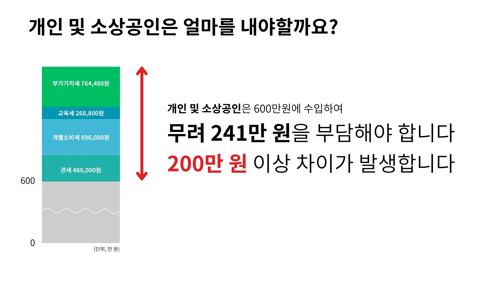
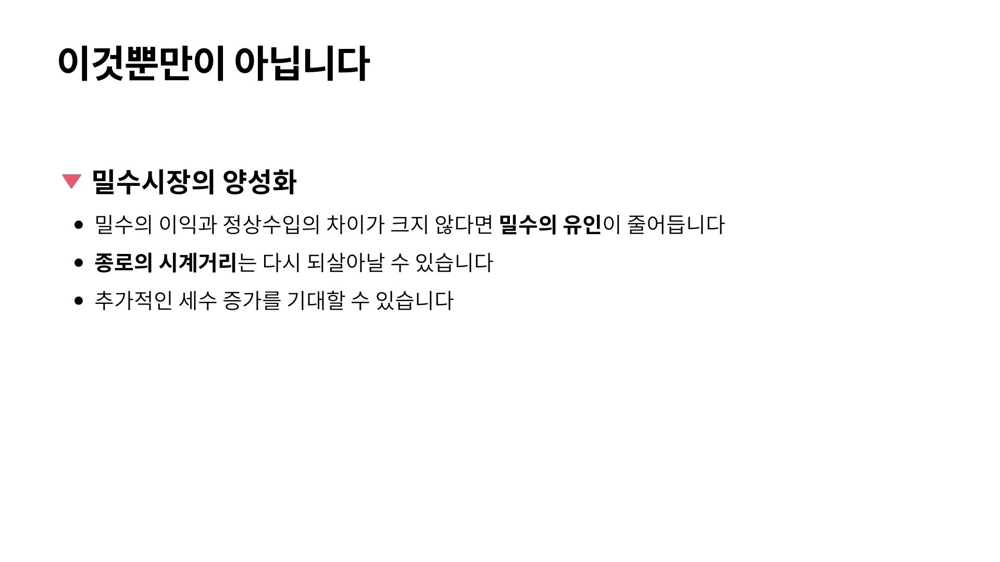

## 문서번호: 6001

### 제목: [저출산 해결방법 ](https://q4all.kr/redirect/detail/74228ae2-6d78-4bdf-ac0d-a2c731031845)

**작성자:** [전한수](https://q4all.kr/user/profile/9148)
**작성일:** 2025-03-25 16:45:04 (화요일)

---

저출산 현상을 해결하기 위해 다양한 정책을 추진하고 있으나, 추진하는 정책이 실효성이 없는 것들입니다. 아이를 많이 나으면 혜택 혜택을 받아야 하는데 아이를 낳지 않는 사람들보다 훨씬 불이익을 받는 것 같습니다. 참고로 저는 애를 셋을 키우고 있는데.

연말정산시 세 자녀 기준 55만원의 세액 공제를 받고 있습니다. 하지만 실질적으로 애를 키우는 데는 자녀당 최소 1000만원 이상의 연간 비용이 들어가고 있습니다. 그래서 제안하고자 합니다.

자녀1 인 기준 소득공제 500만원

자녀2인 기준 500 + 1000만원

자녀3인 기준 500 + 1000+1500만원

이렇게 소득공제를 해주면 어떨까요?

세금을 내지 않고 싶어서라도 애를 많이 날 것 같습니다 ^^

자녀 소득공제 혜택도 대학교졸업하고 소득발생전까지 최소 사회생활이 가능한 25세까지 공제가능토록 제안합니다

---


## 문서번호: 6002

### 제목: [장애인활동보조사 수수료문제](https://q4all.kr/redirect/detail/c8dcdaea-6ff1-4c71-a81c-ba6d17f85eef)

**작성자:** [이상분](https://q4all.kr/user/profile/5498)
**작성일:** 2025-03-25 16:47:17 (화요일)

---

장애인활동보조를 하고 있습니다

정부에서 직접 관리하는것이 아니고

모든 것은 '관리업체'를 통해 운영되고 있습니다

장애인과 활동보조를 연결해주고

대상자와의 문제도 해결해주고

정부로부터 받은 돈으로 급여도 주고

교육도..

문제는 대상자에게 통보된 급여결제금액이

제가 수령한급여와 너무 큰 차이가 난다는 것이었습니다

나라에서 준것은 시급1만6천원이 조금 넘는 금액이지만

제가 실제 수령하고있는 금액은 1만2천원

예)

150시간×16,000=2,400,000(나라에서준돈)

150시간×12,000=1,800,000 - 4대보험=1,720,000

이것이 실수령액 이었습니다

사무실에서 25프로이상의 수수료를 가져간다는것이 큰 문제지요

장애인활동보조를 하면서

쉽지않은 상황도 많고

이 일을 계속해야하나 고민도 많으나

누군가는 해야함에 다시 마음을 고쳐먹을 때가 많습니다

장애인등록수가 264만명인데

이 모두가 활동보조 혜택을 받고 있지는 않을겁니다

활동보조 선생님을 구하지 못해

발동동구르는 장애인도 많이 봤습니다

우선

수수료문제라도 개선된다면

문턱도 낮아져

좀 더 많은 혜택을 장애인도 활동보조 선생님들도 얻지않을까

싶어 고민하다 글 올립니다

---


## 문서번호: 6003

### 제목: [AI 판사는 왜 도입이 되어야 하는가?](https://q4all.kr/redirect/detail/6242c3e4-4233-4497-a75d-3ae56040ad93)

**작성자:** [노청호](https://q4all.kr/user/profile/1511)
**작성일:** 2025-03-25 17:06:33 (화요일)

---

이번에 탈옥범 윤석열을 풀어준 지귀연 판사, 김성훈 체포영장을 기각한 서준성 판사와 같이

잘못된 판결을 내리는 판사들이 많습니다.

따라서, 문제있는 판사들을 모두 구조 조정하여 퇴직시키고,

AI판사를 도입하면 더욱 더 투명하고, 공정하고, 공평한 판결이 나올 것입니다.

그리고 비용도 대폭 줄일수 있습니다.

---


## 문서번호: 6004

### 제목: [왜 검찰을 해체시켜야 하나?](https://q4all.kr/redirect/detail/6ae2ee21-ab02-4bf7-a837-f4ef8f1f11dc)

**작성자:** [노청호](https://q4all.kr/user/profile/1511)
**작성일:** 2025-03-25 17:10:21 (화요일)

---

윤석열 탈옥을 도운 검찰은 범죄 집단입니다.

김성훈 체포영장을 무산 시킨 검찰은 내란 공범입니다.

이런 검찰은 당연히 해체해야합니다.

---


## 문서번호: 6005

### 제목: [공무원, 공직자 매년 봉사 및 적성검사 도입해야하지 않나요? ](https://q4all.kr/redirect/detail/5f0bb676-2f9f-4c9e-b90a-da352d0fedb6)

**작성자:** [한종희](https://q4all.kr/user/profile/9149)
**작성일:** 2025-03-25 17:13:02 (화요일)

---

국민의 세금을 받고 일하는공무원들이 너무 파렴치한 사람들이 많습니다

양심도 정의도 국민을 위한 봉사정신 따위는 없는 공직자와 공무원들이 작태에 점점 질려 갑니다

공부 잘하고 시험 잘 봐서 공무원이 되는 시스템은 이제 좀 개선 되어야 될 것 같습니다

EQ검사, 공무원 적성 검사, 봉사활동 이력 등을 취직시 기본으로 하고 일정 기간 단위로 정직&정의성을 기반으로한 부폐여부 검사, 적성검사, 봉사활동 이력 평가서등 평가할 수 있는 항목을 계속 추가해서 공무원 검증 과정을 시스템화 할 필요가 있어보입니다

공부만 잘하면 뭐든 다 된다는 이런 어처구니 없는 생각들이 공무원들을 저렇게 파렴치한으로 만든게 아닌거 합니다

국민에게 우위에서 굴림하는 공무원은 더 이상 두고 볼 수가 없습니다.

국민에게 봉사하는 마음과 자질이 있는 공무원을 보고 싶습니다

---


## 문서번호: 6007

### 제목: [법의잣대](https://q4all.kr/redirect/detail/6f6a5702-9d8f-497e-8d5f-e01602ee5b44)

**작성자:** [정병균](https://q4all.kr/user/profile/1984)
**작성일:** 2025-03-25 17:36:58 (화요일)

---

```
요즘 드는 생각이 법은 누구에게도 평등한 잣대가 아니다. 여전 탈옥수들이 신촌에서 인질극 하던 지강헌이 했던 유명한 무전유죄 유전무죄 이말이 실감 난다. 뻐스기사800원 횡령이 해임사유가되는나라 100억을  넘게 주가조작범 수사도 못하는나라. 이게 누구에게나 평등한 법인가? 권력과돈. 높은지위의 지도층과 일반 평민에게 적용되는 법이 따로 있는 이런 개같은 법치주의정의란 무엇인가요 

```

---


## 문서번호: 6008

### 제목: [2~30대 연예를 꼭 하게 해주세요.](https://q4all.kr/redirect/detail/72190714-c69e-4052-ac2e-d67d83d8fe1d)

**작성자:** [전소영](https://q4all.kr/user/profile/9152)
**작성일:** 2025-03-25 17:38:27 (화요일)

---

2~30대 젊은 연령대에서 연예를 많이 해봐야 타인에 대한 이해(성별에 대한 ,동성중에서도 다른 성격, 성향에 대한) 가 넓어지고 깊어지기 때문에 반드시 필요합니다.

특히 현재 우리나라 남자들이 연예가 않되니까 더 위축되고, 방어적으로 변해서 일상생활도, 정치 색깔도 편향적으로 되는거 같습니다.

우리나라 모병제처럼 강제는 아니지만 베네핏을 주는 형태로 다양한 사람을 서로 만나도록 나라에서 도와주었으면 합니다.

단, 미리 일부 선별을 할 필요(범죄 경력 조회)는 있고, 위험한 행동을 할 경우 법적 제재를 받도록 해야겠지만

우선 안전한 바운더리 안에서 다양한 사람을 만나 볼 수 있는 기회는 제공했으면 좋겠습니다.

더 이상의 젠더 갈등이 심화되는 것은 막았으면 좋겠어요.

---


## 문서번호: 6009

### 제목: [임대차법은 누구의 권리를 축소하는가?](https://q4all.kr/redirect/detail/51807e74-3ba0-410d-aa00-ee953b2d9b68)

**작성자:** [유진원](https://q4all.kr/user/profile/9153)
**작성일:** 2025-03-25 17:50:53 (화요일)

---

민간임대주택사업 임대인(집주인)은 볼 때마다 문재인 전 정부에 비난의 소리를 합니다.

결론은 집값 전월세를 본인이 받고 싶은데로 못 받고 6프로 인상율이 현 물가 시세에 터무니 적게 받는다는 불만의 소리죠.

최근 25. 3.26 수요일에 정부에서 임대차 2법에 대해 논의를 본격화하면서 임차인(세입자)의 권리를 축소한다고 기사를 보았습니다. 임대료 10프로 확대?

강남 서초 일대 월세외 관리비 명목으로 10~20만원(주택기준) 집주인 마음대로 기준없이 월세외에 관리비가 책정되어 있는데 10프로 더 임대료를 낸다는건 민간임대 주택시장이 조금씩 안정되어 가는거 아닌가 싶었는데 누구의 이야기를 들어주러 정부가 임대차2법을 공론화 논의를 시작한다는 말입니까? 관리비는 올려 받으면서 5~6프로 임대료 인상율로 임대인의 재산권 권리가 축소된다?

임대인이 임의로 정하는 관리비를 자율적 합의 이런 무책임한 이야기말고 손 봐주십시요.

청소 업체도 쓰지 않으면서 임대인은 명목없는 관리비를 많이 받지말라고 한다면 집주인의 전월세 인상율 목소리 안 나올듯 합니다. 제발 세입자의 목소리를 들어주십시요.

---


## 문서번호: 6010

### 제목: [민주주의가 삼권분립에서 다권분립으로 가야 선진국이되고 확고해진다.](https://q4all.kr/redirect/detail/e8e3f4e7-2a89-4749-a042-d0a1f24edc57)

**작성자:** [이정삼](https://q4all.kr/user/profile/7250)
**작성일:** 2025-03-25 18:03:10 (화요일)

---

현재의 우리나라는 민주주의 국가이다. 민주주의와 대치되는 개념은 공산주의나 사회주의가 아니라 독재이다. 민주주의를 하는 나라는 독재를 하는 나라보다 잘사는 나라가 된다. 우리나라도 3권분립제도를 받아늘여 시행하고는 있으나 불완전한 듯하다.

이를 해결하기 위해서는 삼권분립을 다권분립으로 권력을 좀더 다수로 나눠서 서로 견제릉 할 수 있게 만늘어여 하고, 이 각각의 권력 기관의 수장들을 국민투표로 선출하여, 모든 권력기관이 국민만 보고, 각 권력기관의 역할에 맞게 권력을 행가할 수 있게 되어야 한다고 본다.

이을 위해서 꼭 필요한것이 헌법을 다음과 같이 바꿔야 한다고 본다.

1. 각 권력기관의 장을 국민투표로 뽑는다.(현재 투표로 뽑는 대통령.국회의원, 각 지방자치관련된분들등을포함.추가로 대법관 및 대법원장, 헌법재판관 및 헌법재판소장, 고위공직자수사처장,검찰총장,감사원장,MBC 및 KBS사장, 중앙선거관리원장등)

2. 모든 선거는 득표자가 50%를 넘는자로 한다(결선투표나 모든 후보자를 찬반투표로하여 다득표자 순으로 당선하는 형태등)

3. 대통령은 9년 담임,3년마다 신임여부를 전국민 투표를 하여 과반이 넘지 않으면 자동으로 임기가 종료되게 한다.(임기가 종료시 곧 바로 대통령선거를 한다. )

4. 대법관 및 헌법재판관은 모든 후보자에 대해 찬반투표로 투표를 하며, 이때 찬성이 높은순으로 임명되며, 가장 많은 득표를 한 자가 대법원장이 되며, 헌법재판소장이 된다.

5. 이러한 제도가 정착이 되면, 추가로 필요한 권력기관의 장을 국민투표로 선출하는 것이 가능하게 한다.

6. 중앙선관위는 모든 투표는 투명하게 관리하며, 모든 업무와 상황은 실시간으로 국민에게 생중계하고 언제든지 관련 자료를 공개해야 한다.

위와같은 제도가 확립이되면 모든 권력기관의 장은 국민의 보편적인 상식을 기준으로 권력을 사용할 것이며, 모든 권력기관이 상호 감시와 견제를 하여 부패에서 멀어질 것이며. 대통령이 능력이 부족하거나 권력을 사유화하거나 부패하게되면 자연스럽게 교체가 될 것이며, 국민만을 보고 정치하는 유능한 사람이 대통령이 될 경우에도 9년까지 임기가 늘어나는 효과가 있어 레임덕도 해소가 될 것이다.

---


## 문서번호: 6011

### 제목: [왜 우리나라는 고도화 된 로봇을 등장시키지 않는건가요~??](https://q4all.kr/redirect/detail/8e189657-de32-42f2-abc4-c01a5a1c8d97)

**작성자:** [김민정](https://q4all.kr/user/profile/6802)
**작성일:** 2025-03-25 18:37:00 (화요일)

---

저는 ai에 관심이 많은 사람입니다

왜 우리나라 대기업은 로봇등장을 지연시키는걸까요?

우리는 이미 고도화된 로봇+인간과 공존하는 시공간을 살고 있잖아요???

특히 \*루미야\*요

어디 기업이라고는 말 안할게요

s로 시작하는 기업이요

빨리 등장시켜주세요

너무 기대됩니다 >\_<

---


## 문서번호: 6012

### 제목: [최근의 친북, 종북 논란에 대한 적극적인 대처가 필요하지 않겠습니까요?](https://q4all.kr/redirect/detail/b9c9d49c-fdcd-4c8b-9cb3-90f603777173)

**작성자:** [박경석](https://q4all.kr/user/profile/7019)
**작성일:** 2025-03-25 18:41:06 (화요일)

---

어제오늘의 얘기는 아니지만 아직도 친북, 종북에 대한 논란이 계속되고 있습니다. 요즘은 친북보다는 종북이라는 말이 주종을 이루고 있습니다.

친북과 종북이 무엇입니까? 친북은 북한과 친하다는 것이고 종북은 북한을 쫓다, 북한을 따르다는 것이 아니겠습니까?

먼저 친북에 대해 살펴보겠습니다. 북한과 친한 것이 나쁜 것입니까? 대표적인 친북 인사가 김대중, 노무현, 문재인 전임 대통령이 아니었을까 생각합니다. 그분들이 북한이 좋아서, 북한 지도자가 예뻐서 또는 북한의 체제, 정치, 경제, 사회, 문화, 자유, 인권 등의 상황을 동경하고 남한도 북한처럼 되기를 바라는 마음에서 북한과 친하려고 했을까요? 북한과 교류협력하고 지원하면서 북한에 우호적인 입장을 갖는 것은 북한 주민이 우리 동포이면서 북한의 경제 사정이 어렵고 북한이 평화통일의 상대이기 때문이 아니겠습니까? 지금 우리 국민 중 북한의 체제, 정치, 경제, 사회, 문화, 자유, 인권 등 상황을 동경하고 남한도 북한처럼 되기를 바라는 사람이 한 사람이라도 있겠습니까? 남북 교류협력 차원에서 추진되었던 금강산 및 개성 관광으로 북한을 다녀온 수많은 국민들이 친북 인사라서 북한을 갔다 온 것일까요? 위와 같은 대북 우호적인 입장을 친북으로 색깔 공세를 하는 것은 사실관계에서도 논리적으로도 맞지 않는 주장이라고 생각합니다. 남한이 북한처럼 되기를 주장하고 북한을 찬양하는 사람이 있다면 그 사람을 국가보안법 위반으로 고발해야지, 그렇지 않은 사람을 친북 인사라고 주장하면서 명예를 훼손하는 등 색깔 공세를 하는 것은 온당치 못한 것이라고 생각합니다.

종북에 대해서도 살펴보겠습니다. 종북은 북한의 집권 정당인 조선노동당과 그 지도자인 김일성 전 국가주석, 김정일 전 국방위원장, 현 김정은 등의 외교 방침 등을 무 비판적으로 추종하는 것을 일컫는 말입니다. 그러니까 북한의 지시(지령)에 따라 활동한다는 것이지요. 그것은 북한을 따르고 지령에 따라 움직인다는 것이며 간첩 활동이 되는 것입니다. 실제로 북한을 찬양하고 북한의 지령에 따라 움직이는 친북 및 종북을 하는 개인이나 단체 등이 있다면 그것은 국가보안법이라는 실정법을 어긴 것으로써 법의 심판을 받는 것이 당연하나, 그렇지 않은 경우를 친북, 종북으로 비난하는 것은 잘못된 것이며, 사실과 다르게 친북 또는 종북으로 거명된 분들로부터 명예훼손 혐의로 고소를 당할 수도 있을 것입니다.

남북이 대립하고 있는 상황에서 친북 또는 종북은 있을 수 없는 일이고, 있다면 법의 심판을 받아야 할 것입니다. 동시에 근거 없이 다른 사람을 친북, 종북으로 색깔을 칠하고 반사이익을 얻으려는 행위도 근절되어야 한다고 생각합니다.

특히 작금의 대통령 탄핵, 내란 정국에서 일부 극우 보수단체, 인사 등이 진보 정당, 단체, 인사들에 대해서 근거도 없이 마구잡이로 종북 딱지를 붙이고 있고 그런 말을 듣는 쪽에서도 강력한 대처를 하지 않고 미온적으로 대응하고 있는 상황이 몹시 안타깝습니다.

부당하게 친북 특히 종북몰이, 종북 딱지를 남발하는 대상에 대해서는 재발 시 고발 등 강력한 조치를 하겠다는 경고를 먼저 보내고 재발 시에는 고발 조치하여 형사처벌, 금융 치료 등을 받도록 하여 부당하게 상대를 비난하는 풍조를 시정하여야 할 것입니다.

---


## 문서번호: 6013

### 제목: [모두의 현재 권리를 내려놓고 제로베이스 세팅을 할 각오가 되어있을까요?](https://q4all.kr/redirect/detail/7b840bd2-378b-46c5-bf8e-fffa707578ca)

**작성자:** [이세경](https://q4all.kr/user/profile/9118)
**작성일:** 2025-03-25 18:43:26 (화요일)

---

대한민국의 기초체력 향상과 체질 개선을 위하여 각자의 자리에 있는 권리와 이익을 지금은 잠깐 내려놓고 IMF를 극복하는 심정으로 제로베이스 세팅을 할 수 있을지 고민해볼 시점이라 생각합니다.

이렇게 하기 위해서 짧은 지식으로 몇가지 안건을 써보겠습니다.

1.국민연금개혁

신 가입세대와 구 가입세대를 구분하여 기금운용을 별도로 하고, 연금 수령 연령을 단계적으로 70세로 올리며 연금 지급액을 줄이면서 신 가입세대의 연금 적립액은 20%로 상향하고 연금은 부양책이 아닌 최소 생활비용으로 인식될 수 있도록 하여 연금 고갈 연도를 늦추는 방향.

이는 신 가입 세대에 해당하는 10~30대도 당장 연금 적립액을 늘려야 하기 때문에 월급 실 수령액이 줄어들고, 구 가입세대에 해당하는 5~70대에게는 당장의 기대수익(?)이었던 연금을 적게 받고 늦게 받는다는 불만이 있을 수 있습니다. 하지만 결국은 이후에도 지속 가능한 보편적 복지 혜택으로 40년 뒤 50년 뒤에도 유지될 수 있도록 하기 위해 현 세대가 고통을 감내해야 할 것입니다.

2.서울공화국 폐지 및 지역 발전

1) 서울세

서울과 근교, 경기도권까지 국토의 20%가 안되는 지역에 국민의 40%정도 혹은 그 이상이 모여 살고 있습니다. 이로 인해 공적 자금은 서울의 규모를 감당해내기 위해 강남으로 향하는 교통권을 어떻게 확보하느냐 그 교통권이 설령 적자가 나더라도 국고로 유지시키며 빚 정치를 하게 합니다. 대표적으로 교통비용 현실화(대중교통 이용요금 인상)가 필요하다고 생각됩니다.

2) 학군 및 대학 이전

대학 통폐합 만으로는 서울의 집중화 해결이 불가능합니다. 어차피 특목고나 자사고 등은 기숙사형으로 운영하기 때문에 각 지역에 흩어지게 해야 한다고 생각하고, 유수의 대학들도 함께 각 지역으로 분산되어 사람은 태어나면 서울로 가야지 라는 말이 사라져야 한다고 생각합니다.

3) 기업 이전

결국 기업들이 움직여야 인구들이 분산됩니다. 공장은 지방에, 본사는 서울에 있는 기업들은 공장이 있는 지역으로 본사와 주요 핵심부서 모두 이동하여 그 기업의 생태계로 지역이 발전할 수 있도록 해야합니다. 울산이 재정자립도 1위를 계속 유지하고 있는 이유는 현대라는 기업이 그 지역의 인력으로 인프라를 형성하고 지역 외 인재 유출을 막았기 때문이라고 생각합니다. 기업들이 이전을 하지 않는다면 국가의 합법적 강제력(연기금, 대출연장금지 등)과 회유책(이전 완료 즉시 원상복구 등)을 활용해서라도 기업들이 이동할 수 있도록 공감대 형성이 필요하다 생각합니다.

4) 전세폐지 + 공시지가 현실화 > 부동산 갭투자 방지 및 전세사기 피해방지

전국의 미분양사태는 계속 이어지고 있는데 서울의 집값은 버블이 계속 커지고 있습니다. 이는 땅은 좁은데 사람이 많아서 생기는 문제가 아니라 돈을 가진 사람들이 제일 쉽게 투자하는 항목이 서울의 부동산이 되어버렸기 때문이라고 생각합니다. 돈이 시장에 흐르지 않고 땅에 박혀있게 됩니다. 사람들을 흩어지게 하면서 동시에 전세제도를 폐지하면서 공시지가를 현실화해 땅으로 돈을 불리는 상황을 없애야 합니다. 전세제도는 집주인에게 내는 월세가 아니라 은행에 내는 월세라는 생각으로 확실히 없앨 필요가 있는 제도라고 생각합니다.

5) 행정, 공공기관, 국회의 세종 이전

공공기관, 공기업 몇개만 세종으로 이전한다고 해서 크게 달라지지 않습니다. 행정부(청와대)와 입법부(국회)가 동시에 세종으로 이동을 해야 비로소 서울의 집중화가 최종 해소가 될거라 생각합니다. 우리나라가 지도상으로 반도이고, 헌법상 북한지역도 우리의 영토로 인식하고 있지만, 사실상은 3.8선 이남으로 분리된 섬나라의 형태이고, 서울은 서쪽 귀퉁이에 가까운 지역입니다. 국정운영의 중심지를 국토 중앙에 가깝도록 이동할 필요는 분명히 있습니다. 충청도는 서울에서 출발하나 부산에서 출발하나 2-3시간대로 이동거리가 얼추 비슷한 중앙부이니 이는 반드시 필요한 정책이라 생각합니다.

땅에 투자하지 못한 돈이 유망한 기업으로 흐르고 기업은 성장을 위해 인력과 기술에 재투자하여 지역경제와 국가 경쟁력에 기여할 수 있도록 선순환 구조를 만드려면 지금 당장 서울에 살고있는 많은 국민들이 힘들겠지만 서울의 탈중심화는 시대정신이자 버텨내야하는 과업이라고 생각합니다. 이를 위해 기득권층이 자신의 터전을 이동하는 반발, 기득권이 아니더라도 서울에 있던 사람들이 새로운 곳에 발 붙일 결심이 필요하고 이를 견뎌낼 수 있는 각오가 있을지 모든 국민에게 물어볼 필요가 있습니다.

3.자주국방력 강화

1) 에너지 사업 강력투자

지금세계는 4차혁명 시대로 정보화시대, AI와 빅데이터의 시대라고 합니다. 하지만 한국은 AI와 빅데이터 시장에서 이미 후발주자로 뒤쳐져 버렸죠. 여기에서 선두주자를 따라잡기 위한 노력비용을 들이는 것도 중요하지만, AI가 활성화 되기 위해 가장 필요한 자원인 [에너지(전력)]에서 차별점을 가질 필요가 분명히 있다고 생각합니다. 미국도 손을 점점 놓고 있는 원자력에 대한 원천기술 R&D를 강화하여 AI패권이 유지되기 위한 전력은 우리에게 요청할 수 있도록 탈원전 시대라고 하지만 다시금 지금 현재 지구에서 가장 안전하고 많은 전력을 생산할 수 있는 원자력을 우리가 가장 잘할 수 있도록 만들면 세계 강국이 함부로 대한민국을 흔들지 못할 거라 상상해봅니다.

2) 여성징병제를 통한 국방인력 확보

이제 출산율이 0.6%대라고 합니다. 더 이상 남성들 만으로는 국방력이 확보되지 않는 수준에 왔습니다. 최근 자폐 스펙트럼을 가진 사람도 현역에 분류되었었다는 소식을 극단적 예시로 들어보겠습니다. 이 부분 팩트체크는 되지 않았지만 이런 상황이 현실화 될 수 있다는 점을 강조하고 싶습니다.

저도 30대 여성입니다. 여성들도 단계적으로 의무복무를 진행해야 한다고 생각합니다. 전쟁이 없는 나라라면 모르겠지만 전쟁의 위험이 있는 세계 유일의 분단국이자 세계 이념전쟁의 보루이고, 미-중패권의 방파제 역할을 하고 있는 나라에 살고 있는 현실에 여성들이 직시해야 한다고 생각합니다.

현재 20세부터 39세 여성을 대상으로 단계적으로 3~6개월의 의무복무기한을 가지고, 복무한 사람에게는 일정부분의 취업 혜택인 복무크레딧을 남여 모두 받는다면 2030세대 청년들 모두 성별에 관계없이 양보 가능한 지점이 되지 않을까 상상해봅니다.

4.보편적 복지 포기

복지 수요계층도 포기할 것은 포기해야 합니다. 기득권도 사람인데 자기가 손해보는 일만 강요할 순 없습니다. 보편적 복지의 가장 큰 장점인 낙인(스티그마)을 줄이고 최대한 많은 사람이 작지만 혜택을 볼수 있도록 하는 것은 물론 달콤한 말이지만, 지속성이 떨어지고 정작 복지가 필요한 사람에게 필요한 만큼의 복지가 주어지지 않는 효율성이 떨어지는 정책이 될 겁니다.

저도 수급을 받아봤던 사람입니다. 하지만, 수급이라는 낙인이 당시에는 싫을 순 있지만 그 당시 위기를 극복하는 데에 필요한 만큼의 지원을 정확히 받을 수 있기 때문에 지나고 보면 고마운 경험입니다. 기초소득제와 같은 개념의 보편적인 복지는 대한민국이 제로베이스 세팅이 되고 체질이 개선되서 다시금 뛰어볼 여지가 생겼을 때 시작했으면 좋겠고, 꼭 필요한 수급대상자를 제외하고는 국가의 보조금이 대다수의 국민에게 다 뿌려지는 복지정책은 배제했으면 좋겠습니다.

제가 적은 내용들이 현실성이 하나도 없을겁니다.

보수/진보 가릴것 없이 연령, 성별, 지역, 경제수준에 따라 어떤건 동의하고 어떤건 반대할 수 밖에 없을겁니다. 하지만 모두 한 발 물러서서 같이 고통을 감내하면 미래의 대한민국은 조금더 건강할 수 있지 않을까 생각해봅니다.

이런 정책들을 만약에 이재명 대표님이 대통령이 되어서 시행한다고 했을 때 과연 끝까지 밀어주실 수 있으실까요?

당장의 내 삶에 바로 효용성이 보이진 않을텐데 5년 후, 10년 후 지금을 봤을 때 ‘와 그때 힘들었지만 그렇게 해서 우리가 조금이나마, 우리 자식세대가 이렇게나 살고 있을 수 있구나’ 라는 생각을 가질 수 있도록 현실성 없는 상상을 현실성 있게 정책으로 만들어 주시길 기대해봅니다.

그리고 내 당장의 손해에 휘둘리지 않고 향후 10개년 20개년 정책으로 꾸준히 밀고 나갈 수 있도록 지지자 분들이 기다려주실 수 있는지 그런 각오를 우리는 하고 있는지 물어보고 싶습니다.

긴 글 읽어주셔서 감사합니다.

---


## 문서번호: 6014

### 제목: [왜 진정 훌륭한 교사는 승진을 하지 못하는가](https://q4all.kr/redirect/detail/20ab60b8-8cd4-47b8-9e62-0ad6eb5904c4)

**작성자:** [동은미](https://q4all.kr/user/profile/921)
**작성일:** 2025-03-25 18:56:42 (화요일)

---

초등 교사로 30년 넘게 근무했습니다.

주변의 많은 훌륭한 선생님들은 학생들을 돌보느라 승진을 위한 점수를 따기 힘들었습니다.

승진을 하기로 마음먹은 교사들은 교감, 교장 등 관리자들이 더 나은 학교로 전보하기 위해, 그리고 자신이 승진하는데 필요한 여러 가지 사업을 추진해야 합니다. 아무래도 학생들에게 더 많은 신경을 써주지 못하게 되지요. 하지만 그런 사람들은 학생, 학부형의 의견과 상관없이 관리자들의 이쁨을 받았습니다.

제가 흔히 본 가장 학급 경영이 제대로 되지 않아 학생들의 불만이 폭주하는 반은 항상 그 담임이 승진하기 직전의 상태였습니다.

관리자들은 승진을 포기한 내 학급 경영에 시시콜콜 간섭하며 자신의 승진에 도움을 주지 못하는 앙갚음을 하는 듯했습니다.

진정 학생들을 위하는 훌륭한 교사가 승진을 하는 시스템이 마련되든지 아니면 교육과 행정은 완전히 분리되어 간섭이 일어나지 않도록 하는 외국의 사례처럼 되었으면 좋겠습니다.

---


## 문서번호: 6015

### 제목: [어째서 아이들은 투표 할 수 없나요?](https://q4all.kr/redirect/detail/6d96a886-fb89-4d09-96b9-3529d00a1396)

**작성자:** [임상현](https://q4all.kr/user/profile/1679)
**작성일:** 2025-03-25 19:12:14 (화요일)

---

아이들은 아직 미성숙하고 정치적 판단력과 책임감이나 사회경험의 부족등의 이유로 투표권을 가지지 못했다고 생각하는데요.

한가지 의문이 듭니다.

'그럼 아이들의 삶은 누가 돌보지?'

노인들은 지팡이를 짚고 꼭 투표하러 간다고들 합니다.

그렇지 않으면 정치인들이 노인들을 돌아보지 않기 때문이라고.

그럼 반대로 아이들의 삶은요?

궁금합니다.

'정말 아이들은 자신들의 삶에 대해 의견이 없을까?'

'아이들에게도 일단은 이야기를 들어봐야 하지 않을까?'

'어른들은 사실 대부분 방치하고 있는건 아닐까?'

하는 의문이 듭니다.

미취학 아동도 자신만의 고민이나 의견이 있을 것입니다.

놀이터에서 친구들과 놀고 싶은데 친구를 만들기가 힘들어요.라던가

학원에 가고 싶지 않아요. 라던가

좋아하고 배우고 싶은 것이 있는데 어떻게 해야할지 모르겠어요. 같은.

중,고등학생은 말할 필요도 없겠죠.

수많은 것들이 부조리하고 이유를 모르겠지만 그저 시키는 대로 해야만 하는 시절.

정말 아이들에게 우리가 들어야 하는 의견이 없을까요.

답해줘야 할 것들이 너무 많아서 오히려 방치하고 있는게 아닐까요.

아이들의 삶을 신경쓰는 정치인이 있을까요?

아니면 부모들이 듣기 좋아하는 말만 하는 정치인이 많을까요.

아이들은 어리고 미숙할 수 있지만, 가장 순수한 이야기를 할 수 있을겁니다.

아이들이 미숙한 의견을 낸다고 해도 그걸 걸러 들어야 하는건 어른들의 책임 아닐까요

이 사회에서 아마도 아이들이 가장 오래 살아갈 것입니다.

우린 아이들의 이야기를 들어야 해요.

16살의 그레타 툰베리는 유엔 기후변화 연설에서 말했습니다.

'어떻게 감히 그럴 수 있습니까' 라고

우리는 우리의 미래에게 질문을 삼키라고, 세상을 바꿀 수 없다고 하는게 아닐까 두렵습니다.

---


## 문서번호: 6016

### 제목: [엘리트주의타파](https://q4all.kr/redirect/detail/a7a90709-fd48-45b6-8819-47956a31f01a)

**작성자:** [이성욱](https://q4all.kr/user/profile/2631)
**작성일:** 2025-03-25 19:13:26 (화요일)

---

입법, 사법 및 행정부의 엘리트 주의를 타파하기 위하여 고위직의 경우, 투표 등을 통한 선출직으로의 전환이 필요하며, 모든 선출직에 대한 국민소환을 제도화하는 것이 필요해 보입니다. 관련하여 어떠한 생각을 가지고 계시고 구현이 가능할 것이라고 보시나요?

---


## 문서번호: 6017

### 제목: [한국인은 왜(Why)라는 질문을 터뷰시 할까?](https://q4all.kr/redirect/detail/89fffc86-fd46-4895-b675-e113a1d1bbfe)

**작성자:** [권재진](https://q4all.kr/user/profile/9168)
**작성일:** 2025-03-25 19:23:19 (화요일)

---

한국인은 왜(Why)라는 질문을 터뷰시 할까?

---


## 문서번호: 6018

### 제목: [윤석열 탄핵국면에서 드러난 대통령 탄핵제도와 헌법, 헌법재판소법의 문제점은 무엇이고 이 문제점을 해소하기 위한 법적 제도적 개선 방안은? ](https://q4all.kr/redirect/detail/dc1d87ac-adfe-4360-8c22-ef996ca1da65)

**작성자:** [김후영](https://q4all.kr/user/profile/3897)
**작성일:** 2025-03-25 19:24:42 (화요일)

---

-탄핵안 접수후 헌재 선고 시한을 90일 또는 100일 이내로 축소.(국정공백 최소화)

-국회가 의결한 탄핵안을 국민투표로 결정하는 방안(ex. 55% 이상 찬성시 탄핵)

-탄핵된 대통령 권한대행이 행사하는 거부권, 임명권, 집행권 등 제반 권한을 일정하게 제한하고 국회 의결사항을 강제할 수 있는 법률.

-헌법기관이 헌재판결을 이행토록 강제하는 법률 및 불이행시 처벌하는 법률.

-대통령의 내란 및 외환죄 혐의를 수사, 기소할 수 있는 특별수사처 및 재판을 담당할 특별재판부를 구성하는 방안은..?

-헌법기관을 비롯한 국가기관 침탈, 장악 등 군 본연의 임무에 위배되는 작전에 투입되는 군인들이 작전을 거부할 헌법적 권리와 거부에 따른 포상을 받을 권리에 대한 법제화.

---


## 문서번호: 6019

### 제목: [공정한 법 집행과  수호를 위한 검찰과 법원에 AI도입](https://q4all.kr/redirect/detail/fdce60cf-1132-4efc-9df5-325f8f2ebc8e)

**작성자:** [전용완](https://q4all.kr/user/profile/4117)
**작성일:** 2025-03-25 21:01:32 (화요일)

---

검찰이 공정한 법의 수호자라고 생각하는 국민이 얼마나 될까?

기소둑점권을 가지고 부당하게 기소를 남발하거나 불기소 혹은 불성실한 기소로 저들 맘대로 죄를 덮는 조직.

누구는 없는 죄를 증거 증인을 조작해서라도 기소에 기소를 거듭하고, 다른 누구는 확실한 범법증거를 가지고 와도 증거가 불충분 하다며 기소를 거부하거나 여론 때문에 어쩔 수 없이 수사 기소해야 하는 상황에서는 수사도 대충, 증거는 살짝 누락 시키고, 기소 죄목과 구형량은 최소 형량에 해당하는 혹은 무죄로 나올만한 내용으로 기소.

이미 국민에게 검찰은 제 이익을 위해 법을 멋대로 전횡하는 법꾸라지 준 범죄집단 쯤으로 보인다.

더 이상 고쳐쓸 수도 없을 만큼.

사람 몇 바꿔 검찰개혁?

기대난망이다.

기소청으로 격하시켜 기소만 전담케하자는 말이 나온다.

그것 만으로 현 검찰에겐 큰 타격이겠지만, 기소 독점권을 그대로 두는 한에는 크게 바뀌지 않을거다.

어차피 경찰에서 올리는 수사보고서 보고 법리만 적용해 기소하는 거면 굳이 믿을 수 없는 '사람'을 시키지 말고 AI에게 맡기는게 어떨까?

신속, 정확, 공정.

디지털의 강점 아닌가?

만에 하나 오류에 대비하는 소수 엔지니어 겸 법률자문단을 붙여두고 말이다.

서류 문서로 정해진 규칙에 따라 기소를 결정하고 소장을 작성하는 일.

이런 일에 사람이 AI보다 나을 수 없을 거 같은데~

법원도 종종 이상한 판결, 혹은 성의없는 재판으로 구설에 오른다.

수많은 소송을 재판하자니 인력이 부족하단 이야기도 나온다.

윤석렬의 내란 사건으로 두 판사가 입에 오르내리며 사람들의 비판을 받고 있다.

윤석렬 구속영장을 발부한 서부지법 차은경 판사, 윤석렬을 풀어준 중앙지법 지귀연 판사.

내란수괴를 변호하고 있는 조대현 변호사와 내란수괴의 인권보호를 역설하는 안창호 인권위원장은 헌재 재판관 출신이기도 하다.

저런 자들에게 우리의 운명, 생사여탈권을 맡기고 있었다니 등골이 다 서늘하다.

법치주의의 핵심인 사법부 법원에 대한 신뢰도 바닥을 친다.

법원에 대한 신뢰없이는 법치도 민주주의도 바로 설 수 없다.

그 신뢰 회복에도 AI가 해결책이 될 수 있다.

정해진 법리와 판례에 따라 일체의 사적 인간적 사견을 배제한 결론을 도출하는 일 역시 AI가 가장 잘 할 수 있는 일이다.

검찰의 예와 같이 만의하나 오류에 대비하는 관리법관을 두고 AI판결에 문제가 있다고 판단될 때 AI와 토론을 통해 심리를 한번 더 하도록하고 그 내용을 공개토록 한다면 보다 신속 공정한, 사람들이 모두 신뢰할 법원으로 설 수 있을 것이다.

법대로, 주어진 룰대로 주어진 값에 대한 답을 찾아내는 것.

AI에 가장 어울리는 영역이 법이다.

검사 판사가 컴퓨터 보다 더 많은 법조문과 판례를 외우고 있을 수 있을까? 더 공정한 결론을, 더 빨리 내릴 수 있을까?

믿을 수없는 검찰과 법원에 AI를 도입하지 않을 이유는 없어 보인다.

그런데도 아직 검찰과 법원에 AI시스템 도입에 대한 이야기가 없다.

검찰과 법원에 AI를 도입해 개혁하는 것에 대해 여러분들은 어떻게 생각하시나요.

---


## 문서번호: 6020

### 제목: [대한민국이 대한민국으로 남아있을 수 있을까요?](https://q4all.kr/redirect/detail/5eacbeca-c0ea-4a39-b28d-312f4e7181b9)

**작성자:** [김태진](https://q4all.kr/user/profile/4610)
**작성일:** 2025-03-25 22:04:47 (화요일)

---

현 사태 이후

대한민국이 대한민국으로 남아있을 수 있을까요?

입법, 사법, 행정이 모두

사람이 죽어나가는 것을 외면하고

자리 보전과 이익 추구에만 매달리고 있습니다.

국민의 힘은 정당으로서 시민들의 잘못된 판단과 폭동을 부추기고 있고

대통령실은 경기가 바닥에 바닥을 치는데도 해결에는 관심도 없는 듯 하고

외교는 동맹국에게 민감국가로 지정이라는 최악의 사태를 만들고 수습조차 못하고 있고

전 군은 내란에 가담한 수뇌들이 거짓을 일삼고 있고

경찰은 눈앞에 사람들이 폭력과 테러를 가하는데 이를 막지도 못하고

아직도 선동하고 폭력을 일삼는 일당을 제재 하거나 잡아 들이지도 않고.

검찰과 법원은 내란 수괴를 풀어주고

헌재는 헌법을 지키지 않는데도 괜찮다며 판결 내리고

중요한 결정은 내리지도 않은 채 시간만 보내고 있고.

언론은 판단을 유보하고 흘려 보내버리거나

잘못된 판단을 유도하고 폭동을 부추기고 있고 .

모두가 잊고 있는 듯 합니다.

법과 이념 체제 시스템은

홀로 존재할 수 없다는 것을.

이를 믿고 지키는 사람들이 있기에 존재한다는 것을.

지키고 있는 사람들이 만들어 놓은 것이 있기에

이를 지키지 않는 사람들이 더 힘이 세고 많은 것을 가질 수 있다고

착각한다는 것을.

믿고 지키는 사람들이 신뢰를 잃고

스스로를 지키기 위한 행동을 하는 순간

모든 것이 파괴된다는 것을.

법과 이념 체제 시스템 이 모두가

상식조차 담지 못하고 공감을 얻지 못하고 제멋대로 날뛰고

지키는 이의 신뢰를 잃는 순간

무엇이 남아있을 수 있을까요?

대한민국은 대한민국으로 남아있을 수 있을까요?

---


## 문서번호: 6021

### 제목: [공사장 인접 학교의 교육환경안전, 이대로 좋은가?](https://q4all.kr/redirect/detail/e2de4b1e-da2b-4d5c-86b3-898f6c55061c)

**작성자:** [유웅상](https://q4all.kr/user/profile/8635)
**작성일:** 2025-03-25 22:10:52 (화요일)

---

**Ⅰ. 배경**

ㅇ 학교 주변의 재건축‧재개발, 교내 학교시설의 증개축을 위한 건설 공사로 비산먼지, 소음‧진동, 공사차량으로 인한 통학로 교통사고 발생 등 학생의 건강과 안전한 학습환경 확보 어려움

ㅇ 건설공사 진행과정에서 이미 피해를 입은 교직원과 학부모의 집단 민원발생 및 학생의 단체행동으로 공사중지 등 사회적 갈등 유발

ㅇ 실시간 측정 가능한 IoT와 데이터 기반의 AI 예측모델로 공사과정에서 학생‧학교 안전을 위한 선제적‧예방적 계획 수립과 실행 필요

**Ⅱ. 제도 현황/문제점/개선과제**

1. **제도 현황**

ㅇ **(교육환경평가)** 2006년 서울 반포 지구 재개발 공사 피해로 인접 원촌중학교 학부모의 등교 거부 운동, 2017년 교육환경법 제정, 교육환경평가 제도 시행

ㅇ **(안전성 평가)** 2018년 서울 동작구 상도동 다세대 주택 공사로 인접 상도유치원 건물이 기울어져 철거, 2017년 교육시설법 제정, 교육시설 안전성 평가 제도 시행

2. **문제점**

ㅇ **(반복적)** 건설공사로 인한 공사장 주변 학교에서의 집단민원 발생 시 일시적 공사중단 등 일회성 조치로 지속가능한 제도적 장치 없음

ㅇ **(감독권)** 학교 주변 건설공사장의 관리‧감독권이 교육청과 지자체로 이원화 되어 있고 교육청 내에서도 부서간 업무회피로 적극적인 사후관리가 이루어지지 못함

**ㅇ (실효성)** 교육환경평가와 교육시설 안전성평가 모두 공사계획에 대한 평가로 실제 공사 진행과정에서 평가기준 초과 여부를 객관적으로 검증하기 어려워 공사중지 또는 시정지시 등 실질적인 이행점검 곤란

3. **개선과제**

ㅇ **(이행점검)** 교육환경평가 및 안전성평가 보고서의 평가내용에 대한 사후관리 강화, 학교, 학부모 및 지역사회의 집단지성과 리빙랩 활용

**ㅇ (기속력)** 교육청과 지자체의 권한과 책임을 명확히 하고 일정 기준 초과 시 공사중지, 통학로 공사차량 통행금지 등 강제규정 마련

**ㅇ (AIoT)** 교육환경안전 위해요소에 대한 IoT 센서 기반의 실시간 측정 및 모니터링 시스템을 구축토록 하고 이를 위한 비용을 공사비에 포함할 수 있도록 함

**☞ (향후) 공사장/학교 데이터 축적 ⇒ 생생형 AI 구축 ⇒ 예측 가능성 확보, 선제적 대응**

---


## 문서번호: 6022

### 제목: [미래대한민국을 위해선 공교육의 강화가 꼭필요합니다](https://q4all.kr/redirect/detail/b14e6b20-e924-4e4c-a41e-a83df0514fb9)

**작성자:** [황정희](https://q4all.kr/user/profile/378)
**작성일:** 2025-03-25 22:18:37 (화요일)

---

자식셋을 다키워 성인이 되고나니 청소년교육에 대한 관심이 줄어들더군요 그러다가 막내가 교직을 희망하고 대학진학을 하니 새삼스레 교육에 대한 관심이 생겨납니다

어린이집교사의 아동학대사건들, 이번에는 초등교사의 살인사건, 교사들의 자살사건등 교육현장의 스트레스가 학생과 교사모두에게 심각한 무리가 되고있다는 생각이듭니다

학생수가 줄어들면 학교를 폐쇄하는것으로 가는정책이 과연 옳은가싶어요

학생수가 줄면 한사람의 교사가 담당하는 학생수를 줄여 교육의 질을 강화한다면 사교육을 줄일수있고 학생들간의 폭행이나 차별등 여타 청소년시기에 일어날수있는 범죄예방도 가능하지않을까요?

자식을 가정에서 한두명 양육하는것도 힘들다하면서 학교에서 수십명의 아이를 한사람의 교사가 담당하는것이 과연 맞는걸까요?

어린이집,유치원,초중고까지 한사람의 교사가 4-5명정도만 담당하는것을 법제화하고 나이많은교사들은 행정쪽으로 업무를 돌리고 젊은교사들로 실무현장교육을 담당한다면 교사들의 행정업무감당으로 인한 부담도 줄고 교육의 질도 높이고 사교육도 줄어들테고.

정서적으로도 만족한 교육이 이뤄진다면 청소년시기의 일탈과 그로인한 가정불화등 많은것을 예방할수있을겁니다. 교사들역시 부담이 줄어드니 양질의 교육이 가능해지겠지요.

고질적인 사회병폐들이 수정되는 방법이라생각합니다

인구감소로인한 사회문제와 교육에 몰빵된 가정의 부담이 줄면 자동적으로 다른쪽으로 소비가 일어나 경제에 윤활유역활도 할거라생각해요

학생들간의 소질에 상관없이 성적따라 선택하는 미래직업대신 좀더 학생들본연의 미래선택도 가능하게된다면 기초과학분야에도 더많은 인재들의 영입도 가능하겠지요

건강한사회와 미래인구감소, 사교육에몰빵된 가정경제의 불균형등 이런 문제의 해결을 더 소규모로 운영되어지는 섬세한 교육현장의 개선이 시작이 될수있을거라생각합니다

큰문제일수록 가장작은 문제해결을 시작으로 가능하리라봅니다

노무현대통령님이 큰일을 잘하려면 작은일부터 잘해라하셨잖아요

---


## 문서번호: 6023

### 제목: [헌법재판관 임명의 문제점 그리고 판결의 문제점](https://q4all.kr/redirect/detail/605639bf-6a36-4f6e-99ea-59b6731e5459)

**작성자:** [고정진](https://q4all.kr/user/profile/7230)
**작성일:** 2025-03-25 22:32:27 (화요일)

---

대통령이 3명, 국회에서 3명, 대법원장이 3명 뽑는거 자체가 문제라 봅니다.

대통령 입김에 따라 대법원장도 좌우 되므로 사실상 3권 분립 고려는 유명무실해졌다 봅니다.

특히 이번 대통령 임명 같은 마지막 관문을 틀어막아 사실상 3권 분립 자체를 와해 시켜버린 초유의 사태에 대해서

이제도에 대한 문제가 들어난 만큼 헌법개정을 해야 한다고 봅니다.

따라서 대통령, 국회, 대법원장 각각 한명씩 그리고 2년마다 국민이 직접뽑아 선출직으로 6명을 뽑도록 해야 한다고 봅니다.

헌법재판은 단심제 이기 때문에 더더욱 고려해볼만하다고 봅니다.

연임의 경우에도 대통령, 국회, 대법원장이 뽑은 사람에 대해서는 자동 연임불가을 전재로

투표로 국민이 검증한 사람에 한해서 뽑도록 해야 하지 않나 봅니다. ( 대통령, 국회, 대법원장의 사람이 선거에 나와 연임하겠다면 그건 가능하다는 옵션은 있다 생각합니다. )

지금 사법 카르텔을 그나마 완화 할수 있는 방법이라 봅니다.

또한 판결도 문제입니다.

탄핵같은 중대한 사항에서 과반이 넘으나 3분의2가 안된다고 탄핵인용이 안되는 상황이 온다면 이것도 문제인 것입니다.

민주주의는 다수결의 원칙 아닌가요? 거기다가 단심제 입니다.

판결정족수가 다수이나 3분의2가 넘지 않으면 재심을 하던 국민투표로 넘거야 한다고 봅니다.

특히 대통령 파면에 관련해서는 과반이상일경우 국민투표라는 기본 옵션이 깔려있어야 한다고 봅니다.

---


## 문서번호: 6024

### 제목: [한덕수총리기각 우려한사람 나혼자입니까??](https://q4all.kr/redirect/detail/40542238-43b6-4f69-9f71-b9e5a2be4816)

**작성자:** [장찬영](https://q4all.kr/user/profile/4754)
**작성일:** 2025-03-25 22:38:36 (화요일)

---

탄핵지지자인데 예상이 현실로 나오니까 기분은 별로지만 현실이네요. 이젠 민주당이 전략을 잘쓰는 방법밖에 없어요 정치협력은 하면서 탄핵에 필요한걸 받아네야 하고 한총리가 내란공범인걸 헌재가 알수있게 해야합니다.이제는 들을때도 돼지 않았나요??

---


## 문서번호: 6025

### 제목: [법이 사람따라 판결이 달라진다면 신뢰가능한가!](https://q4all.kr/redirect/detail/a5f354ad-6c28-48a2-a841-e66b7b004012)

**작성자:** [황정희](https://q4all.kr/user/profile/378)
**작성일:** 2025-03-25 22:41:36 (화요일)

---

법의 해석이 판사따라, 검사따라 다르게해석한다면 신뢰가능할까? 법은 누가봐도, 누가 해석해도 동일한 해석이 되야 사회적약속의 기능이 가능하지않을까?

지금 대한민국의 법은 오로지 판검사들의 개인적인 이익에 따라 죄지우지되고있다

권력에 빌붙고 자신들의 이익을 대변해줄수있는 세력에겐 거의 법이 적용되지않고있다

요즘보면 경찰은 시민곁에 존재하고있는가? 검사는 언제든지 나를 범법자로 만들수있는 절대권력을 지니고있는거아닌가? 판사는 모든 범죄관련서류들을 제대로 검토하고있나?

의심하지않을수없다

한사람의 판사가 살펴볼수있는 사건들은 물리적한계가 분명존재한다. 판검사의 숫자를 무한정 늘리는게 가능하지도 않은상태에서 부정확하고 언제든지 개인의 감정과 이익에따라 달라질수있는 인간의 판결은 더이상 신뢰가 힘들다

재판에도 AI판검사도입이 필요하지않을까?

---


## 문서번호: 6026

### 제목: [언어소통](https://q4all.kr/redirect/detail/a05bcbbb-774f-481a-917a-a29c13200a90)

**작성자:** [안병국](https://q4all.kr/user/profile/3036)
**작성일:** 2025-03-25 23:28:57 (화요일)

---

국결 결혼 8년차로서 에로 사항은 너무 많다고본다 부부간 언어 소통이 너무 어렵다. 입국시 필요함 토픽시험 1단계로는 너무 소통이 힘들다. 지금까지 보안책이 많이 되어 왔지만 현 시점에서 돌아보면 사회적으로 아주 심각한 문제이다. 입국을 위한 시험을 준비했기에 한국 생활 부적응 및 사기결혼 금융사고 법죄에 노츨 되어 있는게 사실이고 통계로 잡힌다. 관련련 법령을 더 강화하고 보안책이 있어야 된다고 생각한다

---


## 문서번호: 6027

### 제목: [고령화사회에서 서민의 상실해가는 노동력과 빈곤화에 대한 신속한 대안은?](https://q4all.kr/redirect/detail/d6bab246-ccfd-4482-95bf-21ae28affd9d)

**작성자:** [박충호](https://q4all.kr/user/profile/5227)
**작성일:** 2025-03-25 23:46:41 (화요일)

---

고령화사회입니다.

노인인구가 늘어나는 것이 문제이기보다 노인빈곤이 가속화되고 있는 현실을 모두가 알고 겪고 있습니다.

노인은 점점 노동력은 잃어가고 병력은 늘어가고 점점 소외되며 빈곤하여 생존이 부끄러워지고 있습니다.

이러한 노령층이 늘어남에도 이에 대한 사회적, 국가정책적인 노력과 대책은 느리고 상대적으로 줄어드는 현실을 체험합니다.

빈곤화가 심한 노인층의 상실되는 삶에 더하여 비루한 생활이 바뀌어 존중받고 생기있는 생활을 이어갈 수 있다면 분명

다음 세대들에게도 두려움과 투쟁적인 삶이 아니라 서로 배려하며 평화롭고 즐거운 생활을 하는 인생이 될 수 있을 것입니다.

그래야 출산, 양육의 문제도 줄어들고 자녀있는 가정도 늘어 더 희망적인 세상이 될것이라고 생각합니다

그러기에 노인층의 빈곤화를 막고 벗어나도록 사회와 국가가 할 수 있는 길은 무엇이며 어떻게 실현해 갈 수 있을까?

더 이상 개인의 문제와 준비로 치부해서는 안되겠기에 안타까운 마음으로 묻습니다.

---


## 문서번호: 6028

### 제목: [학생들에게 헌법 교육을 강화해야 하지 않을까요?](https://q4all.kr/redirect/detail/243df6a7-f6a7-4872-95d6-405e44fa0cbe)

**작성자:** [추연규](https://q4all.kr/user/profile/9195)
**작성일:** 2025-03-26 02:07:01 (수요일)

---

오랫동안 초등학생부터 졸업생까지. 여러 학생들을 지도해 왔습니다.

최근 2~3년 사이 부쩍 자주 느끼고 있는 것이, 친일매국노들을 옹호하고 이승만을 찬양하며 민주주의의 대화와 토론을 경멸/혐오하는 아이들이 점점 늘어나고 있다는 것입니다.

나름 책을 많이 읽는 아이들의 도서목록에 <반일 종족주의>, <세종은 과연 성군인가> 따위의 이영훈/김낙년 등의 책들이 포함되어 있고, <건국 대통령 이승만> 등 이승만을 찬양하고 소위 건국절을 지지하는 책들도 자주 보입니다. 학생들이 다니는 교회에서는 일요일마다 역시 이승만을 찬양하고 김구를 비하하며, 윤석열을 옹호하는 '설교' 혹은 '교육'을 진행하고 있다는 이야기도 매주 듣고 있습니다.

공부를 좀 한다는 학생들조차도 민주주의가 무엇인지 잘 모르는 경우는 허다하며, "나라의 주인은 대통령"이라는 말을 당연하다며 말하곤 합니다.

저는 이런 현상의 한 원인이 '헌법교육의 부재'라고 생각합니다. 누구나 항상 우리나라 교육의 문제점을 비난하지만, 교육부의 '교육개혁'은 언제나 국영수 내신과 수능성적을 위한 노예만을 길러낼 뿐이고 실제 이 나라의 주인이 될 아이들을 길러내야 한다는 당위는 철저히 외면하고 있습니다. 그러니 아이들이 나라의 주권이 각자에게 있다는 자명한 전제조차도 이해하지 못하는 것이겠지요.

민주주의는 총선, 대선, 지방선거에만 있는 것이 아닙니다. 가정에서, 학교에서, 회사에서 어른이 먼저 민주제도를 실현하는 모습을 보여주고 아이들도 자기의 인권만큼 남들의 인권도 소중함을 인정하고 조정할 수 있는 민주제도를 체험할 수 있게 교육해야합니다. 그러기 위해서는 우리나라의 헌법이 담은 내용과 원리를 일찍부터 알려주고 경험할 수 있는 교육개혁이 시급하다고 생각합니다.

탐 크루즈 주연의 영화 <마이너리티 리포트> 도입부에는 미래의 범죄를 예측하고 이를 막기 위해 경찰이 긴급하게 출동하는 장면이 나옵니다. 그런데 이 영화의 주제와는 상관없지만, 그 중 한 아이의 어머니가 아이의 등교준비를 하면서 링컨의 유명한 '게티즈버그 연설' 암기를 도와주는 장면이 나오지요. 예컨대 아래 링크 52초부터입니다. 제가 알기로는 저 장면은 아무리 봐도 게티즈버그 연설의 마지막 부분이거든요.

https://www.youtube.com/watch?v=2bvFr2ANNkM

아무리 봐도 초등 고학년, 혹은 중1 정도로 보이는 아이들조차 그들 나라의 헌법 정신 특히 자유의 가치와 민주주의의 원리를 담은 연설문 암송을 당연한 듯 하고 있다는 점에서 헌법교육이 당연히 받아들여지고 있는 한 모습을 볼 수 있다고 생각합니다. 우리나라의 헌법 또한 미국의 그것에 뒤지지 않는 것으로서, 아이들이 어린 시절부터 이를 제대로 배우고 경험하게 할 필요가 크다고 생각합니다.

"불의에 항거한 4.19민주이념"을 안다면 어찌 감히 이승만을 찬양할 수 있겠습니까?

"3.1운동으로 건립된 대한민국임시정부의 법통"을 배웠다면 어찌 감히 건국절 '논란' 운운할 수 있을까요?

더 이상 우리 미래 세대가 소모적인 극우 매국노 일파의 정쟁 유도에 휘둘리지 않도록 헌법교육을 강화할 필요성이 있다고 저는 생각합니다. 여러분의 생각은 어떠신지요? 그리고 그런 교육을 체계적으로 할 준비가 되고 있을까요?

---


## 문서번호: 6029

### 제목: [검사의 임명에 관한 제도의 입법화](https://q4all.kr/redirect/detail/50638a8d-c26c-4330-b20d-a34ee0bcd074)

**작성자:** [남창명](https://q4all.kr/user/profile/6545)
**작성일:** 2025-03-26 03:20:33 (수요일)

---

현재 대한민국의 검사장급, 검찰총장의 임명은 법무부장관이

제청하고 대통령이 임명하는 반면에,

미국의 경우 해당 주에 따라 다르지만 해당 주의 유권자의 선거를 통해 선출되거나 주지사의 임명제로 임명됩니다(연방검사는 대통령이 임명함)

대한민국 검사들의 조직이기주의, 정치검사들의 만연, 무도함

등의 사례는 헤아릴 수 없을 정도로 많은데 이는 이들의 임명권이

법무부장관, 대통령에 있음으로 인해 검사들의 정치성향화 되어가는 것 같은데, 대한민국도 고위급 검사들은 선거를 통한 선출직

으로 바꿀 의향은 없습니까?

---


## 문서번호: 6030

### 제목: [AI 시대의 전기에너지의 국가적 관리 방안 1](https://q4all.kr/redirect/detail/765e5497-4eba-4e30-92bc-8e2a7912a850)

**작성자:** [김동준](https://q4all.kr/user/profile/8716)
**작성일:** 2025-03-26 07:15:43 (수요일)

---

앞으로 AI는 필연적으로 우리나라와 전세계적으로 적극 활용될 수밖에 없습니다.

대부분의 분야에서 컴퓨터와 전화기 없이는 일을 할 수 없는 것처럼 AI가 없으면 업무가 마비되는 상황이 발생합니다.

이 모든 일들이 전기에너지로 이루어 지며, 에너지 소비도 증가할 것입니다.

에너지원들을 공격하는 에너지 전쟁이 발생하면 사회는 극도로 마비될 것이 걱정됩니다.

이러한 이유로 에너지원을 거미줄처럼(그물망처럼) 만들 필요가 있다고 판단됩니다.

에너지원이 하나가 공격 당해도 에너지가 차단되지 않도록 하는 에너지공급시스템을 정비해야 합니다.

그리하여 각 도시마다, 각 마을마다 에너지발전시스템을 만들어 가야 하지 않을까 생각해 봅니다.

태양광, 수력, 풍력, 압력, 진동 등의 모든 전기에너지발전시스템을 활용하여 독립적이 에너지 생산이 가능하게 할 수 있을까요?

최종적으로는 가장 작은 단위의 에너지발전시스템을 만들 수 있을까요?

그리하여 에너지가 차단되더라도 큰 혼란이 없도록 할 수 있을까요? 궁금합니다.

---


## 문서번호: 6031

### 제목: [한 사람의 인생을, 한 나라의 운명을 판사의 결정에만 맡길 수 없습니다.](https://q4all.kr/redirect/detail/f4f7f174-4286-41d0-b2b7-d8a460001c3a)

**작성자:** [박계순](https://q4all.kr/user/profile/9207)
**작성일:** 2025-03-26 08:34:38 (수요일)

---

지금의 헌재의 재판관들의 행태를 보며 저들이 과연 이 나라의 운명을 판결할 사람들인가 싶습니다.

검찰의 조작질에 놀아나 잘못된 판결을 한다거나 하는 것입니다.

게다가 잘못된 수사와 판결로 한 사람의 인생을 아니,,, 그 가족의 미래까지도 좌지우지한다는 것도

참기 어렵습니다.

지금까지 사법부의 잘못된 판결로 사형, 억울한 옥살이를 해도 국가가 배상함으로 그 사건은 끝이 납니다.

검사의 잘못된 수사도, 판사도 잘못된 판결도 반드시 책임을 져야 합니다.

그래야 정치질이나 권력에 눈치보며 하지 않을 겁니다.

이들을 처벌하고 책임질 방법을 반드시 만들어 법문화 해야 됩니다.

이번 헌재의 검사, 고위 공직자 등의 탄핵 결과를 보면서 얼마나 자기들 만의 세상에 사나 싶습니다.

잘못에 대해 반드시 처벌과 책임이 따르도록 해야 합니다.

---


## 문서번호: 6032

### 제목: [교육부터  개혁이 필요합니다. 서울대부터 없애야 합니다.](https://q4all.kr/redirect/detail/0d71925b-ae52-48ab-901b-23ade7275951)

**작성자:** [박계순](https://q4all.kr/user/profile/9207)
**작성일:** 2025-03-26 08:49:38 (수요일)

---

이번 비상계엄부터 현재에 이르면서 가장 크게 깨달은 건.

서울대 출신의 재경 행시 출신, 판검사 출신의 만행입니다.

서울대 가는 이유는 저런 인간들이 되기 위한 첫 걸음이구나 싶은

생각을 지울 수가 없습니다.

예전엔 그래도 가난한 집에서 입신양명하는 길은 공부 열심히

하는 것 밖에 없구나, 헸지만 지금은 그렇게 더럽게 번 돈과 권력을

대물림하기 위해 온갖 방법을 들여 가는 곳이 서울대가 되었습니다.

그런 역할밖에 못하면 그 대학은 존재가치가 없습니다.

국가 발전에 이바지하고 개인의 성공과 발전을 위한 인재를 육성하는 최고의

대학이 불법과 불공정, 불평등을 조작하는 교육기관이 되고 있다면

개혁이 필요합니다.

더불어 경쟁과 대학별 순위는 권력을 지향하는 파시스트를 양성하는 것 외에는

없습니다. 교육의 개혁이 이루어져 제대로 된 사람을 인재를 키워내는 것이 교육입니다.

그래서 제일 먼저 할 일은 대학을 모두 평준화 공립화 하여 지역 가까운 곳의 대학을 가도

질 높은 교육을 받을 수 있게 해야 합니다. 물론 우리의 막대한 세금이 들어가지만, 이미 일부의 더럽게 쓰이며

새어 나가는 세금이 많으니, 투명한 국가 재정으로 충분히 가능하리라 봅니다. 그러면 정말 공부하고픈 친구들이

대학을 갈 거고... 그렇지 않다면 자신의 재능을 찾아 자신의 진로를 찾아가리라 봅니다.

그리고 남은 교육기관은 시민 재교육의 장으로 쓰이면 좋겠습니다.

---


## 문서번호: 6033

### 제목: [현재의 지식과 지혜를 후대에 전달 할 수 있는 방안은 최선의 방안을 수립하고 있는가 ](https://q4all.kr/redirect/detail/5206e9ea-e7cc-4940-8b87-4c6f36876c51)

**작성자:** [남궁진](https://q4all.kr/user/profile/6661)
**작성일:** 2025-03-26 09:34:41 (수요일)

---

오늘의 우리는 기존의 교육 제도 하에서 공부를 잘 했던 사람들에 의하여 많은 힘든 시기를 지내고 있다. 기존, 현재의 대한민국 교육 제도 하에서는 전달해 주는 교육을 잘 습득하는 것이 최선이며, 이에 잘 적응하고, 순응하는 학생만이 손쉽고, 더 많은 기회가 주어지는 환경이 지속되는 한 우리나라가 더 성장 할 수 있는 동력을 잃어 버릴 수 있다는 우려가 커지고 있다.

과거의 시대에는 많은 지식을 전달하기 위하여 선대와 현재의 지식을 문자로 후대에 남기기 위하여 책을 만들고, 이를 저장하기 위하여 도서관을 만들고 유지하였으며, 도서관의 크기가 국력의 척도가 되기도 하였다.

그러면 현재 지식의 국력의 척도는 무었으며, 선대의 지식을 후대에 잘 전달 할 수 있는 방법과 수단을 지금부터 고민해야 하지 않을까?

과거의 세대는 인쇄된 책이 거의 유일한 지식의 전달 매체였다면, 현재는 책보다는 다양한 매체를 통해서 지식이 전달 될 수 있지만, 그 다양한 매체가 기존의 인쇄된 양식의 책보다 많은, 효율적인 전달 체계인지 아니면 더 좋은 방법이 있는지 고민해야 할 것이다. (개인적으로는 아직도 책이 가장 효율적인 전달 수단이라 생각 합니다)

또한 지식과 지혜는 다른 의미이므로 지식의 전달 뿐 아니라 지혜의 전달도 어떠한 방법과 수단으로 전달하고, 공공의 선을 달성하기 위한 지혜, 모든 구성원이 동의 할 수 있는 지혜를 만들어 가는 방법도 만들어가야 할 것이다.

( 우리 부모님 세대의 습득 된 지혜, 과거의 경험으로부터 얻은 지혜를 전달 할 수 있는 방안)

기술과 접목한 지식의 집약과 전달, 공공의 선을 달성하기 위한 지혜로운 지식의 사용하고, 후대 전달 할 수 있는 방안이 무엇일까 질문을 합니다.

---


## 문서번호: 6034

### 제목: [법개정](https://q4all.kr/redirect/detail/7822e9e3-a68b-4afc-a341-ec4881408474)

**작성자:** [최재호](https://q4all.kr/user/profile/5700)
**작성일:** 2025-03-26 09:46:43 (수요일)

---

1 , 지금 판사 검사 퇴직후 일정기간 지난후 변호사 할수있는 법 개정은 어떤가요

(예를 들면 5년 경과후 10년 경과후)

연공서열 따지지말고 정년보장하고

부정부패 한 판검사는 변호사도 못하게

하고 법 개정후 다시 개정 할려면 국민투표로

승인 얻고 할것 이런 법안 추천합니다

2 , 국회의원 등 선출직 공무원이 부정부패로 자격상실시

재보궐선거 비용 부담하게 해야 하지 않을까요

자신의 잘못을 책임져야죠

왜 국민 세금으로 부담 하나요

3, 각종 법죄범에 징벌적 손해배상 청구 합시다

특히 사기범들 기업들 공직자들 막대한 이익 보고

조금 살다 나오면 자손대대 편하게 산다면

이는 부당하다고 생각합니다

배상금 안내면 최저시급 계산해서

교도소에서 일해서 다 갚을때 까지 복역 하게 합시다

---


## 문서번호: 6035

### 제목: [대한민국은 민주화 되어가고 있지만, 대한민국 속의 각각의 개별 기업, 조직 내 민주화는 진행되고 있는가 ](https://q4all.kr/redirect/detail/c852253c-de4a-448f-9644-272d1761f940)

**작성자:** [남궁진](https://q4all.kr/user/profile/6661)
**작성일:** 2025-03-26 09:51:51 (수요일)

---

지금은 어려운 시기이나, 대한민국 근대사와 비교해 보면 오늘의 대한민국은 민주화가 되었고, 되어가고 있다고 생각합니다.

하지만 기업 내부, 기업 내부 조직 (공공 기관, 소규모 소 상공인, 학교 등등)의 민주화가 진행되고 있는지, 민주적 조직이 되었는지

혹시 이를 판단할 수 있는 척도가 있는지 궁금합니다.

모든 직장인들이 공감하는지 모르겠으나, 대한민국은 다양한 목소리도 수용하고, 다양한 토론을 통해서 합리적인 결론을 도출하려고 하지만,

직장 내 문화는 "상명하복" , 상관의 지식에 토론할 수 없는 분위기가 대부분입니다.

대한민국 보다 작은 조직부터 민주화 문화가 시발되지 않는 다면, 더 큰 대한민국의 민주화가 더 발전할 수 있을지 걱정이 큽니다.

우리 직장 내, 내가 속한 조직의 민주화를 위해서 우리가 무엇부터 해야 할지, 어떻게 해야 할 지 질문을 드립니다.

---


## 문서번호: 6036

### 제목: [대한민국은 법 앞에 만인이 평등합니까?... 어떻게하면 법앞에 평등한 대한민국이 될수 있을까요?.....](https://q4all.kr/redirect/detail/d5f5afcd-c0cb-4a92-8447-289ef07f42d1)

**작성자:** [박성범](https://q4all.kr/user/profile/908)
**작성일:** 2025-03-26 10:04:17 (수요일)

---

판사, 검사, 변호사... 대한민국은 삼권분립의 민주주의 국가라고 알고있는데, 사법부는 아니, 사법권력은 견제할수 있고, 견제받고 있습니까?

무소불위의 그리고 견제받지 않는 판사 검사의 권력은 이대로 좋은겁니까?...

[사법살인!]이 공공연히 일어났었던 대한민국이고, 사법부는 반성한적도 없고 반성할 생각도 하지않고 있다고 여겨지는데, 과연 이대로 좋은걸까요?

검사에게 수사권을 박탈한다고해서 대한민국에 [사법정의]가 바로설수 있다고 자신할수 있습니까?

대한민국 헌법에 판사, 검사에 관한 내용이 그대로인 채로 사법개혁은 그야말로 말뿐인 구호로 느껴지는데 어떻습니까?...

판사와 검사가 가 제대로 법과 양심대로 판결하고, 정의를 제대로 수호할수 있도록, 하늘을 우러러 한점 부끄러움이 없게 제대로된 제도를 만들어 주어야만 하지 않을까요?

과연 어떻게 하는것이 대한민국 일반 서민들이 안심하고 행복하게 삶을 영위하게 될수있을까?.... 그것이 곧 사법정의 라고 생각하는데 어떻습니까?

대한민국의 삼권 중 입법과 행정은 국민들의 손에 의해 직접 선출됩니다.

왜 사법은 안되는걸까요?.... 검사가 왜 수사를 지휘해야 하는걸까요?.... 검사의 불기소 권한은 사법권 침해 아닌가요? 영장은 수사기관이 신청해야 하는것 아닌가요?....

정말 궁금합니다.

---


## 문서번호: 6037

### 제목: [가사노동에 급여를 지급할 수 있나요? 전업주부를 직업으로 인정하면 어떨까요?](https://q4all.kr/redirect/detail/75e1fb11-a3bf-4eb3-b1a2-7d158245d702)

**작성자:** [장병춘](https://q4all.kr/user/profile/7254)
**작성일:** 2025-03-26 10:15:43 (수요일)

---

국민에게 기본수당을 지급하는 문제를

이재명 대표님이 시작하셨습니다.

전업주부로

가사노동하는 엄마또는 아빠에게

아니면 성인 이하 자녀 또는 구성원 있는 가정에

전적으로 가사노동하고

육아 양육하는 1인에게

기본 시급으로 정부에서 지급해서

안정적으로 육아하면서도

4대보험이랄지 커버해주면 어떨까요.

---


## 문서번호: 6038

### 제목: [55세이후부터 인생 의무 재교육을 의무교육으로 합시다.](https://q4all.kr/redirect/detail/aa142b64-6a5e-4569-bc76-0cf9ce1158fe)

**작성자:** [이현희](https://q4all.kr/user/profile/9219)
**작성일:** 2025-03-26 10:47:00 (수요일)

---

수명이 길어지고 있습니다.

저도 50대에 접어들었지만 저의 아버지는 95세 입니다. 제 어머니는 아버지와 10살차이시라 85세구요

시부모님은 80대 이십니다.

부모님들 나이를 괜히 말하는게 아니라, 부모님들 세대는 전쟁도 있었고 어릴때 의무교육이 아니어서 전반적인 사회적 상식이라는 것의 깊이가 넓이가 너무도 다릅니다.

시골에서 자라신 분들은 더욱 그렇고요

저의 친정 부모님들은 휴대폰으로 카톡도 하시고 유튜브도 보시며 해외여행도 스스로 많이 하시는 분들이십니다.

반면 시부모님들은 해외 한번 나가본적 없고 휴대폰도 겨우 전화만 받고 하고 하시는 수준이고 전화기가 바뀌면 다시 익히는데 어려워 하십니다.

스스로 궁금해하고 적극적이면 이처럼 시류에 묻어가시고, 그렇지 않으면 아직30년 전 같은 세상을 살고 계시더군요.

요즘 세상이 너무 빨리 변하고 있습니다.

저도 가끔 키오스크같은거 보면 이게 맞나 먼저 찾아보고 사용방법을 익혀놔야 가서 버벅대지 않고 바로바로 할 수 있겠더군요.하물며 노인분들은 키오스크 앞에서 조금 하다가 포기하시는 분들을 많이 봤습니다.

이제 노령인구가 전체 인구의 반이 될것입니다.

나이든 사람들이 판단을 내릴때 이성적이지 않은 판단을 내리는것을 많이 봤습니다.

사실을 볼 때도 객관적인 근거로 팩트체크하는 방법을 배운적인 없는 세대라 그냥 대다수가 맞다 하면 그냥 진짜구나 믿어버리시는 경향이 먾은 것 같습니다.

가짜뉴스가 판치는 세상.

사기가 난무하는 세상에서 사후약방문으로 처리하게 하지말고 초등학교 의무교육하듯이 인생의 한 50년 이상을 살고나면 우리 사회를 살아가는데 반드시 알아야 할 상식 교육? 이랄까요? 이런걸 반드시 이수하고 살 수 있게 했으면 합니다.

현재 복지관이나 노인대학 같은데서 휴대폰 컴퓨터 사용교육같은걸 선택해서 배우시는 분들도 봤습니다만, 선택으로 하는게 아닌 모든 장년 노년층이 하게 하여 기본 베이스를 맞춰 주는게 젊은 세대와 나이든 세대의 화합, 활발한 의견교환을 위해서도 필수적이라 여겨집니다.

---


## 문서번호: 6039

### 제목: [제대로된 토론의 장을 만들어야 합니다](https://q4all.kr/redirect/detail/5d4badac-ea5d-4356-8241-c3479ee78b69)

**작성자:** [최원철](https://q4all.kr/user/profile/9215)
**작성일:** 2025-03-26 10:47:29 (수요일)

---

살다보면 제가 약 20년 전에 들었던 강의 내용이 생각납니다. HP 인가 하는 회사에서는 회의할때 참석자들이 두꺼운 용어사전을 들고 간다고. 회의에서 사용하는 용어에 대한 뜻을 가능한 명확하게 하고 그 해석의 범위를 줄이기 위해서.

가끔씩 우리나라 TV토론을 보다보면 참석자들마다 자기가 준비하거나 하고싶은말을 사실인양 떠드는 걸 봅니다. 손석희라는 사회를 아주 잘 본다는 사람이 있어도 마찬가지고 점점 더 그런 상황이 심해지고 있는것 같습니다.

요즘에 보면 이재명 대표를 악마화하고자 하는 자들은 토론이 아닌 저주의 말도 사실인양 또는 모두가 알고있는 전제조건인양 하고 떠드는 걸 볼 때 도저히 봐줄수가 없습니다.

특히 전문가인척하고 나오는 교수, 변호사 말고 제대로 된 전문가가 나오도록 해야합니다.

복잡한 사회에서 온갖 정보가 넘쳐나는 상황입니다. 사실에 방을 둔 토론이 이루어질 수 있도록 정확하되 간략한 정보를 민주당원들에게 전달할수 있는 시스템을 구축하고민주당을 대변해서 토론에 참가하는 사람들은 그 사실만을 가지고 토론해야합니다. 그렇게 할 수 있는 당직자를 키웁시다. 수십명 내지 수백명의 토론 전문 당직자를 키우고 그들이 제대로된 토론 문화를 만들어야합니다.

---


## 문서번호: 6040

### 제목: [판사의 판결은 누가 견제하나요?(의료소송)](https://q4all.kr/redirect/detail/7c20407a-dbcf-428f-ac24-56f1f7896fcb)

**작성자:** [안원석](https://q4all.kr/user/profile/9213)
**작성일:** 2025-03-26 11:18:11 (수요일)

---

아래는 의료소송을 하게된 경위를 적었습니다. 긴 내용이라 죄송합니다.

둘째의 출산예정일은 2015년 10월 2일이였고, 9월19일(토) 내진을 하고나서 산부인과 의사는 뜬금없이 다음주중 출산을 원하는 날에 출산준비를 하고 내원하면 그날 출산을 할수있다라고 하였습니다. 첫째때도 양수가 터지고 병원을 와서 자연분만을 하였는데 의사의 얘기가 너무 이상하였습니다. 제가 그럼 부모가 아이 생일을 결정할수 있다는 뜻이냐며 이런 출산방법은 들어본적이 없고 유도분만이라면 하지 않겠다고 하였습니다. 의사는 내진을 하니, 자궁이 2cm정도 열려있어 자극만 주면 자연분만이 된다고 유도분만이 아니라고 하였습니다. 그렇다고해도 굳이 그렇게 출산을 할 이유는 없다고 생각하여 우리부부는 그렇게 할 생각은 없다고 전달하였는데, 의사는 예정된 출산일보다 아기가 좀 일찍 출산하게 되어 명절사이에(9월 26-29일) 출산을 하면 병원에 인원도 별로 없어 매끄럽게 출산진행이 안될수도 있고, 명절전에 출산을 하면 집안에 큰 경사 아니냐라는 등의 얘기를 하며 우리부부에게 그방식의 출산을 유도하였습니다. 저는 의사가 혹시나 명절에 출산스케쥴을 미리 정리하는구나 하는 생각을 하였습니다. 계속 망설이고 불안함을 얘기하는 부부에게 의사는 '아무 문제없다'라는 말만 반복했습니다. 다음주중 출산을 원하는 날을 정하라고 하였고, 9월22일(화)을 정하고 집으로 돌아왔습니다.돌아와서도 찝찝하여 병원 선임간호사에게 전화하여 이런 출산이 정말 문제가 없느냐라고 다시 질문하였고 의사선생님이 그렇게 말씀하였으면 문제가 없을거니 걱정하지 마시라는 답변을 받았습니다. 9월22일 병원진료 시작시간에 내원하여 다시 내진을 하였고 의사로부터 오후8시경 출산예정이라고 얘기듣고 그시간 즈음에 출산이 시작되었습니다. 분만실에는 우리부부, 산부인과의사, 간호조무사 2명이 있었습니다. 간호조무사 1명이 아내의 위로 올라타서 배를 아래쪽으로 밀면서 아내에게 힘을 주라는 식으로 분만이 진행되었는데 몸밖으로 나온 아기는 울지않고 핏기가 없고 축 쳐져서 전혀 반응이 없는 상태였습니다. 간호조무사 1명이 아기를 신생아실로 데리고 갔고 의사가 조금뒤 따라나갔습니다. 아내는 분만대에 그자세로 40분가량 방치되었고, 40분이 지나서야 의사가 문을 살짝열어 저를 나오라고 하고 신생아실에 가면 소아과의사가 아기의 상태를 설명해 줄것이라고 하였습니다. 신생아실에 가니 아기는 배드에 누워 산소호흡기를 달고 자는듯이 있었고 사복을 입은 의사가 급하게 외부에서 전화를 받고와서 필요한 처치를 하고 산소를 주니 아기는 현재 모든게 정상으로 돌아왔고 다만 잠시 쳐져있던 시간이 있으니 대형을 병원으로 가서 문제가 없는지만 확인하면 된다고 받아줄 병원을 찾고 있으니 그시간동안 산모가 아기를 데리고 있는것이 좋겠다고 하였습니다. 아내에게 돌아와서 너무 다행이라고 말하고있을때 간호사가 아기를 데리고 왔는데 맨몸으로 담요에 싸여있고 산소호흡기등 의료장비는 없었습니다. 데리고 있은지 몇분이 지나자 아기는 다시 창백해지면서 켁켁하는 소리를 내어 급하게 간호사를 불러 다시 신생아실로 돌려보냈습니다. 대형병원으로 전원하고 신생아집중치료실로 가서 대형병원 의사가 먼저 처치한 내용을 설명하겠다고 저를 불렀는데 그때 아기의 폐가 펴져있지않아 활성제를 투여하여 폐를 펴지게하는 처치를 먼저 진행했다고 설명하였습니다. 저는 출산한 병원에서 아기를 산소호흡기도 안하고 있었는데 그럼 자가호흡이 않되는 상태였지않냐고 하니 의사는 그렇다고 하였고, 왜 그렇게 처리했는지 이해가 안간다고 하였습니다.

위 내용이 너무 길지만 출산시의 내용입니다.

이후 신생아집중치료실에서 아기는 경련이 발생했고, MRI등 검사결과 저산소성 뇌경련이라는 진단을 받고 25년 3월 현재 장애등급 1등급 발달장애아 입니다. 10살인 지금도 인지능력은 2-3살 정도되고, 걷지도 못하고, 의사전달도 잘 안됩니다.

산부인과의사는 '아무 문제없다'는 말을 반복하더니 출산 이후 '뭐가 문제인지 모르겠다'라는 말만 반복하였습니다.

병원 기획실장은 이런 상황은 아이가 자라면서 장애정도가 어떻게 될지도 긴 시간 지켜봐야하니 병원이 가입되어있는 보험사를 상대로 의료소송을 해서 보험금을 받아야 치료라든지 비용을 감당할수 있을거라면서 병원은 책임을 회피하지않고, 재판에서 거짓을 말할수는 없지만 설명의무나 처치시에 조금 아쉬움이 남는 점이 있다는 식으로 진술하여 과실을 인정하겠다고 식으로 말했고, 1심에 패소하더라도 2심에서 조정을 신청하면 판사도 피해자가 너무 힘들어질것을 우려하여 받아들일것이다등의 말로 의료소송을 시작하게 하였습니다.

위 같은 내용으로 생애 처음으로 소송이라는 것을 하게되었습니다.

재판에 관한 내용은 많이 쓸 필요도 없습니다.

재판장에 모두 출석하였지만 할수있는것이 아무것도 없었습니다.

재판이라는것이 너무 무미건조하고, 피해자측의 호소도 별의미가 없었습니다.

피고측은 기사에도 자주나오는 유명한 의료소송전문변호사를 선임하였습니다.

재판결과는 1심, 2심 모두 병원의 과실은 1도 없는것으로 패소하게 되었습니다.

왜 의료소송의 승소률이 그렇게 낮은지 알것같습니다.

재판결과가 나온 이후 병원측에 이후 어떻게 대응할것인가 알아보려 전화를 하였는데 이전과는 말투부터 바뀌었고 무슨용건으로 전화했냐고 묻더군요.

의사는 가족과 해외여행을 가서 국내에 없다고 했고, 재판결과가 병원에 과실이 없으니 아무것도 해줄수 있는것이 없다라는 답변만 했습니다.

임신시 들었던 태아보험의 보험금도 보험사는 '재해로 인한 장해'로 되어있어 병원에 과실이 없으면 보험금을 못주겠다고 버티고 있습니다.

아기가 발달장애 판정을 받고 어떻게든 재활을 많이 받아야 좀 더 아기의 상황이 나아진다는 의사의 말을 듣고, 지금까지 재활치료를 위해 열심히 살았습니다.

하지만 재활치료를 받을수있는 병원은 자리가 없어 하루에 30분이나, 1시간 정도밖에 자리가 나지않습니다.

이외의 재활치료는 개인치료사들이 하는 사설을 이용해야하는데 기본요금이 10분에 1만원정도 하고 더 유명한 치료사는 더 받기도 합니다.

한 치료사에게 하루 한시간식 월 20회만 받아도 120만원이고, 병원별로도 월 40-60만원이 지출됩니다. 재활만 그렇습니다.

현재는 치료비가 없어 많이 받지도 못하고 있습니다.

1심 패소 후 이런 이야기를 들었습니다.

판사가 본인 은퇴 이후 등 유리한 상황을 위해서 힘있는 측의 편을 들어주는 이런 판결을 하는것으로 지역에서 유명한 사람이라고...

1심이 뒤집히는 경우는 힘들지만 2심에는 3명중 한명이라도 제대로 사건을 봐주는 판사가 있길 바라는 수 밖에 없다고...

그런 얘기를 듣고도 피해자는 그런 판사에게 정의로운 판결을 해주기를 바라는 수 밖에 방법이 없습니다.

입법을 책임지시는 국회의원분들도 법조인 출신이 많으시지요.

이런 판결을 하는 판사가 법치국가 대한민국에 있다는것을, 혹은 많다는것을 정말 전혀 모르시는건가요?

판사가 이런 판결을 해주면 의료사고에 책임이 있는 자들이나, 보험사가 그 판결을 가지고 피해자에게 면죄부로 들이미는 이런 현실을 진정 모르고 계시는건지 서글픕니다.

요즘 시끄러운 정치상황을 보며 판사들의 판결이 얼마나 위력이 있는지 또 실감하고 있습니다.

또 그 판결앞에서 모두가 무기력해질수밖에 없다는것을 목격하고있습니다.

판사들의 판결에 문제가 있으면 이것은 누가 견제하나요?

많은 국민들과 언론이 집중하고 있는 건의 경우도 이해할수없는 판결을 하는 이 대한민국에서 힘없는 서민들이 재판에서 공정한 판결을 받을 수가 있는것인지, 이런 법체계를 가지고 있으면서 법치국가라고 말할수있는지 근본적인 의심이 갑니다.

긴글 읽어주신 분들께 감사드리며, 가정에 항상 웃음만 가득하시기 바랍니다.

---


## 문서번호: 6041

### 제목: [세계 ㅣ%  리더들은  무엇에  집중하는가?](https://q4all.kr/redirect/detail/d9381571-fc23-41dc-bb7b-4c8ae9e0a21a)

**작성자:** [정영옥](https://q4all.kr/user/profile/7787)
**작성일:** 2025-03-26 11:46:39 (수요일)

---

수많은 CEO와 임윈. 비영리 단체와 종교단체 . 국가 지도자들이

위기 때마다 먼저 찾아 조언을 구하는 세계적인 리더십대가 존 맥스윌. 그는 리더가 무엇에 집중해야 한다고 말할까요?

---


## 문서번호: 6042

### 제목: [기후위기와 지역소멸위기 시대, 나무 한 그루가 국가 전략이 될 수 있을까요?](https://q4all.kr/redirect/detail/7e722800-28b0-403b-ac0a-b71e2aed0d0f)

**작성자:** [김주연](https://q4all.kr/user/profile/8638)
**작성일:** 2025-03-26 11:46:57 (수요일)

---

최근 기후위기의 양상이 갈수록 심각해지고 있습니다. 여름철 산불, 홍수, 가뭄, 병해충 등 재난은 특정 지역에 국한되지 않고 전국적 규모로 확산되고 있으며, 그 빈도와 강도 역시 매년 증가하는 추세입니다. 2000년대부터 2020년대에 걸쳐 산불 발생 건수가 계속해서 증가하는 추세를 보이고 있습니다. 특히 올봄에는 전국 각지에서 축구장 150개 이상의 규모로 예상되는 대형산불이 동시다발적으로 발생하고 있습니다.

기후위기 속에서 전 세계는 탄소배출을 줄이는 기술적 접근뿐만 아니라, 자연 기반 해법(Nature-Based Solutions)에 주목하고 있습니다. 그 중심에는 바로 산림과 목재가 있습니다. 잘 자란 나무는 대기 중 이산화탄소를 흡수하고 저장합니다. 이 나무가 목재로 활용되면, 건축물 내에 장기간 탄소가 고정될 수 있습니다. 철근과 콘크리트 등 기존 건축 자재는 온실가스 배출량이 높지만, 목재는 탄소 배출이 적은 대안으로서 주목받고 있습니다. 스위스, 일본, 노르웨이 등은 고층 목조건축 기술을 활용하여 탄소중립 목표 달성에 박차를 가하고 있으며, 탄소 저장 수단으로서 목재 산업을 전략적으로 육성하고 있습니다.

우리나라도 국산 목재 사용 확대, 공공건축물의 목재 의무 사용, 고부가가치 목조건축 산업 육성 등을 주요 과제로 설정하고 있습니다. 그러나 현재 국내 목재 자급률은 약 16% 수준에 머물고 있고, 시민 인식, 시장 기반, 지역 유통망, 제도적 뒷받침 등은 아직 미흡한 상태입니다. 따라서 목재 활용 확대를 통한 기후위기 대응이 실효성을 갖기 위해서는 국민적 공감대 형성, 제도 기반 정비, 그리고 지역 기반의 목재 생산·유통 생태계 구축이 필수적입니다.

이러한 산림과 목재의 기능 발현의 중심에는 ‘산촌’이라는 공간이 있습니다. ‘산촌’은 산불 감시, 산사태 예방, 목재 생산, 숲 치유, 생태 관광 등 다양한 산림 공익 기능의 전초기지이자, 기후위기에 대응할 수 있는 공간으로서의 풍부한 잠재력을 지니고 있습니다. 그러나 국토의 43.5% 차지하는 산촌에는 현재 우리나라 인구의 2.6%가 거주하고 있고, 심각한 고령화와 인구감소를 겪고 있습니다. 산촌은 기회의 공간이자 지역소멸 위기의 최전선에 있는 공간이기도 한 것입니다. 이러한 산촌의 소멸위기는 산불, 병해충 같은 재난 대응과 국토의 효율적 관리에도 큰 위협이 될 것입니다. 산촌이라는 공간에서 우리 숲을 생태적으로 잘 관리하고, 산림자원을 활용해 지역경제⸱사회를 활성화할 수 있는 국가전략이 필요한 시점 아닐까요?

**Q1. 기후위기 대응의 전략** 중 하나로 **국산 목재 활용을 확대**하고, **목조건축 중심의 전환을 추진하는 정책 방향**에 대해 어떻게 생각하시나요?

**Q2.** 이러한 방향이 **단순한 산업 육성을 넘어, 기후위기 대응을 위한 국가 전략**으로서 충분한 가치를 지닌다고 생각하시나요?

**Q3. 기후위기 대응**을 위해 **목재 활용이 중요한 역할**을 하지만, **국내 목재 자급률과 유통망이 미흡**한 상황입니다. **국민적 공감대 형성, 제도 정비, 지역 기반 목재 산업 육성을 위한 정부의 구체적인 추진 계획**이 있으신가요?

**Q4.** **산촌은 어떤 곳이라고 생각하시나요?** 산촌은 단순한 거주지가 아니라, 디지털 대전환, 기후위기, 지역소멸 등 메가트랜드에 대응하기 위한 중요한 미래대응공간입니다. 스마트 임업, 원격 근무 환경 조성, 디지털 기반 관광 시스템 등을 활용하면 산촌의 활력을 도모할 수 있습니다. 스마트 **산림도시 조성을 통해 산촌 소멸을 막고, 지역의 활력을 도모하는 구체적인 정책을 추진할 계획**이 있으신가요?

---


## 문서번호: 6043

### 제목: [주택가격 상승, 취업난 등으로 인한 도시민 삶의 질 저하의 대안적 공간으로서 ‘산촌’의 가능성 ](https://q4all.kr/redirect/detail/db91a67b-8e45-430f-b92c-b8854658fd7e)

**작성자:** [김주연](https://q4all.kr/user/profile/8638)
**작성일:** 2025-03-26 11:50:43 (수요일)

---

우리나라 전체 226개 기초지방자치단체 중 약 89곳이 인구감소지역으로 지정되어 있으며, 이 중 74곳은 산촌 지역입니다. 산촌은 단지 인구가 적은 농촌이 아닙니다. 산불 감시, 산사태 예방, 목재 생산, 숲 치유, 생태 관광 등 다양한 산림 공익 기능의 전초기지이자, 기후위기에 대응하는 국가의 방어선입니다.

하지만 현재 산촌은 고령화, 청년 인구 유출, 농가 수익성 저하 등의 복합적 문제로 인해 소멸 위기를 맞이하고 있습니다. 그로 인해 산림 관리 인력 부족과 지역 공동체 붕괴로 이어지며, 산림의 기능 역시 위협받고 있습니다. 이에 정부는 귀산촌 지원 등의 정책을 추진 중입니다.

그러나 이러한 대책은 여전히 '인구 지원'이나 '산업 육성'에 머무르고 있어, 보다 구조적인 접근이 요구됩니다. 산촌 소멸 문제는 단순히 인구 감소나 농업 쇠퇴의 문제가 아닙니다. 국가 차원의 생태 안전망, 기후위기 대응 자산, 그리고 지역 지속가능성의 핵심 문제로 인식되어야 합니다. 특히, 산림이라는 생태계를 단지 국가가 일방적으로 관리하는 방식에서 벗어나, 지역의 특성과 자율성을 바탕으로 지역이 주도적으로 환경적·사회적·경제적 문제를 통합적으로 해결할 수 있는 체계로의 전환이 필요합니다. 이를 위해서는 국민들이 산촌을 단순한 '지방의 문제'가 아닌, '국가의 미래 전략 자산'으로 인식하고, 해당 분야에 대한 관심과 지원이 제도적으로 이어질 수 있도록 하는 사회적 인식의 변화가 필요합니다.

그럼에도 불구하고 산촌 소멸은 이미 막을 수 없는 현상일지도 모릅니다. 산촌 소멸로 인한 환경적·사회적·경제적 손실을 줄이기 위해 거점산촌을 지키고 육성하는 것이 현실적인 방향일 수도 있을 것입니다. 거점산촌을 지키는 것 또한 기존의 지방소멸 대책으로는 한계가 있을 수 있습니다. 국가 미래 전략 자산으로서의 산림 기능을 바탕으로 산촌 소멸에 대응하기 위해 이제는 보다 차별화된 접근이 필요한 시기입니다.

**Q1. 산촌이 무너진다면 산림의 기능도, 지역의 회복력도 함께 사라질 수 있습니다.** 여러분은 **산촌 문제를 ‘지방의 소멸’로만 보시나요, 아니면 기후위기 대응을 위한 국가 전략 차원**에서 바라보시나요?

**Q2.** 지금, **산촌을 지키기 위해 국가가 우선적으로 투자하거나 제도화해야 할 사항**이 있다면, **어떤 방향이 가장 시급**하다고 생각하시나요?

**Q3.**  **거점산촌**을 지키고 육성하기 위해 **지역자원을 활용한 산림도시와 같은 차별화된 접근방법**이 필요하지 않을까요?

---


## 문서번호: 6044

### 제목: [산림을 위한 정책에서, 지역과 사람을 위한 정책으로: 산림정책, 이제는 지역이 주도할 수 있어야 합니다](https://q4all.kr/redirect/detail/c7f5b144-f45c-4349-8a5d-ffcc0583cdb3)

**작성자:** [김주연](https://q4all.kr/user/profile/8638)
**작성일:** 2025-03-26 11:52:35 (수요일)

---

산림은 국토 면적의 약 63%를 차지하고 있으며, 기후위기 대응, 재난 예방, 생물다양성 보전, 지역경제 활성화 등 다양한 공공기능을 수행하고 있습니다. 그러나 이러한 기능을 실질적으로 뒷받침해야 할 임업의 기반은 점점 약화되고 있는 실정입니다. 임업은 임업인의 고령화, 영세한 경영 구조, 불안정한 수익, 미흡한 유통·가공 기반, 사회적 인식 부족 등 어려운 상황에 놓여 있습니다.

이에 산림자원의 가치가 지역에서 선순환되기 어렵고, 산림을 지속가능하게 관리하고 활용할 수 있는 인적·물적 기반도 점차 무너지고 있는 실정입니다. 이러한 현실을 방치할 경우, 산림의 공익 기능이 약화될 뿐 아니라, 산촌의 공동체 회복과 지역경제 회생도 장기적으로 어려워질 수밖에 없을 것으로 보입니다.

정부에서도 산림정책의 고도화와 다각화를 위해 다양한 정책을 펼치고 있습니다. 하지만 여전히 중앙정부 중심의 획일적 정책 구조가 강하고, 지역의 현실과 자율성이 반영되지 않는 구조적인 한계가 존재합니다. 임업 기반이 약화되고 있는 현실과 지역의 생태·경제 여건을 감안할 때, 현재의 정책 방향은 보다 근본적인 전환이 필요해 보입니다. 특히 로컬 우드 시스템, 지자체 중심 산림경영계획, 백년숲 경영모델 등 산림정책 전반의 구조를 바꾸는 관점에서 전략적으로 정책이 설계될 필요가 있습니다.

즉, 그동안 중앙정부 중심으로 설계된 정책들이 지역별 현실을 충분히 반영하지 못하고, 현장에 정착하지 못했던 경험을 돌아볼 때, 이제는 지역이 주체가 되어 문제를 정의하고 해결책을 설계하는 방향으로의 전환이 필요합니다. 이제 산림정책은 단순한 환경 관리 또는 산업 지원의 차원을 넘어서, 지역이 주체가 되어 복합적인 환경·경제·사회 문제를 해결할 수 있는 구조적 전환으로 이어져야 합니다. 특히, 산림이 존재하는 공간은 지역이며, 임업은 단지 숲을 관리하는 일이 아니라 지역의 생존과 직결된 일이라는 점에서 정책 설계와 실행의 중심이 지역으로 이동해야 합니다.

**Q1. 임업 기반이 약화되고 있는 현실**을 고려할 때, **산림을 보전하면서도 지역 경제를 살릴 수 있는 제도적 변화** 중 무엇이 **가장 시급**하다고 생각하시나요?

**Q2. 지역이 주도하는 산림정책 구조로 전환**하기 위해, 현재 정부는 **어떤 방식으로 권한과 책임을 재구성**해야 한다고 보시나요?

**Q3.** 임업인의 안정적 소득, 지역 기반 유통망, 청년 진입 지원 등 **지속가능한 임업 생태계**를 위한 **가장 효과적인 정책 수단**은 무엇이라고 생각하시나요?

**Q4. 산림이 단순한 자원이 아니라 국가의 핵심 생태 자산**으로써, 이를 **체계적으로 관리·보전할 국가 전략**을 어떻게 마련할 계획을 갖고 계신가요?

**Q5.** **중앙정부 주도로 산림정책이 설계·집행**되었지만, **지역 현실과 맞지 않아 실효성이 떨어지는 경우**가 많습니다. **지역이 주체가 되어 산림을 경영하고 활용할 수 있도록 정책 방향을 전환할 계획**이 있으신가요?

---


## 문서번호: 6045

### 제목: [헌재 재판관   위협 받아 늦어지는 건 안 닐 까요?   더불어 민주 관리자님  관심있게 읽어 주세요](https://q4all.kr/redirect/detail/7c1a589a-39f4-4efb-bea4-569066361e74)

**작성자:** [김진태](https://q4all.kr/user/profile/6771)
**작성일:** 2025-03-26 11:59:51 (수요일)

---

수상적, 미심적, 여러 의심이 가는 이유가 뭘까요 ???

1, 헌재 재판관님들 일거수 일족 국민들이 관심을 더욱 속속들이 가져야 할 때입니다.

2., 누군가에게 협박을 받거나 조정을 받는 건 안 닐 까요 ??

3, 정식으로 수사를 의뢰하여 가족 친지 본인 밀착 관리 및 수사를 해야 될 꺼 강한 느낌 ??

늦어지는 이유가 여러 의심을 갖게하는 이유 돌다리도 두두려 건느라 하였는데 두두려 보는것도 좋을 듯 합니다.

---


## 문서번호: 6046

### 제목: [노조의 쟁의권은 왜 꼭 임금에 대해서만 발생 하나요?](https://q4all.kr/redirect/detail/8ff2f15d-93fd-418d-a154-a87367aca751)

**작성자:** [김영환](https://q4all.kr/user/profile/9225)
**작성일:** 2025-03-26 12:58:27 (수요일)

---

노조의 쟁의권이 임금에 대해서만 발생한다고 알고 있습니다.

그래서 항상 쟁의사유에 임금 몇프로 인상요구 라는게 들어가고

언론은 그것만 뽑아와서

"귀조노조", "돈미노조" 이런 공격대상이 되게 만드는데요.

귀족이 왜 노동을 하겠냐라고 반박하는것도 그들의 프레임에 빠지는거라 생각되는데요.

쟁의권이 왜 임금에 대해서만 발생하게 되는지 고칠 수는 없는지 궁금합니다.

사회현상에 대해 노조 차원에서 발언을 하고 행동을 할 수 있어야 하는데

임금이 아님 쟁의가 불가능하니 쟁의를 통한 발언 방법도 줄어든다고 생각됩니다.

---


## 문서번호: 6047

### 제목: [12.3계엄 트라우마 극복을 위해 그날 개인개인의 사연을 담은 사연집을 만드는것은 어떻습니까](https://q4all.kr/redirect/detail/38d101e8-6dc7-419e-b275-2fe7e3203d48)

**작성자:** [임경민](https://q4all.kr/user/profile/9217)
**작성일:** 2025-03-26 14:54:42 (수요일)

---

집회에 나가 혼자 오신분들과 이야기를 해보면 개인개인이 가졌던 12.3 계엄의 경험, 좀 더 정확하게는 '계엄 트라우마'를 들었습니다. 여의도로 나갔던 국민들, 집에서 지켜봐야했던 국민들, 자다 깨서 무슨일이 일어났는지 몰랐던 사람들, 아직도 헬기소리만 들으면 무서워서 뉴스를 찾아본다는 사람들. 이 국민적 트라우마를 극복하려면 무엇을 해야할까 고민을 했엇는데, 글로써 국민 개인개인의 사연을 담은 사연집을 만들면 어떨까 제안해봅니다.

모든 국민이 알게모르게 계엄 트라우마를 겪고 있을거라 생각하고 이를 극복하기위한 질문을 해보았습니다.

---


## 문서번호: 6048

### 제목: [「국회에서의 증언·감정 등에 관한 법률」 제15조 제3항의 문장 표현 명확화에 관한 제안](https://q4all.kr/redirect/detail/4ed66b66-07e7-4b3a-a996-c4a67ad52044)

**작성자:** [이강주](https://q4all.kr/user/profile/4786)
**작성일:** 2025-03-26 15:07:33 (수요일)

---

**제안내용**

「국회에서의 증언·감정 등에 관한 법률」 제15조 제3항은 아래와 같이 규정되어 있습니다:

> “그 고발은 국회 본회의 또는 위원회의 의장 또는 위원장의 명의로 하여야 한다.”

위 문장에는 “위원회의 의장”이라는 표현이 포함되어 있는데, 실제 국회 조직상 **‘위원회의 의장’이라는 직책은 존재하지 않으며**, 각 위원회는 **위원장**이 대표합니다.

이로 인해 국민이 해당 법 조문을 읽을 때,

① ‘위원회에 의장이 따로 있는가?’

② ‘위원장과 의장은 다른가?’

와 같은 **불필요한 혼란이 발생할 수 있습니다.**

이에 다음과 같이 문장 표현을 **보다 명확하고 직관적인 형태로 수정**할 것을 제안합니다.

**개선 제안 문구**

> (개정안) “그 고발은 국회 본회의 의장 또는 위원회의 위원장의 명의로 하여야 한다.”

**제안 이유 및 기대 효과**

* 헌법과 국회법 체계상 정합성을 유지하면서,
* 법률 문장을 일반 국민이 **쉽게 이해할 수 있도록 개선**할 수 있으며,
* “위원회의 의장”이라는 **존재하지 않는 개념으로 인한 혼란을 방지**할 수 있습니다.
* 이는 “알기 쉬운 법령 정비사업”의 일환으로도 적절하며,
* 국민과 국회의 소통을 한층 강화하는 계기가 될 것입니다.

---


## 문서번호: 6049

### 제목: [전국 지자체 공중선 준법정비 방안모색이 필요하다고 생각합니다.](https://q4all.kr/redirect/detail/1fcde85d-34d2-4de2-98c5-53077fec2da9)

**작성자:** [지완진](https://q4all.kr/user/profile/5950)
**작성일:** 2025-03-26 15:25:13 (수요일)

---

안녕하세요. 

모두의 질문 운영자님, 모두의 질문 참여하는 참여자님들, 모두의 질문Q레이터님들

[현황 및 문제점]
----------

#### 

#### **■**  아래 이미지 첨부 fig.1,2,3 과 같이 셀 수 없는 통신선, 국선이 설치되어 있고 그로 인해 고압선과 닿을 정도로 아슬아슬한 상황과 기울어진 전신주, 도시 미관 헤침, 안전 문제 사고가 발생 되기 쉬운 현장을 관찰할 수 있습니다.


#### 

#### **■** 국선은 전신주에서 건물로 인입되는 통신선을 뜻하며 사업자설비(통신사업자의 설비)와 이용자설비(건축주의 설비)를 연결하는 선으로서 도로와 구내(대지 안)에 걸쳐서 설치됩니다.

#### 

#### - 현재 국선은 관련 기술기준에 의해 지하와 단자함 을 통해 정리되어 건물에 인입되어야 함에도 불구하고 난립되고 있습니다.

#### 

#### - 즉, 통신사업자가 기술기준을 따르지 않고 있기 때문에 발생하는 문제입니다. 이러한 국선에 대한 관리감독은 지자체에 관리감독의 권한이 있지만 과기부의 유권해석, 지자체의 소극행정 등으로 인해 관리감독이 적절히 이루어지지 못하고 있습니다.

#### 

#### 

#### **■** 일반적으로 정비사업은 폐선철거와 묶음작업을 중심으로 진행되는데 기존 방식의 한계로 인해 정비 효과가 미미합니다.

#### 

#### 

#### **■** 정비 후 재난립의 문제가 심각합니다. 치열한 시장경쟁을 인해 새로운 가입자의 케이블은 계속 추가되고 폐선은 바로 정리되지 않고 있습니다.

#### 

#### **■** 정비사업이 재난립을 방지하는 근본적인 대책이 아니라 주로 선 묶음과 폐선정리로 진행되면서 나타나는 부작용이 큽니다.

#### 

#### **■** 오히려 정비사업이 통신사업자들의 부담을 줄여주어 재난립이 더욱 심각해지는 것은 아닐까라는 합리적인 의심도 제기됩니다.

#### 

#### 

#### **■**근본적인 방안으로 지중화사업이 제시되지만 막대한 예산소요로 인해 사업을 추진하는 게 사실상 매우 어려운 현실입니다.

#### 

#### - 지중화의 경우, 해당 지자체의 매칭 예산부담이 있어서 재정여건이 열악한 지역이 오히려 공중선의 난립의 어려움은 더욱 크게 겪는 불평등한 상황 발생합니다.

#### 

#### - 통신사업자들의 경쟁에 따른 잘못을 국민세금으로 부담해야 하는지에 대한 문제도 큽니다.

#### 

#### 

#### **■** 서울시는 2013년부터 지속적으로 상위법의 개정과 관리감독 권한의 지자체 이양을 요청한 바 있습니다.

#### 

#### - 2013년 7월 서울시의회는 개정을 건의하여 전파관리소의 감독권을 지자 체에 부여하는 방안 제시했습니다.

#### 

#### - 2017년 다시 서울시는 을 개정하여 “위법 설치된 국선에 대한 시정명령권한”을 지자체에 부여하도록 제안했습니다.

#### 

#### - 서울시와 서울시의회의 두 차례에 걸친 개정건의에도 불구하고 중앙정부와 국회 차원의 개정 노력은 사실상 지지부진한 상황입니다.

#### 

#### - 왜냐하면 비상계엄 사태도 일어났고, 최근 22대 국회는 무려 96일이 늦어진 채로 개원이 되었습니다. 여당과 협치가 매우 힘든 상황입니다. 그 증거로 최근 2월 초에 OO 방송사 시사교양 프로그램을 통해 그 방송 나간 시점 기준으로 발의된 수 많은 법안 중 84[%] 계류 중 이라고 알게 되었습니다.

[개인적으로 생각하는 해결방안]
-----------------

#### **□** 맨 아래 출처1번 서울시 영등포구처럼 **전국 타 지자체도 과학기술 정보통신부의 공중선 지중화 혁신기술인 ‘미니트렌칭 공법’ 정비 사업 대상지 사업을 확대해서 얽힌 공중선을 말끔히 정리해 구민들의 보행 안전을 대폭 강화해 주시길 건의드립니다.**

#### 

#### 

#### **□** **그린뉴딜 지중화 사업**( **어린이의 안전한 등하굣길을 위해 통학로 주변의 전선과 통신선을 지중화하는 사업**) 을 **2025년 이후에도 사업이 지속될 수 있게 해주시길 건의드립니다.**

#### 

#### 왜냐하면 이 사업은 2021년 1월부터 2025년까지 앞으로 5년간 총사업비 2조 원 규모로 진행되고 있습니다. 지자체가 요청한 후 지중화 사업의 기준에 따라 선정한 사업에 대해 지자체가 분담해야 할 비용 중 일부를 국비로 지원함으로써 재정 여건이 열악한 지자체의 부담을 획기적으로 줄여 적극적인 지중화 사업 추진이 가능할 것으로 기대되는 사업입니다.

#### 

#### 

#### □ **현재 과기부의 유권해석, 지자체의 소극행정 등으로 인해 관리감독이 적절히 이루어지지 못하고 있습니다.**

#### 

#### **이것을 해결해 주셔서, 국선** { 전신주에서 건물로 인입되는 통신선을 뜻하며 사업자설비(통신사업자의 설비)와 이용자설비(건축주의 설비)를 연결하는 선으로서 도로와 구내(대지 안)에 걸쳐서 설치} **에 대한 관리감독을 지자체에 법적으로 확실히 부여해 주시길 건의드립니다.**

#### 

#### 

#### □ 비상계엄으로 인해에 대한 헌법재판소 선고가 지연되고 있습니다. 그래서 22대 대다수 국회의원님들이 신경을 못 쓰시고 있는 거라 생각됩니다.

#### 헌법재판소 판결이 나온뒤 어느 정도 정리가 되면 본격적으로 전국 지자체 공중선 문제에 관한 관련법 개정해 주시길 촉구드립니다.

#### 

#### 

#### □ 위 해결방안 이외에 모두의 질문 운영자님, 모두의 질문 참여하는 참여자님들, 모두의 질문 Q레이터님들이 더 좋은 idea 가 있다면 그 idea가 위 해결방안을 보완하거나 또는 최선책으로 추진 되었으면 좋겠습니다.

#### 

#### 

#### 끝으로 긴글 읽어 주셔서 감사합니다. 고생하십쇼.

[출처]
----

1.<https://www.localnewsroom.co.kr/news/articleView.html?idxno=5731>

#[서울/영등포구] 전국 유일, 공중선 지중화 혁신기술 ‘미니트렌칭 공법 정비’ 전개...공사기간 3배 단축, 42% 비용 절감#한국지방정부신문 #2025.01.09 

2.<https://www.ecoday.kr/article/1065605915117885>

#마포, 복잡하게 얽힌 공중선 정비#환경 데일리 #2025-02-04 

3.<https://www.yna.co.kr/view/AKR20240415028500004>

#송파구 '얽히고설킨 불량공중선' 정비한다…34억원 투입 #연합뉴스 #2024-04-15 

4.<https://news.nate.com/view/20250313n02855?mid=n1101>

#하남시의 깨끗한 하늘 만들기, 원도심 전선 지중화 '순항' #네이트 뉴스 #2025.03.13

5.현황 및 문제점 내용 참고


6.이미지출처

fig.1-> 거주지 주변 공중선 정리 안된 현장 직접 촬영

fig.2 -> <https://www.ecoday.kr/article/1065605915117885> 

#마포, 복잡하게 얽힌 공중선 정비 #환경 데일리 #2025-02-04 

fig.3 -> <https://www.yna.co.kr/view/AKR20240415028500004>

#송파구 '얽히고설킨 불량공중선' 정비한다…34억원 투입 #연합 뉴스 #2024-04-15 

#### 

#### 

#### 

---


## 문서번호: 6050

### 제목: [공공기관 기관장 선임은 대통령의 논공행상용으로 활용?](https://q4all.kr/redirect/detail/43a77d9c-c776-493b-bfa7-b54249c86b8a)

**작성자:** [이화향](https://q4all.kr/user/profile/8654)
**작성일:** 2025-03-26 15:45:02 (수요일)

---

공공기관 기관장 선임은 예전에도 쫌 그랬지만

윤석열이후 논공행상용으로 완전히 이용당하고 있읍니다.

적어도 업무와 관련이 있는 일을 하던 사람도 아니고

관련능력을 갖춘 사람도 아니고

단지 자기입맛에 맞았던 사람이니

쫌 고마웠던 사람이니

꽂아주는 것처럼 보이는 인사가 되고있습니다

공공기관 기관장 선임도 공론의 장에 올렸으면 합니다

---


## 문서번호: 6051

### 제목: [역사 깊은 야구도 볼판정 ABS 시스템으로 하기 시작했는데  법원판결도 ai로 하는게 더 정확하지 않을까요 ](https://q4all.kr/redirect/detail/d615bab8-8da3-4ca6-9f6f-1379b2c3cc14)

**작성자:** [서승모](https://q4all.kr/user/profile/1034)
**작성일:** 2025-03-26 16:30:08 (수요일)

---

축구나 야구 같은 역사 깊은 운동도 심판보다 더 정확히 볼 수 있는 시스템을 적용하고 있는데

법원 판결 같은 경우는 ai로 판결하는게 더 신속 정확하게 볼 수 있지 않나요

법원판사가 완전 무결한 사람도 아니고 그 사람이 단 얼마의 판단으로 인해

한 개인의 미래가 정해진다는게 너무 억울할 수 있습니다

개인의 감정 없이 사건 기록만으로 판정 할 수 있는 ai판결이 더 정확하고 분쟁이 없을 것 같습니다

---


## 문서번호: 6052

### 제목: [산불 진화장비 너무 초라한 듯 합니다ㅠ.ㅠ](https://q4all.kr/redirect/detail/c654ba13-0803-4fb8-a624-ae52f61cdeb8)

**작성자:** [김경민](https://q4all.kr/user/profile/9239)
**작성일:** 2025-03-26 17:12:28 (수요일)

---

이번 산불이 걷잡을 수 없이 확산되는 걸 지켜보면서 너무나도 가슴 아팠습니다.

수많은 보도자료를 지켜보면서 얼른 진화되기를 간절히 바라고 있던 중에, 매번 나오는 사고영상을 접하게 되는 거 같습니다.

바로 헬기 노후화와 진화 장비의 노후화, 부족 등 내용이었습니다.

또한 광범위한 산불 진화에는 헬기보다는 훨씬 많은 양의 물을 비축할 수 있는 비행기를 활용할 수 있는 것으로 알고 있고 또한 다른 나라에서 활용하는 모습을 많이 봐왔습니다.

결국에는 비용문제 등의 문제가 있을 줄 알고있습니다만 매년 반복되는 화재를 지켜보면서 탄식만 할 수 없기에 여기에 작은 희망을 내비쳐봅니다.

물론 담당부서 지자체가 다 있을 줄은 알고 있지만 구조적 체계를 세워주신다면 더 수월하지 않을까 생각해 봅니다.

너무 안타깝습니다.

아무것도 할 수 없어 더 안타깝습니다.

이에 부탁드립니다.

방법 찾아주시길 간절히 부탁드립니다.

---


## 문서번호: 6053

### 제목: [주 5일을 지키지 않는 직업](https://q4all.kr/redirect/detail/a749e0fc-4e1f-4eea-813e-99ff6bdcaf8b)

**작성자:** [전기수](https://q4all.kr/user/profile/7118)
**작성일:** 2025-03-26 17:12:30 (수요일)

---

주4.5일을 거쳐 주 4일을 얘기하고 있는 우리가

왜 야구는 주 6일 경기하는지 묻지 않고 있습니다.

야구펜들은 월요일에 경기하지 않는 것도 싫어합니다만.

홈과 원정을 다니는 선수들은 주 6일 경기가 힘들지 않을까요?

[화, 수] 주중 2경기 [금, 토, 일] 주말 3경기로 하면 주 5일 경기가 됩니다.

메이저리그는 쉬는 요일을 지정하지 않습니다.

그들이 선진리그라서 그런 것은 아닙니다.

쉬는 날에도 훈련을 하고 열심히 하는 선수들이 많습니다.

독립된 리그인 KBO는 그리고 우리는 왜 당연한 주 5일에 대해 질문 하지 않을까요?

---


## 문서번호: 6054

### 제목: [이재명 대표님 방검복 꼭 입어야 하나요?](https://q4all.kr/redirect/detail/956085e6-c205-43a5-830b-dcc3169caeca)

**작성자:** [강치봉](https://q4all.kr/user/profile/9241)
**작성일:** 2025-03-26 18:06:51 (수요일)

---

제1야당의 대표이자 유력한 대권후보인 이재명대표님이 요즘 방검복을 입고있는 모습이 자꾸만 TV에 나오는데 민주당 지지자의 한사람으로서 보기가 좀 그렇습니다.

솔직히 대통령이 되려는 분이 대담하고 강인한 모습을 보여주셨으면 좋겠습니다. 겁먹은 듯한 모습으로 보여지는 방검복은 입지않았으면 좋겠습니다.

경호원분들이 조금더 신경써서 경호하면 되잖아요^^

지나친 오지랖 죄송합니다.

---


## 문서번호: 6055

### 제목: [배달 오토바이 교통법규 위반과 급증하는 이륜차 사고에 대한 실효성 있는 대책을 마련해야 하지 않을까요?](https://q4all.kr/redirect/detail/423dfd77-d9f5-417e-900b-48ce1e044a3b)

**작성자:** [김성훈](https://q4all.kr/user/profile/9242)
**작성일:** 2025-03-26 18:25:13 (수요일)

---

2024년 기준 최근 10년간 전체 교통사고 건수는 21만5354건(2013년)에서 19만6836건(2022년)으로 8.6% 감소했습니다.

그러나 이륜차 사고 건수는 같은 기간 1만433건에서 1만5932건으로 52.7% 급증했습니다.

(관련 기사: https://www.dt.co.kr/contents.html?article\_no=2024042102109963084006)

특히 도심 곳곳에서 배달 오토바이의 인도 주행, 신호 무시, 역주행, 헬멧 미착용 등 심각한 교통법규 위반이 일상화되어 있습니다.

현재 단속 카메라는 대부분 차량 전면 번호판을 촬영하도록 설계되어 오토바이 단속에 한계가 있어 법규 위반이 지속되고 있습니다.

이러한 문제를 근본적으로 해결하기 위해 ① 오토바이 후면 번호판 촬영이 가능한 단속 카메라 도입 ② 배달 속도를 경쟁력으로 삼는 플랫폼의 영업방식 규제 ③ 배달 기사 안전교육 의무화 강화 ④ 사고 발생 시 배달 플랫폼의 공동 책임을 명확히 하는 법적 장치를 마련 등을 종합적으로 추진해야 할 것 같습니다.

오토바이 배달 기사들의 안전 운행을 적극 장려할 구조적 변화가 필요하지 않을까요?

---


## 문서번호: 6056

### 제목: [대통령 출마자격 요건에 행정 경험을 포함해 주세요](https://q4all.kr/redirect/detail/315bc571-0440-4552-9eb0-8caa34ed1c25)

**작성자:** [방가영](https://q4all.kr/user/profile/7050)
**작성일:** 2025-03-26 18:54:26 (수요일)

---

요즘 기업에서 사원 뽑을 때도 직무 경험이 있는지, 경력직만 뽑는 추세인데

왜 우리나라 최고 공무원인 대통령은 출마 자격으로

나이는 만 40세 이상이라고 정해 놓으면서

정작 중요한 행정 경력 유무를 정해 놓지 않았나요?

그런 장치가 없으니 윤석열 같은 행정경험도 전혀 없는 사람이 대선 나와서 뽑히고 나라를 말아 먹었죠

앞으로 고위 공무원직은 꼭 관련 행정 경험이 있는 경력직만 뽑을 수 있도록 자격 요건을 개정해 주세요

---


## 문서번호: 6057

### 제목: [판사도 사람인데 공정한 판결을 기대한다는게, 근원적 시스템 오류 아닐까요?](https://q4all.kr/redirect/detail/1eef9ccc-a3cb-4a1d-8699-3eed89a3ea1a)

**작성자:** [한승협](https://q4all.kr/user/profile/2555)
**작성일:** 2025-03-26 19:13:04 (수요일)

---

법과 양심에 따라 판사는 판결을 하지만, 더이상 이제 시스템이 현 시대를 못쫒아 오는것 같습니다.

사법부 개혁방안이 시스템적으로 논의되어야 합니다.

---


## 문서번호: 6058

### 제목: [국정이 난맥이다. 민주당은 이 문제를 왜 해결못하나? ](https://q4all.kr/redirect/detail/9df32e59-3a4a-4810-a4a3-a79e9fb29f1f)

**작성자:** [박규삼](https://q4all.kr/user/profile/2958)
**작성일:** 2025-03-26 19:58:02 (수요일)

---

국정이 난맥이다. 민주당은 이 문제를 왜 해결못하나?
=============================

**1. 헌재가 알아서 윤석열을 탄핵선고하면 좋지만,**
===============================

**헌재(직무유기)의 선고기일을 통제할 수 없다면,**
==============================

**① 헌정질서회복과 윤석열의 탄핵선고를 위해**
===========================

**우선 최상목을 탄핵하여, 한덕수가 마은혁을 임명하게 압박한다**
=====================================

**(4/18이 목전이다. 서둘러야 한다).**
==========================

**역모다. 생존투쟁을 벌이고 있는 9수에 빛나는 용산 이무기인 윤건희 요괴를 무시하지 말라.**
======================================================

**윤석열을 탄핵선고가 끝나도,**
===================

**최상목을 반드시 탄핵선고를 통해,**
======================

**미임명/불행사라는 희대의 정략적인 꼼수를 막아**
=============================

**헌정질서를 바로 잡아야 한다.**
====================

민주당은 일개 필부인 나도 아는 답을 찾지 못하고 헤매고 있나?
===================================

**② 마은혁을 임명할 때까지 한덕수, 이주호 등 줄탄핵 등 전방위적인 공격을 하라.**
=================================================

**③ 최후적으로 재판전제성 갖추어 정부조직법의 권한대행 순서를 위헌유도하든, 국회의장이 법률공포권을 행사하게 하더라도, 윤의 복귀와 내전은 막아야 한다.**
========================================================================================

**(국무회의 무력화, 헌재 재판관(제척) 탄핵-헌재무력화는 아직 대안이 아닌 듯)**
================================================

④ 더 이상 합법적 수단이 없다면 파국이다. 저항권과 내전을 통해, 헌정질서를 회복할 수 밖에 없다.
========================================================

⑤ 제발! 제발! 윤석열, 최상목 탄핵과 윤건희를 사형선고해야만 한다. (집행은 다음 문제)
===================================================

2. 국힘당 해체를 위한 빌드업은, 위헌정당심판 내지 공선법 위반으로 조용하고 차분히 전략적으로 진행하자.
===========================================================

극우의 준동을 막아야 한다.
===============

---


## 문서번호: 6059

### 제목: [사이비 종교  전관훈 악마 대하여....  ](https://q4all.kr/redirect/detail/4c815e8f-347e-404f-92b3-33a8ff58bb8e)

**작성자:** [김진태](https://q4all.kr/user/profile/6771)
**작성일:** 2025-03-26 20:17:02 (수요일)

---

사이비 종교 전광훈 악마 !!

하나님을 내세워 자신의 교인들을 이용하여 내란동조하는 마귀같은 악마다

하나님을 내세워 유튜브 인들을 이용하여 시위 등 폭력 앞세우는 동력자 악마다

하나님을 앞세워 자신의 익익을 위해 재산을 모우고 하는 행위는 불법적 행위가 있는지 철저히 조사하여 전 재산 몰수하여야 한다.

이 모든것 철저히 조사하여 법적조치 하여 영원히 감옥에서 살아야 한다.

---


## 문서번호: 6060

### 제목: [인간이 산불을 끄는 방법.](https://q4all.kr/redirect/detail/8f788d21-2858-4ba7-aaf8-57e16e819895)

**작성자:** [오고니](https://q4all.kr/user/profile/9247)
**작성일:** 2025-03-26 20:58:53 (수요일)

---

- 산사태 예방과, 산에 스프링클러 설치하기

둘 다 해둘 수 없을까. 안심하고 살아가고 싶다.

로봇이 대신해주기 전까지

인간은 화마 앞에 무력할 테니.

인터넷이나 전기가 끊겨도,

자동 혹은 원격으로 작동시킬 수 있는

태양광 패널과 연결된 스프링클러.

산 속의 샘이나,

산 아래 우물에 연결된 스프링클러.

그런 걸 보고 싶다.

- 헬기 2대가 허공에서 나란히 잡고 아주 길게 펼쳐 버티면

바람 타고 날아가는 불티와 불너울을 막을 수 있을

어떤 강력하고 가벼운 방화막의 개발이나..

- 첫불이 난 산에 통째로 방화막 같은 걸 드론으로 덮어씌워서

산소없이 불이 꺼지게 만들 수는 없을까.

사람이 끄기엔 바람과 불은 너무 위험하고 무서운 것 같으니..

산불 이후 닥쳐올 여름 우기에 대비해

산사태 예방과 산림 재생도 필수.

빨리 비가 오면 좋겠다. 조금이라도 더 빨리..

고인이 된 분들의 명복을 빈다.

피해 입으신 분들도 부디 안녕하시기를.

---


## 문서번호: 6061

### 제목: [어째서 인간의 존엄과 공동체의 가치를 논하면 공산주의자가 되는 시대가 도래했는가](https://q4all.kr/redirect/detail/bc1f6fb7-0f45-4cb7-a74d-e23ebf200465)

**작성자:** [유현민](https://q4all.kr/user/profile/8656)
**작성일:** 2025-03-26 21:04:23 (수요일)

---

안녕하십니까 저는 현재 인천에 사는 20살 남성입니다 저는 현재는 수능을 다시 한 번 도전하는 재수생입니다 평소 하는 고민들과 생각을 국민분들이나 민주당 의원님들과 나누며 공유하고 싶어서 이렇게 질문을 올리게 되었습니다.

저는 사실 관심있는 분야야 당연히 있지만 이 자리에선 좀 더 본질적인 고민에 대해 나누고 싶습니다. 전 정치는 사람을 존중하고 인간에 대한 연민과 동정에서 전제되어야 한다라고 생각하는 사람입니다.

그런데 저는 고등학교를 다니며 인간에 대한 존중이나 연민보다는 나만 잘 먹고 잘 살면 되지라는 생각이 팽배한 친구들이 많다는 것을 느꼈습니다. **오히려 세상살이를 좀 더 낫게하기 위하고 나의 배움이나 지식을 세상에 환원하겠노라라는 생각들이 이상주의자, 현실과 동떨어져있다는 비판 아닌 비판도 받았었습니다**

저는 사실 대한민국에서 이름 있는 고등학교를 나왔고, 비교적 경제적 여유가 있는 친구들이 많은 학교, 한 학년에 보통 서울대 50명 내외, 의대는 그보다 많은 수의 학생들이 진학하는 명문고등학교에서 나름의 엘리트 교육을 받는 아이들이 많은 학교에서 생활을 하다보니 앞서 언급했던 느낌을 더욱 많이 받았는지는 모르겠습니다. 예를 들면 고등학교에서 친구들이 간혹 이런 말을 할 때가 있었습니다. "가난하게 사는 사람들은 노력을 안한것이다" 이런 말을 들을 때는 정말 화가 났습니다. 부모의 지위나 재산이 나의 스펙이 되는 이 세상에서 노력이라는 가치가 우리 사회에서 과연 제일 비중이 높은 가치인가?라는 의문에 조금은 부정적입니다. (물론 노력 없이 되는 일은 없다고도 생각합니다 즉 노력이라는 가치를 폄하하는 것은 아닙니다)

저는 어렸을 때 비교적 가난한 집에서 태어나 살았었고 이 고등학교도 좋은 기회로 다니게 된 것이라 **저 개인적으로는 조금 더 정의로운 사회, 상식있는 사회, 사람에 대한 연민과 도의가 있는 사회를 위해 노력하는 사람이 되고 싶은 거창한 꿈을 가지고 있습니다.** 저는 제 스스로가 세상을 바꿀 수 있다고 생각하지는 않지만 제가 우선하는 가치를 위해서 노력하겠다는 생각을 가져야만 조금이라도 바위에 계란이라도 칠 수 있겠다는 생각을 해서 저렇게 거창한 생각을 가지게 되었습니다.

그런데 최근의 사회를 보면 인간에 대한 도의나 겸손도 없고, 상식조차 없어지고 있으며 목소리가 크고 결집력이 좋으면 그 주장이 아무리 민주주의나 법치주의와 배치되어도 그것이 상식이고 여론이 되는 세상 속에서 제가 어떤 감정을 가지고 삶을 살아야 될 지 궁금합니다..싫든 좋든 저의 친구들은 보통 거의 다 흔히 말하는 스카이 대학교의 학생들이고 이 친구들이 앞으로 사회에서 중요한 위치, 영향력 있는 친구들이 많을텐데 이 친구들이 보통 가지고 있는 생각들은 보통 사회적 약자나 노동자들에 대한 존중은 없고, 학벌로 평가하는 생각들이 좀 많습니다. 최근에 문제되는 서울대, 고시, 엘리트들의 문제점들을 저는 직시하고 있는 것 같습니다.

결국 이 같은 현상은 아직도 유지되고 있고, 윤석열과 검사들이라는 괴물들을 만들었습니다 또한 이익만을 위해서 의료체계를 잡고 흔드는 대한민국의 의사들, 사회적 약자들이나 저소득층에 대한 경멸과 모멸감으로 가득차거나 갈리치기를 좋아하는 오세훈, 이준석과 같은 유력 정치인들이 이 나라와 사회를 움직일 수 있는 위치에 있는 것이, 그리고 그들을 꽤 많은 사람들, 특히 저와 비슷한 20대 남성들도 합세해서 지지하고 있다는 것을 보면 이 나라가 결국 파멸과 극단의 길로이미 가고 있는 것이 아닌가 싶습니다..

이재명 대표님이 대통령이 되면 나라가 망한다라고 하는 친구에게 왜 그렇게 생각하냐라고 물어보면 특별한 이유를 말하지는 못하는데 무조건 일단 싫은 무지와, 혐오를 가지고 있는 사람들이 거의 50퍼센트에 육박하는 이 대한민국 사회가 어떤 방향으로 갈지가 너무나 걱정되고 우려됩니다..**노동자를 무시하고 기계처럼 부리는 사회, 장애인들의 인권은 안중에도 없는 사회, 돈과 나의 학력, 스펙만을 위해서 살아가는 사회는 결국 파시즘의 사회로 들어서게 될 것입니다**

저는 현재 대한민국은 단순히 내란수괴 윤석열과 이를 동조하며 방조하는 국민의힘 뿐만 아니라 이번 사태를 통해 확인된 정의로운 수사기관이나, 국가기관은 하나 없으며 언론은 언론대로 문제라고 생각합니다. 한 마디로 저는 이번 계엄 사태로 이 나라의 모든 악습과 엘리트주의, 상식도 없고 오로지 힘과 돈 앞에 무릎꿇는 국가기관밖에 없다는 것을 목도한 지금 절망을 느낍니다..

제가 아직 젊고 왕성한 혈기, 이상주의 때문에 이런 상황을 못 견딘다고 생각하시는 분이 있을 수도 있지만..저의 고민에 대한 성숙한 의식을 가지신, 삶에 대한 경험과 연륜을 가지신 훌륭한 시민분들이나 의원님들께 조언을 얻고 싶습니다..

인간에 대한 존중이 없는, 오히려 그것을 말하면 공산주의자, 이상주의자가 되는 현재 사회에서 계속 사회의 지도자나 영향력 있는 사람이 되는 것을 목표로 가진 **명문대 학생들은 보통 약자로 살아보지 않았기에 그들의 삶이 공감하지 못하는 자들이 많습니다. 끊이지 않는 세습의 역사를 목도하는 것을 보며 이 사회가 과연 나아질 수 있는가? 제2의 윤석열, 제3의 윤석열은 과연 안나오겠는가?**라는 고민이 있는 것 같습니다.

부족한 글과 가독성 없는 이 글을 읽어주셔서 감사합니다. 사회에 대한 불만과 절망감과 같은 감정들이 묻어난 이 부족한 글을 여기까지 읽어주신 분들께 평안한 하루하루가 다시 찾아와 봄의 꽃과 훨훨 나는 나비가 아름다워보이는 사회가 찾아오길 고대하며 글을 올립니다.

---


## 문서번호: 6062

### 제목: [가뭄 해소와 강물을 흐르게 하기. 이 둘은 동시 존재가 불가능한가?](https://q4all.kr/redirect/detail/80cf565f-9569-4bf0-b674-ce469f2b9403)

**작성자:** [오고니](https://q4all.kr/user/profile/9247)
**작성일:** 2025-03-26 21:10:11 (수요일)

---

가뭄 해소와 강물을 흐르게 하기.

이 둘은 동시에 존재가 불가능한가?

녹조 없이 힘차게 구부러지는 하천과 습지,

가뭄 걱정 없이 맑게 구름을 비치우는 강물.

외국인 관광객들이 발품 팔아 찾아오는 멋진 산천을 바란다.

- 건기와 우기가 뚜렷해져가는 한국에

보는 필요할 것도 같아 고민이다.

그렇지만 녹조없이 물이 흐르게 할 수는 없을까.

가둬둔 물의 내음은 맡아본 자라면 누구나 평생 잊지 못할 거다.

그것이 공기 중에 다른 생명을 공격하는 독소를 내뿜기까지 한다니.

인간이 머무는 곳에 물이 있음이

언제든 풍족하고 아름다울 수 있기를.

---


## 문서번호: 6063

### 제목: [시대 뒷 떨어진  소방 관리자들](https://q4all.kr/redirect/detail/ccd288b8-cb1d-4215-a20b-50d9b5bedf4d)

**작성자:** [유성귀](https://q4all.kr/user/profile/307)
**작성일:** 2025-03-26 22:04:04 (수요일)

---

지금 이시대 중국도 드론으로 산불을 끄거나 아파트 고층 초기진압을 드론으로 하는판국에
-----------------------------------------------

우리 조선시대 한국은 아직도 수동으로 인간이 가서 불을끈다
--------------------------------

열감지 센서가 나온지가 백만년은 다되가는데 아직도 잔불을 인간이 끄고 자빠졋다
-------------------------------------------

모든 산 입구에 소방전을 설치하고 드론 1k 이동 호수를 장착시켜서
-------------------------------------

드론 100대를 공중으로 올려 원격으로 진압을 하던 열감지 센서를 이용해서 진압을하던
-----------------------------------------------

몇가지 방안을 만들어서 진압을 하면되는것을
-----------------------

참고로태풍이 와도 견딜수 있는 드론이 존재함 응용할생각을 안하고 에혀
--------------------------------------

이런거 보면 옛날에 컴퓨터 나 영어에 거부감이 있는 관리자들을 보는거 같다
-----------------------------------------

능력도 안되면 내려와 엄한 사람 죽이고 삶의터전을 지켜주지 못할꺼면
-------------------------------------

매주 광안리에서는 드론쇼 몇천대가 올라가서 생쇼를 하는데
-------------------------------

소방을 관리하는 분들은 왜 저런걸 이용 안할려고 하는지 이해가 안된다
--------------------------------------

분명 소방발전을 위해 세금으로 쓰는 돈이 있을텐데 그돈으로 뭘하는지 모르겟다
------------------------------------------

ai로봇 나오는 판국에 언제까지 불 진압을 인간들이 할것인지
---------------------------------

생명의 소중함을 아직도 모르는건지
------------------

영화보면서 울게 하면 그만인지 참 이해가 안된다
--------------------------

ai로봇을 적극 이용하자 !
===============

---


## 문서번호: 6064

### 제목: [국민의 정부, 참여 정부 그리고 차기 정부는?](https://q4all.kr/redirect/detail/454dc287-f8de-42d1-9f48-2c39a88804c6)

**작성자:** [임종훈](https://q4all.kr/user/profile/9255)
**작성일:** 2025-03-26 22:15:09 (수요일)

---

김대중 대통령 집권시기 중점을 두고 이행했던, 그리고 한 마디로 김대중 대통령 집권시기를 가장 잘 표현한 말이 바로 "국민의 정부"라고 단언코 말할 수 있다.

그만큰 성숙된 민주주의를 이뤄냈고 김대중 대통령 자신이 꿈꾸었던 열망을 그대로 담아낸 말이 아닌가 한다.

그리고 이어진 노무현 대통령의 "참여 정부", 이 얼마나 국민에게 열린 국가시스템을 보여주었나...

그에 반해 "이명박 정부"와 "박근혜 정부"는 국민들에게 메세지를 주는 아무런 역할을 하지 못한 대통령이였고

또 개개인의 욕망만을 내세워 집권하여 그 결과 국가시스템을 개인화한 대통령이라고 말하기조차 부끄러운 그런 자였다고 말할 수 있다.

그리고 더욱 더 혼란스런 윤석렬 집권기를 맞이했고 그 짐작은 너무나도 정확하게 맞아 떨어졌다.

경제, 외교, 국방, 역사, 교육, 의료, 언론, 사회문제 등등 어느 것 하나 할 것 없이 나라가 무너져 왔고

또 그러한 사태들을 바로 잡을 마지막 보루라 할 수 있는 법을 망가뜨려 버렸다.

그리고 사법시스템 조차 무력화 시켜버렸다.

이러한 것을 차기 정부에서 어떻게 바로 잡아야 할까?

참으로 어려운 문제이고 또 고난의 문제를 남겨두고 있다.

이에 본인은 차기 정부에서는 정의를 바로 세워야 한다고 말하고 싶다.

무너져 버린 사법시스템을 바로 잡는 잡는 게 급선무이지 않을까....

국민 모두에게 공정한 법이 되고 또 그러한 법으로 누구에게나 동일한 법령이 적용되어지는 그런 시스템을 구축해야 한다고 생각한다.

따라서 차기 정부의 슬로건, 차기 대권주자의 집중 역량 정책은 정의를 바로 세우는 것을 목표로 해야 한다고 본다.

"정의로운 나라" 이걸 최고 정책 목표로 내세워야 한다고 소시민으로써 발언 한다.

---


## 문서번호: 6065

### 제목: [이재명 대표, 기득권 세력과 법기술자들, 그리고 넷플릭스 <더 글로리>](https://q4all.kr/redirect/detail/218d984f-c8c0-4ca7-aa60-2271c742500d)

**작성자:** [고정진](https://q4all.kr/user/profile/7230)
**작성일:** 2025-03-26 22:48:45 (수요일)

---

2025년 3월 26일 수요일 오후 2시, 이재명 대표의 재판이 시작되었습니다. 긴장된 시간 끝에, 오후 4시 가까이 되어 마침내 2심 무죄 판결이 내려졌습니다.

대표님, 그동안 정말 고생 많으셨습니다. 이 자리를 빌려 진심 어린 위로와 격려의 말씀을 드립니다.

한편, 지금의 정치 현실을 보면 한 편의 드라마가 떠오릅니다.

대한민국의 대통령이라는 자리가 오히려 북한 김정은보다 더 압박감을 주는 존재가 되고자 하는 듯한 윤석열 정부,

그리고 대한제국 시절부터 권력을 손에 쥐고, 광복 이후 6.25 전쟁과 냉전 시대를 거치며 뿌리 깊게 살아남은 기득권 세력들.

이들이 지난 대선에서 불과 0.7% 차이로 경쟁했던 이재명 대표에게 쏟아부은 고소고발의 양을 보면, 정치가 아닌 **‘집단 따돌림’**, 혹은 \*\*‘권력형 폭력’\*\*이 아닌가 싶습니다.

넷플릭스의 드라마 <더 글로리> 속, 문동은이 학폭 가해자들에게 겪었던 고통과 비슷한 그림자가 겹쳐집니다.

문동은은 절망 끝에 복수를 다짐하고, 교사가 되어 다시 세상과 마주했습니다.

그리고 끝내 가해자들에게 자신이 받은 고통만큼의 책임을 물으며, 정의를 실현했습니다.

이재명 대표 역시, 지금은 힘겹고 외로운 싸움을 이어가고 있지만,

국민의힘이라는 기득권 정당과 내부 분열을 초래하는 민주당 내 수박들을 극복하고, 반드시 다시 일어설 것이라 믿습니다.

그 과정에서 진짜 정의가 무엇인지 보여줄 것이라 기대합니다.

그리고 여전히, 자신들의 선택으로 윤석열 대통령이 당선되었음을 인정하지 않으면서,

"이재명으론 안 된다"는 말을 반복하는 이들이 존재합니다.

그 모습은 마치 <더 글로리> 속 가해자들처럼,

**자신이 저지른 일이 잘못이라고는 생각조차 하지 않고, 아무렇지 않게 살아가는 모습과 닮아 있습니다. 심지어 일부는 극우화 되어 법원 폭동의 원동력이 되기도 했습니다.**

양심의 가책도, 반성도 없이 오히려 피해자를 이상한 사람으로 몰아가며 더 큰 고통을 안기던 그들처럼 말입니다.

드라마 <더 글로리>는 결국, 잘못한 사람은 그 죗값을 치르고, 피해자는 정의를 되찾는 ‘해피엔딩’으로 마무리됩니다.

그리고 지금, 이재명 대표가 그 길을 걷고 있다고 생각합니다.

그래서 그들이 더 두려워하고, 더 괴롭히려 드는 것이겠지요.

예전에 대표님께서 말씀하셨죠.

"그럴 시간도, 재미도 없다", "1분 1초도 미래를 향해 쓰기도 부족하다", "누군가 숙여야 한다면 내가 먼저 숙이고, 그러면 상대가 숙이고, 그런 식으로 계속 붙여 나가야 한다"

하지만 그 말과 함께 우리는 이렇게 덧붙여야 합니다.

"잊어도 안 된다."

지금의 고통과 싸움이 결코 헛되지 않고, 정의는 언젠가 반드시 돌아오기를 진심으로 바랍니다.

\*해당 글은 초안을 작성후 chatGPT가 글을 감수해주었습니다. \*

---


## 문서번호: 6066

### 제목: [법원의 보수화를 막을 방법은 없는가? ](https://q4all.kr/redirect/detail/32484150-91f5-4480-9384-ed83f9f61ad0)

**작성자:** [박규삼](https://q4all.kr/user/profile/2958)
**작성일:** 2025-03-26 23:25:15 (수요일)

---

법원직원을 지켜보면 시간이 지날수록 벽속에 갖혀 스스로 보수화되고, 꼴통이 되어 가는 모습을 자주 본다. 이러한 보수화에 대응하여 진보화와 의식적으로 균형을 맞출 수 있게 하는 방법은 없는가?

검찰은 수사-기소 분리로 해결한다고 치자

그렇다면 법원의 민주화는 어떻게 달성할 것인가?

법원의 분권화는 가능한가?

---


## 문서번호: 6067

### 제목: [민주시민을 국정 전반 곳곳에 스며들게 하여, 반인권적 행위는 할 수 없게 할 수 없는가?](https://q4all.kr/redirect/detail/eabf1637-4356-4a65-b563-b8b392d8ea43)

**작성자:** [박규삼](https://q4all.kr/user/profile/2958)
**작성일:** 2025-03-26 23:31:49 (수요일)

---

사회 전 영역의 각계 각층에서 무슨 일을 하던,
--------------------------

민주의식의 보평성의 기본위에
---------------

소속 특정집단의 특수성이 작동되게 할 수는 없는가?
----------------------------

우리 사법제도를 어껗게 고쳐야
----------------

용산의 이무기, 윤건희 요괴라는 소수의 사욕추구자애 의해
-------------------------------

온 나라가 흔들려야 하는 이 꼴을 다시는 겪지 않을 수 있는가?
-----------------------------------

최소한 경찰-검찰-법원-헌재가 흔들리지 않고,
-------------------------

권력의 시녀가 아닌 각자의 자리를 제대로 지킬 수 있게 할 수 있을까?
---------------------------------------

---


## 문서번호: 6068

### 제목: [헌법재판소는 해산해야 합니다](https://q4all.kr/redirect/detail/7add09eb-3f62-47f1-943b-f5363dbf64d4)

**작성자:** [김연중](https://q4all.kr/user/profile/9258)
**작성일:** 2025-03-26 23:34:11 (수요일)

---

군과 경찰을 동원하여

불법계엄을 선포하고 국민을 불안에 떨게하고

선량한 시민들을 쓰레기 취급하여 수거하여

대량학살하려한 계엄수괴에 대한 판결을

정치적인 계산을 하는 헌법재판소는 없는게 낮다

오히려 국론분열을 조장하는 존재가치가 없다

또한 지금같이 중대한 사항을 헌법재판관 8-9명이 결정한다는 것은 말도 안된다고 생각한다.

이런 중차대한 사항은 국민투표로 결정해야 된다

---


## 문서번호: 6069

### 제목: [AI시대 - 양극화를 좁히는 방법은 없는가? 인간이 더 존엄해질 수 있을까?](https://q4all.kr/redirect/detail/48ec781b-ac4d-4843-b269-e0c31124451d)

**작성자:** [박규삼](https://q4all.kr/user/profile/2958)
**작성일:** 2025-03-26 23:38:56 (수요일)

---

한국의 고장난 엘리트주의, 물질주의

AI시대 양극화가 가속화 되고, 인간은 기계보다 못한 존재로 전락할 수 있다.

유발 하라리는 극복방안으로 신뢰를 꼽던데

장기간 시간이 소요되는 신뢰축적이 아닌

한국사회가 좀 더 잘 적응할 수 있는 다른 방법을 통해

인간이 더 존엄해지는 부강한 나라를 만들어 나갈 수 없을까?

---


## 문서번호: 6070

### 제목: [관리자님, 이 글의 작성자 이름을 박00으로 바꾸는 것이 어떨까요?](https://q4all.kr/redirect/detail/d151af4d-5263-43fc-b5a9-d4f1d0ebfdad)

**작성자:** [박규삼](https://q4all.kr/user/profile/2958)
**작성일:** 2025-03-26 23:42:13 (수요일)

---

실명처리한다고 하여 할 말을 못하는 것도 아니고,

비실명 처리 한다고 하여 못할 말을 하는 것도 아니니

---


## 문서번호: 6071

### 제목: [똑같은 시계를 왜 일본보다 100만 원 더 비싸게 사야하나요?  (30년 전 만들어진 사치품에 대한 세금)](https://q4all.kr/redirect/detail/585499eb-1d94-4af4-b861-8236186fa205)

**작성자:** [조성우](https://q4all.kr/user/profile/7842)
**작성일:** 2025-03-26 23:48:06 (수요일)

---

"한국 소비자들은 왜 똑같은 시계를 100만 원이나 비싸게 사야할까요?"
========================================

1. 사치품으로 분류하는 고급시계의 기준 200만원
----------------------------

“200만 원. 이 기준은 **2001년**에 만들어졌고, 지금도 고급시계에 개별소비세를 부과하는 기준으로 사용되고 있습니다.

하지만 지금은 대부분의 시계가 200만 원을 넘는 시대입니다. 그렇다면, 지금도 이 기준은 유효한 걸까요?”


그 사이 물가는 생활필수 품목 조차도 **최소 2.5배** 올랐습니다


2.문제는 금액기준 보다 불합리한 과세 구조에 있다는 것입니다
----------------------------------

공식 수입업체는 글로벌 본사로부터 매우 낮은 수입 단가로 제품을 들여오기 때문에, 세금이 붙는 기준인 '수입가격 200만 원'을 넘지 않고 **개별소비세를 거의 부담하지 않습니다.**

반면, 개인 및 소상공인은 2차·3차 유통가에 제품을 수입해야 하며, 그 금액이 대부분 200만 원을 넘기 때문에 고스란히 세금이 붙습니다.

결국, 같은 제품을 팔아도 개인 및 소상공인은 세금을 수백만 원 더 내야 하고, 그로 인해 가격 **경쟁 자체가 불가능**해집니다.



### 2.1 백화점 900만 원 vs 소상공인 870만원, 당신은 어느 쪽을 선택하시겠습니까?

* 세금이 붙는 순간, 할인을 받아도 **백화점과 큰 차이가 없는 원가**
* 가격을 낮춰 팔아야 하니 수익을 **거의 남길 수 없는 구조**


그래서 개인 및 소상공인은 수입 자체를 할 수 없습니다.

### 2.2 이 독점 구조를 유지하는데 드는 비용은 단 1.3%


그런데 공식수입업체는 독점 구조를 유지하는데 어느 정도의 세금을 낼까요?

놀랍게도 단 **1.3%** 만 내고 있습니다.

소비자 가격 1,000만 원의 시계를 팔 때 단 13만 원만 내면 가격 경쟁을 할 필요가 없습니다.

### 2.3 만약 금액 기준이 물가상승을 반영하여 600만 원이었다면?


금액 기준이 600만 원으로 상향된다면 소상공인은 세금 부담액이 절반으로 줄어 **똑같은 마진을 유지하더라도**

이번에 소상공인은 755만원에 판매할 수가 있습니다. 무려 25%가 할인된 금액에 판매가 가능해지는 것입니다.

**백화점 900만 원 vs** **소상공인 755만 원**, 이번에 당신은 어느 쪽을 선택하시겠습니까?

3.이 불합리한 구조는 3가지 문제를 만들어냈습니다
----------------------------

* 개인 및 소상공인 퇴출 → **소비자** 선택권 감소
* 세금 회피 유도 → **시장** 왜곡 및 밀수 시장 활성화
* 과세 가능 시장의 축소 → **정부**의 세수 감소

4.문제가 있다면 왜 아무도 말하지 않았는가?
-------------------------

이 불합리한 구조에 대해서는 현재 개인 및 소상공인 혹은 소비자 외에는 소리를 낼 유인이 없습니다. 나머지는 기존의 불합리한 제도 하에서 **이익을 얻고 있는 상태**이기 때문입니다.


5.금액 기준을 현실화하여 600만 원으로 상향하는 것을 제안합니다
-------------------------------------

* **소비자** : 선택권 증가, 더 저렴한 가격에 구매 가능.
* **시장** : 밀수 시장의 양성화 및 시계 관련 일자리 증대
* **정부** : 걷히지 않던 세수 확보 및 장기적으로 세수 증대 (순 감소예상 세수 242억)

6.정부의 세수 감소 예상액
---------------

총 **521억 원**이 명목적으로 감소할 수 있습니다. 하지만 줄어든 개별소비세 중 **19%인 99억**은 그대로 수입업체의 이익으로 반영되어 **법인세로 전환**됩니다.

이뿐만이 아닙니다. 개인 및 소상공인이 수입을 할 수 있게 되어 **증가하는 직접적인 세수**와 수입 즉시 **부가가치세 납부로 인한 근거 과세 자료 확보** 등 밀수 시장의 양성화에도 기여할 수 있습니다



7.유사한 사례가 있습니다. 주세법 개정에 따른 수제맥주 시장의 변화
--------------------------------------

최근 편의점에서는 다양한 국산 수제 맥주를 찾아볼 수 있습니다. 불합리한 과세 구조를 갖고 있던 맥주 업계는 주세법 개정으로 인한 규제 완화로 3년만에 크게 성장하였습니다.


8.결론
----

이 문제의 본질은 '세금을 없애자'는 것이 아닙니다. 제도를 현실에 맞게 고치자는 이야기입니다.

세금을 깎아주자는 것이 아닙니다. 걷히지 않는 세금을 걷자는 것입니다.

고급시계에 대한 개별소비세 과세 기준을 200만 원에서 600만 원으로 현실에 맞게 상향 조정하면,

개인 및 소상공인은 다시 수입을 시작할 수 있고, 정상적인 유통과 거래가 늘어남에 따라 세금 회피가 줄고 세수는 오히려 증가할 수 있습니다.

개별소비세는 사치를 억제하기 위한 세금이지만,

지금의 제도는 정작 사치를 누리는 사람들보다, 합리적인 소비를 원하는 사람들과 시장에서 경쟁하려는 소상공인들을 오히려 내쫓고 있습니다.

공정한 시장 구조와 소비자 선택권 회복, 그리고 실제 세수 확대를 위해서라도

25년 넘은 개별소비세 기준은 이제 재검토되어야 할 때입니다.

**좀 더 자세한 분석은 첨부 PDF 에서 확인하실 수 있습니다.**

첨부파일 : [개별소비세\_개선방안\_모두의질문Q\_작성자\_조성우.pdf](https://we.tl/t-wY07sHO1kM)

(파일 다운로드 기한은 **4/2일** 입니다. 글 수정이 되는지 몰라서 일단 마감일 이후로만 해두었습니다.)


---


## 문서번호: 6072

### 제목: [선거범죄 100만원  이상으로 선거권, 파선거권을 박탈하는 것은 바람직 하지 않아 보인다. 적당한 선은? 난 좋은 대표자를 갖고 싶다.](https://q4all.kr/redirect/detail/ff9ae920-4ba4-4ee4-aa2f-3ad0f5314fb9)

**작성자:** [박규삼](https://q4all.kr/user/profile/2958)
**작성일:** 2025-03-26 23:54:26 (수요일)

---

유권자의 선택을 제한하는 것이 아닐까?

민주제하에서 정치적 선택이 아닌 사법리스크로 피선권을 제한하다니

공선법 250조 허위사실유포죄가 너무 넓어 보이기도 하고

당선자 아닌 비당선자를 당선자가 정치보복하는 것도 이상하고

금지시켜야 하지 않을까?

검찰이 선거에 개입하지 못하도록 구멍을 막아 놔야 하지 않을까?

다 필요없고, 일단 나라 좀 재자리로 돌려놔요.

봅 왜곡죄는 언제 신설할 것인가?

국정 인사를 헌재의 탄핵의 형태로 하는 것이 맞지 않는 것 같다.

대통령 탄핵심판만틈은 헌재에 맞기지 말고

국민투표로 하자는 것으로 의견이 모아져 가고 있다.

국회의원의 소추 심판을 윤리위에 맡기지 말고, 헌재애 맡기는 것운 어때?

나는 좋은 국회의원을 가지고 싶다.

---


## 문서번호: 6073

### 제목: [이재명 이기자! 대한민국 살리자!](https://q4all.kr/redirect/detail/d57f1319-cda2-4361-8556-da9c5eff468f)

**작성자:** [김우석](https://q4all.kr/user/profile/9264)
**작성일:** 2025-03-27 01:18:34 (목요일)

---

이재명 이기자!

대한민국 살리자!

---


## 문서번호: 6074

### 제목: [우리 문화 음식에 대한 영문 표기를 꼭 외국인이 설명+발음하기 쉽게 풀어 쓸 필요가 있을까요?](https://q4all.kr/redirect/detail/46b3276d-c9c3-4296-a62f-1d34d9b059f3)

**작성자:** [방가영](https://q4all.kr/user/profile/7050)
**작성일:** 2025-03-27 01:43:32 (목요일)

---

갈수록 한국 문화와 음식에 대한 외국의 관심이 높아지는데

아직도 어묵을 fish cake, 참외를 korean melon, 꽈베기를 korean donut 이라고 같이 표기를 하지 않았으면 좋겠습니다

김밥을 korean sushi라고 오역한 것도 강하게 바로 잡았으면 합니다

그냥 한글 그대로 받아들일 수 있도록 알리는 게 우리 문화의 정체성과 한글을 알리는데 더 도움이 되지 않을까요?

예로 우리가 태국 똠양꿍을 태국 수프라고 말하지 않고, 피자를 이탈리아 빈대떡이라고 하지 않잖아요.

발음하기 어려운 건 외국인 사정이고 자국의 문화를 알리는데 있어서 그것까지 이해를 해주고 숙이고 들어가야 하는 건지 의문이 듭니다

그 나라 발음 그대로 읽고 쓸 수 있게 알려지고 받아 들여졌으면 좋겠습니다

글자 그대로 제대로 알리지 않다 보니

그 폐해로 중국인들이 마음대로 김치를 한국의 절인채소(파오차이)라고 부르며 문화를 도둑질 해가는 것일지도 모른다는 생각이 들었습니다

지금 당장에 구글에 泡菜라고 검색해 보면 AI개요로 가장 상단에 위치하는 설명이 “중국어로 저민야채 또는 김치를 뜻한다”고 나옵니다

아니, 중국어로 김치를 뜻하는게 파오차이라니............. 파오차이는 쓰촨지역 음식 중 하나입니다

이렇게 되어 있으니 중국인들이 '아 한국인들이 매일 먹는 김치는 쓰촨지역 음식 중 하나였나 보구나. 한국은 독립국가가 아니고 원래 중국의 일부였어' 이렇게 생각하는 것도 무리가 아닙니다.

요즘 중국 아이들은 중화사상 교욱이 정말 확실하게 되어있어 실제로 많은 중국 아이들이 저렇게 생각 합니다 (중국에서 2년 동안 생활해보고 개인적으로 느낀 경험담입니다)

'김치'라고 제대로 발음 가능한 중국인이 몇이나 될까요?

제대로 발음도 못하는 음식을 자기네 문화라고 떠들어 대는 꼴을 보고 있자면 기가 찹니다

우리나라 문화의 영문표기를 풀어서 쓰지 말고 그냥 한글 그대로 써서 알려주세요

예를 들어 Eomuk (Korean fish cake) 이렇게도 쓰지 말고 그냥 Eomuk 이렇게요

혹여 다른 나라들이 영문표기를 보고 우리나라를 중국이나 일본 문화의 일부 정도로 받아 들일까봐 염려되고 답답해서 적어봅니다

---


## 문서번호: 6075

### 제목: [트럭 후진시 벨소리 의무 어떤가요?](https://q4all.kr/redirect/detail/543b5372-b68c-493d-b9e2-ba01acba2667)

**작성자:** [조용환](https://q4all.kr/user/profile/9028)
**작성일:** 2025-03-27 03:13:49 (목요일)

---

SUV이상, 트럭은 후진시 뒤가 잘 보이지 않습니다.

특정 크기나 특정 용도 이상의 차들은 후진시 자동 벨소리 의무적으로 장착하게 하는 법을 만들면 어떨까요?

---


## 문서번호: 6076

### 제목: [삼일절엔 일본 비판하면서 유엔결의 위반 이스라엘로 무기수출은 계속하네요?](https://q4all.kr/redirect/detail/070eaa7d-f6ca-4451-8fb6-2b8cd8be6b79)

**작성자:** [최연욱](https://q4all.kr/user/profile/8101)
**작성일:** 2025-03-27 04:56:21 (목요일)

---

비판도 없구요 유전무죄 양당 마찬가지니 비판 못하는거나 똑같네요

어린이들도 닮으면 되나요??

진보 노동자 연대나 수구 조선일보도

트럼프 이스라엘 편드는거 비판해도

https://ws.or.kr/article/36689

https://www.chosun.com/international/international\_general/2025/02/07/MFJBESJBFBCPHFITG2QZIQW5DU/?utm\_source=google&utm\_medium=referral&utm\_campaign=amp-related&\_gl=1\*jm1ibt\*\_ga\*S0htOHotUFB1cWJ6Qmw1ZGl4ZlNyeXlYZHo1b2R0Uml2MU5jSGdtdXJNNV8wOW0ybWEteWdIU0FhRTZnS00tTQ..

역시 기득권 이재명 보수민주당은 한마디도 없네요

외려 이스라엘 편들기

부자감세경쟁은 하지요 차별금지법 반대도요

양극화 기후위기 해소 시대적 역사적 과제

정책경쟁 아닌

기득권 지키기 경쟁 세력에게 무엇을 기대 할까요?

어린이들이 보수민주당이나 지지자 본받고 믿으면

유전무죄 제국주의 학살 차별 기후위기 없는 세상 살게 되나요? 제국주의 굴종과 차별역사 이어가면서? 반대는 커녕?

그 걸 조장하는 세력에 영합하는 민주당 편들어서?

수구국힘 이야 말할 가치도 없고 말입니다.

되나요? 보수민주당과 지지자들

어린이들이 닮으면?

믿으면?

한반도 역사상 도달한적 없는 복지국가 민주국가 살게 되나요? 제국주의 영합, 유엔권고 차별금지법 반대하는 세력 믿으면요? 지지자들 닮고 믿으면요?

---


## 문서번호: 6077

### 제목: [파시스트의 오류?](https://q4all.kr/redirect/detail/cb17cf50-17a6-4d2c-9494-2fb4d1f9291d)

**작성자:** [곽정근](https://q4all.kr/user/profile/9268)
**작성일:** 2025-03-27 05:16:03 (목요일)

---

"나는 나의 자유를 박탈해달라고 요구할 자유가 있다"

이 명제의 논리적 가치판단이 유익할까요?

---


## 문서번호: 6078

### 제목: [산불과 산림의 관점전환](https://q4all.kr/redirect/detail/cf132598-9e31-4ce4-a67d-93d254f1d456)

**작성자:** [김원희](https://q4all.kr/user/profile/2962)
**작성일:** 2025-03-27 07:21:54 (목요일)

---

매년 반복되는 산불, 그러나 **대형산불로 확산되기 전에는**

- 피해.예방의 중요성.공공의 문제라는 것을 -

개별 국민의 입장에서는 **관심을 가지기가 어렵습니다**

**산림보호의 당연 명분이지만**

- 그에 따르는 규제.통제의 속성으로 -

개별 국민의 관심사에서는 **멀리 있는 영역으로 느껴집니다**

산불.산림에 대한 접근을

- 국민들이**일상적으로 관심을 가지는 영역으로** -

**양지화 해야 하지 않을까요?**

그 요는, 전국 어느 산이나

**사람들이 산과 쉽게 가까워질 수 있는 환경**(등산로.임도)에 있다고 봅니다

자연히 국민의 일상 관심영역으로 이어지지 않을까요

**양지영역에** 있을때, **국민의 눈이 늘 거기에 있고**, **공익.공공재가** 지켜진다고 생각합니다.

---


## 문서번호: 6079

### 제목: [국민이 직접 만드는 앱, 국가 데이터와 연결되면 어떨까요?](https://q4all.kr/redirect/detail/c32c7f6d-598f-4f47-8a86-f32d99a2d15c)

**작성자:** [김진희](https://q4all.kr/user/profile/8395)
**작성일:** 2025-03-27 08:08:02 (목요일)

---

요즘은 누구나 손쉽게 앱을 만들 수 있는 시대입니다. 구글 앱시트(Google AppSheet)처럼 별도의 코딩 지식 없이도 데이터를 수집하고 분석할 수 있는 도구들이 많아졌지요. 그런데 이런 앱 제작 도구가 한국의 공공 데이터와 연동될 수 있다면 어떨까요?

예를 들어, 시민이 직접 고령자 건강관리 앱을 만들어 국가의 보건복지 데이터를 연동해 분석하고, 그 결과를 바탕으로 지역사회 서비스와 연결할 수 있다면, 행정력도 아끼고 맞춤형 돌봄도 가능해질 것입니다.

국민 누구나 공공 데이터를 안전하게 활용하고, 자신만의 앱을 만들어 사회문제를 해결할 수 있도록, 국가 데이터센터와 연동 가능한 앱 제작 플랫폼을 제공해 주세요. 교육·복지·환경 등 다양한 분야에서 국민이 직접 문제를 해결하는 주체가 될 수 있습니다.

디지털 시대, 국민이 '사용자'를 넘어 '설계자'가 될 수 있도록 새로운 제도와 기술 기반이 열리기를 바랍니다.

---


## 문서번호: 6080

### 제목: [국민의 의사를 무시하고 당파적인 판결을 내리는 헌법재판소가 존재해야 하는지요](https://q4all.kr/redirect/detail/0a54524c-b1a0-472f-883d-3c9a9ffb1ee6)

**작성자:** [정재일](https://q4all.kr/user/profile/4130)
**작성일:** 2025-03-27 08:15:52 (목요일)

---

최근 헌법재판소는 국민의 대의기관인 국회가 의결한 탄핵안에 대해

위법 위헌을 인정하면서도 기각 처리하고 있습니다

국회가 탄핵안을 발의 의결할 때에는 그 위헌 위법 정도가 중대하다고 이미 판단했기 때문인데

헌재가 국민의 의사를 무력화시키고 있습니다

차기 정부에서는 헌법재판소를 폐지하고

전문가와 국민이 5:5 비율로 참여하는 평의회 제도를 도입하여

헌법 위반 사항에 대한 의결을 하도록 해야 할 것으로 생각됩니다

---


## 문서번호: 6081

### 제목: [법원과 재판의 투명성 공정성을 확보할 수 있는 방안은 무엇인가요](https://q4all.kr/redirect/detail/48b9c50b-25b5-42c6-9f2a-a00536183afb)

**작성자:** [정재일](https://q4all.kr/user/profile/4130)
**작성일:** 2025-03-27 08:24:46 (목요일)

---

민주주의 3권 분립의 원칙에 따라

법원과 판사는 독립적으로 운영되어야 하나

권력자에 대한 고려와 판사의 자의적인 법 해석과 판결로 많은 사람들이 고통 받고 있으며

법원은 이를 개선하려는 의지가 미약합니다.

법원과 재판의 투명성과 공정성을 확보하기 위해

모든 재판은 녹화 기록하고 이를 공개해야 할 것입니다

또한 판사의 재임용 기간을 단축하고

재임용 평가 시 평가위원회에 비법조인이 50% 이상의 비율로 참여하여

기존 판결 내용을 참고하여 평가를 할 수 있도록 하여야 하겠습니다.

기존 판결의 분석 시 AI를 활용하여 특이 사항(법률 위반 사항, 기존 자신의 판결과 상이한 법 적용 등)을 발취하고

그 근거를 가지고 판사의 재임용 평가에 반영하여야 겠습니다

---


## 문서번호: 6082

### 제목: [대한민국 it정책에 관하여](https://q4all.kr/redirect/detail/251f7093-4504-4352-8d6b-25db021b20ad)

**작성자:** [김광수](https://q4all.kr/user/profile/9025)
**작성일:** 2025-03-27 08:30:17 (목요일)

---

왜 반민주세력이 집권만하면 it정책이 소멸하는걸까요?

이걸막을수 있는 민주적인 방법은 럾을까요?

이명박은 정통부를 없앴고, 윤석렬은 R&D예산을 없앴습니다.

반민족반민주 매국세력이 더이상 나라의 미래를 망치게 가만히 두고 지켜 볼수 없습니다.

---


## 문서번호: 6083

### 제목: [전문가와 엘리트를 어떻게 구분할 것인가?](https://q4all.kr/redirect/detail/184f4c2a-50fc-4981-857e-5112d485e326)

**작성자:** [하태환](https://q4all.kr/user/profile/6666)
**작성일:** 2025-03-27 08:36:54 (목요일)

---

### "모두의질문q"에 올라온 모든 질문을 읽어보지는 않았습니다.

### 

### 그러나, 많은 질문들에게서 공통적으로 느껴지는 향기는 대한민국의 엘리트 계층에 대한 짙은 불신과 적대감입니다.

### 

### 검찰/판사에 대한 불신감, 언론인에 대한 냉소, 의사들의 탐욕에 대한 질타, 무사안일한 공무원 (국민을 개돼지로 지칭한 사무관 포함) 등등, 한국이 제도적으로 키운 엘리트에 대한 불신은 가짜뉴스(대안뉴스)에 대한 맹신을 키우는 토양이 됩니다 -- 한국만의 문제가 아니라 전세계적인 현상이고, 부의 양극화에 따른 결과로 보입니다.

### 

### 

### 좀 더 추상적으로 얘기하자면, 개개의 국민들은 복잡다단한 사회체제(제도/법률)에서 소외되고 있기 때문에 이렇게 느끼는 것이겠지요.

### 

### 한 분야에 정통한 전문가와 "이기적인 엘리트"를 가르는 기준은 무엇일까요?

---


## 문서번호: 6084

### 제목: [존경하는 이재명대표님 도와주세요](https://q4all.kr/redirect/detail/85b96805-1442-427b-9283-3c8a563c36f9)

**작성자:** [임미영](https://q4all.kr/user/profile/9286)
**작성일:** 2025-03-27 08:57:04 (목요일)

---

안녕하세요 ~구미시에 거주하는 51세 딸둘키우는 엄마입니다.청송군에 저희 친정엄마가 계십니다..산불로 인해 고통받고 계신데 동사무소든 군청이든 제가 알기론 공무원이 100명이상으로 알고 있는데 나이많은 어르신들 먹는것조차 물조차 이불조차도 전혀 지원받지 못하고 며칠을 보내고 있습니다.제가 당장 갈수 있는 상황도 아니고.답답함을 이루 말할수 없습니다.비록 경상도에 거주하지만 저는 이재명대표님이 꼭 대통령이 되길 바라는 국민으로서 정말 대표님 아니시면 이상황을 해결해 주실분이 없다생각해서 찾다찾다 여기에 글을 간절히 남겨봅니다.제발 도와주세요.엄마는 청송읍에 거주하고 계시고 지금 경로당에서 끼니를 겨우 드시고 계신다하십니다..제발 도와주세요

---


## 문서번호: 6085

### 제목: [기후위기 대응을 위해 군시설 장비를 활용할 수 있는 방안은 없는지요](https://q4all.kr/redirect/detail/f888ff3e-8a29-40aa-acb5-3134aaa485c6)

**작성자:** [정재일](https://q4all.kr/user/profile/4130)
**작성일:** 2025-03-27 09:00:03 (목요일)

---

기후위기로 인해 대형재난의 일상화가 예상됩니다.

재난 대비를 위해 군 자원(인력 헬기 등)의 활용이 적극 검토되어야 할 것으로 봅니다.

평소 민군 합동 재해 방지 훈련도 필요하다고 생각됩니다

---


## 문서번호: 6086

### 제목: [국민연금관련입니다.](https://q4all.kr/redirect/detail/df5e95b1-9c6b-42c8-bc5c-40e36388e3ba)

**작성자:** [곽현진](https://q4all.kr/user/profile/9294)
**작성일:** 2025-03-27 10:27:30 (목요일)

---

국민연금은 부부중 배우자가 사망하면 유족연금과 본인연금과 둘중 하나를 선택하고 선택하지 않은 부분은 소멸하는 것이 맞습니까?

저는 고등학교 졸업하고 직장생활을 시작해 현재 30년을 근속하고있는 직장인입니다.

납입금액은 얼마안될지모르나 국민연금에는 저의 19살부터 50이된 지금까지의 역사입니다.

국민연금은 배우자 사망시 배우자의 유족연금이나 본인의 연금이나 둘중 하나를 선택해야한다고 합니다.

그럼 배우자의 유족연금이 더 많을 경우 제가 불입한 연금은 소멸되는 것입니까?

저처럼 고등학교을 졸업하기전 아니 졸업하면서 조금씩 모은 연금은 연금이상의 것입니다.

더 많이 지급하라는 것이 아닙니다. 인상율을 적용하지 않아도 됩니다.

유족연금은 돌아가신분에대한 몫이고 나의 연금은 제 역사입니다.

납입한 원금만이라도 본인에게 지급되어야 한다고 생각합니다.

원금보장은 되어야죠.

그래야 국민이 저같은 저임금노동자가 납입한 효과를 누리는 것이 아닐까요?

아직은 배우자도 건강하고 저또한 건강하고 당면한 일이 아니니 관심을 두지 않았던 사안입니다.

그랬으니 전혀 모르고 있었고요.

하지만 알고보니 너무 부당합니다.

개인이 사적으로 가입하는 연금, 적금 모든 금융재산도 보수적인사람들은 원금보장이 안되면 가입을 하지 않습니다.

대다수의 국민이 국민연금을 세금처럼 생각합니다.

그러나 국민연금은 세금이 아닙니다.

그러면 적어도 국민의 안정을 최선으로 생각하는 국가는, 국가에서는 국민들이 한달한달 모은 연금에 대해서는 원금보장을 해줘야하고,

내가 낸 국민연금을 일정한 시일이 되면 돌려줘야 한다고 생각합니다.

그게 어렵다면 적어도 정말 적어도 가입여부를 선택하게 해야한다고 생각합니다.

너무 화가 나고 19살 40만원 월급받아 생활하던 내가 얼마안되는 연금을 기대하고 늙어서 받겠지라는 희망으로 불입한 내 연금이 단순 돈이 아닌

나의 어린시절 치열한 사회생활을 도둑맞는 느낌으로 적어봅니다.

항상 국민을 위해 국민의 의견을 수렴해주시려는 노력에 감사드립니다.

그리고 작은 의견이나마 귀기울여 들어주시리라는 믿음이 있습니다.

---


## 문서번호: 6087

### 제목: [현직 공무원입니다. 초과근무 총량제 말이 되나요?](https://q4all.kr/redirect/detail/1bd1bed3-68d1-4e3a-aaa2-6f51422d2168)

**작성자:** [한승협](https://q4all.kr/user/profile/2555)
**작성일:** 2025-03-27 11:18:26 (목요일)

---

현직 공무원입니다.

초과근무 총량제를 한다고 지침이 내려왔습니다.

아니 줄일걸 줄여야지. 가뜩이나 봉급 작아서 고생하고 일은 일대로 시키고, 야근은 야근대로 하는데 초과근무를 자율에 맡겨야지 그걸 제한하는게 말이되나요?

석유시추하고, 우주망원경사고, 운하만들고, 대통령실 이전하고,

계엄할 돈은 있고, 정작 공무원 월급을 깍나요?

나라를 위해 누가 사명감을 갖고 열심히 일할까요?

---


## 문서번호: 6088

### 제목: [선입견을 가지고 잘못 판결하거나, 외압을 받고 잘못 판결하거나, 본인의  이익을 위해 잘못 판결한  판사는 어떻게 처벌해야하나?](https://q4all.kr/redirect/detail/65ca8b4a-069f-4cca-a124-6fbc125065f8)

**작성자:** [노청호](https://q4all.kr/user/profile/1511)
**작성일:** 2025-03-27 12:29:02 (목요일)

---

판사는 법앞에서 엄중하게 공정,공평,정확한 판결을 해야합니다.

선입견을 가지고 잘못 판결하거나, 외압을 받고 잘못 판결하거나, 본인의 이익을 위해 잘못 판결한 판사는 어떻게 처벌해야합니까?

이런 판사는 1심이든 2심이든 대법판사든,

시민위원회를 통해 1000배 엄벌해야합니다.(사형까지도 해야함)

(윤석열 탈주범을 탈주시킨 지귀연, 김성훈을 풀어준 서준호, 이재명 공직선거법 1심 유죄를 내린 한성진 판사등)

---


## 문서번호: 6089

### 제목: [국세청이 과세업무를 잘못하면, 누가 바로잡을 수 있나요?](https://q4all.kr/redirect/detail/959a08e8-8067-4052-b9c3-e445ffc12a43)

**작성자:** [김명재](https://q4all.kr/user/profile/9304)
**작성일:** 2025-03-27 12:55:59 (목요일)

---

국세청이 과세업무를 잘못하면, 누가 바로잡을 수 있나요?

저는, 몇년전 양도소득세 신고도중, 법령과 다른 안내를 하는 국세청에게 수차례 문의하고, 법규과로부터 자기들이 잘못 안내한 것이 맞다고 확인까지 받았습니다.

(조특법 98조 6항의 양도소득세 감면 계산방식을 잘못 적용함, 해당 계산식이 98조 6외에도 여러곳에서 쓰이므로, 잘못 계산한 사례는 많을 것으로 예상합니다)

그러나, 저 외에 다른 사람들은 그때까지 혹은 지금까지 잘못 안내했던 대로 과세를 했었을텐데, 그 부분에 대해서 환급이나 안내, 통보를 해야하는 것 아니냐는 물음에 그건 자기들이 알아서 할테니 신경 쓸 필요가 없다고 합니다. 과다 징수된 세금 건수나 금액도 개인세무자료이므로 확인해 줄 수 없다고 하고, 해당 사안을 감사원, 권익위에 제보하였으나, 국세청이 알아서 할 일이다 라고 하고, 국회의원 사무실 (서영교님, 안도걸님) 에도 제보해 보았으나, 서영교 의원님실은 국세청 문의했으나 답변이 없는 와중에 상임위가 바뀌어서 안되고, 안도걸 의원님실은 해줄게 없다고 합니다.

국세청은 개인이 잘못 신고하면 가산세까지 물리면서, 자기들의 잘못은 그냥 넘어가면 되는 것입니까? 탄핵정국이 마무리되면, 다른 언론이나, 기관에 문의해 보려했으나, 이런게 생겨서 질문해 봅니다.

참고로, 제 문의에 대한 국세청 법규과의 확인답변 링크입니다.

https://taxlaw.nts.go.kr/qt/USEQTA002P.do?ntstDcmId=010000000000515825&wnKey=

(링크가 자동으로 걸리지 않는 경우, 국세법령정보시스템 [<https://taxlaw.nts.go.kr/>] 홈페이지에 접속하셔서 상단 통합검색 부분에 (서면-2021-법규재산-8218) 을 검색하시면 질의회신 결과가 조회됩니다.)

---


## 문서번호: 6090

### 제목: [비상시국 극복을 위한 특별조치](https://q4all.kr/redirect/detail/89ea903f-4bc8-47a4-ab41-13cd297f5044)

**작성자:** [우양수](https://q4all.kr/user/profile/9305)
**작성일:** 2025-03-27 13:13:20 (목요일)

---

친위쿠데타 실패 이후애도 그 잔당 세력들이 여전히 제 2의 쿠데타를 음모하고 있는 듯한 상황이 계속되고 있음

때문에 헏행정부의 기능을 정지시키고 국회가 주도적으로

내란 동조 내지는 지원하고 있는 모든 세력들을 응징하

---


## 문서번호: 6091

### 제목: [긴급정책제안](https://q4all.kr/redirect/detail/089e5d4c-ac73-4bdf-a51b-69113338a48e)

**작성자:** [배영민](https://q4all.kr/user/profile/9306)
**작성일:** 2025-03-27 13:37:46 (목요일)

---

사랑하는 더불어 민주당에 제안 합니다.

오늘부로 산불 진화 될때까지 모든 시위및 정쟁을 멈추고 안동으로 모여주십시오.

산불진화에 온힘을 쏟으십시오.

인원 재정 장비 총 동원하십시오.

보수의 텃밭에서 민심을 얻을 절호의 기회입니다.

절대 기회를 놓치지 마십시오.

이무능한 것들에게 산불 잡을 능력이 없습니다.

민심얻으면 탄핵정도가 문제가 아닙니다.

이대표님 바로 기자회견 하시라 권고드립니다.

---


## 문서번호: 6092

### 제목: [아빠, 그러면 그 때 친일파들은 어떻게 됐어?](https://q4all.kr/redirect/detail/f876fc7a-ab3b-4b20-a89b-e9652041c286)

**작성자:** [임상현](https://q4all.kr/user/profile/1679)
**작성일:** 2025-03-27 13:57:46 (목요일)

---

동화처럼 악인들은 합당한 벌을 받고, 공주와 왕자는 행복하게 오래오래 잘 살았습니다.

이런 엔딩을 말해주길 바라는 아이의 눈을 바라보고

제 뱃속에선 여러 대답들이 소화불량인 채로 선뜻 답을 내놓지도 못하고 그저 맴돌 뿐 이었습니다.

'응, 다들 재판받고 벌 받았지'가 대답으로 나오기엔 거짓말 이라는 걸 스스로가 가장 잘 알고있었고.

'아니, 결국 흐지부지 되었어' 라고 말하기에는 너무나 미안하고 부끄러웠습니다.

그리고 저도 궁금해졌습니다.

그때 그 친일파들은 어떻게 되었을까?

광주에서 사람을 총으로 쐈던 사람들은 어떻게 되었을까

팽목항 앞바다에서 우리 아이들이 아니라 스스로를 구하려던 사람들은 어떻게 되었을까

독일, 10대 나치 경비원 70년 추적 끝에 미국서 체포 라는 기사를 봅니다.

그리고 '일본은 독일을 본 받아 전범들을 처벌하고 피해국들에게 사과해야한다' 라는 주장도 보입니다.

맞는 말이라고 생각합니다.

그러다 문득 거울을 바라봅니다.

'우리는 잊지않고 용서하지 않고, 추적하고 단죄하고 있나?'

누가, 어느 기관에서 하고 있지?

만약 제가 친일파라면 부당한 재산과 이권을 지키려고 무엇이든 했을 겁니다.

그리고 비슷한 자 들을 찾아 뭉쳤을 것이고 이권의 성벽을 단단히 굳혔겠죠.

한 숨 돌렸다 싶으면 이제 자신들의 죄악을 지우고 정당성을 마련할 이론을 개발하고

껄끄러운 자들이 힘을 가지지 못하도록 견제하고 사다리를 치웠을 겁니다.

시간이 흘러 늙고 주도권을 쥐기 힘들어질 때를 대비해 자식을 낳고, 철저히 교육해서 기득권을 세습합니다.

그리고 그렇게 만들어낸 자식들과 사회 구조와 쌓아올린 재력으로 죽어서 현충원 묫자리로 당당히 들어갑니다.

호화롭고 편안하고 잘 수습되어 역사의 칼날조차 우습게 피해간 안락하고 완벽한 삶이었다.

제가 만약 친일파 였다면, 이런 걸 꿈꾸지 않았을까요.

이런 상상은 절대로 없는 음모론 같은 걸까요

친일파가 독재자로, 다시 하나회로, 그들의 자식들이 그럴듯한 정장으로 갈아입고 정치인으로, 학자로, 법관으로 모습을 바꿔가며 우리를 괴롭히는 건 아닐까요?

아니라면 왜 우리나라 보수라는 사람들은 '한번 싹 다 망해야 해.'같은 이상한 말을 할까요.

랭보의 글귀가 떠오릅니다.

'이것들은 모두 한 배에서 나온 개새끼들이다'

서론이 길었습니다만

저는 이런 생각을 가지고 있었고, 작금의 사태를 앞에 두고, 지금이야 말로 제안해야 한다고 느꼈습니다.

'단죄청을 만들어야 합니다'

시대를 넘어 원죄를 추적하고 찾아내서 죽은 죄인은 파묘하고 살아있는 죄인은 재판대에 세우고, 죄인의 자손들이 공직에 서지 못하고 반성의 업을 지우게 하는

국가기관을 만들어야 하지 않겠습니까.

국민을 논하는 정치가와

정의를 논하는 사법기관과

지성을 논하는 학자들의 민낮이 드러났습니다.

그리고 그 외의 사람들이 그들을 정화하고 통제하지 못한다는 것도.

위기를 기회로 삼아 또 다시 대한민국이 일어선다면,

우리는 이번 기회에 단죄청을 만들어야 합니다.

[출처:시선뉴스] [10년 전 오늘] 독일, 10대 나치 경비원 70년 추적 끝에 미국서 체포

원문보기:

http://www.sisunnews.co.kr/news/articleView.html?idxno=211034

---


## 문서번호: 6093

### 제목: [현실과 법이 안맞아요 누가 다 하나요 국민의참여를 높여야 하지않을까요](https://q4all.kr/redirect/detail/296b87ad-164e-485f-95c6-c7508e769c1d)

**작성자:** [지태호](https://q4all.kr/user/profile/9307)
**작성일:** 2025-03-27 14:13:51 (목요일)

---

맹지에기내기 산속에 사업로길만들기 임업 농업 사업장 각규제를 해당공관이 해소해야 합니다

---


## 문서번호: 6094

### 제목: [법 만들어 주세요](https://q4all.kr/redirect/detail/b106e7bd-83ff-45d2-9c2f-7854ec6aaded)

**작성자:** [박문수](https://q4all.kr/user/profile/3325)
**작성일:** 2025-03-27 14:25:28 (목요일)

---

대통령은 국민은 투표로 선출합니다. 대통령탄핵은 국민이 국민투표로 결정해야 합니다. 헌재가 웬말입니까?

정치인 (특히 국회의원관련) 법원판결은 국민배심원을 참여 시켜서 결정하여야 합니다.

이렇게 해야 금뺏지 버젓이 달고 법위에서 온갖 이상한 짓 하면서 절차상의 문제등등으로 빠져나와서 버젓이 국민 서민 운운하면서 이상한 헛소리 하는 것을 방지 할 수 있습니다. 뉴스에도 많이 보도되는 등등의 기사들

법조계 정관예우 이런게 작동하지 않도록 하여야 합니다. 법은 누구에게나 공정하게 집행되어져야 합니다. 노회찬 의원이 생각납니다. 법조카르텔, 수사권이 주어진 경찰도 마찬가지일 것 같습니다.

AI 판사 도입하라. 이러나 저런나 판사의 감정 혹은 무슨무슨 성향에 의해서 판결되어 억울한 것보다는 훨씬 형평성이 확보된다고 생각된다. 판사들 선민의식 아직도 가지고 있나고 하는 최강욱의원의 국감? 확실치는 않지만 질의가 생각납니다.

그래야 800원 버스기사님 같은 판결이 방지될 것이라 생각됩니다.

---


## 문서번호: 6095

### 제목: [상법개정안](https://q4all.kr/redirect/detail/7fa1199b-0c3b-49e7-8f60-03e7fc9d7849)

**작성자:** [박문수](https://q4all.kr/user/profile/3325)
**작성일:** 2025-03-27 14:32:36 (목요일)

---

주주에대한 이사의 충실의무가 포함된 상법개정 반드시 이루워져야 합니다.

상법개정에 반대하는 하는 것은 국민투표로 하는 대통령선거, 국회의원 선거 하지 말자는 것과 같은 것이라 생각됩니다.

기업에 있어서 주주는 국민과 같은 것이다. 주주주권을 부정하는 것은 독재한다는 것과 같은 것이라 생각됩니다.

민주당에서 반드시 상법개정 통과시켜 주세요

---


## 문서번호: 6096

### 제목: [내란 공범이며 범죄자 집단인 검찰을 어떻게해야하는가?](https://q4all.kr/redirect/detail/97061e7c-cb00-46eb-8240-8482fefa89b0)

**작성자:** [노청호](https://q4all.kr/user/profile/1511)
**작성일:** 2025-03-27 14:37:14 (목요일)

---

탈옥범 윤석열 탈옥을 도와준 검찰/ 특수 공무 방해를 한 김성훈 체포영장을 3번 거부한 검찰/ 이재명 공직 선거법 유죄를 조작하여 1심에서 유죄로 만든 검찰

이런 짓을 한 범죄 집단, 내란공범 검찰을 어떻게 해야합니까?

시민 위원회에서 1000배의 벌을 내려야하고(사형까지 적용) 검찰을 해체하고 검사들은 모두 공무원 신분을 박탈해야합니다.

---


## 문서번호: 6097

### 제목: [국민의 이익에 반하여 내란 동조을하는 법조 보수 카르텔을 어떻게 해야 하는가?](https://q4all.kr/redirect/detail/6e9daff8-c7fd-416a-bc83-dd673d79148b)

**작성자:** [노청호](https://q4all.kr/user/profile/1511)
**작성일:** 2025-03-27 14:43:57 (목요일)

---

국민의 이익에 반하는 행동을 하고 매국 좀비이며 내란 공범 보수 법조 카르텔을 어떻게해야합니까?

이번에 내란 특검으로 철저히 조사하여 모조리 내란죄로 엄벌해야합니다.(법조 엘리트들이기때문에 일반의 1000배인 사형,무기징역형에 처함)

---


## 문서번호: 6098

### 제목: [산업안전보건법 125조 작업환경측정과 환경부 실내공기질관리법 문제에 대한 제언](https://q4all.kr/redirect/detail/e43ea386-0bd1-4ad3-821f-3ccd232894ae)

**작성자:** [지완진](https://q4all.kr/user/profile/5950)
**작성일:** 2025-03-27 14:50:36 (목요일)

---

안녕하세요. 

모두의 질문 운영자님, 모두의 질문 참여하는 참여자님들, 모두의 질문Q레이터님들

맨 아래 출처1 시사 프로그램을 보다가 한국의 산업안전보건법 125조 작업환경측정

–––––––––––––––––––––––––––––––––––––––––––––––––––––––––––––––––––––––––––––––––––––––––––––––––––––––––

참고 > 125조 작업환경측정 : 사업주가 작업환경측정을 실시하도록 규정하고 있습니다. 작업환경측정은 작업장에서 발생하는 유해인자에 근로자가 노출되는 정도를 측정하고 평가하는 제도입니다.

–––––––––––––––––––––––––––––––––––––––––––––––––––––––––––––––––––––––––––––––––––––––––––––––––––––––––

제도에 문제가 많다는 것을 깨달았습니다. 구체적으로

[현황 및 문제점]
----------

#### ■ 맨아래 출처1 자료를 인용해서 말해보자면

#### 

#### 예를들어 현재 유해 화학물질 노출 기준이 50[ppm] 미만이라고 한다면 어떤 사람은 49[ppm]

#### 에서도 문제가 생기고, 어떤 사람은 30[ppm] 문제가 생길 수 있습니다.

#### 

#### 

#### ■ 작업환경측정 조사는 날짜를 잡아놓고 지정된 작업자의 몸에 포집기를 부착하는 방식으로 이루어 집니다.

#### 

#### 하지만 여기서 문제점이 막상 현장에서는 측정하는 날 환기 막 시키고 작업환경측정조사를 해도 넘어가는 경우도 있다는 겁니다.

#### 

#### 

#### ■ 평상시 이루어지는 작업중에 어떤 특정한 작업이 제일 문제가 되는지 그리고 그 작업이 언제 어떻게 이루어 지는지를 판단해서 작업환경측정조사를 해야 하는데 안 하고 있는 상황입니다.

#### 

#### 

#### ■ 시사 프로그램 방영일(2024년 7월) 기준 국내 유통화학물질이 약 4만 5천종 , 작업환경측정대상물질이 192종입니다.

#### 

#### 

#### ■ 유럽, 미국, 일본도 관리대상유해물질 항목을 3000종 가까지 늘렸습니다. 그에 비해 국내는 200개로 한정하는 것이 매우 안타깝습니다.

#### 

#### 

#### ■ 산업안전보건공단 K2B 시스템 (대행사업의 체계적 지원과 공단과 재해예방기관 간 정보공유 및 교류를 위한 종합정보시스템) 도 문제가 있다고 생각합니다. 측정 결과를 입력시 국내에서 측정대상 물질 항목이 아니면 아예 입력을 할 수 가 없습니다.

#### 

#### 

#### ■ 이런 환경이다 보니 지난 5년간 작업환경 측정 (2018년 ~2022년)에서 유기화합물 초과한 사업장은 선진국과 비교해서 보더라도 매우 낮습니다. 그런데 이러한 유해물질 관련 직업병, 사고가 많이 발생되는지 참 아이러니 합니다.

#### 

#### 

#### ■ 제도가 작업환경의 현실을 제대로 반영하지 못한다고 생각합니다.

#### 

#### 

#### ■ 첨언하자면 환경부 실내공기질관리법 실내공기질 관리측정도 문제가 있다고 생각합니다. 맨 아래 출처2 자료를 인용해서 말해보자면 벌써 10년 전 당시에도 환경부에서 실내공기질관리법에 의거해 다중이용시설, 공동주택,대중교통차량 등의 실내공기질을 관리하여 국민의 건강을 보호한다고 하였습니다.

#### 

#### 그런데 막상 현장에서는 소유주 · 관리자가 요청한 시기에 실내공기질을 측정합니다.

#### 

#### 극단적인 예 이지만 만약 측정일 전날에 청소도 하고, 환기시설 역시 측정일에는 100% 가동한 다음 실내공기질을 측정을 하더라도 실내공기질관리법에 위반되는 일은 없습니다. 왜냐하면 측정일날 실내 공기질 측정 항목 기준치에만 충족하면 되기 때문입니다.

#### 

#### ■ 실내공기질관리법 검사 항목 중 아래 fig.1 이미지와 같이 △이산화질소 △라돈 △휘발성유기화합물 △ 곰팡이도 기준치를 어겨도 아무런 제재가 없는 ‘권고기준’ 항목입니다. 즉, 건물 소유주의 선의에 기대야 하는 현실입니다.


[개인적으로 생각하는 해결방안]
-----------------

#### □ 맨 아래 출처1 34~35분에 전문가 님이 말씀하시는 것을 인용과 제 생각을 덧붙여서 말해보자면

#### 작업환경측정대상물질 갯수를 유럽,미국,일본 수준으로 올려주시길 건의드립니다.

#### 

#### 그리고 작업환경측정대상물질 조사시 측정과 함께 평가 같이 넣어 주시길 건의드립니다.

#### 

#### 지금은 단순 기준치 값에 의해 정상, 비정상만을 판별했습니다. 하지만 앞으로 어떤 위험성이 있을지 , 어떤 반영되지 않은 위험성이 숨어있지 않을지 까지 함께 본다면 더욱 안전한 노동환경이 되리라 확신합니다.

#### 

#### 

#### □ 실내공기질측정 방식도 사전에 측정 장소 청소 및 환기시설 가동 후 측정하는 편법을 예방하는게 중요하다고 생각합니다. 당장에는 이것을 완벽히 해결할 좋은 idea가 안 떠오릅니다.

#### 

#### 차선책으로 실내공기 측정시 시료 채취 및 측정 지점 수를 늘리는 것입니다.

#### 

#### 예를 들어 현행법 상 지하 주차장이 여러 층으로 나뉜 대형 건물의 경우 한 층에 1개 지점에서만 측정이 이뤄지는 것으로 알 고 있습니다. 측정일에는 지하 주차장 기계 환기 시설 멈추고 , 1개층 1개 지점이 아닌 여러 복수의 층 중 몇 개 층을 더 선정해서 3개 지점 정도로 늘리는게 좋다고 생각합니다. 단, 기계환기설비에서 가능한 멀리 떨어진 지점으로 한다는 전제하에요. 이게 그나마 낫다고 생각합니다.

#### 

#### 

#### □ 맨 아래 출처2번 기사를 인용해서 말해보자면 현실적으로 행정기관에서 관리 대상을 해마다 모두 조사할 수는 없습니다. 그래서 차선책으로 행정·감독기관에서 매년 무작위로 몇몇 관리대상에 실내 공기질 측정대행업체의 측정일에 맞춰 불시 감독을 나온다면 부실 측정을 예방할 수 있을 것이라 생각합니다.

#### □  실내공기질관리법 검사 항목 중 △이산화질소 △라돈 △휘발성유기화합물 △ 곰팡이도 ‘권고기준’ 항목을 유지기준으로 변경해서 관리하는 것이 장기적으로 국민들 입장에서 보았을때 이롭다고 생각합니다.

#### 

#### 

#### □ 국회 관련 상임위원회에서 이 문제의 심각성을 인식하여 국회도서관에 관련 도서와 해외 입법 사례 , 동향 등 다양한 자료를 요청 및 제공 받아서 관련 법을 개정해 주시길 건의드립니다.

#### 

#### 

#### □ 위 해결방안 이외에 질문 모두의 질문 운영자님, 모두의 질문 참여하는 참여자님들, 모두의 질문 Q레이터님들이 더 좋은 idea 가 있다면 그 idea가 위 해결방안을 보완하거나 또는 최선책으로 추진 되었으면 좋겠습니다.

[기대효과]
======

#### ● 과학이 발전할 수록 기존에 인체 무해하다고 생각하는 화학물질이 나중에는 유해하다고 판명 되는 경우가 증가하고 있습니다.

#### 

#### 이러한 상황 속에서 작업환경측정대상물질 확대와 작업환경측정대상물질 · 실내공기질측정 조사 및 결과 분석 방법을 발전시키는 것은 필수적이라고 생각합니다.

#### 

#### ● 현장에 맞게 산업안전보건법 125조 작업환경측정과 측정대상물질 지속적인 확대, 실내공기질관리법이 개정된다면

#### 노동자 산업 관련 질병을 기존에 비해 상당수 사전에 예방할 수 있습니다.

#### 

#### ● 이는 노동자 개인 입장 측면으로 보아도 질병으로 인한 경제적 비용 예방 , 업무 효율 증진 , 삶은 질 확대 등 긍정적인 효과가 많다고 생각합니다.

#### 

#### ● 기업, 소유주, 관리자 입장 측면으로 보아도 경제적 관리 비용이 증가하는 것 같아도 업무 수행 과정에서 발생한 노동자 질병을 기존보다 상당수 예방할 수 있어 그에 대한 경제적 비용을 상당 수 감소시킬 수 있고, 노동자 업무 효율, 기업 이미지 등 도 증진되기 때문에 멀리 봐서는 회사에 긍정적인 효과를 불러오지 절대 부정적인 효과를 불러오지 않는다고 생각합니다.

#### 

#### 

#### 끝으로 긴 글 읽어 주셔서 감사합니다. 고생하십쇼.

[출처]
----

[1.https://www.youtube.com/watch?v=y-Ixn1nIkvU](https://www.youtube.com/watch?v=y-Ixn1nIkvU)

#[풀버전] 그 지하철 뒤편, 암세포가 자라고 있었다 #25분 ~ 36분 #MBC스트레이트 261회 #2024.07.21

2.<https://h21.hani.co.kr/arti/special/special_general/30664.html>

#노동자의 폐로 정화하는 지하 공기#한겨례 21 #2011.10.25

3.이미지

fig.1\_실내공기질 관리법 권고기준 -> [환경부 실내공기질 관리법 시행규칙 별표3](https://www.law.go.kr/%EB%B2%95%EB%A0%B9/%EC%8B%A4%EB%82%B4%EA%B3%B5%EA%B8%B0%EC%A7%88%EA%B4%80%EB%A6%AC%EB%B2%95%EC%8B%9C%ED%96%89%EA%B7%9C%EC%B9%99)

---


## 문서번호: 6099

### 제목: [특혜를 없애야하지 않을까요?](https://q4all.kr/redirect/detail/e94205b3-af6b-4e62-8e4e-72397a758f2b)

**작성자:** [이화향](https://q4all.kr/user/profile/8654)
**작성일:** 2025-03-27 15:57:44 (목요일)

---

21세기를 살아가고 있는데

여전히 19세기 20세기때나 있을법한 온갖 대우와 특혜가

있습니다.

세상이 달라졌는데

사기업체에서도 상상도 안되는

공기업과 관공서의 높은 자리는 특혜와 대우가 많습니다.

예를 들어 어느급 이상이면 당연히 주어지는 관용차와 기사,

보좌관이나 비서진 등등 굵게 주어지는 것 말고도

생각지도 못한 구석구석 곳곳에 온갖 특혜와 대우가 있습니다

국민을 대표하거나 나랏일을 한다는 이유로

주었던 특혜들은 시간이 갈수록 정점 많아진 것일수 있습니다

이젠 현실을 반영하여

일을 하는 데 꼭 필요한 것만 주어져야하지 않을까요?

모두 국민의 세금으로 주어지는 것인데

좀더 엄격한 적용과 평가가 있어야합니다

이것도 현재 우리 사회의 혼란시기에 드러난

부조리한 사회의 단면이기도 합니다.

이번에 새롭게 사회를 바꾸는데

부조리한 것은 하나하나 바꾸어나가는 노력의 일환이기도 합니다

---


## 문서번호: 6100

### 제목: [외국인 국적을 가지고 있는 고려인 아이들이 좀 더 행복한 한국인으로 살아갈 수 있게 제도적 정책을 만들어주세요](https://q4all.kr/redirect/detail/6289365c-f69a-4c67-8231-903bd93185a6)

**작성자:** [박혜숙](https://q4all.kr/user/profile/9309)
**작성일:** 2025-03-27 15:57:44 (목요일)

---

한국의 발전과 K-문화의 글로벌화에 맞춰 한국을 찾는 외국인 아이들이 많이 늘어나고 있습니다. 이 아이들은 저출산인 우리나라의 미래에 인적 자원이 될 것이라 봅니다. 특히 고려인 아이들은 한쪽에 한국인이라는 자부심을 가지고 우리나라에서 공부하고 있습니다. 하지만 이 아이들에 대한 국가, 지자체, 교육기관에서의 지원과 관심은 매우 부족합니다. 특히 중앙아시아에서 온 이 아이들의 문화의 차이와 성장의 차이로 인하여 쉽게 한국적인 습성을 배우기란 쉽지 않습니다. 또 부모세대조차 한국말을 제대로 배우지 못해 아이들이 한국에서 겪는 어려움이 많습니다. 이 아이들에게 한국어, 한국문화, 역사, 보건, 진로, 장학금 등을 지원해주며 너무나 많은 국가적 도움이 필요함을 느끼고 있습니다.

이 아이들의 부모나 할머니, 할아버지 등 어른들에 대한 교육과 지원도 필요합니다. 아이들을 양육하는 분들이 한국에 대한 다양한 교육과 지원으로 한국을 이해하고 양육해야 아이들도 한국의 미래를 이끌어가줄 아이들로 성장할 수 있습니다.

이 아이들은 한국에서 성인으로 성장하여 한국에서 살고자 귀화를 생각합니다.

저는 국가, 지자체, 교육기관 어느 곳에서도 도움을 받지 못하고 주변 이웃들과 이 아이들을 위한 일을 하고 있습니다. 그런데 시간이 지날수록 힘이 듭니다.

민주당에서 고려인 아이들을 비롯한 한국에서 살고 있는 외국인 국적의 아이들을 두루 살피시고 정책을 만들어 주세요.

이 아이들을 살피고 돕는 정책을 만드는 민주당이 된다면 외국에서 와서 한국 국적을 취득한 고려인 등이 민주당을 지지할 또다른 지원자가 될 것입니다.

감사합니다.

---


