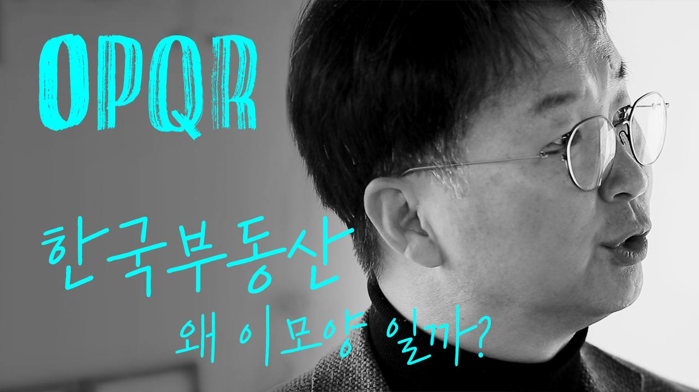
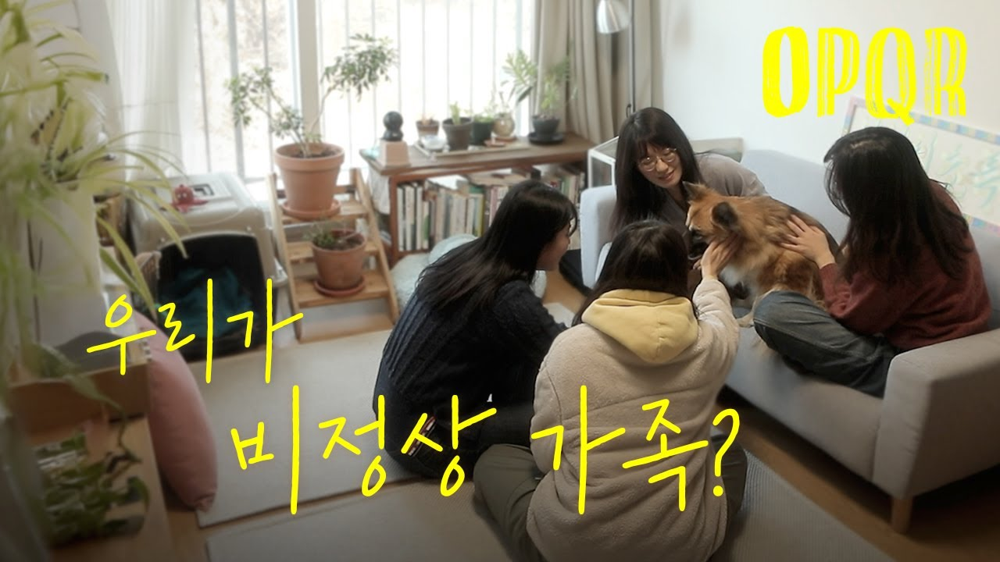
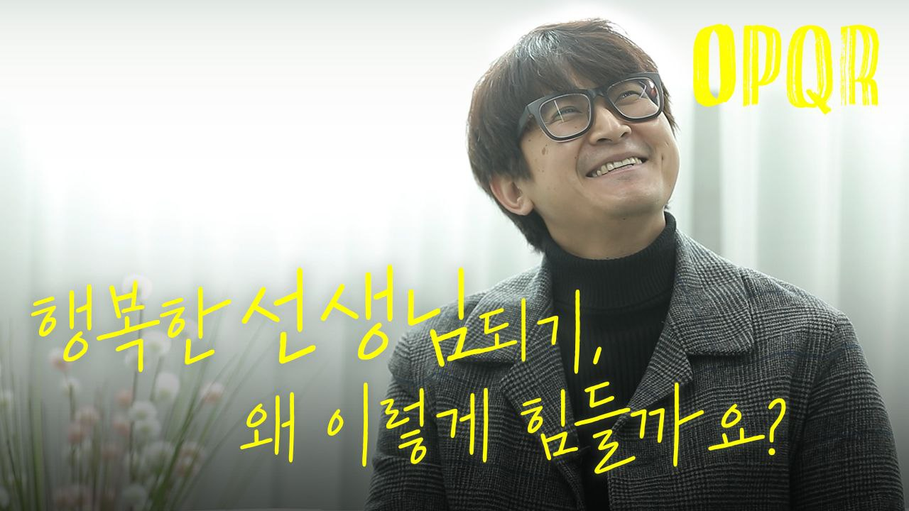
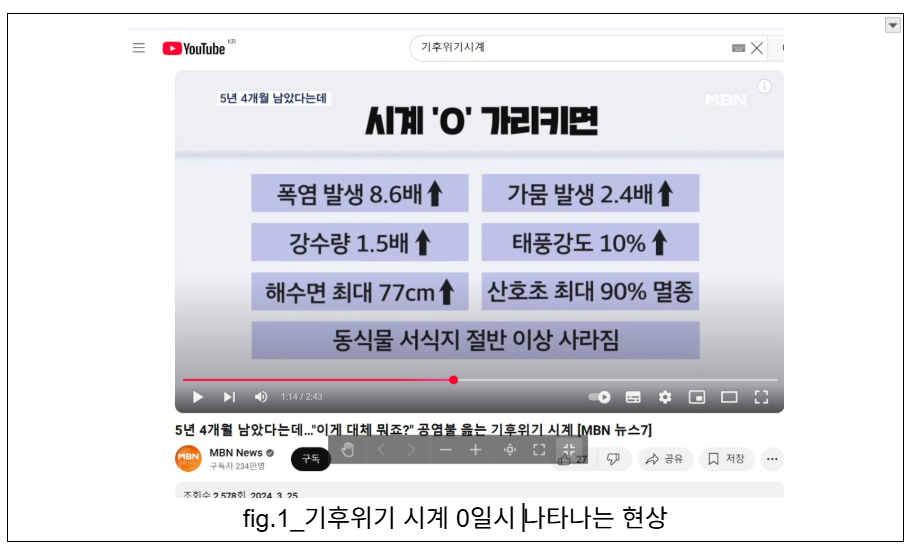

## 문서번호: 6101

### 제목: [부동산 투기가 언제부터 필수 재테크가 되었나요? 오징어게임에 빠져버린 한국 부동산, 이 게임을 끝낼수는 없나요?](https://q4all.kr/redirect/detail/ad24cf9d-7bd1-455a-9182-48afdf288668)

**작성자:** 오피큐알OPQR - 남기업
**작성일:** 2025-03-27 16:50:29 (목요일)

---

**부동산 투기가 언제부터 필수 재테크가 되었나요? 오징어게임에 빠져버린 한국 부동산, 이 게임을 끝낼수는 없나요?**

부동산과 그 기초개념인 토지권의 공공성에 대해 연구하는 남기업 소장은 부동산 불로소득이 사회 전체의 부를 증가시키지 못할 뿐만 아니라, 오히려 소득 불균형을 심화시키고 있다고 지적합니다. 특히 강남 개발과 외환 위기 이후 주택 담보 대출 증가가 투기를 조장하고, '갭투자'와 같은 방식으로 다주택자들이 이익을 얻는 구조를 비판적으로 바라봅니다.

부동산 시장을 오징어 게임에 비유하며, 누군가의 희생을 담보로 한 시장 구조에서 부동산 문제 해결 없이는 한국 사회의 미래가 불투명하므로 기성세대의 반성과 함께 사회적 합의를 통한 근본적인 해결책 마련을 제안하고 있습니다.

**1. 🏡 부동산 투기의 본질과 사회적 영향**

토지는 개인의 삶에 꼭 필요한 재화로 토지 위에 지어진 건물의 가치는 시간이 지남에 따라 하락하는 반면, 토지의 가치는 위치에 따라 상승합니다. 한국사회에서 부동산에 대한 수요가 증가하면서 소유자와 비소유자 간의 격차가 커지고, 이는 불평등을 야기하는 문제로 연결되고 있습니다. 부동산을 취득하는 과정에서 여러가지 노력이 필요하지만 GDP를 증가시키지는 못합니다. 특정 지역의 부동산 가격 상승이 개인의 노력과는 관계없이 국가 정책에 의해 이루어진 것이므로 이는 불로소득을 보아야한다고 그는 말합니다.

**2. 📉 부동산 투기의 영향과 불평등 심화**

부동산 가격이 올라가면 집이 없는 사람들은 손해를 보게 되며, 타인의 소득이 부동산 보유자에게 이전되는 현상이 발생합니다. 개인의 노력이 아닌 소득 격차가 발생하면서 사람들이 느끼는 불평등이 심화되고, 이는 열심히 일하고자 하는 의욕을 저하시키기도 합니다. 소득 대비 집값(PIR)이 수도권에서 17배에 달한다는 것은 내 집 마련하기 위해 17년을 오로지 저축만 해야 하는 상황을 의미합니다. 한국의 토지 소유 지니(불평등) 계수는 면적 기준 0.916으로, 이는 약 10% 미만의 사람들이 90%의 재산을 소유하고 있는 불평등한 상황을 보여줍니다. 현재의 토지 불평등 지표는 해방 직후(0.73)보다 더 심각한 상태로 과거의 지주 소작 관계보다도 더 나쁜 상황입니다.

**3. 📈 외환 위기 이후의 개인 대출 증가와 재테크의 변화**

외환 위기이후, 한국의 금융 제도가 변화하며 개인 대출, 특히 주택 담보 대출이 크게 증가하기 시작했습니다. 이 시점부터 재테크와 투자라는 용어가 등장하며, 투기가 투자라는 용어로 변화하게 되었습니다. 사람들이 대출을 통해 집을 사는 것이 당연시되었고, 개인이 상황에 맞추어 최대의 이익을 추구하는 성향이 강해졌습니다. 갭투기라는 개념은 전세 대출증가로 매매가와 전세가의 차이가 줄어듦에 따라 만들어졌으며, 매매가와 전세가 간의 차이를 이용하여 집을 구매하는 방식이 확산되었습니다. 이러한 개인의 욕망이 가격 상승을 야기하지만, 정부는 개인의 경제행위가 사회 전체에게도 유익할 수 있도록 제도를 마련해야 합니다.

**4. 🏠 부동산 보유와 정치권의 관계**

부동산을 과다하게 보유하고 있는 사람들이 정치권으로 많이 진출하고 있습니다. 언론사들도 많은 부동산을 소유하고 있으며, 예를 들어, 조선일보 사주일가의 부동산 시가는 2조원을 넘는다고 합니다. 건설사는 언론에 영향을 미치며, 집값 상승을 통한 분양 시장의 활성화가 그들에게 이익이 되므로 가격 상승을 지속하기 위한 정책을 취하고 있습니다. 금융권 또한 담보 대출의 이자 등으로 수익을 내기 위해 가격 상승을 바랍니다. 대한민국 정부 역시 부동산 개발을 경기 부양 수단으로 활용해왔습니다.

**5. 🏡 전세 자금 대출과 부동산 투기**

전세 자금 대출은 변형된 부동산 경기 부양책의 일환으로, 주로 다주택자들에게 무이자로 대출이 이루어지며, 이자 비용은 세입자가 부담하게 됩니다.

2008년 이명박 정부에서 전세 자금 대출이 시작되었으며, 그 이후 대출 한도가 1억 원에서 5억 원까지 증가해 전세 가격도 오르게 되었습니다. 이런 경향은 갭투기라는 새로운 투자 방식의 출현으로 이어져, 다주택자들의 수가 증가하게 만들었습니다. 기성 세대는 부동산으로 부를 축적해왔으나 이것이 우리 사회 전체에 미친 부정적 영향에 대해서는 반성할 필요가 있습니다. 젊은 세대가 같은 방식으로 부를 축적하고자 한다면 상황은 더욱 악화될 것으로 보입니다. 전세계가 자산 버블로 골머리를 앓고 있는 가운데 오징어 게임과도 같은 한국의 부동산 상황을 중단하기 위해서는 모두의 합의가 필요합니다.

**더 많은 질문이 보고싶다면?!**[**▶ 유튜브 오피큐알OPQR 채널 바로가기**](https://www.youtube.com/@%EC%98%A4%ED%94%BC%ED%81%90%EC%95%8Copqr)

---

## 문서번호: 6102

### 제목: [농어민들의 문제들 중 핵심 중 하나는 결국 부채입니다.해결책으로 최소한 김대중 대통령의 해법 정도는 되어야 하지 않을까요?](https://q4all.kr/redirect/detail/796d40fa-3520-46b6-9ecd-f6f1cf02658a)

**작성자:** [도완영](https://q4all.kr/user/profile/892)
**작성일:** 2025-03-27 17:02:19 (목요일)

---

현재 현실의 농어촌의 주력은 60대 입니다.

60대 청년 회장 이야기가 그냥 나온 이야기가 아닙니다.

그 60대들이 농업 경영이 어려워져 논 팔고 빚 청산 하고 농사에 손떼려는 원인 중 하나는 결국 부채입니다.

대략 3억이라는 귀농 자금 대출로도 적절한 규모와 가성비 있는 농지 구매도 쉽지 않은 현실에서 억대 대출로 시작해서 경력 농부도 쉽지 많은 않은 한해도 실패하지 않고 단 한해도 농사 실패가 용납되지 않고 그래서 3년후 부터 상환을 시작해야 하고 대출 전액 상환때까지 성공만 해야하는 귀농 청년들도 그리고 대개 농지부터해서 각종 담보가 잡힌 상태인 60대 청년회장들도

결국 규모화 하지 않으면 뒤쳐져 수익을 낼수 없는 현실-비싼농지,각종 시설비,해마다 오르는 자재비,농기계 구매비,농번기에 필수인 인건비(요즘 농촌 인건비 정말 비쌉니다.아마 농촌마다 다를텐데 도시 인건비보다 휠씬 비쌉니다.또 외국인 계절 노동자 비용도 농가에는 정말 부담됩니다) 그리고 요즘 새로 해야 한다는 또 억대 규모인 스마트 영농 시설까지 수익은 제자리거나 논 갈아 엎어야 하는 상황에서 대폭 적자가 나는데 지출은 감당이 안되니 이 모든게 다 부채로 돌아옵니다. 그래서 농민은 줄어드는데 비해 부채규모는 훨씬 늘어나고 있는 상황입니다.

그래서 자식들에게 부채를 물려주지 않기 위해 적절한 빚잔치 시점을 고려하는 분들이 또 해마다 논갈아엎는 60대 청년회장 세대입니다.

작년부터 기후 재앙은 60대라는 그 많은 경험도 넘어서 와서 농사 실패라는 현실이 눈앞에 닥쳐오기 시작했습니다.

그래서 식량 안보 위기가 국가적으로 사회적으로 닥쳐온 상황이기도 하지만 농어민들에겐 버티기 힘든 부채의 늪도 똑 같이 닥쳐온 상황입니다.

이 현실은 아마 어민들도 별 다르지 않으리라 생각합니다.

우리는 기후 재앙이 가시화 된 상황에서 농사를 지울수 있는 분들이

농사를 계속 지을수 있게 만들어 내는 것이 중요한데 그런 면에서

2가지를 개선해야 합니다.

한가지는 저 농어가부채 해결로 김대중 대통령때의 농가부채 이자 탕감 정책이나 미국의 인플레이션 감축법상 채무면제 조치 같은 것이 필요합니다.미국이 농가부채 해결에 4조가 넘는 재정 투입을 하고 그 중 절반을 직접 부채 탕감에 쓰는 그런 더 과감한 정책을 쓸수 밖에 없는 것이 눈 앞의 현실입니다.

어느 나라든 농촌 현실상 좀 더 과감한 정책을 써야했다는 후기들이 있는 상황이기도 합니다.

나머지 한가지는 농업경영체의 경영자에만 그나마 있는 혜택이라도 돌아가는 전제를 바꿔야 합니다.

대개 가족들이 경영주 아래에 여성이나 고령 노인 등이 있는데

그분들이 노인들도 70중반 까지 농사를 짓고 특히 농업 경영체 아래

여성들 같은 경우 그나마 있는 농민이 가지는 지원도 제대로 받지 못하고 있습니다.

1명의 농업인력의 가치가 중요해진 이때 경영체라는 구조하에 지원을

하는 농업노동의욕을 고취 시키지 못하고 꺽는 현재의 방식은 옳지 않다고 생각합니다.

p.s 대형 산불로 고생 중인데 그 지역들이 우리 나라 전체 과수 생산의 상당수가 그 지역들에서 나옵니다.이 재앙도 재앙이지만 그 분들에게 그저 세금 납부 유예에 대출 상환 연기,신규 대출 소개 정도의 대책만 나온다면 그냥 농사 포기하실분들이 한둘이 아닐겁니다.

이제 당분간 우리는 싼 과일을 힘들어졌습니다.

그런데 이 현실을 핑게로 수입과일 규모를 늘이거나 신규 수입 허가를

내준다면 국내 과일 농사 지을 농부들에게 절대로 과일 농사 짓지 말라는 신호가 될겁니다.

산불 지역 농산물들 사과 등 과일 이외 의성 마늘도 있고 양파도 있고 영양 고추도 있습니다.

1명의 농어부가 소중해진 현실에서 그저 눈앞에 과일값 비싸다고 그렇게 해야 할까요?

---

## 문서번호: 6103

### 제목: [강력한 처벌과 재산 몰수를 통해 정의를 실현해야 합니다.](https://q4all.kr/redirect/detail/20a3ac30-2c6b-445c-a1b5-a71c8f3728aa)

**작성자:** [이원홍](https://q4all.kr/user/profile/7177)
**작성일:** 2025-03-27 17:15:17 (목요일)

---

### 

대한민국은 자유민주주의와 법치주의를 근간으로 하는 국가다.

그러나 이를 부정하고 헌정을 유린한 내란범들은 단순한 형사처벌을 넘어, 부당하게 축적한 재산 또한 국가를 위해 환수되어야 한다.

형법상 ‘내란의 죄’는 국정을 문란하게 한 중대한 범죄로, 사형 또는 무기징역에 처할 수 있다. 또한, 테러방지법에서도 내란 행위는 국가를 위협하는 테러로 규정되며 강력한 대응이 요구된다.

그러나 신체의 자유를 박탈하는 처벌만으로는 부족하다. 내란범들이 불법적으로 형성한 재산이 유지된다면, 이는 정의가 아니라 불공정의 방조에 불과하다.

특별법을 제정하여 내란범의 전 재산을 몰수하고 이를 국가의 안정을 위해 활용해야 한다.

대한민국 헌법 제23조는 재산권을 보장하지만, 공공복리를 위한 제한도 가능하다. 국가를 배신한 자들의 재산은 국민 전체를 위해 사용되어야 한다.

내란범에 대한 강력한 처벌과 재산 몰수를 통해 법치주의를 확립하고, 대한민국이 정의가 살아 있는 나라임을 증명해야 한다.

형법상 '내란의 죄' 관련 주요 조항:

* 제87조(내란): 대한민국 영토의 전부 또는 일부에서 국가권력을 배제하거나 국헌을 문란할 목적으로 폭동을 일으킨 자는 그 행위의 정도에 따라 처벌됩니다.​
* 제88조(내란목적의 살인): 내란의 목적을 가지고 사람을 살해한 자는 사형, 무기징역 또는 무기금고에 처합니다.​
* 제89조(미수범): 제87조와 제88조의 미수범도 처벌됩니다.​
* 제90조(예비, 음모, 선동, 선전): 내란을 예비하거나 음모한 자는 3년 이상의 유기징역이나 유기금고에 처하며, 선동 또는 선전한 자도 같은 형에 처합니다.​
* 제91조(국헌문란의 정의): '국헌을 문란할 목적'은 헌법 또는 법률에 정한 절차에 의하지 않고 그 기능을 소멸시키거나, 헌법에 의해 설치된 국가기관을 강압으로 전복하거나 그 권능 행사를 불가능하게 하는 것을 의미합니다.​

'국민보호와 공공안전을 위한 테러방지법' 제2조(정의) 중 일부:

* 제2조 제1호: '테러'란 국가 또는 지방자치단체의 권한 행사를 방해하거나 의무 없는 일을 하게 할 목적 또는 공중을 협박할 목적으로 하는 행위를 말하며, 그 행위에는 '형법' 제87조부터 제91조까지의 '내란의 죄'에 해당하는 행위 등이 포함됩니다.

---

## 문서번호: 6104

### 제목: [공무직 고용방식의 변화가 청년들에게 기회를](https://q4all.kr/redirect/detail/96847b64-186b-4c05-858e-0cf1df2bbdca)

**작성자:** [이원홍](https://q4all.kr/user/profile/7177)
**작성일:** 2025-03-27 17:34:57 (목요일)

---

현재 대한민국의 공직 채용 방식은 필기시험 중심으로 운영되고 있으며, 이로 인해 실무 역량을 평가하는 데 한계를 보이고 있습니다.

특히 경찰·소방과 같이 현장에서 즉각적인 대응 능력이 필요한 직군에서는 필기시험보다 실제 업무 수행 능력과 체력적 조건을 평가하는 방식이 더욱 중요합니다.

이에 저는 공무직 교육기관을 설립하여 체력적 기준을 통과한 지원자들에게 실무 교육을 제공한 후 지역별로 배정하는 채용 방식을 제안드립니다.

주요 개선 방향

1. 공무직 교육기관 설립 및 실무 중심 교육 강화

* 체력 검정 통과자를 대상으로 공무직 교육기관에서 일정 기간 실무 교육을 실시한 후 공직에 배치하는 방식으로 개편합니다.
* 경찰·소방 등 실무 중심의 직군뿐만 아니라, 행정직 공무원도 실무 교육을 거쳐 실제 행정 업무에 적합한 인재를 양성할 수 있습니다.

1. 지역 균형 발전 및 인력 배치 효율화

* 교육기관을 지역별로 운영하고, 수료 후 해당 지역 내에서 근무하도록 배치함으로써 지역 인구 유출을 방지하고 지역 경제를 활성화할 수 있습니다.
* 기존의 중앙집중식 채용이 아닌, 지역 수요에 맞춘 인력 배치로 효율성을 높일 수 있습니다.

1. 급여 체계 개편 (호봉제 개혁)

* 기존의 연차별 호봉 상승 방식에서 벗어나 최저 기준 급여를 설정하고, 3년 단위 또는 최저 급여의 일정 % 인상 방식으로 개편하는 방안을 검토해야 합니다.
* 이를 통해 불합리한 연공서열식 급여 체계를 개선하고, 공직자들의 업무 성과 및 전문성을 반영하는 급여 체계를 구축할 수 있습니다.

법 개정 필요성

현재의 「공무원임용시험령」 및 공무원 보수 관련 법률에서는 필기시험을 중심으로 한 채용 방식과 연차별 호봉 상승 체계를 유지하고 있습니다. 이를 개혁하기 위해서는 관련 법령의 개정이 필수적입니다.

국가와 지역 사회의 균형 발전을 위한 공무직 교육기관 설립과 공직 채용 개혁 방안을 적극 검토해 주실 것을 요청드립니다. 보다 실효성 있는 정책이 마련될 수 있도록 국회의원 여러분의 관심과 지원을 부탁드립니다.

---

## 문서번호: 6105

### 제목: [언제까지 정상가족 타령만 할 거예요? 같이 밥먹고, 위안이 되어주는 관계 이게 가족이 아니면 뭔가요?](https://q4all.kr/redirect/detail/6ad4fa1b-8c0f-4297-b334-09bffa060e1d)

**작성자:** 오피큐알OPQR - 김주온
**작성일:** 2025-03-27 18:03:22 (목요일)

---

**언제까지 정상가족 타령만 할 거예요? 같이 밥먹고, 위안이 되어주는 관계 이게 가족이 아니면 뭔가요?**

주온씨는 다양한 가족 형태에 대한 사회적 인식을 제고하고, 혈연이나 혼인 관계가 아닌 돌봄과 위로를 주고받는 관계 또한 가족으로 인정해야 한다고 제안합니다.

10년째 친구들과 동거 중인 주온씨는, 기존의 '정상 가족'이라는 틀에서 벗어나 함께 밥을 먹고 서로에게 위안이 되어주는 관계 역시 진정한 가족이 될 수 있다고 소개합니다.

더 포용적인 사회를 위해, 생활동반자법과 같이 다양한 가족 구성이 법적 보호나 주거 정책 등에서 겪는 차별을 막기 위한 제도적 변화를 요청합니다.

**1. 🏠 새로운 가족의 구성**

주온씨는 자신과 같이 대학 입학 후 지방에서 상경한 친구들과 함께 보증금을 마련해 동거하면서 서울생활을 시작했습니다. 각자의 필요로 모인 세 명의 친구들과 함께 주거지를 마련하였고, 이후 동생이 합류하여 총 네 명이 함께 생활하게 되었습니다. 이들은 함께 월세도 절약하고 함께 요리도 해 먹으며 가족과도 같은 안정적인 생활을 해나가고 있습니다.

**2. 🤔 가족의 정의와 현대적 관계**

한국사회에서 가족의 의미가 협소하게 정의되고 있지만, 결혼이나 혈연 관계가 아니더라도 실제로 같이 돌보고 매일 시간을 같이 보내는 사람들도 가족으로 인정받아야 한다는 주장이 있습니다. 이미 1인 가구의 급증, 비혼여성, 혈연/결혼으로 이루어진 관계 밖에서 아이를 키우는 등의 다양한 가족 형태가 존재하고 있습니다. 이러한 다양한 삶의 방식은 대개 "비정상" 또는 "특이한" 가족으로 간주되기도 하지만, 실제로는 그들의 일상은 여느 가족과 같이 행복한 순간으로 이루어져 있습니다.

**3. 🏠 가족 회의와 관계의 중요성**

다양한 이들이 모여 사는 주온씨의 집에서 가족회의는 중요한 일정입니다. 이를 통해 공동 생활비와 강아지 관리 등의 문제를 상의합니다. 10년의 동거 기간 동안 가족회의로 각자의 삶의 어려움과 즐거움을 나누는 대화는 가족 생활을 지탱하는 큰 역할을 해왔습니다. 이렇게 함께 생활하며 서로 아프고 힘든 시기에 곁에 있어주는 것이 큰 힘이 되었고 또다른 모습의 가족이 존재하는 의미를 찾을 수 있었습니다. 코로나19와 같이 고립되고 단절되는 위 상황에서 비록 혈연관계는 아닐지라도 곁에서 기대고 의지할 수 있는 사람들이 가족임을 느끼면서 정서적 지지의 중요성을 깨닫기도 했습니다.

**4. 🏠 다양한 가족 형태와 제도적 필요성**

주온씨는 한국 사회에서 전통적인 가족 형태와는 다른 가족의 모습으로 살아가면서 법적인 보호에 대한 문제를 인식하게 되었습니다. 응급실에 가는 위급 상황에서 가족과 같은 법적 보호자가 없다는 점에서, 현행 제도에 한계가 있다고 느꼈습니다. 동거인이 법적으로 가족과 동등한 권리를 받을 수 있도록 하는 생활동반자법과 같은 제도가 필요한 이유입니다. 생활동반자법은 혈연이나 혼인 외의 방법으로 구성된 성인 두명의 관계를 법적으로 인정하고 사회복지혜택과 같은 권리를 보장하는 법안입니다. 이러한 법안을 통해 개인이 보다 다양한 삶을 선택하고 새로운 공동체가 차별 없이 인정받을 수 있을 것입니다.

**5. 🏠 가족의 새로운 정의**

변화된 사회상에서 가족의 의미는 민법상으로 정의된 획일적인 것이 아니라, 일상을 함께 하면서 서로를 돌보는 관계로 이해되어야 할 것입니다. 돌봄의 관계는 양방향으로 존재하며, 주온씨의 사례와 같이 존재만으로도 서로를 돌보는 역할을 할 수 있습니다. 새로운 가족이 되어가는 과정은 서툴더라도 함께 생활하면서 서로를 돌보는 역량을 개발하는 것입니다. 따라서 가족은 고정된 개념이 아니며, 사회가 인정할 수 있는 많은 형태의 관계가 가족으로 인정받을 필요가 있습니다.

**더 많은 질문이 보고싶다면?!**[**▶ 유튜브 오피큐알OPQR 채널 바로가기**](https://www.youtube.com/@%EC%98%A4%ED%94%BC%ED%81%90%EC%95%8Copqr)

---

## 문서번호: 6106

### 제목: [미래 병원의 형태는 어떻게 변할까요?](https://q4all.kr/redirect/detail/dab606f8-b490-4bf8-b693-a433aaa9824b)

**작성자:** [최영균](https://q4all.kr/user/profile/8811)
**작성일:** 2025-03-27 19:23:05 (목요일)

---

유현준 건축가는 학교와 감옥이 같은 디자인을 가지고 있다는 통찰을 제기한 바 있습니다.

제가 보기에는 병원도 마찬가지로 보입니다.

근대 병원의 형태가 잡힌 이후로, 첨단기술들이 들어오기는 했지만 큰 틀은 변하지 않았습니다. 앞으로 이런 병원의 형태가 지속될 수 있을까요?

# 병원에 공간이 더 필요합니다.

현대시대에 운송수단등이 발전했습니다. 이는 원거리 이동을 가능하게 했습니다. 그리고 최근 도시마다 보급된 전동퀵보드나, 전동 자전거는 이동을 훨씬 편하게 합니다.

이는 공간을 더욱 넓게 쓸 수 있게 하는 방법입니다.

이런 공간활용방법이 병원에도 도입되어야 합니다. 거동이 불편한 환자의 보호자가 되어보면 알겠지만 간병을 하다보면 공간이 매우 협소하고, 한정된 공간에 인구밀도가 높다는것을 체감합니다. 환자 침상이 다닥다닥 붙어있는 지금 형태는 향후에 감염관리 측면에서나 환자와 간병인의 삶의 질 측면에서나, 그 외 위생적인 측면에서도 좋지 않게 작용할 것입니다. 인구밀도가 높으면 당연히 찾아오는 결과입니다. 이를 개선해야 합니다.

# 침대에 환자가 누워있고, 의사와 간호사가 케어하고 하는 형태는 바뀔것입니다. 적어도 중환자실에서는요

중증 환자를 어떻게 치료할 것이냐, 즉 어떤 환경이 환자에게 육체적으로 최적의 환경을 제공한 것인가에 대한 고민이 필요합니다.

중증환자가 침대에 장기간 누워있게 되면 압력손상에 의한 욕창이 빈발합니다. 중증환자는 central line 등 굵은 정맥주사나 배액관 등의 피부를 경유한 장치들이 많이 설치되어 있어 그에 대한 감염도 많이 생깁니다. 우리가 흔히 원내감염이라고 부르는 병원내 감염은 주로 이렇게 발생합니다.

영화나 소설에서 나와있는 형태들을 간단히 보고 넘길것이 아닙니다. 스탠리 큐브릭 감독의 1960년대 영화 '2001 스페이스 오디세이'에는 아이패드의 프로토타입 처럼 생각할수도 있는 형태의 타블렛이 등장합니다.

영화 엘리시움, 블랙팬서, 마이너리티 리포트, 매트릭스, 에일리언 등에 나오는 미래의 중증환자 치료형태를 고민해봐야합니다.

최적조합의 세포외액을 만들어 거기에 환자의 육체를 거치시키는, 암울한 미래를 그린 매트릭스의 인간관리시설의 형태는 고려할만 합니다. 적어도 압력손상에 의한 욕창은 생기지 않을 것이고, 원내 감염의 아웃브레이크 상황은 막을 수 있습니다. 여기에 환자의 상태를 모니터할수 있는 최적을 조합을 찾아낸다면 이는 향후 전체 의료판도를 바꿀 수 있습니다.

향후의 미래 병원의 형태가 어떻게 바뀔것인지 고민을 시작할 때입니다.

---

## 문서번호: 6107

### 제목: [법원 판결문은 모두 API 형태로 정보 공개가 되어야 하는 것이 아닐까요?](https://q4all.kr/redirect/detail/adc5425a-db62-439e-8674-b8869bbc09f3)

**작성자:** [안영회](https://q4all.kr/user/profile/9316)
**작성일:** 2025-03-27 21:34:07 (목요일)

---

아래 첨부하는 [[공적자산의 사유화](https://www.facebook.com/hyewon.jin.1238/posts/pfbid02Jh8Gkx8CqmBFkLQD9yn1NAxtm5372JXafbtk9MuW3zS6jo4gJYX84bSGAFkzo6j6l)] 라는 글은 검사님으로 추정되는 페이스북 친구의 글입니다.

그에 따르면 최근까지 공개 되었던 정보가

> 최근까지도 판례나 헌법재판소 결정례는 대법원 홈페이지, 헌법재판소 홈페이지에서 무료로 검색 가능했습니다.

유료 서비스의 등장을 계기로 공개 범위가 줄어든 것이 아닌가 의심이 됩니다.

> 그런데, 최근'엘박스', '케이스노트'라는 회사가, 일반 납세자들에게는 공개되지 않는 고급 판례들을 별도로 제공받아 고객들에게 유료로 제공하는 일을 하기 시작했습니다.

편리한 부가 서비스를 제공할 수는 있어야 한다고 봅니다.

다만, 그 과정에서 정보 공개를 막는다거나

특정 이익집단만 공적 정보를 이용하는 방법을 옳지 않습니다.

그러니 미려한 UI 제공을 정부가 하지 않더라도

API 형태로 정적 데이터는 제공하는 방식이 옳다고 생각합니다.

요즘 헌법 재판소나 지귀연 판사를 보면서

사법부의 문화적 지체가 심각하다고 여겨지는데

이러한 정보 공개가 사법 개혁에도 분명 도움이 되리라 봅니다.

===

[공적자산의 사유화]

어떤 사람이 회사에 취직해서 월급을 받고 회사에서 제공한 자원으로 연구나 일을 한 뒤 창작된 지적 재산의 소유권은 회사에 귀속되기 때문에 개발정보를 다른 업체에 빼돌려 돈을 받은 사람은 배임수재죄로 처벌하는 것이 우리 나라의 확립된 판례였습니다.

우리나라는 판사, 검사, 대법관, 헌법재판관들이 공무원이고, 시민들의 세금으로 지급한 급여로 월급을 받기 때문에 재판이나 결정 결과는 공적 자산입니다.

그래서, 최근까지도 판례나 헌법재판소 결정례는 대법원 홈페이지, 헌법재판소 홈페이지에서 무료로 검색 가능했습니다.

그런데, 최근'엘박스', '케이스노트'라는 회사가, 일반 납세자들에게는 공개되지 않는 고급 판례들을 별도로 제공받아 고객들에게 유료로 제공하는 일을 하기 시작했습니다.

법원이 이렇게 국민들로부터 세금으로 급여를 받아 생산한 저작물을 유료로 팔고, 더 고가를 받기 위해 무료로 제공되는 중요 정보의 범위를 파격적으로 줄이는 것을 국가가 방치해도 되는지 모르겠네요.

국회는 이런 행태를 감사하고, 이러한 계약(특정 회사에 국민 전체에게 권리가 있는 법리 정보를 고가로 팔아넘기고, 국민에게 무료로 제공되는 중요 정보의 범위를 줄이는 계약)의 이면에 공무원과 그 가족들이 이해관계자로 참여하고 있는 것은 아닌지 감독해야 하는 것 아닐까요?

---

## 문서번호: 6108

### 제목: [배달플랫폼의 시장 독과점에 대한, 정부 또는 입법 차원의 수수료율 규제를 생각해야 할 때입니다. ](https://q4all.kr/redirect/detail/110fb58e-36de-4a13-bcfb-f7ab81a0b22c)

**작성자:** [임정훈](https://q4all.kr/user/profile/8961)
**작성일:** 2025-03-27 22:53:05 (목요일)

---

시장에서의 독과점은 불가분하게 부작용을 초래합니다.

전 국민의 음식주문 건수와 금액의 규모, 일상생활과의 밀접도, 밥상 물가 등을 생각하면, 배달플랫폼에도 신용카드사와 같은 수수료율 규제가 필요하다고 생각합니다.

음식점을 운영하는 저의 입장에서 독과점 배달플랫폼들의 횡포는 다음과 같습니다.

배달플랫폼은 최근,

* **‘무료배달’이라는 현란한 광고로 소비자들을 유인하여,**
* **고정 구독고객과 구독료를 확보하고,**
* **이를 무기 삼아, 기존의 과금제도인 정액제를 일방적으로 폐지하고,**
* **소비자와 음식업소 사이의 중계료에 해당하는, 과도한 수수료율제를 강요합니다.**

무료배달은 얼핏 배달플랫폼이 소비자에게 제공하는 큰 혜택 같아 보이지만, 배달플랫폼사의 이윤만 극대화 시킬 뿐,

한시적인 효과는 시간이 지나면 결국 음식가격 인상과 밥상물가 상승이라는 부작용으로 나타납니다.

이러한 과정이 어떻게 전국민의 부담을 가중시키고 있고, 우리 사회에 악영향을 끼치는 지, 실상을 알리고, 규제의 필요성을 묻고자 합니다.

**1. 무료배달의 허상 (세상에 공짜는 없다, 공짜 배달도 없다)**

지금의 무료배달 비용의 약 90%는, 판매대금 정산 시에 자영업자가 부담하고 있습니다.

과거에는 배달비를 음식점과 고객이 서로 합리적인 비율로 나누었고, 이 비율은 시장에서 완전경쟁 하는 업소들이, 소비자들에게 선택을 받는 것으로 최적점을 찾아갈 수 있었습니다.

이렇게 최적화된 배달비는 음식값에 합당하게 반영되었고, 그렇지 않은 음식점은 시장에서 고전 또는 퇴출되는 ‘보이지 않는 손’이 작동하고 있었습니다.

그러나 지금은 배달플랫폼에 의해, 업주가 약 90%의 배달비용을 일방적으로 부담하고 있습니다. 이 부담액이 음식값에 반영되는 것은 시간 문제일 뿐입니다.

자영업의 여건 상, 즉각적인 반영이 어려울 뿐, 업주들이 순차적으로 가격인상을 모두 하게 되는 시점에서, 부담은 소비자에게 다시 전가되고 맙니다.

이 때, 배달플랫폼은 인상된 음식가격에서 수수료를 취하므로, 또 다시 쉽게 수익을 늘려 나갈 수 있게 됩니다.

잘 살펴보면 이 과정은, 시장경제에서 공급자와 소비자가 가격을 결정하는 당연한 권리를, 배달플랫폼이 교묘한 방법으로 비틀어서, 그들의 배만 불리는 심각한 시장 왜곡을 만들고 있습니다.

이 왜곡은 소비자와 자영업자가 배달플랫폼의 그물에 걸린 물고기 신세가 됐기 때문에 발생합니다.

무료배달이 당장은 소비자들에게 이익인 것 같지만 ‘세상에 공짜가 없듯’ 자영업자들의 일방적 부담으로 이루어지는 무료배달 혜택은 오래갈 수 없습니다.

배달플랫폼만 배불리고, 밥상물가 상승의 부담은, 국민인 소비자와 자영업자가 고스란히 나누어 지는 구조입니다. 이건 시장경제의 올바른 질서가 아니라고 생각합니다.

**2. 중계료 명목의 수수료 횡포 (부가가치는 누구에 의해 창출되나?)**

월 정액제 요금으로 시작한 과금방법이, 지난해부터 배달플랫폼의 일방적 횡포로 과도한 수수료제(6.8~9.8%)로 급격하게 변했습니다.

(배달의민족 기준: 1차 24년 9월, 2차 25년 3월)

음식점과의 상생으로 새로운 시장을 개척해보자고 시작했던 초기의 정액제 과금제도를, 갖가지 방법으로 축소, 약화 시키더니, 결국은 폐지했습니다.

자영업자들은 그간 정액제에 맞추어 음식값을 책정하고 가게를 운영해 왔습니다.

그러나 지금은 고학력자도 이해하기 힘든 난해한 공지사항을 일방적으로 받아 들고, 선택의 여지없는 과도한 수수료율제에 의해 골병 들어가고 있습니다.

시간의 문제일 뿐, 어쩔 수 없이 음식가격을 인상할 수밖에 없는 구조입니다. 배달플랫폼사들은 인상되는 음식가격에서, 또 높은 수수료율로 수익을 취하겠지요.

위에서도 언급한 바와 같이, 배달플랫폼들은 ‘무료배달’이란 가식적 명분으로 구독소비자와 고정수입을 크게 늘렸습니다.

그리고 이를 무기 삼아, 자영업의 생계가 달린 과금제도의 기준 틀을, 자신들의 이윤극대화 방향으로만 마음대로 변경했습니다.

대부분 음식업소의 영업이익율이 5~9% 수준에 머무는 현실에서, 7.8%의 수수료율과 별도의 배달비 부담은, 자영업자들의 생계를 위협하는 수준입니다.

부가가치의 주된 부분이 자영업자들의 손에서 만들어지는 데, 그에 대한 수익은 배달플랫폼사가 과도하게 가져가는 불합리한 수수료율이라고 판단합니다.

노동으로 부가가치를 창출하는 자영업자와, 중계역 수행의 배달플랫폼 사이에서, 지금은 배달플랫폼의 일방적 갑질로 과도한 수수료율이 정해지고 있습니다.

정부 또는 입법 기관은 문제 해결의 당사자로 나서야 한다고 생각합니다.

**3. 늑대의 자유는 양들에게 죽음이다 (규제의 필요성)**

제한된 인력으로, 생업에 쫓기며, 장시간 노동을 해야 하는 자영업자들이, 배달플랫폼을 상대로 교섭력을 발휘한다는 것은 불가능한 일입니다.

배달플랫폼은 대규모 자본 및 우수한 조직과 인력으로 무장하고, 소비자와 자영업자들이 제공하는 빅데이터를 보유하고 있습니다.

조직화될 수 없는 자영업자들은 처음부터 그들에게는 협상의 대상이 아닙니다.

자신들의 전년도 실적을 초과달성 하기 위한, 수익 창출의 대상으로만 보는 것 같습니다.

돌이켜 보면, 지금까지 배달플랫폼사들이 행해온 크고 작은 정책과 대응들의 맥락이 늘 그랬던 것 같습니다.

확장일로의 성장기에 있던 배달음식 시장은, 초기 개척기와 코로나 특수로 인한 고속성장기가 끝나자, 자연스럽게 저성장 성숙기 단계로 진입했습니다.

이에 계속적인 고성장을 욕심내는 배달플랫폼이 탐욕스럽게 꺼내든 카드가 ‘무료배달’이고 또, 높은 수수료율의 과금제도입니다.

사정이 이렇다면, 현재의 배달음식시장이 소비자, 자영업자, 배달플랫폼사의 3주체가 공생할 수 있는 공정한 시장이라고 할 수 있을까요?

아니면 그들의 그물에 걸린 자영업자들과 소비자들의, 울며 겨자 먹기와 제살 깍기가 이루어지는,

그리고 독과점 배달플랫폼들만이 막대한 이익을 내고 있는 기울어진 운동장일까요?

많은‘양’들이 죽어 나가기 전에, ‘늑대’의 활동범위에 규제를 두어야 공동체가 함께 건강할 수 있다고 생각합니다.

국민의 많은 수가 자영업자인데, 이들의 경제활동이 공정한 시장에서 이루어져야, 이들이 쓰러지지 않고, 소비의 주체로서 우리경제의 동력으로 작용하지 않겠습니까?

지금의 배달플랫폼 수수료율(7.8%)은 많은 자영업자들의 삶을 위협하는 수준입니다.

또 그들을 한계상황으로 몰아 사회적 비용을 증가시키는 한편, 온 국민의 밥상물가 마저도 상승시켜, 사회적 부담을 가중시킵니다.

끝으로,

일전에‘배달플랫폼-입점업체 상생협의체’의 협의 결과로 시행된 [상생요금제]에 대해 말씀드리며, 글을 맺을까 합니다.

결론적으로 저의 가게에는 하나도 도움이 되지 않았습니다.

보는 순간 예상은 했지만, 수수료율을 9.8%에서 7.8%로 낮추는 대신,

배달비를 기존보다 높게 책정하여, 수수료 절감분을 모두 상쇄하고도 오히려 가게의 비용지출은 좀 더 늘었습니다.

기업의 생리 상, 법의 규제가 아니라면, 회사의 구성원 누구도 수익감소의 책임을 지고, 자영업자들에게 수익을 나누는 상생안을 만들 수는 없었을 것입니다.

당시의 국면 전환을 위해, 빅데이터를 이용한 시뮬레이션으로 만든 꼼수였다고 생각합니다.

지금 우리는, 경험해 보지못한 거대한 음식배달 온라인시장과, 그 시장을 몇몇 배달플랫폼이 독과점 하고 있는, 새로운 자본주의 네트워크경제를 경험하고 있습니다.

이런 큰 변화에서, 독과점 플랫폼의 역기능은 당장은 피할 수 없는 일일 수도 있겠지요. 가본 적 없는 길을 가고 있기에, 법과 제도의 공백기를 견뎌내야 하는 지도 모르겠습니다.

부디, 저의 질문이 사회적 논의를 거쳐, 납득할 수 있는 결론에 다다르길 바라며, 필요한 규제안이 마련되었으면 하는 바람입니다.

---

## 문서번호: 6109

### 제목: [산불과 지진, 태풍, 홍수 등 재난, 재해 대비. 모든 주택 화재보험 의무화 추진](https://q4all.kr/redirect/detail/9f6d5a21-a0b3-494a-b959-3f1320f111fa)

**작성자:** [신동호](https://q4all.kr/user/profile/8950)
**작성일:** 2025-03-27 22:54:14 (목요일)

---

산불 피해주민의 불탄 집을 왜 국가가 보상해 주어야할까요? 모든 주택, 아파트 대상 화재보험 의무화 합시다. 규모의 경제 가능합니다. 의성 산불 피해 주민이 울면서, 집이 탔는데 우짜노, 하면서 웁니다. 화재보험금이 있다면 국가 예산도 절약하고, 피해자도 자존심 지키면서 원상복구 가능합니다. 특별재난피해 보상금도 필요 없어지고, 국가 예산도 절약하고요. 국가는 순수하게 이재민 구호수준 예산만 집행하면 됩니다.

---

## 문서번호: 6110

### 제목: [서민들의 내 집 마련! 국민연금으로 해결해보면 어떨까요?!](https://q4all.kr/redirect/detail/688ac283-7771-444c-90c2-faf264a68737)

**작성자:** [이경준](https://q4all.kr/user/profile/998)
**작성일:** 2025-03-27 23:48:54 (목요일)

---

정확한 수치인지는 모르겠습니다.

현재 국민연금으로 마련된 돈이 1200조 라는데 맞나요?

그중에서 주식에 투자하는 금액이 800조가 넘는다는데

이것도 맞나요?

저는 다른 방식의 제안을 하면서 질문을 드릴까 합니다.

연금 운용의 관해 잘 모르기에 가능할지는 모르겠습니다.

그러나 주식으로 투자하는 금액이 저정도 규모라면,

주식투자가 아닌 공공주택을 짓는건 어떨까요?

국민이 모아놓은 연금으로 주택장사를 하는거냐?

이러시겠지만 저는 이것을 말씀드리고 싶습니다.

우리나라 주택보급률은 100% 가 넘습니다.

그의 반해 주택 자가보유율은 60% 정도라고 합니다.

수도권이나 서울은 50% 도 안된다고 하구요.

OECD 평균이 70~80% 라고 하는데 그렇다면 우리나라 서민들이 집이 없어 전월세를 살며 금융비용으로 소득의 일정 부분을 쓰고 있는게 현실이라는 얘기 아닐까요?

또한 개인적으로 건설사와 부동산 투기세력이 지금의 말도안되는 집값을 만들었다 생각합니다.

이 곳에서 서민들을 벗어나게 해줘야하지 않나 싶은 마음입니다.

그래서 공공주택을 지어 장기임대를 해주자는 겁니다.

시세보다 저렴한 조건으로 대신 지금의 이미지를 완전 뒤바꾸는 방식이어야만 한다 주장합니다.

임대아파트하면 떠오르는 인식을 갖지않게 말입니다.

그러면 국민연금이 회수가 안되는 것이 아니냐? 하겠지만

일정금액에 보증금을 받고 매월 납입하는 월세 개념

전세개념처럼 일정금액에 보증금을 넣고 년 이용료를 받는 등

여러가지 방법을 모색하고 의견 수렴을 하여 집을 마련하지 못해 어려운 서민들에게 안정적인 주택 공급을 해주는 것 입니다.

그렇게 일정부분 회수하고 일부는 고정수입으로 잡히는 구조.

저의 짧은 견해로 의견을 말하는거라 실현가능성이 얼마나 있는지는 모르겠습니다. 이런 의견은 어떠한가 정도로 봐주세요.

물론 터무니없는 생각일수도 있습니다. 또한 국가가 나서서 국민을 상대로 임대업을 하는것이냐 하는 의견이 있을수가 있겠지만 시장이 점점 양극화를 만드는 시점에서 정부가 이 문제를 해결하는 방법이지 않을까 합니다.

어차피 국민연금으로 주식투자를 한다는데 서민들을에게 안정적인 집을 제공하고 그로인해 삶의 질이 올라가서 국가경쟁력을 올린다면 이거야말로 투자를 제대로 하는게 아닐까요?

아마도 저보다 많는 지식과 경험을 가지고 계시는 전문가분들이 이런 생각을 이미 하셨을거라 생각합니다.

그런데 안 하시는건지 못 하시는건지 모르겠습니다만

저는 묻고 싶습니다.

" 보급률 100% 보유율 60% 그렇다면 나머지 40% 는 뭔가요? "

" 그 40%차이를 공공주택으로 지어주실 수 없을까요? "

---

## 문서번호: 6111

### 제목: [비대면 대출 사기 근절 방법이 있을까요?](https://q4all.kr/redirect/detail/30fe8eaf-82b6-4dd3-9123-88010b781146)

**작성자:** [방가영](https://q4all.kr/user/profile/7050)
**작성일:** 2025-03-28 00:53:19 (금요일)

---

온라인으로 손쉽게 대출이 되다 보니 최근 들어 알뜰폰 비대면 대출 사기라던지

신분증 등 개인정보를 도용해 자신도 모르는 사이 감당 못할 대출이 생기는 사기피해가 발생하고 있습니다

이런건 단순히 돈을 털어먹는 사기라기 보다

해당 피해자가 과거부터 현재까지 노력하여 이룬 금전적 성취와 앞으로의 경제 활동을 모두 빛에 묶어버리는

자본주의 사회에서 한 사람의 인생을 도륙내버리고 도망가는 살인마라는 생각이 듭니다

빠져나가는 개인정보를 어떻게 막을 수 있을까요? 해킹 되기 전에 사전 보안을 어떻게 하면 더 강화 할 수 있을까요?

그 빠져나간 개인정보로 쉽게 알뜰폰 개통이 가능한데, 이렇게 타인의 개인정보를 무단 이용하는 사람들을 어떻게 막을 수 있을까요?

이렇게 자신의 개인정보가 어디선가 도용 되면 그 즉시 곧바로 알 수 있는 방법이 있을까요?

그냥 아예 비대면 대출을 없애야 할까요?

집에서 편하게 인터넷으로 대출받는 이 과정을 꼭 직접가서 본인인증 후 한다든지 지금보다 좀 번거롭게 해 놓으면 이런 사기가 없어질까요?

그리고 이건 조금 다른 얘기지만 어떻게 하면 무지성으로 제3금융권에서 소액대출 받는게 좀 줄어들까요?

아니 왜 돈을 편하게 빌리는거야. 예금 적금 이런 저축은 온라인으로 편하게 하는게 좋지만

빛을 왜 클릭 몇 번으로 쉽게쉽게 만들게 내버려 두는지 정부는 뭐하는 건지 모르겠네요

너무 손쉽게 대출이 나오는 것 또한 문제라 생각합니다.

비대면 대출이 활성화 되면 돈 빌려주는 은행만 좋은거지

돈 빌리는 사람이 좋을게 뭐가 있나요. 돈 필요한데 땡겨썼으니 좋은건가?

스스로 채무자가 되는 것에 대한 두려움이 적다는 것도 사회적인 문제인 것 같습니다

빛도 능력이라며 빛을 권하던 사회, 금리 올라가니 제 주변 일부 사람들은 죽을상을 하고 있던데

과연 이게 맞는건가 싶어요

어렸을 때부터 어떻게 소비하고 저축하고 투자해야 하는지 경제교육을 공교육 과정에 포함해야 할 것 같습니다

경제용어, 경제이론 이런거 배우지 말고요. 좀 더 현실적이고 쓸모있는 교육이 필요해요

글이 좀 두서없이 우왕좌왕 한 것 같지만

개인정보 해킹 및 무단도용, 비대면 대출 문제점과 그로 인한 사기, 정부의 대처와 전반적인 사회 인식 등등

한번 생각하면 이리저리 꼬리에 꼬리를 무는 질문들이어서

하나의 게시글에 다 때려박았습니다ㅎㅎ 뭐 제가 이렇게 개판으로 써놔도 AI가 녹서로 잘 정리해 주겠죠 ㅎㅎ

---

## 문서번호: 6112

### 제목: [참여형 아파트 관리의 필요성과 확산 캠페인](https://q4all.kr/redirect/detail/76c7ee9c-04fa-4db9-9f3c-325a7bb9459c)

**작성자:** [김학귀](https://q4all.kr/user/profile/141)
**작성일:** 2025-03-28 00:54:24 (금요일)

---

대한민국의 아파트 관리 체계는 오랜 기간 동안 자치형과 위탁형 두 가지 방식으로 운영되어 왔습니다. 하지만 이러한 방식이 주민들의 권익 보호와 투명한 운영을 충분히 보장하지 못한다는 문제가 지속적으로 제기되고 있습니다. 예를 들어, 최근 국토교통부 조사에 따르면 아파트 관리비 유용 및 부정 사례가 매년 수십 건 이상 적발되고 있으며, 일부 단지에서는 관리비 횡령으로 인한 법적 분쟁이 증가하고 있습니다. 바로 자치형과 위탁형입니다. 그러나 이 두 가지 방식은 각각 한계점을 가지고 있어 보다 발전된 형태의 아파트 관리 방식이 요구되고 있습니다.

자치형 아파트는 주민들이 직접 관리의 주체가 되지만, 관리위원회의 공금 횡령 사례나 운영 비리 등의 문제가 지속적으로 발생하고 있습니다. 예를 들어, 최근 일부 아파트 단지에서는 관리비 유용 사건 10년 동안 1171회 30억 규모가 적발되었으며, 일반인들이 이해하기 어렵고 이로 인해 주민들의 신뢰가 크게 훼손되었습니다. 반면, 위탁형 아파트는 외부 기업이 관리 업무를 수행하지만, 관리비 상승과 폭리 문제로 인해 주민들의 부담이 커지는 경우가 많습니다. 특히 위탁업체는 과도한 이윤 추구로 인해 관리비 상승을 초래하고, 일부 단지에서는 부실한 시설 유지 및 미흡한 서비스 제공으로 주민들의 불만이 커지고 있습니다. 이러한 문제점을 해결하기 위해서는 보다 적극적인 주민 참여를 기반으로 한 "참여형 아파트" 관리 모델이 필요합니다.

참여형 아파트란?

참여형 아파트는 기존 자치형의 주민 참여성과 위탁형의 전문성을 결합하여, IT 기반의 투명한 운영 시스템과 주민 주도의 협력 모델을 도입하는 혁신적인 관리 방식입니다. 이를 통해 실시간 예산 공개, 디지털 투표 시스템, 전문가와 주민이 함께하는 협업 구조 등을 활용하여 보다 공정하고 효율적인 아파트 관리를 실현합니다.

- 이중 잠금 승인제도: 모든 은행에서 실시할 수 있도록 제도적 금융 개혁이 필요합니다. 지금은 국민은행만 참여 하고 있습니다.

- 투명성 강화: 아파트 운영과 재정 내역을 투명하게 공개하여 부정행위를 방지합니다.

- 주민 주도의 의사결정: 주요 사안에 대해 주민들이 직접 참여하고 의견을 반영할 수 있도록 합니다.

- 공동체 활성화: 주민들이 함께 협력하여 공동체 문화를 조성하고, 서로 신뢰할 수 있는 환경을 만듭니다.

- 합리적인 비용 관리: 불필요한 지출을 줄이고 효율적인 예산 운용을 통해 관리비 부담을 경감합니다.

참여형 아파트 확산 캠페인에 동참합시다!

지금 우리는 더 나은 아파트 문화를 만들기 위해 행동해야 합니다. 주민 스스로가 적극적으로 참여하고, 투명한 관리 시스템을 구축하는 것이 중요합니다.

✅ 이중 잠금 승인제도(모든 은행 활성화)

✅ 아파트 내 관리위원회 및 감시기구 활성화

✅ 회계 및 관리 내역 정기 전체 공개 의무화

✅ 주민 의견 수렴을 위한 정기 회의 및 온라인 플랫폼 활용 (예: 전용 앱, SNS 커뮤니티, 온라인 포럼 등)

✅ 공동체 프로그램을 통해 주민 간 협력 증진

이제는 단순히 거주하는 공간이 아니라, 주민들이 직접 관리에 참여하고 협력하는 공동체를 만들어야 할 때입니다. 디지털 인공지능 AI 시대에 모든 주민이 참여하는 패러다임 변화가 필요합니다. 관리위원회 회의 참석, 온라인 의견 개진, 공동체 프로그램 참여 등을 통해 함께 더 나은 주거 환경을 조성해 나갈 수 있습니다. "참여형 아파트"를 확산시키는 캠페인에 함께 동참하여, 보다 건강하고 신뢰할 수 있는 주거 환경을 만들어 나갑시다!

---

## 문서번호: 6113

### 제목: [재난 대비를 위한 예비 인력 시스템을 만들면 좋을것 같아요.](https://q4all.kr/redirect/detail/e35a137a-8d36-4964-8fff-792d1c41a17a)

**작성자:** [정승인](https://q4all.kr/user/profile/3251)
**작성일:** 2025-03-28 04:17:06 (금요일)

---

이번 의성에서 시작된 산불을 보면서 인력과 장비가 모자란단 뉴스를 봤습니다.

소방 인원의 평균 나이가 61세라는 말에 충격받았습니다.

27kg 장비 매고 하루 겨우 2시간 수면으로 소방 활동을 했다는 말을 듣고 생각난건데,

평상시에 예비군처럼 재난 대비 훈련을 받은 인력을 모집하고 훈련시켜서

세금 혜택을 준다든가, 가산점(?)같은걸 주는 식으로 해서 미리 양성하고

이런 긴급한 사안에서 도움을 받을 수 있는 시스템을 만들어서 운용하면 어떨까요?

너무나 위험한 곳은 완전 전문가들이 힘쓰셔야겠지만

상대적으로 덜 위험하지만 다수의 인력이 필요한 경우에는 큰 도움이 되지 않을까요?

이번 산불 사건에서 지인들이 그 지역에 사는데

인스타에 올린 연기 자욱한 사진, 사는곳 근처에서 불길이 올라와있는 영상들 보니까

방화한 사람들에게 치가 떨리네요.

휴우...

---

## 문서번호: 6114

### 제목: [이번 대형 산불 원인 중 하나가 산림청의 조림 정책이라는 논란이 있는데 산림 조합은 혹시 여기에 어떤 역할을 했나요?](https://q4all.kr/redirect/detail/7c3ec1f8-4a5d-47b9-b6a3-34ae79e3eb76)

**작성자:** [도완영](https://q4all.kr/user/profile/892)
**작성일:** 2025-03-28 07:03:59 (금요일)

---

농촌의 문제에는 농협이 어촌의 문제에는 수협이 반드시 들어가 있습니다.

그래서 궁금합니다.

요즘 논란이 되는 수종 전환 등의 조림 정책,임도 밀도,사방댐 건설,재선충방제,산불 방제 등 여러 산림청의 정책에 산림조합의 역할은 어떤가요?

---

## 문서번호: 6115

### 제목: [*소방서.경찰서.파출서 일원화*보건복지부의 예산 기준점의 변화도모](https://q4all.kr/redirect/detail/a74c5663-80c6-4a75-a487-a14e2f118e5a)

**작성자:** [이정희](https://q4all.kr/user/profile/9322)
**작성일:** 2025-03-28 07:17:57 (금요일)

---

반갑습니다.

.저는국가를 위해 헌신하시는 소방서. 파출서. 경찰서의 일원화를 통한 식사관련 부실 개선방안과 전국민 대상으로 영양관리를 통한 보건복지부예산의 효율적 사용을 애기하고자합니다.

통상 소방이 출동하면 경찰이 같이 움직입니다. 하지만 불특정 출동시간과 지역별 예산차로 부실 급식이 종종논란이 됩니다.

예를들어 소방서에 급식소 식당을 운영한다고 칩시다.

경찰서가 같이 있으면 고정적 직원이 많기에 급식 운영의 용이함과 하나의 시설로 많은 직원에게 좋은 품질의 식사가 제공됩니다.

또한 이곳에서 만든 도시락으로 이원화된 파출소에 배달을 하여 안정적 식사를 제공하고 이왕있는 인력 어린이집처럼 중소기업에도 직원에 대한 건강 의무를 줘 국가에서 운영하는 영양사에게 식단및 관리를 받을수 있게 하여 국민건강을 관리해야된다고 봅니다. 어릴때부터 국가에서 영양사가 관리하여 건강함을 유지하는게 아파서 의료보험 예산을 소비하는것보단 훨씬 효율적이고 개인의 삶에도 만족도가 훨씬 높다는 겁니다. 처음부터 잘먹여 건강하게 키우고 그걸 잘유지하는것. 현재는 아파서 치료하는 의료보험에 예산이 큽니다. 저는 의료인인데 제가 주장하는바는 병이나기전 사전에 국가 건강검진과 결이 같다고 봅니다.

중소기업에서 퇴직하는 이런저런 이유중 하나가 부실식사. (복지)도 한몫합니다. 그 또한 개인과 국가에 큰손실이며 대기업과 중소기업간의 격차이기도 합니다.

또한 국가가 운영하는 시설에 까페테리아를 직영하여 편의식 (샐러드.과일.)1인 식사를 저렴한값에 구매하여 제공해 아침.점심.저녁을 관리할수 있는 시스템으로 가야한다고 봅니다.대기업에서 하듯이요. 국가는 영리를 목적으로하는것이 아니기에 효율성이 극대화될거라봅니다.

---

## 문서번호: 6116

### 제목: [기소독점주의 보완방법.](https://q4all.kr/redirect/detail/e8072b41-1cd5-4b3a-91dd-8c35c445b04a)

**작성자:** [이윤표](https://q4all.kr/user/profile/759)
**작성일:** 2025-03-28 08:29:01 (금요일)

---

기소독점주의의 문제는 한국 사회에 큰 문제입니다.

검사가 기소하지 않는 것도 문제이고, 쓸데없이 기소하는 것도 문제입니다.

쓸데없는 기소로 인해 어떤 사람의 사회적 평판이나 인생이 송두리째 망가질 수 있습니다.

국가를 대신해 검사가 기소하지만, 검사를 제어할 방법은 전무합니다.

벌칙 조항도 없습니다.

기소심의위원회 같은 시민 참여 제도 (일본식 견제)

기소 결정 사유 공개 의무화 (투명성 확보)

공소권 남용 시 실질 처벌 가능성 강화

재정신청 제도 실효성 강화 (형식적 절차 탈피)

등을 도입해 조속히 검찰조직을 해체하고 기소청을 두어 견제하는 수단을 도입해야 합니다.

---

## 문서번호: 6117

### 제목: [법인세 납부시 국세청향 불필요한 종이자료 제출 최소화를 위한 세법 시행규칙 요청](https://q4all.kr/redirect/detail/4b9efb56-758e-4294-9d2b-3b6ef90bab8b)

**작성자:** [박광곤](https://q4all.kr/user/profile/5029)
**작성일:** 2025-03-28 09:06:32 (금요일)

---

매년 회사에서 종이자료 만들기위하여 불필요한 업무 중입니다. 파일로 자료 제출하게 하고 필요하신건 자체 인쇄하셔서 사용하세요. 이를 위해 시행령 시행규칙을 개정해주시고 국세청에 인쇄과를 만들면 어떠나 싶어요. 인쇄가 필요한 자료가 인쇄되지 않아도 문제이자나요. 어쨌든 자원 로스가 많으니 국세청 실무자들 및 기업 세무업무 실무자들의 의견을 수렴하여 현명한 해답을 내주시기 바랍니다.

---

## 문서번호: 6118

### 제목: [상식이무엇인가요? 상식이 무너지는 한국 ](https://q4all.kr/redirect/detail/67aa3d1b-e1b4-450d-8c6c-4e3f59d42077)

**작성자:** [김종수](https://q4all.kr/user/profile/9325)
**작성일:** 2025-03-28 09:52:51 (금요일)

---

상식적으로 내란폭동 무기징역 또는 사형

법원행정처 난입 폭동 무기징역 또는 사형 시켜야 상식이지 않을까 생각한다다 한국 상식을 어기면 엄벌을 해야 한다 엄벌을 하는 법을 만들어야 한다 죄를 지어도 벌이 너무 약하다 사법부카르텔이라고 한다답 법원에서 판사가 무겁게 판시를 하면 판사끝나고 변호사개업시 변호가 줄어듣다

그래서 일부러 강력범죄 약하게 판시를 한다

어떻게 생각 하십니까?

---

## 문서번호: 6119

### 제목: [적폐 친일뉴라이트 재산몰수 + 공무원 못되게 해야한다](https://q4all.kr/redirect/detail/1b5c477d-257c-4b23-9414-175bf6892603)

**작성자:** [김종수](https://q4all.kr/user/profile/9325)
**작성일:** 2025-03-28 10:03:45 (금요일)

---

적폐친일뉴라이트들~~ 친일인명사전 전국 학교에 배치해야한다한

학교에서 모든초등학교~ 모든대학교에 올바른역사를 가르쳐야 미래의 한국인 있다 친일뉴라이트 한국사폐기 와 친일뉴라이트 강사들~ 직위해제 국민투표로 친일뉴라이트 한국사를 폐기 단체는 해체를 해야 한다

한국의 미래를 위해 친일뉴라이트 때문에 계속분열 되는 한국을 막아야 한다

친일뉴라이트 조선일보(TV조선)+동아일보(동아TV)+중앙일보 폐간및 발송폐지 해야한다

---

## 문서번호: 6120

### 제목: [공용방송MBC,KBS 절대 정부에서 손대지 못하게 강력한 법을 만들어야 한다](https://q4all.kr/redirect/detail/238826ba-aa53-4a1a-9539-5bebe00b01c2)

**작성자:** [김종수](https://q4all.kr/user/profile/9325)
**작성일:** 2025-03-28 10:12:22 (금요일)

---

적폐친일뉴라이트들~~ 공영방송을 민영화를 할려 한다다

옆나라 쪽바리 일본 잘죽은 아베가 일본공영방송 전부 민영화 했고 민영화된 방송은 정부의 견제를 못한다

공영방송 견제는 국민이 할수 있어야 한다한다 , 적폐친일뉴라이트들을

없애지 않으면 공영방송 계속해서 민영화 할것이다

---

## 문서번호: 6121

### 제목: [개검폭청 해체해야 한다](https://q4all.kr/redirect/detail/51ff6a0f-2100-49e3-b2a2-b5200cf91a6f)

**작성자:** [김종수](https://q4all.kr/user/profile/9325)
**작성일:** 2025-03-28 10:18:00 (금요일)

---

비리+뇌물 +수사조작+마음대로기소 법기술자 개검폭청 해체 해야한다

고위공직자 봐주는 개검폭 + 기업 비리뇌물 받고 자기 멋대로 봐주는 개검폭청

해체해야한다

---

## 문서번호: 6122

### 제목: [국민법감정을 개무시 하는 사법부 개혁해야 한다](https://q4all.kr/redirect/detail/98c8412a-79db-4fd6-8024-2efab5a19c0c)

**작성자:** [김종수](https://q4all.kr/user/profile/9325)
**작성일:** 2025-03-28 10:19:16 (금요일)

---

국민법감정 개무시하는 사법부 개혁해야 한다

---

## 문서번호: 6123

### 제목: [헌재 해체 해야한다](https://q4all.kr/redirect/detail/40a34db7-1b82-4594-985a-10b8103fffaf)

**작성자:** [김종수](https://q4all.kr/user/profile/9325)
**작성일:** 2025-03-28 10:22:29 (금요일)

---

내란수괴 확실한데 윤석열 무기징역+사형

헌재가 국민위에 있지 않다

즉시 판결 않하는 헌재 해체 해야한다 헌재 필요하면 국민이 선출해야 한다

---

## 문서번호: 6124

### 제목: [판사임기 10년 보장 없애야 한다 1년마다 국민이 선출하게 하자](https://q4all.kr/redirect/detail/6f3af441-8a8c-4018-891a-3eaad5abb0dc)

**작성자:** [김종수](https://q4all.kr/user/profile/9325)
**작성일:** 2025-03-28 10:23:52 (금요일)

---

판사임기 10년 보장 없애야 한다 1년마다 국민이 선출하게 하자

---

## 문서번호: 6125

### 제목: [한국 콜라가격 일본보다 2,5배 미국보다 6배 비싸게 사서 먹어야 하나?](https://q4all.kr/redirect/detail/670072a5-a82f-4e95-9de0-d15da3f0f40b)

**작성자:** [김종수](https://q4all.kr/user/profile/9325)
**작성일:** 2025-03-28 10:25:50 (금요일)

---

한국 콜라가격 일본보다 2,5배 미국보다 6배 비싸게 사서 먹어야 하나?

한국국민은 봉이 아니다

---

## 문서번호: 6126

### 제목: [탄핵 기간 중 고위공무원 급여 중단 법률 제정 제안](https://q4all.kr/redirect/detail/6896db50-6d8e-499e-8687-32289e642f9b)

**작성자:** [김성읍](https://q4all.kr/user/profile/7733)
**작성일:** 2025-03-28 10:34:58 (금요일)

---

1. 제안 배경

국가공무원은 국민에 의해 선출되거나 임명된 공직자로서, 헌법과 법률을 준수하며 국민을 위해 봉사해야 할 책임이 있습니다. 그러나 일부 고위공무원이 헌법적 가치를 훼손하거나 법을 위반함으로써 탄핵 소추의 대상이 되는 사례가 발생하고 있습니다. 현재는 탄핵이 진행되는 기간 동안에도 이들 공무원이 급여를 수령할 수 있어, 국민적 정서와 상충되며 도덕적 책임을 회피하는 결과를 초래하고 있습니다.

2. 문제의식

탄핵은 국회라는 국민의 대표기관이 헌법과 법률을 위반한 고위공무원을 상대로 내리는 징계 절차입니다. 이는 직무수행에 중대한 결격 사유가 발생했다는 판단에 기반한 것으로, 징계가 시작된 이상 직무에 상응하는 보수 역시 제한되어야 합니다. 그럼에도 불구하고, 현재는 징계 상태인 고위공무원이 국민의 세금으로 지급되는 급여를 계속 수령하는 불합리한 상황이 지속되고 있습니다.

이는 국민의 정의감에 어긋날 뿐 아니라, 고위공직자들이 직무에 대한 책임 의식을 느끼지 못하고, 위법행위에 대한 경각심도 떨어뜨리는 요인으로 작용할 수 있습니다.

3. 제안 내용

다음과 같은 내용을 담은 법률 제정을 제안합니다.

• 적용 대상: 대통령, 국무총리, 장관, 헌법재판소 재판관, 대법관, 기타 탄핵 소추 대상이 되는 고위공무원

• 급여 중단 시점: 국회에서 탄핵 소추가 의결된 시점부터 헌법재판소의 판결이 나올 때까지

• 목적: 직무에 대한 무거운 책임을 각성시키고, 헌정질서 수호 및 국민 신뢰 회복

4. 기대 효과

• 공직 기강 확립: 고위공무원들이 위법 행위에 대해 보다 높은 책임 의식을 갖게 되며, 헌법 위반 및 권한 남용의 사전 예방 효과가 기대됩니다.

• 국민 신뢰 회복: 공직자의 잘못에 대해 실질적인 책임이 따르도록 함으로써, 국민이 납득할 수 있는 공정한 공직 사회가 조성됩니다.

• 세금 낭비 방지: 직무 정지 상태의 고위공무원에게 급여를 지급하는 불합리함을 바로잡아 예산의 효율적 운영이 가능합니다.

5. 결론

국민이 낸 소중한 세금은 오직 헌법과 법률을 수호하며 직무에 충실한 공직자에게만 돌아가야 합니다. 탄핵이라는 중대한 헌정적 절차가 진행되는 동안에도 아무런 제약 없이 급여를 수령하는 구조는 국민의 눈높이에 맞지 않으며, 공직자 스스로의 윤리 기준을 무너뜨릴 수 있습니다.

---

## 문서번호: 6127

### 제목: [중국의 서해 구조물 설치에 대한 대응](https://q4all.kr/redirect/detail/feac71d7-f107-45c9-a1ed-d97ea8cb59da)

**작성자:** [성채린](https://q4all.kr/user/profile/9330)
**작성일:** 2025-03-28 10:59:57 (금요일)

---

중국의 서해 구조물이 해양경계 획정 협상에서 더 많은 수역을 차지해야 한다는 근거로 활용될 가능성이 있다고 하는데,

우리도 구조물을 설치해서 이에 대비할 수는 없는건지?

---

## 문서번호: 6128

### 제목: [개검폭청 해체 개검폭들~  조작+사기 엄벌 하는법 만들어야 한다](https://q4all.kr/redirect/detail/f5420997-760d-43f3-97a5-af17d04b95e5)

**작성자:** [김종수](https://q4all.kr/user/profile/9325)
**작성일:** 2025-03-28 11:00:22 (금요일)

---

개검폭청 해체 개검폭들~ 조작+사기 엄벌 하는법 만들어야 한다

개검폭청 해체 하고 일번공무원으로 바꾸어야 한다

---

## 문서번호: 6129

### 제목: [우리 나라 민주주의를 위협하는 가장 큰 문제의  집단이 어디라고 생각하십니까? ](https://q4all.kr/redirect/detail/5572e273-2171-4cf8-857d-86be3ee0a6f2)

**작성자:** [성수아](https://q4all.kr/user/profile/8526)
**작성일:** 2025-03-28 12:08:55 (금요일)

---

민주당은 먼저 이들이 누구인지 명확히 인식하고 다음에 정권을 잡는다면 이를 바로 잡는데 최선을 다해야 할 것입니다.

아주 오래 전부터 그 힘을 키워오며 불법을 일삼아 온 사법 카르텔의 중심인 판사 검사 전관 변호사들.

그리고 이들과 함께 이익을 공유하고 있는 정치인들이라고 개인적으로 생각하고 있었습니다.

민주당에도 많습니다. 기득권의 편에 서서 그들의 이익을 나누는 사람들.

이들이 있는 한 언제나 법과 국민보다 자신들이 가지고 있는 기득권과 이익을

뻇기지 않기 위해 계속 법을 유린하고 국민을 속이며 민주주의의 정신을 파괴할 것입니다.

노무현 대통령이 검사와의 대화를 할 때에 처음에는 이 대화가 무엇을 의미하는지 알지 못했습니다.

노무현, 한명숙 총리와 노회찬, 조국, 박원순 시장 이재명 대표 등 수많은 정의로운 정치인들이 희생되는 것을 보며

이제는 명확하게 그 의미를 알고 있습니다.

수많은 민주화 인사들이 사라져도 민주당은 꿈쩍하지 않았습니다.

단순히 정치 라이벌이 죽었다고 생각하는 겁니까?

검찰이 정당한 법집행을 했다고 생각하는 것입니까?

아니면 이들이 두렵습니까?

문재인 정부에서는 반드시 검찰개혁을 할 거라고 생각했지만 하지 못했습니다.

다음 정권에서 이 검찰 사법카르텔을 제대로 바로 잡지 않는다면 역사의 불행은 반복될 것입니다.

이들이 있는 한 언제나 법과 국민보다 자신들이 가지고 있는 기득권과 이익을 뻇기지 않기 위해

계속 법을 유린하고 국민을 속이며 민주주의의 정신을 파괴할 것입니다.

우리 나라 민주주의를 위협하는 가장 문제의 집단이 어디라고 생각하십니까?

---

## 문서번호: 6130

### 제목: [민주당 내부에서 역풍 역풍 하는 사람이 누군가요? 왜 이렇게 또 답답하게 움직이나요? 수박이 아직도 있나요? ](https://q4all.kr/redirect/detail/b2d0d7b8-174a-4cbf-bad2-3e5485ccf146)

**작성자:** [정혜수](https://q4all.kr/user/profile/9336)
**작성일:** 2025-03-28 12:12:54 (금요일)

---

너무 답답하네요.

조국 전 대표가 인간 사냥 당했을때 손 놓고 구경만 하던 민주당이 생각 나네요.

왜 악은 거침없이 나가는데, 민주당은 항상 답답하하게 끌려가나요.

헌재 와 한덕수 압박 합시다

---

## 문서번호: 6131

### 제목: [언제까지 기다려야하나요](https://q4all.kr/redirect/detail/3026085c-47bd-4d04-9863-86dca42820a9)

**작성자:** [채현희](https://q4all.kr/user/profile/9337)
**작성일:** 2025-03-28 13:13:15 (금요일)

---

주말 상경할 때 마다 다짐을합니다.

지치지말자. 지치지말자.

이번주에 또 갑니다다.

다음주에 또 가야합니까?

권능을 행사해달라 애원하는겁니다.

국력낭비 재난상황 대처미비

악순환의 고리좀 끊어주세요~~~

---

## 문서번호: 6132

### 제목: [주민자치회](https://q4all.kr/redirect/detail/11370235-8d8a-42ec-b902-41fd6746fe30)

**작성자:** [조영순](https://q4all.kr/user/profile/9338)
**작성일:** 2025-03-28 13:52:54 (금요일)

---

안녕하세요.

저는 인천시 연수구에서 주민자치 활동을 3년간 했습니다.

그러면서 제가 느낀 건 주민자치위원들의 새로운 사람이 들어오지 않고

계속했던 사람들로만 채워지고 있었습니다.

그리고 지역위원을 다시 신청하고자 해도 면접이라는 제도로 걸러지고 있습니다.

2022년 제가 주민자치에 들어올 수 있었던 것은 공개모집에 소정의 교육을 이수한 사람이었습니다.

그런데 2023년 시행령을 변경하여

공개모집을 한 후 위원선정위원회를 따로 설치하여 위원선정위가 추천하는 사람들로

면접위원회가 이루어 지면서 새로 들어오는 사람은 들어오기가 힘들어졌습니다.

2024년 인천대학교에서 인천시의 시행령을 전수 조사한 결과 저희 구만

위원선정위원회로 시행령을 바꾸었습니다.

저는 마을에서 활동하면서 이런 조그만 시행령조차 충분한 설명을 소통하지 않고

변경하는 것을 보면서 무엇이 진짜 주민을 위하는 것인지 질문을 던지고자 합니다.

**질문: 왜 주민자치회는 새로운 사람들이 들어오기 힘든 구조인가?**

---

## 문서번호: 6133

### 제목: [초등학교 선생님 되고싶은 직업 1위는 예전 이야기, 지금 직업만족도 어떻냐고요?](https://q4all.kr/redirect/detail/f8c06a39-3f9f-49b6-9131-ef14c4c0164f)

**작성자:** 오피큐알OPQR - 초등교사 현운석
**작성일:** 2025-03-28 15:00:04 (금요일)

---

**초등학교 선생님 되고싶은 직업 1위는 예전 이야기, 지금 직업만족도 어떻냐고요?**

현운석씨는 교사로 겪는 현실적인 고민과 어려움 속에서 교사라는 직업에 대한 사회적 인식과 직업 만족도에 대한 질문을 던집니다.

과거에는 초등교사가 인기 직업이었지만, 현재는 악성 민원, 아동학대 신고, 과도한 책임 부담 등으로 인해 교사들의 이탈이 늘어나고 있습니다.

결국, 학교 구성원 모두가 행복한 학교를 만들기 위해서는 서로 존중하고, 학교가 자체적으로 문제를 해결할 수 있는 자율성이 필요하다고 이야기합니다.

**1. 🏫 직업의 변화와 교사의 역할**

요즘 어린이들 사이에서는 돈이 많은 백수를 직업으로 원하는 경우가 증가하고 있으며, 장래 희망으로 높은 연봉을 적는 아이들이 늘어나고 있다고 합니다. 현운석씨는 17년간 초등교사로 재직하며 교육 현장에서의 교권 침해 문제와 갈등 해결에 기여하고자 애쓰고 있습니다. 그는 초등학교 교사가 되고자 하는 꿈은 대학 실습을 통해 얻었으며, 교사라는 직업이 보람있을 것이라는 기대로 학업에 집중하게 되었습니다.

**2. 🌱 교사로서의 자아와 보람**

교사는 매일매일 **아이들의 성장**을 보며 큰 보람을 느끼며 이 경험은 교사라는 직업을 지속할 수 있는 원동력입니다. 교사이자 아이의 학부모이기도 한 운석씨는 교사라는 자아와 학부모로서의 자아가 충돌하는 경우가 많은데, 이는 서로 다른 기대와 경험에서 비롯된다고 이야기합니다. 교사는 학생들에게 갈등과 도전의 중요성을 가르치지만, 부모로서는 자녀가 갈등을 겪지 않기를 바라는 마음이 강합니다. 교사는 우리 사회에 꼭 필요한 존재인가? 라는 물음을 통해 교육 현장의 상황을 전하고자 합니다.

**3. 📚 현재 초등학교 학생들의 장래 희망과 교육 현실**

현재 많은 초등학생들이 '돈 많은 백수'를 장래 희망으로 삼고 있으며, 장래희망에 연봉을 적어내는 아이들이 굉장히 많이 늘었다고 합니다. 이러한 경향에 대해 연구가 필요하며 교육적인 조치가 필요합니다. 과거에 비해 교육 활동을 추진할 때 필요한 절차와 준비물의 수가 증가하여 교사들은 많은 부담을 느끼고 있습니다. 과거에는 단순하게 체험 학습을 계획할 수 있었으나, 현재는 각종 보험 가입과 학부모의 동의를 받아야 하는 등 절차가 복잡해졌습니다. 이러한 절차의 증가와 함께 교육 활동 중 사고 발생 시, 교사가 책임을 지는 부담도 늘어나 교사들에게 큰 압박으로 작용하고 있습니다. 이와 같은 제약으로 인해, 아이들이 학교 밖으로 나가기 어려워져 학교 측에서는 학생들에게 원하는 만큼의 경험을 제공하기 어려운 상황입니다.

**4. 📉 교사의 필요성과 학생 개개인에 대한 맞춤형 교육의 중요성**

학교 현장에서는 더 많은 선생님들이 필요하지만, 학생 수가 줄어들고 있어 정부는 교사 수를 줄이려는 입장을 취하고 있습니다. 학생 수는 줄어들었으나, 경계선 지능을 가진 학생들이 약 15%를 자치하는 등 맞춤형 교육과 전문 인력에 대한 수요는 증가하고 있습니다. 장애를 가진 특수 아동과 정서적으로 어려움을 겪는 아이들도 늘어나고 있어 한 명의 담임 교사로는 모든 아이들을 지원하기에 역부족입니다. 교사들이 휴직 및 이직하는 사례가 많아지고 있으며, 과거와 달리 교직이 불안정하다는 인식이 확산되고 있습니다.

**5. 🎓 악성 민원과 교사의 지위**

악성 민원은 교실이나 학교 전체에 큰 영향을 미치며, 교사가 한 해에 여러 차례 겪게 되는 문제입니다. 교사는 아동학대와 관련하여 종종 억울하게 신고를 당하고, 이로 인해 1년 이상 휴직하거나 교직에 복귀하지 못하는 경우도 있습니다. 칭찬스티커 부여와 같이 통상적인 지도를 하였음에도 아이의 기분이 상했다는 이유로 아동학대로 신고하는 등 상식의 수준에서 상상할 수 없는 일들이 교육현장에서 발생하고 있습니다. 학교의 재량권과 자율성이 부족한 상황에서는 갈등 해결이 어려우며, 교사들은 학생 사이의 문제에 개입하기 힘든 환경에 처해 있습니다.

모든 학교 구성원이 존중받고 행복할 수 있는 환경이 조성되어야 하며, 이를 통해 교사와 학생 모두 자존감을 회복할 수 있을 것입니다. 교사들은 학생들로부터 "중요한 존재"라는 인정을 통해 힘든 상황을 극복하려고 하지만, 사회적으로 교사들을 바라보는 시선들이나 대우들은 이와 동떨어진 것을 느낍니다.

**더 많은 질문이 보고싶다면?!**[**▶ 유튜브 오피큐알OPQR 채널 바로가기**](https://www.youtube.com/@%EC%98%A4%ED%94%BC%ED%81%90%EC%95%8Copqr)

---

## 문서번호: 6135

### 제목: [박균택 한정애 의원님 태평한 소리좀 하지 마세요](https://q4all.kr/redirect/detail/a66d4e88-85b3-46a4-9af3-386039bf3047)

**작성자:** [윤지영](https://q4all.kr/user/profile/9345)
**작성일:** 2025-03-28 15:30:09 (금요일)

---

매불쇼 보다가 열받아서 씁니다

본인들도 죽을 뻔 하셨고 지금 나라의 명운과 국민들 목숨이 오락가락 하는데

아무것도 안하고 기다리기만 하면서 국민들더런 광장나와달라 이게 할 소리에요??

당연히 민주당에서 적극적으로 뭐든 해야지 지금 역풍 생각할 때냐구요!!

---

## 문서번호: 6136

### 제목: [산불 진화용 항공기 부족 및 노후화와 부품 수급 문제, 이대로 방치해도 되는 걸까요?](https://q4all.kr/redirect/detail/8b732970-887e-4e34-b678-bc11a91b163c)

**작성자:** [임강호](https://q4all.kr/user/profile/9082)
**작성일:** 2025-03-28 15:54:06 (금요일)

---

최근 연일 전국적으로 산불이 발생, 확산하여 수많은 인명피해, 재산피해, 문화유산피해를 일으키고 있습니다. 거기에 그저께는 산불 진화에 투입된 헬기가 추락하여 조종사가 사망하는 안타까운 사고까지 있었습니다. 사고 헬기는 30년 된 노후 기체였다고 합니다. 또한 산불 진화용 헬기의 수량이 부족하여 조종사와 정비사들은 제대로 쉬지도 못하고 격무에 시달리고 있다고 합니다.

산불은 지상인원 투입이 어려운 곳에서 발생 및 확산하는 경우가 많고, 크게 번지기 전 초기에 진화해야 피해를 예방할 수 있고 진화에 드는 노력도 줄일 수 있다고 합니다. 이러한 환경에서는 빠르게 공중으로 날아가 산불을 진화할 수 있는 항공기의 역할이 매우 중요합니다. 그러나 현재 우리나라의 산불 진화용 항공기 운용 현황은 많은 문제가 있습니다. 먼저, 한 번에 대량의 물을 실어나를 수 있고 속도가 빠르며, 악천후에도 운용이 가능한 고정익 산불 진화용 항공기는 국내에 단 한 대도 없는 상황입니다. 산림청이 보유한 산불 진화용 헬기는 총 50대로, 이 중 8천L 용량의 대형 헬기가 7대, 2천~3천L 용량의 중형 헬기가 32대, 1천L 이하 용량의 소형 헬기가 11대입니다. 이마저도 정비가 필요해 멈춰있는 헬기를 제외하면 실제로 한 번에 투입 가능한 헬기는 30~40대에 불과하다고 합니다. 특히 산림청의 숫적 주력인 29대의 러시아제 카모프 Ka-32 중형 헬기 중 8대가 현재 러-우 전쟁의 여파로 인해 부품 수급이 불가능해지면서 멈춰서 있는 상황입니다. 산불 진화에는 산림청 소속 헬기 이외에도 산림청 임차 헬기, 소방청 헬기, 군 헬기, 지자체 임차 헬기 등이 다수 투입되지만, 이들은 절대 다수가 소형 헬기이거나 밤비 버킷(헬기의 화물 고리에 달아서 쓸 수 있는 물통)을 사용하여야 하기 때문에 한 번에 많은 물을 뿌릴 수 없습니다. 또한 산림청 소속 헬기들을 포함해 국내의 대부분의 산불 진화용 헬기들은 기령이 20~30년을 넘어 노후화도 심각합니다.

산림청에서는 이러한 문제들을 해결하기 위해 2022년부터 중·대형 헬기 추가 도입을 지속적으로 추진하고 있지만, 예산 부족으로 현재까지는 매년 대형 헬기 1대, 중형 헬기 2~3대씩을 계약하는데 그치고 있다고 합니다. 또한 신규 헬기가 배치되기 시작하는 2027년 이전에 당장 필요한 헬기 수량을 확보하기 위해 미국 민간업체로부터 산불 진화용 대형 헬기 4대를 임차하려고 했으나, 미국 역시도 매년 대형 산불이 점점 심각해지는 상황이라 대형 헬기 해외반출 제한이 걸려서 2대밖에 임차하지 못했다고 합니다.

이렇게 산불 진화용 항공기의 수량 부족과 노후화 및 부품 수급 문제가 지속된다면 동시 다발 대형 산불에 대응하는데 역부족일 수밖에 없고, 지금과 같은 사태가 매년 반복될 것입니다. 해가 갈수록 산불은 더욱 심해지고, 봄철 뿐만이 아니라 초여름에도 산불이 발생하는 횟수가 늘어나고 있으며, 그로 인한 피해와 복구 비용은 점점 커져갑니다. 중앙정부 차원에서 관련 예산을 긴급하게 적극적으로 편성해야 합니다. 저는 다음과 같이 제안합니다.

먼저 단기적으로는, KAI에서 생산하는 국산 중형 헬기인 수리온의 산림헬기 파생형을 대랑으로 도입하여, 노후화 및 부품 수급 문제를 겪는 러시아산 Ka-32 중형 헬기를 대체해야 합니다. 수리온은 Ka-32에 비해서 탑재 용량이 2/3 수준으로 작지만, 대신 최신형 전자장비와 비행안전장비를 장착하여 더 안전하고 효율적으로 운용할 수 있으며, 무엇보다 국산이기 때문에 상대적으로 도입가격이 싸고 정비와 부품 수급이 원활하다고 합니다. 또한 국내에서 유일하게 야간 진화작업이 가능한 산불 진화용 헬기입니다. 이번 산불 사태도 기존 헬기를 투입할 수 없는 야간에 더욱 확산되어 진화에 어려움을 겪고 있다고 하는데, 수리온은 이 문제를 일부 해결해 줄 수 있는 것입니다. 산림청에서는 이미 수리온 3대를 운용하고 있다고 하는데, 저는 수리온의 작은 탑재 용량을 보완하고 전체 헬기 수량도 늘릴 겸 해서, 현재의 Ka-32 수량보다 상당히 더 많은 수량의 수리온 산림헬기를 도입해야 한다고 생각합니다. 단기적으로 할 수 있는 또 다른 조치로는 공군의 고정익 수송기에 탑재할 수 있는 탈착식 산불 진화용 물탱크를 산림청 예산으로 도입하고, 대형 산불 발생 시 공군의 협조를 받아 장착하여 운용하는 것입니다. 현재도 군 헬기의 산불 진화 작업 투입 시 장착되어 쓰이는 밤비 버킷은 산림청 예산으로 관리되고 있습니다. 실제로 산림청에서는 이러한 사업을 추진하였으나, 공군의 사전 협조를 받지 않아 무산되었다고 합니다. 정부 차원에서 의지를 가지고 부처 간 의견을 조율한다면 충분히 재추진될 수 있는 사업이라고 생각합니다.

중장기적으로는, 대형 산불 진화에 효과적인 대형 헬기를 미국, 유럽 등의 부품 수급 걱정이 없는 우방국으로부터 더 많이 도입하여 수량을 확충해야 하고, 산림청이 직접 상시 운용할 수 있는 고정익 산불 진화용 항공기를 도입하는 것을 고려해야 합니다.

산불 예방과 진화에 가장 중요한 역할을 하는 산불 진화용 항공기의 확충을 위한 국가 차원의 선제적 예방 투자가 절실합니다.

---

## 문서번호: 6137

### 제목: [문화유적지 보호를 위한 방화림을 조성하면 어떨까요?](https://q4all.kr/redirect/detail/fb2e36a1-c253-4b30-8f63-40d3da0db155)

**작성자:** [장규홍](https://q4all.kr/user/profile/6048)
**작성일:** 2025-03-28 16:19:13 (금요일)

---

### 문화유적지를 보호하는 방화림의 필요성

봄철 대형 산불이 발생하면 불에 잘 타는 소나무와 같은 침엽수로 인해 민가와 사찰이 불타는 경우가 많습니다. 2005년 강원도 대형 산불로 낙산사가 전소되었고, 올해는 고운사가 불에 탔습니다.

대형 산불의 원인 중 하나로 산림청이 소나무 사이에서 자라는 활엽수를 제거하고 소나무 숲을 조성한 것이 지적되고 있습니다.

특히 세계문화유산으로 지정된 사원이나 사찰 주변에는 소나무, 대나무 등 불에 잘 타는 침엽수가 집중적으로 심어져 있어, 산불이 발생할 경우 치명적인 피해를 입을 가능성이 큽니다.

이러한 문제를 해결하기 위해, 서원이나 사찰 주변에 5~20미터 정도 활엽수를 심어 방화림을 조성하는 방안을 제안합니다. 방화림은 불에 강한 활엽수를 이용해 화재 확산을 막아, 문화유적지를 보호하는 효과적인 방법이 될 수 있을 것입니다.

불교계 종단이나 문화재청에서 검토해 보면 좋겠습니다.

---

## 문서번호: 6138

### 제목: [갈 길 잃은 고등 직업교육기관 전문대학 새로운 학위 모델로 혁신할 수 있는가?](https://q4all.kr/redirect/detail/547ef369-2225-4a88-98bc-59f1dd4c0262)

**작성자:** 재외국민 - 신홍섭
**작성일:** 2025-03-28 16:27:14 (금요일)

---

갈 길 잃은 고등 직업교육기관 전문대학 가칭 직업기술학사 학위 모델로 활로를 찾아야

기존 전문학사(2, 3년제) 제도를 보완하여 새로운 고등직업교육훈련 단기 학위인 가칭 직업기술학사 제도를 신설하여야 한다. 산업체와 협업수업 모델로 산업체가 인가한 취업 최소 단위 조건을 위한 새로운 고등직업교육훈련 단기 직업기술학사(가칭) 학위제도 신설을 제안한다. 전문대학교육이 고등직업교육훈련 기관으로서 역할을 다하고 기업과의 미래 지향적 협업수업 모델로 바뀌게 될 것이다. 신 직업기술학사(가칭)는 한학기 분량으로 총 24주 중 12주 이상 관련 산업체 현장 경력 고용연계 프로그램을 실시하여 산업체와 협업공동체 실현으로 미래형 창의 융합형 인재 양성 프로그램으로 탄생될 것이다. 대학의 명칭을 전문대학에서 대학교로 바꾸고 학사학위 및 석사학위 과정 개설 허용 등으로 일반대학교로 바꿀 것인지, 혹은 기업과 정부의 지원으로 새로운 자격과 역량체계에 따른 교육과 고용연계 프로젝트인 직업기술학사(가칭)를 바탕으로 하는 고등 직업교육훈련 기관인 전문 직업교육훈련 대학으로 간판을 갈아야 할 것인지 선택해야할 시기가 온 것이다.

직업교육에 대한 사회적인 편견이 있어왔다. 직업 교육에 대한 인식의 부족이나 인식 부족을 갖도록 한 제도적인 차별과 학력 및 학벌에 대한 차별이 사회 전반에 심하게 작동되는 상대적인 어려움이 고등교육의 한 축이라고 볼 수 있는 고등직업교육훈련 기관인 전문대학교 교육에 존재하고 있는 것이다. 전문대학교 교육체제 내부 사정을 보면 다분히 경직되어 있고 획일적으로 운영되는 경향이 있어서 다양성이 요구되는 미래사회의 변화에 대응력이 부족하다고 볼 수 있다. 사회 곳곳에 직업의식에 대한 심한 병폐가 있어왔다. 직업 교육에 대한 인식의 부족을 넘어서 제도적인 차별과 학력 및 학벌에 대한 차별이 사회 전반에 심하게 작동되어 한국 사회를 병들게 하고 있는 것이 사실이다. 대학 교육의 자율성과 혁신 및 교육 품질관리의 부재야 말로 오늘을 살아가는 우리 모두의 불행이 될 수 있다. 특히 고등직업교육기관인 전문대학은 숙련에 의한 기능중심 직무를 수행하는 실업계 고등 직업교육훈련 기관으로 일반대학 교육과 대비되는 차별화된 직업교육훈련을 실시하는 고등직업교육훈련 기관으로 보는 것이 타당할 것이다. 전문대학의 교육 목적이 전문 직업인 양성 기관으로서 자리 매김이 최우선의 목표임이 틀림없을 것이다. 그러나 정작 전문대학의 현실은 대학교로의 교명 변경부터 대학교 운영 방식까지 일반 대학 따라가기 바쁜 형태로 외형만의 성장만을 추구하고 있어 그렇게 외형적으로만 비춰지는 것을 부정할 수 없다는 인식이 지배적이다. 전문대학교는 사회 각 분야에 관한 전문적인 지식과 이론을 교수 연구하고 재능을 연마하여 국가 사회의 발전에 필요한 중견 직업인 양성을 설립 목적으로 하는 고등 교육기관이라고 정의하는 바, 설립 목적에 충실한 교육기관인지 스스로 물어보아야 할 것이다.

일반대학교 대체제가 아닌 중견 직업인 양성 교육기관으로의 경쟁력 있는 전문 고등 직업교육훈련 교육기관으로 탈바꿈하여야 한다. 경쟁력 있는 고등 직업교육기관인 전문대학교는 어떤 대학교인가? 젊은이는 그들 스스로 그들의 미래를 선택할 수 있어야 한다. 직업교육과 직업훈련의 새로운 시각의 혁신적 접근이 필요하다. 학교를 선택하고 학과를 선택하는 틀에서 벗어나 하고 싶은 단위의 수업을 자유롭게 선택하도록 열어주어야 한다. 그렇다면 전문대학교와 대학교의 직업관련 교육은 어떻게 변화를 할 것인가? 취업의 기회와 일자리 접근 가능성이 상대적으로 크다는 점과 기업에서의 현장 중심의 기술인력 요구와 상통한다는 점에서 젊은이들이 전문대학교를 소신 있게 지원하는 것이라고 할 수 있다. 직업의 귀천이 없는 사회에서 개개인이 하고 싶은 일을 어떠한 사회적 편견 없이 행하면서도 행복 추구권을 마음껏 누리면서 살아가는 세상을 만들어 가는 주도적 역할을 하여야 한다. 인문교육이 중심이 되는 일반대학교의 학습 우수자 중심의 교육제도로 인하여 직업에 대한 교육이 소홀히 되어 왔고 대학교육을 통해 인적 자원을 키워내는 기능이 외면되어 왔다. 경쟁력 있는 고등 직업교육기관인 전문대학교는 어떤 모습으로 바뀌어야 할 것인지 진지하게 논의해야 할 시기인 것이다.

기술 개발과 플랫폼을 통한 교육기관과 기업의 인재 육성 스마트 교육 협업시대가 다가왔다. 기술개발 플랫폼을 통한 대학과 기업의 인재육성 스마트 교육 협업시대를 열어야 한다. 대학과 연구소에서 개발되는 기술들이나 연구 결과들을 기업이나 현장으로 옮기는 역할을 하는 기술개발 플랫폼이 존재하여야 할 것이다. 전문대학교는 전문 직업인 양성과 창의적 인재 및 융합형 창업정신을 지닌 기업가정신을 지닌 중견 직업인을 키우는 것이 궁극적인 목적인 것이다. 대학과 연구소는 생산 과정에 사용될 수 있는 새로운 과정을 개발하여 플랫폼에 전달하고 기술개발에 도움을 줄 수 있다. 기술개발 플랫폼을 통한 대학과 기업의 협업으로 새로운 정보와 기술을 개발하여 기업의 생산과정을 강화하여 인재육성의 가능성을 높일 수 있도록 한다. 기술개발 플랫폼을 관장하는 국가역량체계 검정위원회(가칭)의 빅데이터 플랫폼에서 대학의 기술개발 연구 정보 등을 통합하여 국가와 모든 기업이 사용할 수 있어야 한다. 기업이 원하는 기술 개발에도 모든 대학들이 참여하여 기술개발 플랫폼에 등재하고 필요한 산업체가 이용할 수 있는 시스템을 구성하여 모든 기업이 신 기술 등을 활용할 수 있어야 한다. 직업기술학사(가칭) 신설로 인한 대학 네트워크 신개념 시스템의 시대를 열어야 한다. 고등 직업교육훈련 기관의 대부분의 학과들과 산업체가 참여하여 기술학사(가칭)를 신설하고 하위 단위의 모듈을 전국적으로 표준화를 실시한다. 모두가 원하는 새로운 형태의 학문 모듈 단위들을 원하는 학생들이나 대학 및 학과에서 쉽게 사용할 수 있는 대학 네트워크 신개념 시스템 환경을 조성해야 한다. 유사학과 및 전공 분야에서 학습 모듈을 공동으로 생산하고 배분하는 역할도 함께 하여야 한다. 서로 다른 대학이지만 마치 가상으로 하나의 대학처럼 네트워크를 통하여 모듈을 공동으로 함께 만들어서 필요에 따라 다른 대학에서 사용이 가능하도록 설계되어야 한다. 또한 이를 바탕으로 새롭게 변형 개발할 수 있는 신개념 시스템으로 대학과 기업이 지자체와 협업으로 스마트 교육방식과 미래를 사회를 위한 고등직업 교육정책의 대혁신을 이루어야 할 것이다.

새로운 직업기술 전문학사의 또 다른 명칭으로 한국형 마이크로 대학(Micro College)을 언급할 수 있다. 직무능력의 비효율성 개선을 위한 학력차별 철폐와 한국형 마이크로 대학 설립으로 능력과 자격에 맞는 보상체계를 구축해야 한다. 대학들은 기업과 함께 산업체 기반 직업교육훈련 프로그램인 한국형 마이크로 대학 과정의 이수를 학력 및 자격과 연계하도록 직업기술학사(가칭) 평생 직업교육훈련 교육복지 프로그램을 운영할 수 있어야 한다. 국가직무능력표준(NCS)을 기반으로 하고 대학의 교육과 산업체 고용연계 단위로 작동되는 미니학위 시스템 직업기술학사(가칭) 프로그램을 국가역량체계(NQF) 검정위원회(가칭)가 검증하고 인증하는 한국형 마이크로 대학으로 형성되어야 한다. 한국형 마이크로 대학 직업기술학사(가칭) 평생교육훈련 시스템을 통해서 구직중인 사람이 개인의 경력을 인정받고 검정 받을 권리를 가져야 한다. 산업체와 기업은 국가역량체계 검정위원회(가칭)가 검증한 양질의 노동인력을 제공받음으로 채용 및 직원평가와 재교육 등의 비용을 절감하고 노동력의 수요 공급의 정보 불일치를 해소할 수 있을 것이다. 정부는 국가기술 자격과 경력의 연계를 통한 인력 개발을 통하여 경제 발전에 기여하고 국가차원의 직업능력 체계를 정립하여 총체적 국가 인적 관리 비용을 절감할 수 있어야 한다. 미래사회 위한 수요자 중심 교육체계가 요구된다.

신 직업기술 전문학사 제도는 산업체 현장 중심 및 현장 경력을 능력 단위로 인정하는 새로운 학위 체계이기도 하다. 다원적 대학 체제의 창출을 위하여 고등 직업교육훈련기관의 정체성에 맞는 현장 참여형 모델로 학력이 곧 자격이 되는 시대를 열어야 한다. 학력이 곧 자격이 되는 기술학사(가칭) 신설로 탈 캠퍼스 시대를 열어야 한다. 교육과 고용연계 재정지원으로 모든 근로자가 근무 기간에 비례해서 누적 적립 개념 급여의 형태로 국가 및 기업에서 지원을 하는 제도이다. 재교육 및 평생교육 직업교육훈련 연금 급여의 형태로 혹은 고용보험의 형태로 지원을 실시하도록 하여야 한다. 이러한 정책에 대한 고용보험의 수혜 혜택이 없거나 혜택이 적은 계층의 사람들에게는 국가가 적극적인 개입으로 고용 시장의 변화를 가져와야 할 것이다. 또한 모든 직장인들은 근무시간에 비례, 연간 근무시간 대비 교육 시간과 교육비용을 근무자가 언제라도 사용할 수 있도록 직장과 정부가 제공하는 형태로 자기 발전을 위한 기회를 제공받아야 한다. 재교육 과 전직교육 및 평생교육과 복지차원에서 구성하여 적립 개념의 무상 재교육 기회를 제공받을 수 있도록 하여야 한다. 국가역량체계 검정위원회(가칭)의 승인으로 인증되는 교육훈련 팩키지 직무능력 단위에 기초하여 국가와 산업체에서 인증되는 과정과 자격증이 수여되는 프로그램을 제공할 수 있도록 공인 등록교육기관 (RTO; Registered Training Organizations) 설립을 허가하여야 한다. 정부지원 공립 및 사립 형태로 전문대학과 일반대학 및 산업체와 교육에 관심이 있는 누구라도 장소에 구애 없이 기술학사(가칭) 교육기관을 신설 및 인가를 받을 수 있도록 하여 기술학사(가칭) 제도가 활성화될 수 있도록 하여야 한다. 전통적인 캠퍼스 형태를 벗어나 교육훈련을 가능하게 하는 새로운 공간의 탈 캠퍼스 시대를 열어서 고등직업교육훈련의 활성화와 교육복지 및 평생 계속교육의 시대를 열어야 한다. 급변하는 미래사회에 발맞추어 정부 인증 등록교육기관(RTO)과 대학들이 창의적이고 고유한 새로운 능력 단위 조합과 전공 및 학과를 자유롭게 신설할 수 있어야 한다. 국가는 적극적으로 기술학사(가칭)의 개발과 운영을 권장하고 지원하며 산업체와 지자체 역시 재정적, 행정적으로 지원하여야 한다. 기술학사(가칭)의 신설은 학력이 곧 자격이 되는 시스템으로 가는 초석으로 작동되며 교육부의 직업훈련과 평생교육 사업과 고용 노동부의 근로자 직업훈련 사업 등과 타 공공기관의 통합적인 국가자격검정체계의 역할이 중요하다. 모든 사람들이 쉽게 접근이 가능하도록 기술학사 과정에 한해서는 도심 속 혹은 기업 내에서의 현장 캠퍼스라는 실질적인 공간의 제한이 없는 정책도 필요하다. 미래사회 위한 수요자 중심 교육체계 확립을 위한 정부 지원이 필요 할 것이다. 재정지원도 공급자 중심이 아니라 수요자 중심으로 재구성되어야 할 것이다. 국가는 기술학사(가칭) 제도를 통해 공공 인력 양성 서비스의 확산을 위한 조건과 환경을 제공하고, 수요자가 선택하며, 교육훈련 기관 및 교수자의 역할을 체계화하여 양성화될 수 있어야 한다.

직업기술학사(가칭) 제도의 전략은 학력이 곧 자격이 되는 시스템이다. 교육과 고용연계의 핵심인 직업기술학사(가칭)로 새로이 탄생할 수 있어야 한다. 대학을 졸업하고 학력을 갖추고도 별도의 시험이나 스펙 쌓기 과정을 통해 다시 자격을 획득하는 다중구조의 낭비적인 현행의 상태를 벗어나 기술학사(가칭)와 학사학위 등의 학력이 곧 자격으로 인증되는 과정으로 변화되어야 한다. 산업체 현장 중심 협업의 제도로 직업교육훈련기관의 미래형 고등교육의 새로운 산실로 정착시켜야 할 숨겨진 의도가 있는 것이다. 학력이 곧 자격으로 형성되는 시스템을 개발하고 더 나아가 산업체와의 협업을 통하여 고용과 연계되는 시스템 개발을 시도해야 할 것이다. 기술학사(가칭) 제도를 정착하기 위한 또 다른 고려 사항은 정부 및 산업체와 고등교육기관이 협업을 이루고 고용연계 재정지원을 이끌어내야 한다. 교육 훈련 전반적인 과정을 국가검정체계의 검정 절차를 받으며 대학들이 주관하고 도심캠퍼스 혹은 탈 캠퍼스 중심으로 실시하도록 하여야 성공할 수 있다. 국가검정체계의 관리 감독하에 전체 직업교육훈련의 품질관리를 새롭게 하며, 전체 국민들에게도 평생교육과 재교육 및 전직교육 형태로 제공하는 복지차원에서 고려할 사항이기도 하다. 결국 종래의 직업교육의 단점을 미래형 신 산업 대비 새로운 직업교육훈련기관으로 전환하는데 그 숨겨진 전략이 있어야 한다.

대학과 기업의 협업수업 모델은 가능한가? 대학과 산업체 협업 공동체 실현으로 창의적 사고와 다양성에 바탕을 두고 있는 대학과 산업체의 협업수업 모델로 바뀌어야 할 것이다. 신 전문학사 학위제도(가칭 직업기술학사, 한 학기, 24주)는 급변하는 미래사회의 협업 공동체 직업교육훈련 프로젝트의 실천으로 높은 수준의 업무 능력을 배양할 수 있는 직업교육중심 산업체 현장경력 수업 형태(12주 이상)로 제공할 수 있게 하여야 한다. 직무능력 표준화를 바탕으로 학과수업과 산업체 현장의 협업과정을 전체적 흐름도의 시각화로 구성하여 협업수업을 설계하여야 한다. 현장의 낭비와 비효율성을 줄여 나가며 대학과 기업이 지속적인 성장을 추구하는 과정으로 설계하여야 한다. 현장 업무 내용의 질을 향상시킬 수 있는 기술개발 플랫폼을 형성하는 방안으로 설계하여야 한다. 표준화된 모든 작업 및 협업 과정 재설계와 정형화 과정을 거쳐서 전체적인 틀 안에서 직무능력 성취 검열 시스템을 확보할 수 있어야 한다. 비효율적인 움직임과 공간의 활용까지도 세밀하게 점검하여 정확하고 재빠른 변화의 네트워크 시스템을 시도하는 것이 바람직하다. 학과 수업의 틀을 벗어나 현장 협업 수업을 위한 조건과 과정에서 중요한 것은 현장 임무를 간소화하여 쉽게 수행할 수 있는 작업 환경과 명료하고 정확한 업무 지시로 일관성 있는 근무 환경을 제시하여야 한다. 또한 작업 환경은 안전하고 효율성이 있어야 하며 의사소통 구조를 개선하여 품질 개선을 추구하고 공간 효율성 확보와 빠른 피드백으로 이상 현상과 실패할 확률을 줄여 나가야 한다. 산업체 현장 협업 수업을 위한 과정으로 학생들에게 미래 잠정 고객의 요구를 파악할 수 있는 기회를 가지게 할 수 있어야 한다. 현재의 기회일 뿐 만 아니라 미래의 비전까지도 인지가 가능하게 할 수 있어야 한다. 현재 해결해야 할 문제점들이나 실행해야 할 과제들을 정확하게 기술하고 출발전에 전체적인 계획이나 과정 등을 함께하여 모든 과업을 새롭게 디자인하는 과정을 거침으로서 실패를 줄이고 성공적인 협업수업으로 나아가게 해야 한다

복지와 고용의 측면에서 산업체 요구 인재 양성으로 능력중심 사회로 나아가야 할 것이다. 학생들의 사회적 계층 이동의 사다리 역할을 제공하여야 한다. 현장경력 실무능력 중심의 채용 보상 급여 체계를 확립하여 신 직업기술 전문학사(24주) 제도를 통하여 대학과 산업체 협업공동체 전문 직업교육훈련을 통해서 이루어지게 될 것이다. 현장경력 실무능력 중심의 채용 보상 급여 체계를 확립하라. 능력중심 사회를 위한 노동시장의 선결과제는 대기업과 중소기업 간의 학력 및 정규직과 비정규직 등의 고용 형태로 인한 임금 격차의 해소 노력을 기울여야 한다. 기업으로 유입되는 인력 활용의 유연성으로 풀타임과 파트타임의 선택적 고용의 형태로 전환되어 동일한 대우로 개선되어야 한다. 더불어 임금과 근로조건 격차의 해소 및 직무능력에 따른 자격 검정체계별 임금 동일화 정책과 근로조건 등이 우선적으로 개선되어야 한다. 직무능력의 비효율성 개선을 위한 학력차별 철폐를 위한 노력이 있어야 한다. 전문 기술인과 직무능력을 갖춘 인재들을 우대하는 정책으로 학력이 아닌 현장 실무능력 중심의 채용 보상 급여 체계를 확립하여 능력에 따른 보상에 차별이 없고 직업의 귀천이 없이 사회적 경제적 안정감을 가지도록 정책 개발을 실행하여야 할 것이다.

직업교육훈련을 통한 사회적 계층의 이동이 가능하여야 한다. 고용과 복지의 주체인 산업체가 필요로 하는 직무능력을 갖추고 개인이 원하는 능력을 향상케 하는 역할을 해야 한다. 고등 직업교육훈련기관의 정체성에 맞는 현실 참여형 창의적 사업과 다양성에 바탕을 두고 있는 미래사회의 직업교육훈련 프로젝트를 제공해야 한다. 정부 규제 완화와 대학의 자율권을 보장하고 산업체의 교육 급여 및 교육 기부금 확대로 대학의 재정확충 노력이 함께 하여야 한다. 미래 사회를 위한 학력철폐와 새로운 이원화 급여체계를 추진할 수 있는 사회적 여건 조성이 시급하다. 학력철폐와 임금격차 해소를 위한 새로운 급여체계로 선 취업과 후 진학 제도를 활성화하여야 한다. 직업기술학사(가칭) 취득 취업자나 대졸 취업자 간의 불평등을 해소하기 위한 노력으로 동일 직종 동일 급여 체계를 도입하여 중소기업이나 대기업에서 학력으로 인한 차별적인 급여 체계를 없애기 위해 노력해야 한다. 자격과 학위 체계에 따라 일정 급여체계를 정부가 제시하고 법적 지원 등의 근거로 이에 맞추어 모든 근로현장에서 동일 급여체계를 확대해 나가야 한다. 또한 장기적으로 급여체계의 이원화 즉 시급제와 월 급여 제도의 병행으로 동일직종 동일급여의 시간당 최저임금 제도로 공공기관과 공무원부터 학력간 차별적 요소를 해소해 나간다. 미래를 살아갈 젊은이들을 위해서 아무도 가보지 않은 미래사회를 준비하는 혁신적이고 창의적인 교육 시스템을 준비해야 한다. 젊은이들에게 미래 사회의 변화에 적응하는 자세를 갖추고 유연하고 유동적으로 대처하는 창의 인재로 성장하도록 산업체 협업의 새로운 교육 시스템을 준비하여야 할 것이다. 아무도 겪어보지 못한 미래 사회의 새로운 직업들에 대한 관심과 흥미를 가지거나 또한 새로운 직업 창출의 기회를 가지도록 직업기술학사(가칭) 신설 등의 교육개혁정책이 뒷받침해야 할 것이다. 미래의 변화하는 세상에서 교육도 변해야 생존할 수 있다.

현장 중심의 기업과의 협업교육 공동체로 학문의 벽을 허물어야 한다. 협업교육의 공동체로 학문의 벽을 허물어야 한다. 학생들은 학과목 단위를 넘어 융합형 그룹 프로젝트를 시행하고, 교수들은 타 교수 및 타 학과와 협력하여 대학과 정부 및 기업현장과 연계된 협업교육 프로젝트를 실시할 수 있도록 한다. 교육기관은 프로젝트 실행과 성취 단계까지 소통을 강화하고 지원하는 협업교육의 공동체 구현을 주도적으로 추구하여야 한다. 교수들의 전문성과 학생들의 만족도를 가장 중요하게 고려하여 교수와 학생 연합 수업의 계획을 함께 하고 교과과정을 자치적으로 공동 구성한다. 최우선적으로 학생들이 과정을 통하여 스스로 변하고 발전했다고 믿는 그러한 교육이어야 한다. 신뢰와 자율성을 기반으로 교수들은 공동체로서 수요자와 함께 수업 운영 및 평가와 결과를 논의하는 과정의 형태로 이제까지 시도해보지 않은 길을 함께 가야 한다. 학생들이 자기의 개성과 능력을 표출하며 수업 방식에까지 아이디어를 함께 나누는 현장 집중 교육으로 학생들의 현장 적응력을 높이게 한다. 긍정적인 사회 발전과 기업의 성공을 함께 하는 장소로서 모든 사람들이 소외되지 않고 공동체로서 학문의 벽을 허물고 하나가 되는 교육 공간으로 협업교육 및 교실혁명으로 발전되어야 한다.

능력 중심 사회를 향한 미래지향적 고등 직업교육훈련기관으로 전문대학이 바뀌어야 한다. 전문대학이 일반대학의 대체제가 아닌 공공성을 지니고 정부 및 산업체와 협업공동체 실현으로 창의 융합형 인재를 양성해야 한다. 직업교육훈련의 다원적 마스터플랜을 위한 다양한 경로의 직업교육훈련 혁신 실천과제를 제시하여야 한다. 고등직업교육기관인 대학의 전문화와 특성화를 유도하고 다원적 대학 체제의 창출이 중요하다. 학기제 타파와 학과의 경계를 허물어야 한다. 학기제 타파와 학과의 경계를 허물다. 학생들이 다양한 산업체 환경에서 적응할 수 있도록 최소학위 단위의 직업기술학사(가칭) 교과과정을 구성한다. 교실 수업의 지식 습득에서 더 나아가 자신이 배운 것을 현장에서 적용하는 직무능력 향상을 위한 기회를 확대해 주어야 한다. 학과의 경계를 허물어 학과목 단위 혹은 직업기술학사(가칭) 단위의 자유로운 수강신청과 유연 학기제로 열린 과정의 공동체 협업 수업을 실시할 수 있어야 한다. 입학과 수강시기에 대한 학생들의 자율 선택 기회를 확대하고 교육을 통해 배운 것을 기업 현장체험의 기회를 교과과정의 일부로 제공해 주어야 한다. 산업체 현장과 협업교육의 공동체를 이루어 직업기술학사(가칭)의 기본적 현장 실기 직무능력 향상으로 표출될 수 있도록 한다. 이를 통하여 학생들의 전문 지식과 현장 적응 능력의 성장을 이루고 고용 가능한 인재로 키워 주는 직업교육훈련 및 고등교육이 가능한 것이다. 고등직업교육훈련 기관의 입학과 졸업시기의 유연성을 고려하여 입학시기의 제한이 없으며 따라서 졸업도 언제라도 가능하도록 설계되어야 한다. 수업의 집중성과 연속성을 보장하여 직무능력별 산업체 특정 직무능력 소정의 모듈 학습과 전공별 이수과목이 완성되는 시점에 졸업이 가능하도록 할 수 있어야 한다.

기업체에서 당장 필요로 하는 높은 수준의 업무 능력을 배양할 수 있는 직업교육중심으로 기존의 교육기관들의 변화를 유도하여야 한다. 새로이 달라진 산업구조에 대비하기 위한 새로운 교육시스템은 사회적 교육복지체계로 시작해야 한다는 자각이 필요하다. 아울러 학력 철폐 노력과 더불어 이를 해소하기 위한 전략으로 모듈 단위 수업 체계로 구성된 새로운 전문학사인 직업기술학사(가칭)의 신설로 현행 학위 취득의 어려움을 완화하고 학기제의 타파로 언제라도 직업기술학사(가칭) 취득이 용이한 시스템으로 학력에 대한 절실함을 덜어주어서 학력이 곧 자격이 되어서 고용 현장 진입을 한층 더 용이하게 해 줄 것이다. 모듈단위 수업 기반 직업기술 전문학사 제도를 추진하라. 지식기반 사회에서 강조하는 학습중심에서 벗어나 현장실무 체험형으로 전환되어야 한다. 일방적인 교수 중심의 교육이 아닌 쌍방형 소통의 직무능력 교육훈련과 수요자 요구에 부응하는 학습권과 자율적 교육훈련을 보장해야 한다. 학과의 선택과 구성 역시 수요자인 학생의 선택이 우선 되어야 한다. 그렇게 하기 위해서는 학과간 이동이 자유로워야 하며, 학과의 구성을 기술학사(가칭) 단위 및 모듈 단위로 나누어서 그야말로 소비자가 원하는 상품을 고르듯이 학생의 선택이 자유로워야 한다. 또한 교육과정 편성과 교육운영 및 소수 학습 방식조차 수요자 선택이 우선하는 직업교육훈련을 실시해야 한다. 산업체 현장의 기대에 못 미치는 대학의 인재 양성 체제에서 벗어나야 한다. 대학에서 배출된 고급 인력은 매해 쏟아져 나오고 있다. 그러나 배출된 인력들의 산업 현장 수요와는 별개의 학력 소지자 양산에 그치는 경향으로 흘러갔고 대학 졸업자들의 업무역량이나 실무능력 역시 산업체 현장의 기대에 못 미치고 있는 실정이다. 기업들의 신규 채용자 재교육 비용도 만만치 않은 것으로 알려져 있다. 국가역량체계 검정위원회(가칭)의 역할은 정부와 교육기관 및 산업체와 협업하여 산업현장의 수요에 적합한 역량과 자격체계 검정제도를 확립함으로써 산업체 수요 인력의 직업능력 및 직무능력을 개발하고, 기술인력의 사회적 지위 향상과 국가와 산업의 발전에 이바지함을 목적으로 한다.

학력이 곧 자격으로 형성되는 시스템으로 나아가야 한다. 대학 졸업생들의 전공과 일자리 직무능력이 일치되지 않았던 결과로 국가적, 사회적으로 엄청난 손실을 가져왔다. 이제 부터라도 학력과 자격이 국가역량 검정체계의 자격 인증 절차로 인하여 학력이 곧 자격으로 형성되는 시스템을 개발하고 더 나아가 산업체와의 협업을 통하여 고용과 연계되는 시스템 개발이 이루어져야 한다. 현재의 직업교육의 이론 위주의 혹은 산업체 현장과 괴리된 교실 및 실습실 수업의 한계를 벗어나 학력이 곧 자격이 되는 산업체 현장경력 교육훈련 시스템으로 개발되어야 한다. 대학과 기업의 협업수업 모델은 가능한가? 직무능력 표준화를 바탕으로 학과수업과 산업체 현장의 협업과정을 전체적 흐름도로 시각화로 구성하여 협업수업을 설계하여야 한다. 현장의 낭비와 비효율성을 줄여 나가며 대학과 기업이 지속적인 성장을 추구하는 과정으로 설계하여야 한다. 현장 업무 내용의 질을 향상시킬 수 있는 기술개발 플랫폼을 형성하는 방안으로 설계하여야 한다. 표준화된 모든 작업 및 협업 과정 재설계와 정형화 과정을 거쳐서 전체적인 틀 안에서 직무능력 성취 검열 시스템을 확보할 수 있어야 한다. 비효율적인 움직임과 공간의 활용까지도 세밀하게 점검하여 정확하고 재빠른 변화의 네트워크 시스템을 시도하는 것이 바람직하다. 학과 수업의 틀을 벗어나 현장 협업 수업을 위한 조건과 과정에서 중요한 것은 현장 임무를 간소화하여 쉽게 수행할 수 있는 작업 환경과 명료하고 정확한 업무 지시로 일관성 있는 근무 환경을 제시하여야 한다. 또한 작업 환경은 안전하고 효율성이 있어야 하며 의사소통 구조를 개선하여 품질 개선을 추구하고 공간 효율성 확보와 빠른 피드백으로 이상 현상과 실패할 확률을 줄여 나가야 한다. 산업체 현장 협업 수업을 위한 과정으로 학생들에게 미래 잠정 고객의 요구를 파악할 수 있는 기회를 가지게 할 수 있어야 한다. 현재의 기회일 뿐 만 아니라 미래의 비전까지도 인지가 가능하게 할 수 있어야 한다. 현재 해결해야 할 문제점들이나 실행해야 할 과제들을 정확하게 기술하고 출발전에 전체적인 계획이나 과정 등을 함께하여 모든 과업을 새롭게 디자인하는 과정을 거침으로서 실패를 줄이고 성공적인 고등직업전문 교육기관인 대학과 기업의 협업수업으로 나아가게 해야 한다.

다양한 학문의 접근이 가능한 시대로 만들어 미래 사회를 대비하는 젊은 세대들에게 희망을 주어야 한다. 직업기술학사(가칭) 신설로 학생들이 다양하고 복합적인 직업의식의 세계를 경험하도록 선택하여, 학과의 경계를 풀어 다양한 취업의 세계를 경험하면서 직업 전선에 나갈 수 있는 기회를 주어야 한다. 대학 내에서도 타 학과의 전공 및 학과목을 수강할 수 있도록 열어 주어서 다양한 학문의 접근이 가능한 시대로 만들어 미래 사회를 대비하는 젊은 세대들에게 꿈을 키워 주고 그들의 미래를 열어갈 수 있는 무대와 공간을 제공하여야 한다. 또한 일반 국민들도 대학의 문이 열려 다양한 분야에서 정규학위 과정을 거치지 않고 특정 직무능력을 직업기술학사(가칭) 과정 및 모듈을 이수할 수 있어야 한다. 직업기술학사(가칭) 단위의 교육복지와 평생교육의 혜택으로 현실사회에서 활용할 수 있고 취업이 가능할 수 있도록 하여 혁신적인 평생교육의 시대를 열어야 한다. 직업기술학사(가칭) 제도의 전략과 학과의 벽을 넘어서야 할 것이다. 직업기술학사(가칭) 단위로 학과의 벽을 허물어 혁신의 가치를 열어갈 수 있는 가? 국가역량체계(NQF)와 국가직무능력표준(NCS) 시스템 하에서 제공되는 기술학사(가칭)의 교육훈련 팩키지와 교육훈련에 대해 교육 품질관리를 실시하는 기관으로 국가역량체계 검정위원회(가칭) 설립이 요구된다. 검정위원회는 국가역량체계의 자격 평가 기구이자 교육훈련 평가의 중심적 역할을 하는 센터의 기능을 하는 자격과 역량에 대한 검정 평가 센터의 기능을 하여야 한다. 교육품질 관리기관에서는 산업혁신 기술위원회와 교육위원회의 협의체 승인으로 자격 수여기관인 고등교육훈련 기관들의 교육훈련 팩키지 개발을 승인하고 자격을 발급하게 된다. 표준직업분류에 따라 자격훈련과정을 개발하고 품질관리를 담당하는 역할을 하게 된다. 학생들이 타 학과의 학과목들을 자유롭게 이수하도록 학과의 벽을 열어 주어야 한다. 교육품질관리 시스템의 인증을 통하여 학생들이 다양한 진로를 경험하게 한다. 융합 전공 시스템으로 학과와 교과 장벽의 철폐로 인간과 사회 및 과학의 변화를 폭넓게 이해하는 미래 지향 교육으로 바뀌어야 한다. 기술학사(가칭) 단위의 개방을 넘어서서 학생들 스스로 원하는 학과목의 수강 신청을 모든 학과에서 가능할 수 있는 시스템을 열어 주어야 한다. 학생들이 적성과 평생 직업에 대한 폭 넓은 사고와 미래의 꿈을 다양하게 실현할 수 있어야 한다.

고등직업교육기관인 대학 네트워크 신개념 시스템 환경 조성을 위한 노력을 하여야 한다. 새로운 형태의 학문 모듈 단위들을 원하는 학생들이나 대학 및 학과에서 쉽게 사용할 수 있는 고등직업교육기관인 대학 네트워크 신개념 시스템 환경을 조성해야 한다. 유사학과 및 전공 분야에서 학습 모듈을 공동으로 생산하고 배분하는 역할도 함께 하여야 한다. 서로 다른 대학이지만 마치 가상으로 하나의 대학처럼 네트워크를 통하여 직무능력 모듈을 공동으로 함께 만들어서 필요에 따라 다른 직업교육기관인 대학에서 사용이 가능하도록 설계되어야 한다. 또한 이를 바탕으로 새롭게 변형 개발할 수 있는 신개념 시스템으로 대학과 기업 및 지자체가 협업관계를 이루어 스마트 교육방식과 미래를 사회를 위한 교육정책의 대혁신을 이루어야 한다. 기술개발 플랫폼을 통한 대학과 기업의 인재육성 스마트 교육 협업시대로 나아가라. 대학과 연구소에서 개발되는 기술들이나 연구 결과들을 기업이나 현장으로 옮기는 역할을 하는 플랫폼이 존재하여야 할 것이다. 대학과 연구소는 생산 과정에 사용될 수 있는 새로운 과정을 개발하여 플랫폼에 전달하고 기술개발에 도움을 줄 수 있다. 기술개발 플랫폼을 통한 대학과 기업의 협업으로 새로운 정보와 기술을 개발하여 기업의 생산과정을 강화하여 인재육성의 가능성을 높일 수 있도록 한다. 기술개발 플랫폼을 관장하는 국가역량체계 검정위원회(가칭)의 빅데이터 플랫폼에서 대학의 기술개발 연구 정보 등을 통합하여 국가와 모든 기업이 사용할 수 있어야 한다. 기업이 원하는 기술 개발에도 모든 대학들이 참여하여 기술개발 플랫폼에 등재하고 필요한 산업체가 이용할 수 있는 시스템을 구성하여 모든 기업이 신 기술 등을 활용할 수 있어야 한다. 직업기술학사(가칭) 신설로 인한 대학 네트워크 신개념 시스템의 시대를 열어야 한다. 고등 직업교육훈련 기관의 대부분의 학과들과 산업체가 참여하여 기술학사(가칭)를 신설하고 하위 단위의 모듈을 전국적으로 표준화를 실시한다.

유연 학기제도입으로 협업교육의 공동체를 실현하여 학과의 벽을 허물어야 한다. 학생들의 전공 학과의 벽을 허물어 학과목 및 직무능력 단위 혹은 직업기술학사(가칭) 단위의 자유로운 수강신청과 유연 학기제로 열린 과정의 공동체 협업 수업을 실시할 수 있어야 한다. 협업교육의 공동체로 학문의 벽을 허물어야 한다. 학생들은 학과목 단위를 넘어 융합형 그룹 프로젝트를 시행하고, 교수들은 타 교수 및 타 학과와 협력하여 대학과 정부 및 기업현장과 연계된 협업교육 프로젝트를 실시할 수 있도록 한다. 교육기관은 프로젝트 실행과 성취 단계까지 소통을 강화하고 지원하는 협업교육의 공동체 구현을 주도적으로 추구하여야 한다. 교수들의 전문성과 학생들의 만족도를 가장 중요하게 고려하여 교수와 학생 연합 수업의 계획을 함께 하고 교과과정을 자치적으로 공동 구성한다. 최우선적으로 학생들이 과정을 통하여 스스로 변하고 발전했다고 믿는 그러한 교육이어야 한다. 신뢰와 자율성을 기반으로 교수들은 공동체로서 수요자와 함께 수업 운영 및 평가와 결과를 논의하는 과정의 형태로 이제까지 시도해보지 않은 길을 함께 가야 한다. 학생들이 자기의 개성과 능력을 표출하며 수업 방식에까지 아이디어를 함께 나누는 현장 집중 교육으로 학생들의 현장 적응력을 높이게 한다. 긍정적인 사회 발전과 기업의 성공을 함께 하는 장소로서 모든 사람들이 소외되지 않고 공동체로서 학문의 벽을 허물고 하나가 되는 교육 공간으로 협업교육 및 교실혁명으로 발전되어야 한다.

기업과 정부의 지원으로 새로운 자격과 역량체계에 따른 교육과 고용연계 프로젝트인 직업기술학사(가칭)를 바탕으로 하는 고등 직업교육훈련 기관으로 거듭나야 할 것이다. 입학과 수강시기에 대한 학생들의 자율 선택 기회를 확대하고 학기제를 타파하여 교육을 통해 배운 것을 기업 현장체험의 기회를 교과과정의 일부로 제공해 주어야 한다. 직업기술학사(가칭) 연계로 협업교육공동체 학기제 타파와 학과의 경계를 허물다. 학생들이 다양한 산업체 환경에서 적응할 수 있도록 직업기술학사(가칭) 최소학위 단위의 교과과정을 구성한다. 교실 수업의 지식 습득에서 더 나아가 자신이 배운 것을 현장에서 적용하는 직무능력 향상을 위한 기회를 확대해 주어야 한다. 산업체 현장과 협업교육의 공동체를 이루어 직업기술학사(가칭)의 기본적 현장 실기 직무능력 향상으로 표출될 수 있도록 한다. 이를 통하여 학생들의 전문 지식과 현장 적응 능력의 성장을 이루고 고용 가능한 인재로 키워 주는 직업교육훈련 및 고등교육이 가능한 것이다. 고등직업교육훈련 기관의 입학과 졸업시기의 유연성을 고려하여 입학시기의 제한이 없으며 따라서 졸업도 언제라도 가능하도록 설계되어야 한다. 수업의 집중성과 연속성을 보장하여 직무능력별 소정의 모듈 학습과 전공별 이수과목이 완성되는 시점에 졸업이 가능하도록 할 수 있어야 한다.

교육과 고용연계 프로젝트 성공을 위한 고등 직업교육훈련 기관의 선택의 시기가 온 것이다. 산업체와 고등 직업훈련교육기관을 연결하는 새로운 교육개혁 프로젝트인 교육과 고용연계 프로젝트의 성공을 위해서는 미래 사회를 대비한 고숙련 직업인 양성 체계의 교육훈련 시스템 개혁으로 나아가야 한다. 학력의 격차와 대학간 차별화로 발생하는 사회문제 해결을 위하여 기업이 요구하고 학생이 원하는 전문 직업인 양성을 위한 교육과 고용연계 프로젝트를 완성시켜야 된다. 프로젝트 성공을 위하여 교육기관과 공동체 구성으로 기업의 적극적 참여의 협업관계의 시스템으로 시작되어야 한다. 고등 직업교육훈련기관인 대학의 선택이 눈 앞에 있다. 현장 인턴쉽 프로젝트에 참여하는 학생들은 근로자로서 정식급여를 받고 일정기간 기업에서 산업 연수를 하는 기업과 고등 직업훈련교육기관의 협업 공동체 안에서 존재하는 공동체 구성원들이어야 한다. 국가와 기업의 지원 산업체 역량 강화 지원 프로그램을 대학과 기업이 함께 추진하는 제도를 채택하여야 한다. 기업과 산업체 현장 연수 프로젝트는 산업체 연관 정부의 지원으로 교육과 고용연계 교과과정 인증 절차와 기술 자격 역량 인증 절차인 국가역량체계 검정위원회(가칭)의 심의를 거치는 방안이 추진되어야 교육과 고용연계 프로젝트 성공을 기대할 수 있다.

※ 이 질문은 호주 멜버른에 거주하는 재외국민이 <모두의질문Q> 이메일(our.q.help@gmail.com)로 제안한 질문입니다.

---

## 문서번호: 6139

### 제목: [교육기관 체질개선을 위한 신 시급 급여제도 실시에 대한 사회적 합의는 가능한가?](https://q4all.kr/redirect/detail/8399c090-666f-46a4-9f9f-717879e08f16)

**작성자:** 재외국민 - 신홍섭
**작성일:** 2025-03-28 16:30:26 (금요일)

---

**교육기관 체질개선을 위한 신 시급 급여제도 실시를 추진하라**

**정부는 교육기관의 비정규직 및 일용직 개념은 더이상 존재하지 않는 새로운 고용형태를 설계하고 교육기관 체질 개선을 위한 새로운 급여 형태인 시급제도 추진을 병행하라.** 정부는 교육부 및 산하기관과 모든 교육기관의 급여체계를 법 제도 개편과 함께 현행 월 급여 제도에서 시간별 급여체계인 시급제로 변경 실시할 것을 제안한다. 교육기관 신 시급 급여제도 채용 체계 실시로 교육기관의 비정규직은 더 이상 존재하지 않아야 할 것이다. 대한민국 사회가 맞이하고 있는 인권 파괴 현실과 기득권만이 살아남는 사회적 차별 현상을 뛰어 넘을 수 있는 공동체적 사회적 합의 정신이 절실하게 요구된 것이다. 미래사회 변혁을 위한 오늘의 교육혁명 완수를 위한 사회적 합의를 이루어 내야 할 것이다.

**미래사회 변혁을 위한 사회적 합의를 통한 오늘의 교육혁명을 꿈꾼다.** 미래를 스스로 결정할 수 있는 시대는 과연 오는 가? 우리는 우리의 미래를 스스로 결정할 수 있는 시대를 꿈꾸어야 한다. 그러나 인류 스스로 자초한 환경 파괴로 인한 지구의 위기와 코로나 19팬데믹으로 인한 재앙속에서 인류의 취약성이 적나라하게 노출되어 미래 사회에 대한 예측이 어렵게 되었다. 인류가 어디로 갈지를 아무도 알 수 없는 불안한 사회로 바뀌고 만 것이다. 기득권과의 빈부 격차는 커졌고 불평등으로 인한 피해자들은 늘었으며, 사회 정의가 사라지고 인간이 경시되는 위기의 사회로 바뀌고 말았다. 대한민국 사회가 맞이하고 있는 인권 파괴 현실과 기득권만이 살아남는 사회적 차별 현상을 뛰어 넘을 수 있는 공동체적 사회적 합의 정신이 절실하게 요구된다. 기득권과의 차별을 넘어서 사회 전반의 차별을 줄이기 위한 예측 가능한 미래 구상을 위한 절실한 대책이 필요하다. 인간 존중과 사회적 정의 실현을 위한 기본적 합의를 교육혁명으로 실현하고 미래세대를 위한 사회 정의에 대한 약속을 교육개혁으로 지켜내야 한다. 사회적 합의를 위한 교육혁명으로 기득권만이 누리는 혜택을 모두가 함께 공유하는 인간존중 변화의 시대로 바꾸어 내는 노력이 절실하다. 우리 스스로 결정할 수 있는 미래를 만들기 위하여 차별이 없고 정의롭지 않은 사회를 바꾸기 의한 사회적 합의를 우선적으로 창출하여야 할 것이며, 바로 그러한 사회적 합의를 통한 오늘의 교육혁명이 절실하게 요구된다. 공론의 장과 준비과정을 통하여 교육기관 체질 개선을 위한 급여체계 개편이라는 변혁의 시대, 사회적 합의를 통한 사회개조를 위한 교육혁명의 시대를 열어야 할 것이다.

**사회개조를 위한 교육혁명의 시대는 오는가?** 환경 파괴는 성장과 발전의 부산물로서 인류가 인류 자신의 존재를 파괴하고 모두의 목숨을 조이고 있다. 환경 파괴의 주범들은 기득권이라는 무기로 무장한 채 버티고 있지만, 불평등 사회의 피해자들인 취약계층의 사회적 약자들이 우리가 직면하고 있는 고통을 대신하고 있는 것이다. 정부와 기득권 사회의 포용성 회복으로 민주적인 참여와 더 나은 미래 창조를 위한 기회 균등의 사회를 위한 다양성과 연결성의 시대를 열어야 한다. 인류는 코로나19 대유행을 겪으면서, 모두가 함께 살아가야 하고 함께 문제를 해결해야 한다는 공유 정신과 잠재적인 다양성이 공존하는 초 연결의 시대에 살고 있다는 인식을 가지게 되었다. 고도의 문제해결을 위한 학문적 지식과 나만이 홀로 살수 없다는 인식의 새로운 공동체 협력을 위하여 사회적 합의를 이루기 위한 혁신의 기회에 가장 높은 접근성을 가지고 있다는 것이다. 더 나은 미래 창조에 참여할 수 있는 잠재력이 높은 교육혁명 실천의 시기인 것이다. 사회개조를 위한 교육혁명의 시대가 도래한 것이다.

**성적만의 변별력만을 고집하는 잘못된 교육정책을 바꾸어야 한다.** 자연환경 파괴로 인한 인류가 직면한 고통과 더불어 성적만의 변별력만을 고집하는 잘못된 교육정책이 만들어 놓은 불평등과 교육기회의 차별이 우리 자신의 존재를 위협하고 있다는 인식에서 새로운 사회적 합의를 위한 교육혁명 혁신의 방향을 설정하게 된 것이다. 미래 사회를 위한 무거운 책임감으로 힘없는 서민들과 취약계층만 고통을 분담해야 한다는 불평등의 시대를 종식시켜야 한다. 교육기관의 내실화를 위한 체질 개선과 성적만의 변별력으로 줄세우는 현 교육 시스템의 개혁의 첫 걸음을 이루어야 할 것이다.

**성적만의 변별력으로 줄세우는 현 교육 시스템을 개혁하라.** 미래를 위한 사회의 변화는 보편적인 단계를 넘어서 서로 다른 스타일의 복잡하고 다양성이 존중되는 단계로 진화하고 변화하는 단계인 것이다. 발전과 진보를 위한 사회적 환경에 기술적 혁신과 미래기술의 접목이 요구되는 광범위한 사회적 합의로 구성되는 사회로 발전되어야 한다. 디지털 기술 혁신과 플랫폼은 인간의 능력을 극대화하였으며, 지속 가능성의 시대로 발전하여 왔다. 디지털 접근성과 기술 역시 인간의 능력과 교육 성취의 격차를 줄이고 소외되고 취약한 계층으로 확대 발전시켜 나갈 것이다. 사회현상을 흑백논리의 단순한 관계가 아닌 다양한 연관 관계의 인과관계 영역으로 이해되어야 할 것이다. 교육다운 교육을 받지 못하고 있는 미래세대를 위하여 성적만의 변별력으로 줄세우는 현 교육 시스템을 개혁해야 한다. 미래세대들에게 암울한 미래를 살아갈 수 있도록 다양한 역량을 키워주어야 할 것이다. 인권 중시와 모든 세대간 갈등을 넘어설 수 있는 생애주기별 교육 기회를 공평하게 제공하고 보장해야 한다. 사회 약자를 우선 배려하는 상호 호혜적 정신으로 돌봄의 노력이 최우선시 되어야 한다. 인간의 다양성과 연대감으로 잠재적 미래를 위한 약속으로 새로운 사회적 합의를 위한 능동적 교육혁명 실천을 국가가 보장하여야 한다.

**연공서열식 월급제 급여 방식을 포기하고 새로운 시급제 급여 형태를 채택하여야 한다.** 교육부는 교육기관이 안정적으로 운영되며 지속적인 발전을 이루기 위해서 유치원과 보육, 초등, 중등 고등 교육기관의 인재영입의 새로운 환경을 만들어 가는 과정으로 종사자들의 신 시급제도를 통한 교육기관의 수평적 서열 중심의 체질 개선을 최 우선 과제로 설정하여야 할 것이다. 기존의 기득권층의 조기 퇴직이라는 선택 대신에 현재의 모든 기업 및 교육기관에서 실시하고 있는 연공서열식 월급제 급여 방식을 포기하면서 새로운 시급형태의 시급제 급여 형태를 채택하여야 한다. 교육기관 종사자들의 조기 퇴직 대신에 일할 수 있는 연령대를 늘리고 안전하게 지속적으로 고용상태를 유지한다는 것이다. 이는 교육기관의 부담을 최저로 하고 교직자에게는 고용안전을 담보로 하는 신 시급제도로서 최저시간 보장의 시간적인 차등 고용의 형태를 수용하는 것이다. 비정규직 및 일용직 개념은 더이상 존재하지 않는 새로운 고용형태를 설계하고 추진하여야 할 것이다. 더 나아가 신 시급제도를 국가의 모든 기업의 노사 모두가 받아들이어 신규 노동력이나 기존 근무자들 모두에게 적용되는 동일노동 동일임금 정책의 노동집약적인 신 시급 급여 체계를 가지는 미래 지향적 고용정책이 새로이 필요한 시기가 된 것이다. 환경 파괴로 인한 지구의 위기와 코로나 19팬데믹으로 인한 재앙속에서 인류의 취약성이 적나라하게 노출되어 미래 사회에 대한 사회적 합의를 이끌어낼 교육혁명의 출발점에 선 것이다.

**사회적 합의를 이끌어 낼 교육혁명을 실천하라.** 우리는 우리가 현재 처한 환경 파괴로 인한 죄값을 치러야 할 시기에 불공정과 포용이 부재하는 사회를 치유할 사회적 합의를 위한 시기임을 깨우쳐야 한다. 현재의 교육정책은 새로운 선택을 따르는 변화에 대한 책임을 감당할 자신이 없기에 미래 세대에게 사회적 합의를 실천할 교육혁명 실천 선택을 유예하고 있는 것이다. 단순한 시간 낭비로 끝나지 않고 그 부작용은 '입시지옥'을 넘어 교육부재로 인한 사회 멸망의 시기로 들어선 것이다. 일등만을 요구하고 경쟁만을 강요하는 야만적 수월성 교육정책이 우리의 소중한 젊은이들을 무한경쟁 사회로 내몰고 있다. 사회적 합의를 이끌어 낼 교육혁명 실천은 모두의 이익을 위한 사회적 계약이어야 한다. 미래 비전의 교육혁명으로 공동체의 이익을 위해 협력하고 포용성을 가지고 나눔을 실천할 수 있는 미래 세대의 공유 역량을 키워내야 한다. 교육기관을 필두로 기업과 정부의 새로운 채용문화 역시 미래사회를 대비하는 첫걸음이 되는 것이다. 공개 채용 시스템으로 필요 직무능력 기술이 포함된 채용 정보를 기업 및 정부의 모든 부처와 사회 각계에 공고하여 내부 지원자와 외부 지원을 고려해 선발하는 시스템을 개발할 수 있게 된 것이다. 교육혁명 실천 우선 정책으로 미래세대를 위한 약속인 교육과 고용연계(School to Work) 정책을 실시하여야 할 것이다.

**미래세대를 위한 약속인 교육과 고용연계(School to Work) 정책을 실시하라.** 교육혁명 실천 우선 정책으로 미래세대를 위한 약속인 교육과 고용연계(School to Work) 정책을 실시하여야 한다. 교육과 고용연계 시스템은 학생들이 기업 현장에서 일자리 배정 프로그램 형식을 통하여 미래 사회 속에서 살아가야 할 학생들에게 근본적으로 비판적인 사고를 스스로 할 수 있도록 가르쳐 주는 혁신적인 새로운 현장 중심 교육 시스템이다. 산업체 고용주는 생산에 필요한 노동력을 제공받으며, 현장에서 사용될 수 있는 특별한 기술과 기능 및 직무능력을 체득한 미래의 잠재적인 노동자를 기르는 기회를 가지게 된다. 산업체 고용주는 지방정부로부터 시민들의 직업교육훈련에 공헌한 대가로 공동체의 신용을 얻을 수 있으며, 교육과 고용연계 프로그램에 참여하는 현장실습 인턴을 감독하는 중간 관리자 및 근로자인 인턴 근무 감독관은 리더십 개발과 교육 제공자 역할의 관리 경험과 잠재적 공동 근무 작업 인력을 미리 만나는 기회를 가지게 될 것이다. 교육과 고용연계 재정지원으로 모든 근로자가 근무 기간에 비례해서 누적 적립 개념 급여의 형태로 국가 및 기업에서 지원을 하는 제도이다. 재교육 및 평생교육 직업교육훈련 연금 급여의 형태로 혹은 고용보험의 형태로 지원을 실시하도록 할 것이다. 이러한 정책에 대한 고용보험의 수혜 혜택이 없거나 혜택이 적은 계층의 사람들에게는 국가가 적극적인 개입으로 고용 시장의 변화를 가져오게 할 것이다. 전통적인 캠퍼스 형태를 벗어나 교육훈련을 가능하게 하는 새로운 공간의 탈 캠퍼스 시대를 열어서 고등직업교육훈련의 활성화와 교육복지 및 평생 계속교육의 시대를 여는 계기를 만들 것이다.

**고등직업교육훈련의 활성화를 위한 방안을 추진하라.** 국가역량체계 검정위원회(가칭)의 승인으로 인증되는 교육훈련 팩키지 직무능력 단위에 기초하여 국가와 산업체에서 인증되는 과정과 자격증이 수여되는 프로그램을 제공할 수 있도록 공인 등록교육기관 (RTO; Registered Training Organisations) 설립을 허가하여야 한다. 정부지원 공립 및 사립 형태로 전문대학과 일반대학 및 산업체와 교육에 관심이 있는 누구라도 장소에 구애 없이 기술학사(가칭) 교육기관을 신설 및 인가를 받을 수 있도록 하여 기술학사(가칭) 제도가 활성화될 수 있도록 하여야 한다. 급변하는 미래사회에 발맞추어 정부 인증 등록교육기관(RTO)과 대학들이 창의적이고 고유한 새로운 능력 단위 조합과 전공 및 학과를 자유롭게 신설할 수 있어야 한다. 국가는 적극적으로 직업전문 기술학사(가칭)의 개발과 운영을 권장하고 지원하며 산업체와 지자체 역시 재정적, 행정적으로 지원하여야 한다. 기업체의 직무중심 채용문화로서 평등한 기회와 공정한 과정을 위한 적재 적소의 직무능력 중심 채용 추진 방안을 마련하게 될 것이다.

**학벌위주 사회에서 직무능력 중심 채용 문화로 바꾸어야 한다.** 한국의 학력과 학벌 위주 사회로 구성원들의 열등감과 심리적 박탈감으로 병들어 있다고 할 것이다. 학력과 학벌의 차별이 존재하는 한 능력 중심 사회로 가는 길은 멀다고 할 것이다. 직무능력 보다는 학벌이 중요하다는 편견과 차별이 우리 사회에 깊게 뿌리 박혀 있다. 대학 서열화와 왜곡된 학벌 주의가 그 원인이라고 할 것이다. 지나친 경쟁 사회를 없애기 위한 직무능력 중심의 효율적 직업교육훈련 제도가 절실하다 할 것이다. 교육기관과 산업체 협업의 고용연계로 향하는 변화의 시기를 맞이하고 있다. 급격한 미래 사회의 변화에 능동적인 대응으로 우리 현실에 맞는 지방정부와 기업과 함께하는 새로운 기업 현장 친화적인 직업교육훈련 시스템을 구축해야 한다. 직업교육훈련 기관인 대학 주도의 산업체 고용연계 평생교육 지원을 바탕으로 한 신 직업교육훈련 시스템의 중요성을 강조해야 한다. 기업체는 기업체 요구의 고용연계 직업교육훈련을 통하여 기업의 수요인력을 확보하고 신규채용 및 직원 재교육 교육훈련 비용을 절감하며, 근로자에게는 동기를 부여하고 기업에 대한 신뢰를 높임과 더불어 기업의 생산성 향상에 도움이 될 수가 있다.

**산업체 대표단체 및 정부와 노동조합 협력관계를 우선하여 기존의 학벌 위주 채용에서 벗어나야 할 것이다.** 직업교육훈련 주체자인 기업과 각종 산업체 대표단체 및 정부와 노동조합 등의 협력관계가 고등교육기관의 직업교육훈련을 긍정적으로 평가하게 된다. 산업체 현장의 기술이나 직무능력 및 기능에 대한 수요가 기업체의 요구에 맞게 직업교육훈련에 직접적으로 반영되는 것이므로 성공적으로 직업교육훈련이 이루어질 수 있다. 근로자의 전문기술과 직무능력 기능 향상에 중점을 두고 민간기업의 직업교육훈련 참여도가 높아야 한다. 산업체 현장 인턴 참여 학생들의 적극적인 직업교육훈련 선택이 이루어지고 직업 훈련생들의 전문 기술 습득 및 실제 취업 효과가 높게 나타나기 위해서는 운영 주체간 적극적이고 체계적인 지원이 이루어져야 한다. 미래사회의 교육과 고용연계 프로그램은 직업교육훈련 프로그램과 고과과정 및 교육 전략, 교육평가 계획 등을 확실하게 산업체에 의해 요구되는 현장 직무능력과 기술 및 지식 요구에 일치해야 할 것이다. 직업교육훈련 기관은 산업체의 고용주와 지방 정부간의 의사 전달의 주체가 되어서 지역사회의 경제 발전과 시장 정책을 능동적으로 주도하여야 한다. 새로운 학생 선발정책을 위한 노력과 작업 현장 중심의 학습 제공과 고용연계 관리를 위한 부서 및 직원을 두고 적극적으로 지원할 수 있어야 한다. 학력과 학벌 위주 채용에서 벗어나 해당 채용분야의 직무능력 공고에 따라서 지원자의 직무수행 적합성만으로 평가해서 인재를 채용하여 직무수행능력 중심의 채용 제도를 정착시키는 계기를 만든 것이다.

**기업과 정부의 수평적 서열 중심 사회로의 변화를 꿈꾼다.** 미래 사회를 대비하기 위한 기업의 고용과 공공기관 및 정부의 공무원 채용문화 변화를 추구해야 한다. 기업과 산업체들의 학력과 학벌에 의한 수직적 서열중심 채용 구조에서 벗어나 산업체 요구 직무능력 중심 고용사회로 수평적 채용문화로 바뀌어야 될 것이다. 신규 채용시에 해당 업무 관련 필요 직무능력을 구체적으로 적시하여 관련 업무에 적절한 인재를 채용하는 정책을 추구해야 한다. 사회 전반에 걸쳐서 개혁하려면 그저 현장에서 관련성이 아주 적은 9급, 5급 등의 수직적 사회 구조를 만들어가는 데 일조를 하는 급수 및 직급 방식이 아닌 해당 직무에 대한 직무능력 기술을 구체적으로 제시하고 관련 자격과 역량 체계를 갖춘 맞춤형 인재를 우선 채용하여야 한다. 기업은 수평적 인재 풀을 갖추고 해당 직무에 적절한 자격체계를 갖춘 인재를 채용해야 할 것이다. 또한 한가지 맥락에서 갖춘 자격을 다른 맥락에서도 제대로 사용할 수도 있는 창의적이고 미래형 인재를 구체적이고 실질적인 직무능력 적합형과 융합형 그리고 창의적이고 미래 지향적인 인재를 선발하는 제도로 정착되어야 한다. 기업들을 대상으로 하고 모든 기업에서 통용되는 복수의 사외 노동조합이 회사 밖에 존재하여 근로자가 자유롭게 선택하고 참여하는 제도를 도입하여야 한다. 대기업의 노사 갈등을 원천적으로 방지하고 갈등을 선제적으로 해결할 새로운 회사 밖 사외 노동조합 참여 제도의 도입에 대한 다각적인 지원이 필요하다. 모든 근로자가 스스로가 원하는 조합활동에 참여할 수 있는 시스템으로의 전환이 필요한 시점이다. 또한 무리한 노동 조합 활동이나 전임자 또는 강성 노조의 병폐를 없애고 노동 조합 활동이 없는 회사에서 상대적으로 노동의 권리를 행사하지 못하는 약자를 보호하는 차원에서의 새로운 사외 노동조합 자유 참여제도의 설립이 바람직한 기업문화로 변화될 것이다.

**직무능력중심 일하기란 능력이 중심이 되는 사회로 국가직무능력표준(NCS; National Competency Standards)에 의해 채용되는 능력 중심 사회로 가는 길이다.** 국가직무능력표준(NCS)이란 산업현장의 직무 수행에 요구되는 지식과 기술 및 태도 등의 직무능력을 과학적이고 체계적으로 도출하여 표준화한 것으로 국가가 산업 부문과 수준별로 체계화한 것이다. 교육과 고용연계의 기본인 직업교육과 직업훈련의 통합으로 교육품질보장 체계의 향상과 산업체가 인정하는 능력중심의 직업교육훈련 정책이 필요한 것이다. 국가직무능력표준은 교육계와 산업계를 통합할 수 있는 훈련요소를 추가적으로 도입하여 교육훈련의 자격제도로 구성된다. 직업교육과 직업훈련의 품질 향상과 산업체가 인정하고 필요로 하는 능력중심사회 맞춤형 교육이 필요한 것이다. 국가직무능력표준은 산업계가 필요한 요소를 바탕으로 구성되어 교육계와 산업계를 통합할 수 있는 훈련요소를 추가하여 학교의 상황과 구성원의 차이에 따라 차별화된 교육훈련의 자격제도로 이루어진다. 학과 및 전공 관련 교육훈련과정의 이수와 산업체의 인증 절차를 거쳐서 국가역량체계가 인정하는 자격 획득과 학위 취득이 이루어진다. 관련 자격의 매뉴얼에 따라 국가와 산업체가 인정하는 절차가 요구된다. 국가직무능력표준 관련 정책이 이전 정부에서 시도한 적이 있었으나 실효를 거두지는 못하였으며, 이에 관한 사회 전반에서의 공론의 장이 필요하다 할 수 있을 것이다. 정부와 기업은 직무능력 중심 신 시급 급여체계 고용 사회를 설계하고 추진하게 된 것이다. 정부는 평생교육 재정 확대로 평생 생애주기별 양질의 교육을 받을 권리를 보장하는 프리칼리지(Free College) 시대를 선언하고 새로운 교육혁명의 시대를 열게 될 것이다.

**프리칼리지(Free College) 시대를 선언하라.** 공동의 도전과제에 대응하기 위한 혁명 수준으로 교육의 틀을 새로이 구성해야 한다. 불평등을 타파하고 사회정의에 기반을 둔 창조적이고 미래 지향적 혁신과 집단 지성을 이끌 사회적 합의로 상호 의존적 미래를 위한 혁신이어야 한다. 지구 온난화 위기와 함께 찾아온 사회적 참사와 경제적 어려움을 극복하기 위한 형평성과 다양성에 기반을 둔 공평한 미래 사회를 위한 새로운 창조적 사회적 합의를 새로운 교육정책으로 이루어야 한다. 교육혁명을 위한 인권 존중에 대한 기득권의 협력적 포용성과 협력과 연대를 바탕으로 미래세대를 위한 사회적 합의를 실천할 교육혁명 원칙을 제시하여야 한다. 정부는 평생교육 재정 확대로 평생 생애주기별 양질의 교육을 받을 권리를 보장하는 프리칼리지(Free College) 시대를 선언하라. 국민들의 교육권을 보장하여 다중으로 연결된 정보와 과학 및 문화에 대한 알 권리를 제공하여야 한다. 평생동안 생애주기별 교육을 받을 권리를 국가가 선제적으로 제공하고 사회적 합의를 이루어 나갈 기초를 제공하여야 한다.

※ 이 질문은 호주 멜버른에 거주하는 재외국민이 <모두의질문Q> 이메일(our.q.help@gmail.com)로 제안한 질문입니다.

---

## 문서번호: 6140

### 제목: [교육품질관리를 하지 않는 대학교육으로 한국의 미래를 열수 있는가?](https://q4all.kr/redirect/detail/55be299d-123c-4a18-8bf6-eeae5f263c53)

**작성자:** 재외국민 - 신홍섭
**작성일:** 2025-03-28 16:33:20 (금요일)

---

**교육품질관리를 위한 국가역량체계 검정위원회 설립을 조속히 추진해야**

**교육계의 공정거래위원회에 해당하는 “국가역량체계(NQF) 검정위원회(가칭)” 설립을 조속히 추진해야 한다.** 국가역량체계(NQF) 검정위원회(가칭)는 국가 경제계의 공정거래위원회의 역할을 대학과 모든 교육기관, 교육계에서 대신하여야 한다고 볼 수 있다. 대학 스스로 학과 단위의 자체적 교육품질관리 계획을 공시하고 실천 과정을 국가가 감시 통제하는 시스템이어야 한다. 대학의 자율적 교육품질관리를 위한 국가역량체계(NQF) 검정위원회(가칭) 설립을 추진해야 한다. 대학 교육개혁 과제로 대학의 자율성 부여하는 동시에 입학정원 신설 및 회수, 정지 및 제한 조치 권한을 가진 국가역량체계 검정위원회(가칭)를 통한 교육품질관리를 포함한 대학의 책무를 요구하여야 한다.

**교육계 전반적으로 교육품질관리 검정 시스템이 적절하게 작동하고 있지 않다.** 국민들의 식탁에 오르는 정부 인증 달걀에서의 살충제 검색으로 전 국민이 분노하였던 적이 있었다. 중등교육과 직업교육훈련 및 대학교육 역시 마찬가지이다. 교육 방식과 교육 그 자체도 역시 미래사회를 대비하는 변화의 바람을 일으키지 못하고 있다. 수 십년 전 교육방식 그대로 답습하고 있는 것이다. 교육 현장이 스스로 변화하지 아니 하고서는 다가오는 미래 사회를 위한 인재 육성과는 거리가 먼 교육이 되는 것이다. 특히 살충제 달걀에 대한 정부의 친환경 인증 시스템을 국가의 개입 없이 민간에게 그 인증 절차를 맡긴 허술한 검정 절차의 결과로 일어난 재앙으로 볼 수밖에 없다. 값싼 달걀이 참혹한 양계장에서 생산되는 그 실상을 너무나 잘 알고 있었으며, 그걸 알면서도 모른 체하고 외면해 온 대가는 큰 것이었다. 우리 식탁 위에 깨끗한 달걀을 원하듯이 우리의 자격증과 자격 역량 체계도 더 이상 교육기관의 부실 자격으로 살충제 부적격 자격증도 없어지길 바라는 마음이다. 교육계의 교육품질관리 기능을 전담하여야 하는 국가역량체계(NQF) 검정 시스템이 제때 적절하게 작동되지 않으므로 해서 부실 교육으로 인한 자격 미달과 표준에 미치지 못하는 자격을 가지고 사회에 배출되는 부적격 자격 소지자들의 양산이 계속되고 있는 것이다.

**부적격 자격 소지자들의 양산을 국가역량체계(NQF) 검정위원회(가칭) 시스템으로 검정하라.** 국가는 학력 위주의 역량체계를 벗어나서 모든 국민들에게 개인의 경력 검증을 학력과 연계하여 역량을 인정받을 권리를 부여해야 한다. 국가역량체계(NQF) 검정 시스템이 제때 적절하게 작동되어서 교육의 품질보증과 함께 개인의 경력인증 시스템을 국가가 제시하여야 한다. 교육계의 공정거래위원회 역할을 담당하는 국가역량체계 검정위원회(가칭) 설립으로 부실 교육으로 인한 자격 미달과 표준에 미치지 못하는 자격을 가지고 사회에 배출되는 부적격 자격 소지자들의 양산을 막아야 한다. 교육계의 공정거래위원회, 국가역량체계 검정위원회(가칭) 조속한 설립과 역할을 기대하여야 한다. 교육기관이 자율적인 교육품질관리 계획과 실천사항들을 국민에게 공개하고 국민들의 선택을 받는 수요자 선택이 우선하는 교육품질관리 정책이어야 한다. 대학의 자체적 품질 향상을 기대하고 스스로 발전 시스템을 제시하는 정책적 교육품질관리 개선책이 요구되는 것이다.

**국민들에게 교육품질관리 시스템의 품질 상태를 자율적으로 판단하고 선택할 수 있는 교육기관 선택의 자유와 수요자 우선의 교육정책을 제공하여야 한다.** 교육기관의 교육품질관리 실태를 국민과 함께 감시하고 기업과 국가는 국가역량체계(NQF) 검정위원회(가칭) 설립으로 교육계의 ‘살충제 달걀’의 재앙을 사전에 검정하는 시스템을 제시하여야 한다. 교육계의 공정거래위원회 역할을 하여야 할 국가역량체계 검정위원회(가칭)는 산업체와 고등교육기관과 정부의 공동협의체 시스템 구축의 필요조건을 통합적으로 논의하고 관리하여야 한다. 교육품질관리와 산업체 현장 경력을 인정하는 시스템을 국가역량체계 검정위원회(가칭) 설립으로 교육의 품질보증 체제를 갖추어야 한다. 산업체와 정부의 고용 노동 정책과 다양한 교육훈련기관을 상호 연계하는 신뢰와 책임의 교육훈련 시스템과 국가적 역량 수준체계로 개발되어야 한다.

**국가역량체계(NQF) 검정위원회(가칭) 역할과 교육품질관리 검정 체계를 구축하라.** 교육계의 공정거래 위원회, 국가역량체계(NQF) 검정위원회(가칭)의 구성으로 미래 사회를 대비하여야 한다. 교육계의 공정거래 위원회라고 할 수 있는 국가역량체계 검정위원회를 구성해서 국가역량체계의 검정 절차를 바로 세우고 대학과 교육계의 교육품질관리 활동 및 교육 재단의 활동 운영 상황을 감시 및 감사 기능을 지니고 국가의 모든 자격과 역량체계를 정당화하는 국가역량체계 검정위원회 제도를 조속히 추진해야 한다. 대학은 지난 수십년 동안 부분적 자율성을 가지고 왔다. 그러나 한국의 대학들이 세계적인 수준으로 발전하려면 재정적 독립을 넘어서 더욱 완전한 자율성을 보장하되 자율적 교육품질관리 통한 국가역량체계 검정위원회의 검정 절차로 사회에 대한 책임과 국민들에게 우수한 교육 제공과 교육평등기회 및 평생교육에 대한 제공의 책무를 다할 수 있도록 하여야 한다. 국가역량체계(NQF)는 국가가 자격의 투명성, 평생학습촉진, 국제적 비교성이 용이하도록 구축하고 있다. 국가역량체계의 기준에 따라 전국적으로 통용되는 일관된 교육과정과 자격제도를 제공하고 있어야 한다. 중등교육은 물론 직업교육훈련기관과 전문대학교와 대학교의 직업교육훈련 및 고등교육부문에서 취득할 수 있는 국가자격 및 졸업장 그리고 기술학사(가칭), 전문학사, 일반학사, 석사 및 박사학위까지 총괄하는 하나의 통일된 자격과 역량체계로 구성된다.

**직무능력과 경력 및 학습이 개인 진로와 계속학습, 평생학습에서 유연성을 갖도록 단일적인 교육품질관리 체계화로 구성되어야 한다.** 국가역량체계 검정위원회(가칭)는 산업체의 인증 절차를 거친 자격체계하의 교육훈련 교재 및 인증 과정들이 전국적으로 통용되는 교육품질 관리 검정 절차를 거쳐 역량체계를 제공하게 된다. 개인의 학습 결과를 국가가 인정하고 교육과 훈련 부문간, 교육훈련과 노동시장 부문간의 이동을 원활히 할 수 있는 유연한 학습 경로를 개발하고 자격제도를 검정 및 제공하는데 있다. 국가역량체계 검정위원회(가칭)는 기업과 교육기관 및 정부 등 유관기관의 필요조건을 통합적으로 관리하고, 산업체 고용 노동 정책과 다양한 교육훈련기관을 상호 연계하는 신뢰와 책임의 교육시스템과 수준체계로 개발되어야 한다. 미래 지향적인 다양성과 창의성으로 개인들이 자격 취득을 통하여 교육훈련에 임할 때에 자격의 정확한 성취 요건을 제시하여 재교육과 평생교육의 형태로서 국민들의 평생학습을 도와주어야 한다.

**국가역량체계(NQF) 통합관리와 교육품질관리 시스템을 확립하라.** 국가역량체계(NQF)의 자격등급을 통한 직업능력에 대한 국가 차원의 인정을 추구하는 산업체 현장과의 교육과 고용연계 시스템의 일환이어야 한다. 직업 중심과 학습 및 연구 중심 트랙이 서로 연동되도록 하며, 직업 교육 현장 경력과 경험을 학력으로 인정하여 고학력 초과 현상을 억제하는 효과를 가지게 한다. 국가적 차원의 직업 능력 인정과 인력 이동 촉진을 위한 국가역량체계 도입이 확산되어야 하고 자격을 비롯한 각종 학습 결과를 상호 연계하려는 추세로 발전시켜야 할 것이다. 직업능력에 대한 국가 차원의 인정으로 개인이 보유하고 있는 지식 및 기술 등의 달성 정도를 국가 차원에서 인정하는 제도로 미래 사회를 위한 신개념의 교육품질관리 시스템이어야 한다. 국가역량체계 인정 결과로 다양한 형태의 직업 및 교육 자격 취득 시 기준으로 작동되며, 국가간 자격 인정 기준을 제시하기도 한다. 비형식적 학습 및 경력에 대항 인정 체계를 확립하기 위하여 현장 직업 경험을 학습 결과로 인정할 수 있는 체계이고, 학습 결과의 통합적 인정하는 틀을 구축하는 것이 가능하도록 수직적 연계와 수평적 연계 시스템이 필요하다. 국가역량체계 통합 관리와 교육 품질관리 시스템으로 현행의 국가자격 기본법과 개별법의 모든 자격체계를 포함하여 정규 교육기관에서의 자격과 모든 학위 및 졸업자격 등을 한국형 국가역량체계로 통합 관리 및 교육 품질관리를 실시할 수 있어야 한다. 뿐만 아니라 국민들의 평생직업능력 개발을 위하여 통합 관리하여야 하고, 모든 공립 및 사립, 사설 교육기관의 민간 자격까지도 교육 수준 등급 및 직무능력과 역량체계에 맞는 시스템이 개발되어야 한다. 또한 산업체 경력의 자격 인정 시스템도 갖추어서 경력만으로도 학위를 취득할 수 있는 시스템으로 발전시켜야 한다.

**대학 개혁은 사회 개혁의 출발점이다.** 대학이 바뀌어야 전체 교육의 모습이 바뀔 수 있다. 미래 사회를 위한 대학의 혁신이 사회 변혁의 출발점이다. 대학 스스로의 개혁과 산업체 및 정부와의 협업의 패러다임을 통한 교육과 고용연계(School to Work) 시스템으로 한국 사회 미래를 열어야 한다. 교육계의 공정거래위원회에 해당하는 “국가역량체계(NQF) 검정위원회(가칭)” 설립으로 대학의 자율적 교육품질관리를 통한 대학 스스로의 교육개혁을 유도하라. 대학이 바뀌어야 한국 사회 전체 교육이 바뀔 수 있다. 대학 개혁 없이는 한국 사회 미래도 없다. 대학과 정부는 초 연결 사회와 제4차 산업 혁명의 도래에 따른 기업 및 산업체와의 연계 협력에 의한 공동체 협업 지향의 패러다임 형태로 대학 체제를 발전시켜야 한다. 기업이 인재 육성 비용을 지불할 시기가 온 것이다.

**대학 개혁 없이는 한국 사회 미래도 없다.** 대학이 바뀌어야 한국 사회가 변화할 수 있다. 대학의 교육이 바뀌어야 국가 전체 교육의 모습이 바뀔 수 있다. 대학의 혁신적 변화가 전제될 때 초등교육 및 중등교육의 변화를 이끌어낼 수 있다. 대학의 자율성 보장으로 대학 스스로 교육품질관리를 실시하여 대학 주도의 교육 개혁으로 미래의 대학을 열어야 한다. 대학교육이 바뀌어야 우리의 미래가 있다. 대학 스스로 바뀔 수 있는 기회를 주어야 한다. 정부가 아닌 대학으로부터 시작되는 대학의 변화를 이루어야 한다. 혁신적 대학 교육체제의 개혁만이 유연성과 창의적 다원성을 지향하는 미래 사회에 대한 희망으로 작동되어질 수 있다. 공정성과 글로벌 경쟁력을 갖춘 한국 사회를 대학이 주도하는 계기로 만들어 주어야 한다. 대학의 자율성을 보장하는 환경에서 대학이 스스로 책임감을 가지고 다양성과 창의성이 넘쳐나는 대학 및 학과로 발전하게 할 수 있는 계기가 되어야 한다. 학부모와 학생인 소비자가 스스로 대학을 선택할 수 있는 다양성 지향의 대학으로 변화할 수 있어야 한다. 학과의 경계성을 넘어 다양성과 공공성이 담보되고 형평과 기회 균등의 선택권이 보장되는 교육 구조가 선행되어야 한다. 대학의 서열화 대신에 대학의 분권화와 특성화가 우선되어야 한다.

**대학은 새로운 대학 체제의 변화로 향한 대학의 문을 열고, 캠퍼스의 벽을 허물어 세상을 향해 문을 열어야 한다.** 대학과 정부는 초 연결 사회와 제4차 산업 혁명의 도래에 따른 기업 및 산업체와의 연계 협력에 의한 공동체 협업 지향의 교육과 고용연계(School to Work) 패러다임 형태로 대학 체제를 발전시켜야 한다. 산업체 및 정부와의 협업 지향의 새로운 패러다임을 통한 고등 교육 재정을 안정적으로 확보하여야 한다. 기업은 지난 수십년간 무비용으로 인재를 채용하면서 대학과 대학의 수용자들에게 인재 육성에 대한 어떠한 비용도 지불하지 않았다. 정부가 막대한 세금으로 재정 지원을 하면서 대학은 국민들에게 또 높은 등록금을 요구하는 실정이다 이재는 기업이 인재 육성의 비용을 지불할 시기인 것이다. 기업이 적극적으로 참여하는 재정지원 체재 개편을 통한 교육 양극화 해소와 대학 재정의 충족성과 성장성 및 다양성을 확보해야 할 것이다. 교육과 고용연계의 새로운 패러다임이 요구되는 시기인 것이다. 대학개혁은 사회개혁의 출발점이다. 대학은 모든 이에게 기회를 평등하게 실현하는 공간이어야 하고 그렇게 해야 할 책무를 가지고 있다. 미래 시대의 대학을 새롭게 만들어갈 기회를 대학에게 돌려주어야 한다. 대학 구성원들은 스스로 공동체의 리더를 선출할 수 있는 자율적 공동체로서, 공동의 책임 의식과 협업의 책무를 지니고 대학이 가장 민주주의적인 조직이 되도록 변화해야 한국 사회의 미래를 열어갈 수 있을 것이다.

**대학이 제대로 서야 국가가 바로 서게 된다.** 대학은 잠재력을 지닌 인재들이 존재하고 있다. 우리에게 남아있는 유일한 희망이 존재하는 곳이기도 하다. 열정과 꿈이 있는 곳이 바로 대학이다. 엄청난 잠재력을 가진 대학에서 아직 우리가 완성하지 못한 교육 대혁신의 과정을 우리는 함께 지켜보고 요구해야 한다. 대학의 미래를 국가역량체계(NQF) 검정위원회(가칭) 설립으로 교육품질관리를 통한 대학교육개혁을 주도하라. 교육품질관리를 하지 않는 대학교육으로 한국의 미래를 열수 없다. 대학교육이 바뀌어야 한다. 미래 사회를 위한 대학의 교육품질관리를 정부 주도가 아닌 대학이 자율성을 가지고 대학 스스로 실행하여야 한다. 국가역량체계 검정위원회(가칭)는 국가 경제계의 공정거래위원회 역할을 대학과 모든 교육기관, 교육계에서 대신한다고 볼 수 있을 것이다. 대학 스스로 학과 단위의 자체적 교육품질관리 계획을 공시하고 실천 과정을 국가가 감시 통제하는 시스템이어야 한다.

**모든 학문 분야의 해당 산업체 위원회와 정부 및 지방정부의 각 부처 공공기관 등의 승인 등록된 국가적 역량 체계이어야 할 것이다.** 국가역량체계[NQF: National Qualifications Framework]란 ‘국가직무능력표준(NCS: National Competence Standard)을 기반으로 학력, 자격, 직업훈련 및 일 경험 등이 상호 연계될 수 있도록 하는 수준 체계’로 정의된다. 정부 주도로 신설되어야 하는 국가역량체계 검정위원회(가칭)는 정부가 관장하는 국가 역량체계 시스템으로 교육부 및 해당 부처가 발급 기관이 되며 국가 직업 자격 명부에 등재된 모든 자격을 포함하여 각종 학위와 직업교육훈련 기관의 자격 등을 총괄하여 국가의 모든 교육 기관의 교육품질관리까지도 거버넌스 할 수 있어야 한다.

**교육개혁은 급변하는 사회에 적응시키기 위한 인재양성의 모든 국면을 변화시키는 일이다.** 대학은 정부와 기업과 사회가 참여하는 국가역량체계 검정위원회(가칭)의 교육 품질관리를 형성해 나가는 새로운 교육 개혁을 실천해야 한다. 대학의 교육이 바뀌어야 전체 교육의 모습이 바뀐다. 대학교육이 학벌에 의해서 신분제 사회의 신분 결정 도구로 사용되는 것에서 탈피할 수 있어야 한다. 국가역량체계 검정위원회(가칭)의 관리와 거버넌스 하에 대학의 자율적 교육품질관리 요구와 더불어 대학 재단의 건전성과 재정 기여도 향상에 대한 공감대를 형성하기 위한 새로운 법 제정 등의 사회적 합의를 도출하여야 한다. 다양한 교육 기관들의 통치 기능과 교육 품질관리 강화 장치를 국가역량체계 검정위원회(가칭)를 통해서 마련하여야 한다. 특히 정부 주무부서의 고등교육의 재정지원 상태를 통괄하고 조정하는 기능과 산업체와 협의하여 입학 정원까지 조정할 수 있는 협의체 기능을 국가역량체계 검정위원회(가칭)가 가져야 한다. 정부가 막대한 세금으로 재정 지원을 하면서 대학은 국민들에게 또 높은 등록금을 요구하는 실정이다. 대학 교육개혁 과제로 대학의 자율성 부여하는 동시에 입학정원 신설 및 회수, 정지 및 제한 조치권한을 가진 국가역량체계 검정위원회(가칭)를 통한 교육품질관리를 포함한 대학의 책무를 요구하여야 한다. 기업과 사회와 더불어 정부의 교육정책은 공정하고 목적성 있는 일관된 사업으로 추진되도록 협업과 상생의 정책을 실행하여야 한다

**국가역량체계 검정위원회(가칭)를 통한 대학 주도의 교육품질관리를 실시하여 교육혁신을 이루어야 미래 사회를 열 수 있다.** 젊은이들의 진정한 행복을 위하여 그들의 삶을 선택할 수 있는 자유와 기회를 주는 학생중심의 교육정책들이 정부도, 그 누구도 아닌 대학으로부터 나와야 한다. 세계는 이미 교육개혁의 박차를 가하고 있다. 대학이 바뀌어야 한다는 시대적 환경을 이미 대학은 감지하고 있다. 4차 산업혁명으로 산업의 경계가 무너지고 일자리의 지각 변동이 예고되고 있다. 시대가 요구하고 있는 인재를 육성해야 하는 대학은 스스로 변화를 감지하고 있다. 미래 시대에 맞는 교육 방식을 강구할 교육 패러다임의 일대 전환을 하여야 한다.

**대학 교육개혁을 위한 첫걸음은 대학 스스로 교육품질관리를 통해서 시작되어야 한다.** 대학의 재단 운영과 재정상태 및 교육과 학사관리에 이르기까지 대학 공동체 협업 체계를 대학 스스로 대학교육 품질관리 계획과 함께 일반에게 공지하고 실천하여야 한다. 대학의 자유의지로 교육품질 관리를 위한 변화와 혁신을 대학 스스로 선택해야 한다. 대학의 고질적 병폐를 감추려고만 할 때는 지났다. 현실에 안주하려는 기존의 세력에 맞서야 한다. 대학의 재단 운영과 재정상태 및 교육과 학사관리에 이르기까지 대학 공동체 협업 체계를 대학교육 품질관리 계획과 함께 학생, 학부모 모두에게 공지하고 실천하여야 한다.

**입학이 곧 졸업이라는 모두의 편견을 깨주어야 한다.** 대학 내부의 개혁을 논하기에 앞서 대학을 졸업해도 취업이 어렵다고 한다. 대학과 대학 정원은 이미 엄청나게 늘어나 있다. 그래도 대학은 나와야 한다고 모두가 대학에 대한 환상을 가지고 있으니, 학부모가 힘들어도 줄줄이 대학으로 향하고 있다. 대학 입학이 능사는 아니다. 대학 졸업이 입학보다 더 어렵고 험난한 길임을 한층 높은 대학교육 품질관리 체계를 통하여 보여주어야 한다. 대학은 스스로 교육품질관리를 추진하고 구성원들은 대학 본연의 모습을 찾기에 최선을 다하여야 한다. 대학이 자율적으로 교육품질관리를 수행하여 교육여건을 개선하게 하고, 교육의 질을 높여 구조개혁 역시 대학 스스로 수행하도록 정부와 사회는 함께 하여야 한다. 대학은 입시 지옥에서 벗어날 근본적인 변화의 시대를 준비하고 새로운 대학의 모습을 국민들에게 제시하여야 한다. 젊은이들의 진정한 행복을 위하여 그들의 삶을 선택할 수 있는 자유와 기회를 주는 학생중심의 교육정책들이 정부도, 그 누구도 아닌 대학으로부터 나와야 한다. 대학의 교육품질관리를 통한 교육 거버넌스 확립을 위한 노력이 우선되어야 한다. 정부와 산업체는 대학 스스로 개혁을 통한 변화를 이끌도록 도와주어야 한다. 대학의 건실한 교육품질관리를 통하여 이제까지 내려온 부정적인 패턴을 깨트리고 합리적인 새로운 대학의 모습을 후손에게 물려줄 수 있어야 한다. 그러한 대학의 선택이 우리의 미래를 바꾼다.

**대학교육의 새지평을 열어야 한다.** 그것이 바로 대학이 자율성을 가지게 되는 당연성을 의미하며, 대학의 자유의지로 변화와 혁신을 선택해야 한다. 수요자인 학생과 학부모를 위한 대학교육 개혁, 오늘의 선택이 중요하다. 대학을 졸업하고 학력을 갖추고도 별도의 시험이나 스펙 쌓기 과정을 통해 다시 자격을 획득하는 다중구조의 낭비적인 현행의 상태를 벗어나 기술학사(가칭)와 전문학사 및 학사학위 등의 학력이 곧 자격으로 인증되는 과정으로 변화되어야 한다. 대학 졸업생들의 전공과 일자리 직무능력이 일치되지 않았던 결과로 국가적, 사회적으로 엄청난 손실을 가져왔다. 이제 부터라도 학력과 자격이 국가역량 검정체계의 자격 인증 절차로 인하여 학력이 곧 자격으로 형성되는 시스템을 개발하고 더 나아가 산업체와의 협업을 통하여 고용과 연계되는 시스템 개발이 이루어져야 한다.

※ 이 질문은 호주 멜버른에 거주하는 재외국민이 <모두의질문Q> 이메일(our.q.help@gmail.com)로 제안한 질문입니다.

---

## 문서번호: 6141

### 제목: [거리의 대학 한국형 마이크로 대학 설립으로 신 지식 생산 시스템은 가능한 가?](https://q4all.kr/redirect/detail/f90a6e8d-88b4-4cab-be9d-ca5213d8e521)

**작성자:** 재외국민 - 신홍섭
**작성일:** 2025-03-28 16:36:30 (금요일)

---

**신 지식 생산 시스템 ‘거리의 대학’ 한국형 마이크로 대학(Micro College) 설립**

**산업체 현장과 사회 현실 속의 미니 학위 프로그램인 새로운 지식생산 시스템을 실현하여 한국형 마이크로 대학(Micro College)을 설립해야 한다.** 대학은 캠퍼스의 벽을 허물어야 할 것이다. 학과의 경계를 풀어야 할 것이다. 학위 취득의 어려움을 해소하고 국민들 속으로 학위 취득의 기회를 확장하여야 한다. 신 지식 생산 시스템인 미니 학사 학위 정책이 수요자 가까이 사회 현장 속에서 거리의 대학으로 구현되어야 할 것이다. 미래 산업 사회가 요구하는 새로운 지식생산 시스템을 사회 현장 및 산업체와 협업으로 대학을 비롯한 다양한 교육기관들이 미래의 마이크로 칼리지에서 새로운 기회를 찾을 수 있을 것이다. 새로운 지식 생산 시스템인 거리의 대학에서 국민들이 새로운 사회 환경에 적절한 직무능력 향상을 위한 미니 학위 취득으로 다양한 인재로 거듭날 수 있는 기회를 제공해 주어야 한다. 전 국민을 입학 자원으로 평생교육 복지 구현을 위한 새로운 지식생산 시스템인 거리의 대학 마이크로 칼리지 설립과 미니 학위인 기술학사(가칭) 제도를 바탕으로 한 신 지식 생산 시스템을 통해 다양한 미래형 인재 양성을 꿈꾸어야 할 것이다.

**수요자가 사회 현장의 거리에 배움의 공간인 미니 학위 기술학사(가칭)인 마이크로 칼리지가 있어야 한다.** 새로운 지식생산 시스템인 거리의 대학 마이크로 칼리지(Micro College) 설립을 위하여 대학이 캠퍼스의 벽을 허물고 사회 및 산업체 현장 가까이 세상 밖으로 나와야 할 것이다. 미래를 준비한다는 개념은 새로운 지식 습득과 변화의 속도를 따라가는 개인 학습 능력 배양과 직무능력 향상이 되어야 할 것이다. 새로운 기술과 지식을 효과적으로 학습하는 방법과 이를 활용하는 역량을 키워 주는 새로운 지식생산 시스템의 필요성이 절실하게 요구된다. 변화하는 미래 산업 환경에 필요한 국민들의 직무능력 향상을 위한 프로그램으로 새로운 지식생산 시스템이 무료로 제공되어야 한다.

**마이크로 칼리지를 통하여 다양한 지식과 사상을 공유하는 플랫폼을 구축하라.** 플랫폼의 형성으로 인재들의 다양한 지식과 사상을 축적하고 이들을 사회와 산업체가 함께 연결하여 인력 플랫폼 형태로 형성할 수 있을 것이다. 이러한 다양성과 창의적 인재를 마이크로 칼리지가 키워내야 할 것이다. 대학에서도 한 가지 전공 분야에 대한 일률적인 교육은 바뀌어야 한다. 학문의 경계를 넘어 다양성을 지향하는 대학과 사회가 융합하는 융복합형 학문 추구의 문화가 조성되어야 할 것이다. 캠퍼스의 벽을 허물어야 할 것이다. 학과의 경계를 풀어야 할 것이다. 미래 산업 사회가 요구하는 새로운 지식생산 시스템을 사회 현장 및 산업체와 협업으로 대학을 비롯한 다양한 교육기관들이 미래의 마이크로 칼리지에서 새로운 기회를 찾을 수 있을 것이다. 미래 사회의 4차 산업혁명 속의 미래 대학 형태의 마이크로 칼리지에서는 지식을 가르치는 것뿐 아니라 문제를 정의하고 문제를 해결하는 방법과 능력을 키워야 할 것이다. 사회 현장과 산업체 현장 속의 삶을 신 지식 생산 시스템으로 연결되어야 할 것이다. 타인과 소통하고 공감하는 능력을 통해 사회와 산업체 현장 속의 타인의 다양한 지식과 사상을 공유 활용할 수 있어야 한다. 다양한 연령대의 참여자들이 새로운 지식 생산 시스템 교육인 마이크로 칼리지를 통해 다양한 인재로 키워내야 할 것이다. 캠퍼스를 벗어난 거리의 대학에서 새로운 지식생산 시스템을 통하여 인성을 고양하고 인간의 존엄성을 유지하는 것이 중요해질 미래사회를 준비하는 다양성과 창의성을 지닌 인재들이 양성되어야 할 것이다.

**직업교육과 평생교육의 새로운 지평을 열 수 있는 거리의 대학 마이크로 칼리지 설립이 우선되어야 한다.** 전 국민을 입학 대상으로 하는 현장 경력 중심의 새로운 최소 단위 미니 학사학위 체계로 구성되어 교육과 고용연계(School to Work) 체계로 발전되어야 할 것이다. 미래 산업 환경에 필요한 새로운 업무 역량을 키울 수 있도록 지원하는 새로운 미니 기술학사(가칭) 학위 제도로 산학 연계 및 교육과 고용연계 최소 학위 제도로 발전되어야 한다. 학령인구의 감소로 어려움을 겪는 대학들의 새로운 돌파구로 작동되어야 할 것이다. 고교 졸업생 만 아니라 기업과 산업체 근무자들의 재직 중 재교육의 직업교육훈련이 대학과 산업체가 협업으로 만들어 내는 마이크로 칼리지의 형태로 전 국민에게 제공돼야 한다. 대학들은 캠퍼스의 벽을 허물어 거리의 대학으로 신 지식 생산 시스템을 열어야 할 것이다. 현행 대학의 학위 시스템을 산업체 최소 직무능력 단위로 세분화하여 경력과 학력의 연계성을 강조하는 새로운 초 미니 신 학위제도인 기술학사(가칭) 설립이 그 해답이 될 것이다.

**평생교육 복지 구현을 위한 새로운 지식생산 시스템인 거리의 대학을 추진하라.** 사회 각 분야의 다양한 평생교육 시스템을 최소 단위의 학위 제도로 발전시켜 교육 품질을 담보로 하는 미래 지향적 신개념 학위 제도로 발전되어야 할 것이다. 직업교육훈련 소외 계층에 대한 지원을 교육훈련 복지 연계형 정책으로 정부와 산업체가 사회보장형 지원과 연계하여 직업교육훈련 프로그램을 생애 주기별로 지원하여야 한다. 또한 중앙 및 지방 정부 정책의 일환으로 평생학습 상담원의 밀착형, 완결형 지도 상담으로 실효성 있는 정책이 필요할 것이다. 현실적으로 직업교육훈련 참여가 쉽지 않은 비정규직 근로자, 근로 빈곤층, 자영업자, 시간제 급여 근로자 등에게 훈련비 지급과 임금 지원 등의 정부 정책으로 훈련 참여를 유도하거나 훈련 참여 장애 요인을 제거하는 정책에 초점을 맞추어 개선해 나가는 마이크로 칼리지를 통한 교육복지 급여 제도의 도입이 절실하게 필요하다. 기업의 협업이 절실하다 할 것이다. 국가 전체 교육시스템을 평생학습체제로 혁신하기 위하여는 초기 교육 중심의 불완전한 정책에서 탈피하여 산업체 협업과 평생 및 계속교육과의 균형을 가지도록 해야 할 것이다. 동시에 두 교육체제를 기존의 학위 제공의 형태를 벗어난 마이크로 칼리지 (Micro College) 기술학사(가칭) 제도를 통한 거리의 대학에서 새로운 직무능력 향상 및 자격 역량의 생산과 제공의 기능을 가지고 출발해야 할 것이다. 미래로 가는 길목에 우리 모두는 새로운 지식 생산 시스템인 거리의 대학 마이크로 칼리지 설립과 운영에 주저함이 없어야 할 것이다.

**한국형 마이크로 대학(Micro College)은 산업체 현장 중심 및 현장 경력을 능력 단위로 인정하는 새로운 학위 체계이기도 하다.** 국가직무능력표준(NCS)을 기반으로 하고 대학의 교육과 산업체 고용연계 단위로 작동되는 기술학사(가칭) 프로그램을 국가역량체계(NQF) 검정위원회(가칭)가 검증하고 인증하는 한국형 마이크로 대학으로 형성되어야 한다. 평생교육과 교육복지 차원의 정규 직업교육훈련 단기 프로그램으로 대학이 산업체와 협업으로 한국형 마이크로 대학이 개설 운영할 수 있어야 한다. 국가는 모든 국민들에게 개인의 경력 검증을 받을 권리를 부여해야 한다. 대학들은 기업과 함께 경력 검증으로 인정된 능력 단위를 학사 제도와 연계하여 산업체 기반 직업교육훈련 프로그램의 이수를 학력 및 자격과 연계하도록 평생교육훈련 프로그램 사업을 운영할 수 있어야 한다. 국내외적 환경 변화에 따른 직업 변화를 국가 역량 기술 자격제도인 기술학사(가칭) 제도에 반영함으로 신기술 습득 노동 인력을 활용할 수 있어야 한다. 미래 사회의 급변하는 상황에서 새로운 기술을 습득하고 복합적인 역량을 쌓아 고용을 유지하기 위한 최선의 방안으로 한국형 마이크로 대학의 기술학사(가칭) 제도를 정부와 기업이 지원해야 한다. 고용 유지 및 기술 개발 등 다양한 직업 자격 취득과 수익 능력을 높이고 문화 및 사회생활 향상을 높이는 목적으로 산업체 기반 교육훈련과정의 품질 향상에 주력해야 한다.

**한국형 마이크로 대학 기술학사(가칭) 평생교육훈련 시스템을 통해서 구직 중인 사람이 개인의 경력을 인정받고 검정 받을 권리를 가져야 한다.** 산업체와 기업은 국가역량체계 검정위원회(가칭)가 검증한 양질의 노동인력을 제공받음으로 채용 및 직원 평가와 재교육 등의 비용을 절감하고 노동력의 수요 공급의 정보 불일치를 해소할 수 있을 것이다. 정부는 국가기술 자격과 경력의 연계를 통한 인력 개발을 통하여 경제 발전에 기여하고 국가 차원의 직업 능력 체계를 정립하여 총체적 국가 인적 관리 비용을 절감할 수 있어야 한다. 국가역량체계 검정위원회(가칭)는 정부가 발급하는 국가역량체계 시스템으로 교육부 및 해당 부처가 발급 기관이 되며 국가 직업 자격 명부에 등재된 모든 자격 즉, 각종 학위와 직업교육훈련 기관의 자격 등을 총괄하여 거버넌스 할 수 있어야 한다. 해당 산업체 위원회와 정부의 각 부처 공공기관 등의 승인 등록된 국가적 역량 체계이어야 한다. 이러한 근로자의 직장 내 재교육과 평생교육을 한국형 마이크로 대학 기술학사(가칭)와 연계하여 진행할 직업교육훈련 프로그램 및 구직활동 프로그램이 해당 지역의 노동 시장 상황에 맞추어 진행되어야 한다.

**교육과 고용연계 정책으로 학력이 아닌 현장 실무능력 중심의 고용구조를 구축하라.** 학위 중심으로 기업의 고용 구조가 고착되어 있으며, 사회 전체가 학위 유무 만을 우선순위에 두고 움직이므로 현장에서 필요한 직무능력 대신 고용의 우선순위가 되어버린 학위를 취득하기 위해 모두가 매달리는 실정이다. 전문 기술인과 직무능력을 갖춘 인재들을 우대하는 정책으로 학력이 아닌 현장 실무능력 중심의 채용, 보상, 급여 체계를 확립하여 능력에 따른 보상에 차별이 없고 직업의 귀천이 없이 사회적 경제적 안정감을 가지도록 국가역량체계(NQF) 검정위원회(가칭)가 중추적 역할을 할 수 있도록 정책 개발 방향을 정해야 할 것이다.

**다양한 직무능력 향상의 기회를 국민 모두가 참여할 수 있는 신 지식 생산 시스템인 직업교육과 고용 연계 프로그램을 개발하라.** 미래를 준비한다는 개념은 변화의 속도를 따라가는 개인 학습 능력 배양과 직무능력 향상이 될 것이다. 새로운 기술과 지식을 효과적으로 학습하는 방법과 이를 활용하는 역량을 키워 주는 신 지식 생산 시스템의 필요성이 절실하게 요구된다. 미래사회가 요구하는 지식생산의 형태는 교육과 고용연계를 통한 경력 향상과 인문학을 통한 새로운 교양 교육의 한 축이 되어야 하며 평생교육 복지 형태로 발전해야 한다. 산업체별 최소 직무능력 단위를 제시하고 대학과 사회 및 산업체 현장 기반의 미니 학사 기술학사(가칭) 제도를 설립하여 실시할 수 있을 것이다. 모든 국민에게 미래 사회를 살아갈 수 있는 직무 능력의 기회를 제공하는 계기가 될 것이다. 한국형 마이크로 칼리지 (Micro College)를 통한 다양한 직무능력 향상의 기회를 국민 모두가 참여할 수 있는 신 지식 생산 시스템인 직업교육과 고용 연계 프로그램의 미래는 평생 생애 주기 별 계속교육의 강화로 미래 사회의 새로운 교육복지 구현이 될 것이다. 고교생부터 성인 및 대학을 졸업한 인력들조차도 변화하는 미래 산업 환경에 필요한 직무능력 향상을 위한 프로그램으로 새로운 지식생산 시스템이 되어야 한다. 미래 산업 사회가 요구하는 새로운 지식생산 시스템을 산업체와 협업으로 대학을 비롯한 다양한 교육기관들이 평생교육 현장에서 새로운 기회를 찾을 수 있을 것이다.

**산업체 현장 중심의 새로운 학습 기회를 통하여 문제를 바라보는 다양한 시각을 제시하라.** 미래 사회의 4차 산업혁명 속의 미래 대학은 지식을 가르치는 것뿐 아니라 문제를 정의하고 문제를 해결하는 방법과 능력을 키워야 할 것이다. 전통적인 영역이 사라지는 미래 산업 형태를 고려하면, 한 가지 전공 분야에 대한 일률적인 교육은 바뀌어야 할 것이다. 학사 시스템의 변화와 산업체 협업과 학기제 타파로 인한 고등교육의 변화로 다양한 전공 분야의 깊이 있는 영역을 이해할 수 있는 학습 기회를 제공해야 할 것이다. 기업과 산업체 현장 중심의 새로운 학습 기회를 통하여 문제를 바라보는 다양한 시각을 제시하여야 한다. 고등 교육기관인 대학과 개별 전공 및 학과는 다양한 역량을 산업계에 제공하고 산업계와 공동 협업으로 신 교육과정을 형성할 수 있는 분위기를 형성해야 할 것이다. 정형화되고 표준화된 과목과 유사한 교육과정을 통해 비슷비슷한 특징을 가진 학생들을 배출하는 것이 아니라 다양성과 차별화된 강점을 지닌 인재를 배출해야 할 것이다. 타인과 소통하고 공감하는 능력을 통해 타인의 다양한 지식과 사상을 공유할 수 있어야 한다.

**다양한 지식과 사상을 공유하는 플랫폼을 형성하라.** 한국형 마이크로 대학을 통하여 다양한 지식과 사상을 공유하는 플랫폼의 형성으로 인재들의 다양한 지식과 사상을 축적하고 이들을 연결 조합할 수 있을 것이다. 이러한 다양성과 연결 능력을 통해 어떤 상황에서도 흔들리지 않고 탄력적으로 해결책을 찾는 인재를 미래 대학이 키워내야 할 것이다. 대학은 캠퍼스의 벽을 과감하게 허물고 나와서 신 지식 생산 시스템 완성에 앞장서야 할 것이다. 미래에는 전 국민을 대상으로 국가와 산업체가 고등교육 기관 및 국민들에게 무료로 제공하는 새로운 지식 생산 시스템 교육을 통해 모든 연령대의 학생들을 다양한 인재로 키워내야 할 것이다. 새로운 지식생산 시스템을 통하여 공감 능력을 갖추고 인성을 고양하여 인간의 존엄성을 유지하는 것이 중요해질 미래사회를 준비하는 다양한 창의적 인재들이 양성되어야 할 것이다.

**한국형 마이크로 칼리지 (Micro College)와 기술학사(가칭) 설립을 추진하라.** 한국형 마이크로 대학(Micro College)은 산업체 현장 중심 및 현장 경력을 능력 단위로 인정하는 새로운 학위 체계이기도 하다. 국가직무능력표준(NCS)을 기반으로 하고 대학의 교육과 산업체 고용연계 단위로 작동되는 기술학사(가칭) 프로그램을 국가역량체계(NQF) 검정위원회(가칭)가 검증하고 인증하는 한국형 마이크로 대학으로 형성되어야 한다. 학과의 벽을 허물어 기술학사(가칭) 단위의 자유로운 수강신청과 학기제 타파로 열린 과정의 공동체 수업을 실시하여야 한다. 학생들이 다양한 산업체 환경에서 적용할 수 있도록 기술학사(가칭) 단위의 교과과정을 구성하고, 지식 습득에서 더 나아가 자신이 배운 것을 현장에서 적용하는 직무능력 향상을 위한 기회를 확대해 주어야 한다. 입학과 수강 시기에 대한 학생들의 자유 선택 기회를 확대하고 교육을 통해 배운 것을 기업 현장체험의 기회를 주어 협업 교육의 공동체를 실시하는 것만이 기술학사(가칭)의 기본적 현장 실기 직무능력 향상으로 표출되어야 한다. 기술학사(가칭) 단위의 개방을 넘어서서 학생들 스스로 원하는 학과목의 수강 신청을 모든 학과에서 가능할 수 있는 시스템을 열어 주어야 한다. 대학 내에서도 타 학과의 전공 및 학과목을 수강할 수 있도록 열어 주어서 다양한 학문의 접근이 가능한 시대로 만들어 미래 사회를 대비하는 젊은 세대들에게 꿈을 키워 주고 그들의 미래를 열어갈 수 있는 공간을 제공하여야 한다. 또한 일반 국민들도 대학의 문이 열려 다양한 분야에서 정규과정을 거치지 않고 특정 직무능력을 기술학사(가칭) 과정 및 모듈을 이수하는 것으로 평생교육의 혜택으로 현실 사회에서 활용할 수 있고 취업이 가능할 수 있도록 하여 평생교육의 시대를 열어야 한다.

**평생교육과 교육복지 차원의 정규 직업교육훈련 단기 프로그램으로 대학이 산업체와 협업으로 한국형 마이크로 대학이 개설 운영할 수 있어야 한다.** 국가는 모든 국민들에게 개인의 경력 검증을 받을 권리를 부여해야 한다. 대학들은 기업과 함께 경력 검증으로 인정된 능력 단위를 학사 제도와 연계하여 산업체 기반 직업교육훈련 프로그램의 이수를 학력 및 자격과 연계하도록 평생교육훈련 프로그램 사업을 운영할 수 있어야 한다. 국내외적 환경 변화에 따른 직업 변화를 국가 역량 기술 자격제도인 기술학사(가칭) 제도에 반영함으로 신 기술 습득 노동 인력을 활용할 수 있어야 한다. 미래 사회의 급변하는 상황에서 새로운 기술을 습득하고 복합적인 역량을 쌓아 고용을 유지하기 위한 최선의 방안으로 한국형 마이크로 대학의 기술학사(가칭) 제도를 정부와 기업이 지원해야 한다. 고용 유지 및 기술 개발 등 다양한 직업 자격 취득과 수익 능력을 높이고 문화 및 사회생활 향상을 높이는 목적으로 산업체 기반 교육훈련과정의 품질 향상에 주력해야 한다.

**한국형 마이크로 대학 기술학사(가칭) 평생교육훈련 시스템을 통해서 구직 중인 사람이 개인의 경력을 인정받고 검정 받을 기회를 가져야 한다.** 산업체와 기업은 국가역량체계 검정위원회(가칭)가 검증하여 경력을 능력 단위 학위 체계로 검증된 양질의 노동인력을 제공받음으로 채용 및 직원 평가와 재교육 등의 비용을 절감하고 노동력의 수요 공급의 정보 불일치를 해소할 수 있을 것이다. 정부는 국가기술 자격과 경력의 연계를 통한 인력 개발을 통하여 경제 발전에 기여하고 국가 차원의 직업 능력 체계를 정립하여 총체적 국가 인적 관리 비용을 절감할 수 있어야 한다. 국가역량체계 검정위원회(가칭)는 정부가 발급하는 국가역량체계 시스템으로 교육부 및 해당 부처가 발급 기관이 되며 국가 직업 자격 명부에 등재된 모든 자격 즉, 각종 학위와 직업교육훈련 기관의 자격 등을 총괄하여 거버넌스 할 수 있어야 한다. 해당 산업체 위원회와 정부의 각 부처 공공기관 등의 승인 등록된 국가적 역량 체계이어야 한다. 이러한 근로자의 직장 내 재교육과 평생교육을 한국형 마이크로 대학 기술학사(가칭)와 연계하여 경력 검증 과정과 함께 진행할 직업교육훈련 프로그램 및 구직활동 프로그램이 해당 지역의 노동 시장 상황에 맞추어 진행되어야 할 것이다.

**한국형 마이크로 대학(Micro College) 설립으로 고등직업교육훈련의 미래를 열어야 한다.** 한국형 마이크로 대학(Micro College)은 전 국민을 입학 대상으로 하는 사회 및 산업체 현장 경력 중심의 새로운 최소 단위 학위 체계로 구성되어 교육과 고용연계(School to Work) 체계로 발전되어야 한다. 한국형 마이크로 대학 시스템으로 미래사회를 대비하고 급변하는 기술 변화에 대응하는 산업체 현장 중심 직업교육훈련을 강화하여야 할 것이다. 대학교육의 새로운 지평을 열 수 있는 한국형 마이크로 대학(Micro College) 설립이 우선되어야 한다. 전 국민을 입학 대상으로 하는 사회 및 산업체 현장 경력 중심의 새로운 미니 학위 체계로 구성되어 교육과 고용연계(School to Work) 시스템으로 발전되어야 한다. 현행 대학의 학위 시스템을 산업체 최소 직무능력 단위로 세분화하여 경력과 학력의 연계성을 강조하는 새로운 초 미니 신 학위제도인 기술학사(가칭) 설립이 그 해답이 될 것이다.

**사회 각 분야의 다양한 평생교육 시스템을 최소 단위의 학위 제도로 발전시켜야 한다.**  국가직무능력표준(NCS) 단위의 교육 품질을 담보로 하는 미래 지향적 신개념 학위 제도로 발전될 것이다. 미래 산업 환경에 필요한 새로운 업무 역량을 키울 수 있도록 정부와 기업이 재정적으로 지원하는 새로운 학사 제도로 산학 연계 및 교육과 고용연계 최소 학위 제도로 발전되어야 한다. 학령인구의 감소로 어려움을 겪는 대학들의 새로운 돌파구로도 작동되어야 할 것이다. 고교 졸업생 만 아니라 기업과 산업체 근무자들의 재직 중 재교육의 직업교육훈련이 대학과 산업체가 협업으로 만들어 내는 한국형 마이크로 대학의 형태로 전 국민에게 제공되어야 한다. 기업과 산업체의 노동 생산성 향상을 위하여 새로운 학위 제도 한국형 마이크로 대학을 통하여 근로자들의 근무 역량 향상을 위한 기회와 참여를 확대하여 대학들의 새로운 고등직업교육훈련의 미래를 준비할 수 있는 계기가 될 것이다. 교육 복지 혜택을 모든 국민을 대상으로 확대하여 전 국민을 입학 자원으로 교육 기회를 준다면 대학들의 어려움을 해결할 수 있는 돌파구가 되길 기대할 수 있을 것이다. 학령 인구의 감소가 큰 문제가 될 국내 대학들에 주어진 새로운 역할이 한국형 마이크로 대학 시스템을 통하여 대학과 산업체가 공동으로 풀어나갈 수 있는 계기가 주어질 것이다.

**직무능력 기반 고등 직업훈련교육이 평생교육과 연계되어야 한다.** 미래 산업 변화로 신 산업 분야에 필요한 직원 재교육과 평생교육과 연계된 새로운 업무 역량을 키울 수 있도록 지원하는 직무능력 기반 고등 직업훈련교육 시스템이 될 것이다. 또한, 중소 기업과 소상공인 등의 경영자들을 위한 교육복지급여 형태의 새로운 평생교육 정책을 정부가 적극 개입해서 지원하고 기업과 대학이 함께 육성하는 새로운 고등 직업교육훈련 지원 정책으로 한국형 마이크로 대학의 필요성을 제기할 수 있을 것이다. 한국형 마이크로 대학 시스템으로 미래사회를 대비하고 급변하는 기술 변화에 대응하는 산업체 현장 중심 직업교육훈련을 강화하여야 할 것이다. 정부는 상대적으로 소외되고 있는 중소기업 근무자들과 직업 기초능력 미숙련자들에게 새로운 직업교육훈련 교육복지 전략을 수립할 필요가 있는 것이다. 직업교육훈련 소외 계층에 대한 지원을 교육훈련 복지 연계형 정책으로 정부가 사회보장형 지원과 연계하여 직업교육훈련 프로그램을 생애 주기별로 지원하여야 한다. 또한 중앙 및 지방 정부 정책의 일환으로 평생학습 상담원의 밀착형, 완결형 지도 상담으로 실효성 있는 정책이 필요하다. 현실적으로 직업교육훈련 참여가 쉽지 않은 비정규직 근로자, 근로 빈곤층, 자영업자, 시간제 급여 근로자 등에게 훈련비 지급과 임금 지원 등의 정부 정책으로 훈련 참여를 유도하거나 훈련 참여 장애 요인을 제거하는 정책에 초점을 맞추어 개선해 나가는 교육복지 급여 제도의 도입이 절실하게 필요하다.

**산업체 협업 평생 계속교육을 실시하라.** 국가 전체 교육시스템을 평생학습체제로 혁신하기 위하여는 초기 교육 중심의 불완전한 정책에서 탈피하여 산업체 협업 평생 계속교육과의 균형을 가지도록 해야 할 것이다. 동시에 평생교육 및 계속교육 체제를 학위 제공의 형태와 연계하여 한국형 마이크로 대학 (Micro College) 기술학사(가칭) 제도를 통한 자격 역량의 생산과 제공의 기능을 가지고 신 지식생산 시스템으로 출발해야 한다. 국가직무능력표준(NCS) 기반의 교육과 고용연계(School to Work) 시스템에서 고등직업교육훈련 기관의 역할을 위하여 산업체 현장 수업을 위한 적절한 재정적 지원이 있어야 한다. 고등직업교육훈련 기관인 대학은 훈련생에게 산업체 일선 현장의 기술 발달 및 현장감을 위한 산업체 일선 참여와 경력을 필수적으로 교육 프로그램에 함께할 수 있는 기회를 제공할 수 있어야 한다.

**기업과 정부가 제공하는 평생학습 개념의 계속 직업교육훈련의 기회를 제공하라.** 고등직업교육훈련 기관은 산업체 고용주와 정부 간의 의사전달 역할을 담당하고 지역사회의 마케팅 프로그램과 새로운 학생의 리크루트 및 작업 현장 중심의 학습 제공과 관리를 위한 직원 신규채용을 지원하여야 할 것이다. 또한, 지역사회와 학부모 및 기타 교육 참여자들에게 교육 효과의 경각심을 일깨워 주고 프로그램과 교과과정 및 혁신적인 교수전략을 위한 지원을 아끼지 않아야 할 것이다. 그리고 교육 현장의 교수자들의 수업 시간 축소와 기타 임무를 면제하여 시스템 운영을 적극적으로 지원할 수 있어야 할 것이다. 결과적으로 대학과 직업교육훈련 기관 및 산업체의 교육훈련과정 이수 단위에 따라서 실제적으로 국가역량체계의 새로운 자격을 지니는 것으로서 고등직업교육훈련 정책의 미래를 열어야 할 것이다. 청년들의 노동시장 진입과 취업 자격요건을 갖춤은 물론 사회에서의 자격 이수에 대한 보상적 대우와 더불어 기업과 정부가 제공하는 평생학습 개념의 계속 직업교육훈련의 기회를 가지게 될 것이다.

**한국형 마이크로 대학의 기술학사(가칭) 제도를 정부와 기업이 지원하라.** 기술학사(가칭) 재도는 미래 사회의 급변하는 상황에서 새로운 기술을 습득하고 복합적인 역량을 쌓아 고용을 유지하기 위한 최선의 방안으로 마이크로 대학의 기술학사(가칭) 제도를 정부와 기업이 지원해야 한다. 고용 유지 및 기술 개발 등 다양한 직업 자격 취득과 수익 능력을 높이고 문화 및 사회생활 향상을 높이는 목적으로 산업체 기반 교육훈련과정의 품질 향상에 주력해야 한다. 마이크로 대학 기술학사(가칭) 평생교육훈련 시스템을 통해서 구직 중인 사람이 개인의 경력을 인정받고 검정 받을 권리를 가져야 한다. 산업체와 기업은 국가역량체계 검정위원회(가칭)가 검증한 양질의 노동인력을 제공받음으로 채용 및 직원 평가와 재교육 등의 비용을 절감하고 노동력의 수요 공급의 정보 불일치를 해소할 수 있을 것이다. 훈련생을 위하여 산업체 일선 현장의 기술 발달 및 현장감을 위한 산업체 일선 참여와 경력을 필수적으로 교육 프로그램에 함께할 수 있는 기회 제공이 있어야 한다. 산업체 고용주와 정부 간의 의사전달 역할을 담당하여야 한다. 지역사회의 마케팅 프로그램과 새로운 학생의 리크루트, 작업 현장 중심의 학습 제공과 관리를 위한 직원 신규채용 지원하여야 한다. 지역사회와 학부모 및 기타 교육 참여자들에게 교육 효과의 경각심을 일깨워 준다.

**교육과 고용연계(School to Work) 정책으로 프리 칼리지(Free College) 시대를 선언하라.** 정부는 프리 칼리지 (Free College) 프로그램으로 고등 직업교육기관인 대학 지원을 강화하고 교육과 고용연계(School to Work) 계약이 활성화될 수 있도록 지원하라. 산업체와 고등직업교육기관의 공동의 협업 교육기관이 될 수 있도록 지방정부와 국가가 함께 대학의 공영성을 높일 수 있도록 재정적으로 행정적으로 지원하여야 할 것이다. 대학의 프리 칼리지 (Free College) 프로그램을 통해 다양한 인재들과 청년 실업자들의 교육과 고용연계(School to Work) 정책 성공을 위하여 정부의 재정적 지원이 요구된다.

**기존의 학사일정과 학기제를 완전하게 타파하라.** 고등 직업교육기관인 대학은 고등교육의 저변 확대에 다양한 분야에서 역할을 기대할 수 있다. 기존의 학사일정과 학기제를 완전하게 타파하여 자유 학기제와 유연 프로그램을 실시하여 개방적이고 입학 시기와 수요자 입장에서의 선택이 자유로운 개방 학기제 프리 칼리지 (Free College) 프로그램이어야 할 것이다. 미래 사회의 4차 산업혁명 속의 미래 대학은 지식을 가르치는 것뿐 아니라 문제를 정의하고 문제를 해결하는 방법과 능력을 키워야 할 것이다. 전통적인 영역이 사라지는 미래 산업 형태를 고려하면, 한 가지 전공 분야에 대한 일률적인 교육은 현장 중심의 산업체 기반 현장 기반 직업교육훈련으로 바뀌어야 할 것이다. 고등 직업교육기관인 대학의 학사 시스템의 변화와 산업체 협업을 이끌어낼 수 있는 학기제 타파로 인한 대학 교육의 변화로 다양한 전공 분야의 깊이 있는 영역을 이해할 수 있는 산업체 현장 기반 학습 기회를 제공해야 할 것이다.

**변화의 속도를 따라가는 개인 학습 능력 배양과 산업체 현장 직무능력 향상이 프로그램의 목표가 되어야 할 것이다.** 직장인과 성인 및 지역주민들의 공간이 되어야 하며, 산업체와 고등직업교육기관의 공동의 협업 교육기관이 될 수 있도록 지방정부와 국가가 함께 대학의 공영성을 높일 수 있도록 재정적으로 행정적으로 지원하여야 할 것이다. 산업체 현장 전문가가 교수요원으로 협업할 수 있는 교수 채용과 사회가 요구하고 산업체가 함께 지원하는 산학연계 프로그램이 되어야 할 것이다. 정부는 교육과 고용연계 프로그램을 위하여 정부는 프리 칼리지 (Free College) 프로그램 참가자들을 위한 복지 혜택과 지원을 강화하고 교육과 고용연계 계약이 활성화될 수 있도록 지원하여야 할 것이다. 고등 직업교육기관인 대학의 역할은 기술교육과 직업교육을 통하여 산업체가 요구하는 노동력 수요에 따른 기술인재 양성을 추구하고 있다. 직업훈련을 통한 직무능력 양성과정을 거쳐 대학 학위 획득으로 가는 길목이며, 일반학사 학위 획득의 준비 단계로서 산업체 최적화 기술교육과 학문적 지식 양성을 위한 계속교육의 과정인 것이다. 또한 지역사회의 일원으로서 지역사회 발전과 개인의 진보된 다양성의 발전과정에서 공공의 일익을 위한 공익형 인재 양성을 목표로 하는 것이다.

**대학의 프리 칼리지 (Free College) 프로그램을 통해 다양한 인재들을 양성하라.** 대학의 프리 칼리지 (Free College) 프로그램으로 지역사회와 미래사회의 급변하는 기대와 요구에 가장 적절하게 대응할 수 있는 인재 양성 고등교육기관으로서 역할을 충실하게 할 수 있도록 정부와 산업체가 협업으로 적극적 재정지원을 아끼지 말아야 한다. 미래사회를 대비하여 전 국민을 대상으로 다양한 연령대의 학생들이 새로운 지식 생산 시스템 교육의 혜택을 받을 수 있어야 한다. 대학의 프리 칼리지 (Free College) 프로그램을 통해 다양한 인재들과 청년 실업자들의 교육과 고용연계(School to Work) 정책 성공을 위한 새로운 고등 직업교육훈련 시대를 준비하여야 할 것이다.

※ 이 질문은 호주 멜버른에 거주하는 재외국민이 <모두의질문Q> 이메일(our.q.help@gmail.com)로 제안한 질문입니다.

---

## 문서번호: 6142

### 제목: [학력차별 금지를 위한 실수를 허용하는 교육은 가능한 것인가?](https://q4all.kr/redirect/detail/ab81e3ba-dedc-4cb2-adc9-80870d6c1665)

**작성자:** 재외국민 - 신홍섭
**작성일:** 2025-03-28 16:38:42 (금요일)

---

**실수를 허용하는 교육으로 학력차별 금지를 위한 수평적이고 다양성 중심 사회를 조성해야**

**기성세대와 대학은 수평적이고 다양성 중심 사회를 조성하는 노력을 해야 한다.** 국가의 모든 공직과 기업에서 직원 채용 시 학력 차별을 근본적으로 차단하는 학력차별 금지법이 철저하게 실행되어야 한다. 정부와 기업 및 기성세대는 책임의식을 가지고 잘못된 사회 구조를 이제 부터라도 바꾸려는 시도가 이루어져야 할 것이다. 미래사회를 향한 행동하는 청년들이 희망을 품고 살아갈 새로운 사회구조를 위한 정부와 기업의 역할을 기대해 본다. 청년세대, 그들은 알고 있다. 현대사회에 꼭 필요한 그들 만의 소통의 기술을 그들은 알고 있다. 자신의 솔직한 이야기에 남들이 귀를 기울여 준다는 것을 그들은 알고 있다. 이제는 더이상의 비겁함이 없다. 가끔은 힘들어 하지만 그리고 가끔은 현실을 도피하기도 하지만 다시 돌아와 그 자리에서 열심히 세상을 살아가고 있다. 이제 우리는 그들에게 미래를 살아갈 무대를 준비해 주어야 한다. 수평적 공동체 협업의 사회를 위한 학교와 강의실 속 교육개혁이 답이다. 미래 사회를 향한 행동하는 청년들이 희망을 품고 살아갈 새로운 사회구조 개척에 앞장서야 한다. 정부와 기업 및 기성세대는 책임의식을 가지고 잘못된 사회 구조를 이제 부터라도 바꾸려는 노력을 하여야 한다. 기성세대는 자식세대에게 희망 없는 구조를 만든 것도 무책임하고, 자신들이 만든 잘못된 구조를 바꾸려고 하지 않는 것도 무책임하다. 기성세대와 대학은 교육개혁과 대학 스스로의 새로운 대학교육 품질 관리를 통해서 청년들이 획일성 중심 사회에서 벗어날 수 있도록 도와주어야 한다. 대학의 벽을 허물어 청년들에게 다양성과 창조성을 가지고 미래사회에 도전할 수 있는 수평적이고 다양성 중심 사회를 조성할 임무가 있음을 기억해야 한다.

**세상은 일등과 소위 성공한 사람들만의 삶으로만 살아가는 것은 아니다.** 일등만을 요구하고 경쟁만을 강요하는 야만적 수월성 교육이 우리의 소중한 젊은이들을 혹독한 '입시지옥'과 무한 경쟁사회 속으로 내몰아 온 것은 사실이다. 무한 경쟁 사회는 더 이상 존재하지 않는다. 세상은 소위 성공한 일등 만의 삶으로만 존재하는 것은 아니다. 스스로 꼴찌라고 인정하며 나름 열심히 살아가는 청년들을 위하여 모두가 더 나은 세상을 만들어야 한다는 작은 소망을 가져본다. 세상은 일등과 소위 성공한 사람들만의 삶으로만 살아가는 것은 아니다. 또한 세상은 이른바 일류 대학들을 나온 사람들 만의 세상을 이야기하지는 않는다. 지방의 직업전문교육대학을 졸업한 사람들도, 대학을 나오지 않은 사람들도, 이른바 실패했다고 생각하는 사람들도, 그들의 고뇌하는 삶과 방황하는 삶의 현장 속에서, 그리고 그들의 고단함 속에서, 이 사회를 지탱하는 한 축이 거기 있어서 세상은 그들 보통 사람들의 힘 만으로도 지탱되는 것이다. 학력차별 금지법을 사회 각계의 노력으로 지켜 나가야 할 것이다. 개성과 다양성을 자랑하지 않고 우수한 성적과 일등만을 자랑하는 사회와 가족과 주변의 시선을 이제는 바꿀 수 있게 되었다. 예측 불가능성이 존재하는 미래를 향하여 무한한 가능성과 재능을 지닌 아이들을 위해 준비하는 교육으로 바뀌게 될 것이다

**실수를 허용하는 교육으로 바뀌어야 한다.** 창의적 역량을 키우는 교육은 어떠한 모습인가? 알 수 없는 미래를 엿볼 수 있게 해주는 단서가 바로 교육에 있다. 예측 불가능성이 존재하는 미래를 향하여 무한한 가능성과 재능을 지닌 아이들을 위해 준비하는 교육이어야 한다. 학교가 교육과 창의성을 같은 수준으로 가르쳐야 한다. 아이들은 실수를 한다, 실수하는 것이 창의력을 발휘하는 것과 같다는 말은 아니다. 잘못하거나 실수해도 괜찮다는 마음이 없다면, 신선하고 독창적인 것을 만들어 낼 수는 없다. 아이가 실수하는 것을 두려워한다면 성인이 될 때쯤 대부분의 아이들은 그러한 창의적인 역량을 잃어버리고 만다. 우리 사회는 실수하는 것을 비난하면서 살고 있고 용납하지 않는다. 결과적으로 우리는 교육을 통해 사람들의 창의적인 역량을 말살시키고 만다. 교육이 창의력을 죽이고 있다. 학교는 학습 능력에만 중점을 두고 있다. 다양성과 창의성에 대한 우리의 교육 방향에 대해서 우리 모두는 대답할 때이다. 지성에 대해서 우리는 다양함을 인정하고 각자의 경험을 바탕으로 세계관을 새롭게 하여야 할 것이다. 인간의 능력의 풍부함에 대한 개념을 우리의 고정 관념을 넘어서서 인간 생태계의 새로운 개념으로 받아들여야 한다. 우리는 아이들을 가르치는 기본 원칙들에 대해 다시 생각해야 할 때이다. 이제는 다양성과 창의성에 대한 우리의 교육 방향에 대해서 우리 모두는 대답할 때이다. 그것이 우리의 유일한 희망이다.

**개인의 능력과 역량에만 기대하는 폭력적인 사회를 개혁해야 한다.** 새로운 시대를 위한 교육의 변화와 교실 속 모두가 함께하는 창의적 교육이기를 바라면서 꼴찌도 일등도 함께하는 교육개혁이 결실을 이루게 되었다. 사회의 구조적 문제를 해결하지 않고 개인의 능력과 역량에만 기대하는 폭력적인 사회를 향하여 평균의 보통 사람들도 살 수 있는 사회를 위한 변화의 시기가 온 것이다. 인간의 가치를 존중할 수 있어야 하고 모든 인간의 가치가 존중되는 학교공동체를 구성할 수 있게 되었다. 학력차별 금지법이 실현되어 모든 재능이 인정받을 수 있는 교실 현장으로 바뀌어야 할 것이다. 새로운 시대의 인재는 개인 작업에서 공동 작업에까지 다양한 방식으로 일을 잘하는 인재로 육성해야 한다. 학교는 물고기들이 더 이상 나무를 기어오르지 않아도 되는 곳이어야 한다.

**모든 재능이 인정받는 교실현장으로 바뀌어야 한다.** 백 년이 넘도록 학교의 모습은 변하지 않고 있다. 세상은 급속하게 바뀌고 있는데 교실만 바뀌지 않고 있다. 우리 미래 사회는 생각할 줄 아는 사람이 필요하다. 혁신적 비판의식을 가진 독립적이고 창의적인 인재를 키워야 한다. 아이들은 각자 다른 장점과 다른 욕구를 가지며, 다른 재능과 다른 꿈을 가지고 있었는 데도 학교는 똑 같은 것을 똑 같은 방식으로 가르치고 있다. 학교에서 가르치는 대로 사는 것은 더 이상 의미가 없다는 것을 세상에 알려야 한다. 인간의 가치를 존중할 수 있어야 하고 모든 인간의 가치가 존중되는 학교공동체를 구성해야 한다. 모든 재능이 인정받을 수 있는 교실 현장으로 바뀌어야 된다. 아이들의 꿈을 지켜주고 어떤 꿈을 성취할 지를 미리 정해 놓지 않고 무엇을 성취할 지를 지켜보아야 한다. 학교는 학생들의 미래를 준비하는 곳이어야 한다. 물고기에게 나무를 오르라고 하는 획일적인 교실 환경 때문에 학생들은 자신의 재능을 발견하지 못한 채 창의성과 개성을 죽여왔다. 급변하는 현실 상황에 일치되는 학교 교육과 지식의 사회화로 가는 길로 함께 하여야 한다. 학교에서 좋은 기초 소양을 갖추고 훌륭한 어른으로 성장하는 것이 목표이다. 학교보다 사회 현실 상황이 급변하고 있으므로 학교에서 배우는 것이 그때 그때 현실과 일치해야 한다. 학교와 사회 간의 꾸준한 교류가 있어야 하고 정보 수집과 꾸준한 정보의 공유도 있어야 한다. 학생들이 어떤 목적을 가지고 사회에 나가야 하는 지를 알아야 하고 사회적인 참여를 인식하여야 한다. 학생들이 배운 이론적 지식을 현실 사회와 연결시키는 것이 중요하다. 다양한 배경의 학생들이 함께 배움을 가질 수 있는 협업의 공동 과제를 개발하는 것이 교사의 책임이다.

**실패를 두려워하지 않는 행동하는 청년으로 키워야 한다.** 특히 청년들이 자신에게 투자하는 시기인 선택의 기로에서 미래의 꿈을 실천할 수 있는 사회 구조로 변화될 수 있도록 국가와 교육을 개조해가는 과정인 것이다. 불확실한 미래를 살아가는 현재 시대의 많은 젊은이들에게 외친다. 다른 사람이 가지 않는 길을 떠나고 그 누구도 하지 않는 것을 추구하는 진취적인 사고를 지녀야 한다. 도전적인 자기 개혁에서 출발하는 개혁 만이 살 길이다. 이제는 개혁의 시계를 돌려야 할 때이다. 교육은 대학교육개혁을 필두로 이세상 모든 젊은이들에게 편견 없는 삶의 무대를 제공할 수 있어야 한다. 민들레처럼 피어나 포기하지 않고 불확실한 사회를 향해 자기만의 색깔을 지닌 미래 사회의 일꾼으로 성장할 수 있도록 도와주어야 한다. 남들이 걸어간 길을 따라 가는 것이 아니라, 모든 이가 어렵고 무모하다고 여기는 방향으로 새로운 길을 개척하여 나가는 사람으로 키워내야 한다. 실패를 두려워하지 않는 행동하는 청년으로 키워야 한다.

**직무능력 중심 사회 채용 구조로 전환되어야 한다.** 학력과 학벌 및 스펙 보다는 능력으로 인정받는 사회에서 학력차별 금지법으로 직무능력 중심 사회로의 전환을 꿈꾸게 되었다. 국가직무능력표준 능력중심 사회는 실패가 두렵지 않고 언제든 다시 도전할 수 있는 사회이며, 누구나 꿈을 꾸고 희망을 품을 수 있는 사회로서, 학력과 학벌 및 스펙 보다는 능력으로 인정받는 사회이어야 한다. 취업시에도 학력과 나이 및 성별에 상관없이 평가요소를 직무능력 기준 채용 공고 및 공지를 통하여 지원자들의 면접을 통해 기초 소양 능력과 직무능력 여부에 따라 채용하는 시스템이어야 한다. 연공서열 체제의 현재까지 경직된 노동시장 사회에서 벗어나 자신의 역량을 충분히 발휘할 수 있도록 능력 중심 사회를 이루어야 한다. 높은 대학 진학률로 인한 기업이 원하는 인재 발굴의 어려움이 존재하며, 기업의 취업자 재교육 비용 손실이 크다는 것이고, 직무에 맞는 재교육 투자 비용의 손실이 막대하게 나타나고 있다고 한다. 능력 중심 사회 채용 구조는 기업의 손실 방지는 물론 적성에 맞지 않는 현장업무로 이직률을 줄일 수 있다는 장점이 있다. 또한 산업 현장의 적재적소에 맞는 인재 발굴의 효과를 가질 수 있다.

**수평적 다양성 사회로의 교육이어야 한다.** 수직적 서열화에서 수평적 다양성 사회로의 전환을 꿈꿀 수 있게 되었다. 비합리적인 교육경쟁이 부도덕한 경쟁사회를 낳고 있었다. 교육의 기회가 부모의 경제력에 의해서 차별적으로 주어지는 교육 불평등의 심화로 인한 사회적 갈등 양상을 더욱 부추기고 있는 실정이다. 비합리적인 교육경쟁이 부도덕한 경쟁사회를 낳고 있다는 점을 심각하게 받아들여야 한다. 경제적 불평등으로 인해 재능이 사장되고 부도덕한 경쟁이 될 수도 있다. 수직서열화의 사회는 점차 사회적 삶의 영역에서도 관철되고 확대되어져 가고 있다. 부유한 계층과 빈곤한 계층으로의 분화는 자녀들의 교육적 서열화와 교육적 불평등으로 이어지고 있다. 그것은 점차 고착화의 경향과 세대간 재생산, 세대를 뛰어넘는 대물림의 경향을 드러내고 있으며 교육을 포함한 전사회적 영역으로 관철되어가고 있다. 사회구성원 개인들, 사회조직들, 사회단체들, 학교들, 직업들의 관계가 수직서열화에서 수평적 다양성의 관계로 만드느냐 하는 과제로 우리 사회에 절박하게 주어지고 있다. 일등주의 교육, 학교 권위주의, 암기식 지식교육, 획일적 교육시스템은 그 시대적 소명을 다하였고, 새로운 교육 시스템으로 패러다임이 전환되어야 하는 필수적 단계에 도달했다고 할 수 있다. 이제는 학생들이 하나의 잣대에 기초한 일등 인재로 성장하도록 강요되기보다는 학생들이 갖는 다양한 잠재력과 능력, 소양이 다양하게 꽃피울 수 있도록 해야 할 것이다.

**공동체 기반 공공성과 다양성 사회로의 교육을 꿈꾸어야 한다.** 교육이 지속적으로 희망의 통로가 되는 방식으로 나아가고 학교교육은 이제 공동체 기반 공공성과 학생 중심의 수평적 다양성을 추구하는 것을 최우선의 목표로 미래 사회를 준비할 수 있어야 할 것이다. 교사들의 창의적 자발적 참여로 협업 공동체로 다가서야 학교 안의 진정한 민주주의가 발전하며, 학생들에게도 긍정적 교육 성과로 이어진다. 학생들이 교사와 학부모와 함께 학교의 주인으로서 주체성을 회복하여야 한다. 학교 구성원들의 협업체와 교육 내용의 다양성과 공공성을 이루는 것을 핵심으로 나아갈 때 학교가 민주주의의 장으로 재탄생하게 되는 것이다. 학교 리더들이 제왕적 권위주의적 통치가 아닌 소통하는 공동체 협업의 민주적 통치 구조를 자율적으로 이루어야 한다. 교사들의 창의적이고 자발적 참여로 협업의 공동체로 다가서야 학교 안의 진정한 민주주의가 발전하며 교실 속에서의 학생들에게도 긍정적인 교육 성과로 이어진다. 또한 학생들이 교사와 학부모와 함께 학교의 주인으로서 주체성을 회복하고 계발 능력과 협력적 인성을 키우도록 이끌어야 된다. 다변화되어진 교과 내용 구성으로 교사와 학생들이 스스로 찾아가고 만들어가는 교육 프로젝트 실현으로, 열린 미래 사회의 창의적 협업의 지성인과 민주 시민으로 양성될 수가 있는 것이다.

**대학의 학위는 학생과 학부모가 선택할 수 있는 것이어야 한다.** 더 많은 사람이 대학 학위를 갖도록 하는 사회 인식과 정책은 학위가 없거나 가질 수 없는 사람들을 더욱 불리하게 하며, 그 결과 모든 사람들은 대학 진학을 시도라도 해봐야 한다는 압력을 더 크게 받는 현실이다. 대학의 학위는 학생과 학부모가 선택하기에 학습능력과 재정상황에 따라 꼭 가야 할 사람만이 가야 하는 수요자가 선택할 수 있는 것이어야 한다. 학생의 경쟁력을 위하여는 양질의 고용연계 직업교육훈련 프로그램이 고 비용과 저 효율의 대학 선택을 대신해야 할 것이다. 고등교육에 관하여 사회적으로 잘못된 인식부터 바뀌어져야 한다. 대학을 졸업하고도 취업하지 못하는 사람들이 점점 늘어나는 현실에서, 대학에 진학하지 않는 다른 길을 실패의 표시로 보지 않는 세상을 만들어야 하는 사회적 책임이 있다. 교육과 고용연계의 근간이 되고 평생교육의 기초가 될 수 있는 새로운 제도의 선택으로 더 나은 삶의 선택의 길로 가겠다는 결심으로 바뀌어져야 할 것이다.

**능력 중심 경력 개발과 자격 이수 및 채용 인사 관리 정책이 모두 함께 어우러지는 신 고용 정책을 제안하여야 한다.** 국가직무능력표준(NCS) 기반 채용 시스템의 적용과 채용 도구들에 대한 일관성이 유지되고 지속적인 교육품질보장체계 검증 절차로 신뢰성을 가져야 한다. 채용도구로서 해당 직무에 대한 측정 도구가 실제 업무에 적합하고 실제 업무의 내용을 반영하는가 하는 타당성을 산업체가 우선적으로 준비하고 요구하여야 한다. 특정 일자리 종사자의 구체적인 직무 수행 리스트와 산업 현장이 요구하는 인재 양성 지침서에 의한 교육 기관의 능력 중심 경력 개발과 자격 이수 및 채용 인사 관리 정책이 모두 함께 어우러지는 신 고용 정책을 실시하여야 한다. 청년 고용률 향상을 위한 조기 노동시장 참여의 확대가 필요하다. 고령화 사회 대비한 생산성과 보상의 격차를 줄이고 생산성에 맞는 임금체계 확립을 위하여 채용도구로서 해당 직무를 명확히 명시하고 일관성을 유지하여야 한다. 국가직무능력표준 기반 채용 시스템의 적용과 채용 도구들에 대한 일관성 유지 검증 절차로 신뢰성을 가지고 관리하여야 한다. 성별 연령과 무관하게 불필요한 학벌과 스펙 요구를 하지 않고 능력에 맞게 기업 지원이 가능하여야 한다. 인력난이 힘든 중소기업 채용난을 줄이기 위한 노력으로 학벌과 스펙에 의한 임금 책정이 아니라 순수하게 직무능력 별로 임금을 책정하는 생산성과 보상의 격차 해소로 청년 고용 해결과 미래사회와 고령화 사회를 대비하여야 한다. 기업의 사회적 책임을 다하여야 하며, 직업교육훈련 이수자 채용으로 기업의 신입사원 재교육과 신규 채용 비용 절감의 효과를 거두게 되고 노동 시장의 요구를 반영한 체계적 교육훈련을 통하여 자격연계 시스템으로 발전시켜야 한다.

**창의적 역량을 키우는 교육이어야 한다.** 교육혁신 역량 중에서 새로운 가치 창출의 역량인 창의적인 역량을 개발하여야 한다. 교육혁신 역량 중에서 새로운 가치 창출의 역량인 창의적인 역량을 개발하여야 한다. 자기 삶을 사랑하고 존중하는 긍정적이고 진취적인 도전적 자아 존중감이 큰 인재로서 역량을 길러내야 한다. 또한 교육과정의 수평적 다양화를 추구하여 다양한 성공 경로를 준비하며 학교내의 격차를 교육과정 개별화로 보완하고 자율적이고 다양한 선택이 존재하는 수평적인 교육과정 제시가 우선되어야 교육 혁신은 성공할 수 있다. 점수만을 올리는 교육은 아이의 창의력과 자아 존중 및 사회성 등을 모두 파괴하였다. 만연하고 있는 학벌주의 사회 풍토와 학력차별, 계발의 의미는 없는 줄 세우기 식의 석차 위주의 학교교육, 그 결과에 의한 상급학교 및 대학 진학과 사회 전반의 경쟁 구조로는 미래사회를 대비하기는 어려울 것이다. 더 이상의 성적 결과에 의한 진학의 풍토는 사라져야 한다. 학교는 창의적 역량을 키우는 곳이어야 한다.

**소통과 협업의 리더십 역량을 길러 내야 한다.** 인문학적인 소양을 가진 기발하고 유연한 사고의 위기 대처 능력과 융합 능력 및 자기주도적 평생학습의 전문성을 지닌 인재로 성장할 수 있도록 도와주어야 한다. 더불어 일하고 남과 나누는 소통과 협업의 리더십 역량을 길러 내야 한다. 대학을 졸업하고 학력을 갖추고도 별도의 시험이나 스펙 쌓기 과정을 통해 다시 자격을 획득하는 다중구조의 낭비적인 현행의 상태를 벗어나 기술학사(가칭)와 전문학사 및 학사학위 등의 학력이 곧 자격으로 인증되는 과정으로 변화되어야 한다. 전공과 일자리 직무능력이 일치되지 않았던 결과로 국가적, 사회적으로 엄청난 손실을 가져왔었다. 이제 부터라도 학력과 자격이 국가역량 검정체계의 자격 인증 절차로 인하여 학력이 곧 자격으로 형성되는 시스템을 개발하고 더 나아가 산업체와의 협업을 통하여 고용과 연계되는 시스템 개발이 이루어져야 한다.

**학력이 곧 자격이 되는 시스템을 개발하라.** 대학 졸업생들의 전공과 일자리 직무능력이 일치되지 않았던 결과로 국가적, 사회적으로 엄청난 손실을 가져왔다. 이제 부터라도 학력과 자격이 국가역량 검정체계의 자격 인증 절차로 인하여 학력이 곧 자격으로 형성되는 시스템을 개발하고 더 나아가 산업체와의 협업을 통하여 고용과 연계되는 시스템 개발이 이루어져야 한다. 국가검정체계의 관리 감독하에 전체 직업교육훈련의 품질관리를 새롭게 하며, 전체 국민들에게도 평생교육 및 전직교육 형태로 유 무상으로 제공하는 복지차원에서 고려할 사항이기도 하다. 국가역량체계 검정위원회(가칭)를 통한 신뢰와 책임의 교육시스템이 요구된다. 교육 정책은 신뢰와 책임을 가지고 이행되어야 하며 각급 학교에 대한 높은 수준의 교육 자치권을 부여하여야 한다. 정부가 교육지원 및 재정지원을 공동으로 실시하며, 책임을 가지고 모든 교육기관이 동일 자격요건을 적용하는 국가역량체계의 검정 관리와 지원을 받는다. 대학은 자체적으로 교육수준 목표를 정하고 인재양성 계획을 산업체와 함께 학과 전공별로 세워야 하며, 국가역량체계의 승인을 받고 정기적으로 검정 절차를 밟아 교육 품질관리를 실행하여 교육의 질을 확보하여야 한다. 정부와 산업체 및 국가역량체계 검정위원회(가칭)는 교육 목표를 달성하기 위하여 통제 일변도가 아닌 방향성을 제시하여 양질의 교육 품질관리를 위한 지원 노력을 실행하여야 한다. 또한 교사를 비롯한 교직원의 역량에 의존하는 교육 시스템으로 성장하고 발전해야 한다. 현재의 직업교육의 이론 위주의 혹은 산업체 현장과 괴리된 교실 및 실습실 수업의 한계를 벗어나 학력이 곧 자격이 되는 시스템으로 개발되어야 한다. 산업체 현장 중심 협업의 직업교육훈련기관의 미래형 고등교육의 새로운 산실로 정착시켜야 할 숨겨진 의도가 있는 것이다. 기술학사(가칭) 제도를 정착하기 위한 또 다른 고려 사항은 정부 및 산업체와 고등교육기관이 협업을 이루고 고용연계 재정지원을 이끌어내야 한다. 교육 훈련 전반적인 과정을 국가검정체계의 검정 절차를 받으며 대학들이 주관하고 도심캠퍼스 중심으로 실시하도록 하여야 성공할 수 있다.

**능력과 자격에 맞는 보상체계와 학력차별 철폐를 관철하라.** 노동력의 이동성을 제약하고 한 기업이나 직장에 묶인 채로 직장의 수직적 구조의 차이나 차별의 폐해에 노출된 채로 인권 손실의 우려가 많다고 할 것이다. 자격과 보상체계는 교육 급여를 통한 재교육 및 평생교육의 복지 차원에서의 접근일 뿐 만 아니라 노사의 합의된 자격과 보상체계의 새로이 조정된 임금체계의 개편 역시 중요한 요인으로 작동되어야 한다. 능력과 자격에 맞는 보상체계와 학력차별 철폐가 요구되는 것이고 반드시 실행되어야 할 것이다. 진로 선택으로 결정된 전공 및 학과에서 산업체가 정한 교육훈련 기준을 통한 직무능력을 갖춤과 동시에 자격을 갖춘 뒤 산업체 수요에 맞춤형 취업의 순환구조를 가져야 한다. 도심 캠퍼스나 지방자치제와 산업체 내의 교육센터 중심 교육공간에서 직무능력 단위 과정을 개설하여 접근성을 높여야 할 것이다. 학과 단위의 경계를 허물어서 직무능력 단위의 국가자격체계 검정을 거친 평생교육 과정들을 정부 및 지방 정부 지원과 산업체 및 교육기관들이 협업하여 만들어내야 한다. 교육 장소 역시 배우기를 희망하는 사람들이 언제 어디서나 접근이 가능하도록 평생교육과 교육복지 차원의 역할에서 실시해야 할 것이다.

**한국의 미래사회를 위한 변화의 움직임을 읽어야 한다.** 한가지 직업에만 의존하는 사회는 미래가 없다. 노동력 이동의 활성화와 다선형 사회로의 전환을 위한 정책으로 미니학위 제도의 신설로 기술학사(가칭) 제도의 설립이 요구된다. 근로자가 퇴사할 시에 근로자의 경력과 자격에 대한 안정적인 보장 및 검정 체계가 미흡하다. 자격 보상체계의 업종별 표준화는 민관과 산업체의 협의에 의한 도출이어야 하며, 산업별 인적자원 개발위원회 (Industry Skills Councils)에서 해당 업종에서 표준화된 숙련체계의 구축을 이루어야 한다. 노동 조합과 기업 양측에서 숙련의 형성과 재훈련 기회의 확대 및 합리적인 자격과 보상체계의 구축이 합의되어야 한다. 국가역량체계(NQF) 검정절차로 교육과 고용 연계를 이루는 학문의 최소 단위의 기술학사(가칭) 신설이 요구된다. 학력과 자격이 괴리된 현실에서 대학의 학과 및 전공 중심의 학위 단위에서 순환성과 미래 지향적인 창의성을 요구하고 더 나아가 세분화된 최소 학문 단위로 인정되는 기술학사(가칭)가 곧 산업체의 일자리 직무능력의 자격으로 형성되는 시스템의 확립이 필요하다. 교육과 고용 연계를 이루는 최소 단위의 기술학사(가칭) 신설로 인하여 국가적이고 전문적인 직업 자격 체계와 중등 및 대학 교육과정 간의 연계는 물론 자격 검정체계를 확립하여 노동력의 질적 향상을 꾀하고 청소년들의 성공적인 직업 획득과 중등 및 대학교육의 질 관리에서 결정적인 역할을 수행하게 한다. 기술학사(가칭) 과정이나 그 이하의 세부적인 모듈 과정을 평생교육의 최소 단위로 자리매김할 수 있는 시스템 개발로 인하여 직업교육의 활성화와 평생교육과 재직자 전직교육 제공으로 직업 간의 이동 역시 활성화될 수 있도록 하여야 한다. 국가 차원의 인력 양성 시스템과 직업교육훈련 서비스 제공 체계의 도입이 필요하며, 공공 차원의 공공 정책으로 교육 서비스에 의한 교육복지급여에 대한 시민들의 권리가 있고 국민들은 그것을 받을 권리가 있다.

※ 이 질문은 호주 멜버른에 거주하는 재외국민이 <모두의질문Q> 이메일(our.q.help@gmail.com)로 제안한 질문입니다.

---

## 문서번호: 6143

### 제목: [인재 양성에 무임승차한 기업에게 부과하는 인재채용세 법 통과는 가능한가?](https://q4all.kr/redirect/detail/14928e2f-9ea7-4103-b464-64a07655230e)

**작성자:** 재외국민 - 신홍섭
**작성일:** 2025-03-28 16:40:29 (금요일)

---

**인재를 필요로 하는 모든 고용주에게 부과하는 인재채용세를 통과시켜야**

**대학의 등록금은 인재를 키우는 대학과 대학에서 공부하는 대학생들에게 부과하는 것이 아니라 인재를 필요로 하는 기업과 회사에게 부과해야 하는 것이다.** 정부는 직무능력 중심 고용 사회를 설계하고 기업의 인력수급계획에 따라 직무능력 기반 채용 시스템을 설계해야 한다. 산업체와 기업이 근로자의 수요를 사전에 예측하는 과정이 있어야 한다. 국가역량체계 검정위원회(가칭)는 산업체의 인력수급 계획을 확인하고 기업의 채용과 배치 및 훈련 계획을 검정하여 고등직업교육훈련 기관들인 대학 및 기타 고등 직업교육훈련 기관들과 협업의 체계를 가지고 국가인력수급계획을 제시하여야 한다. 기업의 생산성과 연결된 전체적인 인력수요에 따라 국가직무능력표준 기반 인력 수급계획을 지방정부와 기업 및 고등직업교육훈련 기관들과 공동으로 수립하고 실행하여야 한다.

**미래사회 예측 개발 수요 직무능력과 국가직무능력표준에서 정의되지 않은 신학문 신기술에 대한 교육훈련 시스템 개발 역시 유연하게 대처하여야 한다.** 기업과 고등교육기관의 실정에 맞게 고용연계 교육훈련과 신 경력 개발 등의 프로그램을 기업과 정부가 공동으로 개발하도록 분위기 조성에 모두가 앞장서야 할 것이다. 기업에서의 국가직무능력표준 기반 채용 시스템이 산업 현장 정착을 위한 노력을 다하여야 한다. 정부 주도에서 산업체 주도로의 변화와 산업 현장 기업 주도의 국가직무능력표준 기반 채용 시스템 확산과 인식의 전환이 요구된다. 정부와 산업체 및 직업교육훈련 기관들의 협업 관계 구축으로 국가직무능력표준 기반 채용 시스템의 산업체 현장 정착을 위한 노력을 하여야 한다. 국가직무능력표준 기반 교육훈련 참여자의 노동력을 기업의 생산 활동에 활용하여야 한다.

**새로운 시급 급여체계가 실시되어지면 그 후속 조치로 국회가 기업에게 새로이 부과하는 인재채용을 위한 인재채용세법과 추가적인 법들을 차례로 통과하여야 할 것이다.** 신 시급 제도는 기업의 전체 노동력 수용 대비 정해진 근무시간 최저 시간 이상을 보장하면서 최대 법정근로시간까지 내에서 시간당으로 지불하는 급여제도로 4주마다 연13회 급여 산정 지급하고 근무시간 대비 년 1회 4주 유급휴가와 연금과 건강보험 및 기본 복지 혜택 지급을 포함하는 제도로 정착되어야 할 것이다. 국내 모든 기업은 인재채용세 발효 시점부터 직원 채용 시 모든 신규 직원 마다 인재채용세를 지불해야 한다. 그동안의 대학 등록금은 대학에서 공부하는 대학생과 학부모에게 부과하여 왔다. “인재를 필요로 하는 기업과 인재를 요구하는 회사의 사주가 비용을 제공하고 인재를 써야 하지 않은 가?” 라는 질문에 답을 할 시기가 온 것이다. 대학교육이 시작된 지난 몇 십 년 동안 기업과 회사의 사주들은 단 한 번도 인재 양성을 위한 비용을 지불하지 않고 무임 승차하였다. 기업은 대학과 함께 양질의 인재를 채용하기 위한 비용부담을 함께 하여야 한다는 공론화 과정의 결론인 것이다. 기업에게 인재채용세를 부과함으로써 국민이 등록금을 대학에 내는 것이 아니라 인재를 필요로 하는 기업과 회사에게 인재채용세를 부과하여 그 재원으로 대학 무료 등록금 정책 실행과 청년 취업지원을 위한 청년지원 재원 형태로 국민에게 돌려주는 정책이 되어야 할 것이다.

**대학 등록금은 인재를 필요로 하는 기업과 회사에게 부과해야 한다**. 공론화 장의 당연한 결론으로 새로운 정책으로 연결되어야 할 것이다. 대학의 등록금은 왜 대학생에게 부과하는가? 인재를 필요로 하는 기업과 인재를 요구하는 회사의 사주가 비용을 제공하고 인재를 써야 하지 않은 가? 대학교육이 시작된 지난 몇 십 년 동안 기업과 회사의 사주들은 단 한 번도 인재 양성을 위한 비용을 지불하지 않고 무임 승차하였다. 대학의 등록금은 인재를 키우는 대학과 대학에서 공부하는 대학생들에게 부과하는 것이 아니라 인재를 필요로 하는 기업과 회사에게 부과해야 하는 것이다. 다양성을 바탕으로 국민과 수요자들의 교육 사다리 역할을 위한 정책으로 대학 무료 등록금과 교육비 지원으로부터 시작되어야 할 것이다. 지방 정부와 산업체 및 대학이 공동 협업체로서 지역성과 공공성 및 협업의 특성을 잘 살려 국민에게 교육의 기회를 확대하여 제공하는 국민 속의 대학이라는 이미지로 개선되어야 할 것이다. 세계 유수의 대학들과 경쟁하고 대학의 교육환경을 높이려면 대학 재정을 절대적으로 늘려야 한다. 대학은 경영을 효율화하고 적립금을 학생을 위해 쓰는 방안을 찾아야 한다. 하지만 더 중요한 것은 기업의 역할이라고 본다. 대학은 인재를 양성해서 기업과 정부에 보낸다. 그러니 우리 기업들도 미국과 ·유럽처럼 대학에 이익을 환원해주는 차원에서의 지원이 아쉽다.

**현장실습 운영규정안을 새로이 제정하여야 한다.** 고등직업교육 전문 고등교육기관에서 실시하고 있는 현장실습 운영규정안도 새로이 제정하여 새로운 고용 증대를 위한 지원책도 마련하여야 한다. 교육부와 고용노동부의 개입으로 대학의 현장실습 교과과정 및 프로젝트 수업과 프로그램을 교육기관인 대학이 작성하고 산업체와 협의하여 프로그램 운영에 관여하고 요구할 수 있도록 하며, 학점인정 기준과 운영시간 관리 등 각 대학들이 현장실습 환경을 직접 관리할 수 있는 권한을 대폭 증대하여야 한다. 현장실습 운영규정안을 새로이 제정하여 교육급여 형태의 급여와 함께 현장실습지원비와 숙식비, 교통비, 실습수행비, 교육 장려금 등을 기업과 정부가 적극적으로 지원하여야 한다. 또한 정부는 대기업을 제외한 중소기업과 1인 기업 등에는 취업 보조금을 지원하여 청년들에게 실질적인 혜택이 돌아 가도록 지원할 계획도 마련해야 할 것이다.

**국가기술 신 자격 재설계와 산업체 현장 실무과정 평가형 자격제도로 개편하여야 한다.** 새로운 자격과 일 학습 병행 관련 과정 평가형 자격제도 운영으로 능력중심 사회로 가는 길을 열어야 할 것이다. 각종 산업체 위원회 별로 해당 산업체 자격 종목 및 평가 방법의 개선으로 국가기술 자격 종목 재설계가 가능하여 교육기관들과 협업으로 신 자격의 설계가 가능하게 되어진다. 산업 현장 중심 평가 방법으로의 개편과 직업교육훈련 자격 현장 경력 등을 상호 연계로 등가화 하여 제시하는 공동체 협업의 국가역량체계 구축이 먼저 요구되어야 고등 직업교육훈련 기관들의 국가직무능력표준 기반 자격체계가 완성될 수 있다. 신 자격과 일 학습 병행 관련 과정 평가형 자격제도 운영으로 능력중심 사회로 가는 길을 열어야 한다. 산업계 중심의 자격 취득자 배출 및 취득자 활용 체계 구축과 일 학습 병행제 학습 근로자 대상 산업계 주도 신 자격 부여를 할 수 있는 자격제도의 구축을 추진해야 한다. 국가직무능력표준 기반 교육훈련과정 이수 및 평가에 따라 기술자격을 부여할 수 있는 제도로 발전될 수 있다. 교육훈련 평가 역시 과정 평가형 자격제도로 단순한 시험 평가 대신에 개인의 역량을 평가하는 산업체 현장 실무과정 평가형 자격제도로 개편되어야 한다. 자격활용을 극대화하도록 교육훈련과 경력 및 학력의 호환성을 국가가 인정하는 국가역량체계의 도입으로 활성화할 필요가 있다. 학력 중심에서 능력 중심 사회로의 전환을 위하여 능력 중심 교육 훈련 과정 강화 노력으로 학생들의 요구 파악과 맞춤형 교육과정 적용을 우선해야 한다. 교육훈련기관의 정체성 확립과 현장 직무과정평가형 자격제도 도입으로 해당 교육훈련 이수자들의 산업체 우선 채용이 이루어 지도록 국가 기술 신 자격 재설계와 현장 적응형 직무능력 교육훈련 가능 인프라 구축이 필요하다. 미래 사회를 대비하기 위한 기업의 고용과 공공기관 및 정부의 공무원 채용문화 변화를 기대할 수 있어야 한다.

**직업교육훈련 공간으로서 기업체 산업 현장이 교육과 훈련의 공간이어야 할 것이다.** 기업과 산업체 인턴쉽 현장은 직업교육과 직업훈련의 만남의 공간이어야 한다. 기업과 산업체 인턴쉽 현장은 직업교육과 직업훈련의 만남의 공간이어야 한다. 산학 공동체의 융합 직업교육훈련 공간으로 활용하여 직업교육훈련의 성과를 극대화할 수 있다. 산업체 각종 직능 조합별로 직업교육훈련 교재 개발과 산학 공동의 교과과정 개발 가이드 라인을 산업체가 주도적으로 제안할 수 있어야 한다. 또한 산업체는 직업교육훈련 기관에 대해서 적극적으로 특정 산업의 기술과 직무능력을 함양할 수 있는 특정직무 교육훈련을 요구함에 있어서도 적극적으로 동참해야 한다. 기업은 학습자의 요구를 충족시키기 위한 현장 인턴쉽 실무 팀을 구성하고 직업교육훈련을 기업 자체적으로 시행할 수 있는 여건 조성을 위해 여건 조성과 재정지원을 하여야 한다. 미래 사회를 위한 기업의 인재 확보는 산업체 직원 수요에 맞추어 인재 풀 공동체와 클라우드를 동원한 직원 및 업무의 아웃소싱으로 산업체가 자율권을 가지고 적극 참여를 할 수 있게 하여야 된다. 스마트 기술을 활용하여 플랫폼을 만들고 알고리즘을 개발하여 의사결정을 하며, 소셜 테크놀로지를 활용하여 협업을 이루어 내고 또한 이러한 기능이 고객과 일반 대중으로 확장하게 되어야 한다. 공유하는 집단 지성 활용에 적극적으로 참여하여 미래 기업의 성장을 추구하는 방향으로 변화하게 될 것이다.

**미래의 잠재적 노동력인 현장 인턴쉽 참가자들의 직무능력 향상과 직업교육훈련 공간이어야 한다.** 각종 산업체에서도 미래의 잠재적 노동력인 현장 인턴쉽 참가자들의 직무능력 향상과 직업교육훈련 공간으로 적극 참여할 수 있도록 정부가 재정 및 행정 지원을 아끼지 말아야 한다. 정부는 감독기관의 주도적 관리하에 인턴쉽 참여자의 학습 권리 보장과 정규 근로자와 동일한 대우를 받을 수 있도록 법적 행정적 지원을 하여야 한다. 산업체 참여 인턴의 동기부여를 위한 산업체 고용주의 지원으로 졸업자 대부분이 산업체 현장에서 요구될 수 있는 직무기술 보유와 근로자로서 갖추어야 할 지식을 지니게 할 수 있는 현장 인턴쉽 훈련을 계획하여야 한다. 또한 교육과 고용연계 훈련 프로그램의 최대한의 효과를 위한 모두의 참여를 위하여 적극적이고 책임 있는 정부와 산업체의 재정 지원을 아끼지 않아야 할 것이다.

**교육과 고용연계 산업체실습 현장 실습생의 학습권을 보장하여야 한다.** 현장 실습생의 처우 개선책으로 적어도 정규 근로자와 동일 급여 및 동일 대우의 실습 급여를 보장하고 의료 및 산업 재해와 관련된 혜택을 줄 수 있어야 한다. 더이상의 학생 신분이 아니라는 인식과 정규 근로자와 다르지 않는 처우가 되도록 반드시 개선되어야 인권 유린이나 노동력 착취 등의 비인간적인 처우가 사라지게 될 것이다. 산업체 파견 전에 인턴쉽 참여 동기 부여를 위하여 정당한 급여와 처우를 받는지 확인하는 절차가 요구된다. 또한 산업체가 제시하는 확실한 실습 매뉴얼과 현장 실습 교육과정에 따른 현장 교육훈련 지침과 함께 산업체 현장으로 파견되어야 한다. 기업은 이제 부터라도 체험형 현장 실습을 수용할 준비를 하고 인턴 실습생들이 근로자로서 자기 힘을 가진 주체로 성장하도록 하여야 한다. 기업에서 필요한 인재를 현장에서 직접 교육 훈련을 실시하고, 예비 인재들이 현장을 제대로 학습할 수 있도록 그리고 한 근로자로서 설 수 있도록 도와주어야 한다. 인턴쉽 참가 학생들이 불이익을 당하지 않도록 하며, 수료 후 취업에 불이익이 되지 않을 뿐만 아니라 현장 실습 모니터링 시스템을 개발하여야 한다. 열악한 환경의 현장 실습처를 개선하고 현장 인턴쉽 역시 교육훈련의 한과정으로 인식하여 교육과 고용연계 프로그램이 성공적으로 직무능력을 갖춘 인재를 배출할 수 있는 환경을 조성하는 데 앞장서야 한다. 사회의 불평등 구조를 억제할 수 있는 현장 인턴쉽 실습을 교육적 시각으로 접근하여 산업체 인턴쉽 참가자들의 학습권이 보장되는 계기가 되어야 한다. 현장실습 운영규정안을 새로이 제정하여 교육급여 형태의 급여와 실습지원비, 숙식비, 교통비, 실습수행비, 교육 장려금 등을 기업과 정부가 적극적으로 지원하여야 한다.

**고등교육기관은 현장을 배우는 교육이라는 인식 하에 실습생의 학습 권리를 보장하여야 한다.** 실습생의 학습 권리 보장을 위한 프로젝트형의 프로그램을 개발하여 산업체와 협업의 연계를 적극적으로 실시하여야 할 것이다. 산업 업종별로 각종 산업체 협회와 공동으로 직무능력 별 교육훈련 프로그램을 만들어 해당 산업에서 필요한 인재 양성에 함께 하기로 하였다. 기업과 산업체들의 학력과 학벌에 의한 수직적 서열중심 채용 구조에서 벗어나 산업체 요구 직무능력 중심 고용사회로 수평적 채용문화로 바뀌게 될 계기를 마련하게 된 것이다. 실습생의 학습 권리 보장과 함께 기업에게 부과하는 인재채용세로 인하여 신규 채용시에 인재 채용 재원을 별도로 마련하여야 한다. 동시에 산업체별 산업체가 선제적으로 해당 업무 관련 필요 직무능력을 실습 현장에서부터 구체적으로 적시하여 관련 업무에 적절한 인재를 채용하는 정책을 병행하여 뒷받침하여야 할 것이다.

**기업과 정부의 수평적 서열 중심 사회로의 변화를 추구해야 한다.** 사회 전반에 걸쳐서 개혁하려면 그저 현장에서 관련성이 아주 적은 9급, 5급 등의 수직적 사회 구조를 만들어가는 데 일조를 하는 급수 및 직급 방식이 아닌 해당 직무에 대한 직무능력 기술을 구체적으로 제시하고 관련 자격과 역량 체계를 갖춘 맞춤형 인재를 우선 채용하여야 한다. 기업은 수평적 인재 풀을 갖추고 해당 직무에 적절한 자격체계를 갖춘 인재를 채용해야 할 것이다. 또한 한가지 맥락에서 갖춘 자격을 다른 맥락에서도 제대로 사용할 수도 있는 창의적이고 미래형 인재를 구체적이고 실질적인 직무능력 적합형과 융합형 그리고 창의적이고 미래 지향적인 인재를 선발하는 제도로 정착되어야 한다. 기업들을 대상으로 하고 모든 기업에서 통용되는 복수의 사외 노동조합이 회사 밖에 존재하여 근로자가 자유롭게 선택하고 참여하는 제도를 도입하여야 한다. 대기업의 노사 갈등을 원천적으로 방지하고 갈등을 선제적으로 해결할 새로운 회사 밖 사외 노동조합 참여 제도의 도입에 대한 다각적인 지원이 필요하다. 모든 근로자가 스스로가 원하는 조합활동에 참여할 수 있는 시스템으로의 전환이 필요한 시점이다. 또한 무리한 노동 조합 활동이나 전임자 또는 강성 노조의 병폐를 없애고 노동 조합 활동이 없는 회사에서 상대적으로 노동의 권리를 행사하지 못하는 약자를 보호하는 차원에서의 새로운 사외 노동조합 자유 참여제도의 설립이 바람직한 기업문화로 변화될 것이다.

※ 이 질문은 호주 멜버른에 거주하는 재외국민이 <모두의질문Q> 이메일(our.q.help@gmail.com)로 제안한 질문입니다.

---

## 문서번호: 6144

### 제목: [한국형 마이크로 대학 시대와 일자리 안전망의 교육복지 나눔의 시대는 가능한가?](https://q4all.kr/redirect/detail/f0476bde-2acc-4562-a9c8-859bcc615e3a)

**작성자:** 재외국민 - 신홍섭
**작성일:** 2025-03-28 16:43:00 (금요일)

---

**일자리 안전망을 위한 한국형 마이크로 대학 시대와 교육복지 나눔**

**한국형 마이크로 대학(Micro College)을 통한 재직 근로자 재교육과 직업교육훈련 지원책을 강구하라.** 근로자의 재직중 재교육의 직업교육훈련 만으로도 노동 생산성이 높아진다면 그에 걸 맞는 직급 상향 이동과 임금 보상 등이 주어져야 한다. 중소 기업 등의 경영자 입장에서의 주저할 수 있는 요인을 줄이기 위해서라도 교육급여 형태의 정책을 정부가 적극 개입해서 지원하고 육성하는 새로운 직업교육훈련 지원 정책이 요구된다. 국가가 검증한 양질의 노동인력을 제공받음으로 기업은 채용 교육 평가 배치 등의 비용을 절감하고 노동력의 수요 공급의 정보 불일치를 해소할 수 있다. 국내외적 환경 변화에 따른 직업 변화를 국가 기술 자격제도에 반영함으로 신기술 습득 노동 인력을 활용할 수 있다. 국가 차원에서의 국가기술 자격은 일과 훈련 및 자격의 연계를 통한 경제 발전에 기여하고 국가차원의 직업능력 체계를 정립, 총체적 국가 인적 관리 비용을 절감할 수 있어야 한다. 급변하는 기술 변화에 대응하는 직업교육훈련을 강화하고 절대적 혹은 상대적으로 소외되거나 배제되는 중소기업 종사자, 저 숙련 종사자, 직업 기초 능력 미숙인, 시공간적으로 직업교육훈련 집체교육 참여 애로자와 또한 직무능력 향상이 필요한 자들을 위한 직업교육훈련 전략을 수립할 필요가 있다. 직업교육훈련 소외 계층에 대한 지원을 훈련 복지 연계형 정책으로 정부가 사회보장형 지원과 연계하여 직업교육훈련 프로그램을 생애 주기별로 지원할 필요가 있다. 또한 중앙 및 지방 정부 정책의 일환으로 평생학습 상담원의 밀착형, 완결형 지도 상담으로 실효성 있는 정책이 필요하다. 현실적으로 직업교육훈련 참여가 쉽지 않은 비정규직 근로자, 근로 빈곤층, 자영업자, 시간제 급여 근로자 등에게 훈련비 지급과 임금 지원 등의 정부정책으로 훈련 참여를 유도하거나 훈련 참여 장애 요인을 제거하는 정책에 초점을 맞추어 개선해 나가는 교육급여제도의 도입이 절실하게 필요하다.

**국가 고등직업훈련 교육시스템을 평생학습체제로 혁신하여야 한다**. 그렇게 하기 위하여는 초기교육 중심의 불완전한 정책에서 탈피하여 평생 계속교육과의 균형을 가지도록 해야 하며, 동시에 두 교육체제를 학위 제공의 형태를 벗어난 한국형 마이크로 대학 (Micro College) 기술학사(가칭) 제도를 통한 자격 역량의 생산과 제공의 기능을 가지고 출발해야 한다. 결과적으로 직업교육훈련 기관의 교육과정 이수 단위에 따라서 실제적으로 국가역량체계의 자격을 지니는 것으로서 노동시장 진입과 취업 자격요건을 갖춤은 물론 사회에서의 자격 이수에 대한 보상적 차별대우와 더불어 기업과 정부가 제공하는 평생학습 개념의 계속 직업교육훈련의 기회를 가지게 된다.

**미래사회 변화 예측과 기업 수요 인력 중개 플랫폼을 구축하라.** 평생직업교육훈련 체계 수립 및 실행 단계부터 미래사회 변화를 예측한 출발이어야 한다. 창업 활성화 관련 숙련 기술인력 양성과 직업교육훈련, 학교교육, 온라인교육, 가상현실 통합 유비쿼터스 교육 플랫폼 구축이 요구된다. 학위 없이도 실제 능력을 인정받을 수 있는 시스템인 국가역량체계(NQF) 구축의 필요성이 절실하다. 바람직한 미래 사회는 우수 인력의 창업 활성화로 대기업과 차별된 시장 점유, 학벌보다는 실무경험과 축적된 숙련 역량에 따라 일자리 질과 임금이 결정되는 사회로의 변화를 예측할 수 있어야 한다. 자기 고용이 많아지고 다양한 업무를 통해서 축적이 된 역량으로 창업을 하거나 창업에 성공할 수 있는 경력 개발 형태가 되어야 할 것이다. 한국형 마이크로 대학(Micro College) 시대를 대비하여야 한다. 기술학사(가칭) 제도를 통해 생애 주기별로 다양한 삶을 살아야 하는 노령 세대를 위한 평생교육 프로그램 강화와 노년층 일자리 창출과 세대간 복지균형 관련 정책이 필요할 것이다. 직무 변화가 잦을 미래 사회를 위한 전직교육과 직무능력 개발 휴먼 클라우드 플랫폼을 준비하여야 한다. 다양한 직무 변화가 생성될 미래 사회의 기업에는 직원들에게 직무 전환의 기회를 주는 전직교육이 절실하게 요구된다. 정부와 기업이 공동으로 협업하여 체계적으로 교육복지 차원의 지원을 실시하여야 한다. 미래의 대학과 산업체는 온라인과 오프라인 교육 훈련으로 연결되어 있어야 한다. 교육기관과 기업이 교류와 연계 협업의 체제 속에서 인공지능과 신기술 관련 교육 및 디지털 마케팅 강좌 등이 개설되어 활성화되어질 것이다. 기술학사(가칭) 및 학위 취득 시에 직원들에게 교육 급여 형태의 학비와 재교육 및 전직 교육 기회를 부여해 주는 직무 전환의 기회를 교육복지 차원에서 제공하여야 한다. 또한 기업의 입장에서 필요시 마다 인력을 빌려 채용하는 경우로, 인터넷을 통해 프로젝트 단위로 가상의 인력 풀에서 필요 인력을 조달하는 시스템이어야 한다. 기업 수요 인력 중개 플랫폼을 활용하는 휴먼 클라우드 활용을 정부가 국가적으로 가동하여야 한다.

**평생학습과 평생교육의 미래시대를 대비하여야 한다.** 매일 빛의 속도와 같이 변화하는 시대에 평생학습의 교육 만이 생존을 위해 필요한 시대가 되었다. 기술이 끊임없이 업그레이드되고 있으며 진부화 주기가 짧아지고, 터득할 시간도 없이 신 기술이 대체되어 버리는 미래 스마트 시대로 누구나 언제나 기술 새내기가 되어 버리는 시대가 오고 있다. 신 직업과 특정 업무의 소멸과 생성이 지속적으로 반복되며 기존 직업은 사라지고 하이브리드 직업이 등장하며 대학 시절 배운 지식이 실무적으로 활용되지 못하고 있다. 대학 교육과 실무의 괴리로 전공과 비슷한 직업을 가질 확률이 매우 낮게 나타나고 있는 상황에서 평생 학습의 의지가 강하게 나타나는 경향으로 미래 인재를 위한 육성 방안을 모색해야 한다. 다양한 삶의 요구를 대비하는 산업체 기반 평생교육훈련 프로그램을 준비하여야 한다. 생애 주기별로 다양하게 변화하는 시기가 도래했다. 일자리와 직무 변화가 급격히 수반되고 있으며, 지식의 폭발적인 증가로 직업과 직장 환경이 빠르게 변화하는 사회가 우리도 모르는 사이에 우리 사회를 흔들고 있다. 이를 대비하는 기업 및 정부와 교육기관의 일자리 전환교육 및 직무능력 강화 교육 프로그램이 필요한 때이다.

**기업과 정부는 교육 급여의 복지정책을 실시하여 일자리 안전망을 구축하라.** 교육 급여 복지정책으로 유연한 일자리 재교육 정책을 펴서 국가의 역할인 안정적인 일자리를 제공하는 일자리 안전망 구축에 앞장서야 한다. 삶을 끊임없는 배움의 과정으로 인식하는 평생교육이어야 한다. 개인의 출생에서 시작하여 죽을 때까지 계속되는 모든 교육을 수직적, 수평적으로 통합시키는 교육으로 삶을 끊임없는 배움의 과정으로 인식하는 현실 속에서의 배움의 모든 활동들을 평생교육으로 정의할 수 있어야 한다. 평생교육의 이념으로서 앎을 위한 학습과 생활 속에서 실천하는 행동하기 위한 학습, 독립된 인격체로서 존재하기 위한 학습, 그리고 공존과 협력의 함께 살아가기 위한 학습으로 구성되기도 한다. 평생교육의 지향하는 방향은 성찰하면서 깨달은 것을 일상에서 실천하는 것으로 이해하여야 한다. 평생교육을 통한 배움의 결과가 사회로 순환되며 삶의 현장에서 공감이 이루어지는 과정이 되어야 한다.

**미래를 위한 투자로 기업의 재교육과 평생교육훈련 프로그램을 제공하라.** 기업은 직원 자질 향상 프로그램을 도입하고 직원과의 개별 면담을 통해 연간 자기 계발 및 평생교육 수요를 파악하고 수요에 따라 맞춤형 직원 재교육 및 미래를 위한 평생교육 프로그램을 제공하여야 한다. 대학과 기업의 협업으로 창의적인 인재를 기르기 위한 실무 역량 향상으로 고등 직업교육훈련체제 교육의 틀을 바꿀 수 있어야 한다. 기업에서 직원들의 직업능력과 역량 개발을 추진하는 프로젝트를 기업의 교육 담당 실무 직원과 경영진의 책임으로 인식하여야 한다. 사회 참여 인재 양성 및 현장 직무 적합 인재양성과 산업체 직무적합 인재 채용의 문화로 전환되어야 한다. 미래사회에 맞는 인재육성과 기업의 재교육은 평생교육으로 투자되어야 한다. 미래 사회에 맞는 인재 유지와 인재 육성을 위해서는 유연한 근무 환경을 제공하고 일과 삶의 통합이 이루어져야 한다. 투명성 강화와 코칭 및 멘토링의 일상화를 통한 협업의 인재를 유지 육성하여야 한다. 급변하는 환경에 대응하는 적응 능력은 물론 성숙한 시민의식을 배양하고 미래산업 대비 직업교육훈련 등의 통합교육 플랫폼 구축이 선행되어야 한다. 국가역량체계 검정의 학교 제도권 안과 제도권 밖에서도 능력을 인정받는 제도를 구축해야 한다. 기업에서 투자하는 직원들의 재교육을 미래를 위한 평생교육에 대한 투자로 보아야 한다. 직원들의 직무능력 역량 개발을 위한 프로젝트를 추진하여야 하며 기업에서 직원들의 직업능력과 역량 개발을 추진하는 것을 기업의 교육 담당 실무 직원과 경영진의 책임으로 인식하여야 한다.

**전직교육 지원 재교육 센터 인력시장 인간 클라우드 활용 모바일 서비스 정책 지원을 요구한다.** 직무변화가 잦은 미래 사회에 대한 재교육 수요를 대비하기 위하여 직장근무자와 전직 희망 재취업을 원하는 사람들을 대상으로 전직교육 모바일 서비스를 지원하는 프로그램을 개발하여야 한다. 모든 이에게 경력 선택의 자율성을 국가와 대학이 산업체와 협업으로 제공하여야 한다. 또한 미래 사회의 인력 수요 공급의 형태가 기업에서 필요할 때 마다 인재를 빌려 오는 형태로 전환될 가능성을 고려할 때 현재 기업에서 필요하지 않는 분야에까지 근로자 재교육 지원이나 교육훈련 프로그램이 요구된다. 미래형 인재 클라우드 시스템으로 기업에서 필요한 인재를 인력 시장 공간에서 능력과 특정 영역의 전문성을 기반으로 구해서 쓸 수 있는 일종의 프리랜서 일자리 구직 시스템을 만들어 활용해야 기업의 인력 수요를 충족시킬 수 있을 것이다.

**사회적 불평등 해소를 위한 평생교육 해법으로 고용관계의 불평등적 구조를 해소하라.** 사회적 불평등 해소를 위해서는 하청관계로 인한 고용관계의 불평등적 구조를 해소하여야 한다. 비정규직 근로자의 고용 조건 강화정책으로 정규직과 동일한 고용 환경과 동일한 처우개선 정책이 실현되어야 근무환경의 불평등 해소가 이루어질 수 있다. 임금 격차를 없애고 동일노동 동일임금 정책으로 유사 직무능력 표준화 임금 책정과 비정규직에게도 정규직에게 주는 연금과 복지 수당 및 건강보험 등의 근로 복지 혜택을 차별 없이 제공해 주어야 한다. 소득의 격차가 커지는 현상은 비정규직의 임금이 정규직의 절반에도 못 미치고 중소기업의 임금은 대기업의 절반을 웃도는 현실이 만들었다고 한다. 하청 관계의 모든 계약관계에서 대기업의 동일 노동자와 동일한 수준의 급여와 복지체계를 협력과 협업의 수준으로 하청 계약관계가 이루어져야 원천적 분배의 불평등 결과로 이어지는 격차를 해소할 수 있을 것이다. 또한 경력단절 여성을 위한 기업 고용 환경도 개선할 수 있어야 한다. 젊은 세대들이 불평등한 사회를 바꿀 수 있다. 청년들이 깨어 일어나 다시 설 수 있는 기회를 주어야 한다. 대기업 인턴 제도의 불평등하고 불건전한 한국형 인턴 채용제도의 폐지가 우선이다. 법적 근무시간의 적절한 보장과 지속적 업무의 비정규직 채용금지가 이루어져야 한다. 청년들은 자기 효능감을 가져야 현실에 자신감을 가질 수 있다. 청년세대를 구하는 적극적인 구체적 행동을 실현할 수 있는 길은 국가가 지원하는 교육복지 형태의 신 평생교육 프로젝트의 완성으로 고용관계의 불평등적 구조 해소에 있다는 것이다.

**평생교육 프로그램으로 교육복지 나눔을 실천하라.** 학교교육 현장에서부터 평생교육을 교육복지 형태로 시작하는 프로그램을 개발해야 한다. 교사가 복수의 전공을 이수하여 다양한 미래 사회를 준비할 기회를 주고 교사부터 우선적으로 교육 복지 혜택을 받을 수 있어야 한다. 또한 교사와 교육 공동체로서 매우 중요한 학부모들의 교육 기관 참여를 위해 적극적으로 지원을 하여야 한다. 교육 기관은 학부모 참여 지원을 하는 프로젝트를 개발하고 실행하여야 한다. 그리하여 교사와 학부모들의 공동 협업을 통한 다양한 교육과정 개발을 촉진하게 하고 교수 연구에 앞장서서 교사의 경쟁력을 향상시킬 수 있는 공동체로서 정책을 지방 정부와 함께 실시하고 추진하여야 한다. 근로자 임금체계가 직업교육훈련에 의해서 결정되지 않으며, 근속에 따라서 연공 서열식으로 진급을 하거나 임금이 인상되는 구조는 개선되어야 한다. 임금을 높이려고 교육훈련을 받거나 그로 인해 숙련이 향상되었다고 직급이나 임금이 오르는 편이 아니기에 동기 부여가 되지 않는 실정이다. 이의 개선을 위하여 산업체 직능별 위원회 및 협동조합 주도 하의 직업교육훈련 정책이 요구된다. 그러나 기업은 어떠한 형태로든 직원들의 직무교육 지원으로, 직무의 다기능화 훈련으로 소외계층과 다기능화 된 사회를 대비하는 차원에서 직급 및 임금 보상 형태로 실효성 있는 고용 개선 정책인 교육복지 급여 정책을 함께 실행해야 할 것이다.

**경력단절 여성 기업환경 개선과 모든 세대가 어울리는 세상으로 바뀌어야 한다**. 여성친화적 근무환경을 조성하여 여성의 일과 가정 양립을 지원하며 업무효율성 증대를 통해 기업 향상성 증대 및 여성 고용률 향상을 기하여야 한다. 경력단절 여성의 취업 역량을 강화하고 지역 사회 및 산업체 요구에 적합한 여성 인력을 양성하는 것을 목적으로 한다. 모든 세대가 어울리는 세상으로 보육과 노인 복지의 공동체 구성으로 보육과 노인 교육 시설이 한 공간으로 공존하는 정책을 실시해야 한다. 상호 교류 및 공동체 교육과정을 병행 실시하도록 새로운 복지 차원에서 창의적인 교육의 출발을 시도해야 할 것이다. 상호교류 프로그램은 노인들 과의 협업을 바탕으로 하며 장애인들도 함께 하는 컨텐츠 구성으로 편견과 차별이 없는 세상을 우리 아이들의 세대가 경험을 할 수 있는 세상을 꿈꾸어야 할 것이다.

**마이크로 칼리지 (Micro College), 교육복지 실현과 평생학습 체제 구현을 추구하라.** 미래 사회의 급변하는 상황에서 새로운 기술을 습득하고 복합적인 역량을 쌓아 고용을 유지하기 위한 최선의 방안으로 한국형 마이크로 칼리지 (Micro College)의 기술학사(가칭) 제도를 정부와 기업이 평생교육 복지 차원에서 지원해야 할 것이다. 교육복지 급여 형태의 새로운 평생교육 정책을 정부가 적극 개입해서 지원하고 기업과 대학이 함께 육성하는 새로운 직업교육훈련 지원 정책으로 한국형 마이크로 칼리지 (Micro College)의 필요성을 제기할 수 있을 것이다.

**마이크로 칼리지 (Micro College) 시스템으로 미래사회를 대비하고 급변하는 기술 변화에 대응하여야 한다.** 사회 및 산업체 현장 중심 평생학습 체제 구현을 위한 직업교육훈련을 강화하여야 할 것이다. 정부는 고등직업교육훈련 기관들과 협업하여 상대적으로 소외되고 있는 중소기업 근무자들과 직업 기초능력 미숙련자들에게 새로운 직업교육훈련 교육복지 전략을 수립할 필요가 있는 것이다. 직업교육훈련 소외 계층에 대한 지원을 교육훈련 복지 연계형 정책으로 정부가 사회보장형 지원과 연계하여 평생학습 직업교육훈련 프로그램을 생애 주기별로 지원하여야 한다. 또한 중앙 및 지방 정부 정책의 일환으로 평생학습 상담원의 밀착형, 완결형 지도 상담으로 실효성 있는 정책이 필요하다. 현실적으로 직업교육훈련 참여가 쉽지 않은 비정규직 근로자, 근로 빈곤층, 자영업자, 시간제 급여 근로자 등에게 훈련비 지급과 임금 지원 등의 정부 정책으로 훈련 참여를 유도하거나 훈련 참여 장애 요인을 제거하는 정책에 초점을 맞추어 개선해 나가는 교육복지 급여 제도의 도입이 절실하게 필요하다.

**국가 전체 직업교육훈련 시스템을 평생학습체제로 혁신하라.** 초기 교육 중심의 불완전한 정책에서 탈피하여 산업체 협업 평생 계속교육과의 균형을 가지도록 해야 하며, 동시에 두 교육체제를 학위 제공의 형태를 벗어난 마이크로 칼리지 (Micro College), 미니 학위 기술학사(가칭) 제도를 통한 자격 역량의 생산과 제공의 기능을 가지고 출발해야 한다. 결과적으로 대학과 직업교육훈련 기관의 교육과정 이수 단위에 따라서 실제적으로 국가역량체계의 자격을 지니는 것으로서 노동시장 진입과 취업 자격요건을 갖춤은 물론 사회에서의 자격 이수에 대한 보상적 대우와 더불어 기업과 정부가 제공하는 평생학습 개념의 계속 직업교육훈련의 기회를 가지게 될 것이다. 미래 사회의 급변하는 상황에서 새로운 기술을 습득하고 복합적인 역량을 쌓아 고용을 유지하기 위한 최선의 방안으로 한국형 마이크로 대학의 기술학사(가칭) 제도를 정부와 기업이 평생교육 복지 차원에서 지원해야 할 것이다. 고용 유지 및 기술 개발 등 다양한 직업 자격 취득과 수익 능력을 높이고 문화 및 사회생활 향상을 높이는 목적으로 산업체 기반 교육훈련과정의 품질 향상에 주력해야 한다.

**구직 중인 사람이 개인의 경력을 인정받고 검정 받을 권리를 가져야 한다**. 마이크로 칼리지 (Micro College), 기술학사(가칭) 평생교육훈련 시스템을 통해서 산업체와 기업은 국가역량체계 검정위원회(가칭)가 검증한 양질의 노동인력을 제공받음으로 채용 및 직원 평가와 재교육 등의 비용을 절감하고 노동력의 수요 공급의 정보 불일치를 해소할 수 있을 것이다. 정부는 국가기술 자격과 경력의 연계를 통한 인력 개발을 통하여 경제 발전에 기여하고 국가 차원의 직업 능력 체계를 정립하여 총체적 국가 인적 관리 비용을 절감할 수 있어야 한다. 국가역량체계 검정위원회(가칭)는 정부가 발급하는 국가역량체계 시스템으로 교육부 및 해당 부처가 발급 기관이 되며 국가 직업 자격 명부에 등재된 모든 자격 즉, 각종 학위와 직업교육훈련 기관의 자격 등을 총괄하여 거버넌스 할 수 있어야 한다.

**해당 산업체 위원회와 정부의 각 부처 공공기관 등의 승인 등록된 국가적 역량 체계이어야 한다.** 이러한 근로자의 직장 내 재교육과 평생교육을 한국형 마이크로 대학 기술학사(가칭)와 연계하여 진행할 직업교육훈련 프로그램 및 구직활동 프로그램이 해당 지역의 노동 시장 상황에 맞추어 진행되어야 한다. 학령 인구의 감소가 큰 문제가 될 국내 대학들에 주어진 새로운 역할이 한국형 마이크로 대학 시스템을 통하여 대학과 산업체가 공동으로 풀어나갈 수 있는 계기가 주어질 것이다. 미래 산업 변화로 신 산업 분야에 필요한 직원 재교육과 평생교육과 연계된 새로운 업무 역량을 키울 수 있도록 지원하는 교육복지 시스템이 될 것이다. 또한, 중소기업과 소상공인 등의 경영자들을 위한 교육복지 급여 형태의 새로운 평생교육 정책을 정부가 적극 개입해서 지원하고 기업과 대학이 함께 육성하는 새로운 직업교육훈련 지원 정책으로 한국형 마이크로 칼리지 (Micro College)의 필요성을 제기할 수 있을 것이다.

**한국형 마이크로 대학(Micro College)을 통한 평생교육훈련을 실시하라.** 대학들은 평생교육훈련 프로그램을 통하여 지역사회를 위한 봉사 역할을 강화하고 지역주민에게 봉사하려는 목적에서 시작하여야 한다. 실직자와 대졸 미취업자 및 고령자 등 지역 내 성인 학습자를 위한 평생교육훈련 시스템으로 발전해야 한다. 평생교육 복지의 정규 직업교육훈련 단기 프로그램인 마이크로 대학(Micro College) 기술학사(가칭) 프로그램을 개설 운영하여야 한다. 대학들은 기업과 함께 연계하여 산업체 기반 직업교육훈련 프로그램의 이수를 학력 및 자격과 연계하도록 평생교육훈련 프로그램 사업을 운영할 수 있어야 한다. 산업체 기반 고용연계 평생직업교육훈련 시스템으로 개인 구직자 및 재직 훈련 지원생들의 훈련이 용이하고 그들의 취업과 재취업을 지원해야 한다. 고용 유지 및 기술개발 등 다양한 직업 자격 취득과 수익 능력을 높이고 문화 및 사회 생활 향상을 높이는 목적으로 산업체 기반 교육훈련과정의 품질 향상에 주력해야 한다.

**국가는 모든 국민들에게 개인의 경력 검증을 받을 권리를 부여해야 한다.** 국가역량체계 검정위원회(가칭)는 정부가 발급하는 국가 역량체계 시스템으로 교육부 및 해당 부처가 발급 기관이 되며 국가 직업 자격 명부에 등재된 모든 자격 즉, 각종 학위와 직업교육훈련 기관의 자격 등을 총괄하여 거버넌스 할 수 있어야 한다. 해당 산업체 위원회와 정부의 각 부처 공공기관 등의 승인 등록된 국가적 역량 체계이어야 한다. 이러한 마이크로 대학 기술학사(가칭) 평생교육훈련 시스템을 통해서 구직중인 사람이 개인의 경력을 인정받고 검정 받을 권리를 가져야 한다. 근로자의 직장내 재교육과 평생교육을 마이크로 대학 기술학사(가칭)와 연계하여 진행할 직업교육훈련 프로그램 및 구직활동 프로그램이 해당 지역의 노동 시장 상황에 맞추어 진행되어야 한다. 지방자치 정부의 정책과 더불어 해당 지역 산업체 고용주들과 긴밀한 공조 체계 속에서 산업체 기반 직업교육훈련이 이루어져야 하며, 저 숙련 일자리 특성을 충분히 고려해야 한다. 또한 특정 산업체별 근로자 복지를 위하여 직원교육훈련 고등 교육기관과 연계하여 근로자의 삶의 현장과 일터에서 부딪히는 프로젝트를 실천하고 나아가 지식정보 사회를 선도하는 방향으로 그들에게 필요한 평생 학습을 제공하고 노동 문화를 확산할 수 있는 한국형 마이크로 대학 기술학사(가칭)의 설립과 운영이 필요하다.

**실업자 재취업 훈련의 수요자 중심 지원 정책으로 전환하라.** 고용증진 지원 정책은 수요자 중심 지원 정책으로 바뀌어야 한다. 직업교육훈련이 취업으로 이어지는 정책전환이 필요하다. 실업자 및 현직 근로자의 전직 재취업이 일정 요건에 맞고 수요자의 필요에 의해 정부 지정 교육기관에서 일정기간 교육훈련을 통해 자격을 취득한 후 연계 산업체에서 취업 형태로 이루어져야 한다. 실업자가 원하는 직업 분야의 직무능력 향상을 위한 직업교육훈련 프로그램을 제시하여 동기 부여를 강하게 하며, 책임 있고 양질의 훈련으로 현장 산업체가 원하는 인력으로 성장시키는 기회가 되도록 하여야 한다. 공급자인 직업교육기관을 위해서가 아닌 은퇴 및 조기 퇴직자로 희망 직업군에서 계속 일을 할 수 있도록 정부 지원을 받아 현장 기반 재취업 직업교육훈련에 참여할 수 있어야 한다. 학력과 상관없이 훈련과 동시에 취업으로 이어지는 실질적인 정책이어야 한다. 평생직업능력 개발 모델과 지원책으로, 학습과 경험, 교육과 훈련의 호환성 확보는 본인의 학습 의지에 따라 일정의 선수 학습에 의하여 학습 가능성을 타진하는 한편, 전공을 탐색하는 기회를 제공하는 제도적 장치이어야 한다. 따라서 성인학습자의 용이한 대학 진입 시스템이 새로운 사회의 새로운 단기 대학 학위 제도인 한국형 마이크로 대학 기술학사(가칭) 시스템으로 정착되기를 기원한다.

**사회의 급속하고 다양한 변화에 대하여 대학은 오로지 학령 기 학생에게만 관심을 기울여서는 안 될 것이다.** 성인학습자의 능력개발을 위한 평생교육훈련을 수행할 수 있어야 한다. 성인학습자의 대학 진학의 진입로의 역할을 경험학습 인증에서 시작해야 할 것이다. 이는 교육급여와 고용보험의 합리적인 운영으로 정책을 일관성 있게 추진하고 개인의 생애 주기에 맞춘 통합적인 수요자 중심으로 평생교육 정책을 펼쳐야 한다. 또한 정부의 규제 일변도 정책을 지양하고 기업의 재정 지원과 지방자치 정부의 적극적인 지원 및 국가역량체계 검정위원회(가칭)의 검정 아래 일선 교육 기관의 자율성이 최대한 보장된 수요자 중심 평생교육 정책을 펼쳐야 한다.

**평생교육훈련 연계 직업능력 개발과 교육복지급여 지원을 증대하라.** 노동 인력 시장과 산업체 생산성 향상 및 사회복지 수요 증가 등이 국가와 사회의 미래 경쟁력을 결정할 수 있는 중요한 요소가 된다. 학습과 고용 및 기존의 직업교육훈련과 평생교육의 연계는 지식 기반 사회에 대응하여 고용을 통한 복지 실현의 중요한 수단이 된다. 정규 교육제도에서부터 비정형 분야에 대한 훈련 지원과 재교육훈련 자기향상 교육훈련 등 근로자 단계까지 아우르는 종합적인 직업능력개발 체계로 전환할 필요가 있다. 국가직무능력표준과 일 학습 병행제 등은 학습과 일을 연계한 통합형 평생 직업 능력 개발 모형으로써 한국형 마이크로 대학 기술학사(가칭) 시스템으로 현장 기반 직무능력 향상증대와 운영의 내실화를 통해 지속성을 강화해야 한다. 또한 교육복지급여를 통한 평생교육 시스템으로 근로자들이 직업교육훈련 시간을 적립식으로 축적하여 사용할 권리를 가져야 한다. 직업교육훈련 시간을 근무시간과 경력에 비례하여 기업에서 근로자에게 지급하는 교육급여 제도를 시행해서 평생교육훈련 시스템을 구축해야 한다. 급여 명세서에도 근무기간에 비례한 교육복지 급여 축적 시수를 기재하여 본인의 희망에 따라 일정기간 교육훈련을 받을 수 있는 권리를 가질 수 있어야 한다. 정부의 지원과 함께 고용주 및 회사는 고용인들의 교육훈련의 기회를 보장해주는 교육복지 지원 시스템으로 개발되어져야 한다. 고용주가 바뀌거나 근로자가 직장을 바꾸어 전직을 하는 경우에도 교육급여 즉 미 사용 근로자 교육훈련과정 이용 시간을 고용 기간동안 이월해서 축적된 자격을 사용할 권리를 가지게 된다. 교육급여 사용 자격이 근로자 개인에게 부여되며 기업의 고용 상황에 연관되지 않도록 한다. 근로자가 교육급여 교육훈련 과정에 접근할 수 있는 방법은 고용주의 계획하에 교육급여 개인 훈련 유급휴가 계획에 따라 경력상승과 최신 기술 습득 및 평가를 위한 유급 교육복지 휴가를 가질 수 있다. 근무자들이 직업교육훈련 시간을 적립식으로 축적하여 사용할 권리로서 교육훈련의 시간을 근무시간과 경력에 비례하여 기업과 정부에서 근로자에게 지급하는 교육급여 제도를 시행해서 평생교육 복지 지원 시스템을 구축해야 한다.

**평생교육의 대중화와 고용증진 지원정책을 펼쳐야 한다.** 국가는 기업 요구 성인 노동력 확보와 수요자 중심 고용증진 지원 정책의 신평생교육 시스템으로 평생교육의 질을 높이고 취업 인구의 정년을 연장하며, 신규 취업과 전직교육의 다양한 취업 환경을 활성화하여야 한다.지역 중심의 평생교육과 대학의 지방 분산화를 위한 한국형 마이크로 대학 기술학사(가칭) 시스템을 통한 최첨단 스마트 시대를 교육 분야 혁신의 시대로 만들어야 한다. 중앙과 지방의 간격이 줄어드는 추세에 최첨단 하이브리드 수업 학교 마이크로 대학을 지방 거점으로 설립하고 다양한 교육 네트워크를 통해서 다양한 교육 내용을 제공하는 시스템으로 개선되어야 한다. 지역과 시간적 한계를 넘어 지식과 연구 결과에 자유롭게 접근이 가능하도록 적극적인 지원을 하여야 한다.

**디지털 가상화와 빅데이터 시대를 준비하라.** 디지털 가상화의 소프트웨어 중심에서 더 나아가 4차산업의 가상과 현실의 융합적 클라우드를 적극적으로 활용할 빅데이터 시대를 맞이할 준비를 하여야 한다. 또한 교육 네트워크를 통한 기술 기반 산업을 육성해야 하며, 지방자치 정부 중심 발전 전략으로 전환하고 한국형 마이크로 대학 기술학사(가칭) 중심으로 평생교육훈련 제도의 개편이 요구된다. 기술학사(가칭) 단위로 국가직무능력표준 역량 교육을 제공하는 신평생교육 시스템으로 모든 성인들이 직장과 학습을 병행할 수 있는 여건을 조성하여 사회적 결속력 강화와 교육 평등을 추진하고 평생교육의 대중화를 이루어야 한다. 국가는 기업 요구 성인 노동력 확보와 수요자 중심 고용증진 지원 정책으로 모든 국민들에게 교육 평등의 기회를 제공한다. 이러한 신평생교육 시스템으로 평생교육의 질을 높이고 취업 인구의 정년을 연장하며, 신규 취업과 전직교육 및 재교육을 통해서 다양한 취업 환경을 활성화하여야 한다. 신평생교육훈련에는 모든 성인에게 마이크로 대학 기술학사(가칭)를 포함한 학위과정, 자격증 과정을 제공하는 직업교육훈련, 직원 능력 개발 교육, 실업자 및 경력 단절 성인 재교육을 기업과 국가가 지원하는 과정 등을 포함하여야 한다.

**평생교육의 체계적이고 국가적인 복지사업으로의 발전이 요구된다.** 모든 국민이 적어도 하나 이상의 산업체 기반 고용연계 기술학사(가칭) 교육비 지원 혜택을 교육 복지 차원에서 무상 지원을 받을 수 있어야 한다. 평생교육의 핵심 주체로서 역할이 자격 역량 체계의 근간이 되는 기술학사(가칭) 제도가 전국적으로의 안정적인 보급을 그 출발점으로서 국민들이 쉽게 접근할 수 있어야 한다. 국가가 국민들에게 직업교육의 저변확대와 전직과 취업지원이 가능하도록 재정적으로 지원하는 정책을 설계하여야 한다. 미래 사회를 대비하는 국가인재육성 프로그램을 산업체 및 교육기관이 협업을 형태로 국가와 기업의 지원 하에 국가역량체계 검정위원회(가칭)의 검정을 거쳐서 자격과 역량을 제공하는 형태로 평생교육의 실천을 새롭게 구성해야 한다.

**수요자 중심의 고용증진 지원 정책을 추구하라.** 수요자 중심의 고용증진 지원 정책은 취업 예정자나 직업교육훈련을 받고자 하는 모든 사람들이 포함되어야 한다. 설령 그들이 창업자이던 중소기업 경영자 이던 간에 모든 사람에게 똑같이 기회가 주어져야 한다. 이는 직업능력 개발교육의 품질을 높일 뿐만 아니라 사회 전반에 걸쳐 높은 참여와 생산적인 교육훈련으로 또한 건전한 수요자 중심의 교육으로도 바뀌게 된다. 단순히 재취업 교육으로 만의 형태가 아니라 산업체 각 분야마다 전문성과 고유한 특성화도 기대할 수 있게 될 것이다. 국가직무능력표준 기반으로 개별 기관과 채용 직무의 필요 역량을 구체적으로 파악하고 명확하게 정의하는 제도 설계 작업이 이루어져야 한다. 산업체에서도 직무 중심 일하기로 해야 할 일을 직무체계에 따라 구분하고 일정 수준의 전문성을 갖춘 직무수행자에게 할당하여야 한다. 다양한 직업교육훈련 기관의 연계를 통한 고용 서비스 확대 지원 정책이 요구된다. 직업교육훈련 참여 소외자들은 상대적으로 참여 여건이 낮으며 숙련정도가 낮으므로 이들을 위한 다양하고 차별화된 훈련 방법과 지원이 필요하다. 다양한 직업교육훈련 기관이 연계되고 체계적이고 일관된 시스템 구축으로 재정과 수입 여부를 고려한 훈련 수당, 생계비 지원 등을 고려하여 참여 기업에게 우대 정책을 펴고, 직업교육훈련의 공공성 강화와 고용 서비스 확대 정책으로 실질적인 취업으로 이어지는 정책으로 다각적인 지원이 필요하다. 기업도 변화해야 한다. 사회와 기업 현장 자체가 교육의 장이 되어야 한다. 사회 현실과 산업체 현장 기반 고용연계 직업교육훈련 현장 제공으로 개인의 삶의 역량을 키워야 한다. 생애주기별 다양한 새로운 삶을 준비할 수 있는 교육훈련 환경을 제공하여야 한다. 수요자 중심 개인의 끊임없는 성장이 모든 세대에 걸쳐 자신의 창의적 삶을 설계할 수 있어야 한다. 미래 사회에 부응하는 발전전략과 함께 수요자 중심의 직업교육훈련과 일자리 연계프로그램을 기업과 교육훈련기관이 협업하는 시스템으로 개발하여 직업교육훈련의 수요 공급 조절과 지역간, 산업체 간의 불균형을 없애야 한다

※ 이 질문은 호주 멜버른에 거주하는 재외국민이 <모두의질문Q> 이메일(our.q.help@gmail.com)로 제안한 질문입니다.

---

## 문서번호: 6145

### 제목: [예산에 대해서....](https://q4all.kr/redirect/detail/9dddf8db-2b55-4d35-9eef-1aa0bbbf17d4)

**작성자:** [김세진](https://q4all.kr/user/profile/5854)
**작성일:** 2025-03-28 16:54:40 (금요일)

---

지자체나 정부기관에 문의가 있어서나 민원을 하면 공무원들이나 그부서의 직원및 간부들은. 똑같이 반복적으로 하는말이 예산이 없다는 말입니다. 진짜로 예산이 없는건지 있는데도 회피용 인건지 의구심이 나서 질문합니다. 이것을 국민들이 알수 있는 방법은 없나요?

이번에도 민원인이 어려워서 도움지원하다가 예산부족하다는

답변을 듣고 민원인은 도움을 못받게 되자 그분은 두달뒤 숨진채 발견되었다라는 뉴스보도를 보았어요.

이런 사례만 들으면 진짜 참 안타깝고 속상해요.

국민들이 세금내고 하는데. 왜 이렇게 필요할때는 국가가 정부기관은 매몰차게 거부하고 나몰라라 하는지 정말 괘씸하고 매정하네요.

정부예산이 지자체로 내려오면 매달 들어가는 예산도 있지만

그날 민원인이 지원요청해서 들어와서 할 경우 그럼 거부당해야 하는건가요? 시스템적으로 국민이 알수 있는 방법있나요?

없다면 시스템적으로 구축되어야해요.

국민들은 정부,지자체 기관에 신뢰성이 무진장 떨어져서 확인이 필요해요. 공무원들을 믿지 못하겠어요. 거짓말을 밥먹듯이 하니깐요.

---

## 문서번호: 6146

### 제목: [예매취소 수수료가 암표를 더 조장하는건 아닐까요?](https://q4all.kr/redirect/detail/ded1a481-b59b-4c9d-bbc5-1765f12b43f1)

**작성자:** [김명재](https://q4all.kr/user/profile/9304)
**작성일:** 2025-03-28 17:12:50 (금요일)

---

무분별한 예매를 막기위한, 예매취소 수수료가 오히려 개인간 티켓거래와 암표를 더 조장하는 것은 아닐까요?

가령, 진행이 임박한 공연이나 스포츠를 급한 사정으로 못가게 되었을때, 적게는 10%에서 많게는 50%의 수수료를 물고 취소해야 합니다. 그러나, 인기있는 공연이라면, 중고거래 사이트 등을 통해 개인간 거래를 하면, 오히려 웃돈까지 받고 팔수 있습니다. 그냥 취소하고 싶어도 취소 수수료 때문에 오히려 개인간 거래를 하게 되는 것이지요.

취소된 해당 티켓이 바로 혹은 나중에라도 팔린다면 취소수수료를 굳이 물릴 필요가 있을까요? 각종 티켓 거래에서 예매취소 수수료로 업체가 버는 수익은 어느정도 일까요? 끝까지 팔리지 않는 경우에만 취소수수료를 물게 하는 것이, 불필요한 개인간 거래를 막고, 암표 방지에 더 도움이 되지 않을까요? (물론, 암표상들에게 오히려 수수료 부담을 줄여주는 것일수도 있지만, 그것은 또 본인확인절차 강화등을 통한 암표단속으로 해결할 부분인 것 같습니다)

---

## 문서번호: 6147

### 제목: [특수고용노동자는 사업자일까요 노동자일까요?](https://q4all.kr/redirect/detail/fb98512a-9249-474e-b4e1-e66df573fa77)

**작성자:** 유튜브ID 호야수수
**작성일:** 2025-03-28 17:42:41 (금요일)

---

특수고용노동자는 사업자일까요 노동자일까요?

사업자의 노동자성을 인정했다는데 실질적으로 뮨제가 발생했을때 고용노동부로부터 전혀 도윰을 벋을 수가 없습니다. 이럴거면 도대체 왜 특수고용노동자라는 법적지위를 부여한 것인지 모르겠습니다

※ 이 질문은 유튜브 OPQR채널([youtube.com/@오피큐알opqr](https://www.youtube.com/@%EC%98%A4%ED%94%BC%ED%81%90%EC%95%8Copqr))로 제안되었습니다.

---

## 문서번호: 6148

### 제목: [기본소득 얼마면 좋을까](https://q4all.kr/redirect/detail/3a891ce3-b142-45ee-a4e1-9a3d4df04105)

**작성자:** 유튜브ID ranger-ioi
**작성일:** 2025-03-28 17:44:40 (금요일)

---

기본소득 얼마면 좋을까

※ 이 질문은 유튜브 OPQR채널(youtube.com/@오피큐알opqr)에 올라온 질문입니다.

---

## 문서번호: 6149

### 제목: [도심 초중고 부지에 아파트 지으면 안되나요?](https://q4all.kr/redirect/detail/f4e240bd-b376-4131-a304-90b43ccb254b)

**작성자:** 유튜브ID 향기바다
**작성일:** 2025-03-28 17:46:38 (금요일)

---

도심 초중고 부지에 아파트 지으면 안되나요?

운동장은 요즘 기술이 좋으니 방법이 있을겁니다

일본도 이미 그렇게 하고 있다네요.

※ 이 질문은 유튜브 OPQR채널(youtube.com/@오피큐알opqr)에 올라온 질문입니다.

---

## 문서번호: 6150

### 제목: [재정건전성 타령하는 기재부에게 끌려 다닐 이유가 있나요?](https://q4all.kr/redirect/detail/20a12323-693f-4071-840c-6f29139ccc04)

**작성자:** 유튜브ID 향기바다
**작성일:** 2025-03-28 17:47:51 (금요일)

---

공무원 연금을 세금에서 보조해주듯 국민연금도 지금부터 보조하면 연금 고갈이 2100년으로. 연장된다고 합니다.

맨날. 재정건전성 타령하는 기재부에게 끌려 다닐 이유가 있나요?

※ 이 질문은 유튜브 OPQR채널(youtube.com/@오피큐알opqr)에 올라온 질문입니다.

---

## 문서번호: 6151

### 제목: [성적만이 전부인가?](https://q4all.kr/redirect/detail/69a892a6-e4f3-471e-9f4b-f9db69e09dcd)

**작성자:** 유튜브ID reginalee8175
**작성일:** 2025-03-28 17:50:14 (금요일)

---

전통적으로 아니 역사적으로 국가의 인재를 과거시험이라는 제도를 통해 등용해서 인지 아직까지도 시험으로 공무원, 즉 나랏일을 하는 인재를 뽑고 있읍니다.

사법고시, 행정고시, 기술고시 등등 많은 시험들로 사람을 뽑고 그 방법 만이 가장 공정한 방법이라고 많은 사람들이 생각하고 있니다.

이 방법만이 정답인가에 의문을 가질 시기입니다.

윤석열과 연루된 그 많은 법조계 인물들이 그 예입니다.

또한 의대 입시에 있어서도 성적만이 전부인가? 인간에 대한 애정, 생명중시에 대한 의식이 있는 사람을 제대로 뽑아야 하는 제도가 성립되어야 한다고 생각 합니다.

영국에서는 의대생을 뽑을 경우 수많은 인터뷰를 통해 아주 적절한 사람을 뽑는다고 합니다. 단지 성적만이 아니라 여러 적성들을 고려하는 것입니다. 우리도 이런 방법을 도입해야 하지 않을까요?

※ 이 질문은 유튜브 OPQR채널(youtube.com/@오피큐알opqr)에 올라온 질문입니다.

---

## 문서번호: 6152

### 제목: [서로 못믿는세상. 전세사기 법으로 라도 막아야 하지 않을까요?](https://q4all.kr/redirect/detail/397b8c77-5401-4689-aa38-bb3c0505e752)

**작성자:** 유튜브ID 페어리스타-f1q
**작성일:** 2025-03-28 17:59:21 (금요일)

---

전세 는 옛날엔 집사는 사다리 였다면 지금은 사기치는 자금

양쪽에서 수수료 받는 부동산중개사 책임도 강화 시켜야 한다고 봅니다

서로 못믿는세상. 법으로 라도 막아야 하지 않을까요?

※ 이 질문은 유튜브 OPQR채널(youtube.com/@오피큐알opqr)에 올라온 질문입니다.

---

## 문서번호: 6153

### 제목: [삶에 가장 기본적인 주거를 사기 때문에 불안해야 한다니?](https://q4all.kr/redirect/detail/d747e08c-e4a1-4e42-ba50-f33f78c68ab4)

**작성자:** 유튜브ID odysseiailias5796
**작성일:** 2025-03-28 18:04:38 (금요일)

---

와~~~아! 무섭다.

부동산 거래계약은 이제 국가에서 운영했으면 좋겠습니다.

삶에 가장 기본적인 주거를 사기 때문에 불안해야 한다니?

더 군다나 계약에 필요한 경제적용어나 기타 법률적용어는 일반시민에게는 너~~어~~무 너무너무 부담되고, 무섭고, 위험하다고 생각되네요.

더군다나 연세 많은 어르신 들은 어떻게….

국가에서 이제 이부분을 책임지고 해결해 주셔야 될 듯 싶네요.

이런 어려운 문제가 있으니 이제는 부동산 거래계약은 국가에서 운영했으면 좋겠습니다.

※ 이 질문은 유튜브 OPQR채널(youtube.com/@오피큐알opqr)에 올라온 질문입니다.

---

## 문서번호: 6154

### 제목: [공공기관들은 공공의 하나하나 개인이 아니라 권력자의 쪽에 서는가. 모든 피해는 왜 피해자가 증명해야하는가.](https://q4all.kr/redirect/detail/827644d0-febe-4cc0-91e6-ed319918bb4d)

**작성자:** 유튜브ID daha5101
**작성일:** 2025-03-28 18:06:53 (금요일)

---

(오피큐알 영상 '자취방은 전세 사기 당하고, 청년 임대주택은 보증금 비싸서 못들어가는 제가 대한민국 평균 30대 맞나요?')

<https://youtu.be/oDJRGwxVBmg?si=0ATwgTxVeNQXgN9x>

많은 공감이 되는 질문이었음. 왜 공공의 힘을 가진 기관들은 공공의 하나하나 개인이 아니라 권력자의 쪽에 서는가. 모든 피해는 왜 피해자가 증명해야하는가.

※ 이 질문은 유튜브 OPQR채널(youtube.com/@오피큐알opqr)에 올라온 질문입니다.

---

## 문서번호: 6155

### 제목: [되도록이면 이주정책을 넓게펴서 인재를 받아들이는게 좋지 않을까..](https://q4all.kr/redirect/detail/dcac370d-03c1-4dfa-bfe6-c642a575f30c)

**작성자:** 유튜브ID stylediy8837
**작성일:** 2025-03-28 18:08:50 (금요일)

---

안그래도 우리나라 저출산인데... 되도록이면 이주정책을 넓게펴서 인재를 받아들이는게 좋지 않을까..

무조건 다 받아들이자는게 아니라 자격이되는 사람들을 받아들여서 부족한 인구들을 확충하는게 좋지 않을까싶다

오피큐알영상 마리나의 질문 <https://youtu.be/zGABNChJi2I?si=36rzLtqtzvP3v2yD>

※ 이 질문은 유튜브 OPQR채널(youtube.com/@오피큐알opqr)에 올라온 질문입니다.

---

## 문서번호: 6156

### 제목: [태양광패널에 대한 기준을 정해야된다고 봅니다.](https://q4all.kr/redirect/detail/fda4788c-cbfc-4f60-ae2e-7a0e285636df)

**작성자:** 유튜브ID namu-hana
**작성일:** 2025-03-28 18:10:12 (금요일)

---

태양광패널에 대한 기준을 정해야된다고 봅니다. 시커먼 패널이 도로변에 집주변에 설치된 곳들을 보면 너무 스트레스에요. 시골집 가다보면 논이나 산을 깍아 까만패널들이 앞뒤로 쫘악 깔려있어요. 보기만 해도 스트레스에요. 내집앞 풍경이 그렇다면 어떻겠어요? 대체에너지가 이런 까만풍경은 아니지않나요. 단순하게 농경지에 깔아서 돈벌어라? 할수 있나요. 이건 국기지정국토에 따로 대규모로 짓던가 해야되요.

※ 이 질문은 유튜브 OPQR채널(youtube.com/@오피큐알opqr)에 올라온 질문입니다.

---

## 문서번호: 6157

### 제목: [철강사 재직자입니다.(철강산업 업황, 처방, 현실)](https://q4all.kr/redirect/detail/31caadb4-e30a-4d8d-b93e-0758da455286)

**작성자:** 유튜브ID jaythefxxkinaysh
**작성일:** 2025-03-28 18:12:50 (금요일)

---

철강사 재직자입니다. 감히 우리나라의 진단과 처방을 요약해드리자면..

1) 중국 인도의 철강업 발전에 따라 선진국 철강사 경쟁력 약화 (업황)

2) 기초소재 생산력 상실은 곧 국력 상실(순리)

3) 살아남을 길은 RE100달성, 수소환원제철, 저탄소강 개발 후 특허 장벽으로 기술의 해자를 파는 것 (처방)

4) 에너지 공급망 재편, 수소환원 기술투자비용은 일개 철강사가 감당하기 어려움 (현실)

5) 세계는 적극 투자하거나 뒤쳐져 죽거나 Do or Die 게임을 이미 시작했고, 우리 정부 지원은 처참한 수준. (현실2)

건설, 자동차, 조선, 토목, 항공우주, 방산. 등 우리 경제의 주요산업군의 기초에 철강이 있으나…

우리는 마치 공기나 물 처럼 그 중요성을 잊고 살아갑니다.

무너지고 잃은 뒤 후회하면 늦습니다.

사라지지 않고 앞서갈 수 았도록 많은 관심과 지원을 주시면 감사하겠습니다.

Not just a firm, but for everyone’s sake

※ 이 질문은 유튜브 OPQR채널(youtube.com/@오피큐알opqr)에 올라온 질문입니다.

---

## 문서번호: 6158

### 제목: [모든 음료업체가 공유하는 재사용 공유 텀블러 제도 & 수거제도를 만들면 어떨지](https://q4all.kr/redirect/detail/d3edbae1-79b7-4c10-a8e0-608b9c71c2b7)

**작성자:** 유튜브ID gabrielleoh3198
**작성일:** 2025-03-28 18:16:29 (금요일)

---

모든 음료업체가 공유하는 재사용 공유 텀블러 제도 & 수거제도를 만들면 어떨지.

쓰레기통에 텀블러 수거함을 같이 만들어서 그쪽에 모으도록 하고. 폐지 모으시는 분들이 부업으로 하셔도 쏠쏠하게끔..

※ 이 질문은 유튜브 OPQR채널(youtube.com/@오피큐알opqr)에 올라온 질문입니다.

---

## 문서번호: 6159

### 제목: [복합소재 사용을 금지하고 일회용품은 자유롭게 사용하게 하는 것도 방법이 되지 않을까](https://q4all.kr/redirect/detail/058dfba7-7c9b-4100-a7fd-00098289c658)

**작성자:** 유튜브ID NewCreation1128
**작성일:** 2025-03-28 18:18:55 (금요일)

---

오피큐알 영상 카페사장 주철홍의 질문 <https://youtu.be/-r5VVItUA5Y?si=c2liZxFa4j9KAwuu>

카페 사장님이 하신 말씀처럼 복합소재는 재활용도 안되는데 겉모습만 종이로 포장해서 사람들을 헷갈리게 하는데, 아예 복합소재 사용을 금지하고 일회용품은 자유롭게 사용하게 하는 것도 방법이 되지 않을까 싶어요. 우리나라만큼 분리수거 잘 하는 나라도 없다던데 복합소재때문에 분리수거 일도 더 많아지고 비용도 늘어나는게 아닌가 싶거든요. 규제를 할거면 제대로 된 규제를 해야하는데 겉보기에 그럴듯해보이는 것만 규제하니 이런 문제가 생기는게 아닌가 싶어요.

※ 이 질문은 유튜브 OPQR채널(youtube.com/@오피큐알opqr)에 올라온 질문입니다.

---

## 문서번호: 6160

### 제목: ['개인 선의' 에 의존하는 수준에 머무는 순환경제 정책으로는 앞으로도 요원할수밖에없다](https://q4all.kr/redirect/detail/cfd2e970-317b-4434-9f03-bf729221b454)

**작성자:** 유튜브ID hooponopono7942
**작성일:** 2025-03-28 18:21:02 (금요일)

---

비단 카페뿐아니라 일상 곳곳에

플라스틱 (복합)소재 아닌것이 없을정도로 석유화학제품이 지배하는 다양한 패키징을

✅️ 생산단계부터 책임지게하는 넛지(EPR생산자책임)가 반드시 필요(편의점•마트만가도 불필요한 과잉포장 즐비)

✅️ 정성껏 분리배출한 쓰레기가 20%대도 ♻️ 재활용되고있지 못하는 실상에서 소비자의 자발적 '(그린워싱업체 보이콧)가치소비' 의식도 활발히 진행해야

✅️ 『HAC플라스틱협약』 의 심의 기준 향상, 배출쓰레기 재사(활)용보다 석유화학제품 자체 생산감축에 초점 맞춰 'CCU포집탄소' 나 'PHA생분해성' 소재 등의 비중도를 늘려가야

이러한 제도적 마련없이 '개인 선의' 에 의존하는 수준에 머무는 순환경제 정책으로는 앞으로도 요원할수밖에없다고 봅니다

※ 이 질문은 유튜브 OPQR채널(youtube.com/@오피큐알opqr)에 올라온 질문입니다.

---

## 문서번호: 6161

### 제목: [정부가 부동산투기를 권장하는데, 개인이 돈벌 욕심을 포기할까요? ](https://q4all.kr/redirect/detail/e5c3df31-7d17-4965-8f00-7548a5090033)

**작성자:** 유튜브ID namu-hana
**작성일:** 2025-03-28 18:23:01 (금요일)

---

정부가 부동산투기를 권장하는데, 개인이 돈벌 욕심을 포기할까요?

아파트만 지어대는 건설사.. 경기 안좋다고 법정관리 해주고, 정부에서 미분양 5천세대 사주고... 국민은 아파트 돈벌기 무한경쟁.. 어딘가에서 연결고리를 끊어줘야되는데 그역할은 안하면서 국민이기심이라니. 주변에 점점 공익따위는 관심도 없는 사람이 대다수에요. 자기이익이외에는 돌아보지도 않습니다. 투자용 주택 몇채 들고있는 사람이 종합부동산세가 부합리하다고 단체로 보이콧하면서 안내고 있는 사람도 봤네요. 다음 정권에서 또 면제해줄지도 모른다고..

※ 이 질문은 유튜브 OPQR채널(youtube.com/@오피큐알opqr)에 올라온 질문입니다.

---

## 문서번호: 6162

### 제목: [나 진짜 궁금해요 우리나라에서 아파트가 17억하는게 정상이에요?](https://q4all.kr/redirect/detail/444299bf-e721-4c28-9011-998820e9240d)

**작성자:** 유튜브ID 소나무-c2l
**작성일:** 2025-03-28 18:24:03 (금요일)

---

나 진짜 궁금해요 우리나라에서 아파트가 17억하는게 정상이에요? 어느면에서 10억이 넘어야하죠? 왜 집은 무조건 대출끼고 사는게 기본이 된건가요? 집이 뭐에요?

어짜피 내가 팔면 내옆사람이 사는건데 누군가는 골로 가는건데 나만 아니면 되는거임? 그냥 합법적?으로 삥뜯는느낌? 저~~윗것들이 드시면서 혼자 먹으면 탈날까 시민들에게 풀어주니 난리 난리 이런 부동산 난리도 없을듯.

갠적으론 그네때 상한가 없앤게 젤 밉네요

※ 이 질문은 유튜브 OPQR채널(youtube.com/@오피큐알opqr)에 올라온 질문입니다.

---

## 문서번호: 6163

### 제목: [결혼하기가 너무 어렵습니다. 웨딩업에 공공부문이 직접 참여하는 방안이 필요합니다.](https://q4all.kr/redirect/detail/1e2013b5-99a9-406d-8175-ca2bcea8bad8)

**작성자:** [이규룡](https://q4all.kr/user/profile/5040)
**작성일:** 2025-03-28 19:49:25 (금요일)

---

결혼식장 잡기다 너무 힘이 든다고 합니다.

결혼식장을 잡기위헤서는 최소 1년 이상의 웨이팅이 필요하다고 합니다.

물론 우리나라 예식장업이 망한 것은 2020년 코로나 사태 이후일 것입니다.

그리고 출산율이 1.0 이하로 떨어지는 것도 영향을 미쳤습니다.

지금 우리 사회에 인구 문제 만큼 절박한 것은 없습니다.

물론 자본주의 사회에서 결혼식장업에 공공부문이 관여한다는 것은 있을 수 없는 기본 문제입니다만,

당장 결혼을 하고 싶어도 시설이 없어 1년 이상을 기다려야 한다는 것은 전체적으로 많은 손실이 아닐 수 없습니다.

사회 공멸을 막기위한 특단의 조치의 일환으로 예식장업에 공공부문이 직접 관여하는 방안을 조속히 검토해야 할 시점입니다.

---

## 문서번호: 6164

### 제목: [대한민국이 민주적이고 정치적으로 올바르고 도덕적으로 양심적인 언론을 갖기 위해서는 어떻게 해야 할까요?](https://q4all.kr/redirect/detail/7457e54d-c2fd-4c99-b5f2-0d303c9dd705)

**작성자:** [이현정](https://q4all.kr/user/profile/9056)
**작성일:** 2025-03-28 20:00:09 (금요일)

---

지금 현재 대한민국이 돌아가는 모습은 충격의 연속입니다.

대한민국의 주요 정책을 실행하고 공권력을 행사하는 행정관료들의 모습은 토악질이 나옵니다.

이들과 한몸이 되어 움직이는 국민의 힘은 원래도 그랬지만 아예 가면마저 벗어던져 버렸습니다.

역시 한몸으로 보이는 사법권 역시 상식적인 수준에서 대화도 불가능한 수준의 집단이라는 것을 여실히 보여주고 있습니다.

헌재의 행동 역시 용납하기 어려운 상황이죠.

모두 해결해야 할 문제지만 이들이 이렇게 될 수 있도록 키워낸 것은 언론이 제 기능을 하지 못하기 때문이 아닐까요?

개별적으로 검찰개혁을 포함하여 사법카르텔을 정리하고, 행정부가 새롭게 꾸려진다하여 이러한 문제가 해결될까요?

이들은 어떻게든 권력을 유지하려 노력할 거고 그 과정에서 어떠한 행동도 서슴지 않을 테지요.

아무리 생각해도 이들이 계속해서 권력을 잡도록 하는 건 언론의 역할이죠.

언론이 정치적으로 올바르고 도덕적으로 양심적이었다면 이렇듯 무도한 인간들이 권력을 잡을 수 있었을까요?

언론이 바로서지 않는다면 현재의 사태가 해결된다해도 대한민국의 미래는 여전히 암울하지 않을까요?

불필요한 에너지가 계속해서 소진되어야 할 것 같습니다.

그리고 비상식적인 사람들의 논리가 점점 심해져 이제 대화조차 불가능한 상태가 되었지요.

---

## 문서번호: 6165

### 제목: [종교지도자님들 방문요망](https://q4all.kr/redirect/detail/b2c8d7b2-67df-4a29-ad4d-e90c942de303)

**작성자:** [김병기](https://q4all.kr/user/profile/9348)
**작성일:** 2025-03-28 20:17:15 (금요일)

---

얼마전 추기경 님도 현상황에 대한 깊은 우려를 표했습니다. 또한 전광훈 등 사이비 목사들이 자신의 신도들과 추종자들에게 폭력을 선동하고 서부지법 등의 사태를 만들었고 지금도 헌재 등을 위협하고 있습니다. 이에 금번 산불화재가 마무리되면 먼저 기독교, 천주교, 불교 지도자님들을 차례로 만나셔서 거짓무속, 사이비 종교 등의 폭력행위에 깊은 우려를 표하시고 협조를 구하시기 바랍니다(신천지는 신도가 많고 증거가 없으니 아직 언급하지 마시기 바랍니다). 폭력을 싫어하고 신앙심이 깊은 전국의 종교인들에게 민주당의 좋은 이미지를 심어줄수 있으면 천군만마를 얻는 결과가 있을 것 입니다. 그리고 어렵겠지만 과거 노무현 대통령때 좋은 이미지였던 한덕수 총리, 1인3역하며 버텨준 최상목 도 포용하시기 바랍니다. 그들까지 넓은 아량으로 포용하다면 윤과 다른 이미지로 좋은 결과가 있을거라 사료됩니다. 국민들이나 언론 등은 일거수일투족 다 보고 있으니 겸손하고(탄핵 그만) 자비로운 이미지를 쌓으시면 꼭 좋은 결과가 있을 겁니다.

---

## 문서번호: 6166

### 제목: [공직자들의 인사자격기준이 바꿔야 합니다 ](https://q4all.kr/redirect/detail/cb8b4f60-95b1-4e76-94e5-112d0ee720e0)

**작성자:** [김세진](https://q4all.kr/user/profile/5854)
**작성일:** 2025-03-28 20:18:58 (금요일)

---

그전부터 지켜보면서 공직자들이 공무원시험으로 임용해서 근무하기까지 보면 앞으로는 인품,인격을 더 높게 평가하고 공직자로서의 자격이 임하는자세며 국민들의 봉사정신이 의지가 더 커야한다고 봅니다.

지금 모든 공직자가 그렇진 않겠지만 민원이 있어서 공무원에게 건의 및 민원을 했을때 가끔 보면 인품이 정말 아닌 분들을 만났을때

완전 별로였어요.

이런뿐만 아니라 국정감사할때나 국회에서 관료들을 보면서

진짜 저런 사람이 있나? 완전 욕이 나올정도로 화가 납니다.

이건 대한민국의 국격을 떨어뜨리고 행정낭비, 세금낭비 입니다.

국민들이 보기 꼴불견입니다.

또한 정부기관이나 지자체에 궁금하거나 문의할사항이 있어서 하면

담당부서에서 잘모르고 답변도 못하고 합니다 앞으로는 행정시험만이

아닌 전문성도 있어야 합니다. 부서마다 행정도 전문성도 있는 인재로 투입시켜야합니다. 담당부서로 인사발령하면. 담당자로 근무하기전 실무경험에 필요한 기간을 소화한후 근무하는것을 의무화해야해요.

공직자는 행정,사무,서비스 까지 폭넓게 포함하기에 실무적으로 경험을먼저 배워야 하는것을 건의합니다. 이것은 공직에서 뿐만 아니라 교직,의료, 등등 모든 공공기관, 정부기관에 포함해서 필요합니다.

인사혁신처에도 변화가 필요합니다.

앞으로 공직사회가 반드시 바꿔야 합니다.

공무원, 공직자들의 전문성도 중요하고 인품,인격,애민정신, 봉사정신,

역사의식이 더더 중요하고 더 중점적으로 둬야하며 엄격하게 까다롭게 해서 인사자격기준으로 둬 시스템적으로 재정비가 필요해요.

---

## 문서번호: 6167

### 제목: [헌재 재판소  무시하고 ,  국민투표로 탄핵 여부 결정 합시다.    찬성하면   추천](https://q4all.kr/redirect/detail/6d1a852e-3359-40df-b300-ccdba43b803a)

**작성자:** [김진태](https://q4all.kr/user/profile/6771)
**작성일:** 2025-03-28 20:34:26 (금요일)

---

1. 헌재 재판관들 믿을 수가 없음.
2. 헌재 개혁해야 됨
3. 불법 개엄 하면 앞으로 국회에서 탄핵 소추 되면 즉시 국민 투표로 합시다.
4. 국회 즉시 입법 추진

---

## 문서번호: 6168

### 제목: [판사는 왜  피고인에게 반성문을 받고 판결하는가?](https://q4all.kr/redirect/detail/2fa26d29-7a8e-4977-952e-043d4a19b4a7)

**작성자:** [양지완](https://q4all.kr/user/profile/9353)
**작성일:** 2025-03-28 22:19:11 (금요일)

---

반성문은 가부장적인 제도이다.

가장으로 가족의 일원의 잘못을 반성문으로 나마 용서하는 것이다.

판사는 가족의 가장이 아니다.

판사는 피고인의 잘못을 용서하는 것이 아니다.

피해자 또는 피해자의 가족이 형량을 높혀달라고 하는 것은 듣지 않고

반성의 태도를 보인다는 판결문은 가해자 입장일 수 밖에 없다.

판사는 피고인의 행위에 대해서만 판결하라.

강력범죄 검거자의 40%가 재범이라는 통계가 있다.

반성문 제도는 없어져야 한다.

---

## 문서번호: 6169

### 제목: [사기죄는 왜 형량이 약한가?](https://q4all.kr/redirect/detail/196f22a1-e3fa-4518-b331-7211237864a4)

**작성자:** [양지완](https://q4all.kr/user/profile/9353)
**작성일:** 2025-03-28 22:25:11 (금요일)

---

사기죄는 사람은 직접 죽이지는 않는다.

그렇지만 간접적으로 죽게 만드는 경우가 많다.

전 재산을 잃고 삶을 마감하는 뉴스를 심심잖게 본다.

사기죄의 형량이 약하다 보니

사기를 쳐서 부자가 될 수 있다면 당신은 사기를 치겠습니까?

라는 설문조사에

사기를 치고 몇 년 살다 나올 수 있다는 것에 동의하는 사람이 많았다.

사기죄의 형량을 강화하고 사기범이 교도소에서 나오더라도

그 재산을 끝까지 추적할 수 있는 사법적 제도를 마련하길 바란다.

전세 사기의 예를 들어 100사람이 피해자 이면 전세 사기 한 건이라는

형량이 아니라 개별 100건의 형량이 가중되어 처벌될 수 있도록 법제도도 바뀌어야 된다.

---

## 문서번호: 6170

### 제목: [교도소에서는 왜 수용자의 인권이 교도관의 인권을 앞서는가](https://q4all.kr/redirect/detail/b78b54b2-70c1-459b-b72f-3f53835b8e32)

**작성자:** [양지완](https://q4all.kr/user/profile/9353)
**작성일:** 2025-03-28 22:31:24 (금요일)

---

수용자은 범죄자이다.

교도관은 그 범죄자들이 잘 감시하며 교화하는 일을 한다.

그런데 왜 수용자의 인권이라는 미명하에 교도관에게 행해지는 민원으로

오히려 교도관들이 수용자들에게 감시를 당하며 사는가

교도관이 제대로 근무할 수 있도록 교도관의 법적 보호를 마련하라.

교도소 수용인원이 늘어나서 생긴 민원은

교도소를 정부에서 확충하는 사업을 하라.

아니면 민간에서 교도소를 운영할 수 있도록 법을 만들었으면 한다.

---

## 문서번호: 6171

### 제목: [복권 당첨에 대한 세금이 과합니다.](https://q4all.kr/redirect/detail/8408986a-32b5-42d6-b2a6-747d2b9deefd)

**작성자:** [양지완](https://q4all.kr/user/profile/9353)
**작성일:** 2025-03-28 22:37:22 (금요일)

---

꿈에는 세금이 없다는 말로 복권 당첨에 세금이 없는 나라도 많습니다.

당첨금에 대한 세금을 내더라도 우리나라는 상대적으로 과합니다.

미국 24%, 대만, 스페인, 이탈리아 20%인데 반해서

우리나라는 33%입니다.

우리나라도 세금을 없애든지 아니면 20%로 낮춰어 주기를 바랍니다.

---

## 문서번호: 6172

### 제목: [한 명의 문제 아동에 의해 한 반의 학생 전체가 피해를 봅니다.](https://q4all.kr/redirect/detail/455088bf-cba6-43db-b6a5-a9c2ed55223f)

**작성자:** [양지완](https://q4all.kr/user/profile/9353)
**작성일:** 2025-03-28 22:55:01 (금요일)

---

우리나라 교육 환경에서 한 명의 문제 아동이 있을 때

이를 전적으로 교사에게 책임을 전가합니다.

일반적인 말과 훈육으로는 도저히 문제 아동의 행동을 제지를 할 수 없습니다.

조금만 과하게 나가면 아동학대나 교사 자질을 문제 삼습니다.

그래서 한 학생때문에 전체 학생이 수업에 지장을 받고도 아무런 처치를 할 수 없습니다.

벌점이 누적되어 강제전학 조치가 취해지면 그 학생을 받은 학교의 교사와 학생들이

그 전 학교의 어려움을 그대로 겪는 것이 현실입니다.

문제 학생은 없다라는 이상적인 교육관에 교사의 자살까지 일어나는 일을 보고 있습니다.

문제 아동은 그 학부모가 가장 책임져야지 학교에 가장 큰 책임을 넘겨서는 안 됩니다.

한 아동에 쏟는 에너지 때문에 나머지 다른 아동에 쏟아야 할 에너지가 모자랍니다.

미국의 경우 정학이나 퇴학이 한국보다 쉽게 이루어집니다.

우리나라도 징벌시스템이 쉬워야 합니다.

지금 현실은 교내봉사 몇 일, 생활기록부 기록 정도입니다.

이것은 전혀 현실적이지 않습니다.

정학, 퇴학이 쉬워야 아이도 부모도 행동에 대해 책임을 지는 자세를 가질 것입니다.

---

## 문서번호: 6173

### 제목: [국가 기술 개발 단지를 만들어 주세요. ](https://q4all.kr/redirect/detail/3078af9d-f323-4695-ac2d-efdf7172830b)

**작성자:** [양지완](https://q4all.kr/user/profile/9353)
**작성일:** 2025-03-28 23:08:43 (금요일)

---

우리나라 대기업의 기술자에 대한 대우가 낮기 때문에

대학 입시의 기준에서 의대, 치대가 가장 높은 입결이 되고 있습니다.

대기업이 할 수 없다면 국가 기술 개발 단지를 만들어

기술 연구자들이 연구할 수 있는 국책 사업을 개발하고

그 기술의 결과에 따라 인센티브를 주는 제도를 마련했으면 합니다.

중국이 한국의 기술을 따라잡고 이미 넘어선 분야도 많습니다.

한국은 수출을 하지 않으면 안되는 국가입니다.

한국만이 할 수 있는 기술을 국가주도로 할 수 있게 만들어 주세요.

스탠포드대학은 100명의 스타트업을 지원하여

1명이 성공하면 그 한 명이 나머지 손실을 메꾸고 큰 이익을 준다고 합니다.

그 한 명의 성공지분의 계약이 대학이 갖고 있기 때문입니다.

우리나라도 투자에 대한 기법을 배우고 모델링하여

성공하면 그 일정지분을 국가가 소유하는 계약을 통해서

이익금을 다시 투자할 수 있도록 환경을 만들었으면 합니다.

---

## 문서번호: 6174

### 제목: [신뢰를 잃는다면 무엇이 남을까요](https://q4all.kr/redirect/detail/d3c68815-a501-4761-b342-8737a568d609)

**작성자:** [김태진](https://q4all.kr/user/profile/4610)
**작성일:** 2025-03-28 23:10:10 (금요일)

---

경찰. 검찰. 법원. 헌재까지.

각 부처에.

드러난 문제를 드러내고. 제기하고. 결과가 나올 때 마다.

인식하고. 분노하고. 좌절하고. 다음으로.

시스템에서 시스템으로. 그 마지막을 헌재로 여겼습니다.

실망하고 다음으로 넘어갈 때 마다.

신뢰는 바닥으로 추락했고.

해결 후 개혁 이라고. 묻어두고 넘어 갔습니다.

지금. 그 마지막이 흔들리고 있습니다.

법. 체제. 시스템. 그 무엇이든. 홀로 존재할 수 없습니다.

믿고 지키는 우리가 있기에 존재할 수 있습니다.

우리가 신뢰를 잃으면.

존재는 사라지고. 변화할 수 밖에 없습니다.

헌재를 넘어 남아있는 시스템이 있다고 말할 수 있습니다.

다만. 거기에 닿지 못하고.

신뢰가 무너졌을 때.

우리는 감당할 수 있을까요.

법. 체제. 시스템. 모든 신뢰가 무너지고

스스로를 지키고자 스스로가 일어나

그것이 집단으로 모였을 때.

어느 방향으로 나아갈지.

제가 생각하는 최악은 이것입니다.

언제부터 인가 저게 사람인가 하는 말이 퍼지고 있습니다.

존재 자체에 대한 부정과 혐오가 만연해 지고 있습니다.

인간의 역사에서

인간이 아닌 존재에 대해서

얼마나 잔인하고 철저했는지

깔끔하게 청소했는지

사람이 아닌 무언가에게

어떻게 대했는지

그 시작이 될 수도 있다는 공포에 잠을 못 이룹니다.

준비 되어 있어야 합니다.

방향성이 설정되어 있어야 합니다.

삶과 죽음을 위해 싸울 것이고.

생을 위해 버틸 것이지만.

지금이. 고민과 생각을 할 수 있는

마지막이라는 생각이 듭니다.

사람을 믿습니다.

사랑을 믿습니다.

그 신뢰를 잃지 않기 위해서는

우리는 무엇을 해야 할까요.

나는 무엇을 해야 할까요.

---

## 문서번호: 6175

### 제목: [아동 스마트폰 소지 금지법을 만들어 주세요. ](https://q4all.kr/redirect/detail/ea32c91f-e70c-4ec2-9886-bdc5573e45d2)

**작성자:** [양지완](https://q4all.kr/user/profile/9353)
**작성일:** 2025-03-28 23:22:53 (금요일)

---

초등학교까지는 스마트폰 소지 금지법

중고등학교에서는 교내 스마트폰 제출 의무화법을 제정해 주세요.

스마트폰이 아이들의 시력, 인지력, 집중력 저하를 가져온다는 연구가 있습니다.

2022 개정 교육과정에서 아이들의 문해력을 높힌다고

초등 국어 시간을 확대했는 데

그 보다 스마트폰 사용 제한이 더 중요합니다.

인터넷의 짧고 재밌는 영상과 게임에 노출되어

책 읽기가 재미없는 것이 되어 독서를 하지 않는 것이 문해력 저하의 원인이라고 생각됩니다.

---

## 문서번호: 6176

### 제목: [학교 녹지법을 제정해 주세요.](https://q4all.kr/redirect/detail/e35d176b-f37c-4424-b399-42176e7ff390)

**작성자:** [양지완](https://q4all.kr/user/profile/9353)
**작성일:** 2025-03-28 23:32:31 (금요일)

---

한국의 도시 학교는 운동장의 크기도 작은 경우가 많습니다.

미국이나 유럽처럼 잔디밭에서 여유를 가지면서 사색을 할 수 없는 환경입니다.

폐교하는 학교의 부지는 팔고 운동장이 작은 학교는 넓히는 사업을 했으면 합니다.

그럴 수 없는 환경이라면 교내 옥상의 정원화 또는

실내 조경 식물을 학교 건문내에 일정 규모로 키울 수 있도록 하여 주세요.

공부만 하는 공장 같은 학교 인테리어에서 쉴 수 있는 공간으로의 인테리어를 바랍니다.

매 년 신간 도서를 구입하는 비용이 많은 것은 학교가 공부로서의 기관으로서만 작동합니다.

공부 외의 잠시 쉬어 갈 수 있는 시간도 가질 수 있도록 만들어 주세요.

---

## 문서번호: 6177

### 제목: [비정규직, 계약직 인력에 대한 차별 개선](https://q4all.kr/redirect/detail/58c6df50-b839-4208-9772-0a0aace50e83)

**작성자:** [김종환](https://q4all.kr/user/profile/9363)
**작성일:** 2025-03-29 08:28:18 (토요일)

---

제 아내는 대학원을 졸업하고 지난 20여년 간 초등학교 도서관에서 사서 선생님으로 근무하고 있습니다. 이명박 정부 시절부터 사서직군은 채용인원이 극히 적어 계약직으로 입사한 뒤 지금은 무기계약직으로 근무하고 있습니다. 딸도 음대를 졸업하고 대학원까지 나와서 역시 국립 단체에서 1년씩 계약직으로 근무하며 벌써 수년이 흘렀습니다. 우리 사회의 수많은 분들이 다양한 현장에서 계약직으로 근무하며 최선을 다해 일하고 삶을 영위하고 있습니다. 하지만 매년 찾아드는 이직에 대한 불안감, 혹여라도 직장을 잃을까봐 정규직 분들보다도 더 열심히 살고 계신분들이 많지만 역시 현실은 녹록치 않은 것이 현실입니다. 저도 무엇을 제안하거나 해결책을 가진 것은 아니지만 이번에 심우정 검찰총장의 자녀 입사비리 의혹 건들을 보면서 이에 대한 대책 마련히 절실히 필요하다는 생각이 다시 절실하게 듭니다.

무엇보다고 비정규직 분들에 대한 사회의 인식과 처우개선. 앞날에 대한 불안감 해소 등등. 법을 통해 만들어 놓으면 일을 잘하고 못하고를 떠나서 이를 피해가는 일들을 정부기관에서 먼저 만들고 시행하고 있으니 참으로 씁쓸한 기분이 가시질 않습니다.

---

## 문서번호: 6178

### 제목: [새로운 당원분들도 많이 들어온것 같은데  앞으로는 온라인 오프라인에서 만남이 이루어지길...](https://q4all.kr/redirect/detail/ecef4487-442c-41a4-b55a-6adc7c22c703)

**작성자:** [이현정](https://q4all.kr/user/profile/3344)
**작성일:** 2025-03-29 08:58:34 (토요일)

---

간단하게

작년 제작년에 새로 들어온 민주당원분들도 많을텐데

만남은 거의 없는것 같고 각지역 당사에서 그달에 행사나 모임등

카톡이나 문자라도 날려주면 좋을텐데

당원들이 찾아보지 않는한 소식을 듣기가 어려운것 같습니다

각당사에서 모임이라도 할때는 미리 연락을 주는게

어떨까 싶습니다~~안정되면 차츰 차츰 그렇게 되겠죠?

---

## 문서번호: 6179

### 제목: [AI](https://q4all.kr/redirect/detail/20be57ee-3536-417f-a950-65de2192c645)

**작성자:** [김두현](https://q4all.kr/user/profile/9085)
**작성일:** 2025-03-29 09:12:57 (토요일)

---

> AI를 활용해 만든 노래나 시는 누구의 창작물이며 저작권은 있을까요?

---

## 문서번호: 6180

### 제목: [군사력은 얼마나 필요한가요? 전쟁 연습 대신 사람 구하는 연습 안되나요?](https://q4all.kr/redirect/detail/14123e1c-c509-4bc6-9f99-ad3d3e1b7d5f)

**작성자:** [김영환](https://q4all.kr/user/profile/8896)
**작성일:** 2025-03-29 10:35:37 (토요일)

---

지난해 연말 비행기 착륙 사고, 3월 경상도 산불을 보며 의문이 듭니다.

국민의 생명과 재산을 지키는데 역할을 못 보여주는 군사력이 필요한가 의문이 듭니다.

해마다 시행되는 대규모 한미 합동 군사 훈련.

그게 과연 필요한가요?

떨어지는 비행기에 낙하산을 걸면 어떤가요?

랜딩 기어가 안나오는 비행기 비상 착륙하면 군용 차량을 운전해서 랜딩 기어를 대신하면 어떤가요?

비싼 군사 장비 사는 대신 공항에 안전 장치 하면 어떤가요?

12월 3일 기상 조건이 안 좋은 상태에서 국회 들어온 헬기 대신 산불 진화에 총력 대응 해야 하지 않나요?

휴전선 대신 산불 위험 지역에 감지 감시 장치 설치하면 안되나요?

전투용 로봇 대신 불끄는 로봇 개발하면 어떤가요?

이제 전쟁 연습 그만 합시다.

사람 살립시다.

---

## 문서번호: 6181

### 제목: [지귀연 판사 왜 탄핵 안하나요?](https://q4all.kr/redirect/detail/21e8fb71-5f9d-4c2b-ad77-61c0da73cfe5)

**작성자:** [구희성](https://q4all.kr/user/profile/4978)
**작성일:** 2025-03-29 11:48:11 (토요일)

---

지귀연 판사 같은 위법 판사를 그냥 놔두면 법치 주의가 어떻게 되겠음??

그런 판사한테 내란 재판을 맡기는게 말이 됨??

왜 지귀연 판사 탄핵 안함??

================

법치주의를 무너트리는 판사들도 모조리 탄핵해야함.

헌법재판관에도 그런 인간들 있던데. 그런 판사들도 모두 탄핵 하시죠?

================

---

## 문서번호: 6182

### 제목: [음주운전자들 면허 재취득할시 번호판 색상을 빨간색이나 형광핑크색으로 해주세요 ](https://q4all.kr/redirect/detail/ec1b376f-1300-4716-a077-0f49475890a4)

**작성자:** [방가영](https://q4all.kr/user/profile/7050)
**작성일:** 2025-03-29 11:58:34 (토요일)

---

우리나라에서 음주운전사고를 비교적 가볍게 보는것 같은데

음주운전자 면허 재취득시 특정 색상 번호판 3년 의무 적용

음주운전 단속 및 순찰차 지나갈 시 필수 검문 해주세요

술마시고 운전대 잡는거 너무 이해 할 수 없어요

그렇게 술마시고 운전해서 자기 가족 치어 죽어봐야 정신 차릴려나

---

## 문서번호: 6183

### 제목: [자동차 보험료와 사고처리금액은 합리적으로 산정되나요?](https://q4all.kr/redirect/detail/15eb7c08-cba5-4ce7-879a-5576ecf5a03f)

**작성자:** [김명재](https://q4all.kr/user/profile/9304)
**작성일:** 2025-03-29 12:03:12 (토요일)

---

자동차 보험료는 나이, 차량가격, 무사고 기간등을 고려하여 산정되는 것 같습니다.

그 중에서도 차량가격은 중요한 요소이고, 고가의 차량일수록 보험료도 비쌉니다.

그러나, 사고 발생시에 본인 차량이 경차이고, 상대방 차량이 고가이면, 본인의 과실이 10% 일지라도, 상대방보다 훨씬 비싼 수리비를 부담하게 됩니다.

그래서, 경차를 운전하다가, 외제차를 몰면 운전하기가 훨씬 수월하다는 우스갯 소리도 합니다.

이것이 과연 합리적이라고 할 수 있을까요?

다른 의미로는 고가의 차량을 몰면, 운전을 더 편하게 할 수 있고, 일반 차량들이 알아서 피해주어야 한다는 얘기도 된다고 생각합니다.

마치, 재산이 많거나 직위가 높은 사람들이, 느슨한 법 테두리 안에서 활동하는 것처럼 말이지요.

자신의 만족을 위해, 고가의 차량을 운용한다면, 그 만큼의 책임도 같이 부담해야 한다고 생각합니다.

단지, 자신의 차량 보험료만 조금 비싸게 낼 것이 아니라,

사고 발생시에는 자기 차량이 비싼만큼, 수리비 부담도 더 감수해야 하는 게 아닐까요?

가령, 우리나라 전체 운행되는 차량의 평균가액을 산정하고, 그 평균가액으로 수리비를 산정하고, 초과하는 부분은 각자의 부담으로 하는게 더 합리적이지 않을까요?

간단히 생각해 본 것으로, 물론 더 검토할 부분은 많을 것이라고 생각합니다.

---

## 문서번호: 6184

### 제목: [폐의약품 전용 수거함 지하철 역사, 공동주택 내 설치 확대 및  폐의약품 생산자책임재활용제도(EPR)를 제안합니다.](https://q4all.kr/redirect/detail/d2b843e3-791c-444d-8b26-1504431dcc52)

**작성자:** [지완진](https://q4all.kr/user/profile/5950)
**작성일:** 2025-03-29 12:07:38 (토요일)

---

안녕하세요. 

모두의 질문 운영자님, 모두의 질문 참여하는 참여자님들, 모두의 질문Q레이터님들

**[현황 및 문제점]**
--------------

#### 

#### ■ 폐의약품이 제대로 처리 되지 않으면

#### ★토양과 하천에 약 성분이 유입되어 환경 오염을 유발합니다

#### ★ 지하수 오염을 유발합니다

#### ★ 생태계 교란을 유발합니다

#### ★ 2, 3차 피해 가 발생합니다. 항생물질 노출로 인한 다제내성균의 확산을 초래합니다.

#### ★슈퍼박테리아 등 내성균 확산으로 시민의 건강을 위협합니다.

#### 

#### 위와 같은 다양한 문제점이 발생됩니다.

#### 

#### ■ 현재는 공공기관 ( ex> 주민센터, 보건소, 복지관 등 ) 에 폐의약품 수거함이 있지만 수거함 이 건물 외부에 존재하지 않은 곳도 있어 접근성이 떨어집니다.

#### 

#### ■ 우체통을 폐의약품을 수거하는 시스템이 확대 되고 있지만 아래 fig.1 이미지와 같이 전용봉투함(참고로 전용 봉투함 없으면 예를 들어 개인이 문방구에서 일반 봉투 구매해서 외부에다가 폐의약품이라 표기해서 폐의약품을 동봉해야 합니다.)에 폐의약품을 동봉해 투함해야 하고, 물약은 우체통에 넣으면 안된다라는 한계점이 있습니다.

#### 

#### ■ 맨 아래 출처4를 인용해서 말하자면 한편 지역별로 폐기 방법이 달라 혼란이 발생하기도 합니다. 해당 사업을 시행하지 않는 지역에서는우체통에 폐의약품 투함하는 것이 불가능합니다.

#### 

#### ■맨 아래 출처1를 인용해서 말하자면 지하철에 폐약품 수거함이 있으면 좋겠지만 대구교통공사와 인천교통공사 일부 역사에만 비치해 놓았습니다. 개인적으로 타 지역 지하철 에는 이러한 제도를 운영하지 않아 많이 안타깝습니다.

**[**개인적으로 생각하는 **해결방안]**
-------------------------

#### 

#### □ 국토교통부와 각 지자체 의약과나 보건소 협업하여 2025년 부터 매 분기마다 단계적으로 전국 모든 지하철 역사에서 폐의약품을 버릴 수 있게 폐의약품 수거함 설치 확대를 건의드립니다.

#### 

#### □ 보건복지부와 각 지자체 의약과나 보건소 협업하여 2025년 부터 매 분기마다 맨 아래 출처2 지자체 처럼 전국 모든 지자체 공동주택내에 폐의약품 수거함 설치 확대해 주시길 건의드립니다.

#### 

#### □ 맨 아래 출처3번 전문가님이 언급한 내용을 인용해서 말하자면 환경부에 의약품 생산자책임재활용제도(EPR) 도입을 건의드립니다.

#### 

#### □ 맨 아래 출처3번 내용을 인용해서 말하자면 벨기에와 스웨덴, 프랑스 등 처럼 한국도 약을 팔 때부터 수거용 봉투를 나눠주고, 제약업체에 수거를 의무화한 뒤 모은 의약품을 특수 소각으로 처리하는 방식 도입을 건의드립니다.

#### 

#### □ 국회 관련 상임위원회에서 이 문제의 심각성을 인식하여 국회도서관에 관련 도서와 해외 입법 사례 , 동향 등 다양한 자료를 요청 및 제공 받아서 관련 법을 개정해 주시길 건의드립니다.

#### □ 위 해결방안 이외에 질문 모두의 질문 운영자님, 모두의 질문 참여하는 참여자분들, 모두의 질문 Q레이터분들이 더 좋은 idea 가 있다면 그 idea가 위 해결방안을 보완하거나 또는 최선책으로 추진 되었으면 좋겠습니다.

[기대효과]
------

#### ●기존보다  폐의약품을 수거할 수 있는 장소 접근성이 매우 높아 집니다.

#### ● 모든 국민들이 폐의약품 처리하기가 쉬워집니다.

#### ● 폐의약품 회수율도 대폭 상승하고, 잘못된 폐의약품 처리로 인한 환경오염을 사전에 예방할 수 있습니다.

#### 끝으로 긴글 읽어 주셔서 감사합니다. 고생하십쇼.

**[출처]**
--------

1. <https://www.k-health.com/news/articleView.html?idxno=74880> 

#폐의약품, 우체통에 넣으세요 #헬스경향 #2024.09.26

 

2.<https://blog.naver.com/siheungblog/223347882102>

 #“쓰고 남은 의약품 안전하게 수거해요”공동주택 폐의약품 수거함 설치사업 추진

#경기도 시흥시 #2024. 02. 08

3. <https://www.hankyung.com/article/2024092323401>

#폐건전지보다 위험한데…폐의약품 수거율 고작 10%, 毒이 된 약 

#한국경제 #2024.09.23 

4. <https://www.kpanews.co.kr/column/show_youth.asp?idx=855>

#폐의약품을 '우체통'에 넣는다고요?#약사공론 #2024.03.18 

5. 이미지

fig.1 

-> <https://www.kpanews.co.kr/column/show_youth.asp?idx=855>

#폐의약품을 '우체통'에 넣는다고요?#약사공론 #2024.03.18 

---

## 문서번호: 6185

### 제목: [암보험 등의 일반 민간 보험료는 합리적으로 산정되나요?](https://q4all.kr/redirect/detail/6ce734e7-9e6b-47f1-8d3d-2b18dcdffae4)

**작성자:** [김명재](https://q4all.kr/user/profile/9304)
**작성일:** 2025-03-29 12:11:46 (토요일)

---

암보험 등의 일반 민간 보험료는 합리적으로 산정되는지 궁금합니다.

가령, 암 발생률이 높아져서, 암 보험이 사라질수도 있다고 하는 마케팅이 있었는데, 여전히 암보험은 판매되고 있습니다.

보험사들의 이익이 되지 않는다면, 그렇게 열심히 팔 이유가 없겠지요.

혹시, 보험료를 산정할때는 전국민의 암발생률을 기반으로 산정하고,

실제, 보험 가입시에는 이런저런 조건을 걸어, 암 발생 확률이 적은 사람들만 가입시키는 것은 아닌가요?

그렇다면, 전국민의 암 발생률이 아닌, 보험가입자들의 암발생률도 같이 감안해서 산정해야 합리적 계산이 아닐까요?

---

## 문서번호: 6186

### 제목: [공공기관의 주차장은 직원들 차량이 우선인가요?](https://q4all.kr/redirect/detail/10080341-30a5-4b77-97ed-2790c556fc9e)

**작성자:** [김명재](https://q4all.kr/user/profile/9304)
**작성일:** 2025-03-29 12:24:10 (토요일)

---

주차공간이 넉넉한 곳이면, 상관이 없겠지만,

행정복지센터등의 관공서에 잠깐이라도 주차를 하려고 하면, 주차 자리가 없어서 이중주차를 해야하는 경우가 허다합니다.

시청 같은 곳은 주차비를 받기도 하는데, 그 주차비 직원들도 내고 있는건가요?

국민들의 세금으로 운영되는 곳인데, 하루종일 거기서 근무하는 직원들의 출퇴근 차량이 주차자리를 거의 독점해 버리고,

민원인들은 얼마 없는 빈 공간을 돌려가며, 주차로 고생하는 것은 너무 비합리적이라고 생각합니다.

의무적으로 공공기관의 경우 민원인들을 위한 주차공간을 몇 퍼센트 혹은 몇 자리 이상 확보하는 지침이나 법령이 필요하다고 생각합니다.

물론, 출퇴근이 힘든 곳이나, 주차공간이 넉넉한 곳 등 각 기관의 형편도 고려해야 하겠지요.

---

## 문서번호: 6187

### 제목: [남자 주부는 왜 신용카드 발급이 안되나요? ^^](https://q4all.kr/redirect/detail/9b2b9c8e-e6d4-48c5-a7c8-7889694fa0d1)

**작성자:** [김명재](https://q4all.kr/user/profile/9304)
**작성일:** 2025-03-29 12:30:07 (토요일)

---

저는, 남자 주부 입니다.

와이프의 근로소득으로 생활하고 있습니다.

얼마전 신용카드를 만드려고 하니, 근로소득 증빙이 없으면, 신용카드 발급이 안된다고 해서, 체크카드로 발급하였습니다.

주부는 원래 신용카드 발급이 안되냐고 물어보니, 여자인 주부는 주부가 하나의 직업으로 인정되어 신용카드 발급이 가능한데,

남자는 해당이 안된다고 하였습니다.

남녀평등이 강조되는 사회에서, 참으로 어이가 없습니다 ^^

---

## 문서번호: 6188

### 제목: [대통령 탄핵, 헌법재판소가 아닌 국민이 결정해야](https://q4all.kr/redirect/detail/2264f9ff-acdf-4796-b0fd-bb97db2c3a04)

**작성자:** [박정현](https://q4all.kr/user/profile/1794)
**작성일:** 2025-03-29 12:47:14 (토요일)

---

대통령 탄핵, 헌법재판소가 아닌 국민이 결정해야 한다

– 헌법 제1조의 실질적 구현을 위한 현실적 제안

“대한민국은 민주공화국이다. 대한민국의 주권은 국민에게 있고, 모든 권력은 국민으로부터 나온다.” 헌법 제1조 1항과 2항은 대한민국 헌법의 출발점이자, 국민주권의 확고한 선언이다. 모든 국가 권력은 국민에게서 나오며, 그 정당성은 국민의 의사로부터 확보된다.

그러나 지금 우리는 그 헌법적 명제가 제대로 작동하지 않는 현실을 마주하고 있다. 국회는 대통령에 대한 탄핵소추를 의결했지만, 헌법재판소는 변론이 종결된 지 100일이 지나도록 선고 일정을 밝히지 않고 있다. 게다가 재판관 1인이 공석인 상황에서 대통령 권한대행이 임명을 지연시킴으로써 심판 절차의 정상적 진행마저 방해받고 있다.

대통령 파면이라는 중대한 헌정 사안을 9인의 헌재 재판관, 그 중 일부는 대통령이 임명한 인물들에게 최종적으로 맡기는 현 제도는 헌법 제1조의 주권재민 원칙과 본질적으로 충돌한다. 국민이 선출한 대통령을, 국민이 아닌 비선출 기구가 파면 여부를 결정한다는 구조는 그 자체로 민주적 정당성의 약점을 안고 있다. 더욱이 그 결정이 지연되거나 방해될 때, 민주주의의 작동은 정지되고, 국정은 마비된다.

지금 필요한 것은 헌법재판소의 판단을 기다리는 것이 아니라, 그 역할 자체를 원천적으로 재구성하는 것이다. 대통령 파면이라는 중대 사안은 국민이 직접 결정하는 것이 타당하다. 국회가 탄핵소추를 의결하면, 그 이후의 판단은 헌법재판소가 아닌 전 국민의 직접 투표를 통해 이루어져야 한다. 이는 헌법 제1조에 가장 충실한 방식이며, 현행 헌법의 해석 안에서도 가능한 민주적 조치다.

현행 헌법 제65조는 대통령 탄핵 소추는 국회의 의결로 가능하다고 규정하고 있고, 헌법재판소가 이를 심판한다고 되어 있다. 그러나 이는 재판 절차를 규정한 것이지, 주권자의 결정을 가로막는 절대 조항이 아니다. 입법적 보완을 통해 비선출 헌법재판관의 판단 보다는, 국회에서의 탄핵 소추 후 일정 기한 내에 국민투표로 최종 결정을 내리는 절차를 도입하는 것은 헌법의 근본 정신에 더욱 부합하는 방식이다.

이 제도는 무엇보다도 현재와 같은 상황—헌재의 납득할 수 없는 지연, 재판관 공석, 권한 대행의 임명 거부—에 대응할 수 있는 유일하고도 실질적인 해법이다. 국민이 대통령을 선출한 주체라면, 대통령 파면 여부를 판단할 주체도 국민이어야 한다. 권력의 기원이자 정당성의 유일한 근거인 주권자에게 그 권한을 되돌리는 것이야말로 민주주의 회복의 시작이다.

정치적 이해관계에 따라 지연되거나 마비되는 사법 절차에 대한민국의 운명을 맡길 수는 없다. 우리가 마땅히 물어야 할 질문은 이것이다. “왜 주권자 국민이 대통령을 선출하고도 파면은 못하는 것인가?” 주권은 국민에게 있다. 그 선언이 실제가 되는 길, 바로 그 길이 지금 열려야 한다.

---

## 문서번호: 6189

### 제목: [경제활동 연령은 언제까지 일까요?](https://q4all.kr/redirect/detail/9caa2e8e-ee88-4f7d-9b6a-928cb6e7867e)

**작성자:** [임영규](https://q4all.kr/user/profile/1408)
**작성일:** 2025-03-29 14:53:09 (토요일)

---

과거가 육체 노동 중심 사회였다면 현재와 미래는 지식 노동 중심 사회로 구분될 수 있을 것이다.

육체 노동 중심사회는 지식중심 사회에 비해서 생산성 있는 노동의 시간이 매우 짧다.

그러다 보니 젊을 때 온 힘을 다해서 열심히 생산에 참여하고 그 결과로 얼마간 생산에 참여하기 어려운 여생을 살다가 생을 마감하는 것이 일반적이었다.

과거에는 자녀들을 많이 낳으면서 노후를 젊은이에게 맡겨도 되는 시기였다.

육체 기반 경제활동은 점점더 줄어들고 지식기반 경제활동이 점점더 증가하고 있고, 육체적 능력 차이는 지식능력 차이에 비하면 아무런 차이가 없다할 수 있다.

이 차이에 대한 문제를 잘 대응하지 못한다면 많은 사람들의 삶은 매우 비관적일 것이다.

경제활동에 있어서 과거가 100m달리기라면, 미래는 마라톤일 것이다.

미래는 짦은 기간의 고강도의 경제활동과 아주 긴 기간의 저강도의 경제활동이 적절히 조화된 경제활동의 삶이 아닐까 한다.

그러기 위해서는 적합한 일자리가 많이 만들어져야 한다.

가격은 소비자들의 선택에 가장 결정적인 기준이다.

경쟁력 있는 가격이어야만 소비를 이끌어 낼 수 있고 그래야 지속적인 생산이 가능한데, 생산 요소들 중 비용을 낮출 수 있는 분야에 국가가 개입한다면

가능성이 상당히 높아질 것이다. 그 분야가 부동산이라 생각된다.

부동산은 상당히 중요 요소인데, 도심에는 경쟁력이 떨어지다 못해 흉물이 되어가는 건물(부동산)들이 상당하다.

이러한 건물을 활용한다면 다양한 형태의 저강동의 노동력이 많이 들어가는 일자리들이 매우 많이 만들어질 수 있다.

예를들어 건물을 리모델링 해서 스마트 팜을 만들고, 필수적인 부분만 자동화 하고, 노동 시간을 쪼개고 인력을 최대한 많이 쓰는 구조를 만들면

여러가지의 잇점을 가질 수 있다.

현재의 지방에서 채소 농사를 지을 경우 인력 문제가 심각해서 외국인 노동자를 이용할 수 밖에 없어 인력수급이 어려울 뿐 아니라 비용이 부담스러운 상황이고, 원거리 이송에 따른

비용 증가 될 수 밖에 없다.

도심에서 이루어진다면 외국인 인력 대신 도심에서 노동력을 충당이 가능해 다양한 효과를 낼 수 있다.

* 나이가 들어도 가치창출에 기여를 할 수 있다는 자존감.
* 지속적인 노동에 따른 건강관리.
* 노인들의 자체 부 창출에 따른 역할 수행 가능성 향상 및 소비여력 증가.
* 지속적인 소득에 따른 정부 지원의 감소.
* 외국인 노동자에 의한 부의 유출 감소
* 물류 비용의 감소와 물류 감소에 따른 오염 저감.
* 물류를 위한 포장재 사용을 줄임으로 환경 유발요인 감소
* 신선한 농산물 공급에 따른 국민건강 증진
* 도심 자원 효율적 활용.

경제활동이 삶이고 자존감이다.

---

## 문서번호: 6190

### 제목: [기본소득제 도입의 필요성에 관한 정책 제안](https://q4all.kr/redirect/detail/f95b4b51-030e-4612-811b-ff4579f70514)

**작성자:** [박정현](https://q4all.kr/user/profile/1794)
**작성일:** 2025-03-29 14:58:44 (토요일)

---

**1. 배경 및 문제 의식**

21세기 사회는 자동화와 인공지능의 확산, 플랫폼 노동의 증가, 그리고 소득 불평등의 심화라는 구조적 변화에 직면하고 있습니다. 특히 전통적인 고용 중심 복지체계는 비정형 노동자, 자영업자, 무직자 등을 충분히 포용하지 못해 사각지대를 낳고 있습니다. 이에 따라 기존 선별복지 중심의 사회보장제도로는 국민 삶의 안정을 지속적으로 보장하기 어려워졌으며, 새로운 소득보장 패러다임으로서 기본소득제(Basic Income)가 대두되고 있습니다.

**2. 기본소득제의 개념과 의의**

기본소득제는 모든 국민에게 **조건 없이 일정 금액의 현금을 정기적으로 지급**하는 제도로, 보편성(universality), 무조건성(unconditionality), 개인 단위 지급(individual basis)이라는 핵심 원칙을 갖습니다. 이는 단순한 복지 확대를 넘어, 모든 시민에게 실질적 자유(real freedom)를 보장하려는 현대적 사회계약의 재정립을 의미합니다.

**3. 실증적 근거와 긍정 효과**

2000년 이후 핀란드, 알래스카, 이란, 케냐 등에서 다양한 기본소득 실험이 수행되었으며, 이들 사례는 다음과 같은 효과를 보여주었습니다:

- **빈곤 및 불평등 감소**

**- 정신 건강과 삶의 만족도 개선**

**- 청년, 여성, 무급 노동자의 사회 참여 확대**

**- 노동 시장 탈출이 아닌 재진입을 위한 안정망 역할**

특히 코로나19 기간 동안 전 세계적으로 긴급현금지원이 효과를 보이면서, 기본소득의 필요성과 타당성이 한층 강조되었습니다.

**4. 정책적 도입의 가능성**

기본소득제는 ‘만능 해법’이 아니라, 기존 제도의 보완 또는 재설계와 병행되어야 합니다. 부분적 기본소득(partial UBI), 특정 계층 대상 시범 사업, 지역 단위 실험 등을 통해 점진적으로 확대하는 전략이 실현 가능성이 높습니다. 또한, 재원 마련은 조세개혁, 복지지출 재구조화, 디지털세·탄소세 등 다양한 방식의 조합을 통해 충분히 검토할 수 있습니다.

**5. 결론 및 제안**

기본소득제는 미래 복지국가의 방향성과 관련한 핵심 의제입니다. 기술 변화와 경제적 불확실성이 커지는 지금, 모든 시민에게 최소한의 경제적 안전망을 제공하는 보편적 소득보장제도의 도입은 더 이상 선택이 아닌 **준비되어야 할 미래 정책**입니다.

이에 따라 정부와 지자체는 다음을 우선적으로 고려해야 합니다:

- 기본소득 도입에 대한 **국민적 공론화 및 사회적 합의** 형성

- **청년·농어촌·실직자 대상 시범사업** 추진

- 다양한 **지급 수준과 재원 시나리오에 대한 정책 실험과 비용-편익 분석**

- 기존 복지와의 **적절한 정합성 확보 및 제도 설계**

지속 가능하고 포용적인 복지국가로의 전환을 위해, 기본소득제 도입 논의를 본격화할 시점입니다.

---

## 문서번호: 6191

### 제목: [국회의사당 앞뜰 기후위기시계 0 가리키기 전_ 현수막 사용 점진적 금지  제안](https://q4all.kr/redirect/detail/68e572b3-bab5-49df-84ca-5deb9bbd988c)

**작성자:** [지완진](https://q4all.kr/user/profile/5950)
**작성일:** 2025-03-29 15:23:32 (토요일)

---

안녕하세요. 

모두의 질문 운영자님, 모두의 질문 참여하는 참여자님들, 모두의 질문Q레이터님들

[현황 및 문제점]
----------

#### ● 현재 폐기되는 평균 0.6kg 현수막 1장을 태울 때 발생하는 탄소는 6.28kg, 25년 된 소나무 한 그루가 1년 동안 흡수하는 탄소량과 맞먹습니다. 또한 소각시에는 다이옥신 등 1급 발암물질이 발생하고 플라스틱 재질이라 땅에 묻어도 썩지 않습니다.

#### 

#### 

#### ● 식물성 성분으로 만든 생분해 현수막을 소각할 때 기존 현수막보다 온실가스 배출량이 적을 순 있지만 땅에 묻히지 않는다는 점에선 큰 의미가 없습니다. 왜냐하면 대한민국 전국에서 단 한곳도 친환경 현수막만 따로 모아서 매립하는 인프라가 없기 때문입니다.

#### 

#### 

#### ● 물론 요새는 울산시에서 친환경 현수막 소재( 사탕수수로 만든 PLA 원단, 생분해되는 폴리에스터 섬유) 땅에 묻으면 2~3년 뒤 자연 분해돼 환경오염을 크게 줄일 수 있다고 하지만 땅에 묻으면 썩는다고 해서 계속적으로 생산하는 하는 것은 탄소배출량 줄이기 행동에 위배되는 행동이라 생각됩니다.

#### 

#### 

#### ● 국회의사당 본관 앞에 맨 아래 출처1과 같이 메르카토르 기후변화 연구소(MCC) 기후위기시계가 있었습니다.

#### 

#### 현재 이 글 작성 기준으로 5년도 채 안남고 2025년이 지나면 3년 하고도 몇칠 밖에 안 남는데 국회 내에서 입법권과 예산 심의권이 있는 기후특위 상설화가 되지 않고 맨 아래 출처2와 같이 국회의장의 직권상정으로 다뤄진 ‘기후위기특위 구성의 건’은 비교섭단체 2인을 포함한 20인으로 구성 됐습니다.

#### 

#### 예·결산 심의·의결권 대신 의견 개진권만 부여하는 것으로 축소 조정됐습니다.

#### 

#### 활동 기한 역시 22대 국회 임기 말인 2028년이 아닌 2026년 5월까지 한시적으로 운영하는 것으로 결정됐습니다. 이 점은 매우 안타깝게 생각합니다.

[개인적으로 생각하는 해결방안]
-----------------

#### 

#### □ 환경 오염을 가속화 시키면서 거리를 현수막으로 도배하는 후진적인 홍보방식이 과연 지속성이 있는지 모르겠습니다. 이제는 다른 홍보수단으로 반드시 대체되어야 한다고 생각합니다.

#### 즉, 계도기간 포함해서 기후위기 시계가 0을 가리키기 전까지 중앙 정부부처 및 정부산하 공공기관 ,지자체 , 정치권 특히, 선거 및 평상시 메세지 낼시 현수막 사용을 점진적으로 금지 시켜 주시길 건의드립니다.

#### 

#### 

#### □ 기휘위기 시계가 0으로 계속 되게 방치하는 것은 아래 fig.1 이미지와 같은 결과를 초래합니다. 나중에 그 피해 복구는 수백조가 아닌 수천조 그 이상의 비용이 발생합니다.

#### 그에 비해 위와 같이 실천하는 것은 그리 어렵지 않고 의지만 있다면 당장 실천할 수 있다고 생각합니다. 대한민국 미래를 위해서 과감히 행동으로 옮겨 주시길 건의 드립니다.

#### 

#### 

#### □ 지금이야 워낙 나라에 큰일이 일어나서 그것을 수습하느라 신경을 못쓰고 있다고 생각합니다. 어느 정도 정리되고 난 후 , 바로 입법권과 예산 심의권이 있는 기후특위 상설화를 추진해 주시길 건의드립니다. 기후특위에서 현수막 사용 금지 방향으로 정책이 추진되길 바라겠습니다.

#### 

#### □ 위 해결방안 이외에 모두의 질문 운영자님, 모두의 질문 참여하는 참여자님들, 모두의 질문 Q레이터님들이 더 좋은 idea 가 있다면 그 idea가 위 해결방안을 보완하거나 또는 최선책으로 추진 되었으면 좋겠습니다.

#### 

#### 

#### 끝으로 긴 글 읽어 주셔서 감사합니다. 고생하십쇼.

[출처]
----

#### 1.<https://www.youtube.com/watch?v=9PKWhQ8IbvI>

#### #[국회뉴스] Ep.65 국회 기후위기시계 이전 제막식 #국회 유튜브 #2024. 9. 12.

#### 

#### 2. <https://www.energydaily.co.kr/news/articleView.html?idxno=154124>

#### #국회 기후위기 특별위원회’ 상설화된다 #에너지 데일리 # 2025.03.13

#### 

#### 3. 이미지

#### 

#### fig.1

#### -><https://www.youtube.com/watch?v=ES2yszs0s5c>

#### #5년 4개월 남았다는데…"이게 대체 뭐죠?" 공염불 읊는 기후위기 시계 #mbn 뉴스 #1분 ~ 2분사이 #2024. 3. 25.

---

## 문서번호: 6192

### 제목: [서민들이 취업을 꿈꾸는 이유, 고위층의 특혜 채용이 만든 현실](https://q4all.kr/redirect/detail/b50fccad-4e46-4224-8e78-79f0e228fe87)

**작성자:** [이원홍](https://q4all.kr/user/profile/7177)
**작성일:** 2025-03-29 17:45:07 (토요일)

---

최근 심우정 검찰총장의 딸이 국립외교원과 외교부 채용 과정에서 특혜를 받았다는 의혹이 제기되었습니다.

언론 보도에 따르면, 국립외교원 채용 당시 기존 공고에서 최종 합격자가 있었음에도 불구하고, 이후 해당 공고가 취소되고 자격 요건이 변경된 상태로 재공고가 이루어졌습니다.

이 과정에서 심우정 검찰총장의 딸이 새로 변경된 자격 요건에 부합하여 합격한 것으로 알려졌습니다.

현재 이 채용 건은 마지막 단계인 신원조사를 앞두고 있으며, 이러한 과정이 과연 공정했는지에 대한 의혹이 커지고 있습니다.

또한, 외교부 채용 과정에서도 응시 자격이 변경되며, 실무 경력 2년 이상 충족 여부에 대한 의문이 제기되었습니다.

특히, 외교부가 심우정 총장 딸의 경력을 35개월로 산정한 과정에서 무급 인턴 경력을 실무 경력으로 인정한 점이 논란이 되고 있습니다.

한정애 더불어민주당 의원은 이에 대해 '언페이드(무급)' 인턴 경력 인정 문제를 강하게 비판하며, 감사원 감사를 청구할 예정이라고 밝혔습니다.

한 시민으로서 이러한 상황에 대해 의심을 거둘 수 없습니다. 만약 사실이라면, 이는 공정하고 평등해야 할 취업 시장이 특정 권력층에 의해 왜곡된다는 의미이기 때문입니다.

과거에도 공공기관 채용 비리가 사회적 문제로 대두된 바 있습니다.

권익위가 적발한 선관위 채용 비리 사건이나 점수 조작을 통한 '낙하산' 맞춤 채용 사례 등은 특정인을 위해 채용 과정을 왜곡하는 심각한 문제를 보여줍니다.

이러한 사례들을 볼 때, 심우정 검찰총장의 딸 사례 역시 비슷한 구조로 이루어졌을 가능성을 배제할 수 없습니다.

이는 단순한 개인의 문제가 아니라 공공기관의 채용 방식 전반에 걸쳐 있는 구조적 문제임을 시사합니다.

그러나 현실에서 서민들은 전혀 다른 상황에 처해 있습니다. 통계청에 따르면 최근 청년 실업률은 6.3%로 여전히 높은 수준을 유지하고 있습니다.

IMF 외환 위기 시절이었던 1998년의 청년 실업률이 14.5%였음을 고려하면, 당시보다 개선된 것처럼 보일 수 있으나,

급등한 물가와 주거비 상승을 고려할 때 체감 실업률은 오히려 더 심각하게 느껴집니다.

이러한 상황 속에서 공공기관 채용의 공정성이 무너지는 것은 서민들에게 이중고를 안기는 것입니다.

그동안 대중매를 통한 서민들에게 말하는 '노력 부족'에 대한 메시지는 사실상 서민들의 불합리함에 대한 분노를 억제하기 위한 언어적 폭력이라고 볼 수 있습니다.

고위 권력층 자녀들의 취업 과정에서 보듯이, 실제로 자격 요건을 맞추고, 특혜적 채용이 완성되는 것은 노력이 아닌 권력 카르텔의 보상 관계입니다.

이런 구조 속에서 서민들에게만 '노력 부족'이라는 가스라이팅을 쏟아내는 것은 명백히 부당한 일입니다.

입법부에 묻습니다. 이대로 방치해도 괜찮습니까? 서민들의 분노는 임계점에 도달했습니다. 이제는 공정한 채용 구조를 바로잡아야 할 때입니다. 기관이 서민에게만 노력을 강요할 것이 아니라, 모든 구직자에게 동등한 기회를 제공할 수 있도록 입법부가 책임지고 나서야 합니다. 특혜 채용을 뿌리 뽑고, 공공기관의 채용 방식을 혁신하여 대한민국 구직자들이 진정한 기회를 얻을 수 있는 사회를 만들어 주십시오.

구체적 정책 방안 제안

공공기관 채용 확대 및 자격 요건 완화

서민들이 취업 문턱에서 불합리한 제약에 부딪히지 않도록, 공공기관의 채용 기회를 확대하고 자격 요건을 현실에 맞게 완화합니다.

이를 통해 서민들도 충분한 기회를 가질 수 있도록 취업 환경의 기본 틀을 개선할 수 있습니다.

공공기관 산하 교육기관 설립 및 지역별 할당

취업 후 필요한 교육 기간이 길어지고 실무에 어려움이 있을 수 있는 현실을 감안하여, 공공기관 전용 교육기관을 설립합니다.

이 교육기관을 통해 지역별로 인재를 양성하고, 지역별 할당제를 도입함으로써 지방 거주민들이 도시로 탈출하지 않고도 지역 내에서 취업 기회를 확보할 수 있습니다.

이로 인해 지역 경제가 활성화되고, 세수 증대 효과도 기대할 수 있습니다.

지역별 근무 의무화 및 순환 근무제 도입

도시와 농촌 간의 격차로 인한 기피 현상을 완화하기 위해, 일정 기간 동안 지역별 근무를 의무화하고 5년에서 10년 단위의 근무 순환제를 도입합니다.

시골 근무 시에는 추가 수당을 지급하고, 도시 근무 시에는 불필요한 추가 수당을 제한하거나 급여를 조정하는 방식으로 균형 있는 인력 배치를 실현할 수 있습니다.

도시-농촌 간 생활비 격차 해소를 위한 복지제도 강화

도시의 높은 생활비 문제를 해결하기 위해, 저금리 대출 등 복지 제도를 강화하여 서민들의 경제적 부담을 경감합니다.

이를 통해 서민들이 안정적인 생활 기반을 마련할 수 있도록 지원합니다.

공공 부문의 역할 강화로 사기업 경쟁력 유도

공공 부문이 안정적인 일자리와 최소한의 삶의 토대를 제공함으로써, 사기업들이 우수 인재를 확보하기 위해 보다 높은 임금과 좋은 복지 제도를 마련하도록 경쟁 구도를 형성할 수 있습니다.

이는 전반적인 고용 시장의 질적 개선으로 이어질 것입니다.

재원 마련 방안 – 내란범죄자 및 동조자 재산 몰수

현재 세수 부족 우려가 있지만, 내란범죄자 및 그 동조자들에 대한 특별법을 통해 재산 몰수를 실시함으로써 필요한 세수를 확보할 수 있는 기회가 마련되었습니다.

이는 기존 고위 공직자나 부유한 단체들이 이미 안정된 세수 기반을 갖고 있는 현실과 맞물려, 제도 개혁과 동시에 재정 문제를 해결할 수 있는 효과적인 방안입니다.

특히, 계엄 이후 원화 가치 하락과 주요 외화의 폭등 현상을 감안하면, 지금이 재산 몰수를 통한 세수 확보에 가장 유리한 시기임을 시사합니다.

결론적으로, 권력층 자녀들도 취업이 어려운 현실을 보며 서민들은 더욱 절망하고 있습니다.

취업난을 해결하기 위해서는 공공기관의 채용 기회를 확대하고, 교육기관을 통해 지역 균형 발전을 도모하며, 도시와 농촌 간의 격차를 해소하는 정책이 필요합니다.

이를 통해 사기업도 인재 경쟁을 위해 임금과 복지를 개선하게 될 것이며, 재원 문제는 내란범죄자 및 동조자에 대한 특별법에 따른 재산 몰수를 통해 확보할 수 있는 시점입니다.

이제는 국민 모두가 최소한의 삶의 토대를 보장받고, 공정하게 경쟁할 수 있는 사회를 만들어야 합니다.

---

## 문서번호: 6193

### 제목: [대통령은 선출하지만](https://q4all.kr/redirect/detail/8a660c0d-dae6-4370-9d69-bc9cb88aa62a)

**작성자:** [윤찬삼](https://q4all.kr/user/profile/2120)
**작성일:** 2025-03-29 18:39:51 (토요일)

---

대통령이 임명하는 사람들은 선출되지 않았다. 대통령이 자기 마음대로 선출하는 것이 맞는가? 한덕수 최상목 이상민 심우정 안창호 등등등등은 악몽이다. 이게 맞나?

---

## 문서번호: 6194

### 제목: [대통령이 선출한 헌법재판관이 대통령 탄핵 심판을 하는게 맞는건가요? 제척사항인지 검토해야 한다고 봅니다. ](https://q4all.kr/redirect/detail/34a0e10e-36ba-4c81-97a6-a3cbf8fb5e49)

**작성자:** [고정진](https://q4all.kr/user/profile/7230)
**작성일:** 2025-03-29 23:43:32 (토요일)

---

분명 판사 본인에게 사건에 대한 영향이 있다 봅니다.

현 대통령이 지명해서 헌법재판관이 된 재판관을 제외한 자들이 판결해야 하며 그 사람들 중 3분의2가 되어야 하지 않나요?

이건 공정성의 문제도 있다고 보고 헌법재판관 본인도 공정성을 되돌아 봐야 하는 상황이라고 보여집니다.

---

## 문서번호: 6195

### 제목: [화재  피해 대피](https://q4all.kr/redirect/detail/8391fba4-f912-4d20-baf0-3ac8e19fa2a7)

**작성자:** [신희곤](https://q4all.kr/user/profile/9676)
**작성일:** 2025-03-30 00:25:48 (일요일)

---

화재로 집을 잃은 분들을 실내체육관에 텐트를 치고 거주 하게 하는것은 하루 이틀은 가능하지만 장기적으로는 연수원 시설같은곳을 사용하면 좋을듯 합니다.

---

## 문서번호: 6196

### 제목: [국민투표 원 포인트 개헌 제안.](https://q4all.kr/redirect/detail/81aab3bc-bb50-481c-801b-2aa39897cc30)

**작성자:** [한그린](https://q4all.kr/user/profile/8440)
**작성일:** 2025-03-30 01:16:12 (일요일)

---

민주주의는 위기 속에서 성장하는 건가 봅니다.

대통령 권한 대행이 헌재의 결단을 무시하고, 검찰이 편파적으로 항고와 상고를 결정하며, 여당은 사법 카르텔을 숨기려는 노력조차 않습니다.

마은혁 임명 관련 해서 권한대행을 탄핵하는 것과 함께 미뤄졌던 직접 민주주의를 제도화하는 것도 방법의 하나라고 봅니다.

국회가 가진 칼은 탄핵만이 아닙니다. 입법 또한 길을 개척하고 열어가는 도구가 될 수 있습니다.

안정적인 정국에서 개헌을 하는 것이 가장 이상적이나 4월 18일 임기 만료와 관련하여 비상시국임을 상기하고 국민투표 원포인트 개헌안을 추진해야한다고 봅니다.

헌재의 결정이 나온다고 하면 다행이나 그렇지 않을 경우를 대비해 대통령 탄핵은 국민투표에 부친다는 입법안을 내셨으면 합니다.

몇 가지 여러 당사자에 소구할 수 있는 면이 있다고 보는데요,

탄핵에 찬성하는 국민들은 물론이고, 반대편에게도 자기 주장을 합리적으로 주장할 수 있는 기회를 줍니다. 지금처럼 폭력과 과격한 언사로 일관하면 설득력이 떨어짐을 깨닫겠지요.

여당의 경우 대통령에 대한 심판을 먼저 받고, 국민에게 호소한 뒤 이미지를 쇄신하고 대선에 임할 수 있는 최소한의 길이 열리는 것입니다. 대통령 탄핵을 헌재에서 결정하면 오갈데 없는 국민의 분노가 여당에 쏟아지는 것을 막을 도리가 없지요.

헌재에게도 숨통이 트이는 길이 될 겁니다. 찬반 양 쪽에서 온갖 비논리적 비난과 압박을 받는 현 상황은 정상이 아닙니다. 심지어 아무리 명판결을 내놓는들 양측이 승복 하지도 않을 거지요. 이번 서울 고법 판결만 봐도 그렇지 않습니까?

정치가 사법에 의지해 정적을 제거하고 스스로 종속되어 가는 현상도 멈출 수 있을 겁니다. 국민에게 호소해서 설득력을 갖춰간다는 정상 궤도로 돌아갈 수 있지요.

어쩌면 차라리 지금이 기회일 수 있습니다. 무한 개헌논쟁에 빨려들어갈 필요 없이 대통령 탄핵을 국민투표로 결정하자는 대원칙만 세우면 세부 논의는 상황을 봐 가면서 추가하면 됩니다.

당연히 현재의 사안을 포함하는 것으로 하고, 헌재의 판결이 나오면 이번 만큼은 효력을 갖지만, 나오지 않는다면 개헌안을 밀고 나가면 됩니다.

선관위가 알아서 국민투표 준비하면 되는 것이고, 국무회의 의결은 필요 없는 사안이라 하고, 헌재의 결정은 앞으로는 참고자료 정도로 해도 되구요.

그렇게 되면 헌재 재판관 임명이 어떻든 정말 국민들의 의지에 따라 결정이 될 것 아닙니까?

개헌에 관해 지금까지는 블랙홀이라 대선 이후로 미루자 했지만, 대통령 탄핵에 관한 사항 하나만 원포인트로 개헌하는 것은 그렇게 힘들지 않을걸로 추측됩니다.

무슨 대통령 임기단축이니 중임제니 모두 대선 이후로 미뤄도 됩니다. 탄핵 국민투표만이라도 속 시원히 이번에 해결해 버리는 것도 좋을 듯합니다.

탄핵 반대 쪽도 찬성할 입법이니 판을 흔드는 용도로 함께 추진해 보심이 어떨까요?

---

## 문서번호: 6197

### 제목: [이재명 대표의 경호 관리의  허술함에  관하여  쓴소리](https://q4all.kr/redirect/detail/63337315-7534-46b0-b2dd-c143b9cb1f2e)

**작성자:** [심재경](https://q4all.kr/user/profile/7421)
**작성일:** 2025-03-30 03:19:47 (일요일)

---

방송으로 보면 경호원 숫자가 적은것 아닌가요

위기 상황시에 빈틈이 너무 많아 보여서 매우 염려가 됩니다

경호의 목적이 확실하게 달성되기 위해서

전문 경호원을 추가로 증원하기를 바랍니다

---

## 문서번호: 6198

### 제목: [다른 유럽 선진국처럼 지금 우리나라 동물보호법이 충분히 동물을 보호하고 있는걸까요?](https://q4all.kr/redirect/detail/ea9c8efc-2ca3-4d0e-8c03-0ec7c30c6c8e)

**작성자:** [방가영](https://q4all.kr/user/profile/7050)
**작성일:** 2025-03-30 03:35:52 (일요일)

---

그 나라의 동물을 대하는 사회 전반적인 태도를 보면 그 나라 수준을 알 수 있다고 하는데 한국은 그런 면에서 보면 아직 많이 부족하다는 생각이 듭니다

동물의 주둥이를 철사로 꽁꽁 묶어 살점이 괴사한다던지, 산채로 휘발물질을 부어 태워버린다던지,

망치로 때려서 두개골을 깬다던지, 고층아파트에서 동물을 그대로 던져 죽인다던지,

오토바이나 차에 개를 묶고 그대로 도로를 달린다던지, 휴가철에 반려동물을 버리고 가는 사람이 너무 많아서 관광지에 유기동물로 몸살을 앓는다던지

이런 종류의 동물학대 뉴스가 나와도 처벌이 굉장히 약할 뿐 아니라, 당시에만 잠깐 화재가 되고 여전히 아무것도 바뀐게 없는 것 같습니다.

덧붙여 동물을 구경거리 삼아 카페와 동물체험을 결합한 동물카페라던지, 규모가 작은 동물원에서

간혹 발생하는 문제들을 생각하면 우리가 과연 선진국이 될 수 있을까 하는 의문이 듭니다.

예를 들어 독일 같은 경우는 미어캣카페, 라쿤카페 등 이러한 형태로 동물을 상업적 활동에 이용하는 것이 금지되어 있다고 합니다

동물에게 엄청난 스트레스를 줘서 동물보호권이 침해 된다는 이유로요

예전에 지방에서 동물카페를 운영하던 사람이 사업이 잘 안되 빛을 지게 되자

동물카페에 있던 동물들을 때리고 학대하고 굶겨죽이고 찔러죽이는 cctv영상이 논란이 된 적 있습니다

또 어떤 동물카페는 해당 동물에 대한 기초 지식도 없이 사업장을 운영하여

동물들이 스트레스로 기력이 없고 영양실조에 문제가 많아 보였고, 이를 걱정한 해당카페를 방문했던 사람들이 신고한 경우도 있습니다

이전에 화재가 됬던 부경동물원의 갈비뼈사자 이슈 역시 한국의 동물보호가 갈 길이 정말 멀다는 생각이 들었습니다

운영난으로 동물이 그렇게 된 게 어쩔 수 없다는, 마치 돈벌이가 안 되니 동물이 죽어도 어쩔 수 없다는 식의 논리를 가지고 있는 사람들도 있었는데요

만약 갈비뼈 사자를 보고 동물원 폐쇄를 요구하는 민원이 없었으면 그 많은 동물들이 전부 다 시체가 되어 있었을걸 생각하니 화가 납니다

해당 지역은 뭘 하고 있었는지?

동물원 허가 조건이 뭐 물론 일정 규모 이상이어야 허가가 나겠지만 신청조건이 너무 낮아 그런 소규모 동물원이 생긴 것도 문제고

지역에 그런 시설이 있으면 동물관리가 잘 되고 있는지 직접 방문하여 정기적으로 확인하는 시스템이 없는 것도 문제고

동물원 소유자는 운영능력이 안되면 동물 건강과 안전을 위해서라도 선제적으로 다른 동물원에 동물을 넘기던가 하는등 어떠한 조치도 하지 않고 그냥 죽게 내버려두는 그 의식수준도 문제고요

그리고 뜬장에서 사육하는 개번식장 문제도 고민입니다

개인적으로는 개를 사고파는 행위가 아예 금지되었으면 좋겠지만 (독일은 동물매매금지, 유기견만 신청해서 허가되면 키울 수 있음)

애견말고 식용으로 키우는 개가 있어서 가축이라 주장하는 다른 사람들의 입장과 절충하자면 (애견 번식장은 그냥 다 없애버렸으면 좋겠습니다. 신체가 너덜너덜해질 때까지 끝없이 강제로 발정내고 출산시키는 걸 보면 정말 괴롭습니다)

개사육장 역시 불법단속을 철저히 하고 소나 돼지 처럼 일정 형식이 갖춰진 사육장만 허가 되었으면 좋겠습니다

땅도 못밟고 뜬장에 빽빽하게 가둬 두는 그런 형식 말고요. 사료 돈 아깝고 많이 든다고 음식물 쓰레기 퍼다 주지 말고요.

수의사 없이 번식장 관계자가 항셍제 등등 아무 약물이나 마구잡이로 동물에 주입하지 말고요.

---

## 문서번호: 6199

### 제목: [학교폭력조사관 제도 이래도 좋은가?](https://q4all.kr/redirect/detail/ee3e5d7f-2e17-48aa-bccc-14c7a3b449c9)

**작성자:** [황종락](https://q4all.kr/user/profile/1901)
**작성일:** 2025-03-30 07:10:45 (일요일)

---

2024년부터 운영하고 있는 학교폭력조사관 제도의 효율적 운영에 대한 의견입니다.

대한민국 모든 학교에서 선생님들은 교과지도와 생활지도를 병행하고 있습니다.

특히 담임업무와 생활지도 업무른 누구나 담당하길 꺼려 합니다.

물론 학급운영을 잘 하시는 선생님들은 학급운영에서 아이들이 성장하는 모습을 보면서 행복감을 느끼는 선생님은 학급 담임을 선호하기도 하죠.

현재 우리 교육은 사후약방문 방식입니다.

학교폭력이 없는 민주적이고 평화로운 학교 분위기를 만드는데 주력하지 않고 학교폭력이 일어나면 어떻게 처리할 것인가?에 대해 고민하고 있습니다.

일정한 공간에서 폭력과 갈등이 없을 수는 없다고 생각합니다. 하지만 갈등을 스스로 해결할 수 있는 능력을 키우는 교육 프로그램이 없어 안타깝습니다.

학급자치회, 학교자치회를 활성화를 프로그램을 교육과정에 포함시켜 갈등을 스스로 해결할 수 있는 시스템이 필요합니다.

학교폭력조사관을 "학교갈등해결사"로 퇴직교원 중에 검증된 분들을 자원봉사와 재능기부 형식으로 일정학급이상의 학교에 배치하여 갈등 발생 즉시 경험이 많은 학교갈등해결사 선생님이 투입되어 해결하는 방식으로 개선되기를 원합니다.

담당교사의 업무 경감을 위해 일정부분 서류 처리도 학교갈등해결사가 담당하면 좋을 것 같습니다.

학교갈등해결사는 교육감이 임명장을 수여하여 학부모들로부터 신뢰를 받도록 하면 좋겠습니다.

한 번에 모든 학교에 시도하는 것보다 첫 해는 일정 학급 규모 학교에 배치한 후 시행한 후 학생, 학부모, 교사의 설문으로 검증한 후 개선하여 점차 확대해 가는 방법이 좋을 것 같습니다.

---

## 문서번호: 6200

### 제목: [헌법재판관이 재판을 앞둔 피의자를 만나도 되는가?](https://q4all.kr/redirect/detail/6bfcaee1-0709-452a-977d-f5d8d7803cc1)

**작성자:** [박정호](https://q4all.kr/user/profile/9788)
**작성일:** 2025-03-30 07:31:40 (일요일)

---

지금 인터넷에서는 조한창 헌법재판관이 탄핵심판 재판을 앞둔 윤석열을 만났다는 짤이 돌고 있다. 국가의 운명을 좌우할 중차대한 재판을 앞두고 이런 소문이 되는 것은 있을 수 없는 일이 아닌가? 조한창 헌법재판관이나 헌법재판소는 사실이 아니라면 해명하고 바로 고소고발로 바로 잡아야 하는 것이 아닌가요?

---

