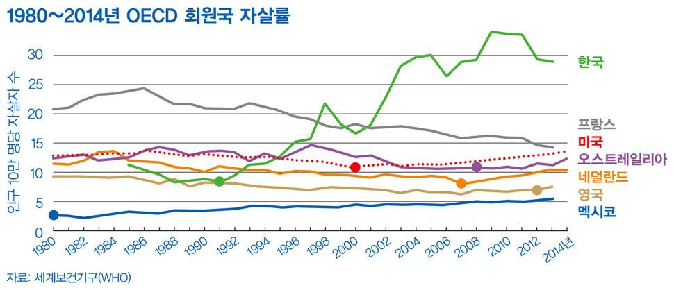

## 문서번호: 6201

### 제목: [고립인가요, 고독인가요?  '거기서 나오세요.’ 말고, ‘거기서도 괜찮으신가요?’라고 물어보면 어떨까요?](https://q4all.kr/redirect/detail/b39ebb41-628a-4fe9-98a0-30b3f6f59215)

**작성자:** [김진희](https://q4all.kr/user/profile/8395)
**작성일:** 2025-03-30 09:29:25 (일요일)

---

[질문] 고립인가요, 고독인가요?

“‘거기서 나오세요.’ 말고, ‘거기서도 괜찮으신가요?’라고 물어보면 어떨까요?”

요즘 우리는 '고립'과 '고독'을 자주 혼동하는 것 같아요.

혼자 있는 사람을 보면, 외롭고 위험하다고 먼저 생각하죠.

그래서 누군가의 문을 두드리며 말합니다.

“거기서 나오세요.”

하지만 문득 이런 생각이 들었습니다.

그 사람이 지금, 그냥 조용히 자기 삶을 돌아보고 있는 중이라면?

그 시간이 회복이고, 선택이고, 자율이라면요?

혼자 있는 시간이 모두 위험한 건 아닙니다.

관계와 사회에 지친 마음이 스스로를 돌보는 시간일 수도 있어요.

이럴 때는 오히려 조심스럽게,

“거기서도 괜찮으신가요?”

하고 물어야 하지 않을까요?

현대는 더 많은 연결을 요구하지만,

그 연결이 존중 없는 간섭이 되어서는 안 된다고 생각해요.

어떤 사람은 관계보다 고독이 필요하다는 사실,

그리고 고독은 병이 아니라 삶의 방식이라는 점을

정책과 사회가 좀 더 섬세하게 바라봐줬으면 좋겠어요.

여러분은 어떻게 생각하시나요?

‘혼자 있는 사람’에게 우리는 어떤 언어로 다가가야 할까요?

그리고 ‘고독’은 어떻게 존중받을 수 있을까요?

---

## 문서번호: 6202

### 제목: [노인을 위한 스마트돌봄, 청년들에게 어떤 기회를 줄 수 있을까요?](https://q4all.kr/redirect/detail/893f76c6-be02-43b2-a558-fb39798d03c2)

**작성자:** [김진희](https://q4all.kr/user/profile/8395)
**작성일:** 2025-03-30 10:31:03 (일요일)

---

스마트돌봄이 청년들에게 어떤 기회를 줄 수 있을까요?

---

저는 늘 이런 고민을 합니다.

“미래청년들은 어디에 정착하며 어떤 일을 하게 될까?”

“지금 내가 준비하는 일이 10년 뒤에도 존재할까?”

그런데 최근 ‘스마트돌봄’이라는 개념을 접하면서, 그 안에 청년을 위한 기회가 있다는 생각이 들었습니다.

---

스마트돌봄이란?

고령화 시대에 노인의 건강, 정서, 생활을 디지털 기술과 결합하여 더 똑똑하게 관리하는 돌봄 방식입니다.

예를 들어,

어르신이 착용한 웨어러블 기기로 건강을 체크하고

센서를 통해 낙상이나 이상 징후를 감지하며

AI가 정서적 패턴을 분석해 우울감이나 외로움을 예측하는 것이죠.

---

그렇다면, 어떤 청년 일자리가 만들어질까요?

1. 생활데이터 매니저

어르신의 수면, 식사, 운동 데이터를 분석하고 맞춤형 서비스 제안

사회복지+데이터 분석 역량을 갖춘 융합형 직무

2. 디지털 복지 코디네이터

스마트기기를 처음 사용하는 어르신을 교육하고 적응 도우미 역할

디지털 소외 문제를 해결하는 ‘디지털 포용 인재’

3. AI상담 운영가

챗봇이나 AI상담 시스템을 세팅하고, 실제 상담 흐름을 모니터링

비대면 시대에 꼭 필요한 정신건강 관리 분야

4. 지역 기반 스마트돌봄 플래너

마을 단위의 스마트돌봄 계획을 수립하고, 민관 연계를 조정

복지+기획+커뮤니티 역량이 결합된 진로

5. 스마트홈 기술 케어 전문가

가정 내 센서, IoT기기 점검 및 서비스 유지 관리

기술+사회서비스 융합형 직무

---

청년에게 생기는 이점은 무엇일까요?

기술과 함께 성장하는 직무

단순한 행정직이 아니라, AI, 빅데이터, 디지털 복지 등 미래 기술과 함께 일할 수 있어요.

의미 있는 일, 성장하는 일

“내가 분석한 데이터가 어르신의 건강을 지켜주는 일”이라는 감정은 단순한 노동 이상의 만족감을 줘요.

서울을 떠나도 괜찮은 일자리

스마트돌봄은 원격과 네트워크 기반이라, 지방에서도 충분히 전문성과 기여도를 인정받을 수 있어요. 지역 정착의 가능성을 높여주는 희망이에요.

융합형 전문가로 성장 가능

기술, 복지, 심리, 커뮤니티 등 여러 분야를 접하면서 경력을 쌓고 방향을 바꾸기 쉬운 커리어가 됩니다.

---

지금 청년 일자리는 “단순히 취업”이 아니라,

“삶의 방향과 가치”를 함께 담을 수 있어야 한다고 생각해요.

그래서 저는 스마트돌봄이

청년 세대가 기술 기반의 복지 전문가로 성장할 수 있는 새로운 길이 될 수 있다고 믿습니다.

---

## 문서번호: 6203

### 제목: [대통령 탄핵권리를 국민에게로](https://q4all.kr/redirect/detail/ecbccbbe-0f72-48ee-8ed2-8c79688f2072)

**작성자:** [윤재수](https://q4all.kr/user/profile/9995)
**작성일:** 2025-03-30 12:59:57 (일요일)

---

작금의 "헌재"를 보면 세비낭비, 눈치나 보는 공무원이라는 생각이 든다.

국민은 대통령 선거권만 있고, 탄핵권은 왜 없는가?

헌재가 국회가 국민보다 나아서 그들만 가지고 있는가?

답은 정해져 있는데, 그들은 그들의 기득권을 놓기가 싫은 것이다.

이것은 민주주의 역행이다.

대통령 포함 국회의원, 고위직 공무원에 대한 국민의 탄핵권이 넑게 이루어져야 한다.

그게 직접 민주주의의 실현이니까.

---

## 문서번호: 6204

### 제목: [민영화를 멈추고 국유화로 돌아가야 합니다.](https://q4all.kr/redirect/detail/f211c6f2-d911-463b-8cac-e6a538b1c686)

**작성자:** [이원홍](https://q4all.kr/user/profile/7177)
**작성일:** 2025-03-30 13:02:18 (일요일)

---

### 

민영화는 공공 서비스의 효율성을 높이고 경쟁을 통해 비용을 절감한다는 명분으로 추진된다.

하지만 실제로 민영화가 공공의 이익을 얼마나 보장하고 있는지는 의문이다.

특히 에너지, 수도, 의료와 같은 필수 공공 서비스에서 민영화는 공공성보다 기업 이익을 우선시하는 결과를 낳고 있다.

이러한 경향은 다양한 국가의 사례를 통해 명확히 드러난다.

1. 텍사스 전력 시스템 민영화 사례

텍사스는 2002년에 전력 시스템을 민영화하면서 경쟁을 통해 효율성을 높이겠다는 목표를 내세웠다.

그러나 2021년 2월, 극심한 한파로 인해 대규모 정전 사태가 발생했다.

민영화 이후 텍사스 전력망은 연방 규제에서 벗어나 독립적으로 운영되었으며, 이익을 우선시하면서 한파 등 극한 상황에 대비한 투자와 시설 보강이 부족했다.

그 결과, 전력 생산 설비가 동결되거나 고장 나면서 대규모 정전이 발생하였고, 수백만 명이 며칠 동안 전력 없이 추위에 노출되어 수백 명이 사망하는 비극이 발생했다.

전문가들은 민영화와 규제 완화로 인해 위기 대응 능력이 약화되었다고 지적하며, 이는 공공의 안전보다 이익을 우선시하는 민영화의 한계를 명확히 보여준다.

2. 영국 마가렛 대처 정부와 수도 민영화 사례

영국의 마가렛 대처 총리는 1980년대 경제 활성화를 목표로 대규모 민영화를 추진했다.

그 결과 일부 산업에서는 효율성이 증가했지만, 공공 유틸리티의 경우 가격 상승과 서비스 품질 저하로 인해 오히려 불평등이 심화되었다.

특히 수도 산업의 민영화로 인해 템스 워터는 2023년 약 140억 파운드의 부채로 파산 위기에 처했고, 열악한 재정 상태에도 배당금을 지급하여 비판을 받았다.

또한 상수도관의 누수 문제와 미처리 하수 유출이 지속되어 수질 저하와 요금 인상을 초래하였다.

2024년 데번주 브릭섬에서는 상수도 오염으로 최소 46명이 기생충에 감염되는 사고가 발생하여 민영화된 수도 관리의 한계를 명확히 보여주었다.

이는 필수 공공 서비스가 민영화되었을 때 발생할 수 있는 공공성 약화와 안전성 저하 문제를 잘 보여준다.

3. 프랑스 EDF 국유화 사례

프랑스는 2022년에 에너지 위기 속에서 전력 회사 EDF를 완전 국유화하기로 결정했다.

이는 러시아-우크라이나 전쟁으로 인한 에너지 공급 불안정과 민영화 이후의 전력망 유지 보수 부족으로 인한 공급 차질 문제를 해결하기 위한 조치다.

민영화로 인해 안정적 공급이 어려워지자 국가가 다시 통제권을 가져온 것이다.

이는 에너지와 같은 필수 공공 서비스는 시장 논리가 아닌 공공성을 중심으로 관리되어야 함을 시사한다.

4. 볼리비아 코차밤바 물 전쟁 사례

2000년, 볼리비아 정부는 물 공급을 민영화하여 다국적 기업 베힐리아에 운영권을 넘겼다.

이후 요금이 급격히 인상되어 저소득층이 물을 사용할 수 없는 상황이 발생했다.

이에 시민들은 대규모 시위를 벌였고, 결국 정부는 계약을 취소하고 다시 물 관리를 공공으로 전환했다.

이 사건은 필수 공공 서비스의 민영화가 기본권을 침해할 수 있음을 극명하게 보여준다.

5. 남아프리카 공화국 수도 요금 문제 사례

민영화 이후 수도 요금이 급등하면서 저소득층이 물을 사용할 수 없게 되었고, 이로 인해 심각한 위생 문제가 발생했다.

국제사회는 이러한 상황을 두고 물에 대한 접근권이 인권 문제임을 강조하며 경고한 바 있다.

이러한 사례들은 필수 공공 서비스의 민영화가 인권 문제로 직결될 수 있음을 잘 보여준다.

민영화가 모든 공공 서비스에 긍정적 결과를 가져오는 것은 아니다. 오히려 공공의 안전과 기본권이 위협받을 수 있으며, 이는 실제 사례를 통해 입증되었다.

국민의 기본권이 걸린 문제는 시장 논리가 아닌 국가의 책임 아래 관리되어야 한다.

국유화를 통해 최소한의 복지를 보장하는 것이야말로 진정한 공공성을 지키는 길이다.

---

## 문서번호: 6205

### 제목: [현대사 교육을 넑고 깊게](https://q4all.kr/redirect/detail/c8dbe918-e269-4834-873b-180f80dfb721)

**작성자:** [윤재수](https://q4all.kr/user/profile/9995)
**작성일:** 2025-03-30 13:04:30 (일요일)

---

근현대사는 역사교과서에서 몇장 되지도 않는다.

역사앞에 구린자들에게 쥐구멍을 만들어 준 격이다.

그래서, 치부를 드러내기를 싫어하기에 당연히 교육과정에서 삭제한 것이다.

역사에서 잊혀지면 그들의 치부도 사라진다.

근현대사의 교육이 넑고 깊게 이루어져야 나라가 미래가 제대로 굴러간다.

---

## 문서번호: 6206

### 제목: [내란 참여자들에게 지급되는 연금.](https://q4all.kr/redirect/detail/54f08e8a-14f1-4d47-a096-8588b80cfab7)

**작성자:** [이창훈](https://q4all.kr/user/profile/10010)
**작성일:** 2025-03-30 13:20:42 (일요일)

---

내란을 주도 동조 옹호 묵인 등의 방법으로 참여한 자들에게

국가는 연금의 지급을 하지말고 이미 지급된 연금이 있다면

환수하고 법정 최고 이율을 적용하여 환수를 막지 못하게 하는 법안을 제정해주실 것을 부탁드립니다.

---

## 문서번호: 6207

### 제목: [기후위기 시대! 대규모 자연파괴, 난개발은 재고되어야 하지 않을까요?](https://q4all.kr/redirect/detail/206dfb4b-5e93-425d-96c6-f57b9222bf7d)

**작성자:** [박중록](https://q4all.kr/user/profile/9949)
**작성일:** 2025-03-30 13:28:12 (일요일)

---

기후위기는 우리 사회의 미래를 위협하는 가장 큰 사회문제입니다.

불과 4년 3개월 밖에 남지 않았다는, 소위 티핑포인트로 알려진 지구 평균기온 1.5도 상승 이후에는 이상기후가 일상화된다고 합니다. 이상기후가 일상화되면 농업이 불가능해 집니다. 태풍으로 벼가 쓰러지더라도 1,2번은 다시 세울 수 있지만 세 번, 네번 연이어 겹치면 안정적인 농업은 불가능해 집니다. 그래서 기후위기는 곧 식량위기로 이어지고, 식량위기는 곧 인간의 생존위기입니다.

기후위기로 인한 식량부족 문제로 촉발된 시리아 내전과 시리아 난민들의 비극은 우리 사회의 앞날을 생각해 볼 수 있는 생생한 사례입니다. 우리야 잘먹고 잘살다 떠나겠지만 우리 아이들과 손주 세대의 앞날을 생각하면 참으로 암담합니다.

기후위기, 우리 사회도 시급한 대비가 필요합니다. 지금의 화석연료에 의존하는 사회를 재생에너지 사회로 바꾸고, 대규모 자연파괴를 수반하는 난개발사회를 지속가능사회로 바꾸어야만 합니다. 우리 생존을 위해서라도 남은 자연을 지키고, 훼손된 자연을 복원해야 하건만, 우리는 여전히 경제와 발전이라는 이름으로 자연을 파괴하고 있습니다. 지금도 전국에서 각 종 도로와 신도시, 신공항 건설로 기후위기를 심화하는 대규모 자연파괴가 진행되고 있습니다.

제가 사는 부산을 예로 들면 급격한 인구감소와 고령화로 2016년 이후 부산시 전체 교통량은 2023년 까지 내리 감소하였고, 김해공항 국제선 이용객의 숫자 역시 2019년 수준에 못 미칩니다. 그럼에도 불구하고 낙동강하구 문화재보호구역과 가덕도의 최고의 해안숲을 파괴하는 교량과 공항건설, 그리고 공항으로의 연결도로 건설 사업 등에 수십조의 예산을 투입하려 합니다. 교통량이 예측치와 다르다는 분명한 자료가 있음에도 20여 년이 지난 도시계획에 따라 한국 최고의 자연, 낙동강하구의 핵심지역을 관통하는 교량 건설 계획이 그대로 이어지고 있습니다.

무분별한 건설 계획은 부패한 공무원과 정치인, 토목회사만 배 불립니다. 기후위기를 심화하여 우리 사회의 미래를 더욱 위험에 처하게 하면서, 그 유지비용까지 미래세대에게 전가합니다. 또한 낙동강하구와 가덕도, 그 천혜의 자연을 이용해 지역이 지속가능하게 발전할 수 있는 미래 가능성을 없애 버립니다.

건강한 자연은 미래 발전의 핵심 자산이기도 합니다. 남은 자연을 지키고 훼손된 자연을 복원하여 이를 지역발전으로 연결시킨 순천시의 사례는 지속가능발전의 세계적 모범입니다. 관광산업은 건설업 보다 고용유발효과가 2~3배 높고, 서비스 중심 산업이기 때문에 자동화 대체가 어려워 지속적인 일자리 창출 가능한 분야입니다. 자연도 지키면서 경제도 키우는 지속가능사회를 이루고, 꼭 필요한 개발사업은 사회적 합의를 통해 자연파괴를 최소화하며 추진하면 됩니다. 이 과정에서 대형건설업 역시 기후위기와 같은 사회변화에 맞게 지속가능한 형태로 전환하는 방법을 찾을 수 있을 것입니다.

관련한 질문입니다.

1. 특히 사회적 갈등이 존재하는 지역의 사업에 대한 우선적 재검토가 필요하다고 생각됩니다. 신공항건설, 교량건설, 신도시 건설과 같은 대규모 자연파괴를 수반하는 대형 토목사업의 타당성에 대해 다시 검토할 의향은 없으십니까?

2. 국토교통부와 SOC 사업의 예산이 여전히 압도적입니다. 이런 상황에서는 대규모 토목사업이 계속될 수밖에 없습니다. 기후위기의 심화와 인구변화, 산업 변화, 선진국으로 진입한 국가위상 등을 반영해 난개발을 유발하는 SOC 사업 예산을 문화, 관광 등으로 전환하는 정책변화를 추구할 의향은 없으십니까?

---

## 문서번호: 6208

### 제목: [지귀연과 심우정과 헌재의 간교함이 앞으로 다른 판검사에게 또 다시 생기 않게 막을 실제적이면서 현실적인 방법이 있나요? ](https://q4all.kr/redirect/detail/dd0c95f4-40af-4f65-83af-b44a23cb190b)

**작성자:** [박상덕](https://q4all.kr/user/profile/1846)
**작성일:** 2025-03-30 13:46:45 (일요일)

---

민주주의 법과 제도의 미흡으로 온국민들이 고통 받고 나아가 나라가 망해가는데!

이 더러운 꼴을 보고도 또 다시 방치 해서

제2,3,4,5,6,,7,8,9.......의 헌재의 간교함과 윤석열을 구속 취소한 지귀연의 간교함과 즉시항고를 포기한 심우정의 간교함을 앞으로도 계속 지켜 보고 계속 해서 당하고 계속 해서 나라는 점점 망해 가야 하는 것인가요?

민주주의 제도의 정비 미흡이 아니라 그 자리에 있는 그 자들이 사악해서 현재와 같은 일들이 계속 일어 나는 것이라면 단지 사람이 문제이기 때문이라면

그렇다면 그 사악한 자들의 임기가 끝나면 다시는 똑같은 일이 반복되면 안되는 것이 아닌가요?

그런데 왜?

해방 이후 대통령 직선제 이후부터 지금까지 악한 판 검사들의 횡포가 나라를 병들게 하고 나라를 망하게 하는 횡포가 끊임없이 계속해서 일어났나요?

판검사들은 모두다 세종대왕 급이나 이순신 급으로 양심이 있는 자들로 뽑았다면

지귀연이나 심우정이나 헌재에 조한창 김복형 정형식같은 판검사는 절대로 안 나왔을 텐데요?

그런데 판검사들에게 세종대왕 급이나 이순신 장군 급에 양심을 기대해도 되는 것인가요?

왜? 대한민국 국민들이 모두 다 기대하면 안되는 간교한 것에만 나라와 국민 각자의 운명을 기대하고 맡기나요?

왜? 대한민국 모든 국민들과 법을 만드는 국회는, 모든 국민들에게 해꼬지를 하려는 자들에게 나라와 모든 국민들의 운명을 송두리째 맡겨 버리나요?

이것이 고양이에게 생선을 잘 보관 해 두라고 부탁하면서 생선 보관을 간절히 부탁한다고 고양이에게 간절히 비는 꼴과 무엇이 다른가요?

그래 놓고는 도둑이요 강도인 자들에게 영험한 심판을 기대 하나요?

현재의 사법 체계에서는 모든 판검사들에게 세종대왕 급이나 이순신 장군 급에 양심을 기대 할 수 없음에도 불구하고

너무 판검사 개개인에 양심에만 너무나 간절히 의지 하는 것은 아닌가요?

법과 제도로 악한 짓을 한 판검사들에게 가혹하게 처벌해도 악한 판검사들을 그 법망을 요리 조리 피해가며 온갖 악한 짓을 하는데

거기에 법과 제도 마저 판검사들에게 악한 짓을 권장하거나 또는 악한 짓을 해도 그냥 놔두고 있다면

얼마나 더 신이 나서 판검사들이 악한 짓들을 열심히 일삼을 까요?

애초에 세종대왕 급이나 이순신 장군 급의 양심을 가진 자들을 판검사로 뽑을 수 없다면

판검사가 악한 짓을 했을 때 처벌을 강화 해야 하고

그래도 안되면 판 검사들이 악한 짓들을 못하게 미리 (판검사들의 영향력 밖에 있는 사람들로 구성된 )감시 장치를 따로 만들어서 막아야만 하는 것이 아닙니까?

그렇게 했는데도 막지 못 했다면

악한 판검사들의 판결과 처분 이후에라도 즉시 그들의 결정을 되돌리고 바르게 잡아 줄 수 있는 (판검사들의 영향력 밖에 있는 사람들로 구성된 )장치를 마련해 두어야 하지 않을 까요?

\*참고: 괄호 안의 판검사들의 영향력 밖에 있는 사람들이라 함은 판검사 카르텔을 비롯한 대통령과 국회의원들에게 직접 영향을 받을 수 없는 사람들을 가르킴!\*

그러려면 공정한고 공평한 사법 감시 장치를 따로 만드는데 현재 공수처 같이 허술하게 만들지 말고

그 권한과 규모를 키워서

정치인 또는 정치 또는 경제인 또는 경제 사건이나 이슈가 되는 사건들에 한해서 (또는 자체 판단해서 일반 사건 중에도 억울한 피해자가 생길 수 있는 사건에 한해서는 )

압수 수색 영장 신청 발부 단계부터 체포 영장 신청 발부, 구속 영장 신청 발부 취소, 기소의 여부, 그리고 1심~3심까지 각 재판부의 판결까지도 어느 단계에서든지 즉시 끼어들어 심사하고 나아가 즉시 결정을 뒤집어서 처벌과 감형과 석방과 복권을 할 수 있게 만들어야 하지 않겠습니까?

그런데 그러한 사법 감시 장치의 공정과 공평을 담보할 방법이 여의치 않으니까

사법 감시 장치의 권력 기관장을 모든 국민들이 공평하고 공정한 투표로 직접 선출해야 하지 않을까요?

옥상 옥이 염려 되고 사법 감시 장치의 브레이크 없는 독재가 걱정 된다면!

그 선출된 사법 감시 장치의 권력기관장의 임기를 2년으로 짧게 하고 5중임까지만 할 수 있게 하고

또 6개월이나 1년 단위로 국민 소환 투표 자동 회부제를 실시하고 언론으로 감시하게 하면 되지 않을까요?

물론 언론도 언론개혁을 완수한 후에 공정한 언론으로 만든 후에 언론 감시가 가능 할 것입니다.

그런데 여기서 잠깐

국민 직선제를 통해서 공정하고 공평한 사법 감시 장치를 어렵게 만들었다 칩시다!

그런데 그 어렵게 만든 사법 감시 장치를

현재의 기레기 언론들이 온갖 거짓과 부풀리기로 총 공격하면 그 어렵게 만든 사법 감시 장치가 제 역할을 하거나 살아남을 수 있을까요?

또는 현재 권력에 충성하며 기생하는 검찰과 경찰과 법원과 언론들이 힘을 합쳐서 사법 감시 장치들을 총 공격하면 그 어려게 만든 사법 감시 장치가 제 역할을 하거나 살아남을 수 있을 까요?

그러니까

언론과 수사청과 기소청과 감사원과 법원과 사법 감시 장치의 각각의 장들을 따로따로 한번에

위에 나열한 방법대로

{각각의 권력기관장들의 임기를 2년으로 짧게 하고 5중임까지만 할 수 있게 하고

또 6개월이나 1년 단위로 국민 소환 투표 자동 회부제를 실시하게 함과 동시에

권력기관들 끼리는 서로가 서로를 감시 견제 처벌 할 수 있게 하고

(내부 고발 포함해서)일정 성과를 낸 자들에게는 그에 합당한 상과 승진과 미래에 보장까지 확실하게 해서}

모든 국민들이 공평하게 직접 투표해서 뽑는 것이 가장 바람직 합니다!

그래야만이

다시는 지귀연과 심우정과 조한창 정형식 김복형과 같이 아주 간교한 판검사들이 다시는 이 땅에 나타나지 못하게 할 수 있는 것이 아니겠습니까?

다음 아래 부터 끝까지는

전에 제가 모두의 질문Q에 써 놓은 내용입니다

사법 감시 장치를 만들 수 있는 토대를 마련하는데 도움이 될 듯한

나라에 대표 권력기관들의 각각의 장들을 국민직선제에 대한 이유와 설명과 방법의 예 입니다

참고 하세요

새 시대를 금방 열 것 같이 국민들을 농락 하지는 않았는지요?

그동안은 "힘이 없어 새 시대를 못 열었다!" 라고 말하지만

실제로는 겉과 속이 많이 다른 탓에 그럴듯한 말만 앞세운 것이 아닌가요?

  세계 최저 출산율로 보면 새 시대는커녕 구시대를 열어 온 것은 아닐까요?

 살기가 얼마나 팍팍하고 어려우면 한 집에(60~70년대) 10명씩 애를 낳았던 민족이! 2020년대에 들어서는 한 가정에 1명도 낳는 것을 두려워 할까요?

 출산율로만 보면 대한민국이 세계에서 가장 살기 힘든 나라가 된 것은 거부 할 수 없는 진실 아닌가요?

 경제력 국방력 문화력이 눈부시게 발전하면 뭐합니까?

 젊은이들이 대한민국에 살기가 팍팍하고 어려워서 다들 애를 안 낳는데!(초 부자 젊은이들만 애를 두명 이상 낳는 더러운 세상이 되었네요!)

 앞으로 멀지 않은 미래에 인구가 자꾸 감소 되면! 투자 소비 생산의 감소로 국가 경제가 다 흔들리고 해서

 그 초 부자들까지도 그 재벌들까지도 살기 싫어지는 나라가 되고!

 일반 중산층 국민들에게는 지옥 같은 대한민국이 되는 것은 아주 불 보듯 다 뻔한 일이 아닌가요?

 정치인들과 리더들은 맨날 새 시대를 연다고 외쳐 왔는데! 왜? 맨 날 지옥을 향해 달려가나요?

 복지에 복자만 꺼내도 빨갱이로 몰아 사회에서 매장 시키고!

 빨갱이로 몰리기 싫어서! 무한 자율 경쟁 약육강식의 시장 경제 체제만을 설파하고 추종하고 그런 정책을 펴나가고! 해서

 대한민국을 팍팍하게 만든 것이 아닌가요?

그런데 여기서 무한 자율 경쟁을 시장 경제를 추종하고 신봉하면서도 진정으로 무한 경쟁을 할 수 있게 하기는 했나요?

 본인들의 특권층 아이비 그룹 외에는 다 경쟁에서 제외 시키고 그 특권층 아이비 그룹이 모든 경쟁의 기회를 독식한 것이 아닌가요?

그래서 경쟁조차도 자기들끼리 끼리만 하고 해서 그래서 나라에 모든 부와 좋은 것을 몽땅 다 자기들끼리 끼리만 다 해먹으니까!

이 나라 대한민국이 지옥이 된것 아닌가요?

 예를 들면

 고액 사교육이나 과외로 기회를 독점하기 위해 공교육 발전 방해하는 정책 펼침 등으로 약자에게 돌아갈 모든 기회를 짓밟아 수많은 다수에게 경쟁할 기회를 짓밟은 것이 아닙니까?

 또는 무한 시장 자율 경쟁 뛰어들었다가, 단 한번 어쩌다가 경쟁에서 밀리면 완전 도태 되어서, 완전 나락으로 떨어지게 만들어서,

 그래서 어느 누구도 특권층 아이비 리그가 아니면, 감히 경쟁에 뛰어들지 못하게 만들어서,

 그래서 모든 다수의 국민들의 경쟁할 기회 조차 무참히 짓 밟은 것이 아닙니까?

 위와 같은 사악한 방법으로 대한민국을 지옥으로 몰아가는 관습, 문화, 제도, 법률, 헌법을!

 올바르게, (아이비 리그에 속하지 않은) 모든 국민들에게도 (팍팍하지만) 무한 경쟁에라도 참여라도 할 수 있게, 고치고!

 또 그러기 위해 경쟁에서 밀려도 나락으로 떨어지지 않게 하고, 다시 도전하고 경쟁 할 수 있게 받쳐 주는 법과 헌법을 만들고 실행해야 만이! 그래야 만이 겨우 새 시대가 오지 않을까요?

 그리고 또

 작은 복지라도 복지 얘기만 나오면

 복지를 빨갱이로 몰아서 또는 국가 재정이 어디 있냐?면서 포퓰리즘으로 몰아서

 사회에서 매장 시켜서

 모든 복지를 시도조차 못하도록 사회 분위기를 조성해서 대한민국을 점점 더 팍팍하게 만들어서

 가난한 사람들은 더 가난하게 해서

 그래서 도태되고 나락으로 떨어지는 국민들이 늘어나게 만들고

 그래서 그들을 보는 중산층 국민들도 위축 돼서 나는 저러지 말아야지 하면서 경쟁에 뛰어들 수 없게 만들고

 나아가 경쟁은커녕 심리를 위축 시켜서 경제 활동도 못하게 만들어서 결국 소비를 줄이게 만들어서

 그래서 국가 전체에 소비를 완전히 위축 시켜서

 그래서 기업들이 아무리 좋은 상품을 만들어도 구매하지 못하게 만들어서 수많은 기업들이 도산하게 만들어서 모든 국민들이 일자리를 잃게 만들고

 또는 미리 시장을 파악하는 기업들에게는 아예 생산 계획을 철회 하게 만들어서 기업들을 문 닫게 만들어서 결국 모든 국민들의 일자리를 빼앗은 것이 아닙니까?

 만약에 복지를 빨갱이로 몰지 않고 포퓰리즘으로 과도하게 몰아가지 않았더라면!

그랬더라면 역대 정부가 복지를 계속해서 늘려 왔을 테고, 그러면 서민들의 경제가 안정 돼서 소비가 늘었을 테고, 소비가 늘어야 기업들이 생산이라는 것을 늘릴 테고,

기업들의 생산이 늘어야 고용을 늘어날 테고, 그래야 법인세 소득세 소비세가 많이 늘어서 재정 부담 전혀 없이 더 복지를 키울 수 있었겠지요!

그런 식으로 선순환 싸이클이 돌고 돌아서 국가 전체 경제 규모가 점점 커지고 커져서 나라가 점점 부강해졌었겠지요!

거기에 더해서 만약에 복지를 빨갱이로 몰지 않고 포퓰리즘으로 과도하게 몰아가지 않았더라면!

사회 안전 망이 잘 구축 되어서 모든 국민들에게 자유롭게 경쟁 할 기회가 보장되고 그래서 전보다 몇 배나 많은 인력 인재들이 경쟁에 거침없이 뛰어들고

그래서 모든 기업들의 기술력이(보다 많은 경쟁을 거쳐서) 눈부시게 발전했겠지요

그래서 나라도 모든 국민들도 눈부시게 발전했겠지요!

그래서 만약에 복지를 빨갱이로 몰지 않고 포퓰리즘으로 과도하게 몰아가지 않았더라면!

모든 국민들이 복지가 늘고 해서 애도 낳고 인구도 늘고 해서 (인구가 있어야 소비가 늘지요!)

소비가 원할 해져서 기업들이 생산을 열심히 하고 해서 모든 국민들의 일자리가 늘어나는 선 순환이 계속 되어 가지 않을까요?

 위와 같이 복지를 빨갱이로 몰고 포퓰리즘으로 몰아갔던 부조리 불합리 부정 부패 그래서 애도 못 낳는 나라를 만든 불합리 부조리 부정 부패!

 복지를 빨갱이로 몰아서 복지에 쓸 돈을 복지에 쓰지 못하게 하고 오직 기업을 위해서만 쓰게 만든 불합리 부조리 부정 부패!

 복지를 빨갱이로 몰아서 애도 못 낳게 만들고 젊은이들의 인구 수를 줄이고 소비를 위축시켜 모든 기업들로부터 생산을 줄이게 해서 기업들을 문 닫게 만들어서 모든 국민들의 일자리를 빼앗은 불합리 부조리 부정 부패!

 나라를 병들게 하고 모든 국민들을 지옥으로 몰아 가는 온갖 불합리 부조리 비리 부정 부패 막아야 하지 않겠습니까?

 막을 수 없다면 줄여야 하지 않겠습니까?

 예를 들면

 토지 부동산 개발 이익 같은 모든 국민들의 공동의 소유물로 재산으로 앞으로 창출 될 수많은 국민 전체의 막대한 이익을

 {대장동 개발 업자들이 벌어 들인 개발 이익의 액수을 보면 (전국에 개발한 땅에 개발 이익으로 환산하면) 전국에서 환수 할 수 있었던 개발 이익은 수 십경 원에 이른다, 수 십경 원이면 모든 국민들에게 5억에서 10억씩 나눠 줄 수 있다 그 돈을 국가가 관리하면 모든 국민들이 태어나서 죽을 때까지 돈 걱정 없이 살 수 있다}

 모든 국민들에게 적절히 잘 분배 못하게 하고 일부 세력이나 일부 권력자나 일부 집단이 독식 하게 하는 불합리 부조리 비리 부정 부패를 막고

 나아가 공동에 이익을 모든 국민들에게 적절히 공정하게 분배 해야 새 시대가 겨우 열리기 시작하는 것이 아니겠습니까?

 그 외에 수많은 불합리 부조리 비리 부정 부패!

 그리고 그 외 수많은 불합리 부조리 비리 부정 부패인지도 모르고 저질러 온 모든 국민들과 나라를 좀먹는 행위들!

 그런 것들을 없애거나 못 없앤다면 줄여야 하지 않겠습니까?

 그래야 겨우 겨우 조금이라도 새 시대를 열어 갈 수 있는 것이 아니겠습니까?

 그렇다면 나라를 망치는 불합리 부조리 비리 부정 부패와 그리고 정치 리더들과 모든 국민들이 인지조차 하지 못하는 불합리 부조리 비리 부정 부패를 어떻게 없애거나 줄여 나갈 수 있을까요?

현재 부정 부패 부조리 비리를 줄이지 못하는 많은 이유 중에 대표 적인 것은!

나라와 사회 발전에 필요한 적절한 여론을 만들고 조성해 가며 감시하는 언론 기관들과,

그리고 감시 감사 감찰하는 권력 기관들과 사법 기관들과 그 모든 기관들의 구성원들 하나하나가

그들의 본연에 임무인 이 나라와 사회를 발전 시킬 방법을 찾고 구할 때 보다 또는 그 구성원들 각자 각자가 본연에 업무 충실 했을 때 보다

그들 각자의 이익에 따라 부조리 비리 부정 부패를 저질렀을 때

그들에게 돌아가는 불이익도 없고 돌아오는 이익이 훨씬 크기 때문이 아닌가요?

그래서 나라에 부정 부패가 날이 갈 수록 심해져서 나라와 모든 국민들이 불행을 향해 달려가다가 마침내 젊은 이들이 애도 낳기 힘든 지옥 같은 나라가 만들어진 것이 아닌가요?

그렇다면

나라에 부정 부패를 점점 늘어나게 만드는 원인들을 하나씩 제거 해 나간다면 나라가 조금씩 부강해 지고 모드 국민들도 보다 살 만해지고 애도 낳을 만한 나라로 조금씩 만들어 가지 않을까요?

그 한 방편으로

나라와 사회 발전에 필요한 적절한 여론을 만들고 조성해 가며 감시하는 언론 기관들과,

그리고 감시 감사 감찰하는 권력 기관들과 사법 기관들과 그 모든 기관들의 구성원들 하나하나가

나라와 사회를 발전시키는 여론 조성, 감시, 감사, 감찰, 업무를 등한시 했을 때!

그 댓가로 그들에게 돌아가는 부당한 이익을 확 줄여 주고 돌아가는 불이익을 크게 안겨 주면 되는 거 아닌가요?

그렇게 하면 나라와 사회를 병들게 하고 모든 국민들을 불행하게 하는 불합리 부조리 비리 부정 부패가 대폭적으로 줄어 들지 않을 까요?

그렇게 되면 나라가 조금씩 부강해 지고 모드 국민들도 보다 살 만해지고 애도 낳을 만한 나라로 조금씩 만들어 가지 않을까요?

그런데 그 쉬운 것이 현재 권력 구조로는 절대 불가능 한 일이겠지요.

민주주의 기본 4대 권력기관들 간에 확실한 분립이 기본 원칙인데 4대 권력이 서로 유착 되어

한 곳에 권력이 완전히 집중 되어 있는 권력 구조는 부조리 불합리 부정 부패가 만연 할 수 밖에 없습니다.

이런 권력 구조에서는 하부 권력이 잘해보려면 위에서 꺼리는 것이 있어서 정당한 일을 방해 해서 못하게 하고

위 상부 권력에서 뭔가 좋은 일을 하려 하면 아래 하부 조직에서 상부 권력의 약점을 쥐고 반항 해서 정당한 일을 못하게 돼서

악순환이 반복 됩니다 그러다 보면 상부 권력 하부 권력 할 것 없이 서로 도둑질만 일삼게 되지요!

그래서 망가진 결과가 현재 대한민국입니다

대표적인 예가 인구 소멸이 곧 닥칠 세계 최저 출산율 0.72%입니다

나라에 각각에 대표 권력기관들이 각각 역할을 해서 서로 잘못하는 것을 잡아 주어서 나라가 발전하는 길로 이끌어야 하는 데

그렇게하지 못 하고 서로에 유착과 협착과 약점 공유로 한 몸이 되어서 서로에 이익을 보장해 주다 보니까 나라에 사소한 기업에 일까지도 망치는 나라가 된 것입니다.

그러니까 나라에 대표적인 권력기관들이 서로 나라 망치는 길로만 서로 앞장서서 이끌어 오게 된 것입니다.

그 결과가 나라가 지옥이 된 것을 아무도 감지 못하는 나라가 되고 그리고 그 결과가 출산율 0.72% 입니다!

그래서 위의 문제 점들을 해결하기 위해

다른 급한 일도 많이 있겠지만

먼저 해야 할 것이 바로 다음의 내용입니다.

그래도 가장 크고 가장 급하고 나라에 기틀을 가장 바로 잡을 수 있는 나라에 4대 권력기관들의 확실한 권력분립과 그리고 그 아래에 딸린 대표적인 권력기관들 끼리의 확실한 권력분립이 이루어 져야 합니다

그렇다고 해서 권력 분립만 확실히 이룬다고 될 일이 아닙니다

권력의 확실한 분립과 동시에 분리 된 그 모든 권력기관들 하나하나가 따로따로 싹 다 모든 국민들의 손아귀에 있어야 합니다 (공평하고 공정한 모든 국민들의 투표로)

입법 사법 행정 언론 권력기관들과 그 밑에 딸린 나라에 대표 권력기관들의 각각의 장들을 각각 임기 2년에 5선 까지 가능하게 해서

1년에 1회 이상 국민 소환 투표에 자동으로 붙이게 해서 모든 국민들이 공평하게 투표로 뽑아야 합니다

그래서 모든 권력기관들이 각각 완전히 분리 되게 하고

또 나아가 모든 나라에 대표 권력기관들의 각각의 장들과

그 아래에 모든 구성원들이 그들의 장을 뽑아주는 국민들의 눈치를 보며 오직 모든 국민들을 위해서만 일하게 만들어야 합니다

그렇게 되면 나라에 발전을 앞장서서 막아 대던 모든 수많은 언론사의 기자들과 수많은 감시 감찰 감사 기관들의 모든 구성원들과

그리고 모든 법원의 판사와 모든 구성원들이 모두다 하나 같이 모든 국민들을 공평하게 위하는 일들만을 보다 더 찾고 찿아서 보다 더 나라를 발전하게 하고 모든 국민들의 이익과 행복을 위해서 일하기 시작 할 것입니다.

지금까지는 모든 기자들과 판검사들과 위의 국가 대표 권력기관들의 모든 구성원들이 개인의 사리사욕과 영달과 무사안일을 위해서 나라의 발전을 가로막고 후퇴 시키고 모든 국민들의 행복을 가로 막고 모든 국민들을 불행에 빠트리기 바빴지만

(앞으로 확실한 권력분립과 그 분립된 각각의 권력기관장들을 국민 직선제로 뽑는 제도가 잘 자리 잡으면) 모든 기자들을 비롯한 판검사를 비롯한 모든 권력기관들의 공직자들이 모두 다 나라 발전과 모든 국민들의 이익과 행복만을 위해서 일하는 풍토가 자리 잡힐 수 밖에 없고 그러면 나라가 부강해 질 수 밖에 없습니다.

(아래부터 끝까지는 새 시대를 열기 위한 민주주의 발전과 성숙을 얘기 합니다)

위의 어떤 권력기관의 장을 모든 국민들이 공평하게 투표로 뽑지 않고

 -국가에 대표 "권력기관"들의 각각의 권력기관장들을 "국민 직선제"로 뽑지 않고-

 누군가에 몇몇에 추천을 받아서 대통령이 임명하거나 또는 어떤 무리나 어떤 단체에 추천을 받아서 대통령이 임명하면

 그 임명 받은 권력기관의 장과 그 권력기관의 장의 영향력 아래에 있는 모든 직원들은

 대통령과 추천한 사람이나 단체에만 잘 보이면 그만이고

 국민들의 행복과 이익과 진실에는 전혀 관심이 없어도 되고

 나아가 모든 국민들을 불행하게 만들고 나라를 아주 힘들게 만들어도

 해당 권력기관장과 그를 추천한 사람들과 대통령에게만 잘 보이면

 승진하거나 승승장구 하거나 아니면 한목 챙겨 큰 부자가 되거나 아니면 자손 만대로 떵떵 거릴 수 있는 것이 아닙니까?

 어느 누가 감히 그렇게 위의 모든 권력기관들의 구성원들이 모든 국민들의 피와 등골를 빨아 먹으면서 민족 구성원들 전체를 불행하게 만들면서

 자신들의 자손만대의 승승 장구를 추구하고 시도 할 수 있는 이 헛점 많은 대한민국의 민주주의라는 제도를 좋은 제도라 할 수 있을 까요?

 "법"과 "제도"와 "헌법"에 부족한 부분이 있어서 그로 인해서 모든 국민들의 피와 등골을 착취 당하고 있다면 그래서 모든 국민들을 불행하게 하고 나라를 크게 기울게 한다면!

 그렇다면 그 부족한 법과 헌법을 보완해서 "개헌"하고 법률을 개정 해야 하는 것이 아닌가요?

 (아래 부터는 "권력기관 국민 직선제"에 대한 필요성을 얘기 합니다 시간상 존댓말 생략 합니다)

 그런데! 더 이상 "독재" 치하를 조금이라도 감당하기 싫어 한다거나 감당 할 수 없다면!

 그러니까 피와 등골 빨리는 국민들도 모르고 모든 국민들의 피와 등골을 빨아 먹는 권력 기관 구성원 당사자들도 모르게 정말 쥐도 새도 모르게 국민들의 피와 등골을 빨아 먹히는 것을 감당 할 수 없다면

 그렇다면! 응당! 독재 탄생 방지 책을 확실히 세워야 함과 동시에 위의 모든 권력 기관의 모든 한명 한명의 구성원들이 싹다 모든 국민들의 이익과 행복과 진실을 위해서 일하게 해야 할 것이다!

만약에 유일한 독재 방지책이나 모든 국민들의 이익과 진실을 위한 계획에 헛점이 생길수 있다면!

 그 생길 수 있는 헛 점을 보완하는 보완 책을 확실히 세워야 할 것이고! 그 "독재 방지 책"의 보완 책에 헛 점이 생길 수 있다면 보완책의 보완책을 확실히 세워야 한다!

 만약 보완책 한두 단계가 복잡하고 싫고 하니까!

 그냥 독재 방지책을 세우지 말자는 말은!

 예를들면 다음과 같은 말이 된다!

 독재 방지책에 보완책에 보완책을 만들기 힘들고 복잡하니까!

 먼훗날 스탈린 히틀러 김일성 이승만 박정희 전두환 윤석열 같은 독재가 나오거나 말거나 신경 쓰지 말자는 말과 아주 똑같은 말이고 발상이다!

 이제 다시 우리나라에 위와 같은 독재자들이 나오면! 민족 전체가 지옥의 수렁에 빠져서 고통 받을 것이 아주 불보듯 뻔한데! 그 엄청난 닥칠 위험과 고통을 그냥 방치만 하자는 말이 된다

 .

 .

 .

그래서 위와 같은 이유로 대한민국은 앞으로 어느 누구도 독재 시도를 상상 할 수 조차 없는 장치들를 많이 만들어야 한다!

 그래서 앞으로 대한민국의 미래와 먼 미래에 누가 집권하든지 간에 누가 "개헌" 할만한 세력을 얻든지 간에 윤가 같은 독재 세력이 절대로 생기지 못하게 해야한다!

 .

 .

 다음은 "독재 방지" 법의 "예"와 그 이유의 "예"이다!

 .

 .

 .

 나라에 모든 크고 작은 권력기관들! ("사법권력", "언론 권력", "검,경찰권력","여론형성권력", 방통위, 선관위, 감사원, 통계청, 국민 권익위, 공수처, 주요 포털사의 뉴스 시사 노출 순위 정하는 "권력기관들")

 하나하나가 또는 한두개가 유착 해서!

 각 권력기관들이 가진 공신력으로 마음만 먹으면!

 민심과 표심과 여론을 100% 조성 조장 조작 할 수 있다!

 그런데! 현재 이 나라에 법과 제도의 미흡으로 인해서!

 위의 권력기관들 모두를 싹다!

 본인들 마음대로 자유자재로 조정 할 수 있는 자들이 생겨났다!

 바로! 그 자들은 "대통령"이나 "검언정이 유착된 세력"들이다!

 대통령이나 검언정이 유착된 세력들이!

 "공신력"으로 "민심"과 "표심"과 "여론"을 100% 조장 조성 조작 할 수 있는 모든 권력기관들의 인사권과 예산권을 한손에 콱 틀어 쥐고,

 동시에 미래의 부귀영화를 나눠줄 수 있는 힘과 미래에 패가망신을 안겨 줄 수 있는 힘으로!

 위의 모든 권력기관들의 목줄을 한 손에 콱 틀어 쥐고,(또는 개인 별로 큰 약점을 한 손에 콱 틀어 쥐고)

 한 손에 콱 틀어 쥔 그 모든 권력기관들을 사정 없이 원하는 대로 흔들 수 있게 되어 있다!

그래서 위의 모든 권력기관들은!

 자신들과 자신들의 후손들의 삶이 부귀영화냐? 아니면 패가망신이냐?에 여부가!

 오로지 오직 자신들의 목줄을 한손에 콱 틀어 쥐고 있는!

 상위 권력자들에게 잘 보이느냐 잘 못 보이느냐에 달렸기 때문에!

그래서 상위 권력자들이 원하기만 한다면!

 모든 권력기관들은!

 여론과 민심과 표심을 암암리 또는 아주 대놓고 조작하는 일도 전혀 조금도 주저하지 않을 것이며!

그래서 히틀러 스탈린 김일성 이승만 같은 지도자가 나오게 만드는 것도 전혀 조금도 주저하지 않을 것이며!

 민중을 악랄하게 착취하는 일도 전혀 주저하지 않을 것이며, 또한 단군 민족 전체를 완전 말살 시키는 일일 지라도 전혀 서슴치 않을 것이다!

그런 일은 아주 불 보듯 아주 뻔하고 아주 당연히! 일어날 일이었다!

왜냐하면! 모든 권력기관들은, 자신들의 큰 약점이나 목줄을 콱 쥐고 있는, 상위 권력자나 상위 권력 세력들이 원하는 데로 눈치 껏 잘 해 내야만이! 그 상위 권력자들과 세력들에게, 당대와 자손 대대에 패가망신을 안겨 받지 않고, 대신 당대와 자손 대대에 부귀영화를 확실히 안겨 받을 수 있기 때문이다!

그래서 모든 권력기관들에 모든 구성원들에게 있어서! 그들의 당대와 후대의 패가망신이냐? 아니면 부귀영화냐?가 걸린 문제 앞에서!

 단군 민족 완전 말살 같은 심각한 상황도!

 전혀 고민 꺼리 조차 될 수 없고, 조금이라도 거리낄 가치 조차도, 전혀 없게 되는 것이기 때문이다!

 그러니까! 당연히 현재에 법과 제도 아래에서는! 단군 민족 완전 말살 같은 일이, 언젠가는 또는 어느 때에라도 발생 할 수 밖에 없다는 것은, 너무나도 불 보듯 아주 뻔한 것이었다!

 그래서 현재 나라에 비극이 초래 되고 진행 되고 있고 앞으로 점점더 심해 질 것이다

하지만 더 이상의 그런 국가적 비극은 막아야 한다!

 그 국가적 비극을 막을 좋은 방법은 단 하나 뿐이다!

 위 공신력으로 민심과 표심과 여론을 100% 조장 조성 조작 할 수 있는 모든 권력기관들의 모든 권력들을 싹다!

 모든 전체 국민들이!

 공평하게 직접 투표로 공정하게 완전히 가지는 것이다!

 그것 단하나 만이! 위의 국가적 비극을 막을 수 있는 유일한 단 하나의 방법이다!

 (예: 모든 크고 작은 권력기관들의 각각의 장들을 "국민 직선제"로 선출, 임기2년에 4중임까지만! 그리고! "국민 소환"투표를 자동으로 매년마다 휴대폰 인증 투표로 아주 손쉽게 해서!)

그래서 모든 권력기관들이! 오직 국민들에 의해서만 움직이고, 오직 모든 국민들만을 위해서만 일하게 해야 한다!

 늦었지만! 이제라도 법과 제도와 헌법을 손 봐야 한다!

 법 테두리 안에서, 수단과 방법을 가리지 말고, 반드시 넘어야 한다!

 .

 위에 지적한 문제 해결 방법은 아래 글 참고

 .

 .

 .

 (혹여 공정한 여러 위원회를 만들어서 권력기관장을 뽑을 생각은 넣어두기 바란다!

 국민 직선제가 아닌, 다른 어떤 아무리 공정한 위원회의 결정으로 뽑힌 권력기관장들이라고 해도,

 불만 세력으로부터 시비가 끊이지 않을 것이 분명하다! 또! 국민 직선제에 비해서, 암암리에 아무도 모르게하는 부정 청탁의 확률만을 올려서, 부패 확률만 심하게 높아진다!)

 .

 .

 .

 "권력분립!"이 제대로 정착 되지 않고, 동시에 "모든 권력은 국민으로부터 비롯된다!"가 제대로 나라에 정착 되지 않으면,

 신성 불가침 왕족과 여신이 나라를 망치고, 생지옥으로 만들고, 전쟁을 유발시켜도! 그래도

 이미 노예로 전락한 국민들은, 아무것도 할수 없고, 오히려! 신성 불가침 왕족과 여신을 찬양하고 칭송 해야 겨우 살아 남는다!

 5년 단임제라고 방심하지 마라!

 민주주의 나라 망가뜨리고 독재하는데, 1~2년 이면 충분하다는 것을, 모든 국민들이 이미 똑똑히 목격 했다! 그리고 2인자 통해서 또는 허수아비를 세워서 얼마든지 종신 집권 할 수 있다!

 .

 .

 .

 현재는 옛날 같이 투표하러 가기 힘든 시대도 아니고, 정보에 흐름이 무척 빠른 시대인데!

 도데체 무엇이 걱정되서!

 (대표적인)모든 크고작은 권력기관들이 각각의 장들을 국민 직선제로 뽑는 것을 망설이고!

 도데체 무엇 때문에! 국민 직선으로 뽑을 각각의 권력기관들의 장들을 6개월이나 1년 주기로 해서 (휴대폰 인증 방식의 휴대폰)투표 등으로 손쉽게, 자동으로 국민 소환 투표에 붙이게 해서! 끌어 내리는 것을 두려워 하고 망설이는가?

 이 얼마나 끔찍한 국민들의 행진인가?

 여러가지 발생 할 것 같은 부작용들이 걱정 된다면! 그에 합당한 방지책들을 세우면 될 일이다!

 끔찍한 국민들의 행진이 아니라면! (대표 적인)모든 크고 작은 권력기관들의 각각의 장들을 국민들이 직접 뽑는 것을 망설일 필요가 전혀 없다!

 (망설이는 딱 그 만큼만은 민주주의를 배척하고 독재를 사랑해서 간절히 기다리는 것이다!)

 .

 .

 .

여러 많은 크고 작은 모든 권력기관들의 각각의 장들을(임기 2년에 4중임 가능하게 해놓고! 그리고! 내부 고발 권장하고, 거기에 더해서 권력기관 끼리 서로가 서로를 철저히 감시 견제 처벌 할 수 있게하고! 적극 권장해서! 내부 고발과 권력기관들 끼리에 상호 견제 처벌 제도에 합당한 성과를 내는 자들에게는 확실한 보상과 미래까지 보장해 줄 수 있게 만들어 놓고 나서! )국민 직선제로 뽑으면!

 (설령 2찍들만 투표 하거나, 또는 치매 노인들만 투표 한다고 해도 전혀 관계없이)

 권력기관 당선자들은 재선을 위해 더 잘 할려고 할 수밖에 없다!

 모든 각각의 권력기관장들이 각각 다 그런 상태라면! 어느 누가 됐든 잘 못하는 권력기관장들은,

 다음 재선을 노리는 다른 권력기관장들에 재선을 위해 뜯어 먹힐 아주 좋은 먹이 감이 될 것이다!

그러니까! 당선 된 모든 권력기관장들은 더 잘 할 수 밖에 없을 테니까 걱정을 안 해도 된다!(그러니까 모든 국민들이 무지 하고, 정치에 관심이 없고, 국민들이 멍청 할 수록, 그럴수록 더욱 더, 모든 크고 작은 권력기관들의 각각의 장들을 국민들이 직접 투표로 뽑아야 하는 것이다!) 그래야 모든 권력기관들이 모두 국민들에 눈치만 보고 모든 국민들을 위해서만 일할 것이며, 또 다음 재선을 위해서 권력기관들 끼리 서로가 서로를 철저히 감시 견제 처벌 할수 밖에 없을 것이다!

그래도 권력기관들끼리 유착이 걱정되면!

 그럼 2년 후에 국민 직선제로 다시 뽑으면 된다!

그래도 걱정이 되면!

그럼 모든 권력기관장 국민소환제 만들고, 휴대폰 인증 투표 방식으로, 자동으로 1년에 한번씩, 국민 소환 투표에 붙여서! 잘못하거나 무능하거나! 또는 다른 권력기관들의 나쁜 짓이나 부조리에 대해서! 눈을 감거나 수사 안하거나 처벌 안하거나 권력남용하면, 바로 모든 국민들이 권력기관장에서 끌어내릴 수 있게 하면 되는 것이다!

 .

 .

 .

다음은 국민 직선제 대상과 방법의 "예"이다

 [임기 2년, 5 중임이상 금지, 중임부터는 연임만 가능!

 후보 자격: 유사 업계 5년 이상 근무한 자 모두!

 후보 "공천": "국민 추천제", 정당 입김 추천 배제, 직역 내부 직위 추천 배제!

 지역색, 정당색, 정치색, 배제! 혈연, 지연, 학연 배제 위해서! 모든 "선거 운동 금지"하고!(예방 조치 철저히 하고 위반 시 강력한 처벌)

 오로지 A4 용지 1-2쪽 분량에 한해서 해당 분야 순수 경력 사항과 해당 분야 순수 비전 만을 제시하게 해서 각 가정에 우편 배달만 가능하게!

 후보 도덕성 검증은! 각 권력 기관에 후보 희망자를 미리 파악하고, 미리 검증할 사항 정하고, 각 권력 기관들이 각 타 기관 후보들을 검증!

 휴대폰 인증을 통한 전 국민 "여론조사", "공천", "경선", "예비 선거", "참여 의무제" 실시!

 각 휴대폰 주인 별로 동사무소에서 정상적인 일상 생활 가능 여부 가늠할 초간단 학습 인지 능력 검사 후!

 (불참 시에는 벌금 부과,각종 불이익 제공, 세제 혜택 금지, 강제 사회 봉사 10시간!

 단! 60세 이상 노인과 입원 환자와 위의 초 간단 학습인지 능력 검사 불 합격자는 모든 벌칙 면제!)

 (민주주의에서 매일 술 먹고 놀고 게임 하기 바쁘고 허구한 날 헛 짓거리 하는 사람들이,

 일 년에 한번 편안한 때에 휴대폰으로 공천 경선 예비 투표 참여하고, 일 년에 한번 실제 투표로 본인들의 권리를 행사하는 것을 언짢아하면,

 민주주의 국민 자격이 없는 것이고, 민주주의에 가장 큰 적이 되는 것을 스스로 자처하는 것이다!)

 수사, 사정, 기소, 감사, 권익위 등, 각 기관 끼리는 상호 수사 기소 할 수 있게!(수사와 기소는 각각 따로 하나 씩)

 그리고 내부 고발과 또는 타 권력 기관에 대해 감시 견제 처벌로 일정한 성과를 낸 사람들에게는 1.5배 승진 가점과 더불어! 확실한 보상과 미래 보장까지 확실하게! 그래서 권력 기관 끼리 서로가 서로를 철저히 감시 처벌 할 수 있게!]

직선제 대상

대법원 장 1명, 고등법원 장 6명(권역 별로 각 1 명씩), 헌재 소장 1명, 기소 청장 2명, 수사 청장 2명, 공수 처장 2명,

 kbs사장, mbc사장, ytn사장, 연합 뉴스 사장,

 주요 3개 포털 사의 뉴스 시사에 대한 노출 순위 정하는 권력의 장 3명, 주요 여론조사 기관 3곳 사장 3명,

 방통 위원장 1명, 감사원 장 2명, 선관위 장 1명, 통계청 장 2명, 국민 권익위 장 1명

 대략 30명과 4년에 한번 있는 지역 선거 7명 국회의원 1명 해서 총 38명을 분산해서 매년마다 13명 씩을 4년에 한번 지방 선거 있을 때는 20명 씩을 4월 2일에 선거!

 판검사 퇴직 후 10년간 변호사 금지! 퇴직후 10년간 입법부에 입법 보좌관제 만들어서 임용!

직선제 방법

각각의 유권자가 투표 할 때 찍어야 할 직선제 대상이 너무 많아서 곤란 할 것 같으면

위의 직선제 대상인 각각의 권력기관장들 38명~40명을 각 유권자 주민 번호 앞에서 6번째 자리인 0~9까지에서 각 한 숫자에 각각 4명씩 임의로 배정해서 유권자 일인이 각각 배정된 직선제 대상 4명만 투표하게 하는 방법도 구상 할 수 있다.

또는 유권자 주민번호 앞에서 6번째 자리를 0~4, 5~9로 5등분 하거나 홀 짝으로 2등분으로 나눠서 각 유권자 투표시 개인당 찍어야 할 직선제 대상을 줄이거나 조정 할 수 있다.

선거 홍보물 각 가정 배달 시 그 때 가서 유권자가 투표 해야 할 직위(권력기관장들)를 같이 통보 해 준다.

권력기관장들을 선출하는 투표를 할 때마다 유권자 개인이 투표 해야 할 직위를 매번 바꿔서, 한 싸이클이 돌면 유권자 1인이 모든 권력기관장들을 한번씩 투표하게 한다.

그리고 덧 붙여 짧은 임기와 짧은 주기의 국민 소환제를 통해서 국민 직선제로 선출된 각각의 권력기관장들에게는 인사권과 예산권을 적절히 더 확대 시켜 줘야 한다.

---

## 문서번호: 6209

### 제목: [사법ㆍ검찰ㆍ경찰조작 개혁](https://q4all.kr/redirect/detail/5113bf2d-b4c3-436e-90bf-a43d179561a4)

**작성자:** [김수근](https://q4all.kr/user/profile/10018)
**작성일:** 2025-03-30 13:47:11 (일요일)

---

문정부 초기 오픈한 국민신문고 웹사이트에 사법ㆍ검찰ㆍ경찰 개혁 관련 글을 올롔다가 경검의 표적이 되어 조작에 엮여 생업까지 영향이 있었는데 이번에 또 그렇게 될 우려가 없는지 걱정이 되는군요 대안이 있는지요

---

## 문서번호: 6210

### 제목: [5년 살아보기 계약결혼, 10년 계약결혼제 도입이 필요하지 않을까요?](https://q4all.kr/redirect/detail/8810b786-2601-4e40-bf76-c6d15eef76bd)

**작성자:** [이요원](https://q4all.kr/user/profile/5171)
**작성일:** 2025-03-30 13:52:50 (일요일)

---

현대는 평생 결혼에 대한 부담감과 잘못 선택시 이혼에 대한 두려움으로 결혼을 망설이고 결혼을 어렵게 하는 수많은 젊은이들에게 결혼에 대한 부담을 덜고자 정부에서 보조하고 추진하는 방법을 제안합니다.

1.5년 살아보기 계약결혼 : 자녀계획 없이, 부모 상견례없이, 결혼식 없이, 계약서에 의해서만, 일단 마음을 맞춰 살아보자는 5년 만기 계약결혼입니다.

단, 자녀가 생기거나 5년 만기전에 계약을 갱신하거나 10년계약이나 기본평생결혼으로 합의 변경할 수 있습니다.

정부는 이 계약부부에게 5년간 저렴한 임대주택을 임대해 주고 계약을 주선합니다.

2.10년 살아보기 계약결혼 : 자녀계획과 결혼식, 부모상견례를 포함한 정식 결혼이나 이 또한 계약서에 의해 10년간 부부생활을 하는 10년 만기 계약결혼입니다.

10년 만기시 계약을 만료하고 헤어지게 되면 남겨진 자식은 정부가 부모가 되어 훌륭한 인재가 되도록 키우고 재우고 입혀서 국가의 인력자원으로 활용합니다.

정부는 이 계약부부에게 10년간 국민주택을 임대해 주고 계약을 주선합니다.

이 2가지 살아보기 계약결혼에서 자녀를 출산하게 되면 혼인등록을 하고 기본결혼과 같은 권리가 생기나, 자녀를 키우기 위한 혼인등록보다 계약기간이 우선하여 처리됩니다.

이 살아보기 계약결혼은 합의하에 언제든 계약연장을 할 수 있으며, 5년, 10년 단위로 계약갱신이 가능하고 모든 계약은 정부가 지속 지원합니다.

계약의 해태사유가 발생한 경우는 유책자 책임제로 일정금액을 상대에게 보상하는 제도가 되어야 합니다.

.....평생결혼이라는 한순간의 결정에 대한 부담감을 줄여주고 한평생 한번 결혼이라는 너무나 딱딱한 사회를 벗어나, 결혼하더라도 서로를 존중해야 계약을 연장하거나 갱신할 수 있는 신뢰사회로 가는 징검다리가 되는

5년, 10년 살아보기 계약결혼제 도입이 어떠한지 여러분들의 중론을 모아보고 싶습니다.

---

## 문서번호: 6211

### 제목: [강제급식에 대한 해결방안은 없을까?](https://q4all.kr/redirect/detail/f714f74a-fcfc-4f07-89d9-a3ce58949f4f)

**작성자:** [최미희](https://q4all.kr/user/profile/7534)
**작성일:** 2025-03-30 14:16:03 (일요일)

---

Q 강제급식에 대한 해결 방안은 없을까?

현재 실시되는 무상급식은 사실상의 강제급식이다.

무상급식은 학교장들이 급식비 횡령에 관심이 없고 조리사들이 직접 음식을 조리한다면 좋은 제도이다.

그러나 현실은 전혀 다르다.

많은 수의 학교에서는 공장에서 만든 음식을 대충 데워서 정말 맛없는 식사를 준다.

아이가 맛이 없어서 안 먹으면 학교장 등은 긴장한다.

맛없어서 안 먹는 것이고 맛이 없는 이유는 급식비를 빼먹는 것이기 때문에 몹시 싫어하여 아이를 괴롭히게 된다.

아이가 먹기 싫어하면 도시락 먹는 것을 허용해야 하는데, 도리어 아이에게 지독한 복수를 했다.

학교장 등이 아이들을 상대로 저지르는 폭력은 대개 급식비 횡령이 그 원인이다.

아이는 돈벌이 수단에 불과할 뿐인 교장은 교사를 붙여서 급식실에서 아이에게 밥을 강요하고 감시하고 학대했다.

10살짜리 아이는 교사에 의한 폭력을 감당할 수가 없다.

무상급식이 강제급식이 되지 않고 아이들을 보호하려면,

아이 1명당 급식비를 학교가 아닌 아이에게 직접 주고,

그 돈을 학교에 내던가 다른 곳에서 사먹거나 자유로이 먹게 해야 하며,

도시락을 싸와서 먹는 것을 허용하도록 법령을 개정할 필요가 있다.

정치인들 중에는 학교장에게 주는 급식비를 아이들에게 주었다는 망발을 하는 이가 있다.

급식비가 교장에게 가니까 아이는 도시락을 먹을 자유도 없었고, 밥을 안 먹을 자유도 없애버렸건만.

---

## 문서번호: 6212

### 제목: [국민신문고의 개선](https://q4all.kr/redirect/detail/db9b29ba-29fa-4af3-a4ae-8b34eb475de9)

**작성자:** [장천석](https://q4all.kr/user/profile/8869)
**작성일:** 2025-03-30 14:57:50 (일요일)

---

민원이 발생해 관청에 신청하면 이것은 이래서 안되고 저것은 저래서 안된다 회피 합니다.

군수님과 면담 신청해도 군수실 실무자의 검문에 성사가 되지 않습니다.

요즘엔 국민신문고가 있어 민원을 신청하지만 기관에 따라 도움이 되는 곳도 있고 아주 불성실한 기관도 있습니다.

현행 국민신문고의 진행은 국민신문고-->> 해당 관청-->>민원인 (민원 해결 의지 없이 완료해도 문제 파악 할 수 없고 피드백 필요함 )

개선 국민신문고-->> 해당 관청-->>국민신문고-->> 민원인 (민원 미 해결 시에는 국민신문고의 권한 부여 필요함)

현행 국민신문고는 관청에 전달하는 전령 역할 밖에 없습니다.

---

## 문서번호: 6213

### 제목: [여러가지 제안 및 재정 확보 시스템으로 기본소득 사회 만들기](https://q4all.kr/redirect/detail/442cf466-f6f5-4bb1-bcb5-c3384e1b55c2)

**작성자:** [박건형](https://q4all.kr/user/profile/8632)
**작성일:** 2025-03-30 15:19:08 (일요일)

---

지금 질문큐의 많은 고민과 사연은, 돌이켜보면 지식채널E에서 다뤘던 것들과 비슷합니다.

제 개인적인 경험과 생각을 공유하려고 합니다.

저는 EBS 지식채널E라는 프로그램을 정말 좋아합니다.

아마 여러분도 한 번쯤 보셨겠죠?

이 프로그램은 우리가 무심코 지나쳤던 여러 질문들을 던지고, 짧지만 강렬하게 생각할 기회를 줍니다. 저에게도 그랬습니다.

몇십 년 전부터 인류가 품어왔던 질문들이죠. 그리고 저는 그 질문들의 '원인'을 하나씩 이해해가면서, 해결 방법을 찾기 위해 약20년 전부터 많은 노력을 기울이기 시작했습니다.

그 과정에서 깨달은 것이 하나 있습니다.

문제를 해결하려면 단순히 하나의 시각만 보는 것이 아니라, 다양한 분야에 관심을 가져야 한다는 것입니다.

깨달은 해결 방법은 '다양성'이 복잡하게 얽힌 문제, 마치 실타래와 같은 것들을 푸는 열쇠라고 믿습니다.

제 경험 속에서, 다양한 분야의 지식이 모여 연결고리가 생기고, 그래서 복잡했던 문제가 풀어지는 순간을 경험했습니다.

글을 보시고 공감이나 좋은 의견으로 함께 해결해 나가면 좋겠습니다.

===========================================================================================

삼권분립과 사법부 개혁에 관한 제안

삼권분립(三權分立)은 국가 권력을 입법(국회), 행정(정부), 사법(법원)으로 나누어 한 기관이 권력을 독점하지 못하도록 견제와 균형을 이루는 민주주의 핵심 원칙입니다.

하지만 현재의 시스템은 이 취지와 맞지 않는 부분이 존재합니다.

특히 사법부는 국민에 의해 직접 선출되지 않고, 임명제도로 운영되면서 독립성이 약화되고 정치적 영향을 받는다는 비판이 제기되고 있습니다.

사법부의 독립성 약화

사법부는 원칙적으로 법의 공정한 집행을 위해 독립적이어야 하지만, 현실에서는 정치적 영향과 부당한 압력에 휘둘려 문제가 발생하고 있습니다.

이는 사법부가 국민의 신뢰를 잃게 만들고, 법치주의 기반을 흔들 수 있는 심각한 문제로 이어집니다.

현행 시스템의 과제

입법부와 행정부는 국민의 직접 선출을 통해 민주적 정당성을 확보하지만, 사법부는 국민의 직접적인 참여 없이 임명제로만 운영됩니다.

국민이 사법부 운영에 영향을 미칠 수 없는 구조는 삼권분립의 본래 취지와 어긋난다는 지적도 나오고 있습니다.

이러한 상황에서 사법부의 독립성을 보장하면서도 국민이 사법 감시에 참여할 수 있는 대안을 모색할 필요가 있습니다. 아래는 현 제도의 보완을 위한 두 가지 주요 방안입니다:

1) 국민 참여형 "법관 평가 제도" 도입

국민이 판사들의 판결과 사법 활동을 평가할 수 있는 시스템을 도입합니다.

이 제도를 통해 판사들이 공정성과 전문성을 유지하며 판결하도록 감시 역할을 강화할 수 있습니다.

특정 정치 세력이나 부당한 영향력을 방지하고, 판사들도 국민의 평가를 의식하면서 보다 신중하게 판단할 것입니다.

2) 배심원제 확대 도입

미국처럼 국민이 재판 과정에 직접 참여하는 배심원제를 확대하여 국민의 뜻이 더 반영될 수 있도록 합니다.

배심제는 국민이 사법 과정의 일부로 참여함으로써 사법부의 독단을 견제하며, 동시에 국민과 법의 연결고리를 강화합니다.

이를 통해 법에 대한 국민적 신뢰와 법적 안정성을 함께 유지할 수 있습니다.

사법부는 공정한 판결을 통해 법치주의를 유지하는 핵심 축입니다.

그러나 현재의 제도는 삼권분립의 취지와 완벽히 부합하지 않으며, 국민이 사법부를 감시하고 참여할 수 있는 새로운 시스템이 필요합니다.

"법관 평가 제도"와 "배심원제 확대"는 사법부가 정치적 영향에서 벗어나 독립성을 확보하면서도 국민과의 유대를 강화할 수 있는 현실적인 절충안입니다.

이러한 개선 방안들은 법치주의와 민주주의를 더욱 견고히 하고, 공정하고 신뢰받는 사법 시스템을 구축하는 데 기여할 것입니다.

따라서, 판사들에게 평가 제도를 도입하고 국민 감시체제를 강화하는 것은 더 공정하고 투명한 사법부로 나아가는 길이라고 믿습니다.

================================================================================================

국가 총 자본량 비율 제도화 제안 (내수 경제 안정화)

1. 서론

경제 시스템은 정부, 기업, 노동(국민)의 순환구조로 이루어져 있습니다. 이러한 구조는 경제의 균형 유지와 내수 활성화에 필수적입니다.

그러나 최근 몇 십 년간의 통계 자료를 살펴보면, 민간 가계소득의 비중이 지속적으로 감소하고 기업 자본의 비중이 증가하는 구조적 변화가 발생하고 있습니다.

이에 따라 내수 경제가 약화되고, 경제 순환의 균형이 깨질 수 있는 위험이 대두되고 있습니다. 이를 해결하기 위해 국가 총 자본량 비율을 체계적으로 관리하는 제도화를 제안합니다.

2. 문제점

최근 자본 비율 변화 경향

통계청 데이터를 기준으로 볼 때,

1992년 민간 가계 소득은 국가 총 자본의 69%를 차지했으나,

2016년에는 56%로 점차 감소했습니다.

반면, 기업 비중은 같은 기간 동안 12.6%에서 20.6%로 상승했으며, 정부는 19%에서 23%로 증가했습니다.

이 비율 변화는 민간 소비의 축소와 함께 경제 불균형을 심화시키고 있습니다.

경제 순환 구조의 약화

경제의 기본 원리는 "정부(정책 지원), 기업(생산 활동), 국민(소비 및 노동)"이라는 순환구조입니다.

그러나 어느 한 축이 비대해지거나 불균형이 지속되면 내수와 전체 경제 성장이 둔화될 가능성이 커집니다.

특히 국민의 소득 비중 감소는 소비 축소로 이어지며, 이는 기업의 매출 감소로 악순환을 일으킵니다.

3. 제안: 국가 총 자본량 비율의 제도화

경제 비율의 균형을 회복하고 지속 가능한 내수 경제를 유지하기 위해 "국가 총 자본량 비율 제도화"를 새롭게 도입해야 합니다. 아래는 구체적인 제안입니다:

3.1 기본 원칙

정부, 국민(가계), 기업 간 국가 총 자본량의 흐름과 비율을 체계적으로 관리합니다.

이상적인 비율을 연구하여 설정하고, 매년 정산 및 공개를 통해 투명성을 확보합니다.

3.2 비율 연구 및 이상적 기준

현재의 구조에서 "정부:국민:기업"의 비율 조정은 정책적 연구를 통해 최적의 밸런스를 설정해야 합니다. 예시로 든 몇 가지 비율은 다음과 같습니다:

국가 2 : 국민 7 : 기업 1

국가 2 : 국민 6 : 기업 2

국가 3 : 국민 6 : 기업 1

이러한 비율 중 이상적인 형태를 찾아내기 위해 정책적 실험과 지속적인 연구가 필요합니다.

3.3 관리 및 조정 시스템 구축

매년 자본 비율 정산 및 공개

국가 전체 자본 흐름의 데이터를 매년 수집하고 비율을 정산 및 공개합니다.

투명성을 높이고 각 경제 주체 간의 견제와 균형 체계를 유지합니다.

비율 조정 정책 채택

특정 자본 비율이 지나치게 높거나 낮아질 경우, 정부의 세제 정책, 소득 지원, 규제를 통해 비율을 조정합니다.

이를 통해 국민 가계의 소비 여력을 보장하고, 경제의 자생적 선순환 구조를 유지합니다.

기업 관리 구조 개혁: 전문 경영 체제 도입

기업이 성장하면서 특정 가문의 대물림 경영 구조를 공고히 하는 문제를 해소합니다.

국민 소득과 기업 이익의 균형을 확보하기 위해 전문 경영인 체제로 전환하여, 과도한 독점과 세습을 방지합니다.

4. 효과 및 기대 결과

내수 경제 활성화

국민(가계) 소득 비중 확대는 소비 증대를 가져오며, 이는 내수 활성화로 이어집니다.

소비 증가는 기업의 매출 증가와 생산 활동을 촉진하고, 다시 국민과 경제 전체에 이익을 돌려줍니다.

경제의 안정적 선순환 구조 복원

정부, 기업, 국민 간 자본 비율이 적정 수준을 유지하면, 경제 순환 구조가 강화됩니다.

정치적, 경제적 충격에도 견딜 수 있는 강한 내구성을 가진 경제 체제가 구축됩니다.

신뢰와 투명성의 강화

매년 자본 비율 데이터를 정산 및 공개함으로써, 국민과 기업 모두가 경제 정책에 대한 신뢰를 갖게 됩니다.

더불어, 자본 분배가 공정하게 이루어진다는 믿음 속에서 경제 주체 간의 갈등이 완화되고 협력적 환경이 조성됩니다.

5. 결론

국가 총 자본량 비율 제도화는 단순히 이상적 비율을 설정하자는 취지에 그치지 않습니다.

이는 정부, 국민, 기업 간의 상호 견제를 강화하고, 내수 경제를 지속 가능하도록 만드는 새로운 경제 관리 시스템입니다.

이 제도가 안정적으로 정착된다면, 경제적 불균형 문제를 해결하고, 소비와 투자, 생산이 조화롭게 이루어지는 바람직한 순환 경제 모델을 구축할 수 있을 것입니다.

따라서, 이상적인 자본 비율을 설정하고 정책을 통해 균형을 조정하는 시스템을 구축하는 연구와 논의가 반드시 이루어져야 합니다.

앞으로도 이 주제가 경제 정책의 핵심 의제로 자리 잡기를 바랍니다.

========================================================================================================

1인 1주택 실명제: 주거 안정과 공정한 부동산 시장을 위한 대안 제시

1. 서론

주택은 인간이 쉴 수 있는 기본 권리이며, 의식주 중 가장 중요한 요소 중 하나입니다. 한국의 주택 보급률은 102.5%에 이르렀으나 여전히 많은 사람들이 고가의 집값과 전세난으로 인해 내 집 마련의 기회를 얻지 못하고 있습니다.

특히 다주택 보유와 부동산 투기로 인한 집값 상승은 서민과 청년층의 주거 불안을 악화시키고 있습니다. 이러한 문제를 해결하기 위해 ‘1인 1주택 실명제’를 도입해 실수요자 중심의 공정한 주택 시장을 조성해야 한다는 제안이 나오고 있습니다.

2. 1인 1주택 실명제란?

1인 1주택 실명제는 개인이 한 채의 주택만 소유할 수 있도록 법적으로 제한하는 제도입니다. 이 제도에 따라:

다주택 보유가 금지되고 실소유 목적의 주택 소유만 허용됩니다.

모든 부동산은 명확히 실명으로 등록되며 투기 방지 및 투명성을 강화합니다.

▶ 해외 사례

싱가포르, 중국, 뉴질랜드 등은 유사한 정책을 통해 부동산 투기를 억제하고 서민들의 주거 권리를 보장하고 있습니다.

특히 뉴질랜드는 외국인과 다주택자 규제를 통해 실수요자 중심의 주택 시장을 만들었습니다.

3. 1인 1주택 실명제의 장점

3.1 다주택 투기 근절 및 집값 안정

부동산을 투자/투기 목적으로 다량 보유하는 세력을 원천 차단할 수 있습니다.

예를 들어 강남에 아파트 10채를 소유한 사람이 한 채만 보유할 수 있게 된다면 나머지는 시장에 나와 매물이 증가하며 자연스럽게 가격 하락으로 이어집니다.

실수요자만 주택을 구매할 수 있으므로, 투기 세력이 사라지고, 집값이 안정화될 가능성이 큽니다.

3.2 서민 및 청년층의 주거 접근성 향상

다주택자 매물의 시장 유입은 공급을 늘려 가격 안정화로 이어지며, 서민과 청년층이 내 집 마련을 할 수 있는 기회를 제공합니다.

높은 전세난이나 주택 가격 상승 문제를 완화할 수 있습니다.

예시

현 정책에서는 많은 청년들이 집값에 접근조차 하지 못하고 있지만, 1인 1주택 법제화로 인해 저렴해진 가격에 생애 첫 주택을 구매할 기회를 얻을 수 있습니다.

3.3 부동산 불로소득 축소 및 공정한 세금 부과

현재 다주택자로 인한 임대 수익과 시세차익은 부를 독점화하고 양극화를 심화시키는 주요 요인입니다.

1인 1주택 실명제가 시행되면, 불로소득이 축소되며, 실거주 중심의 부동산 시장이 조성됩니다.

공정한 세금 부과가 가능해지고 주거 안정 정책이 효과적으로 구현됩니다.

3.4 외국인 부동산 매입 규제

해외 사례(캐나다, 싱가포르, 뉴질랜드 등)에서처럼 외국인의 주택 매입 제한은 국민의 주거권을 보장하는 중요한 조치입니다.

외국 자본의 투기적 부동산 매입을 규제해, 한국 국민이 지역 경제와 주거권에 더 많은 영향을 받을 수 있도록 보장합니다.

4. 1인 1주택 실명제에 대한 우려와 반박

4.1 우려 1: 재산권 침해 논란

“다주택 보유는 헌법에 보장된 재산권 행사”라는 논리로 반대 의견이 제기될 수 있습니다.

반박: 주거 안정이라는 공공 목적을 위해 재산권은 일부 제한될 수 있습니다. 실제로 싱가포르와 중국 등의 국가에서는 정부가 주택을 관리하고 공공 임대 정책을 강화하면서도 경제적 성과를 거두고 있습니다.

4.2 우려 2: 재산 가치 하락 및 경제 위축

다주택자를 강제로 매각하게 만들면 부동산 시장이 급격히 충격을 받으며 가격이 폭락하고 관련 산업이 위축될 가능성이 제기됩니다.

반박: 이를 방지하기 위해 5~10년 유예 기간을 두고 단계적으로 시행하도록 설계해야 합니다. 또한 서민과 무주택자를 위한 저리 대출 지원과 정책을 함께 도입하면 시장 충격을 완화할 수 있습니다.

4.3 우려 3: 우회 및 편법 거래

일부 다주택자가 법인 명의, 친척 등으로 돌리는 편법이 생길 가능성이 있습니다.

반박: 이를 막기 위해 법인 명의 부동산 보유 제한과 고율 세금 부과, 그리고 세무조사 강화가 필요합니다.

5. 현실적 대안과 단계적 실행 방안

완전한 1인 1주택 실명제를 시행하는 데에는 현실적 어려움이 있을 수 있습니다. 따라서 단계적인 대안과 보완책을 마련해야 합니다:

5.1 외국인 매입 제한 및 투기 단속 강화

외국인의 부동산 매입을 제한하고, 외국 자본에 의한 투기성 거래에 대해 투기세를 부과합니다.

6. 결론: 1인 1주택 실명제는 필요한가?

✅ 목표는 서민과 청년층의 주거 향상

1인 1주택 실명제는 단순한 재산권 제한이 아니라, 모든 국민의 주거 안정권을 공고히 하기 위한 제도입니다.

✅ 부동산 투기 억제와 시장 안정화 효과

이 제도를 통해 불로소득을 축소하고, 투기 세력을 차단하며 주택 시장을 안정화할 수 있습니다.

✅ 신중하고 점진적인 시행 필요

단계적 시행과 함께 유예 기간을 두어 시장 충격을 최소화하고, 투명한 정책 설계로 편법을 방지하며 효과를 극대화해야 합니다.

결론적으로, "1인 1주택 실명제"는 한국 사회 주거 불평등을 해결하고, 더 공정한 경제 생태계를 구축할 수 있는 강력한 정책 대안입니다.

=======================================================================================================

변호사와 변리사가 왜 구분 되는이유는 무엇이라고 생각하나요?

1. 변호사와 변리사의 구분 이유

역할과 전문화의 차이

변호사: 모든 법률 분야에 대한 폭넓은 지식을 바탕으로 민사·형사 소송, 법률 자문 등 다양한 법적 문제를 다룸.

변리사: 기술과 법률의 융합이 필요한 특허, 상표, 디자인 등 지식재산권(IP) 관련 업무를 전문적으로 다룸.

예: 특허 출원, 기술 분쟁, 지식재산권 보호 등.

구분된 이유

전문화의 요구: 기술 발전으로 지식재산권 관련 사건이 증가하며, 기술적 지식과 법률적 전문성이 동시에 요구됨.

역사적 배경: 일본 법제도를 기반으로 전문 분야를 세분화한 결과가 한국에 이어졌고, 변리사라는 독립적 직업군이 자리 잡음.

협력 필요성

변호사와 변리사는 협력하여 특허 소송, 기술적 분쟁 등에서 전문성과 법률적 관점을 결합해 시너지를 낼 수 있음.

2. 판사 전문화가 필요한 이유

사회 변화에 따른 전문화 필요성

현대 사회는 복잡한 법적 쟁점이 증가하며, 기술, 의학, 환경, 금융 등 특정 분야에서 전문가의 판단이 요구됨.

판사의 전문화는 더 신속하고 공정한 판결을 가능하게 하고, 대중에게 사법부의 신뢰를 높이는 데 기여.

전문화가 필요한 분야

지식재산권: 특허·기술 분쟁 해결.

금융·경제: 암호화폐, 파산, 금융상품 관련 사건.

의료: 의학적 과실, 생명윤리.

환경: 기후 변화, 환경 오염 분쟁.

전문화의 장점

사건의 효율성: 전문 판사는 해당 분야에서 더 신속하고 정확한 판단 가능.

공정성 강화: 관련 전문지식을 바탕으로 객관적인 판결을 내릴 가능성 증가.

시스템 신뢰도 상승: 전문가 판결로 대중들이 판결에 대한 신뢰를 가질 가능성 증가.

3. 판사 전문화를 실현하는 방안

구체적 실행 방안

전문법원 확대

이미 존재하는 지식재산권, 파산 등 전담재판부를 확대·세분화.

예시: "의료 전문법원", "환경 전문법원", "금융 전문법원" 설립.

판사의 전문성 강화

전문 분야 교육과 훈련 제공.

판사의 관심사에 따라 전문화 교육 과정 도입.

정기적인 재교육 및 최신 기술·사례 학습 지원.

전문가 협업 체계 구축

판사가 특정 기술·의학적 사건을 다룰 때, 외부 전문가(예: 의사, 공학자)와 협업하여 전문성을 보완.

4. 판사 전문화의 한계와 주의점

과도한 세분화의 위험

지나친 세분화는 사건의 복합적 측면을 고려하지 못하고 단편적인 판단을 야기할 수 있음.

특정 전문 판사에 사건이 몰려 비효율성을 초래할 가능성.

인력 부족 문제

각 분야를 다룰 전문 판사를 충분히 확보하기 어려운 현실.

비용과 운영 문제

새로운 법원 설립, 전문 교육 제공 등 초기 운영 비용과 시간 소요.

5. 결론 및 제언

법률과 기술, 의학, 환경 등 전문성을 요구하는 분야가 더욱 다양해지는 만큼 판사의 전문화는 필수적.

하지만 전문화 과정에서 지나친 세분화와 인력 부족의 문제를 해결하기 위해 일반성과 전문성의 균형 유지가 필요.

제안되는 시스템

\*\*주요 분야(기술, 의료, 환경 등)\*\*에 전문법원과 전담 판사 제도를 확대·강화.

일반 판사도 전문적 이해를 높일 교육과 재교육을 의무화.

판사가 사건을 처리할 때, 전문가 집단(의사, 기술자 등)과 협력 체계를 구축하여 사건 처리의 공정성과 정확성을 보완.

========================================================================================

포인트 제도의 투명성과 유효기간 폐지를 위한 법적 규제 강화.

리니언시의 실효성을 높이기 위해 담합 신고 시 처벌을 줄이는 동시에 담합 이득을 전액 환수하는 강력한 제도 설계.

1. 기업들의 포인트 제도: 현금인가 아닌가?

포인트는 현금으로 봐야 하는 이유

포인트는 상품·서비스 가격에 포함된 개념

기업이 고객에게 제공하는 포인트는 본질적으로 제품 가격의 일부로 책정되어 고객에게 다시 돌려주는 형식입니다.

포인트라는 마케팅 전략을 통해 소비자의 구매를 유도하되, 이는 단순한 보너스가 아니라 고객이 이미 지불한 돈의 일부를 되돌려주는 체계입니다.

활용 가능성과 현금성

일부 카드사 및 기업 포인트는 현금으로 전환 가능(예: 카드 포인트 -> 계좌 입금)하며, 이는 포인트가 사실상 화폐적 가치를 지닌다는 것을 의미합니다.

다만, 모든 포인트가 현금처럼 사용되지 못하고 특정 제한 조건(유효기간, 사용처 한정 등)에 묶여 있는 점에서 기업에게 유리하게 설정되어 있음.

포인트의 회계 처리

기업은 고객에게 지급한 포인트를 부채로 인식하고 있지만, 유효기간이 지나면 회계적으로 이를 수익으로 전환합니다.

따라서 소비자가 사용하지 않은 포인트(일명 미사용 포인트)는 기업에게 직접적인 이익으로 돌아옵니다.

2. 포인트 제도의 문제점과 개선 필요성

문제점

유효기간의 존재

포인트의 유효기간이 존재하는 것이 가장 큰 문제입니다. 예를 들어, 5년의 유효기간 동안 사용되지 않은 포인트는 기업의 순이익으로 전환되며, 이는 소비자가 사실상 받은 혜택(포인트)을 기업이 다시 가져가는 결과를 초래합니다.

결과적으로, 기업은 소비자에게 줬던 "가상의 혜택"을 다시 회수하여 추가적인 이윤을 창출합니다.

소액 포인트 미사용의 현실

개별 소비자 입장에서 소액의 포인트(평균 500원 정도)를 사용하지 않아도 크게 신경 쓰지 않는 경향이 있습니다. 하지만 이러한 미사용 포인트가 수천만 명 단위로 쌓이면 천문학적 금액이 기업 이윤으로 흘러 들어갑니다.

예: 500원 × 2000만 명 = 100억 원(기업 하나당 누적으로 발생하는 이익)

여러 기업들에게 누적되면 이를 합산한 총액은 몇 조 원 단위에 달할 수도 있음.

포인트의 가격 반영 구조

기업은 포인트 제도를 운영하며 지급되는 포인트를 상품 가격에 포함시키고 있습니다.

소비자는 받는 포인트 금액만큼 제품 가격에 더 지불하고 있다고 볼 수 있습니다.

그러나 유효기간이 지나 포인트가 미사용 처리되면 소비자는 그 추가 비용을 정당히 누리지 못한 채 소비만 발생하는 결과가 됨.

개선 필요성

유효기간 폐지

포인트가 사실상 현금에 가까운 가치(상품 가격에 반영된 소비자의 실제 비용의 일부)를 지닌다는 점에서, 유효기간을 두지 않고 소비자가 자유롭게 사용할 수 있도록 영구적으로 보장해야 함.

포인트의 투명한 관리와 법적 규제

현재 소비자는 기업의 포인트 회계 처리 방식을 정확히 알 수 없습니다. 정부가 포인트 운영 투명성을 강화하고, 기업의 포인트 회계 및 수익 전환 프로세스를 면밀히 규제해야 함.

방안: 포인트 운영 실적 및 미사용 잔액의 규모를 연간으로 보고하는 공시 의무화.

소비자와 기업 간의 공정한 관계 수립

포인트가 단순히 "마케팅 도구"에 그치지 않고, 소비자가 실제 받을 권리를 온전히 누릴 수 있도록 보장해야 함.

기업은 포인트를 현금 전환이나 자유로운 사용에 더욱 유연하고 공정한 정책을 마련해야 함.

3. 리니언시 제도와 기업 구조의 현실

리니언시(Leniency)의 한계

리니언시 제도: 담합 등 불공정 행위를 자진 신고한 기업에 대해 처벌을 감면하거나 경감해주는 제도.

이론적 취지: 뿌리 깊은 담합 문제를 해결하고, 내부 고발을 통해 시장의 공정성을 회복하기 위함.

현실에서의 문제

불완전한 실행

리니언시 제도는 이상적으로는 효과적인 장치지만, 현실에서는 목표한 효과를 온전히 달성하지 못하는 경우가 많음.

이유: 기업 입장에서는 담합으로 얻게 되는 이익이 리니언시 제도로 인한 처벌보다 훨씬 크다는 계산이 작용하기 때문.

결과: 표면적으로만 규제받고 실제 담합 구조는 지속.

기업의 본질: 이윤 추구

기업의 최우선 목적은 이윤 극대화로, 공정성과 윤리적 가치를 지키는 것은 부차적인 목표가 되는 경우가 많음.

효과적인 규제가 없다면, 기업은 수단과 방법을 가리지 않고 불공정한 방법으로도 이익을 추구하게 됨.

4. 결론: 포인트와 기업 구조를 바라보는 시각

포인트 제도는 사실상 "현금"

포인트는 소비자가 이미 지불한 돈의 일부로, 소비자 권리의 연장선으로 봐야 함.

따라서 유효기간을 폐지하거나, 이에 대한 공정성을 강화하는 법적 규제가 필요함.

리니언시와 기업 윤리

리니언시 제도는 이론적으로는 효과적일 수 있으나, 현실에서는 기업의 "이윤 극대화"라는 본질적 특성을 억제하기 어렵기 때문에 실효성을 높이기 위한 보완 방안이 필요.

기업이 "공정한 시장 경쟁"과 "윤리적 운영"을 선택하도록 강력한 감시 제도와 처벌 수위가 반드시 동반돼야 함.

=====================================================================================================

농림어업 유통 구조 방식 요약 및 정리

현재 유통구조:

소비자 가격: 한 상자 3만 원

생산자 수익: 한 상자 1만 원으로 계약

생산자 → 도소매 유통 → 소비자 순으로 거쳐 가는 복잡한 유통 구조로 인해, 생산자는 낮은 수익을 얻고 소비자는 비싼 가격에 구매.

직거래 방식의 이점:

귤 생산자가 소비자에게 직접 판매 (한 상자에 2만 5천 원):

생산자는 기존보다 더 많은 수익(2.5배) 확보.

소비자는 기존 유통 가격(3만 원)보다 저렴하게 구매.

생산자와 소비자가 윈-윈(win-win) 관계 형성.

직거래 플랫폼의 필요성:

효과:

생산자의 고통을 줄이고, 더 많은 수익 보장 가능.

소비자는 신선하고 믿을 수 있는 농수산물, 축산물을 더 저렴한 가격에 구입 가능.

결과: 직거래를 통한 유통 구조의 간소화로 시장의 효율성 증대.

투명 플랫폼 시스템의 장점:

생산자와 소비자:

직거래 방식의 신뢰성 향상 및 투명한 거래 구조 확보.

정부 지원 및 관리의 용이성:

플랫폼 등록 시 인증 절차를 통해 관리 인프라 구축.

정부가 수많은 업체를 직접 감독해야 하는 부담 감소.

체계적 관리를 통해 시장 투명성과 효율성 극대화.

결론:

직거래 및 투명 플랫폼 시스템은 농림어업 생산자와 소비자 모두에게 긍정적인 영향을 미칠 뿐만 아니라, 정부 차원의 관리 시스템도 대폭 개선할 수 있음.

생산자, 소비자, 정부가 모두 이익을 얻는 선순환 구조 구현 가능.

==========================================================================

투명한 통계 방식 및 재분배 시스템 요약

지식채널E ‘어떤 장바구니 - 마켓 바스켓’ 내용 요약:

한달 최저생계비를 파악하기 위해, 370개 세부 항목을 기준으로 통계 자료를 작성.

예시: 핸드폰 요금을 생계비 항목에 포함할지 말지의 결정이 생계비 산정에 직접적인 영향을 미침.

특정 항목이 포함 or 제외됨에 따라 통계 결과가 달라져 최저생계비 기준이 조정될 수 있음.

이는 생계비 계산의 주관성을 띠게 만들 수 있어, 객관적 신뢰도를 확보할 필요가 있음.

문제점:

통계 산출 과정에서 발생하는 비투명성이 생계비 기준과 정책 결정의 공정성을 훼손할 수 있음.

이런 통계 왜곡은 \*\*재분배 정책(복지, 지원 등)\*\*의 기반을 흔들 수 있음.

해결 방안 - 투명한 재분배 시스템:

투명한 대안 제시:

통계 산출 및 생계비 기준의 데이터 공개와 투명성 강화.

데이터를 기반으로 AI 및 기술 기반 분석 시스템을 도입하여 중립적이고 일관된 결과 산출.

기존 생계비 항목 선정 과정을 보완하여, 주관적 논란에서 벗어나 객관적 기준 마련.

투명한 재분배 시스템 도입의 필요성:

공정한 분배:

모든 국민이 수용 가능한 기반 위에서 최저생계비와 관련된 재분배 정책을 확립.

신뢰 회복:

투명한 데이터 기반 결과는 정부 정책과 복지 시스템에 대한 신뢰도를 상승시킴.

효율적 정책 추진:

정확한 데이터와 투명한 과정은 복지 지원 대상을 선별하거나, 다수에게 필요한 자원을 효율적으로 분배하는 정책 실행력을 강화.

결론:

통계 방식의 불투명성은 생계비와 재분배 정책의 핵심 문제로 작용할 수 있음.

이를 해결하기 위해 투명한 통계 산출 프로세스와 기술 기반의 공정한 데이터 시스템을 구축하는 것이 필수.

객관성과 투명성을 담보로 한 재분배 시스템이 구축된다면, 사회적 신뢰와 형평성을 강화할 수 있음.

=============================================================================

중소기업 보호

미국에선 애플이 시리 업체를 보호 해주었는데

한국에선 대기업이 중소기업을 보호를 안해 주고 있어 어떻게 하면 해결 할 수 있을까?

상생 모델 구축이 핵심

대기업이 단순히 중소기업을 압박하는 구조가 아니라, 애플처럼 생태계를 강화하여 장기적 시너지를 추구하는 방식으로 접근해야 합니다. 이를 위해 다음과 같은 4가지 핵심 방향을 제안합니다:

대기업의 선도적 상생 프로그램 운영 및 공정한 거래 원칙 준수.

정부의 입법 지원과 엄격한 도급 관리를 통한 중소기업 보호.

중소기업의 경쟁력 향상과 자립 역량 개발.

소비자의 윤리적 소비 문화 정착.

이러한 조치들이 종합적으로 작동한다면, 한국에서도 대기업과 중소기업이 서로 윈윈(win-win)할 수 있는 지속 가능한 상생 모델이 가능해질 것입니다.

한국 대기업은 중소기업이 개발한 기술을 빼앗는 형태로 가고 있습니다. (사례 검색 하면 많이 나옴)

삼성을 이야기 해보자면 젊은 미국인이 안드로이드를 만들어서 처음 찾아간곳이 미국이 아닌 삼성이었습니다.

흰티에 청바지를 입고 프리젠테이션을 했다고 삼성임원들은 안드로이드를 무시 했습니다.

그 청년은 구글로 찾아서 500억원에 계약을 했고 삼성은 구글에 10조원의 계약을 했습니다.

애플은 시리라는 업체를 파트너로 인정해주면 상생을 선택 했습니다.

한국 대기업은 중소기업이 개발한 기술을 이용만 하고 갑을 관계로 만들어서 기술 성장을 끈어 놓는 경우가 많습니다.

그렇기에 우리나라는 상생모델 구축을 위해선 정부의 개입이 필요 합니다.

투명 플랫폼 시스템에 중소기업이 참여 할수 있게 하면 관리 및 보호가 됩니다.

======================================================================

불공평한 교육 받을 권리

모든 국민은 능력에 따라 균등하게 교육을 받을 권리를 가진다”는 규정은 대한민국 헌법 제31조 제1항에 명시되어 있습니다

헌법 내용을 잘 보면 능력에 따라 균등하게 교육 받을 권리

능력에 따라 교육 받을 권리

예술을 하고 싶어도

운동을 하고 싶어도

공부를 하고 싶어도

뒷받침이 안되면 교육도 제대로 받기 힘들다는 겁니다.

===========================================================================================

과연 모두가 납득할수 있는 노동 값이 정해져 있는가?

https://www.etoday.co.kr/news/view/1671341

6살 꼬마 부동산으로 연봉이 3억8800만원 기사 내용입니다.

기사에 안나온 현실적인 내용도 많이 존재 할 것입니다.

제가 베트남에 공장 건축으로 출장을 간적이 있습니다.

베트남에서 막노동 할때 일당이 한국 돈으로 2만오천원 받은걸로 기억합니다.

제가 대학생때 막노동 할때는 칠만오천원 받았습니다.

똑같은 시간은 아니지만 금액이 차이나는 것을 보며 같은 노동인데 노동비가 다를까 의문을 가졌었습니다.

주변사람들은 그 차이를 국력 차이라고 말했었지만

한국에서도 정규직과 비정규직이 같은 노동을 하며 다른 금액을 받는다는 것이 뉴스에 나오면서

직업에 귀천이 없다지만 지금도 귀천이 있고 정규직과 비정규직의 차이를 두면서 경험 했던 것은

소위 말하는 열정 페이가 아직도 많은 곳에 존재 하고 있다는 것입니다.

그러나 일거수일투족 모든것을 확인 할수 없기에 국민을 위해 국가가 국가의 의무를 할 수 있는 시스템이 만들어 져야 한다고 생각합니다.

적정한 수준의 기본소득을 주게 된다면 열정페이를 받고 일해도 견뎌 낼 수 있는 힘이 생길수 있다고 봅니다.

===========================================================================================

생산 공장의 진화: 자동화와 그 영향

과거: 인력 중심의 생산

초기에는 단순한 공구와 인간의 노동력을 통해 작업이 이루어졌습니다.

예를 들어, 땅을 파는 작업은 전적으로 수작업에 의존했지만, 이는 시간이 오래 걸리고 비효율적이었습니다.

기계화의 도입

포크레인과 같은 기계가 등장하면서 업무 효율성이 크게 향상되었습니다.

인간의 신체적 한계를 극복하며 생산성이 크게 증가했으며, 이러한 경향은 산업 전반에 걸쳐 확산되었습니다.

1980~1990년대: 대규모 인력 중심의 공장

당시 공장은 500명에서 많게는 1,000명에 달하는 인력이 고용되는 형태가 일반적이었습니다.

공장 내 주요 작업은 여전히 인간이 직접 수행했지만, 일부 자동화 장비가 추가되며 효율화가 시작되었습니다.

2000~2010년대: 자동화 시스템 도입

점차 자동화 설비와 로봇이 도입되며 필요한 인력의 수가 급격히 줄어들기 시작했습니다.

공장이 작동하는 데 30~50명 정도의 기술인력만 필요하게 되며, 효율은 지속적으로 증가했습니다.

현재: 무인 공장으로의 전환

최신 제조 환경에서는 무인 공장(Fully Automated Factory)이 등장하며 자동화가 정점을 찍고 있습니다.

대부분의 작업이 기계와 인공지능(AI)에 의해 수행되고, 소수의 엔지니어만 유지 및 관리 역할을 합니다.

자동화의 사회적 영향

일자리 감소

자동화가 지속적으로 확산되면서, 많은 사람들이 일자리 위기를 겪고 있습니다.

예를 들어, 미국에서는 운전을 직업으로 하는 인구가 약 1천만 명에 달하며, 자율주행 기술이 확산되면 이들이 실직할 가능성이 있습니다.

기업의 이윤 추구

기업은 기본적으로 효율성과 비용 절감을 중시하며, 이윤 극대화를 목표로 자동화를 적극적으로 도입하고 있습니다.

그러나 이러한 과정에서 근로자들의 생계 문제가 심각하게 대두되며, 기업 차원의 윤리적 책임을 묻기에는 한계가 존재합니다.

해결 방향: 국가와 공공의 역할

정부의 개입 필요

자동화로 인해 발생하는 일자리 감소 문제는 단순히 개인이나 기업의 문제로 치부할 수 없습니다.

국가의 정책적 개입이 필수적이며, 이를 통해 시민들의 기본적인 생계를 보장해야 합니다.

공기업의 활성화

자동화가 대체할 수 없는 공공의 영역에서 일자리를 창출할 수 있도록 공기업을 설립하거나 확대해야 합니다.

예를 들어, 에너지, 환경 관리, 공공 서비스 분야에서 새로운 형태의 고용을 창출할 방안을 모색해야 합니다.

============================================================================================

분배 시스템과 기업 견제 솔루션 - 정리 및 주요 내용

1. 문제점: 기존 분배 시스템의 한계

불공정한 자본 흐름: 분배 시스템에서 대기업이 자본과 자원의 상당 부분을 독점함으로써 시장 왜곡이 발생.

사기업의 독주: 강력한 대기업들이 유통과 생산을 과도하게 장악해 중소기업과 생산자의 성장이 억제됨.

자산 및 이익 불평등 심화: 자본과 자원이 효율적으로 분배되지 않아 불평등이 고착화됨.

2. 해결책: 기업 견제를 위한 정부와 공기업의 역할

정부의 유통 허브 역할 강화

총자본의 흐름 파악:

정부가 자본과 자원의 흐름을 철저히 분석 및 관리하여, 소수 기업의 독점을 방지하고 분배를 공정화.

이를 기반으로 분배 정책이 투명하고 모두에게 예측 가능하게 작동하도록 제도 개선.

효율적 중계 시스템 구축:

정부는 유통의 허브(Hub)로서 생산자와 소비자를 직접 연결하는 방식을 강화.

예: \*\*직거래 시스템(농수산물, 지역특산물 등)\*\*을 통해 시장의 중간 과정(도소매 독점)에서 발생하는 불필요한 비용 제거.

공기업을 통한 사기업 견제

공기업은 시장 균형 조정자 역할을 수행하며, 사기업의 독주를 막고 균형 잡힌 경쟁 환경을 조성.

주요 방안:

공정한 경쟁 촉진:

공기업이 민간 시장에 진입하여, 사기업이 가격을 담합하거나 소비자를 착취하지 못하도록 시장 환경 개선.

공적 자원 관리:

사기업이 필수적인 공공 서비스나 자원을 독점하지 못하도록, 국가가 주요 분야를 관리(교통, 에너지, 의료 등).

사례:

도시 가스, 공공 철도처럼 지역 기반의 필수 서비스에서 공기업이 역할을 맡아 사기업의 이윤 중심 구조를 견제 가능.

디지털 플랫폼: 정부 주도의 직거래 플랫폼과 물류 시스템으로 특정 기업(사기업)의 네트워크 독점을 방지.

기업 견제 솔루션 및 분배 구조 개선

수익 분배 투명화:

사기업 및 대기업의 회계 투명성 확보를 통해 자본 흐름을 모니터링.

이를 위해 공적 플랫폼을 통해 수익/자원 분배 구조를 공유하고, 소비자와 국민들에게 투명하게 공개.

정부-민간 협력 모델 도입:

정부 주도 공기업과 사기업 간의 건강한 협력 관계를 조성하여, 정책 목표와 시장 효율성을 동시 달성.

3. 결론: 공정 분배를 위한 정부의 필요성

정부는 유통 허브로서 자원의 흐름을 철저히 관리하며, 불공정 구조를 바로잡는 데 중요한 역할을 감당해야 함.

공기업을 활용해 사기업의 독점을 견제하고, 이익이 모두에게 분배될 수 있는 투명한 자원 분배 시스템 구축이 필요.

궁극적으로, 정부 주도의 공정한 분배 시스템은 시장의 건전성 유지와 사회적 불평등 해소에 중요한 기여를 할 수 있음.

=======================================================================

제가 알바 할때 상황 이었습니다.

최저시급 2002년 2100원 이었습니다.

그때 편의점 알바 주간에 1800원 야간 2300원 받았습니다.

현재까지도 취약 계층에선 최저임금도 못받고 일하시는 분이 존재 합니다.

한국에서 아직까지 최저 시급 받지 못하고 일하는 사람들이 존재하는데 해결 방법은 뭐가 있을까?

정부 주도의 효율적 환경 마련

중앙 통합 시스템 구축 \*\*\*\*\*\*\*\*\*\*\*\*\*\*\*\*\*\*\*

근로 및 임금 데이터를 통합 관리할 수 있는 중앙 시스템을 구축합니다.

예: 고용노동부/근로복지공단의 데이터베이스와 각 사업장의 고용 정보를 연결하여 데이터 자동 교차 점검.

이 시스템은 사업주가 등록한 정보, 근로시간, 임금 내역 등을 실시간으로 모니터링할 수 있게 설계됩니다.

노사 협력 플랫폼 활성화 \*\*\*\*\*\*\*\*\*\*\*\*\*\*\*\*\*\*\*\*

정부 주도의 온라인 플랫폼을 통해 근로자와 사업주가 더욱 빠르고 투명하게 의사소통할 수 있는 환경을 조성합니다.

예를 들어, 근로자들은 플랫폼을 통해 자신의 임금 내역을 실시간으로 확인하고, 자동으로 최저임금 위반 여부를 검토받을 수 있습니다.

동시에 익명으로 간단히 신고할 수 있는 채널을 운영하여 피해자 보호를 강화합니다.

지피티 답입니다.

위에 생각한 통합 시스템은 아마 기술적으로어려움과 많은 비용이 들어 갈 것입니다.

심플하면서도 투명하고 적은 비용으로 시스템을 만들수 있다면 투명시스템플랫폼을 적용해야 하지 않을까요?

제가 투명한 시스템에 확신을 갖게 되는 답을 챗지피도 해주네요

=========================================================================================

기부단체, 128억 중 2억 원만 후원금에 썼다

https://youtu.be/kCtHz\_Uv4Rg?si=-t1ntiREi5ld8Dow

과거 부터 무한도전 달력 사건 과 2억의 기부금 받고 2천만원 전달 등 많은 문제가 발생 되고 있습니다.

봉사는 재정적 여유가 있는 사람이 할수 있는 것이 출발이라고 생각 되었습니다.

그런데 봉사는 하고 싶지만 재정적 여유가 안되는 사람들도 많이 있습니다. 자원 봉사라는 것이죠

그런데 자원 봉사만 했을 경우 노동은 있지만 수입이 없기에 2억을 모아도 2천만원 전달을 할수 밖에 없다는 것입니다.

그렇다면 기부단체는 봉사하는 곳인가? 직업으로 봐야 하나?

쳇지피티에게 물어 봤습니다.

1. 기부단체는 봉사하는 곳인가요?

기본적으로, 기부단체는 사회적 가치를 실현하고 일반적인 공익을 추구합니다. 이 과정에서 많은 단체는 봉사와 헌신의 정신을 기반으로 운영됩니다.

봉사의 본질: 기부단체는 어려움을 겪는 이웃, 지역사회, 혹은 환경을 돕기 위해 설립된 조직으로, 사회적 책임과 윤리를 중시합니다.

자원봉사자: 많은 기부단체는 자발적으로 참여하는 자원봉사자들의 도움을 통해 운영됩니다. 이들은 보수를 받지 않고 개인적인 시간과 에너지를 내어 봉사를 합니다.

이념적인 정신: 기부단체는 기본적으로 "봉사"라는 이념에서 출발합니다. 이를 통해 사람들은 기부와 도움을 통해 이웃을 돕겠다는 더 나은 사회적 가치를 추구할 수 있습니다.

그러나, 모든 일을 "봉사"로만 해결하기에는 한계가 있기 때문에 기부단체의 운영 방식이 점차 다양화되곤 합니다.

2. 직업으로 봐야 하나요?

기부단체가 실질적으로 운영되기 위해서는 단순한 봉사만으로는 어렵고, 조직 내부에서 일하는 "전문 인력들"이 필요합니다. 여기서 기부단체는 직업적인 성격도 띱니다.

전문성 요구: 기부단체는 프로젝트를 기획하거나 후원금을 관리, 보고서를 작성 등 체계적인 업무를 수행해야 합니다. 이를 위해서는 회계사, 법률 전문가, 사회복지사 등 다양한 분야의 전문 인력이 필요합니다.

고용: 대규모 기부단체는 단순 봉사를 넘어 급여를 받는 직원들을 고용하여 운영됩니다. 이는 조직의 지속 가능성을 위해 반드시 필요한 부분입니다.

직업적 책임: 기부단체 직원은 단순히 봉사정신을 가진 사람이 아니라, 전문 지식과 능력을 바탕으로 기부금 사용의 투명성 확보, 홍보, 후원자 관리 등 실질적이고 구체적인 역할을 수행합니다.

3. 결론: 기부단체의 이중적인 성격

따라서 기부단체는 봉사와 직업의 성격을 동시에 가진 조직으로 이해할 수 있습니다:

봉사 정신과 공익 실현을 기반으로 하지만,

이를 지속 가능하게 운영하기 위해 직업적인 접근법도 필요합니다.

결국 중요한 것은, 기부단체가 봉사정신에서 출발했더라도 투명하고 윤리적인 운영이 이루어져야 한다는 것입니다.

기부를 통해 전달받은 자금이 "봉사 정신"으로 사용되는지, 동시에 내부적으로는 조직적인 효율성을 갖추고 있는지를 지속적으로 점검해야 합니다.

여기 까지가 지피티 답변이고

제가 생각하는 방안은 직접 전달이 되면 모인 금액을 백프로 전달 될수 있도록 시스템을 만들어야 합니다.

위에 말한 기부단체의 윤리적 운영은 비현실적입니다. 왜냐하면 운영은 인간의 욕심이 들어가기 때문입니다.

투명한 기부 시스템 방안의 필요성을 느낍니다.

===========================================================================================

국가 예산 낭비 방지 및 투명 관리 시스템이 왜 필요할까?

1. 현재 문제점

국민 불신

국민들은 예산 낭비를 자주 목격하며, 이에 대한 불만이 큽니다.

대표적 사례:

겨울마다 반복되는 보도블록 교체.

검사 특활비 남용 문제.

비효율적인 정책

전문가 의견이 무시되고 비효율적인 사업이 계속되고 있습니다.

예: 소나무가 불에 약하다는 경고에도 소나무 심기 사업 지속.

숨겨진 예산 낭비

보이지 않게 숨어 있는 낭비 사례가 많습니다.

예: 불필요한 정부 사업, 비효율적인 운영비.

2. 이런 문제가 왜 심각할까?

국민 세금이 낭비되며 경제적 부담이 증가합니다.

신뢰받지 못하는 정부가 되어, 정책에 대한 불신이 쌓입니다.

자원과 시간이 낭비되면서 지속 가능한 정책 추진이 어려워집니다.

3. 해결 방안

1) 투명성 강화

예산 사용 내역을 실시간으로 볼 수 있는 디지털 플랫폼 구축.

국민이 직접 예산 흐름을 확인할 수 있는 환경 조성.

2) 전문가의 의견 반영

사업 결정 전에 반드시 전문가의 검토 절차를 거칩니다.

국민이 참여할 수 있는 의견 수렴 제도 도입.

3) 사후 점검 강화

사업이 끝난 뒤 성과를 평가하는 정기 감사 시스템 의무화.

잘못된 사업이 확인되면 즉시 중단하고 책임을 묻는 규정 마련.

4) 강력한 처벌 도입

예산을 낭비했을 경우, 관련자에게 실질적인 책임을 물리는 제도화.

4. 기대 효과

국민 신뢰 상승: 예산이 투명하게 관리되면 정부에 대한 신뢰가 커집니다.

자원 효율성 증가: 꼭 필요한 곳에 예산이 쓰이며 낭비가 줄어듭니다.

지속 가능성 확보: 효율적이고 미래 지향적인 정책 추진이 가능해집니다.

국가 예산 낭비는 국민의 신뢰를 직접적으로 떨어뜨리는 심각한 문제입니다.

투명한 예산 관리 시스템을 구축하면 낭비를 줄이고, 국민의 신뢰와 정책의 성공률을 동시에 높일 수 있습니다.

============================================================================================

복지 혜택 사각지대 문제: 왜 필요한 사람이 혜택을 못 받을까?

1. 문제의 원인

혜택을 받아야 할 분들이 복잡한 서류 절차나 정보 부족으로 혜택 받아야 할 사람이 못받고

행정의 미비한 부분을 이용해 혜택 안받아야 할 사람이 혜택을 받는 경우도 많이 있습니다.

복지 혜택 대상자들이 자신이 받을 수 있는 혜택을 몰라서 신청하지 못하는 경우가 많습니다.

다양한 복지 제도가 존재하지만, 이를 제대로 홍보하거나 안내해주는 시스템 부족.

1) 기준의 경직성

정부가 정한 복지 선정 기준이 현실과 맞지 않아서 대상에서 제외되는 사례가 발생.

예: 소득이 기준보다 약간 높아서 지원에서 제외되는 사람들(소위 '복지 사각지대').

2) 복잡한 절차

복지 신청 과정이 지나치게 복잡하거나 서류가 많아 소외된 계층이 접근하기 어렵다는 문제.

고령층, 정보 소외 계층 등이 도움을 요청하기 힘든 환경.

3) 지역 간 불균형

지자체마다 재정 상황이 다르기 때문에 혜택의 지역별 차이가 발생.

특정 지역에서는 충분한 지원이 이루어지지 않는 문제.

4) 부적합한 관리 시스템

복지 수요와 대상자 상황을 제대로 파악하지 못한 경우가 많습니다.

예: 실질적으로 어려운 사람은 혜택을 못 받고, 실제 필요하지 않은 사람이 복지 혜택을 받는 경우.

2. 사각지대 문제의 영향

정말로 복지가 필요한 사람이 지원받지 못하고 빈곤 악순환에 빠짐.

복지 정책에 대한 국민 신뢰 약화.

복지 제도가 제 기능을 못 하면서 사회적 불평등이 심화.

3. 해결 방안 제안

1)복지 정보 접근성 확대

온라인 플랫폼이나 지역 복지센터를 통해 누구나 간단히 혜택을 확인할 수 있는 시스템 구축.

예: '복지 자격 자동 진단 시스템'으로 개인 정보 입력만으로 본인이 받을 수 있는 복지 서비스 표시.

취약계층 대상 방문 안내 서비스 강화(고령층, 장애인 등).

2)복지 선정 기준 완화 및 유연성 강화

소득이 기준을 약간 초과하더라도 유연하게 혜택을 제공하는 방안 마련.

예: 단계별 지원 체계 도입(소득에 따라 차등 지원).

3)신청 절차 간소화

서류 절차 간소화 및 디지털화.

복지 신청을 모르는 사람들을 위해 의무적으로 안내하거나 대행 서비스 제공.

4)지역 균형 복지 강화

지방 재정부족 문제를 해결하기 위해 국가 차원의 재정 지원 확대.

동일한 수준의 복지 혜택이 모든 지역에서 제공되도록 조정.

5)복지 대상자 발굴 시스템 개선

인공지능(AI)과 빅데이터를 활용해 소외되기 쉬운 복지 대상자를 자동으로 발굴.

예: 고령자, 한부모 가정, 저소득층 등.

행정기관과 지역 복지센터 간 협력 네트워크 구축으로 대상자 누락 방지.

6)복지 사각지대 보고 제도 도입

주변에서 혜택을 받지 못하는 사람을 발견하면 신고하거나 제보할 수 있는 시스템 마련.

복지란 사회적 약자를 위한 기본적인 안전망이자, 공정한 사회를 만들어가는 핵심 요소입니다.

현재의 복지 사각지대를 해소하려면 정보, 유연성, 절차 간소화, 지역 균형 등 여러 부분에서 개선이 이루어져야 합니다.

이런 변화가 이루어진다면 더욱 많은 국민이 복지의 혜택을 받을 수 있을 것입니다.

\*\*\*\*\*\*\*\*\*\*\*\*\*\*\*\*\*\*\*\*\*\*\*👉 “진짜 필요한 사람에게 복지가 도달할 때, 그 사회는 더 평등해집니다.”\*\*\*\*\*\*\*\*\*\*\*\*\*\*\*\*\*\*\*\*\*

=============================================================================================

세금 문제: 직장인과 사업자 간의 형평성 논란

1. 문제의 핵심

직장인(근로소득자)의 세금 납부 방식

직장인은 원천징수(고용주가 급여에서 세금을 미리 공제) 방식으로 실시간으로 세금을 납부.

본인의 의지와 상관없이 투명하고 자동화된 구조로 세금이 걷힘.

사업자(개인사업자 및 법인)의 세금 납부 방식

사업자의 경우 소득 신고 후 세금 납부 방식.

사업자가 직접 매출·지출 등의 항목을 신고, 일정 세율에 따라 세금을 납부.

이 과정에서 소득 과소 신고, 허위 경비 처리, 탈루와 같은 문제가 발생할 가능성 존재.

예: 매출을 축소 신고하거나, 허위 비용을 만들어 세금을 줄이는 사례.

2. 직장인-사업자 간의 세금 형평성 문제

직장인의 불만

매달 급여에서 원천징수되어 세금을 투명하게 납부, 탈세 가능성 없음.

반면, 사업자 중 일부는 소득을 축소 신고하거나 세금을 회피해 상대적으로 불공평하다는 인식.

사업자의 문제점

모든 사업자가 탈세를 하는 것은 아니지만, 세금 신고가 스스로 하도록 설계되어 있어 신고 누락 또는 편법 탈루 가능성이 높음.

복잡한 세금 체계와 신고 과정에서 일부 고소득 사업자일수록 전문 세무사를 통해 세금을 최소화하는 경향.

주요 논란:

직장인들은 자신의 세금이 투명하게 공개되는데 반해, 사업자 세금은 투명성이 떨어지며 정확히 확인하기 어려움.

고소득층 중 일부 사업자의 세금 회피 가능성 문제는 사회적으로도 형평성을 해치는 요소.

3. 사업자 세금 문제의 원인

자진 신고 제도의 허점

납세자가 스스로 소득과 비용을 신고하는 시스템은 탈세 가능성을 내포.

정확한 매출을 검증하기 쉽지 않아 세금을 줄이려는 의도가 개입될 수 있음.

경비 처리의 모호성

사업자는 특정 항목을 '필요 경비'로 처리해 절세가 가능.

그러나 경비의 범위가 명확하지 않거나 허위 경비 처리 시 검증이 어려운 경우가 많음.

세무 관리 시스템의 한계

세무 당국이 모든 사업자의 소득과 지출을 일일이 확인하기 어려움.

관리 대상이 광범위하다 보니 일부 신고 누락이나 탈세 행위를 잡지 못함.

소득 추적의 어렵고 복잡한 구조

특히 현금 거래가 많은 소규모 사업자나 프리랜서의 경우, 매출을 축소하거나 누락하기 쉬움.

4. 해결 방안 제안

사업자 세금 투명성 강화

전자 세금관리 시스템 의무화:

모든 소득과 지출이 전자 장부로 자동 기록되도록 시스템 구축.

카드·계좌 기반 거래 의무화 강화:

현금거래를 줄이고 모든 거래를 투명하게 확인 가능하도록 개선.

소득 신고 관련 기술 도입

AI와 빅데이터 활용:

사업자 매출 및 지출 데이터를 분석해 탈세 가능성이 높은 사업자를 자동 추적 및 분석.

사전 신고 검증 시스템: 비용·소득 신고 내역을 제출 전에 자동 확인하고, 이상이 발견되면 보완 요청.

경비 규정 명확화

허위 경비 처리를 막기 위해 경비 항목의 기준을 구체적으로 명시.

경비 신고 시 증빙 자료 제출을 의무화하고, 고소득 사업자를 대상으로 검증 강화.

현금 거래 감축

특정 업종에서 여전히 많이 사용되는 현금 거래 비율을 줄이기 위한 제도적 장치 마련.

현금 사용 줄이기 캠페인 및 거래 시 계좌·카드 사용 혜택 제공.

포상금 제도 확대

탈세 신고 포상금을 대폭 확대하고, 국민의 협조를 유도해 세금 회피에 대한 경각심 강화.

세금 쓰임새 투명성 제고

국민들이 세금의 쓰임새를 직접 확인함으로써 납세에 대한 신뢰를 높임.

예: 납세 포인트 제도 등 세금을 성실히 낸 사람에게 혜택 제공.

직장인은 원천징수 방식으로 투명하게 세금을 부담하지만, 사업자는 자진 신고 방식의 허점으로 탈세 문제가 발생할 가능성이 큽니다.

사업자의 세금 투명성을 강화하고 시스템을 개선함으로써, 직장인과 사업자 간 세금 형평성을 회복하는 것이 중요합니다.

핵심은 쳬계가 심플 할 수록 투명 해 질 수 있다는 것입니다.

항목을 많이 만들 수록 법의 사각지대가 발생 합니다.

통합 시스템은 심플 해야 합니다.

======================================================================

질문큐의 내용을 요약하면 재정과 관련된 사항이 직간접 포함해서 보면 90%라고 보여집니다.

즉 재정 확보를 할수 있는 시스템을 만들어야 합니다.

모든 시스템은 중간에 인간이 끼어 있으면 문제가 발생 됩니다. (인간은 욕심이 있기때문에)

직접 전달을 할수 있도록 해야 투명성이 높아 집니다.

콜럼버스의 달걀 이야기를 드리겠습니다.

콜럼버스가 신대륙(아메리카)을 발견하고 나서, 그의 업적을 질투하는 사람들이 있었습니다.

그들 중 몇몇은 "누구라도 그런 항해를 할 수 있었을 것이다"라고 말하며 그의 업적을 깎아내리려 했습니다.

이에 콜럼버스는 하나의 도전 과제를 제안하며 달걀을 꺼내 놓습니다. 그는 주변 사람들에게 달걀을 세워보라고 요청했지만, 누구도 성공하지 못했습니다.

콜럼버스는 미소를 지으며 간단한 방법으로 이 문제를 해결합니다. 그는 달걀의 한쪽 끝을 살짝 깨뜨려 납작하게 만든 후, 세웠습니다.

사람들이 "그건 반칙 아니냐"고 말하자 콜럼버스는 대답했습니다:

"간단하긴 했지만, 여러분이 생각하지 못한 방법입니다. 내 항해도 마찬가지였죠. 여러분이 시도하지 않았던 방법을 나는 실행에 옮겼습니다."

이 시스템이야 말로 콜럼버스 달걀 세우는 것과 같은 상황입니다.

세계에서 처음 시도하는 시스템이기 때문에 현재 사람들이 이해 할 수 있는 표현으로 가칭 **"온라인 유통 플랫폼 공기업"**을 만들어야 한다고 이야기 하겠습니다.

온라인 유통 플랫폼 공기업을 만들면 이 시스템이야 말로 재정 확보를 확실하게 할수 있고 투명하고 공정하게 재분배 시스템이 될것이라고 확신합니다.

이 시스템을 구축하는데 기존 시스템을 최대한 활용 하면 비용부담이 적은 방법이며

농어촌 중소기업 자영업 보호하고 실업률 내수경제 활성화로 기본소득이 가능한 시스템으로

**"온라인 유통 플랫폼 공기업"** 에 대해서 자세한 부분은 서면으로 셜명하는 것은 한계가 있습니다.

탁상공론이 아닌 실현 가능한 기술로써 기존에 어렵고 한계가 있던 부분에 안정적으로 큰 변화를 줄 수가 있습니다.

---

## 문서번호: 6214

### 제목: [어린이 건강 기본법( 모든 소아청소년의 건강증진과 생명 보호를 위한 법안으로, 아동에 대한 체계적이고 종합적인 지원) 입법이 필요하다고 생각합니다.](https://q4all.kr/redirect/detail/a063a88e-9cbd-4f7f-b653-23d9dc55b86e)

**작성자:** [지완진](https://q4all.kr/user/profile/5950)
**작성일:** 2025-03-30 15:49:35 (일요일)

---

안녕하세요.

모두의 질문 운영자님, 모두의 질문 참여하는 참여자님들, 모두의 질문Q레이터님들

[현황 및 문제점]
----------

#### 

#### ■ 의료 진단 기술이 발전함에 따라 과거에 비해 상대적으로 더 어린 나이대에 자폐 스펙트럼, ADHD, 발달장애, 경계선 지능 장애 , 소아우울증 , 기타 장애 등 을 발견할 수 있습니다.

#### 

#### ■ 이러한 질환의 원인은 유전적인 원인, 후천적인 뇌 구조 및 발달 손상, 각종 신체 질환, 환경적 요인, 예기치 못한 사고 등 많은 요인이 복합적으로 작용하고 있다고 생각합니다.

#### 

#### ■ 발달장애의 경우 2014년 발달장애 지원법이 있지만 맨아래 출처4번 기사를 인용해서 말하자면 동결된 치료 단가 탓에 발달장애인 보호자님들은 경제적 부담이 매우 큽니다. 그로 인해 개인적으로 상당수 보호자님들이 와해된다고 생각됩니다.

#### ■ 2009년 부터 보건복지부는 우울증, 자살, 주의력결핍과잉행동장애(ADHD), 인터넷중독 등 아동ㆍ청소년 정신건강문제 아동청소년 정신보건사업에서 특히 상담, 사례관리 및 의료기관에서의 치료 등 검사 후 사후관리를 강화하기 위해 저소득 가정 아동청소년에 대한 진료비(확진을 위한 검사비용 등) 지원금액을 ‘08년 15만원에서 2009년 20만원으로 확대 하고 있었습니다.

#### ■ 2011년에는 경기도 ADHD·소아우울증 진료비 지원 하는 등 최근까지 몇몇 지자체에서 자체적으로 노력하고 있지만 개인적으로 역부족이라고 생각합니다.

#### ■ 보호자님들 입장 에서는 진단비용도 부담이 되지만 진단 후 장기간 치료비용 부담이 더 크고 , 이것으로 인해 보호자님들이 와해 되는 경우가 많다고 생각이 듭니다.

#### 

#### ■ 지원 정책들이 많을 수록 좋겠지만 여기저기 분산되어 있다보니 개인 입장에서는 이러한 지원정책들을 찾아 보기도 어렵고 , 찾아서 지원 대상 유무 판단 및 지원 혜택 받는 것도 어려울 거라 생각이 듭니다.

#### 

#### ■ 맨 아래 출처1,2,3 기사를 인용해서 말해보자면 어느 실손보험사의 경우 발달지연 및 장애 아동 보호자에게 발달 및 놀이치료 등에 대한 보험금 거절 문자 메시지를 보낸 것으로 알려져 물의를 빚는 일도 있었습니다.

#### 

#### 보호자님들이 사전에 실손보험을 들어 보호 받으려고 하였는데 이마저도 제대로 혜택을 받지 못했습니다. 억장이 무너졌을 거라고 생각이 듭니다.

[개인적으로 생각하는 해결방안]
-----------------

#### 

#### □ 이제는 맨 아래 출처5,6 를 인용해서 말하자면 어린이 건강 기본법 (소아청소년의 건강증진과 생명 보호를 위한 법안으로, 아동에 대한 체계적이고 종합적인 지원) 입법 되고 그 법안에 자폐 스페트럼, ADHD, 발달장애, 경계선 지능 장애 , 소아우울증 , 기타 장애 질환 등에 해당하는 소아청소년들도 같이 포함되서 보호받아야 한다고 생각합니다.

#### 

#### 좀 늦은감이 있다고 생각합니다. 자폐 스페트럼, ADHD, 발달장애, 경계선 지능 장애 , 소아우울증 , 기타 장애 질환 등에 해당하는 소아청소년들도 국가에서 포괄적 · 통합적으로 보호해야 하는 시기가 왔다고 생각합니다.

#### 

#### 국가에서 이런 상황에 처한 소아청소년 · 보호자님들을 더 이상 외면하지 말아주시길 바라겠습니다.

#### 

#### 왜냐하면 이러한 것을 계속 외면한다면 ‘국가란 도대체 왜 존재하는지’ 많은 국민들이 의구심을 가질 확률이 매우 높기 때문입니다. 장기적으로 국가입장에서 봐도 그것은 매우 좋지 않은 현상이라고 생각합니다.

#### 

#### 

#### □ 지금이야 워낙 나라에 큰일이 일어나서 그것을 수습하느라 신경을 못쓰고 있다고 생각합니다. 어느 정도 정리되고 난 후 , 자폐 스펙트럼, ADHD, 발달장애, 경계선 지능 장애 , 소아우울증 , 기타 장애 등 다양한 질환 자녀를 갖고 있는 보호자님들을 위해 국회에서 적극적으로 나서 주시길 건의드립니다.

#### 

#### 

#### □ 개인적으로 어린이 건강 기본법이 국회 선진화법 제82조2(안건의 신속 처리)의 ‘신속처리안건(신속 안건)’에 해당될 정도로 신속하게 처리되길 바라겠습니다.

#### 

#### 

#### □ **국회 관련 상임위원회에서 이 문제의 심각성을 인식하여 국회도서관에 관련 도서와 해외 입법 사례 , 동향 등 다양한 자료를 요청 및 제공 받아서 관련 법을 개정 · 입법해 주시길 건의드립니다.**

#### 

#### 

#### □ 위 해결방안 이외에 질문 모두의 질문 운영자님, 모두의 질문 참여하는 참여자분들, 모두의 질문 Q레이터분들이 더 좋은 idea 가 있다면 그 idea가 위 해결방안을 보완하거나 또는 최선책으로 추진 되었으면 좋겠습니다.

#### 

#### 끝으로 긴글 읽어 주셔서 감사합니다. 고생하십쇼.

[출처]
----

#### 

#### 1.<https://www.youtube.com/watch?v=J2KJPg_FKuI>

#### #치료 계속받는데…발달지연 실손 보험 논란 #KBS #2024.05.14.

#### 

#### 2.<https://www.doctorsnews.co.kr/news/articleView.html?idxno=150486>

#### #실손보험사, 발달지연 아동 치료받을 권리까지 빼앗나 #의협신문 #2023.06.27

#### 

#### 3.<https://www.medicaltimes.com/Main/News/NewsView.html?ID=1154308>

#### #발달장애 지급 규모 커지자 보험사 의사에 "과잉진료 말라" 파문 #메디컬 타임즈 #2023-06-27

#### 

#### 4.<https://www.ytn.co.kr/_ln/0103_202207092248222300#:~:text=%EB%8F%99%EA%B2%B0%EB%90%9C%20%EC%B9%98%EB%A3%8C%20%EB%8B%A8%EA%B0%80%20%ED%83%93%EC%97%90%20%EB%B0%9C%EB%8B%AC%EC%9E%A5%EC%95%A0%EC%9D%B8%20%EA%B0%80%EC%A1%B1%EB%8F%84%20%EA%B2%BD%EC%A0%9C%EC%A0%81,%EB%8B%A4%EC%96%91%ED%95%9C%20%EC%B9%98%EB%A3%8C%EC%97%90%20%EB%A7%A4%EB%8B%AC%20%EB%93%A4%EC%96%B4%EA%B0%80%EB%8A%94%20%EB%B9%84%EC%9A%A9%EC%9D%80%20%EC%A0%90%EC%A0%90%20%EB%8A%98%EC%96%B4%EB%82%98%EB%8A%94%EB%8D%B0>

#### #발달장애 치료단가 '13년째 제자리'...치료사·가족 모두 고통 #ytn 뉴스 #2022.07.09

#### 

#### 

#### 5.[https://www.newsworks.co.kr/news/articleView.html?idxno=768127#:~:text=%EC%9E%84%EC%8B%A0%EB%B6%80%ED%84%B0%20%EC%B6%9C%EC%82%B0%20%EB%8F%8C%EB%B4%84%EC%9D%84%20%ED%86%B5%ED%95%B4%20%EC%84%B1%EC%9D%B8%EC%9D%B4%20%EB%90%A0%20%EB%95%8C%EA%B9%8C%EC%A7%80,%EA%B5%AD%EA%B0%80%EC%99%80%20%EC%A7%80%EB%B0%A9%EC%9E%90%EC%B9%98%EB%8B%A8%EC%B2%B4%EA%B0%80%20%EC%B1%85%EC%9E%84%EC%A7%80%EB%8A%94%20%EA%B2%83%EC%9D%84%20%EB%B2%95%EC%9C%BC%EB%A1%9C%20%EB%B3%B4%EC%9E%A5%ED%95%98%EA%B3%A0%20%EC%9E%88%EB%8B%A4.](https://www.newsworks.co.kr/news/articleView.html?idxno=768127#:~:text=%EC%9E%84%EC%8B%A0%EB%B6%80%ED%84%B0%20%EC%B6%9C%EC%82%B0%20%EB%8F%8C%EB%B4%84%EC%9D%84%20%ED%86%B5%ED%95%B4%20%EC%84%B1%EC%9D%B8%EC%9D%B4%20%EB%90%A0%20%EB%95%8C%EA%B9%8C%EC%A7%80,%EA%B5%AD%EA%B0%80%EC%99%80%20%EC%A7%80%EB%B0%A9%EC%9E%90%EC%B9%98%EB%8B%A8%EC%B2%B4%EA%B0%80%20%EC%B1%85%EC%9E%84%EC%A7%80%EB%8A%94%20%EA%B2%83%EC%9D%84%20%EB%B2%95%EC%9C%BC%EB%A1%9C%20%EB%B3%B4%EC%9E%A5%ED%95%98%EA%B3%A0%20%EC%9E%88%EB%8B%A4)

#### #[기고] '어린이 건강 기본법' 제정…"소아청소년 생명보호 안전망 구축해야" #뉴스 윅스 #2024.10.09

#### 

#### 

#### 6.<http://www.doctorstimes.com/news/articleView.html?idxno=227009>

#### #“어린이 건강기본법 제정하고, 복지부 소아청소년과 신설해야” #의사 신문 #2024.05.03

---

## 문서번호: 6215

### 제목: [우리나라는 왜 사교육비 부담이 늘어나고 있는데 개선방안이 없을까요?](https://q4all.kr/redirect/detail/5711582a-ac9c-4f5d-9aa1-897960e0da4d)

**작성자:** [박희정](https://q4all.kr/user/profile/8194)
**작성일:** 2025-03-30 16:04:45 (일요일)

---

태어나서 대학 입학까지 교육비, 특히 사교육비가 많이 드는 것은 어쩔 수 없다고 생각할 수도 있어요. 그러나 재수를 하거나 다른 전공을 위해 대학입학 전형을 하려면 시간과 돈이 많이 드는 게 안타깝습니다. 제 늦동이 막내딸의 경우, 바칼로레아 시험을 치루고 프랑스의 대학에 진학했다가 10년 후에 다른 전공을 공부하려고 했을 때 고등학교 때 치룬 그 바칼로레아 시험 성적으로 네델란드에 있는 대학에 입학했습니다. 다시 한번 생각해보게 되더군요. 우리나라의 상황과는 다르지만 개선의 여지는 없을까요? 그밖에 공무원 시험 등 여러 학원에서 소비되는 많은 비용도 너무 아깝다는 생각이 들어요.

어떻게 개선 방행이 없을까요?

---

## 문서번호: 6216

### 제목: [e-sports 종주국의 자부심을 지킬 수 있을까요?](https://q4all.kr/redirect/detail/483ba715-44e3-4556-9cce-1cbe7b81a6bb)

**작성자:** [방가영](https://q4all.kr/user/profile/7050)
**작성일:** 2025-03-30 16:36:31 (일요일)

---

게임산업은 단순히 오락엔터에 국한되지 않고

메타버스 산업이나 AI산업과 만나 또 다른 형태의 산업으로 발전 할 수 있는

무한한 가능성이 잠재되어 있는 미래산업 중 일부라고 생각합니다

또한 게임에서 파생되어 나오는 음악&애니&굿즈 등등 문화 컨텐츠 산업의 규모도 어마어마합니다

그런데 게임 산업 중 커다란 한 축인 e스포츠 분야에서 종주국인 한국의 위상이 위협 받고 있습니다

작년 중국은 국제표준화기구(ISO)에 '게임용어 표준 제안서'를 제출했고, 공식 승인 받았습니다.

여기에는 e스포츠 관련 용어, 경기 방법, 주최자 및 장비 용어 등 게임 운영의 필수적인 세부 사항들이 포함되어 있으며,

향후 e스포츠 규칙과 종목 선정, 게임 운영 방식에 중대한 영향을 미칠 수 있는 가능성을 내포하고 있습니다

사우디아라비아 또한 IOC와 계약을 체결하고 'e스포츠 올림픽' 개최권을 확보하면서

실질적인 e스포츠 주도국이 되기 위한 움직임을 가속화하고 있습니다.

이는 한국이 e스포츠 국제 표준화에서 뒤처지고 있음을 알 수 있습니다

중국이 e스포츠 규칙을 장악하게 된다면, 게임 운영은 물론 산업 전반에 걸쳐 큰 영향을 미칠 수 있습니다

e스포츠는 2000년 초반, IT선진국 이였던 한국의 여러 세대를 거쳐 만들어온 문화입니다

초창기 pc방 문화부터 지금까지, 스타크레프트부터 LOL까지 경기중계방식, 해설진의 해설 톤&스타일 등등

무에서 유를 창조했고, 모든 세부적인 요소를 고민하고 쌓아 올린 우리 나라의 대표 IT문화 유산입니다

한국이 e스포츠 종주국으로서 여전히 자랑스러울 수 있도록 게임 산업의 주도권 확보 및 개발에 좀 더 힘써주세요

---

## 문서번호: 6217

### 제목: [무고죄 형량을 강화해 주세요](https://q4all.kr/redirect/detail/6a6b4df2-2203-439c-89e2-8d84c888a407)

**작성자:** [방가영](https://q4all.kr/user/profile/7050)
**작성일:** 2025-03-30 17:03:29 (일요일)

---

국민의 힘이 민주당을 내란선동으로 고발을 한다고 그러는데 뭐 이런 미친짓이 어디있나요?

무고죄 성립시 처벌을 아주 쎄게 해주세요. 국민의 힘은 무슨 고소고발을 애들 땡깡부리는 것 마냥 하고 앉았나 이해를 할 수 없습니다

사실관계를 열심히 취재하는 기자들 한테도 고소고발 하질 않나

그 중 일부는 보면 백지고소장이고...도데체 이건 뭐하자는 건지

굳이 정치 분야가 아니더라도 다른 곳에서 무고죄 처벌강화 필요 예시를 찾아보자면

최근 유우키라는 한일혼혈 유투버가 한 여자한테 성추행 무고 피해를 당해 120만 개인유투브 채널을 삭제한 일화도 있습니다

악의를 가지고 허위로 상대를 성추행 성폭행 혐의로 고발 하는 사람들은

정말 아무죄도 없는 무고한 사람의 인생에 상처를 내는 것이며

실제로 성폭행 피해를 당한 사람들에게 2차 가해를 하는 것이라 생각합니다

쓸데없는 고소고발로 발생하는 사회적 비용을 줄이려면

무고죄를 지금보다 더 강하게 처벌해야 합니다

---

## 문서번호: 6218

### 제목: [경기도 택시사업구역 통합](https://q4all.kr/redirect/detail/8cb43663-38bc-40c8-bc63-7947e13c4632)

**작성자:** [이정기](https://q4all.kr/user/profile/8393)
**작성일:** 2025-03-30 17:05:58 (일요일)

---

경기도에서 법인택시를 운전하고 있는 사람입니다.

택시가 대중교통으로서 자리잡은지 이미 오래지만 승객에게는 승차난과 기사들에게는 적은 수입이라는 문제가 동시에 있다고 생각합니다.

이 문제를 해결하는데 택시 허가대수를 늘리지 않고 어느정도 해결 할 수 있는 방법으로서 *경기도 전체지역 사업구역 통합* 을 하면 어떨까요?

제가 택시를 한지는 약 5년정도가 되어서 다른 광역자치단체의 실상을 정확히는 알지 못합니다. 그러나 서울, 부산 인천 대구 광주는 하나의 사업구역으로 하는거 같습니다. 택시자격증 시험도 광역자치단체 기준으로 구분하여 면허를 주고 있다면 당연히 경기도역시 한 사업구역으로 통합하면 증차를 않고도 승객난뿐 아니라 기사들의 근무환경도 좋아질 것입니다. 얼마전 있었던 서울 지하철파업기간(2024.12.5~12.11)에 서울경기인천지역 사업구역 해제를 해준적이 있었습니다. 당연히 승객들을 위해서 였지만 기사들 입장에서도 보면 일하기가 매우 좋았습니다. 경기도 기사들의 거주지가 경기도 뿐 아니라 서울과 인천까지 널리 분포되어 있습니다. 경기도 전쳬를 한 사업구역으로 가능하다면 거주지에대한 문제도 해결됩디다.

다만 문제점이 예상되는 부분도 있습니다. 당장 개인택시 매매가가 높은지역 차주님들이 반대를 할것입니다. 하지만 가격이 매우 높은 지역은 인구대비 택시가 적다는 반증이여 그 지역의 승차난이 심하다는 얘기입니다. 증차도 반대하면서 이것까지 반대한다면 그냥 이기주의라고밖에 볼수없습니다.

또 한가지 문제는 현재기준으로 타지역으로의 운행거부 또는 승차거부의 건 입니다. 그러나 이것은 앞서 말씀드렸듯이 지난 지하철 파업기간에 경험으로 보아 기사들이 적극적으로 더 운행을 한 것을 보면 실제로 시작해봐야 알것 같습니다.

제가 모르는 문제점도 있을 수 있겠으나 전문가 분들께서 잘 논의 해 주시기 바라며 좋은 답변 부탁드립니다.

---

## 문서번호: 6219

### 제목: [정치인들이 교회에 굴종하는 문제를 해결할 방법은?](https://q4all.kr/redirect/detail/a1de73dc-8932-4984-80f0-57b9f32a8531)

**작성자:** [최미희](https://q4all.kr/user/profile/7534)
**작성일:** 2025-03-30 17:27:39 (일요일)

---

Q2. 정치인들이 교회에 굴종하는 문제를 해결할 방법은?

정치인과 공무원이 많이 다니는 교회가 지역사회에서 행세를 하는데 그 폐해가 하늘을 덮는 수준이다.

지방자치가 되면서 정치인이라면 거의 다수가 교회를 끼고 나온다.

국민 전체 중에 기독교도가 차지하는 비율보다 정치인들 중에 기독교인 사람의 비율이 훨씬 높을 것이다.

그러면 우리나라 정치는 기독교에 종속 내지 굴종하게 된다. 헌법 20조는 이런 상황에서 무너지게 된다.

도시는 익명에다 인구유입이 수시로 일어나지만 인구가 줄기만 하는 지역사회는

교회가 곧 법이 되는 수준으로 정치는 문란하고 사람들은 지독한 통제 속에서 살아가고 있다.

정치인들이 교회를 끼고 출마하기도 하지만,

기독교인이 아니더라도 교회가 정치자금, 표, 인력을 대주면서 정치를 쥐고 흔든다.

게다가 공무원들은 교회에서 뭉쳐서 전두환씨의 ‘하나회’처럼 공직사회에서 서로 밀어주고 끌어주고 있다.

정치인과 공무원과 교인들이 뭉치면 지역사회에서 어떤 범죄도 다 저지를 수 있고, 그렇게 해오고 있다.

교회가 지역사회를 장악하고 횡포를 부릴 수 있는 제도가 아이러니 하게도 ‘민주주의제도’ 때문이다.

다수결로 뽑다보니 군의원 시의원 군수 국회의원이 대개 기독교가 되고 그들이 속한 교회들은 권력을 간접적으로 쥐게 된다.

기독교나 불교 등이 아닌 사람들이 50%, 60%를 넘지만 이들은 조직이 없어서 이들을 대표하는 정치인은 아예 없다.

어떻게 해결할 것인가?

정치와 공무원조직에 기독교 과잉현상을 극복할 수 있는 방안은

작은 단위에서 직접민주주의를 하는 것이다.

이러면 기독교 과잉이 되지 않는다. 인구 10만 이하의 도시는 직접민주주의를 할 수 있다.

군의회 대신에 ‘민회’ 조직을 두는데, 읍면사무소의 ‘면민회’, ‘군민회’, 필요하면 마을 단위의 ‘리민회’를 두어서 운영할 수 있다.

이 민회가 의회의 기능을 갖게 되고,

주민들의 의견을 수렴하고,

군청의 군정을 심의하여 질의하고 의결하게 할 수 있다.

‘민회’의 운영자는 질의와 의결을 모아서 올리고 내리는 역할만 하면 누가 권력을 휘두르지 못한다.

하부단위가 직접민주주의로 탄탄하면 큰 단위는 대의제로 하더라도 민의가 잘 반영되는 정치제가 될 수 있다.

---

## 문서번호: 6220

### 제목: [초중고 학교운영위원회를 직접민주주의로 하면 어떨까?](https://q4all.kr/redirect/detail/841f6107-c713-44ad-90df-085f6088acba)

**작성자:** [최미희](https://q4all.kr/user/profile/7534)
**작성일:** 2025-03-30 17:32:22 (일요일)

---

Q3 초중고 학교운영위원회를 직접민주주의로 하면 어떨까?

여기 초중고 학생들은 숫자가 적다.

500명 정도 학교도 있고 200명 정도 학교도 있고 적으면 30명이 안 되기도 한다.

그런데 전부 학교운영위원을 뽑아서 운영한다.

인구가 작은 지역은 특정 교회가 거의 모든 자리를 독식할 수 있다.

그들은 조직되어 있어서 초중고 학교의 60~70% 정도의 교장 자리를 한 교회에서 해먹을 수 있다.

전두환의 ‘하나회’처럼 교직에서 서로 밀어주고 끌어주기 때문이다.

학교운영위원도 교원이나 학부모는 누구라도 입후보서를 쓰고 선거로 뽑히면 할 수 있지만,

각종 협박과 범죄로 그것을 막는다.

교회, 교원, 교인들이 뭉쳐서 각종 범죄로 몇 몇 교회들은 학부모운영위원까지 독식할 수 있다.

지금 실정이 그렇다.

어떻게 해결할 것인가?

직접민주주의가 해답이다.

학교운영위원회를 직접민주주의로 운영하면 그 해결책이 될 수 있다.

학생 수가 많아야 몇 백명 수준으로 선거로 뽑아서 대의제도로 할 만한 숫자가 되지도 않는다.

명칭을 ‘00학교민회’ 정도로 하여, 모든 학부모, 교원, 학생이 운영위원회에 참여하는 것이다.

운영위원회를 강당에서 하고, 시간이 되는 사람은 참석하고, 나머지는 생중계로 보면 된다.

그러면 학교운영에 다양한 부모들의 재능기부를 받고 더 좋은 의견을 모아서 학교운영에 도움이 되게 할 수 있다.

지금은 ‘그들만의 잔치’로 다수의 학부모들은 배제되어 있다.

---

## 문서번호: 6221

### 제목: [지방자치와 지방독재](https://q4all.kr/redirect/detail/af89b528-8dbb-462b-840a-25a19789ddd8)

**작성자:** [김경자](https://q4all.kr/user/profile/3800)
**작성일:** 2025-03-30 17:47:58 (일요일)

---

노령화되고 학력 수준이 낮은 지방의 경우 공무원의 부정부패 비리가 심각합니다ᆢ 지방자치 존중한다고 중앙정부는 감독도 유기하고요ᆢ 지방자치가 지방독재로 나가지 않도록 자치를 존중하면서도 명백한 위법에 대해 중앙 정부가 감독권을 유기하지 않을 방안 없을까요

---

## 문서번호: 6222

### 제목: [프랑스의 드골장군과 같은 지도자를 언제나 볼 수 있을까?](https://q4all.kr/redirect/detail/d44d5b9e-c4d7-47f6-9fb8-b5e8b2c6074f)

**작성자:** [권나경](https://q4all.kr/user/profile/10063)
**작성일:** 2025-03-30 17:50:39 (일요일)

---

현재 대한민국에서 가장 낙후된 부문이 정치가 아닌가? 생각한다. 더불어민주당은 정의를 위해서는, 옳은 일을 위해서는, 지지율 상관없이 불도저 정신으로 밀고 나가는 추진력이 있어야 하는데 그게 없다. 걸핏하면 역풍이네, 미국이 반대하네, 하면서 지지자를 실망 시킨다. 오죽하면 일개 공무원에 불과한 고위직, 일부 판 검사들이 민주당 국회의원을 우습게 알겠는가? 더불어 국민들도 우습게 여기지 않는가? 우리 지역 선거시기에 보면 선거운동을 별로 하지 않는다. 그래도 민주당이 높은 득표율로 당선된다. 적어도 두, 세 당이 경쟁하면서 지역 발전에 힘을 기울이면서 점차 정치가 발전될 것인데, 노력하지 않아도 민주당 공천만 받으면 따논 당상인데, 지역 유권자를 위해서 무슨 노력을 할 필요가 있겠는가? 더불어 의정 활동에도 마찬가지 아닐까? 반대로 악랄한 수구세력들은 더더욱 악랄해지고...... 정치는 곧 역사이고, 정치가 개선되면 모든 부분은 절로 개선될 것이다. 미 군정, 이승만, 박정희, 전두환, 노태우의 국정 운영 시절에는 그렇다 치고, 기대했던 김대중 국정의 실망, 다른 것은 고사하고 검찰개혁 하나만이라도 기대했던 문재인의 국정운영, 참으로 어이없게 끝나고 말았다. 결국 나라를 이지경으로 만들어놓는 계기가 되었다. 육십대 후반인 본인은 살 날이 그리 많지 않다. 내가 눈 감기 전에 공익적 업무에 강직하면서도 융토성있는, 사적으로는 검소하면서도 누추하지 않은, 사소한 바람에 휘말리지 않는 줏대 있는 정치인을 볼 수 있을까?

---

## 문서번호: 6223

### 제목: [주급제 실시](https://q4all.kr/redirect/detail/31c5c958-ef16-4c6e-9690-59fc692fe500)

**작성자:** [주관중](https://q4all.kr/user/profile/10069)
**작성일:** 2025-03-30 17:52:49 (일요일)

---

우리 나라는 급여를 대부분 월단위로 지급하는데 주단위로 지급하면 안되나요 제가 멕시코에서 근무할때 주급으로 받았는데 월급받는것 보다 기분이 좋더라고요. 봉급쟁이들 기분도 업되고 덩달아 소비도 늘어나서 내수경제도 살고 일거양득 아닌가요?

---

## 문서번호: 6224

### 제목: [가까운 거리에 AED(자동심장충격기) 설치 및 교육 확대가 필요하지 않을까요 ?](https://q4all.kr/redirect/detail/9a0347a1-8eea-4450-8789-ed67fefe5eb2)

**작성자:** [지완진](https://q4all.kr/user/profile/5950)
**작성일:** 2025-03-30 19:27:27 (일요일)

---

안녕하세요. 

모두의 질문 운영자님, 모두의 질문 참여하는 참여자님들, 모두의 질문Q레이터님들

[현황 및 문제점]
----------

#### 

#### 

#### ■ 심정지 환자 볼대마다 AED(자동심장충격기) 기기의 소중함을 알게되었습니다.

#### 하지만 여전히 저희 동네 뿐만 아니라 타 지역을 가더라도 AED(자동심장충격기) 가 공공시설 내부에 설치되어 있어 심야 또는 공공시설이 운영 되지 않는 시간에는 AED(자동심장충격기) 사용하기가 불가능 합니다.

#### 

#### 즉, 심장마비 발생 장소와 실질적으로 사용할 수 있는 AED(자동심장충격기) 설치 장소가 매우 떨어져 있기 때문에 출처1를 인용해서 말하자면 해외 자료 이지만 심장마비 환자 살리는 AED(자동심장충격기) 사용률이 10%도 못 미칩니다.

#### 

#### 

#### ■ 맨 아래 출처2를 인용해서 말하자면 설치 못지 않게 교육도 중요합니다. 왜냐하면 남성 같은 경우 예비군 훈련 또는 지자체 · 관련 교육기관에 자발적으로 AED(자동심장충격기) 교육을 신청해서 수강 하지 않는 이상 교육 및 실습 할 일이 거의 없습니다.

#### 

#### 다른 국민들도 대다수가 거의 마찬가지 일거라 예상됩니다.

[개인적으로 생각하는 해결방안]
-----------------

#### 

#### □ 맨아래 출처3 전문가님의 말씀을 인용해서 말하자면 AED(자동심장충격기) 를 유동 인구가 많은 야외 장소로 설치 및 확대 해 접근성을 높이고, 보관함 문을 열면 출동 알림이 가도록 하거나 CCTV를 확대 설치하는 등 방안을 마련하는 게 필요하다고 생각합니다.

#### 

#### 

#### □ 지자체에만 일임하지 말고 정부 관련 부처와 지자체 관련 부서에 서로 비용분담을 통해 AED(자동심장충격기)를 유동 인구가 많은 야외 장소로 설치하고, 전담 관리 인력도 배치를 하는게 좋다고 생각합니다.

#### 

#### 

#### □ 공공기관 내부에 있는 AED(자동심장충격기) 이외에 별도로 공공기관 외부 즉, 정문 바로 앞에 설치하면 그나마 차선책으로 활용될 수 있다고 생각합니다. 왜냐하면 공공기관 정문에 대부분 CCTV가 설치 되어 있으니 AED(자동심장충격기)를 필요한 상황에서만 사용할 수 있지 함부로 도난하기에는 매우 어렵다고 생각하기 때문입니다.

#### 

#### 

#### □ AED(자동심장충격기) 교육 확대는 개인적으로 예를 들어

#### 

#### ㄱ. 운전면허 갱신시 응급처치 교육 필수 수료

#### ㄴ. 지자체 내에 응급처치교육(심폐소생술, AED 사용법 교육) 수료 시 지역화폐 저렴하게 구매

#### 등을 통해 응급처치교육(심폐소생술, AED 사용법 교육) 수강률을 높일 수 있다고 생각합니다.

#### 

#### 물론 위 방법은 의견일 뿐이고 실질적으로는 국민, 전문가, 관련 상임위원회 국회의원, 관련 부처 주무관들과 숙론을 통해 해결방안을 찾는 것이 더욱 효과적이라고 생각합니다.

#### 

#### 

#### □ 국회 관련 상임위원회에서 이 문제의 심각성을 인식하여 국회도서관에 관련 도서와 해외 입법 사례 , 동향 등 다양한 자료를 요청 및 제공 받아서 관련 법을 개정 · 입법해 주시길 건의드립니다.

#### 

#### 

#### □ 위 해결방안 이외에 질문 모두의 질문 운영자님, 모두의 질문 참여하는 참여자님들, 모두의 질문 Q레이터님들이 더 좋은 idea 가 있다면 그 idea가 위 해결방안을 보완하거나 또는 최선책으로 추진 되었으면 좋겠습니다.

[출처]
----

#### 1.<https://kormedi.com/1679023/%EC%8B%AC%EC%9E%A5%EB%A7%88%EB%B9%84-%ED%99%98%EC%9E%90-%EC%82%B4%EB%A6%AC%EB%8A%94-%EC%A0%9C%EC%84%B8%EB%8F%99%EA%B8%B0-%EC%82%AC%EC%9A%A9%EB%A5%A0-10%EB%8F%84-%EB%AA%BB-%EB%AF%B8%EC%B3%90/>

#### #심장마비 환자 살리는 제세동기…사용률 10%도 못 미쳐, 왜? #코메디 닷컴 #2024.04.07

#### 

#### 2. <https://www.docdocdoc.co.kr/news/articleView.html?idxno=2000419>

#### #"국내 설치 AED 4만여대, 제대로 쓰이는지 돌아볼 때" #청년의사 #2020.06.29

#### 

#### 3. <https://www.jjan.kr/article/20250212580288>

#### #"AED, 24시간 이용 가능 장소에 설치해야" #전북일보 #2025.02.12

---

## 문서번호: 6225

### 제목: [현재의 국난을 극복하기 위하여, 민주당을 언터처블하게 변하게 할 방법은?](https://q4all.kr/redirect/detail/20c3edf0-7601-4bfd-9efc-a27c372bb33a)

**작성자:** [박규삼](https://q4all.kr/user/profile/2958)
**작성일:** 2025-03-30 20:27:52 (일요일)

---

1. 이 싸움의 본질과 정의
===============

-다시는 계엄군, 반란군, 대항군이니 하는 얘기를 듣고 싶지 않다.
-------------------------------------

나는 민주당원이 아니다. 다만 매번 민주당만을 찍으며, 민주당이 중심이 되어 나라를 잘 이끌어 나가기를 바라는 소심하게 나 만의 생업과 일상 즐기는 약간은 관찰자적인 사람일 뿐다. 하지만 현재의 이 사태는 나라의 근간에 관련되는 중요한 것이고, 나라가 무너지는 소리가 여기저기서 들리는데, 이에 대해 민주당이 한심하게 대응하는 것 같아, 약간의 의견을 개진할 뿐이고, 민주당에도 율사들이 많으니, 내 얘기가 그리 크게 도움이 될까마는, 내란을 막아야 한다는 절박함과, 민주당의 여론의 수집측면에서 이를 여론을 보태기 위해 내 나름의 생각을 적는다.

-2판4판(理判事判) 사활을 건 괴물 vs 민주당의 순진한 대응
-----------------------------------

민주당은 윤석열 일당을 상식적인 정상적인 사람을 전제하고 있는 것 같지만, 사실은 윤석열은 소위 '요괴(요녀)'의 조정을 받는 소위 '인간 백정'의 짓만 일삼던 검찰총장 출신의 사람이 아닌 '괴물'로 용산의 '이무기'라는 사실을 간과하는 경향이 있다.

감옥에 가기 싫다는 것 하나로 총장과 대통령, 영구집권의 통일 대통령을 꿈꾸다가 허망하게 나락으로 떨어져, 계엄해제 했고, 헌재가 8:0으로 심판할 것이라는 기대를 갖고 손 놓고 있는데, 천만에! 그들은 죽느냐 사느냐 하는 문제로 생존을 걸고 법을 무시해가며 검찰캐비넷과 자금 5조 원(?)을 풀면서 나라 기강을 헤집고 있는데, 민주당은 아직도 용산 '괴물(이무기)'가 아직도 이재명과 같은 공감력 있는 사람이라고 생각하고, 상대방 전략을 애써 무시해가면서, 우리가 승리할 것이니, 걱정하지 말라는 말만 되풀이 하면서, 스스로 경계를 허물어 뜨리고 있는 것 같아, 국민의 한 사람으로서 정말 화가 난다.

-이 싸움의 본질과 정의
-------------

이 싸움은, 상식적인 사람과의 싸움이 아닌, 생사를 건 검찰총장 출신의 ‘괴물(용산 이무기)’과의 싸움이다. 제발 8:0 인용이라는 헌재의 선의만을 낭만적으로 생각하지 말고, 상대방의 목줄을 끊고 확인사살이 될 때까지 민주당은 전방위적인 공격을 멈추면 안된다.

2. 헌재 직접 타격 – 재판관(조한창 등) 탄핵소추 – 직무정지
====================================

-헌재는 민주화의 산물이 아닌 군부와의 타협의 산물임을 인정하자.
------------------------------------

많은 사람들이 민주화의 승리의 전리품으로 얘기들 하지만, 이제는 좀 솔직히 얘기하자. 관련 기록들을 추적하다보면, 정말 87 민주화운동의 전리품인지 의심이 든다. 국회해산권을 두지 않는 대신 전두환 군부세력의 1보 양보가 아닌 반(0.5)보만 양보한 것 같다. 즉 대통령이 3명만 임명하는 선관위와 달리 대통령이 9명(실제 8명을 대통령이 선택) 임명하는 헌법상 명문 규정을 봐도 그렇다. 이 속성을 잘 파악하자.

-헌재가 갑(甲)이다.
------------

헌재를 직접타격하는 방향은, 재판을 받는 피고, 피고인, 피청구인 등의 지위에서는 정말 망설여진다는 점은 충분히 인정한다.

-헌재 재판관 1인 무력화
--------------

이 싸움에서 승리하는 데 피를 가장 적게 흘리는 방법중의 하나일 수 있다.

윤석열의 탄핵선고를 해괴한 근거와 논리, 선고기일 지정을 막는 재판관(조한창의 추정)을 직접 탄핵소추하는 방법도 고려해 주기 바란다. 싸움을 이기면, 역사는 승자가 주도하게 된다. 스포츠에서 졌잘싸는 낭만이라도 있지만. 총을 들지 않는 전쟁이라는 속성의 전쟁에서는 승리만이 지고지선이기에 무조건 이겨야 한다.

-헌재 일부(2인) 무력화 시켜야 할 때
----------------------

2025. 4/18이후 한덕수등 권한 대행이 헌재 재판관(문형배, 이미선 후임)을 임명할 수 있다. 물론 대통령의 고유권한이니 권한대행이 할 수 없는 사항이지만, 그래도 밀고 나가면 임명을 해 버리면 어떻게 할 것인가? 그제야 한덕수를 탄핵한다고? 뒷북으로 이미 헌재 재판관을 임명한 효력을 무효라 주장할 것인가? 이때 아무러한 주저함이 없이 헌재 재판관을 직접 타격하자. 이러한 경우 못된 짓이지만, 윤석열은 전쟁을 하듯이, 신속하게 기동하여 저항시간을 최소화 했다는 점은 민주당도 급할 때는 좀 배워서 써 먹자.

-헌재 전부 무력화
----------

이 방법을 써야 할 상황이 오게 하면 안 될 것이다.

3. 헌재와 국힘당 간접 압박 - 법률안거부권 무력화, 확정법률공포권 회수
=========================================

**- 국회는 줄/일괄(전원)/순차 탄핵으로 국무회의와 법률안 거부권을 무력화하고, 확정법률 공포권을 국회의장에게로 회수한다.**
------------------------------------------------------------------------

정부의 법률안 거부권 행사로 막혀버려 도돌이표를 반복하는 답답한 조치는 이제 그만~~~
------------------------------------------------

**- 헌재법 개정하여, 대통령이 임명한 문형배, 이미선 2명은 헌재 재판관 임기연장법안 통과시켜 당분간(후속자 임명시까지) 계속 재임하게 하고, 국회추천몫(마은혁)은 임명간주조항 통해 마은혁을 임명간주하여, 대통령을 확실히 파면한다.**
-------------------------------------------------------------------------------------------------------------------------------------

**-내란특검법 및 내란 특별법을 공포하여, 내란 우두머리를 재구속하고, 군사 반란죄 등으로 반드시! 사형선고 및 집행한다. 특히 감옥가기 싫다고 여태까지 살아남은 실질적 대통령V0인 국정농락 '요괴'를 반드시...제발 핸드폰좀 뺏어라.**
--------------------------------------------------------------------------------------------------------------------------------------

-**지금이야 말로 나라가 무너지는 비상사태 아닌가? 비상사태에는 비상사태에 맞는 대책입법을...(권력분립은 국민주권에 자리를 내 놓아라.)**
--------------------------------------------------------------------------------

**예컨대, 국회는 비상사태 극복을 위한 대책입법을 통해 국회는 내란을 진압하라(국회는 정부의 권한을 흡수 통합하라-한시적으로)**
-------------------------------------------------------------------------

**이후 대선관리 등 특별법을 통해 국회가 차관 등 정부위원+선관위를 지휘하여, 대선을 확실히 마무리한다.**
-------------------------------------------------------------

**(장기적으로 대통령 권한 대행 순서를 총리순이 아닌 국회의장 순으로 변경하라. 나라가 지금 이게 뭔가?)**
--------------------------------------------------------------

**-공선법 위반(유사사무소, 당내경선 관여)죄를 물어, 선거보전비 회수하여 국힘당의 물적기반을 완전히 제거(후 자신 있으면 나중에라도 위헌정당해산심판 제소)하라.**
---------------------------------------------------------------------------------------------

위 내용만으로 다 알아들을 것 같으니, 논란이 되는 몇 가지만 관련사항을 첨언하고자 한다. 특히 선비질하며, 민주당은 전혀 욕 먹으면 안된다든지 하는 따위 좀 제발 집어쳐라. 상대방 특히 검찰 괴물의 목줄을 끊는 작업인데, 쉬우리? 나도 최소한 팔다리 하나정도는 내 놓을 각오하되, 피를 최소한으로 흘리도록 계획을 잘 세워 속전속결러 마무리 하자.

-탄핵의 범위 – 국무위원 전원 (차관 등 정부위원으로 정부 이끌어)
--------------------------------------

- 국무위원 탄핵범위와 관련하여 ① 최상목>한덕수냐 ② 비상계엄 회의 참가자/마은혁 미임명 위헌 관여자냐 ③ 국무위원 전원이냐? 하는 문제와 그 순서가 있는데,

복잡하게 생각하지 말고, 일단 국무위원 전원을 탄핵시키되, 무기명 투표로 1명 탄핵을 위한 시간이 많이 걸리니, 일단 한덕수부터 전원을 다 탄핵자 명부에 올려 진행하되, 민주당에 협조하는자에서 멈출수도 있지만, 나는 일단은 전부를 그냥 탄핵하자고 주장하고 싶다. 왜냐면 이놈의 검사나 판사가 민주당을 무서워 하지를 않아 내란 진압이 자꾸만 더디 가고 있는 것 같다고 생각하기 때문이다. 민주당은 헌정수호세력으로 확실히 자리매김하고, 민주당이 화가 났다는 것과 실제 민주당의 힘을 확실하고 단호하게 보여줘(난 50평생에 민주당이 화낸 모습을 한 번도 본 기억이 없다. 그래서 민주당은 항상 물른애들 느낌이 가득하다. 민주당이 좀 악랄해져 보라. 지지자들 슬프게 좀 하지 말라. 평생 민주당을 찍어 왔던 나에게 민주당은 맨날 아프고, 당하고, 슬프게 하는 당이었다). 검찰과 법원이 확실히 민주당(내란 진압당) 편에 서게 하라. 힘을 몰아줘도 힘을 쓰지 않는 자에게는 더 이상 힘을 몰아주지 않는다. 지금이 힘으로 몰아부쳐야 할 때가 아닌가 한다. 민주당아! 제발 이번 기회에 획기적인 새 역사를 써서, 나라의 근간이 되어 보자.

일단 모든 국무위원을 탄핵시켜, 국무회의 의사/의결 정족수결여시켜 국무회의를 무력화시키자(무정부 상태는 아니다. 분명 장관 권한 대행하는 차관 등, 국무위원 아닌 정부위원있으니, 정부는 여전히 건재하다. 여론전에 말리지 말자).

- 권한대행할 국무위원 남김 없이 전원 탄핵소추, 국무회의 심의권 관련
---------------------------------------

권한대행할 국무위원 한 사람 정도는 남겨야 하지 않겠는가 생각해 봤는데, 남겨두면, 법률안 거부권을 행사할 수 있으니, 굳이 남겨두지 말고 싸그리 탄핵소추하자.

남은 국무위원이 국무회의 심의를 거치지 않고 법률안 거부권을 행사했을 경우, 일응 유효하다. 나중에 그 유효성이 다퉈질 수 있으나, 일단은 유효성이 추정되어, 헌재에서 위헌선고 되기까지는 유효하니, 권한대행의 거부권으로 인해, 민주당이 욕먹어 가며 일껏 해 놨던 작업이 다 꽝이 된다.

- 필요에 따른 선별적 탄핵소추 취하
--------------------

여론이나 상황이 호전되는지 등을 살펴보아 탄핵선고전에 탄핵소추된 한 사람씩 탄핵소추를 취하해주면 된다.

- 요점(정지조건부 탄핵이 아닌, 해제조건부 탄핵)
----------------------------

필요에 따라 따라 탄핵소추를 하지 말고(정지조건부 탄핵), 이래도 저래도 욕먹는 것은 마찬가지니, 한 번에 확실하게 욕을 먹을 각오하고, 전부를 일괄탄핵하여(해제조건부 탄핵), 필요시 탄핵소추를 취하해 나가자는 것이다.

다만, 이미 재판관 미임명이라는 행위를 한 최상목과 한덕수는 반드시 탄핵선고를 받아야 한다. 그래야 법치를 회복하고 국가의 기강을 바로 세울 수 있고. 민주당이 상황을 주도적으로 이끌어 갈 수 있다. 이순신 장군도 병력을 휘어잡이 명령을 제대로 수행하게 위해 사랑하는 부하들에게 곤장을 쳤다. 만약 내란 진압못하면 민주당은 국민의 적이 될 것이지만, 진압과정에서 다소간 무리가 있더라도, 내란이 끝나면 사소한 잘못과 어쩔 수 없던 과잉 대응정도는 너그러히 용서한다. 이기고 나면 따질놈도 없다(국힘당이 주로 많이 쓰는 전법 아니든가? 법원에서 불리하면 그냥 한 없이 뒤로 미뤄 조지는 방법).

-법률안 거부권 무력화시켜, 정부이송 15일 후 확정법률 공포권을 국회의장이 행사(권력분립에 앞선 국민주권원리)
--------------------------------------------------------------

가본 적 없다고 겁먹고 있지만 말고, 조심스레 가보자. 내란 진압을 위해 국회도 국가 긴급권(비상대권?)과 국회의 권능(입법권)을 최대한 행사하자.

헌재법 개정하여, 재판관 문형배, 이미선의 임기연장이나 마은혁 임명간주는 잘 알고 있을테고, 다만 지적하고자 하는 것은, 탄핵소추권을 헌재에 남겨 둘 것이면, 반드시 검찰의 수사서류 송부 거부권을 없애라. 한편 대통령 탄핵만큼은 국민투표로 바꾸더라도, 다른 공무원들 탄핵시 필요해 보인다.

국회법, 국회 감조사법, 증감법 등 개정을 통해 동행명령 등 강제행사 할 수 있게 하자. 국회가 국민들 앞에 더이상 우스워지지 말자. 더 이상 김건희 따위 소환도 못하는 국회가 되지 말자. 한편, 검사탄핵에 그치지 말고, 앞으로는 법왜곡죄도 만들어 법원 판사 탄핵도 접근해 가자. 제발 공무원들이 민주당을 깔보지 못하도록, 조질 것은 확실히 조져라.

-대선 특별법 대선 관리와 비상사태 관리법 등을 통한 국난 극복
-----------------------------------

한덕수 탄핵기각 관련하여, 민주당 의원들이 말하기를, 헌재가 대선관리를 위해 탄핵소추된 한덕수를 복귀하려고 한다는 헌재 우호적 선해적 시각을 보이던데, 헐∼했다. 겉모습으로는 일응 긍적적인 면이 있어 보이지만, 전혀 그렇지 않다. 민주당은 병신이라는 얘기를 듣게 되었고, 나라도 민주당 말은 듣지 않아도 된다는 생각을 하게 되었다. 이러니 민주당이 물러서 공무원(검사, 판사, 헌재 재판관)들이 민주당 말을 듣겠는가? 헌재는 추상같이 탄핵인용을 했어야 했는데, 민주당은 뼈아픈 실수를 범했다. 항상 느끼는 것이지만, 민주당 병신들∼∼∼ 다시는 민주당 찍고 싶지 않다. 하지만 차마 국힘당을 찍을 수가 없어서, 다시 민주당을 찍고는 하지만, 역시 민주당 병신들이라 욕하면서 찍는다∼∼∼

대선관리를 하는데, 총리가 반드시 필요한가? 이 문제에 대해서는 나는 잘 모르지만, 차관 등 정부위원만으로 가능하지 않겠는가? 윤석열 탄핵되고, 특검 수사를 성대히 벌이면서, 대선관리를 위해 총리만 슬쩍 취하하든지, 최상목>한덕수는 반드시 위헌적 행위를 한 자로 역사적 기록을 반드시 남겨야 하니, 이주호나 조태열을 슬쩍 취하하든지...

아니면, 차라리 차관 등으로 대선치를 수 있게끔 대선 특별법을 조속히 공포하여 선관위와 같이 처리하면 되지 않겠는가? 암튼 이에 대하여 선거를 많이 치른 민주당 의원들이 충분히 대안을 낼 수 있을 것 같다. 대선 관리를 핑계에 말려들지 말고, 주장하지도 말고, 국법질서를 추상같이 세워라.

4. 여야 합의 임기단축 개헌 의결과 국민투표
=========================

- 임기단축 개헌 국민투표 – 조기 대선

- 아직은 자존심 상하지만, 이것저것 안되면, 사태 수습을 위해서, 국힘당과도 적당히 타협하여 현행 대통령의 임기단축을 우한 원포인트 개헌이라도 해야 하지 않겠는가?

5. 언터처블 민주당을 향하여
================

- 정치의 본질은 총을 들지 않은 말의 전쟁이라고 생각한다.

- 만일 쿠데타 진압에 실패하면, 민주당 무사할까? 역사는 어떻게 기록할까? 순진한 병신같은 민주당은 헌재만 믿고 있다가, 승리의 목전에서, 내란 진압에 실패하여, 나라의 앞날을 망쳐버렸다는 얘기를 듣지 않겠는가?

- 내가 기억하기로는 김대중 정부부터 였다. 상대당은 보복을 두려워 한다는 말을 하기 시작했다. 그리고 민주당은 통합의 명분으로 사면을 한다. 그리고 최근 보복하지 하지 말아달나는 말이 자꾸 들린다. 그러면서 이재명을 악마화시키며 자신들의 결속을 획책한다. 그들은 항상 이렇게 민주당을 욕해왔고, 어떻게 하든 분명 욕할 것이고, 불리하다 싶으면 보복하지 말라고 하면서, 다시 살아난다. 그런데 이번에 극우화 경향을 보이는 것은 심상찮다. 우리 사회는 좌파를 척별하는 데에는 적극적이지만, 참칭 우파 내지 참칭 극우를 처벌하는 데에는 인색하다. 또다른 박정희, 전두환, 윤석열 대왕을 기다리는 것 같다. 하지만, 난 '인간 백정'이 싫다.

- 이제 민주당은, 국민을 현혹시키더라도 민주당이 보복한다고 언론이 떠들어도, 제발 이에 놀아나지 말고, 이번에는 내란 관계자, 헌정유린 범죄자들 강력히 숙청하라. 명분이 있잖은가? 역모! 너무도 넓게 펼쳐져 있는 역모 관련자들, 조금이라도 흔적이 묻어 있는자 모두 강력히 처벌하라. 제발 앞으로는 공무원들로부터 무시받지 않는 민주당이 되기를 앙망한다. 검사와 판사, 언론따위 발아래 두는 민주당이 되기를 바란다. 이번 집권후에는 각종 법률을 세밀하게 살펴서 민주당에 불리한 것 다 찾아내고 시정하여 다시는 권력을 뺏기는 정당이 되지를 않기를 바란다.

- 나는 공무원들이 민주당을 무시하는 이유를 그놈의 얼어죽을 독재와 싸워야 하는 약자인 척 하는 약자DNA때문이 아닌지 의심한다? 이제 민주당은 강자다. 더 이상 독재와 싸워야 하는 모습이 아닌, 반역이건 친위이건 쿠데타 따위 간단히 진압하고, 국힘당 따위 저 멀리 따돌려 버리고, 나의 조국을 진정한 강국으로 만들어 세계에서 부끄럽지 않은 나라로 만들어 나가는 강자다운 면모를 갖추어 가기를 바란다.

누군가 말했다. 보수는 내부적으로 일본식 의원내각제가 되기를 바라는데, 왜냐면 보수는 '이권'중심이기에 민주당에서처럼 큰 인물이 나오지 않는디. 그래서 이 구조를 막기 위해 일본처럼 의원 내각제를 주장하는 것이다. 한편, 민주당에서는 지지고 볶고 하여 뭔가 새로움을 추구하기에 전국민이 존경할만한 김대중, 노무현 같은 큰 인물이 나와 막강한 권한을 가지고 한국사회를 바꿔나간다. 이재명을 어떨까? 난 김대중과 노무현 문재인을 합한 큰 인물이 되어 우리 역사에 큰 족적을 남길 것임을 결코 의심치 않는다. 일단 이놈의 쿠데타 진압 좀 확실하게 마침표 찍자. 그리고 후계자 좀 충분히 키워라. 내각에 들어가서 지휘할 인물을 상시적으로 훈련시켜라. 학교에서의 민주화 교육좀 강화시키기를..

---

## 문서번호: 6226

### 제목: [언론 진실성이 보장된면 어떤사회가 될까요?](https://q4all.kr/redirect/detail/622e4644-bc77-45d5-b5e2-e9e401a64a12)

**작성자:** [윤지나](https://q4all.kr/user/profile/7684)
**작성일:** 2025-03-30 21:34:45 (일요일)

---

가짜뉴스를 기사로 내보내는 기자와 언론사에게 막대한 벌금을 내게해야합니다

---

## 문서번호: 6227

### 제목: [학교에서 교육의 양보다 질이 높아진다면 우리 아이들이 미래는 지금보다 달라질까요?](https://q4all.kr/redirect/detail/e3c7aa6e-2831-4ed0-94fc-eff935923e74)

**작성자:** [윤지나](https://q4all.kr/user/profile/7684)
**작성일:** 2025-03-30 21:38:13 (일요일)

---

교과서의 진도를 쫓는것보다 난중일기를 함께 읽고 토론하고 왜의 침략을 막을수 있었던 방법에 대해 토론하는것이 더 깊이있는 교육 아닐까요?

---

## 문서번호: 6228

### 제목: [군 관 이상 두번다시 불법적 계엄으로 피해보는 일이 더 이상 있어서는 안된다.  군관 이상  윤 탄핵 찬성 기자회견을 해야 힘이 된다.](https://q4all.kr/redirect/detail/3eb4e5b4-7c4b-4119-a59a-81de2217dd9a)

**작성자:** [김진태](https://q4all.kr/user/profile/6771)
**작성일:** 2025-03-30 21:48:35 (일요일)

---

대통령으로 인해 뷸 법 계엄으로 통수권 자의 복종하여 군 명예가 실측 되고 개인적으로 치명적 피해가 가 더 이상 불법적 계엄에 불복하고 지금은 군관 이상 기자회견으로 윤 탄핵을 동참해야 한다.

---

## 문서번호: 6229

### 제목: [언제까지 높은 자살률을 방치할건가요](https://q4all.kr/redirect/detail/03721be3-0b65-4065-b88a-2b47c5bbc3f4)

**작성자:** [유규정](https://q4all.kr/user/profile/5640)
**작성일:** 2025-03-30 22:57:50 (일요일)

---

한국의 자살률은 oecd 평균치의 2배를 넘습니다.

그런 상황이 하루이틀도 아니고 20년째입니다.

근데 진보/보수를 떠나 어느 정권도 해결 할 의지가 없었습니다.

인구가 줄어서 앞날이 걱정이라죠?

근데 왜 현재를 살아가는 시민들도 지키지 못하나요?

정치인들은 한국의 자살을 줄이고 싶은 마음이 진짜 있나요?

말로만 줄이겠다고 되풀이 하는거 아닌가요?

---

## 문서번호: 6230

### 제목: [가짜 뉴스를 만들어서 다른 사람들에게 피해를 주는 사람들을 지금보다는 더 강력한 처벌이 있어야 하지 않을까요?](https://q4all.kr/redirect/detail/a2e0dddc-ac05-479b-ba98-c1072d070778)

**작성자:** [이정화](https://q4all.kr/user/profile/7028)
**작성일:** 2025-03-30 23:44:17 (일요일)

---

요즘은 유명 연예인이나 유명한 인물들에 사진을 도용하고 돈을 번다는 투자나 가짜 뉴스가 너무 많으니까 가짜 뉴스 때문에 피해를 보는 사람들이 너무 많고 세상이 많이 혼란스러운 것 같아요 지금 보다 더 강력한 처벌을 해야 가짜 뉴스를 지금 보다 덜 만들지 않을까 하는 생각을 해보게 되네요

---

